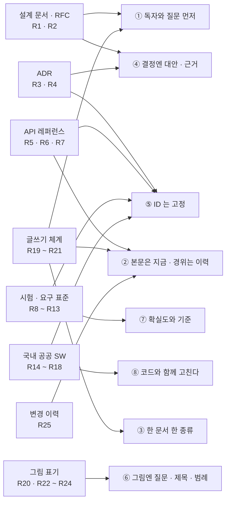
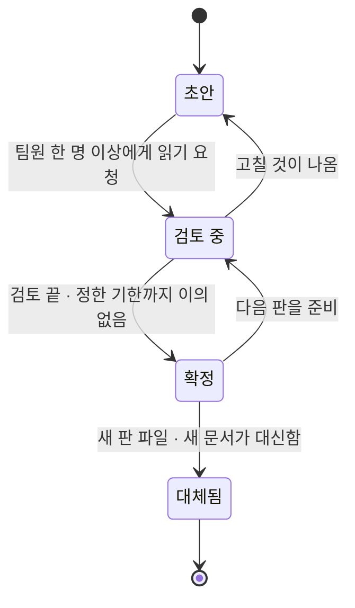
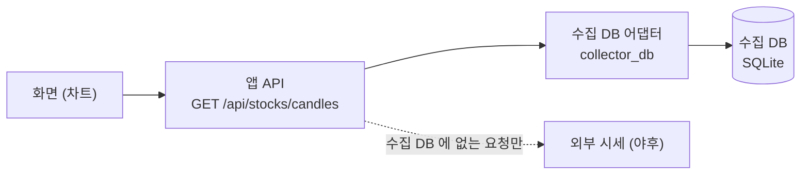
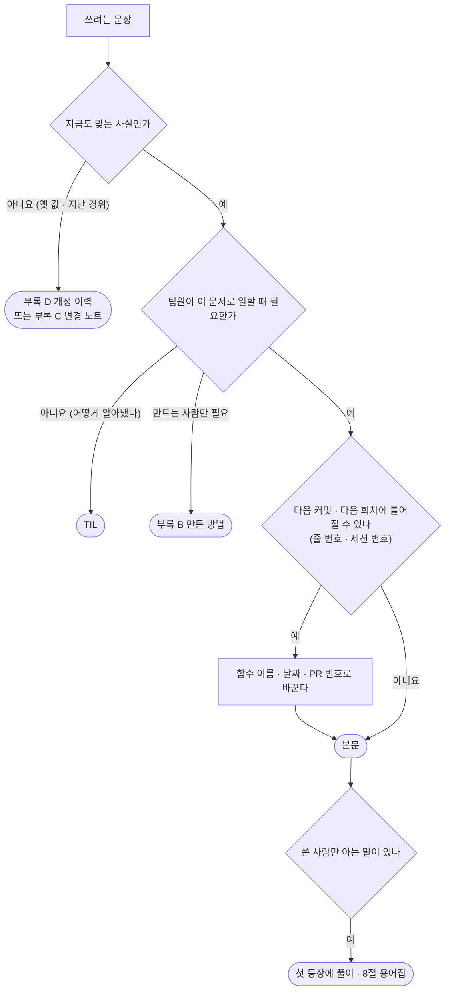
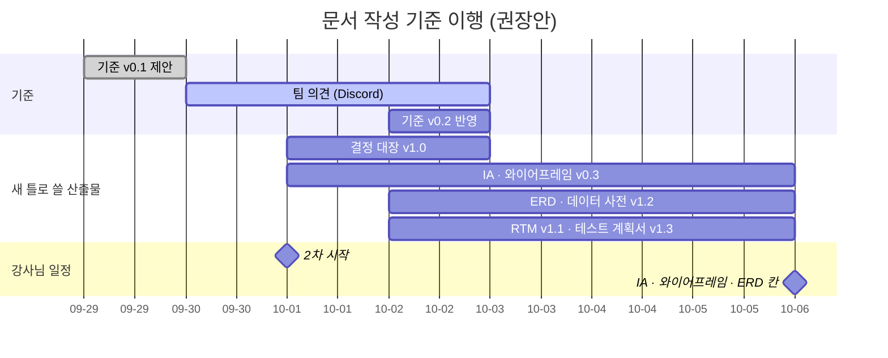

# 문서 작성 기준 v0.1 — 팀원이 읽는 산출물로

| 문서 정보 | |
|---|---|
| **판 · 상태** | v0.1 · 초안 — 팀 의견을 받는 중(11절) |
| **구분** | 1. 착수·과업 정의 — 표준화 계획(공공 SW 「사업수행계획서」 의 「11. 표준화계획」 에 해당 [R14]) · **모든 구분의 문서에 적용** |
| **작성** | 이동원(데이터 파트) |
| **검토** | 검토 전 — 의견은 Discord 로 받는다([안내 글](회의/2026-09-29-문서-작성-기준-의견.md)) |
| **최종 수정** | 2026-09-29 (KST) |
| **기준** | 실측 대상: `main` `1108c02` 의 지금 판 산출물 15개 · 출처 25곳 확인일 2026-09-29 |
| **관련 문서** | [산출물목록](산출물목록.md) · [테스트 계획서 v1.2](시험/테스트계획서_v1.2.md) · [API 명세서 v0.1](인터페이스/API명세서_v0.1.md) · [TIL 목록](TIL/README.md) |
| **최근 개정** | v0.1 첫 판 — 전체 이력은 [부록 D](#부록-d-개정-이력) |

> **이 문서가 답하는 질문**
> 1. 실무에서는 설계서 · API 명세서 · 시험 문서 · 요구사항 문서를 어떤 틀로 쓰는가 — 출처와 함께 (2절)
> 2. 우리 산출물은 어떤 머리표 · 뼈대 · 칸으로 쓰는가 — 강사님 산출물 10구분별로 (4절 · 5절)
> 3. 본문에 무엇을 두고 무엇을 빼는가, 뺀 것은 어디로 가는가 (6절 · 7절 · 8절)
>
> **읽는 순서** — 팀원: 요약 → 3절(원칙 8) → 9절(전후 예시) → 11절(정할 것) ·
> 강사님: 요약 → 2절(근거) → 5절(10구분별 틀) ·
> 문서를 쓰는 사람: 4절 머리표 복사 → 5절 해당 구분 → 10.2절 점검표

## 요약

1. 지금 산출물 15개(약 38만 자)에는 **세션 번호 383곳 · 코드 줄 번호 344곳 · 내부 용어 145곳 · 취소선 84곳 · 옛 저장소 번호 65곳**이 본문에 섞여 있다. 쓴 사람이 아니면 따라가기 어렵다(1절 · 🟢 실측).
2. 실무 양식 25곳(설계 문서 · RFC · ADR · OpenAPI · 시험 · 요구사항 국제 표준 · 국내 공공 SW 지침과 서식 · 글쓰기 체계 · 그림 표기)이 공통으로 말하는 것은 **「독자와 질문을 먼저 · 본문은 지금 상태 · 지나온 길은 개정 이력 · ID 는 고정 · 그림에는 제목과 범례」** 다(2절).
3. 그래서 **공통 머리표 · 10구분별 틀 · 그림과 표 규칙 · 용어집**을 정한다. 표와 그림을 상세히 쓰는 방향은 **그대로 둔다** — 그림마다 「답하는 질문」 한 줄을 더할 뿐이다. 새 초안부터 쓰고, 기존 문서는 판을 올릴 때 바꾼다(10절). v0.1 은 제안이라 팀 의견으로 고친다(11절).

---

## 1. 왜 이 기준이 필요한가 — 지금 문서의 모습

### 1.1 실측 — 본문에 남은 작업 기록의 흔적

표 1 은 「지금 판 산출물의 본문에, 쓴 사람만 아는 표시가 얼마나 있나」 에 답한다.

**표 1. 지금 판 산출물 15개의 흔적 수** · 기준: `main` `1108c02` · 2026-09-29 실측 · 코드 블록 안은 세지 않음 · 재는 법은 부록 B

| 문서 | 글자 | 세션 번호 | 코드 줄 번호 | 내부 용어 | 취소선 | 옛 번호 |
|---|--:|--:|--:|--:|--:|--:|
| 산출물목록 (색인) | 32,860 | 195 | 3 | 22 | 41 | 9 |
| 프로젝트 계획서 v1.2 | 24,087 | 3 | 0 | 1 | 9 | 1 |
| 논의 결정 대장 v0.9 | 23,543 | 26 | 6 | 5 | 22 | 0 |
| RTM v1.0 | 14,111 | 1 | 7 | 1 | 0 | 0 |
| 강사님 자료 기능 대조 v0.1 | 14,478 | 2 | 53 | 0 | 0 | 0 |
| 기능 설계서 v0.1 | 59,187 | 25 | 24 | 22 | 3 | 25 |
| 화면 IA v0.2 | 23,837 | 2 | 18 | 1 | 0 | 4 |
| 와이어프레임 v0.2 | 33,888 | 11 | 58 | 1 | 1 | 0 |
| ERD v1.1 | 20,819 | 7 | 0 | 15 | 0 | 10 |
| 데이터 사전 v1.1 | 28,000 | 5 | 0 | 0 | 0 | 1 |
| ADR-0001 실거래 차단 | 6,601 | 2 | 2 | 3 | 0 | 0 |
| ADR-0003 CI 논의 먼저 | 5,024 | 7 | 0 | 2 | 0 | 0 |
| API 명세서 v0.1 | 60,521 | 10 | 158 | 32 | 8 | 4 |
| 테스트 계획서 v1.2 | 31,069 | 83 | 15 | 39 | 0 | 11 |
| CI/CD 명세 v1.2 | 6,610 | 4 | 0 | 1 | 0 | 0 |
| **합계** | **384,635** | **383** | **344** | **145** | **84** | **65** |

- **세션 번호** = AI 도구와 작업한 회차(`S57` 등). S10~S99 만 셌으므로 실제보다 **적게** 센 값이다.
- **내부 용어** = 「다리」 75 · 「봉인」 28 · 「관문」 25 · 「상식 밖」 13 · 「데우기」 4 (8절에서 정식 이름으로 바꾼다).
- **API 명세서의 줄 번호 158곳 중 146곳**은 스캐너가 코드에서 다시 채우는 표 안에 있다 — 코드가 바뀌어도 따라가므로 7절의 예외다. 손으로 쓴 곳은 12곳이다.
- 산출물목록은 세션별 기록(11절)이 있는 **색인**이라 세션 번호가 많을 수밖에 없다 — 이행 계획에서 따로 다룬다(10절).

그림 1 은 「세션 번호가 어느 문서에 몰려 있나」 에 답한다.

**그림 1. 문서별 세션 번호 (본문 · 곳)** · 막대 한 칸 = 5곳

```
 산출물목록 (색인)   ███████████████████████████████████████  195
 테스트 계획서 v1.2  █████████████████                         83
 논의 결정 대장 v0.9 █████                                     26
 기능 설계서 v0.1    █████                                     25
 와이어프레임 v0.2   ██                                        11
 API 명세서 v0.1     ██                                        10
 ERD v1.1            █                                          7
 ADR-0003            █                                          7
 나머지 7개                                  합계 19 (문서마다 1~5)
```

### 1.2 무엇이 문제인가 — 독자가 묻는 것과 문서가 먼저 보여 주는 것

표 2 는 「독자 셋이 문서를 열었을 때 먼저 알고 싶은 것과, 지금 문서가 먼저 보여 주는 것이 어떻게 어긋나나」 에 답한다.

**표 2. 독자별 질문과 지금 문서의 첫 화면**

| 독자 | 먼저 알고 싶은 것 | 지금 문서가 먼저 보여 주는 것 | 어긋남 |
|---|---|---|---|
| 팀원 (P-B~P-E) | 「내 파트는 무엇을 하나 · 무엇이 맞는 값인가」 | 추출기 · 대조 방법 · 세션 번호 · 발견 경위 | 🔴 자기 몫을 찾기 전에 작업 일지를 읽어야 한다 |
| 강사님 (평가) | 「이 산출물 칸이 채워졌나 · 근거는 있나」 | 결론 뒤에 이어 붙은 정정 · 취소선 | 🟡 근거는 있으나 어디가 지금 값인지 찾아야 한다 |
| 처음 온 사람 · 다음 학기의 나 | 「이 용어가 뭔가 · 어디서부터 읽나」 | 「다리」 「봉인」 「관문」 같은 말이 풀이 없이 | 🔴 쓴 사람만 아는 말 |

실무 양식도 같은 기준을 둔다 — HashiCorp 의 RFC 템플릿은 배경 절을 **「새로 온 사람(신입 · 팀 이동)이 이 절과 링크만 읽고 맥락을 잡을 수 있어야 한다」** 고 적는다 [R2].

### 1.3 지키는 것 — 줄이자는 뜻이 아니다

표와 그림을 넉넉히 쓰는 지금 방식은 실무 관행과 **같은 방향**이다. 표 3 은 「지금 문서의 어떤 관행이 이미 실무 양식과 맞나」 에 답한다.

**표 3. 이미 실무와 같은 관행 — 그대로 둔다**

| 지금 관행 | 어느 문서에 | 실무 양식에서 | 이 기준에서 |
|---|---|---|---|
| 쉬운 요약 세 줄 | API 명세서 0절 · 테스트 계획서 머리 | RFC 의 「개요」 [R2] · 「가치를 먼저 제공하기」 [R21] | ✅ 이름만 「요약」 으로 · 지금 상태만 |
| 뒤집을 조건 · 한계 절 | API 명세서 1.2 · 1.4절 · 결정 대장 | 설계 문서는 「트레이드오프를 적는 곳」 [R1] · ADR 의 「결과」 [R3] | ✅ 설계 · 결정 문서의 필수 칸 |
| ID 대장 (순번이 아닌 ID) | API ID 대장 · RTM 계층 ID | OpenAPI `operationId` 는 모든 오퍼레이션에서 유일 [R5] · ADR 번호는 다시 쓰지 않는다 [R3] | ✅ 원칙 5 |
| 작업 중엔 판을 안 올리고 변경 노트에 쌓기 | 테스트 계획서 6.1절 · API 명세서 9절 | 변경 이력의 「Unreleased」 절 [R25] | ✅ 부록 C 「변경 노트」 |
| 확실도 🟢🟡🔴 | 거의 모든 문서 | 요구마다 「검증 방법」 속성을 둔다 [R12] — 같은 기호 규칙은 외부에 없다(우리 관행) | ✅ 원칙 7 |
| 스캐너가 코드에서 표를 채움 | API 명세서 · 데이터 사전 · RTM | 명세를 코드와 같은 원천에서 만든다(OpenAPI 문서 = 앱이 내놓는 명세) [R5] | ✅ 자동 표는 줄 번호 예외 |
| 표 · Mermaid · ASCII 3종 이상 | 모든 초안 | 그림에는 제목과 범례 [R22] · 그림은 완전한 문장으로 소개 [R20] | ✅ + 질문 한 줄 · 번호 · 범례를 더한다 |

---

## 2. 실무에서는 어떻게 쓰나 — 조사 결과

### 2.1 한눈에 — 8개 영역 25곳

표 4 는 「어느 실무 양식에서 무엇을 가져오나, 얼마나 확실한가」 에 답한다. 확실도 — 🟢 원문을 열어 확인 · 🟡 2차 출처(요약 · 해설)로 확인 · 🔴 못 찾거나 못 엶. 모든 출처의 주소와 확인일은 부록 A 에 있다.

**표 4. 실무 양식 → 우리 틀**

| 영역 | 출처 | 핵심 규칙 (원문 요지) | 우리 틀로 옮기는 것 | 확실도 |
|---|---|---|---|:-:|
| ⓐ 설계 문서 | [R1] Google 「Design Docs at Google」 (2020) | 맥락과 범위 · 목표와 비목표 · 설계(개요 → 상세) · 시스템 맥락 그림 · API · 데이터 저장 · 제약 정도 · **검토한 대안** · 공통 관심사(보안 · 개인정보 · 관측). 큰 문서 10~20쪽 · 작은 문서 1~3쪽. 구현 중 달라지면 문서를 고친다 | 설계 문서 틀(5.6) · 원칙 4 · 8 | 🟢 |
| ⓐ RFC | [R2] HashiCorp RFC 템플릿 | 머리 정보(요약 · 작성일 · 상태 WIP / In-Review / Approved / Obsolete · 소유자 · 기여자 · 승인자) → 개요 · 배경 · 제안 · 버린 아이디어 · 구현 · UX. 배경은 새로 온 사람이 따라올 수 있게 | 공통 머리표 · 상태 값(4.2) · 원칙 1 | 🟢 |
| ⓑ ADR | [R3] Nygard 「Documenting Architecture Decisions」 (2011) | 제목(짧은 명사구) · 맥락 · 결정 · 상태(제안 · 채택 · 폐기 · 대체됨) · 결과. 1~2쪽 · 번호는 차례로 붙이고 **다시 쓰지 않는다** · 「미래의 개발자와 나누는 대화처럼」 온전한 문장으로 | ADR 틀(5.6) · 원칙 5 | 🟢 |
| ⓑ MADR | [R4] MADR 4.0.0 (2024-09-17) | 필수 3 = 맥락과 문제 · 검토한 선택지 · 결정 결과. 선택 = 결정 동인 · 결과 · 확인 방법 · 선택지별 장단점. 머리 정보 = 상태 · 날짜 · **결정한 사람 · 의견 준 사람 · 알릴 사람** · 파일 `NNNN-제목.md` | ADR · 결정 대장 칸(5.1) | 🟢 |
| ⓒ OpenAPI | [R5] OpenAPI 3.1.1 (2024-10-24) | `operationId` 는 「모든 오퍼레이션에서 유일해야 한다(MUST)」 · `summary` 는 짧은 요약 · **응답마다 설명 필수** · 설명 칸은 CommonMark | API ID 칸 · 응답 칸(5.7) · 원칙 5 | 🟢 |
| ⓒ Google AIP | [R6] AIP-192 Documentation | 모든 구성 요소에 공개 주석(MUST) · 첫 문장은 주어를 빼고 현재형 · 전문 용어 · 은어를 피한다(모국어가 아닌 독자) · **내부용 내용(구현 메모 · TODO)은 따로 표시**한다 | API 요약 문장 · 「구현 메모」 칸 분리 · 원칙 2 | 🟢 |
| ⓒ Microsoft | [R7] Azure REST API Guidelines (2025-03-28 갱신) | 오류 응답 형식 하나(`error` 안에 `code` · `message` · `target` · `details`) · **「오류 코드 문자열은 API 계약의 일부 — 문서화한다」** · 규칙을 ✅ DO · ⚠️ SHOULD NOT · ⛔ DO NOT 으로 표시 | 오류 코드 표(5.7) · 이 문서의 ✅ ⛔ 표기 | 🟢 |
| ⓓ 시험 문서 | [R8] ISO/IEC/IEEE 29119-3:2021 (IEEE SA 요약) | 시험 문서의 틀과 예시를 시험 절차별로 배치 · 「어떤 개발 수명주기 모델과도 함께 쓸 수 있다」 · 2013판을 대체 | 시험 문서 틀(5.9) | 🟢 요약 (본문 유료) |
| ⓓ IEEE 829 | [R9] IEEE 829-2008 (IEEE SA) | **대체됨** — 29119-1 · 2 · 3(2013)과 29119-4(2015)가 이어받았다 | 「IEEE 829 양식」 대신 29119-3 을 기준으로 | 🟢 |
| ⓓ 29119-3 문서 목록 | [R10] 위키백과 「ISO/IEC 29119」 | 조직(시험 정책 · 전략) · 관리(시험 계획 · 상태 보고 · 완료 보고) · 동적 시험(설계 · 케이스 · 절차 명세 · 데이터 · 환경 요구 · 실행 기록 · 사건 보고). 비판도 있다 — 「문서에 치중하면 실제 시험을 해친다」 | 우리 규모에 맞게 줄인다(2.3절) | 🟡 2차 |
| ⓔ 요구사항 | [R11] ISO/IEC/IEEE 29148:2018 (IEEE SA 요약) | 좋은 요구의 구성 · 속성 · 특성과 정보 항목(명세서)을 정의 · 2011판 대체(2011판이 IEEE 830-1998 을 대체) | 요구 한 줄 틀(5.2) | 🟢 요약 |
| ⓔ 요구 속성 | [R12] ReqView 「29148 템플릿」 | ID · 제목 · 내용 · 소유자 · 우선순위 · 출처 · **근거** · 난이도 · 유형 · 상태 · **검증 방법(시험 · 시연 · 검사 · 분석)** | 요구 한 줄 칸(5.2) | 🟡 2차 |
| ⓔ 요구 특성 | [R13] Modern Requirements 「ISO 29148 Explained」 | 요구 하나 9특성(필요 · 적절 · 모호하지 않음 · 완전 · 단일 · 실현 가능 · 검증 가능 · 정확 …) · 요구 묶음 5특성(완전 · 일관 · 실현 가능 · 이해 가능 · 확인 가능) | 요구 점검표(5.2) | 🟡 2차 · 9번째(「양식 준수」)는 그 글에 없음 |
| ⓕ 공공 SW 지침 | [R14] 행정안전부고시 제2023-27호 「행정기관 및 공공기관 정보시스템 구축·운영 지침」 | 제44조 — 운영 · 유지관리에 필요한 **표준산출물**을 지정해 요구할 수 있다 · 제59조 ① 운영 · 유지관리로 바뀌면 **표준산출물과 일관성을 유지** · ③ 반복 수행 사항은 매뉴얼로. 별지 「사업수행계획서」 목차 16항목(… 7 산출물계획 · 8 일정계획 · 10 보고계획 · **11 표준화계획** · 12 품질보증계획 · 13 위험관리계획 …) · 표준화 항목에 해당 내역이 없으면 「해당사항 없음」 으로 명시 | 이 문서의 자리(표준화 계획) · 원칙 8 · 「해당 없음」 규칙 | 🟢 원문 · 🟡 더 새 판이 있을 수 있음 |
| ⓕ 요구사항 작성 가이드 | [R15] 「제안요청서의 요구사항 작성 가이드(ISP 사업자 작성용)」 2011.9 | 요구 하나 = 유형 · 번호 · 이름 · 내용 · 관련 요구사항. 유형 기호 — FR 기능 · PR 성능 · QR 품질(신뢰성 · 사용성 · 유지보수성 · 이식성 · 보안성) · IR 인터페이스 · DR 데이터 · OR 운영 · CO 제약. 번호 = 기호 + 일련번호(예: FR-1) | 요구 「유형」 · 「관련 요구」 칸(5.2) | 🟢 원문 |
| ⓕ DB 표준화 지침 | [R16] 「공공기관의 데이터베이스 표준화 지침」 별표 제8호 서식 테이블정의서 (개정 2019) | 물리 DB명 · 테이블 소유자 · 영문명 · 한글명 · 유형 · 관련 엔터티 · 설명 · 업무분류체계 · **보존 기간** · 테이블 볼륨 · **발생주기** · **공개/비공개 사유** · 개방데이터 목록. 이름은 「표준용어정의서」 를 참조해 짓는다 | 데이터 사전 칸 대조(5.5) · 용어집(8절) | 🟢 원문 서식 |
| ⓕ 표준 산출물 가이드 | [R17] NIA 「CBD SW 표준 산출물 관리 가이드」 공지 (2011-12-23) | 개발 단계별 필수 산출물 · 작성 방법 · 사례. 근거는 당시 지침의 표준산출물 조항 | 국내 산출물 이름(요구사항정의서 · 화면설계서 · 테이블정의서 · 인터페이스정의서 · 시험결과서)은 **관행 명칭**으로만 쓴다 | 🟢 공지 · 🔴 가이드 본문 못 엶 |
| ⓕ SW 사업 관리감독 | [R18] 「소프트웨어사업 관리감독에 관한 일반기준」 제1조 | 공공 SW 사업의 적정 수행과 **산출물의 품질**을 관리 · 감독하는 절차를 정한다 · 세부는 세부지침 | 산출물 검토 칸(4.4) | 🟡 법령 사본 사이트 |
| ⓖ 문서 유형 | [R19] Diátaxis | 네 종류 — 학습(tutorial) · 방법(how-to) · 참조(reference) · 설명(explanation). 나침반: 행동 ↔ 인지 × 습득 ↔ 적용. 「지금 쓰는 글이 무엇인지 헷갈릴 때」 나침반으로 가른다 | 원칙 3 · 문서 종류 칸(5.0) | 🟢 |
| ⓖ 문장 · 그림 | [R20] Google 개발자 문서 스타일 가이드 — 요점(2025-04-02) · 이미지(2025-05-16) | 전 세계 독자 · 능동태 · 조건을 지시 앞에 · 순서는 번호 목록 · 헷갈리지 않는 날짜. 그림은 **「늘 완전한 문장으로 소개」** · **그림이 전하는 정보는 글에도** · 캡션은 「Figure 번호. 설명」 | 6절 그림 규칙 · 3.1 문장 규칙 | 🟢 |
| ⓖ 한국어 | [R21] 토스 「테크니컬 라이팅 가이드」 | 문서 유형 4(학습 · 문제 해결 · 참조 · 깊은 이해) · 정보 구조(**한 페이지에서 하나만** · 가치를 먼저 · 효과적인 제목 · 개요 빠뜨리지 않기 · 예측 가능하게) · 문장(주체를 분명하게 · **필요한 정보만 남기기** · 구체적으로 · 자연스러운 한국어 · 일관되게) | 원칙 1 · 2 · 3 · 3.1 문장 규칙 | 🟢 |
| ⓗ 아키텍처 그림 | [R22] C4 모델 — 표기 | 네 단계(시스템 맥락 · 컨테이너 · 컴포넌트 · 코드) · **모든 그림에 종류와 범위를 말하는 제목 · 모든 그림에 범례** · 선은 한 방향 · 뜻을 라벨로 · 색은 일관되게 · 색맹 · 흑백 인쇄 고려 | 아키텍처 그림(5.6) · 6절 | 🟢 |
| ⓗ Mermaid | [R23] Mermaid — 접근성 · ER 다이어그램 | `accTitle` · `accDescr` 로 그림 제목 · 설명(모든 그림 종류) · ER 은 **까마귀발 표기** · 실선(식별) / 점선(비식별) 관계 · PK · FK · UK | 6.3절 · ERD(5.5) | 🟢 |
| ⓗ GitHub | [R24] GitHub Docs — Creating diagrams | Markdown 파일 · 이슈 · 논의 · PR 에서 Mermaid 를 그린다 · 외부 플러그인 문법은 오류가 날 수 있다 | Mermaid 를 기본 그림 도구로 | 🟢 |
| 개정 이력 | [R25] Keep a Changelog 1.1.0 | 「변경 이력은 사람을 위한 것」 · 최신이 위 · 날짜 · 종류별 묶음(추가 · 변경 · 폐기 예정 · 삭제 · 수정 · 보안) · 「Unreleased」 절 · **「커밋 로그를 변경 이력으로 쓰면 잡음이 가득하다」** | 부록 C · D 양식(4.5) · 원칙 2 | 🟢 |

### 2.2 공통으로 말하는 것 — 여덟 가지 원칙의 출처

그림 2 는 「25곳의 양식이 어느 원칙으로 모이나」 에 답한다. 범례: 왼쪽 = 출처 묶음(부록 A 번호) · 오른쪽 = 3절 원칙 번호.

**그림 2. 실무 양식 → 이 기준의 원칙**



원칙 ⑦(확실도)만 외부 양식에 같은 규칙이 없다 — 요구마다 「검증 방법」 을 적는 관행 [R12] 과 가장 가깝고, 기호 🟢🟡🔴 는 우리가 써 온 것이다.

### 2.3 반대 의견 — 문서가 일을 가리면 안 된다

29119 에는 「문서에 치중하면 실제 시험을 해친다」 는 비판이 있다 [R10]. Google 도 작은 변경에는 1~3쪽짜리 「작은 설계 문서」 를 쓴다 [R1]. 우리는 4명이 3주 단위로 움직이므로 **양식을 그대로 옮기지 않고 줄여 쓴다(테일러링)**.

- 29119-3 의 문서 10여 종 → **테스트 계획서 한 권**에 계획 · 케이스 요약 · 결과서 · 결함대장을 둔다(지금 방식 유지).
- 칸이 필요 없는 문서는 「해당 없음」 으로 둔다 — 공공 SW 표준화 계획도 해당 내역이 없으면 「해당사항 없음」 으로 적게 한다 [R14].
- 산출물목록의 「채움 정도」 는 **있는가**를 센다. 이 기준은 **읽히는가**를 다룬다 — 칸을 채우려고 문서를 늘리지 않는다.

---

## 3. 원칙 여덟 가지

표 5 는 「무엇을 하고 무엇을 하지 않나」 에 답한다. ✅ 는 한다 · ⛔ 는 하지 않는다(Microsoft 가이드라인의 표기를 따름 [R7]).

**표 5. 원칙 8**

| # | 원칙 | ✅ 이렇게 | ⛔ 이렇게 하지 않는다 | 근거 |
|:-:|---|---|---|---|
| ① | **독자와 질문을 먼저 적는다** | 머리에 「이 문서가 답하는 질문」 2~4줄 · 독자별 「읽는 순서」 한 줄 | 첫 화면이 추출 도구 · 작성 경위로 시작 | [R2] · [R21] · 강사님 피드백 「수행한 사람도, 모르는 사람도」 |
| ② | **본문은 지금 상태, 지나온 길은 개정 이력으로** | 「일봉 API 는 12:30 갱신을 바로 반영한다」 | 「스캐너가 라우트를 늘어놓자 캐시가 옆에 붙어 보였다」 | [R25] · [R6] · [R21] |
| ③ | **한 문서에는 한 종류** | 본문은 참조(명세 · 사전 · 대장) · 설명(설계 · ADR) · 방법(운영) 중 하나. 나머지는 부록이나 링크 | 명세서 안에 조사 일지 · 설치 방법 · 결정 논쟁을 한데 | [R19] · [R21] |
| ④ | **결정은 대안 · 근거 · 뒤집을 조건과 함께** | 「고른 것 · 버린 것 · 왜 · 이렇게 되면 다시 본다」 | 결론만 한 줄 | [R1] · [R3] · [R4] · 강사님 피드백 「심층 분석」 「결론 집착 금지」 |
| ⑤ | **ID 는 한 번 붙이면 바꾸지 않는다** | 대장에서 받은 API ID · 계층 요구 ID · 결함 번호(DF-NN)는 다시 쓰지 않는다 | 순번 · 「세 번째 API」 · 옛 저장소 번호 | [R3] · [R5] · [R12] · [R15] |
| ⑥ | **그림과 표는 질문에 답하고, 결론은 글에도 쓴다** | 소개 문장(답하는 질문) → 번호 · 제목 · 범례 → 그림 → 결론 문장 | 설명 없는 큰 그림 · 그림에만 있는 결론 | [R20] · [R22] · [R23] |
| ⑦ | **사실에는 확실도와 기준을 붙인다** | 🟢🟡🔴 · 기준 커밋 · 데이터 기준일 · 숫자는 커밋 직전에 다시 잰다 | 「대략」 · 기준 없는 숫자 · 옮겨 적기만 한 칸 | 우리 관행 · [R12] 검증 방법 |
| ⑧ | **문서는 코드와 함께 고친다** | 코드 PR 에 변경 노트 한 줄 · 기능 · 마일스톤이 끝나면 판을 올린다 | 「문서는 나중에」 | [R14] 제59조 ① · [R1] · [R25] |

### 3.1 문장 규칙

| 규칙 | 예 | 근거 |
|---|---|---|
| 주어를 분명하게 · 능동으로 | ✅ 「어댑터가 수집 DB 를 읽는다」 ⛔ 「수집 DB 가 읽혀진다」 | [R20] · [R21] |
| 조건을 먼저 | ✅ 「수집 DB 가 없는 PC 에서는 캐시를 쓴다」 | [R20] |
| 한 문장에 한 뜻 · 필요한 정보만 | 괄호 안 괄호 · 「—」 로 세 번 이어 붙이기를 피한다 | [R21] |
| 산출물 본문은 「~다」 체 · 팀 소통 글(Discord)은 「~요」 체 | — | 우리 관행 |
| 날짜는 `2026-09-29 (KST)` · 요일이 필요하면 `10-06(화)` | 「어제」 「이번 주」 대신 날짜 | [R20] 헷갈리지 않는 날짜 |
| 코드 · 경로 · 명령은 코드 글꼴 | `collector_db.handles()` | [R20] · [R6] |
| 굵게는 한 문단에 한 곳 — 그 문단의 결론 | 굵게가 셋 넘으면 아무것도 강조되지 않는다 | 우리 관행 |
| 처음 나오는 용어는 풀이 · 이후는 같은 말 | 8절 용어집의 정식 이름 | [R6] · [R21] 「일관되게」 |

---

## 4. 공통 머리표와 문서 뼈대

### 4.1 공통 머리표 — 복사해서 쓴다

모든 산출물은 제목 바로 아래 이 머리표로 시작한다. 칸이 해당 없으면 「—」 로 두고 뺀 까닭을 괄호에 적는다.

```markdown
# <문서 이름> v<판> — Qurious

| 문서 정보 | |
|---|---|
| **판 · 상태** | v1.3 · 검토 중 |
| **구분** | 9. 시험·성과 검증 — <이 문서가 맡는 세부 산출물> |
| **작성** | 이름(파트) |
| **검토** | 이름(파트) · 날짜 — 아직이면 「검토 전」 |
| **최종 수정** | YYYY-MM-DD (KST) |
| **기준** | 코드 `main` `abc1234` · 데이터 기준일 YYYY-MM-DD |
| **관련 문서** | [문서 이름 v판](상대 경로) · … |
| **최근 개정** | v1.2 → v1.3: 한 줄 — 전체는 부록 D |

> **이 문서가 답하는 질문**
> 1. …
> 2. …
>
> **읽는 순서** — 팀원: … · 강사님: … · 처음 온 사람: …

## 요약

1. (지금 상태 한 문장)
2. …
3. …
```

표 6 은 「머리표의 칸마다 무엇을 적고, 어느 양식에서 왔나」 에 답한다.

**표 6. 머리표 칸**

| 칸 | 적는 것 | 적지 않는 것 | 근거 |
|---|---|---|---|
| 판 · 상태 | 판 번호와 상태(4.2) — **따로** 적는다 | 판 번호로 확정 여부를 짐작하게 두기 | [R2] 상태 · [R4] status |
| 구분 | 강사님 10구분 번호 · 이름 · 이 문서가 맡는 세부 산출물 | — | 산출물목록 |
| 작성 · 검토 | 책임지는 사람과 파트 · 검토한 사람과 날짜 | 세션 번호 · 도구 이름 | [R2] 소유자 · 승인자 · [R4] 결정한 사람 · 의견 준 사람 |
| 최종 수정 | 날짜 (KST) | 「S63」 같은 회차 | [R25] 날짜 |
| 기준 | 이 문서의 사실이 기대는 코드 커밋 · 데이터 기준일 | 「PR #48 머지 뒤 … 표를 다시 채웠다」 같은 경위 | 원칙 ⑦ |
| 관련 문서 | 이 문서를 읽기 전 · 후에 볼 문서 링크 | 옛 저장소 번호 | [R2] 배경의 링크 |
| 최근 개정 | 바로 앞 판에서 무엇이 바뀌었나 한 줄 | 판 이력 전체(부록 D 로) | [R25] |

### 4.2 상태와 판 번호

**판 번호는 「몇 번 고쳤나」, 상태는 「팀이 읽고 동의했나」 를 말한다.** 둘을 한 칸에 섞지 않는다. 지금 v1.x 문서들도 팀 검토 기록이 없으므로, 새 틀로 옮길 때 판 번호는 그대로 두고 상태를 「초안(검토 전)」 으로 적는다.

그림 3 은 「문서의 상태가 어떻게 바뀌나」 에 답한다.

**그림 3. 문서 상태** · 범례: 화살표 위 글 = 바뀌는 조건



**표 7. 상태 값과 실무 양식의 대응**

| 우리 상태 | 뜻 | HashiCorp RFC [R2] | ADR [R3] · MADR [R4] | 판 번호와의 관계 |
|---|---|---|---|---|
| 초안 | 작성자만 읽었다 | WIP | proposed | 보통 v0.x |
| 검토 중 | 팀원 한 명 이상이 읽고 있다 | In-Review | proposed | v0.x 또는 새 판 |
| 확정 | 검토가 끝났고 이의가 없다 — 이 문서를 기준으로 일한다 | Approved | accepted | 보통 v1.0 이상이지만 **상태 칸이 정본** |
| 대체됨 | 새 판 · 새 문서가 대신한다 — 지우지 않고 이력으로 둔다 | Obsolete | superseded · deprecated | 옛 판 파일(예: 테스트 계획서 v1.1) · ADR-0002 |

### 4.3 문서 한 장의 뼈대

그림 4 는 「문서 한 장에서 무엇이 어디에 오나」 에 답한다.

**그림 4. 문서 뼈대**

```
 문서 한 장
 ├─ # 문서 이름 v판 — Qurious
 ├─ 머리표 ············ 판·상태 · 구분 · 작성 · 검토 · 최종 수정 · 기준 · 관련 문서 · 최근 개정
 ├─ 답하는 질문 ······· 2~4줄 + 독자별 읽는 순서
 ├─ ## 요약 ··········· 지금 상태 세 줄 (경위 없음)
 ├─ ## 1 … N 본문 ····· 한 종류(참조 · 설명 · 방법)만
 │    └─ 그림 · 표마다: 소개 문장 → 번호 · 제목 · 범례 → 그림 → 출처 · 기준
 └─ ## 부록
      ├─ A 용어 ········· 첫 등장 풀이 + 공용 용어집(8절) 링크
      ├─ B 만든 방법 ···· 다시 만드는 법 · 한계 · 뒤집을 조건
      ├─ C 변경 노트 ···· 다음 판에 넣을 것 (판을 올리면 본문으로 옮기고 비움)
      └─ D 개정 이력 ···· 최신이 위 — 판 · 날짜 · 무엇 · 왜 · PR
```

- **요약**에는 지금 상태만 쓴다. 「무엇을 발견했다 → 고쳤다」 는 개정 이력 한 줄과 TIL 링크로 간다.
- **부록 B 「만든 방법」** 은 다시 만들 사람(다음 판의 작성자)을 위한 절이다 — 추출 스크립트 · 대조 방법 · 한계가 여기 온다(Diátaxis 의 「방법」 [R19]).
- **개정 이력은 문서 끝**에 둔다. 국내 산출물 양식은 표지 다음에 두는 경우가 많지만, Markdown 은 위에서 아래로 스크롤하므로 이력이 앞에 쌓이면 본문이 밀린다. 대신 머리표 「최근 개정」 한 줄로 앞에서도 보이게 한다(11절 ⑤ 에서 팀이 정한다).

### 4.4 검토 — 누가 · 언제 · 어떻게 (💬 제안)

공공 SW 사업에서 산출물은 **품질을 관리 · 감독받는 대상**이다 [R18]. 우리 규모에서는 가볍게 한다.

| 항목 | 제안 |
|---|---|
| 누가 | 문서를 **쓰는** 파트 1명 + 그 문서를 **읽고 일하는** 파트 1명 — 역할 분배안의 「보조 담당 리뷰」 와 같은 사람 |
| 어떻게 | 판을 올리는 PR 에 리뷰 댓글 한 줄 — 「읽었고 이해했다」 또는 질문. 질문의 답은 **본문에** 넣는다(댓글에만 두지 않는다) |
| 언제 | 판을 올리는 PR 마다. **머지를 막지 않는다** — 팀 공용 장치는 논의 먼저(ADR-0003) |
| 기록 | 머리표 「검토」 칸에 이름 · 날짜 · 상태를 「검토 중」 → 「확정」 으로 |

### 4.5 변경 노트(부록 C)와 개정 이력(부록 D)

작업 중에는 판을 올리지 않고 **변경 노트**에 쌓는다. 판을 올릴 때 변경 노트를 본문으로 옮기고, 그 판의 한 줄을 **개정 이력**에 남긴 뒤 변경 노트를 비운다. 변경 이력의 「Unreleased」 절과 같은 구조다 [R25].

```markdown
## 부록 C. 변경 노트 — 다음 판(v1.4)에 넣을 것

| 날짜 | 종류 | 무엇 | 옮길 곳 | 근거 |
|---|---|---|---|---|
| 2026-10-07 | 추가 | 시험 묶음 TC-XX 12건 | 3절 · 4절 | PR #60 |

## 부록 D. 개정 이력

| 판 | 날짜 | 무엇이 바뀌었나 | 왜 | 근거 |
|---|---|---|---|---|
| v1.3 | 2026-10-05 | 추가 — 시험 묶음 TC-DF17 · 변경 — 결과서 169건 · 수정 — DF-17 닫힘 | 일봉 캐시 결함 수정을 반영 | PR #53 |
| v1.2 | 2026-09-29 | 변경 — 결함대장 16건 다시 잼 | 옮겨 적은 칸을 다시 확인 | PR #42 |
```

「종류」 는 여섯 가지만 쓴다 — **추가 · 변경 · 폐기 예정 · 삭제 · 수정(결함) · 보안** [R25].

---

## 5. 산출물 10구분별 틀

### 5.0 한눈에

표 8 은 「구분마다 우리 문서는 무엇이고, 어떤 종류의 글이며, 어느 양식을 따르나」 에 답한다. 「문서 종류」 는 Diátaxis 네 종류 [R19] 에 「기록」(일지 · 결정 기록)을 더한 것이다.

**표 8. 10구분 × 우리 문서 × 참고 양식**

| 구분 | 우리 문서 (지금 판) | 문서 종류 | 참고 양식 | 근거 |
|---|---|---|---|---|
| 1 착수·과업 정의 | 프로젝트 계획서 v1.2 · 논의 결정 대장 v0.9 · 이 기준 | 설명 · 기록 | 사업수행계획서 목차 · 설계 문서의 「맥락 · 목표」 · MADR | [R14] · [R1] · [R4] |
| 2 요구사항 관리 | RTM v1.0 · 기능 설계서 v0.1 · 강사님 자료 기능 대조 v0.1 | 참조 | 29148 · 제안요청서 요구사항 작성 가이드 | [R11]~[R13] · [R15] |
| 3 일정·업무 관리 | 계획서 7절 · 일일 기록 양식 v0.1(제안) · 산출물목록 | 기록 | 사업수행계획서의 일정 · 보고 · 위험 관리 계획 | [R14] |
| 4 화면·서비스 설계 | IA v0.2 · 와이어프레임 v0.2 · (UI 명세서 🔴) | 설명 · 참조 | 화면설계서 관행 · 그림 규칙 | [R17] 🟡 · [R20] · [R22] |
| 5 데이터 설계 | ERD v1.1 · 데이터 사전 v1.1 | 참조 | 테이블정의서 서식 · 까마귀발 ERD | [R16] · [R23] |
| 6 시스템 설계 | ADR 3건 · 기능 설계서(설계 문서 몫) · `pipeline.md` | 설명 | 설계 문서 · C4 · ADR · MADR | [R1] · [R22] · [R3] · [R4] |
| 7 인터페이스 설계 | API 명세서 v0.1(인터페이스 정의서 · 데이터 매퍼 포함) | 참조 | OpenAPI · AIP-192 · Azure 오류 형식 | [R5] · [R6] · [R7] |
| 8 개발·형상 관리 | PR 기록 · TIL · GitHub 기록 · (코딩 표준 🔴) | 기록 | 변경 이력 | [R25] |
| 9 시험·성과 검증 | 테스트 계획서 v1.2(케이스 · 결과서 · 결함대장) · (백테스트 보고서 🔴) | 참조 · 기록 | 29119-3 | [R8] · [R10] |
| 10 배포·운영·인수 | CI/CD 명세 v1.2 · 운영 매뉴얼(수집기 README 15절) | 방법 | 운영 매뉴얼 · 변경 이력 | [R14] · [R19] · [R25] |

아래 5.1~5.10 은 구분마다 **본문 절(또는 한 줄의 칸)** 과 그 근거다. 4절의 머리표 · 요약 · 부록은 모든 문서에 공통이라 되풀이하지 않는다.

### 5.1 착수·과업 정의 — 프로젝트 계획서 · 논의 결정 대장

| 절 · 칸 | 담을 것 | 근거 |
|---|---|---|
| 배경과 문제 | 누구의 어떤 문제를 푸나 | [R1] 맥락과 범위 · [R14] 사업목적 |
| 목표 · 비목표 | 이번 차수에 하는 것과 **하지 않는 것** | [R1] 목표와 비목표 |
| 범위 | 포함 · 제외 (제안요청서의 제외 범위 포함) | [R14] 사업범위 |
| 조직 · 역할 | 파트 · 주담당 · 보조담당 | [R14] 사업추진체계 |
| 일정 · 산출물 계획 | 마일스톤과 그때 낼 산출물 → 산출물목록 링크 | [R14] 7 산출물계획 · 8 일정계획 |
| 위험 · 가정 · 제약 | 위험마다 대응 · 뒤집을 조건 | [R14] 13 위험관리계획 · [R1] 제약 정도 |
| 보고 · 표준화 · 품질 계획 | 일일 보고 · **이 기준** · 검토 방식 | [R14] 10 · 11 · 12 |
| **결정 대장 한 줄** | 결정 ID · 질문 · 결정 · 근거 · 검토한 대안 · 결정한 사람 · 의견 준 사람 · 상태(제안 · 확정 · 뒤집힘) · 결정일 · 뒤집을 조건 | [R4] 결정한 사람 · 의견 준 사람 · 알릴 사람 · [R3] 상태 |

### 5.2 요구사항 관리 — 요구사항 정의(RTM) · 기능 설계서

**요구 한 줄의 칸**

| 칸 | 담을 것 | 근거 |
|---|---|---|
| 요구 ID | 계층 ID(`P01-③-2`) — 강사님 원문의 번호 구조를 따르므로 유지. 순번 금지 | 원칙 ⑤ · [R15] 번호 체계 |
| 이름 · 내용 | 이름 한 줄 · 내용은 **검증할 수 있는 한 문장**(「쉽게」 「빠르게」 같은 말 없이) | [R13] 검증 가능 · 모호하지 않음 |
| 유형 | 기능 · 성능 · 품질 · 인터페이스 · 데이터 · 운영 · 제약 — 국내 유형 기호(FR · PR · QR · IR · DR · OR · CO)를 **칸의 값**으로 쓴다(ID 는 바꾸지 않는다) | [R15] |
| 출처 · 근거 | 어디서 왔나(RFP 절 · 강사님 자료) · 왜 필요한가 | [R12] 출처 · 근거 |
| 우선순위 · 상태 | 필수 · 선택 · 제외 / 제안 · 확정 · 구현 · 검증 끝 | [R12] |
| 검증 방법 | 시험 · 시연 · 검사 · 분석 중 하나 + 시험 ID | [R12] |
| 관련 요구 · 파트 | 이어진 요구 ID · 담당 파트 | [R15] 관련 요구사항 |

**RTM 가로 한 줄** — 요구 ID → 설계(문서 · 절) → API · 표 · 화면 ID → 시험 ID → 결과(판 · 날짜). **요구 점검표** — 필요한가 · 적절한가 · 모호하지 않은가 · 완전한가 · 하나만 말하나 · 실현 가능한가 · 검증 가능한가 · 정확한가 [R13] 🟡.

### 5.3 일정·업무 관리 — 마일스톤 · 일일 기록 · 주간 보고

| 문서 | 칸 | 근거 |
|---|---|---|
| 마일스톤 표 | 날짜 · 강사님 일정 칸 · 낼 산출물 · 상태 · 담당 파트 | [R14] 8 일정계획 |
| 일일 기록 | 이미 [양식 v0.1(제안)](회의/양식-일일-스크럼-보고.md) 이 있다 — 09:00 파트별 한 줄 · 17:30 위험 세 줄 | 강사님 유의사항 ⑤⑥ |
| 주간 보고 (🔴 아직 없음) | 한 주 한 장 — 한 일 · 다음 주 · 위험 · 결정이 필요한 것 · 바뀐 산출물 판 | [R14] 10 보고계획 · 13 위험관리계획 |

### 5.4 화면·서비스 설계 — IA · 화면 흐름도 · 와이어프레임 · UI 명세서

**화면 한 장의 칸** (UI 명세서 = 국내 「화면설계서」 🟡 관행 명칭)

| 칸 | 담을 것 | 근거 |
|---|---|---|
| 화면 ID · 이름 | `W1`~ · `N6`~ (IA 의 번호를 유지) | 원칙 ⑤ |
| 목적 | 이 화면이 답하는 **사용자 질문** 한 줄 | 원칙 ① |
| 진입 · 다음 화면 | 어디서 와서 어디로 가나 (IA 흐름도 링크) | — |
| 와이어프레임 | 그림 번호 · 제목 · 범례(6절) · 스크린샷이면 대체 텍스트 | [R20] |
| 요소 표 | 요소 · 종류 · **데이터 출처 API ID** · 동작 · 입력 검증 · 빈 데이터 · 오류 표시 | [R5] API ID 로 잇기 |
| 관련 요구 · 파트 | 요구 ID · 담당 파트 | 5.2 |

### 5.5 데이터 설계 — ERD · 데이터 사전 · 코드 정의서

**테이블 칸 대조** — 공공기관 DB 표준화 지침의 테이블정의서 서식 [R16] 과 우리 데이터 사전을 맞대 보았다.

| 서식 칸 [R16] | 우리 데이터 사전 v1.1 | 다음 판에서 |
|---|---|---|
| 물리 DB명 · 테이블 영문명 · 한글명(설명) | 있다 (두 DB · 34표) | 그대로 |
| 테이블 유형 · 관련 엔터티 | 일부 (ERD 쪽) | 사전에 칸으로 |
| 업무 분류 | 없다 | 파트(P-A~P-E) 칸으로 대신 — 💬 |
| **보존 기간** | 없다 | 🟡 넣을지 검토 — 수집 데이터는 HF 백업 정책과 이어진다 |
| 테이블 볼륨 | 행 수 실측이 있다 | 그대로 |
| **발생 주기** | 없다 | 🟡 넣을지 검토 — 일일 갱신 12:30 · 수동 · 실시간 |
| **공개 / 비공개 사유** | 없다 | 🟡 넣을지 검토 — HF 데이터셋은 private · 원자료 재배포 조건 |

- **ERD 그림**은 Mermaid `erDiagram` 의 까마귀발 표기 · PK · FK · UK 를 쓴다 [R23]. 두 DB 는 그림을 나누고, 잇는 길(수집 DB 어댑터)은 따로 그린다.
- **이름**은 서식이 「표준용어정의서」 를 참조해 짓게 하듯 [R16], 이 문서 8절 용어집을 공용 용어집으로 떼어 낸 뒤(10절) 사전이 그 이름을 쓴다.

### 5.6 시스템 설계 — 설계 문서 · 아키텍처 그림 · ADR

| 문서 | 절 · 칸 | 근거 |
|---|---|---|
| 설계 문서 (기능 설계서 · 큰 변경) | 맥락과 범위 · 목표와 비목표 · 설계(개요 → 상세) · 시스템 맥락 그림 · API · 데이터 저장 · 제약 정도 · **검토한 대안** · 공통 관심사(보안 · 개인정보 · 관측) · **뒤집을 조건** | [R1] · 강사님 피드백 |
| 아키텍처 그림 | 1단계 시스템 맥락 → 2단계 컨테이너(앱 · DB · 수집기 · 외부 API) → 3단계 컴포넌트. 코드 단계는 그리지 않는다. 그림마다 **종류와 범위를 말하는 제목 · 범례 · 요소의 기술 표시** | [R22] |
| ADR | 제목(짧은 명사구) · 상태(제안 · 채택 · 폐기 · 대체됨 → ADR-NNNN) · 날짜 · 결정한 사람 · 맥락과 문제 · 검토한 선택지 · 결정 · 결과(좋은 점 · 나쁜 점) · 확인 방법. 1~2쪽 · 번호 재사용 금지 | [R3] · [R4] |

### 5.7 인터페이스 설계 — API 명세서 · 인터페이스 정의서 · 데이터 매퍼

**API 한 줄의 칸**

| 칸 | 담을 것 | 근거 |
|---|---|---|
| API ID | 대장에서 받은 ID — OpenAPI 의 `operationId` 처럼 문서 전체에서 하나 | [R5] |
| 요약 | 한 문장 · 주어를 빼고 현재형(「국내 주식 일봉을 돌려준다」) | [R5] summary · [R6] |
| 메서드 · 경로 · 인증 | 그대로 | [R5] |
| 요청 · 응답 | 응답은 **상태 코드마다 한 줄 설명**(200 만 적고 끝내지 않는다) | [R5] 응답 설명 필수 |
| 오류 코드 | 오류 코드 문자열과 뜻 — 계약의 일부 | [R7] |
| 요구 ID · 화면 ID · 파트 | 기능 설계서 · IA 와 잇는 칸 | 5.2 · 5.4 |
| **구현 메모** | 닿는 곳(DB · 캐시 · 외부) · 코드 위치 — **표의 끝 칸이나 부록**으로. 팀원이 API 를 **쓸** 때와 **고칠** 때 필요한 정보를 가른다 | [R6] 내부용 내용 분리 |

오류 응답 형식은 하나로 모은다 — 지금 두 형식이 섞여 있다(API 명세서 v0.1 3절 F9). 참고 형식은 `error` 안에 `code` · `message` · `target` · `details` 를 두는 모양이다 [R7].

### 5.8 개발·형상 관리 — 변경 이력 · PR · TIL · 코딩 표준

| 문서 | 칸 · 규칙 | 근거 |
|---|---|---|
| 개정 이력 · 릴리스 노트 | 4.5절 양식 — 최신이 위 · 날짜 · 종류 여섯 · PR | [R25] |
| PR 본문 | 지금 형식 유지 — 왜 · 무엇 · 누구 · 어떻게 · 영향 · 증거 · 배운 것 | 저장소 규칙 |
| TIL | **개인 학습 기록** — 산출물 본문에서 빼는 경위 · 막힌 것 · 고른 것과 버린 것이 여기로 간다(7절) | TIL README |
| 코딩 표준 (🔴 없음) | 이 기준은 **글**만 다룬다. 코드 주석 · 이름 규칙은 따로 쓴다 | 산출물목록 8절 |

### 5.9 시험·성과 검증 — 테스트 계획서 · 케이스 · 결과서 · 결함대장

29119-3 의 문서들 [R8] [R10] 을 **한 권**에 절로 둔다(2.3절).

| 절 (29119-3 문서) | 담을 것 | 근거 |
|---|---|---|
| 계획 (시험 계획) | 범위(포함 · 제외) · 위험 · 전략(계층 · 기법 · 끝내는 기준) · 환경 · 일정 · 역할 | [R8] · [R10] |
| 케이스 요약 (케이스 명세) | TC ID · 목적(무엇을 확인) · 계층(단위 · 계약 · 통합 · 인수 · 특성화) · 사전 조건 · 입력 · 기대 결과 · 요구 ID · 파일 | [R10] |
| 결과서 (완료 보고) | 수행 요약(건수 · 통과 · 건너뜀 · 환경) · 계획과 달라진 점 · 끝내는 기준 판정 · **남은 위험** · 배운 것 | [R10] 완료 보고 |
| 결함대장 (사건 보고) | DF ID · **요약(사용자에게 무엇이 틀려 보이나)** · 심각도 · 상태 · 재현 · 확인 방법(시험 ID · 커밋 고정 링크) · 영향(요구 · 화면) · 파트 · 관련(이슈 · PR) | [R10] 사건 보고 · 원칙 ② |
| 백테스트 보고서 (🔴 없음) | 29119 밖 — 가정 · 데이터 기간 · 비용 · 결과 · **재현 명령** · 한계. 틀은 따로 제안한다 | 강사님 표 「재현 가능성」 |

### 5.10 배포·운영·인수 — 운영 매뉴얼 · CI/CD 명세 · 릴리스 노트

| 문서 | 칸 | 근거 |
|---|---|---|
| 운영 매뉴얼 · 장애 대응 | Diátaxis 「방법」 — 목적 · 사전 조건 · **번호 목록 단계** · 확인 · 실패하면 · 되돌리기 | [R19] · [R20] 번호 목록 · [R14] 제59조 ③ 반복 수행 사항은 매뉴얼로 |
| CI/CD 명세 | 무엇이 언제 자동으로 도나 · 누가 켜고 끄나 · 없으면 「없음 — 왜」 | ADR-0003 |
| 릴리스 노트 | 4.5절 양식 — 사용자에게 보이는 변화만 | [R25] |
| 완료 보고서 | 목표 대비 결과 · 남은 위험 · 넘겨줄 것 | [R14] · [R10] 완료 보고 |

---

## 6. 표와 그림 규칙

### 6.1 그림 하나의 모양

표와 그림은 지금처럼 넉넉히 쓴다(한 초안에 표 · Mermaid · ASCII 세 가지 이상). 그림 하나는 이 순서로 쓴다.

1. **소개 문장** — 그림 앞에 완전한 한 문장. 「그림 N 은 ~ 에 답한다」 처럼 **답하는 질문**을 적는다 [R20].
2. **번호와 제목** — `**그림 N. 제목**`(표는 `**표 N. 제목**`)을 그림 · 표 **위에**. 번호는 문서 안에서 차례로.
3. **범례** — 색 · 선 · 기호 · 막대 한 칸에 뜻이 있으면 제목 줄에 이어서 [R22].
4. **그림** — Mermaid 또는 ASCII(6.2 고르는 법).
5. **출처 · 기준** — 숫자가 있으면 기준 날짜 · 재는 법.
6. **결론은 글에도** — 그림이 말하는 결론은 앞뒤 문장에도 쓴다. Discord · 인쇄 · 화면 읽기 프로그램에서는 그림이 안 보인다 [R20].

그림 5 는 이 순서를 지킨 예다 — 「국내 주식 일봉은 어느 길로 화면에 오나」 에 답한다.

**그림 5. 국내 주식 일봉이 화면에 닿는 길** · 범례: 실선 = 늘 가는 길 · 점선 = 수집 DB 에 없는 요청만



국내 주식 일봉은 수집 DB 어댑터를 거쳐 수집 DB 에서 읽고, 수집 DB 에 없는 요청(지수 · 해외 등)만 외부 시세로 간다.

### 6.2 고르는 법 — 질문에 맞는 그림

**표 9. 질문 → 그림 종류**

| 그림이 답할 질문 | 쓸 것 | 이 프로젝트의 예 |
|---|---|---|
| 무엇이 무엇에 기대나 · 어디로 흐르나 | Mermaid `flowchart` — C4 단계 이름을 제목에 [R22] | 그림 5 |
| 누가 누구를 어떤 차례로 부르나 | Mermaid `sequenceDiagram` | 12:30 갱신 → 캐시 → 응답 |
| 상태가 어떻게 바뀌나 | Mermaid `stateDiagram-v2` | 그림 3 문서 상태 · 주문 상태 |
| 테이블이 어떻게 이어지나 | Mermaid `erDiagram` (까마귀발) [R23] | ERD |
| 언제 무엇을 하나 | Mermaid `gantt` | 그림 7 이행 계획 |
| 전체에서 몇 % 인가 (항목 5개 이하) | Mermaid `pie` — 많으면 ASCII 막대 | 시험 계층 비중 |
| 얼마나 큰가 · 어느 쪽이 많나 | ASCII 수평 막대 (끝에 숫자) | 그림 1 |
| 어느 기간이 비었나 · 겹치나 | ASCII 타임라인 · 구간 | 데이터 기간 · 빠진 날 |
| 무엇이 바뀌었나 | ASCII 두 단(전 │ 후) 또는 전후 표 | 그림 8 |
| 어느 쪽이 나은가 · 판정은 | 표 — 맨 위 「한눈에」 · 확실도 열 | 결함대장 · 표 4 |
| 화면이 어떻게 생겼나 | ASCII 와이어프레임 · 스크린샷(+ 대체 텍스트) [R20] | 와이어프레임 |

### 6.3 Mermaid — GitHub 에서 깨지지 않게

GitHub 는 Markdown 파일 · 이슈 · 논의 · PR 에서 Mermaid 를 그린다 [R24].

- 라벨은 따옴표로 감싸고, 줄바꿈은 `<br/>` 를 쓴다. 노드 ID 는 영문으로 둔다.
- `sequenceDiagram` 메시지와 `stateDiagram` 전이 설명 안에는 콜론을 쓰지 않는다(구분 기호와 겹친다) — 괄호로 바꾼다.
- 한 그림의 노드가 15개 안팎을 넘으면 나눈다(C4 의 단계 나누기와 같은 뜻 [R22]).
- 색은 뜻이 있을 때만 쓰고, 색만으로 뜻을 전하지 않는다(색맹 · 흑백 인쇄 [R22]).
- 🟡 **접근성 제목 · 설명** — `accTitle: 제목` · `accDescr: 설명` 을 그림 첫 줄 다음에 둘 수 있다(모든 그림 종류 [R23]). GitHub 에서 그려지는지는 아직 확인하지 않았다 — 처음 쓰는 문서에서 확인한 뒤 권장으로 올린다.

### 6.4 ASCII

- 폭은 70자 안쪽. 한글은 두 칸 폭이라 **오른쪽 테두리를 그리지 않는다**(글꼴마다 어긋난다).
- 막대에는 끝에 숫자 · 제목 줄에 단위와 「한 칸 = 몇」 을 적는다.
- 관측이 아니라 **가설**을 그린 그림은 제목에 「가설」 이라고 적는다.

### 6.5 표

- 표 앞에 한 문장(답하는 질문) · 번호와 제목 — 그림과 같다.
- 판정 · 비교 표에는 **확실도 열**을 둔다. 빈 칸은 「—」 로 두고 뜻을 범례에 적는다.
- 열이 8개를 넘으면 나누거나 세부를 부록으로 옮긴다. 굵게는 칸의 핵심 한 곳만.
- **Discord 에 올리는 글은 표를 쓰지 않는다**(Discord 가 그리지 않는다 — 목록으로) · 메시지 하나 2,000자. GitHub 글은 65,536자 한도 · 링크는 절대 주소(저장소 규칙 그대로).

---

## 7. 본문에 두지 않을 것 — 어디로 옮기나

표 10 은 「지금 본문에 섞인 것을 각각 어디로 보내나」 에 답한다.

**표 10. 본문에서 빼는 것**

| 무엇 | 지금 문서의 예 | 왜 문제인가 | 어디로 | 예외 |
|---|---|---|---|---|
| **세션 번호** | 「S63 에 발견」 · 「(S64 에 채움)」 | 팀원은 회차를 모른다 — 날짜 · PR 번호가 아니면 찾아갈 수 없다 | 개정 이력의 날짜 · PR 번호 · TIL | 개인 기록(TIL) · 산출물목록의 세션별 기록(다음 판에서 날짜별로) |
| **옛 저장소 번호** | 「옛 `#62`」 | 옛 저장소는 닫혀 열 수 없고, 새 저장소 번호와 겹친다 | 문서 이름(「역할 분배안 v1.0」) + 기록 폴더 링크 | GitHub 기록 색인 · 갱신 대장(번호 대응이 그 문서의 일) |
| **내 작업 용어** | 「다리」 · 「봉인 시험」 · 「관문」 · 「상식 밖」 | 뜻을 아는 사람이 쓴 사람뿐 | 8절 정식 이름 · 첫 등장에 풀이 | — |
| **발견 경위** | 「명세 스캐너가 늘어놓자 옆에 붙어 보였다」 | 지금 무엇이 맞는지 찾기 어렵다 · 문서가 일지가 된다 | 개정 이력 한 줄 + TIL 링크 | 결함대장의 「재현 · 확인 방법」 칸(재현에 필요한 만큼) |
| **코드 줄 번호** | `stocks.py:62-66` · `app.html:3207` | 다음 커밋에 조용히 틀린다 | 함수 · 화면 키 이름 · 필요하면 **커밋 고정 링크** | 스캐너가 다시 채우는 자동 표 · 결함 재현 위치(커밋 고정 링크로) |
| **취소선 누적** | ~~09-27~~ **09-30** | 한 칸에 옛 값과 새 값이 섞여 무엇이 지금인지 헷갈린다 | 본문은 지금 값만 · 옛 값은 변경 노트 · 개정 이력 | GitHub 이슈 · 논의 본문을 고칠 때(저장소 규칙) · 결정 대장의 뒤집힌 결정(이력이 곧 내용) |
| **채움 표시** | 「(올린 뒤 적음)」 · 「S61 에 채움」 | 작업 메모다 | 모르는 값은 「—」 + 뜻 | GitHub 기록 색인(올림 상태가 그 문서의 내용) |
| **도구 · 작업 절차** | 「`--doc` 로 다시 채웠다(사람 손 안 댐)」 | 쓰는 사람을 위한 정보다 | 부록 B 「만든 방법」 | — |

그림 6 은 「쓰려는 문장을 어디에 두나」 에 답한다. 범례: 마름모 = 질문 · 둥근 끝 = 둘 곳.

**그림 6. 이 문장은 어디에 두나**



---

## 8. 용어집 — 내부 용어를 정식 이름으로

용어 풀이는 **정확한 뜻 → 이 프로젝트에서 가리키는 것 → 헷갈리는 점** 순서로 쓴다. 공공 DB 표준이 이름을 「표준용어정의서」 에서 가져오게 하듯 [R16], 팀 합의 뒤 이 절을 **공용 용어집** 한 장으로 떼어 내고(10절) 모든 문서가 그 이름을 쓴다.

**표 11. 작업 용어 → 정식 이름** · 「본문 횟수」 = 표 1 의 15개 문서 본문에서 센 값

| 지금 쓰는 말 | 본문 횟수 | 정식 이름 (권장) | 뜻 | 이 프로젝트에서 | 헷갈리는 점 |
|---|--:|---|---|---|---|
| 다리 | 75 | **수집 DB 어댑터** | 다른 저장소를 읽기 위해 둔 읽기 전용 연결 모듈(어댑터 패턴) | `app/services/collector_db.py` — 앱이 수집기 SQLite(국내 주식 일봉)를 읽는 유일한 길 | 모듈을 「부른다」 와 응답에 기준일이 「실린다」 는 다르다 |
| 봉인 · 봉인 시험 | 28 | **특성화 시험** (기준선 고정) | 지금 동작을 기준선으로 고정해, 그와 달라지면 실패하는 시험 (characterization test) | 3건 — 야후 참조 기준선 2건(TC-YH · 8파일 70줄) · 옛 장부 1건 | 원인을 없앤 것이 아니라 **더 번지지 못하게 막은** 것이다 |
| 관문 | 25 | **실거래 차단 지점** | 모든 증권사 호출이 반드시 지나는 한 곳(단일 진입점) | `brokers/factory.get_broker_client` — ADR-0001 · `QURIOUS_ALLOW_LIVE_TRADING` 이 꺼져 있으면 모의로 낮춘다 | 지점을 **지난다** ≠ **주문한다**(주문은 `place_order`) |
| 상식 밖 | 13 | **계수 범위 경고** | 계산한 값이 미리 정한 정상 범위를 벗어났다는 경고(sanity check) | 수정주가 조정 계수가 `SANITY_LO`~`SANITY_HI`(0.005~200) 밖 · 주식 수로 뒷받침되면 따로 센다 | 경고는 「틀렸다」 가 아니라 「사람이 볼 것」 이다 |
| 데우기 | 4 | **캐시 예열** | 사용자가 부르기 전에 캐시를 미리 채우는 작업(cache warming) | `sync_scheduler` 가 매시간 일봉 캐시를 채운다 · 수집 DB 종목은 건너뛴다 | — |
| 짝 시험 | 0 (PR · TIL 에만) | **보존 확인 시험** | 고친 뒤에도 **바뀌면 안 되는** 동작이 그대로인지 보는 시험 — 옛 코드에서도 통과해야 한다 | 새 시험을 옛 코드로 돌렸을 때 「통과」 쪽 | 결함을 재현하는 시험(옛 코드에서 실패)과 한 쌍으로 쓴다 |
| 층 (라우트 층 · 서비스 층) | — | **계층** (라우트 계층 · 서비스 계층) | 요청을 받는 함수 → 일을 하는 함수 → 저장소로 나눈 구조 | 라우트 `app/routes/` · 서비스 `app/services/` | 캐시가 두 계층에 따로 있을 수 있다(DF-17) |
| 게이트 | — | **검증 기준** (게이트) | 다음 단계로 넘어가기 전 통과해야 하는 기준 | `benchmark verify` 게이트 1 · 2 · 일일 갱신의 verify 단계 | 게이트 통과 ≠ 결함 없음(DF-02) |

**표 12. 문서에 자주 나오는 말**

| 말 | 뜻 | 이 프로젝트에서 | 헷갈리는 점 |
|---|---|---|---|
| 판(版) | 문서의 버전 | v0.x 초안 · v1.0 부터 확정본이 보통 — 새 판은 새 파일(`_v1.3.md`) · 옛 판은 이력으로 남긴다 | 판 번호와 상태는 따로(4.2) |
| 확실도 🟢🟡🔴 | 그 사실을 얼마나 확인했나 | 🟢 코드 · 실행 · 원문으로 확인 · 🟡 추론 또는 2차 출처 · 🔴 틀렸음 · 결함 · 못 찾음 | 🔴 가 「결함」 인지 「못 찾음」 인지 범례에 적는다 |
| 파트 P-A ~ P-E | 역할 분배안 v1.0 의 다섯 파트 | 데이터 · 지표·신호 · 자산배분·리밸런싱 · 검증·성과 · 안전·실행·운영 | **제안**이다 — 역할은 D9 · D0 ⑤ 뒤에 정해진다 · 사람 이름과 1:1 이 아니다 |
| 수집 DB · 앱 DB | 두 저장소 | 수집 DB = 수집기가 모은 SQLite · 앱 DB = 앱의 PostgreSQL | 둘은 수집 DB 어댑터 한 길로만 이어진다 |
| 기준일 `as_of` | 응답 값이 어느 거래일의 데이터인가 | 12:30 갱신 뒤에는 직전 거래일 | 「오늘 값」 이 아니다 |
| 계층 ID (`P01-③-2`) | 강사님 요구 원문의 번호 구조를 딴 요구 ID | RTM · 기능 설계서 | 순번이 아니라서 끼워 넣어도 밀리지 않는다 |
| 세션 (`S57` 등) | AI 도구와 작업한 한 회차 | **산출물 본문에는 쓰지 않는다** | 팀원에게는 날짜 · PR 번호가 주소다 |

---

## 9. 전후 비교 예시

아래 두 예는 기존 문서의 한 부분을 이 기준으로 옮겨 본 것이다. 내용(사실)은 바꾸지 않고 **자리와 말**만 바꿨다. (이 절의 「지금」 인용은 1.1절 실측에 넣지 않는다.)

### 9.1 API 명세서 v0.1 — 머리표와 요약(0절)

**▼ 지금** (머리표 일부 · 0절)

> | **작성일** | 2026-09-29 (KST) · S63 |
> |---|---|
> | **기준 코드** | `main` = `5adfb81` (PR #48 머지 뒤) — `app/` 은 이 커밋과 같다 · **2026-09-29 DF-17 수정 뒤 2 · 4절 표를 다시 채웠다**(`stocks.py` 줄 번호 · STK-03 · 04 캐시 칸) |
> | **목적** | ② 강사님 요구 29개 설계(S63)의 **입력** — 요구마다 「어느 API 가 받고 어디에 닿는가」를 이 문서의 API ID 로 가리킨다 |
>
> **0. 쉬운 요약 세 줄** — (1 · 2 줄 생략) 3. 명세를 만들다 **새 결함 후보 하나**가 나왔다 — 일봉 · 지표 API 앞에 **6시간 캐시**가 있어, 12:30 일일 갱신 뒤에도 최대 6시간 동안 옛 기준일(`as_of`)을 돌려준다. S57 다리가 약속한 「캐시를 거치지 않는다」가 **라우트 층에서** 깨져 있었다(3절 F2 · DF-17 후보 · P-A 몫). → **고쳤다(DF-17 · 2026-09-29)** — 수집 DB 에서 읽는 요청(국내 주식 · 일봉)은 이제 라우트 캐시를 거치지 않아, 12:30 갱신이 바로 보인다.

**▼ 새 틀로**

> | 문서 정보 | |
> |---|---|
> | **판 · 상태** | v0.2 · 초안(검토 전) |
> | **구분** | 7. 인터페이스 설계 — API 명세서 · 인터페이스 정의서 · 데이터 매퍼 |
> | **최종 수정** | 2026-09-29 (KST) |
> | **기준** | 코드 `main` `1108c02` |
> | **최근 개정** | v0.1 → v0.2: 일봉 · 지표 API 의 캐시 규칙을 고친 코드에 맞춤 — 전체는 부록 D |
>
> **이 문서가 답하는 질문** — ① 앱에 어떤 API 가 있고 누가 부르나 ② API 마다 요청 · 응답 · 오류 · 인증은 무엇인가 ③ 어느 요구사항 · 화면 · 파트에 속하나
>
> **요약** — (1 · 2 줄 생략) 3. 국내 주식 일봉 · 지표 API 는 매일 12:30 데이터 갱신을 **바로** 반영한다 — 수집 DB 에서 읽는 요청은 6시간 캐시를 거치지 않는다(결함 DF-17 해결 · 3절 F2).

**표 13. 무엇이 어디로 갔나**

| 지금 문장 · 칸 | 새 틀에서 | 까닭 (원칙) |
|---|---|---|
| 작성일의 「S63」 | 최종 수정 날짜만 | 세션 번호 → 날짜 (⑤ · 7절) |
| 기준 코드의 「PR #48 머지 뒤 … 표를 다시 채웠다(줄 번호 · 캐시 칸)」 | 기준 `1108c02` + 개정 이력 v0.2 한 줄 | 경위 → 이력 (②) |
| 목적의 「② 강사님 요구 29개 설계(S63)의 입력」 | 「이 문서가 답하는 질문」 세 줄 | 내부 번호 · 회차 → 독자의 질문 (①) |
| 요약 3 의 「새 결함 후보가 나왔다 → S57 다리가 … 깨져 있었다 → 고쳤다」 | 「바로 반영한다(DF-17 해결)」 한 문장 | 지금 상태만 · 경위는 개정 이력과 TIL (②) |
| 「다리」 · 「라우트 층」 | 「수집 DB 어댑터」 · 「라우트 계층」(3절 본문에서) | 용어집 (8절) |
| 「P-A 몫」 | 3절 발견 표의 「파트」 칸 | 요약에서 빼고 표로 (③) |
| 추출기 · ID 대장 · 정답 대조 칸(머리표) | 부록 B 「만든 방법」 | 다시 만드는 사람을 위한 정보 (③) |

### 9.2 테스트 계획서 v1.2 — 결함대장 한 줄 (DF-15)

**▼ 지금** — 칸: ID · 내용 · 심각도 · 근거 · 상태 · 다시 잰 방법 · 파트

> | DF-15 | 다리 뒤 「마지막 봉 종가 = 현재가」 로 쓰던 곳 5곳이 **어제 종가**를 현재가로 쓴다 — 가장 급한 것은 E-1 자동매매 체결가 | 🟠 높음 | S57 · 이슈 #35 | 열림 (새로 · v1.1 6.1절에서 옮김) | #35 열림 (09-29 목록 확인) · 서버 응답에 `as_of` · `source` 칸은 있다(TC-CD-10c) | P-E · P-D · P-C · P-B |
> |---|---|---|---|---|---|---|

**▼ 새 틀로** — 칸: ID · 요약(무엇이 틀려 보이나) · 심각도 · 상태 · 재현 · 확인 방법 · 영향 · 파트 · 관련 (5.9)

> | DF-15 | 국내 주식의 「현재가」 자리에 **직전 거래일 종가**를 쓰는 곳이 5곳 있다 — 일봉을 수집 DB 에서 읽게 된 뒤, 마지막 봉의 종가를 현재가로 쓰던 곳 | 🟠 높음 | 열림 | 응답의 기준일(`as_of`)이 오늘보다 앞선 날에 그 화면 · 기능을 쓴다 | 계약 시험 TC-CD-10c 가 응답의 `as_of` · `source` 칸을 확인 | 자동매매 체결가(가장 급함) 외 4곳 — 목록은 이슈 #35 | P-E · P-D · P-C · P-B | 이슈 #35 · PR #33 |
> |---|---|---|---|---|---|---|---|---|

개정 이력으로 가는 줄: 「v1.2 · 2026-09-29 · 추가 — DF-15(일봉을 수집 DB 에서 읽게 한 PR #33 뒤 발견)」. 「어제 종가」 는 주말 · 휴일을 넘기면 틀린 말이라 「직전 거래일 종가」 로 고쳤다.

### 9.3 전후 차이 한눈에

그림 8 은 「두 예에서 무엇이 줄고 무엇이 그대로인가」 에 답한다.

**그림 8. 전후 흔적 수** (두 예를 합친 값 · 손으로 셈)

```
                         지금    새 틀
 세션 번호                  4  │   0
 내부 용어                  3  │   0   다리 2 · 라우트 층 1 → 용어집 이름
 경위 구절                  5  │   0   → 개정 이력 두 줄 · TIL
 작업 메모                  1  │   0   「09-29 목록 확인」
 부정확한 말                1  │   0   어제 종가 → 직전 거래일 종가
 ──────────────────────────────┼──────────────────────────────
 사실 (숫자 · ID · 링크)  그대로 │ 그대로 DF-15 · TC-CD-10c · #35 · 5곳 · 6시간
 결함 표의 칸               7  │   9   재현 · 영향 · 관련을 따로
```

경위 구절 다섯은 「PR #48 머지 뒤 … 표를 다시 채웠다」 · 「새 결함 후보 하나가 나왔다」 · 「S57 다리가 약속한 … 깨져 있었다」 · 「→ 고쳤다」 · 「새로 · v1.1 6.1절에서 옮김」 이다.

---

## 10. 이행 계획

### 10.1 언제 무엇을 — 새 초안부터, 기존 문서는 판을 올릴 때

전역 규칙과 같다 — 작업 중에는 판을 올리지 않고, 기능 · 마일스톤이 끝날 때 한 번에 올린다. **이 기준도 그때 함께 적용한다.** 이미 올린 판을 이 기준 때문에 다시 올리지는 않는다.

**표 14. 문서별 적용 시점 (권장안)**

| 문서 | 지금 판 | 새 틀로 쓸 판 | 언제 | 이 기준으로 바뀌는 것 |
|---|---|---|---|---|
| 논의 결정 대장 | v0.9 | v1.0 | 09-30(수) 23:59 의견 기한 뒤 | 결정 한 줄 칸(5.1) · 세션 번호 26 → 0 |
| 화면 IA | v0.2 | v0.3 | 10-06(화) 오전 칸 전 | 머리표 · 화면 칸(5.4) · 줄 번호 18 → 화면 키 |
| 와이어프레임 | v0.2 | v0.3 | 10-06 전 | 그림 번호 · 제목 · 범례 · 줄 번호 58 → 화면 키 |
| ERD · 데이터 사전 | v1.1 | v1.2 | 10-06 전 | 서식 대조(보존 기간 · 발생 주기 · 공개 칸) · 내부 용어 15 → 용어집 |
| RTM | v1.0 | v1.1 | 10-06 전 | 요구 한 줄 칸(유형 · 검증 방법) · 시험 169건 대응 |
| 테스트 계획서 | v1.2 | v1.3 | 10-06 전 | 결함 칸(5.9) · 변경 노트 → 본문 · 세션 번호 83 → 0 |
| 산출물목록 | v2.3 | v3.0 | 팀 의견 뒤 | 세션별 기록 → 날짜 · PR 별 · 「세션 끝 확인」 → 10.2 점검표 |
| API 명세서 · 기능 설계서 | v0.1 | v0.2 | 다음 판 | 머리표 · 구현 메모 칸 분리 · 요약 문장 |
| 계획서 · CI/CD 명세 · ADR | v1.2 · v1.2 · 3건 | 다음 판 · 다음 ADR | 필요할 때 | 머리표 · ADR 칸(5.6) |
| TIL · GitHub 글 · Discord 글 | — | 적용하지 않음 | — | 개인 기록 · 소통 글이라 이 기준 밖 — 용어 풀이만 따른다 |

그림 7 은 「10-06 오전 칸까지 무엇을 어떤 차례로 하나」 에 답한다. 날짜는 권장안이고, 10-03(토) · 10-05(월, 대체공휴일)는 쉬는 날이다.

**그림 7. 이행 계획 (권장안)**



### 10.2 판을 올리기 전 점검표

- [ ] 머리표 8칸이 찼다(없으면 「—」 와 까닭)
- [ ] 「이 문서가 답하는 질문」 과 독자별 읽는 순서가 있다
- [ ] 요약이 **지금 상태만** 말한다 — 「발견했다 → 고쳤다」 가 없다
- [ ] 본문에 세션 번호 · 옛 저장소 번호가 없다(색인 문서 예외)
- [ ] 코드 위치는 함수 · 화면 키 이름이나 커밋 고정 링크다(자동 표 예외)
- [ ] 내부 용어 대신 용어집 이름을 쓰고, 처음 나올 때 풀이했다
- [ ] 그림 · 표마다 소개 문장(답하는 질문) · 번호 · 제목 · 범례가 있다
- [ ] 사실 주장에 확실도와 기준(커밋 · 날짜)이 붙었다
- [ ] 변경 노트를 본문으로 옮겼고, 개정 이력에 이번 판 한 줄을 적었다
- [ ] 숫자는 커밋 직전에 다시 쟀다(시험 수 · 글자 수 · 건수)

### 10.3 잘 되고 있는지 재는 법

새 틀로 쓴 판마다 부록 B 의 방법으로 표 1 의 여섯 칸을 다시 잰다. 목표는 **세션 번호 · 옛 번호 · 내부 용어 0**, 줄 번호는 자동 표 안에만 있는 것이다. 이 검사를 스크립트로 둘지는 팀 공용 장치라 논의 먼저다(11절 ⑧).

---

## 11. 팀이 정할 것 💬

v0.1 은 **제안**이다. 아래 질문마다 의견을 Discord 에 남겨 주면 v0.2 에 반영한다. **「필요 없다 · 지금 틀로 충분하다」 도 답이다.** 의견이 없는 동안에도 이동원이 쓰는 초안은 이 틀로 쓰고, 의견이 오면 고친다.

| # | 질문 | 이 안 |
|:-:|---|---|
| ① | 머리표 8칸이 많은가 · 적은가 — 문서 ID 칸을 더할까 | 8칸 · 문서 ID 없음 |
| ② | 상태 네 가지(초안 · 검토 중 · 확정 · 대체됨)와 「확정」 을 누가 정하나 | 쓰는 파트 + 읽는 파트 한 명씩 검토 · 이의 없음 |
| ③ | 검토 — 판을 올리는 PR 에 읽는 파트가 댓글 한 줄. 부담이 되나 | 머지를 막지 않는다 |
| ④ | 용어 정식 이름(8절) — 더 나은 이름이 있나 | 표 11 |
| ⑤ | 개정 이력을 문서 끝에 둘까, 국내 양식처럼 맨 앞에 둘까 | 끝 + 머리표 「최근 개정」 한 줄 |
| ⑥ | 그림 · 표 제목을 위에 둘까 — 국내 관행은 그림 제목을 아래에 둔다 | 위 (스크롤하는 Markdown 이라) |
| ⑦ | AI 도구로 초안을 쓴 문서에 표시를 할까 | 팀이 정한다 |
| ⑧ | 흔적 검사(부록 B)를 `post_check.py` 처럼 경고만 내는 스크립트로 둘까 | 논의 뒤 |
| ⑨ | 적용 시점 — 새 초안부터 · 기존 문서는 판을 올릴 때 | 10.1 표 |

---

## 부록 A. 조사 출처

확인일은 모두 **2026-09-29 (KST)**. 확실도 — 🟢 원문을 열어 확인 · 🟡 2차 출처 · 🔴 못 찾거나 못 엶.

| # | 제목 | 발행 · 날짜 | 주소 | 본 것 | 확실도 |
|---|---|---|---|---|:-:|
| R1 | Design Docs at Google | Malte Ubl · 2020-07-06 | https://www.industrialempathy.com/posts/design-docs-at-google/ | 절 구성 · 길이 · 수명주기 · 트레이드오프 | 🟢 |
| R2 | RFC Template | HashiCorp (날짜 표기 없음) | https://www.hashicorp.com/how-hashicorp-works/articles/rfc-template | 머리 정보 · 상태 값 · 절 · 배경 규칙 | 🟢 |
| R3 | Documenting Architecture Decisions | Michael Nygard · 2011-11-15 | https://www.cognitect.com/blog/2011/11/15/documenting-architecture-decisions | ADR 다섯 절 · 번호 · 상태 · 문체 | 🟢 |
| R4 | MADR — Markdown Architectural Decision Records | 4.0.0 · 2024-09-17 | https://adr.github.io/madr/ | 필수 · 선택 절 · 머리 정보 · 파일 이름 | 🟢 |
| R5 | OpenAPI Specification v3.1.1 | OpenAPI Initiative · 2024-10-24 | https://spec.openapis.org/oas/v3.1.1.html | Info · Operation · Responses 칸 | 🟢 |
| R6 | AIP-192 Documentation | Google · 2019-07-25 | https://google.aip.dev/192 | 주석 규칙 · 내부용 표시 · 독자 | 🟢 |
| R7 | Microsoft Azure REST API Guidelines | Microsoft · 2025-03-28 갱신 | https://github.com/microsoft/api-guidelines/blob/vNext/azure/Guidelines.md | 오류 형식 · 오류 코드 문서화 · 표기 | 🟢 |
| R8 | ISO/IEC/IEEE 29119-3:2021 Test documentation | IEEE SA · 2021-10-28 발행 · 2013판 대체 | https://standards.ieee.org/ieee/29119-3/7499/ | 요약 · 적용 범위 (본문 유료) | 🟢 요약 |
| R9 | IEEE 829-2008 | IEEE SA · Superseded | https://standards.ieee.org/ieee/829/3787/ | 대체한 표준 | 🟢 |
| R10 | ISO/IEC 29119 | 위키백과 | https://en.wikipedia.org/wiki/ISO/IEC_29119 | 29119-3 문서 목록 · 비판 | 🟡 |
| R11 | ISO/IEC/IEEE 29148:2018 Requirements engineering | IEEE SA · 2018-11-30 | https://standards.ieee.org/ieee/29148/6937/ | 요약 · 대체 관계 (본문 유료) | 🟢 요약 |
| R12 | ISO/IEC/IEEE 29148 Requirements Specification Templates | ReqView 문서 | https://www.reqview.com/doc/iso-iec-ieee-29148-templates/ | 요구 속성 | 🟡 |
| R13 | ISO 29148 Explained | Modern Requirements 블로그 | https://www.modernrequirements.com/blogs/iso-29148-explained/ | 요구 특성 | 🟡 |
| R14 | 행정기관 및 공공기관 정보시스템 구축·운영 지침 | 행정안전부고시 제2023-27호 | https://www.mois.go.kr/cmm/fms/FileDown.do?atchFileId=FILE_00117404QYgQ4qK&fileSn=1 (행정안전부 누리집 첨부 PDF) | 제44조 · 제59조 · 별지 사업수행계획서 | 🟢 · 🟡 새 판 여부 |
| R15 | 제안요청서의 요구사항 작성 가이드 (ISP 사업자 작성용) | 2011.9 | https://www.law.go.kr/LSW/flDownload.do?flSeq=9254194 (국가법령정보센터 첨부 PDF) | 요구 유형 기호 · 번호 · 칸 | 🟢 |
| R16 | 공공기관의 데이터베이스 표준화 지침 [별표 제8호 서식] 테이블정의서 | 개정 2019 | https://law.go.kr/flDownload.do?flSeq=41276248 (국가법령정보센터 첨부 HWP) | 테이블정의서 칸 · 작성 지침 | 🟢 |
| R17 | 『CBD SW표준 산출물 관리 가이드』 공지 | 한국지능정보사회진흥원 · 2011-12-23 | https://nia.or.kr/site/nia_kor/ex/bbs/View.do?cbIdx=99852&bcIdx=6453 | 가이드의 목적 · 근거 | 🟢 공지 · 🔴 본문 |
| R18 | 소프트웨어사업 관리감독에 관한 일반기준 | 과학기술정보통신부 고시 | https://www.ulex.co.kr/%EB%B2%95%EB%A5%A0/5159-33440-%EC%86%8C%ED%94%84%ED%8A%B8%EC%9B%A8%EC%96%B4%EC%82%AC%EC%97%85%EA%B4%80%EB%A6%AC%EA%B0%90%EB%8F%85%EC%97%90%EA%B4%80%ED%95%9C (법령 사본 사이트) | 제1조 목적 | 🟡 |
| R19 | Diátaxis | diataxis.fr | https://diataxis.fr/compass/ | 네 종류 · 나침반 | 🟢 |
| R20 | Google developer documentation style guide | Google · Highlights 2025-04-02 · Images 2025-05-16 | https://developers.google.com/style/highlights · https://developers.google.com/style/images | 문장 · 그림 소개 · 캡션 · 대체 텍스트 | 🟢 |
| R21 | 테크니컬 라이팅 가이드 | 토스 | https://technical-writing.dev/overview.html | 문서 유형 · 정보 구조 · 문장 원칙 | 🟢 |
| R22 | C4 model — Notation | c4model.com | https://c4model.com/diagrams/notation | 그림 제목 · 범례 · 선 · 색 | 🟢 |
| R23 | Mermaid — Accessibility · Entity Relationship Diagrams | mermaid.js.org | https://mermaid.js.org/config/accessibility.html · https://mermaid.js.org/syntax/entityRelationshipDiagram.html | `accTitle` · `accDescr` · 까마귀발 | 🟢 |
| R24 | Creating diagrams | GitHub Docs | https://docs.github.com/en/get-started/writing-on-github/working-with-advanced-formatting/creating-diagrams | Mermaid 를 그리는 곳 · 제약 | 🟢 |
| R25 | Keep a Changelog 1.1.0 | keepachangelog.com | https://keepachangelog.com/en/1.1.0/ | 원칙 · 종류 여섯 · Unreleased | 🟢 |

**못 본 것** — ISO/IEC/IEEE 29119-3 · 29148 본문(유료) · NIA 표준 산출물 가이드 PDF(호스트 만료 · 다른 사이트는 직접 내려받기 차단) · 「소프트웨어사업 관리감독에 관한 일반기준」 세부지침의 단계별 산출물 목록(국가법령정보센터 본문이 동적으로 그려져 읽지 못함). 그래서 국내 산출물 이름(요구사항정의서 · 화면설계서 · 테이블정의서 · 인터페이스정의서 · 시험결과서)은 **공식 목록이 아니라 관행 명칭**으로만 쓴다 🟡.

## 부록 B. 만든 방법 — 표 1 다시 재기

- **대상** — 표 1 의 15개 문서(지금 판 · `main` `1108c02`). 코드 블록(```` ``` ```` 사이)은 뺀다.
- **세는 것** (파이썬 정규식)

| 칸 | 정규식 · 방법 | 한계 |
|---|---|---|
| 세션 번호 | `(?<![A-Za-z0-9_])S[1-9]\d(?![0-9])` | S1~S9 는 세지 않는다 → 적게 센다 |
| 옛 번호 | `` `#\d+` `` (백틱 안 번호) | 백틱 없이 쓴 옛 번호는 빠진다 |
| 코드 줄 번호 | `\.(?:py\|js\|html\|yml\|yaml\|ts\|sql\|toml\|ini\|sh):\d+` 또는 `` `:\d+(-\d+)?` `` | 자동 표 안도 센다 — API 명세서는 158 중 146 이 자동 표(`<!-- api_scan:… -->` 사이) |
| 취소선 | `~~[^~\n]+~~` | — |
| 채움 표시 | `S\d+ 에 채움` · `S\d+ 채움` · `올린 뒤 적음` | — |
| 내부 용어 | 글자 그대로: 다리 · 짝 시험 · 봉인 · 관문 · 상식 밖 · 데우기 | 「다리」 가 다른 뜻으로 쓰인 곳도 센다 🟡 |

- 스크립트는 저장소에 두지 않았다(11절 ⑧ — 팀 공용 장치는 논의 먼저). 위 표의 정규식으로 누구나 다시 잴 수 있다.
- **이 문서 자체**를 같은 방법으로 재면 세션 번호 16 · 내부 용어 31 · 옛 번호 1 · 줄 번호 2 가 나온다 — 전부 **규칙을 설명하는 예시와 인용** 안이다(1.1절 주석 · 표 6 · 표 10 · 표 11 · 표 12 · 9절 인용 · 이 부록의 정규식).

## 부록 C. 변경 노트 — 다음 판(v0.2)에 넣을 것

| 날짜 | 종류 | 무엇 | 옮길 곳 | 근거 |
|---|---|---|---|---|
| 2026-09-29 | 추가 | **스캐너가 만든 그림 · 표는 번호 없이 제목만 둔다** — 스캐너는 문서의 그림 번호를 모른다. 문서는 그 블록을 절 번호로 가리키고, 사람이 쓴 그림 · 표에만 번호를 붙인다(ERD · 데이터 사전 v1.2 에서 처음 적용) | 6.1절 예외 · 7절 표 10 「예외」 칸 | ERD v1.2 부록 B |
| 2026-09-29 | 변경 | **테이블 정의서의 표 단위 칸을 「표 속성 대장」(TSV)으로** — 5.5절 대조표의 「다음 판에서」 칸(보존 기간 · 발생 주기 · 공개)을 채웠다. 업무 분류는 담당 파트 대신 **업무 영역**으로 둔다 — 표에 파트를 붙이면 역할 결정(D9)을 앞지른다 | 5.5절 대조표 · 11절 ④ 옆에 질문 하나 | 데이터 사전 v1.2 1절 · `docs/데이터/표-속성대장.tsv` |
| 2026-09-29 | 추가 | **Mermaid `accTitle` · `accDescr` 를 처음 넣었다** — ERD v1.2 그림 1. PR 화면에서 그려지는지 확인한 뒤 6.3절의 🟡 를 권장으로 올리거나 뺀다 → **2026-09-30 확인: GitHub 화면에서 그려진다**(팀장 확인) — v0.2 에서 6.3절 🟡 를 권장으로 | 6.3절 다섯째 줄 | ERD v1.2 그림 1 · 2026-09-30 화면 확인 |
| 2026-09-29 | 추가 | **자동으로 옮기는 코드 주석에도 세션 번호가 있을 수 있다** — 사전이 코드 주석을 옮기므로 출처(코드)에서 뺀다(`collector/db.py` 한 곳). 「설명을 고치려면 코드를 고친다」 와 같은 원칙 | 7절 표 10 세션 번호 줄 | 데이터 사전 v1.2 2절 |
| 2026-09-29 | 변경 | **흔적 다시 잼(부록 B 방법)** — ERD 세션 번호 7 · 내부 용어 15 · 옛 번호 10 → 0 · 1 · 0(남은 1 은 용어 풀이 안의 옛 이름) · 데이터 사전 5 · 0 · 1 → 0 · 0 · 0. 줄 번호는 둘 다 0 | 1.1절 표 1 · 10.3절 | ERD · 데이터 사전 v1.2 PR #56 · 머지 `e8e79fc` |
| 2026-09-29 | 변경 | **흔적 다시 잼(부록 B 방법)** — RTM v1.0 세션 1 · 줄 7 · 내부 용어 1 · 취소선 0 · 옛 번호 0 → v1.1 모두 0 · 테스트 계획서 v1.2 85 · 15 · 39 · 0 · 11 → v1.3 0 · 0 · 3 · 0 · 0. 남은 3 은 옛 이름을 풀이하는 용어집 두 줄과 개정 이력 한 줄이다 — 부록 B 한계 칸에 「용어 풀이 · 개정 이력 안의 옛 이름도 센다」 를 적을지 | 1.1절 표 1 · 10.3절 · 부록 B | RTM v1.1 · 테스트 계획서 v1.3 부록 B |
| 2026-09-29 | 추가 | **요구 한 줄 칸(5.2)을 문서 표가 아니라 대장(TSV)에 적는다** — 사람은 `docs/요구사항/요구-대장.tsv` 를 고치고 스캐너가 문서의 표를 채운다(API ID 대장 · 표 속성 대장과 같은 방식). 파트 칸은 역할 결정(D9) 뒤 | 5.2절 | RTM v1.1 2절 |
| 2026-09-29 | 추가 | **시험 대응에 확실도** — 🟢 그 요구의 동작을 직접 잰다 · 🟡 전제나 일부만 잰다. 특성화 시험을 요구의 시험으로 세면 요구가 검증된 것처럼 보인다(`P02-④-1` 이 🟢 에서 🟡 로) | 5.2절 「검증 방법」 줄 · 5.9절 케이스 요약 칸 | RTM v1.1 4절 |
| 2026-09-29 | 변경 | **결함대장 9칸이 6.5절 「열이 8개를 넘으면 나눈다」 와 부딪힌다** — 5.9절 · 9.2 예시(9칸)를 따랐다. 대장 · 추적표는 한 줄이 한 건이라 나누면 읽기 어렵다. 6.5절에 「대장 · 추적표 예외」 를 둘지 | 6.5절 · 11절 질문 하나 | 테스트 계획서 v1.3 5절 |
| 2026-09-29 | 추가 | **요구 ID 모양 둘** — 화면 요소 `U1`~(역할 희망 논의 카드 ID 그대로) · 공식 일정표 `SCH-이름`(일정이 바뀌어도 틀리지 않게 날짜를 넣지 않는다) | 8절 표 12 「계층 ID」 줄 | RTM v1.1 1.1절 표 1 |
| 2026-09-30 | 변경 | **대장의 「붙인_세션」 칸에는 날짜를 넣는다** — API ID 대장의 옛 146줄은 `S63`(세션 번호)이고, 새 35줄부터 `2026-09-30` 으로 적었다. 칸 이름을 「붙인 날」 로 바꿀지 · 옛 줄을 날짜로 옮길지(PR 머지 날짜로 되짚을 수 있다) | 7절 표 10 세션 번호 줄 · 5.7절 | API 명세서 v0.1 9절 · `docs/인터페이스/API-ID대장.tsv` |
| 2026-09-30 | 추가 | **받은 코드의 문서는 「받은 날 · 받은 커밋」 을 머리표 기준에 적는다** — 강사님 기초 코드를 받으면 API · 스키마 · RTM 표가 한꺼번에 바뀐다. 각 문서 부록 C 에 같은 줄(「강사님 `b055ab0` 반영」)을 두고, 본문 숫자는 다음 판에서 한 번에 고쳤다 | 4.1 머리표 「기준」 칸 · 부록 C 쓰는 법 | API 명세서 · ERD · 사전 · RTM · 테스트계획서 부록 C (2026-09-30) |

## 부록 D. 개정 이력

| 판 | 날짜 | 무엇이 바뀌었나 | 왜 | 근거 |
|---|---|---|---|---|
| v0.1 | 2026-09-29 | 추가 — 첫 판(제안): 실무 양식 25곳 조사 · 원칙 8 · 공통 머리표 · 10구분별 틀 · 그림과 표 규칙 · 용어집 · 전후 예시 · 이행 계획 | 산출물이 개인 작업 기록처럼 읽혀 팀원이 따라가기 어렵다는 팀장 의견 | PR #55 · 머지 `42fc3e6` |
