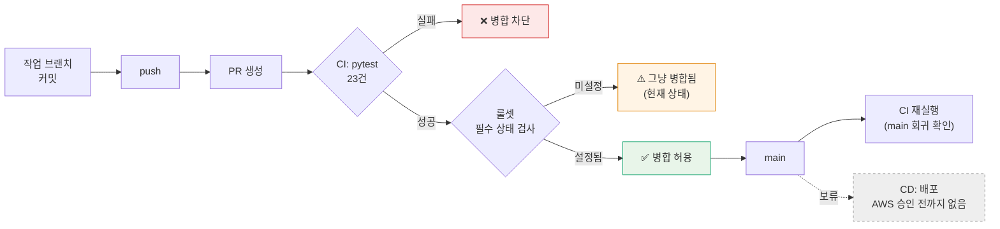

# CI/CD 명세 v1.0 — Qurious

| 항목 | 내용 |
|------|------|
| **문서 버전** | v1.0 |
| **작성일** | 2026-09-21 (KST) |
| **작성자** | 이동원 |
| **구분 (산출물 분류)** | 배포·운영·인수 → CI/CD 명세 |
| **도구** | GitHub Actions · pytest · Docker |
| **상태** | CI 착수 · CD 보류(AWS 미승인) |

---

## 1. 왜 CI 가 필요한가 — 사람이 못 막으면 코드가 막는다

이 팀은 **PR 에 필수 승인자를 둘 수 없다.** 팀원 넷의 작업 시간대가 달라
승인을 기다리면 병합이 멈춘다(#62 §5.0). 그렇다고 아무도 안 막으면 아무것도 안 막힌다.

그래서 **사람 대신 CI 가 막는다.** 그런데 2026-09-21 기준 저장소 상태는 이랬다.

| 점검 항목 | 실측 | 판정 |
|-----------|------|------|
| `.github/` 디렉터리 | 없음 | 🔴 |
| 워크플로 | 0개 | 🔴 |
| 자동화 시험 | 0건 (`tests/` 부재) | 🔴 |
| 저장소 룰셋 | `[]` (빈 배열) | 🔴 |
| `main` 브랜치 보호 | API `404` | 🔴 |

즉 **`main` 에 직접 푸시해도 아무것도 막지 않는 상태**였다. 규칙 문서에는
「main 직커밋 금지 · 브랜치 → PR」이라고 적혀 있었지만, 그것을 강제하는 장치가 없었다.
규칙이 문서에만 있으면 규칙이 아니다.

---

## 2. 파이프라인 구성



> **필수 상태 검사**(required status check) — GitHub 가 PR 병합 버튼을 잠그는 조건이다.
> 「이 이름의 검사가 성공해야만 병합할 수 있다」를 저장소 설정에 등록해 둔 것.
> 헷갈리기 쉬운 점: **워크플로를 만드는 것만으로는 아무것도 막히지 않는다.**
> 워크플로는 *검사를 실행할 뿐*이고, 그 결과를 병합 조건으로 삼는 것은 **룰셋**이다.
> 그래서 위 흐름도에 ⚠️ 칸이 남아 있다 — 이번 작업으로 **왼쪽 절반만** 채워졌다.

---

## 3. CI 워크플로 명세

**파일** `.github/workflows/ci.yml`

| 항목 | 값 | 이유 |
|------|-----|------|
| 트리거 | `pull_request` · `push: [main]` | PR 에서 막고, main 에서 회귀를 확인 |
| 러너 | `ubuntu-latest` | 무료 한도가 가장 크다 (Windows 는 2배, macOS 는 10배 차감) |
| Python | 3.12 | 로컬 개발 환경(3.12.13)과 맞춘다 |
| 캐시 | `pip` (`requirements*.txt` 해시 기준) | 의존이 무거워 매번 받으면 느리다 |
| 동시성 | `cancel-in-progress` | 연달아 푸시하면 앞 실행 취소 — 마지막 커밋 결과만 남아 판정이 명확하다 |
| 제한시간 | 15분 | 의존 설치가 멈추는 경우 러너를 붙잡지 않게 |
| 명령 | `python -m pytest` | 설정은 `pytest.ini` 에 |

### 3.1 실거래 변수는 CI 에서 절대 켜지 않는다

워크플로는 `QURIOUS_ALLOW_LIVE_TRADING` 을 **설정하지 않는다.** 이유가 둘이다.

1. 켜면 실거래 차단 시험(TC-LT-04·07)이 **거짓 통과**한다.
2. CI 러너에서 증권사 실서버로 요청이 나가는 일은 어떤 경우에도 있어선 안 된다.

이 변수를 GitHub Secrets 나 워크플로 `env` 에 넣자는 제안이 오면 **거절한다.**
실거래는 rfp-2 §4.2 제외 범위다(ADR-0001).

---

## 4. 저장소 룰셋 설정 절차 — **사용자가 웹 UI 에서 직접**

> ⚠️ 저장소 설정 변경은 자동화 대상이 아니다(프로젝트 규칙: 「저장소 삭제·이관, 조직·권한·**설정 변경**,
> 공개 범위 변경 → 사용자가 웹 UI 에서 직접」). 계정 정지 이력이 있어 API 로 건드리지 않는다.
> 그래서 이 절은 **실행 기록이 아니라 절차서**다.

### 4.1 순서

1. `https://github.com/devlee328288/Qurious/settings/rules` → **New ruleset** → *New branch ruleset*
2. **Ruleset Name**: `main-gate`
3. **Enforcement status**: `Active`
4. **Target branches**: *Include default branch* (= `main`)
5. **Rules** 에서 체크할 항목:

| 규칙 | 체크 | 이유 |
|------|:----:|------|
| Restrict deletions | ✅ | `main` 삭제 사고 방지 |
| Block force pushes | ✅ | 이력 재작성은 사용자 승인 후에만 (프로젝트 규칙) |
| Require a pull request before merging | ✅ | main 직푸시 차단 — **문서에만 있던 규칙을 실제로 강제** |
| └ Required approvals | **0** | 팀원 시간대가 달라 사람 승인을 필수로 걸 수 없다 |
| └ Dismiss stale approvals | ✅ | 새 커밋이 오면 이전 승인은 무효 |
| Require status checks to pass | ✅ | **이것이 핵심** |
| └ 검사 이름 | `pytest` | 워크플로 `jobs.test.name` 과 **글자까지 같아야** 한다 |
| └ Require branches to be up to date | ✅ | 오래된 base 위에서 통과한 CI 를 믿지 않는다 |

6. **Create**

### 4.2 설정 후 확인

```bash
GH_TOKEN=$(gh auth token --user devlee328288) \
  gh api repos/devlee328288/Qurious/rulesets --jq '.[] | "\(.id) \(.name) \(.enforcement)"'
```

빈 배열이 아니라 `main-gate active` 가 나오면 된 것이다.

### 4.3 ⚠️ 검사 이름이 어긋나면 게이트가 **영원히 열려 있다**

필수 상태 검사에 적은 이름과 실제 잡 이름이 다르면, GitHub 은 **그 검사를 "아직 안 왔다"고
보고 기다리거나** — 설정에 따라 — 그냥 통과시킨다. 이름 하나로 게이트 전체가 무력해진다.

| 위치 | 값 |
|------|-----|
| `.github/workflows/ci.yml` → `jobs.test.name` | `pytest` |
| 룰셋 → Required status checks | `pytest` |

첫 PR 에서 **실제로 체크가 붙는지 눈으로 확인**하고, 붙은 이름을 그대로 복사해 넣는 것이 가장 안전하다.

### 4.4 GitLab 미러는 어떻게 되나

`gitlab.com/mygithub05253/qurious` 미러에는 이 게이트가 **적용되지 않는다.**
GitLab CI(`.gitlab-ci.yml`)는 별도이고, 미러는 병합 후 동기화용이라 PR 흐름이 없다.
게이트의 정본은 GitHub 이다.

---

## 5. 실거래를 실제로 열어야 할 때 (참고)

모의투자 검증이 끝나고 **발주자가 범위를 바꾸면** 그때만 해당한다.
지금은 rfp-2 §4.2 제외 범위라 해당 없음.

```bash
# 로컬에서 단 한 번, 의식적으로
export QURIOUS_ALLOW_LIVE_TRADING=1
```

| 하면 안 되는 것 | 이유 |
|-----------------|------|
| `.env` 에 넣고 커밋 | 저장소에 남아 모두의 환경이 열린다 |
| Docker 이미지 `ENV` 에 굽기 | 이미지를 받는 사람 전부가 열린다 |
| CI 워크플로 `env`/Secrets | 러너에서 실서버로 나간다 (§3.1) |
| `docker-compose.yml` 에 고정 | 저장소에 커밋되는 파일이다 |

여는 것은 **실행 환경의 결정**이어야 하고, 저장소에 흔적을 남기지 않아야 한다.

---

## 6. CD — 현재 보류

| 항목 | 상태 | 비고 |
|------|------|------|
| 컨테이너 빌드 | `Dockerfile` · `docker-compose.yml` 존재 | 로컬 구동용 |
| 이미지 레지스트리 | 없음 | — |
| 배포 대상 | **없음** | AWS 는 비용 합의 전이라 **우선 제외**. 로컬·오픈소스로 완성한 뒤 배포 |
| 헬스체크·롤백 | 미정 | 배포 대상이 정해진 뒤 |

> AWS 부재는 **격차로 보지 않는다.** 먼저 로컬에서 전부 도는 상태를 만들고,
> 비용 합의가 끝난 뒤 배포를 얹는 순서다.

### 6.1 배포 전에 반드시 닫아야 할 것

| # | 항목 | 근거 |
|---|------|------|
| 1 | compose 가 `/var/run/docker.sock` 을 앱 컨테이너에 마운트 | #22 결함 3 · 컨테이너 탈출 경로 |
| 2 | 조용히 재시도하고 종료코드 0 으로 끝나는 구조 | #53 · 실패가 성공으로 보인다 |
| 3 | 실거래 차단이 배포 환경에서도 유효한지 확인 | ADR-0001 |

---

## 7. 이번 작업으로 달라진 것

| 항목 | 전 | 후 |
|------|-----|-----|
| 워크플로 | 0개 | 1개 (`ci.yml`) |
| 자동화 시험 | 0건 | 23건 · 1.5초 |
| 시험 의존 관리 | 없음 | `requirements-dev.txt` |
| 시험 실행 설정 | 없음 | `pytest.ini` |
| main 직푸시 차단 | ❌ 없음 | ⚠️ **룰셋 설정 대기** (§4 절차 필요) |
| PR 병합 게이트 | ❌ 없음 | ⚠️ **룰셋 설정 대기** |

오른쪽 두 줄이 ⚠️ 인 이유는 §4 머리말에 적었다 — **저장소 설정 변경은 사용자 몫**이다.
CI 는 준비됐고, 스위치를 올리는 일만 남았다.

---

## 8. 참조

- `.github/workflows/ci.yml`
- `docs/시험/테스트계획서_v1.0.md`
- `docs/ADR/ADR-0001-실거래-주문-경로-차단.md`
- 이슈 #62 §5.0 (CI 가 승인자를 대신한다) · #61 P2-3
