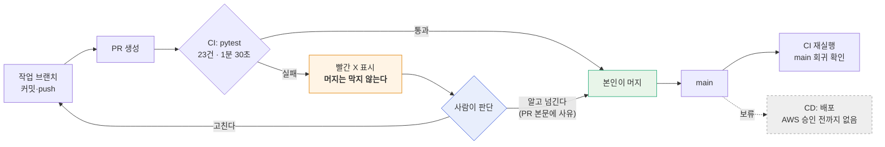

# CI/CD 명세 v1.1 — Qurious

| 항목 | 내용 |
|------|------|
| **문서 버전** | v1.1 |
| **작성일** | 2026-09-21 (KST) · S41 |
| **작성자** | 이동원 |
| **구분 (산출물 분류)** | 배포·운영·인수 → CI/CD 명세 |
| **도구** | GitHub Actions · pytest · Docker |
| **상태** | CI 가동(**신호등 방식**) · CD 보류(AWS 미승인) |
| **v1.0 대비 변경** | §1 방침 전환 · §2 흐름도 · §4 룰셋을 **설정하지 않기로** 결정 → 절차는 부록 A 로 이동 · §7 |

> **v1.0 에서 무엇이 바뀌었나** — v1.0 은 CI 를 **병합 게이트**로 세우려 했고,
> 저장소 룰셋 설정 절차를 「사용자가 해야 할 일」로 남겼다.
> S41 에서 팀 운영 방식과 부딪힌다는 반론이 제기되어 **신호등 방식으로 전환**했다.
> 판단 근거 전문은 `docs/ADR/ADR-0002-CI를-게이트가-아니라-신호로-둔다.md`.

---

## 1. 왜 CI 가 있는가 — 사람이 못 보는 곳을 본다

~~이 팀은 PR 에 필수 승인자를 둘 수 없다. 그래서 **사람 대신 CI 가 막는다.**~~
*(v1.0 의 서술. S41 에 철회 — 아래로 대체)*

이 팀의 검증 방식은 **작업자가 올리고 작업자가 머지하되, 이슈·PR 확인 요청으로
이중 검증**하는 것이다. 이 방식은 설계 의도·요구 부합을 보는 데 적합하다.

CI 는 그것을 **대체하지 않는다.** 사람 리뷰가 구조적으로 볼 수 없는 것만 본다.

| | 사람 이중 검증 (PR·이슈) | CI (pytest 23건) |
|---|---|---|
| 보는 범위 | **이 PR 의 diff** | **저장소 전체의 현재 상태** |
| 잡는 것 | 설계 의도 · 요구 부합 · 읽히는 코드인가 | 회귀 · 전역 불변식 |
| 못 잡는 것 | 다른 파일에 **이미 있던** 문제, 여러 PR 에 걸쳐 쌓인 회귀 | 의도가 옳은지 |
| 판정 | 사람이 읽고 판단 | 기계적으로 센다 |

### 1.1 전역 스캔 3건 — 리뷰로는 원리상 못 잡는다

시험 23건 중 3건은 저장소 전체를 걸어다닌다.

| 시험 | 훑는 범위 | 지키는 것 |
|------|-----------|-----------|
| `test_저장소_어디에도_paper_False_하드코딩이_남아있지_않다` | `app/**/*.py` 전체 | ADR-0001 실거래 차단 |
| `test_야후_참조가_기준선과_같다` | 저장소 전체 | 야후 의존 봉인선 (#61 P1-1) |
| `test_기준선에_없는_파일이_야후를_쓰지_않는다` | 저장소 전체 | 새 파일의 야후 반입 |

내 diff 가 깨끗해도 저장소 전체는 깨져 있을 수 있다. 실제로 `paper=False` 하드코딩은
여러 PR 을 거치며 사람 눈앞을 지나갔고, S40 의 전수 조사에서야 발견됐다(ADR-0002 §2.1).

### 1.2 2026-09-21 이전 저장소 상태 (기록)

| 점검 항목 | 실측 | 판정 |
|-----------|------|------|
| `.github/` 디렉터리 | 없음 | 🔴 |
| 워크플로 | 0개 | 🔴 |
| 자동화 시험 | 0건 (`tests/` 부재) | 🔴 |
| 저장소 룰셋 | `[]` (빈 배열) | 🔴 |
| `main` 브랜치 보호 | API `404` | 🔴 |

워크플로·시험 두 줄은 S40 에서 채웠다. **룰셋·브랜치 보호 두 줄은 의도적으로 비워 둔다**(§4).

---

## 2. 파이프라인 구성



> **필수 상태 검사**(required status check) — GitHub 가 PR 병합 버튼을 잠그는 조건이다.
> 「이 이름의 검사가 성공해야만 병합할 수 있다」를 저장소 설정에 등록해 둔 것.
> **이 프로젝트는 이것을 등록하지 않는다**(§4). 그래서 위 흐름도에 잠금 칸이 없다.
> 헷갈리기 쉬운 점: **워크플로를 만드는 것만으로는 아무것도 막히지 않는다.**
> 워크플로는 *검사를 실행할 뿐*이고, 그 결과를 병합 조건으로 삼는 것은 **룰셋**이다.

---

## 3. CI 워크플로 명세

**파일** `.github/workflows/ci.yml`

| 항목 | 값 | 이유 |
|------|-----|------|
| 트리거 | `pull_request` · `push: [main]` · `workflow_dispatch` | PR 에서 알리고, main 에서 회귀를 확인. 수동 실행은 진단용 |
| 러너 | `ubuntu-latest` | 무료 한도가 가장 크다 (Windows 는 2배, macOS 는 10배 차감) |
| 비용 | **0원** | Public 저장소라 Actions 가 무제한 무료 |
| Python | 3.12 | 로컬 개발 환경(3.12.13)과 맞춘다 |
| 캐시 | `pip` (`requirements*.txt` 해시 기준) | 의존이 무거워 매번 받으면 느리다 |
| 동시성 | `cancel-in-progress` | 연달아 푸시하면 앞 실행 취소 — 마지막 커밋 결과만 남아 판정이 명확하다 |
| 제한시간 | 15분 | 의존 설치가 멈추는 경우 러너를 붙잡지 않게 |
| 명령 | `python -m pytest` | 설정은 `pytest.ini` 에 |

### 3.1 실거래 변수는 CI 에서 절대 켜지 않는다

워크플로는 `QURIOUS_ALLOW_LIVE_TRADING` 을 **설정하지 않는다.** 이유가 둘이다.

1. 켜면 실거래 차단 시험(TC-LT-04·07)이 **거짓 통과**한다.
2. CI 러너에서 증권사 실서버로 요청이 나가는 일은 어떤 경우에도 있어선 안 된다.

이 변수를 GitHub Secrets 나 워크플로 `env` 에 넣자는 제안이 오면 **거절한다.**
실거래는 rfp-2 §4.2 제외 범위다(ADR-0001).

### 3.2 빨간 X 를 보고도 머지할 때

막히지 않는다. 다만 **PR 본문에 사유를 남긴다** — 다음 사람이 그 실패를
「알고 넘긴 것」과 「몰라서 지나친 것」으로 구분할 수 있어야 한다.

---

## 4. 저장소 룰셋 — **설정하지 않는다** (S41 결정)

### 4.1 결정

| 항목 | 결정 |
|------|------|
| 룰셋 `main-gate` | **만들지 않는다** |
| 필수 상태 검사 `pytest` | **등록하지 않는다** |
| main 직푸시 차단 | 걸지 않는다 (규칙 문서와 사람의 합의로 지킨다) |

### 4.2 왜

필수 상태 검사를 등록하면 검사가 실패했을 때 **병합 버튼이 잠긴다.** 승인자를 0명으로
두어도 마찬가지다. 그러면 이 팀의 운영 방식 —「작업자가 올리고 작업자가 머지하되
이슈·PR 로 이중 검증」— 이 막힌다.

급할 때 우회하려면 룰셋을 껐다 켜야 하는데, 그렇게 우회되는 게이트는 **켜져 있다는
착각만 남기고 실제로는 막지 않는다.** 그 실패 양상은 ADR-0001 §1.1 에서 이미 겪었다.

전문은 `docs/ADR/ADR-0002-CI를-게이트가-아니라-신호로-둔다.md` §3.

### 4.3 이 결정을 되돌려야 할 때

| 조건 | 왜 그때는 게이트가 필요한가 |
|------|---------------------------|
| 빨간 X 인 채로 머지된 PR 이 **2건 이상** 누적 | 신호등이 작동하지 않는다는 증거 |
| 팀원 PR 이 리뷰 없이 머지되는 일이 반복 | 자기 검증 전제가 깨진다 |
| 실거래·자금 이동이 **실제 계좌**에 닿는 단계 | 돌이킬 수 없는 손실이 생긴다 |
| 강사님이 병합 게이트를 **산출물로 요구** | 요구사항이 바뀐다 |

그때 쓸 절차는 **부록 A** 에 그대로 보존했다.

### 4.4 GitLab 미러

`gitlab.com/mygithub05253/qurious` 미러에는 CI 가 없다. 미러는 병합 후 동기화용이라
PR 흐름이 없다. 검증의 정본은 GitHub 이다.

---

## 5. 실거래를 실제로 열어야 할 때 (참고)

모의투자 검증이 끝나고 **발주자가 범위를 바꾸면** 그때만 해당한다.
지금은 rfp-2 §4.2 제외 범위라 해당 없음.

```bash
# 로컬에서 단 한 번, 의식적으로
export QURIOUS_ALLOW_LIVE_TRADING=1
```

| 하면 안 되는 것 | 이유 |
|-----------------|------|
| `.env` 에 넣고 커밋 | 저장소에 남아 모두의 환경이 열린다 |
| Docker 이미지 `ENV` 에 굽기 | 이미지를 받는 사람 전부가 열린다 |
| CI 워크플로 `env`/Secrets | 러너에서 실서버로 나간다 (§3.1) |
| `docker-compose.yml` 에 고정 | 저장소에 커밋되는 파일이다 |

여는 것은 **실행 환경의 결정**이어야 하고, 저장소에 흔적을 남기지 않아야 한다.

---

## 6. CD — 현재 보류

| 항목 | 상태 | 비고 |
|------|------|------|
| 컨테이너 빌드 | `Dockerfile` · `docker-compose.yml` 존재 | 로컬 구동용 |
| 이미지 레지스트리 | 없음 | — |
| 배포 대상 | **없음** | AWS 는 비용 합의 전이라 **우선 제외**. 로컬·오픈소스로 완성한 뒤 배포 |
| 헬스체크·롤백 | 미정 | 배포 대상이 정해진 뒤 |

> AWS 부재는 **격차로 보지 않는다.** 먼저 로컬에서 전부 도는 상태를 만들고,
> 비용 합의가 끝난 뒤 배포를 얹는 순서다.

### 6.1 배포 전에 반드시 닫아야 할 것

| # | 항목 | 근거 |
|---|------|------|
| 1 | compose 가 `/var/run/docker.sock` 을 앱 컨테이너에 마운트 | #22 결함 3 · 컨테이너 탈출 경로 |
| 2 | 조용히 재시도하고 종료코드 0 으로 끝나는 구조 | #53 · 실패가 성공으로 보인다 |
| 3 | 실거래 차단이 배포 환경에서도 유효한지 확인 | ADR-0001 |

---

## 7. 현재 상태 요약

| 항목 | S40 전 | S40 후 | **S41 결정** |
|------|:------:|:------:|:-----------:|
| 워크플로 | 0개 | 1개 (`ci.yml`) | **유지** |
| 자동화 시험 | 0건 | 23건 · 1.5초 | **유지** |
| 시험 의존 관리 | 없음 | `requirements-dev.txt` | 유지 |
| 시험 실행 설정 | 없음 | `pytest.ini` | 유지 |
| main 직푸시 차단 | ❌ | ⚠️ 룰셋 대기 | **걸지 않음** (합의로 지킨다) |
| PR 병합 게이트 | ❌ | ⚠️ 룰셋 대기 | **걸지 않음** (신호등) |
| 회귀 탐지 | ❌ | ✅ | ✅ |
| 사용자가 할 일 | — | 룰셋 설정 | **없음** |

**S40 에 남아 있던 「사용자가 웹 UI 에서 룰셋을 설정할 것」 숙제는 없어졌다.**

---

## 부록 A. 룰셋 설정 절차 (보존 — 지금은 쓰지 않는다)

> ⚠️ **§4 에 따라 현재 적용하지 않는다.** §4.3 의 조건에 해당해 게이트를 켜기로
> 결정했을 때 이 절차를 쓴다. 저장소 설정 변경은 자동화 대상이 아니므로
> (프로젝트 규칙: 「조직·권한·**설정 변경** → 사용자가 웹 UI 에서 직접」)
> **사용자가 직접** 수행한다.

### A.1 순서

1. `https://github.com/devlee328288/Qurious/settings/rules` → **New ruleset** → *New branch ruleset*
2. **Ruleset Name**: `main-gate`
3. **Enforcement status**: `Active`
4. **Target branches**: *Include default branch* (= `main`)
5. **Rules** 에서 체크할 항목:

| 규칙 | 체크 | 이유 |
|------|:----:|------|
| Restrict deletions | ✅ | `main` 삭제 사고 방지 |
| Block force pushes | ✅ | 이력 재작성은 사용자 승인 후에만 |
| Require a pull request before merging | ✅ | main 직푸시 차단 |
| └ Required approvals | **0** | 팀원 시간대가 달라 사람 승인을 필수로 걸 수 없다 |
| └ Dismiss stale approvals | ✅ | 새 커밋이 오면 이전 승인은 무효 |
| Require status checks to pass | ✅ | 이것이 게이트의 핵심 |
| └ 검사 이름 | `pytest` | 워크플로 `jobs.test.name` 과 **글자까지 같아야** 한다 |
| └ Require branches to be up to date | ✅ | 오래된 base 위에서 통과한 CI 를 믿지 않는다 |

6. **Create**

### A.2 설정 후 확인

```bash
GH_TOKEN=$(gh auth token --user devlee328288) \
  gh api repos/devlee328288/Qurious/rulesets --jq '.[] | "\(.id) \(.name) \(.enforcement)"'
```

빈 배열이 아니라 `main-gate active` 가 나오면 된 것이다.

### A.3 ⚠️ 검사 이름이 어긋나면 게이트가 **영원히 열려 있다**

필수 상태 검사에 적은 이름과 실제 잡 이름이 다르면, GitHub 은 그 검사를 「아직 안 왔다」고
보고 기다리거나 — 설정에 따라 — 그냥 통과시킨다. 이름 하나로 게이트 전체가 무력해진다.

| 위치 | 값 |
|------|-----|
| `.github/workflows/ci.yml` → `jobs.test.name` | `pytest` |
| 룰셋 → Required status checks | `pytest` |

첫 PR 에서 **실제로 체크가 붙는지 눈으로 확인**하고, 붙은 이름을 그대로 복사해 넣는 것이 가장 안전하다.

---

## 8. 참조

- `docs/ADR/ADR-0002-CI를-게이트가-아니라-신호로-둔다.md` — 이 문서 §1·§4 의 판단 근거
- `docs/배포/CI-CD명세_v1.0.md` — 직전 판(게이트 방식)
- `.github/workflows/ci.yml`
- `docs/시험/테스트계획서_v1.0.md`
- `docs/ADR/ADR-0001-실거래-주문-경로-차단.md`
- 이슈 #62 §5.0 · #61 P2-3
