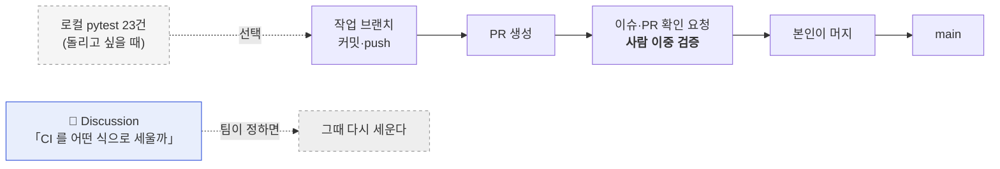

# CI/CD 명세 v1.2 — Qurious

| 항목 | 내용 |
|------|------|
| **문서 버전** | v1.2 |
| **작성일** | 2026-09-21 (KST) · S41 |
| **작성자** | 이동원 |
| **구분 (산출물 분류)** | 배포·운영·인수 → CI/CD 명세 |
| **상태** | 🔴 **CI 없음 — 형태를 논의 중** · CD 보류(AWS 미승인) |
| **v1.1 대비 변경** | 워크플로 **삭제**. §1·§2·§3 전면 개정 · §4 는 「논의 중」으로 · 룰셋 절차는 부록 A 로 계속 보존 |

> **한 줄** — 이 저장소에는 지금 **자동으로 도는 검사가 없다.**
> 시험 23건은 남아 있고 로컬에서 돌지만, 아무도 대신 돌려 주지 않는다.
> 그렇게 둔 것은 사고가 아니라 **결정**이다 → `docs/ADR/ADR-0003-CI를-걷어내고-먼저-논의한다.md`

---

## 1. 지금 상태

| 항목 | 상태 | 비고 |
|------|:----:|------|
| GitHub Actions 워크플로 | 🔴 **없음** | `.github/` 디렉터리 자체가 없다 |
| 자동 실행 | 🔴 없음 | PR 에도 push 에도 아무것도 돌지 않는다 |
| 시험 파일 | 🟢 **23건** | `tests/test_live_trading_guard.py` 21 · `tests/test_no_yahoo_regression.py` 2 |
| 시험 실행 설정 | 🟢 `pytest.ini` | 그대로 둔다 |
| 시험 의존 | 🟢 `requirements-dev.txt` | 그대로 둔다 |
| 저장소 룰셋 | 🔴 없음 | 건 적이 없다 |
| CD (배포) | ⏸️ 보류 | AWS 비용 합의 전 (§5) |

### 1.1 하루 동안 세 번 바뀐 경위

```
  S40  워크플로 도입 + 룰셋 게이트 계획        (CI/CD 명세 v1.0)
        ▼
  S41  게이트는 우리 머지 방식을 막는다
       → 신호등으로 전환 · 룰셋 미설정         (v1.1 · ADR-0002 · PR #68 머지)
        ▼
  S41  팀 도구를 팀 논의 없이 세운 것이
       순서가 틀렸다 → **걷어내고 논의 먼저**   (v1.2 · ADR-0003)  ← 현재
```

되돌린 것은 **기술 판단이 아니라 순서**다. ADR-0002 의 분석(사람 리뷰와 자동 시험이
보는 범위가 다르다)은 취소되지 않았고, **논의의 재료로 넘어갔다.**

---

## 2. 현재의 검증 흐름



**검증의 정본은 사람이다** — 작업자가 올리고 작업자가 머지하되, 이슈·PR 확인 요청으로
이중 검증한다. 자동 검사는 그 위에 얹을 수도, 얹지 않을 수도 있는 선택지이고,
그 선택은 Discussion 에서 한다.

---

## 3. 시험을 직접 돌리는 법

```bash
# 의존 설치 (처음 한 번)
pip install -r requirements-dev.txt

# 전체 23건
python -m pytest -p no:warnings -q

# 무엇을 지키는 시험인지 보면서
python -m pytest -v
```

| 시험 파일 | 건수 | 무엇을 지키나 |
|-----------|:----:|--------------|
| `tests/test_live_trading_guard.py` | 21 | 실거래 주문이 나가지 않는다 (ADR-0001 · rfp-2 §4.2 제외 범위) |
| `tests/test_no_yahoo_regression.py` | 2 | 야후 의존이 기준선보다 늘지 않는다 (#61 P1-1) |

### 3.1 ⚠️ 실거래 승인 변수를 켜고 돌리지 않는다

```bash
# 절대 이렇게 돌리지 않는다
QURIOUS_ALLOW_LIVE_TRADING=1 python -m pytest   # ❌
```

켜면 실거래 차단 시험(TC-LT-04·07)이 **거짓 통과**한다. `tests/conftest.py` 가 매 시험마다
이 변수를 지우지만, 시험 자체의 의미를 없애는 실행은 하지 않는다.

### 3.2 이 3건은 저장소 전체를 훑는다

```
  test_저장소_어디에도_paper_False_하드코딩이_남아있지_않다   app/**/*.py 전체
  test_야후_참조가_기준선과_같다                            저장소 전체
  test_기준선에_없는_파일이_야후를_쓰지_않는다                저장소 전체
```

내 변경이 깨끗해도 저장소 전체는 깨져 있을 수 있다. **가끔 전체를 돌려 보는 것이
이 3건의 쓸모다** — 자동 실행이 없는 지금은 특히 그렇다.

---

## 4. CI 재도입 — 논의 중

| 항목 | 상태 |
|------|------|
| 재도입 여부 | 🟡 **미정** — Discussion 에서 정한다 |
| 형태 (게이트/신호등/없음) | 🟡 미정 |
| 도구 (Actions/pre-commit/수동) | 🟡 미정 |

### 4.1 논의에 올린 질문

| # | 질문 |
|---|------|
| 1 | 자동 시험이 **필요한가** (필요 없다는 답도 정당하다) |
| 2 | 필요하다면 **무엇을 막아야 하나** |
| 3 | **언제 돌아야 하나** (PR · push · 배포 전 · 수동) |
| 4 | **실패하면 어떻게 되나** (머지 차단 · 알림만) |
| 5 | **누가 관리하나** (깨진 CI 를 아무도 안 고치면 없느니만 못하다) |
| 6 | Actions 말고 **다른 방법**은 |

### 4.2 판단 재료 — ADR-0002 에서 넘어온 것

논의할 때 쓰라고 남겨 둔다. **결론이 아니라 재료다.**

| | 사람 이중 검증 | 자동 시험 |
|---|---|---|
| 보는 범위 | 이 PR 의 diff | 저장소 전체의 현재 상태 |
| 잡는 것 | 설계 의도 · 요구 부합 | 회귀 · 전역 불변식 |
| 못 잡는 것 | 다른 파일에 **이미 있던** 문제 | 의도가 옳은지 |

실제 사례 — `paper=False` 하드코딩은 `005ad7d` 에서 들어와 `49d8159` 가 같은 파일을
또 건드렸는데도 지나갔고, 전수 조사에서야 잡혔다(ADR-0002 §2.1).
**다만 이 사례가 「그러니 CI 를 쓰자」를 뜻하지는 않는다** — 다른 해법도 있다.

---

## 5. CD — 현재 보류

| 항목 | 상태 | 비고 |
|------|------|------|
| 컨테이너 빌드 | `Dockerfile` · `docker-compose.yml` 존재 | 로컬 구동용 |
| 이미지 레지스트리 | 없음 | — |
| 배포 대상 | **없음** | AWS 는 비용 합의 전이라 **우선 제외** |
| 헬스체크·롤백 | 미정 | 배포 대상이 정해진 뒤 |

> AWS 부재는 **격차로 보지 않는다.** 먼저 로컬에서 전부 도는 상태를 만들고,
> 비용 합의가 끝난 뒤 배포를 얹는 순서다.

### 5.1 배포 전에 반드시 닫아야 할 것

| # | 항목 | 근거 |
|---|------|------|
| 1 | compose 가 `/var/run/docker.sock` 을 앱 컨테이너에 마운트 | #22 결함 3 · 컨테이너 탈출 경로 |
| 2 | 조용히 재시도하고 종료코드 0 으로 끝나는 구조 | #53 · 실패가 성공으로 보인다 |
| 3 | 실거래 차단이 배포 환경에서도 유효한지 확인 | ADR-0001 |

---

## 6. 실거래를 실제로 열어야 할 때 (참고)

모의투자 검증이 끝나고 **발주자가 범위를 바꾸면** 그때만 해당한다.
지금은 rfp-2 §4.2 제외 범위라 해당 없음.

```bash
# 로컬에서 단 한 번, 의식적으로
export QURIOUS_ALLOW_LIVE_TRADING=1
```

| 하면 안 되는 것 | 이유 |
|-----------------|------|
| `.env` 에 넣고 커밋 | 저장소에 남아 모두의 환경이 열린다 |
| Docker 이미지 `ENV` 에 굽기 | 이미지를 받는 사람 전부가 열린다 |
| CI 워크플로 `env`/Secrets | 러너에서 실서버로 나간다 (CI 를 다시 세울 때도 이 규칙은 유지) |
| `docker-compose.yml` 에 고정 | 저장소에 커밋되는 파일이다 |

---

## 7. 판 이력

| 판 | 날짜 | CI 상태 | 요지 |
|----|------|---------|------|
| v1.0 | 09-21 S40 | 워크플로 1개 + 룰셋 게이트 **계획** | 「사람 대신 CI 가 막는다」 |
| v1.1 | 09-21 S41 | 워크플로 1개 · 룰셋 **안 검** | 게이트는 우리 머지를 막는다 → 신호등 |
| **v1.2** | **09-21 S41** | 🔴 **워크플로 없음** | 팀 도구는 팀이 정한다 → 논의 먼저 |

세 판이 같은 날이다. 그 경위와 반성은 ADR-0003 §5 에 적었다.

---

## 부록 A. 룰셋 설정 절차 (보존 — 지금은 쓰지 않는다)

> ⚠️ CI 자체가 없으므로 지금은 해당 없다. Discussion 에서 **게이트 형태로 세우기로
> 정했을 때** 이 절차를 쓴다. 저장소 설정 변경은 자동화 대상이 아니므로
> (프로젝트 규칙: 「조직·권한·**설정 변경** → 사용자가 웹 UI 에서 직접」)
> **사용자가 직접** 수행한다.

### A.1 순서

1. `https://github.com/devlee328288/Qurious/settings/rules` → **New ruleset** → *New branch ruleset*
2. **Ruleset Name**: `main-gate`
3. **Enforcement status**: `Active`
4. **Target branches**: *Include default branch* (= `main`)
5. **Rules** 에서 체크할 항목:

| 규칙 | 체크 | 이유 |
|------|:----:|------|
| Restrict deletions | ✅ | `main` 삭제 사고 방지 |
| Block force pushes | ✅ | 이력 재작성은 사용자 승인 후에만 |
| Require a pull request before merging | ✅ | main 직푸시 차단 |
| └ Required approvals | **0** | 팀원 시간대가 달라 사람 승인을 필수로 걸 수 없다 |
| └ Dismiss stale approvals | ✅ | 새 커밋이 오면 이전 승인은 무효 |
| Require status checks to pass | ✅ | 게이트의 핵심 |
| └ 검사 이름 | 워크플로의 `jobs.<id>.name` 과 **글자까지 같게** | 어긋나면 게이트가 영원히 열린다 |
| └ Require branches to be up to date | ✅ | 오래된 base 위에서 통과한 결과를 믿지 않는다 |

6. **Create**

### A.2 설정 후 확인

```bash
GH_TOKEN=$(gh auth token --user devlee328288) \
  gh api repos/devlee328288/Qurious/rulesets --jq '.[] | "\(.id) \(.name) \(.enforcement)"'
```

빈 배열이 아니라 `main-gate active` 가 나오면 된 것이다.

### A.3 ⚠️ 검사 이름이 어긋나면 게이트가 **영원히 열려 있다**

필수 상태 검사에 적은 이름과 실제 잡 이름이 다르면, GitHub 은 그 검사를 「아직 안 왔다」고
보고 기다리거나 — 설정에 따라 — 그냥 통과시킨다. 이름 하나로 게이트 전체가 무력해진다.
첫 PR 에서 **실제로 체크가 붙는지 눈으로 확인**하고, 붙은 이름을 그대로 복사해 넣는 것이 가장 안전하다.

---

## 8. 참조

- `docs/ADR/ADR-0003-CI를-걷어내고-먼저-논의한다.md` — 이 판의 근거
- `docs/ADR/ADR-0002-CI를-게이트가-아니라-신호로-둔다.md` — 대체됨 (분석은 논의 재료로 유효)
- `docs/배포/CI-CD명세_v1.1.md` · `v1.0.md` — 이전 판 (이력으로 보존)
- `docs/시험/테스트계획서_v1.0.md` — 시험 23건의 내역
- 이슈 [#67](https://github.com/devlee328288/Qurious/issues/67)
