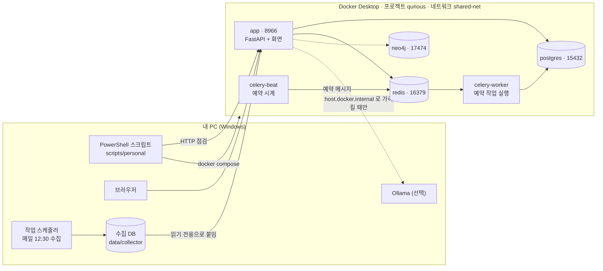
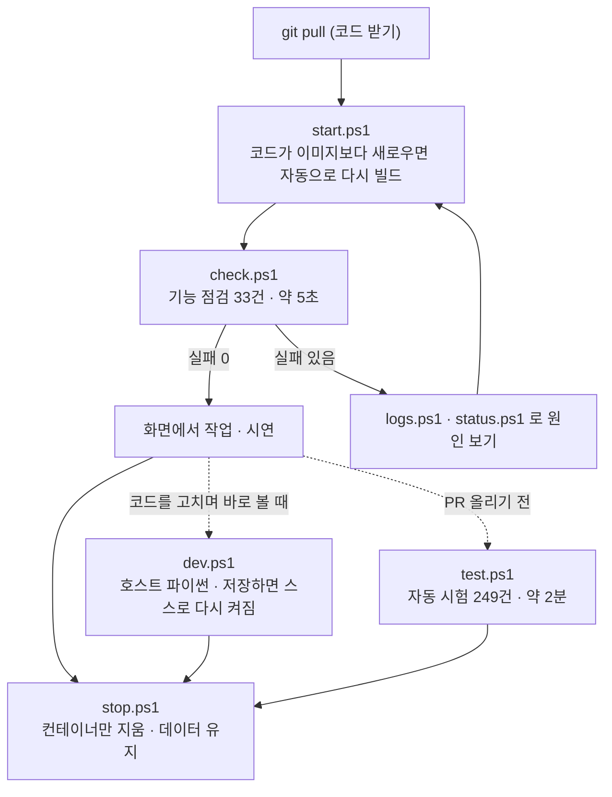
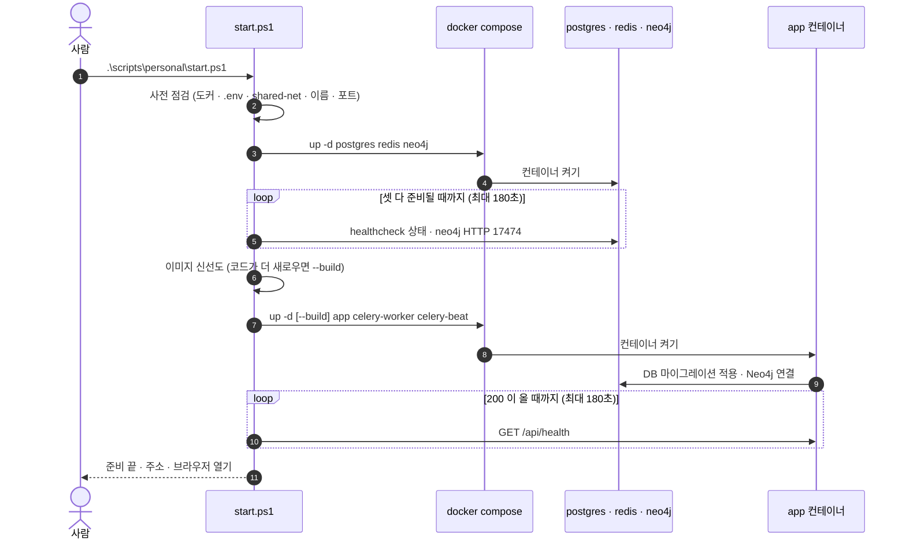
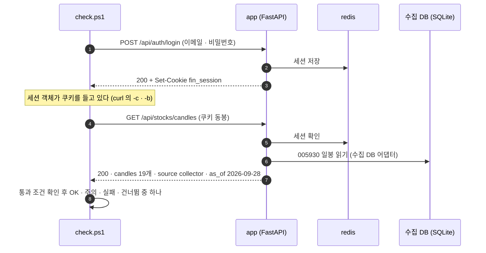
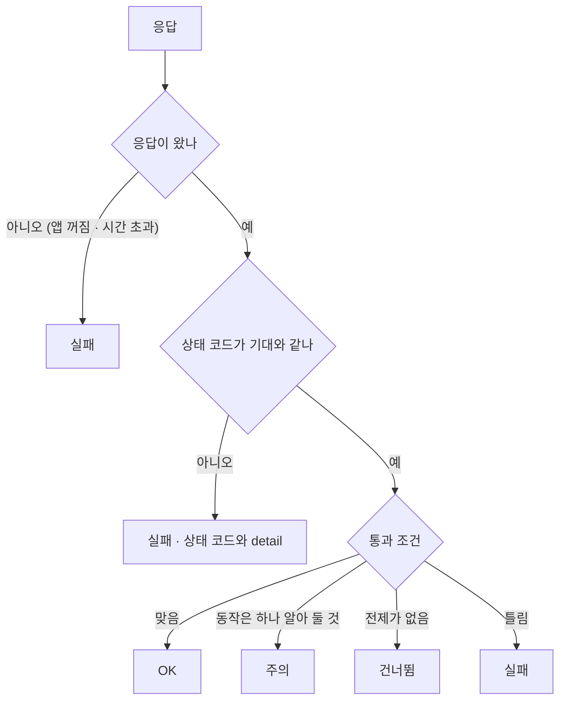

# 로컬 실행 안내서 v0.1 — Qurious

| 문서 정보 | |
|---|---|
| **판 · 상태** | v0.1 · 초안(검토 전) |
| **구분** | 10. 배포·운영·인수 — 운영 매뉴얼(로컬 실행 · 기능 점검 · 자동 시험) |
| **작성** | 이동원(데이터 · 문서) |
| **검토** | 검토 전 |
| **최종 수정** | 2026-09-30 (KST) |
| **기준** | 코드 `main` `88d5813` + 이 문서를 싣는 PR · Docker 엔진 28.5.1 · Compose v2.40.3 · Windows PowerShell 5.1 · 수집 DB 기준일 2026-09-28 |
| **관련 문서** | [스크립트 사용법](../../scripts/personal/README.md) · [API 명세서 v0.1](../인터페이스/지난판/API명세서_v0.1.md) · [테스트계획서 v1.3](../시험/지난판/테스트계획서_v1.3.md) · [기능 설계서 v0.1](../설계/기능설계.md) 8절 · [CI/CD 명세 v1.2](CI-CD명세.md) · [`docker-compose.yml`](../../docker-compose.yml) |
| **최근 개정** | 첫 판 |

> **이 문서가 답하는 질문**
> 1. AI 도구 없이 내 PC 에서 Qurious 전체를 어떻게 띄우고 끄나?
> 2. 떠 있는 앱의 기능이 다 도는지 어떻게 확인하나 — 무엇을 부르고, 무엇을 보면 통과인가?
> 3. 스크립트는 안에서 어떤 순서로 무엇을 하나 — 막히면 어디를 보나?
> 4. 나중에 AWS 로 옮길 때 로컬의 무엇이 무엇으로 바뀌나?
>
> **읽는 순서** — 처음 돌리는 팀원: 요약 → 2절 → 3절 · 스크립트를 고칠 사람: 4절 → 부록 B · 강사님 · 발표 준비: 요약 → 1절 → 5절 → 6절

## 요약

1. **세 줄로 돈다** — `start.ps1`(띄우기) → `check.ps1`(기능 점검) → `stop.ps1`(끄기). 스크립트는 `scripts/personal/` 에 일곱 개(공용 함수 파일 · 패키지 대조 도우미는 따로)이고, Windows 기본 PowerShell 5.1 과 Docker Desktop 만 있으면 된다.
2. **2026-09-30 이 PC 에서 잰 값** — 꺼진 상태에서 띄우기 30초 · 떠 있을 때 다시 실행 6초 · 기능 점검 기본 33건 5.4초 · 전체 45건 46.7초(통과 43 · 주의 1 · 건너뜀 1 · **실패 0**) · 자동 시험 249건 전부 통과(86초).
3. **로컬 점검에서 빠지는 것은 둘**이다 — AI 채팅 · 문서 검색(Ollama · 설계상 동결 기능)과 LEAN 엔진 실행(약 14GB 이미지). 팀 합의대로 로컬에서 전체 기능을 먼저 확인하고, AWS 배포는 강사님 안내가 나온 뒤 별도 단계로 한다(7절).

---

## 1. 한눈에 — 로컬 구성

그림 1 은 「내 PC 에서 무엇이 무엇에 기대어 도나」 에 답한다.

**그림 1. 로컬 구성 (컨테이너 단계)** · 범례: 실선 = 늘 쓰는 길 · 점선 = 선택 기능 · 숫자 = 호스트 포트



앱 컨테이너는 사용자 · 주문 · 모의투자 장부를 PostgreSQL 에, 로그인 세션과 캐시를 Redis 에 둔다. 국내 주식 일봉은 호스트의 수집 DB 를 컨테이너에 **읽기 전용**으로 붙여 읽고, 수집 DB 는 도커와 따로 작업 스케줄러가 매일 12:30 에 갱신한다. 자동매매(10분) · 리밸런싱(1시간) 같은 예약 작업은 Celery 비트가 Redis 로 메시지를 보내고 워커가 실행한다.

표 1 은 「컨테이너가 없으면 무엇이 안 되나」 에 답한다.

**표 1. 컨테이너와 역할** · 확실도 🟢 = 이 PC 에서 띄워 확인

| 서비스 | 컨테이너 | 호스트 포트 | 하는 일 | 없으면 | 이미지 |
|---|---|---|---|---|---|
| postgres | `fin-ai-postgres` | 15432 | 사용자 · 주문 · 모의투자 장부 · 리밸런싱 · 위험 한도 | 로그인부터 안 된다 | postgres:16-alpine 419MB |
| redis | `fin-ai-redis` | 16379 | 로그인 세션 · 캐시 · Celery 메시지 통로 | 로그인 유지 · 예약 작업이 안 된다 | redis:8-alpine 160MB |
| neo4j | `fin-ai-neo4j` | 17474 · 7687 | 종목 관계 그래프(선택 기능) | 그래프 화면만 빈다 | neo4j:5.18-community 817MB |
| app | `fin-ai-app` | 8966 | 화면(`public/`) + API 181개 · 켜질 때 DB 마이그레이션 적용 | 전부 | qurious-app 1.39GB |
| celery-worker | `fin-ai-celery-worker` | — | 예약 작업 실행 | 자동매매 · 리밸런싱 점검이 안 돈다 | 앱 이미지와 층 공유 |
| celery-beat | `fin-ai-celery-beat` | — | 예약 시계 | 위와 같다 | 앱 이미지와 층 공유 |

모든 행 🟢(2026-09-30). 앱 이미지 넷(app · worker · beat · ingest)은 같은 Dockerfile 로 만들어 층을 나눠 쓰므로 디스크는 한 개 크기만큼 든다.

---

## 2. 처음 한 번 — 준비

**목적**: 새 PC 에서 처음으로 Qurious 를 띄운다. **사전 조건**: Windows 10 · 11, 인터넷(이미지 받기), 디스크 여유 약 4GB.

1. **Docker Desktop 을 설치하고 켠다.** 작업 표시줄의 고래 아이콘이 움직임을 멈추면 준비된 것이다. 확인: `docker version` 에 `Server` 줄이 나온다.
2. **저장소를 받는다.** `git clone https://github.com/EST-team-project/Qurious.git` 또는 이미 있는 폴더에서 `git pull`.
3. **실행 정책을 확인한다.** PowerShell 에서 `Get-ExecutionPolicy -List` 의 `CurrentUser` 가 `Restricted` 면 `Set-ExecutionPolicy -Scope CurrentUser RemoteSigned` 를 한 번 돌린다. 정책을 바꾸고 싶지 않으면 한 번만 `powershell -ExecutionPolicy Bypass -File .\scripts\personal\start.ps1`.
4. **(선택) 수집 DB 를 복원한다.** 없으면 국내 일봉 · 지표가 외부(야후) 경로로 가서 느리고, 막힐 수 있다. HF 조직 `qurious-quant` 의 비공개 데이터셋(권한 필요)을 받은 뒤 `python scripts\hf_dataset.py restore --from <받은 폴더> --into data\collector\market.sqlite3`.
5. **띄운다.** 저장소 폴더에서 `.\scripts\personal\start.ps1`. 처음에는 이미지를 받고 만드느라 몇 분 걸린다. 파이썬 패키지 층이 캐시에 있던 이 PC 는 받기 16초 · 빌드 31초였다 — 새 PC 는 패키지 설치 때문에 더 걸린다.

**확인**: 브라우저에 로그인 화면이 열리고, 창 끝에 「준비 끝」 이 찍힌다. **실패하면**: 찍힌 `[실패]` 줄이 원인과 할 일을 적는다. 자주 막히는 곳은 8절 표 7.

---

## 3. 매일 — 띄우기 · 점검 · 끄기

그림 2 는 「하루에 어떤 순서로 무엇을 돌리나」 에 답한다.

**그림 2. 하루 흐름** · 범례: 점선 = 필요할 때만



평소에는 `start.ps1 → check.ps1 → stop.ps1` 세 줄이다. 코드를 받은 뒤에도 `start.ps1` 이 이미지가 낡았는지 스스로 보고 다시 만든다.

표 2 는 「스크립트마다 무엇을 하고, 무엇을 바꾸나」 에 답한다.

**표 2. 스크립트 일곱 개** · 「바꾸는 것」 = 실행하면 상태가 바뀌는 곳 · 시간은 2026-09-30 이 PC 에서 잰 값

| 스크립트 | 하는 일 | 자주 쓰는 옵션 | 걸린 시간 | 바꾸는 것 |
|---|---|---|---|---|
| `start.ps1` | 사전 점검 → `.env` → 네트워크 → 충돌 점검 → DB 셋 준비 대기 → 앱 · Celery → 헬스 체크 → 브라우저 | `-NoCelery` · `-Build` · `-NoBrowser` · `-Ingest` | 꺼진 상태 30초 · 다시 실행 6초 | 컨테이너 · (없을 때만) `.env` · 네트워크 |
| `check.ps1` | 기능 점검 — API 를 차례로 불러 통과 · 실패를 적는다 | `-Full` · `-Write` · `-Group` · `-ShowBody` · `-SaveReport` | 기본 5.4초 · 전체 46.7초 | 기본은 없음 · `-Write` 는 점검 계정의 모의투자 · 리밸런싱 |
| `status.ps1` | 컨테이너 · 앱 응답 · 이미지 신선도 · 수집 DB · 디스크 | `-Data` | — | 없음 |
| `logs.ps1` | 컨테이너 로그 | `-Service` · `-Follow` · `-Tail` | — | 없음 |
| `stop.ps1` | 끄기 | `-Keep` · `-DeleteData`(확인 입력) · `-KillDev` | — | 컨테이너 · (`-DeleteData`) 앱 DB |
| `test.ps1` | 자동 시험 — 일회용 시험 DB 를 띄웠다가 지운다 | `-Path` · `-NoDb` · `-KeepDb` | 98초(시험 86초) | 시험 DB 컨테이너(끝나면 지움) |
| `dev.ps1` | 개발 모드 — 앱만 호스트 파이썬으로 | `-Port` · `-NoReload` | — | 앱 컨테이너를 멈춤 |

「—」 는 재지 않은 칸이다. 스크립트마다 자세한 설명은 `Get-Help .\scripts\personal\<이름>.ps1 -Full` 로도 볼 수 있다(머리 도움말 블록).

### 3.1 띄우기 — `start.ps1`

1. 저장소 폴더에서 `.\scripts\personal\start.ps1` 을 돌린다.
2. `1/7` ~ `7/7` 단계가 차례로 찍힌다. 각 단계는 4.1절 그림 3 의 한 칸이다.
3. **확인**: 「준비 끝 (N초)」 과 주소 셋(화면 · API 문서 · Neo4j)이 찍히고 브라우저가 열린다.
4. **실패하면**: 그 단계의 `[실패]` 줄을 읽는다. 앱 단계에서 멈추면 스크립트가 앱 로그 마지막 30줄을 함께 보여 준다.
5. **되돌리기**: `stop.ps1`. 데이터는 남는다.

### 3.2 점검 — `check.ps1`

1. `.\scripts\personal\check.ps1` — 기본 묶음 33건(로그인 포함).
2. 느린 ML 셋까지: `-Full` · 기록이 남는 점검까지: `-Write` · 결과 파일: `-SaveReport`(`data\local-run\check-날짜-시각.md` · 커밋 안 됨).
3. **확인**: 마지막 「결과 — 통과 · 주의 · 실패 · 건너뜀」 줄과 묶음별 「동작 n/m」. 종료 코드는 실패가 없으면 0, 있으면 1.
4. **실패하면**: 실패 줄 아래 회색 줄에 요청 · 상태 코드 · 이유가 있다. 같은 요청을 브라우저의 `http://localhost:8966/docs` 에서 눌러 보면 응답 전체를 볼 수 있다.
5. **되돌리기**: 기본 점검은 아무것도 바꾸지 않는다. `-Write` 는 점검 전용 계정(`smoke-check@example.com`)의 모의투자에 매수 · 매도 1주씩을 남기고, 리밸런싱 목표는 저장했다가 비워 둔다.

### 3.3 끄기 — `stop.ps1`

1. `.\scripts\personal\stop.ps1` — 컨테이너만 지운다. 계정 · 주문 · 장부는 볼륨에 남아 다음 `start.ps1` 에 그대로 이어진다.
2. 멈추기만 하려면 `-Keep`. 처음 상태로 돌리려면 `-DeleteData` 를 주고 「삭제」 를 입력한다 — **되돌릴 수 없다.**
3. 어떤 경우에도 수집 DB(`data\collector`) · 이미지 · 네트워크는 지우지 않는다. 이미지를 지우는 명령은 스크립트 README 6절에 있다.

### 3.4 자동 시험 — `test.ps1`

1. `.\scripts\personal\test.ps1` — 시험 DB 를 띄우고 `python -m pytest` 를 돌린 뒤 시험 DB 를 지운다.
2. **확인**: `249 passed` 와 「시험 전부 통과」.
3. 일부만: `-Path tests\test_formula.py` · 도커 없이: `-NoDb`(DB 시험 7건은 건너뜀).

### 3.5 고치며 보기 — `dev.ps1`

1. 한 번만 가상환경을 만든다: `python -m venv .venv ; .\.venv\Scripts\Activate.ps1 ; pip install -r requirements-dev.txt`.
2. `.\scripts\personal\dev.ps1` — 앱이 `http://127.0.0.1:8000` 에 뜬다. `app\` 의 파이썬 파일을 저장하면 앱이 스스로 다시 켜진다(시작 과정 — 마이그레이션 확인 · 패키지 적재 — 을 다시 돌아 몇 초 걸린다).
3. 다른 창에서 점검: `.\scripts\personal\check.ps1 -BaseUrl http://127.0.0.1:8000`.
4. 끝내기: 그 창에서 **Ctrl+C**. 창을 그냥 닫았다면 `stop.ps1 -KillDev`.

---

## 4. 동작 원리 — 스크립트 안에서 일어나는 일

### 4.1 띄우는 순서 — 「켜짐」 과 「준비됨」 은 다르다

그림 3 은 「`start.ps1` 이 누구를 어떤 차례로 부르나」 에 답한다.

**그림 3. `start.ps1` 의 차례** · 범례: `loop` = 준비될 때까지 2초마다 다시 묻기



`docker compose` 의 `depends_on` 은 「앞 컨테이너가 **켜졌다**」 까지만 보장하고 「요청을 받을 **준비가 됐다**」 는 보장하지 않는다. 앱은 켜질 때 Neo4j 에 한 번 붙어 보고, 실패하면 그 실행 내내 그래프 기능을 끈다. 모두 한꺼번에 띄운 첫 실행에서 실제로 앱 로그에 `[WARN] Neo4j 연결 실패 (그래프 기능 비활성)` 가 찍혔고, 저장소 셋을 먼저 띄워 준비를 확인한 뒤 앱을 띄우자 사라졌다. **그래서 `start.ps1` 은 저장소 → 준비 확인 → 앱 순서를 지킨다.**

아래는 준비를 판정하는 핵심 코드다(`scripts/personal/_common.ps1` 의 `Start-QInfra`).

```powershell
$ready = @{ postgres = $false; redis = $false; neo4j = $false }
while ((Get-Date) -lt $deadline) {
  # postgres · redis 는 compose 파일의 healthcheck(pg_isready · redis-cli ping)가 healthy 인지
  if (-not $ready.postgres) { $ready.postgres = ((Get-QContainerState 'fin-ai-postgres').Health -eq 'healthy') }
  if (-not $ready.redis)    { $ready.redis    = ((Get-QContainerState 'fin-ai-redis').Health -eq 'healthy') }
  # neo4j 는 compose 에 healthcheck 가 없어 브라우저 포트가 200 을 주는지로 본다
  if (-not $ready.neo4j)    { $ready.neo4j    = ((Invoke-QApi -Method GET -Url 'http://localhost:17474' -TimeoutSec 3).Status -eq 200) }
  if ($ready.postgres -and $ready.redis -and $ready.neo4j) { return $true }
  Start-Sleep -Seconds 2
}
```

### 4.2 옛 코드로 뜨지 않게 — 이미지 신선도

컨테이너는 **이미지를 만든 순간의 코드**로 돈다. `git pull` 로 코드를 받고 이미지를 다시 만들지 않으면 화면에는 옛 코드가 계속 보인다 — 팀 작업에서 가장 흔한 착각이다. 그림 4 는 「언제 다시 빌드하나」 에 답한다.

**그림 4. 이미지 신선도 판정** · 범례: `|` = 시각 · 오른쪽일수록 나중

```
 시간 ──────────────────────────────────────────────────────▶
          |이미지 생성 (docker image inspect qurious-app)
   경우 1  ···|··········· 파일 마지막 수정이 이미지보다 앞  → 그대로 띄움
   경우 2              |이미지 ··········|git pull · 파일 저장 → --build 로 다시 만듦
 비교 대상: Dockerfile 이 COPY 하는 것 = app · public · prompts · alembic
           alembic.ini · requirements.txt · Dockerfile (__pycache__ 는 뺀다)
```

다시 만들 때는 바뀐 층만 새로 만들어 보통 수십 초면 끝난다. 판정 코드는 `Test-QImageStale` 이다 — 도커가 주는 생성 시각(소수점 아래 9자리)은 .NET 이 7자리까지만 읽어서, 초 단위까지 잘라 UTC 로 비교한다.

### 4.3 점검 한 건 — curl 한 번과 같다

`check.ps1` 의 점검 하나는 「요청 1건 + 통과 조건 + 한 줄 요약」 이다. 아래는 실제 목록의 한 줄이다 — 국내 일봉이 수집 DB 에서 오는지 본다.

```powershell
@{ G = '시세'; Name = '국내 일봉 — 수집 DB 에서 오나'; M = 'GET'
   P = '/api/stocks/candles?symbol=005930.KS&period=1mo&interval=1d'; Auth = $true
   Test = { param($r)
     $n = Count $r.Json.candles
     if ($n -lt 5) { return (Fail "봉이 $n 개뿐이다") }
     $msg = "봉 $n 개 · 출처 $($r.Json.source) · 기준일 $($r.Json.as_of)"
     # 수집 DB 가 없는 PC 에서도 동작은 한다 — 실패가 아니라 「주의」 로 알린다
     if ($r.Json.source -eq 'collector') { Pass $msg } else { Warn "$msg — 수집 DB 가 아니라 외부에서 왔다" } } }
```

같은 요청을 curl 로 하면 `curl.exe -b 쿠키파일 "http://localhost:8966/api/stocks/candles?symbol=005930.KS&period=1mo&interval=1d"` 이다. 스크립트는 이런 요청을 기본 33건(옵션을 다 켜면 45건) 묶어, 응답에서 **기능이 돌았다는 증거 한 가지**(봉 개수 · 출처 · 기준일 등)를 골라 적는다.

그림 5 는 「로그인한 점검 한 건이 어떤 차례로 오가나」 에 답한다.

**그림 5. 로그인 뒤 점검 한 건**



점검 계정은 로컬 전용 `smoke-check@example.com` 이고, 없으면 처음 한 번 가입한다. 비밀번호가 스크립트에 공개돼 있으므로 **로컬 주소가 아니면 자동 가입을 하지 않는다**(`-Email` · `-Password` 를 직접 줘야 한다).

그림 6 은 「결과를 어떻게 넷으로 나누나」 에 답한다.

**그림 6. 판정 네 가지**



「주의」 와 「건너뜀」 은 실패로 세지 않는다. 예를 들어 Ollama 가 없어 AI 연결이 안 되는 것은 설계상 동결한 기능이라 「건너뜀」 이고, LEAN 이미지가 없는 것은 동작에는 문제가 없지만 실행하면 14GB 를 받기 시작하므로 「주의」 다.

HTTP 한 번을 보내는 함수(`Invoke-QApi`)의 핵심은 아래 몇 줄이다. PowerShell 5.1 이 한글을 깨뜨리는 두 곳을 여기서 막는다(4.4절).

```powershell
if ($null -ne $Body) {
  $json = $Body | ConvertTo-Json -Depth 10 -Compress
  $params.Body = [System.Text.Encoding]::UTF8.GetBytes($json)   # 문자열로 넘기면 5.1 이 한글을 ? 로 바꾼다
  $params.ContentType = 'application/json; charset=utf-8'
}
try {
  $resp = Invoke-WebRequest @params
  $result.Status = [int]$resp.StatusCode
  # .Content 는 charset 없는 JSON 을 ISO-8859-1 로 읽어 한글이 깨진다 → 받은 바이트를 UTF-8 로 직접 푼다
  $result.Text = [System.Text.Encoding]::UTF8.GetString($resp.RawContentStream.ToArray())
} catch {
  # 4xx · 5xx 도 예외로 끝내지 않고 상태 코드를 숫자로 담는다 (401 이 「기대한 결과」 인 점검이 있다)
  ...
}
```

### 4.4 PowerShell 5.1 에서 지킨 것

팀원 PC 의 기본값은 Windows PowerShell 5.1 이다. 표 3 은 「5.1 에서 무엇이 어떻게 틀어지고, 스크립트는 어떻게 피했나」 에 답한다.

**표 3. PowerShell 5.1 함정과 대응** · 확실도 🟢 = 이 PC 에서 직접 재현 · 🟡 = 문서로 확인

| # | 함정 | 증상 | 대응 | 어디 | 확실도 |
|:-:|---|---|---|---|:-:|
| 1 | BOM 없는 UTF-8 파일을 cp949 로 읽는다 | 한글 주석 · 문자열이 깨지고, 깨진 글자가 따옴표를 삼키면 문법 오류 | `.ps1` 을 전부 UTF-8 **BOM** 으로 저장 | 폴더 전체 | 🟡 |
| 2 | charset 없는 JSON 을 ISO-8859-1 로 읽는다 | `{"service":"ê¸ìµ AI Agent"}` | 받은 바이트를 UTF-8 로 직접 푼다 | `Invoke-QApi` | 🟢 |
| 3 | 4xx 응답이 예외가 되고, 응답 스트림은 이미 비어 있다 | 스트림을 읽으면 빈 문자열 | 본문은 `ErrorDetails.Message` 에서(한글 정상) | `Invoke-QApi` | 🟢 |
| 4 | 함수 안 명령의 출력이 반환값에 섞인다 | `logs.ps1` 이 로그를 한 줄도 안 보여 줌 | `docker compose … \| Out-Host` 로 화면에 쓰고 종료 코드만 반환 | `Invoke-QCompose` | 🟢 |
| 5 | 외부 프로그램 인자 안의 큰따옴표를 벗긴다 | `docker inspect --format '{{index … "라벨"}}'` 이 깨짐 | 템플릿 대신 JSON 으로 받아 푼다 | `Get-QContainerState` | 🟡 |
| 6 | 외부 프로그램이 stderr 에 쓰기만 해도 `$?` 가 false | docker compose 는 진행 상황을 stderr 로 쓴다 | 성패는 `$LASTEXITCODE` 로만 | 전체 | 🟡 |
| 7 | `localhost` 를 IPv6(::1)로 먼저 붙는다 | 127.0.0.1 에만 뜬 Ollama 에 2,087ms (127.0.0.1 은 6ms) | Ollama 는 `127.0.0.1` 로 묻는다 | `start.ps1` | 🟢 |
| 8 | `@($null).Count` 가 1 | 빈 목록을 1건으로 셈 | `Count` 도우미 함수 | `check.ps1` | 🟡 |
| 9 | `ConvertFrom-Json` 이 약 2MB 넘는 글을 못 푼다 | 큰 응답의 JSON 이 `$null` | 점검은 기간을 짧게(1개월 · 6개월) | `check.ps1` | 🟡 |
| 10 | 명령 인자에서 괄호 없는 `'a' + 'b'` | `+` 가 글자 인자로 넘어감 | 괄호로 감싼다 | `start.ps1` | 🟡 |
| 11 | `try` 안에서 `exit` | — | `finally` 는 실행된다 → 시험 DB 정리가 늘 돈다 | `test.ps1` | 🟢 |

### 4.5 일회용 시험 DB — 왜 개발 DB 가 아닌가, 왜 포트를 고르나

모의 장부 시험은 그 DB 의 표 아홉 개를 **지우고 다시 만든다.** 그래서 `test.ps1` 은 앱 개발 DB(15432 · `fin_ai`)를 절대 넘기지 않고, 그런 주소가 환경 변수에 들어 있으면 멈춘다. 대신 `pgvector/pgvector:pg16` 컨테이너를 새로 띄웠다가 끝나면 지운다.

포트는 고정하지 않고 후보에서 고른다. Hyper-V · WSL · Docker Desktop 이 켜진 Windows 는 부팅할 때마다 포트 수백 개를 묶음으로 **예약**하고, 예약 범위 안의 포트는 아무도 안 써도 도커가 열지 못한다(「An attempt was made to access a socket in a way forbidden」). 그림 7 은 「이 PC 에서 어느 포트가 막혀 있었나」 에 답한다.

**그림 7. 포트 지도 (2026-09-30 이 PC · `netsh interface ipv4 show excludedportrange protocol=tcp`)** · 범례: `▓` = Windows 예약 · `●` = 쓰는 포트 · `✗` = 쓰지 않는 포트

```
 15432 ● 앱 개발 DB (compose postgres)  ── 시험 DB 로 쓰면 안 된다
 16379 ● redis   17474 ● neo4j   8966 ● app
 25432 ● 시험 DB 가 고른 포트 (후보 1순위 · 예약 밖 · 비어 있음)
 39721 ▓ (한 개)
 50000 ▓▓ 50059
 52642 ▓▓ 52741    54767 ▓▓ 54866
 55367 ▓▓ 55466  ← 55432 ✗ (시험 파일 머리말의 예시 포트가 여기 걸렸다)
 58211 ▓▓ 58410    59985 ▓▓ 60184
```

범위는 PC 마다, 부팅마다 달라진다. 그래서 `Find-QFreePort` 가 후보(25432 · 35432 · 45432 · 55432)를 차례로 보며 「예약 범위 밖」 이고 「아무도 듣지 않는」 첫 번째를 고른다.

### 4.6 도커 앱과 개발 모드

그림 8 은 「`start.ps1` 과 `dev.ps1` 은 무엇이 다른가」 에 답한다.

**그림 8. 도커 앱 │ 개발 모드**

```
 start.ps1 (도커 앱)                    │ dev.ps1 (개발 모드)
 ───────────────────────────────────────┼──────────────────────────────────────
 앱 = 컨테이너 · 이미지 안의 코드       │ 앱 = 내 파이썬 · 작업 폴더의 코드
 주소 http://localhost:8966             │ 주소 http://127.0.0.1:8000
 DB 주소 = 서비스 이름 (postgres:5432)  │ DB 주소 = 호스트 포트 (localhost:15432)
 코드를 고치면 → 이미지 다시 빌드       │ 코드를 저장하면 → 앱이 스스로 다시 켜짐
 패키지 = 이미지에 전부 설치됨          │ 패키지 = 내 환경에 직접 (가상환경 권장)
 Ollama = 컨테이너 밖이라 따로 가리킴   │ Ollama = 127.0.0.1 로 바로 닿음
 Celery 워커 · 비트 = 이미지 코드       │ Celery 워커 · 비트 = 여전히 이미지 코드
 확인 · 시연 · 팀원과 같은 환경         │ 고치면서 바로 볼 때
```

두 앱을 함께 띄우지 않는다 — 앱 안의 시세 동기화 스케줄러가 두 벌 돌아 외부 시세 호출이 두 배가 되고, 어느 쪽 화면을 보는지 헷갈린다. 그래서 `dev.ps1` 은 떠 있는 앱 컨테이너를 먼저 멈춘다.

---

## 5. 점검 항목 — 무엇을 부르고, 무엇을 보면 통과인가

표 4 는 「기능마다 어느 API 를 부르고, 무엇이 오면 그 기능이 돈다고 보나」 에 답한다. 발표 · 면접에서 「이 기능은 어떻게 확인했나」 에 그대로 답할 수 있도록 결과 칸에 이 PC 의 실제 응답을 적었다.

**표 4. 기능 점검 45건** · 결과 = 2026-09-30 11:25 (KST) `check.ps1 -Full -Write` · 판정: OK · 주의 · 건너뜀 · 실패

| # | 묶음 | 점검 | 요청 | 통과 조건 | 결과 |
|:-:|---|---|---|---|---|
| 1 | 로그인 | 로그인 | `POST /api/auth/login` | 200 + 쿠키 `fin_session` | OK |
| 2 | 기본 | 앱이 살아 있다 | `GET /api/health` | `status = ok` | OK |
| 3 | 기본 | 화면 파일 | `GET /login.html` | HTML | OK · 5,918자 |
| 4 | 기본 | API 목록 | `GET /openapi.json` | 경로 100개 이상 | OK · 경로 163(메서드를 나누면 API 181) |
| 5 | 로그인 | 내 정보 | `GET /api/me` | 로그인한 이메일 | OK |
| 6 | 로그인 | 로그인 없이 막힘 | `GET /api/me` (쿠키 없이) | **401** | OK |
| 7 | 시세 | 국내 일봉 | `GET /api/stocks/candles` | 봉 5개 이상 · 출처가 수집 DB 면 OK | OK · 19봉 · collector · 2026-09-28 |
| 8 | 시세 | 기술 지표 | `GET /api/stocks/quant/indicators` | RSI 20개 이상 | OK · RSI 53.27 · 신호 매수 |
| 9 | 시세 | 현재가 (외부 · 인터넷) | `GET /api/stocks/quote` | 가격 > 0 | OK · 271,500원 |
| 10 | 시세 | 차트 패턴 | `GET /api/stocks/patterns` | 응답 | OK · 패턴 4 |
| 11 | 시세 | 다중 시간대 신호 | `GET /api/stocks/mtf-signal` | `action` 있음 | OK · 관망 |
| 12 | 시세 | 시장 지수 | `GET /api/stocks/market` | 지수 1개 이상 | OK · 3개 |
| 13 | 전략 | 지표 전략 백테스트 | `GET /api/quant/pipeline` | 비용 모델(`cost`) 있음 | OK · 실제 요율(krx_real) · 거래 0회 |
| 14 | 전략 | 수식 지표 참조 | `GET /api/formula-indicators/reference` | 함수 · 템플릿 | OK · 함수 22 · 템플릿 4 |
| 15 | 전략 | 수식 검사 | `POST /api/formula-indicators/validate` | `ok = true` | OK · `zscore(close, n)` |
| 16 | 전략 | 수식 계산 · 백테스트 | `POST /api/formula-indicators/compute` | `backtest` 있음 | OK · 240행 · 수익 0.39% |
| 17 | 전략 | 저장 지표 목록 | `GET /api/custom-indicators` | 응답 | OK · 0개 |
| 18 | 로보 | 성향 질문 | `GET /api/ml/robo/questions` | 질문 1개 이상 | OK · 7문항 |
| 19 | 로보 | 성향 점수 (저장 안 함) | `POST /api/ml/robo/risk-profile` | 응답 | OK · 안정형 11/35 |
| 20 | 로보 | 자산 배분 | `POST /api/ml/robo/allocation` | 비중 합 100 | OK · 5개 자산군 · 추천 8종목 |
| 21 | 로보 | 목표 달성 확률 | `POST /api/ml/robo/goal-simulation` | 응답 | OK · 42.2% |
| 22 | 매매 | 모의투자 잔고 | `GET /api/paper/account` | 응답 | OK |
| 23 | 매매 | 보유 종목 | `GET /api/paper/stocks/positions` | 응답 | OK |
| 24 | 매매 | 주문 미리보기 | `POST /api/paper/stocks/orders/preview` | `executable` | OK · 1주 271,500원 |
| 25 | 매매 | 자동매매 상태 | `GET /api/auto-trade/status` | 예약기가 Celery | OK · celery-beat 10분 |
| 26 | 매매 | 위험 한도 | `GET /api/quant/risk/status` | `limits` 있음 · 비상 정지 꺼짐 | OK · 일 손실 3% · 종목 30% |
| 27 | 매매 | 리밸런싱 상태 | `GET /api/rebalance/status` | 응답 | OK |
| 28 | 매매 | 증권사 설정 | `GET /api/broker/settings` | 모의(`paper = true`)면 OK · 실전이면 주의 | OK · mock · 모의 |
| 29 | 연동 | TradingView 웹훅 안내 | `GET /api/tradingview/webhook-info` | `webhook_url` 있음 | OK |
| 30 | 연동 | 알림 설정 | `GET /api/notification/settings` | 응답 | OK · 채널 0 |
| 31 | 시스템 | 시세 동기화 | `GET /api/system/sync-status` | 응답 | OK · 스케줄러 실행 중 |
| 32 | 시스템 | LEAN 엔진 모드 | `GET /api/backtests/lean/status` | docker 모드인데 이미지가 없으면 주의 | **주의** · 14GB 이미지 없음 |
| 33 | 시스템 | AI(LLM) 연결 | `GET /api/system/status` | 연결되면 OK · 아니면 건너뜀 | **건너뜀** · 컨테이너에서 Ollama 에 못 닿음 |
| 34 | 느림 | 종목 신호 스캔 | `GET /api/stocks/signals` | 응답 | OK · 29건 · 15.8초 |
| 35 | 느림 | XAI (SHAP) | `GET /api/ml/explain` | 응답 | OK · 기여 요인 12 · 캐시 3시간 |
| 36 | 느림 | ML 모델 비교 | `GET /api/ml/compare` | 응답 | OK · 8모델 · 25.6초 |
| 37 | 쓰기 | 매수 전 현금 | `GET /api/paper/account` | 값 기억 | OK |
| 38 | 쓰기 | 모의 매수 1주 | `POST /api/paper/stocks/orders/buy` | 200 | OK |
| 39 | 쓰기 | 보유에 들어옴 | `GET /api/paper/stocks/positions` | 005930 있음 | OK |
| 40 | 쓰기 | 현금이 줄었나 | `GET /api/paper/account` | 줄어듦 · 미리보기와 차이 적기 | OK · 271,548원 빠짐 · **미리보기와 차이 48원**(6절 ①) |
| 41 | 쓰기 | 모의 매도 1주 | `POST /api/paper/stocks/orders/sell` | 200 | OK |
| 42 | 쓰기 | 주문 이력 | `GET /api/paper/stocks/orders/history` | 2건 이상 | OK |
| 43 | 쓰기 | 리밸런싱 목표 저장 | `PUT /api/rebalance/plan` | 200 | OK |
| 44 | 쓰기 | 리밸런싱 미리보기 | `POST /api/rebalance/preview` | 주문안 | OK · 실행은 안 함 |
| 45 | 쓰기 | 리밸런싱 목표 비우기 | `PUT /api/rebalance/plan` | 200 | OK |

점검은 「기능이 돌아 응답을 준다」 까지를 본다. 계산이 **맞는지**(수익률 · 비용 · 장부 불변식)는 자동 시험 249건이 잰다 — 두 층을 함께 돌려야 「로컬에서 전 기능을 확인했다」 고 말할 수 있다.

---

## 6. 점검으로 알게 된 것

표 5 는 「스크립트를 만들고 돌리며 새로 알게 된 것과, 누가 무엇을 하나」 에 답한다.

**표 5. 발견 10가지** · 확실도 🟢 = 코드와 실측이 함께 · 🟡 = 한쪽만

| # | 무엇 | 증거 | 영향 | 조치 | 확실도 |
|:-:|---|---|---|---|:-:|
| ① | **모의 주문 미리보기가 비용을 빼지 않는다** | 미리보기 271,500원 · 실제 매수 271,548원 — 차이 48원 = 수수료 + 유관기관비(0.0176923%) · 미리보기 식이 `주문 뒤 현금 = 현금 − 금액` | 화면 「주문 뒤 현금」 이 실제보다 많게 보인다(1주 48원 · 1천만 원 매수면 약 1,769원 · 매도 미리보기는 거래세도 반영하지 않는다 — 코드로 확인) | 모의투자 담당 파트에 결함 후보로(테스트계획서 부록 C) — 이 PR 에서 고치지 않음 | 🟢 |
| ② | 앱이 Neo4j 준비 전에 뜨면 그래프 기능이 그 실행 내내 꺼진다 | 한꺼번에 띄운 첫 실행의 앱 로그 · 순서대로 띄운 뒤 사라짐 | 그래프 화면이 빈다 | `start.ps1` 이 순서를 지킨다 · compose 에 healthcheck 를 둘지는 팀 논의(공용 파일) | 🟢 |
| ③ | 컨테이너 안의 `127.0.0.1:11434` 는 컨테이너 자신이다 | 호스트 Ollama 는 200 · 앱의 LLM 상태는 연결 안 됨 · 개발 모드 앱은 연결됨 | 도커 앱에서 AI 채팅이 안 된다 | `.env` 에 `host.docker.internal` 을 쓰라고 안내(동결 기능이라 기본값은 그대로) | 🟢 |
| ④ | 도커 안의 수집 예약 셋(18 · 19 · 20시)은 `No module named 'collector'` 로 실패한다 | 워커 컨테이너에서 `import collector` 실패 · 이미지에 수집기 코드가 없다 | 워커 로그에 실패 줄이 남는다(실제 수집은 호스트 12:30) | 알려진 일로 문서화 — 예약을 뺄지는 데이터 파트 다음 일 | 🟢 |
| ⑤ | LEAN 이 docker 모드라 백테스트를 실제로 돌리면 `quantconnect/lean` 이미지(내려받는 크기 약 14GB · `.env.example` 설명)를 받기 시작한다 | LEAN 상태 API `mode = docker` · 이미지 없음 | 모르고 누르면 디스크 · 시간 | 점검이 「주의」 로 알림 · 로컬은 `.env` 에 `LEAN_MODE=local` 권장 | 🟡 |
| ⑥ | 빌드할 때마다 약 2.9GB 가 도커로 복사됐다 | `.dockerignore` 에 `data/collector`(2.3G) · `data/hf_export`(0.6G) 가 없었다 | 빌드가 느림 | `.dockerignore` 두 줄(이 PR) | 🟢 |
| ⑦ | compose 가 요구하는 외부 네트워크 `shared-net` 이 없으면 `up` 이 실패한다 | 새 PC 상태에서 네트워크 없음 | 첫 실행이 막힌다 | `start.ps1` 이 없으면 만든다 | 🟢 |
| ⑧ | `git pull` 뒤 이미지를 다시 만들지 않으면 옛 코드로 뜬다 | 컨테이너는 이미지 시점의 코드 | 고친 게 안 보이는 착각 | `start.ps1` 이 자동 재빌드 · `status.ps1` 이 알림 | 🟢 |
| ⑨ | Windows 예약 포트에 걸리면 시험 DB 가 안 뜬다 | 55432 가 예약 범위(55367~55466) 안 | `test.ps1` 첫 실행 실패 | 후보에서 고르기(그림 7) | 🟢 |
| ⑩ | 이 PC 의 기본 파이썬에는 앱 패키지 5개가 없었다 | `qdrant-client` · `langchain-ollama` · `langchain-qdrant` · `neo4j` · `pdfplumber` | 개발 모드 앱이 import 에서 멈춤 | `dev.ps1` 이 먼저 대조 · 가상환경 권장(공용 환경을 건드리지 않게) | 🟢 |

---

## 7. AWS 로 옮길 때 — 로컬 구성의 대응 (강사님 안내 뒤 확정)

AWS 는 비용 합의 전이라 보류 중이다. 강사님 기술스택의 AWS 칸을 로컬로 어떻게 대신하는지는 [기능 설계서 v0.1](../설계/기능설계.md) 8절에 있다. 표 6 은 그 반대 방향 — 「지금 로컬에서 도는 것이 나중에 어디로 가나」 의 후보다.

**표 6. 로컬 → AWS 후보** · 전부 🟡 후보(강사님 안내 · 비용 합의 뒤 확정)

| 로컬 | 하는 일 | AWS 후보 | 옮길 때 바뀌는 것 |
|---|---|---|---|
| app 컨테이너 | 화면 + API | EC2 에 같은 컨테이너 · 또는 ECS | 공개 주소 · HTTPS · 쿠키 `COOKIE_SECURE=true` |
| postgres 컨테이너 | 사용자 · 주문 · 장부 | RDS PostgreSQL | `DATABASE_URL` · 백업 정책 |
| redis 컨테이너 | 세션 · 캐시 · Celery | ElastiCache Redis | `REDIS_URL` |
| celery-worker · beat | 예약 작업 | EC2 · ECS 의 같은 컨테이너(또는 EventBridge + Lambda) | 워커 수 · 시간대 확인 |
| 수집 DB + 작업 스케줄러 | 매일 12:30 수집 | S3 + 스케줄러(EventBridge) · 또는 지금처럼 담당 PC | 약관상 원자료 재배포 금지 — 공개 서버에 둘지부터 결정 |
| `check.ps1` | 기능 점검 | 배포 뒤 같은 스크립트를 `-BaseUrl` 로 | 로컬이 아니면 점검 계정을 자동으로 만들지 않는다(4.3절) |

`check.ps1 -BaseUrl https://<배포 주소> -Email … -Password …` 로 같은 45건을 배포 서버에도 돌릴 수 있게 만들어 두었다 — 로컬에서 통과한 목록이 곧 배포 뒤 확인 목록이 된다.

---

## 8. 자주 막히는 곳

표 7 은 「이런 줄이 찍히면 무엇을 하나」 에 답한다.

**표 7. 증상 → 원인 → 할 일**

| 증상 | 원인 | 할 일 |
|---|---|---|
| 「이 시스템에서 스크립트를 실행할 수 없으므로…」 | 실행 정책 `Restricted` | 2절 3번 |
| 「Docker Desktop 이 꺼져 있습니다」 | 도커 엔진이 안 켜짐 | Docker Desktop 을 켜고 고래 아이콘이 멈춘 뒤 다시 |
| 「포트 15432 를 이미 … 가 쓰고 있습니다」 | 로컬에 설치된 PostgreSQL · 다른 도커 프로젝트 | 그 서비스를 끄거나 그 프로젝트를 `docker compose down` |
| 「컨테이너 이름 fin-ai-… 를 다른 프로젝트가 쓰고 있습니다」 | 같은 이름을 쓰는 스택(강사님 원본 사본 등) | 그 폴더에서 `docker compose down` |
| 화면에 고친 내용이 안 보인다 | 옛 이미지 | `start.ps1` 다시(자동 재빌드) · 그래도면 `-Build` |
| 국내 일봉 점검이 「주의」(출처가 collector 아님) | 수집 DB 없음 | 2절 4번 |
| AI 채팅이 답하지 않는다 | Ollama 없음 · 또는 컨테이너가 못 닿음 | 6절 ③ |
| `test.ps1` 이 「포트가 없습니다」 | Windows 예약 범위 | `netsh interface ipv4 show excludedportrange protocol=tcp` 로 보고 후보 번호를 바꾼다(4.5절) |
| `dev.ps1` 이 「앱 패키지가 빠져 있습니다」 | 호스트 파이썬에 패키지 없음 | 3.5절 1번(가상환경) |
| 개발 모드 창을 닫았는데 8000 이 막혀 있다 | 서버 자식 프로세스가 남음 | `stop.ps1 -KillDev` |
| 한글이 깨진다 | `.ps1` 을 BOM 없이 저장 | UTF-8 BOM 으로 저장(4.4절 1) |

---

## 부록 A. 용어

| 용어 | 뜻 | 이 문서에서 |
|---|---|---|
| 이미지 · 컨테이너 | 이미지 = 실행에 필요한 파일을 굳힌 틀 · 컨테이너 = 그 틀로 띄운 실행 하나 | 코드를 고치면 이미지를 다시 만들어야 컨테이너에 반영된다(4.2절) |
| 볼륨 | 컨테이너를 지워도 남는 데이터 저장 칸 | 앱 DB 가 여기 있다 — `stop.ps1` 은 지우지 않고 `-DeleteData` 만 지운다 |
| docker compose | 컨테이너 여러 개를 파일 하나(`docker-compose.yml`)로 함께 띄우는 도구 | 스크립트는 전부 이것을 부른다 |
| 헬스 체크(healthcheck) | 「요청을 받을 준비가 됐나」 를 묻는 짧은 검사 | postgres(`pg_isready`) · redis(`ping`) · 앱(`/api/health`) |
| 마이그레이션 | DB 표 구조를 코드에 맞춰 바꾸는 단계(alembic) | 앱이 켜질 때 스스로 적용한다(0001 → 0009) |
| Celery 워커 · 비트 | 비트 = 예약 시계 · 워커 = 받은 작업을 실행 | 자동매매 10분 · 리밸런싱 1시간 |
| 기능 점검(스모크 점검) | 떠 있는 앱을 밖에서 두드려 주요 기능이 응답하는지 빠르게 보는 점검 | `check.ps1` — 계산이 맞는지는 자동 시험이 본다 |
| 쿠키 세션 | 로그인하면 서버가 주는 표(`fin_session`)를 요청마다 들고 가는 방식 | 화면과 점검이 같은 방식을 쓴다 |
| dot-source | `. 파일` 로 다른 스크립트를 지금 범위에 불러오는 PowerShell 문법 | 스크립트마다 첫머리에 `_common.ps1` 을 이렇게 부른다 |
| 스플래팅 | 인자를 해시테이블로 모아 `@이름` 으로 한 번에 넘기는 PowerShell 문법 | `Invoke-WebRequest @params` |
| BOM | 파일 맨 앞 3바이트 표식 — 「이 파일은 UTF-8」 | PowerShell 5.1 이 한글을 바르게 읽는 조건 |
| 예약 포트 범위 | Windows 가 가상화용으로 미리 잡아 두는 포트 묶음 | 시험 DB 포트를 고정하지 않는 이유(4.5절) |

## 부록 B. 만든 방법 — 숫자를 다시 재는 법

| 숫자 | 다시 재는 법 |
|---|---|
| 띄우기 30초 · 6초 | `stop.ps1` 뒤 `Measure-Command { .\scripts\personal\start.ps1 -NoBrowser }` · 떠 있을 때 한 번 더 |
| 점검 33건 · 45건 | `check.ps1` · `check.ps1 -Full -Write -SaveReport` → `data\local-run\check-*.md` |
| 자동 시험 249건 · 86초 | `test.ps1` 끝의 `N passed in S` 줄 |
| 이미지 크기 | `docker images` · `status.ps1` 5번 |
| 예약 포트 | `netsh interface ipv4 show excludedportrange protocol=tcp` |

**한계** — 한 PC(22코어 · Docker Desktop · PowerShell 5.1)에서 잰 값이다. 이미지 층이 캐시에 있어 첫 빌드가 짧았다 — 새 PC 는 패키지 설치로 몇 분 걸린다. 현재가 · 시장 지수는 외부 시세를 부르므로 인터넷 상태에 따라 달라진다. PowerShell 7 에서는 돌려 보지 않았다(쓴 문법은 7 에서도 되는 것만 골랐다).

**스크립트를 고칠 때** — `scripts/personal/README.md` 7절 규칙(UTF-8 BOM · 5.1 문법 · 한국어 「왜」 주석 · 머리 도움말 블록 · 비밀 값을 읽지 않음 · 지우는 동작은 확인 입력). `docker-compose.yml` 의 포트 · 컨테이너 이름을 바꾸면 `_common.ps1` 의 `$QServices` 를 같이 고친다.

## 부록 C. 변경 노트 — 다음 판(v0.2)에 넣을 것

| 날짜 | 종류 | 무엇 | 옮길 곳 | 근거 |
|---|---|---|---|---|
| — | — | (다음 판 재료: 팀원 PC 에서 돌린 결과 — 새 PC 첫 빌드 시간 · 다른 예약 포트 · PowerShell 7) | 2절 · 부록 B | — |
| 2026-09-30 | 추가 | **개발 모드 `start.ps1 -Dev`** — compose 덧씌우기 `scripts/personal/compose.dev.yml` 이 코드 폴더(app · public · prompts · alembic)를 앱 · Celery 컨테이너에 **읽기 전용으로 연결**하고, 앱은 `uvicorn --reload`, Celery 워커 · 비트는 `watchfiles` 로 감싼다. Windows 폴더의 변화는 컨테이너에 알림(inotify)이 안 가서 **폴링**(`WATCHFILES_FORCE_POLLING`). 이미지는 `requirements.txt` · `Dockerfile` 이 바뀔 때만 다시 만든다(`Test-QImageStale -DepsOnly`). 잰 값: 띄우기 35초 · `.py` 저장 → 앱 재시작 · 워커 4초 · 평소 CPU 컨테이너당 2% 안팎 · 기본 점검 33건 그대로 통과 | 3.5절 · 4.6절 그림 8(세 칸으로) · 요약 | `start.ps1` · `_common.ps1`(`$QComposeFiles`) · `status.ps1`(개발 모드 표시) |
| 2026-09-30 | 추가 | **점검 「계정」 묶음 23건 — 기본 33 → 56건** · 가입(C) · 조회(R) · 로그아웃 · 대소문자 무관 로그인(다른 기기) · 토큰(JWT) · 이름 · 비밀번호 바꾸기(U) · 탈퇴(D) · 비밀번호 규칙 · 긴 비밀번호 401 · 임시 계정은 탈퇴 API 로 정리. `Invoke-QApi -Bearer`(토큰 머리글) 추가. 결과 **23/23** · 4.5초 | 5절 표 · 요약 숫자 · 6절 | `check.ps1` · 테스트계획서 v1.3 부록 C |
| 2026-09-30 | 발견 → 고침 | **계정 결함 셋 · 빈 곳 셋을 같은 날 고쳤다** — 대문자 이메일 로그인 401(DF-22) · 72바이트 넘는 비밀번호 500(DF-23) · 이름 200자 넘으면 500(DF-24) · 서버 비밀번호 규칙 · 수정(U) · 탈퇴(D) 없음 → 이메일 소문자 · 비밀번호 규칙 · 마이페이지(`#mypage`) · `PATCH /api/me` · `PUT /api/me/password` · `DELETE /api/me`. 로그인한 채 주소를 다시 열면 로그인 화면이던 것도 고침(첫 주소가 세션을 본다) | 6절 · 8절 문제 해결 | 기능별 동작 원리서 v0.1 2절 · 계정 관리 작업 이슈 |
| 2026-09-30 | 추가 | **점검 「용어」 묶음 6건 — 기본 56 → 62건** · 용어사전의 판(표가 지금 파일과 같은가 — 다르면 [주의]) · 분류와 용어 수 · 검색(약어 `PER` 이 맨 위 · 초성 `ㅅㄱㅊㅇ`) · 화면 키(`sharpe`)로 한 건 · 없는 이름 404. 로그인 없이 부른다. 결과 **6/6** · 0.4초 · 기본 전체 통과 60 · 주의 1 · 건너뜀 1 · 11.7초 | 5절 표 · 요약 숫자 | `check.ps1 -Group 용어` · 용어사전 설계서 v0.1 6절 |
| 2026-09-30 | 추가 | **개발 모드에서 용어 파일을 저장하면 앱이 스스로 다시 켜진다** — `compose.dev.yml` 의 앱 명령에 `--reload-include *.json` 을 더했다(uvicorn 은 기본으로 `.py` 만 본다). 용어 파일(`app/services/glossary_data/terms.json`)을 다시 빌드하면 앱이 재시작하며 표에 다시 넣는다(약 1초). `GET /api/glossary/meta` 의 `in_sync` 로 확인한다 | 3.5절 「무엇을 고치면 어떻게 반영되나」 표 | `scripts/personal/compose.dev.yml` · `scripts/personal/README.md` |
| 2026-09-30 | 수정(결함) | **`start.ps1` 이 코드를 고치지 않아도 매번 이미지를 다시 만들었다** — 이미지 신선도 판정(`Test-QImageStale`)이 파일 경로(`requirements.txt` · `Dockerfile`)에 `-Recurse` 를 주어 저장소 전체에서 같은 이름의 파일을 찾았고, 새로 들어온 `rag-lab/requirements.txt` 가 이미지보다 새로웠다. 폴더는 재귀로, 파일은 그 파일만 보게 고쳤다. 같은 이름의 파일이 다른 폴더에 생기기 전에는 드러나지 않던 결함이다 | 4.2절 「이미지를 언제 다시 만드나」 · 8절 문제 해결 | `scripts/personal/_common.ps1` |
| 2026-09-30 | 변경 | **자동 시험 수** — 367건 · 3분 안팎(일회용 DB 포함) · DB 가 필요한 시험은 7건이 아니라 18건(모의 장부 7 · 계정 5 · 용어사전 6). 스크립트 도움말과 `scripts/personal/README.md` 는 고쳤다 | 4.5절 · 요약 | `scripts/personal/test.ps1` 2026-09-30 실측(367 passed · 161.6초) |
| 2026-10-01 | 변경 | **강사님 compose(`affb05c`)를 받았다 — Ollama 컨테이너 · 준비 확인.** `docker-compose.yml` 은 강사님 판 그대로(+87/−10): neo4j healthcheck(`cypher-shell` `RETURN 1` · 5초 간격 · 시작 유예 30초) · app · worker 의 `depends_on` 이 「healthy 가 된 뒤」 · 새 서비스 `ollama`(`fin-ai-ollama` · 포트 없음 · 볼륨 `qurious_ollama_data`) · `model-pull`(한 번 돌고 끝나는 모델 받기). ★ **앱 컨테이너의 Ollama 주소 · 모델은 이제 compose 가 정한다** — `.env` 에 `COMPOSE_OLLAMA_URL` · `COMPOSE_LLM_MODEL` 이 없으면 컨테이너 Ollama + `qwen2.5:1.5b` 이고, `.env` 의 `OLLAMA_BASE_URL` · `LLM_MODEL` 은 도커 안에서 덮어써진다(6절 ③ 의 「`.env` 에 `host.docker.internal`」 안내가 이 변수 이름으로 바뀐다). 스크립트: `$QServices` 에 ollama · `Start-QInfra` 가 neo4j 를 healthcheck 로 판정(없던 옛 컨테이너는 브라우저 포트) · `start.ps1` 마지막에 앱이 실제로 받은 주소 · 모델과 할 일(`.env` 는 읽지 않고 `docker exec … printenv` 두 값만) · `check.ps1` 「AI 연결」 안내 · `scripts/personal/README.md` 5절 두 줄. 잰 값: 띄우기 36초(neo4j 다시 만듦 포함) · neo4j Healthy · 빈 ollama 118MiB · **neo4j 평균 CPU 0.57코어**(확인 한 번 1.7초 · 약 7초마다 — 확인 사이 0.06코어) | 1절 그림(Ollama 칸 · 컨테이너판) · 4.1절 「준비됨」 기준표 · 4.6절 · 6절 ③ · 8절 · 7절(AWS 대응표의 Ollama 줄) | 강사님 자료 추적 댓글 04 · 05 · `docker-compose.yml` · `scripts/personal/{_common,start,check}.ps1` · `scripts/personal/README.md` |
| 2026-10-02 | 결과 | **`.env` 두 줄(`COMPOSE_OLLAMA_URL` · `COMPOSE_LLM_MODEL`)을 넣은 뒤 다시 잼** — 앱이 받은 답변 모델 `llama3.1` · 주소 `http://host.docker.internal:11434` · 점검 「AI 연결」 이 **건너뜀 → 통과**(그 전에는 늘 건너뜀). 기준선(팀원 PR #85 · #86 을 받은 main `9353b70` + 이 작업 트리): 띄우기 44초(컨테이너 새로 만듦) · 기본 점검 62건 **통과 61 · 주의 1(LEAN 이미지) · 실패 0** · 31초. 첫 「자산 배분」 호출만 18.3초(바깥 시세를 처음 받음) · 두 번째 2.1초 — 느려진 것이 아니다 | 5절 표 · 6절 ③ · 요약 숫자 | `data/local-run/check-20261002-091539.md`(커밋 안 함) |
| 2026-10-02 | 변경 | **강사님 기초 코드 `289bfb5` 반영 — 로그인 세션 30일 · Redis AOF.** 로그인한 채 쓰면 **마지막 활동으로부터 30일**(예전 7일 · 고정) — 5분에 한 번 Redis 만료를 늘리고 같은 쿠키를 다시 굽는다. Redis 는 AOF(`--appendonly yes`)로 떠서 컨테이너를 다시 만들어도 세션이 남는다. ⚠️ **AOF 를 처음 켠 재시작에서는 기존 세션 · 캐시 · Celery 대기열이 한 번 비워진다**(한 번 다시 로그인). ⚠️ 예전 `.env` 에 `SESSION_TTL=86400` 이 남아 있으면 30일이 아니라 **1일**이다(`.env.example` 에 경고 줄). 세션이 끊긴 채 화면을 쓰면 로그인 화면으로 갔다가 **보던 화면으로 돌아온다**(`?next=`) | 3절 · 6절 · 8절 「로그인이 자꾸 풀린다」 | 강사님 자료 추적 댓글 06 · `docker-compose.yml` · `.env.example` · `app/lib/session.py` |
| 2026-10-02 | 추가 | **Qdrant(벡터 DB)를 compose 에 늘 켠다**(사용자 결정 · 강사님 compose 에는 없다). 그 전에는 앱 설정 기본값 `localhost:6333` 이 **앱 컨테이너 자신**이라 상태 화면이 늘 「Qdrant 접속 불가」 였다. 서비스 `qdrant`(`fin-ai-qdrant` · 이미지 `qdrant/qdrant:v1.19.1` — 앱의 qdrant-client 1.19.1 과 같은 판, 부(minor) 판 차이가 1 을 넘으면 경고 · 호스트 포트 **16333**(통합본 rag-lab 이 6333) · CPU 2코어 상한(`QDRANT_CPUS`) · 볼륨 `qurious_qdrant_data` · `/readyz` 준비 확인) · 앱 · 워커의 `QDRANT_URL=${COMPOSE_QDRANT_URL:-http://qdrant:6333}` · 앱은 순서만 기다린다(Qdrant 없이도 뜸). 스크립트: `$QServices` · `Start-QInfra`(늦으면 [주의]만) · `dev.ps1` 은 `http://localhost:16333` · `logs.ps1 -Service qdrant`. **임베딩 모델 `nomic-embed-text`(274MB)가 Ollama 에 있어야 문서를 넣고 찾는다** — 이 PC 는 받았다(`ollama pull nomic-embed-text`). 컨테이너 Ollama 를 쓰면 `model-pull` 이 함께 받는다. 잰 값: 띄우기 21초 · 상태 화면 Qdrant 14~16ms | 1절 그림(Qdrant 칸) · 2절 준비물(모델) · 4.1절 「준비됨」 기준표 · 6절 · 8절 | `docker-compose.yml` · `scripts/personal/{_common,start,dev,logs,check}.ps1` |
| 2026-10-02 | 발견 → 고침 | **문서 올리기 · 채팅 근거 검색이 한 번도 동작한 적이 없었다(DF-38)** — Qdrant 를 켜도 「업로드 완료 (0청크 저장)」 200 이었다. 원인: LangChain 벡터 저장소에 비동기 클라이언트를 넘겨 만들 때마다 죽었고 그 오류를 삼켰다 · 출처로 거르기 · 지우기 키가 `metadata.source` 가 아니라 `source` 라 늘 0건. 고친 뒤 왕복 실측: 올리기 1청크(1.9초 · 임베딩 포함) → 찾기 유사도 0.79 → 채팅 「순수 RAG」 1청크 → 지우기 → 다시 찾으면 0. 저장이 실패하면 이제 **503 과 이유**를 보여 준다 | 6절 · 8절 「문서를 올렸는데 채팅이 모른다」 | 테스트계획서 v1.3 부록 C DF-38 · `app/services/rag_pipeline.py` |
| 2026-10-02 | 추가 | **점검 계정(`smoke-check@example.com`)은 관리자다**(사용자 요청) — 역할은 가입할 때만 정해지므로(`ADMIN_EMAILS`) 이미 있는 점검 계정은 `check.ps1` 이 **로컬 DB 에서 한 번** `admin` 을 더하고 다시 로그인한다(로컬 주소 · 점검 계정만). 새 점검: 「관리」 묶음 2(DB 통계 · 감사 기록 — 읽기만, **`POST /api/admin/reset` 은 부르지 않는다**) · 「계정」 +1(일반 계정으로 관리자 API → 403) · 「시스템」 +1(Qdrant 연결) · `-Write` 에 RAG 왕복 5(올리기 → 찾기 → 순수 RAG → 지우기 → 0). `Invoke-QApi -File`(PowerShell 5.1 에 없는 파일 올리기를 multipart 바이트로) · 점검 경로를 실행 중에 정하기(지울 문서 ID). 결과: 로그인 · 관리 · 계정 **29/29** · 시스템 · 쓰기 **18/18(주의 1 = LEAN)** | 5절 표 · 요약 숫자 · 6절 | `scripts/personal/{check,_common}.ps1` · `scripts/personal/README.md` |
| 2026-10-02 | 결과 | **자동 시험 482 통과 · 2 건너뜀**(`test.ps1` · 169초) — 473 에 용어사전 화면 · 이름 시험 5 · 새 시험 4(화면 스캐너 메뉴 규칙 · 굵은 글씨 · 정적 파일 no-cache)가 더해졌다. 건너뜀 2 는 호스트에 없는 패키지 둘(대화 방식 · 벡터 저장소 시험 파일) — 그 둘은 시험용 가상환경에서 13/13 | 5절 표 · 부록 B | `scratchpad` 실행 기록 |
| 2026-10-02 | 추가 | **일일 갱신에 ②' `calendar` 단계**(배당 뒤 · 수정주가 앞 · 5초 · 실패해도 뒤를 막지 않음) — 공휴일(특일 정보)을 받아 거래일 달력 · 금융 일정을 다시 만들고 배당락일을 다시 센다. 첫 회차(10-02 12:30)가 배당락일 4행을 고쳤다(DF-39). 손으로 돌리기: `python -m collector.market_calendar build` · 상태 `… status` · 구간 보기 `… show --from 2026-10-01 --to 2026-10-31` | 6절 일일 갱신 · 5절 명령 표 | `scripts/daily_update.py` · `collector/market_calendar.py` |
| 2026-10-02 | 추가 | **기능 점검 66 → 69건 — 새 묶음 「데이터」 3**: 데이터 상태(일일 갱신 · 표별 기준일 — 늦은 표가 있으면 [주의]) · 거래일 달력(오늘부터 60일 · 다음 평일 휴장) · 금융 일정(다음 파생 만기 · 배당락일). `check.ps1 -Group 데이터` 로 따로 돌린다 | 4절 점검 표 | `scripts/personal/check.ps1` |
| 2026-10-02 | 주의 | **데이터 상태 API 의 첫 호출이 느리다** — 컨테이너에서 앱이 켜진 뒤 첫 호출 **14.5초**(러너가 쉬는 때 · 러너가 큰 표를 다시 쓰는 동안 16초 · 호스트에서 직접 부르면 0.8초). 앱 컨테이너가 Windows 폴더를 거쳐 수집 DB 의 큰 표(400만 행대)를 세기 때문으로 보인다. 두 번째부터는 4ms(30초 캐시 · 행 수는 DB 파일이 그대로면 다시 세지 않고 러너가 도는 동안엔 지난 값 — 응답 `rows_note`). 관제 화면을 만들 때 행 수를 뒤에서 세는 쪽으로 바꾼다 | 7절 알려진 문제 | `app/services/data_status.py` · TC-DST-10 |
| 2026-10-02 | 해결 | **위 「데이터 상태 API 의 첫 호출이 느리다」 — 행 수를 뒤에서 센다.** 컨테이너에서 잰 바로는 마지막 날 찾기는 모두 수 ms 이고 **행 수 세기만 14.8초**(큰 표 다섯 · 점검 스크립트에서는 21.3초)였다. 이제 응답은 곧바로 주고(첫 호출 **292ms** · 줄 수는 비우고 `rows_state: pending`), 세기는 스레드 하나가 맡아 약 25초 뒤 채운다(`fresh`). DB 가 바뀌면 지난 값을 주며 다시 세고(`old`), 러너가 도는 동안은 다시 세지 않는다. 응답 `rows_note` 가 지금 어느 쪽인지 말한다 | 7절 알려진 문제(지움) · 6절 | `app/services/data_status.py` `counts_view` · TC-DST-10 |
| 2026-10-02 | 추가 | **기능 점검 69 → 71건 — 「데이터」 에 OHLCV 2**: 삼성전자 수정 일봉 1년(줄 수 · 수정 방식 · 마지막 종가 · 받은 시각) · 코스피 200 주봉(진행 중인 주). 실측 둘 다 146ms · 전체 통과 70 · 주의 1(LEAN 이미지 — 원래 있던 것) | 4절 점검 표 | `scripts/personal/check.ps1` · `GET /api/data/ohlcv` |

## 부록 D. 개정 이력

| 판 | 날짜 | 무엇이 바뀌었나 | 왜 | 근거 |
|---|---|---|---|---|
| v0.1 | 2026-09-30 | 추가 — 첫 판: 로컬 구성 · 준비 · 매일 흐름 · 동작 원리(핵심 코드 · 그림 8) · 점검 45건 · 발견 10 · AWS 대응 후보 · 문제 해결 | 팀 합의(로컬에서 전체 기능 확인 → 강사님 안내 뒤 AWS) · AI 도구 없이도 팀원 누구나 실행 · 확인할 수 있게 | 이 문서를 싣는 PR |
