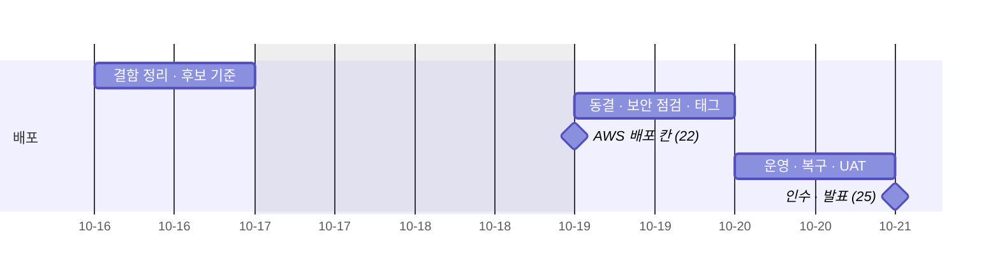
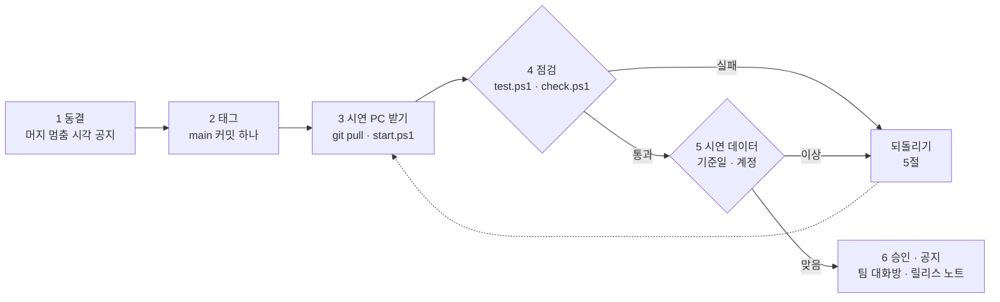

# 배포계획서 v0.1 — Qurious

| 문서 정보 | |
|---|---|
| **판 · 상태** | v0.1 · 초안(검토 전) · AWS 부분은 정해지면 채운다(7절) |
| **구분** | 10. 배포·운영·인수 — 배포계획서 |
| **작성** | 초안 이동원(팀장) · 기능별 점검 줄 채우기는 각 주담당 · 판 올리기와 검수 이동원 |
| **검토** | 검토 전 |
| **최종 수정** | 2026-10-03 (KST) |
| **기준** | 코드 `main` `7afe5e9` · [계획서 v2.0](../계획서/프로젝트계획서.md) 5.1절(강사님 칸 21 ~ 25) |
| **관련 문서** | [배포 구성도 v0.1](배포구성도.md) · [장애 대응 절차서 v0.1](장애대응절차서.md) · [릴리스 노트 v0.1](릴리스노트.md) · [코딩 표준 v0.1](../개발/코딩표준.md) 10절(완료의 정의) |
| **최근 개정** | 새 문서 |

> **이 문서로 알 수 있는 것**
> 1. 2차 시연 · 인수에 쓸 배포본을 언제 무엇으로 정하나?
> 2. 배포는 어떤 차례로 하고, 무엇을 확인한 뒤 승인하나?
> 3. 잘못되면 어떻게 되돌리나 · 누가 무엇을 하나?

## 요약

2차의 배포본은 **10-19(월) 오전에 main 의 한 커밋을 정해 태그를 붙이고**, 그 커밋을 시연 PC(이동원 PC)에 띄워 강사님 칸 22 ~ 25(AWS 배포 · 운영 · 복구 · UAT · 인수)에서 쓴다. AWS 는 선택이라 지금은 로컬 배포본이 그 칸을 대신한다. 배포 전에는 완료의 정의(전체 시험 · 기능 점검)와 시연 데이터 기준일을 확인하고, 문제가 나면 이전 태그로 되돌린다.

---

## 1. 배포 대상과 일정

**<표 1> 2차 배포 일정** · 강사님 일정표의 칸 번호(계획서 5.1절)

| 날 | 칸 | 할 일 | 주담당 |
|---|---|---|---|
| 10-16(금) 오후 | 20 단위 · 통합 시험 | 결함대장 정리 · 배포 후보를 고르는 기준 확인 | 네 명 |
| 10-19(월) 오전 | 21 보안 · 성능 | **배포 동결** · 보안 점검 · 태그 후보 | 네 명 |
| 10-19(월) 오후 | 22 AWS 배포 | 배포본 확정(태그) · 시연 PC 에 배포 · AWS 는 정해졌을 때만 | 이동원(모으기) |
| 10-20(화) 오전 | 23 운영 · 복구 | 일일 갱신 상태 · 백업 복원 리허설 · 관제 화면 | 이동원 |
| 10-20(화) 오후 | 24 UAT · 파일럿 | 사용자 시나리오 시험 · 수정 빌드 · 재배포 | 네 명 |
| 10-21(수) 오전 | 25 인수 · 지식 이전 | 최종 발표 · 완료보고 | 네 명 |

배포 주간의 흐름은 <그림 1> 과 같다.

**<그림 1> 배포 주간** · 범례: 막대 = 작업 · ◆ = 강사님 칸

---

## 2. 배포본

**<표 2> 배포본을 이루는 것**

| 항목 | 정할 것 | 예 |
|---|---|---|
| 코드 | main 의 커밋 하나 · 태그 | `release-2026-10-19`(이름 규칙은 팀 결정) |
| DB 구조 | 그 커밋의 마이그레이션 끝 하나 | `alembic heads` 결과 |
| 데이터 | 수집 데이터 기준일 · 비공개 백업 태그 | `python scripts/daily_update.py status` 의 기준일 |
| 시연 계정 | 시연에 쓸 계정과 모의 계좌 | 각 주담당이 자기 기능의 시연 자료를 준비 |
| 설정 | 시연 PC 의 `.env` 항목 | 값은 문서에 쓰지 않는다 |

---

## 3. 배포 절차

배포 하루의 차례는 <그림 2> 와 같다. 각 단계가 끝나야 다음으로 간다.

**<그림 2> 배포 절차** · 범례: 마름모 = 확인 · 점선 = 되돌아감

1. **동결** — 10-19 오전에 머지를 멈추는 시각을 팀 대화방에 알린다. 그 뒤의 PR 은 배포 뒤에 머지한다.
2. **태그** — 동결 시각의 main 커밋에 태그를 붙인다(사람이 git bash 에서).
3. **시연 PC 받기** — 시연 PC 에서 `git pull` 뒤 `.\scripts\personal\start.ps1`(코드가 바뀌었으면 이미지를 다시 만든다 · 앱이 켜지며 DB 구조를 올린다).
4. **점검** — `.\scripts\personal\test.ps1`(실패 0) · `.\scripts\personal\check.ps1`(실패 0) · 각 주담당이 자기 기능 화면을 눌러 본다.
5. **시연 데이터** — `python scripts/daily_update.py status` 로 기준일을 보고, 시연 계정으로 로그인해 주 경로를 한 번 지난다.
6. **승인 · 공지** — 팀이 「배포본 확정」 을 대화방에 남기고, 릴리스 노트에 그 날짜의 릴리스를 적는다.

---

## 4. 승인 기준

| 기준 | 확인 방법 | 누가 |
|---|---|---|
| 완료의 정의를 지켰다 | 코딩 표준 10절 여섯 줄 | 각 주담당 |
| 열린 1 · 2급 장애가 없다 | 장애 대응 절차서 · 결함대장 | 이동원 |
| 시연 주 경로가 끝까지 돈다 | 로그인 → 대시보드 → 각 목표 기능 화면 | 네 명 |
| 실거래 경로가 막혀 있다 | 실거래 차단 시험 통과 | 이동원 |

---

## 5. 되돌리기

| 상황 | 되돌리는 법 |
|---|---|
| 배포본에서 결함이 나왔다 | 이전 태그로 돌아가 `start.ps1` · 고친 커밋으로 새 태그 |
| DB 구조가 문제다 | 데이터를 먼저 백업한 뒤 고친 마이그레이션을 새로 더한다(되돌리기 마이그레이션은 데이터를 잃을 수 있다) |
| 시연 데이터가 틀리다 | 장애 대응 절차서 4.3(백업 복원 리허설 → 실제 복원) |
| 시연 PC 가 망가졌다 | 다른 팀원 PC 에서 같은 태그로 띄운다(수집 DB 는 비공개 백업에서 되살린다) |

---

## 6. 역할

| 역할 | 사람 | 하는 일 |
|---|---|---|
| 배포 책임(모으기) | 이동원 | 동결 · 태그 · 시연 PC 배포 · 운영 · 복구 칸 |
| 기능 점검 | 각 주담당 | 자기 기능의 화면 · 시험 · 시연 자료 |
| 승인 | 네 명 | 대화방에 「배포본 확정」 |

---

## 7. AWS 를 하기로 하면 — 정해지면 채울 칸

**<표 3> 정해지면 채울 칸**

| 칸 | 정할 것 | 누가 | 언제 |
|---|---|---|---|
| 배포 대상 · 방식 | EC2 한 대에 지금 컴포즈 그대로 등 | 팀 결정 → 이동원 | 늦어도 10-19(월) 오전 |
| 절차 | 3절에 서버용 단계(이미지 옮기기 · HTTPS · 보안 그룹) | 이동원 | 대상이 정해진 뒤 |
| 비용 · 끄는 날 | 월 예상 비용 · 시연 뒤 끄는 날 | 팀(강사님 · 학원과 협의) | 위와 같다 |
| 되돌리기 | 서버를 지우고 로컬 시연으로 돌아오는 법 | 이동원 | 위와 같다 |

---

## 8. 위험

| 위험 | 대응 |
|---|---|
| 시연 PC 한 대에 기대고 있다 | 5절 마지막 줄 — 팀원 PC 로 대신 · 백업 복원 |
| 개발 컨테이너 포트가 모든 망 연결에 열려 있다 | 시연 장소의 공용 망을 쓰기 전에 이 PC 에만 묶는 안(인프라 구성도 6절 ①) |
| LEAN 이미지가 매우 크다(내려받기 약 14GB) | 시연 전날 미리 받아 둔다 · 쓰지 않으면 LEAN 모드를 로컬로 |
| 로컬 언어 모델 답이 느리다 | 시연 질문을 미리 돌려 본다 · 근거 목록을 먼저 보인다 |

---

## 부록 A. 만든 방법

- 일정은 계획서 v2.0 5.1절의 강사님 칸 21 ~ 25 를, 절차는 로컬 실행 스크립트와 코딩 표준의 완료의 정의를 따랐다.
- 되돌리기 · 승인 기준은 장애 대응 절차서와 맞췄다.

## 부록 B. 개정 이력

| 판 | 날짜 | 무엇이 바뀌었나 | 왜 | 근거 |
|---|---|---|---|---|
| v0.1 | 2026-10-03 | 추가 — 새 문서(일정 · 배포본 · 절차 · 승인 기준 · 되돌리기 · 역할 · AWS 빈 칸 · 위험) | 강사님 산출물 표 10구분 「배포계획서」 가 비어 있었다 · AWS 칸은 정해지면 채운다(팀장 결정) | 계획서 v2.0 |
