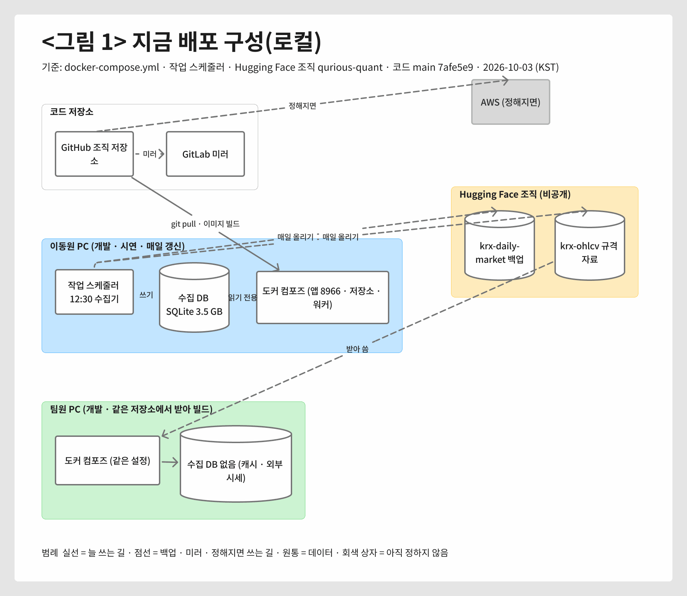
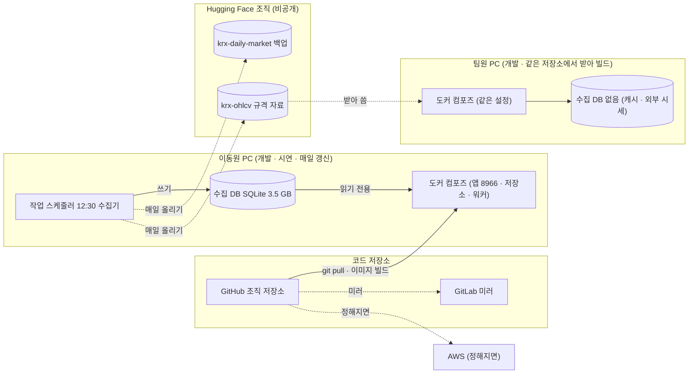
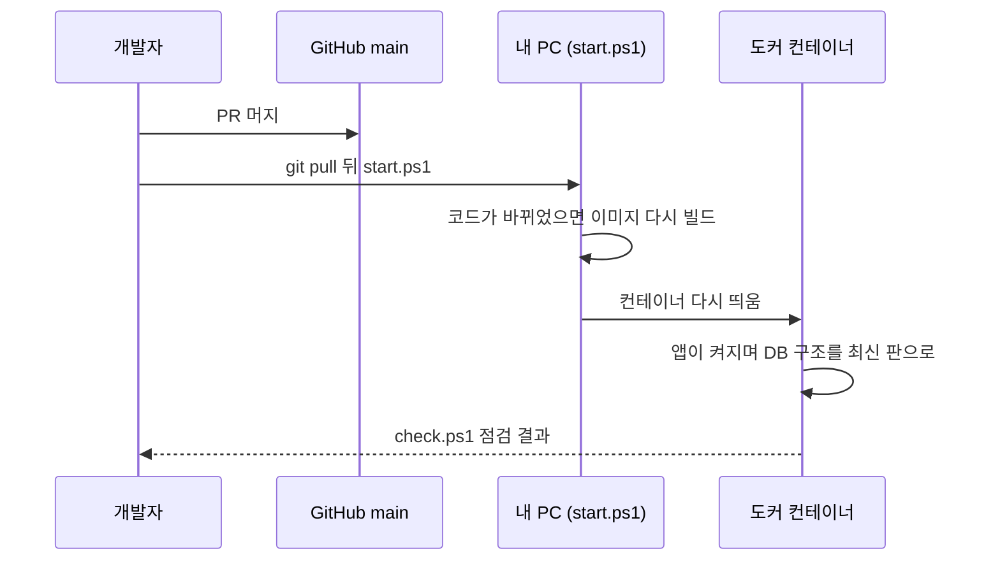

# 배포 구성도 v0.1 — Qurious

| 문서 정보 | |
|---|---|
| **판 · 상태** | v0.1 · 초안(검토 전) · AWS 구성은 정해지면 채운다(4절) |
| **구분** | 6. 시스템 설계 — 배포 구성도 |
| **작성** | 초안 이동원(팀장) · AWS 칸 채우기와 판 올리기는 팀 결정 뒤 이동원 · 검수 이동원 |
| **검토** | 검토 전 |
| **최종 수정** | 2026-10-03 (KST) |
| **기준** | 코드 `main` `7afe5e9` · `docker-compose.yml` · 작업 스케줄러 등록(`Qurious-daily-data-update`) · Hugging Face 조직 `qurious-quant` |
| **관련 문서** | [인프라 · 네트워크 구성도 v0.1](../설계/인프라-네트워크구성도.md) · [배포계획서 v0.1](배포계획서.md) · [로컬 실행 안내서 v0.1](로컬실행안내서.md) · [문서 그림 지침 v0.1](../문서기준/지난판/문서그림지침_v0.1.md) |
| **최근 개정** | 새 문서 |

> **이 문서로 알 수 있는 것**
> 1. 지금 Qurious 는 어느 장비에 무엇이 배포돼 돌아가나?
> 2. 코드 · 이미지 · 설정 · 데이터는 각각 어디서 와서 어디에 놓이나?
> 3. AWS 로 옮기면 어떤 칸을 누가 언제 채우나?

## 요약

지금 Qurious 는 서버 없이 **팀원 각자의 PC 에 도커 컴포즈로 배포**된다. 코드는 GitHub 조직 저장소에서 받아 각 PC 에서 이미지를 만들고, 매일 갱신되는 수집 DB 는 이동원 PC 한 곳에만 있으며, 그 백업과 OHLCV 규격 자료는 Hugging Face 조직의 비공개 데이터셋에 있다. AWS 배포는 정하지 않았다 — 4절의 칸은 팀이 AWS 여부를 정하면 이동원이 채운다(강사님 일정의 「AWS 배포」 칸 10-19(월) 오후 전).

---

## 1. 지금 배포 구성

지금 장비와 그 사이의 길은 <그림 1> 과 같다.

**<그림 1> 지금 배포 구성(로컬)** · 범례: 실선 = 늘 쓰는 길 · 점선 = 백업 · 미러 · 정해지면 쓰는 길 · 원통 = 데이터 · 회색 상자 = 아직 정하지 않음

원본: [Figma · 문서 그림 · 배포 구성도](https://www.figma.com/board/qTCGg7PlmpGNZT5uM8VQGm?node-id=17-301) · 그림 판 v0.1 · 기준 `7afe5e9` · 2026-10-03

그림 원문(Mermaid) — 검색 · 다시 그리기용

**<표 1> 배포되는 곳**

| 곳 | 무엇이 돈다 | 어디서 받나 | 누가 관리 | 확실도 |
|---|---|---|---|---|
| 이동원 PC | 도커 컴포즈 서비스 10개(앱 · 저장소 넷 · Ollama · Celery 둘 · 한 번 도는 것 둘) · 작업 스케줄러의 수집기(매일 12:30) | 코드: GitHub · 데이터: 공식 출처 | 이동원 | 확인 |
| 팀원 PC | 같은 도커 컴포즈(로컬 실행 스크립트) — 수집 DB 가 없어 시세는 캐시 · 외부 시세로 | 코드: GitHub · OHLCV 규격 자료: Hugging Face(조직 토큰) | 각자 | 확인 |
| GitHub 조직 저장소 | 소스 코드 · 문서(공개) | 각 PR | 네 명 | 확인 |
| GitLab | GitHub 의 미러(사람이 push) | GitHub | 이동원 | 확인 |
| Hugging Face 조직 `qurious-quant` | 수집 DB 파케이 백업 · OHLCV 규격 자료(비공개) | 이동원 PC 의 수집기 | 이동원 | 확인 |
| AWS | 정하지 않음 | — | 팀 결정 | — |

---

## 2. 무엇이 어디로 가나

**<표 2> 배포되는 것**

| 무엇 | 어디서 | 어떻게 | 어디에 놓이나 | 비고 |
|---|---|---|---|---|
| 코드 | GitHub `main` | `git pull` | 각 PC 의 작업 폴더 | 공개 저장소 — 비밀값 · 원자료 없음 |
| 컨테이너 이미지 | 그 코드의 `Dockerfile` | `start.ps1`(바뀌면 다시 빌드) | 각 PC 의 도커 | 이미지 저장소를 쓰지 않는다 |
| 설정 · 비밀값 | 각자 발급 | `.env`(`.env.example` 보고 작성) | 각 PC | 저장소에 올리지 않는다 · 증권사 키는 사용자마다 화면에서 |
| DB 구조 | `alembic/versions` | 앱이 켜질 때 올림 | 각 PC 의 PostgreSQL 볼륨 | 머지 전 끝이 하나인지 확인 |
| 수집 데이터 | 공공데이터포털 · DART · 법령 등 | 매일 12:30 수집기 | 이동원 PC 의 SQLite → 비공개 백업 | 원자료는 공개 저장소에 두지 않는다 |
| 언어 모델 | Ollama 모델 저장소 | `model-pull` 이 처음 한 번 | 각 PC 의 `ollama_data` 볼륨 | — |

코드 한 번이 PC 에서 돌기까지의 차례는 <그림 2> 와 같다.

**<그림 2> 코드가 PC 에서 돌기까지** · 범례: 실선 = 요청 · 점선 = 응답

---

## 3. 환경

**<표 3> 환경**

| 환경 | 어디 | 띄우는 법 | 데이터 | 쓰임 |
|---|---|---|---|---|
| 개발 | 각자 PC | `start.ps1 -Dev`(저장하면 바로 반영) | 각 PC 의 개발 DB | 매일 작업 |
| 시연 | 이동원 PC | `start.ps1`(보통 모드 · 이미지 코드) | 수집 DB 전체 · 시연 계정 | 강사님 칸 · 발표 |
| 운영 | 정하지 않음 | — | — | AWS 를 하기로 하면 4절 |

---

## 4. AWS 로 옮기면 — 정해지면 채울 칸

AWS 배포는 비목표다(계획서 2.3절 · 로컬에서 다 만든 뒤 고른다). 하기로 정하면 아래 칸을 채운다. 참고 자료는 강사님의 AWS 실습 예제(EC2 한 대 + 로드밸런서)다.

**<표 4> 정해지면 채울 칸**

| 칸 | 정할 것 | 누가 | 언제 |
|---|---|---|---|
| 대상 | EC2 한 대에 지금 컴포즈 그대로 · 컨테이너 서비스 · 하지 않음 | 팀 결정 → 이동원이 이 표에 | 늦어도 10-19(월) 오전 |
| 그림 | AWS 구성 그림(문서 그림 지침 7절 — AWS 공식 아이콘) | 이동원 | 대상이 정해진 뒤 |
| 수집 DB | 서버에 둘지, 지금처럼 이동원 PC 에서 갱신해 올릴지 | 팀 | 위와 같다 |
| 비밀값 | `.env` 를 서버에 어떻게 둘지 | 이동원 | 위와 같다 |
| 비용 | 월 예상 비용과 끄는 시점 | 팀(강사님 · 학원과 협의) | 위와 같다 |

---

## 부록 A. 용어

| 말 | 뜻 |
|---|---|
| 배포 | 코드와 설정을 실제로 돌아갈 곳에 놓고 띄우는 것 |
| 이미지 | 컨테이너를 만드는 틀 — 코드와 패키지가 들어 있다 |
| 미러 | 같은 저장소를 다른 곳에 똑같이 둔 사본 |
| 시연 환경 | 강사님 칸 · 발표에서 보여 주는 환경 |

## 부록 B. 만든 방법

- 배포되는 곳과 것: `docker-compose.yml` · `scripts/personal/start.ps1` · `python scripts/daily_update.py status`(작업 스케줄러 등록) · Hugging Face 데이터셋 이름(수집기 설정).
- 그림 1: [문서 그림 지침](../문서기준/지난판/문서그림지침_v0.1.md) 2 · 5절 — 생성 그림이 가로로 길어 세 줄로 접고 곧은 선으로 바꿨다.

## 부록 C. 변경 노트 — 다음 판(v0.2)에 넣을 것

| 날짜 | 종류 | 무엇 | 옮길 곳 | 근거 |
|---|---|---|---|---|

## 부록 D. 개정 이력

| 판 | 날짜 | 무엇이 바뀌었나 | 왜 | 근거 |
|---|---|---|---|---|
| v0.1 | 2026-10-03 | 추가 — 새 문서(지금 배포 구성 · 배포되는 것 · 환경 · AWS 빈 칸) | 강사님 산출물 표 6구분 「배포 구성도」 가 비어 있었다 · AWS 칸은 정해지면 채운다(팀장 결정) | compose · 작업 스케줄러 |
