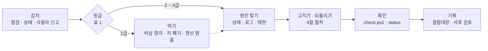

# 장애 대응 절차서 v0.1 — Qurious

| 문서 정보 | |
|---|---|
| **판 · 상태** | v0.1 · 초안(검토 전) |
| **구분** | 10. 배포·운영·인수 — 장애 대응 절차서(운영 절차 · 사후 검토 양식) |
| **작성** | 초안 이동원(팀장) · 장애를 처리한 사람이 사후 검토를 쓰고 판을 올린다 · 검수 이동원 |
| **검토** | 검토 전 |
| **최종 수정** | 2026-10-03 (KST) |
| **기준** | 코드 `main` `7afe5e9` · `scripts/personal/*.ps1` · `scripts/daily_update.py` · `scripts/hf_dataset.py` · 결함대장(테스트 계획서 v1.5) |
| **관련 문서** | [로컬 실행 안내서 v0.1](로컬실행안내서_v0.1.md) 8절 · [인프라 · 네트워크 구성도 v0.1](../설계/인프라-네트워크구성도_v0.1.md) · [ADR-0001 실거래 차단](../ADR/ADR-0001-실거래-주문-경로-차단.md) · [배포계획서 v0.1](배포계획서_v0.1.md) |
| **최근 개정** | 새 문서 |

> **이 문서로 알 수 있는 것**
> 1. 어떤 일을 장애로 보고, 얼마나 급하게 다루나(등급)?
> 2. 장애가 나면 누가 무엇을 어떤 차례로 하나?
> 3. 이 프로젝트에서 실제로 났거나 날 수 있는 장애 아홉 가지를 어떻게 막고 되돌리나?
> 4. 끝난 뒤 무엇을 남기나(사후 검토)?

## 요약

장애는 네 등급으로 나누고, 1급(실거래 위험 · 비밀값 노출 · 데이터 손실)은 원인을 찾기 전에 **먼저 막는다**. 막는 단계와 되돌리는 단계는 4절에 명령까지 적었다. 1 · 2급이 끝나면 처리한 사람이 5절 양식으로 사후 검토를 남기고, 원인은 사람이 아니라 시스템에서 찾는다. 이 문서의 단계는 지금의 로컬 운영 기준이며, 배포 방식이 정해지면 배포계획서와 함께 고친다.

---

## 1. 등급

**<표 1> 장애 등급**

| 등급 | 무엇 | 예 | 첫 대응 | 알릴 곳 | 사후 검토 |
|:-:|---|---|---|---|:-:|
| 1급 | 돈 · 비밀 · 데이터가 걸린 일 | 실거래 주문 위험 · 키가 공개 저장소에 올라감 · 수집 DB 나 백업이 망가짐 | 바로 · 원인보다 막기 먼저 | 팀 대화방 즉시 · 팀장 | 반드시 |
| 2급 | 서비스 전체가 멈춤 | 앱이 안 열림 · 일일 갱신 실패 · 로그인 불가 · 저장소에 쓸 수 없음 | 그날 안 | 팀 대화방 | 반드시 |
| 3급 | 기능 하나가 안 됨 | AI 채팅 무응답 · 화면 하나 오류 · 디스크 부족 경고 | 다음 작업일 | 결함대장 | 필요하면 |
| 4급 | 불편 · 경고 | 느림 · 로그 경고 | 기록만 | 결함대장 | — |

---

## 2. 대응 흐름

장애 하나를 처리하는 차례는 <그림 1> 과 같다. 1급은 「막기」 를 「원인 찾기」 보다 앞에 둔다.

**<그림 1> 장애 대응 흐름** · 범례: 실선 = 차례 · 점선 = 1급만

---

## 3. 감지 — 어디서 알아채나

**<표 2> 감지 수단**

| 수단 | 명령 · 위치 | 보는 것 |
|---|---|---|
| 상태 한 장 | `.\scripts\personal\status.ps1` | 컨테이너 여덟 · 앱 응답 · 이미지 신선도 · 수집 DB · 일일 갱신 중인지 · 디스크 |
| 기능 점검 | `.\scripts\personal\check.ps1` | 화면이 쓰는 API 70여 건(통과 · 주의 · 실패) |
| 일일 갱신 | `python scripts/daily_update.py status` | 마지막 회차의 단계별 결과 · 다음 예약 · 데이터 기준일 |
| 로그 | `.\scripts\personal\logs.ps1 -Service app -Tail 200` · `data/collector/logs/daily_update-날짜-123001.log` | 오류 줄 · 실패한 단계 |
| 데이터 관제 화면 | 앱 「데이터」 → 데이터 관제 | 표마다 마지막 갱신 · 행 수 |
| 사람 | 팀 대화방 · 결함대장 | 화면에서 본 이상 |

---

## 4. 장애별 절차

각 절차는 증상 → 확인 → 조치 → 확인 → 실패하면 → 되돌리기 차례다.

### 4.1 실거래 주문 위험 (1급)

증상: 모의가 아닌 계좌로 주문이 나갔거나, 나갈 수 있는 설정이 보인다.

1. 앱의 퀀트 자동매매 화면에서 **비상 정지**를 누른다(서버 쪽 `POST /api/quant/risk/kill-switch` · 감사 기록 `quant.kill_switch` 가 남는다).
2. 예약 매매를 멈춘다 — `docker stop fin-ai-celery-beat`.
3. `.env` 에 실거래를 여는 설정(`QURIOUS_ALLOW_LIVE_TRADING`)이 켜져 있는지 확인하고, 켜져 있으면 끄고 앱을 다시 띄운다. 값은 문서 · 대화방에 쓰지 않는다.
4. 증권사 화면에서 미체결 주문을 취소한다(사람).
5. 확인: 실거래 차단 시험(`tests/test_live_trading_guard.py` · `tests/test_live_order_gateway_path.py`)과 점검 실행.
- 실패하면: 그 계좌의 API 키를 증권사에서 폐기한다.
- 근거: [ADR-0001](../ADR/ADR-0001-실거래-주문-경로-차단.md) — 모든 증권사 호출은 실거래 차단 지점 한 곳을 지난다. KIS 키는 사용자마다다([ADR-0004](../ADR/ADR-0004-KIS-자격증명은-사용자마다.md)).

### 4.2 비밀값 노출 (1급)

증상: API 키 · 토큰 · 비밀번호가 커밋 · 이슈 · 대화방에 올라갔다.

1. **먼저 키를 폐기하고 새로 받는다** — 공공데이터포털 · DART · 국가법령정보센터 · Hugging Face · 증권사. 저장소에서 지우는 것보다 앞이다(공개 저장소는 올라간 순간 복제될 수 있다).
2. 새 키를 `.env` 에만 넣는다.
3. 저장소에서 지운다 — 새 커밋으로 지우고, 이력에서까지 지울지는 팀장이 정한다(이력 재작성 · 강제 push 는 팀장 승인 뒤에만).
4. GitHub 와 GitLab 미러 둘 다 확인한다.
- 확인: 저장소에서 키 모양을 검색해 0건.

### 4.3 데이터 손상 · 손실 (1급)

증상: 시세 · 배당 숫자가 갑자기 틀리거나, 수집 DB 를 열 수 없다.

1. 일일 갱신을 멈춘다 — 작업 스케줄러에서 `Qurious-daily-data-update` 를 사용 안 함으로(또는 `python scripts/daily_update.py uninstall`).
2. 지금 DB 를 고치기 전에 복사본을 둔다(`data/collector/market.sqlite3` 를 다른 폴더로).
3. 백업 상태를 본다 — 저장소 루트에서 `$env:PYTHONPATH='.'; python scripts/hf_dataset.py verify` (큰 표까지는 `--deep`).
4. 되살리기를 먼저 임시 폴더에서 연습한다 — `python scripts/hf_dataset.py restore`(기본이 임시 폴더 리허설). 2026-09 리허설에서 13,428,316행 · 지문 27/27 일치로 되살렸다.
5. 연습이 맞으면 `--into` 로 실제 자리에 되살린다.
6. 일일 갱신을 다시 켠다(`python scripts/daily_update.py install`).
- 확인: `python scripts/daily_update.py status` 의 데이터 기준일 · 데이터 관제 화면의 행 수.

### 4.4 앱이 안 열림 · 500 오류 (2급)

1. `.\scripts\personal\status.ps1` 로 컨테이너와 앱 응답을 본다.
2. `.\scripts\personal\logs.ps1 -Service app -Tail 200` 에서 첫 오류 줄을 찾는다.
3. 원인별로 <표 3> 을 따른다.

**<표 3> 앱이 안 열릴 때 흔한 원인**

| 로그 · 증상 | 원인 | 할 일 |
|---|---|---|
| 고친 내용이 안 보인다 | 옛 이미지로 떴다 | `.\scripts\personal\start.ps1`(자동으로 다시 만든다) · 그래도면 `-Build` |
| `Multiple head revisions` | 마이그레이션 갈래(4.6) | 4.6 절차 |
| DB 연결 실패 | PostgreSQL 이 아직 준비 안 됨 | `status.ps1` 에서 healthy 를 기다린 뒤 앱 재시작 |
| 포트를 쓸 수 없다 | 다른 프로그램 · Windows 예약 포트 | [로컬 실행 안내서](로컬실행안내서_v0.1.md) 8절 |
| 화면은 열리는데 500 이고 로그에 원인이 없다 | 예외가 응답 안에서만 처리됨 | 같은 요청을 다시 보내고 응답 본문의 `detail` 을 결함대장에 |

- 확인: `check.ps1` 실패 0.
- 되돌리기: 최근 머지가 원인이면 `git revert` 로 되돌리는 PR(강제 push 는 하지 않는다).

### 4.5 일일 갱신 실패 (2급)

1. `python scripts/daily_update.py status` 로 실패한 단계를 본다.
2. 그날 로그(`data/collector/logs/daily_update-날짜-123001.log`)에서 그 단계의 오류 줄을 본다.
3. 원인을 고친 뒤 다시 돌린다 — `python scripts/daily_update.py run --upload`. **12:30 ~ 13:10 에는 돌리지 않는다**(예약 회차와 겹친다 · 이미 돌고 있으면 잠금으로 바로 끝난다).
4. 새 자료가 없어도 파생 표를 다시 계산해야 하면 `--force-derived`.
- 확인: status 의 모든 단계 성공 · 데이터 기준일.
- 알아 둘 것: 휴장일에는 시세가 늘지 않는다(공식 자료가 다음 거래일에 들어온다) — 실패가 아니다.

### 4.6 마이그레이션 갈래 (2급)

증상: `alembic heads` 가 둘 이상 · 앱 시작이 마이그레이션에서 멈춘다.

1. `docker exec fin-ai-app alembic heads` 로 끝 둘을 확인한다.
2. 내용 없는 합치기 마이그레이션을 만든다 — `down_revision = ("끝1", "끝2")`.
3. 저장소 밖 복사본에서 `alembic heads` 가 하나인지 · 시험이 통과하는지 확인한 뒤 PR 로 올린다.
- 막기: 머지 전에 `alembic heads` 를 본다([코딩 표준](../개발/코딩표준_v0.1.md) 5절). git 은 이 충돌을 못 잡는다.

### 4.7 AI 채팅 · 근거 검색 무응답 (3급)

1. `status.ps1` 에서 `ollama` · `qdrant` 가 켜져 있는지 본다.
2. 모델을 받았는지 — `docker logs fin-ai-model-pull`.
3. 이 PC 에 따로 깐 Ollama 를 쓰면 `.env` 의 주소가 `host.docker.internal` 인지 본다(컨테이너 안의 `127.0.0.1` 은 컨테이너 자신이다).
- 알아 둘 것: 벡터 저장소가 꺼져 있으면 근거 검색은 낱말 검색만으로 돈다.

### 4.8 저장소 쓰기가 막힘 (2급)

증상: GitHub 계정이나 저장소가 로그인하지 않은 사람에게 404 로 보인다(2026-09-23 두 계정이 연달아 막힌 적이 있다).

1. **GitHub 쓰기(PR · 이슈 · 댓글 · push)를 모두 멈춘다.** 자동화 · 몰아 쓰기가 원인으로 의심되기 때문이다.
2. 로그인하지 않은 창에서 저장소와 계정 주소가 열리는지 본다.
3. 작업은 GitLab 미러로 이어 간다.
4. 지원 문의는 사람이 직접 한다.
- 막기: GitHub 쓰기는 사람이 하루 몇 건씩 · 건 사이 간격을 둔다.

### 4.9 디스크 부족 (3급)

1. `docker system df` 로 이미지 · 볼륨 크기를 본다.
2. 쓰지 않는 **이미지**만 정리한다. 볼륨(DB 데이터)은 지우지 않는다 — 지울 때는 `stop.ps1 -DeleteData` 로만.
3. `data/hf_export` 의 옛 파케이는 업로드가 끝났는지 `python scripts/hf_dataset.py status` 로 확인한 뒤 지운다.

---

## 5. 사후 검토 — 양식과 본보기

1 · 2급 장애가 끝나면 처리한 사람이 일주일 안에 쓴다. 칸은 실무 사후 검토의 기본 칸을 따랐다(부록 B). 사람이 아니라 **시스템과 절차의 빈틈**을 찾는다.

**<표 4> 사후 검토 칸**

| 칸 | 적을 것 |
|---|---|
| 요약 | 무엇이 · 언제 · 어디에 영향을 줬나 두세 문장 |
| 영향 | 멈춘 기능 · 시간 · 잃은 데이터 · 영향받은 사람 |
| 원인 | 계기(무엇이 방아쇠였나) · 근본 원인(왜 막지 못했나) |
| 감지 | 어떻게 알았나 · 더 빨리 알 수 있었나 |
| 조치와 복구 | 한 일과 시각 |
| 시간순 기록 | 시각(KST)마다 한 줄 |
| 잘된 점 · 배운 것 | 다음에도 할 것 · 바꿀 것 |
| 재발 방지 조치 | 할 일 · 담당 · 기한 · 이슈 번호 |

### 본보기 — 2026-10-02 마이그레이션 갈래

**요약.** 10-02 에 마이그레이션 두 줄기가 같은 부모(`320128e72164`)에 달려 끝(head)이 둘이 됐고, 합치기 마이그레이션 두 개(`c3d81e5a9b40` · `17e868117893`)로 하나로 묶었다. 합치기 전 main 을 받은 PC 는 마이그레이션이 멈출 수 있었다.

**영향.** 합치기 전까지 `alembic upgrade head` 가 끝을 고르지 못한다. 실제로 막힌 PC 수는 재지 않았다.

**원인.** 계기는 두 사람이 같은 날 같은 부모에 마이그레이션을 단 것이다. 근본 원인은 git 이 이 충돌을 파일 충돌로 보지 않아 PR 화면에 나타나지 않는 것, 그리고 머지 전 `alembic heads` 확인이 규칙에 없었던 것이다.

**조치와 복구.** 합치기 마이그레이션 둘을 만들었다 — 첫째는 PR #92 의 충돌을 풀며(10-02 17:21), 둘째는 PR #96(10-02 17:46)으로. 저장소 밖 복사본에서 끝이 하나인지 · 시험이 통과하는지 확인했다.

**재발 방지 조치**

| 할 일 | 담당 | 기한 | 상태 |
|---|---|---|---|
| 머지 전 `alembic heads` 를 완료의 정의에 넣는다 | 네 명 | 10-06 오후 「개발 표준 · DoD」 칸 | 코딩 표준 v0.1 에 초안 |
| 마이그레이션 이름을 번호로 맞춘다(다음 `0014`) | 네 명 | 이슈 #88 결론 | 안건 |

---

## 부록 A. 용어

| 말 | 뜻 |
|---|---|
| 비상 정지 | 자동매매의 새 주문을 모두 멈추는 스위치 |
| 사후 검토 | 장애가 끝난 뒤 원인과 재발 방지를 정리하는 글(포스트모템) |
| 마이그레이션 끝(head) | 데이터베이스 구조 변경 이력의 마지막 판 — 둘이면 어느 쪽으로 올릴지 모른다 |
| 리허설 복원 | 실제 자리 대신 임시 폴더에 되살려 보는 것 |

## 부록 B. 만든 방법

- 장애 목록은 로컬 실행 안내서 6 · 8절의 실제로 겪은 문제, 결함대장, 일일 갱신 로그, 저장소 계정이 막힌 일(2026-09-23)에서 골랐다.
- 사후 검토 칸은 Google SRE 의 사후 검토 문화(요약 · 영향 · 계기 · 해결 · 감지 · 시간순 · 배운 것 · 담당이 있는 조치 · 사람 탓을 하지 않는 원칙)를 따랐다 — https://sre.google/workbook/postmortem-culture/
- 명령은 `scripts/personal/` · `scripts/daily_update.py --help` · `scripts/hf_dataset.py --help` 로 확인했다(2026-10-03).

## 부록 C. 변경 노트 — 다음 판(v0.2)에 넣을 것

| 날짜 | 종류 | 무엇 | 옮길 곳 | 근거 |
|---|---|---|---|---|

## 부록 D. 개정 이력

| 판 | 날짜 | 무엇이 바뀌었나 | 왜 | 근거 |
|---|---|---|---|---|
| v0.1 | 2026-10-03 | 추가 — 새 문서(등급 · 대응 흐름 · 감지 · 장애별 절차 아홉 · 사후 검토 양식과 본보기) | 강사님 산출물 표 10구분 「장애 대응 절차서」 가 비어 있었다 | 운영 기록 · 결함대장 |
