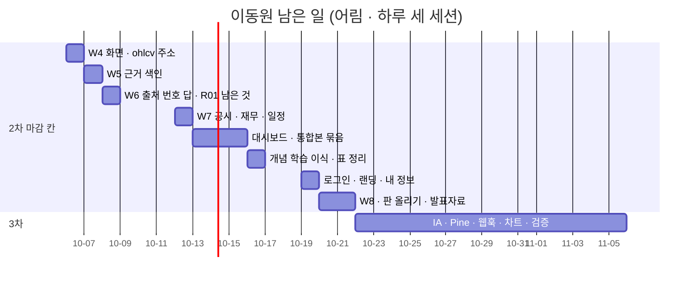

# 프로젝트 산출물 목록 — Qurious

| 항목 | 내용 |
|------|------|
| **문서 버전** | v2.40 |
| **최종 갱신** | 2026-10-10 (KST) · S105(첫 PR) — **조사서 둘 v0.1**(개별 종목 분석 · 투자 근거 · 익절 · 손절 / 정기 수집 회차 시각 — 결정: 12:30 그대로 · 팀 이슈로 의견) · 이슈 초안 다섯 · 10-08 대화방 글 1번 「들어갔어요」 로 고침 · 테스트 계획서 v1.24(DF-99 · 100 링크) · 문서 그림 지침 v0.11 · 그 앞 S104(둘째 PR) — **화면 수집 단추**(수집 일정 · 단계 — 줄마다 다시 받기 · 전체 수집 · 작업자 띠 · 요청 목록 · 확인 창 · 대기 창 · 데이터 관제 관리자 한 줄) · API 명세서 v0.17 · UI 명세서 v0.8 · IA v1.5 · RTM v1.13 · 테스트 계획서 v1.23 · 문서 그림 지침 v0.10 · S104(첫 PR) — **조사서 넷 v0.1**(기초 코드 최신판 융합 · 시장 범위 · 모의투자 · 금융 필수 지식 · 개념 학습 배치 — 이미 올린 이슈 #149 ~ #152 가 가리키는 조사서) · 테스트 계획서 v1.22(결함 후보 셋 · DF-94 ~ 96) · 문서 그림 지침 v0.9 · 그 앞 S103 — **화면 수집 단추 서버**(요청 표 · 이전 0018 · `API-DATA-12 ~ 15` · PC 작업자 매 분 · 러너 막힘 75 · 막는 때 한 곳) · 시험 1229(26차 1229 통과 · 실패 0 · 깨 보기 서른둘 · 12:30 정기 회차 실측 DF-93 찾고 닫음) · S102 몫 판 칸(테스트 계획서 v1.20 · API v0.15 · UI v0.7 · IA v1.4 · 그림 지침 v0.8 · 기능 완성도 점검 v0.2 · docs 지도 v1.1 · 조사서 둘) · 지난 2026-10-08 · S101 — **크롤링 세 화면 구현**(수집 일정 · 단계 / 자료 직접 받기 / 적재 · 백업 · 「DB 초기화」 단추와 서버 길 없앰 DF-78) · 새 서버 셋(`API-DATA-08 ~ 10`) · 시험 1159(24차 실패 0 · 깨 보기 스물여섯) · 결함 88(DF-78 · 82 닫힘 · DF-86 ~ 88 찾고 닫음) · 「자료 안내」 화면 Figma 세 안(여덟째 파일 · 결정 전) · 지난 갱신 S100 — **강사님 기초 코드 th06 서버 쪽 반영**(23커밋 · 충돌 서버 14곳 · 운용 값 넷은 받지 않음 · 지킴이 TC-BM 4 → 15 · 깨 보기 열세 곳) · 점검 계정 KIS 모의 연동(`kis-link.ps1` · 점검 KIS 묶음 3) · 시험 1129(23차 실패 0) · 결함 85(DF-84 · 85 열림) · 지난 갱신 2026-10-07 (KST) · S99 — **크롤링 세 화면 서버**(단계 이름표를 러너 한 곳에 · 수집 일정 API · 한 단계 다시 · 주소 검사 — DF-79 · 80 · 81 닫힘 · DF-82 열림) · 테스트 계획서 v1.17(22차 1019 통과 · 실패 0 — 여섯 번 · 다섯째 회 실패 2 는 팀원 #137 몫 · DF-83 · #138 이 고침) · UI 명세서 v0.4 · API 명세서 v0.12 · 문서 그림 지침 v0.6 · 지난 갱신 S98 — **공개 저장소의 시세 JSON 둘을 추적에서 뺌**(강의 빌드가 「HF 보관」 을 건너뜀 · TC-LC-12 · 13) · 테스트 계획서 v1.16(21차 971 통과 · 실패 0 · DF-78) · 갱신 대장 v0.15 · 강사님 자료 추적 댓글 10 · 지난 갱신 S97 — **docs 폴더 정리** — 문서마다 판 없는 이름 하나 · 지난판/ · 대장/ · 평가셋/ · 내보내기/ · 문서기준/ (옮김 171 · 종류 폴더 맨 위 166 → 52) · 판 올리는 도구 `scripts/docs_scan.py` · docs/README.md v1.0 · 문서 작성 기준 v0.3 · 그림 지침 v0.5 · 지난 갱신 S96 — **크롤링 세 화면 결정 문서 · 신용평가 CSV 조사 · 역할 재확정** — S95 Figma 결정(① 네이버 긁기는 「막음」 예시로만 · ③ 외부 강의 문서는 개념 학습으로 · ④ 관제와 따로 두고 한 줄로 잇기 + 자동 반영)을 IA v1.3 · UI 명세서 v0.3(5절 · 그림 셋) · 할 일 v0.3 에 · 조사서 「신용평가 CSV 인제스트」 v0.1(자료 0행 · 요구 아님 · 금감원 상품 자료는 약관 제9조로 저장 금지 · 「DB 초기화」 는 모든 사용자 기록을 지움) · 조사서 「교재 원천 갱신 따라가기」 v0.1(th01 · th07 원본 커밋 29 중 금융 내용 1 · 결정 — E 와 C 융합) · docs 폴더 정리는 안 2(최신은 판 없는 이름 + 지난판/ · S97 첫 칸) · 주인 없는 화면 22 → 이동원 2 · 3차 · 로보 어드바이저 먼저(10-21) · 문서 그림 지침 v0.4 · 지난 갱신 S94 — **W8 결정 · 머지 뒤 실측 둘** — 판정 모델 둘 다 사람 판정을 가르지 못함(판정 점수를 품질 지표로 쓰지 않고 50 으로 넓히지 않음) · 질문 되풀이 거름 실제 길 확인 · 실패 발췌 화면 안 B 브라우저 확인 · 테스트 계획서 v1.15 · 조사서 v0.3 · 할 일 v0.2 · 지난 갱신 S93 — **근거 품질 W8 · 섹터 낱말 2판 · 근거 답 거름 둘 · 실패 발췌 화면 · HF 백업 둘 · 문서 그림 Figma 규칙** — 근거 충실도 평가 도구(Ragas Faithfulness · 판정 모델 둘 · 사람 판정 61과 맞춤) · 「없다」 단정 거름(DF-64 일부 닫힘) · 질문 되풀이 거름(DF-76) · 실패 발췌 화면 안 B · 일상 말 91개(새 표본 밖 13 정답 5 → 8) · HF `kb-legal-base` · `search-index` · 이동원 파트 할 일 v0.1 · 시험 926 · 결함 77(DF-77 카탈로그 검사 줄 끝) · 지난 갱신 2026-10-06 · S92 |
| **작성자** | 이동원 |
| **목적** | 강사님이 제시한 **단계별 산출물 10구분**을 기준으로, 무엇이 있고 무엇이 비었는지 한 장에 둔다 |
| **갱신 규칙** | 산출물을 새로 내거나 상태가 바뀐 세션마다 이 문서를 함께 고친다 — **세션 끝에 0.2절 7줄을 확인한다**(S56~ · ⑥ 은 S58~ · ⑦ 은 S61~) |

> 이 문서는 **정본 인덱스**다. 실제 내용은 각 문서에 있고, 여기에는 위치와 상태만 적는다.
> 산출물을 만들었는데 여기 줄이 늘지 않았다면, 팀에서는 없는 것이나 마찬가지다.

---

## 0. 한눈에 — 현재 채움 정도

```
 구분                     채움
 ────────────────────────────────────────────────────────
 1 착수·과업 정의     ██████████████████░░   90%   ← S84 착수보고서 v0.1 · 문서 작성 기준 v0.2 (85% → 90%) · S82 이해관계자 목록 v0.1 (80% → 85%) · S43 결정 대장 · S65 문서 작성 기준(제안) · S72 계획서 v2.0 (역할 확정 · 범위 · 위험) (70% → 80%) · S77 결정 대장 v1.0 규칙 적용판
 2 요구사항 관리      █████████████████░░░   85%   ← S84 유스케이스 명세서 v0.1 (80% → 85%) · S41 RTM · S60 강사님 자료 기능 대조 v0.1 · S63 기능 설계서 v0.1 (사용자 스토리 씨앗 29) · S67 RTM v1.1 · 요구 대장 59(요구사항정의서) · S72 요구 대장 담당 칸 · 인수 기준 12 (75% → 80%)
 3 일정·업무 관리     ███████████████░░░░░   75%   ← S84 WBS · 스프린트 계획 · 주간보고 v0.1 (55% → 75%) · S57 일일 기록 양식(제안) · docs/회의/
 4 화면·서비스 설계   █████████████████░░░   85%   ← S84 UI 명세서 v0.1 (80% → 85%) · S83 IA v1.0 · 와이어프레임 v0.5 — 첫 화면 투자 대시보드 · 위 메뉴(들어가는 만큼) · 전체 메뉴 · Figma 넷째 파일 (75% → 80%) · S79 데이터 관제 · 일정 화면(Figma 셋째 파일 → 같은 날 구현 · 화면 67 · 위 메뉴 「데이터」) (70% → 75%) · S77 IA · 와이어프레임 v0.4 (화면 65 · W19 · W20 · 용어 설명) (65% → 70%) · S75 화면 자리 조사 · 첫 Figma 파일 · 강의실 + 주제 화면 9 (55% → 65%) · S52 IA v0.2 · 와이어프레임 착수 (30% → 45%) · S54 와이어프레임 v0.2 · S70 IA · 와이어프레임 v0.3 (화면 54 · 새 화면 · 모바일 · 내 정보) (45% → 55%) · S73 학습 사이트 화면 구성(개념 학습 설계서 8절)
 5 데이터 설계        █████████████████░░░   85%   ← S77 ERD · 사전 v1.3 (52표 562칸 · 업무 영역 다섯 · 탈퇴 반영 · 코드 값 +19) (80% → 85%) · S42 ERD·데이터사전 · S57 v1.1 (다리 · alembic 대조) · S66 v1.2 (표 속성 대장 · 코드 정의) · S74 수집 DB 새 표 넷
 6 시스템 설계        █████████████████░░░   85%   ← S84 인프라 · 네트워크 구성도 · 배포 구성도 v0.1 · 문서 그림 지침(Figma) (80% → 85%) · S75 아키텍처 그림 v2.0 (75% → 80%) · S40 에서 ADR 착수 · S70 기능별 동작 원리서 v0.1 (애플리케이션 구성도 · 기능 21 동작 원리) (40% → 55%) · S71 통합본 이식 계획서 v0.1 · 용어사전 설계서 v0.1 (55% → 65%) · S72 목표 기능 ① 상세 설계서 v0.1 (65% → 70%) · S73 개념 학습 설계서 v0.1 (70% → 75%) · S74 목표 기능 ① 설계서 부록 C 15줄(실측 정정)
 7 인터페이스 설계    █████████████░░░░░░░   65%   ← S82 API 명세서 v0.2 · IF-17 증권사 연동 명세(강사님 계약서 사본) (60% → 65%) · S79 OHLCV 규격 주소 `API-DATA-02`(팀원이 받아 쓰는 인터페이스 · HF 파일과 같은 줄) (55% → 60%) · S63 API 명세서 v0.1 · 인터페이스 정의서 · 데이터 매퍼 시작 (20% → 55%)
 8 개발·형상 관리     ████████████████░░░░   80%   ← S84 코딩 표준(완료의 정의) · 코드 리뷰 기록 v0.1 (70% → 80%)
 9 시험·성과 검증     ██████████████░░░░░░   70%   ← S87 기능 완성도 점검 보고서 v0.1 · 점검표(화면 69 + 로그인 · 가입 · 배지 팀 줄 · TC-CP) (65% → 70%) · S84 백테스트 보고서 v0.1(틀 · 엔진 현황) (60% → 65%) · S82 테스트 계획서 v1.4 (668건 · 결함 49 · 묶음 표를 대장에서) (55% → 60%) · S40 착수 · S56 테스트계획서 v1.1 (78건) · S57 골든 픽스처 (102건) · S60 v1.2 (117건 · 결함대장 재측정) · S62 DF-11 · DF-16 (138건) · S63 TC-AP (151건) · S64 DF-17 (169건) · S66 TC-SS (177건) · S67 v1.3 (188건 · 결함 19) · S68 강사님 반영 (249건) · S70 계정 관리 (270건 · 점검 56) · S73 개념 학습 (402건 · TC-LN 34) · S74 OHLCV (448건 · TC-OH 29 · TC-CT 12) · S77 강사님 289bfb5 · 용어 화면 · 새 시험 넷 (482건 · DF-36~38) · S79 백업 · OHLCV · 화면 (543건 · TC-HF · TC-OA · TC-DH · DF-40 ~ 43)
10 배포·운영·인수     █████████████░░░░░░░   65%   ← S84 배포계획서 · 장애 대응 절차서 · 릴리스 노트 · 완료보고서(틀) v0.1 (50% → 65%) · S79 관제 화면(위 메뉴 표시 · 서랍) · 백업이 수집 DB 를 빠짐없이(표 열둘 · 복원 리허설) · 점검 71 (40% → 50%) · S78 데이터 상태 API · 러너 달력 단계 · 점검 「데이터」 (운영 관제의 서버 쪽) (35% → 40%) · S40 에서 착수 · S69 로컬 실행 안내서 v0.1 · 스크립트 7 (운영 매뉴얼 · 로컬 구성도) (20% → 35%)
 ────────────────────────────────────────────────────────
 S104 에 바뀐 칸: 9 테스트 계획서 v1.23 · 시험 1237(29차 실패 0 · TC-CL +6 · TC-CQ +2 · 깨 보기 스물 <표 8-23>) · 결함 101(DF-94 ~ 96 · 99 ~ 101 열림 · DF-97 · 98 찾고 닫음) · 7 API 명세서 v0.17(`blocked_now` · 부르는 화면) · 4 UI 명세서 v0.8 · IA v1.5
                 · 2 RTM v1.13(10-06 뒤 묶음 열아홉 · 다시 채움) · 1 문서 그림 지침 v0.9 · v0.10 · 6 조사서 넷 v0.1 · 결정 대장 부록 C · 8 TIL 둘 · 기록(조사 이슈 넷 · #124 답글) — 채움 % 는 그대로
 S103 에 바뀐 칸: 9 테스트 계획서 v1.21 · 시험 1229(26차 1229 통과 · 실패 0 · 새 묶음 TC-CQ 15 · TC-CW 12 · 팀원 TC-RBX 13 · TC-DU 43 · 깨 보기 서른둘 <표 8-22>) · 결함 93(DF-91 · 92 열림 · DF-93 찾고 닫음) · 7 API 명세서 v0.16(DATA-12 ~ 15 · RBAL-10 · 241)
                 · 5 이전 0018(표 둘) · 6 조사서 셋(자동 수집 벤치마크 v0.2 새 · 화면 실행 통로 v0.2 구현 기록) · 결정 대장 부록 C 셋 · 8 TIL · 기록(#144 · #146 본문 · #124 답글 둘) — 채움 % 는 그대로
 S102 에 바뀐 칸: 9 테스트 계획서 v1.20 · 시험 1184(25차 실패 0 · TC-DG 9 · TC-DU 38 · 깨 보기 스물하나 · 열둘) · 결함 90(DF-89 열림 · DF-90 닫힘) · 7 API 명세서 v0.15(DATA-11) · 4 UI 명세서 v0.7 · IA v1.4(자료 안내 · 화면 70) · 9 기능 완성도 점검 v0.2
                 · 1 문서 그림 지침 v0.8 · 8 docs 지도 v1.1 · 6 조사서 둘(러너 단계 결과 · 화면 실행 통로 v0.1 · 자료 안내 화면 조사 셋) — 채움 % 는 그대로(이 줄은 S103 에 채움)
 S101 에 바뀐 칸: 9 테스트 계획서 v1.19 · 시험 1159(24차 실패 0 · 새 묶음 셋 TC-CL · FP · BK · TC-UG 24 · 깨 보기 스물여섯 <표 8-19>) · 결함 88(DF-78 · 82 닫힘 · 86 ~ 88 찾고 닫음) · 기능 완성도 점검표(수집 화면 셋 63 · 61 · 68 → 90 · 88 · 86)
                 · 7 API 명세서 v0.14(DATA-08 ~ 10 · ADM-01 폐기) · 4 UI 명세서 v0.6(5절 구현 화면 · 그림 넷 다시) · 1 문서 그림 지침 v0.7 · 결정 대장 부록 C · 8 TIL · 기록 다섯 폴더(팀원 글 포함) — 채움 % 는 그대로
 S100 에 바뀐 칸: 9 테스트 계획서 v1.18 · 시험 1129(23차 실패 0 · 강사님 새 묶음 여덟 74 · 지킴이 TC-BM 15) · 결함 85(DF-84 · 85 열림) · 7 API 명세서 v0.13(라우트 233) · 4 UI 명세서 v0.5
                 · 2 시험-요구 대장(새 묶음 8줄) · 10 점검 계정 KIS 모의 연동 · 점검 KIS 묶음 · 8 TIL — 채움 % 는 그대로
 (S99 에 바뀐 칸: 9 테스트 계획서 v1.17 · 시험 1019(22차 실패 0 · 여섯 번 돌림 — 다섯째는 팀원 #137 의 같은 길 둘로 실패 2 · 팀원 TC-RBU 14 포함) · 결함 83(DF-79 · 80 · 81 · 83 닫힘 — 83 은 팀원 #138 · DF-82 열림) · 4 UI 명세서 v0.4 · 7 API 명세서 v0.12(라우트 231 — #137 뒤 230 → #138 뒤 231) · 1 문서 그림 지침 v0.6
                 · 2 시험-요구 대장(TC-UG `RFP2-3.2-①`) · 10 수집 일정 API · 한 단계 다시 · 데이터 상태 API 31초 → 0.5초 · 8 TIL — 채움 % 는 그대로)
 (S98 에 바뀐 칸: 9 테스트 계획서 v1.16 · 시험 978(21차 971 실패 0 — 처음 전부 통과 · 팀원 #131 TC-PS 7 따로 통과) · 결함 78(DF-73 · 75 닫힘 · DF-78 열림) · 8 TIL · 갱신 대장 v0.15 · 강사님 자료 추적 댓글 10
                 · 2 시험-요구 대장(TC-LC `RFP2-3.2-①`) · 공개 저장소의 시세 JSON 둘을 추적에서 뺌 — 채움 % 는 그대로)
 (S96 에 바뀐 칸: 4 IA v1.3(크롤링 세 화면 결정 · 표 1-1 · 그림 2-1) · UI 명세서 v0.3(데이터 수집 화면 셋 상세 · 그림 셋) · 3 이동원 파트 할 일 v0.3(주인 없는 화면 22 → 이동원)
                 · 1 문서 그림 지침 v0.4 · 6 조사서 둘(신용평가 CSV 인제스트 v0.1 · 교재 원천 갱신 따라가기 v0.1) — 채움 % 는 그대로 · 코드 · 시험 변경 없음)
 (S92 에 바뀐 칸: 9 테스트 계획서 v1.13 · 시험 903 · 결함 75(DF-70 ~ 72 · 74 닫힘 · DF-73 · 75 열림 · DF-61 · 66 닫힘) · 표본 밖 · 근거답 v2 · 판정 v2 · 점검표(리서치 41 → 84 · 일정 90 → 93)
                 · 6 설계서 v1.5 · 조사서(학습 · API 문서 앱 통합) · 2 RTM v1.11 · 5 ERD · 사전 v1.8 · 7 API 명세서 v0.10 · 4 IA v1.2 · 8 TIL · 갱신 대장 v0.11 — 채움 % 는 그대로 — 이 줄은 S96 에 괄호로)
 (S91 에 바뀐 칸: 9 테스트 계획서 v1.12 · 시험 811 · 결함 69(DF-69 닫힘) · 섹터 법령 평가셋 · 사람 판정표 · 6 설계서 v1.4 · 조사서 v0.2(뉴스 출처) · 2 RTM v1.10
                 · 5 ERD · 사전 v1.7(`news_item`) · 7 API 명세서 v0.9(CAL-03) · 1 결정 대장 부록 C 다섯 · 8 TIL · 갱신 대장 v0.10 — 채움 % 는 그대로 — 이 줄은 S92 에 괄호로)
 (S87 에 바뀐 칸: 9 기능 완성도 점검 보고서 v0.1 · 점검표 TSV(65% → 70%) · 테스트 계획서 v1.8 · 시험 708 · 결함 62(DF-03 닫힘 · DF-61 · 62)
                 · 6 조사서 셋째(기능 확장 시장조사 · 27곳) · 2 RTM v1.6 · 시험-요구 대장(TC-CR · TC-CP) · 1 결정 대장 부록 C 2 · 8 TIL · 갱신 대장 v0.6(#57 갱신 02) · 이슈 초안 넷 — 이 줄은 S91 에 괄호로)
 (S86 에 바뀐 칸: 6 목표 기능 ① 설계서 v1.0(부록 C 40줄 → 본문) · 조사서 둘째(근거 답 출처 표시) · 4 UI 명세서 v0.2(첫 화면 상세 — 근거 답) · IA v1.1
                 · 2 유스케이스 v0.3 · RTM v1.5 · 7 API 명세서 v0.5 · 9 테스트 계획서 v1.7 · 시험 697 · 결함 60 · 8 TIL · 갱신 대장 v0.5(옛 A10 #50 갱신 02) — 이 줄은 S87 에 괄호로)
 (S85 에 바뀐 칸: 6 조사서 첫 판(로컬 LLM · 새 폴더 `docs/조사/`) · 설계서 부록 C · 7 API 명세서 v0.4(KB-03) · 2 RTM v1.4 · 유스케이스 v0.2
                 · 9 테스트 계획서 v1.6 · 시험 689 · DF-57 · 58 · 1 결정 대장 부록 C · 8 TIL — 이 줄은 S86 에 더함)
 (S84 에 바뀐 칸: 빠진 주요 산출물 15개 v0.1 — 1(85% → 90%) · 2(→ 85%) · 3(→ 75%) · 4(→ 85%) · 6(→ 85%) · 8(→ 80%) · 9(→ 65%) · 10(→ 65%)
                 · 문서 그림 지침 v0.1 · 문서 작성 기준 v0.2 · 이슈 초안 하나(백테스트 결과 칸) · TIL)
 (S83 에 바뀐 칸: 4 IA v1.0 · 와이어프레임 v0.5 · 투자 대시보드 · 메뉴(75% → 80%) · 1 결정 대장 v1.2 · 2 RTM v1.3 · 7 API 명세서 v0.3
                 · 9 테스트 계획서 v1.5 · 시험 675 · 결함 56 · 8 TIL · 갱신 대장 v0.4 · 강사님 기준점 9478811)
 (S82 에 바뀐 칸: 1 이해관계자 목록 v0.1(🔴 → 🟢 · 80% → 85%) · 결정 대장 v1.1 · 2 RTM v1.2 · 5 ERD · 사전 v1.4 · 6 ADR-0004 · 7 API 명세서 v0.2 · IF-17 증권사 연동(60% → 65%)
                 · 9 테스트 계획서 v1.4 · 시험 668 · 결함 49(55% → 60%) · 8 TIL · 판 올리기 규칙(0.2절 ②))
 (S79 에 바뀐 칸: 4 데이터 관제 · 일정 화면(70% → 75%) · 7 API-DATA-02(55% → 60%) · 10 관제 화면 · 백업 · 점검 71(40% → 50%)
                 · 9 시험 543 · DF-40 ~ 43 · 2 시험-요구 대장(TC-HF · OA · DH) · RTM 표 · 5 표 속성 대장(공개 근거) · 6 설계서 · 동작 원리서 · 용어사전 설계서(조사 · 결정) · 8 TIL)
 (S78: 10 데이터 상태 API · 러너 달력 단계 · 점검 69(35% → 40%) · 6 설계서 부록 C(W4 · W5 앞당김) · 동작 원리서 C.3 · C.4 · 용어사전 설계서
                 · 7 API 211(DATA · CAL · GLOS-05) · 5 수집 DB 표 셋 · 앱 표 `glossary_relations`(v1.4 재료) · 9 시험 511 · DF-39 · DF-40 · 2 시험-요구 대장(TC-CA · DST) · 8 TIL)
 (S77: 5 ERD · 사전 v1.3(80% → 85%) · 4 IA · 와이어프레임 v0.4 · 절차 v0.2(65% → 70%) · 1 결정 대장 v1.0 · 9 시험 482 · DF-36~38
                 · 2 시험-요구 대장(TC-SA · CM · VS · BR · VW) · RTM 표 · 10 점검 66 · Qdrant · 8 TIL · 기록)
 (S75: 4 화면 자리 조사 · Figma · 강의실 + 주제 화면 9 · 6 아키텍처 그림 v2.0 · 7 API 204(LEC 8) · 9 시험 458(TC-LC 10) · DF-28~35
                 · 2 시험-요구 대장 · 8 TIL · README 2.0 · 이식 대장 판정 갱신(보류 0))
 (S74: 5 수집 DB 새 표 넷 · 표 속성 대장 51 · 6 설계서 부록 C · 9 시험 448(TC-OH · TC-CT) · 2 시험-요구 대장 · RTM 표
                 · 8 TIL · 기록 · 10 일일 러너 단계 둘 · HF krx-ohlcv)
 (S73: 6 개념 학습 설계서(70% → 75%) · 4 학습 사이트 화면 구성 · 7 API 196(LRN 7) · 9 시험 402(TC-LN 34) · 8 TIL · 기록 · 2 RTM 표)
 (S72: 1 계획서 v2.0 · 2 요구 대장 담당 칸 · 6 목표 기능 ① 상세 설계서 · 9 시험 368)
 (S71: 4 화면 설계 절차 · 5 용어사전 표 다섯 · 6 이식 계획서 · 용어사전 설계서 · 7 API 189 · 8 반입 대장 · 9 시험 367)
```

> 채움 정도는 **구분 안의 세부 산출물 중 몇 개가 존재하는가**로 매긴 어림값이다.
> 품질 평가가 아니다 — 있으면 센다.

범례 · 🟢 있음 / 🟡 일부 (다른 문서가 겸함) / 🔴 없음 / ⏸️ 보류(사유 있음)

### 0.1 문서 판(版) 현황 — S56 신설

판을 올리는 문서는 **작업 중에는 판을 올리지 않고**, 바뀔 것을 「다음 판에 넣을 것」 에 모았다가
한 기능·마일스톤이 끝날 때 한 번에 올린다. 옛 판은 지우지 않고 이력으로 둔다(CI/CD 명세 v1.0~v1.2 선례).
이 표는 「지금 몇 판인가 · 다음 판은 언제인가」를 한곳에서 보게 한다.

| 구분 | 문서 | 지금 판 | 낸 세션 | 다음 판 | 언제 · 무엇 때문에 |
|:----:|------|:------:|:------:|:------:|------|
| 1 | 프로젝트 계획서 | **v2.0** | **S72** | v2.1 | 역할 · 일정 · 발표일이 바뀌면 · AWS 를 하기로 정하면 · 결정 대장 v1.0 에서 D1 이 정해지면(타깃이 바뀌면 v3.0) — 쌓는 곳: 계획서 **부록 C** · ~~v1.3: 팀 구성 · 역할 확정을 넣는다~~ ✅ **S72 에 v2.0**(역할 확정 · 출처 정책 · RAG 근거 범위로 분석 방법이 바뀌어 Major — 사용자 「최신본이니 version 2.0」) |
| 1 | 논의 결정 대장 | **v1.2** | **S83** | v1.3 | 팀 대화방 · 새 논의 댓글의 찬반을 받으면(답글 수신함) — 반대가 있으면 그 줄을 잠정으로 · D0 ② 넷째 찬성이면 「잠정 위」 꼬리표를 뗀다 · #69 ① 결론(D7 ③ 장부) · #79 결론(D5 ③) — 쌓는 곳: v1.0 **부록 C**. ~~v1.0: 09-30 23:59 기한 뒤 규칙 적용~~ ✅ **S77**(64행 → 확정 25(그중 잠정 위 14) · 잠정 27 · 조건부 8 · 연기 4 · 기한 뒤 논의 밖의 변화 다섯 · 사용자 「일단 지금 하나 써 놓고 하자」 — **팀 대화방 의견은 보지 못했다**) · **S81 부록 C 2줄 — v1.1 조건 미충족(64안건 의견 · #69 · #79 결론 없음): #88 마이그레이션 이름 규칙(새 안건 후보) · 강사님 th06 게이트웨이 ↔ D7 ①** · ✅ **S82 v1.1**(표 3 셋) · ✅ **S83 v1.2**(표 3 둘 — 첫 화면 · 위 메뉴 · 설정 칸 화면 결정 · 팀 1차 결정 「화면 설계는 각자」) · **S87 부록 C 2줄 — D3 ⑤-1 point_id sha256 구현됨(DF-03) · 배지 갱신 규칙 안건 후보** · **S91 부록 C 다섯 — 언론사 기사 = GDELT · 정책뉴스 받는 규칙 · 일정 2판 안 B · 리서치 B + C 해석 1 · 섹터 법령은 근거 답에 섹터 질문일 때만** · **S101 · S102 · S103 부록 C — 크롤링 세 화면 셋 · 리서치 검색어 · 자료 안내(안 B + 서랍 · 구현 가 ~ 라 승인) · 신호 단계 앱 DB 꺼짐 건너뜀 · 화면 수집 단추 통로(안 1) · 서버 결정 셋(작업자 매 분 · HF 올림 · 요청 표 진행) · 팀원 문서 판(팀원 1.0 → 이동원 1.1)** |
| 2 | RTM (+ 요구 대장 · 시험-요구 대장) | **v1.13** | **S104** | v1.14 | **S104 v1.13 — 표 다시 채움(10-06 뒤 시험-요구 대장에 들어온 묶음 열아홉 · 수가 바뀐 묶음 열하나 · 화면 수집 단추 TC-CL · TC-CQ 설명)** · S98 — 시험-요구 대장에 TC-LC `RFP2-3.2-①` · 팀원 #131 TC-PS 줄(판은 다음에 · 시험 978) · **S93 v1.12 — TC-KF(근거 충실도 평가 도구 → `P01-①-3` 🟡) · TC-KA +4 · TC-KS +1 · TC-AD +1 · 시험 954(팀원 #121 · #122 머지 뒤 · 우리 926) · 요구에 붙은 907 · 팀원 TC-IN · TC-RBC 대장 줄** · **S92 v1.11 — 새 묶음 다섯(TC-SQ · RS · AD · 팀원 #114 TC-RBP · TC-MH) · 시험 903 · 요구에 붙은 856 · 시험이 붙은 요구 34 → 36(리밸런싱 ③-2 · ③-3 시험 있음)** · **S91 v1.10 — 새 묶음 넷(TC-NW · GD · CN · SX → `P01-①-2` · `①-4` · `①-3`) · 시험 811 · 요구에 붙은 765** · **S90 v1.9 — 새 묶음 셋(TC-CS · SG · HD → `P01-①-4` · `①-3` · `①-2`) · 시험 785 · 요구에 붙은 739** · **S89 v1.8 — 새 묶음 다섯(TC-DC · FS · TG · DQ · EV → `P01-①-2` · `①-4`) · 시험 757 · 요구에 붙은 711** · **S88 v1.7 — TC-KD · TC-SY(`P01-①-3` 🟡) · 시험 726** · 역할 희망(D9) 결론 뒤 **파트 칸** · 제안 13개의 상태(RTM 7절 ① ②) · 인수 기준이 생기면 「검증 끝」 · **S68 강사님 기초 코드 반영 — 시험 249 · 시험이 붙은 요구 11 → 27(표는 이미 다시 채움 · 본문 숫자는 v1.2)** — 쌓는 곳: RTM **부록 C**. 표는 `python scripts/rtm_scan.py --doc docs/요구사항/RTM.md` 로 다시 채운다 · **S71 부록 C 세 줄 — `P01-①-1` 「구현 전」 → 「시험 일부」(용어사전 서버 쪽) · 시험 270 → 367 · 코드 흔적의 거짓 양성(이름을 자료로 든 파일)을 고침 · `RFP2-3.2-①` 다시 잼(야후 참조 13파일 75줄)** · **S72 — 요구 대장에 주담당 · 부담당 · 담당상태 칸(원문 세부 기능 29 확정 · 나머지 22 제안 · 팀 7) · 스캐너 `담당_점검` · TC-RT 13 · 시험 368(표는 다시 채움 · 담당을 보여 주는 표는 v1.2)** · **S73 — 시험-요구 대장에 TC-LN(`P01-①-1` 확장 · 🟡) · 시험 402 · 교재 예제 · 글 다듬기 함수의 거짓 흔적 둘을 `흔적_한정` 으로 막음(표는 다시 채움) · 「개념 학습」 요구를 `P01-①-1` 확장으로 둘지는 v1.2 에서** · **S74 — 시험-요구 대장에 TC-OH · TC-CT(`P01-①-2` · 🟡) · 시험 448 · 요구에 붙은 418(표는 다시 채움)**. ~~시험이 어느 요구에 붙는지 다시 잰다 · 3차 요구를 기능 대조 2절에서 옮긴다~~ ✅ S67(시험 188 → 요구 11 · 일정표 기능 칸 28 → 새 요구 5) |
| 2 | **강사님 자료 기능 대조** | **v0.1** | **S60** | v0.2 | 강사님 자료가 바뀌면(하루 한 번 점검) · 팀 의견 · D6 결론(09-30) 뒤 3절 · 3차 입력은 RTM v1.1 5절로 옮겼다(S67) |
| 4 | 화면 IA | **v1.5** | **S104** | v1.6 | **S104 v1.5 — 표 1-1 수집 일정(다시 받기 · 전체 수집 요청 · 작업자 띠 · 막는 때 단추 끔) · 데이터 관제 관리자 한 줄 · 전수표 「구현 전」 정리 · I3 화면 사이 링크 9** · **S102 v1.4 — 데이터 묶음 「자료 안내」(`data-guide` · 데이터 관제 바로 아래 · 모든 로그인 사용자) · 화면 69 → 70** · **S96 v1.3 — 크롤링 세 화면을 관리자 화면 셋으로(Q2 결정 · 표 1-1 · 그림 2-1 Figma) · 표 2 의 9 ~ 12 줄(분류 ✕ → ◎ · `agent-news` 수집 자료 검색으로 정정)** · **S92 v1.2 — 시스템관리 「API 문서」(별도 쪽) · I25 · Q11 에 조사 결과(안 C 추천 · 이 문서의 (가)와 다름 · 리팩터링 세션에서 정함)** · 쌓는 곳: IA **부록 C** — 사용자 화면 요청 넷의 설계 결과(N11 랜딩 · N12 국내 주식 대시보드 · 내 정보 보강 · 개념 학습 이식) · 「금융 필수 지식」 강의의 분류 어긋남 · 화면 비율(I26) · 용어사전 다음 조각 · 스캐너 메뉴 규칙 시험 · D1 ③ · Q1~Q13 결과 · 주 경로 브라우저 재확인. ~~v0.4: N8 용어사전 자리 · 통합본 묶음 19 · 화면 파일 나누기 · 금융 강의 10~~ ✅ **S77**(화면 65 · I23~I27 · N10~N12 · 💬 Q10~Q13 · 들어오는 길에 30일 세션 · 돌아올 주소) · **S78 사용자 — 「세부 기능 1 개선」: 개념 학습을 app.html 안 화면으로(금융 필수 지식 강의실처럼 · /learn/ 을 따로 두지 않음) · 데이터 관제(N1) · 캘린더(R16) 화면 자리는 Figma 로(서버 쪽 API 는 S78 에 있음)** · **S79 부록 C — 화면 65 → 67(W21 데이터 관제 · W22 일정) · 위 메뉴 「크롤링」 → 「데이터」 · 위 메뉴 표시 · 다가오는 일정 카드 · 남은 것(좁은 화면의 위 메뉴 표시 · 카드를 붙일 다른 화면)** · **S81 부록 C — `robo-testbed`(#92 · 화면 68 · 사용법 안내 없음)** · ✅ **S83 v1.0**(Major — 첫 화면 투자 대시보드 · 위 메뉴 들어가는 만큼 + 전체 메뉴 · 화면 69 · I1 · I11 해소 · I28 ~ 30 · 부록 C 사실 넷을 본문으로) |
| 4 | 와이어프레임 | **v0.5** | **S83** | v0.6 | 쌓는 곳: 와이어프레임 **부록 C** — 새 화면 6장 · 모바일 3장 브라우저 재확인 · Q8 뒤 메뉴 자리 · D5 뒤 N2 값 · 나머지 모바일 · W19 휴대폰 · 요소 표를 W1~W12 에 · 사용자 화면 요청 넷 · 교재 밑줄 · 연관 개념. ~~v0.4: 강의실 · 주제 화면 · 브랜드 · 용어 화면 결정~~ ✅ **S77**(W19 · W20 · 용어 설명 네 모양 · 카드 요소 표 · 「화면 설정」 · 서비스 이름 · 바닥글 · 그림 4 에 DF-37) · **S78 부록 C — 용어 카드의 「연관 개념」 칸이 보인다(헷갈리는 말 25 · 연관 2 · 작은 지도는 아직)** · **S79 부록 C — W21 · W22 그림은 Figma `ZevHwCOXTkCIuUVXDL48pt`(경우 표 · 세 안 · 결정 기록 · 구현 대조)** · ✅ **S83 v0.5**(10절 W23 투자 대시보드 · 위 메뉴 · 전체 메뉴 · 설정 새 칸 · 11절 W21 · W22 · 9.6 연관 개념 칸) |
| 5 | ERD · 데이터 사전 (+ 표 속성 대장 · 코드 정의) | **v1.8** | **S92** | v1.9 | **S92 v1.8 — 행 수 다시 잼(주주총회 과거분) · 팀원 #114 리밸런싱 칸 7개 · 근거 문서 DB 의 새 표 둘은 범위 밖(설계서 v1.5)** · **S91 v1.7 — 수집 19 → 20표(`news_item` 뉴스 — 정책뉴스 · 언론사 기사 메타데이터) · 표 속성 대장 news_item 줄** · **S90 v1.6 — 수집 18 → 19표(`corp_schedule`) · 여섯째 저장소 섹터 법령 DB(`kb_sector.sqlite3` · 넷) · 표 속성 대장 70줄 · 코드 정의(일정 열 종류)** · **S89 v1.5 — 수집 15 → 18표(공시 · 재무 · 공식 일정) · 표 60 · 칸 660 · 다섯째 저장소 검색 색인 · 표 속성 대장 66줄** · 각 문서 **부록 C** 에 쌓는다 — ERD: Qdrant 컬렉션의 모양(`fin_chunks` · 768 · `metadata.source`) · 용어 관계 표(`glossary_relations` 예정) · 팀원 마이그레이션 정리 거리 넷(이슈 처리 뒤 그림 7 다시 잼) / 사전: `orders.source` 모델 주석에 빠진 값 둘 · 모의계좌 스냅샷 쓰기 경로 · 용어 관계 표 · 그 밖에 앱이 수집 DB 에서 읽는 칸이 늘 때(지금 19칸) · 앱 DB 칸 주석이 늘 때 · 참조 4표의 재배포 조건 · 팀이 보존 정책을 정할 때. 그림 · 표는 `python scripts/schema_scan.py --doc <문서>` 로 다시 채운다. ~~v1.3: 강사님 기초 코드 표 8 · 용어사전 표 5 · OHLCV 표 4의 본문 숫자 · 「파일이 원본인 표」~~ ✅ **S77**(52표 562칸 · 행 18,717,671 · 모델 대조 어긋남 4 → 0 — 팀원 마이그레이션이 DB 쪽 인덱스 셋을 지워 맞춤 · 표 속성 대장 `users` · `audit_events` 보존 칸이 탈퇴 기능을 몰랐던 것을 고침) · **S78 부록 C — 수집 DB 표 셋(holiday_kasi · market_calendar · market_event · 12 → 15) · 앱 표 `glossary_relations`(52 → 53 · 마이그레이션 0012) · `dividend.ex_div_dt` 정의(달력 표로 센다 · DF-39)** · **S79 — 표 속성 대장의 OHLCV 넷 「공개 근거」 에 krx-daily-market 백업 · 분봉 시장 칸 정의(그 종목이 든 가장 최근 유니버스 판 · DF-43)는 v1.4 재료** |
| 6 | ADR | **4건** | S40·S41·**S82** | — | 결정이 생길 때마다 한 건 · **S82 ADR-0004 KIS 자격증명은 사용자마다 · ADR-0001 6절(게이트웨이 = 두 번째 출구)** |
| 6 | **기능별 동작 원리서** (애플리케이션 구성도 겸함) | **v0.1** | **S70** | v0.2 | 기능이 바뀌거나 늘 때 · 발췌한 함수가 바뀌면(부록 B 명령으로 확인) — 다음 판 재료: 시스템 묶음(LEAN · AI 채팅 · 문서 검색) · 차트 화면 · ML 셋 · **S71 부록 C 세 줄 — 용어사전(기능 21 → 22 · 용어사전 설계서 4 · 5절을 다음 판에서 줄여 옮긴다) · 점검 62 · 시험 367 · 구성도에 용어사전 적재** · **S77 부록 C — C.1 로그인 유지(30일 · DF-37 시퀀스) · C.2 근거 검색(DF-38 시퀀스) · 용어사전 화면 줄** · 쌓는 곳: 그 문서 **부록 C** · **S78 부록 C — C.3 거래일 달력 · 금융 일정 · 데이터 상태 · C.4 연관 개념(기능 지도 24 → 27)** · **S79 부록 C — OHLCV 주소(기능 지도 26 → 27) · 상태 행 수를 뒤에서 · 데이터 관제 · 일정 화면(27 → 29)** |
| 9 | **기능 완성도 점검 보고서** (+ 점검표 TSV · 배지 팀 줄) | **v0.2** | **S102** | v0.3 | **S102 v0.2 — 화면 표를 점검표에서 다시(10-04 뒤 다시 매긴 여섯 · 새 화면 「자료 안내」 84 · 화면 69 → 70)** · 팀원이 점검 이슈에 점수 · 근거를 확인하면(점검표 줄부터) · 배지 갱신 규칙이 정해지면(6절) · 화면이 늘거나 이동원 몫 빈 곳을 고칠 때마다 점검표 · 배지 팀 줄을 함께 |
| 9 | **테스트 계획서** | **v1.24** | **S105** | v1.25 | **S105 v1.24 — 결함대장 DF-99 · 100 「관련」 칸을 옮긴 조사서 링크 · 팀 이슈로(시험 · 결과서 · 결함 수 그대로)** · **S104 v1.23 — 29차(1237 통과) · TC-CL +6 · TC-CQ +2 · <표 8-23> 깨 보기 스물 · DF-97 · 98 찾고 닫음 · DF-99 ~ 101 열림(후보)** · **S104 v1.22 — 결함대장 DF-94 ~ 96 열림(후보 · 팀원 영역 — 모의 계좌 리셋이 모든 출처 주문을 지움 · 리셋 뒤 첫 스냅샷 · 미국 종목 모의 매도 비용 예외) · 표 9 안 빈 줄 지움 · 96건 다시 셈** · **S103 v1.21 — 결과서 26차(1229 통과 · 2 건너뜀 · 실패 0 · 0:07:49) · 새 묶음 TC-CQ 15 · TC-CW 12 · 팀원 TC-RBX 13 · TC-DU 38 → 43 · <표 8-22> 깨 보기 서른두 곳 · DF-91 · 92 열림 · DF-93 닫힘 · 실제 한 바퀴 · 12:30 정기 회차** · **S102 v1.20 — 결과서 25차(1184 통과 · 2 건너뜀 · 실패 0) · 새 묶음 TC-DG 9 · TC-DU 25 → 38 · <표 8-20> 스물한 곳 · <표 8-21> 열두 곳 · DF-89 열림 · DF-90 찾고 닫음** · **S101 v1.19 — 결과서 24차(1159 통과 · 2 건너뜀 · 실패 0 · 한 번에) · 표 5 102묶음(TC-CL · FP · BK 7 · TC-UG 24 · DST 15 · DU 25 · RS 6) · <표 8-19> 깨 보기 스물여섯 · DF-78 · 82 닫힘 · DF-86 · 87 · 88 찾고 닫음 · 6절 19 ~ 21** · **S100 v1.18 — 결과서 23차(1129 통과 · 2 건너뜀 · 실패 0 · 첫 회는 야후 지킴이가 강사님 새 코드를 잡아 실패 2) · 표 5 99묶음(강사님 새 묶음 여덟 74 · 팀원 TC-MT 17) · TC-BM 15 · TC-LT 32 · <표 8-18> 깨 보기 열세 곳 · DF-84 · 85(열림)** · **S99 v1.17 — 결과서 22차(1019 통과 · 2 건너뜀 · 실패 0 · 여섯 번 돌림 — 다섯째 회 실패 2 는 팀원 #137 · DF-83 · #138 이 고침) · 새 묶음 TC-UG 19 · TC-DST +3 · TC-DU +5 · 팀원 TC-RBU 14 · <표 8-17> 깨 보기 열두 곳 · DF-79 · 80 · 81 닫힘 · DF-82 열림 · DF-83 찾음(팀원 #138 이 고쳐 닫힘) · DF-78 조치 결정(단추와 서버 길 모두 없앰)** · 지난: **S98 v1.16 — 결과서 21차(971 통과 · 2 건너뜀 · 실패 0 — 팀원 #129 로 처음 전부 통과) · 표 5 묶음 88(TC-IN · TC-RBC · TC-DV · TC-PS 줄 · TC-SR · LA · RBS 건수) · TC-LC-12 · 13 · <표 8-16> 깨 보기 넷 · DF-73 · 75 닫힘 · DF-78 열림(「DB 초기화」)** · **S94 v1.15 — 4.7절 판정 모델 둘 결과 · 결정(<표 8-15> · 판정 점수를 품질 지표로 쓰지 않음 · 50 으로 넓히지 않음) · 4.8절 머지 뒤 실측(U13 → 근거 발췌 · 실패 발췌 화면 안 B 브라우저)** · **S93 v1.14 — TC-KF 13 · TC-KA +4 · TC-KS +1 · TC-AD +1 · 결과서 20차(871 통과 · 8 실패 · 46 오류 — 19차와 같은 팀원 시험) · <표 8-11-2> 깨 보기 아홉 · 4.7절 근거 충실도 자동 지표 · 4.8절 낱말 2판 · 거름 둘 · 실패 발췌 화면(<그림 4-8> Figma) · 결함 77(DF-76 · DF-77 · DF-64 일부 닫힘)** · **S92 v1.13 — TC-SQ 8 · RS 5 · AD 3 · 팀원 #114 TC-RBP 33 · MH 1 · 결과서 19차(849 통과 · 8 실패 · 46 오류 — 모두 팀원 리밸런싱 시험 · DF-73 · 75) · 깨 보기 열아홉 곳 · 4.6절 분류 길 · 지금 길(<표 8-12>) · 결함 75(DF-74 근거 DB 롤백 저널)** · **S91 v1.12 — TC-NW 10 · GD 6 · CN 4 · SX 2 · TC-CS +2 · 결과서 18차(811) · <표 8-7> 깨 보기 열일곱(모두 잡음) · 4.6절 섹터 법령 근거 답 평가 · DF-69 닫힘** · **S90 v1.11 — TC-CS · TC-SG · TC-HD · TC-DQ-08 · 결과서 17차 · <표 8-6> 깨 보기 · DF-68 닫힘** · **S89 v1.10 — TC-DC 7 · FS 6 · TG 5 · DQ 7 · EV 6 · 결과서 16차(757) · 4.5절 문턱을 낮춘 코드에서 깨 보기(여덟 곳 · 둘은 시험을 고침) · DF-66 열림 · DF-67 닫힘** · **S88 v1.9 — TC-KD 12 · TC-SY 6 · 4.4절 근거 품질(검색 50 · 사람 판정 20 · 재순위) · DF-59 닫힘 · DF-63 · 64 · 65** · **S68 부록 C 다섯 줄 — 시험 188 → 249(강사님 9묶음 59 · TC-I14 새 불변식 9 · TC-YH 기준선 +3) · 결과서 5차 249/249 · DF-20 후보(lecture_scan cp949)** · **S69 부록 C 세 줄 — 시험을 `scripts/personal/test.ps1` 로(249/249 · 86초 · 시험 DB 포트를 예약 범위 밖에서 고름) · 기능 점검 45건(`check.ps1`)을 인수 계층에 넣을지 · DF-21 후보(주문 미리보기가 비용을 빼지 않는다 — 1주 48원)** · **S70 부록 C — 새 묶음 TC-AC 21(249 → 270) · 점검 「계정」 23(기본 56) · DF-22 · 23 · 24 같은 날 닫힘(계정 관리) · 결과서 6차** · **S71 부록 C 일곱 줄 — 새 묶음 TC-GL 79(용어사전) · TC-RL 14(통합본 반입 폴더) · TC-RT 12 · TC-CE 18 · 결과서 7차 367/367 · DF-25(스캐너 거짓 흔적) · DF-26(이미지를 매번 다시 만듦) 같은 날 닫힘 · DF-27 후보(화면 용어의 MongoDB 문구) · 문서의 옛 값 둘** · **S72 부록 C 두 줄 — TC-RT 12 → 13(요구 대장 담당 칸 · 옛 코드엔 `담당_점검` 없음) · 결과서 8차 368 · 목표 기능 ① 설계서의 새 묶음 안 7(TC-OH · IN · LW · KB · CA · DS · GR)** · **S73 부록 C 한 줄 — 새 묶음 TC-LN 34(개념 학습 · 가짜 HF · 교재 검사) · 시험 402** · **S74 부록 C 다섯 줄 — TC-OH 29 · TC-CT 12(설계서의 TC-IN 은 기능 설계서가 먼저 「지표 정의」 에 붙인 이름이라 바꿈) · TC-LN 39 · TC-YH 기준선 +14(분봉 출처 야후 — 팀 결정) · 시험 448** · **S77 부록 C — DF-36 · 37 · 38(같은 날 닫힘) · 새 묶음 TC-SA · TC-CM · TC-VS · TC-BR · TC-VW · DF-30 · DF-34 자동 시험 · 결과서 482 · 2 건너뜀** · ★ 채점 · 사고 방지 항목 셋의 시험(v1.3 6절 1순위) · 보조담당 블랙박스 시험(2순위) · 코드 PR 이 시험 · 결함을 바꿀 때마다 — 쌓는 곳: v1.3 **부록 C 변경 노트**. ~~v1.2 6.1절 변경 노트 14줄~~ ✅ S67 에 v1.3 본문으로(결과서 188/188 · 결함 19 · 결함 칸 새 틀) · **S78 부록 C — DF-39(배당락일 · 닫힘) · DF-40(OHLCV 표 넷 백업 빈틈 · 열림) · 새 묶음 TC-CA 12 · TC-DST 10 · TC-DU +2 · TC-GL +5 · 모은 시험 511** · **S79 부록 C — DF-40 닫음 · DF-41 · 42 · 43(같은 날 닫힘) · 새 묶음 TC-HF 7 · TC-OA 9(21) · TC-DH 4 · TC-DST-10 다시 씀 · 모은 시험 543(DB 포함 543 통과 · 2 건너뜀)** · **S81 부록 C 5줄 — TC-LW 11 · TC-KB 19 · TC-GL-34~36 · DF-44 · 검색 평가셋 v0(낱말 + bge-m3 0.868) · 시험 577** |
| 10 | CI/CD 명세 | **v1.2** | S41 | v1.3 | CI 논의 결론 뒤(결정 대장 v1.0) |
| 10 | **로컬 실행 안내서** (운영 매뉴얼 · 스크립트 `scripts/personal/`) | **v0.1** | **S69** | v0.2 | 팀원 PC 결과(사용법 이슈 #70 댓글 — 새 PC 첫 빌드 시간 · 다른 예약 포트 · PowerShell 7) · 컨테이너 · 포트가 바뀔 때(`_common.ps1` 의 `$QServices` 와 함께) · AWS 배포 안내가 나오면 7절 · **S70 부록 C 세 줄 — 개발 모드 `start.ps1 -Dev` · 점검 「계정」 23 · 계정 결함을 같은 날 고침** · **S71 부록 C 네 줄 — 점검 「용어」 6(기본 62) · 용어 파일을 저장하면 앱이 다시 켜진다 · 이미지 신선도 판정 결함 고침 · 자동 시험 367(DB 시험 18)** · **S77 부록 C — `.env` 두 줄 뒤 AI 연결 통과 · 세션 30일 · Redis AOF · Qdrant 늘 켬 · DF-38 · 점검 계정 관리자 · 점검 66 · 시험 482** — 쌓는 곳: 안내서 **부록 C** · **S78 부록 C — 러너 ②' calendar 단계 · 점검 66 → 69(「데이터」 3) · 상태 API 가 갱신 중 16초** · **S79 부록 C — 상태 API 첫 호출 해결(21초 → 0.3초 · 7절 알려진 문제 지움) · 점검 69 → 71(OHLCV 2)** |
| 3 | **일일 기록 양식** | **v0.1 (제안)** | **S57** | v1.0 | 팀 논의 뒤 — 10-01(목) 첫 스크럼 전 |
| 1 | **이해관계자 목록** | **v0.1** | **S82** | v0.2 | 사람 · 외부 시스템 · 자료 출처가 바뀔 때(새 출처 · 새 강사님 저장소 · 배포처가 정해지면) — 13.1절 🔴 첫 채움 |
| 7 | **API 명세서** (+ 인터페이스 정의서 7절 · 데이터 매퍼 8절) | **v0.17** | **S104** | v0.18 | **S104 v0.17 — `API-DATA-13` `rules.blocked_now`(서버 시각 · 양 끝 포함) · 「부르는 화면」(수집 일정 · 데이터 관제) · 수집 요청 오류 글 말투 · 240/240** · **S103 v0.16 — `API-DATA-12 ~ 15`(화면 수집 요청 · 관리자 · 같은 요청 한 번만 · 화면 머리글) · 2.1절에 팀원 #145 `API-RBAL-10` · 라우트 241 · 정답 대조 240/240** · **S102 v0.15 — `API-DATA-11`(자료 안내) · `DATA-05` 단계 줄 까닭 · 채우기 명령 · 회차 판정 `attention` · 236 · 235/235** · **S101 v0.14 — `API-DATA-08 ~ 10`(자료 종류 · 받을 범위 · 백업 판정 — 관리자) · `API-ADM-01` 폐기 · 리다이렉트 홉 400 · 정답 대조 234/234** · **S100 v0.13 — `API-KMON-01 · 02`(강사님 KIS 모의투자 결과 · 실주문 검색) · 헬스 `quant` · 합계 233 · 정답 대조 232/232** · **S98 v0.12 — 라우트 셋 `API-DATA-05 ~ 07`(수집 일정 · 단계 · 주소 검사 규칙 · 주소 검사 — 관리자) · 받는 길 셋(`ING-03 · 04 · 10`)이 주소 검사를 지나야 받음(막히면 400) · 합계 228 → 231(#137 뒤 230 → #138 뒤 231)** · **S93 v0.11 — `API-KB-03` 응답 `check.absence` · `check.echo` · 실패 발췌 화면(응답 그대로) · 라우트 228 그대로** · **S92 v0.10 — `sector` 인자 · 화면이 부르는 API 110 → 111 · 팀원 #114(RBAL 409 · 본문 칸) · 10절 「앱 안에서 보기」(API 문서 화면 · `--catalog`) · 227/227** · **S91 v0.9 — `API-CAL-03` 한 달 요약 · `CAL-02` 의 `offset` · `q` · `first` · `DATA-03` 의 `source` · `facets`(라우트 228 · 스캐너 채움 · 정답 대조 227/227)** · **S90 v0.8 — `CAL-02` 일정 종류 둘(`agm` · `dividend_pay`) · 빠졌던 v0.7 이력 줄** · **S89 v0.7 — `API-DATA-03` 수집 자료 검색 · `API-DATA-04` 재무 · `CAL-02` 일정 종류 넷 + `all`(라우트 227 · 스캐너 채움)** · **S88 v0.6 — `KB-02` · `KB-03` 입력 `links` · `synonyms` · 응답 `synonyms` · `query_used` · `delegated[]` · `via`(라우트 225 그대로 · 스캐너 `--check` 통과)** · **S68 강사님 기초 코드 반영 — API 146 → 181 · ID 대장 +35(날짜로) · 표는 다시 채움 · 본문 숫자 · 새 라우터 셋 설명은 v0.2** · **S70 계정 관리 — API 181 → 185(API-AUTH-11~14 · 표는 다시 채움)** · **S71 용어사전 — API 185 → 189(API-GLOS-01~04 · 라우터 23 · 표는 다시 채움 · 9절에 한 줄)** · **S73 개념 학습 — API 189 → 196(API-LRN-01~07 · 라우터 24 · 표는 다시 채움 · 9절에 한 줄)** · **S77 — `API-GLOS-01` 응답에 `matched`(9절 한 줄)** · ~~② 설계 뒤 「요구 ID」 칸~~ ✅ S63(105/146) · ~~DF-17 고친 뒤 DM-01~~ ✅ S64 · 수집기 인터페이스(IF-15 · 16) · 응답 모델 — 쌓는 곳: 그 문서 9절. 표는 `python scripts/api_scan.py --doc` 로 다시 채운다 · **S78 — 라우트 207 → 211(`API-DATA-01` · `API-CAL-01 · 02` · `API-GLOS-05` · `API-GLOS-04` 에 `related[]` · 9절 두 줄)** · **S79 — 라우트 211 → 212(`API-DATA-02` OHLCV · 9절 두 줄 · `API-DATA-01` 응답에 행 수 상태)** · **S81 — 219(KB-01 · 02 · 팀원 #92 의 PAPR-36~40 「#92 때문」) · 9절 두 줄** |
| 2 | **기능 설계서** (강사님 요구 29 + 사각지대 8 + 화면 10) | **v0.1** | **S63** | v0.2 | 논의 결론(09-30 · D4~D7) · RTM v1.1 · D9 조율안 뒤 — 파트 칸 · 새 API · 표 · 시험 안이 확정되면 · **S68: 강사님 구현이 들어온 요구(리밸런싱 · 위험 한도 · 웹훅 · 수식 지표 · 투자 성향 · XAI · 패턴 · 손절 익절)의 설계 초안 → 「강사님 구현 대조 + 우리 방향」 (10절 첫 줄 · 강사님 반영 논의 결론 10-06 뒤)** · **S71: `P01-①-1` 절 아래 변경 노트 — 이 요구의 설계는 용어사전 설계서 v0.1 이 받았다(표 T1 하나 → 다섯 · 시드 51 → 755 · 화면 상수는 남김)** · **S72: `P01-①-2~4` 와 `①-1` 연관 개념의 설계는 [목표 기능 ① 상세 설계서 v0.1](설계/지난판/목표기능1-데이터지식-설계_v0.1.md)이 받았다 · 파트 칸 = 요구 대장 담당 칸(2026-10-01 역할 확정)** — 각 절 아래 변경 노트. `docs/설계/기능설계.md` 9절 · 10절 |
| 1 | **문서 작성 기준** (표준화 계획 · 모든 구분에 적용) | **v0.3 (제안)** | **S97** | v0.4 | **S97 v0.3 — 4.6절 파일 이름 · 폴더 · 판 올리기(종류 폴더 맨 위는 판 없는 이름 하나 · 지난판 사본은 `scripts/docs_scan.py --bump`) · 4.2 · 8절 「판」 풀이** · 팀 의견(Discord) 뒤 — 11절 질문 · 12절 실무 산출물 형식과 문체 · 13절 적용하며 정한 것 20. 쌓는 곳: 기준 부록 C. v0.1(S65)은 이력. **v0.2 에서 바뀐 것**: 「<그림 N>」 캡션 · 같은 꼴 소개 문장 · 「결론:」 · 이모지 상태 표시를 쓰지 않음 · 초안은 팀장 · 채우기와 판 올리기는 주담당(4.4) |
| — | 이 문서 | **v2.40** | **S105** | v3.0 | **S105 v2.40 — 0.1 줄 넷(테스트 계획서 v1.24 · 문서 그림 지침 v0.11 · 조사서 둘 · 이 줄) · 머리 최종 갱신 — 조사서 PR(작은 PR · 본 작업 PR 앞)** · **S104 v2.39 — 0.1 줄 여섯(API 명세서 v0.17 · UI 명세서 v0.8 · IA v1.5 · RTM v1.13 · 테스트 계획서 v1.23 · 문서 그림 지침 v0.10) · 0절 S104 줄 · 11절 S104 줄 — 화면 수집 단추 PR** · **S104 v2.38 — 0.1 줄 셋(테스트 계획서 v1.22 · 문서 그림 지침 v0.9 · 조사서 넷) · 이 줄 — 조사서 PR(작은 PR · 본 작업 PR 앞)** · **S103 v2.37 — S102 · S103 몫: 0.1 줄 열(테스트 계획서 v1.21 · API 명세서 v0.16 · UI 명세서 v0.7 · IA v1.4 · 문서 그림 지침 v0.8 · 기능 완성도 점검 v0.2 · docs 지도 v1.1 · 조사서 셋 · 결정 대장 부록 C · 이 줄) · 0 「바뀐 칸」 S102 · S103 · 11절 S102 · S103 줄** · **S101 v2.36 — 0.1 줄 다섯(테스트 계획서 v1.19 · API 명세서 v0.14 · UI 명세서 v0.6 · 문서 그림 지침 v0.7 · 이 줄) · 0 「바뀐 칸」 S101 줄 · 11절 S101 줄** · **S100 v2.35 — 0.1 줄 넷(테스트 계획서 v1.18 · API 명세서 v0.13 · UI 명세서 v0.5 · 이 줄) · 0 「바뀐 칸」 S100 줄 · 11절 S100 줄** · **S99 v2.34 — 0.1 줄 다섯(테스트 계획서 v1.17 · UI 명세서 v0.4 · API 명세서 v0.12 · 문서 그림 지침 v0.6 · 이 줄) · 0절 S99 칸 · 11절 S99 줄** · 지난: **S98 v2.33 — 0.1 줄 넷(테스트 계획서 v1.16 · 갱신 대장 v0.15 · RTM 다음 판 칸 · 이 줄) · 0절 S98 칸 · 11절 S98 줄** · **S97 v2.32 — docs 정리: 0.1 줄 넷(작성 기준 v0.3 · 그림 지침 v0.5 · 갱신 대장 v0.14 · 새 줄 docs 폴더 지도) · 0.2절 ② 판 올리는 법 · 11절 S97 줄 · 12절 ★ S98~ · 자리를 말하는 경로 둘(할 일 · 계획서)을 판 없는 이름으로** · **S96 v2.31 — 11절 S95 · S96 줄 · 12절 ★ S97~(로보 어드바이저 먼저 · 주인 없는 화면) · 0.1 줄 다섯(IA · UI 명세서 · 할 일 · 그림 지침 · 조사서 둘) · 머리 판(v2.29 로 남아 있던 것)** · **S94 v2.30 — 11절 S94 줄 · 12절 ★ S95~ · 0.1 줄 셋(테스트 계획서 · 조사서 · 할 일)** · **S93 v2.29 — 11절 S93 줄 · 12절 ★ S94~ · 0.1 새 줄(이동원 파트 할 일)** · **S92 v2.28 — 11절 S92 줄 · 12절 ★ S93~** · **S91 v2.27 — 11절 S91 줄 · 12절 ★ S92~** · **S90 v2.26 — 11절 S90 줄 · 12절 ★ S91~** · 문서 작성 기준 팀 의견 뒤 — 11절 「세션별」 → 날짜 · PR 별 · 0.2절 → 기준 10.2 점검표로(기준 10.1 표). 그 전까지는 산출물을 낸 세션마다 v2.x |
| 1 | **착수보고서** | **v0.1** | **S84** | v0.2 | 역할 · 일정이 바뀌면(계획서 v2.1 과 함께) |
| 3 | **WBS** | **v0.1** | **S84** | v0.2 | 각 주담당이 자기 묶음의 4단계를 쪼개면 · RTM 판이 오르면 |
| 3 | **스프린트 계획** | **v0.1** | **S84** | v0.2 | 스프린트가 끝날 때마다(10-08 · 10-16) · 팀이 경계를 바꾸면 |
| 3 | **이동원 파트 할 일** (강사님 틀 대비 · 된 것 · 안 된 것 · 더함 · 고침 · 뺌) | **v0.3** | **S96** | v0.4 | **S96 v0.3 — 5절 크롤링 세 화면 결정 · 6절 ② 결정 A(고쳐 씀) · 7절 주인 없는 화면 22 → 이동원 2 · 3차 · 역할 재확정(세부 5 XAI 는 신장환)** · **S94 v0.2 — W8 근거 충실도 결정(판정 점수를 품질 지표로 쓰지 않음)** · 세션마다 상태가 바뀌면 · 크롤링 세 화면 결정 ①~③(네이버 크롤링 · 신용평가 CSV 인제스트 · GitHub 문서 크롤링) 뒤 — `docs/계획서/이동원파트-할일.md` |
| 3 | **주간보고** | 주마다 새 파일 | **S84** | 10-09주 | 매주 금요일 — `docs/회의/주간보고/<주 첫날>주_주간보고.md` |
| 2 | **유스케이스 명세서** | **v0.3** | **S86** | v0.4 | 각 주담당이 UC-06 ~ 13 의 흐름을 채우면 · UC-03 답 화면이 정해지면(Figma) — **S85 v0.2: UC-03 주 흐름 3 · 4 · 다른 흐름(거절 · 근거 없음 · 근거 발췌)** |
| 4 | **UI 명세서** | **v0.8** | **S104** | v0.9 | **S104 v0.8 — 화면 수집 단추(5.2 요소 12 ~ 18 · 정한 것 넷 · 그림 5 · 5-3 · 경우 표 13-2) · 3절 관제 한 줄(11 · 그림 2)** · **S102 v0.7 — 5.7 자료 안내(그림 8 · 9 · 10 · 요소 10 · 경우 표) · 5.2 채울 날이 남은 건너뜀 · 빠진 날 채우기** · **S101 v0.6 — 5절 데이터 수집 화면 셋을 구현 화면으로(그림 5 · 6 · 7 구현 캡처 · 요소 표 셋 · 받은 날 규칙 · 경우 표 · 서버 표) · 3절 관제 한 줄 · 지난 회차(DF-82) · 그림 2 다시(뉴스 두 줄)** · **S100 v0.5 — AI 투자 상담 답변 엔진 「검색 결과 요약 (출처 확인 없음)」 · 답 꼬리표 실제 모델 · LLM 미사용 표시** · **S98 v0.4 — 5절 <표 15> 「지금 있는 것」(단계 목록 · 회차 기록 · 이 PC 용량 · 주소 검사는 만듦 · 한 단계 다시는 러너 명령까지) · 단계 이름표 사본을 없앤 설계 메모 · 그림 6 · 7 새 판(Figma 손질)** · 다음: 크롤링 세 화면 구현(「DB 초기화」 단추 빼기 · DF-82) · **S96 v0.3 — 5절 데이터 수집 화면 셋(설계 결정 · 구현 전 · Figma 그림 셋 · 요소 33 · 경우 표 · 서버에 필요한 것)** · 이동원 몫(용어사전 · 일정 · 강의실) 상세 · 각 주담당 화면 상세(10-06 오전 칸 전 권장) |
| 6 | **인프라 · 네트워크 구성도** | **v0.1** | **S84** | v0.2 | compose 의 서비스 · 포트가 바뀌면 · 포트 바인딩을 팀이 정하면 · AWS 를 하기로 하면 |
| 6 | **배포 구성도** | **v0.1** | **S84** | v0.2 | AWS 여부를 정하면(4절 칸 · 이동원) |
| 8 | **코딩 표준**(완료의 정의 포함) | **v0.1 (제안)** | **S84** | v0.2 | 10-06(화) 오후 「개발 표준 · DoD」 칸에서 팀 결정 다섯(12절) |
| 8 | **코드 리뷰 기록** | **v0.1** | **S84** | v0.2 | 리뷰 방식을 정하면(10-06 오후) · PR 마다 부담당이 한 줄 |
| 9 | **백테스트 보고서** | **v0.1 (틀)** | **S84** | v0.2 | 강민석 님이 결과 칸 E1 ~ E3 을 채우면(10-13 오후 칸 전 · 이슈 초안) |
| 10 | **배포계획서** | **v0.1** | **S84** | v0.2 | AWS 여부를 정하면(7절 칸) · 10-19 배포 동결 전 |
| 10 | **장애 대응 절차서** | **v0.1** | **S84** | v0.2 | 1 · 2급 장애가 나면 사후 검토를 더한다 |
| 10 | **릴리스 노트** | **v0.1** | **S84** | v0.2 | 새 날짜의 머지가 쌓이면(맨 위에 더함) |
| 10 | **완료보고서** | **v0.1 (틀)** | **S84** | v0.2 | 2차 끝(10-20 ~ 10-21 오전) — 각 주담당이 실적 칸 |
| 1 | **문서 그림 지침** | **v0.11** | **S105** | v0.12 | **S105 v0.11 — 그림 대장 둘(조사서 둘의 그림 · Design `52:3` · `54:3` · 옛 글자 그림 · Mermaid 는 접어서 남김)** · **S104 v0.10 — 그림 대장 셋(UI 명세서 v0.8 그림 2 · 5 · 5-3 — 구현 캡처 · 구현 대조 `51:2` · `52:2`) · 번호 상자를 화면에 얹어 찍는 길** · **S104 v0.9 — 그림 대장 넷(조사서 넷의 그림 · Design `48:3` · `49:3` · `49:76` · `49:157`)** · **S102 v0.8 — 그림 대장 넷(UI 명세서 v0.7 그림 5-2 · 8 · 9 · 10 구현 캡처)** · **S101 v0.7 — 그림 대장의 수집 화면 셋을 구현 캡처 판(`_v0.6` · 원본 칸 = 구현 대조 프레임 `36:2` · `36:3` · `38:2`)** · **S98 v0.6 — 그림 대장의 UI 명세서 그림 6 · 7 두 줄(새 PNG `_v0.4` · Figma 설계 2 · 3 손질)** · **S97 v0.5 — docs 정리를 따라 그림 대장 PNG 경로(그림 2 → `문서기준/img/` · Figma 프레임 이름도) · docs 폴더 지도 그림 한 줄 · 문서가 지난판으로 갈 때 그림은 옮기지 않음** · **S96 v0.4 — 그림 대장 일곱(결정 기록 · 설계 셋 · 조사서 둘에 셋) · 깨진 그림 링크 하나 · 화면 설계 프레임을 문서 그림으로 쓸 때(이름 그대로 · 번호 상자는 PNG 에)** · **S93 v0.3 — 팀장 규칙 「문서마다 Figma」 + 실무 관행 융합(조사서) · Figma Design 파일 「Qurious · 문서 그림」(문서마다 페이지) · 프레임 이름 = 저장소 PNG 경로 · 내보내기 설정을 프레임에 · 그림 대장 6칸(기준 · 원천) · 판은 페이지로 나눔(Save to version history 안 함 · 사용자) · 요금제 위험** · Figma 문서 그림을 더 그리면(8절 표) · 키트 페이지(그림 부품)를 만들면 · README 첫 그림 v2.1 을 두 단계로 만들면 |
| 6 | **조사서** (`docs/조사/` · 착수 전 검증 · 새 폴더) | **조사서 둘 v0.1(S105 · 새 — 개별 종목 분석 · 투자 근거 · 익절 · 손절(1차 대비 · 현업 · 비전공자용 안내 · 역할별 제안 · 팀 이슈 넷) · 정기 수집 회차 시각(결정: 12:30 그대로 · 팀 이슈 · 결함 후보 둘) — 조사 초안을 옮김 · 문서마다 Figma 그림)** · **조사서 넷 v0.1(S104 · 새 — 기초 코드 최신판 융합 · 시장 범위 · 미국 · 코인 거래 기준 · 모의투자 증권사 규칙 · 시작 금액 · 금융 필수 지식 · 개념 학습 배치 — S103 배경 조사 초안을 옮김 · 문서마다 Figma 그림 · 대장 TSV 둘)** · **자동 수집 벤치마크 v0.2(S103 · 새 — 데이터 공급자 · 오픈소스 · 파이프라인 도구와 견줌 · 신선도 판정이 시각을 모른다 · 2 · 3차 세션 설계)** · **러너 단계 결과 · 화면 실행 통로 v0.2(S102 v0.1 · S103 구현 기록 — 조사안과 달라진 곳 열)** · **자료 안내 화면 조사 셋 v0.1(S102)** · **교재 원천 갱신 따라가기 v0.1(S96 · th01 · th07 · 결정 E 와 C 융합 — 판 보관을 1단계로 · 판 ID 를 바탕으로)** · **신용평가 CSV 인제스트 v0.1(S96 · 금감원 오픈 API 약관 제9조 — 저장 금지 · 실시간 연동만)** · **Figma 문서 그림 실무 관행 v0.1 · 로컬 용량 · HF 원격 저장 v0.1 · 근거 충실도 지표 v0.3(S94 · 판정 모델 둘 결과 · 결정)** · **학습 · API 문서 앱 통합 v0.1(S92) · 로컬 LLM v0.1 · 근거 답 출처 표시 v0.1 · 기능 확장 시장조사 v0.1 · 공시 · 재무 · 뉴스 이용 조건 v0.2 · 섹터별 근거 법령 v0.1** | **S85 · S86 · S87 · S88 · S89 · S90 · S91 · S92 · S93 · S96 · S102 · S103 · S104 · S105** | v0.2 · v0.3 | **S93 Figma 문서 그림 실무 관행 — 실무자 관행(프레임 이름 · 내보내기 설정 · 판 나누기 · 색 대비 · 제목에 결론)과 팀장 규칙을 합침 · MCP 로 안 되는 것 실측(판 저장 · 섬네일 · Ready for dev)** · **S93 로컬 용량 · HF 원격 저장 — 안 A ~ F · HF 저장량은 판 전부를 셈(REST 로 실측) · 권장 네 단계** · **S93 근거 충실도 지표 v0.2 — 실측(판정 모델 둘 · 사람 판정 61 · Ollama 문맥 길이 · 한국어 예시)** · **S91 공시 · 재무 · 뉴스 이용 조건 v0.2 — 언론사 RSS 안내 원문(연합뉴스 · 서울경제 · 매경 · 문장 없는 넷) · 정책뉴스 API 의 실제 규칙(새 주소 · 기사마다 공공누리 유형 · 3일 창 · 끝 안내 문단) · GDELT 15분 원자료 실측(30시간 2,305건 · 46곳) · 언론사 기사 = GDELT** · **S90 섹터별 근거 법령 — 「산업」 = 섹터 파일 11섹터(GICS 2023 원문) · 후보 66개를 법령 API 로(정식 이름 · 소관 부처 · 제1조) · 반도체 특별법은 법안 때 이름이 틀림 · 판 목록 첫 쪽 함정** · **S89 공시 · 재무 · 뉴스 이용 조건 — DART 약관 · FAQ 원문(하루 20,000 · 분당 1,000 · 공공데이터) · 재무 정정 실측(5.9%) · Sharadar AR/MR · WRDS(Compustat HIST_STD) · 1차 규칙 · 네이버 검색 API 약관 2.3(저장 · AI 입력 금지) · 언론진흥재단 규칙 · 판례 둘 · 빅카인즈 · GDELT · 정책브리핑(공공누리 1유형)** · **S88 근거 충실도 지표 — Ragas 0.4.3 실제 코드 · 공식 문서 · HHEM 모델 카드 세 출처 · 사람 판정 20 을 기준으로 자동 지표 맞추기** · 답 모델을 정하면(답 평가 뒤) · 팀이 AWS 를 정하면(Bedrock 서울 가격 · 데이터 정책 원문) · 새 조사는 같은 폴더에 새 파일 — 틀은 [조사서 색인](조사/README.md) |
| 6 | **통합본 이식 계획서** (+ 반입 대장 · 이식 대장 · 출처 표기) | **v0.1** | **S71** | v0.2 | 묶음을 옮길 때마다(이식 대장의 상태 · 확정된 경우 · 새 화면 번호) · 강사님 서면 확인 결과 · 통합본 원본이 크게 바뀌어 다시 반입할 때 — 쌓는 곳: 그 문서 **부록 C**. 표는 `python scripts/raglab_scan.py --doc docs/설계/통합본-이식계획.md` 로 다시 채운다 · S72 부록 C 한 줄(R04 질의응답 · R16 캘린더 · R09 공시 재무의 옮길 자리는 목표 기능 ① 상세 설계서) |
| 6 | **용어사전 설계서** | **v0.1** | **S71** | v0.2 | 화면을 설계 · 구현하면(7절) · 연관 개념의 표와 API 가 생기면 · 용어를 크게 고치면 수를 다시 잰다(부록 B) — 쌓는 곳: 그 문서 **부록 C** · S72 부록 C 한 줄(연관 개념 설계는 목표 기능 ① 상세 설계서 5.4절) · **S77 부록 C 세 줄 — 화면 1차(결정 ① ② 구현) · 찾기 결과의 `matched` · 다음 조각(교재 밑줄 · 연관 개념)** · **S78 부록 C 두 줄 — 연관 개념 서버 쪽 + 카드 칸(관계 27 · 판 2 · `glossary_relations` · `/graph`) · 남은 것(작은 지도 · 사람이 고른 관계 · 사전에 없는 비교 쌍 용어 8)** · **S79 부록 C · E — 「사전에 없는 말」 조사(위키백과 빨간 링크 · ANSI/NISO Z39.19 후보 용어 · Purview 초안 · 한경 · KB 표제어) → 결정: 비교 쌍 용어 7개는 후보로 넣고 검토 뒤 공개 · 「실전」 은 세우지 않음 · 구현은 R01 남은 것** · **S81 부록 C 2줄 — 후보 용어 공개 5 · 보류 2(용어 760 · 관계 30) · DF-44** |
| 6 | **목표 기능 ① 상세 설계서** (데이터 · 지식 · 세부 1~4 · 이동원 주담당) | **v1.6** | **S93** | v1.7 | **S93 v1.6 — 5.3.4 거름 둘 · <그림 6-1>(Figma) · <표 18> 실패 발췌 안 B · 5.3.5 근거 충실도 자동 지표(W8) · 5.3.7 낱말 2판(<표 19-3>) · 14.1 ⑫ 일부 닫힘** · **S92 v1.5 — 섹터 질문 분류 구현(5.3.7 · 따로 된 낱말 색인 · 분류 낱말 표) · 일정 2판 · 리서치 화면 구현 대조** · **S91 v1.4 — <표 13-2> 뉴스 두 출처 · `news_item` · 러너 단계 둘 · 주총 과거분 · 일정 2판 결정 + 서버(`API-CAL-03`) · 리서치 결정 + 서버(`source` · `facets`) · 5.3.7 섹터 법령 근거 답 평가 · 14.1 ⑭ 결정** · **S90 v1.3 — 5.3.7 섹터별 · 연도별 근거 법령 · <표 15> 주주총회 · 배당금 지급 · HF 보관본 · 러너 단계 · 14.1 ⑮ 결정** · **S89 v1.2 — W7 서버 쪽(5.1.5 공시 · 재무 · <표 13-1> pit · 5.1.6 이름표 · 5.1.7 검색 색인 · 일정 넷 · 러너 단계 셋 · 새 표 넷 · API 둘 · 시험 다섯) · 뉴스 출처 바꿈 · 14.1 ⑬ ~ ⑮** · **S88 v1.1 — 법령 말 넓히기 · 위임 조(<표 17-1>) · DF-59 고친 뒤(<표 18-1>) · 검색 평가셋 v1 · 사람 판정 20 · 대안 셋 · 위험 둘 · 14.1 ⑩ ~ ⑫** · S86 v1.0 — 부록 C 40줄(W2 ~ W6)을 본문에 · 다음 판: **W7 공시 · 재무 · 뉴스 · 이름표 · 수집 자료 검색(①-2)** · 재순위 결정 · 위 문서로 잇기 — 쌓는 곳: 그 문서 **부록 C** |
| 6 | **개념 학습 설계서** (교재 · 팀 자료 · 서버 없는 공유) | **v0.1** | **S73** | v0.2 | 장을 채울 때마다(장 목록 9절 · 상태) · 팀원이 HF 조직에 들어와 실제로 써 본 뒤(💬 ①~③) · 공용 서버(표 4 B · C)가 생기면 저장처를 다시 본다 · **S74 부록 C 세 줄 — 사용자 화면 피드백 넷(금융 지식은 앱 「금융 필수 지식」 보완 · 내용 위주 · 「내 자료」 · 브랜드) · 통합본 강의를 가져오지 않은 지적 · 1부 네 장 완성(완성 2 → 6)** — 쌓는 곳: 그 문서 **부록 C** · **S81 — 3.4 장 「문서 쪼개기와 법령 판 고르기」 채움(예제 · 출력 대조 TC-LN-18)** |
| 4 | **화면 설계 절차** | **v0.2 (제안)** | **S77** | v0.3 | 팀 검토(댓글 · 진행)를 처음 돌린 뒤 · Dev Mode 상태 표시 시험 · 사용자 화면 요청 넷에 적용 · 💬 ⑥(구현 대조로 대신) ⑦(사용자가 바로 정함) — 쌓는 곳: 그 문서 **부록 C**. ~~v0.2: 첫 적용 결과 · 사용자 지적 둘 · 합치기~~ ✅ **S77**(두 번의 적용 · 검토의 두 길 · 이름 머리 표시 넷 · 표지 · 실제 서비스 말투 · 구현 대조) · **S79 부록 C — 셋째 적용(실제 값으로 세 안 · 「융합」 답은 해석을 다시 묻기 · 같은 날 구현 대조 · 390 캡처 자르기 · 가져올 정적 화면 띄우기)** |
| 4 | **화면 자리 조사** (통합본 19묶음 · 0단계) | **v0.1** | **S75** | v0.2 | 묶음을 이을 때마다 표 3 의 상태 · 💬 Q5 · Q6 · 팀 검토 뒤 — 쌓는 곳: 그 문서 **부록 C** |
| 8 | **docs 폴더 지도** (`docs/README.md` · 폴더 · 이름 · 판 규칙 · 옮긴 자리 표) | **v1.1** | **S102** | v1.2 | **S102 v1.1 — 2절 · 3.3절에 `_git-drafts/`(개인 git 초안 · `.gitignore`)** · **S97 v1.0 — docs 정리(옮김 171 · 종류 폴더 맨 위 166 → 52 · 지난판 94 · 대장 7 · 평가셋 13 · 내보내기 4) · <그림 1> Figma · 옮긴 자리 표 171줄** · 폴더를 새로 만들거나 하위 폴더 규칙이 바뀌면 · 판 올리는 도구(`scripts/docs_scan.py`)가 바뀌면 |
| 8 | **GitHub 글 갱신 대장** | **v0.15** | **S98** | v0.16 | **S98 v0.15 — S97 뒤 올린 글 넷(대화방 안내 · #109 01 · #79 02 → 03 → 05 · 강사님께 HF 보관 여쭘 → 상관없음) · #123 · #124 는 팀원 글 · S92 초안은 올리지 않음(#129 가 고침)** · 지난: **S97 v0.14 — docs 정리로 올린 글 속 옛 주소 229회가 열리지 않음(고치지 않고 `docs/README.md` 옮긴 자리 표로) · #123 · #124 는 어느 글인지 여전히 확인 필요** · **S96 v0.13 — #109 댓글 01(주인 없는 화면 22 → 이동원 · PR 머지 뒤 올림) · S94 PR #126 머지 · 열린 이슈 #123 · #124 는 어느 글인지 확인 필요** · **S93 v0.12 — #110 · #120 갱신 01(DF-64 일부 닫힘 · 섹터 분류 2판) · #79 05(주담당 답글에 세 물음 의견)** · **S92 v0.11 — 화면 둘 구현 · DF-61 · 66 닫힘에 걸린 옛 글** · 새 번호를 받고 안 올린 글을 올릴 때마다 · 닫은 글이 생길 때마다(6절) — `docs/github-archive/갱신대장.md` |

### 0.2 세션 끝 확인 ~~5줄~~ ~~6줄~~ 7줄 — S56 신설 · S58 ⑥ · S61 ⑦ 추가

작업을 끝내고 git 초안을 만들기 **전에** 확인한다(S58 에 ⑥ · S61 에 ⑦ 을 더해 일곱 줄). 「나중에 문서도」 는 여섯 번 빠졌다
(테스트계획서가 23건에 멈춘 채 시험이 55건 늘었다 · 11절 세션 줄이 세 번 비었다).

1. **이번 작업이 닿은 구분** — 코드 PR 도 **9 시험**(시험 수 · 결함)과 **8 형상**(TIL · 기록)에는 늘 닿는다.
2. **그 구분의 문서 — 판 올리기** (S82 개정) — 이번 세션이 닿은 문서는 **세션 끝에 판을 올린다**: 큰 변화(구조 · 범위 · 결정이 바뀜 · 새 절 여럿)는 Major(1.0 → 2.0), 작은 변화(숫자 · 몇 줄 · 정정)는 Minor(1.0 → 1.1 → 1.2). **S97~ 판 올리는 법**: `python scripts/docs_scan.py --bump docs/<종류>/<이름>.md` 로 지금 판을 `지난판/` 사본으로 → 같은 파일(판 없는 이름)을 고침 → `python scripts/docs_scan.py --check`([docs 폴더 지도](README.md) 3절 · ~~새 파일(옛 판은 그대로)~~ 는 정리 전 방식) · 부록 C 를 본문에 녹이고 비움 · 머리표 · 개정 이력 · 0.1절 표. 판이 없는 문서면 이 문서 해당 줄의 상태·비고를 고친다.
   ~~판이 있는 문서면 0.1절 「다음 판」 에 한 줄 또는 새 판~~ — 「모았다가 한 번에」 는 마일스톤이 이어지기만 해서 판이 오르지 않았다(API 명세서 v0.1 은 S63 부터 · 테스트계획서 v1.3 은 S67 부터) · 사용자 2026-10-03 「무조건 매 세션마다 버전 업데이트」.
3. **11절 세션 줄** — 번호를 모르면 「(올린 뒤 적음)」 으로라도 줄을 먼저 둔다.
4. **숫자를 커밋 직전에 다시 잰다** — 시험 수(`python -m pytest --collect-only`) · TIL 장 수 · 글 건수 · 글자 수(`python scripts/post_check.py`).
5. **기록 색인 · TIL 목록 줄** — `post_check.py` 의 「📇 색인 없음」 이 0 이어야 한다.
6. **바뀐 사실이 적힌 올린 글** (S58~) — 이번에 바뀐 것의 옛 표현을 `docs/github-archive/` 에서 찾아, 걸리는 글 폴더에 `NN-날짜-갱신.md` 댓글 파일.
   새 글만큼 옛 글이 틀린 채 읽히지 않게 하는 것이 중요하다(사용자 · 1차 때 문서가 늦어 충돌이 났다) — [갱신 대장](github-archive/갱신대장.md).
7. **닫아도 되는 글** (S61~) — 이번에 결함이 닫혔거나 PR 이 머지됐거나 논의가 정해졌으면, 걸린 이슈 · 논의의 닫는 조건([인덱스 v2](github-archive/2026-09-29/이슈-로드맵-인덱스-v2/00-본문.md) 3절 · [갱신 대장](github-archive/갱신대장.md) 6절)이 채워졌는지 보고 **보고에 「닫아도 되는 글」 을 적는다**(사용자 요청 · 닫기도 쓰기 한 건이라 한 줄 댓글과 같은 날 묶는다).

---

## 1. 착수·과업 정의

| 세부 산출물 | 상태 | 위치 · 비고 |
|-------------|:----:|-------------|
| 과업지시서 | 🟢 | `docs/rfp-1.md` · `docs/rfp-2.md` — **발주처(강사님) 제공** |
| 프로젝트 헌장 | 🟢 | [`docs/계획서/프로젝트계획서.md`](계획서/프로젝트계획서.md) ← **S72 · 2차 착수판** — 강사님 양식 9칸 본표 + 배경 · 목표 · 비목표 · 범위 · 조직과 역할 · 25칸 일정 · 출처 정책 · 위험 · 보고 계획(문서 작성 기준 5.1 틀) · 제출용 `.docx` (v1.2 는 이력) |
| 범위기술서 | 🟢 | 계획서 v2.0 **3절**(요구 묶음별 포함 · 제외 표) + 2.3절 비목표 + rfp-2 §4 · 결정 대장의 D1 · D2 · D3 |
| **조직 · 역할 (사업추진체계)** | 🟢 | 계획서 v2.0 **4절** ← **S72 · 2026-10-01 팀 확정** — 2차 · 3차 목표 기능별 주담당 · 부담당 · 일하는 방식(설계 → 산출물 → 코드) · 따라오는 카드 제안 · 사람별 한눈 표 · 요구마다의 칸은 [요구 대장](요구사항/대장/요구-대장.tsv) 주담당 · 부담당 · 담당상태 |
| **착수보고서** | 🟢 | [착수보고서 v0.1](계획서/착수보고서.md) ← **S84** — 2차 착수 보고(실무 착수보고 목차: 사업 개요 · 추진 전략 · 추진 체계 · 일정 · 산출물 계획 · 품질 · 위험 · 보고 체계 · 착수 시점 현황) |
| **논의 결정 대장** | 🟡 | [`docs/계획서/지난판/논의결정대장_v1.0.md`](계획서/지난판/논의결정대장_v1.0.md) ← **S77 v1.0 규칙 적용판** — 확정 25(잠정 위 14) · 잠정(미합의) 27 · 조건부 8 · 연기 4 · 논의 밖의 변화 다섯(D7 ③ 장부가 코드와 어긋남이 가장 급함) · ⚠️ 팀 대화방 의견 확인 전. 아래는 **v0.9(S43)** — `docs/계획서/지난판/논의결정대장_v0.9.md` · 논의 8건 결론 **초안** 64행 · 실측 스캐너 `scripts/discussion_scan.py` 동봉. 확정 규칙이 논의마다 달라 **🟢 26 · ⏳ 26 · 🟡 8 · ⏸️ 4** · ~~09-27~~ **09-30(수) 23:59** 기한 뒤 **v1.0** |
| **이해관계자 목록** | 🟢 | [이해관계자 목록 v0.1](계획서/이해관계자목록.md) ← S82 |
| **표준화 계획 (문서 작성 기준)** | 🟡 | [`docs/문서기준/문서작성기준.md`](문서기준/문서작성기준.md) ← **S84 v0.2(제안)** — 실무 산출물 형식과 문체(12절) · 적용하며 정한 것 20(13절) · 초안은 팀장 · 채우기와 판 올리기는 주담당 · 그림은 [문서 그림 지침 v0.1](문서기준/지난판/문서그림지침_v0.1.md)(Figma). v0.1(S65 · 실무 양식 25곳 조사 · 원칙 8 · 머리표 · 10구분별 틀)은 이력 · 팀 의견 뒤 v0.3 |
| **강사님 자료 변경 추적** | 🟡 | `docs/github-archive/2026-09-28/이슈-강사님자료-변경추적/` ← **S51 신규** · 스캐너 `scripts/lecture_scan.py`(로컬 git 읽기만) · 기준점 23곳. ⚠️ 강사님 일정표(th07)는 2차 **10-01~10-21** · 3차 **10-22~11-11** — 우리 계획서와 다름, 공식 여부 확인 필요 |

---

## 2. 요구사항 관리

| 세부 산출물 | 상태 | 위치 · 비고 |
|-------------|:----:|-------------|
| **요구사항정의서 (요구 대장)** | 🟢 | `docs/요구사항/대장/요구-대장.tsv` ← **S67 신규** · 요구 59줄(강사님 원문 세부 기능 29 · UI/UX 필요 요소 10 · 제안요청서 15 · 공식 일정표 5) × 문서 작성 기준 5.2 칸(유형 FR~CO · 출처 · 우선순위 · 상태 · 검증 방법 · 관련 요구 · 검사 결과) · RTM v1.1 2절이 표로 보여 준다 · ~~파트 칸은 D9 뒤~~ → **S72 담당 칸 셋(주담당 · 부담당 · 담당상태 — 원문 29 확정 · 22 제안 · 스캐너가 검사)** (옛 줄: rfp-1·rfp-2 + 이슈 #62 · RTM §3 원천 두 계열 · S63 기능 설계서가 원문 기술스택 · 머리글을 옮김) |
| **기능 설계서** | 🟡 | `docs/설계/기능설계.md` ← **S63 신규** · 요구 29 + 사각지대 8 + 화면 10 마다 「설계 근거 · 지금 · 빈 곳 · 설계 초안(API ID · ERD 표 · 화면 ID · TC ID) · 결정 의존 · 일정 칸」 · 공통 부품 C1~C6 · AWS → 로컬 대체표 · 부록 A(요구 × API — API 명세서 「요구 ID」 칸의 출처) · 새 API 13 · 새 표 9 · 새 시험 묶음 21 **안** · 🔴 발견: P01-③ 목표 기능 **머리글**이 사각지대 8(최적화 · 스크리닝)을 말한다 |
| 사용자 스토리 | 🟡 | 기능 설계서 v0.1 — 요구마다 **스토리 한 줄**(주어 = D1 ① 초안 「자기 투자 규칙을 가진 개인투자자」 · ⏳ 3/4) · 인수 기준(3줄)은 다음 판 |
| **유스케이스** | 🟢 | [유스케이스 명세서 v0.3](요구사항/유스케이스명세서.md) ← **S86** — UC-03 근거 답이 화면(AI 투자 상담)에 붙음 · 대안 흐름 셋(근거가 없으면 일반 AI 가 이어 답함 · 화면을 열면 새 대화 · 근거 답으로 다시 묻기) · **v0.1**(S84 · 행위자 넷 · 유스케이스 13 · 개요 그림 · 이동원 몫 UC-01 ~ 05 · UC-06 ~ 13 은 주담당이 채울 칸) · v0.2(S85)는 이력 |
| **요구사항 추적표(RTM)** | 🟢 | `docs/요구사항/지난판/RTM_v1.1.md` ← **S67 개정 · 문서 작성 기준 둘째 적용**(v1.0 은 이력) — 요구 59 · 추적표(설계 = 기능 설계서 절 · 받는 API = 설계서 부록 A · 시험 묶음과 확실도 · 코드 흔적 · 진행) · 시험 188건 → 요구 11개(원문 세부 기능 29 중 6 · ★ 셋은 직접 재는 시험 0) · 일정표 기능 칸 28 → 요구(새 5) · 흔적 0 · 스캐너 `scripts/rtm_scan.py`(대장 두 개 · `--doc`/`--check` · 여러 줄 문서화 문자열 거짓 흔적을 고침 — DF-18) + 시험 TC-RT 11 · **시험-요구 대장** `docs/요구사항/대장/시험-요구대장.tsv`(25줄) · 팀장 제안(차트 Lightweight Charts · 손절 · 익절 본보기)은 7절 ⑦ · 대장 비고 |
| **강사님 자료 기능 대조** | 🟡 | `docs/요구사항/강사님자료-기능대조.md` ← **S60 신규** · th03(`debd561`) 기능 26개 × Qurious(있음 4 · 일부 13 · 없음 8 · 둘 다 없음 1) · 공식 일정표 기능 칸 10개 × th03 본보기 × Qurious. 3차는 RFP 가 없어 **RTM v1.1 의 3차 입력**이 된다 · ✅ S67 에 RTM v1.1 5절로 옮김(일정표 기능 칸 28 → 요구) |
| 인수 기준 | 🟡 | **S72 — 목표 기능 ① 세부 1~4 인수 기준 12줄**([상세 설계서 v1.0](설계/지난판/목표기능1-데이터지식-설계_v1.0.md) 2.1절 · 확인 방법 칸 · S86 에 「지금」 칸) · 다른 목표 기능은 각 주담당 설계서에서 · 테스트계획서 3절이 일부 겸함 (실거래 차단만) · ⚠️ **RTM v1.1 실측: 원문 세부 기능 29개 중 시험이 붙은 요구 6개(직접 4 · 전제만 2) · 요구 59개 중 11개** — 사용자 스토리의 인수 기준(3줄)은 아직 |

> **RTM**(Requirements Traceability Matrix, 요구사항 추적표)
> — 요구 한 줄마다 「어느 설계 → 어느 코드 → 어느 시험 → 어느 결과」가 대응하는지 가로로 잇는 표다.
> 이게 있어야 「이 요구는 구현됐는가」에 **증거로** 답할 수 있다.
> ~~지금은 요구가 27개인지 29개인지도 합의되지 않아, 그 위에 표를 세울 수 없는 상태다.~~
> **(S41 해소)** 요구 ID 를 **계층 ID**(`P01-③-2`)로 두면 합계가 27이든 29든 주소가 안 바뀐다.
> 흔들릴 수 있었던 이유는 **순번(1…29)** 으로 부르려 했기 때문이다 → RTM §2.2

---

## 3. 일정·업무 관리

| 세부 산출물 | 상태 | 위치 · 비고 |
|-------------|:----:|-------------|
| **WBS** | 🟢 | [WBS v0.1](계획서/WBS.md) ← **S84** — 산출물 기준 · 2차 요구 29 를 묶음에 · 이동원 몫 4단계 · 진행은 RTM 진행 칸 · 범위 밖 후보 |
| 마일스톤 | 🟢 | 계획서 v1.2 7절 — **강사님 공식 일정**(S52 확인): 2차 10-01(목)~10-21(수) 오전 25칸 · 3차 10-22(목)~11-11(수) 30칸 · IA·와이어프레임·ERD 칸 10-06(화) 오전. ~~계획서 7절 (09-27~10-26 4주)~~ 🔴 S51 의 오기 — 계획서는 「종료일 미정」이었고 10-26 은 옛 `#61`·`#62` 잠정안 |
| 간트차트 | 🟡 | WBS v0.1 4절 · 스프린트 계획 v0.1 그림 1 · 착수보고서 그림 2(Mermaid 간트) — 따로 문서는 두지 않는다 |
| **스프린트 계획** | 🟢 | [스프린트 계획 v0.1](계획서/스프린트계획.md) ← **S84** — 2차 스프린트 셋(10-08 · 10-16 경계) · 리뷰 = 강사님 칸 · 준비됨 · 완료의 정의 |
| 백로그 | 🟢 | **GitHub Issues 41건** (09-23 · 열림 34) |
| **주간보고서** | 🟢 | [2차 1주차 주간보고](회의/주간보고/2026-10-01주_주간보고.md) ← **S84** — 금주 실적 · 숫자 · 바뀐 판 · 위험 · 정할 것 · 차주 계획 · 배운 것 + 양식 |
| 일일 스크럼 · 퇴근 전 보고 기록 | 🟡 | 양식 v0.1 **제안** `docs/회의/양식-일일-스크럼-보고.md` ← **S57** · 하루 한 장 `docs/회의/일일/날짜.md` · 올리기는 **주 1회 PR 하나**로 묶는 안(GitHub 쓰기 줄이기) · 팀 논의 글 `docs/회의/2026-09-28-일일-기록-남기는-곳-제안.md` (머지 뒤 Discord) → 14절 |
| **회의 · 팀 소통 기록** | 🟢 | `docs/회의/` ← **S57 신설** — 저장소 밖 `_discord/` 에 두던 팀 글을 옮겼다(사용자 결정 · 「밖에 둘 이유가 없다」) · 규칙(공개 저장소 · Discord 2,000자 · 표 없음) · 색인 |
| **역할 희망 받기 (R&R)** | 🟡 | **D9 논의 본문** `docs/github-archive/2026-09-29/논의-기능목록-역할희망/00-본문.md` ← **S63 · 사용자 요청**(「파트별 추천보다 모든 기능을 나열해 팀원이 하고 싶은 것을 어필하게」) — 기능 카드 62장(공통 부품 6 · 요구 29 · 사각지대 8 · 화면 10 · 문서 9) · 1~3지망 댓글 양식 · 조율안 → 전원 찬성 → D0 ⑤ · 분배안 v1.1 · Discord 안내 `docs/회의/2026-09-29-역할-희망-받기-안내.md`. ⏳ 게시는 사용자(이 PR 머지 뒤) |

도구는 JIRA 대신 **GitHub Issues · Projects** 를 쓴다 (계정·비용 문제).

---

## 4. 화면·서비스 설계 🟡 S51 착수 · S52 브라우저 확인

| 세부 산출물 | 상태 | 위치 · 비고 |
|-------------|:----:|-------------|
| **정보구조(IA)** | 🟡 | `docs/화면/지난판/IA_v0.1.md` ← **S51 신규** · 스캐너 `scripts/view_scan.py` 동봉. 49뷰 전수표 · 구조 문제 10 · 2.0 메뉴 제안 · 강사님 일정표 화면 26줄 대조(동결 제안과 충돌 5) · 💬 6. TO-BE 는 D1 ③(⏳ 2/4) 확정 전 **제안** |
| 정보구조(IA) v0.2 | 🟡 | `docs/화면/지난판/IA_v0.2.md` ← **S52** · 주 경로 12개를 도커+브라우저로 확인(🟢 4 · 🟡 5 · 🔴 3 · 에러 0) · 새 문제 I11~I15 (상단 탭 넘침 · 모바일 메뉴 없음 · **모의투자 장부 불일치** · 거짓 성공 표시) · 상단 메뉴 5칸 안 · 스크린샷 13장 `docs/화면/img/v0.2/` |
| 화면흐름도 | 🟡 | IA v0.2 2.3절 — 주 경로 + 「다음 단계」 버튼을 단 모습. 49개 전체는 아직 |
| 와이어프레임 | 🟡 | `docs/화면/지난판/와이어프레임_v0.1.md` ← **S52 착수** · 공통 틀 2장(데스크톱·모바일) + 대표 화면 5장(자산배분 · 커스텀 지표 · 성과 검증 · 모의투자 기록 · 연결 설정) · 나머지 7개는 표 |
| 와이어프레임 v0.2 | 🟡 | `docs/화면/지난판/와이어프레임_v0.2.md` ← **S54** · 주 경로 **12개 전부**(W6~W12 추가 · 흐름 순서로 재배치) · IA 판정 정정 7건(→ IA v0.3) · 다른 파트 결함 18건은 이슈 [#26](https://github.com/EST-team-project/Qurious/issues/26) · 모바일 본문 배치와 N2 는 아직(→ v0.3) |
| **정보구조(IA) v1.1** | 🟢 | [`docs/화면/지난판/IA_v1.1.md`](화면/지난판/IA_v1.1.md) ← **S86** · AI 투자 상담(`agent-chat`)을 근거 답 화면으로(분류 ✕ → ◎ · Q3 의 그 화면 몫 닫힘) · **v1.0**(S83) — 로그인 첫 화면 = 투자 대시보드 · 위 메뉴는 우선순위대로 들어가는 만큼 · 더보기 = 13묶음 전체 메뉴 · 화면 65 → 69 · 아래는 **v0.4**(S77) 의 내용 — 화면 **65**(금융 강의 10 · 용어사전 1) · 메뉴 그림에 더보기 4묶음 · 「금융 지식 14」 소제목 · 구조 문제 I23~I27(이름 · 용어 설명은 해소 · 개념 학습 앱 밖 · 화면 비율 · 돌아올 주소) · 판정 표에 W19 · W20 · 새 화면 번호 N10~N12(사용자 요청 둘) · 💬 Q10~Q13 · 사용자 요청 쪽 설계 순서. **v0.3**(S70 · 화면 54 · 정정 ①~⑩ · I16~I22 · N 번호 정리)은 이력 |
| **와이어프레임 v0.5** | 🟢 | [`docs/화면/와이어프레임.md`](화면/와이어프레임.md) ← **S83** · 새 화면 W23 투자 대시보드(로그인 첫 화면) · 위 메뉴 · 전체 메뉴 · 증권사 API 설정 새 칸(10절) · W21 데이터 관제 · W22 일정(11절) · 아래는 **v0.4**(S77) 의 내용 — 7절 서비스 이름 · 바닥글 · 8절 W19 금융 강의(화면 카드 · 강의실 · 강의형 / 교재형 · 남은 것) · 9절 W20 용어사전(세 상태) · 용어 설명 네 모양(서랍 · 작은 창 · 큰 창 · 휴대폰 시트) · 카드 요소 표 · 내 정보 「화면 설정」 · 결정 ①~④ 구현 상태. 2~6절(W13~W18 · N2 · 모바일)은 **v0.3**(S70) 그대로 옮김 |
| **화면 설계 절차** | 🟡 | [`docs/화면/화면설계절차.md`](화면/화면설계절차.md) ← **S77 v0.2** — 두 번의 적용(금융 필수 지식 · 용어사전) · 검토의 두 길(팀 · 사용자가 바로) · 결정의 「합치기」 · 「설정으로 둘 다」 · 이름 머리 표시 넷 · 구현 대조. 아래는 **v0.1(S71 · 제안)** — 실무 조사 7곳(화면 상태 다섯 · Figma 개발 넘김 · 비평 · 와이어플로) · 절차 아홉 단계(자리 조사 → 지금 화면 가져오기 → 경우 표 → 그리기 → 검토 → 결정 기록 → 개발 준비됨 → 구현 · 대조) · 경우를 나누는 여섯 축과 줄이는 법 · 검토 요청 양식 · 파일 구조 · **아직 돌려 보지 않았다** — 용어사전 화면이 첫 적용 · 팀 의견 글 `docs/회의/2026-09-30-통합본-반입과-용어사전.md` |
| **화면 자리 조사 v0.1** (통합본 19묶음 · 화면 설계 0단계) | 🟢 | [`docs/화면/화면자리조사.md`](화면/화면자리조사.md) ← **S75 신규** — 묶음마다 자리 후보 셋(새 화면 · 합침 · 바꿈) · 추천 · 담당 · 연결 차례 · 「금융 필수 지식」 주제 × 자료 표 · 자리 세 안 · 정할 것 Q1~Q6(Q1~Q4 사용자 답) · 첫 연결 결과(7절 — 만든 것 · 그림 · 찾아 고친 결함 여섯) |
| **Figma 설계 파일** (금융 필수 지식 — 학습 화면) | 🟡 | https://www.figma.com/design/JsapuQdop63m9n0KLjiYgo ← **S75 첫 파일** — 표지 · 읽는 법(말로 풀어 · 저장소 언급 없음) · 01 지금 화면 4 · 02 경우 표 11줄 · 03 자리 세 안 → 결정안(B + C 융합) · 구현 대조 3 · 05 결정 기록 2 · 99 버린 안(A) |
| **Figma 설계 파일** — 그 뒤 화면 넷 · 문서 그림 하나 | 🟢 | [용어사전 화면](https://www.figma.com/design/FCVkBrbwMwV1uzFotZBCb6)(S76 ~ S77) · [데이터 관제 · 금융 일정](https://www.figma.com/design/ZevHwCOXTkCIuUVXDL48pt)(S79) · [투자 대시보드 · 메뉴 정리](https://www.figma.com/design/lfYo3gVAxj1Raekzq9xFzZ)(S83) · **[AI 투자 상담 — 근거 답과 출처](https://www.figma.com/design/4hQ9nkdEaeOb5jSlpNELaQ) ← S86** — 표지 · 경우 표 · 결정 넷(자리 · 출처 모양 · 부르는 길 · 처음 엔진 — 리서치 셋) · 상태별 화면 · 구현 대조(실제 화면 캡처) · 99 버린 안(B · C) / [문서 그림(FigJam)](https://www.figma.com/board/qTCGg7PlmpGNZT5uM8VQGm)(S84 · 문서 그림 지침) |
| **UI 명세서** | 🟢 | [UI 명세서 v0.2](화면/지난판/UI명세서_v0.2.md) ← **S86** — 4절 AI 투자 상담 · 근거 답 화면 상세(그림 둘 · 요소 14 · 상태별 표 · Figma 결정 기록) · **v0.1**(S84) — 화면 그림 + 번호 + 요소 표(실무 화면설계서) · 공통 영역 11 · 데이터 관제 상세 · 화면 69 목록(부르는 API · 요구 · 주담당) · 나머지 상세는 각 주담당 |
| 화면 ↔ 요구 (UI 필수 10요소) | 🟡 | 기능 설계서 v0.1 **7절** ← S63 — 강사님 원문의 UI/UX 필수 요소 10(2차 5 · 3차 5)을 화면(W · N 번호)에 대응 · 🔴 4개(성향**진단** · 시뮬레이션 식 · 목표 수익률 모의 · 리밸런싱 · 성과 대시보드 중 없음) · 새 화면 안 N6 용어사전 · N7 신호 대사 · N8 위험 관제 → IA v0.3 |
| 프로토타입 | 🟡 | `public/app.html` 자체가 동작하는 프로토타입. ⚠️ 다만 **로컬 실행 검증은 정적 확인만** 돼 있다(#61 7.1) |

> ~~49뷰가 실제로 도는지 아직 브라우저로 확인하지 않았다. 문서보다 그 검증이 먼저다.~~ → S52 에 **주 경로 12개**를 확인했다(IA v0.2 1.5절). 나머지 37개는 아직이다.

---

## 5. 데이터 설계

| 세부 산출물 | 상태 | 위치 · 비고 |
|-------------|:----:|-------------|
| **ERD** | 🟢 | `docs/데이터/지난판/ERD_v1.3.md` ← **S77 개정** — 앱 DB 26 → 40표(업무 영역 다섯 · 용어사전) · 수집 DB 8 → 12표(ETF · 지수 · 분봉 · 분봉 대상 — 그림 3 · 표 4) · 앱이 읽는 수집 DB 칸 11 → 19(금융 강의 시세 모듈) · Qdrant(그림 1) · 4.4절 자동매매 장부가 다시 쓰임(그림 6 세 시기) · 4.5절 어긋남 0 과 그 대가(`api_keys.user_id` 색인 없음 · 이슈 초안) · 그림 9개 문법 0오류. **v1.2**(S66 · 문서 작성 기준 첫 적용)는 이력 — 머리표 · 답하는 질문 · 요약 · 부록 A~D · 데이터 흐름 그림(컨테이너 단계 · `accTitle` 첫 시도) · 두 DB 가 만나는 곳(수집 DB 어댑터 · 요청별 캐시 규칙 — DF-17 반영) · 원본/파생 그림 · **조정 이벤트 네 종류**(`shares` 2 · DF-01 해결 — 052670 −79.97% · 086460 −95.70%) · **앱 DB 그림을 업무 영역 넷으로**(26표 한 그림 → 12 · 5 · 4 · 5) · alembic 대조 다시 잼(4곳 그대로) · 흔적 세션 번호 7 → 0 · 내부 용어 15 → 1 · 옛 번호 10 → 0. 그림은 `schema_scan.py --doc` 로 다시 채운다 |
| 테이블 명세서 | 🟢 | 데이터 사전이 겸한다 — **52표 562칸 전부** + **1절 표 목록**(테이블 정의서의 표 단위 칸). 모델 ↔ DB 대조 어긋남 0(40 = 40 · S77) |
| **데이터 사전** | 🟢 | `docs/데이터/지난판/데이터사전_v1.3.md` ← **S77 개정** — 표 52 · 칸 562 · 설명 수집 91/143 · 앱 88/419(21.0% — 새 표가 주석을 달고 왔다) · 「공개 가능」 첫 표 넷(용어사전) · 탈퇴 범위 26표 · 부록 A 「탈퇴」 · 「파일이 원본인 표」. 아래는 **v1.2(S66)** 설명 · 1절 **표 목록 · 운영 속성**(발생 주기 · 보존 기간 · 공개 — 공공 DB 표준화 지침 테이블정의서 서식 대조) · 설명 칸은 코드 주석에서 자동 추출 — **이제 수집 DB 도 코드의 CREATE 문에서**(DB 파일의 옛 CREATE 문에서 읽어 `kind` 의 `shares` · `benchmark_index` 세 칸이 빠져 있었다 → 57 → **60/88**) · 코드와 DB 파일이 다른 칸 6개는 요약에 알림. ⚠️ 앱 DB 는 여전히 259칸 중 **15칸(5%)** |
| **표 속성 대장** | 🟢 | `docs/데이터/대장/표-속성대장.tsv` ← **S66 신규 · S77 52줄**(모의계좌 스냅샷 더함 · `users` · `audit_events` 보존 칸을 탈퇴 기능에 맞게 고침) · 처음 34줄 × 10칸(한글명 · 업무 영역 · 유형 · 발생 주기 · 보존 기간 · 공개 · 근거 · 관련 표) · 스캐너가 싣고 빠진 표를 알린다(API ID 대장과 같은 방식) · 업무 분류는 파트 대신 **업무 영역**(파트는 D9 뒤) |
| **코드 정의서** | 🟢 | 데이터 사전 v1.3 **4절** ← **S77 +19칸**(분봉 · 지수 시리즈 · 원문 앞머리 · 장부 · 리밸런싱 · TradingView · 입출금 · 용어사전 — 발견: `orders.source` 모델 주석이 `REBALANCE` · `TRADINGVIEW` 를 빠뜨렸다) · 처음 **S66** — 수집 DB 코드 칸 13개(값별 건수 실측) · 앱 DB 코드 칸 13개(코드에서 쓰는 값). 발견: 주문 상태는 `filled` 하나뿐 · 코인 · 대체자산 주문은 `BUY`/`SELL`(주식은 `buy`/`sell`) · `div_type` 의 `현금ㆍ현물배당` 15건이 코드 주석에 빠져 있었다(주석 고침) |
| **용어사전 표 · 용어 파일** | 🟢 | 표 다섯(`glossary_categories` · `_sources` · `_terms` · `_aliases` · `_loads` · 마이그레이션 `0011`) ← **S71** — **파일이 원본이고 표는 사본**(`app/services/glossary_data/terms.json` · 용어 755 · 분류 22 · 이름 1,688) · 앱이 켜질 때 넣을 내용이 다를 때만 다시 넣는다 · 표 속성 대장 47줄 · 칸 42개 설명 42/42 · 빌드 `scripts/glossary_build.py` · 설계는 [용어사전 설계서 v0.1](설계/용어사전-설계.md) 3절 |
| 데이터 흐름도 | 🟡 | `pipeline.md` + ERD v1.3 그림 1(컨테이너 단계 · 야후 분봉 · Qdrant) · 그림 3(수집 DB 재료와 파생) · 용어사전 설계서 그림 2(자료 → 용어 파일 → 표 → API) |
| 보존정책 | 🟡 | 표마다 보존 기간을 적었다(데이터 사전 v1.3 1절) — 수집 DB 원본 「영구」 · 파생 「다시 만들 때까지」 · **앱 DB 30표는 「정하지 않음」**(관리자 초기화가 감사 기록까지 지운다 · 탈퇴는 26표의 그 사용자 행을 즉시 파기 — 감사 기록만 사용자 칸을 비운다). 정책 자체는 없다 → 팀 결정 필요. HF 백업 정책은 `scripts/hf_dataset.py` |

**수집 실적(2026-09-29 기준)** — 문서는 비어도 데이터는 쌓여 있다.

| 항목 | 실측 |
|------|------|
| 총 행수 | **13,471,460행** (2026-09-29 실측 · `schema_scan.py` · 09-28 은 13,462,818 · 09-21 은 13,431,190) · 시세 세 표 4,475,055행으로 같음 · 거래일 1,653일(2020-01-02 ~ 2026-09-28) |
| 배당 | 9,189건 · 1,618종목 · 2018~2026 |
| HF 백업 | `qurious-quant/krx-daily-market` · 파케이 27파일 · 584.5 MB · private · 태그 `snapshot-2026-09-29`(12:49) |
| 무결성 | 09-29 12:48 `verify` 검사 32 · 실패 0 (값 게이트는 큰 세 표 제외 — `--deep` 은 09-28 에 어긋남 0 · 원문 sha256 12,697/12,697) |

---

## 6. 시스템 설계

| 세부 산출물 | 상태 | 위치 · 비고 |
|-------------|:----:|-------------|
| 시스템 아키텍처 | 🟢 | [아키텍처 그림 v2.0](img/architecture/qurious-architecture_v2.0.png) ← **S75** — SVG 원본(`qurious-architecture_v2.0.svg`) + PNG(2752 × 1536) · 판마다 새 파일 · README 맨 위 · 브라우저 → 컴포즈(앱 · 워커 · PostgreSQL · Redis · Neo4j · 읽기 전용 수집 DB · 퀀트/AI) · 도커 밖 수집기 · 외부(공식 데이터 · 표시용 시세 · HF 비공개 · 모의 API) · 보안 경계 칩 일곱 · 목표 설계서 `pipeline.md` · `onprem.md` |
| 애플리케이션 구성도 | 🟢 | [기능별 동작 원리서 v0.1](설계/기능동작원리.md) **1.1절** ← **S70** — 컨테이너 단계 그림(화면 · 앱 · Celery · PostgreSQL · Redis · 수집 DB · Neo4j · 외부 시세) + 1.2절 기능 지도 21(화면 파일 · API · 서비스 함수 · 저장소 · 확인 수단) |
| **기능별 동작 원리** (코드 해설 · 발표 · 면접) | 🟢 | [기능별 동작 원리서 v0.1](설계/기능동작원리.md) ← **S70** · 21기능마다 한 줄 · 어느 코드 · 차례(시퀀스 그림) · 핵심 코드 발췌(`# ▶` 는 문서 주석) · 확인(자동 시험 · 기능 점검) · 한계 · 가로지르는 원칙 5 · 계정 규칙과 근거(OWASP · NIST · 개인정보 보호법) · 알려진 한계 12 |
| **통합본 이식 계획** (반입 · 분리 · 옮기는 절차) | 🟢 | [통합본 이식 계획서 v0.1](설계/통합본-이식계획.md) ← **S71** — 통합본 `investment-rag-lab` 을 AWS 만 빼고 `rag-lab/` 로 들여옴(314파일 · 비공개 데이터셋 3 · AWS 제외 12) · 통합본의 화면 73 · API 110 · 저장소 이름 12 · Qurious 와 부딪히는 곳 · **기능 묶음 19와 경우**(새 화면 3 · 합침 5 · 바꿈 1 · 참고 2 · 보류 4 · 제외 4) · 옮기는 절차 · 위험과 뒤집을 조건 · 스캐너 `scripts/raglab_scan.py` + 시험 TC-RL 14 · [반입 대장](설계/대장/통합본-반입대장.tsv) · [이식 대장](설계/대장/통합본-이식대장.tsv) |
| **기능 설계 — 용어사전** | 🟢 | [용어사전 설계서 v0.1](설계/용어사전-설계.md) ← **S71 · 설계 문서 틀(문서 작성 기준 5.6) 첫 적용** — 자료 넷과 합치는 규칙 · 저장 방식 결정(파일이 원본 + 표에 적재 · 실무 근거 6곳 원문 확인) · 표 다섯 · 적재(넣을 행의 체크섬 · 잠금 · 한 트랜잭션) · 검색 순위 다섯 단계 · API 넷의 요청과 응답 예 · 핵심 코드 발췌 넷 · 시험 79 · 실측 · 한계 11 · 화면의 지금 상태(다음 작업의 입력) |
| **기능 설계 — 목표 기능 ① 데이터 · 지식** (세부 1~4) | 🟢 | [목표 기능 ① 상세 설계서 v1.0](설계/지난판/목표기능1-데이터지식-설계_v1.0.md) ← **S86 v1.0** — 부록 C 40줄(W2 ~ W6 구현 · 실측 정정)을 본문에 · 문서 작성 기준 v0.2 형식 · 지금 상태(2026-10-04 실측) · 근거 답 흐름 · 답 화면 · 채팅 RAG 길 결정 · 결함 DF-59 · 60 · 첫 판 [v0.1](설계/지난판/목표기능1-데이터지식-설계_v0.1.md)(**S72 · 주담당 설계서 첫 판**)의 내용 — 맥락(요구 원문 · 강사님 보충 설명 · 참고 저장소 th12) · 인수 기준 12 · 지금 상태 실측 · **법령 DB 「현행」 판의 함정**(증권거래세 제36001호) · 자료 흐름 그림 · 층 대응(Bronze · Silver · Gold) · 자료 대장 15 · `ohlcv-v1` 규격 · HF `krx-ohlcv` 배치 · 분봉 양 · 팀원 자료 검사 · 재무 · 공시 · 뉴스 · 이름표 · 배치 단계 · 문서 판 · 금융 일정 규칙 · 근거 문서 등급 · 판 고르기 · 색인 · 응답 모양 · 평가 · 연관 관계 모델 · 새 표 11 · 새 API 9 · 시험 묶음 7 · 접점 · W1~W8 · 대안 9 · 💬 7 · 사용자 할 일 3 |
| **인프라·네트워크 구성도** | 🟢 | [인프라 · 네트워크 구성도 v0.1](설계/인프라-네트워크구성도.md) ← **S84** — 로컬 네트워크 그림(Figma) · 포트 실측(6개 모두 0.0.0.0) · 망 · 볼륨 · 외부 통신 · 위험 · AWS 빈 칸 |
| **배포 구성도** | 🟢 | [배포 구성도 v0.1](배포/배포구성도.md) ← **S84** — 지금 배포(이동원 PC · 팀원 PC · 코드 저장소 · 비공개 데이터셋 · Figma 그림) · 배포되는 것 · 환경 · AWS 칸은 정해지면(이동원 · 10-19 오전) |
| **ADR** | 🟢 | **3건** · `ADR-0001`(실거래 차단 · S40) · ~~`ADR-0002`(CI 신호등)~~ **대체됨** · `ADR-0003-CI를-걷어내고-먼저-논의한다.md` ← **S41** |

---

## 7. 인터페이스 설계

| 세부 산출물 | 상태 | 위치 · 비고 |
|-------------|:----:|-------------|
| **API 명세서** | 🟢 | `docs/인터페이스/지난판/API명세서_v0.1.md` ← **S63 신규** · 라우트 **146개**(라우터 19) 전부 · 칸: API ID · 메서드 · 경로 · 인증 · 요청 · 응답 · 오류 · 닿는 곳 · 화면 · 파트(제안) · 요구 ID(② 에서 채움) · 코드 줄. 실측 스캐너 `scripts/api_scan.py`(앱을 import 하지 않는 정적 AST · 1초 남짓) + 시험 TC-AP ~~13건~~ 14건(S64) · 도커 안 `app.openapi()` 와 **145/145 일치**(146 번째는 스키마 제외 1). ID 는 순번이 아니라 [대장](인터페이스/대장/API-ID대장.tsv)에서 온다. 발견 10 — ~~🔴 **라우트 캐시 6h 가 다리 앞에**(DF-17 후보 · P-A)~~ ✅ DF-17 고침(S64 · 표 다시 채움) · 응답 모델 0/146 · 인증 없음 33 · P-C API 2(리밸런싱 0) · `public/` 에 없는 API 56. 옛 줄의 S56 TC-A1 · S57 TC-CD 내용은 v0.1 1.3절 · 8절 DM-01 로 옮겼다 · **S71: 라우트 189(라우터 23) — 용어사전 넷(`API-GLOS-01~04` · 로그인 없이 읽기) · 요청 · 응답 예와 상태 코드는 용어사전 설계서 6절** |
| 인터페이스 정의서 | 🟡 | API 명세서 v0.1 **7절** ← S63 시작 · IF-01~16(브라우저 · Open API · 수집 DB · 야후 · Redis · PostgreSQL · Neo4j · Qdrant · LLM · Celery · LEAN · 증권사 · 알림 · 그 밖의 외부 · 수집기 2). 수집기 쪽(IF-15 · 16)은 v0.2 |
| 데이터 매퍼 | 🟡 | API 명세서 v0.1 **8절** ← S63 시작 · DM-01 수집 DB → 일봉 응답(칸 10개 · 변환 · 조건) · DM-02 → 지표 응답(`current_price` = `as_of` 의 값). 증권사 · 모의투자 · 벤치마크 매퍼는 각 파트와 v0.2 |
| Webhook·증권사 연동 명세 | 🟡 | `app/services/brokers/*` 주석 + ADR-0001 §1.2 브로커별 실호출 표 + API 명세서 v0.1 IF-12(관문 · 호스트 · 닿는 API 7 · 주문 3) |

---

## 8. 개발·형상 관리

| 세부 산출물 | 상태 | 위치 · 비고 |
|-------------|:----:|-------------|
| 소스코드 | 🟢 | GitHub `EST-team-project/Qurious` (+ GitLab 미러) — 09-23 까지는 `devlee328288/Qurious` |
| 브랜치 전략 | 🟡 | 규칙은 합의됐으나 **문서로 정리돼 있지 않다** |
| **코딩 표준** | 🟢 | [코딩 표준 v0.1](개발/코딩표준.md) ← **S84 제안** — 지금 코드 관례 실측(파이썬 239 · 화면 42파일) · 필수 · 권장 · 팀 결정 · 완료의 정의 여섯 줄 · 10-06 오후 칸에서 확정 |
| 변경이력 | 🟢 | git log + **TIL 42장** (`docs/TIL/이동원/` · S71 기준) · ERD · 사전 v1.2 부터 문서마다 **부록 D 개정 이력** · 문서마다 개정 이력 양식은 [문서 작성 기준](문서기준/지난판/문서작성기준_v0.1.md) 4.5절(제안) |
| **출처 표기 · 반입 대장 · 이식 대장** | 🟢 | [`NOTICE.md`](../NOTICE.md) ← **S71 신규** — 어느 저장소의 어느 커밋에서 무엇을 가져왔나(강사님 lumina-invest · 통합본과 그 원천 둘 · LEAN · 국민연금 공시 자료) · 허가의 근거와 한계(구두 허가 · 서면 확인 전) · [반입 대장](설계/대장/통합본-반입대장.tsv)(329줄 — 파일마다 경로 · 크기 · blob · 상태 · 사유) · [이식 대장](설계/대장/통합본-이식대장.tsv)(19줄 — 묶음마다 판정 · 차례 · 상태) · 폴더와 대장이 같은지 `python scripts/raglab_scan.py --check` |
| **코드 리뷰 기록** | 🟡 | [코드 리뷰 기록 v0.1](개발/코드리뷰기록.md) ← **S84** — 리뷰 짝(부담당) · 흐름 · 체크리스트 · 기록 칸은 비어 있음(팀원 리뷰가 확인되지 않음 · 방식은 10-06 오후) |
| 기술 의사결정 기록 | 🟢 | → 6절 ADR · 팀 논의의 결정은 1절 **논의 결정 대장**(S43) |
| **GitHub 기록 (이중 보관)** | 🟢 | `docs/github-archive/` — 옛 이슈·PR·논의 75건(S47) + 새 글 원본(S51~ · S58 기준 17건). **S58: 올린 옛 글 17건(논의 9 · 이슈 8) · 갱신 댓글 파일 · [갱신 대장](github-archive/갱신대장.md)**. **S61: 올린 옛 글 23건 새 번호(색인 3절) · 갱신 대장 v0.2(6절 닫기 점검) · [인덱스 v2](github-archive/2026-09-29/이슈-로드맵-인덱스-v2/00-본문.md) 본문 · [답글 수신함](github-archive/답글-수신함.md)(이동원이 팀원 답글을 붙여 넣는 곳)**. **원 작성일 폴더 → 글 폴더**로 정리(S51 · 링크 2,722곳 재계산) · 올리기 전 검사 `scripts/post_check.py`(65,536자 한도 · S55~ 색인 없는 글 폴더 알림) |

### 8.1 ⚠️ 열린 형상 사고 — S39 작업 5커밋이 main 에 없다

**2026-09-21 S40 에서 발견.** PR #58 의 base 가 `main` 이 아니라 PR #57 의 브랜치였다.
#57 이 main 에 머지된 **8초 뒤** #58 이 그 브랜치로 머지되는 바람에, #58 의 내용이
main 에 도달하지 못했다.

```
   05:23:49  #57 ──merge──→ main        ✅
   05:23:57  #58 ──merge──→ #57 브랜치   ❌ main 에는 안 들어감
                              ↑
                    이미 main 으로 떠난 배에 짐을 실었다
```

main 에 빠진 커밋:

| 커밋 | 내용 | 영향 |
|------|------|------|
| `97df8db` | 계획서 v1.1 (+ .docx) | 정본 문서가 main 에 없다 |
| `429bd80` | 편입규칙 민감도 수치 정정 | 문서 수치 |
| `5afc2d1` | **ETF 면제를 네 경로에 배선** | 🔴 매도 정산 **0.20%p 과대 계상**이 main 에 그대로 |
| `edb60d1` | **HF 머리말 한글 `license_name` 수정** | 🔴 업로드를 4시간 반 막던 버그가 main 에 그대로 |
| `41bd814` | TIL | 기록 |

**이것은 재발이다.** PR #44 가 같은 사유로 열렸다 — "머지 순서가 어긋나 orders 확장이
main 에 빠졌다". 두 번째다.

**재발 방지** — base 가 `main` 이 아닌 PR(스택 PR)은 **아래 것부터 머지하고,
위 PR 의 base 를 main 으로 바꾼 뒤** 머지한다. GitHub 은 base 브랜치가 이미 머지됐어도
그 브랜치로의 머지를 막지 않는다. 사람이 기억해야 하는 규칙이므로, 다음 판에서
CI 로 검사할 수 있는지 살핀다(`base != main` 인 PR 에 경고).

**복구** — `feat/benchmark-and-hf-backup` → `main` PR 을 다시 연다. 이력 재작성은 하지 않는다.

---

## 9. 시험·성과 검증

| 세부 산출물 | 상태 | 위치 · 비고 |
|-------------|:----:|-------------|
| **테스트 계획서** | 🟢 | `docs/시험/지난판/테스트계획서_v1.3.md` ← **S67 개정 · 문서 작성 기준 셋째 적용**(v1.0~v1.2 는 이력) — 29119-3 문서를 한 권에(계획 · 케이스 요약 · 결과서 · 결함대장) · 판정 원칙 8 · 끝내는 기준 판정(④ 블랙박스 ❌) · 시험 ↔ 요구(RTM v1.1) · 흔적 세션 번호 85 → 0 |
| **테스트 케이스** | 🟢 | 테스트계획서 v1.3 3절 — **15묶음 188건**(LT 21 · YH 2 · DS 6 · DU 15 · I14 7 · CE 15 · PC 3 · A1 21 · CD 22 · SS 10 · DF01 21 · DF16 3 · AP 14 · DF17 17 · **RT 11**) · 계층 단위 142 · 계약 14 · 통합 23 · 인수 6 · 특성화 3 · 새로 들어오거나 넓어진 묶음 7개의 케이스 표(3.2절) (옛 줄: v1.2 11묶음 117 → S62 138 → S63 151 → S64 169 → S66 177) · **그 뒤(변경 노트): S68 249 → S70 270 → S71 27파일 367건** — 새 묶음 TC-GL 79(용어사전) · TC-RL 14(통합본 반입 폴더) |
| 단위·통합·인수시험 결과서 | 🟢 | 테스트계획서 v1.3 4절 — **4차 188/188 통과**(09-29 · Postgres 15432 · 사용자 셸 조건 · 108초) · DB 없이 **182 통과 · 6 건너뜀**(71초) · 끝내는 기준 판정 · 남은 위험 · 차수표 · ⚠️ 이 PC 는 포트 55367~55466 이 Windows 예약 · ⚠️ 자동 실행 없음(ADR-0003) (옛 줄: 3차 117/117 · S62 138 · S63 151 · S64 169 · S66 177) · **S71 7차 후보: 367/367 · 161.6초(일회용 DB) · DB 없이 349 · 건너뜀 18 · 기능 점검 62건(통과 60 · 주의 1 · 건너뜀 1)** |
| **기능 완성도 점검 보고서** | 🟢 | [점검 보고서 v0.1](시험/기능완성도-점검.md) · [점검표 TSV](시험/대장/기능완성도-점검표.tsv) ← **S87** — 화면 69 + 로그인 · 가입 같은 기준(UI 20 · 서버 30 · 연동 25 · 시험 25) · 강사님 점수 + 바뀐 근거 / 미평가는 배점표 · 배지 평균 52.8 → 70.0 · 지금 · 100% · 확장 표 · 배지 팀 줄(`public/js/teamcompletion.js` · TC-CP) · 팀원 점검 이슈 초안 넷 |
| **백테스트 보고서** | 🟡 | [백테스트 보고서 v0.1](시험/백테스트보고서.md) ← **S84 틀** — 엔진 넷 실측 · 결과 한 건의 칸 · 비용 모델 차이(대시보드는 대칭 10bp) · 결과 칸 E1 ~ E6 은 ④ 강민석(이슈 초안 · 10-13 오후 칸 전) |
| **결함대장** | 🟢 | 테스트계획서 v1.3 5절 — **19건 전부 다시 잼**(S67) — 열림 9 · 일부 닫힘 2 · 닫힘 8 · **결함 칸 새 틀**(요약 · 심각도 · 상태 · 재현 · 확인 방법 · 영향 · 파트 · 관련 — 문서 작성 기준 5.9 · 9.2) · **DF-18 새로 · 닫힘**(RTM 스캐너 거짓 흔적) · **DF-19 새로**(ETF 백테스트에 매도세 — 갱신 대장 6.3절에 미뤄 둔 한 줄 · 코드로 다시 확인) · DF-02 다시 잼(코스닥 연말 평균 0.871% 그대로) · #26 · #35 열림(페이지 확인) (옛 줄: S60 16건 · S62 DF-11 · 16 · S64 DF-17 닫힘) |

---

## 10. 배포·운영·인수

| 세부 산출물 | 상태 | 위치 · 비고 |
|-------------|:----:|-------------|
| **CI/CD 명세** | 🟢 | `docs/배포/CI-CD명세.md` ← **S41 개정** (v1.0·v1.1 은 이력) · 🔴 **CI 없음 — 워크플로 삭제, 형태를 Discussion 에서 논의 중**(ADR-0003). 시험 23건은 로컬 유지 |
| **배포계획서** | 🟢 | [배포계획서 v0.1](배포/배포계획서.md) ← **S84** — 10-19 동결 · 태그 · 절차 · 승인 기준 · 되돌리기 · 역할 · AWS 칸은 정해지면 |
| 운영 매뉴얼 | 🟢 | **앱 로컬 운영** — [`docs/배포/로컬실행안내서.md`](배포/로컬실행안내서.md) ← **S69** (준비 · 매일 흐름 · 동작 원리 · 기능 점검 45건 → S70 56 → **S71 62건** · 문제 해결 · 스크립트 [`scripts/personal/`](../scripts/personal/README.md) 7개 — `start` · `check` · `status` · `logs` · `stop` · `test` · `dev`) + 수집기 **일일 자동 갱신** — `collector/README.md` 15절 ← **S53** (작업 스케줄러 매일 12:30 · 잠금·로그·상태 `python scripts/daily_update.py status`). 배포 서버 운영은 AWS 보류 |
| **장애 대응 절차서** | 🟢 | [장애 대응 절차서 v0.1](배포/장애대응절차서.md) ← **S84** — 등급 넷 · 흐름 · 감지 · 장애별 절차 아홉 · 사후 검토 양식과 본보기(마이그레이션 갈래) |
| 백업·복구 계획 | 🟡 | HF 백업 + **복구 리허설 성공**(13,428,316행 복원 · 지문 27/27 일치)은 있으나 문서화 안 됨 |
| **릴리스 노트** | 🟢 | [릴리스 노트 v0.1](배포/릴리스노트.md) ← **S84** — 머지 날짜별 추가 · 변경 · 수정 · 보안(09-28 ~ 10-03 · PR 44) · 알려진 문제 |
| **완료보고서** | 🟡 | [완료보고서 v0.1](계획서/완료보고서.md) ← **S84 틀** — 실무 완료보고 목차 · 계획 칸 · 시작 값 · 채울 사람과 때(10-20 ~ 10-21 오전) |

---

## 11. 세션별 산출 기록

| 세션 | 날짜 | 낸 산출물 |
|------|------|-----------|
| S37~S38 | 09-20 | 프로젝트계획서 v1.0 (`.md` + `.docx`) · TIL |
| S39 | 09-21 | 계획서 v1.1 · TIL ⚠️ **main 미반영** (8.1절) |
| **S40** | **09-21** | **ADR-0001** · **테스트계획서 v1.0** · **CI/CD 명세 v1.0** · **이 문서** |
| **S41** | **09-21** | ~~ADR-0002(CI 신호등)·명세 v1.1~~ → **ADR-0003**(CI 걷어내고 논의) · **CI/CD 명세 v1.2** · **RTM v1.0** · `scripts/rtm_scan.py` |
| **S42** | **09-21** | **ERD v1.0** · **데이터 사전 v1.0** · `scripts/schema_scan.py` (이 줄은 S43 에 뒤늦게 더함 — S42 가 5절·12절만 고치고 11절을 빠뜨렸다) |
| **S43** | **09-23** | **논의 결정 대장 v0.9** · `scripts/discussion_scan.py` + 시험 6건 · 논의 8건 본문에 결론 초안(64행) + 본문 정정 · #1 팀원 알림 1회 |
| S44~S50 | 09-23 | 옛 저장소가 닫혀 **GitHub 기록 문서**(`docs/github-archive/` 75건 · 조직 저장소 PR 1) · TIL S44~S46(PR 2) · 결정 대장 v0.9 main 반영과 기한 09-30 보정(PR 3) — 이 줄은 S51 에 뒤늦게 더함 |
| **S51** | **09-28** | **화면 IA v0.1** + `scripts/view_scan.py` · GitHub 기록 폴더를 **원 작성일/글 폴더**로 정리 + `scripts/post_check.py` · **강사님 자료 변경 추적** + `scripts/lecture_scan.py` · TIL |
| **S52** | **09-28** | **화면 IA v0.2**(주 경로 12개 브라우저 확인 · 스크린샷 13장) · **와이어프레임 v0.1** 착수 · **계획서 v1.2**(공식 일정 · 옛 링크 23개) + `.docx` · 결정 대장 S52 보정 · TIL |
| S53 | 09-28 | **수집기 일일 자동 갱신**(`scripts/daily_update.py` · 작업 스케줄러 · PR #23) · **I14 모의투자 현금 장부 하나로**(이슈 #24 · PR #25 · 회귀 시험 7건) · TIL 2장 — 이 줄은 S55 에 뒤늦게 더함 |
| S54 | 09-28 | **와이어프레임 v0.2**(주 경로 12개 전부 · PR #28) · **화면결함 이슈 #26**(다른 파트 18건 · 체크리스트) · `status`·`post_check` UTF-8(PR #27 · 시험 3건) · TIL 2장 — 이 줄은 S55 에 뒤늦게 더함 |
| S55 | 09-28 | 기록 색인·TIL 목록에 #26~#28 · 산출물목록 S53·S54 줄 · `post_check.py` **색인 없는 글 폴더 알림**(시험 3건) · TIL — PR #29 (S56 에 채움) |
| **S56** | **09-28** | **A1 등락률**(`get_quote` · 시험 21건 · #26 A1) · **테스트계획서 v1.1**(78건 · 결과서 2차 · 결함대장 14) · **이 문서 v1.4**(판 현황 · 세션 끝 확인 · 강사님 표 도구·유의사항 대조) · #29 번호 채움 · TIL — PR #30 · 머지 `df345b4` (S57 에 채움) |
| **S57** | **09-28** | **DF-08 다리**(`app/services/collector_db.py` · 국내 주식 일봉 → 수집 DB · 골든 픽스처 · 시험 24건 → 102건 · 테스트계획서 6.1절 변경 노트 · 이슈 초안 「다리 뒤 기준일」) · **ERD v1.1 · 데이터 사전 v1.1**(alembic 실제 대조 · DF-01 재측정 · 스캐너 재현성) · **`docs/회의/` 신설 · 일일 기록 양식 v0.1(제안)** · **이 문서 v1.5** · #30 번호 채움 · TIL 2장 — PR #33 · #34 · 머지 `0d95471` · `1238b04` (S58 에 채움 · 이슈 「다리 뒤 기준일」 번호는 확인 전) · investment-rag-lab 은 **역할별 다중 저장소 설계**(ADR-0002 제안 · Qdrant · Mongo · PG · HF — 그 저장소 `docs/`) |
| **S58** | **09-28** | **GitHub 글 갱신 대장 v0.1**(`docs/github-archive/갱신대장.md` · 올린 옛 글 17건 + 안 올린 열린 글 27건에 갱신 댓글 43파일 · 새 판 예고 3 · 닫힌 7건 올리지 않음 권장 · 올리는 순서) · **HF 데이터셋 private 이슈 초안**(10개 중 6개 public 이던 것) · 지금 판 문서 옛 저장소 링크 **28곳** · #33 · #34 채움 · **이 문서 v1.6**(0.2절 ⑥) · TIL — PR [#36](https://github.com/EST-team-project/Qurious/pull/36) · 머지 `abc4853` (S59 에 채움) · investment-rag-lab 은 **ADR-0002 1단계**(compose vector 프로필 · 분석 RAG 503 해소 · 시험 17건 · 결정 5건 기록 — 그 저장소 `docs/`) |
| **S59** | **09-28** | **DF-01 닫힘** — `collector/preprocess.py` 가 정지 뒤 첫 거래일의 감자·병합을 **주식 수로** 잡음(`kind='shares'` · 052670 +29,948% → −79.97% · 086460 −14.0% → −95.70% · 전 종목 3,306곳 옛/새 대조 2줄만 바뀜) · 시험 15건(→ 117건) · 수정주가 · TR · 코스닥 · 코넥스 벤치마크 재생성(코스닥 보정 1 → 0건 · 지수 같음) · `benchmark verify` 게이트 1 이 `shares` 날을 따로 읽게(6개 통과) · 테스트계획서 6.1절 변경 노트 · 갱신 댓글 3개 정정(D4 · 옛 `#33` · 옛 `#55`) · 기록 색인 #35 · #36 채움 · **이 문서 v1.7** · TIL — PR [#39](https://github.com/EST-team-project/Qurious/pull/39) · 머지 `33772be` (S60 에 채움) |
| **S60** | **09-29** | **테스트계획서 v1.2** — v1.1 6.1절 변경 노트 15줄을 본문으로(TC-CD · TC-DF01 케이스 표 · 판정 원칙 7개 · 결과서 3차 117/117) · **결함대장 16건 전부 다시 잼**(DF-04 일부 닫힘 · DF-11 10파일 · DF-16 새로) · 안 올린 갱신 댓글 8개 최신화(시험 117 · DF-04) · S59 PR #39 · HF 이슈 #37 채움 · **이 문서 v1.8** · TIL — PR [#42](https://github.com/EST-team-project/Qurious/pull/42) · 머지 `58367d4` (S61 에 채움) · **강사님 자료 기능 대조 v0.1**(th03 기능 26개 · 공식 일정표 기능 칸 10개 · 데이터 파트 몫 5) · 강사님 자료 변경 추적 댓글 `02-2026-09-29` + 기준점 24곳(th24 처음) |
| **S61** | **09-29** | **올린 옛 글 23건 새 번호**(논의 9 · 이슈 14 — 기록 색인 3절 · 1절 논의 표) · 논의 9건 **갱신 댓글 9/9** 페이지 확인(이슈는 검색상 🟡 11 · ⏳ 3) · **갱신 대장 v0.2**(**6절 닫아도 되는 글** — 지금 #40 · #4 · 기한 뒤 논의 9 · 다시 올리지 않을 옛 글 6 권장) · **인덱스 v2 본문** + #4 닫기 댓글 · **답글 수신함** 양식 · `Github-링크.md` 커밋 · **이 문서 v1.9**(0.2절 ⑦) · S60 #42 채움 · TIL — PR [#46](https://github.com/EST-team-project/Qurious/pull/46) · 머지 `29a7e8a` (S62 에 채움) |
| **S62** | **09-29** | **DF-11 · DF-16 닫힘** — 사람이 돌리는 진입점 **15곳**(다시 재니 10 → 15 · 죽인 글자는 그림 글자가 아니라 줄표 `—`)이 UTF-8 로 찍음(`collector/console.py` 새로) · `preprocess` 가 DB 를 열기 전에 인자를 봄(`--help` · 모르는 인자 종료코드 2) · 「⚠️ 상식 밖」 에서 주식 수가 뒷받침하는 계수(제일바이오 ×1,500)는 따로 셈 · 시험 117 → **138**(새 21건 옛 코드 16 실패 · 5 통과) · 테스트계획서 6.1절 변경 노트 5줄 · 수집기 README · **이 문서 v2.0** · S61 PR #46 채움 · TIL — PR [#48](https://github.com/EST-team-project/Qurious/pull/48) · 머지 `5adfb81` (S63 에 채움) |
| **S63** | **09-29** | **API 명세서 v0.1**(`docs/인터페이스/` 새 폴더 · 146개 · 도커 `app.openapi()` 와 145/145 · 인터페이스 정의서 IF-01~16 · 데이터 매퍼 DM-01~02 시작) · **API ID 대장**(146줄 · 순번 아님) · `scripts/api_scan.py`(정적 AST · 닿는 곳 · 화면 · `--doc`/`--check`) + 시험 13건(138 → **151** · 돌연변이 3건으로 잼) · 봉인 시험 기준선 +1 · **DF-17 후보**(테스트계획서 6.1절 다섯 줄) · **이 문서 v2.1**(0.1절 API 명세서 · 기능 설계서 줄) · S62 PR #48 채움(색인 · TIL 목록 · S62 TIL) · ② **기능 설계서 v0.1**(`docs/설계/` 새 폴더 · 요구 29 + 사각지대 8 + 화면 10 · 설계 근거 다시 잼 🟢 3 · 🟡 19 · 🔴 7 · 코드 흔적 10가지 다시 잼 — 모두 그대로 · **P01-③ 머리글 발견** · 부록 A → API 명세서 「요구 ID」 105/146) · 안 올린 옛 `#71` 본문 직접 수정(게시 전 갱신) · 올린 인덱스 v2(**#47**)에는 갱신 댓글 파일(#49 · #50 · D9) · 새 번호 채움(옛 `#23` → #49 · `#24` → #50 · 인덱스 v2 → #47 — 사용자 `Github-링크.md`) · **D9 역할 희망 논의 본문**(카드 62장 · 사용자 요청) + Discord 안내 · #35 갱신 댓글 파일 · TIL — PR [#51](https://github.com/EST-team-project/Qurious/pull/51) · 머지 `2c83f75` (S64 에 채움) · D9 = [#52](https://github.com/EST-team-project/Qurious/discussions/52) |
| **S64** | **09-29** | **DF-17 닫힘** — 일봉 · 지표 API 가 수집 DB 가 받는 요청(국내 주식 · 일봉)에 라우트 캐시를 읽지도 쓰지도 않음(`collector_db.handles()` · 매시간 캐시 데우기도 같은 조건) · 시험 151 → **169**(TC-DF17 17 · TC-AP-14 · 옛 코드 12 실패 · 5 통과) · API 명세서 표 다시 채움(`--doc`) · F2 · DM-01 · 테스트계획서 6.1절 세 줄 · 기능 설계서 C1 · #35 갱신 댓글 게시 전 갱신 · S63 PR #51 · D9 #52 · #4 닫힘 채움 · **이 문서 v2.2** · TIL — PR [#53](https://github.com/EST-team-project/Qurious/pull/53) · 머지 `1108c02` (S65 에 채움) · 같은 날 D8 = [#54](https://github.com/EST-team-project/Qurious/discussions/54) |
| **S65** | **09-29** | **문서 작성 기준 v0.1(제안)** — `docs/문서기준/지난판/문서작성기준_v0.1.md` · 실무 양식 25곳 조사(설계 문서 · RFC · ADR · MADR · OpenAPI 3.1.1 · AIP-192 · Azure REST · 29119-3 · 29148 · 행정안전부 지침 · 요구사항 작성 가이드 · DB 표준화 지침 서식 · Diátaxis · Google 스타일 · 토스 · C4 · Mermaid · Keep a Changelog — 🟢 21 · 🟡 4) · 원칙 8 · 공통 머리표 · 10구분별 틀 · 그림과 표 규칙 · 용어집(내부 용어 → 정식 이름) · 전후 예시 2(API 명세서 머리 · 결함대장 DF-15) · 이행 계획 · **지금 판 산출물 15개 흔적 실측**(세션 번호 383 · 줄 번호 344 · 내부 용어 145 · 취소선 84 · 옛 번호 65) · Discord 의견 요청 글 · #47 갱신 댓글 (2)(D8 = #54) · S64 #53 · D8 #54 채움 · **이 문서 v2.3** · TIL — PR [#55](https://github.com/EST-team-project/Qurious/pull/55) · 머지 `42fc3e6` (S66 에 채움) |
| **S66** | **09-29** | **ERD v1.2 · 데이터 사전 v1.2 — 문서 작성 기준을 처음 적용한 판**(머리표 · 답하는 질문 · 요약 · 부록 A~D · 흔적 ERD 세션 7 → 0 · 내부 용어 15 → 1 · 옛 번호 10 → 0 / 사전 세션 5 → 0 · 옛 번호 1 → 0) · **표 속성 대장**(34표 · 공공 DB 표준화 지침 테이블정의서의 발생 주기 · 보존 기간 · 공개 칸 · 업무 영역) · **코드 정의서**(사전 4절 · 수집 13칸 실측 + 앱 13칸) · ERD 앱 DB 그림을 업무 영역 넷으로 · 조정 이벤트 네 종류 · DF-01 해결 반영 · alembic 대조 다시 잼(4곳 그대로) · **스키마 스캐너**: 칸 설명을 DB 파일의 옛 CREATE 문이 아니라 코드에서 읽음(수집 DB 57 → 60칸) · 코드와 DB 파일 칸 대조 · 대장 대조 · `--list` · `--erd 수집/앱` · `--doc`/`--check` · 시험 TC-SS 2 → 10(169 → **177** · 옛 코드 새 8건 전부 실패) · `collector/db.py` SQL 주석 두 줄(세션 번호 뺌 · `div_type` 값 더함) · 테스트계획서 6.1절 두 줄 · 기준 부록 C 다섯 줄(v0.2 재료) · S65 PR #55 채움 · **이 문서 v2.4** · TIL — PR [#56](https://github.com/EST-team-project/Qurious/pull/56) · 머지 `e8e79fc` (S67 에 채움) |
| **S67** | **09-29** | **RTM v1.1** — 문서 작성 기준 둘째 적용 · **요구 대장**(59줄 · 원문 세부 기능 29 · UI/UX 요소 10 · 제안요청서 15 · 공식 일정표 5 · 유형 FR~CO · 검증 방법 · 관련 요구) · **시험-요구 대장**(25줄 · 확실도) · 설계 칸 = 기능 설계서 절 · 받는 API = 부록 A · 시험 188건 → 요구 11(원문 세부 기능 3 → 6 · ★ 셋 0 · `P02-④-1` 🟢 → 🟡) · 일정표 기능 칸 28(달력 규칙을 다시 돌려 확인) → 새 요구 5 · 흔적 1·7·1·0·0 → 0 · **RTM 스캐너**(대장 두 개 · 설계 절 · 요구×API · `--doc`/`--check` · 여러 줄 문서화 문자열 · `tests/` · 문서 도구를 흔적에서 뺌) + 시험 TC-RT 11(177 → **188** · 옛 코드 11건 전부 실패) · **테스트계획서 v1.3**(v1.2 6.1절 14줄 → 본문 · 결과서 4차 188/188 · DB 없이 182 · 6 · 결함 19건 다시 잼 · 결함 칸 9칸 · DF-18 · **DF-19** 새로 · 계층 「봉인」 → 「특성화」 · 우선순위 다시 · 흔적 85·15·39·0·11 → 0·0·3·0·0) · 팀장 제안(차트 Lightweight Charts · 손절 · 익절 본보기) → RTM 7절 ⑦ · 대장 비고 · #7 닫기 댓글 · #47 갱신 댓글 (2) 게시 전 갱신 · 갱신 대장 6절 · 기준 부록 C 다섯 줄 · S66 PR #56 채움 · **이 문서 v2.5** · TIL — PR [#60](https://github.com/EST-team-project/Qurious/pull/60) · 머지 `acbdc35` (S68 에 채움) |
| **S68** | **09-30** | **강사님 기초 코드(lumina-invest `b055ab0`) 반영** — 강사님 자료 점검에서 th06 4커밋 · 80경로를 찾고 팀장 결정으로 같은 날 3-way 병합(기준 `039bf43`) · 충돌 19곳 + 같은 이름 시험 설정 3 · **자동매매 장부는 강사님 방식(장부 둘 · `portfolio.book`)** · 우리 고침(실거래 차단 · 주문 비용 · 수집 DB 어댑터 · 라우트 캐시 · KIS 거래 ID) 유지 · AWS · CI 워크플로 제외 · 마이그레이션 `0004`~`0009` 로 옮김(빈 DB 끝까지 · alembic 4곳 그대로) · 병합 중 찾은 구멍 고침(직접매매가 자동매매 보유를 팔 수 있던 것) · 시험 188 → **249**(Postgres 249/249 · 강사님 59 · TC-I14 새 불변식 9 · TC-YH 기준선 +3) · **스캐너 넷 새 구조에 맞춤**(화면 스캐너가 기능별 JS 를 읽음 · API 머리글 셋) → API 명세서 표 181 · ID 대장 +35 · ERD · 사전 표 · 표 속성 대장 42 · RTM 표(시험이 붙은 요구 11 → 27) · 시험-요구 대장 +18 · 각 문서 부록 C · 기능 설계서 10절 · 와이어프레임 6절 ⑧~⑩ · readme · **논의 초안 「나만의 방향으로 고칠 곳 10가지」** · 강사님 자료 점검 댓글 03 · 기준점 th03 · th06 · 기록 채움(#57 · #58 · #59 · #61 · #60 · #7 닫힘 · 댓글 넷 · accTitle 그려짐) · 기준 부록 C 셋 · **이 문서 v2.6** · TIL — PR [#68](https://github.com/EST-team-project/Qurious/pull/68) · 머지 `88d5813` (S69 에 채움) · 같은 날 논의 = [#69](https://github.com/EST-team-project/Qurious/discussions/69) (설계 · D8 의 옛 번호 `#69` 와 다른 글) |
| **S69** | **09-30** | **로컬 실행 스크립트 · 로컬 실행 안내서 v0.1** — 팀장 요청 넷(AI 도구 없이 혼자 실행 · PowerShell 에서 curl 처럼 확인 · 코드마다 상세 주석 · 산출물에 기능별 핵심 코드와 동작 원리 그림) · `scripts/personal/` 7개(`start` · `check` · `status` · `logs` · `stop` · `test` · `dev`) + 공용 함수 · 패키지 대조 도우미 · README — 저장소 먼저 · 준비 확인 뒤 앱(Neo4j 경쟁 없앰) · 이미지 신선도로 자동 재빌드 · 기능 점검 45건(기본 33 · 5.4초 / 전체 46.7초 · 통과 43 · 주의 1 · 건너뜀 1 · 실패 0) · 자동 시험 249/249(시험 DB 는 Windows 예약 포트를 피해 고름) · 개발 모드(임시 가상환경으로 확인 · 33건) · **[로컬 실행 안내서 v0.1](배포/로컬실행안내서.md)**(운영 매뉴얼 틀 · 그림 8 · 표 7 · 핵심 코드 발췌 · 발견 10 — 주문 미리보기가 비용을 빼지 않는다 등) · `.dockerignore`(약 2.9GB) · `.gitignore`(`data/local-run/`) · readme 로컬 실행 절 · **팀원용 사용법 이슈 본문** · 문서 작성 기준 부록 C 세 줄 · 테스트계획서 부록 C 세 줄 · S68 PR #68 · 논의 #69 채움 · **이 문서 v2.7** · TIL — PR [#71](https://github.com/EST-team-project/Qurious/pull/71) · 머지 `92087da` (S70 에 채움) · 사용법 이슈 = [#70](https://github.com/EST-team-project/Qurious/issues/70) |
| **S70** | **09-30** | **개발 모드 `start.ps1 -Dev`**(코드 폴더를 컨테이너에 읽기 전용 연결 · 앱 `uvicorn --reload` · Celery `watchfiles` · Windows 폴더라 폴링 · 저장하면 몇 초 안에 반영 · 사용자 요청 「지금부터 로컬 실행 · 자동 반영」) · **계정 관리 — 현업 기준 조사 후 구현**(사용자 요청 · 점검에서 찾은 결함 셋 DF-22 · 23 · 24 와 빈 곳 셋을 같은 날 닫음: 이메일 대소문자 무관 · 비밀번호 규칙(NIST SP 800-63B-4 · OWASP) · 마이페이지 이름 · 비밀번호 바꾸기(재인증 · 다른 기기 로그아웃 · 세션 ID 재발급 · 옛 토큰 무효) · 탈퇴(개인정보 보호법 제21조 · 제38조 ④ · 25표 파기) · 로그인한 채 주소를 다시 열면 로그아웃처럼 보이던 화면 흐름 · `app/services/account.py` 새로 · 마이그레이션 0010 `lower(email)` 유일 색인 · 화면 `#mypage` · `js/mypage.js`) · 시험 249 → **270**(TC-AC 21) · 기능 점검 「계정」 23건(기본 33 → **56** · 23/23) · API 181 → **185**(API-AUTH-11~14) · **[기능별 동작 원리서 v0.1](설계/기능동작원리.md)**(6. 시스템 설계 · 애플리케이션 구성도 🔴 → 🟢 · 기능 21 · 그림 21 · 표 15 · 핵심 코드 발췌 · 알려진 한계 12 · 팀장 요청 ③) · IA · 와이어프레임 v0.3(에이전트 병렬 초안 · 아래 0.1절) · 계정 관리 작업 이슈 본문 · 점검 스크립트 백테스트 수익률 표시 오류(비율을 % 로) 고침 · 기록 채움(#71 · #70 · 옛 이슈 #51 → #67) · **이 문서 v2.8** · TIL — PR [#75](https://github.com/EST-team-project/Qurious/pull/75) · 머지 `90dde10` (S71 에 채움) · 계정 관리 작업 이슈 = [#76](https://github.com/EST-team-project/Qurious/issues/76)(PR 이 닫음) |
| **S71** | **09-30** | **통합본 반입 · 용어사전(서버 쪽)** — 팀장 결정 「AWS 만 빼고 전부 — 전체를 보고 나눠 화면을 다시 설계」 · `rag-lab/` 314파일 57.6MB(원본과 파일마다 같음) · 시세 자료 3개는 팀 비공개 데이터셋 · AWS 12개 제외 · **[출처 표기](../NOTICE.md) · 반입 대장(329줄) · 이식 대장(묶음 19)** · 스캐너 `scripts/raglab_scan.py`(화면 73 · API 110 · 저장소 12) + 시험 TC-RL 14 · **[통합본 이식 계획서 v0.1](설계/통합본-이식계획.md)** · **용어사전** — 자료 넷 948항목 → 용어 755 · 분류 22 · 이름 1,688 · 빌드 `scripts/glossary_build.py`(사람이 적는 표 넷) · 표 다섯(마이그레이션 `0011`) · 적재(넣을 행의 체크섬이 다를 때만 · 잠금 · 한 트랜잭션) · 검색 순위 다섯 단계 · API 넷(`API-GLOS-01~04`) · 시험 TC-GL 79 · 기능 점검 「용어」 6 · **[용어사전 설계서 v0.1](설계/용어사전-설계.md)**(저장 방식 실무 근거 6곳) · **[화면 설계 절차 v0.1](화면/지난판/화면설계절차_v0.1.md)(제안 · 실무 조사 7곳)** · 점검하다 고친 것(짧은 영문 검색 잡음 · 설명이 별칭으로 · 다른 개념이 한 용어로 · 요구 추적 스캐너 거짓 흔적 DF-25 · 이미지를 매번 다시 만듦 DF-26) · 시험 270 → **367**(일회용 DB 367/367) · API 185 → **189** · 앱 DB 표 34 → 39 · 기능 점검 56 → **62** · 각 문서 변경 노트(기능동작원리 · API 명세서 · ERD · 사전 · RTM · 테스트계획서 · 기능설계 · IA · 로컬 실행 안내서 · 문서 작성 기준) · 작업 이슈 본문 · 갱신 댓글 둘(D9 #52 · 사용법 #70) · #14 닫기 댓글 · 팀 대화방 글 · 기록 채움(#75 · #76) · **이 문서 v2.9** · TIL — PR [#77](https://github.com/EST-team-project/Qurious/pull/77) · 머지 `a9b3737` (09-30 17:11 · S72 에 채움) · **화면(자리 설계 · 설명창 연결)과 연관 개념은 다음 작업** |
| **S72** | **10-01** | **2차 착수 · 역할 확정 반영** — 사용자가 전한 팀 역할(2차 · 3차 목표 기능별 주담당 · 부담당)과 일하는 방식(주담당 = 설계 → 산출물 → 코드 · 2차 집중)을 **[프로젝트 계획서 v2.0](계획서/프로젝트계획서.md)**(+ `.docx` · 문서 작성 기준 5.1 틀 첫 적용 · 25칸 담당 · 출처 정책 · 위험)에 · 요구 대장 **담당 칸 셋** + 스캐너 `담당_점검` + 시험 TC-RT 13(367 → **368**) · RTM 표 다시 채움 · **[목표 기능 ① 상세 설계서 v0.1](설계/지난판/목표기능1-데이터지식-설계_v0.1.md)**(이동원 주담당 세부 1~4 · 인수 기준 12 · `ohlcv-v1` · 팀원 자료 검사 · 근거 문서 등급 · 법령 시행일 판 고르기 · 금융 일정 · 연관 개념 · 새 표 11 · 새 API 9) · **2026 증권거래세 재대조 끝**(국가법령정보센터 원문 — 대통령령 제36001호 · 코드 0.20% 가 맞고 「현행」 표시판이 옛 세율 · #67 갱신 댓글) · D9 마무리 댓글(역할 확정 · 닫기) · Discord 글 둘 · 각 문서 변경 노트(RTM · 기능 설계서 · 테스트계획서 · 용어사전 설계서 · 이식 계획서 · 문서 작성 기준) · S71 PR #77 채움 · **이 문서 v2.10** · TIL — PR #78 · **구현은 설계서 순서 W2(OHLCV)부터** |
| **S73** | **10-01** | **개념 학습** — 사용자 의견(구현할 개념을 교재처럼 · 시각 자료 · 핵심 · 예제 코드 · AI 티 없이 · 팀원이 자유롭게 더하기 · HF 최대 활용)을 **[개념 학습 설계서 v0.1](설계/개념학습-설계.md)**(조사 여섯 곳 · 장 틀 아홉 칸 · 공용 서버가 없는 까닭 · 공유 방법 다섯 · 두 저장소 · 충돌 처리 · 규격 `learn-v1` · API 7 · 장 목록 34)로 설계하고 **학습 사이트 `/learn/`**(별도 HTML · 목차 · 장 · 팀 자료 · 찾기 · 편집기) · 기본 교재 34편(완성 2 — 전체 지도 · **RAG**(이 PC 에서 돌린 출력 셋 · 그림 넷 · 확인 문제 다섯) · 뼈대 32) · **팀 자료 저장소**(HF 비공개 `qurious-quant/learn-pages` · 실제 저장소로 새 글 · 고치기 · 409 · 지우기 끝까지 확인) · API `LRN-01~07`(189 → 196) · 시험 TC-LN 34(368 → **402**) · 앱 메뉴 연결(강사님 파일 몇 줄) · RTM · 시험-요구 대장 · API 명세서 · 테스트계획서 변경 노트 · ③ 리밸런싱 논의 답글 초안(부담당 · 에이전트 초안을 검토) · Discord 글 둘 · S72 PR #78 채움 · **이 문서 v2.11** · TIL — PR #80 · **다음은 W2 OHLCV(10-02) — 직전에 1부 장을 채움** |
| **S74** | **10-01** | **목표 기능 ① W2 — OHLCV 규격 자료** — 개념 학습 1부 네 장 완성(봉과 OHLCV · 수정주가 · 분봉과 시간대 · 데이터 품질 검사 — 예제 넷 · 실제 출력 · 사용자 피드백 문체) · 규격 `ohlcv-v1` · 수집 DB 새 표 넷 · ETF · 지수 일봉 2020-01-02~ 백필 · 분봉 유니버스 u1 400종목 · 60분 · 5분 첫 적재 · 대조(야후 100% · FDR ETF 는 분배금 반영) · 내보내기(값 규칙 위반 0) · **HF `krx-ohlcv` 첫 업로드**(private) · 받은 파일 검사 `collector.intake`(가짜 파일 + 실제 파일 둘) · 12:30 러너 `ohlcv` · `ohlcv_upload` · 시험 402 → **448** · 표 속성 대장 51 · 설계서 · ERD · 사전 · 테스트계획서 · 개념 학습 설계서 부록 C · RTM 표 · 수집기 README 16절 · 강사님 자료 점검 댓글 04(th06 컨테이너 Ollama · `qwen2.5:1.5b` 로컬 시험) · Discord 글 · S73 PR #80 채움 · **이 문서 v2.12** · TIL — PR #81 · **다음은 화면 설계 — 통합본 19묶음 전부 연결 + 화면 피드백 넷** |
| **S75** | **10-01** | **화면 설계 — 통합본 19묶음의 자리 · 금융 강의 연결** — KRX 구성종목 CSV 로 분봉 명단 u2(401 · u1 대비 빠짐 71 · 새로 듦 72 → 60분봉 +203,718 · 5분봉 +208,746 · 0220W0 분할 신설 포함) · [화면 자리 조사 v0.1](화면/화면자리조사.md)(보류 0 · 대장 판정 갱신 · 스캐너에 「흡수」) · **첫 Figma 파일**(사용자 지적 둘 — 읽는 법은 실제 서비스처럼 말로 · 업로드 한글 파일 이름 깨짐) · 사용자 결정 넷(B + C 융합 · 통합본은 화면 연결까지 이동원 · ML 실습 컨테이너 · Mongo 더함) · **강의실 + 주제 화면 아홉 연결**(`public/js/finlearn.js` · `css/finlearn.css` · 메뉴 소제목 · 들여쓴 항목 · 요약 화면 입구 · 흐린 글자) · `scripts/lectures_build.py`(파일 74) · `/api/lectures/*` 8 · `/js` · `/css` no-cache · 결함 DF-28~35 · TC-LC 10(전체 458 · DB 포함) · 아키텍처 그림 v2.0 · README 2.0 머리 · S74 PR #81 채움 · **이 문서 v2.13** · TIL — PR #84 |
| S76 | 10-01 | (커밋 없이 멈춤 · 17:32 — 작업은 S77 의 같은 PR 에 들어감) 강사님 th06 `affb05c` compose 반영 · 용어사전 Figma 첫 파일(00 표지 ~ 02 경우 표 · ① 세 안) · 리밸런싱 논의 글 #79(이슈) 부담당 의견 · 이 줄은 S77 에 더함 |
| **S77** | **10-02** | **W3 준비 · 강사님 `289bfb5` · 용어사전 화면** — 강사님 th06 `289bfb5` 3-way 반영(세션 30일 밀어 늘리기 · OpenAI 대화 방식 · Redis AOF · 정적 no-cache) + **DF-36**(빌드 대조가 줄바꿈에 흔들림) · **DF-37**(비밀번호 바꾼 기기까지 로그아웃 — 미들웨어를 거치는 시험 TC-AC-22 로 잡음) · **Qdrant 늘 켬 + DF-38**(문서 올리기 「0조각」 — 동기 클라이언트) · 점검 계정 관리자 · 점검 66 · **용어사전 화면 W20 · 모든 화면의 용어 설명(서랍 · 창 · 휴대폰 시트) · 내 정보 「화면 설정」** (Figma 결정 ①~④ · ① ② 구현) · API-GLOS-01 `matched` · **서비스 이름 Qurious**(brand.js 한 곳 · TC-BR) · **ERD · 데이터 사전 v1.3**(52표 562칸 · 행 18,717,671 · 모델 대조 0 · 표 속성 대장 `users` 보존 칸 고침) · **IA · 와이어프레임 v0.4**(화면 65 · I23~I27 · N10~N12 · W19 · W20) · **화면 설계 절차 v0.2** · **결정 대장 v1.0 규칙 적용판**(확정 25 · 잠정 27 — 팀 대화방 의견 확인 전) · 화면 스캐너 들여쓴 메뉴 결함 + TC-VW · DF-30 · DF-34 자동 시험(TC-LC-09 · 10) · 팀원 이슈 초안(QFRS 마이그레이션 · 스냅샷) · 사용자 화면 요청 넷 기억(세션 순서) — PR #87(머지 `8ccaa3a`) |
| **S78** | **10-02** | **목표 기능 ① W4 서버 쪽 · 연관 개념** — **거래일 달력**(주말 · 특일 정보 공휴일 · 근로자의 날 · 연말 휴장일 — 2020-01-02 ~ 2026-09-30 거래일 1,655일과 **0일 어긋남** · 2027-12-31 까지 · 표 셋 `holiday_kasi` · `market_calendar` · `market_event`) · **금융 일정**(평일 휴장 · 코스피200 만기 · 배당 기준일 · 배당락일) · **데이터 상태 API**(러너 · 표별 기준일과 「몇 거래일 늦었나」 · HF 태그) · 달력 · 일정 API(로그인 없이) · 러너 ②' `calendar` 단계 · **DF-39 배당락일**(달력에 내일이 없어 아직 오지 않은 기준일을 틀리게 셈 — 12:30 회차가 실제 DB 4행 고치고 TR 다시) · **DF-40**(OHLCV 원자료 표 넷의 HF 백업 빈틈 · 열림) · 상태 API 행 수 캐시(갱신 중 16초) · 점검 「데이터」 3(69) · **연관 개념**(용어집 비교 쌍 · 관련어 → 관계 27 · 헷갈리는 말 25 · 용어 파일 판 2 · `glossary_relations`(0012) · `API-GLOS-04` `related[]` · `API-GLOS-05` 관계 지도 · 카드 칸) · API 211 · 시험 511 · 12:30 회차 첫 OHLCV 단계(568초) · krx-ohlcv 첫 자동 업로드(`ohlcv-2026-10-02`) · 사용자 피드백 기억(개념 학습 app.html 안으로 · 강사님 설명 개선 반영 · Figma 를 쓰는 까닭 · 서버 먼저) — PR #89 |
| **S79** | **10-02** | **HF 백업 완전 · OHLCV 주소 · 데이터 관제 · 일정 화면** — 0단계 보고(PR #89 머지 · 12:30 회차 calendar 단계가 배당락일 4행 고침 · 강사님 자료 변화 없음 · 답글 없음) · **DF-40**(사용자 결정 「넷 다 백업」 · 연도 경계 `[y, y+1)` · 넷 내보내기 · 검증 · 복원 리허설 5,247,743행 · HF 103.8MB) · **DF-41**(값 게이트 정수 합 넘침 — SQLite 는 멈추고 pyarrow 는 음수) · **DF-42**(일부만 본 검증 · 복원 기록이 삭제 판정 초록) · **DF-43**(krx-ohlcv 분봉 코스닥 38종목 304,710줄이 KOSPI — 다시 올림 `50e32ea7`) · **`/api/data/ohlcv`**(`API-DATA-02` · 내보내기와 줄마다 대조 TC-OA 21 · 받은 시각은 (출처, 대상) 인덱스로 2.8초 → 10ms) · 상태 API 행 수를 뒤에서(21.3초 → 0.29초) · **비교 쌍 용어 조사**(사용자 「현업 · 실제 서비스는 어떻게」 → Z39.19 후보 용어 · 위키백과 빨간 링크 · Purview 초안 → 후보로 넣고 검토 뒤 공개) · **Figma `ZevHwCOXTkCIuUVXDL48pt`**(지금 화면 · 학습 사이트 캘린더 · 경우 표 · 세 안 × 둘 · 결정 ① C + A ② A + C 융합(해석 확인) ③ 두지 않기 · 결정 기록 · 구현 대조) → **데이터 관제 · 일정 화면 구현**(위 메뉴 「데이터」 · 표시 · 서랍 · 월 달력 · 다가오는 일정 카드 · 거시경제 지표 카드 · 390 목록 · TC-DH 4) · **팀원 PR #90 합침**(모의계좌 현황 — `app.html` 겹침 → 3-way · 겹친 줄 0 · 합친 코드로 다시 잼) · 화면이 바뀌면 설명 창 · 서랍 닫기 · 진입 훅을 스캐너 모양으로(API 명세서 「부르는 화면」 칸) · 시험 543 · 점검 71 · API 212 · **이 문서 v2.16** · TIL 「두 벌의 규칙이 서로를 고쳤다」 · 대화방 글 둘 — PR [#91](https://github.com/EST-team-project/Qurious/pull/91) · 머지 `4ed3ba4`(10-02 16:19 · S86 에 채움) |
| **S80** | **10-02** | **W5 첫 판 · 팀원 PR 충돌 해결** — 법령 10 · 감독규정 4 받기(호출 38 · 70초) · 판 고르기 규칙 정정(「공포일 순」 → 「시행일 순」 + 늦게 공포된 판 대조 — 증권거래세법 시행령 제35947/36001 · 자본시장법 시행령 제36728/36729) · 조문 청크 4,034 · `kb.sqlite3` 별도 파일 · 벡터 색인 첫 판(80 에서 멈춤) · DF-42 🟢 · #37 HF 13/13 private · 팀원 PR #92 충돌(core.js 공백 무시 +10 · alembic 갈래 → 빈 merge 마이그레이션) | PR #93 · #92 | 8 TIL(10-03 에 씀) · 6 설계서 부록 C(10-03 에 씀) |
| **S81** | **10-03** | **근거 찾기 · 평가셋 v0 · 후보 용어 · DF-44 · 문서 따라잡기** — 0단계(#93 · #92 머지 · 팀원 #94~#96 · 12:30 ✅ · 분봉 시장 칸 0 · 표 12) · 사용자 결정 넷(세션 셋 · 상법 · 소득세법 전부 + 대처법 · 청크 머리 경로 · th06 은 S82) · 섞임 실측(「위험 고지」 → 보험편 3) · 리서치(Contextual Retrieval · 제목 사슬 · Qdrant 거름 · 재순위) · 제목 사슬 머리 + `rechunk`(2.8초 · 4,067) · API-KB-01 · 02 · 질문 분류 가중 · `prune` · 평가셋 v0(38 · 「문서:조」) · 검색 평가 낱말 + bge-m3 Recall@5 0.868(벡터만 0.816 · 낱말만 0.684 · nomic 0.053 → 기본 모델 bge-m3) · 후보 용어 공개 5 · 보류 2 · DF-44(분류 카드 limit 200 → 422) · #88 코드 대조(02) · 강사님 th01 · 03 · 06 · 07 · 10 분석(댓글 07 · 🔴 둘) · 개념 학습 3.4 장 · API 219 · 시험 543 → 577(TC-LW 11 · TC-KB 19 · TC-GL +4 · TC-LN +1) | PR [#97](https://github.com/EST-team-project/Qurious/pull/97) · 머지 `cb98e05`(10-03 15:04 · S86 에 채움) | 7 API 명세서 · 2 RTM · 시험-요구 대장 · 9 테스트 계획 · 평가셋 · 6 설계서 둘 · 4 IA · 1 결정 대장 부록 C · 8 TIL 둘 · 기록 |
| **S82** | **10-03** | **강사님 기초 코드 `9478811` 서버 쪽 · 판 올리기** — 0단계(#97 머지 · 팀원 변동 0 · 12:30 ✅ 35분) · 사용자 결정 셋(KIS 키 사용자별 · 서버 먼저 · 화면은 Figma 뒤 · 올린 글 #88 02 · #6 07) · 🔴 시험부터(TC-LT 5 ~ 7절 9 · TC-BM 4 — 반영 전 7건 실패 확인) · 3-way(깨끗 8 · 강사님 판 6 · 손 3 · 새 11) · **ADR-0004** · ADR-0001 6절 · 마이그레이션 `0013`(왕복) · 강사님 시험 13파일 73 → 76 · DF-45 ~ 49 · API 5(`STK-38 ~ 41` · `DASH-01`) · 스캐너 alias(TC-AP-15 · 정답 대조 223/223) · 표 속성 대장 +5(근거 문서 넷 · `live_orders`) · **판 올림: API 명세서 v0.2 · ERD · 데이터 사전 v1.4 · 테스트 계획서 v1.4 · RTM v1.2 · 결정 대장 v1.1** · 13.1절 주요 산출물 다시 셈(🔴 16) · **이해관계자 목록 v0.1** · 팀 확인 글(논의 초안) · 추적 댓글 08 · TIL · 시험 577 → 668 · 사용자 새 규칙 「매 세션 판 올리기」(기억 · 0.2절 ② · 12절 칸) — PR [#98](https://github.com/EST-team-project/Qurious/pull/98) · 머지 `33ca906`(10-03 16:23 · S86 에 채움) |
| **S83** | **10-03** | **강사님 기초 코드 `9478811` 화면 쪽 · 첫 화면 · 위 메뉴 · 판 올리기 일곱** — 0단계(#98 16:23 머지 · 새 논의 #99 · #6 08 · #88 03 올림 · 팀원 변동 0 · 10-03 12:30 ✅ · 마이그레이션 경고 사라짐) · 사용자 결정 일곱(작업 = ① th06 화면 → ② W6 · 🔴 새 산출물은 **S84 전용 세션**(15개 전부 v0.1 · 막힌 다섯은 빈 칸 표시) · ① C · ② 「A + B + C 리서치 융합」 → D 확인 · ③ C · 「화면 설계는 각자」(팀 1차 결정) · W6 는 S85) · Figma 넷째 파일 [「투자 대시보드 · 메뉴 정리」](https://www.figma.com/design/lfYo3gVAxj1Raekzq9xFzZ)(강사님 화면 파일을 우리 API 에 붙여 같은 데이터로 캡처 9 · 경우 표 · 세 안 × 셋 · 융합안 D(NN/g · Priority+ · 메가 메뉴 리서치) · 결정 기록 · 구현 대조) · 3-way(main.js · core.js 깨끗 · settings.js · app.css 강사님 판에서 · app.html 토큰 비교로 조각 158 손 반영) · core.js 더보기 빌더를 융합안으로(소제목 · 바깥 주소 · 우선순위 · Priority+) · 서버 글 다섯 · 브라우저(바로가기 19 · 탭 다섯 · 서랍 · 폭 넷 · 설정 칸) → DF-50 ~ 56 같은 날 닫음 · 새 시험 **TC-NV 7**(옛 코드에서 7 실패) · 시험 668 → **675** · 기준점 th06 `9478811`(th06 줄만) · 판 올림 — **IA v1.0** · 와이어프레임 v0.5 · API 명세서 v0.3 · 테스트 계획서 v1.5 · RTM v1.3 · 결정 대장 v1.2 · 갱신 대장 v0.4 · 이 문서 v2.19 · TIL 「메뉴를 줄이는 것보다 보이게 하는 것이 먼저였다」 · 팀 글(#99 댓글 01 · #6 추적 09 · 대화방 둘 · S82 대화방 게시 전 갱신) · 사용자 병렬 의견 「Figma 를 문서 그림에도」 → S84 ⓪ | PR [#100](https://github.com/EST-team-project/Qurious/pull/100) · 머지 `7afe5e9`(10-03 18:04 · S86 에 채움) |
| **S84** | **10-03** | **산출물 전용 — 빠진 주요 산출물 15개 v0.1** · 문서 그림 지침 v0.1(Figma · FigJam 「Qurious · 문서 그림」 · 그림 셋) · 문서 작성 기준 v0.2 · 이슈 초안(백테스트 결과 칸) · TIL — PR [#101](https://github.com/EST-team-project/Qurious/pull/101) · 머지 `c5c19f7`(10-03 20:24) |
| **S85** | **10-03** | **근거 번호가 달린 답(W6) · 로컬 LLM 조사서** — 조사서 v0.1(새 폴더 · 논문 11 · 라이선스 원본 20 · 이 PC 실측 · AWS) · `POST /api/kb/ask` · TC-KA 14 · 근거답 평가셋 v0 · `kb_answer_eval` · 답 모델 다섯 비교(사람 판정 · 기본 qwen3:4b-instruct) · 앱 채팅 RAG 길 0.026(DF-57) · 평가 결과 덮어쓰기(DF-58 닫힘) · 점검 +3 · 시험 675 → 689 · 판 올림 여섯 · 결정 대장 · 설계서 부록 C · TIL · 대화방 글 — PR [#102](https://github.com/EST-team-project/Qurious/pull/102) · 머지 `163923a`(10-03 22:18 · S86 에 채움) |
| **S86** | **10-04** | **설계서 v1.0 · 근거 답 화면(W6 끝) · DF-57 결정** — 0단계(#102 10-03 22:18 머지 · 10-04 쓰기 셋 #99 01 · #6 09 · #103 · 팀원 PR 0 · 12:30 ✅ 15분) · 설계서 v1.0 · Figma 「AI 투자 상담 — 근거 답과 출처」(00 ~ 05 · 99 · 결정 넷 · 리서치 셋) · 조사서 v0.1(출처 표시 — 시선 추적 연구 · NN/g · Azure `in_scope`) · `kbchat.js` · `excerpt` · 새 대화(DF-60) · TC-KS 7 · TC-KA-12 · 697 통과 · DF-59 · UI 명세서 v0.2(4절 · 그림 둘) · 유스케이스 v0.3 · API v0.5 · 테스트 계획서 v1.7 · RTM v1.5 · IA v1.1 · 결정 대장 부록 C · 갱신 대장 v0.5(옛 A10 #50 갱신 02 · 10-05 이후) · TIL · 대화방 글 둘(S85 글 게시 전 갱신 한 줄) · 11절 빈 PR 칸 다섯 채움 — PR (올린 뒤 적음) |
| **S87** | **10-04** | **기능 완성도 전체 점검** — 0단계(#104 14:46 머지 · origin = gitlab · 10-04 쓰기 다섯 · 팀원 PR 0 · 12:30 ✅ 15분 · 답글 없음) · 사용자 결정 다섯(① 하나에 집중 · 조사 다섯 부분 4~6곳 · 배지 내 몫 줄 · 크롤 조각 번호 고침 · 내 화면 다시 매긴 점수) · 점검 스크립트 90/1/0 · 점검표 TSV 71 · 점검 보고서 v0.1 · 시장조사 v0.1(27곳 · ECOS 실측) · `crawl_points.py` · `teamcompletion.js` · TC-CR 6 · TC-CP 5 · 708 통과 · DF-03 닫힘(처음 DF-61 로 잘못 매겼다 바로잡음) · DF-61 · 62 · DF-21 다시 잼 · 테스트 계획서 v1.8 · RTM v1.6 · 갱신 대장 v0.6 · 결정 대장 부록 C 2 · 이슈 초안 넷 · #57 갱신 02 · TIL · 대화방 글 둘 · PR (올린 뒤 적음) |
| **S88** | **10-04** | **근거 답 정확도(W5)** — 0단계(#105 머지 `c8c07fd` · 점검 이슈 넷 #106 ~ #109 올림 · #50 · #57 갱신 02 아직 · 팀원 PR 0 · 12:30 ✅ 15분 · 답글 없음) · 사용자 결정 둘(W5 집중 + 「이동원 2차 구현 먼저 · 세부기능 2 아직」 · 대응표는 근거 검색 전용 표) · 병렬 기억(모든 MCP 연결) · DF-59 원인 = 「코스피」 ↔ 「유가증권시장」 + 법 조 기본값 → 질문 말 → 법령 말 표 20줄(`kb_synonyms`) · 위임 조(`kb_links` · 시행령 · 시행규칙 · 감독규정 · 세칙) · 검색 평가셋 v1 50(R@5 0.860 → 0.940 · 표본 밖 0.833 그대로) · 근거답 v1 20 사람 판정(정답 9 → 12 · A15 반대 결론 DF-64) · 평가 중 위임 조 규칙 두 번 고침(A09 밀어냄 · 내장 GPU device lost DF-65) · localhost 1초(DF-63) · 재순위 CPU 실측 · 조사서(근거 충실도 지표) · TC-KD 12 · TC-SY 6 · 점검 「데이터」 +1 · 판 올림 여섯 | [설계서 v1.1](설계/지난판/목표기능1-데이터지식-설계_v1.1.md) · [테스트 계획서 v1.9](시험/지난판/테스트계획서_v1.9.md) 4.4절 · [조사서](조사/지난판/근거충실도-자동지표-조사_v0.1.md) |
| **S89** | **10-04** | **W7 세부 기능 2 서버 쪽 — 공시 · 재무 · 이름표 · 검색 · 일정** — 0단계(#110 머지 `079a7dd` · #57 갱신 02 올림 · #50 갱신 02 아직 · 팀원 PR 0 · 12:30 ✅ 15분 · 답글 없음) · 사용자 결정 넷(재무 pit → 「현업 · 실제 서비스 방식을 리서치하고 1차 것을 차별성으로」 → strict 기본 · 뉴스 → 「리서치해서 정확하게」 → 네이버 약관 2.3 이 막아 공공 자료 · 제목 + 링크 · 실시간 보기 세 갈래 · 새 요청 「근거 문서를 산업별 · 연도별 HF 데이터셋으로」 → 세션 목록 칸 · 정책브리핑 활용신청은 사용자) · DART 이용 조건 원문(약관 · FAQ) · 공시 목록 774,462건(호출 약 8,400 · 세션 밖 프로세스 셋) · 재무 주요계정 1,879,130행(1,280회) · 정정본 5.9% 실측 · 이름표 넷 · 검색 색인 · `API-DATA-03 · 04` · 금통위 57 · FOMC 56 · 보고서 기한 32 · 실적 25,190 · 러너 단계 셋 · 시험 다섯 31건(문턱 깨 보기 여덟) · DF-66 열림 · DF-67 닫힘(검색 색인 저널) · 판 올림 일곱(설계서 v1.2 · API v0.7 · 테스트 계획서 v1.10 · RTM v1.8 · ERD · 사전 v1.5 · 갱신 대장 v0.8) · 조사서 · TIL · 대화방 글 둘 — PR [#111](https://github.com/EST-team-project/Qurious/pull/111) · 머지 `1a7574e` |
| **S90** | **10-05** | **W7 남은 것 서버 쪽 · 근거 문서 섹터별 · 연도별 · HF 보관** — 0단계(#111 머지 `1a7574e` · #50 갱신 02 올라감 · 팀원 답글 · PR 0 · 정책브리핑 활용신청(반영 대기 · 코드 30) · 12:30 회차 ✅ 25분 · 오늘은 개천절 대체공휴일) · 백그라운드 HF private `dart-disclosure-financials`(공시 · 재무 · 정책 회의 · 16파일 43.1MB · 태그 `dart-2026-10-04` · 받아서 대조 · SQLite 되살리기) · 주주총회 일정(소집결의 본문 416 · 정정 사슬 합집합 · 철회 · 미정 뺌 · 일정 294) · 배당금 지급(본문 9,196 → 3,577 · 일정 3,571) · 근거 문서 섹터 11 + 공통(법률 72 · 시행령 45 · 판 801 · 조 71,851 · HF `kb-sector-laws` 84파일 · 매주 대조) · DF-68(검색 색인 지문 줄 끝 · 12:30 회차 447초) · GDELT 두 번째도 429 · 시험 셋(TC-CS · SG · HD) · 판 올림 일곱(설계서 v1.3 · API v0.8 · 테스트 계획서 v1.11 · RTM v1.9 · ERD · 사전 v1.6 · 갱신 대장 v0.9) · 조사서 · TIL · 대화방 글 둘 · #79 갱신 03 — PR (올린 뒤 적음) |
| **S91** | **10-05** | **W7 뉴스 두 출처 · 일정 2판 · 리서치 화면 서버 쪽 · 섹터 법령 근거 답 평가** — 0단계(#112 머지 `f83e551` 13:29 · 12:30 회차 ✅ 25분 37초 — #112 머지 전이라 `sector_laws` 없음 · search 447초 = DF-68 · 정책브리핑 활용신청 승인 · 사용자 병렬 「정확한 명칭」 → 신청한 API 가 맞고 부르던 주소가 틀렸음) · 사용자 결정 여섯(언론사 출처 = GDELT · 일정 2판 = 안 B · 처음 범위 모든 종목 + 내 종목 맨 위 · 리서치 = 「B, C 융합」 → 두 그림으로 다시 물어 해석 1 · 처음 차례 낱말이 있으면 관련도순 · 섹터 법령은 근거 답에 섹터 질문일 때만 — 두 길 실측 뒤) · 정책뉴스 주소 `policyNewsService2`(데이터 페이지 swagger 원문) · 32,948건(3일 창 823번 · 7분) · GDELT 15분 원자료(30시간 2,305건 · 46곳 · DOC API 는 세 번째도 429) · RSS 안내 원문 일곱 곳 · `news_item` · 러너 `news` · `gdelt` · 검색 색인 809,715(뉴스 35,253 · 477.8초) · 주총 과거분 2024 ~ 12,363건(DART 12,454회 · 두 구간 동시 · 99.8%) · 2026-03 한 달 3,532건 · 3-26 하루 765건(DF-66 실측) · `API-CAL-03` · `CAL-02` `offset` · `q` · `first` · `DATA-03` `source` · `facets` · Figma 일정 2판(ZevHwCOXTkCIuUVXDL48pt) · 리서치 새 파일(7fLcDQ0dQd50anuy3wgfu2) · 섹터 법령 평가(사본 DB · 114문서 9,725조각 · 평가셋 18 · 넣은 길 R@5 1.0 · 정답 15 · 부분 2 · 오답 1 · 안 넣은 길 미룸 17 · 오답 1 · 기존 50 R@5 0.94 → 0.90 · 세 번 같은 답 · 기존 근거답 15 정답 12 → 10(A07 출처 · A08 근거) · N02 ISA 는 근거가 생김 → 섹터 질문일 때만) · DF-69(평가 도구 정답 칸 콜론 · 닫힘) · TC-NW 10 · GD 6 · CN 4 · SX 2 · 811 통과 · 깨 보기 열일곱 · 판 올림 여덟(설계서 v1.4 · API v0.9 · 테스트 v1.12 · RTM v1.10 · ERD · 사전 v1.7 · 산출물목록 v2.27 · 갱신 대장 v0.10) · 조사서 v0.2 · 결정 대장 부록 C 다섯 · 섹터 법령 평가셋 · 사람 판정표 · TIL · 대화방 글 둘 |
| **S92** | **10-06** | **섹터 질문 분류 · 일정 2판 화면 · 리서치 화면 · 시스템관리 API 문서 화면 · 팀원 #114 합치기 · 학습 · API 문서 통합 조사** — 0단계(#113 은 10-05 16:12 머지 → 오늘 12:30 이 첫 회차 · 팀원 PR 0 → 중간 확인에서 10:10 · 10:12 머지된 #115 · #114, git 초안 뒤 11:21 · 12:05 머지된 #116 · #118 을 찾아 합침 — `app.html` 3-way 두 번 · 충돌 0 · 마이그레이션 0014 · 0015) · 섹터 법령 2026 판을 근거 DB 에(114문서 · 9,725조각 · 벡터는 실험 컬렉션에서 옮김 · 코사인 1.0) · 분류 낱말 표(`kb_sector_word` · 정식 이름 · 약칭 · 업 이름) · 따로 된 낱말 색인(`kb_sector_fts` · DF-70) · 같은 날 두 길(섹터 18 정답 0 → 15 · 표본 밖 14 정답 0 → 7 · 기존 검색 50 · 근거답 15 그대로 · 셋째 회 T14 는 내장 GPU device lost) · 일정 2판(한 달 요약 · 그날 목록 50건씩 · DF-66 · DF-71) · 리서치 화면(수집 자료 검색 · DF-61 · DF-72) · 주총 과거분 2020 ~ 2023(corp_schedule 35,260 · 3월 몰림 설계서 표 15-1) · **API 문서 화면**(사용자 요청 · `/api-docs/` · 우리 목록 · 거름 + Swagger 시험 호출 · 쓰기는 켤 때만 · 카탈로그 `api_scan --catalog` · TC-AD) · **조사서**(학습 · API 문서 앱 통합 · 사례 12 · 안 C 추천 — 사용자 병렬 요청) · 시험 903(849 통과 · 8 실패 · 46 오류 = 모두 팀원 리밸런싱 시험 — 시험 DB 표(DF-73) · 고정물 인코딩(DF-75) · 이슈 초안) · **기능 점검에서 DF-74 찾고 닫음**(근거 DB 가 WAL 이라 읽기 전용 앱의 근거 찾기 · 답 500 → 롤백 저널 · TC-LW-09 · 수집 DB 는 아직 WAL — 위험으로 적음) · 배지(리서치 41 → 84 · 일정 90 → 93) · 점검 `check.ps1` 두 줄(한 달 요약 · API 문서 카탈로그) · 판 — 테스트계획서 v1.13 · 설계서 v1.5 · RTM v1.11 · API 명세서 v0.10 · ERD · 사전 v1.8 · IA v1.2 · 이 문서 v2.28 · 갱신 대장 v0.11 · TIL |
| **S93** | **10-06** | **근거 품질 W8 · 섹터 낱말 2판 · 근거 답 거름 둘 · 실패 발췌 화면 · HF 백업 둘 · 문서 그림 Figma 규칙** — 0단계(#119 · #120 은 10-06 12:21 머지 · 12:30 회차 성공 — 13:26 끝 · 판정 모델이 GPU 를 같이 써 수정주가 단계 1,227초) · 근거 충실도 평가 도구(`collector/kb_faith_eval.py` · Ragas 0.4.3 Faithfulness · 판정 모델 llama3.1 · exaone3.5:2.4b · 앱 길과 같은 문맥 · 숫자 근거 확인 · TC-KF 13) · 사람 판정 61(같은 답 46)과 맞춤 — llama3.1 은 가르지 못함(맞은 답 34 중 8 이 0.5 아래 · 오답 A15 0.75 · T11 1.0) → 50 으로 넓히지 않음(exaone 은 이어서) · 「없다」 단정 거름(DF-64 일부 닫힘 · `check.absence` · 지난 답 271 중 A15 · 옛 A09 만) · 질문 되풀이 거름(DF-76 · `check.echo` · 지난 답 388 중 U13 만) · 실패 발췌 화면 안 B(사용자 결정) · 섹터 낱말 2판(일상 말 91개 · 기존 근거 질문 55 헛걸림 0 · 새 표본 밖 13 정답 5 → 8 · 빗나간 조 단정 2 → 0 · 판정표 v3) · HF private 백업 둘(`kb-legal-base` · `search-index` · 받아서 복원 확인) + 공시 보관본 이어 올림 · 로컬 용량 조사 · Figma 문서 그림 실무 관행 조사 · 이동원 파트 할 일 v0.1(크롤링 세 화면 → S95) · #79 주담당 답글 처리 · 갱신 01 둘 · 결과서 20차(시험 925 시점 · 871 통과 · 팀원 시험 54 그대로 · 그 뒤 TC-AD-04 더해 926) · 결함 77(DF-77 — git 초안 직전 점검에서 API 문서 카탈로그 검사가 줄 끝만 달라도 실패) | 테스트 계획서 v1.14 · 설계서 v1.6 · RTM v1.12 · API v0.11 · 지침 v0.3 · 조사서 셋 · 할 일 v0.1 · 판정표 둘 · 표본 밖 v2 · Figma 그림 넷 · TIL · 대화방 글 |
| **S94** | **10-06** | **W8 결정 · 머지 뒤 실측 둘(짧은 마무리 세션 · 17:35 끝)** — 0단계(S93 PR #125 머지 16:24 · GitHub · GitLab 0 0 · 카탈로그 검사 통과 — DF-77 · 색인 없음 0 · 12:30 회차 성공 · 팀원 브랜치 `feat/ml-symbol-rsi-unification` 은 PR 대기) · ① 판정 모델 exaone3.5:2.4b 결과 — 오답 4 를 모두 거르는 문턱에서 맞은 답 12 도 걸림 · AUC 0.658(llama3.1 0.576) · 두 모델이 43문항 가운데 20 에서 0.5 이상 갈림 → 판정 점수를 품질 지표로 쓰지 않고 평가셋을 50 으로 넓히지 않음 · ② 머지 뒤 실측 — U13 실제 길 → 근거 발췌(정답 조는 여전히 문맥 밖) · 실패 발췌 화면 안 B 브라우저(자동 · 근거 답만 두 엔진 · 찾은 조문 접힘 · 같은 조가 두 번 보임) · 데이터 점검 13 통과 · 시험 954(그대로) | 테스트 계획서 v1.15 · 조사서 근거 충실도 v0.3 · 할 일 v0.2 · TIL |
| **S95** | **10-06** | **이동원 담당 화면 Figma 설계만(코딩 · 문서 없음 · 사용자 10-06)** — 일곱째 Figma 파일 「데이터 수집 화면 — 수집 일정 · 직접 받기 · 적재 백업」 채움(페이지 00 · 01 · 02 · 03 · 05 · 99 · 프레임 열) · 결정 ① ③ ④(사용자) · ② 는 리서치 뒤 · html_to_figma 받는 주소 POST 는 분류기가 막아 사용자가 보내기 스크립트를 돌림 · 저장소 변경 없음(PR 없음) — 이 줄은 S96 에 더함 |
| **S96** | **10-07** | **크롤링 세 화면 결정 문서 · 신용평가 CSV 조사 · 역할 재확정** — 0단계(팀원 RSI 통일 브랜치 `feat/ml-symbol-rsi-unification` 은 아직 main 밖 · #79 새 답글 없음 · 강사님 자료 08:54 ~ 58 받음 — th06 14커밋 · th03 12 · th07 19, 분석은 하지 않음) · ① 문서: IA v1.3 · UI 명세서 v0.3(5절 · Figma 그림 셋 · 번호 상자) · 할 일 v0.3 · 문서 그림 지침 v0.4 · Figma 05 결정 · 99 버린 안 여섯 · 03 이름 [결정] · ② 조사서 「신용평가 CSV 인제스트」 v0.1(자료 0행 · 출처 없음 · 강사님 요구 · th06 최신판 모두 요구 안 함 · 개인 CB 는 개인신용정보 · 금감원 오픈 API 약관 제9조 저장 금지 · 「DB 초기화」 가 모든 사용자 기록을 지움 · 결정 A 고쳐 씀) · XAI 는 신장환 주담당(이동원 몫에서 뺌) · 시세 JSON 둘은 다음 PR 에서 빼고 HF 로 · 사용자 병렬 요청 넷 — th01 · th07 금융 지식 감시(사실 조사 · 갱신 방안 조사 → 조사서 「교재 원천 갱신 따라가기」 v0.1 · 추천 E → 결정 E 와 C 융합(사용자) · Figma 그림 5 · 6) · docs 폴더 정리 결정(사용자 — 안 2: 최신은 판 없는 이름 + 지난판/ 사본 · 정리는 S97 첫 칸 · 실측 — 옮김 171 · 올린 글 링크 229회가 한 번 404 · 판마다 다시 깨지지 않음) · 역할 재확정(주인 없는 화면 22 → 이동원 · 로보 어드바이저 먼저) · th 자료는 가져오기 전에 묻기 · 공개 저장소의 시세 JSON 둘(확인 필요) |
| **S97** | **10-07** | **docs 폴더 정리(안 2) · 판 올리는 도구** — 0단계(S96 PR #128 머지 확인 · pull 변화 없음 · th01 · th07 금융 경로 blob 비교 — 새 변화 없음 · #123 · #124 는 GitHub 읽기가 막혀 사용자에게) · ① 정리: 옮김 171(종류 폴더 맨 위 166 → 52 · 지난판 94 · 대장 7 · 평가셋 13 · 내보내기 4 · 그림 1) · 상대 링크 2,496 · 절대 주소 25 · 명령 인자 94(판 없는 이름으로) · 글 속 경로 270 · 코드 조각 23 · 올린 글 보관본은 그대로 · 사본 두 벌에서 먼저(저장소 결과가 사본과 바이트까지 같음) · 검사 0 · 스캐너 넷 정리 전후 같음(RTM · 데이터 사전 · 이식 계획 블록은 정리 전부터 어긋남) · 새 도구 `scripts/docs_scan.py`(--bump · --check · TC-DV 4 · 깨 보기 다섯) · 문서: docs/README.md v1.0(Figma 그림 45:3) · 문서 작성 기준 v0.3(4.6절) · 그림 지침 v0.5(프레임 6:2 이름도) · 갱신 대장 v0.14 · 조사 색인 · TIL · 대화방 안내 · 전체 시험 969 통과 · 2 건너뜀 · 실패 0(팀원 #129 가 DF-73 · DF-75 를 고친 뒤 · 그 전 main 에서는 8 실패 · 59 오류) · 함정 — 주석의 「문서 버전」 이 RTM 흔적 낱말에 걸림 · 평가 도구가 없는 파일을 조용히 건너뜀 · schema_scan 은 수집 DB 를 이 PC 에서 연다(1회 · 점검 데이터 13/13) |
| **S98** | **10-07** | **공개 저장소의 시세 JSON 둘 → HF 비공개(작은 PR) · 강사님 자료 점검** — 0단계(S97 PR #130 머지 확인 · 받아 둔 참조로 새 커밋 0 · 12:30 회차가 13:30 에 끝나 pull · `scripts/` 수정은 그 뒤) · th01 · th07 금융 경로 — 금융 글 변화 없음(th07 10-07 두 커밋은 4일차 산출물 예시) · 강사님 자료 받음(12:42) → 추적 댓글 10(th03 · th06 16커밋 미리 3-way · th07 · th24) · 기준점 옮김(th06 제외 · th24 이름 오타 · th25 줄) · 사용자 답(S97 뒤 올린 글 넷 · 강사님 「HF 비공개 보관 상관없음」 · #123 · #124 팀원 글) · ① `.gitignore` public 사본 두 줄 · 강의 빌드 「HF 보관」 건너뛰기 · TC-LC-12 · 13(깨 보기 넷) · 반입 대장 메모 · 브라우저 2일차 ETF 창 둘(있음 · 없음) · 테스트 계획서 v1.16(21차 971 통과 · 실패 0 · DF-78) · TIL · 갱신 대장 v0.15 · 이 문서 v2.33 |
| **S99** | **10-07** | **크롤링 세 화면 서버 마무리(PR ②) · 배경 넷** — 0단계(S98 PR #132 머지 `a617f2a` · pull 받을 것 없음 · th01 · th07 금융 경로 blob — 변화 없음(th07 04.html +3 그대로) · 강사님 자료 받음(15:25 — th03 2 · th06 18 · th07 3 · th24) · 10-08 회차는 아직이라 `run --only manifest` 로 새 러너 기록 확인(사용자 결정)) · ① 22차 시험 여섯 번(1003 → 1004 → 1005 → 1019 → 1017 · 실패 2 → **1019 통과 · 실패 0** — git 초안 직전 pull 로 팀원 #133 · #135(백테스트 보고서 v0.2 · `_v.02.md` 새 파일) · #136(리밸런싱 판단 통일 · 시가 예약) · PR 을 올리려고 다시 받은 main 의 #137(모의투자 스냅샷 — 성과 지표 API 를 없애고 같은 길을 둘 만듦 · 우리 스캐너 시험이 실패 2 로 잡음 · **DF-83**) · 그 뒤 다시 받은 main 의 #138(팀원이 같은 날 고침 · DF-83 닫힘 · 이슈 초안은 올리지 않음) 머지 → API 명세서 표 · 카탈로그 다시 채움 · TC-RBU 대장 줄) · 테스트 계획서 v1.17 · **DF-80 닫힘**(데이터 상태 API 가 재무 표를 색인 없이 훑어 19 ~ 31초 → 0.5초 · TC-DST-13) · **DF-81 닫힘**(한 단계 다시가 쓰기 연결로 끝나 앱의 데이터 API 8개가 멈춤 → `rearm_wal` · TC-DU) · **DF-82 열림**(데이터 관제 「지난 회차」 가 다시 돌린 줄을 회차처럼 그림) · 브라우저(데이터 관제 이름표 19 · 수동 크롤링 400 둘) · TIL 두 줄 더함 · ② 배경: #123 · #124 답글 초안(출처 29 · 시세 공개는 다음 영업일 13시 이후 — 원문 다시 확인) · #134 백테스트 보고서 v0.2 검수 답글 초안(재현 8 호출 · 고칠 곳 11) · HF 재고(데이터셋 17 모두 private · 공시 보관본 10-06 판 · 검색 색인 10-07 판 올림) · 강사님 새 커밋 이동원 파트 분석 · 이 문서 v2.34 |
| **S100** | **10-08** | **강사님 기초 코드 th06 서버 쪽 반영 · 점검 계정 KIS 모의 연동** — 0단계(S99 PR #139 머지 `ef8cf5b` · c2 는 GitLab push 전에 멈춘 것으로 보임 · 사용자가 09:01 에 강사님 자료를 한 번 더 받음(th06 +2 · th03 · th07 · th24) · th01 · th07 금융 경로 변화 없음) · 3-way(기준 `9478811` · 강사님 `e815be3` 23커밋 · 충돌 18파일 60곳 — 서버 14 풀고 화면 32 · 리밸런싱 19 는 남김) · 사용자 결정 넷(채팅 모델 우리 값 · 답 길이는 재 보고 설정 칸으로 · RAG 저장은 우리 판 · rag 이름 우리 말 · 운용 값 넷 받지 않음) · 지킴이 시험 먼저(반영 전 8건 실패 확인 · 깨 보기 열세 곳 · compose 기본 모델 1.5b 유지 — 강사님 3b 는 연구용 라이선스) · 답 길이 256 표본 3문항 모두 잘림 → `LLM_ANSWER_NUM_PREDICT` · 23차 1129 실패 0 · 기능 점검 KIS 4/4 · 그 밖 78 · API 명세서 v0.13 · 테스트 계획서 v1.18 · UI 명세서 v0.5 · TIL · 이슈 초안(받지 않은 것) · 배경 둘(#124 답글을 #136 과 맞댐 · th03 · th07 · th24 새 커밋 후보 — 바로 가져올 것 없음) |
| **S101** | **10-08** | **크롤링 세 화면 구현 · 「자료 안내」 화면 세 안** — 0단계(S100 PR #141 머지 `73f075b` · 강사님 자료 · 금융 경로 변화 없음) · 사용자 결정 셋(화면은 PC 쪽 일을 명령으로 보임 · 자료 직접 받기는 실제 수집 단위 · 백업 판정은 도구가 쓰고 앱은 읽기) · 「DB 초기화」 시험 먼저(고치기 전 실패 확인 → 단추 · 카드 · 서버 길 없앰 · `API-ADM-01` 폐기 · DF-78) · 새 서버 셋(`API-DATA-08 ~ 10`) · 리다이렉트 홉 검사(요청 훅) · 러너 진행 파일 · 백업 판정 기록(`hf_backup_status.json` 첫 기록 13:43) · 화면 셋(`collect.js` · `collect.css` · 강사님 파일엔 뿌리 · 부르는 줄만) · 관제 한 줄 + 지난 회차의 다시 돌린 줄(DF-82) · 리서치 검색어 지우기(DF-86 · Figma 두 장면) · 데이터 안내 조사가 짚은 흠 둘(관제 정책뉴스 줄 DF-87 · HF 카드 이용 조건 DF-88) · 12:30 회차 19 / 19(10-07 시세를 13시 전에 받음 → 받을 범위 규칙) · 기능 점검 데이터 16 / 16 · 시험 1159(24차 실패 0) · 깨 보기 26 / 26 · 완성도 배지 90 · 88 · 86 · Figma 둘(데이터 수집 화면 구현 대조 셋 · 여덟째 파일 「자료 안내」 세 안 · 경우 표 · 정할 것 넷) · 기록 다섯 폴더(#123 · #124 · #134 · #142 원문 · 새 이슈 초안 · 앞으로 팀원 글도 저장) · UI v0.6 · API v0.14 · 시험 v1.19 · 그림 지침 v0.7 · 이 문서 v2.36 · TIL · PR (올린 뒤 적음) |
| **S102** | **10-08** | **러너 묶음 · 자료 안내 1단계** — 신호 단계를 러너에(#142) · 앱 DB 주소는 compose 에서(DF-90 찾고 닫음) · 앱 DB 꺼짐은 돌리기 전 확인해 「건너뜀」 · 한 단계 다시 뒤 기준일 다시 잼(DF-85) · 자료 안내 1단계(대장 넷 · 생성물 · `API-DATA-11` · 화면) · 적재 · 백업 남은 셋 실제 통과 · 131400 대조(DF-89) · 조사서 둘 · 테스트 계획서 v1.20(25차 1184) · API v0.15 · UI v0.7 · IA v1.4 · 그림 지침 v0.8 · 기능 완성도 점검 v0.2 · docs 지도 v1.1 · TIL · PR #146(머지 `006c31a`) — 산출물목록 줄은 마감으로 S103 에 채움 |
| **S103** | **10-10** | **화면 수집 단추 서버** — 요청 표 · 이전 0018 · `API-DATA-12 ~ 15`(관리자 · 화면 머리글 · 같은 요청 한 번만) · PC 작업자(`scripts/collect_worker.py` · 작업 스케줄러 매 분 · 사용자 결정) · 러너 막힘 75 · 막는 때 한 곳(`guard_window`) · 수동 회차 · 요청 번호 기록 · 시험 TC-CQ 15 · TC-CW 12 · TC-DU +5 · 26차 1229 통과 · 실패 0 · 깨 보기 서른두 곳 · 실제 한 바퀴 · 12:30 정기 회차 실측(DF-93 찾고 닫음) · DF-91 · 92 열림 · 테스트 계획서 v1.21 · API v0.16 · 조사서(자동 수집 벤치마크 v0.2 새 · 화면 실행 통로 v0.2) · 결정 대장 부록 C 셋 · S102 몫 판 칸 · #144 · #146 본문 · #124 주담당 답글 · 글 초안 여섯(이 PR 본문 · 조사 이슈 넷 · #6 댓글 14 — `docs/github-archive/2026-10-10/` · 올리기는 S104) · TIL · 배경 조사(th06 새 8커밋 융합 · 국내 · 미국 · 코인 범위 …) |
| **S104** | **10-10** | **조사서 넷 · 화면 수집 단추** — 첫 PR #154(조사서 넷 v0.1 — 기초 코드 최신판 융합 · 시장 범위 · 모의투자 · 금융 지식 · 개념 학습 배치 · 결함 후보 셋 DF-94 ~ 96 · 글 정리 · 예약기 하나 대화방 글) · 둘째 PR(화면 수집 단추 — Figma 03-2 세 안 → 사용자 결정 넷(안 A + 관제 한 줄 · 막는 때에는 단추를 끔 · 강사님 대기 창을 가져와 씀 · 명령 남김) · `public/js/collect-requests.js` · `rules.blocked_now` · 시험 TC-CL +6 · TC-CQ +2 · 29차 1237 통과 · 깨 보기 스물 · 실제 요청(정책뉴스 · 배당 · 기업 일정 — DART 점검) · DF-97 · 98 찾고 닫음 · DF-99 ~ 101 열림(후보) · API 명세서 v0.17 · UI 명세서 v0.8(그림 셋) · IA v1.5 · RTM v1.13 · 테스트 계획서 v1.23 · 문서 그림 지침 v0.10 · 수집기 README 15절 · 점검표 · 결정 대장 부록 C · TIL 둘 · Figma 구현 대조 `51:2` · `52:2`) · 배경 조사 둘(개별 종목 분석 · 투자 근거 · 익절 · 손절 / 12:30 정기 회차 — 다음 세션에 `docs/조사/`) |

---

## 12. 다음 세션 우선순위 (산출물 관점)

| 순위 | 산출물 | 왜 |
|:----:|--------|-----|
| **★ S98~** | **세션 순서 그대로 — 2차 로보 어드바이저를 10-21 까지 먼저 완전히 · 주인 없거나 요구 밖인 화면은 이동원 · 한 세션 작업 최대 2 · 마감은 사용자가 말할 때만 · 판 올리기는 `scripts/docs_scan.py --bump`(docs/README.md 3절)** | **S97 끝**(docs 폴더 정리 — 옮김 171 · 종류 폴더 맨 위 166 → 52 · 링크 2,496 · 명령 인자 94 · 판 올리는 도구 · 폴더 지도 v1.0 · 작성 기준 v0.3 · 그림 지침 v0.5) → **S98** ① **크롤링 세 화면**(Figma 남은 흠 → 서버 — 러너 단계 이름표를 러너 한 곳에서 · 결정 ④ → 구현) ② **주인 없는 로보 어드바이저 화면 둘**(상품 안내 Figma · 금감원 오픈 API 는 실시간 연동만 → 서버 → 구현 · 재무 · 신용 위험) → ③ ML 둘(모델 비교 · 종목 군집화) → ④ W8 마무리 측정 · 테스트 계획서 v1.16 · RTM v1.13(팀원 #127 의 시험 9 · TC-DV 4 · 정리 전부터 어긋난 블록) · 데이터 사전 · 이식 계획 블록 → ⑤ R01 · 계절성 · th01 · th07 판 보관(E 와 C 융합) → ⑥ 투자분석 기초 네 화면 → ⑦ 공시 · 뉴스 근거 답 평가 → ⑧ 국내 주식 대시보드 · 로그인 · 랜딩 · 내 정보 → ⑨ 리팩터링 세션 → ⑩ 작은 것(지난판 속 옛 깨진 링크 16 · 「DB 초기화」 결함 후보 …) → ⑪ 3차 → ⑫ 관리자 |
| ~~★ S97~~ ✅ | ~~세션 순서~~ **S97 에 ⓪ docs 폴더 정리 끝**(공개 저장소의 시세 JSON 둘 → HF 는 정리 PR 머지 뒤 작은 PR) | **S96 끝**(크롤링 세 화면 결정을 IA v1.3 · UI 명세서 v0.3 · 할 일 v0.3 에 · Figma 05 · 99 · 03 · 신용평가 CSV 조사서 v0.1(약관상 금감원 상품 자료 저장 금지) · 주인 없는 화면 22 → 이동원 2 · 3차(할 일 7절) · th01 · th07 갱신 방안 조사) → **⓪ S97 첫 칸 — docs 폴더 정리(사용자 결정 안 2 · 최신은 판 없는 이름 + `지난판/` 사본 · 대장 · 평가셋 · 내보내기 하위 폴더 · 링크 · 스캐너 · 시험을 함께 · 정리안은 `_git-drafts/2026-10-07-S96/docs-reorg/`) + 공개 저장소의 시세 JSON 둘을 빼고 HF 비공개로(작은 PR · 사용자 2026-10-07)** → **2차(10-21 까지)** ① **크롤링 세 화면** — Figma 남은 흠 손질 → 서버(단계 목록 · 마지막 회차 · 회차 기록 · 한 단계 다시 돌리기 · 받을 범위 · 주소 검사 · 백업 상태 · 이 PC 용량 · 러너 단계 이름표 사본 없애기) → 구현 · 리서치 「검색어를 지우면 최신 소식으로」 ② **주인 없는 로보 어드바이저 화면 둘(결정 ② A · 2026-10-07)** — 맞춤 상품 추천 → 투자 성향별 상품 안내(ETF + 금감원 실시간 · 키는 사람마다) · 신용 리스크 분석 → 재무 · 신용 위험(DART 재무 안정성 + ECOS) · 채팅 조회 도구 바꿈(일반 AI 1 ~ 2분 해소) — 화면은 Figma 먼저 ③ ML 둘(모델 비교 · 군집화 — 세부 5 XAI 는 신장환 몫이라 경계는 팀 글) ④ W8 마무리 측정 · 공시 · 뉴스 근거 답 평가 · 테스트 계획서 v1.16 ⑤ R01 남은 것 · 계절성 + 금융 필수 지식 요약 둘(세부 기능 1 개선) · th01 · th07 결정(E 와 C 융합) — ① 감지 ② 연 · 날짜별 판 보관(올리기 전 강사님께 한 줄) ③ 판 ID 출처 기록 · 첫 합치기 교재 10단원 ⑥ 투자분석 기초 네 화면(ECOS · DART) ⑦ 계정 · 랜딩 · 국내 주식 대시보드 · 내 정보 ⑧ 리팩터링(개념 학습 통합 · 공용 셸 · 운영 모드 개발 티 끄기 — 팀 글 먼저) → **3차(10-22 ~ 11-11)** ⑨ TradingView · Pine 지표 · 전략 · 신호 / Strategy Tester + LEAN 교차 검증 / 알림 · 웹훅 ⑩ 주인 없는 3차 화면 — 전략 분석 · 지표 대시보드 · 비교 · 섹터 · 직접매매 둘 · 미국주식 넷 · 코인 · 대체자산 → **관리자**(시스템관리 둘 · th25) · 작은 것은 구현 칸 사이에 짧게 |
| ~~★ S95~~ ✅ | ~~세션 순서 — 매 세션 17:35 무조건 마무리~~ **S95 에 크롤링 세 화면 Figma 설계(결정 ① ③ ④) · S96 에 그 문서 · 정할 것 ② 조사서 끝** | **S94 끝**(W8 결정 — 판정 점수를 품질 지표로 쓰지 않음 · U13 실제 길 → 근거 발췌 · 실패 발췌 화면 안 B 브라우저 확인) → **S95** 이동원 담당 화면 **Figma 설계만**(코딩 · 문서 없음 · 사용자 10-06) — ① 크롤링 세 화면(자동 · 수동 크롤링 · 데이터 인제스트)의 지금 화면 · 바꿀 화면 · 정할 것 ①~④(Figma 빈 파일은 S94 에 만듦) ② 시간이 남으면 리서치 「검색어를 지우면 최신 소식으로」 → **S96** 문서 작성(Figma 결정 기록 · 화면 IA · UI 명세서) · W8 마무리 측정(고친 코드로 섹터 18 · 근거답 20 · 새 표본 밖 13 세 회차) · 그 뒤 순서는 아래 S94 칸 그대로 |
| ~~★ S94~~ ✅ | ~~세션 순서~~ **S94 에 ① W8 결정 · ② 머지 뒤 실측 둘 끝** | **S93 끝**(근거 충실도 평가 도구 · 사람 판정과 맞춤 — llama3.1 은 가르지 못함 · 「없다」 · 질문 되풀이 거름 · 실패 발췌 화면 안 B · 낱말 2판 · HF 백업 둘 · DF-77) → **S94** ① W8 결정(exaone 결과 · 50 으로 넓힐지) ② 머지 뒤 실측 둘(DF-76 U13 한 문항 · 실패 발췌 화면 브라우저 · 데이터 점검) ③ 세션 끝(작은 판 · git 초안 · 프롬프트) → **S95** ① 크롤링 세 화면(자동 · 수동 크롤링 · 데이터 인제스트)을 우리 수집기에 맞게 — 커스터마이징 · UI/UX([이동원 파트 할 일 v0.1](계획서/지난판/이동원파트-할일_v0.1.md) 5절 · 결정 ①~③ 뒤 · 화면은 Figma 먼저) + 리서치 화면 「검색어를 지우면 최신 소식으로」(사용자 요청 10-06) ② W8 마무리(고친 코드로 섹터 18 · 근거답 20 · 새 표본 밖 13 세 회차 · 같은 조 다른 값 · 검색이 놓친 조) ③ R01 남은 것 → 리팩터링(개선) 세션 → 작은 것 → 투자분석 네 화면 → 3차 ③ → 관리자 |
| ~~★ S93~~ ✅ | ~~세션 순서~~ **S93 에 ① W8 근거 품질 · ② 섹터 낱말 2판 끝**(③ R01 은 S95 로 넘김) | **S92 끝**(일정 2판 · 리서치 · 섹터 질문 분류 · API 문서 화면 · 주총 과거분 2020 ~ · 조사서 안 C · 팀원 #114 합침 · DF-73 열림) → **S93** ① **W8 근거 품질** — 근거 충실도 자동 지표를 사람 판정 20 과 맞추기(Ragas Faithfulness · 심판은 답 모델과 다른 로컬 모델) · 반대 결론 단정(DF-64) · 발췌가 빗나간 조를 근거처럼 보이는 꼴(S18 · N02 · T14) ② **섹터 질문 분류 2판** — 일상 말 낱말(인터넷으로 산 · 쇼핑센터 · 아파트 사고팔면) + 새로 쓴 표본 밖 10문항 이상 · 같은 날 두 길 ③ **R01 남은 것**(작은 관계 지도 · 교재 밑줄) → **리팩터링(개선) 세션** — 공용 앱 셸 · 학습 · API 문서(조사서 안 C · API 문서 관리자만 · 사용자 결정 뒤 · Figma 먼저) → 작은 것 → 투자분석 네 화면 → 3차 ③ → 관리자 |
| ~~★ S92~~ ✅ | ~~세션 순서~~ **S92 에 ① 일정 2판 · ② 리서치 화면 · ③ 섹터 질문 분류 끝 + API 문서 화면(사용자 요청) · 학습 · API 문서 통합 조사** | **S91 끝**(정책뉴스 · GDELT 메타데이터 · `news_item` · 러너 단계 둘 · 주총 과거분 2024 ~ · 한 달 요약 API · 검색 출처 거름 · Figma 결정 둘 · 섹터 법령 평가 · DF-69) → **S92** ① **일정 2판 화면 구현**(안 B · `API-CAL-03` + 그날 목록 · 새 종류 여섯 · DF-66 닫기) ② **리서치 화면 구현**(B + C 해석 1 · `API-DATA-03` `source` · `facets` · 종목 시간표 · DF-61 닫기) ③ **섹터 질문 분류**(섹터 법령은 섹터 질문일 때만 — 섹터 표의 업 · 법 이름 · 표본 밖 질문 + 기존 평가셋으로 같은 날 두 길) · 백그라운드 주총 과거분 2020 ~ 2023(13,534건) → 3월 몰림 다시 실측 → **S93~** W8 근거 품질 · R01 남은 것 → 작은 것 → 투자분석 네 화면 → 3차 ③ → 관리자 |
| ~~★ S91~~ ✅ | ~~세션 순서~~ **S91 에 ① 뉴스 · ② 일정 · 리서치 화면 결정과 서버 쪽 · ③ 섹터 법령 평가 끝**(화면 구현은 S92) | **S90 끝**(주주총회 · 배당금 지급 일정 · 섹터별 근거 법령 · HF 보관본 둘 · DF-68) → **S91** ① **뉴스** — 정책브리핑 정책뉴스(활용신청 상태를 마이페이지에서 확인 → 응답 칸 → `news_item` · 이름표 · 검색 색인) · 언론사 메타데이터 출처 다시 고르기(GDELT DOC API 두 번 429 → 언론사별 RSS 약관 또는 GDELT 15분 원자료) ② **일정 · 리서치 화면** — Figma 에서 지금 화면 · 새 안 나란히(새 종류 여섯 · 한 달 상한 DF-66 · 리서치 화면 DF-61 → `/api/data/search`) → 결정 → 구현 ③ **섹터 법령을 근거 답에?** — 섹터 질문 평가셋 → 넣은 길 · 안 넣은 길 나란히 · 주총 과거분(60일 창 밖) 받기 · 공시 보관본 매일 이어 올릴지 → W8 · R01 → 작은 것 → 3차 ③ → 관리자 |
| ~~★ S90~~ ✅ | ~~세션 순서~~ **S90 에 ② 서버 · ③ 끝**(① 뉴스는 키 반영 대기 · 화면은 S91) | **S89 끝**(공시 목록 · 재무 주요계정 · 이름표 · 검색 색인 · `API-DATA-03 · 04` · 일정 넷 · 러너 단계 셋 · 조사서 · 뉴스 출처 바꿈) → **S90** ① **뉴스** — 정책브리핑 정책뉴스(공공누리 1유형 · 활용신청 뒤) · 언론사는 제목 + 링크 메타데이터(GDELT 다시 재기) · 네이버는 실시간 보기만 ② **W7 남은 것** — 주주총회 날짜(소집결의 본문) · 배당 지급일 · 일정 화면 새 종류 넷 + DF-66 · 리서치 화면 DF-61 → `/api/data/search`(화면은 Figma 먼저) ③ **근거 문서 산업별 · 연도별 HF 데이터셋**(S89 사용자 요청 · 「산업」 의 뜻을 먼저) · **백그라운드: 이번에 모은 공시 · 재무 · 공식 일정을 HF private 새 데이터셋으로 보관**(S89 끝 사용자 요청 · 연도별 parquet · 매니페스트 · 데이터셋 카드 · 받아서 대조) → W8(근거 충실도 · 이름표 정밀도 표본 200) · R01 → 작은 것 → 3차 ③ → 관리자 |
| ~~★ S89~~ ✅ | **세션 순서 — 사용자 우선순위(2026-10-04 S88)** | 사용자: *「이동원 파트를 우선적으로 구현하되 2차 프로젝트 구현을 우선순위로 … 짜잘한 것들을 진행한 다음 관리자 기능은 3차까지의 이동원 파트를 진행하고 난 뒤 … 아직 세부기능 2번을 들어가지도 못했고」* → ① **W7 = 세부 기능 2(`P01-①-2`) 재무 · 공시 · 뉴스 수집 · 이름표 · 수집 자료 검색(`/api/data/search` · 리서치 화면 DF-61 을 여기에 묶음) + ①-4 실적 · 주총 · 금통위 · FOMC 일정 · 배치 단계** (설계서 v1.1 5.1.5 · 5.1.6 · 표 13 · 원래 10-12 ~ 14 칸) ② W8 평가 · 품질 보고(자동 지표를 사람 판정 20 과 맞추기 · 재순위 결정 · DF-64) · R01 남은 것(작은 관계 지도 · 교재 밑줄 · 보류 용어 둘 · 「법령에서는」 줄) ③ 작은 것(DF-62 · I12 · #37 ② · 크롤 빈 칸 · 휴장 판정 · 기준점 오타 · UI 명세서 이동원 몫) · 투자분석 네 화면(ECOS · DART — W7 재무와 같은 자료) ④ 3차 이동원 몫(③ TradingView · Pine) ⑤ 관리자 기능(th25 — 3차 이동원 몫 뒤). 문서 판 올림 · 팀 글은 매 세션 하되 구현 칸을 밀어내지 않게 세션 끝에 짧게 |
| ~~★ S88~~ ✅ | ~~세션 순서~~ **S88 에 ① W5 끝**(② R01 · ③ DF-61 은 사용자 우선순위로 다시 배치 — ★ S89~) | **S87 끝**(기능 완성도 점검 · 점검표 · 배지 팀 줄 · 시장조사 · DF-03 닫힘 · DF-61 · 62 열림) → **S88** ① **W5 남은 것**(DF-59 위임 조 함께 넣기 — 시행령 글의 「법 제N조제M항」 으로 찾기 · 동의어 · 재순위 bge-reranker-v2-m3(이 PC 속도부터) · 평가셋 50 · 근거답 사람 판정 20 · 질문 분류 가중 · 근거 충실도 자동 지표 후보 Ragas) ② **R01 남은 것**(작은 관계 지도 · 교재 밑줄 · 보류 용어 둘 · 공식 풀이 줄 후보 ECOS 통계용어사전) ③ 리서치 화면(DF-61 — 근거 찾기 · 벡터 검색 · 화면은 Figma 먼저) → 작은 것(배지가 바닥글 고지를 가림 DF-62 · 390 머리글 IA I12 · 수동 크롤링 빈 칸 · learn_team.py private 검사 · 게이트웨이 휴장 판정 · 기준점.tsv th24 오타 · UI 명세서 이동원 몫 상세) · 폴더 정리 · 투자분석 네 화면(ECOS · DART) · 국내 주식 대시보드 · 세부 기능 1 개선(강의 확인 문제) · 로그인 · 랜딩 · 내 정보 · README 첫 그림 v2.1 · 관리자 기능 |
| ~~★ S87~~ ✅ | ~~세션 순서~~ **S87 에 ① 끝**(② ③ 은 S88) | **S86 끝**(설계서 v1.0 · 근거 답 화면 · DF-57 결정 · DF-59 열림 · DF-60 닫힘) → **S87** ① **기능 완성도 전체 점검**(화면 69 · 팀원 파트까지 같은 기준 · 배지 고정 표가 저절로 갱신되는지 · **S86 사용자 병렬 둘: 100% 채우기가 아니라 확장 한계까지 — 부분마다(RAG · 인디케이터 · 어드바이저 …) 외부 GitHub · 실제 서비스 시장조사(조사서) · 더 잘 만든 세부 프로젝트는 들여와 커스터마이징 후보 · 「지금 · 100% · 확장」 표 · 팀원 파트는 이슈 · 이동원 파트는 최대한 구현**) ② **W5 남은 것**(DF-59 위임 조 함께 넣기 · 동의어 · 재순위 · 평가셋 50 · 근거답 사람 판정 20 · 질문 분류 가중) ③ **R01 남은 것**(작은 관계 지도 · 교재 밑줄 · 보류 용어 둘) → 작은 것 · 폴더 정리 · 투자분석 네 화면 · 국내 주식 대시보드 · 세부 기능 1 개선 · 로그인 · 랜딩 · 내 정보 · README 첫 그림 v2.1 · 관리자 기능 |
| ~~★ S86~~ ✅ | ~~세션 순서~~ **S86 에 ① ② ③ 끝** | **S85 끝**(W6 서버 · 조사서 · 답 모델 결정) → **S86** ① **목표 기능 ① 설계서 v0.2**(부록 C 40줄을 본문에 · 사용자 결정 「다음 세션 첫 칸」) ② **답 아래 출처 화면**(Figma Design 에서 지금 · 새 화면 나란히 → 결정 → 구현 · UI 명세서 UC-03 상세) ③ 채팅 RAG 길 결정(DF-57 — 채팅이 근거 API 를 도구로 · 또는 `fin_chunks` 를 bge-m3 로) → 그다음 **기능 완성도 전체 점검**(팀원 파트까지) · W5 남은 것(동의어 · **법이 시행령에 맡긴 조 함께 넣기** · 재순위 · 평가셋 50 · 근거답 사람 판정 표본 20) · R01 남은 것 · 작은 것 · **폴더 정리(종류가 섞인 docs 폴더 · 사용자 병렬 기억 · 실측표 → 안 묻기 → 링크 · 스캐너 · 코드 경로)** · **투자분석 기초 네 화면 기초 구현(이동원 → 각 파트 변형 · GIC 프롬프트 docs 반입)** · 대시보드 · 로그인 · 랜딩 · 내 정보 · README 첫 그림 · 관리자 기능 |
| **★ S85~** | **세션 순서(제안 · 12.1 예상표의 차례)** | ~~S84 = 산출물 전용 세션~~ ✅ **S84**(빠진 주요 산출물 15개 v0.1 · 문서 그림 지침 · 문서 작성 기준 v0.2) → **S85** ② **W6** — 출처 번호가 달린 답 `/api/kb/ask`(bge-m3 · 근거 없음 정책) · 앱 `fin_chunks` 도 같은 평가로 · 답 아래 출처 화면은 Figma 먼저 ③ **기능 완성도 전체 점검**(th06 화면 반영 끝 — 대시보드 · 새 칸은 「미평가」 · **사용자 10-03 병렬: 이동원 파트만이 아니라 화면 69 · 모든 팀원 파트를 같은 기준으로 매기고, 다른 주담당 화면은 고치지 않고 파트별 이슈 초안으로** · 배지 점수(`completion.js` 고정 표)가 팀원이 개발한 뒤 저절로 갱신되는지 확인 · 팀원 화면이 요구 대장 · 화면 결정에 맞게 구현됐는지 요구 ID · 시험 · 「부르는 화면」 으로 대조) ④ W5 남은 것(동의어 · 재순위 · 평가셋 50) ⑤ R01 남은 것 ⑥ 작은 것(`learn_team.py` private 검사 · **390 머리글 넘침(IA I12 — 메뉴 단추가 화면 밖)** · 빈 회색 칸 · 게이트웨이 휴장 판정을 우리 달력에) ⑦ 대시보드(국내 주식) · 세부 기능 1 개선 · 로그인 · 랜딩 · 내 정보. ~~th06 서버 쪽~~ ✅ **S82** · ~~th06 화면 쪽~~ ✅ **S83**(첫 화면 · 위 메뉴 · 설정 칸 · 기준점 `9478811`) |
| ~~★ S84 (S85)~~ ✅ | ~~산출물 전용 세션 — 🔴 15 를 한 번에 v0.1 로~~ **S84 에 끝**(13.1절 🔴 0) | **남은 채울 칸**(초안은 팀장 · 채우기와 판 올리기는 주담당 · S84 사용자): UC-06 ~ 13 흐름 · UI 명세서 화면 상세 · WBS 4단계 · 백테스트 결과 E1 ~ E3(강민석 · 이슈 초안) · 완료보고 실적 · 코딩 표준 팀 결정 다섯과 리뷰 방식(10-06 오후 칸) · AWS 칸(10-19 오전). 아래는 S83 에 적은 계획이다 — **⓪ 먼저 「Figma 를 문서 그림에도」 리서치(사용자 10-03 병렬 의견)** — 지금 Figma 는 화면 설계에만 쓴다. 구성도 · 흐름도 · 인터페이스 그림처럼 Mermaid · 글자 그림으로 깔끔하지 않은 시각 자료를 Figma/FigJam 에서 그려 PNG · SVG 로 문서에 넣는 실무 흐름(원본 = Figma 링크 · 내보낸 이미지 판 관리 · Mermaid → FigJam 그림 도구 · 아이콘 키트)을 조사해 짧은 지침으로 남기고 이 세션의 🔴 문서 그림부터 적용 — 파일은 Qurious 팀 폴더 안 · 코드에서 다시 만드는 그림(ERD · RTM · API)은 Mermaid 그대로. 사용자: 「지금 버전 관리 해주는 것 외에 새로 만들어야 되는 것이 있다면 별도 세션에 포함해서 전부 다 한 번 만드는 작업」 → 아래 「매 세션」 ② 의 「세션마다 하나」 를 이 세션으로 모은다. **10-06(화) 오전 · 오후 칸(IA · ERD / 개발 표준 · DoD) 전**에 한다. 15개 전부 v0.1 — 13.1절 차례(착수보고서 · 유스케이스 · WBS · 스프린트 계획 · 주간보고서 · UI 명세서 · 인프라 · 네트워크 구성도 · 배포 구성도 · 코딩 표준 · 코드 리뷰 기록 · 백테스트 보고서 · 배포계획서 · 장애 대응 절차서 · 릴리스 노트 · 완료보고서). **지금 다 채울 수 없는 다섯**(배포 구성도 · 배포계획서 = AWS 보류 / 완료보고서 = 프로젝트 끝 / 백테스트 보고서 = 결과 칸이 성과 담당 몫 / 코드 리뷰 기록 = 리뷰 0건)도 v0.1 로 만들고 빈 칸에 「정해지면 채울 칸 · 누가 · 언제」 를 적는다(사용자 결정) · 백테스트 결과 칸은 담당자께 이슈 초안으로 요청 |
| **★ 매 세션 (S82~)** | **판 올리기 · 빠진 주요 산출물 채우기 (사용자 10-03)** | ⓪ **S83~ 🔴 새 산출물은 위 S84 전용 세션으로 모았다 — 매 세션은 ① 판 올리기만.** ① **세션 끝마다 닿은 문서의 판을 올린다**(0.2절 ② · Major/Minor) — ✅ **S82: API 명세서 v0.2 · 테스트 계획서 v1.4 · RTM v1.2 · ERD · 사전 v1.4 · 결정 대장 v1.1** · 남은 밀린 문서 차례: 동작 원리서 v0.1(S70~) · 목표 기능 ① 설계서 v0.1(S72~) · IA · 와이어프레임 v0.4(S77~) · 기능 설계서 v0.1(S63~) · 로컬 실행 안내서 v0.1(S69~) · 용어사전 · 개념 학습 · 이식 계획서 v0.1 — **닿는 세션에 함께** ② **강사님 표 10구분 × 주요 산출물을 다시 세어(13.1절 · S82 — 🔴 16) 🔴 를 세션마다 하나 이상** — ✅ S82 이해관계자 목록 v0.1 — 진행 도구는 우리 것으로 바꿔도 되지만 주요 산출물은 없으면 안 된다(사용자). 사용자: 「프로젝트 진행 도구야 자유롭게 진행해도 된다지만 주요 산출물이 일부가 없는 것도 보이고 … 무조건 매 세션마다 버전 업데이트」 |
| ~~★ 정할 것(S84)~~ ✅ S85 | **투자분석 기초 네 화면의 주인 · 리서치 프롬프트 활용** | 거시경제 지표 · 산업 분석 · 재무제표 분석 · 기술적 분석은 강사님 기초 코드의 개념 설명 화면이라 요구 대장에 요구가 없다(주담당 「—」 · UI 명세서 4절). 「일정」 만 이동원 몫(`P01-①-4`). 사용자 질문(10-03): 이동원 몫이면 GIC 리서치 프롬프트(기업 리서치 · 산업 Top Pick · 위클리)로 화면 · 기능 설계를 키우고, 아니면 프롬프트를 docs 에 복사해 팀원께 — 사용자 결정 뒤 → **S85 결정: 이동원이 기초 구현을 해 두고, 그 뒤 각 주담당이 자기 파트에 맞게 더하거나 바꾼다**(결정 대장 v1.2 부록 C · 대화방 글) |
| **★ 이동원 몫 뒤** | **관리자 기능 — 강사님 관리자 화면 예제(fe-vanilla)** | 목표 · 세부 기능 밖이라 이동원 몫(2차 ①-1 ~ 4 · 3차 ③)이 끝난 뒤 화면 · 기능 설계 · 커스터마이징을 시도한다(사용자 10-03). 지금 앱에도 관리자 화면 둘(`sysadmin-dashboard` · `sysadmin-logs`)이 있다 |
| **★ 세부 기능 1 개선** | **리팩토링 세션 묶음(S78 사용자 요청)** | ① **개념 학습을 app.html 안 화면으로** — `/learn/` 을 따로 두지 않고 「금융 필수 지식」 강의실처럼(앱 윗메뉴 · 왼쪽 사이드바 · 번호 카드) · 「Qurious AI Financial Quant Platform」 의 한 기능으로 · Figma 먼저 ② **강사님 th 자료의 설명이 좋아지면 끝까지 반영** — 받을 때마다 설명 · 교재 · 강의 글의 개선을 골라 우리 학습 화면에(보고로 끝내지 않음 · `rag-lab/` 은 고치지 않고 빌드 단계에서) ③ **고정폭 계산 블록 → 표**(예: 교재 「영업이익과 당기순이익」 의 손익 계산) · 「금융 필수 지식」 비율 · 잘림 · 분류 정리(IA I26) | 세부 기능 1(이동원 주담당)의 질 = 학습 화면의 질. 2026-10-02 사용자: 「세부 기능 1번을 확실하게 개선하는 느낌」 |
| **★** | **화면 설계 — 통합본 19묶음 전부 연결 · 화면 피드백 넷** (S74 사용자 지적) | 사용자: 「AWS 설정 빼고 전부 다 가져와서 하라니까」 — 앱에 연결된 것은 R01 용어사전 서버 쪽 하나. 강의 4일치 · 10단원 교재를 「금융 필수 지식」 보완 자리로, 나머지 묶음도 화면 설계 절차로 자리를 정해 연결한다. 함께 고칠 것: `/learn/` 금융 장을 앱 「금융 필수 지식」 으로 · 내용 위주 문체(0.1 · 3.1 장) · 「팀 자료」 → 「내 자료」 · Lumina Invest → Qurious + 「AI Financial Quant Platform」 · 에듀엠지티 푸터. IA · 와이어프레임 v0.4(10-06 오전 칸)와 묶는다 |
| ~~1~~ | ~~**RTM (요구사항 추적표)**~~ | ✅ **S41 완료** — `docs/요구사항/지난판/RTM_v1.0.md` (PR #73 으로 main 에) |
| ~~2~~ | ~~**ERD · 데이터 사전**~~ | ✅ **S42 완료** — `docs/데이터/지난판/ERD_v1.0.md` · `데이터사전_v1.0.md` |
| ~~0~~ → **0** | ~~**논의 결정 대장 v1.0**~~ ✅ **S77 v1.0 규칙 적용판** → **v1.1(팀 의견을 받으면)** | 확정 25(잠정 위 14) · 잠정 27 · 조건부 8 · 연기 4 — 팀 대화방 의견은 보지 못했다. 의견을 [답글 수신함](github-archive/답글-수신함.md)에 붙이면 반대 줄을 잠정으로 · D0 ② 넷째 찬성이면 꼬리표를 뗀다. 가장 급한 것은 **D7 ③ 장부 하나 ↔ 코드 둘**(강사님 반영 논의 #69 ①) |
| ~~0-1~~ → **0-1** | ~~**올린 글 갱신 댓글 — D0~D7 · 옛 `#29` 9건**~~ ✅ **S61 확인 9/9** → **D8 본문 + 댓글 · #5 · #6 갱신 댓글 · 인덱스 v2 게시 · #4 · #40 닫기** | ~~🔴 **09-30(수) 23:59 기한 전에** 팀원이 옛 사실(2차 09-27 시작 · 야후 위 백테스트 · CI 게이트 등)로 의견을 내지 않게. 파일은 S58 에 다 있다 — 올리는 순서 · 간격은 [갱신 대장 3절](github-archive/갱신대장.md). D3 v2 제안(투표 범위)은 사용자 결정~~ → D3 은 끝 문단 그대로 올림(①④⑦⑧ → v2). 남은 쓰기는 하루 5건 · 10분 간격 — [갱신 대장 3절 · 6절](github-archive/갱신대장.md) |
| ~~1~~ → **1** | ~~IA v0.3 · 와이어프레임 v0.3~~ ✅ **S77 IA · 와이어프레임 v0.4** · ~~ERD · 사전 v1.2~~ ✅ **S77 v1.3** · ~~화면 설계 절차 v0.2~~ ✅ **S77** | 10-06(화) 오전 칸의 IA · 와이어프레임 · ERD 를 모두 새 판으로 냈다. 다음 판(v0.5 · v1.4)은 사용자 화면 요청 넷의 설계 결과 · D1 ③ 결정 · 브라우저 재확인이 모이면 |
| ~~1-1~~ | ~~모의투자 장부 하나로 (I14)~~ | ✅ **S53 완료** — PR #25 (`Closes #24`). 범위 밖으로 남은 것: 현금 없는 보유 `POST /api/portfolio` · 자동매매 전역 한 벌 · `quant_virtual_accounts` 표 삭제 |
| ~~1-2~~ → **1-2** | ~~A1 등락률~~ → ~~화면 시세를 수집 DB 로~~ → **DF-01 전처리 · 다리 뒤 E-1** | ✅ S56 A1 · ✅ **S57 다리**(국내 주식 일봉 · DF-08 일부 닫힘). 다음은 ~~① DF-01 — `collector/preprocess.py` 가 장기 정지 뒤 감자·병합을 주식 수로 잡게(데이터 파트)~~ ✅ **S59** ② 이슈 「다리 뒤 기준일」 [#35](https://github.com/EST-team-project/Qurious/issues/35) E-1 자동매매 체결가(P-E 몫) ~~③ **DF-11 · DF-16**(S60 재측정 — 수집기 모듈 5개가 사용자 셸에서 죽음 · `preprocess` 가 `--help` 에도 재계산 · 데이터 파트 몫 · 테스트계획서 v1.2 6절 1·2순위)~~ ✅ **S62**(진입점 15곳 · `preprocess` 인자 · 상식 밖 경고) |
| **1-3** | **일일 스크럼 · 퇴근 전 보고 기록** | 🟡 **S57 양식 제안**(`docs/회의/`) — 팀 논의 글을 머지 뒤 Discord 에. **옮기는 사람**을 10-01 첫 스크럼 전에 정해야 한다 |
| ~~2~~ → **2** | ~~**API 명세서**~~ ✅ **S63 v0.1** → ~~**기능 설계서 v0.1 (요구 29개)**~~ ✅ **S63 v0.1** → **사용자 스토리 · 유스케이스** · ~~RTM v1.1~~ ✅ **S67** | ~~FastAPI 자동 문서를 추출해 정리하면 된다. 추출기를 쓰면 반나절~~ — S42 부터 이 줄에 있었는데 한 번도 세션 계획에 안 들어갔다(S62 사용자 지적). S63 에 추출기와 함께 냈고, 같은 세션에 그 API ID 로 **기능 설계서 v0.1** 도 냈다. 다음은 설계서의 스토리 한 줄 → 인수 기준 · 주 흐름 4개 유스케이스 · RTM v1.1(「설계」 칸 = 설계서 절 · 원천 칸 · 시험 151) |
| ~~2-2~~ | ~~**D9 역할 희망 → 분배안 v1.1**~~ ✅ **S72 — 2026-10-01 팀이 역할을 정했다** | 계획서 v2.0 4절 · 요구 대장 담당 칸 · D9 마무리 댓글(닫기). 옛 `#62` 분배안은 올리지 않는다(대체됨 — 갱신 대장) |
| **2-6** | **목표 기능 ① 구현 — 설계서 순서대로(이동원 주담당)** | **S74 W2 끝**(규격 · ETF · 지수 · 주봉 · 분봉 · 받은 파일 검사 · HF `krx-ohlcv` — 남은 것: KRX 구성종목 파일로 u2 · 1분봉 · `/api/data/ohlcv` 는 W4) · ~~W2 OHLCV(`ohlcv-v1` · ETF · 지수 · 주봉 · 분봉 · 팀원 자료 검사 · HF `krx-ohlcv`)~~ → 다음 W3 ERD · 사전 v1.3 · IA · 와이어프레임 v0.4(10-06 오전 칸 · 각 주담당의 새 표 · 화면 모으기) → W4 데이터 상태 API · 거래일 달력 · 관제(10-07 오전) → W5 법령 · 규정 색인 · 연관 개념(10-07 오후) → W6 근거 RAG(10-08 오전). 세션마다 그 묶음의 산출물 칸(ERD · API 명세 · 시험)을 함께 |
| ~~2-1~~ | ~~**DF-17 — 라우트 캐시를 다리 뒤로**~~ ✅ **S64** | ~~P-A 몫 코드. 일봉 · 지표 API 가 12:30 갱신 뒤 최대 6시간 옛 `as_of` 를 준다(API 명세서 v0.1 F2)~~ 끝남 — 수집 DB 가 받는 요청은 라우트 캐시를 거치지 않는다(TC-DF17 17건) |
| ~~2-3~~ | ~~**문서 작성 기준 v0.1 — 실무 양식 리서치**~~ ✅ **S65 v0.1(제안)** — [`docs/문서기준/지난판/문서작성기준_v0.1.md`](문서기준/지난판/문서작성기준_v0.1.md) · 다음은 팀 의견(10-02) → v0.2 · 산출물 초안을 새 틀로 | 사용자 지적(S64): 지금 산출물은 세션 번호 · 내부 용어 · 발견 경위가 본문에 섞여 **개인 작업 일지처럼** 읽힌다. 설계 문서 · API 레퍼런스 · 테스트 계획/결과서 · 추적표 · 국내 SW 개발 산출물의 실무 양식을 출처와 함께 조사해 팀원이 읽는 틀을 정하고, 표 · 그림을 상세히 하는 방향은 그대로 살린다. **S65 산출물 초안(결정 대장 v1.0 · IA · 와이어프레임 · ERD · RTM · 테스트계획서 v1.3) 전에** |
| ~~2-4~~ | ~~**기능별 동작 원리서 (코드 해설 · 발표 · 면접 대비)**~~ ✅ **S70 v0.1** — [`docs/설계/기능동작원리.md`](설계/기능동작원리.md) · 다음 판 재료는 그 문서 부록 C(시스템 묶음 · 차트 · ML) | 팀장 요청(S69) — 짧은 기간에 많은 기능을 빠르게 만들었으므로, 팀원과 팀장이 **문서로 정확히 읽을 수 있어야** 발표 · 포트폴리오 · 면접에 쓸 수 있다. 기능마다 한 절: 무엇을 · 어느 코드가 · 어떤 차례로(시퀀스 그림) · 핵심 코드 발췌 · 붙은 시험 · 한계. 본보기는 [로컬 실행 안내서](배포/로컬실행안내서.md) 4절 · 대상은 기능 점검 45건의 묶음(시세 · 전략 · 로보 · 매매 · 연동)부터. 강사님 기초 코드에는 주석을 늘리는 대신 이 문서로 설명한다(다음 3-way 병합의 충돌을 늘리지 않게) |
| **2-5** | **통합본 이식 — 용어사전의 화면 자리 설계 → 연관 개념 탐색** | **S72: 연관 개념의 설계(관계 모델 · 재료 · API)는 목표 기능 ① 상세 설계서 5.4절에 · 구현은 그 설계서 W5 · 화면 자리는 W3~W5 사이(화면 설계 절차)** · S71 에 서버 쪽(용어 755 · API 넷)이 끝났다. 다음은 ① **화면 자리** — 새 화면 · 메뉴 「금융 필수 지식」 에 더하기 · 설명창만 넓히기를 [화면 설계 절차](화면/지난판/화면설계절차_v0.1.md)대로 나란히 그려 팀이 고른다(이미 있는 화면에 더하면 되는 자리가 있을 수 있다 — 팀장) ② **연관 개념**(요구의 뒷절반 · 이름을 함께 쓰는 용어 30쌍이 첫 재료) ③ 「금융 필수 지식」 개념 화면을 통합본의 금융 지식으로 보완 ④ 다음 묶음 R02 학습 문서 — [이식 대장](설계/대장/통합본-이식대장.tsv)의 차례 |
| **2-7** | **개념 학습 — 장 채우기 · 팀 자료 열기** | S73 에 틀(사이트 · 팀 자료 · 장 34편 목록)과 본보기 둘(전체 지도 · RAG)을 냈다. 다음은 ① 구현 묶음 직전에 그 장을 채운다(W2 전 1부 · W4 전 2.4 · 2.5 · F.2 · W5 전 3.2~3.4 · 4.1 …) ② 팀원 HF 조직 초대 · 토큰 ③ 금융 장(F.1~F.8)을 통합본 강의로 채우며 기존 개념 화면 셋의 자리를 화면 설계 절차로 본다 ④ 사용자가 모르는 개념을 말하면 장을 더한다 |
| **3** | 백테스트 보고서 | 전략 성과를 보여줄 유일한 문서 |
| ~~4~~ | ~~코드 정의서~~ ✅ **S66** — 데이터 사전 v1.2 4절 | ~~사전이 일부 담았다(§5). 코드값만 모으면 된다~~ 수집 DB 13칸(값별 건수 실측) · 앱 DB 13칸 |

> S42 가 남긴 것 — ERD 가 **두 DB 가 이어져 있지 않다**는 것을 드러냈다(1,343만 행을
> 모았는데 화면은 야후를 본다). 문서 문제가 아니라 **구조 문제**이고,
> [#61](github-archive/2026-09-21/이슈-061/00-기록.md) P1-1 이 그 다리다.
>
> S43 이 남긴 것 — 결론을 정리하다 **코드 쪽 사실 두 개**가 새로 나왔다.
> ① 1차 비용 민감도는 라벨의 **2배 비용**으로 계산됐다(Alpha_Stack `backtest_strategies.py:353-382`) — D4 ⑥ 한계.
> ② ~~2026 매도세가 **코드 0.20% vs 법령 DB 현행 조문 0.15%** 로 어긋난다(`trading_cost.py:61-86`) — 🟡 재대조 필요(#40).~~
> → **S72 재대조 끝 🟢** — 코드가 맞다. 2026-01-01 시행 대통령령 제36001호 제5조가 코스피 1만분의 5 · 코스닥 1만분의 20 이고, 법령 DB 가 「현행」 으로 표시한 판(제35947호 · 하루 먼저 공포 · 하루 늦게 시행)의 본문이 그 개정을 담지 않았다([#67 갱신 댓글](github-archive/2026-09-20/이슈-051/02-2026-10-01-갱신.md) · [목표 기능 ① 상세 설계서](설계/지난판/목표기능1-데이터지식-설계_v0.1.md) 3.3절).

---

### 12.1 이동원 남은 일 — 세션 수 · 기간 예상 (S78 · 2026-10-02)

세션 하나는 지금까지처럼 「작업 1~2 + 산출물 + git 초안」 이다. 하루 세 세션 안팎(10-01 은 다섯)으로 잡았다. 숫자는 어림이고, 화면 일은 Figma 결정이 늦으면 늘어난다.

| 묶음 | 일 | 세션 | 마감 칸(강사님 일정표) |
|---|---|:-:|---|
| 2차 · 세부 기능 1 | ~~W4 화면(데이터 관제 · 금융 일정 — Figma → 구현)~~ ✅ S79 | ~~2~~ 0 | 10-07(수) 오전 |
| 〃 | ~~`/api/data/ohlcv`(W4 남은 것 · 신장환 님이 받아 쓸 주소)~~ ✅ S79 | ~~0.5~~ 0 | 10-07 |
| 〃 | W5 법령 · 감독규정 색인 · 검색 평가셋 v0 | 2 | 10-07 오후 |
| 〃 | W6 출처 번호가 달린 답(+ 답 아래 출처 화면) | 2 | 10-08(목) 오전 |
| 〃 | R01 남은 것(교재 밑줄 · 작은 관계 지도 · 사람이 고른 관계) | 1 | 10-08 |
| 〃 | W7 공시 · 재무 · 뉴스 · 이름표 · 실적 · 주총 · 금통위 · FOMC 일정 | 3 | 10-14 |
| 〃 | 통합본 묶음 나머지 연결(R05 퀴즈 · R14 · R06 · R02 등 — 묶음마다 Figma) | 4 | 10-16 |
| 〃 | W8 평가셋 50 · 모델 비교 · 품질 보고 · HF 복원 리허설 | 2 | 10-20 |
| 세부 기능 1 개선 | 개념 학습 app.html 이식 · 비율 · 표 · 분류 정리 | 3 | 10-16 |
| 〃 | 강사님 설명 개선 반영 | 받을 때마다 0.5 | 프로젝트 끝까지 |
| 화면 요청 | 국내 주식 대시보드 | 2 | 10-14 |
| 〃 | 로그인 · 가입 빈 곳 + 랜딩 | 2 | 10-19 |
| 〃 | 내 정보 보강 | 1 | 10-19 |
| 문서 · 발표 | 결정 대장 v1.1 · 판 올리기(RTM · 테스트계획서 · 동작 원리서 · API · 설계서 · ERD · IA) | 2.5 | 10-20 |
| 〃 | 2차 최종 발표자료 | 1.5 | 10-21(수) 오전 |
| **2차 합** | | **약 30 → 27.5**(S79 에 2.5 끝) | 일할 날 10-06 ~ 10-20 = 10일(10-09 휴일 빼고) × 3 = 30 — **여유가 없다** |
| 3차 · ③ TradingView | 3차 IA · 와이어프레임 | 1 | 10-26(월) 오전 |
| 〃 | Pine 전략 생성기(옛 결함 · strategy() · 비용 · 손절 익절 — th03 본보기) | 2 | 10-28 |
| 〃 | 웹훅 수신 · 신호 대사 · LEAN 대사 | 3 | 11-03 |
| 〃 | 차트 화면(Lightweight Charts) · 손절 익절 표시 | 2 | 11-05 |
| 〃 | 검증 · 문서 · 발표 | 3 | 11-11 |
| **3차 합** | | **약 11** | 10-22 ~ 11-11 일할 날 약 15일 — 여유 있음 |



**넘칠 때 먼저 미룰 것(제안)** — 내 정보 보강 → 랜딩 → 통합본 묶음 중 화면 담당과 겹치는 것. 마감 칸이 있는 W4 ~ W6 · 발표자료는 미루지 않는다.

## 13. 강사님 표 대조 — 목적과 진행 도구 (S56)

강사님 표는 구분마다 **주요 산출물 · 목적 · 프로젝트 진행 도구** 세 칸이다. 1~10절은 「주요 산출물」 칸만 따라갔다.
이 절은 나머지 두 칸 — **그 산출물로 무엇을 확정하라는가(목적)** 와 **무엇으로 만들라는가(도구)** — 를 우리 상황에 맞춰 대조한다.
도구를 그대로 쓰지 않는 곳은 **왜 다른 것을 쓰는지**를 적는다. 표는 「그대로 하라는 것이 아니라 상황에 맞게」 로 받았다(사용자 · S56).

| 구분 | 목적 (강사님 표 요지) | 강사님 도구 | 우리가 쓰는 것 | 목적 달성 | 빈 곳 |
|:----:|------|------|------|:----:|------|
| 1 착수 | 목표 · 범위 · 조직 · 일정 · 예산 · 인수 기준 확정 | Confluence · Markdown | Markdown(`docs/계획서/`) · 결정 대장 | 🟡 | 이해관계자 목록 · **예산**(14절 ④) |
| 2 요구사항 | 기능·비기능 요구를 구현·시험 결과까지 추적 | JIRA · Confluence · Markdown · Google Sheets | RTM Markdown + `scripts/rtm_scan.py` · GitHub Issues · **기능 설계서 v0.1**(S63 — 요구 → 설계 → API · 표 · 화면 · 시험) | 🟡 | 사용자 스토리 인수 기준 · 유스케이스 · 시험이 붙은 요구 ~~3/29~~ **6/29**(RTM v1.1 · 요구 59 중 11 · 설계서가 새 시험 묶음 21 을 **제안**) |
| 3 일정·업무 | 작업 세분화 · 담당 · 선후행 · 진척률 | JIRA 칸반 · Scrum Board · Roadmap · Excel | GitHub Issues · 계획서 7절 마일스톤 | 🟡 | 간트 · 주간보고 · **일일 보고 기록**(14절 ⑤⑥) |
| 4 화면 | 전략 설정 · 차트 · 백테스트 · 성과 대시보드의 사용자 흐름 | Figma · FigJam · draw.io · Mermaid | Markdown 와이어프레임(글자 그림) · 스크린샷 · Mermaid · **Figma(S71~ · 팀 폴더 · 교육 요금제 — [화면 설계 절차](화면/화면설계절차.md) 제안 · 아직 그린 것은 없다)** | 🟡 | UI 명세서. 글자 그림을 고른 이유: git 으로 바뀐 줄이 보이고, 계정·비용 합의가 필요 없다 — 글자 그림은 문서 안의 요약으로 남기고 자세한 그림은 Figma 에 두는 안이다 |
| 5 데이터 | 시장 데이터 · 지표 · 전략 · 주문 · 포트폴리오의 구조와 관계 | ERDCloud · dbdiagram.io · DBeaver · draw.io · Mermaid | Mermaid ERD + `scripts/schema_scan.py` 가 코드에서 자동 추출 · **표 속성 대장**(S66 · 테이블 정의서 칸) | 🟢 | ~~코드 정의서 모음~~ ✅ S66 · ~~두 DB 가 안 이어짐(DF-08)~~ 🟡 일봉 한 길(S57) · **보존 정책**(앱 DB 30표 「정하지 않음」) · 앱 DB 칸 설명 21% |
| 6 시스템 | 프론트 · API · 분석 엔진 · 저장소 · AWS 외부 연동 구조 | draw.io · Mermaid · Lucidchart · AWS Architecture Icons · Confluence | Mermaid · ADR 3건 · `pipeline.md` | 🟡 | 애플리케이션 구성도. AWS 는 보류(비용 합의 전) |
| 7 인터페이스 | 서비스 간 요청·응답 · 인증 · 오류 코드 · 데이터 교환 규칙 | OpenAPI/Swagger · Postman · FastAPI Docs | FastAPI `/docs`(자동) · **계약 시험**(TC-A1 · S56) · **API 명세서 v0.1**(S63 — 정적 추출 + `app.openapi()` 대조 · 오류 코드 표 · 인터페이스 정의서 · 데이터 매퍼 시작) | 🟡 | 응답 모델 0/146(F3) · 오류 응답 형식이 둘(F9) · 수집기 인터페이스. Postman 대신 `--openapi` 대조를 고른 이유: 계정 · 비용 없이 git 으로 바뀐 줄이 보이고, 서버를 띄우지 않고 잰다 |
| 8 개발·형상 | 구현 · 버전 추적 · 변경 통제 · 협업 품질 | GitHub · Issues · Pull Requests · Projects | 같음 + GitLab 미러 + `docs/github-archive/` 이중 보관 | 🟢 | 브랜치 전략 · 코딩 표준 문서 |
| 9 시험·성과 | 기능 정확성 · 성능 · 보안 · 전략 성과 · **재현 가능성** | pytest · GitHub Actions · Postman · LEAN · TradingView Strategy Tester · JIRA | pytest **188건**(v1.3 본문 · 2026-09-30 실측은 367건) · 계약 시험 14 · 결함대장 19(테스트계획서 v1.3) | 🟡 | **백테스트 보고서** · 재현성 시험 · CI(ADR-0003) · Strategy Tester(DF-05) |
| 10 배포·운영 | 안전한 배포 · 모니터링 · 장애 복구 · 운영 이관 · 최종 검수 | GitHub Actions · Docker · AWS Console · CloudWatch · JIRA Service Management | Docker compose · 작업 스케줄러 + `daily_update.py status`(CloudWatch 대신 로그·상태 JSON) · HF 백업 | 🟡 | 장애 대응 절차 · 릴리스 노트 · 백업·복구 문서화 · AWS 보류 |

### 13.1 주요 산출물 하나하나 — 있음 · 일부 · 없음 (S82 · 2026-10-03 다시 셈)

사용자(2026-10-03): 「프로젝트 진행 도구야 자유롭게 진행해도 된다지만 주요 산출물이 일부가 없는 것도 보이고」. 위 표는 구분 단위라 빈 산출물이 묻힌다 — 강사님 표의 **주요 산출물 칸을 하나씩** 세었다. 🟢 있음(그 이름으로 찾을 수 있는 문서) · 🟡 일부(다른 문서가 겸하거나 덜 됨) · 🔴 없음.

| 구분 | 주요 산출물 → 우리 문서 |
|:----:|------|
| 1 착수 | 과업지시서 🟢 `docs/rfp-2.md`(발주 요구) · 프로젝트 헌장 🟡 계획서 v2.0 1 · 2절 · 범위기술서 🟡 계획서 v2.0 범위 절 + rfp 제외 범위 · ~~착수보고서 🔴~~ → 🟢 **S84 [착수보고서 v0.1](계획서/착수보고서.md)** · ~~이해관계자 목록 🔴~~ → 🟢 **S82 [이해관계자 목록 v0.1](계획서/이해관계자목록.md)** |
| 2 요구사항 | 요구사항정의서 🟢 요구 대장 59 · 사용자 스토리 🟡 기능 설계서 씨앗 29 · ~~유스케이스 🔴~~ → 🟢 **S84 v0.1 · S86 [v0.3](요구사항/유스케이스명세서.md)** · RTM 🟢 v1.5 · 인수 기준 🟡 12개 |
| 3 일정·업무 | ~~WBS 🔴~~ → 🟢 **S84 [v0.1](계획서/WBS.md)** · 마일스톤 🟡 계획서 7절 · 간트차트 🟡 WBS · 스프린트 그림 · ~~스프린트 계획 🔴~~ → 🟢 **S84 [v0.1](계획서/스프린트계획.md)** · 백로그 🟡 12절 · GitHub 이슈 · ~~주간보고서 🔴~~ → 🟢 **S84 [1주차](회의/주간보고/2026-10-01주_주간보고.md)** |
| 4 화면 | IA 🟢 v1.1 · 화면흐름도 🟡 IA 그림 · 와이어프레임 🟢 v0.5 · ~~UI 명세서 🔴~~ → 🟢 **S84 v0.1 · S86 [v0.2](화면/지난판/UI명세서_v0.2.md)** · 프로토타입 🟡 Figma 파일 여섯(화면 다섯 · 문서 그림 하나) |
| 5 데이터 | ERD 🟢 v1.4 · 테이블 명세서 🟢 사전 3절 + 표 속성 대장 · 데이터 사전 🟢 v1.4 · 코드 정의서 🟢 사전 4절 · 데이터 흐름도 🟡 ERD 그림 1 · 보존정책 🟡 표 속성 대장 보존 칸(앱 DB 다수 「정하지 않음」) |
| 6 시스템 | 시스템 아키텍처 🟢 아키텍처 그림 v2.0 · 애플리케이션 구성도 🟡 동작 원리서 v0.1 · ~~인프라 · 네트워크 구성도 🔴~~ → 🟢 **S84 [v0.1](설계/인프라-네트워크구성도.md)** · ~~배포 구성도 🔴~~ → 🟢 **S84 [v0.1](배포/배포구성도.md)**(AWS 칸은 정해지면) · ADR 🟢 4건 |
| 7 인터페이스 | API 명세서 🟢 v0.2 · 인터페이스 정의서 🟡 그 7절 · 데이터 매핑서 🟡 그 8절(다리 둘) · Webhook · 증권사 연동 명세 🟡 **S82** IF-12 · IF-17 + 강사님 계약서 사본(`docs/contracts/`) — 웹훅(TV)은 라우트 표뿐 |
| 8 개발·형상 | 소스코드 🟢 · 브랜치 전략 🟡 AGENTS · PR 흐름(팀 문서 아님) · ~~코딩 표준 🔴~~ → 🟢 **S84 [v0.1 제안](개발/코딩표준.md)** · 변경이력 🟢 개정 이력 · TIL · ~~코드 리뷰 기록 🔴~~ → 🟡 **S84 [v0.1](개발/코드리뷰기록.md)**(기록 칸 비어 있음) · 기술 의사결정 기록 🟢 ADR · 결정 대장 |
| 9 시험·성과 | 테스트 계획서 🟢 v1.4 · 테스트 케이스 🟢 3절 · 시험-요구 대장 · 단위 · 통합 · 인수시험 결과서 🟡 4절(계층은 15묶음까지) · ~~백테스트 보고서 🔴~~ → 🟡 **S84 [v0.1 틀](시험/백테스트보고서.md)**(결과 칸 강민석) · 결함대장 🟢 49건 |
| 10 배포·운영 | CI/CD 명세 🟡 v1.2(CI 걷어냄 · ADR-0003) · ~~배포계획서 🔴~~ → 🟢 **S84 [v0.1](배포/배포계획서.md)**(AWS 칸은 정해지면) · 운영 매뉴얼 🟢 로컬 실행 안내서 · ~~장애 대응 절차서 🔴~~ → 🟢 **S84 [v0.1](배포/장애대응절차서.md)** · 백업 · 복구 계획 🟡 HF 백업 · 복원 리허설(문서 따로 없음) · ~~릴리스 노트 🔴~~ → 🟢 **S84 [v0.1](배포/릴리스노트.md)** · ~~완료보고서 🔴~~ → 🟡 **S84 [v0.1 틀](계획서/완료보고서.md)** |

**🔴 0개 — S84 에 15개를 모두 v0.1 로 채웠다**(넷은 🟡 — 코드 리뷰 기록 · 백테스트 보고서 · 완료보고서의 빈 칸 · 간트는 다른 문서 그림). 아래는 S82 의 목록이다. ~~**🔴 15개(S82 에 하나 채움 · 16 → 15)** — 착수보고서 · 유스케이스 · WBS · 스프린트 계획 · 주간보고서 · UI 명세서 · 인프라 · 네트워크 구성도 · 배포 구성도 · 코딩 표준 · 코드 리뷰 기록 · 백테스트 보고서 · 배포계획서 · 장애 대응 절차서 · 릴리스 노트 · 완료보고서. 차례 제안: **이번 주(2차 일정 칸이 먼저 묻는 것)** 유스케이스 · WBS · UI 명세서 · 백테스트 보고서 → 릴리스 노트(PR 별로 이미 있는 것을 모으면 됨) · 코딩 표준 → 배포 쪽 넷은 AWS 결정 뒤 · 완료보고서는 끝.~~

> **목적 칸이 더 엄하다.** 도구는 바꿔도 되지만 목적은 못 바꾼다. 9구분의 목적에는 **「재현 가능성」** 이 있고,
> 4구분의 목적에는 **「백테스트 · 성과 대시보드의 흐름」** 이 있다. 두 칸 모두 우리 문서에서 가장 빈 곳(백테스트 보고서 🔴)과 겹친다.

---

## 14. 진행 중 유의사항 7가지 — 우리 대응 (S56)

강사님 표 아래의 「프로젝트 진행 중 유의사항」 7줄이다. **규칙은 대부분 분배안 v1.0(옛 이슈 `#62` ·
[기록](github-archive/2026-09-21/이슈-062/00-기록.md))이 이미 세웠다.** 비어 있는 것은 **규칙이 지켜졌다는 증빙을 남길 곳**이다.

| # | 유의사항 (요지) | 우리 규칙 | 증빙이 남는 곳 | 상태 |
|:-:|------|------|------|:----:|
| ① | 각 R&R 은 **주담당·보조담당 2인 이상** | 분배안 §5 규칙 1 — 보조는 **지명하지 않고 도출**(그 파트 산출물의 첫 소비자) · 규칙 2 — 사후 리뷰(비차단) · **블랙박스 시험 1개** · 이탈 시 인수 | PR 의 보조 리뷰 코멘트 · 보조가 쓴 시험 | 🔴 **증빙 0** — 시험 ~~78건~~ **188건** 전부 P-A 작성(테스트계획서 v1.3 4.1절 끝내는 기준 ④ ❌ · 6절 2순위). 분배안은 아직 **제안**(결정 대장 D0 ⑤ 역할 3/4) · **S63**: 역할을 파트가 아니라 **카드 62장**에서 희망으로 받는 D9 논의 본문 준비 · 기능 설계서 부록 B.3 — 새 시험 묶음마다 소비자 파트가 블랙박스 1건(제안) |
| ② | 이탈하면 **남은 팀원이 대체** | 분배안 §5 규칙 2 ③ 최소 제출선 인수 · 승계 연습 하루(보조가 주담당 자리에서 커밋 1개) | 승계 연습 커밋 | 🔴 0회 |
| ③ | 이탈이 많은 팀은 **타 팀과 Merge** | 분배안 — 판단일 **G3(10-18)** · 1인 시나리오면 Merge 협의를 요청하고 **그 요청 기록을 산출물로** | 요청 기록 | ⏸️ 10-18 판단(필요할 때만) |
| ④ | 예상 사업비·실제 비용은 **보조강사·학원장과 보전 협의** | 결정 대장 D2(비용·데모) · AWS 우선 제외 | 비용 계획·실적 표 | 🔴 **없다** — 예상·실제 비용을 적은 표도, 지금까지 유료 지출이 있었는지도 기록이 없다. D2 확정 뒤 만든다 |
| ⑤ | 매일 **09:00~09:15 스크럼** (팀별 추천 인원 보고) | 분배안 — 각 파트 1줄(어제 / 오늘 / 막힌 것) · 팀장 진행 | 일일 기록 `docs/회의/일일/` | 🟡 **양식 제안**(S57) — 팀 논의 뒤 10-01 부터(3절 · 12절 1-3) |
| ⑥ | 매일 **17:30~17:50 진행·리스크·명일 계획 보고** | 분배안 — 당번(P-E)이 리스크 3줄 취합 → 팀장 보고 + 「내가 리뷰한 PR」 한 줄(①의 증빙이 매일 쌓임) | 일일 기록 `docs/회의/일일/` | 🟡 ⑤ 와 같다 |
| ⑦ | **09-30 까지 팀 구성** · 남은 인원은 10-01 자동 배치 | 팀 4명(이동원 · 신장환 · 오준영 · 강민석) · 2차 10-01(목) 시작(계획서 v1.2 7절) | 계획서 · 결정 대장 | 🟢 구성됨. 인원이 바뀌면 계획서 v1.3(0.1절) |

```
  규칙 (분배안 v1.0)          증빙 (산출물)              지금
  ─────────────────────      ───────────────────       ──────
  ① 주·보조 2인  ─────────▶  보조 리뷰 · 보조 시험   ──▶  0건
  ② 이탈 시 대체 ─────────▶  승계 연습 커밋          ──▶  0회
  ⑤⑥ 매일 보고   ─────────▶  일일 기록               ──▶  양식 제안 (S57)
  ④ 비용 보전    ─────────▶  비용 계획·실적 표        ──▶  없음
                    ▲
                    └── 규칙은 있다. 「했다」를 보여 줄 칸이 비었다.
```

> ⑤⑥ 의 기록 양식은 **팀 공용 장치**라 만들기 전에 팀 논의를 먼저 한다(ADR-0003 의 교훈). ~~제안할 형태:
> `docs/보고/YYYY-MM-DD.md`~~ → **S57 에 `docs/회의/일일/YYYY-MM-DD.md` 로 제안**했다(사용자가 팀 글을 저장소 `docs/회의/` 에 두기로 함) —
> 한 장에 09:00 파트별 1줄 + 17:30 리스크 3줄 + 「내가 리뷰한 PR」. 올리기는 주 1회 PR 하나로 묶는 안이다.

---

## 15. 참조

- 강사님 제시 산출물 표 (10구분 · 2026-09-21 공유 · 2026-09-28 사용자가 「목적 · 진행 도구 · 유의사항 7」 까지 다시 공유)
- `docs/계획서/프로젝트계획서.md` — 전체 계획 (S52 · 공식 일정 · 지금 판은 머리표 · 지난 판은 `docs/계획서/지난판/`)
- `docs/README.md` — docs 폴더 지도 · 이름 · 판 규칙 · 옮긴 자리 표 (S97 · 2026-10-07 정리)
- 이슈 #61(격차) · #62(요구 정리) · #55 · #56(열린 결함)
