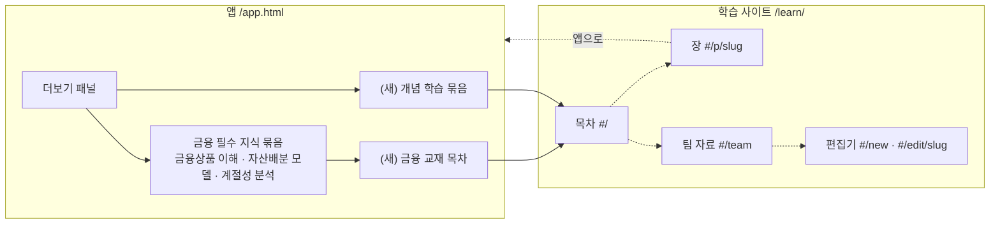
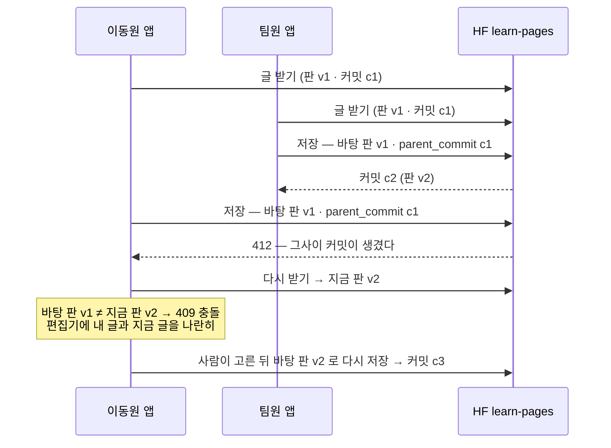
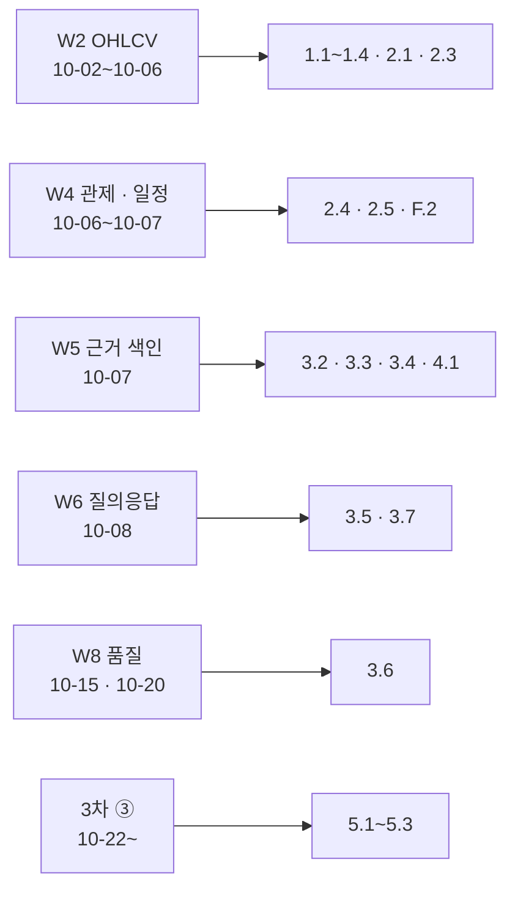

# 개념 학습 설계서 v0.1 — 교재 · 팀 자료 · 서버 없는 공유 — Qurious

| 문서 정보 | |
|---|---|
| **판 · 상태** | v0.1 · 초안(검토 전) |
| **구분** | 6. 시스템 설계 — 설계 문서 · 4. 화면 · 서비스 설계(자리 · 화면 구성) |
| **작성** | 이동원(목표 기능 ① 세부 1~4 주담당) |
| **검토** | 검토 전 — 확인은 네 명 모두 |
| **최종 수정** | 2026-10-01 (KST) |
| **기준** | 코드 `main` `5f8fdcf` · 외부 원문 조회일 2026-10-01 |
| **관련 문서** | [목표 기능 ① 상세 설계서 v0.1](목표기능1-데이터지식-설계_v0.1.md) · [통합본 이식 계획서 v0.1](통합본-이식계획_v0.1.md) · [화면 설계 절차 v0.1](../화면/화면설계절차_v0.1.md) · [문서 작성 기준 v0.1](../문서작성기준_v0.1.md) · [논의 결정 대장 v0.9](../계획서/논의결정대장_v0.9.md) |
| **최근 개정** | 첫 판 |

> **이 문서가 답하는 질문**
> 1. 개념 학습 페이지는 누구를 위해 무엇을 하나?
> 2. 실제 교재 · 강의 사이트는 개념을 어떻게 설명하나 — 우리 장 한 편의 틀은 무엇인가?
> 3. 공용 서버가 없는데 네 명이 같은 글을 보고 고치려면 어디에 저장하나?
> 4. 어떤 장을 어떤 순서로 쓰나?
>
> **읽는 순서** — 팀원: 요약 → 5절(저장 · 공유) → 9절(장 목록) · 글을 쓰려는 사람: 3절 → 6절 → 2.2절 · 강사님: 요약 → 1절 → 9절
>
> **확실도** — 🟢 코드 · 공식 원문에서 직접 확인 / 🟡 추정 · 팀 확인 전 / 🔴 없음

## 요약

1. 구현할 기능의 개념(예: RAG 가 무엇이고 어떻게 동작하나)을 **교재처럼** 설명하는 페이지를 앱에 더한다. 첫 독자는 바이브 코딩으로 구현하는 주담당 자신이고, 둘째 독자는 팀원 · 면접관 · 앱 사용자다.
2. 장 한 편의 틀은 MDN · Google 머신러닝 단기 과정 · Diátaxis · Hugging Face 강좌 · 통합본 강의 페이지에서 공통으로 쓰는 요소를 모은 **아홉 칸**이다 — 머리 상자(학습 목표 · 선수 장) → 왜 필요한가 → 정의와 비유 → 동작 원리 → 직접 해 보기(코드와 **실제 출력**) → 우리 프로젝트의 코드 → 흔한 실수 → 정리 · 확인 문제 → 더 읽을거리.
3. 공용 서버가 없는 까닭은 팀이 고른 비용 원칙(유료 클라우드 0원 · 로컬 시연)과 AWS 보류다(5.1). 그래서 **코드는 GitHub, 데이터와 글은 Hugging Face, 앱은 각자 PC** 로 같은 화면을 만든다.
4. 글은 두 곳에 둔다 — **기본 교재**(주담당이 쓰는 장 · 저장소 파일 · 코드처럼 PR 검토)와 **팀 자료**(누구나 앱 편집기로 쓰고 고치고 지운다 · HF 비공개 데이터셋 `qurious-quant/learn-pages`). 같은 글을 둘이 고치면 HF 의 `parent_commit` 검사와 파일 판(git 블롭 해시)으로 **충돌을 알려 주고 덮어쓰지 않는다.**
5. 장은 34편(기술 26 · 금융 8)을 뼈대로 먼저 깔고, 「전체 지도」 와 「RAG」 두 편을 완성본 본보기로 쓴다. 나머지는 그 기능을 구현하기 직전에 채운다(W2 → 시세 데이터 장 …).

---

## 1. 맥락과 범위

### 1.1 요청

2026-10-01 이동원의 의견(목표 기능 ① 세부 1 「용어사전과 연관 개념 탐색」 에 대해)을 옮긴다.

- 강사님이 준 기능 목록은 기본 틀이고 추가 · 삭제 · 수정은 자유다.
- 개념 설명 없이 바이브 코딩으로 구현하면 이해가 남지 않는다 — 구현할 개념을 **시각 자료와 함께 상세하게** 설명하는 HTML 페이지가 필요하다. 나중에 포트폴리오 · 면접 준비 때 다시 본다.
- 너무 AI 처럼 쓰지 말고 **실제 강의 · 교재 사이트처럼** — 그 방식도 조사해서 설계한다.
- 팀원이 조사한 자료를 나중에 자유롭게 더할 수 있어야 한다(페이지 추가 CRUD).
- 질문 답(같은 날): 개념 학습을 W2 보다 먼저 · 파일 원본 + 앱 편집기 · 저장은 **HF 데이터셋을 최대한 활용** · 금융 지식은 「금융 필수 지식」 안, 나머지는 새 메뉴 묶음 + 별도 HTML · 첫 장은 「지도 + RAG」 를 깊게, **모든 개념의 뼈대**까지 · 설명에 **핵심 코드와 예제 코드**(교보재처럼) · 모르는 개념은 다른 세션에서 말하면 더한다.

### 1.2 요구 — 이 문서가 맡는 것

| # | 요구 | 확인 방법 |
|:-:|---|---|
| L1 | 구현할 개념마다 교재 수준의 장(그림 · 표 · 핵심 코드 · 예제 코드와 실제 출력 · 확인 문제) | 장 점검 시험(TC-LN 콘텐츠 검사) + 사람 검토 |
| L2 | 모든 장의 뼈대(목표 · 다룰 질문 · 보여 줄 코드 · 1차 자료)를 먼저 깔고, 구현 직전에 채운다 | 목록 화면의 상태 표시(완성 · 초안 · 뼈대) |
| L3 | 팀원이 앱 안에서 글을 쓰고 · 고치고 · 지운다. 공용 서버 없이 네 명이 같은 글을 본다 | API 계약 시험 · 가짜 HF 로 충돌 시험 |
| L4 | 금융 지식은 「금융 필수 지식」 메뉴 안, 기술 개념은 새 묶음 「개념 학습」, 페이지는 별도 HTML | 화면 확인 |
| L5 | AI 문체를 피한 교재체 — 조사한 틀(2절)과 문장 규칙(2.2절)을 지킨다 | 사람 검토 · 점검표 |

요구 추적표(RTM)에는 `P01-①-1` 의 확장으로 넣자고 제안한다(용어 → 개념). 정식 ID 는 RTM 판을 올릴 때 받는다(부록 C).

### 1.3 다루지 않는 것

| 하지 않는 것 | 까닭 |
|---|---|
| 앱 사용자의 학습 진도 · 점수 기록 | 2차 요구에 없다 — 확인 문제는 접기(답 보기)로만 |
| 실시간 공동 편집(구글 문서처럼 같이 타이핑) | 서버가 없다 — 저장 단위 충돌 검사로 충분하다(5.6) |
| 그림 파일 올리기 | 첫 판은 글 안의 SVG · Mermaid 그림만. 그림 파일은 v0.2(💬 ③) |
| 기존 개념 화면 셋(`fin-products` · `fin-allocation` · `quant-seasonal`) 고치기 | 강사님 화면이다 — 새 장으로 보완하고 그 자리는 화면 설계 절차에서 정한다 |

---

## 2. 조사 — 교재 · 강의 사이트는 어떻게 쓰나

### 2.1 여섯 곳에서 빌린 것

표 1 은 「잘 쓴 교재 · 강의 페이지는 무엇을 공통으로 갖고 있나」 에 답한다(2026-10-01 원문 확인).

**표 1. 조사한 곳과 빌린 요소**

| 곳 | 장 구성(원문 표기) | 우리가 빌린 것 | 확실도 |
|---|---|---|:-:|
| MDN Learn 「What is JavaScript?」 | 머리 상자 **Prerequisites · Learning objectives** → 한 문장 정의 → 「층 케이크」 비유 그림 → 실행되는 코드와 결과 → **Summary** → 이전 · 다음 | 머리 상자 · 비유 그림 · 코드 옆에 결과 · 이전/다음 | 🟢 |
| Google Machine Learning Crash Course 「Linear regression」 | **Page Summary · Estimated module length · Learning objectives · Prerequisites** → 정의 · 수식 · 풀이 예제 · 그림 → **Check your understanding** → **Key terms** | 읽는 시간 · 풀이 예제 · 이해 확인 문제 · 핵심 용어 | 🟢 |
| Diátaxis(문서 네 갈래) | 문서를 **튜토리얼(배우기) · 방법 안내(하기) · 참조(찾기) · 설명(이해하기)** 로 나눈다 — Cloudflare · Gatsby 등이 씀 | 장 본문은 「설명」, 「직접 해 보기」 는 「튜토리얼」, API 표는 참조 문서(API 명세서)로 미룬다 | 🟢 |
| Hugging Face LLM Course | 장마다 1주 분량 · 코드는 Colab 으로 바로 실행 · 장 끝 퀴즈 | 장 분량 기준 · 「돌려 볼 수 있는 코드」 원칙 | 🟢 |
| Wikipedia 「Signs of AI writing」 | AI 글의 표지 — 과장된 의의 · 막연한 출처 · 「~뿐 아니라 ~도」 · 굵은 글씨 · 이모지 · 꾸며 낸 인용 | 2.2절 「피할 것」 표 | 🟢 |
| 통합본 강의 페이지(`rag-lab/frontend/days/02.html` 등) | 질문형 제목(「이 저장소는 실제로 어떻게 RAG를 구성할까요?」) · 문단 설명 · 코드 파일 이름을 짚음 · **한계까지 밝힘**(「다만 지금의 등록 API 가 실제로 받는 항목은 … 뿐입니다」) | 「~합니다」 체 · 질문형 제목 · 우리 코드의 한계를 숨기지 않는 문장 | 🟢 |

한국어 교재 사이트(위키독스)는 가져오기 도구가 403 으로 막혀 원문을 읽지 못했다 🔴 — 한국어 교재체의 본보기는 통합본 강의 페이지로 삼았다.

결론: 여섯 곳 모두 **「무엇을 배우나」 를 먼저 말하고, 그림과 실행되는 예로 설명하고, 확인 문제나 요약으로 닫는다.** 우리 장 틀(3절)은 이 공통분모다.

### 2.2 문장 규칙 — AI 문체를 피하는 법

교재 장은 「~합니다」 체로 쓴다(강의 페이지 관례). 설계 문서 같은 산출물은 지금처럼 「~다」 체다. 표 2 는 「무엇이 AI 처럼 읽히고, 대신 어떻게 쓰나」 에 답한다.

**표 2. 피할 것과 대신 쓸 것**

| 피할 것 (Wikipedia 표지 → 한국어에서 흔한 모양) | 대신 | 예 |
|---|---|---|
| 과장된 의의 — 「핵심적인 역할을 합니다」 「혁신적인」 「매우 중요합니다」 | 숫자 · 사실 · 결과로 말한다 | ⛔ 「청크 크기는 매우 중요합니다」 → ✅ 「청크를 조문 하나로 자르면 제5조의 세율 세 줄이 한 조각에 함께 남습니다」 |
| 막연한 출처 — 「전문가들은」 「일반적으로 알려져 있듯」 | 저자 · 연도 · 주소, 아니면 우리가 직접 돌린 출력 | Lewis 등(2020) · 「이 PC 의 llama3.1 에 물어본 답」 |
| 「~뿐만 아니라 ~도」 「단순한 X 가 아니라 Y」 의 반복 | 한 문장에 한 주장 | — |
| 셋씩 늘어놓기 · 목록만 있는 절 | 문단으로 설명하고, 목록은 단계 · 비교에만 | — |
| 굵은 글씨 남발 · 이모지 제목 | 굵게는 문단의 결론 한 곳 · 제목에 이모지 없음 | — |
| 「살펴보겠습니다」 「알아보겠습니다」 「결론적으로」 로 여닫기 | 질문형 제목 다음 줄에 바로 답 | 「## 왜 찾아서 답하게 할까요?」 → 첫 문장이 답 |
| 돌리지 않은 출력 · 꾸며 낸 수치 | **실제로 돌린 출력만** 싣고 날짜 · 환경을 적는다 | 「2026-10-01 · Python 3.12 · 이 PC」 |
| 용어를 풀지 않고 넘어가기 | 처음 나올 때 한 줄 풀이 · 장 끝 용어 표 | 「임베딩(글을 숫자 목록으로 바꾼 것)」 |

---

## 3. 장 한 편의 틀

그림 1 은 「장 한 편은 어떤 차례로 되어 있나」 에 답한다. 칸마다 빌린 곳은 표 1 이다.

**그림 1. 장의 아홉 칸** · 범례: [ ] = 칸, 오른쪽 = 담는 것

```
┌──────────────────────────────────────────────────────────────┐
│ ① 머리 상자   읽는 시간 · 수준 · 선수 장 · 학습 목표 3~4 ·   │
│               닿는 기능(요구 ID · 구현 묶음 W)                  │
├──────────────────────────────────────────────────────────────┤
│ ② 왜 필요한가    문제 상황 하나 — 될 수 있으면 실측 사례        │
│ ③ 정의와 비유    한 문장 정의 + 비유 그림 1                     │
│ ④ 동작 원리      단계 그림 · 표 · 수식(필요할 때)               │
│ ⑤ 직접 해 보기   표준 라이브러리로 돌아가는 예제 + 실제 출력    │
│ ⑥ 우리 프로젝트  핵심 코드 발췌(파일 · 줄) · 설계서 절 · 할 일  │
│ ⑦ 흔한 실수      실측 · 옛 분석에서 나온 함정                   │
│ ⑧ 정리 · 확인    3~5줄 정리 + 확인 문제(답은 접기)              │
│ ⑨ 더 읽을거리    1차 출처(논문 · 공식 문서) + 용어 표           │
└──────────────────────────────────────────────────────────────┘
```

결론: 칸 ⑤ 와 ⑥ 이 이 교재가 다른 개념 글과 다른 곳이다 — **예제는 직접 돌린 출력과 함께, 핵심 코드는 우리 저장소의 실제 파일에서** 가져온다. 뼈대 장은 ① · 다룰 질문(③④⑦ 의 제목) · 보여 줄 코드 목록 · ⑨ 만 채워 둔다.

---

## 4. 자리 — 메뉴와 주소

사용자 결정(2026-10-01): 금융 지식은 「금융 필수 지식」 안에, 기술 개념은 새 메뉴 묶음에, 페이지는 별도 HTML 로.

그림 2 는 「앱의 어느 메뉴에서 어느 주소로 가나」 에 답한다.

**그림 2. 메뉴와 주소** · 범례: 실선 = 누르면 이동, 점선 = 학습 사이트 안 이동



- 학습 사이트는 앱과 다른 HTML(`public/learn/index.html`)이다. 강사님 `app.html` 은 「더보기」 패널에 묶음 한 줄, 메뉴 정의(`public/js/core.js` `GNB_MENUS`)에 묶음 하나와 항목 셋, 메뉴를 그리는 함수에 「`href` 가 있으면 그 주소로 간다」 몇 줄만 더한다 — 3-way 병합 때 충돌 면을 줄인다 🟢.
- 기존 개념 화면 셋은 그대로 둔다. 금융 교재 장이 채워지면 어느 화면을 대체 · 보완할지는 화면 설계 절차(0단계 자리 조사)에서 정한다 🟡.
- 이름은 처음부터 Qurious 로 쓴다(앱의 「Lumina Invest」 바꾸기는 화면 설계 때 함께 본다).

---

## 5. 저장과 공유

### 5.1 공용 서버는 왜 없나

표 3 은 「팀이 무엇을 정했고, 그 까닭은 무엇인가」 에 답한다.

**표 3. 공용 서버가 없는 까닭 (2026-10-01 기준)**

| 무엇 | 정한 내용 | 상태 | 근거 |
|---|---|---|---|
| 유료 클라우드 | 쓰지 않음 — 팀 추가 월 0원(AWS · Lightsail · HF Team 없음) | 잠정 — 결정 대장 v0.9 「과반 대기」 | 논의 D2 #10 ① |
| 데모 방식 | 발표 PC 로컬 시연 + 정적 결과 페이지 + 녹화 영상 · HF Space 는 주 경로 뒤 선택 | 잠정 | 논의 D2 #10 ② |
| AWS | 강사님 기술 스택의 AWS 는 비용 보전이 학원과 협의되지 않아 보류 · 로컬에서 전 기능을 확인한 뒤 강사님 안내가 나오면 배포 | 팀 합의(2026-09-21 · 09-30) | 계획서 · 로컬 실행 안내서 7절 |
| 강사님께 여쭐 것 | 「2차 발표에 공개 주소가 상시로 필요한가」 | 답 전 | 결정 대장 5절 ⑥ |

결론: 서버가 「없는」 것이 아니라 **비용이 정해질 때까지 두지 않기로 한 것**이다. 그 사이 같은 화면을 보는 방법이 필요하다.

### 5.2 같은 화면을 보는 다섯 가지 방법

표 4 는 「서버 없이도, 또는 서버를 둔다면 어떻게 네 명이 같은 화면을 보나」 에 답한다.

**표 4. 공유 방법 비교**

| 방법 | 같은 화면이 되는 까닭 | 추가 비용 | 지금 되나 | 남는 문제 |
|---|---|---|:-:|---|
| **A. 각자 PC + 코드 GitHub + 데이터 · 글 HF** (고름) | 같은 코드 · 같은 데이터(HF 에서 복원) · 같은 글(HF 동기화)이라 각자 띄운 앱이 같은 화면을 그린다 | 0원 | ✅ | 각자 앱을 켜야 한다 · 사용자별 기록(모의투자 등)은 각자 DB 에 남는다 |
| B. HF Docker Space 한 대 | 주소 하나를 네 명이 연다 | 0원(CPU Basic 2코어 · 16GB) — 단 Docker Space 를 **만들려면 유료 계정**이 필요하다 🟢 | 🟡 | 디스크가 재시작 때 지워진다 🟢 → DB 를 HF 에서 되살려야 한다 · 48시간 쓰지 않으면 잠든다 🟢 · 우리 앱은 서비스 여섯(PostgreSQL · Redis · Celery 둘 · Neo4j · 앱)이라 한 컨테이너에 넣기 무겁다 · 공개 주소 보안 |
| C. AWS EC2(강사님 스택) | 주소 하나 | 월 비용 — 협의 전 | ⏸️ | 표 3 — 강사님 안내 뒤 |
| D. 원격 DB 하나를 같이 씀 | 각자 앱이 같은 DB 에 붙는다 | 무료 등급이 있는 호스팅 DB 🟡 | 🟡 | 새 외부 서비스 · 비밀값 공유 · 느림 · 팀 논의가 먼저 |
| E. 터널(한 사람 PC 를 잠깐 공개) | 그 사람이 켠 동안만 같은 화면 | 0원 | 🟡 | 그 PC 가 꺼지면 끝 · 로컬 앱을 인터넷에 여는 보안 위험 |

결론: 지금은 **A** 다. 우리는 이미 데이터를 HF 비공개 데이터셋으로 나눠 쓰고 있다(`krx-daily-market` · 매일 12:30 올림) 🟢. 글도 같은 길로 보내면 서버 없이 네 명이 같은 글을 본다. HF 공식 문서도 Space 의 상태를 「데이터셋 저장소에 `huggingface_hub` 로 올려 보존」 하는 방법을 예로 든다 🟢 — 나중에 B 로 옮겨도 글 저장 방식은 그대로 쓴다.

### 5.3 고른 것 — 두 저장소

**표 5. 기본 교재와 팀 자료**

| | 기본 교재 | 팀 자료 |
|---|---|---|
| 무엇 | 주담당이 쓰는 개념 장(이 문서 9절의 34편) | 팀원 누구나 쓰는 조사 메모 · 정리 · 강의 요약 |
| 원본 | 저장소 파일 `public/learn/content/<slug>.md` | HF 비공개 데이터셋 `qurious-quant/learn-pages` 의 `pages/<slug>.md` |
| 고치는 길 | VS Code 로 파일 → PR(코드처럼 검토) | 앱 편집기 → 「저장」 하면 HF 에 커밋 하나 |
| 공개 | 공개 저장소 — 포트폴리오로 보인다 | 비공개 — 강의 자료 발췌가 섞여도 밖에 나가지 않는다 |
| 이력 | git 이력 | HF 커밋 이력(파일별 기록 · 되돌리기) |
| 앱에서 읽기 | 로그인 없이 | 로그인 뒤 |

까닭: 기본 교재는 앱 기능처럼 검토돼야 하고 공개돼도 문제없는 우리 글이다. 팀 자료는 빨리 쓰고 고치는 위키에 가깝고, 무엇이 들어올지 미리 알 수 없어 비공개가 안전하다(공개 저장소 규칙 — 교재 · 강의 자료 커밋 금지). 팀 자료 글이 무르익으면 PR 로 기본 교재에 옮긴다.

### 5.4 HF 데이터셋 모양

```
qurious-quant/learn-pages   (private · 데이터셋)
├── README.md            무엇 · 쓰는 법 · 비공개 까닭
└── pages/<slug>.md      글 한 편 = 파일 하나 (6절 규격)
```

커밋 제목은 `learn: <slug> 새 글|고침|지움 (<쓴 사람 이름>)` 이다 — 파일 이력을 제목으로 거른다. 저장소는 앱이 만들지 않는다(없으면 「저장소가 없다 · 만드는 법」 을 띄운다). 만들 때 `private=True` 를 주고 만든 뒤 `repo_info().private` 를 확인한다(기본값이 공개다 🟢).

### 5.5 받아 오기 — 동기화

- 앱이 켜질 때와, 목록을 부를 때 마지막 확인이 5분 지났으면 HF 의 최신 커밋 해시를 묻는다(API 1회). 바뀌었으면 `pages/` 목록(파일마다 블롭 해시)을 받아 **바뀐 파일만** 내려받고, 없어진 파일은 지운다.
- 내려받은 글은 앱의 쓰기 가능한 볼륨 `/app/data/learn/team/` 에 둔다(컨테이너 안). HF 가 안 되면 마지막으로 받은 글을 보여 주고 「마지막으로 받은 때」 를 띄운다.
- 「새로 받기」 단추는 바로 확인한다(10초 안에 다시 누르면 무시).

### 5.6 저장 · 충돌 — 같은 글을 둘이 고치면

글마다 **판** 을 둔다 — 파일 내용의 git 블롭 해시(`sha1("blob <길이>\0" + 내용)`). HF 가 파일 목록에 주는 `blob_id` 와 같은 값이라 서버에 묻지 않고도 비교된다 🟢(2026-10-01 · 저장소 README 로 대조 — 로컬 계산 `88e531d…` = HF `blob_id`).

그림 3 은 「두 사람이 같은 글을 열고 차례로 저장하면 어떻게 되나」 에 답한다.

**그림 3. 충돌 처리 차례** · 범례: v1 · v2 = 글의 판, c1 · c2 = HF 커밋



- 다른 글이 바뀌어서 412 가 난 것이면(내 글의 판은 그대로) 새 커밋 해시로 **한 번 다시** 커밋한다 — 사람에게 묻지 않는다.
- 내 글의 판이 바뀌었으면 **409** 와 함께 지금 글을 돌려준다. 앱은 절대 말없이 덮어쓰지 않는다.
- 412 는 HF 서버가 `parent_commit` 이 최신이 아니면 거절하는 동작이다(공식 시험 코드: 「The branch was updated since you opened this page」) 🟢.

### 5.7 호출 한도 · 비용

| 항목 | 값 | 우리 사용량 |
|---|---|---|
| HF API (5분 창) | 무료 계정 1,000 · PRO 2,500 🟢 | 앱 한 대가 5분에 1~2번(최신 커밋 확인) + 저장 때 2~3번 |
| 파일 받기(Resolvers) | 무료 5,000 · PRO 12,000 🟢 | 바뀐 글 수만큼 |
| 커밋 · 저장소 만들기 | 한도가 있으나 공개하지 않는다(자주 바뀜) 🟢 | **「저장」 단추를 누를 때만 커밋** — 자동 저장은 브라우저 안에만 둔다 |
| 비용 | 비공개 데이터셋 · 글 몇 MB | 0원 |

### 5.8 권한 · 보안

| 항목 | 설계 |
|---|---|
| 읽기 | 기본 교재는 로그인 없이 · 팀 자료는 로그인 뒤(비공개 글) |
| 쓰기 | 로그인 + HF 토큰이 있는 앱에서만. 토큰은 지금 쓰는 `.env` 의 `HUGGINGFACE_ACCESS_TOKEN` — 화면 · 로그 · 응답에 찍지 않는다 |
| 팀원 | HF 조직 `qurious-quant` 에 쓰기 권한으로 들어와 있고 자기 토큰을 `.env` 에 둔 사람만 저장할 수 있다. 읽기 권한만 있으면 앱이 「저장 권한이 없다」 를 띄운다 |
| 글 속 코드 | 서버는 `<script` · `<iframe` · `javascript:` · `on…=` 속성이 든 팀 자료를 거절한다(400). 화면은 모든 글을 DOMPurify 로 거른 뒤 그린다 — 두 겹 |
| 지우기 | HF 이력에 남아 되살릴 수 있다 · 지울 때도 바탕 판을 받아 충돌을 검사한다 |
| 개인정보 | 커밋 제목에는 앱의 표시 이름만 — 이메일은 넣지 않는다 |

---

## 6. 파일 규격 `learn-v1`

글 한 편 = 마크다운 파일 하나. 맨 위 머리말(`---` 사이)은 `이름: 값` 한 줄씩이고, 목록은 쉼표로 나눈다(YAML 전체를 받지 않는다 — 읽는 코드를 작고 안전하게).

**표 6. 머리말 칸**

| 칸 | 필수 | 뜻 · 규칙 | 예 |
|---|:-:|---|---|
| `slug` | ✅ | 주소 이름 — 영문 소문자 · 숫자 · `-` 3~64자 · 파일 이름과 같다 | `rag-basics` |
| `title` | ✅ | 제목 · 120자 안 | `RAG — 찾아서 답하는 언어 모델` |
| `section` | ✅ | `tech`(개념 학습) · `finance`(금융 필수 지식) | `tech` |
| `part` | ✅ | 목차의 부 | `3부 근거 RAG` |
| `order` | ✅ | 정렬 번호 `부.장` | `3.1` |
| `status` | ✅ | `ready` 완성 · `draft` 초안 · `skeleton` 뼈대 | `ready` |
| `summary` | ✅ | 한 줄 소개 · 200자 안 | — |
| `level` | — | `입문` · `기초` · `심화` | `입문` |
| `minutes` | — | 읽는 시간(분) | `50` |
| `owner` · `updated_by` | — | 쓴 사람 · 마지막에 고친 사람(표시 이름) | `이동원` |
| `feature` · `work` | — | 닿는 요구 ID · 구현 묶음 | `P01-①-3` · `W5, W6` |
| `prereq` · `tags` | — | 먼저 읽을 장 slug · 꼬리표(쉼표) | `map` · `RAG, 임베딩` |
| `updated` | — | 마지막 고친 날 `YYYY-MM-DD` | `2026-10-01` |

**본문 규칙** — GitHub 식 마크다운에 몇 가지를 더한다.

| 쓰고 싶은 것 | 쓰는 법 | 화면 |
|---|---|---|
| 학습 목표 상자 | `> [!GOAL]` 첫 줄 + 목록 | 「이 장에서 할 수 있게 되는 것」 상자(장의 머리 상자) |
| 알림 상자 | `> [!NOTE]` · `> [!TIP]` · `> [!WARNING]` · `> [!IMPORTANT]` 첫 줄 | 색 상자(GitHub 와 같은 표기) |
| 그림 | 글 안 `<figure><svg …></svg><figcaption>그림 1. …</figcaption></figure>` | 번호 · 설명 붙은 그림 |
| 흐름 · 차례 그림 | ```` ```mermaid ```` 블록 | Mermaid 로 그림 |
| 코드와 출력 | 코드 블록 다음에 ```` ```output ```` 블록 | 「출력」 표시가 붙은 회색 상자 |
| 확인 문제 | `<details><summary>문제</summary>답</details>` | 눌러서 답 보기 |
| 다른 장 링크 | `[RAG](#/p/rag-basics)` | 학습 사이트 안 이동 |

---

## 7. API

모든 경로는 `/api/learn` 아래다. ID 는 API 대장(`docs/인터페이스/API-ID대장.tsv`)에서 받았다 — `API-LRN-01~07`(2026-10-01).

**표 7. 학습 API**

| 메서드 · 경로 | 하는 일 | 로그인 | 응답 |
|---|---|:-:|---|
| `API-LRN-01` `GET /api/learn/catalog?section=&q=` | 글 목록(머리말만) — 기본 교재 + (로그인했으면) 팀 자료 · 팀 저장소 상태 | — | 200 `{pages[], team{state, repo, head, synced_at, editable, message}}` |
| `API-LRN-02` `GET /api/learn/pages/{slug}` | 글 한 편 — 머리말 · 본문 · 판 · 저장소 | 팀 자료만 | 200 · 401(팀 자료 · 로그인 안 함) · 404 |
| `API-LRN-03` `POST /api/learn/pages` | 팀 자료 새 글 | ✅ | 201 `{slug, version, commit}` · 400 규격 · 403 권한 · 409 같은 이름 · 503 HF 안 됨 |
| `API-LRN-04` `PUT /api/learn/pages/{slug}` | 팀 자료 고치기 — `base_version` 필수 | ✅ | 200 · 409 `{current{version, meta, body}}` · 404 |
| `API-LRN-05` `DELETE /api/learn/pages/{slug}?base_version=` | 팀 자료 지우기 | ✅ | 204 · 409 · 404 |
| `API-LRN-06` `GET /api/learn/pages/{slug}/history` | 팀 자료 고친 기록(HF 커밋) | ✅ | 200 `{commits[{id, title, date, authors}], url}` |
| `API-LRN-07` `POST /api/learn/sync` | HF 에서 지금 받기 | ✅ | 200 `{head, added, updated, removed}` |

기본 교재는 쓰기 API 가 없다 — 파일과 PR 로만 바뀐다(「팀 자료가 기본 교재와 같은 slug 를 쓰면 400」).

---

## 8. 화면

그림 4 는 「학습 사이트 한 화면에 무엇이 어디 있나」 에 답한다(넓은 화면 기준 · 좁으면 왼쪽 목차는 서랍, 오른쪽 차례는 숨김).

**그림 4. 학습 사이트 화면 구성**

```
┌───────────────────────────────────────────────────────────────────────────┐
│ Qurious · 개념 학습     [ 검색 ……… ]      팀 자료   새 글   ← 앱으로        │
├──────────────┬───────────────────────────────────────────┬───────────────┤
│ 개념 학습      │ 3부 근거 RAG · 3.1 · 완성 · 읽는 시간 50분  │ 이 장의 차례   │
│  0 전체 지도 ✔ │ RAG — 찾아서 답하는 언어 모델              │  왜 필요한가   │
│  1부 시세 데이터│ ┌ 이 장에서 할 수 있게 되는 것 ──────────┐ │  두 단계       │
│   1.1 봉 · OHLCV│ │ · …  · …  · …                           │ │  임베딩        │
│  …            │ └ 먼저 읽을 장 · 닿는 기능 P01-①-3 · W5 ─┘ │  직접 해 보기  │
│  3부 근거 RAG  │ 본문 · 그림 · 코드 · 출력 · 확인 문제     │  …            │
│   3.1 RAG ✔   │                                           │               │
│ 금융 필수 지식 │ ← 이전 장            다음 장 →            │               │
│ 팀 자료 (n)    │                                           │               │
├──────────────┴───────────────────────────────────────────┴───────────────┤
│ 팀 자료 저장소 qurious-quant/learn-pages · 마지막으로 받은 때 10:52 · 새로 받기 │
└───────────────────────────────────────────────────────────────────────────┘
```

**편집기**(`#/new` · `#/edit/<slug>`) — 머리말 칸(제목 · slug · 구역 · 부 · 상태 · 요약 · 꼬리표) + 본문 입력(왼쪽)과 미리보기(오른쪽) · 「장 틀 넣기」 단추(3절 아홉 칸) · 「저장」 · 「지우기」. 쓰는 동안 브라우저 저장소에 임시 저장한다(HF 에는 「저장」 때만). 409 가 오면 「지금 글」 과 「내 글」 을 나란히 보여 주고, 지금 글을 바탕으로 다시 저장하게 한다.

---

## 9. 장 목록 — 34편(완성 2 · 뼈대 32)

표 8 은 「무엇을, 어느 기능을 구현하기 전에 읽나」 에 답한다. 상태: ✔ 완성 · ○ 뼈대(구현 직전에 채움). 모르는 개념이 생기면 이 표에 줄을 더하고 뼈대 장을 만든다.

**표 8. 기술 개념 — 「개념 학습」 묶음 (26)**

| 부 | 장 · slug | 상태 | 닿는 기능 · 묶음 |
|---|---|:-:|---|
| 0 시작 | 0.1 전체 지도 — 내가 만들 것과 읽는 순서 `map` | ✔ | ①-1~4 · 3차 ③ |
| 1 시세 데이터 | 1.1 봉과 OHLCV `ohlcv-bars` · 1.2 수정주가 `adjusted-price` · 1.3 분봉과 시간대 `intraday-timezone` · 1.4 데이터 품질 검사 `data-quality-check` | ○ | ①-2 · W2 |
| 2 데이터 파이프라인 | 2.1 원문 · 정제 · 파생 세 층 `data-layers` · 2.2 공식 API 다루기 `public-api-basics` · 2.3 데이터셋 판과 공유(HF) `dataset-versioning-hf` · 2.4 정기 배치 `batch-scheduling` · 2.5 거래일 달력과 금융 일정 `trading-calendar` | ○ | ①-2 · ①-4 · W2 · W4 · W7 |
| 3 근거 RAG | 3.1 RAG `rag-basics` | ✔ | ①-3 · W5 · W6 |
| | 3.2 임베딩과 벡터 검색 `embedding-vector-search` · 3.3 낱말 검색과 섞어 찾기 `hybrid-search-rrf` · 3.4 문서 쪼개기와 법령 판 `chunking-legal-versions` · 3.5 프롬프트와 출처 표기 `prompt-citation` · 3.6 RAG 평가 `rag-evaluation` · 3.7 로컬 LLM `local-llm-ollama` | ○ | ①-3 · W5 · W6 · W8 |
| 4 지식 구조 | 4.1 용어 사전과 시소러스 `thesaurus-skos` · 4.2 지식 그래프 맛보기 `knowledge-graph-basics` | ○ | ①-1 · W5 |
| 5 차트 · Pine | 5.1 Lightweight Charts `lightweight-charts` · 5.2 Pine Script 기초 `pine-script-basics` · 5.3 TradingView 웹훅 `tradingview-webhook` | ○ | 3차 ③ |
| 6 서버 · 운영 | 6.1 FastAPI `fastapi-basics` · 6.2 Docker Compose 와 개발 모드 `docker-compose-dev` · 6.3 시험 코드 `testing-pytest` · 6.4 낙관적 동시성 `optimistic-concurrency` | ○ | 공통 · 이 기능(5.6) |

**표 9. 금융 지식 — 「금융 필수 지식」 묶음 (8)**

| 장 · slug | 재료 | 닿는 기능 |
|---|---|---|
| F.1 주식 · 시장 · 주문의 기본 `stock-basics` | 통합본 강의 · 용어사전 | 공통 |
| F.2 배당 기준일 · 배당락일 · 지급일 `dividend-dates` | 수집기 배당 규칙 · DART 공시 | ①-4 · ③-3 |
| F.3 매매 비용과 증권거래세(2026) `trading-costs-tax` | 비용 모델 · 시행령 제36001호 | ④ · ①-3 |
| F.4 선물과 옵션 `derivatives-futures-options` | 통합본 강의 1일차 | 공통 |
| F.5 펀드와 ETF `funds-etf` | 통합본 강의 2일차 | ③ |
| F.6 채권과 코인 `bonds-crypto` | 통합본 강의 3일차 | ③ |
| F.7 자산배분과 퀀트 `asset-allocation-quant` | 통합본 강의 4일차 | ③ · ④ |
| F.8 로보어드바이저와 법 `robo-advisor-rules` | 자본시장법 시행령 제2조 제6호 · 금융투자업규정 | ①-3 · ③ |

그림 5 는 「구현 묶음마다 무엇을 먼저 읽나」 에 답한다.

**그림 5. 구현 묶음과 읽기 순서** · 범례: 상자 = 묶음(날짜는 목표 기능 ① 설계서 표 12), 화살표 = 그 묶음 직전에 채울 장



---

## 10. 시험 계획

| 묶음 | 무엇을 확인하나 | 고정값 |
|---|---|---|
| TC-LN 규격 | 머리말 읽기 · 쓰기 왕복 · 필수 칸 · slug 규칙 · 크기 상한 · 금지 태그 | 작은 글 몇 편 |
| TC-LN 판 | git 블롭 해시가 `git hash-object` 와 같다 | 알려진 값 |
| TC-LN 저장소 | 가짜 HF 로 새 글 · 고치기 · 지우기 · 낡은 판이면 409 · 다른 글 때문의 412 는 한 번 다시 · 동기화가 더하고 바꾸고 지운다 · 이력은 slug 로 거른다 | 가짜 HfApi |
| TC-LN 경로 | 기본 교재는 로그인 없이 · 팀 자료 읽기 · 쓰기는 401 · 기본 교재 slug 를 팀 자료가 못 쓴다 · `/learn/` 이 페이지를 준다 | 앱 시험 클라이언트 |
| TC-LN 교재 | 기본 교재 34편 모두 머리말이 맞고 · `prereq` 와 `#/p/` 링크가 있는 장을 가리키고 · `<script` 가 없다 | `public/learn/content/` |

---

## 11. 검토한 대안

| 갈림길 | 고른 것 | 버린 것 | 까닭 | 다시 볼 조건 |
|---|---|---|---|---|
| 팀 자료 저장처 | HF 비공개 데이터셋 | 앱 DB(PostgreSQL) | DB 는 각자 PC 에 있어 쓴 사람에게만 보인다 · HF 는 이미 팀이 쓰는 곳이고 커밋 이력이 판 관리가 된다 | 공용 서버(표 4 B · C)가 생기면 DB 로 옮길지 본다 |
| 팀 자료 저장처 | HF | GitHub 저장소에 파일 + PR | PR 은 글 하나에도 검토 · 머지 단계가 있어 「자유롭게」 와 멀다 · 공개 저장소라 강의 자료가 섞이면 위험하다 | 팀이 검토를 더 원하면 HF 의 PR 기능(`create_pr`)을 켠다 |
| 기본 교재 저장처 | 저장소 파일 | HF 에 함께 | 공개 · 검토 · 포트폴리오 · 토큰 없이 읽힘 | 팀이 한곳 관리를 원하면 파일을 HF 로 올리는 명령 하나로 옮긴다 |
| 글 형식 | 마크다운 + 머리말 | 장마다 HTML 파일 | 편집기 · 미리보기 · 검사가 쉽다 · 그림은 SVG · Mermaid 로 충분하다 | 상호작용 그림이 많이 필요하면 「위젯」(우리 JS)을 더한다 |
| 머리말 | `이름: 값` 한 줄 | YAML 전체 | 읽는 코드가 작고 위험한 YAML 기능이 없다 | 칸이 중첩되면 |
| 충돌 처리 | 저장 단위 검사(판 · `parent_commit`) | 실시간 공동 편집 · 잠금 | 서버가 없고, 잠금은 풀어 줄 사람이 없다 | 서버가 생기고 동시 편집이 잦으면 |
| 자리 | 별도 HTML `/learn/` + 메뉴 `href` | `app.html` 안 화면 | 강사님 파일 충돌 면 최소 · 긴 글을 읽는 넓은 화면 | 화면 설계 절차에서 팀이 다른 안을 고르면 |

---

## 12. 위험 · 뒤집을 조건

| 위험 | 대응 | 뒤집을 조건 |
|---|---|---|
| 팀원이 HF 조직 · 토큰이 없다 | 읽기 · 쓰기 상태를 화면에 보이고, 들어오는 법을 README 에 | 팀원 둘 이상이 HF 를 못 쓰면 GitHub PR 방식을 함께 연다 |
| HF 가 막히거나 느리다 | 마지막으로 받은 글로 읽기 · 저장은 503 과 까닭 | 하루 넘게 막히면 저장소 파일로 임시 저장 |
| 커밋 한도(비공개 수치)에 걸린다 | 「저장」 때만 커밋 · 자동 저장은 브라우저에 | 429 가 보이면 저장 간격 제한을 더한다 |
| 교재가 AI 문체로 흐른다 | 2.2절 표 · 장마다 실제 출력 · 사람 검토 | 검토에서 지적되면 표 2 에 줄을 더한다 |
| 장 34편이 뼈대로만 남는다 | 그림 5 순서대로 구현 직전에 채운다 | 일정이 밀리면 W 와 닿지 않는 장(5부 · 6부)을 뒤로 |

---

## 13. 정할 것 · 할 것

### 13.1 💬 팀이 정할 것

| # | 질문 | 제안 |
|:-:|---|---|
| ① | 팀 자료에 검토 단계를 둘까 | 두지 않는다 — 이력으로 되돌린다 |
| ② | 금융 교재 장(F.1~F.8)이 채워지면 기존 개념 화면 셋을 어떻게 할까 | 화면 설계 절차 0단계에서 본다 |
| ③ | 그림 파일 올리기(v0.2) | 필요해지면 `assets/<slug>/` 로 |

### 13.2 이동원이 할 것

| 할 것 | 어디서 |
|---|---|
| ~~HF 데이터셋 `qurious-quant/learn-pages`(private) 만들기 승인~~ ✅ 2026-10-01 만듦 · `private=True` 확인 · README 커밋 `a06f2f0` | — |
| 팀원을 HF 조직 `qurious-quant` 에 쓰기 권한으로 초대 · 각자 토큰을 `.env` 에 | huggingface.co 조직 설정 |

---

## 부록 A. 용어

| 말 | 뜻 | 이 문서에서 | 헷갈리기 쉬운 점 |
|---|---|---|---|
| **기본 교재 · 팀 자료** | 저장소 파일로 둔 장 · HF 에 둔 팀원 글 | 5.3절 | 둘 다 같은 규격(6절)이다 |
| **slug** | 주소에 쓰는 글 이름(영문) | `#/p/rag-basics` | 제목과 다르다 · 바꾸면 링크가 끊긴다 |
| **판(version)** | 글 내용의 git 블롭 해시 | 충돌 검사 | 커밋 해시와 다르다 — 커밋은 저장소 전체, 판은 글 하나 |
| **`parent_commit`** | 「이 커밋 위에 쌓겠다」 는 표시 — 최신이 아니면 HF 가 412 로 거절 | 5.6절 | 다른 글이 바뀌어도 거절된다 → 한 번 다시 |
| **낙관적 동시성** | 잠그지 않고, 저장할 때 바뀐 게 있으면 알려 주는 방식 | 5.6절 | 「비관적」 은 미리 잠근다 |
| **Diátaxis** | 문서를 튜토리얼 · 방법 안내 · 참조 · 설명 넷으로 나누는 틀 | 2.1절 | 우리 장은 「설명」 + 「튜토리얼」 |

## 부록 B. 만든 방법

**외부 확인** (2026-10-01 · 한 건씩)

| 확인한 것 | 출처 |
|---|---|
| `parent_commit` · 412 | `huggingface_hub` `hf_api.py` 의 `create_commit` 설명 · `tests/test_hf_api.py::test_create_commit_conflict` |
| HF 호출 한도 표(5분 창) | `huggingface/hub-docs` `docs/hub/rate-limits.md` |
| Space 디스크는 재시작 때 지워짐 · 데이터셋으로 보존 · CPU Basic · 유료 계정 · 48시간 잠듦 | `hub-docs` `spaces-storage.md` · `spaces-sdks-docker.md` · `spaces-overview.md` · `spaces-gpus.md` |
| 교재 틀 | MDN 「What is JavaScript?」 · Google MLCC 「Linear regression」 · diataxis.fr · Hugging Face LLM Course 1장 · Wikipedia 「Signs of AI writing」 |

**코드 · 설정 실측** — `public/js/core.js:367-381`(메뉴 그리기) · `:445-452`(묶음 누르기) · `app/main.py:122-125`(정적 파일) · 개발 모드 연결(`scripts/personal/compose.dev.yml` · 앱이 쓸 수 있는 곳은 `/app/data` 볼륨) · `requirements.txt` 에 `huggingface_hub` · `hf_xet` 있음 · `docker-compose.yml` 앱 서비스 `env_file: .env`.

## 부록 C. 변경 노트 — 다음 판(v0.2)에 넣을 것

| 날짜 | 종류 | 무엇 | 옮길 곳 | 근거 |
|---|---|---|---|---|
| 2026-10-01 | 추가 | ~~학습 API 7개의 ID 를 API 대장에서 받는다~~ ✅ `API-LRN-01~07` · API 명세서 9절 변경 노트 | API 명세서 · 대장 | 7절 |
| 2026-10-01 | 결과 | 실제 HF 저장소로 끝까지 시험 — 새 글 201 · 고치기 200 · 낡은 판 409(지금 판 돌려줌) · 다른 팀원이 다른 글을 커밋한 뒤 저장 200(저장 직전 동기화) · 이력 3건 · 바뀐 것 없으면 커밋 안 함 · 기본 교재 slug · 사건 속성 400 · 지우기 204 · 끝에 README 만 남음. 412 한 번 재시도는 가짜 HF 시험(TC-LN-07)으로 확인 | 10절 · 부록 B | 이 세션 || 2026-10-01 | 추가 | 요구 「개념 학습」 을 `P01-①-1` 확장으로 RTM 에 | RTM | 1.2절 |
| 2026-10-01 | 사용자 피드백 | **화면 피드백 넷(PR #80 화면을 보고)** — ① 금융 지식 장(F.1~F.8)을 `/learn/` 으로 옮긴 것은 잘못 — 앱의 기존 「금융 필수 지식」 화면에 **부족한 것을 더한다** ② 통합본 강의 HTML 처럼 **내용 위주** · 「2차 프로젝트」 · 담당 · 요구 ID · W 번호 같은 내부 표현 없이 실제 배포 서비스처럼 ③ 「팀 자료」 가 아니라 **사용자가 자기 자료를 더하는** 모양(상태줄의 저장소 이름 · 「기본 교재 34편(완성 2)」 같은 내부 표기도) ④ 「Lumina Invest」 → Qurious · 부제 「AI Financial Quant Platform」. 구조는 **화면 설계 세션에서** 고치고, 새 장 본문은 지금부터 이 문체로(TC-LN-19) | 2.2 문장 규칙 · 3절 장 틀(⑥ 「우리 프로젝트」 → 「이 서비스는 이렇게」 · ① 머리 상자의 요구 ID · W) · 4절 자리 · 5.3 「팀 자료」 이름 · 8절 화면 · 9절 금융 장 | 사용자 2026-10-01 · 메모 「화면 피드백 넷」 |
| 2026-10-01 | 사용자 지적 | **통합본 강의 내용을 가져오지 않았다** — 강의 사이트 4일치(`rag-lab/frontend/days/01~04.html`)와 10단원 교재(`rag-lab/data/curriculum/unit01~10.md` · 약 61만 자)가 반입돼 있는데 앱에 연결하지 않고 장을 새로 썼다(뼈대 32). 화면 설계에서 강의 내용 전부를 「금융 필수 지식」 보완 자리로 연결한다(이식 대장 R02 · R03 — R03 의 「보류」 는 「전부」 지시와 어긋났다) | 1.2 · 4절 · 9절 · 이식 계획서 | 사용자 2026-10-01 |
| 2026-10-01 | 추가 | **1부 네 장 완성(완성 2 → 6)** — 1.1 봉과 OHLCV · 1.2 수정주가 · 1.3 분봉과 시간대 · 1.4 데이터 품질 검사. 예제 넷(`ohlcv_bars.py` · `adjusted_price.py` · `intraday_kst.py` · `quality_check.py` — 표준 라이브러리 · 실제 시세 몇 줄은 출처 표시한 교육용 인용, 사용자 확인 2026-10-01) · 실제 출력만(야후 받기는 `--live` · 날짜 적음) · 머리말에서 `feature` · `work` 칸을 뺐다 | 9절 장 목록 · 3절 | TC-LN-18 · 19 |

## 부록 D. 개정 이력

| 판 | 날짜 | 무엇이 바뀌었나 | 왜 | 근거 |
|---|---|---|---|---|
| v0.1 | 2026-10-01 | 추가 — 첫 판(조사 여섯 곳 · 장 틀 아홉 칸 · 공유 방법 다섯 비교 · 두 저장소 · 충돌 처리 · 규격 `learn-v1` · API 7 · 장 목록 34) | 이동원 의견 — 구현 전에 개념을 교재처럼 · 팀 자료 CRUD · HF 활용 | 1.1절 |
