# 기능별 동작 원리서 v0.1 — Qurious

| 문서 정보 | |
|---|---|
| **판 · 상태** | v0.1 · 초안(검토 전) |
| **구분** | 6. 시스템 설계 — 애플리케이션 구성도 · 기능별 동작 원리(코드 해설) |
| **작성** | 이동원(데이터 · 문서) |
| **검토** | 검토 전 |
| **최종 수정** | 2026-09-30 (KST) |
| **기준** | 코드 `main` `92087da` + 계정 관리 변경(이 문서를 싣는 PR) · 로컬 개발 모드(`start.ps1 -Dev`)에서 잰 값 2026-09-30 · 수집 DB 기준일 2026-09-28 |
| **관련 문서** | [로컬 실행 안내서 v0.1](../배포/로컬실행안내서_v0.1.md) · [API 명세서 v0.1](../인터페이스/API명세서_v0.1.md) · [기능 설계서 v0.1](기능설계_v0.1.md) · [테스트계획서 v1.3](../시험/테스트계획서_v1.3.md) · [ERD v1.2](../데이터/ERD_v1.2.md) |
| **최근 개정** | 첫 판 |

> **이 문서가 답하는 질문**
> 1. 화면에서 기능 하나를 누르면 어느 파일의 어느 함수가 어떤 차례로 돌고, 무엇(DB · 캐시 · 외부 시세)에 기대나?
> 2. 그 기능의 핵심 계산은 어떻게 생겼나 — 코드를 열지 않고 발표 · 면접에서 설명할 수 있을 만큼
> 3. 그 기능이 맞게 도는지 무엇으로 확인하나, 그리고 아직 무엇이 약한가?
>
> **읽는 순서** — 발표 · 면접 준비: 요약 → 1절 → 맡은 기능 절의 「한 줄」 · 그림 · 핵심 코드 · 코드를 고칠 팀원: 1절 → 그 기능 절 전체 → 8절 → 부록 B · 강사님: 요약 → 1.3 → 8절

## 요약

1. **구조는 세 층이다** — 화면(`public/` 의 HTML · 기능별 JS) → 앱(FastAPI 라우트 `app/routes/` 22파일 → 서비스 `app/services/` 33파일) → 저장소(PostgreSQL · Redis · 수집 DB(SQLite) · Neo4j · 외부 시세). 예약 작업(자동매매 10분 · 리밸런싱 1시간 · 시세 동기화)은 Celery 비트가 시각을 재고 워커가 **같은 서비스 함수**를 부른다.
2. 이 판은 **기능 점검 56건이 부르는 기능 21개**를 여섯 묶음(계정 · 시세 · 전략 · 로보어드바이저 · 매매 · 연동)으로 나눠, 기능마다 「한 줄 · 어느 코드 · 차례(시퀀스 그림) · 핵심 코드 발췌 · 확인 방법 · 한계」 를 적었다. 계정은 현업 기준(OWASP · NIST · 개인정보 보호법)으로 맞춘 규칙을 2절 표 3 에 모았다.
3. **확인 정도가 고르지 않다** — 21개 중 자동 시험이 핵심 계산을 직접 재는 기능 13 · 일부만 재는 기능 7 · 자동 시험이 없는 기능 1(알림). 알려진 한계 중 가장 큰 것은 **자동매매 체결가가 어제 종가**라는 점(6.2)과 **알림을 모두 끄면 팀 공용 채널로 나가는 것**(7.2)이다 — 8절.

---

## 1. 한눈에 — 애플리케이션 구성

### 1.1 구성도

그림 1 은 「앱이 어떤 덩어리로 나뉘고, 각 덩어리가 무엇에 기대나」 에 답한다(C4 모형의 컨테이너 단계 — 코드 단계는 각 기능 절에서).

**그림 1. 애플리케이션 구성도 (컨테이너 단계)** · 범례: 원통 = 저장소 · 실선 = 늘 가는 길 · 점선 = 조건이 맞을 때만

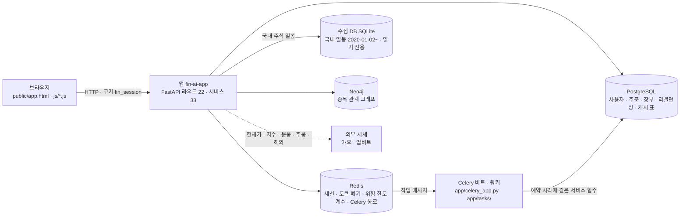

앱은 화면 요청을 받아 PostgreSQL(사용자 · 주문 · 장부)과 Redis(로그인 세션)를 쓰고, 국내 주식 일봉은 수집 DB 에서, 그 밖의 시세는 외부에서 가져온다. 캐시(`data_cache` 표)는 Redis 가 아니라 **PostgreSQL 표**다.

### 1.2 기능 지도 — 21개

표 1 은 「기능마다 화면 · API · 서비스 · 저장소 · 확인 수단이 무엇인가」 에 답한다. 발표 준비 때 이 표 한 줄이 그 기능 설명의 뼈대다.

**표 1. 기능 지도** · 확인: 자동 = `tests/` 의 자동 시험 묶음(건수) · 점검 = `scripts/personal/check.ps1` 의 기능 점검 · 확실도 🟢 코드 · 실측으로 확인

| 절 | 기능 | 화면 파일 | API (대표) | 서비스 · 핵심 함수 | 저장소 | 확인 |
|---|---|---|---|---|---|---|
| 2.1 | 가입 · 로그인 · 로그인 유지 | `register.html` · `login.html` · `js/main.js` | `POST /api/auth/register` · `/login` · `/logout` | `routes/auth.py` · `services/account.py` · `lib/session.py` · `main.py`(주소) | PG `users` · Redis 세션 | 자동 TC-AC 21 · 점검 [로그인] 3 · [계정] 23 |
| 2.2 | 마이페이지 — 이름 · 비밀번호 · 탈퇴 | `js/mypage.js` | `PATCH /api/me` · `PUT /api/me/password` · `DELETE /api/me` | `routes/auth.py` · `account.delete_user_data` | PG 25표 · Redis | 자동 TC-AC(DB 4) · 점검 [계정] |
| 2.3 | 토큰(JWT) 방식 | (화면 없음 · API 클라이언트용) | `POST /api/auth/token` · `/refresh` · `/revoke` | `lib/jwt_auth.py` | Redis 폐기 목록 · 기준 시각 | 자동 일부(기준 시각) · 점검 [계정] 4 |
| 3.1 | 국내 일봉 | `js/trading.js` | `GET /api/stocks/candles` | `stock.get_candles` · `collector_db.read_daily_candles` | 수집 DB | 자동 TC-CD 22 · TC-DF17 17 · 점검 [시세] |
| 3.2 | 기술 지표 · 신호 점수 | `js/indicator.js` · `js/quant.js` | `GET /api/stocks/quant/indicators` | `stock.get_quant_indicators` · `_generate_signal` | 수집 DB | 자동 일부(라우트만 TC-DF17) · 점검 [시세] |
| 3.3 | 현재가 · 지수 · 시세 동기화 | `js/trading.js` · `js/core.js` | `GET /api/stocks/quote` · `/market` | `stock.get_quote` · `sync_scheduler` | 외부 · PG 캐시 | 자동 TC-A1 21(등락률) · 동기화는 없음 · 점검 [시세] [시스템] |
| 3.4 | 차트 패턴 · 지지/저항 | `js/robo.js` | `GET /api/stocks/patterns` | `patterns.pattern_summary` | 수집 DB | 자동 TC-PT · 점검 [시세] |
| 3.5 | 다중 시간대 신호 | `js/robo.js` | `GET /api/stocks/mtf-signal` | `patterns.multi_timeframe_signal` | 수집 DB · 외부 | 자동 TC-PT · 점검 [시세] |
| 4.1 | 지표 전략 백테스트 | `js/indicator.js` | `GET /api/quant/pipeline` | `quant_pipeline.backtest_custom_indicator` · `backtest` | 수집 DB | 자동 TC-BC 6 · TC-LA 8 · 점검 [전략] |
| 4.2 | 매매 비용 모델 | (백테스트 · 주문 안) | — | `trading_cost` (요율표 · `KrxCostModel` · `order_costs`) | — | 자동 TC-BC · TC-I14 |
| 4.3 | 수식 지표 | `js/formula.js` | `POST /api/formula-indicators/validate` · `/compute` | `formula.parse_expr` · `_Evaluator` · `compute` | 수집 DB · PG | 자동 TC-FM 9 · 점검 [전략] 3 |
| 5.1 | 투자 성향 진단 | `js/robo.js` | `GET /api/ml/robo/questions` · `POST /risk-profile` | `robo_profile.score_answers` | — | 자동 TC-RP · 점검 [로보] 2 |
| 5.2 | 자산 배분 · 추천 종목 | `js/robo.js` | `POST /api/ml/robo/allocation` | `routes/ml.robo_allocation` · `investment_research.optimize_portfolio` · `ai_predict_return` | 수집 DB · PG 캐시 | 자동 일부(최적화 1건 · XAI 2) · 점검 [로보] |
| 5.3 | 목표 달성 시뮬레이션 | `js/robo.js` | `POST /api/ml/robo/goal-simulation` | `robo_profile.goal_simulation` | — | 자동 TC-RP 2 · 점검 [로보] |
| 6.1 | 모의투자 주문 | `js/paper.js` | `POST /api/paper/stocks/orders/*` | `paper_trading.stock_order` · `stock_preview` | PG 장부(PAPER) · 외부 현재가 | 자동 TC-I14 9 · 점검 [매매] · [쓰기] |
| 6.2 | 자동매매 | `js/quant.js` | `POST /api/auto-trade/start` · `GET /status` | `auto_trade._run_quant_cycle` · `_execute_virtual_trade` | PG 장부(QUANT) · 수집 DB | 자동 일부(장부 TC-I14) · 점검 [매매] |
| 6.3 | 위험 한도 · 비상 정지 | `js/quant.js` | `GET /api/quant/risk/status` · `POST /kill-switch` | `risk_guard` | Redis 계수 · PG 설정 | 자동 TC-RG 5 · 점검 [매매] |
| 6.4 | 리밸런싱 | `js/rebalance.js` | `PUT /api/rebalance/plan` · `POST /preview` · `/execute` | `rebalance.snapshot` · `propose` · `execute` | PG 장부(PAPER) | 자동 일부(TC-RB 10 · 입력 · 날짜) · 점검 [매매] · [쓰기] |
| 6.5 | 실거래 차단 | `js/trading.js` | `GET /api/broker/settings` 등 | `brokers/factory.get_broker_client` · `live_trading_allowed` | — | 자동 TC-LT 21 · 점검 [매매] |
| 7.1 | TradingView 웹훅 | `js/tradingview.js` | `POST /api/webhooks/tradingview` | `tradingview.handle_alert` | PG 장부(PAPER) | 자동 일부(TC-TV · 해석만) · 점검 [연동] |
| 7.2 | 알림 | `js/settings.js` | `GET /api/notification/settings` | `notification.dispatch` | PG 설정 | 자동 없음 · 점검 [연동] |

기능 21개 중 자동 시험이 핵심 계산을 직접 재는 것은 13개(2.1 · 2.2 · 3.1 · 3.4 · 3.5 · 4.1 · 4.2 · 4.3 · 5.1 · 5.3 · 6.1 · 6.3 · 6.5)다. 7개는 일부만 재고, 알림(7.2)은 자동 시험이 없어 「응답이 온다」 를 보는 기능 점검에만 기댄다. 그림 2 은 「그 비율이 얼마인가」 에 답한다.

**그림 2. 자동 시험이 닿는 정도 (기능 21개 · 2026-09-30)**

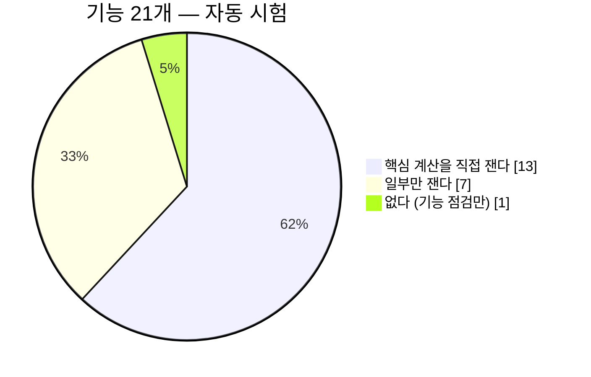

### 1.3 요청 하나가 지나는 길 · 가로지르는 원칙

그림 3 는 「로그인한 요청 하나가 어떤 층을 차례로 지나나」 에 답한다. 기능 절의 시퀀스 그림은 모두 이 길의 한 갈래다.

**그림 3. 요청 하나의 공통 길** · 범례: `→` = 부른다 · `[ ]` = 코드 위치

```
 브라우저 ─ fetch('/api/…', 쿠키 fin_session) [public/js/common.js 의 api()]
   │
   ▼ FastAPI 가 경로로 라우트를 고른다                         [app/main.py]
 라우트 ─ Depends(get_current_user) → Redis 에서 세션 확인      [app/lib/session.py]
   │        · 없으면 401 「로그인이 필요합니다」 · 있으면 만료 7일을 다시 잰다
   ▼
 서비스 ─ 계산 · 체결 · 판정 (이 문서 2~7절)                    [app/services/*.py]
   │
   ├─→ PostgreSQL  사용자 · 주문 · 장부 (트랜잭션 · 필요하면 행 잠금)
   ├─→ 수집 DB     국내 일봉 (읽기 전용)
   ├─→ PG 캐시 표  외부 시세 결과를 몇 시간 보관 (data_cache)
   └─→ 외부 시세    현재가 · 지수 · 분봉 · 주봉 · 해외
   ▼
 응답 JSON → 화면이 그린다
```

표 2 는 「여러 기능에 걸쳐 지켜지는 원칙은 무엇이고, 어기면 무엇이 틀리나」 에 답한다. 면접에서 「설계에서 무엇을 중요하게 봤나」 에 대한 답이 여기 있다.

**표 2. 가로지르는 원칙 다섯**

| # | 원칙 | 어디서 | 왜 | 어기면 | 확실도 |
|:-:|---|---|---|---|:-:|
| ① | 국내 주식 일봉은 **수집 DB 에서 먼저** 읽는다 | `collector_db` → `stock.get_candles` (3.1) | 외부 차트 API 는 약관 · 가용성 문제로 팀이 배제 · 수정주가라 분할을 폭락으로 읽지 않는다 | 차트 · 지표 · 백테스트가 외부 시세와 수집 DB 를 섞어 기준일이 흔들린다 | 🟢 |
| ② | 비용은 **한 모듈**(`trading_cost`)에서만 계산한다 | 백테스트(4.1) · 모의 주문(6.1) · 자동매매(6.2) | 매도에만 세금 · 세율이 해마다 바뀐다 — 요율표가 여러 곳이면 갈라진다 | 같은 거래가 화면마다 다른 수익률 | 🟢 |
| ③ | **전날 신호로 오늘 포지션** — 미래 값을 보지 않는다 | `backtest`(4.1) · 수식 `shift` 음수 금지(4.3) · 지표 함수 | 당일 종가로 신호를 만들고 당일 수익을 먹으면 백테스트가 실제보다 좋게 나온다(미래 참조) | 거짓으로 좋은 성과 | 🟢 |
| ④ | **장부는 둘** — 모의투자 · 직접매매 · 리밸런싱 · 웹훅은 PAPER, 자동매매는 QUANT | `paper_trading` · `auto_trade` (6.1 · 6.2) | 자동매매가 산 주식이 모의투자 화면에 「없는 수익」 으로 잡히던 결함을 장부를 나눠 막았다 | 두 화면의 총자산이 서로를 오염 | 🟢 |
| ⑤ | **실거래는 한 지점에서 막는다** | `brokers/factory.get_broker_client` (6.5) | 제안요청서 제외 범위 첫 줄이 실거래 자동 주문 · 실주문 경로가 여럿이라 목 하나에 건다 | 설정 칸 하나로 실계좌 주문 | 🟢 |

### 1.4 이 문서를 읽는 법

- **한 줄** 은 사용자 입장에서 그 기능이 무엇을 하는지다. 발표 첫 문장으로 쓸 수 있게 적었다.
- **어느 코드** 표의 파일 경로는 저장소 루트 기준이다(`app/services/stock.py` 는 `services/stock.py` 로 줄여 적는 곳이 있다).
- **핵심 코드** 는 실제 코드에서 옮겼다. 줄을 건너뛴 곳은 `# …` 로 적었고, **`# ▶` 로 시작하는 주석은 이 문서가 단 설명**이다(원본에는 없다). 강사님 기초 코드에는 다음 병합 때 충돌이 늘지 않도록 주석을 더하지 않고 여기서 설명한다.
- 코드가 바뀌면 발췌가 틀린다. 그래서 늘 **파일 · 함수 이름**을 함께 적었다 — 부록 B 의 명령으로 아직 있는지 확인할 수 있다.

---

## 2. 계정 — 가입 · 로그인 · 로그인 유지 · 마이페이지 · 토큰

표 3 은 「계정 기능이 따르는 규칙은 무엇이고, 어디서 왔나」 에 답한다. 2026-09-30 에 현업 기준(OWASP · NIST · 개인정보 보호법)을 조사해 맞춘 것이라, 면접에서 「인증을 어떻게 설계했나」 에 대한 답이 이 표다.

**표 3. 계정 규칙과 근거** · 확실도 🟢 원문 확인 · 🟡 원문 재확인 전

| 규칙 | 우리 구현 | 근거 | 확실도 |
|---|---|---|:-:|
| 이메일(로그인 ID)은 대소문자를 가리지 않는다 | 저장 · 비교 모두 소문자 · DB 에 `lower(email)` 유일 색인 · 옛 행도 `lower()` 로 찾음 | 메일 표준 RFC 5321 2.4 — @ 앞부분의 대소문자 구분에 기대는 것은 권하지 않는다 · 실제 메일 서비스 관행 | 🟡 |
| 비밀번호는 길이 · 흔한 목록으로 — 조합 강제 없음 | 8자 이상(설정) · 64자 이하 · 72바이트 이하 · 흔한 비밀번호 · 같은 글자 반복 · 이메일과 같음 거절 · NFC 정규화 · 자르지 않음 | NIST SP 800-63B-4(2025-08) 3.1.1.2 — 조합 규칙 금지 · 최대 64자 이상 허용 · 차단 목록 · 자르지 않기 · NFC | 🟢 |
| 다중 인증 없는 비밀번호의 최소 길이 | **8자(설정 `PASSWORD_MIN_LENGTH`)** — 15자로 올릴지는 팀 결정 | NIST 위 절: 단일 요소는 15자 이상 · OWASP 인증 치트시트: MFA 없으면 15자 미만은 약함 | 🟢 |
| 민감한 변경 전 재인증 | 비밀번호 변경 · 탈퇴에 현재 비밀번호 | OWASP 인증 치트시트 — 비밀번호 · 이메일 같은 민감 정보 변경 전 현재 자격 증명 요구 | 🟢 |
| 권한이 바뀌면 세션 ID 새로 | 비밀번호 변경 뒤 이 기기는 새 세션 · 다른 기기 세션 삭제 · 옛 토큰 무효 | OWASP 세션 관리 치트시트 — 권한 수준이 바뀌면 세션 ID 재발급 | 🟢 |
| 브라우저에 토큰을 두는 곳 | JS 가 못 읽는 `HttpOnly` 쿠키(`fin_session`) · 화면은 JWT 를 쓰지 않는다 | OWASP 세션 관리 치트시트 — 인증 토큰 · JWT 를 localStorage · sessionStorage 에 두지 말 것 | 🟢 |
| 로그인 실패 문구는 하나 · 없는 계정도 비슷한 시간 | 「이메일 또는 비밀번호가 올바르지 않습니다」 · 없는 계정도 가짜 해시로 한 번 확인 | OWASP 인증 치트시트 — 계정 존재 여부를 드러내지 않는 일반 오류 문구 | 🟢 |
| 탈퇴는 가입보다 어렵지 않게 · 즉시 파기 | 마이페이지에서 비밀번호 + 「탈퇴」 입력 · 사용자 데이터 즉시 삭제(감사 기록은 사용자 칸만 비움) | 개인정보 보호법 제38조 제4항(요구 절차가 수집 절차보다 어렵지 않게) · 제21조(목적을 이룬 개인정보는 지체 없이 파기) | 🟢 |

### 2.1 가입 · 로그인 · 로그인 유지 (쿠키 세션)

**한 줄** — 이메일(대소문자 무관) · 비밀번호로 가입하면 곧바로 로그인되고, 이후 모든 요청은 브라우저가 들고 다니는 쿠키 `fin_session` 하나로 「누구인가」 를 밝힌다. 로그인한 채로 주소를 다시 열면 로그인 화면이 아니라 앱으로 간다.

**표 4. 어느 코드**

| 층 | 파일 · 함수 | 하는 일 |
|---|---|---|
| 화면 | `public/register.html` · `login.html` · `js/main.js` | 폼 → 성공하면 기록을 바꿔 치우며(`location.replace`) 앱으로 · 앱은 **401 일 때만** 로그인 화면으로 |
| 주소 | `app/main.py` — `index` · `login_page` · `register_page` · `app_page` | 세션을 보고 `/` · 로그인 · 가입 → 앱, 로그인 없이 앱 → 로그인 화면 |
| 라우트 | `app/routes/auth.py` — `register` · `login` · `logout` | 순서만 지킨다(검사 → 저장 → 세션 → 쿠키) |
| 규칙 | `app/services/account.py` — `normalize_email` · `check_new_password` · `hash_password` · `verify_password` · `find_user_by_email` | 이메일 · 비밀번호 규칙의 한 곳 |
| 세션 | `app/lib/session.py` — `create_session` · `get_current_user` | Redis 에 `fin_session:{sid}` · 요청마다 만료 7일 연장 |
| 저장소 | PostgreSQL `users` · Redis | 사용자 행(비밀번호는 bcrypt 해시만) · 세션 |

그림 4 은 「가입부터 다음 날 주소를 다시 열 때까지 누가 누구를 어떤 차례로 부르나」 에 답한다.

**그림 4. 가입 · 요청 · 주소 다시 열기 · 로그아웃**

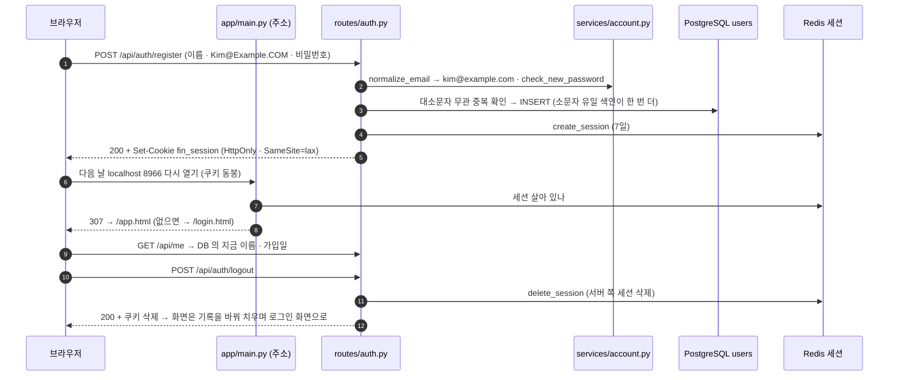

로그아웃은 쿠키만 지우는 것이 아니라 **Redis 의 세션을 지운다** — 같은 쿠키를 다시 보내도 401 이다. 주소를 다시 열 때 로그아웃된 것처럼 보이던 현상은 세션이 끊긴 것이 아니라 **첫 주소 `/` 가 늘 로그인 화면으로 보내던 것**이었다(쿠키는 `Max-Age=604800` · `Path=/` 로 살아 있었다). 표 5 는 「어느 주소가 어디로 가나」 에 답한다.

**표 5. 주소별 이동** · 판정 = 쿠키의 세션이 Redis 에 살아 있나

| 주소 | 로그인됨 | 로그인 안 됨 |
|---|---|---|
| `/` | → `/app.html` | → `/login.html` |
| `/login.html` · `/register.html` | → `/app.html` | 화면 |
| `/app.html` | 화면 | → `/login.html` |
| 뒤로가기(브라우저 캐시로 되살아난 로그인 화면) | 화면이 `/api/me` 로 확인하고 앱으로 | 그대로 |

**핵심 코드** — `app/services/account.py` 의 `verify_password` (예외를 내지 않는 비밀번호 확인)

```python
    if not isinstance(raw, str) or raw == "":
        return False
    if not hashed:                                 # ▶ 없는 계정 — 가짜 해시로 한 번 확인해 응답 시간을 맞춘다
        try:
            bcrypt.checkpw(b"x", _dummy_hash())
        except ValueError:
            pass
        return False
    for cand in dict.fromkeys((_nfc(raw), raw)):      # 순서를 지키고, 둘이 같으면 한 번만
        b = cand.encode("utf-8")
        if len(b) > BCRYPT_MAX_BYTES:                  # ▶ bcrypt 5.0 은 72바이트 초과에 예외 → 저장된 적 없는 길이라 곧바로 틀림
            continue
        try:
            if bcrypt.checkpw(b, hashed.encode("utf-8")):
                return True
        except ValueError:                             # 해시 문자열이 망가진 행 — 로그인 실패로 다룬다
            return False
    return False
```

예전에는 라우트가 `bcrypt.checkpw` 를 직접 불러, 72바이트가 넘는 비밀번호(한글 25자)로 가입 · 로그인하면 bcrypt 5.0 의 예외가 그대로 **서버 오류 500** 이 됐다. 지금은 가입 때 규칙으로 거절하고(422 · 한국어 한 줄), 로그인 때는 「틀림」(401)이다.

**확인** — 자동 TC-AC 21건(`test_account_crud.py` · 규칙 16 + DB 5 — 대소문자 · 옛 행 · DB 색인 · 비밀번호 규칙 · NFC · 72바이트 · 이름 · 주소 판정 코드) · 점검 [로그인] 3 · [계정] 23건(2026-09-30: 23/23 · 4.5초).

**한계**
- 🟡 **이메일 소유 확인이 없다** — 남의 이메일로도 가입된다. OWASP 는 「가입 때 이메일을 확인한다면」 이메일을 아이디로 써도 된다고 한다. 메일 발송 기능이 생기면 확인 메일 · 비밀번호 재설정(분실)을 함께 넣는다.
- 🟢 로그인 시도 횟수 제한이 없다(A3 분석 · 그대로).
- 🟡 세션은 「마지막 활동부터 7일」 이다 — OWASP 는 낮은 위험 앱도 유휴 15~30분 · 절대 4~8시간을 권한다. 모의투자라 편의를 택했고, 줄일지는 팀 결정이다.
- 🟢 대소문자만 다른 옛 계정이 이미 둘 이상인 DB 에서는 소문자 유일 색인을 만들지 않는다(마이그레이션 0010 이 경고만 남김 · 로그인은 먼저 가입한 계정으로).

### 2.2 마이페이지 — 이름 · 비밀번호 바꾸기 · 탈퇴

**한 줄** — 머리글의 이름(또는 더보기 › 내 계정)을 누르면 내 정보를 보고, 이름을 바꾸고, 현재 비밀번호를 다시 넣어 비밀번호를 바꾸거나(다른 기기는 로그아웃) 탈퇴(데이터 즉시 삭제)할 수 있다.

**어느 코드** — 화면 `public/app.html`(`data-view="mypage"`) · `public/js/mypage.js` · 메뉴 `public/js/core.js`(`GNB_MENUS.account`) → 라우트 `app/routes/auth.py` 「계정 관리」 절(`update_me` · `change_password` · `delete_me` · `password_policy`) → 규칙 `app/services/account.py`(`validate_name` · `check_new_password` · `delete_user_data`) · 토큰 `app/lib/jwt_auth.py`(`revoke_all_tokens_for`).

그림 5 는 「비밀번호를 바꾸면 세션 · 토큰에 무슨 일이 일어나나」 에 답한다.

**그림 5. 비밀번호 바꾸기** · 범례: `alt` = 쿠키로 온 요청일 때만

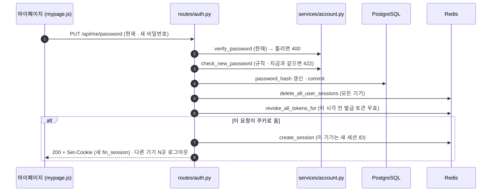

DB 를 먼저 커밋하고 세션을 지운다 — 거꾸로 하면 DB 가 실패했을 때 「로그아웃만 되고 비밀번호는 그대로인」 상태가 된다.

표 6 은 「탈퇴하면 무엇이 어떻게 되나」 에 답한다.

**표 6. 탈퇴 때 데이터 처리** · 대상 = 사용자 행(`users.id`)을 가리키는 표 25개(2026-09-30 · 모델 메타데이터에서 자동으로 찾는다)

| 무엇 | 처리 | 예 |
|---|---|---|
| 사용자가 가진 행 | **삭제** — 24개 표 | 모의투자 · 자동매매 장부 · 보유 · 주문 · 코인 · 대체자산 · 리밸런싱 계획 · 실행 기록 · 입출금 · 저장 지표 · 수식 지표 · 증권사 설정 · 알림 설정 · 알림 기록 · API 키 · 웹훅 신호 · 교차 검증 · LEAN 실행 · 대화 · 업로드 문서 |
| 손자 행 | 부모가 지워지면 따라 삭제(`ON DELETE CASCADE`) | 대화 메시지 · 수식 지표 판 · 체결 내역 |
| 감사 기록 `audit_events` | **사용자 칸만 비움**(행은 남김) | 「주문이 있었다」 는 남고 누구였는지는 사라진다 |
| 자동매매 사이클 기록 | 캐시 표에서 삭제 | `data_cache` 키 `quant:cycle_log:{사용자}` |
| 세션 · 토큰 · 접속 상태 | 모든 기기 세션 삭제 · 옛 토큰 무효 · 쿠키 삭제 | Redis |
| 사용자 행 | 삭제 — 같은 이메일로 다시 가입하면 빈 장부의 새 계정 | `users` |

**핵심 코드** — `app/services/account.py` 의 `delete_user_data`

```python
    counts: dict[str, int] = {}
    for table, col in user_owned_columns():                 # ▶ users.id 를 가리키는 (표, 칸) 전부 — 자식이 먼저
        if table.name in DEIDENTIFY_TABLES and col.nullable:
            res = await db.execute(update(table).where(col == user_id).values({col.name: None}))
            key = f"{table.name}(사용자 칸 비움)"             # ▶ 감사 기록 — 누구였는지만 지운다
        else:
            res = await db.execute(delete(table).where(col == user_id))
            key = table.name
        if res.rowcount:
            counts[key] = counts.get(key, 0) + int(res.rowcount)
    res = await db.execute(delete(DataCache).where(DataCache.key == f"quant:cycle_log:{user_id}"))
    # …
    res = await db.execute(delete(User).where(User.id == user_id))
    counts["users"] = int(res.rowcount or 0)
    return counts                                            # ▶ 커밋은 라우트가 — 한 트랜잭션이라 중간 실패면 아무것도 안 지워진다
```

표 이름을 손으로 적지 않고 모델 메타데이터에서 찾는 이유 — 표가 새로 생길 때 목록 고치기를 잊으면, 탈퇴한 사람의 데이터가 그 표에 남거나 외래 키 때문에 탈퇴가 실패한다. 자동 시험(`test_user_owned_columns_cover_every_fk_to_users`)이 「모든 외래 키가 목록에 있다」 를 매번 확인한다.

**확인** — 자동 TC-AC 중 DB 시험 넷(이름이 DB · 모든 세션에 바뀐다 · 비밀번호 변경의 재인증과 세션 교체 · 탈퇴가 그 사용자 행만 지운다 · 감사 기록은 칸만 비운다) · 점검 [계정] 13~22번.

**한계**
- 🟢 이메일(로그인 ID)은 바꿀 수 없다 — 새 주소로 확인 메일을 보내야 하는데(현업 관행) 메일 발송이 없다.
- 🟡 탈퇴 유예 기간(예: 30일 뒤 삭제 · 그 사이 복구)이 없다 — 지금은 즉시 파기다. 실수 탈퇴를 막는 장치는 비밀번호 + 확인 문구 + 한 번 더 묻기다.
- 🟡 업로드 문서의 벡터(Qdrant)는 지우지 않는다 — 로컬 구성에는 Qdrant 가 없어 쌓이지 않지만, 문서 검색을 켜면 따로 지워야 한다.

### 2.3 토큰(JWT) 방식

**한 줄** — 화면이 아닌 프로그램(API 클라이언트)은 쿠키 대신 15분짜리 액세스 토큰을 `Authorization: Bearer` 머리글에 실어 부르고, 로그아웃하면 그 토큰을 폐기 목록에 올린다. 비밀번호를 바꾸거나 탈퇴하면 그 전에 나간 토큰이 한꺼번에 끊긴다.

그림 6 는 「토큰은 어떻게 발급 · 사용 · 폐기되나」 에 답한다.

**그림 6. 토큰 발급 · 사용 · 폐기**

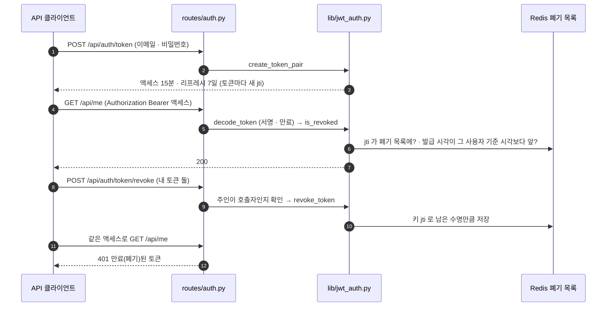

**핵심 코드** — `app/lib/jwt_auth.py` 의 `is_revoked` · `revoke_all_tokens_for`

```python
async def is_revoked(token: str, payload: dict) -> bool:
    if await jwt_blacklist_cache.exists(_bl_key(token, payload)):     # ▶ 토큰 하나를 폐기한 경우 — 키는 토큰마다 다른 jti
        return True
    return await _issued_before_cutoff(payload)                      # ▶ 그 사용자의 옛 토큰 전부를 끊은 경우

async def revoke_all_tokens_for(user_id: str) -> None:
    await jwt_blacklist_cache.set(_cutoff_key(str(user_id)), _unix(_now()), ttl=settings.JWT_REFRESH_TTL)
```

토큰은 서버에 목록이 없어 하나씩 지울 수 없다. 그래서 「이 시각 전에 발급된 토큰은 받지 않는다」 는 기준 시각을 사용자별로 두고, 리프레시 수명(7일)만큼만 보관한다. 폐기 목록의 키는 토큰마다 새로 만드는 `jti` 다 — 예전에는 토큰 앞 32글자(모든 토큰이 같은 헤더)를 키로 써서 **한 사람이 로그아웃하면 전원의 토큰이 막혔다**(A3 분석이 찾은 결함 · 고쳐짐).

**표 7. 쿠키 방식과 토큰 방식** — 「둘은 무엇이 다르고, 화면은 무엇을 쓰나」 에 답한다.

| | 쿠키 세션 (2.1) | 토큰 JWT (2.3) |
|---|---|---|
| 누가 쓰나 | 화면(브라우저) — 화면 JS 는 토큰을 한 번도 쓰지 않는다 | 앱 밖 프로그램 · 점검 스크립트 |
| 어디에 저장 | 서버 Redis(세션) · 브라우저는 무작위 ID 만(`HttpOnly`) | 토큰 안에 사용자 정보 · 서버는 폐기 목록 · 기준 시각만 |
| 수명 | 마지막 활동부터 7일(요청마다 연장) | 액세스 15분 · 리프레시 7일 |
| 로그아웃 | 세션 삭제 → 즉시 무효 | 폐기 목록에 등록 → 즉시 무효 |
| 비밀번호 변경 · 탈퇴 | 모든 세션 삭제 → 즉시 | 기준 시각 → 즉시 |
| 역할 강등 | 세션을 지우면 즉시 | 🟡 리프레시가 DB 를 다시 보지 않아 최대 7일 늦다(A3 결함 7) |

**확인** — 자동 TC-AC 는 기준 시각 키가 생기는지까지 본다 — 토큰 발급 · 폐기 자체를 재는 자동 시험은 없다 🟡 · 점검 [계정] 9~12번(발급 · Bearer 조회 · 폐기 · 폐기한 토큰 401).

**한계** — 🟡 저장소에 커밋된 기본 비밀값(`JWT_SECRET`)이면 토큰을 만들지 않도록 막아 두었다(`_require_real_secret`). 로컬에서는 `.env` 에 실제 값을 넣거나 `JWT_ALLOW_INSECURE_SECRET=true` 가 필요하다.

---

## 3. 시세

### 3.1 국내 일봉 — 수집 DB 에서 먼저

**한 줄** — 국내 주식(코스피 · 코스닥)의 일봉 차트는 외부 차트 API 가 아니라, 데이터 파트가 매일 12:30 에 갱신하는 **수집 DB** 에서 수정주가로 읽는다.

**표 8. 어느 코드**

| 층 | 파일 · 함수 | 하는 일 |
|---|---|---|
| 화면 | `public/js/trading.js` | 기간 · 봉 선택 → 차트 |
| 라우트 | `app/routes/stocks.py` — `stock_candles` | 수집 DB 가 받는 요청이면 캐시를 건너뛴다 |
| 서비스 | `app/services/stock.py` — `get_candles` | 수집 DB 먼저 → 없으면 캐시 → 외부 |
| 어댑터 | `app/services/collector_db.py` — `handles` · `read_daily_candles` | 요청 모양 판정 · SQLite 읽기 전용 조회 |
| 저장소 | `data/collector/market.sqlite3` (도커에서는 `/app/data/csv/collector/`) | `price_adjusted` + `price_daily` |

그림 7 는 「일봉 요청이 어느 길로 가나」 에 답한다.

**그림 7. 국내 일봉 요청의 차례** · 범례: `alt` = 조건에 따라 한쪽만

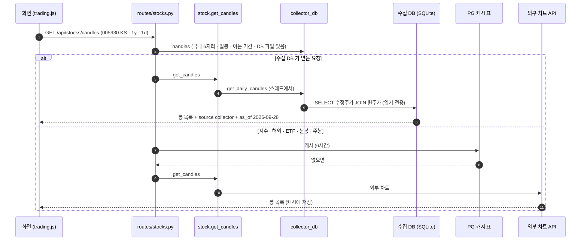

국내 주식 일봉은 캐시를 거치지 않는다 — 파일 읽기가 캐시 조회보다 싸고, 12:30 갱신이 바로 보인다. 응답에 붙는 `as_of` 는 마지막 봉의 날짜라, 오늘이 아니라 **수집 DB 의 기준일**(공공데이터포털이 다음 날 낮에 주는 값)이다.

**핵심 코드** — `app/services/collector_db.py` 의 판정 · 조회

```python
_SYMBOL = re.compile(r"^(\d{6})\.(KS|KQ)$")        # ▶ 국내 주식 기호만 — 지수(^KS11) · 해외(AAPL)는 여기서 걸러진다

def handles(symbol: str, period: str = "1y", interval: str = "1d") -> bool:
    """이 요청을 다리가 **먼저** 받는가 — 요청 모양이 맞고 DB 파일이 있다 (DF-17)."""
    return _match(symbol, period, interval) is not None and db_path() is not None

_QUERY = """
SELECT a.bas_dt, a.adj_clpr, a.adj_mkp, a.adj_hipr, a.adj_lopr, a.cum_factor,
       d.mkp, d.trqu
  FROM price_adjusted AS a
  JOIN price_daily    AS d ON d.bas_dt = a.bas_dt AND d.srtn_cd = a.srtn_cd
 WHERE a.srtn_cd = ? AND a.bas_dt >= ? AND a.bas_dt <= ?
 ORDER BY a.bas_dt
"""
# … read_daily_candles 안
        # 읽기 전용으로 연다 — 앱이 수집 DB 에 쓰는 일은 없어야 한다.
        conn = sqlite3.connect(f"{path.resolve().as_uri()}?mode=ro", uri=True, timeout=5)
```

**표 9. 수집 DB 봉이 옛 경로 봉과 다른 점** — 「같은 일봉인데 무엇이 다르게 오나」 에 답한다.

| 칸 | 수집 DB 경로 | 왜 |
|---|---|---|
| 값 | 수정주가(분할 · 권리락 계수를 곱한 값) | 분할을 폭락으로 읽지 않게 — 마지막 봉은 원래 값과 같다 |
| 거래가 없던 날 | 시가 = 고가 = 저가 = 종가 인 평평한 봉 | ATR 등 고가 · 저가를 쓰는 계산이 빈 값에서 멈추지 않게 |
| 거래량 | 원래 거래량 ÷ 계수 | 분할 전 거래량을 분할 뒤 주식 수에 맞춘다 |
| 더 붙는 칸 | `source: collector` · `as_of` | 화면이 기준일을 보여 줄 수 있게 |

**확인** — 자동 TC-CD 22건(`test_collector_candles_df08.py` · 수집기 실제 스키마로 만든 픽스처 DB 와 한 자리도 안 다르다) · TC-DF17 17건(`test_route_cache_df17.py` · 캐시가 옛 기준일을 주지 않는다) · 점검 [시세] 「국내 일봉 — 수집 DB 에서 오나」(2026-09-30: 19봉 · collector · 2026-09-28).

**한계**
- 🟢 수집 DB 는 2020-01-02 부터라 화면의 「10년」 은 실제로 약 6.7년이다(이슈 「다리 뒤 기준일」 D-1).
- 🟢 ETF 는 수집 DB 에 없어 외부 경로로 간다.
- 🟢 DB 파일이 없는 PC 에서는 전부 외부 경로로 조용히 넘어간다 — 화면은 돌지만 `source` 칸이 없다. 점검이 이것을 [주의] 로 알린다.

### 3.2 기술 지표 · 신호 점수

**한 줄** — 일봉 종가로 RSI · 이동평균(5 · 20 · 60) · 볼린저 밴드를 계산하고, 규칙 점수를 합쳐 「강력 매수 ~ 강력 매도」 다섯 단계 신호를 낸다. 자동매매(6.2)가 이 신호로 종목을 고른다.

**어느 코드** — 라우트 `routes/stocks.py` `quant_indicators` → 서비스 `services/stock.py` `get_quant_indicators` · `_calc_rsi` · `_calc_sma` · `_calc_bollinger` · `_generate_signal` · 화면 `js/indicator.js` · `js/quant.js`.

표 10 은 「신호 점수는 어떤 규칙으로 쌓이나」 에 답한다(`_generate_signal` 을 표로 옮긴 것).

**표 10. 신호 점수표** · 마지막 봉(n) 기준

| 규칙 | 조건 | 점수 |
|---|---|---:|
| RSI | 14일 RSI < 30 (과매도) | +2 |
| | RSI > 70 (과매수) | −2 |
| 이동평균 | 5일선이 20일선을 오늘 위로 뚫음 (골든크로스) | +3 |
| | 오늘 아래로 뚫음 (데드크로스) | −3 |
| | 교차 없이 5일선 > 20일선 | +1 |
| | 교차 없이 5일선 < 20일선 | −1 |
| 볼린저 | 종가 < 하단 밴드 | +1 |
| | 종가 > 상단 밴드 | −1 |
| **판정** | 합 ≥ 3 강력 매수 · ≥ 1 매수 · ≤ −3 강력 매도 · ≤ −1 매도 · 그 밖 관망 | |

**핵심 코드** — `services/stock.py` 의 `_calc_rsi` (Wilder 평활)

```python
def _calc_rsi(closes: list[float], period: int = 14) -> list[float | None]:
    rsi = [None] * len(closes)
    if len(closes) < period + 1:
        return rsi
    gains, losses = [], []
    for i in range(1, period + 1):                       # ▶ 첫 14일은 단순 평균으로 씨앗을 만든다
        diff = closes[i] - closes[i - 1]
        gains.append(max(diff, 0))
        losses.append(max(-diff, 0))
    avg_gain = sum(gains) / period
    avg_loss = sum(losses) / period
    for i in range(period, len(closes)):
        if i > period:                                   # ▶ 그다음부터는 Wilder 식: 옛 평균 13/14 + 오늘 1/14
            diff = closes[i] - closes[i - 1]
            avg_gain = (avg_gain * (period - 1) + max(diff, 0)) / period
            avg_loss = (avg_loss * (period - 1) + max(-diff, 0)) / period
        rs = avg_gain / avg_loss if avg_loss > 0 else 100
        rsi[i] = round(100 - (100 / (1 + rs)), 2)
    return rsi
```

**확인** — 자동 시험은 라우트가 캐시를 건너뛰는지만 본다(TC-DF17) — **점수 규칙 자체를 재는 시험은 없다** 🟡. 점검 [시세] 「기술 지표」(2026-09-30: RSI 53.27 · 신호 매수 · 종가 270,000 · 기준일 2026-09-28).

**한계**
- 🟢 **RSI 가 여러 벌이다** — 이 함수(Wilder), `ta_utils.rsi`(단순 평균 · 백테스트 쪽), 다중 시간대(3.5)는 `ta_utils`. 같은 날 같은 종목의 RSI 가 화면마다 다를 수 있다(A5 분석 · 그대로).
- 🟢 볼린저 표준편차가 여기는 모집단(÷n), `ta_utils.bollinger` 는 표본(÷n−1)이다.
- 🟢 `current_price` 는 마지막 봉 종가 = **수집 DB 기준일의 종가**다. 자동매매가 이 값을 체결가로 쓴다(6.2 한계).

### 3.3 현재가 · 시장 지수 · 시세 동기화

**한 줄** — 현재가는 요청 때마다 외부 시세에서 받아 「전일 대비」 를 계산하고, 시장 지수 · 거시 지표 · 섹터 ETF 는 앱 안 스케줄러가 1시간마다 받아 캐시 표에 넣어 둔다.

**어느 코드** — `routes/stocks.py` `stock_quote` · `market_summary` → `services/stock.py` `get_quote` · `_change_from_prev` · `get_market_summary` / 스케줄러 `services/sync_scheduler.py` `_scheduler_loop` · `sync_all`(앱이 켜질 때 시작 · 1시간 간격) · 화면 `js/trading.js` · `js/core.js`.

그림 8 은 「지수는 언제 받아 두고, 화면은 무엇을 읽나」 에 답한다.

**그림 8. 시장 지수 — 받아 두기와 읽기**

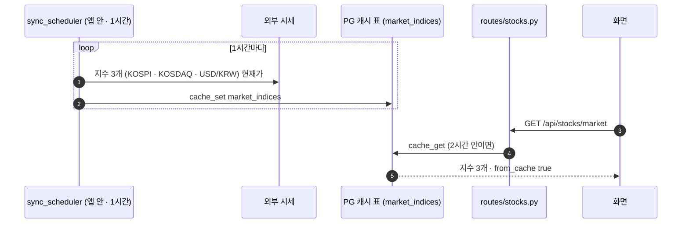

**핵심 코드** — `services/stock.py` 의 `_change_from_prev` (모르는 값을 0 으로 채우지 않는다)

```python
def _change_from_prev(price: Any, prev_close: Any) -> tuple[float | None, float | None]:
    try:
        price, prev_close = float(price), float(prev_close)
    except (TypeError, ValueError):
        return None, None                                  # ▶ 모르면 None — 화면이 「보합 0.00%」 로 거짓말하지 않게
    if not (math.isfinite(price) and math.isfinite(prev_close)) or price <= 0 or prev_close <= 0:
        return None, None
    change = price - prev_close
    return round(change, 4), round(change / prev_close * 100, 2)
```

같은 파일 `get_quote` 는 전일 종가로 `previousClose` 가 없으면 `chartPreviousClose` 를 쓰는데, 이 값은 **요청 기간이 1일일 때만** 전일 종가다(5일이면 5거래일 전 종가 — 2026-09-28 실측). 그래서 요청 기간을 바꾸지 않는다는 주석이 코드에 있다.

**확인** — 자동 TC-A1 21건(`test_quote_change_a1.py` · 등락률 계산 · 모르면 비운다) · TC-YH 2건(외부 시세 참조가 기준선보다 늘지 않는다) · 스케줄러는 자동 시험 **없음** 🟡 · 점검 [시세] 「현재가」 · 「시장 지수」 · [시스템] 「시세 동기화 스케줄러」.

**한계**
- 🟢 공식 등락률은 전일 종가가 아니라 「기준가」 대비라, 권리락 · 분할 날에는 증권사 앱과 다를 수 있다(코드 주석).
- 🟢 앱 안 스케줄러는 **프로세스마다 하나** 돈다 — 개발 모드 앱과 도커 앱을 함께 띄우면 두 벌이 된다(`dev.ps1` 이 도커 앱을 먼저 멈추는 이유).
- 🟡 Celery 비트에도 시세 동기화 예약이 있다(`sync.market_data` 1시간 · `sync.stock_candles` 24시간) — 앱 안 스케줄러와 겹친다(A4 분석 · 이름을 고친 뒤 생긴 중복).

### 3.4 차트 패턴 · 지지/저항 · 돌파

**한 줄** — 최근 일봉에서 캔들 패턴 13종(도지 · 해머 · 장악형 · 샛별형 · 적삼병 …), 지지 · 저항 가격대, 돌파 · 이탈 사건을 찾아 방향 점수를 매긴다.

**어느 코드** — `routes/stocks.py` `stock_patterns` → `services/patterns.py` `pattern_summary` = `detect_candle_patterns` + `support_resistance` + `detect_breakouts` · 화면 `js/robo.js`.

**핵심 코드** — `services/patterns.py` 의 `pattern_summary` (점수 합치기)

```python
def pattern_summary(candles: list[dict]) -> dict:
    df = preprocess(candles)
    if len(df) < 65:
        return {"error": f"데이터 부족: {len(df)}봉 (최소 65 필요)"}
    patterns = detect_candle_patterns(df)           # ▶ 최근 5봉에서 캔들 모양
    sr = support_resistance(df)                     # ▶ 최근 120봉의 피벗 고점 · 저점을 1% 안으로 묶어 가격대로
    breakouts = detect_breakouts(df, sr)            # ▶ 20일 고 · 저 · 가격대 · 52주 · 골든/데드 · 볼린저
    score = 0.0
    for p in patterns:
        w = 1.0 if p["bars_ago"] == 0 else 0.5      # ▶ 오늘 나온 패턴은 1, 며칠 전은 절반
        score += w * (1 if p["direction"] == "bullish" else -1 if p["direction"] == "bearish" else 0)
    for e in breakouts:
        w = 1.5 if e.get("confirmed") else 1.0      # ▶ 거래량이 20일 평균의 1.5배 이상이면 「확인된 돌파」
        score += w * (1 if e["direction"] == "bullish" else -1)
    # … pattern_bias = bullish (≥1) · bearish (≤−1) · neutral
```

**확인** — 자동 TC-PT 7건(`test_patterns.py` · 해머 · 장악형 · 도지 · 흑삼병 · 지지저항 · 52주 · 20일 돌파를 합성 봉으로) · 점검 [시세] 「차트 패턴」(2026-09-30: 패턴 4 · neutral · −0.5).

**한계** — 🟢 모든 계산은 과거 봉만 쓴다(모듈 설명 · 시험). 🟡 패턴마다 가중치가 같아(1 또는 0.5) 「적삼병」 과 「도지」 가 같은 무게다 — 과거 적중률로 무게를 준 것이 아니다. 교육용 신호라는 문구가 응답에 있다.

### 3.5 다중 시간대 신호

**한 줄** — 60분봉 · 일봉 · 주봉 세 시간대의 지표 점수를 가중 평균해 하나의 신호와 신뢰도(0~100)를 낸다.

그림 9 은 「세 시간대가 어떻게 하나의 신호로 합쳐지나」 에 답한다.

**그림 9. 다중 시간대 합치기** · 범례: 괄호 = 가중치 · 데이터 출처

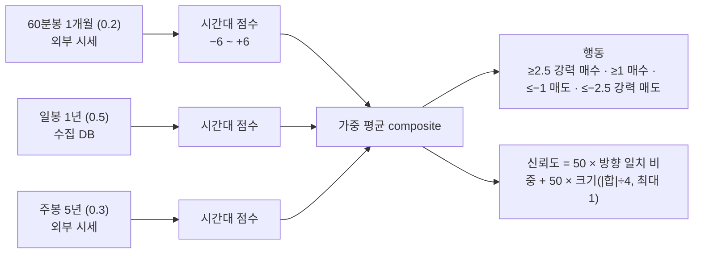

시간대 점수는 RSI(±2) · 5/20일선 배열(±1) · MACD 대 시그널(±1) · 볼린저 이탈(±1) · 20일선 위 · 아래(±1)를 더한 값이다(`timeframe_score`). 일봉만 수집 DB 에서 오고, 60분봉 · 주봉은 외부 시세다.

**핵심 코드** — `services/patterns.py` 의 `combine_timeframes`

```python
    wsum = sum(r["weight"] for r in valid) or 1.0
    composite = sum(r["score"] * r["weight"] for r in valid) / wsum          # -6 ~ +6
    direction = 1 if composite > 0 else -1 if composite < 0 else 0
    agree = sum(r["weight"] for r in valid if np.sign(r["score"]) == direction and direction != 0) / wsum
    magnitude = min(1.0, abs(composite) / 4.0)
    confidence = int(round(100 * (0.5 * agree + 0.5 * magnitude)))    # ▶ 방향이 같고 크기가 클수록 높다
```

**확인** — 자동 TC-PT 중 `test_combine_timeframes_confidence_and_action` · `test_timeframe_score_reasons` · 점검 [시세] 「다중 시간대 신호」(2026-09-30: 관망 · 시간대 3 · 합의 0 · 1,024ms).

**한계** — 🟢 한 시간대가 실패하면(외부 시세 없음) 그 시간대를 빼고 나머지로 평균한다 — 응답의 `timeframes` 에 `error` 가 남는다. 🟢 일봉을 두 번 읽는다(점수용 · 패턴 첨부용). 🟡 가중치 0.2 · 0.5 · 0.3 과 문턱값은 검증된 값이 아니라 정한 값이다.

---

## 4. 전략 · 백테스트

### 4.1 지표 전략 백테스트

**한 줄** — 고른 지표 조합(RSI+이동평균 · MACD+볼린저 · 거래량+RSI · 삼중 이동평균)의 매수 · 매도 규칙을 과거 일봉에 적용해, 비용을 뺀 수익률 · 샤프 · 최대 낙폭 · 승률을 「그냥 들고 있었을 때」 와 나란히 보여 준다.

**표 11. 어느 코드**

| 층 | 파일 · 함수 | 하는 일 |
|---|---|---|
| 화면 | `public/js/indicator.js` | 지표 · 기간 · 비용 · 손절/익절 입력 → 결과 차트 |
| 라우트 | `app/routes/stocks.py` — `quant_pipeline_indicator_backtest` | 일봉 받기 · 비용 모델 고르기 · 전략 갈래 |
| 서비스 | `app/services/quant_pipeline.py` — `backtest_custom_indicator` · `backtest` · `apply_stops` | 신호 → 보유 상태 → 수익률 · 비용 · 성과 지표 |
| 공용 | `app/services/ta_utils.py` · `app/services/trading_cost.py` | 지표 계산 · 비용(4.2) |

그림 10 은 「백테스트 요청 하나가 어떤 차례로 계산되나」 에 답한다.

**그림 10. 지표 전략 백테스트 차례**

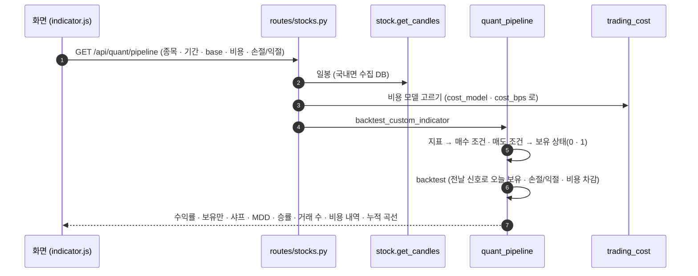

**그림 11. 「전날 신호로 오늘 포지션」** · 범례: `S` = 그날 종가로 만든 신호 · `H` = 그날 보유 여부 · 수익 = 그날 종가 등락률

```
 날짜        D1        D2        D3        D4
 종가로 신호  S=매수 ─┐ S=유지 ─┐ S=매도 ─┐ S=관망
                     ▼         ▼         ▼
 보유(H)     0        1         1         0      ← signals.shift(1): 하루 밀어서 쓴다
 먹는 수익   —       D2 등락   D3 등락    —
 비용       —       D2 매수분  —        D4 매도분(세금 포함)
```

D1 종가로 만든 매수 신호는 D2 의 보유가 된다. 같은 날 종가로 신호를 만들고 그날 수익을 먹으면 미래를 본 것과 같아 성과가 부풀려진다 — 표 2 의 원칙 ③.

**핵심 코드** — `app/services/quant_pipeline.py` 의 `backtest` (한가운데)

```python
    ret = df["close"].pct_change().fillna(0)
    # 전날 시그널로 오늘 포지션 (룩어헤드 방지)
    pos = signals.shift(1).fillna(0).reindex(ret.index, fill_value=0)

    held = (pos == 1).astype(float)
    # 손절 · 익절이 보유 상태를 먼저 바꾼다 — 비용 · 승률 · 매매 횟수는 바뀐 보유 상태로 센다
    held, n_sl, n_tp = apply_stops(df["close"].astype(float), held, stop_loss_pct, take_profit_pct)
    # …
    gross_ret = ret * held          # 비용 이전 (얼마나 깎였는지 보이려고 남긴다)
    strat_ret = gross_ret
    bh_ret    = ret
    if cost is not None:
        cost_series = cost.turnover_cost(held)        # ▶ 보유가 바뀐 날에만 방향별(매수 · 매도) 비용
        strat_ret = strat_ret - cost_series
        bh_ret    = bh_ret - cost.buy_hold_cost(ret.index)   # ▶ 「그냥 들고 있기」 에도 첫날 매수 · 끝날 매도 비용
    cum_strat = (1 + strat_ret).cumprod()
```

응답에는 비용을 떼기 **전** 수익률(`gross_return_pct`)과 비용이 깎은 몫(`cost_drag_pct`)도 함께 온다 — 화면이 「비용 반영」 이라고만 적고 넘어가지 못하게 하려는 설계다.

**확인** — 자동 TC-BC 6건(`test_backtest_costs.py` · 비용이 회전만큼 수익을 깎는다 · 손절 뒤 재진입 대기 · 익절 뒤 새 신호로 재진입 · 손절/익절이 없으면 결과가 그대로) · TC-LA 8건(`test_ta_utils_lookahead.py` · 지표와 백테스트가 미래 값을 보지 않는다 · 신호가 다음 날 적용된다) · 점검 [전략] 「지표 전략 백테스트」(2026-09-30: 005930 · 2년 · rsi_ma · 거래 0회 · 보유만 +337.03% · 비용 모델 krx_real · 슬리피지 10bp).

**한계**
- 🟢 승률은 「보유한 **날** 중 오른 날의 비율」 이다 — 흔히 말하는 「이긴 **거래**의 비율」 이 아니다(A13 분석 · 그대로). 화면 설명 문구와 맞출 일이 남았다.
- 🟢 롱 전략만 — 매도 신호는 「현금으로 있기」 다(공매도 없음).
- 🟢 샤프는 무위험 수익률 0 으로 계산한다(TradingView `strategy()` 기본 2% 와 다르다 · D6 분석).
- 🟡 「10년」 을 골라도 국내 주식은 수집 DB 가 2020-01-02 부터라 약 6.7년이다(3.1 한계).

### 4.2 매매 비용 모델

**한 줄** — 한국 주식의 실제 비용(위탁수수료 · 유관기관 제비용 · 증권거래세 · 농어촌특별세 · 슬리피지)을 **매수 · 매도 따로, 날짜별 세율로** 계산하는 한 곳이다. 백테스트(4.1) · 모의 주문(6.1) · 자동매매(6.2)가 모두 여기서 비용을 받는다.

표 12 는 「매도할 때 붙는 세금이 해마다 어떻게 바뀌었나」 에 답한다(코드의 요율표를 옮긴 것 · 매수에는 세금이 없다).

**표 12. 매도 세율표 (`TAX_SCHEDULE`)** · 단위 % · 코스피 합계 = 거래세 + 농어촌특별세 0.15

| 시행일 | 코스피 거래세 | 코스피 합계 | 코스닥 합계 | 근거 (코드 주석) |
|---|---:|---:|---:|---|
| 2019-06-02 까지 | 0.15 | 0.30 | 0.30 | 🟡 1차 출처 재확인 전 |
| 2019-06-03 | 0.10 | 0.25 | 0.25 | 대통령령 제29788호 |
| 2021-01-01 | 0.08 | 0.23 | 0.23 | 대통령령 제31290호 |
| 2023-01-01 | 0.05 | 0.20 | 0.20 | 대통령령 제33209호 |
| 2024-01-01 | 0.03 | 0.18 | 0.18 | 같은 영 단서 |
| 2025-01-01 | 0.00 | 0.15 | 0.15 | 금투세 전제 인하 |
| 2026-01-01 | 0.05 | 0.20 | 0.20 | 대통령령 제36001호 |

편도 비용 = 수수료 0.0140527%(온라인 KRX) + 유관기관 제비용 0.0036396% + 슬리피지(기본 10bp · **가정**)이고, 매도에는 위 표의 세금이 더 붙는다. ETF 는 증권거래세 과세 대상(주권)이 아니라 세금이 0 이다.

**핵심 코드** — `app/services/trading_cost.py` 의 `cost_rate`

```python
def cost_rate(side: str, when: Any, slippage_bps: float = DEFAULT_SLIPPAGE_BPS,
              market: str = "KOSPI", is_etf: bool = False,
              fee_rate: float = FEE_ONLINE_KRX, clearing_rate: float = FEE_CLEARING) -> float:
    """**편도** 비용률. side: buy | sell.

    매수 = 수수료 + 유관기관비 + 슬리피지
    매도 = 매수 + 증권거래세 + 농어촌특별세
    """
    s = (side or "").lower()
    # …
    base = fee_rate + clearing_rate + max(0.0, float(slippage_bps)) / 10_000.0
    if s == "buy":
        return base
    transfer, rural = tax_rates(when, market, is_etf)   # ▶ 그 날짜가 속한 시행 구간의 세율
    return base + transfer + rural
```

백테스트는 날짜가 수천 개라 같은 계산을 `KrxCostModel._rates` 가 한 번에(구간 경계로 `searchsorted`) 하고, 모의 주문은 금액 단위로 세목을 쪼개는 `order_costs` 를 쓴다 — 요율표(`TAX_SCHEDULE`)는 셋이 같다.

**확인** — 자동 TC-BC(비용이 수익을 깎는 크기) · TC-I14 9건(모의 · 자동매매 장부의 「총자산 = 초기 현금 − 비용」) · 점검 [쓰기] 「현금이 줄었나 — 미리보기와 비교」(`-Write`).

**한계**
- 🟡 슬리피지 10bp 는 **가정**이다 — 호가 자료가 없어 재지 못했다. 대형주에 낙관적인 편이라는 코드 주석이 있다.
- 🟡 2019-06-02 이전 세율은 1차 출처로 재확인하지 않았다 — 「10년」 백테스트면 쓰인다.
- 🟢 양도소득세 · 배당소득세 · 신용이자는 범위 밖이다(모듈 설명 3층).
- 🟢 주문 미리보기(6.1)는 이 모듈을 부르지 않아 비용이 빠진다(결함 후보 DF-21).

### 4.3 수식 지표

**한 줄** — 사용자가 `zscore(close, n) < -2` 같은 식으로 지표 · 매수 · 매도 조건을 직접 쓰면, 서버가 식을 **검사해서 허용한 모양만** 계산하고 백테스트까지 해 준다. 저장하면 판(버전)이 쌓인다.

**어느 코드** — 라우트 `app/routes/formula.py` (`validate` · `compute_adhoc` · 저장 · 판 · 내보내기) → 서비스 `app/services/formula.py` (`parse_expr` · `_Evaluator` · `validate_definition` · `compute` · `to_pine` · `to_python`) · 화면 `public/js/formula.js`.

그림 12 은 「사용자가 쓴 식이 어떻게 안전하게 계산되나」 에 답한다.

**그림 12. 수식 지표의 길** · 범례: 빨간 테두리 = 여기서 멈추면 422

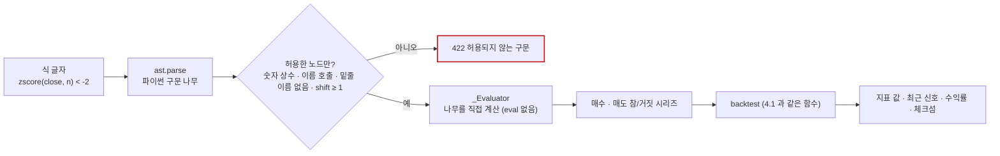

파이썬의 `eval` 을 쓰지 않는다. 식을 구문 나무로 바꾼 뒤 **허용 목록에 있는 노드만** 하나씩 계산하므로, 속성 접근(`__class__`)이나 임의 함수 호출로 서버를 건드릴 수 없다. 미래 참조(`shift(close, -1)`)는 검사 단계에서 막는다.

**핵심 코드** — `app/services/formula.py` 의 `parse_expr`

```python
    try:
        tree = ast.parse(expr.strip(), mode="eval")
    except SyntaxError as exc:
        raise FormulaError(f"문법 오류: {exc.msg} (위치 {exc.offset})")
    count = 0
    for node in ast.walk(tree):
        count += 1
        if not isinstance(node, _ALLOWED_NODES):                       # ▶ 허용 목록 밖 노드 → 거절
            raise FormulaError(f"허용되지 않는 구문입니다: {type(node).__name__}")
        if isinstance(node, ast.Constant) and not isinstance(node.value, (int, float, bool)):
            raise FormulaError("숫자 상수만 사용할 수 있습니다.")          # ▶ 문자열 상수로 우회하는 길을 막는다
        if isinstance(node, ast.Call) and not isinstance(node.func, ast.Name):
            raise FormulaError("함수는 이름으로만 호출할 수 있습니다 (속성 접근 불가).")
        if isinstance(node, ast.Name) and node.id.startswith("_"):
            raise FormulaError("밑줄로 시작하는 이름은 사용할 수 없습니다.")
        # … shift(x, n) 의 n 이 0 이하이면 「미래 봉 참조는 허용되지 않습니다」
    if count > MAX_NODES:
        raise FormulaError("산식이 너무 복잡합니다.")                    # ▶ 400 노드 · 2,000자 상한
```

**확인** — 자동 TC-FM 9건(`test_formula.py` · 막힌 구문 · 이름 · 체크섬 · 인과성(미래 미참조) · 백테스트 · 템플릿 · 코드 생성 · 음수 shift 거절) · 점검 [전략] 「수식 지표」 3건(2026-09-30: 함수 22 · 템플릿 4 · 240행 · 최근 신호 SELL · 수익 0.39%).

**한계**
- 🟢 **기본 비용이 0 이다** — 계산 요청의 `commission_bps` · `slippage_bps` 기본값이 0 이라, 지표 전략 백테스트(4.1 · 기본 실제 요율)와 같은 전략이어도 수익률이 다르게 나온다. 화면의 비용 규격을 하나로 할지는 논의 거리(강사님 최신 반영 논의 · 갈림길 「화면 비용」).
- 🟢 계산은 요청마다 새로 한다 — 긴 기간 · 복잡한 식은 수백 ms 가 걸린다(2026-09-30: 1년 173ms).

---

## 5. 로보어드바이저

### 5.1 투자 성향 진단

**한 줄** — 7문항(연령 · 투자 기간 · 경험 · 소득 · 손실 감내 · 목적 · 지식)에 답하면 점수(7~35)를 더해 5단계 성향과, 자산 배분(5.2)이 쓰는 3단계 위험 프로필로 바꾼다.

**어느 코드** — `app/routes/ml.py` `robo_questions` · `robo_risk_profile` → `app/services/robo_profile.py` `QUESTIONS` · `PROFILE_LEVELS` · `score_answers` · 화면 `public/js/robo.js`.

표 13 은 「점수가 어느 성향이 되나」 에 답한다(`PROFILE_LEVELS` 를 옮긴 것).

**표 13. 성향 단계** · 문항당 1~5점 × 7문항 = 7~35점

| 점수 | 5단계 성향 | 위험 프로필(자산 배분 입력) | 설명(코드 문구 요약) |
|---:|---|---|---|
| 7~12 | 안정형 | conservative | 원금 보존 최우선 · 예금 · 국공채 중심 |
| 13~18 | 안정추구형 | conservative | 예금보다 조금 높은 수익 · 채권 비중 높게 |
| 19~24 | 위험중립형 | moderate | 위험과 수익의 균형 · 주식 · 채권 비슷하게 |
| 25~30 | 적극투자형 | aggressive | 상당한 변동성 감내 · 주식 · 해외 확대 |
| 31~35 | 공격투자형 | aggressive | 시장 평균 이상 목표 · 큰 손실 가능성 수용 |

**핵심 코드** — `app/services/robo_profile.py` 의 `score_answers`

```python
    total, detail, missing = 0, [], []
    for q in QUESTIONS:
        idx = answers.get(q["id"])
        if idx is None or not (0 <= int(idx) < len(q["options"])):
            missing.append(q["id"])                       # ▶ 빠진 문항이 있으면 점수를 내지 않는다
            continue
        opt = q["options"][int(idx)]
        total += opt["score"]
        # …
    if missing:
        raise ValueError(f"응답이 없는 문항이 있습니다: {', '.join(missing)}")
    level = PROFILE_LEVELS[0]
    for lv in PROFILE_LEVELS:
        if total >= lv[0]:                                  # ▶ 문턱 13 · 19 · 25 · 31 을 넘을 때마다 한 단계 위로
            level = lv
```

**확인** — 자동 TC-RP 2건(`test_robo_profile.py` · 점수 → 단계 · 모든 문항 필수) · 점검 [로보] 「투자 성향 질문」 · 「투자 성향 점수」(2026-09-30: 질문 7 · 단계 5 · 첫 선택지만 고르면 안정형 11/35).

**한계** — 🟡 문항 · 점수 · 문턱은 정한 값이다 — 금융투자협회 표준 투자권유준칙의 적합성 진단과 대조하지 않았다. 🟢 진단 결과를 저장하지 않는다(계산만 · 점검 문구 「저장 안 함」).

### 5.2 자산 배분 · 추천 종목

**한 줄** — 위험 프로필 · 투자 기간 · 금액을 넣으면, 자산군 비중(국내 · 해외 주식 · 채권 · 대체 · 현금)을 정하고, 31종목을 과거 성과와 AI 예측으로 순위를 매겨 상위 8종목의 주식 비중을 최적화한다.

그림 13 은 「배분 요청 하나가 어떤 단계를 거쳐 추천이 되나」 에 답한다.

**그림 13. 자산 배분 · 추천의 단계** · 범례: 괄호 = 코드의 값

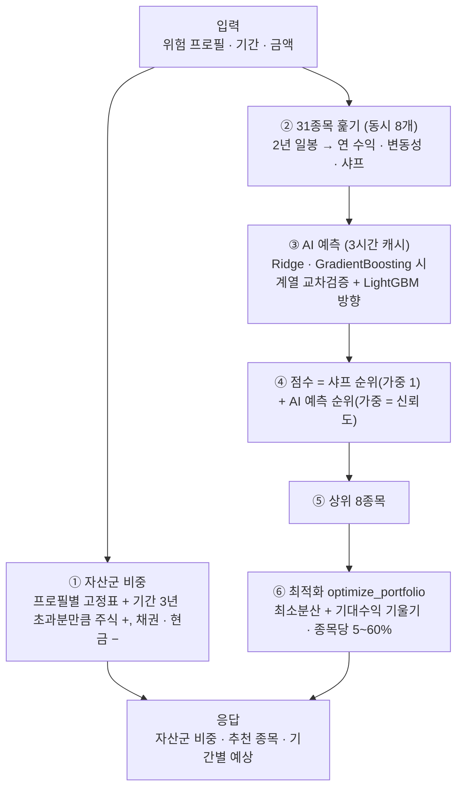

AI 예측은 종목마다 학습하므로 무겁다 — 그래서 3시간 캐시(PG `data_cache` · 키 `ai_predict:v3:종목`)에 두고, 없을 때만 스레드에서 학습한다. 점검에서 이 요청이 14.5초 걸린 이유다(첫 요청 · 캐시 비어 있음).

**핵심 코드** — `app/services/investment_research.py` 의 `optimize_portfolio` (기대수익 축소 · 비중 제한)

```python
    ret = pd.concat(series, axis=1).dropna().tail(756)   # 최대 3년으로 표본을 넓혀 최근 1년 모멘텀 편향 완화
    mu_raw = ret.mean().values * 252
    # 최근 실현 수익률은 미래 기대수익의 나쁜 추정치(66% 같은 값이 나온다). ±30%로 잘라 장기 주식 기대수익(7%)과
    # 반반 섞는(James-Stein식 축소) 값을 기대수익으로 쓴다.
    LONG_RUN_EQUITY_RETURN = 0.07
    mu = 0.5 * np.clip(mu_raw, -0.30, 0.30) + 0.5 * LONG_RUN_EQUITY_RETURN
    cov = ret.cov().values * 252 + np.eye(len(labels)) * 1e-6
    inv_cov = np.linalg.pinv(cov)
    min_var = inv_cov @ np.ones(len(labels)); min_var /= min_var.sum()      # ▶ 최소분산 비중
    tilt_strength = {"conservative": .10, "moderate": .35, "aggressive": .65}.get(risk_profile, .35)
    mu_score = np.maximum(mu - np.min(mu), 0) + 1e-6; mu_score /= mu_score.sum()
    weights = (1 - tilt_strength) * min_var + tilt_strength * mu_score      # ▶ 공격적일수록 기대수익 쪽으로
    weights = np.clip(weights, 0.05, 0.60); weights /= weights.sum()          # ▶ 종목당 5~60% 로 자른 뒤 다시 합 1
```

**확인** — 자동 시험은 최적화의 기대수익 축소 1건(TC-BC `test_optimize_portfolio_expected_return_is_shrunk`)과 AI 설명 구조(TC-XA 2건)뿐이다 — **순위 · 상위 8 · 자산군 비중을 재는 시험은 없다** 🟡. 점검 [로보] 「자산 배분 · 추천 종목」(2026-09-30: 자산군 5개 합 100% · 추천 8 · 14,542ms).

**한계**
- 🟢 **자른 뒤 다시 나누면 5~60% 제약이 깨질 수 있다** — `clip` 후 합을 1로 맞추면 한 종목이 다시 5% 아래로 내려갈 수 있다(A7 분석 실측 4.21% · 코드 그대로).
- 🟢 자산군 비중은 성향별 **고정표**다 — 채권 · 대체 · 현금은 실제 상품이 아니라 비중 숫자다.
- 🟢 「예상 MDD」 는 `−(변동성 × √연수)` 로, 실제 경로의 최대 낙폭이 아니다(A7 분석 · 그대로).
- 🟡 비용 · 세금은 반영하지 않는다(응답의 `method` 문구에 적혀 있다).

### 5.3 목표 달성 시뮬레이션

**한 줄** — 원금 · 매월 적립 · 기간 · 목표 연수익률을 넣으면, 기대수익률과 변동성으로 미래 자산 경로 수천 개를 만들어 목표 금액에 닿을 확률과 원금 손실 확률을 낸다(몬테카를로).

**어느 코드** — `app/routes/ml.py` `robo_goal_simulation`(경로 수 500~20,000 · 스레드에서 계산) → `app/services/robo_profile.py` `goal_simulation` · 화면 `public/js/robo.js`.

**핵심 코드** — `app/services/robo_profile.py` 의 `goal_simulation` (월 단위 기하 브라운 운동)

```python
    rng = np.random.default_rng(seed)                     # ▶ seed 42 고정 — 같은 입력이면 같은 답(재현 가능)
    dt = 1 / 12
    # 변동성 0일 때 중앙 경로가 이산 복리 (1+mu)^years 와 정확히 일치하도록 log(1+mu) 기준 드리프트 사용
    drift = np.log1p(mu) * dt - 0.5 * sigma ** 2 * dt
    shocks = rng.normal(0, sigma * np.sqrt(dt), size=(n_paths, months)) if sigma > 0 else np.zeros((n_paths, months))
    growth = np.exp(drift + shocks)                       # (paths, months)
    values = np.empty((n_paths, months + 1)); values[:, 0] = p0
    for m in range(1, months + 1):
        values[:, m] = values[:, m - 1] * growth[:, m - 1] + c      # ▶ 매달 불어난 뒤 적립금 더하기
    final = values[:, -1]
    # 목표 금액: 원금과 매월 적립금을 목표 연수익률로 복리 성장
    # …
    prob = float((final >= target_value).mean())           # ▶ 목표에 닿은 경로의 비율 = 달성 확률
```

**그림 14. 결과를 읽는 법 (예시 · 가설 아님 — 2026-09-30 점검 입력)** · 원금 5,000만 원 · 3년 · 목표 연 8% · 기대 7% · 변동성 12% · 500경로

```
 목표 금액 = 5,000 × 1.08³ ≈ 6,299만 원
 경로 500개의 3년 뒤 금액 분포 ─ p5 ··· p50 ··· p95
 달성 확률  = 6,299만 원 이상으로 끝난 경로 비율 → 42.2%
 손실 확률  = 원금 5,000만 원 아래로 끝난 비율   → 20.2%
```

기대수익(7%)이 목표(8%)보다 낮으니 절반이 안 되는 경로만 목표에 닿는다 — 판정 문구는 「달성 가능성 낮음 — 목표를 낮추거나 적립 · 기간을 늘리세요」 쪽이다(25~50%).

**확인** — 자동 TC-RP 2건(변동성 0 이면 결정적 · 적립 + 변동성) · 점검 [로보] 「목표 달성 확률」(2026-09-30: 42.2% · 손실 20.2% · 6ms).

**한계** — 🟢 기대수익 · 변동성이 앞으로도 그대로라는 가정이다(응답의 면책 문구). 🟡 수익률 분포를 정규(로그 정규)로 가정해 급락(두꺼운 꼬리)을 작게 본다. 🟢 기대수익 · 변동성의 기본값(7% · 12%)은 화면 입력이지 5.2 의 최적화 결과와 자동으로 이어지지 않는다.

---

## 6. 매매 — 모의투자 · 자동매매 · 위험 한도 · 리밸런싱 · 실거래 차단

표 14 은 「매매 기능들이 어느 장부를 쓰나」 에 답한다. 6절 전체를 읽는 열쇠다(표 2 의 원칙 ④).

**표 14. 장부 둘**

| 장부 | 현금 | 보유 | 쓰는 기능 | 처음 금액 | 초기화 |
|---|---|---|---|---:|---|
| 모의투자(PAPER) | `paper_accounts.cash` | `portfolio` (`book = PAPER`) | 모의 주문(6.1) · 리밸런싱(6.4) · TradingView 웹훅(7.1) · 코인 · 대체자산 | 1억 원 | 모의투자 화면 「초기화」 — PAPER 만 |
| 자동매매(QUANT) | `quant_virtual_accounts.cash_balance` | `portfolio` (`book = QUANT`) | 자동매매(6.2) | 1천만 원 | 없음 |

두 장부는 서로의 현금 · 보유를 읽지도 쓰지도 않는다. 보유 표(`portfolio`)는 하나지만 모든 조회가 `book` 조건을 단다 — 빠지면 두 장부가 섞인다(자동 시험 TC-I14 가 코드 전체를 훑어 확인한다).

### 6.1 모의투자 주문

**한 줄** — 종목 · 방향 · 수량을 넣으면 **그 순간의 현재가로 시장가 체결**한 것으로 보고, 비용(4.2)을 뺀 정산금액만큼 모의투자 현금과 보유를 바꾸고 주문 기록을 남긴다.

그림 15 은 「매수 한 건이 어떤 차례로 장부에 들어가나」 에 답한다.

**그림 15. 모의 매수 한 건**

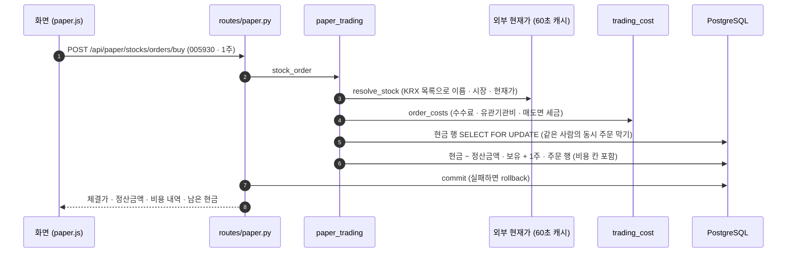

**핵심 코드** — `app/services/paper_trading.py` 의 `stock_order` (매수 갈래)

```python
    cost = trading_cost.order_costs(
        side=side.lower(), price=price, quantity=quantity,
        when=trading_cost.today_kst(), market=trading_cost.market_of(info["symbol"]),
        is_etf=trading_cost.is_etf_name(info.get("name", "")),   # ▶ ETF 는 거래세 0
    )
    account = await get_account(db, user_id, lock=True)        # ▶ 현금 행을 잠근다
    position = await _stock_position(db, user_id, info["symbol"])
    if side == BUY:
        if cost.net_amount > account.cash:
            raise PaperTradeError(f"보유 현금이 부족합니다. 필요 {cost.net_amount:,.0f}원 …")
        account.cash = float(account.cash - cost.net_amount)     # ▶ 현금은 「가격 × 수량」 이 아니라 정산금액만큼
        # …
            # 평균단가는 체결가 기준으로 둔다. 매입부대비용을 단가에 녹이면 화면의
            # "평균단가" 가 체결가와 달라져 읽는 사람이 혼동한다 — 비용은 주문 행의
            # 비용 칸에 남고, 현금이 그만큼 덜 남으므로 총자산에는 이미 반영된다.
            position.avg_price = (position.avg_price * position.quantity + gross) / total_qty
```

**확인** — 자동 TC-I14 9건(`test_paper_ledger_i14.py` · 두 장부 불변식 · 보유보다 많이 팔 수 없다 · 직접매매로 자동매매 보유를 팔 수 없다 · 초기화는 PAPER 만) · 점검 [매매] 「모의투자 잔고 · 보유 · 주문 미리보기」 · [쓰기] 「매수 1주 → 매도 1주」(`-Write`).

**한계**
- 🟢 **장 운영 시간 검사가 없다** — 장 마감 뒤 · 주말에도 그 순간 받은 현재가로 체결된다.
- 🟢 시장가 체결 가정 — 호가 · 체결 강도 · 부분 체결은 없다. 체결가는 외부 현재가(60초 캐시)다.
- 🟢 주문 미리보기(`stock_preview`)는 비용을 빼지 않는다 — 삼성전자 1주에 48원 차이(결함 후보 DF-21).
- 🟢 모의 주문은 알림을 보내지 않는다(자동매매 체결만 보낸다).

### 6.2 자동매매

**한 줄** — 사용자가 켜 두면 **10분마다** 31종목의 신호 점수(3.2)를 보고 점수 상위 종목을 사고 · 매도 신호 종목을 팔되, 매 주문 전에 위험 한도(6.3)를 지나게 하고 자기 장부(QUANT)에만 기록한다.

그림 16 는 「10분마다 무엇이 어떤 차례로 도나」 에 답한다.

**그림 16. 자동매매 한 사이클** · 범례: `alt` = 조건에 따라 · `loop` = 대상 종목마다

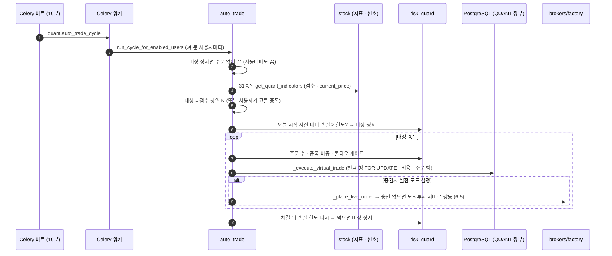

켜기 버튼(`POST /api/auto-trade/start`)은 DB 플래그를 켜고 **즉시 한 사이클**을 앱 안에서 돌려 화면이 바로 반응하게 한다. 그 뒤로는 비트가 10분마다 워커에서 돌린다. 사이클 기록은 캐시 표(`quant:cycle_log:{사용자}`)에 50개까지 남아 워커와 앱이 함께 본다.

**핵심 코드** — `app/services/auto_trade.py` 의 `_run_quant_cycle` (매수 갈래)

```python
            if action in ("강력 매수", "매수"):                 # ▶ 3.2 의 신호 점수 ≥ 1
                budget = per_trade_budget * buy_ratio          # ▶ 한 번 주문 예산(기본 100만 원) × 매수 비율
                qty = max(1, int(budget / price))
                qty, risk_note = await _risk_gate(stock["symbol"], stock["name"], "buy", qty, price)
                if qty <= 0:
                    await _risk_skip(stock["symbol"], stock["name"], "buy", price, risk_note or "위험관리 규칙")
                    continue                                   # ▶ 게이트가 0주로 줄이면 주문 없이 기록만
                trade = await _execute_virtual_trade(
                    db, uid, stock["symbol"], stock["name"],
                    "buy", price, qty, f"[{mode}] " + " | ".join(reasons),
                )
```

**확인** — 자동 TC-I14 중 자동매매 다섯(QUANT 장부만 쓴다 · 매수가 PAPER 총자산을 바꾸지 않는다 · 매도가 QUANT 로 들어온다 · QUANT 현금이 없으면 건너뛴다) · TC-RG(게이트 함수) · TC-LT(실거래 차단) — **사이클 전체(대상 고르기 → 게이트 → 체결)를 한 번에 재는 시험은 없다** 🟡. 점검 [매매] 「자동매매 상태」(2026-09-30: 예약 celery-beat (10분) · 600초).

**한계**
- 🔴 **체결가가 수집 DB 기준일의 종가다** — `price` 는 지표의 `current_price`(마지막 일봉 종가)라, 오늘 장중이 아니라 **어제(휴일 뒤면 그 전) 종가**로 체결된다. 평가는 실시간이라 체결 순간 없는 손익이 생긴다(이슈 「다리 뒤 기준일」 #35 E-1 · 열림).
- 🟢 신호는 3.2 의 규칙 점수 하나다 — 이 규칙을 백테스트한 결과가 신호에 붙어 있지 않다.
- 🟢 종목 31개가 코드에 고정돼 있다(`QUANT_STOCKS`).
- 🟢 장 운영 시간 검사가 없다 — 비트는 밤에도 10분마다 돈다(체결가가 어제 종가라 밤에도 같은 값으로 산다).

### 6.3 위험 한도 · 비상 정지

**한 줄** — 자동매매 주문 앞에 문 다섯 개(비상 정지 · 하루 손실 · 하루 주문 수 · 종목 비중 · 같은 주문 반복)를 두고, 하루 손실이 한도를 넘으면 스스로 비상 정지한다.

그림 17 는 「주문 하나가 어떤 문을 차례로 지나나」 에 답한다.

**그림 17. 위험 한도의 문** · 범례: 괄호 = 기본값(증권사 설정 표 칸)

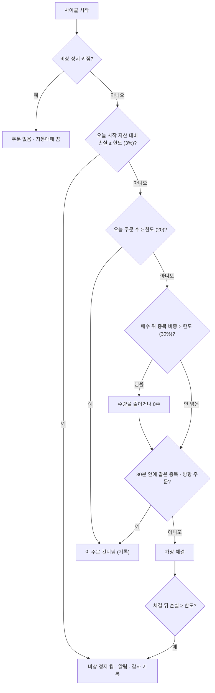

**핵심 코드** — `app/services/risk_guard.py` 의 `acquire_order_slot` (같은 주문 반복 막기)

```python
    key = f"quant:order-slot:{user_id}:{symbol}:{side}"
    ttl = cooldown_min * 60
    r = _redis()
    if r is not None:
        try:
            ok = await r.set(key, str(time.time()), nx=True, ex=ttl)   # ▶ 키가 없을 때만 만든다 — 원자적
            return bool(ok)                                            # ▶ 이미 있으면 False = 쿨다운 중
        except Exception as exc:
            logger.warning("risk_guard redis 실패, 메모리 폴백: %s", exc)
```

Redis 의 `SET NX EX` 한 명령으로 「없으면 만들고 30분 뒤 사라지게」 해서, 두 사이클이 겹쳐도 같은 종목 · 방향 주문은 한 번만 나간다. 체결이 실패하면 슬롯을 돌려준다(`release_order_slot`).

**확인** — 자동 TC-RG 5건(`test_risk_guard.py` · 비중 한도로 수량 축소 · 하루 손실 판정 · 쿨다운 · 주문 수 · 시작 자산 고정) · 점검 [매매] 「위험 한도」(2026-09-30: 3.0% · 30.0% · 남은 주문 20 · 비상 정지 False).

**한계** — 🟢 Redis 가 없으면 **프로세스마다 메모리**로 센다 — 앱과 워커가 따로 세어 한도가 두 배가 될 수 있다. 🟢 「오늘 시작 자산」 은 장 시작 시각이 아니라 그날 첫 사이클의 자산이다. 🟢 비상 정지 해제는 사람이 한다(`POST /api/quant/risk/kill-switch`).

### 6.4 리밸런싱

**한 줄** — 목표 비중(예: 삼성전자 10% · 나머지 현금)을 저장해 두면, 주기가 되거나 비중이 허용 폭 이상 벌어졌을 때 모의투자 장부를 목표로 되돌리는 주문안을 만들고, 자동 실행을 켰으면 체결까지 한다.

그림 18 은 「리밸런싱은 언제 무엇을 하나」 에 답한다.

**그림 18. 리밸런싱 한 번** · 범례: 트리거 = TIME(주기) · DRIFT(이탈) · CASHFLOW(입출금 · 배당) · MANUAL(화면)

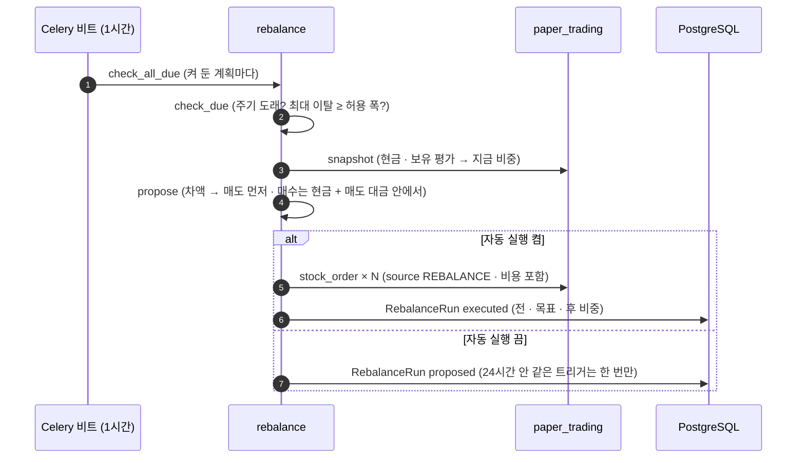

**핵심 코드** — `app/services/rebalance.py` 의 `propose` (차액 → 주문)

```python
    for r in snap["rows"]:
        # …
        target_amt = total * r["target_weight_pct"] / 100
        diff = target_amt - r["current_amount"]
        if abs(diff) < max(price, plan.min_order_amount):   # ▶ 1주 값 · 최소 주문 금액보다 작은 차이는 무시
            continue
        qty = int(abs(diff) // price)
        # … diff < 0 이면 매도(보유 수량까지) · 크면 매수
    # 매수는 (현금 + 매도대금) 범위 안에서만
    available = snap["cash"] + sum(o["amount"] for o in sells)
    for o in buys:
        if o["amount"] > available:
            qty = int(available // o["price"])            # ▶ 모자라면 살 수 있는 만큼만
```

**확인** — 자동 TC-RB 10건(`test_rebalance.py` · 목표 입력 정리(중복 합치기 · 100% 초과 · 음수 거절) · 다음 주기 날짜 계산) — **주문안 · 체결을 재는 시험은 없다** 🟡. 점검 [매매] 「리밸런싱 상태」 · [쓰기] 「목표 저장 → 미리보기 → 되돌리기」.

**한계**
- 🟡 주문안은 비용을 빼지 않고 계산한다 — 현금을 끝까지 쓰는 마지막 매수는 체결 때 비용만큼 모자라 실패할 수 있다(추론 · 실측 전).
- 🟢 모의투자(PAPER) 장부만 리밸런싱한다 — 자동매매 장부와는 무관하다.
- 🟢 체결가는 6.1 과 같다(그 순간 현재가 · 장 시간 검사 없음).

### 6.5 실거래 차단

**한 줄** — 어떤 경로로든 증권사 클라이언트를 만들 때 한 함수(`get_broker_client`)를 지나게 하고, 환경 변수로 명시적으로 허락하지 않은 동안에는 **실계좌 주문 요청을 모의투자 서버로 강등**한다.

그림 19 은 「실거래 요청이 어디서 어떻게 막히나」 에 답한다.

**그림 19. 실거래 차단 지점** · 범례: 굵은 테두리 = 유일한 목

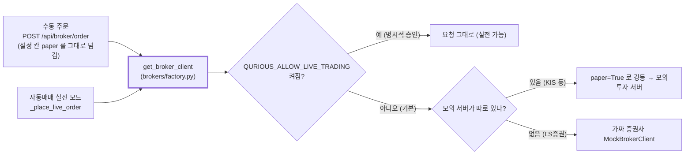

**핵심 코드** — `app/services/brokers/factory.py` 의 `get_broker_client` (관문)

```python
    broker = (broker or "mock").lower()
    if not app_key or not app_secret:
        return MockBrokerClient()                          # ▶ 키가 없으면 늘 가짜 증권사

    # ── 실거래 차단 관문 ─────────────────────────────────────────────
    if not live_trading_allowed():                         # ▶ 환경 변수가 참("1" · "true" …)일 때만 통과
        if broker in LIVE_ONLY_BROKERS:                    # ▶ 모의 · 실전이 같은 도메인이라 paper 로 못 막는 곳
            # … 경고 로그
            return MockBrokerClient()
        if not paper:
            # … 「[실거래 차단] paper=False 요청을 모의투자로 강등한다」 경고 로그
            paper = True
```

실주문 경로가 여럿(수동 주문 · 자동매매)이라 호출 지점마다 막지 않고 **모두가 지나는 목 하나**에 걸었다 — 앞으로 생길 경로까지 같이 막힌다. 결정 기록은 ADR-0001.

**확인** — 자동 TC-LT 21건(`test_live_trading_guard.py` · 단위 15 · 인수 6 — 승인 없이는 실계좌로 나가지 않는다 · 모든 증권사 호출이 관문을 지난다) · 점검 [매매] 「증권사 설정」(2026-09-30: mock · 모의 True · 연결 False).

**한계** — 🟢 관문은 **실계좌**를 막을 뿐, 증권사 모의투자 서버로는 실제 요청이 나간다(키가 있으면). 🟡 가짜 증권사의 응답이 화면에서 「연결 성공」 처럼 보이는 곳이 있다(IA 분석 · 설정 화면).

---

## 7. 연동

### 7.1 TradingView 웹훅

**한 줄** — TradingView 에서 전략 알림이 울리면 그 알림(JSON)을 받아, API 키로 사용자를 찾고, 매수 · 매도면 모의투자 장부에 체결하고, 사용자 알림 채널로 전달한다.

그림 20 은 「알림 한 통이 어떤 차례로 처리되나」 에 답한다.

**그림 20. TradingView 알림 처리**

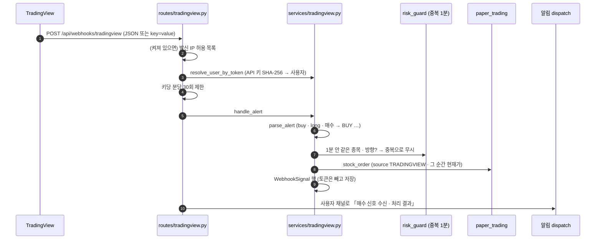

**핵심 코드** — `app/services/tradingview.py` 의 `handle_alert` (판정 갈래)

```python
    if not alert["symbol"]:
        sig.status, sig.message = "rejected", "ticker/symbol 이 없습니다."
    elif alert["side"] == "ALERT" or alert["dry_run"] or alert["quantity"] <= 0:
        sig.status = "alert"                                   # ▶ 주문 없이 알림만 전달
        # …
    elif not await risk_guard.acquire_order_slot(f"tv:{user_id}", alert["symbol"], alert["side"].lower(), DUPLICATE_WINDOW_MIN):
        sig.status, sig.message = "duplicate", f"{DUPLICATE_WINDOW_MIN}분 내 동일 종목·방향 알림 → 중복으로 무시"
    else:
        try:
            res = await pt.stock_order(db, user_id, alert["symbol"], alert["side"], alert["quantity"], source=ORDER_SOURCE)
            sig.symbol, sig.fill_price, sig.status = res["symbol"], float(res["price"]), "filled"
```

TradingView 는 알림을 다시 보낼 수 있어, 위험 한도(6.3)와 같은 `SET NX EX` 슬롯으로 1분 안의 같은 알림을 한 번만 체결한다. 저장하는 알림 원문에서 `token` · `api_key` 는 뺀다.

**확인** — 자동 TC-TV 8건(`test_tradingview.py` · 티커 정리 · 알림 해석 · 성과 CSV 읽기 · 교차 검증 판정) — **알림 → 체결 흐름 전체를 재는 시험은 없다** 🟡. 점검 [연동] 「웹훅 안내」(2026-09-30: `http://localhost:8966/api/webhooks/tradingview`).

**한계** — 🟢 체결가는 알림에 실린 가격이 아니라 그 순간 현재가다(`signal_price` 는 기록만). 🟢 TradingView 는 공개 HTTPS 주소만 부를 수 있어, 로컬에서는 터널(ngrok 등)이 있어야 실제 알림을 받는다. 🟢 발신 IP 허용 목록은 기본 꺼짐(`TRADINGVIEW_ENFORCE_IP`).

### 7.2 알림

**한 줄** — 자동매매 체결 · 위험 정지 · 웹훅 수신 같은 사건을 사용자가 고른 채널(텔레그램 · 슬랙 · 이메일 · 카카오 알림톡 · SMS)로 동시에 보낸다.

그림 21 는 「알림 한 건이 어느 채널로 가나」 에 답한다.

**그림 21. 알림 채널 고르기** · 범례: 빨간 선 = 알려진 결함

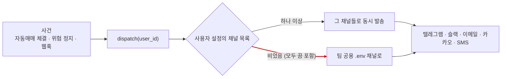

**핵심 코드** — `app/services/notification.py` 의 `dispatch`

```python
    user_cfg = await _load_user_settings(user_id)
    channels: list[str] = user_cfg.get("channels") or _default_channels()   # ▶ 빈 목록 [] 도 거짓이라 기본값으로 간다
```

사용자가 채널을 **모두 끈 것**(빈 목록)과 **설정이 아예 없는 것**을 같은 `or` 가 가리지 못해, 둘 다 팀 공용 `.env` 채널로 보낸다(A12 분석 · 그대로).

**확인** — 자동 시험 **없음** 🔴 · 점검 [연동] 「알림 설정」(켜진 채널 0).

**한계** — 🔴 위의 「모두 끄면 팀 채널로」 · 🟢 레이트 리밋이 없다(슬랙 · 텔레그램은 초당 1건 안팎) · 🟢 카카오 · SMS 는 실제 규격과 다른 곳이 있다(A12 분석) · 🟢 모의 주문(6.1)은 알림을 보내지 않는다.

---

## 8. 알려진 한계 한눈에

표 15 는 「각 절의 한계 중 사용자에게 틀린 결과를 보여 줄 수 있는 것은 무엇이고, 누가 무엇을 하면 되나」 에 답한다. 담당 영역은 역할 분배안(제안)의 파트 이름이고, 역할 희망 논의 결론 전이라 이슈 담당 지정은 비운다.

**표 15. 알려진 한계 · 결함** · 심각도 🔴 틀린 숫자 · 돈 · 개인정보에 닿음 / 🟡 오해 · 불편 · 확인 필요 · 확실도는 각 절

| # | 절 | 한계 | 심각도 | 기록 | 담당 영역 | 다음 할 일 |
|:-:|---|---|:-:|---|---|---|
| 1 | 6.2 | 자동매매 체결가 = 수집 DB 기준일(어제) 종가 · 평가는 실시간 → 없는 손익 | 🔴 | 이슈 #35 E-1 | 안전 · 실행 · 운영 | 체결가를 그 순간 현재가로 · 지표는 신호에만 |
| 2 | 7.2 | 알림을 모두 끄면 팀 공용 `.env` 채널로 나간다 | 🔴 | A12 분석 #59 | 안전 · 실행 · 운영 | 「빈 목록」 과 「설정 없음」 을 가른다 |
| 3 | 6.1 | 주문 미리보기가 비용을 빼지 않는다(1주 48원) | 🟡 | 결함 후보 DF-21 | 모의투자 담당 | 미리보기도 `order_costs` 로 |
| 4 | 6.1 · 6.2 · 6.4 | 장 운영 시간 검사가 없다 — 밤 · 주말에도 체결 | 🟡 | — | 안전 · 실행 · 운영 | 장 밖 주문 거절 또는 다음 장 시가 체결 |
| 5 | 4.3 | 수식 지표의 기본 비용이 0 — 지표 전략(실제 요율)과 잣대가 다르다 | 🟡 | 강사님 최신 반영 논의 · 갈림길 「화면 비용」 | 팀 결정 | 화면 비용 규격 하나로 |
| 6 | 3.2 · 3.5 · 4.1 | RSI · 볼린저 정의가 여러 벌 — 화면마다 값이 다를 수 있다 | 🟡 | A5 분석 | 지표 · 신호 | 한 정의(ta_utils)로 모은다 |
| 7 | 4.1 | 승률 = 보유한 날 중 오른 날 비율(거래 승률 아님) | 🟡 | A13 분석 | 비용차감 검증 | 이름을 바꾸거나 거래 단위로 |
| 8 | 5.2 | 종목 비중 5~60% 제약이 다시 나누면 깨진다 · 예상 MDD 식 | 🟡 | A7 분석 | 자산배분 · 스크리닝 | 제약을 지키는 최적화로 |
| 9 | 6.3 | Redis 가 없으면 한도를 프로세스마다 센다(최대 두 배) | 🟡 | — | 안전 · 실행 · 운영 | Redis 없으면 자동매매를 멈추는 편이 안전 |
| 10 | 6.4 | 리밸런싱 주문안이 비용을 빼지 않아 마지막 매수가 실패할 수 있다 | 🟡 | 추론 · 실측 전 | 자산배분 · 스크리닝 | 주문안에 비용 반영 |
| 11 | 2.1 | 이메일 소유 확인 · 비밀번호 재설정(분실)이 없다 · 로그인 시도 제한 없음 | 🟡 | A3 분석 | 안전 · 실행 · 운영 | 메일 발송이 생기면 함께 |
| 12 | 3.3 | 시세 동기화가 앱 안 스케줄러와 Celery 비트 두 곳에 있다 | 🟡 | A4 분석 | 데이터 | 한쪽으로 모은다 |

2026-09-30 에 **닫은 것** — 계정 결함 셋(대문자 이메일로 로그인 불가 · 72바이트 넘는 비밀번호 500 · 긴 이름 500)과 빈 곳 셋(서버 비밀번호 규칙 · 회원 정보 수정 · 탈퇴), 그리고 주소를 다시 열면 로그아웃된 것처럼 보이던 화면 흐름(2절).

---

## 부록 A. 용어

| 용어 | 뜻 | 이 문서에서 |
|---|---|---|
| 세션 · 세션 쿠키 | 서버가 로그인한 사람을 기억하는 기록(Redis) · 그 기록을 가리키는 무작위 ID 를 담은 쿠키 | `fin_session` · 7일 · 요청마다 연장 |
| `HttpOnly` 쿠키 | 자바스크립트가 읽을 수 없는 쿠키 — 화면에 스크립트가 끼어들어도(XSS) 훔쳐 가지 못한다 | 로그인 쿠키 |
| JWT · `jti` | 서명된 토큰(안에 사용자 정보) · 토큰마다 붙는 고유 번호 | 2.3 · 폐기 목록의 키 |
| 재인증 | 민감한 동작 직전에 현재 비밀번호를 다시 받는 것 | 비밀번호 변경 · 탈퇴 |
| bcrypt · 72바이트 | 비밀번호를 되돌릴 수 없게 바꾸는 해시 방식 · 앞 72바이트만 쓰는 한계 | 2.1 |
| NFC 정규화 | 같은 한글을 한 가지 유니코드 모양으로 맞추는 것(조합형 → 완성형) | 비밀번호 해시 전 |
| `ON DELETE CASCADE` | 부모 행이 지워지면 자식 행도 DB 가 따라 지우는 외래 키 규칙 | 탈퇴 때 손자 행 |
| 수정주가 | 분할 · 권리락 등으로 끊긴 과거 가격을 오늘 기준으로 이어 붙인 값 | 3.1 수집 DB |
| 미래 참조(look-ahead) | 그 시점에 알 수 없던 값(오늘 종가 등)을 신호에 쓰는 실수 — 백테스트를 부풀린다 | 4.1 · 4.3 |
| 슬리피지 | 원하는 가격과 실제 체결 가격의 차이 — 호가 자료가 없어 가정값 | 4.2 |
| 샤프 · MDD | 변동성 대비 수익 · 고점 대비 최대 하락 | 4.1 |
| 몬테카를로 · GBM | 무작위 경로를 많이 만들어 확률을 세는 방법 · 로그 수익률이 정규분포를 따른다고 보는 가격 모형 | 5.3 |
| 최소분산 포트폴리오 | 변동성이 가장 작아지는 종목 비중 | 5.2 |
| 비상 정지(kill switch) | 켜지면 자동매매가 주문을 내지 않는 스위치 | 6.3 |
| 장부(PAPER · QUANT) | 모의투자 · 자동매매가 각자 쓰는 현금 + 보유 기록 | 표 11 |
| 웹훅 | 외부 서비스가 사건이 생기면 우리 주소를 불러 알려 주는 방식 | 7.1 |
| 자동 시험 · 기능 점검 | `tests/` 의 pytest(계산이 맞는가) · `check.ps1`(떠 있는 앱이 응답하는가) | 각 절 「확인」 |

## 부록 B. 만든 방법 — 다시 확인하는 법

- **기준** — 코드 `main` `92087da` 에 계정 관리 변경을 얹은 작업 트리. 시간 · 결과 숫자는 2026-09-30 로컬 개발 모드(`.\scripts\personal\start.ps1 -Dev`)에서 `.\scripts\personal\check.ps1`(기본 56건 · `-Group 계정`)로 잰 값이다.
- **발췌가 아직 맞나** — 발췌마다 적은 함수가 그대로 있는지 본다(이름이 사라지면 그 절을 고칠 때다):

```powershell
Select-String -Path app\services\*.py, app\routes\*.py, app\lib\*.py -Pattern 'def (verify_password|delete_user_data|read_daily_candles|_calc_rsi|_generate_signal|backtest|cost_rate|parse_expr|score_answers|optimize_portfolio|goal_simulation|stock_order|_run_quant_cycle|acquire_order_slot|propose|get_broker_client|handle_alert|dispatch)\b' | Select-Object Path, LineNumber
```

- **시험 수** — `env -u PYTHONIOENCODING python -m pytest --collect-only -q`(파일별 건수) · DB 까지는 `.\scripts\personal\test.ps1`.
- **한계** — 발췌는 줄을 건너뛰었다(`# …`). 확실도 🟡 줄은 원문 · 실측을 다시 봐야 한다. 로보 · 전략의 수치는 한 종목(005930) · 한 날짜의 예시다.

## 부록 C. 변경 노트 — 다음 판(v0.2)에 넣을 것

| 날짜 | 종류 | 무엇 | 옮길 곳 | 근거 |
|---|---|---|---|---|
| — | — | (다음 판 재료: 시스템 묶음(LEAN 백테스트 · AI 채팅 · 문서 검색) · 차트 화면 · ML 셋 · 발췌가 코드와 어긋나면 알려 주는 검사) | 새 절 · 부록 B | — |

## 부록 D. 개정 이력

| 판 | 날짜 | 무엇이 바뀌었나 | 왜 | 근거 |
|---|---|---|---|---|
| v0.1 | 2026-09-30 | 추가 — 첫 판: 애플리케이션 구성도 · 기능 지도 21 · 가로지르는 원칙 5 · 계정 규칙과 근거(현업 기준 조사) · 기능별 「한 줄 · 어느 코드 · 차례 · 핵심 코드 · 확인 · 한계」 · 알려진 한계 12 | 팀장 요청 — 짧은 기간에 많이 만든 기능을 팀원이 코드와 문서만으로 설명할 수 있게(발표 · 포트폴리오 · 면접) · 강사님 기초 코드에는 주석 대신 이 문서 | 이 문서를 싣는 PR |
