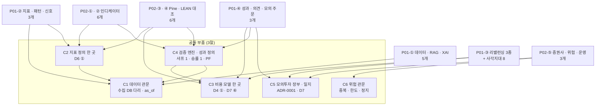

# 기능 설계서 v0.1 — 강사님 요구 29개 설계 점검 · 보완 (Qurious 2.0)

| 항목 | 내용 |
|------|------|
| **문서 버전** | v0.1 (첫 판) |
| **작성일** | 2026-09-29 (KST) · S63 |
| **작성자** | 이동원 (P-A) — 설계는 **전 파트 대상**이지만 담당은 분배안 대응만 적는다(지정하지 않는다) |
| **기준 코드** | `main` = `5adfb81` · API ID 는 [API 명세서 v0.1](../인터페이스/API명세서_v0.1.md) |
| **범위** | 강사님 목표기능표 **B계열 29개**(2차 P01 14 · 3차 P02 15) + rfp-2 **사각지대 8개**(RTM §4) + **UI/UX 필수 10요소** |
| **산출물 구분** | 강사님 표 **2 요구사항**(요구사항정의서 보완 · 사용자 스토리 씨앗) · **4 화면**(화면 ↔ 요구) · **7 인터페이스**(API ↔ 요구) |
| **목적** | 요구마다 「설계 근거가 어디 있고 · 무엇이 비었고 · 어떻게 만들 것인가」를 한 줄로 잇는다. S64 에서 이 문서로 **사용자 스토리 · 유스케이스 · RTM v1.1 · ERD v1.2** 를 낸다 |

> **읽는 사람이 둘이다.**
> 팀원은 **2.3절 한눈 표**에서 자기 파트 줄을 찾고, 4 · 5절의 그 요구 칸을 읽으면 된다 — 「설계 초안」 칸이 첫 작업의 입력이다.
> 강사님 표로 보는 분은 2절(점검 결과) → 6절(사각지대) → 7절(UI 10요소) → 8절(AWS 대체) 순서가 빠르다.

---

## 0. 쉬운 요약 세 줄

1. **설계는 멈춘 것이 아니라 흩어져 있었다.** RTM v1.0 §5 「설계」 칸은 29개 중 25개가 「—」 였지만, 다시 대 보니 그 25개 가운데 **18개는 논의(D4~D7) · 분석(A5~A13) · 격차 지도(옛 `#61`)에 설계 초안이 이미 있었다**(설계 칸이 차 있던 `P02-⑤-3` 까지 치면 🟡 19) — RTM 칸으로 옮겨지지 않았을 뿐이다. 설계 근거가 정말 없는 요구는 **7개**다(용어사전 · XAI · 패턴 탐지 · 다중주기 신호 · 입출금 리밸런싱 · 신호→의견 · 조건조합/손절익절).
2. 29개 모두에 **설계 초안**(입력 · 출력 = API ID · 데이터 = ERD 표 · 화면 = IA/와이어프레임 ID · 시험 = TC ID)과 **사용자 스토리 한 줄**을 붙였다. 기존 API 가 일부라도 받는 요구는 **27개**이고, 기존 API 가 전혀 없는 요구는 **2개**(XAI 설명 · TradingView 대 LEAN 비교)다. 새 API 안이 붙은 요구는 15개(13경로 묶음)· 새 표 안 **9개** · 새 시험 묶음 안 **21개**다(부록 B).
3. **새로 드러난 것** — 강사님 원문의 P01-③ **목표 기능 머리글**이 「자산배분모델을 활용한 **포트폴리오 최적화**, **주식 스크리닝**을 통한 종목 선정」이다. RTM 이 「B계열 대응 없음」 으로 본 사각지대 8개(Markowitz · 리스크 패리티 · BL · 동적 배분 · 팩터 · 재무 · 기술적 스크리닝 · 랭킹)를 **이 머리글이 받는다**(6절). 세부기능 3개가 리밸런싱뿐이라 놓쳤다.

---

## 1. 이 문서를 어떻게 만들었나

### 1.1 입력

| 입력 | 무엇을 가져왔나 | 확인 방법 |
|------|----------------|-----------|
| 강사님 원문 `learning/th07-domain-rag-lab/lecture/frontend/days/04.html` (`e63e675` · 09-21) | 요구 29개의 **기술스택 · 구현방안** · 목표 기능 머리글 · UI/UX 필요 요소 10 · 역할별 기술스택 표 | 로컬 파일을 HTML → 글자로 바꿔 읽음 (S63) |
| [RTM v1.0](../요구사항/RTM_v1.0.md) §4 · §5 · §6 | 요구 ID · 파트 · 코드 흔적 · 사각지대 8 | 문서 |
| [결정 대장 v0.9](../계획서/논의결정대장_v0.9.md) §3 | D0~D7 결론 초안 64행 | 문서 (기한 09-30 23:59 — **확정 전**) |
| 옛 `#61` [격차 지도](../github-archive/2026-09-21/이슈-061/00-기록.md) §6 · 옛 `#62` [분배안 v1.0](../github-archive/2026-09-21/이슈-062/00-기록.md) §3 · §4 | 우선순위 P0~P3 · 파트별 「새로 만들 것」 | 기록 문서 |
| 분석 A5~A13 (옛 `#11`~`#28`) | 코드 결함 · 정의 불일치 | 기록 문서 + **S63 에 핵심 10가지를 코드로 다시 잼**(1.3절) |
| [강사님 자료 기능 대조 v0.1](../요구사항/강사님자료-기능대조_v0.1.md) | 3차 입력(th03 기능 26 · 공식 일정표 기능 칸) | 문서 |
| [IA v0.2](../화면/IA_v0.2.md) · [와이어프레임 v0.2](../화면/와이어프레임_v0.2.md) | 화면 ID(view 키 · W1~W12 · N1~N5) · 일정 칸 | 문서 |
| [ERD v1.1](../데이터/ERD_v1.1.md) · [API 명세서 v0.1](../인터페이스/API명세서_v0.1.md) | 표 이름(수집기 8 · 앱 26) · API ID 146 | `schema_scan.py` · `api_scan.py` 출력 |
| [테스트계획서 v1.2](../시험/테스트계획서_v1.2.md) | 시험 묶음 ID(TC-LT · YH · CD · A1 · I14 · DU · DF01 …) | 문서 |

### 1.2 칸 읽는 법 · 용어

| 칸 | 뜻 | 헷갈리는 점 |
|----|----|-------------|
| **사용자 스토리** | 「〈누구〉로서, 〈무엇〉을 하고 싶다 — 〈왜〉」 한 줄. 누구는 D1 ① 초안 **「자기 투자 규칙을 가진 개인투자자」**(이하 *규칙 투자자*), 왜는 D1 ② **「그 규칙을 믿어도 되는지 판단」** 에서 나온다. 운영 요구는 *팀(운영자)* | D1 은 ⏳ 3/4 **미확정**이다. D1 이 바뀌면 스토리의 주어가 바뀐다. S64 에서 스토리 문서로 떼어 낼 때 인수 기준(「… 이면 된다」)을 붙인다 |
| **강사님 원문** | 04.html 의 「기술스택 및 구현방안」 칸 그대로 | AWS 칸은 8절 대체표로 옮겼다 — **격차로 세지 않는다**(비용 합의 전 · D2 ①) |
| **설계 근거** | 🟢 결정된 설계가 문서(ADR · 명세 · README)로 있고 코드 · 시험이 따른다 · 🟡 논의 결론 초안 · 분석 권고는 있으나 입출력 · 데이터 · 화면을 적은 설계는 없다 · 🔴 한 줄 언급 이하 | 🟡 의 논의 결론은 **09-30 23:59 전 초안**이다. 여기 적은 설계 초안은 그 초안을 따른다 — 결론이 바뀌면 이 칸이 바뀐다 |
| **지금** | S63 에 코드로 다시 확인한 사실 | `파일:줄` 은 `5adfb81` 기준 |
| **설계 초안** | 입력 → 처리 → 출력 · API(기존 ID · 새 API 는 `(새)` 경로만 — ID 는 구현 PR 에서 `api_scan.py --assign`) · 데이터(ERD 표 · 새 표는 부록 B.2 의 `T번호`) · 화면(view 키 · `W번호` 와이어프레임 · `N번호` 새 화면) · 시험(기존 TC 묶음 · 새 묶음은 부록 B.3 의 이름 — **제안**) | 새 API · 표 · 화면 · 시험은 전부 **제안**이다. 담당 파트가 첫 PR 에서 고치거나 버릴 수 있다 |
| **일정 칸** | 강사님 공식 일정표에서 그 기능이 산출물로 걸린 반나절 칸(IA v0.2 3.1 · 기능 대조 v0.1 2절) | 칸 날짜가 곧 마감은 아니다 — 그 칸에 **보여 줄 것**이 있어야 한다는 뜻 |

확실도 — 🟢 코드 · 문서로 확인 · 🟡 추론 · 초안 · 🔴 없음 · 결함

### 1.3 「설계가 멈췄나」를 가리려고 코드를 다시 쟀다 (S63)

옛 분석은 09-15~09-21 에 썼다. 그 사이 고쳐진 것이 있으면 설계가 헛돈다. 요구에 걸린 흔적 10가지를 `5adfb81` 에서 다시 쟀다 — **10가지 모두 그대로**였다.

| # | 옛 사실 (출처) | S63 코드 | 판정 |
|:-:|---------------|----------|:----:|
| 1 | RAG `citations` 가 늘 `[]` (옛 `#61` 1-3 · A10) | `langgraph_agent.py:247` · `:275` 그대로 `[]` | 그대로 |
| 2 | 리밸런싱 · 중복주문 방지 · 손실한도 · 비상정지 코드 0 (RTM §7.1) | `rebalanc` · `idempot` · `kill_switch` · `loss_limit` · `dedup` — 걸린 1줄은 **주석**(`auto_trade.py:241`) | 그대로 0 |
| 3 | 용어 설명은 화면 상수 (옛 `#61` 3-5) | `public/app.html:2765` `TERMS` **51개** · API 0 | 그대로 |
| 4 | Pine 생성기 `indicator()` · `parseInt` 누출 (A13 · DF-05 · DF-06) | `app.html:3332-3340` `//@version=5` · `indicator(` · `100 - parseInt(buyTh)` | 그대로 |
| 5 | 샤프 정의가 여럿 (분배안 P-D 「4개 공존」) | 계산하는 곳 `ta_utils.py:56` · `lean_backtest.py:402`(rf 0.02) · `ml.py:132`(rf 0) | 3곳 (세는 기준 차이 🟡) |
| 6 | 승률 정의 (A13) | `quant_pipeline.py:269-270` 보유일 중 상승일 · `investment_research.py:100` 활성일 중 양수 | **두 벌** |
| 7 | LEAN 이 야후를 직접 부름 (옛 `#61` 1-4) | `lean_backtest.py:100` `query2.finance.yahoo.com` | 그대로 |
| 8 | 받는 Webhook 없음 (#62 §3.4) | `notification.py` 는 보내는 쪽만 · 받는 라우트 0 | 그대로 |
| 9 | 성향 「진단」 없음 · 목표 수익률 모의 없음 | `app.html:1693` 3택 선택 상자뿐 · 「목표 수익률」 글자 0 | 그대로 |
| 10 | SHAP 없음 · AG Grid 없음 | `import shap` 0 · `ag-grid` 0 · ApexCharts 4곳 | 그대로 |

> **뜻** — 옛 분석의 결함은 그대로 살아 있고, 설계 초안(논의 결론)도 그대로 유효하다. 멈춘 것은 **설계를 요구 단위로 모으는 일**이었다. 이 문서가 그 일을 한다.

---

## 2. 한눈에 — 점검 결과

### 2.1 설계 근거의 상태 — 29개

```
 설계 근거 (1.2절 기준)
 ─────────────────────────────────────────────────────────────
 🟢 설계 문서 있음   ███                  3   P01-①-2 · P01-④-3 · P02-⑤-1
 🟡 초안만 흩어짐    ███████████████████ 19   D4~D7 결론 초안 · A5~A13 · 옛 #61
 🔴 한 줄 이하       ███████              7   ①-1 · ①-5 · ②-2 · ②-3 · ③-3 · ④-2 · P02-①-2
 ─────────────────────────────────────────────────────────────
 RTM v1.0 「설계」 칸이 채워져 있던 것: 4 (pipeline.md · ADR-0001 둘 · CI-CD 명세)
 → 이 문서 뒤: 29 모두 「설계 초안」 칸이 있다 (전부 제안 🟡)
```

### 2.2 요구는 공통 부품 여섯 개에 기댄다

요구 29개를 하나씩 만들면 같은 것을 여러 번 만든다. 3절의 **공통 부품 C1~C6** 을 먼저 세우면 대부분의 요구는 그 위의 얇은 층이다.



### 2.3 한눈 표 — 요구 29개

「API」 칸의 ID 는 [API 명세서 v0.1](../인터페이스/API명세서_v0.1.md) 4절 · 「(새)」 는 새 API 안(부록 B.1) · 「화면」 의 `W`/`N` 은 와이어프레임 · IA 번호 · 「시험」 의 굵은 글씨는 **이미 있는** 묶음이다.

| 요구 ID | 요구 | 파트 | 설계 근거 | 가장 큰 빈 곳 | API | 데이터 | 화면 | 시험 | 일정 칸 |
|---------|------|:----:|:---------:|---------------|-----|--------|------|------|---------|
| `P01-①-1` | 용어사전 · 연관개념 | P-A | 🔴 | 용어가 화면 상수 51개 · 검색 · 연관 없음 | (새) 용어 API · `API-GRPH-01` | T1 | 공통 모달 · N6 | TC-GL | 10-07 오후 |
| `P01-①-2` | 수집 · 분류 · 전처리 · 검색 | P-A | 🟢 | 뉴스 분류 · 수집 자료 조회 API | `API-STK-03` · `API-ING-02~04` · `API-LIB-01` | `price_*` · `crawled_docs` | N1 · `crawl-manual` | **TC-CD · DF01 · DU** | 10-07 오전 |
| `P01-①-3` | 출처 포함 RAG | P-A | 🟡 | `citations` 늘 `[]` | `API-CHAT-01` · `API-DOC-04` | `uploaded_docs` · Qdrant | `agent-chat` | TC-RG | 10-08 오전 |
| `P01-①-4` | 갱신일 · 버전 · 캘린더 · 배치 | P-A | 🟡 | 갱신일 화면 · 거래일 달력 API | `API-SYS-02` · (새) 데이터 상태 | `ingest_day` | N1 | **TC-DU** · TC-CAL | 10-07 오전 |
| `P01-①-5` | XAI 쉬운 설명 | P-D | 🔴 | 설명할 모델 · 설명 층 모두 없음 | (새) 설명 API | T2 | N4 | TC-XA | 10-13 오전 |
| `P01-②-1` | MA · RSI · MACD · 볼린저 · 거래량 | P-B | 🟡 | 정의 세 벌(D6 ①) · 원본과 바이트 동일 | `API-STK-04` | — | W7 | TC-IN | 10-12 오후 |
| `P01-②-2` | 캔들 · 지지저항 · 돌파 · 골든크로스 | P-B | 🔴 | 탐지 코드 없음 | `API-STK-08` | T2 | W6 | TC-PT | 10-12 오후 |
| `P01-②-3` | 분 · 일 · 주봉 → 신호 + 신뢰도 | P-B | 🔴 | 분봉 출처 없음 · 신뢰도 정의 없음 | `API-STK-08` · `API-STK-04` | T2 | W6 · W10 | TC-MT | 10-12 오후 |
| `P01-③-1` | 시간 기반 리밸런싱 | P-C | 🟡 | 목표 비중 칸 자체가 없음 | (새) 리밸런싱 API | T3 · T5 | N3 | TC-RB | 10-12 오전 |
| `P01-③-2` | 이탈률 기반 리밸런싱 | P-C | 🟡 | `drift_tolerance` 없음 | (새) 리밸런싱 API | T3 · T5 | N3 | TC-RB | 10-12 오전 |
| `P01-③-3` | 입출금 · 배당 리밸런싱 | P-C | 🔴 | 입출금 기록 없음 | (새) 현금흐름 API | T4 · T5 · `dividend` | N3 | TC-RB | 10-12 오전 |
| `P01-④-1` | 비용 반영 수익률 · MDD · 샤프 | P-D | 🟡 | 샤프 3곳 · 비용 인자 경로 | `API-STK-30` · `API-QNT-02` · `API-PAPR-05` | T7 | N2 · W3 | TC-CO | 10-13 오후 |
| `P01-④-2` | 신호 → 매수 · 매도 · 보유 의견 | P-C | 🔴 | 의견 규칙 없음 | `API-STK-29` · `API-STK-08` | T2 | W10 | TC-OP | 10-14 오전 |
| `P01-④-3` | 모의 주문 체결 · 운용 | P-E | 🟢 | 체결가 소스 · 일지 | `API-PAPR-01~10` · `API-STK-24` | `paper_accounts` · `orders` · `order_fills` | W4 · W11 | **TC-LT · I14** | 10-14 오전 |
| `P02-①-1` | 기본 지표 계산 | P-B | 🟡 | P01-②-1 과 같은 코드 · LEAN 지표와 대조 없음 | `API-STK-04` · `API-LEAN-02` | — | W7 | TC-IN | 10-27 |
| `P02-①-2` | 조건조합 · 손절 · 익절 · 포지션 | P-B | 🔴 | 청산 규칙 · 포지션 크기 없음 | `API-STK-30` · `API-STK-32` | T6 | W7 · W2 | TC-RL | 11-02 |
| `P02-①-3` | 백테스트로 기준전략 선정 | P-D | 🟡 | 시도 기록 · 격자 상한(D6 ⑤) | `API-STK-30` · `API-LEAN-02` | T7 | W3 · W8 | TC-GS | 10-29 |
| `P02-②-1` | 커스텀 정규화 산식 | P-B | 🟡 | 정규화 산식 없음 · 비용 무시(A13) | `API-STK-30~33` | T6 | W2 | TC-IN | 10-28 |
| `P02-②-2` | 미래참조 방지 · 실시간 · 단위시험 ★ | P-B | 🟡 | 계약 시험 0 | `API-STK-04` · `API-STK-30` | — | — | TC-LA | 10-28 |
| `P02-②-3` | 지표 API · 버전 저장 | P-B | 🟡 | 버전 칸 없음 | `API-STK-31~33` · `API-OAPI-01~02` | T6 | W2 · `paper-openapi` | TC-VR | 10-28 |
| `P02-③-1` | Pine 지표 · 전략 | P-B | 🟡 | `indicator()` · 누출 | (화면 생성기) · `API-PAPR-09` | T6 | W2 · W7 | TC-PN | 10-28 |
| `P02-③-2` | Strategy Tester → LEAN 교차검증 | P-D | 🟡 | 전략 집합 교집합 0 | `API-LEAN-01~03` | T7 | W8 · N7 | TC-XV | 11-03 |
| `P02-③-3` | 알림 · Webhook | P-B | 🟡 | 받는 쪽 없음(보류) | `API-NOTI-01~04` | `notification_log` | `settings` | TC-WH | 10-28 · 11-03 |
| `P02-④-1` | 동일 데이터 · 기간 · 수수료 ★ | P-A+P-D | 🟡 | LEAN 이 야후 · 무비용 | `API-LEAN-02` · `API-STK-03` | T7 · `price_adjusted` | W8 | **TC-YH** · TC-XV | 10-29 |
| `P02-④-2` | 누적수익률 · MDD · 샤프 · 승률 | P-D | 🟡 | 승률 두 벌 · PF 없음 | `API-LEAN-02~03` · `API-QNT-02` | T7 | N2 · W3 | TC-CO | 10-29 |
| `P02-④-3` | TradingView vs LEAN 비교 | P-D | 🟡 | 대사 절차만 있음(D6 ③) | (새) 대사 API | T7 | N7 | TC-XV | 11-03 · 11-04 |
| `P02-⑤-1` | 신호 → 계좌 · 시세 · 주문 | P-E | 🟢 | KIS 모의 병행(V3) | `API-STK-19~24` | `broker_settings` · `order_fills` | W5 · W12 | **TC-LT** | 10-30 |
| `P02-⑤-2` | 중복주문 · 손실한도 · 비상정지 ★ | P-E | 🟡 | 세 장치 0 | `API-STK-24~29` · (새) 위험 API | T8 · T9 | N8 · W10 | TC-RK | 10-14 · 11-02 · 11-05 |
| `P02-⑤-3` | 실행일정 · 배포 · 로그 · 장애알림 | P-E | 🟡 | 장애알림 · 운영 화면 | `API-SYS-01~03` · `API-HLTH-01` · `API-TASK-01` | `audit_events` | N1 | **TC-DU** · TC-OPS | 3차 후반 |

---

## 3. 공통 부품 — 여러 요구가 함께 쓰는 것

한 번만 설계한다. 각 요구 칸은 이 번호를 가리킨다.

| 부품 | 무엇 | 지금 | 설계 초안 | 받는 요구 | 파트 | 근거 |
|------|------|------|-----------|-----------|:----:|------|
| **C1 데이터 관문** | 앱이 시세를 읽는 길은 하나 — 수집 DB 다리. 응답에 `source` · `as_of` | 🟢 다리 있음(DF-08) · ~~🔴 라우트 캐시가 앞에(DF-17 후보)~~ ✅ 라우트 캐시를 다리 뒤로(DF-17 · 09-29) · 다리에 닿는 19개 중 기준일이 실리는 곳 2 | ~~① DF-17 — 다리가 받는 요청은 라우트 캐시를 건너뛴다~~ ✅ ① 끝남(`collector_db.handles()` · 시험 TC-DF17) ② 기준일을 **응답 공통 칸**으로 — 수집 DB 값을 쓰는 API 는 `data_as_of` 를 싣는다(API 명세서 F6 의 17곳) ③ 야후 경로 43곳은 요구에 걸린 곳부터 끊는다(TC-YH 기준선을 내리며) | P01-①-2 · ①-4 · ②-* · ④-1 · P02-④-1 | P-A | DF-08 · API 명세서 F2 · F6 · 분배안 §4 P-A |
| **C2 지표 정의 한 곳** | RSI · SMA · 볼린저 · MACD · ATR 을 한 모듈에서만 계산 | 🟡 RSI 세 벌 · 볼린저 ddof 0/1 (A5) · `ta_utils.py` 가 있으나 모두가 쓰지는 않음 | TradingView 정의(RSI = Wilder · 표준편차 = 모집단)로 `ta_utils` 하나 — 차트 · 백테스트 · Pine · 신호가 **같은 함수**를 부른다. 함수는 **순수 함수**(입력 시계열 → 출력 시계열 · 미래 참조 없음) | P01-②-1 · ②-3 · P02-①-1 · ②-1 · ②-2 · ③-2 · ④-3 | P-B | D6 ① (⏳ 1/4) · A5 |
| **C3 비용 모델 한 곳** | 수수료 · 매도세 · 슬리피지 | 🟡 `trading_cost.py` 요율표 있음 · 쓰는 경로는 `backtest_strategy` 하나(A6) · 커스텀 경로는 `cost_bps` 무시(A13) | D4 ① A 구조 — 매수 · 매도 편도 따로 · 매도세는 매도에만 · **연도별 법령 세율표** · 슬리피지 10bp · 민감도 기준선 1차 4수준 + 무비용 대조. 모든 백테스트 · 모의 체결 · LEAN 이 이 모듈의 값을 받는다 | P01-③-* · ④-1 · ④-3 · P02-①-3 · ④-1 · ④-2 | P-D | D4 ① · D7 ⑥-1 (🟢 확정 예정) · 옛 `#40` 0.20 vs 0.15 재대조 |
| **C4 검증 엔진 · 성과 정의** | 한 백테스트 = 한 기록. 성과 지표 정의는 하나씩 | 🟡 엔진 5개(A6) · 샤프 3곳 · 승률 두 벌 · PF 0 | D4 ③ C′ — 파이썬 경로는 두되 **비용 모델 · 지표 정의 · 성과 정의만 한 곳**. 성과 정의 표 1장: 샤프(rf 를 인자로 · 기본값 하나) · 승률 = **거래 단위** 이익 거래 비율 · PF = 총이익 ÷ 총손실 · MDD. 실행마다 T7 `backtest_runs` 한 행(엔진 · 파라미터 · 비용 모델 판 · 데이터 `as_of` · 시도 번호) | P01-④-1 · P02-①-3 · ③-2 · ④-1 · ④-2 · ④-3 | P-D | D4 ③ ⑤ ⑦ · D6 ⑦ · A6 · A13 |
| **C5 모의투자 장부 · 일지** | 모의 체결은 `paper_accounts` 하나 · 매 거래일 1행 일지 | 🟢 실거래 차단(ADR-0001) · 장부 하나(I14 · PR #25) · 🔴 일지 없음 · 체결가가 「마지막 봉 종가」(E-1) | D7 — V1 앱 안 가상 체결이 정본 · 체결가 = **다음 거래일 시가**(P3) · J2 매 거래일 1행(관망 포함) · 추가만 · 앱 DB + HF private 원장. 리밸런싱 · 자동매매 · 수동 주문이 모두 이 장부에 쓴다 | P01-③-* · ④-2 · ④-3 · P02-⑤-1 · ⑤-2 | P-E | ADR-0001 · D7 ②③⑤⑥ · 이슈 #35 E-1 |
| **C6 위험 관문** | 주문 직전 한 함수 — 중복 · 한도 · 정지를 본다 | 🔴 셋 다 0 (주석 1줄) | 모든 주문 경로(수동 · 자동 · 리밸런싱 · Pine)가 `risk_gate.check(intent)` 를 지난다. ① **중복** — 신호 해시(사용자 · 종목 · 방향 · 결정일 · 규칙 판)를 T8 `order_intents` 의 유일 키로 ② **손실 한도** — 일 손실 · 누적 손실 · 종목 비중 상한(T9) ③ **비상 정지** — 전역 · 사용자 스위치(Redis + 감사 기록). 거부 사유를 응답과 일지에 남긴다 | P02-⑤-2 · ⑤-1 · P01-④-3 · ③-* | P-E | 분배안 §4 P-E · 옛 `#61` 2-2 · th03 #10(승인 토큰 · 한도) |

> **순서가 있다** — C1 → C2 · C3 → C4 → C5 → C6. C4 는 C1(같은 데이터) · C2(같은 지표) · C3(같은 비용)이 서야 비교가 뜻을 가진다. P02-④ 「동일 조건」 요구가 바로 이 사슬이다.

---

## 4. 2차 — PROJECT 01 로보 어드바이저 (14)

강사님 원문 머리: 「나만의 로보 어드바이저 개발 및 성과 검증 프로젝트」 · UI/UX 필요 요소 5개는 7절.

### 4.1 목표 기능 ① AI 기반의 자동화 로보 어드바이저 모델 개발

#### `P01-①-1` 용어사전 · 연관개념 탐색 — P-A (보조 P-B) · 🔴

> 📖 **규칙 투자자**로서, 결과 화면의 용어(MDD · 샤프 · 리밸런싱 밴드)를 누르면 뜻과 이어진 개념을 보고 싶다 — 숫자를 잘못 읽고 규칙을 믿거나 버리지 않으려고.

| 칸 | 내용 |
|----|------|
| 강사님 원문 | domain-rag-lab 와 investment-analysis 의 통합 및 AWS EC2 서버 배포 |
| 설계 근거 | 🔴 옛 `#61` 3-5 「용어사전 테이블 · API · 화면 (텍스트 52+38 이미 있음) — 재사용→승격」 한 줄 · 분배안 §3.1 「시드 50항목」 한 줄 |
| 지금 | `public/app.html:2765` `TERMS` **51개**(용어 설명 모달) — 서버 API 0 · 검색 0. 「연관」 은 종목 관계 그래프(`API-GRPH-01~03` · Neo4j · 인증 없음)뿐이고 **개념 사이 연관은 없다** |
| 빈 곳 | 용어가 화면 코드 안 상수라 ① 검색 ② 연관 개념 ③ 출처 · 판 ④ 다른 화면 재사용이 안 된다 |
| 설계 초안 | **입력** 용어 또는 검색어 → **출력** `{term, 뜻, 쉬운 뜻, 예, 연관 용어[], 출처, 판}` · **API** (새) `GET /api/glossary?q=` · `GET /api/glossary/{term}` · **데이터** T1 `glossary_terms` — 시드는 `TERMS` 51개를 옮긴다(화면 상수는 지운다) · 연관은 용어 사이 간선(`related[]` · 양방향) · **화면** 모든 화면의 용어 모달이 이 API 를 부른다 + N6 용어사전(검색 · 연관 그래프) · **시험** TC-GL — 시드 51개 왕복 · 연관 대칭(A→B 면 B→A) · 없는 용어는 404 |
| rag-lab 의 자리 | 강사님 원문의 「domain-rag-lab 와 investment-analysis 의 통합」 = 개인 프로젝트 `projects/investment-rag-lab`(통합본 · `vocabulary_exam` · RAG). 잇는 방식 선택지 — ⓐ 용어 자료 · 코드를 Qurious 로 **옮긴다** ⓑ rag-lab 을 **옆 서비스**로 두고 Qurious 가 부른다 ⓒ **링크만**(두 앱). → **S64 ③ 에서 정한다** |
| AWS | EC2 배포 → 로컬 docker compose(8절) |
| 결정 의존 | D1 ③(개념 10 칸 · ⏳ 2/4) · D3 ④ |
| 일정 칸 | 10-07(수) 오후 「RAG 지식 구축 — 지식 검색 UI」 |

#### `P01-①-2` 가격 · 거래량 · 재무 · 뉴스 수집 · 분류 · 전처리 · 검색 — P-A (보조 P-B) · 🟢

> 📖 **규칙 투자자**로서, 규칙을 시험할 가격 · 거래량 · 재무 · 뉴스가 한곳에 정리돼 있고 언제 값인지 보고 싶다 — 오래된 값으로 판단하지 않으려고.

| 칸 | 내용 |
|----|------|
| 강사님 원문 | python-crawling-lab 등을 활용한 크롤링 및 적재 |
| 설계 근거 | 🟢 [collector README](../../collector/README.md) · `pipeline.md` · ERD v1.1 · DF-08 다리(PR #33) · 약관 판정(공공데이터포털 · KRX · DART) |
| 지금 | 수집 DB 13,462,818행(2020-01-02~) · 일일 러너 12:30 · 수정주가 · TR · 벤치마크 12계열 · 배당 9,189건. 앱은 다리로 국내 일봉을 읽는다(`API-STK-03`). **재무**는 야후 `quoteSummary`(`API-STK-07`) · **뉴스**는 크롤러(`API-ING-02~04`) — 분류 없음 · 네이버는 `robots.txt` 전면 금지(A11) |
| 빈 곳 | ① 수집 자료를 **조회**하는 API 가 일봉뿐(배당 · TR · 벤치마크 조회 0) ② 뉴스 **분류** 없음 ③ 재무가 야후 ~~④ 라우트 캐시(DF-17)~~ ✅ ④ 고침(09-29) |
| 설계 초안 | **API** 기존 `API-STK-03` 일봉 · (새) `GET /api/data/series?kind=tr\|benchmark\|dividend&symbol=` — C1 규칙(`source` · `as_of`) · **재무** DART 공시(이미 배당 수집에 쓰는 소스)로 옮길지 🟡 — 수집 범위가 늘어 P-A 결정 · **분류** 크롤 문서에 종목 · 주제 이름표(규칙 기반 — 제목의 종목명 · 사전 단어) · **데이터** `price_*` · `dividend` · `benchmark_index` · `crawled_docs` · **화면** N1 데이터 관제 · `crawl-manual` · **시험** 기존 **TC-CD · DF01 · DU** + 새 조회 API 계약 시험 |
| 결정 의존 | D0 ⑥-1(원자료 공유 · 강사님 ③) · D3 ④(임의 URL 크롤링 폐기) |
| 일정 칸 | 10-07(수) 오전 「금융 데이터 수집 — 데이터 관제 화면」 |

#### `P01-①-3` 근거 문서 · 출처를 포함한 RAG 질의응답 — P-A (보조 P-B) · 🟡

> 📖 **규칙 투자자**로서, 규칙에 대해 물으면 답과 함께 **어느 문서의 어느 부분**을 근거로 했는지 보고 싶다 — 근거 없는 답을 믿지 않으려고.

| 칸 | 내용 |
|----|------|
| 강사님 원문 | Amazon Bedrock 또는 Ollama + GPU · VectorDB · FastAPI |
| 설계 근거 | 🟡 D3 ④ B′(RAG 는 최소 요건 = citations 배선 · 임의 URL 크롤링 폐기 · ⏳ 1/4) · 옛 `#61` 1-3 「`citations` 배선 2곳」 · A10(크롤 청크를 채팅 RAG 가 못 읽음 · `page_content` 키) · 강사님께 여쭐 것 ⑩(채점 항목인가) |
| 지금 | `API-CHAT-01` → `langgraph_agent` · `citations` 가 **늘 `[]`**(`:247` · `:275`) · `API-DOC-04` 문서 검색은 청크를 돌려준다 · Qdrant 컬렉션 기본값 `fin_chunks` 하나에 업로드 · 크롤이 섞임(IF-08) |
| 빈 곳 | 출처가 응답에 없다 · 크롤 청크가 검색에서 비어 나온다(A10) |
| 설계 초안 | **출력** `{answer, citations: [{n, title, url_or_doc, chunk_id, score}]}` — 답 안의 `[출처 n]` 과 번호를 맞춘다 · **처리** 검색 청크를 그대로 `citations` 에 싣고, 크롤 · 업로드 청크의 본문 키를 하나로(`page_content`) · **API** `API-CHAT-01` · `API-CHAT-02` 응답 칸 추가 · **데이터** Qdrant `fin_chunks` · `uploaded_docs` · **화면** `agent-chat` 답 아래 출처 목록 · **시험** TC-RG — 가짜 검색기로 청크 2개 → 응답 `citations` 2개 · 번호 일치 · 크롤 청크 본문이 비지 않음 |
| rag-lab 의 자리 | rag-lab `POST /api/rag/ask` 는 이미 `sources` 와 「[출처 N]」 표기를 돌려준다(`app/api/routes/rag.py:172-232`) — **옮길 모양이 있다**. ⓐ 그 프롬프트 · 응답 모양을 Qurious `chat` 에 옮김 ⓑ rag-lab 을 옆 서비스로 호출 ⓒ 링크만 → **S64 ③** |
| AWS | Bedrock → Ollama(이미) · GPU 는 로컬 CPU 로 충분한 모델부터(8절) |
| 결정 의존 | D3 ④ · 강사님 ⑩ · D2 ③(유료 LLM 안 씀) |
| 일정 칸 | 10-08(목) 오전 「RAG 질의응답 — RAG 대화 화면」 (⚠️ D1 ③ 동결 후보와 충돌 — IA Q3) |

#### `P01-①-4` 갱신일 · 문서 버전 · 캘린더 일정 · 정기 배치 — P-A (보조 P-B) · 🟡

> 📖 **팀(운영자)** 으로서, 데이터가 언제 갱신됐고 오늘 배치가 돌았는지 화면에서 보고 싶다 — 명령줄을 열지 않고 이상을 알아채려고. / **규칙 투자자**로서, 오늘이 거래일인지 알고 싶다.

| 칸 | 내용 |
|----|------|
| 강사님 원문 | RDBMS · Amazon EventBridge Scheduler · AWS Batch |
| 설계 근거 | 🟡 옛 `#61` 1-2 「수집 자료 조회 API + 갱신일 화면」 · collector README §15(일일 러너) · 기능 대조 v0.1 4절(데이터 관제 API · 거래일 달력 API) |
| 지금 | 정기 배치 **있음** — 작업 스케줄러 12:30 `daily_update.py`(잠금 · 로그 · 상태 JSON · `status` 명령) · `ingest_day` 1,842행(거래일 기록). 앱 쪽 `API-SYS-02` sync-status 는 **야후 캐시**의 신선도를 본다(수집 DB 아님) · 문서 버전 칸 없음 |
| 빈 곳 | 상태가 명령줄에만 있다 · 거래일 달력 API 없음 · 문서(RAG 자료) 판 · 갱신일 없음 |
| 설계 초안 | **API** (새) `GET /api/data/status` — `daily_update` 상태 JSON + 표별 마지막 `bas_dt` + `benchmark verify` · `hf_dataset verify` 결과(읽기 전용) · (새) `GET /api/calendar/trading-days?from=&to=` — `ingest_day` 에서 · **데이터** `ingest_day` · 러너 상태 파일 · RAG 문서에 `version` · `updated_at`(`uploaded_docs` · `crawled_docs` 칸 추가 안) · **화면** N1 데이터 관제(갱신일 · 단계별 결과 · 다음 회차) · **시험** 기존 **TC-DU** + TC-CAL(휴장일 · 반나절 · 주말) |
| AWS | EventBridge · Batch → 작업 스케줄러 + `daily_update.py` 러너(8절) |
| 결정 의존 | D3 ⑦ B′(Celery 는 수집기 배치 전용 · Beat `sync.*` 제거) |
| 일정 칸 | 10-07(수) 오전 「데이터 관제 화면」 · 11-05 「휴장 사전 체크」 의 재료 |

#### `P01-①-5` XAI 로 추천 이유를 쉬운 말로 설명 — P-D (보조 P-A) · 🔴

> 📖 **규칙 투자자**로서, 이 비중 · 이 종목이 **왜** 추천됐는지 쉬운 말과 숫자로 보고 싶다 — 이유를 모르는 추천은 믿을지 말지 판단할 수 없어서.

| 칸 | 내용 |
|----|------|
| 강사님 원문 | Amazon SageMaker AI Processing Jobs (SHAP) · AG Grid · ApexCharts |
| 설계 근거 | 🔴 분배안 §3.1 「규칙 기반 설명 템플릿 + 화면(쉬운 말은 성과 보고의 표현 계층)」 한 줄 |
| 지금 | 설명할 **학습 모델이 사실상 없다** — `robo-screening` 의 「LightGBM」 은 학습 없는 합산 점수(`investment_research.py:124` · 와이어프레임 v0.2 W6) · `API-ML-04` 배분은 3택 조회표(RTM §4.2) · `robo-decision` 근거 카드는 고정 문구(IA I15) · `shap` 0 |
| 빈 곳 | 설명 대상(모델 · 규칙)과 설명 층 둘 다 |
| 설계 초안 | **두 층** — ① **규칙 설명**(모델이 없어도 된다): 신호 · 의견 · 비중이 나온 규칙의 조건과 그날 값을 문장으로(「RSI 28 < 30 이라 과매도 · 20일선 위라 추세 유지」) — T2 `signal_snapshots.근거` 칸에서 만든다 ② **모델 설명**(모델이 생기면): 스크리닝 · 예측 모델의 SHAP 기여도 상위 3개를 쉬운 말 사전(T1)으로 옮긴다 · **API** (새) `GET /api/explain?kind=signal\|allocation\|pick&id=` · **화면** N4 XAI 설명(문장 + 기여도 막대 — ApexCharts) · **시험** TC-XA — 같은 입력 → 같은 문장(재현) · 규칙 조건과 문장의 숫자 일치 · SHAP 합 = 예측 − 기댓값 |
| AWS | SageMaker Processing → 로컬 `shap`(트리 모델은 CPU 로 충분 · 전역 규칙 8.2 — LightGBM 로컬) · AG Grid → 필요하면 Community(MIT) 또는 기존 표 |
| 결정 의존 | P01-②-2 · ②-3 에 모델을 둘지(아래) · D1 ③ |
| 일정 칸 | 10-13(화) 오전 「XAI 설명 UI」 |

### 4.2 목표 기능 ② 패턴 인식 기법을 활용한 주식 시장 예측

#### `P01-②-1` 이동평균 · RSI · MACD · 볼린저 · 거래량 지표 — P-B (보조 P-C) · 🟡

> 📖 **규칙 투자자**로서, 내 규칙에 쓰는 지표가 TradingView 에서 보던 값과 같게 계산되길 원한다 — 정의가 다르면 같은 규칙이 다른 결과를 내서.

| 칸 | 내용 |
|----|------|
| 강사님 원문 | docker-class · lumina-invest · FastAPI |
| 설계 근거 | 🟡 D6 ① A(TradingView 정의 · ⏳ 1/4) · A5(RSI 세 벌 · ddof) · 분배안 「원본과 바이트 동일 — 공적 계상 금지 · 계약 입력 순수함수화 + 단위시험」 |
| 지금 | `API-STK-04` → `stock.get_quant_indicators` · 정의 세 벌(A5) · 다리 뒤 `current_price` = `as_of` 의 값(DM-02) |
| 빈 곳 | 정의 통일 · 계약 시험 |
| 설계 초안 | C2 — `ta_utils` 순수 함수로 통일, `API-STK-04` · 백테스트 · Pine 생성기가 같은 함수 · **출력** 기존 칸 + `definition: "tv-2026"`(정의 판) · **화면** W7 · **시험** TC-IN — TradingView 공개 예시 값(또는 교과서 값)과 소수 둘째 자리 일치 · RSI 첫 값 시드 · 볼린저 모집단 표준편차 |
| 결정 의존 | D6 ① |
| 일정 칸 | 10-12(월) 오후 「패턴 예측」 의 재료 |

#### `P01-②-2` 캔들 패턴 · 지지 · 저항 · 돌파 · 골든크로스 탐지 — P-B (보조 P-C) · 🔴

> 📖 **규칙 투자자**로서, 내 규칙이 기대는 패턴(골든크로스 · 돌파)이 **언제 몇 번** 나왔고 그 뒤 어땠는지 보고 싶다 — 패턴이 이름값을 하는지 판단하려고.

| 칸 | 내용 |
|----|------|
| 강사님 원문 | Amazon SageMaker AI Training Jobs · ECR + Lambda + API GW · EC2 |
| 설계 근거 | 🔴 없음 — 분배안 「전부 신규」 · RTM §6 「딥러닝 패턴(CNN 차트 이미지)은 대응 없음」 |
| 지금 | `API-STK-08` signals → `screen_pattern`(규칙 점수) · `lean_backtest` 에 이동평균 교차 전략 · 캔들 · 지지 · 저항 탐지 0 |
| 빈 곳 | 탐지기 전부 · 「그 뒤 어땠나」 통계 |
| 설계 초안 | **1단계 규칙 탐지**(모델 없음 · 설명 쉬움): 골든 · 데드크로스(C2 SMA) · N일 신고가 돌파 · 캔들 5종(망치 · 장악 · 도지 · 샛별 · 흑삼병 — 몸통 · 꼬리 비율 규칙) · 지지 · 저항 = 최근 극값 군집 · **2단계(선택) 학습 탐지** — 규칙 이름표를 정답으로 트리 모델 · 딥러닝(CNN)은 GPU 가 이득일 때만 Colab(전역 규칙 8.2) · **출력** `[{date, pattern, strength, forward_ret_5d?}]` — 「그 뒤 5일 수익률」 은 **봉인 구간 밖에서만** 계산(D4 ④ 누수) · **API** `API-STK-08` 에 `pattern=` 인자 또는 (새) `GET /api/patterns?symbol=` · **데이터** T2 · **화면** W6 패턴 표 + 차트 표시 · **시험** TC-PT — 손으로 만든 봉 시퀀스마다 기대 패턴 · 마지막 봉 이후 값을 쓰지 않음 |
| AWS | Training Jobs → 로컬 scikit-learn · LightGBM · Lambda + API GW → FastAPI 라우트(8절) |
| 결정 의존 | D4 ④(누수) · rfp-2 §3.1.2 패턴 인식 4 와의 대응(RTM §6) |
| 일정 칸 | 10-12(월) 오후 「패턴 예측 — 패턴 시각화」 |

#### `P01-②-3` 분봉 · 일봉 · 주봉 지표 종합 → 매수 · 매도 · 관망 신호와 신뢰도 — P-B (보조 P-C) · 🔴

> 📖 **규칙 투자자**로서, 여러 주기가 같은 방향을 가리킬 때와 엇갈릴 때를 구분해 신호의 **확실한 정도**를 보고 싶다 — 엇갈린 신호에 크게 걸지 않으려고.

| 칸 | 내용 |
|----|------|
| 강사님 원문 | Amazon SageMaker AI 실시간 추론 엔드포인트 · RDBMS · FastAPI |
| 설계 근거 | 🔴 옛 `#61` 2-7 「주봉 리샘플 + 신호 · 신뢰도 DB 테이블」 한 줄 |
| 지금 | `API-STK-08` 에 `min_confidence` 인자가 있으나 신뢰도 정의 없음 · `API-STK-04` `signal` 은 일봉 규칙(RSI · 이평) · **분봉 데이터 없음**(공공데이터포털은 일봉만 · KIS 는 백필 금지 — collector README §8) |
| 빈 곳 | 주봉 · 분봉 · 종합 규칙 · 신뢰도 정의 · 저장 |
| 설계 초안 | **주기** 일 · 주봉 먼저(주봉 = 수집 DB 일봉 리샘플 · 금요일 · 휴장 주 처리) · 분봉은 **출처가 생길 때까지 보류**(당일 KIS 실시간만 가능 · 약관 🔴) · **신뢰도** = 주기별 신호의 일치도(같은 방향 주기 수 ÷ 전체) × 신호 강도(지표가 임계값에서 떨어진 정도 · 0~1) — 정의는 한 줄로 고정하고 판을 단다 · **데이터** T2 `signal_snapshots`(종목 · 주기 · 기준일 · 신호 · 신뢰도 · 근거 · 규칙 판 · `as_of`) — 매 거래일 1회 러너 뒤 계산(C5 일지와 같은 리듬) · **API** `API-STK-08` · `API-STK-04` 가 T2 를 읽는다 · **화면** W6 · W10 · **시험** TC-MT — 주봉 리샘플이 월~금 5일을 한 봉으로 · 휴장일 · 신뢰도 경계(모두 일치 = 1) |
| AWS | 실시간 추론 엔드포인트 → FastAPI + 매일 계산해 둔 표 읽기(8절) |
| 결정 의존 | 분봉 출처(P-A · 약관) · D7 ④ R2(기록 매 거래일 1회) |
| 일정 칸 | 10-12(월) 오후 · 3차 10-30 「다중주기 신호(일봉 · 분봉)」 |

### 4.3 목표 기능 ③ 자산배분모델을 활용한 포트폴리오 최적화, 주식 스크리닝을 통한 종목 선정

> ⚠️ 이 머리글이 **최적화 · 스크리닝**을 말한다. 세부기능 셋은 리밸런싱뿐이다 — 최적화 · 스크리닝(rfp-2 사각지대 8)은 6절에서 이 머리글 아래로 설계한다.

리밸런싱 세 요구는 **한 엔진 · 세 방아쇠**로 설계한다 — 목표 비중(T3)과 현재 비중(C5 장부)의 차이를 계산하는 엔진은 하나이고, 「언제 돌리나」 만 다르다.

```
   방아쇠                      엔진 (하나)                                  장부 (C5)
   ─────────────────────       ───────────────────────────────────────      ──────────────
   ③-1 달력  월·분기·연  ─┐
   ③-2 이탈  |현재−목표| > 밴드 ─┼─▶ 목표(T3) − 현재 → 주문 안 → C3 비용 → C6 위험 관문 ─▶ paper_accounts
   ③-3 현금  입금·출금·배당 ─┘      (현금흐름은 먼저 모자란 자산에 배분)                         + T5 이벤트 기록
                                   D5 ③ 초안: 월 1회 확인 + 5%p 밴드 = ③-1 과 ③-2 를 합친 것
```

#### `P01-③-1` 시간 기반 리밸런싱 (월 · 분기 · 연) — P-C (보조 P-D) · 🟡

> 📖 **규칙 투자자**로서, 정한 날마다 비중을 목표로 되돌리는 규칙이 비용을 빼고도 나았는지 보고 싶다 — 「정기 리밸런싱이 좋다」 는 말을 내 포트폴리오로 확인하려고.

| 칸 | 내용 |
|----|------|
| 강사님 원문 | RDBMS · FastAPI · Apache Airflow |
| 설계 근거 | 🟡 D5 ③ C(월 1회 확인 + 5%p 밴드 · ⏳ 1/4) · D5 ② Riskfolio-Lib 정본 · 옛 `#61` 2-1 · 분배안 P-C 「코드보다 스키마가 먼저」 |
| 지금 | 코드 0 · 목표 비중 칸 없음 · 현재 비중은 모의 장부에서 계산 가능(`paper_trading.py`) |
| 빈 곳 | 목표 비중 · 주기 · 엔진 · 기록 전부 |
| 설계 초안 | **데이터** T3 `portfolio_targets`(사용자 · 자산 · 목표 비중 · 밴드 · 주기 · 다음 확인일) · T5 `rebalance_events`(방아쇠 · 전 · 후 비중 · 주문 · 비용 · 결정일 · 체결일) · **처리** 거래일 달력(`P01-①-4`)으로 「주기 첫 거래일」 을 정하고, 그날 러너가 엔진을 부른다(주문은 **다음 거래일 시가** — D7 ⑥-2) · **API** (새) `GET/PUT /api/portfolio/targets` · (새) `POST /api/rebalance/plan`(미리보기 · 쓰지 않음) · (새) `GET /api/rebalance/events` · **화면** N3 리밸런싱(목표 · 현재 · 차이 · 다음 확인일 · 이력) · **시험** TC-RB — 달력 경계(월말 휴장 · 연초) · 계획이 목표로 수렴 · 비용 차감 · 백테스트로 「안 함 / 월 / 분기 / 연」 네 줄 비교(분배안 P-C 발표 그림) |
| AWS | Airflow → 작업 스케줄러 · `daily_update` 뒤 단계 하나(8절 — Airflow 는 서버가 필요해 무겁다) |
| 결정 의존 | D5 ①(투자 대상 8~12개) · ② · ③ · ⑦(음수 현금) |
| 일정 칸 | 10-12(월) 오전 「리밸런싱 UI」 |

#### `P01-③-2` 이탈률 기반 리밸런싱 — P-C (보조 P-D) · 🟡

> 📖 **규칙 투자자**로서, 비중이 목표에서 **정한 만큼 벗어날 때만** 되돌리고 싶다 — 필요 없는 거래로 비용을 내지 않으려고.

| 칸 | 내용 |
|----|------|
| 강사님 원문 | FastAPI · AG Grid · Vanilla JS |
| 설계 근거 | 🟡 D5 ③ C(5%p 밴드) · RTM 「`target_weight` · `drift_tolerance` 칸 자체가 없음」 |
| 지금 | 코드 0 |
| 설계 초안 | ③-1 과 **같은 엔진 · 같은 표** · 방아쇠만 「매 거래일 확인 → `\|현재 − 목표\| > 밴드` 인 자산이 하나라도 있으면」 · 밴드는 **절대 %p** 기본(D5 ③) + 상대 %(목표의 N%) 선택 · 밴드 안 자산은 건드리지 않는 **부분 리밸런싱**을 기본 · **화면** N3 표에 이탈 막대(목표 대비) — AG Grid 대신 기존 표 + ApexCharts(8절) · **시험** TC-RB — 밴드 경계(정확히 5%p 는 안 함) · 회전율이 ③-1 보다 낮은지(백테스트) |
| 결정 의존 | D5 ③ |
| 일정 칸 | 10-12(월) 오전 |

#### `P01-③-3` 입출금 · 배당금 기반 리밸런싱 — P-C (보조 P-D) · 🔴

> 📖 **규칙 투자자**로서, 돈을 넣거나 배당이 들어오면 **팔지 않고** 모자란 자산부터 채우고 싶다 — 매도 세금 · 비용 없이 비중을 맞추려고.

| 칸 | 내용 |
|----|------|
| 강사님 원문 | RDBMS · FastAPI · AG Grid |
| 설계 근거 | 🔴 옛 `#61` 2-1 「재료 — 배당 9,188건 · `apply_cash`」 한 줄 |
| 지금 | 수집 DB `dividend` 9,189건 · TR 계열(배당 재투자 가정) 있음 · **모의 장부에 입출금 기록 없음** · 배당을 장부 현금으로 넣는 경로 없음 |
| 빈 곳 | 현금흐름 기록 · 배당 → 장부 연결 · 배분 규칙 |
| 설계 초안 | **데이터** T4 `cash_flows`(사용자 · 종류 입금/출금/배당 · 금액 · 발생일 · 반영 여부 · 근거 — 배당은 `dividend` 행 참조) · **처리** 입금 · 배당 = 모자란 자산부터 목표로(매도 없음) · 출금 = 넘친 자산부터 매도 · 배당은 **지급일**에 현금으로(배당락일 아님 — 수집기 메모) · **API** (새) `POST /api/cashflows` · `GET /api/cashflows` → 반영 결과는 T5 · **화면** N3 에 현금흐름 입력 · 이력 · **시험** TC-RB — 입금만으로 목표 수렴(매도 0) · 배당 지급일 · 보유 수량 × 주당 배당 |
| 결정 의존 | D5 ⑦(음수 현금) · D7 ③(장부 쓰기는 일지 실행기만) |
| 일정 칸 | 10-12(월) 오전 |

### 4.4 목표 기능 ④ 구축한 퀀트 모델의 결과를 해석해보고 자체적으로 모의 투자 의사결정 진행

#### `P01-④-1` 거래비용 · 슬리피지를 반영한 수익률 · MDD · 샤프 — P-D (보조 P-A) · 🟡

> 📖 **규칙 투자자**로서, 비용을 빼기 **전과 후**의 성과를 나란히 보고 싶다 — 비용 때문에 사라지는 수익이 얼마인지 알아야 규칙을 믿을 수 있어서.

| 칸 | 내용 |
|----|------|
| 강사님 원문 | stock-coin-trade · FastAPI · ApexCharts |
| 설계 근거 | 🟡 D4 ① A(🟢 확정 예정) · D7 ⑥-1 F2 · 옛 `#61` 1-4 「`cost` 인자 3경로 + 샤프 통일」 · 분배안 P-D 「샤프 정의를 문서 1장으로」 |
| 지금 | `trading_cost.py` 연도별 요율 · ETF 면제 · 비용을 쓰는 경로 1개(A6) · 커스텀 경로 무시(A13) · 샤프 3곳 · 주문 미리보기 비용 있음(`API-PAPR-05`) · 🟡 2026 매도세 코드 0.20% vs 법령 DB 0.15%(옛 `#40`) |
| 설계 초안 | C3 + C4 · **출력** 성과 한 묶음 = `{gross: {...}, net: {...}, cost_breakdown: {수수료, 세금, 슬리피지}, definitions: "perf-v1"}` · 모든 백테스트 응답(`API-STK-30` · `API-QNT-02` · `API-LEAN-02`)이 같은 묶음 · **데이터** T7 · **화면** N2 성과 대시보드(비용 전후 두 열 · ΔSharpe) · W3 · **시험** TC-CO — 무비용이면 gross = net · 매도세는 매도에만 · 연도 경계에서 세율이 바뀜 · 샤프 rf 기본값 한 곳 |
| 결정 의존 | D4 ① ⑤ · 옛 `#40` 재대조 |
| 일정 칸 | 10-13(화) 오후 「성과 대시보드」 |

#### `P01-④-2` 퀀트 신호를 매수 · 매도 · 보유 의견으로 변환 — P-C (보조 P-D) · 🔴

> 📖 **규칙 투자자**로서, 여러 신호를 종목마다 **하나의 의견**(매수 · 매도 · 보유)과 그 이유로 받고 싶다 — 신호 여러 개를 머릿속으로 합치다 틀리지 않으려고.

| 칸 | 내용 |
|----|------|
| 강사님 원문 | QuantConnect · FastAPI · Vanilla JS |
| 설계 근거 | 🔴 없음 — 분배안 「의견 변환 규칙 테이블」 한 줄 |
| 지금 | `API-STK-29` 「모의 투자 의사결정 UI 용 최근 사이클 결과」(자동매매 전역 한 벌) · A12: RSI 과매도 +2 − 이평 −1 = +1 로 **매도 우위 문구와 매수 체결이 공존** · 의견 칸 없음 |
| 빈 곳 | 신호 → 의견 규칙 · 보유 중인지에 따른 차이 · 이유 |
| 설계 초안 | **규칙 표**(판 고정): 입력 = T2 신호 · 신뢰도 · 보유 여부 · 목표 비중(T3) → 의견 = 매수(미보유 · 매수 신호 · 신뢰도 ≥ θ) · 매도(보유 · 매도 신호 · 신뢰도 ≥ θ **또는** 위험 관문 한도) · 보유(그 밖 — **관망도 기록**, D7 ⑤ J2) · 이유 = 규칙 줄 번호 + 그날 값(`P01-①-5` 규칙 설명) · **데이터** T2 에 `opinion` · `opinion_rule` 칸 · **API** `API-STK-29` 가 T2 를 읽게(전역 한 벌 → 사용자별) · **화면** W10 · **시험** TC-OP — 표의 모든 줄(진리표) · 상충 신호 = 보유 |
| AWS · 도구 | QuantConnect → 로컬 LEAN 은 검증용(D4 ③ C′ · 정본 아님) · 의견은 파이썬 규칙 |
| 결정 의존 | D7 ④ R2 · 강사님 ⑦(주 1회 사람 해석으로 「의사결정」 충족?) |
| 일정 칸 | 10-14(수) 오전 「신호 → 주문 의견」 |

#### `P01-④-3` 모의 주문 체결 및 포트폴리오 운용 — P-E (보조 P-A) · 🟢

> 📖 **규칙 투자자**로서, 규칙대로 모의 주문을 내고 매 거래일 결과가 **지울 수 없이** 쌓이길 원한다 — 나중에 결과를 고르지 않았다는 것을 보이려고.

| 칸 | 내용 |
|----|------|
| 강사님 원문 | RDBMS · FastAPI · ECR + Lambda + API GW |
| 설계 근거 | 🟢 ADR-0001(실거래 차단) · D7 ①②③⑤⑥(🟢 확정 예정) · I14(장부 하나 · PR #25) · TC-LT 21 · TC-I14 7 |
| 지금 | `API-PAPR-01~10` 주식 모의 · `API-STK-12` 직접 주문 · 자동매매 `API-STK-24` · 장부 `paper_accounts` 하나 · ⚠️ 자동매매 체결가 = 마지막 봉 종가(이슈 #35 E-1) · 자동매매 전역 한 벌(A3) · 일지 없음 |
| 빈 곳 | 일지(J2) · 체결가 규칙(다음 거래일 시가) · 사용자별 자동매매 |
| 설계 초안 | C5 · **데이터** (새) 일지 = T5 와 별도로 D7 ⑤ J2 한 표(`paper_journal` — 부록 B.2 T5 옆 주석) · 체결 확정은 T+1 · **API** 기존 · 일지 조회 (새) `GET /api/paper/journal` · **화면** W4 · W11 · **시험** 기존 **TC-LT · I14** + 일지 추가만(수정 · 삭제 없음) · 체결가 = 다음 거래일 시가 |
| AWS | ECR + Lambda + API GW → FastAPI · 도커(8절) |
| 결정 의존 | D7 ⑤ ↔ D2 ④(둘 다 확정돼야) · D7 ⑧(일지 실행처 · 연기) |
| 일정 칸 | 10-14(수) 오전 「모의주문 엔진 · 모의투자 화면」 |

---

## 5. 3차 — PROJECT 02 투자 인디케이터 (15)

강사님 원문 머리: 「나만의 투자 인디케이터 개발 및 성과 검증 프로젝트」. 3차는 RFP 가 따로 없다 — [기능 대조 v0.1](../요구사항/강사님자료-기능대조_v0.1.md) 2절(공식 일정표 기능 칸)이 3차 입력이다. D6 ⑧ — 3차는 독립 주제 · 2차와 공유는 **비용 · 검정 규격 + 검증 엔진 + 일지 형식**(C3 · C4 · C5).

### 5.1 목표 기능 ① 기본적인 인디케이터(MA, RSI 등)로 전략 설계

#### `P02-①-1` 기본 지표 계산 (이동평균 · RSI · MACD · 볼린저) — P-B (보조 P-C) · 🟡

> 📖 **규칙 투자자**로서, 기본 지표로 만든 전략이 LEAN · TradingView 에서도 같은 신호를 내길 원한다 — 도구마다 결과가 다르면 어느 것도 믿을 수 없어서.

| 칸 | 내용 |
|----|------|
| 강사님 원문 | QuantConnect LEAN · lumina-invest · 시장 데이터 처리 플랫폼 |
| 설계 근거 | 🟡 D6 ① · A5 · `P01-②-1` 과 같은 코드 |
| 설계 초안 | C2 그대로 — `P01-②-1` 과 **같은 함수** · 추가로 LEAN 쪽 지표(`self.RSI` 등)와 값 대조를 TC-IN 에 넣는다(같은 데이터 · 같은 기간) · **API** `API-STK-04` · `API-LEAN-02` · **화면** W7 · **시험** TC-IN |
| 일정 칸 | 10-27 「데이터 엔진 · 기본 전략」 |

#### `P02-①-2` 지표 조건 조합 · 매수 · 매도 · 손절 · 익절 · 포지션 크기 규칙 — P-B (보조 P-D) · 🔴

> 📖 **규칙 투자자**로서, 「RSI < 30 이고 20일선 위면 매수 · ATR 2배 손절 · 3배 익절 · 자본의 20%」 를 **말 그대로** 규칙으로 적고 싶다 — 머릿속 규칙과 시험한 규칙이 같다는 것을 보이려고.

| 칸 | 내용 |
|----|------|
| 강사님 원문 | QuantConnect LEAN · 포트폴리오 규칙 엔진 · RDBMS |
| 설계 근거 | 🔴 없음 — RTM 「`public/app.html` 3줄뿐」 · 분배안 「포지션 크기는 P-C 경계」 · 참고 th03 #5(ATR×2 손절 · ×3 익절 · 수수료 0.015% · 비중 20% — 기능 대조 v0.1) |
| 지금 | 청산 규칙 0(`ta_utils.py:50` ATR 함수만) · 커스텀 인디케이터 저장 칸 6개(`custom_indicators`) |
| 설계 초안 | **규칙 명세**(JSON · 판 고정) — `entry: [조건...] (AND/OR)` · `exit: {stop: {kind: atr\|pct, k}, take: {...}, time: n일}` · `size: {kind: pct_equity\|fixed, v}` · 조건은 C2 지표와 비교 연산만(임의 코드 없음) · **데이터** T6(`custom_indicators` 를 D6 ④ 14칸으로 넓히고 규칙 JSON · 해시 · 판) · **처리** 백테스트 · Pine 생성기 · 자동매매가 **같은 명세**를 읽는다 · **API** `API-STK-30` · `API-STK-32` · **화면** W7 전략 설정 · W2 · **시험** TC-RL — 손절 · 익절이 같은 봉에 걸리면 손절 먼저(보수적) · 포지션 크기 합 ≤ 100% · 명세 → Pine → 파이썬 신호 같음 |
| 결정 의존 | D6 ④(14칸) · ⑤(격자) |
| 일정 칸 | 11-02 「변동성 기반 손절」 |

#### `P02-①-3` 지표 기간 · 임계값 조합을 백테스트해 기준 전략 선정 — P-D (보조 P-B) · 🟡

> 📖 **규칙 투자자**로서, 여러 조합 가운데 고른 전략이 **운 좋게 뽑힌 것이 아닌지** 알고 싶다 — 조합을 많이 시험할수록 우연한 1등이 나오니까.

| 칸 | 내용 |
|----|------|
| 강사님 원문 | QuantConnect LEAN · 전략 최적화 플랫폼 · ApexCharts |
| 설계 근거 | 🟡 D4 ⑦ A(시도 횟수 기록 필수 · 🟢 확정 예정) · D6 ⑤(사전 격자 · MinBTL 상한 — 수집 DB 6.7년이면 **118**) · D6 ⑨(주 지표 · 조합 순위 보조) |
| 지금 | LEAN 실행기(`API-LEAN-02`) · 파이썬 백테스트(`API-STK-30`) · 조합 22,667,328(A5 · 화면 범위) · 시도 기록 0 |
| 설계 초안 | **격자는 사전등록** — 조합 ≤ 118(D6 ⑤) · 격자 · 주 지표 · 합격선(D6 ⑦)을 돌리기 **전에** T7 에 적는다 · **처리** 학습 구간에서 순위 → 상위 N 만 **봉인 구간** 1회(D4 ⑦) · 워크포워드(10-29 칸) · **데이터** T7 `backtest_runs`(시도 번호 · 격자 판) · **API** (새) `POST /api/backtests/grid` → 결과는 T7 · **화면** W3 · W8 · **시험** TC-GS — 격자 크기 상한 초과 시 거부 · 봉인 구간을 두 번 부르면 거부 · 같은 시드 = 같은 순위 |
| 결정 의존 | D4 ⑦ · D6 ⑤ ⑦ ⑨ · 강사님 ⑧(합격선) |
| 일정 칸 | 10-29 「LEAN · 워크포워드 · 전략 비교」 |

### 5.2 목표 기능 ② 커스텀 인디케이터 개발

#### `P02-②-1` 가격 · 거래량 · 변동성 지표를 결합 · 정규화한 커스텀 산식 — P-B (보조 P-C) · 🟡

> 📖 **규칙 투자자**로서, 서로 단위가 다른 지표를 섞어 **내 지표 하나**를 만들고 그 값이 어디서 왔는지 보고 싶다 — 섞은 지표가 한 지표에 끌려가지 않게.

| 칸 | 내용 |
|----|------|
| 강사님 원문 | QuantConnect LEAN · 피처 엔지니어링 파이프라인 · lumina-invest |
| 설계 근거 | 🟡 A5 · A13(커스텀 경로가 `cost_bps` 를 조용히 무시 · 두 버튼이 다른 전략) · D6 ⑤ |
| 지금 | `API-STK-30~33` · 저장 칸 6개 · 정규화 산식 없음 |
| 설계 초안 | 산식 = 구성 지표 k 개 × 정규화(롤링 z점수 · 롤링 백분위 · min-max — **과거 창만**) × 가중치 · 합성 뒤 임계값 · 명세는 T6 JSON · **출력** 합성값 + 구성별 기여(→ `P01-①-5` 모양 재사용) · **API** `API-STK-30` 이 명세를 받고 C3 비용을 반드시 적용 · **화면** W2 · **시험** TC-IN(정규화가 과거 창만) · TC-LA |
| 결정 의존 | D6 ⑤ · ⑨ |
| 일정 칸 | 10-28 「커스텀 지표」 |

#### `P02-②-2` 미래 데이터 참조 방지 · 실시간 갱신 · 단위 테스트 가능한 지표 함수 ★ — P-B (보조 P-D) · 🟡

> 📖 **규칙 투자자**로서, 백테스트의 지표가 **그날까지의 값만** 썼다는 것을 증거로 보고 싶다 — 미래를 훔쳐본 백테스트는 실제로는 재현되지 않아서.

| 칸 | 내용 |
|----|------|
| 강사님 원문 | QuantConnect LEAN · 자동화 테스트 플랫폼 · GitHub Actions |
| 설계 근거 | 🟡 분배안 P-B 「구현보다 테스트가 먼저 · 픽스처로 look-ahead 계약 테스트 12케이스」 · D4 ④(누수 차단 · 시점 유니버스) · 골든 픽스처(S57 `tests/fixtures/`) |
| 지금 | 지표 함수 시험 0 · 주석 1줄(RTM) · 저장소 시험 151건(전부 P-A · 테스트계획서 6절 5순위) |
| 설계 초안 | **계약** — 지표 함수 `f(series[:t]) == f(series)[:t]`(앞부분만 넣은 결과 = 전체 결과의 앞부분) · 모든 C2 함수에 한 시험 틀로 적용 · **실시간 갱신** = 새 봉 하나를 붙였을 때 **마지막 값만** 바뀐다(증분 = 전체 재계산) · **일부러 미래 봉을 먹인 함수**가 빨갛게 떨어지는 시험을 짝으로(분배안 발표 그림) · **시험** TC-LA — 12케이스(지표 6 × 계약 2) · **CI** GitHub Actions 는 D8 논의 중(ADR-0003) → 그때까지 PR 마다 로컬 pytest |
| 결정 의존 | D8(CI) · D4 ④ |
| 일정 칸 | 10-28 · ★ 3차 채점 항목(분배안) |

#### `P02-②-3` 커스텀 지표를 API 로 제공 · 계산 결과와 버전 저장 · 재사용 — P-B (보조 P-A) · 🟡

> 📖 **규칙 투자자**로서, 어제 시험한 내 지표를 **그 판 그대로** 다시 부르고 싶다 — 산식이 바뀐 줄 모르고 결과를 비교하지 않으려고.

| 칸 | 내용 |
|----|------|
| 강사님 원문 | QuantConnect LEAN · FastAPI · GitHub |
| 설계 근거 | 🟡 D6 ④ B(재현 가능한 저장 칸 14 · 🟢 확정 예정) · 기능 대조 10/28 「커스텀 지표 레지스트리」 |
| 지금 | `API-STK-31~33` 저장 · 조회 · 삭제(판 없음) · 외부 제공은 Open API(`API-OAPI-*`)가 있으나 지표 값 경로 없음 |
| 설계 초안 | **판** — 명세 해시가 바뀌면 새 판(덮어쓰지 않음) · 삭제는 「숨김」 · **데이터** T6(판 · 해시 · 14칸 · 만든 때) · 계산 결과는 저장하지 않고 **다시 계산**(같은 판 + 같은 데이터 `as_of` = 같은 값 — 재현성이 저장을 대신한다) · **API** `API-STK-31~33` 에 판 · (새) `GET /openapi/v1/indicators/{id}/values?version=` — Open API 키로 제공(분당 60회 · IF-02) · 원자료 재배포 판단(D0 ⑥ · 강사님 ③④)이 먼저 🔴 · **화면** W2 · `paper-openapi` · **시험** TC-VR — 명세 한 글자 바뀌면 새 판 · 옛 판으로 부르면 옛 값 |
| 결정 의존 | D6 ④ · D0 ⑥-1 L2 · 강사님 ④ |
| 일정 칸 | 10-28 「커스텀 지표 레지스트리」 |

### 5.3 목표 기능 ③ 트레이딩뷰 플랫폼으로 성과 확인 및 코딩 실습(PineScript)

#### `P02-③-1` Pine Script 로 지표 · 전략 구현 · 차트에 신호 · 보조선 — P-B (보조 P-D) · 🟡

> 📖 **규칙 투자자**로서, 앱에서 만든 규칙을 TradingView 에 **붙여 넣기만 하면** 같은 신호가 차트에 뜨길 원한다 — 두 곳에서 규칙을 따로 고치지 않으려고.

| 칸 | 내용 |
|----|------|
| 강사님 원문 | Pine Script · TradingView · GitHub |
| 설계 근거 | 🟡 D6 ② B(`strategy()` 로 · `parseInt` 누출 수정 · 🟢 확정 예정) · 기능 대조 3.2절 전후 구조 · DF-05 · DF-06 |
| 지금 | `app.html:3317-3354` v5 · `indicator()` · 누출 → 컴파일 불가 · `API-PAPR-09`(Pine 주문)은 화면 호출 0 |
| 설계 초안 | Pine 생성기가 T6 **규칙 명세**를 읽어 v6 `strategy()` 를 만든다 — `initial_capital` · `commission_value` · `slippage` 를 **C3 값**으로(D4 ①) · `strategy.entry/exit(stop, limit)` · `plotshape` 신호 · 보조선 = C2 지표 · 생성은 **서버**로 옮긴다(화면 문자열 조립이 누출 원인) · **API** (새) `GET /api/indicators/{id}/pine?version=` · **화면** W2 · W7 [복사] · **시험** TC-PN — 생성된 코드에 `${` · `parseInt` 없음 · `strategy(` 로 시작 · 비용 값이 C3 와 같음 · (선택) 컴파일은 사람이 TradingView 에서 1회 |
| 결정 의존 | D6 ② · Pine 판(v5 → v6) |
| 일정 칸 | 10-28 「Pine 전략 코드 · 차트」 |

#### `P02-③-2` Strategy Tester 로 1차 성과 · QuantConnect LEAN 으로 교차 검증 — P-D (보조 P-B) · 🟡

> 📖 **규칙 투자자**로서, TradingView 와 LEAN 이 같은 규칙에서 **같은 날 같은 신호**를 냈는지 줄마다 보고 싶다 — 합계만 비슷한 것으로는 같은 규칙인지 알 수 없어서.

| 칸 | 내용 |
|----|------|
| 강사님 원문 | TradingView Strategy Tester · Pine Script · QuantConnect LEAN |
| 설계 근거 | 🟡 D6 ③ C(3단계 — 신호일 겹침 → 부호 → 순위 · 🟢 확정 예정) · 분배안 「전략집합 교집합 0 → 최소 2종」 · 기능 대조 2절 「대사」 |
| 지금 | LEAN 실행기 3모드(`API-LEAN-01~03`) · LEAN 전략 집합과 Pine 전략 집합이 겹치지 않음 · LEAN 은 야후 · 무비용(`P02-④-1`) |
| 설계 초안 | **같은 규칙 명세 2종 이상**(T6)에서 ① Pine(사람이 Strategy Tester 결과 목록을 CSV 로 받아 올림) ② LEAN ③ 파이썬(C4)의 **신호일 목록**을 만든다 → D6 ③ 3단계 대사 · **데이터** T7(엔진별 한 행 · 같은 `comparison_id`) · **API** (새) `POST /api/backtests/compare`(Pine CSV 올리기 포함) · **화면** W8 · N7 신호 대사(날짜 × 엔진 격자 · 어긋난 줄 강조) · **시험** TC-XV — 같은 입력이면 파이썬 = LEAN 신호일 · 하루 밀림을 잡음(합계가 같아도) |
| 결정 의존 | D6 ③ · 강사님 ②(「LEAN」 이 엔진 지정인가) |
| 일정 칸 | 11-03 「Pine 교차검증 — 대사 화면」 |

#### `P02-③-3` 조건 충족 시 알림 · Webhook 으로 투자 신호 전달 — P-B (보조 P-E) · 🟡

> 📖 **규칙 투자자**로서, 규칙 조건이 충족되면 **텔레그램으로 한 번** 알림을 받고 싶다 — 화면을 지켜보지 않고도 놓치지 않으려고.

| 칸 | 내용 |
|----|------|
| 강사님 원문 | TradingView Webhook · API GW · Lambda |
| 설계 근거 | 🟡 D3 ① B(텔레그램만 · 전역 폴백 제거 · 🟡 조건부) · 분배안 §3.4(**받는 Webhook 은 보류** — 페이로드에 시세가 실릴 수 있어 약관 판단 🔴) · A12(이스케이프 · 한도 · 무음 실패) |
| 지금 | `API-NOTI-01~04` 보내는 쪽 · 채널 5종 · 받는 라우트 0 |
| 설계 초안 | **보내는 쪽 먼저** — T2 신호가 생기면 사용자 규칙에 맞는 것만 알림 큐 → 텔레그램(HTML 이스케이프 · 초당 1건 · 429 `Retry-After` · 실패를 기록) · 이력은 `notification_log` · **받는 쪽**(TradingView → 우리)은 설계만: (새) `POST /api/webhooks/tradingview` — 비밀 토큰 · 페이로드는 **규칙 ID · 방향 · 시각만**(시세 금지) · 받으면 C6 위험 관문 → 모의 주문 · 약관 판단이 🟢 가 되면 켠다 · **시험** TC-WH — 이스케이프 · 한도 · 폴백 없음 · (받는 쪽) 토큰 없으면 401 · 시세 칸이 있으면 거부 |
| AWS | API GW + Lambda → FastAPI 라우트(8절) |
| 결정 의존 | D3 ① · 약관(분배안 §3.4) |
| 일정 칸 | 10-28 「알림 실습」 · 11-03 「알림 Webhook 큐 · 재시도 · 이력」 |

### 5.4 목표 기능 ④ QuantConnect LEAN 을 통한 성과 검증

#### `P02-④-1` 동일한 데이터 · 기간 · 수수료 조건으로 LEAN 백테스트 ★ — P-A(데이터 · 기간) + P-D(수수료) · 🟡

> 📖 **규칙 투자자**로서, LEAN 과 앱이 **같은 데이터 · 같은 기간 · 같은 비용**으로 돌았다는 것을 결과 옆에서 보고 싶다 — 조건이 다르면 비교가 뜻이 없어서.

| 칸 | 내용 |
|----|------|
| 강사님 원문 | QuantConnect LEAN · LEAN CLI · GitHub |
| 설계 근거 | 🟡 D4 ③ C′(LEAN 은 야후 · 무비용이라 **정본에서 뺌**) · 옛 `#61` 1-4(LEAN 수수료 모델) · TC-YH(야후 봉인) · A6(LEAN 기본값 수수료 0 · 당일 종가 체결 → −12.18% vs +7.84%) |
| 지금 | `lean_backtest.py:100` 야후 직호출 · 수수료 모델 없음 · 결과 `lean_backtest_runs` |
| 빈 곳 | ⚠️ **D4 ③ 과 이 요구가 부딪힌다** — D4 는 LEAN 을 정본에서 뺐고, 이 요구는 LEAN 을 동일 조건으로 돌리라고 한다 |
| 설계 초안 | 부딪힘 풀기 — LEAN 은 **정본이 아니라 교차 검증기**로 두되(D4 ③ 유지), 교차 검증에 쓰려면 조건을 맞춘다: ① **데이터** — 수집 DB 수정주가를 LEAN 형식(일봉 zip CSV)으로 내보내는 변환기(P-A) — 야후 호출을 끊는다(TC-YH 기준선 −19) ② **기간** — 같은 `from` · `to` · 같은 `as_of` ③ **수수료** — C3 값으로 LEAN 사용자 정의 수수료 · 슬리피지 모델(P-D) · 체결 = 다음 봉 시가 · **데이터** T7 에 `data_source` · `data_as_of` · `cost_model` 칸 — 두 엔진 행이 이 셋이 같을 때만 비교 · **API** `API-LEAN-02` · **화면** W8 조건 배지(데이터 · 기간 · 비용 — 같으면 🟢) · **시험** **TC-YH**(기준선 내림) · TC-XV |
| 결정 의존 | D4 ③ · 강사님 ② |
| 일정 칸 | 10-29 「LEAN 백테스트 대시보드」 |

#### `P02-④-2` 누적수익률 · MDD · 샤프 · 승률 등 성과지표 분석 — P-D (보조 P-C) · 🟡

> 📖 **규칙 투자자**로서, 성과 지표가 **어떻게 계산됐는지** 한 장으로 보고 싶다 — 같은 이름의 지표가 화면마다 다르면 비교할 수 없어서.

| 칸 | 내용 |
|----|------|
| 강사님 원문 | QuantConnect LEAN · 포트폴리오 성과 분석 플랫폼 · ApexCharts |
| 설계 근거 | 🟡 D6 ⑦ B(교안 기준 + PF · 거래 단위 · 비용 차감 후) · A6(샤프 3종 · 승률 46.03%(일) ↔ 33.33%(거래)) · A13(승률 툴팁 ≠ 계산) |
| 지금 | 승률 두 벌(1.3절 6) · PF 0 · 샤프 3곳 |
| 설계 초안 | C4 성과 정의 표 1장(`perf-v1`) — 누적수익률 · CAGR · MDD · 샤프(rf 인자 · 기본 0 또는 국고채 — 한 곳) · **승률 = 거래 단위** · PF · 거래 수 · 회전율 · 초과수익(벤치마크 `benchmark_index`) · 모든 엔진의 결과를 이 정의로 **다시 계산**(LEAN 리포트 숫자를 그대로 쓰지 않음) · **화면** N2 성과 대시보드 · 정의 툴팁은 T1 용어사전 · **시험** TC-CO — 손으로 만든 거래 목록 → 기대 지표 |
| 결정 의존 | D6 ⑦ · 강사님 ⑧ ⑨ |
| 일정 칸 | 10-29 · 11-04 「백테스트 대사(수익률 · MDD · 샤프 일치)」 |

#### `P02-④-3` TradingView 와 LEAN 결과 비교 — 신호 · 체결 · 성과 차이 검증 — P-D (보조 P-B) · 🟡

> 📖 **규칙 투자자**로서, 두 도구의 결과가 다를 때 **어디서부터** 달라졌는지(신호 · 체결 · 비용) 보고 싶다 — 차이를 설명할 수 있어야 어느 쪽을 믿을지 정할 수 있어서.

| 칸 | 내용 |
|----|------|
| 강사님 원문 | QuantConnect LEAN · 자동화 검증 플랫폼 · GitHub Actions |
| 설계 근거 | 🟡 D6 ③(3단계) · 기능 대조 2절 11/3 · 11/4 칸 · A6(체결 하루 차이로 수익률 부호가 뒤집힌 사례) |
| 설계 초안 | `P02-③-2` 의 대사를 세 층으로 — ① **신호** 날짜 일치율 ② **체결** 가격 · 날짜(다음 봉 시가인가 당일 종가인가) ③ **성과** C4 정의로 다시 계산한 지표 차이 — 차이를 층별로 나눠 「신호 차이 x% · 체결 차이 y% · 비용 차이 z%」 · **API** `P02-③-2` 와 같은 (새) 대사 API · **화면** N7 · **시험** TC-XV — 체결 규칙만 바꾼 두 실행의 차이가 「체결」 층에만 나타남 · **자동화** GitHub Actions 는 D8 → 그때까지 로컬 스크립트 |
| 결정 의존 | D6 ③ · D8 |
| 일정 칸 | 11-03 · 11-04 |

### 5.5 목표 기능 ⑤ 증권사 연동(API 활용)을 통한 자동화 모델 구현

연동 API 참고(원문): KB증권 Open API · 한국투자증권 Open Trading API · Alpaca.

#### `P02-⑤-1` LEAN 투자 신호를 증권사 API 의 계좌 · 시세 · 주문과 연결 — P-E (보조 P-D) · 🟢

> 📖 **규칙 투자자**로서, 검증한 신호가 증권사 **모의** 계좌의 주문으로 이어지는 것을 보고 싶다 — 실제 계좌 흐름과 같은 모양으로 연습하되 돈은 걸지 않으려고.

| 칸 | 내용 |
|----|------|
| 강사님 원문 | QuantConnect LEAN · 증권사 Open API · FastAPI |
| 설계 근거 | 🟢 ADR-0001(관문 `get_broker_client` · `QURIOUS_ALLOW_LIVE_TRADING`) · D7 ② V1 정본 · V3 KIS 모의 병행(선택) · A8(KIS tr_id · 요청마다 토큰 · `verify=False`) · TC-LT 21 |
| 지금 | `API-STK-19~23` 시세 · 잔고 · 주문 · 연결 시험 · 관문에 닿는 API 7 · 주문 3(API 명세서 F5) · API 키(Open API)로는 증권사에 닿지 않음 🟢 |
| 설계 초안 | 신호(T2 · 규칙 판) → 의견(`P01-④-2`) → **주문 의향**(T8) → C6 위험 관문 → V1 앱 안 가상 체결(정본) · 선택 V3 = 같은 의향을 KIS **모의**(VTS)로도 보내 체결 차이를 기록 · 증권사 토큰 재사용 · `verify=True` · **화면** W5 연결 설정(W12 합침) · **시험** 기존 **TC-LT** + 의향 → 관문 → 가상 체결이 한 경로 |
| 결정 의존 | D7 ② · A8 결함 |
| 일정 칸 | 10-30 「증권사 연동 — 자동매매 관제 · 비상정지 UI」 |

#### `P02-⑤-2` 모의투자 주문 · 중복 주문 방지 · 손실 한도 · 비상 정지 ★ — P-E (보조 P-A) · 🟡

> 📖 **규칙 투자자**로서, 같은 신호가 두 번 와도 주문은 **한 번만** 나가고, 정한 손실을 넘으면 **저절로 멈추고**, 내가 **한 번 눌러** 모두 멈출 수 있길 원한다 — 자동화가 사고를 키우지 않게.

| 칸 | 내용 |
|----|------|
| 강사님 원문 | QuantConnect LEAN · Redis · Amazon CloudWatch |
| 설계 근거 | 🟡 분배안 §4 P-E 첫 주(신호 해시 + 유니크 제약 · 이중 게이트) · 옛 `#61` 2-2(Redis `incr/exists/expire` · `pnl_pct` 재료) · th03 #10(CSRF + 60초 승인 토큰 + 1회 수량 · 금액 한도 — 모양 참고) |
| 지금 | 세 장치 0 · 자동매매 전역 한 벌(누구나 남의 자동매매를 멈춤 · A3) · 「stop」 은 비상 정지가 아니라 루프 종료 |
| 설계 초안 | C6 — ① **중복**: 의향 키 = hash(사용자 · 종목 · 방향 · 결정일 · 규칙 판) → T8 유일 제약 + Redis `SET NX EX` · ② **손실 한도**: T9(일 손실 % · 누적 손실 % · 종목 비중 상한 · 1회 금액 상한) — 넘으면 새 매수 거부 · 보유는 규칙대로 · ③ **비상 정지**: 전역(관리자) · 사용자 스위치 — 켜지면 모든 주문 경로 거부 · 감사 기록 · 텔레그램 1건 · ④ 수동 주문의 **승인 토큰**(60초 1회 · th03 모양) 선택 · **API** (새) `POST /api/risk/halt` · `DELETE /api/risk/halt` · `GET/PUT /api/risk/limits` · 기존 `API-STK-24~29` 는 사용자별로 · **화면** N8 위험 관제(한도 · 오늘 손실 · 정지 버튼) · W10 · **시험** TC-RK — 같은 신호 2번 → 주문 1 · 한도 넘는 주문 거부 · 정지 뒤 모든 경로 거부(수동 · 자동 · 리밸런싱 · Pine) · 남의 정지를 풀 수 없음 |
| AWS | CloudWatch → 구조화 로그 + `status` JSON + 텔레그램(8절) |
| 결정 의존 | D3 ③ B(자동매매 소유자 검사) · D3 ① |
| 일정 칸 | 10-14(수) 오전(2차 「손실한도 · 비상정지」) · 11-02 「위험 관제」 · 11-05 「주문 승인 · 취소」 |

#### `P02-⑤-3` LEAN 전략의 실행 일정 · 배포 · 로그 · 장애 알림 자동화 — P-E (보조 당번) · 🟡

> 📖 **팀(운영자)** 으로서, 매일 도는 작업이 실패하면 **바로 알림**을 받고 로그 한 곳에서 원인을 찾고 싶다 — 조용히 멈춘 배치 때문에 일지가 빠지지 않게.

| 칸 | 내용 |
|----|------|
| 강사님 원문 | QuantConnect LEAN · Amazon EC2 · Amazon CloudWatch |
| 설계 근거 | 🟡 CI-CD 명세 v1.2 · ADR-0003 · D8(CI 논의 · 09-30) · collector README §15(러너 · 잠금 · 상태) · D7 ⑧(일지 실행처 · 연기) |
| 지금 | 수집 러너는 **있음**(12:30 · 상태 JSON) · 앱 쪽은 로깅이 alembic 에 꺼짐(A12 → D3 ② B+ 「로깅 1줄」) · 장애 알림 0 · 운영 화면 = `sysadmin-dashboard` 동결 후보 |
| 설계 초안 | **실행 일정** — 작업 스케줄러 러너에 단계 추가(수집 → 신호 T2 → 의견 → 리밸런싱 → 일지) · 한 단계라도 실패하면 텔레그램 1건(단계 · 종료코드 · 로그 경로) · **배포** 도커 compose 로컬(D2 ②) · **로그** 앱 로깅 복구(D3 ②) + 러너 로그 한 폴더 · **화면** N1 데이터 관제에 러너 단계 · **시험** 기존 **TC-DU** + TC-OPS(실패 단계가 알림 1건 · 잠금 중 두 번째 실행 거부) |
| AWS | EC2 · CloudWatch → 로컬 · 로그 · 텔레그램(8절) |
| 결정 의존 | D8 · D7 ⑧ · D2 ② |
| 일정 칸 | 3차 후반(운영 · 배포 칸) 🟡 |

---

## 6. 🔴 새로 드러난 것 — 사각지대 8개는 P01-③ 머리글이 받는다

RTM v1.0 §4 는 rfp-2 의 자산배분 4 · 스크리닝 4 를 「**B계열 어디에도 대응이 없다**」 고 적었다. 강사님 원문을 다시 읽으니 P01 목표 기능 ③ 의 **머리글**이 이렇다.

> 목표 기능: **자산배분모델을 활용한 포트폴리오 최적화, 주식 스크리닝을 통한 종목 선정** 등 직접 수행
> — `learning/th07-domain-rag-lab/lecture/frontend/days/04.html` (`e63e675`)

세부기능 ③-1 · ③-2 · ③-3 은 리밸런싱뿐이라, 세부기능 표만 대조한 RTM 은 머리글을 보지 않았다. **머리글이 최적화 · 스크리닝을 명시하므로 사각지대 8개는 「대응 없음」 이 아니라 「머리글에만 있고 세부기능 표에 없음」** 이다.

| 뜻 | 무엇이 바뀌나 |
|----|---------------|
| RTM §4.3 선택지 A(요구로 인정 · 분모 37)의 근거가 하나 더 생겼다 — 강사님 원문이 이미 말하고 있다 | RTM v1.1(S64)에 「원천 = P01-③ 머리글」 칸 · 결정 항목 2번(RTM §9)의 판단 재료 |
| P-C 부하 3 → 11 은 그대로다 | 분배안 v1.1 여부(갱신 대장 2.3 ①)와 함께 |
| 옛 `#71`(RTM 이슈 · **안 올린 글**) 본문의 「B계열 어디에도 대응이 없는」 | S63 에 본문을 직접 고쳤다(취소선 + 「게시 전 갱신」) |

### 6.1 사각지대 8 — 설계 초안

| 요구 ID | 요구 | 지금 | 설계 초안 | API · 데이터 · 화면 · 시험 |
|---------|------|------|-----------|-----------------------------|
| `RFP2-3.1.3-①` | 평균-분산(Markowitz) | 코드 0 · `API-ML-04` 는 3택 조회표 | D5 ② — **Riskfolio-Lib 하나를 정본**(⏳ 1/4). 입력 = D5 ① 대상 8~12개의 수집 DB 수익률(일봉 · TR) · 제약 = 합 1 · 공매도 없음 · 자산군 상하한 | `API-ML-04` 를 교체 · T3 에 결과를 「제안 목표」 로 · W1 · TC-AL(제약 만족 · 같은 입력 = 같은 해) |
| `RFP2-3.1.3-②` | 리스크 패리티 · 최소분산 | 화면 설명 문구만 · A7 최소분산 해에 공매도 2종목 · clip 후 재정규화로 제약 위반 | Riskfolio-Lib `rp` · `MinRisk` — 공매도 없음을 **최적화 제약**으로(사후 clip 금지 · A7) | 같음 · TC-AL(위험 기여 동일 · 비중 ≥ 0) |
| `RFP2-3.1.3-③` | Black-Litterman | 설명 문구만 | 투자자 뷰 = 규칙 투자자가 적는 「자산 A 가 B 보다 연 x% 낫다」 몇 줄 · 사전 = 시장 균형(벤치마크 비중) · Riskfolio-Lib BL | (새) 뷰 입력 칸 · W1 · TC-AL(뷰 0개 = 사전과 같음) |
| `RFP2-3.1.3-④` | 동적 자산배분(국면별) | 리밸런싱 0 | 국면 = 벤치마크 추세(200일선 위 · 아래) × 변동성(상 · 하) 4칸 · 국면마다 목표 비중 한 벌 → P01-③ 엔진에 **목표를 바꿔 넣는** 방아쇠 | T3 에 국면별 목표 · N3 · TC-RB(국면 전환일에 목표가 바뀜 · 누수 없음) |
| `RFP2-3.1.4-①` | 팩터 스크리닝(가치 · 모멘텀 · 퀄리티 · 저변동성) | 모멘텀 흔적만 · 재무 데이터 없음(야후) | **가격 팩터 먼저**(모멘텀 12-1 · 저변동성 · 거래대금) — 수집 DB 로 가능 · 가치 · 퀄리티는 재무 출처(DART)가 생긴 뒤 · 시점 유니버스(D4 ④ — 그날 상장 종목) | `API-STK-08` 확장 또는 (새) 스크리닝 API · W6 · TC-SC(생존편향 없음 · 그날 데이터만) |
| `RFP2-3.1.4-②` | 재무 필터(PER · PBR · ROE · 부채) | 야후 `quoteSummary` 조회만(`API-STK-07`) | 재무 출처를 DART 공시로(P-A 결정 · `P01-①-2`) → 공시일 기준(발표 전 값 금지) | P-A 수집 확장 · T? 재무 표(ERD v1.2) · TC-SC(공시일 이전 값 안 씀) |
| `RFP2-3.1.4-③` | 기술적 스크리닝(정배열 · 52주 신고가) | `investment_research.py:110` 일부 | `P01-②-2` 패턴 탐지기를 종목 전체에 — 결과는 T2 | `API-STK-08` · W6 · TC-PT |
| `RFP2-3.1.4-④` | 랭킹(복합 점수) | `ml.py:118` 샤프 + Ridge 단일 점수 · 화면 「LightGBM」 은 이름뿐 | 복합 = 팩터 z점수 가중합(가중치 사전등록 · D4 ⑦) · 이름을 사실대로(D3 ⑧) · 순위는 공개 전 D0 ⑥-1 L2(강사님 ④) | `API-ML-04` 의 `_screen` 교체 · W6 · TC-SC |

---

## 7. UI/UX 필수 10요소 → 화면

| 차수 | 요소 | 지금 가까운 화면 | 판정 | 설계 초안 (받는 요구) |
|------|------|------------------|:----:|------------------------|
| 2차 | **투자성향진단** | W1 `robo-portfolio` 의 3택 선택 상자(`app.html:1693`) | 🔴 진단 아님 | 설문 5~7문항 → 점수 → 성향 5단계 · D5 ⑥ 「순서성 + 구분성」 검증 · 결과가 곧 목표 비중(T3) 입력 (`P01-③-*` · 6절) |
| 2차 | **시각적 포트폴리오** | W1 · W4 `paper-dashboard` | 🟡 | 목표 · 현재 비중 도넛 두 개 + 이탈 막대 (N3 · C5) |
| 2차 | **시뮬레이션** | W1 「예상 성과 시뮬레이션」(`app.html:1734`) | 🔴 식이 틀림 | 「예상 MDD = −변동성 × √연수」(A7 — 1년 경로의 40.3% 가 더 나빴음) → 과거 구간 부트스트랩(D4 ⑤ 절차 · 시드 고정)으로 분포 제시 (`P01-④-1`) |
| 2차 | **목표 수익률 모의** | 없음(「목표 수익률」 글자 0) | 🔴 | 목표 수익률 · 기간 입력 → 부트스트랩 분포에서 달성 확률 · 필요 위험(성향과 비교) — 「약속이 아니라 분포」 문구 (`P01-④-1` · 7절 시뮬레이션과 같은 엔진) |
| 2차 | **리밸런싱** | 없음(IA N3) | 🔴 | N3 (`P01-③-1~3`) |
| 3차 | **전략 설정** | W7 `indicator-strategy` · W2 `indicator-custom` | 🟡 | T6 규칙 명세 편집기(조건 · 손절 · 익절 · 크기) (`P02-①-2` · `②-1`) |
| 3차 | **지표 차트** | W7 · `trading-chart`(ApexCharts) | 🟡 | C2 지표 + 신호 표시 · 기준일 배지(C1) (`P02-①-1`) |
| 3차 | **백테스트** | W3 `indicator-backtest` · W8 `quant-lean` | 🟡 | 조건 배지(데이터 · 기간 · 비용) · 시도 번호 (`P02-①-3` · `④-1`) |
| 3차 | **성과 대시보드** | 없음(IA N2 · W3 가 뼈대) | 🔴 | N2 — 비용 전후 · 성과 정의 `perf-v1` · 벤치마크 (`P01-④-1` · `P02-④-2`) |
| 3차 | **자동매매 모니터링** | W10 `robo-decision` · `quant-auto` | 🟡 | 사용자별 · 오늘 의향 · 거부 사유 · 정지 버튼(N8) (`P02-⑤-1` · `⑤-2`) |

> 새 화면 번호 N6(용어사전) · N7(신호 대사) · N8(위험 관제)은 이 문서의 **제안**이다. IA v0.3(S64 · 10-06 오전 칸 전)에서 번호를 확정한다.

---

## 8. 강사님 기술스택의 AWS · 유료 칸 → 로컬 · 오픈소스 대체 (격차 아님)

비용 합의 전이라 AWS 는 **보류**한다(D2 ① ⏳ · 팀 추가 월 0원 제안). 아래는 「없다」 가 아니라 「이것으로 대신한다」 는 표다 — 격차로 세지 않는다.

| 강사님 기술 | 쓰인 요구 | 대체 | 지금 | 근거 · 한계 |
|-------------|-----------|------|:----:|-------------|
| AWS EC2 서버 배포 | `P01-①-1` · `P02-⑤-3` | 도커 compose 로컬 · 발표 PC 시연 + 정적 결과 페이지 | 🟢 | D2 ② · 공개 URL 상시 필요 여부는 강사님 ⑥ |
| Amazon Bedrock | `P01-①-3` | Ollama(로컬 LLM) | 🟢 | D2 ③ 유료 LLM 안 씀 · 답 품질은 모델 크기에 달림 |
| Amazon EventBridge Scheduler · AWS Batch | `P01-①-4` | Windows 작업 스케줄러 + `daily_update.py` 러너(잠금 · 로그 · 상태 JSON) | 🟢 | collector README §15 · PC 가 꺼져 있으면 켜진 뒤 실행 |
| SageMaker Processing Jobs (SHAP) | `P01-①-5` | 로컬 `shap`(트리 모델 · CPU) | 🔴 설치 전 | 전역 규칙 8.2 — 트리 모델은 로컬이 빠름 |
| SageMaker Training Jobs | `P01-②-2` | 로컬 scikit-learn · LightGBM · 딥러닝이면 Colab Pro(GPU) | 🟡 | 전역 규칙 8.2 판정표 |
| SageMaker 실시간 추론 엔드포인트 | `P01-②-3` | FastAPI + 매일 계산해 둔 T2 읽기 | 🟡 | 일 1회 신호라 실시간 추론이 필요 없다(D7 ④ R2) |
| ECR + Lambda + API GW | `P01-②-2` · `P01-④-3` · `P02-③-3` | FastAPI 라우트(146개) · 로컬 도커 이미지 | 🟢 | IF-01 |
| Amazon CloudWatch | `P02-⑤-2` · `P02-⑤-3` | 구조화 로그 + `status` 명령 · JSON + 텔레그램 알림 | 🟡 | D3 ① ② · 산출물목록 13절 |
| Apache Airflow | `P01-③-1` | 작업 스케줄러 러너의 단계 하나 | 🟡 | 강사님 th10 에 Airflow 예시(`catchup=False` 는 D7 「누락 0일」 과 충돌) · 서버 필요 |
| GitHub Actions | `P02-②-2` · `P02-④-3` | 로컬 pytest(PR 마다 사람이 돌림) | 🟡 | AWS 는 아니지만 **CI 는 D8 논의 중**(ADR-0003) |
| AWS 운영 스택(Backup · S3 · Glacier · Secrets Manager · KMS · WAF · CloudTrail · SNS · DMS · DataSync · MGN) | 전반 | HF private 백업 + 복구 리허설 · `.env`(커밋 안 함) · 텔레그램 · 감사 로그 | 🟡 | 복구 리허설 성공(13,428,316행) · 문서화 🔴(산출물목록 10절) |
| AG Grid | `P01-①-5` · `③-2` · `③-3` | 기존 표(Vanilla JS) · 필요하면 AG Grid Community(MIT) | 🟡 | 지금 0곳 |
| QuantConnect(클라우드) | `P01-④-2` · P02 | 로컬 LEAN(도커 · `LEAN_MODE`) | 🟢 | IF-11 |

---

## 9. 결정이 필요한 것

| # | 무엇 | 누가 | 이 문서가 기대는 곳 | 기한 · 칸 |
|:-:|------|------|---------------------|-----------|
| 1 | 사각지대 8개를 요구로 인정(RTM §9 2번) — **6절의 머리글 근거**를 보고 | 사용자 · 팀 | 6.1절 전부 | RTM v1.1(S64) 전 |
| 2 | D5 ①②③⑦(투자 대상 · Riskfolio-Lib · 월 1회 + 5%p · 음수 현금) | 팀(Discord) | 4.3절 · 6.1절 | 09-30 23:59 → 결정 대장 v1.0 |
| 3 | D6 ①~⑨(지표 정의 · Pine · 대조 · 14칸 · 격자 · 합격선) | 팀 | 5절 대부분 · C2 · C4 | 09-30 23:59 |
| 4 | D4 ③ C′ 와 `P02-④-1` 의 부딪힘 — LEAN 을 「교차 검증기」 로 두고 조건만 맞추는 안(5.4절) | 팀 · P-D | `P02-④-1` · `③-2` · `④-3` | 10-29 칸 전 |
| 5 | rag-lab 을 Qurious 에 잇는 방식(ⓐ 옮김 · ⓑ 옆 서비스 · ⓒ 링크) | 사용자 | `P01-①-1` · `①-3` | **S64 ③** |
| 6 | 분봉 출처(과거 분봉 · 약관) | P-A | `P01-②-3` · 3차 10-30 칸 | 10-30 전 · 🔴 |
| 7 | 재무 출처를 DART 로 옮길지(가치 · 퀄리티 팩터 · 재무 필터) | P-A | `P01-①-2` · 6.1절 ①② | 10-08 칸 전 |
| 8 | 받는 Webhook 약관 판단(시세가 실릴 수 있음) | 사용자 · 팀 | `P02-③-3` | 11-03 칸 전 |
| 9 | 강사님께 여쭐 것 ②(P02 개수 · 「LEAN」 이 엔진 지정인가) · ⑦(「의사결정」 을 R2 로 충족?) · ⑧(합격선) · ⑩(RAG 채점 항목?) | 사용자 | `P02-④-*` · `P01-④-2` · `P01-①-3` | 결정 대장 §5 — 한 번에 |

---

## 10. 다음 — 이 문서로 만들 것 (S64~)

| 무엇 | 이 문서의 어디에서 | 언제 |
|------|---------------------|------|
| **사용자 스토리 문서** — 스토리 29 + 사각지대 8 + UI 10 에 인수 기준(「… 이면 된다」 3줄) | 각 요구의 📖 줄 | S64 이후(사용자 결정 순서) |
| **유스케이스** — 주 흐름 4개(규칙 만들기 → 검증 → 모의 기록 → 리밸런싱)의 기본 · 대안 · 예외 흐름 | 2.2절 · 3절 C1~C6 · 4.3절 그림 | 〃 |
| **RTM v1.1** — 「설계」 칸 = 이 문서 절 · 「원천」 칸(세부기능 / 머리글) · 사각지대 8 인정 여부 · 시험 151건 다시 붙이기 | 2.3절 · 6절 | S64 · 10-06 오전 칸 전 |
| **ERD · 사전 v1.2** — 새 표 안 T1~T9 | 부록 B.2 | S64 · 10-06 전 |
| **IA v0.3** — N6 · N7 · N8 번호 · UI 10요소 | 7절 | S64 · 10-06 전 |
| **API 명세서 v0.2** — 「요구 ID」 칸(이 문서 부록 A 에서 이미 채움) · 새 API 가 생기면 `--assign` | 부록 A · B.1 | 코드 PR 마다 |
| **테스트계획서 v1.3** — 새 시험 묶음 안 21 | 부록 B.3 | S64 |
| **역할 희망 논의(D9)** — 이 문서의 요구 · 부품 · 화면을 카드로 나열해 팀원이 1~3지망을 댓글로 | 2.3절 · 3절 · 6.1절 · 7절 | S63 본문 준비 · 게시는 사용자(이 PR 머지 뒤) |

---

## 부록 A — 요구 × API 대응 (API 명세서 「요구 ID」 칸의 출처)

`python scripts/api_scan.py --doc docs/인터페이스/API명세서_v0.1.md` 가 **이 블록의 표만** 읽어 API 명세서 4절 「요구 ID」 칸을 채운다(블록 밖의 API ID 언급은 세지 않는다). 「(새)」 는 아직 없는 API 라 칸에 들어가지 않는다.

<!-- req-api-map -->
| 요구 ID | 받는 API (기존 ID · (새) 경로) |
|---------|-------------------------------|
| `P01-①-1` | API-GRPH-01 · API-GRPH-02 · API-GRPH-03 · (새) `GET /api/glossary` |
| `P01-①-2` | API-STK-01 · API-STK-02 · API-STK-03 · API-STK-05 · API-STK-06 · API-STK-07 · API-MACR-01 · API-MACR-02 · API-MACR-03 · API-MACR-04 · API-ING-01 · API-ING-02 · API-ING-03 · API-ING-04 · API-ING-12 · API-LIB-01 · (새) `GET /api/data/series` |
| `P01-①-3` | API-CHAT-01 · API-CHAT-02 · API-DOC-01 · API-DOC-02 · API-DOC-03 · API-DOC-04 · API-GRPH-06 · API-CONV-01 · API-CONV-02 · API-CONV-03 · API-CONV-04 · API-CONV-05 · API-CONV-06 · API-CONV-07 · API-CONV-08 · API-ING-05 · API-ING-06 · API-ING-07 |
| `P01-①-4` | API-SYS-02 · API-SYS-03 · API-ING-08 · API-ING-09 · API-ING-10 · API-ING-11 · (새) `GET /api/data/status` · (새) `GET /api/calendar/trading-days` |
| `P01-①-5` | (새) `GET /api/explain` |
| `P01-②-1` | API-STK-04 |
| `P01-②-2` | API-STK-08 |
| `P01-②-3` | API-STK-08 · API-STK-04 |
| `P01-③-1` | API-STK-09 · API-PAPR-01 · (새) `GET/PUT /api/portfolio/targets` · (새) `POST /api/rebalance/plan` |
| `P01-③-2` | API-STK-09 · API-PAPR-01 · (새) `POST /api/rebalance/plan` |
| `P01-③-3` | API-PAPR-01 · (새) `POST /api/cashflows` |
| `P01-④-1` | API-STK-30 · API-QNT-02 · API-QNT-03 · API-PAPR-05 · API-ML-01 · API-ML-02 · API-ML-05 · API-ML-06 |
| `P01-④-2` | API-STK-29 · API-STK-26 |
| `P01-④-3` | API-PAPR-01 · API-PAPR-02 · API-PAPR-03 · API-PAPR-04 · API-PAPR-05 · API-PAPR-06 · API-PAPR-07 · API-PAPR-08 · API-PAPR-10 · API-STK-10 · API-STK-11 · API-STK-12 · API-STK-13 · API-STK-24 · API-STK-27 · (새) `GET /api/paper/journal` |
| `P02-①-1` | API-STK-04 · API-LEAN-02 |
| `P02-①-2` | API-STK-30 · API-STK-32 |
| `P02-①-3` | API-STK-30 · API-LEAN-02 · API-LEAN-03 · (새) `POST /api/backtests/grid` |
| `P02-②-1` | API-STK-30 · API-STK-31 · API-STK-32 · API-STK-33 |
| `P02-②-2` | API-STK-04 · API-STK-30 |
| `P02-②-3` | API-STK-31 · API-STK-32 · API-STK-33 · API-OAPI-01 · API-OAPI-02 · API-OAPI-09 · API-PAPR-28 · API-PAPR-29 · API-PAPR-30 · (새) `GET /openapi/v1/indicators/{id}/values` |
| `P02-③-1` | API-PAPR-09 · (새) `GET /api/indicators/{id}/pine` |
| `P02-③-2` | API-LEAN-01 · API-LEAN-02 · API-LEAN-03 · (새) `POST /api/backtests/compare` |
| `P02-③-3` | API-NOTI-01 · API-NOTI-02 · API-NOTI-03 · API-NOTI-04 · (새) `POST /api/webhooks/tradingview` |
| `P02-④-1` | API-LEAN-02 · API-STK-03 |
| `P02-④-2` | API-LEAN-02 · API-LEAN-03 · API-QNT-02 |
| `P02-④-3` | (새) `POST /api/backtests/compare` |
| `P02-⑤-1` | API-STK-14 · API-STK-15 · API-STK-16 · API-STK-19 · API-STK-20 · API-STK-21 · API-STK-22 · API-STK-23 · API-STK-24 · API-STK-27 |
| `P02-⑤-2` | API-STK-17 · API-STK-18 · API-STK-24 · API-STK-25 · API-STK-26 · API-STK-27 · API-STK-28 · API-STK-29 · (새) `POST /api/risk/halt` · (새) `GET/PUT /api/risk/limits` |
| `P02-⑤-3` | API-SYS-01 · API-SYS-02 · API-SYS-03 · API-HLTH-01 · API-TASK-01 · API-TASK-02 · API-NOTI-03 |
| `RFP2-3.1.3-①` | API-ML-04 |
| `RFP2-3.1.3-②` | API-ML-04 |
| `RFP2-3.1.3-③` | API-ML-04 |
| `RFP2-3.1.3-④` | API-ML-04 · (새) `POST /api/rebalance/plan` |
| `RFP2-3.1.4-①` | API-STK-08 · API-ML-03 |
| `RFP2-3.1.4-②` | API-STK-07 |
| `RFP2-3.1.4-③` | API-STK-08 |
| `RFP2-3.1.4-④` | API-ML-04 · API-ML-03 |
<!-- /req-api-map -->

> 이 표로 API **105 / 146** 에 요구 ID 가 붙는다(S63 실측 · `python scripts/api_scan.py` 의 「요구」 줄). 요구 37개 중 35개가 기존 API 를 가리키고, 둘(`P01-①-5` XAI · `P02-④-3` 비교)은 새 API 뿐이다.
> 요구가 안 붙는 41개 — 인증 10 · 관리 3 · 모의투자 코인 · 대체자산 · 알파카 19 · Open API 계좌 · 주문 6 · 그래프 문서 · 시드 2 · `API-QNT-01` 1. D1 ③ 동결 후보가 많고, 남길지는 D3 ⑦ 「죽은 것 정리」 가 정한다.

## 부록 B — 새로 만들 것 (전부 제안)

### B.1 새 API 안 (ID 는 구현 PR 에서 `--assign`)

| 경로 | 요구 | 파트 | 메모 |
|------|------|:----:|------|
| `GET /api/glossary` · `GET /api/glossary/{term}` | `P01-①-1` | P-A | 인증 없음이 맞는 공개 읽기 · rag-lab 자리(S64) |
| `GET /api/data/series` | `P01-①-2` | P-A | TR · 벤치마크 · 배당 조회 · C1 칸 |
| `GET /api/data/status` · `GET /api/calendar/trading-days` | `P01-①-4` | P-A | 읽기 전용 · 러너 상태 파일 · `ingest_day` |
| `GET /api/explain` | `P01-①-5` | P-D | 규칙 설명 먼저 · SHAP 은 모델이 생긴 뒤 |
| `GET/PUT /api/portfolio/targets` · `POST /api/rebalance/plan` · `GET /api/rebalance/events` | `P01-③-1` · `③-2` | P-C | 계획은 쓰지 않는 미리보기 |
| `POST /api/cashflows` · `GET /api/cashflows` | `P01-③-3` | P-C | 배당은 수집 DB `dividend` 참조 |
| `GET /api/paper/journal` | `P01-④-3` | P-E | 추가만 하는 일지(D7 ⑤) |
| `POST /api/backtests/grid` | `P02-①-3` | P-D | 사전등록 · 조합 ≤ 118 |
| `GET /api/indicators/{id}/pine` | `P02-③-1` | P-B | 서버 생성 · v6 `strategy()` |
| `GET /openapi/v1/indicators/{id}/values` | `P02-②-3` | P-B | 원자료 재배포 판단 먼저 🔴 |
| `POST /api/backtests/compare` | `P02-③-2` · `④-3` | P-D | Pine CSV 올리기 포함 |
| `POST /api/webhooks/tradingview` | `P02-③-3` | P-B · P-E | **설계만** — 약관 🟢 뒤에 켬 |
| `POST/DELETE /api/risk/halt` · `GET/PUT /api/risk/limits` | `P02-⑤-2` | P-E | 전역 정지는 관리자 · 감사 기록 |

### B.2 새 표 안 (ERD v1.2 입력)

| 번호 | 표 | 칸 (요지) | 요구 | 파트 |
|------|-----|-----------|------|:----:|
| T1 | `glossary_terms` | term(PK) · 뜻 · 쉬운 뜻 · 예 · related[] · 출처 · 판 | `P01-①-1` · `①-5` | P-A |
| T2 | `signal_snapshots` | 종목 · 주기 · 기준일 · 신호 · 신뢰도 · 근거(JSON) · 의견 · 의견 규칙 · 규칙 판 · `as_of` | `P01-②-2` · `②-3` · `④-2` · `①-5` | P-B · P-C |
| T3 | `portfolio_targets` | 사용자 · 자산 · 목표 비중 · 밴드 · 주기 · 다음 확인일 · (국면) | `P01-③-1` · `③-2` · 6.1절 | P-C |
| T4 | `cash_flows` | 사용자 · 종류 · 금액 · 발생일 · 반영 여부 · 근거(`dividend` 참조) | `P01-③-3` | P-C |
| T5 | `rebalance_events` | 사용자 · 방아쇠 · 전후 비중 · 주문 · 비용 · 결정일 · 체결일 — 옆에 D7 ⑤ J2 일지 `paper_journal`(매 거래일 1행 · 추가만) | `P01-③-*` · `④-3` | P-C · P-E |
| T6 | `custom_indicators` 넓힘 | D6 ④ 14칸 · 규칙 명세 JSON · 명세 해시 · 판 · 숨김 | `P02-①-2` · `②-1` · `②-3` · `③-1` | P-B |
| T7 | `backtest_runs` | 엔진 · 규칙 판 · 파라미터 · 격자 판 · 시도 번호 · 데이터 출처 · `as_of` · 기간 · 비용 모델 판 · 성과(`perf-v1`) · 비교 묶음 — `lean_backtest_runs` 를 흡수할지 🟡 | `P01-④-1` · P02-①-3 · ③-2 · ④-* | P-D |
| T8 | `order_intents` | 의향 키(유일) · 사용자 · 종목 · 방향 · 수량 · 상태 · 거부 사유 · 출처(수동/자동/리밸런싱/Pine) | `P02-⑤-1` · `⑤-2` | P-E |
| T9 | `risk_limits` | 사용자 · 일 손실 % · 누적 손실 % · 종목 비중 상한 · 1회 금액 상한 · 정지 여부 · 정지 시각 · 사유 | `P02-⑤-2` | P-E |

### B.3 새 시험 묶음 안 (테스트계획서 v1.3 입력)

`TC-GL` 용어 · `TC-CAL` 거래일 달력 · `TC-RG` RAG 출처 · `TC-XA` 설명 · `TC-IN` 지표 정의 · `TC-PT` 패턴 · `TC-MT` 다중주기 · `TC-RB` 리밸런싱 · `TC-AL` 자산배분 최적화 · `TC-SC` 스크리닝 · `TC-CO` 비용 · 성과 정의 · `TC-OP` 의견 진리표 · `TC-RL` 규칙 명세 · `TC-GS` 격자 · 봉인 · `TC-LA` 미래 참조 계약 · `TC-VR` 판 · `TC-PN` Pine 생성 · `TC-XV` 교차 대사 · `TC-WH` 알림 · 웹훅 · `TC-RK` 위험 관문 · `TC-OPS` 운영 알림 — **21개**: 요구 29개에 붙은 것 19 · 사각지대 8 에 붙은 것 2(`TC-AL` · `TC-SC`). 이미 있는 묶음(**TC-LT · YH · CD · DF01 · DU · I14 · A1**)은 그대로 요구에 붙는다(2.3절).

> **보조담당 블랙박스 시험**(분배안 §5 규칙 2 ②) — 새 묶음 하나마다 **그 파트의 소비자 파트**가 한 건씩 쓴다(예: `TC-RB` 는 P-D 가 「비용이 빠졌는가」 한 건). 시험 150건이 전부 P-A 작성인 상태(산출물목록 14절 ①)를 여기서 푼다.

---

## 11. 참조

- 강사님 원문 `learning/th07-domain-rag-lab/lecture/frontend/days/04.html` (`e63e675` · 로컬 읽기) · 공식 일정표 `…/assets/day4-project-schedule.js`
- [RTM v1.0](../요구사항/RTM_v1.0.md) · [강사님 자료 기능 대조 v0.1](../요구사항/강사님자료-기능대조_v0.1.md)
- [결정 대장 v0.9](../계획서/논의결정대장_v0.9.md) — D0~D7 · 강사님께 여쭐 것 ①~⑩
- 논의 기록 — [D1](../github-archive/2026-09-15/논의-007/00-기록.md) · [D2](../github-archive/2026-09-15/논의-010/00-기록.md) · [D3](../github-archive/2026-09-17/논의-030/00-기록.md) · [D4](../github-archive/2026-09-17/논의-017/00-기록.md) · [D5](../github-archive/2026-09-17/논의-018/00-기록.md) · [D6](../github-archive/2026-09-17/논의-020/00-기록.md) · [D7](../github-archive/2026-09-15/논의-013/00-기록.md) · [D8](../github-archive/2026-09-21/논의-069/00-기록.md)
- 분석 기록 — [A3](../github-archive/2026-09-17/이슈-022/00-기록.md) · [A5](../github-archive/2026-09-17/이슈-019/00-기록.md) · [A6](../github-archive/2026-09-17/이슈-014/00-기록.md) · [A7](../github-archive/2026-09-17/이슈-016/00-기록.md) · [A8](../github-archive/2026-09-15/이슈-011/00-기록.md) · [A10](../github-archive/2026-09-17/이슈-024/00-기록.md) · [A11](../github-archive/2026-09-17/이슈-025/00-기록.md) · [A12](../github-archive/2026-09-17/이슈-027/00-기록.md) · [A13](../github-archive/2026-09-17/이슈-028/00-기록.md)
- 옛 [`#61` 격차 지도](../github-archive/2026-09-21/이슈-061/00-기록.md) · 옛 [`#62` 분배안 v1.0](../github-archive/2026-09-21/이슈-062/00-기록.md) · 옛 [`#71` RTM](../github-archive/2026-09-21/이슈-071/00-기록.md)
- [IA v0.2](../화면/IA_v0.2.md) · [와이어프레임 v0.2](../화면/와이어프레임_v0.2.md) · [ERD v1.1](../데이터/ERD_v1.1.md) · [API 명세서 v0.1](../인터페이스/API명세서_v0.1.md) · [테스트계획서 v1.2](../시험/테스트계획서_v1.2.md) · [ADR-0001](../ADR/ADR-0001-실거래-주문-경로-차단.md)
- rag-lab(개인 프로젝트) `projects/investment-rag-lab` — `app/api/routes/rag.py` · `vocabulary_exam.py` · `docs/decisions/0002-역할별-다중-저장소.md`
