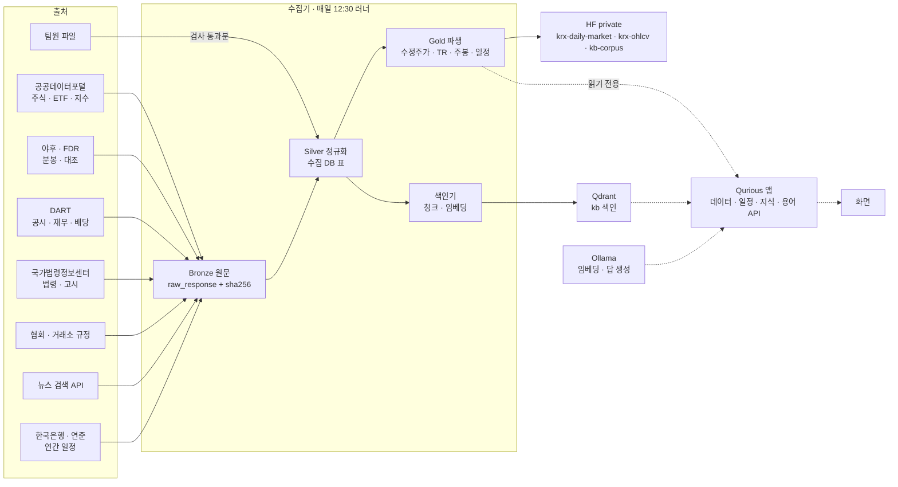
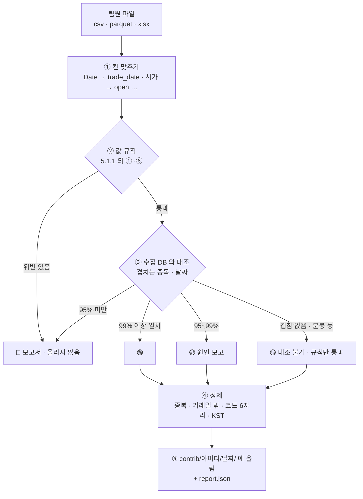
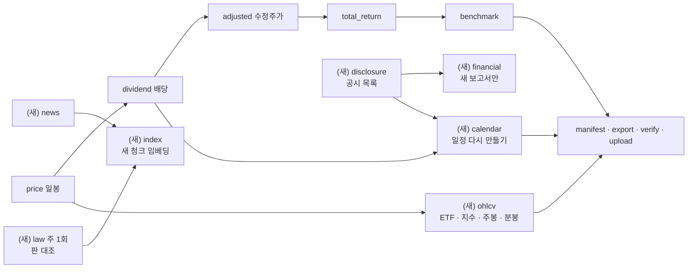
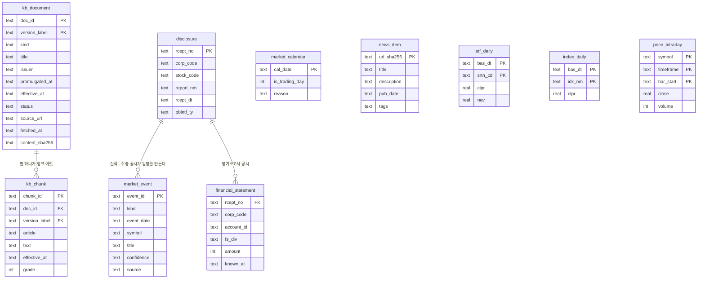

# 목표 기능 ① 상세 설계서 v0.1 — 금융 데이터 · 지식 기반 (세부 1~4) — Qurious

| 문서 정보 | |
|---|---|
| **판 · 상태** | v0.1 · 초안(검토 전) |
| **구분** | 6. 시스템 설계 — 설계 문서(2차 목표 기능 ① 세부 1~4) · 2. 요구사항 관리(인수 기준) |
| **작성** | 이동원(목표 기능 ① 세부 1~4 주담당) |
| **검토** | 검토 전 — 부담당 오준영 · 신장환 · 강민석(확인은 네 명 모두) |
| **최종 수정** | 2026-10-01 (KST) |
| **기준** | 코드 `main` `a9b3737` · 수집 데이터 기준일 2026-09-29 · 외부 원문 조회일 2026-10-01 |
| **관련 문서** | [프로젝트 계획서 v2.0](../계획서/프로젝트계획서_v2.0.md) · [기능 설계서 v0.1](기능설계_v0.1.md) 4.1절 · [용어사전 설계서 v0.1](용어사전-설계_v0.1.md) · [통합본 이식 계획서 v0.1](통합본-이식계획_v0.1.md) · [RTM v1.1](../요구사항/RTM_v1.1.md) · [ERD v1.2](../데이터/ERD_v1.2.md) · [API 명세서 v0.1](../인터페이스/API명세서_v0.1.md) · [화면 설계 절차 v0.1](../화면/화면설계절차_v0.1.md) |
| **최근 개정** | 첫 판 |

> **이 문서가 답하는 질문**
> 1. 목표 기능 ① 세부 1~4(`P01-①-1` ~ `P01-①-4`)는 각각 무엇이 되면 끝인가?
> 2. 어떤 자료를 어디서 받아, 어느 층에 두고, 누가 어떻게 쓰나?
> 3. 「2026년 기준 근거」 와 「하루 한 번 갱신」 을 무엇으로 보장하나?
> 4. 다른 주담당(신장환 · 오준영 · 강민석)은 여기서 무엇을, 언제, 어떤 모양으로 받나?
>
> **읽는 순서** — 팀원: 요약 → 9절 접점 → 5절 중 자기와 닿는 곳 · 강사님: 요약 → 2절 → 4절 그림 → 10절 일정 · 다시 만들 사람: 부록 B
>
> **확실도** — 🟢 코드 · 데이터 · 공식 원문에서 직접 확인 / 🟡 추정 · 팀 확인 전 · 측정 전 / 🔴 없음

## 요약

1. 네 요구는 하나의 흐름이다 — **출처에서 받아(①-2) → 판과 갱신일을 붙여 쌓고(①-4) → 근거로 답하고(①-3) → 용어로 이어 준다(①-1)**. 그래서 저장 · 배치 · 출처 표기를 한 번만 설계하고 네 요구가 함께 쓴다.
2. 데이터는 강사님 참고 저장소(`python-crawling-lab`)의 **원문(Bronze) → 정제(Silver) → 파생(Gold)** 층을 따른다. 우리 수집기는 이미 같은 층을 갖고 있으므로(일봉 OHLCV 4,477,927행 · 매일 12:30 갱신) 새 자료(ETF · 지수 · 주봉 · 분봉 · 재무 · 공시 · 뉴스 · 법령 · 규정 · 일정)를 **같은 층에 얹는다**.
3. OHLCV 는 **공통 규격 `ohlcv-v1`** 하나로 일봉 · 주봉 · 분봉 · ETF · 지수를 HF private 데이터셋 `qurious-quant/krx-ohlcv` 에 쌓는다. 팀원이 모은 자료도 이 규격이면 **검사 → 수집 DB 와 대조 → 정제**해 받는다.
4. RAG 근거는 **2026년에 시행 중인 판**의 법령 · 감독규정 · 협회 · 거래소 기준 + 공시 + 뉴스다. 법령 DB 의 「현행」 표시만 믿으면 틀린다는 것을 실측으로 확인했다(증권거래세율 — 3.3절). 그래서 조문을 **시행일 판**으로 받고, 답마다 「[출처 n] 법령명 제○조 · 시행일 · 주소」 를 단다.
5. 금융 일정(배당 · 휴장 · 파생 만기 · 금통위 · FOMC · 실적 · 주총)과 데이터 갱신일 · 문서 판은 매일 12:30 배치가 갱신하고, 앱은 읽기만 한다. 화면 자리는 화면 설계 절차(Figma 세 안 → 팀 검토)로 정한 뒤 만든다.

---

## 1. 맥락과 범위

### 1.1 요구 원문과 보충 설명

표 1 은 「이 문서가 맡는 요구는 무엇이고, 강사님 · 팀이 무엇을 덧붙였나」 에 답한다.

**표 1. 맡는 요구와 보충 설명**

| 요구 ID | 강사님 원문 | 강사님 기술 스택 칸 | 보충 설명 (2026-10-01) |
|---|---|---|---|
| `P01-①-1` | 주식 · 금융 · 경제 기본 용어사전과 연관 개념 탐색 | domain-rag-lab 와 investment-analysis 의 통합 및 AWS EC2 서버 배포 | 통합본은 `rag-lab/` 에 들여왔다(2026-09-30). AWS 는 로컬 완성 뒤 고른다 |
| `P01-①-2` | 가격 · 거래량 · 재무 · 뉴스 등 투자 자료 수집 · 분류 · 전처리 · 검색 | python-crawling-lab 등을 활용한 크롤링 및 적재 | 강사님: OHLCV 를 모아 HF Organization 에 private 데이터셋으로 두고 지금 데이터와 비교해 구조를 맞춰 써도 된다 · 사용자: **비공개면 출처를 가리지 않는다** · OHLCV 는 분봉까지 이동원이 모으고, 팀원 자료는 같은 규격으로 받아 검사 · 정제한다 |
| `P01-①-3` | 근거 문서와 출처를 포함한 RAG 질의응답 | Amazon Bedrock 또는 Ollama + GPU · VectorDB · FastAPI | 강사님: 근거 · 출처는 **실제 업종의 외부 기준이나 법률** — 실제 자료를 모으고 **2026년 기준**으로 판단 · 사용자: 법령 + 감독규정 + 협회 기준 + 공시 + 뉴스 · Ollama 로컬 |
| `P01-①-4` | 금융정보의 갱신일 · 문서 버전 · 캘린더 일정 관리 및 정기 배치 업무 실행 | RDBMS · Amazon EventBridge Scheduler · AWS Batch | 사용자: 배당일 같은 실제 금융 정보를 가져와 보여 준다 — 실시간이 아니어도 **하루 한 번 갱신** |

### 1.2 이 문서가 다루지 않는 것

`P01-①-5` XAI(신장환) · 목표 기능 ②~④ 의 계산은 각 주담당의 설계서가 맡는다. 이 문서는 그 기능들이 **받아 쓸 자료와 그 규격**까지만 정한다(9절).

### 1.3 참고한 강사님 저장소

| 저장소 | 가져올 것 | 확실도 |
|---|---|:-:|
| `learning/th12-python-crawling-lab` (`1572282`) | 데이터 레이크 층 이름(Bronze · Silver · Gold · Catalog) · Silver 스키마 표(`SCHEMA_MAP` — 시세 · 공시 · 거시 · 해외) · DART 공시 목록(`list.json`) · 재무 주요계정(`fnlttSinglAcnt.json`) · 한국은행 ECOS 크롤러 · Qdrant 적재 단계 | 🟢 |
| 통합본 `rag-lab/` (`2f0e71f`) | 출처 번호를 단 RAG 응답 모양(`app/api/routes/rag.py` `_cite` · `[출처 N]`) · 캘린더 화면과 내 일정 표(`personal_calendar_events`) · 용어 자료 | 🟢 |
| `learning/th10-stock-ml-dl-project` | 평일 18시 하루 1회 배치(Airflow DAG `0 18 * * 1-5`) — 우리는 작업 스케줄러로 대체(11절) | 🟢 |

th12 에는 **뉴스 · 법령 크롤러가 없고**, 시세는 「지금 값 스냅샷」(현재가 · 등락률)이지 OHLCV 이력이 아니다 🟢. 그래서 층 구조와 공시 · 거시 경로를 빌리고, OHLCV 이력 · 법령 · 뉴스는 이 문서에서 새로 설계한다.

---

## 2. 목표 · 비목표

### 2.1 목표 — 인수 기준

표 2 는 「요구마다 무엇이 되면 끝인가」 에 답한다. 기준은 시험이나 명령 한 줄로 확인할 수 있게 적었다.

**표 2. 인수 기준**

| 요구 | # | 인수 기준 | 확인 방법 |
|---|:-:|---|---|
| `P01-①-1` | 1 | 용어 하나를 부르면 **연관 용어가 관계 종류와 함께** 돌아온다 | API 계약 시험 |
| | 2 | 관계는 규칙을 지킨다 — 「연관」 · 「혼동」 은 양방향, 「상위」 ↔ 「하위」 는 짝, 자기 자신 · 없는 용어는 금지 | 빌드가 멈추는 검사 + 시험 |
| | 3 | 화면 자리는 화면 설계 절차로 정하고 팀 검토를 받은 뒤 만든다 | 검토 기록 |
| `P01-①-2` | 4 | 일봉(주식 · ETF · 지수) · 주봉 · 분봉이 `ohlcv-v1` 규격으로 HF private `krx-ohlcv` 에 쌓이고, 매니페스트의 행 수 · 해시가 원격과 같다 | `hf_dataset verify` 식 대조 |
| | 5 | 팀원 파일 하나를 넣으면 **검사 보고서**(규격 · 값 규칙 · 수집 DB 대조 · 판정)가 나오고, 통과분만 정제돼 올라간다 | 가짜 파일 6종 시험 |
| | 6 | 재무 · 공시 · 뉴스가 **출처 · 기준일 · 가져온 시각**과 함께 저장되고, 종목 · 주제 이름표와 낱말로 검색된다 | API 계약 시험 · 이름표 표본 정밀도 |
| `P01-①-3` | 7 | 근거 문서는 **기준일에 시행 중인 판**이다 — 증권거래세법 시행령 제5조를 2026-10-01 기준으로 물으면 제36001호 판(코스피 1만분의 5)을 근거로 단다 | 판 고르기 시험(실측 사례 고정) |
| | 8 | 답 안의 `[출처 n]` 과 응답의 `citations` 목록이 하나도 어긋나지 않는다. 근거가 없으면 「근거를 찾지 못했다」 고 답한다 | 가짜 검색기 시험 |
| | 9 | 검색 평가셋(질문 50 · 정답 조문)에서 상위 5개 안에 정답이 드는 비율(Recall@5)을 잰다 — 목표 0.8 (제안) | 평가 스크립트 |
| `P01-①-4` | 10 | 배당(기준일 · 배당락일 · 지급일) · 휴장일 · 파생 만기 · 금통위 · FOMC · 실적 · 주총 일정이 **매일 한 번** 갱신돼 API 로 나온다 | 일정 시험 · 배치 상태 |
| | 11 | 표마다 마지막 기준일 · 배치 단계별 결과 · 문서 판(시행일 · 가져온 날 · 해시)이 API 와 화면에 보인다 | 상태 API 계약 시험 |
| | 12 | 배치 단계가 실패하면 상태에 🔴 와 원인이 남고, 다음 회차가 놓친 날을 따라잡는다 | 실패 주입 시험 |

### 2.2 비목표

| 하지 않는 것 | 까닭 |
|---|---|
| 실시간 시세 스트리밍 | 3차 `SCH-RT`(실시간 엔진)의 몫 · 2차는 하루 1회 |
| 뉴스 본문 저장 | 기사는 저작물이다 — 검색 API 가 주는 제목 · 요약 · 주소만 둔다(💬 ③) |
| 모든 종목의 분봉 | 호출 수와 저장량 — 유니버스를 정한다(💬 ①) |
| 뉴스 감성 분석 모델 학습 | 2차 요구에 없다 — 이름표 분류까지 |
| AWS EventBridge · Batch | 작업 스케줄러 + 러너로 대체(11절) — AWS 는 로컬 완성 뒤 고른다 |
| 유료 데이터 · 유료 LLM API | 비용 합의 전 |

---

## 3. 지금 상태 — 2026-10-01 실측

### 3.1 요구별

**표 3. 지금 있는 것과 빈 곳**

| 요구 | 있는 것 🟢 | 빈 곳 🔴 |
|---|---|---|
| `P01-①-1` | 용어 755 · 분류 22 · 이름 1,688(`app/services/glossary_data/terms.json`) · 앱 DB 표 다섯 · API 넷 `API-GLOS-01~04`(`app/routes/glossary.py`) · 함께 쓰는 이름 30쌍 | 용어 사이 **관계 표 · API 가 없다** · 화면 설명창은 아직 화면 상수 55개(`public/js/core.js`) |
| `P01-①-2` | 수집기 5,456줄(`collector/`) · 일봉 OHLCV 4,477,927행 · 3,308종목 · 2020-01-02~2026-09-29 · 수정주가 OHLC · TR · 배당 9,189건 · 원문 12,728건(sha256) · HF private `krx-daily-market` · 앱의 국내 일봉은 수집 DB 어댑터(`app/services/collector_db.py`)로 | **ETF · 공식 지수 · 주봉 · 분봉 0** · 재무는 야후 조회뿐(`API-STK-07`) · 뉴스 분류 없음 · 수집 자료 검색 API 없음 |
| `P01-①-3` | 채팅 `API-CHAT-01` · Qdrant 클라이언트 코드(`app/services/rag_pipeline.py`) · 통합본 `POST /api/rag/ask` 의 출처 모양 · Ollama(호스트) `llama3.1` 8B | 채팅 응답 `citations` 가 **늘 빈 목록**(`app/services/langgraph_agent.py:247` · `:275`) · Qurious compose 에 **Qdrant · Ollama 서비스가 없다**(앱의 `QDRANT_URL` 기본값은 컨테이너 자신) · 설정 임베딩 `nomic-embed-text` 는 이 PC 에 받지 않았다 · 통합본은 의미 없는 해시 임베딩 384차원 · 법령 · 규정 문서 0 |
| `P01-①-4` | 매일 12:30 러너(`scripts/daily_update.py` · 9단계 · 잠금 · 로그 · 상태 JSON) · 2026-09-30 회차 29분 · 전부 성공 · 배당 표에 기준일 · 배당락일 · 이사회일 | 앱의 `GET /api/system/sync-status` 는 **야후 캐시**의 신선도를 본다(`app/routes/system.py:16`) · 거래일 달력 · 휴장일 표 없음(`ingest_day` 의 `holiday` 0행) · 통합본 캘린더는 **8~9월 일정 상수 74줄**(`rag-lab/app/services/market_calendar_data.py`) · 배당 지급일 칸 없음 · 문서 판 칸 없음 |

### 3.2 이 PC 의 계산 자원

| 항목 | 값 | 설계에 주는 뜻 |
|---|---|---|
| CPU · RAM | 22 논리 코어 · 31.6GB | 임베딩 수천 ~ 수만 청크는 로컬로 충분 |
| GPU | 없음(`nvidia-smi` 없음) | LLM 은 CPU 추론 — 답은 짧게 · 근거를 먼저 보인다 |
| Ollama 모델 | `llama3.1` 8B 하나 | 한국어 답 품질은 평가셋으로 다른 모델과 비교한 뒤 정한다(💬 ④) |

### 3.3 실측으로 확인한 함정 — 법령 DB 의 「현행」 판

국가법령정보센터 Open API 로 증권거래세법 시행령을 조회하면(2026-10-01) 「현행」 은 **대통령령 제35947호(2025-12-30 공포 · 2026-01-02 시행 · 타법개정)** 이고, 그 판의 제5조는 코스피 「영(零)」 · 코스닥 「1만분의 15」 다. 그런데 시행일 판 목록(`target=eflaw`)에는 **제36001호(2025-12-31 공포 · 2026-01-01 시행 · 일부개정)** 가 따로 있고, 그 판의 제5조는 **코스피 1만분의 5 · 코넥스 1만분의 10 · 코스닥 1만분의 20** 이다(개정 표시 「2025.12.31」) 🟢.

하루 먼저 공포됐지만 하루 늦게 시행되는 다른 법의 개정판이 「현행」 으로 표시되고, 그 본문은 하루 뒤 공포된 개정을 담지 않은 것이다. 뉴스(2025-12)도 2026-01-01 인상을 전한다 🟢. 결론: **「현행」 표시만 믿고 조문을 가져오면 2026년 세율을 틀리게 답한다.** 판 고르기 규칙은 5.3.2 에 둔다. 우리 비용 모델(`app/services/trading_cost.py:85`)의 2026년 값은 제36001호와 같다 🟢.

---

## 4. 전체 구조

### 4.1 자료가 흐르는 길

그림 1 은 「자료가 어디서 와서 어느 층을 거쳐 누가 쓰나」 에 답한다(시스템 맥락 · 컨테이너 단계).

**그림 1. 목표 기능 ① 의 자료 흐름** · 범례: 상자 = 저장소 · 프로그램, 실선 = 매일 배치, 점선 = 요청 때



결론: **쓰는 쪽은 수집기 하나**이고 앱은 읽기만 한다(지금 수집 DB 를 읽기 전용으로 붙이는 방식 그대로). 그래서 배치가 죽어도 앱은 마지막 값과 그 기준일을 보여 줄 수 있다.

### 4.2 층 이름 — 강사님 저장소와 우리

**표 4. 데이터 레이크 층 대응**

| th12 층 | th12 에서 | 우리 수집기에서 (있음 🟢 · 새로 🔴) |
|---|---|---|
| Bronze — 원본 착지 | MinIO JSONL `{source}/{data_type}/{YYYY}/{MM}/{DD}/` | `raw_response`(원문 바이트 · sha256) 🟢 — 새 출처도 같은 표에 |
| Silver — 정제 · 정규화 | Parquet · `SCHEMA_MAP`(필수 칸 · 숫자 칸 · 중복 키) | 수집 DB 정규화 표(`price_daily` …) 🟢 + 새 표(6절) 🔴 · 규격 표는 `ohlcv-v1`(5.1.1) |
| Gold — 분석 집계 | DuckDB 집계 표 | 수정주가 · TR · 벤치마크 🟢 + 주봉 · 일정 · 청크 🔴 |
| Catalog — 수집 이력 | 카탈로그 | `ingest_day` · 매니페스트 · 러너 상태 JSON 🟢 + 문서 판 표 🔴 |
| (없음) | — | HF private 내보내기 · 복원 리허설 🟢 |

MinIO · DuckDB 는 들이지 않는다 — 서버 셋을 늘리지 않고도 같은 층을 이미 갖고 있다(대안 11절).

### 4.3 자료 대장

표 5 는 「어떤 자료를, 어디서, 얼마나 자주 받아, 누가 쓰나」 에 답한다. 양은 추정이다.

**표 5. 자료 대장**

| 자료 | 1차 출처 | 대조 · 대체 | 범위 | 주기 | 쓰는 곳 | 상태 |
|---|---|---|---|---|---|:-:|
| 주식 일봉(원 · 수정) | 공공데이터포털 주식시세 | 야후 `.KS` · `.KQ` 표본 | 3,308종목 · 2020-01-02~ | 매일 | ② · ③ · ④ | 🟢 |
| ETF 일봉 | 공공데이터포털 증권상품시세(`getETFPriceInfo`) | FinanceDataReader · 야후 | 상장 ETF 전부 · 2020-01-02~ | 매일 | ③ 자산배분 | 🔴 |
| 지수 일봉 | 공공데이터포털 지수시세(`getStockMarketIndex`) | 야후 `^KS11` · `^KQ11` | 코스피 · 코스닥 · 코스피200 등 | 매일 | ④ 벤치마크 대조 | 🔴 |
| 주봉 | 일봉에서 계산 | — | 위 전부 | 매일 | ② 다중 주기 | 🔴 |
| 분봉 60 · 5 · 1분 | 야후(60분 730일 · 5분 60일 · 1분 7일) | 한국투자증권 당일 분봉 | 분봉 유니버스(💬 ①) | 매일 증분 | ② 다중 주기 | 🔴 |
| 재무제표 | DART 단일회사 전체 재무제표 | — | 상장사 · 2020~ · 분기 | 공시가 생기면 | ③ 재무 필터 | 🔴 |
| 공시 목록 | DART `list.json` | — | 전 유형 | 매일 | 일정 · 지식 · 분류 | 🔴 |
| 뉴스 | 네이버 검색 API(뉴스) | 연합뉴스 RSS | 유니버스 종목명 · 주제어 | 매일 | 지식 · 분류 | 🔴 |
| 법령 · 시행령 | 국가법령정보센터 Open API(`eflaw`) | — | 5.3.1 목록 | 주 1회 판 대조 | 근거 RAG | 🔴 |
| 감독규정 · 세칙 | 같은 API(`admrul`) | — | 5.3.1 목록 | 주 1회 | 근거 RAG | 🔴 |
| 협회 · 거래소 규정 | 금융투자협회 · 한국거래소 누리집 | 내려받은 파일 | 5.3.1 목록 | 월 1회 | 근거 RAG | 🔴 |
| 휴장일 | 공공데이터포털 특일 정보(`getRestDeInfo`) + 거래소 공지 | 지난날은 시세 빈 날로 대조 | 2020~ + 올해 · 내년 | 매일 | 일정 · ③ · ④ | 🔴 |
| 연간 일정 | 한국은행 금통위 · 연준 FOMC 공식 페이지 | — | 올해 · 내년 | 연 1회 + 확인 | 일정 | 🔴 |
| 배당 일정 | DART 배당 공시 본문 | — | 9,189건 + 매일 | 매일 | 일정 · ③-3 | 🟢 (지급일 🔴) |
| 용어 · 관계 | 용어 파일(git) | — | 755 | 바뀔 때 | 용어 · RAG | 🟢 (관계 🔴) |

### 4.4 모든 자료에 붙는 칸

| 칸 | 뜻 | 왜 |
|---|---|---|
| `source` | 출처 키(`portal` · `yahoo` · `fdr` · `dart` · `law` · `naver` · `contrib:<아이디>` …) | 같은 값이 출처마다 다르다 — 어느 쪽 값인지 늘 보인다 |
| `as_of` · `trade_date` | 그 값이 가리키는 날(기준일) | 오래된 값으로 판단하지 않게 |
| `fetched_at` | 가져온 시각(UTC) | 「언제 알 수 있었나」 — 미래 참조를 막는 근거 |
| `raw_sha256` | 원문 해시 | 원본이 그런 것인지 우리가 잘못 읽은 것인지 가린다 |
| 문서만: `promulgated_at` · `effective_at` · `version_label` | 공포일 · 시행일 · 공포번호 | 판 고르기(5.3.2) |

---

## 5. 세부 설계

### 5.1 `P01-①-2` 투자 자료 수집 · 분류 · 전처리 · 검색

#### 5.1.1 OHLCV 공통 규격 `ohlcv-v1`

팀원 누가 어디서 모았든 이 모양이면 같은 코드로 읽고 대조한다. 표 6 은 「칸마다 무엇을, 어떤 단위로 적나」 에 답한다.

**표 6. `ohlcv-v1` 칸**

| 칸 | 형식 | 필수 | 뜻 · 규칙 |
|---|---|:-:|---|
| `symbol` | 문자열 | ✅ | 주식 · ETF 는 단축코드 6자리(`005930`) · 지수는 정한 이름(`KOSPI` · `KOSDAQ` · `KOSPI200`) |
| `market` | 문자열 | ✅ | `KOSPI` · `KOSDAQ` · `KONEX` · `ETF` · `ETN` · `INDEX` |
| `timeframe` | 문자열 | ✅ | `1d` · `1w` · `60m` · `5m` · `1m` |
| `trade_date` | 날짜 | ✅ | 봉이 속한 거래일 — 주봉은 **그 주의 마지막 거래일** |
| `bar_start` | 시각(KST) | 분봉만 | 봉이 시작한 시각 · `+09:00` · 정규장 09:00~15:30 밖의 봉은 따로 표시 |
| `open` · `high` · `low` · `close` | 실수 | ✅ | 원(지수는 포인트) |
| `volume` | 정수 | ✅ | 주(株) |
| `value` | 정수 | — | 거래대금(원) — 없는 출처는 비움 |
| `adjusted` | 참 · 거짓 | ✅ | OHLC 가 수정주가인가 |
| `adj_factor` | 실수 | — | 원 가격 × 계수 = 수정 가격 |
| `source` · `fetched_at` | 문자열 · 시각 | ✅ | 4.4절 |
| `contract` | 문자열 | ✅ | `ohlcv-v1` — 규격이 바뀌면 판을 올리고 옛 판도 읽는다 |

**기본 키** — `(symbol, timeframe, trade_date, bar_start)`.

**값 규칙**(검사가 본다) — ① `low ≤ min(open, close) ≤ max(open, close) ≤ high` ② 가격 > 0 · 거래량 ≥ 0 ③ 키 중복 없음 ④ 일봉 `trade_date` 는 거래일 달력 안 ⑤ 분봉 `bar_start` 는 그날 정규장 안(밖이면 따로 셈) ⑥ 거래정지일(거래량 0 · OHLC 같음)은 지우지 않고 그대로 둔다.

**주봉 만드는 법** — 일봉을 주(월~금)로 묶어 시가 = 첫 거래일 시가 · 고가 = 최댓값 · 저가 = 최솟값 · 종가 = 마지막 거래일 종가 · 거래량 = 합. 수정주가 주봉은 **수정 일봉을 묶는다**(원 주봉에 계수를 곱하지 않는다 — 주 중간에 분할이 있으면 틀린다). 진행 중인 주는 `trade_date` = 마지막 수집일로 두고 `partial` 표시를 매니페스트에 남긴다.

#### 5.1.2 HF 데이터셋 `qurious-quant/krx-ohlcv` (private)

지금 `krx-daily-market` 은 **수집 DB 를 통째로 되살리는 백업**(표 여덟 · DDL 포함 · `restore`)이다. OHLCV 규격 데이터셋은 목적이 달라(분석용 · 팀원 공유 · 여러 출처) 따로 둔다(대안 11절).

```
qurious-quant/krx-ohlcv   (private · 올리기 전 repo_info().private 확인)
├── README.md                      데이터 카드 — 출처 · 이용 조건 · 칸 설명 · 비공개 까닭
├── manifest.json                  파일별 행 수 · sha256 · 규격 판 · 기준일 · partial 주
├── ohlcv/timeframe=1d/market=KOSPI/year=2026/part-00000.parquet
├── ohlcv/timeframe=1d/market=ETF/year=2026/…
├── ohlcv/timeframe=1d/market=INDEX/…
├── ohlcv/timeframe=1w/…
├── ohlcv/timeframe=60m/year=2026/month=10/…
├── ohlcv/timeframe=5m/… · ohlcv/timeframe=1m/…
└── contrib/<깃허브 아이디>/<YYYY-MM-DD>/<파일>.parquet + report.json   팀원 자료 (검사 통과분)
```

올리기 · 확인은 지금의 `scripts/hf_dataset.py` 와 같은 방식(Xet 증분 · 날짜 태그 · 원격 private 검사)을 쓴다 🟢.

#### 5.1.3 무엇을 얼마나 — 분봉의 한계와 양

야후는 한국 종목 분봉을 준다(2026-10-01 실측 · 삼성전자 `005930.KS`) 🟢 — 1분봉 7일 2,165행 · 5분봉 60일 4,229행 · 60분봉 730일 4,357행 · 시각은 UTC 로 온다(09:00 KST = 00:00 UTC). **과거로는 이 창 밖을 받을 수 없으므로** 첫 적재는 창 전체를 받고, 그 뒤로는 매일 그날 봉을 더해 **우리 쪽에 쌓아 간다**.

**표 7. 분봉 양 추정 (유니버스 400종목 · 1분봉만 50종목 가정 · 💬 ①)**

| 주기 | 하루 봉 수 | 한 해 행 수(250거래일) | 첫 적재 |
|---|---:|---:|---|
| 60분 | 약 7 | 약 70만 | 730일 |
| 5분 | 약 78 | 약 780만 | 60일 |
| 1분 | 약 390 | 약 490만(50종목) | 7일(나눠 받으면 30일) |

호출 수는 하루 약 450번(종목 × 주기)이라 받는 데 문제가 없고, 저장은 파케이로 한 해 수백 MB 로 추정한다 🟡(첫 적재 뒤 실측해 고친다).

#### 5.1.4 팀원 자료 받기 — 검사 · 대조 · 정제

사용자 지시(2026-10-01): 「팀원들이 수집하는 데이터도 활용할 수 있는지 확인 필요 및 전처리 정제 필요」. 그림 2 는 「팀원 파일 하나가 어떤 관문을 지나 쓰이게 되나」 에 답한다.

**그림 2. 팀원 자료 받기** · 범례: 마름모 = 판정, 🟢🟡🔴 = 보고서의 판정



**대조가 가려내는 것** — 표 8 은 「흔히 생기는 어긋남을 어떻게 알아보나」 에 답한다.

**표 8. 대조 규칙**

| 어긋남 | 알아보는 법 | 보고서에 |
|---|---|---|
| 수정주가인지 원 가격인지 | 같은 날 종가가 우리 원 가격 · 수정 가격 중 어느 쪽과 일치하나 | 「수정 · 원 · 섞임」 |
| 하루 밀림(시간대) | 하루 앞 · 뒤로 옮겼을 때 일치율이 더 높아지나 | 「UTC 날짜로 보임」 |
| 단위 | 비율이 1,000 근처로 일정한가 | 「천 원 단위로 보임」 |
| 빠진 날 · 남는 날 | 거래일 달력과 비교 | 날짜 목록 |
| 값 차이 | 일치 = 차이가 1원 이하 또는 0.01% 이하(호가 단위 반올림 허용) | 일치율 · 최대 차이 · 예시 5줄 |

정제한 팀원 자료를 **수집 DB 에 합칠지**는 정하지 않았다 — 기본은 `contrib/` 에 따로 두고, 쓰는 사람이 `source` 칸으로 고른다(💬 ②).

#### 5.1.5 재무 · 공시 · 뉴스

| 자료 | 받는 법 | 저장 | 미래 참조 방지 |
|---|---|---|---|
| 재무제표 | DART 단일회사 전체 재무제표 — **새 정기보고서 공시가 올라온 회사만** 받는다(공시 목록에서 고름) | `financial_statement` | `known_at` = 공시 접수일 — 화면 · 스크리닝은 기준일 이전에 접수된 값만 쓴다(③ 재무 필터의 전제) |
| 공시 목록 | DART `list.json` — 매일 전날~오늘 · 전 유형 (기간 3개월을 넘기면 오류라 하루 단위) | `disclosure` | `rcept_dt` |
| 뉴스 | 네이버 검색 API(뉴스) — 유니버스 종목명 · 주제어 · 최신순 100건씩 · 하루 허용 25,000회 안 | `news_item` — 제목 · 요약 · 원문 주소 · 게시 시각 · 검색어 · 이름표 | 게시 시각 |

DART 일일 호출 한도는 확인한 뒤 백필 일정을 정한다 🟡. 네이버 검색 API 와 공공데이터포털의 새 API 세 개(증권상품시세 · 지수시세 · 특일 정보)는 **사용자가 이용 신청**해야 한다(14.2절).

#### 5.1.6 분류 — 이름표

| 이름표 | 붙이는 법 | 대상 |
|---|---|---|
| 종목 | 제목 · 요약에서 상장사 이름 · 약칭 · 코드 사전 일치(가장 긴 이름부터) | 뉴스 · 공시 |
| 주제 | 용어사전 분류 22 + 사전 낱말(배당 · 실적 · 금리 · 환율 · 유상증자 …) | 뉴스 · 공시 · 문서 |
| 공시 유형 | DART 공시 유형 코드(정기 · 주요사항 · 발행 · 지분 · 거래소 …) | 공시 |

규칙 기반으로 시작하고, 표본 200건을 사람이 판정해 정밀도를 잰다(목표 0.9 · 제안). 임베딩 분류는 그 숫자가 모자랄 때 더한다.

#### 5.1.7 검색

수집기가 SQLite 전문 검색 색인(FTS5)을 만들고, 앱은 읽기 전용으로 찾는다 — 앱이 수집 DB 에 쓰지 않는다는 지금 원칙을 지킨다. `GET /api/data/search?q=&kind=news|disclosure|doc&symbol=&from=&to=` 는 낱말 + 이름표 + 기간으로 거르고, 결과마다 `source` · `as_of` 를 싣는다.

### 5.2 `P01-①-4` 갱신일 · 문서 판 · 캘린더 · 정기 배치

#### 5.2.1 정기 배치 — 지금 러너에 단계를 더한다

강사님 기술 스택의 EventBridge Scheduler(예약) · AWS Batch(실행)는 **작업 스케줄러(예약) + `scripts/daily_update.py` 러너(실행)** 가 이미 맡고 있다 🟢. 새 단계는 같은 러너에 더한다 — 단계마다 잠금 · 로그 · 상태 JSON · 건너뛰기 조건 · 실패해도 다음 단계 진행이라는 지금 규칙을 그대로 따른다.

**그림 3. 매일 12:30 러너 — 지금 단계와 새 단계** · 범례: 「(새)」 = 새 단계(제안), 화살표 = 앞 단계가 있어야 하는 순서



결론: 새 단계는 지금 단계를 **기다리지 않는 것이 대부분**이다(공시 · 뉴스 · 법령은 시세와 무관). 하루 걸리는 시간은 지금 29분에 10~20분이 더해질 것으로 본다 🟡 — 첫 주에 단계별로 잰다.

#### 5.2.2 갱신일 — 데이터 상태 API

`GET /api/data/status` 는 러너 상태 JSON(`data/collector/state/daily_update_last.json` — 앱 컨테이너에 읽기 전용으로 이미 붙어 있다)과 수집 DB 표별 마지막 기준일 · 행 수, HF 데이터셋의 마지막 태그를 한 번에 돌려준다. 지금의 `/api/system/sync-status`(야후 캐시)는 그대로 두고, 화면의 「데이터 기준일」 은 새 API 를 본다.

#### 5.2.3 문서 판

같은 문서의 새 판은 **덮어쓰지 않고 새 행**이다. 표 `kb_document` 한 행 = 문서 한 판(공포번호 · 공포일 · 시행일 · 가져온 날 · 본문 해시 · 상태 「현행 · 연혁 · 시행 예정」). 주 1회 `law` 단계가 목록의 시행일 · 공포번호를 대조해 **바뀐 문서만** 조문을 다시 받는다. 화면은 「이 답은 2026-10-01 에 시행 중인 판 기준」 처럼 기준일을 함께 보인다.

#### 5.2.4 금융 일정

표 `market_event` 하나에 모든 일정을 둔다(종류 · 날짜 · 시각 · 시장 · 종목 · 제목 · 설명 · 출처 · 확실도 「확정 · 예정 · 법정 기한」). 표 9 는 「일정 종류마다 어디서, 어떤 규칙으로 만드나」 에 답한다.

**표 9. 일정 종류와 규칙**

| 종류 | 출처 · 규칙 | 확실도 |
|---|---|:-:|
| 배당 기준일 · 배당락일 | 수집 DB `dividend`(공시 본문 · 배당락일 검증 규칙 그대로) | 🟢 |
| 배당 지급일 | 같은 공시 본문의 지급 예정일 칸 — 수집기가 더 읽는다 | 🟡 |
| 휴장일 | 특일 정보(공휴일 · 대체 · 임시) + 거래소 휴장(12-31 연말 · 근로자의 날) → 거래일 달력 `market_calendar` | 🟡 |
| 파생 만기 | 코스피200 옵션 최종거래일 = 매월 둘째 목요일(휴장이면 앞 거래일) · 3 · 6 · 9 · 12월은 선물 동시 만기 — 계산 | 🟢 |
| 금통위 · FOMC | 한국은행 · 연준 공식 연간 일정 — 연 1회 받고 매월 확인 | 🟡 |
| 실적 · 주총 | DART 공시(영업 잠정실적 공정공시 · 주주총회 소집결의)가 올라오면 「확정」 · 정기보고서는 법정 제출 기한(사업보고서 90일 · 반기 · 분기 45일)을 「법정 기한」 으로 | 🟢 규칙 · 🟡 파싱 |

통합본의 정적 일정 74줄은 이 표로 바뀌고, 통합본의 「내 일정」(`personal_calendar_events`)은 화면을 옮길 때 함께 본다(이식 대장 R16). API 는 `GET /api/calendar/events?from=&to=&kind=&symbol=` · `GET /api/calendar/trading-days?from=&to=` 다. 거래일 달력은 ③ 시간 기반 리밸런싱의 날짜 · ④ 체결일 계산이 함께 쓴다(9절).

### 5.3 `P01-①-3` 근거 문서 · 출처를 포함한 RAG 질의응답

#### 5.3.1 근거 문서 목록 v1

표 10 은 「무엇을 근거로 삼고, 어떤 순서로 믿나」 에 답한다. 2026-10-01 조회에서 현행 판을 확인한 것은 🟢 다.

**표 10. 근거 문서 (등급 순)**

| 등급 | 종류 | 문서 | 2026-10-01 확인 |
|:-:|---|---|---|
| 1 | 법령 | 자본시장과 금융투자업에 관한 법률 · 시행령 · 시행규칙 | 시행령 현행 = 2026-10-01 시행(대통령령 제36729호) · 로보어드바이저의 법적 이름 「전자적 투자조언장치」 = 시행령 제2조 제6호 🟢 |
| 1 | 법령 | 금융소비자 보호에 관한 법률 · 시행령 (적합성 · 적정성 · 설명의무) | 🟡 판 목록은 색인 때 |
| 1 | 법령 | 증권거래세법 · 시행령 · 농어촌특별세법 | 시행령 제36001호(2026-01-01) 🟢 |
| 1 | 법령 | 소득세법(배당소득 · 금융소득 종합과세 관련 조문) · 상법(배당 · 주주총회 관련 조문) | 🟡 범위는 관련 장만 |
| 2 | 감독규정 | 금융투자업규정 · 시행세칙 | 고시 제2026-38호(2026-09-15 시행) · 세칙 2026-07-08 시행 🟢 |
| 2 | 감독규정 | 금융소비자 보호에 관한 감독규정 · 시행세칙 | 고시 제2026-40호(**2026-10-02 시행**) 🟢 |
| 3 | 협회 기준 | 금융투자협회 표준투자권유준칙 · 금융투자회사의 영업 및 업무에 관한 규정 | 🟡 받는 경로 확인 전 |
| 3 | 거래소 규정 | 유가증권시장 · 코스닥시장 업무규정(가격제한폭 · 매매시간 · 시장경보 · 휴장) | 🟡 누리집이 스크립트로 그린다 — 브라우저나 내려받은 파일 |
| 4 | 공시 | DART 공시 요약(보고서 이름 · 핵심 숫자 · 주소) | — |
| 5 | 뉴스 | 제목 · 요약 · 주소 | — |

**답변 규칙** — 법 · 규정을 묻는 질문은 등급 1 · 2 근거가 있어야 답한다. 뉴스만으로 단정하지 않는다. 등급은 `citations` 에 함께 싣는다.

#### 5.3.2 받기 · 판 고르기 · 쪼개기

- **받기** — 국가법령정보센터 Open API(`lawSearch.do` · `lawService.do`, `target=eflaw` 시행일 판 · `admrul` 행정규칙). 공개 시험 키(`OC=test`)로 조회가 되는 것을 확인했지만 🟢, 정식 사용은 개인 키를 신청해 `.env` 에 둔다(14.2절). 호출은 초당 1건 이하로 한다.
- **판 고르기 규칙** — 기준일 `D` 에 대해 **시행일 ≤ D 인 판 가운데 공포일이 가장 늦은 판**(공포일이 같으면 공포번호가 큰 판). 3.3절 사례에서 이 규칙은 제36001호(공포 12-31)를 고르고 「현행」 표시판(제35947호 · 공포 12-30)을 버린다. 이 사례를 시험 고정값으로 둔다(TC-LW).
- **쪼개기** — 조문 하나(조 → 항 → 호 → 목)가 청크 하나다. 긴 조문은 항 단위로 나누되 머리에 「법령명 제○조(제목)」 를 되풀이한다. 협회 · 거래소 규정 파일은 「제○조(」 정규식으로 같은 모양을 만든다. 청크 ID 는 `sha256(문서 · 판 · 조문 · 순번)` 이다(내장 `hash()` 는 실행마다 달라져 재색인 때 중복이 쌓였다 — 옛 분석 A11).

#### 5.3.3 색인 · 검색

| 항목 | 정한 것 | 까닭 |
|---|---|---|
| 벡터 DB | Qdrant — Qurious compose 에 서비스를 더한다(통합본의 `vector` 프로필 · Qdrant v1.15.1 · CPU 상한 2 를 옮긴다) | 앱 코드가 이미 Qdrant 클라이언트를 쓴다 · 통합본에서 503 을 없앤 구성이 있다 |
| 컬렉션 | `kb_v1` 하나 · `kind` · `grade` · `effective_at` · `doc_id` 를 payload 로 거른다 | 출처 종류가 바뀌어도 컬렉션을 늘리지 않는다 |
| 임베딩 | Ollama `bge-m3`(다국어 · 1024차원) — 제안 · 평가셋으로 `nomic-embed-text` 와 비교한 뒤 확정 | 한국어 법령 문장 · 조문 번호 검색 |
| 섞어 찾기 | 낱말 검색(FTS5) + 벡터 검색 → 순위 합치기(RRF) | 「제17조」 「적합성」 같은 정확한 낱말이 중요하다 |
| 기준일 | 질문에 날짜가 없으면 오늘 · 있으면 그날 시행 판만 | 2026년 기준 판단 |

청크 수는 법령 · 규정 목록 기준 수천 개로 추정해 이 PC 에서 임베딩한다 🟡. 수십만 개로 늘면 그때 Colab 으로 보낸다(전역 규칙 8.2).

#### 5.3.4 답 만들기 · 응답 모양

`POST /api/kb/ask` 를 새로 둔다 — 질문 → 섞어 찾기 상위 k → 근거만 쓰라는 프롬프트 → Ollama 답. 지금의 채팅 에이전트(`API-CHAT-01`)는 나중에 이 API 를 도구로 부른다. 통합본 `POST /api/rag/ask` 의 출처 번호 방식(`_cite`)을 옮긴다(이식 대장 R04).

```json
{
  "answer": "로보어드바이저는 법에서 「전자적 투자조언장치」 라고 부릅니다 [출처 1]. …",
  "as_of": "2026-10-01",
  "citations": [
    {"n": 1, "grade": 1, "title": "자본시장과 금융투자업에 관한 법률 시행령", "article": "제2조 제6호",
     "effective_at": "2026-10-01", "version_label": "대통령령 제36729호",
     "url": "https://www.law.go.kr/…", "chunk_id": "…", "score": 0.83}
  ],
  "model": "…", "retrieval": {"k": 6, "method": "fts5+dense+rrf"},
  "notice": "투자 권유가 아닌 정보 제공입니다."
}
```

**답변 정책**(강사님 칸 9 「RAG 응답 정책」 · 칸 17 「답변 안전 기준」) — ① 근거 청크 밖의 사실을 말하지 않는다 ② 문장마다 `[출처 n]` ③ 근거가 없으면 「근거를 찾지 못했다」 ④ 특정 종목 매수 · 매도를 권하지 않는다 ⑤ 기준일을 밝힌다.

#### 5.3.5 평가

검색 평가셋 v1 — 질문 50(법령 30 · 규정 10 · 공시 · 뉴스 10)마다 정답 청크 ID 를 적는다. 지표는 Recall@5 · MRR(검색), 출처 번호 일치율 · 근거 밖 문장 비율(답 · 표본 20건 사람 판정). 3.3절 사례 「2026년 코스피 증권거래세율은?」 을 반드시 넣는다. 모델 후보 비교(💬 ④)도 이 평가셋으로 한다.

### 5.4 `P01-①-1` 연관 개념 탐색

#### 5.4.1 관계 모델

용어 사이 관계는 시소러스 표준 SKOS 의 관계를 따른다 — 서로 다른 셋을 섞지 않는다.

| 종류 | 뜻 | 규칙 | 예 |
|---|---|---|---|
| `related` 연관 | 함께 알아야 하는 개념 | 양방향 | 샤프 지수 ↔ 표준편차 |
| `broader` · `narrower` 상위 · 하위 | 더 넓은 · 좁은 개념 | 짝(한쪽을 적으면 반대쪽이 생김) | 자산배분 → 리밸런싱 |
| `confused_with` 혼동 | 이름 · 뜻이 헷갈리는 짝 | 양방향 · 설명 한 줄 필수 | 배당기준일 ↔ 배당락일 |

#### 5.4.2 재료와 만드는 법

| 재료 | 수 | 관계 |
|---|---:|---|
| 통합본 용어집의 「관련어」 줄(`finance_glossary.txt` 뒤쪽 한자 어원 사전) | 색인 때 셈 | `related` |
| 같은 용어집 11절 혼동 쌍 | 18 | `confused_with` |
| 이름을 함께 쓰는 용어(`shared_names`) | 30 | 후보 — 사람이 고름 |
| 설명문 안에 다른 표제어가 나오는 경우 | 자동 후보 | 후보 — 사람이 고름 |

관계는 용어 파일(`terms.json`)의 원본에 들어가고, 지금처럼 `scripts/glossary_build.py` 가 만들며, 사람이 고친 줄은 바로잡기 표(OVERRIDES 방식)에 남는다. 낡은 줄이면 빌드가 멈추는 지금 규칙을 관계에도 건다. 앱은 앱 DB 표 `glossary_relations` 에 적재한다(지금의 체크섬 적재 그대로).

#### 5.4.3 API · 화면

- `GET /api/glossary/{id}` 응답에 `related[]`(용어 · 종류 · 설명) 를 더한다(`API-GLOS-04` 확장).
- `GET /api/glossary/{id}/graph?depth=1|2` — 노드 · 간선(화면 그래프용).
- **화면은 자리부터** — [화면 설계 절차 v0.1](../화면/화면설계절차_v0.1.md) 0단계(자리 조사)로 ① 지금 설명창에 「연관 개념」 칩 ② 「금융 필수 지식」 메뉴 안 용어사전 ③ 새 화면 중 고르고, Figma 세 안을 팀이 본 뒤 만든다. 금융 지식 개념 화면(통합본의 금융 지식으로 보완)도 같은 자리 조사에서 본다.

---

## 6. 데이터 저장 — 새 표

그림 4 는 「새 자료가 어느 DB 의 어느 표에 들어가나」 에 답한다. 수집 DB(SQLite · 수집기가 씀)와 앱 DB(PostgreSQL)는 지금처럼 나뉜다.

**그림 4. 새 표 (제안)** · 범례: 굵은 이름 = 새 표, 관계선 = 문서 · 청크 · 일정의 연결



결론: 새 표는 모두 **수집 DB** 에 둔다 — 앱 DB 에는 용어 관계 `glossary_relations` 하나만 더한다. 주봉은 표로 두지 않고 내보낼 때 · API 가 부를 때 일봉에서 만든다(일봉 하나가 정본). 칸의 정식 정의는 ERD · 데이터 사전 v1.3(10-06 오전 칸)에 옮긴다.

---

## 7. API — 새 것 (ID 는 구현 PR 에서 대장으로 받는다)

| 경로 | 요구 | 주는 것 | 로그인 |
|---|---|---|:-:|
| `GET /api/data/status` | ①-4 | 러너 단계별 결과 · 표별 마지막 기준일 · HF 태그 | 필요 |
| `GET /api/data/ohlcv?symbol=&timeframe=&from=&to=&adjusted=` | ①-2 | `ohlcv-v1` 행(주봉은 계산) | 필요 |
| `GET /api/data/search?q=&kind=&symbol=&from=&to=` | ①-2 | 뉴스 · 공시 · 문서 검색 결과 | 필요 |
| `GET /api/calendar/events?from=&to=&kind=&symbol=` | ①-4 | 금융 일정 | 필요 없음 |
| `GET /api/calendar/trading-days?from=&to=` | ①-4 | 거래일 · 휴장 까닭 | 필요 없음 |
| `GET /api/kb/documents?kind=` | ①-4 | 문서 판 목록(시행일 · 가져온 날 · 해시) | 필요 없음 |
| `GET /api/kb/search?q=&kind=&as_of=` | ①-3 | 근거 청크 | 필요 |
| `POST /api/kb/ask` | ①-3 | 5.3.4 응답 | 필요 |
| `GET /api/glossary/{id}/graph` | ①-1 | 노드 · 간선 | 필요 없음 |

모든 응답은 `source` · `as_of` 를 싣는다(기능 설계서 공통 부품 C1 규칙). 로그인 칸은 제안이다 — 공개 정보(법령 · 일정 · 용어)는 로그인 없이, 수집 자료와 LLM 호출은 로그인 뒤.

---

## 8. 시험 계획

| 묶음 | 무엇을 확인하나 | 고정값 |
|---|---|---|
| TC-OH | `ohlcv-v1` 값 규칙 · 주봉 만들기(주 중간 분할) · 분봉 시각(UTC → KST) · 키 중복 | 작은 합성 일봉 · 분봉 |
| TC-IN | 팀원 자료 검사 — 정상 · 수정주가 · 하루 밀림 · 천 원 단위 · 중복 · 값 규칙 위반 → 판정 | 가짜 파일 6종 |
| TC-LW | 판 고르기(3.3절 사례) · 조문 쪼개기 · 청크 ID 가 실행마다 같음 | 법령 API 응답 저장본 |
| TC-KB | 검색 · ask — 가짜 검색기로 출처 번호 일치 · 근거 없음 · 등급 규칙 | 가짜 청크 |
| TC-CA | 둘째 목요일 · 휴장이면 앞당김 · 배당 일정 · 법정 기한 | 2026 달력 |
| TC-DS | 상태 API 가 상태 JSON 과 표 기준일을 그대로 싣는다 · 단계 실패 표시 | 가짜 상태 파일 |
| TC-GR | 관계 대칭 · 짝 · 자기 참조 · 없는 용어 | 작은 용어 파일 |

외부 호출 시험은 저장해 둔 응답으로 돌려 네트워크 없이 통과해야 한다. 테스트 계획서에는 부록 C 변경 노트로 쌓고 v1.4 에서 본문으로 옮긴다.

---

## 9. 다른 주담당과의 접점

표 11 은 「누가 여기서 무엇을, 언제, 어떤 모양으로 받나」 에 답한다.

**표 11. 넘겨주는 것**

| 받는 사람 (기능) | 무엇 | 모양 | 언제 (제안) |
|---|---|---|---|
| 신장환 (② 패턴 예측) | 일봉 · 주봉 · 분봉 OHLCV · 규격 | `ohlcv-v1` · `/api/data/ohlcv` · HF `krx-ohlcv` | 10-06 주 — 강사님 칸 12(10-12 오후) 전 |
| 신장환 (② · 직접 수집) | 직접 모은 자료의 검사 · 대조 · 정제 | 팀원 자료 받기 도구 · 보고서 | 자료가 올 때마다 |
| 신장환 (①-5 XAI) | 쉬운 뜻 · 연관 개념 · 근거 문서 | 용어 API · `/api/kb/search` | 10-08 뒤 |
| 오준영 (③ 자산배분) | ETF · 지수 일봉 · 재무(`known_at`) · 거래일 달력 · 배당 일정 | API · HF | ETF 는 칸 10(10-08 오후) 전 · 재무는 10-12 주 |
| 강민석 (④ 성과 · 모의투자) | 공식 지수 일봉(벤치마크 대조) · 거래일 달력(체결일) · 증권거래세 근거 조문 | API · 근거 문서 | 칸 14(10-13 오후) 전 |
| 네 명 | 데이터 기준일 · 배치 상태 | `/api/data/status` · 관제 화면 | 칸 7(10-07 오전) |

부담당 관계로 이동원은 ③(오준영)의 설계를 읽는다 — 특히 ③-3 「배당 기반 리밸런싱」 이 이 문서의 배당 일정을 그대로 쓰는지 본다.

---

## 10. 순서 · 일정

강사님 칸이 10-07 오전(수집) · 오후(지식) · 10-08 오전(질의응답)에 몰려 있어, **데이터 → 관제 → 색인 → 질의응답** 순서로 간다. 표 12 는 「며칠에 무엇을 끝내나」 에 답한다.

**표 12. 작업 순서 (제안)**

| 묶음 | 날짜 | 무엇 | 끝난 모습 | 강사님 칸 |
|---|---|---|---|---|
| W1 | 10-01(목) | 이 설계서 · 계획서 v2.0 · 역할 반영 | 팀이 읽을 수 있다 | 1 · 2 |
| W2 | 10-02(금) ~ 10-06(화) | `ohlcv-v1` · ETF · 지수 일봉 · 주봉 · 분봉 첫 적재 · 팀원 자료 검사 도구 · HF `krx-ohlcv` 첫 업로드 | 신장환 님이 받아 쓸 수 있다 | 3 · 4 |
| W3 | 10-06(화) 오전 | 새 표를 ERD · 사전 v1.3 · IA · 와이어프레임 v0.4 에 | 칸 5 산출물 | 5 |
| W4 | 10-06(화) ~ 10-07(수) 오전 | 데이터 상태 API · 거래일 달력 · 배당 · 만기 일정 첫판 · 관제 화면 최소 | 기준일 · 배치 결과가 화면에 | 7 |
| W5 | 10-07(수) | 법령 · 감독규정 받기 · 판 고르기 · 청크 · Qdrant 색인 · 검색 평가셋 v0 · 용어 관계 | 근거 검색이 된다 | 8 |
| W6 | 10-08(목) 오전 | `/api/kb/ask` · 출처 번호 · 답변 정책 · 화면 최소(답 아래 출처) | 근거 번호가 달린 답 | 9 |
| W7 | 10-12(월) ~ 10-14(수) | 공시 · 재무 · 뉴스 · 이름표 · 실적 · 주총 · 금통위 · FOMC 일정 · 배치 단계 추가 | 일정이 매일 갱신된다 | — |
| W8 | 10-15(목) · 10-20(화) | 평가셋 50 · 모델 비교 · 품질 보고 / HF 복원 리허설 · 관제 기준 | 칸 17 · 23 산출물 | 17 · 23 |

화면(용어 연관 개념 · 캘린더 · 데이터 관제 · 지식 검색 · 답 화면)은 W3 · W5 사이에 화면 설계 절차로 자리를 정하고 팀 검토를 받는다. 검토가 늦으면 W4 · W6 의 「화면 최소」 는 지금 있는 화면에 붙이는 것으로 한다.

---

## 11. 검토한 대안

| 갈림길 | 고른 것 | 버린 것 | 까닭 | 다시 볼 조건 |
|---|---|---|---|---|
| OHLCV 데이터셋 | 새 데이터셋 `krx-ohlcv`(규격 · 분석용) | `krx-daily-market` 에 더하기 | 지금 것은 DB 복원용(DDL · 표 여덟) — 규격이 다른 자료를 섞으면 복원이 복잡해진다 | 팀원이 한 곳만 보길 원하면 |
| 분봉 출처 | 야후(창 안 백필 + 매일 쌓기) | 한국투자증권 분봉 백필 | 출처 제한이 풀렸고 계좌 · 토큰이 필요 없다 · 증권사 약관은 백필을 막는 방향이었다 | 야후가 막히면 증권사 당일 분봉으로 쌓기 |
| 주봉 | 일봉에서 계산 | 주봉을 따로 수집 · 저장 | 일봉 하나가 정본이면 둘이 어긋날 일이 없다 | 계산이 느려 화면이 늦으면 Gold 표로 |
| 데이터 레이크 | 지금 수집 DB + HF(층만 th12 이름으로) | MinIO + DuckDB | 서버 셋 · 의존성 셋이 늘고, 같은 층이 이미 있다 | 자료가 SQLite 로 감당이 안 되게 커지면 |
| 배치 | 작업 스케줄러 + 러너(지금) | Celery Beat · Airflow | 이미 돌고 있고 상태 · 잠금 · 따라잡기가 있다 · Celery Beat 는 강사님 코드에서 이름 문제가 있었다 · Airflow 는 서버가 하나 더 | 팀원 PC 마다 돌려야 하면 Celery 로 옮기는 안 |
| 법령 판 | 시행일 판 + 「공포가 가장 늦은 판」 규칙 | 「현행」 표시 그대로 | 3.3절 실측 — 「현행」 이 2026년 세율을 놓친다 | 법령 API 가 판 표시를 고치면 규칙을 단순하게 |
| 임베딩 | `bge-m3`(제안 · 평가 뒤 확정) | 해시 임베딩 · `nomic-embed-text` | 해시는 뜻을 모른다 · nomic 은 영어 중심 | 평가셋에서 다른 모델이 낫다면 |
| RAG 입구 | 새 `/api/kb/ask` + 채팅이 도구로 부름 | 채팅 에이전트 안에 바로 | 시험하기 쉽고, 에이전트가 없어도 동작 | — |
| 뉴스 | 제목 · 요약 · 주소 | 본문 저장 | 저작물 · 재배포 문제 | 💬 ③ 에서 팀이 본문 저장(비공개)을 고르면 |

---

## 12. 공통 관심사

| 항목 | 설계 |
|---|---|
| 비밀값 | 새 키(포털 신청분 · 네이버 · 법령 OC)는 `.env` 에만 · 화면 · 로그 · 응답에 찍지 않는다 |
| 이용 조건 | 계획서 v2.0 7절 — 비공개 저장 · 공개 저장소엔 원자료 없음 · 법령과 고시는 저작권 보호 대상이 아니다(저작권법 제7조) · 협회 · 거래소 규정은 확인 전 비공개 |
| 개인정보 | 다루지 않는다 — 뉴스는 제목 · 요약뿐 |
| 관측 | 러너 상태 · 단계별 시간 · 실패 원인 · 출처별 마지막 성공 시각 — `/api/data/status` 와 관제 화면 |
| 외부 호출 예절 | 출처마다 초당 1건 이하 · `User-Agent` 에 용도 · `robots.txt` 를 막는 곳은 긁지 않는다(검색 API · 공식 API 를 쓴다) |

---

## 13. 위험 · 뒤집을 조건

| 위험 | 대응 | 뒤집을 조건 |
|---|---|---|
| 10-07~10-08 에 칸 셋이 몰린다 | 10절 순서 · 화면은 최소 | W2 가 10-06 을 넘기면 분봉을 W7 로 미룬다 |
| CPU LLM 이 느리다 | 짧은 답 · 근거 먼저 · 스트리밍 | 답 하나가 30초를 넘으면 더 작은 모델 |
| 공공데이터포털 새 API 신청이 늦다 | ETF · 지수는 FinanceDataReader · 야후로 먼저(출처 칸으로 구분) | 신청이 되면 포털로 바꾸고 대조 |
| 협회 · 거래소 규정을 못 받는다 | 법령 · 감독규정만으로 먼저 | 내려받은 파일을 넣는다 |
| 팀원 자료가 늦거나 규격이 다르다 | 우리 데이터로 먼저 · 검사 도구가 다른 점을 알려 준다 | — |

---

## 14. 정할 것 · 할 것

### 14.1 💬 팀이 정할 것

| # | 질문 | 제안 | 누구와 |
|:-:|---|---|---|
| ① | 분봉 유니버스 | 코스피200 + 코스닥150 + 거래대금 상위 ETF 50(1분봉은 50종목) | 신장환(② 신호 대상) · 오준영(③ 대상) |
| ② | 검사를 통과한 팀원 자료를 수집 DB 에 합치나 | 합치지 않고 `contrib/` 에 따로 · `source` 로 고름 | 네 명 |
| ③ | 뉴스 본문을 비공개로 저장하나 | 저장하지 않는다 | 네 명 |
| ④ | 답 만드는 LLM | 평가셋으로 `llama3.1` · 한국어에 강한 모델 1~2개 비교 뒤 | 이동원 · 신장환(XAI 문장) |
| ⑤ | 협회 · 거래소 규정을 공개 저장소에 두나 | 이용 조건 확인 전에는 두지 않는다 | 네 명 |
| ⑥ | 일정 · 관제 · 지식 화면 자리 | 화면 설계 절차 세 안 | 네 명 |
| ⑦ | 2010~2019 일봉(1차 데이터셋 `alphastack-krx-dev`)을 `krx-ohlcv` 로 옮기나 | 규격 대조 뒤 옮긴다 — 워크포워드 구간이 늘어난다 | 강민석(검증) · 오준영 |

### 14.2 사용자(이동원)가 할 것 — 계정 · 신청

| 할 것 | 어디서 | 쓰는 곳 |
|---|---|---|
| 공공데이터포털 이용 신청 — 금융위원회 증권상품시세 정보 · 지수시세 정보 · 한국천문연구원 특일 정보 | data.go.kr | ETF · 지수 · 휴장일 |
| 네이버 개발자 센터 애플리케이션 등록(검색 API) | developers.naver.com | 뉴스 |
| 국가법령정보 공동활용 Open API 키(OC) 신청 | open.law.go.kr | 법령 · 감독규정 |

---

## 부록 A. 용어

| 말 | 뜻 | 이 문서에서 | 헷갈리기 쉬운 점 |
|---|---|---|---|
| **Bronze · Silver · Gold** | 원문 · 정제 · 파생의 세 층(데이터 레이크 관례) | 4.2절 표 4 | 우리는 MinIO 대신 SQLite 표와 HF 파일로 같은 층을 둔다 |
| **`ohlcv-v1`** | 이 문서가 정한 OHLCV 공통 규격 1판 | 5.1.1 | 팀원 자료도 이 칸 이름으로 맞춘다 |
| **시행일 판** | 법령이 개정될 때마다 생기는 판 중 그날 효력이 있는 판 | 5.3.2 | 「현행」 표시판과 다를 수 있다(3.3절) |
| **공포 · 시행** | 법령을 알리는 날 · 효력이 생기는 날 | 판 고르기 규칙 | 공포가 늦어도 시행이 빠를 수 있다 |
| **청크** | 검색 단위로 자른 글 조각 | 조문 하나 | 너무 길면 항 단위 |
| **임베딩** | 글을 숫자 벡터로 바꿔 뜻이 비슷한 글을 찾게 하는 것 | `bge-m3` 제안 | 해시 임베딩은 뜻을 모른다 |
| **RRF** | 여러 검색 순위를 합치는 방법(순위의 역수를 더함) | 낱말 + 벡터 | 점수 크기가 다른 검색을 섞을 때 쓴다 |
| **Recall@5** | 정답이 상위 5개 안에 든 질문의 비율 | 평가 지표 | 답의 정확도가 아니라 검색의 정확도 |
| **SKOS** | 시소러스 관계를 적는 국제 표준(연관 · 상위 · 하위) | 5.4.1 | 「혼동」 은 우리가 더한 종류 |
| **`known_at`** | 그 값을 알 수 있게 된 시각 | 재무의 공시 접수일 | 결산일과 다르다 — 결산일로 쓰면 미래를 본다 |

공용 용어집은 [문서 작성 기준](../문서작성기준_v0.1.md) 8절이다.

## 부록 B. 만든 방법

**코드 · 데이터 실측** (2026-10-01 · 저장소 루트)

```bash
python scripts/daily_update.py status                       # 러너 상태 · 데이터 기준일
python -c "import sqlite3; c=sqlite3.connect('file:data/collector/market.sqlite3?mode=ro', uri=True); print(c.execute('select count(*), min(bas_dt), max(bas_dt), count(distinct srtn_cd) from price_daily').fetchone())"
grep -n "citations" app/services/langgraph_agent.py         # 247 · 275 — 빈 목록
grep -n "^  [a-z]" docker-compose.yml                       # compose 서비스 — qdrant · ollama 없음
ollama list                                                 # llama3.1 하나
```

**외부 확인** (2026-10-01 · 공개 시험 키 `OC=test` · 한 건씩)

| 확인한 것 | 호출 |
|---|---|
| 증권거래세법 시행령 「현행」 = 제35947호 · 제5조 옛 세율 | `lawSearch.do?target=law&query=증권거래세법 시행령` → `lawService.do?target=law&MST=280901&JO=000500` |
| 시행일 판 목록에 제36001호(2026-01-01 시행) | `lawSearch.do?target=eflaw&query=증권거래세법 시행령&nw=1,2,3` |
| 제36001호 제5조 = 1만분의 5 · 10 · 20 | `lawService.do?target=eflaw&MST=282431&efYd=20260101&JO=000500` |
| 증권거래세법 제8조 = 2022-07-01 이후 그대로 | `lawService.do?target=law&MST=239245&JO=000800` |
| 금융투자업규정 · 금융소비자보호 감독규정 현행 | `lawSearch.do?target=admrul&query=…` |
| 자본시장법 시행령 현행 2026-10-01 · 제2조 제6호 「전자적 투자조언장치」 | `lawService.do?target=law&MST=…&JO=000200` |
| 야후 한국 종목 분봉 · ETF · 지수 일봉 | `yfinance.download("005930.KS", interval="1m"|"5m"|"60m")` · `069500.KS` · `^KS11` |

**한계** — 분봉 양 · 배치 시간 · 청크 수는 추정이다(🟡) · 협회 · 거래소 규정의 받는 경로 · DART 일일 한도는 확인 전 · 뉴스 기사 수는 검색어에 따라 다르다.

**뒤집을 조건** — 13절.

## 부록 C. 변경 노트 — 다음 판(v0.2)에 넣을 것

| 날짜 | 종류 | 무엇 | 옮길 곳 | 근거 |
|---|---|---|---|---|
| — | — | (아직 없음) | — | — |

## 부록 D. 개정 이력

| 판 | 날짜 | 무엇이 바뀌었나 | 왜 | 근거 |
|---|---|---|---|---|
| v0.1 | 2026-10-01 | 추가 — 첫 판(인수 기준 12 · 자료 대장 · `ohlcv-v1` · 팀원 자료 받기 · 근거 문서 등급 · 판 고르기 규칙 · 일정 종류 · 연관 관계 모델 · 새 표 · 새 API 9 · 시험 묶음 7 · 순서 W1~W8) | 2026-10-01 역할 확정 — 주담당이 먼저 설계한다 | 계획서 v2.0 4절 |
