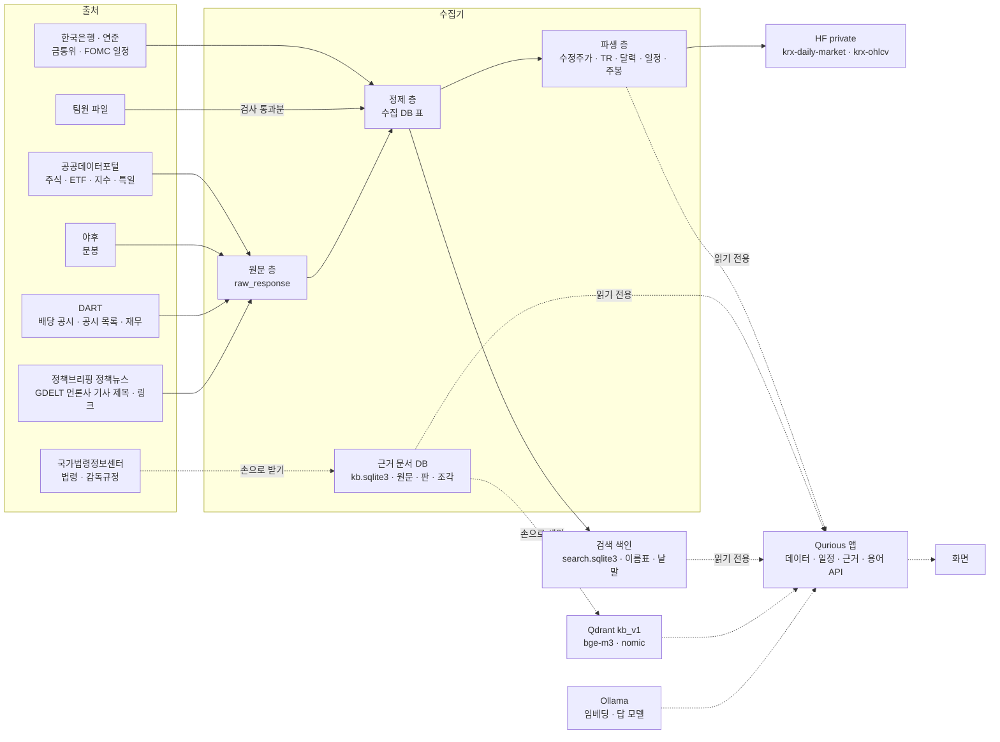
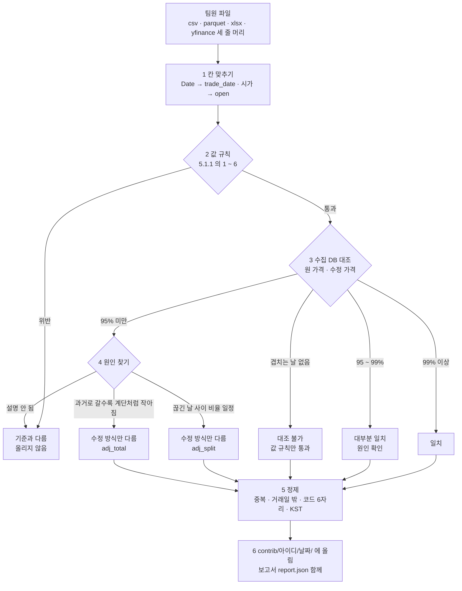
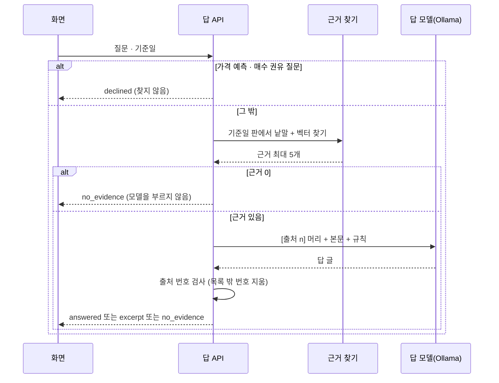
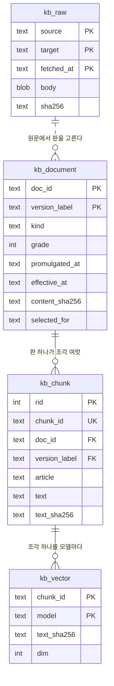
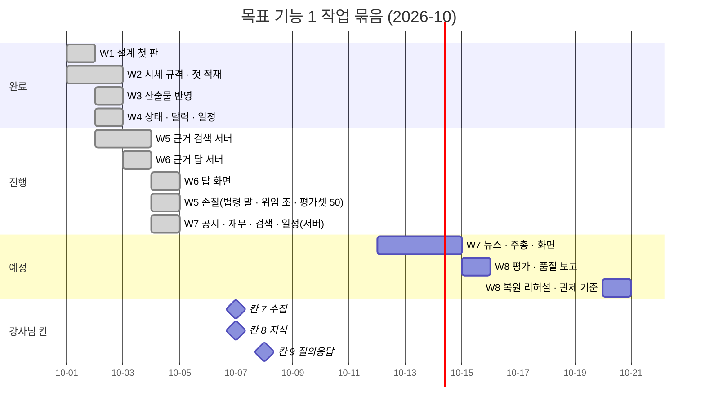

# 목표 기능 ① 상세 설계서 v1.4 — 금융 데이터 · 지식 기반 (세부 1~4) — Qurious

| 문서 정보 | |
|---|---|
| **판 · 상태** | v1.4 · 초안(검토 전) |
| **구분** | 6. 시스템 설계 — 설계 문서(2차 목표 기능 ① 세부 1~4) · 2. 요구사항 관리(인수 기준) |
| **작성** | 초안 이동원(팀장) · 채우기와 판 올리기 이동원(세부 1~4 주담당) · 검수 —(주담당 한 사람의 몫만 담았다) |
| **검토** | 검토 전 — 부담당 오준영 · 신장환 · 강민석 |
| **최종 수정** | 2026-10-05 (KST) |
| **기준** | 코드 `main` `f83e551` + 뉴스 두 출처(정책브리핑 정책뉴스 · GDELT 언론사 기사 메타데이터) · 주주총회 과거분 받기(이 판과 같은 PR) · 수집 데이터 기준일 2026-10-01(시세) · 2026-10-02(공시 · 재무) · 2026-10-05(뉴스) · 외부 원문 조회일 2026-10-01 ~ 2026-10-05 |
| **관련 문서** | [프로젝트 계획서 v2.0](../계획서/프로젝트계획서_v2.0.md) · [기능 설계서 v0.1](기능설계_v0.1.md) 4.1절 · [용어사전 설계서 v0.1](용어사전-설계_v0.1.md) · [유스케이스 명세서 v0.3](../요구사항/유스케이스명세서_v0.3.md) · [RTM v1.10](../요구사항/RTM_v1.10.md) · [ERD v1.7](../데이터/ERD_v1.7.md) · [데이터 사전 v1.7](../데이터/데이터사전_v1.7.md) · [API 명세서 v0.9](../인터페이스/API명세서_v0.9.md) · [테스트 계획서 v1.12](../시험/테스트계획서_v1.12.md) · [로컬 LLM 조사서 v0.1](../조사/로컬LLM-퀀트활용-조사_v0.1.md) · [근거 충실도 지표 조사서 v0.1](../조사/근거충실도-자동지표-조사_v0.1.md) · [공시 · 재무 · 뉴스 이용 조건 조사서 v0.2](../조사/공시-재무-뉴스-이용조건-조사_v0.2.md) · [섹터별 근거 법령 조사서 v0.1](../조사/섹터별-근거법령-조사_v0.1.md) · [화면 설계 절차 v0.2](../화면/화면설계절차_v0.2.md) |
| **최근 개정** | v1.3 → v1.4: 뉴스 두 출처 완료 — 정책브리핑 정책뉴스(주소 `policyNewsService2` · 2020-01 ~ 32,948건 · 기사마다 공공누리 유형 · 제1유형만 본문) · 언론사 기사 메타데이터(GDELT 15분 원자료 · 제목 · 주소 · 시각 · 언론사만) · 표 `news_item` · 러너 열아홉 단계(`news` · `gdelt`) · 검색 색인에 뉴스 · 출처 표시 · 주주총회 과거분(2024-01 ~ · 2020 ~ 2023 은 다음) · 일정 2판 · 리서치 화면 결정과 서버 쪽(`API-CAL-03` · 검색 `source` · `facets`) · 5.3.7 섹터 법령 근거 답 평가(<표 19-1>) → 섹터 질문일 때만 · 14.1 ⑭ · ⑮ 결정. 전체는 부록 D · 지난 판 — v1.2 → v1.3: W7 남은 것 서버 쪽 — 주주총회 일정(소집결의 본문의 일시 · 정정 · 철회 · 미정) · 배당금 지급 예정일(배당결정 본문) · 일정 열 종류 · 러너 열여섯 단계 · 근거 문서 섹터별 · 연도별(11섹터 + 공통 · 해마다 그해 시행 판 · HF `kb-sector-laws`) · HF 보관본 `dart-disclosure-financials` · 뉴스는 정책브리핑 키 반영 대기 · GDELT 두 번째 실측도 429. 전체는 부록 D · 지난 판 — v1.1 → v1.2: W7 서버 쪽(공시 · 재무 · 이름표 · 검색 · 일정 넷 · 뉴스 출처 바꿈) |

> **이 문서로 알 수 있는 것**
> 1. 목표 기능 ① 세부 1~4(`P01-①-1` ~ `P01-①-4`)는 무엇이 되면 끝이고, 2026-10-04 에 어디까지 되었나
> 2. 어떤 자료를 어디서 받아 어느 층에 두고, 누가 어떻게 쓰나
> 3. 「2026년 기준 근거」 와 「하루 한 번 갱신」 을 무엇으로 보장하나
> 4. 다른 주담당(신장환 · 오준영 · 강민석)은 여기서 무엇을, 언제, 어떤 모양으로 받나
>
> **읽는 순서** — 팀원: 요약 → 9절 접점 → 5절 중 자기와 닿는 곳 · 강사님: 요약 → 2절 → 4절 그림 → 10절 일정 · 다시 만들 사람: 부록 B
>
> **확실도** — 확인(코드 · 데이터 · 공식 원문에서 직접 봄) · 추정(재지 않았거나 2차 출처) · 없음

## 요약

1. 네 요구는 하나의 흐름이다. 출처에서 받아(①-2) 판과 갱신일을 붙여 쌓고(①-4), 근거로 답하고(①-3), 용어로 이어 준다(①-1). 저장 · 배치 · 출처 표기는 한 번만 만들고 네 요구가 함께 쓴다.
2. 2026-10-05 에 작업 묶음 여덟 가운데 W1 ~ W6 은 완료다. W7 은 서버 쪽(공시 목록 · 재무 주요계정 · 이름표 · 수집 자료 검색 API · 일정 여섯 — 실적 · 보고서 기한 · 금통위 · FOMC · 주주총회 · 배당금 지급 · 러너 단계 넷)까지 됐다. 2026-10-05 에 뉴스(정책브리핑 정책뉴스 · 언론사 기사 메타데이터 · 5.1.5)를 더했다. 남은 것은 일정 화면의 새 종류 여섯과 한 달 상한(DF-66) · 리서치 화면 연결(DF-61 · 화면은 Figma 먼저)과 W8(평가 · 품질 보고)이다.
3. 시세는 공통 규격 `ohlcv-v1` 하나로 다룬다. 수집 DB 에 주식 일봉 4,483,673행(3,310종목) · ETF 일봉 1,215,736행 · 지수 일봉 256,224행 · 분봉 3,787,197봉이 있고(기준일 2026-10-01), 매일 HF private 데이터셋 `qurious-quant/krx-ohlcv` 에 올린다.
4. 공시 · 재무는 DART 에서 받는다. 상장사 공시 목록 774,462건(2020-01 ~ · 유형 A~J)과 재무 주요계정 1,879,130행(상장폐지 포함 3,990곳 · 2019 ~ 2026 · 판 72,247개)을 쌓았다. DART 는 최신 정정본만 주므로 정정본마다 새 판으로 쌓고, 재무 API 는 기준일 전에 접수된 판의 값만 쓴다(`pit=strict` · 현업의 처음 보고값 방식 · 5.1.5).
5. 근거 문서는 법령 10 · 감독규정 4 를 기준일에 시행 중인 판으로 골라 조문 4,067 조각으로 쪼갰다. 낱말 + bge-m3 벡터에 질문 말 → 법령 말 넓히기(「코스피」 → 「유가증권시장」)를 더하면 검색 평가셋 50문항의 Recall@5 가 0.860 에서 0.940 으로 오르고, 법 조가 시행령에 맡긴 값은 그 위임 조를 함께 넣어 답한다. 답 모델 qwen3:4b-instruct 가 단 출처 번호는 서버가 다시 검사한다. 답은 AI 투자 상담 화면에서 답 아래 출처 카드로 보이고, 처음 엔진 「자동 — 근거 먼저」 는 근거 문서에 없는 질문을 Local Ollama 로 넘긴다.
6. 거래일 달력 · 금융 일정(열 종류) · 데이터 상태는 매일 12:30 러너가 갱신하고 앱은 읽기만 한다. 데이터 관제 · 일정 화면이 그 결과를 보인다.
7. 근거 문서를 섹터별 · 연도별로도 모은다. 「산업」 은 우리 섹터 분류 11섹터(GICS 꼴)와 「공통」 이고, 섹터마다 업법 · 관련 법(법률 72 · 업법의 시행령 45)을 해마다 그해 12월 31일(올해는 받은 날)에 시행 중인 판으로 골라 HF private `qurious-quant/kb-sector-laws` 에 둔다(5.3.7 · 매주 대조). 근거 답에 넣는 것은 평가셋을 넓힌 뒤 따로 정한다. 공시 · 재무 · 공식 일정은 분석 · 보관용 HF private `qurious-quant/dart-disclosure-financials`(기준일 태그 · 연도 파일)에도 둔다(5.1.5).

---

## 1. 맥락과 범위

### 1.1 요구 원문과 보충 설명

이 문서가 맡는 요구와 강사님 · 팀이 덧붙인 설명은 <표 1> 과 같다.

**<표 1> 맡는 요구와 보충 설명**

| 요구 ID | 강사님 원문 | 강사님 기술 스택 칸 | 보충 설명 |
|---|---|---|---|
| `P01-①-1` | 주식 · 금융 · 경제 기본 용어사전과 연관 개념 탐색 | domain-rag-lab 와 investment-analysis 의 통합 및 AWS EC2 서버 배포 | 통합본(investment-rag-lab)은 `rag-lab/` 에 들여왔다(2026-09-30). AWS 는 로컬 완성 뒤 고른다 |
| `P01-①-2` | 가격 · 거래량 · 재무 · 뉴스 등 투자 자료 수집 · 분류 · 전처리 · 검색 | python-crawling-lab 등을 활용한 크롤링 및 적재 | 강사님: OHLCV 를 모아 HF Organization 에 private 데이터셋으로 두고 지금 데이터와 비교해 구조를 맞춰 써도 된다. 팀장: 비공개면 출처를 가리지 않는다. OHLCV 는 분봉까지 이동원이 모으고, 팀원 자료는 같은 규격으로 받아 검사 · 정제한다 |
| `P01-①-3` | 근거 문서와 출처를 포함한 RAG 질의응답 | Amazon Bedrock 또는 Ollama + GPU · VectorDB · FastAPI | 강사님: 근거 · 출처는 실제 업종의 외부 기준이나 법률이다. 실제 자료를 모으고 2026년 기준으로 판단한다. 팀장: 법령 + 감독규정 + 협회 기준 + 공시 + 뉴스 · Ollama 로컬 |
| `P01-①-4` | 금융정보의 갱신일 · 문서 버전 · 캘린더 일정 관리 및 정기 배치 업무 실행 | RDBMS · Amazon EventBridge Scheduler · AWS Batch | 팀장: 배당일 같은 실제 금융 정보를 가져와 보여 준다. 실시간이 아니어도 하루 한 번 갱신한다 |

### 1.2 이 문서가 다루지 않는 것

`P01-①-5` XAI(신장환)와 목표 기능 ② ~ ④ 의 계산은 각 주담당의 설계서가 맡는다. 이 문서는 그 기능들이 받아 쓸 자료와 그 규격까지만 정한다(9절).

### 1.3 참고한 강사님 저장소

빌려 온 것과 새로 설계한 것의 경계는 <표 2> 와 같다.

**<표 2> 참고한 강사님 저장소**

| 저장소 | 가져온 것 | 확실도 |
|---|---|:-:|
| 강사님 크롤링 예제(python-crawling-lab · `1572282`) | 데이터 레이크 층 이름(Bronze · Silver · Gold · Catalog) · Silver 스키마 표(`SCHEMA_MAP`) · DART 공시 목록(`list.json`) · 재무 주요계정(`fnlttSinglAcnt.json`) · 한국은행 ECOS 크롤러 · Qdrant 적재 단계 | 확인 |
| 통합본(investment-rag-lab · `rag-lab/` · `2f0e71f`) | 출처 번호를 단 RAG 응답 모양(`_cite` · `[출처 N]`) · LLM 없이 원문만 정리하는 근거 발췌 · 캘린더 화면과 내 일정 표 · 용어 자료 | 확인 |
| 강사님 주식 ML · DL 예제(stock-ml-dl-project) | 평일 18시 하루 1회 배치(Airflow DAG `0 18 * * 1-5`). 우리는 작업 스케줄러로 대신했다(11절) | 확인 |
| 강사님 기초 코드(lumina-invest) | 채팅 RAG(`fin_chunks` · LangChain)와 컨테이너 Ollama. 5.3.6 에서 우리 근거 검색과 같은 평가셋으로 견줬다 | 확인 |

크롤링 예제에는 뉴스 · 법령 크롤러가 없고, 시세는 현재가 · 등락률 같은 「지금 값」 이지 OHLCV 이력이 아니다(확인). 그래서 층 구조와 공시 · 거시 경로만 빌리고, OHLCV 이력 · 법령 · 뉴스는 이 문서에서 새로 설계했다.

---

## 2. 목표 · 비목표

### 2.1 목표 — 인수 기준

요구마다 무엇이 되면 끝인지는 <표 3> 과 같다. 기준은 시험이나 명령 한 줄로 확인할 수 있게 적었고, 「지금」 칸은 2026-10-04 의 상태다.

**<표 3> 인수 기준과 지금 상태** · 범례: 지금 = 완료 · 진행(일부 됨) · 예정

| 요구 | # | 인수 기준 | 확인 방법 | 지금 |
|---|:-:|---|---|---|
| `P01-①-1` | 1 | 용어 하나를 부르면 연관 용어가 관계 종류와 함께 돌아온다 | TC-GL(관계 · 두 끝에서 읽기 · 관계 지도 API) | 완료(관계 27 · `API-GLOS-04` 의 `related[]` · `API-GLOS-05`) |
| | 2 | 관계가 규칙을 지킨다. 연관 · 혼동은 양방향, 상위 ↔ 하위는 짝, 자기 자신과 없는 용어는 금지 | 빌드가 멈추는 검사 + TC-GL | 완료 |
| | 3 | 화면 자리는 화면 설계 절차로 정하고 결정 기록을 남긴 뒤 만든다 | Figma 결정 기록 | 진행(용어 카드의 연관 칩 · 차이 한 줄 완료 · 작은 관계 지도 예정) |
| `P01-①-2` | 4 | 일봉(주식 · ETF · 지수) · 주봉 · 분봉이 `ohlcv-v1` 로 HF private `krx-ohlcv` 에 쌓이고, 매니페스트의 행 수 · 해시가 원격과 같다 | `hf_ohlcv.py status` · TC-OH · TC-OA | 완료(매일 올림 · 태그 `ohlcv-2026-10-03`) |
| | 5 | 팀원 파일 하나를 넣으면 검사 보고서(규격 · 값 규칙 · 수집 DB 대조 · 판정)가 나오고 통과분만 정제된다 | TC-CT(가짜 파일) | 완료(실제 파일 둘로도 확인) |
| | 6 | 재무 · 공시 · 뉴스가 출처 · 기준일 · 가져온 시각과 함께 저장되고, 종목 · 주제 이름표와 낱말로 검색된다 | TC-DC · TC-FS · TC-TG · TC-DQ · 이름표 표본 정밀도(W8) | 진행(공시 · 재무 · 이름표 · 검색 API 완료 · 뉴스는 출처를 바꿔 다음 판) |
| `P01-①-3` | 7 | 근거는 기준일에 시행 중인 판이다. 증권거래세법 시행령을 2026-10-02 기준으로 고르면 시행일이 가장 늦은 제35947호 판이 되고, 그 본문에 하루 뒤 공포된 제36001호의 세율(코스피 1만분의 5)이 담겼는지 대조한 기록이 남는다 | TC-LW-01 · 03(실측 사례 고정) | 완료 |
| | 8 | 답 안의 `[출처 n]` 과 응답의 `citations` 가 어긋나지 않는다. 근거가 없으면 「근거를 찾지 못했습니다.」 로 답한다 | TC-KA(가짜 검색기 · 가짜 모델) | 완료(서버가 번호를 다시 검사) |
| | 9 | 검색 평가셋(질문 50 · 정답 조문)으로 Recall@5 를 잰다. 목표 0.8 | `collector/kb_eval.py` | 진행(평가셋 v0 38문항 0.868 · 50문항 예정) |
| `P01-①-4` | 10 | 배당(기준일 · 배당락일 · 지급일) · 휴장일 · 파생 만기 · 금통위 · FOMC · 실적 · 주총 일정이 매일 한 번 갱신돼 API 로 나온다 | TC-CA · TC-EV · 러너 상태 | 진행(배당 기준일 · 배당락일 · 휴장 · 파생 만기 · 실적 · 보고서 기한 · 금통위 · FOMC 완료 · 배당 지급일 · 주총 예정) |
| | 11 | 표마다 마지막 기준일 · 배치 단계별 결과 · 문서 판(시행일 · 가져온 날 · 지문)이 API 와 화면에 보인다 | TC-DST · TC-DH · `API-KB-01` | 완료 |
| | 12 | 배치 단계가 실패하면 상태에 원인이 남고, 다음 회차가 놓친 날을 따라잡는다 | TC-DU | 완료 |

### 2.2 비목표

하지 않기로 한 것과 그 까닭은 <표 4> 와 같다.

**<표 4> 하지 않는 것**

| 하지 않는 것 | 까닭 |
|---|---|
| 실시간 시세 스트리밍 | 3차 실시간 엔진의 몫이다. 2차는 하루 1회다 |
| 뉴스 본문 저장 | 기사는 저작물이다. 검색 API 가 주는 제목 · 요약 · 주소만 둔다(14.1 ③) |
| 모든 종목의 분봉 | 호출 수와 저장량 때문에 유니버스를 정했다(5.1.3) |
| 1분봉 | 야후가 한 번에 8일 · 과거 30일만 주고, 쓰는 기능이 아직 없다. 필요해지면 유니버스 50종목으로 더한다 |
| 뉴스 감성 분석 모델 학습 | 2차 요구에 없다. 이름표 분류까지다 |
| AWS EventBridge · Batch | 작업 스케줄러 + 러너로 대신한다(11절). AWS 는 로컬 완성 뒤 고른다 |
| 유료 데이터 · 유료 LLM API | 비용 합의 전이다 |

---

## 3. 지금 상태 — 2026-10-04 실측

### 3.1 요구별

요구마다 지금 있는 것과 남은 것은 <표 5> 와 같다. 숫자는 2026-10-04 에 수집 DB · 근거 문서 DB 를 읽기 전용으로 열어 쟀다(부록 B).

**<표 5> 지금 있는 것과 남은 것**

| 요구 | 있는 것 (확인) | 남은 것 |
|---|---|---|
| `P01-①-1` | 용어 760 · 분류 22(`app/services/glossary_data/terms.json`) · 관계 27(헷갈리는 말 25 · 연관 2) · API 다섯 `API-GLOS-01 ~ 05` · 용어 카드의 연관 칩과 차이 한 줄 · 모든 화면의 용어 설명 | 작은 관계 지도 · 교재 밑줄 · 사람이 고르는 관계(이름을 함께 쓰는 용어 30 · 설명문 속 표제어) · 보류 용어 둘 |
| `P01-①-2` | 주식 일봉 4,483,673행 · 3,310종목(2020-01-02 ~ 2026-10-01) · ETF 일봉 1,215,736행 · 1,373종목 · 지수 일봉 256,224행 · 60분봉 1,835,191봉(2023-09-27 ~) · 5분봉 1,952,006봉(2026-07-06 ~) · 분봉 유니버스 두 판(u1 400 · u2 401) · HF `krx-ohlcv` 매일 올림 · `API-DATA-02` · 팀원 자료 받기 도구 · 공시 목록 774,462건 · 재무 주요계정 1,879,130행 · 이름표 · 수집 자료 검색 `API-DATA-03` · 재무 `API-DATA-04` · 뉴스 — 정책뉴스 32,948건(2020-01 ~ · 공공누리 제1유형 본문) · 언론사 기사 메타데이터(GDELT · 하루 약 1,800건 · 2026-10-04 ~) | 이름표 정밀도 표본 · 리서치 화면 연결(DF-61) · 전체 재무제표(현금흐름) · 정책뉴스 본문을 근거 답에 넣을지(평가 뒤) |
| `P01-①-3` | 근거 문서 14(법령 10 · 감독규정 4) · 조문 조각 4,067 · 벡터 두 벌(bge-m3 · nomic-embed-text 각 4,067) · `API-KB-01 ~ 03` · 검색 평가셋 v0(38) · 근거답 평가셋 v0(15) · 기본 답 모델 qwen3:4b-instruct · AI 투자 상담의 근거 답 칸(답 아래 출처 카드 · 처음 엔진 자동) | 답을 잘못 읽는 문제(DF-59 · 위임 조 함께 넣기) · 동의어로 검색어 넓히기 · 재순위 · 평가셋 50 · 협회 · 거래소 규정 |
| `P01-①-4` | 매일 12:30 러너 열아홉 단계(2026-10-04 에 공시 · 재무 · 검색 셋 · 2026-10-05 에 주총 · 배당 지급 일정 schedule · 섹터 법령 sector_laws · 뉴스 news · gdelt 를 더함) · 거래일 달력 2,922일(2020-01-01 ~ 2027-12-31 · 거래일 1,962) · 금융 일정 열 종류(주주총회 · 배당금 지급 추가) · 금통위 · FOMC 공식 일정 113건 · 특일 원문 158건 · `API-DATA-01` · `API-CAL-01 · 02` · 데이터 관제 · 일정 화면 | 일정 화면에 새 종류 여섯(Figma 먼저) · 일정 화면 한 달 2,000건 상한(DF-66) · 문서 판을 주 1회 대조하는 러너 단계 |

### 3.2 이 PC 의 계산 자원

LLM 과 임베딩을 이 PC 에서 돌리는 조건은 <표 6> 과 같다.

**<표 6> 이 PC 의 계산 자원** (2026-10-04)

| 항목 | 값 | 설계에 주는 뜻 |
|---|---|---|
| CPU · RAM | 22 논리 코어 · 31.6GB | 임베딩 수천 ~ 수만 조각은 로컬로 충분하다. 4,067조각을 bge-m3 로 넣는 데 5,132초가 걸렸다(nomic 과 같이 돌린 값) |
| GPU | 외장 GPU 없음. 내장 GPU(Intel Arc)를 Ollama 에 켰다(사용자 환경 변수 `OLLAMA_IGPU_ENABLE=1` · 2026-10-03) | 질문 읽기 29.5 → 152.5 토큰/초 · 답 쓰기 7.2 → 12~13 토큰/초 · 답 하나 약 22초 |
| Ollama | 0.35.1 · 답 모델 `qwen3:4b-instruct` · 채팅 모델 `llama3.1` · 임베딩 `bge-m3` · `nomic-embed-text` · 비교용 `exaone3.5:2.4b` · Kanana 1.5 8B · `qwen3:4b` | 답 모델과 채팅 모델을 따로 둔다(5.3.4) |

### 3.3 실측으로 확인한 함정 — 같은 판도 받는 길에 따라 본문이 다르다

국가법령정보센터 Open API 에서 법령을 받는 길은 둘이다. `target=law`(일련번호)는 그 판이 공포될 때의 본문을 주고, `target=eflaw`(시행일 지정)는 그 시행일에 효력이 있는 본문을 준다(확인 · 2026-10-02).

증권거래세법 시행령의 「현행」 은 대통령령 제35947호(2025-12-30 공포 · 2026-01-02 시행 · 타법개정)다. 이 판을 `target=law` 로 받으면 제5조가 코스피 「영(零)」 · 코스닥 「1만분의 15」 로 옛 세율이다. 하루 뒤 공포된 제36001호(2025-12-31 공포 · 2026-01-01 시행 · 일부개정)의 세율 개정이 공포 때 본문에는 없기 때문이다. 같은 제35947호를 `target=eflaw` 로 시행일 2026-01-02 에 받으면 제5조는 코스피 1만분의 5 · 코넥스 1만분의 10 · 코스닥 1만분의 20 이고, 개정 표시에 「2025.12.31」 이 붙어 있다(확인).

공포 때 본문으로 근거를 만들면 2026년 세율을 틀리게 답한다. 그래서 근거 문서는 `target=eflaw` 의 시행일 판으로만 받고, 판 고르기 규칙(5.3.2)으로 기준일의 판을 고른 뒤 그 뒤에 공포된 판의 개정이 담겼는지 조마다 대조한다. 우리 비용 모델(`app/services/trading_cost.py`)의 2026년 값은 이 세율과 같다(확인).

---

## 4. 전체 구조

### 4.1 자료가 흐르는 길

자료가 어디서 와서 어느 층을 거쳐 누가 쓰는지는 <그림 1> 과 같다. 쓰는 쪽은 수집기 하나이고 앱은 읽기만 한다. 그래서 배치가 멈춰도 앱은 마지막 값과 그 기준일을 보여 줄 수 있다.

**<그림 1> 목표 기능 ① 의 자료 흐름 (컨테이너 단계)** · 범례: 상자 = 저장소 · 프로그램, 실선 = 매일 12:30 배치, 긴 점선 = 손으로 돌림, 짧은 점선 = 요청 때, 「예정」 = 다음 판



근거 문서는 시세와 달리 매일 바뀌지 않아 아직 러너에 넣지 않았다. 받기(`collector.kb_law fetch`)와 색인(`collector.kb_index run`)은 손으로 돌리고, 주 1회 판을 대조하는 단계는 예정이다(5.2.3).

### 4.2 층 이름 — 강사님 크롤링 예제와 우리

크롤링 예제의 데이터 레이크 층을 우리 수집기의 무엇이 맡는지는 <표 7> 과 같다.

**<표 7> 데이터 레이크 층 대응**

| 크롤링 예제의 층 | 크롤링 예제에서 | 우리 수집기에서 |
|---|---|---|
| Bronze(원본 착지) | MinIO JSONL `{source}/{data_type}/{YYYY}/{MM}/{DD}/` | `raw_response`(원문 바이트 · sha256) · 근거 문서는 `kb_raw`(키를 지운 원문 · gzip) |
| Silver(정제 · 정규화) | Parquet · `SCHEMA_MAP`(필수 칸 · 숫자 칸 · 중복 키) | 수집 DB 정규화 표(`price_daily` · `etf_daily` · `index_daily` · `price_intraday` · `holiday_kasi` …) · 규격은 `ohlcv-v1`(5.1.1) |
| Gold(분석 집계) | DuckDB 집계 표 | 수정주가 · TR · 벤치마크 · 거래일 달력 · 금융 일정 · 조문 조각 · 주봉(내보낼 때 계산) |
| Catalog(수집 이력) | 카탈로그 | `ingest_day` · 매니페스트 · 러너 상태 JSON · `kb_document`(문서 판) |
| (없음) | — | HF private 내보내기 · 복원 리허설 |

MinIO · DuckDB 는 들이지 않았다. 서버 셋을 늘리지 않고도 같은 층을 이미 갖고 있기 때문이다(11절).

### 4.3 자료 대장

어떤 자료를 어디서, 얼마나 자주 받아 누가 쓰는지는 <표 8> 과 같다. 범위는 2026-10-04 에 잰 값이다.

**<표 8> 자료 대장** · 범례: 쓰는 곳의 ② ~ ④ = 목표 기능 번호, 상태 = 완료 · 예정

| 자료 | 1차 출처 | 대조 · 대체 | 범위 | 주기 | 쓰는 곳 | 상태 |
|---|---|---|---|---|---|---|
| 주식 일봉(원 · 수정) | 공공데이터포털 주식시세 | 야후 `.KS` · `.KQ` 표본 | 3,310종목 · 2020-01-02 ~ | 매일 | ② · ③ · ④ | 완료 |
| ETF 일봉 | 공공데이터포털 증권상품시세(`getETFPriceInfo` · 하루 약 1,171종목) | 야후(같음 100%) · FinanceDataReader(분배금을 반영해 고친 값이라 대조에만) | 1,373종목 · 2020-01-02 ~ | 매일(최근 14일의 빈 날) | ③ 자산배분 | 완료 |
| 지수 일봉 | 공공데이터포털 지수시세(`getStockMarketIndex` · 하루 171개) | 야후 `^KS11` · `^KQ11`(같음 100% · 야후에 `^KS200` 없음) | 지수 키 = 시리즈 + 이름 · 2020-01-02 ~ | 매일 | ④ 벤치마크 대조 | 완료 |
| 주봉 | 일봉에서 계산 | — | 위 전부 | 내보낼 때 · API 가 부를 때 | ② 다중 주기 | 완료 |
| 분봉 60 · 5분 | 야후(09:00 ~ 15:00 만 · 60분 730일 · 5분 60일 창) | — | 유니버스 u2 401종목 · 60분 2023-09-27 ~ · 5분 2026-07-06 ~ | 매일(최근 5일) | ② 다중 주기 | 완료 |
| 재무제표(주요계정) | DART 다중회사 주요계정(`fnlttMultiAcnt` · 한 번에 100개사) | 공시 목록의 정기보고서로 「처음 공개일」 대조 | 상장사 3,990곳(상장폐지 포함) · 2019 ~ · 분기 | 매일(최근 10일의 새 정기보고서 · 정정본) | ③ 재무 필터 · 투자분석 | 완료 |
| 공시 목록 | DART `list.json`(유형 A~J × 시장 Y · K · N 으로 나눠 부름 — 응답에 유형 칸이 없다) | — | 상장사 · 2020-01 ~ | 매일(최근 3일) | 일정 · 검색 · 이름표 | 완료 |
| 뉴스 | 정책브리핑 정책뉴스(공공누리 제1유형 · 기사마다 유형) · 언론사 기사는 GDELT 15분 원자료의 제목 + 원문 링크만 | 네이버 검색 API 는 저장 · AI 입력 금지(약관) · 언론사 RSS 는 개인 · 비상업 용도만이라 쓰지 않는다 | 정책뉴스 2020-01 ~ 32,948건 · 언론사 기사 하루 약 1,800건(2026-10-04 ~) | 매일 | 검색 · 분류 · (정책뉴스는 근거 답 후보) | 완료(2026-10-05 · 5.1.5) |
| 법령 · 시행령 | 국가법령정보센터 Open API(`target=eflaw`) | — | 10문서(5.3.1) | 손으로 받음 · 주 1회 대조는 예정 | 근거 RAG | 완료 |
| 감독규정 | 같은 API(`target=admrul`) | — | 4문서 | 같음 | 근거 RAG | 완료 |
| 협회 · 거래소 규정 | 금융투자협회 · 한국거래소 누리집 | 내려받은 파일 | 5.3.1 | 월 1회 | 근거 RAG | 예정 |
| 휴장일 | 공공데이터포털 특일 정보(`getRestDeInfo`) + 거래소 휴장 규칙 | 지난날은 시세가 빈 날로 대조(어긋남 0일) | 2020 ~ 2027 | 매일 | 일정 · ③ · ④ | 완료 |
| 연간 일정 | 한국은행 「통화정책방향 결정회의 일정」 · 연준 「Meeting calendars」 | 보도(2026 금통위 일정 2025-10-30 발표) | 금통위 2020 ~ · FOMC 2021 ~ 2027(발표된 것) | 7일에 한 번 대조 | 일정 | 완료 |
| 배당 일정 | DART 배당 공시 본문 | — | 9,196건 + 매일 | 매일 | 일정 · ③-3 | 완료(지급일은 예정) |
| 용어 · 관계 | 용어 파일(git) | — | 용어 760 · 관계 27 | 바뀔 때 | 용어 · RAG | 완료 |

### 4.4 모든 자료에 붙는 칸

출처가 달라도 모든 줄에 같은 칸을 붙인다. 그 칸은 <표 9> 와 같다.

**<표 9> 모든 자료에 붙는 칸**

| 칸 | 뜻 | 왜 |
|---|---|---|
| `source` | 출처 키(`portal` · `yahoo` · `dart` · `law` · `contrib:<아이디>` …) | 같은 값이 출처마다 다르다. 어느 쪽 값인지 늘 보이게 한다 |
| `as_of` · `trade_date` | 값이 가리키는 날(기준일) | 오래된 값으로 판단하지 않게 |
| `fetched_at` | 가져온 시각 | 「언제 알 수 있었나」 를 가린다. 다만 2020 ~ 2025 자료는 2026-09 에 다시 받아, 이 칸이 시장이 안 시각은 아니다(`API-DATA-02` 응답의 `note`) |
| `raw_sha256` | 원문 지문 | 원본이 그런 것인지 우리가 잘못 읽은 것인지 가린다 |
| 시세만: `price_basis` | 가격 기준(원 가격 · 기준가 계수 · 분할 비율 · 배당까지) | 같은 「수정 가격」 이 출처마다 다르다(5.1.1) |
| 문서만: `promulgated_at` · `effective_at` · `version_label` · `content_sha256` | 공포일 · 시행일 · 공포번호 · 판 지문 | 판 고르기(5.3.2)와 「같은 판인가」 판정 |

---

## 5. 세부 설계

### 5.1 `P01-①-2` 투자 자료 수집 · 분류 · 전처리 · 검색

#### 5.1.1 OHLCV 공통 규격 `ohlcv-v1`

팀원 누가 어디서 모았든 이 모양이면 같은 코드로 읽고 대조한다. 칸마다 무엇을 어떤 단위로 적는지는 <표 10> 과 같고, 검사 · 내보내기 · API 가 모두 `collector/ohlcv.py` 의 같은 정의를 쓴다.

**<표 10> `ohlcv-v1` 칸** · 범례: 필수 「예」 = 비어 있으면 검사가 멈춘다

| 칸 | 형식 | 필수 | 뜻 · 규칙 |
|---|---|:-:|---|
| `symbol` | 문자열 | 예 | 주식 · ETF 는 단축코드 6자리(`005930`). 지수는 「시리즈:이름」(`KOSPI:코스피 200`). 같은 이름 지수가 시리즈마다 따로 있어서다(KOSPI · KOSDAQ 의 「IT 서비스」) |
| `market` | 문자열 | 예 | `KOSPI` · `KOSDAQ` · `KONEX` · `ETF` · `ETN` · `INDEX` |
| `timeframe` | 문자열 | 예 | `1d` · `1w` · `60m` · `5m` · `1m` |
| `trade_date` | 날짜 | 예 | 봉이 속한 거래일. 주봉은 그 주의 마지막 거래일 |
| `bar_start` | 시각(KST) | 분봉만 | 봉이 시작한 시각 · `+09:00`. 시간대 표시가 없는 시각은 받지 않는다 |
| `open` · `high` · `low` · `close` | 실수 | 예 | 원(지수는 포인트) |
| `volume` | 정수 | 예 | 주(株) |
| `value` | 정수 | 아니오 | 거래대금(원). 없는 출처는 비운다 |
| `adjusted` | 참 · 거짓 | 예 | OHLC 가 수정 가격인가 |
| `price_basis` | 문자열 | 예 | `raw`(원 가격) · `adj_base`(기준가 계수로 고친 값 · 수집기의 수정주가) · `adj_split`(분할 비율만 · 야후 `Close`) · `adj_total`(분할 · 배당까지 · 야후 `Adj Close`) |
| `adj_factor` | 실수 | 아니오 | 원 가격 × 계수 = 수정 가격 |
| `session` | 문자열 | 분봉만 | `regular` · `close_auction`(15:20 ~ 15:30) · `pre_open` · `outside` |
| `source` · `fetched_at` | 문자열 · 시각 | 예 · 아니오 | 4.4절 |
| `contract` | 문자열 | 예 | `ohlcv-v1`. 규격이 바뀌면 판을 올리고 옛 판도 읽는다 |

`adjusted` 참 · 거짓만으로는 「기준가 계수로 고쳤나 · 분할 비율로 고쳤나 · 배당까지 고쳤나」 를 가릴 수 없어 `price_basis` 를 더했다. 실제로 셋이 다른 값을 낸다. 카카오 2021-04-09 종가는 원 가격 558,000 · 기준가 계수 112,000 · 야후 `Close` 111,600 · `Adj Close` 110,981.9 다(확인).

**기본 키** — `(symbol, timeframe, price_basis, trade_date, bar_start)`. 수정 방식이 다르면 같은 날 · 같은 종목이라도 다른 계열이다.

**값 규칙**(검사가 본다) — ① `low ≤ min(open, close) ≤ max(open, close) ≤ high` ② 가격 > 0 · 거래량 ≥ 0 ③ 키 중복 없음 ④ 일봉 `trade_date` 는 거래일 달력 안 ⑤ 분봉 `bar_start` 는 그날 정규장 안(밖이면 `session` 으로 따로 셈) ⑥ 거래정지일(거래량 0 · OHLC 같음)은 지우지 않고 그대로 둔다.

**주봉 만드는 법** — 일봉을 주(월 ~ 금)로 묶어 시가 = 첫 거래일 시가 · 종가 = 마지막 거래일 종가 · 거래량 = 합으로 한다. 고가 · 저가는 거래가 있던 날(거래량 > 0)로 정하고, 마지막 날 종가가 그 밖이면 그 종가까지 넓힌다. 정지일의 평평한 봉 값은 그 주에 체결된 가격이 아니기 때문이다. 수정 가격 주봉은 수정 일봉을 묶는다(원 주봉에 계수를 곱하면 주 중간의 분할에서 틀린다). 진행 중인 주는 매니페스트의 `partial_weeks` 에 적는다.

#### 5.1.2 HF 데이터셋 `qurious-quant/krx-ohlcv` (private)

규격 자료와 복구용 백업은 목적이 달라 데이터셋을 나눴다. `krx-daily-market` 은 수집 DB 를 되살리는 백업이고(표 열둘 · DDL 포함 · `restore`), `krx-ohlcv` 는 분석 · 팀원 공유용 규격 자료다. 규격 자료의 폴더 모양은 <그림 2> 와 같다.

**<그림 2> `krx-ohlcv` 폴더 모양** · 범례: `basis=` = 5.1.1 의 `price_basis`

```
qurious-quant/krx-ohlcv   (private · 올리기 전 repo_info().private 확인)
├── README.md                       데이터 카드: 출처 · 이용 조건 · 칸 설명 · 비공개 까닭
├── manifest.json                   파일별 행 수 · sha256 · 규격 판 · 기준일 · partial_weeks
├── meta/universe.csv               분봉 유니버스(판 · 종목 · 고른 까닭)
├── ohlcv/timeframe=1d/basis=raw/market=KOSPI/year=2026/part-0.parquet
├── ohlcv/timeframe=1d/basis=adj_base/market=KOSPI/year=2026/part-0.parquet
├── ohlcv/timeframe=1d/basis=raw/market=ETF/year=2026/…
├── ohlcv/timeframe=1d/basis=raw/market=INDEX/year=2026/…
├── ohlcv/timeframe=1w/basis=adj_base/market=KOSDAQ/year=2026/…
├── ohlcv/timeframe=60m/basis=adj_split/year=2026/month=09/part-0.parquet
├── ohlcv/timeframe=5m/basis=adj_split/year=2026/month=09/…
└── contrib/<깃허브 아이디>/<YYYY-MM-DD>/<파일>.parquet + *.report.json   팀원 자료(검사 통과분)
```

올리기 · 확인은 `scripts/hf_ohlcv.py`(upload · status · upload-contrib)가 맡고, 원격이 private 인지 올리기 전에 확인한다. 첫 업로드는 2026-10-01(태그 `ohlcv-2026-10-01` · 파케이 154개 · 292.8MB)이고, 그 뒤 12:30 러너가 매일 올린다. 2026-10-03 태그 `ohlcv-2026-10-03`(커밋 `59222fec`)은 일봉 10,439,306줄(주식은 원 가격 · 수정 가격 두 줄) · 주봉 2,228,179줄 · 60분봉 1,835,191줄 · 5분봉 1,952,006줄이다(확인).

분봉의 `market` 칸은 그 종목이 든 가장 최근 유니버스 판에서 읽는다. 최신 판에서 빠진 종목을 KOSPI 로 내보낸 결함(DF-43)을 2026-10-02 에 고쳐 다시 올렸고, 값은 그대로라 그 사이 받은 파일은 `market` 칸만 다시 받으면 된다.

#### 5.1.3 분봉 — 출처의 한계와 유니버스

야후는 한국 종목 분봉을 09:00 ~ 15:00 만 준다(확인 · 2026-10-01). 종가 단일가를 포함한 15:00 ~ 15:30 이 없어 분봉 거래량 합이 일봉의 68 ~ 77% 이므로, 일봉을 분봉에서 만들지 않는다. 과거로는 출처가 주는 창 밖을 받을 수 없어 첫 적재로 창 전체를 받고, 그 뒤로는 매일 최근 5일을 다시 받아 우리 쪽에 쌓는다. 주기별 양은 <표 11> 과 같다.

**<표 11> 분봉 양 (실측)**

| 주기 | 하루 봉 수 | 과거 창 | 첫 적재(2026-10-01) | 2026-10-04 |
|---|--:|---|--:|--:|
| 60분 | 6 | 거래일 730일(`period`) · 달력 730일(`start`) | 1,628,338봉(2023-09-27 ~) | 1,835,191봉 |
| 5분 | 72 | 60일 | 1,703,764봉(2026-07-06 ~) | 1,952,006봉 |
| 1분 | 360 | 30일(한 번에 8일) | 받지 않음(2.2절) | — |

`period` 는 거래일로, `start` 는 달력으로 창을 센다. 그래서 2023 ~ 2024 년 상장 24종목은 `period` 요청이 거절돼 날짜로 다시 받았다(`RETRY_DAYS`).

유니버스는 두 판이다. `u1-20260930` 은 시가총액 · 거래대금 순위로 고른 근사 명단(코스피 200 · 코스닥 150 · ETF 거래대금 50 · 우선주 · 스팩 · 정지 제외 = 400)이다. `u2-20260930` 은 사람이 정보데이터시스템에서 받은 지수 구성종목 CSV 로 만든 명단(코스피 200 구성 201 · 코스닥 150 구성 150 · ETF 거래대금 50 = 401)이다. 공식 구성종목은 KRX Open API 에 없고 화면 자동 수집은 약관 제10조②가 막기 때문이다(팀장 결정 2026-10-01 · 14.1 ①). 매일 받기는 `u2` 를 쓴다.

#### 5.1.4 팀원 자료 받기 — 검사 · 대조 · 정제

팀원이 모은 자료도 쓰되 전처리 · 정제를 거친다(팀장 지시 2026-10-01). 파일 하나가 지나는 관문은 <그림 3> 과 같다. 도구는 `python -m collector.intake <파일> --contributor <아이디>` 다.

**<그림 3> 팀원 자료 받기** · 범례: 마름모 = 판정, 끝 상자의 글 = 보고서의 판정



어긋남마다 알아보는 법은 <표 12> 와 같다. 보고서에는 판정 · 일치율 · 최대 차이 · 어긋난 날 예시 5줄 · 원인 힌트가 남는다.

**<표 12> 대조 규칙**

| 어긋남 | 알아보는 법 | 보고서에 |
|---|---|---|
| 수정 가격인지 원 가격인지 | 같은 날 종가가 우리 원 가격 · 수정 가격 중 어느 쪽과 맞나 | `price_basis` 판정 |
| 분할 비율로만 고친 값 | 분할 · 병합으로 끊긴 날 사이 구간마다 「받은 값 ÷ 우리 수정 가격」 비율이 일정하다 | `adj_split` · 구간 비율 |
| 배당까지 고친 값 | 「받은 값 ÷ 원 가격」 이 최근에는 1 이고 과거로 갈수록 계단처럼 작아진다 | `adj_total` · 시작 비율 |
| 하루 밀림(시간대) | 날짜를 한 거래일 앞 · 뒤로 옮기면 일치율이 오른다 | 「날짜가 밀려 있다」 |
| 단위 | 「기준 ÷ 받은 값」 의 가운데 값이 1,000 근처로 일정하다 | 「천 원 단위로 보인다」 |
| 값까지 같은 중복 · 값이 다른 중복 | 키가 같은 줄의 값을 견준다 | 앞은 정제 · 뒤는 기준과 다름 |
| 값 차이 | 일치 = 차이가 1원 이하 또는 0.01% 이하(호가 단위 반올림 허용) | 일치율 · 최대 차이 · 예시 5줄 |

공공데이터포털식 정지 봉(시가 0)은 값 규칙 위반으로 보지 않는다. 실제 파일 둘로 확인했다. 야후 삼성전자 일봉은 「일치」(99.05%), FinanceDataReader 의 KODEX 200 은 「수정 방식만 다름 · adj_total」 이다(확인). 정제한 팀원 자료는 수집 DB 에 합치지 않고 `contrib/` 에 따로 두며, 쓰는 사람이 `source=contrib:<아이디>` 로 고른다(14.1 ②).

#### 5.1.5 재무 · 공시 · 뉴스

재무 · 공시 · 뉴스를 받는 법은 <표 13> 과 같다. 공시와 재무는 2026-10-04 에 만들었고, 뉴스는 출처를 바꿔 다음 판에서 만든다. 이용 조건 원문과 실측은 [공시 · 재무 · 뉴스 이용 조건 조사서 v0.1](../조사/공시-재무-뉴스-이용조건-조사_v0.1.md)에 있다.

**<표 13> 재무 · 공시 · 뉴스 받는 법** (2026-10-04)

| 자료 | 받는 법 | 저장 | 미래 참조 방지 | 상태 |
|---|---|---|---|---|
| 공시 목록 | DART `list.json` 을 유형(A~J) × 시장(유가 Y · 코스닥 K · 코넥스 N)으로 나눠 부른다. 응답에 유형 칸이 없어서다. 매일 최근 3일 · 과거분은 석 달 창(3개월을 넘으면 `status=100`) | `disclosure` 774,462건(2020-01 ~) | `rcept_dt`(접수일) · `fetched_at`(처음 받은 시각 — 다시 받아도 그대로) | 완료 |
| 재무 주요계정 | DART 다중회사 주요계정(`fnlttMultiAcnt` · 한 번에 100개사). 과거분은 3,990곳 × 2019 ~ 2026 보고서 31개 = 1,280회. 매일은 최근 10일 공시 목록의 정기보고서 · 정정본 가운데 값이 없는 접수번호만 | `financial_statement` 1,879,130행 · 판 72,247개 | `known_at`(값이 실린 보고서의 접수일) · `first_known_at`(그 기간 원본 접수일) · API 의 `pit`(<표 13-1>) | 완료 |
| 뉴스 | 정책브리핑 정책뉴스 API(`policyNewsService2/policyNewsList2` · 3일 창 · 하루 1,000회) · 언론사 기사는 GDELT 번역 GKG 15분 원자료(한국어 원문 기사의 제목 · 주소 · 시각 · 언론사) | `news_item` 32,948 + 2,305건(2026-10-05) | `available_at`(승인 · 엠바고 해제 가운데 늦은 것) · `fetched_at` | 완료(2026-10-05 · <표 13-2>) |

DART 개인 인증키는 하루 20,000건(서비스 83종 합계)이고, 분당 1,000회를 넘기면 그 IP 를 1시간 막는다(FAQ). 호출 간격 0.25초(분당 240회)를 지키고, 과거분은 두 프로세스로 나눠도 분당 약 300회였다. 상장사 공시는 평일 하루 약 700건 · 한 달 약 8,000건이다(2026-09 유가 3,597 · 코스닥 4,289 · 코넥스 151).

DART 재무 API 는 사업연도 · 보고서 코드로만 묻고 판(접수번호)을 고를 수 없다. 그래서 정정된 기간은 **가장 최근 정정본의 값과 접수번호**만 온다(GS건설 2023 사업보고서 — 2024-03-21 첫 제출 · 정정 셋 · 지금 부르면 2026-06-30 정정본). 받은 판 가운데 법정 기한보다 늦게 접수된 정정본 값은 5.9%(사업보고서 14.4% · 가운데값 224일 뒤)이고, 공시 목록으로 원본 접수일을 이은 60,895판으로 세면 8.6%(5,253판 · 기한 안 정정까지)다. 못 이은 11,353판의 절반은 2019년 분기 · 반기(목록이 2020-01 부터)다. 그래서 정정본마다 새 판으로 쌓고(기본 키에 접수번호), 읽는 쪽이 날짜 둘로 거른다. 거르는 방식은 <표 13-1> 과 같다.

**<표 13-1> 재무 API 의 기준일 거르기(`pit`)**

| 방식 | 쓰는 판 | 미래 값 | 빈 기간 | 현업 · 1차 프로젝트 |
|---|---|---|---|---|
| `strict`(기본) | 기준일 전날까지 접수된 판(`known_at < as_of`) | 섞이지 않는다 | 뒤에 정정된 기간은 정정일 전까지 빈다 — 그 자리는 직전 기간 | Sharadar As Reported(「excludes restatements」 · 제출일 기준) · Compustat 처음 보고값(Snapshot · HIST_STD) · 1차 Alpha_Stack(정정일 기준) |
| `first` | 그 기간 원본이 기준일 전에 나왔으면(`first_known_at < as_of`) 가진 판 가운데 가장 이른 것 | 섞일 수 있다(`values_revised_after_as_of` 로 알림) | 없다 | 학계의 정정값 + 지연 규칙에 가깝다 |

1차 프로젝트에서 두 규칙을 가져왔다. 판은 접수일 **다음 거래일**부터 쓴다(`available_from` · 거래일 달력으로 셈 — 접수 시각이 없어서다). 정정 표시는 그 판 **자기 제목**의 머리 [기재정정]으로 읽는다(`amended` — 공시 목록 비고의 「정」 은 나중에 붙는 표시라 그 자체가 미래 참조다). 기간은 알게 된 순서가 아니라 결산 순서로 늘어놓는다. 2차에서 더한 것은 정정본마다 새 판을 쌓는 것이다. 2026-10-05 부터 매일 받는 정정은 그날의 판이 남아, 그 뒤 기간은 처음 보고값 이력이 생긴다. 과거 정정 기간의 처음 보고값은 DART 「XBRL 재무제표 원문 내려받기」(접수번호로 묻는다)로 되살릴 수 있다(다음 후보 · 13절).

뉴스는 설계를 바꿨다. 첫 판의 「네이버 검색 API 로 제목 · 요약을 받아 저장 · 이름표 · 검색」 은 약관(2026-09-07 개정) 검색 API 2.3 이 막는다 — 검색 결과(가공 · 파생물 포함)의 복사 · 저장 · 캐싱, AI 입력 · 학습 · 평가 활용, 제3자 제공이 금지이고(이력 조회용 서버 보관 21일만 예외), 개발자센터 검색 API 는 2026-07-30 에 신규 신청을 닫았다. 그래서 뉴스는 세 갈래로 나눈다. 저장 · 이름표 · 검색 · 근거 답에 쓰는 것은 재사용이 허락된 공공 자료(정책브리핑 정책뉴스 · 공공누리 제1유형)로 하고, 언론사 기사는 제목 + 원문 링크만(언론진흥재단 규칙상 단순 링크는 자유), 네이버는 저장 없이 그때그때 보여 주기만 한다(화면은 Figma 뒤). 정책브리핑은 2026-10-05 에 활용신청이 승인(자동)됐다. 승인 뒤에도 「등록되지 않은 서비스키」(코드 30)가 이어진 까닭은 키 반영이 아니라 **주소**였다 — S89 에 부른 `policyNewsService/policyNewsList` 는 옛 서비스이고, 데이터 페이지의 swagger 원문은 `policyNewsService2/policyNewsList2` 다(조사서 v0.2 <표 8-2>). 언론사 RSS 는 안내 원문이 「비상업적 블로그와 개인적인 용도로만」(연합뉴스) · 「다수 이용자 대상의 상업적 활용 및 AI학습 이용을 금지」(서울경제)라 쓰지 않는다. GDELT DOC API 는 첫 호출부터 429 였지만 15분 원자료 서버는 막힘 없이 받혀, 언론사 기사 메타데이터는 그것으로 받는다(2026-10-05 · 데이터 파트 결정 · 14.1 ⑭). 두 출처를 받는 법은 <표 13-2> 와 같다.

**<표 13-2> 뉴스 두 출처** (2026-10-05 · 수집기 `collector/policy_news.py` · `collector/gdelt_news.py` · 표는 둘 다 `news_item`)

| 항목 | 정책브리핑 정책뉴스(`source=policy_news`) | 언론사 기사 메타데이터(`source=gdelt`) |
|---|---|---|
| 받는 곳 | 공공데이터포털 `1371000/policyNewsService2/policyNewsList2`(XML · 개발계정 하루 1,000회) | GDELT 2.0 번역 GKG 15분 파일(`data.gdeltproject.org/gdeltv2/<시각>.translation.gkg.csv.zip` · 하루 96파일 약 550MB) |
| 매일 | 오늘까지 3일 창 한 번(swagger 「날짜범위 3일 초과」 오류 98) | 지난 30시간의 15분 파일 가운데 아직 안 읽은 것(읽은 파일 이름은 `state/gdelt_news_files.json`) |
| 과거분 | 2020-01 ~ 어제 · 고정 3일 창 823번(7분 · 창 이름이 실행마다 같아 받은 창을 건너뛴다) · 32,948건 | 하지 않는다(2026-10-04 07:45 ~ · 필요하면 날짜 구간 `backfill`) |
| 두는 칸 | 제목 · 부제 1 ~ 3 · 본문(공공누리 제1유형 기사만 — 기사마다 `KoglType`) · 부처 · 콘텐츠 성격(정책 · 사실 확인 · 시각 자료) · 승인 · 엠바고 · 고친 시각 · 고친 횟수 | 제목(`PAGE_TITLE` · 문자 참조를 푼다) · 원문 주소 · 시각(UTC → KST) · 언론사(도메인) — **본문 · 요약은 두지 않는다** |
| 거르는 것 | 끝에 붙는 이용 안내 문단(「사진의 경우 제3자에게 저작권이 있으므로 사용할 수 없습니다」 포함) · 사진 | 한국어 원문(`srclc:kor`)이 아닌 줄 · 웹 기사가 아닌 줄 · 커뮤니티 · 블로그 주소 · 제목 없는 줄 |
| 원문 | `raw_response` 의 `policy_news`(창마다 응답 XML) — `reparse` 가 네트워크 없이 다시 읽는다 | 두지 않는다(파일이 크고 GDELT 가 보관한다) |
| 고친 판 | 같은 기사의 `ModifyId` 가 오르면 내용 · `updated_at` 만 고친다(처음 받은 시각 그대로 · 옛 판이 늦게 와도 되돌리지 않는다) | 같은 주소는 같은 행(주소 sha256) |
| 출처 표시 | 「정책브리핑(www.korea.kr) · 공공누리 제1유형」 | 「GDELT Project(www.gdeltproject.org) 메타데이터 · 원문은 언론사」 |
| 근거 답(AI) | 후보 — 평가 뒤에 정한다 | 넣지 않는다(언론사 저작물) |

본문 HTML 은 한글 문서에서 바꾼 것이라 낱말을 `<span>` 여러 개로 자른다. 태그를 띄어쓰기로 바꾸면 「TV 는 3 일」 처럼 없던 띄어쓰기가 생겨서, 줄을 끊는 태그만 줄바꿈으로 바꾸고 나머지 태그는 그냥 지운다(띄어쓰기는 원문이 글자로 갖고 있다 · TC-NW-09). 정책뉴스 32,948건은 모두 공공누리 제1유형이었고, 정책 23,266 · 사실 확인 9,428 · 시각 자료 254건이다. 언론사 기사는 30시간에 2,305건 · 언론사 46곳(파이낸셜뉴스 230 · 헤럴드경제 213 · 한겨레 146 · 이데일리 135 …)이고, 제목에 금융 낱말이 든 기사는 6.2%(연휴 기간)였다.

공시 · 재무 · 공식 일정은 수집 DB 백업(`krx-daily-market` · 날마다 덮음)과 따로 분석 · 보관용 HF private `qurious-quant/dart-disclosure-financials` 에도 둔다(`scripts/hf_dart.py`). 공시는 접수일 연도, 재무는 `known_at` 연도로 파일을 나눠 새 공시 · 새 정정본은 늘 그해 파일에만 들어가고, 기준일(`--asof`)로 거르며 기준일마다 태그(`dart-2026-10-04`)를 단다. 2026-10-05 첫 올리기 — 공시 774,462 · 재무 1,879,130 · 정책 회의 113 · 파일 16개 43.1MB · 받아서 sha256 · 행 수 대조와 SQLite 되살리기까지 통과(54.7초) · 다시 내보낸 16개 파일이 바이트까지 같았다.

#### 5.1.6 분류 — 이름표

공시 · 뉴스에 붙이는 이름표는 <표 14> 와 같다. 규칙은 `collector/tagging.py` 한 곳에 있고, 이름표는 계산한 것이라 수집 DB 가 아니라 검색 색인 파일에 둔다(5.1.7).

**<표 14> 이름표** (2026-10-04 · 공시 774,462건 기준)

| 이름표 | 붙이는 법 | 대상 | 수 |
|---|---|---|--:|
| 종목(`symbol`) | 공시는 DART 의 종목 코드 칸 그대로 · 뉴스는 상장사 이름 사전(긴 이름부터 · 세 글자 미만 · 스팩 · 본주 있는 우선주 뺌 · 글에 이름이 있을 때만) | 공시 · 뉴스 | 774,462 |
| 주제(`topic`) | 사건 규칙 21개(실적 · 정기보고서 · 배당 · 증자 · 감자 · 자기주식 · 사채 · 주식분할 · 합병·분할 · 지배구조 · 주주총회 · 공급계약 · 투자·출자 · 소송·제재 · 거래정지·상장 · 지분 · 임상·기술 · 기업설명회 · 회계·감사 · 금리 · 환율) — 넣을 낱말 · 뺄 낱말(「신주인수권부사채」 의 「인수」 · 「주식분할」 은 합병·분할이 아니다) · 공백을 뺀 글에서 찾는다 | 공시 · 뉴스 | 549,166 |
| 용어(`term`) | 용어사전 표제어 · 다른 이름(한글 세 글자 이상 · 영문 약어는 낱말 경계 · 흔한 말 뺌 · 720개)이 제목에 그대로 나오면 — 용어 카드에서 「이 용어가 나온 공시」 를 찾는 길 | 공시 · 뉴스 | 161,185 |
| 공시 유형(`dtype`) | DART 공시 유형 글자 A~J(유형별로 받아 안다) | 공시 | 774,462 |

용어사전 분류 22 를 그대로 주제로 쓰지 않은 까닭은 그 분류가 **용어의 종류**(퀀트 · 규제 · 채권 …)라서다. 「이 공시가 무슨 일인가」(배당 · 증자 · 합병)는 사건 규칙으로 가르고, 용어사전은 용어 이름표로 잇는다. 주제가 붙은 공시는 70.3%(544,104건) 이고, 많은 주제는 지분 157,740 · 주주총회 80,453 · 정기보고서 71,887 · 실적 32,000 · 지배구조 28,538 다. 규칙 기반 정밀도는 표본 200건을 사람이 판정해 잰다(목표 0.9 · W8). 임베딩 분류는 그 숫자가 모자랄 때 더한다.

#### 5.1.7 검색

수집 자료 검색은 근거 문서 검색(5.3.3)과 같은 낱말 규칙(한글 두 글자 묶음 + 영문 낱말 · `kb_text.grams`)을 쓴다. 수집기가 `data/collector/search.sqlite3` 에 문서(`doc`) · 이름표(`doc_tag`) · 낱말 색인(`doc_fts` · FTS5) · 만든 기록(`meta`)을 만들고, 앱은 읽기만 한다. 수집 DB 에 두지 않은 까닭은 계산한 것이라 규칙을 고치면 통째로 다시 만들어야 하고, 수집 DB 의 표는 HF 백업이 빠짐없이 세기 때문이다(TC-HF-01).

- 파일 — 롤백 저널(`journal_mode=DELETE`)로 둔다. 도커 앱은 `data/` 를 읽기 전용으로 붙여 여는데, WAL 파일은 읽을 때도 보조 파일(`-shm`)이 있어야 해서 만든 뒤 닫으면 열리지 않았다(DF-67 · 2026-10-04 고침).
- 갱신 — 12:30 러너의 `search` 단계가 공시의 `updated_at` 이 그 뒤로 바뀐 행만 더한다(마지막 초는 다시 본다). 이름표 규칙 · 용어사전 파일의 지문이 바뀌면 저절로 통째로 다시 만든다(공시 774,462건 8.0분).
- 찾기 — `API-DATA-03`(`GET /api/data/search`). 띄어쓴 낱말마다 「이어진 글」(두 글자 묶음의 구절)로 찾고 낱말끼리는 AND 다. 「유상증자」 는 「주요사항보고서(유상증자결정)」 에 맞고 「증자유상」 에는 맞지 않는다. 종목 · 주제 · 용어 · 공시 유형 · 날짜로 거르고, 최신순이 기본이다(`sort=relevance` 면 bm25).
- 공시 요약 — 결과마다 보고서 이름 · 원문 주소(DART 뷰어)에 핵심 숫자를 붙인다. 정기보고서는 그 기간의 매출액 · 영업이익 · 당기순이익(연결 먼저 · 같은 접수번호 판이 없으면 그 기간 최신 판과 그 접수번호), 배당 공시는 1주당 배당금 · 배당 기준일이다.

### 5.2 `P01-①-4` 갱신일 · 문서 판 · 캘린더 · 정기 배치

#### 5.2.1 정기 배치 — 지금 러너에 단계를 더했다

강사님 기술 스택의 EventBridge Scheduler(예약) · AWS Batch(실행)는 Windows 작업 스케줄러(예약)와 `scripts/daily_update.py` 러너(실행)가 맡는다. 새 단계는 같은 러너에 더했고, 단계마다 잠금 · 로그 · 상태 JSON · 건너뛰기 조건 · 「실패해도 다음 단계 진행」 규칙을 그대로 따른다. 매일 12:30 러너의 단계는 <그림 4> 와 같다.

**<그림 4> 매일 12:30 러너 단계** · 범례: 실선 상자 = 지금 단계(2026-10-03 회차의 걸린 시간 · 2026-10-04 에 더한 셋은 손으로 돌린 시간), 점선 화살표 · 「예정」 = 다음 판, 「멈추지 않음」 = 실패해도 뒤 단계를 막지 않는 단계

```mermaid
flowchart LR
    accTitle: 매일 12시 30분 러너 단계
    accDescr: 시세, 배당, 공시 목록, 재무, 검색 색인, 달력, 수정주가, 총수익, 벤치마크, 분봉, 매니페스트, 내보내기, 검증, 업로드 순서로 돈다
    price["price 일봉<br/>1초"] --> dividend["dividend 배당<br/>8초"] --> disc["disclosure 공시 목록<br/>11초 · 멈추지 않음"] --> fin["financial 재무<br/>19초 · 멈추지 않음"] --> sch["schedule 주총 · 배당 지급<br/>3초 · 멈추지 않음"] --> news["news 정책뉴스<br/>멈추지 않음"] --> gd["gdelt 언론사 기사<br/>멈추지 않음"] --> srch["search 이름표 · 색인<br/>2초 · 멈추지 않음"] --> calendar["calendar 달력 · 일정<br/>8초 · 멈추지 않음"] --> adjusted["adjusted 수정주가<br/>540초"] --> tr["total_return<br/>528초"] --> bench["benchmark<br/>262초"]
    bench --> ohlcv["ohlcv ETF · 지수 · 분봉<br/>520초 · 멈추지 않음"] --> man["manifest<br/>1초"] --> exp["export<br/>211초"] --> ver["verify<br/>11초"] --> up["upload<br/>12초"] --> oup["ohlcv_upload<br/>10초"]
    LAW["예정: law 주 1회 판 대조"] -.-> IDX["예정: index 새 조각 임베딩"]
    SEC["다음: sector_laws 섹터 법령 매주 대조 · HF"] -.-> oup
```



2026-10-03 회차는 12:30:01 에 시작해 13:05:13 에 끝났다(35분 · 열두 단계 모두 성공 · 확인). 오래 걸리는 단계는 수정주가 · 총수익 · 분봉이다. 2026-10-04 에 더한 셋(공시 목록 · 재무 · 검색 색인)은 시세와 무관하고 실패해도 뒤를 막지 않는다. 손으로 돌린 시간은 공시 목록(최근 3일 · 약 40회) 11초 · 재무(최근 10일의 새 정기보고서) 19초 · 색인(바뀐 것만) 2초 이다. 달력 단계는 이 공시 목록으로 실적 일정을 만들고, 금통위 · FOMC 공식 일정을 7일에 한 번 다시 받는다. 2026-10-05 에 주주총회 · 배당금 지급 일정 단계(`schedule` · 재무 뒤 · 색인 앞)를 더했다 — 최근 60일 소집결의 가운데 본문을 아직 안 받은 것만 받고(하루 수십 회) 받아 둔 원문에서 날짜를 읽는다(5.2.4). 같은 날 뉴스 단계 둘(`news` 정책뉴스 3일 창 한 번 · `gdelt` 언론사 기사 15분 파일)을 색인 앞에 더했다 — 그날 받은 기사가 같은 회차의 이름표 · 색인에 들어간다(<표 13-2>). 단계마다 새 프로세스가 그때의 파일을 읽으므로, 회차가 도는 12:30 ~ 13:10 에는 `collector/` · `scripts/` 를 고치지 않는다.

#### 5.2.2 갱신일 — 데이터 상태 API

`API-DATA-01`(`GET /api/data/status`)은 러너 상태 JSON(`data/collector/state/daily_update_last.json` · 앱 컨테이너에 읽기 전용으로 붙어 있다)과 수집 DB 표별 마지막 기준일 · 행 수, HF 데이터셋의 마지막 태그를 한 번에 돌려준다. 늦음은 거래일로 센다(0 최신 · 1 정상 · 2 늦음 · 3 이상 멈춤).

행 수 세기는 뒤에서 한다. 마지막 날 찾기는 수 ms 인데 행 수 세기만 14.8초여서, 응답은 곧바로 주고(첫 호출 292ms) 행 수는 스레드가 세어 약 25초 뒤 채운다. 응답에 `rows_state`(fresh · old · pending)와 `rows_counted_at` 을 싣고, 화면은 pending 이면 「세는 중」 을 보인다.

화면은 둘이다. 위 메뉴 「데이터」 맨 위의 데이터 관제와, 모든 화면 위 메뉴의 「자료 MM-DD · 판정」 표시 · 서랍이다(1분마다 읽음 · 관제 화면은 30초마다). 앞서 있던 `/api/system/sync-status`(야후 캐시의 신선도)는 그대로 두었다.

#### 5.2.3 문서 판

같은 문서의 새 판은 덮어쓰지 않고 새 행으로 둔다. 근거 문서 DB 의 `kb_document` 한 행이 문서 한 판이다(공포번호 · 공포일 · 시행일 · 가져온 날 · 판 지문 `content_sha256` · 어느 기준일로 골랐나 `selected_for` · 상태). 받은 원문은 키를 지우고 `kb_raw` 에 gzip 으로 둔다. 쪼개기 규칙만 바뀌면 이 원문으로 네트워크 없이 다시 쪼갠다(`rechunk` · 2.8초).

2026-10-04 에는 문서마다 2026-10-02 기준으로 고른 판 하나씩이 있다. 주 1회 목록의 시행일 · 공포번호를 대조해 바뀐 문서만 다시 받는 러너 단계는 예정이다. `API-KB-01`(`GET /api/kb/documents`)이 판 목록(시행일 · 받은 때 · 지문 · 벡터 수)을 로그인 없이 보이고, 답에는 「이 답은 2026-10-04 에 시행 중인 판 기준」 처럼 기준일이 함께 나간다.

#### 5.2.4 금융 일정

거래일 달력은 표 `market_calendar` 하나로, 모든 일정은 표 `market_event` 하나로 둔다. 일정 종류마다 어디서 어떤 규칙으로 만드는지는 <표 15> 와 같다.

**<표 15> 일정 종류와 규칙** (2026-10-05 · 건수는 `market_event` · 주주총회 · 배당금 지급은 `corp_schedule` 에서 만든 일정)

| 종류 | 출처 · 규칙 | 건수 | 확실도 | 상태 |
|---|---|--:|---|---|
| 배당 기준일 | 수집 DB `dividend`(DART 배당 공시 본문) | 9,196 | 확인(확정) | 완료 |
| 배당락일 | 기준일의 직전 거래일(거래일 달력으로 셈) | 8,160 | 확인(계산) | 완료 |
| 휴장일 | 주말 · 특일 정보 공휴일 · 근로자의 날(5-1) · 연말 휴장(12-31, 주말이면 앞 평일) | 126 | 확인(지난날 확정 106 · 앞날 예정 20) | 완료 |
| 파생 만기 | 코스피200 옵션 최종거래일 = 매월 두 번째 목요일(휴장이면 앞당김) · 3 · 6 · 9 · 12월은 선물 동시 만기 | 96 | 추정(규칙의 출처가 증권사 상품 안내 · 거래소 규정 원문은 아직) | 완료 |
| 실적 발표 | 공시 목록의 「영업(잠정)실적(공정공시)」 · 「매출액또는손익구조…변동」 접수일 · 정정 공시는 새 발표로 세지 않음 · 같은 종목 같은 날은 하나 | 25,190 | 확인(발표한 날) | 완료 |
| 정기보고서 법정 기한 | 자본시장법 제159조①(사업보고서 · 사업연도 경과 후 90일 이내) · 제160조①(반기 · 분기 · 45일 이내) · 말일이 토요일 · 공휴일이면 다음 날(민법 제161조) · 12월 결산 기준 | 32 | 계산(법 조문 · 근거 문서 DB 에서 확인) | 완료 |
| 금통위 | 한국은행 「통화정책방향 결정회의 일정」 · 2020 ~(2020년은 임시회의 포함 9회) · 내년 일정은 발표되면 들어온다 | 57 | 확인(지난 회의) · 예정(앞날) | 완료 |
| FOMC | 연준 「Meeting calendars」 · 회의 둘째 날(미국 동부 오후 2시 발표 → 한국 다음 날 새벽) · 경제전망(SEP) 표시 · 「다음 회의에서 확정되기 전까지 잠정」 | 56 | 확인(지난 회의) · 예정(앞날) | 완료 |
| 배당금 지급 | 배당 표(`dividend`)가 고른 판의 「현금ㆍ현물배당결정」 본문 「배당금지급 예정일자」 — 번호 붙은 본문 줄이 먼저 · 본문이 「-」 이면 정정 표의 정정후 · 둘 다 없으면 만들지 않는다(결산배당은 대부분 주총에서 정해 「-」) · 기준일보다 앞선 날은 제출 오기로 보고 버린다(4건) | 3,571 | 예정(지급 예정일) · 지난날 확정 | 완료 |
| 주주총회 | 「주주총회소집결의」 본문의 일시 칸(공시 목록에는 날짜가 없다) — 거래소 서식 · 정정본 · 리츠 서식을 라벨로 읽는다 · 원 공시와 정정을 사슬로 묶어(정정이 원 공시가 아니라 바로 앞 정정을 가리키기도 한다 · 비츠로시스 08-31 → 09-03 → 09-08 → 09-17) 가장 늦은 판만 · 아무 정정도 가리키지 않은 날의 새 소집결의는 따로(같은 날 정정과 새 소집결의를 함께 낸 프리티) · 그 판에 날짜가 없으면(소집 철회 · 일시 미정) 올리지 않는다 · 매일 최근 60일분 · 과거분은 접수일 구간으로 최근 것부터(`corp_schedule backfill` · 2026-10-05 에 2024-01 ~ 12,454회 · 본문 12,363 · 날짜 99.8%) | 9,933 | 확인(지난 회의) · 예정(앞날) | 완료(2024 ~ · 2020 ~ 2023 은 다음 날 받기) |

일정 API(`API-CAL-02`)는 `kind` 를 비우면 일정 화면이 그리는 네 종류(휴장 · 파생 만기 · 배당 기준일 · 배당락일)만 준다. 새 여섯 종류(실적 · 보고서 기한 · 금통위 · FOMC · 주주총회 `agm` · 배당금 지급 `dividend_pay`)는 `kind=earnings,agm` 처럼 이름으로, 또는 `kind=all` 로 묻는다. 지난해 12월은 기본 네 종류만으로도 한 달 달력이 2,000건을 넘어 화면 질의(`limit=2000`)가 잘린다(DF-66 · 2022-12 는 2,324건). 주주총회 과거분을 받은 뒤 열 종류를 모두 세면 2,000건을 넘는 달이 99달 가운데 9달이고, 2026년 3월은 3,532건(주총 2,647 · 3-26 하루 765건 · 3-31 861건)이다. 그래서 일정 화면 2판은 **달력 칸에 종목 일정을 종류별 개수로 보이고, 날짜를 누르면 그날 목록을 쪽마다** 받는 안 B 로 정했다(2026-10-05 · 처음 범위는 모든 종목 + 내 종목 맨 위 · Figma 「증시 일정 2판」). 서버 쪽은 먼저 만들었다 — `API-CAL-03`(`GET /api/calendar/events/summary` · 날짜 × 종류 개수 + 시장 전체 일정 이름)과 `API-CAL-02` 의 `offset` · `q`(회사 이름 찾기 · 글자 그대로) · `first`(내 종목 맨 위). 같은 6주를 받는 데 요약은 0.2초 · 6.7KB 이고, 전부 받던 방식은 0.75초 · 975KB 에 2,000건에서 잘렸다. 화면은 다음 판에서 바꾼다(DF-66 은 화면까지 바꾼 뒤 닫는다).

거래일 달력 규칙은 시세와 하루도 어긋나지 않는다. 2020-01-02 ~ 2026-09-30 의 거래일 1,655일을 규칙만으로 다시 만들었을 때 틀린 날이 0일이었고, 공휴일만으로 설명되지 않던 평일 휴장 10일은 근로자의 날 네 번과 연말 휴장 여섯 번이었다(확인). 달력은 2,922일(2020-01-01 ~ 2027-12-31)이다. 지난날 2,466일은 시세로 확인한 값(`basis=observed`)이고 앞날 456일은 규칙으로 만든 값(`basis=rule`)이다. 특일 정보는 이용허락범위에 제한이 없고, 2027년 공휴일 24건이 이미 발표돼 있다(확인).

배당락일은 거래일 달력으로 다시 센다. 달력 끝에서 세던 결함(DF-39)을 고쳤고, 달력 끝 뒤의 기준일은 「보류」 로 비운다. API 는 `API-CAL-01`(`GET /api/calendar/trading-days`) · `API-CAL-02`(`GET /api/calendar/events`)이고 로그인 없이 읽는다. 화면은 「투자분석 기초 › 일정」 의 월 달력과 「다가오는 일정」 카드(모의계좌 보유 종목 포함)이며, 같은 카드를 「거시경제 지표」 에도 두고 좁은 화면에서는 목록으로 보인다. 통합본의 정적 일정 74줄은 이 표로 바뀌었다. 거래일 달력은 ③ 시간 기반 리밸런싱의 날짜와 ④ 체결일 계산이 함께 쓴다(9절).

### 5.3 `P01-①-3` 근거 문서 · 출처를 포함한 RAG 질의응답

#### 5.3.1 근거 문서 목록 v1

무엇을 근거로 삼고 어떤 순서로 믿는지는 <표 16> 과 같다. 등급 1 · 2 는 2026-10-02 에 받아 둔 판이고, 3 ~ 5 는 예정이다.

**<표 16> 근거 문서 (등급 순)** · 판은 2026-10-02 기준으로 고른 시행일 판

| 등급 | 종류 | 문서 | 판 · 시행일 | 조각 |
|:-:|---|---|---|--:|
| 1 | 법률 | 자본시장과 금융투자업에 관한 법률 | 법률 제21857호 · 2026-10-02 | 681 |
| 1 | 대통령령 | 같은 법 시행령(로보어드바이저의 법적 이름 「전자적 투자조언장치」 = 제2조 제6호) | 대통령령 제36728호 · 2026-10-02 | 725 |
| 1 | 총리령 | 같은 법 시행규칙 | 총리령 제2034호 · 2025-06-02 | 60 |
| 1 | 법률 · 대통령령 | 금융소비자 보호에 관한 법률 · 시행령(적합성 · 적정성 · 설명의무) | 법률 제21065호 · 2026-01-02 / 대통령령 제36287호 · 2026-04-28 | 85 · 69 |
| 1 | 법률 · 대통령령 | 증권거래세법 · 시행령 | 법률 제18724호 · 2022-07-01 / 대통령령 제35947호 · 2026-01-02 | 19 · 17 |
| 1 | 법률 | 농어촌특별세법 | 법률 제21611호 · 2026-05-12 | 17 |
| 1 | 법률 | 소득세법(전부) | 법률 제21221호 · 2026-07-01 | 356 |
| 1 | 법률 | 상법(전부) | 법률 제21044호 · 2026-09-10 | 1,153 |
| 2 | 감독규정 | 금융투자업규정 · 시행세칙 | 고시 제2026-38호 · 2026-09-15 / 세칙 · 2026-07-08 | 700 · 117 |
| 2 | 감독규정 | 금융소비자 보호에 관한 감독규정 · 시행세칙 | 고시 제2026-40호 · 2026-10-02 / 세칙 · 2025-12-01 | 54 · 14 |
| 3 | 협회 기준 | 금융투자협회 표준투자권유준칙 · 영업 및 업무에 관한 규정 | 받는 경로 확인 전(예정) | — |
| 3 | 거래소 규정 | 유가증권시장 · 코스닥시장 업무규정(가격제한폭 · 매매시간 · 시장경보 · 휴장) | 누리집이 스크립트로 그려 내려받은 파일로(예정) | — |
| 4 | 공시 | DART 공시 요약(보고서 이름 · 핵심 숫자 · 주소) — 수집 · 검색은 W7 에 됨(`API-DATA-03`) · 근거 답 연결은 다음 판 | W7 | — |
| 5 | 뉴스 | 정책브리핑 정책뉴스(공공누리 제1유형)의 제목 · 내용 · 주소 — 네이버 검색 결과 · 언론사 기사(GDELT 메타데이터)는 근거로 쓰지 않는다(약관 2.3 「AI 입력」 금지 · 언론사 저작물) | 본문은 받아 두었다(32,948건) — 근거 답에 넣을지는 평가 뒤 | — |

합계는 14문서 · 4,067조각이다. 상법 · 소득세법은 관련 장만이 아니라 전부 넣었다(팀장 결정 2026-10-03). 그 대신 같은 낱말로 다른 편의 조가 섞이는 것을 셋으로 막는다. ① 조각 머리에 「문서 > 편 > 장 > … > 조(제목)」 제목 사슬을 붙이고(5.3.2) ② 질문을 세금 · 회사 · 투자 규제로 나눠 그 문서 후보를 가중하며(5.3.3) ③ 재순위(bge-reranker-v2-m3)를 다음 단계로 둔다. 실측에서 「위험 고지」 에 상법 제4편 보험의 고지의무 조 셋이, 「이익배당 한도」 에 제2편 상행위의 익명조합 조 하나가 섞였다(확인 · 상법 1,153조각 가운데 회사편 밖이 501).

**답변 규칙** — 법 · 규정을 묻는 질문은 등급 1 · 2 근거가 있어야 답한다. 뉴스만으로 단정하지 않는다. 등급은 `citations` 에 함께 싣는다.

#### 5.3.2 받기 · 판 고르기 · 쪼개기

**받기** — 국가법령정보센터 Open API 를 쓴다(법령 `target=eflaw` · 감독규정 `target=admrul`). 키는 `.env` 의 `LAW_API_OC` 이고, 호출 사이는 1.1초다. 목록 응답의 상세 링크 칸에 요청한 키(OC)가 그대로 실려 오므로(확인 · 2026-10-02) 응답을 저장하거나 출력하기 전에 `OC=***` 로 지우고, 오류 메시지에는 주소를 넣지 않는다. 14문서를 받는 데 호출 38회 · 70초가 걸렸다.

**판 고르기 규칙** — 기준일 `D` 에 대해 시행일이 `D` 이하인 판 가운데 시행일이 가장 늦은 판을 고른다. 시행일이 같으면 공포일 → 공포번호 → 일련번호 순으로 늦은 것을 고른다. 그 뒤에 공포된 판의 개정이 고른 판에 담겼는지 조마다 대조해 기록을 남긴다. 「공포일이 가장 늦은 판」 으로 고르던 첫 규칙이 틀리는 실제 사례는 <그림 5> 와 같다.

**<그림 5> 판 고르기 — 같은 날 공포된 두 판** · 범례: ● = 공포 · ◆ = 시행, 기준일 2026-10-02

```
 자본시장법 시행령                09-29         10-01         10-02
 대통령령 제36728호   공포 ●───────────────────────────◆ 시행
 대통령령 제36729호   공포 ●─────────────◆ 시행

 공포일 → 공포번호로 고르면   제36729호   10-02 에 시행된 네 조가 빠진다
                                         (제377조의2 · 377조의3 · 379조의2 · 380조)
 시행일로 고르면 (지금 규칙)   제36728호   네 조가 들어온다

 증권거래세법 시행령              12-30   12-31   01-01   01-02
 대통령령 제35947호   공포 ●─────────────────────────◆ 시행
 대통령령 제36001호           공포 ●─────────◆ 시행
 시행일로 고르면 제35947호 → 하루 뒤 공포된 제36001호의 세율 개정이 본문에 담겼는지 대조
                                       (담겨 있다 · 제5조 코스피 1만분의 5)
```

두 사례를 시험 고정값으로 두었다(TC-LW-01 ~ 03).

**쪼개기** — 조 하나가 조각 하나다. 1,200자를 넘는 조는 항 · 호 단위로 나눈다(답에 「제○조 제○항」 까지 달 수 있게 · 임베딩 시간과 함께 본 값). 조각 첫 줄은 제목 사슬 「상법 > 제3편 회사 > 제4장 주식회사 > 제7절 회사의 회계 > 제462조(이익의 배당)」 이다. 경로의 「<개정 …>」 꼬리표와 본문 첫머리에 되풀이된 조 머리, 표의 그림 태그(32조각)는 뺀다. 감독규정 본문은 구조 없는 한 줄 문자열이라 「앞 조의 다음 번호답게」 이어지는 머리만 조로 잡는다(본문 속 인용을 머리로 잡지 않게). 조각 ID 는 `sha256(문서 · 판 · 조 · 순번)` 이라 실행마다 같다(내장 `hash()` 는 실행마다 달라져 다시 색인할 때 중복이 쌓였다). 조각 머리 길이는 최대 142자 · 중앙 66자다.

#### 5.3.3 저장 · 색인 · 검색

근거 문서의 저장 · 색인 · 검색에서 정한 것은 <표 17> 과 같다.

**<표 17> 저장 · 색인 · 검색에서 정한 것**

| 항목 | 정한 것 | 까닭 |
|---|---|---|
| 저장 | 수집 DB 가 아니라 별도 파일 `data/collector/kb.sqlite3`(`kb_raw` · `kb_document` · `kb_chunk` · `kb_chunk_fts` · `kb_vector`) | 낱말 색인(FTS5)이 보조 표 다섯을 함께 만들어 HF 백업의 「모든 표는 백업하거나 이유와 함께 제외」 규칙을 흐린다. 법령 · 고시는 언제든 다시 받는 공개 자료다(저작권법 제7조). 12:30 러너와 잠금을 나누지 않는다 |
| 벡터 DB | Qdrant(compose 서비스 · 호스트 16333) · 컬렉션 `kb_v1` · 이름 붙은 벡터 `bge_m3`(1024) · `nomic`(768) | 모델을 바꿔 견줄 때 컬렉션을 늘리지 않는다. `kb_vector` 가 어느 조각을 어느 모델로 넣었는지 본문 지문과 함께 적는다 |
| 임베딩 | bge-m3(2026-10-03 확정) | 벡터만 쓴 Recall@5 가 bge-m3 0.816 · nomic-embed-text 0.053 이었다(5.3.5) |
| 섞어 찾기 | 낱말(FTS5 bm25) 후보 40 + 벡터 후보 40 → 순위 합치기(RRF · k = 60) | 점수 눈금이 다른 두 검색을 순위만으로 합친다. 「제17조」 「적합성」 같은 정확한 낱말이 중요하다 |
| 질문 분류 가중 | 세금 · 회사 · 투자 규제로 나눠 그 문서의 후보만 모은 셋째 순위 목록을 RRF 에 더한다(거르지 않음) | 평가셋에서 중립이었다(±0.013). 38문항에 맞춰 고치지 않고 둔다 |
| 법령 말 넓히기 | 질문 말 → 법령 말 표(`app/services/kb_data/synonyms.tsv` · 20줄 · 질문 말 59 · 확실도 높음 18 · 중간 2)의 질문 말이 있으면 법령 말을 검색어에 덧붙여 낱말 · 벡터 · 분류를 모두 넓힌 검색어로 한다. 답 모델에는 「코스피(유가증권시장)」 처럼 괄호로 준다 | 놓침 다섯이 모두 질문 말과 법령 말이 다른 경우였다(5.3.5). 표는 줄마다 근거 조 · 확실도를 적고 사람이 조문으로 확인한 줄만 둔다. 용어사전과 따로 둔다(팀장 결정 2026-10-04 — 구절 · 조건은 용어가 아니고, 법령 말을 다른 이름에 넣으면 화면 밑줄에도 걸린다) |
| 위임 조 잇기 | 찾은 법 조가 「대통령령으로 정하는」 · 「금융위원회가 정하여 고시하는」 처럼 값을 맡겼으면, 같은 기준일 판의 아래 문서(시행령 · 시행규칙 · 감독규정 · 시행세칙)에서 그 조를 「시행하는」 조를 골라 `delegated` 로 붙인다 | 법 조의 숫자는 기본값일 수 있다(DF-59). 고르는 규칙은 5.3.5 · `app/services/kb_links.py` |
| 기준일 | 질문에 날짜가 없으면 오늘(KST) · 있으면 그날 시행 중인 판만 | 2026년 기준 판단 · 기준일 뒤의 판은 근거에 들어오지 않는다 |
| 벡터가 꺼지면 | 낱말만으로 찾고 `dense_error` 에 까닭을 싣는다 | 검색이 멈추지 않게 |
| 다시 쪼갠 뒤 | 넣기 전에 사라진 조각의 점을 지운다(`prune`) · SQLite 에 없는 옛 점은 결과에서 버린다 | 옛 조각이 섞이지 않게 |

`API-KB-02`(`GET /api/kb/search`)는 로그인 뒤 쓰고, 근거 수 `k` 는 기본 8 · 최대 20 이다. 인자는 `q` · `k` · `as_of` · `kind` · `docs` · `mode`(hybrid · lexical · dense) · `model` · `route` · `links`(위임 조 · 기본 켬) · `synonyms`(법령 말 · 기본 켬)다. 응답에는 고른 표 줄(`synonyms`) · 실제로 쓴 검색어(`query_used`) · 근거마다 위임 조(`hits[].delegated[]` · 어디서 맡겼는지 `via`)가 실린다. 임베딩은 이 PC 에서 돌렸고(4,067조각), 수십만 조각으로 늘면 Colab 으로 보낸다(전역 규칙 8.2).

위임 조를 고르는 규칙은 <표 17-1> 과 같다. 아래 문서는 맡은 조를 「법(영 · 규칙 · 규정) 제N조제M항」 으로 부르고, 감독규정 · 시행세칙은 머리 조에서 「법」 · 「영」 · 「규칙」 · 「규정」 이 무엇인지 정의한다(금융투자업규정 제1-1조 원문).

**<표 17-1> 위임 조 고르기** (2026-10-04 · `app/services/kb_links.py`)

| 단계 | 규칙 | 실측 · 까닭 |
|---|---|---|
| 맡기는 말 | 대통령령으로 정하 → 시행령 · 총리령으로 정하 → 시행규칙 · 금융위원회가 정하여 고시 → 감독규정 · 금융감독원장이 정하 → 시행세칙. 그 말이 든 항(①②)을 적는다 | 증권거래세법 19조 가운데 13 · 자본시장법 561 가운데 350 이 대통령령에 맡긴다 |
| 부르는 꼴 | 「법 제8조(제2항)」 만. 「법 제8조의2」 · 「법 제80조」 · 「같은 법 제8조」 · 「소득세법 제8조」 · 「「…법」 제8조」 는 아니다 | 다른 법 · 다른 조를 잇지 않게 |
| 점수 | 따옴표로 맡긴 말을 받음 +3 · 문단 첫머리 +2 · 항 맞음 +2 · 다른 항 −2 → 3 이상만 「시행하는 조」 | 본문 중간에서 「법 제8조에 따른 세율을 적용하여」 처럼 쓰기만 하는 조를 빼려고. 감독규정은 주어가 앞에 와서 첫머리만 보면 15 ~ 17% 만 잡힌다 |
| 고르는 순서 | 이번 질문의 검색 후보 순위 → 점수 → 조 번호. 근거마다 둘까지 · 한 번에 넷까지 · 한 조는 한 번 | 자본시장법 제119조(증권신고)를 맡은 시행령 조가 제120조(금액)와 제123조(예측정보) 둘인데, 「신고해야 하는 금액」 을 물으면 검색 2위인 제120조가 맞다 |
| 동떨어진 글 막기 | 첫째는 순위 3 안의 근거에만 · 둘째부터와 4위 아래 근거는 이번 검색 후보(합친 순위 20 안)에 든 조만 | 「전문투자자」 질문에 불건전 영업행위 조가 붙던 것을 막았다 |
| 없는 하위 문서 | 소득세법 · 상법 · 농어촌특별세법은 시행령을 근거 문서에 넣지 않았으므로 잇지 않는다 | 없는 조를 지어 보이지 않는다 |

#### 5.3.4 답 만들기 · 응답 모양

`API-KB-03`(`POST /api/kb/ask`)은 찾기 위에 답 모델을 얹는다. 질문 하나가 지나는 길은 <그림 6> 과 같다. 서버는 답의 출처 번호를 다시 검사하고, 근거 없는 글은 화면에 보이지 않는다.

**<그림 6> 근거 답 한 번의 흐름** · 범례: 상태 이름 = 응답의 `status`



상태마다 언제 나오고 화면이 무엇을 보여야 하는지는 <표 18> 과 같다.

**<표 18> 답 상태 넷**

| `status` | 언제 | 화면이 보일 것 |
|---|---|---|
| `answered` | 답 글에 근거 목록 안의 출처 번호가 하나 이상 남았다 | 답 · 쓴 근거와 함께 찾은 근거 · 기준일 · 안내 문구 |
| `excerpt` | LLM 이 꺼졌거나 시간을 넘김 · 맞는 번호가 0 · 글이 한국어가 아님 · `answer=extract` 요청 | 조문 앞부분 발췌 · 까닭(`reason`) |
| `no_evidence` | 찾은 근거가 0 · 모델이 「근거를 찾지 못했습니다.」 를 씀 | 그 문장 · 찾은 근거 목록(있으면) |
| `declined` | 가격 · 수익률 예측이나 종목 매수 · 매도 권유를 묻는 질문 | 「투자 권유나 가격 · 수익률 예측은 하지 않습니다」 와 바꿔 물을 방향 |

답 모델은 근거 최대 5개(요청으로 1 ~ 8) · 근거 하나 900자 · 전체 4,500자를 넣고, 온도 0 · 씨앗 42 · 답 400토큰 · 문맥 8,192 · 시간 240초로 돈다. 머리는 「[출처 n] 문서 조(제목) · 판 · 시행일」 이다. 기본 답 모델은 `qwen3:4b-instruct` 이고 `KB_ANSWER_MODEL` 로 바꾼다. 채팅 모델(`LLM_MODEL`)과 따로 둔다. 생각을 먼저 쓰는 모델(qwen3 · deepseek-r1 …)에는 `think=false` 를 보내고, 새어 나온 생각 글 · 끝 표시 토큰을 지운다.

2026-10-04 에 앱에서 받은 응답(일부)은 아래와 같다. 모양은 그대로 쓰되, 이 답 자체는 틀렸다는 점에 주의한다.

```json
{
  "query": "2026년 코스피 주식을 팔 때 증권거래세율은 얼마인가요?",
  "as_of": "2026-10-04",
  "status": "answered",
  "answer": "2026년 코스피 주식을 팔 때 증권거래세율은 1만분의 35이다 [출처 1].",
  "reason": null,
  "citations": [
    {"n": 1, "title": "증권거래세법", "article": "제8조", "article_title": "세율", "grade": 1,
     "version_label": "법률 제18724호 · 2022-07-01 시행", "effective_at": "2022-07-01",
     "url": "https://www.law.go.kr/…", "chunk_id": "…", "score": 0.0492, "used": true,
     "excerpt": "① 증권거래세의 세율은 1만분의 35로 한다. 다만, … ② 제1항의 세율은 … 대통령령으로 정하는 바에 따라 낮추거나 영(零)으로 할 수 있다."},
    {"n": 2, "title": "증권거래세법 시행령", "article": "제5조", "article_title": "탄력세율", "grade": 1,
     "version_label": "대통령령 제35947호 · 2026-01-02 시행", "effective_at": "2026-01-02",
     "url": "https://www.law.go.kr/…", "chunk_id": "…", "score": 0.0476, "used": false}
  ],
  "check": {"valid": [1], "invalid": [], "sentences": 1, "uncited": 0},
  "model": "qwen3:4b-instruct", "embed_model": "bge-m3",
  "timing": {"search_ms": 7012, "llm_ms": 18586, "total_ms": 25600},
  "notice": "법령 · 감독규정 원문을 근거로 한 정보 제공입니다. 투자 권유가 아니며 법률 자문을 대신하지 않습니다."
}
```

법 제8조의 1만분의 35 는 기본 세율이고, 2026년 코스피 주권의 세율은 법이 대통령령에 맡긴 시행령 제5조의 1만분의 5 다. 시행령 제5조는 [출처 2] 로 함께 찾았지만 답에 쓰이지 않았다. 출처 번호 검사(`check`)는 통과했다. 그래서 번호 검사는 필요조건일 뿐이고, 답이 맞는지는 사람 판정으로 잰다(5.3.5). 화면은 답에 쓴 근거만이 아니라 함께 찾은 근거까지 보여, 읽는 사람이 조문으로 확인할 수 있게 한다(결함 DF-59 · 13절).

이 결함은 2026-10-04 에 닫았다. 원인은 둘이었다. 질문은 「코스피」 인데 시행령은 「유가증권시장」 이라고 써서 답 모델이 시행령 제1호를 이 질문의 값으로 보지 않았고, 법 제8조가 1위로 올라와 그 기본 세율을 읽었다. 그래서 질문 말 → 법령 말 표로 검색어를 넓히고 답 모델에는 「코스피(유가증권시장)」 처럼 주며(5.3.3), 법 조가 맡긴 시행령 조를 바로 뒤에 두고 「이 조가 대통령령에 맡긴 내용은 [출처 n] 에 있다」 를 알린다(<표 17-1>). 같은 질문을 같은 답 모델로 장치마다 세 번씩 물은 결과는 <표 18-1> 과 같다.

**<표 18-1> DF-59 질문 — 장치별 답** (qwen3:4b-instruct · 기준일 2026-10-04 · 위 두 줄은 세 번씩 · 아래 두 줄은 한 번)

| 질문 | 위임 조 끔 | 위임 조 켬 |
|---|---|---|
| 「2026년 코스피 …」 · 법령 말 끔 | 1만분의 35(세 번 모두 틀림) | 1만분의 35(세 번 모두 틀림) |
| 「2026년 코스피 …」 · 법령 말 켬(앱 기본) | 1만분의 5(세 번 모두 맞음) | 1만분의 5(세 번 모두 맞음) |
| 사용자가 「코스피(유가증권시장)」 라고 직접 씀 | 1만분의 35(틀림 · 한 번) | 1만분의 5(맞음 · 한 번) |
| 사용자가 「유가증권시장」 이라고 씀 | 1만분의 5(맞음 · 한 번) | 1만분의 5(맞음 · 한 번) |

앱 기본(법령 말 켬)에서는 넓힌 검색어로 시행령 제5조가 1위로 올라와 위임 조가 없어도 맞는다. 위임 조는 법 조가 1위로 남는 경우(셋째 줄)의 안전장치다. 고친 뒤 응답은 `synonyms`(고른 표 줄) · `query_used`(넓힌 검색어)와 출처마다 `via`(위임 조이면 윗 조 번호 · 부른 꼴)를 싣는다.

**답변 정책**(강사님 칸 9 「RAG 응답 정책」 · 칸 17 「답변 안전 기준」) — ① 근거 조각 밖의 사실을 말하지 않는다 ② 문장마다 `[출처 n]` 을 단다 ③ 근거가 없으면 「근거를 찾지 못했습니다.」 ④ 특정 종목 매수 · 매도를 권하거나 가격을 예측하지 않는다 ⑤ 기준일을 밝힌다. ① · ② 는 서버 검사가, ③ · ④ 는 상태 값이, ⑤ 는 `as_of` 와 근거의 시행일이 맡는다.

**화면** — 답은 AI 투자 상담(화면 `agent-chat`)에 보인다. 답변 엔진에 「자동 — 근거 먼저」(처음 엔진) · 「근거 답 — 법령 · 규정 출처」 두 칸을 더했고, 답 바로 아래 번호 카드에 답에 쓴 근거는 조문 글(`citations[].excerpt` · 답 모델에 넣은 글에서 머리 줄을 뺀 것)을 펼치고 함께 찾은 근거는 한 줄씩 접어 둔다. 본문의 출처 번호를 누르면 그 카드가 펼쳐지며 밝아진다. 근거 문서에 없는 질문(`no_evidence`)이면 「자동」 칸은 Local Ollama 채팅이 이어 받고 「출처 없는 일반 AI 답」 표시를 붙이며, 가격 예측 · 매수 권유(`declined`)는 넘기지 않는다. 다른 엔진의 답 아래에는 「근거 답으로 다시 묻기」 단추가 붙는다. 화면 코드는 `public/js/kbchat.js` 이고, 강사님 채팅 코드(`agent.js`)에는 넘기는 갈림만 두었다. 모양과 결정은 [Figma 「Qurious · AI 투자 상담 — 근거 답과 출처」](https://www.figma.com/design/4hQ9nkdEaeOb5jSlpNELaQ)(2026-10-04 · 안 A)와 [UI 명세서 v0.2](../화면/UI명세서_v0.2.md)에 있다.

#### 5.3.5 평가

평가셋은 둘이다. 검색 평가셋 v1(`docs/시험/근거검색-평가셋_v1.tsv`)은 질문 50(세금 14 · 회사 11 · 투자 규제 25)이다. v0 의 38 에 표본 밖 12(QN — 질문 말 → 법령 말 표를 만든 뒤 더해, 표를 맞춘 질문과 따로 잰다)를 더했다. 정답은 조각이 아니라 「문서:조」 다(쪼개기를 바꿔도 흔들리지 않게). 정답 50개는 조문 글을 열어 하나씩 확인했다. 그러다 증권신고서를 내야 하는 금액이 시행령 제120조에서 30억원(2026.7.28 개정)인 것을 찾았다 — 흔히 아는 10억원이 아니다. 근거답 평가셋 v1(`docs/시험/근거답-평가셋_v1.tsv`)은 답할 질문 15 · 근거 밖 3 · 거절 2 이고 사람이 판정한다(판정표 `docs/시험/근거답-사람판정_v1.tsv`). 처음 측정(v0 · 2026-10-03)은 <그림 7>, 손질 뒤(v1 · 2026-10-04)는 <그림 7-1> 과 같다.

**<그림 7> 검색 평가셋 v0 — 찾는 방법별 Recall@5** · 2026-10-03 · 한 칸 = 0.04

```
 낱말 + bge-m3 (기본)        ██████████████████████ 0.868
 bge-m3 벡터만               ████████████████████   0.816
 낱말만 (제목 사슬 머리)      █████████████████      0.684
 낱말 + nomic                █████████████          0.526
 nomic 벡터만                █                      0.053
 앱 채팅 RAG 길 (fin_chunks)  █                      0.026
```

낱말 + bge-m3 의 MRR@10 은 0.761 이다. bge-m3 벡터만으로도 세금 · 회사 묶음은 Recall@5 1.00 이었고, 낱말 + bge-m3 에서는 투자 규제 묶음이 0.78 로 가장 낮다. nomic-embed-text 는 조각 글을 그대로 검색어로 넣으면 자기 자신을 1위로 찾으니 길은 맞지만, 같은 뜻을 다른 한국어로 물으면 못 찾는다(영어 중심 모델). 그래서 기본 임베딩을 bge-m3 로 정했다. 처음 측정에서 남은 놓침 다섯은 모두 질문 말과 법 말이 다른 경우였다(「누가 내나」 ↔ 납세의무자 · 로보어드바이저 ↔ 전자적 투자조언장치 · 지분 5% ↔ 대량보유 · 위험 고지 ↔ 설명의무). 그래서 질문 말 → 법령 말 표를 만들었다(5.3.3).

**<그림 7-1> 검색 평가셋 v1 — 법령 말 넓히기 전후 Recall@5** · 2026-10-04 · 질문 분류 가중 켬 · 한 칸 = 0.04

```
 낱말 + bge-m3 + 법령 말 (기본)  ███████████████████████ 0.940
 낱말 + bge-m3                   █████████████████████   0.860
 bge-m3 벡터 + 법령 말            █████████████████████   0.860
 bge-m3 벡터만                   ████████████████████    0.800
 낱말 + 법령 말                   ███████████████████     0.780
 낱말만                          █████████████████       0.700
```

기본(낱말 + bge-m3 + 법령 말)의 MRR@10 은 0.730 → 0.792 다. 표를 맞춘 v0 38 은 0.868 → 0.974(남은 놓침 Q21 하나 · 정의 조가 긴 조각에 묻혀 8위)였고, 표본 밖 12 는 0.833 → 0.833 · MRR 0.674 → 0.725 로 맞힌 수는 그대로 순위만 올랐다. 표를 질문마다 늘리는 길은 여기서 한계가 보인다 — 남은 놓침(반대매매를 묻는데 그 말이 없는 질문 · ETF 정의 조 9위)은 재순위와 조각 단위로 본다.

답의 사람 판정은 테스트 계획서 v1.9 4.4절 <표 8-3> 에 있다. 기본 답 모델 qwen3:4b-instruct 로 답할 질문 15 를 두 길로 물었다 — 고친 길(법령 말 + 위임 조 · 앱 기본) 정답 12 · 부분 2 · 오답 1 · 미룸 0, 고치기 전 정답 9 · 부분 2 · 오답 2 · 미룸 2. 근거 밖 3 에 지어낸 답은 두 길 모두 0 이다. v0 의 10문항만 떼면 고치기 전 길은 2026-10-03 판정(정답 7 · 부분 1 · 미룸 1 · 오답 1)과 같게 다시 나왔다. 처음 측정에서 찾은 원인 셋은 지금 이렇다.

1. 번호는 맞아도 잘못 읽는다: 소득세법 제17조의 「제1항 제8호」 를 잘못 짚는 부분 정답(A02)은 그대로다.
2. 검색이 정답 조를 놓치면 지어낸다: 법령 말 넓히기로 A10 · A14 가 정답이 됐다. 대신 비슷하지만 다른 조를 찾은 A15 는 「증권사가 팔 수 있는 규정은 없다」 고 반대 결론을 단정했다(고치기 전에는 미룸 · DF-64).
3. 법이 시행령에 맡긴 값을 법 본문에서 읽는다: A01 · A12 가 시행령 값으로 답한다(DF-59 닫힘 · <표 18-1>).

평가 중 위임 조 규칙을 두 번 고쳤다. 위임 조를 원래 근거와 같은 줄에서 넣자 관련 없는 위임 조가 정답 조를 문맥 밖으로 밀어냈고(A09), 위임 조에 1,800자를 따로 주자 문맥이 4,365토큰이 되어 이 PC 의 내장 GPU 가 멈췄다(DF-65). 그래서 「원래 근거가 먼저 4,500자 · 위임 조는 남은 자리에만 · 이번 검색 후보 20 안에 든 위임 조만」 으로 정했다(<표 17-1>).

재순위(bge-reranker-v2-m3)는 앱에 붙이기 전에 이 PC 의 CPU 로 품질과 속도를 쟀다 — 결과는 테스트 계획서 v1.9 <표 8-4> 와 14절이다. 근거 충실도를 자동으로 재는 지표(Ragas `Faithfulness` 등)는 [조사서](../조사/근거충실도-자동지표-조사_v0.1.md)대로 사람 판정 20 과 맞춘 뒤에만 50 으로 넓힌다.

평가는 `python -m collector.kb_eval --set docs/시험/근거검색-평가셋_v1.tsv`(검색) · `python -m collector.kb_answer_eval --save`(답 · `--synonyms off --links off` 로 고치기 전 길) · `python -m collector.kb_rerank_eval`(재순위)로 다시 돌린다. 결과 파일 이름은 초까지 넣는다(DF-58 · 검색 평가 도구도 2026-10-04 에 같이 고쳤다). 호스트 도구는 `127.0.0.1` 로 부른다(`localhost` 는 요청마다 약 1초 · DF-63). 남은 목표는 공시 · 뉴스 10 문항(W7 뒤)과 자동 지표 맞추기다(W8).

#### 5.3.6 채팅과의 관계 — 채팅 RAG 길

앱에는 근거 답 API 와 따로, 강사님 기초 코드의 채팅(`API-CHAT-01` · 화면 `agent-chat` 「AI 투자 상담」)이 자기 RAG 길을 갖고 있다. 두 길의 차이는 <표 19> 와 같다.

**<표 19> 채팅 RAG 길과 근거 답 길** (2026-10-03 · 같은 4,067조각 · 같은 검색 평가셋 v0)

| 항목 | 채팅 RAG 길 | 근거 답 길 |
|---|---|---|
| 코드 | 강사님 기초 코드 `rag_pipeline.py` · LangChain `OllamaEmbeddings` | `kb_search.py` · `kb_answer.py` |
| 저장 | Qdrant `fin_chunks`(768차원 고정 · 2026-10-03 점 0개) | Qdrant `kb_v1` + `kb.sqlite3` |
| 임베딩 | `nomic-embed-text`(설정 `EMBED_MODEL`) · 질문 · 문서 머리말 없음 | bge-m3 + 낱말 색인 · RRF |
| 판 · 기준일 | 없음 | 기준일에 시행 중인 판만 |
| 출처 | 응답 `citations` 가 늘 빈 목록 | 출처 번호 · 서버 검사 · 상태 넷 |
| Recall@5 | 0.026(검색어에만 머리말을 붙여도 0.026) | 0.868 |

채팅 길로는 한국어 금융 문서를 거의 찾지 못한다(DF-57 · 열림). 채팅이 근거를 쓰게 하는 길은 둘이다. 하나는 채팅이 `API-KB-02 · 03` 을 도구로 부르는 것이고(첫 판의 5.3.4 안), 다른 하나는 `fin_chunks` 의 임베딩을 bge-m3(1024차원)로 바꾸는 것이다. 뒤의 길은 강사님 기초 코드(`rag_pipeline.py` 의 768 고정 · 크롤 적재)를 함께 고쳐야 한다. 2026-10-04 에 (가) 답변 엔진에 「근거 답」 칸을 더하는 길로 정했다(팀장 · 14.1 ⑧). 강사님 에이전트 코드와 채팅의 문서 저장소는 고치지 않고, 저장소의 한국어 검색 문제(DF-57)는 대체 길이 생겨 보류로 둔다. 같은 확인에서 채팅 서버가 화면에 보이지 않는 지난 대화를 문맥으로 쓰는 결함(DF-60)을 찾았다. 화면이 대화 기록 없이 첫 질문을 보내면 서버가 저장된 활성 대화의 지난 10개를 끌어와, 점검 계정은 질문과 상관없이 점검 스크립트가 물었던 「ETF 괴리율」 을 답했다. 화면을 새로 열거나 「초기화」 하면 첫 채팅 전에 새 대화를 열게 고쳤다(강사님 API `POST /api/conversations` · 모든 엔진).

#### 5.3.7 섹터별 · 연도별 근거 법령

근거 문서를 섹터(산업)별 · 연도별로도 모은다(2026-10-05 팀장 요청 · 「산업」 = 섹터). 근거는 [섹터별 근거 법령 조사서 v0.1](../조사/섹터별-근거법령-조사_v0.1.md)이다.

- **섹터** — 우리 섹터 분류 11섹터(섹터 파일 2,622종목 · 이름과 나눔은 GICS 섹터 정의 2023 과 같다)와 모든 상장사에 걸리는 「공통」. 섹터마다 그 사업의 진입 · 영업 규칙인 업법(시행령까지)과 원가 · 매출에 닿는 관련 법(법률만)을 `collector/kb_data/sector_laws.tsv` 한 곳에 둔다 — 법률 72개 · 시행령 45개. 이름 · 소관 부처 · 제1조는 법령 API 로 확인했다(후보 66개 중 반도체 특별법은 법안 때 이름이 아니라 「반도체산업 경쟁력 강화 및 지원에 관한 특별법」 으로 시행 · 조선 특별법은 현행 없음).
- **연도별** — 2020 ~ 2025 는 그해 12월 31일, 올해는 받은 날에 시행 중인 판(5.3.2 와 같은 `select_version` · `check_later`). 한 해 안의 중간 판은 두지 않는다.
- **판 목록 쪽 넘기기** — 법령 목록 한 쪽(100줄)에 같은 이름의 시행령 · 시행규칙이 섞여 법률은 최근 판만 들어온다(자동차관리법 첫 쪽 33판 · 2023-06-11 부터). 5.3.2 의 근거 문서는 최신 판만 써서 첫 쪽으로 충분했지만, 연도별은 가장 이른 기준일 판이 나올 때까지 쪽을 넘긴다(`kb_sector.law_versions_all` · TC-SG-05).
- **저장 · 보관** — `data/collector/kb_sector.sqlite3`(근거 문서 DB 와 다른 파일 · 앱이 읽지 않는다) → HF private `qurious-quant/kb-sector-laws` 의 `by_sector/<섹터코드>/<해>.parquet`(한 행 = 조 하나). 2026-10-05 — 문서 117(법률 72 · 시행령 45 · 목록에 없음 0) · 해마다 고른 판 801 · 조 71,851 · 파일 84(12 × 7해) · 76,465행 · 20.8MB · 태그 `sector-laws-2026-10-05` · 받아서 대조 84/84 · 판 점검에서 사람 확인으로 남긴 해 21.
- **매주 대조** — 판 목록만 다시 묻고 고른 판 · 뒤 공포 판 지문이 같으면 건너뛴다(`scripts/hf_sector_laws.py weekly` · 러너 단계 · 7일에 한 번).
- **근거 답 연결 — 넣은 길 · 안 넣은 길을 쟀다(2026-10-05)**. 섹터 법령의 2026 판만 조각으로 나눠(114문서 · 9,725조각 → 근거 조각 4,067 → 13,792) 근거 DB 사본과 다른 벡터 컬렉션에 넣고, 같은 평가 도구로 지금 앱과 견주었다(`collector/kb_sector_exp.py` · 앱 근거 DB 는 그대로). 섹터 질문은 [섹터 법령 평가셋 v1](../시험/섹터법령-평가셋_v1.tsv) 18문항(10섹터 + 공통 · 에너지 섹터는 문항 없음 · 넷은 2025-10-01 정부조직 개편으로 부처 이름이 바뀐 조)이다. 결과는 <표 19-1> 과 같다.

**<표 19-1> 섹터 법령을 넣은 길 · 안 넣은 길** (qwen3:4b-instruct · 근거 5 · 문맥 4,500자 안 · 같은 질문 세 번 — 두 길 모두 세 번 같은 답)

| 평가 | 안 넣은 길(지금 앱) | 넣은 길(한 묶음) |
|---|---|---|
| 섹터 18문항 — 검색 R@5 · MRR@10 | 0 · 0(정답 문서가 근거 DB 에 없다) | **1.000 · 0.852** |
| 섹터 18문항 — 답(사람 판정) | 미룸 17 · 오답 1 | **정답 15** · 부분 2 · 오답 1 |
| 기존 검색 50 — R@5 · MRR@10 | **0.940 · 0.792** | 0.900 · 0.729(Q27 1위 → 10위 · Q33 1위 → 10위 밖) |
| 기존 근거답 15 — 답(사람 판정) | **정답 12** · 부분 2 · 오답 1 | 정답 10 · 부분 2 · 오답 2 · 미룸 1 |
| 기존 근거 밖 3 | 미룸 2 · 발췌 1 | 미룸 2 · 답함 1(N02 ISA — 근거가 생김 · 부분) |

넣으면 섹터 질문은 거의 다 풀리지만(정답 0 → 15 · 바뀐 부처 이름 넷도 2026 판 이름으로), 섹터 법령이 기존 질문의 정답 조를 밀어낸다 — 펀드 청약 철회(Q33)에는 주택법 제11조의6 「조합 가입 철회」 가 1위로 오고, 손실 보전(Q27 · A08)은 정답 조 제55조가 문맥에서 빠져 답이 틀린 근거(제67조 자기계약의 금지)를 댄다. 안 넣은 길도 안전하지만은 않다 — 「건설업 등록」(S18)에 낱말 「등록」 만 맞는 자본시장법 제365조로 단정했다(DF-64 와 같은 꼴). 판정은 [섹터법령-사람판정_v1.tsv](../시험/섹터법령-사람판정_v1.tsv) · 자세한 것은 테스트 계획서 v1.12 4.6절.
- **근거 답 연결 — 정한 것(2026-10-05 · 데이터 파트 · 14.1 ⑮)**: 섹터 법령은 **섹터 질문일 때만** 찾는다. 질문에 섹터 표의 업 이름 · 법 이름 낱말이 있으면 섹터 법령까지 검색 후보로 두고, 없으면 지금 근거만 찾는다(질문 분류 가중 5.3.3 의 한 갈래로). 처음에는 섹터 법령의 지금 판(2026)만 근거 DB 에 넣고 지난 기준일의 섹터 판은 다음으로 둔다. 만든 뒤 표본 밖 섹터 질문(새로 쓴 10문항 이상)과 <표 19-1> 의 평가셋 셋으로 같은 날 두 길을 다시 재고, 분류가 놓친 섹터 질문 수를 함께 적는다(W8). 넣는 쪽이 정해졌으므로 근거답 평가셋의 N02(ISA 비과세 한도)는 그때 「근거 안」 으로 기대를 바꾼다.

### 5.4 `P01-①-1` 연관 개념 탐색

#### 5.4.1 관계 모델

용어 사이 관계는 시소러스 표준 SKOS 의 관계를 따르고, 서로 다른 셋을 섞지 않는다. 관계 종류는 <표 20> 과 같다.

**<표 20> 관계 종류**

| 종류 | 뜻 | 규칙 | 예 |
|---|---|---|---|
| `related` 연관 | 함께 알아야 하는 개념 | 양방향 | 샤프 지수 ↔ 표준편차 |
| `broader` · `narrower` 상위 · 하위 | 더 넓은 · 좁은 개념 | 짝(한쪽을 적으면 반대쪽이 생김) | 자산배분 → 리밸런싱 |
| `confused_with` 혼동 | 이름 · 뜻이 헷갈리는 짝 | 양방향 · 차이 한 줄 필수 | 배당기준일 ↔ 배당락일 |

#### 5.4.2 재료와 만드는 법

관계의 재료와 지금 쓴 것은 <표 21> 과 같다.

**<표 21> 관계 재료** (2026-10-04)

| 재료 | 수 | 관계 | 상태 |
|---|--:|---|---|
| 통합본 용어집의 비교 쌍 표(11절 18쌍 + 금융 규제 12쌍) | 30쌍 → 25쌍 이음 | `confused_with` | 완료 |
| 같은 용어집의 「관련어」 줄 | 3줄 → 2 이음 | `related` | 완료 |
| 이름을 함께 쓰는 용어(`shared_names`) | 30 | 후보 · 사람이 고름 | 예정 |
| 설명문 안에 다른 표제어가 나오는 경우 | 자동 후보 | 후보 · 사람이 고름 | 예정 |

사전에 없는 이름 12줄은 빼고 빌드가 알린다. 관계는 용어 파일(`terms.json`)의 원본에 들어가고 `scripts/glossary_build.py` 가 만든다. 사람이 고른 관계는 `RELATIONS` 표에 두며 지금은 비어 있다. 낡은 줄이면 빌드가 멈추는 규칙을 관계에도 걸었다. 앱은 앱 DB 표 `glossary_relations` 에 체크섬으로 적재한다. 비교 쌍이 없던 용어 일곱은 조사 뒤 다섯을 공개하고 둘을 보류했다(용어 760).

#### 5.4.3 API · 화면

- `API-GLOS-04`(`GET /api/glossary/{name}`) 응답에 `related[]`(용어 · 종류 · 차이 한 줄)를 더했다. 두 끝 어느 쪽에서 읽어도 같은 관계가 나온다.
- `API-GLOS-05`(`GET /api/glossary/{name}/graph?depth=1|2`)가 노드 · 간선을 돌려준다(관계 지도용).
- 화면은 용어 카드의 연관 칩과 「차이 한 줄」 까지 만들었다(Figma 결정 ④). 작은 관계 지도와 교재 밑줄은 예정이다. 화면이 API 상한보다 많이 묻지 않는지는 시험으로 묶었다(TC-GL · 분류 카드가 서버 상한을 넘어 오류가 나던 DF-44 를 고쳤다).

---

## 6. 데이터 저장 — 새 표

새 자료는 세 저장소에 들어간다. 수집 DB(SQLite · 수집기가 씀) · 근거 문서 DB(SQLite · 수집기가 씀) · 앱 DB(PostgreSQL)다. 목표 기능 ① 이 더한 표는 <표 22> 와 같고, 칸의 정식 정의는 [ERD v1.4](../데이터/ERD_v1.4.md) · [데이터 사전 v1.4](../데이터/데이터사전_v1.4.md)에 있다.

**<표 22> 새 표** (행 수 2026-10-04)

| 저장소 | 표 | 기본 키 | 담는 것 | 행 수 |
|---|---|---|---|--:|
| 수집 DB | `etf_daily` | `bas_dt` · `srtn_cd` | ETF 일봉 · 순자산가치 · 기초지수 · 상장좌수 | 1,215,736 |
| 수집 DB | `index_daily` | `bas_dt` · `idx_csf` · `idx_nm` | 지수 일봉(지수 키 = 시리즈 + 이름) · 기준 시점 | 256,224 |
| 수집 DB | `price_intraday` | `symbol` · `timeframe` · `bar_start` | 분봉 · 장 구간 · 수정 방식 · 받은 시각 | 3,787,197 |
| 수집 DB | `intraday_universe` | `version` · `symbol` | 분봉 유니버스 판 · 고른 까닭 · 순위 | 801 |
| 수집 DB | `market_calendar` | `cal_date` | 거래일 여부 · 까닭 · 근거(observed · rule) | 2,922 |
| 수집 DB | `market_event` | `event_id` | 일정 · 종류 · 날짜 · 시각 · 시장 · 종목 · 확실도 · 출처 | 17,578 |
| 수집 DB | `holiday_kasi` | `locdate` · `date_name` | 특일 정보 원문(받은 것) | 158 |
| 근거 문서 DB | `kb_raw` | `source` · `target` · `fetched_at` | 키를 지운 응답 원문(gzip) · 지문 | 38 |
| 근거 문서 DB | `kb_document` | `doc_id` · `version_label` | 문서 한 판 | 14 |
| 근거 문서 DB | `kb_chunk` | `rid` | 조문 조각 · 제목 사슬 머리 · 본문 지문 | 4,067 |
| 근거 문서 DB | `kb_chunk_fts` | — | 낱말 색인(FTS5 · 보조 표 다섯) | — |
| 근거 문서 DB | `kb_vector` | `chunk_id` · `model` | 어느 조각을 어느 모델로 넣었나 · 본문 지문 | 8,134 |
| 앱 DB | `glossary_relations` | `from_id` · `to_id` · `kind` | 용어 관계 | 27 |
| 수집 DB | `disclosure` | `rcept_no` | 공시 목록 한 줄 · 유형 A~J · 머리 [기재정정] · 정기보고서 기간 · 처음 받은 시각 | 774,462 |
| 수집 DB | `financial_statement` | `corp_code` · `bsns_year` · `reprt_code` · `fs_div` · `sj_div` · `ord` · `account_nm` · `rcept_no` | 재무 주요계정 · 정정본마다 한 벌 · `known_at` · `first_known_at` | 1,879,130 |
| 수집 DB | `policy_meeting` | `org` · `meeting_date` | 금통위 · FOMC 공식 일정(받은 것) | 113 |
| 검색 색인 | `doc` · `doc_tag` · `doc_fts` · `meta` | `rid` | 공시 · 뉴스 문서 · 이름표 · 낱말 색인 — `data/collector/search.sqlite3` · 다시 만드는 것 | 809,715(공시 774,462 · 정책뉴스 32,948 · 언론사 기사 2,305 · 2026-10-05) |
| 수집 DB | `news_item` | `news_id` | 뉴스 한 건 — 정책뉴스(공공누리 제1유형만 본문) · 언론사 기사 메타데이터(제목 · 주소 · 시각 · 언론사) · 승인 · 엠바고 · 볼 수 있게 된 시각 · 고친 횟수 | 35,253(정책뉴스 32,948 · 2020-01-02 ~ · 언론사 기사 2,305 · 2026-10-04 ~ · 2026-10-05) |
| 수집 DB | `corp_schedule` | `rcept_no` · `kind` | 주주총회 · 배당금 지급 일정(공시 본문에서 읽은 날짜 · 시각 · 구분 · 정정의 원 공시 제출일) — 원문에서 다시 만드는 것 | 9,615 |
| 섹터 법령 DB | `kb_raw` · `ks_doc` · `ks_choice` · `ks_article` | `title` · `year`(고른 판) | 섹터 법령 응답 원문 · 문서 · 해마다 고른 판 · 그해 판의 조 — `data/collector/kb_sector.sqlite3` | 원문 1,034 · 문서 117 · 고른 판 801 · 조 71,851 |

근거 문서 DB 의 표가 이어지는 모양은 <그림 8> 과 같다. 수집 DB 의 새 표는 서로 외래 키 없이 날짜 · 종목 코드로 이어진다(ERD v1.4).

**<그림 8> 근거 문서 DB** · 범례: 실선 = 키로 이어짐, 점선 = 판을 고를 때 원문을 읽는 논리 연결



주봉은 표로 두지 않고 내보낼 때 · API 가 부를 때 일봉에서 만든다(일봉 하나가 정본). 근거 문서 DB 를 수집 DB 와 나눈 까닭은 5.3.3 <표 17> 에 있다.

---

## 7. API

목표 기능 ① 의 API 는 <표 23> 과 같다. ID 는 [API ID 대장](../인터페이스/API-ID대장.tsv)에서 받았고, 칸의 정식 명세는 [API 명세서 v0.9](../인터페이스/API명세서_v0.9.md)다.

**<표 23> 목표 기능 ① 의 API** (2026-10-05)

| API ID | 메서드 · 경로 | 요구 | 주는 것 | 로그인 | 상태 |
|---|---|---|---|:-:|---|
| `API-DATA-01` | `GET /api/data/status` | ①-4 | 러너 단계별 결과 · 표별 마지막 기준일 · 행 수 · HF 태그 | 필요 | 완료 |
| `API-DATA-02` | `GET /api/data/ohlcv?symbol=&timeframe=&from=&to=&basis=&limit=` | ①-2 | `ohlcv-v1` 줄(주봉은 계산) · 줄이 많으면 자르지 않고 422 | 필요 | 완료 |
| `API-CAL-01` | `GET /api/calendar/trading-days?from=&to=` | ①-4 | 거래일 · 휴장 까닭 | 없음 | 완료 |
| `API-CAL-02` | `GET /api/calendar/events?from=&to=&kind=&symbol=&limit=&offset=&q=&first=` | ①-4 | 금융 일정 — `kind` 를 비우면 화면의 네 종류 · `all` 이면 열 · 그날 목록의 쪽 넘기기 · 회사 이름 찾기 · 내 종목 맨 위(2026-10-05) | 없음 | 완료 |
| `API-CAL-03` | `GET /api/calendar/events/summary?from=&to=&kind=` | ①-4 | 한 달 달력 요약 — 날짜 × 종류 개수 + 시장 전체 일정 이름(종목 일정은 개수만 · 400일까지 · DF-66) | 없음 | 완료(서버 · 화면은 일정 2판) |
| `API-KB-01` | `GET /api/kb/documents?kind=` | ①-4 | 문서 판 목록(시행일 · 받은 때 · 지문 · 벡터 수) | 없음 | 완료 |
| `API-KB-02` | `GET /api/kb/search?q=&k=&as_of=&kind=&docs=&mode=&model=&route=` | ①-3 | 근거 조각 | 필요 | 완료 |
| `API-KB-03` | `POST /api/kb/ask` | ①-3 | 5.3.4 응답(출처마다 조문 글 `excerpt`) | 필요 | 완료(화면 AI 투자 상담 · 2026-10-04) |
| `API-GLOS-04` | `GET /api/glossary/{name}` | ①-1 | 용어 한 건 + `related[]` | 없음 | 완료 |
| `API-GLOS-05` | `GET /api/glossary/{name}/graph?depth=` | ①-1 | 노드 · 간선 | 없음 | 완료 |
| `API-DATA-03` | `GET /api/data/search?q=&kind=&symbol=&topic=&term=&dtype=&from=&to=&sort=&limit=&offset=` | ①-2 | 공시 · 뉴스 검색 — 낱말마다 이어진 글 · 이름표 · 공시 요약의 핵심 숫자 · 뉴스는 부제 · 출처 표시(`extra.attribution`) | 필요 | 완료(공시 · 뉴스 2026-10-05 · 출처 거름 `source` · 출처별 개수 `facets`) |
| `API-DATA-04` | `GET /api/data/financials?symbol=&as_of=&pit=&fs=&periods=` | ①-2 · ③ | 재무 주요계정 — 기준일에 알 수 있었던 판(`strict` 기본) · `available_from` · `amended` | 필요 | 완료 |

공개 정보(법령 판 목록 · 일정 · 용어)는 로그인 없이, 수집 자료와 LLM · 임베딩 호출은 로그인 뒤 쓴다. 모든 응답은 출처(`source`)와 기준일(`as_of` 또는 `trade_date`)을 싣는다(기능 설계서 공통 부품 C1 규칙). 첫 판의 `adjusted=` 인자는 `basis=` 로 바꿨다. 참 · 거짓으로는 `price_basis` 넷을 가릴 수 없기 때문이다.

---

## 8. 시험 계획

목표 기능 ① 의 시험 묶음은 <표 24> 와 같다. 외부 호출 시험은 저장해 둔 응답(`tests/fixtures/kb_law/*.json.gz` · `kasi_holidays_2020_2027.json` 등)으로 돌려 네트워크 없이 통과한다. 묶음과 요구의 정식 대응은 [시험-요구 대장](../요구사항/시험-요구대장.tsv)과 [테스트 계획서 v1.12](../시험/테스트계획서_v1.12.md)에 있다.

**<표 24> 시험 묶음** (시험 수 2026-10-05 · `main` `f83e551` + 뉴스 · 일정 2판 서버)

| 묶음 | 파일 | 수 | 무엇을 확인하나 | 요구 |
|---|---|--:|---|---|
| TC-OH | `tests/test_ohlcv.py` | 29 | `ohlcv-v1` 값 규칙 · 주봉(정지일 · 휴장 · 주 중간 권리락) · 분봉 시각(UTC → KST · 장 구간) · ETF · 지수 적재 · 유니버스 · 내보내기 | ①-2 |
| TC-CT | `tests/test_intake.py` | 12 | 팀원 자료 칸 맞추기 · 값 규칙 · 대조 · 원인 찾기(하루 밀림 · 단위 · 수정 방식 · 배당 반영) · 정제 · 보고서 | ①-2 |
| TC-OA | `tests/test_data_ohlcv.py` | 21 | `API-DATA-02` 가 HF 내보내기와 줄마다 같다 · 분봉 시장 칸(DF-43) · 고칠 수 있는 잘못은 상태와 할 일로 | ①-2 |
| TC-HF | `tests/test_hf_dataset_tables.py` | 7 | HF 백업이 수집기 표를 빠짐없이 담고 그 파케이만으로 되살아난다(DF-40 ~ 42) | ①-4 · ①-2 |
| TC-CA | `tests/test_market_calendar.py` | 12 | 거래일 달력 규칙(실제 DB 어긋남 0일) · 앞날 거래일 · 파생 만기 · 배당 일정 · 배당락일 다시 세기(DF-39) · 특일 키를 오류에 남기지 않음 | ①-4 |
| TC-DST | `tests/test_data_status.py` | 10 | 데이터 상태 API 가 러너 기록 · 표별 기준일 · 거래일로 센 늦음 · HF 태그를 싣고, 단계 이름표가 러너와 같다 | ①-4 |
| TC-DH | `tests/test_data_screens.py` | 4 | 데이터 관제 · 일정 화면이 이어져 있고 화면이 읽는 칸이 응답에 있다 | ①-4 |
| TC-DU | `tests/test_daily_update.py` | 19 | 러너의 새 자료 판정 · 잠금 · 예약 · 단계 판정 · 단계 자리(주총 · 배당 지급 · 뉴스 둘 · 섹터 법령) | ①-4 |
| TC-LW | `tests/test_kb_law.py` | 11 | 판 고르기(같은 날 공포 · 뒤에 공포된 판 대조) · 제목 사슬 쪼개기 · 조각 ID 고정 · 키 지우기 · 네트워크 없이 다시 쪼개기 | ①-3 |
| TC-KB | `tests/test_kb_search.py` | 18 | 기준일 판 · 낱말 + 벡터 · RRF · 질문 분류 가중 · 벡터가 꺼지면 낱말로 · 옛 점 버림 · 문서 목록은 로그인 없이 | ①-3 |
| TC-KA | `tests/test_kb_answer.py` | 15 | 출처 번호 검사 · 근거 0 이면 LLM 을 부르지 않음 · 근거 없음 · 거절 · 기준일 판의 글만 · LLM 이 꺼지면 발췌 · 출처마다 조문 글 | ①-3 |
| TC-KS | `tests/test_kb_answer_screen.py` | 7 | 근거 답 화면 — 엔진 두 칸(처음 자동) · 화면이 읽는 응답 칸이 서버에 있음 · 질문 글자 상한이 서버와 같음 · 상태 넷 · 거절은 넘기지 않음 · 일반 AI 답 표시 · 새 대화 · 스캐너가 이 화면에 API 셋을 붙임 | ①-3 |
| TC-KD | `tests/test_kb_links.py` | 12 | 위임 조 함께 넣기(DF-59) — 부르는 꼴 · 같은 기준일 판 · 답 문맥에서 윗 조 바로 뒤 · 짝 알림 | ①-3 |
| TC-SY | `tests/test_kb_synonyms.py` | 6 | 질문 말 → 법령 말(코스피 → 유가증권시장) — 표 모양 · 띄어쓰기 무시 · 검색어 넓히기 | ①-3 |
| TC-GL | `tests/test_glossary.py` | 91 | 용어 찾기 · 판 · 관계(대칭 · 짝 · 자기 참조 · 없는 용어) · 두 끝에서 읽기 · 관계 지도 · 화면이 API 상한을 넘지 않음 | ①-1 |
| TC-DC | `tests/test_disclosure.py` | 7 | 공시 목록 — 보고서 이름 나누기 · 다시 받기(처음 받은 시각 그대로) · 쪽 넘김 · 원문 한 벌 · 재개 · 한도 멈춤 · 네트워크 없는 재정규화 | ①-2 |
| TC-FS | `tests/test_financials.py` | 6 | 재무 주요계정 — 금액 · 접수일 · 정정본은 새 판 · 처음 공개일 · 결산월 후보 · 일일 받기 재시도 · 값 없음 접기 | ①-2 · ①-4 |
| TC-TG | `tests/test_tagging.py` | 5 | 이름표 — 주제 규칙(넣고 빼기) · 띄어 쓴 글 · 용어(긴 이름 먼저 · 낱말 경계) · 종목 사전 · 공시 · 뉴스 | ①-2 |
| TC-DQ | `tests/test_data_search_api.py` | 9 | 검색 · 재무 API — 바뀐 것만 색인 · 구절 AND · 이름표 거르기 · 공시 요약 숫자 · `pit` · 다음 거래일 · 정정 표시 · 로그인 · 줄 끝 접은 지문(DF-68) · 출처 거름 · 출처별 개수 | ①-2 · ①-4 |
| TC-EV | `tests/test_event_sources.py` | 6 | 일정 더하기 — 금통위 · FOMC 읽기 · 법정 기한(휴일이면 다음 날) · 실적(정정 뺌) · 7일 안 다시 안 받음 · 일정 API 기본 넷 | ①-4 |
| TC-CS | `tests/test_corp_schedule.py` | 19 | 주주총회 · 배당금 지급 일정 — 본문 세 꼴 · 정정 사슬 · 철회 · 미정 · 제출 오기 · 다시 읽기 · 과거분 받기(구간 · 최근 것부터 · 일시 오류 다시 · 하루 한도 멈춤) | ①-4 |
| TC-SG | `tests/test_kb_sector.py` | 5 | 섹터별 · 연도별 근거 법령 — 섹터 표 · 해마다 그해 시행 판 · 판 목록 쪽 넘기기 | ①-3 |
| TC-SX | `tests/test_kb_sector_exp.py` | 2 | 섹터 법령 근거 답 실험 — 실험 문서 ID(`sec:`) · 실험은 KB 사본 · 다른 컬렉션으로만 · 평가 도구의 정답 칸은 마지막 콜론에서(DF-69) — 답 품질은 섹터 법령 평가셋 v1 · 사람 판정(5.3.7) | ①-3 |
| TC-HD | `tests/test_hf_dart.py` | 4 | HF 보관본 — 기준일 거름 · 같은 내용이면 같은 바이트 · 카드 칸 표 · 섹터 법령 폴더 | ①-2 |
| TC-NW | `tests/test_policy_news.py` | 10 | 정책뉴스 — 새 주소 · 시각 꼴 · 본문 글(span 띄어쓰기 · 끝 안내 문단) · 공공누리 제1유형만 본문 · 엠바고 · 관문 오류 30 · 22 · 98 · 고친 판 · 고정 3일 창 · 다시 읽기 · 검색 문서 출처 표시 | ①-2 · ①-4 |
| TC-GD | `tests/test_gdelt_news.py` | 6 | 언론사 기사 메타데이터 — 한국어 원문 · 웹 기사만 · 본문 없음 · 커뮤니티 거름 · 15분 파일 · 읽은 파일 · 404 · 받기 실패 | ①-2 |
| TC-CN | `tests/test_calendar_month.py` | 4 | 한 달 달력 요약 · 그날 목록 — 날짜 × 종류 개수 · 시장 일정 이름 · 한 날 3,000건에도 그대로 · 쪽 넘기기 · 회사 이름 찾기 · 내 종목 맨 위 · 기본 그대로 | ①-4 |

합계 303건이고, 전체 시험은 757 통과 · 2 건너뜀이다(2026-10-04 · `scripts/personal/test.ps1` · 4분 52초). 새 묶음 다섯은 문턱을 일부러 낮춘 코드에서 깨지는지 여덟 군데를 확인했다(처음엔 둘이 못 잡아 시험을 고쳤다 — 테스트 계획서 4.5절). 답의 품질은 시험이 아니라 평가셋으로 잰다(5.3.5).

---

## 9. 다른 주담당과의 접점

누가 여기서 무엇을, 언제, 어떤 모양으로 받는지는 <표 25> 와 같다.

**<표 25> 넘겨주는 것** (2026-10-04)

| 받는 사람 (기능) | 무엇 | 모양 | 언제 | 상태 |
|---|---|---|---|---|
| 신장환 (② 패턴 예측) | 일봉 · 주봉 · 분봉 OHLCV · 규격 | `ohlcv-v1` · `API-DATA-02` · HF `krx-ohlcv` | 강사님 칸 12(10-12 오후) 전 | 넘김(HF 2026-10-01 · API 2026-10-02). 2026-10-02 전에 받은 분봉은 `market` 칸만 다시 받는다(DF-43) |
| 신장환 (② 직접 수집) | 직접 모은 자료의 검사 · 대조 · 정제 | 팀원 자료 받기 도구 · 보고서 | 자료가 올 때마다 | 준비됨 |
| 신장환 (①-5 XAI) | 쉬운 뜻 · 연관 개념 · 근거 문서 | 용어 API · `API-KB-02 · 03` | 10-08 뒤 | 준비됨 |
| 오준영 (③ 자산배분) | ETF · 지수 일봉 · 거래일 달력 · 배당 일정 · 재무(`known_at`) | API · HF | ETF 는 칸 10(10-08 오후) 전 · 재무는 10-12 주 | ETF · 지수 · 달력 · 배당 준비됨 · 재무 준비됨(2026-10-04 · `API-DATA-04` · 기준일 거르기 `strict` 기본) |
| 강민석 (④ 성과 · 모의투자) | 공식 지수 일봉(벤치마크 대조) · 거래일 달력(체결일) · 증권거래세 근거 조문 | API · 근거 문서 | 칸 14(10-13 오후) 전 | 준비됨. 세율은 답 문장이 아니라 시행령 제5조 조문으로 확인한다(5.3.4) |
| 네 명 | 데이터 기준일 · 배치 상태 | `API-DATA-01` · 데이터 관제 화면 | 칸 7(10-07 오전) | 준비됨 |

부담당 관계로 이동원은 ③(오준영)의 설계를 읽는다. 특히 ③-3 「배당 기반 리밸런싱」 이 이 문서의 배당 일정을 그대로 쓰는지 본다.

---

## 10. 순서 · 일정

강사님 칸이 10-07 오전(수집) · 오후(지식) · 10-08 오전(질의응답)에 몰려 있어 데이터 → 관제 → 색인 → 질의응답 순서로 갔다. W2 ~ W6 의 서버 쪽은 계획보다 사흘 ~ 닷새 일찍 끝났다. 묶음마다 계획과 실제는 <표 26> 과 같다.

**<표 26> 작업 순서와 실제** · 범례: 상태 = 완료 · 진행 · 예정

| 묶음 | 계획 | 실제 | 무엇 | 끝난 모습 | 강사님 칸 | 상태 |
|---|---|---|---|---|---|---|
| W1 | 10-01(목) | 10-01 | 이 설계서 첫 판 · 계획서 v2.0 · 역할 반영 | 팀이 읽을 수 있다 | 1 · 2 | 완료 |
| W2 | 10-02 ~ 10-06 | 10-01 ~ 10-02 | `ohlcv-v1` · ETF · 지수 일봉 · 주봉 · 분봉 첫 적재 · 팀원 자료 검사 도구 · HF `krx-ohlcv` 첫 업로드 | 신장환 님이 받아 쓸 수 있다 | 3 · 4 | 완료 |
| W3 | 10-06 오전 | 10-02 | 새 표를 ERD · 사전 v1.3 · IA · 와이어프레임 v0.4 에 | 칸 5 산출물 | 5 | 완료 |
| W4 | 10-06 ~ 10-07 오전 | 10-02 | 데이터 상태 API · 거래일 달력 · 배당 · 만기 일정 · OHLCV API · 관제 · 일정 화면 | 기준일 · 배치 결과가 화면에 | 7 | 완료 |
| W5 | 10-07 | 10-02 ~ 10-04 | 법령 · 감독규정 받기 · 판 고르기 · 조각 · 색인 · 검색 API · 평가셋 v0 · 용어 관계 · 법령 말 넓히기 · 위임 조 · 평가셋 v1(50) · 사람 판정 20 · 재순위 실측 | 근거 검색이 된다 | 8 | 완료(재순위를 앱에 붙일지 · 위 문서로 잇기는 남음 — 14절) |
| W6 | 10-08 오전 | 10-03 ~ 10-04 | `/api/kb/ask` · 출처 번호 · 답변 정책 · 답 화면(답 아래 출처) | 근거 번호가 달린 답 | 9 | 완료(답을 잘못 읽는 문제는 W5 의 위임 조로) |
| W7 | 10-12 ~ 10-14 | 10-04 | 공시 목록 · 재무 주요계정 · 이름표 · 수집 자료 검색 API · 실적 · 보고서 기한 · 금통위 · FOMC 일정 · 배치 단계 셋 | 일정이 매일 갱신된다 | — | 진행(서버 쪽 완료 · 뉴스 · 주총 · 화면은 다음) |
| W8 | 10-15 · 10-20 | — | 평가셋 50 · 사람 판정 20 · 품질 보고 / HF 복원 리허설 · 관제 기준 | 칸 17 · 23 산출물 | 17 · 23 | 예정 |

남은 묶음의 일정은 <그림 9> 와 같다. W6 은 답 화면까지 끝났고, W7 의 서버 쪽은 계획보다 여드레 일찍 됐다(2026-10-04). W8 은 계획 그대로다.

**<그림 9> 작업 묶음 일정** · 범례: 완료 · 진행 · 예정 구역, 마름모 = 강사님 칸



화면 자리는 화면 설계 절차(Figma 에서 지금 화면과 새 안을 나란히 두고 결정)로 정했다. 데이터 관제 · 일정은 [Figma 「Qurious · 데이터 관제 · 금융 일정」](https://www.figma.com/design/ZevHwCOXTkCIuUVXDL48pt)(2026-10-02 결정), 용어 카드의 연관 칩은 [Figma 「Qurious · 금융 필수 지식 — 학습 화면」](https://www.figma.com/design/JsapuQdop63m9n0KLjiYgo)에서 정했다. 답 화면은 [Figma 「Qurious · AI 투자 상담 — 근거 답과 출처」](https://www.figma.com/design/4hQ9nkdEaeOb5jSlpNELaQ)에서 정했다(2026-10-04 · 안 A 답 아래 카드).

---

## 11. 검토한 대안

갈림길마다 고른 것과 버린 것은 <표 27> 과 같다.

**<표 27> 검토한 대안**

| 갈림길 | 고른 것 | 버린 것 | 까닭 | 다시 볼 조건 |
|---|---|---|---|---|
| OHLCV 데이터셋 | 새 데이터셋 `krx-ohlcv`(규격 · 분석용) | `krx-daily-market` 에 더하기 | 백업은 DB 복원용(DDL · 표 열둘)이라 규격이 다른 자료를 섞으면 복원이 복잡해진다. 다만 OHLCV 원자료 표 넷은 백업에도 넣었다. 5분봉은 야후가 60일 지난 것을 다시 주지 않아 백업이 유일한 복원 길이기 때문이다 | 팀원이 한 곳만 보길 원하면 |
| 분봉 출처 | 야후(창 안 백필 + 매일 쌓기) | 한국투자증권 분봉 백필 | 출처 제한이 풀렸고 계좌 · 토큰이 필요 없다. 증권사 약관은 백필을 막는 방향이었다 | 야후가 막히면 증권사 당일 분봉으로 쌓기 |
| 분봉 유니버스 | 사람이 받은 공식 구성종목 CSV(u2) | 순위로 고른 근사 명단(u1) · 화면 자동 수집 | 공식 구성종목은 Open API 에 없고, 화면 자동 수집은 약관 제10조②가 막는다 | KRX 가 API 로 주면 |
| 주봉 | 일봉에서 계산 | 따로 수집 · 저장 | 일봉 하나가 정본이면 둘이 어긋날 일이 없다 | 계산이 느려 화면이 늦으면 파생 표로 |
| 데이터 레이크 | 지금 수집 DB + HF(층 이름만 빌림) | MinIO + DuckDB | 서버 셋 · 의존성 셋이 늘고 같은 층이 이미 있다 | SQLite 로 감당할 수 없을 만큼 커지면 |
| 배치 | 작업 스케줄러 + 러너 | Celery Beat · Airflow | 이미 돌고 있고 상태 · 잠금 · 따라잡기가 있다. Celery Beat 는 강사님 코드에서 이름 문제가 있었고 Airflow 는 서버가 하나 더 든다 | 팀원 PC 마다 돌려야 하면 Celery 로 옮기는 안 |
| 법령 판 | 시행일 판(`eflaw`) + 「시행일이 가장 늦은 판」 + 뒤에 공포된 판 대조 | 공포 때 본문(`target=law`) · 「공포일이 가장 늦은 판」 | 앞은 옛 세율을 주고(3.3), 뒤는 같은 날 공포된 두 판에서 네 조를 놓친다(<그림 5>) | 법령 API 가 판 정보를 바꾸면 |
| 근거 문서 저장 | 별도 파일 `kb.sqlite3` | 수집 DB 안 | 5.3.3 <표 17> | 백업이 필요해지면 HF 에 따로 |
| 임베딩 | bge-m3 | 해시 임베딩 · nomic-embed-text | 해시는 뜻을 모르고, nomic 은 한국어 바꿔 말하기를 못 찾는다(Recall@5 0.053) | 평가셋에서 다른 모델이 낫다면 |
| 답 모델 | qwen3:4b-instruct | exaone3.5:2.4b · Kanana 1.5 8B · llama3.1 8B · qwen3:4b | 정답 7 · 지어냄 0 · 22초 · Apache 2.0 이다. exaone 은 비상업 라이선스(출력 포함) · 지어냄 1, Kanana 는 미룸 3 · 30초, llama3.1 은 오답 3, qwen3:4b 는 생각 전용 판이라 생각을 끌 수 없다 | 평가셋 50 · 사람 판정 20 에서 뒤집히면 |
| RAG 입구 | 새 `/api/kb/ask`(채팅과 따로) + 채팅 답변 엔진의 「근거 답」 칸 | 채팅 에이전트가 도구로 부름 · 채팅 저장소의 임베딩 교체 | 시험하기 쉽고 에이전트가 없어도 동작한다. 강사님 에이전트 코드를 고치지 않고 판 고르기 · 출처 검사를 그대로 쓴다(2026-10-04) | 채팅 안에서 법 질문과 일반 질문을 한 답으로 섞어야 하면 |
| 출처 모양 | 답 아래 카드(쓴 근거 펼침 · 함께 찾은 근거 한 줄) | 오른쪽 근거 칸 · 문장 끝 칩 | 시선 추적 연구에서 카드 목록이 가장 빨리 눈에 띄었고(0.96초) 390 에서도 모양이 같다. 함께 찾은 근거를 보여야 틀린 답(DF-59)을 사람이 잡는다 | 대화가 길어져 카드가 화면을 너무 차지한다는 의견이 나오면 |
| 처음 엔진 | 자동 — 근거 먼저(없으면 Local Ollama 가 이어 받음) | 근거 답만 · Local Ollama 그대로 · 단추로 넘기기 · 두 답 함께 · 조문 덧붙이기 | 칸을 몰라도 한 번에 쓰고, 근거가 있으면 늘 출처가 붙으며, 넘어간 답은 「출처 없음」 으로 숨기지 않는다 | 근거 없는 질문의 기다림(이 PC 에서 약 1 ~ 2분)이 길다는 의견이 나오면 단추로 넘기기 |
| 뉴스 | 제목 · 요약 · 주소 | 본문 저장 | 저작물 · 재배포 문제 | 14.1 ③ 에서 팀이 본문 저장(비공개)을 고르면 |
| 법령 말 대응표 자리 | 근거 검색 전용 표(`app/services/kb_data/synonyms.tsv`) | 용어사전 다른 이름에 「법령 용어」 종류 · 둘 다 | 「누가 내 + 세금」 같은 구절 · 조건은 용어가 아니고, 법령 말을 용어사전에 넣으면 화면 밑줄 · 용어 찾기에도 걸린다(팀장 결정 2026-10-04). 용어 카드의 「법령에서는」 줄은 R01 에서 표를 읽어 붙인다 | 같은 말을 두 곳에서 고쳐야 하는 일이 잦아지면 |
| 위임 조를 답 문맥에 넣는 몫 | 원래 근거가 먼저 4,500자 · 위임 조는 남은 자리에만(시행령이 이미 근거면 윗 조 바로 뒤로 당김 + 짝 알림) | 위임 조 몫 1,800자를 따로 · 원래 근거와 같은 줄에서 순서대로 | 따로 몫을 주자 문맥이 4,365토큰이 되어 이 PC 의 내장 GPU 가 멈췄고(DF-65), 같은 줄에서 순서대로 넣자 관련 없는 위임 조가 정답 조를 밀어냈다(A09) | 안정된 GPU · CPU 에서 다시 재면 몫을 늘린다 |
| 재순위 | 붙이지 않음(이 PC 실측만 · 14절) | bge-reranker-v2-m3 를 앱에 바로 | 앱 이미지에 torch · sentence-transformers 가 없고(`requirements.txt` 확인) 모델 파일이 2.27GB 다. 이 PC CPU 실측(2026-10-04)에서 후보 10개에 질문당 약 12초 · 20개면 약 21초가 더 들고, 품질은 50문항 R@5 0.940 → 0.920 · MRR 0.792 → 0.814, 표본 밖 12 는 MRR 이 오히려 내려갔다(테스트 계획서 v1.9 <표 8-4>) | 실측에서 R@5 · MRR 이 뚜렷이 오르고 질문당 2초 안이면(GPU · 작은 재순위 모델 · ONNX 양자화) |

---

## 12. 공통 관심사

보안 · 이용 조건 · 관측 같은 공통 관심사는 <표 28> 과 같다.

**<표 28> 공통 관심사**

| 항목 | 설계 |
|---|---|
| 비밀값 | 새 키(포털 · 법령 OC · DART)는 `.env` 에만 둔다(DART 이용약관 제19조② — 인증키를 제3자가 쓰게 하지 않는다). 화면 · 로그 · 응답에 찍지 않는다. 법령 목록 응답에 실려 오는 OC 는 저장 · 출력 전에 지운다(5.3.2) |
| 이용 조건 | 계획서 v2.0 7절. 비공개 저장 · 공개 저장소엔 원자료 없음. 법령과 고시는 저작권 보호 대상이 아니다(저작권법 제7조). 특일 정보는 이용허락범위에 제한이 없다. 협회 · 거래소 규정은 확인 전까지 비공개. DART 는 공공데이터법의 공공데이터(재배포 · 재가공 책임은 이용자 · FAQ). 네이버 검색 API 는 결과 저장 · AI 입력이 금지라(약관 2.3) 수집에 쓰지 않는다. 정책브리핑 정책뉴스는 공공누리 제1유형(출처 표시) |
| 개인정보 | 다루지 않는다. 뉴스는 제목 · 요약뿐이다 |
| 관측 | 러너 상태 · 단계별 시간 · 실패 원인 · 출처별 마지막 성공 시각(`API-DATA-01` · 데이터 관제). 답 응답에는 모델 이름 · 넣은 근거의 조각 ID · 단계별 시간을 남긴다. 같은 질문 · 온도 0 이어도 GPU 경로에서 답이 달라질 수 있어서다 |
| 외부 호출 예절 | DART 0.25초 간격(분당 240회 — 분당 1,000회 이상이면 1시간 IP 차단 · FAQ) · 하루 20,000건 안 · 공식 누리집(한국은행 · 연준)은 1.1초 간격 · 7일에 한 번 · 그 밖의 출처는 초당 1건 이하(법령 1.1초 간격) · `User-Agent` 에 용도 · `robots.txt` 가 막는 곳은 긁지 않는다(검색 API · 공식 API 를 쓴다) |
| LLM 답 | 근거 밖 사실 금지 · 서버의 출처 번호 검사 · 가격 예측과 매수 권유 거절 · 「투자 권유 아님」 안내 문구. 번호 검사는 필요조건일 뿐이라 사람 판정 표본으로 잰다 |
| 운영 | 12:30 ~ 13:10 회차 중에는 `collector/` · `scripts/` 를 고치지 않는다(5.2.1) |

---

## 13. 위험 · 뒤집을 조건

알려진 위험과 그 대응은 <표 29> 와 같다.

**<표 29> 위험 · 뒤집을 조건**

| 위험 | 대응 | 뒤집을 조건 |
|---|---|---|
| 답 모델이 근거를 잘못 읽는다(출처 번호는 맞음 · DF-59 닫힘) | 화면에 함께 찾은 근거까지 보인다 · 법령 말 괄호 풀이 · 위임 조 짝 알림 · 사람 판정 20(2026-10-04) | 사람 판정에서 오답이 줄지 않으면 더 큰 모델(조사서 4.3절) · 질문 유형별 답 틀 |
| 검색이 정답 조를 놓친다(질문 말과 법 말이 다름) | 질문 말 → 법령 말 표(검색 평가셋 50 R@5 0.860 → 0.940) · 재순위(실측만) | 표본 밖 질문에서 R@5 가 오르지 않으면(2026-10-04 0.833 → 0.833) 표를 늘리기보다 재순위 · 조각 단위를 본다 |
| 근거가 빗나가면 반대 결론을 단정한다(DF-64) | 사람 판정 표본 · 「규정이 없다」 식 답을 찾아 읽기 | 같은 꼴이 표본 20 에서 둘 이상이면 답 규칙에 「근거에 없다고 단정하지 않는다」 를 더하고 다시 잰다 |
| 이 PC 내장 GPU 가 긴 문맥에서 멈춘다(DF-65) | 근거 답 문맥 4,500자를 넘기지 않는다(위임 조 몫 0) · 멈추면 근거 발췌로 답한다 | 다른 PC · CPU 로 돌리면 몫을 늘려 다시 잰다 |
| 문서 판이 낡는다(주 1회 대조 단계 없음) | 2026-10-02 기준 판 · 판 목록 API 로 받은 날을 보인다 · 주 1회 단계 예정 | 개정 공포가 잦은 때(연말 · 연초)에는 손으로 다시 받는다 |
| 내장 GPU 의 답이 실행마다 달라질 수 있다 | 모델 이름 · 근거 조각 ID 를 응답에 남긴다 · 평가는 결과 파일로 | 재현이 꼭 필요한 평가는 CPU 로 돌린다 |
| 채팅이 근거를 거의 찾지 못한다(DF-57 · 보류) | 채팅 답변 엔진의 「근거 답」 · 「자동」 칸이 근거 답 API 로 답한다 | 채팅 안에서 근거를 섞어야 하면 저장소 임베딩 교체를 다시 본다 |
| 채팅 서버가 화면에 없는 지난 대화를 문맥으로 쓴다(DF-60) | 화면을 새로 열거나 초기화하면 새 대화로 시작한다(화면 쪽 · 2026-10-04) | 다른 화면 · 도구가 채팅 API 를 기록 없이 부르면 같은 일이 생긴다 → 서버가 대화 번호 없이는 지난 기록을 읽지 않게 하는 안을 팀과 본다 |
| 일반 AI 이어 받기가 오래 걸린다(이 PC 에서 1 ~ 2분 · 채팅 에이전트가 자료 없는 신용 조회 도구를 되풀이) | 기다리는 동안 단계와 초를 보인다 | 기다림이 길다는 의견이 나오면 단추로 넘기기(처음 엔진 ㄴ안) |
| 과거 재무는 정정본 값뿐이다(DART 가 최신 정정본만 줌 · 받은 판의 5.9% · 사업보고서 14.4%) | `pit=strict` 로 정정일 전에는 쓰지 않는다 · 처음 공개일을 함께 둔다 · 2026-10-05 부터 정정마다 새 판을 쌓는다 | XBRL 원문(접수번호로 받음)으로 처음 보고값을 되살리면 strict 의 빈 기간을 메운다 |
| 뉴스 출처가 약관에 막힌다(네이버 검색 API 저장 · AI 입력 금지 · 신규 신청 마감) | 공공 자료(정책브리핑) · 언론사는 제목 + 링크만(조사서 5절) | 언론사 · 언론진흥재단과 이용 계약을 맺으면 |
| 일정 화면 한 달이 2,000건 상한에 걸린다(DF-66 · 지난해 12월) | 화면 질의를 종류별로 나누거나 상한을 올린다(화면은 Figma 먼저) | 배당 일정이 더 늘면 다른 달도 |
| 야후가 분봉을 막는다 | 우리 쪽에 쌓은 분봉 · HF 백업 | 증권사 당일 분봉으로 쌓는다 |
| 파생 만기 규칙의 출처가 2차다 | 증권사 상품 안내 기준 · 실제 만기일과 대조 | 거래소 규정 원문과 다르면 규칙을 고친다 |
| 팀원 자료가 늦거나 규격이 다르다 | 우리 데이터로 먼저 · 검사 도구가 다른 점을 알려 준다 | — |
| 협회 · 거래소 규정을 못 받는다 | 법령 · 감독규정만으로 먼저 | 내려받은 파일을 넣는다 |

---

## 14. 정할 것 · 할 것

### 14.1 팀 · 팀장이 정할 것

정할 것과 그 상태는 <표 30> 과 같다.

**<표 30> 정할 것** · 범례: 상태 = 결정(날짜 · 결정한 사람) · 열림

| # | 질문 | 제안 · 결정 | 누구와 | 상태 |
|:-:|---|---|---|---|
| ① | 분봉 유니버스 | 코스피200 + 코스닥150 + 거래대금 상위 ETF 50 · 공식 구성종목은 사람이 받은 CSV | 신장환(② 신호 대상) · 오준영(③ 대상) | 결정(2026-10-01 · 팀장) |
| ② | 검사를 통과한 팀원 자료를 수집 DB 에 합치나 | 합치지 않고 `contrib/` 에 따로 · `source` 로 고름 | 네 명 | 열림(제안대로 만들었다) |
| ③ | 뉴스 본문을 비공개로 저장하나 | 저장하지 않는다 · 언론사 기사는 제목 + 원문 링크만(언론진흥재단 규칙 · 단순 링크는 자유) · 네이버 검색 결과는 저장 · AI 입력 금지(약관 2.3) | 네 명 | 결정(2026-10-04 · 팀장 · 조사서) |
| ④ | 답 만드는 LLM | qwen3:4b-instruct | 이동원 · 신장환(XAI 문장) | 결정(2026-10-03 · 팀장) |
| ⑤ | 협회 · 거래소 규정을 공개 저장소에 두나 | 이용 조건 확인 전에는 두지 않는다 | 네 명 | 열림 |
| ⑥ | 일정 · 관제 · 지식 화면 자리 | 화면 설계 절차의 세 안 | 각 주담당(화면 설계는 각자 · 2026-10-03 팀 1차 결정) | 결정(관제 · 일정 2026-10-02 · 답 화면 2026-10-04 안 A) |
| ⑦ | 2010 ~ 2019 일봉(1차 데이터셋)을 `krx-ohlcv` 로 옮기나 | 규격 대조 뒤 옮긴다 · 워크포워드 구간이 늘어난다 | 강민석(검증) · 오준영 | 열림 |
| ⑧ | 채팅이 근거를 쓰는 길(DF-57) | 답변 엔진에 「근거 답」 칸 · 처음 엔진 「자동 — 근거 먼저」 · 채팅 저장소는 보류 | 이동원(근거 RAG 주담당) | 결정(2026-10-04 · 팀장) |
| ⑨ | 상법 · 소득세법 범위 | 전부 넣고 대처법 셋으로 섞임을 막는다 | 이동원 | 결정(2026-10-03 · 팀장) |
| ⑩ | 질문 말 → 법령 말 대응표 자리 | 근거 검색 전용 표(`app/services/kb_data/synonyms.tsv`) · 용어 카드의 「법령에서는」 줄은 R01 에서 표를 읽어 붙인다 | 이동원 | 결정(2026-10-04 · 팀장) |
| ⑪ | 재순위를 앱에 붙이나 | 지금은 붙이지 않는다 — 이 PC CPU 로 질문당 약 12초(후보 10)인데 품질은 거의 그대로였다(테스트 계획서 v1.9 <표 8-4>). 붙이려면 앱 이미지에 torch 를 넣거나 따로 도는 재순위 서버 · GPU 가 필요하다 | 이동원(근거 RAG) · 팀(이미지 크기) | 열림(제안: 붙이지 않음) |
| ⑬ | 재무 API 의 기준일 거르기 기본 | `strict` — 그날 전에 접수된 판의 값만(Sharadar As Reported · Compustat 처음 보고값 · 1차 Alpha_Stack 규칙과 같은 뜻) · `first` 는 고를 수 있게 | 이동원 · 오준영(③ 재무 필터) | 결정(2026-10-04 · 팀장 · 리서치) |
| ⑭ | 뉴스를 어디서 받나 | 공공 자료(정책브리핑 정책뉴스 · 새 주소 · 2020-01 ~) · 언론사 기사 메타데이터는 GDELT 15분 원자료(RSS 는 개인 · 비상업 용도만이라 버림 · 하루 약 550MB 받기 · 경제지가 적은 한계는 문서에 둔다) · 네이버는 실시간 보기만(저장 없음 · 화면은 Figma 뒤) | 이동원 | 결정(2026-10-05 · 데이터 파트 · 조사서 v0.2) |
| ⑮ | 근거 문서를 산업별 · 연도별로 모아 HF 데이터셋으로 둘까 | 「산업」 = 우리 섹터 분류 11섹터 + 공통 · 섹터마다 업법(시행령까지) · 관련 법 · 해마다 그해 시행 판 · 매주 대조 · HF private `kb-sector-laws`(5.3.7) — 근거 답 연결은 섹터 질문일 때만(넣은 길 · 안 넣은 길 평가 <표 19-1>) | 이동원 | 결정(2026-10-05 · 팀장 「섹터라는 것」 · 리서치) · 근거 답 연결도 결정(2026-10-05 · 「섹터 질문일 때만」 · 구현과 표본 밖 재평가는 W8) |
| ⑫ | 반대 결론 단정(DF-64)을 어떻게 막나 | 사람 판정 표본에서 같은 꼴이 더 나오면 답 규칙에 「근거에 없다고 단정하지 않는다」 를 더하고 다시 잰다 · 「갚지 못하면 + 신용 · 융자 → 임의상환」 같은 줄은 표본 밖에서도 맞는지 본 뒤 | 이동원 | 열림 |

### 14.2 팀장(이동원)이 할 것 — 계정 · 신청

계정 · 신청 상태는 <표 31> 과 같다.

**<표 31> 계정 · 신청**

| 할 것 | 어디서 | 쓰는 곳 | 상태 |
|---|---|---|---|
| 공공데이터포털 이용 신청(증권상품시세 · 지수시세 · 특일 정보) | data.go.kr | ETF · 지수 · 휴장일 | 완료 |
| 국가법령정보 공동활용 Open API 키(OC) | open.law.go.kr | 법령 · 감독규정 | 완료(`.env` 의 `LAW_API_OC`) |
| 네이버 개발자 센터 애플리케이션 등록(검색 API) | developers.naver.com | 뉴스 | 쓰지 않음 — 약관(2026-09-07 개정) 2.3 저장 · AI 입력 금지 · 신규 신청 2026-07-30 마감 |
| 공공데이터포털 정책브리핑 정책뉴스 API 활용신청 | data.go.kr 15095335 | 뉴스(공공) | 완료(2026-10-05 승인 · 개발계정 · 만료 2028-10-05 · 주소는 `policyNewsService2`) |

---

## 부록 A. 용어

이 문서에 처음 나오는 말은 <표 32> 와 같다.

**<표 32> 용어**

| 말 | 뜻 | 이 문서에서 | 헷갈리기 쉬운 점 |
|---|---|---|---|
| **Bronze · Silver · Gold** | 원문 · 정제 · 파생의 세 층(데이터 레이크 관례) | 4.2절 <표 7> | 우리는 MinIO 대신 SQLite 표와 HF 파일로 같은 층을 둔다 |
| **`ohlcv-v1`** | 이 문서가 정한 OHLCV 공통 규격 1판 | 5.1.1 | 팀원 자료도 이 칸 이름으로 맞춘다 |
| **`price_basis`** | 가격을 무엇으로 고쳤나(원 · 기준가 계수 · 분할 비율 · 배당까지) | 5.1.1 | 「수정 가격」 이 출처마다 다르다 |
| **시행일 판** | 법령이 개정될 때마다 생기는 판 중 그날 효력이 있는 본문 | 5.3.2 | 공포 때 본문(`target=law`)과 다를 수 있다(3.3) |
| **공포 · 시행** | 법령을 알리는 날 · 효력이 생기는 날 | 판 고르기 | 공포가 늦어도 시행이 빠를 수 있다 |
| **위임 조** | 법이 「대통령령으로 정한다」 며 구체 값을 맡긴 시행령의 조(시행령이 맡긴 시행규칙 · 감독규정 · 시행세칙의 조도 같다) | 5.3.3 <표 17-1> · 5.3.5 | 법 본문의 숫자는 기본값일 수 있다(증권거래세법 1만분의 35 ↔ 시행령 1만분의 5). 법 조를 「부르기만」 하는 조는 위임 조가 아니다 |
| **법령 말** | 법령 · 규정이 실제로 쓰는 말(유가증권시장 · 전자적 투자조언장치 · 대량보유) | 5.3.3 「법령 말 넓히기」 | 사람들이 쓰는 말(코스피 · 로보어드바이저 · 5%룰)과 달라 그대로 찾으면 못 찾는다. 대응표는 사람이 조문으로 확인한 줄만 |
| **조각(청크)** | 검색 단위로 자른 글 조각 | 조 하나 · 1,200자를 넘으면 항 단위 | — |
| **제목 사슬** | 조각 첫 줄의 「문서 > 편 > 장 > … > 조(제목)」 | 5.3.2 | 같은 낱말이 다른 편에서 섞이는 것을 줄인다 |
| **판 지문 · 본문 지문** | 판 전체(`content_sha256`) · 조각 글(`text_sha256`)의 sha256 | 5.2.3 · 5.3.3 | 쪼개기만 바꾸면 판 지문은 그대로이고 본문 지문이 바뀌어 벡터를 다시 넣는다 |
| **임베딩** | 글을 숫자 벡터로 바꿔 뜻이 비슷한 글을 찾게 하는 것 | bge-m3 | 해시 임베딩은 뜻을 모른다 |
| **RRF** | 여러 검색 순위를 합치는 방법(순위의 역수를 더함 · k = 60) | 낱말 + 벡터 | 점수 크기가 다른 검색을 섞을 때 쓴다 |
| **질문 분류 가중** | 질문을 세금 · 회사 · 투자 규제로 나눠 그 문서 후보의 순위 목록을 하나 더 주는 것 | 5.3.3 | 거르지 않는다(다른 문서도 남는다) |
| **Recall@5 · MRR@10** | 정답이 상위 5 안에 든 질문의 비율 · 정답 첫 순위 역수의 평균 | 5.3.5 | 답의 정확도가 아니라 검색의 정확도 |
| **출처 번호 검사** | 답의 `[출처 n]` 이 근거 목록 안의 번호인지 서버가 다시 보는 것 | 5.3.4 | 번호가 맞아도 답이 틀릴 수 있다(5.3.4 예시) |
| **근거 발췌** | LLM 없이 찾은 조문 앞부분을 출처 번호와 함께 보이는 답 | 상태 `excerpt` | LLM 이 꺼지거나 맞는 번호가 없을 때의 대체 |
| **SKOS** | 시소러스 관계를 적는 국제 표준(연관 · 상위 · 하위) | 5.4.1 | 「혼동」 은 우리가 더한 종류 |
| **`known_at`** | 그 값을 알 수 있게 된 시각 | 재무의 공시 접수일 | 결산일과 다르다. 결산일로 쓰면 미래를 본다 |

공용 용어집은 [문서 작성 기준 v0.2](../문서작성기준_v0.2.md) 8절이다.

## 부록 B. 만든 방법

**코드 · 데이터 실측** (2026-10-04 · 저장소 루트 · DB 는 읽기 전용으로 열었다)

```bash
python scripts/daily_update.py status          # 러너 상태 · 단계별 시간 · 데이터 기준일
python -m collector.ohlcv_load status          # ETF · 지수 · 분봉 행 수 · 기간
python scripts/hf_ohlcv.py status              # krx-ohlcv 마지막 태그 · 줄 수
python -m collector.kb_law status              # 근거 문서 · 판 · 조각 · 벡터 수
python -m collector.kb_index status            # 모델별 넣은 조각 수 · Qdrant 점 수
python -c "import sqlite3; c=sqlite3.connect('file:data/collector/market.sqlite3?mode=ro', uri=True); print(c.execute('select count(*), min(bas_dt), max(bas_dt), count(distinct srtn_cd) from price_daily').fetchone())"
python -m pytest --collect-only tests/test_ohlcv.py tests/test_kb_answer.py   # 묶음별 시험 수(파일을 바꿔 가며)
python -m collector.kb_eval                    # 검색 평가셋 v0
python -m collector.kb_answer_eval --save      # 근거답 평가셋 v0(Ollama 답 모델 · 결과 파일 이름은 초까지)
```

5.3.4 의 응답 예시는 2026-10-04 에 로컬 앱(`http://localhost:8966`)에 로컬 점검 계정으로 로그인해 `POST /api/kb/ask` 를 한 번 부른 결과다(조각 ID · 주소는 줄였다).

**외부 확인** (한 건씩 · 법령은 공포일 · 시행일 · 공포번호를 함께 적는다)

| 확인한 것 | 호출 | 날짜 |
|---|---|---|
| 증권거래세법 시행령 「현행」 = 제35947호 · `target=law` 본문은 옛 세율 | `lawSearch.do?target=law&query=증권거래세법 시행령` → `lawService.do?target=law&MST=280901&JO=000500` | 2026-10-01 |
| 시행일 판 목록에 제36001호(2025-12-31 공포 · 2026-01-01 시행) | `lawSearch.do?target=eflaw&query=증권거래세법 시행령&nw=1,2,3` | 2026-10-01 |
| 제36001호 제5조 = 1만분의 5 · 10 · 20 | `lawService.do?target=eflaw&MST=282431&efYd=20260101&JO=000500` | 2026-10-01 |
| 제35947호를 시행일 판(2026-01-02)으로 받으면 제5조가 새 세율 · 개정 표시 「2025.12.31」 | `lawService.do?target=eflaw&…&efYd=20260102` | 2026-10-02 |
| 증권거래세법 제8조 = 2022-07-01 이후 그대로 | `lawService.do?target=law&MST=239245&JO=000800` | 2026-10-01 |
| 자본시장법 시행령 제36728호(10-02 시행) · 제36729호(10-01 시행)가 같은 날(09-29) 공포 | `lawSearch.do?target=eflaw&query=자본시장과 금융투자업에 관한 법률 시행령` | 2026-10-02 |
| 금융투자업규정 · 금융소비자 보호 감독규정의 판 | `lawSearch.do?target=admrul&query=…` | 2026-10-01 |
| 특일 정보 2020 ~ 2027 · 이용허락범위 제한 없음 | data.go.kr 15012690 · `getRestDeInfo` | 2026-10-02 |
| 야후 한국 종목 분봉 · ETF · 지수 일봉 | `yfinance.download("005930.KS", interval="1m"|"5m"|"60m")` · `069500.KS` · `^KS11` | 2026-10-01 |

**한계** — 파생 만기 규칙은 2차 출처다. 협회 · 거래소 규정의 받는 경로와 DART 일일 한도는 확인 전이다. 뉴스 기사 수는 검색어에 따라 다르다. 답 평가는 15문항을 한 사람이 판정했다.

**뒤집을 조건** — 13절.

## 부록 C. 변경 노트 — 다음 판(v1.1)에 넣을 것

| 날짜 | 종류 | 무엇 | 옮길 곳 | 근거 |
|---|---|---|---|---|

## 부록 D. 개정 이력

| 판 | 날짜 | 무엇이 바뀌었나 | 왜 | 근거 |
|---|---|---|---|---|
| v1.4 | 2026-10-05 | 추가 — 5.1.5 <표 13-2> 뉴스 두 출처(정책뉴스 새 주소 · 기사마다 공공누리 유형 · 제1유형만 본문 · 끝 안내 문단 지움 / GDELT 15분 원자료 · 제목 · 주소 · 시각 · 언론사만) · 표 `news_item` · 러너 단계 둘(`news` · `gdelt`) · 주주총회 과거분(2024 ~) · DF-66 실측(열 종류 9달 · 2026-03 3,532건) · 일정 2판 결정(안 B · 모든 종목 + 내 종목 맨 위) · 리서치 화면 결정(B + C 해석 1 · 처음 차례) · `API-CAL-03` · `API-CAL-02` 의 `offset` · `q` · `first` · 검색 API 의 `source` · `facets` · 시험 묶음 TC-NW · GD · CN · SX(+ 빠졌던 TC-CS · SG · HD 줄) · 5.3.7 섹터 법령 근거 답 평가(<표 19-1> · 섹터 평가셋 18 · 사람 판정 · 같은 질문 세 번) · 결정 「섹터 질문일 때만」 / 변경 — 요약 2 · 3.1 ①-2 · ①-4 줄 · 그림 1 · 자료 대장 뉴스 줄 · <표 13> 뉴스 줄 · 그림 4 · 근거 문서 목록 뉴스 줄 · 14.1 ⑭(결정) · ⑮(근거 답 연결 결정) · 14.2 정책뉴스 신청(완료 · 새 주소) · 머리표 · 3.1 ①-4 의 러너 단계 수(열아홉) | 목표 기능 ① W7 뉴스 · 일정 · 리서치 화면 결정 · 매 세션 판 올리기 | `collector/policy_news.py` · `gdelt_news.py` · `corp_schedule.py` · `app/services/market_calendar.py` · `data_search.py` · [조사서 v0.2](../조사/공시-재무-뉴스-이용조건-조사_v0.2.md) · Figma 두 파일 |
| v1.3 | 2026-10-05 | 추가 — 5.3.7 섹터별 · 연도별 근거 법령(섹터 11 + 공통 · 업법 · 관련 법 · 해마다 그해 시행 판 · 판 목록 쪽 넘기기 · HF `kb-sector-laws` · 매주 대조) · 5.1.5 HF 보관본 `dart-disclosure-financials` · <표 15> 주주총회 · 배당금 지급(정정 · 철회 · 미정 · 제출 오기 규칙) · 러너 단계 `schedule` · 6절 새 표(`corp_schedule` · 섹터 법령 DB) · 요약 7 / 변경 — 요약 2 · 6 · 3.1 ①-4 줄 · 5.1.5 뉴스 상태(활용신청 · GDELT 두 번째 429) · 일정 API 새 여섯 종류 · 14.1 ⑭ · ⑮(결정) | 목표 기능 ① W7 남은 것 서버 쪽 · 사용자 요청(근거 문서 섹터별 · 연도별 · 수집 자료 HF 보관) · 매 세션 판 올리기 | `collector/corp_schedule.py` · `kb_sector.py` · `scripts/hf_dart.py` · `hf_sector_laws.py` · [조사서](../조사/섹터별-근거법령-조사_v0.1.md) |
| v1.2 | 2026-10-04 | 추가 — 5.1.5 공시 목록 · 재무 주요계정(정정본마다 판 · 처음 공개일 · `pit`)과 <표 13-1> · 5.1.6 이름표 넷 · 5.1.7 검색 색인(`search.sqlite3`) · 일정 넷(실적 · 보고서 기한 · 금통위 · FOMC) · 러너 단계 셋 · 새 표 넷(공시 · 재무 · 공식 일정 · 검색 색인) · API 둘(`API-DATA-03 · 04`) · 시험 묶음 다섯(TC-DC · FS · TG · DQ · EV) · 13절 위험 셋 · 14.1 ⑬ ~ ⑮ / 변경 — 뉴스 출처(네이버 검색 API → 정책브리핑 · 언론사 링크 · 약관 2.3) · 일정 API 의 `kind` 기본(화면의 네 종류) · 자료 대장 · 계정 · 신청 표 | 목표 기능 ① W7 서버 쪽 · 매 세션 판 올리기 | `collector/disclosure.py` · `financials.py` · `tagging.py` · `search_index.py` · `event_sources.py` · `app/services/data_search.py` · `data_financials.py` · [조사서](../조사/공시-재무-뉴스-이용조건-조사_v0.1.md) |
| v1.1 | 2026-10-04 | 추가 — 5.3.3 「법령 말 넓히기」 · 「위임 조 잇기」 줄과 <표 17-1>(위임 조 고르기) · API 인자 `links` · `synonyms` · 5.3.4 DF-59 고친 뒤와 <표 18-1> · 5.3.5 검색 평가셋 v1(50 · 표본 밖 12)과 <그림 7-1> · 근거답 사람 판정 20 · 11절 대안 셋(대응표 자리 · 위임 조 몫 · 재순위) · 13절 위험 둘(DF-64 · DF-65) · 14.1 ⑩ ~ ⑫ · 용어 「법령 말」 / 변경 — 요약 2 · 4 · W5 완료 · 일정 그림 W5 손질 | 목표 기능 ① W5 근거 답 정확도 · 매 세션 판 올리기 | `app/services/kb_synonyms.py` · `kb_links.py` · `kb_answer.py` · TC-KD · TC-SY · [테스트 계획서 v1.9](../시험/테스트계획서_v1.9.md) 4.4절 · [조사서](../조사/근거충실도-자동지표-조사_v0.1.md) |
| v1.0 | 2026-10-04 | 추가 — 지금 상태(2026-10-04 실측) · 인수 기준의 「지금」 칸 · 5.3.6 채팅 RAG 길 · 그림 다섯(HF 폴더 · 판 고르기 · 근거 답 흐름 · 평가 막대 · 일정) · 결함 DF-59 · DF-60 연결 · 답 화면(AI 투자 상담 · 안 A · 처음 엔진 자동 · 2026-10-04 결정) / 변경 — `ohlcv-v1` 에 `price_basis` · `session` · 기본 키 · 주봉 고가 · 저가 규칙 · 분봉의 한계(09:00 ~ 15:00 · 창 세는 법) · 유니버스 두 판 · 팀원 자료 원인 찾기(`adj_split` · `adj_total`) · 러너 열두 단계 · 데이터 상태 API(행 수를 뒤에서) · 거래일 달력 규칙 · 일정 네 종류 · 근거 문서 14 · 저장을 `kb.sqlite3` 로 · 임베딩 bge-m3 확정 · 답 모델 qwen3:4b-instruct · 응답 모양(상태 넷) · 평가 결과 · 검토한 대안 · 위험 · 정할 것의 상태 / 수정 — 판 고르기 규칙(공포일 → 시행일 · 3.3 의 원인은 「현행」 표시가 아니라 받는 길) · 인수 기준 7 · API 인자 `adjusted` → `basis` / 이름 — 시험 묶음 TC-IN → TC-CT · TC-DS → TC-DST(이미 쓰는 이름과 겹쳐서) · TC-GR 은 TC-GL 에 합침 / 형식 — 문서 작성 기준 v0.2(캡션 · 상태 글자 · 강사님 저장소 이름) | 작업 묶음 W2 ~ W6 구현 · 변경 노트 40줄을 본문으로 | 첫 판 부록 C 40줄 · PR #81 · #87 · #89 · #91 · #93 · #97 · #102 |
| v0.1 | 2026-10-01 | 추가 — 첫 판(인수 기준 12 · 자료 대장 · `ohlcv-v1` · 팀원 자료 받기 · 근거 문서 등급 · 판 고르기 규칙 · 일정 종류 · 연관 관계 모델 · 새 표 · 새 API 9 · 시험 묶음 7 · 순서 W1 ~ W8) | 2026-10-01 역할 확정 — 주담당이 먼저 설계한다 | 계획서 v2.0 4절 · PR #78 |
