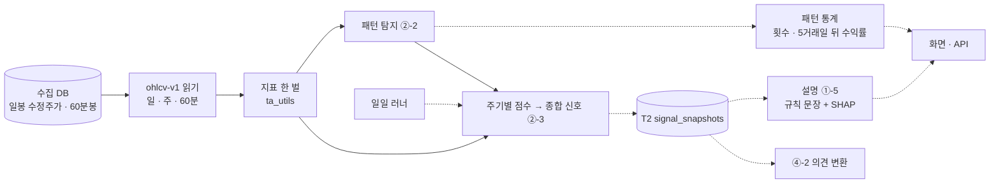

# 목표 기능 ② · ①-5 상세 설계서 v0.2 — 패턴 인식 예측 · XAI 설명 — Qurious

| 문서 정보 | |
|---|---|
| **판 · 상태** | v0.2 · 초안(검토 전) |
| **구분** | 6. 시스템 설계 — 설계 문서(2차 목표 기능 ② 세부 1~3 · ① 세부 5) · 2. 요구사항 관리(인수 기준) |
| **작성** | 신장환(주담당 · ② 세부 1~3 · ①-5) |
| **검토** | 검토 전 — 부담당 강민석(②) · 오준영(①-5) |
| **최종 수정** | 2026-10-06 (KST) · v0.1 은 [이전 판](목표기능2-패턴예측-XAI-설계_v0.1.md) |
| **기준** | 코드 `main` `9651e5e` + 지표 한 벌(이 판과 같은 PR) · 수집 DB HF `qurious-quant/krx-daily-market` 복원본 · 실측은 2026-08-31 까지(봉인 구간 · 3.2) · 실측 스크립트 [`scripts/indicator_defs_scan.py`](../../scripts/indicator_defs_scan.py) |
| **관련 문서** | [기능 설계서 v0.1](기능설계_v0.1.md) 4.1 `P01-①-5` · 4.2 · [프로젝트 계획서 v2.0](../계획서/프로젝트계획서_v2.0.md) · [RTM v1.10](../요구사항/RTM_v1.10.md) · [API 명세서 v0.9](../인터페이스/API명세서_v0.9.md) · [목표 기능 ① 설계서 v1.4](목표기능1-데이터지식-설계_v1.4.md) 5.1 · 11절 · 14.1 · 옛 분석 A5([#43](https://github.com/EST-team-project/Qurious/issues/43)) · 논의 D6([D22](https://github.com/EST-team-project/Qurious/discussions/22)) · 점검 [#107](https://github.com/EST-team-project/Qurious/issues/107) · [#26](https://github.com/EST-team-project/Qurious/issues/26) P-B |

> **확실도** — 확인(코드 · 데이터에서 직접 봄) · 추정(재지 않았거나 추론) · 없음

---

## 요약

1. 세 요구와 XAI 는 하나의 흐름이다. 지표를 한 정의로 계산하고(②-1), 그 위에서 패턴을 찾고(②-2), 주기별 점수를 합쳐 신호를 하루 한 번 기록하고(②-3), 기록마다 이유를 쉬운 말로 붙인다(①-5). 지표 정의는 한 번만 정하고 넷이 함께 쓴다. 뼈대는 기능 설계서 v0.1 4.2 의 초안(규칙 탐지 · 신호 표 T2 · 두 층 설명)을 따르고, 이 문서는 그것을 지금 코드 위에 구체화한다.
2. **지표 정의가 지금 갈려 있다 — 실제 종목 2,653개로 쟀다.** TradingView 정의와 견주면 `ta_utils` 기본(단순평균) RSI 는 「RSI 30 미만」 날을 **2.6배** 많이 세고, 2026-08-31 하루의 과매도 · 과매수 판정이 **16.5% 종목에서 다르며**, 같은 역추세 규칙의 누적 수익 **부호가 33.3% 종목에서 뒤집힌다.** 패턴 · 다중 주기 신호 · 커스텀 백테스트 · XAI 피처가 모두 이 RSI 를 쓴다(3.3).
3. 그래서 **TradingView 정의 한 벌**(RSI · ATR = Wilder 평활 · 표준편차 = 모집단)로 바꾼다(5.1). 백테스트 숫자가 바뀌므로 바꾸는 PR 에 전후 숫자를 싣는다.
4. **②-2 · ②-3 · ①-5 는 코드가 이미 있다.** 빠진 것은 패턴 뒤 **5거래일 수익률 통계**, 신뢰도 **0~1** 과 **거래일마다 기록**, **규칙 신호의 쉬운 말 설명**이다(3.1). 새 표는 T2 `signal_snapshots` 하나다(6절).
5. 다중 주기는 이미 정해진 것을 그대로 쓴다 — 60분봉은 수집 DB 의 야후 분봉, 주봉은 일봉에서 계산한 `ohlcv-v1`, 대상은 분봉 유니버스(5.3).
6. 화면이 실제보다 더 말하는 곳도 숫자로 확인했다 — 「볼린저밴드 ±2σ 하단 이탈」 은 실제로는 전일 등락률 −2% 판정이라, 그렇게 표시된 날의 **19.2% 만 실제 하단 밴드 아래**였다(3.3).

---

## 1. 맥락과 범위

### 1.1 요구와 기술 스택 칸

**<표 1> 맡는 요구** · 인수 기준은 RTM 그대로(2절)

| 요구 ID | 강사님 기술 스택 칸 | 우리 구현 |
|---|---|---|
| `P01-②-1` 지표 계산 | docker-class · lumina-invest · FastAPI | `ta_utils` 한 모듈 · FastAPI |
| `P01-②-2` 차트 패턴 탐지 | SageMaker Training Jobs · ECR + Lambda + API GW · EC2 | 규칙 탐지 + 사건 연구 통계 · 로컬 배치 |
| `P01-②-3` 다중 주기 신호 · 신뢰도 | SageMaker 실시간 추론 엔드포인트 · RDBMS · FastAPI | 규칙 점수 가중합 · 일일 러너 · 매일 계산해 둔 표 읽기 |
| `P01-①-5` XAI 쉬운 말 설명 | SageMaker Processing Jobs(SHAP) · AG Grid · ApexCharts | 규칙 설명 먼저 · LightGBM TreeSHAP(`pred_contrib`) · ApexCharts |

### 1.2 이 문서가 다루지 않는 것

3차 인디케이터 · Pine Script 는 다음 판에서 다룬다. 다만 5.1 의 지표 한 벌은 3차가 그대로 받는다. 신호를 의견으로 바꾸는 규칙(`P01-④-2`)은 이 문서가 정한 T2(6절)를 입력으로 받는다.

---

## 2. 목표 · 비목표

### 2.1 목표 — 인수 기준

**<표 2> 인수 기준과 지금 상태** · 범례: 지금 = 완료 · 진행(일부 됨) · 예정

| 요구 | # | 인수 기준 | 확인 방법 | 지금 |
|---|:-:|---|---|---|
| `②-1` | 1 | 앱 안 RSI · 볼린저 · ATR 이 한 정의로 계산된다 — 갈래 0 | 3.3 표 재실행에서 「기준과 다름」 이 모두 0 (반올림 제외) | 진행(3.4 · 갈래 하나 남음 — 자동매매 종목 점수 · 담당 파트) |
| | 2 | 기준 정의가 TradingView 값과 같다 | TC-IN(고정 입력 · TradingView 화면 값 대조) | 진행(손계산 · 교과서 예제 · 갈래 0 시험 완료 · TradingView 화면 값 대조 남음) |
| | 3 | t 시점 값은 t 까지의 봉으로만 계산된다 | TC-LA | **완료**(ATR · 모집단 볼린저 · 뒤 봉 바꾸기 더함) |
| `②-2` | 4 | 정한 패턴을 종목별로 탐지하고 발생 횟수 · 5거래일 뒤 수익률 통계를 낸다 | TC-PT · 전 종목 집계 | 진행(탐지 있음 · 통계 없음) |
| `②-3` | 5 | 종목마다 매수 · 매도 · 관망과 0~1 신뢰도를 거래일마다 기록한다 | TC-MT · 기록 행 수 = 대상 종목 × 거래일 | 진행(계산 있음 · 0~100 · 기록 없음) |
| `①-5` | 6 | 신호마다 근거(지표 값 · 규칙 · 기여도)를 한두 문장으로 보인다 · 문장의 숫자 = 응답 값 | TC-XA | 진행(SHAP 문장 있음 · 규칙 설명 없음) |

### 2.2 비목표

**<표 3> 하지 않는 것**

| 하지 않는 것 | 까닭 |
|---|---|
| 신호의 수익성 입증 | 2차는 「같은 정의로 계산 · 기록된다」 까지다. 성과 판단은 목표 기능 ④ · 3차 |
| 딥러닝 패턴 인식(CNN 차트 이미지 · LSTM) · 학습 탐지 | rfp-2 §3.1.2 의 딥러닝 패턴은 받는 요구가 없다(RTM). 규칙 이름표를 정답으로 한 학습 탐지(기능 설계서의 2단계 · 선택)는 2차 칸 12 뒤로 미룬다 |
| 장중 실시간 갱신 | 3차 실시간 엔진(`SCH-RT`)의 몫. 2차는 하루 1회 |
| SageMaker · Lambda · API GW | 로컬 배치 + FastAPI 로 대신한다(11절). AWS 는 로컬 완성 뒤 고른다 |
| 패턴 종류 늘리기 | 종류가 늘수록 우연히 좋아 보이는 패턴이 생긴다. 통계는 정한 목록만(5.2) |

---

## 3. 지금 상태 — 2026-10-06 실측

### 3.1 요구별

**<표 4> 있는 것과 빠진 것** (확인)

| 요구 | 있는 것 | 빠진 것 |
|---|---|---|
| `②-1` | [`ta_utils.py`](../../app/services/ta_utils.py) — RSI · SMA · EMA · MACD · 볼린저 · ATR | 정의가 갈림 · 별도 구현 둘(`stock._calc_rsi` · `_calc_bollinger` · `ml_symbol_score` 안 rsi) · TradingView 대조 시험 0 |
| `②-2` | [`patterns.py`](../../app/services/patterns.py) — 캔들 13종 · 지지/저항 군집 · 20일 · 52주 돌파 · 골든/데드크로스 · `API-STK-34` | 발생 횟수 · 5거래일 뒤 수익률 통계 · 전 종목 탐지 |
| `②-3` | `multi_timeframe_signal` — 60분 · 일 · 주 점수 가중합 · `API-STK-35` | 신뢰도 0~100 정수 · 다섯 단계 · 기록 없음(요청할 때만 계산) |
| `①-5` | [`xai.py`](../../app/services/xai.py) — LightGBM TreeSHAP → 문장 · 퀀트 파이프라인과 로보 스크리닝(`API-STK-08`)이 요청마다 모델을 학습해 설명을 붙인다(저장된 모델 없음) | 규칙 신호 설명 · 설명 기준 · 전용 API |

**<표 5> 어떤 RSI 를 어디서 쓰나** (확인)

| 구현 | 평활 | 쓰는 곳 |
|---|---|---|
| `ta_utils.rsi(method="sma")` **(기본)** | 단순평균 | `quant_pipeline` 피처(퀀트 파이프라인 · 로보 스크리닝의 **XAI 피처**) · 커스텀 백테스트 · `patterns` · `formula` |
| `ta_utils.rsi(method="ewm")` | Wilder · 시작값 = 첫 값 | `investment_research` 규칙 점수(로보 스크리닝) |
| `stock._calc_rsi` | Wilder · 시작값 = 첫 14개 평균 | `API-STK-04` — 기본 인디케이터 전략 · 전략 분석 · 퀀트 대시보드 화면 |
| `ml_symbol_score` 안 `rsi` | 단순평균 | 자동매매 종목 점수(`auto_trade`) |

### 3.2 확인한 함정

- **60분 · 주봉은 지금 수집 DB 를 거치지 않는다.** 다중 주기 신호가 부르는 `get_candles` 의 수집 DB 다리는 `interval == "1d"` 만 받아, 60분 · 주봉은 요청마다 야후로 간다. 수집 DB 에는 야후 60분봉(2023-09 ~ · 472종목)이 이미 쌓여 있고, `ohlcv-v1` 읽기(`API-DATA-02`)가 60분봉과 주봉(일봉에서 계산)을 준다 — 신호는 이것을 쓴다(5.3).
- **같은 「RSI」 가 한 화면 안에서도 둘이다.** 로보 스크리닝은 규칙 점수에 ewm RSI 를, 같은 행의 XAI 설명에는 단순평균 RSI 피처를 쓴다. XAI 문장의 「RSI 과매도 구간(30 미만)」 은 단순평균 RSI 의 30 이다.
- **시작값도 정의의 일부다.** 앱은 요청한 기간(1년 · 2년)의 첫 봉부터 지표를 계산하므로, Wilder 평활이라도 첫 값을 어떻게 두느냐에 따라 처음 수십 봉의 신호가 달라진다(<표 6> ewm 줄).
- **봉인 구간.** 모의투자 검증용 새 봉인 구간은 개봉 기록 없이 읽지 않는다. 시작일은 아직 확정 전이다 — 논의 [D7](../github-archive/2026-09-15/논의-013/00-기록.md) ⑦ 은 「규칙과 일지 실행기가 준비된 뒤 첫 거래일(D5 · D6 뒤 확정)」 이고, 1차 보고서 9.2절은 「2026-09-01 이후 쌓이는 자료로 새 봉인 구간을 정한다」 고 적었다(확인). 그래서 **가장 이른 시작 가능일인 2026-09-01 이후는 읽지 않는다** — 이 문서의 실측과 패턴 통계는 2026-08-31 까지만 쓴다. 시작일이 정해지면 그 전날로 넓힌다.

### 3.3 확인 결과 — 지표 정의 실측

**조건** — 수집 DB 수정주가(앱 일봉 다리와 같은 값) · 코스피 · 코스닥 · 2026-08-31 상장 · 봉 300개 이상 **2,653종목** · 2020-01-02 ~ 2026-08-31 · 종목마다 처음 100봉 제외 → **비교한 봉 3,674,962개** · 기준 = TradingView `ta.rsi` 식(첫 14개 평균으로 시작하는 Wilder 평활 · 하락폭 0 이면 100). 재현은 부록 B.

**<표 6> RSI 14 — 기준 대비** (확인)

| 구현 | 평균 차 | 95% 차 | 「<30」 판정 다른 날 | 「>70」 판정 다른 날 | 「<30」 날 수 (기준 = 1) | 08-31 구간 다른 종목 | 규칙¹ 수익 부호 뒤집힘 | 수익 차 중앙값 |
|---|--:|--:|--:|--:|--:|--:|--:|--:|
| `ta_utils` sma (기본) | 7.0 | 17.9 | 10.9% | 6.8% | **2.59** | **437 (16.5%)** | **882 (33.3%)** | 40.6%p |
| `ta_utils` ewm | 0.007 | 0.000 | 0.0% | 0.0% | 1.00 | 0 | 184 (6.9%)² | 8.8%p |
| `stock._calc_rsi` | 0.005 | 0.005 | 0.0% | 0.0% | 1.00 | 0 | 3 (0.1%)³ | 0.0%p |
| `ml_symbol_score` | 7.0 | 17.9 | 10.9% | 6.8% | 2.59 | 437 (16.5%) | 883 (33.3%) | 40.8%p |

¹ RSI 30 아래 매수 · 70 위 매도 · 다음 날부터 보유 · 비용 없음 · 전 기간. 성과를 주장하려는 규칙이 아니라 정의만 바꿨을 때 결론이 바뀌는지 보는 장치다.
² 100봉 뒤로는 기준과 같고, 뒤집힘은 시작 구간에서 온다(3.2). 상장 직후 오래 거래정지된 11종목은 평평한 구간에서 시작값 차이가 사라지지 않는다(최대 차 28.7).
³ 하락폭 평균 0 일 때 100 대신 99.01 ([`stock.py:329`](../../app/services/stock.py#L329)). 그 밖은 반올림(소수 둘째 자리) 차이.

단순평균 RSI 는 더 출렁여서 30 · 70 을 자주 넘는다. 그래서 패턴 화면 · 다중 주기 신호 · XAI 가 보는 RSI 는 기본 인디케이터 화면(`API-STK-04`)의 RSI 와 **6종목 중 1종목꼴로 다른 구간**을 말한다. D6 의 합성 데이터 결과(58.3% 뒤집힘)와 같은 방향이다.

**<표 7> 볼린저 · ATR · 화면 B1** (확인)

| 항목 | 갈래 | 결과 |
|---|---|---|
| 볼린저 20 · 2σ | `ta_utils`(n−1) vs `stock`(n · TradingView) | 폭 비 중앙값 1.026 · 밴드 밖 봉 10.72% vs 11.84% — n−1 이 이탈을 **9.5% 덜** 센다 · 판정 갈리는 봉 1.12%⁴ |
| ATR 14 | `ta_utils`(단순평균) vs TradingView(Wilder) | 상대 차 중앙값 **8.5%** · 95% 29.7% |
| 화면 B1 「하단 이탈 · 매수」 | 실제로는 등락률 < −2% ([`indicator.js:38`](../../public/js/indicator.js#L38)) | 표시된 728,512봉 중 실제 하단 밴드 아래 **19.2%** · 실제 하단 이탈 231,664봉 중 잡는 것 60.5%⁴ |

⁴ v0.1 의 값(12.40% · 13.5% · 1.68% · 57.8%)은 거래정지로 가격이 평평한 구간을 「밴드 밖」 으로 잘못 셌다 — 밴드 폭이 0 이라 종가 = 밴드인데, 화면용으로 반올림한 밴드와 견줘서다. 반올림 단위의 절반(0.005)보다 더 벗어날 때만 세도록 실측을 고쳤다.

MACD 는 `ta_utils.macd` 한 곳뿐이라 갈래가 없어 재지 않았다. 그 EMA 시작값이 TradingView `ta.ema` 와 같은지는 TC-IN 에서 확인한다(추정).

**시험** — 지금 있는 패턴 · XAI · 미래 참조 · 자유 산식 시험 **26건 통과**(`test_patterns.py` · `test_xai.py` · `test_ta_utils_lookahead.py` · `test_formula.py` · 1.6초 · 2026-10-06).

### 3.4 확인 결과 — 지표 한 벌로 바꾼 뒤 (2026-10-06)

5.1 을 이 판과 같은 PR 에서 했다. 같은 조건(2,653종목 · 2026-08-31 까지)으로 3.3 을 다시 쟀다.

**<표 7-1> 바꾼 뒤 — 기준 대비** (확인)

| 길 | RSI 평균 차 | 「<30」 판정 다른 날 | 볼린저 판정 다른 봉 | ATR 상대 차 |
|---|--:|--:|--:|--:|
| `ta_utils`(패턴 · 퀀트 · XAI · 로보 스크리닝) | 0 | 0% | — | 0% |
| `API-STK-04` 화면(`stock`) | 0.002(반올림) | 0% | 0%(`ta_utils` 와) | — |
| 자동매매 종목 점수(`ml_symbol_score`) | **7.0** | **10.9%** | — | — |

자동매매 종목 점수는 다른 파트(자동매매)의 파일이라 이 PR 에서 손대지 않았다 — 그 안의 단순평균 RSI 를 `ta_utils.rsi` 한 줄로 바꾸면 남은 갈래가 0 이 된다(담당 파트에 알림).

화면용 값은 소수 둘째 자리로 반올림하므로 RSI 가 30 · 70 에 아주 가까운 날은 반올림 때문에 판정이 바뀔 수 있다(역추세 규칙 부호 3종목 · 0.1%). 정의의 갈래는 아니다.

**<표 7-2> 백테스트 숫자는 어디서 바뀌나** — 대형주 10종목 · 2026-08-31 까지 · 기본 인자 (확인)

| 길 | 바뀐 종목 | 가장 큰 차 | 까닭 |
|---|--:|--:|---|
| 대시보드 기본 전략(`strategy=rsi` · 1년) | 0 | 0 | 이미 Wilder RSI 였다(시작값만 달랐고 1년 창 안에서 신호가 같았다) |
| 전략 `ma` · `composite`(1년) | 0 | 0 | — |
| 전략 `bollinger`(1년) | 4 | 12.2%p | 표준편차 n − 1 → n (예: 삼성전자 +2.06% → −6.40%) |
| `API-STK-04` 화면 RSI · 볼린저 | 0 | 0 | 이미 TradingView 정의였다 |

**시험** — 전체 888 통과 · 실패 1(`test_lectures.py` — 바꾸기 전 `main` 에서도 실패 · 강의 파일 목록) · DB 시험은 팀 절차(`test.ps1`)에서 지표와 무관한 리밸런싱 시험이 결함 DF-73([#117](https://github.com/EST-team-project/Qurious/issues/117))으로 실패한다. 새 시험 TC-IN 12건 · TC-LA 3건.

---

## 4. 전체 구조

### 4.1 자료가 흐르는 길

**<그림 1> 지표에서 설명까지** · 범례: 실선 = 지금 있음 · 점선 = 이 문서에서 만듦



- 하루 한 번: 일봉 갱신이 끝나면 러너의 새 단계가 대상 종목 전부의 신호를 계산해 T2 에 쓴다.
- 화면 · API 는 T2 를 읽는다. 기록이 없는 종목 · 날짜만 그 자리에서 계산한다.

### 4.2 모든 신호에 붙는 칸

신호 · 통계 · 설명은 어떤 지표 정의(`definition`)와 어느 날 시세(`as_of`)로 계산했는지를 늘 함께 낸다. 정의가 바뀌면 새 판으로 다시 계산한 줄이 따로 쌓여 옛 기록과 섞이지 않고(6절), 화면은 기준일을 보인다.

---

## 5. 세부 설계

### 5.1 `P01-②-1` 지표 한 벌

**<표 8> 정의** — TradingView Pine v5 문서의 식 · 정의 판 `definition = "tv-2026"`

| 지표 | 정의 | 지금과 다른 점 |
|---|---|---|
| RSI(n) | 상승 · 하락폭을 `rma`(첫 n개 평균으로 시작 · α = 1/n)로 평활 · 하락폭 0 → 100 · 상승폭 0 → 0 | 단순평균 → Wilder · `method` 인자 제거 |
| 볼린저(n, k) | SMA(n) ± k × 모집단 표준편차 | n−1 → n |
| ATR(n) | TR 을 `rma` 로 평활 | 단순평균 → Wilder |
| SMA · EMA · MACD | 그대로 | — (EMA 시작값은 TC-IN 에서 확인) |

- **옮길 곳** — `stock._calc_rsi` · `_calc_bollinger` 를 `ta_utils` 호출로 바꾸고(`ml_symbol_score` 안 rsi 는 자동매매 파트에 맡김 · 3.4), `investment_research` 의 `method="ewm"` 을 지운다.
- **출력** — `API-STK-04` 응답에 `definition` 칸을 더한다.
- **조심** — 화면용 밴드는 반올림돼 있다. 화면에서 종가와 견줄 때(B1)는 반올림 단위의 절반을 허용 오차로 둔다 — 거래정지 구간이 「이탈」 로 잡히지 않게(3.3 ⁴).
- **영향** — 퀀트 파이프라인 · 패턴 · 신호 · XAI · 로보 스크리닝 숫자가 바뀐다. 바꾸는 PR 에 3.3 표 재실행(남은 갈래 · 3.4)과 대시보드 기본 전략 성능 전후 숫자를 싣는다.

### 5.2 `P01-②-2` 패턴 탐지 · 통계

#### 5.2.1 대상 패턴

통계에는 정한 목록만 넣는다 — 골든 · 데드크로스(MA20 · MA60) · 52주 신고가 돌파 · 캔들 5종(망치 · 장악(상승 · 하락) · 도지 · 샛별 · 흑삼병) · 지지 이탈 · 저항 돌파. 지금 탐지기의 나머지(역해머 · 유성형 · 교수형 · 석별 · 적삼병 · 마루보즈 · 볼린저 이탈 · 20일 돌파)는 화면 표시용으로 둔다.

#### 5.2.2 통계 — 사건 연구

**<표 9> 사건 연구 규칙**

| 단계 | 규칙 |
|---|---|
| 사건 | 종목 i 가 날 t 종가로 패턴을 냄 · 탐지는 t 까지의 봉만 |
| 결과 | t+1 ~ t+5 누적 수익률(`forward_ret_5d`) · 같은 기간 코스피 대비 초과수익 |
| 집계 | 패턴별 횟수 · 평균 · 중앙값 · 오른 비율 · 기준선(같은 종목 전체 날의 5일 수익률)과의 차 |
| 겹침 | 같은 종목 5거래일 안 재발은 첫 사건만 |
| 기간 | **봉인 구간 밖에서만**(지금은 2026-08-31 까지 · 3.2) — t+5 가 봉인 구간에 걸리는 사건은 뺀다 |
| 비용 | 넣지 않는다 — 가격 움직임의 통계이지 전략 성과가 아니다 |

### 5.3 `P01-②-3` 다중 주기 신호 · 기록

**<표 10> 지금과 바꿀 것**

| 항목 | 지금 | 바꿀 것 |
|---|---|---|
| 주기 | 60분(1개월) · 일(1년) · 주(5년) — 60분 · 주는 요청마다 야후 | 모두 `ohlcv-v1` 읽기 — 일 · 60분 = 수집 DB · 주 = 일봉에서 계산한 주봉(날짜 = 그 주 마지막 거래일 · 진행 중인 주는 `partial`) |
| 대상 | 요청한 종목 하나 | 분봉 유니버스 `u2-20260930`(코스피200 구성 201 · 코스닥150 구성 150 · 거래대금 상위 ETF 50 = 401) — 모두 60분봉이 쌓이는 종목이다 |
| 점수 | 주기마다 −6 ~ +6 (RSI · MA · MACD · 볼린저 규칙) | 그대로 — 지표만 5.1 정의로 |
| 결과 | 다섯 단계 · 신뢰도 0~100 정수 | **`signal` 매수 · 매도 · 관망**(RTM) · 「강력」 은 `strength`(보통 · 강)로 옮김 · **`confidence` 0~1** |
| 기록 | 없음 | 거래일마다 T2 에 한 줄(6절) |

신뢰도는 지금 코드의 식(방향이 같은 주기의 가중치 비율 × ½ + 점수 크기 × ½)을 0~1 로 옮기고, 식을 정의 판과 함께 고정한다(곱으로 두는 안은 11절). 보정(신뢰도가 높을수록 실제로 더 맞나)은 기록이 쌓인 뒤 잰다.

**배치** — 일일 러너에 단계 `signals` 를 더한다(일봉 갱신 단계 뒤). 실패하면 러너 상태에 원인이 남고 다음 회차가 놓친 날을 채운다.

### 5.4 `P01-①-5` XAI 설명

#### 5.4.1 층 1 — 규칙 신호의 쉬운 말 설명 (먼저)

- 입력 T2 한 줄 → 한두 문장 + 근거 표(지표 · 값 · 규칙 · 방향).
- 틀: 「{주기} 기준으로 {큰 근거 둘}이라 {행동} 쪽입니다. 다만 {반대 근거 하나}는 반대 방향입니다.」
  - 예: 「일봉 기준으로 RSI 27 로 많이 떨어졌고 5일선이 20일선 위로 올라와 매수 쪽입니다. 다만 주봉은 아직 20주선 아래입니다.」
- 쓰지 않는 말: 규칙 합산을 「AI 판단」 이라 부르기 · 「오를 것」 같은 단정 · 확률처럼 읽히는 신뢰도(「0.72」 → 「주기 셋 중 둘이 같은 방향」).

#### 5.4.2 층 2 — 모델 설명(SHAP)

[`xai.py`](../../app/services/xai.py) 를 그대로 쓴다. 모델은 요청마다 학습되므로 5.1 뒤에는 피처 RSI 가 저절로 새 정의로 바뀐다 — `FEATURE_META` 의 해석 문구(30 · 70 경계)가 새 정의에서도 맞는지만 본다.

#### 5.4.3 설명 기준

**<표 11> 설명 기준**

| 기준 | 뜻 | 확인 |
|---|---|---|
| 정확 | 문장의 숫자 · 방향이 응답 값과 같다 · 같은 입력 → 같은 문장 | TC-XA |
| 충분 | 근거 표의 상위 근거가 점수(층 1) · 기여도 합(층 2)의 절반 이상을 설명한다 · SHAP 합 = 예측 − 기댓값 | TC-XA |
| 정직 | 규칙은 규칙이라 말한다 · 면책 한 줄 | 금지어 검사 |

### 5.5 화면

- 기본 인디케이터 화면 — B1 볼린저를 실제 밴드로 · B2 MA60 · MACD · 볼린저 체크박스 읽기 · B3 「AI 판단」 → 「규칙 합산」
- 패턴 시각화 — 차트 위 패턴 표식 · 지지/저항 선 · 통계 표
- 신호 · 근거 카드 — 행동 · 신뢰도 풀이 · 쉬운 설명 · 근거 표(기여도 막대 — ApexCharts)

---

## 6. 데이터 저장 — 새 표

**<표 12> T2 `signal_snapshots` (안)** — 기능 설계서 T2 를 구체화 · `P01-④-2` 의 입력

| 칸 | 형 | 뜻 |
|---|---|---|
| `as_of` · `symbol` · `definition` | date · text · text | 기준 거래일(종가) · 종목 · 지표 정의 판(`tv-2026`) — 셋이 기본키 |
| `signal` · `strength` | text | 매수 · 매도 · 관망 / 보통 · 강 |
| `confidence` · `composite` | real | 0~1 · 가중 점수(−6 ~ +6) |
| `timeframes` | json | 주기별 점수 · 근거 · 쓴 봉의 마지막 시각 |
| `pattern_bias` · `patterns` | text · json | 일봉 패턴 요약 |
| `reasons` | json | 규칙 설명 층의 근거(5.4.1) |
| `computed_at` | timestamp | 계산 시각 |

정의 판이 바뀌면 지난 날짜를 새 판으로 다시 계산해 **새 줄로 더하고 옛 판 줄은 그대로 둔다**(덮어쓰지 않는다 — 지난 판으로 낸 신호 · 의견을 나중에 다시 볼 수 있어야 한다). 화면 · 의견 변환은 지금 판의 줄만 읽는다.

주기별로 줄을 나누지 않고 종목 · 날짜 · 판당 한 줄로 두고 주기별 값은 `timeframes` 에 담는다 — 의견 변환이 한 줄만 읽으면 되게 하려는 것이다. 의견 칸(`opinion` · `opinion_rule`)은 `P01-④-2` 가 이 표에 더한다.

패턴 통계(5.2)는 표로 두지 않고 배치가 만드는 집계 파일(패턴 · 종목별 한 줄)로 둔다 — 하루 한 번 다시 만들 수 있는 값이다.

---

## 7. API

**<표 13> 이 문서가 쓰거나 더하는 API**

| ID | 메서드 · 경로 | 지금 | 이 문서에서 |
|---|---|---|---|
| `API-DATA-02` | `GET /api/data/ohlcv` | 있음 | 그대로 읽음(일 · 주 · 60분) |
| `API-STK-04` | `GET /api/stocks/quant/indicators` | 있음 | 지표를 5.1 정의로 · `definition` |
| `API-STK-08` | `GET /api/stocks/signals` | 있음 | 그대로(XAI 피처만 5.1 정의로) |
| `API-STK-34` | `GET /api/stocks/patterns` | 있음 | 사건마다 `forward_ret_5d` · 패턴별 통계 묶음 |
| `API-STK-35` | `GET /api/stocks/mtf-signal` | 있음 | T2 의 지금 판 줄을 읽음 · `signal` · `strength` · `confidence`(0~1) · `definition` · `as_of` |
| (새 · 안) | `GET /api/explain?kind=signal&symbol=&date=` | — | `{summary, reasons[], counter_reasons[], method: "rule" \| "shap"}` |

새 API 의 번호는 ID 대장에 붙일 때 정한다. `/api/explain` 의 `kind` 는 다른 설명 대상(배분 · 종목 선정)을 위해 비워 둔 자리다.

---

## 8. 시험 계획

**<표 14> 시험 묶음**

| 묶음 | 파일 | 요구 | 지금 | 더할 것 |
|---|---|---|--:|---|
| TC-IN (새) | `test_indicator_defs.py` | `②-1` | 0 | 고정 입력 기대값(상승만 · 하락만 · 평평 · 섞임) · TradingView 화면 값 5개 대조(소수 둘째 자리) · `ta_utils` 밖 구현 0 |
| TC-LA | `test_ta_utils_lookahead.py` | `P02-②-2` | 5 | ATR · 모집단 볼린저 |
| TC-PT | `test_patterns.py` | `②-2` | 7 | 손으로 만든 봉 시퀀스마다 기대 패턴 · 5일 수익률 손계산 · 마지막 봉 이후 값을 쓰지 않음 · 봉인 구간 사건 제외 |
| TC-MT (새) | `test_mtf_signal.py` | `②-3` | 0 | 세 단계 · 0~1 · 신뢰도 경계(모두 일치 = 1) · 진행 중인 주 · 기록 한 줄 · 정의 판이 바뀌면 같은 날 두 줄(옛 줄 보존) |
| TC-XA | `test_xai.py` | `①-5` | 2 | 같은 입력 → 같은 문장 · 문장 숫자 = 응답 값 · 금지어 |

---

## 9. 다른 기능과의 접점

**<표 15> 받는 것 · 주는 것**

| 방향 | 기능 | 무엇 |
|---|---|---|
| 받음 | `P01-①-2` | `ohlcv-v1`(일 · 주 · 60분) · 분봉 유니버스 `u2-20260930` |
| 받음 | `P01-①-4` | 일일 러너 단계 자리 · 데이터 기준일 |
| 줌 | `P01-④-2` | T2 의 지금 판 줄(6절) — 의견 칸은 ④-2 가 더한다 |
| 줌 | `P01-④-1` | 지표 정의 변경 전후의 백테스트 숫자 |
| 줌 | 로보 스크리닝(`API-STK-08`) | RSI 가 표준 정의로 바뀜(<표 5> · <표 6>) |
| 부탁 | 자동매매 종목 점수(`ml_symbol_score`) | 단순평균 RSI 를 `ta_utils.rsi` 로 — 남은 갈래 하나(3.4) |
| 줌 | 피처 · 지표 사전 · ERD | <표 8> 정의 · <표 12> 표 |

---

## 10. 순서 · 일정

**<표 16> 작업 묶음**

| 묶음 | 내용 | 칸 |
|---|---|---|
| W1 | 지표 실측 · 이 설계서 v0.1 | — (10-06 완료) |
| W2 | 지표 한 벌 · TC-IN · 화면 B1 ~ B3 | 칸 12 전 |
| W3 | 패턴 통계 · 다중 주기를 `ohlcv-v1` 로 · 세 단계 · 0~1 · T2 · 러너 단계 | 칸 12 전 |
| W4 | 패턴 시각화 | 칸 12 (10-12 오후) |
| W5 | 규칙 설명 · 설명 기준 · 신호 · 근거 카드 | 칸 13 (10-13 오전) |

---

## 11. 검토한 대안

**<표 17> 고르지 않은 것과 까닭**

| 대안 | 고르지 않은 까닭 |
|---|---|
| 지표를 외부 라이브러리로(pandas-ta-classic · TA-Lib) | 정의 대조값으로는 쓸 만하다. 다만 TA-Lib 은 설치 부담이 있고, 우리 지표는 다섯 개라 Pine 식을 직접 옮기는 편이 짧고 의존이 없다 |
| RSI 두 정의를 인자로 남기기 | 지금이 그 상태이고 3.3 의 갈래가 그 결과다. 한 정의만 둔다 |
| 신뢰도 = 일치도 × 강도(곱) | 한 주기만 강하게 맞아도 곱이 크게 줄어 「관망」 근처가 0 에 몰린다(추정). 지금 코드의 평균 식을 고정하고, 보정을 잰 뒤 다시 본다 |
| 주기별로 T2 줄을 나누기 | 의견 변환이 세 줄을 다시 합쳐야 한다. 종목 · 날짜 · 판당 한 줄로 둔다 |
| 정의가 바뀌면 T2 를 덮어쓰기 | 표는 단순해지지만 지난 판으로 낸 신호 · 의견을 다시 볼 수 없다. 판을 기본키에 넣는다 |
| SageMaker 학습 · 추론 엔드포인트 | 비용 합의 전이다. 로컬 배치 + FastAPI 로 같은 흐름을 만든다 |

---

## 12. 위험 · 뒤집을 조건

**<표 18> 위험**

| 위험 | 영향 | 대응 · 뒤집을 조건 |
|---|---|---|
| 지표 변경으로 다른 화면 · 성과 숫자가 바뀜 | 성과 · 로보 스크리닝 결과가 앞서 확인한 값과 어긋남 | PR 에 전후 숫자 · 머지 전 알림 |
| 신뢰도를 확률로 읽음 | 사용자 오해 | 설명에서 풀어 씀 · 보정을 잰 뒤에만 「확률」 이라 부른다 |
| 야후 60분봉이 막힘 | 다중 주기가 일 · 주 둘로 줄어듦 | 그동안 가중치를 일 · 주로 다시 나누고, 목표 기능 ① 의 대체 경로(증권사 당일 분봉)를 받는다 |
| 야후 분봉은 09:00 ~ 15:00 만 있음 | 60분봉 마지막 봉에 종가 단일가가 빠짐 | 60분 점수는 장중 흐름으로만 쓰고 종가 판단은 일봉에 맡긴다 |
| TradingView 대조값과 소수점 차이 | 인수 기준 2 판정이 흔들림 | 허용 오차를 소수 둘째 자리로 고정 |

---

## 부록 A. 용어

| 말 | 이 문서에서 |
|---|---|
| Wilder 평활(`rma`) | α = 1/n 인 지수평활. 첫 값은 처음 n개의 단순평균 |
| 모집단 표준편차 | 나눗수가 n. pandas 기본(`std()`)은 n−1 이라 다르다 |
| 사건 연구 | 어떤 일이 일어난 날을 기준으로 그 뒤 수익률을 모아 보는 통계 |
| 갈래 | 같은 이름의 지표가 앱 안에서 다른 식으로 계산되는 곳 |
| 봉인 구간 | 결과를 보기 전에 떼어 둔 기간. 마지막 검증에서 개봉 기록과 함께 한 번만 연다([D7](../github-archive/2026-09-15/논의-013/00-기록.md) ⑦) |

## 부록 B. 다시 재는 법

```powershell
# 수집 DB 가 없으면 — HF 읽기 토큰을 .env 의 HUGGINGFACE_ACCESS_TOKEN 에
python -c "from huggingface_hub import snapshot_download as s; from collector import config; s('qurious-quant/krx-daily-market', repo_type='dataset', local_dir='data/hf_export', token=config.env('HUGGINGFACE_ACCESS_TOKEN'))"
$env:PYTHONPATH='.'; python scripts/hf_dataset.py restore --into data/collector/market.sqlite3   # 약 2분 · 4.4GB

# <표 6> · <표 7> (전 종목 약 2분 · 기본 끝날 2026-08-31 = 봉인 구간의 가장 이른 시작 가능일 전날 · 3.2)
python scripts/indicator_defs_scan.py --json data/local-run/indicator_defs_scan.json
```

## 부록 C. 개정 이력

| 판 | 날짜 | 내용 |
|---|---|---|
| v0.2 | 2026-10-06 | 지표 한 벌(5.1) 구현 뒤 — 3.4 확인 결과(갈래 — 자동매매 점수 하나 남음 · 백테스트 전후) · 인수 기준 3 완료 · 3.3 볼린저 · B1 숫자 바로잡음(평평한 구간 반올림 착시) · B1 허용 오차 |
| v0.1 | 2026-10-06 | 첫 판 — 현황 · 지표 정의 실측(2,653종목 · 봉인 구간 제외) · 세부 설계 · T2 · API · 시험 |
