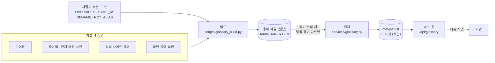
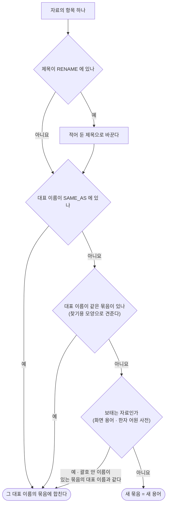
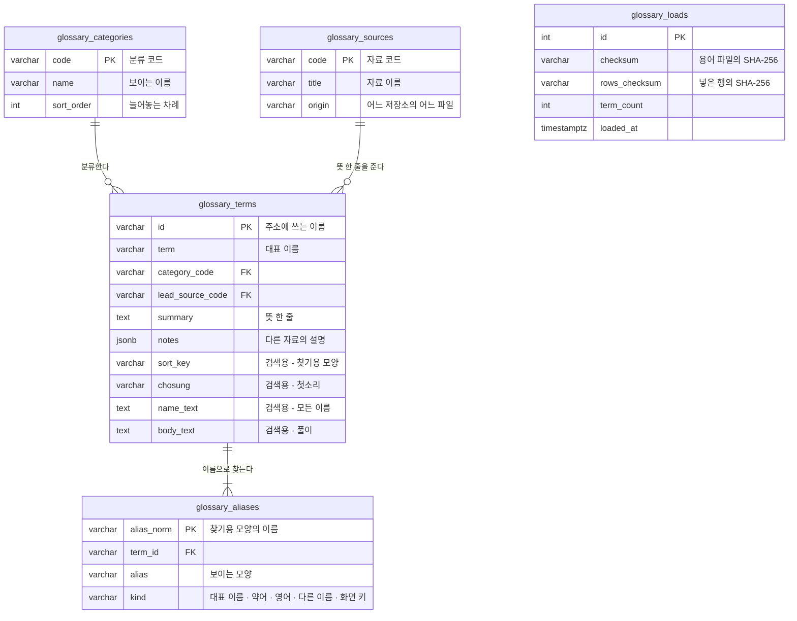
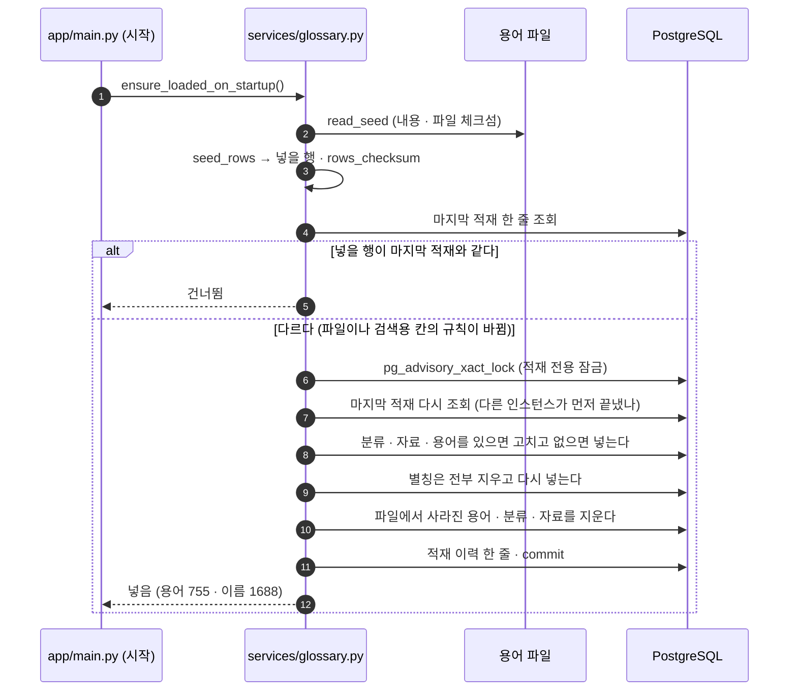
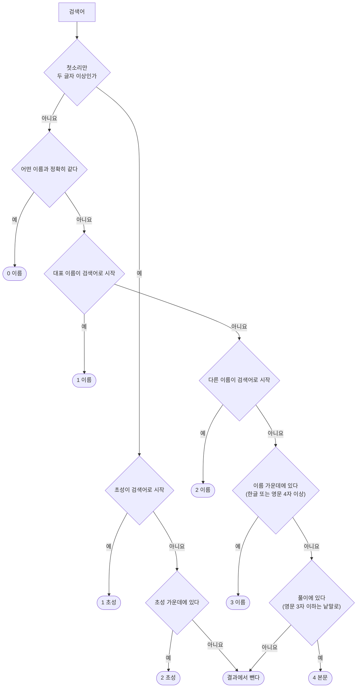

# 용어사전 설계서 v0.1 — Qurious

| 문서 정보 | |
|---|---|
| **판 · 상태** | v0.1 · 초안(검토 전) |
| **구분** | 6. 시스템 설계 — 기능 설계(용어사전 · 서버 쪽) · 5. 데이터 설계 · 7. 인터페이스 설계와 이어진다 |
| **작성** | 이동원(데이터 · 문서) |
| **검토** | 검토 전 |
| **최종 수정** | 2026-09-30 (KST) |
| **기준** | Qurious `main` `90dde10` + 이 문서를 싣는 변경 · 용어 파일 판 `7be38f1a9ceb` · 통합본 `investment-rag-lab` `2f0e71f` · 마이그레이션 `0011` |
| **관련 문서** | [통합본 이식 계획서 v0.1](통합본-이식계획.md) · [기능 설계서 v0.1](기능설계.md) 4.1절 · [API 명세서 v0.1](../인터페이스/지난판/API명세서_v0.1.md) · [ERD v1.2](../데이터/지난판/ERD_v1.2.md) · [데이터 사전 v1.2](../데이터/지난판/데이터사전_v1.2.md) · [RTM v1.1](../요구사항/지난판/RTM_v1.1.md) · [화면 IA v0.3](../화면/지난판/IA_v0.3.md) · [출처 표기](../../NOTICE.md) |
| **최근 개정** | 첫 판 |

> **이 문서가 답하는 질문**
> 1. 용어사전은 어떤 자료로 만들었고, 용어 하나는 어떤 칸으로 되어 있나?
> 2. 용어를 어디에 저장하고(파일 · 표), 왜 그렇게 정했나?
> 3. 앱은 용어를 언제 표에 넣고, 검색어를 어떤 차례로 찾아 주나?
> 4. 용어를 고치거나 더하려면 무엇을 하나?
>
> **읽는 순서** — 화면을 만들 사람: 요약 → 6절(API) → 7절(화면의 지금 상태) · 용어를 고칠 사람: 2.4절 → 부록 B · 강사님: 요약 → 1절 → 3절 · 발표 · 면접 준비: 4절 · 5절(핵심 코드와 차례 그림)

## 요약

1. **자료 넷을 합친 용어 755개를 서버가 API 넷으로 돌려준다.** 통합본의 단어장 · 용어집 · 강의 사이트 용어와 이 앱 화면의 용어 설명 948항목을 같은 말끼리 합쳤고, 분류는 22개 · 찾는 이름은 1,688개다.
2. **원본은 git 의 용어 파일이고, DB 표 다섯은 그 사본이다.** 앱이 켜질 때 「지금 넣을 행」 이 마지막 적재와 다를 때만 표를 파일과 같게 맞춘다(0.8초). 같으면 조회 한 번으로 끝난다.
3. **이름 · 약어 · 영어 이름 · 화면 키 · 초성 · 풀이로 찾고, 정확히 같은 이름부터 다섯 단계로 줄을 세운다.** 화면은 아직 이 API 를 부르지 않는다 — 어느 화면에 어떻게 넣을지는 다음 작업에서 설계한다. 연관 개념 탐색도 다음 작업이다.

---

## 1. 맥락과 범위

### 1.1 요구

요구 `P01-①-1` 「주식 · 금융 · 경제 기본 용어사전과 연관 개념 탐색」 은 강사님 요구 원문의 목표 기능 ①의 첫 세부 기능이다. 원문이 적은 구현 방안은 「domain-rag-lab 와 investment-analysis 의 통합」 이고, 그 통합본을 2026-09-30 에 `rag-lab/` 로 들여왔다([통합본 이식 계획서](통합본-이식계획.md)). 이 문서는 그 첫 묶음(R01 용어사전)의 **서버 쪽** 설계다.

### 1.2 전과 후

그림 1 은 「이 작업으로 무엇이 달라졌나」 에 답한다.

**그림 1. 용어 설명 — 전과 후** · 왼쪽 = 2026-09-29 까지 · 오른쪽 = 지금

```
 전                                    │ 후
 ──────────────────────────────────────┼──────────────────────────────────────────
 용어 55개 — 화면 코드 안의 상수        │ 용어 755개 — 서버가 돌려준다
   public/js/core.js 의 TERMS          │   자료 넷 → 용어 파일 → 표 다섯 → API 넷
 검색 없음                              │ 이름 · 약어 · 영어 · 초성 · 풀이로 검색
 분류 없음                              │ 분류 22개
 출처 없음                              │ 용어마다 어느 자료에서 왔는지
 서버 API 0개                           │ GET /api/glossary 외 3개 (로그인 없이 읽기)
 화면: 설명창이 상수를 보여 준다         │ 화면: 그대로(상수) — API 연결은 다음 작업
```

화면의 상수 55개는 지우지 않았다. 그 파일은 강사님 기초 코드라 줄을 지우면 다음 병합에서 부딪히고, 상수 자체가 용어 파일을 만드는 자료 넷 가운데 하나다(2.1절).

### 1.3 목표와 비목표

표 1 은 「이번에 만든 것과 일부러 만들지 않은 것은 무엇인가」 에 답한다.

**표 1. 목표와 비목표**

| | 내용 | 확인 |
|---|---|---|
| 목표 | 통합본의 용어 자료와 화면 용어를 한 사전으로 합쳐 서버가 돌려준다 | 용어 755 · API 넷 |
| 목표 | 이름이 조금 달라도(띄어쓰기 · 대소문자 · 약어 · 영어 · 초성) 찾는다 | 5절 · 시험 TC-GL |
| 목표 | 화면의 용어 키 55개가 모두 서버의 용어로 풀린다 — 화면이 API 로 넘어갈 때 빠지는 키가 없다 | 시험 TC-GL-13 |
| 목표 | 용어가 바뀐 것이 PR 에서 줄 단위로 보이고, 용어마다 출처가 남는다 | 3절 · 2.2절 |
| 비목표 | **연관 개념 탐색**(관련어 · 헷갈리는 짝 · 관계 그림) | 다음 작업 |
| 비목표 | **화면** — 용어사전 화면 · 설명창의 API 연결 · 어느 화면에 넣을지 | 다음 작업(7절이 입력) |
| 비목표 | 사용자 데이터(즐겨찾기 · 학습 기록 · 퀴즈) | 이식 대장 R03 · 표는 받을 준비만(3.2절) |
| 비목표 | 용어를 화면에서 고치는 관리 기능 | 용어는 파일에서 고친다(부록 B) |
| 비목표 | 오타 교정 · 비슷한 말 검색 | 10절 한계 |

---

## 2. 자료 — 무엇을 합쳤나

### 2.1 자료 넷

표 2 는 「용어가 어디서 왔고, 자료마다 얼마나 들어 있나」 에 답한다.

**표 2. 자료 넷** · 「읽은 항목」 = 자료에 적힌 줄 수 · 「용어」 = 그 자료가 든 용어 수 · 「대표 뜻」 = 그 자료의 글이 뜻 한 줄이 된 용어 수 · 2026-09-30 빌드

| 코드 | 자료 | 자리 | 원천 | 읽은 항목 | 용어 | 대표 뜻 |
|---|---|---|---|--:|--:|--:|
| `voca` | 주식 학습 단어장 | `rag-lab/data/voca.md` | 강사님 `investment-analysis` | 206 | 196 | 173 |
| `finance` | 투자분석 핵심 용어집 · 한자 어원 사전 | `rag-lab/data/samples/finance_glossary.txt` | 강사님 `domain-rag-lab` | 326 + 109 | 389 | 363 |
| `lecture` | 강의 사이트 용어모음(4일 금융 이론) | `rag-lab/frontend/days/` 의 HTML 넷 · 스크립트 둘 | 강사님 `domain-rag-lab` | 252 | 223 | 185 |
| `qurious` | 이 앱 화면의 용어 설명 | `public/js/core.js` 의 `TERMS` | 강사님 `lumina-invest` 기초 코드 + 팀이 더한 것 | 55 | 55 | 34 |
| | **합계** | | | **948** | **755** | **755** |

「용어」 칸의 합(863)이 755보다 큰 것은 용어 85개가 두 자료 이상에 나오기 때문이다(한 자료에만 나오는 용어 670 · 두 자료 62 · 세 자료 23).

그림 2 는 「자료가 어떤 길로 API 까지 가나」 에 답한다.

**그림 2. 자료에서 API 까지** · 범위: 컨테이너 단계 · 범례: 원통 = 저장소 · 실선 = 지금 있는 길 · 점선 = 다음 작업



빌드는 사람이 돌리고(용어를 고쳤을 때), 적재는 앱이 스스로 한다. 빌드 결과인 용어 파일을 커밋하므로, 앱은 자료 글을 읽지 않는다 — `rag-lab/` 폴더가 도커 이미지에 없어도 된다.

### 2.2 용어 하나의 모양

표 3 은 「용어 한 줄에 어떤 칸이 있고, 얼마나 채워져 있나」 에 답한다.

**표 3. 용어 파일의 용어 한 줄** · 「찬 용어」 = 그 칸이 비지 않은 용어 수(전체 755) · 파일 `app/services/glossary_data/terms.json`

| 칸 | 뜻 | 예 (`PER`) | 찬 용어 |
|---|---|---|--:|
| `id` | 주소에 쓰는 이름 — 소문자 · 공백은 붙임표 | `per` | 755 |
| `term` | 대표 이름 | PER | 755 |
| `english` · `hanja` | 영어 이름(영문만) · 한자 | Price Earnings Ratio · 株價收益比率 | 625 · 332 |
| `category` | 분류 코드(22개 가운데 하나) | `fundamental` | 755 |
| `summary` | 뜻 한 줄 | 주가가 1주당 이익의 몇 배인지 | 755 |
| `definition` | 자세한 뜻 — 뜻 한 줄과 **같은 자료**에서만 | (없음) | 327 |
| `example` · `caution` · `formula` | 예시 · 주의할 점 · 계산식 | PER 15 = … · 이익이 작거나 적자면 … · 주가 ÷ EPS | 308 · 30 · 5 |
| `origin_note` | 말의 구조 · 어원 | 株價(주가)·收益(수익)·比·率 — [현대에 만든 말] … | 50 |
| `app_note` | 이 앱에서의 뜻(화면 용어 설명) | (없음 — 화면 용어가 아니다) | 55 |
| `lead_source` · `sources` | 뜻 한 줄을 준 자료 · 이 용어가 나온 자료 전부 | `finance` · `voca`, `finance` | 755 |
| `aliases` | 다른 이름 — `{alias, kind}` · 종류는 약어 · 영어 · 다른 이름 · 화면 키 | Price Earnings Ratio(영어) · 주가수익비율(다른 이름) | 합 933 |
| `notes` | 다른 자료의 설명 — `{source, label, text}` | 단어장 「회사 이익과 주가를 비교합니다.」 | 98개 용어에 119 |
| `shared_names` | 이 용어도 쓰지만 임자는 다른 용어인 이름(2.4절) | (없음) | 합 30 |

파일의 맨 위에는 `format_version`(지금 1) · `sources`(표 2) · `categories`(분류 22)가 있다. 파일은 시각 · 난수를 담지 않아, 자료가 같으면 늘 같은 글자가 나온다(시험 TC-GL-10).

### 2.3 분류 22개

그림 3 은 「용어가 분류마다 얼마나 있나」 에 답한다.

**그림 3. 분류별 용어 수** · 한 칸 = 용어 2개 · 적힌 차례 = 화면에 늘어놓는 차례 · 2026-09-30

```
 주식 기초            ██████████████████████  44
 주문 · 거래          ██████████████████████  44
 기술적 분석          ███████████  22
 기본적 분석          ████████████▌  25
 퀀트 · 포트폴리오    █████████████████████████████████████  74
 거시 경제            ██████████████  28
 산업 분석            ██████▌  13
 리포트 · 투자 의견   ██████▌  13
 선물 · 옵션          █████████████████████████▌  51
 펀드 · ETF           █████████████████████  42
 채권 · 코인          █████████████████████  42
 금융 일반            ███████████████████████████  54
 약어 · 산업 용어     ███████████████████▌  39
 머신러닝 · 딥러닝    ████████████  24
 통계 · 수학          █████  10
 웹앱 · API           █████████  18
 이 앱의 기능         █████  10
 금융 제도 · 규제     ████████████████████████████████████  72
 금융 · 보험 이론     ███████████████▌  31
 벤처 · 사모 · 절세   ██████████▌  21
 기업 · 회계 · 세무   ████████████████████  40
 시장 줄임말 · 은어   ███████████████████  38
```

분류는 자료가 나눈 자리에서 왔다. 같은 용어를 자료마다 다른 분류에 둔 것이 98개였고, 「어디서 가르쳤나」 보다 「무엇에 관한 말인가」 로 나눈 자리를 따르게 했다(`category_rank`). 그래도 어색한 것은 사람이 적었다(표 5 의 `OVERRIDES`). 22개가 화면에 늘어놓기에 많은지는 화면을 설계할 때 정한다(11절 ②).

### 2.4 합치는 규칙

자료 넷은 같은 말을 서로 다르게 적는다 — 「샤프 비율」 과 「샤프지수」, 「주당순이익(EPS)」 과 「EPS」. 그림 4 는 「자료의 항목 하나가 어느 용어가 되나」 에 답한다.

**그림 4. 항목 하나가 용어가 되는 길** · 범례: 마름모 = 판정 · 둥근 끝 = 결과



합치는 기준은 **대표 이름이 같은가** 하나다. 별칭이 같다고는 합치지 않는다 — 「보통주·우선주」 의 별칭 「우선주」 때문에 다른 자료의 「우선주」 와 한 용어가 되면 안 된다. 표 4 는 「합칠 때 칸을 어떻게 채우나」 에 답한다.

**표 4. 합칠 때의 규칙**

| 무엇 | 규칙 | 왜 | 예 |
|---|---|---|---|
| 뜻 한 줄 · 자세한 뜻 | **같은 자료**에서만 가져온다. 쉬운 뜻 한 줄이 있는 자료가 먼저, 없으면 자세한 뜻의 첫 문장 | 이름이 같아도 자료마다 가리키는 것이 다를 수 있다 — 섞으면 앞뒤가 안 맞는 풀이가 된다 | 「내재가치」 — 용어집은 기업의 적정 가격, 강의는 옵션의 내재가치 |
| 고르지 않은 풀이 | 버리지 않고 「다른 자료의 설명」(`notes`)으로. 이름표에 자료의 자리 · 제목을 붙인다 | 어느 뜻의 풀이인지 읽는 사람이 가린다 | 「채권」 의 이름표 「03일차 용어 · 채권(債權)」 |
| 영어 이름 | 영문이 있는 것만. 괄호 안 한글(읽는 법 · 번역)은 떼어 별칭으로 | 자료가 그 칸에 우리말 번역을 적은 줄이 있다 | `Exit \| 투자 회수` → 영어 이름은 비우고 「투자 회수」 는 별칭 |
| 별칭 | 늘어놓은 영문은 나누고, 괄호 안 약어 · 읽는 법도 이름으로. 「이름표: 값」 과 말의 짜임을 푼 괄호는 버린다 | 통째로 두면 그 이름으로 못 찾는다 | `Low Volatility(로우 볼래틸러티)` → 「Low Volatility」 · 「로우 볼래틸러티」 |
| 별칭의 종류 | 한글 · 한자가 들면 다른 이름 · 짧고 대문자 위주면 약어 · 낱말이면 영어 | 화면이 나눠 보여 줄 수 있게 | PER(약어) · Risk(영어) · 주가수익비율(다른 이름) |
| 별칭의 임자 | 이름 하나는 용어 하나만 가리킨다. 차례 = 화면 키 → 통째로 적은 쪽 → 늘어놓은 쪽 → 먼저 읽은 쪽 | 이름으로 한 건을 찾을 때 답이 하나여야 한다 | 「Premium」 — 프리미엄(통째) 이 괴리율(`Premium / Discount`) 을 이긴다 |
| 진 쪽 | 「함께 쓰는 이름」(`shared_names`)으로 남긴다 — 검색에서는 두 용어가 다 나온다 | 임자가 아닌 용어도 그 이름을 쓴다 | 「NAV」 — 기준가격(임자) · 순자산가치 |
| 분류 | 자료마다 다르면 「무엇에 관한 말인가」 로 나눈 자리가 먼저 | 강의 날짜(펀드 단원)보다 주제가 읽는 사람에게 맞다 | 「금리」 → 거시 경제 |

자동으로 가리지 못하는 것은 사람이 적는다. 표 5 는 「사람이 적는 표가 무엇이고 지금 몇 줄인가」 에 답한다.

**표 5. 사람이 적는 표 넷** · `scripts/glossary_build.py` · 줄이 자료에 없는 이름을 가리키면 빌드가 멈춘다(시험 TC-GL-25)

| 표 | 언제 | 모양 | 지금 | 예 |
|---|---|---|--:|---|
| `OVERRIDES` | 뜻 · 분류가 틀렸을 때 | `{대표 이름: {칸: 값}}` | 17 | 「모의계좌」 의 앱 설명 「MongoDB」 → 「PostgreSQL」 · 「장외」 의 뜻 한 줄 |
| `SAME_AS` | 이름이 다른 같은 말 | `{자료의 이름: 대표 이름}` | 13 | 샤프지수 → 샤프 비율 · 최대낙폭 → MDD |
| `RENAME` | 이름이 같은데 다른 말 | `{자료의 제목: 이 사전의 제목}` | 4 | `신용위험(CDS)` → `CDS(신용부도스왑)` · `수익률(YTM)` → `만기수익률(YTM)` |
| `NOT_ALIAS` | 이름 옆의 말이 이름이 아닐 때 | `{대표 이름: 뺄 말}` | 7 | 「레이 달리오」 의 「투자자」 · 「포트폴리오」 의 「PF」 |

`NOT_ALIAS` 의 두 글자 약어 둘(PF · IR)은 강의 자료가 「포트폴리오」 「금리」 의 약어로 적은 것이다. 우리 시장에서는 PF 대출 · 기업 IR 의 뜻이 더 흔해 별칭에서 뺐다 — 되돌릴지는 팀이 정한다(11절 ③).

**핵심 코드** — `scripts/glossary_build.py` 의 `merge` (뜻 한 줄을 어느 자료에서 가져오나)

```python
    lead = next((r for r in members if r.short), None) or next((r for r in members if r.long), None)
    if lead is not None:
        summary = lead.short or first_sentence(lead.long)      # ▶ 쉬운 뜻 한 줄이 없으면 자세한 뜻의 첫 문장
        definition = lead.long if lead.long != summary else ""  # ▶ 뜻 한 줄과 같은 자료의 것만
        # …
    notes, noted = [], {summary, definition}
    for r in members:
        # ▶ 다른 이름(「샤프지수」)이나 한자로 가른 다른 말(「채권(債權)」)의 풀이면 이름표에 자료의 제목을 붙인다
        titled = norm(r.term) != norm(first.term) or (_HAN.search(r.title) and norm(r.title) != norm(first.term))
        label = f"{r.where} · {r.title or r.term}" if titled else r.where
        for text in (r.short, r.long):
            if text and text not in noted:                      # ▶ 고르지 않은 풀이는 버리지 않는다
                noted.add(text)
                notes.append({"source": r.source.replace("-origin", ""), "label": label, "text": text})
```

**핵심 코드** — `build` (별칭의 임자를 정하는 차례)

```python
    def level(term: dict, a: dict) -> int:
        return 0 if a["kind"] == "화면 키" else 2 if norm(a["alias"]) in term["_split"] else 1

    for turn in (0, 1, 2):                                      # ▶ 화면 키 → 통째로 적은 이름 → 늘어놓은 칸에서 나눈 이름
        for term in terms:
            for a in term["aliases"]:
                key = norm(a["alias"])
                if level(term, a) != turn or primary.get(key, term["id"]) != term["id"]:
                    continue                                    # ▶ 다른 용어의 대표 이름과 같은 별칭은 버린다(대표 이름이 이긴다)
                if owner.setdefault(key, term["id"]) != term["id"] and turn == 0:
                    raise SystemExit(f"화면 키 「{a['alias']}」 를 두 용어가 내세운다: …")
```

화면 키가 맨 앞인 까닭 — 화면의 설명창은 그 키로 용어를 찾는다. 다른 용어의 영어 이름에 밀리면 엉뚱한 용어가 뜬다(화면 키 `sector_etf` 와 강의 용어 「섹터형」 의 영어 이름 Sector ETF 가 같은 찾기용 모양이다).

---

## 3. 저장 — 파일이 원본, 표는 사본

### 3.1 결정

표 6 은 「용어를 어디에 둘지 어떻게 정했나」 에 답한다.

**표 6. 저장 방식 — 검토한 선택지** · 결정 2026-09-30 · 결정한 사람: 팀장(이동원)

| 선택지 | 무엇 | 좋은 점 | 나쁜 점 | 결과 |
|---|---|---|---|---|
| 파일만 | 앱이 켜질 때 파일을 메모리에 읽어 그대로 답한다 | 가장 단순 · DB 없이 동작 | 다른 표(즐겨찾기 · 학습 기록 · 퀴즈)가 용어를 가리킬 수 없다 · 연관 개념을 SQL 로 못 묻는다 · 데이터 사전에 남지 않는다 | 버림 |
| DB 만 | 마이그레이션이 용어를 넣는다 | 절차가 하나 | 용어 한 줄 고칠 때마다 마이그레이션 · 635KB 가 스키마 이력에 섞인다 · PR 에서 바뀐 용어가 안 보인다 | 버림 |
| **파일이 원본 + 표에 적재** | 파일을 git 으로 관리하고, 앱이 켜질 때 표를 파일과 같게 맞춘다 | 바뀐 용어가 PR 에서 줄 단위로 보인다 · 되돌리기는 git · 표는 언제든 다시 만든다 · 다른 표가 용어를 가리킬 수 있다 | 적재 코드가 필요하다 · 파일과 표가 어긋날 수 있다 | **고름** |

- **받아들인 비용과 막는 장치** — 어긋남은 셋으로 막는다. ① 넣을 행의 체크섬이 다를 때만 다시 넣고 이력을 남긴다(4절) ② `GET /api/glossary/meta` 가 표와 파일이 같은 판인지(`in_sync`) 알려 준다 ③ 커밋된 파일이 자료를 다시 빌드한 것과 같은지 자동 시험이 본다(TC-GL-10).
- **뒤집을 조건** — 용어를 화면에서 고쳐야 하게 되면(관리 기능) 표가 원본이 되어야 한다. 그때는 파일을 「처음 한 번 넣는 자료」 로 낮춘다.

표 7 은 「실무에서는 참조 데이터를 어떻게 두라고 하나」 에 답한다.

**표 7. 실무 근거** · 확실도 🟢 원문 확인(2026-09-30) · 출처는 부록 E

| 출처 | 원문 요지 | 이 설계에서 | 확실도 |
|---|---|---|:-:|
| Fowler · Sadalage 「Evolutionary Database Design」 [E1] | DB 에 들어가는 것은 전부 코드와 같은 저장소에서 판 관리한다 — 참조 데이터 갱신도 | 용어의 원본은 git 파일 | 🟢 |
| Flyway 「Repeatable migrations」 [E2] | 체크섬이 바뀔 때마다 다시 적용한다 · 쓰임새로 「참조 데이터 통째 다시 넣기」 를 든다 | 넣을 내용이 바뀔 때만 표를 다시 채운다 | 🟢 |
| Alembic Cookbook [E3] | Alembic 은 스키마용 — 데이터 이전을 스키마 판에 묶는 것은 일반적으로 권하지 않는다 | 마이그레이션 `0011` 은 표만 만들고 용어는 넣지 않는다 | 🟢 |
| EF Core 「Data Seeding」 [E4] | 시드 코드가 평소 앱 실행에 섞이면 여러 인스턴스가 함께 돌 때 동시성 문제가 난다 | **우리는 앱 시작에 둔다** — 그래서 잠금 + 한 트랜잭션(4절) · 배포 구성이 바뀌면 옮긴다(10절) | 🟢 |
| Django 「Providing initial data」 [E5] | 시드를 다시 넣으면 그 행에 한 수정이 사라진다 | 용어 표는 DB 에서 직접 고치지 않는다 · 사용자 데이터는 다른 표에 | 🟢 |
| W3C SKOS [E6] | 개념에 대표 이름 하나 · 다른 이름 여럿 · 뜻 · 예 · 메모가 붙고, 「관련」 관계는 양방향이다 | 표를 용어 · 별칭 · 분류로 나눈 기준 · 연관 개념의 모형(다음 작업) | 🟢 |

### 3.2 표 다섯

그림 5 는 「표가 어떻게 이어지나」 에 답한다. 칸 전체는 [데이터 사전 v1.2](../데이터/지난판/데이터사전_v1.2.md) 3절에 있다.

**그림 5. 용어사전 표** · 표기: 까마귀발 · PK = 기본 키 · FK = 외래 키 · `glossary_loads` 는 다른 표와 이어지지 않는다



**표 8. 표 다섯** · 행 수 2026-09-30 · 앱 DB(PostgreSQL)

| 표 | 한 줄이 뜻하는 것 | 행 | 기본 키 | 누가 쓰나 |
|---|---|--:|---|---|
| `glossary_categories` | 분류 하나 | 22 | `code` | 적재 |
| `glossary_sources` | 자료 하나(출처 표기) | 4 | `code` | 적재 |
| `glossary_terms` | 용어 하나 | 755 | `id` | 적재 |
| `glossary_aliases` | 이름 하나 → 용어 하나. 대표 이름도 여기에 있다 | 1,688 | `alias_norm` | 적재 |
| `glossary_loads` | 적재 한 번 | 1 | `id` | 적재 |

- **별칭 표에 대표 이름도 넣는다** — 이름으로 용어 한 건을 찾을 때 표 하나만 보면 된다. 1,688 = 대표 이름 755 + 영어 675 + 다른 이름 141 + 약어 87 + 화면 키 30.
- **화면 키가 30인 까닭** — 화면 용어 키는 55개지만 25개는 대표 이름과 찾기용 모양이 같아(`rsi` = RSI) 따로 넣을 필요가 없다.
- **검색용 칸 넷은 파일에 없다** — 적재할 때 만든다(`seed_rows`). 그래서 「다시 넣을지」 를 파일이 아니라 넣을 행으로 판정한다(4절).
- **사용자 데이터는 이 표에 두지 않는다** — 다음 적재 때 파일 내용으로 덮인다. 즐겨찾기 · 학습 기록은 `glossary_terms.id` 를 가리키는 다른 표에 둔다. 적재가 용어를 지우고 다시 넣지 않고 「있으면 고치고 없으면 넣는」 것도 그래서다.

---

## 4. 적재 — 앱이 켜질 때

**한 줄** — 앱이 켜질 때마다 용어 파일로 「넣을 행」 을 만들어 그 체크섬을 마지막 적재와 견주고, 다를 때만 표를 파일과 같게 맞춘다.

그림 6 은 「앱이 켜질 때 누가 누구를 어떤 차례로 부르나」 에 답한다.

**그림 6. 앱 시작 때의 적재** · 범례: `alt` = 넣을 행의 체크섬이 같은가로 갈린다



**핵심 코드** — `app/services/glossary.py` 의 `ensure_loaded`

```python
    data, checksum = read_seed(path)
    if data.get("format_version") != SUPPORTED_FORMAT:          # ▶ 모르는 모양의 파일은 추측해서 넣지 않는다
        raise RuntimeError(f"용어 파일의 판({data.get('format_version')})을 이 앱은 읽지 못한다(읽는 판 {SUPPORTED_FORMAT})")
    rows = seed_rows(data)
    rows_sum = rows_checksum(rows)                              # ▶ 파일이 같아도 검색용 칸의 규칙이 바뀌면 달라진다

    latest = await _latest_load(db)
    if latest is not None and latest.rows_checksum == rows_sum:
        return {"status": "건너뜀", ...}                         # ▶ 평소에는 여기서 끝난다 — 조회 한 번

    await db.execute(text("SELECT pg_advisory_xact_lock(:key)"), {"key": LOAD_LOCK_KEY})
    latest = await _latest_load(db)                             # ▶ 잠금을 얻은 뒤 한 번 더 — 먼저 들어간 쪽이 끝냈을 수 있다
    if latest is not None and latest.rows_checksum == rows_sum:
        await db.rollback()
        return {"status": "건너뜀", ...}

    categories, sources, terms, aliases = rows
    await _upsert(db, GlossaryCategory, categories, "code")
    await _upsert(db, GlossarySource, sources, "code")
    await _upsert(db, GlossaryTerm, terms, "id")               # ▶ 지우고 다시 넣지 않는다 — 다른 표가 용어를 가리킬 수 있다
    await db.execute(delete(GlossaryAlias))                     # ▶ 별칭은 용어를 가리키기만 하므로 통째로 다시
    # … 별칭 넣기 · 파일에서 사라진 용어 · 분류 · 자료 지우기
    db.add(GlossaryLoad(checksum=checksum, rows_checksum=rows_sum, ...))
    await db.commit()                                           # ▶ 여기까지가 한 트랜잭션 — 중간에 실패하면 표는 옛 판 그대로다
```

표 9 는 「경우마다 무슨 일이 일어나나」 에 답한다.

**표 9. 적재 — 경우별 동작**

| 경우 | 동작 | 확인 |
|---|---|---|
| 표가 비었다(처음) | 전부 넣는다 · 이력 1줄 | TC-GL-17 |
| 파일도 규칙도 그대로 | 건너뛴다 · 이력 그대로 | TC-GL-17 |
| 용어 파일이 바뀌었다 | 표가 새 파일과 같아진다 — 고친 뜻은 고쳐지고, 사라진 용어 · 옮겨 간 이름은 남지 않는다 · 이력 +1 | TC-GL-18 |
| 파일은 같고 검색용 칸의 규칙만 바뀌었다 | 다시 넣는다 — 파일 체크섬은 같고 행 체크섬이 다른 이력이 남는다 | TC-GL-17b |
| 앱 인스턴스 둘이 함께 켜진다 | 하나가 넣는 동안 다른 하나는 잠금에서 기다렸다가 「이미 끝났다」 를 보고 건너뛴다 | 코드(잠금 뒤 다시 조회) · 자동 시험 없음 |
| 넣다가 실패한다 | 트랜잭션이 되돌려져 표는 옛 판 그대로 · 앱은 켜진다(용어 API 는 옛 판으로 답한다) | 코드 · 자동 시험 없음 |
| 파일의 모양이 모르는 판이다 | 넣지 않고 알린다 · 앱은 켜진다 | TC-GL-19 |
| 표가 아직 없다(마이그레이션 전) | 적재가 실패하고 경고 한 줄 · 앱은 켜진다 · 용어 API 는 오류 | 코드 |
| 개발 모드에서 용어 파일을 저장한다 | 앱이 스스로 다시 켜져 적재한다(`compose.dev.yml` 의 `--reload-include *.json`) | 2026-09-30 실측 |

**왜 파일이 아니라 「넣을 행」 의 체크섬인가** — 검색용 칸(찾기용 모양 · 초성 · 이름 글 · 풀이 글)은 파일에 없고 적재할 때 만든다. 파일 체크섬만 보면, 그 칸을 만드는 규칙만 고쳤을 때 파일이 그대로라 표가 옛 값으로 남는다. 넣을 행 자체를 세면 규칙을 고친 사람이 판 번호를 올릴 것을 기억하지 않아도 된다. 파일 체크섬은 「어떤 판의 파일이 들어왔나」 를 사람이 알아보는 값으로 이력에 함께 남긴다 — 빌드 스크립트가 찍는 판(`7be38f1a9ceb`)과 같은 값이다.

---

## 5. 검색 — 어떤 차례로 찾나

**한 줄** — 검색어와 이름을 같은 「찾기용 모양」 으로 바꿔 견주고, 정확히 같은 이름 → 이름이 검색어로 시작 → 이름 가운데 → 풀이 차례로 돌려준다.

### 5.1 찾기용 모양

표 10 은 「무엇을 같은 이름으로 보나」 에 답한다.

**표 10. 찾기용 모양** · `app/services/glossary_text.py` 의 `norm` · 빌드와 앱이 같은 함수를 쓴다

| 규칙 | 같아지는 것 | 왜 |
|---|---|---|
| 소문자로 | `PER` = `per` | 약어를 소문자로 치는 사람이 많다 |
| 공백 · 구두점을 뗀다 | `샤프 비율` = `샤프비율` · `EV/EBITDA` = `ev ebitda` · `win_rate` = `Win Rate` | 띄어쓰기는 자료마다 다르다 |
| 한글을 한 가지 유니코드 모양으로(NFC) | 자모가 풀린 「샤프」 = 「샤프」 | macOS 에서 온 글자는 눈에 같아도 다른 글자일 수 있다 |
| 첫소리(초성) | `시가총액` → `ㅅㄱㅊㅇ` | 첫소리 두 글자 이상이면 초성으로 찾는다 |

### 5.2 순위

그림 7 은 「검색어 하나와 용어 하나가 만나면 몇 번째 줄에 서나」 에 답한다.

**그림 7. 검색 순위 판정** · 범례: 마름모 = 판정 · 둥근 끝 = 순위(작을수록 위) · 같은 순위 안에서는 대표 이름 가나다순



**핵심 코드** — `app/services/glossary.py` 의 `match_rank`

```python
    query_norm = norm(query)
    if not query_norm:
        return None
    if is_chosung_query(query):                                 # ▶ 「ㅅㄱㅊㅇ」 — 첫소리 두 글자 이상일 때만
        if row["chosung"].startswith(query_norm):
            return 1, "초성"
        return (2, "초성") if query_norm in row["chosung"] else None
    names = row["name_text"]                                    # ▶ |per|priceearningsratio|주가수익비율| — 앞뒤 | 로 「정확히 같음」 을 가린다
    if f"|{query_norm}|" in names:
        return 0, "이름"
    if row["sort_key"].startswith(query_norm):
        return 1, "이름"
    if f"|{query_norm}" in names:
        return 2, "이름"
    if (len(query_norm) >= 4 or not query_norm.isascii()) and query_norm in names:
        return 3, "이름"                                        # ▶ 영문 3자 이하는 이름 가운데를 보지 않는다
    body_query = query.strip().lower()
    if len(body_query) <= 3 and body_query.isascii() and body_query.isalnum():
        # ▶ 짧은 영문은 풀이에서 낱말로 있을 때만 — 앞뒤 글자가 영문 · 숫자가 아니어야 한다(「PER은」 은 낱말이다)
        in_body = re.search(rf"(?<![a-z0-9]){re.escape(body_query)}(?![a-z0-9])", row["body_text"]) is not None
    else:
        in_body = body_query in row["body_text"]
    return (4, "본문") if in_body else None
```

- **짧은 영문을 가운데에서 찾지 않는 까닭** — 세 글자 이하의 영문은 약어라서 통째로 맞을 때만 뜻이 있다. 이 규칙이 없으면 `per` 로 찾았을 때 이름의 「o-per-ations」, 풀이의 「pro-per-ty」 「pa-per」 가 든 용어가 함께 나온다 — 「동산」 「법인」 「부동산」 이 PER 검색에 걸렸다.
- **SQL 은 넓게 거르고, 순위는 이 함수 하나가 정한다** — SQL 은 이름 글 · 풀이 글에 검색어가 든 줄을 받아 오고(`LIKE` · 와일드카드 글자는 이스케이프), 순위는 파이썬에서 매긴다. 용어가 수백 개라 다 받아도 가볍고, 순위 규칙을 DB 없이 시험할 수 있다(TC-GL-15 · 17가지 경우).

표 11 은 「실제로 어떻게 나오나」 에 답한다.

**표 11. 검색 예** · 2026-09-30 · 용어 파일 판 `7be38f1a9ceb` · 괄호 = 순위

| 검색어 | 결과 수 | 위에서부터 |
|---|--:|---|
| `per` | 8 | PER(0) · PER 밴드(1) · PCE(2) · 마이데이터(2) · 이행위험(2) · Peer Comparison(4) … |
| `배당` | 15 | 배당(0) · 배당락 · 배당성향 · 배당소득세 · 배당수익률(1) · DPS · FCF …(4) |
| `ㅅㄱㅊㅇ` | 1 | 시가총액(1 · 초성) |
| `샤프비율` | 1 | 샤프 비율(0) — 띄어쓰기 없이 |
| `sharpe` | 1 | 샤프 비율(0) — 화면 키 |
| `로우볼` | 1 | 저변동성(0) — 괄호 안 읽는 법 |
| `NAV` | 6 | 기준가격(0) · 순자산가치(0) — 이름을 함께 쓰는 두 용어 · iNAV …(4) |
| `투자자` | 66 | 투자자문업(1) · … — 사람 소개가 별칭이던 「레이 달리오」 는 맨 위에 나오지 않는다 |
| `PF` | 0 | 없음 — 별칭에서 뺐다(표 5) |

---

## 6. API

용어사전 API 는 넷이고, 모두 **로그인 없이 읽는다** — 용어 풀이는 누구에게나 같은 참조 자료이고 사용자 데이터가 없다. 바꾸는 주소는 없다(용어를 고치는 길은 파일이다). ID 는 [API-ID 대장](../인터페이스/대장/API-ID대장.tsv)에서 받았고, 한 줄 요약 표는 [API 명세서 v0.1](../인터페이스/지난판/API명세서_v0.1.md)에 있다.

**표 12. API 넷** · 기준 주소 `/api/glossary` · 코드 `app/routes/glossary.py`

| API ID | 메서드 · 경로 | 요약 | 요청 | 응답 |
|---|---|---|---|---|
| `API-GLOS-01` | `GET /api/glossary` | 용어 목록을 돌려준다 · 검색어가 있으면 순위대로 | `q`(60자 이하 · 비우면 전체) · `category`(분류 코드) · `limit`(1~100 · 기본 30) · `offset` | `200` 목록 · `422` 값이 범위 밖 |
| `API-GLOS-02` | `GET /api/glossary/categories` | 분류와 분류마다의 용어 수를 돌려준다 | — | `200` |
| `API-GLOS-03` | `GET /api/glossary/meta` | 표에 든 용어사전의 판을 돌려준다 | — | `200` |
| `API-GLOS-04` | `GET /api/glossary/{name}` | 이름 하나로 용어 한 건을 돌려준다 — 대표 이름 · ID · 약어 · 영어 이름 · 화면 키 | `{name}`(120자 이하) | `200` 용어 · `404` 없는 이름 |

- **주소 차례** — `/categories` · `/meta` 를 `/{name}` 보다 먼저 등록했다. 차례가 바뀌면 그 주소가 「없는 용어」 로 404 가 난다(TC-GL-16). 같은 이유로 `categories` · `meta` 는 용어 ID 로 쓸 수 없다(TC-GL-12).
- **오류 모양** — `{"detail": "용어를 찾지 못했습니다."}`(404) · 범위 밖 값은 FastAPI 기본 모양(422 · `detail` 이 목록).

**`GET /api/glossary?q=샤프&limit=3` → 200**

```json
{
  "query": "샤프", "category": null, "total": 1, "limit": 3, "offset": 0,
  "items": [
    { "id": "샤프-비율", "term": "샤프 비율", "english": "Sharpe Ratio", "hanja": "危險調整收益率",
      "category": { "code": "quant", "name": "퀀트 · 포트폴리오" },
      "summary": "위험 1단위당 초과수익", "match": "이름" }
  ]
}
```

`match` 는 어디서 맞았는지다(`이름` · `초성` · `본문`). 검색어가 없을 때는 `match` 가 없고, 분류 차례 · 가나다순으로 나눠 준다.

**`GET /api/glossary/sharpe` → 200** (화면 키로 찾은 예 · 긴 글은 줄였다)

```json
{
  "id": "샤프-비율", "term": "샤프 비율", "english": "Sharpe Ratio", "hanja": "危險調整收益率",
  "category": { "code": "quant", "name": "퀀트 · 포트폴리오" },
  "summary": "위험 1단위당 초과수익",
  "definition": "", "example": "샤프 1.0 이상이면 준수한 전략", "caution": "", "formula": "", "origin_note": "",
  "app_note": "전략 수익률을 수익률 변동성으로 나눈 뒤 연환산한, 위험 대비 수익을 나타내는 대표 성과지표입니다. …",
  "aliases": [
    { "alias": "샤프지수", "kind": "다른 이름" }, { "alias": "SR", "kind": "약어" },
    { "alias": "Sharpe Ratio", "kind": "영어" }, { "alias": "sharpe", "kind": "화면 키" }
  ],
  "sources": [
    { "code": "finance", "title": "투자분석 핵심 용어집 · 한자 어원 사전", "lead": true },
    { "code": "lecture", "title": "강의 사이트 용어모음 (4일 금융 이론)", "lead": false },
    { "code": "qurious", "title": "Qurious 화면 용어 설명", "lead": false }
  ],
  "notes": [
    { "source": "lecture", "source_title": "강의 사이트 용어모음 (4일 금융 이론)", "label": "04일차 용어",
      "text": "샤프 비율은 얼마나 벌었는지와 그 과정에서 가격이 얼마나 크게 흔들렸는지를 함께 보는 점수입니다. …" }
  ],
  "matched": { "alias": "sharpe", "kind": "화면 키" }
}
```

`matched` 는 무엇으로 찾아왔는지다 — 화면이 「sharpe → 샤프 비율」 처럼 보여 줄 수 있다. `sources` 의 `lead` 는 뜻 한 줄을 준 자료다.

**`GET /api/glossary/meta` → 200**

```json
{ "loaded": true, "checksum": "7be38f1a9ceb…", "file_checksum": "7be38f1a9ceb…", "in_sync": true,
  "loaded_at": "2026-09-30T07:00:10.214707+00:00", "format_version": 1, "terms": 755, "aliases": 1688,
  "sources": [ { "code": "voca", "title": "주식 학습 단어장", "origin": "강사님 edumgt/investment-analysis 의 docs/voca.md", "terms": 196 }, … ] }
```

`in_sync` 가 거짓이면 표가 지금 파일(또는 지금 규칙)과 다르다 — 앱을 다시 켜면 맞춰진다. 시각은 UTC 다(KST 16:00:10).

---

## 7. 화면 — 지금 상태와 다음 작업의 입력

화면은 이번에 바꾸지 않았다. **어느 화면에 어떻게 넣을지는 다음 작업에서 설계한다** — 이미 있는 화면에 더하면 되는 자리가 있을 수 있어, 자리를 먼저 본다. 이 절은 그 설계의 입력으로 지금 상태를 잰 것이다.

표 13 은 「지금 화면에서 용어 설명이 어디에 어떻게 걸려 있나」 에 답한다.

**표 13. 화면의 용어 설명 — 지금** · 2026-09-30 · `public/js/core.js` · `indicator.js` · `robo.js` · `public/app.html`

| 무엇 | 지금 | 수 |
|---|---|--:|
| 용어 상수 `TERMS` | 키마다 제목 · 본문 글 | 55 |
| 설명창 `#term-modal` | 하나 — 제목과 본문 글만 보여 준다(`openTermModal(키)`) | 1 |
| 화면마다의 「사용법」 안내 `VIEW_GUIDES` | 화면 54개 모두에 있다 — 요약 · 단계 · 관련 용어 칩 | 54 |
| 관련 용어 칩 `termChip(키)` | 화면 49개에 1~6개씩 — 누르면 설명창 | 합 117 |
| 관련 용어가 빈 화면 | `agent-products` · `crawl-ingest` · `fin-products` · `mypage` · `trading-portfolio` | 5 |
| 본문 속 용어 `tt(글, 힌트, 키)` | 올리면 힌트 · 누르면 설명창 — 성과 표(`indicator.js`)의 샤프 · MDD · 승률 · 매매비용, 판단 근거(`robo.js`)의 SHAP · 신뢰도 | 9곳 · 키 6 |
| 어디에도 안 걸린 키 | `atr` · `drawdown` · `position_sizing` — 설명만 있다 | 3 |
| 용어를 찾는 화면 | 없다 | 0 |

이 표에서 읽히는 것 — 서버의 용어는 화면 키 55개를 모두 받으므로(TC-GL-13) **설명창이 같은 키로 `GET /api/glossary/{키}` 를 부르면 화면 코드의 나머지는 바뀌지 않는다.** 응답에는 상수에 없던 것(예시 · 주의할 점 · 다른 이름 · 출처 · 다른 자료의 설명)이 실려 온다.

다음 작업이 정할 것은 셋이다(이 문서는 정하지 않는다).

1. **설명창** — API 의 어느 칸을 어떤 차례로 보여 줄지 · API 가 안 될 때 상수로 돌아갈지.
2. **용어를 찾는 자리** — 새 화면을 둘지, 이미 있는 화면(메뉴 「금융 필수 지식」 의 개념 화면 등)에 더할지. 화면 IA v0.3 은 새 화면 N8 을 제안해 두었다.
3. **화면마다의 경우** — 비었을 때 · 찾는 중 · 결과 없음 · 오류 · 좁은 폭. 화면 설계 절차에 따라 경우를 나눠 그린 뒤 팀이 본다.

---

## 8. 확인 — 시험과 실측

**표 14. 자동 시험 TC-GL** · `tests/test_glossary.py` · 79건(DB 없이 73 · DB 6) · 2026-09-30 79/79 통과 · DB 시험은 `.\scripts\personal\test.ps1`

| 묶음 | 무엇을 확인하나 | 건 |
|---|---|--:|
| TC-GL-01 ~ 03 | 글자 규칙 — 같은 이름은 같은 찾기용 모양 · 초성 · `LIKE` 와일드카드 이스케이프 | 9 |
| TC-GL-04 ~ 07 | 자료 읽기 — 단어장 표 · 용어집과 한자 어원 사전 · 강의 HTML 과 스크립트 · 화면 용어(분류 없는 새 키면 멈춘다) | 5 |
| TC-GL-08 ~ 09 | 합치기 — 이름이 같으면 한 용어 · 별칭이 같다고는 안 합친다 · 뜻 한 줄과 자세한 뜻은 같은 자료에서만 · 자료를 고치지 않고 바로잡기 | 5 |
| TC-GL-22 | 이름 나누기 · 별칭의 종류 · 영어 이름 칸에는 영문만 | 27 |
| TC-GL-24 ~ 25 | 별칭의 임자(화면 키 → 통째 → 늘어놓음) · 사람이 적은 표의 낡은 줄이 빌드를 멈춘다 | 2 |
| TC-GL-10 ~ 14 | 용어 파일 — 커밋된 파일 = 자료를 다시 빌드한 것 · 체크섬은 줄끝과 무관 · 용어마다 칸이 찼다 · 화면 키 55개가 풀린다 · 표의 제약(길이 · 유일 · 외래 키)을 지킨다 · 행 체크섬은 규칙을 따라간다 | 6 |
| TC-GL-23 | 실제 자료 — 설명은 별칭이 아니다 · 다른 개념은 따로 선 용어다 | 1 |
| TC-GL-15 ~ 16 | 검색 순위 17가지 경우 · 고정 주소가 이름 주소보다 먼저 등록돼 있다 | 18 |
| TC-GL-17 ~ 21 (DB) | 같은 판이면 건너뛴다 · 규칙만 바뀌어도 다시 넣는다 · 파일이 바뀌면 표가 같아진다 · 모르는 판은 거절 · 검색 · 단건 · 분류 · 판 · 없는 이름은 404 | 6 |

결함을 고친 시험에는 「옛 코드로는 실패한다」 와 「(보존 확인) 바뀌면 안 되는 동작이 그대로다」 를 함께 적었다.

**표 15. 실측** · 2026-09-30 · 로컬 개발 모드(도커 · `start.ps1 -Dev`) · 응답 시간은 9회의 중앙값

| 무엇 | 값 |
|---|---|
| 빌드 | 자료 항목 948 → 용어 755 · 별칭 933 · 함께 쓰는 이름 30 · 용어 파일 635KB |
| 적재(처음) | 0.77초 — 용어 755 · 이름 1,688 |
| 적재(같은 판) | 행을 만들고 세는 데 약 0.02초 + 조회 한 번 |
| 표 크기 | `glossary_terms` 840KB · `glossary_aliases` 320KB |
| `GET /api/glossary`(30건) | 11 ms |
| 검색 `PER` · `배당` · `ㅅㄱㅊㅇ` · `etf`(본문 37건) | 9 · 10 · 7 · 12 ms |
| 단건 `sharpe` · 분류 · 판 | 8 · 7 · 39 ms |

`GET /meta` 가 느린 것은 부를 때마다 파일로 넣을 행을 다시 만들어 세기 때문이다(약 20 ms). 자주 부르는 주소가 아니라 그대로 두었다.

---

## 9. 공통 관심사

| 관심사 | 이 기능에서 |
|---|---|
| 보안 | 읽기 전용이고 인증이 없다 · 입력 길이를 막는다(`q` 60자 · `{name}` 120자 · `limit` 100) · 검색어의 `%` · `_` 는 글자 그대로 찾는다 · SQL 은 값을 묶어 보낸다 · 풀이 글은 빌드가 HTML 표시를 뗀 글이다 — 화면은 글로 넣어야 한다(`textContent`) |
| 개인정보 | 사용자 데이터가 없다 · 검색어를 저장하지 않는다 |
| 출처 · 재배포 | 용어마다 나온 자료(`sources`)가 남고, `GET /meta` 가 자료별 수를 돌려준다 · 자료 글은 강사님 저장소의 것이다 — 조건은 [출처 표기](../../NOTICE.md) |
| 관측 | 앱 시작 로그 한 줄(「용어사전 넣음 — 용어 755 · 이름 1688 · 판 7be38f1a9ceb」 또는 「건너뜀」) · 적재 이력 표 · `GET /meta` 의 `in_sync` |
| 재현 | 같은 자료면 같은 글자의 파일이 나온다(TC-GL-10) · 체크섬은 줄끝과 무관하다(TC-GL-11) |

---

## 10. 한계 · 뒤집을 조건

**표 16. 한계** · 확실도 🟢 코드 · 실측으로 확인 · 🟡 추론

| 한계 | 지금 | 뒤집을 조건 · 다음 | 확실도 |
|---|---|---|:-:|
| 화면이 API 를 부르지 않는다 | 설명창은 상수 55개를 보여 준다 | 다음 작업(7절) | 🟢 |
| 연관 개념이 없다 | 용어 사이의 관계 표가 없다 | 다음 작업 — 함께 쓰는 이름 30쌍 · 헷갈리는 짝 · 풀이 안의 언급이 재료다 | 🟢 |
| 이름 하나는 용어 하나만 가리킨다 | 「NAV」 로 한 건을 찾으면 기준가격만 나온다(검색에서는 둘 다) | 연관 개념에서 「이름을 함께 쓰는 용어」 로 잇는다 | 🟢 |
| 이름이 같은 다른 말이 한 용어다 | 「채권」 에 債券(증권) 과 債權(받을 권리) 의 풀이가 함께 있다 — 이름표로만 가린다 | 따로 세워야 하면 `RENAME` 에 한 줄 | 🟢 |
| 뜻 한 줄이 한자 풀이뿐인 용어 | 64개 — 한자 어원 사전에만 있는 말(「한자 풀이 — 發(펼 발)·行(다닐 행)」) | 목록에서 가릴지 · 뜻을 더 쓸지는 팀이 정한다(11절 ⑥) | 🟢 |
| 풀이를 검수하지 않았다 | 자료의 글을 그대로 옮겼다 — 고친 곳은 표 5 의 41줄뿐 | 분류마다 표본을 읽는 검수(11절 ④) | 🟢 |
| 두 글자 약어가 뜻 하나만 가리킨다 | `CB` → 신용정보 통계 · `AR` → 매출채권 · `IB` → 인수 | 더 흔한 뜻이 있으면 `NOT_ALIAS` 로 뺀다 | 🟡 |
| 오타 · 비슷한 말을 못 찾는다 | 부분 일치뿐이다 | 용어가 수천을 넘거나 검색이 느려지면 PostgreSQL 의 `pg_trgm` 색인을 검토한다 [E7] — 한글에서 맞게 도는지는 그때 실측한다 | 🟡 |
| 적재가 앱 시작 길에 있다 | 실무 권고 [E4] 와 다르다 — 잠금과 한 트랜잭션으로 막았다 | 배포에서 마이그레이션을 앱과 따로 돌리는 구성(`RUN_MIGRATIONS_ON_STARTUP=false`)이 되면 적재도 그 단계로 옮긴다 | 🟢 |
| 동시 적재 · 적재 실패의 자동 시험이 없다 | 코드로만 확인했다(표 9) | 인스턴스가 둘 이상이 되기 전에 시험을 쓴다 | 🟢 |
| 강의 본문의 재배포 | 구두 허가 · 서면 확인 전 | 허락하지 않으시면 강의 자료에서 온 용어(`lecture` 185개가 대표 뜻)를 뺀다 — 자료 코드가 남아 있어 가릴 수 있다 | 🟡 |

---

## 11. 팀이 정할 것 💬

| # | 무엇 | 선택지 | 누가 |
|:-:|---|---|---|
| ① | 용어를 화면 어디에 넣나 | 새 화면 · 「금융 필수 지식」 묶음에 더하기 · 설명창만 넓히기 — 다음 작업에서 경우를 나눠 그린다 | 팀 |
| ② | 분류 22개를 그대로 보일까 | 그대로 · 큰 묶음 5~6개로 접기 | 화면을 맡는 사람 |
| ③ | 별칭에서 뺀 PF · IR | 그대로 뺀다 · 되돌린다 · 「PF 대출」 같은 용어를 더한다 | 팀 |
| ④ | 풀이 검수 | 안 한다 · 분류마다 표본 · 화면 용어 55개만 | 팀 |
| ⑤ | 로그인 없이 읽기 | 그대로 · 로그인한 사람만 | 팀 |
| ⑥ | 한자 풀이뿐인 64개 | 목록에 그대로 · 목록에서 가리고 검색에서만 · 뜻을 더 쓴다 | 팀 |

---

## 부록 A. 용어

| 용어 | 뜻 | 이 문서에서 | 헷갈리는 점 |
|---|---|---|---|
| 용어 파일 | 빌드가 만든 JSON 한 개 — 용어사전의 원본 | `app/services/glossary_data/terms.json` | 사람이 직접 고치지 않는다(빌드가 덮는다) |
| 빌드 | 자료 글을 읽어 용어 파일을 만드는 일 | `python scripts/glossary_build.py` | 앱이 아니라 사람이 돌린다 |
| 적재 | 용어 파일을 표에 넣는 일 | 앱이 켜질 때 `ensure_loaded` | 넣을 것이 같으면 건너뛴다 |
| 체크섬 | 내용이 같으면 같고 한 글자만 달라도 달라지는 짧은 값(SHA-256) | 파일의 것 · 넣을 행의 것 둘 | 「다시 넣을지」 는 행의 것으로 정한다 |
| 찾기용 모양 | 같은 이름을 같은 글자로 만든 것 — 소문자 · 공백과 구두점 없음 | `norm` · `sort_key` · `alias_norm` | 보이는 모양(`alias`)과 따로 둔다 |
| 대표 이름 · 별칭 | 용어를 부르는 이름 하나 · 같은 용어의 다른 이름들 | `term` · `aliases` | 별칭 표에는 대표 이름도 들어 있다 |
| 화면 키 | 화면 코드가 용어를 가리키는 영문 키 | `sharpe` · `mdd` — `core.js` 의 `TERMS` | 용어 ID(`샤프-비율`)와 다르다 · 별칭의 한 종류다 |
| 함께 쓰는 이름 | 두 용어가 같이 쓰는 이름 가운데, 임자가 아닌 쪽에 남긴 것 | `shared_names` | 검색에서는 두 용어가 다 나오고, 이름으로 한 건을 찾으면 임자만 나온다 |
| upsert | 있으면 고치고 없으면 넣는 것 | 분류 · 자료 · 용어 | 별칭은 지우고 다시 넣는다 |
| advisory lock | 표나 행이 아니라 약속한 번호 하나를 잠그는 PostgreSQL 의 잠금 | 적재 전용 번호 `LOAD_LOCK_KEY` | 트랜잭션이 끝나면 저절로 풀린다 |
| 참조 데이터 | 사용자가 만들지 않고 앱이 기준으로 읽는 데이터 | 용어 · 분류 · 자료 | 사용자 데이터(즐겨찾기)와 다른 표에 둔다 |

## 부록 B. 만든 방법 — 다시 만드는 법 · 용어를 고치는 법

**용어를 고친다** — 자료 글(`rag-lab/`)은 고치지 않는다. 원본 그대로 두어야 반입 대장과 맞는다.

1. `scripts/glossary_build.py` 의 표 넷 가운데 맞는 곳에 한 줄을 더한다(표 5). 화면 용어를 더할 때는 `public/js/core.js` 의 `TERMS` 에 더하고 같은 파일의 `QURIOUS_CATEGORY` 에 분류를 적는다.
2. `python scripts/glossary_build.py` — 용어 파일을 다시 쓴다. 바뀐 곳이 없으면 「바뀐 곳 없음」 이 나온다.
3. `git diff app/services/glossary_data/terms.json` 으로 바뀐 용어를 본다.
4. 개발 모드로 떠 있으면 앱이 스스로 다시 켜져 적재한다. 아니면 앱을 다시 켠다. `GET /api/glossary/meta` 의 `in_sync` 가 참인지 본다.
5. 용어 파일을 코드와 함께 커밋한다(안 올리면 TC-GL-10 이 실패한다).

**다시 잰다**

```bash
python scripts/glossary_build.py --stats     # 자료별 · 분류별 수, 영어 이름이 같은 다른 용어
python scripts/glossary_build.py --check     # 커밋된 파일이 자료와 같은가 (다르면 종료코드 1)
env -u PYTHONIOENCODING python -m pytest tests/test_glossary.py -q    # DB 없이 73건
```

```powershell
.\scripts\personal\test.ps1 -Path tests\test_glossary.py     # 일회용 시험 DB 를 띄워 79건
```

**발췌가 아직 맞나** — 이 문서의 핵심 코드는 함수 이름으로 찾는다: `merge` · `build`(`scripts/glossary_build.py`) · `ensure_loaded` · `match_rank`(`app/services/glossary.py`). `# ▶` 로 시작하는 주석은 이 문서가 단 설명이고, `# …` · `...` 는 줄을 건너뛴 곳이다.

**한계** — 표 2 · 3 · 그림 3 의 수는 2026-09-30 빌드의 값이다. 용어를 고치면 달라지므로 판을 올릴 때 위 명령으로 다시 잰다. 표 13 은 화면 코드를 정규식으로 센 값이라, 글자를 이어 붙여 키를 만드는 코드가 있으면 세지 못한다.

## 부록 C. 변경 노트 — 다음 판(v0.2)에 넣을 것

| 날짜 | 종류 | 무엇 | 옮길 곳 | 근거 |
|---|---|---|---|---|
| — | — | (다음 판 재료: 화면 설계와 구현 · 연관 개념의 표와 API) | 7절 · 새 절 | — |
| 2026-10-01 | 추가 | **연관 개념의 설계는 목표 기능 ① 상세 설계서 5.4절이 받았다** — 관계 셋(연관 · 상위와 하위 · 혼동 — 시소러스 표준 SKOS 를 따름) · 재료(통합본 용어집의 관련어 줄 · 혼동 쌍 18 · 함께 쓰는 이름 30) · 빌드 규칙(낡은 줄이면 멈춤) · 앱 DB 표 `glossary_relations` · API(`API-GLOS-04` 에 `related[]` · 그래프 API) · 시험 TC-GR | 새 절 · 5절 표 · 6절 API | [목표 기능 ① 상세 설계서](지난판/목표기능1-데이터지식-설계_v0.1.md) 5.4 |
| 2026-10-02 | 추가 | **화면이 생겼다 — 용어사전 화면 · 공통 용어 카드**(Figma 결정 넷 · 결정 기록 05). 「금융 필수 지식」 › 연습 › 용어사전: 찾기 첫 화면(큰 검색창 · 자주 찾는 용어 · 분류 22 · 최근 본 용어) → 찾기(줄마다 「무엇으로 찾았나」) → 용어 한 장(넓은 카드 — 관계 자료가 생기면 관계 지도). 다른 화면의 용어 칩 117개는 강사님 설명창 대신 **같은 카드**를 연다 — 기본 오른쪽 서랍 · 내 계정에서 가운데 작은 창 / 큰 창 · 표 · 그림 · 긴 글이면 크게 · 화면보다 커지지 않음 · 좁은 화면은 아래 시트 · 용어사전에 없으면 화면의 짧은 설명을 대신. 화면 키(`sharpe`)로 찾아오면 화면에 적힌 이름(「샤프지수」)으로 「…로 찾은 용어예요」 | 새 절 「화면」 · 5절 · 8절 한계(설명창 상수) | `public/js/termcard.js` · `glossary.js` · `css/qurious.css` · 시험 TC-GL-27 · 28 · 브라우저 확인 |
| 2026-10-02 | 변경 | **검색 API 응답 줄에 `matched`**(API-GLOS-01) — 「어느 이름으로 맞았나」 를 대표 이름 · 약어 · 영어 · 다른 이름 · 화면 키 · 초성 · 본문으로. 고른 기준은 순위 규칙과 같다(`pick_matched_alias` · DB 없이 시험) | 5절 검색 · 6절 API | 시험 TC-GL-26 |
| 2026-10-02 | 남김 | **다음 조각** — 교재 · 강의 글 속 밑줄(혼합 규칙 — 절마다 처음 한 번 · 자주 나오는 말 43개는 쪽마다) · 연관 개념 자료(헷갈리는 쌍 18 · 관련어 3 · 사람이 고르는 후보 → `glossary_relations`) · 주소로 용어 한 장 바로 열기(경우 표 6) | 다음 판 | Figma 결정 기록 ③ ④ |
| 2026-10-02 | 추가 · 구현 | **연관 개념 서버 쪽 + 카드 칸 — 관계 27**(헷갈리는 말 25 · 연관 2). 재료는 투자분석 용어집의 비교 쌍 표 둘(11절 18쌍 · 금융 규제 12쌍 — 「핵심 차이」 = 차이 한 줄 · A · B 칸 = 두 말의 풀이)과 한자 어원 사전의 「관련어」 3줄. 이름은 대표 이름 → `PAIR_NAMES`(금융위 인가 → 인가 · 금융위 등록 → 등록) → 별칭으로 잇고, **사전에 없는 이름의 12줄은 빼고 빌드가 알린다**(기본적 · 기술적 분석 · 보장성 · 저축성 · 종신 · 정기보험 · 불특정금전신탁 · 실전 / 관련어의 유동자산 · 시장금리 등 — 용어를 지어내지 않는다). 종류는 SKOS 셋(related · broader · confused_with — narrower 는 읽을 때 만든다). 용어 파일 판 1 → **2**(`relations`) · 앱 표 `glossary_relations`(마이그레이션 `0012` · 팀원 `320128e72164` 뒤) · `API-GLOS-04` 응답에 `related[]` · 새 `API-GLOS-05` 관계 지도(1 · 2 단계 · 40개 상한) · 카드의 「연관 개념」 칸이 이제 보인다(헷갈리는 말 = 차이 한 줄 + 두 말의 풀이) | 4절 표 · 5절 API · 7절 화면 · 새 절(관계) | `scripts/glossary_build.py` `parse_relations` · `link_relations` · `app/services/glossary.py` · TC-GL-29~33 |
| 2026-10-02 | 남은 것 | **작은 관계 지도(결정 ④ 셋째)** — API(`/graph`)는 있고 카드에 그리는 것은 아직 · **사람이 고른 관계**(`RELATIONS` 표 — 이름을 함께 쓰는 용어 30 · 설명문 속 표제어 후보에서) · **사전에 없는 비교 쌍 용어를 더할지**(위 8개 — 자료에 풀이가 있어 용어로 세울 수 있다) — 팀 · 사용자 결정 | 7절 · 부록 B | 결정 ④(Figma `FCVkBrbwMwV1uzFotZBCb6`) |
| 2026-10-02 | 조사 | **「사전에 없는 말」 을 실제 사전 · 표준은 어떻게 다루나**(사용자: 「현업이나 실제 서비스에서는 어떻게 하는지 알아보고」) — ① **위키백과**: 없는 문서로 가는 빨간 링크는 그 문서가 독자에게 도움이 되고 실릴 만할 때 두고, **쓸 내용이 없는 최소 토막 문서는 만들지 않는다**(E8) ② **시소러스 표준 ANSI/NISO Z39.19**: 새 말은 「후보 용어」 로 — 용어와 **같은 모양의 기록**에 표시를 달아 두고, 편집자가 검토해 승인하면 표시를 뗀다 · 후보 관계도 따로 둔다 · 하나의 DB 에 붙은 온라인 시스템은 후보를 보통 사용자에게 보이지 않는다 · 넣을 근거는 그 분야 사전 · 용어집 · 교재에 실렸는가(문헌 근거)(E9) ③ **Microsoft Purview 용어집**: 새 용어는 초안으로 만들어져 관리자만 보고, 게시해야 모두에게 보인다 · 근거 자료 링크 칸이 있다(E10) ④ **문헌 근거 실측** — 한경 경제용어사전에 「기술적 분석」 · 「기본적 분석」, KB 용어사전(한경 사전 출처)에 「종신보험」 · 「저축성보험」 이 표제어다(E11 · E12) · 「실전」 은 표제어가 아니다 ⑤ 통합본 자료에 풀이 재료가 있다 — 자산배분 자료 11.7 표(보장성 · 저축성 여섯 칸) · 「종신보험 vs 정기보험」 표(다섯 칸) · 신탁 종류 표 · 기술적 분석 개요(최소 토막이 아니다). 사전 글은 옮기지 않고 링크만 단다(저작권) | 2절 · 부록 B · 11절 | E8 ~ E12 · `rag-lab/data/samples/finance_asset_allocation.txt` · `finance_stock_dividend_basics.txt` |
| 2026-10-02 | 결정 | **비교 쌍 용어 7개는 「후보」 로 넣고 검토 뒤 공개**(사용자 결정 · 위 조사의 표준 · Purview 방식) — 기본적 분석 · 기술적 분석 · 보장성 보험 · 저축성 보험 · 종신보험 · 정기보험 · 불특정금전신탁. 용어와 같은 모양의 기록에 상태 칸(후보 → 승인)을 두고 후보는 목록 · 검색 · 관계에 보이지 않는다 · 풀이는 통합본 원문으로 모으고 근거 사전은 링크만 · 사용자가 일곱 풀이를 보고 승인한 것만 공개 · 그때 헷갈리는 말 관계를 잇는다(27 → 최대 31) · **「실전」 은 세우지 않는다**(사전 표제어가 아님 — 「백테스트 vs 실전」 줄은 계속 빌드가 알린다). 구현은 R01 남은 것 묶음에서 | 2.2절 용어 모양(상태 칸) · 5절 · 6절 · 부록 B(후보를 올리는 법) | 위 조사 줄 · E9 §11.1.6 · E10 |
| 2026-10-03 | 구현 · 결정 | **후보 용어 7 → 공개 5 · 보류 2**(사용자가 풀이 일곱을 보고 결정) — 공개: 기본적 분석 · 기술적 분석 · 불특정금전신탁(사용자 승인) + 보험 넷 가운데 **보장성 보험 · 저축성 보험**(사용자: 「리서치해서 공개하면 좋을 거 2개」 → 근거: 금융소비자보호법 제3조가 금융상품을 예금성 · 대출성 · 투자성 · 보장성 넷으로 나누고 근거 문서 32개 조에 「보장성 상품」 이 나온다 · 소득세법 제16조 제1항 제9호가 저축성보험의 보험차익을 이자소득으로 본다 · 종신 · 정기보험은 근거 문서에 0번이고 보장성 상품 안의 상품 종류다). 보류: 종신보험 · 정기보험. 구현 = 빌드의 `CANDIDATES` 표(용어와 같은 모양 · `status` candidate / approved · 승인한 날) → 공개한 것만 용어 파일에 · 새 자료 코드 `candidate`(「검토를 거친 후보 용어」) · 근거(법령 조문 짧은 인용 · 사전은 링크만)는 「다른 자료의 설명」 에 · 후보 이름이 나중에 자료 넷에 들어오면 빌드가 멈춘다. 용어 755 → **760** · 관계 27 → **30**(헷갈리는 말 25 → 28 — 기본적/기술적 · 보장성/저축성 · 특정/불특정금전신탁) · 잇지 못한 줄 12 → 9 · 용어 파일 판 `e79a5cfdd5f7` | 2.1절 표 2(자료 다섯) · 2.2절 · 부록 B(후보를 올리는 법) · 5.4 | `scripts/glossary_build.py` `CANDIDATES` · TC-GL-34 · 35 · E9 · E10 |
| 2026-10-03 | 결함 · 닫힘 | **DF-44 분류 화면이 서버 상한보다 큰 limit 을 보냈다** — 「분류로 둘러보기」 카드 → `limit=200` → 422 → 「불러오지 못했습니다」. 7절(화면)의 분류 화면을 100개씩 이어 받게 고치고, 사용법 안내의 용어 수(755)를 뺐다. `TC-GL-36` | 6절 API-GLOS-01(limit ≤ 100 을 화면 쪽 규칙으로도) · 7절 | 테스트계획서 부록 C · 사용자 피드백 |

## 부록 D. 개정 이력

| 판 | 날짜 | 무엇이 바뀌었나 | 왜 | 근거 |
|---|---|---|---|---|
| v0.1 | 2026-09-30 | 추가 — 첫 판: 자료 넷과 합치는 규칙 · 저장 방식 결정과 실무 근거 · 표 다섯 · 적재 · 검색 순위 · API 넷 · 시험 79건 · 화면의 지금 상태 | 요구 `P01-①-1` 의 서버 쪽을 만들었다 — 통합본 이식의 첫 묶음 | 이 문서를 싣는 PR |

## 부록 E. 조사 출처

| # | 출처 | 주소 | 본 날 |
|---|---|---|---|
| E1 | Martin Fowler · Pramod Sadalage, 「Evolutionary Database Design」(2016-05 다시 씀) | https://martinfowler.com/articles/evodb.html | 2026-09-30 |
| E2 | Redgate Flyway 문서, 「Repeatable Migrations」 | https://documentation.red-gate.com/fd/repeatable-migrations-273973335.html | 2026-09-30 |
| E3 | Alembic 1.20 Cookbook, 「Data Migrations - General Techniques」 | https://alembic.sqlalchemy.org/en/latest/cookbook.html | 2026-09-30 |
| E4 | Microsoft Learn, 「Data Seeding — EF Core」(2026-08-05) | https://learn.microsoft.com/en-us/ef/core/modeling/data-seeding | 2026-09-30 |
| E5 | Django 5.2 문서, 「How to provide initial data for models」 | https://docs.djangoproject.com/en/5.2/howto/initial-data/ | 2026-09-30 |
| E6 | W3C 권고, 「SKOS Simple Knowledge Organization System Reference」(2009-08-18) | https://www.w3.org/TR/skos-reference/ | 2026-09-30 |
| E7 | PostgreSQL 16 문서, 「pg_trgm」 | https://www.postgresql.org/docs/16/pgtrgm.html | 2026-09-30 |
| E8 | Wikipedia, 「Wikipedia:Red link」(지침) — 「A red link to an article that will plausibly be created in the future should be left alone rather than being created as a minimal stub article or redirect that provides no useful information to the reader.」 | https://en.wikipedia.org/wiki/Wikipedia:Red_link | 2026-10-02 |
| E9 | NISO, 「ANSI/NISO Z39.19-2005 (R2010) Guidelines for the Construction, Format, and Management of Monolingual Controlled Vocabularies」 §5.3.5.1 문헌 근거 · §11.1.6 후보 용어(「These terms should be marked by a special symbol or phrase in the term record. As soon as a candidate term is approved as a term, the symbol or phrase must be deleted.」) · §11.3.1.1 · §11.4.5(「The structure of candidate term records should be the same as that of term records … because the former may be upgraded to the latter.」) | https://www.niso.org/publications/ansiniso-z3919-2005-r2010 | 2026-10-02 |
| E10 | Microsoft Learn, 「Create and Manage Glossary Terms in Unified Catalog」(Purview · 2026-05-20) — 「Your term is created in a draft state, where only stewards and domain owners can see it. To make it visible to all users, you need to publish the term.」 | https://learn.microsoft.com/en-us/purview/unified-catalog-glossary-terms-create-manage | 2026-10-02 |
| E11 | 한국경제 한경 경제용어사전, 「기술적 분석」 · 「기본적 분석」 | https://dic.hankyung.com/economy/view/?seq=461 · https://dic.hankyung.com/economy/view/?seq=9781 | 2026-10-02 |
| E12 | KB Think 경제 · 금융 용어사전(한국경제 경제 · 금융 용어사전 출처), 「종신보험」 · 「저축성보험」 | https://kbthink.com/dictionary/view.html?dictId=KED-00002061 · https://kbthink.com/dictionary/view.html?dictId=KED-00013296 | 2026-10-02 |
