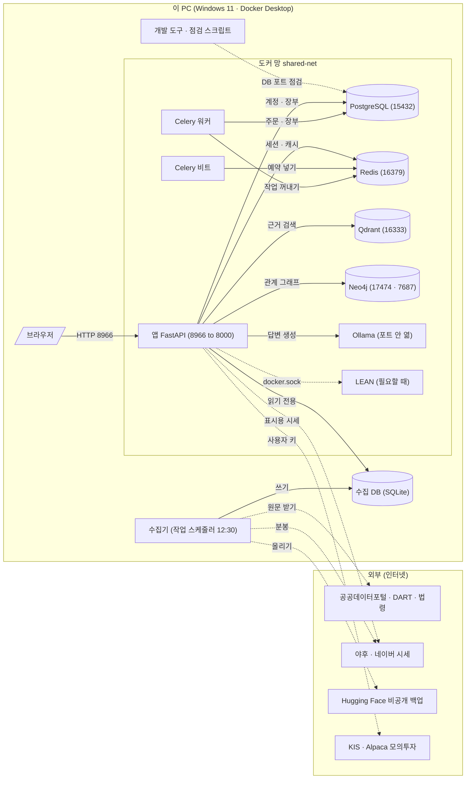
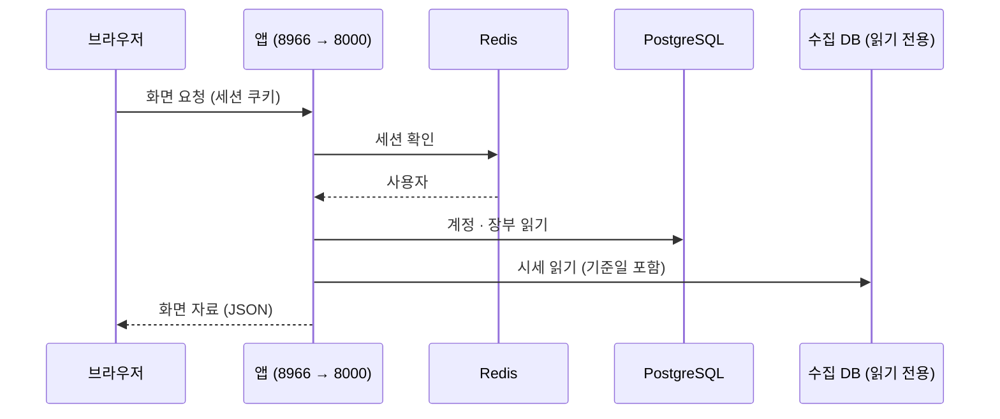

# 인프라 · 네트워크 구성도 v0.1 — Qurious

| 문서 정보 | |
|---|---|
| **판 · 상태** | v0.1 · 초안(검토 전) |
| **구분** | 6. 시스템 설계 — 인프라 · 네트워크 구성도(지금은 로컬 한 대 · AWS 구성은 정해지면) |
| **작성** | 이동원 |
| **검토** | 검토 전 — 판을 올리는 PR 에 팀원 한 명 이상의 「읽었음」 |
| **최종 수정** | 2026-10-03 (KST) |
| **기준** | 코드 `main` `7afe5e9` · `docker-compose.yml` · `scripts/personal/_common.ps1` · 실측 `docker port` · `docker network inspect`(2026-10-03 18:4x) |
| **관련 문서** | [아키텍처 그림 v2.0](../img/architecture/qurious-architecture_v2.0.png) · [로컬 실행 안내서 v0.1](../배포/로컬실행안내서.md) · [배포 구성도 v0.1](../배포/배포구성도.md) · [ADR-0001 실거래 차단](../ADR/ADR-0001-실거래-주문-경로-차단.md) · [ADR-0004 KIS 자격증명](../ADR/ADR-0004-KIS-자격증명은-사용자마다.md) · [문서 그림 지침 v0.1](../문서기준/지난판/문서그림지침_v0.1.md) |
| **최근 개정** | 새 문서 |

> **이 문서로 알 수 있는 것**
> 1. 앱은 어떤 컨테이너 · 포트 · 망 · 저장 공간으로 이루어져 있나?
> 2. 이 PC 밖으로 무엇이 열려 있고, 앱 · 수집기는 바깥 어디로 나가나?
> 3. 이 구성에서 무엇이 위험하고, AWS 로 옮기면 어떤 칸을 채워야 하나?
>
> **읽는 순서** — 팀원: 요약 → 그림 1 → 표 2 포트 · 강사님: 요약 → 그림 1 → 5절 위험 · 처음 온 사람: 요약 → 부록 A 용어

## 요약

1. Qurious 는 지금 **PC 한 대**에서 돈다 — 도커 컴포즈 서비스 10개(늘 켜짐 8 · 한 번 돌고 끝나는 `ingest` · `model-pull` 2)와, 필요할 때 앱이 띄우는 LEAN 백테스트 컨테이너가 한 도커 망(`shared-net`)에 있다. 도커 **밖**에서는 작업 스케줄러가 매일 12:30 수집기를 돌려 수집 DB(SQLite)를 채우고, 앱은 그 DB 를 **읽기 전용**으로 붙여 쓴다.
2. 이 PC 에 여는 포트는 6개다(8966 앱 · 15432 PostgreSQL · 16379 Redis · 16333 Qdrant · 17474 · 7687 Neo4j). 실측해 보니 모두 **모든 망 연결(`0.0.0.0` · `[::]`)** 에 열려 있다 — 같은 와이파이의 다른 기기에서 닿을 수 있는지는 Windows 방화벽에 달렸다(확인 전 추정). 이 PC 에서만 열리게 바꾸는 안을 5절에 두었다(팀 공용 파일이라 논의 먼저).
3. AWS 구성은 정하지 않았다(로컬에서 다 만든 뒤 고른다 · 계획서 2.3절). 6절의 빈 칸은 **팀이 AWS 여부를 정하면 이동원이 모아 채운다 — 강사님 일정의 「AWS 배포」 칸(10-19(월) 오후)**.

---

## 1. 구성 요소


**<표 1> 컨테이너와 도커 밖 구성 요소** · 확실도: 모두 compose · 실측으로 확인

| 이름 | 이미지 · 실행 | 이 PC 포트 → 컨테이너 | 저장 공간 | 꺼지면 | 확실도 |
|---|---|---|---|---|:-:|
| 앱 `app` | 저장소 `Dockerfile` · uvicorn(FastAPI) | 8966 → 8000 | `app_data` · 수집 DB 폴더(읽기 전용) · LEAN 작업 볼륨 | 화면 · API 전부 | 확인 |
| PostgreSQL `postgres` | `postgres:16-alpine` | 15432 → 5432 | `postgres_data` | 로그인 · 주문 · 모의투자 장부 · 리밸런싱 | 확인 |
| Redis `redis` | `redis:8-alpine` (AOF + 60초 스냅샷) | 16379 → 6379 | `redis_data` | 로그인 세션 · 캐시 · Celery 작업 통로 | 확인 |
| Neo4j `neo4j` | `neo4j:5.18-community` | 17474 → 7474 · 7687 → 7687 | `neo4j_data` | 종목 관계 그래프(선택 기능) | 확인 |
| Qdrant `qdrant` | `qdrant/qdrant:v1.19.1` (CPU 2개 상한) | 16333 → 6333 | `qdrant_data` | 문서 근거 검색(RAG) · 크롤링 적재 — 꺼져도 앱은 뜨고 「근거 없음」 | 확인 |
| Ollama `ollama` | `ollama/ollama:latest` | 열지 않음(컨테이너끼리만) | `ollama_data` | AI 채팅 · RAG 답변 | 확인 |
| Celery 워커 · 비트 | 앱과 같은 이미지 | 열지 않음 | 워커만 `app_data` · 수집 DB 폴더(읽기 전용) | 자동매매 10분 · 리밸런싱 1시간 같은 예약 작업 | 확인 |
| `ingest` · `model-pull` | 앱 이미지 · Ollama 이미지 | 열지 않음 | — | 한 번 돌고 끝(금융 자료 넣기 · 모델 받기) | 확인 |
| LEAN 백테스트 | `quantconnect/lean` — 앱이 이 PC 의 도커에 직접 띄운다 | 열지 않음 | `lean-workflows` | LEAN 백테스트만 | 확인 |
| 수집기 (도커 밖) | 이 PC 의 파이썬 · 작업 스케줄러 매일 12:30 | — | `data/collector/market.sqlite3`(3.5 GB · 10-03) | 다음 날 시세 · 배당 · 수정주가가 갱신되지 않는다 | 확인 |

---

## 2. 네트워크 그림


**<그림 1> 로컬 네트워크 구성도** · 범례: 실선 = 늘 쓰는 길 · 점선 = 필요할 때만 쓰는 길(외부 · LEAN · 점검) · 원통 = 저장소 · 괄호 안 숫자 = 이 PC 에서 여는 포트


<sub>원본: [Figma · 문서 그림 · 그림 1](https://www.figma.com/board/qTCGg7PlmpGNZT5uM8VQGm?node-id=3-100) · 그림 판 v0.1 · 기준 `7afe5e9` · 2026-10-03</sub>

<details><summary>그림 원문(Mermaid) — 검색 · 다시 그리기용</summary>



</details>

사람이 쓰는 입구는 **8966 하나**다. 나머지 다섯 포트는 개발 도구(DB 클라이언트 · 점검 스크립트)를 위한 것이고, Ollama · Celery 는 포트를 열지 않는다. 수집 DB 는 도커 밖의 수집기만 쓰고 앱은 읽기만 한다.


**<그림 2> 화면 한 번의 요청이 지나는 길** · 범례: 실선 = 요청 · 점선 = 응답



---

## 3. 포트 — 무엇이 이 PC 밖으로 열려 있나

「열린 범위」 는 2026-10-03 에 `docker port` 로 잰 값이다.

**<표 2> 이 PC 에서 여는 포트**

| 포트 | 컨테이너 | 누가 쓰나 | 열린 범위(실측) | 비고 |
|---:|---|---|---|---|
| 8966 | 앱 8000 | 브라우저 · 점검 스크립트(`check.ps1`) | `0.0.0.0` · `[::]` | 유일한 사람용 입구 |
| 15432 | PostgreSQL 5432 | DB 클라이언트 · 시험(`test.ps1` 은 따로 일회용 DB) | `0.0.0.0` · `[::]` | 기본 5432 와 겹치지 않게 옮김 |
| 16379 | Redis 6379 | 점검 | `0.0.0.0` · `[::]` | — |
| 16333 | Qdrant 6333 | 대시보드 `http://localhost:16333/dashboard` | `0.0.0.0` · `[::]` | 통합본(`rag-lab/`)이 6333 을 써서 옮김 |
| 17474 | Neo4j 7474 | Neo4j 브라우저 | `0.0.0.0` · `[::]` | — |
| 7687 | Neo4j 7687 | 앱 밖 Neo4j 클라이언트 | `0.0.0.0` · `[::]` | **기본 포트 그대로** — 이 PC 에 다른 Neo4j 가 있으면 시작이 실패한다 |
| — | Ollama 11434 | 앱 · 워커만(컨테이너끼리) | 열지 않음 | 이 PC 에 따로 깐 Ollama(11434)와 겹치지 않게 |


**<그림 3> 열린 범위** · 범례: `──▶` 닿음 · `──?──▶` 방화벽에 달림

```
  이 PC 의 브라우저 ────────────────▶ localhost:8966  ──▶ app:8000
  이 PC 의 DB 클라이언트 ───────────▶ localhost:15432 ──▶ postgres:5432
  같은 와이파이의 다른 기기 ──?──▶ (이 PC 주소):15432 ──▶ postgres:5432
                                      ▲
                                      └ 0.0.0.0 = 이 PC 의 모든 망 연결에 열림.
                                        127.0.0.1 로 묶으면 이 PC 안에서만 닿는다.
```

---

## 4. 망 · 저장 공간 · 연결

**<표 3> 망 · 볼륨 · 붙인 폴더**

| 종류 | 이름 | 무엇 | 비고 |
|---|---|---|---|
| 도커 망 | `shared-net` (bridge · `172.18.0.0/16` · 컨테이너 8 실측) | 컨테이너가 서로 서비스 이름(`postgres` · `redis` · `qdrant` …)으로 부른다 | compose 가 「밖에서 만든 망」 으로 선언한다 — `start.ps1` 이 없으면 만든다 |
| 이름 볼륨 | `postgres_data` · `redis_data` · `neo4j_data` · `qdrant_data` · `ollama_data` · `app_data` | 컨테이너를 지워도 남는 데이터 | 실제 이름에 `qurious_` 가 붙는다 · `stop.ps1 -DeleteData` 로만 지운다 |
| 이름 볼륨 | `lean-workflows` | 앱과 LEAN 컨테이너가 작업 파일을 주고받는 곳 | 접두사 없이 고정 이름(앱이 도커에 이 이름으로 요청) |
| 붙인 폴더 | `./data` → `/app/data/csv` **읽기 전용** | 수집 DB · CSV 를 앱 · 워커가 읽는다 | 쓰기 경로가 없어 앱이 수집 DB 를 망가뜨릴 수 없다 |
| 붙인 폴더(개발 모드) | `./app` · `./public` · `./prompts` · `./alembic` → 컨테이너 **읽기 전용** | 저장하면 몇 초 안에 반영(`start.ps1 -Dev`) | `scripts/personal/compose.dev.yml` |
| 붙인 소켓 | `/var/run/docker.sock` → 앱 | 앱이 이 PC 의 도커로 LEAN 컨테이너를 띄운다 | 5절 ② |
| 이 PC 주소 | `host.docker.internal` | 컨테이너가 이 PC 에 따로 깐 Ollama 를 부를 때(선택) | `COMPOSE_OLLAMA_URL` |

---

## 5. 바깥으로 나가는 길

주소는 코드의 주소 문자열을 센 것이고(부록 B), 실제로 부르는지는 키 · 설정에 따른다.

**<표 4> 외부 통신**

| 누가 | 어디로 | 무엇 | 인증 | 언제 |
|---|---|---|---|---|
| 수집기 | 공공데이터포털 `apis.data.go.kr` | 전 종목 일봉 · 특일(휴일) | 포털 키(`.env`) | 매일 12:30 |
| 수집기 | DART `opendart.fss.or.kr` | 배당 공시 본문 | DART 키 | 매일 12:30 |
| 수집기 | 국가법령정보센터 `www.law.go.kr` | 시행일 판 법령 · 행정규칙 | 법령 키(OC) | 근거 문서 받을 때 |
| 수집기 | 야후(yfinance) · FinanceDataReader | 분봉 · ETF · 지수 일봉 | 없음 | 매일 12:30 |
| 수집기 | Hugging Face `huggingface.co` | 비공개 데이터셋 백업 올리기 | HF 토큰 | 매일 12:30 |
| 앱 | 야후 `query1/2.finance.yahoo.com` | 표시용 시세(수집 DB 에 없는 것) | 없음 | 화면 요청 때 |
| 앱 | 네이버 금융 | 크롤링 학습 기능 | 없음 | 사용자가 돌릴 때 |
| 앱 | KIS 모의투자 `openapivts.koreainvestment.com` | 모의 주문 · 잔고 | **사용자별 키**(ADR-0004) | 자동매매 · 모의 주문 |
| 앱 | Alpaca `paper-api.alpaca.markets` | 미국 주식 모의 주문 | 키 | 사용자가 켤 때 |
| 앱 | 실거래 주소(KIS 실전 등) | — | — | **막혀 있다** — 실거래 차단 지점(ADR-0001)이 모의로 낮춘다 |

코드에는 이 밖에도 주소 문자열이 있다(코인 거래소 · 문자 알림 · 텔레그램 · OpenAI 등 — 강사님 기초 코드). 키가 없으면 부르지 않는 기능들이며, 어느 것을 켤지는 각 기능의 주담당이 정한다.

---

## 6. 위험과 제안

**<표 5> 이 구성의 위험** · 확실도: 확인 = 실측 · 추정 = 확인 전

| # | 위험 | 왜 문제인가 | 제안 | 확실도 |
|:-:|---|---|---|:-:|
| ① | 포트 6개가 모든 망 연결에 열려 있다 | 공용 와이파이에서 같은 망의 기기가 DB 포트에 닿을 수 있다(방화벽 규칙에 따라) — DB 계정은 개발용 기본값이다 | compose 의 포트를 `"127.0.0.1:15432:5432"` 처럼 이 PC 에만 묶는다 · **`docker-compose.yml` 은 팀 공용이라 논의 먼저**(강사님 기초 코드와 3-way 병합할 때도 이 줄이 걸린다) | 열림은 확인 · 닿음은 추정 |
| ② | 앱 컨테이너에 도커 소켓이 붙어 있다 | 앱 안의 코드가 이 PC 의 도커를 다룰 수 있다 — 앱이 뚫리면 이 PC 전체가 위험하다 | LEAN 백테스트에 필요하다(강사님 기초 코드). 배포할 때는 LEAN 을 원격 실행(`LEAN_SSH_*`)으로 돌리거나 소켓을 빼는 칸을 배포계획서에 둔다 | 확인 |
| ③ | 개발용 DB 비밀번호가 compose 에 적혀 있다 | 공개 저장소에 이미 있다 | 로컬 전용이라 지금은 둔다 · 배포 때는 `.env` 로(배포계획서 칸) | 확인 |
| ④ | Neo4j 7687 은 기본 포트 그대로다 | 이 PC 에 다른 Neo4j 가 있으면 시작이 실패한다 | 겹치면 `17687:7687` 로 옮기는 안 — 생기면 장애 대응 절차서 칸 | 확인 |
| ⑤ | Windows 가 부팅마다 포트 묶음을 예약한다 | 예약 범위 안 포트는 열 수 없다(이 PC 실측 55367~55466 · 일회용 시험 DB 포트를 이것 밖에서 고른다) | `_common.ps1` 의 `Find-QFreePort` 가 고른다 | 확인 |

---

## 7. AWS 로 옮기면 — 정해지면 채울 칸

AWS 배포는 비목표다(계획서 2.3절 — 로컬에서 다 만든 뒤 고른다). 표 6 의 칸은 **팀이 AWS 여부를 정하면 이동원이 모아 채운다**. 강사님 일정의 「AWS 배포」 칸은 10-19(월) 오후다. 본보기 자료는 강사님 `aws-ec2-alb-lab`(EC2 + 로드밸런서)이다.

**<표 6> 정해지면 채울 칸**

| 칸 | 정할 것 | 누가 | 언제 |
|---|---|---|---|
| 대상 환경 | EC2 한 대 · 컨테이너 서비스 · 안 함 | 팀 결정 → 이동원이 이 표에 | AWS 여부를 정할 때 · 늦어도 10-19 오전 |
| 망 | VPC · 서브넷 · 보안 그룹(열 포트는 443 하나가 목표) | 이동원(모으기) · 각 기능 주담당이 쓰는 외부 주소 확인 | 대상 환경이 정해진 뒤 |
| 저장소 | PostgreSQL · Redis · Qdrant 를 관리형으로 둘지 · 수집 DB 를 어디에 둘지 | 팀 | 위와 같다 |
| 비밀값 | `.env` → 비밀값 저장소 | 이동원 | 위와 같다 |
| 그림 | AWS 구성 그림(문서 그림 지침 7절 — AWS 공식 아이콘) | 이동원 | 위와 같다 |

---

## 부록 A. 용어

| 말 | 뜻 | 이 문서에서 |
|---|---|---|
| 포트 공개 | 컨테이너 안의 포트를 이 PC 의 포트로 이어 바깥에서 닿게 하는 것 | `"15432:5432"` = 이 PC 15432 → 컨테이너 5432 |
| `0.0.0.0` · `[::]` | 「이 PC 의 모든 망 연결」(IPv4 · IPv6) | 지금 포트 6개가 여기에 열려 있다 |
| 도커 망 | 컨테이너끼리 서로 이름으로 부르는 가상의 망 | `shared-net` |
| 이름 볼륨 | 도커가 관리하는 저장 공간 — 컨테이너를 지워도 남는다 | DB 데이터 6개 |
| 붙인 폴더(bind mount) | 이 PC 의 폴더를 컨테이너 안에 그대로 보이게 하는 것 | 수집 DB(읽기 전용) · 개발 모드 코드 |
| 도커 소켓 | 도커에 명령을 보내는 입구 파일 | 앱이 LEAN 컨테이너를 띄우는 길 |

## 부록 B. 만든 방법

- 구성 요소 · 포트 · 볼륨: `docker-compose.yml` · `scripts/personal/compose.dev.yml` · `_common.ps1` 의 서비스 표를 읽었다.
- 열린 범위 · 망: `docker port <컨테이너>` · `docker network inspect shared-net` · `docker volume ls`(2026-10-03 18:4x · 개발 모드로 켜 둔 상태).
- 외부 주소: `app/` · `collector/` · `scripts/` 의 `.py` 에서 `https://` 주소 문자열을 세었다 — 부르는지는 설정에 따른다.
- 그림 1: [문서 그림 지침 v0.1](../문서기준/지난판/문서그림지침_v0.1.md) 2절 흐름(Mermaid → FigJam → 다듬기 → PNG 1배 → 128색).
- 뒤집을 조건: compose 의 서비스 · 포트가 바뀌면 표 1 · 2 · 그림 1 을 함께 고친다(문서 그림 지침 6절 점검표).

## 부록 C. 변경 노트 — 다음 판(v0.2)에 넣을 것

| 날짜 | 종류 | 무엇 | 옮길 곳 | 근거 |
|---|---|---|---|---|

## 부록 D. 개정 이력

| 판 | 날짜 | 무엇이 바뀌었나 | 왜 | 근거 |
|---|---|---|---|---|
| v0.1 | 2026-10-03 | 추가 — 새 문서(구성 요소 · 네트워크 그림 · 포트 실측 · 망 · 외부 통신 · 위험 · AWS 빈 칸) | 강사님 산출물 표 6구분 「인프라 · 네트워크 구성도」 가 비어 있었다 | compose · 실측 |
