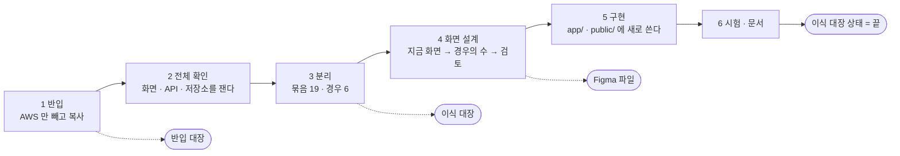
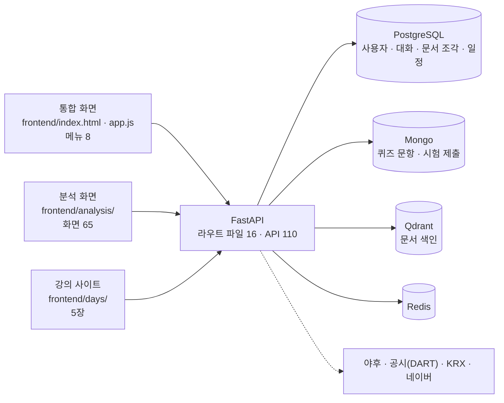
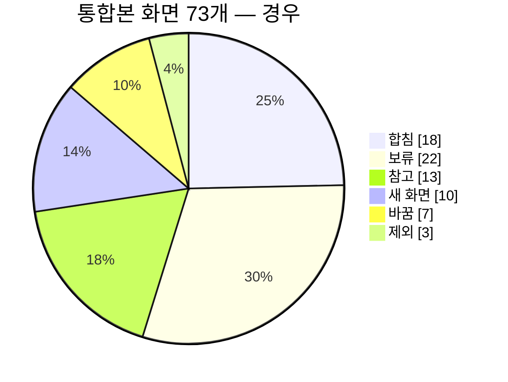
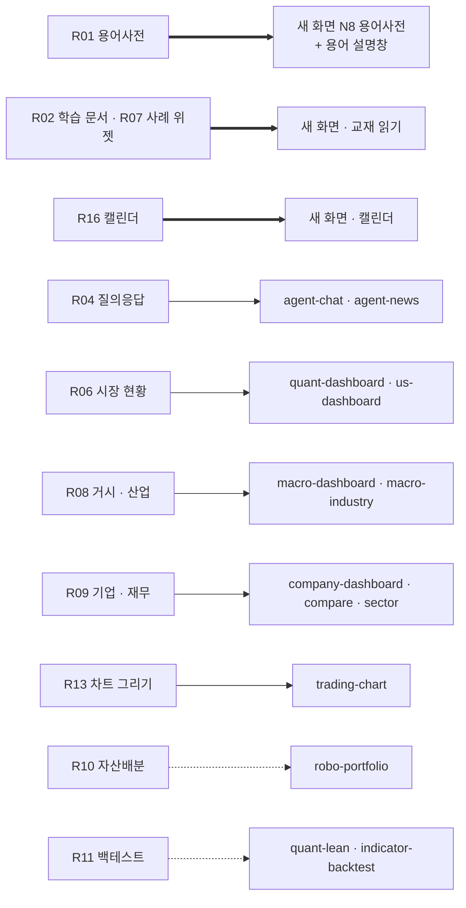
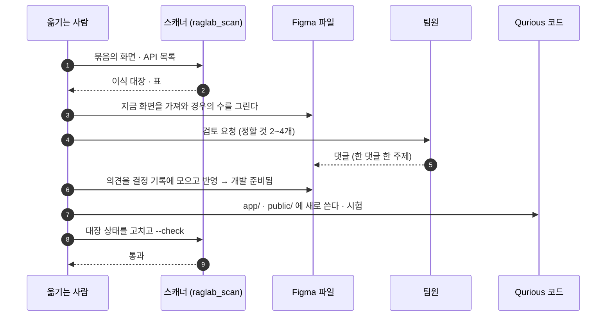

# 통합본 이식 계획서 v0.1 — Qurious

| 문서 정보 | |
|---|---|
| **판 · 상태** | v0.1 · 초안(검토 전) |
| **구분** | 6. 시스템 설계 — 통합본 반입 · 이식 계획 (2. 요구사항 관리 · 4. 화면·서비스 설계와 이어진다) |
| **작성** | 이동원(데이터 · 문서) |
| **검토** | 검토 전 |
| **최종 수정** | 2026-09-30 (KST) |
| **기준** | Qurious `main` `90dde10` + 이 문서를 싣는 변경 · 통합본 `investment-rag-lab` `2f0e71f`(2026-09-28) · 강사님 원본 대조 `domain-rag-lab` `e63e675` · `investment-analysis` `2cb9b7f` |
| **관련 문서** | [출처 표기](../../NOTICE.md) · [반입 대장](대장/통합본-반입대장.tsv) · [이식 대장](대장/통합본-이식대장.tsv) · [용어사전 설계서 v0.1](용어사전-설계.md) · [기능 설계서 v0.1](기능설계.md) · [화면 IA v0.3](../화면/지난판/IA_v0.3.md) · [화면 설계 절차 v0.1](../화면/지난판/화면설계절차_v0.1.md) · [API 명세서 v0.1](../인터페이스/지난판/API명세서_v0.1.md) |
| **최근 개정** | 첫 판 |

> **이 문서가 답하는 질문**
> 1. 통합본에서 무엇이 Qurious 저장소에 들어왔고, 무엇을 왜 뺐나?
> 2. 통합본에는 어떤 화면 · API · 저장소가 있고, Qurious 의 무엇과 겹치나?
> 3. 그것들을 어떤 묶음으로 나눠, 어떤 경우(새 화면 · 합침 · 바꿈 …)로, 어떤 차례로 옮기나?
>
> **읽는 순서** — 팀원: 요약 → 4절(묶음 표에서 내 영역) → 5절(옮기는 절차) · 강사님: 요약 → 1절 → 2절 · 옮기는 사람: 5절 → 부록 B

## 요약

1. **통합본을 AWS 만 빼고 `rag-lab/` 에 옮겼다.** 원본 329개 중 314개(57.6MB)는 저장소에, 시세 자료 3개는 팀 비공개 데이터셋에 있고, AWS 12개는 가져오지 않았다. 이 폴더는 Qurious 앱과 **아직 이어져 있지 않은** 읽기 · 이식용 사본이다.
2. **통합본에는 화면 73개(+ 강의 사이트 5장) · API 110개 · 저장소 이름 12개가 있다.** API 중 앱에 실제로 걸린 것은 107개이고, Qurious 와 주소가 똑같은 것이 3개 · 같은 주소 묶음에 속하는 것이 24개다.
3. **화면 · API 전부를 기능 묶음 19개로 나누고 경우를 정했다** — 새 화면 3 · 합침 5 · 바꿈 1 · 참고 2 · 보류 4 · 제외 4. 첫 차례는 용어사전(R01)이고, 그 서버 쪽(표 다섯 · API 넷)은 끝났다([용어사전 설계서](용어사전-설계.md)). 화면은 묶음마다 먼저 설계한 뒤(화면 설계 절차) Qurious 방식으로 새로 쓴다 — 용어사전의 화면 자리도 다음 작업에서 설계한다.

---

## 1. 왜 · 어떻게 가져왔나

### 1.1 배경

강사님 요구 원문은 목표 기능 ①의 첫 세부 기능 「용어사전과 연관 개념 탐색」 의 구현 방안으로 **「domain-rag-lab 와 investment-analysis 의 통합」** 을 적는다. 팀장이 두 저장소를 합친 통합본(`investment-rag-lab`)을 개인 프로젝트로 이미 만들어 두었다. 이 통합본을 팀 저장소로 가져와, 전체를 보고 기능별로 나눈 뒤 화면을 다시 설계해 Qurious 기능으로 만든다.

### 1.2 결정 — AWS 만 빼고 전부

표 1 은 「얼마나 가져올지를 어떻게 정했나」 에 답한다.

**표 1. 가져오는 범위 — 검토한 선택지** · 결정 2026-09-30 · 결정한 사람: 팀장(이동원)

| 선택지 | 무엇 | 좋은 점 | 나쁜 점 | 결과 |
|---|---|---|---|---|
| 용어 자료만 | 용어집 글 셋(약 0.3MB)과 읽는 로직 | 저장소가 가볍다 · 쓰지 않는 코드가 없다 | 나머지 기능을 옮길 때마다 원본 저장소를 따로 봐야 한다 · 전체를 보고 나눌 수 없다 | 버림 |
| 그림 빼고 전부 | 코드 · 글 288개(약 11MB) | 한 저장소에서 코드를 읽는다 | 화면을 다시 설계하려면 그림 · 강의 본문도 봐야 한다 | 버림 |
| **AWS 만 빼고 전부** | 314개(57.6MB) + 시세 자료 3개는 비공개 데이터셋 | 통합본 전체를 한곳에서 확인 · 분리 · 설계할 수 있다 | 저장소가 57.6MB 커진다(그림 47MB) · 앱과 안 이어진 코드가 저장소에 있다 | **고름** |

- **받아들인 비용과 막는 장치** — 앱과 이어지지 않은 코드가 「구현된 것」 으로 읽히지 않게 넷을 두었다.
  ① 도커 빌드에서 뺀다(`.dockerignore`) ② 요구 추적의 코드 흔적에서 뺀다(`rtm_scan`) ③ 폴더가 대장과 같은지 자동 시험이 본다(2.3절) ④ 폴더 첫 파일이 「앱과 이어져 있지 않다」 를 알린다(`rag-lab/00-반입안내.md`).
- **뒤집을 조건** — 묶음을 다 옮긴 뒤에는 폴더를 줄이거나 지울 수 있다(7절 💬 ④). 강사님이 서면으로 재배포를 허락하지 않으시면 강의 본문(`frontend/days/` · 교재 글)을 뺀다.

그림 1 은 「들여온 통합본이 어떤 차례로 Qurious 기능이 되나」 에 답한다.

**그림 1. 반입에서 기능까지** · 범위: 묶음 하나가 지나는 길 · 범례: 네모 = 하는 일 · 둥근 끝 = 결과물



1~3 단계는 이 문서에서 끝났고, 4~6 단계는 묶음마다 되풀이한다(5절).

---

## 2. 무엇이 들어왔나

### 2.1 반입 결과

아래 표는 「원본 329개가 각각 어디로 갔나」 와 「들어온 파일이 어느 영역이고 누구의 것과 같은가」 에 답한다. 스캐너가 [반입 대장](대장/통합본-반입대장.tsv)에서 다시 채운다.

**반입 결과 — 상태별 · 영역별** · 기준: 통합본 `2f0e71f` · 강사님 원본 `e63e675` · `2cb9b7f` 와 내용 대조(줄끝 차이는 무시)

<!-- raglab_scan:ledger -->
| 상태 | 파일 | 크기 |
|---|--:|--:|
| 복사 | 314 | 57.6 MB |
| AWS 제외 | 12 | 0.0 MB |
| HF 보관 | 3 | 0.6 MB |
| **합계** | **329** | **58.2 MB** |

| 영역 | 복사한 파일 | 크기 | 강사님 domain-rag-lab 과 같음 | 강사님 investment-analysis 와 같음 | 같은 경로 · 내용 다름 | 통합본 고유 |
|---|--:|--:|--:|--:|--:|--:|
| 자료 | 67 | 22.4 MB | 23 | 29 | 0 | 15 |
| 화면-분석 | 97 | 18.6 MB | 0 | 94 | 0 | 3 |
| 화면-강의사이트 | 38 | 11.2 MB | 36 | 0 | 2 | 0 |
| 백엔드 | 60 | 4.3 MB | 34 | 6 | 7 | 13 |
| 화면-통합 | 15 | 1.0 MB | 8 | 1 | 2 | 4 |
| 문서 | 14 | 0.2 MB | 0 | 0 | 0 | 14 |
| 설정 | 17 | 0.1 MB | 8 | 1 | 7 | 1 |
| 도구 | 3 | 0.0 MB | 2 | 0 | 0 | 1 |
| 시험 | 2 | 0.0 MB | 0 | 0 | 0 | 2 |
| 워크플로 | 1 | 0.0 MB | 1 | 0 | 0 | 0 |
<!-- /raglab_scan:ledger -->

- **상태** — 복사 = 폴더에 있고 저장소에 들어간다 · AWS 제외 = 가져오지 않았다 · HF 보관 = 저장소에 넣지 않고 팀 비공개 데이터셋에 두었다.
- **원천** — 「같음」 은 강사님 원본에 내용이 똑같은 파일이 있다는 뜻이다. 「통합본 고유」 는 강사님 두 원본에 같은 내용이 없는 파일 — 통합하며 새로 쓰거나 고친 것이다. 「같은 경로 · 내용 다름」 은 통합본에서 고쳤는지 강사님이 뒤에 고치셨는지 가르지 못했다 🟡.
- 들어온 314개의 78%(243개)가 강사님 원본과 내용이 같다.

### 2.2 가져오지 않은 것 · 따로 둔 것

**저장소에 없는 파일 15개와 까닭**

<!-- raglab_scan:excluded -->
| 파일 | 상태 | 까닭 |
|---|---|---|
| `.env.prod.example` | AWS 제외 | AWS 배포 — AWS 서버 환경 변수 예시 |
| `.github/workflows/cd-ecr.yml` | AWS 제외 | AWS 배포 — ECR 빌드 · EC2 배포 워크플로 |
| `.github/workflows/cd.yml` | AWS 제외 | AWS 배포 — EC2 소스 배포 워크플로 |
| `Caddyfile` | AWS 제외 | AWS 배포 — EC2 공인 주소의 HTTPS 프록시 |
| `SETUP_PLACEHOLDERS.md` | AWS 제외 | AWS 배포 — 배포용 입력 칸 안내(전부 AWS 배포용) |
| `app/api/routes/lex.py` | AWS 제외 | AWS 서비스 연동 — Amazon Lex V2 대화 |
| `app/api/routes/llm_bench.py` | AWS 제외 | AWS 서비스 연동 — EC2 vLLM · Bedrock · SageMaker 비교 |
| `cloudfront-acm-policy.json` | AWS 제외 | AWS 설정 — CloudFront · ACM IAM 정책 |
| `docker-compose.ecr.yml` | AWS 제외 | AWS 배포 — ECR 이미지로 띄우는 구성 |
| `docker-compose.prod.yml` | AWS 제외 | AWS 배포 — AWS 서버용 구성(.env.prod.example 첫 줄이 「AWS server」) |
| `frontend/analysis/data/samsung-cup-with-handle-2025.json` | HF 보관 | 시세 자료 — 저장소에 넣지 않고 비공개 데이터셋에 둔다. 야후 파이낸스에서 받은 삼성전자 일봉 |
| `frontend/analysis/js/views/llmBenchView.js` | AWS 제외 | AWS 서비스 연동 — 위 비교 화면 |
| `frontend/days/assets/etf-catalog.json` | HF 보관 | 시세 자료 — 저장소에 넣지 않고 비공개 데이터셋에 둔다. 네이버 금융 목록 + 토스증권 화면의 내부 API 로 모은 ETF 1,009종의 3개월 수익률 · 구성종목 |
| `frontend/days/assets/leverage-etf-volume.json` | HF 보관 | 시세 자료 — 저장소에 넣지 않고 비공개 데이터셋에 둔다. 네이버 금융 월봉에서 계산한 ETF 2종의 월 거래대금 합계 12개 |
| `scripts/deploy_ec2.sh` | AWS 제외 | AWS 배포 — EC2 배포 스크립트 |
<!-- /raglab_scan:excluded -->

표 2 는 「들어온 데이터를 어떤 기준으로 갈랐나」 에 답한다.

**표 2. 데이터 파일 판정** · 확실도 🟢 원문 · 실측 확인 · 🟡 추론

| 데이터 | 어디서 온 것 | 판정 | 근거 | 확실도 |
|---|---|---|---|:-:|
| 시세 자료 3개(ETF 목록 · 월 거래대금 · 삼성전자 일봉) | 네이버 금융 · 토스증권 화면의 응답 · 야후 | **저장소 밖** — 팀 비공개 데이터셋 `qurious-quant/rag-lab-display-data` | 팀 규칙: 외부에서 받은 시세는 **적재하지 않는다**(화면에 보여 주는 것은 된다) · 공개 저장소는 이력에서 뺄 수 없다 | 🟢 |
| 국민연금 국내주식 투자 현황 엑셀 2개 | 국민연금공단 공시 | 저장소에 넣음 | 공공데이터포털 「국민연금공단_국내주식 투자정보」 — 이용허락범위 「제한 없음」 (2026-09-30 확인 · 확인한 것은 2024년 말 판) | 🟢 2024 · 🟡 2025 |
| 백테스트 엔진 참조 데이터 3개 | QuantConnect LEAN | 저장소에 넣음 | Apache License 2.0 · Qurious 에 이미 같은 폴더가 있다 | 🟢 |
| 백테스트 결과 요약 3개 | 통합본이 계산한 결과(통계만) | 저장소에 넣음 | 원시 시세가 아니라 계산한 값 | 🟢 |
| 교재 글 · 용어집 · 퀴즈 문항 | 강사님 | 저장소에 넣음 | 수업 중 구두 허가 · 과제 원문이 통합을 지정(NOTICE 2절) — 서면 허가는 없다 | 🟡 |
| 강의 사이트 그림(증권사 앱 · 거래소 자료 캡처 포함) | 강사님 강의 본문 | 저장소에 넣음 | 강의 본문의 일부 — 제품 화면으로 옮길 때 다시 본다(7절 💬 ③) | 🟡 |

### 2.3 확인한 것

| 무엇 | 방법 | 결과 |
|---|---|---|
| 복사본이 원본과 같은가 | 파일마다 저장될 때의 git blob ID 를 원본과 대조 | 314 / 314 같음 |
| 비밀값이 들어왔나 | 액세스 키 · 개인키 · 토큰 · AWS 리소스 이름 모양을 글 파일 전부에서 찾음 | 0건 · 자동 시험 TC-RL-05 가 계속 본다 |
| 그림에 계정 화면 · 개인정보가 찍혔나 | 이름이 막연한 그림 14장을 직접 열어 봄 | 없음(강의용 인포그래픽 · 화면 캡처) · 나머지 그림은 이름으로만 봤다 🟡 |
| 시세 자료가 제대로 보관됐나 | 올림 → 다시 받음 → blob 대조 | 3 / 3 같음 · 원격이 비공개임을 확인한 뒤에만 올린다 |
| 폴더가 대장과 같은가 | `python scripts/raglab_scan.py --check` | 같음 · 자동 시험 TC-RL-01 · 02 |

---

## 3. 통합본 한눈에

그림 2 는 「통합본이 어떤 덩어리로 되어 있고 무엇에 기대나」 에 답한다.

**그림 2. 통합본 구성 (컨테이너 단계)** · 범례: 원통 = 저장소 · 점선 = 요청이 올 때마다 밖에서 받아 오는 값



화면은 세 벌이다. 통합 화면의 메뉴 「투자 분석」 이 분석 화면으로, 「10단원 학습」 이 교재로 이어진다. 앱 하나가 저장소 넷을 쓰고, 시세는 저장하지 않고 요청 때마다 밖에서 받는다(예외 하나 — 3.2절).

### 3.1 화면 — 73개 + 강의 사이트 5장

**통합본의 화면** · 벌: 통합 = 위 메뉴 여덟 · 분석 = 분석 화면의 경로 표 · 메뉴: 그 화면이 옆 메뉴의 어느 구역에 걸려 있나(「메뉴 없음」 = 주소로만 열 수 있다) · 통합 여덟 줄의 「부르는 API」 는 화면 코드가 한 파일이라 여덟 줄에 똑같이 적었다

<!-- raglab_scan:views -->
| 벌 | 화면 키 | 이름 | 메뉴 | 코드 파일 | 부르는 API |
|---|---|---|---|---|---|
| 통합 | `home` | 홈 | 위 메뉴 | `app.js` | `/backtests/run` · `/chat` · `/ingest/file` · `/ingest/text` · `/market/beta` · `/market/calendar-events` · `/market/company` · `/market/history` · `/market/intraday` · `/market/kospi200-history` |
| 통합 | `theory` | 10단원 학습 | 위 메뉴 | `app.js` | `/backtests/run` · `/chat` · `/ingest/file` · `/ingest/text` · `/market/beta` · `/market/calendar-events` · `/market/company` · `/market/history` · `/market/intraday` · `/market/kospi200-history` |
| 통합 | `analysis` | 투자 분석 | 위 메뉴 | `app.js` | `/backtests/run` · `/chat` · `/ingest/file` · `/ingest/text` · `/market/beta` · `/market/calendar-events` · `/market/company` · `/market/history` · `/market/intraday` · `/market/kospi200-history` |
| 통합 | `agent` | AI 에이전트 | 위 메뉴 | `app.js` | `/backtests/run` · `/chat` · `/ingest/file` · `/ingest/text` · `/market/beta` · `/market/calendar-events` · `/market/company` · `/market/history` · `/market/intraday` · `/market/kospi200-history` |
| 통합 | `learn` | RAG 질문 | 위 메뉴 | `app.js` | `/backtests/run` · `/chat` · `/ingest/file` · `/ingest/text` · `/market/beta` · `/market/calendar-events` · `/market/company` · `/market/history` · `/market/intraday` · `/market/kospi200-history` |
| 통합 | `simulation` | 시뮬레이션 | 위 메뉴 | `app.js` | `/backtests/run` · `/chat` · `/ingest/file` · `/ingest/text` · `/market/beta` · `/market/calendar-events` · `/market/company` · `/market/history` · `/market/intraday` · `/market/kospi200-history` |
| 통합 | `backtest` | 백테스트 | 위 메뉴 | `app.js` | `/backtests/run` · `/chat` · `/ingest/file` · `/ingest/text` · `/market/beta` · `/market/calendar-events` · `/market/company` · `/market/history` · `/market/intraday` · `/market/kospi200-history` |
| 통합 | `calendar` | 캘린더 | 위 메뉴 | `app.js` | `/backtests/run` · `/chat` · `/ingest/file` · `/ingest/text` · `/market/beta` · `/market/calendar-events` · `/market/company` · `/market/history` · `/market/intraday` · `/market/kospi200-history` |
| 분석 | `home` | 대시보드 | 구역 없음 | `home.js` | `/api/home/chart-search` · `/api/home/market-candle` · `/api/market/snapshot` |
| 분석 | `server-resources` | 서버 리소스 | visualization | `serverResources.js` | `/api/system/resources` |
| 분석 | `volume-cloud` | 거래량 클라우드 | visualization | `volumeCloud.js` | `/api/market/volume-cloud` |
| 분석 | `sector-cloud` | 섹터별 클라우드 | visualization | `sectorCloud.js` | `/api/market/sector-cloud` |
| 분석 | `world-markets` | 세계증시현황 | visualization | `worldMarkets.js` | `/api/home/market-candle` · `/api/market/snapshot` |
| 분석 | `asset-classes` | 다양한 기초자산 차트 | visualization | `assetClasses.js` | `/api/home/market-candle` |
| 분석 | `today-gainers` | 금일 상승종목 | visualization | `todayGainers.js` | `/api/home/market-candle` · `/api/market/top-gainers` |
| 분석 | `today-sobujang` | 금일 소부장 종목 | visualization | `todaySobujang.js` | `/api/market/top-sobujang` |
| 분석 | `global-capital-map` | 세계 거대자금 지도 | visualization | `globalCapitalMap.js` | — |
| 분석 | `cross-validation` | Cross Validation | 메뉴 없음 | `crossValidation.js` | `/api/ml/cross-validation` |
| 분석 | `decision-boundary` | Decision Boundary | 메뉴 없음 | `decisionBoundary.js` | `/api/ml/decision-boundary` |
| 분석 | `random-forest` | Random Forest | 메뉴 없음 | `randomForest.js` | `/api/ml/random-forest` |
| 분석 | `kmeans` | KMeans 클러스터링 | 메뉴 없음 | `kmeans.js` | `/api/ml/kmeans` |
| 분석 | `svm` | SVM 분류기 | 메뉴 없음 | `svm.js` | `/api/ml/svm` |
| 분석 | `mlp` | MLP 신경망 | 메뉴 없음 | `mlp.js` | `/api/ml/mlp` |
| 분석 | `linear-regression` | 선형 회귀 | 메뉴 없음 | `linearRegression.js` | `/api/ml/linear-regression` |
| 분석 | `text-classify` | 텍스트 분류 (TF-IDF) | 메뉴 없음 | `textClassify.js` | `/api/nlp/text-classify` |
| 분석 | `opencv` | OpenCV 애니메이션 | 메뉴 없음 | `opencv.js` | `/api/cv/circle-animation` |
| 분석 | `cnn-timeseries` | 1D CNN 시계열 | 메뉴 없음 | `cnnTimeseries.js` | `/api/dl/cnn-timeseries` |
| 분석 | `lstm` | LSTM 예측기 | 메뉴 없음 | `lstm.js` | `/api/dl/lstm-predictor` |
| 분석 | `transformer` | Transformer | 메뉴 없음 | `transformer.js` | `/api/dl/transformer-timeseries` |
| 분석 | `backtest` | 백테스트 엔진 | 메뉴 없음 | `backtest.js` | `/api/quant/backtest` |
| 분석 | `quant-lean` | Quant · LEAN 백테스트 리포트 | quant | `quant.js` | `/api/quant/lean/` |
| 분석 | `portfolio` | 포트폴리오 최적화 | 메뉴 없음 | `portfolio.js` | `/api/quant/portfolio` |
| 분석 | `portfolio-combination` | 포트폴리오 조합 | portfolio | `portfolioCombination.js` | `/api/market/portfolio-combination` |
| 분석 | `portfolio-guide` | 포트폴리오 추천 | portfolio | `portfolioGuide.js` | — |
| 분석 | `portfolio-regime` | 자산배분 위험선호도(R1~R5) | portfolio | `portfolioRegime.js` | — |
| 분석 | `portfolio-simulation` | 포트폴리오 시뮬레이션 | portfolio | `portfolioSimulation.js` | `/api/quant/portfolio-scenario` |
| 분석 | `pipeline` | 퀀트 파이프라인 | 메뉴 없음 | `pipeline.js` | `/api/quant/pipeline` |
| 분석 | `risk` | 리스크 분석 (VaR) | 메뉴 없음 | `risk.js` | `/api/quant/risk` |
| 분석 | `huggingface` | HuggingFace 이미지 생성 | 메뉴 없음 | `huggingface.js` | `/api/genai/text-to-image` |
| 분석 | `macro-realtime` | 거시경제현황 1 (실시간) | 메뉴 없음 | `macroRealtime.js` | `/api/macro/realtime` |
| 분석 | `macro-simulation` | 거시경제현황 2 (시뮬레이션) | 메뉴 없음 | `macroSimulation.js` | `/api/macro/simulation` |
| 분석 | `kospi-excluded` | KOSPI 제외 지수 분석 | 메뉴 없음 | `kospiExcluded.js` | `/api/macro/kospi-ex` · `/api/macro/kospi-ex/meta` |
| 분석 | `industry-analysis` | 산업 경쟁력 분석 | 메뉴 없음 | `industryAnalysis.js` | `/api/industry/lifecycle` · `/api/industry/peer` · `/api/industry/porter` · `/api/industry/sector` |
| 분석 | `company-financial` | 기업 파이낸셜 분석 | 메뉴 없음 | `companyFinancial.js` | `/api/finance/company-financials` |
| 분석 | `financial-statement` | 재무제표분석 | 메뉴 없음 | `financialStatement.js` | — |
| 분석 | `dart-company-search` | DART 상장기업 검색 | 메뉴 없음 | `dartCompanySearch.js` | `/api/dart/company-search` · `/api/finance/company-financials` |
| 분석 | `dart-region-search` | DART 지역·종사자수 조회 | 메뉴 없음 | `dartRegionSearch.js` | `/api/dart/company-list` |
| 분석 | `group-network` | 그룹사 계열사 네트워크 | 메뉴 없음 | `groupNetwork.js` | `/api/dart/group-network` |
| 분석 | `valuation` | 밸류에이션 실습 | 메뉴 없음 | `valuation.js` | — |
| 분석 | `technical-chart` | 기술적 분석 실습 | 메뉴 없음 | `technicalChart.js` | — |
| 분석 | `financial-knowledge` | 금융상품·자산배분 | 메뉴 없음 | `financialKnowledge.js` | — |
| 분석 | `investment-tree` | 투자 성향 분석 | 메뉴 없음 | `investmentTree.js` | — |
| 분석 | `tax-accounting` | 세무·회계 시뮬레이션 | 메뉴 없음 | `taxAccounting.js` | `/api/tax/sample` · `/api/tax/simulate` · `/api/tax/upload` |
| 분석 | `dart-financial-analysis` | DART 재무 AI 분석 | 메뉴 없음 | `dartFinancialAnalysis.js` | `/api/dart/company-search` · `/api/dart/financial-analysis` |
| 분석 | `quiz-home` | 퀴즈 · 통합 모의고사 | quiz | `quiz.js` | `/api/quiz/day/` · `/api/quiz/questions/` |
| 분석 | `vocabulary-exam` | 퀴즈 · 단어장 30문제 시험 | quiz | `vocabularyExam.js` | `/api/vocabulary-exam` · `/api/vocabulary-exam/submissions` · `/api/vocabulary-exam/submissions/` |
| 분석 | `rag-chat` | 문서 검색 채팅 | quant | `ragChat.js` | `/api/rag/ask` · `/api/rag/status` |
| 분석 | `llm-bench` | LLM 서빙 방식 비교(AWS) | quant | `llmBenchView.js` | — |
| 분석 | `learn-03` | 학습 · 주식 1 | learn | `learn.js` | `/api/home/market-candle` · `/api/learn/doc/` · `/api/learn/doc/voca` · `/api/market/circuit-breaker-history` · `/api/market/dividend-history` · `/api/market/ipo-since-listing` · `/api/market/mdd-history` · `/api/market/opening-session` · `/api/market/pattern-scan` · `/api/market/penny-stock-rally` · `/api/market/sox-vs-korea-semicon` · `/api/market/vix-vs-kospi` · `/api/nps/domestic-equity-holdings` |
| 분석 | `learn-05` | 학습 · 주식 2 | learn | `learn.js` | `/api/home/market-candle` · `/api/learn/doc/` · `/api/learn/doc/voca` · `/api/market/circuit-breaker-history` · `/api/market/dividend-history` · `/api/market/ipo-since-listing` · `/api/market/mdd-history` · `/api/market/opening-session` · `/api/market/pattern-scan` · `/api/market/penny-stock-rally` · `/api/market/sox-vs-korea-semicon` · `/api/market/vix-vs-kospi` · `/api/nps/domestic-equity-holdings` |
| 분석 | `learn-04` | 학습 · 주식 3 | learn | `learn.js` | `/api/home/market-candle` · `/api/learn/doc/` · `/api/learn/doc/voca` · `/api/market/circuit-breaker-history` · `/api/market/dividend-history` · `/api/market/ipo-since-listing` · `/api/market/mdd-history` · `/api/market/opening-session` · `/api/market/pattern-scan` · `/api/market/penny-stock-rally` · `/api/market/sox-vs-korea-semicon` · `/api/market/vix-vs-kospi` · `/api/nps/domestic-equity-holdings` |
| 분석 | `learn-06` | 학습 · 주식 4 | learn | `learn.js` | `/api/home/market-candle` · `/api/learn/doc/` · `/api/learn/doc/voca` · `/api/market/circuit-breaker-history` · `/api/market/dividend-history` · `/api/market/ipo-since-listing` · `/api/market/mdd-history` · `/api/market/opening-session` · `/api/market/pattern-scan` · `/api/market/penny-stock-rally` · `/api/market/sox-vs-korea-semicon` · `/api/market/vix-vs-kospi` · `/api/nps/domestic-equity-holdings` |
| 분석 | `learn-07` | 학습 · 주식 5 | learn | `learn.js` | `/api/home/market-candle` · `/api/learn/doc/` · `/api/learn/doc/voca` · `/api/market/circuit-breaker-history` · `/api/market/dividend-history` · `/api/market/ipo-since-listing` · `/api/market/mdd-history` · `/api/market/opening-session` · `/api/market/pattern-scan` · `/api/market/penny-stock-rally` · `/api/market/sox-vs-korea-semicon` · `/api/market/vix-vs-kospi` · `/api/nps/domestic-equity-holdings` |
| 분석 | `learn-10-1` | 학습 · 법인과 회사 구조 1: 시작하기 | review | `learn.js` | `/api/home/market-candle` · `/api/learn/doc/` · `/api/learn/doc/voca` · `/api/market/circuit-breaker-history` · `/api/market/dividend-history` · `/api/market/ipo-since-listing` · `/api/market/mdd-history` · `/api/market/opening-session` · `/api/market/pattern-scan` · `/api/market/penny-stock-rally` · `/api/market/sox-vs-korea-semicon` · `/api/market/vix-vs-kospi` · `/api/nps/domestic-equity-holdings` |
| 분석 | `learn-10-2` | 학습 · 법인과 회사 구조 2: 운영·자금 | review | `learn.js` | `/api/home/market-candle` · `/api/learn/doc/` · `/api/learn/doc/voca` · `/api/market/circuit-breaker-history` · `/api/market/dividend-history` · `/api/market/ipo-since-listing` · `/api/market/mdd-history` · `/api/market/opening-session` · `/api/market/pattern-scan` · `/api/market/penny-stock-rally` · `/api/market/sox-vs-korea-semicon` · `/api/market/vix-vs-kospi` · `/api/nps/domestic-equity-holdings` |
| 분석 | `learn-10-3` | 학습 · 법인과 회사 구조 3: 세무·회계 | review | `learn.js` | `/api/home/market-candle` · `/api/learn/doc/` · `/api/learn/doc/voca` · `/api/market/circuit-breaker-history` · `/api/market/dividend-history` · `/api/market/ipo-since-listing` · `/api/market/mdd-history` · `/api/market/opening-session` · `/api/market/pattern-scan` · `/api/market/penny-stock-rally` · `/api/market/sox-vs-korea-semicon` · `/api/market/vix-vs-kospi` · `/api/nps/domestic-equity-holdings` |
| 분석 | `learn-11` | 학습 · 거시경제와 주식시장 | review | `learn.js` | `/api/home/market-candle` · `/api/learn/doc/` · `/api/learn/doc/voca` · `/api/market/circuit-breaker-history` · `/api/market/dividend-history` · `/api/market/ipo-since-listing` · `/api/market/mdd-history` · `/api/market/opening-session` · `/api/market/pattern-scan` · `/api/market/penny-stock-rally` · `/api/market/sox-vs-korea-semicon` · `/api/market/vix-vs-kospi` · `/api/nps/domestic-equity-holdings` |
| 분석 | `quiz-day-1` | 주식 1 퀴즈 | quiz | `quiz.js` | `/api/quiz/day/` · `/api/quiz/questions/` |
| 분석 | `quiz-day-2` | 주식 2 퀴즈 | quiz | `quiz.js` | `/api/quiz/day/` · `/api/quiz/questions/` |
| 분석 | `quiz-day-3` | 주식 3 퀴즈 | quiz | `quiz.js` | `/api/quiz/day/` · `/api/quiz/questions/` |
| 분석 | `quiz-day-4` | 주식 4 퀴즈 | quiz | `quiz.js` | `/api/quiz/day/` · `/api/quiz/questions/` |
| 분석 | `quiz-day-5` | 주식 5 퀴즈 | quiz | `quiz.js` | `/api/quiz/day/` · `/api/quiz/questions/` |
| 분석 | `chart-drawing` | (routes 표에 없음 — 메뉴만) | quant | — | — |
<!-- /raglab_scan:views -->

**강의 사이트** · 본문 속 용어 = 그 장에 풀이와 함께 박혀 있는 용어 수

<!-- raglab_scan:days -->
| 파일 | 제목 | 크기 | 본문 속 용어 | 부르는 API |
|---|---|--:|--:|---|
| `frontend/days/01.html` | 01일차 \| 4일 금융 이론 — 선물과 옵션 | 354 KB | 62 | `/health` |
| `frontend/days/02.html` | 02일차 \| 4일 금융 이론 — 펀드 · ETF | 365 KB | 48 | `/health` · `/market/intraday` · `/market/kospi-history` |
| `frontend/days/03.html` | 03일차 \| 4일 금융 이론 — 채권 · 코인 | 367 KB | 46 | `/health` · `/market/rate-market-history` |
| `frontend/days/04.html` | 04일차 \| 4일 금융 이론 — 자산배분, 퀀트 | 488 KB | 31 | `/health` · `/market/kospi200-history` |
| `frontend/days/index.html` | 4일 금융 이론 | 3 KB | 0 | — |
<!-- /raglab_scan:days -->

- 분석 화면 65개 중 **32개는 옆 메뉴에 걸려 있지 않다** — 경로 표에는 있어 주소(`#화면키`)로는 열린다. 머신러닝 실습 · 기업 분석 · 거시 분석 화면이 여기에 든다.
- `chart-drawing` 은 화면이 아니라 옆에서 열리는 패널이다(경로 표에 없다). `llm-bench` 는 경로 표에 남아 있지만 코드는 AWS 라 가져오지 않았다.
- 용어는 **따로 화면이 없다.** 학습 문서 화면이 용어집 글을 읽어 본문 속 용어에 밑줄을 긋고 설명창을 띄우며, 강의 사이트는 장마다 본문에 용어를 박아 두고 서랍으로 보여 준다(합계 187개). 「연관 개념」 을 따라가는 기능은 통합본에도 강사님 자료에도 없다.

### 3.2 API — 110개

**라우트 파일별 요약** · 앱에 걸림 = 통합본 `app/main.py` 가 그 파일을 실제로 등록했나 · 닿는 곳은 함수 본문과 같은 파일의 도움 함수에서 찾은 이름이다(부록 B 한계)

<!-- raglab_scan:route-summary -->
| 라우트 파일 | API | 앱에 걸림 | 화면이 안 부름 | Qurious 와 같은 주소 | 같은 묶음 | 닿는 곳 (그 파일의 API 중 몇 개) |
|---|--:|:-:|--:|--:|--:|---|
| `analysis_main.py` | 41 | 예 | 4 | 1 | 5 | 야후 27 · 파일 9 · DART 4 · 합성 데이터 2 · pykrx 1 · KRX 1 |
| `ml.py` | 14 | 예 | 1 | 0 | 7 | 합성 데이터 9 · torch 4 · PostgreSQL 1 · 파일 1 |
| `market.py` | 11 | 예 | 2 | 0 | 0 | 야후 10 · PostgreSQL 5 · 네이버 1 |
| `domain_auth.py` | 7 | 예 | 7 | 0 | 0 | PostgreSQL 7 |
| `auth.py` | 6 | 예 | 2 | 2 | 4 | PostgreSQL 3 |
| `quant.py` | 6 | 예 | 0 | 0 | 6 | 합성 데이터 6 |
| `quiz.py` | 5 | 예 | 3 | 0 | 0 | Mongo 4 · 파일 2 |
| `rag.py` | 3 | **아니오** | 1 | 0 | 0 | Qdrant 3 · LLM 3 · 파일 3 |
| `rag_analysis.py` | 3 | 예 | 1 | 0 | 0 | Qdrant 3 · LLM 3 · 파일 3 |
| `tax.py` | 3 | 예 | 0 | 0 | 0 | 파일 1 |
| `vocabulary_exam.py` | 3 | 예 | 0 | 0 | 0 | 파일 3 · Mongo 2 |
| `lean.py` | 2 | 예 | 0 | 0 | 2 | LEAN 1 · 파일 1 |
| `chat.py` | 2 | 예 | 1 | 0 | 0 | PostgreSQL 2 |
| `ingest.py` | 2 | 예 | 0 | 0 | 0 | PostgreSQL 2 · 파일 1 |
| `backtest.py` | 1 | 예 | 0 | 0 | 0 | LEAN 1 |
| `health.py` | 1 | 예 | 0 | 0 | 0 | — |
| **합계** | **110** | **107** | **22** | **3** | **24** | |
<!-- /raglab_scan:route-summary -->

- **앱에 걸리지 않은 API 3개** — `rag.py` 와 `rag_analysis.py` 가 같은 주소 셋(`/api/rag/ask` · `/search` · `/status`)을 정의하고, 앱은 뒤의 것만 등록한다. 앞 파일의 셋은 서버에 없다.
- **화면이 부르지 않는 API 22개** — 계정 일곱(`/auth/*`) · 퀴즈 관리 · 시세 보조 등이다. 옮길 때 「쓰이는가」 부터 본다.
- **야후에 닿는 API 37개** — 전부 요청 때마다 받아 보여 주는 길이다. 받은 값을 표(`stock_price_history`)에 **저장하는** 주소가 하나 있다(`POST /market/period-return/extend`) — 이것은 가져오지 않는다(R07).
- **합성 데이터로 도는 API 17개** — 머신러닝 실습과 포트폴리오 · 위험 계산이 실제 시세가 아니라 만든 숫자로 돈다.
- API 하나하나는 부록 E 에 있다.

### 3.3 저장소

**통합본이 쓰는 표 · 컬렉션**

<!-- raglab_scan:stores -->
| 저장소 | 이름 | 정의한 곳 | 방식 |
|---|---|---|---|
| Mongo | `app_metadata` | `app/api/routes/quiz.py` | 컬렉션 |
| Mongo | `quiz_questions` | `app/api/routes/quiz.py` | 컬렉션 |
| Mongo | `vocabulary_exam_submissions` | `app/api/routes/vocabulary_exam.py` | 컬렉션 |
| PostgreSQL | `chat_logs` | `app/models/chat_log.py` | SQLAlchemy 모델 |
| PostgreSQL | `document_chunks` | `app/models/document_chunk.py` | SQLAlchemy 모델 |
| PostgreSQL | `long_term_memories` | `app/models/long_term_memory.py` | SQLAlchemy 모델 |
| PostgreSQL | `stock_price_history` | `app/models/stock_price_history.py` | SQLAlchemy 모델 |
| PostgreSQL | `users` | `app/models/user.py` | SQLAlchemy 모델 |
| PostgreSQL | `user_sessions` | `app/models/user.py` | SQLAlchemy 모델 |
| PostgreSQL | `personal_calendar_events` | `app/models/user.py` | SQLAlchemy 모델 |
| PostgreSQL | `vector_chunks` | `app/services/vector_store.py` | 코드 안 SQL |
| PostgreSQL | `quiz_questions` | `app/quiz_seed.sql` | SQL 파일 |
<!-- /raglab_scan:stores -->

### 3.4 Qurious 와 부딪히는 곳

표 3 은 「통합본을 그대로 Qurious 에 이으면 어디서 부딪히나」 에 답한다. 그래서 통합본 코드를 제자리에서 잇지 않고, 묶음마다 Qurious 방식으로 새로 쓴다.

**표 3. 부딪히는 곳과 옮길 때의 원칙**

| 무엇 | 통합본 | Qurious | 옮길 때 |
|---|---|---|---|
| 파이썬 패키지 이름 | `app` | `app` | 같은 이름이라 나란히 둘 수 없다 → 필요한 코드를 Qurious 의 `app/` 에 새로 쓴다 |
| 같은 주소 | `POST /api/auth/login` · `POST /api/auth/logout` · `GET /api/health` | 같은 주소가 이미 있다 | Qurious 것을 쓴다(R15 · R17 제외) |
| 같은 주소 묶음 | `/api/quant/*` · `/api/ml/*` · `/api/macro/*` · `/api/auth/*` · `/api/system/*` — 24개 | 같은 묶음에 다른 API 가 있다 | 새 주소는 API ID 대장에서 받고, 겹치지 않는 이름을 쓴다 |
| 표 이름 | `users` · `user_sessions` | `users` (칸이 다르다) | 계정은 Qurious 것이 정본 — 통합본 계정 표는 가져오지 않는다 |
| 계정 | 두 벌(PostgreSQL `/auth/*` · 세션 쿠키 없는 `/api/auth/*`) | 쿠키 세션 한 벌 · 마이페이지 · 탈퇴 | 통합본 기능이 로그인이 필요하면 Qurious 세션에 건다 |
| 문서 DB | Mongo(퀴즈 문항 · 시험 제출 · 설정) | Mongo 없음 | 옮기면 PostgreSQL 표로 바꾼다(R05) |
| 의존 패키지 | `torch` · `diffusers` · `opencv` · `streamlit` · `motor` · `pymongo` · `boto3` · `yfinance` · `pykrx` · `meilisearch` | 없음 | 새 의존은 묶음마다 따로 정한다 — 용어사전(R01)은 0개 |
| 시세 출처 | 요청 때마다 야후 · 네이버 | 국내 일봉은 수집 DB 먼저 · 그 밖은 외부 | 화면 표시는 그대로 두어도 된다 · **저장(적재)은 하지 않는다** |
| 문서 검색의 임베딩 | 384차원 해시 | Ollama `nomic-embed-text` 768차원 | 문서 검색(R04)을 옮길 때 하나로 정한다 |

---

## 4. 분리 — 기능 묶음 19개

### 4.1 경우 — 기존 화면과 맞대어 고른다

통합본 화면을 그대로 붙이지 않는다. Qurious 에 이미 있는 화면 54개와 맞대어 **경우**를 정하고, 그 경우에 맞게 화면을 설계한다. 표 4 는 「경우마다 화면 설계에서 무엇을 하나」 에 답한다.

**표 4. 경우 여섯**

| 경우 | 뜻 | 화면 설계에서 할 일 | 묶음 | 화면 | API |
|---|---|---|--:|--:|--:|
| **새 화면** | Qurious 에 없는 기능 | 화면을 새로 설계한다(IA 에 번호를 받는다) | 3 | 10 | 6 |
| **합침** | 비슷한 화면이 이미 있다 | 그 화면에 칸 · 탭을 더하는 설계 | 5 | 18 | 50 |
| **바꿈** | Qurious 화면이 고정 값 · 빈 껍데기다 | 통합본 방식으로 다시 설계 | 1 | 7 | 5 |
| **참고** | Qurious 것이 더 나아가 있다 | 설계는 그대로 · 화면 구성만 본다 | 2 | 13 | 10 |
| **보류** | 요구 목록 밖이거나 팀이 정할 것 | 정해진 뒤 | 4 | 22 | 25 |
| **제외** | 가져오지 않는다 | — | 4 | 3 | 14 |
| **합계** | | | **19** | **73** | **110** |

그림 3 은 「경우별로 화면이 몇 개인가」 에 답한다.

**그림 3. 경우별 화면 수 (통합본 화면 73개)**



당장 설계가 필요한 화면(새 화면 · 합침 · 바꿈)은 35개이고, 22개는 팀이 정한 뒤에 본다.

### 4.2 묶음 표

**기능 묶음 19개** · 화면 · API 수는 스캐너가 센다 · 판정 · 차례 · 상태는 [이식 대장](대장/통합본-이식대장.tsv)에 사람이 적는다 · 상태: 안 함 → 설계 → 구현 → 끝

<!-- raglab_scan:bundles -->
| 묶음 | 이름 | 화면 | API | 요구 ID | Qurious 에 있는 것 | 판정 | 차례 | 상태 |
|---|---|--:|--:|---|---|:-:|:-:|:-:|
| R01 | 용어사전 · 연관 개념 | 0 | 0 | P01-①-1 | 용어 설명창(모든 화면 공통 · 화면 상수 55개) | 새 화면 | 1 | 구현 |
| R02 | 학습 문서 · 문서 검색 | 9 | 2 | P01-①-1 · P01-①-2 | fin-products · fin-allocation · invest-technical (고정 글) | 새 화면 | 2 | 안 함 |
| R03 | 단원 학습 · 강의 사이트 | 1 | 0 | — | 없음 | 보류 | — | 안 함 |
| R04 | 문서 검색 질의응답 · AI 에이전트 | 3 | 10 | P01-①-3 | agent-chat · agent-news (답의 출처 칸이 늘 비어 있다) | 합침 | 3 | 안 함 |
| R05 | 퀴즈 · 단어장 시험 | 7 | 8 | — | 없음 | 보류 | — | 안 함 |
| R06 | 시장 현황 대시보드 | 9 | 13 | — | quant-dashboard · us-dashboard | 합침 | — | 안 함 |
| R07 | 시장 사례 · 과거 시세 위젯 | 0 | 19 | P01-①-2 | 없음 | 합침 | — | 안 함 |
| R08 | 거시 · 산업 분석 | 4 | 8 | SCH-STR | macro-dashboard · macro-industry | 합침 | — | 안 함 |
| R09 | 기업 · 재무 분석 (공시) | 7 | 5 | RFP2-3.1.4-② · P01-①-2 | company-dashboard · company-compare · company-sector (고정 재무 값) · invest-fundamental | 바꿈 | 4 | 안 함 |
| R10 | 포트폴리오 · 자산배분 · 위험 | 9 | 5 | P01-③-1 · RFP2-3.1.3-① · RFP2-3.1.3-④ · U1 · U2 · U3 | robo-portfolio · robo-rebalance · fin-allocation | 참고 | — | 안 함 |
| R11 | 백테스트 · LEAN | 4 | 5 | P01-④-1 · P02-④-1 · U8 | quant-lean · indicator-backtest | 참고 | — | 안 함 |
| R12 | ML · DL 실습 | 13 | 14 | — | ml-compare · ml-regression · ml-cluster · ml-tune · ml-deeplearning (딥러닝은 설명 전용) | 보류 | — | 안 함 |
| R13 | 기술적 분석 실습 · 차트 그리기 | 2 | 0 | P01-②-2 · U7 | trading-chart · invest-technical (설명 전용) | 합침 | — | 안 함 |
| R14 | 세무 · 회계 시뮬레이션 | 1 | 3 | — | 없음 | 보류 | — | 안 함 |
| R15 | 계정 · 활동 기록 | 0 | 10 | — | 계정 관리(가입 · 로그인 · mypage · 탈퇴) | 제외 | — | 안 함 |
| R16 | 캘린더 (시장 일정 · 내 일정) | 1 | 4 | P01-①-4 | 없음 | 새 화면 | 5 | 안 함 |
| R17 | 시스템 · 운영 | 1 | 4 | — | sysadmin-dashboard · 상태 확인 API | 제외 | — | 안 함 |
| R18 | 분석 화면으로 가는 입구 | 1 | 0 | — | 화면 틀(위 메뉴) | 제외 | — | 안 함 |
| R19 | AWS 연동 | 1 | 0 | — | 없음 | 제외 | — | 안 함 |
| **합계** | 19묶음 | **73** | **110** | | | | | |
<!-- /raglab_scan:bundles -->

- 묶음마다 어떤 화면 · API 가 들었는지는 이식 대장의 「화면」 · 「API」 칸에 있다. **모든 화면 · API 가 묶음 하나에만 들어 있는지**를 자동 시험(TC-RL-03)이 본다 — 통합본에 새 화면이 생기거나 묶음에서 빠지면 시험이 실패한다.
- 판정은 **제안**이다. 「보류」 넷과 「합침」 의 차례는 팀이 정한다(7절).

### 4.3 묶음이 Qurious 의 어느 화면으로 가나

그림 4 는 「옮기는 묶음이 Qurious 의 어느 화면에 닿나」 에 답한다.

**그림 4. 묶음 → Qurious 화면** · 범례: 굵은 테두리 = 새 화면 · 실선 = 합침 · 바꿈 · 점선 = 참고



그림의 자리는 제안이다. 화면을 설계할 때 그 묶음을 새 화면으로 둘지 이미 있는 화면에 더할지를 다시 본다 — R01 용어사전도 새 화면(N8) 대신 메뉴 「금융 필수 지식」 의 개념 화면 같은 기존 자리에 더할 수 있고, 그러면 판정이 「합침」 으로 바뀐다.

### 4.4 차례 (제안)

| 차례 | 묶음 | 왜 이 차례인가 | 강사님 일정 칸 |
|:-:|---|---|---|
| 1 | R01 용어사전 · 연관 개념 | 요구의 첫 세부 기능 · 새 의존 0 · 다른 묶음(학습 문서 · 질의응답)이 용어를 가리킨다 | 10-07(수) 오후 「용어 · 문서 분류체계」 |
| 2 | R02 학습 문서 · 검색 (+ R07 위젯) | 용어사전의 「본문 속 용어 자동 연결」 이 쓰일 자리 | 10-07 오후 「지식 검색 화면」 |
| 3 | R04 문서 검색 질의응답 | 답의 출처 칸이 비어 있는 것을 채운다 | 10-08(목) 오전 「RAG 질의응답」 |
| 4 | R09 기업 · 재무 (공시) | 고정 재무 값을 공시 값으로 · 재무 필터 요구의 재료 | 10-08 이후 · 재무 출처 결정 뒤 |
| 5 | R16 캘린더 | 「캘린더 일정 관리」 요구 | 10-07 오전 「갱신일 · 캘린더」 |

---

## 5. 옮기는 절차 — 묶음 하나

**목적** — 통합본의 기능 묶음 하나를 Qurious 의 기능으로 만든다. **사전 조건** — 이식 대장에서 그 묶음의 판정이 「새 화면 · 합침 · 바꿈」 이고 차례가 왔다.

1. **읽는다** — 이식 대장에서 그 묶음의 화면 · API 를 찾아 `rag-lab/` 의 코드를 읽는다. 「닿는 곳」 표는 같은 파일 안만 본 것이라 직접 확인한다.
2. **맞댄다** — Qurious 의 같은 영역 화면 · API(IA v0.3 표 · API 명세서)와 나란히 놓고 경우를 확정한다. 달라지면 이식 대장을 고친다.
3. **화면을 설계한다** — [화면 설계 절차](../화면/지난판/화면설계절차_v0.1.md)를 따른다: 지금 화면을 가져온다 → 경우의 수를 나눠 그린다 → 팀 검토 → 개발 준비됨.
4. **구현한다** — 표 5 의 원칙으로 `app/` · `public/` 에 새로 쓴다. `rag-lab/` 의 파일은 고치지 않는다.
5. **시험한다** — 자동 시험 묶음(요구 대장의 제안 시험 이름)과 기능 점검(`check.ps1`)을 더한다.
6. **문서를 고친다** — 기능별 동작 원리서에 절 하나 · API 명세서 · 데이터 사전 · 요구 추적표 · 테스트 계획서의 변경 노트.
7. **대장을 고친다** — 이식 대장의 상태를 「설계 → 구현 → 끝」 으로. `python scripts/raglab_scan.py --check` 가 통과하는지 본다.

화면에 기대지 않는 서버 쪽(표 · API)은 3번보다 먼저 만들 수 있다. R01 용어사전이 그렇게 했다 — 서버 쪽을 먼저 끝내 상태가 「구현」 이고, 화면은 3번부터 다음 작업에서 한다.

**확인** — 7 의 검사 통과 · 자동 시험 통과 · 화면이 설계와 같다. **실패하면** — 통합본 코드가 기대는 것(Mongo · 야후 저장 · 다른 계정)을 그대로 가져오려 한 것이 아닌지 표 5 를 다시 본다. **되돌리기** — 새로 쓴 파일만 지우면 된다(`rag-lab/` 은 건드리지 않았으므로).

**표 5. 옮길 때의 원칙**

| # | 원칙 | 왜 |
|:-:|---|---|
| ① | `rag-lab/` 의 코드를 제자리에서 잇지 않고 Qurious 에 새로 쓴다 | 패키지 이름 · 주소 · 계정이 부딪힌다(표 3) · 읽기용 사본은 원본과 같아야 검사할 수 있다 |
| ② | 저장소는 PostgreSQL · 계정은 Qurious 세션 | Mongo · 두 벌 계정을 들여오지 않는다 |
| ③ | 외부에서 받은 시세는 보여 주기만 하고 저장하지 않는다 · 데이터 원본은 비공개 데이터셋에 | 팀 규칙 · 공개 저장소 |
| ④ | 새 주소는 API ID 대장에서 받고, 새 표는 표 속성 대장에 적는다 | ID 는 한 번 붙이면 바꾸지 않는다 |
| ⑤ | 강사님 기초 코드 파일(`public/js/core.js` 등)은 되도록 고치지 않고 새 파일을 더한다 | 강사님 최신을 받을 때 충돌이 준다 |
| ⑥ | 새 코드에는 한국어로 「왜」 를 적는다 · 기능마다 동작 원리 절을 쓴다 | 팀원이 코드와 문서만으로 설명할 수 있게 |

그림 5 는 「묶음 하나를 옮길 때 누가 무엇을 어떤 차례로 하나」 에 답한다.

**그림 5. 묶음 하나의 이식 차례** · 범례: 실선 = 하는 일 · 점선 = 돌아오는 것



---

## 6. 위험 · 한계 · 뒤집을 조건

| # | 위험 · 한계 | 영향 | 지금 막는 것 | 뒤집을 조건 |
|:-:|---|---|---|---|
| 1 | 앱과 안 이어진 코드가 저장소에 있다 | 「구현됐다」 로 읽힐 수 있다 | 안내문 · 도커 제외 · 요구 추적 제외 | 묶음을 다 옮기면 폴더를 줄인다 |
| 2 | 강의 본문 · 그림의 재배포는 구두 허가뿐이다 | 공개 저장소라 되돌리기 어렵다 | NOTICE 에 근거와 한계 · 강사님께 여쭐 것 | 서면으로 불가라 하시면 강의 본문을 뺀다(이력 재작성은 팀 결정) |
| 3 | 목록은 정적으로 읽은 것이다 | 다른 모듈을 거쳐 닿는 곳 · 동적으로 만든 주소는 빠진다 | 옮길 때 코드를 직접 읽는다(5절 1) | 통합본을 띄워 실제 호출을 재면 목록을 고친다 |
| 4 | 통합본 원본이 계속 바뀐다 | 반입본이 뒤처진다 | 반입 대장에 원본 커밋 · blob | 원본이 크게 바뀌면 다시 반입한다(부록 B) |
| 5 | 저장소가 57.6MB 커졌다 | 받는 시간이 는다 | — | 그림을 뺀 판으로 다시 맞출지 팀 결정 |
| 6 | 「같은 경로 · 내용 다름」 18개는 누가 고쳤는지 모른다 | 출처 표기가 흐리다 | 대장에 그대로 적음 | 원본 이력을 보면 가를 수 있다 |

---

## 7. 팀이 정할 것 💬 · 강사님께 여쭐 것

| # | 질문 | 이 안 | 누가 |
|:-:|---|---|---|
| ① | 「보류」 넷(R03 강의 사이트 · R05 퀴즈 · R12 머신러닝 실습 · R14 세무)을 옮길까 | 요구 목록 밖이라 뒤로 · 퀴즈는 용어사전과 붙이면 쓸모가 있다 | 팀 |
| ② | 「합침」 다섯의 차례 — 질의응답(R04) 말고는 요구에 직접 닿지 않는다 | R04 만 차례 3 · 나머지는 일정이 남으면 | 팀 · 화면 담당 |
| ③ | 강의 본문 · 교재 글 · 그림을 공개 저장소에 두어도 되는가 | 구두 허가와 과제 원문을 근거로 두었다 | **강사님께 서면 확인** |
| ④ | 묶음을 다 옮긴 뒤 `rag-lab/` 을 지울까, 남길까 | 상태가 「끝」 인 묶음의 파일부터 줄인다 | 팀 |
| ⑤ | 통합본 원본이 바뀌면 다시 반입하는 주기 | 큰 변경이 있을 때만 | 팀장 |

---

## 부록 A. 용어

| 용어 | 뜻 | 이 문서에서 |
|---|---|---|
| 통합본 | 강사님 `domain-rag-lab` 과 `investment-analysis` 를 합친 팀장 개인 프로젝트 `investment-rag-lab` | `rag-lab/` 의 원본 |
| 반입 | 다른 저장소의 파일을 이 저장소로 옮겨 놓는 것(아직 앱과 잇지 않는다) | 1~2절 |
| 이식 | 반입한 기능을 Qurious 의 코드 · 화면으로 다시 만드는 것 | 4~5절 |
| 반입 대장 · 이식 대장 | 파일마다의 출처 · 상태 / 화면 · API 가 어느 묶음으로 가는지 | TSV 두 개 |
| blob ID | git 이 파일 내용으로 만든 고유 값 — 내용이 같으면 값이 같다 | 복사본이 원본과 같은지 확인 |
| 적재 | 받은 데이터를 표 · 파일에 저장해 두는 것 | 시세는 적재하지 않고 보여 주기만 한다 |
| 비공개 데이터셋 | Hugging Face 의 팀 조직에 비공개로 둔 저장 공간 | 시세 자료 3개 |
| 경우 | 통합본 화면을 Qurious 화면과 맞대어 고른 처리 방식 여섯 | 표 4 |
| 합성 데이터 | 실제 시세가 아니라 코드가 만든 숫자 | 머신러닝 실습 · 포트폴리오 계산 |
| 컨테이너 단계 | 시스템을 앱 · 저장소 같은 큰 덩어리로 그린 그림(C4 모형) | 그림 2 |

## 부록 B. 만든 방법 — 다시 만드는 법 · 한계

**다시 재기**

```bash
python scripts/raglab_scan.py                       # 요약 + 두 대장 점검
python scripts/raglab_scan.py --check               # 어긋나면 종료코드 1
python scripts/raglab_scan.py --doc docs/설계/통합본-이식계획.md   # 이 문서의 표를 다시 채운다
python scripts/raglab_scan.py --md routes           # 표 하나만 (ledger · excluded · route-summary · routes · views · days · stores · bundles)
python scripts/raglab_data.py status                # 시세 자료 셋 — 내 PC · 비공개 데이터셋
python -m pytest tests/test_raglab_scan.py          # TC-RL 14건
```

**처음 반입한 방법 (2026-09-30)** — 다시 반입할 때도 같은 차례다.

1. 원본 저장소에서 git 이 추적하는 파일 목록과 blob ID 를 읽는다(`git ls-files -s`). 원본은 고치지 않는다.
2. AWS 12개와 시세 자료 3개를 뺀 나머지를 바이트 그대로 `rag-lab/` 에 복사한다.
3. 파일마다 강사님 원본 두 곳(수업 자료 폴더의 `th07` · `th01`)과 내용을 대 보아 원천을 적는다 — 줄끝을 맞춘 뒤 내용이 같으면 「같음」.
4. 복사본이 저장될 때의 blob ID 가 원본과 같은지 전수 대조한다(`git hash-object` — 계산만 한다).
5. 시세 자료 3개는 비공개 데이터셋에 올린다(`raglab_data.py push`) — 원격이 비공개임을 확인한 뒤에만 올린다.
6. 반입 대장을 쓰고, 이식 대장의 묶음에 새 화면 · API 를 넣는다.

복사 스크립트는 한 번 쓰는 것이라 저장소에 두지 않았다(위 차례로 누구나 다시 쓸 수 있다). 대장과 폴더를 지키는 스캐너 · 시험은 저장소에 있다.

**한계**

- 화면 · API 목록은 코드를 띄우지 않고 읽은 것이다. 화면이 부르는 주소는 글자로 적힌 것만 찾는다.
- 「닿는 곳」 은 라우트 함수와 같은 파일의 도움 함수만 본다. `app/services/` 를 거쳐 닿는 저장소(문서 검색의 Qdrant 등)는 일부만 잡힌다 🟡.
- 통합 화면 여덟은 코드가 한 파일이라 화면별 API 를 가르지 못했다.
- 그림 파일은 14장만 직접 열어 봤다.

## 부록 C. 변경 노트 — 다음 판(v0.2)에 넣을 것

| 날짜 | 종류 | 무엇 | 옮길 곳 | 근거 |
|---|---|---|---|---|
| — | — | (다음 판 재료: 묶음을 옮길 때마다 상태 · 새 화면 번호 · 확정된 경우) | 4절 | — |
| 2026-10-01 | 추가 | **묶음 R04(질의응답) · R16(캘린더) · R09(공시 · 재무)의 옮길 자리를 목표 기능 ① 상세 설계서가 정했다** — R04 의 출처 번호 방식(`_cite`) → 새 `POST /api/kb/ask` · R16 의 정적 일정 74줄(8~9월) → 매일 갱신하는 `market_event` 표(내 일정 표는 화면을 옮길 때) · R09 → DART 공시 목록 · 재무 수집(`known_at` = 공시 접수일) | 4절 이식 대장 「차례」 · 「상태」 | [목표 기능 ① 상세 설계서](지난판/목표기능1-데이터지식-설계_v0.1.md) 5.1.5 · 5.2.4 · 5.3.4 |
| 2026-10-01 | 변경 | **판정 갱신 — 보류 0.** 화면 설계 0단계 결과로 이식 대장의 판정 · 차례 · 상태 · 비고를 다시 썼다(새 화면 6 · 합침 8 · 바꿈 3 · 흡수 1 · 제외 1 · 상태 끝 2 · 구현 3 · 안 함 14). 판정에 「흡수」(옮길 것이 없다)를 더했다(`raglab_scan.py`) | 4.1 표 4 · 그림 3 · 4.2 묶음 표(`raglab_scan.py --doc`) · 4.3 그림 4 · 4.4 차례 | [화면 자리 조사 v0.1](../화면/화면자리조사.md) |
| 2026-10-01 | 추가 | **첫 연결 R03(끝) · R02 · R07(일부)** — 사본에서 앱 판을 **빌드 스크립트로** 만든다(`scripts/lectures_build.py` → `public/lectures/` · `--check`). `rag-lab/` 은 고치지 않는다. 강의 시세 주소 7 + 국채 그림 = `API-LEC-01~08` | 5절(묶음 하나를 옮기는 절차에 「빌드 스크립트」 원칙) | 화면 자리 조사 7절 |
| 2026-10-01 | 변경 | **사용자 결정 넷** — 통합본 묶음은 화면 연결까지 이동원(세부기능 1 · 그 화면의 기존 동작은 그대로) · 강의 자리 = B + C 융합 · ML 실습은 따로 켜는 컨테이너 · 퀴즈 · 시험 · 활동 기록은 Mongo 컨테이너(R05 때 compose 에) | 1.2절 · 3.4 표 3(문서 DB · 의존 패키지) · 7절 | 사용자 2026-10-01 |
| 2026-10-01 | 변경 | **「야후 · 네이버 시세는 적재하지 않는다」 를 지킨 방식** — 국내 지수 · ETF · 종목은 수집 DB 먼저, 야후는 해외 지수 · 1분봉 · 대체로만(메모리 캐시), 통합본의 `period-return/extend`(야후 값을 표에 넣던 주소)는 넣지 않고 수집 DB 의 가장 이른 날짜만 답한다 | 3.4 표 3 「시세 출처」 | `app/services/lecture_market.py` |
| 2026-10-01 | 추가 | **통합본에서 찾은 결함 둘** — 기간 수익률이 고른 시작일보다 늦은 날부터 계산(DF-28 · 우리 판에서 막음) · 10단원은 제목(퀀트 · AI)과 본문(법인과 회사 구조)이 달라 1단원과 겹친다(본문은 「회사 구조 · 세무회계」 주제에 이어 붙이고 실습 목록만 따로) | 6절 위험 · 한계 | 화면 자리 조사 4.1 · 7절 |

## 부록 D. 개정 이력

| 판 | 날짜 | 무엇이 바뀌었나 | 왜 | 근거 |
|---|---|---|---|---|
| v0.1 | 2026-09-30 | 추가 — 첫 판: 반입 결과(314 + 비공개 3 · AWS 12 제외) · 통합본 목록(화면 73 · API 110 · 저장소 12) · 기능 묶음 19와 경우 · 옮기는 절차 | 통합본 전체를 가져와 확인 · 분리한 뒤 화면을 설계해 만들기로 한 결정 | 이 문서를 싣는 PR |

## 부록 E. API 전체 목록

**통합본 API 110개** · 「부르는 화면 파일」 = 그 주소를 글자로 적어 둔 화면 파일 수

<!-- raglab_scan:routes -->
| 메서드 | 경로 | 파일 · 함수 | 앱에 걸림 | 닿는 곳 | 부르는 화면 파일 | Qurious 와 |
|---|---|---|:-:|---|--:|---|
| GET | `/api/auth/activity` | `auth.py` · `activity` | 예 | PostgreSQL | 1 | 같은 묶음 |
| POST | `/api/auth/activity` | `auth.py` · `record_activity` | 예 | PostgreSQL | 1 | 같은 묶음 |
| POST | `/api/auth/login` | `auth.py` · `login` | 예 | — | 0 | 같은 주소 |
| POST | `/api/auth/logout` | `auth.py` · `logout` | 예 | — | 1 | 같은 주소 |
| GET | `/api/auth/me` | `auth.py` · `me` | 예 | PostgreSQL | 1 | 같은 묶음 |
| POST | `/api/auth/signup` | `auth.py` · `signup` | 예 | — | 0 | 같은 묶음 |
| POST | `/api/cv/circle-animation` | `ml.py` · `circle_animation` | 예 | — | 2 | 새 주소 |
| POST | `/api/dart/company-list` | `analysis_main.py` · `dart_company_list` | 예 | DART · 파일 | 1 | 새 주소 |
| POST | `/api/dart/company-search` | `analysis_main.py` · `dart_company_search` | 예 | 야후 · DART · 파일 | 2 | 새 주소 |
| POST | `/api/dart/financial-analysis` | `analysis_main.py` · `dart_financial_analysis` | 예 | DART · 파일 | 2 | 새 주소 |
| POST | `/api/dart/group-network` | `analysis_main.py` · `dart_group_network` | 예 | pykrx · DART · 파일 | 1 | 새 주소 |
| POST | `/api/dl/cnn-timeseries` | `ml.py` · `cnn_timeseries` | 예 | torch · 합성 데이터 | 1 | 새 주소 |
| POST | `/api/dl/lstm-predictor` | `ml.py` · `lstm_predictor` | 예 | torch · 합성 데이터 | 1 | 새 주소 |
| POST | `/api/dl/transformer-timeseries` | `ml.py` · `transformer_timeseries` | 예 | torch · 합성 데이터 | 1 | 새 주소 |
| POST | `/api/finance/company-financials` | `analysis_main.py` · `company_financials` | 예 | 야후 | 1 | 새 주소 |
| POST | `/api/genai/text-to-image` | `ml.py` · `text_to_image` | 예 | torch | 2 | 새 주소 |
| GET | `/api/health` | `analysis_main.py` · `health_check` | 예 | — | 1 | 같은 주소 |
| GET | `/api/home/box-range` | `analysis_main.py` · `home_box_range` | 예 | 야후 | 0 | 새 주소 |
| GET | `/api/home/chart-search` | `analysis_main.py` · `home_chart_search` | 예 | 야후 · 파일 | 1 | 새 주소 |
| GET | `/api/home/kospi-candle` | `analysis_main.py` · `home_kospi_candle` | 예 | 야후 | 0 | 새 주소 |
| GET | `/api/home/market-candle` | `analysis_main.py` · `home_market_candle` | 예 | 야후 | 5 | 새 주소 |
| POST | `/api/industry/lifecycle` | `analysis_main.py` · `industry_lifecycle` | 예 | — | 1 | 새 주소 |
| POST | `/api/industry/peer` | `analysis_main.py` · `industry_peer` | 예 | 야후 | 1 | 새 주소 |
| POST | `/api/industry/porter` | `analysis_main.py` · `industry_porter` | 예 | — | 1 | 새 주소 |
| POST | `/api/industry/sector` | `analysis_main.py` · `industry_sector` | 예 | 야후 | 1 | 새 주소 |
| GET | `/api/learn/doc/{doc_id}` | `analysis_main.py` · `get_learn_doc` | 예 | 파일 | 1 | 새 주소 |
| POST | `/api/macro/kospi-ex` | `analysis_main.py` · `macro_kospi_ex` | 예 | 야후 | 1 | 같은 묶음 |
| GET | `/api/macro/kospi-ex/meta` | `analysis_main.py` · `macro_kospi_ex_meta` | 예 | — | 1 | 같은 묶음 |
| POST | `/api/macro/realtime` | `analysis_main.py` · `macro_realtime` | 예 | 야후 · 합성 데이터 | 1 | 같은 묶음 |
| POST | `/api/macro/simulation` | `analysis_main.py` · `macro_simulation` | 예 | 합성 데이터 | 1 | 같은 묶음 |
| GET | `/api/market/chart-patterns` | `analysis_main.py` · `market_chart_patterns` | 예 | 야후 | 1 | 새 주소 |
| GET | `/api/market/circuit-breaker-history` | `analysis_main.py` · `market_circuit_breaker_history` | 예 | 야후 | 1 | 새 주소 |
| GET | `/api/market/dividend-history` | `analysis_main.py` · `market_dividend_history` | 예 | 야후 | 1 | 새 주소 |
| GET | `/api/market/ipo-since-listing` | `analysis_main.py` · `market_ipo_since_listing` | 예 | 야후 | 1 | 새 주소 |
| GET | `/api/market/mdd-history` | `analysis_main.py` · `market_mdd_history` | 예 | 야후 | 1 | 새 주소 |
| GET | `/api/market/opening-session` | `analysis_main.py` · `market_opening_session` | 예 | 야후 | 1 | 새 주소 |
| GET | `/api/market/pattern-scan` | `analysis_main.py` · `market_pattern_scan` | 예 | 야후 | 1 | 새 주소 |
| GET | `/api/market/penny-stock-rally` | `analysis_main.py` · `market_penny_stock_rally` | 예 | 야후 | 1 | 새 주소 |
| POST | `/api/market/portfolio-combination` | `analysis_main.py` · `portfolio_combination` | 예 | 야후 | 1 | 새 주소 |
| GET | `/api/market/price-volume-example` | `analysis_main.py` · `market_price_volume_example` | 예 | 야후 | 0 | 새 주소 |
| GET | `/api/market/recent-ipo-list` | `analysis_main.py` · `market_recent_ipo_list` | 예 | — | 0 | 새 주소 |
| GET | `/api/market/sector-cloud` | `analysis_main.py` · `market_sector_cloud` | 예 | 야후 | 1 | 새 주소 |
| POST | `/api/market/snapshot` | `analysis_main.py` · `market_snapshot` | 예 | 야후 | 2 | 새 주소 |
| GET | `/api/market/sox-vs-korea-semicon` | `analysis_main.py` · `market_sox_vs_korea_semicon` | 예 | 야후 | 1 | 새 주소 |
| GET | `/api/market/top-gainers` | `analysis_main.py` · `market_top_gainers` | 예 | 야후 | 1 | 새 주소 |
| GET | `/api/market/top-sobujang` | `analysis_main.py` · `market_top_sobujang` | 예 | 야후 | 1 | 새 주소 |
| GET | `/api/market/vix-vs-kospi` | `analysis_main.py` · `market_vix_vs_kospi` | 예 | 야후 · KRX · 파일 | 1 | 새 주소 |
| GET | `/api/market/volume-cloud` | `analysis_main.py` · `market_volume_cloud` | 예 | 야후 | 1 | 새 주소 |
| POST | `/api/ml/cross-validation` | `ml.py` · `cross_validation` | 예 | 합성 데이터 | 2 | 같은 묶음 |
| GET | `/api/ml/decision-boundary` | `ml.py` · `decision_boundary_image` | 예 | 합성 데이터 | 2 | 같은 묶음 |
| POST | `/api/ml/kmeans` | `ml.py` · `kmeans_clustering` | 예 | 합성 데이터 | 2 | 같은 묶음 |
| POST | `/api/ml/linear-regression` | `ml.py` · `linear_regression` | 예 | 합성 데이터 | 2 | 같은 묶음 |
| POST | `/api/ml/mlp` | `ml.py` · `mlp_classifier` | 예 | 합성 데이터 | 2 | 같은 묶음 |
| POST | `/api/ml/random-forest` | `ml.py` · `random_forest` | 예 | — | 2 | 같은 묶음 |
| POST | `/api/ml/svm` | `ml.py` · `svm_classifier` | 예 | 합성 데이터 | 2 | 같은 묶음 |
| POST | `/api/nlp/text-classify` | `ml.py` · `text_classify` | 예 | PostgreSQL | 2 | 새 주소 |
| GET | `/api/nps/domestic-equity-holdings` | `analysis_main.py` · `nps_domestic_equity_holdings` | 예 | — | 1 | 새 주소 |
| POST | `/api/quant/backtest` | `quant.py` · `quant_backtest` | 예 | 합성 데이터 | 1 | 같은 묶음 |
| POST | `/api/quant/financial-knowledge` | `quant.py` · `quant_financial_knowledge` | 예 | 합성 데이터 | 1 | 같은 묶음 |
| GET | `/api/quant/lean` | `lean.py` · `list_lean_backtests` | 예 | — | 1 | 같은 묶음 |
| GET | `/api/quant/lean/{symbol}` | `lean.py` · `get_lean_backtest` | 예 | LEAN · 파일 | 1 | 같은 묶음 |
| POST | `/api/quant/pipeline` | `quant.py` · `quant_pipeline` | 예 | 합성 데이터 | 1 | 같은 묶음 |
| POST | `/api/quant/portfolio` | `quant.py` · `quant_portfolio` | 예 | 합성 데이터 | 1 | 같은 묶음 |
| POST | `/api/quant/portfolio-scenario` | `quant.py` · `portfolio_scenario` | 예 | 합성 데이터 | 1 | 같은 묶음 |
| POST | `/api/quant/risk` | `quant.py` · `quant_risk` | 예 | 합성 데이터 | 1 | 같은 묶음 |
| GET | `/api/quiz/day/{day}` | `quiz.py` · `get_quiz_by_day` | 예 | Mongo | 1 | 새 주소 |
| GET | `/api/quiz/days` | `quiz.py` · `get_quiz_days` | 예 | Mongo | 0 | 새 주소 |
| PATCH | `/api/quiz/questions/{question_id}` | `quiz.py` · `update_quiz_question` | 예 | Mongo | 1 | 새 주소 |
| POST | `/api/quiz/seed` | `quiz.py` · `seed_quiz_questions` | 예 | Mongo · 파일 | 0 | 새 주소 |
| GET | `/api/quiz/seed-script` | `quiz.py` · `get_quiz_seed_script` | 예 | 파일 | 0 | 새 주소 |
| POST | `/api/rag/ask` | `rag.py` · `rag_ask` | **아니오** | Qdrant · LLM · 파일 | 1 | 새 주소 |
| POST | `/api/rag/ask` | `rag_analysis.py` · `rag_ask` | 예 | Qdrant · LLM · 파일 | 1 | 새 주소 |
| POST | `/api/rag/search` | `rag.py` · `rag_search` | **아니오** | Qdrant · LLM · 파일 | 0 | 새 주소 |
| POST | `/api/rag/search` | `rag_analysis.py` · `rag_search` | 예 | Qdrant · LLM · 파일 | 0 | 새 주소 |
| GET | `/api/rag/status` | `rag.py` · `rag_status` | **아니오** | Qdrant · LLM · 파일 | 1 | 새 주소 |
| GET | `/api/rag/status` | `rag_analysis.py` · `rag_status` | 예 | Qdrant · LLM · 파일 | 1 | 새 주소 |
| GET | `/api/search` | `analysis_main.py` · `search_learning_documents` | 예 | 파일 | 1 | 새 주소 |
| GET | `/api/system/resources` | `analysis_main.py` · `system_resources` | 예 | 파일 | 1 | 같은 묶음 |
| GET | `/api/tax/sample` | `tax.py` · `tax_sample` | 예 | — | 2 | 새 주소 |
| POST | `/api/tax/simulate` | `tax.py` · `tax_simulate` | 예 | — | 2 | 새 주소 |
| POST | `/api/tax/upload` | `tax.py` · `tax_upload` | 예 | 파일 | 1 | 새 주소 |
| POST | `/api/visitors/heartbeat` | `analysis_main.py` · `visitor_heartbeat` | 예 | — | 1 | 새 주소 |
| GET | `/api/vocabulary-exam` | `vocabulary_exam.py` · `get_vocabulary_exam` | 예 | 파일 | 1 | 새 주소 |
| POST | `/api/vocabulary-exam/submissions` | `vocabulary_exam.py` · `submit_vocabulary_exam` | 예 | Mongo · 파일 | 1 | 새 주소 |
| GET | `/api/vocabulary-exam/submissions/{submission_id}` | `vocabulary_exam.py` · `get_vocabulary_exam_result` | 예 | Mongo · 파일 | 1 | 새 주소 |
| GET | `/auth/calendar-events` | `domain_auth.py` · `list_events` | 예 | PostgreSQL | 0 | 새 주소 |
| POST | `/auth/calendar-events` | `domain_auth.py` · `create_event` | 예 | PostgreSQL | 0 | 새 주소 |
| DELETE | `/auth/calendar-events/{event_id}` | `domain_auth.py` · `delete_event` | 예 | PostgreSQL | 0 | 새 주소 |
| POST | `/auth/login` | `domain_auth.py` · `login` | 예 | PostgreSQL | 0 | 새 주소 |
| POST | `/auth/logout` | `domain_auth.py` · `logout` | 예 | PostgreSQL | 0 | 새 주소 |
| GET | `/auth/me` | `domain_auth.py` · `me` | 예 | PostgreSQL | 0 | 새 주소 |
| POST | `/auth/signup` | `domain_auth.py` · `signup` | 예 | PostgreSQL | 0 | 새 주소 |
| POST | `/backtests/run` | `backtest.py` · `run_backtest` | 예 | LEAN | 1 | 새 주소 |
| POST | `/chat` | `chat.py` · `chat` | 예 | PostgreSQL | 1 | 새 주소 |
| POST | `/chat/orchestrate` | `chat.py` · `orchestrate` | 예 | PostgreSQL | 0 | 새 주소 |
| GET | `/files/{file_name}` | `ml.py` · `get_generated_file` | 예 | 파일 | 0 | 새 주소 |
| GET | `/health` | `health.py` · `health_check` | 예 | — | 6 | 새 주소 |
| POST | `/ingest/file` | `ingest.py` · `ingest_file` | 예 | PostgreSQL · 파일 | 1 | 새 주소 |
| POST | `/ingest/text` | `ingest.py` · `ingest_text` | 예 | PostgreSQL | 1 | 새 주소 |
| GET | `/market/beta` | `market.py` · `market_beta` | 예 | PostgreSQL · 야후 | 1 | 새 주소 |
| GET | `/market/calendar-events` | `market.py` · `calendar_events` | 예 | — | 1 | 새 주소 |
| GET | `/market/central-bank-event-history` | `market.py` · `central_bank_event_history` | 예 | PostgreSQL · 야후 | 1 | 새 주소 |
| GET | `/market/company` | `market.py` · `company_snapshot` | 예 | 야후 | 1 | 새 주소 |
| GET | `/market/history` | `market.py` · `price_history` | 예 | PostgreSQL · 야후 | 1 | 새 주소 |
| GET | `/market/intraday` | `market.py` · `intraday_chart` | 예 | 야후 | 2 | 새 주소 |
| GET | `/market/kospi-history` | `market.py` · `kospi_history` | 예 | 야후 | 1 | 새 주소 |
| GET | `/market/kospi200-history` | `market.py` · `kospi200_history` | 예 | 야후 · 네이버 | 2 | 새 주소 |
| GET | `/market/period-return` | `market.py` · `period_return` | 예 | PostgreSQL · 야후 | 0 | 새 주소 |
| POST | `/market/period-return/extend` | `market.py` · `extend_period_history` | 예 | PostgreSQL · 야후 | 0 | 새 주소 |
| GET | `/market/rate-market-history` | `market.py` · `rate_market_history` | 예 | 야후 | 2 | 새 주소 |
<!-- /raglab_scan:routes -->
