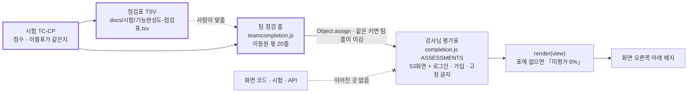

# 기능 완성도 점검 보고서 v0.1 — 화면 69개와 로그인 · 가입

| 항목 | 내용 |
|---|---|
| **판 · 상태** | v0.1 · 초안(검토 전) — 팀원 화면의 점수는 팀장 점검이고 주담당 확인 전이다 |
| **작성** | 초안 이동원(팀장) · 자기 화면 줄의 확인과 판 올리기는 각 주담당 · 검수 이동원 |
| **최종 수정** | 2026-10-04 (KST) |
| **기준** | 코드 `main` `92a8288`(PR #104 머지) + 이 보고서의 고침(크롤 조각 점 ID · 배지 팀 줄) · 기능 점검 스크립트 2026-10-04 15:04 결과(통과 90 · 주의 1 · 실패 0) · 강사님 평가표 `public/js/completion.js`(2026-09-29 감사 · 마지막 변경 2026-09-30) |
| **정본** | 점수 한 줄 한 줄은 [점검표(TSV)](기능완성도-점검표.tsv) 에 있다. 이 문서의 표는 그 파일에서 만들었다 |
| **관련 문서** | [기능 확장 시장조사 v0.1](../조사/기능확장-시장조사_v0.1.md) · [테스트 계획서 v1.8](테스트계획서_v1.8.md) · [UI 명세서 v0.2](../화면/UI명세서_v0.2.md) 5절(화면 목록 · 주담당) · [API 명세서 v0.5](../인터페이스/API명세서_v0.5.md) |

## 이 문서로 알 수 있는 것

1. 화면 오른쪽 아래 「기능 완성도」 배지는 개발하면 저절로 바뀌나
2. 화면 69개(+ 로그인 · 가입 쪽 2개)를 같은 기준으로 다시 매기면 몇 점이고, 주담당별로는 어떤가
3. 강사님 평가의 근거 가운데 지금 코드와 맞지 않는 것은 무엇인가
4. 부분마다 100% 를 채우려면 무엇이 필요하고, 그 너머로 어디까지 넓힐 수 있나
5. 이번에 이동원 몫에서 고친 것과 팀원에게 넘기는 것은 무엇인가

## 요약

배지는 개발해도 바뀌지 않는다. `completion.js` 는 강사님이 2026-09-29 에 감사한 점수를 글자로 박아 둔 고정 표이고, 2026-09-30 뒤로 아무도 고치지 않았다. 그래서 그 뒤 만든 화면 16개는 「미평가 0%」 로 뜨고(데이터 관제 · 일정 · 용어사전 · 강의실 · 내 정보 · 강민석 님의 코스콤 테스트베드 등), 근거 답(시험 21건)을 붙인 AI 투자 상담도 감사 때의 68점 그대로다.

같은 기준(UI 20 · 서버 30 · DB/외부 연동 25 · 자동 시험 25)으로 다시 매기면 앱 화면 69개의 배지 평균은 52.8 에서 70.0 으로 오르고, 38개 화면의 점수가 바뀐다. 강사님 점수가 있는 화면은 그 뒤 바뀐 근거만큼만 더하거나 뺐고(기능 점검 스크립트의 실제 왕복 +4 · 새 자동 시험 +3 · 근거가 틀렸거나 새로 찾은 결함은 감점), 미평가 화면은 배점표로 처음부터 매겼다.

강사님 근거 가운데 하나는 코드와 다르다. 「투자 정보 리서치」 는 「RAG 검색 API 구현」 으로 평가됐지만 실제로는 수집 기사 표를 글자로 찾아 5건을 돌려줄 뿐이고, 화면 안내문도 「AI RAG로 검색」 이라고 적혀 있다(66 → 41 · DF-61).

이동원 몫에서는 둘을 고쳤다. 크롤링한 글의 벡터 DB 조각 번호를 파이썬 내장 `hash()` 대신 sha256 으로 바꿔, 다시 모아도 같은 조각이 쌓이지 않게 했다(2026-09-17 분석에서 찾고 결함대장에 열려 있던 DF-03 · 실제 Qdrant 왕복으로 확인). 그리고 배지에 이동원 몫 20줄(미평가 14 + 근거가 바뀐 6)을 같은 기준으로 더하고, 점검표와 어긋나면 실패하는 시험(TC-CP)을 붙였다. 팀원 화면의 점수는 고치지 않고 파트별 점검 이슈 초안 넷으로 넘긴다.

## 1. 점검 범위와 방법

### 1.1 기준

강사님 평가표의 기준을 그대로 쓴다. 배점은 <표 1> 과 같고, 점수대별 이름표도 강사님 표에서 쓰던 말을 따른다(90 이상 「검증 우수」 · 80 대 「핵심 검증」 · 70 대 「부분 검증」, 그 아래는 감점의 까닭으로 「외부 의존」 · 「목업 포함」 · 「설명 전용」 등).

**<표 1> 배점표**

| 칸 | 만점 | 만점의 모습 | 깎이는 모습 |
|---|:-:|---|---|
| UI | 20 | 실제 자료를 그리고 빈 상태 · 오류 안내가 있으며 브라우저로 모든 단추를 눌러 본 기록이 있다 | 고정 값 · 목업이 섞임(12) · 설명 위주(8) |
| 서버 | 30 | 서버가 실제 계산 · 저장을 하고 입력 검증 · 오류 코드가 있다 | 단순화 · 고정 가정(24) · 범용 기능으로 대신(15) · 정적 자료뿐(8) |
| DB/외부 연동 | 25 | 실제 DB · 외부와의 왕복이 자동 시험이나 기능 점검으로 확인됐다 | 왕복은 되나 확인이 한쪽(15) · 외부 키가 없어 확인 못 함(5) |
| 자동 시험 | 25 | 로직 단위 · API · DB 시험이 모두 있다 | 로직 단위만(15 ~ 20) · 일부(10) · 없음(0) |

### 1.2 두 가지 매기는 법

- **강사님 + 고침**: 강사님 점수가 있는 화면은 그 점수를 출발점으로 두고, 2026-09-29 뒤 바뀐 근거만 더하고 뺀다. 기능 점검 스크립트(`scripts/personal/check.ps1`)가 그 화면의 주 API 를 실제 DB · Qdrant · Ollama 와 왕복해 통과하면 +4(강사님 감점 사유 「API E2E 미검증」 의 일부 해소), 그 뒤 자동 시험이 더해졌으면 +3, 근거가 틀렸거나 새 결함을 찾으면 그만큼 뺀다. 상한은 95 다.
- **배점표**: 미평가 화면과 로그인 · 가입은 <표 1> 로 처음부터 매긴다.

어느 줄이 어느 방법인지, 무엇을 더하고 뺐는지는 점검표의 「방법」 · 「고침」 칸에 있다.

### 1.3 근거로 쓴 것

| 근거 | 무엇을 보나 | 어디서 |
|---|---|---|
| 자동 시험 | 화면의 로직 · API · DB 를 재는 시험 묶음 | `tests/` 64파일 · [시험-요구 대장](../요구사항/시험-요구대장.tsv) |
| 기능 점검 | 떠 있는 앱의 API 를 실제로 불러 본 결과 | 2026-10-04 15:04 · 통과 90 · 주의 1(LEAN 이미지 없음) · 실패 0 · 104초 |
| 화면 스캐너 | 화면마다 부르는 API · 진입 훅 · 숨은 의존 | `scripts/view_scan.py` |
| API 스캐너 | API 가 닿는 곳(PostgreSQL · 수집 DB · Qdrant · 외부) | `scripts/api_scan.py` |
| 코드 읽기 | 목업 표시 · 고정 값 · 근거와 다른 동작 | 화면 HTML · `public/js/*.js` · `app/` |
| 브라우저 | 배지가 실제로 바뀌어 뜨는지 · 콘솔 오류 | 헤드리스 1280 · 2026-10-04 |

## 2. 배지는 저절로 바뀌지 않는다

배지가 점수를 읽는 길은 <그림 1> 과 같다. 강사님 표는 점수를 글자로 들고 있고, 시험 · API · 화면 코드와 이어진 곳이 없다.

**<그림 1> 배지가 점수를 읽는 길** · 범례: 실선 = 코드가 읽음 · 점선 = 사람이 맞춤 · 굵은 상자 = 이번에 더한 것

실측으로 확인한 것은 셋이다.

1. `public/js/completion.js` 의 마지막 변경은 2026-09-30(강사님 기초 코드 반영 커밋)이고, 그 뒤 우리와 팀원 누구도 고치지 않았다. 같은 기간에 화면 스크립트는 21파일이 바뀌었다(이동원 · 강사님 기초 코드 반영 · 강민석 님).
2. 강민석 님이 2026-10-02 에 만든 「코스콤 테스트베드 기준」 화면은 지금도 「미평가 0%」 로 뜬다(브라우저 확인). 강사님이 2026-10-03 기초 코드에 더한 「투자 대시보드」 도 같다.
3. 강사님 자신도 2026-10-03 기초 코드에 시험을 더했지만(강사님 시험 73 → 76) 점수표는 고치지 않았다. 고정 표는 만든 사람이 고쳐도 따라오지 않는다.

이번에 고친 것: 이동원 몫 20줄을 `public/js/teamcompletion.js` 에 두고 `completion.js` 에 두 줄(들여오기 · 덮기)만 더했다. 숫자의 정본은 점검표이고, 시험 TC-CP(5건)가 둘이 같은지 · 키가 실제 화면인지 · 점검표의 셈이 맞는지 본다. 팀원 화면과 새로 생길 화면은 시험이 보지 않는다(팀원 PR 이 실패하지 않게 · 6절의 팀 결정 뒤로).

## 3. 결과

### 3.1 주담당별

주담당은 UI 명세서 v0.2 5절의 추정(화면의 첫 관련 요구로 요구 대장에서 찾은 값)을 쓰고, 「투자분석 기초」 네 화면은 2026-10-03 팀 결정(이동원이 기초 구현 → 각 주담당이 바꿈)에 따라 이동원으로 셌다.

**<표 2> 주담당별 점수** · 앱 화면 69개 · 점검표에서 셈

| 주담당 | 화면 | 미평가였던 | 강사님 평균(평가된 화면만) | 다시 매긴 평균 | 90 이상 | 70 미만 |
|---|:-:|:-:|:-:|:-:|:-:|:-:|
| 이동원 | 28 | 14 | 61.0 (14) | 66.6 | 4 | 14 |
| 주인 미정 | 22 | 0 | 66.1 (22) | 66.7 | 1 | 10 |
| 신장환 | 8 | 0 | 86.8 (8) | 89.2 | 4 | 0 |
| 강민석 | 6 | 2 | 69.0 (4) | 67.8 | 0 | 2 |
| 오준영 | 5 | 0 | 72.2 (5) | 75.8 | 0 | 2 |
| **합** | **69** | **16** | 배지 평균(미평가 0 포함) **52.8** | **70.0** | 9 | 28 |

이동원 몫에 70 미만이 많은 까닭은 셋이다. 읽기만 하는 교재 단원 다섯(54 · 강사님 기준 「조회 · 계산 기능 없음」 과 같은 사유), 기초 구현을 맡은 투자분석 화면 둘(재무제표 45 · 기술적 분석 40 · 목업 계산과 설명 전용), 그리고 수집 화면 셋과 리서치 화면이다. 데이터 관제 · 일정 · 용어사전 · 내 정보는 90 이다.

### 3.2 강사님 근거와 다른 것 · 새로 찾은 것

**<표 3> 점검에서 찾은 것**

| 화면 | 찾은 것 | 근거 | 누구 몫 · 어디로 |
|---|---|---|---|
| 투자 정보 리서치 | 「RAG 검색 API」 가 아니라 수집 기사 표 글자 찾기 5건. 화면 안내문은 「AI RAG로 검색」 | `app/routes/library.py` 29 ~ 40행 · `public/js/agent.js` 239 ~ 245행 · 캡처 | 이동원 · DF-61(열림) |
| 자동 · 수동 크롤링 | 조각 번호가 내장 `hash()` 라 다시 모으면 같은 조각이 쌓임(2026-09-17 분석 그대로) | `app/services/crawl.py` 110행(고치기 전) | 이동원 · DF-03(**닫힘** · 5.1절) |
| 공통(모든 화면) | 배지가 바닥글의 「투자 자문이 아닌 정보 제공」 고지를 가린다 | 1280 캡처 | 이동원(공통 영역) · DF-62(열림) |
| 국내주식 모의주문 | 주문 미리보기 276,000원 ↔ 실제로 빠진 현금 276,049원 — 미리보기가 수수료 · 세금을 셈하지 않는다(이미 열린 후보 DF-21 을 다시 잰 값) | 기능 점검 「쓰기」 · 삼성전자 1주 | 강민석 · DF-21 · 점검 이슈 |
| 모의계좌 현황 · 모의 투자 의사결정 | 자산 추이가 시연용 무작위 15일 자료(`/api/paper/performance/simulate`)일 수 있는데 화면에 구분 표시가 없다 · 성과 지표(QFRS) 계산에 자동 시험이 없다 | PR #90 커밋 글 「현재는 15개 mock 데이터」 · `tests/` 검색 0건 | 강민석 · 점검 이슈 |
| 자산배분 · 최적화 | 자산 배분 API 가 25초 | 기능 점검 「로보」 25,022ms | 오준영 · 점검 이슈 |
| 전략 분석 | 실제 자료를 쓰는데 제목이 「(10년 Mockup)」(옛 분석에서 찾은 거꾸로 된 이름표) | `public/app.html` 709행 | 주인 미정 · 점검 이슈 |
| 커스텀 인디케이터 | 「시험」 단추가 다른 화면(성과 검증)의 입력칸을 읽는다 | 화면 스캐너 「숨은 의존」 | 신장환 · 점검 이슈 |

## 4. 지금 · 100% · 확장

부분마다 「지금(점검표) → 100%(강사님 기준의 감점 사유를 없애는 것) → 확장(외부 프로젝트 · 실제 서비스에서 본 것)」 은 <표 4> 와 같다. 확장 칸의 근거는 [시장조사 v0.1](../조사/기능확장-시장조사_v0.1.md) 2 ~ 7절이다.

**<표 4> 지금 · 100% · 확장**

| 부분 | 주담당 | 지금 | 100% 까지 | 확장하면 | 언제 |
|---|---|---|---|---|---|
| 근거 답 | 이동원 | AI 투자 상담 84 | 시행령 위임 조 함께 찾기(DF-59) · 재순위 · 동의어 · 평가셋 50 · 에이전트 도구 되풀이 막기(이어 답 약 2분) | 근거 충실도 자동 평가(Ragas · Apache-2.0) · 원문 열람과 근거 줄 강조(Kotaemon) · 문장 단위 인용(AlphaSense) · 조각 검수 화면(RAGFlow) | 다음 세션 W5 |
| 리서치 | 이동원 | 투자 정보 리서치 41 | 벡터 검색 + 근거 찾기로 바꾸기 · 출처 · 날짜 · 시험 · 안내문과 실제 맞추기(DF-61) | 뉴스 · 공시(DART) 근거를 같은 화면에 | W5 뒤 · 화면은 Figma 먼저 |
| 데이터 관제 · 일정 | 이동원 | 90 · 90 | 390 폭 머리글(IA I12) · 첫 호출 안내 · 일정 종류 늘리기 | 공모 · IR 일정(KIND · 약관 확인) · 경제지표 발표 · 달력 교차 대조 시험(exchange_calendars · Apache-2.0) · 규격 검사 선언(pandera · MIT) | 작은 것 · 일정 확장 |
| 수집 | 이동원 | 자동 63 · 수동 61 · 인제스트 68 | 수집 E2E 시험 · URL 검사(사설 IP · 크기 상한) · 빈 칸 안내 · 인제스트 시험 | 조각 검수 화면 · 수집 정책(robots) 표시 | 작은 것 |
| 투자분석 기초 | 이동원(기초) → 각 주담당 | 거시 75 · 산업 72 · 재무제표 45 · 기술적 40 | 공식 출처와 기준일 · 목업 계산 걷어내기 · 종목별 실행 | ECOS 100대 통계지표(실측 · 101개) · DART 재무제표 · 리서치 프롬프트 | 투자분석 네 화면 세션 |
| 용어사전 | 이동원 | 90 | 작은 관계 지도 · 교재 밑줄 · 보류 용어 둘 | 공식 풀이 줄(ECOS 통계용어사전 · 경제금융용어 700선 · 이용 조건 확인) · SKOS 대응표 · 복습 카드(FSRS · MIT) | R01 남은 것 |
| 강의 | 이동원 | 강의실 80 · 강의 주제 76 · 교재 단원 54 · 요약 둘 45 | 확인 문제 · 실제 자료 조회로 잇기 · 읽은 정도 서버 저장 · 요약 화면 보완 | 모듈 · 확인 문제 · 수료(Zerodha Varsity) | 세부 기능 1 개선 |
| 계정 | 이동원 | 로그인 · 가입 88 · 내 정보 90 | 로그인 시도 횟수 제한 · 비밀번호 찾기 · 약관 동의 · 투자 성향 칸 | — | 로그인 · 랜딩 · 내 정보 |
| 인디케이터 | 신장환 | 8화면 평균 89.2 | 지표 정의 한 벌(RSI · 볼린저) · 거래 목록 · Profit Factor · 거래 기준 승률 · 숨은 의존 · 화면 E2E | 정의 통일(pandas-ta-classic · MIT) · TradingView 전략 리포트 지표 · 조건검색식 전 종목 스크리닝 + 성과검증(키움) · 대량 격자(vectorbt · 조건부) | 점검 이슈 |
| 자산배분 · 리밸런싱 · 자동매매 | 오준영 | 89 · 86 · 85 · 설정 61 · 자동화 58 | 배분 25초 · 현금흐름 · 실행 기록 점검 · 「Mockup」 · 「출시 예정」 정리 | 시간 순서 교차 검증(skfolio · BSD-3) · 기본 이탈 3% · 현금흐름 먼저(Betterment) | 점검 이슈 · 리밸런싱 논의 |
| 모의투자 · 성과 · 테스트베드 | 강민석 | 대시보드 75 · 주문 77 · 현황 70 · 의사결정 70 · LEAN 65 · 테스트베드 50 | QFRS 시험 · 미리보기 비용 · 시연 자료 표시 · 테스트베드 기준 대조표 · LEAN 로컬 실행 · 배지 줄 | 성과 대조값(quantstats · Apache) · 코스콤 심사(본심사 6개월 · 다계좌 · 재해 대응) | 점검 이슈 |
| 주인 미정 22화면 | 팀 | 평균 66.7 | 주인 정하기가 먼저 | — | 점검 이슈(팀) |

## 5. 이동원 몫 — 이번에 고친 것과 다음

### 5.1 크롤 조각 점 ID (DF-03 닫힘)

크롤링한 글은 조각마다 Qdrant 점 하나로 들어간다. 점 번호를 내장 `hash()` 로 만들어 프로세스마다 값이 달랐고, 앱을 다시 켜고 같은 글을 모으면 같은 조각이 하나 더 쌓였다. 고친 내용은 <표 5> 와 같다.

**<표 5> 고친 것**

| 파일 | 바뀐 것 |
|---|---|
| `app/services/crawl_points.py` (새) | `crawl_point_id(url, i)` = sha256(주소 · 조각 번호) 앞 15자를 정수로 · `prune_stale_points` = 같은 주소의 점 가운데 이번에 쓰지 않은 것(짧아진 꼬리 · 예전 `hash()` 중복)을 지움. 이번에 쓴 점이 0개면(임베딩 서버가 꺼짐) 지우지 않는다 |
| `app/services/crawl.py` (강사님 기초 코드) | 세 줄만: 들여오기 · 점 번호 줄 · 올린 뒤 정리 부르기 |
| `tests/test_crawl_points.py` (새 · TC-CR 6건) | 다른 PYTHONHASHSEED 세 프로세스에서 새 번호는 같고 옛 번호는 셋 다 다름 · 범위 · 회귀 방지 · 다시 모으면 같은 번호와 정리 거름 · 짧아지면 꼬리 정리 · 임베딩 실패면 쓰지도 지우지도 않음 |

고치기 전 코드에 새 시험을 돌리면 3건이 실패한다(회귀 방지 · 같은 번호 · 꼬리 정리). 실제 Qdrant(개발 모드 · 임시 컬렉션)에서 잰 결과는 <표 6> 이다. 앱의 문서 컬렉션(`fin_chunks`)은 지금 비어 있어 지울 옛 중복은 없었다.

**<표 6> 실제 Qdrant 왕복** · 2026-10-04 · 임시 컬렉션은 끝에 지움

| 차례 | 한 일 | 저장 | 컬렉션의 점 |
|:-:|---|:-:|:-:|
| 1 | 세 조각 글 저장 | 3 | 3 |
| 2 | 같은 글 다시 | 3 | 3 |
| 3 | 두 조각으로 짧아진 글 | 2 | 2 |
| 4 | 같은 주소 · 엉뚱한 번호의 옛 점 하나 끼움 | — | 3 |
| 5 | 다시 모음 | 2 | 2 |
| 6 | 다른 주소 한 조각 | 1 | 3 |

### 5.2 배지 팀 줄

2절과 같다. 브라우저에서 이동원 몫은 팀 점검 값으로(데이터 관제 90 · 리서치 41 · 교재 단원 54 · 내 정보 90 · 로그인 88), 팀원 화면은 그대로(테스트베드 · 투자 대시보드 0% · 전략 분석 88) 떴다. 콘솔 오류는 로그인 전 세션 확인 401 하나뿐이다.

### 5.3 다음 차례

<표 4> 의 「언제」 칸을 이어 붙이면 W5(근거 답 · 리서치) → 작은 것(배지 고지 가림 · 390 머리글 · 수집 화면) → 투자분석 네 화면 → 세부 기능 1 개선(강의) → R01 남은 것 → 계정 차례다. 화면을 바꾸는 것은 Figma 에서 지금 화면과 새 화면을 나란히 두고 정한 뒤 구현한다.

## 6. 팀원 파트 — 점검 이슈와 배지 갱신 방법

팀원 화면은 고치지 않고 파트별 이슈 초안으로 넘긴다. 초안은 `docs/github-archive/2026-10-04/` 아래 넷이다.

**<표 7> 점검 이슈 초안**

| 이슈 | 대상 | 화면 | 담는 것 |
|---|---|:-:|---|
| 인디케이터 화면 기능 완성도 점검 | 신장환 | 8 | 점수표 · 지표 정의 · 성과 리포트 · 숨은 의존 · 조사 근거 |
| 자산배분 · 리밸런싱 · 자동매매 · 증권사 연동 화면 점검 | 오준영 | 5 | 배분 25초 · 목업 정리 · 리밸런싱 실제 서비스 규칙 |
| 모의투자 · 성과 · 테스트베드 · 투자 대시보드 화면 점검 | 강민석 | 6 | QFRS 시험 · 미리보기 비용 · 시연 자료 · 코스콤 기준 대조 |
| 주인이 정해지지 않은 화면 22개와 배지 갱신 규칙 | 팀 | 22 | 주인 정하기 · 배지를 누가 · 언제 · 무엇으로 고치나 |

배지 갱신 방법은 <표 8> 의 안을 팀에 묻는다. 정할 때까지 이동원 몫만 이 방법으로 운영한다.

**<표 8> 배지 갱신 방법(안)**

| 물음 | 안 |
|---|---|
| 누가 | 화면 주담당이 자기 줄을 고친다. 팀장이 PR 에서 점검표와 같은지 본다 |
| 언제 | 화면의 시험 · API · 목업 상태가 바뀌는 PR 마다 |
| 무엇으로 | 점검표의 근거 칸(시험 묶음 · 기능 점검 · 브라우저 확인 날짜)을 같이 고친다 |
| 어디에 | `public/js/teamcompletion.js` 한 파일(강사님 표는 그대로 · 다음 기초 코드 반영 때 부딪히지 않게) |
| 시험(팀 결정) | 지금은 이동원 몫만 본다. 「평가가 없는 화면이 생기면 실패」 를 켜면 새 화면을 만드는 PR 이 줄을 함께 넣어야 한다 |

## 7. 한계

- 팀원 화면의 점수는 팀장이 코드 · 시험 · 점검 결과로 매긴 것이고 주담당 확인 전이다. 이슈에서 다른 근거가 나오면 점검표부터 고친다.
- 기능 점검 스크립트는 자동 시험이 아니다(사람이 돌린다). 그래서 왕복 확인은 +4 로만 셌다.
- 화면 스캐너는 2단계 이상의 호출을 놓친다. 용어사전 · 내 정보처럼 스캐너가 API 0 개로 읽는 화면은 시험 · 점검으로 확인했다.
- 「브라우저로 모든 단추를 눌러 본 기록」 은 이동원 몫 화면만 있다. 팀원 화면의 UI 칸은 강사님 점수를 그대로 두었다.

## 부록 A. 점검표 전체

점검표 TSV 에서 만든 표다(손으로 고치지 않는다). 고침 칸의 숫자 근거는 TSV 에 있다.

<!-- completion_table:start -->
| # | 화면 | 화면 키 | 메뉴 | 주담당 | 강사님 | 점수 | 이름표 | 매긴 법 | 100% 까지 |
|--:|---|---|---|---|:-:|:-:|---|---|---|
| 1 | 통합 대시보드 | `dashboard` | 로보 어드바이저 | 강민석(추정) | 미평가 | 75 | 부분 검증 | 배점표 18/24/15/18 | 점검에 DASH-01 넣기 · 증권사 키 없는 상태의 빈 칸 안내 · 390 폭 머리글 넘침(IA I12) |
| 2 | AI 투자 상담 | `agent-chat` | 로보 어드바이저 | 이동원 | 68 | 84 | 핵심 검증 | 고침 +10 +4 +4 -2 | DF-59 위임 조 · 재순위 · 동의어 · 평가셋 50 · 에이전트 도구 되풀이 막기 |
| 3 | 자산배분·최적화 | `robo-portfolio` | 로보 어드바이저 | 오준영 | 88 | 89 | 핵심 검증 | 고침 +4 -3 | 배분 25초 줄이기(캐시 · 미리 계산) · 배분 결과 저장 · 리밸런싱으로 넘기기 |
| 4 | 리밸런싱 엔진 | `robo-rebalance` | 로보 어드바이저 | 오준영 | 84 | 86 | 핵심 검증 | 고침 +2 | 현금흐름 · 실행 기록 API 점검 없음 · #79 주기 결정 반영 |
| 5 | 패턴 인식·종목 스크리닝 | `robo-screening` | 로보 어드바이저 | 신장환 | 82 | 86 | 핵심 검증 | 고침 +4 | 신호 스캔 13초 · 31종목 고정 목록 · 스크리닝 근거 화면 표시 |
| 6 | 차트 패턴·지지/저항·멀티타임프레임 | `robo-patterns` | 로보 어드바이저 | 신장환 | 92 | 92 | 검증 우수 | 그대로 | 강사님 근거 그대로 |
| 7 | 모의 투자 의사결정 | `robo-decision` | 로보 어드바이저 | 강민석 | 72 | 70 | 부분 검증 | 고침 -2 | 의사결정 E2E 시험 · 시연 자료 표시 · 자동매매 시작/정지 점검 |
| 8 | 코스콤 테스트베드 기준 | `robo-testbed` | 로보 어드바이저 | 강민석 | 미평가 | 50 | 시험 없음 | 배점표 16/22/12/0 | QFRS 계산 단위 시험 · 점검 묶음 · 스냅샷이 쌓이기 전 빈 상태 안내 · 코스콤 기준 대조표 |
| 9 | 신용 리스크 분석 | `agent-cb` | 로보 어드바이저 | — | 62 | 60 | 외부 의존 | 고침 -2 | 신용 리스크 자료 · 주인 정하기 |
| 10 | 맞춤 상품 추천 | `agent-products` | 로보 어드바이저 | — | 62 | 62 | 외부 의존 | 그대로 | 상품 자료(은행 · 펀드 표) 연결 시험 · 주인 정하기 |
| 11 | 투자 정보 리서치 | `agent-news` | 로보 어드바이저 | 이동원 | 66 | 41 | 글자 찾기만 | 고침 -15 -10 | 근거 찾기(/api/kb/search) · 벡터 검색으로 바꾸기 · 출처 · 날짜 표시 · 시험 |
| 12 | 데이터 관제 | `data-status` | 데이터 | 이동원 | 미평가 | 90 | 검증 우수 | 배점표 18/28/22/22 | 390 폭에서 머리글 「자료」 표시 밀림(IA I12) · 첫 호출 행 수 pending 안내 |
| 13 | 자동 크롤링 | `crawl-auto` | 데이터 | 이동원(수집) | 60 | 63 | 외부 의존 | 고침 +3 | robots 정책 표시 · 수집 결과 E2E · 자동 수집 대상 목록 시험 |
| 14 | 수동 크롤링 | `crawl-manual` | 데이터 | 이동원 | 58 | 61 | 외부 의존 | 고침 +3 | 빈 회색 칸 안내(작은 것 목록) · URL 검사(사설 IP · 크기 상한) |
| 15 | 데이터 인제스트 | `crawl-ingest` | 데이터 | 이동원 | 68 | 68 | 부분 검증 | 그대로 | 재무 인제스트 시험 · 초기화 확인 단계 |
| 16 | 주가 차트 | `trading-chart` | 직접매매 | 신장환(추정) | 78 | 85 | 핵심 검증 | 고침 +4 +3 | 종목 검색 시험 · 야후 장애 시 안내 |
| 17 | 포트폴리오 | `trading-portfolio` | 직접매매 | — | 72 | 72 | 부분 검증 | 그대로 | API 통합 시험 · 주인 정하기 |
| 18 | 주문/매매 | `trading-order` | 직접매매 | — | 58 | 61 | 목업 포함 | 고침 +3 | 「Mockup」 글 정리 · 주인 정하기 |
| 19 | 모의계좌 현황 | `paper-dashboard` | 모의투자 | 강민석 | 70 | 70 | 부분 검증 | 고침 +2 -2 | QFRS 단위 시험 · 시연 자료 표시 · 배치 스냅샷 확인 |
| 20 | 국내주식 모의주문 | `paper-stock` | 모의투자 | 강민석 | 72 | 77 | 부분 검증 | 고침 +4 +3 -2 | 미리보기에 비용 포함(DF-21) · 주문 실패 경로 시험 |
| 21 | 코인 모의매매 | `paper-crypto` | 모의투자 | — | 68 | 68 | 외부 의존 | 그대로 | 주인 정하기 |
| 22 | 대체자산 (선물·옵션·금·부동산) | `paper-alternative` | 모의투자 | — | 66 | 66 | 부분 검증 | 그대로 | 주인 정하기 |
| 23 | Open API · 외부 연동 | `paper-openapi` | 모의투자 | 이동원(3차 P02-③-3) | 70 | 70 | 부분 검증 | 그대로 | 3차 몫 — 외부 호출 E2E |
| 24 | 퀀트 대시보드 | `quant-dashboard` | 퀀트자동매매 | 신장환 | 82 | 89 | 핵심 검증 | 고침 +4 +3 | 종목 목록 31 고정 |
| 25 | 자동매매 현황 | `quant-auto` | 퀀트자동매매 | 오준영 | 78 | 85 | 핵심 검증 | 고침 +4 +3 | 실주문 통합은 실거래 관문 뒤(의도) · 시작/정지 점검 |
| 26 | 전략 분석 | `quant-backtest` | 퀀트자동매매 | — | 88 | 90 | 검증 우수 | 고침 +4 -2 | 이름표 고치기 · 주인 정하기 |
| 27 | LEAN 백테스트 (QuantConnect) | `quant-lean` | 퀀트자동매매 | 강민석 | 62 | 65 | 외부 의존 | 고침 +3 | LEAN_MODE=local 실행 확인 · 결과 저장 시험 |
| 28 | 증권사 API 설정 | `settings` | 퀀트자동매매 | 오준영 | 56 | 61 | 목업 포함 | 고침 +3 +2 | 「Mockup」 · 「출시 예정」 증권사 정리 · 키 입력 검증 안내 |
| 29 | 알림 설정 | `notification-settings` | 퀀트자동매매 | 이동원(3차 P02-③-3) | 58 | 58 | 외부 의존 | 그대로 | 3차 몫 — 실전송 · A12(끄면 팀 공용 채널) 확인 |
| 30 | 대시보드 | `us-dashboard` | 미국주식 | — | 72 | 72 | 목업 폴백 | 그대로 | 주인 정하기 |
| 31 | 주가 차트 | `us-chart` | 미국주식 | — | 78 | 78 | 부분 검증 | 그대로 | 주인 정하기 |
| 32 | 주문/매매 | `us-order` | 미국주식 | — | 58 | 58 | 목업 포함 | 그대로 | 주인 정하기 |
| 33 | 포트폴리오 | `us-portfolio` | 미국주식 | — | 68 | 68 | 부분 검증 | 그대로 | 주인 정하기 |
| 34 | 기본 인디케이터 전략 | `indicator-strategy` | 투자 인디케이터 | 신장환 | 86 | 88 | 핵심 검증 | 고침 +2 | 화면 E2E |
| 35 | 커스텀 인디케이터 개발 | `indicator-custom` | 투자 인디케이터 | 신장환 | 91 | 91 | 검증 우수 | 그대로 | 숨은 의존: 시험 버튼이 성과 검증 화면 입력칸을 읽음(view_scan) · 비용 인자 경로 확인 |
| 36 | 자유 산식 지표 (DSL·버전) | `indicator-formula` | 투자 인디케이터 | 신장환 | 93 | 93 | 검증 우수 | 그대로 | DB 저장 API 시험 |
| 37 | 성과 검증 (Python) | `indicator-backtest` | 투자 인디케이터 | 신장환 | 90 | 90 | 검증 우수 | 그대로 | 강사님 근거 그대로 |
| 38 | 증권사 API 자동화 | `indicator-api` | 투자 인디케이터 | 오준영 | 55 | 58 | 목업 포함 | 고침 +3 | 「Mockup」 · 「출시 예정」 정리 |
| 39 | TradingView 연동 (Webhook·교차검증) | `indicator-tradingview` | 투자 인디케이터 | 이동원(3차) | 84 | 84 | 핵심 검증 | 그대로 | 3차 몫 — 웹훅 · DB E2E |
| 40 | 지표 대시보드 | `company-dashboard` | 투자 인디케이터 | — | 75 | 75 | 부분 검증 | 그대로 | 주인 정하기 · 공시 재무(DART) 연결 후보 |
| 41 | 지표 비교 분석 | `company-compare` | 투자 인디케이터 | — | 45 | 45 | 정적 목업 | 그대로 | 주인 정하기 |
| 42 | 섹터 인디케이터 | `company-sector` | 투자 인디케이터 | — | 42 | 42 | 정적 목업 | 그대로 | 주인 정하기 |
| 43 | 모델 비교 (7종) | `ml-compare` | ML·딥러닝 | — | 75 | 77 | 부분 검증 | 고침 +2 | 주인 정하기 |
| 44 | 회귀 분석 | `ml-regression` | ML·딥러닝 | — | 72 | 72 | 부분 검증 | 그대로 | 주인 정하기 |
| 45 | 종목 군집화 | `ml-cluster` | ML·딥러닝 | — | 72 | 72 | 부분 검증 | 그대로 | 주인 정하기 |
| 46 | 하이퍼파라미터 튜닝 | `ml-tune` | ML·딥러닝 | — | 70 | 70 | 부분 검증 | 그대로 | 주인 정하기 |
| 47 | 딥러닝 (LSTM·Transformer) | `ml-deeplearning` | ML·딥러닝 | — | 40 | 40 | 설명 전용 | 그대로 | 주인 정하기 |
| 48 | 거시경제 지표 | `macro-dashboard` | 투자분석 기초 | 이동원(기초 구현 · 10-03 결정) | 75 | 75 | 외부 의존 | 그대로 | ECOS 등 공식 출처 · 기준일 표시 — 투자분석 네 화면 세션 |
| 49 | 산업 분석 | `macro-industry` | 투자분석 기초 | 이동원(기초 구현) | 72 | 72 | 외부 의존 | 그대로 | 투자분석 네 화면 세션 |
| 50 | 재무제표 분석 | `invest-fundamental` | 투자분석 기초 | 이동원(기초 구현) | 45 | 45 | 목업 계산 | 그대로 | 공시 재무(DART) · 가정 입력칸 — 투자분석 네 화면 세션 |
| 51 | 기술적 분석 | `invest-technical` | 투자분석 기초 | 이동원(기초 구현) | 40 | 40 | 설명 전용 | 그대로 | 종목별 실행(지표 API 연결) — 투자분석 네 화면 세션 |
| 52 | 일정 | `market-calendar` | 투자분석 기초 | 이동원 | 미평가 | 90 | 검증 우수 | 배점표 18/28/22/22 | 일정 종류 둘(파생 만기 · 배당락)뿐 — 실적 발표 · 공모 · 경제지표 없음 |
| 53 | 강의실 (전체 과정) | `fin-lectures` | 금융 필수 지식 | 이동원 | 미평가 | 80 | 핵심 검증 | 배점표 20/22/18/20 | 읽은 정도가 브라우저 저장소에만 · 확인 문제 없음 |
| 54 | 선물과 옵션 | `fin-topic-futures` | 금융 필수 지식 | 이동원 | 미평가 | 76 | 부분 검증 | 배점표 18/22/18/18 | 확인 문제 · 실제 자료 조회로 잇기(예: 이 강의의 ETF 를 데이터 화면으로) |
| 55 | 펀드와 ETF | `fin-topic-funds` | 금융 필수 지식 | 이동원 | 미평가 | 76 | 부분 검증 | 배점표 18/22/18/18 | 확인 문제 · 실제 자료 조회로 잇기(예: 이 강의의 ETF 를 데이터 화면으로) |
| 56 | 채권 · 금리 · 코인 | `fin-topic-bonds` | 금융 필수 지식 | 이동원 | 미평가 | 76 | 부분 검증 | 배점표 18/22/18/18 | 확인 문제 · 실제 자료 조회로 잇기(예: 이 강의의 ETF 를 데이터 화면으로) |
| 57 | 자산배분과 퀀트 | `fin-topic-allocation` | 금융 필수 지식 | 이동원 | 미평가 | 76 | 부분 검증 | 배점표 18/22/18/18 | 확인 문제 · 실제 자료 조회로 잇기(예: 이 강의의 ETF 를 데이터 화면으로) |
| 58 | 회사 구조 · 세무회계 | `fin-topic-company` | 금융 필수 지식 | 이동원 | 미평가 | 54 | 설명 전용 | 배점표 18/12/8/16 | 읽기 전용 — 계산기 · 확인 문제 · 실제 자료 연결이 없다(강사님 기준 「조회 · 비교 기능 없음」 과 같은 사유) |
| 59 | 주식시장 기초 | `fin-topic-stocks` | 금융 필수 지식 | 이동원 | 미평가 | 54 | 설명 전용 | 배점표 18/12/8/16 | 읽기 전용 — 계산기 · 확인 문제 · 실제 자료 연결이 없다(강사님 기준 「조회 · 비교 기능 없음」 과 같은 사유) |
| 60 | 기술적 분석 기초 | `fin-topic-technical` | 금융 필수 지식 | 이동원 | 미평가 | 54 | 설명 전용 | 배점표 18/12/8/16 | 읽기 전용 — 계산기 · 확인 문제 · 실제 자료 연결이 없다(강사님 기준 「조회 · 비교 기능 없음」 과 같은 사유) |
| 61 | 산업 · 기업 · 재무 | `fin-topic-industry` | 금융 필수 지식 | 이동원 | 미평가 | 54 | 설명 전용 | 배점표 18/12/8/16 | 읽기 전용 — 계산기 · 확인 문제 · 실제 자료 연결이 없다(강사님 기준 「조회 · 비교 기능 없음」 과 같은 사유) |
| 62 | 거시경제와 시장 | `fin-topic-macro` | 금융 필수 지식 | 이동원 | 미평가 | 54 | 설명 전용 | 배점표 18/12/8/16 | 읽기 전용 — 계산기 · 확인 문제 · 실제 자료 연결이 없다(강사님 기준 「조회 · 비교 기능 없음」 과 같은 사유) |
| 63 | 금융상품 이해 | `fin-products` | 금융 필수 지식 | 이동원(세부 기능 1 개선 후보) | 45 | 45 | 설명 전용 | 그대로 | 통합본 금융 지식 보완 — 세부 기능 1 개선 세션 |
| 64 | 자산배분 모델 | `fin-allocation` | 금융 필수 지식 | 이동원(세부 기능 1 개선 후보) | 45 | 45 | 설명 전용 | 그대로 | 세부 기능 1 개선 세션 |
| 65 | 계절성 분석 | `quant-seasonal` | 금융 필수 지식 | — | 74 | 74 | 부분 검증 | 그대로 | 통계 유의성 · 주인 정하기 |
| 66 | 용어사전 | `fin-glossary` | 금융 필수 지식 | 이동원 | 미평가 | 90 | 검증 우수 | 배점표 18/28/20/24 | 작은 관계 지도 · 교재 밑줄 · 보류 용어 둘(R01 남은 것) |
| 67 | 서버 대시보드 | `sysadmin-dashboard` | 시스템관리 | — | 68 | 72 | 부분 검증 | 고침 +4 | 주인 정하기 |
| 68 | 감사 로그 | `sysadmin-logs` | 시스템관리 | — | 70 | 74 | 부분 검증 | 고침 +4 | 주인 정하기 |
| 69 | 내 정보 (마이페이지) | `mypage` | 내 계정 | 이동원(계정) | 미평가 | 90 | 검증 우수 | 배점표 16/28/22/24 | 투자 성향 · 알림 연결 · 활동 기록 칸 없음(IA Q13 · 설계 전) |
| 70 | 로그인 | `login` | 따로 쪽(login.html) | 이동원(계정) | 72 | 88 | 핵심 검증 | 배점표 16/26/22/24 | 비밀번호 찾기 · 보기 단추 없음 · 로그인 시도 횟수 제한 없음(app/routes/auth.py · 옛 A3) · 돌아올 주소(IA I27) |
| 71 | 가입 | `register` | 따로 쪽(register.html) | 이동원(계정) | 72 | 88 | 핵심 검증 | 배점표 16/26/22/24 | 약관 · 개인정보 동의 칸 없음 · 비밀번호 강도 표시 없음 |
<!-- completion_table:end -->

## 부록 B. 변경 노트

| # | 바뀐 것 | 다음 판에 녹일 곳 |
|:-:|---|---|
| 1 | 이 문서 처음 씀 | — |

## 개정 이력

| 판 | 날짜 | 바뀐 것 | 작성 |
|---|---|---|---|
| v0.1 | 2026-10-04 | 처음 씀 — 화면 69 + 로그인 · 가입 점수 · 배지 팀 줄 · 크롤 조각 점 ID · 지금 · 100% · 확장 · 점검 이슈 초안 넷 | 이동원 |
