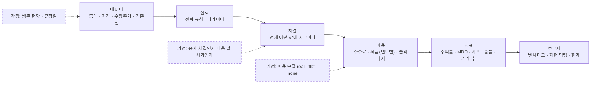

# 백테스트 보고서 v0.1 — Qurious

| 문서 정보 | |
|---|---|
| **판 · 상태** | v0.1 · 초안(틀 + 엔진 현황) — **결과 · 해석 칸은 비어 있다**(4절 · 채울 사람과 때를 적었다) |
| **구분** | 9. 시험·성과 검증 — 백테스트 보고서 |
| **작성** | 초안 이동원(팀장 · 틀과 엔진 현황) · 결과 채우기와 판 올리기는 강민석(목표 기능 ④ 주담당 · 부 신장환) · 검수 이동원 |
| **검토** | 검토 전 |
| **최종 수정** | 2026-10-03 (KST) |
| **기준** | 코드 `main` `7afe5e9` · 로컬 개발 앱 실측 2026-10-03 19:0x(`GET /api/quant/pipeline` · `GET /api/backtests/lean/status`) · 수집 데이터 기준일 2026-10-01 |
| **관련 문서** | [테스트 계획서 v1.5](테스트계획서_v1.5.md) · [RTM v1.3](../../요구사항/지난판/RTM_v1.3.md) · [WBS v0.1](../../계획서/WBS.md) 1.6 · [기능 설계서 v0.1](../../설계/기능설계.md) 4.4절 · [코딩 표준 v0.1](../../개발/코딩표준.md) |
| **최근 개정** | 새 문서 |

> **이 문서로 알 수 있는 것**
> 1. Qurious 에는 백테스트 엔진이 몇 개 있고, 각각 무엇을 재나?
> 2. 백테스트 결과를 믿으려면 결과와 함께 무엇을 적어야 하나(가정 · 데이터 · 비용 · 재현 명령)?
> 3. 지금 엔진을 돌려 보면 무엇이 보이나 — 결과 칸은 누가 언제 채우나?
>
> **읽는 순서** — 강민석 님: 2절 틀 → 4절 결과 칸 → 5절 재현 · 팀원: 요약 → 1절 · 강사님: 요약 → 2절 → 3절

## 요약

1. 백테스트 엔진은 넷이다 — **지표 백테스트**(`/api/quant/pipeline` · 투자 대시보드 「기본 전략 성능」), **LEAN**(`/api/backtests/lean/*` · 도커로 돈다), **TradingView 비교**(`/api/tradingview/compare`), **모의계좌 성과**(`/api/paper/performance/*`). 넷 다 지금 응답한다.
2. 결과를 믿으려면 결과 옆에 **질문 · 전략 · 데이터 · 비용 · 체결 가정 · 지표 · 벤치마크 · 재현 명령 · 한계**를 함께 적는다(2절 틀) — 강사님 표 9구분의 목적 「재현 가능성」 과 요구 `RFP2-3.2-③` 이다.
3. 지금 보이는 것 하나가 크다: 투자 대시보드의 「기본 전략 성능」 은 **「왕복 대칭 10bp(실제 국내주식 비용이 아니다)」** 로 계산한다. 실제 비용 모델(2026 · 코스피 매도 약 0.318%)이 따로 있다 — 어느 것을 화면 기본으로 둘지와 결과 칸은 ④ 주담당이 정하고 채운다(이슈 초안 · 10-13(화) 오후 「성과 분석」 칸 전 권장).

---

## 1. 엔진 현황

**<표 1> 백테스트 엔진** · 실측 = 2026-10-03 로컬 개발 앱에서 한 번 불러 본 결과 · 확실도 확인

| 엔진 | API | 화면 | 데이터 | 비용 | 실측 | 주담당 |
|---|---|---|---|---|---|---|
| ① 지표 백테스트 | `GET /api/quant/pipeline` | `dashboard` 「기본 전략 성능」 · `quant-backtest` · `indicator-backtest` | 국내 주식 일봉(수집 DB · 없으면 외부 시세) | `cost_model` = real(연도별 실제 요율) · flat(대칭 bp) · none — 비우고 `cost_bps` 를 주면 flat | 200 — 대시보드 기본 호출(삼성전자 · 1년 · RSI · flat 10bp · 슬리피지 0): 거래 0 · 매수 후 보유 +98.31% · 신호 「관망」 | 2차 ④ 강민석(지표 정의는 ② 신장환) |
| ② LEAN | `GET /api/backtests/lean/status` · `POST …/run` · `GET …/history` | `quant-lean` | LEAN 참조 데이터 · 앱이 넘기는 종가 | LEAN 설정 | 200 — 도커 모드 · 엔진 실행 가능 · 참조 데이터 정상 · 전략 4 | 3차 ④ 강민석 |
| ③ TradingView 비교 | `POST /api/tradingview/compare` · `GET /api/tradingview/comparisons` | `indicator-tradingview` | 웹훅으로 받은 신호 · LEAN 결과 | — | (이번엔 부르지 않음) | 3차 ③ 이동원 · ④ 강민석 |
| ④ 모의계좌 성과 | `GET /api/paper/performance/*`(지표 · 수익표 · 위험 · 회전율 · 배분 이력 · 벤치마크) | `paper-dashboard` | 모의계좌 매일 스냅샷 | 장부의 실제 체결 비용 | (이번엔 부르지 않음) | 2차 ④ 강민석 |


**<그림 1> 백테스트 한 번의 길** · 범례: 실선 = 차례 · 점선 상자 = 결과에 꼭 함께 적을 가정



---

## 2. 보고서 틀 — 결과 한 건마다 적을 것

**<표 2> 결과 한 건의 칸** · 근거: 강사님 산출물 표 9구분 목적(정확성 · 전략 성과 · **재현 가능성**) · 요구 `RFP2-3.2-③`(코드 · 랜덤 시드 고정 · 결과 재현) · 문서 작성 기준 5.9

| 칸 | 적을 것 | 왜 |
|---|---|---|
| 질문(가설) | 「RSI 역추세가 비용을 빼고도 매수 후 보유보다 나은가」 처럼 한 문장 | 결과가 무엇에 대한 답인지 |
| 전략 | 규칙 · 파라미터 · 엔진(① ~ ④) | 같은 이름이라도 규칙이 다르면 다른 전략이다 |
| 데이터 | 출처 · 종목(군) · 기간 · 수정주가 여부 · 데이터 기준일 · 상장폐지 포함 여부 | 생존 편향 · 오래된 값 |
| 비용 | 비용 모델(real · flat · none) · 세율 연도 · 슬리피지 | 비용 모델에 따라 수익률이 달라진다(아래 그림 2) |
| 체결 가정 | 신호가 난 날 종가 · 다음 날 시가 등 | 미래 값을 쓰지 않았다는 증거 |
| 지표 | 총수익률 · 연환산 · MDD · 샤프 · 승률 · 거래 수 · 비용으로 줄어든 몫 | 같은 정의(성과 정의 C4)로 |
| 벤치마크 | 매수 후 보유 · 지수 총수익 | 「무엇보다」 나은지 |
| 재현 명령 | API 호출(전체 인자) 또는 스크립트 · 시드 · 데이터 스냅샷 태그 | 다른 사람이 같은 숫자를 다시 얻는다 |
| 결과 · 해석 | 숫자 + 쉬운 말 한두 줄 | 강사님 피드백 「결론 집착 금지 · 두 독자」 |
| 한계 | 표본 기간 · 과최적화 · 체결 가정의 한계 | 다음 검증(강건성 — 3차 `SCH-ROB`) |


**<그림 2> 거래 한 번의 비용률** · 범례: 한 칸 = 0.02%p · real = `trading_cost.cost_rate` · flat = 대시보드 기본 호출(`cost_bps=10` · 슬리피지 0)

```
  flat 10bp (대시보드)         ████▉                     0.10%   포지션이 바뀔 때마다 · 세금 없음
  real 매수 (코스피 · 코스닥)  █████▉                    0.118%  수수료 0.014 + 유관 0.004 + 슬리피지 0.10
  real 매도 (코스피)           ███████████████▉          0.318%  매수 + 증권거래세 0.05 + 농특세 0.15
  real 매도 (ETF)              █████▉                    0.118%  ETF 는 증권거래세가 없다
  real 왕복 (코스피)           █████████████████████▊    0.435%
```

같은 전략이라도 flat 10bp 로 잰 결과와 real 로 잰 결과는 거래가 잦을수록 크게 갈린다. 결과마다 비용 모델을 함께 적어야 비교할 수 있다.

---

## 3. 지금 보이는 것 — 결과를 해석할 때 알아 둘 것

| # | 무엇 | 근거 | 누가 볼까 |
|:-:|---|---|---|
| ① | 대시보드 「기본 전략 성능」 은 flat 10bp · 슬리피지 0 으로 계산한다 — 응답에 「실제 국내주식 비용이 아니다 · 매도 세금을 따로 세지 않는다」 고 적혀 온다 | `GET /api/quant/pipeline` 응답 `cost` 칸(실측) · `public/js/dashboard.js` 의 호출 | ④ 강민석 — 화면 기본을 real 로 둘지 (팀 결정) |
| ② | 그 기본 호출(삼성전자 · 1년 · RSI 역추세)은 신호가 한 번도 나지 않아 성과가 0 이고, 같은 기간 매수 후 보유는 +98.31% 다 | 실측 | ④ — 기준 전략 · 기간을 고를 때 |
| ③ | 응답에 붙는 모델 설명은 검증 정확도 0.41 이 기준선(다수 클래스 0.41)보다 낫지 않아 신호를 「관망」 으로 낮췄다고 알린다 | 응답 `explanation.quality_warning` | ①-5 신장환 — XAI |
| ④ | ETF 매도에 증권거래세를 매기는 경로가 남아 있다(결함 DF-19 열림) · 자체 재현 벤치마크의 코스닥 오차 0.871%(DF-02) | 테스트 계획서 v1.5 결함대장 | ④ — 벤치마크 대비 해석 |
| ⑤ | LEAN 은 이 PC 에서 도커로 돌 수 있다 — 기록은 `GET /api/backtests/lean/history` | 실측 | 3차 ④ |

---

## 4. 결과 — 정해지면 채울 칸

아래 칸은 비어 있다. 채우는 사람과 때는 2026-10-03 사용자 결정(「기능 주담당이 채우고 모으기는 이동원」)을 따랐다. 요청은 [이슈 초안](../../github-archive/2026-10-03/이슈-백테스트보고서-결과칸-요청/00-본문.md)으로 보낸다.

**<표 3> 결과 칸** · 상태: 예정(비어 있음)

| # | 질문 | 엔진 | 누가 | 언제 | 결과 | 상태 |
|:-:|---|---|---|---|---|:-:|
| E1 | 기준 전략(RSI · 이동평균 · 볼린저 · 복합)이 **real 비용**을 빼고도 매수 후 보유 · 지수보다 나은가 | ① | 강민석(부 신장환) | 10-13(화) 오후 「성과 분석」 칸 전 | (정해지면 채울 칸) | 예정 |
| E2 | 같은 전략을 flat 10bp · real 로 쟀을 때 차이 | ① | 강민석 | E1 과 함께 | (정해지면 채울 칸) | 예정 |
| E3 | 모의계좌의 기간 성과(수익률 · MDD · 회전율)와 벤치마크 | ④ | 강민석 | 10-16(금) 오전 「모의투자 검증」 칸 | (정해지면 채울 칸) | 예정 |
| E4 | 같은 데이터 · 기간 · 비용으로 LEAN 교차 검증 | ② | 강민석(부 오준영) | 3차 · 10-22 뒤 | (정해지면 채울 칸) | 예정 |
| E5 | TradingView 와 LEAN 의 신호 · 체결 · 성과 대조 | ③ | 이동원 · 강민석 | 3차 · 10-22 뒤 | (정해지면 채울 칸) | 예정 |
| E6 | 강건성 — 아웃오브샘플 · 워크포워드 · 민감도 | ① · ② | 강민석(`SCH-ROB`) | 3차 | (정해지면 채울 칸) | 예정 |

---

## 5. 재현 — 엔진마다 다시 돌리는 법

로컬 앱(`.\scripts\personal\start.ps1 -Dev`)을 켜고 로그인한 브라우저 · 스크립트에서 부른다. 결과를 적을 때는 **전체 인자 · 데이터 기준일(`GET /api/data/status`) · 비공개 데이터 스냅샷 태그**를 함께 적는다.

```text
# ① 지표 백테스트 — 대시보드 기본 호출(비용 flat)
GET /api/quant/pipeline?symbol=005930.KS&period=1y&strategy=rsi&cost_bps=10&slippage_bps=0

# ① 같은 전략을 실제 비용으로
GET /api/quant/pipeline?symbol=005930.KS&period=1y&strategy=rsi&cost_model=real

# ② LEAN — 상태 → 실행 → 기록
GET  /api/backtests/lean/status
POST /api/backtests/lean/run
GET  /api/backtests/lean/history
```

---

## 부록 A. 용어

| 말 | 뜻 | 이 문서에서 |
|---|---|---|
| 백테스트 | 과거 데이터로 전략 규칙을 돌려 성과를 재는 것 | 엔진 넷 |
| 매수 후 보유 | 처음에 사서 끝까지 들고 있는 전략 — 가장 단순한 비교 기준 | 벤치마크 |
| 슬리피지 | 주문한 값과 실제 체결된 값의 차이를 비용으로 잡은 것 | real 기본 10bp |
| bp | 0.01% | 10bp = 0.10% |
| 생존 편향 | 지금 살아 있는 종목만으로 과거를 재서 성과가 부풀려지는 것 | 수집 DB 는 상장폐지를 포함한다 |

## 부록 B. 만든 방법

- 엔진 목록: `app/routes`(stocks · lean · tradingview · paper)와 [API-ID 대장](../../인터페이스/대장/API-ID대장.tsv).
- 실측: 로컬 개발 앱에 점검 전용 계정으로 로그인해 `GET /api/quant/pipeline`(대시보드와 같은 인자) · `GET /api/backtests/lean/status` 를 한 번씩 불렀다(2026-10-03 19:0x).
- 비용률: `app/services/trading_cost.cost_rate`(2026-10-01 · 기본 슬리피지 10bp · 온라인 수수료).
- 뒤집을 조건: ④ 주담당이 성과 정의(C4)를 정하면 2절 「지표」 칸을 그 정의로 바꾼다.

## 부록 C. 변경 노트 — 다음 판(v0.2)에 넣을 것

| 날짜 | 종류 | 무엇 | 옮길 곳 | 근거 |
|---|---|---|---|---|

## 부록 D. 개정 이력

| 판 | 날짜 | 무엇이 바뀌었나 | 왜 | 근거 |
|---|---|---|---|---|
| v0.1 | 2026-10-03 | 추가 — 새 문서(엔진 현황 넷 · 보고서 틀 · 비용 모델 차이 · 지금 보이는 것 · 결과 칸 6 · 재현) | 강사님 산출물 표 9구분 「백테스트 보고서」 가 비어 있었다 · 결과 칸은 ④ 주담당 몫(사용자 결정) | 실측 |
