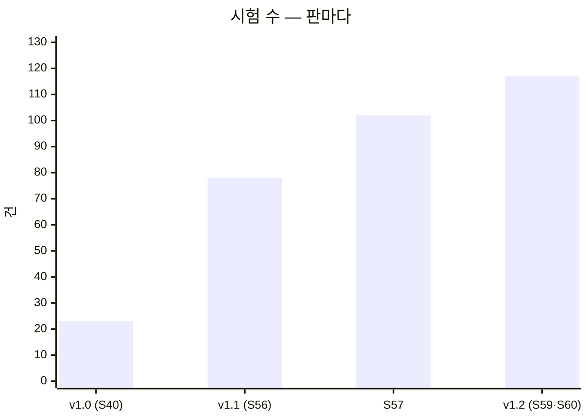
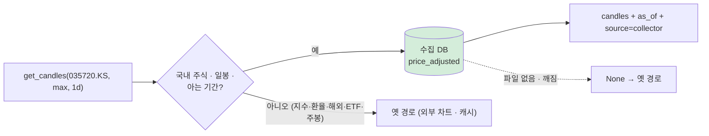
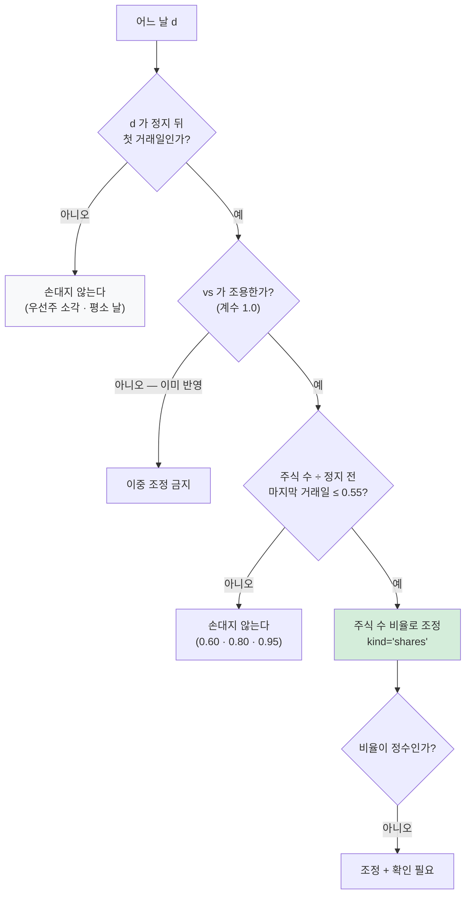

# 테스트 계획서 v1.2 — Qurious 퀀트 투자 플랫폼

| 항목 | 내용 |
|------|------|
| **문서 버전** | v1.2 (v1.0 · v1.1 은 이력으로 둔다 — [v1.0](테스트계획서_v1.0.md) · [v1.1](테스트계획서_v1.1.md)) |
| **작성일** | 2026-09-29 (KST) · S60 |
| **작성자** | 이동원 (데이터 파트 P-A) |
| **구분 (산출물 분류)** | 시험·성과 검증 → 테스트 계획서 · 테스트 케이스 · 단위/통합/인수시험 결과서 · 결함대장 |
| **도구** | pytest · (GitHub Actions 는 걷어냄 — ADR-0003) · 대역(가짜 응답)으로 API 계약 확인 · 실제 수집 DB 읽기 전용 대조 |
| **상태** | 자동화 시험 **117건** · 로컬 실행 전부 통과(Postgres 붙임) · 자동 실행 없음 · 결함대장 **16건 전부 다시 잼** |

> **쉬운 요약**
> 1. v1.1(78건) 뒤 두 PR 이 시험 39건을 더했다 — 수집 DB 다리(S57 · 24건)와 DF-01 전처리(S59 · 15건). v1.1 6.1절에 쌓아 둔 변경 노트를 본문으로 옮겼다.
> 2. 결함대장 **DF-01~09 를 이번 판에서 처음 다시 쟀다**(v1.1 은 v1.0 을 옮겨 적기만 했다). 닫힘 1(DF-01) · 일부 닫힘 1(DF-04) 이 바뀌었고, 나머지는 줄 번호까지 그대로다.
> 3. 다시 재다가 새 결함 둘을 찾았다 — **수집기 모듈 5개가 사용자 셸에서 죽는다**(DF-11 범위가 두 배) · **`collector.preprocess` 는 `--help` 를 줘도 전 종목을 다시 계산한다**(DF-16).

---

## 0. v1.1 → v1.2 에서 바뀐 것

| 바뀐 곳 | v1.1 | v1.2 | 근거 |
|---------|------|------|------|
| 시험 수 | 78 | **117** | `python -m pytest --collect-only` 실측 (2026-09-29) |
| 시험 파일 | 8 | **11** | `tests/test_*.py` — `test_collector_candles_df08` · `test_schema_scan` · `test_preprocess_df01` |
| 계층 | 단위 55 · 계약 5 · 통합 9 · 인수 6 · 봉인 3 | 단위 **88** · 계약 **8** · 통합 **12** · 인수 6 · 봉인 3 | 1.3절 |
| 판정 원칙 | 4개 | **7개** | 1.4절 — S57 · S59 · S60 에 하나씩 |
| 결함대장 | 14건 · DF-01~09 는 v1.0 옮겨 적기 | **16건 · 전부 다시 잼** | 5절 |
| 결과서 | 2차 (78/78) | **3차 (117/117)** | 4절 |
| 새 케이스 | TC-A1 | **TC-CD** · **TC-DF01** · TC-SS | 3절 |

v1.1 6.1절 「v1.2 에 옮길 변경 노트」 15줄은 전부 이 판의 3 · 4 · 5절 · 1.4절로 옮겼다(옮긴 곳은 각 절 머리에 적는다).

---

## 1. 목적과 범위

### 1.1 이 문서가 하는 일

「무엇을, 어떤 기준으로, 누가 판정하는가」를 못박는다(v1.0 부터 같다). v1.1 에서 「시험이 늘어난 만큼 문서도 같이 늘게」 를 더했고,
v1.2 에서 하나를 더 더한다 — **결함대장은 옮겨 적지 말고 판마다 다시 잰다.** 옮겨 적은 칸은 「그때 맞았다」 일 뿐 「지금 맞다」 가 아니다.
이번에 다시 재 보니 9건 중 2건의 상태가 바뀌어 있었고, 1건(DF-04)은 **원래 기록 자체가 잘못 잰 값이었을 가능성**이 나왔다(5.1절).

### 1.2 시험 범위

| 범위 | 대상 | v1.1 | v1.2 |
|------|------|:----:|:----:|
| 포함 | 실거래 차단(요구사항 제외 범위 준수) | ✅ | ✅ |
| 포함 | 데이터 출처 회귀 방지(야후 참조 봉인) | ✅ | ✅ 기준 72 → **70줄**(S57) |
| 포함 | 수집기 일일 갱신 러너(잠금 · 예약 · 단계 판정) | ✅ | ✅ |
| 포함 | 모의투자 현금 장부 불변식(실 Postgres) | ✅ | ✅ |
| 포함 | 시세 응답 계약 — 등락률(`get_quote`) | ✅ | ✅ |
| 포함 | **수집 DB 다리 — 국내 주식 일봉**(`get_candles` → `price_adjusted` · 골든 픽스처) | ⏳ | ✅ **S57** |
| 포함 | **수집기 전처리 — 정지 뒤 감자·병합**(`preprocess` · 실제 DB 전 종목) | — | ✅ **S59** |
| 포함 | 운영 도구(논의 스캐너 · 올리기 전 검사 · 셸 인코딩 · **스키마 스캐너 재현성**) | ✅ | ✅ + S57 |
| 포함(예정) | 비용 계산 · 백테스트 재현성 · 벤치마크 코스닥 재현 오차(DF-02) | ⏳ | ⏳ 6절 |
| 제외 | 증권사 실서버 연동 | rfp-2 §4.2 제외 범위라 실행 자체가 금지 | 같음 |
| 제외 | 부하·성능 | AWS 보류로 대상 환경이 없다 | 같음 |
| 제외 | 브라우저 E2E | IA v0.2 · 와이어프레임 v0.2 가 주 경로 12개를 **사람이** 눌러 봤다(자동 아님) | 같음 |

### 1.3 계층

```
        ┌──────────────────────────────────────────────────┐
  느림  │  인수 (Acceptance)          6   "요구사항을 지키나"  │  실거래 차단
   ↑    ├──────────────────────────────────────────────────┤
        │  통합 (Integration)        12   "진짜 DB·프로세스로" │  장부 6 · 셸 3 · ★ 다리 1 · ★ 전처리 2
        ├──────────────────────────────────────────────────┤
        │  계약 (Contract)            8   "응답 모양이 약속대로"│  등락률 5 · ★ 다리 3
        ├──────────────────────────────────────────────────┤
        │  봉인 (Characterization)    3   "더 나빠지지 않나"   │  야후 2 · 옛 장부 1
        ├──────────────────────────────────────────────────┤
   ↓    │  단위 (Unit)               88   "함수가 약속대로"    │  ★ +33 (다리 18 · 스키마 2 · 전처리 13)
  빠름  └──────────────────────────────────────────────────┘
                                  117          ★ = v1.2 에 들어온 것
```



> **통합 시험의 「실제 수집 DB」** — 이 판에 새로 생긴 종류다. 시험 픽스처가 아니라 `data/collector/market.sqlite3`(446만 행)을
> **읽기 전용**으로 열어 전 종목을 잰다(TC-CD-11 · TC-DF01-12). 파일이 없으면 건너뛴다(CI · 새 clone · 다른 파트 PC).
> 헷갈리기 쉬운 점: 이 시험은 **코드가 아니라 DB 상태를 잰다.** 코드를 고친 뒤 DB 를 다시 만들지 않았다면 실패하는 것이 맞다.
> 그리고 무겁다 — 두 건이 전체 실행 시간의 대부분(약 2분)을 쓴다.

### 1.4 판정 원칙 (v1.1 넷 + 셋)

- **자기 판정 금지** — 시험 밖에서 한 번 더 실행해 대조표를 남긴다(분배안 v1.0 §5 규칙 3).
- **조용한 성공을 의심한다** — 「막혔다」와 「죽었다」를 짝으로 시험한다.
- **환경 오염을 막는다** — `tests/conftest.py` 가 실거래 승인 변수를 매번 지운다.
- **새 시험은 옛 코드에서 먼저 실패해야 한다**(v1.1) — I14 · post_check · A1 · **TC-CD(2건) · TC-SS(2건) · TC-DF01(7건)**.
- ★ **S57 — 대조하는 숫자는 출처까지 달라야 「밖의 숫자」다.** 수정주가와 등락률(`flt_rt`)은 같은 포털 값(`vs`)에서 나와
  포털이 틀린 날에는 **함께 틀려** 대조를 통과한다(DF-01 유형). 그래서 주식 수(`lstg_st_cnt`)라는 다른 칸으로 한 번 더 본다.
- ★ **S59 — 규칙을 넓히면 「건드리면 안 되는 날」 시험을 짝으로 둔다.** 전 종목 스캔에서 정지 **없이** 주식 수가 절반 가까이
  준 날이 있었다 — 한화우 20241219 ×0.441 · 삼양홀딩스우 20250520 ×0.587(우선주 소각 · 가격 그대로). 「정지 뒤 첫 거래일」 조건이
  없었다면 두 날을 부쉈다. 게이트가 실패하면 **끄지 않고 예외를 좁게** 둔다 — `benchmark verify` 게이트 1 은 `shares` 날만
  `corporate_action` 기준가로 읽고, 몇 쌍인지 늘 찍는다(지금 코스닥 1쌍).
- ★ **S60 — 실제 DB 를 읽는 시험 · 검증은 예약 작업과 겹치지 않게 돌린다.** 09-29 09:06 에 일일 갱신이 돌기 시작한 줄 모르고
  시험 · `benchmark verify` 를 함께 돌렸더니 러너의 수정주가 단계가 **398초 → 1,286초**로 늘었다(30분 제한 안이라 성공).
  SQLite 는 WAL 이라 읽기가 쓰기를 막지는 않지만 디스크 · CPU 를 나눠 쓴다. 돌리기 전에 `python scripts/daily_update.py status` 의
  「실행 중」 을 본다. 그리고 **인자를 모르는 모듈에 `--help` 를 주지 않는다** — `collector.preprocess` 는 인자를 보지 않고
  바로 전 종목을 다시 계산한다(DF-16).

---

## 2. 강사님 표의 도구와 우리가 쓰는 것

강사님 표의 「시험·성과 검증」 도구 칸: *pytest · GitHub Actions · Postman · QuantConnect LEAN · TradingView Strategy Tester · JIRA*.

| 강사님 도구 | 우리 | 상태 | 이유 · 위치 |
|-------------|------|:----:|-------------|
| pytest | pytest 8.3 | 🟢 | `tests/` **11파일 · 117건** · `pytest.ini` |
| GitHub Actions | 없음 | ⏸️ | 계정 정지 이력 뒤 팀 논의 먼저 — ADR-0003 · CI/CD 명세 v1.2 · 논의 D8 은 아직 안 올림 |
| Postman | pytest **계약 시험 8건** + FastAPI `/docs` | 🟡 | 손으로 누르는 요청 모음 대신 대역으로 응답 모양을 고정한다(TC-A1 · TC-CD) |
| QuantConnect LEAN | `app/services/lean_backtest.py` | 🟡 | 엔진 연결은 있다. **백테스트 보고서가 없다**(산출물목록 9절 🔴). LEAN 은 아직 옛 출처(야후 봉인 19줄)를 본다 |
| TradingView Strategy Tester | Pine 생성기 | 🔴 | 생성 코드가 `indicator()` 라 Strategy Tester 가 안 켜진다 — **DF-05 · S60 에 다시 잼: `app.html:3333` 그대로** |
| JIRA | GitHub Issues | 🟢 | 결함은 이슈로(#26 · #35 체크리스트) · 결함대장이 번호를 모은다 |

---

## 3. 테스트 케이스

### 3.1 한눈에 — 파일 · 계층 · 들어온 때

| 묶음 | 파일 | 건수 | 계층 | 들어온 PR | 무엇을 지키나 |
|------|------|-----:|------|-----------|---------------|
| TC-LT | `test_live_trading_guard.py` | 21 | 단위 15 · 인수 6 | S40 (옛 `#66`) | 실거래 주문은 승인 없이 나가지 않는다 |
| TC-YH | `test_no_yahoo_regression.py` | 2 | 봉인 | S40 (옛 `#66`) · S57 기준선 | 야후 참조가 **8파일 70줄**보다 늘지도 줄지도 않는다 |
| TC-DS | `test_discussion_scan.py` | 6 | 단위 | S43 (옛 `#75`) | 논의 답글까지 세고, 0건이면 조회를 의심한다 |
| TC-DU | `test_daily_update.py` | 15 | 단위 | S53 (#23) | 일일 갱신: 새 자료 판정 · 잠금 · 예약 XML |
| TC-I14 | `test_paper_ledger_i14.py` | 7 | 봉인 1 · 통합 6 | S53 (#25) | 체결가로 평가하면 총자산 = 초기 현금 − 거래비용 |
| TC-CE | `test_console_encoding.py` | 3 | 통합 | S54 (#27) | 사용자 git bash(cp949)에서 두 스크립트가 죽지 않는다 |
| TC-PC | `test_post_check.py` | 3 | 단위 | S55 (#29) | 색인에 없는 글 폴더를 알린다 |
| TC-A1 | `test_quote_change_a1.py` | 21 | 단위 16 · 계약 5 | S56 (#30) | 시세 등락률을 채운다 · 모르면 0 이 아니라 비운다 |
| **TC-CD** | `test_collector_candles_df08.py` | **22** | 단위 18 · 계약 3 · 통합 1 | **S57 (#33)** | 국내 주식 일봉을 수집 DB 에서 읽는다 · 골든 픽스처와 한 자리도 안 다르다 |
| **TC-SS** | `test_schema_scan.py` | **2** | 단위 | **S57 (#34)** | 스키마 스캐너를 다시 돌리면 같은 사전이 나온다 |
| **TC-DF01** | `test_preprocess_df01.py` | **15** | 단위 13 · 통합 2 | **S59 (#39)** | 정지 뒤 감자·병합을 주식 수로 잡는다 · 건드리면 안 되는 날은 그대로 |
| | | **117** | | | |

- TC-LT · TC-YH 의 케이스별 표는 [v1.0 3절](테스트계획서_v1.0.md#3-테스트-케이스), TC-A1 은 [v1.1 3.2절](테스트계획서_v1.1.md)에 그대로 있다(바뀌지 않았다).
- TC-YH 기준선이 S57 에 `stock.py` 20 → 18 로 내려갔다. ⚠️ 이 시험은 **줄**을 센다 — 실제로 줄어든 것은 **호출**이다(국내 주식 일봉 요청이 외부로 나가지 않는다). 설명 두 줄이 바뀐 것이 줄 수로 잡혔을 뿐이다.
- 옮긴 곳: v1.1 6.1절 S57 1·2·5행 · S59 1행 → 이 표.

### 3.2 TC-CD — 수집 DB 다리 (`tests/test_collector_candles_df08.py`) ★ S57

**무엇이 틀렸었나** — 수집기가 2020-01-02 부터 전 종목 일봉 446만 행을 모았는데, 차트 · 지표 · 백테스트 · ML 이 부르는
`stock.get_candles` 는 그 DB 를 **한 번도 읽지 않고** 외부 차트 API 를 불렀다(ERD v1.0 §1 · DF-08). 팀이 약관 근거로 뺀 출처라
그 위의 숫자를 우리 성과로 내기 어렵다.



**골든 픽스처**(golden fixture) — 정답을 미리 적어 둔 입력 · 출력 한 벌. 이 문서에서는 카카오(035720) 5:1 분할(2021-04-15) 전후
원자료 14행과 기대 캔들 12봉이다(`tests/fixtures/collector_golden_035720.json`). 헷갈리기 쉬운 점: 기대값을 **수정주가 표에서 복사하지
않았다.** 그러면 어댑터가 틀린 표를 그대로 읽어도 통과한다. 기대값은 **원래 값 × 계수**로 따로 계산했다(파일의 `_기대값을_만든_방법`).

| ID | 케이스 | 입력 | 기대 결과 | 계층 | 결과 |
|----|--------|------|-----------|------|------|
| TC-CD-01 | 골든 픽스처 일치 | 픽스처 DB · 035720 · 기본 기간 | 12봉 · `as_of` · `source="collector"` · 머리 칸이 옛 모양과 같다 | 단위 | ✅ |
| TC-CD-02 | 분할 날이 폭락이 아니다 | 20210409 558,000 → 20210415 120,500 | 수정 종가 112,000 → 120,500 · **+7.59%**(−78% 아님) | 단위 | ✅ |
| TC-CD-03 | 어댑터 밖의 숫자와 대조 | 픽스처 전 구간 | 하루 수익률 = 거래소 등락률 ±0.006%p (분할 날 · 정지 날 포함) | 단위 | ✅ |
| TC-CD-04 | 정지 날 | 20210412~14 (분할 정지 3일) | 시·고·저·종 = 112,000 · 거래량 0 | 단위 | ✅ |
| TC-CD-05 | 거래량도 조정 | 20210409 788,839주 | 3,930,109주(분할 뒤 기준) · 분할 날은 원래 값 | 단위 | ✅ |
| TC-CD-06 | 시각 | 20210415 | UTC 자정 = KST 09:00(장 시작) | 단위 | ✅ |
| TC-CD-07 | 기간 자르기 · 섞임 없음 | `1mo` · `3mo` · `max` · 다른 종목 | 12 · 13 · 13봉 · 다른 종목은 새지 않는다 | 단위 | ✅ (2건) |
| TC-CD-08 | **쓸 수 없으면 `None`** | 지수 · 환율 · 해외 · 시장표기 없음 · 주봉 · 모르는 기간 · 빈 기간 · 없는 종목 | 예외 없이 `None` → 옛 경로 | 단위 | ✅ (8건) |
| TC-CD-09 | 파일 없음 · 깨짐 · 읽기만 | 없는 경로 · 쓰레기 바이트 · 읽기 전후 해시 | `None` · 예외 없음 · DB 가 한 바이트도 안 바뀐다 | 단위 | ✅ (2건) |
| TC-CD-10 | **다리를 건너는가** ← 옛 코드 실패 | `get_candles("035720.KS", max, 1d)` · 옛 경로 대역 | `source="collector"` · 13봉 · **외부 차트 0회 · 캐시 조회 0회** | 계약 | ✅ |
| TC-CD-10b | 지수는 옛 경로 | `get_candles("^KS11")` | 외부 차트 1회 · 옛 「없음」 모양 그대로 | 계약 | ✅ |
| TC-CD-10c | 지표에 기준일 ← 옛 코드 실패 | `get_quant_indicators` | `as_of` · `source` 가 따라간다 | 계약 | ✅ |
| TC-CD-11 | 실제 DB — 유니버스 31종목 | `data/collector/market.sqlite3` | 전부 200봉 넘게 나옴 · 마지막 봉 = 원래 종가 · 전 기간 수익률 = 등락률 · **주식 수 1/5 아래 · 조정 없음 = 0곳** | 통합 | ✅ |

**옛 코드에서 먼저 실패했는가** — 어댑터만 만들고 `get_candles` 에 잇기 전에 돌렸더니 **2건 실패 · 20건 통과**였다.
실패한 것은 다리 계약(TC-CD-10 — 외부 차트를 불러 빈 캔들)과 지표 기준일(TC-CD-10c — `KeyError: 'as_of'`)이다. 나머지 20건은
어댑터 자체를 재는 시험이라 그때 이미 통과해야 맞다.

**어댑터 밖의 숫자로 잰 것** — 유니버스 31종목 전 기간(2020-01-02 ~ 2026-09-23)에서 수정 종가의 하루 수익률이 거래소 등락률과
**0.006%p 안에서 전부 같았다**(분할 14건 · 정지 날 포함). 2026-09-23 종가 005930 285,500 · 035720 33,450 은 S56 이 옛 출처에서 잰
「전일 종가」와 같다 — 두 출처 대조. ⚠️ 등락률도 같은 포털 값이라 포털이 틀린 날에는 대조가 함께 틀린다 → 1.4절 S57 원칙 · TC-CD-11 의 주식 수 검사.

**남긴 것(이 시험 밖)** — 다리 뒤 「마지막 봉 종가 = 지금 가격」 으로 쓰던 곳 5곳이 어제 종가를 현재가로 쓰게 됐다 → **DF-15** · 이슈 [#35](https://github.com/EST-team-project/Qurious/issues/35).
옮긴 곳: v1.1 6.1절 S57 1·4·6행과 표 아래 두 문단.

### 3.3 TC-DF01 — 정지 뒤 감자·병합 (`tests/test_preprocess_df01.py`) ★ S59

**무엇이 틀렸었나** — 수정주가의 조정계수는 `(종가 − 전일대비) ÷ 직전 종가` 다. 거래소가 기준가를 다시 매기면 포털의 `vs` 에
그 기준가가 들어 있어 계수가 저절로 나온다(카카오 분할이 그랬다 — TC-CD-02). 그런데 **장기 정지 → 감자 → 정리매매** 순서로 간
두 종목은 포털이 `vs` 를 감자 **전** 종가로 줘서 계수가 1.0 이 됐다.

```
                     재개일      종가            vs          주식 수                 옛 수정 수익률   새 수정 수익률
제일바이오 052670   20260209   2,080 → 625,000   +622,920   29,129,064 → 19,419      +29,948%         −79.97%
큐러블     086460   20250807   1,454 →   1,250       −204    2,939,400 → 146,970        −14.0%          −95.70%
                                                              (1,500:1 · 20:1)
```

큐러블은 −14% 라 멀쩡해 보였지만 실제로는 20주가 1주가 된 날이다. **눈에 띄는 300배만 찾았다면 놓쳤을 결함이다.**



| ID | 케이스 | 입력 | 기대 결과 | 계층 | 결과 |
|----|--------|------|-----------|------|------|
| TC-DF01-01 | 제일바이오 ← 옛 코드 실패 | 정지 → 재개일 주식 수 1/1,500 · `vs` 조용 | `shares` · 계수 1,500 · 수익률 −79.97% | 단위 | ✅ |
| TC-DF01-02 | 큐러블 ← 옛 코드 실패 | 가격은 −14% 로 멀쩡 · 주식 수 1/20 | `shares` · 계수 20 · −95.70% | 단위 | ✅ |
| TC-DF01-03 | 오늘 가격은 그대로 | 위 두 사례의 마지막 날 | 수정 종가 = 원래 종가 | 단위 | ✅ |
| TC-DF01-04 | 재개일 `vs` 가 이미 반영 | 거래소가 기준가를 매긴 재개일 | **이중 조정 없음** | 단위 | ✅ |
| TC-DF01-05 | 정지 **중** 주식 수 변경 + `vs` 반영 | 어스앤에어로스페이스형(×0.27) | 이중 조정 없음 | 단위 | ✅ |
| TC-DF01-06 | 정지 중 변경 + `vs` 조용 | 같은 모양 · 기준가 없음 | 정지 **전 마지막 거래일**과 비교해 잡는다 | 단위 | ✅ |
| TC-DF01-07 | 정지 중 거래소 기준가 재산정 | `vs` 가 재산정을 담음 | 이중 조정 없음 | 단위 | ✅ |
| TC-DF01-08 | **정지 없는 우선주 소각** | 한화우형 ×0.441 · 가격 그대로 | 손대지 않는다 | 단위 | ✅ |
| TC-DF01-09 | 작은 감소는 두기 | 정지 뒤 ×0.60 · 0.80 · 0.95 | 손대지 않는다 | 단위 | ✅ (3건) |
| TC-DF01-10 | 정지 날 자체 | 정지 중인 날 | 조정 트리거가 되지 않는다 | 단위 | ✅ |
| TC-DF01-11 | 깨끗하지 않은 비율 | 비율이 정수로 안 떨어짐 | 조정 + **확인 필요** | 단위 | ✅ |
| TC-DF01-12 | 표에 쓰기 · 멱등 | 메모리 DB 에 `rebuild` 두 번 | 두 번 결과가 같다 · `corporate_action` 1행 `shares` | 통합 | ✅ |
| TC-DF01-13 | **실제 DB — 전 종목 0곳** | `market.sqlite3` 읽기 전용 | 두 사례가 `shares` · 「주식 수 1/5 아래 · 정지 아님 · 조정 없음」 **0곳** · 두 날 수익률 −79.97% · −95.70% | 통합 | ✅ |

> **멱등**(idempotent) — 같은 일을 몇 번 해도 결과가 한 번 한 것과 같다. 이 문서에서는 「`rebuild` 를 두 번 돌려도 수정주가 표가
> 한 행도 안 바뀐다」 는 뜻이다. 헷갈리기 쉬운 점: 일일 러너가 **매일 전 종목을 다시 만든다**는 사실이 이 성질에 기대고 있다.
> 멱등이 아니면 날마다 조금씩 어긋난다.

**옛 코드에서 먼저 실패했는가** — **9 실패 · 6 통과.** 실패 9건 중 2건은 새 상수(`EV_SHARES`)가 없어서라, **동작으로 실패한 것은
7건**이다. 통과 6건은 「건드리면 안 되는 날」 쪽 시험이라 옛 코드에서도 통과해야 맞다 — 새 규칙이
옛 동작을 부수지 않았다는 증거다(어느 6건인지 ID 별 기록은 S59 에 남기지 않았다 🟡).

**원천을 고치자 검사 쪽까지 고쳐졌다** — 전 종목 3,306곳을 옛 코드 · 새 코드로 다시 만들어 대조했더니 **바뀐 줄은 이 2줄뿐**이었다
(기존 이벤트 2,697건 — 분할 1,403 · 권리락 1,045 · 확인 필요 249 — 그대로). 벤치마크의 코스닥 「주식수 사건 보정」 은 1 → **0건**이
되고 지수 수준은 같았다(상대 차 4×10⁻¹⁰ — 벤치마크는 시총비 1,500.03, 원천은 선언 비율 1,500). 벤치마크가 **못 잡던** 큐러블이 들어가
코넥스는 2025-08-07 PR +0.138% → +0.023% · EW +0.219% → −0.479% 로 바뀌었다. `benchmark verify` 게이트 4 의 코스닥 「상위 200 vs 전체」
상관이 0.9818 → **0.9825** 로 오른 것은 게이트 4 가 「전체」 를 `adj_clpr` 로 즉석 계산해 제일바이오 ×300 이 섞여 있었기 때문이다.
옮긴 곳: v1.1 6.1절 S59 1 · 3 · 4 · 5 · 7행.

### 3.4 나머지 묶음 요약

| ID | 핵심 케이스 (예) | 한 줄 이유 |
|----|------------------|-----------|
| TC-DS | 답글로만 달린 팀원 발언을 센다 · 팀원이 전부 0 이면 조회를 의심하라고 경고 | 16세션 「무반응」이 계측 오류였다(S42) |
| TC-DU | 새 자료가 없으면 파생 단계를 건너뜀 · 죽은 PID 의 잠금은 치움 · 예약 XML 에 비밀번호가 없음 | 단계마다 멈춘 날이 달랐다(S53) |
| TC-I14 | 자동매매 매수가 모의계좌 현금을 줄인다 · 수동 주문이 쓴 현금을 자동매매가 본다 · 보유 초과 매도는 400 | 자동매매가 산 주식이 공짜였다(+3.19%) |
| TC-CE | cp949 표준출력에서 `✅` 를 찍어도 죽지 않는다 · `pythonw`(표준출력 없음)에서도 산다 | 사용자 셸에서만 죽었다(S54) — ⚠️ **두 스크립트만** 지킨다. 나머지 10파일은 DF-11 |
| TC-PC | 빠진 폴더만 알린다 · 이름 앞부분만 같은 폴더를 헷갈리지 않는다 | 색인 없이 들어온 폴더 둘(S55) |
| **TC-SS** | 함수 기본값을 `dict()` 로 적는다 · 앱 스키마 사전에 메모리 주소(` at 0x…`)가 없다 ← 옛 코드 2건 실패 | 스캐너를 돌릴 때마다 데이터 사전이 7줄씩 달라졌다(S57 · ERD v1.1 재측정 중 발견) |

---

## 4. 시험 결과서 (3차 · 2026-09-29)

```
$ QURIOUS_TEST_DATABASE_URL=postgresql+asyncpg://postgres:…@localhost:15432/postgres \
    env -u PYTHONIOENCODING python -m pytest -rs
117 passed, 1 warning in 109.14s (0:01:49)
```

| 계층 | 계획 | 실행 | 성공 | 실패 | 건너뜀 | 성공률 |
|------|-----:|-----:|-----:|-----:|------:|-------:|
| 단위 | 88 | 88 | 88 | 0 | 0 | 100% |
| 계약 | 8 | 8 | 8 | 0 | 0 | 100% |
| 통합 | 12 | 12 | 12 | 0 | 0 | 100% |
| 인수 | 6 | 6 | 6 | 0 | 0 | 100% |
| 봉인 | 3 | 3 | 3 | 0 | 0 | 100% |
| **합계** | **117** | **117** | **117** | **0** | **0** | **100%** |

| 차수 | 날짜 | 판 | 결과 | DB 없이 |
|:----:|------|----|------|---------|
| 1차 | 09-21 | v1.0 | 23/23 | — |
| 2차 | 09-28 | v1.1 | 78/78 | 72 통과 · 6 건너뜀 |
| (S57) | 09-28 | 변경 노트 | 102/102 | 96 · 6 |
| (S59) | 09-28 | 변경 노트 | 117/117 | 111 · 6 |
| **3차** | **09-29** | **v1.2** | **117/117** | 111 · 6 (S59 실측 — 이번 판에서 다시 재지 않음 🟡) |

- 실행 환경: Windows 11 · Python 3.12 · pytest 8.3.3 · Postgres `pgvector/pgvector:pg16`(시험 동안만 띄우고 지움) · 수집 DB `market.sqlite3`(09-23 거래일까지 · DF-01 고친 상태).
- 경고 1건은 `app/config.py:5` 의 Pydantic v1 식 `class Config`(2.0 부터 폐기 예정) — 시험 결과와 무관하다.
- 사용자 셸 조건(`PYTHONIOENCODING` 없음)으로 돌렸다.
- ⚠️ **포트** — 시험 파일 머리말(`test_paper_ledger_i14.py:19`)의 `-p 55432:5432` 가 이 PC 에서 `bind: forbidden` 으로 실패했다.
  Windows 가 55367~55466 을 예약해 두었다(`netsh interface ipv4 show excludedportrange protocol=tcp`). 15432 로 띄웠다. 머리말은 고치지 않았다 — 다른 PC 에서는 된다.
- ⚠️ **자동 실행 없음.** PR 마다 사람이 돌린다(ADR-0003). 이 표는 이 판을 쓴 시점의 기록이다.

### 4.1 이번 판에서 실제로 잡아낸 것

- **결함대장을 다시 재자 옮겨 적은 칸이 틀려 있었다** — DF-04 는 「막힌 실행이 종료코드 0」 이라 적혀 있었는데 지금 재면 **1** 이고,
  그 코드는 09-20(`799d2f7`) 뒤로 바뀐 적이 없다(5.1절).
- **사용자 셸에서 죽는 곳이 두 배였다** — v1.1 은 「이모지를 찍는 나머지 스크립트 5개」 라고 적었다. `print` 안의 이모지를 AST 로
  세어 보니 `scripts/` 5 + **`collector/` 5** 다. `python -m collector.benchmark status` 를 사용자 셸 조건으로 돌리자 이모지가 아니라
  **줄표 `—`(U+2014)** 에서 `UnicodeEncodeError` 로 죽었다(종료코드 1). 일일 러너는 자식 단계에 `PYTHONIOENCODING=utf-8` 을 넣어
  피하지만, **사람이 Git Bash 에서 직접 돌리는 수집기 명령**(S59 「DB 다시 만들기」 같은)은 죽는다.
- **`collector.preprocess --help` 가 전 종목 재계산을 시작했다** — 도움말을 보려던 명령이 쓰기 트랜잭션을 열었다. 예약 작업이 이미
  같은 일을 하고 있어 잠금을 기다리다 멈췄고, 한 트랜잭션(`BEGIN IMMEDIATE`)이라 중단해도 DB 는 되돌려진다. 해는 없었지만 결함이다(DF-16).
- 이 판에서 옮긴 S57 · S59 의 발견(골든 픽스처 · 등락률 대조의 사각지대 · 게이트 1 실패와 좁은 예외)은 3.2 · 3.3 · 1.4절에 있다.

---

## 5. 결함대장 (Defect Log)

**이 판에서 16건 전부 다시 쟀다**(S60 · 09-29). 「다시 잰 방법」 칸이 근거다.

| ID | 내용 | 심각도 | 근거 | 상태 (S60) | 다시 잰 방법 | 파트 |
|----|------|--------|------|------------|--------------|------|
| DF-01 | `adj_clpr` 052670 300배 · 086460 도 같은 유형 (원천 표) | 🔴 높음 | 옛 `#55` · S57 | **닫힘** (S59 #39 · TC-DF01) | TC-DF01-13 통과 — 09-29 일일 갱신이 전 종목을 다시 만들기 **전**(09:06)과 **뒤**(09:59 끝 · 10:0x 재실행) 둘 다 | P-A |
| DF-02 | 코스닥 지수 재현 오차 평균 0.871% · 최대 1.896% — 가설 2개 기각 | 🔴 높음 | 옛 `#56` | 열림 — **한 자리도 안 바뀜** | `benchmark verify` 게이트 2 (게이트는 평균 1.00% 라 ✅ 로 찍힌다 🟡) | P-A |
| DF-03 | `hash()` 가 프로세스마다 달라 재크롤링 시 중복 적재 | 🟡 중간 | 코드 검토 | 열림 | `app/services/crawl.py:110` 그대로 | P-A |
| DF-04 | 실패를 조용히 삼키고 종료코드 0 으로 끝나는 구조 | 🔴 높음 → 🟡 | 옛 `#53` 5절 · 댓글 | **일부 닫힘** | 공유 스위치 게이트 → 종료코드 **1** 실측 · 일일 러너는 `upload_folder`(증분) · 남은 곳: 전체 업로드 `upload_large_folder` 의 조용한 재시도 | P-A |
| DF-05 | Pine 생성기가 `indicator()` 라 Strategy Tester 가 켜지지 않음 | 🟡 중간 | 코드 검토 | 열림 | `public/app.html:3333` 그대로 | P-B |
| DF-06 | Pine 생성 문자열의 보간 누락 — `100 - parseInt(buyTh)` 가 **글자 그대로** Pine 코드에 찍힌다(Pine 에 `parseInt` 없음 → 컴파일 오류) | 🟡 중간 | 코드 검토 | 열림 | `public/app.html:3340` 그대로 · 같은 식을 파이썬 생성기(`:3367` · `:3370`)는 `${…}` 안에 넣어 맞게 쓴다 | 화면 (P-B) |
| DF-07 | compose 가 `/var/run/docker.sock` 을 앱 컨테이너에 마운트 | 🔴 높음 | 옛 `#22` 결함 3 | 열림 | `docker-compose.yml:77` 그대로 | P-E |
| DF-08 | 야후 파이낸스 의존 — 수집 DB 로 대체 필요 | 🟠 높음 | 옛 `#61` P1-1 | **일부 닫힘** (S57 #33 · TC-CD) · 봉인 | 국내 주식 일봉만 수집 DB · 참조 **8파일 70줄**(TC-YH) — 실시간 시세 · 지수 · 환율 · 해외 · 펀더멘털 · LEAN 은 그대로 | P-A |
| DF-09 | 실거래 주문 경로 3중 노출 | 🔴 높음 | 옛 `#61` P0-1 | 닫힘 (TC-LT · ADR-0001) | TC-LT 21건 통과 | P-E |
| DF-10 | 자동매매가 모의계좌 현금을 안 줄여 없는 수익 +3.19% (I14) | 🔴 높음 | #24 · IA v0.2 | 닫힘 (#25 · TC-I14) | TC-I14 7건 통과(Postgres) | P-E |
| DF-11 | 사용자 git bash(cp949)에서 출력 한 글자로 스크립트가 죽음 | 🟡 중간 | S54 실측 · **S60 재측정** | 🟡 일부 닫힘 — **남은 곳 10파일** | `print` 안 이모지 AST 계수: `scripts/` 5(`hf_dataset` · `probe_kis_fee_rate` · `rtm_scan` · `schema_scan` · `sync_fills`) + `collector/` 5(`benchmark` · `dividend` · `manifest` · `preprocess` · `total_return`) · `benchmark status` 실행 → `—` 에서 종료코드 1 | P-A |
| DF-12 | `get_quote` 가 등락률을 늘 `None` 으로 돌려줌 | 🟡 중간 | #26 A1 | 닫힘 (#30 · TC-A1) | TC-A1 21건 통과 | P-A |
| DF-13 | 화면이 모르는 등락률을 `?? 0` 으로 채워 **보합처럼** 보임 | 🟡 중간 | #26 C3 | 열림 — **같은 모양 1곳 더** | `public/app.html:3207` 그대로 + `:4765`(`s.change_p ?? s.change_pct ?? 0`) | P-C |
| DF-14 | 화면이 실제보다 더 말하는 곳 — 다른 파트 17건 | 🟡~🔴 | #26 체크리스트 | 열림 | 이슈 [#26](https://github.com/EST-team-project/Qurious/issues/26) 열림 (09-29 목록 확인) | 여러 파트 |
| **DF-15** | 다리 뒤 「마지막 봉 종가 = 현재가」 로 쓰던 곳 5곳이 **어제 종가**를 현재가로 쓴다 — 가장 급한 것은 E-1 자동매매 체결가 | 🟠 높음 | S57 · 이슈 [#35](https://github.com/EST-team-project/Qurious/issues/35) | 열림 (새로 · v1.1 6.1절에서 옮김) | #35 열림 (09-29 목록 확인) · 서버 응답에 `as_of` · `source` 칸은 있다(TC-CD-10c) | P-E · P-D · P-C · P-B |
| **DF-16** | `python -m collector.preprocess` 가 **인자를 보지 않는다** — `--help` 를 줘도 전 종목 수정주가 재계산(쓰기 트랜잭션)을 시작한다 | 🟡 중간 | **S60 실측** | 열림 (새로) | `collector/preprocess.py:394` `main()` 이 `sys.argv` 를 읽지 않음 · 예약 회차와 겹쳐 잠금 대기 중에 멈춤(DB 영향 없음) | P-A |

> **닫힘 · 봉인됨 · 일부 닫힘** — 「닫힘」은 원인을 없앴다, 「봉인됨」은 원인은 그대로인데 더 나빠지지 못하게 울타리만 쳤다,
> 「일부 닫힘」은 **같은 원인이 남은 곳이 있다**는 뜻이다. DF-08 은 둘 다다 — 일봉은 원인을 없앴고, 나머지는 봉인만 했다.

```
 상태별 (16건)                                   파트별 열림 · 일부 닫힘 (12건)
 ──────────────────────────────────              ──────────────────────────────────
 열림        ██████████████████  9               P-A      ████████████  6  (02·03·16 열림 · 04·08·11 일부)
 일부 닫힘   ██████              3               P-B      ████          2  (05·06)
 닫힘        ████████            4               P-C      ██            1  (13)
                                                 P-E      ██            1  (07)
                                                 여러 파트 ████          2  (14·15)
```

### 5.1 다시 재며 나온 것

- **DF-04 의 「0」 은 잘못 잰 값이었을 가능성** 🟡 — 옛 `#53`(09-21 09:33)은 「게이트에 막힌 실행이 종료코드 0」 이라 적었다. 지금
  `_sharing_gate` 를 스위치를 끈 채 부르면 `raise SystemExit(문자열)` 이라 **1** 로 끝난다(파이썬은 문자열을 받은 `SystemExit` 을
  종료코드 1 로 낸다). 그리고 `git log -L` 로 보면 이 함수는 **09-20 `799d2f7` 뒤로 바뀐 적이 없다.** 그때 `… | tail` 처럼
  파이프 뒤에서 `$?` 를 읽었다면 `tail` 의 0 이 찍힌다 — 가장 흔한 원인이지만 확인할 기록은 없다. 같은 이슈 댓글의 두 번째 사례
  (`upload_large_folder` 가 커밋 거부를 조용히 재시도하고 0 으로 끝남 · 4시간 반)는 실제로 겪은 일이고, **전체 업로드 경로에 그대로 남아 있다.**
  일일 러너는 증분(`upload_folder` — 거부되면 예외)이라 그 길을 밟지 않는다.
- **DF-02 는 게이트가 통과로 찍는데도 결함이다.** `benchmark verify` 게이트 2 의 코스닥 기준은 「평균 1.00% · 연 2.00%」 이고 0.871% 는
  그 안이다. 게이트는 「산식이 망가지지 않았다」 를 보는 울타리이고, 결함대장은 「기준선에서 연 0.871% 어긋난다 — 왕복 거래비용(약 0.24%)보다
  크다」 를 적는다. 둘은 다른 질문이다.
- **DF-06 을 구체적으로 적었다.** v1.0 은 「문자열 보간 버그」 한 줄이었다. 이번에 줄을 읽어 무엇이 어떻게 틀리는지 적었다 — 같은 입력을
  파이썬 생성기는 맞게 처리하므로, 고치는 쪽(P-B)이 옆 줄을 그대로 따라 하면 된다.

---

## 6. 다음 판(v1.3)에 넣을 것

| 우선 | 대상 | 이유 | 파트 |
|:----:|------|------|------|
| 1 | **DF-11 — 수집기 모듈 5개 · 스크립트 5개 UTF-8 출력** | 사람이 Git Bash 에서 돌리는 명령이 죽는다. TC-CE 를 10파일로 넓혀 옛 코드에서 먼저 실패하게 | P-A |
| 2 | **DF-16 — `preprocess` 인자 처리**(`--help` · 모르는 인자는 멈춤) | 도움말이 쓰기를 시작하면 안 된다. 시험: `--help` 가 DB 를 열지 않는다 | P-A |
| 3 | 매매비용 계산(ETF 면제 포함) + 2026 매도세 0.20% vs 0.15% 재대조(옛 `#40` · `trading_cost.py:61-86`) | v1.0 3순위 그대로 · 담당 미정 | P-A 제안 |
| 4 | 백테스트 재현성(동일 입력 → 동일 출력) + **백테스트 보고서** | 강사님 표 「시험·성과 검증」 의 LEAN 칸이 비어 있다 | 미정 |
| 5 | 보조담당 블랙박스 시험(분배안 v1.0 §5 규칙 2 ②) | 117건이 **전부 P-A 가 썼다** — 「2인 이상」 의 증빙이 0 이다. 10-01 2차 시작과 함께 파트마다 1건 | 전 파트 |
| 6 | DF-01 남은 가장자리 — 정지 중 주식 수가 먼저 바뀐 이벤트의 `rights` 이름표 · 코넥스 공식 대조 없음 · 정리매매 종목 지수 편출 시점 🟡 | S59 가 범위 밖으로 남긴 것 | P-A |
| 7 | DB 없이 돌린 결과(111 · 6)를 다시 잰다 | 이번 판은 S59 값을 옮겼다 | P-A |

### 6.1 v1.3 에 옮길 변경 노트 — 판을 올리기 전에 쌓는다

작업 중에는 판을 올리지 않는다(산출물목록 0.1절). 코드 PR 이 시험 · 결함을 바꾸면 여기에 한 줄 쌓고, v1.3 을 낼 때 본문으로 옮긴다.

| 세션 | 무엇이 바뀌었나 | 옮길 곳 |
|------|----------------|---------|
| S60 (09-29) | **관찰 — 매일 러너 로그에 「⚠️ 상식 밖 1」 이 찍힌다.** 09-29 일일 갱신의 수정주가 요약이 `조정 이벤트 2,699 · 정지 뒤 병합(주식 수로 잡음) 2 · 상식 밖 1` 이고, 그 1건은 `052670 20260209 factor=1500` 이다 — DF-01 에서 **맞게 고친** 선언 비율인데 계수 상식 범위(`preprocess.SANITY_LO~HI`) 밖이라 경고가 난다. 매일 같은 경고가 찍히면 진짜 이상치가 묻힌다. `shares` 처럼 주식 수로 뒷받침된 이벤트는 경고에서 뺄지 · 목록으로 따로 적을지 P-A 가 정한다. 같은 회차 뒤에도 TC-DF01-13 통과(DF-01 유지) | 5절 DF-01 · 6절 |
| S62 (09-29) | **DF-11 닫음 — 진입점 15곳이 UTF-8 로 찍는다.** v1.2 는 `print` 안 **그림 글자**를 세어 10파일이라 적었지만, S60 에 `benchmark status` 를 죽인 것은 줄표 `—`(U+2014)였다. cp949 로 못 쓰는 글자 전체(AST · `print` · argparse 문자열)로 다시 세니 **15곳** — v1.2 의 10 + `collector/backfill.py`(일일 러너 첫 단계) · `scripts/verify_fill_sync` · `verify_jwt_revocation` · `verify_trading_cost` · `take_screenshots`(다섯 다 P-A 작성). 수집기 6곳은 새 `collector/console.py` 의 `utf8_stdio()` 를, scripts 9곳은 기존 세 스크립트와 같은 세 줄을 `main` 첫머리(argparse 앞)에 둔다. **TC-CE 3 → 15건** — argparse 진입점 11곳을 cp949 로 `--help` 돌린 뒤 한 줄 더 찍기(자식 프로세스 안에서 `db.connect` · `sqlite3.connect` 를 막아 옛 `preprocess` 로 돌려도 실제 DB 에 닿지 않는다) + 15곳 정적 검사(새 진입점이 빠지면 실패). **옛 코드: 새 12건 전부 실패** — `--help` 자체가 죽음 7(`—` 5 · `⚠` 2) · 도움말은 우연히 cp949 로 써지고 그 뒤 출력에서 죽음 3(manifest · rtm_scan · schema_scan) · DB 를 열려다 막힘 1(preprocess) · 정적 검사 15곳. 인자 없이 곧바로 Postgres · Redis · 브라우저를 여는 4곳(`verify_*` 3 · `take_screenshots`)은 정적 검사로만 지킨다 🟡 | 5절 DF-11 · 3.1 · 3.4 TC-CE · 1.3 · 4절 |
| S62 (09-29) | **DF-16 닫음 — `preprocess` 가 인자를 본다.** `main(argv)` 가 DB 를 열기 전에 argparse 로 읽는다 — 받는 인자는 없고, `--help` 는 무엇을 쓰는지와 「손으로 돌리기 전에 `daily_update.py status`」 를 찍고, 모르는 인자는 종료코드 2 로 멈춘다. 일일 러너는 인자 없이 부르므로 그대로다. 새 파일 `tests/test_preprocess_cli_df16.py` **3건** — TC-DF16-01 도움말 · 02 모르는 인자(`--codes 005930` — 다른 수집기 명령에 있어 짐작하기 쉬운 인자) · 03 인자 없음 = 예전처럼 재계산. **옛 코드: 01 · 02 실패(DB 를 열려다 막힘) · 03 통과**(러너를 깨지 않았다는 짝). 시험 밖: cp949 셸로 `--help` 종료코드 0 · `--codes 005930` 종료코드 2 · DB 세 파일(`.sqlite3` · `-wal` · `-shm`) 시각 전후 같음 | 5절 DF-16 · 3.1 새 줄 |
| S62 (09-29) | **S60 관찰(「⚠️ 상식 밖 1」)의 결정 — 주식 수가 뒷받침하는 계수는 경고 대신 따로 센다.** `SANITY_LO~HI` 는 가격(`vs`)에서 나온 계수의 울타리라 주식 수에서 나온 `shares` 계수에는 맞지 않는다. 그렇다고 `shares` 를 통째로 빼지 않았다 — 비율이 50 을 넘으면 「깨끗한 비율」 검사(`RATIO_TOL` 0.01)가 **늘 통과**해(반올림 차 ≤ 0.5 ÷ n) 재개일 하루짜리 주식 수 오기도 깨끗한 `shares` 가 된다. 그래서 새 주식 수가 **다음 기준일에도 같을 때만** 「주식 수로 뒷받침」(`preprocess._backed_by_shares`)이고, 다음 기준일이 아직 없으면 경고로 둔다. 요약 줄은 `⚠️ 상식 밖 N`(사람이 볼 것) 과 `상식 밖이지만 주식 수로 뒷받침 M`(있으면 늘 찍음 — 1.4절 S59 원칙 「예외는 좁게 · 몇 건인지 늘」)으로 나뉜다. TC-DF01 **15 → 21건** — 14 제일바이오는 뒷받침 · 15 요약 줄 · 16 큐러블(×20)은 범위 안 · 17 하루짜리 오기는 경고 · 18 재개일이 마지막 날이면 경고 · 19 가격에서 나온 계수는 예전대로 경고. **옛 코드: 14 · 15 실패 · 16~19 통과.** 실제 DB 읽기 전용 전수(48초): 이벤트 2,699(분할 1,403 · 권리락 1,045 · 확인 필요 249 · shares 2) **한 건도 안 바뀜** · 상식 밖 1 = 052670 20260209 ×1,500 → 다음 기준일 20260210 도 19,419 → 새 요약 **「⚠️ 상식 밖 0 · 뒷받침 1」** | 5절 DF-01 · 3.3 · 6절 6번 |
| S62 (09-29) | **결과(4차 후보)** — Postgres(15432) 붙여 **138/138**(67초) · DB 없이 **132 통과 · 6 건너뜀** — 6절 7번 「DB 없이 다시 잰다」 를 처음 다시 쟀다(S59 111 · 6 → 늘어난 21건은 이번 PR 시험). 새 21건을 옛 코드에서 먼저 돌려 **16 실패 · 5 통과** — 통과 5건은 TC-DF16-03 · TC-DF01-16~19 로 **전부 「건드리면 안 되는 쪽」** 이다(S59 는 ID 별 기록이 없었다 🟡 — 이번엔 적었다). S60 재현: cp949 셸로 `python -m collector.benchmark status` **종료코드 1 → 0** | 4절 · 1.3 · 6절 7번 |
| S63 (09-29) | **TC-AP 새 묶음 13건 — API 명세 스캐너**(`tests/test_api_scan.py` · `scripts/api_scan.py` · API 명세서 v0.1 의 출처). 실제 저장소에는 **늘 참이어야 하는 성질만** 건다 — AP-01 스캐너가 `app` 을 import 하지 않는다(자식 프로세스 `sys.modules`) · 02 줄로 센 `@router.<메서드>(` = 추출 수 · 03 두 번 돌려 같은 표 · 04 같은 메서드·경로 0 · 붙지 않은 라우터 0. 「인증 없는 API 33」 같은 지금의 사실은 걸지 않았다(팀원이 고치면 시험이 깨진다). 판정 규칙은 합성 저장소(tmp_path)로 — 05 인증 이름표(지역 의존성 · `require_roles`) · 06 다리 `as_of` 는 결과를 그대로 돌려줄 때만(`asyncio.to_thread(함수)` 사슬 포함) · 07 관문 ≠ 주문(클래스 몸통의 `place_order` 로는 주문이 아니다) · 08 선택형 본문 `Model \| None` · 09 **라우트가 끼어도 ID 가 밀리지 않는다** · 10 OpenAPI 대조 · 11 화면 JS 경로 맞추기 · 12 다른 파일의 같은 이름 모델 · 13 요구 ID 는 기능 설계서 부록 블록에서만(가장 높은 판 · 블록 밖 언급은 세지 않음). 새 스캐너라 옛 코드가 없어 **돌연변이 3건**으로 잼 — to_thread 사슬 끊기 → AP-06 만 실패 · 클래스 몸통 주문 세기 → AP-07 만 · 선택형 모델 못 풂 → AP-08 만. 시험 밖 정답 대조: 도커 이미지(`5adfb81`) 안 `app.openapi()` 와 **145/145**(메서드 · 경로 · 인자 · 본문 모델) — 146 번째는 `include_in_schema=False` | 3.1 새 줄 · 3.4 · 1.3 |
| S63 (09-29) | **봉인 시험(TC-YH) 기준선 +1 — `scripts/api_scan.py: 1`.** 스캐너가 라우트마다 「야후에 닿는가」 를 표시하려고 호스트 글자 조각을 한 줄(`HOST_SYSTEMS`)에 둔다 — **찾는** 코드이지 부르는 코드가 아니다(호출 0). 처음엔 3줄이라 두 시험이 실패했고(「늘었다」 · 「새 파일」), 비교를 한국어 이름표(`"야후"`)로 바꿔 1줄로 모았다. 봉인 시험 머리말의 절차대로 늘린 이유를 기준선 주석과 PR 본문에 적었다 | 3.4 TC-YH |
| S63 (09-29) | ✅ **S64 에 고쳤다 — 아래 S64 첫 줄.** 🔴 **DF-17 후보(P-A) — 라우트 캐시가 수집 DB 다리 앞에 있다.** `GET /api/stocks/candles`(`stocks.py:62-66`) · `GET /api/stocks/quant/indicators`(`:78-82`)가 서비스 함수보다 먼저 `data_cache`(PostgreSQL) 를 `max_age_hours=6` 으로 본다 → 12:30 일일 갱신 뒤에도 **최대 6시간 옛 `as_of`** 와 `from_cache: true`. S57 다리는 「캐시를 거치지 않는다 · 12:30 갱신이 바로 보인다」 를 **서비스 함수**(`stock.get_candles`)에서 약속하고 TC-CD 로 지켰는데, 화면이 부르는 **라우트 층**은 재지 않았다. 발견 경위: API 명세 스캐너가 「다리에 닿는 라우트」 를 라우트 단위로 나열하자 「라우트 캐시 6h」 가 옆에 붙었다(API 명세서 v0.1 3절 F2). 🟡 실행으로 재현하지 않았다(코드로 확인). 시험 제안: 라우트 함수를 부르되 `cache_get` 이 옛 사전을 돌려주게 막고, 국내 주식 일봉이면 다리 값(새 `as_of`)이 나오는가 | 5절 새 결함 · 6절 |
| S63 (09-29) | **결과(5차 후보)** — Postgres(15432) 붙여 **151/151**(57초) · DB 없이 **145 통과 · 6 건너뜀**(55초). 늘어난 13건은 전부 TC-AP · 같은 날 12:30 회차 로그(`daily_update-20260929-123001`)에 PR #48 의 새 요약 줄 「상식 밖이지만 주식 수로 뒷받침 1」 · 「⚠️ 상식 밖」 0 (S62 결정이 실제 러너에서 처음 확인됨) · 분할 · 병합 1,403 → 1,408(데이터가 09-23 → 09-28 로 늘어서) | 4절 · 1.3 · 5절 DF-01 |
| S63 (09-29) | **다음 판에 넣을 시험 묶음 안 21개 — [기능 설계서 v0.1](../../설계/기능설계.md) 부록 B.3.** 요구 29 에 붙는 19(`TC-GL` · `CAL` · `RG` · `XA` · `IN` · `PT` · `MT` · `RB` · `CO` · `OP` · `RL` · `GS` · `LA` · `VR` · `PN` · `XV` · `WH` · `RK` · `OPS`) + 사각지대 8 에 붙는 2(`TC-AL` · `TC-SC`). 요구마다 「무엇을 재나」 한 줄은 설계서 4 · 5 · 6.1절의 「시험」 칸. 새 묶음마다 **소비자 파트가 블랙박스 1건**을 쓰는 안(분배안 §5 규칙 2 ②) — 151건이 전부 P-A 작성인 상태(6절 5순위)를 푸는 방법으로 제안. 역할은 D9(역할 희망) 뒤에 정한다 | 3절 · 6절 5순위 |
| S62 (09-29) | **관찰 🟡 — `shares` 의 「선언된 병합 비율」 은 n ≥ 50 이면 검증이 아니다.** `_unabsorbed_consolidation` 은 1/Q 를 가장 가까운 정수로 반올림해 계수로 쓰고 `RATIO_TOL` 로 「깨끗한가」 를 보는데, n 이 50 을 넘으면 어떤 비율이든 통과해 `needs_review=0` 이 된다. 제일바이오 1,500 도 주식 수 비율 1,500.03 을 반올림한 값이지 감자 공시(DART)와 대조한 값이 아니다(S59 PR 본문). 위 줄의 「다음 기준일 지속성」 은 하루짜리 오기만 막는다 — 공시 비율 대조는 없다 | 6절 6번 DF-01 가장자리 |
| S64 (09-29) | **DF-17 닫음 — 일봉 · 지표 API 가 12:30 갱신을 바로 보여 준다.** 무엇이 틀렸나: 차트 · 지표 화면이 부르는 두 API(`GET /api/stocks/candles` · `GET /api/stocks/quant/indicators`)가 수집 DB 를 읽기 **전에** 6시간 캐시(`data_cache`)를 먼저 봐서, 갱신 뒤에도 최대 6시간 옛 기준일(`as_of`)을 돌려줬다. 고친 것: 수집 DB 가 받는 요청(국내 주식 기호 · 일봉 · 아는 기간 · DB 파일 있음 — 판정 함수 `collector_db.handles()`)은 라우트가 캐시를 **읽지도 쓰지도 않는다**. 매시간 캐시 데우기(`sync_scheduler._sync_stock_candles`)도 그 종목은 건너뛴다(라우트가 더는 읽지 않는 키였다). 바뀌지 않는 것: 지수 · 해외 · 주봉 · 수집 DB 가 없는 PC · 자동매매(원래 서비스 함수를 직접 불러 이 캐시와 무관). **새 묶음 TC-DF17 9종 17건**(`tests/test_route_cache_df17.py` · 라우트 함수를 직접 부른다) — 01 일봉 · 02 지표: 캐시가 옛 응답(기준일 09-25)을 돌려주게 막아도 수집 DB 의 새 기준일(09-28)이 나오고 캐시를 읽고 쓰지 않는다 · 03 DB 에 행이 없는 6자리 기호(ETF 등)는 옛 경로가 **같은 키**로 캐시한다(외부 호출이 늘지 않는다) · 04 데우기가 수집 DB 종목을 건너뛴다 · 05 DB 없는 PC 는 예전처럼 31종목을 데운다 · 06 지수 · 주봉은 라우트 캐시 그대로(2건) · 07 DB 없는 PC 의 지표도 그대로 · 08 판정 함수가 요청 모양 8가지를 가르고, 아니라고 한 요청은 수집 DB 도 `None` 이다(8건) · 09 DB 파일이 없으면 거짓. **옛 코드: 12 실패 · 5 통과** — 통과 5건(03 · 05 · 06 ×2 · 07)은 전부 「바뀌면 안 되는 쪽」. 시험 밖: 실제 수집 DB 로 HTTP 경로(`TestClient`) — `as_of` 2026-09-28 · 라우트 캐시 조회 0회 | 5절 DF-17 새 줄(닫힘) · 3절 새 묶음 TC-DF17 |
| S64 (09-29) | **TC-AP-14 — 명세 스캐너가 「캐시보다 먼저 수집 DB 요청을 돌려보내는 라우트」 를 가린다.** 순서까지 본다 — `collector_db.handles(...)` 호출이 첫 `cache_get` 보다 **앞 줄**이어야 참(뒤에 있으면 옛 값이 이미 나간 뒤라 그대로 경고). API 명세서 4절 STK-03 · 04 의 「닿는 곳」 칸이 「라우트 캐시 6h (다리 요청 제외)」 로 바뀌었다(`--doc` 로 다시 채움 · 사람 손 안 댐). 옛 스캐너에서 실패(속성 없음) | 3절 TC-AP |
| S64 (09-29) | **결과(6차 후보)** — Postgres(15432) 붙여 **169/169**(59초) · DB 없이 **163 통과 · 6 건너뜀**(58초). 늘어난 18건 = TC-DF17 17 + TC-AP-14 1. 같은 날 12:30 회차는 전 단계 성공(시세 · 파생 09-28 · `daily_update-20260929-123001`) — 이번 수정은 앱 코드(`app/`)라 일일 러너(`collector/` · `scripts/daily_update.py`)가 부르지 않는다 | 4절 · 1.3 |
| S66 (09-29) | **TC-SS 2 → 10건 — 스키마 스캐너가 칸 설명을 DB 파일이 아니라 코드에서 읽는다 · 표 속성 대장 · 문서 채우기.** 무엇이 틀렸나: 데이터 사전은 「설명을 고치려면 코드 주석을 고친다」 고 약속하는데, 스캐너는 수집 DB 표의 설명을 **DB 파일에 저장된 CREATE 문**(표를 처음 만들 때 것)에서 읽었다 — 그래서 `corporate_action.kind` 의 네 번째 값 `shares`(DF-01 수정 때 더함)와 `ALTER TABLE` 로 나중에 더한 `benchmark_index` 세 칸의 설명이 사전에 없었다(수집 DB 설명 57/88). 고친 것: 구조(칸 · 타입 · 키 · 행 수)는 DB 파일에서, 설명은 `collector/*.py` 의 CREATE 문에서(`schema_scan._코드_DDL`) · 두 쪽이 칸 단위로 다르면 요약 출력에 알림(`수집기_주석_대조`) · 표마다 한글명 · 업무 영역 · 유형 · 발생 주기 · 보존 기간 · 공개를 적는 **표 속성 대장**(`docs/데이터/대장/표-속성대장.tsv` · 34줄)을 싣고 빠진 표를 알림 · `--doc` / `--check`(문서 표시 사이를 다시 채움). 새 8건: 03 설명은 코드에서(합성 DB — 옛 주석으로 만든 뒤 `ALTER TABLE`) · 04 코드에 없는 표는 파일 주석 · 05 대조가 다른 칸 · 한쪽에만 있는 칸을 가린다 · 06 실제 코드의 CREATE 문이 수집 DB 8표를 담고 `kind` 네 값을 설명한다(DB 파일 없이 돈다) · 07 대장 판정 규칙(합성 대장 — 빠진 표 · 겹친 줄 · 틀린 DB · 빈 칸 · 정한 말 밖) · 08 실제 대장 파일의 형식만(머리 줄 · 겹침 없음 · 정한 말) — **「대장이 모든 표를 덮는다」 는 실제 저장소에 걸지 않았다**(팀원이 표를 더하면 깨진다 · TC-AP 와 같은 원칙) · 09 표 목록 · 사전 · ERD 출력이 대장을 싣고 앱 그림을 업무 영역으로 나눈다 · 10 문서 채우기가 표시 사이만 바꾸고 줄 끝(CRLF)을 지킨다 · `--check` 는 행 수(천 단위 쉼표 수)만 다른 것을 「같다」 로 본다(수집 DB 는 매일 는다 — 다음 날 돌려도 멈추지 않게). **옛 코드: 새 8건 전부 실패 · 기존 2건 통과**(실패는 모두 새 함수가 없어서다 — 옛 코드는 커밋된 트리를 `git archive` 로 임시 폴더에 풀어 돌렸다). 결함 자체는 시험 밖에서 확인 — DB 파일의 `corporate_action` CREATE 문에 `shares` 줄이 없고 실제 값은 `shares` 2건(읽기 전용 조회). 고친 뒤 수집 DB 설명 **60/88**. 시험 밖: 빈 Postgres 에 마이그레이션 0001~0003 → `alembic check` 다시 잼 — 어긋남 4곳 그대로(인덱스 3 · `users.client_id` 제약 1 · ERD v1.2 4.5절) | 3.1 TC-SS 줄 · 3.4 · 1.3 |
| S66 (09-29) | **결과(7차 후보)** — Postgres(15432) 붙여 **177/177**(66초) · DB 없이 **171 통과 · 6 건너뜀**(63초). 늘어난 8건은 전부 TC-SS. 같은 날 12:30 회차는 전 단계 성공(`daily_update-20260929-123001`) — 이번 수정은 스캐너(`scripts/schema_scan.py`)와 `collector/db.py` 의 **SQL 주석 두 줄**(`kind` 의 세션 번호를 뺌 · `div_type` 에 실제 값 `현금ㆍ현물배당` 을 더함)이라 일일 러너의 동작은 바뀌지 않는다(`CREATE TABLE IF NOT EXISTS` 는 이미 있는 표를 건드리지 않는다) | 4절 · 1.3 |

---

## 7. 참조

- `tests/` — 시험 구현 11파일 · `tests/conftest.py` · `tests/fixtures/collector_golden_035720.json`
- `pytest.ini` · `requirements-dev.txt` — 실행 설정 (`-q` 가 이미 있다 — 더 붙이면 요약 줄이 사라진다)
- [테스트계획서 v1.0](테스트계획서_v1.0.md) — TC-LT · TC-YH 케이스별 표 · [v1.1](테스트계획서_v1.1.md) — TC-A1 케이스별 표 · 6.1절 원문
- `docs/ADR/ADR-0001-실거래-주문-경로-차단.md` · `docs/ADR/ADR-0003-CI를-걷어내고-먼저-논의한다.md`
- `collector/README.md` — 수집기 · 일일 갱신 · `benchmark verify` 게이트 6개
- [산출물목록](../../산출물목록.md) 9절 — 이 문서의 위치와 상태
