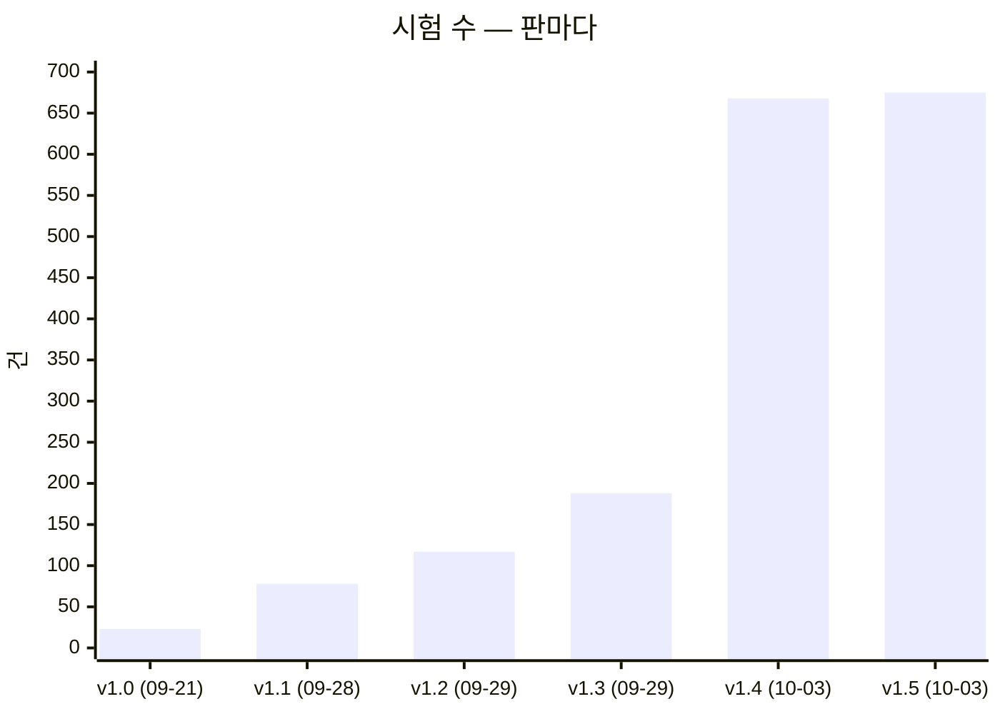

# 테스트 계획서 v1.5 — Qurious

| 문서 정보 | |
|---|---|
| **판 · 상태** | v1.5 · 초안(검토 전) |
| **구분** | 9. 시험·성과 검증 — 시험 계획 · 테스트 케이스 요약 · 시험 결과서 · 결함대장 (ISO/IEC/IEEE 29119-3 의 문서들을 한 권에 둔다) |
| **작성** | 이동원(데이터 파트) |
| **검토** | 검토 전 |
| **최종 수정** | 2026-10-03 (KST) |
| **기준** | 코드 `main` `33ca906`(강사님 기초 코드 `9478811` 서버 쪽 · PR #98) + 같은 묶음의 화면 쪽(이 판과 같은 PR) · 시험 675건 · 실제 수집 DB 데이터 기준일 2026-10-01 |
| **관련 문서** | [RTM v1.3](../../요구사항/지난판/RTM_v1.3.md) · [기능 설계서 v0.1](../../설계/기능설계.md) · [API 명세서 v0.3](../../인터페이스/지난판/API명세서_v0.3.md) · [IA v1.0](../../화면/지난판/IA_v1.0.md) · [ERD v1.4](../../데이터/지난판/ERD_v1.4.md) · [ADR-0004](../../ADR/ADR-0004-KIS-자격증명은-사용자마다.md) · [ADR-0001](../../ADR/ADR-0001-실거래-주문-경로-차단.md) · [ADR-0003](../../ADR/ADR-0003-CI를-걷어내고-먼저-논의한다.md) · [테스트 계획서 v1.4](테스트계획서_v1.4.md) · [v1.2](테스트계획서_v1.2.md) |
| **최근 개정** | v1.4 → v1.5: 새 묶음 TC-NV(위 메뉴 · 전체 메뉴 · 첫 화면 · 화면 글) · 시험 668 → 675(묶음 57 → 58) · 결과서 11차 · 결함 49 → 56(DF-50 ~ 56 · 모두 그날 닫음) · 6절 3순위 닫힘 — 전체는 부록 D |

> **이 문서가 답하는 질문**
> 1. 무엇을 어떤 기준으로 시험하고, 무엇은 시험하지 않나 (1절)
> 2. 시험 675건은 어느 요구를 무엇으로 지키나 (2절 · 3절)
> 3. 지금 전부 통과하나 — 어떤 환경에서 (4절 결과서)
> 4. 알려진 결함은 무엇이고, 누가 무엇을 하면 되나 (5절 결함대장 · 6절)
>
> **읽는 순서** — 팀원: 요약 → 5절 결함대장에서 내 파트 줄 → 3.1절에서 내가 고칠 코드를 지키는 묶음 ·
> 강사님: 요약 → 4절 → 5절 → 6절 · 처음 온 사람: 부록 A 용어 → 1.2절 → 3.1절

## 요약

1. 자동화 시험 **675건(58파일 · 묶음 58)이 통과한다** — 일회용 시험 DB(Postgres)를 붙여 675 통과 · 2 건너뜀(호스트에 없는 패키지 둘의 시험 파일 · 2026-10-03 · `scripts/personal/test.ps1` · 3분 44초). 자동 실행(CI)은 없고 PR 마다 사람이 돌린다.
2. v1.3 의 「2 · 3차 핵심 기능을 재는 시험 0건」 은 닫혔다 — 강사님 기초 코드와 함께 132건(09-30 `b055ab0` 59 · 10-03 `9478811` 73)이 들어와 리밸런싱 · 위험 한도 · 웹훅 · 수식 지표 · 미래 데이터 · 실주문 길 · 합격 전략을 잰다. 10-03 반영 때는 충돌 없이 들어오는 위험 둘을 **시험부터** 막았다 — 게이트웨이 실거래 관문(TC-LT 5절) · 지운 AWS 모듈 import(TC-BM). 다만 **팀원이 쓴 시험은 아직 0건**이다(6절 2순위).
3. 결함은 56건 — 열림 12 · 일부 닫힘 3 · 닫힘 41. 급한 열림은 v1.3 과 같다(DF-02 코스닥 벤치마크 · DF-07 도커 소켓 · DF-15 자동매매 체결가 · DF-19 ETF 백테스트 매도세). v1.4 뒤 새 결함 7건(DF-50 ~ 56)은 강사님 화면을 받으며 브라우저로 단추 · 탭 · 서랍을 하나씩 눌러 찾았고 모두 그날 닫았다 — 새 묶음 TC-NV 가 그중 넷이 되돌아오지 않게 지킨다.

---

## 1. 시험 계획

### 1.1 범위

표 1 은 「무엇을 시험하고 무엇을 하지 않나」 에 답한다.

**표 1. 시험 범위**

| 범위 | 대상 | 지키는 묶음 |
|---|---|---|
| 포함 | 실거래 차단 — 제안요청서 제외 범위(실계좌 실거래 자동 주문 금지)를 지킨다 | TC-LT |
| 포함 | 데이터 출처 — 야후 참조가 더 늘지 않는다(9파일 71줄 · 그중 1줄은 스캐너의 찾는 코드) | TC-YH |
| 포함 | 수집기 일일 갱신 러너 — 새 자료 판정 · 잠금 · 예약 | TC-DU |
| 포함 | 수집 DB 어댑터 — 국내 주식 일봉을 수집 DB 에서 기준일과 함께(골든 픽스처) | TC-CD |
| 포함 | 수집기 전처리 — 정지 뒤 감자 · 병합 · 계수 범위 경고 · 명령 인자 | TC-DF01 · TC-DF16 |
| 포함 | 시세 응답 계약(등락률) · 일봉 · 지표 API 의 캐시 규칙(12:30 갱신이 바로 보인다) | TC-A1 · TC-DF17 |
| 포함 | 모의투자 현금 장부 불변식(실제 Postgres) | TC-I14 |
| 포함 | 사용자 셸(cp949)에서 사람이 돌리는 진입점 15곳 | TC-CE |
| 포함 | 문서 스캐너 — API 명세 · 스키마 · 요구사항 추적표가 코드 · 대장과 같다 | TC-AP · TC-SS · TC-RT |
| 포함 | 운영 도구 — 논의 스캐너 · GitHub 글 올리기 전 검사 | TC-DS · TC-PC |
| 포함 (예정) | 채점 · 사고 방지 항목 셋 · 비용 계산 · 백테스트 재현성 · 코스닥 벤치마크 오차 | 6절 |
| 제외 | 증권사 실서버 연동 — 제외 범위라 실행 자체가 금지다 | — |
| 제외 | 부하 · 성능 — AWS 보류로 대상 환경이 없다 | — |
| 제외 | 브라우저 E2E — 주 경로 12개는 사람이 눌러 봤다(IA v0.2 · 와이어프레임 v0.2), 자동은 아니다 | — |

### 1.2 계층

그림 1 은 「시험이 어느 계층에 몇 건씩 있나」 에 답한다. 위로 갈수록 느리고, 요구사항에 가깝다.

**그림 1. 시험 계층 — 188건** · 범례: 오른쪽은 그 계층의 주된 묶음 · ★ = 이 판에 들어온 것

```
        ┌──────────────────────────────────────────────────
  느림  │  인수 (Acceptance)             6   "요구사항을 지키나"     실거래 차단
   ↑    ├──────────────────────────────────────────────────
        │  통합 (Integration)           23   "진짜 DB · 셸 · 프로세스" 장부 6 · 셸 3 · ★ 셸 11 · 어댑터 1 · 전처리 2
        ├──────────────────────────────────────────────────
        │  계약 (Contract)              14   "응답 모양이 약속대로"  등락률 5 · 어댑터 3 · ★ 라우트 캐시 6
        ├──────────────────────────────────────────────────
        │  특성화 (Characterization)     3   "더 나빠지지 않나"      야후 2 · 옛 장부 1
        ├──────────────────────────────────────────────────
   ↓    │  단위 (Unit)                 142   "함수가 약속대로"      ★ +54 (스캐너 33 · 캐시 11 · 전처리 9 · 셸 1)
  빠름  └──────────────────────────────────────────────────
                                     188
```

- 이 판에 들어온 단위 시험 54건 = TC-AP 14 · TC-RT 11 · TC-SS 8 · TC-DF17 11 · TC-DF01 6 · TC-DF16 3 · TC-CE 1. 문서 스캐너 셋(API 명세 · RTM · 스키마)이 33건이다.
- 계층은 **무엇을 재나**로 나눈다. 자식 프로세스를 띄운다고 통합이 아니다 — 스캐너가 앱을 불러오지 않는지 보는 TC-AP-01 은 단위다. 사용자 셸의 인코딩을 그대로 재는 TC-CE 는 통합이다.
- 실제 수집 DB(시세 447만 행)를 **읽기 전용**으로 여는 통합 시험 두 건(TC-CD-11 · TC-DF01-13)이 전체 실행 시간의 대부분을 쓴다. 파일이 없으면 건너뛴다.

### 1.3 판정 원칙 여덟 가지

1. **자기 판정 금지** — 시험 밖에서 한 번 더 실행해 대조표를 남긴다(역할 분배안 v1.0 5절 규칙 3).
2. **조용한 성공을 의심한다** — 「막혔다」 와 「죽었다」 를 짝으로 시험한다.
3. **환경 오염을 막는다** — `tests/conftest.py` 가 실거래 승인 변수를 매번 지운다.
4. **새 시험은 옛 코드에서 먼저 실패해야 한다** — 옛 코드에서 통과하는 새 시험은 결함을 재지 못한다. 예외는 **보존 확인 시험**(고친 뒤에도 바뀌면 안 되는 동작)이다 — 옛 코드에서도 통과해야 맞고, 결함을 재는 시험과 짝으로 둔다. 새 묶음마다 옛 코드 결과를 3.2절에 적었다.
5. **대조하는 숫자는 출처까지 달라야 「밖의 숫자」 다** — 수정주가와 등락률은 같은 포털 값(`vs`)에서 나와 포털이 틀린 날에는 함께 틀린다. 그래서 주식 수(`lstg_st_cnt`)라는 다른 칸으로 한 번 더 본다.
6. **규칙을 넓히면 「건드리면 안 되는 날」 을 보존 확인 시험으로 둔다** — 전 종목에서 정지 없이 주식 수가 절반 가까이 준 날(우선주 소각)이 있었다. 검증 게이트가 실패하면 끄지 않고 예외를 좁게 두고, 몇 건인지 늘 찍는다.
7. **실제 DB 를 읽는 시험 · 검증은 예약 작업(매일 12:30)과 겹치지 않게 돌린다** — 돌리기 전에 `python scripts/daily_update.py status` 의 「실행 중」 을 본다. SQLite 는 WAL 이라 읽기가 쓰기를 막지는 않지만 디스크와 CPU 를 나눠 쓴다.
8. **스캐너 시험은 실제 저장소에 「늘 참이어야 하는 성질」 만 건다** — 「인증 없는 API 33개」 같은 지금의 사실을 걸면 팀원이 그것을 고치는 순간 시험이 깨진다. 판정 규칙은 합성 입력(임시 폴더)으로 재고, 실제 대장 · 코드에는 형식만 건다(TC-AP · TC-SS · TC-RT).

### 1.4 환경 · 역할 · 끝내는 기준

표 2 는 「어디서 누가 돌리고, 무엇이면 끝났다고 하나」 에 답한다.

**표 2. 환경 · 역할 · 끝내는 기준**

| 항목 | 지금 |
|---|---|
| 환경 | Windows 11 · Python 3.12.13 · pytest 8.3.3 · 시험 DB `pgvector/pgvector:pg16`(시험 동안만 띄우고 지운다 · 포트 15432) · 실제 수집 DB `data/collector/market.sqlite3`(읽기 전용) |
| 실행 조건 | 사용자 셸과 같게 `PYTHONIOENCODING` 없이 돌린다 — Git Bash 의 cp949 출력에서 죽는 코드를 잡기 위해서다 |
| 누가 돌리나 | PR 을 올리는 사람이 PR 마다 — 자동 실행은 없다(ADR-0003 · CI 는 논의 D8 에서 정한다) |
| 누가 쓰나 | 지금까지 188건 모두 데이터 파트. 보조담당 블랙박스 시험(역할 분배안 5절 규칙 2 ②)은 0건 — 6절 2순위 |
| 끝내는 기준 | ① 전부 통과 ② 새 시험은 옛 코드에서 먼저 실패(보존 확인 시험 제외) ③ 결함대장을 판마다 다시 잰다 ④ 파트마다 블랙박스 시험 1건 이상 |

### 1.5 강사님 도구와 우리가 쓰는 것

표 3 은 「강사님 표의 시험 도구를 무엇으로 대신하고, 무엇이 비었나」 에 답한다. 강사님 표의 도구 칸은 pytest · GitHub Actions · Postman · QuantConnect LEAN · TradingView Strategy Tester · JIRA 다.

**표 3. 강사님 도구 대조**

| 강사님 도구 | 우리 | 상태 | 이유 · 위치 |
|---|---|:-:|---|
| pytest | pytest 8.3.3 | 🟢 | `tests/` 15파일 · 188건 · `pytest.ini` |
| GitHub Actions | 없음 | ⏸️ | 계정 정지 이력 뒤 팀 논의 먼저 — ADR-0003 · 논의 D8([#54](https://github.com/EST-team-project/Qurious/discussions/54)) |
| Postman | pytest 계약 시험 14건 + API 명세 스캐너 | 🟡 | 요청 모음 대신 가짜 응답으로 응답 모양을 고정한다. API 목록은 앱의 `app.openapi()` 와 145/145 로 대조했다(API 명세서 v0.1) |
| QuantConnect LEAN | `app/services/lean_backtest.py` | 🟡 | 엔진 연결은 있다. **백테스트 보고서가 없고**, LEAN 은 아직 야후 데이터 · 비용 0 으로 돈다(DF-08 · `P02-④-1`) |
| TradingView Strategy Tester | Pine 생성기 | 🔴 | 생성 코드가 `indicator()` 라 Strategy Tester 가 켜지지 않는다(DF-05) |
| JIRA | GitHub Issues | 🟢 | 결함은 이슈로(#26 · #35 체크리스트) · 결함대장이 번호를 모은다 |

---

## 2. 시험은 어느 요구를 재나

요구와 시험의 대응 전체는 [RTM v1.1](../../요구사항/지난판/RTM_v1.1.md) 4절이고, 대응은 [시험-요구 대장](../../요구사항/대장/시험-요구대장.tsv)에 적는다. 표 4 는 「시험이 붙은 요구는 무엇이고, 얼마나 확실하게 재나」 에 답한다.

**표 4. 시험이 붙은 요구 11개** · 확실도: 🟢 그 요구의 동작을 직접 잰다 · 🟡 전제나 일부만 잰다

| 요구 | 이름 (줄임) | 시험 | 건수 |
|---|---|---|--:|
| `P01-①-2` | 투자 자료 수집 · 전처리 · 검색 | 🟢 TC-A1 · CD · DF01 · 🟡 DU · DF17 | 96 |
| `P01-①-4` | 갱신일 · 정기 배치 | 🟢 TC-DU · DF17 · 🟡 CE · DF16 | 50 |
| `P01-④-3` | 모의 주문 체결 · 포트폴리오 운용 | 🟢 TC-I14 · 🟡 LT | 28 |
| `P02-⑤-1` | 신호 → 증권사 계좌 · 시세 · 주문 | 🟢 TC-LT | 21 |
| `RFP2-4.2-①` | 실거래 자동 주문을 하지 않는다 | 🟢 TC-LT | 21 |
| `RFP2-3.2-④` | 문서화 | 🟢 TC-SS · AP · RT | 35 |
| `SCH-DQ` | 데이터 품질 | 🟢 TC-DF01 | 21 |
| `P02-④-1` | 같은 조건의 LEAN 백테스트 ★ | 🟡 TC-YH · CD | 24 |
| `P02-⑤-3` | 실행 일정 · 로그 · 장애 알림 | 🟡 TC-DU | 15 |
| `RFP2-3.2-①` | 공개 데이터 사용 | 🟡 TC-YH | 2 |
| `RFP2-3.2-③` | 재현 가능성 | 🟡 TC-CD · DF01 | 43 |

요구 59개 가운데 시험이 붙은 요구는 11개이고, 강사님 원문 세부 기능 29개 가운데는 6개다. 한 묶음이 요구 둘을 재면 둘 다에 세므로 건수의 합은 188 보다 크다. **채점 · 사고 방지 항목 셋**(`P02-②-2` 미래 데이터 참조 방지 · `P02-④-1` 같은 조건의 LEAN · `P02-⑤-2` 중복 주문 방지 · 손실 한도 · 비상 정지) 가운데 직접 재는 시험이 있는 것은 없다.

---

## 3. 테스트 케이스

### 3.1 한눈에 — 58묶음

표 5 는 「시험 묶음마다 무엇을 지키고, 어느 요구를 재나」 에 답한다. **v1.4 부터 이 표는 [시험-요구 대장](../../요구사항/대장/시험-요구대장.tsv)과 `pytest --collect-only` 건수로 만든다**(손으로 옮기지 않는다 — 부록 B). v1.3 표의 「계층 · 들어온 PR」 칸은 15묶음까지만 매겼다 — [v1.3 3.1절](테스트계획서_v1.3.md).

**표 5. 시험 묶음 58 · 675건** · 기준 2026-10-03

| 묶음 | 파일 | 건수 | 무엇을 지키나 (대장 첫 줄) | 요구 · 확실도 |
|---|---|--:|---|---|
| TC-A1 | `test_quote_change_a1.py` | 21 | 시세 조회 응답이 등락률을 채우고, 모르면 0 이 아니라 비운다 | `P01-①-2` 🟢 |
| TC-AC | `test_account_crud.py` | 23 | 계정 관리(가입 · 로그인 · 이름 · 비밀번호 바꾸기 · 탈퇴) — 요구 밖 기능(2026-09-30 팀장 요청) · 요구로 올릴지는 팀 결정 | — (요구 없음) |
| TC-AP | `test_api_scan.py` | 15 | API 명세서를 코드에서 다시 만들면 같다 | `RFP2-3.2-④` 🟢 |
| TC-BC | `test_backtest_costs.py` | 6 | 수수료 · 슬리피지가 회전마다 빠져 수익률이 줄고, 비용 전 수익률과 나란히 나온다 | `P01-④-1` 🟢 · `P02-①-2` 🟡 · `RFP2-3.1.3-①` 🟡 |
| TC-BM | `test_base_code_merge_guard.py` | 4 | 강사님 기초 코드를 반영해도 걷어낸 AWS 모듈(SageMaker 배치 점수 · Secrets Manager · boto3)이 import 로 되살아나지 않고 자동매매 모듈이 뜬다 | `P02-⑤-1` 🟡 |
| TC-BR | `test_brand.py` | 2 | 화면의 서비스 이름 · 부제 · 바닥글이 한 곳(public/js/brand.js)에서 오고, 옛 이름 · 회사 표기가 화면에 없으며, 원저작자 표시는 NOTICE.md 에 남는다 — 요구 밖(발표 · 시연에서 우리 서비스로 보이게 · 팀장 요청) | — (요구 없음) |
| TC-CA | `test_market_calendar.py` | 12 | 거래일 달력 — 주말 · 공휴일(특일 정보) · 근로자의 날 · 연말 휴장일 규칙이 시세와 어긋나지 않고(실제 DB 2020~ 0일), 앞날의 거래일 · 파생 만기(두 번째 목요일 · 휴장이면 앞당김) · 배당 일정을 만들며, 배당락일을 달력으로 다시 센다(DF-39). 로그인 없이 읽는 API 둘 | `P01-①-4` 🟢 · `RFP2-3.2-①` 🟡 |
| TC-CD | `test_collector_candles_df08.py` | 22 | 국내 주식 일봉을 수집 DB 에서 기준일(as_of)과 함께 돌려준다 | `P01-①-2` 🟢 · `P02-④-1` 🟡 · `RFP2-3.2-③` 🟡 |
| TC-CE | `test_console_encoding.py` | 18 | 사람이 돌리는 수집기 · 운영 명령(2026-09-30 기준 18곳)이 사용자 셸(cp949)에서 죽지 않는다 | `P01-①-4` 🟡 |
| TC-CM | `test_chat_modes.py` | 0 | 채팅 답변 엔진 셋(서버 LLM · OpenAI 키 · 순수 RAG) — 순수 RAG 모드가 LLM 없이 찾은 청크 · 출처 목록을 그대로 돌려준다(답 안의 [출처 n] 과 번호 맞추기는 아직) · 강사님 기초 코드(289bfb5)의 시험 · 호스트에 langchain_ollama 가 없으면 건너뜀 | `P01-①-3` 🟡 |
| TC-CT | `test_intake.py` | 12 | 다른 출처의 시세 파일을 받아 전처리 — 칸 맞추기 · 값 규칙 · 수집 DB 와 대조(원 · 수정) · 원인 찾기(하루 밀림 · 단위 · 수정 방식 · 배당 반영) · 정제 · 보고서를 가짜 파일로 잰다 | `P01-①-2` 🟡 |
| TC-DA | `test_dashboard_accounts.py` | 6 | 통합 대시보드 사이트별 투자액 탭 — KIS 가 첫 탭 · 한 탭이 실패해도 나머지는 보인다(성과 지표 칸은 재지 않는다) | `U9` 🟡 · `U10` 🟡 |
| TC-DF01 | `test_preprocess_df01.py` | 21 | 정지 뒤 감자 · 병합을 주식 수로 잡는 전처리 | `P01-①-2` 🟢 · `SCH-DQ` 🟢 · `RFP2-3.2-③` 🟡 |
| TC-DF16 | `test_preprocess_cli_df16.py` | 3 | 정기 배치 단계(전처리)를 사람이 돌릴 때 도움말이 쓰기를 시작하지 않는다 | `P01-①-4` 🟡 |
| TC-DF17 | `test_route_cache_df17.py` | 17 | 12:30 갱신이 일봉 · 지표 API 에 바로 보인다 | `P01-①-4` 🟢 · `P01-①-2` 🟡 |
| TC-DH | `test_data_screens.py` | 4 | 갱신일 · 캘린더를 화면으로 — 위 메뉴 「데이터」 맨 위 데이터 관제와 모든 화면의 「자료 날짜 · 판정」 표시, 「투자분석 기초 › 일정」 달력과 「다가오는 일정」 카드가 이어져 있고, 화면이 읽는 상태 · 일정 · 거래일 응답 칸이 실제로 있으며, 일정 종류는 서버의 넷과 같다(화면 자체는 브라우저 캡처로 확인) | `P01-①-4` 🟢 |
| TC-DS | `test_discussion_scan.py` | 6 | 논의 답글까지 센다 — 프로젝트 운영 도구 | — (요구 없음) |
| TC-DST | `test_data_status.py` | 10 | 데이터 상태 API 가 러너 기록 · 표별 기준일 · 거래일로 센 늦음(0 최신 · 1 정상 · 2 늦음 · 3+ 멈춤) · HF 태그를 한 번에 싣고, 러너의 단계 이름표가 러너와 어긋나지 않는다 | `P01-①-4` 🟢 |
| TC-DU | `test_daily_update.py` | 17 | 일일 갱신 러너의 새 자료 판정 · 잠금 · 예약 · 단계 판정 | `P01-①-4` 🟢 · `P01-①-2` 🟡 · `P02-⑤-3` 🟡 |
| TC-FM | `test_formula.py` | 9 | 문자열 산식을 허용 목록 문법으로 계산하고 막을 구문을 막는다 · 판 체크섬 | `P02-②-1` 🟢 · `P02-②-2` 🟡 · `P02-③-1` 🟡 |
| TC-GL | `test_glossary.py` | 91 | 화면 용어 키 · 이름 · 약어 · 초성으로 용어를 찾아 뜻 한 줄 · 자세한 뜻을 돌려주고, 용어 파일이 표에 같은 판으로 들어간다 — 서버 쪽만 잰다 · 연관 개념(관계 27 — 헷갈리는 말 25 · 연관 2 · 두 끝에서 읽기 · 관계 지도)도 잰다(2026-10-02) | `P01-①-1` 🟡 · `RFP2-3.2-③` 🟡 |
| TC-GP | `test_live_order_gateway_path.py` | 10 | 자동매매 실주문이 게이트웨이로 나가 live_orders 에 추적되고, 거절 · 연결 끊김 · 장 밖이 상태로 남는다 | `P02-⑤-1` 🟢 · `P02-⑤-2` 🟢 · `SCH-ORD` 🟡 |
| TC-GW | `test_stock_coin_trade_gateway.py` | 10 | 게이트웨이 2단계 주문(승인 토큰 → 주문) · 멱등키 · 호가 단위 보정 · 오류 코드 · 재시도 규칙(주문은 다시 보내지 않음) | `P02-⑤-1` 🟢 · `P01-①-4` 🟡 |
| TC-HF | `test_hf_dataset_tables.py` | 7 | 정기 배치의 HF 백업이 수집기 표를 빠짐없이 담는다 — 표는 전부 백업하거나 이유와 함께 제외하고, OHLCV 원자료 넷(ETF · 지수 일봉 · 분봉 · 분봉 유니버스)을 담으며, 연도 파일이 날짜 모양(YYYYMMDD · YYYY-MM-DD)을 가리지 않고, 그 파케이만으로 되살아난다(DF-40) | `P01-①-4` 🟢 · `P01-①-2` 🟡 |
| TC-I14 | `test_paper_ledger_i14.py` | 9 | 자동매매는 자기 장부(QUANT)만 쓰고 모의투자 총자산은 그대로 · 두 장부 모두 총자산 = 초기 현금 − 거래비용 · 다른 장부의 보유는 팔 수 없다 | `P01-④-3` 🟢 |
| TC-KB | `test_kb_search.py` | 18 | 근거 청크를 기준일 판에서 낱말 · 벡터로 찾아 RRF 로 합치고 질문 분류(세금 · 회사 · 투자 규제)로 가중한다 · 벡터가 꺼지면 낱말로 · 다시 쪼갠 뒤의 옛 점은 버린다 · 문서 목록은 로그인 없이 — 검색 품질은 평가셋 v0(docs/시험/평가셋/근거검색-평가셋_v0.tsv)으로 따로 잰다 · 답 만들기(W6)는 아직 | `P01-①-3` 🟡 |
| TC-KC | `test_kis_credentials.py` | 10 | KIS 키는 사용자마다 — 서버 계좌 없음 · 서버 .env 키 무시 · 저장이 사용자 키를 남김 · 화면용 상태에 키 원문 없음(ADR-0004) | `P02-⑤-1` 🟢 |
| TC-KH | `test_kis_quickstart_http.py` | 5 | HTTP: 설정 화면에는 가린 키만 · 저장이 사용자 키를 남김 · 원클릭 두 라우트 · 실전이면 409(승인했을 때) | `P02-⑤-1` 🟢 |
| TC-KL | `test_legacy_kis_order_managed.py` | 3 | 게이트웨이가 없을 때 자동매매 실주문이 그 사용자의 DB 키로 나가고 서버 키는 쓰지 않는다 | `P02-⑤-1` 🟢 · `RFP2-4.2-①` 🟢 |
| TC-KQ | `test_kis_quickstart.py` | 12 | 「KIS 모의투자 시작」 원클릭 — 경로 판정 · 차단(키 없음 · 실전 · 비상 정지) · 설정 저장 + 자동매매 켜기 · 사용자 키를 남김 | `P02-⑤-1` 🟢 · `U10` 🟡 |
| TC-LA | `test_ta_utils_lookahead.py` | 8 | t 시점 지표 · 피처 값은 뒤 데이터가 바뀌어도 같고, 백테스트는 t 일 신호를 t+1 일에 적용한다 | `P02-②-2` 🟢 · `P02-①-1` 🟡 |
| TC-LC | `test_lectures.py` | 13 | 금융 강의(강의실 · 주제 화면 아홉)가 메뉴 · 화면 자리 · 주제 목록에서 서로 맞고 앱 밖 링크가 없다 — 개념을 배우는 자리 | `P01-①-1` 🟡 · `P01-①-2` 🟢 |
| TC-LN | `test_learn.py` | 40 | 개념 학습(용어 → 개념 확장 · 제안) — 기본 교재 34편이 규격 · 선수 장 · 장 안 링크를 지키고, 팀 자료(HF 비공개)의 새 글 · 고치기 · 지우기 · 낡은 판 409 · 412 한 번 재시도를 가짜 HF 로, API 로그인 경계를, 3.1 RAG 장의 출력이 예제 코드 결과와 같은지를 잰다 — 화면(학습 사이트)은 브라우저로만 확인 | `P01-①-1` 🟡 |
| TC-LR | `test_lean_remote.py` | 4 | LEAN 백테스트를 domain-rag-lab 에 맡기고 연결 실패 · 5xx 면 로컬로 돌린다 — 실행처만 재고 「같은 데이터 · 기간 · 수수료」 는 재지 않는다 | `P02-④-1` 🟡 · `P02-③-2` 🟡 |
| TC-LT | `test_live_trading_guard.py` | 30 | 실거래 승인 없이는 증권사 주문이 실계좌로 나가지 않는다 — 팩토리 · 게이트웨이 두 길 · 사용자 키(인수 시험 6건 포함 · 2026-10-03 게이트웨이 4건 · 사용자 키 3건 · 합친 실주문 2건) | `RFP2-4.2-①` 🟢 · `P02-⑤-1` 🟢 · `P01-④-3` 🟡 |
| TC-LW | `test_kb_law.py` | 11 | 법령 · 감독규정을 기준일에 시행 중인 판(시행일 판 · 같은 날 공포 · 뒤에 공포된 판 대조)으로 고르고, 조문을 제목 사슬 머리로 쪼개며, 청크 ID 가 실행마다 같다 · 응답 속 키를 지운다 · 받아 둔 원문으로 네트워크 없이 다시 쪼갠다 | `P01-①-3` 🟢 |
| TC-NV | `test_nav_dashboard_shell.py` | 7 | 위 메뉴 · 전체 메뉴 · 첫 화면 — 위 메뉴 탭 순서가 우선순위 목록과 같고, 모든 메뉴 묶음이 전체 메뉴에 빠짐없이 들어가며(IA 그림 2 와 코드가 같다), 소제목 · 바깥 주소를 깨지 않고, 첫 화면은 투자 대시보드다(2026-10-03 화면 결정 · 강사님 기초 코드 9478811 화면 쪽) | `RFP2-3.2-④` 🟢 · `U9` 🟡 · `P02-⑤-1` 🟡 |
| TC-OA | `test_data_ohlcv.py` | 21 | 모은 시세를 규격(ohlcv-v1) 한 모양으로 한 종목 · 한 기간씩 내준다 — 주식(원 가격 · 수정 가격) · ETF · 지수(같은 이름은 시리즈마다) 일봉 · 주봉 · 분봉이 HF 내보내기와 줄마다 같고, 분봉의 시장을 유니버스에서 바르게 읽으며(DF-43), 고칠 수 있는 잘못은 상태와 할 일로 알린다(로그인 뒤) | `P01-①-2` 🟢 |
| TC-OH | `test_ohlcv.py` | 29 | 가격 · 거래량 자료의 공통 규격(ohlcv-v1) — 값 규칙 · 주봉(정지일 · 휴장 · 주 중간 권리락) · 분봉 시각(UTC → KST · 장 구간) · ETF · 지수 일봉 적재 · 분봉 유니버스 · 내보내기를 잰다. 실제 출처 호출 · HF 업로드는 시험 밖(손으로 돌린 결과는 설계서 부록 C) | `P01-①-2` 🟡 |
| TC-PC | `test_post_check.py` | 3 | GitHub 글 올리기 전 검사 — 프로젝트 운영 도구 | — (요구 없음) |
| TC-PT | `test_patterns.py` | 7 | 캔들 패턴 · 지지와 저항 · 52주 · 20일 돌파 · 여러 주기 종합 신호 | `P01-②-2` 🟢 |
| TC-QC | `test_quant_cycle_integration.py` | 4 | 자동매매 사이클 통합 — 합격 전략 적용 · 위험 한도 · 실계좌 일손실 한도 | `P02-⑤-2` 🟢 |
| TC-RB | `test_rebalance.py` | 10 | 목표 비중 정리와 다음 주기(월 · 분기 · 연) 계산 — 계획 · 체결 · 이력은 재지 않는다 · 이탈률 · 현금흐름 계기(③-2 · ③-3)는 시험 없음 | `P01-③-1` 🟡 |
| TC-RG | `test_risk_guard.py` | 5 | 중복 주문 쿨다운 · 일 주문 수 · 종목 비중 · 일손실 한도 판정 — 비상 정지 동작은 재지 않는다 | `P02-⑤-2` 🟡 |
| TC-RK | `test_risk_guard_boundaries.py` | 4 | 쿨다운 만료 경계 · 일 주문 한도 · 비상 정지 매핑 · 위험 저장소(Redis)가 없으면 실전 주문을 내지 않는다 | `P02-⑤-2` 🟢 |
| TC-RL | `test_raglab_scan.py` | 14 | 통합본 반입 폴더가 대장과 같고, 그 화면 · API 가 빠짐없이 기능 묶음 하나에 든다 — 옮겨 놓은 코드를 구현으로 세지 않는다 | `RFP2-3.2-④` 🟡 |
| TC-RP | `test_robo_profile.py` | 4 | 설문 점수로 5단계 투자 성향을 정하고 빠진 답을 막는다 | `U1` 🟢 · `U4` 🟢 |
| TC-RT | `test_rtm_scan.py` | 13 | 요구사항 추적표를 대장 · 코드에서 다시 만들면 같다 · 문서화 문자열 속 낱말을 흔적으로 세지 않는다 | `RFP2-3.2-④` 🟢 |
| TC-SA | `test_session_auth.py` | 12 | 로그인 유지(마지막 활동으로부터 30일 · 5분 간격 연장 · 연장된 요청만 쿠키 재발급) · 토큰 하나 폐기가 다른 토큰에 번지지 않음 · Redis 장애 503 · 만료돼도 로그아웃이 쿠키를 지움 · 리프레시 토큰 연장 — 강사님 기초 코드(289bfb5)의 시험 · 계정 관리(TC-AC)와 같은 「요구 밖」 줄 | — (요구 없음) |
| TC-SL | `test_strategy_loader.py` | 2 | domain-rag-lab 합격 전략 목록 · 스펙 받기(설정이 비면 빈 목록) | `P02-①-3` 🟡 |
| TC-SP | `test_strategy_spec_apply.py` | 4 | 합격 전략 스펙으로 신호를 다시 판정(임계값 · 종목 범위 · 최대 종목 수) · 배치 ML 점수는 늘 비어 있음 | `P01-④-2` 🟢 · `P02-①-2` 🟡 |
| TC-SR | `test_spec_rules_and_ml_symbol.py` | 3 | 전략 스펙의 진입 · 청산 규칙 평가와 캔들 Ridge ML 점수 | `P01-④-2` 🟡 |
| TC-SS | `test_schema_scan.py` | 10 | 데이터 사전 · ERD 를 코드에서 다시 만들면 같다 | `RFP2-3.2-④` 🟢 |
| TC-TV | `test_tradingview.py` | 8 | TradingView 알림 본문을 매수 · 매도 신호로 읽는다 — 받는 쪽 확인(비밀 토큰 · 중복)과 전달은 재지 않는다 | `P02-③-3` 🟡 · `P02-③-2` 🟡 · `P02-④-3` 🟡 |
| TC-VS | `test_rag_pipeline.py` | 0 | 근거 RAG 의 바닥 — 올린 문서 조각이 벡터 DB 에 실제로 저장되고 다시 찾아지며, 출처(metadata.source)로 거르고 지울 수 있고, 저장 실패는 숨기지 않는다(DF-38) · 출처 번호를 답에 붙이는 것은 아직 | `P01-①-3` 🟡 |
| TC-VW | `test_view_scan.py` | 2 | 화면 정보구조(IA)의 화면 수 · 메뉴 그림을 코드에서 다시 만들면 같다 — 소제목 아래 들여쓴 메뉴 항목도 센다 | `RFP2-3.2-④` 🟢 |
| TC-XA | `test_xai.py` | 2 | LightGBM 기여도로 예측 근거 문장을 만든다(lightgbm 이 없으면 건너뜀) | `P01-①-5` 🟢 |
| TC-YH | `test_no_yahoo_regression.py` | 2 | 야후 참조가 기준선(2026-09-30 기준 13파일 75줄 · 그중 2줄은 스캐너의 찾는 코드)보다 늘지 않는다 — 이용 조건을 지키는 출처만 늘린다 | `RFP2-3.2-①` 🟡 · `P02-④-1` 🟡 |
| | **58파일** | **675** | | |

### 3.2 이 판에 들어오거나 넓어진 묶음 (v1.3 뒤 · 2026-09-30 ~ 10-03)

v1.3 의 3.2절(TC-CE · TC-DF01 · TC-SS · TC-AP · TC-DF17 · TC-RT 의 케이스 표)은 [v1.3 파일](테스트계획서_v1.3.md)에 그대로 있다. v1.4 에 들어온 묶음 42개는 묶음마다 케이스 표 대신 아래 한 줄과 시험 파일 머리말(무엇을 지키는가)로 둔다 — 케이스가 600건을 넘어 표로 옮기면 문서가 코드를 따라가지 못한다.

| 날짜 | 묶음 | 건수 | 왜 들어왔나 · 옛 코드에서 먼저 실패했나 |
|---|---|--:|---|
| 09-30 | 강사님 `b055ab0` 9묶음 — TC-BC · FM · LA · PT · RB · RG · RP · TV · XA | 59 | 기초 코드 반영 — 강사님이 쓴 시험을 그대로 받았다(묶음 이름만 우리가 붙임) · `TC-I14` 불변식 7 → 9 · `TC-YH` 기준선 +3파일 |
| 09-30 | TC-AC 계정 관리 | 21 → 22 | 이메일 대소문자 · 72바이트 · 이름 길이(DF-22 ~ 24 · 같은 날 닫음) · `TC-AC-22` 는 미들웨어를 거쳐 DF-37 을 재현 |
| 09-30 | TC-GL 용어사전 · TC-RL 통합본 반입 폴더 | 79 · 14 | 용어 755 → 760 · 관계 · 후보 용어(TC-GL-34 ~ 36) · 반입 폴더에 AWS 설정이 들어오지 않게 |
| 10-01 | TC-LN 개념 학습 · TC-LC 금융 강의 | 39 · 11 | 교재 예제 출력 대조 · 강의 빌드 = 저장소 사본(DF-36 · 줄바꿈 접기) · DF-28 ~ 34 |
| 10-01 | TC-OH OHLCV 규격 · TC-CT 받은 시세 파일 | 29 · 12 | 목표 기능 ① W2 |
| 10-02 | TC-SA · CM · VS · BR · VW(강사님 `289bfb5` · 화면 · 브랜드 · 화면 스캐너) | — | 세션 30일 · 대화 방식 · 벡터 저장소(DF-38) · 서비스 이름 · 들여쓴 메뉴 |
| 10-02 | TC-CA 거래일 달력 · TC-DST 데이터 상태 · TC-HF HF 백업 · TC-OA OHLCV 주소 · TC-DH 관제 · 일정 화면 | 12 · 10 · 7 · 21 · 4 | 목표 기능 ① W4 — DF-39 ~ 43 은 옛 코드에서 실패하는 시험을 먼저 쓰고 고쳤다(TC-HF-06 · 07 등) |
| 10-03 | TC-LW 근거 문서 받기 · TC-KB 근거 찾기 | 11 · 19 | 목표 기능 ① W5 · 검색 평가셋 v0(`docs/시험/평가셋/근거검색-평가셋_v0.tsv` — 시험이 아니라 품질 지표 · 낱말 + bge-m3 Recall@5 0.868) |
| **10-03** | **TC-LT 5 ~ 7절 · TC-BM**(우리) | **+9 · 4** | **강사님 `9478811` 반영 전에 썼다** — 게이트웨이 관문 4 · 사용자 키 3(반영 전 코드에서 7건 실패 확인) · 합친 실주문 2(회귀) · 걷어낸 AWS 가 되살아나지 않게 4(강사님 판을 넣으면 잡는 것을 확인) |
| **10-03** | **강사님 `9478811` 13묶음** — TC-GW · GP · KC · KL · KQ · KH · DA · QC · RK · SR · SP · SL · LR | 73 → 76 | 기초 코드 반영 — 사용자별 KIS 키(ADR-0004) · 관문 · AWS 제외에 맞춰 손본 시험 25건(TC-KC · KL · KH 는 다시 씀) · TC-RK 한 건은 Windows 에서 시간이 걸려 깨지던 것을 메모리 경로로(DF-48) |
| **10-03** | **TC-NV**(우리 · 강사님 `9478811` 화면 쪽) · TC-DA 단정 셋 | 7 · (6 그대로) | 위 메뉴 순서 · 전체 메뉴 빠짐없음 · 소제목 · 바깥 주소 · 첫 화면 · 화면 글 · 화면 이름 · 탭 링크 — **커밋된 트리(HEAD 복사본)에서 7건 모두 실패**를 확인했다. TC-DA 는 탭 글 · 링크 단정을 더함(DF-55) |

## 4. 시험 결과서 (11차 · 2026-10-03)

```
PS> .\scripts\personal\test.ps1          # 일회용 시험 DB(pgvector:pg16 · 빈 포트)를 띄워 전부 돌리고 지운다
675 passed, 2 skipped in 224.82s (0:03:44)
```

건너뜀 2 는 호스트 파이썬에 없는 패키지(langchain-ollama · langchain-qdrant)를 부르는 시험 파일 둘이다(`importorskip` — 대화 방식 TC-CM · 벡터 저장소 TC-VS). 시험용 가상환경에서는 그 둘도 통과한다(2026-10-02).

표 6 은 「계층마다 몇 건을 돌려 몇 건이 통과했나」 에 답한다.

**표 6. 계층별 결과** · 4차(2026-09-29 · v1.3) 실행 — 계층은 15묶음까지만 매겼다(5차부터는 표 7 의 합계만)

| 계층 | 계획 | 실행 | 성공 | 실패 | 건너뜀 | 성공률 | 시험 DB 없이 |
|---|--:|--:|--:|--:|--:|--:|---|
| 단위 | 142 | 142 | 142 | 0 | 0 | 100% | 같음 |
| 계약 | 14 | 14 | 14 | 0 | 0 | 100% | 같음 |
| 통합 | 23 | 23 | 23 | 0 | 0 | 100% | 17 통과 · **6 건너뜀**(모의 장부 TC-I14) |
| 인수 | 6 | 6 | 6 | 0 | 0 | 100% | 같음 |
| 특성화 | 3 | 3 | 3 | 0 | 0 | 100% | 같음 |
| **합계** | **188** | **188** | **188** | **0** | **0** | **100%** | 182 통과 · 6 건너뜀 |

표 7 은 「판마다 시험이 어떻게 늘었나」 에 답한다.

**표 7. 차수별 결과**

| 차수 | 날짜 | 판 | 결과 | 시험 DB 없이 |
|:-:|---|---|---|---|
| 1차 | 2026-09-21 | v1.0 | 23/23 | — |
| 2차 | 2026-09-28 | v1.1 | 78/78 | 72 · 6 |
| 3차 | 2026-09-29 | v1.2 | 117/117 | 111 · 6 |
| (변경 노트) | 2026-09-29 | v1.2 6.1절 — PR #48 · #51 · #53 · #56 | 138 · 151 · 169 · 177 | 132 · 145 · 163 · 171 (건너뜀 6) |
| **4차** | **2026-09-29** | **v1.3** | **188/188** | **182 · 6** |
| 5차 ~ 9차 | 09-30 ~ 10-01 | v1.3 부록 C | 249 · 270 · 367 · 368 · 448 | 시험 DB 없이 — 20 안팎 건너뜀 |
| (부록 C) | 10-02 | 강사님 `289bfb5` · W4 | 473 · 482 · 511 · 543 | 2 건너뜀(패키지) |
| (부록 C) | 10-03 | W5 | 577 | 2 건너뜀 |
| 10차 | 2026-10-03 | v1.4 | 668 통과 · 2 건너뜀 | 일회용 DB 로만 돌린다(`test.ps1`) |
| **11차** | **2026-10-03** | **v1.5** | **675 통과 · 2 건너뜀** | 〃 |

그림 2 는 「시험이 판마다 얼마나 늘었나」 에 답한다.

**그림 2. 판마다 시험 수**



- **실행 환경** — 1.4절 표 2. 경고 1건은 `app/config.py` 의 Pydantic v1 식 `class Config`(2.0 부터 폐기 예정)로, 결과와 무관하다.
- **포트** — 시험 파일 머리말의 `-p 55432:5432` 는 이 PC 에서 `bind: forbidden` 으로 실패한다. Windows 가 55367~55466 을 예약해 두었기 때문이다(`netsh interface ipv4 show excludedportrange protocol=tcp`). 15432 로 띄웠고 머리말은 고치지 않았다 — 다른 PC 에서는 된다.
- **자동 실행 없음** — 이 표는 이 판을 쓴 때의 기록이다(ADR-0003).

### 4.1 끝내는 기준 판정 · 남은 위험

표 8 은 「1.4절의 끝내는 기준을 채웠나」 에 답한다.

**표 8. 끝내는 기준 판정**

| 기준 | 판정 | 근거 |
|---|:-:|---|
| ① 전부 통과 | ✅ | 675 통과 · 2 건너뜀(패키지 · 가상환경에서는 통과) |
| ② 새 시험은 옛 코드에서 먼저 실패 | ✅ | 3.2절 — 묶음마다 옛 코드 결과 · 통과한 것은 모두 보존 확인 시험 |
| ③ 결함대장을 다시 잼 | 🟡 | 5절 — 새 37건(DF-20 ~ 56)은 찾은 날 확인 · DF-01 ~ 19 는 다시 재지 않았다(v1.3 판정 그대로 · 6절 6순위) |
| ④ 파트마다 블랙박스 시험 1건 이상 | ❌ | 0건 — 팀원이 쓴 시험 0(시험 파일 커밋 26건 모두 이동원 · 강사님 시험 132건은 반영 커밋으로) |

**남은 위험** — ① 채점 · 사고 방지 항목 셋을 재는 시험이 없다 ② 자동 실행이 없어 PR 을 올리는 사람이 돌리지 않으면 아무도 모른다 ③ 한 파트가 모든 시험을 썼다 — 그 파트가 빠지면 시험을 고칠 사람이 없다 ④ 실제 DB 를 읽는 시험 두 건이 무겁고, DB 가 없는 PC 에서는 건너뛴다.

### 4.2 이 판의 시험이 잡아낸 결함

**v1.5 (2026-10-03 · 강사님 `9478811` 화면 쪽)**

- **DF-51** — 강사님 새 「더보기」 빌더를 받기 **전에** 코드로 읽어 막았다(우리 메뉴의 소제목 · 바깥 주소를 깨뜨린다) — 우리 빌더로 받고 TC-NV-03 이 지킨다.
- **DF-50 · DF-55** — 같은 계정 · 같은 데이터로 탭 · 안내를 하나씩 읽다 찾았다(없는 화면 이름 · 옛 서비스 이름 · 서버 설정 이름 · 없는 화면 주소) — TC-NV-05 ~ 07 · TC-DA 단정.
- **DF-52 ~ 54** — 화면의 단추 · 서랍을 모두 눌러 보다 찾았다(잠긴 단추 모양 · 서랍을 연 채 주소 이동 · 배지가 서랍을 가림) — 화면 동작이라 브라우저로만 확인했다.
- **DF-56** — 강사님 대시보드를 우리 서버 데이터로 띄워(로컬 중계) 찾았다 — 매매가 0회인 기본 전략이 0% 로 보였다.

**v1.4 (2026-10-03 · 서버 쪽)**

- **DF-45 · DF-46** — 강사님 `9478811` 을 받기 **전에** 쓴 시험(TC-LT 5절 · TC-BM)이 충돌 표시 없이 들어오는 위험 둘을 잡았다(게이트웨이 실거래 관문 · 지운 SageMaker 모듈 import). 반영 전 코드에서 7건 실패 → 반영 뒤 통과.
- **DF-48** — 강사님 시험이 우리 PC 에서만 깨졌다(Windows 의 Redis 연결 거부가 4.7초). 코드가 아니라 시험의 시간 가정이 문제였다.
- **DF-49** — API 명세서를 `app.openapi()` 와 다시 맞추다 스캐너가 질의 인자 `alias` 를 못 읽는 것을 찾았다(TC-AP-15).
- v1.3 뒤 그 밖의 결함(DF-20 ~ 44)은 부록 C 로 쌓였고, 이 판에서 5절 표로 옮겼다.

---

## 5. 결함대장

표 9 는 「알려진 결함이 무엇이고, 어떻게 다시 보고, 누가 고치나」 에 답한다. 칸은 [문서 작성 기준 v0.1](../../문서기준/지난판/문서작성기준_v0.1.md) 5.9절을 따른다 — **요약은 사용자에게 무엇이 틀려 보이나**를 적고, 코드 위치는 함수 · 화면 이름으로 적는다. v1.3 은 19건 전부 다시 쟀다(2026-09-29). v1.4 는 새 30건(DF-20 ~ 49)을 더했다. **v1.5 는 새 7건(DF-50 ~ 56)을 더했고 DF-01 ~ 19 는 v1.3 판정 그대로다.**

범례 — 심각도: 🔴 높음(돈 · 주문 · 보안 · 원천 데이터가 틀린다) · 🟠 높음(파생 값이나 화면이 틀려 판단을 흐린다) · 🟡 중간(도구 · 불편 · 되돌릴 수 있다). 상태: **닫힘** = 원인을 없앴다 · **일부 닫힘** = 같은 원인이 남은 곳이 있다 · **열림**. 특성화 시험으로 막은 것은 「원인은 그대로인데 더 번지지 못하게 한 것」 이라 닫힘이 아니다.

**표 9. 결함대장 — 56건**

| ID | 요약 (무엇이 틀려 보이나) | 심각도 | 상태 | 재현 | 확인 방법 | 영향 | 파트 | 관련 |
|---|---|:-:|---|---|---|---|---|---|
| DF-01 | 거래정지 뒤 감자 · 병합이 수정주가에 빠져 두 종목의 수정 수익률이 +29,948% · −14.0% 로 보였다 | 🔴 | 닫힘 | 정지 → 감자 → 정리매매로 간 종목의 재개일(가격 전일대비가 조용하고 주식 수가 1/5 아래) | TC-DF01-13 — 실제 DB 전 종목 누락 0곳 · 12:30 갱신 뒤에도 통과(2026-09-29) | 수정주가 · 총수익 지수 · 코스닥 · 코넥스 벤치마크 | P-A | PR #39 · #48 |
| DF-02 | 코스닥 벤치마크가 공식 연말 종가와 평균 0.871% (최대 1.896% · 2025년 말) 어긋난다 — 왕복 거래비용(약 0.24%)보다 크다 | 🔴 | 열림 | `python -m collector.benchmark verify` 게이트 2 | 게이트 2 의 코스닥 연말 6개 대조 — 게이트 기준이 평균 1.00% 라 **통과로 찍힌다**(2026-09-29 다시 잼 · 같은 대조에서 코스피는 평균 0.066%) | 코스닥 대비 초과 수익 · 벤치마크 비교 | P-A | [옛 결함 기록](../../github-archive/2026-09-21/이슈-056/00-기록.md) (가설 2개 기각) |
| DF-03 | 크롤링을 다시 돌리면 같은 문서가 벡터 DB 에 중복으로 쌓인다 — 문서 조각 ID 를 프로세스마다 다른 `hash()` 로 만든다 | 🟡 | 열림 | 같은 URL 을 다른 프로세스에서 두 번 크롤링 | `app/services/crawl.py` `_store_qdrant()` 의 `hash()` 그대로 — 같은 저장소의 번역 적재(`translation_ingest`)는 sha256 이라 고치는 본이 있다 | RAG 검색 결과 중복(`P01-①-3`) | P-A | — |
| DF-04 | 실패가 종료코드 0 으로 조용히 끝날 수 있다 — 공유 스위치 게이트는 종료코드 1 로 멈추고, 전체 업로드만 커밋 거부를 조용히 재시도한다 | 🟡 | 일부 닫힘 | 전체 업로드(`scripts/hf_dataset.py` 의 `upload_large_folder` 경로)에서 커밋이 거부될 때 | 스위치를 끈 채 `_sharing_gate()` → 종료코드 1 · 일일 러너는 증분 업로드(`upload_folder` — 거부되면 예외)라 이 길을 밟지 않는다 | 데이터 백업의 신뢰(`P01-①-4`) | P-A | [옛 기록](../../github-archive/2026-09-21/이슈-053/00-기록.md) |
| DF-05 | Pine 생성 코드가 `indicator()` 로 선언돼 TradingView Strategy Tester 가 켜지지 않는다 | 🟡 | 열림 | 화면 `indicator-custom` 에서 Pine 코드를 만들어 TradingView 에 붙여 넣기 | `public/app.html` `generatePineCode()` 그대로(`//@version=5` · `indicator(`) | `P02-③-1` · `P02-③-2` | P-B | 이슈 #26 |
| DF-06 | Pine 생성 코드에 `100 - parseInt(buyTh)` 가 글자 그대로 찍혀 컴파일 오류가 난다(Pine 에 `parseInt` 없음) | 🟡 | 열림 | 같음 | `generatePineCode()` 의 매도 임계값 줄 그대로 — 같은 식을 파이썬 생성기는 `${…}` 안에 넣어 맞게 쓴다 | `P02-③-1` | P-B | 이슈 #26 |
| DF-07 | 앱 컨테이너가 호스트의 도커 소켓을 마운트해, 앱이 뚫리면 호스트의 도커 전체가 넘어간다 | 🔴 | 열림 | `docker compose up` | `docker-compose.yml` 앱 서비스의 `/var/run/docker.sock` 마운트 그대로 | 운영 보안(받는 요구 없음) | P-E | [옛 분석 A3](../../github-archive/2026-09-17/이슈-022/00-기록.md) |
| DF-08 | 앱이 수집 DB 대신 야후를 부른다 — 국내 주식 일봉은 고쳤고, 실시간 시세 · 지수 · 환율 · 해외 · 재무 · LEAN 은 그대로다 | 🟠 | 일부 닫힘 · 나머지는 특성화 시험으로 막음 | 해당 API 를 부른다 | TC-CD(일봉) · TC-YH(야후 참조 9파일 71줄 — 늘면 실패) | `P02-④-1` ★ · `RFP2-3.2-①` | P-A | PR #33 · [옛 격차 지도](../../github-archive/2026-09-21/이슈-061/00-기록.md) |
| DF-09 | 실거래 주문 경로가 세 곳에서 열려 있었다 | 🔴 | 닫힘 | 실거래 승인 없이 증권사 주문 | TC-LT 21건 | `RFP2-4.2-①` | P-E | ADR-0001 |
| DF-10 | 자동매매 매수가 모의계좌 현금을 줄이지 않아 없는 수익(+3.19%)이 보였다 | 🔴 | 닫힘 | 자동매매 매수 뒤 모의투자 대시보드 | TC-I14 7건(Postgres) | `P01-④-3` | P-E | 이슈 #24 · PR #25 |
| DF-11 | 사용자 Git Bash(cp949)에서 출력 한 글자(줄표 `—` 등)로 명령이 죽었다 — 진입점 15곳 | 🟡 | 닫힘 | cp949 셸에서 `python -m collector.benchmark status` 등 | TC-CE 15건 | `P01-①-4` | P-A | PR #27 · #48 |
| DF-12 | 시세 조회가 등락률을 늘 비운 채 돌려줬다 | 🟡 | 닫힘 | 시세 조회(`get_quote`) | TC-A1 21건 | `P01-①-2` | P-A | 이슈 #26 · PR #30 |
| DF-13 | 화면이 모르는 등락률을 0 으로 채워 보합처럼 보인다 | 🟡 | 열림 | 등락률이 없는 종목이 스크리닝 표 · 미국 대시보드에 나온다 | `public/app.html` `renderScreenTable()` · `loadUsDashboard()` 의 `?? 0` 그대로 | 화면 표시 | P-C | 이슈 #26 |
| DF-14 | 화면이 실제보다 더 말하는 곳 — 다른 파트 17건(가짜 연결 성공 · 계산 없는 「AI」 문구 등) | 🟡~🔴 | 열림 | 이슈 #26 체크리스트 | 이슈 #26 열림(2026-09-29 페이지 확인) | 여러 화면 · `RFP2-3.1.3-①` 등 | 여러 파트 | 이슈 #26 |
| DF-15 | 국내 주식의 「현재가」 자리에 **직전 거래일 종가**를 쓰는 곳이 5곳 — 가장 급한 것은 자동매매 체결가 | 🟠 | 열림 | 응답의 기준일(`as_of`)이 오늘보다 앞선 날에 그 기능을 쓴다 | 이슈 #35 열림(2026-09-29 페이지 확인) · 자동매매는 `get_quant_indicators()` 의 `current_price`(수집 DB 마지막 봉 종가)를 체결가로 쓴다 · 응답의 `as_of` · `source` 칸은 TC-CD-10c | `P01-④-3` · `P02-⑤-1` | P-E · P-D · P-C · P-B | 이슈 #35 · PR #33 |
| DF-16 | 전처리 명령이 인자를 보지 않아 `--help` 에도 전 종목 재계산(쓰기)을 시작했다 | 🟡 | 닫힘 | `python -m collector.preprocess --help` | TC-DF16 3건 | `P01-①-4` | P-A | PR #48 |
| DF-17 | 일봉 · 지표 API 가 12:30 갱신 뒤에도 최대 6시간 옛 기준일을 돌려줬다(라우트 캐시가 수집 DB 어댑터 앞에 있었다) | 🟠 | 닫힘 | 12:30 갱신 직후 일봉 · 지표 API | TC-DF17 17건 · TC-AP-14 | `P01-①-4` · `P01-①-2` | P-A | PR #53 |
| DF-18 | 요구사항 추적표가 코드가 주석뿐인 요구 셋(★ 중복 주문 방지 · ★ 미래 데이터 참조 방지 · TradingView 대 LEAN 비교)을 「코드 희소」 로 보였다 | 🟡 | 닫힘 | 옛 스캐너로 `python scripts/rtm_scan.py --md` | TC-RT-07 · RTM v1.1 3절에서 세 요구가 「주석뿐」 | 추적표의 진행 판정(`P02-⑤-2` · `P02-②-2` · `P02-④-3`) | P-A | PR #60 |
| DF-19 | ETF 를 백테스트하면 ETF 에는 없는 주식 매도세가 비용에 붙어 성과가 낮게 나온다 | 🟠 | 열림 | ETF 종목으로 지표 백테스트 API(`API-STK-30` `GET /api/quant/pipeline` — 화면 `indicator-backtest` · `indicator-custom`)를 부른다 | `app/routes/stocks.py` `quant_pipeline_indicator_backtest()` 가 `trading_cost.build()` 에 ETF 여부를 넘기지 않는다 — 주문 · 체결 동기화 · 모의 · 자동매매 네 경로는 `trading_cost.is_etf_name()` 을 넘긴다(2026-09-29 코드 확인). 이미 기록된 체결의 과대 계상을 소급 정정할지는 따로 정한다 | `P01-④-1` · `P02-④-1` ★ | P-D (종목 이름 조회는 P-A) | [옛 결함 기록](../../github-archive/2026-09-21/이슈-060/00-기록.md) |

| DF-20 | `lecture_scan.py --help` 가 사용자 Git Bash(cp949)에서 죽는다 — 도움말의 줄표 | 🟡 | 열림(후보) | cp949 셸에서 `--help` | TC-CE 정적 검사가 argparse 도움말 글자는 보지 않는다(DF-11 의 15곳에서 빠짐) | 도구 | P-A | v1.3 부록 C |
| DF-21 | 모의투자 주문 미리보기의 「주문 뒤 현금」 이 비용을 빼지 않는다 — 미리보기 271,500원 · 실제 271,548원 | 🟡 | 열림(후보) | 같은 가격으로 미리보기 → 매수 | `paper_trading.stock_preview` 식(매도는 거래세도 빠짐) | 모의 주문 화면 | P-E | 다른 파트 몫 · 이슈 초안 |
| DF-22 | 대문자 섞인 이메일로 가입하면 같은 글자로 쳐도 로그인 401 | 🟡 | 닫힘 | 대문자 이메일 가입 → 로그인 | TC-AC · 점검 「계정」 | 계정 | P-A | 마이그레이션 0010 |
| DF-23 | 비밀번호 72바이트 초과면 가입 · 로그인 500(bcrypt 5.0) | 🟡 | 닫힘 | 긴 비밀번호 | TC-AC · 점검 「계정」 21번 | 계정 | P-A | — |
| DF-24 | 이름 200자 초과 500 · 빈 이름 · 1글자 비밀번호 가입 | 🟡 | 닫힘 | 그런 가입 | TC-AC(NIST SP 800-63B-4 규칙) | 계정 | P-A | — |
| DF-25 | 요구 추적표의 거짓 흔적 — 용어사전 빌드의 분류표가 요구 20개 흔적을 늘림 | 🟡 | 닫힘 | 옛 스캐너 | TC-RT-12 · `흔적_한정` | 추적표 | P-A | RTM v1.2 |
| DF-26 | `start.ps1` 이 코드를 안 고쳐도 매번 이미지를 다시 만듦 | 🟡 | 닫힘 | `start.ps1` 두 번 | 이미지 판정이 보는 파일을 나란히 출력(자동 시험 없음) | 로컬 실행 | P-A | — |
| DF-27 | 화면 용어 설명이 장부를 「MongoDB」 라고 적는다(우리는 PostgreSQL) | 🟡 | 열림(후보) | 「모의계좌」 용어 설명 | 화면 상수 `TERMS.virtual_account`(강사님 파일) | 화면 문구 | 화면 파트 | 서버 용어사전은 바로잡음 |
| DF-28 ~ 34 | 금융 강의 빌드 · 화면 일곱(기간 수익률 시작일 · 옛 주소 · 굵은 글씨 별표 · 빠진 스크립트 · 사료 주소 · 글꼴 404 · 캐시 지시 없음) | 🟡 | 닫힘 | 강의 화면 | TC-LC-02 · 06 · 09 · 10 | 금융 강의 · 앱 정적 파일 | P-A | 2026-10-01 |
| DF-35 | 「금융 필수 지식」 카드 본문이 밝은 바탕에 아주 옅은 글자 | 🟡 | 일부 닫힘 | 그 화면들 | 그 화면만 진하게 — 다른 화면 전수 조사 후보 | 화면 | P-A · 화면 파트 | `css/finlearn.css` |
| DF-36 | Windows 에서 pull 뒤 강의 빌드 대조 시험이 실패(CRLF) | 🟡 | 닫힘 | `core.autocrlf=true` PC | TC-LC-11 | 시험 | P-A | — |
| DF-37 | 비밀번호를 바꾼 기기도 로그아웃(미들웨어 쿠키 순서) | 🟠 | 닫힘 | 5분 지난 요청에서 비밀번호 바꾸기 | TC-AC-22(미들웨어를 거침) | 계정 | P-A | 강사님 `289bfb5` 와 만남 |
| DF-38 | 문서 올리기 · 근거 검색 · 지우기가 한 번도 동작한 적 없음(「0조각 저장」 200) | 🔴 | 닫힘 | 문서 올리기 | TC-VS-01 ~ 05 | RAG `P01-①-3` | P-A | — |
| DF-39 | 아직 오지 않은 배당락일이 틀렸다(달력 끝에서 셈 · 4행) | 🟠 | 닫힘 | 앞날 기준일 배당 | TC-CA · 12:30 회차가 고침 | 배당 · TR | P-A | — |
| DF-40 | HF 백업에 OHLCV 원자료 표 넷이 없었다(+ 연도 경계로 분봉 0행) | 🟠 | 닫힘 | `hf_dataset status` | TC-HF · 복원 리허설 | 백업 | P-A | 데이터 파트 결정 |
| DF-41 | 검증 값 게이트가 큰 정수 합에서 멈추거나 조용히 음수 | 🟠 | 닫힘 | `verify --deep` | TC-HF-06 | 백업 검증 | P-A | — |
| DF-42 | 일부 표만 본 검증이 「지워도 된다」 를 초록으로 | 🟠 | 닫힘 | `verify --tables …` | TC-HF-07 | 백업 판정 | P-A | — |
| DF-43 | HF `krx-ohlcv` 분봉의 코스닥 38종목 304,710줄이 KOSPI 로 | 🟠 | 닫힘 | 분봉 내보내기 | TC-OA · 다시 올림 `50e32ea7` | OHLCV 자료 | P-A | — |
| DF-44 | 용어사전 분류 카드를 누르면 422(limit 200 > 상한 100) | 🟡 | 닫힘 | 분류 카드 클릭 | TC-GL-36 · 브라우저 | 용어사전 화면 | P-A | 사용자가 찾음 |
| DF-45 | 강사님 `9478811` 의 게이트웨이 실주문이 실거래 관문을 지나지 않는다(환경값 한 줄이면 실전) | 🔴 | 닫힘(반영 전) | 게이트웨이 설정 + `STOCK_COIN_TRADE_KIS_ENVIRONMENT=real` | TC-LT 5절 4건 — 반영 전 실패 → `_env()` 관문 | `RFP2-4.2-①` | P-E (반영 P-A) | ADR-0001 6절 |
| DF-46 | 합치면 지운 SageMaker 점수 모듈 import 로 앱 · Celery 가 뜨지 않는다 | 🔴 | 닫힘(반영 전) | 강사님 판 그대로 합치기 | TC-BM — 강사님 판을 넣으면 잡는 것을 확인 | 앱 전체 | P-A | 09-15 AWS 걷어냄 |
| DF-47 | 강사님 `kis_credentials.status()` 가 자격증명이 없으면 환경 칸에 참/거짓 | 🟡 | 닫힘 | 대시보드 · 설정 | TC-KC — 우리 판(사용자별 키)은 늘 paper · real | 화면 표시 | P-A | ADR-0004 |
| DF-48 | 강사님 쿨다운 경계 시험이 Windows 에서만 깨짐 — Redis 연결 거부 4.7초가 0.5초 창을 넘김 | 🟡 | 닫힘(시험) | Redis 없는 Windows 호스트에서 `test_risk_guard_boundaries` | 그 시험만 메모리 경로로 고정 | 시험 | P-A | 코드 결함 아님 |
| DF-49 | API 명세서의 질의 인자 3건이 파이썬 이름(`start` · `from_`)으로 적힘 | 🟡 | 닫힘 | `--openapi` 대조 | TC-AP-15 | API 명세서 | P-A | API 명세서 v0.2 1.2절 |
| DF-50 | 「KIS 키 없음」 안내가 「종목 선정」 화면으로 가라고 한다 — 그런 이름의 메뉴는 없다(실제는 「증권사 API 설정」) | 🟡 | 닫힘 | 키 없는 계정으로 투자 대시보드 · KIS 탭 · 원클릭 | TC-NV-06 · TC-DA 단정 | 화면 안내 | P-A | 강사님 반영 때 옮긴 문구 · API 명세서 v0.3 F13 |
| DF-51 | 강사님 새 「더보기」 가 우리 메뉴의 소제목(금융 필수 지식의 강의 · 요약 · 연습)을 「undefined」 단추로, 개념 학습을 없는 화면으로 그린다 | 🟠 | 닫힘(반영 전) | 강사님 판 빌더로 전체 메뉴 열기 | TC-NV-03 — 소제목은 글 · 바깥 주소는 링크 · 강사님 빌더가 되돌아오면 실패 | 메뉴 · 학습 사이트 진입 | P-A | IA v1.0 I28 |
| DF-52 | 잠긴 단추가 잠겨 보이지 않는다 — 키가 없는데 「KIS 모의투자 시작」 이 초록 단추 그대로 | 🟡 | 닫힘 | 키 없는 계정으로 투자 대시보드 | 브라우저 — 잠긴 단추는 흐리게(0.45) · 커서 「금지」 | 모든 화면의 잠긴 단추 | P-A | 앱에 잠김 모양이 없었다 |
| DF-53 | 전체 메뉴를 연 채 뒤로 가기 · 주소로 화면이 바뀌면 서랍이 남는다 | 🟡 | 닫힘 | 서랍을 열고 주소의 `#화면` 바꾸기 | 브라우저 — 화면이 바뀌면 닫힘 | 메뉴 | P-A | 옛 「더보기」 도 같았다 |
| DF-54 | 기능 완성도 배지가 전체 메뉴 위에 떠 목록을 가린다 | 🟡 | 닫힘 | 1280 에서 전체 메뉴 열기 | 브라우저 — 서랍이 열린 동안 배지를 숨김 | 메뉴 | P-A | 배지 층(z-index 9000) |
| DF-55 | 대시보드 계좌 탭에 옛 서비스 이름(「lumina …」 넷) · 서버 설정 이름(`ALPACA_…`) · 없는 화면 주소(`#paper-account`) | 🟡 | 닫힘 | 투자 대시보드 계좌 탭 넷 | TC-NV-07 · TC-DA 단정 | 화면 글 · 링크 | P-A(반영) | 강사님 판에도 그 화면은 없다 |
| DF-56 | 매매가 0회인 기본 전략이 누적 수익률 · 샤프 · 최대 낙폭 · 승률을 0 으로 보여 결과처럼 읽힌다 | 🟠 | 닫힘 | 투자 대시보드 「기본 전략 성능」(삼성전자 · 최근 1년 · RSI 역추세) | 브라우저 — 「신호 없음」 + 같은 기간 보유 수익률 | 성과 판단 | P-A(반영) | `U9` · 같은 문제가 W2 커스텀 지표 화면에 남음(IA 표 3) |

그림 3 은 「결함이 상태별 · 파트별로 몇 건인가」 에 답한다. 범례: 한 칸 = 1건 · 여러 파트에 걸친 결함은 「여러 파트」 로 한 번만 센다.

**그림 3. 결함 49건 — 상태별 · 열린 것의 파트별** (DF-28 ~ 34 는 일곱 건)

```
 상태별 (49건)                                     열림 · 일부 닫힘의 파트별 (15건)
 ──────────────────────────────────────            ─────────────────────────────────────
 열림        ████████████                     12  P-A        ██████  6  (02 · 03 · 20 열림 · 04 · 08 · 35 일부)
 일부 닫힘   ███                               3  P-B        ██      2  (05 · 06)
 닫힘        ██████████████████████████████████ 34  P-C        █       1  (13)
                                                   P-D        █       1  (19)
                                                   P-E        ██      2  (07 · 21)
                                                   여러 파트  ███     3  (14 · 15 · 27)
```

v1.3 뒤 새 결함 30건 가운데 27건은 찾은 날 닫았다(셋은 후보 — DF-20 · 21 · 27). 열리거나 일부 닫힌 15건 가운데 여섯이 데이터 파트 몫이다.

### 5.1 다시 재며 확인한 것

- **DF-02 는 게이트가 통과로 찍는데도 결함이다.** `benchmark verify` 게이트 2 는 「산식이 망가지지 않았나」 를 보는 울타리이고, 결함대장은 「기준선에서 어긋난 정도가 거래비용보다 크다」 를 적는다. 둘은 다른 질문이다.
- **DF-08 은 둘로 나뉜다** — 국내 주식 일봉은 원인을 없앴고(수집 DB 어댑터), 나머지는 원인이 그대로인데 특성화 시험(TC-YH)이 더 번지지 못하게 막는다.
- **DF-15 의 「어제 종가」 는 「직전 거래일 종가」 로 적는다** — 주말 · 휴일을 넘기면 어제가 아니다.
- **DF-05 · 06 · 13 은 v1.2 뒤 화면 코드가 바뀌지 않아 그대로다**(`public/app.html` 을 바꾼 마지막 커밋은 v1.2 전이다).
- **DF-19 는 옛 결함 기록에서 옮겼다** — ETF 매도세 면제를 주문 · 체결 · 모의 · 자동매매 네 경로에 넣을 때 백테스트 경로만 남았고(그때 일봉 응답에 종목 이름이 없었다), 지금도 그대로다. 결함대장에 없던 채로 열려 있던 것이다.

---

## 6. 다음 판(v1.6)에 넣을 것 — 우선순위

표 10 은 「다음에 무엇을 시험해야 하나, 왜 그 차례인가」 에 답한다. 차례는 **2차 일정 칸이 먼저 요구하는 것 · 채점 · 사고 방지 항목**을 앞에 둔다. 담당은 2026-10-01 역할 확정(요구 대장 주담당)을 따른다.

**표 10. 다음 판 우선순위**

| 차례 | 대상 | 왜 | 먼저 보여 줄 칸 | 담당 |
|:-:|---|---|---|---|
| 1 | **★ 같은 조건의 LEAN 백테스트(TC-XV)** — ★ 셋 가운데 남은 하나. 중복 주문 방지 · 손실 한도 · 비상 정지(TC-RG · TC-RK · TC-QC)와 미래 데이터(TC-LA)는 강사님 시험이 생겼다 | `P02-④-1` 은 실행처(TC-LR)와 전제(TC-YH)만 잰다 | 3차 10-29(목) 오전 「백테스트」 | 강민석 |
| 2 | **팀원이 쓰는 시험** — 새 묶음마다 소비자 파트가 1건 | 시험 675건 가운데 팀원 작성 0 — 「2인 이상」 증빙이 없다 | 2차 진행 중 | 전 파트 |
| ~~3~~ | ~~강사님 `9478811` 화면 쪽 반영 시험~~ ✅ v1.5 — TC-NV 7 · 화면 동작은 브라우저 확인(4.2절) | — | — | — |
| 3′ | **화면 동작 시험을 자동으로** — 위 메뉴 폭별 탭 수 · 서랍 열고 닫기 · 잠긴 단추 모양은 지금 브라우저로만 확인한다(DF-52 ~ 54) | 브라우저 시험 도구(Playwright 등)를 팀 공용으로 들일지는 논의 먼저(ADR-0003) | 3차 화면 일정 전 | 이동원 · 화면 담당 |
| 4 | 매매비용 — ETF 백테스트 매도세(DF-19) · 모의 주문 미리보기 비용(DF-21) | 모든 백테스트 · 모의 체결이 같은 비용 모델에 기대야 한다 | 2차 10-13(화) 오후 「성과 분석」 | 신장환 · 오준영 |
| 5 | 백테스트 재현성 + **백테스트 보고서** | 강사님 표 「시험·성과 검증」 의 「재현 가능성」 | 2차 10-16 · 3차 11-04 | 강민석 |
| 6 | DF-01 ~ 19 다시 재기 · DF-15 자동매매 체결가 | v1.4 는 새 결함만 확인했다 | 2차 10-14(수) 오전 「모의투자」 | 이동원 · 오준영 |
| 7 | 근거 검색 평가셋 v0 → 50 · 재순위 | 품질 지표(시험 밖) — W8 | 2차 10-20 | 이동원 |

---

## 7. 참조

- `tests/` — 시험 15파일 · `tests/conftest.py` · `tests/fixtures/collector_golden_035720.json`
- `pytest.ini` · `requirements-dev.txt` — 실행 설정(`-q` 가 이미 있다 — 더 붙이면 요약 줄이 사라진다)
- [RTM v1.1](../../요구사항/지난판/RTM_v1.1.md) · [시험-요구 대장](../../요구사항/대장/시험-요구대장.tsv) — 시험과 요구의 대응
- [테스트 계획서 v1.0](테스트계획서_v1.0.md) · [v1.1](테스트계획서_v1.1.md) · [v1.2](테스트계획서_v1.2.md) — 바뀌지 않은 묶음의 케이스 표
- `collector/README.md` — 수집기 · 일일 갱신 · `benchmark verify` 게이트 6개
- [산출물목록](../../산출물목록.md) 9절 — 이 문서의 위치와 상태

---

## 부록 A. 용어

공용 용어집은 [문서 작성 기준 v0.1](../../문서기준/지난판/문서작성기준_v0.1.md) 8절이다. 이 문서에서 자주 쓰는 말은 아래와 같다.

| 말 | 뜻 | 이 문서에서 | 헷갈리는 점 |
|---|---|---|---|
| 특성화 시험 (characterization test) | 지금 동작을 기준선으로 고정해, 그와 달라지면 실패하는 시험 | TC-YH(야후 참조 기준선) · TC-I14 의 옛 장부 1건 | 원인을 없앤 것이 아니라 **더 번지지 못하게 막은** 것이다 · 이전 판의 「봉인 시험」 과 같은 말 |
| 보존 확인 시험 | 고친 뒤에도 바뀌면 안 되는 동작이 그대로인지 보는 시험 | 3.2절의 「보존 확인」 | 옛 코드에서도 통과해야 맞다 — 결함을 재는 시험과 짝으로 둔다 |
| 계약 시험 | 요청에 대한 응답 모양 · 칸이 약속대로인지 보는 시험 | TC-A1 · TC-CD · TC-DF17 | 가짜 응답(대역)을 써서 외부에 닿지 않는다 |
| 골든 픽스처 | 정답을 미리 적어 둔 입력 · 출력 한 벌 | TC-CD(카카오 5:1 분할 전후) | 기대값을 결과 표에서 복사하지 않고 따로 계산해야 뜻이 있다 |
| 멱등 (idempotent) | 같은 일을 몇 번 해도 결과가 한 번 한 것과 같다 | 전처리를 두 번 돌려도 수정주가 표가 같다(TC-DF01-12) | 일일 러너가 매일 전 종목을 다시 만드는 것이 이 성질에 기댄다 |
| 수집 DB 어댑터 | 앱이 수집기 SQLite 를 읽는 유일한 길 | `app/services/collector_db.py` | 이전 판의 「다리」 와 같은 말 |
| 계수 범위 경고 | 조정 계수가 정상 범위 밖이라 사람이 볼 것 | TC-DF01-14~19 | 「틀렸다」 가 아니라 「볼 것」 이다 |
| 캐시 예열 | 사용자가 부르기 전에 캐시를 미리 채우는 작업 | TC-DF17-04 · 05 | 수집 DB 종목은 건너뛴다 |
| 실거래 차단 지점 | 모든 증권사 호출이 지나는 한 곳 | TC-LT · ADR-0001 | 지점을 지난다 ≠ 주문한다 |

## 부록 B. 만든 방법

- **시험 수** — `python -m pytest --collect-only -q` 의 파일별 건수 · 계층은 3.1절 표의 기준(무엇을 재나)으로 사람이 나눴다.
- **결과** — 1.4절 환경에서 두 번 돌렸다(시험 DB 를 붙여서 · 떼고). 시험 DB 는 돌리는 동안만 띄우고 지웠다.
- **옛 코드에서 먼저 실패** — 커밋된 트리를 `git archive HEAD` 로 임시 폴더에 풀고, 새 시험 파일만 넣어 돌렸다(작업 트리의 git 상태는 건드리지 않는다).
- **결함 다시 재기** — 열린 결함은 코드의 그 함수 · 설정을 다시 읽고, 닫힌 결함은 그 시험이 이번 실행에서 통과했는지 보고, 이슈에 걸린 결함은 GitHub 이슈 페이지의 열림 상태를 한 건씩 확인했다. DF-02 는 `benchmark verify` 를 실제 DB 로 다시 돌렸다(DB 파일 시각이 전후 같음 — 읽기만).
- **흔적 재기** — 문서 작성 기준 부록 B 의 정규식으로 본문(코드 블록 제외)을 쟀다. 표 11 은 「이 판이 작업 기록의 흔적을 얼마나 뺐나」 에 답한다.

**표 11. 흔적 수 — v1.2 → v1.3** · 2026-09-29

| 문서 | 세션 번호 | 코드 줄 번호 | 내부 용어 | 취소선 | 옛 번호 |
|---|--:|--:|--:|--:|--:|
| 테스트 계획서 v1.2 | 85 | 15 | 39 | 0 | 11 |
| 테스트 계획서 v1.3 (이 문서) | 0 | 0 | 3 | 0 | 0 |

v1.3 의 내부 용어 3곳은 모두 옛 이름을 풀이하는 자리다 — 부록 A 용어표의 두 줄(특성화 시험 · 수집 DB 어댑터)과 부록 D 개정 이력의 한 줄.

## 부록 C. 변경 노트 — 다음 판(v1.6)에 넣을 것

v1.4 뒤에는 새 노트가 쌓이지 않았다 — 이 판(v1.5)의 변경은 모두 본문에 바로 썼다(3.1 · 3.2 · 4 · 5절). 아래 둘은 결정이 나지 않아 그대로다. (v1.4 머리말: v1.3 의 이 부록에 쌓였던 예순여덟 줄(2026-09-30 ~ 10-03)은 **v1.4 본문에 녹였다** — 결과 줄은 4절 표 7 · 그림 2, 새 묶음은 3.1절(대장에서 만든 표) · 3.2절, 결함 줄은 5절 표 9(DF-20 ~ 44), 「기능 점검을 인수 계층에 넣을지」 는 아래 첫 줄. 옛 노트 원문은 [v1.3 부록 C](테스트계획서_v1.3.md) 에 그대로 있다.)

| 날짜 | 종류 | 무엇 | 옮길 곳 | 근거 |
|---|---|---|---|---|
| 2026-09-30 | 결정 대기 | **기능 점검(`check.ps1` · 기본 71건)을 인수 계층에 넣을지** — 떠 있는 앱을 밖에서 두드리는 점검이라 pytest 와 따로 돈다 | 1.2절 계층 · 4절 | 로컬 실행 안내서 v0.1 |
| 2026-10-03 | 추가 | **v1.4 부터 묶음의 계층 칸이 없다** — 대장에 「계층」 칸을 더할지(단위 · 계약 · 통합 · 인수 · 특성화) | 시험-요구 대장 · 3.1절 · 표 6 | 표 6 |

## 부록 D. 개정 이력

| 판 | 날짜 | 무엇이 바뀌었나 | 왜 | 근거 |
|---|---|---|---|---|
| v1.5 | 2026-10-03 | 추가 — 새 묶음 TC-NV 7(옛 코드에서 7건 실패 확인) · 결과서 11차(675 통과 · 2 건너뜀) · 결함 DF-50 ~ 56(모두 닫힘 — 반영 전 1 · 브라우저 6) · 4.2절에 v1.5 몫 / 변경 — 3.1 표(58묶음 · 675) · 3.2 줄 · 그림 2 · 6절 3순위 닫음 → 3′ 화면 동작 시험 자동화 | 강사님 기초 코드 `9478811` 화면 쪽 반영 · 매 세션 판 올리기(작은 변화 — Minor) | 이 판과 같은 PR · [Figma](https://www.figma.com/design/lfYo3gVAxj1Raekzq9xFzZ) |
| v1.4 | 2026-10-03 | 변경 — 부록 C 예순여덟 줄을 본문에: 시험 188 → 668 · 묶음 15 → 57(3.1절 표를 시험-요구 대장에서 만듦) · 결과서 10차(668 통과 · 2 건너뜀 · 일회용 DB) · 결함 19 → 49(DF-20 ~ 49 · 닫힘 34) / 추가 — 3.2절 v1.3 뒤 묶음 표 · 강사님 `9478811` 반영 전 시험(TC-LT 5 ~ 7절 · TC-BM) · 6절 우선순위를 확정된 담당으로 | 사용자 2026-10-03 「매 세션 판 올리기」 — 「작업 중엔 모았다가 한 번에」 가 판을 S67 에 멈춰 세웠다 | 이 판과 같은 PR |
| v1.3 | 2026-09-29 | 추가 — 묶음 넷(TC-DF16 · TC-AP · TC-DF17 · TC-RT) · 결함 DF-17 · DF-18 · DF-19(옛 결함 기록에서 옮김) · 시험 ↔ 요구(2절 · RTM v1.1) · 끝내는 기준 판정 / 변경 — 시험 117 → 188 · TC-CE 3 → 15 · TC-DF01 15 → 21 · TC-SS 2 → 10 · 결함 칸을 새 틀로(요약 · 재현 · 확인 방법 · 영향 · 관련) · 계층 이름 「봉인」 → 「특성화」 · 다음 판 우선순위 / 수정 — DF-11 · DF-16 · DF-17 · DF-18 닫힘 | 코드 PR 네 개가 v1.2 변경 노트에 쌓은 14줄을 본문으로 · 문서 작성 기준 v0.1 의 틀로 | PR #60 · 머지 `acbdc35` · 변경 노트를 쌓은 PR #48 · #51 · #53 · #56 |
| v1.2 | 2026-09-29 | 변경 — 시험 78 → 117 · 결함대장 16건을 처음 전부 다시 잼 · 추가 — DF-16 · 판정 원칙 셋 | 옮겨 적은 칸은 「그때 맞았다」 일 뿐이다 | PR #42 · [v1.2 파일](테스트계획서_v1.2.md) |
| v1.1 | 2026-09-28 | 변경 — 시험 23 → 78 · 추가 — 결과서 2차 · 결함대장 14건 | 시험이 늘어난 만큼 문서도 따라 늘게 | PR #30 · [v1.1 파일](테스트계획서_v1.1.md) |
| v1.0 | 2026-09-21 | 추가 — 첫 판: 실거래 차단 인수 시험 · 야후 특성화 시험 · 결함대장 9건 | 산출물 10구분의 시험·성과 검증 칸 | 옛 저장소 PR — [기록](../../github-archive/2026-09-21/PR-066/00-기록.md) · [v1.0 파일](테스트계획서_v1.0.md) |
