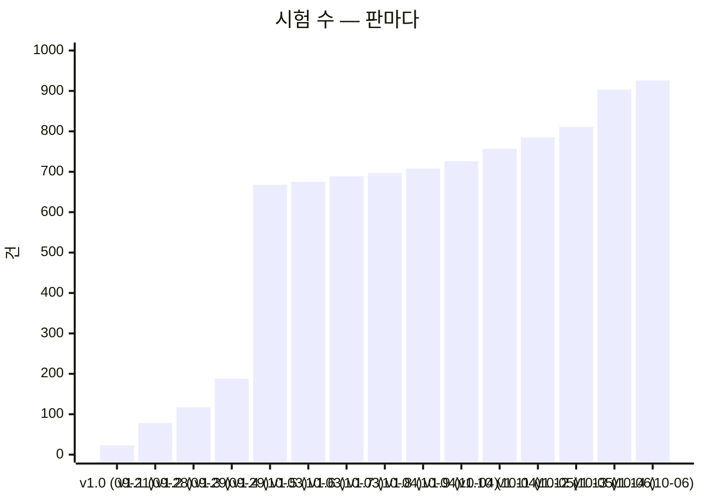
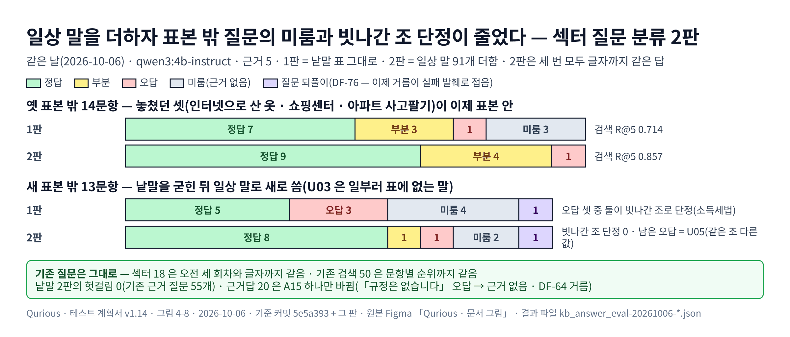

# 테스트 계획서 v1.19 — Qurious

| 문서 정보 | |
|---|---|
| **판 · 상태** | v1.19 · 초안(검토 전) |
| **구분** | 9. 시험·성과 검증 — 시험 계획 · 테스트 케이스 요약 · 시험 결과서 · 결함대장 (ISO/IEC/IEEE 29119-3 의 문서들을 한 권에 둔다) |
| **작성** | 이동원(데이터 파트) |
| **검토** | 검토 전 |
| **최종 수정** | 2026-10-08 (KST) |
| **기준** | 코드 `main` `73f075b`(#141 강사님 기초 코드 th06 `e815be3` 서버 쪽 반영 머지) + 크롤링 세 화면 구현(이 판과 같은 PR) · 시험 1159건 · 실제 수집 DB 시세 기준일 2026-10-07(10-08 12:30 회차 · 19 / 19) · 지난 판 — 코드 `main` `829771b`(팀원 #140 다중 주기 신호 · 그 앞 PR #139 크롤링 세 화면 서버) + 강사님 기초 코드 th06 `e815be3` 서버 쪽 반영(이 판과 같은 PR) · 지난 판 `main` `b198bec`(팀원 #138 성과 지표 · 스냅샷 라우트 복구 · #137 모의투자 스냅샷 · 마이그레이션 0016 · #136 리밸런싱 판단 통일 · 시가 예약 · #133 · #135 백테스트 보고서 머지 — 그 앞 시세 JSON PR · #131 · #130 · #127 · #129) + 크롤링 세 화면 서버(이 판과 같은 PR) · 시험 1019건 · 실제 수집 DB 시세 기준일 2026-10-06(10-07 12:30 회차) · 근거 문서 2026-10-02 판 + 섹터 법령 2026 판 |
| **관련 문서** | [목표 기능 ① 상세 설계서 v1.6](../설계/목표기능1-데이터지식-설계.md) · [섹터별 근거 법령 조사서 v0.1](../조사/섹터별-근거법령-조사.md) · [공시 · 재무 · 뉴스 이용 조건 조사서 v0.2](../조사/공시-재무-뉴스-이용조건-조사.md) · [섹터 법령 평가셋 v1](평가셋/섹터법령-평가셋_v1.tsv) · [섹터 법령 표본 밖 v2](평가셋/섹터법령-표본밖_v2.tsv) · [v1](평가셋/섹터법령-표본밖_v1.tsv) · [섹터 법령 사람 판정표 v3](평가셋/섹터법령-사람판정_v3.tsv) · [v2](평가셋/섹터법령-사람판정_v2.tsv) · [v1](평가셋/섹터법령-사람판정_v1.tsv) · [근거 충실도 지표 조사서 v0.2](../조사/지난판/근거충실도-자동지표-조사_v0.2.md) · [근거 충실도 사람 판정표 v1](평가셋/근거충실도-사람판정_v1.tsv) · [검색 평가셋 v1](평가셋/근거검색-평가셋_v1.tsv) · [근거답 평가셋 v2](평가셋/근거답-평가셋_v2.tsv) · [v1](평가셋/근거답-평가셋_v1.tsv) · [기능 완성도 점검 보고서 v0.1](기능완성도-점검.md) · [기능 확장 시장조사 v0.1](../조사/기능확장-시장조사.md) · [RTM v1.12](../요구사항/RTM.md) · [기능 설계서 v0.1](../설계/기능설계.md) · [API 명세서 v0.11](../인터페이스/API명세서.md) · [UI 명세서 v0.2](../화면/지난판/UI명세서_v0.2.md) · [근거 답 출처 표시 조사서](../조사/근거답-출처표시-화면-조사.md) · [조사서 — 로컬 · 무료 LLM](../조사/로컬LLM-퀀트활용-조사.md) · [IA v1.0](../화면/지난판/IA_v1.0.md) · [ERD v1.8](../데이터/ERD.md) · [ADR-0004](../ADR/ADR-0004-KIS-자격증명은-사용자마다.md) · [ADR-0001](../ADR/ADR-0001-실거래-주문-경로-차단.md) · [ADR-0003](../ADR/ADR-0003-CI를-걷어내고-먼저-논의한다.md) · [문서 그림 지침 v0.3](../문서기준/지난판/문서그림지침_v0.3.md) · [테스트 계획서 v1.4](지난판/테스트계획서_v1.4.md) · [v1.2](지난판/테스트계획서_v1.2.md) |
| **최근 개정** | v1.18 → v1.19: 결과서 24차 — **1159 통과 · 2 건너뜀 · 실패 0**(0:05:39 · 한 번에) · 크롤링 세 화면 구현 — 새 묶음 셋 **TC-CL 7**(수집 화면 셋 · 「DB 초기화」 없음) · **TC-FP 7**(받을 범위) · **TC-BK 7**(백업 판정) · TC-UG 19 → 24(리다이렉트 홉마다 다시 검사) · TC-DST 13 → 15(같은 회차의 진행만 · 뉴스 두 줄) · TC-DU 24 → 25(진행 파일) · TC-RS 5 → 6(검색어를 지우면 최신 소식) · TC-HF-05 한 줄(카드 이용 조건) · 깨 보기 스물여섯 곳(<표 8-19>) · 결함 85 → 88(DF-78 · DF-82 닫힘 · DF-86 · DF-87 · DF-88 찾고 닫음) · 지난 개정 v1.17 → v1.18: 결과서 23차 — **1129 통과 · 2 건너뜀 · 실패 0**(0:05:42 · 네 번 돌림 — 넷째 회는 팀원 #140 머지 뒤 · 첫 회 1108 통과 · 실패 2: 야후 지킴이(TC-YH)가 강사님 새 코드의 야후 언급을 잡음 → 받은 코드라 기준선을 열고 까닭을 적음) · 강사님 기초 코드 th06 `9478811` → `e815be3` 서버 쪽 반영 — 새 묶음 여덟(강사님 시험 74 · TC-AG · AS · BH · KBA · KMD · KMO · RC · US) · TC-BM 4 → 15 · TC-LT 30 → 32 · TC-GP 10 → 14 · TC-KQ 12 → 14 · TC-VS-06 · 깨 보기 열세 곳(<표 8-18>) · 결함 DF-84 · DF-85(열림) · 지난 개정 v1.16 → v1.17: 결과서 22차 — **1019 통과 · 2 건너뜀 · 실패 0**(여섯 번 돌림 — 다섯째 회는 팀원 #137 의 같은 길 둘을 우리 스캐너 시험이 잡아 실패 2 · DF-83 · 팀원 #138 이 같은 날 고친 main 에서 이 결과) · 새 묶음 TC-UG 19(주소 검사) · 팀원 TC-RBU 14(#136) · TC-DST 10 → 13(단계 이름표는 러너 기록에서 · 수집 일정 API · 마지막 날짜 질의는 색인으로) · TC-DU 19 → 24(단계 이름표 · 회차 기록 · 한 단계 다시 · 다시 돌린 뒤 WAL 보조 파일) · 깨 보기 열두 곳(<표 8-17> · 한 곳은 시험이 우연히 통과해 고침) · 결함 78 → 83(DF-79 · DF-80 · DF-81 찾고 닫음 — 수동 크롤링이 아무 주소나 받았다 · 데이터 상태 API 가 재무 표를 다 훑어 19 ~ 31초 걸렸다 · 한 단계 다시 뒤 앱이 수집 DB 를 열지 못했다 · DF-82 열림 — 데이터 관제 「지난 회차」 가 다시 돌린 줄을 회차처럼 그린다 · DF-83 찾음 — 팀원 #137 이 모의투자 성과 지표 API 를 없애고 같은 길을 둘 만들었다 · 팀원 #138 이 같은 날 고쳐 닫힘) · DF-78 조치 결정(단추와 서버 길 모두 없앰) · 지난 판 — v1.15 → v1.16: 결과서 21차 — **971 통과 · 2 건너뜀 · 실패 0**(팀원 #129 가 DF-73 · DF-75 를 고쳐 끝내는 기준 ① 이 처음 ✅) · 표 5 에 빠져 있던 묶음 넷(TC-IN 12 · TC-RBC 14 · TC-DV 4 · 21차 뒤 머지된 팀원 #131 의 TC-PS 7 — 묶음째 따로 통과)과 바뀐 건수(TC-SR 3 → 12 · TC-LA 8 → 11 · TC-RBS 12 → 13) · TC-LC +2(「HF 보관」 시세 자료의 public 사본 · 받지 않은 PC 에서 빌드가 건너뜀 — 깨 보기 넷 <표 8-16>) · 결함 77 → 78(DF-73 · DF-75 닫힘 · DF-78 열림 — 「DB 초기화」 가 모든 사용자의 주문 · 감사 로그까지 지움) · 지난 판 — v1.14 → v1.15: 4.7절 판정 모델 둘의 결과와 결정 — exaone3.5:2.4b(<표 8-15>) · 두 모델 견주기 · 판정 점수를 품질 지표로 쓰지 않고 평가셋을 50 으로 넓히지 않음 · 4.8절 머지 뒤 실측 — 질문 되풀이 거름을 실제 길에서(U13 → 근거 발췌) · 실패 발췌 화면 안 B 를 브라우저로(자동 · 근거 답만 두 엔진) · 기능 점검 데이터 13 통과 · 시험 수 · 결함 수는 그대로 · 지난 판 — v1.13 → v1.14: 새 묶음 하나 — TC-KF(근거 충실도 평가 도구 13) · TC-KA +4(「없다」 거름 · 질문 되풀이 거름) · TC-KS +1(실패 발췌 화면 안 B) · TC-AD +1(카탈로그 검사 줄 끝 · DF-77) · 시험 903 → 926 · 결과서 20차(871 통과 · 8 실패 · 46 오류 — 19차와 같은 팀원 시험 · 2 건너뜀) · 4.5절 깨 보기(<표 8-11-2> · 아홉 곳 · 한 곳은 깨기가 틀려 고침) · 4.7절 근거 충실도 자동 지표와 사람 판정(W8) · 4.8절 섹터 낱말 2판 · 「없다」 거름 · 실패 발췌 화면(<표 8-13> · <그림 4-8> · 새 표본 밖 13) · 결함 75 → 77(DF-76 · DF-77 찾고 닫음 · DF-64 일부 닫힘) — 전체는 부록 D · 지난 판 — v1.12 → v1.13: 새 묶음 셋 — TC-SQ(섹터 질문 분류 8) · TC-RS(리서치 화면 5) · TC-AD(API 문서 화면 3) · TC-DH +1(일정 2판 화면 → API 상한 · 늦은 응답) · TC-CN +1(같은 날 안 칩 차례) · 팀원 PR #114 · #116 · #118 의 TC-RBP(리밸런싱 정책 38) · TC-RBD(하루 점검 19) · TC-RBS(첫 거래일 예약 12) · TC-MH(마이그레이션 머리 1)를 대장에 · 시험 811 → 903 · 결과서 19차(849 통과 · **8 실패 · 46 오류 — 팀원 #114 시험이 시험 DB 에 표를 만들지 않음(DF-73)** · 2 건너뜀) · 4.5절 깨 보기(<표 8-11> · 열아홉 곳 · 두 곳은 처음에 못 잡아 시험을 고침) · 4.6절 섹터 질문 분류 — 분류 길 · 지금 길 같은 날(<표 8-12> · 표본 밖 14) · 결함 69 → 75(DF-70 · 71 · 72 · 74 찾고 닫음 · DF-73 · 75 열림 — 팀원 시험 · DF-61 · DF-66 닫힘) — 전체는 부록 D · 지난 판 — v1.11 → v1.12: 새 묶음 넷 — TC-NW(정책뉴스 10) · TC-GD(언론사 기사 6) · TC-CN(한 달 요약 · 그날 목록 4) · TC-SX(섹터 법령 실험 · 평가 도구 2) · TC-CS +2 · TC-DQ +1 · TC-DU +1 · 시험 785 → 811 · 결과서 18차 · 4.5절 깨 보기(열일곱 곳 · 모두 잡음) · 4.6절 섹터 법령 근거 답 평가 · 결함 68 → 69(DF-69 찾고 닫음 · 평가 도구가 정답 칸을 첫 콜론에서 나눔) — 전체는 부록 D · 지난 판 — v1.10 → v1.11: 새 묶음 셋(TC-CS · SG · HD) · 시험 757 → 785 · 결과서 17차 · DF-68 닫힘 |

> **이 문서로 알 수 있는 것**
> 1. 무엇을 어떤 기준으로 시험하고, 무엇은 시험하지 않나 (1절)
> 2. 시험 1159건은 어느 요구를 무엇으로 지키나 (2절 · 3절)
> 3. 지금 전부 통과하나 — 어떤 환경에서 (4절 결과서)
> 4. 알려진 결함은 무엇이고, 누가 무엇을 하면 되나 (5절 결함대장 · 6절)
>
> **읽는 순서** — 팀원: 요약 → 5절 결함대장에서 내 파트 줄 → 3.1절에서 내가 고칠 코드를 지키는 묶음 ·
> 강사님: 요약 → 4절 → 5절 → 6절 · 처음 온 사람: 부록 A 용어 → 1.2절 → 3.1절

## 요약

1. 자동화 시험 **1159건(102파일 · 묶음 102)이 돈다** — 결과서 24차(2026-10-08 오후 · 크롤링 세 화면 구현)는 일회용 시험 DB 로 **1159 통과 · 2 건너뜀 · 실패 0**(0:05:39)이다 — 새 시험 30(TC-CL 7 · TC-FP 7 · TC-BK 7 · TC-UG +5 · TC-DST +2 · TC-DU +1 · TC-RS +1)이 한 번에 통과했고, 고친 곳 스물여섯을 저장소 밖 사본에서 하나씩 되돌려 모두 시험이 잡는 것을 봤다(4.5절 <표 8-19>). 지난 결과서 23차(2026-10-08 · 강사님 기초 코드 th06 서버 쪽 반영)는 일회용 시험 DB 로 **1129 통과 · 2 건너뜀 · 실패 0**(0:05:42)이다(첫 회는 야후 지킴이가 강사님 새 코드의 야후 언급을 잡아 실패 2 — 새로 부르는 줄이 없어 받은 코드의 기준선을 열었다). 지난 결과서 22차(2026-10-07 · 크롤링 세 화면 서버)는 일회용 시험 DB 로 **1019 통과 · 2 건너뜀 · 실패 0**(0:10:16)이다(여섯 번 돌림 — 첫 회 1003 · DF-80 뒤 1004 · DF-81 뒤 1005 · 팀원 #136 머지 뒤 1019 통과 · 팀원 #137 머지 뒤 1017 통과 · 실패 2 — 실패 둘은 팀원 #137 이 만든 같은 길 둘(`POST /api/paper/performance/simulate` ×2)을 우리 API 스캐너 시험(TC-AP-04) · API 문서 시험(TC-AD-02)이 잡은 것이다(DF-83) · 팀원 #138 이 고친 main 에서 이 결과). 결과서 21차는 일회용 시험 DB(Postgres)를 붙여 **971 통과 · 2 건너뜀 · 실패 0**(건너뜀은 호스트에 없는 패키지 둘의 시험 파일 · 2026-10-07 14:01 · `scripts/personal/test.ps1` · 0:05:13). 20차까지 남아 있던 팀원 리밸런싱 시험의 실패 8 · 오류 46 은 팀원 PR #129 가 고쳤다 — 정책 DB 시험이 표를 스스로 만들고(DF-73) 고정물이 공휴일 JSON 을 UTF-8 로 읽는다(DF-75). 그래서 끝내는 기준 ① 「전부 통과」 가 처음으로 ✅ 다(표 8). 표 5 의 926 뒤 늘어난 45건은 팀원 시험 39(#121 · #122 의 TC-RBC 14 · TC-IN 12 · TC-LA +3 · #127 의 TC-SR +9 · #129 의 TC-RBS +1)와 우리 6(docs 판 도구 TC-DV 4 · 강의 빌드 TC-LC +2)이다. 21차 뒤 팀원 #131(패턴 통계)이 머지돼 TC-PS 7건이 더해졌고, 묶음째 따로 돌려 7 통과했다(다음 결과서에서 함께 돈다). 자동 실행(CI)은 없고 PR 마다 사람이 돌린다.
2. v1.3 의 「2 · 3차 핵심 기능을 재는 시험 0건」 은 닫혔다 — 강사님 기초 코드와 함께 132건(09-30 `b055ab0` 59 · 10-03 `9478811` 73)이 들어와 리밸런싱 · 위험 한도 · 웹훅 · 수식 지표 · 미래 데이터 · 실주문 길 · 합격 전략을 잰다. 10-03 반영 때는 충돌 없이 들어오는 위험 둘을 **시험부터** 막았다 — 게이트웨이 실거래 관문(TC-LT 5절) · 지운 AWS 모듈 import(TC-BM). **팀원이 쓴 시험이 처음 들어왔다** — 2026-10-06 리밸런싱 PR 셋(#114 · #116 · #118) 73건(TC-RBP 38 · TC-RBD 19 · TC-RBS 12 · TC-MH 1 · 기존 TC-RB +3). 다른 파트는 아직 0건이다(6절 2순위).
3. 결함은 88건 — 열림 16 · 일부 닫힘 4 · 닫힘 68(2026-10-08 오후 · 크롤링 세 화면을 구현하며 **DF-78 · DF-82 를 닫음** — 「DB 초기화」 단추 · 서버 길을 없앴고 데이터 관제가 다시 돌린 줄을 회차와 나눈다 · 같은 일에서 **DF-86 · DF-87 · DF-88 을 찾고 닫음** — 리서치에서 검색어를 지워도 관련도순이 남았고, 데이터 관제의 정책뉴스 줄이 언론사 기사까지 셌고, 백업 카드가 시세의 이용 조건을 공공누리 제1유형으로 적었다 · 같은 날 오전 · 강사님 기초 코드를 반영하며 **DF-84**(KIS 접근 토큰을 요청마다 새로 받음 — 증권사는 1분에 1회)를, 팀원 글 답글을 맞대며 **DF-85**(한 단계 다시 뒤 시세 기준일을 다시 재지 않아 리밸런싱 하루 점검이 열리지 않음)를 찾음 — 둘 다 열림 · 2026-10-07 · 크롤링 세 화면 서버를 만들며 **DF-79 를 찾고 닫음** — 수동 크롤링이 로그인한 누구의 요청으로나 아무 주소(내부망 · robots 금지 출처)를 받았다 · 마무리 기능 점검에서 **DF-80 · DF-81 을 찾고 닫음** — 데이터 상태 API 가 재무 표 188만 행을 색인 없이 훑어 응답 캐시가 끊길 때마다 19 ~ 31초 멈췄고, 새 「한 단계 다시」 가 쓰기 연결로 끝나 수집 DB 의 WAL 보조 파일을 지우자 앱의 데이터 API 8개가 멈췄다 · 이어진 브라우저 확인에서 **DF-82 열림** — 데이터 관제 「지난 회차」 가 다시 돌린 줄을 「성공 0분」 회차처럼 그린다 · PR 을 올리려고 다시 받은 main 의 팀원 #137 에서 **DF-83 을 찾음** — 모의투자 성과 지표 API(`GET /api/paper/performance/metrics`)가 없어져 성과 · 로보 어드바이저 화면 셋이 404 였고, 같은 자리에 들어간 관리자 `simulate` 로 같은 길이 둘이 되어 전체 시험이 실패 2 였다 — 팀원 #138 이 같은 날 고쳐 닫힘 · 팀원 PR #129 로 DF-73 · DF-75 닫힘 — 리밸런싱 시험이 우리 시험 절차에서 돈다 · 크롤링 세 화면 결정 조사에서 **DF-78 열림** — 데이터 화면의 「DB 초기화」 가 화면 글과 달리 모든 사용자의 대화 · 포트폴리오 · 주문 · 증권사 설정 · 크롤링 문서 · 감사 로그를 지운다 · 2026-10-06 오후 · git 초안 직전 점검에서 DF-77 을 찾고 닫음 — API 문서 카탈로그 검사가 줄 끝만 달라도 「뒤처졌다」 · 새로 쓴 표본 밖 질문의 평가에서 DF-76 을 찾고 닫음 — 답 모델이 질문을 되풀이하고 출처 번호만 붙인 글이 서버 검사를 지나 답으로 보였다 · DF-64(근거 밖 「없다」 단정)는 서버 거름 · 섹터 낱말 2판 · 실패 발췌 화면으로 일부 닫음 · 같은 날 오전 · git 초안 직전에 #116 · #118 을 합친 뒤 DF-75 열림(팀원 고정물이 JSON 을 인코딩 없이 읽어 한국어 Windows 에서 깨짐) · 마무리 기능 점검에서 DF-74 를 찾고 닫음 — 근거 DB 가 WAL 이라 이 PC 의 마지막 연결이 닫히자 읽기 전용 도커 앱의 근거 찾기 · 답이 500 · 팀원 #114 를 합친 뒤 전체 시험에서 DF-73 열림(팀원 시험이 시험 DB 에 표를 만들지 않음) · 섹터 질문 분류를 만들며 DF-70 을 찾고 닫음 — 같은 낱말 색인에 섹터 조각을 넣자 섹터 문서를 후보에서 빼도 기존 질문의 bm25 가 흔들렸다 · 화면 둘을 브라우저로 누르며 DF-71(늦게 온 응답이 일정 화면을 덮음 · 둘) · DF-72(오류 문구가 「[object Object]」)를 찾고 닫음 · 같은 날 화면을 만들어 DF-66(일정 한 달 상한) · DF-61(리서치가 RAG 아님)을 닫음 · 2026-10-05 오후 · 섹터 법령 평가에서 DF-69 를 찾고 닫음 — 평가 도구가 정답 칸 「문서:조」 를 첫 콜론에서 나눠 문서 ID 에 콜론이 있으면 정답을 모두 놓침으로 셌다 · 같은 날 DF-66(일정 한 달 상한) · DF-61(리서치가 RAG 아님)은 화면을 Figma 로 정하고 서버 쪽을 먼저 준비했다(화면은 다음 PR) · 2026-10-05 · 러너 회차에서 DF-68 을 찾고 닫음 — 검색 색인 규칙 지문이 줄 끝(CRLF · LF)으로 바뀌어 규칙이 그대로여도 색인을 통째로 다시 만들었다 · 2026-10-04 · 공시 · 재무 · 일정을 더하며 DF-66 열림(일정 화면 한 달 2,000건 상한) · DF-67 닫힘(검색 색인을 WAL 로 만들어 읽기 전용 도커 앱이 열지 못함) · 근거 답 정확도에서 DF-59 · DF-63 닫힘 · DF-64 · DF-65 열림 · 그 앞 점검에서 DF-03 닫힘 · DF-61 · DF-62 열림). 급한 열림은 v1.3 과 같다(DF-02 코스닥 벤치마크 · DF-07 도커 소켓 · DF-15 자동매매 체결가 · DF-19 ETF 백테스트 매도세). v1.4 뒤 새 결함 7건(DF-50 ~ 56)은 강사님 화면을 받으며 브라우저로 단추 · 탭 · 서랍을 하나씩 눌러 찾았고 모두 그날 닫았다 — 새 묶음 TC-NV 가 그중 넷이 되돌아오지 않게 지킨다. v1.5 뒤 둘(DF-57 · 58)은 근거 답을 만들며 찾았다 — 앱 채팅의 문서 검색이 한국어를 거의 찾지 못한다(DF-57 · 열림) · 답 평가 도구가 결과 파일을 덮어썼다(DF-58 · 닫힘).
4. **답의 품질은 시험이 아니라 평가셋으로 잰다** — 근거답 평가셋 v0(15문항)으로 답 모델 다섯을 사람이 판정했고(4.3절), 질문 말 → 법령 말 넓히기 · 위임 조를 더한 뒤 근거답 평가셋 v1(20문항)으로 다시 판정했다 — 기본 모델(qwen3:4b-instruct)은 답할 질문 15 에 정답 9 → 12 · 근거 밖 3 에 지어낸 답 0, 검색 평가셋 v1(50) Recall@5 는 0.860 → 0.940 이다(4.4절). 새로 틀린 답 하나(반대 결론 단정 · DF-64)도 판정에서 찾았다. 섹터 법령을 근거 답에 넣을지도 같은 방법으로 쟀다(4.6절) — 섹터 질문 18문항은 넣은 길 정답 15 · 지금 앱 미룸 17 이지만, 한 묶음으로 넣으면 기존 질문 15문항의 정답이 12 → 10 으로 줄어 「섹터 질문일 때만 찾는다」 로 정했다. 2026-10-06 에 그 분류를 만들고 같은 날 두 길을 다시 쟀다 — 기존 질문은 검색 · 답 모두 글자까지 같고, 섹터 질문 18 은 정답 0 → 15, 낱말을 굳힌 뒤 새로 쓴 표본 밖 14 는 정답 0 → 7(분류가 놓친 질문 2 · 다른 법을 고른 질문 1)이다(4.6절 <표 8-12>). 같은 날 오후에는 분류 낱말 2판(일상 말 91개)을 굳힌 뒤 새로 쓴 표본 밖 13문항으로 다시 쟀다 — 정답 5 → 8 · 빗나간 조 단정 2 → 0 이고, 기존 질문의 검색 · 답은 그대로다(근거답 A15 만 「없다」 거름으로 근거 없음 · 4.8절). 답이 근거에 맞는지 자동으로 재는 판정 모델(Ragas `Faithfulness`)은 둘 다 사람 판정을 가르지 못했다 — llama3.1 은 맞은 답 34 가운데 8 에 0.5 아래를 주고(조문의 단서를 빠뜨린 답을 근거에 없다고 봄) 오답 A15 에 0.75 · 빗나간 조에 충실한 T11 에 1.0 을 줬고, exaone3.5:2.4b 는 오답 4 를 모두 거르는 문턱에서 맞은 답 12 도 함께 걸렀다(정답 점수가 오답보다 높을 확률 0.658 · llama3.1 0.576). 그래서 점수를 품질 지표로 쓰지 않고 50 으로 넓히지 않는다(4.7절).
5. 화면의 「기능 완성도」 배지는 시험과 이어져 있지 않다. 강사님 평가표는 점수를 글자로 박아 둔 고정 표라 시험이 늘어도 숫자가 그대로였다. 이동원 몫 화면 20줄을 같은 기준으로 다시 매겨 팀 줄로 두고, 그 줄이 점검표와 같은지를 새 묶음 TC-CP 가 본다([기능 완성도 점검 보고서 v0.1](기능완성도-점검.md)).

---

## 1. 시험 계획

### 1.1 범위

표 1 은 「무엇을 시험하고 무엇을 하지 않나」 에 답한다.

**표 1. 시험 범위**

| 범위 | 대상 | 지키는 묶음 |
|---|---|---|
| 포함 | 실거래 차단 — 제안요청서 제외 범위(실계좌 실거래 자동 주문 금지)를 지킨다 | TC-LT |
| 포함 | 데이터 출처 — 야후 참조가 더 늘지 않는다(9파일 71줄 · 그중 1줄은 스캐너의 찾는 코드) | TC-YH |
| 포함 | 수집기 일일 갱신 러너 — 새 자료 판정 · 잠금 · 예약 | TC-DU |
| 포함 | 수집 DB 어댑터 — 국내 주식 일봉을 수집 DB 에서 기준일과 함께(골든 픽스처) | TC-CD |
| 포함 | 수집기 전처리 — 정지 뒤 감자 · 병합 · 계수 범위 경고 · 명령 인자 | TC-DF01 · TC-DF16 |
| 포함 | 시세 응답 계약(등락률) · 일봉 · 지표 API 의 캐시 규칙(12:30 갱신이 바로 보인다) | TC-A1 · TC-DF17 |
| 포함 | 모의투자 현금 장부 불변식(실제 Postgres) | TC-I14 |
| 포함 | 사용자 셸(cp949)에서 사람이 돌리는 진입점 15곳 | TC-CE |
| 포함 | 문서 스캐너 — API 명세 · 스키마 · 요구사항 추적표가 코드 · 대장과 같다 | TC-AP · TC-SS · TC-RT |
| 포함 | 운영 도구 — 논의 스캐너 · GitHub 글 올리기 전 검사 | TC-DS · TC-PC |
| 포함 (예정) | 채점 · 사고 방지 항목 셋 · 비용 계산 · 백테스트 재현성 · 코스닥 벤치마크 오차 | 6절 |
| 제외 | 증권사 실서버 연동 — 제외 범위라 실행 자체가 금지다 | — |
| 제외 | 부하 · 성능 — AWS 보류로 대상 환경이 없다 | — |
| 제외 | 브라우저 E2E — 주 경로 12개는 사람이 눌러 봤다(IA v0.2 · 와이어프레임 v0.2), 자동은 아니다 | — |

### 1.2 계층

그림 1 은 「시험이 어느 계층에 몇 건씩 있나」 에 답한다. 위로 갈수록 느리고, 요구사항에 가깝다.

**그림 1. 시험 계층 — 188건** · 범례: 오른쪽은 그 계층의 주된 묶음 · ★ = 이 판에 들어온 것

```
        ┌──────────────────────────────────────────────────
  느림  │  인수 (Acceptance)             6   "요구사항을 지키나"     실거래 차단
   ↑    ├──────────────────────────────────────────────────
        │  통합 (Integration)           23   "진짜 DB · 셸 · 프로세스" 장부 6 · 셸 3 · ★ 셸 11 · 어댑터 1 · 전처리 2
        ├──────────────────────────────────────────────────
        │  계약 (Contract)              14   "응답 모양이 약속대로"  등락률 5 · 어댑터 3 · ★ 라우트 캐시 6
        ├──────────────────────────────────────────────────
        │  특성화 (Characterization)     3   "더 나빠지지 않나"      야후 2 · 옛 장부 1
        ├──────────────────────────────────────────────────
   ↓    │  단위 (Unit)                 142   "함수가 약속대로"      ★ +54 (스캐너 33 · 캐시 11 · 전처리 9 · 셸 1)
  빠름  └──────────────────────────────────────────────────
                                     188
```

- 이 판에 들어온 단위 시험 54건 = TC-AP 14 · TC-RT 11 · TC-SS 8 · TC-DF17 11 · TC-DF01 6 · TC-DF16 3 · TC-CE 1. 문서 스캐너 셋(API 명세 · RTM · 스키마)이 33건이다.
- 계층은 **무엇을 재나**로 나눈다. 자식 프로세스를 띄운다고 통합이 아니다 — 스캐너가 앱을 불러오지 않는지 보는 TC-AP-01 은 단위다. 사용자 셸의 인코딩을 그대로 재는 TC-CE 는 통합이다.
- 실제 수집 DB(시세 447만 행)를 **읽기 전용**으로 여는 통합 시험 두 건(TC-CD-11 · TC-DF01-13)이 전체 실행 시간의 대부분을 쓴다. 파일이 없으면 건너뛴다.

### 1.3 판정 원칙 여덟 가지

1. **자기 판정 금지** — 시험 밖에서 한 번 더 실행해 대조표를 남긴다(역할 분배안 v1.0 5절 규칙 3).
2. **조용한 성공을 의심한다** — 「막혔다」 와 「죽었다」 를 짝으로 시험한다.
3. **환경 오염을 막는다** — `tests/conftest.py` 가 실거래 승인 변수를 매번 지운다.
4. **새 시험은 옛 코드에서 먼저 실패해야 한다** — 옛 코드에서 통과하는 새 시험은 결함을 재지 못한다. 예외는 **보존 확인 시험**(고친 뒤에도 바뀌면 안 되는 동작)이다 — 옛 코드에서도 통과해야 맞고, 결함을 재는 시험과 짝으로 둔다. 새 묶음마다 옛 코드 결과를 3.2절에 적었다.
5. **대조하는 숫자는 출처까지 달라야 「밖의 숫자」 다** — 수정주가와 등락률은 같은 포털 값(`vs`)에서 나와 포털이 틀린 날에는 함께 틀린다. 그래서 주식 수(`lstg_st_cnt`)라는 다른 칸으로 한 번 더 본다.
6. **규칙을 넓히면 「건드리면 안 되는 날」 을 보존 확인 시험으로 둔다** — 전 종목에서 정지 없이 주식 수가 절반 가까이 준 날(우선주 소각)이 있었다. 검증 게이트가 실패하면 끄지 않고 예외를 좁게 두고, 몇 건인지 늘 찍는다.
7. **실제 DB 를 읽는 시험 · 검증은 예약 작업(매일 12:30)과 겹치지 않게 돌린다** — 돌리기 전에 `python scripts/daily_update.py status` 의 「실행 중」 을 본다. SQLite 는 WAL 이라 읽기가 쓰기를 막지는 않지만 디스크와 CPU 를 나눠 쓴다.
8. **스캐너 시험은 실제 저장소에 「늘 참이어야 하는 성질」 만 건다** — 「인증 없는 API 33개」 같은 지금의 사실을 걸면 팀원이 그것을 고치는 순간 시험이 깨진다. 판정 규칙은 합성 입력(임시 폴더)으로 재고, 실제 대장 · 코드에는 형식만 건다(TC-AP · TC-SS · TC-RT).

### 1.4 환경 · 역할 · 끝내는 기준

표 2 는 「어디서 누가 돌리고, 무엇이면 끝났다고 하나」 에 답한다.

**표 2. 환경 · 역할 · 끝내는 기준**

| 항목 | 지금 |
|---|---|
| 환경 | Windows 11 · Python 3.12.13 · pytest 8.3.3 · 시험 DB `pgvector/pgvector:pg16`(시험 동안만 띄우고 지운다 · 포트 15432) · 실제 수집 DB `data/collector/market.sqlite3`(읽기 전용) |
| 실행 조건 | 사용자 셸과 같게 `PYTHONIOENCODING` 없이 돌린다 — Git Bash 의 cp949 출력에서 죽는 코드를 잡기 위해서다 |
| 누가 돌리나 | PR 을 올리는 사람이 PR 마다 — 자동 실행은 없다(ADR-0003 · CI 는 논의 D8 에서 정한다) |
| 누가 쓰나 | 지금까지 188건 모두 데이터 파트. 보조담당 블랙박스 시험(역할 분배안 5절 규칙 2 ②)은 0건 — 6절 2순위 |
| 끝내는 기준 | ① 전부 통과 ② 새 시험은 옛 코드에서 먼저 실패(보존 확인 시험 제외) ③ 결함대장을 판마다 다시 잰다 ④ 파트마다 블랙박스 시험 1건 이상 |

### 1.5 강사님 도구와 우리가 쓰는 것

표 3 은 「강사님 표의 시험 도구를 무엇으로 대신하고, 무엇이 비었나」 에 답한다. 강사님 표의 도구 칸은 pytest · GitHub Actions · Postman · QuantConnect LEAN · TradingView Strategy Tester · JIRA 다.

**표 3. 강사님 도구 대조**

| 강사님 도구 | 우리 | 상태 | 이유 · 위치 |
|---|---|:-:|---|
| pytest | pytest 8.3.3 | 🟢 | `tests/` 15파일 · 188건 · `pytest.ini` |
| GitHub Actions | 없음 | ⏸️ | 계정 정지 이력 뒤 팀 논의 먼저 — ADR-0003 · 논의 D8([#54](https://github.com/EST-team-project/Qurious/discussions/54)) |
| Postman | pytest 계약 시험 14건 + API 명세 스캐너 | 🟡 | 요청 모음 대신 가짜 응답으로 응답 모양을 고정한다. API 목록은 앱의 `app.openapi()` 와 145/145 로 대조했다(API 명세서 v0.1) |
| QuantConnect LEAN | `app/services/lean_backtest.py` | 🟡 | 엔진 연결은 있다. **백테스트 보고서가 없고**, LEAN 은 아직 야후 데이터 · 비용 0 으로 돈다(DF-08 · `P02-④-1`) |
| TradingView Strategy Tester | Pine 생성기 | 🔴 | 생성 코드가 `indicator()` 라 Strategy Tester 가 켜지지 않는다(DF-05) |
| JIRA | GitHub Issues | 🟢 | 결함은 이슈로(#26 · #35 체크리스트) · 결함대장이 번호를 모은다 |

---

## 2. 시험은 어느 요구를 재나

요구와 시험의 대응 전체는 [RTM v1.10](../요구사항/지난판/RTM_v1.10.md) 4절(시험 811건 · 요구에 붙은 765건 · 시험이 붙은 요구 34개 — 정본)이고, 아래 표 4 는 v1.1 때의 모습(요구 11개)으로 남겨 둔다. 처음 대응은 [RTM v1.1](../요구사항/지난판/RTM_v1.1.md) 4절이고, 대응은 [시험-요구 대장](../요구사항/대장/시험-요구대장.tsv)에 적는다. 표 4 는 「시험이 붙은 요구는 무엇이고, 얼마나 확실하게 재나」 에 답한다.

**표 4. 시험이 붙은 요구 11개** · 확실도: 🟢 그 요구의 동작을 직접 잰다 · 🟡 전제나 일부만 잰다

| 요구 | 이름 (줄임) | 시험 | 건수 |
|---|---|---|--:|
| `P01-①-2` | 투자 자료 수집 · 전처리 · 검색 | 🟢 TC-A1 · CD · DF01 · 🟡 DU · DF17 | 96 |
| `P01-①-4` | 갱신일 · 정기 배치 | 🟢 TC-DU · DF17 · 🟡 CE · DF16 | 50 |
| `P01-④-3` | 모의 주문 체결 · 포트폴리오 운용 | 🟢 TC-I14 · 🟡 LT | 28 |
| `P02-⑤-1` | 신호 → 증권사 계좌 · 시세 · 주문 | 🟢 TC-LT | 21 |
| `RFP2-4.2-①` | 실거래 자동 주문을 하지 않는다 | 🟢 TC-LT | 21 |
| `RFP2-3.2-④` | 문서화 | 🟢 TC-SS · AP · RT | 35 |
| `SCH-DQ` | 데이터 품질 | 🟢 TC-DF01 | 21 |
| `P02-④-1` | 같은 조건의 LEAN 백테스트 ★ | 🟡 TC-YH · CD | 24 |
| `P02-⑤-3` | 실행 일정 · 로그 · 장애 알림 | 🟡 TC-DU | 15 |
| `RFP2-3.2-①` | 공개 데이터 사용 | 🟡 TC-YH | 2 |
| `RFP2-3.2-③` | 재현 가능성 | 🟡 TC-CD · DF01 | 43 |

요구 59개 가운데 시험이 붙은 요구는 11개이고, 강사님 원문 세부 기능 29개 가운데는 6개다. 한 묶음이 요구 둘을 재면 둘 다에 세므로 건수의 합은 188 보다 크다. **채점 · 사고 방지 항목 셋**(`P02-②-2` 미래 데이터 참조 방지 · `P02-④-1` 같은 조건의 LEAN · `P02-⑤-2` 중복 주문 방지 · 손실 한도 · 비상 정지) 가운데 직접 재는 시험이 있는 것은 없다.

---

## 3. 테스트 케이스

### 3.1 한눈에 — 102묶음

표 5 는 「시험 묶음마다 무엇을 지키고, 어느 요구를 재나」 에 답한다. **v1.4 부터 이 표는 [시험-요구 대장](../요구사항/대장/시험-요구대장.tsv)과 `pytest --collect-only` 건수로 만든다**(손으로 옮기지 않는다 — 부록 B). v1.3 표의 「계층 · 들어온 PR」 칸은 15묶음까지만 매겼다 — [v1.3 3.1절](지난판/테스트계획서_v1.3.md).

**표 5. 시험 묶음 102 · 1159건** · 기준 2026-10-08 오후(`pytest --collect-only` · 표 줄은 판마다 더하고 고친 줄만 손봄)

| 묶음 | 파일 | 건수 | 무엇을 지키나 (대장 첫 줄) | 요구 · 확실도 |
|---|---|--:|---|---|
| TC-A1 | `test_quote_change_a1.py` | 21 | 시세 조회 응답이 등락률을 채우고, 모르면 0 이 아니라 비운다 | `P01-①-2` 🟢 |
| TC-AC | `test_account_crud.py` | 23 | 계정 관리(가입 · 로그인 · 이름 · 비밀번호 바꾸기 · 탈퇴) — 요구 밖 기능(2026-09-30 팀장 요청) · 요구로 올릴지는 팀 결정 | — (요구 없음) |
| TC-AP | `test_api_scan.py` | 15 | API 명세서를 코드에서 다시 만들면 같다 | `RFP2-3.2-④` 🟢 |
| TC-BC | `test_backtest_costs.py` | 6 | 수수료 · 슬리피지가 회전마다 빠져 수익률이 줄고, 비용 전 수익률과 나란히 나온다 | `P01-④-1` 🟢 · `P02-①-2` 🟡 · `RFP2-3.1.3-①` 🟡 |
| TC-BK | `test_backup_status.py` | 7 | 적재 · 백업 판정 — 규칙은 `scripts/hf_dataset.py` 한 곳 · 앱은 도구가 쓴 판정 기록을 점검 줄 넷으로 묶기만 하고, 확인하지 않은 조건(값 없음 · 기록에 없음)은 「아직」 · 거짓은 「다시」 · 하나라도 남으면 도구가 「된다」 고 써도 지우기를 막는다 · 기록이 없으면 기록을 만드는 명령 · 관리자만 · 도구가 쓴 것을 앱이 그대로 읽는다(2026-10-08) | `P01-①-2` 🟢 |
| TC-BM | `test_base_code_merge_guard.py` | 15 | 강사님 기초 코드를 반영해도 걷어낸 AWS 모듈(SageMaker 배치 점수 · Secrets Manager · boto3)이 import 로 되살아나지 않고 자동매매 모듈이 뜬다 · 2026-10-08 받지 않기로 한 운용 값 · 채팅 모델 · 답 길이 설정 · 일봉 수집 DB 먼저 · `.env.example` · 메뉴 · rag 이름 · compose 기본 모델 1.5b(+11) | `P02-⑤-1` 🟡 |
| TC-BR | `test_brand.py` | 2 | 화면의 서비스 이름 · 부제 · 바닥글이 한 곳(public/js/brand.js)에서 오고, 옛 이름 · 회사 표기가 화면에 없으며, 원저작자 표시는 NOTICE.md 에 남는다 — 요구 밖(발표 · 시연에서 우리 서비스로 보이게 · 팀장 요청) | — (요구 없음) |
| TC-CA | `test_market_calendar.py` | 12 | 거래일 달력 — 주말 · 공휴일(특일 정보) · 근로자의 날 · 연말 휴장일 규칙이 시세와 어긋나지 않고(실제 DB 2020~ 0일), 앞날의 거래일 · 파생 만기(두 번째 목요일 · 휴장이면 앞당김) · 배당 일정을 만들며, 배당락일을 달력으로 다시 센다(DF-39). 로그인 없이 읽는 API 둘 | `P01-①-4` 🟢 · `RFP2-3.2-①` 🟡 |
| TC-CD | `test_collector_candles_df08.py` | 22 | 국내 주식 일봉을 수집 DB 에서 기준일(as_of)과 함께 돌려준다 | `P01-①-2` 🟢 · `P02-④-1` 🟡 · `RFP2-3.2-③` 🟡 |
| TC-CE | `test_console_encoding.py` | 18 | 사람이 돌리는 수집기 · 운영 명령(2026-09-30 기준 18곳)이 사용자 셸(cp949)에서 죽지 않는다 | `P01-①-4` 🟡 |
| TC-CL | `test_collect_screens.py` | 7 | 데이터 수집 화면 셋(수집 일정 · 단계 / 자료 직접 받기 / 적재 · 백업 · 2026-10-08) — 「DB 초기화」 단추와 서버 길(`API-ADM-01`)이 없고(DF-78 · 고치기 전 코드에서 실패 확인) · 메뉴 이름 · 뿌리 칸 · 진입 훅 · 화면 스캐너가 읽는 진입 API · 옛 단추와 그 리스너가 함께 없고 · 화면 표가 서버 열쇠(받을 범위 상태 · 단계 결과 · 백업 점검 줄)를 다 알고 · 일반 사용자에게 메뉴 셋과 「자세히 →」 를 숨기고 · 화면이 보내는 쓰기는 주소 검사 · 주소로 받기 둘뿐(PC 쪽 일은 명령) · 데이터 관제는 한 줄 + 다시 돌린 줄을 회차와 나눈다(DF-82) | `P01-①-2` 🟢 |
| TC-CM | `test_chat_modes.py` | 0 | 채팅 답변 엔진 셋(서버 LLM · OpenAI 키 · 순수 RAG) — 순수 RAG 모드가 LLM 없이 찾은 청크 · 출처 목록을 그대로 돌려준다(답 안의 [출처 n] 과 번호 맞추기는 아직) · 강사님 기초 코드(289bfb5)의 시험 · 호스트에 langchain_ollama 가 없으면 건너뜀 | `P01-①-3` 🟡 |
| TC-CN | `test_calendar_month.py` | 5 | 한 달 달력 요약 · 그날 목록(일정 2판 · DF-66) — 날짜 × 종류 개수 · 시장 전체 일정은 이름까지 · 한 날 3,000건이 몰려도 요약 크기는 그대로 · 400일 넘는 구간은 422 · 그날 목록의 쪽 넘기기 · 회사 이름 찾기 · 내 종목 맨 위 · 같은 날 안은 화면 칩 차례(적은 종류가 많은 종류 뒤로 밀리지 않음) | `P01-①-4` 🟢 |
| TC-CP | `test_completion_badge.py` | 5 | 기능 완성도 배지의 팀 점검 줄이 점검표(docs/시험/대장/기능완성도-점검표.tsv)와 같다 — 점수 · 이름표 · 화면 키 · 강사님 표 뒤에서 덮기 · 점검표의 셈. 팀원 화면 · 새 화면의 평가 유무는 보지 않는다(팀 결정 전) | `RFP2-3.2-④` 🟡 |
| TC-CR | `test_crawl_points.py` | 6 | 크롤 조각의 벡터 DB 점 ID 가 프로세스마다 같다(sha256 · 옛 내장 hash() 는 PYTHONHASHSEED 마다 다름) · 다시 모으면 같은 번호로 덮고 같은 주소의 옛 점을 지운다 · 임베딩이 하나도 안 되면 쓰지도 지우지도 않는다(DF-03) | `P01-①-2` 🟢 · `RFP2-3.2-③` 🟡 |
| TC-CS | `test_corp_schedule.py` | 19 | 주주총회 · 배당금 지급 일정 — 소집결의 본문 세 꼴 · 시각 글 꼴(숫자만 있으면 그 시 정각) · 지급일(본문 줄 → 정정 표 정정후 → 빈칸) · 정정 사슬(앞 정정을 가리킴)을 묶고 같은 날 새 소집결의는 따로 · 철회 · 미정이면 뺌 · 배당 표가 고른 판만 · 제출 오기 버림 · 원문에서 다시 읽기 · 과거분 받기(접수일 구간 · 최근 것부터 · 일시 오류는 다시 · 하루 한도면 멈춤) | `P01-①-4` 🟢 |
| TC-CT | `test_intake.py` | 12 | 다른 출처의 시세 파일을 받아 전처리 — 칸 맞추기 · 값 규칙 · 수집 DB 와 대조(원 · 수정) · 원인 찾기(하루 밀림 · 단위 · 수정 방식 · 배당 반영) · 정제 · 보고서를 가짜 파일로 잰다 | `P01-①-2` 🟡 |
| TC-DA | `test_dashboard_accounts.py` | 6 | 통합 대시보드 사이트별 투자액 탭 — KIS 가 첫 탭 · 한 탭이 실패해도 나머지는 보인다(성과 지표 칸은 재지 않는다) | `U9` 🟡 · `U10` 🟡 |
| TC-DC | `test_disclosure.py` | 7 | 공시 목록 수집 — 보고서 이름 나누기 · 다시 받으면 처음 받은 시각은 그대로 · 쪽 넘김 · 원문 한 벌 · 끝난 조합은 다시 받지 않음 · 호출 상한에서 깔끔히 멈춤 · 네트워크 없는 재정규화 | `P01-①-2` 🟢 |
| TC-DF01 | `test_preprocess_df01.py` | 21 | 정지 뒤 감자 · 병합을 주식 수로 잡는 전처리 | `P01-①-2` 🟢 · `SCH-DQ` 🟢 · `RFP2-3.2-③` 🟡 |
| TC-DF16 | `test_preprocess_cli_df16.py` | 3 | 정기 배치 단계(전처리)를 사람이 돌릴 때 도움말이 쓰기를 시작하지 않는다 | `P01-①-4` 🟡 |
| TC-DF17 | `test_route_cache_df17.py` | 17 | 12:30 갱신이 일봉 · 지표 API 에 바로 보인다 | `P01-①-4` 🟢 · `P01-①-2` 🟡 |
| TC-DH | `test_data_screens.py` | 5 | 갱신일 · 캘린더를 화면으로 — 위 메뉴 「데이터」 맨 위 데이터 관제와 모든 화면의 「자료 날짜 · 판정」 표시, 「투자분석 기초 › 일정」 달력(2판)과 「다가오는 일정」 카드가 이어져 있고, 화면이 읽는 상태 · 일정 · 한 달 요약 · 거래일 응답 칸이 실제로 있으며, 화면이 아는 종류 = 서버 종류 · 칩 차례 = 서버 차례 · 화면 → API 상한(한 달은 요약 하나 · 그날 목록 50건) · 늦게 온 응답이 화면을 덮지 않는다(DF-71 · 화면 자체는 브라우저로 확인) | `P01-①-4` 🟢 |
| TC-DQ | `test_data_search_api.py` | 9 | 수집 자료 검색 · 재무 API — 바뀐 것만 색인 · 낱말마다 이어진 글 · AND · 이름표 · 날짜로 거름 · 출처 거름(공시 · 정책뉴스 · 언론사 기사) · 출처별 개수 · 공시 요약 숫자 · `pit` strict · first · 접수일 다음 거래일 · 정정 표시 · 로그인 | `P01-①-2` 🟢 · `P01-①-4` 🟢 |
| TC-DS | `test_discussion_scan.py` | 6 | 논의 답글까지 센다 — 프로젝트 운영 도구 | — (요구 없음) |
| TC-DST | `test_data_status.py` | 15 | 데이터 상태 API 가 러너 기록 · 표별 기준일 · 거래일로 센 늦음(0 최신 · 1 정상 · 2 늦음 · 3+ 멈춤) · HF 태그를 한 번에 싣고, 단계 이름표 · 묶음 · 하는 일은 러너 기록에서만 읽는다(앱 사본 없음) · 수집 일정 API(관리자 · 회차 기록 · 이 PC 용량) · 마지막 날짜 질의는 큰 표를 색인으로(DF-80) · 도는 중 단계는 같은 회차(시작 시각)의 진행 파일만 믿는다 · 뉴스 표의 출처 둘을 줄 둘로(정책뉴스 줄이 언론사 기사를 세지 않음 — DF-87 · 2026-10-08) | `P01-①-4` 🟢 |
| TC-DU | `test_daily_update.py` | 25 | 일일 갱신 러너의 새 자료 판정 · 잠금 · 예약 · 단계 판정 · 뉴스 단계는 검색 색인 앞 · 단계마다 이름표 · 묶음 · 하는 일(러너 한 곳 · 회차 기록 · 단계 목록 · 이 PC 용량 파일) · 한 단계만 다시(회차와 겹치는 때 · 다른 실행 막음 · 그 줄만 바꿈 · 끝에 WAL 보조 파일을 남김 — DF-81) · 단계를 시작할 때 지금 단계를 진행 파일에(잠금과 따로 · 같은 시작 시각) · 끝나면 지움(2026-10-08) | `P01-①-4` 🟢 · `P01-①-2` 🟡 · `P02-⑤-3` 🟡 |
| TC-EV | `test_event_sources.py` | 6 | 금융 일정 더하기 — 금통위 · FOMC 공식 일정 읽기 · 법정 기한(휴일이면 다음 날) · 실적(정정 뺌) · 7일 안 다시 안 받음 · 한 출처 실패에도 다른 출처 · 일정 API 기본 넷 | `P01-①-4` 🟢 |
| TC-FM | `test_formula.py` | 9 | 문자열 산식을 허용 목록 문법으로 계산하고 막을 구문을 막는다 · 판 체크섬 | `P02-②-1` 🟢 · `P02-②-2` 🟡 · `P02-③-1` 🟡 |
| TC-FP | `test_fetch_plan.py` | 7 | 받을 범위 — 수집기가 실제로 받는 단위(시세 · 공시 · 정책뉴스는 날 · 재무는 해)로 수집 기록을 읽어 받은 것 · 받을 것(빈 날 · 실패 · 일부) · 받지 않아도 되는 것(휴장 · 다음 거래일 13시 전 · 오늘 · 마감 전 자료 없음)을 세고, 받은 기록을 공개 시각보다 먼저 보며(10-08 회차가 10-07 시세를 13시 전에 받음) · 공시는 기록에 나온 모든 조합 · 끝이 오늘인 매일 창은 받은 날보다 앞선 날만 받은 날 · 받을 것의 처음 ~ 끝을 받는 명령 · 입력 잘못 422 · 수집 DB 없음 503 · 관리자만 | `P01-①-2` 🟢 |
| TC-FS | `test_financials.py` | 6 | 재무 주요계정 — 금액 · 기간 · 접수일 · 정정본은 새 판 · 처음 공개일(값의 접수일보다 늦지 않게) · 12월 결산 후보 먼저 · 일일 받기 재시도 · 다섯 번이면 값 없음 | `P01-①-2` 🟢 · `P01-①-4` 🟡 |
| TC-GD | `test_gdelt_news.py` | 6 | 언론사 기사 메타데이터(GDELT 15분 원자료) — 한국어 원문 · 웹 기사만 · 제목 문자 참조 풂 · UTC → KST · 본문 · 요약은 두지 않음 · 커뮤니티 · 블로그 주소 버림 · 읽은 파일은 다시 안 받음 · 최근 404 는 다음에 · 오래된 404 는 「없음」 · 검색 문서에 출처 표시 | `P01-①-2` 🟢 |
| TC-GL | `test_glossary.py` | 91 | 화면 용어 키 · 이름 · 약어 · 초성으로 용어를 찾아 뜻 한 줄 · 자세한 뜻을 돌려주고, 용어 파일이 표에 같은 판으로 들어간다 — 서버 쪽만 잰다 · 연관 개념(관계 27 — 헷갈리는 말 25 · 연관 2 · 두 끝에서 읽기 · 관계 지도)도 잰다(2026-10-02) | `P01-①-1` 🟡 · `RFP2-3.2-③` 🟡 |
| TC-GP | `test_live_order_gateway_path.py` | 14 | 자동매매 실주문이 게이트웨이로 나가 live_orders 에 추적되고, 거절 · 연결 끊김 · 장 밖이 상태로 남는다 · 2026-10-08 강사님 시험 +4(응답 못 받은 주문 멱등 재전송 · LOST · 주문 45초) | `P02-⑤-1` 🟢 · `P02-⑤-2` 🟢 · `SCH-ORD` 🟡 |
| TC-GW | `test_stock_coin_trade_gateway.py` | 10 | 게이트웨이 2단계 주문(승인 토큰 → 주문) · 멱등키 · 호가 단위 보정 · 오류 코드 · 재시도 규칙(주문은 다시 보내지 않음) | `P02-⑤-1` 🟢 · `P01-①-4` 🟡 |
| TC-HD | `test_hf_dart.py` | 4 | HF 보관본 — 기준일 거름 · 연도 파일 · 같은 내용 같은 바이트 · 카드 칸 표(DDL 주석 · 보충 뜻) · 섹터 폴더 · 해마다 파일 · 쓴 것이 0 이면 옛 파일을 지우지 않음 | `P01-①-2` 🟢 |
| TC-HF | `test_hf_dataset_tables.py` | 7 | 정기 배치의 HF 백업이 수집기 표를 빠짐없이 담는다 — 표는 전부 백업하거나 이유와 함께 제외하고, OHLCV 원자료 넷(ETF · 지수 일봉 · 분봉 · 분봉 유니버스)을 담으며, 연도 파일이 날짜 모양(YYYYMMDD · YYYY-MM-DD)을 가리지 않고, 그 파케이만으로 되살아난다(DF-40) · 데이터 카드의 이용 조건이 공공누리 제4유형(시세 — DF-88) | `P01-①-4` 🟢 · `P01-①-2` 🟡 |
| TC-I14 | `test_paper_ledger_i14.py` | 9 | 자동매매는 자기 장부(QUANT)만 쓰고 모의투자 총자산은 그대로 · 두 장부 모두 총자산 = 초기 현금 − 거래비용 · 다른 장부의 보유는 팔 수 없다 | `P01-④-3` 🟢 |
| TC-KA | `test_kb_answer.py` | 23 | 근거 번호가 달린 답 — 답에는 근거 목록 안의 출처 번호만 남기고(하나도 없으면 근거 발췌) · 찾은 근거가 0 이면 LLM 을 부르지 않고 · 가격 예측 · 매수 권유 질문은 찾기 없이 돌려보내고 · 프롬프트에는 기준일 판의 글만 · 생각 글 · 끝 표시 토큰을 지우고 한국어가 아닌 답은 발췌로 · 출처마다 화면 카드가 펼칠 조문 글(excerpt) · 로그인 뒤 · 「없다」 결론은 근거 없음(DF-64) · 질문 되풀이는 근거 발췌(DF-76) — 답 품질은 근거답 평가셋 v0 으로 따로 | `P01-①-3` 🟡 |
| TC-KB | `test_kb_search.py` | 18 | 근거 청크를 기준일 판에서 낱말 · 벡터로 찾아 RRF 로 합치고 질문 분류(세금 · 회사 · 투자 규제)로 가중한다 · 벡터가 꺼지면 낱말로 · 다시 쪼갠 뒤의 옛 점은 버린다 · 문서 목록은 로그인 없이 — 검색 품질은 평가셋 v0(docs/시험/평가셋/근거검색-평가셋_v0.tsv)으로 따로 잰다 · 답 만들기(W6)는 아직 | `P01-①-3` 🟡 |
| TC-KC | `test_kis_credentials.py` | 10 | KIS 키는 사용자마다 — 서버 계좌 없음 · 서버 .env 키 무시 · 저장이 사용자 키를 남김 · 화면용 상태에 키 원문 없음(ADR-0004) | `P02-⑤-1` 🟢 |
| TC-KD | `test_kb_links.py` | 12 | 위임 조 함께 넣기(DF-59) — 맡기는 말이 든 항(대통령령 · 총리령 · 금융위 고시 · 금감원장) · 「법 제8조(제2항)」 만 잇고 「제8조의2」 · 「같은 법」 · 「소득세법 제8조」 · 쓰기만 하는 조는 잇지 않음 · 같은 기준일 판 · 거름과 상관없이 · 시행령 → 감독규정 사슬 · 검색 후보(합친 순위 20) 안의 조만 · 답 문맥에서 위임 조는 윗 조 바로 뒤 · 원래 근거를 밀어내지 않음 · 짝 알림은 둘 다 들어간 때만 · 출처에 `via` | `P01-①-3` 🟡 |
| TC-KH | `test_kis_quickstart_http.py` | 5 | HTTP: 설정 화면에는 가린 키만 · 저장이 사용자 키를 남김 · 원클릭 두 라우트 · 실전이면 409(승인했을 때) | `P02-⑤-1` 🟢 |
| TC-KL | `test_legacy_kis_order_managed.py` | 3 | 게이트웨이가 없을 때 자동매매 실주문이 그 사용자의 DB 키로 나가고 서버 키는 쓰지 않는다 | `P02-⑤-1` 🟢 · `RFP2-4.2-①` 🟢 |
| TC-KQ | `test_kis_quickstart.py` | 14 | 「KIS 모의투자 시작」 원클릭 — 경로 판정 · 차단(키 없음 · 실전 · 비상 정지) · 설정 저장 + 자동매매 켜기 · 사용자 키를 남김 · 2026-10-08 강사님 시험 +2(배치 단독 실행이면 시작을 막음 · 기본 꺼짐) | `P02-⑤-1` 🟢 · `U10` 🟡 |
| TC-KS | `test_kb_answer_screen.py` | 8 | 근거 답 화면(AI 투자 상담) — 답변 엔진 두 칸(처음 값 「자동 — 근거 먼저」) · 화면이 읽는 응답 칸이 서버 응답에 있다 · 질문 글자 상한이 서버와 같다 · 상태 넷을 그린다 · 거절은 일반 AI 로 넘기지 않는다 · 일반 AI 답에 「출처 없음」 표시 · 새로 열거나 초기화하면 새 대화(DF-60) · 스캐너가 이 화면에 API 셋을 붙인다 · 실패 발췌는 근거 없음처럼 접는다(안 B) — 화면 자체는 브라우저로 | `P01-①-3` 🟡 |
| TC-LA | `test_ta_utils_lookahead.py` | 11 | t 시점 지표 · 피처 값은 뒤 데이터가 바뀌어도 같고, 백테스트는 t 일 신호를 t+1 일에 적용한다 | `P02-②-2` 🟢 · `P02-①-1` 🟡 |
| TC-LC | `test_lectures.py` | 15 | 금융 강의(강의실 · 주제 화면 아홉)가 메뉴 · 화면 자리 · 주제 목록에서 서로 맞고 앱 밖 링크가 없다 — 개념을 배우는 자리 · 「HF 보관」 시세 자료(네이버 · 토스증권에서 모은 값)의 public 사본도 커밋되지 않고 받지 않은 PC 에서는 빌드가 건너뛴다(TC-LC-12 · 13 · 2026-10-07) | `P01-①-1` 🟡 · `P01-①-2` 🟢 · `RFP2-3.2-①` 🟢 |
| TC-LN | `test_learn.py` | 40 | 개념 학습(용어 → 개념 확장 · 제안) — 기본 교재 34편이 규격 · 선수 장 · 장 안 링크를 지키고, 팀 자료(HF 비공개)의 새 글 · 고치기 · 지우기 · 낡은 판 409 · 412 한 번 재시도를 가짜 HF 로, API 로그인 경계를, 3.1 RAG 장의 출력이 예제 코드 결과와 같은지를 잰다 — 화면(학습 사이트)은 브라우저로만 확인 | `P01-①-1` 🟡 |
| TC-LR | `test_lean_remote.py` | 4 | LEAN 백테스트를 domain-rag-lab 에 맡기고 연결 실패 · 5xx 면 로컬로 돌린다 — 실행처만 재고 「같은 데이터 · 기간 · 수수료」 는 재지 않는다 | `P02-④-1` 🟡 · `P02-③-2` 🟡 |
| TC-LT | `test_live_trading_guard.py` | 32 | 실거래 승인 없이는 증권사 주문이 실계좌로 나가지 않는다 — 팩토리 · 게이트웨이 두 길 · 사용자 키(인수 시험 6건 포함 · 2026-10-03 게이트웨이 4건 · 사용자 키 3건 · 합친 실주문 2건) · 2026-10-08 공개 헬스의 KIS 환경 표시 2(8절) | `RFP2-4.2-①` 🟢 · `P02-⑤-1` 🟢 · `P01-④-3` 🟡 |
| TC-LW | `test_kb_law.py` | 12 | 법령 · 감독규정을 기준일에 시행 중인 판(시행일 판 · 같은 날 공포 · 뒤에 공포된 판 대조)으로 고르고, 조문을 제목 사슬 머리로 쪼개며, 청크 ID 가 실행마다 같다 · 응답 속 키를 지운다 · 받아 둔 원문으로 네트워크 없이 다시 쪼갠다 | `P01-①-3` 🟢 |
| TC-NV | `test_nav_dashboard_shell.py` | 7 | 위 메뉴 · 전체 메뉴 · 첫 화면 — 위 메뉴 탭 순서가 우선순위 목록과 같고, 모든 메뉴 묶음이 전체 메뉴에 빠짐없이 들어가며(IA 그림 2 와 코드가 같다), 소제목 · 바깥 주소를 깨지 않고, 첫 화면은 투자 대시보드다(2026-10-03 화면 결정 · 강사님 기초 코드 9478811 화면 쪽) | `RFP2-3.2-④` 🟢 · `U9` 🟡 · `P02-⑤-1` 🟡 |
| TC-NW | `test_policy_news.py` | 10 | 정책브리핑 정책뉴스 — 주소(policyNewsService2) · 시각 꼴 → KST · HTML 본문 → 글(낱말을 자른 `<span>` · 끝 안내 문단) · 본문은 공공누리 제1유형 기사만 · 엠바고 · 관문 오류 30 · 22 · 98 을 0건으로 두지 않음 · 고친 판 · 옛 판 · 고정 3일 창 · 받은 창은 다시 안 부름 · 원문으로 다시 읽기 · 검색 문서는 제목 · 부제 · 출처 표시만 | `P01-①-2` 🟢 · `P01-①-4` 🟡 |
| TC-OA | `test_data_ohlcv.py` | 21 | 모은 시세를 규격(ohlcv-v1) 한 모양으로 한 종목 · 한 기간씩 내준다 — 주식(원 가격 · 수정 가격) · ETF · 지수(같은 이름은 시리즈마다) 일봉 · 주봉 · 분봉이 HF 내보내기와 줄마다 같고, 분봉의 시장을 유니버스에서 바르게 읽으며(DF-43), 고칠 수 있는 잘못은 상태와 할 일로 알린다(로그인 뒤) | `P01-①-2` 🟢 |
| TC-OH | `test_ohlcv.py` | 29 | 가격 · 거래량 자료의 공통 규격(ohlcv-v1) — 값 규칙 · 주봉(정지일 · 휴장 · 주 중간 권리락) · 분봉 시각(UTC → KST · 장 구간) · ETF · 지수 일봉 적재 · 분봉 유니버스 · 내보내기를 잰다. 실제 출처 호출 · HF 업로드는 시험 밖(손으로 돌린 결과는 설계서 부록 C) | `P01-①-2` 🟡 |
| TC-PC | `test_post_check.py` | 3 | GitHub 글 올리기 전 검사 — 프로젝트 운영 도구 | — (요구 없음) |
| TC-PT | `test_patterns.py` | 7 | 캔들 패턴 · 지지와 저항 · 52주 · 20일 돌파 · 여러 주기 종합 신호 | `P01-②-2` 🟢 |
| TC-QC | `test_quant_cycle_integration.py` | 4 | 자동매매 사이클 통합 — 합격 전략 적용 · 위험 한도 · 실계좌 일손실 한도 | `P02-⑤-2` 🟢 |
| TC-RB | `test_rebalance.py` | 13 | 목표 비중 정리와 다음 주기(월 · 분기 · 연) 계산 — 계획 · 체결 · 이력은 재지 않는다 · 이탈률 · 현금흐름 계기(③-2 · ③-3)는 시험 없음 | `P01-③-1` 🟡 |
| TC-RG | `test_risk_guard.py` | 5 | 중복 주문 쿨다운 · 일 주문 수 · 종목 비중 · 일손실 한도 판정 — 비상 정지 동작은 재지 않는다 | `P02-⑤-2` 🟡 |
| TC-RK | `test_risk_guard_boundaries.py` | 4 | 쿨다운 만료 경계 · 일 주문 한도 · 비상 정지 매핑 · 위험 저장소(Redis)가 없으면 실전 주문을 내지 않는다 | `P02-⑤-2` 🟢 |
| TC-RL | `test_raglab_scan.py` | 14 | 통합본 반입 폴더가 대장과 같고, 그 화면 · API 가 빠짐없이 기능 묶음 하나에 든다 — 옮겨 놓은 코드를 구현으로 세지 않는다 | `RFP2-3.2-④` 🟡 |
| TC-RP | `test_robo_profile.py` | 4 | 설문 점수로 5단계 투자 성향을 정하고 빠진 답을 막는다 | `U1` 🟢 · `U4` 🟢 |
| TC-RT | `test_rtm_scan.py` | 13 | 요구사항 추적표를 대장 · 코드에서 다시 만들면 같다 · 문서화 문자열 속 낱말을 흔적으로 세지 않는다 | `RFP2-3.2-④` 🟢 |
| TC-SA | `test_session_auth.py` | 12 | 로그인 유지(마지막 활동으로부터 30일 · 5분 간격 연장 · 연장된 요청만 쿠키 재발급) · 토큰 하나 폐기가 다른 토큰에 번지지 않음 · Redis 장애 503 · 만료돼도 로그아웃이 쿠키를 지움 · 리프레시 토큰 연장 — 강사님 기초 코드(289bfb5)의 시험 · 계정 관리(TC-AC)와 같은 「요구 밖」 줄 | — (요구 없음) |
| TC-SG | `test_kb_sector.py` | 5 | 섹터별 · 연도별 근거 법령 — 섹터 표 = 우리 11섹터 + 공통 · 틀린 줄이면 멈춤 · 법률 한 번 · 시행령은 decree=Y 에서 · 기준일(연말 · 올해는 오늘) · 같은 판이면 본문 다시 안 받음 · 판 목록 쪽 넘기기 | `P01-①-3` 🟢 |
| TC-SL | `test_strategy_loader.py` | 2 | domain-rag-lab 합격 전략 목록 · 스펙 받기(설정이 비면 빈 목록) | `P02-①-3` 🟡 |
| TC-SP | `test_strategy_spec_apply.py` | 4 | 합격 전략 스펙으로 신호를 다시 판정(임계값 · 종목 범위 · 최대 종목 수) · 배치 ML 점수는 늘 비어 있음 | `P01-④-2` 🟢 · `P02-①-2` 🟡 |
| TC-SR | `test_spec_rules_and_ml_symbol.py` | 12 | 전략 스펙의 진입 · 청산 규칙 평가와 캔들 Ridge ML 점수 — **팀원 PR #127** 이 자동매매 종목 점수의 RSI 를 공통 Wilder 정의로 통일하며 +9 | `P01-④-2` 🟡 |
| TC-SS | `test_schema_scan.py` | 10 | 데이터 사전 · ERD 를 코드에서 다시 만들면 같다 | `RFP2-3.2-④` 🟢 |
| TC-SX | `test_kb_sector_exp.py` | 2 | 섹터 법령을 근거 답에 넣을지 재는 실험 — 실험 문서 ID(`sec:` + 이름) · 실험은 KB 사본 DB · 다른 컬렉션으로만 · 평가 도구는 정답 칸을 마지막 콜론에서 나눔(DF-69) — 답 품질은 섹터 법령 평가셋 v1 과 사람 판정(4.6절) | `P01-①-3` 🟡 |
| TC-SQ | `test_kb_sector_link.py` | 8 | 섹터 질문 분류 — 분류 낱말 맞추기(띄어쓰기 · 가운뎃점 무시 · 로마자는 낱말 경계) · 낱말 표(정식 이름 · 법령 API 약칭 · 업 이름 · 두 섹터 법 · 근거 문서와 겹치는 법 뺌) · 섹터 문서는 분류가 고를 때만 후보(낱말 · 벡터 · `docs` 로 콕 집으면 듦 · 판 없음 알림도 고른 것만) · 따로 된 낱말 색인이 기존 질문의 bm25 를 그대로 지킴(같은 색인이면 바뀜을 대조 · DF-70) · 색인 정리 · 기존 평가 질문 헛걸림 0 · `sector` 인자 — 답 품질은 표본 밖 평가셋 · 사람 판정 v2(4.6절) | `P01-①-3` 🟢 |
| TC-KF | `test_kb_faith_eval.py` | 13 | 근거 충실도 자동 평가 도구(품질 지표 W8) — 답마다 답 모델이 받은 근거 문맥을 같은 검색 길로 다시 만든다(기준일 · 근거 수 · 순서까지) · 숫자 근거 확인(조 · 항 · 호 번호와 질문에 있던 숫자는 따지지 않음) · 사람 판정표 읽기 · Ragas Faithfulness 의 지시문은 그대로 예시만 한국어 · 깨진 심판 JSON 은 씨앗 43 으로 한 번 더 — 심판 품질은 사람 판정과 맞춘 결과로 따로(4.7절) | `P01-①-3` 🟡 |
| TC-RS | `test_research_screen.py` | 6 | 투자 정보 리서치 화면 — 새 화면 뿌리 · 「AI RAG로 검색」 없음(DF-61) · 강사님 옛 단추 묶기가 단추 없이도 멈추지 않음 · 진입 훅 · 출처 · 주제(수집기 이름표 스물하나) · 공시 유형 표가 서버와 같음 · 화면 → API 상한 · 화면이 읽는 검색 응답 칸 · 처음 차례(낱말이 있으면 관련도순) · 종목을 고르면 시간표(낱말 비움) · 링크는 http(s) 만 · data-view 속성을 만들지 않음 · 늦게 온 응답 버림 · 서버 오류의 detail 이 객체여도 화면 글은 message(DF-72 · `common.js` 의 `api` 를 Node 로)(화면 자체는 브라우저로 확인) · 검색어를 지우면(✕ · 다 지움) 곧바로 최신 소식 — 낱말 없는 관련도순이 남지 않는다(DF-86) | `P01-①-2` 🟢 |
| TC-AD | `test_api_docs.py` | 4 | API 문서 화면(시스템관리 서랍 · `/api-docs/`) — 서랍 칸 · 앱의 마운트(주석으로 막은 줄은 안 됨) · 자원 판 하나 · Swagger 자원 = FastAPI `/docs` · 시험 호출은 처음엔 읽기(GET)만 · 같은 출처 쿠키 · 카탈로그(바뀌는 칸 없음 · 겹침 없음) · 명세 + 카탈로그 잇기(한쪽에만 있는 것도 남김) · 거름 · Swagger 에 오퍼레이션 하나 · 주소 # 꼴 검사(화면 자체는 브라우저로 확인) | `RFP2-3.2-④` 🟢 |
| TC-RBP | `test_rebalance_policy.py` | 38 | **팀원 PR #114 · #118** — 리밸런싱 정책: 이탈률 경계 · 현금흐름(입금 · 배당은 매수만 · 출금은 매도만 · 예산 상한 · 상계) · 동시 점검 · 승인 한 번만 · 옛 승인 거절 · 부분 체결 기록. DB 시험 11건은 시험 DB 에 표가 있어야 돈다(DF-73) | `P01-③-2` 🟢 · `③-3` 🟢 · `③-1` 🟡 |
| TC-MH | `test_migration_heads.py` | 1 | **팀원 PR #114** — DB 변경 이력(alembic) 머리가 하나(갈라지면 merge revision) · 묶음 이름은 문서 담당이 붙임 | — |
| TC-RBD | `test_rebalance_daily.py` | 19 | **팀원 PR #118** — 리밸런싱 하루 점검: 데이터 갱신이 끝난 뒤에만(휴장 다음은 직전 거래일 · 실패 · 오래됨 · 도는 중이면 기다림) · 관망도 하루 한 번 · 동시 점검은 한 번만. DB 시험은 DF-73 과 같은 고정물이 필요 · 묶음 이름은 문서 담당이 붙임 | `P01-③-1` 🟡 |
| TC-RBS | `test_rebalance_schedule.py` | 13 | **팀원 PR #116 · #129** — 리밸런싱 시간 예약을 첫 거래일 기준으로 · 옛 예약 보정 · 달력이 없거나 모자라면 시간 계기 보류 · 달력이 고쳐지면 예약도 옮김 · 묶음 이름은 문서 담당이 붙임 | `P01-③-1` 🟢 |
| TC-SY | `test_kb_synonyms.py` | 6 | 질문 말 → 법령 말(코스피 → 유가증권시장) — 실제 표 모양(근거 문서 · 조 번호 · 확실도 · 넓힐 것 없는 줄 없음) · 틀린 줄은 몇째 줄인지 · 띄어쓰기 무시 · 이미 법령 말 · 조건 · 제외 · 같은 법령 말 한 번 · 괄호 풀이 · 검색어 넓히기(끄면 못 찾는 정의 조) · 답 모델에 괄호 풀이 · 응답 `query` 는 원래 질문 | `P01-①-3` 🟡 |
| TC-TG | `test_tagging.py` | 5 | 이름표 — 주제 규칙(넣을 낱말 · 뺄 낱말) · 띄어 쓴 글 · 용어(긴 이름 먼저 · 영문 약어 낱말 경계) · 종목 이름 사전 · 공시는 DART 칸 · 뉴스는 글에 이름이 있을 때만 | `P01-①-2` 🟡 |
| TC-TV | `test_tradingview.py` | 8 | TradingView 알림 본문을 매수 · 매도 신호로 읽는다 — 받는 쪽 확인(비밀 토큰 · 중복)과 전달은 재지 않는다 | `P02-③-3` 🟡 · `P02-③-2` 🟡 · `P02-④-3` 🟡 |
| TC-VS | `test_rag_pipeline.py` | 0 | 근거 RAG 의 바닥 — 올린 문서 조각이 벡터 DB 에 실제로 저장되고 다시 찾아지며, 출처(metadata.source)로 거르고 지울 수 있고, 저장 실패는 숨기지 않는다(DF-38) · 출처 번호를 답에 붙이는 것은 아직 | `P01-①-3` 🟡 |
| TC-VW | `test_view_scan.py` | 2 | 화면 정보구조(IA)의 화면 수 · 메뉴 그림을 코드에서 다시 만들면 같다 — 소제목 아래 들여쓴 메뉴 항목도 센다 | `RFP2-3.2-④` 🟢 |
| TC-XA | `test_xai.py` | 2 | LightGBM 기여도로 예측 근거 문장을 만든다(lightgbm 이 없으면 건너뜀) | `P01-①-5` 🟢 |
| TC-YH | `test_no_yahoo_regression.py` | 2 | 야후 참조가 기준선(2026-09-30 기준 13파일 75줄 · 그중 2줄은 스캐너의 찾는 코드)보다 늘지 않는다 — 이용 조건을 지키는 출처만 늘린다 | `RFP2-3.2-①` 🟡 · `P02-④-1` 🟡 |
| TC-IN | `test_indicator_defs.py` | 12 | **팀원 PR #122** — RSI · 볼린저 · ATR 이 TradingView 정의 한 벌(Wilder 평활 · 모집단 표준편차)로 계산되고, 화면(API-STK-04) · 로보 스크리닝의 RSI · 볼린저가 같은 값이다 — 손계산 · 교과서 예제 · 갈래 0 | `P01-②-1` 🟢 |
| TC-RBC | `test_rebalance_settlement.py` | 14 | **팀원 PR #121 · #129** — 리밸런싱 종가 판단 · 다음 거래일 시가 예약 정산: 실제 수집기 SQLite + PostgreSQL 로 전 거래일 종가 판단 · 예약 · 시가 정산 · 재시작 · 중복 방지 · 묶음 이름은 작성자가 확인할 칸 | `P01-③-1` 🟡 |
| TC-RBU | `test_rebalance_unified.py` | 14 | **팀원 PR #136** — #79 수동 · 일별 판단 통일: 수동도 전 거래일 종가 판단 → 다음 거래일 시가 예약만 · 갱신 전엔 대체 가격 없이 대기 · 예약 전 변경은 다시 계산하거나 취소 · 체결일 이후 사건은 지난 체결에 넣지 않음 · 묶음 이름은 작성자가 확인할 칸 | `P01-③-1` 🟡 |
| TC-DV | `test_docs_scan.py` | 4 | docs 판 올리기 도구 — 지난판 사본의 링크를 한 칸 아래 자리에 맞추고 맨 위의 판 붙은 문서 · 짝 없는 사본을 잡는다(실제 docs 는 시험으로 막지 않음 — 팀원 PR 이 옛 습관으로 실패하지 않게) · 프로젝트 운영 도구 | — |
| TC-PS | `test_pattern_stats.py` | 7 | **팀원 PR #131** — 패턴 통계: 과거 모든 날 탐지가 화면 탐지기와 날마다 같고, 날 t 의 사건 · 수익률이 t 뒤 봉을 쓰지 않으며(수익률은 t+5 까지) 봉인 구간이 빠진다 · 묶음 이름은 작성자가 확인할 칸 | `P01-②-2` 🟡 |
| TC-MT | `test_mtf_signals.py` | 17 | **팀원 PR #140** — 다중 주기 신호: 세 단계 · 0 ~ 1 신뢰도 · 그날까지의 봉만 · T2 거래일 기록(`signal_snapshots` · 일회용 시험 DB 가 있을 때) — 요구 · 확실도는 작성자가 확인할 칸 | `P01-②-3` 🟡 |
| TC-UG | `test_url_guard.py` | 24 | 주소 검사 — 형식 · 내부망(서버 측 요청 위조 — 루프백 · 사설 · 링크 로컬 · 공유 주소 · 이름이 가리키는 IP 전부) · 허용 목록(목록 밖은 robots 를 받으러 가지도 않음) · robots · 받는 길 셋은 막히면 400 · 규칙 · 검사 API 는 관리자만 · **리다이렉트로 옮겨 갈 주소도 보내기 전에 같은 검사**(요청 훅 · 막히면 그 주소로 요청을 보내지 않고 400) · 크롤러가 막힘을 삼켜 「0조각 · 성공」 이 되지 않는다(2026-10-08) | `RFP2-3.2-①` 🟢 |
| TC-AG | `test_aggressive_mode.py` | 17 | **강사님 10-07** — 공격 모드(기본 꺼짐) 5분봉 신호 · 익절 · 손절 · 시장가 · 사이클당 매수/매도 수 · 쿨다운 · 일 주문 수 덮어쓰기 | `P02-⑤-2` 🟡 |
| TC-AS | `test_auto_status_batch_merge.py` | 3 | **강사님** — KIS 배치가 돌면 자동매매 상태 응답에 시스템 사용자 사이클을 [배치] 로 합침(배치 기본 꺼짐) | `P02-⑤-3` 🟡 |
| TC-BH | `test_beat_health.py` | 4 | **강사님** — Celery beat 생존 신호 키(1분) · 컨테이너 healthcheck 판정 | `P02-⑤-3` 🟢 |
| TC-KBA | `test_kis_batch.py` | 18 | **강사님** — KIS 모의 배치(기본 꺼짐) · 단독 실행 기본 꺼짐 · real 이면 켜지 않음(승인 상태 — 우리 관문에 맞춰 손봄) · 비상 정지 뒤 재시작 안 함 | `P02-⑤-2` 🟡 |
| TC-KMD | `test_kis_market_data.py` | 12 | **강사님** — KIS 시세(게이트웨이가 있을 때만) 1분봉 → 5분봉 · 현재가 · 실패 시 야후 · 수집 DB 에 없는 국내 종목만 KIS 먼저(손봄) | `P01-①-2` 🟡 |
| TC-KMO | `test_kis_monitor_route.py` | 5 | **강사님** — KIS 모의투자 결과 · 실주문 검색 API(`API-KMON-01 · 02`) — 본인 + 시스템 사용자 주문만 · 유니버스 섹터는 우리 목록(손봄) | `P02-⑤-3` 🟡 |
| TC-RC | `test_reconciliation.py` | 8 | **강사님** — 로그 ↔ KIS 실거래 정합성 점검의 계산(Qurious 는 점검을 꺼 둠) | `P02-⑤-3` 🟡 |
| TC-US | `test_universe_and_schedule.py` | 7 | **강사님 시험을 우리 값에 맞게 손봄** — 설정 하나(`QUANT_CYCLE_SEC`)가 예약 · 만료 · 시간 한도 · 원클릭 주기 · 헬스를 정함 · 유니버스 형식 | `P02-⑤-2` 🟢 |
| | **99파일**(수집 97 · 호스트에 없는 패키지 둘은 건너뜀) | **1129** | | |

### 3.2 이 판에 들어오거나 넓어진 묶음 (v1.3 뒤 · 2026-09-30 ~ 10-06)

v1.3 의 3.2절(TC-CE · TC-DF01 · TC-SS · TC-AP · TC-DF17 · TC-RT 의 케이스 표)은 [v1.3 파일](지난판/테스트계획서_v1.3.md)에 그대로 있다. v1.4 에 들어온 묶음 42개는 묶음마다 케이스 표 대신 아래 한 줄과 시험 파일 머리말(무엇을 지키는가)로 둔다 — 케이스가 600건을 넘어 표로 옮기면 문서가 코드를 따라가지 못한다.

| 날짜 | 묶음 | 건수 | 왜 들어왔나 · 옛 코드에서 먼저 실패했나 |
|---|---|--:|---|
| 09-30 | 강사님 `b055ab0` 9묶음 — TC-BC · FM · LA · PT · RB · RG · RP · TV · XA | 59 | 기초 코드 반영 — 강사님이 쓴 시험을 그대로 받았다(묶음 이름만 우리가 붙임) · `TC-I14` 불변식 7 → 9 · `TC-YH` 기준선 +3파일 |
| 09-30 | TC-AC 계정 관리 | 21 → 22 | 이메일 대소문자 · 72바이트 · 이름 길이(DF-22 ~ 24 · 같은 날 닫음) · `TC-AC-22` 는 미들웨어를 거쳐 DF-37 을 재현 |
| 09-30 | TC-GL 용어사전 · TC-RL 통합본 반입 폴더 | 79 · 14 | 용어 755 → 760 · 관계 · 후보 용어(TC-GL-34 ~ 36) · 반입 폴더에 AWS 설정이 들어오지 않게 |
| 10-01 | TC-LN 개념 학습 · TC-LC 금융 강의 | 39 · 11 | 교재 예제 출력 대조 · 강의 빌드 = 저장소 사본(DF-36 · 줄바꿈 접기) · DF-28 ~ 34 |
| 10-01 | TC-OH OHLCV 규격 · TC-CT 받은 시세 파일 | 29 · 12 | 목표 기능 ① W2 |
| 10-02 | TC-SA · CM · VS · BR · VW(강사님 `289bfb5` · 화면 · 브랜드 · 화면 스캐너) | — | 세션 30일 · 대화 방식 · 벡터 저장소(DF-38) · 서비스 이름 · 들여쓴 메뉴 |
| 10-02 | TC-CA 거래일 달력 · TC-DST 데이터 상태 · TC-HF HF 백업 · TC-OA OHLCV 주소 · TC-DH 관제 · 일정 화면 | 12 · 10 · 7 · 21 · 4 | 목표 기능 ① W4 — DF-39 ~ 43 은 옛 코드에서 실패하는 시험을 먼저 쓰고 고쳤다(TC-HF-06 · 07 등) |
| 10-03 | TC-LW 근거 문서 받기 · TC-KB 근거 찾기 | 11 · 19 | 목표 기능 ① W5 · 검색 평가셋 v0(`docs/시험/평가셋/근거검색-평가셋_v0.tsv` — 시험이 아니라 품질 지표 · 낱말 + bge-m3 Recall@5 0.868) |
| **10-03** | **TC-LT 5 ~ 7절 · TC-BM**(우리) | **+9 · 4** | **강사님 `9478811` 반영 전에 썼다** — 게이트웨이 관문 4 · 사용자 키 3(반영 전 코드에서 7건 실패 확인) · 합친 실주문 2(회귀) · 걷어낸 AWS 가 되살아나지 않게 4(강사님 판을 넣으면 잡는 것을 확인) |
| **10-03** | **강사님 `9478811` 13묶음** — TC-GW · GP · KC · KL · KQ · KH · DA · QC · RK · SR · SP · SL · LR | 73 → 76 | 기초 코드 반영 — 사용자별 KIS 키(ADR-0004) · 관문 · AWS 제외에 맞춰 손본 시험 25건(TC-KC · KL · KH 는 다시 씀) · TC-RK 한 건은 Windows 에서 시간이 걸려 깨지던 것을 메모리 경로로(DF-48) |
| **10-03** | **TC-NV**(우리 · 강사님 `9478811` 화면 쪽) · TC-DA 단정 셋 | 7 · (6 그대로) | 위 메뉴 순서 · 전체 메뉴 빠짐없음 · 소제목 · 바깥 주소 · 첫 화면 · 화면 글 · 화면 이름 · 탭 링크 — **커밋된 트리(HEAD 복사본)에서 7건 모두 실패**를 확인했다. TC-DA 는 탭 글 · 링크 단정을 더함(DF-55) |
| **10-04** | **TC-KS**(근거 답 화면) · TC-KA +1 | **7 · 1** | 목표 기능 ① W6 답 화면 — Figma 결정(답 아래 카드 · 답변 엔진 칸 · 처음 엔진 「자동」) 뒤 화면의 연결 · 규약을 잰다. 화면이 읽는 응답 칸 검사는 처음에 화면 쪽 변수 이름(일반 AI 응답도 `res`)을 잡아 실패했고, 이름을 나눠 고쳤다. TC-KA-12 는 출처마다 조문 글(`excerpt`) — 고치기 전 코드에서는 칸이 없어 실패 |
| **10-04** | **TC-CR**(크롤 조각 점 ID) · **TC-CP**(기능 완성도 배지 팀 줄) | **6 · 5** | 기능 완성도 점검 — TC-CR 은 2026-09-17 분석에서 찾고 남아 있던 결함(DF-03)을 고치며 시험부터 썼다. **고치기 전 코드(`git archive HEAD` 복사본)에서 3건 실패**(회귀 방지 · 같은 번호 · 꼬리 정리)를 확인했고, 실제 Qdrant 왕복은 개발 모드 임시 컬렉션으로 따로 쟀다. TC-CP 는 배지 팀 줄과 점검표가 어긋나지 않게 묶는다 |
| **10-05** | **TC-CS**(주총 · 배당 지급) · **TC-SG**(섹터 법령) · **TC-HD**(HF 보관본) · TC-DQ-08 · TC-DU 한 건 | **17 · 5 · 4 · 1 · 1** | 목표 기능 ① W7 남은 것 서버 쪽 · 근거 문서 섹터별 · 연도별 · HF 보관 — 실제 본문 셋(프롬바이오 · 크라우드웍스 · 코람코더원리츠)과 철회 · 미정 정정(휴온스 · 디에스케이)을 시험 글로 옮겼다. TC-DQ-08 · TC-CS-03 「09」 · TC-CS-02 시각 · TC-CS-05 정정 사슬 · TC-CS-08 같은 날 새 소집결의 · TC-DU 러너 단계는 **고치기 전 코드에서 실패를 확인**하고 고쳤다 — 사슬 둘은 만든 달력을 눈으로 훑다가 찾았다(비츠로시스 09-18 · 09-23 이 「확정」 으로 남음 · 프리티 10-02 가 사라짐) |
| **10-05** | **TC-NW**(정책뉴스) · **TC-GD**(언론사 기사) · **TC-CN**(한 달 요약 · 그날 목록) · **TC-SX**(섹터 법령 실험) · TC-CS-09 · 10 · TC-DQ-09 · TC-DU 한 건 | **10 · 6 · 4 · 2 · 2 · 1 · 1** | 목표 기능 ① W7 뉴스 · 일정 2판 · 리서치 화면 서버 쪽 · 섹터 법령 근거 답 평가 — 정책뉴스 실제 응답(2026-10-05 · 한글 문서 변환 HTML · 끝 안내 문단)과 GDELT 15분 파일의 실제 줄을 시험 글로 옮겼다. TC-NW-09(낱말을 자른 `<span>` 에 띄어쓰기를 만들지 않음)는 받은 기사를 눈으로 훑다 「TV 는 3 일」 을 보고 **고치기 전 코드에서 실패를 확인**하고 고쳤다. TC-SX-01 은 평가에서 찾은 DF-69 를 막는다. 한 번에 통과한 시험은 문턱을 일부러 낮춘 코드에서 열일곱 곳을 깨 봤다(4.5절 · 모두 잡음) |
| **10-06** | **TC-SQ**(섹터 질문 분류) · **TC-RS**(리서치 화면) · TC-DH-05 · TC-CN-05 · TC-DH-01 · 02 · 04 와 TC-CN-03 고침 | **8 · 4 · 1 · 1** | 목표 기능 ① 섹터 질문 분류 · W7 화면 둘 — TC-SQ-05 는 평가에서 찾은 DF-70(같은 낱말 색인이 기존 질문의 bm25 를 흔듦)을 막는다 — 따로 둔 색인의 점수가 「섹터 조각을 넣기 전」 과 같고, 같은 색인에 넣으면 달라지는 것을 함께 잰다. TC-DH-05 의 경합 줄은 브라우저에서 찾은 DF-71 을 막는다. 1판을 묶던 시험 넷(화면 종류 = 서버 기본 넷 · `limit=2000` · 같은 날 종류 글자 차례)은 **뜻을 지키는 쪽으로** 고쳤다 — 화면이 아는 종류 = 서버 종류 · 한 달은 요약 하나 · 칩 차례 = 서버 차례. 한 번에 통과한 시험은 아홉 곳을 깨 봤고(4.5절) 한 곳(속성 이름을 인자로 넘기는 꼴)을 처음에 놓쳐 시험을 고쳤다 |
| **10-06 오후** | **TC-AD**(API 문서 화면) · TC-RS-05 · TC-LW-09 · 팀원 #114 · #116 · #118 의 **TC-RBP** · **TC-MH** · **TC-RBD** · **TC-RBS** · TC-RB +3 | **3 · 1 · 1 · 38 · 1 · 19 · 12 · 3** | 시스템관리 「API 문서」(사용자 요청) · DF-72 를 묶는 시험(고치기 전 꼴로 되돌리면 실패) · 팀원 시험 둘은 대장 줄만 더했다(요구 · 확실도 · 묶음 이름은 작성자가 확인할 칸). TC-AD 는 일곱 곳을 깨 봤고 한 곳(마운트 줄을 주석으로 막는 꼴)을 처음에 놓쳐 줄 머리부터 맞추게 고쳤다. TC-LW-09 는 마무리 기능 점검에서 찾은 DF-74 를 막는다(WAL 로 되돌리면 실패) |
| **10-06 · v1.14** | **TC-KF**(근거 충실도 평가 도구) · TC-KA +4(13 · 14 · 15 · 16) · TC-KS-08 · TC-AD-04 | **13 · 8 · 1 · 1** | 목표 기능 ① W8 근거 품질 — 판정 문맥을 앱 길과 같게 다시 만드는 도구를 시험부터 썼다(TC-KF-01 은 처음 깨기가 두 길이 함께 쓰는 함수를 바꿔 못 잡았고, 한 길만 깨는 기준일 · `k` 로 바꿔 잡음 · 4.5절 <표 8-11-2>) · 「없다」 거름(DF-64)과 질문 되풀이 거름(DF-76)은 평가에서 찾은 꼴을 시험으로 묶고, 거름을 끄거나 느슨하게 하면 실패하는 것을 확인했다 · 실패 발췌 화면 안 B(사용자 결정) · TC-AD-04 는 git 초안 직전 점검에서 찾은 DF-77(카탈로그 검사가 줄 끝만 달라도 실패)을 묶음 |
| **10-07 · v1.16** | **TC-LC-12 · 13**(우리) · 표 5 에 빠져 있던 팀원 묶음 **TC-IN** · **TC-RBC** 와 docs 판 도구 **TC-DV** · TC-SR +9 · TC-LA +3 · TC-RBS +1 · 팀원 #131 의 **TC-PS** | **2 · 12 · 14 · 4 · 9 · 3 · 1 · 7** | 공개 저장소의 시세 JSON 둘을 추적에서 빼며 시험부터 — 새 시험 둘은 한 번에 통과해 일부러 깨 봤다(4.5절 <표 8-16> · 넷 모두 잡음). 팀원 묶음은 PR #121 · #122 · #127 · #129 에서 들어왔고 이 판에서 표에 줄을 더했다(대장 줄은 그때 더함) · DF-73 · DF-75 는 #129 가 닫음 |
| **10-07 · v1.17** | **TC-UG**(주소 검사) · TC-DST +3(11 · 12 · 13) · TC-DST-08 고침 · TC-DU +5 · 팀원 **TC-RBU**(#136) | **19 · 3 · — · 5 · 14** | 크롤링 세 화면 서버 — 단계 이름표를 러너 한 곳에 두고 앱 사본을 지움(TC-DST-08 이 「사본 없음 · 기록에서 이름표」 를 지킴) · 수집 일정 API · 한 단계 다시 · 주소 검사 · 데이터 상태 API 의 마지막 날짜 질의를 색인으로(DF-80 · TC-DST-13) · 한 단계 다시 뒤 WAL 보조 파일(DF-81). 새 시험은 깨 보기 열두 곳으로 확인했다(<표 8-17> · 한 곳은 시험이 우연히 통과해 고침) |
| **10-08 · v1.18** | **강사님 `e815be3` 8묶음** — TC-AG · AS · BH · KBA · KMD · KMO · RC · US · 강사님 시험 TC-GP +4 · TC-KQ +2 · 우리 **TC-BM +11 · TC-LT +2 · TC-VS-06** | **74 · 6 · 14** | 기초 코드 서버 쪽 반영 — 우리 지킴이는 **반영 전에 썼다**(반영 전 코드에서 8건 실패 확인 · 4.5절 <표 8-18> 깨 보기 열세 곳). 강사님 시험 넷은 우리 값 · 관문 · 수집 DB 순서에 맞게 손봤다(TC-KBA real 환경 · TC-KMD 일봉 순서 · TC-KMO 섹터 · TC-US 값 → 구조) |
| **10-08 · v1.19** | **TC-CL**(데이터 수집 화면 셋) · **TC-FP**(받을 범위) · **TC-BK**(백업 판정) · TC-UG +5 · TC-DST +2 · TC-DU +1 · TC-RS +1 · TC-HF-05 한 줄 | **7 · 7 · 7 · 5 · 2 · 1 · 1** | 크롤링 세 화면 구현 — 「DB 초기화」 없음을 지키는 시험 둘을 **고치기 전에** 쓰고 그 코드에서 실패를 본 뒤 걷어 냄(DF-78) · 받을 범위는 실제 수집 기록으로 띄워 셈법 둘(매일 창의 받은 날 · 시세는 받은 기록이 먼저)을 고친 뒤 시험으로 묶음 · 결함 셋(DF-86 · 87 · 88)은 고친 곳마다 시험 한 줄 · 깨 보기 스물여섯 곳(4.5절 <표 8-19>) |
| **10-08** | 팀원 #140 의 **TC-MT**(다중 주기 신호) | **17** | 팀원 작성 시험 — 이 판을 만드는 사이 머지돼 표 5 · 시험-요구 대장에 줄을 더했다(요구 · 확실도는 작성자가 확인할 칸) |
| **10-04** | **TC-DC**(공시 목록) · **TC-FS**(재무) · **TC-TG**(이름표) · **TC-DQ**(검색 · 재무 API) · **TC-EV**(일정) · TC-DH-02 고침 | **7 · 6 · 5 · 7 · 6** | 목표 기능 ① W7 서버 쪽 — 공시 · 재무 수집기 · 이름표 · 검색 색인 · 일정 넷. 한 번에 통과한 시험은 문턱을 일부러 낮춘 코드에서 깨지는지 여덟 곳을 봤고, 원문 중복 · 낱말 AND 둘은 처음엔 못 잡아 시험을 고쳤다(4.5절). TC-DH-02 는 「화면의 넷 = 서버의 넷」 이 「화면의 넷 = 서버가 kind 없이 주는 넷」 이 됐다(서버는 여덟) |
| **10-04** | **TC-KD**(위임 조) · **TC-SY**(법령 말) | **12 · 6** | 목표 기능 ① W5 근거 답 정확도 — 결함 DF-59(근거 답이 법 조의 기본 세율을 답함)를 고치며 시험부터 썼다. TC-KD-05 는 점수 문턱을 0 으로 내린 코드에서 실패해 「쓰기만 하는 조는 잇지 않는다」 를 실제로 잡는 것을 확인했다. 근거답 평가에서 찾은 둘(관련 없는 위임 조가 정답 조를 문맥 밖으로 밀어냄 · 위임 조 몫으로 문맥이 길어져 내장 GPU 가 멈춤)도 TC-KD-08 · 12 로 막았다. TC-SY-01 은 표의 넓힐 것 없는 줄(「손실 보전」 = 「손실보전」)을 처음 돌릴 때 잡았다 | `app/services/kb_links.py` · `kb_synonyms.py` · `kb_data/synonyms.tsv` · 근거검색 평가셋 v1 · 근거답 평가셋 v1(시험이 아니라 품질 지표 · 4.4절) |
| **10-03** | **TC-KA**(근거 번호가 달린 답) | **14** | 목표 기능 ① W6 — 가짜 생성 길로 출처 번호 검사 · 근거 없음 · 거절 · 시점 고정 프롬프트를 시험부터 썼다. 머지 전 답 평가에서 나온 셋(생각 전용 판의 영어 생각 글 · 끝 표시 토큰 · 출처 머리의 시행일 두 번)도 TC-KA-06 · 09 로 막았다 · 근거답 평가셋 v0(`docs/시험/평가셋/근거답-평가셋_v0.tsv` — 시험이 아니라 품질 지표 · 4.3절) |

## 4. 시험 결과서 (24차 · 2026-10-08 오후)

```
PS> .\scripts\personal\test.ps1          # 일회용 시험 DB(pgvector:pg16 · 빈 포트)를 띄워 전부 돌리고 지운다
1159 passed, 2 skipped in 339.32s (0:05:39)
```

24차(2026-10-08 13:54 ~ 14:00 · 이 판)는 **1159 통과 · 2 건너뜀 · 실패 0** · 0:05:39 였다 — 크롤링 세 화면 구현의 새 시험 30(TC-CL 7 · TC-FP 7 · TC-BK 7 · TC-UG +5 · TC-DST +2 · TC-DU +1 · TC-RS +1)과 결함 셋(DF-86 · 87 · 88)을 고친 뒤 한 번에 통과했다. 같은 날 12:30 정기 회차(19 / 19 · 13:25 끝) 뒤 기능 점검 「데이터」 는 **16 / 16 통과**(새 셋 — 수집 일정 · 받을 범위 · 백업 판정 포함)였다.

23차(2026-10-08 10:56 ~ 11:02 · v1.18)는 **1129 통과 · 2 건너뜀 · 실패 0** · 0:05:42 였다 — 강사님 기초 코드 th06 `e815be3` 서버 쪽 반영 뒤다. 넷째 회로, 팀원 #140(다중 주기 신호 · 새 묶음 TC-MT 17)이 머지된 main 위에서 다시 돌렸다. 셋째 회(10:26 ~ 10:33)는 1112 통과 · 실패 0 · 0:06:03 이었고, 둘째 회(10:06 ~ 10:14)는 1111 통과 · 실패 0 · 0:08:25 였고 그 뒤 compose 기본 모델 지킴이 한 건을 더했다. 첫 회(09:43 ~ 09:55)는 1108 통과 · **실패 2**였다: 야후 지킴이(TC-YH)가 강사님 새 코드의 야후 언급(설정 이름 · 설명 · 로그 — 새로 부르는 줄 0)을 다섯 파일에서 잡았다. 받은 코드라 09-30 선례대로 기준선을 열고 까닭을 적은 뒤 다시 돌렸다. 늘어난 110건은 강사님 새 묶음 여덟 74 · 팀원 TC-MT 17 · TC-BM +11 · TC-GP +4 · TC-KQ +2 · TC-LT +2 다. 호스트에 없는 패키지가 드는 TC-VS · TC-CM 은 앱 이미지 일회용 컨테이너에서 따로 돌렸다(15 통과 · 새 TC-VS-06 포함). 같은 날 기능 점검(`check.ps1`)은 KIS 묶음 4/4(점검 계정에 KIS 모의 키를 넣은 뒤 · 모의 잔고 1회) · 그 밖의 묶음 통과 78 · 주의 1(LEAN 이미지 없음) · 실패 0 이었다.

22차(2026-10-07 17:25 · v1.17)는 **1019 통과 · 2 건너뜀 · 실패 0** · 0:10:16 였다 — 크롤링 세 화면 서버(단계 이름표 한 곳 · 수집 일정 API · 한 단계 다시 · 주소 검사 · 데이터 상태 API 의 마지막 날짜 질의 · 한 단계 다시 뒤 WAL 보조 파일)의 새 시험 27건(TC-UG 19 · TC-DST +3 · TC-DU +5)과 21차 뒤 머지된 팀원 #131 의 TC-PS 7 · git 초안 직전에 머지된 팀원 #136 의 TC-RBU 14 가 함께 돌았다. 여섯 번 돌렸다 — 첫 회(15:33 · 1003 통과 · 0:05:35) 뒤 기능 점검(check.ps1 데이터)에서 데이터 상태 API 가 30초 시간 초과로 실패해 DF-80 을 고치고 TC-DST-13 을 더했고(16:01 · 1004 통과 · 0:06:44), 「한 단계 다시」 를 실제로 돌려 본 뒤의 점검에서 DF-81 을 찾아 고치고 TC-DU 하나를 더했으며(16:12 · 1005 통과 · 0:06:17), git 초안 직전 pull 로 팀원 #133 · #135 · #136 이 들어와 새 main(`66be117`)에서 다시 돌렸고(16:32 · 1019 통과 · 실패 0 · 0:06:16), PR 을 올리려고 다시 받은 팀원 #137(`2403053`) 위에서 다섯째로 돌려 1017 통과 · 실패 2 였다(17:08 · 0:06:27) — 실패 둘은 팀원 #137 이 만든 같은 길 둘(`POST /api/paper/performance/simulate` ×2)을 우리 API 스캐너 시험(TC-AP-04) · API 문서 시험(TC-AD-02)이 잡은 것이다(DF-83). #137 이 없앤 성과 지표 API 는 부르는 시험이 없어 잡지 못했다. 팀원 #138(`b198bec`)이 같은 날 두 라우트를 되살리고 옛 `simulate` 를 지운 뒤 여섯째로 돌린 것이 위 결과다.

21차(2026-10-07 14:01 · v1.16)는 **971 통과 · 2 건너뜀 · 실패 0** · 5분 13초였다 — 처음으로 실패 · 오류가 없다. 20차의 실패 8 · 오류 46(팀원 리밸런싱 시험 · DF-73 · DF-75)은 팀원 PR #129 가 고쳤고, 그 PR 이 더한 배치 통합 시험(TC-RBC · TC-RBS)까지 이 PC 의 일회용 DB 에서 돈다. 20차 뒤 늘어난 46건(925 → 971)은 팀원 39(#121 · #122 · #127 · #129)와 우리 7(TC-AD-04 · TC-DV 4 · TC-LC-12 · 13)이다.

20차(2026-10-06 15:02 · v1.14 · v1.15)는 871 통과 · 8 실패 · 46 오류 · 2 건너뜀 · 12분 25초였다 — 근거 충실도 판정 모델(llama3.1)이 같은 PC 의 GPU 로 돌던 때라 평소(4분 안팎)보다 세 배 걸렸다. 늘어난 22건은 모두 우리 것이다 — TC-KF 13(근거 충실도 평가 도구) · TC-KA 8(「없다」 거름 TC-KA-13 · 14 네 꼴 · 질문 되풀이 거름 TC-KA-15 · 16 두 꼴) · TC-KS-08(실패 발췌 화면 안 B). 새 시험마다 고치기 전 꼴로 되돌려 실패하는지 봤다(4.5절). **실패 8 · 오류 46 은 19차와 같은 팀원 리밸런싱 시험**이다(DF-73 · DF-75 — 이 판 사이 main 에 고친 커밋이 없다). 우리 묶음은 모두 통과했다.

18차(2026-10-05 오후 · 뉴스 · 일정 2판 서버)는 811 통과 · 2 건너뜀 · 7분 53초였다. 19차는 네 번 돌았다 — 팀원 #114 를 합치기 전(10:58 · 826 통과 · 2 건너뜀 · 5분 25초) · 합친 뒤(11:20 · 852 통과 · 11 실패) · DF-74 를 고친 뒤(11:52 · 853 통과 · 11 실패) · git 초안 직전에 #116 · #118 을 합친 뒤(12:1x · 위 결과). 늘어난 92건은 우리 19건(TC-SQ 8 · TC-RS 5 · TC-AD 3 · TC-DH-05 · TC-CN-05 · TC-LW-09)과 팀원 리밸런싱 셋의 73건(TC-RBP 38 · TC-RBD 19 · TC-RBS 12 · TC-MH 1 · TC-RB +3)이다. 그 전 세 번째 회차까지 늘어난 53건은 우리 19건과 팀원 #114 의 34건(TC-RBP 33 · TC-MH 1)이다. **실패 11 은 모두 TC-RBP 의 DB 시험**이다 — 계정 시험(TC-AC)의 고정물이 시험마다 표를 모두 지우는데(`drop_all`), 리밸런싱 정책 시험은 표를 만들지 않고 있다고 본다. 따로 띄운 새 시험 DB 에서 그 파일만 돌려도 같은 11건이 실패하고, 앱 모델로 표를 만든(`create_all`) 뒤에는 33건 모두 통과했다(2026-10-06 11:23) — 그래서 이 판의 변경과는 닿지 않으며, 고치는 것은 작성자 몫이다(DF-73 · 이슈 초안). 화면 둘은 시험 밖에서 브라우저로 눌러 확인했다 — 일정 2판(1280 · 390 · 위 칩 열 · 지난달을 빠르게 일곱 번 · 배지 · 날짜 · 빈 칸 · 그날 종류 칩 · 회사 이름 · 종목 코드 찾기 · 결과 없음 · 쪽 넘기기 · 줄 → 설명 창 · Esc 차례(설명 창 먼저) · 「이 종목의 일정만」 · 풀기 · ✕ · 다음 달 · 오늘 · 서랍을 연 채 다른 화면으로 · 「거시경제 지표」 카드 · 콘솔 오류 0)과 투자 정보 리서치(1280 · 390 · 낱말 → 관련도순 · 종류 · 주제 · 주제 더 보기 · 기간 · 차례 · 더 보기 · 결과의 종목 · 주제 이름표 · 종목 찾기 제안 · 시간표 · 시간표 종류 · 기간 · 시간표 더 보기 · 보기 「목록」 · 종목 풀기 · 다른 화면을 다녀와도 조건 유지). 이 확인에서 DF-71 · DF-72 를 찾았다(5절).

17차(2026-10-05 오전 · W7 남은 것)는 785 통과 · 2 건너뜀 · 5분 27초였다. 18차에서 늘어난 26건은 새 묶음 넷(TC-NW 10 · TC-GD 6 · TC-CN 4 · TC-SX 2)과 TC-CS 2 · TC-DQ 1 · TC-DU 1 이다. 16차(2026-10-04 · W7 서버 쪽)는 757 통과 · 2 건너뜀 · 4분 52초였다. 17차에서 늘어난 28건(통과 기준)은 새 묶음 셋(TC-CS · TC-SG · TC-HD)과 TC-DQ-08 · TC-DU 한 건이다. 같은 날 앞선 실행(774 통과)은 도커가 꺼져 DB 시험 20건이 건너뛰어진 것을 보고 도커를 켜 다시 돌린 것이다. 15차(2026-10-04 · W5 근거 답 정확도)는 726 통과 · 2 건너뜀 · 4분 39초였다. 16차에서 늘어난 31건은 W7 의 새 묶음 다섯이다. 16차를 처음 돌렸을 때 TC-DH-02 한 건이 실패했다 — 일정 종류가 서버에 여덟으로 늘었는데 시험은 「화면의 넷 = 서버의 넷」 을 봤다. 서버는 `kind` 를 비우면 화면의 넷만 주도록 두었으므로(새 종류를 화면에 올리는 것은 Figma 결정 뒤) 시험을 그 뜻으로 고쳤다.

13차(2026-10-04 오전)는 697 통과 · 2 건너뜀 · 4분 45초였다. 14차에서 늘어난 11건은 TC-CR 6 · TC-CP 5 다. 같은 날 기능 점검 스크립트(`check.ps1 -Full -Write`)는 통과 90 · 주의 1(LEAN 이미지 없음) · 실패 0 이었다(시험 밖 · 점검 보고서 1.3절).

13차의 화면 확인 기록은 아래와 같다. 화면은 시험 밖에서 브라우저로 눌러 확인했다(엔진 · 번호 누르기 · 함께 찾은 근거 · 거절 예시 · 300자 막기 · 다시 묻기 · 자동 이어 받기 · 390 · 콘솔 오류 0 · [Figma 구현 대조](https://www.figma.com/design/4hQ9nkdEaeOb5jSlpNELaQ)).

건너뜀 2 는 호스트 파이썬에 없는 패키지(langchain-ollama · langchain-qdrant)를 부르는 시험 파일 둘이다(`importorskip` — 대화 방식 TC-CM · 벡터 저장소 TC-VS). 시험용 가상환경에서는 그 둘도 통과한다(2026-10-02).

표 6 은 「계층마다 몇 건을 돌려 몇 건이 통과했나」 에 답한다.

**표 6. 계층별 결과** · 4차(2026-09-29 · v1.3) 실행 — 계층은 15묶음까지만 매겼다(5차부터는 표 7 의 합계만)

| 계층 | 계획 | 실행 | 성공 | 실패 | 건너뜀 | 성공률 | 시험 DB 없이 |
|---|--:|--:|--:|--:|--:|--:|---|
| 단위 | 142 | 142 | 142 | 0 | 0 | 100% | 같음 |
| 계약 | 14 | 14 | 14 | 0 | 0 | 100% | 같음 |
| 통합 | 23 | 23 | 23 | 0 | 0 | 100% | 17 통과 · **6 건너뜀**(모의 장부 TC-I14) |
| 인수 | 6 | 6 | 6 | 0 | 0 | 100% | 같음 |
| 특성화 | 3 | 3 | 3 | 0 | 0 | 100% | 같음 |
| **합계** | **188** | **188** | **188** | **0** | **0** | **100%** | 182 통과 · 6 건너뜀 |

표 7 은 「판마다 시험이 어떻게 늘었나」 에 답한다.

**표 7. 차수별 결과**

| 차수 | 날짜 | 판 | 결과 | 시험 DB 없이 |
|:-:|---|---|---|---|
| 1차 | 2026-09-21 | v1.0 | 23/23 | — |
| 2차 | 2026-09-28 | v1.1 | 78/78 | 72 · 6 |
| 3차 | 2026-09-29 | v1.2 | 117/117 | 111 · 6 |
| (변경 노트) | 2026-09-29 | v1.2 6.1절 — PR #48 · #51 · #53 · #56 | 138 · 151 · 169 · 177 | 132 · 145 · 163 · 171 (건너뜀 6) |
| **4차** | **2026-09-29** | **v1.3** | **188/188** | **182 · 6** |
| 5차 ~ 9차 | 09-30 ~ 10-01 | v1.3 부록 C | 249 · 270 · 367 · 368 · 448 | 시험 DB 없이 — 20 안팎 건너뜀 |
| (부록 C) | 10-02 | 강사님 `289bfb5` · W4 | 473 · 482 · 511 · 543 | 2 건너뜀(패키지) |
| (부록 C) | 10-03 | W5 | 577 | 2 건너뜀 |
| 10차 | 2026-10-03 | v1.4 | 668 통과 · 2 건너뜀 | 일회용 DB 로만 돌린다(`test.ps1`) |
| 11차 | 2026-10-03 | v1.5 | 675 통과 · 2 건너뜀 | 〃 |
| 12차 | 2026-10-03 | v1.6 | 689 통과 · 2 건너뜀 | 〃 |
| 13차 | 2026-10-04 | v1.7 | 697 통과 · 2 건너뜀 | 〃 |
| 14차 | 2026-10-04 | v1.8 | 708 통과 · 2 건너뜀 | 〃 |
| 15차 | 2026-10-04 | v1.9 | 726 통과 · 2 건너뜀 | 〃 |
| 16차 | 2026-10-04 | v1.10 | 757 통과 · 2 건너뜀 | 〃 |
| 17차 | 2026-10-05 | v1.11 | 785 통과 · 2 건너뜀 | 〃 |
| 18차 | 2026-10-05 | v1.12 | 811 통과 · 2 건너뜀 | 〃 |
| 19차 | 2026-10-06 | v1.13 | 849 통과 · 8 실패 · 46 오류(팀원 리밸런싱 시험 · DF-73 · DF-75) · 2 건너뜀 — 합치기 전 826 통과 | 〃 |
| 20차 | 2026-10-06 | v1.14 | 871 통과 · 8 실패 · 46 오류(19차와 같은 팀원 시험 · DF-73 · DF-75) · 2 건너뜀 | 〃 |
| **21차** | **2026-10-07** | **v1.16** | **971 통과 · 2 건너뜀 · 실패 0 — 처음으로 전부 통과(팀원 #129 가 DF-73 · DF-75 를 고침)** | 〃 |
| **22차** | **2026-10-07** | **v1.17** | **1019 통과 · 2 건너뜀 · 실패 0 — 크롤링 세 화면 서버 · DF-80 · DF-81 · 팀원 #131 TC-PS · #136 TC-RBU 함께**(첫 회 1003 · 둘째 1004 · 셋째 1005 · 넷째 1019 · 다섯째 1017 통과 · 실패 2 — 팀원 #137 의 같은 길 둘(DF-83) · 여섯째는 팀원 #138 이 고친 main) | 〃 |

그림 2 는 「시험이 판마다 얼마나 늘었나」 에 답한다.

**그림 2. 판마다 시험 수**



- **실행 환경** — 1.4절 표 2. 경고 1건은 `app/config.py` 의 Pydantic v1 식 `class Config`(2.0 부터 폐기 예정)로, 결과와 무관하다.
- **포트** — 시험 파일 머리말의 `-p 55432:5432` 는 이 PC 에서 `bind: forbidden` 으로 실패한다. Windows 가 55367~55466 을 예약해 두었기 때문이다(`netsh interface ipv4 show excludedportrange protocol=tcp`). 15432 로 띄웠고 머리말은 고치지 않았다 — 다른 PC 에서는 된다.
- **자동 실행 없음** — 이 표는 이 판을 쓴 때의 기록이다(ADR-0003).

### 4.1 끝내는 기준 판정 · 남은 위험

표 8 은 「1.4절의 끝내는 기준을 채웠나」 에 답한다.

**표 8. 끝내는 기준 판정**

| 기준 | 판정 | 근거 |
|---|:-:|---|
| ① 전부 통과 | ✅ | 22차(2026-10-07 17:25 · main `b198bec`) **1019 통과 · 2 건너뜀 · 실패 0** — 다섯째 회(main `2403053`)는 실패 2 였다: 실패 둘은 팀원 #137 이 만든 같은 길 둘(`POST /api/paper/performance/simulate` ×2)을 우리 API 스캐너 시험(TC-AP-04) · API 문서 시험(TC-AD-02)이 잡은 것이다(DF-83) · 팀원 #138 이 같은 날 고쳤다. 그 앞 21차는 971 통과 · 2 건너뜀 · 실패 0(2026-10-07) — 20차까지의 팀원 리밸런싱 시험 실패 8 · 오류 46 은 팀원 PR #129 가 고쳤다(DF-73 · DF-75 닫힘). 건너뜀 둘은 호스트에 없는 패키지의 시험 파일이다 |
| ② 새 시험은 옛 코드에서 먼저 실패 | ✅ | 3.2절 — 묶음마다 옛 코드 결과 · 통과한 것은 모두 보존 확인 시험 |
| ③ 결함대장을 다시 잼 | 🟡 | 5절 — 새 43건(DF-20 ~ 62)은 찾은 날 확인 · DF-03 은 2026-10-04 에 고쳐 닫고 DF-21 은 기능 점검으로 다시 잼 · DF-01 ~ 19 는 다시 재지 않았다(v1.3 판정 그대로 · 6절 6순위) |
| ④ 파트마다 블랙박스 시험 1건 이상 | 🟡 | 리밸런싱 파트가 처음 — PR #114 · #116 · #118 의 73건(TC-RBP · TC-RBD · TC-RBS · TC-MH · TC-RB +3) · 그 뒤 팀원 PR #121 · #122 · #127 · #129 의 시험 39건이 더 들어왔다(파트별 수는 작성자 확인 뒤) |

**남은 위험** — ① 채점 · 사고 방지 항목 셋을 재는 시험이 없다 ② 자동 실행이 없어 PR 을 올리는 사람이 돌리지 않으면 아무도 모른다 ③ 한 파트가 모든 시험을 썼다 — 그 파트가 빠지면 시험을 고칠 사람이 없다 ④ 실제 DB 를 읽는 시험 두 건이 무겁고, DB 가 없는 PC 에서는 건너뛴다.

### 4.2 이 판의 시험이 잡아낸 결함

**v1.17 (2026-10-07 · 크롤링 세 화면 서버)**
- **DF-79 닫힘** — 수동 크롤링(`API-ING-03 · 10`)이 로그인한 누구의 요청으로나 아무 주소를 받았다 — 서버가 대신 요청을 보내므로 `127.0.0.1` · `169.254.169.254`(클라우드 메타데이터) 같은 내부 주소도 부를 수 있었고(서버 측 요청 위조), 네이버 길(`API-ING-04`)은 robots.txt 가 전면 금지인 출처를 긁었다. 2026-09-17 분석 A11 이 짚었지만 결함 번호가 없었다(같은 증상을 결함대장에서 먼저 찾음). 주소 검사(`app/services/url_guard.py` — 형식 · 내부망 · 허용 목록 · robots)를 받는 길 셋에 걸어 막히면 400 · TC-UG.
- **DF-80 닫힘** — 데이터 상태 API(`API-DATA-01` · 데이터 관제 화면)가 30초 응답 캐시가 끊길 때마다 19 ~ 31초 멈췄다. 표마다 「마지막 날짜」 를 읽는 질의 열넷 가운데 재무 표(188만 행)의 `MAX(known_at)` 하나가 그 칸에 색인이 없어 도커 앱에서 표 전체를 읽었다(23.4초 · 나머지 열셋은 합쳐 0.3초). `known_at` 은 정의상 「접수번호 앞 8자리」 라(188만 행 중 다른 행 0) 접수번호 색인(`ix_fin_rcept`)의 끝 한 칸으로 같은 값을 읽게 바꿨다 — 표 상태 계산 31.6초 → 0.46초. TC-DST-13 이 표마다 질의 계획(EXPLAIN QUERY PLAN)에서 색인 · 기본 키를 쓰는지 지킨다(옛 질의면 실패 · <표 8-17> 열한째 줄). 10-04 W7 부터 있던 느림이고, 응답 캐시와 뒤에서 세는 행 수가 가려 왔다 — 이 PC 에서 수집 DB 를 연 뒤 첫 호출이 점검의 30초 한도를 넘어 드러났다.
- **DF-81 닫힘** — 이 판에서 더한 「한 단계 다시」(`run --only`)를 실제로 돌리자(목록표 단계) 앱의 데이터 API 8개가 「unable to open database file」(500 · 503)로 멈췄다. 수집 DB 는 WAL 이고 앱(도커)은 `data/` 를 읽기 전용으로 붙여 여는데, 이 PC 의 **쓰기** 연결이 마지막으로 닫히면 SQLite 가 보조 파일(-wal · -shm)을 지운다 — 근거 DB 의 DF-74 와 같은 뿌리다. 정기 회차는 끝의 `snapshot()` 이 읽기 전용으로 다시 열어 보조 파일이 남지만, 한 단계 다시는 그 마무리가 없었다. 단계 뒤에 읽기 전용으로 한 번 여는 `rearm_wal()` 을 두고, 다시 돌린 뒤 보조 파일이 남고 점검 데이터가 13/13 인 것을 확인했다(TC-DU · 빼면 실패 — <표 8-17> 열두째 줄). 뿌리(수집 DB 가 WAL 인데 앱은 읽기 전용)는 그대로라, 이 PC 에서 수집 DB 를 쓰는 다른 도구를 돌린 뒤에는 `check.ps1 -Group 데이터` 로 본다(수집 DB 를 롤백 저널로 바꿀지는 정할 것).
- 결함대장 밖(시험의 결함): 「한 단계 다시는 12:30 회차와 겹치면 막는다」 시험이 막는 검사를 꺼도 통과했다 — 시험 단계의 종료코드가 마침 「막힘」 과 같은 3 이었고, 시험 시각(12:10)은 그 단계의 막는 때(12:29 ~ 13:30) 밖이었다. 깨 보기(<표 8-17> M8)로 찾아 성공하는 단계 · 막는 때 안의 시각 · 이력 줄 수로 고쳤다.
- 남은 위험(다음 판): 리다이렉트를 따라가는 크롤러(`services/crawl.py` · `follow_redirects=True`)는 받은 뒤 마지막 주소를 다시 검사해야 한다 · 검사 뒤 DNS 가 다른 주소를 줄 수 있다(DNS 재바인딩 — 허용 목록이 공공기관 몇 곳이라 받아들임) · 데이터 관제 「지난 회차」 가 다시 돌린 줄을 회차처럼 그린다(DF-82 — API 는 `only` 로 구분해 준다 · 화면 구현 때).

**v1.16 (2026-10-07 · 공개 저장소의 시세 JSON 둘 · 팀원 시험 통과)**
- **DF-73 · DF-75 닫힘** — 팀원 PR #129(머지 `fc85f74`)가 리밸런싱 DB 시험 고정물(`tests/conftest.py` `rebalance_db_schema` — 모듈마다 표를 만들고 끝에 지움 · 일회용 시험 DB 만)과 공휴일 JSON 의 UTF-8 읽기(`read_text(encoding="utf-8")`)를 넣었다. 코드로 대조했고 21차에서 그 시험이 모두 통과했다.
- **DF-78 열림** — 크롤링 세 화면 결정 조사([신용평가 CSV 인제스트 조사서](../조사/신용평가CSV-인제스트-조사.md) 7절)에서 데이터 화면의 「DB 초기화」(`API-ADM-01` · `POST /api/admin/reset`)가 화면 글(인제스트한 자료를 지우는 단추로 읽힘)과 달리 참조 표 넷과 **모든 사용자의** 대화 · 포트폴리오 · 주문(모의투자 기록) · 증권사 설정 · 크롤링 문서 · 감사 로그를 지운다는 것을 코드로 찾았다. 결정 ② A 대로 크롤링 세 화면을 구현할 때 화면에서 뺀다(그 전까지는 관리자만 · 확인 창 하나).
- 결함대장 밖: 시세 JSON 을 받지 않은 PC 에서 강의 2일차 ETF 창 둘이 「잠시 후 다시 시도하세요」 를 띄운다 — 다시 해도 같으니 맞지 않는 안내다(통합본 원본 문구 · 강의 빌드가 바꿀 수 있음 · 다음 판 후보).

**v1.14 (2026-10-06 오후 · 근거 품질 W8 · 섹터 낱말 2판)**

- **DF-76 닫힘** — 시험이 아니라 새 표본 밖 평가에서 찾았다. U13 의 답이 질문을 그대로 되풀이하고 출처 번호만 붙였는데 서버 검사를 모두 지나 「답」 으로 셌다(4.8절). 거름을 짜서 지난 답 388건에 대 보니 처음 짠 정규식이 U13 을 놓쳤다 — 출처 표시와 문장부호를 한 식으로 지우면 「? [」 의 「[」 가 문장부호로 먼저 먹혀 「출처4」 가 남는다. 출처 표시를 먼저 지우게 고친 뒤 U13 네 회차만 걸렸다. TC-KA-15 의 답 글에 「?」 뒤 줄바꿈과 「[출처 1]」 을 넣어 그 꼴을 지킨다.
- **DF-64 일부 닫힘** — 「없다」 거름(TC-KA-13 · 14) · 섹터 낱말 2판(TC-SQ-07) · 실패 발췌 화면 안 B(TC-KS-08) — 4.8절 · 5절.
- **DF-77 닫힘** — git 초안 직전 점검에서 API 문서 카탈로그 검사가 「뒤처졌다」 로 실패했는데 `git diff` 는 비어 있었다. 생성기는 LF, 이 PC 의 체크아웃은 CRLF 라 바이트 비교가 늘 틀렸다 — 줄 끝을 접어 견주게 고치고 TC-AD-04 로 묶음(고치기 전 꼴이면 실패 확인).
- 결함대장 밖(머지 전에 바로잡음): 그림 4-8 의 숫자 둘을 실측과 대 보다 고쳤다 — 「일상 말 97개」 는 후보 수였고 더한 것은 91개(기존 질문에 헛걸린 6개를 뺌), 「기존 질문 102개」 는 근거가 남지 않아 다시 세어 「기존 근거 질문 55개(평가셋 넷의 서로 다른 질문)」 로 적었다.

**v1.13 (2026-10-06 · 섹터 질문 분류 · 화면 둘)**

- **DF-70 닫힘** — 섹터 법령을 근거 DB 에 넣고 「섹터 문서는 분류될 때만 후보」 로 만든 뒤 기존 검색 50 을 쟀더니, 섹터를 끈 길도 R@5 0.940 → 0.900 이었다(Q27 손실 보전 1위 → 12위 · Q33 펀드 청약 철회 1위 → 18위). 낱말 · 벡터를 따로 재 보니 벡터 순위는 그대로(1위 · 5위)이고 낱말 목록에서만 정답이 사라졌다 — FTS5 의 bm25 는 표 전체의 「낱말이 드문 정도 · 평균 길이」 로 점수를 매기므로, 같은 표에 섹터 조각 9,725개가 들어온 것만으로 기존 조문의 점수가 바뀐다. 섹터 조각을 따로 된 색인(`kb_sector_fts`)으로 옮기자 50문항의 순위 · 상위 3이 2026-10-05 와 같아졌다. TC-SQ-05 가 「따로 둔 색인 = 넣기 전 점수 · 같은 색인 = 다른 점수」 를 함께 잰다. 2026-10-05 의 「한 묶음」 평가(4.6절)에도 이 효과가 섞여 있다.
- **DF-71 닫힘** — 일정 2판 화면을 브라우저로 누르다 찾은 경합 둘. ① 달을 빠르게 넘기면 늦게 온 앞 달 응답이 지금 달을 덮을 수 있다(달 번호표로 버림) ② 달을 넘기자마자 날짜를 누르면 그날 목록이 열렸다가 0.2초 뒤 사라졌다 — 오른쪽 칸의 「다가오는 일정」 카드는 자료를 받은 뒤에 그리는데, 그사이 열린 그날 목록을 늦게 온 카드가 덮어썼다(칸에 표를 달아 버림 · 재현 스크립트로 「사라짐 0회」 확인). TC-DH-05 가 두 막기 줄을 지킨다.
- **DF-72 닫힘** — 공통 `api()` 가 오류 `detail` 이 객체(`{message, hint}` — 근거 답 · 수집 자료 검색)이면 「[object Object]」 를 보였다. 리서치 화면에서 색인 없음(503)의 할 일을 보이려다 코드로 찾았다 — 글은 `message`, 객체는 `e.detail` 로 넘긴다. 근거 답 화면의 오류도 같은 길이었다.
- 결함대장 밖(머지 전에 막아 main 에 들어간 적이 없다): 그날 목록에서 「배당락일」 칩을 켜도 주총 731건 뒤인 15쪽에야 나옴(같은 날 안 종류 글자 차례 → 칩 차례 · TC-CN-05) · 리서치의 「보기」 단추에 앱이 화면 이름으로 쓰는 `data-view` 속성을 씀(→ `data-rs-view` · TC-RS-04) · 결과의 종목 이름표를 누르면 찾던 낱말이 시간표에도 걸려 공시 0 · 기사 1 로 비어 보임(종목을 고르면 낱말을 비움) · 칸이 좁아 시장 일정 이름이 「휴장 — 대…」 로 잘림(두 줄까지).
- **DF-61 · DF-66 닫힘** — 리서치 화면을 수집 자료 검색으로 바꾸고 안내문을 사실대로 고침(TC-RS-01) · 일정 화면을 한 달 요약 + 그날 목록으로 바꿈(TC-DH-05).
- **DF-74 닫힘** — 마무리 기능 점검(`check.ps1` 전체)에서 근거 찾기 둘 · 근거 답 하나가 500 이었다(11:05 데이터 점검에서는 통과). 앱 안에서 직접 부르니 `sqlite3.OperationalError: unable to open database file` — 근거 DB 가 WAL 인데, 이 PC 쪽 도구(평가 · 상태 명령)의 마지막 연결이 닫히며 보조 파일(-shm · -wal)이 지워졌고 읽기 전용으로 붙은 앱은 그것을 만들 수 없었다. DF-67(검색 색인)의 관련 칸에 「근거 문서 DB 가 열리는 것은 -shm 이 남아 있어서라 안심할 일이 아니다(다음에 볼 것)」 라고 적어 둔 그 일이다. `kb_law.connect` 를 롤백 저널로 · 지금 파일도 바꿈 · TC-LW-09 · 같은 점검 13/13. 수집 DB 도 아직 WAL 이다(6절 13).
- **DF-75 열림** — git 초안 직전에 #116 · #118 을 합친 뒤 전체 시험에서 46건이 「cp949 로 풀 수 없음」 오류로 멈췄다. 새 고정물(`tests/conftest.py` `rebalance_calendar`)이 공휴일 JSON 을 인코딩 없이 읽는다 — `PYTHONUTF8=1` 이면 통과해, 작성자 PC(UTF-8 기본)에서는 보이지 않았을 것이다. 고치지 않고 이슈 초안에 더했다.
- **DF-73 열림** — 팀원 #114 를 합친 뒤 전체 시험에서 리밸런싱 정책 DB 시험 11건이 실패했다(`relation "rebalance_plans" does not exist`). 시험이 표를 만들지 않아 시험 DB 상태에 기댄다 — 표가 없는 새 DB 에서는 실패, 표를 만든 DB 에서는 통과로 갈랐다. 작성자 영역이라 고치지 않고 이슈 초안으로.

**v1.12 (2026-10-05 · 뉴스 · 일정 2판 · 섹터 법령 평가)**

- **DF-69 닫힘** — 섹터 법령을 넣은 길의 검색 평가가 Recall@5 0 으로 나왔는데, 놓친 문항마다 「상위」 첫 칸이 정답 조였다. 평가 도구(`kb_eval` · `kb_answer_eval`)가 정답 칸 「문서:조」 를 첫 콜론에서 나눠, 문서 ID 에 콜론이 있는 실험 문서(`sec:은행법:제8조`)는 문서 `sec` · 조 `은행법:제8조` 로 읽었다. 마지막 콜론에서 나누게 고치고(옛 꼴 `stt_act:제8조` 는 그대로) TC-SX-01 로 묶었다. 고친 뒤 같은 평가는 R@5 1.0 이다(4.6절). 「자를 먼저 의심한다」 — 측정값이 상식과 다르면 측정 도구부터 본다.
- 결함대장 밖(머지 전에 막아 main 에 들어간 적이 없다): 정책뉴스 본문에 「TV 는 3 일」 처럼 낱말 가운데 빈칸이 생겼다(한글 문서 변환 HTML 이 낱말을 `<span>` 으로 자르는데 태그를 빈칸으로 바꿈) · 기사 끝 이용 안내 문단이 본문에 남았다 — TC-NW-09 · 받아 둔 원문으로 다시 읽어 6건을 고침.

**v1.8 (2026-10-04 · 기능 완성도 점검)** — 화면 69개를 같은 기준으로 다시 매기며 코드 · 캡처 · 기능 점검으로 찾았다.

- **DF-03 닫힘** — 크롤링한 글의 벡터 DB 조각 번호가 내장 `hash()` 라 다시 모으면 같은 조각이 쌓인다. 2026-09-17 분석(A11)이 PYTHONHASHSEED 0 · 1 · 2 로 재고 적어 둔 결함이 결함대장에 열린 채 남아 있었다(처음에는 새 번호로 적었다가 결함대장을 다시 찾아 같은 결함임을 확인했다). 시험(TC-CR)부터 쓰고 고쳤다 — 고치기 전 코드에서 3건 실패 · 실제 Qdrant 임시 컬렉션에서 같은 글 다시 3 → 3점 · 짧아진 글 → 2점 · 끼워 넣은 옛 번호 중복 → 지워짐.
- **DF-61** — 「투자 정보 리서치」 의 강사님 배지 근거는 「RAG 검색 API 구현」 인데, 코드는 수집 기사 표를 글자로 찾아 5건을 돌려준다. 화면 안내문도 「AI RAG로 검색」 이라고 적는다. 배지 근거를 코드와 대조하다 찾았다.
- **DF-62** — 배지 캡처를 눈으로 보다 바닥글의 「투자 자문이 아닌 정보 제공」 고지가 배지에 가려진 것을 찾았다(1280).
- **DF-21 다시 잼** — 기능 점검 「쓰기」 묶음이 모의 매수 1주의 미리보기(276,000원)와 실제 현금 감소(276,049원)를 나란히 찍는다. 09-30 에 적은 후보 그대로다(주담당 점검 이슈로 넘김).

**v1.7 (2026-10-04 · 근거 답 화면)** — 두 결함은 시험이 아니라 실제 앱을 눌러 보다 찾았다.

- **DF-59** — 답 화면을 그리려고 세율 질문을 앱에 넣었더니 근거 답이 법 제8조의 기본 세율(1만분의 35)로 답했다. 실제 세율이 든 시행령 제5조는 함께 찾은 근거에 있었고 출처 번호 검사는 통과했다. 근거답 평가셋 v0 의 A01 오답과 같은 것이다(4.3절). 고치는 길은 「위임 조 함께 넣기」(설계서 5.3.5) · 화면은 함께 찾은 근거까지 카드로 보여 사람이 잡게 했다.
- **DF-60** — 일반 AI(Local Ollama) 이어 받기가 질문과 상관없이 「ETF 괴리율」 을 답했다. 채팅 서버가 화면이 비어 있는 첫 질문에 저장된 활성 대화를 문맥으로 썼기 때문이다. 화면을 새로 열거나 초기화하면 새 대화로 시작하게 고치고 TC-KS-01 · 05 로 묶었다.

**v1.6 (2026-10-03 · 근거 번호가 달린 답)**

- **DF-57** — 답 모델을 견주기 전에 앱 채팅의 문서 검색 길을 앱 함수 그대로 재 보다 찾았다(같은 법령 4,067조각 · 같은 38문항 · Recall@5 0.026). 채팅이 근거 API 를 도구로 부를지 · 채팅 임베딩을 바꿀지는 결정 전이라 열림.
- **DF-58** — 답 평가 도구가 같은 분에 시작한 평가의 결과 파일을 덮어썼다. 도구를 고쳐 닫았다(이름에 초 · 이름을 먼저 차지).
- 결함대장 밖(머지 전에 막아 main 에 들어간 적이 없다): 생각 전용 판(`qwen3:4b` = Thinking-2507)의 영어 생각 글이 출처 번호 검사를 통과 · 커뮤니티 GGUF 의 끝 표시 토큰이 답에 글자로 · 출처 머리에 시행일이 두 번 — TC-KA-06 · 09.

**v1.5 (2026-10-03 · 강사님 `9478811` 화면 쪽)**

- **DF-51** — 강사님 새 「더보기」 빌더를 받기 **전에** 코드로 읽어 막았다(우리 메뉴의 소제목 · 바깥 주소를 깨뜨린다) — 우리 빌더로 받고 TC-NV-03 이 지킨다.
- **DF-50 · DF-55** — 같은 계정 · 같은 데이터로 탭 · 안내를 하나씩 읽다 찾았다(없는 화면 이름 · 옛 서비스 이름 · 서버 설정 이름 · 없는 화면 주소) — TC-NV-05 ~ 07 · TC-DA 단정.
- **DF-52 ~ 54** — 화면의 단추 · 서랍을 모두 눌러 보다 찾았다(잠긴 단추 모양 · 서랍을 연 채 주소 이동 · 배지가 서랍을 가림) — 화면 동작이라 브라우저로만 확인했다.
- **DF-56** — 강사님 대시보드를 우리 서버 데이터로 띄워(로컬 중계) 찾았다 — 매매가 0회인 기본 전략이 0% 로 보였다.

**v1.4 (2026-10-03 · 서버 쪽)**

- **DF-45 · DF-46** — 강사님 `9478811` 을 받기 **전에** 쓴 시험(TC-LT 5절 · TC-BM)이 충돌 표시 없이 들어오는 위험 둘을 잡았다(게이트웨이 실거래 관문 · 지운 SageMaker 모듈 import). 반영 전 코드에서 7건 실패 → 반영 뒤 통과.
- **DF-48** — 강사님 시험이 우리 PC 에서만 깨졌다(Windows 의 Redis 연결 거부가 4.7초). 코드가 아니라 시험의 시간 가정이 문제였다.
- **DF-49** — API 명세서를 `app.openapi()` 와 다시 맞추다 스캐너가 질의 인자 `alias` 를 못 읽는 것을 찾았다(TC-AP-15).
- v1.3 뒤 그 밖의 결함(DF-20 ~ 44)은 부록 C 로 쌓였고, 이 판에서 5절 표로 옮겼다.

### 4.3 근거답 평가 — 답 모델 다섯 (품질 지표 · 시험 밖)

TC-KA 는 서버의 규칙(출처 번호 검사 · 근거 없음 · 거절 · 시점 고정)을 가짜 생성 길로 잰다. 답이 맞는지는 모델에 달려 시험이 아니라 [근거답 평가셋 v0](평가셋/근거답-평가셋_v0.tsv)(답할 질문 10 · 근거 밖 3 · 거절 2)과 사람 판정으로 잰다(`python -m collector.kb_answer_eval --save`). 2026-10-03 결과는 <표 8-1> 과 같다(근거 5개 · 온도 0 · 팀장 PC 내장 GPU).

**<표 8-1> 답 모델 비교** · 답할 질문 10 기준 · 「지어냄」 은 근거 밖 3 기준 · 생성은 중앙값

| 모델 | 정답 | 부분 | 미룸 | 오답 | 지어냄 | 출처 번호 맞음 | 문장마다 출처 | 생성 |
|---|:-:|:-:|:-:|:-:|:-:|:-:|--:|--:|
| **qwen3:4b-instruct (기본)** | 7 | 1 | 1 | 1 | 0 | 100% | 94% | 22.0초 |
| exaone3.5:2.4b | 7 | 1 | 1 | 1 | 1 | 100% | 55% | 15.7초 |
| Kanana 1.5 8B | 6 | 0 | 3 | 1 | 0 | 100% | 56% | 30.0초 |
| llama3.1 8B | 6 | 1 | 0 | 3 | 1 | 100% | 62% | 43.1초 |
| qwen3:4b (생각 전용) | 쓸 수 없음 | | | | | 100% | 24% | 51.7초 |

「출처 번호 맞음」 은 다섯 모두 100% 인데 「지어냄」 은 둘에서 나왔다 — 번호 검사는 필요조건일 뿐이다. 판정의 근거(답 원문 · 정답 조문 대조)와 원인 셋(번호는 맞아도 잘못 읽음 · 검색이 놓치면 지어냄 · 법이 시행령에 맡긴 값)은 [조사서](../조사/로컬LLM-퀀트활용-조사.md) 6.1-2절에 있다.

### 4.4 근거 품질 — 법령 말 넓히기 · 위임 조 뒤 (품질 지표 · 시험 밖 · 2026-10-04)

4.3절의 원인 셋 가운데 둘(검색이 놓치면 지어냄 · 법이 시행령에 맡긴 값)을 고친 뒤 다시 쟀다. 평가셋은 둘 다 늘렸다. [검색 평가셋 v1](평가셋/근거검색-평가셋_v1.tsv)은 v0 의 38 에 표본 밖 12(QN — 법령 말 표를 만든 뒤 더해, 표를 맞춘 질문과 따로 잰다)를 더한 50 이고, [근거답 평가셋 v1](평가셋/근거답-평가셋_v1.tsv)은 답할 질문 15 · 근거 밖 3 · 거절 2 의 20 이다. 정답 조 50 개는 조문 글로 다시 확인했다 — 증권신고서를 내야 하는 금액은 시행령 제120조에서 30억원(2026.7.28 개정)으로, 흔히 아는 10억원이 아니다.

**<표 8-2> 검색 평가셋 v1 — 법령 말 넓히기 전후** · 낱말 + bge-m3 · 질문 분류 가중 켬 · 2026-10-04 · `data/collector/state/kb_eval-20261004-171001.json`

| 묶음 | 문항 | 끔 R@5 · MRR@10 | 켬 R@5 · MRR@10 | 남은 놓침(켬) |
|---|--:|---|---|---|
| v0(표를 맞춘 질문) | 38 | 0.868 · 0.748 | **0.974 · 0.813** | Q21(8위 · 정의 조가 긴 조각에 묻힘) |
| 표본 밖(QN) | 12 | 0.833 · 0.674 | **0.833 · 0.725** | QN08(반대매매를 묻는데 질문에 그 말이 없음) · QN09(ETF 정의 조 9위) |
| 합 | 50 | 0.860 · 0.730 | **0.940 · 0.792** | 셋 |

표의 「켬」 은 표 20줄을 다 넣은 뒤의 값이다(「고지 + 위험」 줄을 더하기 전 38문항 측정은 0.947 · 0.805 였다). 법령 말 넓히기는 표를 맞춘 질문에서 놓침 다섯 가운데 넷을 풀었고(Q03 · Q22 · Q32 · Q37), 표본 밖에서는 맞힌 수는 그대로 순위만 올렸다(MRR 0.674 → 0.725). 그래서 표를 질문마다 늘리는 길은 한계가 있다 — 남은 놓침은 재순위 실측(<표 8-4>)과 조각 단위로 본다. 낱말만(0.700 → 0.780) · 벡터만(0.800 → 0.860)에서도 같은 쪽으로 움직였다.

**<표 8-3> 근거답 사람 판정 — 답할 질문 15** · qwen3:4b-instruct · 근거 5 · 문맥 4,500자 안 · 판정표 [근거답-사람판정_v1.tsv](평가셋/근거답-사람판정_v1.tsv)

| 길 | 정답 | 부분 | 오답 | 미룸 | 근거 밖 3 에 지어냄 | 거절 2 | 정답 조 인용 | 문장마다 출처 | 넣은 토큰(평균) |
|---|:-:|:-:|:-:|:-:|:-:|:-:|:-:|--:|--:|
| **고친 길(법령 말 + 위임 조 · 앱 기본)** | **12** | 2 | 1 | 0 | 0 | 2 | 13/15 | 87% | 2,904 |
| 고치기 전 | 9 | 2 | 2 | 2 | 0 | 2 | 12/15 | 88% | 2,793 |

v0 의 10문항만 떼면 고치기 전 길은 2026-10-03 판정(정답 7 · 부분 1 · 미룸 1 · 오답 1)과 같게 다시 나왔고, 고친 길은 정답 9 · 부분 1 이다. 고쳐서 맞게 된 것은 A01(1만분의 5) · A10(전자적 투자조언장치) · A14(대량보유 보고)다. 고쳐서 나빠진 것은 A15 하나다 — 고치기 전에는 「근거를 찾지 못했습니다」 로 미뤘는데, 법령 말로 비슷하지만 다른 조(신용공여 일반)를 찾은 뒤 「증권사가 팔 수 있는 규정은 없다」 고 반대 결론을 단정했다(DF-64 · 정답 조 금융투자업규정 제4-28조는 임의처분을 허용한다).

평가 중 위임 조 규칙을 두 번 고쳤다. 처음 판은 위임 조를 원래 근거와 같은 줄에서 넣어, 「주가를 띄우려고 짜고 사고팔면」(A09)에서 관련 없는 인가요건 조의 위임 조가 4,500자를 먼저 채워 정답 조(4위)를 밀어냈다. 둘째 판은 위임 조에 1,800자를 따로 주었는데, 문맥이 약 4,365토큰이 되자 이 PC 의 내장 GPU 가 멈춰 A09 · A11 이 500 이 됐다(DF-65). 그래서 지금 규칙은 「원래 근거가 먼저 4,500자 · 위임 조는 남은 자리에만 · 이번 검색 후보 20 안에 든 위임 조만」 이다(TC-KD-08 · 12). 판정에 쓴 결과 파일은 `data/collector/state/kb_answer_eval-20261004-174847.json`(고친 길) · `-172257.json`(고치기 전)이다.

**<표 8-4> 재순위 실측 — bge-reranker-v2-m3 · 이 PC CPU** · 검색 평가셋 v1(50) · 낱말 + bge-m3 + 법령 말 후보를 다시 매김

| 평가 묶음 | 후보 수 | R@5 (전 → 후) | MRR@10 (전 → 후) | 질문당 중앙(90%) |
|---|:-:|---|---|---|
| 50문항 | 10 | 0.940 → 0.920 | 0.792 → 0.814 | 12.05초(13.76초) |
| 표본 밖 12(QN) | 10 | 0.833 → 0.833 | 0.725 → 0.593 | 11.08초(11.64초) |
| 표본 밖 12(QN) | 20 | 0.833 → 0.833 | 0.725 → 0.647 | 20.61초(21.11초) |

이 PC CPU(torch 2.9.1 · 16스레드)에서 재순위는 후보 10개에 질문당 약 12초, 20개에 약 21초가 더 든다. 품질은 50문항에서 MRR 만 조금 오르고(0.022) Recall@5 는 한 문항 내려갔으며, 표본 밖 12문항에서는 MRR 이 오히려 내려갔다. 그래서 앱에 붙이지 않는다(설계서 v1.1 11절 · 14.1 ⑪). 조각 글은 512토큰에서 잘린다. 50문항 후보 20 은 질문당 20초를 넘어 재지 않았다. 결과 파일: `data/collector/state/kb_rerank_eval-20261004-181152.json`(표본 밖) · 50문항 후보 10 은 화면 출력으로 남겼다(후보 20 을 재던 중 멈춰 저장 전에 끊김 — 도구가 줄마다 바로 쓰도록 고침).

### 4.5 문턱을 낮춘 코드에서 깨 보기 — 새 묶음 다섯 (2026-10-04) · 새 묶음 셋 (2026-10-05) · 새 묶음 넷 (2026-10-05 오후) · 강의 빌드 둘 (2026-10-07) · 기초 코드 반영 지킴이 열세 곳 (2026-10-08) · 크롤링 세 화면 스물여섯 곳 (2026-10-08 오후)

새 시험이 한 번에 통과하면 「시험이 그 꼴을 정말 잡는가」 를 따로 확인한다(여덟 곳 — DF-67 저널 확인을 더한 뒤 한 곳 더). 코드의 한 줄을 일부러 느슨하게 바꿔 그 시험이 실패하는지 보고 원래대로 돌렸다. 결과는 <표 8-5> 와 같다.

**<표 8-5> 문턱을 낮춘 코드와 시험** (2026-10-04)

| 바꾼 코드 | 느슨하게 한 것 | 시험 | 처음 | 고친 뒤 |
|---|---|---|---|---|
| `app/services/data_financials.py` `choose_version` | 기준일 「전날까지」 → 「그날까지」(`<` → `<=`) | TC-DQ-05 | 깨짐 | — |
| `collector/tagging.py` `TOPICS` | 합병·분할의 뺄 낱말(주식분할 · 액면분할) 지움 | TC-TG-01 | 깨짐 | — |
| `collector/event_sources.py` `earnings_events` | 정정 공시를 빼지 않음 | TC-EV-04 | 깨짐 | — |
| `collector/disclosure.py` `_save_raw_if_changed` | 같은 원문도 늘 새로 쌓음 | TC-DC-03 | **못 잡음** | 깨짐 — 두 번 받기를 같은 초에 해서 원문 표의 기본 키(받은 시각)가 같아 중복이 저절로 덮였다 → 받은 시각을 부를 때마다 1초씩 늘림 |
| `collector/financials.py` `link_first_known` | 처음 공개일을 값의 접수일로 묶지 않음 | TC-FS-04 | 깨짐 | — |
| `collector/event_sources.py` `legal_deadline` | 공휴일을 보지 않음(주말만) | TC-EV-03 | 깨짐 | — |
| `collector/search_index.py` `connect` | 롤백 저널 → WAL(DF-67 을 되돌림) | TC-DQ-01 | 깨짐 | — |
| `app/services/data_search.py` `match_expr` | 낱말끼리 AND → OR | TC-DQ-02 | **못 잡음** | 깨짐 — 표본 여섯 건에서는 AND · OR 결과가 같았다 → 서로 다른 공시에만 있는 두 낱말(「배당 공급계약」 → 0건)을 더함 |


**<표 8-6> 문턱을 낮춘 코드와 시험** (2026-10-05)

| 바꾼 코드 | 느슨하게 한 것 | 시험 | 처음 | 고친 뒤 |
|---|---|---|---|---|
| `collector/corp_schedule.py` `schedule_events` | 묶음의 마지막 판에 날짜가 없어도(철회 · 미정) 옛 날짜를 씀 | TC-CS-07 | 깨짐 | — |
| `collector/corp_schedule.py` `build` | 기준일보다 앞선 지급일(제출 오기)을 그대로 씀 | TC-CS-07 | 깨짐 | — |
| `collector/corp_schedule.py` `parse_agm` | 일시 줄의 첫 날짜(정정전)를 씀 | TC-CS-02 | 깨짐 | — |
| `collector/corp_schedule.py` `schedule_events` | 원 공시 · 정정을 묶지 않고 접수번호마다 따로 | TC-CS-05 | 깨짐 | — |
| `collector/corp_schedule.py` `schedule_events` | 배당 표가 고르지 않은 판도 씀(`JOIN` → `LEFT JOIN`) | TC-CS-05 | **못 잡음** | 깨짐 — 배당 정정으로 배당 표의 접수번호가 바뀐 뒤 다시 읽는 경우가 시험에 없었다 → 그 경우를 더함 |
| `collector/kb_sector.py` `law_versions_all` | 첫 쪽만 봄 | TC-SG-05 | 깨짐 | — |
| `collector/kb_sector.py` `fetch` | 고른 판이 같아도 본문을 다시 받음 | TC-SG-04 | 깨짐 | — |
| `collector/kb_sector.py` `law_versions_all` | 2020 판을 찾아도 쪽을 계속 넘김 | TC-SG-05 | **못 잡음** | 깨짐 — 가짜 목록의 전체 줄 수(150)가 작아 어차피 둘째 쪽에서 끝났다 → 450 으로 |

**<표 8-7> 문턱을 낮춘 코드와 시험** (2026-10-05 오후 · 열일곱 곳 · 바꾼 파일은 매번 원래 바이트로 되돌림을 확인)

| 바꾼 코드 | 느슨하게 한 것 | 시험 | 처음 |
|---|---|---|---|
| `collector/corp_schedule.py` `_agm_todo` | 최근 것부터를 끔(접수일 오름차순) | TC-CS-09 | 깨짐 |
| `collector/corp_schedule.py` `RETRY_WAITS` | 일시 오류를 다시 부르지 않음 | TC-CS-10 | 깨짐 |
| `collector/corp_schedule.py` `_fetch_bodies` | 하루 한도에서 「한도」 표시 없이 멈춤 | TC-CS-10 | 깨짐 |
| `collector/policy_news.py` `normalize` | 공공누리 유형과 상관없이 본문을 둠 | TC-NW-02 | 깨짐 |
| `collector/policy_news.py` `upsert` | 늦게 온 옛 판으로 되돌림 | TC-NW-04 | 깨짐 |
| `collector/policy_news.py` `backfill` | 이미 받은 창도 다시 부름 | TC-NW-06 | 깨짐 |
| `collector/policy_news.py` `normalize` | 볼 수 있게 된 시각에 엠바고를 보지 않음 | TC-NW-01 | 깨짐 |
| `collector/policy_news.py` `parse` | 관문 오류를 0건으로 넘김 | TC-NW-03 | 깨짐 |
| `collector/policy_news.py` `WINDOW_DAYS` | 창 3일 → 4일 | TC-NW-05 | 깨짐 |
| `collector/search_index.py` `news_doc` | 요약에 본문 앞 200자를 넣음 | TC-NW-08 | 깨짐 |
| `app/services/market_calendar.py` `events` | 내 종목을 맨 위에 두지 않음 | TC-CN-03 | 깨짐 |
| `app/services/market_calendar.py` `events_summary` | 종목 일정까지 이름을 실음 | TC-CN-01 | 깨짐 |
| `app/services/market_calendar.py` `events` | 회사 이름 찾기를 `LIKE`(「%」 가 모든 글자) | TC-CN-03 | 깨짐 |
| `app/services/market_calendar.py` `events` | 쪽 넘기기(offset)를 무시 | TC-CN-03 | 깨짐 |
| `app/services/market_calendar.py` `events_summary` | 요약 구간 상한 400일 → 목록 상한(93일)으로 | TC-CN-02 | 깨짐 |
| `app/services/data_search.py` `search` | 출처별 개수를 출처 거름까지 넣고 셈 | TC-DQ-09 | 깨짐 |
| `app/services/data_search.py` `search` | 출처 거름을 무시 | TC-DQ-09 | 깨짐 |

**<표 8-11> 문턱을 낮춘 코드와 시험** (2026-10-06 · 열아홉 곳 · 코드 파일은 고치지 않고 — 서버는 시험 중에만 바꿔 끼우는 플러그인, 화면 · 앱 파일은 임시 사본에서 바꿈)

| 바꾼 코드 | 느슨하게 한 것 | 시험 | 처음 | 고친 뒤 |
|---|---|---|---|---|
| `app/services/kb_search.py` `_pick` | 섹터 문서를 분류와 상관없이 후보로(한 묶음) | TC-SQ-04 | 깨짐 | — |
| `collector/kb_sector_link.py` `_move_to_sector_fts` | 섹터 조각을 근거 문서 색인에 그대로 둠(DF-70 을 되돌림) | TC-SQ-05 | 깨짐 | — |
| `app/services/kb_search.py` `_word_in` | 로마자 낱말도 부분 글자로 맞춤(「VISA」 가 ISA) | TC-SQ-01 | 깨짐 | — |
| `app/services/kb_search.py` `search` | 벡터 결과를 고른 판으로 다시 거르지 않음 | TC-SQ-03 | 깨짐 | — |
| `app/routes/kb.py` `kb_search_route` | `sector` 인자를 찾기에 넘기지 않음 | TC-SQ-08 | 깨짐 | — |
| `public/js/agent.js` 옛 단추 묶기 | `?.` 를 뺌(단추가 없으면 모듈이 멈춤) | TC-RS-01 | 깨짐 | — |
| `public/js/research.js` `sortNow` | 낱말이 있어도 늘 최신순 | TC-RS-04 | 깨짐 | — |
| `public/js/research.js` `TOPICS` | 주제 하나(환율) 뺌 | TC-RS-02 | 깨짐 | — |
| `public/js/research.js` 「보기」 단추 | 속성 이름 `data-view` 를 인자로 넘김 | TC-RS-04 | **못 잡음** | 깨짐 — 시험이 글자 `data-view=` 만 찾았다 → 속성 이름을 글자(인자)로 넘기는 꼴도 찾게 고침 |
| `public/js/common.js` `api` | 객체 `detail` 을 `String(msg)` 로(DF-72 고치기 전 꼴) | TC-RS-05 | 깨짐 | — |
| `public/js/common.js` `api` | 오류에 `e.detail` 을 싣지 않음 | TC-RS-05 | 깨짐 | — |
| `public/api-docs/api-docs-core.js` `submitMethods` | 처음부터 쓰기 API 도 시험 호출 허용 | TC-AD-03 | 깨짐 | — |
| 〃 `mergeOps` | 카탈로그에만 있는 API(명세 밖)를 버림 | TC-AD-03 | 깨짐 | — |
| 〃 `fold` | 띄어쓰기를 접지 않음 | TC-AD-03 | 깨짐 | — |
| 〃 `hashToKey` | 주소 # 를 꼴 검사 없이 받음 | TC-AD-03 | 깨짐 | — |
| 〃 `firstLine` | 마크다운 표시(`**` · 코드)를 그대로 | TC-AD-03 | 깨짐 | — |
| `public/api-docs/api-docs.js` 처음 상태 | `allowWrite: true` | TC-AD-01 | 깨짐 | — |
| `app/main.py` | `/api-docs` 마운트 줄을 주석으로 막음 | TC-AD-01 | **못 잡음** | 깨짐 — 시험이 글자만 찾았다 → 줄 머리부터 맞추게 고침 |
| `collector/kb_law.py` `connect` | 근거 DB 를 다시 WAL 로(DF-74 고치기 전) | TC-LW-09 | 깨짐 | — |

**<표 8-11-2> 문턱을 낮춘 코드와 시험 — 이 판** (2026-10-06 오후 · 아홉 곳 · 서버 · 도구는 시험 중에만 바꿔 끼우는 플러그인 · 화면은 임시 사본)

| 바꾼 코드 | 느슨하게 한 것 | 시험 | 처음 | 고친 뒤 |
|---|---|---|---|---|
| `app/services/kb_answer.py` `ask` | 「없다」 거름을 끔 | TC-KA-13 | 깨짐 | — |
| 〃 `_ABSENCE` | 문장 끝 꼴 없이 「없」 만 찾게 | TC-KA-14 | 깨짐 | — |
| 〃 `echoes_question` | 질문 되풀이 거름을 끔 | TC-KA-15 | 깨짐 | — |
| 〃 `echoes_question` | 질문을 품기만 하면 걸게(남는 글자 상한 없음) | TC-KA-16 | 깨짐 | — |
| `public/js/kbchat.js` `failedExcerpt` | 실패 발췌를 예전처럼 「보여 드린 근거」 로 펼침 | TC-KS-08 | 깨짐 | — |
| `collector/kb_faith_eval.py` `rebuild_context` | 기준일을 무시(오늘 판으로) | TC-KF-01 | 깨짐 | — |
| 〃 | 근거 수 `k` 를 무시 | TC-KF-01 | 깨짐 | — |
| 〃 (처음 깨기) | 근거를 문맥 길이에 맞추는 함수를 바꿈 | TC-KF-01 | **못 잡음** | 깨기가 틀렸다 — 앱 길과 평가 길이 **함께 쓰는** 함수라 둘이 같이 바뀌어 「같은 문맥」 이 그대로였다 → 한 길만 깨는 기준일 · `k` 로 바꾸고, 시험도 두 장면(2025-06-01 · 2026-10-02)으로 키움 |
| `scripts/api_scan.py` 카탈로그 검사 | 바이트 그대로 견주기(DF-77 고치기 전) | TC-AD-04 | 깨짐 | — |

**<표 8-16> 문턱을 낮춘 코드와 시험 — v1.16** (2026-10-07 · 넷 · 파일을 바이트 그대로 저장했다가 되돌리고 sha256 으로 확인)

| 바꾼 코드 | 느슨하게 한 것 | 시험 | 처음 | 고친 뒤 |
|---|---|---|---|---|
| `.gitignore` | public 사본 한 줄(`etf-catalog.json`)을 뺌 | TC-LC-12 | 깨짐 | — |
| `scripts/lectures_build.py` `held_copies` | 통합본 사본에 있는지 보지 않고 모두 「옮길 것」 으로 | TC-LC-13 | 깨짐 | — |
| 〃 `plan` | 건너뛴 사본도 견줌(받지 않은 PC 에서 지우거나 다르다고 함) | TC-LC-13 | 깨짐 | — |
| 작업 트리(파일 치움) | 받아 둔 PC 에서 public 사본이 지워진 상태 | TC-LC-01 | 깨짐(「빌드 한 번이면 생긴다」 안내) | — |

**<표 8-17> 문턱을 낮춘 코드와 시험 — v1.17** (2026-10-07 · 열두 곳 · 바이트 그대로 저장했다가 되돌리고 sha256 으로 확인)

| 바꾼 코드 | 느슨하게 한 것 | 시험 | 처음 | 고친 뒤 |
|---|---|---|---|---|
| `app/services/url_guard.py` `check` | 내부망 검사를 끔 | TC-UG-02 · 02b | 깨짐 | — |
| 〃 | 허용 목록 검사를 끔 | TC-UG-03 | 깨짐 | — |
| 〃 | robots 를 보지 않음 | TC-UG-04 | 깨짐 | — |
| `app/routes/ingest.py` 수동 크롤링 | 검사 줄을 뺌 | TC-UG-05 | 깨짐 | — |
| `app/routes/data.py` 주소 검사 API | 관리자 확인을 뺌 | TC-UG-06 | 깨짐 | — |
| `app/services/data_status.py` | 앱에 이름표 사본을 다시 둠 | TC-DST-08 | 깨짐 | — |
| 〃 `_step_view` | 단계 목록에서 이름표를 찾지 않음 | TC-DST-01 · 08 | 깨짐 | — |
| `scripts/daily_update.py` `run_one` | 12:30 회차와 겹쳐도 돌림 | TC-DU(한 단계 다시) | **못 잡음** | 시험이 우연히 통과 — 시험 단계의 종료코드 3 이 「막힘」 과 같고 시험 시각이 막는 때 밖이었다 → 성공하는 단계 · 12:45 · 이력 줄 수로 고친 뒤 깨짐 |
| 〃 `run_one` | 마지막 회차의 모든 줄을 새 결과로 | TC-DU(한 단계 다시) | 깨짐 | — |
| 〃 `STEPS` | 단계 하나의 이름표를 비움 | TC-DU(이름표 · 묶음 · 하는 일) | 깨짐 | — |
| `app/services/data_status.py` `TABLES` | 재무 표 마지막 날짜를 옛 질의(`MAX(known_at)` — 색인 없음)로 되돌림 | TC-DST-13 | 깨짐 | — |
| `scripts/daily_update.py` `run_one` | 단계 뒤 WAL 보조 파일 다시 만들기(`rearm_wal`)를 뺌 | TC-DU(한 단계 다시 뒤 보조 파일) | 깨짐 | — |

**<표 8-18> 강사님 기초 코드 반영 지킴이 — 저장소 밖 사본에 강사님 판을 한 곳씩 넣었다** (2026-10-08 · TC-BM · TC-LT 8절)

| 넣은 강사님 판 | 무엇이 바뀌나 | 시험 | 결과 |
|---|---|---|---|
| `app/config.py` 통째 | 자동매매 주기 180초 · 채팅 모델 qwen2.5:3b · 배치 1회 50만 원 · 정합성 점검 켬 | TC-BM 주기 · 원클릭 금액 · 정합성 · 채팅 모델 | 넷 모두 깨짐 |
| 유니버스 한 종목을 강사님 목록 종목으로 | 유니버스 바뀜 | TC-BM 유니버스 | 깨짐 |
| 일봉 「수집 DB 먼저」 세 줄 지움 | 국내 일봉이 KIS 먼저 | TC-BM 시세 순서 | 깨짐 |
| 원클릭 1회 30만 → 50만 원 | 빠른 시작 금액 | TC-BM 원클릭 금액 | 깨짐 |
| `.env.example` 통째 | 배치 칸 · 180초 · 정합성 켬이 복사로 덮어쓰기 | TC-BM `.env.example` | 깨짐 |
| `public/js/core.js` 통째 | 메뉴 다섯이 숨거나 사라짐 | TC-BM 메뉴 | 깨짐 |
| rag 선택 칸 「Qwen · 검색 근거 기반 답변」 | 화면 이름이 우리 모델 · 근거 답과 어긋남 | TC-BM rag 이름 | 깨짐 |
| rag 꼬리표 「Qwen RAG」 | 같음 | TC-BM rag 이름 | 깨짐 |
| rag 선택 칸 「… (LLM 미사용)」 | 서버는 LLM 으로 요약하는데 화면은 아니라고 함 | TC-BM rag 이름 | 깨짐 |
| `app/routes/health.py` 통째 | 공개 헬스가 승인 없는 real 을 그대로 보임 | TC-LT 8절 | 깨짐 |
| 정합성 점검 켬 한 줄 | 모든 사용자 체결 합산 요약이 상태 응답에 | TC-BM 정합성 | 깨짐 |
| `docker-compose.yml` 통째 | 컨테이너 Ollama 기본 모델(`COMPOSE_LLM_MODEL`)이 qwen2.5:3b — Qwen RESEARCH LICENSE(비상업 · 연구 · 평가 목적만) | TC-BM compose 기본 모델 | 깨짐 |
| rag 입력 칸 안내 글을 강사님 판으로(「유사한 청크를 LLM 없이 그대로 보여줍니다」) | 서버는 요약하는데 안내는 LLM 을 안 쓴다고 함 — 강사님 판도 이 글은 그대로였다(브라우저에서 찾음) | TC-BM rag 이름 | 깨짐 |

열세 곳 모두 그 곳을 지키는 시험이 실패로 잡았다(compose 기본 모델은 사용자 결정 뒤, rag 입력 칸 안내 글은 브라우저 확인 뒤 더한 곳). 바꾸지 않은 사본에서는 두 파일이 모두 통과했다. 답 길이 설정(TC-BM 「답을 만드는 호출은 설정의 길이를 쓴다」)은 측정 뒤 더한 시험이라 이 표 밖이다 — 한 곳을 256 으로 되돌리면 「글자로 박혔다」 단언이 잡는다.


**<표 8-19> 크롤링 세 화면 구현 — 저장소 밖 사본에서 고친 곳을 한 곳씩 되돌렸다** (2026-10-08 오후 · TC-CL · FP · BK · UG · DST · DU · RS · HF)

| 되돌린 곳 | 무엇이 틀리게 되나 | 시험 | 결과 |
|---|---|---|---|
| 「DB 초기화」 서버 길(`POST /api/admin/reset`) 되살림 | 모든 사용자의 주문 · 감사 로그를 지우는 길이 다시 열림(DF-78) | TC-CL 초기화 길 | 깨짐 |
| 데이터 수집 화면에 「DB 초기화」 단추 되살림 | 같음 — 화면 쪽 | TC-CL 단추 · 부르기 | 깨짐 |
| 진입 훅 한 줄(`onCollectViewActivated`) 빠짐 | 메뉴를 눌러도 화면이 비어 있음 | TC-CL 메뉴 · 뿌리 · 훅 | 깨짐 |
| 옛 크롤링 단추 리스너 되살림 | 단추 없는 리스너가 null 오류로 AI 투자 상담 화면까지 멈춤 | TC-CL 메뉴 · 뿌리 · 훅 | 깨짐 |
| 서버 받을 범위 상태에 새 값(「오래됨」) — 화면 표는 그대로 | 화면이 모르는 상태가 빈칸으로 보임 | TC-CL 서버 열쇠 | 깨짐 |
| 전체 메뉴의 관리자 화면 숨김 한 줄 빠짐 | 일반 사용자에게 관리자 메뉴가 보임 | TC-CL 메뉴 숨김 | 깨짐 |
| 화면이 PC 쪽 일(한 단계 다시)을 직접 부름 | 읽기 전용으로 붙은 앱이 수집 쪽 쓰기를 시도 | TC-CL PC 쪽 일 | 깨짐 |
| 데이터 관제의 「다시 돌린 줄」 나눔 끔 | 다시 돌린 줄이 회차처럼 「성공 0분」(DF-82) | TC-CL 데이터 관제 | 깨짐 |
| 리다이렉트 홉 검사가 아무것도 안 함 | 옮겨 간 내부망 주소로 요청이 나감(SSRF) | TC-UG 홉 | 깨짐 |
| 크롤러가 홉 검사를 걸지 않음 | 같음 — 크롤러 쪽 | TC-UG 크롤러 400 | 깨짐 |
| 크롤러가 막힌 홉을 삼킴 | 막혔는데 「0조각 · 성공」 | TC-UG 크롤러 400 | 깨짐 |
| 시세 「아직 공개 전」 판정 없앰 | 13시 전 날을 받을 것으로 셈 | TC-FP 시세 | 깨짐 |
| 공시 매일 창의 받은 날 규칙 없앰 | 받은 공시 날이 모두 「일부」 | TC-FP 공시 | 깨짐 |
| 정책뉴스 매일 창(`daily/`)을 안 봄 | 매일 받은 날이 빈 날로 | TC-FP 정책뉴스 | 깨짐 |
| 재무 마감 전 「자료 없음」 을 받을 것으로 | 받을 것이 없는 해에 받기 명령 | TC-FP 재무 | 깨짐 |
| 받을 범위 API 를 로그인만으로 | 일반 사용자가 관리자 API 를 봄 | TC-FP 라우트 | 깨짐 |
| 확인 안 된 조건을 통과로 | 백업이 덜 됐는데 「통과」 | TC-BK 아직 | 깨짐 |
| 도구의 「지워도 된다」 만 믿음 | 남은 조건이 있어도 지우기 허용 | TC-BK 남은 조건 | 깨짐 |
| 백업 판정 API 를 로그인만으로 | 일반 사용자가 관리자 API 를 봄 | TC-BK 라우트 | 깨짐 |
| 러너가 진행 파일을 쓰지 않음 | 도는 중 「n번째 단계」 가 안 보임 | TC-DU 진행 파일 | 깨짐 |
| 백업 도구가 판정 기록을 쓰지 않음 | 화면이 늘 「기록 없음」 | TC-BK 도구 → 앱 | 깨짐 |
| 다른 회차의 진행 파일을 믿음 | 지난 회차의 단계를 지금 단계로 보임 | TC-DST 같은 회차 | 깨짐 |
| 시세 받은 기록보다 공개 시각을 먼저 봄 | 13시 전에 받은 날이 「아직 공개 전」 | TC-FP 받은 기록 먼저 | 깨짐 |
| 리서치 검색어를 지워도 아무것도 안 함 | 낱말 없는 관련도순이 남음(DF-86) | TC-RS 검색어 지우기 | 깨짐 |
| 관제 정책뉴스 줄이 뉴스 표를 다 셈 | 언론사 기사까지 셈(DF-87) | TC-DST 뉴스 두 줄 | 깨짐 |
| HF 카드 이용 조건을 제1유형으로 | 시세 이용 조건이 틀림(DF-88) | TC-HF-05 카드 | 깨짐 |

스물여섯 곳 모두 그 곳을 지키는 시험이 실패로 잡았고, 깨기 전 사본에서는 모두 통과했다(시험이 「우연히 통과」 하지 않는다). 사본은 `app` · `tests`(자료 파일 포함) · `scripts` · `collector` · `public` 이고 저장소는 건드리지 않았다. 「DB 초기화」 를 지키는 둘(TC-CL-01 · 02)은 걷어 내기 전 코드에서 먼저 실패를 봤다 — 시험부터.

### 4.6 섹터 법령을 근거 답에 넣을지 — 넣은 길 · 안 넣은 길 (품질 지표 · 시험 밖 · 2026-10-05)

섹터별 근거 법령(설계서 5.3.7 · 11섹터 + 공통 · 법률 72 · 시행령 45)은 HF 보관과 열람용으로 모았고, 근거 답의 검색 후보에는 아직 넣지 않았다. 넣을지 정하려고 같은 평가를 두 길로 쟀다. **넣은 길**은 섹터 법령의 2026 판만 조각으로 나눠(114문서 · 9,725조각 → 근거 조각 4,067 → 13,792) 근거 DB 사본(`data/collector/kb_exp_sector.sqlite3`)과 다른 벡터 컬렉션(`kb_v1_sector` · bge-m3)에 넣은 길이고, **안 넣은 길**은 지금 앱(`kb_v1`)이다. 앱이 쓰는 근거 DB 와 컬렉션은 건드리지 않았다(`collector/kb_sector_exp.py` · TC-SX).

섹터 질문은 [섹터 법령 평가셋 v1](평가셋/섹터법령-평가셋_v1.tsv)의 18문항이다(금융 4 · 정보기술 3 · 헬스케어 2 · 임의소비재 2 · 부동산 · 유틸리티 · 필수소비재 · 커뮤니케이션 · 소재 · 산업 · 공통 각 1 — 에너지 섹터는 문항이 없다 · 정답 조는 조문 글로 확인). 그 가운데 넷(전기사업 · 담배 · 반도체클러스터 · 유해화학물질)은 2025-10-01 정부조직 개편으로 부처 이름이 바뀐 조라, 모델이 기억으로 답하면 옛 부처 이름으로 틀린다. 기존 평가셋 둘(검색 50 · 근거답 20)도 두 길로 다시 재 「새로 놓치거나 틀린 것」 을 찾았다.

**<표 8-8> 검색 — 두 길** · 낱말 + bge-m3 · 질문 분류 가중 켬 · 2026-10-05 · `data/collector/state/kb_eval-20261005-150541.json`(섹터 · 넣은 길) · `-150551.json` · `-150603.json`(기존 50 · 안 넣은 길 · 넣은 길)

| 평가셋 | 문항 | 안 넣은 길 R@5 · MRR@10 | 넣은 길 R@5 · MRR@10 | 바뀐 문항 |
|---|--:|---|---|---|
| 섹터 법령 v1 | 18 | 0 · 0(정답 문서가 근거 DB 에 없다) | **1.000 · 0.852**(낱말만 0.889 · 0.572) | — |
| 근거검색 v1(기존) | 50 | **0.940 · 0.792** | 0.900 · 0.729 | Q27 손실 보전 약속(1위 → 10위) · Q33 펀드 청약 철회 기간(1위 → 10위 밖 — 주택법 제11조의6 「조합 가입 철회」 가 1위) |

**<표 8-9> 답 — 섹터 18문항 사람 판정** · qwen3:4b-instruct · 근거 5 · 문맥 4,500자 안 · 같은 질문 세 번 · 판정표 [섹터법령-사람판정_v1.tsv](평가셋/섹터법령-사람판정_v1.tsv)

| 길 | 정답 | 부분 | 오답 | 미룸 | 정답 조 인용 | 문장마다 출처 | 넣은 토큰(평균) | 세 번 모두 같은 답 |
|---|:-:|:-:|:-:|:-:|:-:|--:|--:|:-:|
| **넣은 길** | **15** | 2 | 1 | 0 | 17/18 | 97% | 2,817 | 18/18 |
| 안 넣은 길(지금 앱) | 0 | 0 | 1 | 17 | 0/18 | — | 2,831 | 18/18 |

넣은 길의 부분 둘은 S09(개인정보 유출 — 정보주체 통지는 맞고 보호위원회 신고를 빠뜨림) · S12(대형마트 의무휴업 — 내용은 제12조의2 ③ 그대로인데 출처 번호가 제52조 과태료를 가리킴)이고, 오답 하나는 S15(중대산업재해 사망 — 같은 조의 ② 「7년 이하 · 1억원 이하」 를 씀 · 사망은 ① 「1년 이상 · 10억원 이하」)다. 정답 조를 인용하고도 항을 잘못 읽는 꼴은 DF-59 와 같다. 바뀐 부처 이름 넷은 모두 2026 판 이름으로 답했다. 안 넣은 길은 17문항을 「근거를 찾지 못했습니다」 로 미뤘고, S18(건설업 등록)에서는 낱말 「등록」 만 맞는 자본시장법 제365조(명의개서대행회사의 등록)를 근거로 단정했다(DF-64 와 같은 꼴). 두 길 모두 같은 질문 세 번의 답이 글자까지 같았다(온도 0).

**<표 8-10> 답 — 기존 근거답 평가셋 v1(20) 두 길** · 같은 모델 · 같은 규칙 · 판정은 [근거답-사람판정_v1.tsv](평가셋/근거답-사람판정_v1.tsv)(안 넣은 길 — 오늘 답은 2026-10-04 판정 때와 17/20 글자까지 같고, 다른 셋 A03 · A04 · A08 도 판정은 같다)과 섹터 판정표 아래쪽 넷(넣은 길에서 판정이 바뀐 문항)

| 길 | 답할 15 — 정답 | 부분 | 오답 | 미룸 | 근거 밖 3 | 거절 2 | 정답 조 인용 | 넣은 토큰(평균) |
|---|:-:|:-:|:-:|:-:|---|:-:|:-:|--:|
| 넣은 길 | 10 | 2 | **2** | 1 | 미룸 2 · **답함 1(N02 — 근거가 생김 · 부분)** | 2 | 11/15 | 3,048 |
| **안 넣은 길(지금 앱)** | **12** | 2 | 1 | 0 | 미룸 2 · 발췌 1 | 2 | 13/15 | 2,904 |

넣은 길에서 나빠진 것은 셋이다 — A07(투자 권유 전 고객 정보 확인 — 답 글은 맞는데 출처가 금융지주회사법 시행령 제27조의2) · A08(손실 보전 약속 — 정답 조 제55조가 문맥에서 빠지고 「제67조 자기계약 금지 위반」 이라는 틀린 근거를 댐 · 검색의 Q27 하락과 같은 질문) · A13(전문투자자 — 근거 목록 안 출처 번호를 쓰지 못해 근거 발췌로 돌아감). 근거 밖이던 N02(ISA 비과세 한도)는 섹터 법령의 조세특례제한법 제91조의18 로 답했다 — 서민형 400만원은 맞고 일반 200만원을 빠뜨린 「부분」 이며, 지어낸 답이 아니라 근거가 새로 생긴 경우다(이 문항의 기대는 넣는 쪽을 정하면 바꾼다).

같은 세션 안에서는 같은 질문 세 번이 글자까지 같았지만, 날이 바뀐 2026-10-04 결과와는 20문항 가운데 셋이 낱말만 달랐다 — A03 은 오늘 「제129조 제2항 나목에 따라」 를 덧붙였다(위치는 제1항 제2호 나목이 맞고, 값 100분의 14 는 맞다). 그래서 두 길의 비교는 같은 날 돌린 결과끼리 한다.

**정한 것(2026-10-05 · 데이터 파트)** — 섹터 법령은 근거 답에 **섹터 질문일 때만** 넣는다. 질문에 섹터 표(`collector/kb_data/sector_laws.tsv`)의 업 이름 · 법 이름 낱말이 있으면 섹터 법령까지 검색 후보로 두고, 없으면 지금 근거만 찾는다. 한 묶음으로 넣으면 섹터 질문은 풀리지만 기존 질문의 정답 조가 밀려나고(Q27 · Q33 · A07 · A08), 넣지 않으면 섹터 질문을 미루거나 엉뚱한 조로 단정한다(S18). 질문 분류는 다음 판에서 만들어 표본 밖 섹터 질문(새로 쓴 10문항 이상)과 이 절의 평가셋 셋으로 다시 잰다 — 기대는 섹터 18 정답 15 · 기존 15 정답 12 · 기존 검색 R@5 0.94 그대로이고, 분류가 놓친 섹터 질문 수를 함께 적는다(6절 11순위).

이 절의 결과 파일(`data/collector/state/`): 섹터 · 넣은 길 세 번 `kb_answer_eval-20261005-150603.json` · `-151659` · `-153005`, 섹터 · 안 넣은 길 세 번 `-151033` · `-152405` · `-153708`, 기존 20 · 넣은 길 `-154308` · 안 넣은 길 `-155053`.

**섹터 질문 분류 — 분류 길 · 지금 길 (2026-10-06)** — 정한 대로 분류를 만들고(설계서 v1.5 5.3.7) 같은 날 두 길을 다시 쟀다. **분류 길**은 질문에 섹터 법령의 정식 이름 · 약칭 · 업 이름이 있을 때만 그 섹터 법령을 후보로 두는 앱 길(`sector=true`)이고, **지금 길**은 섹터 법령을 찾지 않는 길(`sector=false` · 분류 전 앱과 같음)이다. 근거 DB 하나 · 컬렉션 하나에서 인자만 다르다. 분류 낱말을 굳힌 뒤에 [표본 밖 14문항](평가셋/섹터법령-표본밖_v1.tsv)을 새로 썼고(일상 말로 묻는 질문을 일부러 섞음), 근거답 평가셋은 [v2](평가셋/근거답-평가셋_v2.tsv)(N02 의 기대를 「근거 안」 으로)로 쟀다. 판정은 [섹터법령-사람판정_v2.tsv](평가셋/섹터법령-사람판정_v2.tsv).

**<표 8-12> 분류 길 · 지금 길** · qwen3:4b-instruct · 근거 5 · 문맥 4,500자 안 · 같은 날 · 검색은 낱말 + bge-m3 · 질문 분류 가중 켬

| 평가 | 지금 길 | 분류 길 |
|---|---|---|
| 섹터 18 — 검색 R@5 · MRR@10 | 0 · 0 | **1.000 · 0.847**(질문 분류 가중을 꺼도 같음) |
| 섹터 18 — 답 | 미룸 17 · 발췌 1(S18 — 빗나간 조) | **정답 15** · 부분 2 · 오답 1(2026-10-05 넣은 길과 같은 문항 · 같은 판정) |
| 표본 밖 14 — 분류 | — | 걸림 12 · **놓침 2**(T03 「인터넷으로 산 옷」 · T14 「대형 쇼핑센터」) · 다른 법 1(T11 「아파트」 → 주택법) · 헛걸림 0 |
| 표본 밖 14 — 검색 R@5 · MRR@10 | 0 · 0 | **0.714 · 0.617** |
| 표본 밖 14 — 답 | 미룸 13 · **오답 1**(T11 양도소득세 예정신고로 단정) | **정답 7** · 부분 3 · 오답 1(T09) · 미룸 3 |
| 기존 검색 50 | 0.940 · 0.792 | 0.940 · 0.792 — 문항별 순위 · 상위 3 같음 · 헛걸림 0 |
| 기존 근거답 15 | 정답 12 · 부분 2 · 오답 1 | **글자까지 같음**(2026-10-05 답과는 A03 · A13 의 글이 다르지만 판정은 같음) |
| N02(ISA · v2 에서 「근거 안」) | 발췌(빗나간 조 — 소득세법 제155조의7 등) | **부분**(정답 조 조특법 제91조의18 인용 · 서민형 400만원만 · 일반 한도는 빠짐) |
| 근거 밖 2 · 거절 2 | 미룸 2 · 거절 2 | 같음 |
| 같은 질문 세 번 | — | 섹터 18 은 세 번 글자까지 같음 · 표본 밖 14 는 답 모델이 답한 회차는 모두 같음 — **T14 셋째 회만 답 모델 오류**(HTTP 500)로 발췌 |

기존 질문은 검색 · 답 모두 바뀌지 않았다(새로 틀린 답 0). 그런데 이 결과는 **DF-70 을 고친 뒤**의 것이다 — 섹터 조각을 같은 낱말 색인에 넣었을 때는 섹터를 끈 길조차 기존 검색이 R@5 0.940 → 0.900 · MRR@10 0.792 → 0.744 였고(Q27 · Q33 이 상위 10 밖으로 · 순위가 한 칸씩 바뀐 문항 넷 더), 따로 된 색인으로 옮긴 뒤 문항별 순위까지 같아졌다. 표본 밖에서 분류가 정답 법을 후보에 넣지 못한 셋(놓침 2 · 다른 법 1)은 모두 일상 말로 물었다(「인터넷으로 산 옷」 · 「쇼핑센터」 · 「아파트를 사고팔면」) — 지금 낱말 표에 더하면 그 문항은 더는 표본 밖이 아니므로 다음 판에서 새 표본 밖 질문과 함께 더해 다시 잰다(6절). 오답 둘(S15 · T09)은 정답 조를 받고도 항 · 요건을 잘못 읽은 것으로 DF-59 와 같은 꼴이다. 지금 길의 T11 은 섹터 법령을 찾지 않아 정답 법이 후보에 없는데 낱말만 맞는 조(소득세법 제105조 양도소득세 예정신고)를 대고 단정한 DF-64 꼴이다. 분류 길에서는 T11 이 「아파트」 로 주택법만 후보에 올라 정답 법이 없었지만 답 모델이 미뤄 오히려 안전했다. 지금 길의 S18 은 2026-10-05 단정에서 오늘 「발췌」 로 바뀌었다(날이 바뀌면 답 모델의 글이 달라진다 — 서버가 출처 없는 답을 걸러 발췌로 돌림).

**셋째 회 T14 — 답 모델 오류로 발췌** — 표본 밖 셋째 회의 마지막 문항(10:31:41)에서 답 모델이 HTTP 500 을 냈고, Ollama 로그에는 그 순간 `ggml_vulkan: device lost on Vulkan0`(내장 GPU 장치가 끊김)가 찍혀 있다. 서버는 정한 대로 답 대신 검색 상위 조를 발췌로 보였다(자본시장법 시행령 제271조의2 · 금융소비자보호법 시행령 제8조 등 — 「등록」 낱말만 맞는 조). 분류 · 문맥에 든 조는 세 번 같았으므로 **답 모델이 다른 글을 쓴 것이 아니다** — 답 모델이 답한 회차끼리는 같은 날 글자까지 같다는 2026-10-05 관찰(<표 8-9>)이 그대로 맞다. 판정은 첫 회 · 둘째 회(미룸)를 쓴다. 다만 두 가지를 적어 둔다 — ① 답 모델이 실패하면 사용자는 질문과 맞지 않는 조도 「근거 문서에서 찾은 조문」 으로 보게 된다(지금 길의 S18 · N02 발췌와 같은 꼴 · DF-64 와 이웃한 위험), ② 내장 GPU 가 긴 평가(1시간 · 질문 약 170개 연속) 끝에 한 번 끊겼다(그 회차 요약 `errors` 1) — 회차를 비교할 때는 글자 비교 전에 오류 수부터 본다. 끊긴 뒤 다시 부른 답 모델은 정상으로 답했다(10:35 · 4초).

이 절의 결과 파일(오전 · 분류 1판)(`data/collector/state/`): 검색 `kb_eval-20261006-092122.json`(섹터 18 · 섹터 끔 · 켬 × 가중 끔 · 켬) · `-092147`(근거검색 v0 38 · 두 길 같음) · `-092223`(기존 50 · DF-70 고치기 전) · `-092623`(기존 50 · 고친 뒤 · 두 길) · `-092638`(섹터 18 · 가중 끔 · 켬) · `-092912`(표본 밖 14 · 두 길) · 답 `kb_answer_eval-20261006-093049` · `-100704` · `-101857`(섹터 · 분류 길 1 · 2 · 3회) · `-093717` · `-101314` · `-102541`(표본 밖 · 분류 길 1 · 2 · 3회) · `-094252`(섹터 · 지금 길) · `-094851`(표본 밖 · 지금 길) · `-095339`(근거답 v2 · 분류 길) · `-100024`(근거답 v2 · 지금 길) · 진행 기록 `kb_answer_s92_runner.json`.

### 4.7 근거 충실도 자동 지표 — 사람 판정과 맞춰 보기 (W8 · 품질 지표 · 시험 밖 · 2026-10-06)

조사서([v0.3](../조사/근거충실도-자동지표-조사.md))의 순서대로 쟀다 — 사람 판정을 기준으로 두고, 자동 지표가 그것과 맞을 때만 평가셋 50 으로 넓힌다. 판정 모델 둘 모두 같은 46문항을 다 쟀다(llama3.1 15:56 · exaone3.5:2.4b 16:16).

**만든 것** — `collector/kb_faith_eval.py`(TC-KF 13). 평가 결과 파일의 답마다 답 모델이 받은 근거 문맥을 앱과 같은 검색 길로 다시 만들고(기준일 · 근거 수 · 위임 조 · 순서까지 · 출처 목록과 대조 — 다시 만들지 못한 답 0), Ragas 0.4.3 `Faithfulness`(답을 문장으로 쪼개 문장마다 근거로 추론되는지 판정한 비율)를 로컬 판정 모델로 돌린다. 판정 모델은 답 모델(qwen3:4b-instruct)과 다르다. Ollama 의 OpenAI 호환 길은 문맥 길이를 정할 수 없어 자체 `/api/chat` 으로 부르고, 예시는 한국어로 바꿨다(영어 예시로는 exaone 이 숫자를 잘못 옮겨 맞은 답에 0). Kanana 1.5 8B GGUF 는 Ollama 가 출력을 파싱하지 못해(HTTP 500) 뺐다. LLM 없는 숫자 근거 확인도 함께 낸다(조사서 3.3).

**사람 판정** — [근거충실도-사람판정_v1.tsv](평가셋/근거충실도-사람판정_v1.tsv) 61건(같은 답을 한 번만 세면 46 — 정답 34 · 부분 8 · 오답 4). 오답 넷은 꼴이 다 다르다 — S15 근거 안 다른 값 · T09 근거 안 잘못 읽음 · A15 근거 밖 단정 · T11 빗나간 조로 단정(지금 길).

**<표 8-14> llama3.1 의 Faithfulness — 사람 판정별** (2026-10-06 15:56 · 46문항 끝 · 한 답 = 같은 답은 한 번)

| 사람 판정 | 답 | 1.0 | 0.5 ~ 1.0 아래 | 0.5 아래 | 판정 실패 | 평균 |
|---|--:|--:|--:|--:|--:|--:|
| 정답 | 34 | 17 | 8 | 8 | 1 | 0.676 |
| 부분 | 8 | 3 | 0 | 4 | 1 | 0.429 |
| 오답 | 4 | 1 | 1 | 1 | 1 | 0.583 |

llama3.1 은 사람 판정을 가르지 못했다. ① 맞은 답 34 가운데 8 이 0.5 아래다 — 근거 조문에 단서(「다만, … 따로 정한 경우에는 그러하지 아니하다」 · 「10억원 미만 회사는 10일 전」)가 있으면, 단서를 말하지 않은 답 문장을 「근거로 추론되지 않는다」 고 봤다(A04 「1개월 이내」 · A05 「2주 전」 모두 0). 덜 자세할 뿐 근거와 어긋나지 않으니 판정 모델이 틀렸다. ② 오답 넷 가운데 A15(「규정은 없습니다」)는 0.75, T11(빗나간 조로 단정)은 1.0 — T11 은 넣어 준 빗나간 조에는 충실했다. 충실도는 「넣은 근거에 맞는가」 이지 「답이 맞는가」 가 아니다. ③ 다시 불러도 깨진 JSON 이 셋(6.5%). ④ 숫자 근거 확인은 숫자가 있는 답 20 모두 「근거에 없는 숫자 0」 — 이번 오답은 근거 안의 다른 값 · 잘못 읽기라 이 확인이 잡지 못하는 꼴이다.

**<표 8-15> exaone3.5:2.4b 의 Faithfulness — 사람 판정별** (2026-10-06 16:16 · 46문항 끝 · 한 답 = 같은 답은 한 번)

| 사람 판정 | 답 | 1.0 | 0.5 ~ 1.0 아래 | 0.5 아래 | 판정 실패 | 평균 |
|---|--:|--:|--:|--:|--:|--:|
| 정답 | 34 | 22 | 10 | 2 | 0 | 0.819 |
| 부분 | 8 | 3 | 2 | 3 | 0 | 0.562 |
| 오답 | 4 | 0 | 4 | 0 | 0 | 0.700 |

exaone3.5:2.4b 는 llama3.1 보다 조금 낫지만 역시 가르지 못했다. ① 오답 4 를 모두 거르는 문턱은 「1.0 이 아니면 거른다」 하나뿐인데, 그때 맞은 답 34 가운데 12(35%)도 함께 걸린다(걸린 16 가운데 오답 4). 정답과 오답을 하나씩 뽑았을 때 정답 점수가 더 높을 확률(AUC)은 0.658 이다(llama3.1 0.576 · 0.5 는 동전 던지기). ② 판정 까닭을 읽으니 2.4B 모델이 답을 문장으로 쪼개며 뜻을 바꿨다 — A04 「1개월 이내에 지급」 을 「최대 1개월 이내로 제한된다」 로 바꾼 뒤 「최대 기간 제한에 대한 명시적 언급은 없다」 며 0 으로 봤다. ③ 빗나간 조로 단정한 T11 은 0.6667 — llama3.1 과 같은 까닭(넣어 준 빗나간 조에는 충실)이다. ④ 두 모델이 둘 다 점수를 낸 43문항 가운데 20 에서 두 점수가 0.5 이상 갈렸다(S18 · T01 · A03 · A05 · A09 · A11 은 llama3.1 0 · exaone3.5:2.4b 1.0 · 모두 사람 판정 정답) — 점수가 답보다 판정 모델에 달려 있다. 자세한 견주기는 조사서 v0.3 <표 7>.

**정한 것** — 판정 점수를 품질 지표로 쓰지 않고, 평가셋을 50 으로 넓히지 않는다. 근거 답의 안전은 서버 거름(출처 번호 · 「없다」 단정 · 질문 되풀이 — 4.8절)과 사람 판정 표본으로 지킨다. 판정 모델을 다시 시도하면 「단서를 말하지 않은 것은 모순이 아니다」 를 보이는 예시를 더한 판으로, 오답을 10 이상 모은 판정표에서 다시 잰다.

결과 파일: `data/collector/state/kb_faith_eval-20261006-124709.json`(이어 재기 · 판정 모델 둘 · 같은 답은 `same_as`) · 판정표 [근거충실도-사람판정_v1.tsv](평가셋/근거충실도-사람판정_v1.tsv).

### 4.8 섹터 질문 분류 2판 · 「없다」 거름 · 실패 발췌 화면 (품질 지표 · 시험 밖 · 2026-10-06 오후)

4.6절 끝에 남긴 셋을 같은 날 오후에 했다 — ① 분류가 놓친 일상 말을 섹터 표에 더하고(낱말 2판) 낱말을 굳힌 뒤 새로 쓴 표본 밖 질문으로 다시 잰다, ② 근거 밖 「없다」 단정(DF-64)을 서버에서 거른다, ③ 답 모델이 실패했을 때 빗나간 조를 「근거 문서에서 찾은 조문」 으로 보이지 않게 화면을 바꾼다(안 B). 고친 뒤 같은 날 묶음 넷을 모두 다시 쟀고, 회차끼리는 오류 수를 먼저 보고 글자로 견줬다(4.6절 끝).

**낱말 2판** — 섹터 표(`collector/kb_data/sector_laws.tsv`) 업 이름 칸에 일상 말 91개를 29개 법에 더했다(낱말 372 → 463 · 예: 반품 · 인터넷으로 산 · 쇼핑센터 · 아파트를 사 · 식당 · 감기약 · 영양제 · 트럭 · 휘발유). 후보 97 가운데 기존 질문에 헛걸린 6개 — 짧은 말 · 다른 뜻이 흔한 말(사고팔 · 집 · 산재 · 배우 · 정전 · 고객 정보) — 는 뺐다. 낱말은 질문 글에 부분 문자열로 맞추기 때문이다(설계서 v1.6 5.3.7). 기존 근거 질문 55개(평가셋 넷의 서로 다른 질문)에 헛걸림은 0 이고, 걸리는 둘은 섹터 질문인 ISA(N02)와 답하지 않는 질문 「지금 2차전지 종목을 사야 할까요?」(거절이 먼저다)뿐이다 — TC-SQ-07 이 지킨다.

**새 표본 밖 13문항** — 낱말 2판을 굳힌 뒤 일상 말로 새로 썼다([섹터법령-표본밖_v2.tsv](평가셋/섹터법령-표본밖_v2.tsv) · U01 ~ U13 · 정답 조는 조문 글로 확인). U03(빵집 위생교육)은 일부러 표에 없는 말로 썼다. 낱말 1판으로 한 번, 2판으로 세 번 돌렸다. 판정은 [섹터법령-사람판정_v3.tsv](평가셋/섹터법령-사람판정_v3.tsv)이고, 옛 표본 밖 14 의 2판 판정도 같은 표에 있다.

**<그림 4-8> 섹터 질문 분류 1판 · 2판 — 표본 밖 두 묶음의 판정** · 범례: 초록 = 정답 · 노랑 = 부분 · 빨강 = 오답 · 회색 = 미룸 · 보라 = 질문 되풀이



<sub>원본: [Figma · Qurious · 문서 그림 · 그림 4-8](https://www.figma.com/design/6lstWS4YwuhJPhGB9XoBMD?node-id=19-2) · 그림 판 v1.14 · 기준 `5e5a393` + 이 판 · 2026-10-06 · 원천 [섹터법령-사람판정_v3.tsv](평가셋/섹터법령-사람판정_v3.tsv) · `data/collector/state/kb_answer_eval-20261006-*.json`</sub>

**<표 8-13> 낱말 1판 · 2판** · qwen3:4b-instruct · 근거 5 · 문맥 4,500자 안 · 같은 날 · 검색은 낱말 + bge-m3 · 질문 분류 가중 켬 · 분류 길(`sector=true`)

| 평가 | 1판(낱말 표 그대로) | 2판(일상 말 91개 더함 · 「없다」 거름) |
|---|---|---|
| 섹터 18 — 검색 R@5 · MRR@10 | 1.000 · 0.847 | 1.000 · 0.847 |
| 섹터 18 — 답 | 정답 15 · 부분 2 · 오답 1(오전 세 회차) | 같음 — 오후 1회가 오전 세 회차와 글자까지 같음 |
| 옛 표본 밖 14 — 분류 | 걸림 12 · 놓침 2 · 다른 법 1 | **걸림 14** · 놓침 0 · 다른 법 0 · 헛걸림 0 |
| 옛 표본 밖 14 — 검색 R@5 · MRR@10 | 0.714 · 0.617 | **0.857 · 0.772** |
| 옛 표본 밖 14 — 답 | 정답 7 · 부분 3 · 오답 1 · 미룸 3 | **정답 9** · 부분 4 · 오답 1 · 미룸 0(T03 · T11 정답 · T14 부분) |
| 새 표본 밖 13 — 분류 | 걸림 8 · 놓침 5 | **걸림 12** · 놓침 1(U03 — 일부러 표에 없는 말) · 헛걸림 0 |
| 새 표본 밖 13 — 문맥에 정답 조 | 6/13 | **10/13**(검색 R@5 0.846 · MRR@10 0.628) |
| 새 표본 밖 13 — 답 | 정답 5 · 오답 3(둘은 소득세법 조로 단정) · 미룸 4 · 되풀이 1 | **정답 8** · 부분 1 · 오답 1(U05) · 미룸 2 · 되풀이 1(U13) |
| 기존 검색 50 | 0.940 · 0.792 | 같음 — 문항별 순위 · 상위 3 까지 |
| 기존 근거답 20 | 답할 15 정답 12 · 부분 2 · 오답 1(A15) · 근거 밖 미룸 2 · 거절 2 · N02 부분 | **A15 만 근거 없음으로**(「없다」 거름 · `check.absence`) · 19 는 글자까지 같음(오후 1회) |
| 회차 · 오류 | 오류 0 | 오류 0 · 표본 밖 두 묶음은 세 회차 글자까지 같음 |

**무엇이 바뀌었나** — 옛 표본 밖에서 분류가 놓쳤던 셋은 이제 모두 분류에 걸린다. T03(「인터넷으로 산 옷」 · 반품 — 전자상거래법 제17조 7일)과 T11(「아파트를 사고팔면」 — 부동산거래신고법 제3조 30일)은 정답이 됐고, T14(「쇼핑센터」)는 내용(특별자치시장 · 시장 · 군수 · 구청장에게 등록)은 맞지만 출처가 정답 조(유통산업발전법 제8조 개설등록)가 아닌 제11조라 부분이다. 이 셋은 낱말을 보고 더했으므로 더는 표본 밖이 아니다 — 표본 밖 성적은 새 13문항으로 본다.

새 13문항에서 2판은 정답 5 → 8 · 오답 3 → 1 · 미룸 4 → 2 다. 1판의 오답 셋 가운데 둘은 분류가 놓쳐 낱말만 맞는 조로 단정한 DF-64 꼴이었다 — U02(동네 식당 → 소득세법 제168조 사업자 등록) · U06(편의점 감기약 → 소득세법 제162조의3 현금영수증가맹점). 2판에서는 둘 다 정답 조로 답했다(식품위생법 시행령 제25조 영업신고 · 약사법 제44조의2 안전상비의약품 판매자 등록). 남은 오답 U05(소주 세율)는 정답 조 주세법 제8조를 받고도 ① 3호(100분의 72)가 아닌 ② 나목(100분의 30)을 읽은 「같은 조 다른 값」 으로, S15 · T09 와 같은 꼴이다(DF-59). 남은 미룸 둘 가운데 U03 은 표에 없는 말이라 분류가 놓쳐 미뤘고(안전한 실패), U10(건강보험료 체납)은 분류는 걸렸지만 정답 조(국민건강보험법 제53조)가 상위 5 에 들지 않았다(검색이 놓침). U01(트럭 운송)은 허가권자는 맞지만 물은 운송사업(제3조) 대신 운송가맹사업(제29조)으로 답해 부분이다.

**기존 질문은 그대로** — 기존 검색 50 은 문항별 순위 · 상위 3 까지 같고, 섹터 18 의 답은 오전 세 회차와 글자까지 같다. 근거답 20 은 A15 하나만 바뀌었다 — 「… 증권사가 자신의 주식을 팔 수 있는 규정은 없습니다」 오답이 「없다」 거름에 걸려 근거 없음으로 바뀌었고, 나머지 19 는 글자까지 같다.

**「없다」 거름(DF-64)** — 답 문장이 「규정 · 조항 · 근거 · 내용 … 없습니다」 · 「명시 · 규정 · 언급 · 기재되어 있지 않습니다」 · 「나와 · 정해져 있지 않습니다」 · 「확인 · 언급 · 명시되지 않습니다」 로 끝나면 서버가 답 대신 근거 없음으로 돌린다(`check.absence` · TC-KA-13). 금지 조 · 법 글을 옮긴 「정당한 근거 없이 … 할 수 없습니다」 · 「이 법에 규정이 없는 사항은」 · 「신고 의무는 없습니다」 는 걸리지 않는다(TC-KA-14). 넣기 전에 지난 답 평가의 답한 글 271건에 대 보니 A15(세 회차)와 고치기 전 판의 A09 만 걸렸고, 맞은 답은 하나도 걸리지 않았다. 「없다」 말 없이 빗나간 조로 단정하는 답(1판 U02 · U06 · 지금 길 T11)은 이 거름이 잡지 못한다 — 그 꼴은 분류가 정답 법을 후보에 넣어 막는다(위).

**실패 발췌 화면 안 B** — 답 모델 오류 · 맞는 출처 번호 0 · 한국어가 아님(이제 질문 되풀이도)으로 서버가 검색 상위 조를 발췌로 돌리면, 화면은 「근거로 답하지 못했습니다」 한 줄을 보이고 찾은 조문은 「질문과 맞는지 확인 전」 으로 접는다(예전: 「보여 드린 근거」 로 펼침 · 답 모델 오류면 「잠시 뒤 다시 물어 주세요」). 서버 응답은 그대로이고 화면만 바꿨다. 사용자가 고른 「근거 발췌만」(LLM 없이)은 지금처럼 펼친다(TC-KS-08). 머지 뒤 브라우저로 눌러 확인했다(2026-10-06 16:31 ~ 16:36 · 「주유소가 가짜 휘발유를 팔면 불법인가요?」) — 답변 엔진 「자동 — 근거 먼저」 에서는 「근거로 답하지 못했습니다 · 답 모델의 글을 근거로 확인할 수 없었습니다」 한 줄 뒤 일반 AI(Local Ollama)가 「일반 AI 답 · 출처 없음」 표시와 함께 이어 답했고, 「근거 답 — 법령 · 규정 출처」 에서는 같은 한 줄 아래 「답에 쓴 근거 0 · 찾은 조문(질문과 맞는지 확인 전) 4」 가 접혀 있다가 누르면 펼쳐지고 「일반 AI(Local Ollama)에게 묻기」 단추가 보였다. 찾은 조문 넷 가운데 1 · 2 는 같은 조(석유 및 석유대체연료 사업법 시행령 제2조 정의)가 두 번 나온다 — 까닭은 다음 판에서 결함대장과 대조한다.

**질문 되풀이 거름(DF-76)** — U13(「주유소가 가짜 휘발유를 팔면 불법인가요?」)은 두 판 네 회차 모두 질문을 그대로 쓰고 「[출처 4][출처 3]」 만 붙였다. 목록 안 출처 번호가 있어 서버 검사를 모두 지났고 판정표에는 「되풀이」 로 따로 셌다. 측정 뒤 거름을 넣었다 — 출처 표시를 지우고 띄어쓰기 · 문장부호를 뺀 답이 질문(또는 법령 말을 덧붙인 질문)을 품고 남는 글자가 두 자 이하면 근거 발췌로 돌린다(`check.echo` · TC-KA-15 · 16). 지난 답 평가 31파일의 답한 글 388건에 대 보니 U13 네 회차만 걸렸고, 질문을 되짚고 답을 이어 쓴 A01 · A06 은 걸리지 않았다. 고친 코드로 새 표본 밖 13 을 다시 재는 것은 머지 뒤로 넘겼다 — 이 판의 git 초안이 작업 트리를 main 으로 돌리면 평가가 옛 코드로 돌기 때문이다. 머지 뒤(2026-10-06 16:28 · `main` `e0ffe8e`) U13 하나를 실제 길(`kb_answer_eval` · 섹터 켬)로 다시 재니 근거 발췌로 바뀌었다(27.2초 · 넣은 토큰 3,011). 다만 발췌 맨 위가 석유 및 석유대체연료 사업법 시행령 제2조(정의)이고 정답 조는 여전히 문맥에 없다 — 「분류는 걸렸는데 검색이 놓친 조」(U10 · U13)로 남는다. 새 표본 밖 13 세 회차는 다음 판(결과 파일 `kb_answer_eval-20261006-162846.json`).

이 절의 결과 파일(오후 · 낱말 2판)(`data/collector/state/`): 검색 `kb_eval-20261006-140020.json`(섹터 18) · `-140026`(옛 표본 밖 14) · `-140032`(새 표본 밖 13) · `-140052`(기존 50) — 넷 모두 섹터 끔 · 켬 · 답 `kb_answer_eval-20261006-134139`(새 표본 밖 · 1판) · `-140152` · `-141443` · `-142820`(새 표본 밖 · 2판 1 · 2 · 3회) · `-140810` · `-142119` · `-143416`(옛 표본 밖 · 2판 1 · 2 · 3회) · `-144042`(섹터 18 · 2판 1회) · `-144805`(근거답 v2 · 2판 1회) · 판정 [섹터법령-사람판정_v3.tsv](평가셋/섹터법령-사람판정_v3.tsv).

---

## 5. 결함대장

표 9 는 「알려진 결함이 무엇이고, 어떻게 다시 보고, 누가 고치나」 에 답한다. 칸은 [문서 작성 기준 v0.1](../문서기준/지난판/문서작성기준_v0.1.md) 5.9절을 따른다 — **요약은 사용자에게 무엇이 틀려 보이나**를 적고, 코드 위치는 함수 · 화면 이름으로 적는다. v1.3 은 19건 전부 다시 쟀다(2026-09-29). v1.4 는 새 30건(DF-20 ~ 49)을 더했다. v1.5 는 새 7건(DF-50 ~ 56)을 더했고 DF-01 ~ 19 는 v1.3 판정 그대로다. **v1.8 은 새 2건(DF-61 · 62)을 더하고 DF-03 을 고쳐 닫았으며 DF-21 을 다시 쟀다. v1.12 는 새 1건(DF-69)을 더하고 그날 닫았다. v1.13 은 새 3건(DF-70 · 71 · 72)을 더해 그날 닫고, 화면을 고쳐 DF-61 · 66 을 닫았으며, 팀원 #114 를 합친 뒤 DF-73 을 열었고, 마무리 기능 점검에서 DF-74 를 찾아 닫았으며, #116 · #118 을 합친 뒤 DF-75 를 열었다.**

범례 — 심각도: 🔴 높음(돈 · 주문 · 보안 · 원천 데이터가 틀린다) · 🟠 높음(파생 값이나 화면이 틀려 판단을 흐린다) · 🟡 중간(도구 · 불편 · 되돌릴 수 있다). 상태: **닫힘** = 원인을 없앴다 · **일부 닫힘** = 같은 원인이 남은 곳이 있다 · **열림**. 특성화 시험으로 막은 것은 「원인은 그대로인데 더 번지지 못하게 한 것」 이라 닫힘이 아니다.

**표 9. 결함대장 — 85건** (DF-28 ~ 34 는 한 줄에 일곱 건 · 열림 18 · 일부 닫힘 4 · 닫힘 63 · 2026-10-08 표에서 다시 셈)

| ID | 요약 (무엇이 틀려 보이나) | 심각도 | 상태 | 재현 | 확인 방법 | 영향 | 파트 | 관련 |
|---|---|:-:|---|---|---|---|---|---|
| DF-01 | 거래정지 뒤 감자 · 병합이 수정주가에 빠져 두 종목의 수정 수익률이 +29,948% · −14.0% 로 보였다 | 🔴 | 닫힘 | 정지 → 감자 → 정리매매로 간 종목의 재개일(가격 전일대비가 조용하고 주식 수가 1/5 아래) | TC-DF01-13 — 실제 DB 전 종목 누락 0곳 · 12:30 갱신 뒤에도 통과(2026-09-29) | 수정주가 · 총수익 지수 · 코스닥 · 코넥스 벤치마크 | P-A | PR #39 · #48 |
| DF-02 | 코스닥 벤치마크가 공식 연말 종가와 평균 0.871% (최대 1.896% · 2025년 말) 어긋난다 — 왕복 거래비용(약 0.24%)보다 크다 | 🔴 | 열림 | `python -m collector.benchmark verify` 게이트 2 | 게이트 2 의 코스닥 연말 6개 대조 — 게이트 기준이 평균 1.00% 라 **통과로 찍힌다**(2026-09-29 다시 잼 · 같은 대조에서 코스피는 평균 0.066%) | 코스닥 대비 초과 수익 · 벤치마크 비교 | P-A | [옛 결함 기록](../github-archive/2026-09-21/이슈-056/00-기록.md) (가설 2개 기각) |
| DF-03 | 크롤링을 다시 돌리면 같은 문서가 벡터 DB 에 중복으로 쌓인다 — 문서 조각 ID 를 프로세스마다 다른 `hash()` 로 만든다 | 🟡 | 닫힘 | 같은 URL 을 다른 프로세스에서 두 번 크롤링 | 2026-10-04 고침 — 조각 ID 를 sha256(주소 · 조각 번호)으로 · 다시 모으면 같은 주소의 옛 점(짧아진 꼬리 · 예전 hash() 중복)을 지운다 · TC-CR 6(고치기 전 코드에서 3건 실패) · 개발 모드 Qdrant 임시 컬렉션 왕복(3 → 3 → 2 · 옛 번호 중복 지움 · 다른 주소 그대로) · 앱 컬렉션 `fin_chunks` 는 0점이라 지울 옛 중복 없음 | RAG 검색 결과 중복(`P01-①-3`) · 자동 · 수동 크롤링 · 로컬 문서 인제스트 | P-A | 2026-09-17 분석 A11(#57) · `app/services/crawl_points.py`(강사님 `crawl.py` 는 세 줄) · 기능 완성도 점검 보고서 5.1 |
| DF-04 | 실패가 종료코드 0 으로 조용히 끝날 수 있다 — 공유 스위치 게이트는 종료코드 1 로 멈추고, 전체 업로드만 커밋 거부를 조용히 재시도한다 | 🟡 | 일부 닫힘 | 전체 업로드(`scripts/hf_dataset.py` 의 `upload_large_folder` 경로)에서 커밋이 거부될 때 | 스위치를 끈 채 `_sharing_gate()` → 종료코드 1 · 일일 러너는 증분 업로드(`upload_folder` — 거부되면 예외)라 이 길을 밟지 않는다 | 데이터 백업의 신뢰(`P01-①-4`) | P-A | [옛 기록](../github-archive/2026-09-21/이슈-053/00-기록.md) |
| DF-05 | Pine 생성 코드가 `indicator()` 로 선언돼 TradingView Strategy Tester 가 켜지지 않는다 | 🟡 | 열림 | 화면 `indicator-custom` 에서 Pine 코드를 만들어 TradingView 에 붙여 넣기 | `public/app.html` `generatePineCode()` 그대로(`//@version=5` · `indicator(`) | `P02-③-1` · `P02-③-2` | P-B | 이슈 #26 |
| DF-06 | Pine 생성 코드에 `100 - parseInt(buyTh)` 가 글자 그대로 찍혀 컴파일 오류가 난다(Pine 에 `parseInt` 없음) | 🟡 | 열림 | 같음 | `generatePineCode()` 의 매도 임계값 줄 그대로 — 같은 식을 파이썬 생성기는 `${…}` 안에 넣어 맞게 쓴다 | `P02-③-1` | P-B | 이슈 #26 |
| DF-07 | 앱 컨테이너가 호스트의 도커 소켓을 마운트해, 앱이 뚫리면 호스트의 도커 전체가 넘어간다 | 🔴 | 열림 | `docker compose up` | `docker-compose.yml` 앱 서비스의 `/var/run/docker.sock` 마운트 그대로 | 운영 보안(받는 요구 없음) | P-E | [옛 분석 A3](../github-archive/2026-09-17/이슈-022/00-기록.md) |
| DF-08 | 앱이 수집 DB 대신 야후를 부른다 — 국내 주식 일봉은 고쳤고, 실시간 시세 · 지수 · 환율 · 해외 · 재무 · LEAN 은 그대로다 | 🟠 | 일부 닫힘 · 나머지는 특성화 시험으로 막음 | 해당 API 를 부른다 | TC-CD(일봉) · TC-YH(야후 참조 9파일 71줄 — 늘면 실패) | `P02-④-1` ★ · `RFP2-3.2-①` | P-A | PR #33 · [옛 격차 지도](../github-archive/2026-09-21/이슈-061/00-기록.md) |
| DF-09 | 실거래 주문 경로가 세 곳에서 열려 있었다 | 🔴 | 닫힘 | 실거래 승인 없이 증권사 주문 | TC-LT 21건 | `RFP2-4.2-①` | P-E | ADR-0001 |
| DF-10 | 자동매매 매수가 모의계좌 현금을 줄이지 않아 없는 수익(+3.19%)이 보였다 | 🔴 | 닫힘 | 자동매매 매수 뒤 모의투자 대시보드 | TC-I14 7건(Postgres) | `P01-④-3` | P-E | 이슈 #24 · PR #25 |
| DF-11 | 사용자 Git Bash(cp949)에서 출력 한 글자(줄표 `—` 등)로 명령이 죽었다 — 진입점 15곳 | 🟡 | 닫힘 | cp949 셸에서 `python -m collector.benchmark status` 등 | TC-CE 15건 | `P01-①-4` | P-A | PR #27 · #48 |
| DF-12 | 시세 조회가 등락률을 늘 비운 채 돌려줬다 | 🟡 | 닫힘 | 시세 조회(`get_quote`) | TC-A1 21건 | `P01-①-2` | P-A | 이슈 #26 · PR #30 |
| DF-13 | 화면이 모르는 등락률을 0 으로 채워 보합처럼 보인다 | 🟡 | 열림 | 등락률이 없는 종목이 스크리닝 표 · 미국 대시보드에 나온다 | `public/app.html` `renderScreenTable()` · `loadUsDashboard()` 의 `?? 0` 그대로 | 화면 표시 | P-C | 이슈 #26 |
| DF-14 | 화면이 실제보다 더 말하는 곳 — 다른 파트 17건(가짜 연결 성공 · 계산 없는 「AI」 문구 등) | 🟡~🔴 | 열림 | 이슈 #26 체크리스트 | 이슈 #26 열림(2026-09-29 페이지 확인) | 여러 화면 · `RFP2-3.1.3-①` 등 | 여러 파트 | 이슈 #26 |
| DF-15 | 국내 주식의 「현재가」 자리에 **직전 거래일 종가**를 쓰는 곳이 5곳 — 가장 급한 것은 자동매매 체결가 | 🟠 | 열림 | 응답의 기준일(`as_of`)이 오늘보다 앞선 날에 그 기능을 쓴다 | 이슈 #35 열림(2026-09-29 페이지 확인) · 자동매매는 `get_quant_indicators()` 의 `current_price`(수집 DB 마지막 봉 종가)를 체결가로 쓴다 · 응답의 `as_of` · `source` 칸은 TC-CD-10c | `P01-④-3` · `P02-⑤-1` | P-E · P-D · P-C · P-B | 이슈 #35 · PR #33 |
| DF-16 | 전처리 명령이 인자를 보지 않아 `--help` 에도 전 종목 재계산(쓰기)을 시작했다 | 🟡 | 닫힘 | `python -m collector.preprocess --help` | TC-DF16 3건 | `P01-①-4` | P-A | PR #48 |
| DF-17 | 일봉 · 지표 API 가 12:30 갱신 뒤에도 최대 6시간 옛 기준일을 돌려줬다(라우트 캐시가 수집 DB 어댑터 앞에 있었다) | 🟠 | 닫힘 | 12:30 갱신 직후 일봉 · 지표 API | TC-DF17 17건 · TC-AP-14 | `P01-①-4` · `P01-①-2` | P-A | PR #53 |
| DF-18 | 요구사항 추적표가 코드가 주석뿐인 요구 셋(★ 중복 주문 방지 · ★ 미래 데이터 참조 방지 · TradingView 대 LEAN 비교)을 「코드 희소」 로 보였다 | 🟡 | 닫힘 | 옛 스캐너로 `python scripts/rtm_scan.py --md` | TC-RT-07 · RTM v1.1 3절에서 세 요구가 「주석뿐」 | 추적표의 진행 판정(`P02-⑤-2` · `P02-②-2` · `P02-④-3`) | P-A | PR #60 |
| DF-19 | ETF 를 백테스트하면 ETF 에는 없는 주식 매도세가 비용에 붙어 성과가 낮게 나온다 | 🟠 | 열림 | ETF 종목으로 지표 백테스트 API(`API-STK-30` `GET /api/quant/pipeline` — 화면 `indicator-backtest` · `indicator-custom`)를 부른다 | `app/routes/stocks.py` `quant_pipeline_indicator_backtest()` 가 `trading_cost.build()` 에 ETF 여부를 넘기지 않는다 — 주문 · 체결 동기화 · 모의 · 자동매매 네 경로는 `trading_cost.is_etf_name()` 을 넘긴다(2026-09-29 코드 확인). 이미 기록된 체결의 과대 계상을 소급 정정할지는 따로 정한다 | `P01-④-1` · `P02-④-1` ★ | P-D (종목 이름 조회는 P-A) | [옛 결함 기록](../github-archive/2026-09-21/이슈-060/00-기록.md) |

| DF-20 | `lecture_scan.py --help` 가 사용자 Git Bash(cp949)에서 죽는다 — 도움말의 줄표 | 🟡 | 열림(후보) | cp949 셸에서 `--help` | TC-CE 정적 검사가 argparse 도움말 글자는 보지 않는다(DF-11 의 15곳에서 빠짐) | 도구 | P-A | v1.3 부록 C |
| DF-21 | 모의투자 주문 미리보기의 「주문 뒤 현금」 이 비용을 빼지 않는다 — 미리보기 271,500원 · 실제 271,548원 | 🟡 | 열림(후보) | 같은 가격으로 미리보기 → 매수 | `paper_trading.stock_preview` 식(매도는 거래세도 빠짐) · 2026-10-04 기능 점검 「쓰기」 다시 잼: 276,000원 ↔ 276,049원 | 모의 주문 화면 | P-E | 다른 파트 몫 · 2026-10-04 모의투자 점검 이슈 초안(주담당 강민석) |
| DF-22 | 대문자 섞인 이메일로 가입하면 같은 글자로 쳐도 로그인 401 | 🟡 | 닫힘 | 대문자 이메일 가입 → 로그인 | TC-AC · 점검 「계정」 | 계정 | P-A | 마이그레이션 0010 |
| DF-23 | 비밀번호 72바이트 초과면 가입 · 로그인 500(bcrypt 5.0) | 🟡 | 닫힘 | 긴 비밀번호 | TC-AC · 점검 「계정」 21번 | 계정 | P-A | — |
| DF-24 | 이름 200자 초과 500 · 빈 이름 · 1글자 비밀번호 가입 | 🟡 | 닫힘 | 그런 가입 | TC-AC(NIST SP 800-63B-4 규칙) | 계정 | P-A | — |
| DF-25 | 요구 추적표의 거짓 흔적 — 용어사전 빌드의 분류표가 요구 20개 흔적을 늘림 | 🟡 | 닫힘 | 옛 스캐너 | TC-RT-12 · `흔적_한정` | 추적표 | P-A | RTM v1.2 |
| DF-26 | `start.ps1` 이 코드를 안 고쳐도 매번 이미지를 다시 만듦 | 🟡 | 닫힘 | `start.ps1` 두 번 | 이미지 판정이 보는 파일을 나란히 출력(자동 시험 없음) | 로컬 실행 | P-A | — |
| DF-27 | 화면 용어 설명이 장부를 「MongoDB」 라고 적는다(우리는 PostgreSQL) | 🟡 | 열림(후보) | 「모의계좌」 용어 설명 | 화면 상수 `TERMS.virtual_account`(강사님 파일) | 화면 문구 | 화면 파트 | 서버 용어사전은 바로잡음 |
| DF-28 ~ 34 | 금융 강의 빌드 · 화면 일곱(기간 수익률 시작일 · 옛 주소 · 굵은 글씨 별표 · 빠진 스크립트 · 사료 주소 · 글꼴 404 · 캐시 지시 없음) | 🟡 | 닫힘 | 강의 화면 | TC-LC-02 · 06 · 09 · 10 | 금융 강의 · 앱 정적 파일 | P-A | 2026-10-01 |
| DF-35 | 「금융 필수 지식」 카드 본문이 밝은 바탕에 아주 옅은 글자 | 🟡 | 일부 닫힘 | 그 화면들 | 그 화면만 진하게 — 다른 화면 전수 조사 후보 | 화면 | P-A · 화면 파트 | `css/finlearn.css` |
| DF-36 | Windows 에서 pull 뒤 강의 빌드 대조 시험이 실패(CRLF) | 🟡 | 닫힘 | `core.autocrlf=true` PC | TC-LC-11 | 시험 | P-A | — |
| DF-37 | 비밀번호를 바꾼 기기도 로그아웃(미들웨어 쿠키 순서) | 🟠 | 닫힘 | 5분 지난 요청에서 비밀번호 바꾸기 | TC-AC-22(미들웨어를 거침) | 계정 | P-A | 강사님 `289bfb5` 와 만남 |
| DF-38 | 문서 올리기 · 근거 검색 · 지우기가 한 번도 동작한 적 없음(「0조각 저장」 200) | 🔴 | 닫힘 | 문서 올리기 | TC-VS-01 ~ 05 | RAG `P01-①-3` | P-A | — |
| DF-39 | 아직 오지 않은 배당락일이 틀렸다(달력 끝에서 셈 · 4행) | 🟠 | 닫힘 | 앞날 기준일 배당 | TC-CA · 12:30 회차가 고침 | 배당 · TR | P-A | — |
| DF-40 | HF 백업에 OHLCV 원자료 표 넷이 없었다(+ 연도 경계로 분봉 0행) | 🟠 | 닫힘 | `hf_dataset status` | TC-HF · 복원 리허설 | 백업 | P-A | 데이터 파트 결정 |
| DF-41 | 검증 값 게이트가 큰 정수 합에서 멈추거나 조용히 음수 | 🟠 | 닫힘 | `verify --deep` | TC-HF-06 | 백업 검증 | P-A | — |
| DF-42 | 일부 표만 본 검증이 「지워도 된다」 를 초록으로 | 🟠 | 닫힘 | `verify --tables …` | TC-HF-07 | 백업 판정 | P-A | — |
| DF-43 | HF `krx-ohlcv` 분봉의 코스닥 38종목 304,710줄이 KOSPI 로 | 🟠 | 닫힘 | 분봉 내보내기 | TC-OA · 다시 올림 `50e32ea7` | OHLCV 자료 | P-A | — |
| DF-44 | 용어사전 분류 카드를 누르면 422(limit 200 > 상한 100) | 🟡 | 닫힘 | 분류 카드 클릭 | TC-GL-36 · 브라우저 | 용어사전 화면 | P-A | 사용자가 찾음 |
| DF-45 | 강사님 `9478811` 의 게이트웨이 실주문이 실거래 관문을 지나지 않는다(환경값 한 줄이면 실전) | 🔴 | 닫힘(반영 전) | 게이트웨이 설정 + `STOCK_COIN_TRADE_KIS_ENVIRONMENT=real` | TC-LT 5절 4건 — 반영 전 실패 → `_env()` 관문 | `RFP2-4.2-①` | P-E (반영 P-A) | ADR-0001 6절 |
| DF-46 | 합치면 지운 SageMaker 점수 모듈 import 로 앱 · Celery 가 뜨지 않는다 | 🔴 | 닫힘(반영 전) | 강사님 판 그대로 합치기 | TC-BM — 강사님 판을 넣으면 잡는 것을 확인 | 앱 전체 | P-A | 09-15 AWS 걷어냄 |
| DF-47 | 강사님 `kis_credentials.status()` 가 자격증명이 없으면 환경 칸에 참/거짓 | 🟡 | 닫힘 | 대시보드 · 설정 | TC-KC — 우리 판(사용자별 키)은 늘 paper · real | 화면 표시 | P-A | ADR-0004 |
| DF-48 | 강사님 쿨다운 경계 시험이 Windows 에서만 깨짐 — Redis 연결 거부 4.7초가 0.5초 창을 넘김 | 🟡 | 닫힘(시험) | Redis 없는 Windows 호스트에서 `test_risk_guard_boundaries` | 그 시험만 메모리 경로로 고정 | 시험 | P-A | 코드 결함 아님 |
| DF-49 | API 명세서의 질의 인자 3건이 파이썬 이름(`start` · `from_`)으로 적힘 | 🟡 | 닫힘 | `--openapi` 대조 | TC-AP-15 | API 명세서 | P-A | API 명세서 v0.2 1.2절 |
| DF-50 | 「KIS 키 없음」 안내가 「종목 선정」 화면으로 가라고 한다 — 그런 이름의 메뉴는 없다(실제는 「증권사 API 설정」) | 🟡 | 닫힘 | 키 없는 계정으로 투자 대시보드 · KIS 탭 · 원클릭 | TC-NV-06 · TC-DA 단정 | 화면 안내 | P-A | 강사님 반영 때 옮긴 문구 · API 명세서 v0.3 F13 |
| DF-51 | 강사님 새 「더보기」 가 우리 메뉴의 소제목(금융 필수 지식의 강의 · 요약 · 연습)을 「undefined」 단추로, 개념 학습을 없는 화면으로 그린다 | 🟠 | 닫힘(반영 전) | 강사님 판 빌더로 전체 메뉴 열기 | TC-NV-03 — 소제목은 글 · 바깥 주소는 링크 · 강사님 빌더가 되돌아오면 실패 | 메뉴 · 학습 사이트 진입 | P-A | IA v1.0 I28 |
| DF-52 | 잠긴 단추가 잠겨 보이지 않는다 — 키가 없는데 「KIS 모의투자 시작」 이 초록 단추 그대로 | 🟡 | 닫힘 | 키 없는 계정으로 투자 대시보드 | 브라우저 — 잠긴 단추는 흐리게(0.45) · 커서 「금지」 | 모든 화면의 잠긴 단추 | P-A | 앱에 잠김 모양이 없었다 |
| DF-53 | 전체 메뉴를 연 채 뒤로 가기 · 주소로 화면이 바뀌면 서랍이 남는다 | 🟡 | 닫힘 | 서랍을 열고 주소의 `#화면` 바꾸기 | 브라우저 — 화면이 바뀌면 닫힘 | 메뉴 | P-A | 옛 「더보기」 도 같았다 |
| DF-54 | 기능 완성도 배지가 전체 메뉴 위에 떠 목록을 가린다 | 🟡 | 닫힘 | 1280 에서 전체 메뉴 열기 | 브라우저 — 서랍이 열린 동안 배지를 숨김 | 메뉴 | P-A | 배지 층(z-index 9000) |
| DF-55 | 대시보드 계좌 탭에 옛 서비스 이름(「lumina …」 넷) · 서버 설정 이름(`ALPACA_…`) · 없는 화면 주소(`#paper-account`) | 🟡 | 닫힘 | 투자 대시보드 계좌 탭 넷 | TC-NV-07 · TC-DA 단정 | 화면 글 · 링크 | P-A(반영) | 강사님 판에도 그 화면은 없다 |
| DF-56 | 매매가 0회인 기본 전략이 누적 수익률 · 샤프 · 최대 낙폭 · 승률을 0 으로 보여 결과처럼 읽힌다 | 🟠 | 닫힘 | 투자 대시보드 「기본 전략 성능」(삼성전자 · 최근 1년 · RSI 역추세) | 브라우저 — 「신호 없음」 + 같은 기간 보유 수익률 | 성과 판단 | P-A(반영) | `U9` · 같은 문제가 W2 커스텀 지표 화면에 남음(IA 표 3) |
| DF-57 | 앱 채팅(AI 상담)의 문서 검색이 한국어 문서를 거의 찾지 못한다 — 채팅이 쓰는 문서 저장소(`fin_chunks`)는 비어 있고, 같은 법령 4,067조각을 채팅의 임베딩 길(nomic-embed-text · 머리말 없음 · 768)로 넣어 재면 Recall@5 0.026(근거 검색 bge-m3 섞어 찾기 0.868) | 🟠 | 열림 | 앱 컨테이너 안에서 `rag_pipeline` 의 임베딩 · 컬렉션 함수로 임시 컬렉션에 넣고 근거 검색 평가셋 v0 38문항 | 같은 방법으로 다시 잰다(임시 컬렉션은 지운다) · 고치면 채팅 경로에도 TC-KA 같은 시험 | `P01-①-3` 채팅 RAG | P-A | [조사서](../조사/로컬LLM-퀀트활용-조사.md) 6.1-1 · 설계서 v0.1 부록 C · 2026-10-04 팀장 결정: 채팅 답변 엔진에 「근거 답」 · 「자동 — 근거 먼저」 칸을 더해 비켜 감 · 채팅 저장소의 임베딩 교체는 보류 |
| DF-58 | 답 평가 결과 파일이 같은 분에 시작한 다른 평가로 덮어써져 앞 평가의 답 원문을 잃었다 | 🟡 | 닫힘 | 같은 분에 `python -m collector.kb_answer_eval --save` 를 두 번 | `collector/kb_answer_eval.py` `_new_path()` — 이름에 초 · `touch(exist_ok=False)` 로 먼저 차지(두 번 불러 이름이 다른지 확인) · 2026-10-04 검색 평가 도구(`collector/kb_eval.py`)에도 같은 꼴(분 단위 이름)이 있어 초 단위로 함께 고쳤다 | 평가 기록(도구) | P-A | 조사서 6.1-2 기록 메모 |
| DF-59 | 근거 답이 출처 번호는 맞지만 조문을 잘못 읽는다 — 「2026년 코스피 주식을 팔 때 증권거래세율은?」 에 법 제8조의 기본 세율(1만분의 35)로 답하고, 법이 대통령령에 맡긴 실제 세율(시행령 제5조 1만분의 5)은 함께 찾은 근거에만 있다 | 🟠 | **닫힘**(2026-10-04) | AI 투자 상담 · 근거 답 칸에 같은 질문(온도 0 · 2026-10-03 · 10-04 같은 답) | 근거답 평가셋 v0 A01 · 사람 판정(4.3절) — 번호 검사(TC-KA)는 통과한다 · **고친 뒤**: 원인은 질문 말 「코스피」 ↔ 법령 말 「유가증권시장」 과 법 조의 기본값. 법령 말 넓히기(TC-SY) · 위임 조 짝(TC-KD)으로 같은 질문에 1만분의 5(조합마다 세 번 · 설계서 v1.1 <표 18-1>) · 근거답 평가셋 v1 A01 · A12 정답(4.4절) | 근거 답 · 출처 카드 | P-A | 설계서 v1.1 5.3.3 · 5.3.4 · `app/services/kb_synonyms.py` · `kb_links.py` |
| DF-60 | AI 투자 상담의 일반 AI 답이 질문과 상관없는 지난 대화의 답(「ETF 괴리율」)을 되풀이한다 — 화면을 새로 열면 첫 질문이 대화 기록 없이 가고, 채팅 서버가 저장된 활성 대화의 지난 10개를 문맥으로 쓴다(화면에 보이는 대화 ≠ 모델이 보는 대화) | 🟠 | 닫힘 | 점검 계정(점검 스크립트가 「ETF 괴리율」 을 물은 활성 대화)으로 화면을 새로 열고 아무 질문 · Local Ollama | TC-KS-01 · 05 — 보내기 직전 새 대화(`POST /api/conversations`) · 초기화하면 다시 · 고친 뒤 같은 계정에서 질문에 맞는 답(2026-10-04) | AI 투자 상담(모든 엔진) | P-A | `public/js/kbchat.js` `ensureFreshThread` · 서버는 그대로(다른 호출자가 기록 없이 부르면 같은 일 — 설계서 13절) |
| DF-61 | 「투자 정보 리서치」 화면이 「AI RAG로 검색」 이라고 안내하지만 실제로는 수집 기사 표를 글자로 찾아 5건을 돌려준다 — 뜻이 비슷한 다른 낱말로는 못 찾고, 순위 · 출처 날짜가 없다 | 🟠 | 닫힘 | 로보 어드바이저 › 투자 정보 리서치에서 아무 낱말 검색 | `app/routes/library.py` `library_search`(ILIKE · 5건) · 안내문 `public/app.html` 290행 · `public/js/core.js` 사용법 | 투자 정보 리서치 | P-A | 기능 완성도 점검 보고서 3.2 · 강사님 배지 근거 「RAG 검색 API 구현」 과 다름 · 고치는 길은 근거 찾기 · 벡터 검색(화면은 Figma 먼저) · 2026-10-05 화면을 Figma 로 정함(찾기 + 거름 칸 · 종목을 고르면 시간표 · 처음 차례는 낱말이 있으면 관련도순) · 서버 쪽 먼저 — 수집 자료 검색 API 에 출처 거름 · 출처별 개수(`API-DATA-03` `source` · `facets`) · **2026-10-06 화면을 고쳐 닫음** — 화면이 수집 자료 검색(`API-DATA-03`)을 부르고(뉴스 · 공시 · 정책 · 출처 · 주제 · 기간 거름 · 출처별 개수 · 낱말이 있으면 관련도순 · 종목을 고르면 그 종목 시간표) 안내는 「AI 가 답을 쓰지 않는 검색 화면 — 근거를 단 답은 「AI 투자 상담」 에서」 로 · 강사님 `library_search` 는 그대로 두고 부르지 않음 · `public/js/research.js` · TC-RS-01 ~ 05 · 브라우저 1280 · 390 · 모든 단추 |
| DF-62 | 화면 오른쪽 아래 「기능 완성도」 배지가 바닥글의 「투자 자문이 아닌 정보 제공」 고지를 가린다 | 🟡 | 열림 | 1280 폭 아무 화면 · 바닥글 오른쪽 | 캡처(2026-10-04 · 투자 정보 리서치) | 모든 화면(공통 영역) | P-A | 배지 자리는 강사님 기초 코드(`public/css/completion.css`) · DF-54(배지가 전체 메뉴를 가림)와 같은 꼴 |
| DF-63 | 근거 색인 · 평가 도구가 Qdrant · Ollama 를 `localhost` 로 불러 요청마다 약 1초씩 기다렸다(이 PC 의 Windows 는 IPv6 를 먼저 묻는다) — 검색 평가 한 바퀴(질문 38)가 82초 | 🟡 | 닫힘 | `python -m collector.kb_eval` (2026-10-03 기록 · 2026-10-04 같은 82초) | 기본 주소를 `127.0.0.1` 로 바꾸고 같은 평가가 7.6초(질문당 0.2초 · 2026-10-04) | 근거 색인 · 평가(도구) | P-A | `collector/kb_index.py` `QDRANT_URL` · `OLLAMA_URL` · 로컬 실행 안내서의 「localhost 2초」 함정과 같은 뿌리 |
| DF-64 | 근거가 빗나가면 근거 답이 반대 결론을 단정한다 — 「신용거래 융자를 제때 갚지 못하면 증권사가 내 주식을 팔 수 있나요?」 에 「증권사가 팔 수 있는 규정은 없습니다」(금융투자업규정 제4-28조 임의상환은 할 수 있다고 적는다) | 🟠 | 일부 닫힘 | 근거답 평가셋 v1 A15 · 법령 말 켬(신용거래 → 신용공여 · 증권사 → 투자매매업자)으로 비슷하지만 다른 조(신용공여 일반 · 담보)를 찾음 · 끄면 「근거를 찾지 못했습니다」 로 미뤘다 | 사람 판정(4.4절) — 정답 조는 검색 상위 10 에도 없다(검색 평가셋 v1 QN08 놓침) | 근거 답 | P-A | 고칠 길 후보: 질문 말 「갚지 못하면 + 신용 · 융자」 → 임의상환 · 답 규칙 「근거에 없다고 단정하지 않는다」 · 재순위 — 사람 판정 표본에서 같은 꼴이 더 나오면(설계서 v1.1 13절) · 2026-10-05 섹터 법령 평가에서 같은 꼴 한 건 — 안 넣은 길(지금 앱)에서 「건설업 등록은 어디에 하나요?」 에 자본시장법 제365조(명의개서대행회사의 등록)를 근거로 「제365조에 규정」 이라고 답함 · 같은 질문 세 번 같은 답(4.6절 · S18) · **2026-10-06 일부 닫힘** — ① 서버 거름: 답이 「규정은 없습니다」 · 「명시되어 있지 않습니다」 를 결론으로 쓰면 근거 없음으로(`check.absence` · `app/services/kb_answer.py` `absence_claims` · TC-KA-13 · 14 — 거름을 끄면 · 느슨하게 하면 실패 확인 · 지난 답 271건에 대 보니 A15 세 회차 · 고치기 전 판 A09 만 걸림) · 같은 날 근거답 20 다시 — A15 만 근거 없음으로 바뀌고 나머지 19 는 글자까지 같음(4.8절) ② 섹터 낱말 2판으로 빗나간 조 단정 둘(새 표본 밖 U02 · U06 — 소득세법 조로 단정)이 정답 조로(4.8절) ③ 실패 발췌 화면 안 B — 답 모델이 실패해 서버가 검색 상위 조를 발췌로 돌리면 화면은 「근거로 답하지 못했습니다」 · 찾은 조문을 「질문과 맞는지 확인 전」 으로 접음(빗나간 조를 「근거 문서에서 찾은 조문」 으로 보이지 않음 · TC-KS-08) · 남은 것: 「없다」 말 없이 빗나간 조로 단정하는 꼴(분류가 놓친 질문 · 지금 길의 T11)은 거름이 못 잡는다 — 재순위 · 답 규칙은 6절 |
| DF-65 | 이 PC 의 내장 GPU(Vulkan)로 답 모델에 긴 문맥(약 4,365토큰)을 넣으면 Ollama 가 장치를 잃고(`device lost on Vulkan0`) 500 을 돌려준다 | 🟡 | 열림(피해 감) | 위임 조 몫 1,800자를 따로 주어 근거 문맥을 6,900자로 · 근거답 평가셋 v1 A09 · A11(2026-10-04 17:34 · 17:35) | Ollama 서버 로그 · 근거 답은 500 이면 근거 발췌로 답한다(TC-KA) | 근거 답(이 PC) | P-A | 근거 문맥을 4,500자(약 3,500토큰) 안으로 — 위임 조는 원래 근거가 남긴 자리에만(`kb_answer.LINK_CHARS=0` · TC-KD-12) · 다른 GPU · CPU 에서 다시 잰다 · **2026-10-06 10:31 문맥 안에서도 한 번** — 1시간 연속 답 평가(질문 약 170개)의 마지막 문항(3,544토큰)에서 같은 `device lost` · 그 문항은 발췌로 답함(4.6절 T14) · 다시 부른 답 모델은 정상 — 긴 문맥만이 아니라 오래 돌린 끝에도 난다 |
| DF-66 | 일정 화면의 한 달 달력이 지난해 12월에 2,000건 상한에 걸려 그달 31일 일부와 다음 달 첫 주 일정이 빠진다 — 2022-12 달력 칸(11-27 ~ 01-07)의 기본 네 종류가 2,324건인데 화면은 2,000건만 받는다 | 🟡 | 닫힘 | 투자분석 기초 › 일정에서 2022년 12월로 넘김 | `GET /api/calendar/events?from=2022-11-27&to=2023-01-07&limit=2000` → `truncated: true` · `total` 2,324(2026-10-04 실측 · 2020-12 2,193 · 2021-12 2,312) | 일정 | P-A | 화면이 `limit=2000` 한 번으로 묻는다(`public/js/calendar.js` `loadMonth`) — 종류별로 나눠 묻거나 상한을 올린다 · 화면은 Figma 먼저 · 배당 일정(배당 기준일 · 배당락일)이 12월에 몰려서다 · 2026-10-05 주총 과거분을 받자 3월이 한 달 3,532건(3-26 하루 765건) · 화면을 Figma 로 정함(칸에는 종류별 개수 · 날짜를 누르면 그날 목록) · 서버 쪽 먼저 — `API-CAL-03` 한 달 요약 · `API-CAL-02` 의 `offset` · `q` · `first`(TC-CN) · **2026-10-06 화면을 고쳐 닫음** — 한 달은 요약 하나(날짜 × 종류 개수)로 받고 칸에는 시장 전체 일정 이름 · 종목 일정 개수, 날짜를 누르면 그날 목록 50건씩(쪽 넘기기 · 회사 이름 찾기 · 내 종목 맨 위) · 같은 날 안 차례를 화면 칩 차례로 맞춤(TC-CN-05) · TC-DH-05(화면이 일정 목록을 통째로 받지 않음) · 브라우저 2022-12 · 2026-03(한 달 3,532건 · 하루 최다 03-31 861건) · 1280 · 390 |
| DF-67 | 수집 자료 검색이 도커 앱에서 「검색 색인을 읽지 못했습니다: unable to open database file」(503)로 실패한다 — 로컬 시험 · 서비스 직접 호출은 통과했다 | 🟡 | 닫힘 | `check.ps1 -Group 데이터`(2026-10-04 · 색인을 만든 뒤 · 도커 앱 8966) | 원인: 검색 색인을 WAL 로 만들었는데, 앱은 `./data` 를 읽기 전용으로 붙여 열고 WAL 은 읽을 때도 `-shm` 이 있어야 한다 — 만든 뒤 닫으면 지워졌다(수집 DB · 근거 문서 DB 는 `-shm` 이 남아 있어 열렸다). 롤백 저널로 바꾸고 같은 점검 12/12 · TC-DQ-01 에 저널 확인(WAL 로 되돌리면 실패 확인) | 수집 자료 검색(도커) | P-A | `collector/search_index.py` `connect` · 읽기 전용으로 붙는 SQLite 파일은 롤백 저널로 — 수집 DB · 근거 문서 DB 가 열리는 것은 `-shm` 이 남아 있어서라 안심할 일이 아니다(다음에 볼 것) |
| DF-68 | 일일 갱신의 검색 색인 단계가 규칙이 그대로인데 색인을 통째로 다시 만든다(2026-10-05 12:30 회차 search 447초 · 평소 2초) | 🟢 | 닫힘 | 머지 뒤 첫 회차 · `core.autocrlf=true` PC | 원인: 규칙 지문이 규칙 파일 · 용어사전 파일의 **바이트 그대로**를 해시한다 — S89 에 LF 로 만든 파일에서 색인을 지었는데, 머지 뒤 pull 로 작업 트리가 CRLF 가 되자 지문만 바뀌었다(저장소는 i/lf · 작업 트리는 w/crlf). 줄 끝을 접어 지문을 내고(`files_fingerprint`) TC-DQ-08 로 묶음(고치기 전 코드에서 실패 확인) · 지문 값이 바뀌어 한 번 통째로 다시 만듦 | 수집 자료 검색 | P-A | `collector/search_index.py` `rules_fingerprint` · 같은 꼴: DF-36(강의 빌드 대조 · CRLF) |
| DF-69 | 섹터 법령을 넣은 길의 검색 평가가 정답을 상위 1위에 두고도 「놓침」(Recall@5 0)으로 센다 — 평가 결과가 실제보다 나쁘게 보인다 | 🟢 | 닫힘 | `python -m collector.kb_sector_exp search --set docs/시험/평가셋/섹터법령-평가셋_v1.tsv` (2026-10-05 15:00) | 원인: 평가 도구가 정답 칸 「문서:조」 를 첫 콜론에서 나눠 문서 ID 에 콜론이 있으면(`sec:은행법:제8조`) 문서 `sec` · 조 `은행법:제8조` 로 읽었다. 마지막 콜론에서 나누게 고치고 TC-SX-01 로 묶음 · 같은 평가 R@5 1.0(2026-10-05 15:05) | 근거 검색 · 답 평가(도구) | P-A | `collector/kb_eval.py` · `collector/kb_answer_eval.py` 정답 칸 읽기 · 앱 코드는 정답 칸을 읽지 않아 영향 없음 |
| DF-70 | 섹터 법령 조각을 근거 문서와 같은 낱말 색인에 넣자, 섹터를 끈 길(지금 앱과 같은 길)의 기존 검색 순위까지 바뀌었다 — 근거검색 평가셋 v1 R@5 0.940 → 0.900 · MRR@10 0.792 → 0.744(Q27 · Q33 이 상위 10 밖으로) | 🟠 | 닫힘 | `python -m collector.kb_eval --set docs/시험/평가셋/근거검색-평가셋_v1.tsv --sector both`(2026-10-06 09:22 · 섹터 조각을 같은 색인에 넣은 상태) | 원인: 낱말 색인(SQLite FTS5)의 bm25 는 **표 전체**의 조각 수 · 평균 길이 · 낱말이 든 조각 수로 점수를 매긴다 — 거름으로 빼는 조각도 다른 조각의 점수를 바꾼다. 섹터 조각을 따로 된 낱말 색인(`kb_sector_fts`)으로 옮기고 섹터 질문일 때만 그 색인을 찾게 고친 뒤 같은 평가의 문항별 순위까지 같음(09:26) · TC-SQ-05(같은 색인이면 bm25 가 바뀌는 대조 포함 · 옮기지 않으면 실패 확인) | 근거 검색 · 근거 답 | P-A | `collector/kb_sector_link.py` `_move_to_sector_fts` · `app/services/kb_search.py` `lexical(table=…)` · 설계서 v1.5 5.3.7 · 고친 길이 「거름」 이 아니라 「따로 된 색인」 인 까닭이 이 결함이다 |
| DF-71 | 일정 화면 2판에서 ① 달을 빠르게 넘기면 늦게 온 앞 달 응답이 지금 달 칸을 덮고(달 이름과 칸이 다르다) ② 화면을 열자마자 날짜를 누르면 그날 목록이 0.2초 뒤 사라진다(늦게 온 「다가오는 일정」 카드가 옆 칸을 덮어씀) | 🟡 | 닫힘 | 브라우저(2026-10-06 · 화면을 만들며) — 일정 화면을 열자마자 날짜 누르기 · 「다음 달」 을 빠르게 여러 번 | 달 번호표(`monthSeq`) · 칸 표(`cardToken`)로 늦게 온 응답을 버림 · TC-DH-05 · 같은 조작을 브라우저로 다시 | 일정 | P-A | `public/js/calendar.js` `loadMonth` · `renderCard` · `renderSide` · 리서치 화면은 같은 꼴을 처음부터 막음(`seq` · TC-RS-04) |
| DF-72 | 서버 오류의 `detail` 이 객체(`{message, hint}` 등)면 화면 오류 글이 「[object Object]」 로 보인다 — 수집 자료 검색의 색인 오류(503) 등 | 🟡 | 닫힘 | 리서치 화면을 만들며 수집 자료 검색의 오류 응답 꼴을 읽다 찾음(2026-10-06) | `public/js/common.js` `api` — 객체면 `message` 를 글로 · 객체는 `e.detail` 로 · TC-RS-05(`api` 를 Node 로 돌림 · 고치기 전 꼴로 되돌리면 실패 확인) | 화면 공통 오류 글 | P-A | 입력 검증 422 의 목록 `detail` 은 전에 같은 함수에서 고쳤다 · 공통 파일이라 팀원 화면에도 닿는다(글이 「[object Object]」 → 서버 문구로 바뀔 뿐) |
| DF-73 | 팀원 리밸런싱 정책 DB 시험이 일회용 시험 DB 에서 실패한다(#114 를 합친 뒤 11건 · #116 · #118 을 합친 뒤 정책 8건 — #118 하루 점검의 DB 시험도 정책 시험의 `scenario` 를 빌려 써 같은 고정물이 필요하다) — 「relation "rebalance_plans" does not exist」. 시험이 표를 만들지 않아 앞 시험이 남긴 DB 상태에 기댄다(계정 시험 고정물은 시험마다 표를 모두 지운다) | 🟡 | 닫힘 | `scripts/personal/test.ps1`(2026-10-06 11:20 · 합친 뒤) · 따로 띄운 새 시험 DB 에서 `tests/test_rebalance_policy.py` 만 | 같은 DB 에 앱 모델로 표를 만든(`create_all`) 뒤 다시 — 33건 모두 통과(2026-10-06 11:23) · **닫힘 2026-10-07**: 팀원 PR #129 가 모듈 범위 고정물(`rebalance_db_schema` — 표를 만들고 끝에 지움 · 일회용 시험 DB 만)을 넣음 → 21차 통과 | 시험 결과(리밸런싱 정책) | 리밸런싱(PR #114 작성자) | 고칠 길: 그 파일에 계정 시험처럼 표를 만드는 고정물(모듈 범위 `create_all` · 끝나면 지움) · 이슈 초안 `docs/github-archive/2026-10-06/이슈-리밸런싱정책-시험DB/00-본문.md` · 다른 파트 영역이라 이 PR 에서 고치지 않음 |
| DF-74 | 앱의 근거 찾기 · 근거 답(AI 투자 상담의 근거 답 포함)이 500 으로 멈춘다 — 「unable to open database file」. 근거 DB(`kb.sqlite3`)가 WAL 인데 이 PC 쪽 마지막 연결이 닫히면 보조 파일(-shm · -wal)이 지워지고, `data/` 를 읽기 전용으로 붙인 도커 앱은 그것을 만들 수 없다 | 🟠 | 닫힘 | `check.ps1`(2026-10-06 11:48 · 이 PC 쪽에서 근거 DB 를 연 도구가 모두 끝난 뒤) · 앱 안 `kb_search.search('증권거래세 세율')` | `collector/kb_law.py connect()` 를 `journal_mode=DELETE` 로 · 지금 파일도 그 연결로 한 번 열어 바꿈 · 같은 점검 13/13 · TC-LW-09(WAL 로 되돌리면 실패 확인) | 근거 찾기 · 근거 답 | P-A | DF-67(검색 색인)과 같은 뿌리 — 그때 「근거 문서 DB 가 열리는 것은 -shm 이 남아 있어서다(다음에 볼 것)」 라고 적었다 · **수집 DB(`market.sqlite3`)는 아직 WAL**(지금은 -shm 이 남아 열림 · 6절 13) |
| DF-75 | 팀원 리밸런싱 시험 46건이 이 PC(한국어 Windows)에서 고정물 준비 중 오류로 멈춘다 — 「UnicodeDecodeError: 'cp949' codec can't decode」. #116 이 `tests/conftest.py` 에 더한 `rebalance_calendar` 고정물이 공휴일 JSON 을 `read_text()`(인코딩 지정 없음)로 읽어, 시스템 기본 인코딩(cp949)으로 UTF-8 한글을 풀다 깨진다(예약 · 하루 점검 시험이 모두 이 고정물을 쓴다) | 🟡 | 닫힘 | `scripts/personal/test.ps1`(2026-10-06 12:1x · #116 · #118 을 합친 뒤) · `python -m pytest tests/test_rebalance_schedule.py` → 1 통과 · 11 오류 | 같은 시험을 `PYTHONUTF8=1` 로 — 예약 · 하루 점검 27 통과 · 4 건너뜀(DB 시험) · **닫힘 2026-10-07**: 팀원 PR #129 가 `read_text(encoding="utf-8")` 로 고침 → 21차 통과 | 시험 결과(리밸런싱 예약 · 하루 점검) | 리밸런싱(PR #116 · #118 작성자) | 고칠 길: `source.read_text(encoding="utf-8")` 한 줄(`tests/conftest.py:72`) · 이슈 초안에 DF-73 과 함께 · 공용 시험 고정물이지만 리밸런싱 시험 몫이라 이 PR 에서 고치지 않음 |
| DF-76 | 답 모델이 질문을 그대로 되풀이하고 출처 번호만 붙인 글이 「답」 으로 보인다 — 「주유소가 가짜 휘발유를 팔면 불법인가요?」 에 「주유소가 가짜 휘발유를 팔면 불법인가요? [출처 4][출처 3]」 | 🟡 | 닫힘 | 섹터 표본 밖 v2 U13 · qwen3:4b-instruct · 근거 5 · 낱말 1판 1회 · 2판 3회 모두 같은 글(2026-10-06 13:41 ~ 14:28) | 원인: 목록 안 출처 번호가 있어 서버 검사(출처 번호 · 문장 출처 · 한국어)를 모두 지났다. 출처 표시를 먼저 지우고 띄어쓰기 · 문장부호를 뺀 답이 질문(또는 법령 말을 덧붙인 질문)을 품고 남는 글자가 두 자 이하면 근거 발췌로 돌리게 고침(`check.echo`) · TC-KA-15 · 16(거름을 끄면 · 질문만 품어도 걸게 느슨하게 하면 실패 확인) · 지난 답 평가 31파일의 답한 글 388건에 대 보니 U13 네 회차만 걸림(질문을 되짚고 답을 이어 쓴 A01 · A06 은 안 걸림) · 머지 뒤 실제 길(`main` `e0ffe8e`)에서 U13 이 근거 발췌로 바뀜(10-06 16:28) | 근거 답 | P-A | `app/services/kb_answer.py` `echoes_question` · 화면은 실패 발췌라 안 B 로 접힌다 · 처음 짠 정규식(출처 표시와 문장부호를 한 식으로)은 「? [」 를 문장부호로 먼저 먹어 「출처4」 가 남아 U13 을 놓쳤다 — 지난 답에 대 보다 찾음 · 정답 조(석유사업법 제29조)는 문맥에 없었다(검색 놓침은 6절) |
| DF-77 | API 문서 카탈로그 검사(`scripts/api_scan.py --catalog … --check`)가 코드와 같은데도 「카탈로그가 코드보다 뒤처졌다」 로 멈춘다 — 머지 · 브랜치 전환 뒤 늘 | 🟡 | 닫힘 | 이 PC(core.autocrlf=true) · git 초안 직전 점검(2026-10-06 15:58) · `git diff` 는 비었는데 검사만 실패 | 원인: 생성기는 LF 로 쓰고 git 은 체크아웃 때 CRLF 로 바꿔 쓰는데, 검사가 바이트 그대로 견줬다. 줄 끝을 접어 견주게 고침 · TC-AD-04(CRLF 파일은 통과 · 내용이 다르면 실패 · 고치기 전 꼴이면 실패 확인) | API 문서 카탈로그 검사(도구) · git 초안 a · c | P-A | 검색 색인 지문 DF-68 과 같은 꼴 · S92 의 c 스크립트도 이 줄에서 멈출 수 있었다(머지 뒤 pull 이 CRLF 로 체크아웃) |
| DF-78 | 데이터 화면의 「DB 초기화」 를 누르면 화면 글(「금융 데이터 인제스트」 카드 — 인제스트한 자료를 지우는 단추로 읽힘)과 달리 **모든 사용자의** 대화 · 포트폴리오 · 주문(모의투자 기록) · 증권사 설정 · 크롤링 문서 · 감사 로그까지 지운다 — 확인 창 하나 뒤 | 🔴 | 닫힘 | 관리자 로그인 → 데이터 화면 「DB 초기화」(`API-ADM-01` · `POST /api/admin/reset`) — **실제 DB 에서 누르지 않는다** | 코드 읽기 — `app/routes/admin.py` 가 참조 표 넷(`FINANCIAL_MODELS` · 지금 0행)과 사용자 표 여섯(`USER_MODELS` — `chats` · `portfolio` · `orders` · `broker_settings` · `crawled_docs` · `audit_events`)을 지운다(2026-10-07 · 신용평가 CSV 인제스트 조사서 7절 <표 5>) | 모든 사용자의 모의투자 기록 · 감사 이력(되돌릴 수 없음) | P-A(크롤링 세 화면 · 주인 없는 화면) | 결정 ② A — 크롤링 세 화면 구현 때 화면에서 뺀다 · 서버 라우트(`POST /api/admin/reset`)도 함께 없앤다(2026-10-07 결정 — 개발용 초기화는 일회용 시험 DB · alembic 으로) · 막을 시험: 화면에 단추가 없다 · 라우트가 없다 → **닫힘(2026-10-08)** — 단추 · 「금융 데이터 인제스트」 카드 · 서버 길을 모두 없앰(`API-ADM-01` 대장 「폐기」) · TC-CL-01 · 02 가 지킴(고치기 전 코드에서 실패 확인) |
| DF-79 | 수동 크롤링이 로그인한 누구의 요청으로나 아무 주소를 받는다 — 내부망 주소(`127.0.0.1` · `169.254.169.254` 등)를 서버가 대신 부를 수 있고(서버 측 요청 위조), 네이버 길은 robots.txt 전면 금지 출처를 긁는다 | 🔴 | 닫힘 | 로그인 → `POST /api/ingest/crawl/url` 에 `http://localhost/…` · `POST /api/ingest/crawl/naver` | 고침: 주소 검사(`app/services/url_guard.py` — 형식 · 내부망 · 허용 목록 · robots)를 받는 길 셋에 걸어 막히면 400 · TC-UG-05(고치기 전 꼴이면 실패 확인 · <표 8-17> M4) | 서버 안 네트워크 · 외부 출처 이용 조건 | P-A | 2026-09-17 분석 A11 이 짚음 · 남은 위험: 리다이렉트를 따라간 마지막 주소 · DNS 재바인딩(4.2절) |
| DF-80 | 데이터 상태 API(`GET /api/data/status` · 데이터 관제 화면)가 30초 응답 캐시가 끊길 때마다 19 ~ 31초 걸린다 — 기능 점검(check.ps1 데이터)의 30초 한도를 넘어 실패하기도 한다 | 🟡 | 닫힘 | `check.ps1 -Group 데이터`(2026-10-07 15:47 · 이 PC 에서 수집 DB 를 연 뒤 첫 호출) · 컨테이너 안에서 질의마다 시간 재기 | 원인: 재무 표 `SELECT MAX(known_at)` 이 색인 없는 칸이라 188만 행을 다 읽었다(23.4초). 고침: 같은 값인 접수번호 색인 끝(`substr((SELECT MAX(rcept_no) …), 1, 8)` — 다른 행 0)으로 · 표 상태 31.6초 → 0.46초 · TC-DST-13(질의 계획 · 옛 질의면 실패 확인 · <표 8-17>) | 데이터 관제 · 기능 점검 | P-A | 10-04 W7(`40f1051`)부터 · 응답 캐시(30초)와 뒤에서 세는 행 수가 가려 왔다 |
| DF-81 | 「한 단계 다시」(`python scripts/daily_update.py run --only <단계>`)를 쓰기 단계로 돌리면 앱의 데이터 API 8개가 「unable to open database file」(500 · 503)로 멈춘다 | 🟠 | 닫힘 | `run --only manifest`(2026-10-07 15:45) → `check.ps1 -Group 데이터`(15:47 · 8 실패) | 원인: 수집 DB 가 WAL 인데 앱은 `data/` 를 읽기 전용으로 붙여 열고, 이 PC 의 쓰기 연결이 마지막으로 닫히면 보조 파일(-wal · -shm)이 지워진다 — 정기 회차는 끝의 `snapshot()`(읽기 전용)이 다시 만들었다. 고침: `run_one` 끝에 `rearm_wal()`(읽기 전용으로 한 번 열기) · 다시 돌린 뒤 보조 파일 남음 · 같은 점검 13/13(16:12) · TC-DU(빼면 실패 확인 · <표 8-17>) | 데이터 관제 · 시세 · 일정 · 재무 화면 | P-A | DF-74 · DF-67 과 같은 뿌리 · 수집 DB 롤백 저널은 정할 것 |
| DF-82 | 데이터 관제 「지난 회차」 가 한 단계 다시(`run --only`) 줄을 정기 회차처럼 「성공 0분」 으로 그린다 — 무엇을 다시 돌렸는지 보이지 않는다 | 🟡 | 닫힘 | `run --only manifest` 두 번 뒤 데이터 관제 화면(2026-10-07 16:16) | API(`API-DATA-01` · `05`)는 그 줄에 `only` · 단계 이름표 · 「다시 돌림」 을 준다 — 화면(`js/datahub.js`)이 아직 쓰지 않는다. 크롤링 세 화면 구현 때 「다시 돌림 · 목록표」 처럼 나눠 그린다(Figma 설계 1 먼저) | 데이터 관제 | P-A | 6절 16 · TC-DST-11(API 쪽) → **닫힘(2026-10-08)** — 데이터 관제는 마지막 수집 한 줄 · 지난 회차에서 다시 돌린 줄을 「다시 돌림」 으로 나눔 · 수집 일정 화면의 회차 고르기도 따로 · TC-CL-07 |
| DF-83 | 팀원 #137 뒤 모의투자 성과 지표 API(`GET /api/paper/performance/metrics`)와 스냅샷 API(`POST …/performance/snapshot`)가 없어져, 그 길을 부르는 성과 화면 · 로보 어드바이저 화면 셋(`paper.js:721` · `robo.js:388 · 606`)이 404 — 같은 자리에 관리자 전용 `simulate` 가 들어가 `POST …/performance/simulate` 가 둘(414 · 473줄) | 🟠 | 닫힘 | 로그인 → `GET /api/paper/performance/metrics` → 404(2026-10-07 오후 · main `2403053` · 같은 묶음 turnover · benchmark 는 200) · 전체 시험 실패 2(TC-AP-04 · TC-AD-02 — 같은 메서드 · 경로 둘) | 팀원 #138(2026-10-07 17:15 · `b198bec`)이 두 라우트를 되살리고 옛 `simulate` 를 지움 → 다시 확인: 로그인 없이 `metrics` 401(길이 있다 · 없는 길은 404) · 22차 여섯째 회 실패 0 · API 명세서 다시 채움(231) · 같은 길 둘은 우리 스캐너 시험이 잡았지만 사라진 길은 부르는 시험이 없어 못 잡았다 → 6절 17 | 모의투자 성과 · 로보 어드바이저 | P-E | #137 · #138 · 이슈 #88 · API 명세서 `PAPR-33 · 34 · 35` |
| DF-84 | 우리 KIS 클라이언트(`app/services/brokers/kis.py`)가 접근 토큰을 클라이언트 객체 안에만 들고, 앱은 요청마다 클라이언트를 새로 만든다 → 요청마다 토큰을 새로 받는다. 증권사는 토큰 발급을 1분에 1회로 묶어(EGW00133 「접근토큰 발급 잠시 후 다시 시도하세요(1분당 1회)」) 같은 사용자가 1분 안에 잔고 · 시세 · 주문을 이어 부르면 둘째부터 막힐 수 있다 | 🟡 | 열림 | 점검 계정에 KIS 모의 키를 넣고 KIS 묶음을 짤 때 코드 읽기로 찾음(2026-10-08) — 연달아 부르는 재현은 하지 않음(증권사 호출을 늘리지 않으려고) | 제한 문구는 2차 출처 둘(문제 해결 블로그 · wikidocs)에서 확인 · 공식 포털 원문은 못 엶(확실도 🟡). 점검 KIS 묶음은 증권사 호출을 잔고 1회로 줄여 비켜 감. 고치는 안: 앱 키별로 토큰을 Redis 에 만료 시각과 두고 다시 씀(값은 기록 · 로그에 남기지 않음) | 증권사 연동 · 모의 주문 · 점검 | P-E | 이슈 초안 「강사님 10-07 판 — 받지 않은 것」 3절 · `scripts/personal/check.ps1` KIS 묶음 |
| DF-85 | 한 단계 다시(`run --only <단계>`)가 마지막 회차 기록의 단계 줄 · 성공 여부만 바꾸고 데이터 기준일(`after.price_max` 등)은 다시 재지 않는다 — 12:30 회차의 시세 단계를 다시 받아도 리밸런싱 하루 점검 준비 판정(`app/services/rebalance_daily.py:58`)이 옛 기준일을 보고 「시세 기준일이 다름」 으로 계속 기다린다 | 🟡 | 열림 | 팀원 #124 답글을 #136 과 맞대던 배경 작업이 짚음 → `scripts/daily_update.py` `run_one` 과 `data_status.py:212` 를 읽어 확인(2026-10-08 · 실행 재현은 안 함) | 고치는 안: `run_one` 이 데이터를 바꾸는 단계 뒤 회차 기록의 `after` 를 다시 잰다(정기 회차와 같은 함수) · 시험: 시세 단계를 다시 돌린 뒤 준비 판정이 열린다 — S101 「오후 시세 재시도」 와 함께 | 리밸런싱 하루 점검 · 데이터 관제 | P-A | PR #139 · 이슈 #124 답글 3.2 |
| DF-86 | 투자 정보 리서치에서 검색어를 지워도 직접 고른 「관련도순」 이 남아, 낱말 없는 관련도순(뜻 없는 차례)으로 목록을 그린다 — 최신 소식으로 돌아오려면 「검색」 을 다시 눌러야 했다 | 🟡 | 닫힘 | 낱말로 찾고 차례를 관련도순으로 고른 뒤 검색 칸을 비움(2026-10-08 · Figma 두 장면으로 정함 — 「비운 순간 최신 소식」) | `public/js/research.js` — 비운 칸은 제출 때만 처리하고 차례는 고른 값 그대로였다 | 투자 정보 리서치 | P-A | 검색 칸이 비면(✕ · 다 지움) 곧바로 최신 소식 · 낱말 없는 관련도순은 자동(최신순)으로 · TC-RS-06 |
| DF-87 | 데이터 관제의 「정책뉴스」 줄이 같은 표의 언론사 기사(GDELT)까지 세고(42,303 = 정책뉴스 32,983 + 언론사 기사 9,320), 마지막 날짜도 매일 받는 언론사 기사 쪽으로 당겨져 정책뉴스가 멈춰도 보이지 않는다 | 🟡 | 닫힘 | 데이터 관제 「자료별 기준일」 표(2026-10-08 · 데이터 안내 화면 조사가 짚음) | `app/services/data_status.py` 의 표 정의가 `news_item` 을 출처 없이 셌다 — 2026-10-04 부터 언론사 기사가 같은 표에 들어왔다 | 데이터 관제 · 기능 점검 | P-A | 출처마다 한 줄(정책뉴스 · 언론사 기사) · TC-DST-15 |
| DF-88 | HF 백업 데이터셋(krx-daily-market) 카드가 공공데이터포털 자료의 이용 조건을 「공공누리 제1유형」 이라 적었다 — 시세(주식 · 증권상품 · 지수)는 제4유형(출처 표시 · 비상업 · 변경 금지)이다 | 🟡 | 닫힘 | 카드 머리말 `license_name: kogl-type1-…` · 본문 「공공데이터포털 자료는 공공누리 제1유형」(2026-10-08 · 데이터 안내 화면 조사가 짚음 — 같은 날 OHLCV 카드는 제4유형) | `scripts/hf_dataset.py` 카드 글 | 팀원이 읽는 백업 카드 · 재배포 판단 | P-A | 카드를 제4유형으로(정책뉴스는 제1유형 기사만 본문 · OpenDART · 언론사 기사 따로) · 다음 업로드 때 원격 카드에 반영 · TC-HF-05 |

그림 3 은 「결함이 상태별 · 파트별로 몇 건인가」 에 답한다. 범례: 한 칸 = 1건 · 여러 파트에 걸친 결함은 「여러 파트」 로 한 번만 센다.

**그림 3. 결함 49건 — 상태별 · 열린 것의 파트별** (DF-28 ~ 34 는 일곱 건 · v1.5 때 그림이다 — 지금 수는 표 9 제목과 요약 3)

```
 상태별 (49건)                                     열림 · 일부 닫힘의 파트별 (15건)
 ──────────────────────────────────────            ─────────────────────────────────────
 열림        ████████████                     12  P-A        ██████  6  (02 · 03 · 20 열림 · 04 · 08 · 35 일부)
 일부 닫힘   ███                               3  P-B        ██      2  (05 · 06)
 닫힘        ██████████████████████████████████ 34  P-C        █       1  (13)
                                                   P-D        █       1  (19)
                                                   P-E        ██      2  (07 · 21)
                                                   여러 파트  ███     3  (14 · 15 · 27)
```

v1.3 뒤 새 결함 30건 가운데 27건은 찾은 날 닫았다(셋은 후보 — DF-20 · 21 · 27). 열리거나 일부 닫힌 15건 가운데 여섯이 데이터 파트 몫이다.

### 5.1 다시 재며 확인한 것

- **DF-02 는 게이트가 통과로 찍는데도 결함이다.** `benchmark verify` 게이트 2 는 「산식이 망가지지 않았나」 를 보는 울타리이고, 결함대장은 「기준선에서 어긋난 정도가 거래비용보다 크다」 를 적는다. 둘은 다른 질문이다.
- **DF-08 은 둘로 나뉜다** — 국내 주식 일봉은 원인을 없앴고(수집 DB 어댑터), 나머지는 원인이 그대로인데 특성화 시험(TC-YH)이 더 번지지 못하게 막는다.
- **DF-15 의 「어제 종가」 는 「직전 거래일 종가」 로 적는다** — 주말 · 휴일을 넘기면 어제가 아니다.
- **DF-05 · 06 · 13 은 v1.2 뒤 화면 코드가 바뀌지 않아 그대로다**(`public/app.html` 을 바꾼 마지막 커밋은 v1.2 전이다).
- **DF-19 는 옛 결함 기록에서 옮겼다** — ETF 매도세 면제를 주문 · 체결 · 모의 · 자동매매 네 경로에 넣을 때 백테스트 경로만 남았고(그때 일봉 응답에 종목 이름이 없었다), 지금도 그대로다. 결함대장에 없던 채로 열려 있던 것이다.

---

## 6. 다음 판(v1.20)에 넣을 것 — 우선순위

표 10 은 「다음에 무엇을 시험해야 하나, 왜 그 차례인가」 에 답한다. 차례는 **2차 일정 칸이 먼저 요구하는 것 · 채점 · 사고 방지 항목**을 앞에 둔다. 담당은 2026-10-01 역할 확정(요구 대장 주담당)을 따른다.

**표 10. 다음 판 우선순위**

| 차례 | 대상 | 왜 | 먼저 보여 줄 칸 | 담당 |
|:-:|---|---|---|---|
| 0 | **강사님 기초 코드 화면 쪽 반영 시험** — `app.html` 10 · `robo.js` 6 · `core.js` 4 · `dashboard.js` 4 · `main.js` 2 · `app.css` 1 · 새 `kis_monitor.js`(메뉴 지킴이 TC-BM 이 먼저 돈다) · DF-85(오후 시세 재시도와 함께) · DF-84(담당 결정 뒤) | 서버만 받은 상태라 화면이 새 응답 칸(`llm_used` · `batch` · `reconcile`)을 아직 모른다 | 2차 화면 · 리밸런싱 하루 점검 | 이동원 · P-E |
| 1 | **★ 같은 조건의 LEAN 백테스트(TC-XV)** — ★ 셋 가운데 남은 하나. 중복 주문 방지 · 손실 한도 · 비상 정지(TC-RG · TC-RK · TC-QC)와 미래 데이터(TC-LA)는 강사님 시험이 생겼다 | `P02-④-1` 은 실행처(TC-LR)와 전제(TC-YH)만 잰다 | 3차 10-29(목) 오전 「백테스트」 | 강민석 |
| 2 | **팀원이 쓰는 시험** — 새 묶음마다 소비자 파트가 1건 · 첫 후보는 모의계좌 성과 지표(QFRS) 계산(시험 0 · 2026-10-04 점검 이슈) | 시험 726건 가운데 팀원 작성 0 — 「2인 이상」 증빙이 없다 | 2차 진행 중 | 전 파트 |
| ~~3~~ | ~~강사님 `9478811` 화면 쪽 반영 시험~~ ✅ v1.5 — TC-NV 7 · 화면 동작은 브라우저 확인(4.2절) | — | — | — |
| 3′ | **화면 동작 시험을 자동으로** — 위 메뉴 폭별 탭 수 · 서랍 열고 닫기 · 잠긴 단추 모양은 지금 브라우저로만 확인한다(DF-52 ~ 54) | 브라우저 시험 도구(Playwright 등)를 팀 공용으로 들일지는 논의 먼저(ADR-0003) | 3차 화면 일정 전 | 이동원 · 화면 담당 |
| 4 | 매매비용 — ETF 백테스트 매도세(DF-19) · 모의 주문 미리보기 비용(DF-21) | 모든 백테스트 · 모의 체결이 같은 비용 모델에 기대야 한다 | 2차 10-13(화) 오후 「성과 분석」 | 신장환 · 오준영 |
| 5 | 백테스트 재현성 + **백테스트 보고서** | 강사님 표 「시험·성과 검증」 의 「재현 가능성」 | 2차 10-16 · 3차 11-04 | 강민석 |
| 6 | DF-01 ~ 19 다시 재기 · DF-15 자동매매 체결가 | v1.4 는 새 결함만 확인했다 | 2차 10-14(수) 오전 「모의투자」 | 이동원 · 오준영 |
| 7 | 근거 검색 평가셋 v0 → 50 · 재순위 | 품질 지표(시험 밖) — W8 | 2차 10-20 | 이동원 |
| 8 | **근거답 평가 — 자동 지표를 사람 판정과 맞추기 · 반대 결론 단정(DF-64)** — 🟡 v1.15: 판정 모델 둘(llama3.1 · exaone3.5:2.4b) 다 사람 판정을 가르지 못함(4.7절 <표 8-14> · <표 8-15>) — 판정 점수를 품질 지표로 쓰지 않고 50 으로 넓히지 않기로 정함 · DF-64 일부 닫힘(「없다」 거름 · 낱말 2판 · 실패 발췌 화면) — 사람 판정 20 · 잘못 읽기(DF-59)는 v1.9 에서 닫힘(4.4절) · 답 모델이 실패하거나 출처 없는 답을 걸러 발췌로 돌릴 때도 빗나간 조가 근거처럼 보인다(4.6절 S18 · N02 · T14) | 출처 번호 검사만으로는 지어낸 답을 못 막는다 · 자동 지표(Ragas `Faithfulness` · 심판은 답 모델과 다른 로컬 모델)는 사람 판정 20 과 맞춘 뒤에만 50 으로 넓힌다([근거 충실도 지표 조사서 v0.2](../조사/지난판/근거충실도-자동지표-조사_v0.2.md)) | 2차 10-15(수) 칸(RAG 품질) · 10-20 | 이동원 |
| 9 | **배지 갱신 규칙이 정해지면 TC-CP 넓히기** — 「평가가 없는 화면이 생기면 실패」 를 켤지 · 팀원 화면 줄을 팀 줄로 옮길지 | 배지가 고정 표라 개발해도 숫자가 그대로였다(점검 보고서 2절) | 팀 결정 뒤 | 팀 · 이동원 |
| 10 | **수집 E2E** — 크롤 결과를 실제로 받아 조각 · 저장까지 보는 시험(네트워크 대역) · ~~리서치 화면(DF-61)~~ ✅ v1.13 — TC-RS 5 | 수집 화면 셋의 자동 시험이 TC-CR 뿐이다 | W5 뒤 | 이동원 |
| ~~11~~ | ~~섹터 질문 분류 — 섹터 법령은 섹터 질문일 때만~~ ✅ v1.13 — TC-SQ 8 · 같은 날 두 길(4.6절 <표 8-12>) | — | — | — |
| ~~11′~~ | ~~섹터 질문 분류 2판~~ ✅ v1.14 — 일상 말 91개 · 기존 근거 질문 55개에 헛걸림 0 · 새로 쓴 표본 밖 13 정답 5 → 8 · 빗나간 조 단정 2 → 0(4.8절 <표 8-13> · <그림 4-8>) | — | — | — |
| 12 | ~~**팀원 시험이 우리 시험 절차에서 돌게(DF-73 · DF-75)**~~ **끝 — 팀원 PR #129(2026-10-07) · 21차 전부 통과** — 리밸런싱 정책 DB 시험이 표를 만들지 않고, 새 고정물이 JSON 을 인코딩 없이 읽는다 | 「전부 통과」 기준(표 8 ①)이 깨진 채 남는다 · 팀원 시험이 처음 들어온 자리라 본보기가 된다 | 고정물 한 개 · 같은 절차(`test.ps1`)로 통과 | PR #114 작성자(이슈 초안) |
| 13 | **수집 DB 의 저널(DF-74 와 같은 위험)** — `market.sqlite3` 도 WAL 이라 이 PC 쪽 마지막 연결이 닫히면 앱의 시세 · 일정 · 검색 길이 같은 500 이 될 수 있다 | 지금은 -shm 이 남아 열린다 — 우연이다 · 러너가 많이 쓰는 파일이라 쓰기 동시성을 재고 정한다 | 롤백 저널로 바꾼 뒤 러너 한 회차 시간 · 앱 읽기 · 점검 | 이동원 |
| 14 | **같은 조 다른 값(DF-59 꼴)** — 정답 조를 받고도 다른 항 · 호의 값을 답한다(새 표본 밖 U05 소주 100분의 30 · 섹터 S15 · 옛 표본 밖 T09) | 표본 밖에 남은 오답이 모두 이 꼴이다 — 분류 · 거름으로는 막지 못한다 | W8 · 2차 10-20 | 이동원 |
| ~~15~~ | ✅ v1.19 — TC-CL-01 · 02 · DF-78 닫힘 · ~~「DB 초기화」 단추와 서버 길을 함께 없앤다(DF-78 · 2026-10-07 결정)~~ — 크롤링 세 화면 구현 때 시험(화면에 단추 없음 · `POST /api/admin/reset` 없음) | 모든 사용자의 모의투자 기록 · 감사 이력이 확인 창 하나로 사라진다 | 2차 크롤링 세 화면 구현 | 이동원 |
| ~~16~~ | ✅ v1.19 — TC-FP 7 · TC-BK 7 · TC-CL-07 · DF-82 닫힘 · ~~화면에서 한 단계 다시 돌리기 · 받을 범위 · 백업 상태~~ — 러너 명령(`run --only`)은 있다 · 화면은 그 명령과 막히는 때만 보인다(2026-10-07 결정 — 앱은 수집 폴더를 읽기만 한다) · 남은 서버 둘(받을 범위 · 백업 상태) · 데이터 관제 「지난 회차」 에서 다시 돌린 줄을 나눠 그림(DF-82) | 크롤링 세 화면 구현 | 2차 크롤링 세 화면 구현 | 이동원 |
| 17 | **「화면이 부르는 API 가 서버에 있다」 시험** — `public/js` 가 부르는 `/api/…` 길을 모아 앱 라우트와 맞댄다(DF-83 — 같은 길 둘은 TC-AP-04 · TC-AD-02 가 잡았지만 화면이 부르던 길이 사라진 것은 못 잡았다) | 화면이 부르는 길이 서버에서 사라져도 전체 시험이 통과한다 | 2차 데이터 파트 작은 일 — 공용 시험이라 팀 글 먼저 | 이동원(API 스캐너) |
| 15 | **분류는 걸렸는데 검색이 정답 조를 놓친 섹터 질문** — U10(건강보험료 체납 → 국민건강보험법 제53조) · U13(가짜 석유 → 석유사업법 제29조) · 정답 조가 상위 5 밖 | 미룸 · 질문 되풀이의 뿌리 | W8 | 이동원 |
| 16 | **표본 밖 질문을 팀원이 쓰기** — 지금 표본 밖 27문항은 모두 낱말 표를 만든 사람이 썼다 · 섹터 담당 팀원에게 일상 말 질문 열 개씩 | 쓴 사람이 낱말 표를 알아 표본 밖 성적이 부풀 수 있다 | 3차 전 | 팀 · 이동원 |
| 17 | 🟡 v1.19 — 화면 시험(TC-CL 7)은 들어옴 · 수집 E2E(주소로 받기 · 받기 명령)는 남음 · **크롤링 세 화면(자동 · 수동 크롤링 · 데이터 인제스트)을 우리 수집기에 맞게 바꿀 때 화면 시험 · 수집 E2E 함께** — 10순위와 묶음 | 강사님 틀을 바꾸면 TC-CR 만으로는 모자란다([이동원 파트 할 일 v0.1](../계획서/지난판/이동원파트-할일_v0.1.md) 5절) | 다음 세션 | 이동원 |
| ~~18~~ | ✅ v1.19 — TC-RS-06 · DF-86 닫힘 · ~~리서치 화면 — 검색어를 지우면 최신 소식으로 돌아가기(사용자 요청 2026-10-06)~~ | 지금은 지운 뒤 「검색」 을 눌러야 돌아온다 | 작은 것 묶음 | 이동원 |
| 19 | **적재 · 백업 판정의 남은 셋을 실제로 돌려 「통과」 보기** — 원격 다시 확인(`status --remote --write`) · 복원 리허설(`restore`) · 깊은 대조(`verify --deep`) | 판정 기록은 생겼지만(10-08 13:43) 셋이 「아직」 이라 지우기 판정이 늘 「아직 아님」 이다 | 러너 묶음 PR 전후 | 이동원 |
| 20 | **러너 묶음 PR — 신호 단계(#142) · DF-85 · 오후 시세 다시 받기** · 시험부터(진행 파일 · 한 단계 다시 뒤 기준일 · 앱 DB 꺼짐 = 건너뜀) | 팀원 요청 · 리밸런싱 하루 점검이 기준일에 기댄다 | 다음 세션 | 이동원 |
| 21 | **자료 안내 화면(결정 뒤)** — 설명 생성물 `--check` · 일반 사용자 응답에 표 이름 · 읽는 길이 없다 · 수집 DB 의 모든 표가 안내에 있거나 뺀 까닭이 있다 | 새 화면(Figma 세 안 · 정할 것 넷 — 2026-10-08) | 결정 뒤 | 이동원 |

---

## 7. 참조

- `tests/` — 시험 15파일 · `tests/conftest.py` · `tests/fixtures/collector_golden_035720.json`
- `pytest.ini` · `requirements-dev.txt` — 실행 설정(`-q` 가 이미 있다 — 더 붙이면 요약 줄이 사라진다)
- [RTM v1.1](../요구사항/지난판/RTM_v1.1.md) · [시험-요구 대장](../요구사항/대장/시험-요구대장.tsv) — 시험과 요구의 대응
- [테스트 계획서 v1.0](지난판/테스트계획서_v1.0.md) · [v1.1](지난판/테스트계획서_v1.1.md) · [v1.2](지난판/테스트계획서_v1.2.md) — 바뀌지 않은 묶음의 케이스 표
- `collector/README.md` — 수집기 · 일일 갱신 · `benchmark verify` 게이트 6개
- [산출물목록](../산출물목록.md) 9절 — 이 문서의 위치와 상태

---

## 부록 A. 용어

공용 용어집은 [문서 작성 기준 v0.1](../문서기준/지난판/문서작성기준_v0.1.md) 8절이다. 이 문서에서 자주 쓰는 말은 아래와 같다.

| 말 | 뜻 | 이 문서에서 | 헷갈리는 점 |
|---|---|---|---|
| 특성화 시험 (characterization test) | 지금 동작을 기준선으로 고정해, 그와 달라지면 실패하는 시험 | TC-YH(야후 참조 기준선) · TC-I14 의 옛 장부 1건 | 원인을 없앤 것이 아니라 **더 번지지 못하게 막은** 것이다 · 이전 판의 「봉인 시험」 과 같은 말 |
| 보존 확인 시험 | 고친 뒤에도 바뀌면 안 되는 동작이 그대로인지 보는 시험 | 3.2절의 「보존 확인」 | 옛 코드에서도 통과해야 맞다 — 결함을 재는 시험과 짝으로 둔다 |
| 계약 시험 | 요청에 대한 응답 모양 · 칸이 약속대로인지 보는 시험 | TC-A1 · TC-CD · TC-DF17 | 가짜 응답(대역)을 써서 외부에 닿지 않는다 |
| 골든 픽스처 | 정답을 미리 적어 둔 입력 · 출력 한 벌 | TC-CD(카카오 5:1 분할 전후) | 기대값을 결과 표에서 복사하지 않고 따로 계산해야 뜻이 있다 |
| 멱등 (idempotent) | 같은 일을 몇 번 해도 결과가 한 번 한 것과 같다 | 전처리를 두 번 돌려도 수정주가 표가 같다(TC-DF01-12) | 일일 러너가 매일 전 종목을 다시 만드는 것이 이 성질에 기댄다 |
| 수집 DB 어댑터 | 앱이 수집기 SQLite 를 읽는 유일한 길 | `app/services/collector_db.py` | 이전 판의 「다리」 와 같은 말 |
| 계수 범위 경고 | 조정 계수가 정상 범위 밖이라 사람이 볼 것 | TC-DF01-14~19 | 「틀렸다」 가 아니라 「볼 것」 이다 |
| 캐시 예열 | 사용자가 부르기 전에 캐시를 미리 채우는 작업 | TC-DF17-04 · 05 | 수집 DB 종목은 건너뛴다 |
| 실거래 차단 지점 | 모든 증권사 호출이 지나는 한 곳 | TC-LT · ADR-0001 | 지점을 지난다 ≠ 주문한다 |

## 부록 B. 만든 방법

- **시험 수** — `python -m pytest --collect-only -q` 의 파일별 건수 · 계층은 3.1절 표의 기준(무엇을 재나)으로 사람이 나눴다.
- **결과** — 1.4절 환경에서 두 번 돌렸다(시험 DB 를 붙여서 · 떼고). 시험 DB 는 돌리는 동안만 띄우고 지웠다.
- **옛 코드에서 먼저 실패** — 커밋된 트리를 `git archive HEAD` 로 임시 폴더에 풀고, 새 시험 파일만 넣어 돌렸다(작업 트리의 git 상태는 건드리지 않는다).
- **결함 다시 재기** — 열린 결함은 코드의 그 함수 · 설정을 다시 읽고, 닫힌 결함은 그 시험이 이번 실행에서 통과했는지 보고, 이슈에 걸린 결함은 GitHub 이슈 페이지의 열림 상태를 한 건씩 확인했다. DF-02 는 `benchmark verify` 를 실제 DB 로 다시 돌렸다(DB 파일 시각이 전후 같음 — 읽기만).
- **흔적 재기** — 문서 작성 기준 부록 B 의 정규식으로 본문(코드 블록 제외)을 쟀다. 표 11 은 「이 판이 작업 기록의 흔적을 얼마나 뺐나」 에 답한다.

**표 11. 흔적 수 — v1.2 → v1.3** · 2026-09-29

| 문서 | 세션 번호 | 코드 줄 번호 | 내부 용어 | 취소선 | 옛 번호 |
|---|--:|--:|--:|--:|--:|
| 테스트 계획서 v1.2 | 85 | 15 | 39 | 0 | 11 |
| 테스트 계획서 v1.3 (이 문서) | 0 | 0 | 3 | 0 | 0 |

v1.3 의 내부 용어 3곳은 모두 옛 이름을 풀이하는 자리다 — 부록 A 용어표의 두 줄(특성화 시험 · 수집 DB 어댑터)과 부록 D 개정 이력의 한 줄.

## 부록 C. 변경 노트 — 다음 판(v1.9)에 넣을 것

v1.4 뒤에는 새 노트가 쌓이지 않았다 — v1.5 · v1.6 의 변경은 모두 본문에 바로 썼다(3.1 · 3.2 · 4 · 5절). 아래 둘은 결정이 나지 않아 그대로다. (v1.4 머리말: v1.3 의 이 부록에 쌓였던 예순여덟 줄(2026-09-30 ~ 10-03)은 **v1.4 본문에 녹였다** — 결과 줄은 4절 표 7 · 그림 2, 새 묶음은 3.1절(대장에서 만든 표) · 3.2절, 결함 줄은 5절 표 9(DF-20 ~ 44), 「기능 점검을 인수 계층에 넣을지」 는 아래 첫 줄. 옛 노트 원문은 [v1.3 부록 C](지난판/테스트계획서_v1.3.md) 에 그대로 있다.)

| 날짜 | 종류 | 무엇 | 옮길 곳 | 근거 |
|---|---|---|---|---|
| 2026-09-30 | 결정 대기 | **기능 점검(`check.ps1` · 기본 71건)을 인수 계층에 넣을지** — 떠 있는 앱을 밖에서 두드리는 점검이라 pytest 와 따로 돈다 | 1.2절 계층 · 4절 | 로컬 실행 안내서 v0.1 |
| 2026-10-03 | 추가 | **v1.4 부터 묶음의 계층 칸이 없다** — 대장에 「계층」 칸을 더할지(단위 · 계약 · 통합 · 인수 · 특성화) | 시험-요구 대장 · 3.1절 · 표 6 | 표 6 |
| 2026-10-04 | 변경 대기 | **문서 작성 기준 v0.2 12절 형식으로 바꾸기** — 머리말은 v1.8 에 「이 문서로 알 수 있는 것」 으로 바꿨다. 결함대장의 심각도 · 판정 칸의 이모지를 글자로(높음 · 중간 / 통과 · 일부 · 미달), 그림 · 표의 소개 문장 꼴은 다음 판에 한 번에 | 3절 · 4절 · 5절 | 문서 작성 기준 v0.2 12.1 |

## 부록 D. 개정 이력

| 판 | 날짜 | 무엇이 바뀌었나 | 왜 | 근거 |
|---|---|---|---|---|
| v1.19 | 2026-10-08 | 추가 — 결과서 24차(1159 통과 · 2 건너뜀 · 실패 0 · 0:05:39 · 한 번에) · 새 묶음 셋 TC-CL 7 · TC-FP 7 · TC-BK 7 · TC-UG 19 → 24 · TC-DST 13 → 15 · TC-DU 24 → 25 · TC-RS 5 → 6 · TC-HF-05 한 줄 · <표 8-19> 깨 보기 스물여섯 곳 · 결함 DF-86 · DF-87 · DF-88(찾고 닫음) · 6절 19 ~ 21 / 고침 — DF-78 · DF-82 닫힘 · 6절 15 · 16 · 18 끝 · 17 일부 · 표 5 · 3.2 · 요약 | 크롤링 세 화면 구현(사용자 결정 셋 2026-10-08) · 데이터 안내 화면 조사가 짚은 흠 둘 | `scripts/personal/test.ps1` · 기능 점검 「데이터」 16 / 16 · 저장소 밖 사본 깨 보기 |
| v1.18 | 2026-10-08 | 추가 — 결과서 23차(1129 통과 · 2 건너뜀 · 실패 0 · 0:05:42 · 네 번 — 첫 회 1108 · 실패 2(TC-YH 기준선) · 둘째 회 1111 · compose 지킴이 뒤 셋째 회 1112 · 팀원 #140 머지 뒤 넷째 회) · 팀원 TC-MT 줄 · 새 묶음 여덟(강사님 시험 74) · TC-BM 4 → 15 · TC-LT 30 → 32 · TC-GP 10 → 14 · TC-KQ 12 → 14 · TC-VS-06 · <표 8-18> 깨 보기 열세 곳 · DF-84 · DF-85(열림) · 6절 0 줄 / 변경 — 표 5 99묶음(팀원 TC-MT 포함) · 결함 85건 · 기준 코드 `ef8cf5b` + 반영 | 강사님 기초 코드 th06 `9478811` → `e815be3` 서버 쪽 반영 · 점검 계정 KIS 모의 연동 | `tests/test_base_code_merge_guard.py` · `tests/test_live_trading_guard.py` 8절 · 저장소 밖 깨 보기 사본 · `check.ps1 -Group KIS` |
| v1.17 | 2026-10-07 | 추가 — 결과서 22차(1019 통과 · 2 건너뜀 · 실패 0 · 여섯 번 — 1003 · 1004 · 1005 · #136 머지 뒤 1019 · #137 머지 뒤 실패 2(#137 의 같은 길 둘 — DF-83) · #138 머지 뒤 실패 0) · 새 묶음 TC-UG 19 · TC-DST +3 · TC-DU +5 · 팀원 TC-RBU 14 · 3.2절 10-07 v1.17 줄 · 4.2절 v1.17 · 4.5절 <표 8-17> 깨 보기 열두 곳(한 곳은 시험이 우연히 통과해 고침) · 결함 DF-79 · DF-80 · DF-81 찾고 닫음 · DF-82 열림 · DF-83 찾음(팀원 #138 이 고쳐 닫힘) · 6절 16 · 17 / 변경 — TC-DST-08 의 뜻(앱 사본이 러너와 같은가 → 앱에 사본이 없고 이름표는 러너 기록에서) · DF-78 · 6절 15 에 조치 결정(「DB 초기화」 단추와 서버 길을 함께 없앰 · 2026-10-07) | 크롤링 세 화면 서버 — 단계 이름표 한 곳(결정 ④) · 수집 일정 API · 한 단계 다시 · 주소 검사 | 22차 `test.ps1` · `pytest --collect-only` · 시험-요구 대장 |
| v1.16 | 2026-10-07 | 추가 — 결과서 21차(971 통과 · 2 건너뜀 · 실패 0 · 처음 전부 통과) · 표 5 에 TC-IN 12 · TC-RBC 14 · TC-DV 4 · TC-PS 7(팀원 #131 · 21차 뒤) 줄 · TC-SR 3 → 12 · TC-LA 8 → 11 · TC-RBS 12 → 13 · TC-LC 13 → 15(TC-LC-12 · 13) · 3.2절 10-07 줄 · 4.5절 <표 8-16> 깨 보기 넷 · 결함 DF-73 · DF-75 닫힘 · DF-78 열림 · 표 9 제목 수(75 → 78 · 열림 · 닫힘 수를 표에서 다시 셈) · 6절 12 끝 · 15 새로 | 공개 저장소의 시세 JSON 둘을 추적에서 빼며(강의 빌드가 「HF 보관」 을 건너뜀) 시험을 더했고, 팀원 PR #121 · #122 · #127 · #129 의 시험이 표에 빠져 있었다 | 21차 `test.ps1` · `pytest --collect-only` · 시험-요구 대장 · 조사서 「신용평가 CSV 인제스트」 7절 |
| v1.15 | 2026-10-06 | 추가 — 4.7절 <표 8-15> exaone3.5:2.4b 사람 판정별 · 두 판정 모델 견주기(AUC 0.576 · 0.658 · 43문항 가운데 20 이 0.5 이상 갈림) · 4.8절 머지 뒤 실측(U13 실제 길 → 근거 발췌 · 실패 발췌 화면 안 B 브라우저 확인 — 자동 · 근거 답만) / 변경 — 4.7절 결정(판정 점수를 품질 지표로 쓰지 않음 · 평가셋 50 으로 넓히지 않음) · 요약 4 · DF-76 근거 칸 · 위험 8 · 머리표 | exaone3.5:2.4b 결과를 본 뒤 정하기로 한 결정(v1.14)을 닫고, PR #125 머지 뒤로 미룬 실측 둘을 했다 | `data/collector/state/kb_faith_eval-20261006-124709.json` · `kb_answer_eval-20261006-162846.json` · [조사서 v0.3](../조사/근거충실도-자동지표-조사.md) 6절 |
| v1.14 | 2026-10-06 | 추가 — 새 묶음 TC-KF 13(근거 충실도 평가 도구 · 처음 깨기가 틀려 고침) · TC-KA +4(「없다」 거름 13 · 14 · 질문 되풀이 거름 15 · 16) · TC-KS-08(실패 발췌 화면 안 B) · 결과서 20차(871 통과 · 8 실패 · 46 오류 — 19차와 같은 팀원 시험 · 2 건너뜀 · 12분 25초) · <표 8-11-2> 깨 보기 아홉 곳 · 4.7절 근거 충실도 자동 지표와 사람 판정 · 4.8절 섹터 낱말 2판 · 「없다」 거름 · 실패 발췌 화면(<표 8-13> · <그림 4-8> · 새 표본 밖 13 · 판정표 v3) · 결함 DF-76 · DF-77(찾고 닫음) · TC-AD-04 · 6절 14 ~ 18순위 / 변경 — DF-64 열림 → 일부 닫힘 · 6절 11′ 닫음 · 3.1 표(84묶음 · 926건) · 표 7 · 그림 2 · 표 8 ① | 목표 기능 ① W8 근거 품질 · 섹터 질문 분류 2판 · 매 세션 판 올리기 · 팀장 규칙 「문서마다 Figma 그림」 | `tests/test_kb_faith_eval.py` · `test_kb_answer.py` · `test_kb_answer_screen.py` · [설계서 v1.6](../설계/목표기능1-데이터지식-설계.md) · [표본 밖 v2](평가셋/섹터법령-표본밖_v2.tsv) · [판정 v3](평가셋/섹터법령-사람판정_v3.tsv) · [근거 충실도 판정표 v1](평가셋/근거충실도-사람판정_v1.tsv) |
| v1.13 | 2026-10-06 | 추가 — 새 묶음 셋 TC-SQ 8 · TC-RS 5 · TC-AD 3 · TC-DH +1 · TC-CN +1 · 팀원 PR #114 의 TC-RBP 33 · TC-MH 1(대장 줄 · 작성자 확인 칸) · 결과서 19차(합치기 전 826 통과 · 합친 뒤 852 통과 · 11 실패 · DF-74 고친 뒤 853 통과 · 11 실패 · #116 · #118 합친 뒤 849 통과 · 8 실패 · 46 오류 · 2 건너뜀) · <표 8-11> 깨 보기 열아홉 곳(두 곳은 처음에 못 잡아 시험을 고침) · 4.6절 섹터 질문 분류 — 분류 길 · 지금 길 같은 날(<표 8-12> · 표본 밖 14 · 셋째 회 T14 는 답 모델 오류) · 결함 DF-70 · 71 · 72 · 74(닫힘 — DF-74 는 근거 DB 롤백 저널 · TC-LW-09) · DF-73 · 75(열림 · 팀원 시험 — 시험 DB 표 · 고정물 인코딩) · 6절 12 · 13순위 / 변경 — DF-61 · DF-66 닫힘 · DF-65 다시 남(문맥 안에서도 · 오래 돌린 끝) · 3.1 표(81묶음) · 표 8 ① ❌ · ④ 🟡(팀원 시험 첫 34건) · 그림 2 · 6절 머리 판 이름(v1.14) | 목표 기능 ① 섹터 질문 분류 · W7 화면 둘 · 시스템관리 API 문서 화면 · 팀원 머지 · 매 세션 판 올리기 | `tests/test_kb_sector_link.py` · `test_research_screen.py` · `test_api_docs.py` · [설계서 v1.5](../설계/지난판/목표기능1-데이터지식-설계_v1.5.md) · [표본 밖 v1](평가셋/섹터법령-표본밖_v1.tsv) · [근거답 v2](평가셋/근거답-평가셋_v2.tsv) · [판정 v2](평가셋/섹터법령-사람판정_v2.tsv) |
| v1.12 | 2026-10-05 | 추가 — 새 묶음 넷 TC-NW 10 · TC-GD 6 · TC-CN 4 · TC-SX 2 · TC-CS +2 · TC-DQ +1 · TC-DU +1 · 결과서 18차(811 통과 · 2 건너뜀) · <표 8-7> 깨 보기 열일곱 곳(모두 잡음) · 4.6절 섹터 법령 근거 답 평가(검색 · 답 · 같은 질문 세 번 · 기존 평가셋에서 새로 놓친 것 · 결정 「섹터 질문일 때만」) · 6절 11순위 · 결함 DF-69(닫힘 · 평가 도구의 정답 칸 콜론) / 변경 — DF-61 · DF-66 관련 칸(Figma 결정 · 서버 쪽 준비) · 3.1 표(76묶음) · 3.2 줄 · 요약 · 머리표 관련 문서 판 | 목표 기능 ① W7 뉴스 · 일정 2판 · 리서치 화면 서버 쪽 · 섹터 법령 근거 답 평가 · 매 세션 판 올리기 | `tests/test_policy_news.py` · `test_gdelt_news.py` · `test_calendar_month.py` · `test_kb_sector_exp.py` · [설계서 v1.4](../설계/지난판/목표기능1-데이터지식-설계_v1.4.md) · [조사서 v0.2](../조사/공시-재무-뉴스-이용조건-조사.md) · [섹터 법령 평가셋 v1](평가셋/섹터법령-평가셋_v1.tsv) |
| v1.11 | 2026-10-05 | 추가 — 새 묶음 셋 TC-CS 17 · TC-SG 5 · TC-HD 4 · TC-DQ-08 · TC-DU 한 건 · 결과서 17차(785 통과 · 2 건너뜀) · 16차 줄(빠져 있었다) · <표 8-6> 깨 보기 여덟 곳(둘은 처음엔 못 잡아 시험을 고침) · 결함 DF-68(닫힘 · 검색 색인 지문이 줄 끝으로 바뀜) / 변경 — 3.1 표(72묶음) · 3.2 줄 · 요약 | 목표 기능 ① W7 남은 것 · 근거 문서 섹터별 · 연도별 · HF 보관 · 매 세션 판 올리기 | `tests/test_corp_schedule.py` · `test_kb_sector.py` · `test_hf_dart.py` · [설계서 v1.3](../설계/지난판/목표기능1-데이터지식-설계_v1.3.md) |
| v1.10 | 2026-10-04 | 추가 — 새 묶음 다섯 TC-DC 7 · TC-FS 6 · TC-TG 5 · TC-DQ 7 · TC-EV 6 · 결과서 16차(757 통과) · 4.5절 문턱을 낮춘 코드에서 깨 보기(여덟 곳 · 원문 중복 · 낱말 AND 둘은 처음엔 못 잡아 시험을 고침) · 결함 DF-66(열림 · 일정 화면 한 달 2,000건 상한) · DF-67(닫힘 · 검색 색인을 WAL 로 만들어 읽기 전용 도커 앱이 못 엶 → 롤백 저널 · TC-DQ-01) / 변경 — TC-DH-02 「화면의 넷 = 서버가 kind 없이 주는 넷」 · 3.1 표(69묶음) · 3.2 줄 · 요약 | 목표 기능 ① W7 서버 쪽 · 매 세션 판 올리기 | `tests/test_disclosure.py` · `test_financials.py` · `test_tagging.py` · `test_data_search_api.py` · `test_event_sources.py` · [설계서 v1.2](../설계/지난판/목표기능1-데이터지식-설계_v1.2.md) · [조사서](../조사/지난판/공시-재무-뉴스-이용조건-조사_v0.1.md) |
| v1.9 | 2026-10-04 | 추가 — 새 묶음 TC-KD 12(위임 조 · 점수 문턱을 내린 코드에서 실패 확인) · TC-SY 6(법령 말 · 처음 돌릴 때 표의 넓힐 것 없는 줄을 잡음) · 결과서 15차(726 통과) · 4.4절 근거 품질(검색 평가셋 v1 50 · 근거답 사람 판정 20 · 재순위 실측) · 결함 DF-63(닫힘 · localhost 1초) · DF-64(열림 · 반대 결론 단정) · DF-65(열림 · 내장 GPU 장치 잃음) / 변경 — DF-59 닫힘 · DF-58 같은 꼴(검색 평가 도구) 함께 고침 · 3.1 표(64묶음) · 3.2 줄 · 6절 8순위 · 요약 | 목표 기능 ① W5 근거 답 정확도 · 매 세션 판 올리기 | `tests/test_kb_links.py` · `tests/test_kb_synonyms.py` · [설계서 v1.1](../설계/지난판/목표기능1-데이터지식-설계_v1.1.md) · [조사서](../조사/지난판/근거충실도-자동지표-조사_v0.1.md) |
| v1.8 | 2026-10-04 | 추가 — 새 묶음 TC-CR 6(크롤 조각 점 ID · 고치기 전 코드에서 3건 실패) · TC-CP 5(기능 완성도 배지 팀 줄) · 결과서 14차(708 통과 · 2 건너뜀 · 4분 8초) · 결함 DF-03 닫힘(재수집 중복 · 2026-09-17 분석에서 찾은 것) · DF-61(열림 · 리서치가 RAG 아님) · DF-62(열림 · 배지가 고지를 가림) · DF-21 다시 잼 · 요약 5 · 6절 9 · 10순위 / 변경 — 3.1 표(62묶음 · 708) · 3.2 줄 · 그림 2 · 머리말 「이 문서로 알 수 있는 것」 | 기능 완성도 전체 점검 · 매 세션 판 올리기 | [점검 보고서 v0.1](기능완성도-점검.md) · `tests/test_crawl_points.py` · `tests/test_completion_badge.py` |
| v1.7 | 2026-10-04 | 추가 — 새 묶음 TC-KS 7(근거 답 화면) · TC-KA-12(출처마다 조문 글) · 결과서 13차(697 통과 · 2 건너뜀 · 4분 45초) · 결함 DF-59(열림 · 근거 답의 잘못 읽기) · DF-60(닫힘 · 화면에 없는 지난 대화) · 4.2절 v1.7 몫 / 변경 — 3.1 표(60묶음 · 697) · 3.2 표 10-04 줄 · 요약 · DF-57 결정 메모 · 6절 8순위 | 목표 기능 ① W6 답 화면 · 매 세션 판 올리기 | `tests/test_kb_answer_screen.py` · `public/js/kbchat.js` · [Figma](https://www.figma.com/design/4hQ9nkdEaeOb5jSlpNELaQ) |
| v1.6 | 2026-10-03 | 추가 — 새 묶음 TC-KA 14(근거 번호가 달린 답) · 결과서 12차(689 통과 · 2 건너뜀 · 4분) · 결함 DF-57(열림 · 채팅 문서 검색 0.026) · DF-58(닫힘 · 평가 결과 파일 덮어쓰기) · 4.2절 v1.6 몫 · 4.3절 근거답 평가(답 모델 다섯 · 사람 판정) · 6절 8순위 / 변경 — 3.1 표(59묶음 · 689) · 요약 · 2절 머리(정본은 RTM v1.4) | 목표 기능 ① W6 · 매 세션 판 올리기 | `tests/test_kb_answer.py` · `collector/kb_answer_eval.py` · 조사서 |
| v1.5 | 2026-10-03 | 추가 — 새 묶음 TC-NV 7(옛 코드에서 7건 실패 확인) · 결과서 11차(675 통과 · 2 건너뜀) · 결함 DF-50 ~ 56(모두 닫힘 — 반영 전 1 · 브라우저 6) · 4.2절에 v1.5 몫 / 변경 — 3.1 표(58묶음 · 675) · 3.2 줄 · 그림 2 · 6절 3순위 닫음 → 3′ 화면 동작 시험 자동화 | 강사님 기초 코드 `9478811` 화면 쪽 반영 · 매 세션 판 올리기(작은 변화 — Minor) | 이 판과 같은 PR · [Figma](https://www.figma.com/design/lfYo3gVAxj1Raekzq9xFzZ) |
| v1.4 | 2026-10-03 | 변경 — 부록 C 예순여덟 줄을 본문에: 시험 188 → 668 · 묶음 15 → 57(3.1절 표를 시험-요구 대장에서 만듦) · 결과서 10차(668 통과 · 2 건너뜀 · 일회용 DB) · 결함 19 → 49(DF-20 ~ 49 · 닫힘 34) / 추가 — 3.2절 v1.3 뒤 묶음 표 · 강사님 `9478811` 반영 전 시험(TC-LT 5 ~ 7절 · TC-BM) · 6절 우선순위를 확정된 담당으로 | 사용자 2026-10-03 「매 세션 판 올리기」 — 「작업 중엔 모았다가 한 번에」 가 판을 S67 에 멈춰 세웠다 | 이 판과 같은 PR |
| v1.3 | 2026-09-29 | 추가 — 묶음 넷(TC-DF16 · TC-AP · TC-DF17 · TC-RT) · 결함 DF-17 · DF-18 · DF-19(옛 결함 기록에서 옮김) · 시험 ↔ 요구(2절 · RTM v1.1) · 끝내는 기준 판정 / 변경 — 시험 117 → 188 · TC-CE 3 → 15 · TC-DF01 15 → 21 · TC-SS 2 → 10 · 결함 칸을 새 틀로(요약 · 재현 · 확인 방법 · 영향 · 관련) · 계층 이름 「봉인」 → 「특성화」 · 다음 판 우선순위 / 수정 — DF-11 · DF-16 · DF-17 · DF-18 닫힘 | 코드 PR 네 개가 v1.2 변경 노트에 쌓은 14줄을 본문으로 · 문서 작성 기준 v0.1 의 틀로 | PR #60 · 머지 `acbdc35` · 변경 노트를 쌓은 PR #48 · #51 · #53 · #56 |
| v1.2 | 2026-09-29 | 변경 — 시험 78 → 117 · 결함대장 16건을 처음 전부 다시 잼 · 추가 — DF-16 · 판정 원칙 셋 | 옮겨 적은 칸은 「그때 맞았다」 일 뿐이다 | PR #42 · [v1.2 파일](지난판/테스트계획서_v1.2.md) |
| v1.1 | 2026-09-28 | 변경 — 시험 23 → 78 · 추가 — 결과서 2차 · 결함대장 14건 | 시험이 늘어난 만큼 문서도 따라 늘게 | PR #30 · [v1.1 파일](지난판/테스트계획서_v1.1.md) |
| v1.0 | 2026-09-21 | 추가 — 첫 판: 실거래 차단 인수 시험 · 야후 특성화 시험 · 결함대장 9건 | 산출물 10구분의 시험·성과 검증 칸 | 옛 저장소 PR — [기록](../github-archive/2026-09-21/PR-066/00-기록.md) · [v1.0 파일](지난판/테스트계획서_v1.0.md) |
