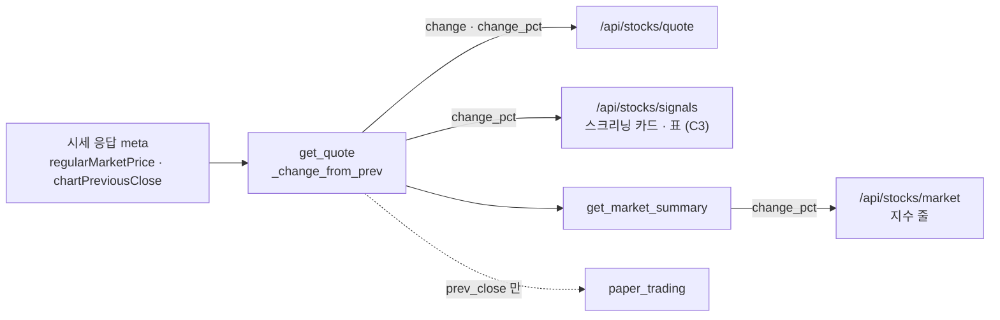

# 테스트 계획서 v1.1 — Qurious 퀀트 투자 플랫폼

| 항목 | 내용 |
|------|------|
| **문서 버전** | v1.1 (v1.0 은 이력으로 둔다 — [테스트계획서_v1.0.md](테스트계획서_v1.0.md)) |
| **작성일** | 2026-09-28 (KST) · S56 |
| **작성자** | 이동원 (데이터 파트 P-A) |
| **구분 (산출물 분류)** | 시험·성과 검증 → 테스트 계획서 · 테스트 케이스 · 단위/통합/인수시험 결과서 · 결함대장 |
| **도구** | pytest · (GitHub Actions 는 걷어냄 — ADR-0003) · 대역(가짜 응답)으로 API 계약 확인 |
| **상태** | 자동화 시험 **78건** · 로컬 실행 전부 통과(Postgres 붙임) · 자동 실행 없음 |

---

## 0. v1.0 → v1.1 에서 바뀐 것

v1.0(09-21)은 시험 23건일 때 썼다. 그 뒤 6개 PR 이 시험 55건을 더했는데 **문서는 23건에 멈춰 있었다.**
산출물목록 9절에 「테스트계획서 표는 아직 23건」 이라는 메모만 남아 있었다. 이번 판은 그 차이를 한 번에 채운다.

| 바뀐 곳 | v1.0 | v1.1 | 근거 |
|---------|------|------|------|
| 시험 수 | 23 | **78** | `python -m pytest --collect-only` 실측 (2026-09-28) |
| 시험 파일 | 2 | **8** | `tests/test_*.py` |
| 계층 | 단위 · 인수 · 봉인 | + **계약** · **통합** | 1.3절 |
| 실행 환경 | 로컬 + CI(ubuntu) | **로컬만** | ADR-0003 — CI 는 걷어내고 논의 중 |
| 결함대장 | 9건 | **14건** | I14 · 콘솔 인코딩 · A1 · C3 · #26 묶음 |
| 새 케이스 | — | **TC-A1** (시세 등락률) 외 5묶음 | 3절 |

---

## 1. 목적과 범위

### 1.1 이 문서가 하는 일

「무엇을, 어떤 기준으로, 누가 판정하는가」를 못박는다 (v1.0 과 같다).
v1.1 에서 더한 것은 하나다 — **시험이 늘어난 만큼 문서도 같이 늘어나게** 하는 것.
시험은 코드와 같은 PR 로 들어오는데 문서는 따로 고쳐야 해서, 따로 고치는 일이 여섯 번 빠졌다.

### 1.2 시험 범위

| 범위 | 대상 | v1.0 | v1.1 |
|------|------|:----:|:----:|
| 포함 | 실거래 차단(요구사항 제외 범위 준수) | ✅ | ✅ |
| 포함 | 데이터 출처 회귀 방지(야후 참조 봉인) | ✅ | ✅ |
| 포함 | **수집기 일일 갱신 러너**(잠금 · 예약 · 단계 판정) | — | ✅ S53 |
| 포함 | **모의투자 현금 장부 불변식**(실 Postgres) | — | ✅ S53 |
| 포함 | **시세 응답 계약 — 등락률**(`get_quote`) | — | ✅ S56 |
| 포함 | 운영 도구(논의 스캐너 · 올리기 전 검사 · 사용자 셸 인코딩) | — | ✅ S43~S55 |
| 포함(예정) | 비용 계산 · 백테스트 재현성 · 수집 DB 어댑터 골든 픽스처 | ⏳ | ⏳ 6절 |
| 제외 | 증권사 실서버 연동 | rfp-2 §4.2 제외 범위라 **실행 자체가 금지** | 같음 |
| 제외 | 부하·성능 | AWS 보류로 대상 환경이 없다 | 같음 |
| 제외 | 브라우저 E2E | IA v0.2 가 주 경로 12개를 **사람이** 눌러 봤다(자동 아님) | 같음 |

### 1.3 계층 — v1.1 에서 둘을 더했다

```
        ┌──────────────────────────────────────────────────┐
  느림  │  인수 (Acceptance)          6   "요구사항을 지키나"  │  실거래 차단
   ↑    ├──────────────────────────────────────────────────┤
        │  통합 (Integration)         9   "진짜 DB·프로세스로" │  ★ v1.1 — 장부 6 · 셸 인코딩 3
        ├──────────────────────────────────────────────────┤
        │  계약 (Contract)            5   "응답 모양이 약속대로"│  ★ v1.1 — 시세 등락률
        ├──────────────────────────────────────────────────┤
        │  봉인 (Characterization)    3   "더 나빠지지 않나"   │  야후 2 · 옛 장부 1
        ├──────────────────────────────────────────────────┤
   ↓    │  단위 (Unit)               55   "함수가 약속대로"    │
  빠름  └──────────────────────────────────────────────────┘
                                   78
```

> **계약 시험**(contract test) — 함수 **안쪽이 아니라 바깥으로 나가는 응답의 모양**을 확인한다.
> 이 문서에서는 「`get_quote` 가 돌려주는 사전에 `change_pct` 가 채워져 있는가」 같은 것이다.
> 화면·다른 파트는 이 모양에 기대어 짜므로, 모양이 바뀌면 **다른 사람 코드가 조용히 틀린다**.
> 헷갈리기 쉬운 점: 네트워크를 부르지 않는다. 시세 요청 함수를 **대역**(가짜 응답을 주는 함수)으로
> 바꿔 끼우고, 우리 코드가 그 응답을 어떻게 옮기는지만 본다. 공급자가 모양을 바꾸는 것은 못 잡는다.
>
> **통합 시험** — 대역 없이 **진짜 부품**(Postgres · 새 파이썬 프로세스)을 붙여 돈다.
> I14 장부 시험이 `FOR UPDATE` 행 잠금을 봐야 해서 SQLite 로는 안 됐다(그 파일 머리말).

### 1.4 판정 원칙 (v1.0 그대로 + 하나)

- **자기 판정 금지** — 시험 밖에서 한 번 더 실행해 대조표를 남긴다(분배안 v1.0 §5 규칙 3).
- **조용한 성공을 의심한다** — 「막혔다」와 「죽었다」를 짝으로 시험한다.
- **환경 오염을 막는다** — `tests/conftest.py` 가 실거래 승인 변수를 매번 지운다.
- ★ **v1.1 추가 — 새 시험은 옛 코드에서 먼저 실패해야 한다.** 고친 코드에서만 돌려 보면
  시험이 결함을 잡는지, 그냥 통과하는지 구별할 수 없다. I14(S53) · post_check(S55) · A1(S56) 이 이렇게 했다.

---

## 2. 강사님 표의 도구와 우리가 쓰는 것

강사님 표의 「시험·성과 검증」 도구 칸: *pytest · GitHub Actions · Postman · QuantConnect LEAN · TradingView Strategy Tester · JIRA*.

| 강사님 도구 | 우리 | 상태 | 이유 · 위치 |
|-------------|------|:----:|-------------|
| pytest | pytest 8.3 | 🟢 | `tests/` 8파일 · `pytest.ini` |
| GitHub Actions | 없음 | ⏸️ | 계정 정지 이력 뒤 팀 논의 먼저 — ADR-0003 · CI/CD 명세 v1.2 |
| Postman | pytest **계약 시험** + FastAPI `/docs` | 🟡 | 손으로 누르는 요청 모음 대신 **대역으로 응답 모양을 고정**한다(TC-A1). 사람 손 없이 반복된다 |
| QuantConnect LEAN | `app/services/lean_backtest.py` | 🟡 | 엔진 연결은 있다. **백테스트 보고서가 없다**(결함대장 밖 · 산출물목록 9절 🔴) |
| TradingView Strategy Tester | Pine 생성기 | 🔴 | 생성 코드가 `indicator()` 라 Strategy Tester 가 안 켜진다 — DF-05 |
| JIRA | GitHub Issues | 🟢 | 결함은 이슈로(예: #26 체크리스트) · 결함대장이 번호를 모은다 |

---

## 3. 테스트 케이스

### 3.1 한눈에 — 파일 · 계층 · 들어온 때

| 묶음 | 파일 | 건수 | 계층 | 들어온 PR | 무엇을 지키나 |
|------|------|-----:|------|-----------|---------------|
| TC-LT | `test_live_trading_guard.py` | 21 | 단위 15 · 인수 6 | S40 (옛 `#66`) | 실거래 주문은 승인 없이 나가지 않는다 |
| TC-YH | `test_no_yahoo_regression.py` | 2 | 봉인 | S40 (옛 `#66`) | 야후 참조가 8파일 72줄보다 늘지도 줄지도 않는다 |
| TC-DS | `test_discussion_scan.py` | 6 | 단위 | S43 (옛 `#75`) | 논의 답글까지 세고, 0건이면 조회를 의심한다 |
| TC-DU | `test_daily_update.py` | 15 | 단위 | S53 (#23) | 일일 갱신: 새 자료 판정 · 잠금 · 예약 XML |
| TC-I14 | `test_paper_ledger_i14.py` | 7 | 봉인 1 · 통합 6 | S53 (#25) | 체결가로 평가하면 총자산 = 초기 현금 − 거래비용 |
| TC-CE | `test_console_encoding.py` | 3 | 통합 | S54 (#27) | 사용자 git bash(cp949)에서 스크립트가 죽지 않는다 |
| TC-PC | `test_post_check.py` | 3 | 단위 | S55 (#29) | 색인에 없는 글 폴더를 알린다 |
| **TC-A1** | `test_quote_change_a1.py` | **21** | 단위 16 · 계약 5 | **S56 (이 판)** | 시세 등락률을 채운다 · 모르면 0 이 아니라 비운다 |
| | | **78** | | | |

TC-LT · TC-YH 의 케이스별 표는 [v1.0 3절](테스트계획서_v1.0.md#3-테스트-케이스)에 그대로 있다(바뀌지 않았다).
나머지 묶음은 각 시험 파일 머리말이 「무엇이 틀렸었나 · 무엇을 지키나」를 적고 있어 여기서는 요약만 둔다.

### 3.2 TC-A1 — 시세 등락률 (`tests/test_quote_change_a1.py`) ★ 이 판에서 추가

**무엇이 틀렸었나** — `get_quote` 가 전일 종가(`prev_close`)는 받아 놓고 `change`·`change_pct` 를
**`None` 으로 고정**해 돌려줬다(옛 `stock.py:82-83`). 스크리닝 카드는 `+--%`, 표는 `+0.00%` 로 보였다(#26 C3).



지수 줄(`get_market_summary`)은 같은 식을 **따로** 계산하고 있어 멀쩡했다. 식이 두 곳에 있으면 한쪽만 고쳐진다 —
이번에 서버 쪽 식을 `_change_from_prev` 한 곳으로 모으고 지수 줄도 그 값을 쓰게 했다.

**바뀌는 화면은 스크리닝 카드·표 하나다.** `/api/stocks/quote` 를 부르는 다른 화면 3곳(`app.html:4185` ·
`:4743` · `:4798`)은 `change_pct` 를 읽지 않고 `prev_close` 로 **같은 식을 화면에서 또** 계산한다 — 값은 같으니
동작은 안 바뀐다. 그중 `:4743` 은 전일 종가가 없으면 0 으로 채운다(DF-13 과 같은 함정 · 해당 파트 몫).
투자 인디케이터 화면의 「볼린저 ±2%」(#26 B1)는 차트 종가로 따로 계산해 이 수정과 무관하다.

| ID | 케이스 | 입력 | 기대 결과 | 계층 | 결과 |
|----|--------|------|-----------|------|------|
| TC-A1-01 | 공급자 등락률과 일치 | 09-28 장중 실측 6종목(코스피 3 · 코스닥 1 · 지수 1 · 환율 1) | 공급자 `regularMarketChangePercent` 와 차이 ≤ 0.005 | 단위 | ✅ (6건) |
| TC-A1-02 | 부동소수 잡음 제거 | 1,357.87 − 1,355.28 | `(2.59, 0.19)` — `2.5899999…` 가 아니다 | 단위 | ✅ |
| TC-A1-03 | **모르면 0 이 아니라 비움** | 현재가·전일가 없음 · 0 · NaN · inf · 문자 · 음수 | `(None, None)` | 단위 | ✅ (8건) |
| TC-A1-04 | 숫자 문자열 허용 | `"34250"`, `"33450"` | `(800.0, 2.39)` | 단위 | ✅ |
| TC-A1-05 | 실측 모양 그대로 | `previousClose` = null · `chartPreviousClose` 만 | 등락률 채움 **+ 요청 기간이 1일** | 계약 | ✅ |
| TC-A1-06 | 전일 종가 우선순위 | 둘 다 있음 | `previousClose` 를 쓴다 | 계약 | ✅ |
| TC-A1-07 | 전일 종가 없음 | 현재가만 | `change_pct is None` (0 아님) | 계약 | ✅ |
| TC-A1-08 | 조회 실패 | 응답 없음 | 옛 오류 모양 그대로 `{"symbol", "error"}` | 계약 | ✅ |
| TC-A1-09 | 식은 한 곳 | 지수 3줄 중 1줄 실패 | 지수 줄 = `get_quote` 값 · 실패 줄은 `None` | 계약 | ✅ |

**TC-A1-05 가 왜 요청 기간까지 보는가** — `chartPreviousClose` 는 이름과 달리 「전일 종가」가 아니라
「**차트 첫 봉 바로 앞의 종가**」다. 같은 날 같은 종목을 기간 5일로 받으면 285,500(09-23) 이 아니라
252,500(09-17) 이 온다(실측). 누가 기간을 늘리면 등락률이 조용히 5거래일 수익률로 바뀌므로 시험으로 묶었다.

**TC-A1-03 이 왜 가장 중요한가** — 옛 코드의 결함은 「값이 없다」였지만, 화면은 없는 값을 `?? 0` 으로
**보합(0.00%)** 처럼 보여 줬다. 모르는 것을 아는 것처럼 보이는 쪽이 더 나쁘다. 그래서 우리 쪽은 0 으로 채우지 않는다.
화면 쪽 `?? 0` 은 해당 파트 몫이라 #26 C3 에 남겨 둔다.

**알려진 한계 (시험 밖)** — 거래소·증권사 앱의 공식 등락률은 **기준가** 대비다. 보통 전일 종가와 같지만
권리락·주식배당락·액면분할·병합 날에는 기준가가 조정되어 그날은 값이 다를 수 있다.
현금배당락 날은 기준가를 조정하지 않는다는 설명이 있으나(🟡 2차 자료로만 확인) 거래소 규정 원문은 아직 못 봤다.

### 3.3 나머지 묶음 요약

| ID | 핵심 케이스 (예) | 한 줄 이유 |
|----|------------------|-----------|
| TC-DS | 답글로만 달린 팀원 발언을 센다 · 팀원이 전부 0 이면 조회를 의심하라고 경고 | 16세션 「무반응」이 계측 오류였다(S42) |
| TC-DU | 새 자료가 없으면 파생 단계를 건너뜀 · 죽은 PID 의 잠금은 치움 · 예약 XML 에 비밀번호가 없음 | 단계마다 멈춘 날이 달랐다(S53) |
| TC-I14 | 자동매매 매수가 모의계좌 현금을 줄인다 · 수동 주문이 쓴 현금을 자동매매가 본다 · 보유 초과 매도는 400 | 자동매매가 산 주식이 공짜였다(+3.19%) |
| TC-CE | cp949 표준출력에서 `✅` 를 찍어도 죽지 않는다 · `pythonw`(표준출력 없음)에서도 산다 | 사용자 셸에서만 죽었다(S54) |
| TC-PC | 빠진 폴더만 알린다 · 이름 앞부분만 같은 폴더를 헷갈리지 않는다 | 색인 없이 들어온 폴더 둘(S55) |

---

## 4. 시험 결과서 (2차 · 2026-09-28)

```
$ QURIOUS_TEST_DATABASE_URL=postgresql+asyncpg://…:55432/postgres python -m pytest
78 passed
```

| 계층 | 계획 | 실행 | 성공 | 실패 | 건너뜀 | 성공률 |
|------|-----:|-----:|-----:|-----:|------:|-------:|
| 단위 | 55 | 55 | 55 | 0 | 0 | 100% |
| 계약 | 5 | 5 | 5 | 0 | 0 | 100% |
| 통합 | 9 | 9 | 9 | 0 | 0 | 100% |
| 인수 | 6 | 6 | 6 | 0 | 0 | 100% |
| 봉인 | 3 | 3 | 3 | 0 | 0 | 100% |
| **합계** | **78** | **78** | **78** | **0** | **0** | **100%** |

- 실행 환경: Windows 11 · Python 3.12 · pytest 8.3.3 · Postgres `pgvector/pgvector:pg16`(시험 동안만 띄우고 지움)
- **DB 없이** 돌리면 `72 passed, 6 skipped` — 건너뛰는 6건은 TC-I14 의 통합 시험이다. 건너뜀은 실패가 아니지만
  **통과도 아니다.** 결과서에는 DB 를 붙인 실행을 적는다.
- 사용자 셸 조건(`PYTHONIOENCODING` 없음)으로 돌렸다 — Claude 셸에서만 통과하는 일(S54)을 막으려는 것이다.
- ⚠️ **자동 실행 없음.** PR 마다 사람이 돌린다(ADR-0003). 이 표는 이 판을 쓴 시점의 기록이다.

### 4.1 이번 판에서 실제로 잡아낸 것

- **옛 코드로 TC-A1-05 를 돌렸더니 실패했다** — `change_pct` 가 `None`. 시험이 결함을 잡는다는 대조다.
- 시험을 쓰기 전에 실제 응답을 떠 봤더니 `previousClose` 가 6종목 **모두 null** 이었다. 옛 코드는 `or` 로
  `chartPreviousClose` 에 넘어가 살아 있었지만, 그 값이 「차트 첫 봉 앞 종가」라는 사실은 코드 어디에도 없었다.
  → TC-A1-05 가 요청 기간까지 묶는 이유가 됐다.
- TC-YH(야후 봉인)가 이번 수정에도 걸려 있었다 — `stock.py` 의 참조 줄이 20줄에서 하나라도 늘거나 줄면 실패한다.
  그래서 새 주석에는 영문 공급자 이름을 쓰지 않았다. 봉인이 **작업 방식까지** 바꾼 예다.

---

## 5. 결함대장 (Defect Log)

| ID | 내용 | 심각도 | 근거 | 상태 | 파트 |
|----|------|--------|------|------|------|
| DF-01 | `adj_clpr` 052670 이 300배로 오염 (원천 표) | 🔴 높음 | 옛 이슈 `#55` | 열림 | P-A |
| DF-02 | 코스닥 지수 재현 오차 0.871% — 가설 2개 기각 | 🔴 높음 | 옛 이슈 `#56` | 열림 | P-A |
| DF-03 | `crawl.py:110` `hash()` 가 프로세스마다 달라 재크롤링 시 중복 적재 | 🟡 중간 | 코드 검토 | 열림 | P-A |
| DF-04 | 실패를 조용히 삼키고 종료코드 0 으로 끝나는 구조 | 🔴 높음 | 옛 이슈 `#53` | 열림 | P-A |
| DF-05 | Pine 생성기가 `indicator()` 라 Strategy Tester 가 켜지지 않음 | 🟡 중간 | 코드 검토 | 열림 | P-B |
| DF-06 | `app.html:3340` 문자열 보간 버그 | 🟡 중간 | 코드 검토 | 열림 | 화면 |
| DF-07 | compose 가 `/var/run/docker.sock` 을 앱 컨테이너에 마운트 | 🔴 높음 | 옛 이슈 `#22` 결함 3 | 열림 | P-E |
| DF-08 | 야후 파이낸스 의존 72줄 — 수집 DB 로 대체 필요 | 🟠 높음 | 옛 `#61` P1-1 | **봉인됨** (TC-YH) | P-A |
| DF-09 | 실거래 주문 경로 3중 노출 | 🔴 높음 | 옛 `#61` P0-1 | **닫힘** (TC-LT · ADR-0001) | P-E |
| DF-10 | 자동매매가 모의계좌 현금을 안 줄여 **없는 수익 +3.19%** (I14) | 🔴 높음 | #24 · IA v0.2 | **닫힘** (#25 · TC-I14) | P-E |
| DF-11 | 사용자 git bash(cp949)에서 `✅` 출력으로 스크립트가 죽음 | 🟡 중간 | S54 실측 | 🟡 **일부 닫힘** (#27 · TC-CE — 둘만. 이모지를 찍는 나머지 스크립트 5개는 그대로) | P-A |
| DF-12 | **`get_quote` 가 등락률을 늘 `None` 으로 돌려줌** | 🟡 중간 | #26 A1 | **닫힘** (이 판 · TC-A1) | P-A |
| DF-13 | 스크리닝 표가 모르는 등락률을 `?? 0` 으로 채워 **보합처럼** 보임 | 🟡 중간 | #26 C3 · `app.html:3207` | 열림 — DF-12 로 값이 채워져 드물어졌을 뿐 | P-C |
| DF-14 | 화면이 실제보다 더 말하는 곳 — 다른 파트 17건 (P-B 3 · P-C 3 · P-D 5 · P-E 6 · C3 제외) | 🟡~🔴 | #26 체크리스트 | 열림 · 각 파트가 줄을 떼어 간다 | 여러 파트 |

> DF-01 ~ DF-09 의 상태는 **v1.0 을 그대로 옮긴 것**이다 — 이번 판에서 다시 재지 않았다 🟡.
> 특히 DF-04 는 S53 의 일일 갱신 러너가 **단계별 종료코드**를 보게 됐지만, 수집기 안쪽의 삼키는 구조가
> 없어졌는지는 확인하지 않았다. 다음 판에서 하나씩 다시 잰다.
>
> **닫힘 · 봉인됨 · 일부 닫힘** — 「닫힘」은 원인을 없앴다, 「봉인됨」은 원인은 그대로인데 더 나빠지지
> 못하게 울타리만 쳤다, 「일부 닫힘」은 **같은 원인이 남은 곳이 있다**는 뜻이다.

---

## 6. 다음 판(v1.2)에 넣을 것

| 우선 | 대상 | 이유 |
|:----:|------|------|
| 1 | 결함대장 DF-01~09 **다시 재기** | 이번 판은 옮겨 적기만 했다 |
| 2 | 수집 DB 어댑터 **골든 픽스처** (v1.0 의 1순위 그대로) | 화면 시세가 아직 야후다 — A1 의 다음 일이 이 다리다 |
| 3 | 매매비용 계산(ETF 면제 포함) | v1.0 3순위 그대로 · 매도세 0.20% vs 0.15% 재대조(#40)와 같이 |
| 4 | 백테스트 재현성 (동일 입력 → 동일 출력) + **백테스트 보고서** | 강사님 표 「시험·성과 검증」의 LEAN 칸이 비어 있다 |
| 5 | 보조담당 블랙박스 시험 (분배안 v1.0 §5 규칙 2 ②) | 파트마다 **다른 사람이 쓴** 시험이 1개씩 있어야 「2인 이상」의 증빙이 된다. 지금 78건은 전부 P-A 가 썼다 |

---

## 7. 참조

- `tests/` — 시험 구현 8파일 · `tests/conftest.py`
- `pytest.ini` · `requirements-dev.txt` — 실행 설정
- [테스트계획서 v1.0](테스트계획서_v1.0.md) — TC-LT · TC-YH 케이스별 표
- `docs/ADR/ADR-0001-실거래-주문-경로-차단.md` · `docs/ADR/ADR-0003-CI를-걷어내고-먼저-논의한다.md`
- [산출물목록](../산출물목록.md) 9절 — 이 문서의 위치와 상태
