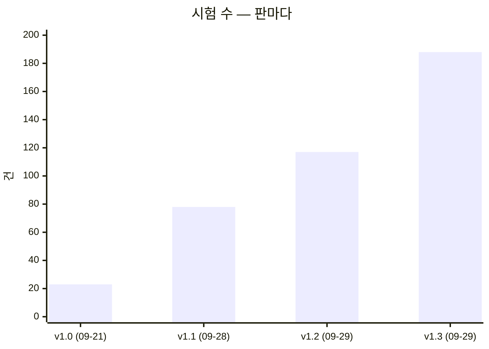

# 테스트 계획서 v1.3 — Qurious

| 문서 정보 | |
|---|---|
| **판 · 상태** | v1.3 · 초안(검토 전) |
| **구분** | 9. 시험·성과 검증 — 시험 계획 · 테스트 케이스 요약 · 시험 결과서 · 결함대장 (ISO/IEC/IEEE 29119-3 의 문서들을 한 권에 둔다) |
| **작성** | 이동원(데이터 파트) |
| **검토** | 검토 전 |
| **최종 수정** | 2026-09-29 (KST) |
| **기준** | 코드 `main` `e8e79fc` + 이 판과 같은 PR 의 RTM 스캐너 · 시험 188건 · 실제 수집 DB 데이터 기준일 2026-09-28 |
| **관련 문서** | [RTM v1.1](../요구사항/RTM_v1.1.md) · [기능 설계서 v0.1](../설계/기능설계_v0.1.md) · [API 명세서 v0.1](../인터페이스/API명세서_v0.1.md) · [ERD v1.2](../데이터/ERD_v1.2.md) · [ADR-0001](../ADR/ADR-0001-실거래-주문-경로-차단.md) · [ADR-0003](../ADR/ADR-0003-CI를-걷어내고-먼저-논의한다.md) · [테스트 계획서 v1.2](테스트계획서_v1.2.md) |
| **최근 개정** | v1.2 → v1.3: 시험 117 → 188(묶음 11 → 15) · 결함 16 → 19(닫힘 4 → 8) · 결함 칸을 새 틀로 · 시험을 요구에 이음 — 전체는 부록 D |

> **이 문서가 답하는 질문**
> 1. 무엇을 어떤 기준으로 시험하고, 무엇은 시험하지 않나 (1절)
> 2. 시험 188건은 어느 요구를 무엇으로 지키나 (2절 · 3절)
> 3. 지금 전부 통과하나 — 어떤 환경에서 (4절 결과서)
> 4. 알려진 결함은 무엇이고, 누가 무엇을 하면 되나 (5절 결함대장 · 6절)
>
> **읽는 순서** — 팀원: 요약 → 5절 결함대장에서 내 파트 줄 → 3.1절에서 내가 고칠 코드를 지키는 묶음 ·
> 강사님: 요약 → 4절 → 5절 → 6절 · 처음 온 사람: 부록 A 용어 → 1.2절 → 3.1절

## 요약

1. 자동화 시험 **188건(15묶음)이 모두 통과한다** — 시험 DB(Postgres)를 붙이면 188/188, 붙이지 않으면 182 통과 · 6 건너뜀이다(2026-09-29). 자동 실행(CI)은 없고 PR 마다 사람이 돌린다.
2. 시험은 데이터 수집 · 갱신(114건) · 문서화와 데이터 출처(37건) · 모의 주문과 실거래 차단(28건)을 지킨다. **2차 · 3차의 핵심 기능(지표 · 신호 · 리밸런싱 · 백테스트 · Pine · 위험 관리)을 재는 시험은 0건**이고, 188건 모두 데이터 파트가 썼다 — 다음 판의 1 · 2순위다(6절).
3. 결함은 19건 — 열림 9 · 일부 닫힘 2 · 닫힘 8 이다. 급한 열림은 코스닥 벤치마크 재현 오차(DF-02) · 앱 컨테이너의 도커 소켓(DF-07) · 자동매매가 직전 거래일 종가로 체결하는 것(DF-15) · ETF 백테스트에 붙는 매도세(DF-19)다.

---

## 1. 시험 계획

### 1.1 범위

표 1 은 「무엇을 시험하고 무엇을 하지 않나」 에 답한다.

**표 1. 시험 범위**

| 범위 | 대상 | 지키는 묶음 |
|---|---|---|
| 포함 | 실거래 차단 — 제안요청서 제외 범위(실계좌 실거래 자동 주문 금지)를 지킨다 | TC-LT |
| 포함 | 데이터 출처 — 야후 참조가 더 늘지 않는다(9파일 71줄 · 그중 1줄은 스캐너의 찾는 코드) | TC-YH |
| 포함 | 수집기 일일 갱신 러너 — 새 자료 판정 · 잠금 · 예약 | TC-DU |
| 포함 | 수집 DB 어댑터 — 국내 주식 일봉을 수집 DB 에서 기준일과 함께(골든 픽스처) | TC-CD |
| 포함 | 수집기 전처리 — 정지 뒤 감자 · 병합 · 계수 범위 경고 · 명령 인자 | TC-DF01 · TC-DF16 |
| 포함 | 시세 응답 계약(등락률) · 일봉 · 지표 API 의 캐시 규칙(12:30 갱신이 바로 보인다) | TC-A1 · TC-DF17 |
| 포함 | 모의투자 현금 장부 불변식(실제 Postgres) | TC-I14 |
| 포함 | 사용자 셸(cp949)에서 사람이 돌리는 진입점 15곳 | TC-CE |
| 포함 | 문서 스캐너 — API 명세 · 스키마 · 요구사항 추적표가 코드 · 대장과 같다 | TC-AP · TC-SS · TC-RT |
| 포함 | 운영 도구 — 논의 스캐너 · GitHub 글 올리기 전 검사 | TC-DS · TC-PC |
| 포함 (예정) | 채점 · 사고 방지 항목 셋 · 비용 계산 · 백테스트 재현성 · 코스닥 벤치마크 오차 | 6절 |
| 제외 | 증권사 실서버 연동 — 제외 범위라 실행 자체가 금지다 | — |
| 제외 | 부하 · 성능 — AWS 보류로 대상 환경이 없다 | — |
| 제외 | 브라우저 E2E — 주 경로 12개는 사람이 눌러 봤다(IA v0.2 · 와이어프레임 v0.2), 자동은 아니다 | — |

### 1.2 계층

그림 1 은 「시험이 어느 계층에 몇 건씩 있나」 에 답한다. 위로 갈수록 느리고, 요구사항에 가깝다.

**그림 1. 시험 계층 — 188건** · 범례: 오른쪽은 그 계층의 주된 묶음 · ★ = 이 판에 들어온 것

```
        ┌──────────────────────────────────────────────────
  느림  │  인수 (Acceptance)             6   "요구사항을 지키나"     실거래 차단
   ↑    ├──────────────────────────────────────────────────
        │  통합 (Integration)           23   "진짜 DB · 셸 · 프로세스" 장부 6 · 셸 3 · ★ 셸 11 · 어댑터 1 · 전처리 2
        ├──────────────────────────────────────────────────
        │  계약 (Contract)              14   "응답 모양이 약속대로"  등락률 5 · 어댑터 3 · ★ 라우트 캐시 6
        ├──────────────────────────────────────────────────
        │  특성화 (Characterization)     3   "더 나빠지지 않나"      야후 2 · 옛 장부 1
        ├──────────────────────────────────────────────────
   ↓    │  단위 (Unit)                 142   "함수가 약속대로"      ★ +54 (스캐너 33 · 캐시 11 · 전처리 9 · 셸 1)
  빠름  └──────────────────────────────────────────────────
                                     188
```

- 이 판에 들어온 단위 시험 54건 = TC-AP 14 · TC-RT 11 · TC-SS 8 · TC-DF17 11 · TC-DF01 6 · TC-DF16 3 · TC-CE 1. 문서 스캐너 셋(API 명세 · RTM · 스키마)이 33건이다.
- 계층은 **무엇을 재나**로 나눈다. 자식 프로세스를 띄운다고 통합이 아니다 — 스캐너가 앱을 불러오지 않는지 보는 TC-AP-01 은 단위다. 사용자 셸의 인코딩을 그대로 재는 TC-CE 는 통합이다.
- 실제 수집 DB(시세 447만 행)를 **읽기 전용**으로 여는 통합 시험 두 건(TC-CD-11 · TC-DF01-13)이 전체 실행 시간의 대부분을 쓴다. 파일이 없으면 건너뛴다.

### 1.3 판정 원칙 여덟 가지

1. **자기 판정 금지** — 시험 밖에서 한 번 더 실행해 대조표를 남긴다(역할 분배안 v1.0 5절 규칙 3).
2. **조용한 성공을 의심한다** — 「막혔다」 와 「죽었다」 를 짝으로 시험한다.
3. **환경 오염을 막는다** — `tests/conftest.py` 가 실거래 승인 변수를 매번 지운다.
4. **새 시험은 옛 코드에서 먼저 실패해야 한다** — 옛 코드에서 통과하는 새 시험은 결함을 재지 못한다. 예외는 **보존 확인 시험**(고친 뒤에도 바뀌면 안 되는 동작)이다 — 옛 코드에서도 통과해야 맞고, 결함을 재는 시험과 짝으로 둔다. 새 묶음마다 옛 코드 결과를 3.2절에 적었다.
5. **대조하는 숫자는 출처까지 달라야 「밖의 숫자」 다** — 수정주가와 등락률은 같은 포털 값(`vs`)에서 나와 포털이 틀린 날에는 함께 틀린다. 그래서 주식 수(`lstg_st_cnt`)라는 다른 칸으로 한 번 더 본다.
6. **규칙을 넓히면 「건드리면 안 되는 날」 을 보존 확인 시험으로 둔다** — 전 종목에서 정지 없이 주식 수가 절반 가까이 준 날(우선주 소각)이 있었다. 검증 게이트가 실패하면 끄지 않고 예외를 좁게 두고, 몇 건인지 늘 찍는다.
7. **실제 DB 를 읽는 시험 · 검증은 예약 작업(매일 12:30)과 겹치지 않게 돌린다** — 돌리기 전에 `python scripts/daily_update.py status` 의 「실행 중」 을 본다. SQLite 는 WAL 이라 읽기가 쓰기를 막지는 않지만 디스크와 CPU 를 나눠 쓴다.
8. **스캐너 시험은 실제 저장소에 「늘 참이어야 하는 성질」 만 건다** — 「인증 없는 API 33개」 같은 지금의 사실을 걸면 팀원이 그것을 고치는 순간 시험이 깨진다. 판정 규칙은 합성 입력(임시 폴더)으로 재고, 실제 대장 · 코드에는 형식만 건다(TC-AP · TC-SS · TC-RT).

### 1.4 환경 · 역할 · 끝내는 기준

표 2 는 「어디서 누가 돌리고, 무엇이면 끝났다고 하나」 에 답한다.

**표 2. 환경 · 역할 · 끝내는 기준**

| 항목 | 지금 |
|---|---|
| 환경 | Windows 11 · Python 3.12.13 · pytest 8.3.3 · 시험 DB `pgvector/pgvector:pg16`(시험 동안만 띄우고 지운다 · 포트 15432) · 실제 수집 DB `data/collector/market.sqlite3`(읽기 전용) |
| 실행 조건 | 사용자 셸과 같게 `PYTHONIOENCODING` 없이 돌린다 — Git Bash 의 cp949 출력에서 죽는 코드를 잡기 위해서다 |
| 누가 돌리나 | PR 을 올리는 사람이 PR 마다 — 자동 실행은 없다(ADR-0003 · CI 는 논의 D8 에서 정한다) |
| 누가 쓰나 | 지금까지 188건 모두 데이터 파트. 보조담당 블랙박스 시험(역할 분배안 5절 규칙 2 ②)은 0건 — 6절 2순위 |
| 끝내는 기준 | ① 전부 통과 ② 새 시험은 옛 코드에서 먼저 실패(보존 확인 시험 제외) ③ 결함대장을 판마다 다시 잰다 ④ 파트마다 블랙박스 시험 1건 이상 |

### 1.5 강사님 도구와 우리가 쓰는 것

표 3 은 「강사님 표의 시험 도구를 무엇으로 대신하고, 무엇이 비었나」 에 답한다. 강사님 표의 도구 칸은 pytest · GitHub Actions · Postman · QuantConnect LEAN · TradingView Strategy Tester · JIRA 다.

**표 3. 강사님 도구 대조**

| 강사님 도구 | 우리 | 상태 | 이유 · 위치 |
|---|---|:-:|---|
| pytest | pytest 8.3.3 | 🟢 | `tests/` 15파일 · 188건 · `pytest.ini` |
| GitHub Actions | 없음 | ⏸️ | 계정 정지 이력 뒤 팀 논의 먼저 — ADR-0003 · 논의 D8([#54](https://github.com/EST-team-project/Qurious/discussions/54)) |
| Postman | pytest 계약 시험 14건 + API 명세 스캐너 | 🟡 | 요청 모음 대신 가짜 응답으로 응답 모양을 고정한다. API 목록은 앱의 `app.openapi()` 와 145/145 로 대조했다(API 명세서 v0.1) |
| QuantConnect LEAN | `app/services/lean_backtest.py` | 🟡 | 엔진 연결은 있다. **백테스트 보고서가 없고**, LEAN 은 아직 야후 데이터 · 비용 0 으로 돈다(DF-08 · `P02-④-1`) |
| TradingView Strategy Tester | Pine 생성기 | 🔴 | 생성 코드가 `indicator()` 라 Strategy Tester 가 켜지지 않는다(DF-05) |
| JIRA | GitHub Issues | 🟢 | 결함은 이슈로(#26 · #35 체크리스트) · 결함대장이 번호를 모은다 |

---

## 2. 시험은 어느 요구를 재나

요구와 시험의 대응 전체는 [RTM v1.1](../요구사항/RTM_v1.1.md) 4절이고, 대응은 [시험-요구 대장](../요구사항/시험-요구대장.tsv)에 적는다. 표 4 는 「시험이 붙은 요구는 무엇이고, 얼마나 확실하게 재나」 에 답한다.

**표 4. 시험이 붙은 요구 11개** · 확실도: 🟢 그 요구의 동작을 직접 잰다 · 🟡 전제나 일부만 잰다

| 요구 | 이름 (줄임) | 시험 | 건수 |
|---|---|---|--:|
| `P01-①-2` | 투자 자료 수집 · 전처리 · 검색 | 🟢 TC-A1 · CD · DF01 · 🟡 DU · DF17 | 96 |
| `P01-①-4` | 갱신일 · 정기 배치 | 🟢 TC-DU · DF17 · 🟡 CE · DF16 | 50 |
| `P01-④-3` | 모의 주문 체결 · 포트폴리오 운용 | 🟢 TC-I14 · 🟡 LT | 28 |
| `P02-⑤-1` | 신호 → 증권사 계좌 · 시세 · 주문 | 🟢 TC-LT | 21 |
| `RFP2-4.2-①` | 실거래 자동 주문을 하지 않는다 | 🟢 TC-LT | 21 |
| `RFP2-3.2-④` | 문서화 | 🟢 TC-SS · AP · RT | 35 |
| `SCH-DQ` | 데이터 품질 | 🟢 TC-DF01 | 21 |
| `P02-④-1` | 같은 조건의 LEAN 백테스트 ★ | 🟡 TC-YH · CD | 24 |
| `P02-⑤-3` | 실행 일정 · 로그 · 장애 알림 | 🟡 TC-DU | 15 |
| `RFP2-3.2-①` | 공개 데이터 사용 | 🟡 TC-YH | 2 |
| `RFP2-3.2-③` | 재현 가능성 | 🟡 TC-CD · DF01 | 43 |

요구 59개 가운데 시험이 붙은 요구는 11개이고, 강사님 원문 세부 기능 29개 가운데는 6개다. 한 묶음이 요구 둘을 재면 둘 다에 세므로 건수의 합은 188 보다 크다. **채점 · 사고 방지 항목 셋**(`P02-②-2` 미래 데이터 참조 방지 · `P02-④-1` 같은 조건의 LEAN · `P02-⑤-2` 중복 주문 방지 · 손실 한도 · 비상 정지) 가운데 직접 재는 시험이 있는 것은 없다.

---

## 3. 테스트 케이스

### 3.1 한눈에 — 15묶음

표 5 는 「시험 묶음마다 무엇을 지키고, 언제 들어왔나」 에 답한다.

**표 5. 시험 묶음 15 · 188건**

| 묶음 | 파일 | 건수 | 계층 | 들어온 PR | 무엇을 지키나 | 요구 |
|---|---|--:|---|---|---|---|
| TC-LT | `test_live_trading_guard.py` | 21 | 단위 15 · 인수 6 | 옛 저장소 [기록](../github-archive/2026-09-21/PR-066/00-기록.md) (09-21) | 실거래 주문은 승인 없이 나가지 않는다 | `RFP2-4.2-①` · `P02-⑤-1` · `P01-④-3` |
| TC-YH | `test_no_yahoo_regression.py` | 2 | 특성화 2 | 같음 · 기준선 #33 · #51 | 야후 참조가 기준선(9파일 71줄)보다 늘지도 줄지도 않는다 | `RFP2-3.2-①` · `P02-④-1` |
| TC-DS | `test_discussion_scan.py` | 6 | 단위 6 | 옛 저장소 [기록](../github-archive/2026-09-23/PR-075/00-기록.md) (09-23) | 논의 답글까지 세고, 0건이면 조회를 의심한다 | — (도구) |
| TC-DU | `test_daily_update.py` | 15 | 단위 15 | #23 | 일일 갱신: 새 자료 판정 · 잠금 · 예약 | `P01-①-4` · `P01-①-2` · `P02-⑤-3` |
| TC-I14 | `test_paper_ledger_i14.py` | 7 | 특성화 1 · 통합 6 | #25 | 체결가로 평가한 총자산 = 초기 현금 − 거래비용 | `P01-④-3` |
| TC-CE | `test_console_encoding.py` | 15 | 통합 14 · 단위 1 | #27 · #48 | 사람이 돌리는 진입점 15곳이 cp949 셸에서 죽지 않는다 | `P01-①-4` |
| TC-PC | `test_post_check.py` | 3 | 단위 3 | #29 | 색인에 없는 글 폴더를 알린다 | — (도구) |
| TC-A1 | `test_quote_change_a1.py` | 21 | 단위 16 · 계약 5 | #30 | 시세 등락률을 채운다 · 모르면 0 이 아니라 비운다 | `P01-①-2` |
| TC-CD | `test_collector_candles_df08.py` | 22 | 단위 18 · 계약 3 · 통합 1 | #33 | 국내 주식 일봉을 수집 DB 에서 읽는다 · 골든 픽스처와 한 자리도 안 다르다 | `P01-①-2` · `P02-④-1` · `RFP2-3.2-③` |
| TC-SS | `test_schema_scan.py` | 10 | 단위 10 | #34 · #56 | 데이터 사전 · ERD 를 다시 만들면 같다 · 칸 설명은 코드에서 온다 | `RFP2-3.2-④` |
| TC-DF01 | `test_preprocess_df01.py` | 21 | 단위 19 · 통합 2 | #39 · #48 | 정지 뒤 감자 · 병합을 주식 수로 잡는다 · 주식 수가 뒷받침하는 계수는 경고와 따로 센다 | `P01-①-2` · `SCH-DQ` · `RFP2-3.2-③` |
| TC-DF16 | `test_preprocess_cli_df16.py` | 3 | 단위 3 | #48 | 전처리 명령이 DB 를 열기 전에 인자를 본다 | `P01-①-4` |
| TC-AP | `test_api_scan.py` | 14 | 단위 14 | #51 · #53 | API 명세서를 코드에서 다시 만들면 같다 | `RFP2-3.2-④` |
| TC-DF17 | `test_route_cache_df17.py` | 17 | 단위 11 · 계약 6 | #53 | 일봉 · 지표 API 가 12:30 갱신을 바로 보여 준다 | `P01-①-4` · `P01-①-2` |
| TC-RT | `test_rtm_scan.py` | 11 | 단위 11 | #60 | 요구사항 추적표를 대장 · 코드에서 다시 만들면 같다 · 거짓 흔적을 세지 않는다 | `RFP2-3.2-④` |
| | | **188** | | | | |

바뀌지 않은 묶음의 케이스 표는 이전 판에 있다 — TC-LT · TC-YH 는 [v1.0 3절](테스트계획서_v1.0.md) · TC-A1 은 [v1.1 3.2절](테스트계획서_v1.1.md) · TC-CD 와 TC-DF01-01~13 은 [v1.2 3.2 · 3.3절](테스트계획서_v1.2.md).

### 3.2 이 판에 들어오거나 넓어진 묶음

#### TC-CE — 사람이 돌리는 진입점 15곳 (3 → 15건)

**무엇이 틀렸었나** — 사용자 Git Bash(mintty)는 파이썬 표준출력을 cp949 로 연다. 도움말이나 요약 줄에 cp949 로 쓸 수 없는 글자(줄표 `—` · 그림 글자)가 있으면 그 글자에서 `UnicodeEncodeError` 로 죽었다(DF-11). 수집기 6곳은 `collector/console.py` 의 `utf8_stdio()` 를, 스크립트 9곳은 `main` 첫머리의 세 줄을 쓴다.

| ID | 케이스 | 기대 결과 | 계층 |
|---|---|---|---|
| TC-CE-01~03 | 올리기 전 검사 · 일일 갱신 상태를 cp949 로 · 표준출력이 없는 `pythonw` 로 | 죽지 않는다 | 통합 |
| TC-CE-04~14 | argparse 진입점 11곳을 cp949 로 `--help` 한 뒤 한 줄 더 찍기 — 자식 프로세스 안에서 DB 연결을 막아 실제 DB 에 닿지 않는다 | 종료코드 0 · 두 출력 모두 온다 | 통합 11 |
| TC-CE-15 | 진입점 15곳 정적 검사 | cp949 밖 글자를 찍는 진입점은 첫머리에서 UTF-8 로 바꾼다 — 새 진입점이 빠지면 실패 | 단위 |

**옛 코드에서 먼저 실패했나** — 새 12건 전부 실패했다(도움말 자체에서 죽음 7 · 도움말 뒤 출력에서 죽음 3 · DB 를 열려다 막힘 1 · 정적 검사 1). 인자 없이 곧바로 DB · Redis · 브라우저를 여는 4곳(검증 스크립트 3 · 스크린샷 도구)은 정적 검사로만 지킨다 🟡.

#### TC-DF16 — 전처리 명령이 인자를 본다 (3건 · 새 묶음)

| ID | 케이스 | 기대 결과 | 계층 |
|---|---|---|---|
| TC-DF16-01 | `python -m collector.preprocess --help` | 쓰는 것과 「손으로 돌리기 전에 `daily_update.py status`」 를 찍고 DB 를 열지 않는다 | 단위 |
| TC-DF16-02 | 모르는 인자 `--codes 005930`(다른 수집기 명령에 있어 짐작하기 쉬운 인자) | 종료코드 2 · DB 를 열지 않는다 | 단위 |
| TC-DF16-03 | 인자 없음(일일 러너가 부르는 모양) | 예전처럼 전 종목을 다시 계산한다 — 보존 확인 | 단위 |

**옛 코드** — 01 · 02 실패(DB 를 열려다 막힘) · 03 통과(보존 확인). 시험 밖: cp949 셸로 `--help` 종료코드 0 · 모르는 인자 종료코드 2 · DB 세 파일(`.sqlite3` · `-wal` · `-shm`)의 시각이 전후 같았다.

#### TC-DF01 — 계수 범위 경고와 주식 수 (15 → 21건)

**무엇이 바뀌었나** — 조정 계수가 정상 범위(`SANITY_LO`~`SANITY_HI`) 밖이면 경고(계수 범위 경고)를 찍는다. 그런데 감자 결함(DF-01)을 고치며 맞게 들어간 제일바이오 ×1,500 이 매일 경고로 찍혀 진짜 이상치가 묻힐 수 있었다. 이제 **깨끗한 주식 수 비율이 다음 기준일에도 그대로일 때만** 「주식 수로 뒷받침」 으로 따로 센다(`preprocess._backed_by_shares`). `shares` 를 통째로 빼지 않은 이유 — 비율이 50 을 넘으면 「깨끗한 비율」 검사가 늘 통과해, 재개일 하루짜리 주식 수 오기도 깨끗해 보인다.

| ID | 케이스 | 기대 결과 | 계층 |
|---|---|---|---|
| TC-DF01-14 | 제일바이오 ×1,500 · 다음 기준일에도 주식 수가 같다 | 경고가 아니라 「주식 수로 뒷받침」 | 단위 |
| TC-DF01-15 | 요약 줄 | 경고 수와 「범위 밖이지만 주식 수로 뒷받침」 수가 나뉘어 찍힌다(있으면 늘) | 단위 |
| TC-DF01-16 | 큐러블 ×20 | 범위 안 — 경고 없음(보존 확인) | 단위 |
| TC-DF01-17 | 하루짜리 주식 수 오기 | 경고로 남는다(보존 확인) | 단위 |
| TC-DF01-18 | 재개일이 마지막 날(다음 기준일 없음) | 경고로 둔다(보존 확인) | 단위 |
| TC-DF01-19 | 가격(`vs`)에서 나온 계수 | 예전처럼 경고(보존 확인) | 단위 |

**옛 코드** — 14 · 15 실패 · 16~19 통과. 시험 밖: 실제 DB 읽기 전용 전수(48초) — 조정 이벤트 2,699건(분할 1,403 · 권리락 1,045 · 확인 필요 249 · `shares` 2) 한 건도 바뀌지 않고, 요약은 경고 0 · 뒷받침 1. 같은 날 12:30 예약 실행의 로그에서도 경고 0 · 뒷받침 1 을 확인했다(2026-09-29).

#### TC-AP — API 명세 스캐너 (14건 · 새 묶음)

`scripts/api_scan.py` 는 앱을 불러오지 않고 코드(AST)만 읽어 API 146개의 명세를 만든다. 시험은 늘 참이어야 하는 성질(1.3절 원칙 8)과 판정 규칙을 나눠 잰다.

| ID | 케이스 | 계층 |
|---|---|---|
| TC-AP-01~04 | 스캐너가 앱을 불러오지 않는다 · 줄로 센 `@router.<메서드>(` 수 = 추출 수 · 두 번 돌려 같은 표 · 같은 메서드 · 경로 0 · 붙지 않은 라우터 0 | 단위 |
| TC-AP-05~08 | 인증 이름표 · 수집 DB 어댑터 결과를 그대로 돌려줄 때만 기준일이 실린다 · 실거래 차단 지점을 지나는 것 ≠ 주문 · 선택형 본문 모델 | 단위 |
| TC-AP-09~13 | 라우트가 끼어도 API ID 가 밀리지 않는다 · OpenAPI 대조 · 화면 JS 경로 맞추기 · 다른 파일의 같은 이름 모델 · 요구 ID 는 기능 설계서 부록 블록에서만 | 단위 |
| TC-AP-14 | 수집 DB 요청을 캐시보다 **먼저** 돌려보내는 라우트는 캐시 경고를 내지 않는다(순서까지 본다) | 단위 |

**옛 코드** — 새 스캐너라 옛 코드가 없어 **돌연변이 세 건**으로 쟀다: 기준일 사슬을 끊으면 TC-AP-06 만 · 클래스 몸통의 주문을 세면 07 만 · 선택형 모델을 못 풀면 08 만 실패했다. TC-AP-14 는 옛 스캐너에서 실패했다(속성 없음). 시험 밖: 도커 이미지 안 `app.openapi()` 와 145/145(146 번째는 스키마에서 뺀 라우트).

#### TC-DF17 — 일봉 · 지표 API 의 캐시 규칙 (17건 · 새 묶음)

**무엇이 틀렸었나** — 차트 · 지표 화면이 부르는 두 API 가 수집 DB 를 읽기 **전에** 6시간 캐시(`data_cache`)를 먼저 봐서, 12:30 갱신 뒤에도 최대 6시간 옛 기준일을 돌려줬다(DF-17). 이제 수집 DB 가 받는 요청(판정 함수 `collector_db.handles()` — 국내 주식 기호 · 일봉 · 아는 기간 · DB 파일 있음)은 라우트가 캐시를 읽지도 쓰지도 않고, 매시간 캐시 예열도 그 종목은 건너뛴다.

| ID | 케이스 | 기대 결과 | 계층 |
|---|---|---|---|
| TC-DF17-01 · 02 | 일봉 · 지표 라우트 — 캐시가 옛 응답(기준일 09-25)을 준다 | 수집 DB 의 새 기준일(09-28) · 캐시 읽기 · 쓰기 0 | 계약 |
| TC-DF17-03 | DB 에 행이 없는 6자리 기호(ETF 등) | 옛 경로가 **같은 키**로 캐시한다 — 외부 호출이 늘지 않는다(보존 확인) | 계약 |
| TC-DF17-04 · 05 | 캐시 예열 — DB 가 있으면 수집 DB 종목을 건너뛴다 · 없으면 31종목을 예전처럼(보존 확인) | 예열 대상이 요청 모양을 따른다 | 단위 |
| TC-DF17-06 · 07 | 지수 · 주봉(2) · DB 없는 PC 의 지표 | 라우트 캐시 그대로(보존 확인) | 계약 |
| TC-DF17-08 | 판정 함수가 요청 모양 8가지를 가른다 | 아니라고 한 요청은 수집 DB 도 `None` 이다 | 단위 8 |
| TC-DF17-09 | DB 파일이 없다 | 판정 함수가 거짓 | 단위 |

**옛 코드** — 12 실패 · 5 통과(03 · 05 · 06 두 건 · 07 — 모두 보존 확인). 시험 밖: 실제 수집 DB 로 HTTP 경로(`TestClient`)를 불러 기준일 2026-09-28 · 라우트 캐시 조회 0회.

#### TC-SS — 스키마 스캐너 (2 → 10건)

**무엇이 틀렸었나** — 데이터 사전은 「설명을 고치려면 코드 주석을 고친다」 고 약속하는데, 스캐너가 수집 DB 표의 칸 설명을 **DB 파일에 저장된 CREATE 문**(표를 처음 만들 때 것)에서 읽었다. 그래서 `corporate_action.kind` 의 네 번째 값 `shares` 와 나중에 더한 `benchmark_index` 세 칸의 설명이 사전에 없었다(수집 DB 설명 57/88 → 고친 뒤 60/88).

| ID | 케이스 | 계층 |
|---|---|---|
| TC-SS-01 · 02 | 함수 기본값을 이름으로 적는다 · 앱 스키마 사전에 메모리 주소가 없다 | 단위 |
| TC-SS-03 · 04 | 칸 설명은 코드의 CREATE 문에서 · 코드에 없는 표는 DB 파일의 주석을 쓴다 | 단위 |
| TC-SS-05 · 06 | 코드와 DB 파일이 다른 칸 · 한쪽에만 있는 칸을 가린다 · 실제 코드의 CREATE 문이 수집 DB 8표를 담고 `kind` 네 값을 설명한다 | 단위 |
| TC-SS-07 · 08 | 표 속성 대장의 판정 규칙(합성 대장) · 실제 대장은 형식만 | 단위 |
| TC-SS-09 · 10 | 표 목록 · 사전 · ERD 가 대장을 싣고 앱 그림을 업무 영역으로 나눈다 · 문서 채우기가 표시 사이만 바꾸고 줄 끝을 지킨다 | 단위 |

**옛 코드** — 새 8건 전부 실패(새 함수가 없다) · 기존 2건 통과. 옛 코드는 커밋된 트리를 `git archive` 로 임시 폴더에 풀어 돌렸다. 시험 밖: 빈 Postgres 에 마이그레이션 0001~0003 을 올리고 `alembic check` — 어긋남 4곳 그대로(ERD v1.2 4.5절).

#### TC-RT — 요구사항 추적표 스캐너 (11건 · 새 묶음)

**무엇이 틀렸었나** — 추적표의 코드 흔적을 세는 스캐너가 **여러 줄 문서화 문자열의 가운데 줄과 시험 파일**을 구현으로 셌다. 그래서 코드가 주석뿐인 요구 셋(★ 중복 주문 방지 · ★ 미래 데이터 참조 방지 · TradingView 대 LEAN 비교)이 「코드 희소」 로 보였다(DF-18). 이제 파이썬 파일은 표준 라이브러리 `ast` 로 문서화 문자열 범위를 가리고, `tests/` 와 문서 도구는 흔적에서 뺀다.

| ID | 케이스 | 계층 |
|---|---|---|
| TC-RT-01 · 02 | 요구 대장 점검(겹친 ID · 정한 말 밖 · 빈 칸 · 없는 관련 요구) · 시험 대장 점검(대장에 없는 시험 파일은 문제가 아니라 알림) | 단위 |
| TC-RT-03 · 04 | 한 묶음이 요구 둘을 재면 둘 다에 센다 · `pytest --collect-only` 출력 두 모양을 파일별로 센다 | 단위 |
| TC-RT-05 · 06 | 설계 절은 요구 ID 가 제목인 절(한눈 표 · 부록 제외 · 가장 높은 판) · API ID 를 줄여 적는다 | 단위 |
| TC-RT-07 | **여러 줄 문서화 문자열 안의 낱말은 흔적이 아니다** · 주석뿐이면 「주석뿐」 | 단위 |
| TC-RT-08 · 09 | 진행 판정 순서(검사 → 시험 확실도 → 흔적) · 추적 표 칸 | 단위 |
| TC-RT-10 · 11 | 문서 채우기(표시 사이 · 줄 끝) · 실제 대장은 형식만 | 단위 |

**옛 코드** — 11건 전부 실패(옛 스캐너에는 함수가 없다). TC-RT-07 의 결함은 옛 스캐너로 따로 재현했다 — 커밋된 트리(`e8e79fc`)에서 옛 스캐너는 `P02-⑤-2` 를 「코드 희소 · 2파일」 로 적는다(실제로는 주석뿐).

---

## 4. 시험 결과서 (4차 · 2026-09-29)

```
$ QURIOUS_TEST_DATABASE_URL=postgresql+asyncpg://postgres:…@localhost:15432/postgres \
    env -u PYTHONIOENCODING python -m pytest -rs
188 passed, 1 warning in 108.49s (0:01:48)

$ env -u PYTHONIOENCODING -u QURIOUS_TEST_DATABASE_URL python -m pytest -rs
182 passed, 6 skipped, 1 warning in 70.65s (0:01:10)
```

표 6 은 「계층마다 몇 건을 돌려 몇 건이 통과했나」 에 답한다.

**표 6. 계층별 결과** · 시험 DB 를 붙인 실행

| 계층 | 계획 | 실행 | 성공 | 실패 | 건너뜀 | 성공률 | 시험 DB 없이 |
|---|--:|--:|--:|--:|--:|--:|---|
| 단위 | 142 | 142 | 142 | 0 | 0 | 100% | 같음 |
| 계약 | 14 | 14 | 14 | 0 | 0 | 100% | 같음 |
| 통합 | 23 | 23 | 23 | 0 | 0 | 100% | 17 통과 · **6 건너뜀**(모의 장부 TC-I14) |
| 인수 | 6 | 6 | 6 | 0 | 0 | 100% | 같음 |
| 특성화 | 3 | 3 | 3 | 0 | 0 | 100% | 같음 |
| **합계** | **188** | **188** | **188** | **0** | **0** | **100%** | 182 통과 · 6 건너뜀 |

표 7 은 「판마다 시험이 어떻게 늘었나」 에 답한다.

**표 7. 차수별 결과**

| 차수 | 날짜 | 판 | 결과 | 시험 DB 없이 |
|:-:|---|---|---|---|
| 1차 | 2026-09-21 | v1.0 | 23/23 | — |
| 2차 | 2026-09-28 | v1.1 | 78/78 | 72 · 6 |
| 3차 | 2026-09-29 | v1.2 | 117/117 | 111 · 6 |
| (변경 노트) | 2026-09-29 | v1.2 6.1절 — PR #48 · #51 · #53 · #56 | 138 · 151 · 169 · 177 | 132 · 145 · 163 · 171 (건너뜀 6) |
| **4차** | **2026-09-29** | **v1.3** | **188/188** | **182 · 6** |

그림 2 는 「시험이 판마다 얼마나 늘었나」 에 답한다.

**그림 2. 판마다 시험 수**



- **실행 환경** — 1.4절 표 2. 경고 1건은 `app/config.py` 의 Pydantic v1 식 `class Config`(2.0 부터 폐기 예정)로, 결과와 무관하다.
- **포트** — 시험 파일 머리말의 `-p 55432:5432` 는 이 PC 에서 `bind: forbidden` 으로 실패한다. Windows 가 55367~55466 을 예약해 두었기 때문이다(`netsh interface ipv4 show excludedportrange protocol=tcp`). 15432 로 띄웠고 머리말은 고치지 않았다 — 다른 PC 에서는 된다.
- **자동 실행 없음** — 이 표는 이 판을 쓴 때의 기록이다(ADR-0003).

### 4.1 끝내는 기준 판정 · 남은 위험

표 8 은 「1.4절의 끝내는 기준을 채웠나」 에 답한다.

**표 8. 끝내는 기준 판정**

| 기준 | 판정 | 근거 |
|---|:-:|---|
| ① 전부 통과 | ✅ | 188/188 · 시험 DB 없이 182 · 6 |
| ② 새 시험은 옛 코드에서 먼저 실패 | ✅ | 3.2절 — 묶음마다 옛 코드 결과 · 통과한 것은 모두 보존 확인 시험 |
| ③ 결함대장을 다시 잼 | ✅ | 5절 — 19건 전부 · 2026-09-29 |
| ④ 파트마다 블랙박스 시험 1건 이상 | ❌ | 0건 — 188건 모두 데이터 파트 작성(6절 2순위) |

**남은 위험** — ① 채점 · 사고 방지 항목 셋을 재는 시험이 없다 ② 자동 실행이 없어 PR 을 올리는 사람이 돌리지 않으면 아무도 모른다 ③ 한 파트가 모든 시험을 썼다 — 그 파트가 빠지면 시험을 고칠 사람이 없다 ④ 실제 DB 를 읽는 시험 두 건이 무겁고, DB 가 없는 PC 에서는 건너뛴다.

### 4.2 이 판의 시험이 잡아낸 결함

- **DF-17** — 일봉 · 지표 API 앞의 라우트 캐시(API 명세 스캐너가 라우트마다 닿는 곳을 늘어놓아 드러남 · TC-DF17 로 닫음).
- **DF-11 의 범위** — 사용자 셸에서 죽는 곳이 10곳이 아니라 15곳이었다(그림 글자가 아니라 cp949 로 못 쓰는 글자 전체로 다시 셈 · TC-CE).
- **DF-18** — 요구사항 추적표의 거짓 흔적(RTM v1.1 을 만들며 드러남 · TC-RT-07).
- **데이터 사전의 설명 출처** — 스키마 스캐너가 DB 파일의 옛 CREATE 문을 읽었다(ERD · 사전 v1.2 를 만들며 드러남 · TC-SS-03).

---

## 5. 결함대장

표 9 는 「알려진 결함이 무엇이고, 어떻게 다시 보고, 누가 고치나」 에 답한다. 칸은 [문서 작성 기준 v0.1](../문서작성기준_v0.1.md) 5.9절을 따른다 — **요약은 사용자에게 무엇이 틀려 보이나**를 적고, 코드 위치는 함수 · 화면 이름으로 적는다. **이 판에서 19건 전부 다시 쟀다**(2026-09-29).

범례 — 심각도: 🔴 높음(돈 · 주문 · 보안 · 원천 데이터가 틀린다) · 🟠 높음(파생 값이나 화면이 틀려 판단을 흐린다) · 🟡 중간(도구 · 불편 · 되돌릴 수 있다). 상태: **닫힘** = 원인을 없앴다 · **일부 닫힘** = 같은 원인이 남은 곳이 있다 · **열림**. 특성화 시험으로 막은 것은 「원인은 그대로인데 더 번지지 못하게 한 것」 이라 닫힘이 아니다.

**표 9. 결함대장 — 19건**

| ID | 요약 (무엇이 틀려 보이나) | 심각도 | 상태 | 재현 | 확인 방법 | 영향 | 파트 | 관련 |
|---|---|:-:|---|---|---|---|---|---|
| DF-01 | 거래정지 뒤 감자 · 병합이 수정주가에 빠져 두 종목의 수정 수익률이 +29,948% · −14.0% 로 보였다 | 🔴 | 닫힘 | 정지 → 감자 → 정리매매로 간 종목의 재개일(가격 전일대비가 조용하고 주식 수가 1/5 아래) | TC-DF01-13 — 실제 DB 전 종목 누락 0곳 · 12:30 갱신 뒤에도 통과(2026-09-29) | 수정주가 · 총수익 지수 · 코스닥 · 코넥스 벤치마크 | P-A | PR #39 · #48 |
| DF-02 | 코스닥 벤치마크가 공식 연말 종가와 평균 0.871% (최대 1.896% · 2025년 말) 어긋난다 — 왕복 거래비용(약 0.24%)보다 크다 | 🔴 | 열림 | `python -m collector.benchmark verify` 게이트 2 | 게이트 2 의 코스닥 연말 6개 대조 — 게이트 기준이 평균 1.00% 라 **통과로 찍힌다**(2026-09-29 다시 잼 · 같은 대조에서 코스피는 평균 0.066%) | 코스닥 대비 초과 수익 · 벤치마크 비교 | P-A | [옛 결함 기록](../github-archive/2026-09-21/이슈-056/00-기록.md) (가설 2개 기각) |
| DF-03 | 크롤링을 다시 돌리면 같은 문서가 벡터 DB 에 중복으로 쌓인다 — 문서 조각 ID 를 프로세스마다 다른 `hash()` 로 만든다 | 🟡 | 열림 | 같은 URL 을 다른 프로세스에서 두 번 크롤링 | `app/services/crawl.py` `_store_qdrant()` 의 `hash()` 그대로 — 같은 저장소의 번역 적재(`translation_ingest`)는 sha256 이라 고치는 본이 있다 | RAG 검색 결과 중복(`P01-①-3`) | P-A | — |
| DF-04 | 실패가 종료코드 0 으로 조용히 끝날 수 있다 — 공유 스위치 게이트는 종료코드 1 로 멈추고, 전체 업로드만 커밋 거부를 조용히 재시도한다 | 🟡 | 일부 닫힘 | 전체 업로드(`scripts/hf_dataset.py` 의 `upload_large_folder` 경로)에서 커밋이 거부될 때 | 스위치를 끈 채 `_sharing_gate()` → 종료코드 1 · 일일 러너는 증분 업로드(`upload_folder` — 거부되면 예외)라 이 길을 밟지 않는다 | 데이터 백업의 신뢰(`P01-①-4`) | P-A | [옛 기록](../github-archive/2026-09-21/이슈-053/00-기록.md) |
| DF-05 | Pine 생성 코드가 `indicator()` 로 선언돼 TradingView Strategy Tester 가 켜지지 않는다 | 🟡 | 열림 | 화면 `indicator-custom` 에서 Pine 코드를 만들어 TradingView 에 붙여 넣기 | `public/app.html` `generatePineCode()` 그대로(`//@version=5` · `indicator(`) | `P02-③-1` · `P02-③-2` | P-B | 이슈 #26 |
| DF-06 | Pine 생성 코드에 `100 - parseInt(buyTh)` 가 글자 그대로 찍혀 컴파일 오류가 난다(Pine 에 `parseInt` 없음) | 🟡 | 열림 | 같음 | `generatePineCode()` 의 매도 임계값 줄 그대로 — 같은 식을 파이썬 생성기는 `${…}` 안에 넣어 맞게 쓴다 | `P02-③-1` | P-B | 이슈 #26 |
| DF-07 | 앱 컨테이너가 호스트의 도커 소켓을 마운트해, 앱이 뚫리면 호스트의 도커 전체가 넘어간다 | 🔴 | 열림 | `docker compose up` | `docker-compose.yml` 앱 서비스의 `/var/run/docker.sock` 마운트 그대로 | 운영 보안(받는 요구 없음) | P-E | [옛 분석 A3](../github-archive/2026-09-17/이슈-022/00-기록.md) |
| DF-08 | 앱이 수집 DB 대신 야후를 부른다 — 국내 주식 일봉은 고쳤고, 실시간 시세 · 지수 · 환율 · 해외 · 재무 · LEAN 은 그대로다 | 🟠 | 일부 닫힘 · 나머지는 특성화 시험으로 막음 | 해당 API 를 부른다 | TC-CD(일봉) · TC-YH(야후 참조 9파일 71줄 — 늘면 실패) | `P02-④-1` ★ · `RFP2-3.2-①` | P-A | PR #33 · [옛 격차 지도](../github-archive/2026-09-21/이슈-061/00-기록.md) |
| DF-09 | 실거래 주문 경로가 세 곳에서 열려 있었다 | 🔴 | 닫힘 | 실거래 승인 없이 증권사 주문 | TC-LT 21건 | `RFP2-4.2-①` | P-E | ADR-0001 |
| DF-10 | 자동매매 매수가 모의계좌 현금을 줄이지 않아 없는 수익(+3.19%)이 보였다 | 🔴 | 닫힘 | 자동매매 매수 뒤 모의투자 대시보드 | TC-I14 7건(Postgres) | `P01-④-3` | P-E | 이슈 #24 · PR #25 |
| DF-11 | 사용자 Git Bash(cp949)에서 출력 한 글자(줄표 `—` 등)로 명령이 죽었다 — 진입점 15곳 | 🟡 | 닫힘 | cp949 셸에서 `python -m collector.benchmark status` 등 | TC-CE 15건 | `P01-①-4` | P-A | PR #27 · #48 |
| DF-12 | 시세 조회가 등락률을 늘 비운 채 돌려줬다 | 🟡 | 닫힘 | 시세 조회(`get_quote`) | TC-A1 21건 | `P01-①-2` | P-A | 이슈 #26 · PR #30 |
| DF-13 | 화면이 모르는 등락률을 0 으로 채워 보합처럼 보인다 | 🟡 | 열림 | 등락률이 없는 종목이 스크리닝 표 · 미국 대시보드에 나온다 | `public/app.html` `renderScreenTable()` · `loadUsDashboard()` 의 `?? 0` 그대로 | 화면 표시 | P-C | 이슈 #26 |
| DF-14 | 화면이 실제보다 더 말하는 곳 — 다른 파트 17건(가짜 연결 성공 · 계산 없는 「AI」 문구 등) | 🟡~🔴 | 열림 | 이슈 #26 체크리스트 | 이슈 #26 열림(2026-09-29 페이지 확인) | 여러 화면 · `RFP2-3.1.3-①` 등 | 여러 파트 | 이슈 #26 |
| DF-15 | 국내 주식의 「현재가」 자리에 **직전 거래일 종가**를 쓰는 곳이 5곳 — 가장 급한 것은 자동매매 체결가 | 🟠 | 열림 | 응답의 기준일(`as_of`)이 오늘보다 앞선 날에 그 기능을 쓴다 | 이슈 #35 열림(2026-09-29 페이지 확인) · 자동매매는 `get_quant_indicators()` 의 `current_price`(수집 DB 마지막 봉 종가)를 체결가로 쓴다 · 응답의 `as_of` · `source` 칸은 TC-CD-10c | `P01-④-3` · `P02-⑤-1` | P-E · P-D · P-C · P-B | 이슈 #35 · PR #33 |
| DF-16 | 전처리 명령이 인자를 보지 않아 `--help` 에도 전 종목 재계산(쓰기)을 시작했다 | 🟡 | 닫힘 | `python -m collector.preprocess --help` | TC-DF16 3건 | `P01-①-4` | P-A | PR #48 |
| DF-17 | 일봉 · 지표 API 가 12:30 갱신 뒤에도 최대 6시간 옛 기준일을 돌려줬다(라우트 캐시가 수집 DB 어댑터 앞에 있었다) | 🟠 | 닫힘 | 12:30 갱신 직후 일봉 · 지표 API | TC-DF17 17건 · TC-AP-14 | `P01-①-4` · `P01-①-2` | P-A | PR #53 |
| DF-18 | 요구사항 추적표가 코드가 주석뿐인 요구 셋(★ 중복 주문 방지 · ★ 미래 데이터 참조 방지 · TradingView 대 LEAN 비교)을 「코드 희소」 로 보였다 | 🟡 | 닫힘 | 옛 스캐너로 `python scripts/rtm_scan.py --md` | TC-RT-07 · RTM v1.1 3절에서 세 요구가 「주석뿐」 | 추적표의 진행 판정(`P02-⑤-2` · `P02-②-2` · `P02-④-3`) | P-A | PR #60 |
| DF-19 | ETF 를 백테스트하면 ETF 에는 없는 주식 매도세가 비용에 붙어 성과가 낮게 나온다 | 🟠 | 열림 | ETF 종목으로 지표 백테스트 API(`API-STK-30` `GET /api/quant/pipeline` — 화면 `indicator-backtest` · `indicator-custom`)를 부른다 | `app/routes/stocks.py` `quant_pipeline_indicator_backtest()` 가 `trading_cost.build()` 에 ETF 여부를 넘기지 않는다 — 주문 · 체결 동기화 · 모의 · 자동매매 네 경로는 `trading_cost.is_etf_name()` 을 넘긴다(2026-09-29 코드 확인). 이미 기록된 체결의 과대 계상을 소급 정정할지는 따로 정한다 | `P01-④-1` · `P02-④-1` ★ | P-D (종목 이름 조회는 P-A) | [옛 결함 기록](../github-archive/2026-09-21/이슈-060/00-기록.md) |

그림 3 은 「결함이 상태별 · 파트별로 몇 건인가」 에 답한다. 범례: 한 칸 = 1건 · 여러 파트에 걸친 결함은 「여러 파트」 로 한 번만 센다.

**그림 3. 결함 19건 — 상태별 · 열린 것의 파트별**

```
 상태별 (19건)                          열림 · 일부 닫힘의 파트별 (11건)
 ─────────────────────────────          ─────────────────────────────────
 열림        █████████ 9               P-A        ████  4  (02 · 03 열림 · 04 · 08 일부)
 일부 닫힘   ██        2               P-B        ██    2  (05 · 06)
 닫힘        ████████  8               P-C        █     1  (13)
                                        P-D        █     1  (19)
                                        P-E        █     1  (07)
                                        여러 파트  ██    2  (14 · 15)
```

닫힌 8건 가운데 넷(DF-11 · 16 · 17 · 18)이 v1.2 뒤에 닫혔다. 열리거나 일부 닫힌 11건 가운데 넷이 데이터 파트 몫이다.

### 5.1 다시 재며 확인한 것

- **DF-02 는 게이트가 통과로 찍는데도 결함이다.** `benchmark verify` 게이트 2 는 「산식이 망가지지 않았나」 를 보는 울타리이고, 결함대장은 「기준선에서 어긋난 정도가 거래비용보다 크다」 를 적는다. 둘은 다른 질문이다.
- **DF-08 은 둘로 나뉜다** — 국내 주식 일봉은 원인을 없앴고(수집 DB 어댑터), 나머지는 원인이 그대로인데 특성화 시험(TC-YH)이 더 번지지 못하게 막는다.
- **DF-15 의 「어제 종가」 는 「직전 거래일 종가」 로 적는다** — 주말 · 휴일을 넘기면 어제가 아니다.
- **DF-05 · 06 · 13 은 v1.2 뒤 화면 코드가 바뀌지 않아 그대로다**(`public/app.html` 을 바꾼 마지막 커밋은 v1.2 전이다).
- **DF-19 는 옛 결함 기록에서 옮겼다** — ETF 매도세 면제를 주문 · 체결 · 모의 · 자동매매 네 경로에 넣을 때 백테스트 경로만 남았고(그때 일봉 응답에 종목 이름이 없었다), 지금도 그대로다. 결함대장에 없던 채로 열려 있던 것이다.

---

## 6. 다음 판(v1.4)에 넣을 것 — 우선순위

표 10 은 「다음에 무엇을 시험해야 하나, 왜 그 차례인가」 에 답한다. 차례는 **2차 일정 칸이 먼저 요구하는 것 · 채점 · 사고 방지 항목**을 앞에 둔다. 파트는 역할 분배안 v1.0 의 제안이고, 역할 희망 논의(D9) 결론 뒤에 바뀔 수 있다.

**표 10. 다음 판 우선순위**

| 차례 | 대상 | 왜 | 먼저 보여 줄 칸 | 파트 (제안) |
|:-:|---|---|---|---|
| 1 | **★ 채점 · 사고 방지 항목 셋의 시험** — 중복 주문 방지 · 손실 한도 · 비상 정지(TC-RK) · 미래 데이터 참조 방지(TC-LA) · 같은 조건의 LEAN(TC-XV) | 셋 다 직접 재는 시험이 없고, 둘은 코드도 주석뿐이다. 코드와 시험을 함께 쓴다 | **2차 10-14(수) 오전** 「모의투자」(손실 한도 · 비상 정지) · 3차 10-28 · 10-29 | P-E · P-B · P-D |
| 2 | **보조담당 블랙박스 시험** — 새 묶음마다 소비자 파트가 1건 | 188건이 모두 한 파트 작성이라 「2인 이상」 의 증빙이 0 이다 | 2차 시작(10-01)과 함께 | 전 파트 |
| 3 | 매매비용 — ETF 백테스트의 매도세(DF-19) · 2026 매도세 코드 0.20% 와 법령 0.15% 재대조 | 모든 백테스트 · 모의 체결이 같은 비용 모델에 기대야 한다(기능 설계서 3절 C3) | 2차 10-13(화) 오후 「성과 분석」 | P-D · P-A |
| 4 | 백테스트 재현성(같은 입력 → 같은 출력) + **백테스트 보고서** | 강사님 표 「시험·성과 검증」 의 목적에 「재현 가능성」 이 있고, LEAN 칸이 비어 있다 | 2차 10-16 · 3차 11-04 | P-D |
| 5 | DF-15 자동매매 체결가 — 다음 거래일 시가로(논의 D7 ⑥ 초안) | 모의 장부가 직전 거래일 종가로 체결한다 | 2차 10-14(수) 오전 | P-E |
| 6 | DF-01 가장자리 — 정지 중 주식 수가 먼저 바뀐 이벤트의 이름표 · 코넥스 공식 대조 없음 · 정리매매 종목의 지수 편출 시점 · `shares` 선언 비율은 반올림이지 공시(DART) 대조가 아니다 🟡 | 고친 범위 밖으로 남긴 것 | — | P-A |
| 7 | DF-02 코스닥 벤치마크 재현 오차 | 초과 수익 판단의 기준선이 거래비용보다 크게 어긋난다 | 2차 10-13(화) 오후 「성과 분석」 | P-A |
| 8 | 새 시험 묶음 안 21개(기능 설계서 부록 B.3) | 요구 48개에 시험이 없다(RTM v1.1) | 각 요구의 일정 칸 | D9 뒤 |

---

## 7. 참조

- `tests/` — 시험 15파일 · `tests/conftest.py` · `tests/fixtures/collector_golden_035720.json`
- `pytest.ini` · `requirements-dev.txt` — 실행 설정(`-q` 가 이미 있다 — 더 붙이면 요약 줄이 사라진다)
- [RTM v1.1](../요구사항/RTM_v1.1.md) · [시험-요구 대장](../요구사항/시험-요구대장.tsv) — 시험과 요구의 대응
- [테스트 계획서 v1.0](테스트계획서_v1.0.md) · [v1.1](테스트계획서_v1.1.md) · [v1.2](테스트계획서_v1.2.md) — 바뀌지 않은 묶음의 케이스 표
- `collector/README.md` — 수집기 · 일일 갱신 · `benchmark verify` 게이트 6개
- [산출물목록](../산출물목록.md) 9절 — 이 문서의 위치와 상태

---

## 부록 A. 용어

공용 용어집은 [문서 작성 기준 v0.1](../문서작성기준_v0.1.md) 8절이다. 이 문서에서 자주 쓰는 말은 아래와 같다.

| 말 | 뜻 | 이 문서에서 | 헷갈리는 점 |
|---|---|---|---|
| 특성화 시험 (characterization test) | 지금 동작을 기준선으로 고정해, 그와 달라지면 실패하는 시험 | TC-YH(야후 참조 기준선) · TC-I14 의 옛 장부 1건 | 원인을 없앤 것이 아니라 **더 번지지 못하게 막은** 것이다 · 이전 판의 「봉인 시험」 과 같은 말 |
| 보존 확인 시험 | 고친 뒤에도 바뀌면 안 되는 동작이 그대로인지 보는 시험 | 3.2절의 「보존 확인」 | 옛 코드에서도 통과해야 맞다 — 결함을 재는 시험과 짝으로 둔다 |
| 계약 시험 | 요청에 대한 응답 모양 · 칸이 약속대로인지 보는 시험 | TC-A1 · TC-CD · TC-DF17 | 가짜 응답(대역)을 써서 외부에 닿지 않는다 |
| 골든 픽스처 | 정답을 미리 적어 둔 입력 · 출력 한 벌 | TC-CD(카카오 5:1 분할 전후) | 기대값을 결과 표에서 복사하지 않고 따로 계산해야 뜻이 있다 |
| 멱등 (idempotent) | 같은 일을 몇 번 해도 결과가 한 번 한 것과 같다 | 전처리를 두 번 돌려도 수정주가 표가 같다(TC-DF01-12) | 일일 러너가 매일 전 종목을 다시 만드는 것이 이 성질에 기댄다 |
| 수집 DB 어댑터 | 앱이 수집기 SQLite 를 읽는 유일한 길 | `app/services/collector_db.py` | 이전 판의 「다리」 와 같은 말 |
| 계수 범위 경고 | 조정 계수가 정상 범위 밖이라 사람이 볼 것 | TC-DF01-14~19 | 「틀렸다」 가 아니라 「볼 것」 이다 |
| 캐시 예열 | 사용자가 부르기 전에 캐시를 미리 채우는 작업 | TC-DF17-04 · 05 | 수집 DB 종목은 건너뛴다 |
| 실거래 차단 지점 | 모든 증권사 호출이 지나는 한 곳 | TC-LT · ADR-0001 | 지점을 지난다 ≠ 주문한다 |

## 부록 B. 만든 방법

- **시험 수** — `python -m pytest --collect-only -q` 의 파일별 건수 · 계층은 3.1절 표의 기준(무엇을 재나)으로 사람이 나눴다.
- **결과** — 1.4절 환경에서 두 번 돌렸다(시험 DB 를 붙여서 · 떼고). 시험 DB 는 돌리는 동안만 띄우고 지웠다.
- **옛 코드에서 먼저 실패** — 커밋된 트리를 `git archive HEAD` 로 임시 폴더에 풀고, 새 시험 파일만 넣어 돌렸다(작업 트리의 git 상태는 건드리지 않는다).
- **결함 다시 재기** — 열린 결함은 코드의 그 함수 · 설정을 다시 읽고, 닫힌 결함은 그 시험이 이번 실행에서 통과했는지 보고, 이슈에 걸린 결함은 GitHub 이슈 페이지의 열림 상태를 한 건씩 확인했다. DF-02 는 `benchmark verify` 를 실제 DB 로 다시 돌렸다(DB 파일 시각이 전후 같음 — 읽기만).
- **흔적 재기** — 문서 작성 기준 부록 B 의 정규식으로 본문(코드 블록 제외)을 쟀다. 표 11 은 「이 판이 작업 기록의 흔적을 얼마나 뺐나」 에 답한다.

**표 11. 흔적 수 — v1.2 → v1.3** · 2026-09-29

| 문서 | 세션 번호 | 코드 줄 번호 | 내부 용어 | 취소선 | 옛 번호 |
|---|--:|--:|--:|--:|--:|
| 테스트 계획서 v1.2 | 85 | 15 | 39 | 0 | 11 |
| 테스트 계획서 v1.3 (이 문서) | 0 | 0 | 3 | 0 | 0 |

v1.3 의 내부 용어 3곳은 모두 옛 이름을 풀이하는 자리다 — 부록 A 용어표의 두 줄(특성화 시험 · 수집 DB 어댑터)과 부록 D 개정 이력의 한 줄.

## 부록 C. 변경 노트 — 다음 판(v1.4)에 넣을 것

작업 중에는 판을 올리지 않는다. 코드 PR 이 시험 · 결함을 바꾸면 여기에 한 줄 쌓고, v1.4 를 낼 때 본문으로 옮긴다.

| 날짜 | 종류 | 무엇 | 옮길 곳 | 근거 |
|---|---|---|---|---|
| 2026-10-02 | 결과 | **결과서 — W3 문서 · 새 시험 넷 뒤 482 통과 · 2 건너뜀**(일회용 DB · 169.07초 · `scripts/personal/test.ps1`) = 473 + 용어사전 · 이름 시험 5(TC-GL-26 ~ 28 · TC-BR-01 · 02) + 새 시험 4. 건너뜀 2 = 호스트에 없는 패키지(대화 방식 TC-CM · 벡터 저장소 TC-VS 파일) | 4절 결과서 | `scratchpad` 실행 기록 |
| 2026-10-02 | 추가 | **자동 시험 후보 셋을 시험으로** — `TC-LC-09`(DF-30 · 굵은 글씨 뒤 한글 조사 · 화면 함수를 Node 로 그대로 돌림 · Node 가 없으면 건너뜀) · `TC-LC-10`(DF-34 · `/js` · `/css` · `.html` 은 no-cache · API 는 그대로 — 미들웨어 클래스만 소스에서 떼어 돌림) · **새 묶음 `TC-VW` 2**(`tests/test_view_scan.py` — 화면 스캐너가 소제목 아래 들여쓴 메뉴 항목을 세지 못하던 결함 · 옛 규칙이면 56줄만 세어 실패함을 확인) | 3.2절 TC-LC · TC-VW · 결함 대장 DF-30 · DF-34 「자동 시험 후보」 지움 | 이 작업의 PR |
| 2026-10-02 | 추가(결함 · 닫힘) | **DF-36** `TC-LC-01`(강의 빌드 결과 = 저장소 사본)이 **Windows 에서 브랜치를 옮기거나 pull 한 뒤 실패**했다 — 이 PC 의 git 은 `core.autocrlf=true` 라 저장소의 LF 파일을 꺼낼 때 CRLF 로 바꾸는데, 빌드는 글을 `read_text` 로 읽어 LF 로 쓰고 시험은 바이트를 그대로 견줬다. 실패한 파일 = 글을 고쳐 쓰는 것(강의 4일치 · 글꼴 CSS · 교재 10단원 · 목록 JSON) · 그대로 복사하는 파일은 양쪽 다 CRLF 라 통과. 리눅스 · 맥은 재현 안 됨. → 글 파일(.html · .css · .js · .md · .json · .svg · .txt)은 줄바꿈을 접고 견준다(`lectures_build.same_content` — 빌드의 `--check` 와 쓰기도 같은 규칙이라 줄바꿈만 다른 파일을 다시 쓰지 않는다) · 그림은 바이트 그대로. **새 시험 `TC-LC-11`**(줄바꿈만 다르면 같음 · 글자가 다르면 다름 · 그림은 바이트) → 전체 458 → 459 | 결함 대장 · 3.1절 표 5 · 시험 수 | 기준선 실행(main `9353b70` + 작업 트리) 457/458 · `git ls-files --eol` = `i/lf w/crlf` |
| 2026-10-02 | 추가 | **강사님 기초 코드 `289bfb5` 의 새 시험 두 묶음** — `TC-SA` 로그인 세션 · JWT 폐기(`tests/test_session_auth.py` · 함수 10 · 매개변수 포함 12건: 토큰 하나 폐기가 다른 토큰에 안 번짐 · 5분 간격으로만 연장 · 활동 없으면 만료 · 연장된 요청만 쿠키 재발급(쿠키 · 토큰 · 선택 인증 셋) · 없는 쿠키 401 · 활동하면 쿠키 수명보다 오래 삶 · Redis 장애 503 · 만료돼도 로그아웃이 쿠키를 지움 · 리프레시 토큰 연장) · `TC-CM` 채팅 답변 엔진(`tests/test_chat_modes.py` · 8건: OpenAI 키 호출 · 모드별 경로 · 순수 RAG). **고쳐 넣은 곳 셋**: 우리 `is_revoked` 는 검증된 클레임을 함께 받는다 · 우리는 기본 JWT 비밀값으로 토큰을 안 만든다(시험만 시험용 값) · 채팅 시험은 호스트에 `langchain_ollama` 가 없으면 건너뛴다(앱 이미지 · 시험용 가상환경에서는 8/8) | 3.1절 표 5 · 시험 수 | 강사님 자료 추적 댓글 06 |
| 2026-10-02 | 추가(결함 · 닫힘) | **DF-37** 강사님의 쿠키 재발급 미들웨어(5분 지난 요청에 같은 세션 쿠키를 다시 굽는다)와 우리 비밀번호 바꾸기(세션을 모두 지우고 새 ID)가 만나면, 응답에 쿠키가 [새 ID, 옛 ID] 순서로 실려 **옛 쿠키가 이겨 비밀번호를 바꾼 기기도 로그아웃**됐다(5분 간격이 걸린 요청에서만 — 될 때도 안 될 때도). 우리 DB 시험은 라우트를 직접 불러 미들웨어를 거치지 않아 못 봤다. → 새 세션 ID 를 미들웨어에도 알린다(`mark_cookie_refresh`) · 탈퇴는 예약된 재발급을 취소. **새 시험 `TC-AC-22`**(앱 + 미들웨어 + 가짜 시계로 실제 순서를 재현 · 고침을 끈 판에서 실패함을 확인) · **`TC-AC-23`**(탈퇴의 취소 · 정적) | 결함 대장 · 3.2절 TC-AC | 강사님 자료 분석(재현 스크립트 · Set-Cookie `[NEW, OLD]`) |
| 2026-10-02 | 추가(결함 · 닫힘) | **DF-38** 문서 올리기 · 채팅 근거 검색 · 문서 지우기가 **한 번도 동작한 적이 없었다** — LangChain 벡터 저장소(langchain-qdrant 1.1.0)에 비동기 Qdrant 클라이언트를 넘겨 만들 때 `'coroutine' object has no attribute 'config'` 로 죽었고, `except Exception: return 0 / []` 가 삼켜 「업로드 완료 (0청크 저장)」 200 · 「검색 결과 없음」 이 성공처럼 보였다. 출처로 거르기 · 지우기 키도 `source`(LangChain 은 `metadata.source`)라 늘 0건이었다. Qdrant 가 compose 에 없어(늘 접속 불가) 드러나지 않았다. → 동기 클라이언트 · `metadata.source` · 저장 실패는 `VectorStoreError` → 화면 503 과 이유 · 검색 실패는 빈 목록 + 기록. **새 묶음 `TC-VS` 5건**(`tests/test_rag_pipeline.py` — Qdrant 메모리 모드 + 가짜 임베딩: 저장한 것이 찾아짐 · 출처로 거르기 · 지우기 · 저장 실패는 올라감 · 검색 실패는 빈 목록 · 동기 클라이언트(정적)) · 앱에서 왕복 실측(점검 `-Write` RAG 5) | 결함 대장 · 3.1절 표 5 | 로컬 실행 안내서 v0.1 부록 C · 재현: 컨테이너 안 `QdrantVectorStore(client=AsyncQdrantClient(...))` |
| 2026-10-02 | 결과 | **결과서 — 강사님 `289bfb5` 반영 뒤 473 통과 · 1 건너뜀**(일회용 DB · 187.96초 · `scripts/personal/test.ps1`) = 기준선 458 + TC-LC-11 1 + TC-SA 12 + TC-AC-22 · 23 2. 건너뜀 1 = TC-CM 파일(호스트에 `langchain_ollama` 없음). 시험용 가상환경(`langchain-qdrant` · `langchain-ollama` · `qdrant-client` 만 더함)에서 **TC-CM 8/8 · TC-VS 5/5**. 기준선(반영 전 · main `9353b70`)은 457/458 — 실패 1 = DF-36 | 4절 결과서 | `scratchpad` 실행 기록 · 이 작업의 PR |
| 2026-10-02 | 추가 | **기능 점검 62 → 66건(기본) · `-Write` +5** — 「관리」 2(관리자 전용 DB 통계 · 감사 기록 — 읽기만) · 「계정」 +1(일반 계정 → 관리자 API 403) · 「시스템」 +1(Qdrant 연결) · 쓰기에 RAG 왕복 5. 점검 계정은 로컬 DB 에서 관리자로 올린다(관리자 화면까지 보려고 · 사용자 요청) | 1절 계층 · 3절 케이스 | 로컬 실행 안내서 v0.1 부록 C |
| 2026-10-02 | 추가 | **용어사전 화면 · 공통 용어 카드 · 브랜드 — 시험 5건**: `TC-GL-26`(검색 줄의 「어느 이름으로 맞았나」 — DB 없이) · `TC-GL-27`(용어사전 화면이 메뉴 · 화면 자리 · 모듈로 이어짐) · `TC-GL-28`(화면 칩이 용어사전 카드를 엶 · 모양 셋 · 화면보다 커지지 않음 · 마이페이지 설정 · 화면 키를 사람에게 보이지 않음) · 새 묶음 `TC-BR` 2(화면 이름이 한 곳에서 · 옛 이름 · 회사 표기 없음 · 원저작자 표시는 NOTICE.md 에 남음). 화면 동작은 브라우저로 확인(용어사전 첫 화면 분류 22 · 「per」 8줄 · 용어 한 장 · 칩 → 서랍 · 작은 창 · 큰 창 · 390 폭에서 아래 시트 85%) | 3.1절 표 5 · 3.2절 TC-GL | 브라우저 캡처(2026-10-02 · 커밋 안 함) |
| 2026-10-01 | 추가 | **금융 강의 `TC-LC` — 함수 10**(전체 448 → 458 · DB 포함 458/458)(`tests/test_lectures.py`). 빌드 결과 = 저장소의 public/lectures(손 고침 0) · 강의 페이지에 통합본 시세 주소 · `/health` · `/learning/` 이 남지 않음 · 싣기 표시와 링크 신호 · 위 폴더 스크립트 전부 · 글꼴 새 경로 · 강의실 목록의 부제 · 질문(결함 둘 재발 방지) · 교재 그림 19 · 수집 DB 가 덮으면 야후를 안 부름(가짜 야후로 확인) · 2008 년은 야후 대체 + 캐시 · 기간 한도 400 · 기간 수익률의 시작일 · 「더 앞선 이력」 이 아무것도 저장하지 않음 · 메뉴 = 화면 자리 = 주제 목록. 네트워크 0 | 5절 시험 묶음 표 · 시험 수 | [화면 자리 조사 v0.1](../화면/화면자리조사_v0.1.md) 7절 |
| 2026-10-01 | 추가(결함 · 닫힘) | **DF-28** 기간 수익률(강의 2일차 ETF 탐색표)이 고른 시작일보다 늦은 날부터 계산한 숫자를 표시 없이 냈다 — 통합본에도 같은 결함. 가진 자료보다 한 주 넘게 앞서면 「더 앞선 자료 필요」 로 → TC-LC-06 | 결함 대장 | 일곱 주소를 실제로 불러 훑음 |
| 2026-10-01 | 추가(결함 · 닫힘) | **DF-29** 강의 2일차가 `window.API_BASE` 를 빈 값으로 다시 정해 기간 수익률 칸이 옛 주소를 불렀다 → 빌드가 「없을 때만」 으로 · TC-LC-02 | 결함 대장 | iframe 안의 값 |
| 2026-10-01 | 추가(결함 · 닫힘) | **DF-30** 교재 화면에서 굵은 글씨 바로 뒤 한글 조사(`**…**는`)의 별표가 그대로 보였다 — 마크다운 표준의 강조 규칙. 그리기 전에 같은 줄의 `**…**` 를 굵은 글씨로(코드 안 제외) · 다섯 주제 남은 별표 0(브라우저 확인 · **자동 시험 후보**) | 결함 대장 | 화면을 눈으로 |
| 2026-10-01 | 추가(결함 · 닫힘) | **DF-31** 빌드가 4일차의 위 폴더 스크립트(`day4-project-schedule.js`)를 옮기지 않았다(목록을 손으로 적었다) → 페이지 참조를 읽어 전부 · TC-LC-02 | 결함 대장 | 콘솔 404 |
| 2026-10-01 | 추가(결함 · 닫힘) | **DF-32** 3일차 국채 사료 그림이 통합본 서버 주소(`/learning/historic-bond-image`)를 불렀다 → `GET /api/lectures/historic-bond-image`(API-LEC-08 · e뮤지엄 공개 사료 · 메모리에만) · TC-LC-02 | 결함 대장 | 콘솔 404 |
| 2026-10-01 | 추가(결함 · 닫힘) | **DF-33** 강의의 한글 글꼴 주소 404 — 글꼴 저장소 구조가 바뀌었다(`packages/pretendard/…` 가 200) → 빌드가 새 경로로 · TC-LC-02 | 결함 대장 | 콘솔 404 · HEAD 대조 |
| 2026-10-01 | 추가(결함 · 닫힘) | **DF-34** 앱의 `/js` · `/css` 에 캐시 지시가 없어 브라우저가 옛 `main.js` 를 계속 써, 고친 화면이 새로고침해도 안 보였다(팀원 · 사용자 공통) → 「바뀌었는지 매번 묻기」(no-cache · 안 바뀌면 304) · **자동 시험 후보**(응답 머리의 Cache-Control) | 결함 대장 | 받은 크기 0 · 서버 응답 대조 |
| 2026-10-01 | 추가(결함 · 일부 닫힘) | **DF-35** 「금융 필수 지식」 · 「투자분석 기초」 화면의 카드 본문이 밝은 바탕에 아주 옅은 글자색(어두운 테마용 `text-slate-300`)이라 거의 안 보였다 → 그 화면들만 진하게(`css/finlearn.css` · 강사님 HTML 은 그대로). 다른 화면에도 같은 글자색이 남았을 수 있다 — **전수 조사 후보** | 결함 대장 | 브라우저 캡처 |
| 2026-10-01 | 추가 | **개념 학습 `TC-LN` — 함수 16 · 33건(매개변수 포함)**. 규격: 머리말 왕복(CRLF · BOM 포함) · 칸별 오류(`field`) · 팀 자료의 실행 조각 거절(코드 블록 · 인라인 코드 · `online = True` 는 통과). 판: git 블롭 해시 = `git hash-object`. 팀 자료 저장소(가짜 HF): 새 글 · 고치기 · 지우기 · 이력 · 낡은 판 Conflict · **다른 글 때문의 412 는 한 번 다시** · 내 글 412 는 Conflict · 403 · 토큰 없음 503 · 받아 오기(더함 · 바뀜 · 지움 · 해시 다른 내려받기 무시) · 「새로 받기」 10초 규칙 · 깨진 팀 글은 errors 로. API: 기본 교재 공개 · 팀 자료 401 · 409(지금 글) · 400(기본 교재 · 규격) · 422 · `main.py` 연결. 교재: 기본 교재 34편 규격 · 선수 장 · `#/p/` 링크 · 3.1 RAG 장의 출력 = 예제 코드 결과 | 3.1절 표 5 · 2절 | `tests/test_learn.py` · [개념 학습 설계서 v0.1](../설계/개념학습-설계_v0.1.md) 10절 |
| 2026-09-30 | 추가 | **강사님 기초 코드(lumina-invest `b055ab0`) 반영 — 시험 188 → 249**(묶음 15 → 24). 강사님 시험 9파일 · 59건을 그대로 받았다 — 묶음 이름은 우리가 붙였다: `TC-BC` 비용 · 손절 · 익절 6 · `TC-FM` 수식 지표 9 · `TC-LA` 미래 참조 방지 8 · `TC-PT` 차트 패턴 7 · `TC-RB` 리밸런싱 계산 10 · `TC-RG` 위험 한도 5 · `TC-RP` 투자 성향 · 목표 모의 4 · `TC-TV` TradingView 파서 · 비교 8 · `TC-XA` XAI 설명 2(매개변수 포함 · `pytest --collect-only` 로 잼). 시험 설정 셋(`pytest.ini` · `tests/conftest.py` · `requirements-dev.txt`)은 합쳤다 | 3.1절 표 5 · 2절 | 시험-요구 대장 18줄 · RTM v1.1 부록 C |
| 2026-09-30 | 변경 | **`TC-I14` 불변식을 다시 썼다(7 → 9)** — 자동매매 장부가 강사님 방식(현금 `quant_virtual_accounts` + 보유 `book = QUANT`)으로 바뀌어, 「자동 · 수동이 한 장부」 대신 ① 자동매매는 QUANT 장부만 쓴다(정적) ② 보유 조회마다 장부를 적는다(정적 · 새로) ③ 자동매매 매수 뒤 모의투자 총자산 그대로 ④ 두 장부 모두 총자산 = 초기 현금 − 비용 ⑤ 직접매매로 자동매매 보유를 팔 수 없다(새로 — 병합 중 찾은 구멍 · 고침) ⑥ 모의투자 초기화는 PAPER 만 | 3.1절 표 5 · 3.2절 TC-I14 | `tests/test_paper_ledger_i14.py` |
| 2026-09-30 | 변경 | **`TC-YH` 기준선 +3파일**(`fx.py` · `patterns.py` · `tradingview.py` 한 줄씩) — 강사님 코드가 들고 온 참조라 사유와 함께 열었다. 환율 · 여러 주기(60분봉)는 실제로 야후를 부른다 → 논의 거리 | 3.1절 표 5 | `tests/test_no_yahoo_regression.py` 기준선 주석 |
| 2026-09-30 | 결과 | **결과서 5차** — Postgres(15432) **249/249** · DB 없이 242 · 7(건너뜀 = TC-I14 DB 시험) · 빈 DB 에 마이그레이션 `0001`~`0009` 가 끝까지 올라가고 alembic 대조는 알려진 4곳 그대로 | 4절 | 이 PR |
| 2026-09-30 | 결함 후보 | **DF-20 후보 (P-A)** — `python scripts/lecture_scan.py --help` 가 cp949 셸에서 `UnicodeEncodeError`(도움말의 줄표 `—`). `TC-CE` 정적 검사는 `print` 글자만 보고 **argparse 도움말 · 설명 글자는 안 본다** — 그래서 DF-11 의 15곳에서 빠졌다. 고칠 곳: 스크립트 세 줄(`reconfigure`) + 정적 검사에 argparse 설명 글자 | 5절 표 9 | 2026-09-30 강사님 자료 점검에서 발견 |
| 2026-09-30 | 결과 | **시험을 스크립트로 돌린다 — `scripts/personal/test.ps1`** · 249/249 · 86초(스크립트 전체 98초). 시험 DB 는 일회용 컨테이너를 **Windows 예약 포트 범위 밖**에서 고른 포트(이 PC 25432)에 띄우고 끝나면 지운다 — 시험 파일 머리말의 예시 55432 는 이 PC 의 예약 범위(55367~55466) 안이라 막혔다. 앱 개발 DB(15432 · `fin_ai`)를 가리키는 주소가 환경 변수에 있으면 멈춘다(모의 장부 시험이 표를 지우므로) | 4절 결과서 · 2절 환경 · 「돌리는 법」 | 로컬 실행 안내서 v0.1 4.5절 |
| 2026-09-30 | 추가 | **기능 점검 45건(`scripts/personal/check.ps1`)을 인수 계층에 넣을지** — 떠 있는 앱을 밖에서 부르는 스모크 점검(기본 33 · 옵션 45). 「기능이 응답한다」 까지만 보고 계산이 맞는지는 자동 시험 몫이다. 2026-09-30 결과: 통과 43 · 주의 1(LEAN 이미지 없음) · 건너뜀 1(AI 연결) · 실패 0. 케이스 표로 옮길지 · 결과서에 차수로 적을지 | 1절 계층 · 3절 케이스 · 4절 결과서 | 로컬 실행 안내서 v0.1 5절 표 4 · `data/local-run/check-20260930-112549.md`(커밋 안 함) |
| 2026-09-30 | 결함 후보 | **DF-21 후보 (모의투자 담당 파트)** — 주문 미리보기(`POST /api/paper/stocks/orders/preview`)의 「주문 뒤 현금」 이 **비용을 빼지 않는다**. 같은 가격에서 미리보기 271,500원 · 실제 매수 271,548원 — 차이 48원 = 수수료 + 유관기관비(0.0176923%) · 식은 `app/services/paper_trading.py` 의 `stock_preview`(매수 `cash - amount` · 매도 `cash + amount`) — 매도 미리보기는 수수료에 더해 **거래세도 반영하지 않는다**(코드로 확인 · 실측은 매수만). 데이터 파트는 고치지 않고 담당 파트에 넘긴다 | 5절 표 9 | 로컬 실행 안내서 v0.1 6절 ① · `check.ps1 -Write` |
| 2026-09-30 | 추가 | **기능 점검에 「계정」 묶음 23건 — 기본 33 → 56건** · 임시 계정(대문자 섞인 이메일)으로 가입(C) → 조회(R) → 대소문자만 다른 중복 거절 → 로그아웃 · 401 → 틀린 비밀번호 401 → 친 글자 그대로 · 전부 대문자(다른 기기) 로그인 → 토큰 발급 · Bearer · 폐기 · 401 → 이름 바꾸기(U) → 비밀번호 바꾸기(현재 틀림 400 · 성공 · 다른 기기만 로그아웃 · 새 비밀번호 로그인) → 탈퇴(확인 문구 422 · 성공 · 뒤 로그인 401) → 1글자 비밀번호 422 → 100자 비밀번호 로그인 401(500 아님) → 정리. 결과 **23/23** · 4.5초. 처음(고치기 전) 16건 판에서는 통과 12 · 주의 3 · 실패 1 이었다. 인수 계층에 넣을지는 위 45건 줄과 함께 정한다 | 1절 계층 · 3절 케이스 | `check.ps1 -Group 계정` · 계정 관리 작업 이슈 본문 |
| 2026-09-30 | 추가 | **새 묶음 TC-AC 21건 — 시험 249 → 270**(`tests/test_account_crud.py` · 규칙 16 = 이메일 소문자 · 형식 오류 한 줄 · 이름 · 나쁜 비밀번호 5종 · 좋은 비밀번호와 NFC · 이메일 · 지금과 같음 · 최소 길이 설정 · 예외 없는 확인 · NFD 입력 · 외래 키 전부 · 라우트가 규칙 한 곳을 씀 · 주소가 세션을 봄 / 일회용 DB 5 = 대소문자 무관 가입 · 로그인 · 옛 행 · DB 색인 · 이름이 모든 세션에 · 비밀번호 변경의 재인증과 세션 교체 · 탈퇴가 그 사용자 행만 지움). Redis 는 가짜를 끼운다. ⚠️ DB 시험은 모든 표를 지우고 만든 뒤 끝에 모두 지운다(TC-I14 가 제 표를 새로 만들 수 있게) | 3.1절 표 5 · 3.2절 케이스 | 계정 관리 PR |
| 2026-09-30 | 결함 닫힘 | **DF-22 닫힘(같은 날)** — 대문자가 섞인 이메일로 가입하면 가입한 그대로 쳐도 로그인 401 이던 것. 가입 본문은 도메인만 소문자로 저장하고 로그인은 친 글자 그대로 비교했다 → 이메일을 저장 · 비교 모두 소문자(`app/services/account.py`) · 옛 행도 `lower(email)` 로 찾고 · DB 에 `lower(email)` 유일 색인(마이그레이션 0010). 확인: TC-AC · 점검 [계정] 7 · 8번 | 5절 표 9 (닫힘) | 계정 관리 PR |
| 2026-09-30 | 결함 닫힘 | **DF-23 닫힘(같은 날)** — 비밀번호가 72바이트를 넘으면 가입 · 로그인 · 토큰 발급이 500(bcrypt 5.0 이 잘라 주지 않고 예외) → 가입은 422 「72바이트 이하」, 로그인은 예외 없는 확인(`verify_password`)으로 401. 확인: TC-AC 나쁜 비밀번호 · 예외 없는 확인 · 점검 [계정] 21번 | 5절 표 9 (닫힘) | 계정 관리 PR |
| 2026-09-30 | 결함 닫힘 | **DF-24 닫힘(같은 날)** — 이름 200자 초과 가입 500 · 빈 이름과 1글자 비밀번호가 가입되던 것 → 이름 1~50자 · 비밀번호 규칙(NIST SP 800-63B-4 — 길이 · 흔한 목록 · 64자 · 72바이트)을 서버가 검사해 422 한국어 한 줄. 확인: TC-AC · 점검 [계정] 20번 | 5절 표 9 (닫힘) | 계정 관리 PR |
| 2026-09-30 | 결과 | **결과서 6차 후보** — 전체 270건(일회용 DB) 결과는 아래 줄에 적는다 | 4절 결과서 | `scripts/personal/test.ps1` |
| 2026-09-30 | 추가 | **새 묶음 TC-GL 79건 — 용어사전(서버 쪽)** (`tests/test_glossary.py` · DB 없이 73 · 일회용 DB 6). 글자 규칙 9(찾기용 모양 · 초성 · `LIKE` 이스케이프) · 자료 읽기 5 · 합치기 5 · 이름 나누기와 별칭 종류 27 · 별칭의 임자와 낡은 규칙 줄 2 · 용어 파일 6(커밋된 파일 = 다시 빌드한 것 · 체크섬은 줄끝과 무관 · 칸이 찼다 · 화면 키 55개가 풀린다 · 표의 제약 · 행 체크섬은 규칙을 따라간다) · 실제 자료 1 · 검색 순위 17가지와 주소 등록 차례 18 · DB 6(같은 판이면 건너뛴다 · 규칙만 바뀌어도 다시 넣는다 · 파일이 바뀌면 표가 같아진다 · 모르는 판 거절 · 검색 · 단건 · 분류 · 판 · 없는 이름 404). 요구 `P01-①-1` 🟡 · `RFP2-3.2-③` 🟡 | 3.1절 표 5 · 3.2절 케이스 | [용어사전 설계서 v0.1](../설계/용어사전-설계_v0.1.md) 8절 |
| 2026-09-30 | 추가 | **새 묶음 TC-RL 14건 — 통합본 반입 폴더**(`tests/test_raglab_scan.py`) — 반입 폴더가 대장과 같다(복사 314 · AWS 제외 12 · 비공개 보관 3) · 화면 73 · API 110 이 빠짐없이 기능 묶음 하나에 든다 · 문서의 자동 표를 다시 만들면 같다. 요구 `RFP2-3.2-④` 🟡. **TC-RT 11 → 12**(이름을 자료로 든 파일의 흔적) · **TC-CE 15 → 18**(진입점 `raglab_scan` · `raglab_data` · `glossary_build`) · **TC-YH 기준선 +1파일**(`scripts/raglab_scan.py` 의 찾는 코드 한 줄 → 13파일 75줄) | 3.1절 표 5 · 1절 범위 표의 「9파일 71줄」 두 곳 | [통합본 이식 계획서 v0.1](../설계/통합본-이식계획_v0.1.md) 2.3절 · 시험-요구 대장 |
| 2026-09-30 | 결과 | **결과서 7차 후보** — 일회용 시험 DB(25432) **367/367** · 161.6초(2분 41초) · DB 없이 349 · 건너뜀 18(모의 장부 7 · 계정 5 · 용어사전 6). 기능 점검 기본 **62건**(「용어」 묶음 6건을 더함): 통과 60 · 주의 1(LEAN 이미지 없음) · 건너뜀 1(AI 연결) · 실패 0 · 11.7초. 마이그레이션 `0011` 을 내렸다 다시 올림(`0010` ↔ `0011`)이 된다 | 4절 결과서 | `scripts/personal/test.ps1` · `check.ps1` |
| 2026-09-30 | 결함 닫힘 | **DF-25 닫힘(같은 날 · P-A)** — 요구 추적 스캐너의 거짓 흔적: 용어사전 빌드 스크립트가 화면 용어 키의 분류표를 코드 줄로 들고 있어 요구 20개의 코드 흔적이 한 파일씩 늘었다(`P01-④-2` 는 「희소 2파일」 로까지 보였다). 파일별로 「이 요구의 흔적으로만 센다」 를 적는 `흔적_한정` 을 두었다. 확인: `TC-RT-12`(옛 코드로는 실패 · 보존 확인 둘) · 낡은 줄은 `TC-RT-11` | 5절 표 9 (닫힘) | `scripts/rtm_scan.py` |
| 2026-09-30 | 결함 닫힘 | **DF-26 닫힘(같은 날 · P-A)** — `start.ps1` 이 코드를 고치지 않았는데도 매번 이미지를 다시 만들었다. 이미지 신선도 판정(`Test-QImageStale`)이 **파일 경로**에 `-Recurse` 를 주어 저장소 전체에서 같은 이름의 파일을 찾았고, 반입 폴더의 `rag-lab/requirements.txt` 가 이미지보다 새로웠다. 폴더는 재귀로, 파일은 그 파일만 보게 고쳤다. 확인: 옛 · 새 방식이 보는 파일을 나란히 출력해 확인(자동 시험 없음 — PowerShell 스크립트) | 5절 표 9 (닫힘) | `scripts/personal/_common.ps1` |
| 2026-09-30 | 결함 후보 | **DF-27 후보 (화면 파트 · 강사님 기초 코드)** — 화면의 용어 설명 「모의계좌」 가 「앱 내부(MongoDB)에만 존재하는」 이라고 적는다. Qurious 의 장부는 PostgreSQL 이다(Mongo 를 쓰지 않는다). 서버 용어사전에서는 바로잡았고(빌드 스크립트의 `OVERRIDES`), 화면 상수(`public/js/core.js` 의 `TERMS.virtual_account`)는 강사님 파일이라 그대로 두었다 — 설명창이 용어 API 를 부르게 되면 함께 사라진다. 화면 아래쪽 「FastAPI · Ollama · Qdrant · Redis · MongoDB」 문구도 같은 종류다 | 5절 표 9 | [용어사전 설계서 v0.1](../설계/용어사전-설계_v0.1.md) 표 5 · 표 13 |
| 2026-09-30 | 수정 | **문서의 옛 값 둘** — ① 야후 참조 기준선 「9파일 71줄」(1절 범위 표 · 3.1절 `TC-YH` · 결함대장 DF-08 근처): 강사님 기초 코드 반영 뒤 12파일 74줄이었고 지금 13파일 75줄이다 ② `TC-CE` 의 「15곳」: 진입점 18곳. 대장(요구 대장 · 시험-요구 대장)은 고쳤고 이 문서 본문은 v1.4 에서 | 1절 · 3.1절 표 5 | `tests/test_no_yahoo_regression.py` · `tests/test_console_encoding.py` |
| 2026-10-01 | 추가 | **TC-RT 12 → 13 — 요구 대장 담당 칸.** 옛 코드엔 `담당_점검` 이 없어 새 시험이 실패한다(가짜 줄 넷이 문제 하나씩 · 바른 줄 둘 · 실제 대장의 원문 세부 기능 29 가 모두 확정된 주담당). 시험 367 → **368**(DB 없이 350 통과 · 18 건너뜀 · **DB 포함 368/368 · 89초** `scripts/personal/test.ps1`) | 1절 · 3.1절 · 결과서 8차 | 요구 대장 담당 칸 |
| 2026-10-01 | 추가 | **목표 기능 ① 의 새 시험 묶음 안 7** — TC-OH(OHLCV 규격 · 주봉 · 분봉 시각) · TC-IN(팀원 자료 검사 — 가짜 파일 6종) · TC-LW(법령 판 고르기 — 증권거래세 시행령 제36001호 사례를 고정값으로) · TC-KB(근거 검색 · 출처 번호) · TC-CA(금융 일정) · TC-DS(데이터 상태) · TC-GR(용어 관계). 구현 PR 에서 묶음이 생길 때 본문으로 | 3.1절 | [목표 기능 ① 상세 설계서](../설계/목표기능1-데이터지식-설계_v0.1.md) 8절 |
| 2026-10-01 | 추가 | **TC-OH 29 — OHLCV 공통 규격 `ohlcv-v1`**(`tests/test_ohlcv.py`). 값 규칙 일곱(가격 0 · 순서 · 거래량 음수 · 주기 · 시장 · 수정 방식 · 중복/달력) · 필수 칸 · 분봉 봉 시각 셋(없음 · 시간대 없음 · KST 날짜 다름) · UTC → KST · 장 구간 · 주봉 다섯(정지일은 범위에서 뺌 · 휴장 금요일 → 목요일 날짜 · 주 중간 권리락은 수정 일봉을 묶어야 · 진행 중인 주 · **마지막 날 기준가까지 범위**) · 야후 표 정규화 · 유니버스(우선주 · 스팩 · 정지 제외) · KRX 구성종목 CSV(EUC-KR · UTF-8) · 같은 이름 지수 · 포털 하루치 한 트랜잭션 · 내보내기(칸 · 위반 0 · 행 수 합) | 3절 묶음 표 · 2절 시험 ↔ 요구(`P01-①-2`) | 목표 기능 ① 설계서 8절 TC-OH · 부록 C |
| 2026-10-01 | 추가 | **TC-CT 12 — 받은 시세 파일 검사**(설계서의 이름 TC-IN 은 기능 설계서가 먼저 「지표 정의」 에 붙여 바꿈)(`tests/test_intake.py` · 기준 DB = 카카오 2021-04-05~23). 설계서의 가짜 6종(정상 · 수정 · 하루 밀림 · 천 원 단위 · 값이 다른 중복 · 규칙 위반) + 실측으로 더한 다섯(분할 비율 = 야후 Close · yfinance 세 줄 머리 CSV · 값이 같은 중복과 포털식 정지일 0 은 정제 · 배당까지 고친 값 = 🟡 adj_total · 기여자 아이디 검증) + 보고서의 어긋난 날 예시 | 3절 묶음 표 | 실제 파일 둘(야후 삼성전자 🟢 99.05% — 423일 중 4일 다름 · FDR KODEX 200 🟡 adj_total) |
| 2026-10-01 | 추가 | **TC-LN 34 → 39** — TC-LN-18(1부 네 장의 「직접 해 보기」 출력 줄이 예제 코드의 지금 출력과 한 글자도 다르지 않다 · 4) · TC-LN-19(1부 장 본문에 프로젝트 내부 표현 — 차수 · 담당 · 요구 ID · W 번호 · 「팀원」 · 「설계서」 — 이 없다 · 사용자 피드백 2026-10-01) | 3절 묶음 표 | 개념 학습 설계서 부록 C |
| 2026-10-01 | 변경 | **TC-YH 야후 봉인 기준선 +14줄(5파일)** — 분봉 출처를 야후로 정한 팀 결정(2026-10-01 「비공개면 출처를 가리지 않는다」)에 따른 수집기 줄이다: `collector/sources/yahoo_intraday.py` 4 · `ohlcv_load.py` 6(분봉 · 대조) · `db.py` 2(표 주석) · `ohlcv_export.py` 1(출처 칸) · `intake.py` 1(yfinance CSV 설명). 앱이 야후를 부르는 줄은 늘지 않았다 | 3.1절 TC-YH · 1절 범위 표 | `tests/test_no_yahoo_regression.py` 주석 · PR 본문 |
| 2026-10-01 | 합계 | **시험 402 → 448**(TC-OH 29 · TC-CT 12 · TC-LN +5) | 1절 · 결과서 | `pytest --collect-only` |
| 2026-10-01 | 결과 | **결과서 9차 후보** — 일회용 시험 DB(25432) **448/448** · 95.4초 · `scripts/personal/test.ps1` | 결과서 | 2026-10-01 14:18 실행 |
| 2026-10-02 | 추가(결함 · 닫힘) | **DF-39** 배당락일이 아직 오지 않은 기준일에서 틀렸다 — 거래일 달력이 `price_daily` 의 날짜뿐이라(앞날 없음) 달력 끝에서 셌다. 실제 수집 DB 4행(기준일 10-13 → 09-30 · 10-16 → 09-30 · 09-30 두 행 → 09-28) · 배당 단계가 날마다 새로 만들고 있었다 · 배당락일은 TR 이 배당을 더하는 날이라 TR 도 틀렸다. 고침: 거래일 달력 표(`market_calendar` · 앞날 포함)를 먼저 쓰고, 달력 끝 뒤 기준일은 「보류」 로 비우며, 러너의 새 `calendar` 단계가 날마다 다시 센다(12:30 회차가 4행을 고치고 TR 을 다시 만들었다). 옛 코드에서 실패하는 시험: `TC-CA-08`(달력 끝 뒤 기준일에 2027-12-29 를 줬다) | 6.5절 결함대장 | `collector/sources/dart.py` · `collector/market_calendar.py` · TC-CA-08 · 12 |
| 2026-10-02 | 추가 | **새 묶음 `TC-CA` 12건(거래일 달력 · 금융 일정)** — 규칙 넷 · 연말 휴장일 앞당김 · 달력 끝(이어진 해) · 시세와 어긋난 날 가리기 · 파생 만기(2025-10 → 10-02) · 특일 정보 응답 꼴 셋과 오류 셋(키가 문구에 없음) · 0건인 해 보존 · 배당락일 다시 계산(DF-39) · 끝까지 · API 둘(로그인 없이 · partial · 422 · 503) · **실제 DB 대조(TC-CA-12 — 어긋난 날 0 · 저장된 배당락일 = 달력으로 센 값)**. 네트워크는 쓰지 않는다(특일 정보 픽스처 · 가짜 opener) | 3절 묶음 표 · 4절 | `tests/test_market_calendar.py` · `tests/fixtures/kasi_holidays_2020_2027.json` |
| 2026-10-02 | 추가 | **새 묶음 `TC-DST` 10건(데이터 상태)** — 러너 판정 다섯(성공 · 실패 · 일부 실패 · 도는 중 · 오늘 회차 없음) · 표 판정은 **거래일만** 센다(10-05 대체공휴일을 빼고 10-06 에 빈 날 둘 = 늦음) · 달력 없는 PC 는 평일 어림 + `approx` · HF 두 데이터셋 · 러너 단계 이름표가 러너와 같다 · 로그인 없이 401 · 행 수 캐시(파일이 그대로면 다시 세지 않음 · 갱신 중엔 지난 값). `TC-DU` +2(배당락일만 바뀌어도 TR 다시 · `calendar` 단계 자리) | 3절 묶음 표 · 4절 | `tests/test_data_status.py` · `tests/test_daily_update.py` |
| 2026-10-02 | 결과 | **모은 시험 482 → 511건**(+29 · TC-CA 12 · TC-DST 10 · TC-DU 2 · TC-GL 5 · `--collect-only`) — 호스트(DB 없음) 실행은 **491 통과 · 22 건너뜀**(DB 시험 20 · 파일째 건너뛰는 것 2 가 따로 세어진다). **DB 포함 `scripts/personal/test.ps1` — 511 통과 · 2 건너뜀**(151초) | 4절 결과서 | `python -m pytest` |
| 2026-10-02 | 추가 | **`TC-GL` +5(연관 개념)** — `TC-GL-29` 비교 쌍 표 · 관련어 줄 뽑기 · `30` 사전 ID 로 잇기(PAIR_NAMES · 잇지 못한 줄 알림 · 같은 짝 한 줄 · 낡은 PAIR_NAMES 면 멈춤) · `31` (실제 파일) 판 2 · 두 끝이 용어 · 헷갈리는 말에 차이 한 줄 · 25쌍 이상 · `32` (DB) 두 끝에서 읽기 · broader 의 상위/하위 · 관계 지도 1 · 2 단계 · 다시 넣으면 빠진 관계가 사라짐 · `33` (DB) 실제 파일 · 관계 지도 주소 · 404 · 판 정보의 관계 수. 기존 `TC-GL-24` 는 가짜 용어로 빌드하므로 `PAIR_NAMES` 도 비우게 고쳤다 | 3절 묶음 표 · 4절 | `tests/test_glossary.py` |
| 2026-10-02 | 추가(결함 · 열림) | **DF-40** HF 백업(`krx-daily-market`)에 OHLCV 원자료 표 넷(`etf_daily` · `index_daily` · `price_intraday` · `intraday_universe`)이 없다 — 2026-10-01 에 만든 표가 백업 목록(`TABLES` · `EXCLUDED`) 어디에도 들지 않았다. `krx-ohlcv` 는 규격 자료(ohlcv-v1)만 올려 ETF 순자산가치 · 기초지수 · 상장좌수 같은 칸은 어디에도 백업되지 않는다(포털에서 다시 받을 수는 있다 — 하루 한도 안). `hf_dataset status` 의 「백업 대상에 없는 표」 · 「DB 를 지워도 되나」 빨강은 **맞는 신호**라 그대로 둔다. 고칠 길 둘 — 백업 대상(`TABLES`)에 넣기(같은 포털 자료라 재배포 조건이 같다) 또는 「다시 받는다」 로 `EXCLUDED` 에 적기 — 데이터 파트 결정. 같은 날 거래일 달력 표 셋은 다시 만들 수 있어 `EXCLUDED` 에 이유와 함께 적었다 | 6.5절 결함대장 | `scripts/hf_dataset.py` `EXCLUDED` 주석 |

## 부록 D. 개정 이력

| 판 | 날짜 | 무엇이 바뀌었나 | 왜 | 근거 |
|---|---|---|---|---|
| v1.3 | 2026-09-29 | 추가 — 묶음 넷(TC-DF16 · TC-AP · TC-DF17 · TC-RT) · 결함 DF-17 · DF-18 · DF-19(옛 결함 기록에서 옮김) · 시험 ↔ 요구(2절 · RTM v1.1) · 끝내는 기준 판정 / 변경 — 시험 117 → 188 · TC-CE 3 → 15 · TC-DF01 15 → 21 · TC-SS 2 → 10 · 결함 칸을 새 틀로(요약 · 재현 · 확인 방법 · 영향 · 관련) · 계층 이름 「봉인」 → 「특성화」 · 다음 판 우선순위 / 수정 — DF-11 · DF-16 · DF-17 · DF-18 닫힘 | 코드 PR 네 개가 v1.2 변경 노트에 쌓은 14줄을 본문으로 · 문서 작성 기준 v0.1 의 틀로 | PR #60 · 머지 `acbdc35` · 변경 노트를 쌓은 PR #48 · #51 · #53 · #56 |
| v1.2 | 2026-09-29 | 변경 — 시험 78 → 117 · 결함대장 16건을 처음 전부 다시 잼 · 추가 — DF-16 · 판정 원칙 셋 | 옮겨 적은 칸은 「그때 맞았다」 일 뿐이다 | PR #42 · [v1.2 파일](테스트계획서_v1.2.md) |
| v1.1 | 2026-09-28 | 변경 — 시험 23 → 78 · 추가 — 결과서 2차 · 결함대장 14건 | 시험이 늘어난 만큼 문서도 따라 늘게 | PR #30 · [v1.1 파일](테스트계획서_v1.1.md) |
| v1.0 | 2026-09-21 | 추가 — 첫 판: 실거래 차단 인수 시험 · 야후 특성화 시험 · 결함대장 9건 | 산출물 10구분의 시험·성과 검증 칸 | 옛 저장소 PR — [기록](../github-archive/2026-09-21/PR-066/00-기록.md) · [v1.0 파일](테스트계획서_v1.0.md) |
