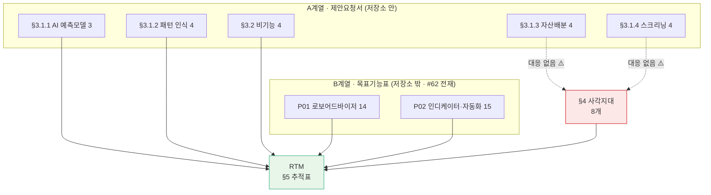

# 요구사항 추적표 (RTM) v1.0 — Qurious

| 항목 | 내용 |
|------|------|
| **문서 버전** | v1.0 |
| **작성일** | 2026-09-21 (KST) · S41 |
| **작성자** | 이동원 |
| **구분 (산출물 분류)** | 요구사항 관리 → 요구사항 추적표(RTM) |
| **실측 근거** | `python scripts/rtm_scan.py` (2026-09-21 실행) |
| **상태** | 요구 개수 확정 · 추적 구조 수립 · 설계 칸 대부분 공란(사실) |

> **RTM**(Requirements Traceability Matrix, 요구사항 추적표)
> — 요구 한 줄마다 「어느 설계 → 어느 코드 → 어느 시험 → 어느 결과」가 대응하는지
> **가로로 잇는 표**다. 이게 있어야 「이 요구는 구현됐는가」에 *증거로* 답할 수 있다.
> **이 문서에서는** 그 가로줄을 §5 의 표 한 행으로 본다.
> **헷갈리는 점**: RTM 은 진척률 보고서가 아니다. 진척률은 결과로 나오는 숫자일 뿐이고,
> RTM 의 본체는 **「이 요구의 증거가 어디에 있는가」라는 주소**다. 주소가 비어 있으면
> 구현이 없는 것이고, 주소가 틀리면 표 전체를 믿을 수 없게 된다.

---

## 1. 이 문서가 풀어야 했던 문제

이슈 [#62 §3.0](https://github.com/devlee328288/Qurious/issues/62) 이 이렇게 적어 두었다.

> 강사님 문서 머리글은 **P01 세부 14개 + P02 세부 13개 = 27개**인데, 열거된 항목을 세면
> P02 가 ①~⑤ 각 3개씩 15개라 합계 **29개**입니다.
> 🔴 **확인 필요**: 개수가 틀리면 **산출물 대장과 시험 단계 항목 번호가 전부 어긋납니다.**

산출물목록에도 「요구 개수가 어긋나 그 위에 표를 세울 수 없는 상태」로 적혀 있었다.
**이 문서는 그 매듭을 푸는 것이 첫 일이다.**

---

## 2. ★ 요구 개수 — 매듭을 푸는 방법은 "세는 것"이 아니었다

### 2.1 결론 세 줄

1. **요구 ID 를 계층 ID(`P01-①-1`)로 두면, 합계가 27이든 29든 산출물 번호가 흔들리지 않는다.**
   흔들릴 수 있었던 이유는 **순번(1…29)** 으로 부르려 했기 때문이다.
2. 합계는 **열거 기준 29개**를 정본으로 한다 (근거 §2.3).
3. 그런데 개수 논쟁보다 **훨씬 큰 것**이 나왔다 — 요구 문서가 **둘**이고,
   한쪽에만 있는 요구가 **8개** 더 있다 (§4). 29는 전부가 아니었다.

### 2.2 왜 개수가 번호를 흔든다고 봤는가

```
   [순번 방식]  요구 1, 2, 3, … 27       ← 합계가 29로 바뀌면
                  ↓                         모든 번호가 밀린다
   산출물 대장 "요구 14번 대응"          → 가리키는 대상이 바뀐다 🔴
   시험 항목   "요구 22번 검증"          → 가리키는 대상이 바뀐다 🔴


   [계층 방식]  P01-①-1, P01-①-2, … P02-⑤-3   ← 합계가 바뀌어도
                  ↓                                각 주소는 그대로
   산출물 대장 "P01-③-2 대응"           → 항상 「이탈률 리밸런싱」 🟢
   시험 항목   "P02-⑤-2 검증"           → 항상 「중복주문 방지」   🟢
```

**합계는 진척률을 낼 때만 쓰인다.** 주소로 쓰지 않으면 논쟁이 번호를 흔들지 못한다.
그래서 이 RTM 은 **어디에서도 순번을 쓰지 않는다.**

### 2.3 그래도 합계를 정해야 하는 이유와, 29를 고른 근거

진척률(「29개 중 3개가 시험까지 있다」)을 말하려면 분모가 필요하다.

| 후보 | 근거 | 채택 |
|------|------|:----:|
| **29 (열거 기준)** | #62 에 전재된 항목을 실제로 세면 P01 14 + P02 15. **열거는 검증 가능하다** | **✅** |
| 27 (머리글 합계) | 강사님 문서 머리글의 선언. 어느 2개가 묶였는지 **원문이 없어 확인 불가** | ❌ |

**누락보다 과배정이 안전하다.** 29로 두면 실제 요구가 27일 때 2개를 더 한 것이 되지만,
27로 두면 2개를 **아예 안 한 것**이 된다. 되돌릴 수 있는 쪽을 고른다.

> 🔴 **강사님께 여쭐 일** — P02 머리글의 13과 열거의 15 중 어느 쪽이 맞는지,
> 13이 맞다면 어느 2개가 묶인 것인지. (발표일·모의투자 기간과 함께 여쭙는다.)

### 2.4 ⚠️ 27이라는 숫자가 두 곳에서 나온다 — 혼동의 씨앗일 수 있다

저장소 안 제안요청서를 기계로 세어 봤더니 이렇다.

```
  docs/rfp-2.md 체크박스
      §3 요구사항     19개  ┐
      §6 산출물        8개  ┼─ 19 + 8 = 27
      §7.2 평가 기준   4개  │
      §9 제안 요건     4개  ┘
      ────────────────────
      합계            35개
```

**우연히 27이 나온다.** 목표기능표의 27과 같은 숫자다.
두 문서가 섞여 인용되면서 「27」이 무엇의 27인지 흐려졌을 가능성이 있다.
단정하지는 않는다 — 원문을 못 봤으므로 **가능성으로만 적어 둔다.**

---

## 3. 요구의 원천이 둘이다

이 프로젝트의 요구는 한 문서에서 오지 않는다. 이것을 구분하지 않으면 개수도 범위도 맞지 않는다.

| 계열 | 원천 | 저장소 안에 있나 | 개수 | 성격 |
|------|------|:---------------:|:----:|------|
| **A계열** | `docs/rfp-1.md` · `docs/rfp-2.md` (제안요청서) | 🟢 있다 — **기계로 셀 수 있다** | 요구 19 (+산출물 8·평가 4·역량 4) | 발주 문서. 기법 수준까지 지정 |
| **B계열** | 강사님 목표기능표 (P01/P02 세부기능) | 🔴 **없다** — #62 에 전재된 것만 | 29 | 기능 단위. 파트 배정의 기준 |



> **왜 B계열을 주축으로 두는가** — 파트 배정(#62)과 평가가 B계열 기준으로 돌아간다.
> A계열은 §6 의 대응표로 잇고, **대응이 없는 것은 §4 에 따로 세운다.**

---

## 4. 🔴 가장 큰 발견 — 29는 전부가 아니었다

A계열을 B계열에 대응시키다 보니, **B계열 어디에도 대응이 없는 A계열 요구가 8개** 나왔다.

### 4.1 사각지대 8개

| A계열 요구 (rfp-2) | B계열 대응 | 코드 실측 | 판정 |
|--------------------|:---------:|-----------|:----:|
| §3.1.3-① 평균-분산 최적화(Markowitz) | **없음** | `markowitz`·`mean-variance` **0줄**, `cvxpy`·`PyPortfolioOpt` **0줄** | 🔴 |
| §3.1.3-② 리스크 패리티·최소분산 | **없음** | `risk parity` 4줄 — **전부 `public/app.html` 설명 문구** | 🔴 |
| §3.1.3-③ Black-Litterman (투자자 뷰) | **없음** | `black-litterman` 3줄 — **전부 화면 설명·용어사전 문구** | 🔴 |
| §3.1.3-④ 동적 자산배분(국면별 재조정) | P01-③-1 부분 | 리밸런싱 `rebalanc` **0줄** | 🔴 |
| §3.1.4-① 팩터 스크리닝(가치·모멘텀·퀄리티·저변동성) | **없음** | `momentum` 18줄 있으나 **팩터 체계 없음**, `quality` 0줄 | 🟠 |
| §3.1.4-② 재무제표 필터링(PER·PBR·ROE·부채비율) | **없음** | `stocks.py:140` — **야후 `quoteSummary` 조회**뿐, 필터 기준 없음 | 🟠 |
| §3.1.4-③ 기술적 스크리닝(정배열·52주 신고가) | **없음** | `investment_research.py:110` 패턴 스크리닝 일부 | 🟠 |
| §3.1.4-④ 랭킹 시스템(복합 점수) | **없음** | `ml.py:118` 샤프+Ridge 스코어링 — **단일 점수, 복합 아님** | 🟠 |

### 4.2 ⚠️ 화면은 있는데 계산이 없다

가장 주의할 대목이다.

```
  public/app.html:2521   "자산배분 모델"           화면 있음 🟢
  public/app.html:2536   "블랙-리터만"              설명 있음 🟢
  public/app.html:2547   "Risk Parity"             설명 있음 🟢
  public/app.html:1690   "AI가 최적 자산배분 비율을 계산합니다"   ← 문구 🟢
            │
            ▼  이 화면이 실제로 부르는 것
  app/routes/ml.py:85    POST /robo/allocation
  app/routes/ml.py:95        base_alloc = {
                                "conservative": {국내주식 15, 해외주식 10, …},
                                "moderate":     {국내주식 30, 해외주식 25, …},
                                "aggressive":   {국내주식 45, 해외주식 35, …},
                             }[risk]            ← 🔴 위험성향 3택 하드코딩 표
                             + 투자기간에 따라 ±horizon_boost
```

**최적화가 아니라 조회표다.** 공분산도, 목적함수도, 제약조건도 없다.
화면은 "AI가 최적 자산배분 비율을 계산합니다"라고 말하고 있다.

> 🟢 **종목 스코어링은 실재한다** — 같은 엔드포인트의 `_screen()` 은 유니버스 ~30종목을
> 실제로 훑어 샤프비율 + Ridge 회귀 예측을 스코어링한다(`ml.py:113~`). 이건 빈 껍데기가 아니다.
> 다만 **자산군 비중 결정**과 **종목 선정**은 별개이고, 비어 있는 쪽은 앞엣것이다.

### 4.3 이 8개를 어떻게 처리할 것인가

| 선택지 | 뜻 | 위험 |
|--------|-----|------|
| **A. 요구로 인정하고 RTM 에 올린다** | 총 요구 = 29 + 8 = **37** | 범위가 늘어 4주에 안 들어갈 수 있다 |
| B. B계열(29)만 요구로 본다 | 목표기능표가 최신 지시라고 본다 | rfp-2 §3.1.3 이 **명시 요구인데 미충족**으로 남는다 |
| C. 강사님께 여쭙고 정한다 | 가장 정확 | 답을 기다리는 동안 결정이 미뤄진다 |

**이 문서는 A를 택해 §5 표에 올리되, 구분 칸으로 갈라 둔다.** 근거는 §2.3 과 같다 —
누락보다 과배정이 안전하고, 빼는 것은 나중에 한 줄이면 된다.
🔴 다만 **범위 조정은 사용자·팀 결정 사안**이라 §8 에 결정 항목으로 남긴다.

---

## 5. 추적표 — B계열 29개

> 실측: `python scripts/rtm_scan.py` (2026-09-21) · 시험 23건
> **상태의 뜻** — 🟢 코드+시험 / 🟡 코드 있음(시험 없음) / 🟠 코드 희소 / 🔴 흔적 없음
> ⚠️ **이 상태는 「흔적이 있는가」이지 「제대로 동작하는가」가 아니다.** §7 참조.

| 요구 ID | 요구 내용 | 파트 | 설계 | 코드 (대표) | 시험 | 상태 |
|---------|-----------|:----:|------|-------------|------|------|
| `P01-①-1` | 용어사전·연관개념 탐색 | P-A | — | — | — | 🔴 흔적 없음 |
| `P01-①-2` | 가격·거래량·재무·뉴스 수집·분류·전처리·검색 | P-A | `pipeline.md` | `collector/` 21파일 70줄 | — | 🟡 |
| `P01-①-3` | 근거문서·출처 포함 RAG 질의응답 | P-A | — | `app/services/rag_pipeline.py` (87줄) | — | 🟡 ⚠️ `citations` 항상 `[]` (#61 P1-3) |
| `P01-①-4` | 갱신일·문서버전·캘린더·정기배치 | P-A | — | `collector/sources/dart.py` · `celery_app.py` | — | 🟡 |
| `P01-①-5` | XAI 로 추천 이유를 쉬운 말로 설명 | P-D | — | — | — | 🔴 흔적 없음 |
| `P01-②-1` | MA·RSI·MACD·볼린저·거래량 지표 | P-B | — | `app/services/stock.py` (119줄) | — | 🟡 ⚠️ **강사님 원본과 바이트 동일 — 공적 계상 금지**(#62) |
| `P01-②-2` | 캔들패턴·지지·저항·돌파·골든크로스 | P-B | — | `lean_backtest.py` (29줄) | — | 🟡 |
| `P01-②-3` | 분·일·주봉 종합 → 신호 + 신뢰도 | P-B | — | `investment_research.py` (25줄) | — | 🟡 |
| `P01-③-1` | 시간 기반 리밸런싱 (월·분기·연) | P-C | — | — | — | 🔴 흔적 없음 |
| `P01-③-2` | 이탈률 기반 리밸런싱 | P-C | — | — | — | 🔴 `target_weight`·`drift_tolerance` **칸 자체가 없음** |
| `P01-③-3` | 입출금·배당금 기반 리밸런싱 | P-C | — | `collector/total_return.py` (16줄) | — | 🟡 배당만 · 입출금 없음 |
| `P01-④-1` | 거래비용·슬리피지 반영 수익률·MDD·샤프 | P-D | — | `app/services/trading_cost.py` (74줄) | — | 🟡 ⚠️ **샤프 정의 4개 공존**(#62) |
| `P01-④-2` | 신호 → 매수·매도·보유 의견 변환 | P-C | — | — | — | 🔴 흔적 없음 |
| `P01-④-3` | 모의 주문 체결·포트폴리오 운용 | P-E | **ADR-0001** | `app/routes/stocks.py` · `paper_trading.py` | **TC-LT-01~10** | 🟢 ⚠️ 체결가 소스가 야후 |
| `P02-①-1` | 기본 인디케이터 지표계산 | P-B | — | `app/services/stock.py` (110줄) | — | 🟡 (`P01-②-1` 과 같은 코드) |
| `P02-①-2` | 조건조합·손절·익절·포지션크기 | P-B | — | `public/app.html` 3줄뿐 | — | 🟠 사실상 없음 |
| `P02-①-3` | 백테스트로 기준전략 선정 | P-D | — | `lean_backtest.py` (85줄) | — | 🟡 |
| `P02-②-1` | 커스텀 인디케이터 정규화 산식 | P-B | — | `app/routes/stocks.py` (31줄) | — | 🟡 |
| `P02-②-2` | 미래데이터 참조 방지·실시간갱신·단위테스트 ★ | P-B | — | **주석 1줄뿐** | — | 🟠 **★ 3차 채점 항목인데 사실상 없음** |
| `P02-②-3` | 인디케이터 API 제공·버전 저장 | P-B | — | `public/app.html` (9줄) | — | 🟡 버전 테이블 없음 |
| `P02-③-1` | Pine 지표·전략 구현 | P-B | — | `public/app.html` (21줄) | — | 🟡 ⚠️ `indicator()` 라 Strategy Tester 안 켜짐 |
| `P02-③-2` | Strategy Tester → LEAN 교차검증 | P-D | — | `lean_backtest.py` (68줄) | — | 🟡 **전략집합 교집합 0**(#62) |
| `P02-③-3` | 알림·Webhook | P-B | — | `app/routes/notification.py` (118줄) | — | 🟡 수신부는 보류(#62 §3.4) |
| `P02-④-1` | 동일 데이터·기간·수수료 조건 ★ | P-A+P-D | — | `trading_cost.py` (61줄) | **TC-YH-01~02** | 🟢 ⚠️ 야후 직호출 제거 대상 |
| `P02-④-2` | 누적수익률·MDD·샤프·승률 | P-D | — | `quant_pipeline.py` (12줄) | — | 🟡 승률 산출 없음 |
| `P02-④-3` | TradingView vs LEAN 비교 | P-D | — | **1줄** | — | 🟠 사실상 없음 |
| `P02-⑤-1` | 신호 → 계좌·시세·주문 | P-E | **ADR-0001** | `app/routes/stocks.py` · `brokers/` | **TC-LT-01~10** | 🟢 |
| `P02-⑤-2` | 중복주문 방지·손실한도·비상정지 ★ | P-E | — | **주석 1줄뿐** (`idempotent` 단어) | — | 🟠 **★ 사고 방지인데 사실상 없음** |
| `P02-⑤-3` | 실행일정·배포·로그·장애알림 | P-E | `CI-CD명세 v1.2` | `docker-compose.yml` · `celery_app.py` | — | 🟡 장애알림 없음 · ⚠️ **CI 없음**(ADR-0003) |

### 5.1 A계열 사각지대 8개 (§4)

| 요구 ID | 요구 내용 | 파트 | 설계 | 코드 | 시험 | 상태 |
|---------|-----------|:----:|------|------|------|------|
| `RFP2-3.1.3-①` | 평균-분산 최적화(Markowitz) | P-C | — | — | — | 🔴 |
| `RFP2-3.1.3-②` | 리스크 패리티·최소분산 | P-C | — | 화면 설명 문구만 | — | 🔴 |
| `RFP2-3.1.3-③` | Black-Litterman (투자자 뷰) | P-C | — | 화면 설명 문구만 | — | 🔴 |
| `RFP2-3.1.3-④` | 동적 자산배분(국면별 재조정) | P-C | — | — | — | 🔴 |
| `RFP2-3.1.4-①` | 팩터 스크리닝(가치·모멘텀·퀄리티·저변동성) | P-C | — | `ml.py` 부분 | — | 🟠 |
| `RFP2-3.1.4-②` | 재무제표 필터링(PER·PBR·ROE·부채비율) | P-C | — | `stocks.py:140` 조회만 | — | 🟠 |
| `RFP2-3.1.4-③` | 기술적 스크리닝(정배열·52주 신고가) | P-C | — | `investment_research.py:110` | — | 🟠 |
| `RFP2-3.1.4-④` | 랭킹 시스템(복합 점수) | P-C | — | `ml.py:118` 단일 점수 | — | 🟠 |

> 🔴 **8개가 전부 P-C 한 파트에 몰린다.** 이 사각지대를 요구로 인정하면 P-C 의 부하가
> 리밸런싱 3종 + 자산배분 4 + 스크리닝 4 = **11개**가 된다. §8 결정 항목 2번.

---

## 6. A계열 ↔ B계열 대응표

| A계열 (rfp-2) | 개수 | B계열 대응 | 비고 |
|---------------|:----:|-----------|------|
| §3.1.1 AI 예측모델 | 3 | `P01-②-3` · `P01-①-2` · `P01-④-1` | 학습 파이프라인·성능지표로 흡수 |
| §3.1.2 패턴 인식 | 4 | `P01-②-2` · `P01-②-3` | ⚠️ **딥러닝 패턴(CNN 차트 이미지)은 대응 없음** |
| §3.1.3 자산배분 | 4 | **없음** | → §4 사각지대 |
| §3.1.4 스크리닝 | 4 | **없음** | → §4 사각지대 |
| §3.2 비기능 | 4 | 전 요구 공통 | 데이터 소스·Python 3.10+·재현성·문서화 |
| §6.1 필수 산출물 | 6 | `docs/산출물목록.md` 가 관리 | 요구가 아니라 산출물 |
| §6.2 선택 산출물 | 2 | 〃 | 대시보드·자동화 파이프라인 |
| §7.2 프로세스 평가 | 4 | 평가 기준 | 요구가 아님 |
| §9 제안 요건 | 4 | 팀 역량 | 요구가 아님 |
| **합계** | **35** | | **요구로 셀 것은 §3 의 19개** |

### 6.1 §3.2 비기능 요구 — 현재 상태

| # | 비기능 요구 | 실측 | 판정 |
|---|------------|------|:----:|
| 1 | 데이터 소스: KRX·Yahoo·FDR 등 공개 데이터 | 수집 DB 1,340만 행 (KRX·DART) | 🟢 |
| 2 | 구현 언어: Python 3.10 이상 | 3.12 (CI 도 3.12) | 🟢 |
| 3 | 재현 가능성: 코드·시드 고정, 결과 재현 | ⚠️ 시드 고정 미확인 · HF 복구 리허설은 성공 | 🟡 |
| 4 | 문서화: 설계 문서·분석 보고서·코드 주석 | 산출물 10구분 중 6구분 착수 · 한국어 주석 관행 | 🟡 |

---

## 7. 이 표를 믿어도 되는 범위

**정직하게 적는다.** RTM 이 가장 위험할 때는 틀렸을 때가 아니라 **맞다고 믿길 때**다.

| 이 표가 답하는 것 | 이 표가 답하지 **못하는** 것 |
|------------------|---------------------------|
| 이 요구의 코드가 저장소 어디에 있는가 | 그 코드가 **제대로 동작하는가** |
| 시험이 붙어 있는가 | 시험이 **충분한가** |
| 요구가 몇 개이고 어디서 왔는가 | 요구가 **옳은가** |

### 7.1 실제로 겪은 거짓 양성 두 건

스캐너를 만들면서 판정이 두 번 뒤집혔다. 남겨 둔다 — 같은 함정에 다시 빠지지 않게.

| # | 증상 | 원인 | 고침 |
|---|------|------|------|
| 1 | 「리밸런싱 코드 0건」이 **1건**으로 나옴 | **스캐너 자신**이 훑는 대상에 들어갔다. 탐지 패턴 문자열 `r"rebalanc"` 가 흔적으로 잡힘 | 스캐너 파일을 제외 |
| 2 | 「중복주문 방지」가 **2건** 있는 것으로 나옴 | 둘 다 **주석 속 `idempotent` 단어**였다. 구현은 0건 | 코드줄·주석줄을 갈라 셈 |

> **2번이 특히 중요하다.** 말이 있다고 장치가 있는 것은 아니다.
> 「중복주문 방지·손실한도·비상정지」는 사고를 막는 항목인데, 저장소에는 그 **이름만** 있었다.

### 7.2 갱신 방법

```bash
python scripts/rtm_scan.py          # 사람이 읽는 표
python scripts/rtm_scan.py --md     # 이 문서 §5 에 붙일 마크다운
python scripts/rtm_scan.py --json   # 기계용
```

요구가 늘거나 탐지 규칙이 바뀌면 `scripts/rtm_scan.py` 의 `B계열` 목록을 고친다.
**표를 손으로 고치지 않는다** — 손으로 고친 표는 다음 달에 거짓이 된다.

---

## 8. 커버리지 요약

```
  B계열 29개 · 판정 분포
  ──────────────────────────────────────────────────────
  🟢 코드+시험        ███░░░░░░░░░░░░░░░░░░░░░░░░░░   3개  (10%)
  🟡 코드 있음        █████████████████░░░░░░░░░░░░  17개  (59%)
  🟠 코드 희소        ████░░░░░░░░░░░░░░░░░░░░░░░░░   4개  (14%)
  🔴 흔적 없음        █████░░░░░░░░░░░░░░░░░░░░░░░░   5개  (17%)
  ──────────────────────────────────────────────────────
  시험이 붙은 요구      3 / 29  = 10%      ← 가장 낮은 칸
  A계열 사각지대        8개 (§4) — 인정하면 분모가 37
```

```
  파트별 부하 (B계열 29 + 사각지대 8 = 37 기준)
  ──────────────────────────────────────────────────────
  P-A 데이터      ████░░░░░░░░░░░░░░░░░   5개
  P-B 지표·Pine   ███████████░░░░░░░░░░  11개
  P-C 배분·리밸    ███████████░░░░░░░░░░  11개  ← 사각지대 8개가 전부 여기
  P-D 성과·검증    ████████░░░░░░░░░░░░░   8개
  P-E 안전·실행    ████░░░░░░░░░░░░░░░░░   4개
  ──────────────────────────────────────────────────────
  ⚠️ 사각지대를 인정하면 P-C 가 3개 → 11개로 뛴다
```

### 8.1 ★ 가장 위험한 칸 세 개

| 요구 | 왜 위험한가 |
|------|------------|
| `P02-⑤-2` 중복주문 방지·손실한도·비상정지 | **사고 방지 항목인데 이름만 있다.** 주석 1줄이 전부 |
| `P02-②-2` 미래데이터 참조 방지·단위시험 | **3차 채점 항목**(#62)인데 주석 1줄이 전부 |
| `RFP2-3.1.3-①~④` 자산배분 4모델 | **화면은 "AI가 계산합니다"라고 말하는데 하드코딩 3택 표다** (§4.2) |

---

## 9. 결정이 필요한 것

| # | 항목 | 누가 | 왜 지금 |
|---|------|------|---------|
| 1 | P02 요구가 **13개인가 15개인가** (머리글 vs 열거) | 강사님께 문의 | 분모가 정해져야 진척률이 선다. 🟡 **다만 §2.2 대로 번호는 이미 안전하다** |
| 2 | A계열 사각지대 **8개를 요구로 인정할 것인가** | 사용자·팀 | 인정하면 P-C 부하가 3 → 11. 4주 일정에 직접 영향 |
| 3 | 자산배분 화면 문구를 **어떻게 할 것인가** | 사용자·팀 | "AI가 최적 비율을 계산합니다"가 현재 사실과 다르다. 구현하거나 문구를 고치거나 |

> 3번은 발표에서 질문이 나올 수 있는 칸이다. **구현 전이라면 문구를 먼저 고치는 것이
> 안전하다** — 화면이 실제보다 더 말하는 상태로 시연하는 것이 가장 나쁘다.

---

## 10. 참조

- `scripts/rtm_scan.py` — 이 표의 실측 근거 (다시 돌릴 수 있다)
- `docs/rfp-1.md` · `docs/rfp-2.md` — A계열 원천
- 이슈 [#62](https://github.com/devlee328288/Qurious/issues/62) — B계열 전재 · 파트 배정 · 27 vs 29 제기
- 이슈 [#61](https://github.com/devlee328288/Qurious/issues/61) — 격차 진단 (코드 실측의 출처)
- `docs/시험/테스트계획서_v1.0.md` — TC-LT · TC-YH
- `docs/ADR/ADR-0001-실거래-주문-경로-차단.md` — `P01-④-3` · `P02-⑤-1` 의 설계 근거
- `docs/산출물목록.md` — 정본 인덱스
