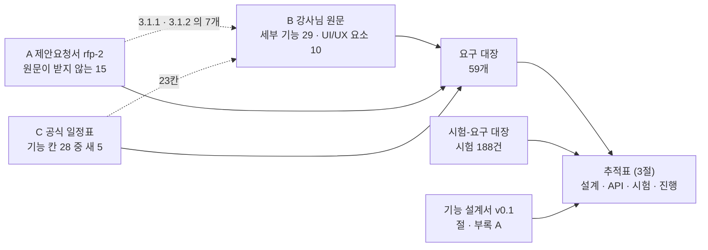
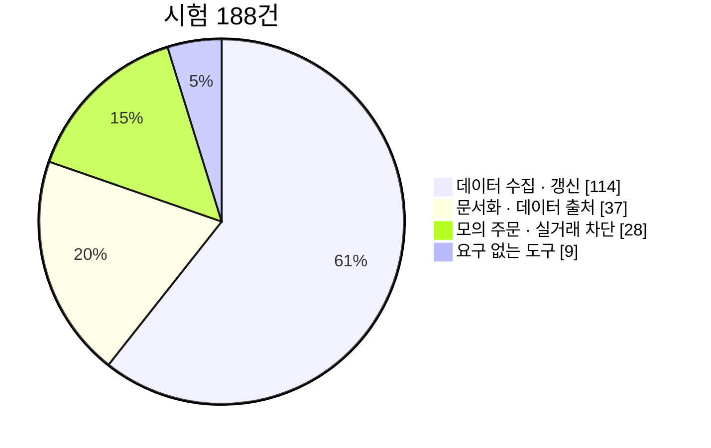
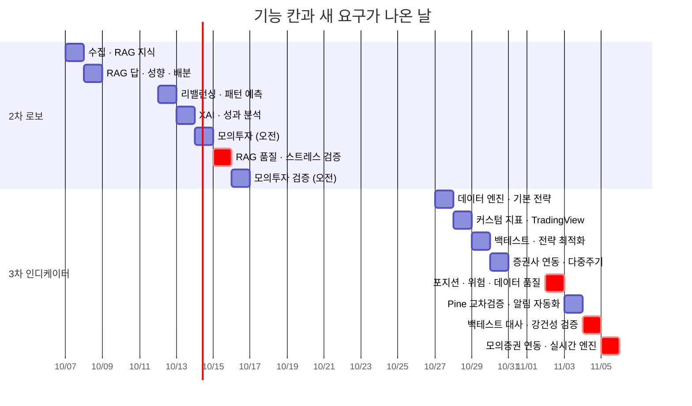

# 요구사항 추적표(RTM) v1.1 — Qurious

| 문서 정보 | |
|---|---|
| **판 · 상태** | v1.1 · 초안(검토 전) |
| **구분** | 2. 요구사항 관리 — 요구사항 정의(요구 한 줄 · 관행 명칭 「요구사항정의서」) · 요구사항 추적표 |
| **작성** | 이동원(데이터 파트) |
| **검토** | 검토 전 |
| **최종 수정** | 2026-09-29 (KST) |
| **기준** | 코드 `main` `e8e79fc` + 이 판과 같은 PR 의 스캐너 수정 · 시험 188건(2026-09-29 수집) · [기능 설계서 v0.1](../설계/기능설계_v0.1.md) · 강사님 원문과 공식 일정표 `e63e675` |
| **관련 문서** | [요구 대장](요구-대장.tsv) · [시험-요구 대장](시험-요구대장.tsv) · [기능 설계서 v0.1](../설계/기능설계_v0.1.md) · [API 명세서 v0.1](../인터페이스/API명세서_v0.1.md) · [테스트 계획서 v1.3](../시험/테스트계획서_v1.3.md) · [강사님 자료 기능 대조 v0.1](강사님자료-기능대조_v0.1.md) · [RTM v1.0](RTM_v1.0.md) |
| **최근 개정** | v1.0 → v1.1: 요구 한 줄 칸(유형 · 검증 방법 · 관련 요구)을 대장으로 · 원문 UI 요소 · 제안요청서 비기능 · 공식 일정표 새 요구를 더해 59개 · 설계 칸 = 기능 설계서 절 · 시험 188건을 다시 붙임 — 전체는 부록 D |

> **이 문서가 답하는 질문**
> 1. 이 프로젝트가 지켜야 할 요구는 몇 개이고 어디서 왔나 (1절)
> 2. 요구마다 「됐다」 를 무엇으로 확인하나 — 유형 · 검증 방법 (2절)
> 3. 요구 → 설계 → API → 시험이 어디까지 이어졌나 (3절 · 4절)
> 4. 어디가 비었고, 누가 무엇을 정해야 하나 (5절 · 6절 · 7절)
>
> **읽는 순서** — 팀원: 요약 → 3절 추적표에서 내가 맡을 요구의 줄 → [기능 설계서](../설계/기능설계_v0.1.md)의 그 절 ·
> 강사님: 요약 → 1절 → 4절 → 6절 · 처음 온 사람: 부록 A 용어 → 1절 → 2.1절

## 요약

1. 요구는 **59개**다 — 강사님 원문 39(세부 기능 29 · UI/UX 필요 요소 10) · 제안요청서 15(원문 세부 기능 표에 없는 자산배분 · 스크리닝 8 · 비기능 4 · 제외 범위 3) · 강사님 공식 일정표 5(두 원천이 받지 않는 기능 칸). 확정 46 · 제안 13 이고, 제안 13개는 팀이 요구로 셀지 정한다(7절 ① ②).
2. 시험 188건 가운데 179건이 요구 11개에 붙는다. 원문 세부 기능 29개 중 시험이 붙은 요구는 **6개**(직접 4 · 전제만 2)이고, 모두 데이터 수집 · 갱신 · 모의 주문 · 실거래 차단 쪽이다. 채점 · 사고 방지 항목 셋(미래 데이터 참조 방지 · 같은 조건의 LEAN 백테스트 · 중복 주문 방지)에는 직접 재는 시험이 없고, 그중 둘은 코드도 주석뿐이다.
3. 요구마다 설계(기능 설계서 절 또는 설계 문서) · 받는 API · 검증 방법이 이어졌다. 빈 칸은 셋이다 — **시험이 없는 요구 48개**(그중 제약 3개는 사람이 검사해 확인했다) · **설계가 없는 요구 4개**(일정표에서 새로 온 3개와 파이썬 판 제약 1개) · **파트**(역할 희망 논의 D9 결론 뒤에 채운다).

---

## 1. 요구는 어디서 오나

### 1.1 원천 세 계열

표 1 은 「요구가 어느 문서에서 왔고, 그 문서를 어디서 읽을 수 있나」 에 답한다.

**표 1. 요구의 원천 세 계열**

| 계열 | 원천 | 어디서 읽나 | 요구 | ID 모양 | 성격 |
|---|---|---|--:|---|---|
| B 강사님 원문 | 목표 기능의 세부 기능 29 + UI/UX 필요 요소 10 | 강사님 저장소 th07 `frontend/days/04.html` (`e63e675`) — 팀 저장소 밖이라 로컬에서 읽는다 | 39 | `P01-①-1` · `U1` | 기능 단위. 역할 희망 논의(D9)의 카드 ID 와 같다 |
| A 제안요청서 | `rfp-2` 3절 요구사항 19 + 4.2절 제외 범위 3 | [`docs/rfp-2.md`](../rfp-2.md) · [`docs/rfp-1.md`](../rfp-1.md)(같은 과제의 요약판) | 15 | `RFP2-3.1.3-①` | 발주 문서 — 기법 수준까지 지정. 나머지 7개는 원문 세부 기능이 받는다(표 3) |
| C 강사님 공식 일정표 | 2차 25칸 · 3차 30칸 가운데 기능 칸 28 | 강사님 저장소 th07 `frontend/assets/day4-project-schedule.js` (`e63e675`) | 5 | `SCH-DQ` | 반나절마다 보여 줄 산출물. 23칸은 A · B 가 받는다(5절) |

그림 1 은 「세 원천이 어떻게 요구 대장 한 곳으로 모이고, 추적표가 무엇을 잇나」 에 답한다. 범례: 실선 = 요구가 들어온다 · 점선 = 다른 계열이 이미 받아서 새 요구가 되지 않는다.

**그림 1. 요구가 모이는 길 — 원천 → 대장 → 추적표**



요구는 세 원천에서 오지만 한 곳(요구 대장)에 모이고, 추적표는 그 대장에 설계서와 시험을 이어 붙인다.

### 1.2 요구 개수 — 합계는 세는 것, 주소는 ID

요구 ID 는 원천의 번호 구조를 딴 **계층 ID** 다(`P01-③-2` = 원문 PROJECT 01 · 목표 기능 ③ · 세부 기능 2). 순번(1…59)으로 부르지 않으므로 요구가 늘거나 줄어도 다른 요구의 주소가 밀리지 않는다. 합계는 진행률을 낼 때만 쓴다.

원문 머리글은 세부 기능을 P01 14 · P02 13 = 27 이라고 적지만, 열거된 항목을 세면 P02 가 목표 기능 ①~⑤ 각 3개라 15 이고 합계는 29 다. 이 문서는 **열거 기준 29** 를 쓴다 — 29 로 두면 실제가 27 일 때 둘을 더 한 것이 되고, 27 로 두면 둘을 아예 안 한 것이 된다. 어느 둘이 묶였는지는 강사님께 여쭌다(7절 ③).

표 2 는 「요구가 계열 · 차수별로 몇 개인가」 에 답한다.

**표 2. 계열 · 차수별 요구 수**

| 계열 | 2차 | 3차 | 공통 | 합계 |
|---|--:|--:|--:|--:|
| B 원문 세부 기능 | 14 | 15 | — | 29 |
| B 원문 UI/UX 필요 요소 | 5 | 5 | — | 10 |
| A 제안요청서 | 8 | — | 7 | 15 |
| C 공식 일정표 | 1 | 3 | 1 | 5 |
| **합계** | **28** | **23** | **8** | **59** |

표 3 은 「제안요청서의 요구 35칸이 이 문서의 어느 요구로 가나」 에 답한다. 체크박스 35개(`python scripts/rtm_scan.py` 가 센다) 가운데 3절 요구사항 19개와 4.2절 제외 범위 3줄이 요구다.

**표 3. 제안요청서 `rfp-2` → 요구**

| `rfp-2` 절 | 칸 | 받는 요구 | 빈 곳 |
|---|--:|---|---|
| 3.1.1 AI 예측 모델 | 3 | `P01-②-3` · `P01-①-2` · `P01-④-1` | 머신러닝 · 딥러닝 가격 예측 모델을 따로 받는 세부 기능은 없다 — 신호(`P01-②-3`)로 받는다 |
| 3.1.2 패턴 인식 | 4 | `P01-②-2` · `P01-②-3` | **딥러닝 패턴 인식(CNN 차트 이미지 · LSTM)은 받는 요구가 없다**(7절 ⑥) |
| 3.1.3 자산배분 | 4 | `RFP2-3.1.3-①` ~ `④` | 원문 세부 기능 표에는 없고 **목표 기능 ③ 머리글**이 말한다 |
| 3.1.4 스크리닝 | 4 | `RFP2-3.1.4-①` ~ `④` | 같음 |
| 3.2 비기능 | 4 | `RFP2-3.2-①` ~ `④` | — |
| 4.2 제외 범위 | 3줄 | `RFP2-4.2-①` ~ `③` | 체크박스가 아니라 목록이다 — 「하지 않는다」 는 제약(CO) |
| 6 산출물 · 7.2 평가 · 9 제안 요건 | 16 | [산출물목록](../산출물목록.md) · 평가 기준 · 팀 역량 | 요구가 아니다 |

---

## 2. 요구 목록 — 요구 한 줄

### 2.1 칸 읽는 법

표 4 는 「요구 한 줄의 칸마다 무엇을 적고, 어떤 말만 쓰나」 에 답한다. 칸은 [문서 작성 기준 v0.1](../문서작성기준_v0.1.md) 5.2절을 따르고, 값은 [요구 대장](요구-대장.tsv)에 사람이 적는다 — 아래 표는 스캐너가 대장에서 다시 채운다.

**표 4. 요구 한 줄의 칸**

| 칸 | 뜻 | 쓰는 말 | 근거 |
|---|---|---|---|
| 요구 ID | 원천의 번호 구조를 딴 ID — 한 번 붙이면 바꾸지 않는다 | `P01-①-1` · `U1` · `RFP2-3.2-①` · `SCH-DQ` | 기준 원칙 ⑤ |
| 내용 | **검증할 수 있는 한 문장** — 「쉽게」 「빠르게」 같은 말 없이 | — | 기준 5.2 · 요구 특성 「검증 가능」 [R13] |
| 유형 | FR 기능 · PR 성능 · QR 품질 · IR 인터페이스 · DR 데이터 · OR 운영 · CO 제약 | 일곱 기호 | 요구사항 작성 가이드(2011) [R15] |
| 출처 | 원문의 칸 · 제안요청서 절 · 일정표 칸 | 원문 = th07 `04.html` | 요구 속성 「출처」 [R12] |
| 우선 | 필수 · 선택 · 미정(팀이 정한다) | 세 가지 | 요구 속성 「우선순위」 [R12] |
| 상태 | 확정(원천에 있고 팀이 받아들임) · 제안(팀이 요구로 셀지 정하기 전) | 두 가지 | 구현이 어디까지 왔는지는 3절 「진행」 칸이 따로 적는다 |
| 검증 방법 | 시험 · 시연 · 검사 · 분석 — 둘이면 주된 것을 앞에 | 네 가지 | 요구 속성 「검증 방법」 [R12] |
| 관련 요구 | 같은 코드 · 같은 화면을 쓰거나 먼저 있어야 하는 요구 | 요구 ID | 요구사항 작성 가이드 「관련 요구사항」 [R15] |
| 파트 | **이 판에는 없다** — 역할 희망 논의(D9) 결론 뒤 v1.2 에서. 역할 분배안 v1.0 의 제안 파트는 [기능 설계서](../설계/기능설계_v0.1.md) 2.3절에 있다 | — | 역할을 문서가 앞질러 정하지 않는다 |

`[R12]` 같은 출처 번호는 [문서 작성 기준 v0.1](../문서작성기준_v0.1.md) 부록 A 의 것이다.

### 2.2 원문 PROJECT 01 — 로보 어드바이저 (2차)

아래 표는 「2차 세부 기능 14개가 각각 무엇을 하면 되는가」 에 답한다.

<!-- rtm_scan:요구-P01 -->
**원문 PROJECT 01 로보 어드바이저 (2차) — 세부 기능 · 14개**

| 요구 ID | 이름 | 내용 (검증할 수 있는 한 문장) | 유형 | 출처 | 우선 | 상태 | 관련 요구 |
|---|---|---|:-:|---|:-:|:-:|---|
| `P01-①-1` | 주식 · 금융 · 경제 기본 용어사전과 연관 개념 탐색 | 화면의 금융 용어를 누르면 서버가 뜻 · 쉬운 뜻 · 연관 용어를 돌려주고, 용어를 검색할 수 있다 | FR | 원문 P01 ① 세부 1 | 필수 | 확정 | `P01-①-3` · `P01-①-5` |
| `P01-①-2` | 가격 · 거래량 · 재무 · 뉴스 등 투자 자료 수집 · 분류 · 전처리 · 검색 | 국내 상장 종목의 일별 가격 · 거래량을 매 거래일 수집 DB 에 적재하고, 앱은 그 값을 데이터 기준일(as_of)과 함께 돌려주며, 재무 · 뉴스는 출처와 함께 분류해 검색할 수 있다 | DR | 원문 P01 ① 세부 2 · rfp-2 §3.1.1 | 필수 | 확정 | `P01-①-4` · `P02-④-1` · `SCH-DQ` |
| `P01-①-3` | 근거 문서와 출처를 포함한 RAG 질의응답 | 질문의 답에 근거로 쓴 문서 조각의 제목 · 위치가 번호와 함께 붙고, 답 안의 [출처 n] 과 번호가 맞는다 | FR | 원문 P01 ① 세부 3 | 필수 | 확정 | `P01-①-1` |
| `P01-①-4` | 금융정보의 갱신일 · 문서 버전 · 캘린더 일정 관리와 정기 배치 실행 | 정기 배치가 매 거래일 한 번 돌고, 표마다 마지막 데이터 기준일 · 배치 결과 · 그날이 거래일인지를 API 와 화면으로 볼 수 있다 | OR | 원문 P01 ① 세부 4 | 필수 | 확정 | `P01-①-2` · `P02-⑤-3` · `SCH-DQ` |
| `P01-①-5` | XAI 로 투자 추천 이유를 쉬운 말로 설명 | 추천 · 신호마다 그렇게 판단한 근거(지표 값 · 규칙 · 기여도)를 한두 문장으로 보여 준다 | FR | 원문 P01 ① 세부 5 | 필수 | 확정 | `P01-②-3` · `P01-④-2` · `P01-①-1` |
| `P01-②-1` | OHLCV 로 이동평균 · RSI · MACD · 볼린저 밴드 · 거래량 지표 계산 | 같은 OHLCV 에서 계산한 기본 지표 값이 TradingView 정의(RSI = Wilder 평활 · 표준편차 = 모집단)와 같다 | FR | 원문 P01 ② 세부 1 | 필수 | 확정 | `P02-①-1` · `P02-②-2` |
| `P01-②-2` | 캔들 패턴 · 지지선 · 저항선 · 돌파 · 골든크로스 등 차트 패턴 탐지 | 정한 패턴(골든크로스 · 신고가 돌파 · 캔들 5종 · 지지/저항)을 종목별로 탐지하고, 패턴이 나온 횟수와 그 뒤 5거래일 수익률 통계를 낸다 | FR | 원문 P01 ② 세부 2 · rfp-2 §3.1.2 | 필수 | 확정 | `P01-②-3` · `RFP2-3.1.4-③` |
| `P01-②-3` | 분봉 · 일봉 · 주봉 지표를 종합해 매수 · 매도 · 관망 신호와 신뢰도 산출 | 여러 주기의 지표를 합쳐 종목마다 매수 · 매도 · 관망 신호와 0~1 신뢰도를 매 거래일 한 번 계산해 기록한다 | FR | 원문 P01 ② 세부 3 · rfp-2 §3.1.2 | 필수 | 확정 | `P01-④-2` · `P01-①-5` · `SCH-RT` |
| `P01-③-1` | 월 · 분기 · 연 주기가 오면 실행하는 시간 기반 리밸런싱 | 정한 주기가 오면 목표 비중으로 되돌리는 주문 계획을 만들고, 계획 · 체결 · 비용을 이력으로 남긴다 | FR | 원문 P01 ③ 세부 1 | 필수 | 확정 | `P01-③-2` · `P01-③-3` · `RFP2-3.1.3-④` · `U5` |
| `P01-③-2` | 목표 비중의 허용 이탈률을 넘으면 실행하는 이탈률 기반 리밸런싱 | 현재 비중이 목표 비중에서 허용 이탈률(예: 5%p)을 넘을 때만 리밸런싱 계획을 만든다 | FR | 원문 P01 ③ 세부 2 | 필수 | 확정 | `P01-③-1` · `U2` |
| `P01-③-3` | 입출금 · 배당금 현금흐름으로 실행하는 리밸런싱 | 입금 · 출금 · 배당이 생기면 파는 주문 없이 그 현금으로 목표에서 가장 모자란 자산부터 채우는 계획을 만든다 | FR | 원문 P01 ③ 세부 3 | 필수 | 확정 | `P01-③-1` |
| `P01-④-1` | 거래비용 · 슬리피지를 반영한 수익률 · MDD · 샤프 등 성과지표 분석 | 같은 백테스트의 수익률 · MDD · 샤프를 비용 반영 전과 후로 나란히 내고, 비용은 한 모델(수수료 · 매도세 · 슬리피지)에서 온다 | FR | 원문 P01 ④ 세부 1 · rfp-2 §3.1.1 | 필수 | 확정 | `P02-④-2` · `U3` · `U9` |
| `P01-④-2` | 퀀트 신호를 매수 · 매도 · 보유 의견으로 변환 | 신호 · 신뢰도 · 보유 여부의 조합마다 의견(매수 · 매도 · 보유)이 규칙 표 하나로 정해지고 이유와 함께 기록된다 | FR | 원문 P01 ④ 세부 2 | 필수 | 확정 | `P01-②-3` · `P01-①-5` · `P01-④-3` |
| `P01-④-3` | 모의 주문 체결 및 포트폴리오 운용 | 모든 모의 주문(수동 · 자동)이 한 장부에서 현금 · 보유를 바꾸고, 체결가로 평가한 총자산이 초기 현금 − 거래비용과 같다 | FR | 원문 P01 ④ 세부 3 | 필수 | 확정 | `P02-⑤-1` · `P02-⑤-2` · `RFP2-4.2-①` · `U10` |

비고
- `P01-①-1` — 서버 쪽만 됐다(2026-09-30) — 용어 755개를 API 넷으로 돌려준다(표 다섯) · 화면의 용어 설명창은 아직 화면 상수 55개를 쓴다(어느 화면에 어떻게 넣을지는 다음 작업에서 설계) · 연관 용어도 다음 작업 · 원문 구현방안은 domain-rag-lab · investment-analysis 통합 — 통합본을 rag-lab/ 에 반입했다
- `P01-①-2` — 재무는 야후 조회뿐 · 뉴스 분류 없음
- `P01-①-3` — 출처 칸이 늘 비어 있다 · 채점 항목인지 강사님께 여쭐 것
- `P01-①-4` — 배치 상태가 명령줄에만 있다 · 거래일 달력 API 없음
- `P01-①-5` — 설명할 모델과 설명 층이 모두 없다
- `P01-②-1` — 강사님 원본과 같은 코드라 팀 작업으로 세지 않는다 · RSI 계산이 세 벌
- `P01-②-2` — 전략 안에 골든크로스 · 돌파 조건은 있으나 패턴을 종목별로 찾아 통계를 내는 탐지기는 없다 · rfp-2 §3.1.2 의 딥러닝 패턴 인식(CNN · LSTM)은 받는 요구가 없다
- `P01-②-3` — 분봉 출처가 없다(약관) · 3차 일정표 10-30 오후 「다중주기 신호」 도 이 요구가 받는다
- `P01-③-1` — 목표 비중 칸 자체가 없다
- `P01-③-3` — 입출금 기록이 없다 · 배당은 수집 DB 에 있다
- `P01-④-1` — 샤프 계산이 세 곳
- `P01-④-3` — 체결가가 마지막 봉 종가다(다음 거래일 시가로 바꾸는 안 · 이슈 #35) · 매 거래일 일지 없음
<!-- /rtm_scan:요구-P01 -->

### 2.3 원문 PROJECT 02 — 투자 인디케이터 (3차)

아래 표는 「3차 세부 기능 15개가 각각 무엇을 하면 되는가」 에 답한다. 채점 · 사고 방지 항목(비고의 ★)은 역할 희망 논의(D9)에서 주 · 보조 담당을 반드시 둘 다 정하기로 한 카드다.

<!-- rtm_scan:요구-P02 -->
**원문 PROJECT 02 투자 인디케이터 (3차) — 세부 기능 · 15개**

| 요구 ID | 이름 | 내용 (검증할 수 있는 한 문장) | 유형 | 출처 | 우선 | 상태 | 관련 요구 |
|---|---|---|:-:|---|:-:|:-:|---|
| `P02-①-1` | OHLCV 로 이동평균 · RSI · MACD · 볼린저 밴드 등 기본 지표 계산 | 같은 OHLCV 에서 우리 지표 값과 LEAN 지표 값이 정한 오차 안에서 같다 | FR | 원문 P02 ① 세부 1 | 필수 | 확정 | `P01-②-1` · `P02-②-2` · `U7` |
| `P02-①-2` | 지표 조건을 조합해 매수 · 매도 · 손절 · 익절 · 포지션 크기 규칙 설계 | 조건 조합 · 손절 · 익절 · 포지션 크기를 규칙 명세(JSON) 하나로 적고, 백테스트 · Pine 생성 · 자동매매가 같은 명세를 읽는다 | FR | 원문 P02 ① 세부 2 | 필수 | 확정 | `P02-③-1` · `P02-⑤-2` · `U6` |
| `P02-①-3` | 지표 기간 · 임계값 조합을 백테스트해 기준 전략 선정 | 미리 적은 조합표(상한 있음)만 백테스트하고 모든 시도를 기록한 뒤 기준 전략을 고른다 | FR | 원문 P02 ① 세부 3 | 필수 | 확정 | `P02-④-2` · `SCH-ROB` · `U8` |
| `P02-②-1` | 가격 · 거래량 · 변동성 지표를 결합 · 정규화한 커스텀 산식 | 여러 지표를 정규화(z점수 · 백분위)해 합친 커스텀 지표를 정의하고, 같은 입력에 같은 값을 낸다 | FR | 원문 P02 ② 세부 1 | 필수 | 확정 | `P02-②-2` · `P02-②-3` · `U6` |
| `P02-②-2` | 미래 데이터 참조를 막고 실시간 갱신 · 단위 테스트가 되는 지표 함수 | 지표 함수는 t 시점 값을 t 까지의 데이터로만 계산하고(뒤 데이터를 바꿔도 앞 값이 같다), 새 봉 하나로 이어서 갱신되며, 단위 시험이 붙어 있다 | QR | 원문 P02 ② 세부 2 | 필수 | 확정 | `P02-①-1` · `P02-②-1` · `SCH-RT` |
| `P02-②-3` | 커스텀 지표를 API 로 제공하고 결과 · 버전을 저장해 재사용 | 커스텀 지표를 API 로 부를 수 있고, 산식이 바뀌면 새 판으로 저장되며 옛 판도 다시 계산할 수 있다 | IR | 원문 P02 ② 세부 3 | 필수 | 확정 | `P02-②-1` |
| `P02-③-1` | Pine Script 로 지표 · 전략을 구현하고 차트에 신호 · 보조선 표시 | 우리 규칙에서 만든 Pine 코드가 TradingView 에서 컴파일되고 strategy() 로 선언돼 Strategy Tester 가 켜진다 | FR | 원문 P02 ③ 세부 1 | 필수 | 확정 | `P02-①-2` · `P02-③-2` |
| `P02-③-2` | Strategy Tester 로 1차 성과를 확인하고 LEAN 으로 교차 검증 | 같은 규칙 · 데이터 · 기간에서 Strategy Tester 와 LEAN 의 신호 날짜와 성과를 줄 단위로 대사해 차이를 설명한다 | QR | 원문 P02 ③ 세부 2 | 필수 | 확정 | `P02-③-1` · `P02-④-1` · `P02-④-3` |
| `P02-③-3` | 조건 충족 시 알림 · Webhook 으로 투자 신호 전달 | 조건이 충족되면 정한 채널(텔레그램 등)로 알림이 한 번 가고 실패는 기록되며, 받는 Webhook 은 보낸 쪽 · 중복 · 지연을 검증한 뒤에만 받아들인다 | IR | 원문 P02 ③ 세부 3 | 필수 | 확정 | `P02-⑤-3` |
| `P02-④-1` | 같은 데이터 · 기간 · 수수료 조건으로 LEAN 백테스트 | LEAN 백테스트가 수집 DB 의 같은 데이터 · 같은 기간 · 같은 비용 모델로 돌고, 그 조건이 결과에 기록된다 | CO | 원문 P02 ④ 세부 1 | 필수 | 확정 | `P01-①-2` · `P02-③-2` · `P02-④-3` · `U8` |
| `P02-④-2` | 누적수익률 · MDD · 샤프 · 승률 등 성과지표 분석 | 모든 엔진의 결과를 한 성과 정의(샤프 · 거래 단위 승률 · 손익비 · MDD)로 다시 계산한다 | FR | 원문 P02 ④ 세부 2 · rfp-2 §6.1 | 필수 | 확정 | `P01-④-1` · `P02-①-3` · `U9` |
| `P02-④-3` | TradingView 와 LEAN 결과를 비교해 신호 · 체결 · 성과 차이 검증 | 두 도구의 결과 차이를 신호 · 체결 · 비용 층으로 나눠 어디서 갈렸는지 보고한다 | QR | 원문 P02 ④ 세부 3 | 필수 | 확정 | `P02-③-2` · `P02-④-1` |
| `P02-⑤-1` | LEAN 투자 신호를 증권사 API 의 계좌 · 시세 · 주문과 연결 | 신호가 증권사 어댑터를 거쳐 모의 계좌의 조회 · 주문으로 이어지고, 모든 증권사 호출은 실거래 차단 지점을 지난다 | IR | 원문 P02 ⑤ 세부 1 | 필수 | 확정 | `P01-④-3` · `P02-⑤-2` · `RFP2-4.2-①` · `SCH-ORD` |
| `P02-⑤-2` | 모의투자 주문과 중복 주문 방지 · 손실 한도 · 비상 정지 | 같은 신호가 두 번 와도 주문은 한 번 나가고, 손실 한도를 넘거나 정지 스위치가 켜지면 모든 주문 경로가 거부 사유를 남기고 멈춘다 | QR | 원문 P02 ⑤ 세부 2 | 필수 | 확정 | `P02-⑤-1` · `P01-④-3` · `SCH-ORD` · `SCH-STR` · `U10` |
| `P02-⑤-3` | LEAN 전략의 실행 일정 · 배포 · 로그 · 장애 알림 자동화 | 정한 일정에 작업이 돌고, 실패하면 알림이 한 건 가며, 실행마다 로그와 상태가 남는다 | OR | 원문 P02 ⑤ 세부 3 | 필수 | 확정 | `P01-①-4` · `P02-③-3` · `RFP2-4.2-②` |

비고
- `P02-①-2` — 청산 규칙 · 포지션 크기 없음 · 본보기는 강사님 th03 의 손절 · 익절(ATR×2 손절 · ATR×3 익절 · `strategy.exit` · 수수료 0.015% · 비중 20% — 강사님 자료 기능 대조 v0.1 3절)로 팀장이 가장 유익한 실습으로 꼽았다 · 3차 일정표 11-02 오전 「포지션 · 위험」 이 받는다
- `P02-①-3` — 3차 일정표 10-29 오후 「전략 최적화」 가 받는다
- `P02-②-1` — 커스텀 경로가 비용 인자를 버린다
- `P02-②-2` — ★ 3차 채점 항목 · 미래 참조 시험 0건
- `P02-②-3` — 버전 칸 없음
- `P02-③-1` — 생성 코드가 indicator() 이고 컴파일 오류가 난다(결함 DF-05 · DF-06)
- `P02-③-2` — 3차 일정표 11-03 오전 「Pine 교차검증」
- `P02-③-3` — 받는 Webhook 은 약관 판단 전이라 설계만 · 3차 일정표 10-28 오후 · 11-03 오후 「알림 자동화」
- `P02-④-1` — ★ 3차 채점 항목 · LEAN 은 아직 야후 데이터 · 비용 0 으로 돈다
- `P02-④-2` — 승률 정의 두 벌 · 손익비 없음
- `P02-④-3` — 받는 API 가 없다 · 3차 일정표 11-04 오전 「백테스트 대사」
- `P02-⑤-1` — 3차 일정표 10-30 오전 「증권사 연동」 · 11-05 오전 「모의증권 연동」
- `P02-⑤-2` — ★ 사고 방지 · 세 장치 모두 0 · 2차 일정표 10-14 오전 「모의투자」 도 손실 한도 · 비상 정지를 요구한다
- `P02-⑤-3` — 장애 알림 없음 · 지금 매일 도는 작업은 수집기이지 전략 실행이 아니다
<!-- /rtm_scan:요구-P02 -->

### 2.4 원문 UI/UX 필요 요소 (2차 5 · 3차 5)

아래 표는 「강사님이 정한 화면 요소 10개가 무엇을 보여 주면 되는가」 에 답한다. ID `U1`~`U10` 은 역할 희망 논의(D9)의 화면 카드 ID 그대로다.

<!-- rtm_scan:요구-U -->
**원문 UI/UX 필요 요소 · 10개**

| 요구 ID | 이름 | 내용 (검증할 수 있는 한 문장) | 유형 | 출처 | 우선 | 상태 | 관련 요구 |
|---|---|---|:-:|---|:-:|:-:|---|
| `U1` | 투자성향진단 | 설문에 답하면 점수로 투자 성향(5단계)을 정하고, 그 성향이 목표 비중의 입력이 된다 | FR | 원문 P01 UI/UX 요소 1 | 필수 | 확정 | `U2` · `RFP2-3.1.3-①` · `P01-③-1` |
| `U2` | 시각적 포트폴리오 | 목표 비중과 현재 비중을 나란히 보여 주고 벗어난 정도를 표시한다 | FR | 원문 P01 UI/UX 요소 2 | 필수 | 확정 | `P01-③-2` · `U5` |
| `U3` | 시뮬레이션 | 과거 구간을 다시 뽑아 만든 수익 분포(구간 · 확률)를 보여 준다 | FR | 원문 P01 UI/UX 요소 3 | 필수 | 확정 | `P01-④-1` · `U4` · `SCH-STR` |
| `U4` | 목표 수익률 모의 | 목표 수익률 · 기간을 넣으면 달성 확률과 필요한 위험 수준을 분포로 보여 준다 | FR | 원문 P01 UI/UX 요소 4 | 필수 | 확정 | `U3` · `U1` |
| `U5` | 리밸런싱 | 목표 · 현재 · 차이 · 다음 확인일 · 리밸런싱 이력을 한 화면에서 본다 | FR | 원문 P01 UI/UX 요소 5 | 필수 | 확정 | `P01-③-1` · `P01-③-2` · `P01-③-3` |
| `U6` | 전략 설정 | 조건 · 손절 · 익절 · 포지션 크기를 편집해 규칙 명세로 저장한다 | FR | 원문 P02 UI/UX 요소 1 | 필수 | 확정 | `P02-①-2` · `P02-②-1` |
| `U7` | 지표 차트 | 가격 차트 위에 지표와 매수 · 매도 신호를 그리고 데이터 기준일을 표시한다 | FR | 원문 P02 UI/UX 요소 2 | 필수 | 확정 | `P02-①-1` · `P01-②-1` |
| `U8` | 백테스트 | 백테스트 결과 옆에 데이터 · 기간 · 비용 조건과 시도 번호를 표시한다 | FR | 원문 P02 UI/UX 요소 3 | 필수 | 확정 | `P02-①-3` · `P02-④-1` |
| `U9` | 성과 대시보드 | 비용 전후 성과 · 벤치마크 비교 · 지표 정의를 한 화면에서 본다 | FR | 원문 P02 UI/UX 요소 4 | 필수 | 확정 | `P01-④-1` · `P02-④-2` |
| `U10` | 자동매매 모니터링 | 사용자별로 오늘 주문 의향 · 체결 · 거부 사유를 보고, 정지 버튼으로 멈출 수 있다 | FR | 원문 P02 UI/UX 요소 5 | 필수 | 확정 | `P02-⑤-1` · `P02-⑤-2` |

비고
- `U1` — 지금은 3택 선택 상자 · 2차 일정표 10-08 오후 「성향 · 자산배분」
- `U3` — 지금 화면의 예상 MDD 식이 틀렸다
- `U4` — 지금 없음
- `U5` — 지금 없음
- `U7` — 차트 라이브러리는 TradingView Lightweight Charts(오픈소스 · Apache 2.0 · 화면에 TradingView 제작자 표시 의무 · npm `lightweight-charts` v5 · 강사님 th03 은 4.2.0)를 참고하자는 팀장 제안이 있다 — 지금 화면은 ApexCharts(RTM 7절 ⑦)
- `U9` — 지금 없음
<!-- /rtm_scan:요구-U -->

### 2.5 제안요청서 — 원문 세부 기능 표에 없는 것

아래 표는 「제안요청서만 말하는 요구 15개가 무엇인가」 에 답한다. 자산배분 · 스크리닝 8개는 원문 목표 기능 ③ 의 머리글(「자산배분모델을 활용한 포트폴리오 최적화, 주식 스크리닝을 통한 종목 선정」)이 말하지만 세부 기능 표에는 없어서 **상태가 「제안」** 이다(7절 ①).

<!-- rtm_scan:요구-A -->
**제안요청서(rfp-2) — 원문 세부 기능 표에 없는 것 · 15개**

| 요구 ID | 이름 | 내용 (검증할 수 있는 한 문장) | 유형 | 출처 | 우선 | 상태 | 관련 요구 |
|---|---|---|:-:|---|:-:|:-:|---|
| `RFP2-3.1.3-①` | 평균-분산 최적화 (Markowitz) | 기대수익률 · 공분산으로 제약(합 1 · 공매도 없음 · 자산군 상하한)을 지키는 비중을 계산하고, 같은 입력에 같은 해를 낸다 | FR | rfp-2 §3.1.3 · 원문 P01 ③ 머리글 | 필수 | 제안 | `RFP2-3.1.3-②` · `RFP2-3.1.3-③` · `U1` · `U2` |
| `RFP2-3.1.3-②` | 리스크 패리티 · 최소분산 포트폴리오 | 자산별 위험 기여가 같은 비중과 분산이 가장 작은 비중을 공매도 없음 제약 아래 계산한다 | FR | rfp-2 §3.1.3 · 원문 P01 ③ 머리글 | 필수 | 제안 | `RFP2-3.1.3-①` |
| `RFP2-3.1.3-③` | Black-Litterman (투자자 뷰 반영) | 사용자가 적은 뷰(자산 A 가 B 보다 연 x% 낫다)를 시장 균형 비중에 반영하고, 뷰가 없으면 균형 비중과 같다 | FR | rfp-2 §3.1.3 · 원문 P01 ③ 머리글 | 필수 | 제안 | `RFP2-3.1.3-①` |
| `RFP2-3.1.3-④` | 동적 자산배분 (시장 국면에 따른 비중 재조정) | 시장 국면(추세 × 변동성)이 바뀌면 그 국면의 목표 비중으로 리밸런싱 목표가 바뀌고, 국면 판정은 그날까지의 데이터만 쓴다 | FR | rfp-2 §3.1.3 · 원문 P01 ③ 머리글 | 필수 | 제안 | `P01-③-1` |
| `RFP2-3.1.4-①` | 팩터 기반 스크리닝 (가치 · 모멘텀 · 퀄리티 · 저변동성) | 기준일마다 그날 상장된 종목만으로 팩터 점수를 계산해 종목을 고른다(생존편향 없음) | FR | rfp-2 §3.1.4 · 원문 P01 ③ 머리글 | 필수 | 제안 | `RFP2-3.1.4-②` · `RFP2-3.1.4-④` |
| `RFP2-3.1.4-②` | 재무제표 기반 필터링 (PER · PBR · ROE · 부채비율) | 공시일 이후 값만 써서 PER · PBR · ROE · 부채비율 기준으로 종목을 거른다 | FR | rfp-2 §3.1.4 · 원문 P01 ③ 머리글 | 필수 | 제안 | `RFP2-3.1.4-①` · `P01-①-2` |
| `RFP2-3.1.4-③` | 기술적 스크리닝 (이동평균 정배열 · 52주 신고가 근접) | 이동평균 정배열 · 52주 신고가 근접 조건으로 전 종목을 매 거래일 거른다 | FR | rfp-2 §3.1.4 · 원문 P01 ③ 머리글 | 필수 | 제안 | `P01-②-2` |
| `RFP2-3.1.4-④` | 스크리닝 결과 랭킹 (복합 점수) | 팩터 점수를 미리 적어 둔 가중치로 합친 복합 점수로 종목 순위를 매긴다 | FR | rfp-2 §3.1.4 · 원문 P01 ③ 머리글 | 필수 | 제안 | `RFP2-3.1.4-①` |
| `RFP2-3.2-①` | 공개 데이터 사용 | 데이터는 공개 출처(KRX · 공공데이터포털 · DART 등)에서 이용 조건을 지켜 가져오고, 출처마다 판정을 남긴다 | DR | rfp-2 §3.2 | 필수 | 확정 | `P01-①-2` · `P02-④-1` |
| `RFP2-3.2-②` | 구현 언어 Python 3.10 이상 | 앱 · 수집기 · 스크립트가 Python 3.10 이상에서 돈다 | CO | rfp-2 §3.2 | 필수 | 확정 | — |
| `RFP2-3.2-③` | 재현 가능성 (코드 · 랜덤 시드 고정 · 결과 재현) | 같은 코드 · 같은 입력 · 같은 시드로 다시 돌리면 같은 결과가 나온다 | QR | rfp-2 §3.2 | 필수 | 확정 | `P02-①-3` · `P02-④-1` |
| `RFP2-3.2-④` | 문서화 (설계 문서 · 분석 보고서 · 코드 주석) | 설계 문서 · 분석 보고서가 산출물목록에 있고, 문서의 표(데이터 사전 · API 명세)는 코드에서 다시 만들어 코드와 같다 | QR | rfp-2 §3.2 | 필수 | 확정 | — |
| `RFP2-4.2-①` | 실제 증권 계좌로 실거래 자동 주문을 하지 않는다 | 실거래 승인 설정이 없으면 모든 증권사 주문이 모의로 바뀌거나 막힌다 | CO | rfp-2 §4.2 제외 범위 | 필수 | 확정 | `P02-⑤-1` · `P01-④-3` · `RFP2-4.2-③` |
| `RFP2-4.2-②` | 상용 서비스로 배포 · 운영하지 않는다 | 상용 배포 · 운영 설정을 두지 않고 로컬 · 시연 환경만 쓴다 | CO | rfp-2 §4.2 제외 범위 | 필수 | 확정 | `P02-⑤-3` |
| `RFP2-4.2-③` | 타인 자산 운용 서비스를 제공하지 않는다 | 사용자의 돈을 맡아 운용하거나 남의 계좌로 주문하는 기능이 없다 | CO | rfp-2 §4.2 제외 범위 | 필수 | 확정 | `RFP2-4.2-①` |

비고
- `RFP2-3.1.3-①` — 지금 「AI 자산배분」 은 위험 성향 3택 조회표다
- `RFP2-3.1.4-①` — 재무 데이터가 없어 가격 팩터(모멘텀 · 저변동성)부터
- `RFP2-3.1.4-②` — 재무 출처가 야후 조회뿐 — 공시(DART)로 옮길지 데이터 파트가 정한다
- `RFP2-3.1.4-④` — 화면의 「LightGBM」 은 이름뿐이고 계산은 합산 점수다
- `RFP2-3.2-①` — rfp-2 는 야후 · FinanceDataReader 를 예로 들지만 팀은 이용 조건 판정으로 뺐다
- `RFP2-3.2-③` — 모델 학습의 시드 고정은 확인 전 · 수집 DB 는 백업 복구 리허설로 재현했다
- `RFP2-4.2-②` — 강사님 일정표에는 AWS 배포 칸이 있다(10-19 오후 · 11-10 오후) — 시연용 배포와 상용 운영은 다르다
<!-- /rtm_scan:요구-A -->

### 2.6 강사님 공식 일정표 — 원문 · 제안요청서가 받지 않는 기능 칸

아래 표는 「일정표의 기능 칸 가운데 어느 요구도 받지 않던 5개가 무엇인가」 에 답한다. 칸과 요구의 대응 전체는 5절에 있다.

<!-- rtm_scan:요구-C -->
**강사님 공식 일정표 — 원문 · 제안요청서가 받지 않는 기능 칸 · 5개**

| 요구 ID | 이름 | 내용 (검증할 수 있는 한 문장) | 유형 | 출처 | 우선 | 상태 | 관련 요구 |
|---|---|---|:-:|---|:-:|:-:|---|
| `SCH-STR` | 스트레스 검증 (급락 · 금리 · 환율 시나리오) | 급락 · 금리 · 환율 시나리오를 넣으면 포트폴리오 손실과 손실 한도에 닿는지를 계산해 보고한다 | FR | 일정표 2차 10-15 오후 「스트레스 검증」 | 미정 | 제안 | `U3` · `P02-⑤-2` · `RFP2-3.1.3-①` |
| `SCH-DQ` | 데이터 품질 (결측 · 중복 · 정합성) | 시세 데이터의 결측 · 중복 · 정합성 검사를 갱신마다 돌리고, 결과를 품질 현황 화면에서 본다 | DR | 일정표 3차 11-02 오후 「데이터 품질」 · 2차 10-07 오전 「결측 · 이상치 규칙」 | 미정 | 제안 | `P01-①-2` · `P01-①-4` |
| `SCH-ROB` | 강건성 검증 (아웃오브샘플 · 워크포워드 · 민감도 · 몬테카를로) | 고른 전략을 아웃오브샘플 · 워크포워드 · 민감도 · 몬테카를로로 다시 재고, 성과가 유지되는지 보고한다 | QR | 일정표 3차 11-04 오후 「강건성 검증」 · 10-29 오후 「전략 최적화」 | 미정 | 제안 | `P02-①-3` · `P02-④-2` · `U3` |
| `SCH-ORD` | 주문 정정 · 취소 흐름 (모의) | 모의 계좌에 낸 주문을 체결 전에 정정 · 취소할 수 있고, 단계마다 장부와 감사 기록에 남는다 | FR | 일정표 3차 11-05 오전 「모의증권 연동」 | 미정 | 제안 | `P02-⑤-1` · `P02-⑤-2` |
| `SCH-RT` | 실시간 엔진 (장중 지표 · 신호 갱신) | 장중에 새 시세가 오면 정한 지연 안에 지표 · 신호를 다시 계산해 화면에 보여 준다 | PR | 일정표 3차 11-05 오후 「실시간 엔진」 | 미정 | 제안 | `P02-②-2` · `P02-⑤-3` · `P01-②-3` |

비고
- `SCH-DQ` — 검사는 이미 돈다(수정주가 검사 · 검증 게이트 6개) · 화면이 없다
- `SCH-ORD` — 주문 승인(1회 승인 · 한도)은 P02-⑤-2 가 받는다
- `SCH-RT` — 논의 D7 ④(신호는 매 거래일 한 번)와 부딪힌다 · 장중 시세 · 분봉 출처가 먼저다
<!-- /rtm_scan:요구-C -->

---

## 3. 추적표 — 요구 → 설계 → API → 시험 → 진행

아래 표는 「요구마다 설계 · API · 시험이 어디까지 이어졌나」 에 답한다. 칸의 뜻은 이렇다.

- **설계** — `설계서 N절` 은 [기능 설계서 v0.1](../설계/기능설계_v0.1.md)에서 그 요구 ID 가 제목인 절이다(스캐너가 찾는다). 그 뒤는 대장에 적은 다른 설계 문서다. 요구가 쓰는 **표 · 화면 ID 는 기능 설계서 2.3절이 정본**이라 여기에 다시 적지 않는다.
- **받는 API** — 기능 설계서 부록 A 가 정본이다. `API-` 를 빼고 적고, `~` 는 이어진 번호, `(새 n)` 은 아직 없는 새 API 안의 개수다.
- **시험** — 🟢 그 요구의 동작을 직접 잰다 · 🟡 전제나 일부만 잰다 · `안` 은 기능 설계서 부록 B.3 의 제안 묶음이다. 이 칸의 묶음은 모두 [테스트 계획서 v1.3](../시험/테스트계획서_v1.3.md) 결과서(2026-09-29 · 188/188)에서 통과했다.
- **코드 흔적** — 요구 이름이 코드에 보이는지 이름 검색으로 센 값이다. **동작한다는 뜻이 아니다.** 파일이 한두 개면 어느 파일인지 붙인다 — `app.html` 하나뿐이면 대개 화면의 설명 글자다.
- **진행** — 검증 끝(검사) → 시험 있음 → 시험 일부 → 흔적 있음 → 구현 전. 「검증 끝」 은 사람이 검사해 대장에 ✅ 를 적은 요구뿐이다 — 인수 기준이 아직 없어서, 시험이 붙었다고 끝났다고 하지 않는다.

<!-- rtm_scan:추적 -->
**요구 → 설계 → API → 시험 → 진행 · 전체 59개**

| 요구 ID | 설계 | 받는 API (`API-` 생략) | 시험 — 묶음 건수 (안 = 제안) | 검증 방법 | 코드 흔적 | 진행 |
|---|---|---|---|---|---|---|
| **원문 PROJECT 01 로보 어드바이저 (2차)** | | | | | | |
| `P01-①-1` | 설계서 4.1절 · 용어사전 설계서 v0.1 · 통합본 이식 계획서 v0.1 4절 | GRPH-01~03 · GLOS-01~04 | 🟡 TC-GL 79 | 시험 | 있음 7파일 | 시험 일부 |
| `P01-①-2` | 설계서 4.1절 · 수집기 README · 설계서 3절 C1 | STK-01~03 · 05~07 · MACR-01~04 · ING-01~04 · 12 · LIB-01 (새 1) | 🟢 TC-A1 21 · TC-CD 22 · TC-DF01 21 · 🟡 TC-DU 15 · TC-DF17 17 | 시험 | 있음 24파일 | 시험 있음 |
| `P01-①-3` | 설계서 4.1절 | CHAT-01~02 · DOC-01~04 · GRPH-06 · CONV-01~08 · ING-05~07 | 안 TC-RG | 시험 | 있음 16파일 | 흔적 있음 |
| `P01-①-4` | 설계서 4.1절 · 수집기 README 15절(일일 갱신) | SYS-02~03 · ING-08~11 (새 2) | 🟢 TC-DU 15 · TC-DF17 17 · 🟡 TC-CE 18 · TC-DF16 3 · 안 TC-CAL | 시험 | 있음 9파일 | 시험 있음 |
| `P01-①-5` | 설계서 4.1절 | (새 1) | 🟢 TC-XA 2 · 안 TC-XA | 시연 | 있음 7파일 | 시험 있음 |
| `P01-②-1` | 설계서 4.2절 · 설계서 3절 C2 | STK-04 | 안 TC-IN | 시험 | 있음 15파일 | 흔적 있음 |
| `P01-②-2` | 설계서 4.2절 | STK-08 | 🟢 TC-PT 7 · 안 TC-PT | 분석 · 시험 | 있음 10파일 | 시험 있음 |
| `P01-②-3` | 설계서 4.2절 | STK-04 · 08 | 안 TC-MT | 시험 | 있음 7파일 | 흔적 있음 |
| `P01-③-1` | 설계서 4.3절 | STK-09 · PAPR-01 (새 2) | 🟡 TC-RB 10 · 안 TC-RB | 시험 | 있음 13파일 | 시험 일부 |
| `P01-③-2` | 설계서 4.3절 | STK-09 · PAPR-01 (새 1) | 안 TC-RB | 시험 | 있음 7파일 | 흔적 있음 |
| `P01-③-3` | 설계서 4.3절 | PAPR-01 (새 1) | 안 TC-RB | 시험 | 있음 12파일 | 흔적 있음 |
| `P01-④-1` | 설계서 4.4절 · 설계서 3절 C3 · C4 | STK-30 · QNT-02~03 · PAPR-05 · ML-01~02 · 05~06 | 🟢 TC-BC 6 · 안 TC-CO | 시험 | 있음 27파일 | 시험 있음 |
| `P01-④-2` | 설계서 4.4절 | STK-26 · 29 | 안 TC-OP | 시험 | 희소 1파일 (tradingview.py) | 흔적 있음 |
| `P01-④-3` | 설계서 4.4절 · ADR-0001 · 설계서 3절 C5 | PAPR-01~08 · 10 · STK-10~13 · 24 · 27 (새 1) | 🟢 TC-I14 9 · 🟡 TC-LT 21 | 시험 | 있음 17파일 | 시험 있음 |
| **원문 PROJECT 02 투자 인디케이터 (3차)** | | | | | | |
| `P02-①-1` | 설계서 5.1절 · 설계서 3절 C2 | STK-04 · LEAN-02 | 🟡 TC-LA 8 · 안 TC-IN | 시험 | 있음 15파일 | 시험 일부 |
| `P02-①-2` | 설계서 5.1절 | STK-30 · 32 | 🟡 TC-BC 6 · 안 TC-RL | 시험 | 있음 12파일 | 시험 일부 |
| `P02-①-3` | 설계서 5.1절 · 설계서 3절 C4 · 결정 대장 D6 ⑤ | STK-30 · LEAN-02~03 (새 1) | 안 TC-GS | 분석 · 시험 | 있음 19파일 | 흔적 있음 |
| `P02-②-1` | 설계서 5.2절 | STK-30~33 | 🟢 TC-FM 9 · 안 TC-IN | 시험 | 있음 13파일 | 시험 있음 |
| `P02-②-2` | 설계서 5.2절 · 설계서 3절 C2 | STK-04 · 30 | 🟢 TC-LA 8 · 🟡 TC-FM 9 · 안 TC-LA | 시험 | 주석뿐 | 시험 있음 |
| `P02-②-3` | 설계서 5.2절 | STK-31~33 · OAPI-01~02 · 09 · PAPR-28~30 (새 1) | 안 TC-VR | 시험 | 있음 10파일 | 흔적 있음 |
| `P02-③-1` | 설계서 5.3절 | PAPR-09 (새 1) | 🟡 TC-FM 9 · 안 TC-PN | 시연 · 시험 | 있음 8파일 | 시험 일부 |
| `P02-③-2` | 설계서 5.3절 | LEAN-01~03 (새 1) | 🟡 TC-TV 8 · 안 TC-XV | 분석 | 있음 14파일 | 시험 일부 |
| `P02-③-3` | 설계서 5.3절 | NOTI-01~04 (새 1) | 🟡 TC-TV 8 · 안 TC-WH | 시험 | 있음 19파일 | 시험 일부 |
| `P02-④-1` | 설계서 5.4절 · 설계서 3절 C1 · C3 | LEAN-02 · STK-03 | 🟡 TC-YH 2 · TC-CD 22 · 안 TC-XV | 시험 | 있음 16파일 | 시험 일부 |
| `P02-④-2` | 설계서 5.4절 · 설계서 3절 C4 | LEAN-02~03 · QNT-02 | 안 TC-CO | 시험 | 있음 10파일 | 흔적 있음 |
| `P02-④-3` | 설계서 5.4절 | (새 1) | 🟡 TC-TV 8 · 안 TC-XV | 분석 | 있음 4파일 | 시험 일부 |
| `P02-⑤-1` | 설계서 5.5절 · ADR-0001 | STK-14~16 · 19~24 · 27 | 🟢 TC-LT 21 | 시험 | 있음 16파일 | 시험 있음 |
| `P02-⑤-2` | 설계서 5.5절 · 설계서 3절 C6 | STK-17~18 · 24~29 (새 2) | 🟡 TC-RG 5 · 안 TC-RK | 시험 | 있음 9파일 | 시험 일부 |
| `P02-⑤-3` | 설계서 5.5절 | SYS-01~03 · HLTH-01 · TASK-01~02 · NOTI-03 | 🟡 TC-DU 15 · 안 TC-OPS | 시험 · 시연 | 있음 5파일 | 시험 일부 |
| **원문 UI/UX 필요 요소** | | | | | | |
| `U1` | 설계서 7절 | — | 🟢 TC-RP 4 | 시연 | 희소 1파일 (app.html) | 시험 있음 |
| `U2` | 설계서 7절 | — | — | 시연 | 있음 4파일 | 흔적 있음 |
| `U3` | 설계서 7절 · 결정 대장 D4 ⑤ | — | — | 시연 · 시험 | 있음 3파일 | 흔적 있음 |
| `U4` | 설계서 7절 | — | 🟢 TC-RP 4 | 시연 | 있음 4파일 | 시험 있음 |
| `U5` | 설계서 7절 | — | — | 시연 | 있음 13파일 | 흔적 있음 |
| `U6` | 설계서 7절 | — | — | 시연 | 있음 4파일 | 흔적 있음 |
| `U7` | 설계서 7절 | — | — | 시연 | 있음 4파일 | 흔적 있음 |
| `U8` | 설계서 7절 | — | — | 시연 | 있음 5파일 | 흔적 있음 |
| `U9` | 설계서 7절 | — | — | 시연 | 없음 | 구현 전 |
| `U10` | 설계서 7절 | — | — | 시연 | 있음 6파일 | 흔적 있음 |
| **제안요청서(rfp-2)** | | | | | | |
| `RFP2-3.1.3-①` | 설계서 6.1절 | ML-04 | 🟡 TC-BC 6 · 안 TC-AL | 시험 | 없음 | 시험 일부 |
| `RFP2-3.1.3-②` | 설계서 6.1절 | ML-04 | 안 TC-AL | 시험 | 희소 2파일 (core.js · app.html) | 흔적 있음 |
| `RFP2-3.1.3-③` | 설계서 6.1절 | ML-04 | 안 TC-AL | 시험 | 희소 2파일 (core.js · app.html) | 흔적 있음 |
| `RFP2-3.1.3-④` | 설계서 6.1절 | ML-04 (새 1) | 안 TC-RB | 시험 | 희소 1파일 (app.html) | 흔적 있음 |
| `RFP2-3.1.4-①` | 설계서 6.1절 | STK-08 · ML-03 | 안 TC-SC | 시험 | 없음 | 구현 전 |
| `RFP2-3.1.4-②` | 설계서 6.1절 | STK-07 | 안 TC-SC | 시험 | 희소 2파일 (company.js · app.html) | 흔적 있음 |
| `RFP2-3.1.4-③` | 설계서 6.1절 | STK-08 | 안 TC-PT | 시험 | 있음 4파일 | 흔적 있음 |
| `RFP2-3.1.4-④` | 설계서 6.1절 | ML-03~04 | 안 TC-SC | 시험 | 주석뿐 | 구현 전 |
| `RFP2-3.2-①` | 수집기 README | — | 🟡 TC-YH 2 | 검사 · 시험 | — | 시험 일부 |
| `RFP2-3.2-②` | — | — | — | 검사 | — | 검증 끝(검사) |
| `RFP2-3.2-③` | 설계서 3절 C4 | — | 🟡 TC-CD 22 · TC-DF01 21 · TC-GL 79 | 시험 | 있음 3파일 | 시험 일부 |
| `RFP2-3.2-④` | 문서 작성 기준 v0.1 · 산출물목록 | — | 🟢 TC-SS 10 · TC-AP 14 · TC-RT 12 · 🟡 TC-RL 14 | 검사 · 시험 | — | 시험 있음 |
| `RFP2-4.2-①` | ADR-0001 | — | 🟢 TC-LT 21 | 시험 | 희소 1파일 (factory.py) | 시험 있음 |
| `RFP2-4.2-②` | 결정 대장 D2 | — | — | 검사 | — | 검증 끝(검사) |
| `RFP2-4.2-③` | ADR-0001 | — | — | 검사 | — | 검증 끝(검사) |
| **강사님 공식 일정표** | | | | | | |
| `SCH-STR` | — | — | — | 분석 | 없음 | 구현 전 |
| `SCH-DQ` | 수집기 README(벤치마크 검증 게이트) | — | 🟢 TC-DF01 21 | 시험 · 분석 | 있음 7파일 | 시험 있음 |
| `SCH-ROB` | 결정 대장 D4 ⑤ · D6 ⑤ | — | — | 분석 | 희소 1파일 (app.html) | 흔적 있음 |
| `SCH-ORD` | — | — | — | 시험 | 없음 | 구현 전 |
| `SCH-RT` | — | — | — | 시험 · 분석 | 희소 1파일 (catalog.py) | 흔적 있음 |

검사 결과 (사람이 확인해 대장에 적은 것)
- `RFP2-3.2-①` — 🟡 2026-09-30 — 수집 DB 는 공공데이터포털 · KRX · DART(수집기 README 약관 판정) · 야후 참조가 13파일 75줄 남았다(그중 2줄은 스캐너의 찾는 코드 · 3줄은 강사님 기초 코드로 들어온 것 · 시험 TC-YH 기준선) · 통합본 반입 폴더(rag-lab/)는 앱과 이어지지 않아 이 검사가 훑지 않는다 — 기능을 옮길 때 본다
- `RFP2-3.2-②` — ✅ 2026-09-29 — 개발 PC Python 3.12.13 · 앱 이미지 python:3.12-slim
- `RFP2-3.2-④` — 🟡 2026-09-29 — 산출물 10구분에 없는 칸이 남았다(백테스트 보고서 · 코딩 표준 등 — 산출물목록 0절)
- `RFP2-4.2-②` — ✅ 2026-09-29 — 배포 설정은 로컬 도커 compose 뿐이다 · AWS 는 보류(결정 대장 D2)
- `RFP2-4.2-③` — ✅ 2026-09-29 — 모의 장부만 있고 실주문은 실거래 차단 지점이 막는다
<!-- /rtm_scan:추적 -->

---

## 4. 시험 188건은 어느 요구에 붙나

아래 표는 「시험 파일마다 어느 요구를 얼마나 확실하게 재나」 에 답한다. 대응은 [시험-요구 대장](시험-요구대장.tsv)에 사람이 적고, 건수는 스캐너가 `pytest --collect-only` 로 센다. 한 묶음이 요구 둘을 재면 둘 다에 센다.

<!-- rtm_scan:시험 -->
**시험 묶음 → 요구 · 확실도 🟢 그 요구의 동작을 직접 잰다 · 🟡 전제나 일부만 잰다 · — 요구 없는 도구 시험**

| 묶음 | 파일 | 건수 | 요구 | 확실도 | 무엇을 확인 |
|---|---|--:|---|:-:|---|
| TC-LT | `test_live_trading_guard.py` | 21 | `RFP2-4.2-①` | 🟢 | 실거래 승인 없이는 증권사 주문이 실계좌로 나가지 않는다(인수 시험 6건 포함) |
| 〃 | 〃 | 〃 | `P02-⑤-1` | 🟢 | 모든 증권사 호출이 실거래 차단 지점을 지난다 |
| 〃 | 〃 | 〃 | `P01-④-3` | 🟡 | 모의 주문이 모의 경로로 처리된다 — 장부의 맞음은 TC-I14 가 본다 |
| TC-YH | `test_no_yahoo_regression.py` | 2 | `RFP2-3.2-①` | 🟡 | 야후 참조가 기준선(2026-09-30 기준 13파일 75줄 · 그중 2줄은 스캐너의 찾는 코드)보다 늘지 않는다 — 이용 조건을 지키는 출처만 늘린다 |
| 〃 | 〃 | 〃 | `P02-④-1` | 🟡 | LEAN 의 야후 경로가 더 번지지 않게 막는다 — 같은 데이터 조건의 전제일 뿐 조건 자체는 재지 않는다 |
| TC-DS | `test_discussion_scan.py` | 6 | — | — | 논의 답글까지 센다 — 프로젝트 운영 도구 |
| TC-DU | `test_daily_update.py` | 15 | `P01-①-4` | 🟢 | 일일 갱신 러너의 새 자료 판정 · 잠금 · 예약 · 단계 판정 |
| 〃 | 〃 | 〃 | `P01-①-2` | 🟡 | 수집 단계를 차례로 돌리고 실패를 가린다 |
| 〃 | 〃 | 〃 | `P02-⑤-3` | 🟡 | 정한 일정에 돌고 로그 · 상태를 남긴다 — 수집기 작업이지 전략 실행이 아니다 |
| TC-I14 | `test_paper_ledger_i14.py` | 9 | `P01-④-3` | 🟢 | 자동매매는 자기 장부(QUANT)만 쓰고 모의투자 총자산은 그대로 · 두 장부 모두 총자산 = 초기 현금 − 거래비용 · 다른 장부의 보유는 팔 수 없다 |
| TC-CE | `test_console_encoding.py` | 18 | `P01-①-4` | 🟡 | 사람이 돌리는 수집기 · 운영 명령(2026-09-30 기준 18곳)이 사용자 셸(cp949)에서 죽지 않는다 |
| TC-PC | `test_post_check.py` | 3 | — | — | GitHub 글 올리기 전 검사 — 프로젝트 운영 도구 |
| TC-A1 | `test_quote_change_a1.py` | 21 | `P01-①-2` | 🟢 | 시세 조회 응답이 등락률을 채우고, 모르면 0 이 아니라 비운다 |
| TC-CD | `test_collector_candles_df08.py` | 22 | `P01-①-2` | 🟢 | 국내 주식 일봉을 수집 DB 에서 기준일(as_of)과 함께 돌려준다 |
| 〃 | 〃 | 〃 | `P02-④-1` | 🟡 | 앱과 백테스트가 같은 수집 DB 를 읽는 전제 — LEAN 은 아직 이 길을 쓰지 않는다 |
| 〃 | 〃 | 〃 | `RFP2-3.2-③` | 🟡 | 골든 픽스처 — 같은 입력에 한 자리도 다르지 않은 출력 |
| TC-SS | `test_schema_scan.py` | 10 | `RFP2-3.2-④` | 🟢 | 데이터 사전 · ERD 를 코드에서 다시 만들면 같다 |
| TC-DF01 | `test_preprocess_df01.py` | 21 | `P01-①-2` | 🟢 | 정지 뒤 감자 · 병합을 주식 수로 잡는 전처리 |
| 〃 | 〃 | 〃 | `SCH-DQ` | 🟢 | 실제 수집 DB 전 종목에서 조정 누락 0곳 · 계수 범위 경고 |
| 〃 | 〃 | 〃 | `RFP2-3.2-③` | 🟡 | 전처리를 두 번 돌려도 같다(멱등) |
| TC-DF16 | `test_preprocess_cli_df16.py` | 3 | `P01-①-4` | 🟡 | 정기 배치 단계(전처리)를 사람이 돌릴 때 도움말이 쓰기를 시작하지 않는다 |
| TC-AP | `test_api_scan.py` | 14 | `RFP2-3.2-④` | 🟢 | API 명세서를 코드에서 다시 만들면 같다 |
| TC-DF17 | `test_route_cache_df17.py` | 17 | `P01-①-4` | 🟢 | 12:30 갱신이 일봉 · 지표 API 에 바로 보인다 |
| 〃 | 〃 | 〃 | `P01-①-2` | 🟡 | 수집 DB 가 받는 요청은 라우트 캐시를 거치지 않는다 |
| TC-RT | `test_rtm_scan.py` | 12 | `RFP2-3.2-④` | 🟢 | 요구사항 추적표를 대장 · 코드에서 다시 만들면 같다 · 문서화 문자열 속 낱말을 흔적으로 세지 않는다 |
| TC-BC | `test_backtest_costs.py` | 6 | `P01-④-1` | 🟢 | 수수료 · 슬리피지가 회전마다 빠져 수익률이 줄고, 비용 전 수익률과 나란히 나온다 |
| 〃 | 〃 | 〃 | `P02-①-2` | 🟡 | 손절 · 익절이 보유를 끊고 새 신호까지 다시 사지 않는다 — 포지션 크기 규칙은 재지 않는다 |
| 〃 | 〃 | 〃 | `RFP2-3.1.3-①` | 🟡 | 최적화의 기대수익률을 장기 기대수익 쪽으로 줄인다 — 제약 · 같은 입력 같은 해는 재지 않는다 |
| TC-FM | `test_formula.py` | 9 | `P02-②-1` | 🟢 | 문자열 산식을 허용 목록 문법으로 계산하고 막을 구문을 막는다 · 판 체크섬 |
| 〃 | 〃 | 〃 | `P02-②-2` | 🟡 | 산식의 shift 는 과거로만 · 마지막 봉을 바꿔도 앞 값이 같다 — 수식 엔진만 잰다 |
| 〃 | 〃 | 〃 | `P02-③-1` | 🟡 | 산식에서 Pine 코드를 만든다 — TradingView 에서 컴파일되는지는 재지 않는다 |
| TC-LA | `test_ta_utils_lookahead.py` | 8 | `P02-②-2` | 🟢 | t 시점 지표 · 피처 값은 뒤 데이터가 바뀌어도 같고, 백테스트는 t 일 신호를 t+1 일에 적용한다 |
| 〃 | 〃 | 〃 | `P02-①-1` | 🟡 | RSI 범위 · 샤프 · MDD 도우미 — TradingView 정의와 같은지는 재지 않는다 |
| TC-PT | `test_patterns.py` | 7 | `P01-②-2` | 🟢 | 캔들 패턴 · 지지와 저항 · 52주 · 20일 돌파 · 여러 주기 종합 신호 |
| TC-RB | `test_rebalance.py` | 10 | `P01-③-1` | 🟡 | 목표 비중 정리와 다음 주기(월 · 분기 · 연) 계산 — 계획 · 체결 · 이력은 재지 않는다 · 이탈률 · 현금흐름 계기(③-2 · ③-3)는 시험 없음 |
| TC-RG | `test_risk_guard.py` | 5 | `P02-⑤-2` | 🟡 | 중복 주문 쿨다운 · 일 주문 수 · 종목 비중 · 일손실 한도 판정 — 비상 정지 동작은 재지 않는다 |
| TC-RP | `test_robo_profile.py` | 4 | `U1` | 🟢 | 설문 점수로 5단계 투자 성향을 정하고 빠진 답을 막는다 |
| 〃 | 〃 | 〃 | `U4` | 🟢 | 목표 수익률 달성 확률을 적립금 · 변동성을 넣어 분포로 계산한다 |
| TC-TV | `test_tradingview.py` | 8 | `P02-③-3` | 🟡 | TradingView 알림 본문을 매수 · 매도 신호로 읽는다 — 받는 쪽 확인(비밀 토큰 · 중복)과 전달은 재지 않는다 |
| 〃 | 〃 | 〃 | `P02-③-2` | 🟡 | Strategy Tester 거래 목록 CSV 로 성과를 계산한다 |
| 〃 | 〃 | 〃 | `P02-④-3` | 🟡 | TradingView 와 LEAN 성과 차이를 판정한다 — 신호 · 체결 · 비용 층으로 나누지는 않는다 |
| TC-XA | `test_xai.py` | 2 | `P01-①-5` | 🟢 | LightGBM 기여도로 예측 근거 문장을 만든다(lightgbm 이 없으면 건너뜀) |
| TC-AC | `test_account_crud.py` | 21 | — | — | 계정 관리(가입 · 로그인 · 이름 · 비밀번호 바꾸기 · 탈퇴) — 요구 밖 기능(2026-09-30 팀장 요청) · 요구로 올릴지는 팀 결정 |
| TC-GL | `test_glossary.py` | 79 | `P01-①-1` | 🟡 | 화면 용어 키 · 이름 · 약어 · 초성으로 용어를 찾아 뜻 한 줄 · 자세한 뜻을 돌려주고, 용어 파일이 표에 같은 판으로 들어간다 — 서버 쪽만 잰다 · 화면 연결과 연관 용어는 아직 없다 |
| 〃 | 〃 | 〃 | `RFP2-3.2-③` | 🟡 | 용어 파일을 다시 빌드하면 한 글자도 다르지 않다 — 체크섬이 흔들리지 않는다 |
| TC-RL | `test_raglab_scan.py` | 14 | `RFP2-3.2-④` | 🟡 | 통합본 반입 폴더가 대장과 같고, 그 화면 · API 가 빠짐없이 기능 묶음 하나에 든다 — 옮겨 놓은 코드를 구현으로 세지 않는다 |

합계 — 시험 367건 · 27파일 = 요구에 붙은 337건 + 요구 없는 도구 시험 30건 · 대장에 없는 시험 파일 0개
<!-- /rtm_scan:시험 -->

그림 2 는 「시험 188건이 무엇을 지키나」 에 답한다. 묶음마다 주된 요구로 한 번만 셌다.

**그림 2. 시험 188건 — 지키는 것 (묶음 기준)**



- 데이터 수집 · 갱신 114 = TC-A1 21 · CD 22 · DF01 21 · DU 15 · DF17 17 · DF16 3 · CE 15 / 문서화 · 데이터 출처 37 = TC-SS 10 · AP 14 · RT 11 · YH 2 / 모의 주문 · 실거래 차단 28 = TC-LT 21 · I14 7 / 도구 9 = TC-DS 6 · PC 3.
- **2차 · 3차의 핵심 기능(지표 · 신호 · 리밸런싱 · 백테스트 · Pine · 위험 관리)을 재는 시험은 0건이다.** 시험 188건이 모두 데이터 파트가 쓴 것이라 그 파트의 영역에 몰렸다.

그림 3 은 「원문 세부 기능 29개 중 시험이 붙은 요구가 v1.0 뒤 어떻게 바뀌었나」 에 답한다. 범례: █ 직접 잰다(🟢) · ▒ 전제나 일부만 잰다(🟡) · 한 칸 = 요구 1개.

**그림 3. 시험이 붙은 원문 세부 기능 — v1.0 → v1.1**

```
 v1.0  2026-09-21 · 시험 23건    ███      3   P01-④-3 · P02-④-1 · P02-⑤-1
 v1.1  2026-09-29 · 시험 188건   ████▒▒   6   직접 4 · 전제만 2
       새로 붙은 요구   P01-①-2 (96건) · P01-①-4 (50건) · P02-⑤-3 (15건 🟡)
       내려간 요구     P02-④-1  🟢 → 🟡
```

시험은 23건에서 188건으로 늘었지만 시험이 붙은 원문 세부 기능은 3개에서 6개로만 늘었다. 늘어난 시험 대부분이 데이터 수집 · 갱신과 문서 도구를 지키기 때문이다. `P02-④-1`(같은 데이터 · 기간 · 수수료로 LEAN 백테스트 ★)은 v1.0 에서 「코드 + 시험」 으로 셌지만, 붙은 시험(TC-YH)은 야후 참조가 더 늘지 않게 막을 뿐 LEAN 이 같은 조건으로 도는지는 재지 않는다 — 지금 LEAN 은 야후 데이터 · 비용 0 으로 돈다. 그래서 이 판에서 🟡 로 내렸다.

---

## 5. 공식 일정표의 기능 칸 28개 → 요구

일정표는 반나절 한 칸마다 네 역할(PO · PM · 데이터 · 퀀트 · 풀스택)의 산출물을 적는다. 2차 25칸 · 3차 30칸 가운데 **착수 · 설계 · 개발 기반 공통 6칸씩**과 **통합 · 시험 · 보안 · 배포 · 인수 과정 칸(2차 7 · 3차 8)** 은 요구가 아니라 산출물이라 [산출물목록](../산출물목록.md)이 추적한다. 나머지 기능 칸 28개를 요구로 받았다.

그림 4 는 「기능 칸이 언제 오고, 어느 날 새 요구가 나왔나」 에 답한다. 범례: 붉은 칸(crit) = 원문 · 제안요청서가 받지 않아 새 요구(`SCH-`)를 붙인 칸이 있는 날. 날짜는 일정표의 달력 규칙(주말 · 10-05 · 10-09 쉼 · 10-21 오후 뺌)을 그대로 돌려 확인했다.

**그림 4. 공식 일정표의 기능 칸 (2차 12 · 3차 16)**



새 요구는 2차에 하나(10-15 스트레스 검증), 3차에 넷(11-02 데이터 품질 · 11-04 강건성 · 11-05 주문 정정 · 취소 · 실시간 엔진) 나왔다. 나머지 기능 칸은 원문 세부 기능 · UI 요소 · 제안요청서 요구가 이미 받는다.

### 5.1 2차 기능 칸 12

표 5 는 「2차 기능 칸마다 일정표가 무엇을 보여 달라 하고, 어느 요구가 받나」 에 답한다.

**표 5. 2차 기능 칸 → 요구**

| 칸 | 일정표 산출물 (요지) | 받는 요구 |
|---|---|---|
| 10-07(수) 오전 · 금융 데이터 수집 | 수집 인수 기준 · 수집 · 전처리 파이프라인 · 데이터 품질 규칙 · 데이터 관제 화면 | `P01-①-2` · `P01-①-4` · `SCH-DQ` |
| 10-07(수) 오후 · RAG 지식 구축 | 용어 · 문서 분류체계 · VectorDB 색인 · 검색 평가셋 · 지식 검색 화면 | `P01-①-3` · `P01-①-1` |
| 10-08(목) 오전 · RAG 질의응답 | 응답 정책 · RAG API · 프롬프트와 평가 · 대화 화면 | `P01-①-3` |
| 10-08(목) 오후 · 성향 · 자산배분 | 성향진단 규칙 · 프로필 · 포트폴리오 API · 자산배분 모델 · 진단 · 배분 화면 | `U1` · `U2` · `RFP2-3.1.3-①` ~ `③` |
| 10-12(월) 오전 · 리밸런싱 | 시간 · 이탈률 · 현금흐름 정책 · 리밸런싱 서비스 · 비중과 비용 검증 · 전후 비교 화면 | `P01-③-1` ~ `③` · `U5` · `RFP2-3.1.3-④` |
| 10-12(월) 오후 · 패턴 예측 | 모델 사용 기준 · OHLCV 피처 · 패턴 모델 학습 · 검증 · 패턴 시각화 | `P01-②-2` · `P01-②-3` |
| 10-13(화) 오전 · XAI 설명 | 설명 기준 · XAI API · SHAP 처리 · 추천 근거 화면 | `P01-①-5` |
| 10-13(화) 오후 · 성과 분석 | 벤치마크 기준 · 성과 데이터마트 · 수익률 · MDD · 샤프 검증 · 성과 대시보드 | `P01-④-1` · `U3` · `U4` |
| 10-14(수) 오전 · 모의투자 | 손실 한도 · 비상정지 기준 · 모의주문 엔진 · 신호 → 주문 의견 · 모의투자 화면 | `P01-④-3` · `P01-④-2` · `P02-⑤-2` |
| 10-15(목) 오전 · RAG 품질 검증 | 답변 안전 기준 · RAG 평가 파이프라인 · 정확성 · 근거성 평가 · 회귀 시험 | `P01-①-3` |
| 10-15(목) 오후 · 스트레스 검증 | 급락 · 금리 · 환율 시나리오 · 실행 서비스 · 손실 한도 강건성 · 위험 리포트 | **새 `SCH-STR`** |
| 10-16(금) 오전 · 모의투자 검증 | 통제 체크리스트 · 주문 · 체결 · 잔고 정합성 시험 · 신호 · 주문 · 성과 연결 검증 · 사용성 시험 | `P01-④-3` · `P02-⑤-2` |

2차 10-14 오전 칸이 3차 요구 `P02-⑤-2`(손실 한도 · 비상 정지)를 먼저 요구한다 — 이 요구는 2차부터 필요하다.

### 5.2 3차 기능 칸 16

표 6 은 「3차 기능 칸마다 일정표가 무엇을 보여 달라 하고, 어느 요구가 받나」 에 답한다. 칸마다의 강사님 th03 본보기는 [강사님 자료 기능 대조 v0.1](강사님자료-기능대조_v0.1.md) 2절에 있다.

**표 6. 3차 기능 칸 → 요구**

| 칸 | 일정표 산출물 (요지) | 받는 요구 |
|---|---|---|
| 10-27(화) 오전 · 시장 데이터 엔진 | 인디케이터 명세 · 시장 데이터 서비스(시세 피드 · 캐시 · 저장) · 지표 함수 규격 · 전략 설정 화면 | `P01-①-2` · `P02-②-2` · `U6` |
| 10-27(화) 오후 · 기본 전략 | 전략 규칙서 · 전략 관리 API(버전 저장) · 기본 지표 모듈 · 인디케이터 차트 | `P02-①-1` · `P02-①-2` · `P02-②-3` · `U7` |
| 10-28(수) 오전 · 커스텀 지표 | 지표 관리 정책 · 커스텀 지표 API · 정규화 산식과 단위 시험 · 커스텀 지표 화면 | `P02-②-1` ~ `③` · `U6` |
| 10-28(수) 오후 · TradingView | 교차검증 명세 · Webhook 수신 · 검증 API · Pine 전략 코드 · TradingView 실습 화면 | `P02-③-1` ~ `③` |
| 10-29(목) 오전 · 백테스트 | 백테스트 시나리오(기간 · 수수료 · 벤치마크) · 실행 서비스 · LEAN 결과서 · 백테스트 대시보드 | `P02-①-3` · `P02-④-1` · `P02-④-2` · `U8` |
| 10-29(목) 오후 · 전략 최적화 | 최적화 가드레일 · 실험 저장소 · 워크포워드 · 파라미터 탐색 · 전략 비교 화면 | `P02-①-3` · `SCH-ROB` |
| 10-30(금) 오전 · 증권사 연동 | 주문 연동 정책 · 계좌 · 시세 · 주문 어댑터 · 주문 매핑 시험 · 자동매매 관제 화면 | `P02-⑤-1` · `P02-⑤-2` · `U10` |
| 10-30(금) 오후 · 다중주기 신호 | 다중주기 규칙서 · 주기 변환 · 복합 신호 · 다중주기 차트 | `P01-②-3` |
| 11-02(월) 오전 · 포지션 · 위험 | 위험관리 정책 · 위험관리 API · 변동성 기반 배팅 · 손절 검증 · 위험 관제 화면 | `P02-①-2` · `P02-⑤-2` · `U10` |
| 11-02(월) 오후 · 데이터 품질 | 데이터 SLA · 품질 검사(결측 · 중복 · 정합성) · 입력 이상 탐지 · 품질 대시보드 | **새 `SCH-DQ`** · `P01-①-2` |
| 11-03(화) 오전 · Pine 교차검증 | 교차검증 기준 · 신호 비교 도구 · Pine · LEAN · 로컬 신호 대사 · 대사 화면 | `P02-③-2` · `P02-④-3` |
| 11-03(화) 오후 · 알림 자동화 | 알림 정책(중복 억제) · Webhook 큐 · 재시도 · 이력 · 알림 검증 · 알림 관리 화면 | `P02-③-3` |
| 11-04(수) 오전 · 백테스트 대사 | 백테스트 점검표 · 로컬 · LEAN 결과 대사 · 수익률 · MDD · 샤프 일치 · 대사 대시보드 | `P02-④-1` ~ `③` |
| 11-04(수) 오후 · 강건성 검증 | 아웃오브샘플 기준 · 실험 실행 · 워크포워드 · 민감도 · 몬테카를로 · 강건성 리포트 | **새 `SCH-ROB`** |
| 11-05(목) 오전 · 모의증권 연동 | 모의연동 계획 · 모의증권 연동본 · 신호 · 주문 · 체결 매핑 · 주문 승인 · 취소 흐름 | `P02-⑤-1` · `P02-⑤-2`(승인) · **새 `SCH-ORD`**(정정 · 취소) |
| 11-05(목) 오후 · 실시간 엔진 | 실시간 운영 기준 · 실시간 실행 엔진(스트림 · 캐시 · 스케줄러) · 지연 · 정확도 검증 · 라이브 대시보드 | **새 `SCH-RT`** |

일정표 3차 10-30 오후 「다중주기 신호」 는 2차 요구 `P01-②-3` 이 받는다 — 분봉 출처가 정해지지 않으면 2차 · 3차 칸 모두 일봉 · 주봉까지만 보여 줄 수 있다.

---

## 6. 어디가 비었나

아래 그림은 「요구 59개의 구현이 어디까지 왔나」 에 답한다. 스캐너가 3절 「진행」 칸을 세어 그린다.

<!-- rtm_scan:분포 -->
**진행 분포 — 요구 59개 · 막대 폭 30칸 = 전체**

```
 검증 끝(검사)  ██                               3
 시험 있음      ███████                         14
 시험 일부      ███████                         14
 흔적 있음      ████████████                    23
 구현 전        ███                              5
 ──────────────────────────────────────────────────
 원문 PROJECT 01 로보 어드바이저 (2차) 14개: 시험 있음 6 · 시험 일부 2 · 흔적 있음 6
 원문 PROJECT 02 투자 인디케이터 (3차) 15개: 시험 있음 3 · 시험 일부 9 · 흔적 있음 3
 원문 UI/UX 필요 요소 10개: 시험 있음 2 · 흔적 있음 7 · 구현 전 1
 제안요청서(rfp-2) 15개: 검증 끝(검사) 3 · 시험 있음 2 · 시험 일부 3 · 흔적 있음 5 · 구현 전 2
 강사님 공식 일정표 5개: 시험 있음 1 · 흔적 있음 2 · 구현 전 2
 유형: FR 38 · PR 1 · QR 7 · IR 3 · DR 3 · OR 2 · CO 5
```
<!-- /rtm_scan:분포 -->

표 7 은 「어느 칸이 가장 위험하고, 언제까지 무엇이 있어야 하나」 에 답한다. 위험은 채점 · 사고 방지 항목이거나 화면이 실제보다 더 말하는 곳이다.

**표 7. 가장 위험한 칸**

| 요구 | 왜 위험한가 | 지금 | 먼저 보여 줄 칸 |
|---|---|---|---|
| `P02-⑤-2` 중복 주문 방지 · 손실 한도 · 비상 정지 ★ | 사고를 막는 항목 | 코드 주석뿐 · 시험 0 | **2차 10-14(수) 오전** 「모의투자」 · 3차 11-02 · 11-05 |
| `P02-②-2` 미래 데이터 참조 방지 · 단위 시험 ★ | 3차 채점 항목 | 코드 주석뿐 · 시험 0 | 3차 10-28(수) 오전 「커스텀 지표」 |
| `P02-④-1` 같은 조건의 LEAN 백테스트 ★ | 3차 채점 항목 | 시험은 전제만(🟡) · LEAN 은 야후 데이터 · 비용 0 | 3차 10-29(목) 오전 「백테스트」 |
| `RFP2-3.1.3-①` ~ `④` 자산배분 네 모델 | 화면이 「AI 가 최적 자산배분 비율을 계산합니다」 라고 말한다 | 흔적은 화면 설명 글자뿐 · 계산은 위험 성향 3택 조회표 | 2차 10-08(목) 오후 「성향 · 자산배분」 |
| `U1` · `U4` · `U5` · `U9` 화면 넷 | 강사님이 정한 필수 화면 요소 | 없음 | 2차 10-08 · 10-12 · 10-13 |

---

## 7. 결정이 필요한 것

표 8 은 「이 문서가 기대는 결정 가운데 아직 안 된 것은 무엇이고, 언제까지인가」 에 답한다.

**표 8. 결정이 필요한 것**

| # | 무엇 | 누가 | 이 문서가 기대는 곳 | 언제까지 |
|:-:|---|---|---|---|
| ① | 제안요청서의 자산배분 · 스크리닝 8개를 요구로 셀까 — 원문 목표 기능 ③ 의 머리글이 이 둘을 말한다(기능 설계서 6절) | 팀 | 2.5절 「제안」 8 · 1.2절 합계 | 2차 10-08(목) 오후 칸 전 |
| ② | 일정표에서 새로 온 5개를 요구로 셀까 — `SCH-RT`(실시간 엔진)는 논의 D7 ④(신호는 매 거래일 한 번)와 부딪힌다 | 팀 | 2.6절 · 5절 | `SCH-STR` 은 10-15 전 · 나머지는 3차 시작(10-22) 전 |
| ③ | 원문 P02 의 세부 기능은 머리글 합계(13)와 열거(15) 중 어느 쪽인가 · 13 이면 어느 둘이 묶였나 | 강사님께 여쭙기(결정 대장 5절에 모아 한 번에) | 1.2절 | 결정 대장 v1.0 때 |
| ④ | 자산배분 화면 문구 — 계산이 생기기 전이면 문구부터 고칠까 | 팀 · 화면 담당 | 6절 표 7 | 2차 시연 전 |
| ⑤ | 요구마다 주 · 보조 파트 | 팀 — 역할 희망 논의(D9) | 부록 C | D9 조율안 뒤 |
| ⑥ | `rfp-2` 3.1.2 의 딥러닝 패턴 인식(CNN · LSTM)을 받을 요구가 없다 — 범위에서 뺄지, 요구로 더할지 | 팀 | 1.2절 표 3 | 2차 10-12(월) 오후 「패턴 예측」 칸 전 |
| ⑦ | 차트 라이브러리를 ApexCharts 에서 **TradingView Lightweight Charts** 로 바꿀까 — 팀장 제안(2026-09-29). 강사님 th03 이 연습장 · 종목 차트에 쓰고(분봉 · 거래량 막대 · 신호 표식), Apache 2.0 이라 화면에 TradingView 를 제작자로 표시해야 한다(README 확인 2026-09-29). 지금 주 경로 화면은 ApexCharts 다 | 팀 · 화면 담당(D9 뒤) | `U7` · `U8` · `P01-②-3` | 3차 10-27(화) 오후 「기본 전략 — 인디케이터 차트」 칸 전 · 2차에 새 차트 화면을 만들면 그 전 |

---

## 8. 이 표를 믿어도 되는 범위

RTM 이 가장 위험할 때는 틀렸을 때가 아니라 **맞다고 믿길 때**다. 표 9 는 「이 문서가 무엇에는 답하고 무엇에는 못 답하나」 에 답한다.

**표 9. 답하는 것과 못 하는 것**

| 이 문서가 답하는 것 | 이 문서가 답하지 **못하는** 것 |
|---|---|
| 요구가 몇 개이고 어디서 왔나 | 요구가 **옳은가** — 원천을 옮겼을 뿐이다 |
| 요구의 이름이 코드 어디에 보이나 | 그 코드가 **제대로 동작하는가** |
| 어느 시험이 어느 요구를 재나 | 그 시험이 **충분한가** — 인수 기준이 아직 없다 |
| 설계 문서의 어느 절 · 어느 API 가 받나 | 그 설계가 **맞는가** — 기능 설계서 v0.1 은 논의 결론(2026-09-30 기한) 전 초안이다 |

- **시험 → 요구 대응은 사람이 판정한다**(🟢 · 🟡). 판정이 틀렸다고 보면 [시험-요구 대장](시험-요구대장.tsv)의 한 줄을 고쳐 PR 로 올리면 된다.
- **뒤집을 조건** — ① 강사님이 3차 제안요청서를 따로 내면 그것이 C계열을 대신한다 ② 일정표가 바뀌면 5절과 `SCH-` 요구가 먼저 바뀐다 ③ 논의 결론(D4~D7)이 설계를 바꾸면 3절 「설계」 칸은 기능 설계서 v0.2 를 따른다(스캐너가 가장 높은 판을 읽는다).

---

## 부록 A. 용어

공용 용어집은 [문서 작성 기준 v0.1](../문서작성기준_v0.1.md) 8절이다. 이 문서에만 나오는 말은 아래와 같다.

| 말 | 뜻 | 이 문서에서 | 헷갈리는 점 |
|---|---|---|---|
| RTM (요구사항 추적표) | 요구 한 줄마다 설계 · 코드 · 시험 · 결과를 가로로 잇는 표 | 3절 | 진행률 보고서가 아니다 — 「이 요구의 증거가 어디 있나」 라는 주소다 |
| 요구 대장 | 요구 한 줄을 사람이 적는 표 파일(TSV) | [`요구-대장.tsv`](요구-대장.tsv) — 2절 표의 원천 | 문서의 표를 손으로 고치지 않고 대장을 고친다 |
| 시험-요구 대장 | 시험 파일이 어느 요구를 얼마나 확실하게 재는지 적는 표 파일 | [`시험-요구대장.tsv`](시험-요구대장.tsv) — 4절 | 새 시험 파일을 더하면 한 줄을 더한다(안 더하면 스캐너가 알린다) |
| 계층 ID | 원천의 번호 구조를 딴 요구 ID | `P01-③-2` = 원문 PROJECT 01 · 목표 기능 ③ · 세부 기능 2 | 순번이 아니라 요구가 늘어도 밀리지 않는다 |
| 원문 | 강사님 저장소 th07 `frontend/days/04.html` 의 목표 기능 표 | B계열 | 팀 저장소 밖에 있다 |
| 공식 일정표 | 강사님 저장소 th07 `frontend/assets/day4-project-schedule.js` — 반나절 칸마다 역할별 산출물 | C계열 · 5절 | 우리 반 공식 일정으로 확인한 것이다(2026-09-28) |
| 코드 흔적 | 요구의 이름이 코드에 보이는지 이름 검색으로 센 값 | 3절 | 동작한다는 뜻이 아니다 · 화면 설명 글자도 흔적이다 |
| 검증 방법 | 시험(자동 시험으로 판정) · 시연(화면에서 보여 줌) · 검사(문서 · 설정을 사람이 확인) · 분석(수치 · 통계로 판단) | 2절 · 3절 | 시험이 없는 요구도 검사 · 분석으로 끝낼 수 있다 |
| 대사 (reconciliation) | 두 계산을 줄마다 맞춰 다른 곳을 찾는 일 | `P02-③-2` · `P02-④-3` | 합계가 같아도 신호 날짜가 밀려 있을 수 있다 |
| ★ | 채점 항목 · 사고 방지 항목 | 2.3절 비고 · 표 7 | 역할 희망 논의(D9)에서 주 · 보조를 둘 다 정하기로 한 카드 |

## 부록 B. 만든 방법

### B.1 다시 만드는 법

```bash
python scripts/rtm_scan.py                                  # 요약 + 대장 점검 (13초 안팎 — 시험을 수집한다)
python scripts/rtm_scan.py --doc docs/요구사항/RTM_v1.1.md   # 이 문서의 <!-- rtm_scan:이름 --> 여덟 곳을 다시 채운다
python scripts/rtm_scan.py --check docs/요구사항/RTM_v1.1.md # 대장 · 코드와 다르면 종료코드 1
```

### B.2 무엇이 어디서 오나

표 10 은 「이 문서의 칸마다 누가 쓰고 어디서 오나」 에 답한다.

**표 10. 칸의 출처**

| 칸 | 누가 | 어디서 |
|---|---|---|
| 요구 한 줄(2절) | 사람 | [요구 대장](요구-대장.tsv) |
| 설계 절 | 스크립트 | 기능 설계서의 **가장 높은 판**에서 `` #### `요구 ID` `` 제목의 위 절 · 없으면 그 ID 로 시작하는 표 줄이 있는 첫 절(한눈 표 2절 · 부록은 세지 않는다) |
| 다른 설계 문서 | 사람 | 요구 대장 「설계_추가」 |
| 받는 API | 스크립트 | 기능 설계서 부록 A `<!-- req-api-map -->` 블록 — API 명세 스캐너가 같은 블록을 거꾸로 읽어 API 명세서의 「요구 ID」 칸을 채운다 |
| 시험 대응 · 확실도 | 사람 | [시험-요구 대장](시험-요구대장.tsv) |
| 시험 건수 | 스크립트 | `python -m pytest --collect-only -q` 의 파일별 건수(시험을 돌리지는 않는다) |
| 코드 흔적 | 스크립트 | `scripts/rtm_scan.py` 의 탐지 규칙(요구마다 정규식) |
| 검사 결과 | 사람 | 요구 대장 「검사결과」 — 날짜와 무엇을 봤는지 |

### B.3 코드 흔적의 규칙과 한계

- **훑는 곳** — 저장소의 코드 파일(`.py` · `.html` · `.js` · `.yml` · `.sql` · 설정). **빼는 곳** — `tests/`(시험은 시험 칸에서 센다) · 문서 · 기록 도구(`scripts/*_scan.py` · `post_check.py` · `take_screenshots.py` — 요구 이름을 글자로 들고 있다) · `data/` · 가상환경.
- **주석은 구현으로 세지 않는다** — 줄 앞머리(`#` · `//` · `<!--`)와, 파이썬은 표준 라이브러리 `ast` 로 찾은 **문서화 문자열 범위** 전체.
- **거짓 양성 이력** — 흔적 규칙은 세 번 고쳐졌다. ① 스캐너 자신의 탐지 패턴이 흔적으로 잡혔다(리밸런싱 0줄 → 1줄 · v1.0) ② 주석 속 낱말이 구현으로 잡혔다(중복 주문 방지 · v1.0) ③ 여러 줄 문서화 문자열 가운데 줄과 시험 파일이 구현으로 잡혔다 — `P02-②-2` · `P02-④-3` · `P02-⑤-2` 가 「코드 희소」 로 보였지만 실제로는 주석뿐이다(v1.1 · 시험 TC-RT-07).
- **한계** — 이름만 본다. 화면의 설명 글자(`public/app.html`)도 흔적이고, 다른 뜻으로 쓰인 같은 낱말도 센다. 흔적은 「어디부터 읽을지」 를 알려 줄 뿐이다.

### B.4 이 문서의 흔적 (문서 작성 기준 부록 B 방법)

문서 작성 기준 부록 B 의 정규식으로 본문(코드 블록 제외)을 쟀다 — 2026-09-29.

| 문서 | 세션 번호 | 코드 줄 번호 | 내부 용어 | 취소선 | 옛 번호 |
|---|--:|--:|--:|--:|--:|
| RTM v1.0 | 1 | 7 | 1 | 0 | 0 |
| RTM v1.1 (이 문서) | 0 | 0 | 0 | 0 | 0 |

v1.0 의 코드 줄 번호 7곳은 이 판에서 요구 ID · 파일 이름으로 바꿨다 — 코드 위치가 필요하면 흔적 칸의 파일 이름과 기능 설계서의 그 절을 본다.

## 부록 C. 변경 노트 — 다음 판(v1.2)에 넣을 것

| 날짜 | 종류 | 무엇 | 옮길 곳 | 근거 |
|---|---|---|---|---|
| 2026-09-29 | 추가 | **파트 칸** — 역할 희망 논의(D9) 결론 뒤 요구마다 주 · 보조 파트를 대장 새 칸으로 | 2절 · 3절 · 요구 대장 | 7절 ⑤ |
| 2026-09-29 | 변경 | **제안 13개의 상태** — 7절 ① ② 의 팀 결정 뒤 확정 또는 대장에서 뺀다 | 요구 대장 「상태」 · 1.2절 표 2 | 7절 ① ② |
| 2026-09-29 | 추가 | **인수 기준** — 사용자 스토리마다 「이러면 끝」 세 줄이 생기면, 인수 기준을 다 덮는 시험이 붙은 요구를 「검증 끝」 으로 | 3절 「진행」 · 스캐너 진행 판정 | 기능 설계서 10절 |
| 2026-09-29 | 추가 | **원문 P02 합계(13 vs 15)** — 강사님 답을 받으면 | 1.2절 | 7절 ③ |
| 2026-09-30 | 변경 | **강사님 기초 코드(lumina-invest `b055ab0`) 반영 — 시험 188 → 249건 · 24파일, 시험이 붙은 요구 11 → 27**(원문 세부 기능 6 → 19 · 화면 요소 `U1` · `U4` 처음 · `RFP2-3.1.3-①` 🟡). 강사님 시험 9파일을 시험-요구 대장에 18줄로 이었다(`TC-BC` · `TC-FM` · `TC-LA` · `TC-PT` · `TC-RB` · `TC-RG` · `TC-RP` · `TC-TV` · `TC-XA` — 묶음 이름은 우리가 붙였다). ★ 셋 중 `P02-②-2`(미래 데이터 참조 방지)에 처음으로 직접 시험(`TC-LA` 🟢)이 붙었고, `P02-⑤-2` 는 `TC-RG` 🟡(비상 정지는 안 잰다) · `P02-④-1` 은 그대로 🟡. `TC-I14` 는 자동매매 장부가 둘로 나뉘어 불변식을 다시 썼다(자동매매는 QUANT 장부만 · 모의투자 총자산 그대로). 3절 표는 스캐너가 이미 다시 채웠다 — 요약 · 4절의 손으로 쓴 숫자는 v1.2 에서 | 요약 · 4절 · 1.1절 | 시험-요구 대장 · `python scripts/rtm_scan.py` |
| 2026-09-30 | 추가 | **요구 밖 기능 — 계정 관리**(이메일 대소문자 무관 · 비밀번호 규칙 · 마이페이지 이름 · 비밀번호 바꾸기 · 탈퇴 · 로그인 유지) — 팀장 요청 · 현업 기준(OWASP · NIST SP 800-63B-4 · 개인정보 보호법 제21조 · 제38조 ④)으로 구현 · 시험 TC-AC 21(249 → 270). 대장에는 요구 ID 「—」 로 적었다. ① 제안 요구(예: 「계정 관리 — 가입 · 로그인 · 수정 · 탈퇴」 · 유형 FR · 보안 QR)로 올릴지 ② 스캐너 합계 문구 「요구 없는 **도구** 시험」 이 이제 도구가 아닌 시험도 센다 — 「요구 없는 시험」 으로 바꿀지 | 2절 요구 대장 · 4절 합계 · `scripts/rtm_scan.py` | 기능별 동작 원리서 v0.1 2절 · `docs/요구사항/시험-요구대장.tsv` |
| 2026-09-30 | 변경 | **`P01-①-1` 용어사전 — 「구현 전」 → 「시험 일부」(서버 쪽만).** 용어 755개 · 표 다섯 · API 넷(`API-GLOS-01~04`) · 시험 `TC-GL` 79건 🟡. 🟡 인 까닭 — 화면이 아직 이 API 를 부르지 않고, 요구의 뒷절반(연관 개념 탐색)이 없다. 원문 구현방안 「domain-rag-lab 와 investment-analysis 의 통합」 은 통합본을 `rag-lab/` 로 들여온 것으로 받았다(앱과 이어지지 않은 사본 — 흔적에서 뺀다). `TC-GL` 은 「다시 빌드하면 한 글자도 다르지 않다」 로 `RFP2-3.2-③`(재현 가능성)에도 🟡 로 붙였다. 시험 270 → 367건 · 27파일(`TC-GL` 79 · `TC-RL` 14 · `TC-CE` +3 · `TC-RT` +1) — 3절 표는 스캐너가 이미 다시 채웠다 | 요약 · 3절 · 4절 · 5절 남은 일 | [용어사전 설계서 v0.1](../설계/용어사전-설계_v0.1.md) · [통합본 이식 계획서 v0.1](../설계/통합본-이식계획_v0.1.md) |
| 2026-09-30 | 수정(결함) | **코드 흔적의 거짓 양성 — 이름을 자료로 든 파일.** 용어사전 빌드 스크립트가 화면 용어 키의 분류표(`"rsi": "technical"` · `"sharpe": "quant"` …)를 코드 줄로 들고 있어, 그 파일을 더하자 요구 20개의 흔적이 한 파일씩 늘었다. 스캐너에 「적힌 요구의 흔적으로만 세는 파일」(`흔적_한정`)을 두어 고쳤다 — 시험 `TC-RT-12`(옛 코드로는 실패) · 낡은 줄 검사는 `TC-RT-11` | 부록 B 「만든 방법 — 흔적의 한계」 | `scripts/rtm_scan.py` · `tests/test_rtm_scan.py` |
| 2026-09-30 | 변경 | **`RFP2-3.2-①` 검사 결과를 다시 쟀다** — 야후 참조 기준선이 「9파일 71줄」 로 적혀 있었지만 강사님 기초 코드 반영 뒤 12파일 74줄이었고, 통합본 반입 폴더 스캐너의 찾는 코드 한 줄을 더해 13파일 75줄이다(그중 2줄은 스캐너의 찾는 코드). 요구 대장 · 시험-요구 대장의 글을 고쳤다. `rag-lab/` 은 앱과 이어지지 않아 이 검사가 훑지 않는다 | 3절 · 6절 | `tests/test_no_yahoo_regression.py` 의 `BASELINE` |

## 부록 D. 개정 이력

| 판 | 날짜 | 무엇이 바뀌었나 | 왜 | 근거 |
|---|---|---|---|---|
| v1.1 | 2026-09-29 | 추가 — 요구 한 줄 칸(유형 · 출처 · 우선순위 · 상태 · 검증 방법 · 관련 요구)을 요구 대장(TSV)으로 · 원문 UI/UX 필요 요소 10 · 제안요청서 비기능 4 · 제외 범위 3 · 공식 일정표 새 요구 5(요구 37 → 59) · 시험-요구 대장 · 일정표 기능 칸 28 대응(5절) / 변경 — 설계 칸 = 기능 설계서 절 · 받는 API = 설계서 부록 A · 시험 188건을 다시 붙임(원문 세부 기능 3 → 6) · 구현 진행을 상태와 따로(「진행」 칸) / 수정 — 흔적의 거짓 양성(여러 줄 문서화 문자열 · 시험 파일)을 뺌(`P02-②-2` · `④-3` · `⑤-2` → 주석뿐) · `P02-④-1` 시험 🟢 → 🟡 | 팀원이 읽는 틀(문서 작성 기준 v0.1) · 3차 요구가 얇았다 · 시험이 23건에서 188건으로 늘었다 | PR #60 · 머지 `acbdc35` |
| v1.0 | 2026-09-21 | 추가 — 첫 판: 요구 개수 문제를 계층 ID 로 풂 · 원천 두 계열 · 사각지대 8 · 추적표 29 · 스캐너 | 산출물 10구분의 요구사항 관리 칸 | 옛 저장소 PR — [기록](../github-archive/2026-09-21/PR-073/00-기록.md) · [v1.0 파일](RTM_v1.0.md) |
