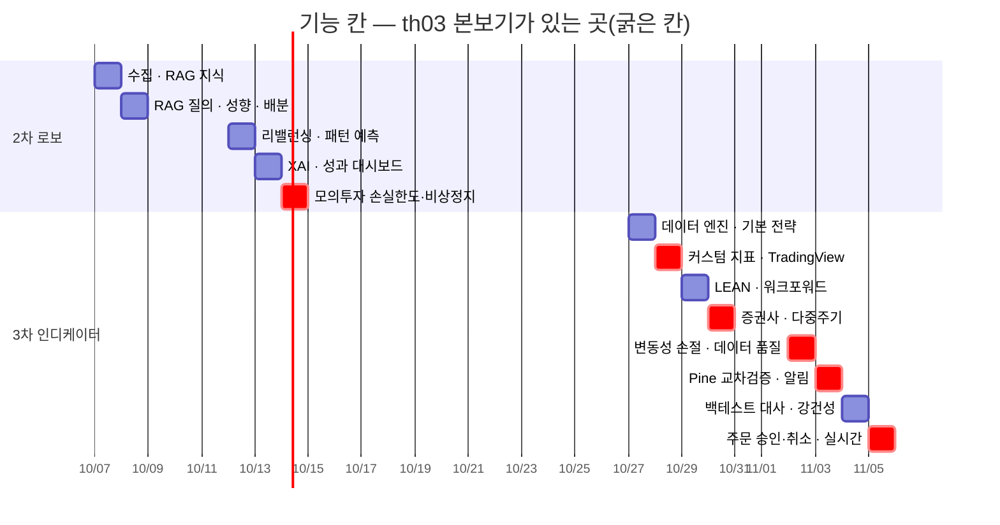

# 강사님 자료 기능 대조 v0.1 — th03 stock-coin-trade · 공식 일정표 → Qurious

| 항목 | 내용 |
|------|------|
| **문서 버전** | v0.1 (초안 — 팀 검토 전) |
| **작성일** | 2026-09-29 (KST) · S60 |
| **작성자** | 이동원 (데이터 파트 P-A) |
| **구분 (산출물 분류)** | 요구사항 관리 → 요구사항 정의 보조 · RTM 입력 |
| **대상** | 강사님 th03 `edumgt/stock-coin-trade` **`debd561`**(09-28 17:50) · th07 `frontend/assets/day4-project-schedule.js` **`e63e675`** · Qurious `main` **`33772be`** |
| **앞 문서** | 옛 A17 「강사님 배포 자료 인벤토리」(09-15 · th03 `ebb40c3` 기준) — 새 저장소 [#6](https://github.com/EST-team-project/Qurious/issues/6) · 기록 [`2026-09-15/이슈-004`](../github-archive/2026-09-15/이슈-004/00-기록.md) |

> **쉬운 요약**
> 1. 옛 A17(09-15) 뒤로 th03 이 **커밋 40개 · 파일 317개 · 약 3만 2천 줄** 늘었다. 가장 크게 자란 것은 **TradingView Pine 실습**(16단계 코스 · 연습장 · 전략 거래)과 **KIS 모의 주문 안전장치**다.
> 2. 기능 26개를 Qurious 와 맞춰 보니 **있음 4 · 일부 13 · 없음 8 · 둘 다 없음 1** 이다. Qurious 의 Pine 은 **코드 문자열을 만들어 복사해 주는 데서 멈춘다** — `indicator()` 라 TradingView Strategy Tester 가 안 켜지고(DF-05), 서버의 Pine 주문 경로는 화면이 한 번도 부르지 않는다.
> 3. 강사님 공식 일정표의 3차 칸 가운데 **10/28 TradingView(Webhook 수신 · Pine 전략)** · **11/2 변동성 손절** · **11/3 Pine 교차검증** · **11/5 주문 승인·취소 흐름**이 th03 에 본보기가 있고 Qurious 에는 없다. 2차는 10/14 모의투자(손실한도 · 비상정지)가 th03 과 겹친다.

확실도 · 🟢 파일 · 줄로 확인(탐색 조사 뒤 핵심 8개는 작성자가 다시 grep) / 🟡 이름 · 설명으로 추정. 원문은 옮기지 않고 경로 · 줄만 적는다.
th03 의 `*.key` · `.env*` 는 열지 않았고, README 의 공개 데모 계정 정보는 옮기지 않았다.

---

## 0. 왜 이 문서인가

- 사용자 지시(09-29): *"th 폴더들을 … 살펴보면서 강사님께서 요구하셨던 프로젝트 구현되어야 되는 기능들을 살펴보시면 됩니다. 특히 stock-coin-trade 를 보면 프로젝트에서 필요한 것이 많이 들어있습니다 (TradingView 등)"*.
- 옛 A17 은 th03 을 「모의투자 · Open API 플랫폼, Pine 학습 페이지 1장」 으로 봤다. 그 뒤 강사님이 Pine 을 **「지표 그리기」에서 「전략 + 위험 관리」로** 깊게 만들었다(09-26 16단계). 3차(10-22~11-11)의 재료가 거의 여기 있다.
- **RTM v1.0**(요구 29개 · 사각지대 8개)은 `rfp-1` · `rfp-2` 가 원천이다. 3차는 별도 RFP 가 없어 RTM 이 얇다 — 이 문서가 3차 쪽 입력이 된다(RTM v1.1 때 옮긴다).

> **Strategy Tester** — TradingView 가 Pine 코드로 과거 백테스트를 돌려 주는 탭. 이 문서에서는 「`strategy()` 로 선언한 코드만 켜진다」 는 점이 핵심이다.
> 헷갈리기 쉬운 점: `indicator()` 로 선언하면 차트에 선 · 화살표는 그려지지만 **거래도 성과표도 없다.** Qurious 생성기가 이쪽이다(DF-05).
>
> **Lightweight Charts** — TradingView 가 공개한 오픈소스 차트 라이브러리(Apache 2.0). 이 문서에서는 th03 이 자체 Pine 연습장 · KIS 차트에 쓰는 것.
> 헷갈리기 쉬운 점: TradingView **사이트 · 위젯과 다르다.** 강사님도 TradingView 위젯은 한 번도 임베드하지 않았다(`tv.js` · `embed-widget` 0건 🟢). Qurious 는 ApexCharts 3.49.2 를 쓴다.
>
> **Webhook** — 어떤 서비스가 일이 생겼을 때 우리 서버 주소로 HTTP 요청을 보내 알려 주는 방식. 이 문서에서는 TradingView 가격 알람이 Qurious 로 신호를 보내는 길(일정표 10/28 · 11/3).
> 헷갈리기 쉬운 점: 받는 쪽이 **검증**(누가 보냈나 · 중복인가 · 늦었나)을 해야 한다. 받기만 하면 누구나 주문을 넣을 수 있는 구멍이 된다.

---

## 1. 한눈에 — th03 기능 26개 × Qurious

```
 Qurious 상태 (26개)
 ─────────────────────────────────────────────
 있음         ████                   4   LEAN · RAG · 자체 Open API · 주문 미리보기
 일부         █████████████         13   Pine 주문 경로(화면 없음) · 전략 비교 · KIS 모의 주문 …
 없음         ████████               8   Pine 연습장 · 16단계 코스 · 손절/익절 · 주문 정정·취소 …
 둘 다 없음   █                      1   TradingView 위젯 임베드
```

| # | 기능 | th03 (경로:줄) | 무엇을 하나 | 쓰는 것 | 닿는 차수 | Qurious |
|---|------|----------------|-------------|---------|-----------|---------|
| 1 | **Pine 연습장** | `frontend/pine-script-lab.html:7` · `js/pine-script-lab.js:1-38` | 브라우저 안 작은 Pine 해석기 — 차트 · BUY/SELL · 거래 수 · 수익률 · MDD | Lightweight Charts 4.2.0 · Pine v6 | 3차 | 🔴 없음 — `public/app.html:3317` 은 문자열 생성 · 복사만 |
| 2 | **Pine 전략 거래** | `frontend/trade/pine.html:6` · `js/pine.js:2·14·30·126` · `python-stock-backend/stocks.py:79` | 실제 시세에 전략 신호 → 확인창 → 모의 주문 | LWC · `/api/stocks/orders/pine` | 3차 | 🟡 일부 — 서버 `app/routes/paper.py:115` 는 있고 **화면 호출 0** |
| 3 | TR 실전연습 16단계 | `frontend/js/tr-pine-course.js:2-15` | 가입 → indicator/plot → 옵션 → input → sma → 교차 → plotshape → strategy 3종 → volume → bb | Pine v6 | 3차 | 🔴 없음 |
| 4 | 기본 전략 3종 비교 | `tr-pine-course.js:18-20` | 5·20 교차 / 종가·20일선 돌파 / 10·30 | `strategy.entry/close` | 3차 | 🟡 일부 — `app/routes/stocks.py:766` 파이썬 백테스트(rsi · ma · bollinger · composite) |
| 5 | **손절 · 익절** (15단계) | `frontend/js/tr-pine-advanced.js:2-30` | ATR×2 손절 · ATR×3 익절 · 수수료 0.015% · 자본 1천만 · 비중 20% | `strategy.exit` · `ta.atr` | 3차 (11/2) | 🔴 없음 — 백테스트에 청산 규칙 없음. `ta_utils.py:50` 에 ATR 함수는 있다 |
| 6 | table 대시보드 (16단계) | `tr-pine-advanced.js:38-65` | RSI · 추세를 차트 위 표로 | `table.new/cell` | 3차 | 🔴 없음 |
| 7 | TradingView 첫 실습 | `frontend/learning/tradingview-pine.html` | 가입 · 알람 · Paper Trading · Strategy Report · 계절성 · 상대강도 | TradingView 링크 | 3차 | 🟡 일부 — 계절성만(`app/routes/ml.py:271`) |
| 8 | TradingView 위젯 | — (0건) | — | — | — | ⚪ 둘 다 없음 |
| 9 | KIS 종목 차트 | `frontend/kis-chart.html:9` · `python-stock-backend/kis_chart_api.py:190·204` | 1분 · 일 · 주 · 월 · 년봉 · 거래량 · MA5/20/60 | LWC · KIS 기간별시세 · 당일분봉 | 3차 (10/30) | 🟡 일부 — ApexCharts 일봉 · MA · BB. **분봉 · 거래량 없음** |
| 10 | **KIS 모의 주문 안전장치** | `frontend/kis-real-trading-practice.html` · `python-stock-backend/broker_test_api.py:144-191` | CSRF + **60초 1회 승인 토큰** + 1회 수량 · 금액 한도 🟡 | KIS 모의(VTS) | 2차 (10/14) · 3차 | 🟡 일부 — `app/services/brokers/kis.py:172` 모의 주문(VTTC0012U/0011U). 승인 토큰 · 한도 · CSRF 없음 |
| 11 | 주문 → 정정 → 취소 | `frontend/js/kis-order-flow-test.js:43-61` | 한 흐름으로 실습 | KIS VTS | 3차 (11/5) | 🔴 없음 |
| 12 | **외부 API 전 휴장 체크** | 커밋 `7591ea3` · `python-stock-backend/alpaca_test.py:274` | 장이 닫혀 있으면 호출 전에 멈추고 토스트 | 시장 시계 | 3차 (11/5 실시간) | 🟡 일부 — 수집기는 **나중에** 휴장을 판정(`collector/backfill.py:23`). 앱 호출 전 체크 없음 |
| 13 | Quant Lab | `frontend/quant.html:32` · `python-stock-backend/quant.py:177-335` | 신호 5종 · 백테스트 저장 · 알파/베타 팩터 | PostgreSQL | 2차 · 3차 | 🟡 일부 — `app/routes/quant.py:17` · `quant_pipeline.py:232` |
| 14 | LEAN 백테스트 | `python-stock-backend/ai_sheet.py:36` | — | LEAN(Docker) | 3차 (10/29) | 🟢 있음 — `app/routes/lean.py:68` |
| 15 | AI Sheet | `frontend/ai-sheet.html` | 웹 표 크롤링 → 선형회귀 예측 | scikit-learn | 2차 | 🟡 일부 🟡 |
| 16 | AI 분석 · 지식 검색 | `python-stock-backend/ai.py:28` | — | Qdrant · Claude | 2차 (10/7 · 10/8) | 🟢 있음 — `documents.py:168` · `chat.py:95` |
| 17 | HTS 시뮬레이션 | `frontend/hts.html:71-73` | 관심종목 · 호가 · 수급 · 주문 모달 | AG Grid | 2차 | 🔴 없음 |
| 18 | OHLCV DB · 공개 API | `python-stock-backend/ohlcv_db.py:78-144` · `openapi.py:153·192` | 18:20 일일 배치 · 키 없는 공개 조회 | pg-stock | 3차 (11/2 품질) | 🟡 일부 — 수집 DB 446만 행 · 매일 12:30. **Open API 에 OHLCV 없음** |
| 19 | 자체 Open API · 키 | `python-stock-backend/openapi.py:132-289` | Bearer 키 · SHA-256 저장 · 분당 60회 | — | 공통 | 🟢 있음 — `app/routes/openapi.py:83-160` |
| 20 | 주문 미리보기 | README `:169-171` | 주식 · 코인 · 대체자산 | — | 2차 | 🟢 있음 — `paper.py:79·195·266` |
| 21 | 포트폴리오 집중도(HHI) | `python-stock-backend/members.py:113·270` | — | — | 2차 (10/13) | 🟡 일부 — HHI 없음 |
| 22 | API 사용 · 오류 이력 | `api_usage.py:196-286` · `error_analysis.py:114-161` | KIS 요청을 가려서 기록 | AG Grid | 3차 (11/10 보안) | 🟡 일부 — `admin.py:51` 감사 로그 |
| 23 | KIS API 탐색기 | `kis_api_explorer.py:35·83` | 공식 예제 기반 131개 | — | 3차 | 🔴 없음 |
| 24 | Alpaca 주문 → 취소 | `alpaca_test.py:258` | — | Alpaca Paper | 3차 | 🟡 일부 — 조회만(`paper.py:367·377`) |
| 25 | 알림 · Webhook | `tradingview-pine.html`(가격 알람) | — | — | 3차 (10/28 · 11/3) | 🟡 일부 — `notification.py:62` 는 **내보내기만**. 받는 Webhook 없음 |
| 26 | KIS MCP · Secrets Manager · Lambda | README `:408-555` | — | AWS | 3차 (11/10 배포) | 🔴 없음 — AWS 보류(D2) |

Qurious 쪽 경로는 모두 `app/` · `public/` 기준이다(예: `paper.py` = `app/routes/paper.py`).

---

## 2. 강사님 공식 일정표 칸 × th03 본보기 × Qurious

일정표는 반나절 한 칸에 4명(PO · PM · 데이터·퀀트 · 풀스택)이 산출물 하나씩을 내는 구조다(`day4-project-schedule.js`). 두 차수 모두 첫 3일(6칸)은 착수 · 요구 · 일정 · 아키텍처 · 설계 · 개발 기반이다.
아래는 **기능 칸만** 뽑아 th03 본보기와 Qurious 상태를 붙였다.



| 칸 | 일정표가 요구하는 산출물(요지) | th03 본보기 (1절 #) | Qurious 지금 | 파트 (분배안 v1.0 영역 · 제안 🟡) |
|----|-------------------------------|--------------------|--------------|------|
| 10/7 | 금융 데이터 수집 · 데이터 관제 화면 | #18 OHLCV 배치 | 수집 DB · 일일 러너 있음 · **관제 화면 없음**(`daily_update.py status` 는 명령줄) | P-A |
| 10/14 오전 | 모의투자 — 손실한도 · 비상정지 · 신호 → 주문 의견 | #10 승인 토큰 · 한도 · #2 | 실거래 차단(ADR-0001) · 모의 장부 하나(I14). **손실한도 · 비상정지 없음** | P-E |
| 10/27 | 기본 전략(MA · RSI · MACD · 밴드) · 인디케이터 차트 | #4 · #3 | 파이썬 백테스트 4전략 · ApexCharts | P-B |
| **10/28** | **TradingView — Webhook 수신 · 검증 API · Pine 전략 코드 · 차트 · 알림 실습 화면** · 커스텀 지표 레지스트리 | #1 · #2 · #3 · #7 · #25 | Pine 문자열 생성(`indicator` · v5) · **Webhook 없음** · 커스텀 지표 저장 API 있음(`stocks.py:852`) | P-B (Webhook 은 P-E) |
| 10/29 | LEAN 백테스트 대시보드 · 워크포워드 · 전략 비교 | #14 | LEAN 있음 · 워크포워드 없음 🟡 | P-D |
| **10/30** | 증권사 연동(자동매매 관제 · 비상정지 UI) · **다중주기 신호(일봉 · 분봉)** | #9 · #10 | 일봉만(수집 DB · DF-08) · **분봉 없음** | P-A (분봉 데이터) · P-E |
| **11/2** | **변동성 기반 손절** · 위험 관제 화면 · **데이터 품질 대시보드** | #5 · #18 | 손절 청산 없음 · 품질은 `benchmark verify` 게이트 6개 · `hf_dataset verify` — **화면 없음** | P-B · P-A |
| **11/3** | **Pine 교차검증 — Pine · LEAN · 로컬 신호 대사 화면** · 알림 Webhook 큐 · 재시도 · 이력 | #1 · #14 · #25 | 셋이 같은 신호를 내는지 잰 적 없음. D6 「같은 RSI 14 가 세 벌」 이 이 칸의 문제다 | P-D · P-B |
| 11/4 | 백테스트 대사(수익률 · MDD · 샤프 일치) · 강건성 | #13 · #14 | 테스트계획서 v1.2 6절 4순위(재현성 · 보고서) — 없음 | P-D |
| **11/5** | 모의증권 연동(**주문 승인 · 취소 흐름**) · 실시간 엔진 | #10 · #11 · #12 | 모의 주문만 · 정정 · 취소 · 휴장 사전 체크 없음 | P-E |

> **대사**(reconciliation) — 두 장부나 두 계산을 줄마다 맞춰 보고 다른 곳을 찾는 일. 이 문서에서는 「같은 종목 · 같은 기간에 Pine · LEAN · 파이썬이 **같은 날 같은 신호**를 냈나」 를 줄 단위로 비교하는 것.
> 헷갈리기 쉬운 점: 수익률 합계가 같다고 대사가 끝난 게 아니다. 신호 날짜가 하루씩 밀려도 합계는 비슷할 수 있다. 결함대장 DF-01 의 「등락률 대조의 사각지대」 와 같은 함정이다.

---

## 3. TradingView · Pine 자세히

### 3.1 th03 에 있는 Pine 세 벌 🟢

| 어디 | Pine 판 | 선언 | 무엇 | 백테스트 속성 |
|------|:------:|------|------|---------------|
| `js/pine-script-lab.js` (연습장 3개) | v6 | ① `indicator` 20일선 ② `strategy` 5·20 교차 ③ `strategy` RSI 30/70 | 합성 가격 90봉 · 해석기는 sma · ema · rsi 만 · 기간 2~80 | 없음 |
| `js/pine.js` (전략 거래 3개) | v5 | MA 교차 · **익절 3% · 손절 1.5%**(`input.float` · `strategy.exit(limit, stop)`) · RSI 반전 | 실제 시세 → 확인창 → 모의 주문 | `default_qty_type=percent_of_equity`(10) |
| `js/tr-pine-course.js` · `tr-pine-advanced.js` (16단계) | v6 | 1~11 indicator · 12 strategy 3종 · **15 `strategy.exit` + ATR** · 16 `table` | TradingView 에 붙여 넣어 실습 | **15단계: 자본 10,000,000 · 수수료 0.015% · 비중 20%** |

### 3.2 Qurious 의 Pine — 전후 구조

```
 지금 (public/app.html:3317-3354)                  th03 수준으로 가면 (제안 🟡)
 ─────────────────────────────────                  ─────────────────────────────────────────────
 입력 6칸 → generatePineCode()                      입력 → Pine 생성기 (v6 · strategy())
   //@version=5                                        strategy(..., initial_capital, commission,
   indicator("...", overlay=true)   ← DF-05              default_qty_type)  ← 우리 비용 모델과 같은 값
   sell_th = input.int(100 - parseInt(buyTh))  ← DF-06   strategy.entry / strategy.exit(stop, limit)
   plotshape(buy/sell)                                 ↓
 → [복사] 버튼. 끝.                                   ① TradingView Strategy Tester 에서 성과표
                                                      ② 같은 규칙을 파이썬으로 → 신호 대사 (11/3)
 서버: POST /api/stocks/orders/pine (paper.py:115)    ③ 가격 알람 → Webhook → 검증 → 모의 주문 (10/28)
   화면 호출 0                                             (승인 토큰 · 한도 — th03 #10)
```

### 3.3 코드 재사용 판정

| th03 자산 | 가져올까 | 이유 |
|-----------|:-------:|------|
| 16단계 코스 문구 · 예제 | 🟡 참고 | 교안이다. 우리 화면에 옮길 것은 **15단계의 백테스트 속성 · `strategy.exit` 모양**이지 문장이 아니다. 저작권 · LICENSE 는 확인 전 |
| Pine 연습장 해석기 | ❌ | sma · ema · rsi 만 되는 장난감 해석기다. 교차검증(11/3)의 기준이 되면 안 된다 — 기준은 TradingView 자체와 우리 파이썬 계산 |
| Lightweight Charts | 🟡 선택 | Apache 2.0 · 분봉 · 거래량 막대가 쉽다. 다만 ApexCharts 화면이 이미 12개 주 경로에 있다(와이어프레임 v0.2). 바꿀지는 P-B · 화면 담당이 정한다 |
| 승인 토큰 · 한도 · CSRF 패턴 | ✅ 설계 참고 | 10/14 「손실한도 · 비상정지」 와 11/5 「주문 승인」 칸의 모양 그대로다. 코드가 Flask 라 옮기지 않고 모양만 |
| 휴장 사전 체크 | ✅ 설계 참고 | 수집기는 휴장을 **나중에** 안다(빈 응답 + 시간). 주문 · 실시간 쪽은 **먼저** 알아야 한다. 거래일 달력은 수집 DB 에 이미 있다(`ingest_day` 1,842행) |

---

## 4. 데이터 파트(P-A)에 닿는 것

이 문서는 코드를 바꾸지 않는다. 데이터 파트가 스스로 할 수 있는 것과 다른 파트에 넘길 것을 나눈다(데이터 파트는 자기 영역만 고치고, 다른 파트 몫은 이슈 체크리스트로 남긴다).

| 무엇 | 칸 | P-A 가 할 것 | 선행 |
|------|----|--------------|------|
| 분봉 데이터 | 10/30 | 출처부터 — 공공데이터포털은 **일봉만** 준다. KIS 로는 **백필하지 않는다**([`collector/README.md`](../../collector/README.md) §8 — 약관 제9조①4 서버 부하 · 제5조③ 제3자 제공 금지) → KIS 분봉은 당일 · 실시간 전용. 과거 분봉 출처는 따로 조사 | 약관 확인 🔴 |
| 데이터 관제 화면 | 10/7 | `daily_update.py status` · `benchmark verify` · `hf_dataset verify` 결과를 JSON 으로 내는 API 한 개 → 화면은 화면 담당 | 없음 |
| 데이터 품질 대시보드 | 11/2 | 위와 같은 API 에 결함대장 DF-01 유형 검사(주식 수 · 조정 이벤트)를 더한다 | 위 |
| 거래일 달력 API | 11/5 | 수집 DB `ingest_day` 에서 「이 날은 거래일인가」 를 돌려준다 → 주문 쪽 휴장 사전 체크의 재료 | 없음 |
| OHLCV 공개 조회 | 11/2 · 공통 | 자체 Open API 에 수정주가 조회를 한 경로 더할지 — **원자료 재배포 판단이 먼저**(HF private · D0 ⑥) | D0 ⑥ 🔴 |

---

## 5. 한계 · 뒤집을 조건

- **th03 은 교안 · 실습 플랫폼이지 우리 요구사항 원문이 아니다.** 일정표(`day4-project-schedule.js`)는 사용자가 강사님께 **우리 반 공식 일정**으로 확인했다(S52). 따라서 2절 표는 「일정표 칸 → 본보기」 로 읽는다. 일정표가 바뀌면 2절이 먼저 바뀐다.
- 1절 26개는 탐색 조사 1회(파일 · 줄)로 만들었고, 작성자가 다시 확인한 것은 핵심 8개다(Pine 주문 경로의 화면 호출 0 · ApexCharts · LWC 4.2.0 · `strategy.exit` + ATR + 수수료 0.015% · Pine 판 v5/v6 · 일정표 10/28 · 11/3 줄 · KIS 모의 주문 코드 · CSRF · 60초 승인 토큰). 나머지 🟢 은 조사가 확인한 것이다. **#10 의 1회 수량 · 금액 한도 값**과 **#15 의 대응**은 🟡.
- 2차 칸(10/7~10/13)의 Qurious 상태는 th03 과 겹치는 곳만 적었다. 성향진단 · 리밸런싱 · XAI 는 RTM v1.0 과 논의 D5 가 본다.
- 이 문서를 뒤집을 조건: ① 강사님이 3차 RFP 를 따로 내면 그것이 원천이 된다 ② D6 결론(09-30)이 Pine 판 · `strategy()` 전환을 다르게 정하면 3절 제안이 바뀐다 ③ D2 가 AWS 를 쓰기로 하면 #26 이 범위에 들어온다.

## 6. 다음

| 무엇 | 언제 | 누가 |
|------|------|------|
| RTM v1.1 — 3차 요구를 이 문서 2절 칸에서 옮기고, 시험 117건이 어느 요구에 붙는지 다시 센다 | 10-06(화) 오전 칸 전 🟡 | P-A |
| 3차 Pine · Webhook · 교차검증 설계 — D6 결론 뒤 | 10-22 전 | P-B · P-D (제안) |
| 이 문서 v0.2 — 강사님 자료가 바뀌면(하루 한 번 점검) · 팀 의견 반영 | 수시 | P-A |

## 7. 참조

- 강사님 th03 README `:14`(주요 기능) · `:34`(커리큘럼) · `:400`(TradingView) — 로컬 `learning/th03-stock-coin-trade/lecture/`
- 일정표 `learning/th07-domain-rag-lab/lecture/frontend/assets/day4-project-schedule.js:40`(10/28) · `:66-67`(11/3) · `:85`(휴일)
- [RTM v1.0](RTM_v1.0.md) · [테스트계획서 v1.2](../시험/테스트계획서_v1.2.md) 5절 DF-05 · DF-06 · 옛 A17 기록 [`2026-09-15/이슈-004`](../github-archive/2026-09-15/이슈-004/00-기록.md)
- 강사님 자료 변경 추적 — [`2026-09-28/이슈-강사님자료-변경추적/`](../github-archive/2026-09-28/이슈-강사님자료-변경추적/) (새 저장소 #6 에 댓글)
