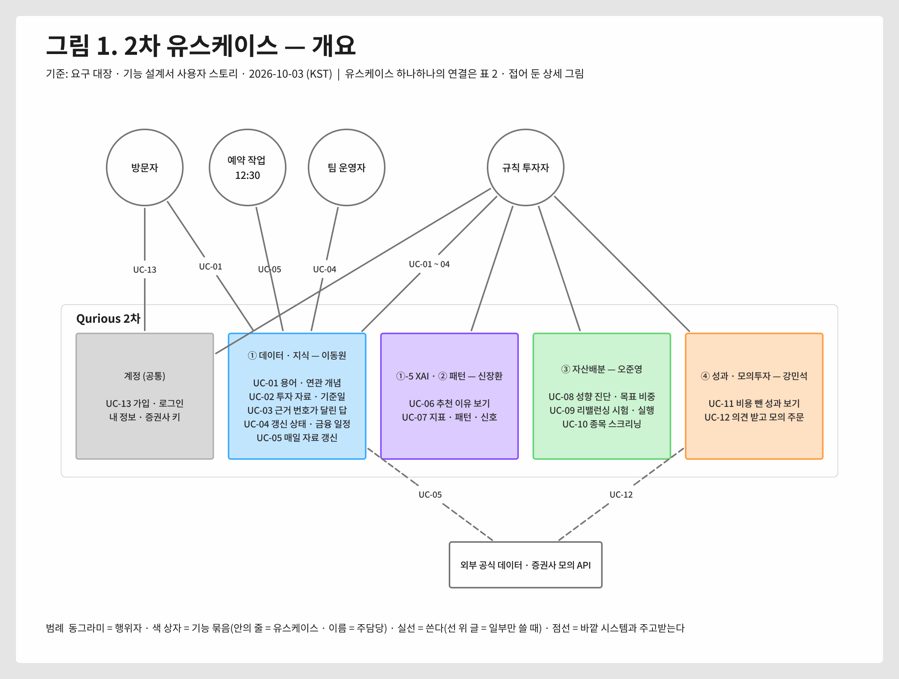
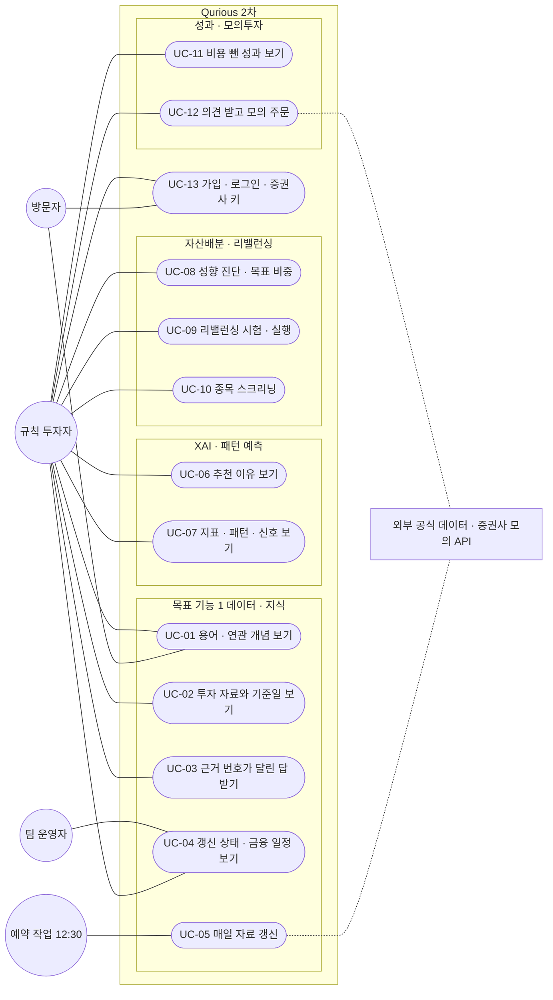

# 유스케이스 명세서 v0.1 — Qurious (2차)

| 문서 정보 | |
|---|---|
| **판 · 상태** | v0.1 · 초안(검토 전) — 이동원 몫(UC-01 ~ 05)은 자세히, 다른 목표 기능은 한 줄 + 주담당이 채울 칸 |
| **구분** | 2. 요구사항 관리 — 유스케이스 |
| **작성** | 초안 이동원(팀장) · UC-06 ~ 13 의 흐름 채우기와 판 올리기는 각 주담당 · 검수 이동원 |
| **검토** | 검토 전 — UC-06 ~ 13 의 주 흐름은 각 주담당이 채운다 |
| **최종 수정** | 2026-10-03 (KST) |
| **기준** | 코드 `main` `7afe5e9` · [요구 대장](../대장/요구-대장.tsv) · [기능 설계서 v0.1](../../설계/기능설계.md) 사용자 스토리(📖) · [API 명세서 v0.3](../../인터페이스/지난판/API명세서_v0.3.md) · [IA v1.0](../../화면/지난판/IA_v1.0.md) |
| **관련 문서** | [RTM v1.3](RTM_v1.3.md) · [WBS v0.1](../../계획서/WBS.md) · [UI 명세서 v0.1](../../화면/지난판/UI명세서_v0.1.md) · [목표 기능 ① 설계서 v0.1](../../설계/지난판/목표기능1-데이터지식-설계_v0.1.md) |
| **최근 개정** | 새 문서 |

> **이 문서로 알 수 있는 것**
> 1. 누가(행위자) Qurious 로 무엇을 이루려 하나(유스케이스)?
> 2. 유스케이스마다 어떤 차례로 일이 일어나고, 잘못되면 어떻게 되나?
> 3. 유스케이스가 어느 요구 · API · 화면 · 시험과 이어지나?
>
> **읽는 순서** — 팀원: 그림 1 → 2절 목록 → 자기 유스케이스 · 강사님: 요약 → 그림 1 → 3절 하나 · 처음 온 사람: 요약 → 1절 행위자

## 요약

1. 2차 Qurious 의 행위자는 넷이다 — **규칙 투자자**(자기 투자 규칙을 가진 개인투자자 · 로그인), **방문자**(로그인 전), **팀 운영자**, **예약 작업**(매일 12:30). 바깥 시스템(공식 데이터 · 증권사 모의 API)과도 주고받는다.
2. 유스케이스는 13개다 — 목표 기능 ① 데이터 · 지식 5 · XAI · 패턴 2 · 자산배분 3 · 성과 · 모의투자 2 · 계정 1. 2차 범위 요구 29개는 모두 어느 유스케이스엔가 붙는다(표 2).
3. 이동원 몫 다섯(UC-01 ~ 05)은 주 흐름 · 다른 흐름까지 적었다 — 넷은 지금 돌고, UC-03 은 근거 검색까지 되고 답은 10-08 칸에서 붙는다. 나머지 여덟은 **목표 · 시작 · 끝난 모습**만 적고 주 흐름은 각 주담당이 설계서와 함께 채운다.

---

## 1. 행위자

**<표 1> 행위자**

| 행위자 | 누구 | 무엇을 바라나 | 근거 |
|---|---|---|---|
| 규칙 투자자 | 자기 투자 규칙을 가진 개인투자자 — 로그인한 사용자 | 그 규칙을 **믿어도 되는지** 판단하고 싶다 | 결정 대장 D1 · 기능 설계서 📖 |
| 방문자 | 로그인 전의 사람 | 가입 전에 용어 · 강의를 둘러본다 | 용어사전 · 근거 문서 목록 API 는 로그인 없이 읽는다 |
| 팀 운영자 | 팀원(운영 당번) | 데이터가 언제 갱신됐고 오늘 배치가 돌았는지 화면에서 안다 | 기능 설계서 📖(`P01-①-4`) |
| 예약 작업 | Windows 작업 스케줄러(매일 12:30) · Celery 비트 | 정해진 시각에 자료를 갱신하고 예약 매매를 돌린다 | 수집기 README 15절 |
| 바깥 시스템 | 공공데이터포털 · DART · 국가법령정보센터 · Hugging Face · 증권사 모의 API | 자료를 주고 · 백업을 받고 · 모의 주문을 받는다 | [인프라 · 네트워크 구성도](../../설계/인프라-네트워크구성도.md) 5절 |

---

## 2. 유스케이스 한눈에

유스케이스 13개를 한 그림에 다 그리면 「규칙 투자자」 한 사람에게서 선 11개가 나와 세로로 길어지거나(1,768 × 3,617) 선이 상자를 가로지른다 — 그래서 **개요는 기능 묶음 단위로 가로로 그리고**, 유스케이스 하나하나의 연결은 표 2 와 접어 둔 상세 그림으로 나눴다([문서 그림 지침](../../문서기준/지난판/문서그림지침_v0.1.md) 5절).

**<그림 1> 2차 유스케이스 — 개요** · 범례: 동그라미 = 행위자 · 색 상자 = 기능 묶음(안의 줄 = 유스케이스 · 이름 = 주담당) · 실선 = 쓴다(선 위 글 = 일부만 쓸 때) · 점선 = 바깥 시스템과 주고받는다

원본: [Figma · 문서 그림 · 유스케이스 개요](https://www.figma.com/board/qTCGg7PlmpGNZT5uM8VQGm?node-id=15-243) · 그림 판 v0.1 · 기준 `7afe5e9` · 2026-10-03

상세 그림 — 유스케이스 13개 하나하나의 연결(펼치면 GitHub 이 그린다 · 세로로 길다)

**<표 2> 유스케이스 목록** · 상태: 가동 · 일부 · 예정 · 다른 주담당 줄의 「시험 있음 · 흔적」 은 RTM v1.3 진행 칸(코드 · 시험 흔적)

| ID | 유스케이스 | 주 행위자 | 요구 ID | 주담당 | 지금 |
|---|---|---|---|---|---|
| UC-01 | 용어 · 연관 개념 보기 | 규칙 투자자 · 방문자 | `P01-①-1` | 이동원 | 가동 화면 · API(남은: 작은 관계 지도 · 교재 밑줄) |
| UC-02 | 투자 자료와 기준일 보기 | 규칙 투자자 | `P01-①-2` · `SCH-DQ` | 이동원 | 가동 |
| UC-03 | 근거 번호가 달린 답 받기 | 규칙 투자자 | `P01-①-3` | 이동원 | 일부 근거 검색까지(답은 10-08) |
| UC-04 | 갱신 상태 · 금융 일정 보기 | 팀 운영자 · 규칙 투자자 | `P01-①-4` | 이동원 | 가동 |
| UC-05 | 매일 자료 갱신 | 예약 작업 | `P01-①-2` · `P01-①-4` | 이동원 | 가동 |
| UC-06 | 추천 이유 보기 | 규칙 투자자 | `P01-①-5` | 신장환 | 시험 있음 |
| UC-07 | 지표 · 패턴 · 다중 주기 신호 보기 | 규칙 투자자 | `P01-②-1~3` | 신장환 | 흔적 · 시험 있음 |
| UC-08 | 성향 진단 · 목표 비중 받기 | 규칙 투자자 | `U1` · `U2` · `RFP2-3.1.3-①~④` | 오준영 | 시험 있음 · 흔적 |
| UC-09 | 리밸런싱 시험 · 실행 | 규칙 투자자 | `P01-③-1~3` · `U5` | 오준영 | 시험 일부 · 흔적 |
| UC-10 | 종목 스크리닝 | 규칙 투자자 | `RFP2-3.1.4-①~④` | 오준영 | 흔적 |
| UC-11 | 비용 뺀 성과 보기 | 규칙 투자자 | `P01-④-1` · `SCH-STR` | 강민석 | 시험 있음 |
| UC-12 | 의견 받고 모의 주문 | 규칙 투자자 | `P01-④-2` · `P01-④-3` · `U3` · `U4` | 강민석 | 시험 있음 |
| UC-13 | 가입 · 로그인 · 내 정보 · 증권사 키 | 방문자 · 규칙 투자자 | (공통 · ADR-0004) | 공통(담당 제안 전) | 가동 |

---

## 3. 유스케이스 명세 — 이동원 몫

칸은 실무 「유스케이스 명세」 의 기본 칸(목표 · 행위자 · 시작 조건 · 시작하는 일 · 주 흐름 · 다른 흐름 · 끝난 모습)에 요구 · API · 화면 · 시험을 더했다.

### UC-01 용어 · 연관 개념 보기

| 칸 | 내용 |
|---|---|
| 목표 | 결과 화면의 용어(MDD · 샤프 · 리밸런싱 밴드)를 누르면 뜻과 이어진 개념을 본다 — 숫자를 잘못 읽고 규칙을 믿거나 버리지 않게 |
| 행위자 | 규칙 투자자 · 방문자(로그인 없이) |
| 시작 조건 | 용어 파일이 표에 들어가 있다(앱이 켜질 때 넣는다) |
| 시작하는 일 | 화면의 용어 칩을 누르거나 용어사전(`fin-glossary`)에서 찾는다 |
| 끝난 모습 | 뜻 · 예 · 출처 · 연관 개념이 보이고, 연관 개념을 눌러 이어 볼 수 있다 |
| 요구 · API · 화면 · 시험 | `P01-①-1` · `API-GLOS-01 ~ 05` · `fin-glossary` 와 모든 화면의 용어 칩 · TC-GL |

**주 흐름**
1. 규칙 투자자가 화면의 용어 칩을 누르거나, 용어사전에서 이름을 친다.
2. 시스템이 이름 · 다른 이름으로 용어를 찾아 순위대로 보인다(무엇으로 맞았는지 함께).
3. 규칙 투자자가 용어 하나를 고른다.
4. 시스템이 뜻 · 예 · 출처와 연관 개념 칩(헷갈리는 말 · 이어지는 말)을 서랍에 보인다(내 정보에서 작은 창 · 큰 창으로 바꿀 수 있다).
5. 규칙 투자자가 연관 개념 칩을 누르면 4로 돌아간다.

**다른 흐름**
- 2a. 맞는 용어가 없으면 결과가 없다고 알린다.
- 4a. 공개 전 후보 용어는 보이지 않는다(검토 뒤 공개).

### UC-02 투자 자료와 기준일 보기

| 칸 | 내용 |
|---|---|
| 목표 | 규칙을 시험할 가격 · 거래량 · 재무가 한곳에 있고 **언제 값인지** 본다 — 오래된 값으로 판단하지 않게 |
| 행위자 | 규칙 투자자 |
| 시작 조건 | 수집 DB 가 이 PC 에 있고 앱이 읽기 전용으로 붙어 있다 |
| 시작하는 일 | 국내 주식 차트 · 대시보드를 연다 · 팀원 코드가 OHLCV 규격 주소를 부른다 |
| 끝난 모습 | 일봉 · 지표가 **기준일**과 함께 보인다 |
| 요구 · API · 화면 · 시험 | `P01-①-2` · `SCH-DQ` · `API-STK-01 ~ 03` · `API-DATA-02` · `trading-chart` · `dashboard` · TC-CD · TC-OH · TC-OA |

**주 흐름**
1. 규칙 투자자가 국내 주식 차트에서 종목을 고른다.
2. 시스템이 수집 DB 어댑터로 일봉을 읽고, 응답에 기준일을 싣는다.
3. 화면이 차트와 기준일을 보인다.

**다른 흐름**
- 2a. 수집 DB 에 없는 종목 · 지수는 외부 시세로 받고 출처를 다르게 표시한다.
- 2b. 수집 DB 가 없는 PC(팀원)는 캐시로 돌아간다 — 기준일이 오래될 수 있다.

### UC-03 근거 번호가 달린 답 받기

| 칸 | 내용 |
|---|---|
| 목표 | 규칙에 대해 물으면 답과 함께 **어느 문서의 어느 부분**을 근거로 했는지 본다 — 근거 없는 답을 믿지 않게 |
| 행위자 | 규칙 투자자 |
| 시작 조건 | 2026년 시행 법령 · 감독규정이 조문 단위로 색인돼 있다(낱말 색인 + 벡터) |
| 시작하는 일 | 질문을 입력한다 |
| 끝난 모습 | 답 문장마다 출처 번호가 있고, 답 아래에 문서 · 조 · 시행일이 보인다 |
| 요구 · API · 화면 · 시험 | `P01-①-3` · `API-KB-01 · 02`(검색) · 답 API 는 10-08 칸 · 화면은 Figma 결정 뒤 · TC-KB · TC-LW · 검색 평가셋 v0 |

**주 흐름** (3 · 4 는 10-08 칸에서 붙는다)
1. 규칙 투자자가 질문한다.
2. 시스템이 질문으로 근거 조각을 찾는다 — 낱말 검색과 벡터 검색을 합쳐 순위를 매기고, 기준일에 시행 중인 판만 쓴다.
3. 시스템이 근거 조각만으로 답을 만들고, 문장마다 출처 번호를 단다.
4. 화면이 답과 출처 목록(문서 이름 · 조 · 시행일)을 보인다.

**다른 흐름**
- 2a. 근거가 기준에 못 미치면 답을 지어내지 않고 「근거를 찾지 못했다」 고 알린다(근거 없음 정책 — 10-08 칸).
- 2b. 벡터 저장소가 꺼져 있으면 낱말 검색만으로 찾는다.

### UC-04 갱신 상태 · 금융 일정 보기

| 칸 | 내용 |
|---|---|
| 목표 | 데이터가 언제 갱신됐고 오늘 배치가 돌았는지, 오늘이 거래일인지 · 다가오는 배당 · 만기 · 휴장을 화면에서 안다 |
| 행위자 | 팀 운영자 · 규칙 투자자 |
| 시작 조건 | 일일 갱신이 한 번 이상 돌았다 |
| 시작하는 일 | 데이터 관제(`data-status`) · 일정(`market-calendar`) · 대시보드의 「다가오는 일정」 카드를 연다 |
| 끝난 모습 | 표마다 마지막 갱신 · 행 수 · 오늘 회차 결과, 다가오는 일정이 보인다 |
| 요구 · API · 화면 · 시험 | `P01-①-4` · `API-DATA-01` · `API-CAL-01 · 02` · `data-status` · `market-calendar` · TC-CA · TC-DST · TC-DH |

**주 흐름**
1. 팀 운영자가 데이터 관제를 연다.
2. 시스템이 일일 갱신 상태와 표마다 기준일 · 행 수를 돌려준다.
3. 규칙 투자자가 일정 화면에서 달을 고른다.
4. 시스템이 거래일 · 휴장 · 배당 · 파생 만기를 돌려준다.

**다른 흐름**
- 2a. 일일 갱신이 도는 중이면 「갱신 중」 을 보인다.
- 2b. 회차가 실패했으면 실패한 단계를 보인다.

### UC-05 매일 자료 갱신

| 칸 | 내용 |
|---|---|
| 목표 | 매 거래일 시세 · 배당 · 수정주가 · 총수익 · 벤치마크 · OHLCV 를 갱신하고 비공개 백업을 남긴다 |
| 행위자 | 예약 작업(작업 스케줄러 12:30) · 바깥 시스템 |
| 시작 조건 | 이 PC 가 켜져 있고 갱신이 이미 돌고 있지 않다(잠금) |
| 시작하는 일 | 매일 12:30 |
| 끝난 모습 | 열두 단계가 모두 성공하고, 상태 조회에 기준일이 오르며, 비공개 데이터셋에 그날 태그가 생긴다 |
| 요구 · API · 화면 · 시험 | `P01-①-2` · `P01-①-4` · `scripts/daily_update.py` · 화면은 UC-04 · TC-DU · TC-HF |

**주 흐름**
1. 작업 스케줄러가 갱신 러너를 깨운다.
2. 러너가 시세 → 배당 → 달력 → 수정주가 → 총수익 → 벤치마크 → OHLCV → 매니페스트 → 내보내기 → 검증 → 올리기 → OHLCV 올리기를 차례로 돈다.
3. 러너가 단계마다 결과를 로그와 상태 파일에 남긴다.

**다른 흐름**
- 1a. 이미 돌고 있으면 새 회차는 바로 끝난다(잠금).
- 2a. 한 단계가 실패하면 그 뒤 단계를 멈추고 상태에 실패를 남긴다 — 다음 회차가 다시 돈다([장애 대응 절차서](../../배포/장애대응절차서.md)).
- 2b. 휴장일에는 시세가 늘지 않는다(공식 자료가 다음 거래일에 들어온다).

---

## 4. 다른 목표 기능 — 주담당이 채울 칸

UC-06 ~ 13 은 아래 세 칸만 적었다. **주 흐름 · 다른 흐름은 각 주담당이 자기 설계서와 함께 채운다** — 3절의 칸을 그대로 쓰면 된다. 권장 시기: 10-06(화) 오전 칸(ERD · IA 모으기) 전.

| ID | 목표 (기능 설계서 📖 에서) | 시작하는 일 | 끝난 모습 | 주담당 |
|---|---|---|---|---|
| UC-06 | 이 비중 · 이 종목이 **왜** 추천됐는지 쉬운 말과 숫자로 본다 | 추천 결과에서 「이유」 를 연다 | 차트 · 표 · 쉬운 문장(모델이 있으면 기여도) | 신장환 |
| UC-07 | 규칙이 기대는 지표 · 패턴이 언제 몇 번 나왔고 그 뒤 어땠는지, 여러 주기가 같은 방향인지 본다 | 종목과 주기를 고른다 | 지표 · 패턴 위치 · 매수 · 매도 · 관망과 신뢰도 | 신장환 |
| UC-08 | 설문으로 성향을 진단하고 목표 비중을 받는다 | 성향진단을 시작한다 | 성향 · 목표 비중 그림 | 오준영 |
| UC-09 | 정한 날 · 정한 이탈 · 돈이 들어올 때 비중을 되돌리는 규칙이 비용을 빼고도 나았는지 본다 | 리밸런싱 규칙을 고른다 | 규칙별 결과 · 거래 목록 | 오준영 |
| UC-10 | 가치 · 모멘텀 · 퀄리티 · 재무 · 기술적 조건으로 종목을 거르고 순위를 본다 | 조건을 고른다 | 순위 목록 | 오준영 |
| UC-11 | 비용을 빼기 **전과 후**의 성과를 나란히 본다 | 전략 · 기간을 고른다 | 수익률 · MDD · 샤프 · 비용 | 강민석 |
| UC-12 | 신호를 종목마다 하나의 의견으로 받고, 규칙대로 모의 주문을 내며 매 거래일 결과가 쌓인다 | 의견을 보고 주문한다 | 모의 체결 · 장부 · 일지 | 강민석 |
| UC-13 | 가입 · 로그인하고, 내 정보에서 화면 설정과 내 증권사 모의 키를 넣는다 | 가입 · 로그인 | 30일 로그인 유지 · 내 키로만 주문 | 공통(담당 제안 전) |

---

## 부록 A. 용어

| 말 | 뜻 | 이 문서에서 |
|---|---|---|
| 유스케이스 | 행위자가 시스템으로 이루려는 목표 하나와, 그 목표에 이르는 흐름 | UC-01 ~ 13 |
| 행위자 | 시스템 밖에서 시스템을 쓰거나 주고받는 사람 · 시스템 | 1절 |
| 주 흐름 · 다른 흐름 | 잘 될 때의 차례 · 갈라지거나 실패할 때의 차례(번호 + 글자) | 3절 |
| 규칙 투자자 | 자기 투자 규칙을 가진 개인투자자 — 이 프로젝트의 주 사용자(결정 대장 D1) | — |

## 부록 B. 만든 방법

- 목표 문장은 기능 설계서 v0.1 의 사용자 스토리(📖)에서 가져왔다. 요구 ID · 주담당은 요구 대장, 「지금」 은 RTM v1.3 진행 칸.
- 화면 키는 `public/app.html` 의 `data-view`, API ID 는 [API-ID 대장](../../인터페이스/대장/API-ID대장.tsv).
- 그림 1 은 [문서 그림 지침 v0.1](../../문서기준/지난판/문서그림지침_v0.1.md) 흐름으로 FigJam 에서 그렸다(Mermaid 에 유스케이스 그림 종류가 없다).

## 부록 C. 변경 노트 — 다음 판(v0.2)에 넣을 것

| 날짜 | 종류 | 무엇 | 옮길 곳 | 근거 |
|---|---|---|---|---|

## 부록 D. 개정 이력

| 판 | 날짜 | 무엇이 바뀌었나 | 왜 | 근거 |
|---|---|---|---|---|
| v0.1 | 2026-10-03 | 추가 — 새 문서(행위자 · 유스케이스 13 · 이동원 몫 명세 5 · 주담당 칸 8) | 강사님 산출물 표 2구분 「유스케이스」 가 비어 있었다 | 기능 설계서 📖 · 요구 대장 |
