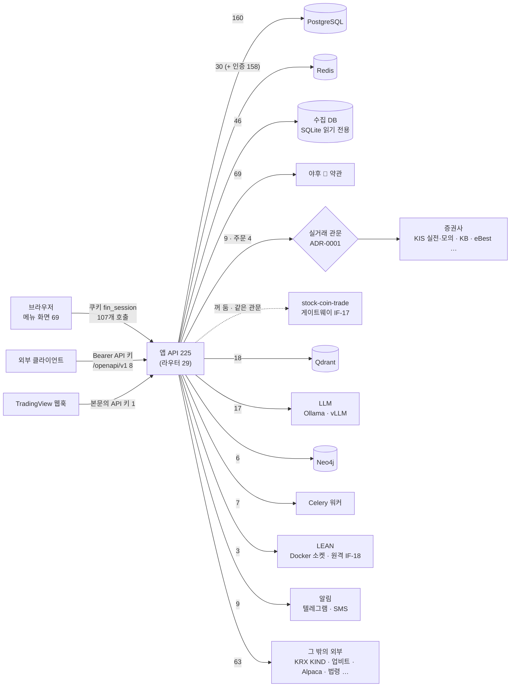

# API 명세서 v0.14 — Qurious

| 항목 | 내용 |
|------|------|
| **문서 버전** | v0.14 (Minor — 크롤링 세 화면 구현: 새 라우트 셋 `API-DATA-08`(자료 종류 · 출처 · 이용 조건) · `API-DATA-09`(받을 범위 — 실제 수집 단위로 받은 것 · 받을 것 · 휴장 · 아직 공개 전 · PC 에서 돌릴 명령) · `API-DATA-10`(적재 · 백업 판정 — 도구가 쓴 기록을 읽기만) — 셋 다 관리자 · 「DB 초기화」 `API-ADM-01` 없앰(DF-78 · 대장 「폐기」 — 모든 사용자의 주문 · 감사 로그까지 지웠다) · `API-ING-03 · 10` 의 받기가 리다이렉트 홉마다 보내기 전에 주소 검사(막히면 400 · 몸통에 `url`)) · 지난 판 v0.13 (Minor — 강사님 기초 코드 th06 `9478811` → `e815be3` 서버 쪽 반영: 새 라우트 둘 `API-KMON-01`(KIS 모의투자 결과 — 배치 · 계좌 · 봇 실주문 · 사이클 · 정합성) · `API-KMON-02`(실주문 검색 — 로그인한 사용자 본인과 시스템 사용자 주문만) · `API-HLTH-01` 응답에 `quant`(주기 · 공격 모드 · 배치 · KIS 환경 — 환경은 실거래 관문을 지난 값) · `API-STK-08` 질의 `symbols` · 실주문 목록 · 자동매매 상태 응답에 `batch` · `reconcile`(Qurious 는 정합성 점검을 꺼 둬 비어 있다) · 요구 ID 는 기능 설계서 부록 A 가 정본이라 새 두 API 는 아직 「—」) · 지난 판 v0.12 (Minor — 새 라우트 셋 `API-DATA-05 · 06 · 07`(수집 일정 · 단계 · 주소 검사 규칙 · 주소 검사 — 관리자) · 받는 길 셋(`API-ING-03 · 04 · 10`)이 주소 검사를 지나야 받는다(막히면 400 · 객체 몸통) · 지난 판 v0.11 (Patch — 라우트 · 인자 · 본문은 그대로 · `API-KB-03` 응답의 `check` 에 `absence`(답이 「규정은 없습니다」 · 「명시되어 있지 않습니다」 를 결론으로 쓰면 그 글을 보이지 않고 `no_evidence` · 걸린 문장 · DF-64 · 이 갈래에만 실림) · `echo`(답이 질문을 되풀이하고 출처 번호만 붙였으면 근거 발췌(`excerpt`)로 · 값 `true` · DF-76 · 이 갈래에만 실림) · 화면은 실패 발췌(`excerpt` 가운데 `answer=extract` 가 아닌 것)를 근거 없음처럼 그린다 — 응답은 그대로 · 설계서 v1.6 5.3.4) · 지난 판 v0.10 (Minor — 라우트는 그대로 · `API-KB-02` 질의 인자 · `API-KB-03` 본문 칸에 `sector`(섹터 질문 분류 — 기본 켬 · 끄면 분류 전 길) · `API-CAL-02` 같은 날 안 차례를 화면 칩 차례로 · 화면이 부르는 API 110 → 111(`API-CAL-03` · `API-DATA-03` 이 화면을 가짐 · 강사님 `API-LIB-01` 은 화면을 잃음) · 팀원 #114 · #116 · #118(리밸런싱 정책 · 첫 거래일 예약 · 하루 점검) 반영 — `API-RBAL-03` · `06` 에 409 · 본문 `PlanBody` 새 칸 · `CashflowBody` 값 검사 · 도커 `app.openapi()` 227/227) · 지난 판 v0.9 (Minor — 라우트 하나 더함 `API-CAL-03 GET /api/calendar/events/summary`(한 달 달력 요약 · DF-66) · `API-CAL-02` 에 `offset` · `q` · `first` · `API-DATA-03` 에 `source` · `facets` — 일정 2판 · 리서치 화면 결정의 서버 쪽 · 도커 `app.openapi()` 227/227) · 지난 판 v0.8 (Minor — `API-CAL-02` 의 `kind` 에 새 종류 둘(`agm` 주주총회 · `dividend_pay` 배당금 지급) · 라우트 · 인자는 그대로 · `kind` 를 비우면 여전히 화면의 네 종류 — 목표 기능 ① W7 남은 것) · 지난 판 v0.7 — 라우트 둘(`API-DATA-03` · `API-DATA-04`) · `kind` 에 새 종류 넷과 `all` |
| **작성일** | 2026-09-29 (KST) 첫 판 · 2026-10-03 v0.2 · v0.3 · v0.4 · 2026-10-04 v0.5 · v0.6 · v0.7 · 2026-10-05 v0.8 · v0.9 · 2026-10-06 v0.10 · v0.11 · 2026-10-07 v0.12 · 2026-10-08 v0.13 · **v0.14** |
| **작성자** | 이동원 (P-A) |
| **기준 코드** | `main` = `73f075b`(PR #141 강사님 th06 서버 쪽 반영) + 크롤링 세 화면 구현(이 판과 같은 PR) — 라우트 **235** · 라우터 **30** · 지난 판 `main` = `ef8cf5b`(PR #139 크롤링 세 화면 서버) + 강사님 th06 서버 쪽 반영 — 라우트 233 · 지난 판 `main` = `ff30238`(팀원 PR #131 · #130) + 크롤링 세 화면 서버(단계 이름표 한 곳 · 수집 일정 API · 주소 검사) · 지난 판 `main` = `5e5a393`(PR #120 · #119) + 근거 답 「없다」 단정 거름 · 지난 판 `main` = `a39e531`(PR #118 · #113 위에 팀원 #114 리밸런싱 정책 · #115 발표 문서 · #116 첫 거래일 예약 · #118 하루 점검) + 섹터 질문 분류 · 일정 2판 화면 · 리서치 화면(이 판과 같은 PR) — 라우트 **228** · 라우터 **29** (v0.1 은 `5adfb81` · 146 · 19) |
| **추출기** | [`scripts/api_scan.py`](../../../scripts/api_scan.py) — 앱을 import 하지 않는 정적 AST · 시험 [`tests/test_api_scan.py`](../../../tests/test_api_scan.py) (TC-AP 15건) |
| **ID 대장** | [`API-ID대장.tsv`](../대장/API-ID대장.tsv) — **236줄 · 사용 235 · 폐기 1**(2026-10-08 `API-DATA-08 ~ 10` 더함 · `API-ADM-01` 폐기 — 라우트가 처음 사라진 경우라 `--assign` 이 아니라 손으로 「폐기」 · 그 번호는 다시 쓰지 않는다) · 그 앞 233줄(2026-10-08 `API-KMON-01 · 02` · v0.1 146 → 강사님 기초 코드 두 번 · 계정 · 용어사전 · 개념 학습 · 금융 강의 · 데이터 · 달력 · 근거 문서 · 근거 답 · 팀원 모의계좌 — 2.1절) · 한 번 붙인 ID 는 바뀌지 않는다 |
| **정답 대조** | 개발 모드 앱의 `/openapi.json`(= `app.openapi()`)과 **234/234 일치**(2026-10-08 v0.14 · 인자 · 본문 모델 다름 0 · 235번째는 명세에서 일부러 뺀 `docs-summary`) · 이전 **232/232 일치**(2026-10-08 v0.13 · 인자 · 본문 모델 다름 0 · 233번째는 명세에서 일부러 뺀 `docs-summary`) · 이전 도커 안 `app.openapi()` 와 **227/227 일치**(2026-10-06 v0.10 · 인자 · 본문 모델 다름 0 · v0.9 도 227/227) · 이전 **224/224 일치**(2026-10-03 v0.4 · v0.2 는 223/223 · v0.1 은 145/145) — 메서드 · 경로 · 경로/질의 인자 · 요청 본문 모델 (1.2절) · 225번째는 명세에서 일부러 뺀 `docs-summary` |
| **산출물 구분** | 강사님 표 **7 인터페이스 설계** — API 명세서 · 인터페이스 정의서(7절 · 시작) · 데이터 매퍼(8절 · 시작) |
| **목적** | ② 강사님 요구 29개 설계(S63)의 **입력** — 요구마다 「어느 API 가 받고 어디에 닿는가」를 이 문서의 API ID 로 가리킨다 |

> **읽는 사람이 둘이다.**
> 팀원은 **4절 라우터별 표**에서 「파트(제안)」 칸으로 자기 몫을 찾고, 3절 발견에서 자기 파트 줄을 읽으면 된다.
> 강사님 표 7구분(인터페이스 설계 — 요청·응답 · 인증 · 오류 코드 · 데이터 교환 규칙)으로 보는 분은
> 2절(한눈에) → 6절(오류 코드) → 7절(인터페이스 정의서) → 8절(데이터 매퍼) 순서가 빠르다.

---

## 0. 쉬운 요약 세 줄

1. 앱의 API 는 **224개**(라우터 29개)다 — v0.1(146 · 19)에서 강사님 기초 코드 두 번(리밸런싱 · 웹훅 · 수식 지표 / 실주문 게이트웨이 · 통합 대시보드 · 원클릭)과 우리 기능(계정 · 용어사전 · 개념 학습 · 금융 강의 · 데이터 관제 · 거래일 달력 · 근거 문서)이 늘었다(2.1절). 소스를 읽어 뽑은 표가 실제 앱이 내놓는 명세(`/openapi.json`)와 **223/223 같다** — 224번째는 명세에서 일부러 뺀 `docs-summary` 하나다.
2. **응답 모양을 선언한 API 는 여전히 0개**다(`response_model` 0/224). 응답 칸은 코드의 `return {...}` 글자 키이고, 계약으로 보장되는 곳은 계약 시험이 붙은 곳(시세 등락률 TC-A1 · 일봉 다리 TC-CD · OHLCV 주소 TC-OA · 데이터 상태 TC-DST)뿐이다.
3. v0.2 의 새 발견은 **증권사에 닿는 두 번째 길**이었다 — 강사님 `9478811` 의 KIS 게이트웨이는 증권사 관문(팩토리)을 지나지 않고 HTTP 로 주문한다. 같은 실거래 승인 관문을 그 길에도 걸었고(F11 · ADR-0001 6절), KIS 자격증명은 사용자마다 자기 키를 쓰게 했다(F12 · ADR-0004). 게이트웨이는 서버 계좌 하나를 모두가 쓰는 길이라 켜지 않는다(IF-17).
4. **v0.3** — 같은 묶음의 화면 쪽(로그인 첫 화면 「투자 대시보드」 · 증권사 API 설정의 새 칸)을 받아 **화면이 부르는 API 가 102 → 107** 이 됐다(`DASH-01` · `STK-38 ~ 41` 다섯이 처음으로 화면을 가짐 · 대시보드가 기존 넷도 부름). 라우트는 그대로다. 서버가 화면에 내는 안내 글 다섯을 사용자 말로 바꿨다(F13 — 없는 화면 이름 · 서버 설정 이름 · 옛 서비스 이름 · 없는 화면 주소).
5. **v0.4** — 근거 번호가 달린 답 `API-KB-03` `POST /api/kb/ask` 가 붙었다(라우트 225). 응답은 상태 넷(`answered` · `excerpt` · `no_evidence` · `declined`)으로 갈리고, LLM 이 꺼져도 200 과 근거 발췌를 준다 — 서버가 답의 출처 번호를 다시 검사한다(2.1절 · 설계서 5.3.4).
6. **v0.5** — 근거 답이 화면(AI 투자 상담 · `agent-chat`)에 붙었다. `API-KB-03` 응답의 출처마다 화면 카드가 펼칠 조문 글 `citations[].excerpt`(답 모델에 넣은 글에서 머리 줄을 뺀 것 · 900자에서 자름)가 더해졌고, 화면이 부르는 API 가 **107 → 110** 이 됐다(`API-KB-03` · 새 대화 `API-CONV-01`(같은 경로라 `CONV-02` 도 잡힌다 · 9절 스캐너 한계) — 화면을 새로 열거나 초기화하면 첫 채팅 전에 새 대화를 연다 · 결함 DF-60).
7. **v0.6** — 근거 찾기 · 답이 질문 말을 법령 말로 넓히고(`synonyms` · 코스피 → 유가증권시장) 법 조가 하위 법령에 맡긴 조를 붙인다(`hits[].delegated[]` · 답의 출처에는 `via`). 둘 다 기본으로 켜지고 `links=false` · `synonyms=false` 로 끈다. 옛 칸은 그대로라 화면 · 호출자는 바꿀 것이 없다(2.1절 · 설계서 v1.1 5.3.3).
8. **v0.10** — 근거 찾기 · 답에 `sector` 가 더해졌다(기본 켬). 질문에 섹터 법령의 정식 이름 · 약칭 · 업 이름(예: 은행업 · 보험업 · ISA)이 있을 때만 그 섹터 법령까지 근거로 찾고, 없으면 분류 전과 같은 근거만 찾는다 — 응답 `route` 에 `sectors` · `sector_docs` · `sector_words` 가 붙는다(옛 칸 그대로 · 설계서 v1.5 5.3.7). 화면 쪽은 일정 2판(`market-calendar` 가 한 달 요약 `API-CAL-03` 과 그날 목록 `API-CAL-02` 의 `offset` · `q` · `first` 를 부름)과 리서치 화면(`agent-news` 가 수집 자료 검색 `API-DATA-03` 을 부름 · 강사님 `API-LIB-01` 은 부르지 않음 · 결함 DF-61)이다.
9. **v0.11** — 근거 답 `API-KB-03` 이 답 문장의 「규정은 없습니다」 · 「명시되어 있지 않습니다」 꼴을 찾으면 답 글을 보이지 않고 `no_evidence` 로 돌리며 걸린 문장을 `check.absence` 에 싣는다 — 넣은 근거 몇 조에 없다는 것은 법에 없다는 뜻이 아니다(DF-64 · 지난 답 271건 중 A15 · 옛 A09 만 걸림). 답이 질문을 그대로 되풀이하고 출처 번호만 붙였으면 답 모델이 실패한 것으로 보고 근거 발췌(`excerpt`)로 돌리며 `check.echo` 를 `true` 로 싣는다(DF-76 · 지난 답 388건 중 U13 만 걸림). 라우트 · 인자 · 다른 칸은 그대로다. 화면은 실패 발췌를 근거 없음처럼 접는다(응답은 그대로 · 설계서 v1.6 5.3.4).

---

## 1. 이 문서를 어떻게 만들었나

### 1.1 만드는 길 — 손으로 옮긴 숫자가 없다

```
   app/routes/*.py  ─┐
   app/services/**  ─┼─▶ scripts/api_scan.py ──▶ 라우트 146 ──┬─▶ --md       (4절 라우터별 표)
   app/lib/**       ─┤    (AST · import 안 함)                 ├─▶ --overview (2절 · 6절 요약 표)
   app/main.py      ─┘            │                            ├─▶ --models   (5절 요청 모델)
                                  │                            └─▶ --doc 이 문서 (표시 사이만 다시 채움)
   docs/인터페이스/대장/API-ID대장.tsv ─┘ (ID 는 여기서 온다)
   public/app.html · js/*.js ──▶ scripts/view_scan.py ──▶ 「화면」 칸

   정답 대조:  도커 이미지(5adfb81) 안에서 app.openapi() ──▶ --openapi 대조 ──▶ 145/145
```

- 앱을 **import 하지 않는** 이유 — 앱 import 는 PostgreSQL · Redis · Neo4j · Qdrant · Ollama 5개가 떠 있어야 하고(collector README §2) 로컬 파이썬에는 앱 의존성도 없다(`neo4j` 없음 · 실측). 정적 추출은 **1초 남짓**(화면 잇기 포함 · 실측 1.1초)에 돌고 네트워크를 쓰지 않는다.
- 표 셋(2절 · 4절 · 5절)은 문서 안 표시(`<!-- api_scan:이름 -->`) 사이를 스캐너가 채운다. 코드가 바뀌면 `python scripts/api_scan.py --doc docs/인터페이스/API명세서.md` 한 줄이면 되고, 표시 밖의 글(이 절 · 3절 · 7절 · 8절)은 사람이 고친다. **`--check` 를 붙이면 고치지 않고 「문서가 뒤처졌는가」만 본다**(종료코드 1). 시험 게이트로는 걸지 않았다 — 다른 파트가 라우트를 고칠 때 그 PR 을 막으면 안 되고, 팀 공용 장치는 논의 먼저다(ADR-0003).

### 1.2 정답과 맞춰 봤다 — v0.1 145/145 · v0.2 223/223 · v0.4 224/224

도커 이미지를 `5adfb81` 의 `app/`·`public/`·`alembic/` 만으로 빌드하고(`data/` 2.9GB 를 컨텍스트에 싣지 않으려고 따로 모음),
**네트워크를 끊은 컨테이너**(`--network none`)에서 `app.openapi()` 만 불렀다. 서버는 띄우지 않았다.

| 대조 | 결과 |
|------|------|
| OpenAPI 오퍼레이션 | 145 |
| 스캐너 라우트 | 146 = 145 + `include_in_schema=False` 1 (`GET /openapi/v1/docs-summary`) |
| OpenAPI 에만 있음 · 스캐너에만 있음 | **0 · 0** |
| 경로 · 질의 인자 이름이 다름 | **0** (처음 2건 → `AlpacaTestBody \| None` 선택형 본문을 못 알아본 것 · 고침 · 시험 TC-AP-08) |
| 요청 본문 모델이 다름 | **0** |

**v0.2 다시 대조(2026-10-03)** — 이번에는 켜져 있는 개발 모드 앱 컨테이너에서 `app.openapi()` 만 불렀다(서버 요청 없음 · 모듈 import 만).

| 대조 | v0.1 (`5adfb81`) | v0.2 (`cb98e05` + `9478811` 서버 쪽) |
|------|:--:|:--:|
| OpenAPI 오퍼레이션 · 스캐너 라우트 | 145 · 146 | **223 · 224** |
| 한쪽에만 있음 | 0 · 0 | **0 · 0** |
| 경로 · 질의 인자 이름이 다름 | 0 | 처음 **3** → 스캐너를 고쳐 **0** — `start: str = Query(..., alias="from")` 를 파이썬 이름(`start` · `from_`)으로 적고 있었다(거래일 달력 둘 · OHLCV 하나). 이제 `alias` 를 읽는다(시험 TC-AP-15) |
| 요청 본문 모델이 다름 | 0 | **0** |

> **뒤집을 조건** — 라우터를 `include_router(prefix=...)` 로 다시 접두어를 붙이거나, 데코레이터를 문자열이 아닌 변수 경로로 쓰면
> 스캐너가 경로를 틀리게 적는다. 지금 코드에는 둘 다 없다(`main.py` 의 `include_router` 19줄 모두 인자 하나).
> 그런 코드가 들어오면 `--openapi` 대조가 「한쪽에만」 으로 드러낸다.

### 1.3 칸 읽는 법 · 용어

| 칸 | 뜻 | 이 문서에서 | 헷갈리는 점 |
|----|----|------------|-------------|
| **API ID** | `API-<라우터 머리글>-NN` | [ID 대장](../대장/API-ID대장.tsv)에서 온다. 라우트가 사라져도 번호를 다시 쓰지 않는다(「폐기」) | **순번이 아니다.** 순번이면 하나가 끼는 순간 뒤가 전부 밀린다(RTM v1.0 §2.2 의 교훈 · 시험 TC-AP-09) |
| **인증** | 인자 기본값 `Depends(...)` 를 풀어 붙인 이름표 | `세션` = 쿠키 `fin_session` · `세션·JWT` = 쿠키 또는 `Authorization: Bearer <JWT>` · `API 키` = Open API 키 · `+ 관리자` · `+ 역할(…)` · `없음` | 인증 **의존성 안**에서 도는 일(세션 조회 = Redis)은 「닿는 곳」 에 넣지 않았다 — 7절 IF-05 에 따로 셌다 |
| **요청** | 경로 `{x}` · 질의 `x`(\* = 필수) · 본문 `Model` · 파일 · 쿠키 | FastAPI 가 읽는 규칙 그대로 | 본문 모델의 칸은 5절 |
| **응답** | `response_model` → 없으면 응답 클래스 → 없으면 `return {...}` 글자 키 | 146개 모두 `response_model` 이 없어 **글자 키**다. 「외 N」 은 키가 더 있다는 뜻 | 키가 있다고 값이 채워진다는 보장은 없다 — 계약 시험이 있는 곳만 보장(F3) |
| **오류** | 라우트 **본문에 적힌** `HTTPException` 과 그 하위 클래스의 코드 | `401 UNAUTHORIZED` 처럼 뒤 글자는 Open API 의 오류 이름 | 인증 의존성의 401 · FastAPI 가 스스로 내는 422 · 서비스 안에서 던지는 것은 **이 칸에 없다**(6절) |
| **닿는 곳** | 라우트 본문에서 시작한 **정적 호출 그래프**가 닿는 시스템 | 수집DB · 야후 · 증권사(관문) · 주문 · PostgreSQL · Redis · Neo4j · Qdrant · LLM · Celery · LEAN · Docker · 알림 · 외부(호스트) · 라우트 캐시 N h | **가능한 길의 합집합**이다. `get_candles` 는 국내 주식 일봉이면 수집DB, 아니면 야후 — 둘 다 뜬다 |
| **다리** | DF-08 `app/services/collector_db.py` — 앱이 수집 DB 를 읽는 유일한 길 | 「다리 결과 그대로 (`source`·`as_of`)」 = 응답에 기준일이 실린다 | 다리에 **닿는** 것과 응답에 기준일이 **실리는** 것은 다르다(19 대 2 · F6) |
| **관문** | ADR-0001 실거래 차단 — `brokers/factory.get_broker_client` 한 곳 | 「증권사」 = 이 함수에 닿는다 · 「주문」 = `.place_order(` 를 부른다 | 관문을 지나도 `QURIOUS_ALLOW_LIVE_TRADING` 이 꺼져 있으면 모의로 강등된다 |
| **라우트 캐시** | 라우트 본문이 직접 `cache_get(…, max_age_hours=N)` 을 부름 | PostgreSQL `data_cache` 표. N 시간 안이면 서비스 함수를 안 부르고 저장본을 돌려준다 | 서비스 함수의 캐시와 다르다 — 다리는 서비스 층에서 캐시를 건너뛰는데 라우트 층이 다시 씌웠다(F2) |
| **화면** | 그 API 를 부르는 메뉴 화면(IA 의 view 키) | `view_scan.py` 가 `app.html`·`paper.js` 에서 화면별로 뽑은 경로를 맞춘 것. `(다른 곳)` = 메뉴 화면은 아니지만 `public/` 어디엔가 경로 글자가 있다(로그인 · 공통 JS) | JS 에는 메서드가 없어 같은 경로의 GET · POST 가 함께 잡힌다 |
| **파트(제안)** | 분배안 v1.0(옛 `#62`) §3 요구 → 파트 대응을 **경로에 옮긴 것** | P-A 데이터 · P-B 지표·신호 · P-C 자산배분·리밸런싱 · P-D 검증·성과 · P-E 안전·실행·운영 · 공통(인증·관리) | **합의된 소유가 아니다** — D0 ⑤ 역할이 3/4. 경계가 걸친 경로는 근거 칸에 「경계」 로 적었다(`--json` 의 `part_basis`) |
| **요구 ID** | RTM v1.0 의 계층 ID (`P01-③-2` · 사각지대 `RFP2-3.1.3-①`) | [기능 설계서 v0.1](../../설계/기능설계.md) **부록 A** 의 표를 스캐너가 뒤집어 채운다(S63 ②) — **146 중 105**. 비는 41개는 인증 10 · 관리 3 · 모의투자 코인 · 대체자산 · 알파카 19 · Open API 계좌 · 주문 6 · 그래프 문서 · 시드 2 · `API-QNT-01` 1 — 요구 밖(D1 ③ 동결 후보가 많다) | API 하나가 요구 여럿을 받을 수 있다. 정본은 설계서 쪽(요구 → API)이고 이 칸은 그 역방향이다 |

확실도 — 🟢 코드·실측으로 확인 · 🟡 코드로는 그렇게 보이나 실행으로 확인 안 함 · 🔴 틀렸거나 결함

### 1.4 한계 — 이 문서가 판정하지 않는 것

- **런타임에 그 길을 타는가.** 「닿는 곳」 은 정적 호출 그래프다. 인스턴스 메서드(`client.get_balance()`) · `getattr` · 문자열 태스크 이름은 이름으로 못 풀어 **빠질 수 있고**(과소), 지역 변수가 가져온 이름을 가리면 **없는 길이 생길 수 있다**(과대). 증권사를 「관문 함수에 닿는가」로 보는 이유가 이것이다.
- **응답 값이 맞는가.** 글자 키가 있다고 값이 옳다는 뜻이 아니다. 옛 `A1`(등락률이 늘 `None`)은 키는 있고 값이 비어 있던 사례다.
- **화면이 정말 부르는가.** 「화면」 칸은 view_scan 의 휴리스틱(진입 훅 + 버튼 리스너 1단계)을 따른다. IA v0.2 1.5절의 브라우저 확인은 주 경로 12개뿐이다.

---

## 2. 한눈에 — 숫자



| 묶음 | v0.1 (S63 · `5adfb81`) | **v0.3 (2026-10-03)** |
|------|------|------|
| 메서드 | GET 79 · POST 58 · DELETE 8 · PATCH 1 = 146 | GET 129 · POST 78 · DELETE 11 · PUT 4 · PATCH 2 = **224** |
| 인증 | 세션 61 · 세션·JWT 40 · 없음 33 · API 키 8 · 세션 + 관리자 3 · 세션·JWT + 역할 1 | 세션 81 · 세션·JWT 77 · **없음 54** · API 키 8 · 세션 + 관리자 3 · 세션·JWT + 역할 1 |
| 파트(제안) | P-E 62 · P-A 43 · P-B 15 · 공통 13 · P-D 11 · P-C 2 | P-E 70 · P-A 63 · **미배정 42** · 공통 17 · P-B 15 · P-D 15 · P-C 2 |
| 응답 | `response_model` 0/146 · 다리 결과 그대로 2 · 라우트 캐시 7 | `response_model` **0/224** · 다리 결과 그대로 3 · 라우트 캐시 10 |
| 화면 | 메뉴 화면이 부름 74 · `public/` 어디에도 경로 글자가 없음 56 | 110 · **65** (2026-10-04 v0.5 · v0.3 은 107 · 67 · v0.2 는 102 · 72) |
| 요구 | 요구 ID 가 붙은 API 105 / 146 | **111** / 224 — [기능 설계서 v0.1](../../설계/기능설계.md) 부록 A |

- 「인증 없음」 이 33 → 54 로 늘어난 21 가운데 19 는 **로그인 없이 읽게 만든 참조 자료**다 — 금융 강의 8 · 용어사전 5 · 개념 학습 기본 교재 2 · 거래일 달력 2 · 근거 문서 목록 1(사용자 데이터가 없고, 바꾸는 주소가 없다). 1 은 TradingView 웹훅(세션 대신 본문의 API 키로 사용자를 찾는다 — 3절 F4 의 셈법). 나머지 1 은 LEAN 상태.
- 「파트 미배정 42」 는 v0.1 뒤 생긴 라우터 가운데 분배안(옛 `#62`) 표에 없는 것이다. 역할은 2026-10-01 팀이 정했으므로(계획서 v2.0 4절) 다음 판에서 요구 대장의 주담당으로 바꿔 적는다(9절).

라우터별 · 닿는 곳 × 라우터 · 인증 없는 API · 오류 코드 — 스캐너 출력(`--overview`):

<!-- api_scan:overview -->
| 라우터 | 파일 | API | 인증 없음 | 메뉴 화면이 부름 | public/ 에 없음 | 파트(제안) |
|---|---|---:|---:|---:|---:|---|
| `auth` | `app/routes/auth.py` | 14 | 6 | 0 | 4 | 공통 14 |
| `ingest` | `app/routes/ingest.py` | 12 | 0 | 2 | 10 | P-A 12 |
| `health` | `app/routes/health.py` | 1 | 1 | 0 | 0 | P-E 1 |
| `chat` | `app/routes/chat.py` | 2 | 0 | 1 | 1 | P-A 2 |
| `stocks` | `app/routes/stocks.py` | 41 | 9 | 37 | 4 | P-E 21 · P-A 8 · 미배정 6 · P-B 5 · P-D 1 |
| `kis_monitor` | `app/routes/kis_monitor.py` | 2 | 0 | 0 | 2 | P-E 2 |
| `library` | `app/routes/library.py` | 1 | 0 | 0 | 0 | P-A 1 |
| `admin` | `app/routes/admin.py` | 2 | 0 | 1 | 1 | 공통 2 |
| `system` | `app/routes/system.py` | 3 | 0 | 1 | 0 | P-E 3 |
| `quant` | `app/routes/quant.py` | 3 | 1 | 0 | 3 | P-D 3 |
| `ml` | `app/routes/ml.py` | 10 | 0 | 10 | 0 | P-D 8 · P-C 2 |
| `macro` | `app/routes/macro.py` | 4 | 0 | 4 | 0 | P-A 4 |
| `documents` | `app/routes/documents.py` | 4 | 0 | 0 | 4 | P-A 4 |
| `notification` | `app/routes/notification.py` | 4 | 0 | 4 | 0 | P-B 4 |
| `graph` | `app/routes/graph.py` | 6 | 6 | 0 | 6 | P-A 6 |
| `conversations` | `app/routes/conversations.py` | 8 | 0 | 2 | 6 | P-A 8 |
| `tasks` | `app/routes/tasks.py` | 2 | 2 | 0 | 2 | P-E 2 |
| `paper` | `app/routes/paper.py` | 40 | 8 | 25 | 6 | P-E 37 · P-B 3 |
| `dashboard` | `app/routes/dashboard.py` | 1 | 0 | 1 | 0 | 미배정 1 |
| `openapi` | `app/routes/openapi.py` | 9 | 1 | 1 | 8 | P-E 6 · P-B 3 |
| `lean` | `app/routes/lean.py` | 3 | 1 | 2 | 0 | P-D 3 |
| `rebalance` | `app/routes/rebalance.py` | 9 | 0 | 3 | 0 | 미배정 9 |
| `tradingview` | `app/routes/tradingview.py` | 5 | 1 | 3 | 0 | 미배정 5 |
| `formula` | `app/routes/formula.py` | 13 | 0 | 4 | 0 | 미배정 13 |
| `glossary` | `app/routes/glossary.py` | 5 | 5 | 0 | 1 | P-A 5 |
| `learn` | `app/routes/learn.py` | 7 | 2 | 0 | 7 | P-A 7 |
| `lectures` | `app/routes/lectures.py` | 8 | 8 | 0 | 2 | 미배정 8 |
| `data` | `app/routes/data.py` | 10 | 0 | 8 | 2 | P-A 10 |
| `calendar` | `app/routes/calendar.py` | 3 | 3 | 3 | 0 | P-A 3 |
| `kb` | `app/routes/kb.py` | 3 | 1 | 1 | 2 | P-A 3 |
| **합계** | 30개 | **235** | **55** | **113** | **71** | |

| 라우터 | 수집DB | 야후 | 증권사 | 주문 | PostgreSQL | Redis | Neo4j | Qdrant | LLM | Celery | LEAN | Docker | 알림 | 외부 |
|---|---:|---:|---:|---:|---:|---:|---:|---:|---:|---:|---:|---:|---:|---:|
| `auth` | · | · | · | · | 7 | 13 | · | · | · | · | · | · | · | · |
| `ingest` | · | · | · | · | 9 | 4 | · | 9 | 9 | 4 | · | · | · | 3 |
| `health` | · | · | · | · | · | · | · | · | · | · | · | · | · | · |
| `chat` | · | · | · | · | 2 | 2 | · | 2 | 2 | 1 | · | · | · | · |
| `stocks` | 9 | 14 | 8 | 4 | 37 | 4 | · | · | · | · | · | · | 7 | 12 |
| `kis_monitor` | · | · | · | · | 2 | 1 | · | · | · | · | · | · | · | · |
| `library` | · | · | · | · | 1 | · | · | · | · | · | · | · | · | · |
| `admin` | · | · | · | · | 2 | · | · | · | · | · | · | · | · | · |
| `system` | 1 | 2 | · | · | 2 | 1 | · | 1 | 1 | · | · | · | · | · |
| `quant` | 2 | 2 | · | · | 2 | · | · | · | · | · | · | · | · | 2 |
| `ml` | 7 | 7 | · | · | 7 | · | · | · | · | · | · | · | · | · |
| `macro` | · | 4 | · | · | 3 | · | · | · | · | · | · | · | · | · |
| `documents` | · | · | · | · | 3 | · | · | 3 | 2 | · | · | · | · | · |
| `notification` | · | · | · | · | 4 | · | · | · | · | · | · | · | 1 | 1 |
| `graph` | · | · | · | · | · | · | 6 | 1 | 1 | · | · | · | · | · |
| `conversations` | · | · | · | · | 8 | 5 | · | · | · | · | · | · | · | · |
| `tasks` | · | · | · | · | · | · | · | · | · | 2 | · | · | · | · |
| `paper` | 6 | 17 | · | · | 31 | · | · | · | · | · | · | · | · | 22 |
| `dashboard` | 1 | 1 | 1 | · | 1 | · | · | · | · | · | · | · | · | 1 |
| `openapi` | 2 | 5 | · | · | 8 | · | · | · | · | · | · | · | · | 6 |
| `lean` | · | 1 | · | · | 2 | · | · | · | · | · | 2 | 2 | · | · |
| `rebalance` | 6 | 1 | · | · | 9 | · | · | · | · | · | · | · | · | 1 |
| `tradingview` | · | 2 | · | · | 4 | 1 | · | · | · | · | 1 | 1 | 1 | 1 |
| `formula` | 3 | 3 | · | · | 12 | · | · | · | · | · | · | · | · | · |
| `glossary` | · | · | · | · | 5 | · | · | · | · | · | · | · | · | · |
| `learn` | · | · | · | · | · | · | · | · | · | · | · | · | · | 7 |
| `lectures` | 6 | 5 | · | · | · | · | · | · | · | · | · | · | · | 2 |
| `data` | 7 | · | · | · | · | · | · | · | · | · | · | · | · | 1 |
| `calendar` | 3 | · | · | · | · | · | · | · | · | · | · | · | · | · |
| `kb` | · | · | · | · | · | · | · | 2 | 2 | · | · | · | · | · |
| **합계** | **53** | **64** | **9** | **4** | **161** | **31** | **6** | **18** | **17** | **7** | **3** | **3** | **9** | **59** |

| API ID | 메서드 | 경로 | 닿는 곳 | 화면 |
|---|---|---|---|---|
| API-AUTH-01 | POST | `/api/auth/register` | PostgreSQL · Redis | (다른 곳) |
| API-AUTH-02 | POST | `/api/auth/login` | PostgreSQL · Redis | (다른 곳) |
| API-AUTH-03 | POST | `/api/auth/logout` | Redis | (다른 곳) |
| API-AUTH-04 | POST | `/api/auth/token` | PostgreSQL · Redis | — |
| API-AUTH-05 | POST | `/api/auth/token/refresh` | Redis | — |
| API-AUTH-11 | GET | `/api/auth/password-policy` | — | (다른 곳) |
| API-HLTH-01 | GET | `/api/health` | — | (다른 곳) |
| API-STK-01 | GET | `/api/stocks/market` | 야후 · PostgreSQL · 라우트 캐시 2h | `quant-dashboard` |
| API-STK-02 | GET | `/api/stocks/quote` | 야후 | `robo-patterns`, `trading-chart`, `us-chart`, `us-dashboard`, `us-order`, `us-portfolio` |
| API-STK-03 | GET | `/api/stocks/candles` | 수집DB · 야후 · PostgreSQL · 라우트 캐시 6h (다리 요청 제외) | `robo-patterns`, `trading-chart`, `us-chart` |
| API-STK-04 | GET | `/api/stocks/quant/indicators` | 수집DB · 야후 · PostgreSQL · 라우트 캐시 6h (다리 요청 제외) | `indicator-strategy`, `quant-backtest`, `quant-dashboard` |
| API-STK-05 | GET | `/api/stocks/quant/list` | — | `quant-dashboard` |
| API-STK-06 | GET | `/api/stocks/search` | 야후 · PostgreSQL · 외부(kind.krx.co.kr) | `company-dashboard`, `quant-dashboard`, `trading-chart` |
| API-STK-07 | GET | `/api/stocks/fundamentals` | 야후 · PostgreSQL | `company-dashboard` |
| API-STK-08 | GET | `/api/stocks/signals` | 수집DB · 야후 · PostgreSQL · 라우트 캐시 3h | `robo-patterns`, `robo-screening` |
| API-STK-14 | GET | `/api/broker/catalog` | — | — |
| API-QNT-01 | GET | `/api/quant/ml/stocks` | — | — |
| API-GRPH-01 | GET | `/api/graph/related/{symbol}` | Neo4j | — |
| API-GRPH-02 | GET | `/api/graph/sector` | Neo4j | — |
| API-GRPH-03 | GET | `/api/graph/path` | Neo4j | — |
| API-GRPH-04 | GET | `/api/graph/documents/{symbol}` | Neo4j | — |
| API-GRPH-05 | POST | `/api/graph/seed` | Neo4j | — |
| API-GRPH-06 | POST | `/api/graph/rag` | Neo4j · Qdrant · LLM | — |
| API-TASK-01 | GET | `/api/tasks/{task_id}` | Celery | — |
| API-TASK-02 | DELETE | `/api/tasks/{task_id}` | Celery | — |
| API-PAPR-03 | GET | `/api/paper/stocks/quote` | 야후 · PostgreSQL · 외부(kind.krx.co.kr) | (다른 곳) |
| API-PAPR-11 | GET | `/api/paper/crypto/market-list` | 외부(api.upbit.com) | `paper-crypto` |
| API-PAPR-12 | GET | `/api/paper/crypto/rankings` | 외부(api.upbit.com) | `paper-crypto` |
| API-PAPR-13 | GET | `/api/paper/crypto/ticker` | 외부(api.upbit.com) | `paper-crypto` |
| API-PAPR-14 | GET | `/api/paper/crypto/{code}/candles` | 외부(api.upbit.com) | `paper-crypto` |
| API-PAPR-15 | GET | `/api/paper/crypto/{code}/domestic-prices` | 외부(api.bithumb.com, api.korbit.co.kr …) | `paper-crypto` |
| API-PAPR-22 | GET | `/api/paper/alternatives/markets` | 야후 | `paper-alternative` |
| API-PAPR-23 | GET | `/api/paper/alternatives/markets/{symbol}/chart` | 야후 | `paper-alternative` |
| API-OAPI-09 | GET | `/openapi/v1/docs-summary` | — | `paper-openapi` |
| API-LEAN-01 | GET | `/api/backtests/lean/status` | LEAN · Docker | `quant-lean` |
| API-TV-01 | POST | `/api/webhooks/tradingview` | 야후 · PostgreSQL · Redis · 알림 · 외부(api.coolsms.co.kr, api.telegram.org …) | (다른 곳) |
| API-GLOS-01 | GET | `/api/glossary` | PostgreSQL | (다른 곳) |
| API-GLOS-02 | GET | `/api/glossary/categories` | PostgreSQL | (다른 곳) |
| API-GLOS-03 | GET | `/api/glossary/meta` | PostgreSQL | — |
| API-GLOS-04 | GET | `/api/glossary/{name}` | PostgreSQL | (다른 곳) |
| API-GLOS-05 | GET | `/api/glossary/{name}/graph` | PostgreSQL | (다른 곳) |
| API-LRN-01 | GET | `/api/learn/catalog` | 외부(huggingface.co) | — |
| API-LRN-02 | GET | `/api/learn/pages/{slug}` | 외부(huggingface.co) | — |
| API-LEC-01 | GET | `/api/lectures/market/kospi-history` | 수집DB · 야후 | (다른 곳) |
| API-LEC-02 | GET | `/api/lectures/market/rate-market-history` | 수집DB · 야후 | (다른 곳) |
| API-LEC-03 | GET | `/api/lectures/market/kospi200-history` | 수집DB · 야후 · 외부(api.finance.naver.com) | (다른 곳) |
| API-LEC-04 | GET | `/api/lectures/market/central-bank-event-history` | 수집DB · 야후 | (다른 곳) |
| API-LEC-05 | GET | `/api/lectures/market/intraday` | 야후 | (다른 곳) |
| API-LEC-06 | GET | `/api/lectures/market/period-return` | 수집DB | — |
| API-LEC-07 | POST | `/api/lectures/market/period-return/extend` | 수집DB | — |
| API-LEC-08 | GET | `/api/lectures/historic-bond-image` | 외부(www.emuseum.go.kr) | (다른 곳) |
| API-CAL-01 | GET | `/api/calendar/trading-days` | 수집DB | `market-calendar` |
| API-CAL-02 | GET | `/api/calendar/events` | 수집DB | `market-calendar` |
| API-CAL-03 | GET | `/api/calendar/events/summary` | 수집DB | `market-calendar` |
| API-KB-01 | GET | `/api/kb/documents` | — | — |

| 코드 | 뜻 | 본문에 적힌 API 수 | API ID |
|---|---|---:|---|
| `400` | 요청 값이 틀림 | 15 | API-AUTH-01, API-AUTH-13, API-AUTH-14, API-CHAT-01, API-STK-12, API-DOC-01 외 9 |
| `400 INVALID_REQUEST` | 요청 값이 틀림 | 1 | API-OAPI-05 |
| `401` | 인증 실패 | 5 | API-AUTH-02, API-AUTH-04, API-AUTH-05, API-CHAT-01, API-LRN-02 |
| `403` | 권한 없음 | 2 | API-AUTH-06, API-TV-01 |
| `404` | 대상 없음 | 22 | API-AUTH-09, API-STK-34, API-STK-30, API-STK-33, API-QNT-02, API-ML-01 외 16 |
| `404 NOT_FOUND` | 대상 없음 | 1 | API-OAPI-02 |
| `409` |  | 7 | API-STK-24, API-STK-41, API-STK-27, API-RBAL-06, API-FRML-05, API-FRML-07 외 1 |
| `413` | 너무 큼 | 1 | API-DOC-01 |
| `422` | 검증 실패 | 25 | API-AUTH-01, API-AUTH-12, API-AUTH-13, API-AUTH-14, API-STK-15, API-STK-18 외 19 |
| `429` | 호출 한도 초과 | 2 | API-CHAT-01, API-TV-01 |
| `500` | 서버 내부 오류 | 1 | API-CHAT-01 |
| `502` | 바깥 서버 실패 | 11 | API-CHAT-01, API-STK-06, API-STK-07, API-STK-19, API-STK-20, API-STK-21 외 5 |
| `503` | 의존 서비스 없음 | 11 | API-AUTH-01, API-AUTH-02, API-AUTH-04, API-CHAT-01, API-DOC-01, API-GRPH-01 외 5 |
| `503 MARKET_DATA_UNAVAILABLE` | 의존 서비스 없음 | 1 | API-OAPI-01 |
| `504` | 시간 초과 | 1 | API-CHAT-01 |
| `?` |  | 9 | API-TV-01, API-LEC-06, API-DATA-09, API-DATA-02, API-DATA-03, API-DATA-04 외 3 |
<!-- /api_scan:overview -->

---

### 2.1 v0.1 뒤 늘어난 라우트 — 9절 노트 열세 줄을 여기로

v0.1 은 판을 올리지 않고 9절에 노트를 쌓았다(2026-09-30 ~ 10-03). v0.2 는 그 줄들을 아래 표 하나로 녹였다. 표의 요청 · 응답 · 오류 칸의 전체 모양은 4절(스캐너 표)과 각 설계 문서에 있다.

| 날짜 | 라우트 (ID) | 수 | 누가 · 왜 | 인증 | 상태 코드 · 규칙 (요점) | 설계 · 시험 |
|---|---|:-:|---|---|---|---|
| **10-08** | `data` +3 (**DATA-08** `GET /api/data/fetch-sources` · **DATA-09** `GET /api/data/fetch-plan` · **DATA-10** `GET /api/data/backup`) · `admin` −1 (**ADM-01** `POST /api/admin/reset` 폐기) | 2 | 크롤링 세 화면 구현 — 자료 직접 받기의 종류 · 출처 표와 받을 범위(실제 수집 단위: 시세 · 공시 · 정책뉴스는 날, 재무는 해 · 수집기가 남긴 기록 열쇠만 읽는다 — 앱에 수집기 상수를 베끼지 않는다) · 적재 · 백업의 판정(규칙은 `scripts/hf_dataset.py` 한 곳 · 도구가 쓴 `state/hf_backup_status.json` 을 읽기만) · 「DB 초기화」 없앰(DF-78) | 세션 · **관리자** | `DATA-09` 422 잘못된 입력(종류 · 날짜 꼴 · 끝 < 시작 · 400일 · 10년 넘음) · 503 수집 DB · 달력 · 수집 기록 표 없음 · 받을 것이 있으면 `command`(PC 에서 돌릴 명령 — 화면은 돌리지 않는다) · `DATA-10` 기록이 없으면 200 `available: false` + 기록을 만드는 명령 · 받는 길(`ING-03` · 비동기 `ING-10`)이 리다이렉트 홉마다 보내기 전에 주소 검사(막히면 400) | UI 명세서 5절 · TC-FP · TC-BK · TC-CL · TC-UG-07 · 08 |
| 10-07 | `data` +3 (`API-DATA-05~07`) · `ingest` 받는 길 셋 | 3 | 크롤링 세 화면 서버(결정 ④ · 설계 2) — 단계 이름표 · 묶음 · 하는 일은 러너가 쓴 기록에서(앱 사본 없음) · 주소 검사 | 세션 · **관리자**(DATA-05~07) | `DATA-05` 마지막 회차 · 회차 기록(단계별 결과는 10-07 뒤 회차부터) · 단계 목록 · 이 PC 용량 · 다시 돌리는 명령 · `DATA-07` 막혀도 200(까닭 · 지난 검사) · `ING-03 · 04 · 10` 막히면 400 `{"detail": {"message", "hint"}}` — 형식 · 내부망 · 허용 목록 · robots | UI 명세서 5절 · TC-DST-08 · 11 · 12 · TC-UG |
| 09-30 | `rebalance`(RBAL 9) · `tradingview`(TV 5) · `formula`(FRML 13) · `stocks` +4 · `ml` +4 | 35 | 강사님 기초 코드 `b055ab0` | 세션 · 웹훅은 본문 API 키 | 웹훅 받는 쪽 확인(비밀 토큰 · 중복 신호)은 요구 `P02-③-3` 설계에서 | TC-RB · TC-TV · TC-FM |
| 09-30 | `auth` +4 (`API-AUTH-11~14`) | 4 | 계정 관리(이메일 대소문자 · 마이페이지 · 탈퇴 · 로그인 유지) | 세션 | 탈퇴는 비밀번호 확인 · 로그인 유지 30일(슬라이딩) | 동작 원리서 2절 · TC-AC |
| 09-30 | `glossary`(GLOS-01~05) | 5 | 용어사전(요구 `P01-①-1`) | **없음**(참조 자료) | 404 없는 용어 · 422 · `GLOS-01` 줄마다 `matched`(어느 이름으로 맞았나) · `GLOS-04` `related[]` · `GLOS-05` `/graph?depth=1\|2`(40개 상한이면 `truncated`) | 용어사전 설계서 6절 · TC-GL |
| 10-01 | `learn`(LRN-01~07) | 7 | 개념 학습 — 기본 교재 · 팀 자료(HF 비공개 `learn-pages`) | 기본 교재 없음 · 팀 자료 세션 | 고치기 · 지우기는 `base_version` 필수 — 낡으면 **409 `LEARN_CONFLICT` + 지금 글** · HF 가 안 되면 503 · 권한 없으면 403 · 오류 몸통 `detail: {code · message · field · current}` | 개념 학습 설계서 5 · 7절 · TC-LN |
| 10-01 | `lectures`(LEC) | 8 | 금융 강의 — 강의실 · 주제 화면 | 없음 | 강의 시세는 수집 DB 먼저 · 외부 시세는 저장하지 않는다 | TC-LC |
| 10-02 | `paper` +3 (`API-PAPR-33~35`) · +5 (`36~40` · PR #92) | 8 | 팀원(P-E) 모의계좌 성과 · 위험 지표 · 회전율 · KOSPI 비교 | 세션 · `/simulate` 관리자 검사(#95) | ⚠️ `/simulate` 의 관리자 검사가 아직 못 막는다(#88 확인 댓글 02) | 팀원 PR #85 · #86 · #92 |
| 10-02 | `data`(DATA-01 · 02) · `calendar`(CAL-01 · 02) | 4 | 데이터 관제 · OHLCV 규격 · 거래일 달력 · 금융 일정(요구 `P01-①-4` · `①-2`) | DATA 세션 · CAL 없음 | DATA-01 행 수 상태 `rows_state`(fresh · old · pending) · DATA-02 `basis` · `limit` 넘으면 **자르지 않고 422** · 달력이 없으면 503 + 할 일 · 거꾸로 된 구간 422 | 설계서 7절 · TC-DST · TC-OA · TC-CA |
| 10-03 | `kb`(KB-01 · 02) | 2 | 근거 문서 — 법령 · 감독규정 판 목록 · 찾기(요구 `P01-①-3`) | 목록 없음 · 찾기 세션 | 422 잘못된 입력(모르는 문서면 `hint`) · 503 `kb.sqlite3` 없음 · 벡터만 달라는데 실패 | 설계서 5.3 · TC-KB |
| **10-03** | `stocks` +4 (`API-STK-38~41`) · `dashboard`(**DASH-01**) | 5 | 강사님 기초 코드 `9478811` — 합격 전략 목록 · 실주문 추적 · 원클릭 둘 · 통합 대시보드 | 세션 | 원클릭 시작은 **409**(키 없음 · 실전 · 비상 정지) · 대시보드는 탭 하나가 실패해도 나머지(탭마다 `error`) · KIS 는 사용자 키(F12) | ADR-0004 · TC-KQ · TC-KH · TC-DA · TC-GP |
| **10-04** | `kb` 입력 +2 · 응답 칸 +4 (**KB-02** `links` · `synonyms` → `synonyms` · `query_used` · `retrieval.delegated` · `hits[].delegated[]`(위임 조 · `via`) / **KB-03** 본문 `links` · `synonyms` → `synonyms` · `citations[].via`) | 0 | 법령 말 넓히기 · 위임 조 함께 넣기(요구 `P01-①-3` · W5 · DF-59) | 세션 | 둘 다 기본 켬 · 옛 칸 그대로 · `via` 는 위임 조인 출처에만 · 답 문맥은 4,500자를 넘지 않는다(위임 조는 원래 근거가 남긴 자리에만 · DF-65) | 설계서 v1.1 5.3.3 <표 17-1> · TC-KD · TC-SY |
| **10-04** | `kb` 응답 칸 +1 (**KB-03** `citations[].excerpt`) · 화면 연결 | 0 | 근거 답 화면(AI 투자 상담 · 답 아래 출처 카드 · 요구 `P01-①-3` · W6) — 화면이 `KB-03` · `CHAT-01` · `CONV-01` 을 부른다 | 세션 | 응답 모양만 늘었다(칸 하나 · 옛 칸 그대로) · 화면은 질문을 300자까지만 보낸다(`AskBody.q` 상한 · 넘으면 보내지 않음) | 설계서 5.3.4 · [UI 명세서 v0.2](../../화면/지난판/UI명세서_v0.2.md) 4절 · TC-KA-12 · TC-KS |
| **10-04** | `data` +2 (**DATA-03** `GET /api/data/search` · **DATA-04** `GET /api/data/financials`) · `calendar` 일정 종류 +4 (**CAL-02** `kind`) | 2 | 공시 · 재무 · 이름표 · 수집 자료 검색 · 실적 · 보고서 기한 · 금통위 · FOMC 일정(요구 `P01-①-2` · `①-4` · W7) | DATA 세션 · CAL 없음 | DATA-03 — 띄어쓴 낱말마다 이어진 글 · 낱말끼리 AND · 거르기(종목 · 주제 · 용어 · 유형 A~J · 날짜) · 최신순(`sort=relevance` 면 bm25) · `limit` 1~100 · `offset` ~5,000 · 잘못은 **422 `detail: {code · message}`** · 색인이 없으면 **503 + `hint`(할 일)** · 공시 결과에 `key_numbers`(정기보고서 매출 · 영업이익 · 순이익 / 배당 1주당 배당금) / DATA-04 — `pit=strict`(기본 · 기준일 전날까지 접수된 판) · `first` · `available_from`(접수일 다음 거래일) · `amended`(그 판 자기 제목의 정정 표시) · 없는 종목 404 + `hint` / CAL-02 — `kind` 를 비우면 화면의 네 종류(휴장 · 파생 만기 · 배당 기준일 · 배당락일) · 새 넷(`earnings` · `report_deadline` · `policy_rate` · `fomc`)은 이름이나 `all` 로 | 설계서 v1.2 5.1.5 ~ 5.1.7 · 5.2.4 · [조사서](../../조사/지난판/공시-재무-뉴스-이용조건-조사_v0.1.md) · TC-DQ · TC-EV |
| **10-05** | `calendar` 일정 종류 +2 (**CAL-02** `kind`: `agm` 주주총회 · `dividend_pay` 배당금 지급) | 0 | 주주총회 일정(소집결의 본문의 일시) · 배당금 지급 예정일(배당결정 본문)(요구 `P01-①-4` · W7) | 없음 | `kind` 를 비우면 여전히 화면의 네 종류 · 새 둘은 이름이나 `all` 로 · 철회 · 일시 미정으로 바뀐 소집은 일정에 없다 · 지급일이 본문에 없거나(결산배당 「-」) 기준일보다 앞서면(제출 오기) 일정에 없다 | 설계서 v1.3 5.2.4 · TC-CS |
| **10-03** | `kb` +1 (**KB-03** `POST /api/kb/ask`) | 1 | 근거 번호가 달린 답(요구 `P01-①-3` · W6) | 세션 | 200 의 `status` 넷 — `answered`(답 · 출처 번호 검사 통과) · `excerpt`(LLM 꺼짐 · 시간 넘김 · 맞는 출처 번호 0 → 근거 발췌) · `no_evidence`(찾은 근거 0 · 모델이 답할 수 없다고 함) · `declined`(가격 예측 · 매수 권유 질문 — 찾지 않음) · 422 잘못된 입력(`k` 1~8 · `answer` llm · extract · `llm` 이름 모양) · 503 `kb.sqlite3` 없음 | 설계서 5.3.4 · 조사서(로컬 LLM) · TC-KA · 근거답 평가셋 v0 |

> ⚠️ 상태 코드를 서비스가 정해 넘기는 라우트(`API-DATA-02` · `API-KB-02` 등 5곳)는 스캐너 「오류」 칸이 `?` 다 — 실제 코드는 위 표와 각 설계 문서가 정본이다.

## 3. 발견 — 명세를 만들며 드러난 것

| # | 발견 | 확실도 | 누구 몫 (분배안) | 다음 |
|:-:|------|:------:|------|------|
| F1 | 정적 추출 = 실제 앱 명세 ~~**145/145**~~ → **223/223**(v0.2 · 질의 인자 alias 3건은 스캐너를 고쳐 맞춤). 146 은 옛 A3(09-17)의 라우트 수와도 같았다 | 🟢 실측 | P-A | 이 문서의 표를 믿어도 되는 근거. 대조는 판을 올릴 때마다 다시 |
| F2 | **일봉 · 지표 API 앞에 라우트 캐시 6시간** — `API-STK-03` `/api/stocks/candles` · `API-STK-04` `/api/stocks/quant/indicators` 가 `data_cache`(PostgreSQL)를 먼저 본다(옛 `stocks.py:62-66` · `:78-82`). 12:30 갱신 뒤에도 **최대 6시간 옛 `as_of`** 를 돌려주고 응답에 `from_cache: true` 가 붙는다 | 🟢 코드 · ~~🟡 실행 재현 안 함~~ 🟢 시험으로 재현(옛 코드는 캐시의 옛 기준일을 돌려줬다) | **P-A** (DF-08 다리의 뒷일) | ~~**DF-17 후보** — 테스트계획서 v1.2 6.1절에 적음. S57 의 TC-CD 는 **서비스 함수**만 시험해서 라우트 층이 사각지대였다. 고치는 방향(제안): 다리가 받는 요청(국내 주식 · 일봉)은 라우트 캐시를 건너뛴다~~ ✅ **DF-17 고침(2026-09-29)** — 수집 DB 가 받는 요청(국내 주식 기호 · 일봉 · 아는 기간 · DB 파일 있음 = `collector_db.handles()`)은 라우트가 캐시를 **읽지도 쓰지도 않는다**. 매시간 캐시 데우기(`sync_scheduler`)도 그 종목은 건너뛴다(라우트가 더는 읽지 않는 키였다). 지수 · 해외 · 주봉 · 수집 DB 가 없는 환경은 예전과 같다. 시험 `tests/test_route_cache_df17.py` 17건 — 라우트 함수를 직접 부른다 |
| F3 | **응답 계약이 코드에 없다** — `response_model` 0/146. 응답이 보장되는 곳은 계약 시험이 붙은 2곳(TC-A1 시세 등락률 · TC-CD 일봉 `source`·`as_of`)뿐 | 🟢 코드 | 전 파트 | ② 설계에서 **요구가 걸린 API 부터** 응답 모델을 적는다(설계 초안의 「출력」 칸). 한꺼번에 146개가 아니다 |
| F4 | **인증 없는 API 33** (옛 A3 34 → `11d6562` 가 `/api/auth/token/revoke` 에 인증을 붙여 1 줄었다). 세 무리 — ① 공개가 맞음 10(로그인 전 · 상태 · 목록) ② 공개 시세 대리 호출 15(누구나 서버를 통해 야후 · 업비트를 부른다 — 호출 한도 · 약관) ③ 🔴 **쓰기 · 비용 · 남의 것 8** — `POST /api/graph/seed` · `POST /api/graph/rag`(LLM 비용) · 그래프 조회 4 · `GET`·`DELETE /api/tasks/{task_id}`(남의 태스크 조회 · 취소) | 🟢 코드 | 공통 · P-A(graph) · P-E(tasks) | ③ 은 결정 대장 D3 ③ 「권한 경계」(🟡 조건부 · `tasks 인증`)와 같은 안건이라 **여기서 새로 정하지 않는다** — D3 결론 뒤 설계에 반영 |
| F5 | **증권사 관문에 닿는 API 7 · 주문 3** — 전부 `세션` 인증 · 전부 `get_broker_client` 경유. 주문 3 = `API-STK-22` `/api/broker/order` · `API-STK-24` `/api/auto-trade/start` · `API-STK-27` `/api/quant/auto/start`. **API 키(Open API)로는 증권사에 닿는 길이 없다** | 🟢 코드 | P-E | ADR-0001 표와 일치. TC-LT 21건이 관문을 지킨다 |
| F6 | **야후 43 · 수집 DB 19** — 다리에 닿는 19개 중 응답에 기준일이 실리는 것은 **2개**. 나머지 17(ML 6 · 모의투자 계좌 · 자동매매 · 파이프라인 …)은 수집 DB 값을 쓰고도 **언제 값인지 응답에 없다** | 🟢 코드 | P-A · 각 소비 파트 | 분배안 §3.3 「모든 화면 상단에 출처 · 수집일 배너」의 크기가 곧 이 17이다. ② 에서 P01-①-4(갱신일)의 설계 입력 |
| F7 | **P-C 에 붙는 API 가 2개뿐이고 리밸런싱 API 는 0** — `API-ML-04` 자산배분 · `API-ML-03` 군집화. 요구 P01-③-1 · ③-2 · ③-3(리밸런싱 세 축)은 받을 API 가 없다 | 🟢 코드 | P-C | RTM §5 의 🔴 3줄과 같은 사실을 API 쪽에서 본 것 — ② 설계에서 새 API 초안 |
| F8 | **`public/` 어디에도 경로 글자가 없는 API 56** — 대화 8 · Open API 8 · 적재 비동기 등 7 · 그래프 6 · 토큰 · 세션 6 · 모의투자 5(`orders/buy`·`sell`·`pine` · Alpaca 2) · 문서 4 · 증권사 4(`catalog`·`balance`·`ohlcv`·`order`) … | 🟢 실측(글자 검색) | 전 파트 | 옛 S15 의 「화면이 안 부르는 API 31」 과 **기준이 다르다**(그때는 Open API · 토큰 API 를 뺐다). 죽은 API 인지, 외부 클라이언트 몫인지는 D3 ⑦ 「죽은 것 정리」 의 입력 |
| F9 | **오류 응답 형식이 둘** — FastAPI 기본 `{"detail": "문자열"}` 과 Open API 의 `{"detail": {"error": "코드", "message": "…"}}`. 본문에 코드가 적힌 오류는 13종 | 🟢 코드 | 공통 · P-B(Open API) | 6절. ② 설계에서 오류 규약 한 줄(새 API 는 어느 형식인가) |
| F10 | **라우트 캐시 7곳** — 위 2곳 + `/api/stocks/market` 2h · 거시 3곳 2h · `/api/ml/robo/allocation` 3h(다리에 닿음) | 🟢 코드 | P-A · P-C | F2 와 함께 「캐시 규칙」 한 장(누가 · 몇 시간 · 무엇을 기준으로 무효화)이 필요하다. DF-17 뒤 위 2곳은 **수집 DB 가 받지 않는 요청에만** 캐시를 쓴다(4절 「라우트 캐시 6h (다리 요청 제외)」). `/api/ml/robo/allocation` 의 3h 캐시는 종목별 학습 결과(`ai_predict:{기호}`)라 계산 비용 캐시이고 응답에 기준일을 싣지 않는다 — 이번에 바꾸지 않았다 |

| F11 | **증권사에 닿는 두 번째 길 — 게이트웨이(강사님 `9478811`)** — 자동매매의 KIS 실주문이 `get_broker_client`(관문)를 지나지 않고 stock-coin-trade 서버로 HTTP 주문한다(`stock_coin_trade_gateway.py`). 실전 · 모의는 환경값 한 줄이 정한다 — 3-way 병합에서 충돌 없이 들어오는 줄이었다 | 🟢 코드 · 시험 | P-E(`P02-⑤-1`) | ✅ 반영할 때 같은 승인 관문을 그 길에도 걸었다(`_env()` — 주문 · 잔고 · 조회 · 취소 · ADR-0001 6절 · TC-LT 5절 4건). 길 자체는 꺼 둔다(IF-17) |
| F12 | **KIS 자격증명이 서버 계좌 하나였다(강사님 `9478811`)** — Secrets Manager → `.env` 의 계좌 하나를 KIS 를 고른 모든 사용자가 쓰고, 설정 저장(`API-STK-26` 등)이 사용자 키를 지운다 | 🟢 코드 | P-E(`P02-⑤-1`) | ✅ 사용자 결정(2026-10-03)으로 사용자마다 자기 키 — `GET /api/quant/settings` 의 `managed_brokers` 가 `[]` · 원클릭 `API-STK-41` 은 키가 없으면 409(ADR-0004 · TC-KC · TC-KQ) |
| F13 | **서버가 화면에 내는 안내 글이 없는 화면 · 서버 설정 이름을 가리켰다**(v0.3 · 2026-10-03 브라우저) — `STK-40` 원클릭의 「키 없음」 안내가 「종목 선정」 화면(그런 메뉴는 없다 — 실제는 「증권사 API 설정」), `DASH-01` 계좌 탭의 사이트 이름 「lumina …」 넷 · 미국주식 탭의 서버 설정 이름(`ALPACA_API_KEY / ALPACA_SECRET_KEY 미설정`) · 모의투자 탭의 링크 `#paper-account`(어느 판에도 없는 화면). → 사용자 말 · 실제 화면 이름 · `#paper-dashboard` 로 고치고 시험 TC-NV-06 · 07 이 지킨다 | 🟢 브라우저 · 시험 | P-A(강사님 기초 코드 반영) | 응답의 글자 칸도 계약이다 — 화면은 서버 글을 그대로 보여 준다. 다음 강사님 반영에서 같은 글이 되돌아오면 시험이 잡는다 |

> **F2 가 왜 사각지대였나.** S57 은 다리를 `stock.get_candles`(서비스 함수) 안에 놓고 「캐시를 거치지 않는다」를 시험으로 못 박았다(TC-CD).
> 그런데 화면이 부르는 것은 서비스 함수가 아니라 **라우트**이고, 라우트가 그 앞에서 자기 캐시를 먼저 본다.
> 층이 둘인데 한 층만 쟀다. 정적 추출이 「다리에 닿는 라우트」를 **라우트 단위로** 나열하자 곧바로 보였다.

---

## 4. 라우터별 명세

`main.py` 의 `include_router` 순서다. 칸 뜻은 1.3절.

<!-- api_scan:routes -->
#### `auth` — `app/routes/auth.py` · 14개

| API ID | 메서드 | 경로 | 인증 | 요청 | 응답 | 오류 | 닿는 곳 | 화면 | 파트(제안) | 요구 ID | 코드 |
|---|---|---|---|---|---|---|---|---|---|---|---|
| API-AUTH-01 | POST | `/api/auth/register` | 없음 | 본문 `RegisterBody` | {ok, user} | 400 · 422 · 503 | PostgreSQL · Redis | (다른 곳) | 공통 | — | auth.py:146 |
| API-AUTH-02 | POST | `/api/auth/login` | 없음 | 본문 `LoginBody` | {ok, user} | 401 · 503 | PostgreSQL · Redis | (다른 곳) | 공통 | — | auth.py:191 |
| API-AUTH-03 | POST | `/api/auth/logout` | 없음 | 쿠키 `fin_session` | {ok} | — | Redis | (다른 곳) | 공통 | — | auth.py:216 |
| API-AUTH-04 | POST | `/api/auth/token` | 없음 | 본문 `LoginBody` | 모델 없음 | 401 · 503 | PostgreSQL · Redis | — | 공통 | — | auth.py:237 |
| API-AUTH-05 | POST | `/api/auth/token/refresh` | 없음 | 본문 `TokenRefreshBody` | 모델 없음 | 401 | Redis | — | 공통 | — | auth.py:264 |
| API-AUTH-06 | POST | `/api/auth/token/revoke` | 세션·JWT | 본문 `TokenRevokeBody` | {ok, revoked} | 403 | Redis | — | 공통 | — | auth.py:285 |
| API-AUTH-07 | GET | `/api/me` | 세션·JWT | — | {user, state} | — | PostgreSQL · Redis | (다른 곳) | 공통 | — | auth.py:326 |
| API-AUTH-08 | GET | `/api/sessions` | 세션·JWT | — | {sessions, count} | — | Redis | (다른 곳) | 공통 | — | auth.py:353 |
| API-AUTH-09 | DELETE | `/api/sessions/{sid}` | 세션·JWT | `{sid}` | {ok} | 404 | Redis | — | 공통 | — | auth.py:360 |
| API-AUTH-10 | DELETE | `/api/sessions` | 세션·JWT + 역할(admin·user) | — | {ok, revoked} | — | Redis | (다른 곳) | 공통 | — | auth.py:373 |
| API-AUTH-11 | GET | `/api/auth/password-policy` | 없음 | — | 모델 없음 | — | — | (다른 곳) | 공통 | — | auth.py:386 |
| API-AUTH-12 | PATCH | `/api/me` | 세션·JWT | 본문 `ProfileUpdateBody` | {ok, user} | 422 | PostgreSQL · Redis | (다른 곳) | 공통 | — | auth.py:392 |
| API-AUTH-13 | PUT | `/api/me/password` | 세션·JWT | 본문 `PasswordChangeBody` · 쿠키 `fin_session` | {ok, other_sessions_revoked} | 400 · 422 | PostgreSQL · Redis | (다른 곳) | 공통 | — | auth.py:415 |
| API-AUTH-14 | DELETE | `/api/me` | 세션·JWT | 본문 `AccountDeleteBody` | {ok, deleted} | 400 · 422 | PostgreSQL · Redis | (다른 곳) | 공통 | — | auth.py:455 |

#### `ingest` — `app/routes/ingest.py` · 12개

| API ID | 메서드 | 경로 | 인증 | 요청 | 응답 | 오류 | 닿는 곳 | 화면 | 파트(제안) | 요구 ID | 코드 |
|---|---|---|---|---|---|---|---|---|---|---|---|
| API-ING-01 | POST | `/api/ingest/financial` | 세션 | — | {ok, result, log} | — | PostgreSQL | — | P-A | P01-①-2 | ingest.py:23 |
| API-ING-02 | POST | `/api/ingest/crawl/auto` | 세션 | — | {ok, result, log} | — | PostgreSQL · Qdrant · LLM · 외부(api.github.com, github.com …) | — | P-A | P01-①-2 | ingest.py:33 |
| API-ING-03 | POST | `/api/ingest/crawl/url` | 세션 | 본문 `CrawlUrlBody` | {ok, chunks, log} | — | PostgreSQL · Qdrant · LLM | `crawl-manual` | P-A | P01-①-2 | ingest.py:48 |
| API-ING-04 | POST | `/api/ingest/crawl/naver` | 세션 | 본문 `CrawlNaverBody` | {ok, chunks, message} | — | PostgreSQL · Qdrant · LLM · 외부(finance.naver.com) | — | P-A | P01-①-2 | ingest.py:65 |
| API-ING-05 | POST | `/api/ingest/local-docs` | 세션 | — | {ok, total_chunks, log} | — | PostgreSQL · Qdrant · LLM | — | P-A | P01-①-3 | ingest.py:80 |
| API-ING-06 | POST | `/api/ingest/translation-data` | 세션 | 본문 `TranslationIngestBody` | {ok, result, log} | — | Qdrant · LLM | — | P-A | P01-①-3 | ingest.py:130 |
| API-ING-07 | POST | `/api/ingest/translation-search` | 세션 | 본문 `TranslationSearchBody` | {ok, hits, collection} | — | Qdrant · LLM | — | P-A | P01-①-3 | ingest.py:156 |
| API-ING-08 | POST | `/api/ingest/financial/async` | 세션 | — | {task_id, poll_url} | — | PostgreSQL · Redis · Celery | — | P-A | P01-①-4 | ingest.py:175 |
| API-ING-09 | POST | `/api/ingest/crawl/auto/async` | 세션 | — | {task_id, poll_url} | — | PostgreSQL · Redis · Qdrant · LLM · Celery · 외부(api.github.com, github.com …) | — | P-A | P01-①-4 | ingest.py:185 |
| API-ING-10 | POST | `/api/ingest/crawl/url/async` | 세션 | 본문 `CrawlUrlBody` | {task_id, poll_url} | — | PostgreSQL · Redis · Qdrant · LLM · Celery | — | P-A | P01-①-4 | ingest.py:193 |
| API-ING-11 | POST | `/api/ingest/translation-data/async` | 세션 | 본문 `TranslationIngestBody` | {task_id, poll_url} | — | Redis · Qdrant · LLM · Celery | — | P-A | P01-①-4 | ingest.py:202 |
| API-ING-12 | GET | `/api/ingest/crawl/list` | 세션 | — | {items} | — | PostgreSQL | `crawl-manual` | P-A | P01-①-2 | ingest.py:218 |

#### `health` — `app/routes/health.py` · 1개

| API ID | 메서드 | 경로 | 인증 | 요청 | 응답 | 오류 | 닿는 곳 | 화면 | 파트(제안) | 요구 ID | 코드 |
|---|---|---|---|---|---|---|---|---|---|---|---|
| API-HLTH-01 | GET | `/api/health` | 없음 | — | {status, service, quant} | — | — | (다른 곳) | P-E | P02-⑤-3 | health.py:9 |

#### `chat` — `app/routes/chat.py` · 2개

| API ID | 메서드 | 경로 | 인증 | 요청 | 응답 | 오류 | 닿는 곳 | 화면 | 파트(제안) | 요구 ID | 코드 |
|---|---|---|---|---|---|---|---|---|---|---|---|
| API-CHAT-01 | POST | `/api/chat` | 세션·JWT | 본문 `ChatBody` | {conversation_id} | 400 · 401 · 429 · 500 · 502 · 503 · 504 | PostgreSQL · Redis · Qdrant · LLM | `agent-cb`, `agent-chat`, `agent-products` | P-A | P01-①-3 | chat.py:143 |
| API-CHAT-02 | POST | `/api/chat/async` | 세션·JWT | 본문 `ChatBody` | {task_id, conversation_id, poll_url} | — | PostgreSQL · Redis · Qdrant · LLM · Celery | — | P-A | P01-①-3 | chat.py:264 |

#### `stocks` — `app/routes/stocks.py` · 41개

| API ID | 메서드 | 경로 | 인증 | 요청 | 응답 | 오류 | 닿는 곳 | 화면 | 파트(제안) | 요구 ID | 코드 |
|---|---|---|---|---|---|---|---|---|---|---|---|
| API-STK-01 | GET | `/api/stocks/market` | 없음 | — | {indices, from_cache} | — | 야후 · PostgreSQL · 라우트 캐시 2h | `quant-dashboard` | P-A | P01-①-2 | stocks.py:47 |
| API-STK-02 | GET | `/api/stocks/quote` | 없음 | `symbol`* | 모델 없음 | — | 야후 | `robo-patterns`, `trading-chart`, `us-chart`, `us-dashboard`, `us-order`, `us-portfolio` | P-A | P01-①-2 | stocks.py:58 |
| API-STK-03 | GET | `/api/stocks/candles` | 없음 | `symbol`* · `period` · `interval` | 다리 결과 그대로 (`source`·`as_of`) | — | 수집DB · 야후 · PostgreSQL · 라우트 캐시 6h (다리 요청 제외) | `robo-patterns`, `trading-chart`, `us-chart` | P-A | P01-①-2 · P02-④-1 | stocks.py:63 |
| API-STK-04 | GET | `/api/stocks/quant/indicators` | 없음 | `symbol`* · `period` | 다리 결과 그대로 (`source`·`as_of`) | — | 수집DB · 야후 · PostgreSQL · 라우트 캐시 6h (다리 요청 제외) | `indicator-strategy`, `quant-backtest`, `quant-dashboard` | P-B | P01-②-1 · P01-②-3 · P02-①-1 · P02-②-2 | stocks.py:84 |
| API-STK-05 | GET | `/api/stocks/quant/list` | 없음 | — | {stocks} | — | — | `quant-dashboard` | P-A | P01-①-2 | stocks.py:103 |
| API-STK-06 | GET | `/api/stocks/search` | 없음 | `q`* | {results} | 502 | 야후 · PostgreSQL · 외부(kind.krx.co.kr) | `company-dashboard`, `quant-dashboard`, `trading-chart` | P-A | P01-①-2 | stocks.py:108 |
| API-STK-07 | GET | `/api/stocks/fundamentals` | 없음 | `symbol`* | 모델 없음 | 502 | 야후 · PostgreSQL | `company-dashboard` | P-A | P01-①-2 · RFP2-3.1.4-② | stocks.py:152 |
| API-STK-08 | GET | `/api/stocks/signals` | 없음 | `signal` · `model` · `min_confidence` · `symbols` | {signals, count} | — | 수집DB · 야후 · PostgreSQL · 라우트 캐시 3h | `robo-patterns`, `robo-screening` | P-B | P01-②-2 · P01-②-3 · RFP2-3.1.4-① · RFP2-3.1.4-③ | stocks.py:161 |
| API-STK-09 | GET | `/api/portfolio` | 세션 | — | {holdings} | — | PostgreSQL | `robo-patterns`, `trading-portfolio`, `us-portfolio` | P-E | P01-③-1 · P01-③-2 | stocks.py:228 |
| API-STK-10 | POST | `/api/portfolio` | 세션 | 본문 `HoldingBody` | {ok} | — | PostgreSQL | `robo-patterns`, `trading-portfolio`, `us-portfolio` | P-E | P01-④-3 | stocks.py:240 |
| API-STK-11 | DELETE | `/api/portfolio/{symbol}` | 세션 | `{symbol}` | {ok} | — | PostgreSQL | `robo-patterns`, `trading-portfolio` | P-E | P01-④-3 | stocks.py:259 |
| API-STK-12 | POST | `/api/orders` | 세션 | 본문 `OrderBody` | {ok, status, cost} | 400 | PostgreSQL | `robo-patterns`, `trading-order`, `us-order` | P-E | P01-④-3 | stocks.py:309 |
| API-STK-13 | GET | `/api/orders` | 세션 | — | {orders} | — | PostgreSQL | `robo-patterns`, `trading-order`, `us-order` | P-E | P01-④-3 | stocks.py:363 |
| API-STK-14 | GET | `/api/broker/catalog` | 없음 | — | {brokers} | — | — | — | P-E | P02-⑤-1 | stocks.py:476 |
| API-STK-15 | POST | `/api/broker/settings` | 세션 | 본문 `BrokerSettingsBody` | {ok} | 422 | PostgreSQL | `indicator-api`, `robo-patterns`, `trading-order` | P-E | P02-⑤-1 | stocks.py:481 |
| API-STK-16 | GET | `/api/broker/settings` | 세션 | — | {broker, connected, app_key, account_no, kis_managed} 외 2 | — | PostgreSQL | `indicator-api`, `robo-patterns`, `trading-order` | P-E | P02-⑤-1 | stocks.py:501 |
| API-STK-38 | GET | `/api/quant/strategies` | 세션 | — | {configured, strategies} | — | — | `settings` | 미배정 | — | stocks.py:538 |
| API-STK-39 | GET | `/api/quant/live-orders` | 세션 | `limit` | {gateway, batch, orders} | — | PostgreSQL | `settings` | 미배정 | — | stocks.py:544 |
| API-STK-17 | GET | `/api/quant/settings` | 세션 | — | {mode, broker, connected, app_key, account_no} 외 16 | — | PostgreSQL | `robo-patterns`, `settings` | P-E | P02-⑤-2 | stocks.py:574 |
| API-STK-18 | POST | `/api/quant/settings` | 세션 | 본문 `QuantSettingsBody` | {ok} | 422 | PostgreSQL | `robo-patterns`, `settings` | P-E | P02-⑤-2 | stocks.py:623 |
| API-STK-19 | GET | `/api/broker/price` | 세션 | `symbol`* | {symbol, name, current, open, high} 외 4 | 502 | 증권사 · PostgreSQL · 외부(developer.kbsec.com, openapi.ebestsec.co.kr …) | `settings` | P-E | P02-⑤-1 | stocks.py:700 |
| API-STK-20 | GET | `/api/broker/balance` | 세션 | — | {total_eval, total_buy, total_gain, holdings} | 502 | 증권사 · PostgreSQL · 외부(developer.kbsec.com, openapi.ebestsec.co.kr …) | — | P-E | P02-⑤-1 | stocks.py:719 |
| API-STK-21 | GET | `/api/broker/ohlcv` | 세션 | `symbol`* · `start`* · `end`* | {candles} | 502 | 증권사 · PostgreSQL · 외부(developer.kbsec.com, openapi.ebestsec.co.kr …) | — | P-E | P02-⑤-1 | stocks.py:743 |
| API-STK-22 | POST | `/api/broker/order` | 세션 | 본문 `BrokerOrderBody` | {ok, result} | 422 · 502 | 증권사 · 주문 · PostgreSQL · 알림 · 외부(api.coolsms.co.kr, api.telegram.org …) | — | P-E | P02-⑤-1 | stocks.py:766 |
| API-STK-23 | GET | `/api/broker/test` | 세션 | — | {ok, broker_price} | 502 | 증권사 · PostgreSQL · 외부(developer.kbsec.com, openapi.ebestsec.co.kr …) | `indicator-api` | P-E | P02-⑤-1 | stocks.py:832 |
| API-STK-34 | GET | `/api/stocks/patterns` | 세션 | `symbol` · `period` | {symbol, candles} | 404 · 422 | 수집DB · 야후 · PostgreSQL | `robo-patterns` | P-A | — | stocks.py:848 |
| API-STK-35 | GET | `/api/stocks/mtf-signal` | 세션 | `symbol` | 모델 없음 | — | 수집DB · 야후 · PostgreSQL | `robo-patterns` | P-A | — | stocks.py:861 |
| API-STK-24 | POST | `/api/auto-trade/start` | 세션 | — | {ok, started, scheduler} | 409 | 수집DB · 야후 · 증권사 · 주문 · PostgreSQL · Redis · 알림 · 외부(api.coolsms.co.kr, api.telegram.org …) | `quant-auto` | P-E | P01-④-3 · P02-⑤-1 · P02-⑤-2 | stocks.py:870 |
| API-STK-25 | POST | `/api/auto-trade/stop` | 세션 | — | {ok, stopped} | — | PostgreSQL · 알림 · 외부(api.coolsms.co.kr, api.telegram.org) | `quant-auto` | P-E | P02-⑤-2 | stocks.py:879 |
| API-STK-26 | GET | `/api/auto-trade/status` | 세션 | — | 모델 없음 | — | PostgreSQL | `quant-auto`, `robo-patterns`, `settings` | P-E | P01-④-2 · P02-⑤-2 | stocks.py:885 |
| API-STK-36 | GET | `/api/quant/risk/status` | 세션 | — | 모델 없음 | — | 야후 · PostgreSQL · Redis | `quant-auto` | 미배정 | — | stocks.py:897 |
| API-STK-37 | POST | `/api/quant/risk/kill-switch` | 세션 | 본문 `KillSwitchBody` | {ok, kill_switch, auto_trade_stopped} | — | PostgreSQL · 알림 · 외부(api.coolsms.co.kr, api.telegram.org) | `quant-auto` | 미배정 | — | stocks.py:923 |
| API-STK-40 | GET | `/api/quant/kis/quickstart` | 세션 | — | 모델 없음 | — | PostgreSQL | `dashboard` | 미배정 | — | stocks.py:940 |
| API-STK-41 | POST | `/api/quant/kis/quickstart` | 세션 | — | 모델 없음 | 409 | 수집DB · 야후 · 증권사 · 주문 · PostgreSQL · Redis · 알림 · 외부(api.coolsms.co.kr, api.telegram.org …) | `dashboard` | 미배정 | — | stocks.py:946 |
| API-STK-27 | POST | `/api/quant/auto/start` | 세션 | — | {ok, started} | 409 | 수집DB · 야후 · 증권사 · 주문 · PostgreSQL · Redis · 알림 · 외부(api.coolsms.co.kr, api.telegram.org …) | `robo-decision` | P-E | P01-④-3 · P02-⑤-1 · P02-⑤-2 | stocks.py:955 |
| API-STK-28 | POST | `/api/quant/auto/stop` | 세션 | — | {ok, stopped} | — | PostgreSQL · 알림 · 외부(api.coolsms.co.kr, api.telegram.org) | `robo-decision` | P-E | P02-⑤-2 | stocks.py:965 |
| API-STK-29 | GET | `/api/quant/auto/status` | 세션 | — | {running, me_running, batch, reconcile, logs} 외 1 | — | PostgreSQL | `dashboard`, `robo-decision`, `robo-patterns` | P-E | P01-④-2 · P02-⑤-2 | stocks.py:972 |
| API-STK-30 | GET | `/api/quant/pipeline` | 세션 | `symbol` · `period` · `base` · `short` · `mid` · `rsi` · `buy_th` · `strategy` · `cost_bps` · `cost_model` · `slippage_bps` · `market` · `stop_loss_pct` · `take_profit_pct` | 모델 없음 | 404 · 422 | 수집DB · 야후 · PostgreSQL · 라우트 캐시 3h | `dashboard`, `indicator-backtest`, `indicator-custom`, `robo-patterns` | P-D | P01-④-1 · P02-①-2 · P02-①-3 · P02-②-1 · P02-②-2 | stocks.py:1030 |
| API-STK-31 | GET | `/api/custom-indicators` | 세션 | — | {items} | — | PostgreSQL | `dashboard`, `indicator-custom`, `robo-patterns` | P-B | P02-②-1 · P02-②-3 | stocks.py:1128 |
| API-STK-32 | POST | `/api/custom-indicators` | 세션 | 본문 `CustomIndicatorBody` | 모델 없음 | 422 | PostgreSQL | `dashboard`, `indicator-custom`, `robo-patterns` | P-B | P02-①-2 · P02-②-1 · P02-②-3 | stocks.py:1143 |
| API-STK-33 | DELETE | `/api/custom-indicators/{indicator_id}` | 세션 | `{indicator_id}` | {ok} | 404 | PostgreSQL | `indicator-custom`, `robo-patterns` | P-B | P02-②-1 · P02-②-3 | stocks.py:1163 |

#### `kis_monitor` — `app/routes/kis_monitor.py` · 2개

| API ID | 메서드 | 경로 | 인증 | 요청 | 응답 | 오류 | 닿는 곳 | 화면 | 파트(제안) | 요구 ID | 코드 |
|---|---|---|---|---|---|---|---|---|---|---|---|
| API-KMON-01 | GET | `/api/quant/kis/monitor` | 세션 | `limit` · `cycles` | 모델 없음 | — | PostgreSQL · Redis · 라우트 캐시 기본값h | — | P-E | — | kis_monitor.py:87 |
| API-KMON-02 | GET | `/api/quant/kis/orders` | 세션 | `owner` · `status` · `side` · `q` · `date_from` · `date_to` · `limit` · `offset` | {total, offset, limit, truncated, counts_by_status} 외 5 | — | PostgreSQL | — | P-E | — | kis_monitor.py:215 |

#### `library` — `app/routes/library.py` · 1개

| API ID | 메서드 | 경로 | 인증 | 요청 | 응답 | 오류 | 닿는 곳 | 화면 | 파트(제안) | 요구 ID | 코드 |
|---|---|---|---|---|---|---|---|---|---|---|---|
| API-LIB-01 | GET | `/api/library/search` | 세션 | `q` · `category` | {items, query} | — | PostgreSQL | (다른 곳) | P-A | P01-①-2 | library.py:12 |

#### `admin` — `app/routes/admin.py` · 2개

| API ID | 메서드 | 경로 | 인증 | 요청 | 응답 | 오류 | 닿는 곳 | 화면 | 파트(제안) | 요구 ID | 코드 |
|---|---|---|---|---|---|---|---|---|---|---|---|
| API-ADM-02 | GET | `/api/admin/stats` | 세션 + 관리자 | — | {stats} | — | PostgreSQL | — | 공통 | — | admin.py:29 |
| API-ADM-03 | GET | `/api/admin/audit-log` | 세션 + 관리자 | `event_type` · `user_id` · `limit` | {events, count} | — | PostgreSQL | `robo-patterns`, `sysadmin-logs` | 공통 | — | admin.py:41 |

#### `system` — `app/routes/system.py` · 3개

| API ID | 메서드 | 경로 | 인증 | 요청 | 응답 | 오류 | 닿는 곳 | 화면 | 파트(제안) | 요구 ID | 코드 |
|---|---|---|---|---|---|---|---|---|---|---|---|
| API-SYS-01 | GET | `/api/system/status` | 세션 | — | 모델 없음 | — | Redis · Qdrant · LLM | `robo-patterns`, `sysadmin-dashboard` | P-E | P02-⑤-3 | system.py:11 |
| API-SYS-02 | GET | `/api/system/sync-status` | 세션 | — | {online, scheduler, cache} | — | 야후 · PostgreSQL | (다른 곳) | P-E | P01-①-4 · P02-⑤-3 | system.py:16 |
| API-SYS-03 | POST | `/api/system/sync` | 세션 | — | 모델 없음 | — | 수집DB · 야후 · PostgreSQL | (다른 곳) | P-E | P01-①-4 · P02-⑤-3 | system.py:38 |

#### `quant` — `app/routes/quant.py` · 3개

| API ID | 메서드 | 경로 | 인증 | 요청 | 응답 | 오류 | 닿는 곳 | 화면 | 파트(제안) | 요구 ID | 코드 |
|---|---|---|---|---|---|---|---|---|---|---|---|
| API-QNT-01 | GET | `/api/quant/ml/stocks` | 없음 | — | {stocks} | — | — | — | P-D | — | quant.py:11 |
| API-QNT-02 | GET | `/api/quant/ml/run` | 세션 | `symbol`* · `period` · `model` · `commission_bps` · `slippage_bps` · `stop_loss_pct` · `take_profit_pct` | 모델 없음 | 404 · 422 | 수집DB · 야후 · PostgreSQL · 외부(paper-api.alpaca.markets) | — | P-D | P01-④-1 · P02-④-2 | quant.py:17 |
| API-QNT-03 | POST | `/api/quant/ml/run/batch` | 세션 | 본문 `BatchRunBody` | {results} | — | 수집DB · 야후 · PostgreSQL · 외부(paper-api.alpaca.markets) | — | P-D | P01-④-1 | quant.py:53 |

#### `ml` — `app/routes/ml.py` · 10개

| API ID | 메서드 | 경로 | 인증 | 요청 | 응답 | 오류 | 닿는 곳 | 화면 | 파트(제안) | 요구 ID | 코드 |
|---|---|---|---|---|---|---|---|---|---|---|---|
| API-ML-01 | GET | `/api/ml/compare` | 세션 | `symbol` · `period` | 모델 없음 | 404 · 422 | 수집DB · 야후 · PostgreSQL | `ml-compare` | P-D | P01-④-1 | ml.py:21 |
| API-ML-02 | GET | `/api/ml/tune` | 세션 | `symbol` · `period` · `model_name` | 모델 없음 | 404 · 422 | 수집DB · 야후 · PostgreSQL | `ml-tune` | P-D | P01-④-1 | ml.py:38 |
| API-ML-03 | POST | `/api/ml/cluster` | 세션 | 본문 `ClusterBody` | 모델 없음 | 422 | 수집DB · 야후 · PostgreSQL | `ml-cluster` | P-C | RFP2-3.1.4-① · RFP2-3.1.4-④ | ml.py:67 |
| API-ML-04 | POST | `/api/ml/robo/allocation` | 세션 | 본문 `RoboAllocationBody` | {risk_profile, horizon_years, amount_manwon, allocations, stock_picks} 외 10 | 422 | 수집DB · 야후 · PostgreSQL · 라우트 캐시 3h | `robo-portfolio` | P-C | RFP2-3.1.3-① · RFP2-3.1.3-② · RFP2-3.1.3-③ · RFP2-3.1.3-④ · RFP2-3.1.4-④ | ml.py:86 |
| API-ML-07 | GET | `/api/ml/robo/questions` | 세션 | — | {questions, levels} | — | — | `robo-portfolio` | P-D | — | ml.py:287 |
| API-ML-08 | POST | `/api/ml/robo/risk-profile` | 세션 | 본문 `RiskProfileBody` | 모델 없음 | 422 | — | `robo-portfolio` | P-D | — | ml.py:293 |
| API-ML-09 | POST | `/api/ml/robo/goal-simulation` | 세션 | 본문 `GoalSimBody` | 모델 없음 | — | — | `robo-portfolio` | P-D | — | ml.py:303 |
| API-ML-10 | GET | `/api/ml/explain` | 세션 | `symbol`* · `refresh` | {symbol, name, prediction, explanation} | 422 | 수집DB · 야후 · PostgreSQL · 라우트 캐시 3h | `robo-screening` | P-D | — | ml.py:311 |
| API-ML-05 | GET | `/api/ml/seasonality` | 세션 | `symbol` · `period` | 모델 없음 | 404 · 422 | 수집DB · 야후 · PostgreSQL | `quant-seasonal` | P-D | P01-④-1 | ml.py:334 |
| API-ML-06 | GET | `/api/ml/regression` | 세션 | `symbol` · `period` | 모델 없음 | 404 · 422 | 수집DB · 야후 · PostgreSQL | `ml-regression` | P-D | P01-④-1 | ml.py:351 |

#### `macro` — `app/routes/macro.py` · 4개

| API ID | 메서드 | 경로 | 인증 | 요청 | 응답 | 오류 | 닿는 곳 | 화면 | 파트(제안) | 요구 ID | 코드 |
|---|---|---|---|---|---|---|---|---|---|---|---|
| API-MACR-01 | GET | `/api/macro/indicators` | 세션 | — | {indicators, from_cache} | — | 야후 · PostgreSQL · 라우트 캐시 2h | `macro-dashboard`, `robo-patterns` | P-A | P01-①-2 | macro.py:32 |
| API-MACR-02 | GET | `/api/macro/industry` | 세션 | — | {sectors, from_cache} | — | 야후 · PostgreSQL · 라우트 캐시 2h | `macro-industry`, `robo-patterns` | P-A | P01-①-2 | macro.py:47 |
| API-MACR-03 | GET | `/api/macro/us-stocks` | 세션 | — | {stocks, from_cache} | — | 야후 · PostgreSQL · 라우트 캐시 2h | `robo-patterns`, `us-dashboard` | P-A | P01-①-2 | macro.py:63 |
| API-MACR-04 | GET | `/api/macro/fundamental` | 세션 | `symbol` | {symbol, price, valuation, note, error} | — | 야후 | `invest-fundamental` | P-A | P01-①-2 | macro.py:78 |

#### `documents` — `app/routes/documents.py` · 4개

| API ID | 메서드 | 경로 | 인증 | 요청 | 응답 | 오류 | 닿는 곳 | 화면 | 파트(제안) | 요구 ID | 코드 |
|---|---|---|---|---|---|---|---|---|---|---|---|
| API-DOC-01 | POST | `/api/documents/upload` | 세션 | 파일 `file`* | {ok, doc_id, filename, chunks, message} | 400 · 413 · 422 · 503 | PostgreSQL · Qdrant · LLM | — | P-A | P01-①-3 | documents.py:32 |
| API-DOC-02 | GET | `/api/documents/list` | 세션 | — | {items} | — | PostgreSQL | — | P-A | P01-①-3 | documents.py:109 |
| API-DOC-03 | DELETE | `/api/documents/{doc_id}` | 세션 | `{doc_id}` | {ok, message} | 400 · 404 | PostgreSQL · Qdrant | — | P-A | P01-①-3 | documents.py:131 |
| API-DOC-04 | POST | `/api/documents/search` | 세션 | 본문 `DocSearchBody` | {ok, hits} | — | Qdrant · LLM | — | P-A | P01-①-3 | documents.py:172 |

#### `notification` — `app/routes/notification.py` · 4개

| API ID | 메서드 | 경로 | 인증 | 요청 | 응답 | 오류 | 닿는 곳 | 화면 | 파트(제안) | 요구 ID | 코드 |
|---|---|---|---|---|---|---|---|---|---|---|---|
| API-NOTI-01 | GET | `/api/notification/settings` | 세션 | — | {channels, telegram_token, telegram_chat_id, slack_webhook_url, email_to} 외 13 | — | PostgreSQL | `notification-settings`, `robo-patterns` | P-B | P02-③-3 | notification.py:62 |
| API-NOTI-02 | POST | `/api/notification/settings` | 세션 | 본문 `NotificationSettingsBody` | {ok} | — | PostgreSQL | `notification-settings`, `robo-patterns` | P-B | P02-③-3 | notification.py:105 |
| API-NOTI-03 | POST | `/api/notification/test` | 세션 | — | {ok, message} | — | PostgreSQL · 알림 · 외부(api.coolsms.co.kr, api.telegram.org) | `notification-settings` | P-B | P02-③-3 · P02-⑤-3 | notification.py:149 |
| API-NOTI-04 | GET | `/api/notification/history` | 세션 | `limit` | {events, count} | — | PostgreSQL | `notification-settings` | P-B | P02-③-3 | notification.py:172 |

#### `graph` — `app/routes/graph.py` · 6개

| API ID | 메서드 | 경로 | 인증 | 요청 | 응답 | 오류 | 닿는 곳 | 화면 | 파트(제안) | 요구 ID | 코드 |
|---|---|---|---|---|---|---|---|---|---|---|---|
| API-GRPH-01 | GET | `/api/graph/related/{symbol}` | 없음 | `{symbol}` | 모델 없음 | 404 · 503 | Neo4j | — | P-A | P01-①-1 | graph.py:11 |
| API-GRPH-02 | GET | `/api/graph/sector` | 없음 | `name`* | {sector, stocks, count} | 503 | Neo4j | — | P-A | P01-①-1 | graph.py:23 |
| API-GRPH-03 | GET | `/api/graph/path` | 없음 | `from_symbol`* · `to_symbol`* | {found, from, to, chain} | 503 | Neo4j | — | P-A | P01-①-1 | graph.py:33 |
| API-GRPH-04 | GET | `/api/graph/documents/{symbol}` | 없음 | `{symbol}` | {symbol, documents, count} | 503 | Neo4j | — | P-A | — | graph.py:48 |
| API-GRPH-05 | POST | `/api/graph/seed` | 없음 | — | {ok, message} | 503 | Neo4j | — | P-A | — | graph.py:58 |
| API-GRPH-06 | POST | `/api/graph/rag` | 없음 | 본문 `GraphRagRequest` | {answer} | 503 | Neo4j · Qdrant · LLM | — | P-A | P01-①-3 | graph.py:74 |

#### `conversations` — `app/routes/conversations.py` · 8개

| API ID | 메서드 | 경로 | 인증 | 요청 | 응답 | 오류 | 닿는 곳 | 화면 | 파트(제안) | 요구 ID | 코드 |
|---|---|---|---|---|---|---|---|---|---|---|---|
| API-CONV-01 | POST | `/api/conversations` | 세션·JWT | 본문 `ConversationCreate` | {id, title, active} | — | PostgreSQL · Redis | `agent-chat` | P-A | P01-①-3 | conversations.py:102 |
| API-CONV-02 | GET | `/api/conversations` | 세션·JWT | `limit` · `offset` | {items, total, offset, limit} | — | PostgreSQL · Redis | `agent-chat` | P-A | P01-①-3 | conversations.py:119 |
| API-CONV-03 | GET | `/api/conversations/active` | 세션·JWT | — | {active_conversation} | — | PostgreSQL · Redis | — | P-A | P01-①-3 | conversations.py:145 |
| API-CONV-04 | GET | `/api/conversations/{cid}` | 세션·JWT | `{cid}` · `msg_limit` · `msg_offset` | 모델 없음 | — | PostgreSQL | — | P-A | P01-①-3 | conversations.py:164 |
| API-CONV-05 | PATCH | `/api/conversations/{cid}` | 세션·JWT | `{cid}` · 본문 `ConversationPatch` | {ok, title} | — | PostgreSQL | — | P-A | P01-①-3 | conversations.py:194 |
| API-CONV-06 | DELETE | `/api/conversations/{cid}` | 세션·JWT | `{cid}` | 모델 없음 | — | PostgreSQL · Redis | — | P-A | P01-①-3 | conversations.py:208 |
| API-CONV-07 | POST | `/api/conversations/{cid}/activate` | 세션·JWT | `{cid}` | {ok, active_conversation_id} | — | PostgreSQL · Redis | — | P-A | P01-①-3 | conversations.py:225 |
| API-CONV-08 | GET | `/api/conversations/{cid}/messages` | 세션·JWT | `{cid}` · `limit` · `offset` | {items, total} | — | PostgreSQL | — | P-A | P01-①-3 | conversations.py:237 |

#### `tasks` — `app/routes/tasks.py` · 2개

| API ID | 메서드 | 경로 | 인증 | 요청 | 응답 | 오류 | 닿는 곳 | 화면 | 파트(제안) | 요구 ID | 코드 |
|---|---|---|---|---|---|---|---|---|---|---|---|
| API-TASK-01 | GET | `/api/tasks/{task_id}` | 없음 | `{task_id}` | {result, error} | — | Celery | — | P-E | P02-⑤-3 | tasks.py:26 |
| API-TASK-02 | DELETE | `/api/tasks/{task_id}` | 없음 | `{task_id}` · `terminate` | {task_id, revoked, terminate} | — | Celery | — | P-E | P02-⑤-3 | tasks.py:50 |

#### `paper` — `app/routes/paper.py` · 40개

| API ID | 메서드 | 경로 | 인증 | 요청 | 응답 | 오류 | 닿는 곳 | 화면 | 파트(제안) | 요구 ID | 코드 |
|---|---|---|---|---|---|---|---|---|---|---|---|
| API-PAPR-01 | GET | `/api/paper/account` | 세션·JWT | — | 모델 없음 | — | 수집DB · 야후 · PostgreSQL · 외부(api.upbit.com, kind.krx.co.kr) | `paper-dashboard`, `paper-stock` | P-E | P01-③-1 · P01-③-2 · P01-③-3 · P01-④-3 | paper.py:59 |
| API-PAPR-02 | POST | `/api/paper/account/reset` | 세션·JWT | — | {status, cash} | — | PostgreSQL | (다른 곳) | P-E | P01-④-3 | paper.py:74 |
| API-PAPR-03 | GET | `/api/paper/stocks/quote` | 없음 | `symbol`* | 모델 없음 | 404 | 야후 · PostgreSQL · 외부(kind.krx.co.kr) | (다른 곳) | P-E | P01-④-3 | paper.py:90 |
| API-PAPR-04 | GET | `/api/paper/stocks/positions` | 세션·JWT | `volatility` | {positions} | — | 수집DB · 야후 · PostgreSQL · 외부(kind.krx.co.kr) | `market-calendar`, `paper-stock` | P-E | P01-④-3 | paper.py:98 |
| API-PAPR-05 | POST | `/api/paper/stocks/orders/preview` | 세션·JWT | 본문 `StockOrderBody` | 모델 없음 | — | 야후 · PostgreSQL · 외부(kind.krx.co.kr) | (다른 곳) | P-E | P01-④-1 · P01-④-3 | paper.py:104 |
| API-PAPR-06 | POST | `/api/paper/stocks/orders` | 세션·JWT | 본문 `StockOrderBody` | 모델 없음 | — | 야후 · PostgreSQL · 외부(kind.krx.co.kr) | (다른 곳) | P-E | P01-④-3 | paper.py:125 |
| API-PAPR-07 | POST | `/api/paper/stocks/orders/buy` | 세션·JWT | 본문 `StockOrderBody` | 모델 없음 | — | 야후 · PostgreSQL · 외부(kind.krx.co.kr) | — | P-E | P01-④-3 | paper.py:130 |
| API-PAPR-08 | POST | `/api/paper/stocks/orders/sell` | 세션·JWT | 본문 `StockOrderBody` | 모델 없음 | — | 야후 · PostgreSQL · 외부(kind.krx.co.kr) | — | P-E | P01-④-3 | paper.py:135 |
| API-PAPR-09 | POST | `/api/paper/stocks/orders/pine` | 세션·JWT | 본문 `StockOrderBody` | 모델 없음 | — | 야후 · PostgreSQL · 외부(kind.krx.co.kr) | — | P-E | P02-③-1 | paper.py:140 |
| API-PAPR-10 | GET | `/api/paper/stocks/orders/history` | 세션·JWT | `limit` | {history} | — | PostgreSQL | `paper-stock` | P-E | P01-④-3 | paper.py:146 |
| API-PAPR-11 | GET | `/api/paper/crypto/market-list` | 없음 | — | {markets, marketCodes} | — | 외부(api.upbit.com) | `paper-crypto` | P-E | — | paper.py:171 |
| API-PAPR-12 | GET | `/api/paper/crypto/rankings` | 없음 | `limit` | {rankings} | — | 외부(api.upbit.com) | `paper-crypto` | P-E | — | paper.py:177 |
| API-PAPR-13 | GET | `/api/paper/crypto/ticker` | 없음 | `markets`* | {tickers} | — | 외부(api.upbit.com) | `paper-crypto` | P-E | — | paper.py:182 |
| API-PAPR-14 | GET | `/api/paper/crypto/{code}/candles` | 없음 | `{code}` · `unit` · `count` | {market, candles} | 400 · 502 | 외부(api.upbit.com) | `paper-crypto` | P-E | — | paper.py:187 |
| API-PAPR-15 | GET | `/api/paper/crypto/{code}/domestic-prices` | 없음 | `{code}` | 모델 없음 | — | 외부(api.bithumb.com, api.korbit.co.kr …) | `paper-crypto` | P-E | — | paper.py:197 |
| API-PAPR-16 | GET | `/api/paper/crypto/{code}` | 세션·JWT | `{code}` | {marketCode, koreanName, englishName, buyCryptoCount, ticker} | 404 | PostgreSQL · 외부(api.upbit.com) | `paper-crypto` | P-E | — | paper.py:202 |
| API-PAPR-17 | GET | `/api/paper/trade/hold` | 세션·JWT | — | 모델 없음 | — | PostgreSQL · 외부(api.upbit.com) | `paper-crypto` | P-E | — | paper.py:213 |
| API-PAPR-18 | POST | `/api/paper/trade/order/preview` | 세션·JWT | 본문 `CryptoPreviewBody` | 모델 없음 | — | PostgreSQL · 외부(api.upbit.com) | (다른 곳) | P-E | — | paper.py:220 |
| API-PAPR-19 | POST | `/api/paper/trade/order/buy` | 세션·JWT | 본문 `CryptoBuyBody` | 모델 없음 | — | PostgreSQL · 외부(api.upbit.com) | (다른 곳) | P-E | — | paper.py:228 |
| API-PAPR-20 | POST | `/api/paper/trade/order/sell` | 세션·JWT | 본문 `CryptoSellBody` | 모델 없음 | — | PostgreSQL · 외부(api.upbit.com) | (다른 곳) | P-E | — | paper.py:240 |
| API-PAPR-21 | GET | `/api/paper/trade/order/history` | 세션·JWT | `limit` | {history} | — | PostgreSQL | `paper-crypto` | P-E | — | paper.py:252 |
| API-PAPR-22 | GET | `/api/paper/alternatives/markets` | 없음 | — | {markets, notice} | — | 야후 | `paper-alternative` | P-E | — | paper.py:266 |
| API-PAPR-23 | GET | `/api/paper/alternatives/markets/{symbol}/chart` | 없음 | `{symbol}` · `days` | {symbol, data} | 404 | 야후 | `paper-alternative` | P-E | — | paper.py:272 |
| API-PAPR-24 | GET | `/api/paper/alternatives/positions` | 세션·JWT | `volatility` | {positions, totalEvalAmount} | — | 야후 · PostgreSQL | `paper-alternative` | P-E | — | paper.py:280 |
| API-PAPR-25 | GET | `/api/paper/alternatives/orders/history` | 세션·JWT | `limit` | {history} | — | PostgreSQL | `paper-alternative` | P-E | — | paper.py:286 |
| API-PAPR-26 | POST | `/api/paper/alternatives/orders/preview` | 세션·JWT | 본문 `AltOrderBody` | 모델 없음 | — | 야후 · PostgreSQL | (다른 곳) | P-E | — | paper.py:291 |
| API-PAPR-27 | POST | `/api/paper/alternatives/orders` | 세션·JWT | 본문 `AltOrderBody` | 모델 없음 | — | 야후 · PostgreSQL | (다른 곳) | P-E | — | paper.py:299 |
| API-PAPR-28 | GET | `/api/paper/api-keys` | 세션·JWT | — | {keys} | — | PostgreSQL | `paper-openapi` | P-B | P02-②-3 | paper.py:327 |
| API-PAPR-29 | POST | `/api/paper/api-keys` | 세션·JWT | 본문 `ApiKeyBody` | {apiKey} | — | PostgreSQL | `paper-openapi` | P-B | P02-②-3 | paper.py:333 |
| API-PAPR-30 | DELETE | `/api/paper/api-keys/{key_id}` | 세션·JWT | `{key_id}` | {status} | 404 | PostgreSQL | `paper-openapi` | P-B | P02-②-3 | paper.py:346 |
| API-PAPR-31 | POST | `/api/paper/alpaca/account` | 세션·JWT | 본문 `AlpacaTestBody` | {ok, environment, connection, accountStatus, tradingBlocked} 외 4 | — | 외부(paper-api.alpaca.markets) | — | P-E | — | paper.py:392 |
| API-PAPR-32 | POST | `/api/paper/alpaca/positions` | 세션·JWT | 본문 `AlpacaTestBody` | {ok, count, positions} | — | 외부(paper-api.alpaca.markets) | — | P-E | — | paper.py:402 |
| API-PAPR-33 | GET | `/api/paper/performance/metrics` | 세션·JWT | — | 모델 없음 | — | 수집DB · 야후 · PostgreSQL · 외부(api.upbit.com, kind.krx.co.kr) | `paper-dashboard`, `robo-decision`, `robo-testbed` | P-E | — | paper.py:414 |
| API-PAPR-34 | POST | `/api/paper/performance/snapshot` | 세션·JWT | — | {status, snap_date, total_equity, daily_return, position_count} | — | 수집DB · 야후 · PostgreSQL · 외부(api.upbit.com, kind.krx.co.kr) | — | P-E | — | paper.py:423 |
| API-PAPR-35 | POST | `/api/paper/performance/simulate` | 세션·JWT + 역할(admin) | `days` · `seed` | {status, days, seed, snap_date_kst} | — | PostgreSQL | `robo-decision` | P-E | — | paper.py:444 |
| API-PAPR-36 | GET | `/api/paper/performance/returns-table` | 세션·JWT | — | 모델 없음 | — | PostgreSQL | `robo-testbed` | P-E | — | paper.py:503 |
| API-PAPR-37 | GET | `/api/paper/performance/risk-metrics` | 세션·JWT | — | 모델 없음 | — | 수집DB · 야후 · PostgreSQL | `robo-testbed` | P-E | — | paper.py:511 |
| API-PAPR-38 | GET | `/api/paper/performance/turnover` | 세션·JWT | — | 모델 없음 | — | PostgreSQL | `robo-testbed` | P-E | — | paper.py:519 |
| API-PAPR-39 | GET | `/api/paper/performance/allocation-history` | 세션·JWT | `limit` | 모델 없음 | — | PostgreSQL | `robo-testbed` | P-E | — | paper.py:527 |
| API-PAPR-40 | GET | `/api/paper/performance/benchmark` | 세션·JWT | — | 모델 없음 | — | 수집DB · 야후 · PostgreSQL | `robo-testbed` | P-E | — | paper.py:536 |

#### `dashboard` — `app/routes/dashboard.py` · 1개

| API ID | 메서드 | 경로 | 인증 | 요청 | 응답 | 오류 | 닿는 곳 | 화면 | 파트(제안) | 요구 ID | 코드 |
|---|---|---|---|---|---|---|---|---|---|---|---|
| API-DASH-01 | GET | `/api/dashboard/accounts` | 세션 | — | {tabs, order, generated_at} | — | 수집DB · 야후 · 증권사 · PostgreSQL · 외부(api.upbit.com, developer.kbsec.com …) | `dashboard` | 미배정 | — | dashboard.py:165 |

#### `openapi` — `app/routes/openapi.py` · 9개

| API ID | 메서드 | 경로 | 인증 | 요청 | 응답 | 오류 | 닿는 곳 | 화면 | 파트(제안) | 요구 ID | 코드 |
|---|---|---|---|---|---|---|---|---|---|---|---|
| API-OAPI-01 | GET | `/openapi/v1/stocks` | API 키 | `limit` · `market` | {stocks} | 503 MARKET_DATA_UNAVAILABLE | PostgreSQL · 외부(kind.krx.co.kr) | — | P-B | P02-②-3 | openapi.py:83 |
| API-OAPI-02 | GET | `/openapi/v1/quote/{symbol}` | API 키 | `{symbol}` | {symbol, code, name, market, price} 외 4 | 404 NOT_FOUND | 야후 · PostgreSQL · 외부(kind.krx.co.kr) | — | P-B | P02-②-3 | openapi.py:98 |
| API-OAPI-03 | GET | `/openapi/v1/account` | API 키 | — | 모델 없음 | — | 수집DB · 야후 · PostgreSQL · 외부(api.upbit.com, kind.krx.co.kr) | — | P-E | — | openapi.py:111 |
| API-OAPI-04 | GET | `/openapi/v1/positions` | API 키 | — | {positions} | — | 수집DB · 야후 · PostgreSQL · 외부(kind.krx.co.kr) | — | P-E | — | openapi.py:118 |
| API-OAPI-05 | POST | `/openapi/v1/orders` | API 키 | 본문 `OpenApiOrderBody` | 모델 없음 | 400 INVALID_REQUEST | 야후 · PostgreSQL · 외부(kind.krx.co.kr) | — | P-E | — | openapi.py:129 |
| API-OAPI-06 | GET | `/openapi/v1/orders` | API 키 | `limit` | {orders} | — | PostgreSQL | — | P-E | — | openapi.py:142 |
| API-OAPI-07 | GET | `/openapi/v1/crypto/hold` | API 키 | — | 모델 없음 | — | PostgreSQL · 외부(api.upbit.com) | — | P-E | — | openapi.py:147 |
| API-OAPI-08 | GET | `/openapi/v1/alternatives/positions` | API 키 | — | {positions, totalEvalAmount} | — | 야후 · PostgreSQL | — | P-E | — | openapi.py:154 |
| API-OAPI-09 | GET | `/openapi/v1/docs-summary` | 없음 | — | {baseUrl, auth, rateLimit, endpoints} | — | — | `paper-openapi` | P-B | P02-②-3 | openapi.py:160 |

#### `lean` — `app/routes/lean.py` · 3개

| API ID | 메서드 | 경로 | 인증 | 요청 | 응답 | 오류 | 닿는 곳 | 화면 | 파트(제안) | 요구 ID | 코드 |
|---|---|---|---|---|---|---|---|---|---|---|---|
| API-LEAN-01 | GET | `/api/backtests/lean/status` | 없음 | — | {remote, effective} | — | LEAN · Docker | `quant-lean` | P-D | P02-③-2 | lean.py:64 |
| API-LEAN-02 | POST | `/api/backtests/lean/run` | 세션·JWT | 본문 `BacktestRequest` | 모델 없음 | 422 · 502 | 야후 · PostgreSQL · LEAN · Docker | (다른 곳) | P-D | P02-①-1 · P02-①-3 · P02-③-2 · P02-④-1 · P02-④-2 | lean.py:70 |
| API-LEAN-03 | GET | `/api/backtests/lean/history` | 세션·JWT | `limit` | {runs} | — | PostgreSQL | `quant-lean` | P-D | P02-①-3 · P02-③-2 · P02-④-2 | lean.py:97 |

#### `rebalance` — `app/routes/rebalance.py` · 9개

| API ID | 메서드 | 경로 | 인증 | 요청 | 응답 | 오류 | 닿는 곳 | 화면 | 파트(제안) | 요구 ID | 코드 |
|---|---|---|---|---|---|---|---|---|---|---|---|
| API-RBAL-01 | GET | `/api/rebalance/plan` | 세션·JWT | — | 모델 없음 | — | 수집DB · PostgreSQL | (다른 곳) | 미배정 | — | rebalance.py:63 |
| API-RBAL-02 | PUT | `/api/rebalance/plan` | 세션·JWT | 본문 `PlanBody` | 모델 없음 | 400 | 수집DB · 야후 · PostgreSQL · 외부(kind.krx.co.kr) | (다른 곳) | 미배정 | — | rebalance.py:72 |
| API-RBAL-03 | GET | `/api/rebalance/status` | 세션·JWT | — | {plan, snapshot, automatic_check, valuation_error, triggers} | — | 수집DB · PostgreSQL | `dashboard`, `robo-rebalance` | 미배정 | — | rebalance.py:90 |
| API-RBAL-04 | POST | `/api/rebalance/preview` | 세션·JWT | — | 모델 없음 | 400 | 수집DB · PostgreSQL | (다른 곳) | 미배정 | — | rebalance.py:112 |
| API-RBAL-05 | POST | `/api/rebalance/execute` | 세션·JWT | 본문 `ExecuteBody` | 모델 없음 | 400 | 수집DB · PostgreSQL | (다른 곳) | 미배정 | — | rebalance.py:125 |
| API-RBAL-06 | POST | `/api/rebalance/check` | 세션·JWT | — | 모델 없음 | 409 | 수집DB · PostgreSQL | (다른 곳) | 미배정 | — | rebalance.py:145 |
| API-RBAL-07 | POST | `/api/rebalance/cashflow` | 세션·JWT | 본문 `CashflowBody` | 모델 없음 | 400 | PostgreSQL | (다른 곳) | 미배정 | — | rebalance.py:164 |
| API-RBAL-08 | GET | `/api/rebalance/cashflows` | 세션·JWT | `limit` | {events} | — | PostgreSQL | `robo-rebalance` | 미배정 | — | rebalance.py:179 |
| API-RBAL-09 | GET | `/api/rebalance/runs` | 세션·JWT | `limit` | {runs} | — | PostgreSQL | `robo-rebalance` | 미배정 | — | rebalance.py:185 |

#### `tradingview` — `app/routes/tradingview.py` · 5개

| API ID | 메서드 | 경로 | 인증 | 요청 | 응답 | 오류 | 닿는 곳 | 화면 | 파트(제안) | 요구 ID | 코드 |
|---|---|---|---|---|---|---|---|---|---|---|---|
| API-TV-01 | POST | `/api/webhooks/tradingview` | 없음 | — | {ok, status, message, symbol, side} 외 2 | 400 · 403 · 429 · ? | 야후 · PostgreSQL · Redis · 알림 · 외부(api.coolsms.co.kr, api.telegram.org …) | (다른 곳) | 미배정 | — | tradingview.py:36 |
| API-TV-02 | GET | `/api/tradingview/webhook-info` | 세션·JWT | — | {webhook_url, alert_template, alert_template_text, notes} | — | — | `indicator-tradingview` | 미배정 | — | tradingview.py:85 |
| API-TV-03 | GET | `/api/tradingview/signals` | 세션·JWT | `limit` | {signals} | — | PostgreSQL | `indicator-tradingview` | 미배정 | — | tradingview.py:103 |
| API-TV-04 | POST | `/api/tradingview/compare` | 세션·JWT | 본문 `CompareBody` | 모델 없음 | 422 · 502 | 야후 · PostgreSQL · LEAN · Docker | (다른 곳) | 미배정 | — | tradingview.py:131 |
| API-TV-05 | GET | `/api/tradingview/comparisons` | 세션·JWT | `limit` | {comparisons} | — | PostgreSQL | `indicator-tradingview` | 미배정 | — | tradingview.py:188 |

#### `formula` — `app/routes/formula.py` · 13개

| API ID | 메서드 | 경로 | 인증 | 요청 | 응답 | 오류 | 닿는 곳 | 화면 | 파트(제안) | 요구 ID | 코드 |
|---|---|---|---|---|---|---|---|---|---|---|---|
| API-FRML-01 | GET | `/api/formula-indicators/reference` | 세션·JWT | — | {functions, templates, rules} | — | — | `indicator-formula` | 미배정 | — | formula.py:116 |
| API-FRML-02 | POST | `/api/formula-indicators/validate` | 세션·JWT | 본문 `ValidateBody` | 모델 없음 | 422 | 수집DB · 야후 · PostgreSQL | (다른 곳) | 미배정 | — | formula.py:125 |
| API-FRML-03 | POST | `/api/formula-indicators/compute` | 세션·JWT | 본문 `AdhocComputeBody` | 모델 없음 | — | 수집DB · 야후 · PostgreSQL | (다른 곳) | 미배정 | — | formula.py:140 |
| API-FRML-04 | GET | `/api/formula-indicators` | 세션·JWT | — | {indicators} | — | PostgreSQL | (다른 곳) | 미배정 | — | formula.py:145 |
| API-FRML-05 | POST | `/api/formula-indicators` | 세션·JWT | 본문 `SaveBody` | 모델 없음 | 409 · 422 | PostgreSQL | (다른 곳) | 미배정 | — | formula.py:151 |
| API-FRML-06 | GET | `/api/formula-indicators/{ind_id}` | 세션·JWT | `{ind_id}` | 모델 없음 | — | PostgreSQL | `indicator-formula` | 미배정 | — | formula.py:170 |
| API-FRML-07 | PUT | `/api/formula-indicators/{ind_id}` | 세션·JWT | `{ind_id}` · 본문 `SaveBody` | {version_bumped} | 409 · 422 | PostgreSQL | `indicator-formula` | 미배정 | — | formula.py:175 |
| API-FRML-08 | DELETE | `/api/formula-indicators/{ind_id}` | 세션·JWT | `{ind_id}` | {ok} | — | PostgreSQL | `indicator-formula` | 미배정 | — | formula.py:199 |
| API-FRML-09 | GET | `/api/formula-indicators/{ind_id}/versions` | 세션·JWT | `{ind_id}` | {current_version, versions} | — | PostgreSQL | (다른 곳) | 미배정 | — | formula.py:208 |
| API-FRML-10 | POST | `/api/formula-indicators/{ind_id}/versions/{version}/restore` | 세션·JWT | `{ind_id}` · `{version}` | {restored, message} | 404 | PostgreSQL | (다른 곳) | 미배정 | — | formula.py:215 |
| API-FRML-11 | POST | `/api/formula-indicators/{ind_id}/compute` | 세션·JWT | `{ind_id}` · 본문 `ComputeBody` | {from_cache} | — | 수집DB · 야후 · PostgreSQL | (다른 곳) | 미배정 | — | formula.py:231 |
| API-FRML-12 | GET | `/api/formula-indicators/{ind_id}/results` | 세션·JWT | `{ind_id}` · `limit` | {results} | — | PostgreSQL | (다른 곳) | 미배정 | — | formula.py:257 |
| API-FRML-13 | GET | `/api/formula-indicators/{ind_id}/export` | 세션·JWT | `{ind_id}` · `format` | 모델 없음 | — | PostgreSQL | (다른 곳) | 미배정 | — | formula.py:265 |

#### `glossary` — `app/routes/glossary.py` · 5개

| API ID | 메서드 | 경로 | 인증 | 요청 | 응답 | 오류 | 닿는 곳 | 화면 | 파트(제안) | 요구 ID | 코드 |
|---|---|---|---|---|---|---|---|---|---|---|---|
| API-GLOS-01 | GET | `/api/glossary` | 없음 | `q` · `category` · `limit` · `offset` | 모델 없음 | — | PostgreSQL | (다른 곳) | P-A | P01-①-1 | glossary.py:29 |
| API-GLOS-02 | GET | `/api/glossary/categories` | 없음 | — | 모델 없음 | — | PostgreSQL | (다른 곳) | P-A | P01-①-1 | glossary.py:41 |
| API-GLOS-03 | GET | `/api/glossary/meta` | 없음 | — | 모델 없음 | — | PostgreSQL | — | P-A | P01-①-1 | glossary.py:47 |
| API-GLOS-04 | GET | `/api/glossary/{name}` | 없음 | `{name}` | 모델 없음 | 404 | PostgreSQL | (다른 곳) | P-A | P01-①-1 | glossary.py:53 |
| API-GLOS-05 | GET | `/api/glossary/{name}/graph` | 없음 | `{name}` · `depth` | 모델 없음 | 404 | PostgreSQL | (다른 곳) | P-A | — | glossary.py:64 |

#### `learn` — `app/routes/learn.py` · 7개

| API ID | 메서드 | 경로 | 인증 | 요청 | 응답 | 오류 | 닿는 곳 | 화면 | 파트(제안) | 요구 ID | 코드 |
|---|---|---|---|---|---|---|---|---|---|---|---|
| API-LRN-01 | GET | `/api/learn/catalog` | 없음 | `section` · `q` | {contract, pages, builtin_errors, team} | — | 외부(huggingface.co) | — | P-A | — | learn.py:69 |
| API-LRN-02 | GET | `/api/learn/pages/{slug}` | 없음 | `{slug}` | {history_url} | 401 · 404 | 외부(huggingface.co) | — | P-A | — | learn.py:91 |
| API-LRN-03 | POST | `/api/learn/pages` | 세션 | 본문 `PageIn` | {slug, version, commit} | 409 | 외부(huggingface.co) | — | P-A | — | learn.py:109 |
| API-LRN-04 | PUT | `/api/learn/pages/{slug}` | 세션 | `{slug}` · 본문 `PageUpdate` | {slug, version, commit, changed} | 400 · 404 | 외부(huggingface.co) | — | P-A | — | learn.py:124 |
| API-LRN-05 | DELETE | `/api/learn/pages/{slug}` | 세션 | `{slug}` · `base_version`* | Response | 400 · 404 | 외부(huggingface.co) | — | P-A | — | learn.py:143 |
| API-LRN-06 | GET | `/api/learn/pages/{slug}/history` | 세션 | `{slug}` | {slug, commits, url} | 404 | 외부(huggingface.co) | — | P-A | — | learn.py:160 |
| API-LRN-07 | POST | `/api/learn/sync` | 세션 | — | {team} | — | 외부(huggingface.co) | — | P-A | — | learn.py:172 |

#### `lectures` — `app/routes/lectures.py` · 8개

| API ID | 메서드 | 경로 | 인증 | 요청 | 응답 | 오류 | 닿는 곳 | 화면 | 파트(제안) | 요구 ID | 코드 |
|---|---|---|---|---|---|---|---|---|---|---|---|
| API-LEC-01 | GET | `/api/lectures/market/kospi-history` | 없음 | `start`* · `end`* | 모델 없음 | — | 수집DB · 야후 | (다른 곳) | 미배정 | — | lectures.py:37 |
| API-LEC-02 | GET | `/api/lectures/market/rate-market-history` | 없음 | `start`* · `end`* | 모델 없음 | — | 수집DB · 야후 | (다른 곳) | 미배정 | — | lectures.py:45 |
| API-LEC-03 | GET | `/api/lectures/market/kospi200-history` | 없음 | `start`* · `end`* | 모델 없음 | — | 수집DB · 야후 · 외부(api.finance.naver.com) | (다른 곳) | 미배정 | — | lectures.py:53 |
| API-LEC-04 | GET | `/api/lectures/market/central-bank-event-history` | 없음 | `bank`* · `meeting_date`* · `window` | 모델 없음 | — | 수집DB · 야후 | (다른 곳) | 미배정 | — | lectures.py:61 |
| API-LEC-05 | GET | `/api/lectures/market/intraday` | 없음 | `ticker`* · `market`* | 모델 없음 | — | 야후 | (다른 곳) | 미배정 | — | lectures.py:70 |
| API-LEC-06 | GET | `/api/lectures/market/period-return` | 없음 | `ticker`* · `start`* · `end`* | 모델 없음 | ? | 수집DB | — | 미배정 | — | lectures.py:78 |
| API-LEC-07 | POST | `/api/lectures/market/period-return/extend` | 없음 | `ticker`* · `start`* | 모델 없음 | — | 수집DB | — | 미배정 | — | lectures.py:90 |
| API-LEC-08 | GET | `/api/lectures/historic-bond-image` | 없음 | — | Response | — | 외부(www.emuseum.go.kr) | (다른 곳) | 미배정 | — | lectures.py:98 |

#### `data` — `app/routes/data.py` · 10개

| API ID | 메서드 | 경로 | 인증 | 요청 | 응답 | 오류 | 닿는 곳 | 화면 | 파트(제안) | 요구 ID | 코드 |
|---|---|---|---|---|---|---|---|---|---|---|---|
| API-DATA-01 | GET | `/api/data/status` | 세션 | — | 모델 없음 | — | 수집DB | `data-status` | P-A | — | data.py:26 |
| API-DATA-05 | GET | `/api/data/runner` | 세션 + 관리자 | — | 모델 없음 | — | 수집DB | `crawl-auto` | P-A | — | data.py:38 |
| API-DATA-06 | GET | `/api/data/url-rules` | 세션 + 관리자 | — | 모델 없음 | — | — | `crawl-manual` | P-A | — | data.py:44 |
| API-DATA-07 | POST | `/api/data/url-check` | 세션 + 관리자 | 본문 `UrlCheckBody` | 모델 없음 | — | — | `crawl-manual` | P-A | — | data.py:53 |
| API-DATA-08 | GET | `/api/data/fetch-sources` | 세션 + 관리자 | — | 모델 없음 | — | — | `crawl-manual` | P-A | — | data.py:59 |
| API-DATA-09 | GET | `/api/data/fetch-plan` | 세션 + 관리자 | `kind`* · `from`* · `to` | 모델 없음 | ? | 수집DB | `crawl-manual` | P-A | — | data.py:64 |
| API-DATA-10 | GET | `/api/data/backup` | 세션 + 관리자 | — | 모델 없음 | — | 수집DB | `crawl-ingest` | P-A | — | data.py:78 |
| API-DATA-02 | GET | `/api/data/ohlcv` | 세션 | `symbol`* · `timeframe` · `from` · `to` · `basis` · `limit` | 모델 없음 | ? | 수집DB | — | P-A | — | data.py:84 |
| API-DATA-03 | GET | `/api/data/search` | 세션 | `q` · `kind` · `symbol` · `topic` · `term` · `dtype` · `from` · `to` · `sort` · `limit` · `offset` · `source` · `facets` | 모델 없음 | ? | 수집DB | `agent-news` | P-A | — | data.py:103 |
| API-DATA-04 | GET | `/api/data/financials` | 세션 | `symbol`* · `as_of` · `pit` · `fs` · `periods` | 다리 결과 그대로 (`source`·`as_of`) | ? | 수집DB · 외부(dart.fss.or.kr) | — | P-A | — | data.py:127 |

#### `calendar` — `app/routes/calendar.py` · 3개

| API ID | 메서드 | 경로 | 인증 | 요청 | 응답 | 오류 | 닿는 곳 | 화면 | 파트(제안) | 요구 ID | 코드 |
|---|---|---|---|---|---|---|---|---|---|---|---|
| API-CAL-01 | GET | `/api/calendar/trading-days` | 없음 | `from` · `to` | 모델 없음 | — | 수집DB | `market-calendar` | P-A | — | calendar.py:35 |
| API-CAL-02 | GET | `/api/calendar/events` | 없음 | `from` · `to` · `kind` · `symbol` · `limit` · `offset` · `q` · `first` | 다리 결과 그대로 (`source`·`as_of`) | — | 수집DB | `market-calendar` | P-A | — | calendar.py:44 |
| API-CAL-03 | GET | `/api/calendar/events/summary` | 없음 | `from` · `to` · `kind` | 다리 결과 그대로 (`source`·`as_of`) | — | 수집DB | `market-calendar` | P-A | — | calendar.py:59 |

#### `kb` — `app/routes/kb.py` · 3개

| API ID | 메서드 | 경로 | 인증 | 요청 | 응답 | 오류 | 닿는 곳 | 화면 | 파트(제안) | 요구 ID | 코드 |
|---|---|---|---|---|---|---|---|---|---|---|---|
| API-KB-01 | GET | `/api/kb/documents` | 없음 | `kind` | 모델 없음 | ? | — | — | P-A | P01-①-4 | kb.py:25 |
| API-KB-02 | GET | `/api/kb/search` | 세션 | `q`* · `k` · `as_of` · `kind` · `docs` · `mode` · `model` · `route` · `links` · `synonyms` · `sector` | 모델 없음 | ? | Qdrant · LLM | — | P-A | P01-①-3 | kb.py:33 |
| API-KB-03 | POST | `/api/kb/ask` | 세션 | 본문 `AskBody` | 모델 없음 | ? | Qdrant · LLM | `agent-chat` | P-A | — | kb.py:77 |

<!-- /api_scan:routes -->

---

## 5. 요청 본문 모델

본문(`Body`)으로 받는 Pydantic 모델의 칸이다. 응답 모델은 없다(F3).

<!-- api_scan:models -->
| 모델 | 칸 (타입 = 기본값) | 쓰는 API |
|---|---|---|
| `AccountDeleteBody` | `password: str` · `confirm: str` = `''` | API-AUTH-14 |
| `AdhocComputeBody` | — | API-FRML-03 |
| `AlpacaTestBody` | `api_key: str` = `''` · `secret_key: str` = `''` | API-PAPR-31, API-PAPR-32 |
| `AltOrderBody` | `symbol: str` · `side: str` · `quantity: int` = `Field(..., ge=1)` | API-PAPR-26, API-PAPR-27 |
| `ApiKeyBody` | `label: str` = `'My API Key'` | API-PAPR-29 |
| `AskBody` | `q: str` = `Field(..., min_length=1, max_length=300, description='질문 — 예: 로보어드바이저는 법에서 뭐라고 부르나요?')` · `k: int` = `Field(kb_answer.DEFAULT_ASK_K, ge=1, le=kb_answer.MAX_ASK_K, description='답에 넣을 근거 수')` · `as_of: str \| None` = `Field(None, description='기준일 YYYY-MM-DD — 그날 시행 중인 판만 근거로(비우면 오늘 KST)')` · `kind: str \| None` = `Field(None, description='law · admrul — 비우면 둘 다')` · `docs: list[str] \| None` = `Field(None, max_length=20, description='문서 ID 몇 개만 — /api/kb/documents 의 doc_id')` · `mode: Literal['hybrid', 'lexical', 'dense']` = `Field('hybrid', description='찾기 방식')` · `model: str \| None` = `Field(None, description='임베딩 모델 — bge-m3(기본) · nomic-embed-text')` · `route: bool` = `Field(True, description='질문 분류 가중(세금 · 회사 · 투자 규제)')` · `links: bool` = `Field(True, description='위임 조 잇기 — 법 조가 하위 법령에 맡긴 조를 윗 조 바로 뒤 근거로')` · `synonyms: bool` = `Field(True, description='질문 말 → 법령 말 — 검색어 넓히기 · 답 문맥의 질문에 괄호로 덧붙이기')` · `sector: bool` = `Field(True, description='섹터 질문 분류 — 섹터 법령의 이름 · 약칭 · 업 이름이 있을 때만 섹터 법령까지 근거로')` · `answer: Literal['llm', 'extract']` = `Field('llm', description='llm(답 모델이 근거로 답함) · extract(LLM 없이 근거 발췌)')` · `llm: str \| None` = `Field(None, max_length=120, description='답 모델(Ollama 이름) — 비우면 서버 기본값')` | API-KB-03 |
| `BacktestRequest` | `ticker: str` = `Field(min_length=1, max_length=12, examples=['005930.KS'])` · `start_date: date` · `end_date: date` · `compare_start_date: date` · `compare_end_date: date` · `initial_cash: float` = `Field(default=10000, ge=1000, le=1000000000)` · `strategy: str` = `Field(default='buy_hold', description='buy_hold \| ma_cross \| dca \| momentum')` · `short_window: int` = `Field(default=20, ge=2, le=120)` · `long_window: int` = `Field(default=60, ge=5, le=300)` · `dca_interval_days: int` = `Field(default=21, ge=1, le=120)` · `breakout_window: int` = `Field(default=20, ge=5, le=120)` | API-LEAN-02 |
| `BatchRunBody` | `symbols: list[str]` = `[]` · `period: str` = `'2y'` · `model: str` = `'lgb'` | API-QNT-03 |
| `BrokerOrderBody` | `symbol: str` · `side: str` · `quantity: int` · `price: float` | API-STK-22 |
| `BrokerSettingsBody` | `broker: str` = `Field(default=DEFAULT_BROKER, alias='broker_type')` · `app_key: str` = `''` · `app_secret: str` = `''` · `account_no: str` = `''` · `paper: bool` = `Field(default=True, alias='paper_trading')` | API-STK-15 |
| `CashflowBody` | `kind: str` = `Field(..., description='DEPOSIT \| WITHDRAW \| DIVIDEND')` · `amount: float` = `Field(..., gt=0, allow_inf_nan=False)` · `symbol: str` = `''` · `memo: str` = `''` | API-RBAL-07 |
| `ChatBody` | `question: str` · `history: list[dict]` = `[]` · `use_rag: bool` = `True` · `conversation_id: Optional[str]` = `None` · `llm_mode: LlmMode` = `'ollama'` · `openai_api_key: Optional[str]` = `None` · `openai_model: Optional[str]` = `None` | API-CHAT-01, API-CHAT-02 |
| `ClusterBody` | `symbols: list[str]` = `[]` · `period: str` = `'2y'` | API-ML-03 |
| `CompareBody` | `ticker: str` = `Field(..., min_length=1, max_length=12)` · `strategy: str` = `Field('ma_cross', description='buy_hold \| ma_cross \| dca \| momentum')` · `start_date: date` · `end_date: date` · `initial_cash: float` = `Field(10000, ge=1000)` · `short_window: int` = `Field(20, ge=2, le=120)` · `long_window: int` = `Field(60, ge=5, le=300)` · `dca_interval_days: int` = `Field(21, ge=1, le=120)` · `breakout_window: int` = `Field(20, ge=5, le=120)` · `tv_metrics: TvMetricsBody \| None` = `None` · `tv_trades_csv: str \| None` = `Field(None, description='Strategy Tester 거래 목록 CSV 원문')` | API-TV-04 |
| `ComputeBody` | `symbol: str` = `'005930.KS'` · `period: str` = `Field('2y', description='1y \| 2y \| 5y \| 10y')` · `commission_bps: float` = `Field(0.0, ge=0, le=500)` · `slippage_bps: float` = `Field(0.0, ge=0, le=500)` · `stop_loss_pct: float \| None` = `Field(None, ge=0.1, le=90)` · `take_profit_pct: float \| None` = `Field(None, ge=0.1, le=500)` · `use_cache: bool` = `True` | API-FRML-11 |
| `ConversationCreate` | `title: Optional[str]` = `None` | API-CONV-01 |
| `ConversationPatch` | `title: str` | API-CONV-05 |
| `CrawlNaverBody` | `code: str` | API-ING-04 |
| `CrawlUrlBody` | `url: str` | API-ING-03, API-ING-10 |
| `CryptoBuyBody` | `marketCode: str` · `buyKrw: float` = `Field(..., gt=0)` | API-PAPR-19 |
| `CryptoPreviewBody` | `marketCode: str` · `side: str` · `buyKrw: float \| None` = `None` · `sellCount: float \| None` = `None` | API-PAPR-18 |
| `CryptoSellBody` | `marketCode: str` · `sellCount: float` = `Field(..., gt=0)` | API-PAPR-20 |
| `CustomIndicatorBody` | `name: str` = `Field(..., min_length=1, max_length=60)` · `base: str` = `Field('rsi_ma', description='rsi_ma \| macd_bb \| volume_rsi \| triple_ma')` · `short_window: int` = `Field(5, ge=2, le=30)` · `mid_window: int` = `Field(20, ge=3, le=120)` · `rsi_period: int` = `Field(14, ge=5, le=40)` · `buy_threshold: float` = `Field(35.0, ge=5.0, le=50.0)` | API-STK-32 |
| `DocSearchBody` | `query: str` · `top_k: int` = `5` · `source: str \| None` = `None` | API-DOC-04 |
| `ExecuteBody` | `run_id: str \| None` = `Field(None, description='제안(proposed) 이력을 승인해 실행할 때')` · `note: str` = `''` | API-RBAL-05 |
| `GoalSimBody` | `amount_manwon: float` = `5000` · `monthly_contribution_manwon: float` = `0` · `horizon_years: int` = `3` · `target_return_pct: float` = `8.0` · `expected_return_pct: float` = `7.0` · `expected_volatility_pct: float` = `12.0` · `n_paths: int` = `3000` | API-ML-09 |
| `GraphRagRequest` | `query: str` · `top_k: int` = `5` · `answer: bool` = `False` | API-GRPH-06 |
| `HoldingBody` | `symbol: str` · `name: str` · `quantity: int` · `avg_price: float` | API-STK-10 |
| `KillSwitchBody` | `enabled: bool` · `reason: str` = `''` | API-STK-37 |
| `LoginBody` | `email: str` · `password: str` | API-AUTH-02, API-AUTH-04 |
| `NotificationSettingsBody` | `channels: list[str]` = `Field(default_factory=list, description='활성화할 채널 목록')` · `telegram_token: str` = `''` · `telegram_chat_id: str` = `''` · `slack_webhook_url: str` = `''` · `email_to: str` = `''` · `email_host: str` = `''` · `email_port: int` = `Field(default=587, ge=1, le=65535)` · `email_user: str` = `''` · `email_password: str` = `''` · `email_from: str` = `''` · `kakao_api_key: str` = `''` · `kakao_api_secret: str` = `''` · `kakao_sender_key: str` = `''` · `kakao_phone: str` = `''` · `sms_api_key: str` = `''` · `sms_api_secret: str` = `''` · `sms_from: str` = `''` · `sms_to: str` = `''` | API-NOTI-02 |
| `OpenApiOrderBody` | `symbol: str` · `side: str` = `Field(..., description='BUY \| SELL')` · `quantity: int` = `Field(..., ge=1)` | API-OAPI-05 |
| `OrderBody` | `symbol: str` · `name: str` · `order_type: str` · `quantity: int` · `price: float` · `broker: str` = `'virtual'` | API-STK-12 |
| `PageIn` | `meta: dict[str, MetaValue]` = `Field(..., description='머리말 칸(규격 learn-v1 · 설계서 6절 표 6)')` · `body: str` = `Field('', max_length=lp.MAX_BODY, description='본문 마크다운')` | API-LRN-03 |
| `PageUpdate` | `base_version: str` = `Field(..., pattern=VERSION_PATTERN, description='편집을 시작할 때 받은 판(git 블롭 해시)')` | API-LRN-04 |
| `PasswordChangeBody` | `current_password: str` · `new_password: str` | API-AUTH-13 |
| `PlanBody` | `name: str \| None` = `None` · `is_active: bool \| None` = `None` · `targets: list[TargetBody] \| None` = `None` · `time_period: str \| None` = `Field(None, description='none \| monthly \| quarterly \| yearly')` · `drift_enabled: bool \| None` = `None` · `drift_threshold_pct: float \| None` = `Field(None, ge=0.5, le=50, multiple_of=0.5, allow_inf_nan=False)` · `drift_check_mode: Literal['always', 'scheduled'] \| None` = `None` · `exclude_unplanned: bool \| None` = `None` · `cashflow_enabled: bool \| None` = `None` · `cashflow_min_amount: float \| None` = `Field(None, ge=0, allow_inf_nan=False)` · `auto_execute: bool \| None` = `None` · `min_order_amount: float \| None` = `Field(None, ge=0, allow_inf_nan=False)` | API-RBAL-02 |
| `ProfileUpdateBody` | `name: str` | API-AUTH-12 |
| `QuantSettingsBody` | `mode: str` = `Field(default='paper', description='paper \| live')` · `broker: str` = `DEFAULT_BROKER` · `app_key: str` = `''` · `app_secret: str` = `''` · `account_no: str` = `''` · `symbol_source: str` = `Field(default='ai', description='ai \| manual')` · `selected_symbols: list[str]` = `Field(default_factory=list)` · `ai_top_n: int` = `Field(default=3, ge=1, le=5)` · `per_trade_budget: float` = `Field(default=1000000, ge=10000, le=10000000)` · `buy_ratio: float` = `Field(default=1.0, ge=0.1, le=1.0)` · `sell_ratio: float` = `Field(default=0.5, ge=0.1, le=1.0)` · `strategy_id: str` = `Field(default='', max_length=40)` · `strategy_version: int` = `Field(default=0, ge=0)` · `risk_daily_loss_limit_pct: float` = `Field(default=3.0, ge=0, le=50, description='0이면 비활성')` · `risk_max_position_pct: float` = `Field(default=30.0, ge=0, le=100, description='0이면 비활성')` · `risk_max_orders_per_day: int` = `Field(default=20, ge=0, le=500, description='0이면 비활성')` · `risk_cooldown_min: int` = `Field(default=30, ge=0, le=1440, description='0이면 비활성')` | API-STK-18 |
| `RegisterBody` | `name: str` · `email: str` · `password: str` | API-AUTH-01 |
| `RiskProfileBody` | `answers: dict[str, int]` | API-ML-08 |
| `RoboAllocationBody` | `risk_profile: str` = `'moderate'` · `horizon_years: int` = `3` · `amount_manwon: int` = `5000` | API-ML-04 |
| `SaveBody` | `name: str` = `Field(..., min_length=1, max_length=60)` · `description: str` = `Field('', max_length=300)` · `note: str` = `Field('', max_length=200, description='버전 메모')` | API-FRML-05, API-FRML-07 |
| `StockOrderBody` | `symbol: str` = `Field(..., description='005930 또는 005930.KS (해외 티커도 가능)')` · `side: str` = `Field(..., description='BUY \| SELL')` · `quantity: int` = `Field(..., ge=1)` | API-PAPR-05, API-PAPR-06, API-PAPR-07, API-PAPR-08, API-PAPR-09 |
| `TokenRefreshBody` | `refresh_token: str` | API-AUTH-05 |
| `TokenRevokeBody` | `access_token: str` · `refresh_token: str \| None` = `None` | API-AUTH-06 |
| `TranslationIngestBody` | `data_type: str` = `'labeled'` · `categories: list[str]` = `[]` · `languages: list[str]` = `[]` · `max_docs: int` = `0` | API-ING-06, API-ING-11 |
| `TranslationSearchBody` | `query: str` · `top_k: int` = `5` · `category: str \| None` = `None` · `target_language: str \| None` = `None` | API-ING-07 |
| `UrlCheckBody` | `url: str` = `Field(..., max_length=2000)` | API-DATA-07 |
| `ValidateBody` | `symbol: str \| None` = `None` | API-FRML-02 |
<!-- /api_scan:models -->

---

## 6. 오류 코드와 오류 응답 형식

2절의 오류 코드 표는 **라우트 본문에 적힌 것만** 센다. 실제로 나가는 오류는 그보다 많다.

| 어디서 | 코드 | 몸통 모양 | 몇 곳 |
|--------|------|-----------|------|
| 라우트 본문 `HTTPException(code, "…")` | 표의 코드 | `{"detail": "문자열"}` | 표 참고 |
| Open API `OpenApiError(code, "이름", "…")` | `401 UNAUTHORIZED` · `404 NOT_FOUND` · `400 INVALID_REQUEST` · `429 RATE_LIMITED` · `503 MARKET_DATA_UNAVAILABLE` | `{"detail": {"error": "이름", "message": "…"}}` | 라우트 9 + 인증 의존성 |
| 인증 의존성 (`session.get_current_user` 등) | `401` 「로그인이 필요합니다」 · 「세션이 만료되었습니다」 · `403`(역할 · 관리자) | `{"detail": "문자열"}` | 인증 이름표가 붙은 113곳 |
| Open API 인증 (`require_api_key`) | `401 UNAUTHORIZED` · `429 RATE_LIMITED`(키당 분당 60회) | Open API 모양 | 8곳 |
| 주소 검사 (`url_guard.ensure_allowed` · 2026-10-07) | `400` 「받을 수 없는 주소 — 까닭」 | `{"detail": {"message": "…", "hint": "허용 목록: …"}}` | 3곳(`API-ING-03 · 04 · 10`) |
| 리다이렉트 홉 (`url_guard.guard_request` · 2026-10-08) | `400` 「리다이렉트로 옮겨 간 주소를 받을 수 없다 — 까닭」(그 주소로는 요청을 보내지 않았다) | `{"detail": {"message": "…", "url": "막힌 주소", "hint": "허용 목록: …"}}` | `API-ING-03`(비동기 `API-ING-10` 은 작업 실패로) |
| FastAPI 스스로 | `422` 요청 검증 실패 | `{"detail": [{"loc", "msg", "type"}, …]}` | 인자가 있는 전부 |

> 🟡 **규약 제안(② 에서 정함)** — 새로 만드는 API 는 한 형식만 쓴다. 후보는 Open API 모양(`error` 이름 + `message`)이다.
> 이유: 화면이 문자열을 비교하지 않고 이름으로 가를 수 있다. 옛 API 를 바꾸는 것은 화면 코드가 함께 바뀌어야 해서 이 판에서 제안하지 않는다.

---

## 7. 인터페이스 정의서 (시작)

**인터페이스** — 두 시스템이 주고받는 경계 하나. API 명세서가 「앱이 받는 요청」 이라면, 이 절은 「앱이 **바깥에** 닿는 길」 과 「바깥이 앱에 닿는 길」 을 한 줄씩 적는다.
수는 4절 「닿는 곳」 칸을 센 것이다(가능한 길의 합집합 · 1.4절).

| IF ID | 양쪽 | 방식 | 인증 · 설정 키 (기본값) | 닿는 API | 코드 | 파트 | 확실도 · 비고 |
|-------|------|------|------|:--:|------|:----:|------|
| IF-01 | 브라우저 → 앱 | HTTP JSON · 쿠키 세션 | 쿠키 `fin_session` · 세션 30일(슬라이딩 · 강사님 `289bfb5` 반영) | 224 (메뉴 화면 107) | `app/lib/session.py:108` | 공통 | 🟢 |
| IF-02 | 외부 클라이언트 → 앱 Open API | HTTP JSON `/openapi/v1` | `Authorization: Bearer <API 키>` → SHA-256 대조 · `OPENAPI_RATE_LIMIT_MAX` 60/`WINDOW` 60초 | 9 | `app/routes/openapi.py:58` | P-B · P-E | 🟢 증권사에 닿는 길 없음(F5) |
| IF-03 | 앱 → 수집 DB | SQLite 파일 **읽기 전용**(`mode=ro`) | `COLLECTOR_DB_PATH` → `data/collector/market.sqlite3` → 도커 `/app/data/csv/collector/market.sqlite3` | 46 (기준일 실림 3) | `app/services/collector_db.py` | **P-A** | 🟢 · 매퍼 8절 DM-01 · v0.1 은 19 |
| IF-04 | 앱 → 야후(비공식 차트 · 검색 · 펀더멘털) | HTTPS · `query1`·`query2`·`fc` 호스트 | 없음 | 69 (v0.1 43) | `app/services/stock.py` 외 | **P-A** | 🔴 팀이 약관 근거로 배제(옛 `#23` · `#31`) · 봉인 시험 TC-YH(새 파일의 참조만 막는다 — 라우트 수는 강사님 기능이 늘며 함께 늘었다) |
| IF-05 | 앱 ↔ Redis | Redis 프로토콜 | `REDIS_URL`(`redis://localhost:6379`) · 세션 `fin_session:{sid}` · JWT 폐기 목록 · Open API 한도 `openapi_rl` · Celery 브로커 · 결과 | 본문 22 + **인증 105** | `app/lib/redis_cache.py` · `session.py` | 공통 | 🟢 · 세션 인증 105곳(세션 64 · 세션·JWT 41)이 Redis 를 읽는다 |
| IF-06 | 앱 ↔ PostgreSQL | asyncpg · 시작 때 alembic `upgrade head` | `DATABASE_URL` | 160 | `app/database/postgres.py` · `main.py:20-25` | 전 파트 | 🟢 · 라우트 캐시 표 `data_cache`(F2 · F10) |
| IF-07 | 앱 ↔ Neo4j | bolt | `NEO4J_URI`(`bolt://localhost:7687`) | 6 (전부 인증 없음) | `app/database/neo4j.py` · `graph_service.py` | P-A | 🟢 · F4 ③ |
| IF-08 | 앱 ↔ Qdrant | HTTP | `QDRANT_URL`(`:6333`) · `QDRANT_COLLECTION` = `DOCUMENT_COLLECTION` = `fin_chunks`(기본값이 같다) · `translation_docs` | 16 | `rag_pipeline.py` · `crawl.py` · `translation_ingest.py` | P-A | 🟡 업로드 문서와 크롤 청크가 기본값으로 한 컬렉션(옛 A2 · A10) |
| IF-09 | 앱 → LLM | HTTP (Ollama · vLLM OpenAI 호환) | `LLM_PROVIDER` `ollama` · `OLLAMA_BASE_URL`(`127.0.0.1:11434`) · `LLM_MODEL` `llama3.1` · `EMBED_MODEL` `nomic-embed-text` · `VLLM_BASE_URL` | 15 | `app/lib/ollama.py` · `llm_client.py` | P-A | 🟡 스위치가 세 갈래에 안 듣는다(옛 A10) |
| IF-10 | 앱 → Celery 워커 | Redis 브로커 · `.delay()` | `REDIS_URL` | 7 (+ 조회 · 취소 2 · 인증 없음) | `app/celery_app.py:32-33` · `app/tasks/` | P-E | 🟡 태스크 등록 문제(옛 A4 — 실행 불가 6개)는 이 판에서 다시 재지 않음 |
| IF-11 | 앱 → LEAN | Docker 소켓 위 HTTP(`http://docker`) 또는 SSH | `LEAN_MODE` `auto` · `DOCKER_SOCK` `/var/run/docker.sock` · `LEAN_SSH_*` | 2 | `app/services/lean_backtest.py:276` | P-D | 🟢 · 도커 소켓은 옛 A3 의 보안 안건 |
| IF-12 | 앱 → 증권사 | HTTPS REST | 사용자별 `broker_settings`(app key · secret — **KIS 도 사용자별** · ADR-0004) · **관문 `QURIOUS_ALLOW_LIVE_TRADING`** · 호스트 KIS 실전 `openapi.koreainvestment.com` / 모의 `openapivts.koreainvestment.com` · KB `developer.kbsec.com` · eBest `openapi.ebestsec.co.kr` | 9 (주문 4) | `app/services/brokers/` | **P-E** | 🟢 ADR-0001 · TC-LT 30(v0.1 21) |
| IF-13 | 앱 → 알림 채널 | HTTPS · SMTP | `TELEGRAM_*` · `SLACK_WEBHOOK_URL` · `SMTP_*` · `KAKAO_*` · `COOLSMS_*` · `SMS_*` · 호스트 `api.telegram.org` · `api.coolsms.co.kr` | 6 | `app/services/notification.py` | P-B (보조 P-E) | 🟡 옛 A12(전역 폴백 · 이스케이프 · 한도) |
| IF-14 | 앱 → 그 밖의 외부 | HTTPS | KRX KIND 상장법인 목록(`kind.krx.co.kr` 14) · 업비트(13) · Alpaca paper(4) · GitHub(2) · 빗썸 · 코빗 · 네이버 금융(각 1) | 42 | `krx_companies.py` · `paper_trading.py` · `crawl.py` | P-A · P-E | 🟡 네이버는 `robots.txt` 전면 금지(옛 A11) — 학습용 허용은 팀 판단이라 이 판에서 다시 재지 않는다 |
| IF-15 | 수집기 → 공공데이터포털 · KRX · DART | HTTPS · 일 1회(12:30 작업 스케줄러) | 각자 발급 키(`.env` · 양도 금지) | — (앱 밖) | `collector/` · [README](../../../collector/README.md) | P-A | 이 판 범위 밖 → v0.2 「수집기 인터페이스」 |
| IF-16 | 수집기 → HF private 데이터셋 | HTTPS · `huggingface_hub` | HF 토큰 · 조직 `qurious-quant` | — (앱 밖) | `scripts/hf_dataset.py` | P-A | 이 판 범위 밖 |
| IF-17 | 앱 → stock-coin-trade 게이트웨이(강사님 th03 · **증권사 연동 명세**) | HTTPS JSON · 2단계(승인 토큰 60초 1회용 → 주문 · 멱등키 `clientOrderId`) · 주문은 다시 보내지 않고 끊기면 `UNKNOWN` → 2분마다 체결 확인 | `Authorization: Bearer <STOCK_COIN_TRADE_API_KEY>` · `STOCK_COIN_TRADE_BASE_URL` · `_KIS_ENVIRONMENT`(paper · 승인 없으면 늘 paper) · `_ORDER_TYPE` · `_ENFORCE_MARKET_HOURS` · `_CANCEL_OPEN_AFTER_MIN` | 자동매매 사이클 · `STK-39` · `DASH-01` | `app/services/brokers/stock_coin_trade_gateway.py` · 계약서 [`docs/contracts/kis-autotrade-api.md`](../../contracts/kis-autotrade-api.md)(강사님 세 저장소 사본 v0.5) | P-E | ⏸️ **꺼 둠** — 서버 계좌 하나를 모두가 쓰는 길(ADR-0004). 켜도 실거래 승인 없이는 paper(ADR-0001 6절 · TC-LT 5절 · TC-GW · TC-GP) |
| IF-18 | 앱 → domain-rag-lab(강사님 th07) | HTTPS JSON — 합격 전략 스펙(`/backtests/strategies`) · LEAN 실행 위임(`/backtests/run` · 실패 · 5xx 면 로컬) | `DOMAIN_RAG_LAB_BASE_URL` · `_API_KEY` · `STRATEGY_SPEC_CACHE_TTL` 600 | `STK-38` · `LEAN` 실행 | `strategy_loader.py` · `lean_remote.py` | P-D · P-B | ⏸️ 꺼 둠(설정이 비면 전략 목록 빈 값 · LEAN 은 로컬) · TC-SL · TC-LR |

> **뒤집을 조건** — IF-05 의 「인증 105」 는 세션 인증이 Redis 를 읽는다는 코드(`session.py:117` `get_session`)에 기댄다.
> 세션 저장소를 PostgreSQL 로 옮기면(D3 ⑥ 인증 구조) 이 칸이 PostgreSQL 로 간다.

---

## 8. 데이터 매퍼 (시작)

**데이터 매퍼** — 원천의 칸이 응답의 어느 칸으로, 어떤 변환을 거쳐 가는지 한 줄씩 잇는 표. 첫 판은 **P-A 가 책임지는 다리 두 개**만 적는다.

### DM-01 수집 DB → `API-STK-03` `GET /api/stocks/candles` (국내 주식 일봉)

원천 쿼리 — `price_adjusted AS a JOIN price_daily AS d ON (bas_dt, srtn_cd)` · `WHERE a.srtn_cd = 단축코드 AND a.bas_dt BETWEEN 시작 AND 오늘` (`collector_db.py:77-84`)

| 응답 칸 | 원천 | 변환 | 조건 · 비고 |
|---------|------|------|-------------|
| `symbol` | 요청 `symbol` | 그대로 | `NNNNNN.KS` · `NNNNNN.KQ` 만 다리로 — 아니면 None → 옛 경로(야후) |
| `interval` · `period` | 요청 | 그대로 | `1d` 만 · 기간 `1mo`~`10y` · `max` 9개 → 개월 수 |
| `candles[].time` | `a.bas_dt` (YYYYMMDD) | 그날 00:00 UTC 유닉스 초 | = 09:00 KST 장 시작 |
| `candles[].open` | `a.adj_mkp` | 소수 2자리 | `d.mkp` 가 0 · 없음(거래 없던 날)이면 **= 종가** (평평한 봉) |
| `candles[].high` · `low` | `a.adj_hipr` · `a.adj_lopr` | 소수 2자리 | 위와 같은 날 = 종가 |
| `candles[].close` | `a.adj_clpr` | 소수 2자리 | 없거나 0 이하면 **그 봉을 버린다** |
| `candles[].volume` | `d.trqu ÷ a.cum_factor` | 반올림 정수 | 분할 전 거래량을 분할 뒤 주식 수로 · 둘 중 하나 없으면 0 |
| `source` | 상수 | `"collector"` | 옛 경로(야후)면 **이 칸이 없다** |
| `as_of` | 남은 마지막 봉의 `bas_dt` | `YYYY-MM-DD` | **오늘이 아니다** — 공공데이터포털이 다음 날 낮에 준다(collector README §7) |
| `from_cache` | 라우트 캐시 | `true` | ~~🔴 붙어 있으면 최대 6시간 전 응답이다(F2 · DF-17 후보)~~ 수집 DB 가 받은 요청에는 **붙지 않는다**(DF-17 고침). 옛 경로(지수 · 해외 · 주봉 · 수집 DB 없음)에서만 붙고, 그때는 최대 6시간 전 응답이다 |

### DM-02 DM-01 → `API-STK-04` `GET /api/stocks/quant/indicators`

| 응답 칸 | 원천 | 변환 | 비고 |
|---------|------|------|------|
| `times` · `closes` | DM-01 `candles[].time` · `close` | 종가가 있는 봉만 · **뒤 100개** | |
| `rsi` · `ma5` · `ma20` · `ma60` · `bb_*` | DM-01 전체 종가 | 계산 뒤 뒤 100개 | 계산식은 옛 A5(RSI 세 벌 · 볼린저 ddof) — P-B |
| `current_price` | DM-01 마지막 `close` | 그대로 | ⚠️ **오늘 값이 아니라 `as_of` 의 값** — 자동매매가 체결가로 쓴다(`auto_trade.py:270`·`308` · 이슈 #35 E-1 · P-E) |
| `as_of` · `source` | DM-01 | 그대로 (`stock.py:387-388`) | 옛 경로면 둘 다 `null` |
| `error` | — | `"데이터 부족"` | 봉이 20개 미만이면 **이 칸만** 온다 |

> 다음 판(v0.2)에 넣을 매퍼 — 증권사 응답 → `API-STK-19` 시세 칸(P-E) · 모의투자 체결 → `paper_orders` 칸(P-E) · 벤치마크 12계열 → 성과 비교(P-D). 각 파트 몫이라 설계(②) 뒤 담당과 함께 쓴다.

---

## 9. 다음 판에 넣을 것 (변경 노트)

v0.1 의 이 절에 쌓였던 열세 줄은 **v0.2 본문에 녹였다** — 새 라우터 · ID 는 2.1절, 숫자는 0 · 2절, 새 발견은 3절 F11 · F12, 바깥 길은 7절 IF-17 · IF-18. 옛 노트 원문은 [v0.1 9절](API명세서_v0.1.md) 에 그대로 있다. 아래는 결정 · 작업이 남아 다음 판으로 넘긴 것이다.

| 무엇 | 언제 | 왜 |
|------|------|----|
| 응답 모델(`response_model`) 칸 | ② 설계에서 적는 출력 모양을 코드에 옮긴 뒤 | F3 — 여전히 0/224 |
| IF-15 · IF-16 수집기 인터페이스 절 | v0.3 | 앱 밖이라 두 판 동안 뺐다 — 목표 기능 ① 설계서가 수집 쪽 정본 |
| 오류 규약 결정 | ② 설계 | 6절 제안 — `learn` 이 세 번째 모양(`detail: {code · message · field · current}`)을 더했다 |
| 파트(제안) → 확정 · 「미배정 42」 | 다음 판 | 2026-10-01 역할 확정 — 분배안 해석 대신 요구 대장 주담당으로 스캐너를 바꾼다 |
| ~~화면 쪽 강사님 `9478811`~~ | ✅ v0.3 | 「부르는 화면」 칸이 찼다(`dashboard` · `settings`) |
| 「부르는 화면」 칸이 메서드를 가리지 않는다 | 스캐너를 고칠 때 | 대시보드는 `GET /api/custom-indicators` 만 부르는데 같은 주소의 `POST`(`STK-32`)에도 `dashboard` 가 붙는다 — view_scan 이 주소 글자만 보고 메서드를 보지 않는 탓(오탐 · 1.4절 한계와 같은 뿌리) |
| `API-DATA-04` 「닿는 곳」 의 「외부(dart.fss.or.kr)」 는 오탐 | 스캐너를 고칠 때 | 응답에 싣는 공시 뷰어 주소 글자(`DART_VIEWER`)를 스캐너가 호출로 읽었다 — 앱은 DART 를 부르지 않고 수집 DB 만 읽는다(1.4절 한계와 같은 뿌리) |
| `API-DATA-03 · 04` 의 「부르는 화면」 칸이 비었다 | 리서치 화면(DF-61) · 투자분석 기초 화면을 고칠 때(Figma 먼저) | 서버를 먼저 만들었다 — 화면이 부르면 스캐너가 채운다 |
| `API-KB-03` 의 요구 칸 「—」 | 기능 설계서 판을 올릴 때 | 요구 칸은 기능 설계서 부록 A(`req-api-map`)에서 온다 — `P01-①-3` 줄에 `API-KB-03` 을 더하면 찬다 |

---

## 10. 다시 만드는 법

```bash
python scripts/api_scan.py                               # 요약 + 검사(미등록 ID · 중복 · 붙지 않은 라우터)
python scripts/api_scan.py --doc docs/인터페이스/API명세서.md         # 표 셋을 다시 채운다
python scripts/api_scan.py --doc docs/인터페이스/API명세서.md --check # 뒤처졌는가만 (종료코드 1)
python scripts/api_scan.py --catalog public/api-docs/catalog.json          # API 문서 화면(/api-docs/)이 읽는 칸 — 표와 같은 출처
python scripts/api_scan.py --catalog public/api-docs/catalog.json --check  # 화면 카탈로그가 뒤처졌는가만
python scripts/api_scan.py --assign S64                  # 새 라우트에 ID (대장 파일을 고친다)
python -m pytest tests/test_api_scan.py tests/test_api_docs.py   # TC-AP 15건 · TC-AD 3건(API 문서 화면)
```

**앱 안에서 보기(2026-10-06)** — 시스템관리 서랍 「API 문서」(`/api-docs/`)가 이 문서 4절 표와 같은 칸(API ID · 인증 · 닿는 곳 · 부르는 화면 · 파트 · 요구 · 코드 위치)을 카탈로그로 읽고, 고른 API 를 Swagger UI 로 펼쳐 시험 호출한다(로그인 쿠키로 실제 실행 · 쓰기 API 는 켤 때만). 라우트를 더하거나 바꾸면 표와 카탈로그를 **함께** 다시 만든다 — 카탈로그에 없는 API 는 화면에 「카탈로그 없음」 으로 보인다.

정답 대조(선택 · 앱 코드가 크게 바뀔 때) — 도커 이미지 안에서 `python -c "import json; from app.main import app; print(json.dumps(app.openapi()))" > openapi.json` 뒤
`python scripts/api_scan.py --openapi openapi.json`. 컨테이너는 `--network none` 으로 띄우고 서버는 띄우지 않는다.

---

## 11. 참조

- [RTM v1.0](../../요구사항/지난판/RTM_v1.0.md) — 요구 ID 체계 · §5 B계열 29
- [분배안 v1.0 (옛 `#62`)](../../github-archive/2026-09-21/이슈-062/00-기록.md) — 파트(제안) 칸의 근거 §3 · §4
- [ERD v1.5](../../데이터/지난판/ERD_v1.5.md) · [데이터 사전 v1.5](../../데이터/지난판/데이터사전_v1.5.md) — 수집 DB 표(공시 · 재무 · 공식 일정 포함) · 검색 색인 · `data_cache` · `live_orders`
- [IA v1.0](../../화면/지난판/IA_v1.0.md) — 「화면」 칸의 view 키(화면 69 · 첫 화면 `dashboard`)
- [ADR-0001](../../ADR/ADR-0001-실거래-주문-경로-차단.md) 6절 · [ADR-0004](../../ADR/ADR-0004-KIS-자격증명은-사용자마다.md) — 게이트웨이 관문 · 사용자별 KIS 키
- [테스트계획서 v1.2](../../시험/지난판/테스트계획서_v1.2.md) — TC-A1 · TC-CD · TC-LT · TC-YH · 6.1절 DF-17(고침) · TC-AP · TC-DF17
- [ADR-0001](../../ADR/ADR-0001-실거래-주문-경로-차단.md) — 실거래 차단 관문
- [결정 대장 v0.9](../../계획서/지난판/논의결정대장_v0.9.md) — D3 ③ 권한 경계 · ⑥ 인증 구조 · ⑦ 죽은 것 정리

---

## 12. 개정 이력

| 판 | 날짜 | 무엇이 바뀌었나 | 왜 | 근거 |
|---|---|---|---|---|
| v0.14 | 2026-10-08 | 추가 — 라우트 셋 `API-DATA-08`(자료 종류 · 출처 · 이용 조건) · `API-DATA-09`(받을 범위) · `API-DATA-10`(적재 · 백업 판정) · 2.1절 10-08 줄 · 6절 리다이렉트 홉 400 줄 / 없앰 — `API-ADM-01` `POST /api/admin/reset`(대장 「폐기」 · DF-78) / 변경 — `API-ING-03 · 10` 받기가 리다이렉트 홉마다 보내기 전에 주소 검사 · 4절 표(스캐너 다시 채움) · 합계 233 → 235 / 정답 대조 234/234 | 크롤링 세 화면 구현 — 사용자 결정 셋(10-08: PC 쪽 일은 명령 보여 주기 · 실제 수집 단위 · 백업 판정은 도구가 쓰고 앱은 읽기) · 「DB 초기화」 단추와 서버 길 함께 없앰(10-07 결정) | `api_scan.py --assign S101` · `--doc` · `--catalog` · `--openapi` · TC-FP · TC-BK · TC-CL · TC-UG-07 · 08 |
| v0.13 | 2026-10-08 | 추가 — 라우트 둘 `API-KMON-01 · 02`(강사님 `kis_monitor` 라우터 · 담당 대응표 P-E 한 줄 · 요구 ID 는 기능 설계서 부록 A 에 대응이 생길 때까지 「—」) / 변경 — `API-HLTH-01` 응답 `quant`(환경 표시는 `gateway.environment()` — Qurious 고침) · `API-STK-08` `symbols` · 실주문 목록 · 자동매매 상태의 `batch` · `reconcile` · 원클릭 준비 상태의 `defaults` · `interval_min`(설정 `QUANT_CYCLE_SEC` 을 따름 — Qurious 600초) · 4절 표(스캐너 다시 채움 · 줄 번호) · 합계 231 → 233 · 라우터 29 → 30 / 정답 대조 232/232 | 강사님 th06 23커밋 서버 쪽 반영(운용 값 넷은 받지 않음 · 사용자 10-08) | `api_scan.py --doc` · `--catalog` · `--openapi` · TC-BM · TC-LT 8절 |
| v0.12 | 2026-10-07 | 다시 채움(같은 날 · 팀원 #136 · #137 · #138 머지 뒤 — #137 에서 모의투자 `PAPR-33` metrics · `PAPR-34` snapshot 이 빠지고 `PAPR-35` simulate 가 두 줄이었다가(라우트 230 · DF-83) #138 이 되살려 다시 231 · `PAPR-35` 는 관리자 전용 한 줄) — 리밸런싱 표 줄(`RBAL-03` 409 없어짐 · `valuation_error` · 리밸런싱이 야후 · KRX 를 부르지 않음) · 오류 코드 요약 / 추가 — 라우트 셋 `API-DATA-05`(수집 일정 · 단계 · 관리자) · `API-DATA-06`(주소 검사 규칙) · `API-DATA-07`(주소 검사) · 6절 주소 검사 400 몸통 줄 · 2.1절 10-07 줄 / 변경 — `API-ING-03 · 04 · 10` 이 주소 검사(형식 · 내부망 · 허용 목록 · robots)를 지나야 받는다(막히면 400) · 4절 표(스캐너 다시 채움 · ingest 줄 번호) · 합계 228 → 231 | 크롤링 세 화면 서버 — 결정 ④(단계가 늘면 화면이 따라온다) · 설계 2(허용 목록에 있는 곳만) · 수동 크롤링이 아무 주소나 받던 위험(내부망 요청 · robots) | `api_scan.py --assign 2026-10-07` · `--doc` · TC-DST-08 · 11 · 12 · TC-UG |
| v0.11 | 2026-10-06 | 추가 — `API-KB-03` 응답 `check.absence`(「없다」 단정 거름 · `no_evidence` 갈래에만) · `check.echo`(질문 되풀이 거름 · `excerpt` 갈래에만) · 0절 9 / 변경 — 기준 코드 `5e5a393` · 라우트 228 그대로(`api_scan --check` · 응답 모델 0) | DF-64(근거 밖 단정) · DF-76(질문 되풀이) | `app/services/kb_answer.py` `absence_claims` · `echoes_question` · TC-KA-13 ~ 16 |
| v0.10 | 2026-10-06 | 추가 — `API-KB-02` 질의 인자 · `API-KB-03` 본문 칸 `sector`(섹터 질문 분류 · 기본 켬 · 응답 `route` 에 `sectors` · `sector_docs` · `sector_words`) · 0절 8 · 10절 「앱 안에서 보기」(API 문서 화면 · `--catalog`) / 변경 — 화면이 부르는 API 110 → 111(`API-CAL-03` · `API-DATA-03` 이 화면을 가짐 · 강사님 `API-LIB-01` 은 「다른 곳」 으로) · `API-CAL-02` 같은 날 안 차례 · 팀원 #114 · #116 · #118 반영(`API-RBAL-03` · `06` 409 · `PlanBody` 새 칸 · `CashflowBody` 값 검사) · 4 · 5절 표는 스캐너로 다시 채움 · 도커 `app.openapi()` 227/227(합친 뒤 다시) | 섹터 질문 분류 · 일정 2판 화면 · 리서치 화면 · API 문서 화면 · 팀원 머지 | `scripts/api_scan.py` · 이 판과 같은 PR |
| v0.9 | 2026-10-05 | 추가 — `API-CAL-03` `GET /api/calendar/events/summary`(날짜 × 종류 개수 + 시장 전체 일정 이름 · 400일까지) · `API-CAL-02` 인자 셋(`offset` 쪽 넘기기 · `q` 회사 이름 찾기 · `first` 내 종목 맨 위 — 기본값은 그대로) · `API-DATA-03` 인자 둘(`source` 공시 · 정책뉴스 · 언론사 기사 · `facets` 출처별 개수)과 응답 `source` · `note` 글(뉴스 출처 표시) / 채움 — 4 · 5절 표(스캐너) / 대조 — 도커 `app.openapi()` 227/227 | 일정 2판(안 B) · 리서치 화면(B + C 해석 1) 결정의 서버 쪽 · DF-66 · 매 세션 판 올리기 | `app/services/market_calendar.py` · `app/routes/calendar.py` · `app/services/data_search.py` |
| v0.8 | 2026-10-05 | 추가 — `API-CAL-02` `kind` 의 새 종류 둘(`agm` · `dividend_pay`)과 2.1절 한 줄 / 남김 — 라우트 227 · 인자 그대로라 4 · 5절 표는 다시 채우지 않았다(스캐너 결과 같음) / 채움 — v0.7 의 개정 이력 줄(빠져 있었다) | 목표 기능 ① W7 남은 것(주주총회 · 배당금 지급 일정) · 매 세션 판 올리기 | `collector/corp_schedule.py` · `app/services/market_calendar.py` · TC-CS |
| v0.7 | 2026-10-04 | 추가 — 라우트 둘(`API-DATA-03` `GET /api/data/search` · `API-DATA-04` `GET /api/data/financials`) · `API-CAL-02` 의 `kind` 새 종류 넷(실적 · 보고서 기한 · 금통위 · FOMC)과 `all` · `kind` 를 비우면 화면의 네 종류(2.1절 한 줄 · 라우트 225 → 227) | 목표 기능 ① W7 서버 쪽 | PR #111 · TC-DQ · TC-EV |
| v0.6 | 2026-10-04 | 추가 — `API-KB-02` 입력 `links` · `synonyms` · 응답 `synonyms` · `query_used` · `retrieval.delegated` · `hits[].delegated[]` / `API-KB-03` 본문 `links` · `synonyms` · 응답 `citations[].via`(2.1절 한 줄 · 요약 7) / 변경 — 4 · 5절 표는 스캐너 `--doc` 으로 다시 채움(줄 번호 · 입력 칸) | 근거 답의 잘못 읽기(DF-59) · 목표 기능 ① W5 · 매 세션 판 올리기 | `app/services/kb_synonyms.py` · `app/services/kb_links.py` · `app/routes/kb.py` · TC-KD · TC-SY |
| v0.5 | 2026-10-04 | 추가 — `API-KB-03` 응답 칸 `citations[].excerpt`(2.1절 한 줄 · 요약 6) / 변경 — 「부르는 화면」 칸을 스캐너로 다시 채움(107 → 110 · `KB-03` · `CONV-01` · `CONV-02` 에 `agent-chat`) | 근거 답 화면(AI 투자 상담) · 매 세션 판 올리기 | `public/js/kbchat.js` · `app/services/kb_answer.py` · TC-KA-12 · TC-KS |
| v0.4 | 2026-10-03 | 추가 — `API-KB-03` `POST /api/kb/ask`(2.1절 한 줄 · 요약 5 · 2절 숫자 224 → 225 · Qdrant 17 → 18 · LLM 16 → 17) · 4 · 5절 표는 스캐너로 다시 채움 / 남김 — 요구 칸이 「—」 다(기능 설계서 부록 A 에 `P01-①-3` 줄을 더할 때 찬다 · 9절) | 목표 기능 ① W6 근거 답 · 매 세션 판 올리기 | `app/routes/kb.py` · `app/services/kb_answer.py` · TC-KA |
| v0.3 | 2026-10-03 | 변경 — 「부르는 화면」 칸을 다시 채움(102 → 107 · 경로 글자 없음 72 → 67 · `DASH-01` · `STK-38 ~ 41` 에 화면) · 요약 4 · 2절 숫자 / 추가 — F13(서버 안내 글 다섯) · 9절에 스캐너 한계(메서드를 가리지 않는 화면 칸) / 정리 — 9절의 「화면 쪽 9478811」 줄 닫음 | 강사님 기초 코드 `9478811` 화면 쪽 반영 · 매 세션 판 올리기 | 이 판과 같은 PR · [Figma](https://www.figma.com/design/lfYo3gVAxj1Raekzq9xFzZ) |
| v0.2 | 2026-10-03 | 변경 — 9절 노트 열세 줄을 본문에(2.1절 새 표 · 0 · 2절 숫자 146 → 224 · 라우터 19 → 29 · 인증 없음 33 → 54) · 정답 대조 223/223 다시 / 추가 — F11(게이트웨이 = 증권사에 닿는 두 번째 길) · F12(KIS 서버 계좌 → 사용자별) · IF-17 게이트웨이(증권사 연동 명세 · 계약서 사본) · IF-18 domain-rag-lab · 새 ID 5(`STK-38~41` · `DASH-01`) / 수정 — 스캐너가 질의 인자 `alias` 를 읽는다(TC-AP-15) | 사용자 2026-10-03 「매 세션 판 올리기」 · 강사님 기초 코드 `9478811` 서버 쪽 반영 | 이 판과 같은 PR · ADR-0001 6절 · ADR-0004 |
| v0.1 | 2026-09-29 | 첫 판 — 146 라우트 정적 추출 · 정답 대조 145/145 · 발견 F1~F10 · 인터페이스 정의서 IF-01~16 · 데이터 매퍼 DM-01 · 02 | 산출물 7구분(인터페이스 설계) · 사용자 지적(S62) | PR(S63) |
