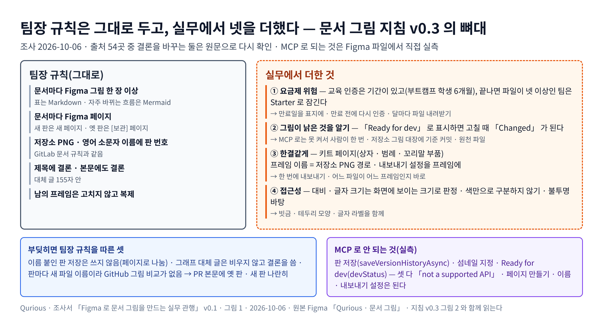

# Figma 로 문서 그림을 만드는 실무 관행 — 조사서 v0.1

| 문서 정보 | |
|---|---|
| **판 · 상태** | v0.1 · 조사 끝(검토 전) |
| **구분** | 조사서 — 표준화 계획([문서 그림 지침](../문서그림지침_v0.3.md))의 근거 |
| **작성** | 이동원(조사 · 핵심 출처 재확인 · 이 파일에서 실측) |
| **검토** | 검토 전 — 판을 올리는 PR 에 팀원 한 명 이상의 「읽었음」 |
| **최종 수정** | 2026-10-06 (KST) |
| **기준** | 외부 원문 조회 2026-10-06 · Figma 팀 요금제 student(교육) · 새 Design 파일 「Qurious · 문서 그림」(`6lstWS4YwuhJPhGB9XoBMD`)에서 MCP 로 실측 |
| **관련 문서** | [문서 그림 지침 v0.3](../문서그림지침_v0.3.md) · [문서 작성 기준 v0.2](../문서작성기준_v0.2.md) 6절 |
| **최근 개정** | 새 문서 |

> **이 문서로 알 수 있는 것**
> 1. 디자이너 · 개발자 · 기술 문서 담당자는 Figma 로 문서 그림을 만들 때 무엇을 하나?
> 2. 팀장 규칙(문서마다 Figma 그림 · 문서마다 페이지 · 표는 Markdown · 판은 페이지로)에 무엇을 **더하면** 좋은가? — 팀장 규칙은 지우지 않는다
> 3. 우리 요금제(교육)에서 되는 것과 안 되는 것은?
>
> **읽는 순서** — 그림을 그리는 사람: 요약 → 3절 · 처음 온 사람: 부록 B 용어 → 요약

## 요약

1. 팀장 규칙은 실무와 같은 방향이다. PNG 와 판 번호를 단 영어 소문자 파일 이름, 대체 글 155자 안, 결론을 본문에도 쓰기, 자주 바뀌는 그림은 Mermaid, 남의 프레임은 고치지 않고 복제하기 — 다섯 다 공식 문서(GitLab · Google · W3C)와 맞는다(2절).
2. **가장 큰 빈칸은 요금제 위험이다.** 교육 인증은 고등교육 학생 1년 · 부트캠프 학생 6개월이고, 끝나면 파일이 넷 이상인 팀은 무료 Starter 로 내려가며 잠긴다(원문 재확인). 우리 팀 폴더는 파일이 일곱이다 → 만료일을 표지에 적고, 만료 전에 다시 인증하고, 달마다 파일을 내려받아 둔다.
3. **둘째는 그림이 낡은 것을 Figma 쪽에서 아는 장치다.** 프레임을 「Ready for dev」 로 표시해 두면 고칠 때 자동으로 「Changed」 가 된다(원문 재확인 · 교육 요금제 = Professional 이라 쓸 수 있다). 다만 플러그인 API(`devStatus`)는 MCP 에서 막혀 있어(이 파일에서 실측) 사람이 한 번 눌러야 한다 → 저장소 쪽 그림 대장(기준 커밋 · 원천 파일)을 함께 둔다.
4. **셋째는 그림을 한결같게 만드는 장치다** — 키트 페이지(상자 · 말풍선 · 범례 · 꼬리말 부품), 프레임 이름을 저장소 경로로, 내보내기 설정을 프레임에 저장해 한 번에 내보내기.
5. **넷째는 접근성 세부다** — 대비 · 글자 크기는 화면에 **보이는** 크기로 판정, 색만으로 구분하지 않기(모양 · 글자 라벨), 불투명 바탕, 「그림 N」 캡션과 결론 문장 제목.
6. 팀장 규칙과 부딪히는 것은 셋이고 모두 팀장 규칙을 지킨다 — 이름 붙인 판 저장(팀은 쓰지 않음 · 페이지로 나눔), 그래프 대체 글을 비우라는 GOV.UK 방식(팀은 결론을 쓴다), 판마다 새 파일 이름이라 GitHub 그림 비교 화면이 안 나오는 점(PR 본문에 옛 판 · 새 판을 나란히).

**<그림 1> 팀장 규칙과 실무에서 더한 넷** · 왼쪽 = 그대로 둔 팀장 규칙 · 오른쪽 점선 = 실무에서 더한 것 · 아래 = 부딪힌 셋과 MCP 로 안 되는 것

원본: [Figma · Qurious · 문서 그림 · 그림 1](https://www.figma.com/design/6lstWS4YwuhJPhGB9XoBMD?node-id=32-2) · 그림 판 v0.1 · 2026-10-06 · 원천 이 문서 2 · 3절 · [지침 v0.3](../문서그림지침_v0.3.md) 그림 2 와 함께 읽는다

---

## 1. 조사 방법

조사 에이전트 한 번(출처 54곳 · 2026-10-06)에 맡긴 뒤, 결론을 바꾸는 출처 둘을 원문으로 다시 열었다(<표 1>). 그리고 새 Design 파일에서 플러그인 API 셋을 실제로 불러 되는지 쟀다.

**<표 1> 다시 확인한 것**

| 확인한 것 | 출처 | 원문 요지 | 확실도 |
|---|---|---|---|
| 교육 인증 기간 · 만료 때 | [F1] Figma for Education | 고등교육 학생 1년 · 교육자 2년 · 부트캠프 학생 6개월. 만료되면 팀원은 보기 전용, 파일이 넷 이상인 팀 소유자의 팀은 「free Starter team and locked」 — 파일 내려받기 · 옮기기는 된다. 고등교육 · 부트캠프 학생은 Professional 요금제 | 확인(원문) |
| Ready for dev · Changed | [F2] Dev Mode statuses | Ready for dev 는 모든 유료 요금제 · Full 또는 Dev 좌석. 표시한 디자인을 고치면 자동으로 Changed. 예외: 공유 라이브러리 인스턴스 갱신 · 붙은 변수 · 스타일의 값 변경 · 잠깐의 변화. Changed 는 손으로 켤 수 없다 | 확인(원문) |
| 플러그인 API 로 되는 것 | 이 파일에서 실측(2026-10-06) | `devStatus` 쓰기 · `setFileThumbnailNodeAsync` 는 「not a supported API」(판 저장 `saveVersionHistoryAsync` 와 같음) · `exportSettings` 저장 · 페이지 만들기 · 이름 바꾸기는 된다 | 확인(실측) |

## 2. 팀장 규칙과 실무가 같은 것

**<표 2> 이미 실무와 같은 것**

| 팀장 규칙 | 실무 출처 | 확실도 |
|---|---|---|
| PNG · 영어 소문자 이름에 판 번호 | GitLab 문서 규칙(`-vX_Y` · 100 KB · pngquant) [G1] | 확인 |
| 대체 글 155자 안 · 결론 | GitLab [G1] · Google [G2] · Microsoft(150자) [G3] | 확인 |
| 결론을 본문에도 | W3C 복잡한 그림의 긴 설명 [W1] | 확인 |
| 자주 바뀌는 그림은 Mermaid · 코드에서 다시 만드는 그림은 Mermaid | GitLab(모든 경우는 아님) [G1] | 확인 |
| 남의 프레임은 고치지 않고 복제 | GitLab 핸드북 Figma 절차 [G4] | 확인 |

## 3. 더할 것 — 우선순위

팀장 규칙에 **더하는** 것과 그 비용은 <표 3> 과 같다. 위에서부터 먼저 한다.

**<표 3> 더할 것**

| # | 무엇 | 왜 | 비용 | 요금제 | 지침 v0.3 |
|:-:|---|---|---|---|---|
| 1 | 교육 인증 만료일을 표지에 · 만료 전 다시 인증 · 달마다 파일 내려받기(.fig) | 만료되면 팀이 잠기고 Starter 는 파일 3 · 파일당 3페이지 [F1] [F3] | 처음 30분 · 달마다 5분 | 모든 요금제 | 2.2절 |
| 2 | 내보낸 직후 프레임을 Ready for dev 로 → Changed 가 뜨면 PNG 가 낡음 · 저장소 그림 대장으로 함께 확인 | 지침 6절 점검의 「그림 쪽이 바뀌었나」 를 자동으로 | 그림마다 한 번 누름(MCP 막힘) | 유료(교육 = Professional) · Full 좌석 | 6절 |
| 3 | 프레임 이름 = 저장소 경로(확장자 뺌) · 내보내기 설정(PNG 1배)을 프레임에 저장 · 페이지 단위로 한 번에 내보내기 | 누가 내보내도 이름 · 배율이 같다 [F4] | 그림마다 1분 | 모든 요금제 | 2절 |
| 4 | 키트 페이지 — 상자 · 말풍선 · 범례 · 단계 배지 · 화살표 · 머리 · 꼬리말 부품, 색 · 글자 변수 | 그림 수십 장을 한결같게 [F5] [P1] | 처음 2 ~ 3시간 | 모든 요금제 | 7절(다음 판에 만듦) |
| 5 | 보이는 크기로 판정 — 2,600px 캔버스를 1,000px 로 보면 0.385배. 본문 글자 캔버스 42px 이상 · 각주 32px 이상 · 대비 4.5:1 | WCAG 는 화면에 보이는 크기로 판정 [W2] [W3] | 한 번 30분 | 모든 요금제 | 7절 |
| 6 | 색만으로 구분하지 않기 — 모양 · 선 종류 · 직접 라벨 · 흑백으로 한 번 보기 · 불투명 흰 바탕 | 색각 이상 · 다크 모드 [W2] [G2] [O1] | 그림마다 몇 분 | — | 7절 |
| 7 | 그림 앞 결론 문장 · 「<그림 N>」 캡션 · 대체 글 틀(종류 + 내용 + 결론) · Mermaid 에 `accTitle` · `accDescr` | 화면 낭독 · 검색 · 리뷰 [G1] [U1] [M1] | 그림마다 2분 | — | 3절 |
| 8 | 그림 대장 · PR 본문에 옛 판 · 새 판 나란히 · C4 점검 여섯 문항 | 새 파일 이름이라 GitHub 그림 비교가 안 나오는 점을 메움 [C1] [H1] | 그림마다 5분 | — | 6절 |

## 4. 부딪히는 것 — 팀장 규칙을 지킨다

**<표 4> 실무와 다른 팀장 규칙**

| 실무 | 팀장 규칙 | 그대로 두는 까닭 | 메우는 것 |
|---|---|---|---|
| 이정표마다 이름 붙인 판 저장 [F6] | 판 저장을 쓰지 않는다 · 페이지로 판을 나눈다 | 파일을 지우지 않으면 이력이 자동으로 남는다(팀장 판단) · MCP 로 판 저장이 안 된다 | [보관] 페이지 · 저장소의 옛 PNG |
| 그래프 대체 글은 비우고 본문에만(GOV.UK) [U2] | 대체 글에 결론을 쓴다 | 화면 낭독기가 그림을 건너뛰면 결론을 잃는다 | 그림 바로 아래 「읽는 법」 두세 문장 · 근거 표 |
| 같은 경로의 PNG 를 바꿔 GitHub 그림 비교(2-up · Swipe) [H1] | 판마다 새 파일 이름 | 옛 판 PNG 가 증거로 남는다 | PR 본문에 옛 판 · 새 판 표 |

## 5. 우리에게 주는 뜻

| 규칙 후보 | 어디에 | 정할 사람 |
|---|---|---|
| 표지에 교육 인증 만료일 · 달마다 .fig 내려받기 | 지침 2.2절 · Figma 표지 | 이동원(만료일은 계정 설정에서 확인) |
| 프레임 이름 = 저장소 경로 · 내보내기 설정 저장 | 지침 2절 | 이동원 |
| 키트 페이지(다음 판) | 지침 7절 | 이동원 |
| 보이는 크기 환산표 · 색 말고 다른 단서 | 지침 7절 | 이동원 |
| 그림 대장 | 지침 6절 · `docs/그림대장.tsv`(다음 판) | 이동원 |

## 6. 이 조사를 뒤집을 조건

- 팀이 Organization 요금제로 가면 브랜치 검토 · Completed 상태를 쓸 수 있다 → 페이지 복제 대신 브랜치를 다시 본다.
- 교육 인증이 끝나면 Ready for dev 와 MCP 자동화가 막힌다 → 손 내보내기와 저장소 점검만 남는다.
- Figma Design 에 연결선이나 WebP 내보내기가 생기면 화살표 · 형식 규칙을 다시 본다.
- 문서를 보는 폭이 1,000px 가 아니면 환산표를 다시 계산한다.

## 부록 A. 출처 (조회 2026-10-06)

| 번호 | 출처 | 이 문서에서 쓴 것 |
|---|---|---|
| [F1] | Figma 도움말 — [Figma for Education](https://help.figma.com/hc/en-us/articles/360041061214-Figma-for-Education) | 인증 기간 · 만료 때 Starter · 잠김 · Professional(원문 재확인) |
| [F2] | Figma 도움말 — [Dev Mode statuses and notifications](https://help.figma.com/hc/en-us/articles/26781702258583-Dev-Mode-statuses-and-notifications) | Ready for dev · Changed 자동 · 예외 · 손으로 못 켬(원문 재확인) |
| [F3] | Figma 도움말 — [Figma plans and features](https://help.figma.com/hc/en-us/articles/360040328273-Figma-plans-and-features) | Starter 파일 3 · 30일 이력 |
| [F4] | Figma 도움말 — [Export from Figma Design](https://help.figma.com/hc/en-us/articles/360040028114-Export-from-Figma-Design) | 페이지 일괄 내보내기 · 이름의 「/」 는 폴더 |
| [F5] | Figma Best Practices — [Components, styles, and shared libraries](https://www.figma.com/best-practices/components-styles-and-shared-libraries/) | 부품 설명 · 스타일 이름 |
| [F6] | Figma Best Practices — [Team, folder, and file organization](https://www.figma.com/best-practices/team-file-organization/) | 표지 · 단계별 페이지 · 이름 붙인 판 |
| [G1] | GitLab — [Documentation Style Guide](https://docs.gitlab.com/development/documentation/styleguide/) | 이름 `-vX_Y` · 100 KB · 대체 글 155자 · Mermaid 접근성 |
| [G2] | Google — [Developer documentation style guide: Images](https://developers.google.com/style/images) | 155자 · Figure N · 투명 바탕 금지 |
| [G3] | Microsoft — [Alt text](https://learn.microsoft.com/en-us/style-guide/accessibility/alternative-text) | 150자 · 그림 종류로 시작 |
| [G4] | GitLab Handbook — [Figma Process](https://handbook.gitlab.com/handbook/marketing/digital-experience/figma/) | 남의 프레임은 복제 · READ:ME 프레임 |
| [P1] | GitLab Pajamas — [File structure](https://design.gitlab.com/get-started/uik-file-structure/) | 주석 · 유틸 부품 묶음 |
| [W1] | W3C WAI — [Complex images](https://www.w3.org/WAI/tutorials/images/complex/) | 짧은 대체 글 + 긴 설명 |
| [W2] | W3C — [Understanding 1.4.3 Contrast](https://www.w3.org/WAI/WCAG22/Understanding/contrast-minimum.html) | 4.5:1 · 큰 글자 · 보이는 크기 기준 |
| [W3] | W3C — [Understanding 1.4.11 Non-text Contrast](https://www.w3.org/WAI/WCAG22/Understanding/non-text-contrast.html) | 그래픽 3:1 |
| [O1] | Okabe & Ito — [Color Universal Design](https://jfly.uni-koeln.de/color/) | 색각 이상에도 구분되는 색 · 직접 라벨 |
| [U1] | UK Analysis Function — [Charts](https://analysisfunction.civilservice.gov.uk/policy-store/data-visualisation-charts/) | 결론형 제목 · Figure n · 직접 라벨 |
| [U2] | GOV.UK — [Images](https://guidance.publishing.service.gov.uk/formatting-content/images/) | 그래프 대체 글 비우기 |
| [M1] | Mermaid — [Accessibility](https://mermaid.js.org/config/accessibility.html) | `accTitle` · `accDescr` |
| [C1] | C4 model — [Review checklist](https://c4model.com/diagrams/checklist) | 제목 · 범례 · 화살표 라벨 점검 |
| [H1] | GitHub Docs — [Working with non-code files](https://docs.github.com/en/repositories/working-with-files/using-files/working-with-non-code-files) | 그림 비교 세 방식 |

## 부록 B. 용어

| 용어 | 뜻 | 이 문서에서 | 헷갈리는 점 |
|---|---|---|---|
| Ready for dev | Figma 의 「개발 준비됨」 표시 | 내보낸 그림 프레임에 걸어 「고쳐졌나」 신호로 | 화면 설계 파일의 넘김 표시와 같은 기능 — 문서 그림 파일 안에서만 쓰면 섞이지 않는다 |
| 키트 | 그림에 되풀이해 쓰는 부품 모음 페이지 | 상자 · 범례 · 꼬리말 | 디자인 시스템 전체가 아니라 문서 그림용 작은 묶음 |
| 보이는 크기 | 문서 폭으로 줄여 화면에 실제로 보이는 글자 크기 | 2,600px → 1,000px 면 0.385배 | 캔버스의 글자 크기와 다르다 |

## 개정 이력

| 판 | 날짜 | 바꾼 것 | 작성 |
|---|---|---|---|
| v0.1 | 2026-10-06 | 새 문서 — 실무와 같은 것 · 더할 것 여덟 · 부딪히는 것 셋 · 요금제 위험 · 플러그인 API 실측 | 이동원 |
