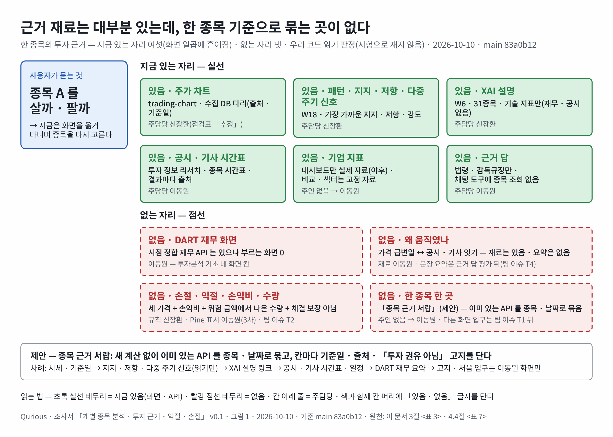
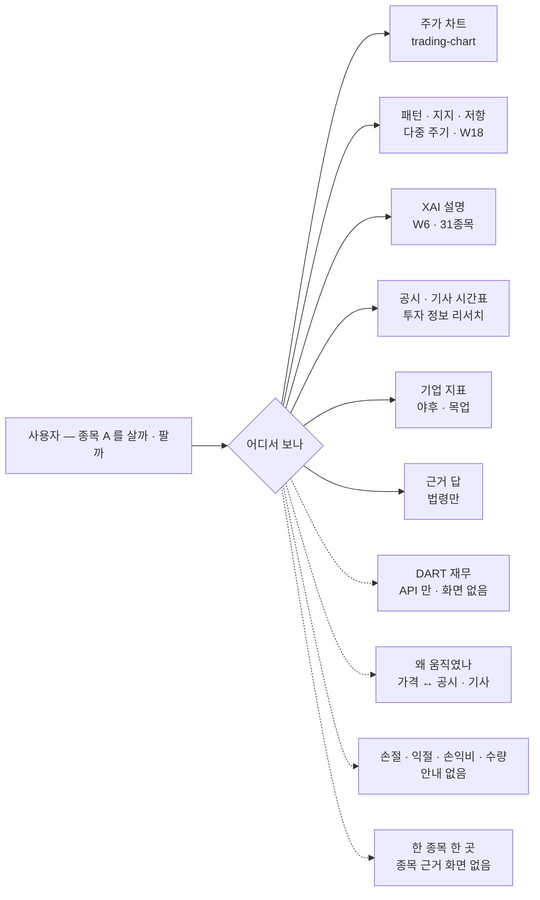
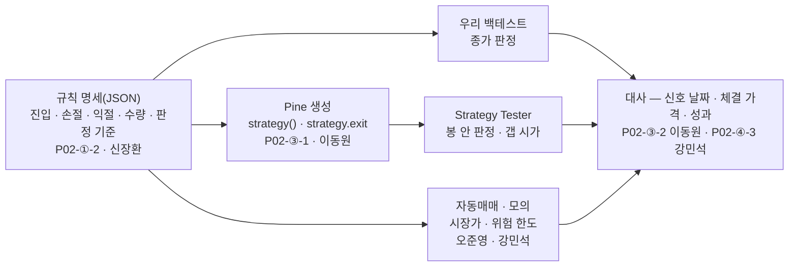

# 개별 종목 분석 · 투자 근거 · 익절 · 손절 안내 — 1차 대비 · 현업 비교 · 비전공자용 정확한 안내 · 역할별 제안 조사서 v0.1

| 문서 정보 | |
|---|---|
| **판 · 상태** | v0.1 · 초안(검토 전) — 팀 글은 이슈 넷: [팀 묶음](../github-archive/2026-10-10/이슈-개별종목-투자근거/00-본문.md) · [신장환 님](../github-archive/2026-10-10/이슈-손절익절규칙-신호근거/00-본문.md) · [강민석 님](../github-archive/2026-10-10/이슈-근거카드-성과-교차검증/00-본문.md) · [오준영 님](../github-archive/2026-10-10/이슈-위험한도-포지션크기-감시주문/00-본문.md)(본문 사본 · 올린 뒤 번호를 적음) · 이동원 몫을 붙일 칸은 8절 <표 17> |
| **구분** | 조사서 — 1차 Alpha_Stack 대비 · 지금 Qurious 판정 · 현업 · 공개 프로젝트 비교 · 익절 · 손절 안내 방식 · 국내 규제 낱말 · 역할별 제안(구현 · 화면 설계는 하지 않음) |
| **작성** | 이동원(조사 지시 · 검토) · 사례 수집과 초안은 조사 에이전트(2026-10-10 · github.com 은 열지 않음) — 판단은 이동원 검토 뒤 확정. 손절 · 익절 **규칙 설계는 신장환 님 영역**(`P02-①-2`), 성과 · 모의 주문 · 근거 카드는 **강민석 님**, 위험 한도 · 증권사 연동은 **오준영 님** 영역이라 그쪽 내용은 모두 「의견 · 아이디어」 다. 이동원 몫은 3차 TradingView · Pine 표시(`P02-③-1 ~ ③-3`) · 데이터 · 지식 · 주인 없는 화면이다 |
| **조회일** | 2026-10-10 (KST) — 웹 출처는 모두 이 날 조회 |
| **기준** | 우리 코드 `main` `83a0b12`(작업 트리의 코드 파일은 HEAD 와 같음 — `git status` 로 확인 · 읽기만) · 1차 Alpha_Stack `4a05578`(2026-09-23 · 읽기만) · 강사님 stock-coin-trade 원본 `ab4e493`(2026-10-08 · 읽기만) — git 은 `log --format='%h %ad %s'` · `show` · `grep` 만 썼다(작성자 · 이메일은 읽지 않음) |
| **확실도 표기** | 「확인」 = 원문(공식 사이트 · 공식 문서 · 법령 원문 · 우리 파일)을 직접 열었거나 검색 도구가 원문 본문을 가져와 보았음 · 「추정」 = 보도 · 2차 자료 · 검색 요약으로만 보았거나 둘 이상을 맞춰 추정 · 「미확인」 = 로그인이 필요하거나, 페이지가 막혔거나(403), 찾지 못함 |
| **하지 않은 것** | github.com 페이지 · GitHub API 열람 · `.env*` · 비밀값 · SQLite 파일 열기 · 시험 · 러너 · 증권사 API 호출 · 우리 코드 실행. 우리 코드 판정은 **코드 읽기 판정**이다. 아래 Pine 예시는 **컴파일 확인 전**이다 |
| **이웃 조사** | 모의투자 · 증권사 규칙은 [모의투자 조사서](모의투자-증권사규칙-시작금액-조사.md) · 시장 범위는 [시장 범위 조사서](시장범위-미국코인-거래기준-조사.md) · 강사님 기초 코드(lumina-invest) 받기는 [기초 코드 융합 조사서](기초코드-최신판-융합-조사.md)(Pine v6 서버 변환 = 후보 8 · 문법 점검 = 후보 9) · 개념 학습 배치는 [금융 지식 · 개념 학습 조사서](금융지식-개념학습-배치-조사.md)(F13 손절 · 익절 장의 근거가 이 문서) — 겹치는 결론은 다시 조사하지 않고 가리킨다 |
| **최종 수정** | 2026-10-10 (KST) |
| **최근 개정** | v0.1 — 처음 씀 · 8절에 이동원 몫을 붙일 칸(<표 17>) · <그림 1> 을 Figma 로 |

> **이 문서로 알 수 있는 것**
> 1. 1차 Alpha_Stack 은 개별 종목을 어떻게 분석했고, 무엇을 근거로 보여 줬나? (2절 · <표 2>)
> 2. 지금 Qurious(2 · 3차)로 한 종목을 분석 · 비교해 투자 근거를 볼 수 있나 — 기능별로 됨 · 일부 · 안 됨은? Alpha_Stack 대비 나아진 것 · 빠진 것은? (3절 · <표 3>)
> 3. 현업 서비스 · 공개 프로젝트는 「살지 · 팔지 판단할 근거」 를 어떤 꼴로 보여 주나? 우리와 가장 큰 차이는? (4절)
> 4. 익절 · 손절을 비전공자에게 **정확하게** 보여 주려면 어떤 방식 · 숫자 · 주의 문구가 필요하고, TradingView 에서는 어떻게 그리나? (5절)
> 5. 화면 낱말은 무엇을 피해야 하나(자본시장법 · 금융위 안내)? (6절)
> 6. 주담당마다 무엇을 제안하고, 이동원 몫은 세션 목록 어느 칸에 붙이나? (7 · 8절)
>
> **읽는 순서** — 처음 읽는 사람: 0절 → 3절 → 5.8절 → 7절 → 8절 · 주담당: 0절 → 7절의 자기 줄 → 자기 이슈

---

## 0. 한눈에

1. **1차 Alpha_Stack 의 「개별 종목 분석」 은 모델 성적표와 확률 표였다.** 30종목 중 하나를 골라 화면 안에서 모델 넷을 학습시키고, 신호로 비중을 나누는 전략 여섯(A ~ F)을 백테스트하고, 위험 지표 · 종합 점수 카드(QFRS)를 보고, 30종목 · 전 종목 순위를 냈다. 근거는 **기술 지표 14개뿐**이었다 — 재무 · 공시는 모았지만 종목 모델에 쓰지 않았고, 공시 제목 감성은 「신호가 없었다」. 종목 하나에 대한 「왜」 문장 · 설명(XAI) · 손절 · 익절 · 화면 안 고지는 없었다.
2. **지금 Qurious 는 한 종목의 근거가 화면 7곳에 흩어져 있다**(주가 차트 · 패턴 · 지지 · 저항 · 다중 주기 신호 · XAI 설명 · 투자 정보 리서치 시간표 · 기업 지표 · 근거 답). Alpha_Stack 의 개별 종목 기능 12개 기준으로 **됨 3 · 일부 7 · 안 됨 2**, 우리 기능 17개 기준으로 **됨 7 · 일부 6 · 안 됨 4** 다(<표 2> · <표 3>). 나아진 것은 XAI 기여도 · 지지 · 저항 · 공시 · 기사 시간표 · 손절 · 익절 칸 · 연도별 세금 비용 모델 · 꼬리말 고지이고, 빠진 것은 Alpha_Stack 이 가장 공들인 **검증의 엄격함**(모델 비교가 시간 순서를 지키지 않음 · 예측 적중 대조 없음)과 **업종 맥락**이다.
3. **현업과 가장 큰 차이 — 「한 종목 한 화면」 과 「왜 움직였나」 가 없다.** 현업(토스증권 · 키움 · 미래에셋 · 와이즈리포트 · Morningstar · Seeking Alpha · Simply Wall St)은 한 종목 화면에 시세 · 재무 · 컨센서스 · 공시 · 뉴스를 모으고, 가격 변동을 뉴스 · 공시와 이어 한두 문장으로 요약하며(토스 「AI 시그널」 · 미래에셋 「AI이슈체크」), 점수는 **같은 섹터 안 상대 비교**로 내고(Seeking Alpha), 칸마다 **정의 각주 · 기준일 · 출처**를 단다(와이즈리포트). 우리는 근거 재료는 대부분 있으나(공시 77만 · 정책뉴스 · 시점 정합 재무 API · 신호 기록) 그것을 한 종목 기준으로 묶어 보여 주는 곳이 없다.
4. **익절 · 손절은 「세 가격 + 손익비 + 수량 + 체결 보장 아님」 을 한 묶음으로 보여야 정확하다.** 현업 표준 꼴은 TradingView 롱 · 숏 포지션 도구다 — 진입 · 손절 · 목표 가격, 위험 대비 보상 비율(손익비), **위험 금액 ÷ (진입 − 손절) = 수량**. 그리고 SEC · FINRA · 키움 모두 「손절 가격은 체결 가격이 아니다」 를 먼저 말한다. **추천(안 A)**: 손절 = ATR × k(진입 때 고정) · 익절 = 손절 거리 × 손익비 · 수량 = 계좌 위험 %(관행 1%) — 고정 % 는 비교용, 추적 손절 · 샹들리에는 추세 규칙일 때 선택. 갭 · 하한가 · VI · 수수료 · 매도 세금 0.20%(코스피 2026)를 같은 자리에 적는다.
5. **우리 코드의 정확성 함정 셋.** ① 우리 백테스트는 **신호 낸 날 종가에 들어가고**(`quant_pipeline.py:288-290` `signals.shift(1)`) 손절 · 익절도 **종가로 판정 · 그 종가에 청산**한다(`:232-268`). TradingView 는 기본이 **다음 봉 시가 진입 · 봉 안 가격으로 스탑 판정 · 갭이면 다음 봉 시가 체결**이라 3차 교차 검증에서 차이가 **반드시** 난다. ② Pine 생성기는 `//@version=5` `indicator()` 라(`public/js/indicator.js:60-98` · `app/services/formula.py:402`) 손절 · 익절선 · Strategy Tester 가 없다 — 요구 `P02-③-1` 의 합격 기준(「strategy() 로 선언돼 Strategy Tester 가 켜진다」 · `docs/요구사항/RTM.md:173`)에 못 미친다. ③ 자동매매 근거 카드는 신호와 상관없는 **고정 문구**이고 「차익 실현 **권고**」 낱말을 쓴다(`public/js/robo.js:340-349`).
6. **규제 — 「개별성 없는 정보 제공」 꼴로 쓴다.** 자본시장법 제7조 제3항은 「개별성 없는 조언」 을 투자자문업으로 보지 않고(2024-08-14 시행), 금융위는 온라인 양방향 유료 채널을 투자자문업으로 보며 손실보전 · 이익보장 · 허위 수익률 표시를 금지한다. 화면에서 「추천 · 권고 · 사세요 · 목표가 · 보장 · 강력 매수」 를 「조건 충족 · 규칙상 가격 · 과거 자료 기준」 으로 바꾸고, 토스증권식 고지(「단순 참고용 · 투자 제안 및 권유, 종목 추천이 아님」)를 근거가 나오는 자리마다 단다. 지금 「AI 추천 종목」 이 5곳 · 「강력 매수」 2곳 · 「권고」 1곳 · 「익절 고려」 1곳에 있다(6절).
7. **역할별 제안 · 이슈 초안 넷**(팀 묶음 1 + 주담당 3). 신장환 님 — 규칙 명세의 청산 칸(ATR 고정 · 추적 · 시간) · 판정 기준 칸 · 신호 이유 문장 · XAI 에 가격 수준. 강민석 님 — 근거 카드를 실제 근거로 · 성과 지표에 손익비 · 기대값 · 손절 뒤 실제 손실 · 교차 검증 항목. 오준영 님 — 계좌 위험 한도와 종목 손절의 관계 · 포지션 크기 · 증권사 감시 주문 연동 여부. 이동원 — 3차 Pine `strategy()` · 손절 · 익절선 · 알림 · 판정 차이 대사 · 「종목 근거 서랍」(주인 없는 화면) · DART 재무 화면 · 용어 보충 · F13 장 · 낱말 표(8절 <표 17>). **2차 로보 어드바이저 칸 앞에는 아무것도 끼우지 않는다.**

---

## 1. 방법

### 1.1 무엇을 읽었나

- **1차 Alpha_Stack** — 루트 README(기능 · 면책) · 평가파트 v1.4 「대시보드 9페이지와 배포」 · 대시보드 페이지 코드(`dashboard/pages/*.py` · `components.py` · `services/combo_config.py`) · 백테스트 전략(`backtest/backtest_strategies.py`) · 최종 결과 표(`notebooks/04-모델/최종결과/README.md`) · 공시 텍스트(`supply/text.py`) · 시장조사 v2.0. 손절 · 익절 · 설명(XAI) · 화면 고지는 코드 검색으로 「없음」 을 확인했다(`grep` 0건 — `shape` 같은 오탐은 걸렀다).
- **Qurious** — 기능 완성도 점검표 TSV(73줄) · IA v1.4(표 2 · 그림 6 · 표 7 · 표 8) · API 명세서 v0.16 · RTM · 요구 대장(주담당) · 기능 설계서 · 실제 코드(서버 · 화면). 화면 판정은 점검표 점수를 그대로 인용하고, 그 위에 이 질문(「한 종목 근거를 볼 수 있나」)에 맞는 판정을 새로 붙였다.
- **강사님 stock-coin-trade 원본** — TR 실전연습 15단계(ATR 손절 · 익절) · 전략 거래 화면(익절 3% · 손절 1.5%) · 기술적 분석 워크시트(읽기만 · 고치지 않음).
- **웹** — 공식 문서(TradingView Pine 매뉴얼 · 도움말 · Seeking Alpha 도움말 · Morningstar 도움말 · Simply Wall St 도움말 · 토스증권 · 키움 도움말 · SEC Investor.gov · FINRA · KRX 규정 · 금융위원회) · 논문(arXiv) · 문서 사이트(OpenBB · StockCharts ChartSchool) · 법령 원문(casenote 사본 — 국가법령정보센터는 화면이 스크립트로 그려져 casenote 의 조문 사본을 읽음). github.com 은 열지 않았다.

### 1.2 판정 말

<표 1> 이 문서의 판정 말

| 말 | 뜻 | 예 |
|---|---|---|
| 됨 | 사용자가 화면에서 그 일을 할 수 있고, 결과가 실제 자료에서 나온다 | 종목을 골라 지지 · 저항을 본다(W18) |
| 일부 | 서버나 화면 한쪽만 있거나, 범위가 좁거나(31종목 고정 등), 결과가 목업 · 고정 자료이거나, 정확성에 알려진 구멍이 있다 | DART 재무 API 는 있으나 부르는 화면이 없다 |
| 안 됨 | 그 일을 하는 화면 · API 가 없거나, 있어도 약속한 일을 하지 않는다 | 근거 카드가 신호와 상관없는 고정 문구다 |

---

## 2. 1차 Alpha_Stack 은 개별 종목을 어떻게 분석했나

Alpha_Stack 은 「주가지수와 개별 종목의 **5일 뒤 등락 방향**을 맞히는 모델을 만들고, 그 결과를 **믿어도 되는지 판별하는 검증 엔진**을 따로 세운」 프로젝트였다(`README.md:69-72`). 화면은 Streamlit 개요 + 9페이지이고(`README.md:79`), 사이드바에서 범위를 MARKET(KOSPI200) · STOCK(30종목 중 하나) · UNIVERSE 로 고른다(`docs/평가파트/version1.4/대시보드_9페이지와_배포.md:36` · `dashboard/components.py:77-97` · `dashboard/state.py:22-23`). 대시보드는 「파일을 읽어 그리는 화면이 아니라, 버튼을 누르면 서버에서 학습을 돌리는 연구 단말」 이었다(같은 문서 `:13`).

<표 2> Alpha_Stack 의 개별 종목 기능 12 — 지금 Qurious 와 대조

| # | 기능 | Alpha_Stack 에서 (파일:줄) | 보여 준 근거 · 꼴 | 지금 Qurious | 판정 |
|:-:|---|---|---|---|:-:|
| 1 | 종목 고르기 | 사이드바 STOCK — stocks30 중 하나(`dashboard/components.py:77-97`) | — | 종목 검색 `API-STK-06`(전 종목 · KIND) · 단, 스크리닝 · 퀀트 대시보드는 31종목 고정(`app/services/stock.py:28`) | 됨 |
| 2 | 종목별 모델 학습 · 비교 | Model Lab — LogReg · RF · XGBoost · LightGBM 중첩 워크포워드 · 조화평균 정렬(평가파트 v1.4 `:27`) | 정확도 · Macro F1 · 하락 재현율 | 모델 비교 `ml-compare`(`API-ML-01` · 모델 8) — **시간 순서를 지키지 않는 5겹 교차 검증**(`app/services/ml_models.py:123-124`) · LightGBM 은 조기 종료에 쓴 검증 셋으로 다시 채점(`:105-121`) · 기준선 비교 없음 | 일부 |
| 3 | 5거래일 뒤 방향 확률 | 최종 결과 표 p_up · p_flat · p_down(`notebooks/04-모델/최종결과/README.md:27-40`) | 확률 숫자 | XAI 예측 — 매수 · 관망 · 매도 + 확률 + **기준선 미달 경고**(`API-ML-10` · `app/routes/ml.py:311-333` · 시계열 교차 검증 `app/services/investment_research.py:151-191` · 기준선 `:274-279`) | 됨 |
| 4 | 종목 전략 백테스트 | 전략 A ~ F — 신호별 비중 20/30/50% 분할 · 25% · 100% · 5거래일 락(`backtest/backtest_strategies.py:121-165` · `:209`) · **손절 · 익절 없음** | 누적 성과 · 체결 | W3 성과 검증 · 전략 분석 · W17 · LEAN — 비용 모델 · 매수후보유 비교 · 손절 · 익절 %(`app/services/quant_pipeline.py:232-294`) | 됨 |
| 5 | 위험 · 분류 지표 | Risk — MDD · Sharpe · Sortino · Calmar · Sterling · DSR · 혼동행렬 | 지표 표 · 혼동행렬 | W3 결과(수익률 · 샤프 · MDD · 승률 · 매매 횟수 · 손절 · 익절 발동 횟수 — `quant_pipeline.py:310-345`) · 계좌 단위 위험 지표(`API-PAPR-37`) · 종목 단위 분류 지표는 없음 | 일부 |
| 6 | 종합 점수 카드 | QFRS — 6판정 평균 → EXCELLENT ≥ 80 · GOOD ≥ 60 · MODERATE ≥ 40 · POOR(`dashboard/pages/9_QFRS.py:144-206`) | 점수 · 등급 낱말 | 코스콤 테스트베드 기준 화면 — 계좌 단위 · QFRS 시험 0(점검표 `robo-testbed` 50점) | 일부 |
| 7 | 여러 종목 순위 · 종목 × 모델 행렬 | Universe — 30종목 · 전 종목 순위 · 조화평균 행렬 · 종목 → STOCK 모드(`dashboard/pages/8_Universe.py:353-466`) | 순위 표 | W6 스크리닝(31종목 · 신호 점수 · 신뢰도) · 종목 군집화 | 일부 |
| 8 | 업종 맥락(업종 순위 · 업종 내 시총 순위) | 최종 결과 표 열(`최종결과/README.md:27`) | 업종 안 위치 | 섹터 화면은 정적 목업(점검표 `company-sector` 42) · 업종 안 상대 비교 없음 | 안 됨 |
| 9 | 예측 적중 대조 | 실제 결과 · 적중 O/X 열(`최종결과/README.md:27-40`) | 사후 검증 | 신호는 매일 기록(러너 signals 단계 · #140)되나 적중을 대조해 보이는 화면 · API 없음(코드 검색 「적중 · hit_rate」 0건) | 안 됨 |
| 10 | 비용 민감도 · 손익분기 비용 | Cost Sensitivity — 비용 프리셋 4 × 전략 6 · Sharpe = 0 이 되는 비용 이분 탐색(평가파트 v1.4 `:31`) | 비용을 얼마나 견디나 | W3 비용 bp 입력 · 비용 전후 수익률 표시 · 손익분기 자동 탐색 없음 | 일부 |
| 11 | 공시 텍스트 | 공시 제목 감성 확률(KR-FinBert-SC · `supply/text.py:1-30`) — 모델 피처로는 「신호 없음」(`README.md:183`) | 감성 점수 | 투자 정보 리서치 — 공시 · 정책뉴스 · 기사 제목 검색 + **종목 시간표** + 주제 이름표 21(`public/js/research.js:1-12`) · 감성 점수 · 가격 변동 연결은 없음 | 일부 |
| 12 | 재무 | 재무제표 662,933행 수집(`README.md:107`) — 종목 모델 피처에 없음(조합 K 14개는 모두 기술 지표 · `dashboard/services/combo_config.py:12-27`) | — | 시점 정합 DART 재무 `API-DATA-04` — **부르는 화면 0** · 기업 지표 화면은 야후(`API-STK-07`) | 일부 |

**합계** — 됨 3(1 · 3 · 4) · 일부 7(2 · 5 · 6 · 7 · 10 · 11 · 12) · 안 됨 2(8 · 9).

Alpha_Stack 에서 배울 것은 화면이 아니라 **검증 습관**이다. 시장조사 v2.0 은 백테스트에서 금지할 여덟 가지를 적었다 — 상한가 진입(기준가 × 1.30 을 호가 단위로 자르므로 정확한 30% 비교로는 안 잡힘) · 거래정지일 매매 · 미수정 가격 · 개인 숏 · 생존 편향 · 체결 불가 상태 무시 · **종가 매수 가정**(유일하게 가능한 꼴은 「T일 종가 정보로 신호 → T+1일 시가 단일가 체결」) · NXT 시간외 가격 혼입(`docs/시장조사/version2.0/시장조사.md:189-200`). 이 중 「종가 매수 가정」 은 지금 우리 백테스트에 그대로 있다(5.5절). 반대로 Alpha_Stack 에는 화면 안 고지가 없었고(README 면책 `:698-705` 뿐 · 대시보드 코드 검색 0건), 손절 · 익절도 없었다.

---

## 3. 지금 Qurious 로 개별 종목을 분석 · 비교해 근거를 볼 수 있나

### 3.1 기능별 판정

<표 3> Qurious 기능 17 — 「한 종목의 투자 근거를 볼 수 있나」 기준 판정 (점검표 점수는 `docs/시험/대장/기능완성도-점검표.tsv` 의 「점수」 칸)

| # | 기능 | 화면(점검표 점수) · API | 판정 | 되는 것 · 비는 것 | 근거(파일:줄) | 주담당 |
|:-:|---|---|:-:|---|---|---|
| 1 | 종목 상세 — 한 종목 근거 한 곳 | 없음 — IA 그림 6 의 「종목 상세」 는 W6 → W18 보조 이동 | 안 됨 | 근거가 아래 2 ~ 12 의 7개 화면에 흩어짐 · 종목을 옮겨 다니며 다시 골라야 함 | `docs/화면/IA.md:465` | 주인 없음(새 화면이면 팀 글 먼저) |
| 2 | 주가 차트 | `trading-chart` 85 · `API-STK-03`(수집 DB 다리 · `source` · `as_of`) | 됨 | 가격 차트 위 신호 · 기준일 배지는 남음 | IA `:542`(U7) | 신장환(점검표 「추정」) |
| 3 | 지표 백테스트 | W3 `indicator-backtest` 90 · `API-STK-30` · `API-QNT-02` | 됨 | 비용 · 매수후보유 비교 · 손절 · 익절 % — 단 진입은 **신호 낸 날 종가**, 손절 · 익절은 **종가 판정 · 그 종가 청산** | `app/services/quant_pipeline.py:232-294` · `public/app.html:2159-2163` | 신장환 |
| 4 | 투자 정보 리서치 | `agent-news` 84 · `API-DATA-03` · `API-CAL-02` | 됨 | 공시 · 정책뉴스 · 기사 제목 찾기 + 종목 시간표(공시 · 기사 · 주총 · 배당 · 실적을 날짜 한 줄로) · 결과마다 출처 / 가격 변동과 잇기 · 요약은 없음 | `public/js/research.js:1-12` | 이동원 |
| 5 | 패턴 · 지지 · 저항 | W18 `robo-patterns` 92 · `API-STK-34` | 됨 | 피벗 군집 지지 · 저항 · 가장 가까운 지지 · 저항 · 강도(강 · 중 · 약) · 거리 % | `app/services/patterns.py:89-127` · `public/js/robo.js:308` | 신장환 |
| 6 | 다중 주기 신호(#140) | W18 · `API-STK-35` · 러너 signals 단계 | 됨 | 분봉 · 일봉 · 주봉 종합 · 「교육용 기술적 신호」 문구 / 적중 대조 없음 | `patterns.py:253-275` | 신장환 |
| 7 | XAI 설명 | W6 「설명」 · `API-ML-10` | 됨 | SHAP 기여도 막대 + 요약 문장 + 기준선 미달 경고 + 방법 · 고지 / **기술 지표만**(재무 · 공시 · 뉴스 근거 없음) | `app/routes/ml.py:311-333` · `public/js/robo.js:34-60` | 신장환 |
| 8 | 스크리닝 | W6 `robo-screening` 86 · `API-STK-08` | 일부 | **31종목 고정** · 신호 스캔 13초(점검표) | `app/services/stock.py:28` | 신장환 |
| 9 | 기업 지표 세 화면 | `company-dashboard` 75(야후 `API-STK-07`) · `company-compare` 45(정적 목업) · `company-sector` 42(정적 목업) | 일부 | 대시보드만 실제 자료(야후) · 비교 · 섹터는 고정 자료 · 칸 정의 · 기준일 · 업종 비교 없음 | 점검표 · 기초 코드 융합 조사서 후보 1 ~ 4 | 주인 없음 → 이동원 |
| 10 | 재무(DART) | `API-DATA-04`(`as_of` · `pit`) · `invest-fundamental` 45(목업 계산) | 일부 | 시점 정합 재무 API 는 있으나 **부르는 화면 0** · 재무제표 분석 화면은 DCF · FCF 「(목업)」 | API 명세서 `API-DATA-04` · 점검표(`ml.js:225-230`) | 이동원 |
| 11 | 종목 질문 근거 답(공시 · 뉴스 RAG) | `agent-chat` 근거 답 · `API-KB-03` | 안 됨 | 근거 문서가 **법령 · 감독규정뿐**(law · admrul) · 채팅 도구에 종목 시세 · 재무 · 공시 조회가 없음(신용 CB · 은행 상품 · 펀드만) | `app/routes/kb.py:1-9` · `app/services/langgraph_agent.py:30-42` | 이동원 |
| 12 | 용어사전 | `fin-glossary` 90 · 760개 | 일부 | 손절 · 익절은 한 줄 요약(분류 「slang」) · 손익비 · 추적 손절 · 샹들리에 · 포지션 크기 · 변동성완화장치 · 스탑(감시) 주문은 없음 | `app/services/glossary_data/terms.json`(「손절」 · 「익절」 항목) | 이동원 |
| 13 | 모의투자 주문 | `paper-stock` 72 · `API-PAPR-05` · `06` | 일부 | **시장가 즉시 체결만** · 감시(스탑) 주문 없음 · 미리보기가 비용을 빼지 않음(결함 후보) | `app/services/paper_trading.py:220` · 점검표 | 강민석 |
| 14 | 자동매매 판단 근거 카드 | W10 `robo-decision` 70 | 안 됨 | 신호와 상관없는 고정 문구 셋 · 「차익 실현 권고」 낱말 | `public/js/robo.js:340-349` · IA `:156`(I15) | 강민석 |
| 15 | 손절 · 익절 안내(가격선 · 손익비 · 수량 · 체결 보장 아님) | 없음 — 백테스트 입력칸뿐 | 안 됨 | 진입 · 손절 · 목표 가격 · 손익비 · 위험 금액 → 수량 · 「체결 보장 아님」 을 보여 주는 곳이 없음 | — | 규칙 = 신장환 · 표시(Pine) = 이동원 |
| 16 | TradingView 표시 | `indicator-tradingview` 84 · Pine 생성기 · `API-TV-01 ~ 05` | 일부 | 웹훅 · Strategy Tester ↔ LEAN 대사(전략 4종)는 있음 / Pine 생성기가 **v5 `indicator()`** — 손절 · 익절선 · `strategy()` · 알림 메시지 없음 | `public/js/indicator.js:60-98` · `app/services/formula.py:402` · `app/routes/tradingview.py:116-135` | 이동원(3차) |
| 17 | 투자 권유 아님 고지 | 꼬리말 공통 · LEAN · 다중 주기 · XAI | 됨 | 꼬리말 「투자 자문이 아닌 정보 제공 목적입니다.」 / 화면 낱말을 관리하는 규칙 · 시험은 없음 | `public/js/brand.js:15` · `public/app.html:2932` · `:686` | 공통 |

**합계** — 됨 7(2 · 3 · 4 · 5 · 6 · 7 · 17) · 일부 6(8 · 9 · 10 · 12 · 13 · 16) · 안 됨 4(1 · 11 · 14 · 15).

### 3.2 근거가 지금 어디에 흩어져 있나

<그림 1> 한 종목의 근거 — 지금 있는 자리(실선)와 없는 자리(점선) · 범례: 초록 실선 테두리 = 지금 있음 · 빨강 점선 테두리 = 없음 · 칸 아래 줄 = 주담당



<sub>원본: [Figma · Qurious · 문서 그림 · 54:3](https://www.figma.com/design/6lstWS4YwuhJPhGB9XoBMD?node-id=54-3) · 그림 판 v0.1 · 기준 `83a0b12` · 원천: 이 문서 3절 <표 3> · 4.4절 <표 7> · 2026-10-10</sub>

<details><summary>그림 원문(Mermaid) — 검색 · 다시 그리기용</summary>



</details>

### 3.3 Alpha_Stack 대비 — 나아진 것 · 빠진 것

- **나아진 것(Alpha_Stack 에 없던 것)** — XAI 기여도와 요약 문장 · 기준선 미달 경고(신장환) · 지지 · 저항 · 다중 주기 신호(신장환) · 공시 · 정책뉴스 · 기사 검색과 종목 시간표(이동원) · 법령 근거 답 · 용어 760(이동원) · 손절 · 익절 % 와 비용 모델(연도별 증권거래세 — `app/services/trading_cost.py:61-85`) · 모의투자 · TradingView 웹훅 · LEAN 교차 검증 · 꼬리말 고지.
- **빠진 것(Alpha_Stack 에 있었는데 약해진 것)** — ① 모델 비교의 시간 순서 검증과 기준선(<표 2> 2) ② 예측 적중 대조(9) ③ 업종 맥락(8) ④ 손익분기 비용 탐색(10) ⑤ 종목 × 모델 순위 행렬(7). 이 중 ① ② 는 「믿어도 되나」 를 재는 장치라 근거 화면을 만들 때 함께 다시 세워야 한다(① 은 8절 <표 17> L6 · 모델 비교가 주인 없는 화면이라 이동원 · ② 는 신호 주담당 신장환 님 이슈 A9 — 기록된 신호와 n일 뒤 실제 수익을 잇는 자료는 데이터 파트가 댈 수 있다).

---

## 4. 현업 서비스 · 공개 프로젝트는 근거를 어떻게 보여 주나

### 4.1 해외 서비스

<표 4> 해외 서비스 — 「한 종목을 보고 살지 · 팔지 판단할 근거」 를 보여 주는 꼴 (조회 2026-10-10)

| 서비스 · 기능 | 근거 종류 | 설명 방식 | 비전공자 배려 | 기준일 · 출처 표시 | 권유 아님 고지 | 확실도 |
|---|---|---|---|---|---|:-:|
| TradingView 기술 등급 | 이동평균 15 + 오실레이터 11 = 26개 지표 | 지표마다 −1 · 0 · +1 → 평균(−1 ~ +1) → Strong Sell(< −0.5) · Sell · Neutral(−0.1 ~ 0.1) · Buy · Strong Buy(> 0.5) · 게이지 · 주기별 표 | 지표마다 매수 · 중립 · 매도를 나열해 **왜 그 등급인지 셀 수 있다** | 고른 주기 · 실시간 | 「general market information for educational and entertainment purposes only, and do not constitute investment advice」 | 확인 |
| TradingView 롱 · 숏 포지션 도구 | 진입 · 목표 · 손절 · 계좌 크기 · 위험(금액 또는 %) · 로트 · 레버리지 | 차트 위 초록 · 빨강 상자 + 숫자(목표 · 손절 가격 · % · 틱 · 손익 · 수량 · **손익비** · 청산 뒤 잔고) | **수량 = min(위험 기준 수량, 레버리지 기준 수량) · 위험 기준 수량 = 위험 금액 ÷ ((진입 − 손절) × 포인트 가치) ÷ 로트** — 위험을 먼저 정하면 수량이 나온다 | 사용자가 그림 | 도움말에는 없음 | 확인 |
| TradingView 전략 보고서 | 전략의 거래 목록 · 성과 | 표 · 곡선 | 「가상 거래 성과(hypothetical trading performance)」 · 브로커 에뮬레이터의 봉 안 가정을 문서로 공개 · 하이킨아시 · 렌코 등 비표준 차트는 「비현실 결과」 경고 | 차트 자료 · 가정 공개 | 「hypothetical」 | 확인 |
| Seeking Alpha Quant 등급 | 100여 지표 → 5요인(Value · Growth · Profitability · Momentum · EPS Revisions) | 요인마다 A+ ~ F + 종합 1.0 ~ 5.0(Strong Sell ~ Strong Buy) · 단순 평균 아님 | **같은 섹터 안에서 비교** · 한 요인이 아주 나쁘면 Neutral 위로 못 감(Growth · Momentum · EPS Revisions D+ 이하 · Value · Profitability D− 이하) | 장 시작 전 하루 1번 갱신 | 이 FAQ 에는 없음 | 확인 |
| Morningstar 별점 | 공정가치(미래 현금흐름 추정) · 불확실성 · 경제적 해자 | 별 1 ~ 5 + 공정가치 + 불확실성(Low ~ Extreme 5단계) + 해자 | 「현재가 vs 공정가치」 한 줄 · 불확실할수록 더 큰 할인을 요구 | 분석가 추정 + 가격 | 본문 고지는 열지 못함 | 확인(뼈대) · 추정(세부) |
| Simply Wall St 눈송이 | 5영역(가치 · 미래 성장 · 과거 성과 · 재무 건전성 · 배당) × 검사 6 = 30 | 눈송이 그림 + 색(빨강 → 초록) · 위험(!) · 보상(별 표시) 항목 | 통과 · 실패 검사를 **문장으로** 보여 줌 | 미확인 | 미확인 | 추정 |
| Finviz | 스냅샷 지표 표(내부자 · 기관 지분 · 애널리스트 의견 1.0 Strong Buy ~ 5.0 · 목표가 · 실적일 · 공매도) · 뉴스 · 내부자 거래 | 숫자 표 · 지도 | 적음(전문가용) | 미확인 | 미확인 | 추정 |
| Koyfin | 개요 스냅샷(수익률 · 밸류에이션 · 자본구조 · 추정치) · 목표가 · 추정치 추이 · 뉴스 | 대시보드 · 그래프 | 중간 | 미확인 | 미확인 | 추정 |

### 4.2 국내 서비스

<표 5> 국내 서비스 (조회 2026-10-10)

| 서비스 · 기능 | 근거 종류 | 설명 방식 | 비전공자 배려 | 기준일 · 출처 표시 | 권유 아님 고지 | 확실도 |
|---|---|---|---|---|---|:-:|
| 토스증권 「AI 시그널」 · 어닝콜 · 증시 캘린더 | 뉴스 · 공시 → **주가가 움직인 이유** | 짧은 요약 문장(「내 주식이 왜 움직였는지 알려주는 시그널」) | 보유 · 관심 종목에 맞춰 이유를 한두 문장으로 | 미확인(보도: 뉴스 분류 · 번역 · 추론 세 기술) | 「토스증권에서 제공하는 투자 정보는 고객의 투자 판단을 위한 **단순 참고용**일 뿐, **투자 제안 및 권유, 종목 추천을 위해 작성된 것이 아닙니다**.」 | 확인(기능 · 고지) · 추정(기술) |
| 키움증권 영웅문S# 간편모드 | AI 시황 리포트(장 전 · 중 · 후) · AI 종목 리포트 · 리서치 AI 요약 | 요약 글 | 간편모드 | 미확인 | 미확인 | 추정(보도) |
| 키움증권 StopLoss · 자동감시주문 | 이익실현 · 이익보존 · 손실제한 · **트레일링 스탑** | 주문 설정 화면 | 기준가 = 평균매입가 · 직접 입력 · 감시 시작 현재가 | — | 「시세급변, 감시 및 주문조건에 따라 손실이 발생할 수 있음」 · 빈 호가로 설정 가격 아래 체결 가능 | 확인 |
| 미래에셋증권 「AI이슈체크」 · 「종목 읽어주는 AI」 · MAPS | 전날 미국 장중 ±2% 넘게 움직인 종목 중 공시 · 이벤트 있는 것 → 해외 뉴스 요약 · 2026-10-01 M-STOCK → MAPS(주문 중심 → 포트폴리오 · 투자 판단 중심) | 요약 글 | 크게 움직인 종목만 골라 알림 | 미확인 | 미확인 | 추정(보도) |
| 와이즈리포트 기업현황(네이버 증권 「종목분석」 의 공급처로 알려짐) | EPS · BPS · PER · **업종 PER** · PBR · 배당수익률 · 투자의견 3단계 · 5단계 비율 · 증권사별 투자의견 · 목표주가 · EPS · 컨센서스(3개월) | 숫자 표 + **칸마다 정의 각주**(「PER : 전일자 보통주 수정주가 / 최근결산 EPS」 · 「PER 값이 (−)인 것은 … 적자상태」) | 업종 PER 로 상대 비교 | **「[기준 : 2026.10.06]」** · 증권사 이름 · 발간일 · 경과 일수 | 미확인 | 확인(화면 본문) · 추정(네이버 연결) |
| 증권플러스(두나무) | AI 뉴스 추천 · 「핵심! 이슈체크」 하루 3회 · 밸류체인맵(산업 기업 관계 그림) · 팁랭크 협업(월가 의견 · 내부자 · 헤지펀드 매매) · AI 3줄 요약 | 요약 · 관계 그림 | 산업 관계를 그림으로 | 미확인 | 미확인 | 추정(보도) |

네이버 증권(`finance.naver.com`)은 robots.txt 가 막고 있어(Alpha_Stack README 의 수집 원칙과 같음) 이번에도 열지 않았다.

### 4.3 공개 프로젝트 (github.com 은 열지 않음 — 논문 · 문서 사이트만)

<표 6> 공개 프로젝트

| 프로젝트 | 근거 종류 | 설명 방식 | 비전공자 배려 | 기준일 · 출처 | 고지 | 확실도 |
|---|---|---|---|---|---|:-:|
| OpenBB(문서 사이트) | 시세 · 재무 · 추정치 · 목표가(`equity/estimates/price_target`) · 내부자 · 기관 · 13F(`equity/ownership`) · 실적 발표 녹취 · 스크리너 | 데이터 API — 사람용 설명은 적음 | 개발자용 | 제공처(provider) 칸 | 미확인 | 확인(검색 요약) |
| FinRobot(arXiv 2411.08804 · 2024-11-13) | 재무 · 시장 데이터 → 분석가 추론 → **투자 논지 보고서** | Data-CoT · Concept-CoT · Thesis-CoT 세 에이전트 · 업종에 맞는 밸류에이션 지표 · 위험 평가 | 증권사 리포트 꼴 | 갱신되는 데이터 파이프라인 | 미확인 | 확인(초록) |
| TradingAgents(arXiv 2412.20138 · v1 2024-12-28 · v7 2025-06-03) | 펀더멘털 · 감성 · 뉴스 · 기술 분석가 → **강세 · 약세 연구원 토론** → 트레이더 → 위험 관리 팀 | 토론 기록 · 결정 문장 | 「살 이유 · 팔 이유」 를 나란히 | 미확인 | 미확인 | 확인(초록) |
| FinGPT(arXiv 2306.06031) | 데이터 원천 · 데이터 공학 · LLM · 응용(로보어드바이저 · 감성) 4층 | 모델 · 벤치마크 | 연구용 | — | — | 확인(초록) |
| ai-hedge-fund | 투자자 페르소나 에이전트 + 가치 · 감성 · 펀더멘털 · 기술 에이전트 → 위험 관리자(포지션 한도) → 포트폴리오 관리자 | 에이전트별 신호 · 이유 | 연구용 | 미확인 | 미확인(저장소 글은 열지 않음) | 추정(2차 자료) |

### 4.4 현업에서 되풀이되는 꼴 일곱과 우리의 거리

<표 7> 현업 공통 꼴 7 — 우리 지금 · 채울 수 있는 곳

| # | 공통 꼴 | 보이는 곳 | 우리 지금 | 채울 수 있는 곳(주담당) |
|:-:|---|---|:-:|---|
| ① | **한 종목 한 화면** — 시세 · 재무 · 컨센서스 · 공시 · 뉴스 · 점수 | Morningstar · Koyfin · Finviz · 와이즈리포트 | 없음 | 「종목 근거 서랍」(주인 없는 화면 → 이동원 · 다른 주담당 화면에는 입구 단추만 — 이슈로 묻기) |
| ② | **점수를 셀 수 있게 쪼갬** — 지표마다 표 · 검사마다 통과 · 실패 | TradingView 26개 · Simply Wall St 30 검사 · Seeking Alpha 5요인 | 일부(XAI 기여도 막대 · 스크리닝 점수) | 신호 이유 문장 · 점수 분해(신장환) |
| ③ | **같은 섹터 안 상대 비교** | Seeking Alpha · 업종 PER(와이즈리포트) | 없음 | 기업 지표 세 화면(이동원 · 기초 코드 2단계) |
| ④ | **「왜 움직였나」 요약** — 가격 변동 ↔ 뉴스 · 공시 | 토스 AI 시그널 · 미래에셋 AI이슈체크 · 키움 AI 종목 리포트 | 없음(시간표는 있으나 가격과 잇지 않음) | 리서치 시간표 + 가격 급변일 표시(이동원 · 데이터) |
| ⑤ | **칸 정의 각주 · 기준일 · 출처** | 와이즈리포트 · Seeking Alpha 갱신 시각 | 일부(시세 `source` · `as_of` · 리서치 출처) | 화면마다 기준일 배지(IA U7) · 기업 지표 각주(이동원) |
| ⑥ | **위험을 따로 보인다** | Simply Wall St 위험 깃발 · Morningstar 불확실성 · TradingView 포지션 도구 | 일부(기준선 미달 경고) | 손절 · 익절 안내(규칙 신장환 · Pine 이동원) · 위험 한도(오준영) |
| ⑦ | **권유 아님 고지 · 「교육용」** | 토스 · TradingView 기술 등급 | 됨(꼬리말) · 낱말 관리 없음 | 낱말 표 + 근거 자리마다 고지(이동원 문서 · 각 주담당 화면은 이슈) |

**가장 큰 차이** — ①(한 종목 한 곳)과 ④(왜 움직였나)다. 둘 다 우리에게 재료(시세 · 공시 77만 · 기사 · 일정 · 신호 기록 · DART 재무)는 있는데 **한 종목 기준으로 묶는 층**이 없다. 이 층은 새 모델이 아니라 이미 있는 API 를 종목 · 날짜로 잇는 일이라 데이터 파트(이동원)가 할 수 있다 — 다만 새 화면이면 팀 글과 Figma 가 먼저다(7절).

---

## 5. 익절 · 손절을 비전공자에게 정확하게

### 5.1 용어 풀이

<표 8> 용어 — 뜻 · 이 문서에서 · 헷갈리는 점

| 용어 | 뜻 | 이 문서에서 | 헷갈리는 점 |
|---|---|---|---|
| 손절(stop-loss) | 손실이 더 커지지 않게 미리 정한 가격에서 파는 일 | 「미리 정한 규칙」 을 뜻한다 | 우리 용어사전의 「손실이 난 상태에서 팔아 손실을 확정하는 일」 은 결과 설명이다 — 규칙이라는 점이 빠져 있다 |
| 익절(take-profit) | 미리 정한 이익 가격에서 파는 일 | 「규칙상 익절 가격」 | 증권사 리포트의 「목표주가」(애널리스트가 본 적정 가치)와 다르다 |
| 위험 대비 보상 비율(손익비 · R:R) | (익절가 − 진입가) ÷ (진입가 − 손절가) | TradingView 포지션 도구와 같은 식 | 높다고 좋은 게 아니다 — 맞힐 확률(승률)과 함께 본다. 비용을 빼기 전 **본전 승률 = 1 ÷ (1 + 손익비)** |
| ATR(평균 진폭) | 한 봉에 가격이 보통 얼마나 움직이는지의 평균(Wilder 1978) — 진폭 TR = max(고가 − 저가, \|고가 − 전일 종가\|, \|저가 − 전일 종가\|) | 손절 거리를 종목 변동에 맞추는 자 | 방향이 아니라 **크기**다. 매 봉 다시 재면 값이 바뀐다 |
| ATR 배수 손절 | 진입가 − ATR × k | k = 2 가 강사님 stock-coin-trade 본보기 | ATR 을 진입 때 고정할지 매 봉 다시 잴지 정해야 한다 |
| 추적 손절(trailing stop) | 가격이 오르면 손절선도 따라 오르고, 내려가지는 않는 손절 | 키움 「트레일링 스탑」 · Pine `trail_points` · `trail_offset` | 횡보장에서는 자주 끊긴다 |
| 샹들리에 청산(Chandelier Exit) | 추적 손절의 한 꼴 — 최근 22일 최고가 − ATR(22) × 3(롱) | 추세 규칙용 선택지 | 진입 직후에는 선이 진입가보다 위에 있을 수 있다 → 고정 손절과 함께 쓴다 |
| 포지션 크기 · 1% 규칙 | 한 번 틀렸을 때 잃을 돈(위험 금액)을 계좌의 일정 비율로 정하고, 수량 = 위험 금액 ÷ (진입가 − 손절가) | 수량은 손절 거리에서 나온다 | **1% 는 법이나 공식 기준이 아니라 관행**이다. 갭 · 하한가면 계획보다 더 잃는다 |
| 스탑 주문 · 감시 주문 | 정한 가격에 닿으면 주문을 낸다(스탑은 시장가로 바뀜) | 「가격 도달 → 주문」 | **손절 가격은 체결 가격이 아니다**(SEC). 국내 증권사의 StopLoss · 자동감시주문은 증권사가 감시하다 주문을 낸다 |
| 갭(gap) | 전날 종가와 오늘 시가 사이가 벌어진 것 | 손절가를 건너뛰면 시가 근처에서 팔림 | TradingView 도 「다음 봉 시가 체결」 로 가정한다 |
| 가격제한폭 · 상한가 · 하한가 | 국내 주식은 하루 기준가 ±30% 안에서만 거래 | 하한가에 매도 잔량이 쌓이면 못 팔 수 있음 | 손절 「주문」 을 냈어도 「체결」 은 안 될 수 있다 |
| 변동성완화장치(VI) | 짧은 시간에 가격이 크게 움직이면 2분간 단일가매매로 바꾸는 장치 | 그동안 연속 체결이 멈춘다 | 손절 주문이 2분 뒤 단일가로 체결된다 |
| 슬리피지 | 생각한 가격과 실제 체결 가격의 차이 | 비용의 한 칸 | 빈 호가 · 급변 때 커진다 |

### 5.2 방식 비교

<표 9> 손절 · 익절 방식 — 장단점 · 언제 · 우리 앱

| 방식 | 식 | 장점 | 단점 | 언제 맞나 | 우리 앱 지금 | 확실도 |
|---|---|---|---|---|---|:-:|
| 고정 % | 손절 = 진입가 × (1 − s%) · 익절 = 진입가 × (1 + t%) | 쉽고 설명이 쉽다 | 종목 변동을 무시 — 변동 큰 종목은 자주 걸리고, 작은 종목은 너무 멀다 | 처음 배우기 · 다른 방식의 비교 기준 | W3 손절 % · 익절 %(종가 판정) · stock-coin-trade 전략 거래 화면 3% · 1.5% | 확인 |
| ATR 배수 | 손절 = 진입가 − ATR × k · 익절 = 진입가 + ATR × m | 종목 · 시기 변동에 맞춘다 | ATR 을 언제 재나(진입 때 고정 vs 매 봉) · 큰 사건엔 무력 | 대부분의 규칙 — **기본값으로 추천** | 없음(stock-coin-trade 15단계 본보기뿐) | 확인 |
| 추적 손절 | 보유 중 최고가 − 거리(% 또는 ATR) | 이익을 지키며 추세를 따라감 | 횡보장에서 자주 끊김 | 추세 추종 | 없음(키움 트레일링 · Pine `trail_*` 는 있음) | 확인 |
| 샹들리에 | 22일 최고가 − ATR(22) × 3 | 추세 중 일찍 나가지 않음 | 늦게 나가 이익 일부 반납 | 추세 추종(장기) | 없음 | 확인 |
| 지지 · 저항 기준 | 가까운 지지 아래(손절) · 가까운 저항(익절) | 차트를 보는 사람에게 자연스럽다 | 찾는 방법마다 값이 다르다 · 많은 사람이 보는 값이라 그 근처에서 흔들림 | 패턴 규칙 · 설명용 | 지지 · 저항 API(W18)는 있으나 손절과 잇지 않음 | 확인(우리 코드) |
| 시간 청산 | n일 지나면 정리 | 「틀린 줄 모르고 오래 들고 있기」 를 막음 | 좋은 추세를 끊을 수 있음 | 단기 신호(5일 예측 등) | 없음(설계 초안 `time: n일` 만 — `docs/설계/기능설계.md:441`) | 확인 |
| 손익비로 익절 정하기 | 익절 거리 = 손절 거리 × R | 위험과 보상을 한 숫자로 | 승률과 따로 보면 오해 | 모든 방식에 덧붙임 | 없음 | 확인 |
| 포지션 크기(위험 %) | 수량 = 계좌 × r% ÷ (진입 − 손절) | 손절이 멀면 덜 사서 잃을 돈이 같아짐 | 갭 · 하한가면 계획보다 더 잃음 | 모든 방식에 덧붙임 | 없음(U6 「포지션 크기 칸」 남음 — IA `:541`) | 확인(식) · 추정(1% 관행) |

### 5.3 같은 종목 · 다른 방식 — 숫자로

아래는 **가상의 종목 A** 로 손으로 계산한 예시다(실제 종목 · 실제 시세 아님). 가정 — 진입가 70,000원 · ATR(14) 1,500원(진입가의 약 2.1%) · 계좌 1,000만 원 · 위험 1%(10만 원) · 수수료 0.015%(매수 · 매도 각각 · 가정) · 증권거래세 0.20%(코스피 2026 · 매도에만 — `app/services/trading_cost.py:61-85`).

<표 10> 가상 종목 A — 방식별 가격 · 손익비 · 수량

| 방식 | 손절가 (거리) | 익절가 (거리) | 손익비 | 본전 승률(비용 전) | 1% 위험일 때 수량 · 투입 금액 | 읽는 법 |
|---|---|---|:-:|:-:|---|---|
| 고정 1.5% · 3%(stock-coin-trade 전략 거래 화면 값) | 68,950 (−1,050) | 72,100 (+2,100) | 2.0 | 33.3% | 100,000 ÷ 1,050 = 95주 · 665만 원(계좌의 66.5%) | 손절 거리 1,050원이 ATR 1,500원보다 **좁다** — 보통 하루 흔들림에도 걸릴 수 있다 · 손절이 가까우면 수량이 커져 계좌의 3분의 2를 한 종목에 넣게 된다(종목 비중 상한과 함께 봐야 — 우리 자동매매 상한 30% · `app/models/trading.py:126`) |
| ATR × 2 · ATR × 3(stock-coin-trade 15단계 값) | 67,000 (−3,000 · −4.29%) | 74,500 (+4,500 · +6.43%) | 1.5 | 40.0% | 100,000 ÷ 3,000 = 33주 · 231만 원(23.1%) | 거리가 넓은 대신 수량이 줄어 **잃을 돈은 같다** |
| 샹들리에(가정: 22일 최고가 76,000 · ATR(22) 1,400) | 76,000 − 4,200 = 71,800 | (추적 — 익절 없음) | — | — | — | 선(71,800)이 진입가(70,000)보다 **위** → 바로 나가는 꼴이 된다. 진입 직후엔 ATR 고정 손절을 쓰고, 샹들리에 선이 그 위로 올라오면 넘겨받는 식으로 이어야 한다(관행 · 추정) |

같은 ATR × 2 줄에서 **실제로 잃는 돈**:

<표 11> 가상 종목 A · ATR × 2 · 33주 — 손절이 실제로 어떻게 끝나나

| 경우 | 체결 | 손실(비용 포함 · 원) | 계좌 대비 | 근거 |
|---|---|---:|:-:|---|
| 손절가에 정확히 체결 | 67,000 | 99,000 + 비용 약 5,100(매수 수수료 347 · 매도 수수료 332 · 거래세 4,422) = **약 104,100** | 1.04% | 계산 |
| 갭 하락 — 다음 날 시가 64,000(손절가 건너뜀) | 64,000 근처 | 198,000 + 비용 = **약 2배** | 약 2% | TradingView 「갭이면 다음 봉 시가 체결」 · SEC 「체결 가격이 크게 벗어날 수 있음」 |
| 하한가 — 기준가 70,000 의 −30% = 49,000 에 매도 잔량이 쌓임 | 체결 안 됨(그날) | 정해지지 않음(다음 날 더 낮을 수도) | — | KRX 가격제한폭 ±30% |
| VI 발동(급락 중) | 2분 단일가 뒤 체결 | 정해지지 않음 | — | KRX 변동성완화장치 「2분의 단일가매매」 |

**정확하게 말하는 법** — 「손절은 손실을 **계좌의 1%로 막는 장치**」 가 아니라 「손실을 1% 안팎으로 **줄이려고 미리 정한 가격**이며, 갭 · 하한가 · 급변 때는 더 잃을 수 있다」 이다.

**비용이 손익비를 깎는다 — 우리 공격 모드로 어림** — 자동매매 공격 모드는 보유 평균단가 대비 +1.5% 익절 · −1.0% 손절이다(`app/config.py:159-160` · `app/services/aggressive_mode.py:144-169`). 왕복 비용을 0.23%(수수료 0.015% × 2 + 매도 거래세 0.20% — 유관기관 수수료 · 슬리피지는 뺌)로 어림하면 익절 순이익 약 +1.27% · 손절 순손실 약 −1.23% 이라 **실현 손익비는 1.5 가 아니라 약 1.03**, 비용 뒤 본전 승률은 40% 가 아니라 **약 49%** 다(어림 · 실제 비용 모델은 다를 수 있음 — 오준영 님 이슈 Q3 · C3). 손절 · 익절 거리가 좁을수록 비용의 몫이 커진다.

### 5.4 틀리기 쉬운 곳

<표 12> 틀리기 쉬운 곳 16 — 화면 · 문서에 반드시 적을 것

| # | 틀리기 쉬운 곳 | 왜 | 근거 | 확실도 |
|:-:|---|---|---|:-:|
| 1 | 갭 | 손절가를 건너뛰면 시가 근처에서 팔림 | TradingView 전략 문서 · SEC | 확인 |
| 2 | 하한가 · 거래정지 | 매도 잔량이 쌓이면 체결 안 됨 | KRX 가격제한폭 | 확인 |
| 3 | VI(변동성완화장치) | 2분간 단일가 — 연속 체결 멈춤 | KRX 규정(동적 VI: 접속매매 직전 체결가 대비 KOSPI200 3% · 일반 6%) | 확인(정적 VI 세부는 추정) |
| 4 | 체결 보장 아님 | 스탑은 「가격 도달 → 주문」 이지 「그 값 체결」 이 아니다 · 스탑리밋은 아예 체결이 안 될 수 있다 | SEC Investor Bulletin · FINRA · 키움 [0621] | 확인 |
| 5 | 슬리피지 · 빈 호가 | 키움: 「빈 호가 등에 의해 설정한 가격 이하의 가격에서 체결」 | 키움 [0621] | 확인 |
| 6 | 수수료 · 세금 | 증권거래세는 **매도에만** 0.20%(코스피 2026). Pine `commission_value` 는 매수 · 매도 같은 비율이라 세금을 따로 못 넣는다 → 평균으로 근사하거나 「세금 미반영」 표시 | `app/services/trading_cost.py:61-85` · stock-coin-trade 15단계(수수료 0.015% 만) | 확인 |
| 7 | 판정 기준 — 종가 vs 봉 안 | 우리 백테스트는 종가로, TradingView · stock-coin-trade 전략 거래 화면은 봉 안 고가 · 저가로 판정 → 같은 규칙이 다른 결과 | `quant_pipeline.py:237-238` · stock-coin-trade `frontend/js/pine.js:115-116` · TradingView 문서 | 확인 |
| 8 | 같은 봉에서 손절 · 익절 둘 다 닿음 | 일봉만으로는 어느 쪽이 먼저인지 모른다 — TradingView 는 시가가 고가 · 저가 중 가까운 쪽부터 갔다고 가정 · stock-coin-trade 화면은 손절 먼저 · 우리 백테스트는 종가라 하나만 | TradingView 문서 · stock-coin-trade `pine.js:115-116` | 확인 |
| 9 | ATR 매 봉 재계산 | stock-coin-trade 15단계 코드는 `strategy.position_avg_price − atr * 2` 를 매 봉 다시 계산 → 진입 뒤에도 손절선이 움직인다(ATR 이 커지면 멀어짐) | stock-coin-trade `frontend/js/tr-pine-advanced.js:28-30` | 확인 |
| 10 | 진입 봉 보호 | 신호 → 다음 봉 시가 체결 → 그 봉 안에서 손절 주문이 이미 걸려 있는지는 주문 방식(가격 `stop` vs 진입가 기준 틱 거리 `loss`)에 달렸다. 문서상 `calc_on_order_fills=true` 면 봉 안에서 체결 직후 스크립트가 한 번 더 돌아 같은 봉에 다음 주문을 낼 수 있다 | Pine 문서 「Altering calculation behavior」(확인) | 원리 확인 · **실제 동작은 미확인 — 3차에 Strategy Tester 로 확인** |
| 11 | 재진입 규칙 | 손절 뒤 바로 같은 신호로 다시 사나 — 우리 백테스트는 신호가 0 → 1 로 새로 바뀔 때까지 현금 | `quant_pipeline.py:239` | 확인 |
| 12 | 백테스트 체결 시점 | 신호 낸 날 종가로 들어가는 것은 실제로 하기 어렵다 — Pine 기본은 다음 봉 시가 | `quant_pipeline.py:288-290` · Alpha_Stack 시장조사 3.3 #7 | 확인 |
| 13 | 「손익비가 높으면 좋다」 | 승률과 함께 봐야 한다 — 기대값(위험 1 단위) = 승률 × 손익비 − (1 − 승률) | 계산 | 확인 |
| 14 | 「손절하면 손실이 1%로 막힌다」 | 갭 · 하한가 · VI 로 더 잃을 수 있다(<표 11>) | SEC · KRX | 확인 |
| 15 | 감시 주문을 누가 감시하나 | 키움 [0621] StopLoss 는 HTS 를 끄면 감시가 멈춘다(다른 화면 [0624] 는 「최대 30일 지속」 — 검색 요약) | 키움 도움말 | 확인 · 추정 |
| 16 | v5 → v6 차이 · 다시 그림 | v6 `strategy.exit` 는 가격 · 틱 거리를 둘 다 주면 「먼저 닿을 쪽」(v5 는 가격 우선) · 기본 증거금 100% · `when` 삭제 / 알림은 실시간 봉에서만 · 봉 마감 전 값으로 울렸다 사라지는 「다시 그림」 → 봉 마감 알림 | TradingView v6 이행 안내 · 알림 문서 | 확인 |

### 5.5 엔진마다 판정이 다르다 — 3차 교차 검증에서 반드시 생길 차이

<표 13> 같은 손절 규칙 · 엔진별 판정

| 엔진 | 진입 시점 | 손절 판정 | 체결 가격 | 갭 | 같은 봉 둘 다 | 비용 |
|---|---|---|---|---|---|---|
| 우리 백테스트(W3 · `quant_pipeline.py`) | **신호 낸 날 종가**(`:288-290`) | 종가 ≤ 진입가 × (1 − s)(`:264`) | 그날 종가 | 종가로만 보므로 갭도 종가로 | 종가로 하나만 | 비용 모델(연도별 세금 · 방향별) |
| 강사님 stock-coin-trade 전략 거래 화면 | 사용자 주문(평균 진입단가 기준) | 최신 봉 저가 ≤ 손절가(먼저) · 고가 ≥ 익절가 | 화면은 매도 「신호」 만 — 주문은 사용자 | — | 손절 먼저 | — |
| TradingView Strategy Tester | 다음 봉 시가(기본) · `process_orders_on_close=true` 면 그 봉 종가 | 봉 안 가격이 `stop` 에 닿으면 | `stop` 가격 · 갭이면 다음 봉 시가 | 시가 체결 | 시가 위치로 순서 가정 · Bar Magnifier 로 낮은 주기 자료 사용 가능 | `commission`(대칭) · `slippage`(틱) |
| 증권사 감시 주문(키움 StopLoss) | 실제 평균매입가 | 실시간 시세가 감시가에 닿으면 | 시장가(정규장만) · 지정가 — 체결 보장 아님 | 미확인 | — | 실제 수수료 · 세금 |
| 우리 모의 주문 | 주문 때 시세로 시장가 즉시 | 손절 기능 없음 | 현재가 | — | — | 비용 모델(미리보기는 비용 빠짐 — 결함 후보) |
| 자동매매 공격 모드(가상 장부) | 주기 실행 | 평가 손익 % ≤ −SL(`app/services/aggressive_mode.py:144-169`) | 가상 장부 시장가 | 미확인 | — | 미확인 |

<그림 2> 규칙 하나 · 엔진 넷 · 대사 하나 — 요구 `P02-①-2` 가 말한 「같은 명세를 읽는다」 의 꼴



**대사할 때 차이를 미리 이름 붙여 둔다** — ① 진입 시점(종가 vs 다음 봉 시가) ② 손절 판정(종가 vs 봉 안) ③ 갭 체결(종가 vs 다음 봉 시가) ④ 같은 봉 순서 ⑤ 세금(방향별 vs 대칭 수수료) ⑥ 수량(전액 vs 위험 기준). Pine 쪽에서 우리 엔진을 흉내 내려면 `process_orders_on_close=true` + 「종가가 손절가 이하면 `strategy.close()`」 꼴의 **종가 판정 판**을 따로 만들고, 실제 스탑 주문 판(`strategy.exit(stop=…)`)과 둘 다 돌려 차이를 보이는 것이 가장 정직하다(추정 — 3차에 확인).

### 5.6 TradingView 로 보이는 법

1. **`strategy()` 로 선언한다** — 지금 생성기는 `indicator()` 라 Strategy Tester 가 켜지지 않는다. 요구 `P02-③-1` 의 합격 기준이 바로 이것이다(`docs/요구사항/RTM.md:173`). 기초 코드 융합 조사서 후보 8(Pine v6 서버 변환)을 받은 뒤 그 위에서 `strategy()` 생성으로 바꾸는 순서가 자연스럽다(기초 코드 융합 조사서).
2. **손절 · 익절은 `strategy.exit`** — 가격으로 `stop=` · `limit=`, 또는 진입가 기준 틱 거리로 `loss=` · `profit=`. v6 에서는 둘 다 주면 먼저 닿을 쪽을 쓴다. 추적 손절은 `trail_points`(발동 거리) · `trail_offset`(따라가는 거리) · `trail_price`.
3. **차트에 선을 그린다** — 보유 중일 때만 진입선 · 손절선 · 익절선(`plot` · `style=plot.style_linebr`). 사용자가 「어디서 팔리게 돼 있나」 를 눈으로 본다.
4. **손익비 · 위험 금액 · 수량을 표로** — stock-coin-trade 16단계 `table` 대시보드가 본보기다.
5. **알림** — 전략의 주문 체결 이벤트에 `alert_message` 를 달고 알림 창 메시지에 `{{strategy.order.alert_message}}` 를 넣는다 → 우리 웹훅(`API-TV-01`). 알림은 실시간 봉에서만 울리고, 다시 그림을 피하려면 봉 마감에 울리게 한다.
6. **비용 · 시작 금액** — `commission_type=strategy.commission.percent` · `commission_value` · `slippage`(틱) · `initial_capital` · `currency`. 시작 금액 · 통화는 [모의투자 조사서](모의투자-증권사규칙-시작금액-조사.md) 9절 2번(Q10 — 세 엔진 같은 값)과 맞춘다.
7. **롱 · 숏 포지션 그리기 도구** — 코드 없이 사용자가 진입 · 손절 · 목표를 그려 손익비 · 수량을 본다. 교육 화면에서 「먼저 그려 보기」 단계로 쓰기 좋다.

아래는 1 ~ 5 를 한 장에 넣은 **예시**다. **컴파일 · 동작 확인 전**이며(3차 세션에서 TradingView 편집기와 Strategy Tester 로 확인), 진입 규칙 · 값은 규칙 명세(신장환 님)에서 받는 자리다. 한국 주식의 호가 단위가 가격대마다 다른데 `syminfo.mintick` 이 그것을 어떻게 다루는지는 **미확인**이다.

```pine
//@version=6
// 예시 — 컴파일 확인 전. 진입 규칙 · 값은 규칙 명세에서 받는다.
strategy("규칙 이름 · 손절 익절 안내", overlay=true, initial_capital=10000000,
     commission_type=strategy.commission.percent, commission_value=0.015)

riskPct  = input.float(1.0, "한 번에 잃어도 되는 돈(계좌 %)", minval=0.1, maxval=5)
stopMult = input.float(2.0, "손절 거리 = ATR × 이 값")
rr       = input.float(1.5, "손익비(익절 거리 ÷ 손절 거리)")

atr = ta.atr(14)
var float lockedDist = na                       // 진입 때 고정한 손절 거리(매 봉 다시 재지 않음)
enter = ta.crossover(ta.sma(close, 5), ta.sma(close, 20))   // 진입 규칙 자리

if enter and strategy.position_size == 0
    lockedDist := atr * stopMult
    qty = math.floor(strategy.equity * riskPct / 100 / lockedDist)
    if qty > 0
        strategy.entry("L", strategy.long, qty=qty)
        strategy.exit("L-exit", "L", loss=lockedDist / syminfo.mintick,
             profit=lockedDist * rr / syminfo.mintick,
             alert_message="손절 또는 익절 조건 도달 — 실제 체결 가격은 다를 수 있음")

inPos = strategy.position_size > 0
plot(inPos ? strategy.position_avg_price - lockedDist : na, "손절선", color.red, style=plot.style_linebr)
plot(inPos ? strategy.position_avg_price + lockedDist * rr : na, "익절선", color.green, style=plot.style_linebr)
```

### 5.7 강사님 stock-coin-trade 본보기 — 받을 것 · 덧붙일 것 (의견)

강사님 자료는 고치지 않는다. 우리 판에 가져올 때(「가져오기 전엔 묻기」 — 8절 물을 것) 아래처럼 받는다.

- **그대로 받을 것** — TR 실전연습 15단계(지금 17단계 중 — 15 · 16단계는 2026-09-26 `2724f1b` 에 들어왔고 17단계 오더 블록은 10-01 `2798f72` 에 붙었다 · 지시서의 「16단계 코스」 는 그 전 기준)의 구조: `//@version=6` · `strategy(initial_capital=10,000,000 · 수수료 0.015% · 주문 비중 20%)` · `ta.atr(14)` · `strategy.exit(stop = 평균가 − ATR×2, limit = 평균가 + ATR×3)` → 명목 손익비 1:1.5(`frontend/js/tr-pine-advanced.js:1-36`) · 주의 문구 셋(횡보장 연속 손절 · **「ATR 배수는 손실 금액 자체를 제한하지 않습니다 … 주문 수량, 계좌 위험 한도를 함께」** · 갭 · 급변 때 더 나쁜 체결 + 수수료 · 세금 · 슬리피지 — `:34`) · 점검 셋(`from_entry` 일치 · 손절 < 진입 < 익절 · 비용 반영 — `:35`) · 전략 거래 화면의 「평균 진입단가 기준 익절가 · 손절가 표시」(`frontend/js/pine.js:108-117`) · 기술적 분석 워크시트의 「진입 · 목표 · 손절 가격을 먼저 정하세요」(`frontend/js/analysis.js:336-343`).
- **덧붙일 것** — ① 손절 거리를 진입 때 고정하는 선택지(<표 12> 9) ② 위험 금액 → 수량(포지션 크기) ③ 판정 기준 표시(종가 · 봉 안) ④ 매도 세금 0.20% 표시(15단계는 수수료 0.015% 만) ⑤ 갭 · 하한가 · VI 안내 ⑥ v6 차이 안내 ⑦ 「우리 백테스트와 결과가 다를 수 있는 까닭」(<표 13>).

### 5.8 추천

<표 14> 익절 · 손절 안내 — 안 셋

| 안 | 무엇 | 장점 | 단점 | 추천 |
|---|---|---|---|:-:|
| **A. 규칙 하나 · 엔진 넷 · 같은 말** | 손절 = ATR × k(진입 때 고정 · 기본) · 익절 = 손절 거리 × 손익비 · 수량 = 계좌 위험 %(기본 1% · 관행) · 고정 % 는 비교용 · 추적 · 샹들리에는 추세 규칙일 때 선택 — 규칙 명세(신장환)에 담고 백테스트 · Pine · 모의 · 자동매매가 같은 명세를 읽음(RTM `P02-①-2` 그대로) · 안내 자리마다 「판정 기준 · 체결 보장 아님 · 갭 · 하한가 · 비용 · 세금」 | stock-coin-trade 15단계 · TradingView 포지션 도구 · 요구와 같은 꼴 · 3차 대사가 쉬워짐 | 규칙 명세 칸이 늘어남(신장환 님 답 필요) | **추천** |
| B. 고정 % 만 + 안내 문구 | 지금 W3 칸 그대로 · 문구만 덧붙임 | 가장 쉬움 | 변동성 무시 · stock-coin-trade 15단계와 어긋남 · 포지션 크기 없음 | |
| C. 방식 여럿을 다 고르게 | 고정 % · ATR · 추적 · 샹들리에 · 지지 · 저항 · 시간 | 교육용으로 풍부 | 3차 교차 검증 범위가 커져 11-03 칸에 못 맞춤 | 교육 장(F13)에서만 |

---

## 6. 국내 규제 — 「정보 제공」 문구 · 피할 낱말

### 6.1 사실(확인)

- **자본시장법 제7조 제3항** — 「간행물·출판물·통신물 또는 방송 등을 통하여 **개별성 없는 조언**(개별 투자자를 상정하지 아니하고 다수인을 대상으로 일방적으로 이루어지는 투자에 관한 조언을 말한다. 이하 같다)을 하는 경우에는 투자자문업으로 보지 아니한다.」(2024-02-13 개정 · 2024-08-14 시행 · casenote 조문 사본)
- **금융위원회 「유사투자자문업 규제 개정 안내」**(2024-08-13 게시 · 2024-08-14 시행) — SNS · 오픈채팅방 등 **온라인 양방향 채널로 유료 회원제 영업**하는 방식은 투자자문업자로 규율 · 단방향 예시(수신자 채팅 입력이 불가능한 채팅방 · 푸시 · 알림톡) · 위반 시 3년 이하 징역 또는 1억 원 이하 벌금 · **허위 · 미실현 수익률 표시 · 광고 금지** · **손실보전 · 이익보장 약정 금지**.
- **금융소비자보호법 제22조(금융상품등에 관한 광고 관련 준수사항 · 국가법령정보센터 조문 · 시행 2026-01-02 판)** — ① **금융상품판매업자등이 아닌 자는 금융상품등에 관한 광고를 해서는 아니 된다**(협회 등 예외) · ③ 투자성 상품 광고에는 「투자에 따른 위험」 과 「과거 운용실적을 포함하여 광고를 하는 경우에는 그 운용실적이 **미래의 수익률을 보장하는 것이 아니라는 사항**」 을 넣어야 함 · ④ 2호 투자성 상품 — 가. 손실보전 또는 이익보장이 되는 것으로 오인하게 하는 행위 · 다. **수익률이나 운용실적이 좋은 기간의 수익률이나 운용실적만을 표시하는 행위** 등 금지.
- **현업 고지 문구** — 토스증권 「고객의 투자 판단을 위한 단순 참고용일 뿐, 투자 제안 및 권유, 종목 추천을 위해 작성된 것이 아닙니다」 · TradingView 「educational and entertainment purposes only … not investment advice」 · 우리 꼬리말 「투자 자문이 아닌 정보 제공 목적입니다.」(`public/js/brand.js:15`).

### 6.2 우리에게 뜻하는 것(추정 — 법률 자문 아님)

우리는 돈을 받지 않는 교육 프로젝트이고 모의투자가 중심이라 영업 규제의 직접 대상은 아니다. 다만 목표가 「실제로 쓸 수 있는 수준」 이고 저장소 · 화면을 공개하므로, 화면 문구를 **「개별성 없는 정보 제공」** 꼴로 맞춰 두는 것이 안전하다. 특히 2차 로보 어드바이저(성향 진단 → 맞춤 배분)는 개별 맞춤이라, 실제 서비스라면 투자자문 · 일임 영역이고 「전자적 투자조언장치」(로보어드바이저) 요건을 따라야 한다 — 이 말이 자본시장법 시행령 제2조 제6호에 있다는 것은 금융위 개정령안 문서와 국가법령정보센터 개정 이유(「전자적 투자조언장치(로보어드바이저)의 활용을 허용」)로 확인했으나, **세부 요건 조문 원문은 열지 못해 미확인**이다. 화면에는 「교육용 모의 · 실제 투자 권유 아님」 을 근거가 나오는 자리마다 단다. 금융소비자보호법 제22조는 금융상품판매업자등이 지켜야 할 광고 규정이라 우리에게 바로 걸리지는 않지만(추정), 그 내용 — **좋은 기간만 보여 주지 않기**(백테스트 · 성과는 고른 기간 전체와 비용을 함께) · **과거 실적이 미래 수익을 보장하지 않는다는 문장** · 손실보전 · 이익보장으로 읽히는 말 금지 — 은 우리 화면 문구의 기준으로 그대로 쓸 만하다. 특히 2차 「맞춤 상품 안내」(`agent-products`)는 우리가 판매업자가 아니므로 특정 상품을 「추천」 하는 꼴보다 「공시된 상품 정보 비교 + 출처 링크」 꼴이 안전하다(추정 — 8절 <표 17> L11).

### 6.3 낱말 바꾸기

<표 15> 피할 낱말 → 바꿀 말 — 지금 우리 코드에 있는 자리

| 피할 말 | 까닭 | 바꿀 말 | 지금 있는 자리(파일:줄 · 주담당) |
|---|---|---|---|
| 「추천」 · 「AI 추천 종목」 · 「최적의 … 추천합니다」 | 권유 · 종목 추천으로 읽힘(토스 고지가 피하는 바로 그 말) | 「규칙이 고른 종목」 · 「조건에 맞은 종목」 · 「성향에 맞는 상품 안내」 | `public/app.html:750` · `:815`(증권사 API 설정 `settings` — 오준영) · `public/app.html:1536-1538` · `public/js/core.js:226`(자산배분 `robo-portfolio` — 오준영) · `public/js/dashboard.js:130` · `:147`(투자 대시보드 — 강민석 · 점검표 「추정」) · `public/app.html:258-259` · `public/js/core.js:19`(상품 안내 `agent-products` — 이동원 2차 ④ 에서 바꿀 화면) |
| 「권고」 | 〃 | 「규칙상 매도 조건 충족 — 이유: …」 | `public/js/robo.js:348`(근거 카드 — 강민석) |
| 「강력 매수」 · 「Strong Buy」 | 등급 낱말이 권유처럼 들림 | 「매수 조건 다수 충족」 · 「점수 상위 n%」 | `public/js/quant.js:43` · `:195`(퀀트 대시보드 — 신장환) |
| 「익절 고려」 · 「진입 고려」 | 행동을 권함 | 「매도 조건 다수」 · 「매수 조건 다수」 | `public/js/indicator.js:53`(기본 전략 — 신장환) |
| 「사세요 · 지금 매수」 | 권유 | 「매수 조건 충족(과거 자료 규칙 기준)」 | 코드 검색 0건 — 새로 쓰지 않기 |
| 「목표가」 | 증권사 목표주가와 헷갈림 | 「규칙상 익절 가격」 | 손절 · 익절 안내를 만들 때 |
| 「손실 방지 · 손실을 막아 줍니다」 | 체결 보장 아님(SEC · 키움) | 「손실을 줄이려는 가격 — 실제 체결은 더 나쁠 수 있음」 | 손절 · 익절 안내를 만들 때 |
| 「수익 보장 · 확실 · 무조건 · 100%」 | 이익보장 · 허위 수익률 금지(금융위) | 쓰지 않음 | 코드 검색 0건 |
| 「AI 가 판단」 | 무엇이 판단했는지 흐림(IA I15 「AI」 와 없는 단계) | 「규칙 · 모델(이름)이 계산」 | 근거 카드 제목 「최근 AI 투자 판단 근거」(`public/app.html:1921` — 강민석) |
| 「적중률 n%」(기간 · 비용 · 표본 없이) | 미실현 · 과장 수익률로 읽힘 | 「과거 n일 · 비용 반영 · 표본 n」 을 함께 | 새로 쓸 때 |
| 좋은 구간만 고른 수익률 · 성과 | 금융소비자보호법 제22조 ④ 2호 다목이 판매업자에게 금지하는 꼴 | 고른 기간 전체 · 비용 · 매수후보유 비교를 함께 + 「과거 결과는 미래 수익을 보장하지 않습니다」 | 백테스트 · 성과 화면 전반(W3 · LEAN · 테스트베드 — 각 주담당) |

고지 문안(제안 · 토스 · TradingView 꼴을 우리 말로):
- **근거 자리(카드 · 서랍 · XAI)** — 「과거 자료와 정해 둔 규칙으로 계산한 참고 정보입니다. 투자 제안 · 권유나 종목 추천이 아니며, 투자 판단과 결과의 책임은 본인에게 있습니다. 기준일 YYYY-MM-DD · 출처 ○○」
- **손절 · 익절 안내** — 「손절 · 익절 가격은 주문을 내는 기준이지 체결 가격이 아닙니다. 갭 · 하한가 · 변동성완화장치 · 빈 호가 때는 더 불리하게 체결되거나 체결되지 않을 수 있고, 수수료와 매도 세금(코스피 0.20% · 2026)이 따로 듭니다.」
- **Pine · 백테스트 결과** — 「가상 거래 결과입니다(TradingView 브로커 에뮬레이터 · 우리 백테스트는 판정 기준이 다릅니다). 과거 결과는 미래 수익을 보장하지 않습니다.」

---

## 7. 역할별 제안

다른 주담당 영역은 고치자는 말 없이 「의견 · 아이디어 · 주담당이 반영할지 답할 칸」 으로 쓴다(이슈 넷). 이동원 몫은 이동원 세션 목록의 이미 있는 칸에 붙인다(8절 <표 17>).

<표 16> 역할별 — 할 수 있는 것 · 의견 · 아이디어

| 주담당 | 닿는 요구 | 의견 · 아이디어(요지) | 이슈 초안 |
|---|---|---|---|
| **신장환** — 패턴 · 신호 · XAI · 3차 인디케이터 · 규칙 명세 | `P02-①-2` · `P01-①-5` · `P01-②-2` · `P01-②-3` · `U6` | ① 규칙 명세 청산 칸에 `stop.kind = pct · atr · trail · chandelier`, `stop.lock = entry · bar`(ATR 고정 여부), `judge = close · intrabar`(판정 기준), `time = n일`, `size = risk_pct` 를 둘지 ② 손절 · 익절 판정 기준을 화면에 적기(W3 문구는 이미 있음 — 다른 화면에도) ③ 신호마다 이유 한 문장(어느 지표가 몇 이었나 — 근거 카드 · 근거 서랍이 그대로 읽게) ④ XAI 에 가격 수준(가장 가까운 지지 · 저항 · ATR 변동 폭)을 함께 ⑤ 스크리닝 31종목 고정 → 넓힐지 ⑥ 「강력 매수」 · 「익절 고려」 낱말 | [이슈 본문](../github-archive/2026-10-10/이슈-손절익절규칙-신호근거/00-본문.md) |
| **강민석** — 성과지표 · 모의 주문 · 운용 · 3차 LEAN | `P01-④-1` · `P01-④-2` · `P02-④-3` · `U9` | ① 근거 카드를 실제 신호 근거로(지금 고정 문구 · 「권고」) ② 성과 지표에 손절 · 익절 발동 횟수 · 평균 손익비 · 기대값 · 손절 뒤 실제 손실(계획 대비) ③ 백테스트 체결 시점(신호 낸 날 종가) — T+1 시가 선택지를 둘지 ④ TradingView ↔ LEAN 대사 항목에 <표 13> 여섯 차이 ⑤ 모의 주문에 감시(스탑) 주문을 둘지 · 미리보기 비용 ⑥ 「AI 추천 종목」 · 「AI 투자 판단」 낱말 | [이슈 본문](../github-archive/2026-10-10/이슈-근거카드-성과-교차검증/00-본문.md) |
| **오준영** — 자산배분 · 리밸런싱 · 3차 증권사 연동 | `P02-⑤-2` · `P02-⑤-1` · `U10` | ① 계좌 단위 일손실 한도(지금 있음)와 종목 단위 손절의 관계 · 순서 ② 포지션 크기(위험 %)를 자동매매 1회 주문 금액과 어떻게 맞출지 ③ 증권사 감시 주문(StopLoss · 자동감시주문)을 연동할지 — 모의 계좌에서 되는지 · 체결 보장 아님 안내 ④ 자산배분 · 리밸런싱의 「추천 종목」 낱말 · 「AI가 … 계산」 문구 | [이슈 본문](../github-archive/2026-10-10/이슈-위험한도-포지션크기-감시주문/00-본문.md) |
| **이동원** — 데이터 · 지식 · 3차 TradingView · Pine · 주인 없는 화면 | `P02-③-1 ~ ③-3` · `P01-①-1 ~ ①-3` · `P02-③-2` | ① Pine `strategy()` 생성 · 손절 · 익절선 · 손익비 · 수량 표 · `alert_message` ② 판정 차이 대사(종가 판 · 스탑 판 둘 다) ③ 「종목 근거 서랍」 — 이미 있는 API 를 종목 · 날짜로 묶음(시세 · 기준일 · 지지 · 저항 · 신호 · XAI 링크 · 공시 · 기사 시간표 · 일정 · DART 재무) ④ DART 재무 화면(투자분석 네 화면) ⑤ 리서치 시간표에 가격 급변일 표시(「왜 움직였나」 의 재료 — 요약은 근거 답 평가 뒤) ⑥ 용어 보충 7 · F13 장 ⑦ 낱말 표 · 고지 문안을 문서 작성 기준 · UI 명세서에 ⑧ 모델 비교 검증을 시간 순서로(주인 없는 화면) | [팀 묶음 이슈](../github-archive/2026-10-10/이슈-개별종목-투자근거/00-본문.md) 9절 「이동원이 할 일」 · 붙일 칸은 8절 <표 17> |

---

## 8. 세션 배치 요약

원칙 — **2차 로보 어드바이저 구현 칸 앞에 아무것도 끼우지 않는다.** 이동원 몫은 모두 이미 있는 칸(ML 둘 · 금융 필수 지식 보완 · 투자분석 네 화면 + 개별 종목 분석 · 근거 답 평가 · 리팩터링 · 3차 10-28 오후 TradingView · Pine · 11-03 오전 Pine 교차검증)에 덧붙인다. 새 화면(종목 근거 서랍)은 팀 이슈 답과 Figma 결정이 먼저다.

<표 17> 이동원 몫 — 붙일 칸 · 조건 (칸 이름은 이동원 세션 목록 · 그 목록은 작업 파일이라 저장소에 두지 않는다)

| # | 무엇 | 붙일 칸 | 조건 |
|:-:|---|---|---|
| L3 | 재무제표 분석 화면을 시점 정합 DART 재무(`API-DATA-04` · `as_of` · `pit`)로 — 칸 정의 각주(와이즈리포트 꼴: 「PER = 수정주가 / 최근결산 EPS」) · 기준일 · 출처 · DCF · FCF 「(목업)」 은 가정 입력칸으로 / 기술적 분석 화면은 종목별 지표(`API-STK-04`) + 지지 · 저항(`API-STK-34` · 읽기만 — 신장환 님 API) + ATR 「보통 하루 변동 폭」 한 줄(5.1 · 4.4 ⑤) | 2차 — 투자분석 기초 네 화면 | 없음(이미 그 칸의 몫 — 근거 기준만 더함) |
| L4 | 종목 근거 서랍 — 이미 있는 API 를 종목 · 날짜로 묶는 읽기 전용 묶음 하나(새 계산 없음 · 칸마다 기준일 · 출처): 시세 · 기준일 → 지지 · 저항 · 다중 주기 신호(읽기만) → XAI 설명 링크 → 공시 · 기사 시간표 · 일정 → DART 재무 요약 → 고지 문안. 차례: Figma 세 안 → 결정 → 시험부터 → 구현. 처음 입구는 이동원 화면(투자 정보 리서치 시간표 · 투자분석 · 기업 지표)만이고, 다른 주담당 화면의 입구 단추는 팀 이슈 T1 답 뒤 각 주담당이(4.4 ① · 7절) | 2차 — 투자분석 네 화면 · 개별 종목 분석 | 팀 이슈 T1 찬성 다수 · 2차 기본 칸이 밀리면 리팩터링 · 개선 칸으로 미룸 |
| L5 | 근거 답 평가 10문항에 종목 질문 2 ~ 3(「○○ 최근 공시는」 · 「○○ 는 왜 움직였나 — 시간표 재료로 답할 수 있나」) · 투자 정보 리서치 시간표에 가격 급변일 표시(기준 예: 그날 수익률 절댓값 ≥ ATR% × 2 — 값은 시험으로 정함) · 「왜 움직였나」 문장 요약은 평가 뒤 | 2차 — 공시 · 뉴스 근거 답 평가 10문항 | 팀 이슈 T4 |
| L6 | 모델 비교 검증을 시간 순서로 — `app/services/ml_models.py:123-124` 의 5겹 교차 검증(시간 순서 안 지킴)을 TimeSeriesSplit · 워크포워드로 · 기준선(다수 클래스 · 매수후보유) 함께 · LightGBM 조기 종료 검증 셋과 평가 셋 분리(`:105-121`) · 시험부터(미래 행이 학습에 섞이지 않음) | 2차 — ML 둘(모델 비교 · 종목 군집화) | 없음(주인 없는 화면 → 이동원) |
| L7 | 용어 보충 7(손익비 · 추적 손절 · 샹들리에 청산 · 포지션 크기(1% 는 관행임을 적음) · 변동성완화장치(VI) · 스탑(감시) 주문 · 가격제한폭) + 「손절」 · 「익절」 항목 보강(「미리 정한 규칙」 · 「체결 가격 아님」 · 식 · 주의) / 개념 학습 F13 「손절 · 익절 · 포지션 크기 — 왜 미리 정하나」 본문 = 5.1 ~ 5.4 · 정확성 검토 신장환 님 | 2차 — 금융 필수 지식 보완(용어) · 3차 11-02 오전 「포지션 · 위험」 전 | F13 은 신장환 님 이슈 A1 · A8 답 뒤(규칙 명세 꼴을 따름) |
| L8 | 기업 지표 세 화면 — 칸 정의 각주 · 기준일 · 업종 안 상대 비교(같은 섹터 안 백분위 — Seeking Alpha 꼴) / 낱말 표 · 고지 문안 셋(6.3)을 문서 작성 기준 · UI 명세서에 · 이동원 화면만 「피할 낱말」 검사 시험(다른 주담당 화면은 팀 이슈 T3 답대로 각 주담당) | 리팩터링 · 개선(강사님 기초 코드 2단계 · 「화면의 개발 티 끄기」 옆) | 낱말 시험은 팀 이슈 T3 |
| L9 | Pine v6 `strategy()` 생성(요구 `P02-③-1` 합격 기준 — 지금 생성기는 v5 `indicator()`) — 기초 코드 융합 조사서 후보 8(Pine v6 서버 변환)에 얹어 · 규칙 명세(신장환 님 이슈 A1)를 읽어 `strategy.exit`(가격 `stop` · `limit` 또는 틱 거리 `loss` · `profit` — v6 는 둘 다면 먼저 닿을 쪽) · 진입 때 고정한 손절 거리 · 손절선 · 익절선(`plot`) · 손익비 · 위험 금액 · 수량 표(`table`) · `alert_message` → 웹훅 · 고지 문안(6.3) · 확인할 것 셋(진입 봉 보호 · 한국 호가 단위와 `syminfo.mintick` · 매도 세금을 대칭 수수료로 근사) · 강사님 stock-coin-trade 15단계 · 전략 거래 화면 · 워크시트 받기(가져오기 전 묻기 · 덧붙일 것 일곱 — 5.7절) · 롱 · 숏 포지션 그리기 도구 안내 한 단락 | 3차 10-28 오후 「TradingView」 | 신장환 님 A1 답이 없으면 화면 입력값으로 먼저 · 명세가 오면 그쪽으로 |
| L10 | Pine 교차검증 — 엔진 차이 여섯(진입 시점 · 손절 판정 · 갭 체결 · 같은 봉 순서 · 세금 · 수량)을 대사 항목으로 · 「종가 판정 판」(`process_orders_on_close=true` + 종가가 손절가 이하면 `strategy.close`) · 「실제 스탑 판」(`strategy.exit(stop=…)`) 둘 다 돌림 · Bar Magnifier 켬 · 끔(요금제 확인) · 시작 금액 · 통화 · 비용은 [모의투자 조사서](모의투자-증권사규칙-시작금액-조사.md) 9절 2번과 같은 값 · Strategy Tester 거래 목록 CSV 를 강민석 님 B4 항목 순서로 | 3차 11-03 오전 「Pine 교차검증」 | 강민석 님 B3 · B4 답(체결 시점 선택지가 생기면 대사 줄이 준다) |
| L11 | 상품 안내 화면 낱말 — 「맞춤 금융상품 추천 · 최적의 금융상품을 추천합니다」(`public/app.html:258-259`) · 메뉴 「맞춤 상품 추천」(`public/js/core.js:19` — 공용 파일이라 고치기 직전 PR 목록 확인)을 「성향에 맞는 상품 안내」 꼴로 + 근거 자리 고지(6.3) · 특정 상품 「추천」 대신 「공시된 상품 정보 비교 + 출처 링크」 꼴(6.2 · 추정) | 2차 — 주인 없는 로보 어드바이저 화면 둘(상품 안내) | 없음(이미 「투자 성향별 상품 안내로 고쳐 씀」 결정 — IA 표 2 행 8) |

L1(이슈 넷 올리기)과 L2(이 문서를 조사서 자리로 옮기기)는 이 판에서 끝났다.

물을 것(이동원):
1. 「종목 근거 서랍」 을 만들지 — 추천: 새 화면 대신 **서랍**(용어 서랍처럼 어느 화면에서나 열림)으로, 이동원 화면(리서치 시간표 · 투자분석 · 기업 지표)에서 먼저 열고, 다른 주담당 화면(W6 · W18 · 주가 차트)의 입구 단추는 이슈 답을 받은 뒤.
2. 익절 · 손절 안 A(<표 14>)를 팀 이슈로 낼지 — 추천: 낸다(신장환 님 규칙 명세 답이 3차 10-28 · 11-02 · 11-03 칸의 전제).
3. stock-coin-trade 15단계 · 전략 거래 화면 · 워크시트를 우리 판에 가져올지(「가져오기 전엔 묻기」) — 추천: 3차 10-28 칸에서 받고, 5.7절의 덧붙일 것 일곱을 우리 판에만.
4. 「왜 움직였나」 요약(토스 AI 시그널 꼴)을 할지 — 추천: 지금은 **재료만**(시간표에 가격 급변일 표시 · 공시 · 기사 연결) · 문장 요약은 공시 · 뉴스 근거 답 평가(⑩) 뒤.

---

## 9. 뒤집을 조건

<표 18> 이 문서의 판단을 바꿀 조건

| 판단 | 뒤집을 조건 |
|---|---|
| 안 A(ATR 고정 · 손익비 · 위험 % 수량) 추천 | 신장환 님이 규칙 명세를 고정 % 만으로 정함 → 안 B 로 · Pine 표시만 이동원 |
| 3차 교차 검증에서 「종가 판정 판 + 스탑 판」 둘 다 | Strategy Tester 에서 종가 판정 흉내(`process_orders_on_close` + `strategy.close`)가 우리 엔진과 맞지 않음 → 차이만 설명하고 한 판으로 |
| 「종목 근거 서랍」 은 이동원 몫 | 팀이 종목 상세를 특정 주담당 화면(W18 등)에 두기로 정함 → 데이터 묶음 API 만 이동원 |
| 「왜 움직였나」 는 재료만 | 근거 답 평가(⑩)에서 공시 · 기사 연결 정밀도가 충분히 나옴 → 요약 문장을 앞당김 |
| 우리 백테스트 진입 시점 = 신호 낸 날 종가 | 강민석 · 신장환 님이 T+1 시가를 이미 다른 경로로 지원한다고 답함 → <표 13> 첫 줄 고침 |
| 규제 낱말 표 | 시행령 「전자적 투자조언장치」 원문 · 금융소비자보호법 광고 규정을 열어 더 엄한 말이 있으면 표에 더함 |
| 진입 봉 보호(<표 12> 10) | 3차에 Strategy Tester 로 확인한 결과대로 예시 코드 · 안내를 고침 |

---

## 10. 출처

<표 19> 출처 (조회 2026-10-10 KST)

| # | 출처 | 주소 | 무엇을 봤나 | 확실도 |
|:-:|---|---|---|:-:|
| 1 | TradingView Pine 매뉴얼 — Strategies | https://www.tradingview.com/pine-script-docs/concepts/strategies/ | 브로커 에뮬레이터 봉 안 순서 · 갭이면 다음 봉 시가 · 과거 봉 주문은 봉이 닫힌 뒤 처리 → 기본 **다음 봉 시가 체결** · `process_orders_on_close`(같은 봉 종가) · `calc_on_order_fills`(체결 뒤 봉 안 재계산) · Bar Magnifier · `strategy.exit` 인자 · 「hypothetical」 | 확인 |
| 2 | TradingView Pine 매뉴얼 — v6 이행 안내 | https://www.tradingview.com/pine-script-docs/migration-guides/to-pine-version-6/ | `strategy.exit` 가격 · 틱 거리 함께일 때 · 기본 증거금 100% · `when` 삭제 · 자동 변환 | 확인 |
| 3 | TradingView Pine 매뉴얼 — Alerts | https://www.tradingview.com/pine-script-docs/concepts/alerts/ | `alert()` · `alertcondition()` · 주문 체결 이벤트 · `alert_message` · 실시간 봉만 · 다시 그림 | 확인 |
| 4 | TradingView 도움말 — 롱 · 숏 포지션 도구 | https://www.tradingview.com/support/solutions/43000475660-how-to-use-long-and-short-position-drawing-tools/ | 입력 · 표시 · 수량 식 | 확인 |
| 5 | TradingView 도움말 — Technical Ratings | https://www.tradingview.com/support/solutions/43000614331-technical-ratings/ | 26개 · 경계값 · 고지 | 확인 |
| 6 | Seeking Alpha 도움말 — Quant Ratings and Factor Grades FAQ | https://help.seekingalpha.com/premium/quant-ratings-and-factor-grades-faq | 5요인 · 섹터 안 비교 · 1.0 ~ 5.0 · 실격 규칙 · 갱신 | 확인 |
| 7 | Morningstar 도움말 — stock ratings | https://www.morningstar.com/help-center/morningstars-approach-to-investing/morningstars-stock-ratings | 별점 = 가격 · 공정가치 · 불확실성 · 해자(직접 열기 403 → 추출 도구로 본문) | 확인(뼈대) |
| 8 | Simply Wall St 도움말 — How does the Snowflake work | https://support.simplywall.st/hc/en-us/articles/360001740916-How-does-the-Snowflake-work | 5영역 × 검사 6 · 색 | 추정(검색 요약) |
| 9 | Finviz 도움말 — Screener | https://finviz.com/help/screener | 스냅샷 지표 · 애널리스트 의견 척도 | 추정 |
| 10 | Koyfin — company snapshots | https://www.koyfin.com/features/company-snapshots/ | 개요 스냅샷 구성 | 추정 |
| 11 | 토스증권 AI 소개 | https://www.tossinvest.com/ai-campaign | AI 시그널 · 어닝콜 · 증시 캘린더 · 고지 문구 | 확인 |
| 12 | 헤럴드경제 2025-11-11 「토스증권, AI 기반 시장 분석 서비스 'AI 시그널' 출시」 | https://www.heraldk.com/article/2025111117325540433 | 뉴스 분류 · 번역 · 추론 | 추정(보도) |
| 13 | 한국경제 2026-08-19 「키움증권 '영웅문S# 간편모드', 누적 이용자 170만 돌파」 | https://www.hankyung.com/article/202608198512P | AI 시황 · 종목 리포트 | 추정(보도) |
| 14 | 키움 영웅문4 도움말 [0621] 주식StopLoss | https://download.kiwoom.com/hero4_help_new/0621.htm | 이익실현 · 이익보존 · 손실제한 · 트레일링 · 기준가 · 유의사항 | 확인 |
| 15 | 키움 도움말 [0624] 주식 자동감시주문 | https://download.kiwoom.com/hero4_help_new/0624.htm | 감시 지속(검색 요약) | 추정 |
| 16 | 머니투데이 2026-10-01 「미래에셋증권 M-STOCK, 통합 투자 플랫폼 'MAPS'로 새출발」 · 스마트투데이 「AI이슈체크」 | https://www.mt.co.kr/stock/2026/10/01/2026100109153897204 · https://www.smarttoday.co.kr/ko-kr/articles/81866 | MAPS · AI이슈체크 | 추정(보도) |
| 17 | 와이즈리포트 기업현황(NAVER 예) | https://comp.wisereport.co.kr/company/c1100001.aspx?cmp_cd=035420 | 칸 정의 각주 · 업종 PER · 증권사별 투자의견 · 기준일 | 확인(검색 도구 본문) |
| 18 | 증권플러스 보도(이코노미스트 · 일간스포츠 2026-08-11) | https://economist.co.kr/article/view/ecn202608110054 | 밸류체인맵 · 이슈체크 · 팁랭크 | 추정(보도) |
| 19 | OpenBB 문서 | https://docs.openbb.co/platform/reference/equity/estimates/price_target · https://docs.openbb.co/platform/reference/equity/ownership | 목표가 · 지분 | 확인(검색 요약) |
| 20 | FinRobot(arXiv 2411.08804) | https://arxiv.org/abs/2411.08804 | 세 CoT 에이전트 · 투자 논지 보고서(2024-11-13 제출) | 확인(초록 원문) |
| 21 | TradingAgents(arXiv 2412.20138) | https://arxiv.org/abs/2412.20138 | 분석가 → 강세 · 약세 연구원 → 트레이더 → 위험 관리 팀(v1 2024-12-28 · v7 2025-06-03) | 확인(초록 원문) |
| 22 | FinGPT(arXiv 2306.06031) | https://arxiv.org/abs/2306.06031 | 4층 구조 · 응용 | 확인(초록) |
| 23 | ai-hedge-fund 2차 자료(저자 X 글) | https://x.com/virattt/status/1888629199981715726 | 에이전트 구성 | 추정 |
| 24 | SEC Investor.gov — Stop, Stop-Limit, and Trailing Stop Orders | https://www.investor.gov/introduction-investing/general-resources/news-alerts/alerts-bulletins/investor-bulletins-15 | 「The stop price is not the guaranteed execution price」 · 스탑리밋 미체결 · 장중 흔들림 | 확인(검색 도구 본문) |
| 25 | FINRA — Stop Orders: Factors to Consider During Volatile Markets | https://www.finra.org/investors/insights/stop-orders-factors-consider-during-volatile-markets | 변동 장 체결 가격 · 짧은 급변 | 확인(검색 도구 본문) |
| 26 | StockCharts ChartSchool — ATR | https://chartschool.stockcharts.com/table-of-contents/technical-indicators-and-overlays/technical-indicators/average-true-range-atr | TR 정의 · Wilder 1978 | 확인(검색 요약) |
| 27 | StockCharts ChartSchool — Chandelier Exit | https://chartschool.stockcharts.com/table-of-contents/technical-indicators-and-overlays/technical-overlays/chandelier-exit | 22일 최고가 − ATR(22) × 3 · Le Beau | 확인(검색 요약) |
| 28 | KRX 규정 — 종목별 변동성완화장치 | http://regulation.krx.co.kr/contents/RGL/03/03010409/RGL03010409.jsp | 2분 단일가 · 동적 VI 경계 | 확인(정적 VI 세부 추정) |
| 29 | 금융위원회 — 유사투자자문업 규제 개정 안내 | https://fsc.go.kr/edu/news/83077 | 양방향 채널 · 금지 행위 · 벌칙 · 시행일 | 확인 |
| 30 | 자본시장법 제7조(casenote 조문 사본) | https://casenote.kr/법령/자본시장과_금융투자업에_관한_법률/제7조 | 제3항 원문 · 개정 · 시행일 | 확인 |
| 31 | 증권거래세 2026 보도(세계일보 2026-01-05) | https://www.segye.com/newsView/20260105516769 | 코스피 0.05% + 농특세 0.15% · 코스닥 0.20% | 추정(보도) — 값은 우리 코드(대통령령 제36001호 주석)와 같음 |
| 32 | 금융소비자보호법 제22조(국가법령정보센터 조문 · 시행 2026-01-02 판) | https://www.law.go.kr/lsLinkCommonInfo.do?lsJoLnkSeq=1013177441 | ① 판매업자등이 아닌 자의 광고 금지 · ③ 위험 · 「미래 수익률을 보장하는 것이 아니라는 사항」 · ④ 2호 가 · 다목 | 확인(검색 도구가 조문 본문을 가져옴) |
| 33 | 자본시장법 시행령 제2조 제6호 「전자적 투자조언장치」(금융위 개정령안 문서 · 국가법령정보센터 개정 이유) | https://www.fsc.go.kr/comm/getFile?srvcId=RULENOTICE&upperNo=3463&fileTy=ATTACH&fileNo=4 | 용어 위치 · 로보어드바이저 허용 취지 | 확인(위치) · 미확인(세부 요건) |

---

## 부록 A. 읽은 우리 파일 · 줄 (판정 근거)

- 1차 Alpha_Stack(`4a05578`): `README.md:69-72` · `:79` · `:107` · `:175-184` · `:698-705` / `docs/평가파트/version1.4/대시보드_9페이지와_배포.md:13` · `:21-36` / `dashboard/components.py:77-97` · `dashboard/state.py:22-23` · `dashboard/services/combo_config.py:12-60` / `dashboard/pages/8_Universe.py:353-466` · `dashboard/pages/9_QFRS.py:144-206` / `backtest/backtest_strategies.py:11-20` · `:91-165` · `:209` / `notebooks/04-모델/최종결과/README.md:1-40` / `supply/text.py:1-30` / `docs/시장조사/version2.0/시장조사.md:155-221`
- Qurious(`83a0b12`): `docs/시험/대장/기능완성도-점검표.tsv`(화면키 줄) · `docs/화면/IA.md:156-157` · `:187-256` · `:460-476` · `:503-522` · `:534-545` · `docs/인터페이스/API명세서.md`(API ID) · `docs/요구사항/RTM.md:132` · `:168` · `:173-174` · `:184` · `:413` · `:629` · `docs/요구사항/대장/요구-대장.tsv`(주담당) · `docs/설계/기능설계.md:432-443` / `app/services/quant_pipeline.py:232-345` · `app/services/investment_research.py:53-109` · `:151-191` · `:274-279` · `app/services/patterns.py:89-127` · `:253-275` · `app/routes/ml.py:311-333` · `app/services/ml_models.py:96-130` · `app/routes/kb.py:1-50` · `app/services/langgraph_agent.py:28-42` · `app/routes/tradingview.py:85-135` · `app/services/formula.py:402-409` · `app/services/paper_trading.py:220` · `app/services/auto_trade.py:508-522` · `:810-837` · `app/services/aggressive_mode.py:9-10` · `:144-169` · `app/services/stock.py:28` · `app/services/trading_cost.py:1-85` · `app/services/glossary_data/terms.json`(손절 · 익절 · 손절가 · ATR) / `public/js/robo.js:34-60` · `:254-274` · `:308` · `:340-349` · `public/js/indicator.js:53` · `:60-98` · `public/js/research.js:1-44` · `public/js/brand.js:15` · `public/js/quant.js:43` · `:195` · `public/js/dashboard.js:130` · `:147` · `public/js/core.js:19` · `:226` · `public/app.html:258-259` · `:686` · `:750` · `:815` · `:1536-1538` · `:1919-1922` · `:2159-2163` · `:2932`
- 강사님 stock-coin-trade(`ab4e493`): `frontend/js/tr-pine-advanced.js:1-36` · `:71` · `:85-88` · `frontend/js/pine.js:14-29` · `:95-117` · `frontend/js/analysis.js:155-176` · `:336-343` · `frontend/learning/tr-pine/step-01 ~ 17.html`(17단계)
- 이웃 조사: [개념 학습 장 대장](../설계/대장/개념학습-장대장.tsv) 24줄(F13) · 62줄(C707) · `docs/조사/기초코드-최신판-융합-조사.md:148-149` · `:306-307`(Pine v6 후보 8 · 9)

## 부록 B. 변경 이력

| 판 | 날짜 | 무엇 |
|---|---|---|
| v0.1 | 2026-10-10 | 처음 씀 · 8절에 이동원 몫을 붙일 칸(<표 17>) · <그림 1> 을 Figma 로 |
