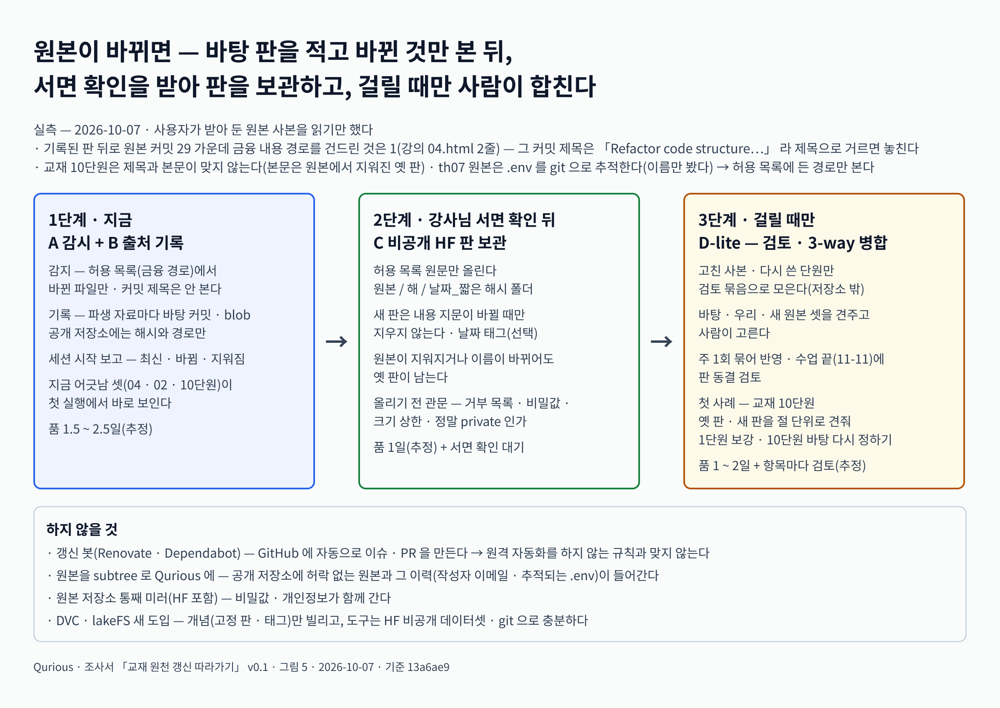
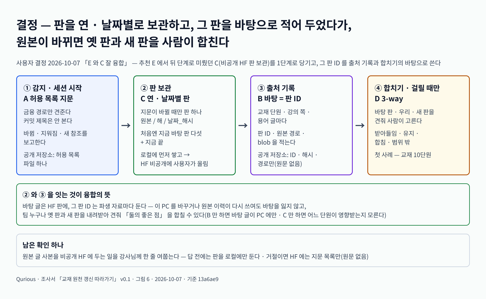

# 조사서 — 강사님 원본이 계속 바뀔 때 「금융 필수 지식」 을 어떻게 따라가고 키우나 v0.1

| 문서 정보 | |
|---|---|
| **판 · 상태** | v0.1 · 결정 — E 와 C 융합(사용자 2026-10-07 · 4.1절) · 5절의 나머지는 구현 때 4.1절 표를 기본값으로 |
| **구분** | 6. 시스템 설계 — 착수 전 검증(목표 기능 ①-1 금융 필수 지식 · 강의 화면 · 교재 단원 · 용어사전의 원천 관리) |
| **작성** | 이동원 |
| **검토** | 이동원 — 4.1절 결정(사용자 2026-10-07) · 외부 사례(2절)는 구현 결정에 쓰기 전에 원문을 다시 연다 |
| **최종 수정** | 2026-10-07 (KST) |
| **기준** | 웹 원문 2026-10-07 조회(8절 출처표 · 확인 · 일부 확인 · 추정 표기) · 로컬 git 읽기 실측(1절 — 사용자가 받아 둔 th01 `12f423d`(10-02) · th07 `f55dd3f`(10-06) · 커밋 작성자 · 이메일은 읽지 않음 · `.env` 는 이름만) · 코드 `main` `13a6ae9` |
| **관련 문서** | [통합본 이식 계획서 v0.1](../설계/통합본-이식계획_v0.1.md) · [통합본 반입 대장](../설계/통합본-반입대장.tsv) · [개념 학습 설계서 v0.1](../설계/개념학습-설계_v0.1.md) · [용어사전 설계서 v0.1](../설계/용어사전-설계_v0.1.md) · [이동원 파트 할 일 v0.3](../계획서/이동원파트-할일_v0.3.md) · 강사님 자료 변경 추적(`docs/github-archive/2026-09-28/이슈-강사님자료-변경추적/기준점.tsv`) |

> **이 문서로 알 수 있는 것**
> 1. 강사님 원본(th01 investment-analysis · th07 domain-rag-lab)에서 「금융 필수 지식」 으로 오는 길은 어떻게 생겼고, 기준점 뒤로 실제로 무엇이 바뀌었나?
> 2. 다른 프로젝트(번역 문서 · 벤더링 · 갱신 봇 · 교과서 판 · 데이터 버전 관리)는 원본이 바뀔 때 파생 자료를 어떻게 따라가나?
> 3. 우리가 고를 수 있는 안은 무엇이고(감시 · 출처 기록 · HF 판 보관 · 검토 병합 · 단계 조합), 무엇을 추천하나?
> 4. 무엇으로 정했고(4.1절), 남은 것은 무엇인가?
>
> **읽는 순서** — 이동원: 0절 → 4.1절 → 5절 · 처음 온 사람: 7절 용어 → 0절 → 4.1절

---

## 0. 한눈에

1. 다른 곳의 해법은 다섯 갈래다.
   ① **번역 프로젝트** — 번역문마다 '어느 원문 판에서 옮겼나'를 적고, 원문이 바뀐 **단위만** 낡았다고 표시한다(MDN · Kubernetes · Python 문서 · MediaWiki · Weblate).
   ② **벤더링** — 원본 판과 **우리 고침을 따로** 적는다(Chromium `README.chromium` · Debian quilt/DEP-3 · DVC import).
   ③ **갱신 봇** — 새 판을 감시해 검토 제안을 만든다(Renovate).
   ④ **교과서 · 문서 사이트** — 학기 · 마일스톤으로 **묶어서** 반영하고 변경 목록을 공개한다(OpenStax · Kubernetes).
   ⑤ **데이터 버전 관리** — 지우지 않는 **스냅샷 + 이름표(태그)**, 그리고 3-way 병합 도구(HF Hub · lakeFS · snapshot.debian.org · `git merge-file`).
2. 우리 실측(사용자가 받아 둔 로컬 참조를 2026-10-07 에 읽음): 기록된 판 뒤로 원본 커밋 **29개**가 들어왔고, 금융 내용 경로를 건드린 것은 **1개**(강의 04.html 2줄)다. 그 커밋 제목은 "Refactor code structure…" 였다 — **커밋 제목으로 거르면 놓친다.**
3. 지금 출처 기록은 원본마다 커밋 하나(manifest)라 파일의 실제 바탕과 어긋난다. 강의 04.html 은 09-20 판과, 교재 10단원의 바탕 `data/10.md` 는 원본에서 08-13 에 **지워진** `docs/10.md` 의 08-02 판과 글자까지 같다. 반입 대장은 둘을 '내용 다름' · '통합본 고유'로 적고 있다. 그 결과 **교재 10단원은 제목(「퀀트·AI·금융 지식 시스템」)과 본문(「법인과 회사 구조 이해하기」 옛 판)이 맞지 않는다**(1.3절).
4. 사용자 안(세션마다 감지 + 비공개 HF 에 연 · 날짜별 보관)은 선례가 있다(snapshot.debian.org 의 날짜별 보관, Debian 의 「날짜 + 짧은 해시」 판 이름). 다만 스냅샷만으로는 "우리 어느 단원이 영향을 받나"를 모른다. **파생물마다 바탕 판을 적는 기록**이 함께 있어야 옛판 · 새판 비교와 「둘의 좋은 점 합치기」가 된다.
5. **추천: E(단계 조합)** — 1단계 A+B(감지 범위를 내용 경로로 좁히기 + 파생물별 출처 기록 · 공개 저장소엔 해시만), 2단계 C(비공개 HF 스냅샷 · 강사님 서면 확인 뒤 · 내용이 바뀔 때만), 3단계 D-lite(고친 사본 · 다시 쓴 단원이 걸릴 때만 검토 묶음 + 3-way). → **결정(사용자 2026-10-07): E 와 C 융합** — C 를 1단계로 당기고, 판 ID 를 출처 기록 · 합치기의 바탕으로 쓴다(4.1절 · 그림 6).

---

## 1. 지금 우리 구조와 실측

### 1.1 흐름 (그림 1)

```text
[강사님 원본 A] edumgt/investment-analysis          [강사님 원본 B] edumgt/domain-rag-lab
  docs/*.md (교재 장 9) · docs/voca.md ·              frontend/days/01~04.html · days/assets/** ·
  docs/voca-exam.md · quiz_questions.json             frontend/assets/theory-data.js · data/samples/finance_*.txt (23)
        │  사용자가 하루 한 번 받는다 (모노레포 learning/ 의 lecture 사본)
        ▼
[중간 통합본] investment-rag-lab @2f0e71f ── 그대로 사본 ──▶ Qurious/rag-lab/ (314 파일 · 반입 대장에 파일마다 blob ID)
        │   · 그대로 복사한 것 (교재 장 · 용어집 글 · 강의 01/03)
        │   · 고친 것 (강의 02 — 1줄)
        │   · 다시 쓴 것 (교재 단원 unit01~10 · manifest.json)
        ▼
[빌드] scripts/lectures_build.py  → public/lectures/ (강의 · 교재)
       scripts/glossary_build.py  → app/services/glossary_data/terms.json (글 넷 + 고침 표 → 용어 760)
        ▼
[앱] 금융 필수 지식 화면 · 교재 · 용어사전

출처 기록 지금: manifest.json "sources"(원본마다 커밋 하나) · 통합본-반입대장.tsv(파일별 blob · 원천)
               · NOTICE.md · 기준점.tsv + scripts/lecture_scan.py(원본별 '지난번 본 커밋' 뒤 커밋 목록 · 경로 거르기 없음)
```

### 1.2 원본 변화 실측 (표 1)

> 측정 방법: 사용자가 받아 둔 두 원본 사본의 `origin/main` 을 **읽기만** 했다(`git log` · `git diff --name-status` · `git rev-parse`). 커밋 작성자 · 이메일은 읽지 않았다.
> '금융 내용 경로' = investment-analysis: `docs/` · `quiz_questions.json` / domain-rag-lab: `frontend/days/` · `data/samples/` · `frontend/hangul-scale.css` · `frontend/assets/theory-data.js` · 강의가 부르는 `frontend/assets/{click-logger,day4-project-schedule,modal-fit}.js`

| 원본 | 기록된 판 → 지금 끝 | 커밋 | 내용 경로 커밋 | 바뀐 내용 파일 | 확실도 |
|---|---|--:|--:|---|---|
| investment-analysis | `2cb9b7f`(09-14) → `12f423d`(10-02) | 4 | **0** | 없음 — `6-1-rst/` · `6-2-rst/` · `image.png` 삭제와 readme 수정뿐 | 확인 |
| domain-rag-lab | `e63e675`(09-21) → `f55dd3f`(10-06) | 25 | **1** | `frontend/days/04.html` +2줄 — `4ce3bfe`(10-02 17:40) "Refactor code structure for improved readability and maintainability" | 확인 |

- 그 2줄은 4일차 페이지에 `../assets/day4-deliverable-examples.css` · `.js` 를 잇는다. 그 JS 는 `new URL(example.file, assetRoot)` 로 그림 주소를 **실행 중에** 만든다(`api.png` 등 · `frontend/assets/deliverable-examples/` 14개). 외부 그림 주소(cdn.quantconnect.com · images.ctfassets.net · miro.medium.com · docs.github.com · raw.githubusercontent.com)도 들어 있다. 내용은 「프로젝트 산출물 예시」라 **금융 필수 지식 범위 밖일 가능성이 크다**(추정).
- 우리 `lectures_build.py` 는 페이지가 부르는 `../assets/` 파일을 페이지에서 읽어 복사한다(목록을 하드코딩하지 않음 — 확인). 그래서 CSS · JS 둘은 따라오지만, 실행 중에 만드는 그림 주소는 그 정규식에 걸리지 않는다 → 새 04.html 을 그대로 들이면 그림이 빠질 수 있다(추정 · 실행해 보지 않음).

### 1.3 파일 단위로 다시 보면 (표 2)

> 방법: 반입 대장의 blob 을 원본 **전체 이력**의 blob 과 대조했다(`git rev-list --all --objects`). 정확히 같은 판이 없으면 그 경로의 판마다 줄 차이를 세어 가장 가까운 판을 찾았다(Python difflib · 읽기만).

| 파생 파일 | 대장의 '원천' | 실제 바탕 (이력 대조) | 지금 원본과 | 확실도 |
|---|---|---|---|---|
| `rag-lab/frontend/days/04.html` | 같은 경로 · 내용 다름 | `7c6ff80`(09-20 15:47) 판과 **글자까지 같음** — 우리 고침 없음 | 원본이 2판 앞섬(+3 −1) | 확인 |
| `rag-lab/frontend/days/02.html` | 같은 경로 · 내용 다름 | `00b841c`(09-19 16:04) 판 + **우리 고침 1줄**(24번째 줄 `API_BASE` 주석 문구) | 바탕이 곧 원본 최신 — 원본 변화 없음 | 확인 |
| `rag-lab/data/10.md` (교재 10단원 바탕) | 통합본 고유 | 원본 `docs/10.md` 의 `6013f63`(08-02) 판과 **같음** | 원본은 08-08 ~ 08-09 에 고쳐졌고 **08-13 삭제**(`e55b9e1` — `10-1` · `10-2` · `10-3` 으로 나눠 다시 씀) | 확인 |
| `frontend/assets/theory-data.js` (교재 6~9단원 바탕) | 같음 | `e63e675` = 지금 끝 (blob `191e86e`) | 변화 없음 | 확인 |

- 대장의 '같은 경로 · 내용 다름' 18개 가운데 학습 자료는 02 · 04 둘이고 나머지 16은 코드 · 설정이다. 이력 전체와 대조하면 18개 중 1개(04)와 '통합본 고유' 53개 중 1개(`data/10.md`)가 **옛 원본 판 그대로**로 다시 분류된다(확인).
- 원인: 대장 · manifest 가 '원본마다 커밋 하나'와만 비교한다. 파일의 바탕은 파일마다 다르다.

**발견 — 교재 10단원 제목과 본문이 맞지 않는다** (확인 · 파일 내용 기준 · 앱 화면은 띄워 보지 않음)

- `public/lectures/curriculum/unit10.md` 제목은 「10단원. 퀀트·AI·금융 지식 시스템」, 본문은 「원문: 10 → 법인과 회사 구조 이해하기」(08-02 판)다.
- 원본 이력에서 `docs/10.md` 는 한 번도 퀀트 · AI 주제가 아니었다: 05-10 ~ 08-01 「기술적 분석 I · II」, 08-01 ~ 08-13 「법인과 회사 구조 이해하기」, 08-13 삭제.
- 같은 주제의 새 판(`10-1` ~ `10-3`)은 이미 1단원의 바탕이다. 즉 앱에 **같은 주제가 옛 판 · 새 판으로 두 번** 들어가 있다.
- 옛 판의 번호 붙은 절 9개를 제목 앞부분(12글자)으로 새 세 글에서 찾으면 6개가 같은 제목으로는 없다(「주주가 갖는 세 가지 권리」 · 「보통주와 우선주」 · 「기업공개와 주식 수 변화」 등). 내용이 다른 제목으로 옮겨졌는지는 사람이 읽어야 안다(추정). — **사용자가 말한 「옛판 · 새판 비교 후 좋은 점 합치기」가 바로 필요한 첫 사례**다.

### 1.4 이번에 확인한 위험 (표 3)

| 위험 | 사실 | 확실도 |
|---|---|---|
| 비밀값 | domain-rag-lab 원본은 `.env` 를 git 으로 추적한다(`origin/main` 파일 목록에 이름이 있음 — **이름만 봤고 내용은 열지 않았다**). 원본 '통째 보관'은 이 파일을 함께 옮긴다. 통합본 반입 때는 빠졌다(대장에 `.env` 줄 없음). | 확인 |
| 개인정보 | 강사님 원본 커밋 작성자에 개인 Gmail 이 섞여 있다 → 작성자 · 이메일 칸을 어디에도 남기지 않는다. | 확인(모노레포 CLAUDE.md · `lecture_scan.py` 주석) |
| 줄끝 | Qurious 작업 트리의 `rag-lab/frontend/days/02.html` 은 CRLF 다(전역 `core.autocrlf=true`). 원본 사본 둘은 유효 설정이 `core.autocrlf=false`(전역은 true). 반입 검사(`raglab_scan.git_blob_ids`)는 이미 '바이트 그대로' · 'LF 로 맞춘' blob 둘을 계산한다. | 확인 |
| 원본이 사라짐 · 개명 | `edumgt/api-test2` 가 사라진 전례(2026-08-10), `quant-test-20260828` → `krx-aggrid` 개명(2026-10-03). | 확인(모노레포 CLAUDE.md) |
| 원본이 내용을 지움 | `docs/10.md`(08-13) · `6-1-rst/` · `6-2-rst/`(10-02) 삭제. 우리 교재 10단원은 지워진 쪽에 기대고 있다. | 확인 |
| 제3자 그림 | 강의 그림에 증권사 앱 화면 캡처(NOTICE 3절) · 새 04.html 의 외부 그림 주소. | 확인 |
| 라이선스 | 원본 둘 다 LICENSE 없음 · 구두 허가(NOTICE 2절). 라이선스가 없으면 쓰기 · 고치기 · 나누기 허락이 없는 상태가 기본이다(choosealicense). | 확인 |

### 1.5 파생물의 세 종류 — 선택지를 가르는 기준 (표 4)

| 종류 | 우리 예 | 원본이 바뀌면 | 다른 곳의 같은 경우 |
|---|---|---|---|
| ① 그대로 복사 | 교재 장 md 9 · `voca.md` · `voca-exam.md` · `finance_*.txt` 23 · 강의 01 · 03 · 04 · `theory-data.js` | 새 판으로 바꾸고 다시 빌드. 병합 없음 | Chromium 'Local Modifications: None' + Autoroll |
| ② 고친 사본 | 강의 02(1줄) · `lectures_build.py` 의 변환 ①~④(코드로 적은 고침) | 3-way 병합(바탕 · 우리 · 새 원본) 또는 고침 다시 얹기 | Debian quilt 패치 + DEP-3 머리 |
| ③ 다시 쓴 것 | 교재 `unit01~10.md` · 용어 760(글 넷을 합치고 OVERRIDES 등 표로 고침) | 기계 병합은 뜻이 없다. 바뀐 원문 **조각**(제목 · 용어)을 보여 주고 사람이 고친다 | 번역(MDN · MediaWiki · gettext fuzzy) · Chromium 'Static.HardFork' |

- 용어 빌드(`glossary_build.py`)는 이미 '자료 글은 고치지 않고 우리 고침은 표에'(OVERRIDES · SAME_AS · RENAME · NOT_ALIAS · CANDIDATES) 구조이고, 표가 자료에 없는 이름을 가리키면 빌드가 멈춘다. Debian 의 '원본 + 패치'와 같은 구조다.
- 빠진 것은 용어마다 '어느 원문 판의 어느 항목에서 왔나'라는 **지문** 하나다(`terms.json` 은 용어마다 `sources` 코드만 있다 — 확인).

---

## 2. 다른 곳은 어떻게 하나

### 2.1 번역 프로젝트 — 번역문마다 원문 판을 적고, 바뀐 단위만 낡았다고 표시 (표 5)

| 프로젝트 | 무엇을 저장하나 | 낡음을 어떻게 아나 | 편집자에게 어떻게 보이나 | 확실도 |
|---|---|---|---|---|
| MDN Web Docs | 번역 파일 머리말 `l10n.sourceCommit` = 번역할 때 **그 영어 문서를 마지막으로 바꾼 커밋** 40자 | 영어 문서가 그 해시 뒤로 바뀌면 낡은 번역 | 다시 번역해 PR. 대시보드 같은 도구는 확인하지 못함 | 일부 확인 |
| Kubernetes 문서 | 대상 판(가지) · 현지화 가지 `dev-<원문 판>-<언어>.<마일스톤>` | 현지화는 팀이 고른 대상 판의 영어 파일을 바탕으로 한다. 마일스톤 시작마다 이전 · 현재 현지화 가지 사이의 원문 변화를 비교하는 이슈를 여는 것을 권한다. 도구 둘: `upstream_changes.py`(파일 하나의 변화) · `diff_l10n_branches.py`(낡은 파일 목록) | 이슈 · PR | 확인 |
| Python 문서 | 언어마다 저장소(`python-docs-LANGUAGE_TAG`) · gettext `.po`(문장 단위 원문 ↔ 번역) | 원문이 바뀌면 `.pot` 을 다시 만들고 `sphinx-intl update` 가 차이를 `.po` 에 반영. `msgmerge` 는 조금 바뀐 문장에 옛 번역을 붙이고 **fuzzy** 표시, `--previous` 면 옛 원문을 `#\| msgid` 로 남긴다 | 번역 도구가 fuzzy · 옛/새 원문 차이를 보여 줌. translations.python.org 가 언어별 완성률(core · overall · 30일 변화) | 확인 |
| MediaWiki Translate | 문서를 번역 **단위**(문단)로 쪼갬 · 관리자가 '번역 표시'한 판 | 새 판을 표시할 때 관리자가 단위마다 '갱신 필요'를 고른다 | 갱신 필요 단위는 번역 페이지에서 **분홍 배경**, 번역 화면에 시계 아이콘과 원문 차이. 사람이 `!!FUZZY!!` 로 직접 낡음 표시 가능. 언어 막대에 완성률과 **최신률** | 확인 |
| Weblate | 원문 문자열 · 번역 상태 | "원문을 바꾸면 기존 번역이 needs editing 이 된다" | PO 에 `#\|` 가 있으면 옛 원문과의 차이를 보여 줌 | 확인 |

**눈여겨볼 점**

- MediaWiki 는 "번역 페이지는 **마지막으로 표시한 판** 기준으로, 원문에 표시 안 한 새 변경이 있어도 100% 최신으로 나온다"고 적는다. 기준을 옮기는 것은 사람의 결정이다 — 우리 `기준점.tsv` 를 '그 줄만' 옮기는 지금 운영과 같다.
- 관리자가 단위마다 갱신을 요구할지 고른다. 맞춤법 고침처럼 사소한 변경은 무효화하지 않는다. 우리 경우 04.html 의 「산출물 예시」 연결이 '범위 밖'으로 넘길 후보다.
- gettext 의 `#| msgid` 는 「옛 원문을 새 원문 옆에 둔다」를 가장 작은 단위로 구현한 것이다. 사용자 안(옛판 · 새판 비교)과 같은 발상이다.

### 2.2 벤더링 — 원본 판과 우리 고침을 따로 적는다 (표 6)

| 사례 | 무엇을 저장하나 | 새 판 감지 · 반영 | 확실도 |
|---|---|---|---|
| Chromium `third_party` | `README.chromium`: Name · URL · Version · Date · **Revision**(원본이 git 이면 필수) · **Update Mechanism**(Autoroll · Manual · Static · Static.HardFork) · License · Shipped · Security Critical · Description · **Local Modifications**(고친 것을 열거, 없으면 `None`) | autoroller 가 새 판을 감지해 올린다. 스크립트로 올리면 README 의 Version · Revision 도 같이 고쳐야 한다. 원본 git 해시를 알려진 원본 DB 와 대조해 어긋남을 추적한다 | 확인 |
| Debian 패키지 | `debian/watch`(원본 위치 · 패턴) · `debian/patches`(원본 위에 얹는 패치 묶음, 패치마다 DEP-3 머리: Description · Origin · Forwarded · Author · Last-Update · Applied-Upstream) | `uscan` 이 새 판 확인 — git 모드는 태그(`refs/tags/…`) 또는 `HEAD` · `heads/<가지>` 를 따라간다. `HEAD` · 가지를 따라갈 때 자동으로 붙이는 판 이름의 기본값이 `0.0~git%cd.%h`(날짜 + 짧은 해시, 날짜 `%Y%m%d`). 새 판에는 `quilt push -a` → `quilt refresh`, 원본에 이미 들어간 고침은 패치에서 지운다 | 확인 |
| DVC `import` | `.dvc` 파일: 원본 저장소 url · `rev_lock`(잠근 커밋) · (선택) `rev` · 결과 파일 md5 | `dvc update` 가 더 새 판을 확인해 `rev_lock` 을 갱신. `--no-download` 는 내려받지 않고 체크섬만 갱신 | 확인 |
| git submodule | 부모 저장소에 **커밋 하나**(gitlink · 모드 160000)만 | 자동 갱신 없음. `git submodule update --remote` · `diff.submodule=log` | 확인 |
| git subtree 병합 | 남의 프로젝트를 하위 폴더에 **내용째** | subtree merge — "한곳에 다 커밋돼 좋지만 더 복잡하고 실수하기 쉽다"(Pro Git) | 확인 |

**Chromium 문서에서 우리에게 그대로 맞는 세 문장**

- "의존성 하나는 **원본 한 곳**에서 와야 한다. 여러 원본을 한 폴더에 넣으면 파일 출처를 따지기도, 자동 갱신하기도 어렵다." — 우리 `rag-lab/` 은 강사님 원본 둘 + 팀장이 다시 쓴 것이 섞여 있다.
- "원본 폴더의 코드를 **다시 서식하지 말라**. 원래 서식을 지켜야 원본과 깨끗한 diff 가 나온다." — 팀이 이미 겪었다: 팀원 자동 서식으로 `app.html` 3-way 가 거의 모든 줄에서 충돌해 '공백 접은 토큰 비교'로 풀었다(팀 메모).
- 'Static.HardFork' = "원본은 git 이지만 우리 판이 갈라져 더 이상 갱신할 수 없다" — 우리 교재 단원(③)의 정확한 이름이다. 그래도 Chromium 은 "가장 가까운 갈라진 지점"의 판을 적으라고 한다.

### 2.3 갱신 봇 — 판 번호 올리기 제안

- Renovate: regex 사용자 정의 관리자는 아무 파일에서나 정규식 캡처(`currentValue` 또는 `currentDigest` · `depName` · `datasource`)로 판을 찾는다. `git-refs` 데이터 소스는 가지의 최신 커밋을 `currentDigest` 로 따라간다(예: `versions.ini` 의 해시). Dependency Dashboard(이슈 하나)에 할 일을 모으고, `dependencyDashboardApproval` 이면 승인 전에는 PR 을 만들지 않는다. `schedule` 로 시간을 제한한다. 갱신 뒤 명령(`postUpgradeTasks`)은 자체 호스팅에서 허용한 명령만 된다. `--platform=local` 은 로컬 파일만 보고 브랜치 · PR 을 만들지 않는 점검이다(기본 `dryRun=lookup`). (모두 확인)
- Dependabot 문서는 docs.github.com(github.com 하위)이라 이번 조사 규칙으로 열지 않았다 — PR 을 여는 같은 방식으로 본다(추정).
- 우리에게 맞나 — **방식은 빌리고 봇은 쓰지 않는다**(추정 · 정책 판단 포함):
  1. 봇은 GitHub 에 이슈 · PR 을 스스로 만든다. 우리 규칙은 원격 작업을 사람이 사람 속도로 하고(전역 규칙 10절), 팀 공용 장치는 대화방 논의가 먼저다.
  2. 해시만 올리고 내용 복사 · 검토가 없으면 기록과 실제가 어긋난다(지금 manifest 의 문제를 키운다). 내용까지 옮기려면 자체 호스팅 + 갱신 뒤 명령이 필요하다.
  3. 원본 글은 어차피 공개 저장소에 넣지 않는다.
  → 빌릴 것: **할 일 판(대시보드) + 승인 관문 + 정해진 주기**. `lecture_scan.py` 가 이미 로컬 참조로 'lookup' 을 하고 있다.

### 2.4 단일 출처 · 판 관리 · 데이터 버전 관리 (표 7)

| 사례 | 핵심 장치 | 우리에게 | 확실도 |
|---|---|---|---|
| DITA (OASIS 1.3) | `@conref` · `@conkeyref` — 내용을 **참조로** 재사용(한곳에 두고 끌어다 씀), 결과가 유효하도록 규칙을 둠 | 단원이 원본 조각을 안정된 ID 로 가리키면(이미 `theory-data.js#day1` · 용어 ID) 영향 범위가 조회 한 번 | 확인 |
| OpenStax 교과서 | 정오표는 **주제 전문가가 모두 검토**. 3~10월 제출분은 봄 학기, 11~2월 제출분은 가을 학기에 온라인 판 반영. PDF · 인쇄는 큰 변화가 있을 때 학년 말 1회. 새 판(edition)은 **교육상 필요할 때만** · 현재와 직전 판 유지, 옛 판은 3~5년마다 은퇴. 지난 정오표 목록 공개 | 묶어서 반영 · 변경 목록 공개 · 수업 끝에 판 동결 | 확인 |
| Hugging Face Hub | 저장소 = git. 가지 · 태그(`create_tag(..., revision=, tag=, tag_message=)`) · `list_repo_refs`. 내려받기 `revision` = 가지 · 태그 · PR · **전체** 커밋 해시(7자 불가). 올리기 · 내려받기 `allow_patterns` · `ignore_patterns`. `upload_folder` 는 기본으로 루트 `.gitignore` 를 따름. private = 소유자 · 조직 구성원만 봄. Xet 은 ~64KB 조각 단위 중복 제거. 무료 조직 private 100GB. 커밋이 수천 개를 넘으면 사용감이 떨어짐 · `super_squash_history` 는 되돌릴 수 없음. 올릴 때마다 TruffleHog 로 비밀값을 찾아 **메일로 알림**(올리기를 막는다는 설명은 없다 — 우리 쪽 관문이 따로 필요) | 사용자 안(C)의 그릇 | 확인 |
| lakeFS | 커밋 = 바뀌지 않는 체크포인트(메타데이터 키/값 가능) · 태그 = 커밋 이름 · 가지는 복사 없이 · 병합은 공통 조상 기준 3-way · 바뀌지 않은 객체는 같은 물리 객체를 가리킴 | 스냅샷은 지우지 않고, 이름(태그)은 커밋에 붙인다 | 확인 |
| Delta Lake | 판 번호 · 시각으로 옛 스냅샷 조회(time travel). 보존 기간(로그 기본 30일 등)과 `VACUUM` 이 지나면 옛 판으로 못 돌아감 | 증거 보관소에는 자동 정리를 걸지 않는다 | 확인 |
| snapshot.debian.org | "날짜와 판 번호로 옛 패키지에 접근하는 wayback machine" · 주소가 시각별(`/archive/debian/20091004T111800Z/`) | 연 · 날짜별 보관의 선례 | 확인 |

### 2.5 사람 검토 고리와 병합 도구

흐름 (그림 2)

```text
변경 목록 ──▶ 분류 (단위마다) ──────────────▶ 병합 · 편집 ──▶ 빌드 · 시험 ──▶ 기록 ──────────▶ 정해진 주기에 반영
(원본 diff)   받아들임 / 우리 것 유지 /         3-way ·         --check 들      Added · Changed ·    (주 1회 묶음 ·
              합침 / 범위 밖 (이유를 적음)       손 편집                         Removed · Fixed …    수업 끝 판 동결)
```

도구 (표 8)

| 할 일 | 도구 | 쓰는 법 · 주의 | 확실도 |
|---|---|---|---|
| 3-way 병합 | `git merge-file -p --diff3 -L 우리 -L 바탕 -L 새원본 ours base theirs` | `-p` 는 결과를 표준 출력으로만 내 저장소를 안 바꾼다. 종료 코드 = 충돌 수(0 = 깨끗). `--zdiff3` · `--ours/--theirs/--union` 도 있다. 팀이 기초 코드 반영에 이미 쓰는 방식 | 확인 |
| 원본 판 꺼내기 | `git cat-file blob <커밋>:<경로>`(바이트 그대로) · `<rev>:<경로>` 문법 | `--filters` 를 주면 줄끝 변환 등이 걸린다 — 기본은 그대로 | 확인 |
| 줄끝 맞추기 | Pro Git 의 수동 재병합 예는 `merge-file` 전에 `dos2unix` 를 돌린다 · `git diff --ignore-cr-at-eol` · `git hash-object` 는 기본으로 필터(줄끝 변환)를 적용, `--no-filters` 면 그대로 | 비교 · 병합은 LF 로, 작업 트리에 쓸 때는 그 파일의 줄끝으로 | 확인 |
| 같은 충돌 다시 풀기 | `git rerere`(풀이를 기억해 다음에 자동 적용) | 저장소 안 merge · rebase 에서 쓰는 기능이다. AI 는 git 쓰기를 안 하므로 대신 '우리 고침 기록'(DEP-3 식)으로 의도를 남긴다(추정) | 확인 |
| 고침 묶음의 전후 비교 | `git range-diff` | 고침을 새 원본 위로 다시 얹은 전후를 커밋 짝으로 비교 | 확인 |
| 산문 차이 | `git diff --word-diff` · `--word-diff-regex` · `--color-moved`(옮겨진 덩어리 표시) · `--no-index`(저장소 밖 두 경로 비교) | 단원 이동(강사님 주석 "분산투자·변동성 매매 단원은 03일차로 이동" 같은 것)은 `--color-moved` 로 | 확인 |
| 산문을 줄 단위로 | Semantic Line Breaks(문장 끝마다 줄 바꿈 — "한 문장의 변경이 한 줄의 변경으로") | **비교용 사본에만** 적용. 저장본은 원본 서식 그대로(Chromium 원칙) | 확인 |
| 나란히 보기 | Python `difflib.HtmlDiff`(줄 안 변경까지 강조한 HTML 표) · `SequenceMatcher.ratio()` | 검토 묶음 · 가장 가까운 판 찾기(1.3절이 이 방법) | 확인 |
| JSON | `jq -S`(키 정렬) | 퀴즈 JSON 비교 전에 | 확인 |
| 변경 기록 | Keep a Changelog — Added · Changed · Deprecated · Removed · Fixed · Security, 맨 위 Unreleased | 반영 묶음마다 | 확인 |

**팀이 이미 얻은 교훈(팀 메모)**

- 서식이 바뀐 파일은 "공백을 접고 태그 경계로 자른 토큰"으로 비교해야 했다.
- **충돌 없이 합쳐진 파일을 더 의심한다** — 원본의 설계 변경을 우리 쪽이 모른 채 글자만 안 겹쳐 조용히 합쳐질 수 있다. 학습 글도 같다: 원본이 용어 정의를 바꿨는데 우리 단원이 옛 뜻으로 설명하는 경우.

### 2.6 공통 원리 일곱

1. **바탕을 파생물 단위로 적는다** — MDN `sourceCommit`, Chromium `Revision`, DVC `rev_lock`. 저장소당 커밋 하나로는 모자란다(1.3절).
2. **내용으로 감지한다** — 경로 · blob 으로. 커밋 제목은 믿지 않는다(`4ce3bfe` "Refactor…").
3. **바뀐 단위만 표시하고, 바꿀지는 사람이 단위마다 고른다** — MediaWiki 무효화 선택, gettext fuzzy.
4. **옛 원문을 새 원문 옆에 둔다** — `#| msgid`, 스냅샷.
5. **우리 고침을 원본과 따로 적는다** — Local Modifications, quilt + DEP-3, 우리 용어 빌드의 고침 표.
6. **원본 서식을 바꾸지 않는다** — 정규화는 비교용 사본에서만.
7. **묶어서 반영하고 기록을 남긴다** — Kubernetes 마일스톤, OpenStax 학기 반영, Keep a Changelog.

---

## 3. 우리 선택지

### 3.0 모든 선택지의 공통 전제

- **받기(fetch)는 사용자**가 git bash 에서 하루 한 번 한다(지금처럼 `bash scripts/sync-lecture.sh`). AI 는 받아 둔 로컬 참조만 읽는다(전역 규칙 10절). 그래서 '세션마다 감지'는 비용이 거의 없다 — 세션마다 하는 일은 "받아 둔 것 중 새 내용이 있나"를 보는 것뿐이다.
- 원본 글은 공개 저장소에 **새로** 넣지 않는다. 공개 저장소에는 경로 · 해시 · 결정 기록만.
- 거부 목록(`.env*` · `*.pem` · `*.key` · `id_*` 등)은 **이름으로만** 거르고 내용을 열지 않는다.
- blob 계산: 원본 쪽은 `git rev-parse <커밋>:<경로>`(저장된 바이트 기준이라 줄끝 영향 없음), 우리 쪽은 기존 `git_blob_ids`(그대로 · LF 둘).

### 3.1 A. 감시 · 보고만 — 감지 범위를 내용 경로로 좁힌다

| 항목 | 내용 |
|---|---|
| 저장 | 원본별 **허용 목록**(pathspec) + 거부 목록 — 파일 하나(공개 저장소 · 판 번호 붙임) |
| 감지 | `lecture_scan.py` 에 `git log <기준>..<끝> -- <허용 목록>` 과 `git diff --name-status -M` 을 더해 '내용 커밋' · '내용 파일'을 따로 센다. 바뀐 HTML · JS · CSS 에서 새 참조를 뽑는다(정적 `src` · `href` · 마크다운 그림은 목록으로, `new URL(...)` 처럼 실행 중에 만드는 주소는 '확인 필요' 경고) |
| 누가 | 사용자: 받기 / AI: 세션 시작에 한 화면 보고 · 추적 댓글 초안 |
| 품 | 반나절(추정) |
| 위험 | 낮음. 단, 어느 파생물이 영향받는지는 사람이 다시 따져야 한다 — 04.html 처럼 바탕이 기록과 다른 파일, 10단원처럼 지워진 원본에 기댄 파일은 놓친다. 옛판은 사용자 PC 의 원본 사본에만 있다 |
| 옛판 · 새판 합치기 | 원본 차이를 보여 주는 데서 끝 |

### 3.2 B. 파생물별 출처 기록 + 세션 시작 신선도 검사

| 항목 | 내용 |
|---|---|
| 저장 (공개 저장소 · 해시와 경로만) | ① 출처 대장 TSV(가칭 `docs/설계/파생자료-출처대장.tsv`, 또는 반입 대장에 칸 추가) ② 교재 manifest 단원마다 `source_blobs` ③ `terms.json` 용어마다 `source_fp`(원문 항목을 정규화한 sha256) ④ 고친 사본마다 '우리 고침 기록'(DEP-3 식 머리) |
| 처음 채우기 | 바탕 찾기 자동화 — (1) 원본 전체 이력에 같은 blob 이 있나 (2) 없으면 그 경로의 판 중 줄 차이가 가장 작은 판 → 사람이 확인. 1.3절이 이 방법의 실측이다 |
| 감지 | 원본 끝에서 원본 경로마다 지금 blob 을 구해 바탕 blob 과 비교 → 상태: 최신 / 원본 바뀜 / 원본에서 지워짐 · 옮겨짐(`-M` 으로 이름 바뀜 확인) / 우리 쪽이 대장과 다름. 종류별 다음 할 일: ① 복사 = 바꾸기 후보 ② 고친 사본 = 3-way 를 미리 돌려 충돌 수 ③ 다시 씀 = 바뀐 조각(제목 · 용어) 목록. MediaWiki 처럼 **최신률**을 낸다 |
| 누가 | 사용자: 받기 · '받아들임' 승인(바탕 옮기기) / AI: 비교 · 보고 · 대장 갱신 초안 · 시험 |
| 품 | 1~2일(추정) — 바탕 찾기 스크립트 · 대장 형식 · `--check` 시험 |
| 위험 | 바탕을 옮기는 규율이 필요하다(받아들인 뒤에만). 다시 쓴 단원은 바탕이 정확하지 않을 수 있다 → '추정 바탕'으로 표시. 원본 이력이 다시 쓰이면(강제 push) 바탕 글이 PC 에서도 사라질 수 있다 → C 가 메운다 |
| 옛판 · 새판 합치기 | 3-way 의 **바탕**을 준다. 이것이 없으면 비교가 2-way 로 떨어져 "어느 쪽이 바꿨나"를 모른다 |

대장 예시 (값은 실측)

```tsv
파생물	종류	원본	원본 경로	바탕 커밋	바탕 blob	우리 고침	갱신 방식	검토일	메모
rag-lab/frontend/days/04.html	복사	domain-rag-lab	frontend/days/04.html	7c6ff80	6819def	없음	자동	-	대장 원천은 '내용 다름' — 실제는 09-20 판 그대로
rag-lab/frontend/days/02.html	고친 사본	domain-rag-lab	frontend/days/02.html	00b841c	(그 판의 blob)	고침기록/days-02-api-base.md	수동	-	24번째 줄 주석 1줄
rag-lab/data/10.md	복사	investment-analysis	docs/10.md	6013f63	a5c70b4	없음	고정	-	원본에서 08-13 삭제(e55b9e1) · 10단원 제목과 불일치
rag-lab/data/curriculum/unit06.md	다시 씀	domain-rag-lab	frontend/assets/theory-data.js#day1	e63e675	191e86e	다시 씀	고정	-	교재 6단원 · 바탕 커밋은 추정(manifest 의 고정 판)
```

'갱신 방식'은 Chromium 의 Update Mechanism 을 옮긴 것이다: 자동(=Autoroll, 바뀌면 바꾸고 빌드) · 수동(=Manual, 고침 다시 얹기 · 3-way) · 고정(=Static.HardFork, 갈라짐 — 알림만 받고 사람이 판단).

'우리 고침 기록' 예시 (Debian DEP-3 머리를 본뜸)

```text
Description: 강의 2일차 API_BASE 줄의 주석을 배포 안내 문구로 바꿈 (동작은 같음)
Origin: domain-rag-lab 00b841c frontend/days/02.html 24번째 줄
Forwarded: not-needed
Last-Update: YYYY-MM-DD
```

세션 시작 보고 예시 (그림 3 — 오늘 로컬 참조로 계산한 실제 값)

```text
금융 필수 지식 — 원본 변화 점검 (로컬 참조만 · 2026-10-07)
원본                  기록된 판   지금 끝 (받은 날)     전체 커밋  내용 커밋
investment-analysis   2cb9b7f    12f423d (10-02)       4          0
domain-rag-lab        e63e675    f55dd3f (10-06)       25         1   4ce3bfe "Refactor code structure…"

파생물                              종류        바탕                 상태
rag-lab/frontend/days/04.html       복사        7c6ff80 (09-20)      원본이 2판 앞섬 (+3 −1) · 새 참조 2 + 실행 중 그림 주소 → 분류 필요
rag-lab/frontend/days/02.html       고친 사본   00b841c (09-19)      최신 · 우리 고침 1줄
rag-lab/data/10.md (교재 10단원)    복사        6013f63 (08-02)      원본에서 삭제됨 (08-13 e55b9e1) · 단원 제목과 불일치 → 새 글 10-1~10-3 과 견줄 것
교재 6~9단원 ← theory-data.js       다시 씀     191e86e              최신
교재 1~5단원 ← docs/*.md            다시 씀     2cb9b7f (추정 바탕)   최신
용어 760                            용어        —                    지문이 없어 판정 불가 (B 에서 만든다)
```

### 3.3 C. 비공개 HF 스냅샷 — 연 · 날짜별 (사용자 안을 다듬은 것)

| 항목 | 내용 |
|---|---|
| 저장 (비공개 HF 데이터셋) | 허용 목록 파일만, 원본 경로 그대로. `snapshots/<원본>/<YYYY>/<YYYY-MM-DD>_<짧은 해시>/` + 스냅샷마다 `_manifest.json` + 맨 위 `index.tsv` + (선택) 태그 |
| 언제 만드나 | 세션마다 · 커밋마다가 **아니라** '내용 지문'이 바뀔 때만. 지문 = 허용 목록 파일들의 (경로, blob) 목록의 sha256. 이번 실측이면 29커밋에 1번. 「내용 커밋마다 하나씩」도 고를 수 있다(중복 제거로 저장 부담은 작을 것 — 추정) |
| 날짜 기준 | 그 내용을 마지막으로 바꾼 원본 커밋의 시각(KST) — 다시 계산해도 같은 이름이 나온다. 받은 시각은 manifest 에 따로. Debian 의 `0.0~git%cd.%h`(날짜 + 짧은 해시)와 같은 발상 |
| 처음 채우기 | 지금 쓰는 바탕 판들(`2cb9b7f` · `e63e675` · `7c6ff80` · `00b841c` · `6013f63`) + 지금 끝 |
| 파일을 꺼내는 곳 | 작업 트리가 아니라 **git 객체**에서(`git cat-file blob <커밋>:<경로>`). 바이트가 원본에 저장된 그대로(대개 LF)라 재현되고 줄끝 문제가 없다 |
| 올리기 전 관문 | 허용 목록만 → 거부 목록에 걸리면 멈춤 → 비밀값 모양 검사(반입 검사 시험 재사용) → 크기 상한 → 원격이 정말 private 인가(`hf_dataset._assert_private` 재사용) → 올릴 목록 미리 보기 |
| 누가 | 사용자: 받기 · 올리기 명령 실행(또는 사용자가 승인한 정기 작업) / AI: 준비 · 관문 · 미리 보기 · 비교 |
| 품 | 1일(추정) + 강사님 서면 확인 대기 |
| 위험 | 저작권(비공개라도 사본을 하나 더 만든다 — 구두 허가 범위인지 서면 확인 권장), 비밀값(`.env` 추적 확인됨 → 통째 보관 금지), 개인정보(작성자 칸 금지), 제3자 그림(기본은 글만 · 그림은 따로 허용), 무료 조직 private 은 Dataset Viewer 가 꺼짐(팀 메모) → 비교는 내려받아 로컬에서, `super_squash_history` 금지(증거가 사라짐) |
| 옛판 · 새판 합치기 | 바탕 글 · 새 글을 PC 와 무관하게 팀 누구나 꺼낸다(`snapshot_download(allow_patterns=…)`). 원본이 지워지거나 이력이 바뀌어도 남는다. 다만 '어느 단원이 영향받나'는 B 가 있어야 안다 |

배치 (그림 4 — 폴더 이름은 규칙을 보여 주는 예)

```text
qurious-quant/learning-source-snapshots        (dataset · private · 이름은 가칭)
├── README.md            비공개 · 팀 안에서만 · 재배포 금지 · 출처와 허가 근거 · 공개 전환 금지
├── index.tsv            원본 · 스냅샷 ID · 커밋 40자 · 커밋 시각(KST) · 받은 시각 · 지문 · 파일 수 · 바이트 · 허용 목록 판
└── snapshots/
    ├── investment-analysis/
    │   └── 2026/
    │       ├── 2026-08-02_6013f63/     ← 교재 10단원 바탕 (원본에서 지워진 docs/10.md 가 들어 있음)
    │       └── 2026-09-14_2cb9b7f/     ← 지금 기록된 판
    └── domain-rag-lab/
        └── 2026/
            ├── 2026-09-19_00b841c/     ← 강의 02 바탕
            ├── 2026-09-20_7c6ff80/     ← 강의 04 바탕
            ├── 2026-09-21_e63e675/     ← 지금 기록된 판
            └── 2026-10-02_4ce3bfe/     ← 내용이 바뀐 마지막 커밋 (끝 f55dd3f 와 내용 같음)
                ├── _manifest.json
                ├── frontend/days/01.html …
                └── data/samples/finance_glossary.txt …
```

`_manifest.json` 예시

```json
{
  "format": 1,
  "source": "edumgt/domain-rag-lab",
  "commit": "4ce3bfe…(40자)",
  "commit_time_kst": "2026-10-02 17:40",
  "tip_seen": "f55dd3f…(40자)",
  "fetched_at_kst": "(사용자가 받은 시각)",
  "allowlist_version": "2026-10-07.1",
  "fingerprint": "sha256:…",
  "files": [
    {"path": "frontend/days/04.html", "git_blob": "3aabf0e…", "sha256": "…", "bytes": 0}
  ],
  "excluded_by_rule": [".env"],
  "not_recorded": ["작성자", "이메일", "커밋 본문"]
}
```

**폴더마다 한 판 vs 한 폴더 + 판마다 커밋 · 태그**

- **폴더마다 한 판(위 안)**: 경로로 바로 찾고, 두 판을 `allow_patterns` 로 골라 내려받아 `git diff --no-index` 로 비교한다. 같은 내용이 여러 폴더에 반복돼도 git 의 내용 주소 저장(같은 내용 = 같은 blob)과 Xet 조각 중복 제거 덕에 저장량은 거의 늘지 않을 것으로 본다(추정 — HF 의 실제 용량 계산 방식은 확인하지 않았다).
- **한 폴더 + 판마다 커밋 · 태그**: git 다운 방식이지만 두 판을 비교하려면 `revision` 을 바꿔 두 번 내려받아야 하고, 폴더 탐색에 익숙한 팀원에게는 덜 보인다.
- 추천은 폴더 방식 + (선택) 태그. 태그 이름에 쓸 수 있는 글자는 git ref 규칙을 따르는 것으로 보이나 확인하지 않았다 → `ia-2cb9b7f` · `drl-4ce3bfe` 처럼 단순하게(추정).
- 참고: 지금 HF 문서(huggingface_hub v2.1.1)의 저장소 만들기 예시는 `visibility="private"` 를 쓴다. 팀 스크립트의 `private=True` 가 앞으로도 그대로 되는지는 확인하지 않았다(추정 · 구현 때 확인).

### 3.4 D. 검토 대기열 + 3-way 병합

| 항목 | 내용 |
|---|---|
| 저장 | 검토 묶음(원본 글이 들어감 → gitignore 된 `data/interim/upstream-review/<날짜>/<항목>/` 또는 비공개 HF): `base` · `theirs` · `ours` · `merge.diff3` · `side-by-side.html` · `결정.md`. 공개 저장소에는 **원문 없는** 결정 기록(항목 · 결정 · 이유)과 변경 기록만 |
| 감지 | B 의 상태표에서 ② 고친 사본 · ③ 다시 쓴 것만 대기열로 (① 복사는 바꾸고 빌드) |
| 결정 넷 | 받아들임 / 우리 것 유지(이유) / 합침(둘의 좋은 점) / 범위 밖(이유 — MediaWiki 의 '무효화 안 함') |
| 병합 규칙 | 정규화는 비교본에만(LF · 공백 접기 · 문장마다 줄 · JSON 키 정렬) · 저장본은 원본 서식 그대로 · 깨끗이 합쳐진 것도 읽는다 · 우리 고침이 원본에 들어가면 고침 기록을 지운다(quilt) |
| 누가 | AI: 묶음 · 병합 초안 · 빌드 · 시험 · 변경 기록 초안 / 사람: 결정 · 커밋 · PR · 게시 |
| 품 | 도구 1~2일 + 항목마다 검토 시간(15~60분 — 추정) |
| 위험 | 사람 시간. 강의 HTML 은 4,000줄이 넘고 스크립트가 섞여 줄 단위 병합이 시끄럽다. 다시 쓴 단원은 기계 병합이 안 된다(조각 목록 + 사람 편집) |
| 옛판 · 새판 합치기 | 가장 직접적이다. 「둘의 좋은 점」을 고르는 자리가 여기다 |

첫 사례로 맞춤인 것: **교재 10단원**. 옛 판(`docs/10.md` 08-02 · 절 9개)과 새 판(`10-1` ~ `10-3`)을 절 단위로 나란히 놓고, 새 판에만 있는 설명 · 옛 판에만 있는 설명을 표로 뽑아 사람이 고른다. 결과는 1단원 보강 + 10단원 제목에 맞는 새 바탕 찾기(또는 단원 정리)로 갈 수 있다.

### 3.5 E. 단계 조합 (추천)

```text
1단계 (이번 주)      A + B   허용 목록 · 참조 검사 · 파생물별 출처 대장 · 세션 시작 보고
                           → 저작권 노출 0 (해시 · 경로만) · 지금 어긋남 셋(04 · 02 · 10단원)이 바로 보인다
2단계 (서면 확인 뒤)  C       바탕 판들 + 지금 끝을 처음 채우고, 그 뒤엔 내용 지문이 바뀔 때만
3단계 (걸릴 때만)     D-lite  고친 사본 · 다시 쓴 단원만 검토 묶음 · 주 1회 묶어 반영 · 수업 끝(11-11)에 판 동결 검토
```

### 3.6 비교 (표 9)

| | A 감시 · 보고 | B 출처 기록 | C HF 스냅샷 | D 검토 · 병합 | E 조합 |
|---|---|---|---|---|---|
| 저장하는 것 | 허용 목록 | 파생물별 바탕(해시) | 원본 글(비공개) | 검토 묶음 · 결정 기록 | 단계별 |
| 감지 단위 | 커밋 · 경로 | 파생물 · 조각 | 내용 지문 | 항목 | 파생물 · 조각 |
| "어느 단원이 영향?" | 사람이 추적 | 바로 | 못 함(B 필요) | B 에 기댐 | 바로 |
| 옛판 보관 | 사용자 PC 만 | 사용자 PC 만 | 팀 공유 · 원본이 지워져도 | — | 팀 공유 |
| 3-way 바탕 | 없음 | 있음(해시) | 있음(글) | 씀 | 있음 |
| 저작권 노출 | 없음 | 없음 | 비공개 사본 | 비공개 사본(로컬) | 2단계부터 |
| 원격 작업 | 사용자 fetch | 사용자 fetch | + HF 올리기(사용자 실행) | 없음 | 단계별 |
| 품(추정) | 0.5일 | 1~2일 | 1일 | 1~2일 + 검토 | 3.5~5.5일을 나눠서 |

### 3.7 하지 않을 것 (기각과 이유)

| 안 | 이유 | 확실도 |
|---|---|---|
| Renovate · Dependabot 봇 | GitHub 에 자동으로 이슈 · PR → 원격 자동화 금지 규칙 · 팀 공용 장치 논의 규칙과 충돌. 해시만 올리면 기록과 실제가 어긋남 | 추정(정책 판단) |
| 원본을 Qurious 에 submodule 로 | 내용은 안 들어가지만 팀원 clone 이 강사님 저장소에 묶이고, 파생물 추적은 그대로 안 됨(모노레포가 이미 이 역할) | 추정 |
| 원본을 Qurious 에 subtree 로 | 공개 저장소에 무허가 원본과 그 이력(작성자 이메일 · 추적되는 `.env`)이 들어감 | 확인(위험 사실) · 추정(판단) |
| 원본 저장소 통째 미러(HF 포함) | 비밀값 · 개인정보가 함께 감. 강의와 무관한 배포 설정까지 보관 | 확인(위험 사실) |
| DVC · lakeFS 새 도입 | 개념(rev_lock · 바뀌지 않는 커밋 · 태그)은 B · C 로 빌리고, 도구는 HF 비공개 데이터셋 · git 으로 충분 | 추정 |

---

## 4. 추천

**E(단계 조합)를 추천한다.** 하나만 고른다면 **B** 다.

<그림 5> 는 추천 E 의 세 단계를 한 장에 보인다.

**<그림 5> 추천 E — 바탕 판을 적고 바뀐 것만 본 뒤, 서면 확인을 받아 판을 보관하고, 걸릴 때만 사람이 합친다** · 범례: 칸마다 「무엇을 · 어디에 둔다」 · 공개 저장소 = 해시 · 경로만



<sub>원본: [Figma · Qurious · 문서 그림 · 교재 원천 갱신 따라가기](https://www.figma.com/design/6lstWS4YwuhJPhGB9XoBMD?node-id=40-2) · 그림 판 v0.1 · 기준 `13a6ae9` · 2026-10-07 · 같은 내용의 글은 3.5 · 3.6 · 3.7절</sub>

**이유**

1. B 는 모든 '합치기'의 전제인 **바탕**을 준다. 지금 어긋남 셋(04 · 02 · 10단원)이 B 의 첫 실행에서 바로 드러난다. 공개 저장소에는 해시 · 경로만 들어가 저작권 노출이 없다.
2. A 는 B 의 입력을 깨끗하게 만든다 — 29커밋 중 1커밋만 보면 되고, 커밋 제목에 속지 않는다.
3. C 는 사용자 안의 핵심 가치(팀 공유 · 원본이 사라져도 남는 옛판)를 준다. 원본 사라짐 · 개명 · 내용 삭제의 전례가 있어 보험 가치가 실제로 있다. 다만 **사본을 하나 더 만드는 일**이라 강사님 서면 확인 뒤로 둔다.
4. D 는 지금 원본 변화가 적어(29커밋 중 1) 도구를 크게 만들 이유가 약하다. 걸릴 때만 `git merge-file` · difflib 로 손으로 하고, 반복되면 도구로 만든다. 단, 10단원 정리는 바로 D 의 첫 사례로 다룰 만하다.

**솔직한 손익**

- B 만 하면 옛 글은 사용자 PC 의 원본 사본에만 있다 — PC 를 바꾸거나 원본 이력이 다시 쓰이면 바탕 글을 잃는다.
- C 만 하면 "옛판 · 새판을 모두 가졌지만 우리 어느 파일이 어느 판에서 왔는지 모르는" 상태가 된다. 지금의 manifest 문제를 크게 만든 꼴이다.
- E 는 품이 가장 크지만 단계마다 따로 쓸모가 있어 중간에 멈춰도 손해가 적다.

**추천이 바뀌는 조건**

- 강사님이 서면으로 라이선스를 주면(예: 비상업 재사용 허용) → C 를 먼저 해도 된다(그래도 비공개 권장).
- 강사님이 사본 보관을 원치 않으면 → C 를 '지문만 보관'(manifest · blob 목록 · 글 없음)으로 줄인다. 이력이 바뀌었는지는 계속 알 수 있다.
- 수업이 끝나 원본이 멈추면(11-11 이후) → 마지막 판을 한 번 스냅샷하고 판을 동결한다(OpenStax 의 판 개념).
- 팀원 여럿이 학습 글을 고치게 되면 → D 의 검토 묶음 공유가 일찍 필요해진다.

### 4.1 결정 — E 와 C 융합 (2026-10-07)

사용자 결정은 「E 와 C 잘 융합」 이다. 추천 E 는 C(비공개 HF 판 보관)를 강사님 서면 확인 뒤인 2단계로 미뤘다. 결정은 **C 를 1단계로 당기고, 그 판 ID 를 출처 기록(B)과 합치기(D)의 바탕으로 쓰는 것**이다. 그러면 B 만 할 때의 약점(바탕 글이 이 PC 의 원본 사본에만 있다)과 C 만 할 때의 약점(우리 어느 단원이 영향받는지 모른다)이 서로 메워진다.

<그림 6> 은 결정한 흐름 넷을 한 장에 보인다.

**<그림 6> 결정 — 판을 연 · 날짜별로 보관하고, 그 판을 바탕으로 적어 두었다가, 원본이 바뀌면 옛 판과 새 판을 사람이 합친다** · 범례: 상자 = 차례 · 「공개 저장소」 = 원문 없이 ID · 해시 · 경로만



<sub>원본: [Figma · Qurious · 문서 그림 · 교재 원천 갱신 따라가기 · 결정](https://www.figma.com/design/6lstWS4YwuhJPhGB9XoBMD?node-id=41-2) · 그림 판 v0.1 · 기준 `13a6ae9` · 2026-10-07 · 같은 내용의 글은 <표 10></sub>

<표 10> 결정한 흐름 — 차례마다 하는 일 · 두는 곳 · 누가

| 차례 | 하는 일 | 두는 곳 · 공개 범위 | 누가 | 품(추정) |
|---|---|---|---|---|
| ① 감지 (A) | 세션 시작에 두 원본 사본(사용자가 받아 둔 로컬 참조)의 **허용 목록 경로만** 견줘 내용 지문이 바뀌었나 본다 · 바뀐 · 지워진 파일과 새 참조(정적 `src` · `href` 는 목록으로, 실행 중에 만드는 주소는 「확인 필요」)를 보고한다 · 커밋 제목은 거르는 데 쓰지 않는다 | 허용 목록 · 거부 목록 파일 하나(공개 저장소 · 판 번호) | AI(읽기만) | 0.5일 |
| ② 판 보관 (C) | 지문이 바뀌면 그때의 허용 목록 원문을 판 하나로 묶는다 — `snapshots/<원본>/<YYYY>/<YYYY-MM-DD>_<짧은 해시>/` + `_manifest.json` + 맨 위 `index.tsv`(3.3절) · 파일은 git 객체에서 꺼낸다 · 처음 채우기 = 지금 바탕 판 다섯 + 지금 끝 | 로컬(gitignore)에 먼저 쌓고 → HF 비공개 데이터셋(가칭 `learning-source-snapshots`)에 **사용자가** 올린다 · 올리기 전 관문(허용 목록 · 거부 목록 · 비밀값 모양 · 크기 · private 확인) | AI: 판 · 관문 · 미리 보기 / 사용자: 올리기 | 1일 |
| ③ 출처 기록 (B) | 파생 자료(교재 단원 · 강의 쪽 · 용어 글)마다 바탕을 **판 ID** + 원본 경로 + blob 으로 적는다 · 세션 시작 보고에 파생 자료마다 「최신 · 바뀜 · 지워짐」 | 공개 저장소에는 판 ID · 해시 · 경로만(원문 없음) | AI | 1 ~ 2일 |
| ④ 합치기 (D-lite) | 바탕 판과 새 판이 다르고 우리 것이 고친 사본 · 다시 쓴 단원이면 검토 묶음을 만들어 3-way(바탕 = HF 판 · 우리 · 새 판)로 견주고, 사람이 「받아들임 · 우리 것 유지 · 합침 · 범위 밖」 을 고른다 · 결정 기록을 남긴다 | 검토 묶음은 저장소 밖 · 결정 기록만 공개 | AI 초안 / 사람 결정 | 걸릴 때 |

- **남은 확인 하나 — 강사님께 한 줄.** 원본 글 사본을 비공개 HF 에 하나 더 두는 일이다. 이미 받은 허가(lumina-invest 원본을 팀 프로젝트 출발점으로 쓰기 · OHLCV 를 HF 비공개로 모으기)가 th01 · th07 의 글 사본까지 덮는지는 확인하지 않았다. 답을 받기 전에는 ② 의 판을 **로컬에만** 쌓는다(① · ③ 은 바로 할 수 있다). 거절이면 HF 에는 지문 목록만 올린다(원문 없음 — 4절 「추천이 바뀌는 조건」 둘째 줄).
- **언제** — 2차 ⑤ 칸(세부 기능 1 개선 · R01 남은 것)에서 ① ~ ③ 을 하고, 첫 ④ 는 교재 10단원이다. 로보 어드바이저 구현 칸을 밀어내지 않는다.
- 5절의 나머지(통합본의 성격 · 허용 목록 범위 · 반영 주기 · 분류 결정권 · 날짜 기준 · 검토 묶음 위치 · 올리기 실행)는 구현 때 이 표와 3.3절을 기본값으로 정한다.

---

## 5. 논의할 것 (결정 목록)

| # | 질문 | 선택지 | 근거 |
|---|---|---|---|
| 1 | 중간 통합본(`rag-lab/`)의 성격 | (가) "investment-rag-lab@2f0e71f 의 사본"을 지킨다 — 강사님 갱신은 팀장 개인 프로젝트를 거쳐 두 번 건너온다 / (나) "강사님 원본 + 우리 고침"으로 바꾼다 — 파일마다 원본을 직접 가리킨다 | Chromium "의존성 하나 = 원본 한 곳" |
| 2 | 원본 글 사본(HF) 보관 전 강사님 서면 확인 | 확인 뒤 C / 지문만 보관 → **결정(2026-10-07)**: C 를 1단계에 넣는다 · 올리기 전 강사님께 한 줄(답 전엔 로컬에만 · 거절이면 지문만) | NOTICE 2절 '여쭐 것' |
| 3 | 허용 목록 범위 | 금융 글만 / 강의 화면 부속(css · js)까지 / 그림까지 | 제3자 그림 · 범위 밖 산출물 예시 |
| 4 | 반영 주기 | 변화마다 / 주 1회 묶음 / 수업 끝 판 동결 | Kubernetes 마일스톤 · OpenStax 학기 반영 |
| 5 | 분류 결정권 | 누가 '받아들임 · 유지 · 합침 · 범위 밖'을 정하나 | MediaWiki 관리자 판단 |
| 6 | 스냅샷 날짜 기준 | 원본 커밋 시각(KST) / 받은 시각 | 재현성 |
| 7 | 검토 묶음 보관 위치 | gitignore 된 로컬 / 비공개 HF | 원본 글이 들어감 |
| 8 | 교재 10단원 | 옛 판 · 새 판 비교 뒤 1단원 보강 + 10단원 바탕 다시 정하기 / 단원 정리 → **결정**: 4.1절 ④ 의 첫 사례(세부 기능 1 교재 — 이동원 몫) | 1.3절 발견 — 담당 파트 확인 뒤 이슈 초안 |
| 9 | HF 올리기를 누가 실행 | 사용자 명령 / 사용자가 승인한 정기 작업 | 원격 쓰기 · 팀 HF 운영 관행 |

---

## 6. 점검표 (실행 전 · 실행 뒤)

- [ ] 허용 목록을 고쳤으면 판 번호를 올렸나
- [ ] 거부 목록(`.env*` · `*.pem` · `*.key` · `id_*`)에 걸린 파일이 없나 — 이름만 보고 내용은 열지 않았나
- [ ] 스냅샷 원격이 정말 private 인가(`_assert_private`)
- [ ] manifest · index 에 작성자 · 이메일 · 커밋 본문이 없나
- [ ] 비교는 정규화 사본으로 했고, 저장본은 원본 바이트 그대로인가
- [ ] 바탕은 '받아들임' 결정 뒤에만 옮겼나(그 줄만)
- [ ] 깨끗이 합쳐진 파일도 읽었나
- [ ] 우리 고침이 원본에 들어갔으면 고침 기록을 지웠나
- [ ] `lectures_build.py --check` · `glossary_build.py --check` · 시험이 통과하나
- [ ] 새 참조(실행 중에 만드는 주소 포함)가 앱에서 빠지지 않았나 — 화면을 띄워 404 확인
- [ ] 변경 기록(Added · Changed · Removed · Fixed)에 적었나
- [ ] 공개 저장소에 원본 글이 새로 들어가지 않았나(검토 묶음은 gitignore)

---

## 7. 용어 풀이

| 용어 | 뜻 | 이 문서에서 | 헷갈리는 점 |
|---|---|---|---|
| 원본(upstream) | 우리가 받아 쓰는 남의 저장소 | 강사님 investment-analysis · domain-rag-lab | `rag-lab/` 입장에서는 팀장 개인 프로젝트 investment-rag-lab 도 원본이다 — 원본이 두 겹 |
| 파생물 | 원본에서 만든 우리 자료 | 강의 화면 · 교재 단원 · 용어 · 금융 글 | 그대로 복사 · 고친 사본 · 다시 쓴 것으로 나뉜다(1.5절) |
| 바탕(base) | 파생물을 만들 때 쓴 원본의 판 | 3-way 병합의 공통 조상 | 저장소에 기록된 판(manifest)과 파일의 실제 바탕은 다를 수 있다(1.3절) |
| blob ID | 파일 내용의 git 해시 | 내용이 같으면 경로 · 시점과 상관없이 같다 | 작업 트리의 CRLF 파일을 바이트 그대로 해시하면 다른 값이 나온다 |
| 허용 목록 · 거부 목록 | 감지 · 보관할 경로 / 절대 읽거나 옮기지 않을 경로 | pathspec 으로 적는다 | 거부 목록은 이름으로만 거른다 |
| 내용 지문 | 허용 목록 파일들의 (경로, blob) 목록을 한 해시로 묶은 값 | 스냅샷을 만들지 정하는 기준 | 커밋이 바뀌어도 지문은 그대로일 수 있다(29커밋 중 28) |
| 3-way 병합 | 바탕 · 우리 · 새 원본 셋을 비교해 양쪽 변화를 합치는 것 | `git merge-file` | 바탕이 없으면 2-way 비교뿐이라 누가 바꿨는지 모른다 |
| fuzzy · 낡음 표시 | 원문이 바뀌어 파생물 확인이 필요하다는 표시 | B 의 '원본 바뀜' 상태 | 낡았다고 꼭 고쳐야 하는 것은 아니다(범위 밖 결정 가능) |
| 스냅샷 | 한 시점의 허용 목록 파일 묶음 | C 의 `snapshots/…/YYYY-MM-DD_해시/` | 지우거나 고치지 않는다 |
| 태그 | 커밋에 붙이는 이름 | HF 스냅샷 커밋의 이름 | 가지(branch)와 달리 움직이지 않는다 |
| 참조 검사 | 바뀐 파일이 부르는 다른 파일까지 따라가 빠진 것을 찾는 것 | 04.html 의 새 CSS · JS · 그림 | 실행 중에 만드는 주소는 정적 검사로 못 찾는다 |

---

## 8. 출처

조회일은 모두 **2026-10-07**. '확인 방법'의 WebFetch · fetch 는 원문 페이지를 직접 열어 해당 문단을 읽었다는 뜻이다(검색 요약은 출처로 쓰지 않았다).

### 8.1 웹 문서

| # | 출처 | URL | 확인 방법 | 확실도 |
|---|---|---|---|---|
| W1 | MDN — MDN Web Docs localization | https://developer.mozilla.org/en-US/docs/MDN/Community/Translated_content | WebFetch — 활성 언어 · 기여 안내만 있고 `sourceCommit` 설명은 **없음**을 확인 | 확인 |
| W2 | velog — 나름 친절한 MDN 번역 기여 가이드(24.04, 2024-04-18) | https://velog.io/@youyoy689/%EC%98%A4%ED%94%88%EC%86%8C%EC%8A%A4-%EC%B9%9C%EC%A0%88%ED%95%9C-MDN-%EB%B2%88%EC%97%AD-%EA%B8%B0%EC%97%AC-%EA%B0%80%EC%9D%B4%EB%93%9C | WebFetch — `l10n.sourceCommit` 머리말 예시와 뜻 | 일부 확인(2차 자료) |
| W3 | rhei.me — MDN 번역 기여를 해보자!(2023-08-25) | https://rhei.me/blog/cse/translate-mdn | WebFetch — "번역 문서를 마지막으로 바꾼 커밋"을 적는다는 설명 | 일부 확인(2차 자료) |
| W4 | Kubernetes — Localizing Kubernetes documentation (2026-04-14 수정) | https://kubernetes.io/docs/contribute/localization/ | fetch 원문 — Source files · Branch strategy · `upstream_changes.py` · `diff_l10n_branches.py` | 확인 |
| W5 | Python Developer's Guide — Translating | https://devguide.python.org/documentation/translations/translating/index.html | WebFetch(리다이렉트 따라감) — `.po` · 저장소 · 진행 대시보드. fuzzy 설명은 없음 | 확인 |
| W6 | PEP 545 — Python Documentation Translations | https://peps.python.org/pep-0545/ | WebFetch — 저장소 이름 규칙 · 최신 안정판 우선 | 확인 |
| W7 | translations.python.org | https://translations.python.org/ | WebFetch — core · overall 완성률 · 30일 변화 | 확인 |
| W8 | Sphinx — Internationalization | https://www.sphinx-doc.org/en/master/usage/advanced/intl.html | WebFetch — `sphinx-intl update` 로 차이 반영 | 확인 |
| W9 | GNU gettext — Fuzzy Entries | https://www.gnu.org/software/gettext/manual/html_node/Fuzzy-Entries.html | WebFetch(첫 시도 429, 두 번째에 열림) — msgmerge 가 fuzzy 표시. 같은 매뉴얼의 PO 파일 절은 접속 실패로 못 열어 W10 · W12 로 대신 | 확인 |
| W10 | Oracle Solaris — msgmerge(1) | https://docs.oracle.com/cd/F16636_01/html/E71066/msgmerge-1.html | WebFetch — `--previous` · fuzzy matching | 확인 |
| W11 | Weblate — Translating using Weblate | https://docs.weblate.org/en/latest/user/translating.html | WebFetch — 원문 변경 → needs editing | 확인 |
| W12 | Weblate — GNU gettext 형식 | https://docs.weblate.org/en/latest/formats/gettext.html | WebFetch — `#\| msgid` 옛 원문 · 차이 표시 | 확인 |
| W13 | MediaWiki — Page translation administration | https://www.mediawiki.org/wiki/Help:Extension:Translate/Page_translation_administration | fetch 원문 — 단위 · 표시한 판 기준 · 무효화 선택 · 분홍 배경 · `!!FUZZY!!` · 최신률 | 확인 |
| W14 | Chromium — Adding third_party Libraries | https://chromium.googlesource.com/chromium/src/+/HEAD/docs/adding_to_third_party.md | fetch 원문 — Update Mechanism · 원본 한 곳 · 서식 금지 · 원본 해시 추적 | 확인 |
| W15 | Chromium — README.chromium.template | https://chromium.googlesource.com/chromium/src/+/HEAD/third_party/README.chromium.template?format=TEXT | fetch(base64) → 로컬 셸에서 해독해 읽음(파일 저장 없음) — Revision · Local Modifications 원문 | 확인 |
| W16 | Debian Wiki — debian/watch | https://wiki.debian.org/debian/watch | WebFetch — uscan 이 새 판 감시 · git 모드 예 | 확인 |
| W17 | debian-watch(5) | https://manpages.debian.org/testing/devscripts/debian-watch.5.en.html | WebFetch — git 모드 · `HEAD` · Git-Pretty 기본 `0.0~git%cd.%h` · 날짜 `%Y%m%d` | 확인 |
| W18 | uscan(1) | https://manpages.debian.org/testing/devscripts/uscan.1.en.html | WebFetch — 내려받기 흐름 · `--no-download`. git 모드는 이 페이지에 없음(W17) | 일부 확인 |
| W19 | DEP-3 Patch Tagging Guidelines | https://dep-team.pages.debian.net/deps/dep3/ | WebFetch — 머리 칸 | 확인 |
| W20 | Debian Wiki — UsingQuilt | https://wiki.debian.org/UsingQuilt | WebFetch — `push -a` · `refresh` · 원본에 들어간 고침 지우기 | 확인 |
| W21 | snapshot.debian.org | https://snapshot.debian.org/ | WebFetch — 날짜 · 판 번호별 wayback machine · 시각별 주소. 저장 방식은 페이지에 없음 | 확인 |
| W22 | DVC — import | https://doc.dvc.org/command-reference/import | WebFetch(리다이렉트 따라감) — `.dvc` 의 `rev_lock` 예 | 확인 |
| W23 | DVC — update | https://doc.dvc.org/command-reference/update | WebFetch — `rev_lock` 갱신 · `--rev` · `--no-download` | 확인 |
| W24 | Pro Git — Submodules | https://git-scm.com/book/en/v2/Git-Tools-Submodules | WebFetch — gitlink 160000 · `update --remote` · `diff.submodule` | 확인 |
| W25 | Pro Git — Advanced Merging | https://git-scm.com/book/en/v2/Git-Tools-Advanced-Merging | WebFetch — Subtree Merging · 수동 재병합(`dos2unix` 뒤 `merge-file`) | 확인 |
| W26 | Renovate — Regex manager | https://docs.renovatebot.com/modules/manager/regex/ | WebFetch — 캡처 그룹 · 주석 방식 | 확인 |
| W27 | Renovate — git-refs datasource | https://docs.renovatebot.com/modules/datasource/git-refs/ | WebFetch — `currentDigest` 로 가지 최신 커밋 | 확인 |
| W28 | Renovate — Local platform | https://docs.renovatebot.com/modules/platform/local/ | WebFetch — 로컬 점검 · PR 없음 | 확인 |
| W29 | Renovate — Dependency Dashboard | https://docs.renovatebot.com/key-concepts/dashboard/ | WebFetch — 대시보드 이슈 · 승인 | 확인 |
| W30 | Renovate — Configuration options | https://docs.renovatebot.com/configuration-options/ | WebFetch — `postUpgradeTasks`(자체 호스팅 · 허용 명령) · `dependencyDashboardApproval` · `schedule` | 확인 |
| W31 | Dependabot 문서 | (열지 않음 — docs.github.com 은 github.com 하위 도메인) | — | 추정 |
| W32 | OASIS DITA 1.3 — Content reference (conref) | https://docs.oasis-open.org/dita/dita/v1.3/os/part2-tech-content/archSpec/base/conref.html | WebFetch — 2.4.2절 재사용 장치 | 확인 |
| W33 | OpenStax Help — When do you publish revisions | https://help.openstax.org/s/article/When-do-you-publish-revisions | WebFetch — 학기별 반영 · 연 1회 PDF · 판 유지 · 은퇴 | 확인 |
| W34 | OpenStax — Principles of Finance 2e 머리말 | https://openstax.org/books/principles-finance-2e/pages/preface | WebFetch — 전문가 검토 · 교육상 필요할 때만 개정 · 정오표 목록 | 확인 |
| W35 | HF — Create and manage a repository | https://huggingface.co/docs/huggingface_hub/guides/repository | WebFetch(문서 판 v2.1.1) — private 의미 · 가지 · 태그 · `list_repo_refs` | 확인 |
| W36 | HF — Upload files to the Hub | https://huggingface.co/docs/huggingface_hub/guides/upload | fetch 원문 — `.gitignore` 기본 · `allow_patterns` · `delete_patterns` · Xet | 확인 |
| W37 | HF — Download files from the Hub | https://huggingface.co/docs/huggingface_hub/guides/download | WebFetch — `revision`(전체 해시) · `allow_patterns` | 확인 |
| W38 | HF — Storage limits | https://huggingface.co/docs/hub/storage-limits | WebFetch — 무료 private 100GB · 커밋 수 · `super_squash_history` | 확인 |
| W39 | HF — Secrets Scanning | https://huggingface.co/docs/hub/security-secrets | WebFetch — TruffleHog · 메일 알림 | 확인 |
| W40 | HF — Xet Deduplication | https://huggingface.co/docs/hub/xet/deduplication | WebFetch — ~64KB 내용 기준 조각 · 중복 제거 | 확인 |
| W41 | lakeFS — Internals | https://docs.lakefs.io/concepts/internals/ | fetch 원문 — 커밋 · 태그 · 가지 · 병합 · 같은 물리 객체 | 확인 |
| W42 | Delta Lake — Table batch reads and writes | https://docs.delta.io/latest/delta-batch.html | WebFetch — time travel · 보존 기간 · VACUUM | 확인 |
| W43 | git-merge-file | https://git-scm.com/docs/git-merge-file | WebFetch — 세 파일 · 충돌 표시 · 종료 코드 · 옵션 | 확인 |
| W44 | git-diff | https://git-scm.com/docs/git-diff | WebFetch — `--word-diff` · `--color-moved` · `--ignore-cr-at-eol` · `--name-status` · `-M` · `--no-index` | 확인 |
| W45 | Pro Git — Rerere | https://git-scm.com/book/en/v2/Git-Tools-Rerere | WebFetch | 확인 |
| W46 | git-range-diff | https://git-scm.com/docs/git-range-diff | WebFetch | 확인 |
| W47 | gitattributes | https://git-scm.com/docs/gitattributes | WebFetch — `text` · `eol` · `core.autocrlf` · `--renormalize` | 확인 |
| W48 | git-hash-object | https://git-scm.com/docs/git-hash-object | WebFetch — 기본 필터 적용 · `--no-filters` | 확인 |
| W49 | git-cat-file | https://git-scm.com/docs/git-cat-file | WebFetch — `<type> <object>` 는 그대로 · `--filters` | 확인 |
| W50 | Pro Git — Git Objects | https://git-scm.com/book/en/v2/Git-Internals-Git-Objects | WebFetch — 내용 주소 저장 · blob 해시 계산 | 확인 |
| W51 | gitglossary — pathspec | https://git-scm.com/docs/gitglossary | WebFetch — glob · exclude 마법 | 확인 |
| W52 | gitrevisions | https://git-scm.com/docs/gitrevisions | WebFetch — `<rev>:<path>` · 병합 단계 1/2/3 | 확인 |
| W53 | Semantic Line Breaks | https://sembr.org/ | WebFetch — 동기 · MUST/SHOULD 규칙 | 확인 |
| W54 | Python — difflib | https://docs.python.org/3/library/difflib.html | WebFetch — `HtmlDiff` · `ratio()` · autojunk | 확인 |
| W55 | jq manual | https://jqlang.org/manual/ | WebFetch — `--sort-keys` | 확인 |
| W56 | Keep a Changelog 1.1.0 | https://keepachangelog.com/en/1.1.0/ | WebFetch — 분류 여섯 · Unreleased | 확인 |
| W57 | Choose a License — No License | https://choosealicense.com/no-permission/ | WebFetch — 라이선스가 없으면 쓰기 · 고치기 · 나누기 허락 없음 | 확인 |

### 8.2 로컬 실측 (모두 읽기 전용 · 2026-10-07)

| # | 무엇 | 방법 | 확실도 |
|---|---|---|---|
| L1 | 원본 변화 커밋 수 · 내용 경로 커밋 | 두 원본 사본에서 `git rev-list --count` · `git log <기준>..origin/main -- <허용 목록>` | 확인 |
| L2 | 04.html 의 2줄과 새 JS 의 그림 참조 | `git diff e63e675 origin/main -- frontend/days/04.html` · `git show origin/main:frontend/assets/day4-deliverable-examples.js` 에서 문자열 찾기 | 확인 |
| L3 | 04.html · data/10.md 의 실제 바탕 | 반입 대장 blob 과 원본 전체 이력 blob 대조(`git rev-list --all --objects`, `git rev-parse <커밋>:<경로>`) | 확인 |
| L4 | 02.html 의 가장 가까운 판 | 그 경로의 원본 35판과 difflib 로 줄 차이 계산 → `00b841c` 2줄 | 확인 |
| L5 | 교재 10단원 제목 · 본문 | `public/lectures/curriculum/unit10.md` · `rag-lab/data/10.md` 제목 줄, 원본 `docs/10.md` 각 판의 첫 제목 | 확인 |
| L6 | 원본의 `.env` 추적 | `git ls-tree -r --name-only origin/main` 이름 목록만(내용 안 봄) | 확인 |
| L7 | 줄끝 설정 · 상태 | `git config --get core.autocrlf`(저장소 · 전역) · 02.html 바이트에 CRLF 있음 | 확인 |
| L8 | 현재 도구 · 기록 | `lecture_scan.py` · `lectures_build.py` · `glossary_build.py` · `raglab_scan.py` · 반입 대장 · manifest · `terms.json` · NOTICE 읽기 | 확인 |

---

## 9. 한계

- MDN 의 `sourceCommit` 1차 문서는 github.com 에 있어 열지 않았다 → 2차 자료(W2 · W3)로만 확인했다. MDN 이 낡은 번역을 어떤 화면 · 도구로 알리는지는 모른다.
- Dependabot 문서(docs.github.com)는 열지 않았다.
- GNU gettext 의 PO 파일 절(`#| msgid`)은 gnu.org 접속이 끊겨 Oracle msgmerge(1) · Weblate 문서로 대신 확인했다.
- HF 가 작은 글 파일을 일반 git blob 으로 두는지 Xet 으로 두는지, 폴더마다 반복된 같은 파일을 용량에 어떻게 세는지는 확인하지 않았다(3.3절 '추정').
- 실측은 사용자가 마지막으로 받은 로컬 참조 기준이다(investment-analysis 10-02 끝 · domain-rag-lab 10-06 끝). 그 뒤의 원본 변화는 모른다.
- 품(일수) · 검토 시간은 경험에서 낸 추정이다.
- 법률 판단(사적 복제 범위 등)은 하지 않았다 — 강사님 서면 확인을 권한다.
- 새 04.html 을 들였을 때 그림이 실제로 빠지는지는 앱을 띄워 보지 않았다.
- 10단원의 옛 판 · 새 판 비교는 절 제목 글자만 맞춰 본 것이다. 내용이 다른 제목으로 옮겨졌는지는 사람이 읽어야 안다.

---

## 부록. 개정 이력

| 판 | 날짜 | 무엇이 바뀌었나 | 왜 | 근거 |
|---|---|---|---|---|
| v0.1 | 2026-10-07 | 새 문서 — 지금 구조와 실측(원본 커밋 29 중 금융 내용 1 · 파일별 실제 바탕 · 교재 10단원 제목 ≠ 본문) · 다른 곳 다섯 갈래 · 우리 안 다섯과 추천 E · 논의할 것 아홉 · 점검표 · 출처 · Figma 그림 둘(추천 · 결정) · **결정 — E 와 C 융합**(4.1절 · 사용자 2026-10-07 「E 와 C 잘 융합」) | 사용자 요청(2026-10-07) — 「th01 · th07 의 금융 필수 지식이 바뀌거나 늘면 확인해 갱신하는 로직 · HF 에 날짜 · 연도별로 보관해 옛판과 최신본을 융합」 · 「어떤 식으로 수정하고 발전시키는지 리서치하고 여러 방안을 탐구한 다음 조금 더 대화」 | 8절 출처 · 로컬 실측 |
