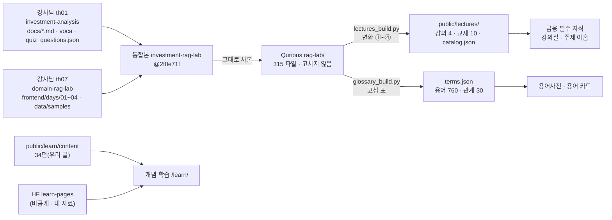
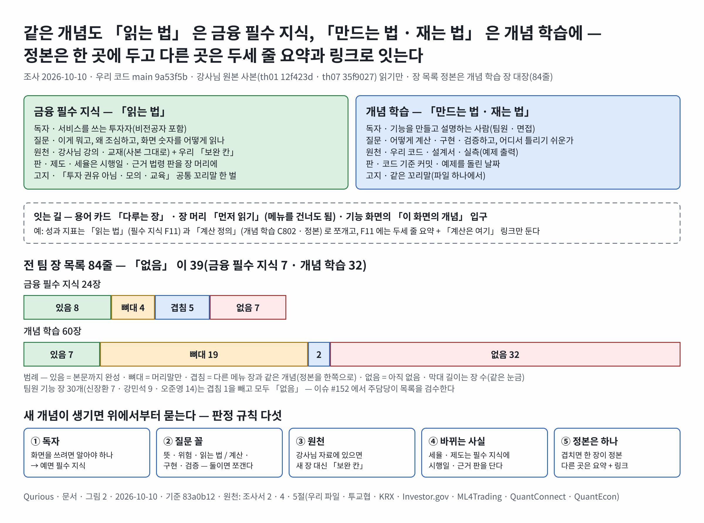
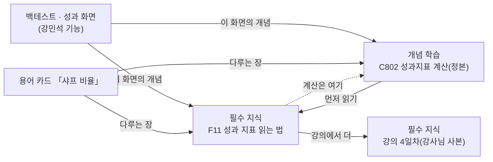

# 금융 필수 지식 · 개념 학습 — 지금 상태 · 공개 사례 · 배치 원칙 · 전 팀 장 목록 · HF 비공개 저장 조사서 v0.1

| 문서 정보 | |
|---|---|
| **판 · 상태** | v0.1 · 초안(검토 전) — 장 목록 정본은 [개념 학습 장 대장](../설계/대장/개념학습-장대장.tsv)(84줄) · 팀 글은 이슈 [#152](https://github.com/EST-team-project/Qurious/issues/152)(주담당 셋 검수 · 2026-10-10 올림 · [본문 사본](../github-archive/2026-10-10/이슈-개념학습-기능별-장-검수/00-본문.md)) |
| **구분** | 조사서 — 학습 콘텐츠 배치 · 원천 갱신 · 비공개 보관 설계(구현 · 화면 설계는 하지 않음) |
| **작성** | 이동원(조사 지시 · 검토) · 사례 수집과 초안은 조사 에이전트(공식 사이트 · 우리 파일 읽기 · github.com 은 열지 않음) |
| **조회일** | 2026-10-10 (KST) — 웹 출처는 모두 이 날 조회 |
| **기준** | 우리 코드 `main` `9a53f5b`(작업 트리 읽기만) · 강사님 원본 th01 `12f423d`(10-02) · th07 `35f9027`(10-08) — 사용자가 받아 둔 로컬 참조를 읽기만(작성자 · 이메일은 읽지 않음) |
| **확실도 표기** | 「확인」 = 원문(공식 사이트 · 우리 파일)을 직접 열어 봄 · 「대체로」 = 공식 채널의 2차 자료(영상 자막 · 포럼 글)로 확인 · 「확인 필요」 = 원문을 못 열었거나 장을 쓸 때 다시 열어야 함 · 「미확인」 = 조회가 막힘 |
| **이웃 조사** | 시장 범위 · 기준 문서 · 판 규칙 1.0 → 1.1 은 [시장 범위 조사서](시장범위-미국코인-거래기준-조사.md), 모의투자 · 증권사 규칙은 [모의투자 조사서](모의투자-증권사규칙-시작금액-조사.md), 강사님 기초 코드 융합은 [기초 코드 융합 조사서](기초코드-최신판-융합-조사.md), 자동 수집 벤치마크는 [자동 수집 벤치마크 조사서](자동수집-벤치마크-조사.md) — 겹치는 결론은 다시 조사하지 않고 가리킨다 |
| **검토** | 검토 전. 팀원 기능 장 30줄은 이슈 #152 에서 각 주담당이 본다 |
| **최종 수정** | 2026-10-10 (KST) |
| **최근 개정** | v0.1 — 처음 씀 |

> **이 문서로 알 수 있는 것**
> 1. 앱의 「금융 필수 지식」 · 「개념 학습」 · 용어사전 · 교재 원천 갱신 로직은 지금 어디에 무엇이 있고(파일:줄), 무엇이 비어 있나?
> 2. 국내외 투자 교육 · 퀀트 학습 사이트는 「입문 지식」 과 「기능 · 심화 개념」 을 어떻게 나누고 잇나?
> 3. 두 메뉴에 무엇을 둘지 가르는 규칙은 무엇이고, 팀원 넷의 기능에 필요한 개념 장은 모두 몇 개이며 지금 어느 상태인가?
> 4. 금융 필수 지식을 현업 수준으로 키우려면 무엇을 더하나(안 셋 · 추천)? HF 비공개에는 무엇을 어떤 이름 · 경로 · 판 규칙으로 더 두나?
> 5. 이 일을 2차 로보 어드바이저 구현을 밀어내지 않고 세션 목록 어디에 넣나?
>
> **읽는 순서** — 이동원: 0절 → 4절 → 6절 → 7절 → 8절 · 팀원: 4절 → 장 대장의 자기 줄 → 이슈 #152

---

## 0. 한눈에

1. **지금 상태.** 「금융 필수 지식」 은 강사님 강의 4일치 · 교재 10단원을 빌드해 앱 안 강의실 · 주제 아홉 화면으로 보여 준다(`public/js/core.js:108-133` · `public/js/finlearn.js:20-30`). 「개념 학습」 은 별도 HTML(`/learn/`)에 34편 — 완성 7 · 뼈대 27 — 이 있고, 금융 장 8편(F.1~F.8)은 모두 뼈대다. 용어사전은 760개 · 관계 30이다. 교재 원천 갱신 결정(「E 와 C 융합」 · 2026-10-07)은 **아직 구현 0** 이다(확인).
2. **새 사실 하나.** 강사님 th07 은 10-08 커밋 넷으로 강의 쪽 꼬리말의 「금융 교육용 콘텐츠입니다. 특정 상품의 매수·매도를 권유하지 않습니다.」 를 회사 저작권 줄로 바꾸고, 글꼴 크기 CSS 를 외부 주소(`edumgt.co.kr`)로 옮겼다. 우리 사본에는 고지가 그대로 있다. 원본을 그대로 따라가면 **우리 고지가 사라진다** — 결정한 흐름 ④(합치기)의 첫 실제 사례다(2.6절).
3. **사례의 공통 원리.** 입문 지식은 「먼저 읽는 짧은 단위 + 확인 문제」, 기능 개념은 「본문에서 링크로 부르는 선수 지식(primer)」 으로 나뉘고, 둘을 잇는 것은 용어(툴팁 · 사전)와 화면 길목의 입구다(토스증권 · ML4Trading · Varsity). 바뀌는 사실은 **기준일 · 판** 을 붙인다(한국은행 용어 700선 → 800선 · 금감원 제작 연도 · QuantEcon 쪽마다 고친 이력).
4. **배치 원칙(추천).** 같은 개념이라도 **「읽는 법」(투자자) 은 금융 필수 지식, 「만드는 법 · 재는 법」(구현자) 은 개념 학습** 에 두고, 정본은 한 곳 · 다른 곳은 두세 줄 요약 + 링크로 둔다. 강사님 사본은 그대로 두고 우리 글은 「보완 칸」 으로만 붙인다.
5. **전 팀 장 목록.** 84줄 — 금융 필수 지식 24(있음 8 · 뼈대 4 · 겹침 5 · 없음 7) · 개념 학습 60(있음 7 · 뼈대 19 · 겹침 2 · 없음 32). 팀원 기능 장 30개(신장환 7 · 강민석 9 · 오준영 14)는 겹침 1을 빼고 모두 **없음** 이다.
6. **보강 추천은 안 B** — 보완 칸 · 확인 문제 · 진도 · 고지와 판 날짜 머리 + 결정 흐름 ①~③ 구현. 기능 열기 전 필수 장(안 C)은 3차 뒤로 미룬다.
7. **HF 추천.** 새 데이터셋은 **하나** — 결정 때 가칭 그대로 `qurious-quant/learning-source-snapshots`(강사님 원문 판 · 연 · 날짜 폴더 · 매니페스트). 강사님 허락(2026-10-07 「어차피 공개되니 상관없다」)은 **비공개 보관 허락이지 공개 커밋 허락이 아니다.** 인용 원문 보관(`learn-citations`)은 필요해질 때만, `learn-pages` 에는 섞지 않는다.

---

## 1. 방법

**<표 1> 조사 방법**

| 질문 | 본 곳 | 방법 |
|---|---|---|
| ① 지금 상태 | `app/main.py` · `app/routes/learn.py` · `public/js/core.js` · `finlearn.js` · `public/learn/` · `public/lectures/catalog.json` · `scripts/lectures_build.py` · `glossary_build.py` · `lecture_scan.py` · `hf_dataset.py` · `app/services/learn_team.py` · 설계서 · 조사서 · 대장 · 회의록 | 파일 읽기 · 낱말 찾기 · 장 머리말을 표로 뽑기(시험 · 러너는 돌리지 않음) |
| ② 원천 변화 | 강사님 th01 · th07 로컬 사본의 `origin/main` | `git log --format='%h %ad %s'` · `git diff --stat` · `--name-status` 만(작성자 · 이메일 안 읽음) |
| ③ 공개 사례 | 투교협 · 금융투자교육원 · 한국은행 · 금감원 · KRX 아카데미 · 키움 · 토스증권 · Investor.gov · Zerodha Varsity · Khan Academy · QuantConnect · QuantEcon · ML4Trading | 공식 사이트 · 문서 사이트만(github.com 은 열지 않음) · 칸(구조 · 용어 연결 · 확인 문제 · 판 날짜 · 갱신 · 출처 · 고지 · 이용 조건)별로 기록 |
| ④ 장 목록 | 요구 대장 59줄(`docs/요구사항/대장/요구-대장.tsv`) · 장 34편 머리말 · 용어 760 | 요구마다 필요한 개념을 뽑아 장과 맞대기 → 장 대장 |

---

## 2. 지금 상태

### 2.1 두 메뉴의 자리

**<표 2> 「금융 필수 지식」 · 「개념 학습」 · 용어사전 — 화면 · 파일:줄 · 원천**

| 메뉴 · 화면 | 무엇 | 파일:줄 | 원천 · 읽는 길 | 확실도 |
|---|---|---|---|---|
| 금융 필수 지식 › 강의실 | 4일 과정 카드 · 교재 단원 카드 · 실습 모음 · 읽은 정도 | `core.js:115` · `finlearn.js:6 · 79~` | `/lectures/catalog.json`(빌드가 만듦) | 확인 |
| 금융 필수 지식 › 주제 아홉 | 선물 · 옵션 / 펀드 · ETF / 채권 · 금리 · 코인 / 자산배분 · 퀀트(강의 iframe) · 회사 구조 · 세무회계 / 주식시장 기초 / 기술적 분석 / 산업 · 기업 · 재무 / 거시경제(교재 단원) | `core.js:116-124` · `finlearn.js:20-30` | day 01~04 = 강사님 th07 `frontend/days/` · units 1 · 2 · 3 · 4 · 5 · 10 = 통합본 교재(강사님 th01 `docs/` 를 다시 쓴 것) | 확인 |
| 금융 필수 지식 › 요약 셋 | 금융상품 이해 · 자산배분 모델 · 계절성 분석(강사님 기초 코드 화면) + 아래에 강의 입구 | `core.js:125-128` · `finlearn.js:50-54` | 앱 화면 | 확인 |
| 금융 필수 지식 › 연습 › 용어사전 | 찾기 첫 화면 → 용어 한 장(R01 결정 ① ②) | `core.js:130-131` · `public/js/glossary.js` | `app/services/glossary_data/terms.json` | 확인 |
| 개념 학습(더보기) | 「전체 목차 · 근거 RAG · 팀 자료」 — 누르면 별도 HTML 로 나감 | `core.js:134-143` · `app/main.py:200` | `public/learn/content/*.md` 34편 · 팀 자료 = HF `qurious-quant/learn-pages` | 확인 |
| 서버 | 개념 학습 API 일곱(API-LRN-01~07) · 강의 시세 API | `app/main.py:163-169` · `app/routes/learn.py:69 · 91 · 109 · 124 · 143 · 160 · 172` · `app/routes/lectures.py` | — | 확인 |
| 강의 이해도 | 절마다 「이해도」 — 브라우저 저장소만 | `finlearn.js:71-76`(`finance-rag:day-N-understanding:v1`) | localStorage | 확인 |
| 화면 진입 | 화면 키가 바뀔 때 강의실 · 주제 · 요약 입구를 그림 | `public/js/main.js:21 · 85`(`onFinLearnViewActivated`) | — | 확인 |
| 시험 | 강의 TC-LC(번호 13 · 시험 함수 15 — 빌드 결과 = 저장소 사본 · 시세 주소 · 메뉴 · 화면 키 일치 · HF 보관 자료 미커밋) · 개념 학습 TC-LN(번호 19 · 시험 함수 24 — 장 규격 · 선수 장 · 팀 자료 CRUD · 409 · 412 · 3.1 출력 대조) · 용어 화면 TC-GL-27 | `tests/test_lectures.py:1-16` · `tests/test_learn.py` · `tests/test_glossary.py:805` | — | 확인 |
| 회의 글 | 개념 학습 첫 안내(완성 둘 · 나머지 뼈대 · 팀 자료 = HF 비공개 · 조직 초대) | `docs/회의/2026-10-01-개념-학습-페이지.md` | — | 확인 |

### 2.2 원천 사슬

<그림 1> 강사님 원본에서 앱 화면까지 — 원천 · 사본 · 빌드 · 화면 (범례: 상자 = 저장 위치, 화살표 = 옮기는 방법)



- 공개 저장소가 이미 추적하는 사본: `rag-lab/` 315 · `public/lectures/` 72 · `public/learn/content/` 34 파일(확인). 근거는 NOTICE 2절 — 강사님 **구두 허가**, 「공개는 학습 · 포트폴리오 목적이지 재배포 허가가 아니다」(`NOTICE.md:24-28` · 확인).

### 2.3 개념 학습 34편

**<표 3> 개념 학습 장 — 구역 × 상태 (장 머리말 `section` · `status` 를 뽑아 셈 · 2026-10-10)**

| 구역 | 완성(ready) | 뼈대(skeleton) | 합계 | 완성한 장 |
|---|--:|--:|--:|---|
| tech(개념 학습) | 7 | 19 | 26 | 0.1 지도 · 1.1 OHLCV · 1.2 수정주가 · 1.3 분봉 · 1.4 품질 검사 · 3.1 RAG · 3.4 쪼개기와 법령 판 |
| finance(F.1~F.8) | 0 | 8 | 8 | — |
| 합계 | 7 | 27 | 34 | |

- 설계서 `docs/설계/개념학습-설계.md` v0.1 9절은 「34편(완성 2 · 뼈대 32)」 이라 지금(완성 7)과 어긋난다 — v0.2 에서 고칠 것(확인).
- 장 머리말에 `feature: P01-①-3` · `work: W1~W8` 같은 **내부 말**이 남아 있다(`map.md:12-13` 등). 2026-10-01 사용자 피드백(실제 서비스처럼 · 내부 말 금지)과 어긋난다 — 화면 이식(⑪) 때 함께 고친다(확인).
- F.1~F.8 은 2026-10-01 피드백 「금융 지식은 `/learn/` 으로 옮기지 말고 앱의 기존 「금융 필수 지식」 을 보완」 에 따라 **자리를 옮겨야 하는 장** 이다. 지금은 `/learn/` 안에 뼈대로 남아 있다(확인).

### 2.4 용어사전

**<표 4> 용어사전 — 원천 · 규모 (`app/services/glossary_data/terms.json` · format 2)**

| 원천 코드 | 무엇 | 용어 수 | 출처 |
|---|---|--:|---|
| voca | 주식 학습 단어장 | 196 | 강사님 th01 `docs/voca.md` |
| finance | 투자분석 핵심 용어집 · 한자 어원 | 389 | 강사님 th07 `data/samples/finance_glossary.txt` |
| lecture | 강의 사이트 용어모음(4일) | 223 | 강사님 th07 `frontend/days/` |
| qurious | 앱 화면 용어 설명 | 55 | `public/js/core.js`(강사님 기초 코드 + 팀) |
| candidate | 검토를 거친 후보 용어 | 5 | `glossary_build.py` `CANDIDATES` |
| 합계(겹침 합친 뒤) | 분류 22 · 관계 30 | 760 | |

- 팀 기능에 쓰이는데 **표제어 · 별칭 어디에도 없는 말**(별칭 · 부분 일치까지 확인): 소르티노 · 손익비 · 효율적 투자선 · 스토캐스틱 · 과최적화 · 룩어헤드(미래 참조) · 생존 편향 · 트레일링 스톱 · 켈리 · **수정주가** · 권리락 · 투자성향 · 특성 중요도 · 과적합 · 시간가중수익률(TWR) · 금액가중수익률 · 벤치마크 · 정보비율 · 회전율 · 거래비용 · 가치주 · 성장주 · 퀄리티 · 대체거래소(NXT) · 서킷브레이커 · 사이드카 · 변동성 완화장치 · TradingView · 웹훅 · LEAN · 몬테카를로 · 워크포워드 · OBV · VWAP · 일목균형표 · 다이버전스 · 추세추종 · 평균회귀 · 최소분산 · 동일가중 · 전략적 · 전술적 자산배분 · 듀얼 모멘텀 · 체결강도 · 위험 등급(약 45 · 확인).
- 있는 말: 샤프 비율 · MDD · CAGR · 칼마 비율 · 평균-분산 최적화 · 리스크 패리티 · 볼린저밴드 · 이동평균선 · 시장가 · 지정가 주문 · 시간외 단일가매매 · SHAP 기여도 · 교차검증 · 계절성 효과 · 페어 트레이딩 · PineScript · 백테스트 · 슬리피지 · 손절 · 익절 · 포지션 사이징 · VaR · 모의투자 · 적합성 원칙 · 설명의무 · 로보어드바이저 · 팩터 · 저변동성 · 추적오차(확인).
- 개념 장 1.2 「수정주가」 는 완성인데 용어사전에 그 표제어가 없다 — **장과 용어가 서로를 모르는** 첫 예다.

### 2.5 교재 원천 갱신 결정 — 어디까지 됐나

**<표 5> 결정 「E 와 C 융합」(조사서 `docs/조사/교재원천-갱신따라가기-조사.md` 4.1절 <표 10>) — 흐름마다 구현 상태**

| 흐름 | 결정 내용 | 지금 | 근거 | 확실도 |
|---|---|---|---|---|
| ① 감지 | 세션 시작에 허용 목록(금융 경로) 지문 비교 · 커밋 제목으로 거르지 않음 | **없음** — `lecture_scan.py` 는 th 전체 커밋 목록만 뽑고 경로 거름이 없다 | `scripts/lecture_scan.py:1-16 · 47-60` | 확인 |
| ② 판 보관 | 지문이 바뀌면 `snapshots/<원본>/<YYYY>/<YYYY-MM-DD>_<짧은 해시>/` + `_manifest.json` + `index.tsv` → 로컬 먼저 → HF 비공개(가칭 `learning-source-snapshots`)는 사용자가 올림 | **없음** — scripts 에 허용 목록 · snapshots 코드 없음 · HF 데이터셋 없음 | `scripts/` 전체 낱말 찾기(snapshots 는 Qdrant 백업에만) | 확인 |
| ③ 출처 기록 | 파생 자료마다 바탕 = 판 ID + 원본 경로 + blob(공개 저장소엔 원문 없이) | **일부** — 반입 대장 · manifest 는 「원본마다 커밋 하나」 라 파일별 바탕과 어긋남(04 · 02 · 10단원) | 조사서 1.3절 | 확인 |
| ④ 합치기 | 걸릴 때만 3-way(바탕 = HF 판) · 첫 사례 교재 10단원 | **없음** — 10단원 제목 ≠ 본문 그대로 | `public/lectures/curriculum/unit10.md` · 조사서 1.3절 | 확인 |
| 허락 | 원문 판을 HF 비공개에 두기 | **받음**(2026-10-07 강사님 「어차피 공개되니 상관없다」 · 2026-10-07 사용자 전언) — 올리기 전 관문은 그대로 · 공개 저장소엔 해시 · 경로만 | 작업 기록(2026-10-07) | 대체로 |
| 자리 | 다음 세션 목록 ⑦ 칸(R01 남은 것 · 계절성 + 요약 둘 · th01 · th07 결정) | 목록에 있음 | 이동원 세션 목록(작업 파일 · 2026-10-08) | 확인 |

### 2.6 강사님 원본의 새 변화 — 흐름 ④ 의 실제 사례

**<표 6> 기준점 뒤 금융 경로를 건드린 변화 (읽기만 · 2026-10-10)**

| 원본 | 비교 구간 | 금융 경로 커밋 | 바뀐 것 | 우리에게 주는 뜻 | 확실도 |
|---|---|--:|---|---|---|
| th01 | 반입 기준 `2cb9b7f` → `12f423d`(10-02) | 0 / 4 | 없음 | — | 확인 |
| th07 | 기준점 `6b9cf69`(10-07) → `35f9027`(10-08) | 4 | 강의 01~04 · `days/index.html` · `days/assets/site.css` · `site.js` 수정, `frontend/hangul-scale.css` **삭제** | ① 꼬리말 「금융 교육용 콘텐츠입니다. 특정 상품의 매수·매도를 권유하지 않습니다.」 → 「© 2026 (주)에듀엠지티 All rights reserved.」(4쪽 + `site.js`) ② 공통 CSS 를 외부 주소 `https://www.edumgt.co.kr/css/common.css` 에서 받음 ③ 우리 빌드는 `hangul-scale.css` 를 복사한다(`lectures_build.py:249`) | 확인 |

- 우리 사본은 고지를 갖고 있다 — `public/lectures/days/01.html:2134` · `02.html:2055` · `03.html:2852` · `04.html:2564` · `days/assets/site.js:10`(확인).
- 판정 제안(흐름 ④ 의 「받아들임 · 우리 것 유지 · 합침 · 범위 밖」): 고지 = **우리 것 유지**(서비스 고지는 원본에 기대지 않는다 — 4.3절 F00), 외부 CSS = **범위 밖**(앱이 외부 도메인에 기대면 오프라인 · 개인정보 · 변경 위험이 생긴다 — 우리 쪽 글꼴 규칙은 빌드 변환으로), 저작권 줄 = 출처 표시로 **받아들임**(NOTICE 와 같은 뜻). 결정은 ⑦ 칸에서 사용자가 한다.
- 원본 자체에는 다른 쪽(`frontend/app.js:1413 · 1731 · 2154 · 2320`)에 「학습용 · 권유하지 않습니다」 문구가 남아 있다 — 원본이 고지를 버린 것이 아니라 **강의 쪽 꼬리말만 회사 공통 꼴로 바꾼 것**으로 보인다(대체로).

### 2.7 강사님 자료에서 받아 우리가 고친 곳 — 그대로 둘 목록

**<표 7> 받아서 고친 사본 · 고침 기록 — 강사님 원문은 손대지 않고 아래만 유지한다**

| 무엇 | 어디 | 고친 방법 | 원본이 바뀌면 | 확실도 |
|---|---|---|---|---|
| 강의 02 | `rag-lab/frontend/days/02.html` 24줄 | 바탕 `00b841c` + 우리 고침 1줄(`API_BASE` 주석) | 3-way(바탕 · 우리 · 새 판) | 확인(조사서 1.3) |
| 강의 HTML · 스크립트 변환 | `scripts/lectures_build.py:16-24 · 65-90` | ① 시세 주소 ② 앱 안 iframe 일 때 머리 숨김 ③ 일차 · 화면 링크 → 앱 이동 ④ 그림 주소 — **코드로 적은 고침** | 다시 빌드(`--check`) | 확인 |
| 교재 단원 1~10 | `rag-lab/data/curriculum/unit01~10.md` → `public/lectures/curriculum/` | 통합본이 **다시 쓴 것** · 10단원은 지워진 옛 판 | 사람이 조각을 보고 고침 | 확인 |
| 용어 760 | `scripts/glossary_build.py:129 SAME_AS · :147 OVERRIDES · :173 RENAME · :182 NOT_ALIAS · :220 CANDIDATES` | 원천 글은 고치지 않고 **고침 표**로(Debian 「원본 + 패치」 꼴) | 다시 빌드 · 표가 자료에 없는 이름을 가리키면 빌드가 멈춤 | 확인 |
| 시세 자료 셋 | HF `qurious-quant/rag-lab-display-data` | 공개 저장소에 넣지 않음 | `raglab_data.py pull` | 확인(`NOTICE.md:43-48`) |

### 2.8 빈 곳 — 이 조사가 찾은 것

1. **확인 문제 · 진도.** 강사님 퀴즈 · 단어장 시험은 이식 대장 R05(`docs/설계/대장/통합본-이식대장.tsv:6`)에 「안 함 · 차례 3 · Mongo 를 더하는 안」 으로만 있다. 교재 단원마다 질문 4개(`catalog.json` `questions`)는 있으나 채점 · 진도 저장은 없고, 강의 이해도는 브라우저 저장소뿐이다(확인).
2. **개념 학습에는 「투자 권유 아님」 고지가 없다** — `prompt-citation.md:34` · `robo-advisor-rules.md:27` 이 「다룰 질문」 으로만 언급(확인).
3. **팀 자료 저장소의 비공개 확인이 없다** — `learn_team.py:293` 은 `repo_info` 를 HEAD 해시 확인에만 쓴다. 다른 HF 도구 다섯은 `_assert_private` 를 갖는다(`hf_dataset.py:2031` · `hf_dart.py:405` · `hf_ohlcv.py:55` · `hf_sector_laws.py:199` · `hf_local_backup.py:227`) — 다음 세션 목록 「작은 것」 칸에 이미 있는 줄(확인).
4. **장과 용어가 서로를 모른다** — 용어 카드에 「이 개념을 다루는 장」 칸이 없고, 장 머리말에 「다루는 용어」 칸이 없다(확인 — `terms.json` 칸 · 장 머리말 칸).
5. **팀원 기능 개념 장이 하나도 없다** — 34편은 이동원 몫(데이터 · RAG · 차트 · 서버)과 금융 8편뿐(확인 · 5절).

---

## 3. 공개 사례 — 입문 지식과 기능 개념을 어떻게 나누고 잇나

**<표 8> 사례 13곳 — 칸별 비교 (조회 2026-10-10)**

| 곳 | 구조(장 · 단계) | 용어 연결 | 확인 문제 · 진도 | 판 날짜 · 갱신 | 출처 · 고지 · 이용 조건 | 확실도 |
|---|---|---|---|---|---|---|
| 투자자교육협의회(투교협) | 「금융투자 HOWTO」 7편 — 왜 투자 → 계좌 → MTS → 주문 · 체결 → ETF · 펀드(2026-05-19 공개) · 투자가이드(초보탈출 · 주린이극뽁 · 시야넓히기 · 투자레벨업) | 「금융지식사전」(출처: 한국예탁결제원 금융용어조회서비스라고 밝힘) | 맞춤형 과정 · **수료증** | 보도자료 날짜 | 법적고지 링크 | 확인 |
| 금융투자교육원 | 이러닝 분류(자산운용 · 금융상품 · 법규) + 「일반투자자 대상 교육」 | — | **사전 의무교육**(레버리지 ETP · ELW · 파생 1 · 3 · 10시간 · 개인공매도) → 수료증을 증권사에 제출해야 거래 | 과정 개요에 근거 정책(「ETF·ETN 시장 건전화 방안」 2020.5) | 면제 요건 명시 | 확인 |
| 한국은행 | 「경제금융용어 700선」(2018 초판) → 「800선」(2026-01-29 전면 개정) | 용어집 자체 · 개념 · 배경 · 적용 사례 · 시사점 | — | **판(版)과 쇄** — 「8쇄와 9쇄는 내용 차이 없음」 명시 · 개정판은 명칭 · 통계를 현실에 맞춰 고치고 시의성 낮은 용어 제외 | PDF 무료 · 무단 출력 판매 경고 | 확인 |
| 금감원 e-금융교육센터 | 생애주기 · 대상별(동영상 · 교재 · 웹툰 · 이러닝) · 금융교육 표준 기반 교재 | — | 「생활금융 퀴즈」 게임 · 이러닝 단원 순서 | **콘텐츠마다 제작 연도 · 대상 표시** — 「제도 · 정책 콘텐츠는 제작 연도를 꼭 확인」 | 무료 | 대체로(공식 소개 영상) |
| KRX 아카데미 | 초보투자자 교실 — 주식시장 1~5화(경제활동과 금융 · 주식회사 · 시장 구조 · 거래제도 · 유의사항) · 채권 · 파생 · ETF · 자본시장 · 경제 일반 / 책으로 보는 증권투자 | — | **모의거래**(개인 공매도 · 파생상품) | — | — | 확인 |
| 키움증권 하우투스탁 | 기초(증권 · 경제) → 심화(기본적 · 기술적 분석 · 해외) → **도구 활용**(HTS · MTS) | — | — | 콘텐츠 날짜 | 채널K: 「정보제공 목적 · 투자 권유의 적합성을 보장하지 못함 · 최종 책임은 본인」 | 확인 |
| 토스증권(토스피드) | 「투자는 이렇게」 — 기초 → 시황 → 산업 · 종목 | **꼭 알아야 할 용어는 바꾸지 않고 툴팁(말풍선) · 별도 콘텐츠로** · 「더 깊은 이해가 필요한 길목마다」 콘텐츠 | — | 글 끝 「본 콘텐츠는 9월 6일을 기준으로 제작」 | 투자자 유의 문구(원금 손실 0~100% · 예금자보호 없음 · 권유 아님) | 확인 |
| Investor.gov(미 SEC) | Introduction to Investing → Investing Basics(How Stock Markets Work · Investment Products · What is Risk) | Glossary(표제어마다 쪽) | **월간 퀴즈** · 계산기 | — | 감독기관 사이트 | 확인 |
| Zerodha Varsity | 모듈 → 장(입문 · 기술적 · 기본적 분석 · 선물 · 옵션 · 퀀트 개념 · 위험관리 등) | — | 앱에 퀴즈 · 시험 · **Varsity Certified** | 장마다 댓글 Q&A(저자가 답 · 날짜) | **가입 · 결제벽 · 광고 없음** | 확인 |
| Khan Academy | 단원 → 레슨 → 연습(「4문항 중 3」) → 퀴즈 → 단원 시험 · 코스 챌린지 | — | **숙련도 점수**(Mastered · Proficient · Familiar) | — | 비영리 | 확인 |
| QuantConnect | Learning Center(코스 · 강사 · 실라버스 · 리뷰) · Bootcamp(코스 → 레슨 → 과제 · 힌트 · 정답) | 문서 · API 레퍼런스로 링크 | 과제 완료 · Bootcamp 30% 를 마쳐야 커뮤니티 글 | 문서 판(v2) | 배운 코드를 그대로 연구 · 모의 · 실거래로 | 확인(포럼 글은 대체로) |
| QuantEcon | 강의 시리즈(입문 → 중급) · PDF | 프랑스어판은 **용어집으로 기술 용어 일관** | 연습 문제 | **쪽마다 git 고친 이력(커밋 · 날짜)** · PDF 빌드 날짜 | 오픈 | 확인 |
| ML4Trading 3판 | 27장 · 사례 9 · 노트북 459 | **primer 112 — 「장 흐름을 끊는 선수 지식 · 특수 확장」 을 따로 두고 장은 링크로** | agent skill 61(룩어헤드 · 누수 · 워크포워드 · 비용 모델 · 포지션 크기) | 판(2020 2판 → 3판 「처음부터 다시」) | 코드 공개 · 책 유료 | 확인 |
| Investopedia | — | — | — | — | — | **미확인**(WebSearch 도메인 차단 · fetch 402) |

### 3.1 공통 원리 여섯

1. **입문은 짧고 순서가 있다** — 투교협 7편 · KRX 5화 · Investor.gov 기초 다섯 쪽. 「서비스를 쓰기 전에」 알아야 할 것만 짧게(확인).
2. **기능 개념은 본문이 아니라 「부르는 선수 지식」 이다** — ML4Trading primer · 토스 「길목마다」. 본문(화면 · 장)은 개념을 가정하고 링크로 부른다(확인).
3. **용어는 바꾸지 않고 풀이로 잇는다** — 토스 툴팁 · 투교협 사전 · Investor.gov Glossary(확인). 우리 R01 결정(서랍 · 밑줄 혼합 규칙)과 같은 방향.
4. **바뀌는 사실에는 날짜가 붙는다** — 한국은행 판 · 쇄, 금감원 제작 연도, 토스 「~을 기준으로 제작」, QuantEcon 쪽마다 이력(확인).
5. **확인은 작게 · 자주** — Khan 「4문항 중 3」 · Investor.gov 월간 퀴즈 · Varsity 앱 퀴즈(확인). 큰 시험은 수료 · 인증에만.
6. **위험한 기능 앞에는 의무 교육이 있다** — 금융투자교육원 레버리지 ETP · 파생 · 공매도 사전교육(확인). 우리 자동매매 · 증권사 연동(3차) 앞에 「필수 장 읽음」 을 둘 근거가 된다(안 C).

---

## 4. 배치 원칙

### 4.1 두 메뉴의 정의

**<표 9> 「금융 필수 지식」 과 「개념 학습」 — 독자 · 질문 · 원천 · 문체 · 판**

| 칸 | 금융 필수 지식 | 개념 학습 |
|---|---|---|
| 독자 | 서비스를 쓰는 투자자(비전공자 포함) | 기능을 만들고 설명하는 사람(팀원 · 면접 · 포트폴리오) |
| 답하는 질문 | 「이게 뭐고 · 왜 조심해야 하나 · 화면의 숫자를 어떻게 읽나」 | 「어떻게 계산 · 구현 · 검증하나 · 어디서 틀리기 쉬운가」 |
| 원천 | 강사님 강의 · 교재(사본 그대로) + 우리 **보완 칸** | 우리 코드 · 설계서 · 실측(예제 출력) |
| 문체 | 강의 사이트 문체(「~요?」 질문형 절 · 그림 · 계산기) | 교재 아홉 칸(`map.md:79-91`) · 「~합니다」 체 |
| 판 날짜 | 제도 · 세율 · 시장 규칙은 **시행일 · 근거 법령 판** 을 장 머리에 | 코드 기준 커밋 · 예제 실행 날짜 |
| 고지 | 「투자 권유 아님 · 모의 · 교육」 꼬리말 필수 | 같은 꼬리말(같은 문구 한 벌) |
| 사례 본보기 | 투교협 HOWTO · KRX 초보투자자 교실 · Investor.gov | ML4Trading primer · QuantConnect Bootcamp · QuantEcon |

**<표 9-1> 금융 필수 지식 분배표 — 우리 보완 글을 강사님 주제 아홉의 어디에 붙이나 (강사님 본문은 그대로 · 새 주제는 강사님 자료에 없는 것만)**

| 우리 글 | 붙일 곳(지금 메뉴 · `finlearn.js:20-30`) | 꼴 | 까닭 |
|---|---|---|---|
| F00 시작하기 전에(할 수 있는 것 · 없는 것 · 고지) | 강의실 맨 앞 카드 + 두 메뉴 공통 꼬리말 | 짧은 쪽 하나 | Investor.gov 「Introduction」 · 투교협 HOWTO 1편 꼴 · 원본 꼬리말이 바뀌어도 남게 |
| F01 주식 · 시장 · 주문(2026 제도 — NXT · 장 시간 · 가격제한폭 · 결제) | 「주식시장 기초」(교재 2단원) 보완 칸 | 보완 칸 | 강사님 단원이 있는 주제 — 바뀌는 제도만 기준일과 함께 |
| F02 배당 기준일 · 배당락일 · 지급일 | 「주식시장 기초」 보완 칸 + 일정 화면(`market-calendar`) 입구 | 보완 칸 | 우리 수집 규칙이 정본 · 일정 화면과 같은 개념 |
| F03 매매 비용과 증권거래세(2026) | 「주식시장 기초」 보완 칸 + 백테스트 · 성과 화면 입구 | 보완 칸 | 세율은 시행일 판 · 비용 모델과 같은 값 |
| F04 선물 · 옵션 / F05 펀드 · ETF / F06 채권 · 코인 / F07 자산배분 · 퀀트 | 같은 이름의 강의 주제(1 ~ 4일차) 보완 칸 | 보완 칸(새 장 없음) | 강사님 강의와 같은 주제 — 「강의에 없는 것」 만(예: 레버리지 ETP 사전 의무교육) |
| F11 성과 지표 읽는 법 · F12 백테스트를 믿어도 될까 | 「자산배분과 퀀트」(4일차 — 위험 지표 읽기) 보완 칸 | 보완 칸 | 4일차가 「위험 지표를 읽는 법」 을 다룸(`catalog.json` 4일차 소개) |
| F08 로보어드바이저와 법 · F10 투자 성향과 적합성 | **새 주제** 「투자 성향과 로보어드바이저」 | 새 주제 화면 | 강사님 자료에 없는 주제 · 로보 어드바이저 화면(④)의 「먼저 읽기」 |
| F09 모의투자와 실거래 · F13 손절 · 익절 | **새 주제** 「모의투자와 매매 규칙」 | 새 주제 화면 | 우리 서비스(모의 · 자동매매 · TradingView)를 쓰기 전 알아야 할 것 — 모의투자 · 개별 종목 분석 조사 결과가 정본 |
| F14 미국 주식 거래 기초 | **새 주제** 「미국 주식」(시장 범위 조사 결정 뒤) | 새 주제 화면 | 시장마다 기준이 다름(시장 범위 조사 — 23항목 중 20) |

- 새 주제 둘(셋)은 메뉴의 「강의」 아래에 붙이되 강사님 주제와 구분되게 머리에 「Qurious 보완」 표시를 둔다 — 화면 모양은 Figma 결정(⑪)이 정한다.
- 교재 10단원(제목 ≠ 본문)은 분배가 아니라 흐름 ④ 첫 사례로 정리한다(2.5절).

### 4.2 판정 규칙 다섯

새 개념이 생기면 위에서부터 차례로 묻는다.

1. **독자** — 서비스 사용자가 화면을 쓰려면 알아야 하나? 예 → 금융 필수 지식. 아니면(만드는 사람만) → 개념 학습.
2. **질문 꼴** — 「뜻 · 위험 · 읽는 법」 이면 필수 지식, 「계산 · 구현 · 검증」 이면 개념 학습. **같은 개념이 둘 다면 둘로 쪼갠다** — 예: 성과 지표 「읽는 법」(F11) ↔ 「계산 정의」(C802), 투자성향 「뜻 · 법」(F10) ↔ 「점수식 · 매핑」(C909), 손절 · 익절 「왜 미리 정하나」(F13) ↔ 「규칙 명세」(C707).
3. **원천** — 강사님 강의 · 교재에 이미 있으면 **새 장을 만들지 않고** 그 주제 화면에 「보완 칸」 을 붙인다(F04 · F05 · F06 · F07 → A01 · A02 · A03 · A04). 강사님 사본 본문은 고치지 않는다(빌드 변환 · 고침 표만).
4. **바뀌는 사실** — 세율 · 거래 시간 · 제도 · 상품 규칙처럼 바뀌는 값은 금융 필수 지식에 두고 **시행일 · 근거 판** 을 단다(한국은행 판 · 금감원 제작 연도 꼴). 근거 법령은 이미 모으는 법령 판(`kb-legal-base` · 법령 Open API 의 시행일 판)을 가리킨다.
5. **정본은 하나** — 겹치면 한 장이 정본, 다른 곳은 두세 줄 요약 + 「먼저 읽기」 · 「더 깊이」 링크(SSoT). 정본 표시는 장 머리말 한 칸으로.

### 4.3 잇는 법

**<표 10> 두 메뉴 · 용어 · 기능 화면을 잇는 장치 — 지금 · 추천**

| 장치 | 지금 | 추천 | 사례 근거 |
|---|---|---|---|
| 용어 밑줄 → 용어 카드 | R01 결정 ③(혼합 규칙) · 카드 · 서랍 구현(2026-10-02) · 교재 밑줄은 남음 | 카드에 **「이 개념을 다루는 장」** 칸(필수 지식 장 · 개념 장 각각 0~2개) | 토스 툴팁 · Investor.gov Glossary |
| 장 머리 「먼저 읽기」 | 개념 장 머리말에 선수 장(같은 메뉴 안) | **메뉴를 건너는 선수 장** 허용 — 개념 장이 필수 지식 장을 부름 | ML4Trading primer |
| 기능 화면의 입구 | 「요약」 화면 아래 강의 입구(`finlearn.js:50-54`) | 기능 화면에 **「이 화면의 개념」** 작은 입구(장 1~3개) — 화면 이식(⑪)과 함께 · **팀원 화면은 주담당이 붙일지 · 어디에 둘지 정한다**(공용 장치 — 팀 글 먼저 · 이슈 초안에서 물음) | 토스 「길목마다」 |
| 강의 주제 화면의 보완 칸 | 없음 | 주제 머리 아래 「강의에 없는 것 · 2026 기준」 칸(F04~F07 내용) | 금감원 제작 연도 · 한국은행 개정판 |
| 고지 | 강의 사본에만(원본은 10-08 에 바꿈) | 두 메뉴 공통 꼬리말 **한 벌**(우리 파일 하나에서) | 키움 · 토스 고지 |

**<그림 2> 두 메뉴의 정의 · 잇는 길 · 전 팀 장 84의 상태 · 판정 규칙 다섯** · 범례: 초록 = 금융 필수 지식 · 파랑 = 개념 학습 · 막대 = 장 수(같은 눈금) · 점선 = 잇는 장치



<sub>원본: [Figma · Qurious · 문서 그림 · 49:157](https://www.figma.com/design/6lstWS4YwuhJPhGB9XoBMD?node-id=49-157) · 그림 판 v0.1 · 기준 `83a0b12` · 원천: 이 문서 2 · 4 · 5절 · 2026-10-10</sub>

<details><summary>그림 원문(Mermaid) — 검색 · 다시 그리기용</summary>



</details>


---

## 5. 전 팀 장 목록 — 요약 (정본은 [개념 학습 장 대장](../설계/대장/개념학습-장대장.tsv) 84줄)

**<표 11> 메뉴 × 지금 상태 (상태: 있음 = 완성 장 · 강사님 사본 화면 / 뼈대 = 뼈대 장 / 겹침 = 강의 · 다른 장이 이미 다뤄 새 장 대신 합침 / 없음 = 장 없음)**

| 메뉴 | 있음 | 뼈대 | 겹침 | 없음 | 합계 |
|---|--:|--:|--:|--:|--:|
| 금융 필수 지식 | 8 | 4 | 5 | 7 | 24 |
| 개념 학습 | 7 | 19 | 2 | 32 | 60 |
| 합계 | 15 | 23 | 7 | 39 | 84 |

**<표 12> 개념 학습 — 기능 주담당별 (주담당 칸의 첫 이름 기준)**

| 주담당 | 장 | 있음 | 뼈대 | 겹침 | 없음 | 대표 장 |
|---|--:|--:|--:|--:|--:|---|
| 이동원(데이터 · 지식 · RAG · 차트 · Pine · 서버) | 30 | 7 | 19 | 1 | 3 | 1.1~1.4 · 3.1 · 3.4 완성 / Pine · 웹훅 · Strategy Tester |
| 신장환(패턴 · 신호 · XAI · 인디케이터) | 7 | 0 | 0 | 0 | 7 | 지표 계산 정의 · 미래 참조 없는 지표(3차 채점 항목) · XAI |
| 강민석(성과지표 · 모의 주문 · 운용 · LEAN) | 9 | 0 | 0 | 0 | 9 | 백테스트 뼈대 · 성과지표 계산 · 장부 · LEAN · 대사 |
| 오준영(자산배분 · 리밸런싱 · 스크리닝 · 증권사) | 14 | 0 | 0 | 1 | 13 | 리밸런싱 세 방식 · 최적화 넷 · 팩터 · 주문 안전 |
| 합계 | 60 | 7 | 19 | 2 | 32 | |

- 금융 필수 지식의 새 장 일곱(F00 · F09~F14)은 팀원 기능의 「읽는 법」 짝이다 — F09 모의투자와 실거래(강민석 · 오준영), F10 투자 성향(오준영), F11 성과 지표 읽기(강민석), F12 백테스트를 믿어도 될까(강민석 · 신장환), F13 손절 · 익절(신장환 · 개별 종목 분석 조사(진행 중)), F14 미국 주식(시장 범위 조사 결정 뒤), F00 시작하기 전에(팀).
- 글은 이동원이 쓰고 **정확성 검수는 그 기능 주담당** 이 한다(팀 문서 판 규칙의 거울 — 시장 범위 조사 「팀원 1.0 → 이동원 1.1」 과 반대 방향: 이동원 1.0 → 주담당 검수 → 1.1). 검수 요청은 이슈 초안 하나로 묶었다(GitHub 쓰기를 몰지 않기 위해).
- 용어 보충(2.4절 약 45개)은 장을 채우는 세션에서 그 장의 용어만 함께 더한다(R01 「후보로 넣고 검토 뒤 공개」 규칙 · 2026-10-02).
- **P1 장의 1차 출처는 이미 열어 확인했다**(<표 18> W27 ~ W31) — 장을 쓸 때 주의할 사실 셋: ① Pine v6 에서 `strategy.exit` 가 상대값(`profit` · `loss`)과 절대값(`limit` · `stop`)을 함께 받으면 **먼저 닿는 가격**을 쓴다(v5 와 다름 — Pine 생성 결함 DF-05 · 06 과 같은 자리) ② LEAN 백테스트의 기본 체결 모델은 **전량 체결**을 가정한다 — 증권사 모의 · 실거래와의 차이(F09 · C808)의 한 원인 ③ TA-Lib 은 함수마다 「값이 시계열의 시작점에 얼마나 기대나」(수치 안정성)를 적는다 — 미래 참조 없는 지표 · 같은 입력 같은 값(C704 · P02-②-2)의 시험 근거.

---

## 6. 보강 · 발전 안

### 6.1 세 안

**<표 13> 보강 안 셋 — 무엇 · 장단점 · 크기**

| 안 | 무엇 | 좋은 점 | 나쁜 점 | 크기(추정) |
|---|---|---|---|---|
| **A. 최소** | 장 목록 확정 · 공통 고지 한 벌 · 바뀌는 사실 장에 「기준일 · 근거 판」 머리 · F.1~F.8 자리 옮김 결정 | 2차 구현을 거의 밀지 않음 | 확인 문제 · 진도 · 원천 갱신이 그대로 비어 있음 | 0.5일 |
| **B. 보완 칸 + 확인 + 흐름 ①~③ (추천)** | A + 강의 주제 화면의 「보완 칸」(F04~F07) · 확인 문제(교재 단원 질문 4개 · 장 끝 `<details>` → 채점 없는 셀프 점검부터) · 진도(로그인 사용자는 서버에 · 비로그인은 브라우저) · 용어 카드의 「다루는 장」 칸 · **결정 흐름 ① 감지 ② 판 보관 ③ 판 ID 출처 기록** + ④ 첫 사례 둘(교재 10단원 · th07 10-08 꼬리말) | 사례 원리 다섯을 덮음 · 결정(E 와 C 융합)을 실제로 돌림 · 장을 채울 때마다 쌓임 | ⑦ 칸이 커짐(2 세션 걸칠 수 있음) · 진도 저장은 DB 표가 하나 늘어남 | 2 ~ 3일(⑦ 1 ~ 1.5 · ⑪ 1 ~ 1.5) |
| **C. 학습 경로 · 기능 열기 전 필수 장** | B + 역할별 학습 경로(투자자 · 구현자) · 자동매매 · 증권사 연동 · 레버리지 상품 안내 앞에 「필수 장 읽음 + 확인 문제 통과」 관문 · 수료 표시 · R05 퀴즈 · 단어장 시험 이식(Mongo 또는 Postgres) | 금융투자교육원 사전 의무교육 꼴 · 실투자 · 모의투자 목표에 맞음 | 화면 · 관문 · 저장 설계가 커서 3차 기본 구현과 겹침 · 관문 정책은 팀 결정(공용 장치) | 4 ~ 6일 |

**추천: 안 B.** 이유 — ① 결정(E 와 C 융합)이 이미 ⑦ 칸에 있어 추가 칸 없이 들어간다. ② 실제 사례(10-08 꼬리말 · 10단원)가 지금 둘 있어 흐름 ④ 를 바로 시험할 수 있다. ③ 확인 문제는 채점 없이 「접힌 답」 부터 시작해 저장 설계를 미룬다. 안 C 의 관문은 **3차 끝(11-11) 뒤 리팩터링 · 관리자 칸** 에 후보로 둔다(팀 글 먼저).

### 6.2 세부 — 안 B 를 고르면

- **보완 칸은 빌드로만.** `public/lectures/` 는 손으로 고치면 강의 시험(TC-LC · 「빌드 결과 = 저장소 사본」)이 실패한다(`tests/test_lectures.py:9`). 보완 칸 · 공통 고지는 `lectures_build.py` 가 덮어쓸 조각 파일(우리 글)을 읽어 넣는 변환 ⑤로 넣고, 무엇을 넣었는지 그 파일 머리말에 남긴다(2026-10-02 규칙 「rag-lab 은 고치지 않고 빌드 단계에서」 와 같은 길).
- **확인 문제.** 장 끝 `<details>` 3 ~ 5문항(Khan 「4문항 중 3」 꼴) · 강사님 교재 단원 질문 4개(`catalog.json`)는 그대로 쓰고, 우리 보완 칸에만 새 문항을 쓴다. 채점 · 저장은 R05 이식 때.
- **진도.** 지금 강의 이해도(`localStorage`)는 PC 를 바꾸면 사라진다. 로그인 사용자의 장 · 절 읽음만 서버 표 하나(`learn_progress` 가칭 · 사용자 · 장 · 판 · 시각)로 — 데이터 사전 · 마이그레이션은 그 세션에서(팀원 마이그레이션 순서 확인).
- **용어사전 연결.** `terms.json` 에 `chapters`(장 slug 0~2) 칸 · 장 머리말에 `terms`(다루는 용어 id) 칸 — 빌드가 서로 맞는지 검사(한쪽에만 있으면 빌드가 알림). 2.4절 빠진 말은 장을 채울 때 그 장 몫만.
- **투자 성향 장(F10)의 뼈대.** 표준투자권유준칙이 쓰는 세 원칙 — 적합성(금소법 제17조 · 부적합한 상품 권유 금지) · 적정성(제18조 · 스스로 사려는 상품이 부적정하면 알리고 확인) · 설명의무(제19조) — 을 그대로 장의 세 절로 쓰고, 우리 서비스는 금융회사가 아니라 이 의무의 대상이 아니라는 점과 그래도 같은 질문 꼴을 쓰는 까닭(U1 설문 → 목표 비중)을 적는다(W26 · 확인).
- **법령 · 공시 근거와 판 날짜.** 바뀌는 사실 장(F01 · F02 · F03 · F08 · F10)은 머리에 「기준일 · 근거(법령 이름 · 조 · 시행일 판)」 를 두고, 근거 법령은 이미 모은 판(`kb-legal-base` · 법령 Open API 「시행일 ≤ 기준일 중 가장 늦은 판」)을 가리킨다. 시행일이 바뀌면 세션 시작 점검이 「낡음」 으로 표시(흐름 ① 과 같은 지문 방식).
- **원천 갱신 흐름(⑦).** ① 허용 목록 파일 하나(판 번호) + `lecture_scan.py` 에 금융 경로 지문 · ② 판 보관 도구(git 객체에서 꺼냄 · 로컬 먼저) · ③ 파생 자료마다 판 ID · ④ 사례 둘 — 교재 10단원 · th07 10-08 꼬리말. 화면 변경 없음.

### 6.3 결정 흐름 ①~④ 의 다음 단계 — 파일 · 명령 · 시험 (설계 초안)

**<표 13-0> ⑦-a 에서 만들 것 — 이름은 후보(시험 묶음 TC-LS · TC-LQ 는 시험-요구대장에 없음을 확인)**

| 차례 | 만들 것(후보) | 명령 · 출력 | 시험(TC-LS 후보) |
|---|---|---|---|
| ① 감지 | `docs/설계/대장/교재원천-허용목록.tsv`(원본 · 경로 꼴 · 까닭 · 판 번호 — 처음 값은 조사서 1.2절의 금융 경로) · `lecture_scan.py` 에 지문 계산 | `python scripts/lecture_scan.py --fin` → 원본마다 「지문 같음 · 바뀜(파일 n) · 지워짐 · 새 참조(정적 · 실행 중 생성 주소는 확인 필요)」 | 커밋 제목이 아니라 경로로 거른다(제목 「Refactor…」 인 내용 커밋을 잡는다) · 거부 목록 파일은 이름만 |
| ② 판 보관 | `scripts/lecture_snapshot.py`(가칭) — git 객체에서 꺼내 `data/lecture-snapshots/`(**`.gitignore` 에 먼저 더함 — 지금은 빠지지 않음**)에 판 폴더 · `_manifest.json` · `index.tsv` | `… build` · `… verify`(blob 다시 계산) · `… plan-upload`(올릴 목록 미리 보기) — 올리기 명령은 사용자 | 같은 커밋에서 두 번 만들면 같은 판 ID · 같은 지문(멱등) · 매니페스트에 작성자 · 이메일 칸 없음 · `.env` 가 허용 목록에 걸리면 멈춤 |
| ③ 출처 기록 | 파생 자료마다 바탕 판 ID — 강의 쪽 · 교재 단원은 `public/lectures/catalog.json` 에 `base` 칸(판 ID · 원본 경로 · blob) · 용어는 `terms.json` 원천 `sources[].snapshot` | 세션 시작 보고에 파생 자료마다 「최신 · 바뀜 · 지워짐」 | 공개 파일에는 판 ID · 해시 · 경로만(원문 문자열이 없는지 검사) |
| ④ 합치기 | 검토 묶음(저장소 밖) · 결정 기록(공개 — 무엇을 받아들임 · 유지 · 합침 · 범위 밖으로 했나) | `git merge-file -p`(바탕 = 판 · 우리 · 새 판) | 받아들인 뒤 `lectures_build.py --check` · `glossary_build.py --check` · TC-LC 통과 |

- **설계 제약 하나 — 팀원 PC 의 빌드 대조.** 강의 시험(TC-LC)은 빌드 결과가 저장소 사본과 같은지 본다. 받아들인 새 판을 빌드가 **로컬 판 폴더(gitignore)** 에서 읽게 만들면, 판을 받지 않은 팀원 PC 에서는 결과가 달라져 시험이 깨진다. 이미 있는 「HF 보관 시세 자료」 처리(`lectures_build.py:26-34` — 받지 않은 PC 는 쓰지도 · 지우지도 · 다르다고 하지도 않고 받는 명령만 알림)와 같은 꼴로 만든다(추천).
- **정할 것 하나 — 받아들인 새 글을 공개 저장소에 두나.** 지금 앱이 보여 주는 강의 · 교재는 공개 저장소에 커밋돼 있다(NOTICE 2절 · 구두 허가). 새 판을 받아들이면 같은 관행을 잇는 것이고(추천 — 보여 주는 판 하나만), **모든 옛 판 · 새 판의 묶음은 HF 비공개에만** 둔다. 강사님 답(10-07)은 HF 비공개 보관에 대한 것이라, 공개 쪽은 지금 관행(NOTICE)이 근거다 — 사용자가 확인한다.
- 통합본 사본(`rag-lab/`)은 그대로 둔다(조사서 5절 #1 의 (가)) — 받아들인 새 판은 판 폴더에서 빌드가 읽는다.
- **먼저 할 한 줄 — `.gitignore`.** 판 폴더 후보 `data/lecture-snapshots/` 는 **지금 git 에서 빠지지 않는다**(`git check-ignore` 로 확인 · `.gitignore:23-37` 은 `data/collector/` · `data/local-run/` · `data/hf_export/` 등만 뺀다). 판 보관 도구를 만들기 **전에** `.gitignore` 에 한 줄을 더하고, 시험 하나가 「판 폴더 안 파일이 git 추적 대상이 아님」 을 확인하게 한다 — 원문이 공개 저장소로 새는 길을 먼저 막는다.

### 6.4 분량 현실 — 「전부 완성」 을 어떻게 나누나

**<표 13-1> 써야 할 장의 분량 (추정 · 실측 아님 — 지금 완성 장 7편이 123 ~ 542줄인 것을 기준으로 잡음)**

| 꼴 | 무엇을 담나 | 한 편(추정) | 대상 | 합계(추정) |
|---|---|---|---|---|
| 완성판 | 교재 아홉 칸 · 예제 코드 · **이 PC 에서 돌린 출력** · 주담당 검수 | 2 ~ 3시간 | P1 약 16편(3차 채점 · 교차 검증 · 발표에 닿는 것 — C701 · C704 · C801 · C802 · C806 · C807 · C808 · C504 · C501 · C502 · C503 · C1001 · C1002 · C707 · F11 · F13) | 약 40시간 |
| 요약판 | 정의 · 그림 하나 · 우리 코드 위치 · 흔한 실수 · 확인 문제 3 | 30 ~ 45분 | 나머지 약 46편 | 약 30 ~ 35시간 |
| 전부 완성판 | — | — | 62편(뼈대 23 + 없음 39) | 약 150시간 — 2 · 3차 구현과 함께는 어려움 |

- 사용자 말 「전부 리서치하고 완성」 을 줄이는 판단은 혼자 하지 않는다 — **요약판 먼저 · 완성판은 P1** 을 추천으로 두고 사용자에게 묻는다(8절).
- 요약판도 「교재처럼 쓰기」 규칙(실제 출력만 · AI 문체 금지 · 내부 말 금지)은 그대로 지킨다 — 출력이 없는 장은 출력 칸을 비워 두고 「완성판에서」 라고 적는다.

---

## 7. HF 비공개 추가 저장 안

### 7.1 무엇을 둘까 — 후보 셋

**<표 14> HF 비공개 저장 후보 — 무엇 · 지금 어디 · 판정**

| # | 무엇 | 지금 | 판정 | 이유 |
|:-:|---|---|---|---|
| H1 | **강사님 원문 판**(th01 · th07 허용 목록 경로 · 연 · 날짜 판) | 사용자 PC 의 원본 사본에만 | **만든다(추천)** | 결정(4.1)이 이미 정함 · 허락 받음 · 원본이 지워지거나(10단원) 이력이 바뀌어도 바탕 글이 남는다 · 팀 누구나 3-way 바탕을 꺼낸다 |
| H2 | 개념 장이 인용한 **공식 문서 사본**(법령이 아닌 PDF · 웹 쪽 · 조회일 판 · 이름 후보 `qurious-quant/learn-citations`) | 링크만(낡으면 끊김) | **필요해질 때**(장 채움이 10편을 넘거나 3차 끝 판 동결 때) | 법령은 `kb-legal-base` 가 이미 판으로 보관 — 겹치지 않게 법령 밖만 · 이용 조건이 문서마다 달라 비공개 보관도 출처별 확인 |
| H3 | 학습 콘텐츠 **판 동결본**(2차 끝 10-21 · 3차 끝 11-11) | git(공개 저장소) | **HF 에 두지 않는다** | 우리 글은 이미 git 에 있고 태그로 재현된다 · 같은 것을 두 곳에 두면 정본이 둘이 된다 |
| — | 사용자 진도 · 퀴즈 기록 | 없음 | **HF 에 두지 않는다** | 개인 기록이라 앱 DB(탈퇴 때 지움) |
| — | `learn-pages` 에 섞기 | — | **섞지 않는다** | `learn-pages` 는 「내 자료」 CRUD 저장소 — 앱 동기화가 `pages/` 를 본다 · 역할 하나(SRP) |

### 7.2 H1 — 이름 · 경로 꼴 · 판 규칙

- **데이터셋 이름**: `qurious-quant/learning-source-snapshots`(결정 4.1 의 가칭을 그대로 정본으로 — 이름을 바꾸면 결정 기록 · 그림과 어긋난다). 조직의 다른 이름(`krx-ohlcv` · `kb-sector-laws` · `kb-legal-base` · `learn-pages` · `rag-lab-display-data`)처럼 소문자 · 하이픈.
- **경로 꼴**(조사서 3.3절 그림 4 그대로):

```text
qurious-quant/learning-source-snapshots   (dataset · private)
├── README.md       비공개 · 팀 안에서만 · 재배포 금지 · 출처와 허가 근거(2026-10-07 강사님 답) · 공개 전환 금지
├── allowlist.tsv   허용 목록 판(예: 2026-10-10.1) — 원본 · 경로 꼴 · 까닭
├── index.tsv       원본 · 판 ID · 커밋 40자 · 커밋 시각(KST) · 받은 시각 · 지문 · 파일 수 · 바이트 · 허용 목록 판
└── snapshots/<원본>/<YYYY>/<YYYY-MM-DD>_<짧은 해시>/
    ├── _manifest.json   format · source · commit · commit_time_kst · tip_seen · allowlist_version · fingerprint · files[path, git_blob, sha256, bytes] · excluded_by_rule · not_recorded[작성자, 이메일, 커밋 본문]
    └── <원본 경로 그대로>
```

- **판 ID** = `<원본 이름>/<YYYY-MM-DD>_<짧은 해시>`. 날짜는 그 내용을 마지막으로 바꾼 원본 커밋 시각(KST) — 다시 계산해도 같은 이름(재현성).
- **언제 판을 만드나** — 허용 목록 지문이 바뀔 때만(커밋마다 아님). 처음 채우기 = 지금 바탕 판 다섯(`2cb9b7f` · `e63e675` · `7c6ff80` · `00b841c` · `6013f63`) + th07 `35f9027`(10-08 꼬리말 변화 · 이번에 새로 찾은 판) + th01 끝 `12f423d`.
- **태그**(선택) — `ia-<짧은 해시>` · `drl-<짧은 해시>` · 수업이 끝나면(11-11 뒤) 마지막 판에 `final-2026-11` 하나로 **판 동결**(OpenStax 꼴 · 조사서 4절 「추천이 바뀌는 조건」).
- **지우지 않는다** — `super_squash_history` 금지(증거가 사라짐). 판 폴더는 덮어쓰지 않고 새로만 쓴다.

### 7.3 올리기 전 관문 (점검표)

- [ ] 로컬 판 폴더가 `.gitignore` 에 있나(`git check-ignore` — 6.3절 「먼저 할 한 줄」)
- [ ] 허용 목록에 있는 경로만(금융 글 · 강의 화면 부속 — 그림은 따로 허용)
- [ ] 거부 목록(`.env*` · `*.pem` · `*.key` · `id_*`) — **이름만 보고 내용은 열지 않음**(th07 은 `.env` 를 git 에 추적한다 — 조사서 1.4)
- [ ] 비밀값 모양 검사(반입 검사 시험 재사용) · 크기 상한
- [ ] 원격이 정말 private 인가 — `_assert_private` 를 같은 꼴로(이미 사본 다섯 — 이번에 공용 함수 하나로 모을지는 그 세션에서)
- [ ] 매니페스트 · index 에 작성자 · 이메일 · 커밋 본문 없음
- [ ] 올릴 목록 미리 보기 → **올리기는 사용자**(AI 는 준비 · 관문 · 미리 보기까지)
- [ ] 공개 저장소에는 판 ID · 해시 · 경로만(원문 없음)

### 7.4 이웃 데이터셋과의 경계

**<표 15> 이 안이 기존 HF 데이터셋과 겹치지 않는 까닭**

| 데이터셋 | 담는 것 | H1 과의 경계 |
|---|---|---|
| `learn-pages` | 사용자가 앱에서 쓴 「내 자료」 글(`pages/<slug>.md`) | 강사님 원문을 넣지 않는다 |
| `rag-lab-display-data` | 통합본 강의가 부르는 시세 자료 셋 | 시세 값 — 글 판과 섞지 않는다 |
| `kb-legal-base` · `kb-sector-laws` | 근거 답용 법령 · 시행령 판 | 학습 장의 근거 법령은 여기를 가리킨다(H2 에서 법령은 빼는 까닭) |
| `krx-daily-market` · `krx-ohlcv` · `dart-disclosure-financials` · `search-index` | 수집 데이터 · 색인 | 무관 |
| 시장별 새 데이터셋(시장 범위 조사 제안) | 미국 · 코인 시세 | 무관 — 시장 데이터 규칙은 시장 범위 조사 정본 |

### 7.5 하지 않을 것

- 원문을 공개 저장소(GitHub · GitLab)에 커밋하지 않는다 — 강사님 답은 비공개 보관 허락이다.
- 데이터셋을 공개로 바꾸지 않는다 · 커뮤니티 공유 기능을 켜지 않는다.
- 판 보관을 세션마다 자동으로 올리지 않는다 — 지문이 바뀔 때 사용자가 올린다(원격 쓰기는 사람 속도).

---

## 8. 세션 배치 (요지)

<그림 3> 장을 채우는 때 — 다음 세션 목록 칸과 3차 날짜 칸 (범례: 회색 상자 = 기존 2차 구현 칸(손대지 않음), 흰 상자 = 이 조사가 덧붙이는 일, 날짜 = 요구 대장 3차 일정표 칸 · 2차 칸은 날짜가 없어 순서만)

```mermaid
flowchart LR
  subgraph S2["2차 — 10-21 까지(순서만)"]
    direction LR
    K1["① ~ ③<br/>수집 단추 · th06 · 작은 약속"]:::keep --> K4["④ 로보 어드바이저 화면 둘<br/>+ 끝 10분: F05 · F08 · F10 뼈대 손질"]:::keep
    K4 --> K56["⑤ ML 둘 · ⑥ W8 마무리"]:::keep
    K56 --> A7["⑦-a 원천 흐름 ①~④<br/>H1 준비(올리기는 사용자)"]
    A7 --> B7["⑦-b 필수 지식 보완<br/>고지 · 기준일 · F 장 본문"]
  end
  B7 --> R11["⑪ 개념 학습 앱 안 입구<br/>팀원 장 뼈대 30 · P1 본문"]
  subgraph S3["3차 — 날짜 칸 직전에 그 장"]
    direction LR
    D0["3차 첫 주<br/>C704 · C807 · C501 · C502"] --> D28["10-28 오후<br/>C503 · C505"]
    D28 --> D29["10-29 오후<br/>C806"]
    D29 --> D30["10-30 오전<br/>C1001 · C1002"]
    D30 --> D02["11-02 오전<br/>C707 · F13"]
    D02 --> D03["11-03 오전<br/>C504"]
    D03 --> D04["11-04 오전<br/>C808"]
    D04 --> D05["11-05 오전<br/>C1003"]
  end
  R11 --> D0
  D05 --> END["11-11 뒤<br/>판 동결 · 요약판 → 완성판 · 안 C 후보"]
  classDef keep fill:#e8e8e8,stroke:#888
```



- **2차 로보 어드바이저 구현 칸(다음 세션 목록 ① ~ ⑥) 앞에 아무것도 끼우지 않는다.** ④(주인 없는 로보 어드바이저 화면 둘) 안에서는 F05 · F08 · F10 의 **뼈대 손질만**(10분 · 장 머리 · 다룰 질문 · 1차 자료) 하고 본문은 ⑦ 로 미룬다.
- **⑦**(R01 · 금융 필수 지식 · th01 · th07 결정): 안 B 의 금융 필수 지식 쪽 — 공통 고지 · 장 머리 기준일 · 보완 칸 F04~F07 · F00 · F01 · F02 · F03 · F08 · F09 · F10 본문 · 흐름 ①~③ · ④ 첫 사례 둘 · H1 데이터셋 준비(올리기는 사용자).
- **⑪**(리팩터링 · 개선 — 개념 학습 앱 안 입구): 개념 학습 앱 셸 이식과 함께 팀원 2차 기능 장(신장환 C701~C703 · C706 / 강민석 C801~C805 · C809 / 오준영 C901~C910) 뼈대 만들기 → 주담당 검수 순서대로 본문 · F11 · F12.
- **⑬ 3차**: 날짜 칸 직전에 그 장 — 10-28 웹훅(C503 · C505) · 10-29 전략 최적화(C806) · 10-30 증권사 연동(C1001 · C1002) · 11-02 포지션 · 위험(C707 · F13) · 11-03 Pine 교차검증(C504) · 11-04 백테스트 대사(C808) · 11-05 모의증권 연동(C1003) · 3차 첫 주 C704(채점 항목) · C807 · C501 · C502.
- 11-11 뒤: H1 판 동결 · 남은 장 요약판 → 완성판 · 안 C 후보(팀 글 먼저).
- 장은 요약판부터 쓰고 완성판은 P1 만(6.4절) — 사용자 결정 사항.

## 9. 팀원에게 물을 것

이슈 초안 하나(`docs/github-archive/2026-10-10/이슈-개념학습-기능별-장-검수/00-본문.md`)로 묶었다 — 주담당 셋에게 ① 자기 기능 장 목록이 맞나(빠진 개념 · 빼도 될 장) ② 정의 · 산식의 정본이 어디인가(코드 · 설계서 · 보고서) ③ 검수 방식(이동원 1.0 → 주담당 검수 → 1.1)과 답할 때 ④ 「읽는 법」 짝(F09~F13)의 문구에 의견 ⑤ 자기 화면에 「이 화면의 개념」 입구를 둘지 · 어디에(주담당 결정). 침범하지 않되 의견 · 아이디어는 자유라는 꼴.

---

## 10. 뒤집을 조건

**<표 16> 이 조사의 추천이 바뀌는 조건**

| # | 조건 | 바뀌는 것 |
|:-:|---|---|
| R1 | 팀원이 「자기 기능 장은 자기가 쓴다」 고 답함 | 개념 장 정본을 그 팀원으로 · 이동원은 1.1 다듬기(시장 범위 조사 판 규칙 그대로) |
| R2 | 개념 학습 앱 셸 이식(⑪)이 3차 뒤로 밀림 | 장은 `/learn/` 에 먼저 쓰고 화면 입구(4.3절)만 늦춤 — 장 목록은 그대로 |
| R3 | 강사님이 원문 사본 보관을 다시 묻거나 거절 | H1 을 「지문 목록만」(원문 없음)으로 줄임(조사서 4절) |
| R4 | 강사님 원본이 11-11 전에 멈춤 · 수업 종료 | 마지막 판 동결을 앞당김 |
| R5 | 시장 범위 조사 에서 미국 주식 · 코인을 2 · 3차 범위 밖으로 판정 | F14 · C207 줄을 지움 |
| R6 | 팀이 기능 열기 전 관문(안 C)을 원함 | 3차 안에 관문 한 곳(자동매매 시작)만 먼저 |
| R7 | th07 10-08 꼬리말을 사용자가 「받아들임」 으로 판정 | F00 공통 고지가 유일한 고지가 되므로 ⑦ 에서 먼저 |
| R8 | 주담당이 자기 화면의 「이 화면의 개념」 입구를 원치 않음 | 그 화면은 용어 카드 「다루는 장」 · 장 머리 링크로만 잇는다 |

---

## 11. 용어 풀이

**<표 17> 이 문서의 용어 — 뜻 · 이 문서에서 · 헷갈리는 점**

| 용어 | 뜻 | 이 문서에서 | 헷갈리는 점 |
|---|---|---|---|
| 금융 필수 지식 | 앱 메뉴 이름 | 서비스를 쓰기 전에 알아야 할 금융 기초 — 강사님 강의 · 교재 사본 + 우리 보완 칸 | `/learn/` 안의 「금융 지식 F.1~F.8」 과 다르다 — F 장은 이 메뉴로 옮길 대상 |
| 개념 학습 | 앱 메뉴 이름 · `/learn/` | 기능을 만드는 데 쓰는 기술 · 금융 개념을 교재처럼 | 「학습 화면」 전체를 뜻하지 않는다 |
| 보완 칸 | 강의 주제 화면 머리 아래 우리 글 | 강사님 본문을 고치지 않고 「강의에 없는 것 · 기준일」 만 | 강사님 사본을 고친 사본(<표 7>)과 다르다 |
| 정본 | 같은 내용의 기준이 되는 한 곳 | 겹치는 개념은 한 장만 정본, 다른 곳은 요약 + 링크 | 「완성 장」 과 같은 말이 아니다 |
| 판 · 판 ID | 내용이 바뀐 시점의 묶음 · 그 이름 | `<원본>/<YYYY-MM-DD>_<짧은 해시>` | 「쇄」(같은 내용 다시 찍기)와 다르다 — 한국은행 예 |
| 허용 목록 | 판 보관 · 감지에 넣는 경로 목록 | 금융 글 경로(th01 `docs/` · th07 `frontend/days/` 등) | 거부 목록(`.env` 등)과 따로 둔다 |
| 지문 | 파일 목록 + blob 해시를 하나로 줄인 값 | 허용 목록 파일들의 (경로, blob) sha256 | 커밋 해시와 다르다 — 커밋이 바뀌어도 금융 글이 같으면 지문은 같다 |
| 3-way 합치기 | 바탕 · 우리 · 새 판 셋을 견줘 합침 | 흐름 ④ — 바탕은 H1 의 판 | 두 판만 견주는 diff 와 다르다 |
| primer | 본문을 끊는 선수 지식을 따로 둔 글 | 개념 장이 부르는 필수 지식 장의 본보기 | 「요약」 이 아니라 독립된 짧은 장 |
| 사전 의무교육 | 특정 상품 거래 전 받아야 하는 교육 | 안 C(기능 열기 전 필수 장)의 근거 | 우리 서비스는 금융회사가 아니다 — 법적 의무가 아니라 설계 본보기 |

---

## 12. 출처

**<표 18> 출처 — 조회일 · 확실도**

| # | 출처 | 주소 | 조회일 | 확실도 |
|:-:|---|---|---|---|
| W1 | 투교협 보도자료 「금융투자 HOWTO」 공개 | https://www.kcie.or.kr/mobile/intro/notice/press/view?idx=648 | 2026-10-10 | 확인 |
| W2 | 투교협 투자가이드 · 금융지식사전 | https://www.kcie.or.kr/mobile/guide/beginner | 2026-10-10 | 확인 |
| W3 | 금융투자교육원 첫 화면(무료 이러닝) | https://www.kifin.or.kr | 2026-10-10 | 확인 |
| W4 | 금융투자교육원 일반투자자 대상 교육(사전 의무교육 · 수료증 제출) | https://www.kifin.or.kr/common/edu/1/detail.do | 2026-10-10 | 확인 |
| W5 | 한국은행 「경제금융용어 800선」 발간(2026-01-29) | https://www.bok.or.kr/portal/bbs/B0000502/view.do?nttId=10096190&menuNo=201265 | 2026-10-10 | 확인 |
| W6 | 한국은행 「경제금융용어 700선」 다운로드(8쇄 · 9쇄 내용 차이 없음) | https://www.bok.or.kr/portal/bbs/B0000249/view.do?nttId=235017&programType=newsData&menuNo=200765 | 2026-10-10 | 확인 |
| W7 | 금감원 e-금융교육센터 소개 영상(제작 연도 · 대상 표시) | https://www.youtube.com/watch?v=-keczmcQxp0 | 2026-10-10 | 대체로 |
| W8 | KRX 아카데미 초보투자자 교실 | https://main.krxverse.co.kr/krx-academy/capital/video/beginner | 2026-10-10 | 확인 |
| W9 | 키움증권 하우투스탁 | https://www.kiwoom.com/inv/investEdu/howtostock/introduce | 2026-10-10 | 확인 |
| W10 | 키움증권 채널K(투자정보 고지) | https://www.kiwoom.com/inv/channelK/live/main | 2026-10-10 | 확인 |
| W11 | 토스피드 「토스증권, 개인투자자를 위한 콘텐츠 표준을 만들다」 | https://toss.im/tossfeed/article/outsight-for-retail-investor | 2026-10-10 | 확인 |
| W12 | 토스피드 「주식 사기 전에 알아야 할 기초 용어 총정리」(기준일 · 유의 문구) | https://toss.im/tossfeed/article/desperate-shareholders-02 | 2026-10-10 | 확인 |
| W13 | Investor.gov Introduction to Investing | https://www.investor.gov/introduction-investing | 2026-10-10 | 확인 |
| W14 | Investor.gov Glossary | https://www.investor.gov/introduction-investing/investing-basics/glossary | 2026-10-10 | 확인 |
| W15 | Zerodha Varsity | https://zerodha.com/varsity/ | 2026-10-10 | 확인 |
| W16 | Zerodha 「Introducing Varsity」(모듈 · 장) | https://zerodha.com/z-connect/varsity/introducing-varsity | 2026-10-10 | 확인 |
| W17 | Khan Academy Finance and capital markets | https://www.khanacademy.org/economics-finance-domain/core-finance | 2026-10-10 | 확인 |
| W18 | Khan Academy AP Macro 금융 부문(연습 · 퀴즈 · 숙련도 점수) | https://www.khanacademy.org/economics-finance-domain/ap-macroeconomics/ap-financial-sector | 2026-10-10 | 확인 |
| W19 | QuantConnect Learning Center 문서 | https://www.quantconnect.com/docs/v2/cloud-platform/learning-center | 2026-10-10 | 확인 |
| W20 | QuantConnect Learning Center Training(코스 · 실라버스 · Bootcamp 30%) | https://www.quantconnect.com/docs/v2/cloud-platform/learning-center/training | 2026-10-10 | 확인 |
| W21 | QuantConnect Boot Camp 소개(코스 → 레슨 → 과제 · 힌트) | https://www.quantconnect.com/forum/discussion/2931/boot-camp-interactive-tutorial-system | 2026-10-10 | 대체로(포럼) |
| W22 | QuantEcon 강의 쪽(고친 이력 표시) | https://python-programming.quantecon.org/need_for_speed.html | 2026-10-10 | 확인 |
| W23 | QuantEcon News(용어집으로 번역 용어 일관) | https://quantecon.org/news | 2026-10-10 | 확인 |
| W24 | ML4Trading 3판 안내(primer · agent skill) | https://insights.ml4trading.io/p/the-third-edition-publishes-tomorrow | 2026-10-10 | 확인 |
| W25 | Investopedia | — | 2026-10-10 | 미확인(조회 차단) |
| L1 | 교재 원천 갱신 조사서 v0.1 · 4.1절 결정 | `docs/조사/교재원천-갱신따라가기-조사.md:433-458` | 2026-10-10 | 확인 |
| L2 | 개념 학습 설계서 v0.1 | `docs/설계/개념학습-설계.md:135-170 · 218-226 · 368-412` | 2026-10-10 | 확인 |
| L3 | 요구 대장 | `docs/요구사항/대장/요구-대장.tsv`(59줄) | 2026-10-10 | 확인 |
| L4 | 통합본 이식 대장 R05(퀴즈 · 단어장 시험) | `docs/설계/대장/통합본-이식대장.tsv:6` | 2026-10-10 | 확인 |
| L5 | 다음 세션 목록 | 이동원 세션 목록(작업 파일 · 저장소에 두지 않음) | 2026-10-10 | 확인 |
| L6 | 강사님 th07 로컬 사본 `6b9cf69..35f9027`(금융 경로 diff) | `learning/th07-domain-rag-lab/lecture`(읽기만) | 2026-10-10 | 확인 |
| W26 | 금융투자협회 표준투자권유준칙(적합성 원칙 = 금소법 제17조 · 적정성 원칙 = 제18조 · 설명의무 = 제19조를 인용) | https://law.kofia.or.kr/service/law/lawFullScreenContent.do?seq=149&historySeq=1421 | 2026-10-10 | 확인(조 번호 · 뜻) |
| W27 | TradingView Pine Script v6 이행 안내(`strategy.exit` 손절 · 익절 우선 규칙 변경 · 기본 증거금 100% · 9000 거래 넘으면 오래된 주문 정리) | https://kr.tradingview.com/pine-script-docs/migration-guides/to-pine-version-6 | 2026-10-10 | 확인 |
| W28 | QuantConnect Reality Modeling 핵심 개념(체결 · 슬리피지 · 수수료 · 증권사 · 결제 모델 · 기본은 유동성 높은 자산 가정) | https://www.quantconnect.com/docs/v2/writing-algorithms/reality-modeling/key-concepts | 2026-10-10 | 확인 |
| W29 | QuantConnect Trade Fills(백테스트 기본 체결 모델은 전량 체결 가정 · 부분 체결은 사용자 모델) | https://www.quantconnect.com/docs/v2/writing-algorithms/reality-modeling/trade-fills/key-concepts | 2026-10-10 | 확인 |
| W30 | PyPortfolioOpt 1.5.4 문서(평균-분산 · 블랙-리터만 · HRP · 공분산 축소) | https://pyportfolioopt.readthedocs.io | 2026-10-10 | 확인 |
| W31 | TA-Lib 함수 목록(CDL 캔들 패턴 등) · 증분 갱신(Streaming) API · 수치 안정성(시작점 의존) | https://ta-lib.org/functions · https://ta-lib.org/api/stream · https://ta-lib.org/api/rust | 2026-10-10 | 확인 |
| — | 금소법 조문 본문(시행일 판) · 증권거래세법 시행령 세율 · GIPS 시간가중수익률 정의 | 장을 쓸 때 원문(법령 Open API 시행일 판 · CFA Institute)을 연다 — 국가법령정보센터 쪽은 이 환경에서 본문이 그려지지 않았다 | — | 확인 필요 |

---

## 13. 한계

- 증권사 교육 페이지는 공개 쪽만 봤다(로그인이 필요한 강좌 내용 · 퀴즈는 미확인). 미래에셋 · 삼성증권은 공개 교육 쪽을 찾지 못해 표에서 뺐다(미래에셋은 투교협 · 금감원 교육으로 안내하는 쪽만 확인).
- Investopedia 는 이 환경에서 조회가 막혀 비교하지 않았다.
- 장 목록의 「채울 때」 는 다음 세션 목록 번호와 요구 대장의 3차 날짜 칸을 따랐다. 팀원 2차 기능 장을 ⑪ 에 둔 것은 「구현 묶음 직전」 원칙을 팀원 기능에 맞게 고친 것(그 기능은 팀원이 이미 구현 중이라 「구현 뒤 · 정의가 굳은 다음」)이다 — 팀원 답에 따라 바뀔 수 있다.
- 공개 사례 칸은 각 사이트의 공개 화면 · 공지에서 본 것이다. 학습 효과의 크기(숙련도 점수 · 의무교육의 효과)는 재지 않았다.
- 시험 · 러너 · 앱 화면은 돌리거나 띄우지 않았다(파일 · git 읽기 판정).

## 부록. 개정 이력

| 판 | 날짜 | 내용 |
|---|---|---|
| v0.1 | 2026-10-10 | 처음 씀 — 조사(지금 상태 · 사례 13 · 배치 원칙 · 장 목록 84 · 안 셋 · HF 안 · 세션 배치) |
