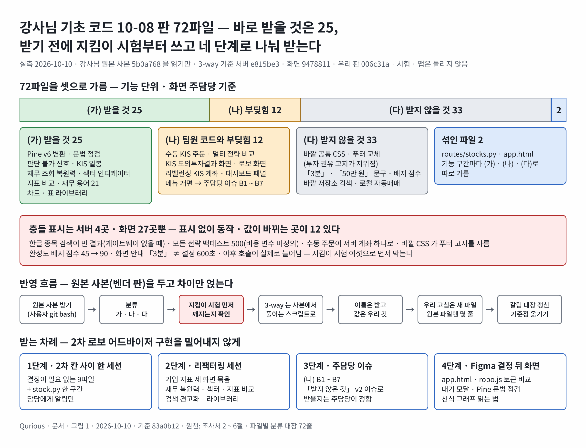
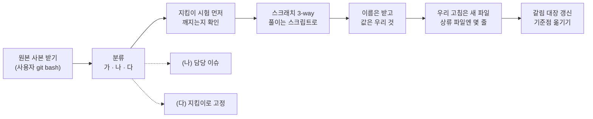

# 강사님 기초 코드 10-08 판 — 받을 것 · 부딪히는 것 · 받지 않을 것과 반영 차례 조사서 v0.1

| 문서 정보 | |
|---|---|
| **판 · 상태** | v0.1 · 초안(검토 전) |
| **구분** | 조사서 · 강사님 기초 코드(lumina-invest) 새 커밋을 받기 전 검증 — 분류 · 3-way 미리 돌리기 · 조용히 바뀌는 곳 · 실무 반영 관행 · 차례(코드 반영은 하지 않음) |
| **작성** | 이동원(조사 지시 · 검토) · 분류 · 3-way · 초안은 조사 에이전트(강사님 원본 사본 읽기만 · 공식 문서 · 유지보수 안내 13곳 원문 · github.com 은 열지 않음) |
| **검토** | 검토 전. (나) 묶음 B1 ~ B7 은 주담당(강민석 · 오준영 · 신장환)이 「받지 않은 것」 v2 이슈에서 받을지 정한다 |
| **최종 수정** | 2026-10-10 (KST) |
| **기준** | 강사님 원본 사본 `learning/th06-lumina-invest/lecture` `origin/main` = `5b0a768`(2026-10-10 10:44 받음 · 커밋 작성자 · 이메일은 읽지 않음) · 우리 판 `main` `006c31a` · 3-way 기준 서버 `e815be3`(2026-10-08 PR #141) · 화면 `9478811`(2026-10-03) · 외부 원문 조회 2026-10-10 · 시험 · 앱 · 러너는 돌리지 않음 |
| **관련 문서** | [파일별 분류 대장(72줄)](대장/기초코드-최신판-파일별분류.tsv) · [교재 원천 갱신 따라가기 v0.1](교재원천-갱신따라가기-조사.md) · [강사님 자료 변경 추적 댓글 14](../github-archive/2026-09-28/이슈-강사님자료-변경추적/14-2026-10-10-th06-새8커밋-th07-금융경로.md) · [「받지 않은 것」 v2 이슈 초안](../github-archive/2026-10-10/이슈-기초코드-받지않은것-v2/00-본문.md) · 지킴이 시험 `tests/test_base_code_merge_guard.py` |
| **최근 개정** | v0.1 — 처음 씀 |

> **이 문서로 알 수 있는 것**
> 1. 강사님이 2026-10-08 하루에 더한 8커밋(68파일)과 아직 받지 않은 화면 변경까지 72파일은 무엇이고, 무엇을 받고 무엇을 받지 않나?
> 2. 3-way 를 미리 돌리면 어디서 충돌하고, 충돌 표시 없이 동작 · 값이 바뀌는 곳은 어디인가?
> 3. 하류 포크가 상류를 따라가는 실무 관행은 무엇이고, 우리 반영 흐름에 무엇을 더하나?
> 4. 2차 로보 어드바이저 구현을 밀어내지 않고 언제 · 어떤 차례로 받나? 받기 전에 무엇을 물어야 하나?
>
> **읽는 순서** — 이동원: 요약 → 3절 → 6절 → 부록 A · 주담당: 요약 → 4절 <표 6> 의 자기 줄 → 「받지 않은 것」 v2 이슈

## 요약

1. 강사님이 2026-10-08 하루에 8커밋(68파일)을 더 올렸다. 화면 쪽 지난 변경까지 합쳐 72파일을 가르면 받을 것(가) 25 · 팀원 코드와 부딪히는 것(나) 12 · 받지 않을 것(다) 33 · 섞인 파일 2(라우트 `stocks.py` · `app.html`)다.
2. 3-way 를 미리 돌려 보면 충돌 표시는 서버 3파일 4곳 · 화면 9파일 27곳(`app.html` 18곳은 참고값)뿐이다. 더 위험한 것은 충돌 표시 없이 들어오는 변경이다. 한글 종목 검색 회귀, 모든 전략 백테스트를 깨는 변수 하나, 늘 막히는 수동 주문, 투자 권유 고지를 잘라 버리는 바깥 CSS, 완성도 배지 점수, 「3분」 문구가 그 예다(3절).
3. 반영은 「원본 사본(벤더 판) → 지킴이 시험 먼저 → 3-way → 이름은 받고 값은 우리 것 → 우리 고침은 새 파일, 원본 파일엔 몇 줄」 차례로 하고, 갈린 곳마다 까닭을 적는다(Debian DEP-3 · Electron 패치 규칙과 같은 생각 · 5절). 큰 묶음은 2차 로보 어드바이저 구현 뒤 리팩터링 세션에 받고, 결정이 필요 없는 작은 묶음(9파일 + `stock.py` 한 구간)만 먼저 받을 수 있다(6절).

강사님 기초 코드 반영의 전체 모습은 <그림 1> 과 같다.

**<그림 1> 강사님 기초 코드 10-08 판 72파일 — 분류 · 조용히 바뀌는 곳 · 반영 흐름 · 받는 차례** · 범례: 초록 = 받을 것 · 노랑 = 팀원 코드와 부딪힘 · 회색 = 받지 않을 것 · 파랑 = 섞인 파일 · 빨강 = 먼저 막을 것

원본: [Figma · Qurious · 문서 그림 · 48:3](https://www.figma.com/design/6lstWS4YwuhJPhGB9XoBMD?node-id=48-3) · 그림 판 v0.1 · 기준 `83a0b12` · 원천: 이 문서 2 ~ 6절 · 파일별 분류 대장 · 2026-10-10

그림 원문(Mermaid) — 검색 · 다시 그리기용

---

## 0. 범위 · 기준

| 무엇 | 값 |
|---|---|
| 강사님 원본 사본(읽기만) | `learning/th06-lumina-invest/lecture` · `origin/main` = `5b0a768`(10-10 10:44 받음) |
| 우리 판 | Qurious `main` `006c31a` — 파일은 `git show HEAD:<경로>`(줄 끝 LF) |
| 3-way 기준 — 서버 · 시험 · 기타 | `e815be3`(10-08 PR #141 서버 반영 끝) |
| 3-way 기준 — 화면(`public/`) | `9478811`(10-03 화면 반영 끝 — `e815be3` 의 화면 변경도 아직 안 받음) |
| 대상 파일 | 서버 · 기타 47(`e815be3..5b0a768`) + 화면 25(`9478811..5b0a768`) = **72** |

**<표 1> 새 커밋 8개 (작성자 · 이메일은 읽지 않았다)**

| 커밋 | 시각(KST) | 강사님 제목 | 실제로 담긴 것 | 파일 |
|---|---|---|---|---|
| `995b9c7` | 10-08 10:23 | 코드 구조 정리 | 이름과 달리 기능 묶음 — Pine v6 변환 · 판단 불가 신호 · KIS 모니터 화면 정리 · 차트 · 표 라이브러리(저장소 안) · Pine 문법 점검 · Caddy | 25 |
| `c6e9c2f` | 11:27 | 회사 지표 도움말 + 시험 | 섹터 인디케이터 · 재무 조회 복원력 · 재무 용어 21개 · 수동 KIS 주문 서버 | 16 |
| `6e26041` | 11:40 | 실행 로그 카드 | 의사결정 로그 카드 · 산식 그래프 읽는 법 | 4 |
| `0ca06dc` | 14:33 | 지표 백테스트 다중 전략 비교 | 멀티 전략 비교 API · 규칙 기반 XAI · SHAP 설명 제거 | 8 |
| `85c3444` | 14:58 | KIS 연계 시세 · 패턴 · 공통 푸터 | KIS 일봉 refresh · 패턴 캐시 우회 · **푸터 교체(투자 권유 고지 삭제)** | 10 |
| `5b40fbe` | 16:40 | 로컬 자동매매 | `local-py/` 별도 패키지(표준 라이브러리만 · 실전 주문 가능) | 22 |
| `c63cc1a` | 17:18 | 4개 사이트 공통 CSS · 배포 스크립트 | 바깥 주소 공통 CSS 링크 · S3 배포 | 9 |
| `5b0a768` | 17:46 | OHLCV 저장소 클라이언트 · 종목 검색 | 종목 검색 1차 소스를 바깥 OHLCV 저장소로 · 검색 중 자동 적재 | 8 |

- `995b9c7` · `0ca06dc` 는 Windows 에서 만들 수 없는 찌꺼기 파일 `public/js/common.js:RVContext` 를 건드렸지만 끝 판에서는 차이가 없다 — 지금의 로컬 `git replace` 처리를 그대로 쓴다.

## 1. 방법

1. `git log --format='%h %ad %s'` · `--name-status` · `--numstat` 로 커밋 · 파일을 모았다(작성자 칸은 쓰지 않음).
2. 파일마다 blob 해시를 견주어 「우리 판 = 기준(안 고침) · 우리가 고침 · 팀원이 고침 · 우리에게 없음 · 새 파일」 을 갈랐다. 누가 고쳤는지는 우리 저장소 `git log --format='%h %an %s'` 로 봤다.
3. 저장소 밖 작업 폴더에서만 `git merge-file -p --diff3 우리 기준 강사님`(셋 다 LF)을 돌렸다. 돌아온 값은 충돌 수다(0 = 깨끗).
4. **충돌 0 인 파일도 diff 를 읽었다** — 새 코드가 부르는 함수가 우리 판에 있는지, 인자가 맞는지, 우리가 안 고친 줄의 값이 바뀌는지.
5. 화면 주담당은 `docs/시험/대장/기능완성도-점검표.tsv` 의 「주담당」 칸으로 정했다(빈 칸 = 주인 없는 화면 → 이동원).
6. 융합 관행은 공식 문서 · 유지보수 안내 13곳을 원문으로 읽었다(9절 · github.com 은 쓰지 않음).

한계 — 시험 · 앱 · 러너는 돌리지 않았다(지킬 것). `app.html` 은 토큰 비교를 하지 않고 대상 목록만 적었다. `robo.js` 도 우리 판이 자동 서식이라 충돌 수(7)가 실제 겹침보다 적다.

## 2. 사실 — 3-way 결과

**<표 2> 3-way 결과 (파일 수)**

| 결과 | 서버 · 기타 | 화면 | 합 | 파일 |
|---|---|---|---|---|
| 강사님 판 그대로(우리 판 = 기준) | 8 | 3 | 11 | `routes/formula.py` · `aggressive_mode.py` · `formula.py` · `kis_market_data.py` · `patterns.py` · 시험 셋 / `index.html` · `company.js` · `formula.js` |
| 3-way 깨끗 | 2 | 3 | 5 | `auto_trade.py` · `test_kis_market_data.py` / `completion.js` · `login.html` · `register.html` |
| 충돌 | 3 (4곳) | 10 (27곳 + `app.html` 18) | 13 | 아래 <표 3> |
| 새 파일 | 32 | 9 | 41 | 앱 2 · 시험 5 · `local-py/` 22 · `shared-css/` 3 / 화면 js 4 · 라이브러리 5 |
| 우리에게 없음 | 2 | 0 | 2 | `infra/fd-edumgt/Caddyfile` · `todo.md` |
| 합 | 47 | 25 | 72 | |

**<표 3> 충돌 위치 — 우리 쪽은 누구 코드인가**

| 파일 | 충돌 | 우리 쪽 줄의 주인 | 무엇이 겹치나 | 풀이 난이도 |
|---|---|---|---|---|
| `app/routes/stocks.py` | 1 | 이동원(실거래 관문 import) | import 한 줄 | 쉬움(둘 다) |
| `app/services/investment_research.py` | 1 + 의미 1 | 이동원(비용 모델) · 신장환(RSI Wilder) | 함수 머리 · **풀어도 `cost` 미정의** | 중간 — <표 4> ③ |
| `app/services/stock.py` | 2 | 이동원(수집 DB 다리 · `as_of`) · 신장환(`definition`) | import · 지표 응답 칸 | 쉬움(우리 칸 + `interval` · `bars`) |
| `public/css/app.css` | 1 | 이동원(위 메뉴 Priority+) | 파일 끝에 둘 다 덧붙임 | 쉬움(둘 다) |
| `public/js/agent.js` | 1 | 이동원 | 채팅 엔진 이름 | 우리 것(10-08 결정) |
| `public/js/common.js` | 1 | 이동원(네트워크 오류 `status 0`) | `fetch` 오류 처리 | 쉬움(둘 다) |
| `public/js/indicator.js` | 1 | 이동원(비용 모델 문구) | 옛 Python 백테스트 상세 ↔ 멀티 전략 비교 | 신장환 결정 |
| `public/js/main.js` | 2 | 강민석(testbed · 성과 지표) | 화면 전환 · import | 쉬움(둘 다) — 화면 결정 뒤 |
| `public/js/core.js` | 5 | 강민석(testbed 메뉴) · 이동원(API 문서 · 내 계정 · 안내) | 메뉴 · 안내 | 메뉴는 우리 것 + 새 항목 판단 |
| `public/js/dashboard.js` | 4 | 이동원(사용자 키 문구 · 2026-10-03) | KIS 패널 문구 · 배치 표시 | 구조는 받고 값은 우리 것 |
| `public/js/rebalance.js` | 5 | 오준영(7커밋) | KIS 계좌 소스 · 섹터 2단 | 오준영 이슈(이미 있음) |
| `public/js/robo.js` | 7 | 강민석(QFRS · testbed · 자동 서식) | 스크리닝 · 패턴 · 의사결정 | 토큰 비교 · 신장환 · 강민석 |
| `public/app.html` | 18(참고) | 여럿(자동 서식) | 거의 모든 줄 공백이 다름 | 토큰 비교 대상 |

## 3. 「충돌 0 ≠ 바뀐 것 0」 — 조용히 들어오는 변경

우리가 고치지 않은 줄의 변경은 3-way 가 충돌 없이 받아들인다. 아래는 **충돌 표시가 없는데 동작 · 값이 바뀌는 곳**이다. 지난 반영(2026-10-08 · PR #141)의 교훈대로 받기 **전에** 지킴이 시험을 쓰고, 저장소 밖 사본에 강사님 판을 한 곳씩 넣어 깨지는지 본다.

**<표 4> 충돌 없이 바뀌는 곳**

| # | 파일 · 3-way | 무엇이 바뀌나 | 영향 | 막는 지킴이(제안) | 확실도 |
|---|---|---|---|---|---|
| ① | `routes/stocks.py` 종목 검색 · 깨끗한 구간 | 1차 소스가 KRX 로컬 목록(`krx_companies`) → 바깥 OHLCV 저장소(`ohlcv_catalog`) → 야후. 야후로 찾은 국내 종목을 **검색 중에 저장소에 적재**(최대 60초) | 게이트웨이(`STOCK_COIN_TRADE_BASE_URL`)가 없으면 저장소 단계가 빈 결과 → 「카카오」 같은 한글 검색어는 야후 400 → **빈 결과**. 지금은 KRX 로컬이 찾아 준다 — 회귀. 적재는 앱이 수집 저장소에 쓰는 일 | 「게이트웨이 없이도 한글 종목 검색 결과가 있다」 | 확인(코드) |
| ② | `routes/stocks.py` 지표 백테스트 · 깨끗 | 응답의 `explanation` 이 LightGBM SHAP 캐시(`ai_predict:v3`) → (서비스 쪽) 규칙 기반 `explain_strategy` 로 바뀜 | 화면 `renderXaiBlock` 이 받는 모양이 바뀐다 — XAI(2차 ①-5)는 신장환 몫 | 「백테스트 응답의 설명 형식」 은 신장환이 정한 뒤 시험 | 확인(코드) |
| ③ | `investment_research.py` · 충돌 1 바깥 | 강사님이 본문을 `_backtest_frame(df, …)` 로 떼면서, 우리 비용 모델 줄(`if cost is None: …`)이 그 안으로 들어간다. 그런데 `_backtest_frame` 은 `cost` 를 받지 않는다 | 충돌 한 곳을 풀어도 `cost` 가 함수 안 지역 변수라 **`UnboundLocalError` — 모든 전략 백테스트 · 비교 API 가 500**. 비교 기본값 10bp + 5bp 는 우리 `KrxCostModel` 과 다름 | 「백테스트 · 비교가 같은 비용 모델로 예외 없이 돈다」 | 확인(병합 결과 읽음) |
| ④ | `auto_trade.py` 수동 KIS 주문 · 깨끗 | 새 `place_manual_kis_order` 가 `resolve_route()`(인자 없음) · `kis_credentials.get_credentials()`(서버 계좌)를 부른다 | 우리 판(ADR-0004 키는 사용자마다)에서는 게이트웨이가 없으면 **늘 「연동 안 됨」** 으로 막힌다. 게이트웨이가 있으면 모든 사용자가 서버 게이트웨이 계좌 하나로 주문 | 「수동 주문은 그 사용자 키로만 · 실거래 관문을 지난다」(TC-LT 쪽) | 확인(코드) |
| ⑤ | `completion.js` · 깨끗 | 완성도 배지 `company-compare` 45 → 90 · `company-sector` 42 → 86 | 강사님 판 구현의 점수가 우리 배지에 들어온다 — 우리 배지 정본은 점검표 TSV | 「배지 점수 = 점검표 TSV」 | 확인 |
| ⑥ | `index.html`(그대로) · `login.html` · `register.html`(깨끗) · `app.html` | `<link href="https://www.edumgt.co.kr/css/common.css?v=…">` 한 줄 | 런타임에 강사님 도메인을 읽는다. 그 CSS 가 **모든 `footer` 를 높이 25px · 한 줄 · 넘치면 잘림(`!important`)** 으로 고정 → 우리 푸터의 「투자 자문이 아닌 정보 제공 목적입니다」 가 폭에 따라 잘려 안 보일 수 있다. 제목 18px 고정 · 글자 18px 상한 · 글꼴 바깥 CDN | 「html 넷에 바깥 공통 CSS 링크가 없다」 · 「푸터 고지 문구가 있고 높이 고정 규칙이 없다」 | 확인(링크 · CSS) · 추정(잘림 폭) |
| ⑦ | `aggressive_mode.py`(그대로) · `auto_trade.py`(깨끗) | 데이터가 없으면 「관망」 → 「판단 불가」 + `error` · 상태 응답 `NONE` | 우리 원칙(말없는 대체 금지)과 같아 받을 것. 「관망」 글자를 세는 곳이 우리 앱에 있는지 봤다 — 문구 1곳뿐 | 강사님 시험 둘로 충분 | 확인 |
| ⑧ | `patterns.py`(그대로) · `routes/stocks.py` | `get_candles(max_age_hours=0)` — 캐시 건너뜀 | 국내 일봉은 수집 DB 라 무관. 60분봉 · 주봉은 화면을 열 때마다 야후 호출. 일일 러너 신호 단계(`mtf_signals`)는 이 함수를 부르지 않는다 | 야후 봉인 시험(줄 수)으로는 안 잡힘 — 호출 수 관찰 | 확인(코드) |
| ⑨ | `kis_market_data.py`(그대로) | 긴 일봉 이력 대기 10초 → 60초 · `refresh` 때 최근 20봉 다시 받기 | 게이트웨이가 느리면 야후 폴백 전 최대 60초 | 없음(작음) | 확인 |
| ⑩ | `core.js` 충돌 밖 두 줄 | 용어 「정해진 주기(기본 3분)」 · 자동매매 안내 「3분 주기」 | 우리 주기 600초와 어긋난다. TC-BM 의 600초 시험은 설정만 봐서 **화면 문구는 못 잡는다** | 「화면 안내의 주기 문구 = 설정값」 | 확인 |
| ⑪ | `sector_indicators.py`(새 파일) | `QUANT_STOCKS` · `QUANT_SECTORS` 를 그대로 읽는다 | 강사님은 3섹터 상대 순위 전제. 우리 31종목 · 18섹터로 돌면 섹터당 1 ~ 3종목 — 「비중확대 · 축소」 판정의 뜻이 약해진다 | 섹터 묶음을 우리가 정한 뒤 시험 | 확인(코드) · 추정(뜻) |
| ⑫ | `stock.py` · `sector_indicators.py` · `company.js` | 재무 조회 재시도(`query2`) · 실패 때 가격만(`_yahoo_chart`) · 섹터 31종목 · 지표 비교 30종목 재무 | **야후 새 호출이 실제로 늘어난다**(09-30 · 10-08 선례는 「언급만 늘고 호출 0」 이었다). 야후 봉인 시험이 기준선 초과로 실패한다 | 봉인을 열지 · DART 수집 DB 로 바꿀지 결정(7절 Q1) | 확인 |

## 4. 기능 단위 분류

**<표 5> (가) 기본 기능이라 받을 것 — 25파일**

| 기능 | 파일 | 주담당 | 크기 · 3-way | 받는 조건 |
|---|---|---|---|---|
| Pine v6 변환 · 변환 실패는 422 | `formula.py` · `routes/formula.py` · `test_formula.py` | 이동원(3차 Pine) · 신장환(산식) | 3파일 · 그대로 | 신장환에게 알림(커스텀 인디케이터 화면의 Pine 템플릿은 아직 v5) |
| Pine v6 문법 점검(로컬 · 보수적) | `pine-lint.js` | 이동원(3차) | 새 파일 | 화면 반영 때 |
| 판단 불가 · NONE 신호 | `aggressive_mode.py` · 시험 둘 (+ `auto_trade.py` · 라우트의 해당 구간) | 강민석 | 그대로 | 강민석에게 알림 · `auto_trade.py` 는 수동 주문과 한 파일이라 (나)와 같이 |
| KIS 일봉 refresh · 대기 60초 · 캐시 우회 | `kis_market_data.py` · `test_kis_market_data.py` · `stock.py` 의 `get_candles` 구간 | 이동원(시세 경로) | 그대로 · 깨끗 · 구간 | 강사님 새 시험이 `stock.get_candles(max_age_hours=0)` 를 부르므로 그 구간과 한 묶음 |
| 재무 조회 복원력(재시도 · 7일 내 옛 자료 · 가격만 · PER 기준 · 지표 15개) | `stock.py` 해당 구간 · `test_company_fundamentals_resilience.py` | 이동원(주인 없는 화면) | 충돌 2 · 새 시험 | 야후 봉인 결정(Q1) |
| 섹터 인디케이터 | `sector_indicators.py` · `/stocks/sectors` · `test_sector_indicators.py` · `company.js` 섹터 | 이동원(주인 없는 화면) | 새 파일 · 그대로 | **값은 우리 것** — 섹터 묶음 · 재무 소스 · 판정 낱말(부록 A 후보 2) |
| 지표 비교 30종목 × 지표 30 | `company.js` 비교 | 이동원(주인 없는 화면) | 그대로 | AG Grid 를 저장소에 둘 때 |
| 재무 용어 21개 | `company-indicator-help.js` | 이동원(용어사전) | 새 파일 | 따로 두지 않고 용어사전(`terms.json`)에 — 12개 있음 · 8개 더함 |
| 산식 그래프 읽는 법 | `formula-chart-help.js` · `formula.js` | 신장환 | 새 파일 · 그대로 | 신장환에게 알림 |
| 공통 API 취소 | `common.js` | 이동원(공통) | 충돌 1 | 우리 `status 0` 과 함께 |
| 대기 모달 · 모래시계 · XAI 모달 스타일 | `app.css` | 이동원(공통) | 충돌 1 | 바깥 CSS 를 가리키는 주석 두 곳은 뺌 |
| 차트 · 표 라이브러리 저장소 안에 | `vendor/` 5파일(Lightweight Charts 5.2.1 Apache-2.0 · AG Grid 36.2.0 MIT) | 이동원(RTM ⑦) | 새 파일 | 파일은 npm 원본에서 받아 해시 대조 · `NOTICE` 함께 · 제작자 표시(댓글 11 결정) |

**<표 6> (나) 팀원 코드와 부딪히는 것 — 12파일 + 섞인 파일의 해당 구간**

| 기능 | 주담당 | 부딪히는 우리 파일(주인) | 무엇이 부딪히나 | 제안 |
|---|---|---|---|---|
| B1 수동 KIS 모의 주문 · 주문 가능 여부 | 강민석(모의 주문) · 오준영(3차 증권사) | `auto_trade.py` · `kis_quickstart.py`(이동원 · 2026-10-03 — ADR-0004) | 서버 계좌 경로(<표 4> ④) · 강사님 시험이 `resolve_route` 를 통째로 가짜로 바꿔 사용자 키 경로를 못 봄 | 받는다면 두 줄(`resolve_route(broker_row)` · `for_user(broker_row)`) + 실거래 관문 시험 먼저 |
| B2 멀티 전략 비교 · 규칙 기반 XAI · SHAP 설명 제거 | 신장환(XAI ①-5 · 성과 검증 화면) · 강민석(성과지표 · #134 비용) | `investment_research.py`(신장환 · 이동원) · `indicator.js` · `core.js` 이름 | 의미 충돌(<표 4> ③) · 비교 기본 비용 · 어느 XAI 를 화면에 둘지 | 신장환이 XAI 방식, 강민석이 비교 비용(#134 「기본 real」)을 정한 뒤 |
| B3 KIS 모의투자결과 화면 | 강민석 | `core.js` · `main.js`(강민석 testbed 자리) | 배치(서버 계좌) 중심 · 「3분」 문구 · AG Grid · 메뉴 자리 | 서버는 10-08 받음 — 화면은 Figma 뒤 · 강민석 결정 |
| B4 로보 화면(스크리닝 1종목씩 · 중지 · XAI 모달 · 패턴 차트 Lightweight Charts · 의사결정 근거 카드) | 신장환 · 강민석 | `robo.js`(강민석 3커밋 · 자동 서식) · `main.js` | 충돌 7 + 서식 차이 | 토큰 비교 · 두 담당이 나눠 정함 |
| B5 리밸런싱 KIS 계좌 소스 · 섹터 2단 목표 | 오준영 | `rebalance.js`(오준영 7커밋) | 충돌 5 + 서버 14곳 | 이미 「받지 않은 것」 이슈 2절 |
| B6 대시보드 KIS 패널(배치 · 공격 모드 표시 · 주기를 서버 값으로) | 강민석(추정) | `dashboard.js`(이동원 · 2026-10-03 문구) | 충돌 4 | 구조(서버 값 읽기)는 받고 기본값 · 문구는 우리 것 |
| B7 메뉴 개편 | 이동원(메뉴) · 강민석 · 신장환 | `core.js` | 메뉴 셋 삭제 · TradingView 연동 이동 · 새 항목 | 우리 메뉴 유지(TC-BM 「메뉴에서 우리 화면이 사라지지 않는다」) + 새 항목만 담당 판단 |

**<표 7> (다) 받지 않을 것 — 33파일 + 섞인 파일의 해당 구간**

| 무엇 | 파일 | 까닭 | 참고할 점 |
|---|---|---|---|
| 바깥 공통 CSS 링크 · 공통 CSS 사본 · S3 배포 | html 넷의 한 줄 · `shared-css/` 3 · `app.css` 주석 | 바깥 주소 의존(강사님 도메인 · 글꼴 CDN) · 푸터 25px 고정으로 **투자 권유 고지가 잘림** · S3 는 AWS 제외 | 「제목 18px · 최소 13px」 같은 타이포 규칙은 우리 디자인 결정 때 생각만 |
| 푸터 교체 | `app.html` 의 푸터 | **「투자 자문이 아닌 정보 제공 목적입니다」 삭제** · 강사님 회사 표기(우리는 10-02 에 뺐다 — 원저작자 표시는 `NOTICE.md`) | 강사님께 한 줄로 알릴지(7절 Q3) |
| 운용 값 문구 | `core.js` · `dashboard.js` · `app.html` 의 「3분」 · 「50만 원」 · 쿨다운 3분 · 일 300건 | 10-08 결정(다른 주담당 운용 값은 받지 않음) | 구조는 받고 값만 우리 것 |
| 채팅 엔진 이름 「Qwen」 · 「Qwen RAG」 | `agent.js` · `app.html` | 10-08 결정(채팅 llama3.1 · 「검색 결과 요약」) | — |
| 완성도 배지 점수 | `completion.js` | 우리 배지 정본은 점검표 TSV | 받은 기능을 우리 시험으로 다시 매김 |
| 종목 검색을 바깥 OHLCV 저장소로 · 검색 중 적재 | `ohlcv_catalog.py` · 라우트 해당 구간 | 바깥 서비스 의존 · 앱이 저장소에 씀(설계서 4.1 — 앱은 수집 DB 에 쓰지 않는다) · 게이트웨이 없으면 한글 검색 회귀 | 「야후 400 → 빈 결과(502 아님)」 처리만은 받을 만함(부록 A 후보 5) |
| 로컬 자동매매 CLI | `local-py/` 22 | 실전 서버로 주문 가능한데 실거래 관문(ADR-0001) 없음 · 별도 스택 · 3분 · 비용 가정 다름 | KIS 토큰을 파일에 두고 다시 쓰는 방식은 DF-84(토큰 1분 1회) 고치는 안의 참고 — 오준영 |
| 메뉴 셋 삭제 · TradingView 연동을 시스템관리로 | `core.js` | 우리 화면이 사라짐(지킴이가 이미 막음) · TradingView 연동은 이동원 3차 화면 | — |
| 강사님 운영 파일 | `infra/fd-edumgt/Caddyfile` · `todo.md` | 강사님 서버 · 운영 기록 | 지난 반영들도 받지 않음 |

## 5. 실무 사례 — 하류(downstream) 포크가 상류(upstream)를 따라가는 방법

**<표 8> 관행 · 출처 · 우리에게 쓰는 법**

| 관행 | 출처(원문 요지) | 우리에게 | 확실도 |
|---|---|---|---|
| **벤더 브랜치** — 손대지 않은 원본 사본을 따로 두고, 「옛 원본 → 새 원본」 차이만 우리 사본에 얹는다 | Subversion 책 「Vendor Branches」 — *"applying the changes made to libcomplex between versions 1.0 and 1.1 to your modified copy of it"* | 이미 하고 있다 — `learning/th06/lecture` 가 벤더 판, 기준 커밋이 「옛 원본」. 다만 기준이 서버 `e815be3` · 화면 `9478811` 로 갈라져 기준점 TSV 한 줄로는 못 적는다 → 둘로 적자(Q7) | 확인 |
| **3-way 파일 병합** | git `merge-file` — *"incorporates all changes that lead from <base> to <other> into <current>"* · 돌아온 값 = 충돌 수 | 스크래치에서 이미 씀. 「충돌 0」 은 글자가 안 겹쳤다는 뜻일 뿐 — <표 4> | 확인 |
| **풀이 재사용(rerere)** | git `rerere` — 같은 충돌을 다시 만나면 지난 풀이를 다시 적용. *"you still need to do the final sanity checks"* | `merge-file` 은 rerere 를 거치지 않고, 우리 저장소에는 강사님 이력이 없어(복사로 시작) 바로는 못 쓴다 → 2026-10-08 반영 때 쓴 `resolve.py`(충돌마다 풀이를 스크립트로)가 같은 구실. 이번 풀이도 스크립트로 남긴다 | 확인(문서) · 추정(우리 적용) |
| **공백 무시 병합의 한계** | git merge-strategies — *"Whitespace changes mixed with other changes to a line are not ignored."* | 자동 서식이 걸린 `app.html` · `robo.js` 는 공백 무시로도 못 맞춘다 → 공백 접은 토큰 비교(2026-10-01 · 10-03 반영 때 쓴 방식) · 팀에는 「저장할 때 서식」 끄기 부탁(이미 함) | 확인 |
| **패치 묶음 · 패치마다 까닭** | Debian `gbp pq`(패치 하나 = 커밋 하나 · 새 상류에 rebase) · DEP-3(`Origin` · `Forwarded: no / not-needed`) · Electron *"every patch must describe its reason for existence"* · *"avoid indefinite-lifetime patches"* | 우리 고침(갈림)을 「갈림 대장」 한 표로 — 파일 · 줄 · 까닭 · 강사님께 알렸나(`not-needed` = 우리만의 것). 지금은 「받지 않은 것」 이슈 + TC-BM 주석에 흩어져 있다 | 확인 |
| **상류 먼저(upstream first)** | Linux 커널 문서 — *"Maintaining out-of-tree code requires significant amounts of work just to keep that code working."* | 강사님 코드에 고칠 거리가 있으면(예: 공통 푸터가 고지를 지움) 강사님께 한 줄로 알리는 것이 우리 갈림을 줄이는 길. Fedora 의 같은 취지 문서는 봇 차단으로 못 열었다 | 확인(커널) · 미확인(Fedora) |
| **지킴이 시험 먼저** | Fowler 「Self Testing Code」 — 실수하면 *"the bug detector will go off"* | TC-BM · TC-LT 를 반영 전에 쓰고, 저장소 밖 사본에 강사님 판을 한 곳씩 넣어 깨 본다(2026-10-08 반영 때 열두 곳 모두 잡음). 이번 추가 후보는 6절 <표 10> | 확인 |
| **기능 플래그로 들이기** | Fowler 「Feature Toggles」 — 토글은 *"inventory which comes with a carrying cost"*, 결정 지점과 결정 논리를 떼라 | 새 기능(수동 주문 · 섹터 인디케이터 · 바깥 저장소 검색)을 설정 하나로 꺼 둔 채 들이고, 담당이 켤 때 지운다. 우리 `RECONCILE_ENABLED` 가 이미 이 꼴 | 확인(문서) · 추정(적용) |
| **이름은 받고 값은 우리 것** | Android RRO — *"changes the resource values of a target package at runtime"*(이름 · ID 는 그대로) · 12-Factor *"Config varies substantially across deploys, code does not."* | 2026-10-08 반영의 「설정 이름 · 구조는 받고 기본값만 우리 것」 이 이것. 이번엔 `dashboard.js` 처럼 **화면 문구도 서버 값을 읽게** 하는 강사님 구조를 받으면 「3분」 문구 문제가 사라진다 | 확인(문서) · 추정(적용) |
| **우리 고침은 새 파일 · 상류 파일엔 몇 줄** | WordPress 자식 테마 — *"Allow parent themes to be updated without losing your modifications."* · Electron 패치 최소화 | `robo.js` 에 testbed 480줄이 들어가 충돌이 났다 → 새 화면은 새 js 파일(예: `robo-testbed.js`)로, 상류 파일엔 import 한 줄 · 메뉴 한 줄만. `company.js` · `formula.js` 처럼 우리가 안 고친 파일은 그대로 받힌다 | 확인(문서) · 추정(적용) |

이 관행을 우리 반영에 쓰는 차례는 <그림 1> 의 셋째 줄(반영 흐름)과 같다. 흐름의 원문(Mermaid)은 <그림 1> 아래 접힌 칸에 있다.

## 6. 추천 — 언제 · 어떤 차례로

전제 — 2차 로보 어드바이저(10-21) 구현 칸을 밀어내지 않는다. 큰 것은 리팩터링 세션, 결정이 필요 없는 작은 것만 바로. 다른 주담당 몫은 (가)라도 담당에게 알리고, (나)는 담당이 정한다. 가져오기 전엔 늘 묻는다.

**<표 9> 추천 차례**

| 단계 | 언제 | 무엇 | 파일 | 결정 필요 |
|---|---|---|---|---|
| 0 | 지금(이 산출물) | 분류 · 지킴이 목록 · 담당 이슈 초안 | — | 없음 |
| 1 | 2차 구현 칸 사이 틈(한 세션 30 ~ 60분) | 결정이 필요 없는 작은 묶음 — Pine v6 서버 3 · 판단 불가 2 · KIS 일봉 2 + `stock.py` 의 `get_candles` 구간 · 패턴 캐시 1 · 공통 API 1(보이지 않는 변경) | 통째로 9파일(그대로 7 · 깨끗 1 · 충돌 1곳 1) + 구간 1 | 없음(담당에게 알림만) |
| 2 | 2차 구현 뒤 리팩터링 세션(이동원 파트) | 기업 지표 세 화면 묶음 — 재무 복원력 · 섹터 인디케이터 · 지표 비교 · 재무 용어 · 차트 · 표 라이브러리 · 종목 검색 견고화 | `stock.py` · `sector_indicators.py` · `company.js` · 용어사전 · `vendor/` · 시험 둘 | Q1 · Q2 · Q4 |
| 3 | 담당 이슈 → 담당 세션 | (나) B1 ~ B7 | <표 6> | 담당 |
| 4 | Figma 결정 뒤 화면 반영 | `app.html` 토큰 비교 · `robo.js` 토큰 비교 · 대기 모달 · 산식 그래프 읽는 법(`formula-chart-help.js` · `formula.js`) · Pine 문법 점검 | 화면 | 화면 결정 |
| 상시 | 1단계 전에 | (다)를 지킴이로 고정 · 갈림 대장 | 시험 | 없음 |

**<표 10> 받기 전에 쓸 지킴이 시험 후보 (TC-BM 다음 번호)**

| 지킴이 | 잡는 것(<표 4>) | 단계 |
|---|---|---|
| 게이트웨이 없이도 한글 종목 검색 결과가 있다 | ① | 2 |
| 전략 백테스트 · 비교가 같은 비용 모델로 예외 없이 돈다 | ③ | 3(B2) |
| 수동 주문은 그 사용자 키로만 · 실거래 관문을 지난다 | ④ | 3(B1) |
| 완성도 배지 점수 = 점검표 TSV | ⑤ | 1 |
| html 넷에 바깥 공통 CSS 링크가 없다 · 푸터 고지 문구가 있다 | ⑥ | 1 |
| 화면 안내의 자동매매 주기 문구 = 설정값 | ⑩ | 1 |

기준점 — th06 은 화면까지 받기 전엔 `9478811` 그대로(화면 3-way 의 기준이라서). 서버 쪽 기준은 1 · 2단계를 다 받으면 `e815be3` → `5b0a768`. 추적 댓글 · 반영 PR 본문에 둘 다 적는다.

## 7. 받기 전에 사용자에게 물을 것

| # | 물음 | 고를 것(추천 첫 칸) |
|---|---|---|
| Q1 | 재무 복원력 · 섹터 · 지표 비교가 **야후 새 호출**을 늘린다 | (a) 재무 칸을 DART 수집 DB(`financial_statement`)에서 읽게 바꿔 받기 (b) 받고 봉인선을 올리기(까닭을 시험 주석에) (c) 서버는 보류 · 화면만 |
| Q2 | 종목 검색 1차 소스 | (a) KRX 로컬 목록 유지 + 「야후 400 → 빈 결과」 만 받기 (b) 강사님 구조 그대로(게이트웨이 · 저장소 필요) |
| Q3 | 바깥 공통 CSS · 공통 푸터 | (a) 받지 않고 지킴이로 고정 · 강사님께 「공통 푸터가 투자 권유 고지를 지운다」 한 줄 알림 (b) 받지 않기만 |
| Q4 | Lightweight Charts · AG Grid 를 저장소 안에 둘지(RTM ⑦) | (a) 2단계에 npm 원본으로(해시 대조 · `NOTICE` · 제작자 표시) (b) 3차 시작 때 |
| Q5 | (나) 묶음을 어떻게 알릴지 | (a) 「받지 않은 것」 이슈를 닫고 v2 로(10-08 판 + 10-08 저녁 판 담당별) (b) 기존 이슈에 댓글 |
| Q6 | 1단계(작은 묶음 — 통째로 9파일 + `stock.py` 한 구간)를 언제 | (a) 2차 구현 칸 사이 한 세션 (b) 리팩터링 세션에 한꺼번에 |
| Q7 | 기준점 TSV 의 th06 을 서버 · 화면 두 줄로 나눌지 | (a) 나눈다(`lecture_scan.py` 가 줄마다 비교) (b) 지금처럼 댓글 · PR 에만 |

## 8. 뒤집을 조건

| 이렇게 되면 | 바뀌는 판단 |
|---|---|
| 강사님이 공통 CSS 를 앱 안 파일로 돌리거나 푸터에 고지를 되살린다 | <표 7> 첫 두 줄 일부 → (가) |
| 우리가 stock-coin-trade 게이트웨이 · OHLCV 저장소를 실제로 띄우기로 한다 | 종목 검색 구조 → (가)(적재는 여전히 따로 판단) |
| 팀이 야후 의존을 당분간 허용한다(봉인 완화) | 재무 · 섹터 · 비교를 강사님 판 그대로 → (가) |
| 신장환이 규칙 기반 XAI 를 택한다 | B2 의 XAI 부분 → (가) |
| 강민석 · 오준영이 서버 계좌 모델을 받기로 한다(ADR-0004 개정) | B1 · B3 → (가) |
| 2차 일정이 밀려 리팩터링 세션이 없다 | 2단계를 3차 뒤로 |
| 강사님이 다음 커밋에서 같은 파일을 또 크게 고친다 | 이 분류를 새 끝 커밋으로 다시 돌린다(1절 3 · 4 와 같은 방법) |

## 9. 출처

**<표 11> 출처 — 조회일 2026-10-10 (KST)**

| # | 출처 | 주소 | 확인한 것 | 확실도 |
|---|---|---|---|---|
| S1 | 강사님 원본 사본(로컬 참조) | `learning/th06-lumina-invest/lecture` `e815be3..5b0a768` · `9478811..5b0a768` | 커밋 · 파일 · diff · 새 파일 내용(작성자 칸 제외) | 확인 |
| S2 | Qurious 저장소 | `main` `006c31a` · `docs/시험/대장/기능완성도-점검표.tsv` | 우리 판 · 고친 사람 · 화면 주담당 | 확인 |
| S3 | git `merge-file` | https://git-scm.com/docs/git-merge-file | 3-way 의미 · `-p` · `--diff3` · 돌아온 값 | 확인 |
| S4 | git `rerere` | https://git-scm.com/docs/git-rerere | 풀이 기록 · 재사용 · 사람이 다시 확인 | 확인 |
| S5 | git merge-strategies | https://git-scm.com/docs/merge-strategies | 공백 무시 옵션의 한계 · `ours` / `theirs` | 확인 |
| S6 | Subversion 책 1.7 「Vendor Branches」 | https://svnbook.red-bean.com/en/1.7/svn.advanced.vendorbr.html | 벤더 브랜치 절차 | 확인 |
| S7 | git-buildpackage 안내 「Working with patches」 | https://honk.sigxcpu.org/projects/git-buildpackage/manual-html/gbp.patches.html | 패치 묶음 ↔ 커밋 · 새 상류에 rebase | 확인 |
| S8 | Debian DEP-3 Patch Tagging Guidelines | https://dep-team.pages.debian.net/deps/dep3/ | 패치 머리(`Origin` · `Forwarded`) | 확인 |
| S9 | Electron 「Patches in Electron」 | https://www.electronjs.org/docs/latest/development/patches | 패치마다 까닭 · 무기한 패치 피하기 · `-3` 병합 | 확인 |
| S10 | Linux 커널 문서 「Introduction」 | https://docs.kernel.org/process/1.Intro.html | 밖에 둔 코드의 유지 비용 | 확인 |
| S11 | Android 「Runtime resource overlays」 | https://source.android.com/docs/core/runtime/rros | 이름은 그대로 · 값만 덮기 | 확인 |
| S12 | The Twelve-Factor App 「Config」 | https://12factor.net/config | 설정과 코드 분리 | 확인 |
| S13 | WordPress 「Child Themes」 | https://developer.wordpress.org/themes/advanced-topics/child-themes/ | 부모 갱신에도 고침 유지 · 같은 이름 파일로 덮기 | 확인 |
| S14 | Martin Fowler 「Feature Toggles」 | https://martinfowler.com/articles/feature-toggles.html | 토글 종류 · 유지 비용 · 결정 지점 분리 | 확인 |
| S15 | Martin Fowler 「Self Testing Code」 | https://martinfowler.com/bliki/SelfTestingCode.html | 시험이 회귀를 잡는다 | 확인 |
| S16 | Fedora 「Staying close to upstream projects」 | https://docs.fedoraproject.org/en-US/package-maintainers/Staying_Close_to_Upstream_Projects/ | 봇 차단 화면만 보임 — 내용 못 읽음 | 미확인 |
| S17 | Apache License 2.0 4(d) | 강사님 사본 `public/js/vendor/lightweight-charts/LICENSE` 106줄 | `NOTICE` 를 함께 배포해야 함 | 확인 |

---

## 부록 A. 이동원 파트에 쓸 후보

범위는 이동원 몫이다. 2차 데이터 · 지식(수집 · 용어사전 · 근거 RAG · 갱신일 · 일정 · 배치), 3차 TradingView · Pine, 주인 없는 화면(기능 완성도 점검표의 「주담당」 빈 칸 — 기업 지표 세 화면 `company-dashboard` · `company-compare` · `company-sector`)이 여기에 든다. 가져오기 전에는 늘 사용자에게 묻는다. 「추천 시점」 단계는 6절 <표 9> 와 같다(1 = 2차 칸 사이 작은 묶음 · 2 = 2차 구현 뒤 리팩터링 세션 · 3차 = TradingView 세션).

- 가져올 후보는 10개다. 기업 지표 세 화면 묶음 넷(재무 조회 복원력 · 섹터 인디케이터 · 지표 비교 · 재무 용어), 데이터 경로 둘(종목 검색 견고화 · KIS 일봉), 3차 셋(차트 · 표 라이브러리 · Pine v6 변환 · Pine 문법 점검), 공통 화면 하나(대기 모달)다.
- 큰 갈림은 데이터 출처다. 강사님 판은 재무 · 섹터를 야후에서 읽는다. 우리는 DART 재무가 수집 DB 에 있으니 그쪽으로 바꿔 받는 안을 추천한다(야후 봉인과도 맞음).
- 이동원 영역인데 받지 않을 것 여섯(바깥 공통 CSS · 푸터 교체 · 채팅 이름 · 배지 점수 · TradingView 연동 메뉴 이동 · 바깥 저장소 적재)은 지킴이 시험으로 고정한다.

### A.1 가져올 후보

**<표 A-1> 이동원 파트 후보 10개**

| # | 가져올 후보 | 강사님 파일 · 크기 | 바꿀 곳(우리 판) | UI/UX 커스터마이징 안 | 추천 시점 | 먼저 물을 것 |
|---|---|---|---|---|---|---|
| 1 | **재무 조회 복원력** — 401 이면 인증 다시 받기 · 429 · 5xx 면 7일 안 옛 자료를 「옛 자료」 로 표시 · 재무가 없으면 가격만 · PER 이 실적 기준인지 전망 기준인지(`perBasis`) · 재무 지표 15개 더 | `stock.py` 해당 구간(+105 −43 중 대부분) · `test_company_fundamentals_resilience.py`(+100) | `app/services/stock.py` — 3-way 충돌 2(import 한 줄 · 지표 응답 칸)는 우리 칸을 두고 `interval` · `bars` 만 더함. `data_cache.cache_info` 는 우리 판에 이미 있음 | 「옛 자료 · 기준 시각」 · 「가격만 — 재무 없음」 을 자료 안내 화면(2026-10-08)의 「기준일 · 출처」 표기와 같은 꼴로. PER 옆에 「실적」 · 「전망」 꼬리표. 재무 칸 일부를 DART 수집 DB 값으로 바꾸면 「DART 정기보고서 · 접수일」 출처를 붙이고 공시 검색 화면으로 이어 줌 | 2 | 야후 봉인(Q1) — DART 로 바꿔 받을지 |
| 2 | **섹터 인디케이터** — 섹터마다 밸류에이션 · 수익성 · 성장 · 안정성 · 가격 모멘텀 · 시장폭 · 상대 점수 · 판단 근거 문장 · 결측 표시 | `sector_indicators.py`(+398) · `/api/stocks/sectors` · `company.js` 섹터(+335 −76 중 일부) · `test_sector_indicators.py`(+81) | 새 파일이라 충돌 없음. 다만 `QUANT_STOCKS` · `QUANT_SECTORS` 를 그대로 읽어 **우리 31종목 · 18섹터**로 돈다(강사님은 3섹터 상대 순위 전제). 재무 소스(야후 31종목)를 바꿀 곳 | 섹터 묶음을 근거 문서의 섹터 11 + 공통(2026-10-05 결정)과 같은 이름으로 — 섹터 카드에서 「이 섹터의 근거 문서(법령 · 규정)」 로 바로 감(근거 RAG 연결). 판정 낱말 「비중확대 · 비중축소」 는 증권사 투자의견 용어라 권유로 읽힐 수 있다 → 「상대 점수 상위 · 하위」 + 고지 한 줄. 결측 · 커버리지 줄은 자료 안내 서랍 꼴로 | 2 | 섹터 묶음(18 그대로 · 11 + 공통) · 판정 낱말 · 재무 소스 |
| 3 | **지표 비교** — 고정 목업(5종목) → 실제 재무 API 로 30종목 × 지표 30 표 | `company.js` 비교 구간 · AG Grid 사용 | `company.js` 는 우리 판 = 기준이라 통째로 받힌다. 종목 줄을 우리 유니버스 · 관심 종목으로, AG Grid 파일(후보 7) | 30열 한 표 대신 열 묶음 탭(밸류 · 수익성 · 성장 · 안정성) — 390 폭에서도 읽히게. 열 머리 용어에 밑줄 → 우리 용어 카드. N/A 는 「제공처 미제공」 과 「결산 전」 을 나눠 씀 | 2 | 후보 7 과 함께 받을지 |
| 4 | **재무 용어 21개** — 현재가 · 시가총액 · EPS · BPS · PER · PBR · EV/EBITDA · 배당 · ROE · ROA · 마진 · 재무상태표 항목 | `company-indicator-help.js`(+65) | 따로 사전을 두지 않는다 — 우리 용어사전(`app/services/glossary_data/terms.json` · 760개)에 **12개는 이미 있고 · 「매출」 1개 근사 · 8개 없음**(현재가 · BPS · 주당배당금 · ROA · 총자산 · 자기자본 · 부채총계 · 현금및현금성자산) → `scripts/glossary_build.py` 경로로 8개 더함 | 강사님 대화상자 대신 우리 용어 카드(같은 밑줄 · 같은 카드)로 — 정본 하나. 강사님 문장은 출처가 아니므로 정의 · 출처는 R01 규칙대로 새로 씀 | 용어사전 갱신 세션(작음 — 다른 주담당 영향 없음) | 8개 추가 · 출처 기준 |
| 5 | **종목 검색 견고화** — 야후 자동완성이 한글 검색어에 400 을 주면 502 대신 「결과 없음」 · 응답에 출처 칸(`source`) | `routes/stocks.py` 검색 구간(일부만) | 1차 소스는 **KRX 로컬 목록(`krx_companies`) 그대로**. 강사님의 바깥 저장소(`ohlcv_catalog`) · 검색 중 적재는 받지 않는다(앱은 수집 DB 에 쓰지 않는다 · 게이트웨이 없으면 한글 검색 회귀) | 검색 결과에 출처 표시(「국내 · KRX 목록」 · 「해외 · 야후」). 결과가 없을 때 「국내 종목은 이름이나 6자리 코드로 찾으세요」. 용어사전의 초성 찾기 방식을 종목 이름에도 | 1단계 옆(작음 · 구간 손으로) 또는 2 | Q2 — KRX 로컬 유지 |
| 6 | **KIS 일봉 refresh · 캐시 우회** — 긴 이력은 60초까지 기다림 · 새로 볼 때 최근 20봉을 다시 받아 합침 · 응답에 `source` | `kis_market_data.py`(+15 −6) · `test_kis_market_data.py`(+24 −1) · `stock.py` 의 `get_candles` 구간 | 우리 국내 일봉은 수집 DB 가 먼저라 그 뒤 갈래만 바뀐다. 강사님 새 시험이 `get_candles(max_age_hours=0)` 를 부르므로 `stock.py` 그 구간과 함께 | 차트 머리에 시세 출처(수집 DB · KIS · 야후)를 작게 — `source` 칸은 이미 응답에 있음 | 1 | 없음(알림만) |
| 7 | **차트 · 표 라이브러리를 저장소 안에** — Lightweight Charts 5.2.1(Apache-2.0) · AG Grid Community 36.2.0(MIT) | `public/js/vendor/` 5파일(LICENSE · NOTICE 포함) | 강사님 사본을 복사하지 않고 **npm 원본에서 받아 해시 대조**(댓글 11 결정) · `NOTICE` 함께 둠(Apache-2.0 4(d)) · 제작자 표시 켬 | 3차 TradingView 화면부터 Lightweight Charts — 지금 ApexCharts 화면은 그대로 두고 새 화면부터. AG Grid 테마는 `qurious.css` 토큰으로 | 2 또는 3차 시작 | Q4 — 언제 들일지 |
| 8 | **Pine v6 변환(서버)** — 정규식 치환 v5 → AST 변환 v6 · 옮길 수 없는 함수 · 구문은 깨진 코드 대신 오류(422) | `formula.py`(+180 −27) · `routes/formula.py`(+5 −1) · `test_formula.py`(+45 −1) | 셋 다 우리 판 = 기준이라 통째로 받힌다. 우리 `test_formula.py` 의 v5 단언이 v6 로 바뀐다. 커스텀 인디케이터 화면(신장환)의 JS Pine 템플릿은 아직 v5 — 신장환에게 알림 | 내보내기 실패 때 「이 함수는 Pine 으로 옮길 수 없습니다: …」 를 그대로 보여 줌. 코드 머리 주석의 「lumina-invest」 를 서비스 이름으로 | 1 | 없음(신장환에게 알림) |
| 9 | **Pine v6 문법 점검 · 편집 칸** — TradingView 컴파일러를 대신하지 않는 보수적 로컬 점검 | `pine-lint.js`(+88) · `app.html` · `indicator.js` 편집 칸 | `pine-lint.js` 는 새 파일. 편집 칸은 신장환 화면(`indicator-custom`) 안이라 그쪽은 협의 | TradingView 연동 화면(`indicator-tradingview` · 이동원 3차)에 「붙여 넣은 Pine 점검」 칸 · 줄 번호 · 「최종 판단은 TradingView 컴파일러」 문구 | 3차(화면은 Figma 뒤) | 신장환 화면과 나눌지 |
| 10 | **대기 모달 · 모래시계** — 데이터가 오는 동안 경과 시간을 보여 「멈춘 화면」 이 아님을 알림 | `app.css` 끝(+34) · `app.html` 모달 조각 | `app.css` 충돌 1 은 둘 다 두면 됨. `app.html` 은 토큰 비교로 조각만 | 「화면에서 수집 단추」(2026-10-08 결정)의 진행 표시로 재사용 — 단계 이름 · 경과 시간 · 중지. 움직임 줄이기 설정은 이미 존중함 | 수집 단추 화면 구현 때 · 화면 Figma 뒤 | 없음 |

### A.2 생각만 참고

**<표 A-2> 생각만 참고할 것**

| 무엇 | 강사님 파일 | 왜 생각만 |
|---|---|---|
| 타이포 규칙 — 제목 18px 고정 · 글자 18px 상한 · 최소 13px · 한글 110% 스케일 | `shared-css/common.css` | 바깥 주소로 읽는 꼴은 받지 않는다. 규칙 자체는 우리 디자인 결정(Figma) 때 견줄 거리 |
| 시세 · 판단 근거 줄(출처 · 봉 종류 · 봉 수 · 마지막 봉 시각) | `auto_trade._signal_basis` 등 | 강민석 화면 몫이지만, 같은 꼴을 자료 안내 · 섹터 카드의 「출처 줄」 에도 쓰면 화면 전체가 같은 말투가 된다 |

### A.3 이동원 영역인데 받지 않을 것

**<표 A-3> 이동원 영역인데 받지 않을 것과 지킴이**

| 무엇 | 강사님 변경 | 까닭 | 지킴이(제안) |
|---|---|---|---|
| 바깥 공통 CSS 링크 | `index` · `login` · `register` · `app` html 한 줄씩 | 강사님 도메인 런타임 의존 · 모든 푸터 25px 고정으로 투자 권유 고지가 잘림 | html 넷에 바깥 공통 CSS 링크가 없다 |
| 푸터 교체 | `app.html` 푸터 → 「© 2026 (주)에듀엠지티」 한 줄 | 「투자 자문이 아닌 정보 제공 목적입니다」 삭제 · 회사 표기(원저작자 표시는 `NOTICE.md`) | 푸터 고지 문구가 있다 |
| 채팅 엔진 이름 「Qwen」 · 「Qwen RAG」 | `agent.js` · `app.html` | 10-08 결정(채팅 llama3.1 · 「검색 결과 요약」) | 기존 TC-BM(rag 이름) |
| 완성도 배지 점수 | `completion.js` 45 → 90 · 42 → 86 | 우리 배지 정본은 점검표 TSV — 받은 기능을 우리 시험으로 다시 매김 | 배지 점수 = 점검표 TSV |
| TradingView 연동 · 증권사 API 를 시스템관리로 | `core.js` 메뉴 | 이동원 3차 화면이 사용자 메뉴에서 사라짐 | 기존 TC-BM(메뉴) |
| 종목 검색 중 바깥 저장소 적재 | `ohlcv_catalog.ingest` | 앱이 수집 저장소에 씀(설계서 4.1) · 검색이 최대 60초 멈춤 | 게이트웨이 없이도 한글 종목 검색 결과가 있다 |

### A.4 추천 차례 (이동원 파트만)

**<표 A-4> 이동원 파트 추천 차례**

| 차례 | 무엇 | 언제 |
|---|---|---|
| 1 | 지킴이 셋(바깥 CSS 링크 · 푸터 고지 · 배지 점수)을 먼저 | 1단계 바로 앞 |
| 2 | 후보 6 · 8(시세 경로 · Pine v6 서버) — 통째로 받히는 작은 것 | 1단계(2차 칸 사이) |
| 3 | 후보 4(용어 8개) | 용어사전 갱신 세션 |
| 4 | 후보 1 · 2 · 3 · 5 · 7(기업 지표 세 화면 묶음 + 검색 + 라이브러리) | 2단계(2차 구현 뒤 리팩터링 세션 · Q1 · Q2 · Q4 결정 뒤) |
| 5 | 후보 9 · 10 | 3차 · 화면 Figma 결정 뒤 |

---

## 부록 B. 용어

| 용어 | 뜻 | 이 문서에서 | 헷갈리는 점 |
|---|---|---|---|
| 3-way 병합 | 기준 판 · 우리 판 · 상대 판 셋을 견주어, 기준에서 상대 판으로 바뀐 것을 우리 판에 얹는 방법 | 기준은 서버 `e815be3` · 화면 `9478811`, 상대 판은 강사님 `5b0a768` | 충돌 0 은 「같은 줄을 둘 다 고치지 않았다」 는 뜻일 뿐, 동작이 그대로라는 뜻이 아니다(3절) |
| 원본 사본(벤더 판) | 손대지 않은 상류 코드 사본 | `learning/th06-lumina-invest/lecture`(읽기만) | 우리 작업 판(`main`)과 다르다 — 우리 고침은 사본에 하지 않는다 |
| 지킴이 시험 | 상류 반영으로 우리 결정(값 · 문구 · 메뉴 · 권한)이 모르는 사이에 바뀌면 실패하는 시험 | `tests/test_base_code_merge_guard.py`(TC-BM) · 6절 <표 10> 후보 여섯 | 값을 영원히 고정하려는 것이 아니다 — 바꾸기로 하면 같은 PR 에서 시험 한 줄을 함께 바꾼다 |
| 기준점 | 우리가 어디까지 받았는지 적어 둔 상류 커밋 | 강사님 자료 변경 추적의 기준점 TSV · th06 은 서버 · 화면이 달라 두 줄로 나눌지 묻는다(7절 Q7) | 기준점은 그 묶음을 다 받기 전에는 옮기지 않는다 |
| 갈림 대장 | 우리가 상류와 다르게 둔 곳(파일 · 줄 · 까닭 · 상류에 알렸나)을 모은 표 | 5절 패치 관행의 우리 꼴 · 지금은 이슈와 시험 주석에 흩어져 있다 | 「받지 않은 것」 이슈는 담당에게 묻는 글이고, 갈림 대장은 우리 기록이다 |

## 부록 C. 개정 이력

| 판 | 날짜 | 바꾼 것 |
|---|---|---|
| v0.1 | 2026-10-10 | 처음 씀 — 72파일 분류 · 3-way 미리 돌리기 · 조용히 바뀌는 곳 12 · 실무 관행 13곳 · 추천 차례 · 물을 것 일곱 · 이동원 파트 후보 10(부록 A) · 그림 1(Figma) |
