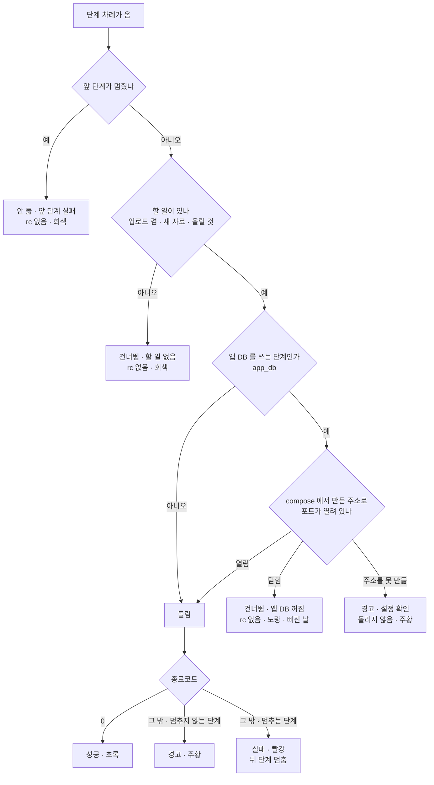
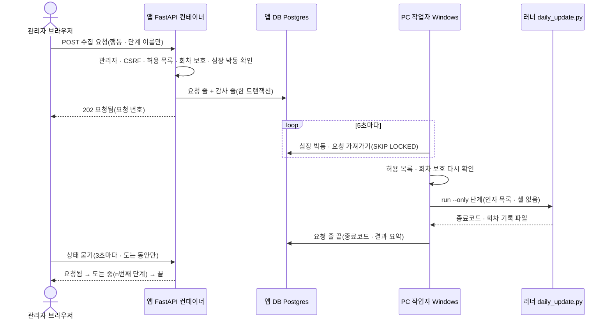
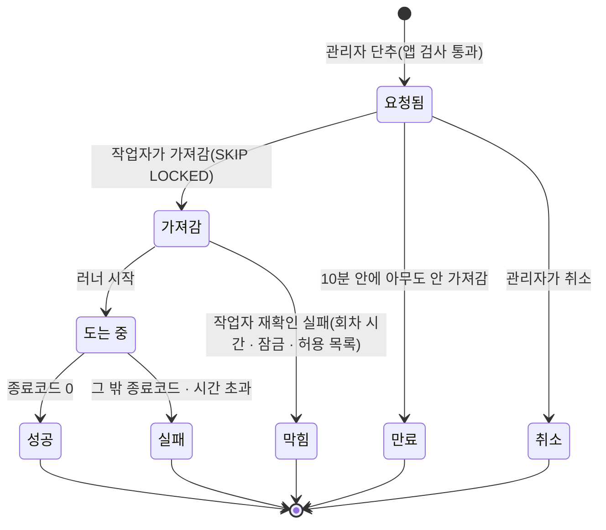

# 러너 단계 결과와 화면 실행 통로 — 「못 돈 단계」 기록과 「웹 단추 → PC 배치」 조사서 v0.1

| 문서 정보 | |
|---|---|
| **판 · 상태** | v0.1 · 결정 반영(2026-10-08 — 조사 1 은 안 B · 조사 2 는 안 1 · 화면 실행 통로 구현은 다음 차례에 서버부터) · 검토 전 |
| **구분** | 조사서 · 목표 기능 ① `P01-①-4`(매일 정기 배치)와 수집 일정 화면(관리자) |
| **작성** | 이동원(데이터 파트 · 조사 지시) · 사례 수집과 초안은 조사 에이전트(공식 문서 46쪽 · 원문을 연 것 45 · 검색 요약 1 · github.com 은 열지 않음) |
| **검토** | 검토 전. 4.2절 「팀원 코드와의 약속」 은 신호 배치 주담당(목표 기능 ②)과 리밸런싱 주담당(목표 기능 ③)이 읽어야 한다 |
| **최종 수정** | 2026-10-08 (KST) |
| **기준** | 코드 `main` `5f3c325` + 이 조사서와 같은 PR 의 러너 변경(신호 단계 · PC 쪽 앱 DB 주소 `host_app_db_env()` · 조사 1 안 B `app_db_gate()`) · 외부 원문 조회 2026-10-08 · 이 PC 실측은 신호 단계 실제 실행 셋(주소를 고치기 전 종료코드 3 · 고친 뒤 0 · 안 B 를 넣은 뒤 0) |
| **관련 문서** | [목표 기능 ① 설계서 v1.6](../설계/목표기능1-데이터지식-설계.md) 5.2.1 · 11절 · [이슈 #142 답글 사본](../github-archive/2026-10-08/이슈-142-러너-신호-단계-연결/01-2026-10-08-답글-이동원.md) · `scripts/daily_update.py` 머리말 · `app/services/data_status.py` · `public/js/collect.js` · `app/services/rebalance_daily.py`(팀원) · `scripts/signals_daily.py`(팀원) |
| **최근 개정** | 새 문서 |

> **이 문서로 알 수 있는 것** (이 문서가 답하는 질문)
> 1. 실무 배치 도구는 「실패」 · 「건너뜀」 · 「허용된 실패(경고)」 · 「나중에 다시」 를 어떻게 나누고, 회차 전체의 성공을 어떻게 세나?
> 2. 앱 DB 가 꺼져 신호 단계가 돌지 못한 날을 우리 러너는 어떻게 기록하고 화면에 보이며, 빠진 날은 어떻게 채우나? 리밸런싱 판정(팀원 코드)을 고치지 않고 지킬 수 있나?
> 3. 컨테이너 안 웹앱의 단추로 PC(호스트)의 배치를 안전하게 돌리는 통로는 무엇이 있고, 우리 구조에는 어느 것이 맞나?
> 4. 화면에서 언제든 돌리게 해도 12:30 정기 회차와 그날의 리밸런싱 점검이 깨지지 않으려면 무엇을 막아야 하나?
>
> **읽는 순서** — 이동원: 요약 → 2.5 · 3.5 · 4절 · 신호 · 리밸런싱 주담당: 요약 → 4.2절 · 처음 온 사람: 부록 A 용어 → 요약

## 요약

1. 실무 도구는 「돌다가 실패」 와 「돌 조건이 없어 돌지 않음」 을 다른 상태로 둔다. Airflow 는 `skipped` 와 `failed` · `upstream_failed` 를 나누고, DAG 회차는 끝 단계가 성공이나 건너뜀이면 성공이다. systemd 의 `ExecCondition=` 은 조건 명령이 1 ~ 254 로 끝나면 나머지를 건너뛰고 실패로 표시하지 않는다. 원래 결과와 해석한 결과를 따로 남기는 것도 흔하다(GitHub 의 `outcome` · `conclusion`).
2. **조사 1 은 안 B(러너가 전제 조건을 먼저 확인)를 추천한다.** 앱 DB 를 쓰는 단계(신호)는 러너가 돌리기 전에 compose 에서 만든 같은 주소(`127.0.0.1:15432`)로 포트를 확인한다. 닫혀 있으면 돌리지 않고 `rc=None` · `reason="app_db_down"` 으로 남기므로 회차 `ok` 계산식과 리밸런싱 판정이 그대로다. 포트가 열렸는데 종료코드 3 이 나면 경고다. 2026-10-08 첫 연결에서 앱 DB 가 떠 있는데도 주소 문제로 3 이 났다(<표 2> 9번). 종료코드 3 만 보고 「건너뜀」 으로 바꾸면 이런 설정 결함이 노랑 한 줄 뒤에 숨는다.
3. 화면은 건너뜀을 둘로 가른다. 할 일이 없어 건너뜀(새 자료 없음 · 업로드 끔)은 회색, 조건이 없어 못 돎(앱 DB 꺼짐)은 노랑과 「빠진 거래일 n · 채우기」 다. 빠진 날은 회차 기록이 아니라 데이터(`signal_snapshots` 가 덮은 거래일)로 세고, 채우기는 같은 날을 다시 써도 안전한 `signals_daily.py --from --to` 다.
4. **조사 2 는 안 1(앱 DB 의 요청 표 + PC 작업자가 가져가기)을 추천한다.** Airflow(API 서버는 코드를 실행하지 못한다) · Dagster(웹이 큐에 넣고 데몬이 꺼낸다) · GitHub · GitLab 러너(실행 쪽이 밖으로 묻는다)와 같은 꼴이다. PC 에 새 수신 포트가 없고 앱의 읽기 전용 마운트를 그대로 두며, 요청 줄과 감사 줄을 한 트랜잭션에 쓴다. 대안은 안 3(PC 의 localhost 에이전트 · 토큰)이다. 응답은 즉시지만 PC 에 수신 포트와 비밀값이 새로 생긴다.
5. 화면 실행에는 막음 여섯이 필요하다. 관리자만 · CSRF 방어(SameSite=Lax 위에 사용자 정의 머리글과 `Sec-Fetch-Site`) · 명령 문자열 대신 행동과 단계 이름만 받고 작업자가 허용 목록으로 다시 확인 · 한 번에 하나(DB 부분 고유 색인 + 러너 잠금) · 감사 기록 · 12:30 보호다. 12:30 보호에서 전체 수집은 11:00 ~ 13:30 을 막아야 한다. 12:30 전에 시작한 수동 회차가 정기 회차를 밀어내면 그날 마지막 회차의 시작이 12:30 앞이 되어, 리밸런싱 자동 점검이 하루 내내 「기다림」 에 머문다.

**<표 1> 한눈에** · 확실도: 확인 = 원문 · 코드를 직접 봄 · 추정 = 검색 요약 · 판단 · 미실측

| 질문 | 추천 | 대안 | 버린 것 | 확실도 |
|---|---|---|---|---|
| 조사 1 · 전제 조건이 없어 못 돈 단계 | 안 B 러너가 먼저 확인 → `rc=None` · `reason` · 노랑 · ok 식 그대로 | 안 A 단계가 「건너뜀 종료코드」 를 선언 | 안 D 화면이 해석 | 사례 확인 · 우리 적용은 추정(판단) |
| 조사 1 · 빠진 날 | 데이터(`signal_snapshots`)로 세고 `--from --to` 로 채움 | 회차 기록에서 건너뛴 날을 모음 | — | 추정(판단) |
| 조사 2 · 웹 단추 → PC 배치 | 안 1 요청 표 + PC 작업자(폴링 · `SKIP LOCKED`) | 안 3 localhost 에이전트(토큰) | 안 4 도커 소켓 · 안 6 PC 의 Celery | 사례 확인 · 우리 적용은 추정(판단) |
| 12:30 보호 | 한 단계는 지금의 `rerun_blocked` · 전체 수집은 11:00 ~ 13:30 막음 | 막지 않고 13:30 뒤로 미뤄 예약 | — | 한 단계 확인(코드) · 전체 수집 폭은 추정 |

---

## 1. 조사 방법과 우리 쪽 사실

### 1.1 조사 방법

외부 원문은 공식 문서 사이트만 한 건씩 열었다(부록 B). github.com 은 열지 않았다. 확실도는 글자로 적는다. 「확인」 은 원문 페이지를 열어 문장을 본 것이고, 「추정」 은 검색 요약 · 판단 · 이 PC 미실측이다. 웹 도구가 원문을 요약해 돌려주므로 「원문 문장 요지」 칸에는 그 안의 인용을 옮겼고, 인용 없이 요약만 받은 곳은 「확인(요지)」 로 적었다. 우리 코드는 읽기만 했다. 수집 DB · `.env` 는 열지 않았고 러너 · 시험 · 도커는 돌리지 않았다.

### 1.2 우리 쪽 사실

조사의 출발점인 지금 상태는 <표 2> 와 같다.

**<표 2> 지금 상태 — 러너 · 화면 · 팀원 코드**

| # | 무엇 | 지금 | 근거 위치 | 확실도 |
|:-:|---|---|---|---|
| 1 | 정기 회차 | Windows 작업 스케줄러가 매일 12:30 `daily_update.py run --upload` 를 돌린다. 로그온해 있을 때만(InteractiveToken) · 이전 실행이 돌면 새 실행을 만들지 않음(IgnoreNew) · 꺼져 있었으면 켜진 뒤 곧바로(StartWhenAvailable) · 4시간 한도 | `task_xml()` | 확인(코드) |
| 2 | 단계 기록 | 단계마다 `rc`(None = 돌지 않음) · `note` · `fatal` · 초. `rc=None` 은 네 경우다: 업로드 끔 · 앞 단계 실패 · 새 자료 없음(파생) · 올릴 파케이 0 | `run_all()` | 확인(코드) |
| 3 | 회차 ok | `not stopped and all(rc in (None, 0))`. 멈추지 않는 단계의 실패(경고)도 ok 를 거짓으로 만든다 | `run_all()` · `run_one()` | 확인(코드) |
| 4 | 앱의 해석 | `rc` None → 건너뜀 · 0 → 성공 · 그 밖은 `fatal` 이면 실패, 아니면 경고 | `data_status._step_view()` | 확인(코드) |
| 5 | 화면 색 | 결과 글자는 건너뜀과 경고가 같은 주황(`cl-st--pending`)이고 막대만 회색 · 주황으로 다르다 | `collect.js` `stepsTable()` · `collect.css` | 확인(코드) |
| 6 | 리밸런싱 판정(팀원) | 잠금 파일 없음 · 오늘 12:30 뒤에 시작한 회차 · `ok is True` · `stopped` 없음 · `price` · `calendar` 의 `rc == 0` · 시세 기준일 = 전 거래일일 때만 준비된다. 신호는 읽지 않는다 | `rebalance_daily.readiness()` | 확인(코드) |
| 7 | 신호 배치(팀원) | 종료코드 0 성공 · 1 모든 종목 실패 · 2 거래일 없음 · 3 앱 DB 연결 못 함. 401종목 계산(약 20초)을 마친 **뒤** 연결한다. 같은 날 · 같은 정의 판은 값만 바뀐다(멱등) | `signals_daily.py` | 확인(코드) |
| 8 | 종료코드 겹침 | `argparse` 사용법 오류는 2 로 끝나고(원문), 잡히지 않은 예외는 1 이다(파이썬 기본). 신호 배치가 정한 1 · 2 와 뜻이 겹친다 | [PY1] | 2 확인 · 1 추정 |
| 9 | 신호 단계 연결(이 조사와 같은 PR) | `Step("signals", …, fatal=False, app_db=True)` 를 `ohlcv` 뒤에 둔다. `host_app_db_env()` 가 compose 에서 PC 쪽 주소(`127.0.0.1:15432`)를 만들어 그 단계에만 넘긴다. 까닭은 앱 설정이 `ENV_FILE` 이 없으면 `.env.dev` 를 읽어, 2026-10-08 앱 DB 가 떠 있는데도 `ConnectionRefusedError` 로 끝났기 때문이다. 처음 판은 주소를 못 만들면 「앱 설정의 기본 주소로 돈다」 였고(다른 DB 에 말없이 쓸 수 있었다), 이 조사 뒤 안 B 를 넣으며 「돌리지 않고 경고(종료코드 78)」 로 바꿨다 | `scripts/daily_update.py` `prepare_app_db()` · `app_db_gate()` | 확인(코드 · 실행) |
| 10 | 앱 컨테이너 | `./data` 를 `/app/data/csv:ro` 로 붙인다 · root 로 돈다(Dockerfile 에 `USER` 없음) · `/var/run/docker.sock` 을 붙인다(강사님 기초 코드의 LEAN 백테스트) · 이미지에 `scripts/` · `collector/` 가 없다 | `docker-compose.yml` · `Dockerfile` | 확인(코드) |
| 11 | 열린 포트 | 기본 compose 는 앱 8966 · Postgres 15432 · Redis 16379 를 주소 없이 연다(모든 주소). DB 계정은 compose 파일에 있다. `127.0.0.1` 로 묶는 것은 `compose.qurious.yml` 뿐이다(앱만 · Postgres 는 포트 없음) | compose 두 파일 · [DK2] | 확인(코드 · 원문) |
| 12 | 세션 · CSRF | 쿠키 HttpOnly · SameSite=Lax · Secure=False · CSRF 토큰 없음 · CORS 설정 없음 · 화면의 `api()` 는 JSON 본문과 `credentials: "include"` | `app/lib/session.py` · `app/config.py` · `public/js/common.js` | 확인(코드) |
| 13 | 감사 기록 | 표 `audit_events`(user_id · event_type · payload) · 도우미 `audit()` 는 실패를 삼킨다(`except Exception: pass`) | `app/models/misc.py` · `app/services/audit.py` | 확인(코드) |
| 14 | 한 단계 다시 | `run --only <단계>` · 「회차 − 그 단계 시간 한도 ~ 회차 + 60분」 금지(`rerun_blocked`) · 잠금 · 회차 기록의 그 줄만 바꾸고 ok 를 다시 센다 | `run_one()` | 확인(코드) |
| 15 | 화면 결정 | 2026-10-08 결정 ①: 화면은 PC 쪽 일을 하지 않고 돌릴 명령을 보여 복사하게 한다(`RERUN.from_screen=False`). 같은 날 사용자가 「사이트 안 단추로 언제든 수집(한 단계 다시 · 전체 수집)」 을 요구했다. 다시 정할 거리다 | `collect.js` 머리말 · `data_status.RERUN` | 확인(코드) |

이 표에서 두 가지가 조사의 방향을 정한다. 하나는 신호 배치의 종료코드 3 이 「앱 DB 가 꺼짐」 이 아니라 「앱 DB 에 닿지 못함」 이라는 점이다(9번 · 떠 있는데도 3). 다른 하나는 앱과 PC 가 함께 쓸 수 있는 곳이 지금 Postgres 하나뿐이라는 점이다(10 · 11번).

---

## 2. 조사 1 — 단계 결과를 실무 도구는 어떻게 나누나

### 2.1 사례

도구 열 곳이 단계(작업) 결과를 어떻게 나누는지는 <표 3> 과 같다.

**<표 3> 단계 결과 사례 — 도구 열 곳 · 열여섯 줄**

| 도구 | 무엇 | 원문 문장 요지 | 출처 | 조회일 | 확실도 |
|---|---|---|---|---|---|
| Airflow 3.3.2 | 작업 인스턴스 상태 14개 | `skipped` "skipped due to branching, LatestOnly, or similar" · `upstream_failed` "An upstream task failed and the Trigger Rule says we needed it" · `up_for_retry` "failed, but has retry attempts left and will be rescheduled" · "`AirflowSkipException` will mark the current task as skipped" | [A1](https://airflow.apache.org/docs/apache-airflow/stable/core-concepts/tasks.html) | 10-08 | 확인 |
| Airflow BashOperator | 종료코드 → 건너뜀 | "a non-zero exit code produces an AirflowException and thus a task failure" · 99 로 끝나면 `skipped` · `skip_on_exit_code` 로 다른 코드를 정한다(standard 공급자 1.20.0) | [A2](https://airflow.apache.org/docs/apache-airflow-providers-standard/stable/operators/bash.html) | 10-08 | 확인 |
| Airflow 센서 | 기다리다 못 만나면 | 센서는 "wait for something to occur" · `soft_fail=True` 면 시간 초과 때 "SKIPPED instead of FAILED" | [A3](https://airflow.apache.org/docs/apache-airflow/stable/core-concepts/sensors.html) | 10-08 | 확인 |
| Airflow DAG 회차 | 회차 전체 판정 | "success if all of the leaf nodes states are either success or skipped, failed if any of the leaf nodes state is either failed or upstream_failed" | [A4](https://airflow.apache.org/docs/apache-airflow/stable/core-concepts/dag-run.html) | 10-08 | 확인 |
| Airflow 모범 사례 | 다시 돌려도 되는 작업 | "treat tasks in Airflow equivalent to transactions in a database" · "the tasks should produce the same outcome on every re-run" · `now()` 대신 데이터 구간 | [A5](https://airflow.apache.org/docs/apache-airflow/stable/best-practices.html) | 10-08 | 확인 |
| Airflow 백필 | 빠진 날 채우기 | "Backfill is when you create runs for past dates" · 다시 처리 방식 none(있으면 안 만듦) · failed(실패한 날만) · completed(성공 · 실패 모두) · 백필에도 `max_active_runs` | [A6](https://airflow.apache.org/docs/apache-airflow/stable/core-concepts/backfill.html) | 10-08 | 확인 |
| GitLab CI | 허용된 실패 | `allow_failure: true` 작업이 실패하면 주황 경고가 보이지만 "the pipeline is successful" · `allow_failure:exit_codes` 는 적은 종료코드에서만 허용 | [G1](https://docs.gitlab.com/ci/yaml/#allow_failure) | 10-08 | 확인 |
| GitHub Actions | 해석 전 · 후 결과 | `continue-on-error` 단계가 실패하면 "the outcome is failure, but the final conclusion is success" | [H1](https://docs.github.com/en/actions/reference/workflows-and-actions/contexts) | 10-08 | 확인 |
| GitHub 체크 | 결과 값과 통과 기준 | conclusion 여덟(action_required · cancelled · failure · neutral · success · skipped · stale · timed_out) · 필수 체크는 "successful, skipped, or neutral" 이면 통과 | [H2](https://docs.github.com/en/rest/checks/runs) · [H3](https://docs.github.com/en/repositories/configuring-branches-and-merges-in-your-repository/managing-protected-branches/about-protected-branches) | 10-08 | 확인 |
| Jenkins | 불안정(UNSTABLE) | `unstable` · `warnError`(예외가 나면 빌드 · 단계 결과를 UNSTABLE 로) · `catchError` 의 빌드 결과는 "can only get worse" | [J1](https://www.jenkins.io/doc/pipeline/steps/workflow-basic-steps/) | 10-08 | 확인 |
| Kubernetes Job | 종료코드별 정책 | `podFailurePolicy` 의 행동 FailJob · FailIndex · Ignore · Count, 조건 `onExitCodes`(In · NotIn). Ignore 는 재시도 한도(`backoffLimit`)에 세지 않고 파드를 다시 만든다. 목적은 재시도할 오류와 소프트웨어 결함을 가르는 것 | [K1](https://kubernetes.io/docs/concepts/workloads/controllers/job/) | 10-08 | 확인(요지) |
| sysexits.h | 종료코드의 뜻 | EX_TEMPFAIL(75) "Temporary failure, indicating something that is not really an error … the request should be reattempted later" · EX_UNAVAILABLE(69) 서비스 없음 · EX_CONFIG(78) 설정이 틀림 · "The choice of an appropriate exit value is often ambiguous." | [S1](https://man7.org/linux/man-pages/man3/sysexits.h.3head.html) | 10-08 | 확인 |
| GNU Automake 시험 | 건너뜀 코드 | "an exit status of 0 … success, an exit status of 77 a skipped test, an exit status of 99 a hard error, and any other exit status will denote a failure" | [S2](https://www.gnu.org/software/automake/manual/html_node/Scripts_002dbased-Testsuites.html) | 10-08 | 확인 |
| systemd | 조건 검사 · 성공으로 칠 코드 | `ExecCondition=` 이 "1 through 254 (inclusive)" 로 끝나면 "the remaining commands are skipped and the unit is not marked as failed" · 255 나 비정상 종료는 실패 · `SuccessExitStatus=` · `RestartPreventExitStatus=` | [S3](https://man7.org/linux/man-pages/man5/systemd.service.5.html) | 10-08 | 확인 |
| Prefect 3 | 코드 실패와 인프라 장애 | Failed "because of a code issue" · Crashed "because of an infrastructure issue" · Pending "waiting on necessary preconditions to be satisfied" · AwaitingRetry · Late. Skipped 상태는 없다 | [P1](https://docs.prefect.io/v3/concepts/states) | 10-08 | 확인 |
| Dagster | 건너뜀의 까닭 | `SkipReason` "Represents a skipped evaluation, where no runs are requested. May contain a message …" · `skip_message` 는 화면에 보인다 | [D2](https://dagster.io/docs/api/dagster/schedules-sensors) | 10-08 | 확인 |

### 2.2 사례에서 읽은 것

- **상태는 최소 넷이고, 둘을 더 두는 도구가 많다.** 성공 · 건너뜀(돌 이유나 조건이 없음) · 허용된 실패(경고) · 실패가 기본이다. 「앞 단계 때문에 못 돎」(Airflow `upstream_failed`)과 「나중에 다시」(`up_for_retry` · Prefect AwaitingRetry · Kubernetes Ignore)를 따로 두는 도구가 많다.
- 건너뜀은 회차 성공을 깨지 않는다(Airflow 끝 단계 규칙 · GitHub 필수 체크). 허용된 실패는 도구마다 다르다. GitLab · GitHub 는 회차를 통과시키고, Jenkins 는 UNSTABLE(성공보다 나쁨)로 남긴다. 우리 러너는 Jenkins 쪽이다(경고면 ok 거짓).
- 「무엇이 건너뜀인가」 를 정하는 곳은 그 작업의 정의다(Airflow `skip_on_exit_code` · GitLab `exit_codes` · Kubernetes `onExitCodes` · systemd 단위 파일). 화면이나 결과를 읽는 쪽이 해석하지 않는다.
- 원래 결과와 해석한 결과를 함께 남긴다(GitHub `outcome` · `conclusion`). 건너뜀에는 까닭 글을 붙여 화면에 보인다(Dagster `skip_message`).
- 일시적인 의존성 장애는 「실패」 가 아니라 「나중에 다시」 로 다룬다(EX_TEMPFAIL · Prefect 의 Crashed 와 Failed 구분 · Kubernetes Ignore). 그러나 종료코드 하나로 「일시적」 과 「설정 결함」 을 가르기는 어렵다. sysexits 가 75(일시적)와 78(설정)을 따로 두고 「고르기가 자주 애매하다」 고 적은 까닭이다.
- 조건 확인을 실행 앞에 두는 꼴이 있다(systemd `ExecCondition=` · Airflow 센서 · Prefect Pending). 조건이 없으면 돌리지 않고, 실패로 세지 않는다.
- 빠진 날 채우기는 작업이 멱등일 때만 안전하다(Airflow 모범 사례). 백필은 「실패한 날만 다시」 를 고를 수 있다.

### 2.3 우리에게 주는 뜻

- 신호 단계의 종료코드 3 은 「앱 DB 에 닿지 못함」 이다. 2026-10-08 첫 연결에서 앱 DB 가 떠 있는데도 주소 문제로 3 이 났다(<표 2> 9번). 3 을 곧장 「건너뜀」 으로 바꾸면 이런 설정 결함이 노랑 한 줄 뒤로 숨는다. 「말없는 대체 금지」 에 걸린다.
- 우리 러너에는 이미 「단계 정의가 의존성을 선언」 하는 칸이 생겼다(`app_db=True`, 작업 중). systemd `ExecCondition=` · Airflow 센서처럼 러너가 먼저 조건을 확인하면, 종료코드의 뜻을 넓히지 않고도 「조건 없음」 과 「돌다가 실패」 를 가를 수 있다.
- 회차 `ok` 는 팀원의 리밸런싱 판정이 읽는 계약이다. 계산식을 그대로 두는 안이 가장 안전하다. `rc=None`(돌지 않음)은 지금도 ok 를 깨지 않는다.
- 화면의 「건너뜀」 은 지금 경고와 같은 주황 글자다. 할 일이 없어 건너뛴 줄(매일 여러 줄)과 조건이 없어 못 돈 줄이 같은 색이면, 노랑이 「매일 보이는 색」 이 되어 진짜 주의가 묻힌다.
- 신호 단계는 회차 뒤쪽(일봉 다음)에 있다. PC 를 켜자마자 도는 회차(StartWhenAvailable)여도 그 사이 Docker 가 뜰 시간이 있으므로, 단계 안에서 몇 분 기다렸다 다시 확인하는 장치는 두지 않아도 된다(추정).

### 2.4 안 비교

안 넷의 모양은 <표 4>, 평가는 <표 5> 와 같다.

**<표 4> 조사 1 안의 모양**

| 안 | 기록 칸 | 회차 ok | 화면 | 다시 시도 | 빠진 날 채우기 |
|---|---|---|---|---|---|
| A 종료코드로 건너뜀 선언 | 단계 정의에 `skip_codes={3: "앱 DB 꺼짐"}` · 단계 줄에 원래 `rc=3` 과 `result="skipped"` · `reason` | 식을 `result` 로 바꾼다(성공 · 건너뜀이면 참) | 노랑 「건너뜀 · 앱 DB 꺼짐」 | `run --only signals` | `signals_daily.py --from --to` |
| **B 러너가 먼저 확인(추천)** | 단계 정의의 `app_db=True` 로 의존성을 안다. 돌리기 전 `127.0.0.1:15432` 연결을 확인하고, 닫혀 있으면 `rc=None` · `reason="app_db_down"` · `followup="fill"` · `date` | 식 그대로(`rc=None` 은 지금도 참) | 할 일 없는 건너뜀은 회색 · `followup` 이 있는 건너뜀은 노랑과 빠진 날 · 회차 머리 「일부 건너뜀」 | 같음 | 같음 · 빠진 날은 데이터로 센다 |
| C 지금대로 | `rc=3` · 경고 | 거짓. 리밸런싱이 「갱신 실패」 로 기다린다 | 주황 「경고」 | 같음(성공하면 ok 를 다시 셈) | 같음 |
| D 화면이 해석(버림) | 그대로 `rc=3` | 기록은 거짓 그대로 | 앱이 (signals, 3) 을 건너뜀으로 바꿔 보인다 | 같음 | 같음 |

**<표 5> 조사 1 안의 평가** · 원칙 두 칸: 말없는 대체 금지 · 한 곳에서 정의(SSoT)

| 안 | 장점 | 단점 | 말없는 대체 금지 | 한 곳에서 정의 | 리밸런싱 판정(팀원) |
|---|---|---|---|---|---|
| A | 도구들의 흔한 꼴(Airflow `skip_on_exit_code` · GitLab `exit_codes` · systemd) · 원래 `rc` 를 남긴다 | 3 이 「꺼짐」 과 「주소 · 계정 틀림」 을 못 가른다 · 계산 20초 뒤에야 안다 · ok 식 · 앱 해석 · 이력 줄을 함께 바꾼다 | 약함. 오늘 같은 설정 결함이 건너뜀으로 보인다 | 좋음(단계 정의) | 지킨다(ok 참) |
| **B** | 「조건 없음」 과 「돌다 실패」 가 갈린다 · 설정 결함은 경고로 남는다 · ok 식과 신호 배치가 그대로 · 계산 낭비 없음 | 포트가 열림 ≠ DB 준비(시작 중 · 계정 틀림), 이때는 경고로 떨어진다 · 확인과 실행 사이의 변화 · 러너 코드가 조금 는다 | 좋음. 까닭 · 주소 · 빠진 날이 붙고 애매하면 경고다 | 좋음(의존성은 단계 정의 · 주소는 compose · 판정은 러너가 기록에 씀) | 지킨다(식 그대로) |
| C | 코드 0 · 가장 보수적 | 앱 DB 가 꺼진 날마다 리밸런싱 자동 점검이 신호와 상관없이 멈춘다 · 팀원에게 한 약속(이슈 #142 답글)과 다르다 · 매일 경고라 경고 피로 | 좋음 | 좋음 | 지키지만 막힘이 는다 |
| D | 러너를 안 고친다 | 리밸런싱은 여전히 멈춘다 · 규칙 사본이 앱에 생긴다 | 보통 | 나쁨. 결정 ④ 「앱에 사본을 두지 않는다」 와 어긋난다 | 막힘 그대로 |

안 B 에서 러너가 단계 하나의 결과를 가르는 차례는 <그림 1> 과 같다.

**<그림 1> 안 B 의 단계 결과 가르기** · 범례: 마름모 = 러너가 묻는 것 · 상자 끝 글자 = 화면 색



노랑은 「조건이 없어 못 돌았고 채울 날이 있다」 한 가지 뜻으로만 쓴다. 할 일이 없어 건너뛴 줄은 회색이라 매일 보여도 주의를 빼앗지 않는다.

### 2.5 추천 — 안 B

까닭은 다섯이다.

1. 종료코드 하나로는 「꺼짐」 과 「잘못 설정됨」 을 가를 수 없다. sysexits 가 75 와 78 을 따로 둔 것이 그 까닭이고, 2026-10-08 실측(떠 있는데 3)이 우리 예다. 러너가 이미 가진 정보(compose 에서 만든 주소)로 먼저 확인하면 둘이 갈린다.
2. 회차 `ok` 계산식을 바꾸지 않는다. `rc=None` 은 지금도 ok 를 깨지 않으므로, 앱 DB 가 꺼진 날에도 `price` · `calendar` 가 성공이면 리밸런싱 판정이 준비된다. 판정은 신호를 읽지 않는다(<표 2> 6번).
3. 규칙이 한 곳에 있다. 의존성은 단계 정의(`app_db=True`)에, 주소는 compose(`host_app_db_env()`)에 있고, 판정은 러너가 기록에 쓴다(`reason` · `followup`). 앱은 읽기만 한다. 결정 ④ 와 같은 방향이다.
4. 말없는 대체가 없다. 건너뜀에 까닭 · 주소 · 빠진 날이 붙고, 주소를 못 만들거나 포트가 열렸는데 실패하면 경고로 남는다.
5. 신호 배치(팀원 코드)를 고치지 않고, 계산 20초도 버리지 않는다.

안 B 를 칸 하나하나로 적으면 <표 6> 과 같다.

**<표 6> 안 B 의 칸 · 바뀌는 곳**

| 칸 | 안 B 에서 | 바뀌는 곳 |
|---|---|---|
| 단계 줄(회차 기록) | `{"name": "signals", "rc": null, "reason": "app_db_down", "followup": "fill", "date": "2026-10-08", "note": "앱 DB 꺼짐 · 127.0.0.1:15432 연결 거부 · 건너뜀"}`. `date` 는 그 회차가 계산했을 거래일(그때 시세 마지막 날)이다. 할 일 없는 건너뜀에도 `reason` 을 적는다(`upload_off` · `upstream_failed` · `no_new_data` · `nothing_to_upload`) | `daily_update.py` `run_all()` · `run_one()` · `_rec()` |
| 이력 줄(JSONL) | `_compact()` 가 `reason` · `followup` 을 함께 남긴다(지난 회차도 같은 색) | `_compact()` |
| 확인 함수 | `app_db=True` 단계 앞에서 `host_app_db_env()` 의 주소로 TCP 연결(3초)을 시도한다. 닫힘 → 건너뜀 · 열림 → 돌림 | 새 `check_app_db()` · `prepare_app_db()` |
| 주소를 못 만들 때 | 작업 중 코드는 「앱 설정의 기본 주소로 돈다」. 그 주소는 `.env.dev` 의 값이거나, 없으면 `lumina@localhost:5432`(강사님 기초 코드의 기본값)다. 다른 DB 에 말없이 쓸 수 있다(추정). 돌리지 않고 경고로 남길 것을 권한다. 러너가 시간 초과에 124 를 쓰듯 러너가 정한 코드(예: 78 = EX_CONFIG)를 적으면 앱의 해석을 바꾸지 않아도 경고로 보인다 | `prepare_app_db()` · `run_all()` |
| 회차 ok | 식 그대로 | 없음 |
| 앱의 해석 | `_step_view()` 가 `reason` · `followup` 을 그대로 넘긴다(상태 낱말은 그대로 `skipped`). `runner_state()` 에 「일부 건너뜀」(노랑)을 더한다. 실패 · 경고가 없고 `followup` 건너뜀이 있을 때이며, 전체 판정은 「확인 필요」 다. 점검 스크립트(`check.ps1`)도 이 판정을 경고로 읽는다 | `data_status.py` |
| 화면 | 할 일 없는 건너뜀은 회색 글자 · `followup` 건너뜀은 노랑 「건너뜀 · 앱 DB 꺼짐」 과 「빠진 거래일 n · 채우기」 · 「앞 단계 실패로 안 돎」 은 회색 글자에 까닭 | `collect.js` `STEP_RESULT` · `stepsTable()` · `collect.css` |
| 다시 시도 | `run --only signals` 는 지금 있다. 조사 2 의 통로가 생기면 화면 단추가 된다 | (조사 2) |
| 빠진 날 | 수집 DB 의 거래일(`mtf_signals.trading_days()`, 앱 컨테이너에서 읽기 전용) 가운데 `signal_snapshots` 에 지금 정의 판 줄이 없는 날을 최근 30거래일에서 센다. 기록이 아니라 데이터로 세므로, 누가 손으로 채운 날을 다시 「빠짐」 으로 보이지 않는다 | 새 API 하나(앱 DB 를 읽음) |
| 채우기 | `python scripts/signals_daily.py --from A --to B`. 같은 날은 값만 바뀐다(배치 머리말). 명령 글은 단계 정의 한 곳에 두고 단계 목록 파일로 앱에 넘긴다(작업 트리에 이미 `fill` 칸이 생기는 중 · `runner_detail()`). 회차 기록의 `followup="fill"` 은 그 칸을 가리키기만 한다. 화면에서는 조사 2 의 행동 `fill_signals`(날짜 둘만 받음) | `daily_update.py` `Step` · (조사 2) |
| 시험 | TC-DU: 포트 닫힘 → 돌리지 않음 · `rc=None` · `reason` · ok 참 / 포트 열림 + 3 → 경고 · ok 거짓 / 주소 없음 → 경고. TC-DST: 「일부 건너뜀」 · 색. 리밸런싱 시험(`tests/test_rebalance_daily.py`)에 「신호 건너뜀 회차 → 준비됨」 한 줄 | `tests/` |

작업량은 3 ~ 4시간으로 어림한다(추정). 신호 단계를 붙이는 러너 묶음과 같은 PR 에 넣으면 시험을 한 번에 돌릴 수 있다.

나중에 다시(자동 채우기)는 두 번째 단계로 둔다. 조사 2 의 PC 작업자가 앱 DB 에 다시 닿은 첫 순간에 빠진 날 채우기 요청을 스스로 넣는 꼴이다(Kubernetes Ignore · Airflow `up_for_retry` 와 같은 「나중에 다시」). 사람이 누르지 않아도 되지만 요청 표를 거치므로 「누가(작업자) · 언제」 가 남는다. 기본은 끄고 사용자가 정한다.

### 2.6 조사 1 을 뒤집을 조건

- 리밸런싱 판정이 신호(T2)를 읽게 되면 신호 건너뜀이 ok 를 깨지 않는 것이 위험해진다. 그때는 판정이 신호 줄을 따로 보게 리밸런싱 주담당과 정한다.
- 신호 배치가 「앱 DB 에 닿지 못함」 전용 코드(예: 75)를 따로 두고 계산 전에 연결을 먼저 확인하면, 안 A 와 섞어 쓸 수 있다. 러너 확인과 종료코드가 둘 다 맞을 때만 건너뜀으로 한다.
- 앱 DB 를 쓰는 단계가 셋 넘게 늘면 단계마다 확인하지 말고 회차 처음에 한 번 확인해 기록한다.
- 앱 DB 가 늘 켜져 있는 운영(서버 배포)이 되면 건너뜀이 드물어져 안 C 로도 충분하다.

---

## 3. 조사 2 — 웹 단추로 PC 쪽 배치를 돌리는 통로

### 3.1 사례

「수동 실행」 단추와 「밖의 기계에서 실행」 을 실무 도구가 어떻게 잇는지, 그리고 그 길의 보안 권고는 <표 7> 과 같다.

**<표 7> 수동 실행 통로 · 보안 사례 — 스물두 줄**

| 도구 | 무엇 | 원문 문장 요지 | 출처 | 조회일 | 확실도 |
|---|---|---|---|---|---|
| Airflow 구성 | 웹(API)과 실행의 분리 | API 서버는 "serves the REST API and presents a user interface to inspect, trigger and debug" · "The API server cannot execute any code submitted by the Dag author" · 메타데이터 DB 가 상태를 저장 · 스케줄러가 회차를 띄우고 작업을 실행기에 넘긴다 | [A7](https://airflow.apache.org/docs/apache-airflow/stable/core-concepts/overview.html) | 10-08 | 확인(「DB 에 회차 → 스케줄러가 집음」 흐름은 구성 설명에서 읽은 것이라 추정) |
| Airflow 수동 실행 | 입력 검증 | 실행 때 Params 를 고칠 수 있다 · 검증을 못 넘으면 "Airflow shows a warning instead of creating the Dag run" · JSON schema `enum` 은 고르기 목록이 된다 · 외부에서 만든 회차는 실행 시각에 묶이고 설정을 JSON 으로 넘긴다 | [A8](https://airflow.apache.org/docs/apache-airflow/stable/core-concepts/params.html) · [A4](https://airflow.apache.org/docs/apache-airflow/stable/core-concepts/dag-run.html) | 10-08 | 확인 |
| Airflow 동시 회차 | 한 번에 몇 개 | DAG 마다 `max_active_runs`(기본은 `[core] max_active_runs_per_dag` 16) · 한도에 닿으면 새 회차를 만들지 않는다 | [A9](https://airflow.apache.org/docs/apache-airflow/stable/configurations-ref.html) | 10-08 | 추정(검색 요약) |
| Airflow 상태 확인 | 실행 쪽이 살아 있나 | `/api/v2/monitor/health` 의 `latest_scheduler_heartbeat` · "If the last heartbeat was received more than 30 seconds (default value) earlier than the current time, the scheduler is considered unhealthy" | [A10](https://airflow.apache.org/docs/apache-airflow/stable/administration-and-deployment/logging-monitoring/check-health.html) | 10-08 | 확인 |
| Dagster | 큐에 넣고 데몬이 꺼냄 | DefaultRunCoordinator 는 "calls launch_run … immediately in the same process" · QueuedRunCoordinator 는 "sends runs to the Dagster daemon via a run queue. The daemon pulls runs from the queue and calls launch_run" · 동시 실행 한도 · 우선순위 | [D1](https://dagster.io/docs/deployment/execution/run-coordinators) | 10-08 | 확인 |
| GitHub Actions | 수동 실행 입력 · 동시성 | `workflow_dispatch` 입력은 boolean · choice · number · environment · string 가운데 하나 · choice 는 "options list" 필수 · `concurrency` 는 같은 묶음을 하나만 돌리고 뒤 것은 pending | [H4](https://docs.github.com/en/actions/reference/workflows-and-actions/workflow-syntax) | 10-08 | 확인 |
| GitHub 자체 호스팅 러너 | 실행 쪽이 밖으로 묻는다 | 러너가 GitHub 에 연결해 작업을 받는다 · 호스트는 443 으로 밖에 나갈 수만 있으면 된다 · 상태 Idle · Active · Offline("the machine is offline, the self-hosted runner application is not running … or … cannot communicate") | [H5](https://docs.github.com/en/actions/reference/runners/self-hosted-runners) · [H6](https://docs.github.com/en/actions/hosting-your-own-runners/managing-self-hosted-runners/monitoring-and-troubleshooting-self-hosted-runners) | 10-08 | 확인 |
| GitLab Runner | 폴링 간격 · 동시 한도 | `check_interval` "between the runner checking for new jobs. The default value is 3" · `concurrent` 가 동시 작업을 제한 | [G2](https://docs.gitlab.com/runner/configuration/advanced-configuration/) | 10-08 | 확인 |
| Jenkins CSRF | 빌드 시작도 CSRF 대상 | "Any form submissions or similar action resulting in modifications, like triggering builds or changing configuration, requires that the crumb be provided" · POST 는 crumb 가 필요 | [J2](https://www.jenkins.io/doc/book/security/csrf-protection/) | 10-08 | 확인 |
| Jenkins 컨트롤러 격리 | 웹 프로세스에서 일하지 않기 | "Any builds running on the built-in node have the same level of access to the controller file system as the Jenkins process" → 빌드는 에이전트에서 | [J3](https://www.jenkins.io/doc/book/security/controller-isolation/) | 10-08 | 확인 |
| Rundeck | 옵션 값으로 명령 주입 | 옵션 값의 따옴표 결정을 변수 치환 뒤에 해 셸 제어 문자가 빠져나갔다(3.4.1 ~ 5.19.0 · 5.20.0 에서 고침) · 권고 "Use structured job option inputs (dropdown lists, checkboxes) instead of free-form text" · 정규식 검증 | [R1](https://docs.rundeck.com/docs/history/cves/2025-07-option-escaping.html) | 10-08 | 확인 |
| PostgreSQL 잠금 | 큐처럼 가져가기 | `SKIP LOCKED` 는 잠글 수 없는 줄을 건너뛴다 · "can be used to avoid lock contention with multiple consumers accessing a queue-like table" · 일반 조회에는 맞지 않는다(18.6 문서) | [PG1](https://www.postgresql.org/docs/current/sql-select.html) | 10-08 | 확인 |
| PostgreSQL 알림 · 색인 | 깨우기 · 하나만 | `NOTIFY` 는 트랜잭션이 커밋돼야 전달된다 · 부분 고유 색인은 조건을 만족하는 줄 사이에서만 고유를 강제한다 | [PG2](https://www.postgresql.org/docs/current/sql-notify.html) · [PG3](https://www.postgresql.org/docs/current/indexes-partial.html) | 10-08 | 확인 |
| 트랜잭셔널 아웃박스 | 요청과 기록을 함께 | 메시지를 "as part of the transaction that updates the business entities" 로 DB 에 먼저 저장하고, "A separate process then sends the messages" | [M1](https://microservices.io/patterns/data/transactional-outbox.html) | 10-08 | 확인 |
| OWASP 명령 주입 | 명령에 입력 넣기 | 1순위는 OS 명령을 직접 부르지 않기 · 불가피하면 매개변수화(데이터와 명령 분리)와 허용 목록 검증(명령은 허용 목록 · 인자는 허용 목록 · 정규식 · 길이) | [O1](https://cheatsheetseries.owasp.org/cheatsheets/OS_Command_Injection_Defense_Cheat_Sheet.html) | 10-08 | 확인 |
| OWASP CSRF | 상태를 바꾸는 요청 | 상태를 바꾸는 모든 요청에 토큰 · 사용자 정의 머리글은 동일 출처 정책과 사전 요청에 걸린다 · "`SameSite` is useful as a defense-in-depth control but it does not replace a proper CSRF defense" · `Sec-Fetch-Site: cross-site` 면 POST 등을 거절 · GET 으로 상태를 바꾸지 않기 | [O2](https://cheatsheetseries.owasp.org/cheatsheets/Cross-Site_Request_Forgery_Prevention_Cheat_Sheet.html) | 10-08 | 확인 |
| OWASP Docker | 도커 소켓 | 규칙 1 "Do not expose the Docker daemon socket (even to the containers)" · 소켓 접근은 "equivalent to giving unrestricted root access to your host" · 읽기 전용으로 붙여도 API 는 읽기 전용이 아니다 | [O3](https://cheatsheetseries.owasp.org/cheatsheets/Docker_Security_Cheat_Sheet.html) | 10-08 | 확인 |
| OWASP 로깅 | 무엇을 남기나 | "Use of systems administrative privileges or access by application administrators including all actions by those users" · 언제 · 어디서 · 누가 · 무엇을 | [O4](https://cheatsheetseries.owasp.org/cheatsheets/Logging_Cheat_Sheet.html) | 10-08 | 확인 |
| MCP 명세(로컬 HTTP 서버) | localhost 서비스의 보안 | Origin 머리글 검증(DNS 리바인딩 막기) · 로컬이면 127.0.0.1 에만 묶기 · 모든 연결에 인증 · 없으면 "attackers could use DNS rebinding to interact with local … servers from remote websites" | [MC1](https://modelcontextprotocol.io/specification/2025-06-18/basic/transports) | 10-08 | 확인 |
| Docker Desktop · 포트 | 컨테이너 → PC · 포트 공개 | `host.docker.internal` 은 호스트의 내부 IP 로 풀린다(예: 호스트의 `python -m http.server` 를 컨테이너에서 curl) · 127.0.0.1 에만 묶은 PC 서비스에 닿는지는 문서에 없다 · 주소 없이 공개하면 0.0.0.0 · [::] 로 열리고 "insecure by default" · 127.0.0.1 을 붙이면 호스트만 | [DK1](https://docs.docker.com/desktop/features/networking/networking-how-tos/) · [DK2](https://docs.docker.com/engine/network/port-publishing/) | 10-08 | 확인 · 127.0.0.1 도달은 없음 |
| Windows 작업 스케줄러 | 지금 실행 · 다시 시작 · 로그온 | `schtasks /run` 은 일정을 무시하고 저장된 계정 · 경로로 곧바로 돌리며 "does not change the next run time" · `RestartOnFailure`(Count · Interval) · `LogonTrigger`(사용자가 로그온하면 시작 · Delay · Repetition) | [W1](https://learn.microsoft.com/en-us/windows-server/administration/windows-commands/schtasks-run) · [W2](https://learn.microsoft.com/en-us/windows/win32/taskschd/taskschedulerschema-restartonfailure-settingstype-element) · [W3](https://learn.microsoft.com/en-us/windows/win32/taskschd/taskschedulerschema-logontrigger-triggergroup-element) | 10-08 | 확인 |
| Celery · Prefect | Windows 작업자 · 늦은 실행 | Celery: "Since Celery 4.x, Windows is no longer supported" · Prefect Late: 예정 시각이 지났는데 PENDING 으로 못 감(기본 15초) | [C1](https://docs.celeryq.dev/en/stable/faq.html) · [P1](https://docs.prefect.io/v3/concepts/states) | 10-08 | 확인 |

### 3.2 사례에서 읽은 것

- **수동 실행 단추가 있는 도구는 모두 웹(API) 프로세스가 직접 일을 하지 않는다.** 웹은 실행 요청을 저장소(메타데이터 DB · 큐)에 남기고, 실행할 권한을 가진 다른 프로세스(스케줄러 · 데몬 · 러너 · 에이전트)가 가져간다. Airflow 는 이를 보안 원칙으로 적었고(API 서버는 코드를 실행할 수 없다), Jenkins 도 빌드를 컨트롤러가 아니라 에이전트에서 돌리라고 한다.
- 실행 쪽이 밖으로 묻는다. GitHub 러너는 443 으로 나가기만 하고, GitLab 러너는 3초마다 묻는다. 실행하는 기계에 들어오는 포트를 열지 않는 설계다.
- 입력은 고르기 목록이다(GitHub choice · Airflow `enum` · Rundeck 권고). 자유 글자를 명령에 넣던 Rundeck 은 따옴표 처리 결함 하나로 명령 주입이 났다.
- 한 번에 몇 개를 돌릴지는 저장소가 센다(Airflow `max_active_runs` · Dagster 큐 한도 · GitHub `concurrency` · GitLab `concurrent`).
- 실행 쪽이 살아 있는지는 심장 박동으로 보이고, 꺼졌으면 그 까닭까지 보인다(Airflow 30초 · GitHub Offline 의 세 까닭).
- 상태를 바꾸는 요청은 CSRF 방어를 따로 둔다. Jenkins 의 crumb 은 바로 「빌드 시작」 을 막으려는 것이다.

### 3.3 우리 구조의 제약

- 앱은 Linux 컨테이너 안이다. 러너는 Windows 파이썬 · 작업 스케줄러 · Windows 경로 · 이 PC 의 HF 토큰을 쓰고 수집 DB 에 무겁게 쓰므로 컨테이너 안에서 돌릴 수 없다(수집 폴더도 앱에는 읽기 전용).
- 그래서 Windows 쪽에 「실행하는 손」 이 하나 있어야 한다. 남은 질문은 「웹 → 그 손」 의 연결이다.
- 그 손은 사용자가 로그온해 있을 때만 있어도 된다. 12:30 회차도 로그온해 있을 때만 돈다(InteractiveToken).
- 앱과 PC 가 함께 쓸 수 있는 곳은 지금 Postgres 하나다(15432 를 PC 로 엶). 수집 폴더는 앱에 읽기 전용이다.
- 이미 있는 위험이 있다. 앱 컨테이너가 root 로 돌며 도커 소켓을 붙이고 있고(LEAN), 8966 · 15432 · 16379 는 모든 주소로 열려 있으며, DB 계정은 공개 저장소의 compose 파일에 있다. 새 통로는 앱이나 DB 를 믿지 않는 쪽으로 짜야 한다. PC 쪽 실행자가 받은 요청을 허용 목록으로 다시 확인한다는 뜻이다.

### 3.4 안 비교

안 여섯의 모양은 <표 8>, 평가는 <표 9> 와 같다. 안 5 는 통로가 아니라 PC 쪽에서 「전체 수집」 을 돌리는 방법 하나이고, 1 ~ 3 안에서 고를 수 있다.

**<표 8> 조사 2 안의 모양**

| 안 | 요청이 지나는 길 | PC 에 새로 생기는 것 | compose · 앱 변경 | 작업자가 꺼졌을 때 | 상태 피드백 |
|---|---|---|---|---|---|
| **1 요청 표 + PC 작업자(추천)** | 화면 → 앱 API → 앱 DB `collect_requests` 줄 ← PC 작업자가 5초마다 가져감(`SKIP LOCKED`) → 러너 | 작업자 하나(작업 스케줄러 「로그온할 때」) · 수신 포트 없음 | compose 변경 없음 · 표 둘 · 이전 하나 | 심장 박동이 30초 넘게 없으면 「꺼짐」 · 단추를 끄고 지금의 명령 상자로 되돌아감 · 요청은 10분 뒤 만료 | 요청 줄의 상태 + 지금의 진행 파일(n번째 단계) |
| 2 스풀 폴더 + PC 감시자 | 화면 → 앱 API → 쓰기 가능한 새 폴더에 요청 파일(임시 이름 → 이름 바꾸기) ← PC 감시자가 폴링 → 러너 → 결과 파일 | 감시자 하나 · 수신 포트 없음 | 쓰기 마운트 하나(「앱은 수집 폴더를 읽기만」 의 예외) | 감시자의 심장 박동 파일 · 요청 파일이 쌓인다 | 결과 파일 + 진행 파일 |
| 3 localhost 에이전트(토큰) | 화면 → 앱 API → `http://host.docker.internal:포트`(토큰 머리글) → PC 에이전트 → 러너 | 에이전트 하나 · 수신 포트 · 토큰(비밀값) | compose 변경 없음(`extra_hosts` 가 이미 있음) · `.env` 에 토큰 | 연결 거부 → 곧바로 「꺼짐」 | 에이전트 응답 + 진행 파일 |
| 4 도커 소켓(버림) | 앱이 소켓으로 컨테이너를 띄워 수집 폴더를 쓰기로 붙인다 | 없음(소켓은 이미 붙어 있다) | 러너를 돌릴 Linux 이미지 | — | — |
| 5 `schtasks /Run`(실행 방법) | 1 ~ 3 의 PC 쪽이 등록된 12:30 작업을 「지금」 돌린다(`daily_update.py start`) | 없음 | 없음 | — | 잠금 · 진행 · 회차 기록 파일 |
| 6 PC 의 Celery 작업자(버림) | 앱이 Redis 큐(16379)에 넣고 PC 의 Celery 가 꺼낸다 | Windows 용 Celery 작업자 | 없음 | — | Celery 결과 |

**<표 9> 조사 2 안의 평가** · 작업량은 이 저장소의 지금 코드 기준 어림(추정)

| 안 | 장점 | 단점 | 보안 위험 | 작업량 |
|---|---|---|---|---|
| **1** | 실무 도구의 공통 꼴 · PC 에 수신 포트 없음 · 마운트 그대로 · 요청과 감사를 한 트랜잭션에 · 한 번에 하나를 DB 가 보장 · 상태 · 심장 박동 · 이력을 앱이 한 곳에서 읽음 | 폴링 지연(5초) · 표 · 이전이 는다(팀 공용 스키마) · 작업자가 앱 DB 에 닿아야 한다. 스택이 꺼지면 작업자도 쉬지만 그때는 화면도 없다 | 15432 가 모든 주소로 열려 있고 계정이 공개다. DB 에 줄을 넣을 수 있으면 요청도 넣는다 → 작업자가 허용 목록으로만 해석 · 횟수 제한 · (선택) 요청 서명 | 6 ~ 9시간 |
| 2 | DB 와 무관 · 파일로 눈에 보임 · 이전 없음 | 원칙의 예외(쓰기 마운트) · 컨테이너가 root 로 Windows 폴더에 쓴다 · 바인드 마운트 너머 이름 바꾸기의 원자성 미확인 · 변경 알림이 안 와 폴링 · 감사(DB)와 요청(파일)이 두 곳이라 함께 쓰이지 않는다 · 정리 규칙 | 앱이 뚫리면 그 폴더에 아무 파일이나 쓴다 → 감시자가 이름(UUID) · 크기 · 형식 · 허용 목록으로만 | 5 ~ 7시간 + compose 논의 |
| 3 | 즉시 응답(「막힘 · 까닭」 을 바로) · 이전 없음 · 「꺼짐」 판정이 쉽다 | PC 에 수신 포트 · 토큰 관리(바꾸기) · 127.0.0.1 에 묶은 서비스에 컨테이너가 닿는지 미확인 · 감사가 두 곳 | 같은 PC 의 다른 프로그램 · 다른 컨테이너 · 브라우저의 DNS 리바인딩이 두드린다 → 토큰 · Host · Origin 검사 · 127.0.0.1 묶기가 필수(MCP 명세 경고). 닿지 않아 0.0.0.0 에 묶으면 같은 망에 열린다 | 5 ~ 7시간 |
| 4 | — | 러너는 Windows 프로세스라 Linux 컨테이너로 옮길 수 없다 | 소켓은 호스트 root 와 같다(OWASP 규칙 1). 읽기 전용으로 붙여도 그대로이고, 이미 붙은 소켓에 일을 더 얹는 셈이다 | 버림 |
| 5 | 12:30 과 같은 명령줄 · 같은 업로드 스위치 · 다음 예약 시각을 바꾸지 않음(원문) · `daily_update.py start` 가 이미 있다 | 인자를 못 넘겨 한 단계 다시는 안 된다 · 요청 번호를 회차에 붙일 수 없다 · 비동기라 끝을 따로 봐야 한다 | 실행자에게 「등록된 작업 실행」 권한만 준다 | 1 · 3 안의 전체 수집에만(선택) |
| 6 | 스택에 Redis · Celery 가 이미 있다 | Celery 는 4.x 부터 Windows 를 지원하지 않는다(원문) · Redis 16379 도 모든 주소로 열려 있다 | 큐에 넣을 수 있는 누구나 작업을 부른다 | 버림 |

### 3.5 추천 — 안 1

까닭은 여섯이다.

1. 실무 도구의 공통 꼴이다. 웹은 요청만 남기고 실행 쪽이 밖으로 묻는다(Airflow · Dagster · GitHub · GitLab).
2. PC 에 새 수신 포트 · 새 비밀값이 없다. 작업자는 신호 단계가 쓰는 것과 같은 주소(`host_app_db_env()`, compose 한 곳)로 앱 DB 에 닿는다.
3. 앱의 마운트를 바꾸지 않는다. 수집 폴더는 읽기 전용 그대로이고 compose 변경도 없다.
4. 요청 줄과 감사 줄을 한 트랜잭션에 쓴다(원자성 · 아웃박스와 같은 생각). 「한 번에 하나」 는 DB 의 부분 고유 색인이 보장하고, 가져가기 경쟁은 `SKIP LOCKED` 가 막는다.
5. 화면이 이미 앱 DB 를 쓰므로 요청 상태 · 작업자 심장 박동 · 요청 이력을 한 곳에서 읽는다.
6. 앱 DB 가 꺼지면 화면도 쓸 수 없으므로 「DB 없이 도는 통로」(안 2 · 3)의 이득이 우리에게는 작다.

약점도 분명하다. 5초 폴링만큼 늦게 시작하고, 팀 공용 스키마에 표가 늘며, 15432 노출 문제를 물려받는다. 15432 는 이 기능과 따로 127.0.0.1 로 묶을지 논의할 거리다(5절 5번).

대안은 안 3 이다. 즉시 응답이 꼭 필요하거나, 요청 표를 앱 DB 에 두는 것이 팀 논의에서 막히면 고른다. 그때는 127.0.0.1 묶기 · 토큰 머리글 · Host 와 Origin 검사 · 허용 목록 · 같은 감사 기록을 모두 갖춘다. 먼저 이 PC 에서 「컨테이너가 127.0.0.1 에만 묶은 PC 서비스에 닿는가」 를 재야 한다(3.9절 ①).

안 1 에서 관리자가 단추를 누른 뒤 러너가 끝나기까지의 흐름은 <그림 2> 와 같다.

**<그림 2> 안 1 · 화면 단추에서 PC 배치까지** · 범례: 실선 = 요청 · 점선 = 응답



요청 한 건의 상태는 <그림 3> 처럼 바뀐다. 「만료」 는 작업자가 꺼져 있던 요청이 몇 시간 뒤 엉뚱한 때(예: 12:30 무렵)에 돌지 않게 하는 장치다(Prefect 의 Late 와 같은 생각).

**<그림 3> 수집 요청의 상태** · 범례: 화살표 위 글 = 바뀌는 조건



### 3.6 보안 · 운영 점검표

안 1 에서 지킬 것은 <표 10> 과 같다.

**<표 10> 안 1 의 보안 · 운영 점검표**

| 항목 | 안 1 에서 | 근거 |
|---|---|---|
| 관리자만 | 지금의 `_require_admin`(역할 `admin`)을 그대로 쓴다. 화면에서 숨기는 것만 믿지 않고 서버가 403 으로 막는다 | `app/routes/data.py` |
| CSRF | SameSite=Lax(지금) 위에 사용자 정의 머리글(예: `X-Qurious-Action: 1`)을 필수로 · `Sec-Fetch-Site` 가 있으면 `same-origin` 만 · JSON 본문만 받고 CORS 는 열지 않는다 · GET 으로 상태를 바꾸지 않는다. 화면의 `api()` 가 이미 `headers` 를 받으므로 강사님 공용 파일은 고치지 않아도 된다 | [O2] · [J2] |
| 허용 목록 | 요청 본문은 `action ∈ {run_all, run_step, fill_signals}` · `step` 은 러너 단계 목록 파일(`daily_update_steps.json`)에 있는 이름 · 날짜는 `YYYY-MM-DD` · 최대 31일 · 오늘 뒤 금지. 명령 문자열은 받지 않는다. 작업자는 `STEPS` 로 다시 확인하고 인자 목록으로 부른다(셸 없음) | [O1] · [R1] · [H4] |
| 한 번에 하나 | DB 부분 고유 색인(활성 상태 줄은 하나) + 러너 잠금 파일 + 작업자 하나(작업 스케줄러 IgnoreNew). 두 관리자가 동시에 눌러도 한 줄만 들어간다 | [PG3] · `acquire_lock()` |
| 정기 회차와 겹침 | 한 단계는 `rerun_blocked` 그대로, 전체 수집은 11:00 ~ 13:30 을 막는다(3.7절). 앱은 단계 목록 파일의 시각 · 한도로 미리 알려 줄 뿐이고, 판정의 정본은 작업자 · 러너다(앱 이미지에는 `scripts/` 가 없다) | <표 2> 1 · 10 · 14번 |
| 감사 기록 | 요청 줄과 `audit_events` 줄을 한 트랜잭션에 쓴다. 실패를 삼키는 `audit()` 도우미는 이 길에서 쓰지 않는다. 요청 줄 자체가 가져감 · 시작 · 끝 시각과 작업자 이름을 남긴다 | [O4] · [M1] · <표 2> 13번 |
| 상태 피드백 | 요청됨 → 가져감 → 도는 중(진행 파일의 n번째 단계, 지금 있음) → 끝(종료코드 · 회차 기록 요약). 화면은 활성 요청이 있을 때만 3초마다 묻는다 | `runner_state()` 의 `running_step` |
| 취소 | 「요청됨」 일 때만 된다(조건부 UPDATE `WHERE status = 'requested'`). 도는 중의 취소는 1판에서 하지 않는다. 수집 DB 쓰기 · HF 올리기 중간에 멈추면 치울 것이 생긴다. 뒤 판에서 단계 사이에 멈추는 협조적 취소를 본다 | — |
| 작업자 꺼짐 | 심장 박동(10초마다)이 30초 넘게 없으면 「PC 작업자 꺼짐 · 마지막 신호 HH:MM · 켜는 법」 을 보이고 단추를 끈다. 지금의 명령 복사 상자가 되돌아갈 길이다. 가져가지 않은 요청은 10분 뒤 만료 | [A10] · [H6] |
| 요청 폭주 · 외부 한도 | 같은 행동은 정한 간격에 한 번(제안: 전체 수집 하루 세 번 · 한 단계 10분에 한 번). 정책뉴스 하루 1,000회 같은 출처 한도와 HF 커밋 수가 늘지 않게 | `daily_update.py` 의 단계 주석 |
| 올리기 스위치 | 원자료 공유 스위치(`QURIOUS_RAW_SHARING`)는 「작업 스케줄러에 등록된 명령줄」 에서만 켜진다는 원칙을 지킨다. 작업자 등록 명령줄에 `--allow-upload` 가 있을 때만 올리기 단계와 `--upload` 를 받는다 | `daily_update.py` 머리말 |
| DB 를 믿지 않음 | 작업자는 DB 의 줄을 명령으로 쓰지 않고 허용 목록으로만 해석한다. 15432 를 127.0.0.1 로 묶는 일은 팀 compose 라 논의 먼저다. (선택) 앱 비밀값으로 만든 서명(HMAC)을 요청 줄에 붙여 작업자가 확인한다 | <표 2> 11번 · [DK2] |
| 작업자 띄우기 | 작업 스케줄러 「로그온할 때」 + 실패하면 1분 뒤 다시(RestartOnFailure) + IgnoreNew + InteractiveToken(비밀번호 저장 안 함). 지금 12:30 작업과 같은 방식이고 `daily_update.py install` 이 둘을 함께 등록한다. Windows 서비스는 세션 0 · 서비스 계정에 사용자 폴더 · HF 토큰 · 파이썬 경로를 다시 맞춰야 해 얻는 것이 적다(추정) | [W2] · [W3] · `task_xml()` |

### 3.7 12:30 정기 회차를 지키는 규칙

정기 회차는 작업 스케줄러에 그대로 둔다. 화면 실행을 막는 때는 <그림 4> 와 같다. 한 단계 다시의 막음은 지금 코드(`rerun_blocked`)이고, 전체 수집의 막음은 이 조사의 제안이다.

**<그림 4> 화면 실행을 막는 때(제안 포함)** · 범례: `=` 정기 회차가 보통 도는 때 · `x` 화면 실행을 막는 때 · 한 칸 약 4분

```
 시각      10:30  11:00  11:30  12:00  12:30  13:00  13:30  14:00
           |      |      |      |      |      |      |      |
 정기 회차                             [=============] 보통 25 ~ 60분
 전체 수집        [xxxxxxxxxxxxxxxxxxxxxxxxxxxxxxxxxx] 제안 11:00 ~ 13:30
 시세 다시                      [xxxxxxxxxxxxxxxxxxxx] 지금 12:00 ~ 13:30
 일봉 다시                    [xxxxxxxxxxxxxxxxxxxxxx] 지금 11:50 ~ 13:30
```

- 한 단계: 「회차 시작 − 그 단계 시간 한도 ~ 회차 + 60분」(지금 코드). 시세(한도 30분)는 12:00 ~ 13:30, 일봉(40분)은 11:50 ~ 13:30 이다.
- 전체 수집: 11:00 ~ 13:30 을 막는다. 12:30 전에 시작한 수동 회차가 12:30 까지 돌면, 정기 회차는 잠금 · IgnoreNew 로 건너뛰고 작업 스케줄러는 다시 시도하지 않는다. 그러면 그날 마지막 회차의 시작이 12:30 앞이라 리밸런싱 판정(「오늘 12:30 이후 시작한 회차」)이 하루 내내 기다린다. 90분은 최근 회차의 긴 쪽(2026-10-07 60분)에 여유를 더한 값이다(추정). 이력의 걸린 시간에서 셈하게 할 수도 있다.
- 13:30 뒤의 수동 전체 수집이 실패하면 마지막 회차 기록이 실패로 바뀐다. 그날 리밸런싱 점검을 아직 안 했으면 점검이 다시 기다린다. 팀원 규칙 그대로이고 바꾸지 않는다. 대신 단추 옆에 한 줄로 알리고, 회차 기록에 `trigger`(`schedule` · `manual`)와 `request_id` 를 남겨 화면이 「정기」 · 「수동」 을 가르게 한다(Airflow 회차의 수동 · 예약 구분과 같은 생각).
- 수동 회차도 같은 러너 · 같은 잠금 · 같은 기록 파일을 쓴다. 정본은 하나다.

### 3.8 우리 코드에서 바뀔 곳

안 1 로 바뀔 곳은 <표 11> 과 같다. 작업량은 모두 합쳐 6 ~ 9시간으로 어림한다(추정).

**<표 11> 안 1 로 바뀔 곳**

| 파일 | 함수 · 칸 | 바뀌는 것 |
|---|---|---|
| `app/models/` (새 모델) | `CollectRequest` · `CollectWorker` | 요청 표(행동 · 단계 · 날짜 · 상태 · 요청한 사람 · 시각들 · 작업자 · 종료코드 · 결과 요약 · 까닭) · 작업자 심장 박동 줄 · alembic 이전 하나 · 부분 고유 색인 |
| `app/services/collect_request.py` (새) | `create()` · `cancel()` · `active()` · `worker_state()` | 허용 목록 검사(단계 목록 파일) · 회차 보호 미리 보기 · 요청과 감사를 한 트랜잭션에 · 만료 |
| `app/routes/data.py` | `POST /api/data/runner/requests` · `GET …/requests` · `POST …/requests/{id}/cancel` | `_require_admin` · CSRF 의존성(새) · 202 요청됨 · 409 활성 요청 있음 · 409 회차 시간 · 503 작업자 꺼짐 |
| `app/services/data_status.py` | `RERUN` · `runner_detail()` | `from_screen` 을 작업자 상태로 정한다 · 최근 요청 · 작업자 심장 박동을 한 답에 |
| `scripts/collect_worker.py` (새) | `main()` · `claim()` · `heartbeat()` · `run_request()` | 5초 폴링 · `SKIP LOCKED` · 재확인 · 러너를 인자 목록으로 부름 · 결과 적기 · DB 주소는 `host_app_db_env()` |
| `scripts/daily_update.py` | `step_catalog()` · `rerun_blocked()` · `install()` · `run_all()` | 단계 목록 파일에 보호 시간(회차 뒤 60분 · 전체 수집 앞 90분) · 전체 수집 보호 함수 · 작업자 작업 등록 · 회차 기록에 `trigger` · `request_id` |
| `public/js/collect.js` | `stepsTable()` · `bindSchedule()` · `scheduleHtml()` | 「이 단계만 다시」 가 요청을 보낸다(작업자 꺼짐이면 지금의 명령 상자) · 머리에 「전체 수집」 단추 · 요청 상태 줄 · 3초 묻기 |
| `tests/` | TC-DU · TC-DST · 새 묶음 | 관리자 · CSRF · 허용 목록 · 회차 보호 · 동시 두 요청 · 만료 · 작업자 꺼짐 화면 · 작업자가 거절하는 요청(목록 밖 단계 · 명령 글자) |
| 문서 | 목표 기능 ① 설계서 5.2.1 · API 명세서 · 로컬 실행 안내서 | 새 API · 작업자 켜는 법 · 2026-10-08 결정 ① 을 바꾼다는 기록 |

대안 안 3 이면 `scripts/collect_agent.py`(새 · 127.0.0.1 · 토큰 · Host 와 Origin 검사) · 앱 쪽 호출 모듈(새) · `app/routes/data.py` · `.env` 의 토큰(사용자가 넣음)이 바뀌고, 표와 이전은 없다. 상태는 지금처럼 러너 기록 파일을 읽는다.

### 3.9 조사 2 를 뒤집을 조건

- 앱을 서버(AWS 등)로 옮기면 러너 · 수집 DB 가 같은 서버로 가고, 통로는 같은 서버 안의 큐로 바뀐다. 안 1 의 요청 표는 그대로 쓸 수 있다.
- 팀원 PC 마다 러너를 돌리게 되면 작업자도 PC 마다 생긴다. 요청 줄에 「어느 PC」 칸이 필요하다(GitHub 러너 라벨처럼).
- 화면 실행을 이 PC 의 사용자 한 사람만 쓰면 안 3 의 비용(토큰 · 포트)이 작아진다.
- 아직 재지 않은 것이 셋 있다. ① Docker Desktop 에서 컨테이너가 `host.docker.internal` 로 PC 의 127.0.0.1 서비스에 닿는가(닿지 않으면 안 3 은 0.0.0.0 이나 가상 어댑터에 묶어야 해 위험이 커지고, 안 1 이 더 강해진다) ② Windows 방화벽이 같은 망에서 15432 · 8966 을 막는가 ③ 컨테이너가 Windows 바인드 마운트에 한 이름 바꾸기가 원자적인가(안 2).

---

## 4. 두 조사를 합친 순서와 팀원 코드와의 약속

### 4.1 순서

<표 12> 의 순서로 하면 신호 단계를 붙이는 PR 이 먼저 서고, 화면 실행은 그 위에 얹힌다.

**<표 12> 순서**

| 차례 | 무엇 | 언제 | 작업량(추정) |
|:-:|---|---|---|
| 1 | 조사 1 안 B · 앱 DB 확인 · `reason` · `followup` · 화면 색 · 주소를 못 만들면 돌리지 않음 | 신호 단계를 붙이는 러너 묶음 PR 안 | 3 ~ 4시간 |
| 2 | 조사 2 안 1 서버 쪽 · 표 · 이전 · API · 작업자 · 작업 등록 | 사용자 결정(5절 2 · 4번) 뒤 | 4 ~ 6시간 |
| 3 | 조사 2 안 1 화면 쪽 · 단추 · 상태 줄 · 꺼짐 표시 · 신호 빠진 날 채우기 | 2 뒤 | 2 ~ 3시간 |
| 4 | 선택 · 작업자가 앱 DB 에 다시 닿으면 신호 빠진 날 채우기 요청을 스스로 넣음 | 사용자 결정(5절 6번) | 1 ~ 2시간 |

### 4.2 팀원 코드와의 약속

- 리밸런싱 판정(`rebalance_daily.readiness()`)은 고치지 않는다. 회차 기록의 `ok` · `stopped` · `price` 와 `calendar` 의 `rc` · `after.price_max` 의 뜻을 바꾸지 않는다. 안 B 는 신호 건너뜀을 `rc=None` 으로 적어 ok 식을 그대로 둔다.
- 수동 전체 수집은 3.7절 규칙으로 판정의 「오늘 12:30 이후 시작」 조건을 깨지 않는다. 수동 회차가 실패해 판정이 다시 기다리는 것은 판정 규칙 그대로이며 화면에 알린다.
- 경고(멈추지 않는 단계의 실패)가 리밸런싱을 막는 지금 규칙이 과한지는 이 조사 밖이다. 필요하면 리밸런싱 주담당과 따로 논의한다.
- 신호 배치(`signals_daily.py`)는 고치지 않는다. 포트가 열렸는데 3 이 나면 경고로 남는다. 선택 제안으로, 「앱 DB 에 닿지 못함」 을 다른 뜻과 겹치지 않는 코드(예: 75 = EX_TEMPFAIL)로 바꾸고 계산 전에 연결을 먼저 확인하면 20초를 아낄 수 있다. 팀원이 정한다.

## 5. 정할 것 (사용자 · 팀)

1. 조사 1 의 안 — **B 로 정함**(사용자 2026-10-08). 이 조사서와 같은 PR 에 넣었다 — 다만 「빠진 거래일 n」 세기(앱 DB 를 읽는 새 API)는 화면 실행 통로와 함께 뒤로.
2. 조사 2 의 안 — **안 1 로 정함**(사용자 2026-10-08). 구현은 다음 차례에 서버(표 · 이전 · API · 작업자) → Figma → 화면 순서. 2026-10-08 결정 ①(화면은 명령만 보임)은 그때 「작업자가 켜져 있으면 화면이 돌리고, 꺼져 있으면 명령을 보임」 으로 바꾼다.
3. 화면에서 올리기(HF) 단계까지 돌릴지. 작업자 등록 명령줄의 `--allow-upload` 로 정한다.
4. 요청 표를 앱 DB 에 둘지(새 표 · 이전). 팀 공용 스키마라 대화방 글이 먼저다.
5. 8966 · 15432 · 16379 를 127.0.0.1 로 묶을지. 팀 compose 라 논의가 먼저이고, 이 기능과 따로 정해도 된다.
6. 신호 빠진 날 자동 채우기를 켤지(기본 끔).

---

## 부록 A. 용어

**<표 13> 용어**

| 말 | 뜻 | 이 문서에서 | 헷갈리는 점 |
|---|---|---|---|
| 건너뜀(skipped) | 단계가 돌지 않았고 그것이 실패가 아님 | 할 일 없음(회색)과 조건 없음(노랑) 둘로 가른다 | 실패를 숨긴 것이 아니다. 까닭이 붙는다 |
| 허용된 실패 · 경고 | 실패했지만 회차를 멈추지 않음 | 우리 `fatal=False` 단계의 실패 | GitLab 은 파이프라인을 통과시키고, 우리는 ok 를 거짓으로 둔다(Jenkins UNSTABLE 쪽) |
| 앞 단계 실패로 안 돎 | 앞 단계가 멈춰 돌지 못함(Airflow `upstream_failed`) | 「앞 단계 실패로 건너뜀」 줄 | 지금 화면은 할 일 없는 건너뜀과 같은 글자다 |
| 전제 조건(precondition) | 단계가 돌려면 있어야 하는 것 | 앱 DB(Postgres)의 포트 | 「포트가 열렸나」 까지만 안다. DB 가 준비됐는지 · 계정이 맞는지는 모른다 |
| 종료코드(exit code) | 프로세스가 끝나며 돌려주는 수 | 신호 배치의 0 ~ 3 · 러너의 124(시간 초과) | 1 · 2 는 파이썬 · `argparse` 의 기본 뜻과 겹친다 |
| outcome · conclusion | GitHub 의 해석 전 결과와 해석 뒤 결과 | 우리 `rc` 와 화면 상태 | 해석은 러너가 정해 기록에 쓰고 앱은 읽기만 한다 |
| 멱등(idempotent) | 여러 번 해도 결과가 같음 | 신호 배치가 같은 날을 다시 쓰는 것 | 「여러 번 돌려도 안전」 이지 「공짜」 는 아니다(시간 · 출처 한도) |
| 백필(backfill) · 채우기 | 지난 날짜를 나중에 채움 | `signals_daily.py --from --to` | 「자료 직접 받기」 는 받은 자료를, 이것은 계산 결과를 채운다 |
| 요청 표 | 실행 요청을 DB 줄로 남기는 표 | `collect_requests` | Redis · RabbitMQ 같은 메시지 큐 서버가 아니다 |
| SKIP LOCKED | 다른 연결이 잠근 줄을 건너뛰고 읽는 Postgres 기능 | 작업자가 요청을 가져갈 때 | 일반 조회에 쓰면 일관되지 않은 결과가 나온다(원문) |
| 심장 박동(heartbeat) | 살아 있음을 정한 간격으로 남김 | 작업자가 10초마다 · 30초 넘게 없으면 꺼짐 | 30초는 Airflow 의 기본값을 따른 것이다 |
| CSRF | 다른 사이트가 로그인한 사용자의 브라우저로 요청을 보내게 하는 공격 | 수집 요청 POST | SameSite=Lax 만으로는 「방어 보강」 이다(OWASP) |
| 허용 목록(allow-list) | 받아도 되는 값만 적은 목록 | 행동 셋 · 단계 이름 · 날짜 형식 | 막는 목록(deny-list)의 반대다. 목록 밖은 모두 거절 |
| DNS 리바인딩 | 외부 사이트가 이름 풀이를 바꿔 브라우저로 PC 의 localhost 서비스에 닿는 공격 | 안 3 의 위험 | 127.0.0.1 에 묶는 것만으로는 막히지 않는다. Host · Origin 검사와 인증이 함께 필요하다 |

## 부록 B. 출처 (조회 2026-10-08)

**<표 14> 출처**

| 번호 | 출처 | 이 문서에서 쓴 것 | 확실도 |
|---|---|---|---|
| A1 | Airflow 3.3.2 — [Tasks](https://airflow.apache.org/docs/apache-airflow/stable/core-concepts/tasks.html) | 작업 상태 14개 · `AirflowSkipException` | 확인 |
| A2 | Airflow standard 공급자 1.20.0 — [BashOperator](https://airflow.apache.org/docs/apache-airflow-providers-standard/stable/operators/bash.html) | 0 이 아니면 실패 · 99 건너뜀 · `skip_on_exit_code` | 확인 |
| A3 | Airflow — [Sensors](https://airflow.apache.org/docs/apache-airflow/stable/core-concepts/sensors.html) | `soft_fail` · poke · reschedule | 확인 |
| A4 | Airflow — [Dag Runs](https://airflow.apache.org/docs/apache-airflow/stable/core-concepts/dag-run.html) | 회차 판정 · catchup · 수동 실행 설정 JSON | 확인 |
| A5 | Airflow — [Best Practices](https://airflow.apache.org/docs/apache-airflow/stable/best-practices.html) | 트랜잭션처럼 · 같은 결과 · `now()` 금지 | 확인 |
| A6 | Airflow — [Backfill](https://airflow.apache.org/docs/apache-airflow/stable/core-concepts/backfill.html) | 다시 처리 방식 · `max_active_runs` | 확인 |
| A7 | Airflow — [Architecture Overview](https://airflow.apache.org/docs/apache-airflow/stable/core-concepts/overview.html) | API 서버는 코드를 실행하지 못함 · 메타데이터 DB · 스케줄러 | 확인 |
| A8 | Airflow — [Params](https://airflow.apache.org/docs/apache-airflow/stable/core-concepts/params.html) | 검증 실패면 회차를 만들지 않음 · `enum` | 확인 |
| A9 | Airflow — [Configuration Reference](https://airflow.apache.org/docs/apache-airflow/stable/configurations-ref.html) | `max_active_runs_per_dag` 16 | 추정(검색 요약) |
| A10 | Airflow — [Checking Airflow Health Status](https://airflow.apache.org/docs/apache-airflow/stable/administration-and-deployment/logging-monitoring/check-health.html) | 심장 박동 30초 | 확인 |
| G1 | GitLab — [CI/CD YAML allow_failure](https://docs.gitlab.com/ci/yaml/#allow_failure) | 주황 경고 · 파이프라인 성공 · `exit_codes` | 확인 |
| G2 | GitLab Runner — [Advanced configuration](https://docs.gitlab.com/runner/configuration/advanced-configuration/) | `check_interval` 3초 · `concurrent` | 확인 |
| H1 | GitHub — [Contexts reference](https://docs.github.com/en/actions/reference/workflows-and-actions/contexts) | `outcome` · `conclusion` | 확인 |
| H2 | GitHub — [REST check runs](https://docs.github.com/en/rest/checks/runs) | conclusion 여덟 | 확인 |
| H3 | GitHub — [About protected branches](https://docs.github.com/en/repositories/configuring-branches-and-merges-in-your-repository/managing-protected-branches/about-protected-branches) | 필수 체크 통과 기준 | 확인 |
| H4 | GitHub — [Workflow syntax](https://docs.github.com/en/actions/reference/workflows-and-actions/workflow-syntax) | 입력 형식 · choice · `concurrency` | 확인 |
| H5 | GitHub — [Self-hosted runners reference](https://docs.github.com/en/actions/reference/runners/self-hosted-runners) | 러너가 연결해 작업을 받음 · 443 아웃바운드 | 확인 |
| H6 | GitHub — [Monitoring and troubleshooting self-hosted runners](https://docs.github.com/en/actions/hosting-your-own-runners/managing-self-hosted-runners/monitoring-and-troubleshooting-self-hosted-runners) | Idle · Active · Offline | 확인 |
| J1 | Jenkins — [Pipeline basic steps](https://www.jenkins.io/doc/pipeline/steps/workflow-basic-steps/) | `unstable` · `warnError` · `catchError` | 확인 |
| J2 | Jenkins — [CSRF Protection](https://www.jenkins.io/doc/book/security/csrf-protection/) | 빌드 시작에 crumb | 확인 |
| J3 | Jenkins — [Controller Isolation](https://www.jenkins.io/doc/book/security/controller-isolation/) | 내장 노드에서 빌드하지 않기 | 확인 |
| K1 | Kubernetes — [Jobs](https://kubernetes.io/docs/concepts/workloads/controllers/job/) · [Job v1 API](https://kubernetes.io/docs/reference/kubernetes-api/workload-resources/job-v1/) | `podFailurePolicy` · `onExitCodes` · Ignore | 확인(요지) |
| S1 | man7.org — [sysexits.h(3head)](https://man7.org/linux/man-pages/man3/sysexits.h.3head.html) | 75 · 69 · 78 · 64 · 「애매하다」 | 확인 |
| S2 | GNU Automake — [Scripts-based Testsuites](https://www.gnu.org/software/automake/manual/html_node/Scripts_002dbased-Testsuites.html) | 77 건너뜀 · 99 심각한 오류 | 확인 |
| S3 | man7.org — [systemd.service(5)](https://man7.org/linux/man-pages/man5/systemd.service.5.html) | `ExecCondition=` · `SuccessExitStatus=` · `RestartPreventExitStatus=` | 확인 |
| P1 | Prefect — [States](https://docs.prefect.io/v3/concepts/states) | Failed · Crashed · Pending · Late · Skipped 없음 | 확인 |
| D1 | Dagster — [Run coordinators](https://dagster.io/docs/deployment/execution/run-coordinators) (docs.dagster.io 에서 308 이동) | 큐 · 데몬 · 동시 한도 | 확인 |
| D2 | Dagster — [Schedules and sensors API](https://dagster.io/docs/api/dagster/schedules-sensors) | `SkipReason` · `skip_message` | 확인 |
| PG1 | PostgreSQL 18.6 — [SELECT, Locking Clause](https://www.postgresql.org/docs/current/sql-select.html) | `SKIP LOCKED` · `NOWAIT` | 확인 |
| PG2 | PostgreSQL — [NOTIFY](https://www.postgresql.org/docs/current/sql-notify.html) | 커밋돼야 전달 | 확인 |
| PG3 | PostgreSQL — [Partial Indexes](https://www.postgresql.org/docs/current/indexes-partial.html) | 부분 고유 색인 | 확인 |
| M1 | microservices.io — [Transactional outbox](https://microservices.io/patterns/data/transactional-outbox.html) | 같은 트랜잭션에 저장 · 별도 프로세스 | 확인 |
| O1 | OWASP — [OS Command Injection Defense](https://cheatsheetseries.owasp.org/cheatsheets/OS_Command_Injection_Defense_Cheat_Sheet.html) | 직접 부르지 않기 · 매개변수화 · 허용 목록 | 확인 |
| O2 | OWASP — [CSRF Prevention](https://cheatsheetseries.owasp.org/cheatsheets/Cross-Site_Request_Forgery_Prevention_Cheat_Sheet.html) | 토큰 · 사용자 정의 머리글 · SameSite · `Sec-Fetch-Site` | 확인 |
| O3 | OWASP — [Docker Security](https://cheatsheetseries.owasp.org/cheatsheets/Docker_Security_Cheat_Sheet.html) | 규칙 1 소켓 | 확인 |
| O4 | OWASP — [Logging](https://cheatsheetseries.owasp.org/cheatsheets/Logging_Cheat_Sheet.html) | 관리자 행동 기록 · 언제 · 어디 · 누가 · 무엇 | 확인 |
| R1 | Rundeck — [Command Injection via Job Options](https://docs.rundeck.com/docs/history/cves/2025-07-option-escaping.html) | 영향 판 · 권고(구조화된 입력) | 확인 |
| MC1 | Model Context Protocol 2025-06-18 — [Transports](https://modelcontextprotocol.io/specification/2025-06-18/basic/transports) | localhost 서버의 Origin · 127.0.0.1 · 인증 | 확인 |
| DK1 | Docker — [Networking how-tos on Docker Desktop](https://docs.docker.com/desktop/features/networking/networking-how-tos/) | `host.docker.internal` | 확인 · 127.0.0.1 도달은 없음 |
| DK2 | Docker — [Port publishing](https://docs.docker.com/engine/network/port-publishing/) | 기본 0.0.0.0 · insecure by default · 127.0.0.1 | 확인 |
| W1 | Microsoft — [schtasks run](https://learn.microsoft.com/en-us/windows-server/administration/windows-commands/schtasks-run) | 지금 실행 · 다음 실행 시각을 바꾸지 않음 | 확인 |
| W2 | Microsoft — [RestartOnFailure](https://learn.microsoft.com/en-us/windows/win32/taskschd/taskschedulerschema-restartonfailure-settingstype-element) | Count · Interval | 확인 |
| W3 | Microsoft — [LogonTrigger](https://learn.microsoft.com/en-us/windows/win32/taskschd/taskschedulerschema-logontrigger-triggergroup-element) | 로그온할 때 · Delay · Repetition | 확인 |
| C1 | Celery — [FAQ](https://docs.celeryq.dev/en/stable/faq.html) | Windows 미지원 | 확인 |
| PY1 | Python — [argparse](https://docs.python.org/3/library/argparse.html) | `error()` 는 2 로 끝남 | 확인 |

## 부록 C. 만든 방법 · 한계

- 외부 원문은 공식 문서 사이트에서 한 건씩 열었다(부록 B 의 46쪽 · 원문을 연 것 45 · 검색 요약 1). github.com · 제3자 블로그는 출처로 쓰지 않았다. Docker Desktop 의 127.0.0.1 도달 여부는 제3자 글만 있어 「없음」 으로 두었다.
- 웹 도구가 원문을 요약해 돌려준다. 인용부호 안 문장은 그 요약 속 인용을 옮긴 것이고, Kubernetes 처럼 인용 없이 요약만 받은 곳은 「확인(요지)」 로 적었다.
- 우리 쪽은 코드 · 작업 트리(`git status` · `git diff`)를 읽기만 했다. 포트 · 방화벽 · 마운트 너머 이름 바꾸기 · 작업자 지연은 재지 않았다(3.9절).
- 작업량은 지금 코드의 크기와 비슷한 일(수집 일정 화면 · 한 단계 다시)에서 어림한 값이다.
- Mermaid 그림 셋(<그림 1 ~ 3>)은 2026-10-08 이 PC 의 Mermaid CLI 11.16.0(`mmdc`)으로 저장소 밖 임시 폴더에서 SVG · PNG 로 그려 문법 오류가 없고 글자가 잘리지 않는 것을 눈으로 확인했다. 머리 없는 Edge 의 `mermaid.parse()` 확인은 CDN 모듈을 불러오지 못해 끝나지 않았다(문서 작성 기준 13절 ⑱ 의 방법 대신 CLI 로 확인함).

## 부록 D. 개정 이력

| 판 | 날짜 | 무엇이 바뀌었나 | 왜 | 근거 |
|---|---|---|---|---|
| v0.1 | 2026-10-08 | 새 문서 · 조사 1 사례 16줄 · 안 넷 · 추천 B / 조사 2 사례 22줄 · 안 여섯 · 추천 1 · 대안 3 · 점검표 13항목 · 12:30 보호 규칙 · 정할 것 여섯 · 사용자 결정 둘 반영(조사 1 B · 조사 2 안 1 · 구현은 다음 차례) | 사용자 요구(2026-10-08 「기본 12:30 은 그대로, 사이트의 수집 단추로 언제든 · 한 단계 다시와 전체 수집 모두」) · 신호 단계 연결(이슈 #142)의 「앱 DB 꺼짐」 처리 | 이 판 |
