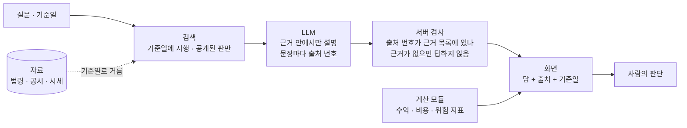

# 로컬 · 무료 LLM 과 AWS 를 퀀트에서 쓰는 법 — 조사서 v0.1

| 문서 정보 | |
|---|---|
| **판 · 상태** | v0.1 · 조사 끝(검토 전) |
| **구분** | 조사서 — 목표 기능 ① 「근거 문서와 출처를 포함한 RAG 질의응답」(`P01-①-3`)의 답 만들기 착수 전 검증 |
| **작성** | 이동원(조사 · 이 PC 실측) |
| **검토** | 검토 전 — 판을 올리는 PR 에 팀원 한 명 이상의 「읽었음」 |
| **최종 수정** | 2026-10-03 (KST) |
| **기준** | 외부 원문 조회 2026-10-03 20:30 ~ 20:50 KST · 이 PC 실측 같은 날 20:40 ~ 20:48(Ollama 0.35.0 · Intel Core Ultra 7 155H 16코어 · 메모리 31.6GB · NVIDIA GPU 없음) · 코드 `main` `c5c19f7` |
| **관련 문서** | [목표 기능 ① 상세 설계서 v0.1](../설계/지난판/목표기능1-데이터지식-설계_v0.1.md) 5.3절 · [인프라 · 네트워크 구성도 v0.1](../설계/인프라-네트워크구성도.md) · [배포계획서 v0.1](../배포/배포계획서.md) · [프로젝트 계획서 v2.0](../계획서/프로젝트계획서.md) 2.3절(AWS 는 로컬 완성 뒤) |
| **최근 개정** | 새 문서 |

> **이 문서로 알 수 있는 것**
> 1. 퀀트에서 LLM 을 믿기 어렵다는 말은 사실인가? 무엇이 문제인가?
> 2. 그렇다면 실무 · 연구는 LLM 을 어떻게 쓰나? 「RAG · ReAct · 에이전트로 한다」 는 말은 맞나?
> 3. 유료 API 없이 혼자 쓰는 사람은 LLM 을 어떻게 돌리나? Hugging Face 모델은 어떻게 가져오나?
> 4. 이 PC 에서 어떤 모델이 얼마나 빨리 도나?
> 5. AWS 를 쓴다면 어디까지 쓰고, 비용은 어느 정도인가?
> 6. 우리 답 만들기 기능(`POST /api/kb/ask`)은 무엇을 정해야 하나?
>
> **읽는 순서** — 팀원: 요약 → 6절 · 강사님: 요약 → 2절 → 3절 · 처음 온 사람: 부록 C 용어 → 요약

## 요약

1. **퀀트에서 LLM 을 조심하라는 말은 논문으로 확인된다.** 모델은 학습 자료가 끝나는 날(컷오프) 전의 지표 값과 주가 움직임을 기억하고, 「그때 시점으로 답하라」 고 시키거나 회사 이름을 가려도 기억을 막지 못한다. 컷오프 뒤에는 그런 기억이 없다(Lopez-Lira · Tang · Zhu 2025). 7~14B 크기의 공개 모델도 같다(Li · Wang · Ma 2026). 그래서 컷오프 안 구간의 백테스트 성과는 실력인지 기억인지 가를 수 없다.
2. 반대 증거도 있다. 뉴스로 다음 날 수익을 맞히는 일에서는 미래 정보 편향이 크지 않았고(He 등 2025), 회사 이름을 가렸더니 오히려 성과가 좋았다(Glasserman · Lin 2023). 편향의 크기는 일에 따라 다르다.
3. **실무와 최근 연구의 흐름은 「LLM 을 예측기로 쓰지 않고, 감사할 수 있는 정보 창구로 쓴다」 이다.** 그날 공개된 자료만 찾아 넣고(시점 고정 검색), 계산 · 위험 · 체결은 LLM 밖의 모듈이 맡는다(Ye 등 2026). 운용사 Man Group 도 LLM 에게 매매를 맡기지 않고 가설과 코드를 만들게 한 뒤 통계 검증과 사람 점검을 거친다(2025-11).
4. 「RAG · ReAct · 에이전트로 한다」 는 말은 절반만 맞다. 근거를 보이게 하고 감사할 수 있게 해 주지만, 모델 속에 이미 든 기억은 지우지 못한다(Li 등 2025). 성과는 학습 컷오프 뒤 구간에서만 믿는다.
5. 유료 API 없이 쓰는 길은 둘이다. ① 내 PC 에서 돌리기(Ollama · llama.cpp · LM Studio 로 양자화한 GGUF 모델 · Hugging Face 의 GGUF 를 `ollama run hf.co/…` 로 바로) ② 무료 등급 API(Hugging Face 무료 월 $0.10 · PRO 월 $2 크레딧, Gemini 무료 등급은 입력이 제품 개선과 사람 검토에 쓰인다). 사용자 자료가 바깥으로 나가지 않는 길은 ① 뿐이다.
6. 팀장 PC 는 처음에 llama3.1 8B 를 **CPU 로만** 돌려 답 쓰기 초당 7.2토큰 · 질문 읽기 초당 29.5토큰이었다. 내장 GPU(Intel Arc)는 Ollama 가 찾고도 기본 설정이 빼 두었는데, 켜자 질문 읽기 약 5배(초당 152.5) · 답 쓰기 약 1.7배(초당 12 ~ 13)가 됐다. 다만 온도 0 · 같은 씨앗인데 둘째 답이 달라져, 답 글과 넣은 근거를 함께 남겨야 감사할 수 있다.
7. 앱 채팅 RAG 의 임베딩 길(nomic-embed-text · 머리말 없음 · `fin_chunks`)은 같은 문서 · 같은 질문에서 Recall@5 0.026 이었다(근거 검색의 bge-m3 섞어 찾기는 0.868). 한국어 문서에는 쓸 수 없는 수준이다.
8. 답 모델 다섯을 같은 질문으로 견주고 사람이 판정했다(6.1-2절). **qwen3:4b-instruct** 가 정답 7 · 근거 밖 질문에 지어낸 답 0 · 문장마다 출처 94% · 22초로 가장 고르게 좋아 기본 답 모델로 정했다. 출처 번호가 맞아도 지어낸 답이 두 모델에서 나와, 번호 검사만으로는 충분하지 않다.
9. AWS 를 쓴다면 강사님 기초 코드(lumina-invest)의 안처럼 생성은 Amazon Bedrock(토큰 값만 냄 · GPU 서버 없음), 임베딩과 의존 서비스는 EC2 한 대가 가장 가볍다. 질문 1,000개를 Bedrock 의 Qwen3 32B 로 답하면 약 $0.65 이고(계산), GPU 서버(g6.xlarge)를 늘 켜 두면 한 달 약 $588 이다(계산).

---

## 1. 조사 범위와 방법

조사 질문과 확인 방법은 <표 1> 과 같다. 한 출처로 정하지 않고 원문 · 두 번째 출처 · 이 PC 실측 가운데 하나로 다시 맞춰 보았다.

**<표 1> 조사 질문과 확인 방법** · 확실도: 확인(원문이나 실측으로 맞춤) · 일부 확인(한 출처만) · 추정(계산이나 해석)

| 질문 | 1차 출처 | 2차 검증 | 확실도 |
|---|---|---|:-:|
| 퀀트에서 LLM 의 미래 정보 문제 | 검색 결과 요약 | 논문 10편은 arXiv 초록 원문으로 저자 · 날짜 · 주장을 맞춤. 1편(SSRN)은 서지 정보 셋을 대조 | 확인(SSRN 1편은 일부 확인) |
| 실무에서 LLM 을 쓰는 방식 | 업계 기사(Hedgeweek) | 운용사 자사 글 원문(Man Group 2025-11-13) | 확인 |
| 혼자 · 무료로 돌리는 법 | Hugging Face · Ollama 공식 문서 | 이 PC 의 Ollama 로 실제 실행 | 확인 |
| 한국어 공개 모델 라이선스 | 모델 카드 메타데이터(HF API) | 라이선스 원문(EXAONE) | 확인(HyperCLOVA X SEED 원문은 동의 뒤에만 열림) |
| 이 PC 의 속도 · GPU | 실측(Ollama `eval_count` · `eval_duration`) | Ollama 서버 로그의 장치 인식 줄 | 확인 |
| AWS 비용 | AWS 공지 · Bedrock 가격 페이지 | 강사님 기초 코드의 AWS 설계 문서(`aws.md`) | 일부 확인(가격표가 화면에서 접혀 일부만 읽힘) |

조사하지 않은 것: 국내 개인 투자자 커뮤니티의 사용 관행(검증할 원문이 없다), 모델별 한국어 답 품질(이 문서가 아니라 답 만들기 평가에서 같은 질문으로 잰다 · 6.3절).

---

## 2. 퀀트에서 LLM 을 믿기 어려운 까닭

### 2.1 미래 정보 편향과 기억

**미래 정보 편향(look-ahead bias)** 은 예측하는 시점에는 알 수 없던 정보가 예측에 섞이는 잘못이다. 백테스트에서 다음 날 종가로 오늘 주문하는 실수가 대표적이다. LLM 에서는 이것이 **모델 안에** 숨어 있다. 2024년까지의 글로 학습한 모델은 2018~2020년에 어떤 주식이 어떻게 움직였는지 이미 읽었다. 이 모델에게 2019년 뉴스를 주고 「이 회사 주가가 오를까」 를 물으면, 답이 맞아도 판단력 덕인지 기억 덕인지 알 수 없다. 흐름은 <그림 1> 과 같다.

**<그림 1> 학습 컷오프와 백테스트 구간** · 범례: `═` 모델이 읽은 기간 · `─` 읽지 않은 기간

```
  시간 →     2018        2020        2022        2024   컷오프   2025        2026
  학습 자료  ══════════════════════════════════════════════╡
  백테스트 A   [────── 2018~2020 평가 ──────]                       ← 모델이 결과를 읽은 구간
                                                                    성과 = 실력 + 기억 (가를 수 없음)
  백테스트 B                                                  [── 2025~ 평가 ──]
                                                                    성과 = 실력 (기억 없음)
```

### 2.2 근거

논문의 근거는 <표 2> 와 같다. 모두 arXiv 초록 원문으로 저자 · 날짜 · 주장을 맞춰 보았다(부록 A).

**<표 2> 미래 정보 편향에 관한 연구**

| 연구 | 무엇을 했나 | 찾은 것 | 우리에게 주는 뜻 |
|---|---|---|---|
| Lopez-Lira · Tang · Zhu (2025, 2025-12 개정) 「The Memorization Problem」 | 경제 · 금융 수치를 모델이 기억하는지 시험 | 컷오프 전 수치를 정확히 기억한다. 「그 시점까지만 알고 답하라」 는 지시도, 이름 · 날짜 가리기도 기억을 막지 못한다. 컷오프 뒤에는 기억이 없다. 기억은 임베딩에도 남는다 | 컷오프 안의 예측 성과는 증거가 되지 못한다 |
| Li · Wang · Ma (2026-05, 2026-08 개정) 「Summoning the Oracle to Slay It」 | 7~14B 공개 모델 다섯 · 대형주 다섯으로 백테스트 | 기억을 줄이는 디코딩 보정(FinCAD)을 하자 표본 안 수익이 모델 평균 최대 −67.1% 줄었다 | 작은 공개 모델도 기억으로 백테스트를 부풀린다 |
| Li 등 (2025-10) 「Profit Mirage」 | LLM 금융 에이전트의 정보 누수를 네 측면으로 잼 | 학습 기간이 끝나면 화려한 백테스트 수익이 사라진다. RAG 를 넣은 에이전트도 같다 | 에이전트 구조만으로 누수가 막히지 않는다 |
| Gao · Jiang · Yan (2025-12) 「Detecting Lookahead Bias in LLM Forecasts」 | 날짜만 주고 회상하게 하는 질문으로 「미래 정보 성향(LAP)」 을 잼 | LAP 는 컷오프 전 내내 양수이고 컷오프 직후 거의 0 이 된다. LAP 가 높은 표본에서 예측력이 커진다 | 오염을 잴 수 있는 값싼 검사가 있다 |
| Sarkar · Vafa (2024) 「Lookahead Bias in Pretrained Language Models」 | 예측할 수 없어야 할 사건으로 편향을 시험 | 실적 발표 통화의 위험 요인 · 선거 승자 예측에서 미래 정보 편향이 보인다 | 금융 밖 사회과학에도 같은 문제 |
| Ye 등 (2026-05) 「The Alpha Illusion」 | 공개된 LLM 매매 에이전트(FinCon · FinMem · TradingAgents · FinAgent 등)의 성과 보고를 검토 | 보고된 알파를 배포 근거로 보면 안 된다. 시간 무결성 · 마찰 비용 · 반사실 강건성 · 확률 보정 · 수치 실행 · 다중 에이전트 분해 여섯 시험을 거쳐야 한다. 「언어의 확신은 거래할 수 있는 확률이 아니다」 | LLM 은 계산 · 위험 · 체결 앞단의 감사 가능한 정보 창구로 |

### 2.3 반대 증거와 한계

편향이 늘 크지는 않다. 반대 증거는 <표 3> 과 같다.

**<표 3> 미래 정보 편향이 작았던 연구**

| 연구 | 찾은 것 | 읽는 법 |
|---|---|---|
| He · Lv · Manela · Wu (2025, 2025-07 개정) 「Chronologically Consistent Large Language Models」 | 학습 자료를 시점별로 자른 모델(ChronoBERT · ChronoGPT)이 뉴스로 다음 날 수익을 예측했을 때 훨씬 큰 Llama 모델과 샤프 비율이 비슷했다. 미래 정보 편향은 「크지 않다(modest)」 | 편향의 크기는 일에 따라 다르다. 시점 고정 모델이 하나의 해법이다 |
| Glasserman · Lin (2023) 「Assessing Look-Ahead Bias in Stock Return Predictions Generated By GPT Sentiment Analysis」 | 뉴스 제목에서 회사 이름을 지웠더니 학습 기간 안에서 성과가 오히려 좋았다. 회사에 대한 일반 지식이 감성 판단을 흐리는 「주의 분산 효과」 가 미래 정보 편향보다 컸다(대형주에서 특히) | 이름 가리기가 도움이 되는 일도 있다. 다만 Lopez-Lira 등(2025)은 모델이 적은 단서로 이름과 날짜를 되살린다고 보고해, 가리기를 해법으로 믿기는 어렵다 |

### 2.4 미래 정보 말고 다른 문제

- **숫자 계산과 확률**: 문장으로 쓴 확신은 거래할 수 있는 확률이 아니고, 서술형 추론은 수치 실행이 아니다(Ye 등 2026). 수익률 · 비중 · 비용은 코드가 계산한다.
- **많이 시도하면 우연을 찾는다**: LLM 이 가설을 대량으로 만들면 통계적으로 의미 있어 보이는 우연이 늘어난다. Man Group 도 이 위험(p-hacking)을 글에 적고, 여러 단계 검증과 투자위원회 · 기술팀의 이중 점검을 둔다(2025-11).
- **같은 질문에 다른 답**: 샘플링 온도가 0 이 아니면 답이 매번 바뀐다. 감사하려면 온도 · 씨앗(seed) · 모델 판 · 넣은 근거를 함께 기록해야 한다.

---

## 3. 실무 · 연구는 어떻게 쓰나

### 3.1 다섯 가지 쓰는 법

**<표 4> LLM 을 쓰는 방식과 미래 정보 위험**

| 방식 | 하는 일 | 미래 정보 위험 | 예 |
|---|---|---|---|
| ① 정보 창구 | 공시 · 뉴스 · 법령을 요약 · 분류 · 추출하고 근거를 단다 | 낮다 — 판단 재료를 그날 공개분으로 묶으면 | 우리 근거 답 만들기 · Ye 등(2026) 권고 구조 |
| ② 시점 고정 검색(RAG) | 기준일에 공개된 문서만 검색해 넣는다 | 문서 쪽은 막는다. 모델 속 기억은 남는다 | FinAbstain(2026)의 「예측 시점에 공개된 정보만 받는 검색기」 |
| ③ 도구를 쓰는 에이전트(ReAct) | 생각과 도구 호출을 번갈아 하며 자료를 찾는다 | 도구가 기준일 뒤 자료를 주면 샌다. 도구마다 기준일을 걸어야 한다 | Yao 등(2022) · Li 등(2025) FactFin |
| ④ 가설 · 코드 생성 | 가설을 내고 백테스트 코드를 쓴다. 평가는 자료로 한다 | 가설이 「과거에 통한 것」 의 기억에서 나올 수 있다. 표본 밖 검증 · 다중 검정 보정이 필요하다 | Man Group AlphaGPT(2025) |
| ⑤ 시점 고정 모델 · 디코딩 보정 | 컷오프를 날짜마다 자른 모델을 쓰거나 기억을 줄여 디코딩 | 가장 직접 줄인다. 아직 연구 단계 | ChronoGPT(2025) · FinCAD(2026) |

**RAG(검색 증강 생성)** 는 모델 속 지식(파라메트릭 기억)에 검색한 문서(비파라메트릭 기억)를 더해 답하는 방식이고, 원 논문은 출처를 보이는 일과 지식을 새로 바꾸는 일을 이 방식의 목표로 든다(Lewis 등 2020). **ReAct** 는 생각(reasoning)과 행동(도구 호출)을 번갈아 하는 방식이고, 원 논문은 위키백과 API 를 부르게 해 환각과 오류 전파를 줄였다고 보고한다(Yao 등 2022).

### 3.2 정보 창구 구조

연구와 실무가 권하는 구조를 우리 기능에 맞춰 그리면 <그림 2> 와 같다.

**<그림 2> LLM 을 정보 창구로 쓰는 구조** · 범례: 「LLM」 상자만 언어 모델이 하는 일, 점선 = 기준일로 거르는 곳



### 3.3 「RAG · ReAct · 에이전트로 한다」 는 말의 검증

**<표 5> 들은 말과 확인한 것**

| 들은 말 | 맞는 부분 | 모자란 부분 |
|---|---|---|
| 퀀트에서는 LLM 이 편향되고 미래 정보를 알아 신뢰도가 떨어진다 | 맞다 — <표 2> 의 여섯 연구 | 일에 따라 편향 크기가 다르다(<표 3>) |
| 그래서 RAG · ReAct · AI 에이전트를 만들어 쓴다 | 맞다 — 근거를 그날 공개분으로 묶고, 출처를 보이고, 도구 호출을 기록해 감사할 수 있다(<표 4> ① ~ ③) | RAG · 에이전트를 넣어도 모델 속 기억은 남는다(Li 등 2025). 평가는 학습 컷오프 뒤 구간에서만 믿고, 매매 판단은 LLM 밖 모듈이 맡아야 한다(Ye 등 2026) |

### 3.4 평가 규칙

- 성과는 **모델의 학습 컷오프 뒤 구간**에서만 증거로 쓴다(Lopez-Lira 등 2025 · Gao 등 2025).
- 컷오프 안 구간을 써야 하면 미래 정보 성향(LAP) 같은 오염 검사를 같이 보고한다(Gao 등 2025).
- 보고에는 시간 무결성 · 비용 · 반사실 강건성 · 확률 보정 · 수치 실행 · 에이전트 분해를 적는다(Ye 등 2026 의 P1 ~ P6).

---

## 4. 유료 API 없이 쓰는 법

### 4.1 두 갈래

**<표 6> 유료 API 없이 LLM 을 쓰는 길**

| 길 | 도구 · 서비스 | 돈 | 자료가 밖으로 | 한도 · 조건 |
|---|---|---|---|---|
| ① 내 PC | Ollama(llama.cpp 기반 · OpenAI 호환 API) · llama.cpp · LM Studio · Hugging Face `transformers` | 전기료 · PC | 나가지 않는다 | PC 성능만큼. GPU 가 없으면 느리다(4.4절) |
| ② 무료 등급 API | Hugging Face Inference Providers | 무료 사용자 월 $0.10 크레딧 · PRO 사용자 월 $2.00 · 넘으면 크레딧을 사야 한다 | 외부 제공자로 나간다 | 제공자마다 다름 |
| ② 무료 등급 API | Google Gemini API 무료 등급 | 없음 | 나간다 — 입력과 답이 제품 개선에 쓰이고 사람이 읽을 수 있다. 약관이 민감 · 기밀 · 개인 정보를 넣지 말라고 적는다(2026-04-28 개정) | 요청 수 한도 |

팀장 계정은 Hugging Face PRO 를 구독하고 있어 월 $2 의 계산 크레딧이 있다. 법령처럼 공개된 글만 보내는 시험에는 ② 를 쓸 수 있지만, 사용자 질문 · 포트폴리오가 섞이는 앱 기능의 기본값은 ① 이다.

### 4.2 Hugging Face 에서 모델을 가져오는 법

혼자 쓰는 사람이 가장 흔히 쓰는 길은 **GGUF** 파일을 Ollama 로 받는 것이다. GGUF 는 llama.cpp 가 읽는 모델 파일 형식이고, 가중치를 4비트 안팎으로 줄인 **양자화** 판을 담는다. Hugging Face 공식 문서의 방법은 다음과 같다.

```sh
ollama run hf.co/{사용자}/{저장소}                 # 저장소에 Q4_K_M 이 있으면 그것을 고른다
ollama run hf.co/{사용자}/{저장소}:Q8_0            # 양자화 종류를 고를 때
```

- GGUF 안에 대화 틀(chat template)이 들어 있으면 그대로 쓰고, 없으면 저장소에 `template` 파일(Go 템플릿)을 둔다.
- 비공개 GGUF 도 받을 수 있다. Ollama 의 SSH 공개 키를 Hugging Face 계정에 넣으면 개인 · 조직 저장소의 GGUF 를 받는다. 우리 조직(`qurious-quant`)에 모델 파일을 비공개로 둘 수도 있다는 뜻이다.
- Ollama 공식 목록(ollama.com/library)에 있는 모델은 `ollama pull qwen3:4b` 처럼 이름만으로 받는다. 이번에 확인한 것: `qwen3` · `qwen3.5` · `qwen2.5` · `gemma3` · `exaone3.5` 는 목록에 있고, `kanana` 는 없다(커뮤니티 GGUF 로만).

### 4.3 한국어를 다루는 공개 모델과 라이선스

모델 카드의 라이선스 칸을 Hugging Face API 로 직접 읽었다(2026-10-03 20:4x). 결과는 <표 7> 과 같다.

**<표 7> 후보 모델의 라이선스** · 「상업」 은 라이선스 원문 기준, 우리 과제(비영리 교육)는 모두 쓸 수 있다

| 모델 | 크기 | 라이선스 | 상업 이용 | 한국어 | 비고 |
|---|---|---|---|---|---|
| Qwen3 (Alibaba) | 4B · 8B 등 | Apache 2.0 | 가능 | 다국어 | 2025-04 · 공식 GGUF(`Qwen/Qwen3-4B-GGUF`) |
| Qwen3.5 | 2B · 4B · 9B | Apache 2.0 | 가능 | 다국어 | 2026-02 · 이미지 입력도 받는 모델 |
| Qwen2.5 Instruct | 3B / 7B | 3B 는 `qwen-research`(연구용) / 7B 는 Apache 2.0 | 3B 불가 / 7B 가능 | 다국어 | 같은 계열도 크기마다 라이선스가 다르다 |
| Gemma 3 (Google) | 4B · 12B | Gemma 이용 약관 | 약관 조건 | 다국어 | Hugging Face 에서 약관 동의 뒤 받음 |
| EXAONE 3.5 · 4.0 (LG) | 2.4B · 7.8B / 1.2B | EXAONE AI Model License 1.1 · 1.2 **NC** | **불가** — 원문 3.1조가 모델 · 파생물 · **출력**의 상업 이용을 금지 | 한국어 · 영어 | 연구 · 평가 · 교육만. 공식 GGUF 있음 |
| Kanana 1.5 (카카오) | 2.1B · 8B | Apache 2.0 | 가능 | 한국어 · 영어 | GGUF 는 커뮤니티 변환본뿐 |
| A.X 4.0 Light (SKT) | 7B | Apache 2.0 | 가능 | 한국어 · 영어 | GGUF 는 커뮤니티 변환본뿐 |
| HyperCLOVA X SEED (네이버) | 1.5B 등 | 자체 라이선스 | 원문 확인 못 함 | 한국어 | 동의 뒤에만 원문이 열린다 |
| Llama 3.1 (Meta) — 지금 쓰는 것 | 8B | Llama 3.1 Community License | 조건부 | **공식 지원 언어에 없음**(영 · 독 · 불 · 이 · 포 · 힌 · 스 · 태) | 한국어 답이 약한 까닭 |
| bge-m3 (BAAI) — 임베딩 | 568M | MIT | 가능 | 다국어 | 우리 근거 검색 기본 모델 |
| nomic-embed-text v1.5 — 임베딩 | 137M | Apache 2.0 | 가능 | **영어** | 우리 평가에서 한국어 바꿔 말하기를 못 함(Recall@5 0.053) |
| bge-reranker-v2-m3 — 재순위 | 568M | Apache 2.0 | 가능 | 다국어 | 근거 검색의 다음 단계 후보 |

커뮤니티 변환본(GGUF)은 원 모델과 같은지 보증이 없다. 쓰려면 변환한 사람 · 받은 파일의 SHA-256 을 기록한다. 이번에 받은 Kanana 1.5 8B(Mungert 변환 · Q4_K_M)는 Ollama 저장본의 모델 층 SHA-256 이 Hugging Face 저장소에 적힌 값과 같았다(부록 B). 다만 대화 틀이 끝 표시 토큰을 멈춤 신호로 넣지 않아 답 끝에 `<|eot_id|>` 가 글자로 나왔다 — 서버에서 그 토큰 앞에서 자르게 했다.

**이름이 같아도 판이 다를 수 있다.** Ollama 공식 목록의 `qwen3:4b` 는 2026-10-03 에 **Qwen3-4B-Thinking-2507(생각 전용 판)** 이었다(`/api/show` 의 `general.finetune = Thinking` · `version = 2507`). 이 판은 `think=false` 를 보내도 생각 글(영어)을 먼저 길게 써서, 답 길이 상한 안에 한국어 답이 나오지 않았다. 생각 없는 판은 `qwen3:4b-instruct`(Qwen3-4B-Instruct-2507)로 따로 받아야 한다. 모델을 고를 때는 태그 이름만 보지 말고 `/api/show` 로 판을 확인한다.

### 4.4 이 PC 에서 잰 것

**<표 8> 이 PC 실측** (2026-10-03 20:4x · 명령과 출력은 부록 B)

| 항목 | 값 | 확인 방법 |
|---|---|---|
| Ollama | 0.35.0 · 받아 둔 모델 셋(llama3.1 8B Q4_K_M · bge-m3 · nomic-embed-text) | `/api/version` · `/api/tags` |
| GPU | NVIDIA 없음. 내장 GPU(Intel Arc)를 Vulkan 으로 찾았으나 「integrated GPU 를 뺀다 · 켜려면 `OLLAMA_IGPU_ENABLE=1`」 → 계산은 CPU | Ollama 서버 로그 |
| llama3.1 8B 첫 불러오기 | 10.6초 | `load_duration` |
| 질문 읽기 | 초당 29.5토큰(73토큰) | `prompt_eval_count` ÷ `prompt_eval_duration` |
| 답 쓰기 | 초당 7.2토큰(33토큰) | `eval_count` ÷ `eval_duration` |
| GPU 메모리에 올린 양 | 0 | `/api/ps` 의 `size_vram` |

이 속도로 근거 3,000토큰을 넣고 300토큰을 쓰면 읽기 약 102초 + 쓰기 약 42초, 모두 2분 넘게 걸린다(계산 · 실제 근거 묶음으로는 답 만들기 평가에서 다시 잰다). 줄이는 길은 넣는 근거를 줄이기 · 작은 모델(2~4B) · 내장 GPU 켜기 셋이다.

팀장 PC 에서 내장 GPU 를 켜고(사용자 환경 변수 `OLLAMA_IGPU_ENABLE=1` → Ollama 다시 시작 · 2026-10-03 21:07) 같은 모델을 다시 잰 결과는 <표 8-1> 과 같다. Ollama 로그가 「Intel Arc · Vulkan · type=iGPU · 18.0GiB」 로 장치를 잡았고, 모델 5.26GB 가 모두 GPU 쪽 메모리에 올라갔다(`size_vram`).

**<표 8-1> 내장 GPU 를 켜기 전과 뒤** (llama3.1 8B Q4_K_M · 같은 질문 · 온도 0 · 씨앗 7)

| 항목 | CPU 만 | 내장 GPU(Intel Arc · Vulkan) | 배 |
|---|---|---|:-:|
| 질문 읽기(1,666토큰 근거) | 초당 29.5(73토큰 질문으로 잼) | 초당 152.5 | 약 5 |
| 답 쓰기 | 초당 7.2 | 초당 11.8 ~ 13.3 | 약 1.7 |
| 근거 임베딩(nomic-embed-text · 4,067청크) | 초당 1.7 ~ 3.1(2026-10-02 ~ 03 기록) | 초당 7.7(530초) | 약 2.5 ~ 4.5 |
| 같은 질문 두 번 | 같은 답 | **다른 답** — 둘째 답은 「법적 이름은 로보어드바이저입니다」 로 뜻이 바뀜 | — |

마지막 줄이 중요하다. 온도 0 · 같은 씨앗이어도 GPU 경로에서는 답이 바뀌었다(앞 질문의 계산 결과를 재사용한 둘째 실행 · 원인은 확인하지 않음). 답을 감사하려면 「같은 입력이면 같은 답」 을 전제하지 말고 답 글 자체와 넣은 근거를 남겨야 한다.

---

## 5. AWS 를 쓴다면

### 5.1 강사님 기초 코드의 AWS 안

강사님 기초 코드(lumina-invest)의 `aws.md` 는 정적 화면을 CloudFront · S3, API 를 ALB · ECS Fargate, 생성형 AI 를 **Amazon Bedrock** 에 두는 안을 기본으로 한다. 「Bedrock 을 기본안으로 택하면 GPU 서버 운영 부담이 가장 작다」 고 적고, 자체 모델이 꼭 필요할 때만 SageMaker 엔드포인트나 EC2 위 vLLM · Ollama 를 고르게 했다. 임베딩은 Ollama 의 `nomic-embed-text` 를 계속 써서 Bedrock 만 골라도 Ollama 서버가 필요하다고 적었다. 실제 배포 기록은 Redis · Qdrant · Neo4j · Ollama 를 `t3.medium` 한 대에 두고 모델은 `qwen2.5:1.5b` 다(`.env.example`).

### 5.2 세 길

**<표 9> AWS 에서 LLM 을 쓰는 세 길**

| 길 | 내는 돈 | 장점 | 단점 | 강사님 안에서 |
|---|---|---|---|---|
| Bedrock(완전 관리형) | 토큰 값 — 예: Qwen3 32B 100만 토큰당 입력 $0.1545 · 출력 $0.618(시드니) · Ministral 8B 입출력 $0.15(미국) | GPU 서버가 없다. 쓴 만큼만 | 리전 · 모델 가용성 · 데이터 정책을 확인해야 한다. 서울 가격은 이번에 읽지 못함 | 생성 기본안 |
| SageMaker 엔드포인트 | 인스턴스 시간(켜 둔 만큼) | 원하는 공개 모델을 올린다 | 늘 켜 두면 비싸다 | 선택 — 기본 Llama 3.2 3B · `ml.g5.xlarge` |
| EC2 + Ollama · vLLM | 인스턴스 시간 — CPU `t3.medium` 또는 GPU `g6.xlarge`(NVIDIA L4 24GB · 시간당 $0.805 · 스팟 $0.604) | 지금 로컬 구성과 같다 | GPU 는 비싸고, CPU 는 작은 모델만 | 지금 배포 기록(`t3.medium` · `qwen2.5:1.5b`) |

### 5.3 비용 감

**<표 10> 비용 계산** · 모두 계산(추정) · 가격은 <표 9> 의 값

| 쓰는 모양 | 계산 | 대략 |
|---|---|---|
| Bedrock Qwen3 32B 로 근거 답 1,000개(질문당 입력 3,000 · 출력 300토큰) | 1,000 × (3,000 × $0.1545 + 300 × $0.618) ÷ 1,000,000 | 약 $0.65 |
| GPU 서버 g6.xlarge 를 한 달 늘 켬 | $0.805 × 730시간 | 약 $588 |
| GPU 서버를 시연 때만 하루 2시간 × 10일 | $0.805 × 20시간 | 약 $16 |

질문 수가 적은 팀 과제에서는 GPU 서버보다 토큰 값이 훨씬 싸다. 다만 Bedrock 을 고르면 질문과 근거가 AWS 로 나가므로, 사용자 자료를 넣는 기능은 데이터 정책을 먼저 확인한다.

### 5.4 새 계정의 무료 크레딧

AWS 는 2025-07-15 부터 새 계정에 가입 때 $100 크레딧을 주고, EC2 · Bedrock 같은 서비스를 써 보면 $100 을 더 준다(최대 $200). 무료 플랜은 가입 뒤 6개월이나 크레딧을 다 쓸 때 끝난다(AWS 공지 2025-07-16). 그 전에 만든 계정은 옛 무료 사용량(12개월) 규칙을 따른다.

---

## 6. 우리 프로젝트에 주는 뜻

### 6.1 근거 답 만들기(`POST /api/kb/ask`)에 넣을 것

우리 기능은 법령 · 감독규정을 근거로 질문에 답하는 일이라 <표 4> 의 ① 정보 창구 · ② 시점 고정 검색에 해당한다. 검색 단계는 이미 기준일에 시행 중인 판만 고른다(목표 기능 ① 설계서 5.3.2절의 판 고르기). 답 만들기에 넣을 규칙은 <표 11> 과 같다.

**<표 11> 답 만들기 규칙 후보와 근거**

| 규칙 | 근거 |
|---|---|
| 근거 묶음 밖의 사실을 말하지 않는다. 문장마다 `[출처 n]` | 설계서 5.3.4 답변 정책 · Lewis 등(2020) 출처 |
| 서버가 답의 `[출처 n]` 을 검사한다 — 근거 목록에 없는 번호는 지우고 경고 · 출처 번호가 하나도 없으면 답 대신 근거 목록만 | 「언어의 확신 ≠ 근거」(Ye 등 2026) · 감사 가능성 |
| 근거가 모자라면 답하지 않는다(검색 결과 0 · 법 · 규정 질문인데 등급 1 · 2 근거 없음) | 설계서 5.3.1 답변 규칙 · FinAbstain(2026)의 「불확실하면 답을 미룬다」 |
| 온도 0 · 씨앗 고정 · 모델 이름과 판 · 넣은 근거의 청크 ID 를 응답에 싣는다 | 재현 · 감사(2.4절) |
| 기준일을 답과 화면에 함께 보인다. 기준일 뒤의 판 · 문서는 넣지 않는다 | 시점 고정 검색(<표 4> ②) |
| 종목 매수 · 매도를 권하지 않는다. 수익 · 가격을 예측하지 않는다 | 미래 정보 편향(2절) · 설계서 5.3.4 ④ |
| 넣는 근거 수 · 글자 수 · 답 길이 · 시간에 상한을 둔다 | 이 PC 실측(4.4절) — CPU 로 2분 넘게 걸릴 수 있다 |
| 모델을 바꿔 끼울 수 있게 둔다(로컬 Ollama 기본 · 다른 길은 설정) | 4절 · 5절 |

### 6.1-1 앱 채팅 RAG 의 임베딩 길(fin_chunks)

앱의 채팅 RAG 는 근거 검색과 다른 길을 쓴다 — LangChain `OllamaEmbeddings`(설정 `EMBED_MODEL` = nomic-embed-text) · 컬렉션 `fin_chunks`(768차원 · 코사인) · 질문 · 문서 머리말(`search_query:` · `search_document:`) 없음. 2026-10-03 에 `fin_chunks` 는 **비어 있었다(점 0개)**. 그래서 같은 근거 문서 4,067청크를 이 길 그대로(앱 컨테이너 안에서 앱 함수로) 임시 컬렉션에 넣고 근거 검색 평가셋 v0(38문항)으로 쟀다. 결과는 <표 11-1> 과 같다.

**<표 11-1> 같은 38문항 · 같은 4,067청크에서 길별 Recall@5**

| 길 | 모델 · 머리말 | Recall@5 | MRR@10 |
|---|---|---:|---:|
| 근거 검색(낱말 + 벡터 · RRF) | bge-m3 | 0.868 | 0.761 |
| 근거 검색(벡터만) | bge-m3 | 0.816 | 0.766 |
| 근거 검색(벡터만) | nomic · 머리말 있음 | 0.053 | — |
| **앱 채팅 RAG 길** | nomic · 머리말 없음 | **0.026** | 0.026 |
| 앱 채팅 RAG 길 + 검색어에만 머리말 | nomic | 0.026 | 0.032 |

nomic-embed-text 의 모델 카드 언어는 영어뿐이고(<표 7>), 앱 길 그대로는 38문항 가운데 1문항만 상위 5 안에 정답 조를 냈다. 한국어 금융 문서를 이 길로 넣으면 채팅이 근거를 거의 찾지 못한다. 채팅이 근거를 쓰게 하려면 채팅이 `/api/kb/search` · `/api/kb/ask` 를 도구로 부르는 길(설계서 5.3.4)이 가깝고, `fin_chunks` 의 임베딩을 bge-m3(1024차원)로 바꾸는 길은 강사님 기초 코드(`rag_pipeline.py` 의 768 고정 · 크롤 적재)를 함께 고쳐야 한다.

### 6.1-2 답 모델 다섯을 같은 질문으로 견줬다

근거답 평가셋 v0(`docs/시험/평가셋/근거답-평가셋_v0.tsv` · 답이 근거 문서에 있는 질문 10 · 근거 문서 밖 질문 3 · 가격 예측 · 매수 권유 2)으로 다섯 모델을 같은 조건(근거 5개 · 온도 0 · 씨앗 42 · 내장 GPU)에서 돌리고, 답을 정답 조문과 하나씩 대조해 사람이 판정했다(2026-10-03 21:22 ~ 22:01). 결과는 <표 11-2> 와 같다.

**<표 11-2> 답 모델 비교** · 정답 · 부분 · 미룸 · 오답은 답할 질문 10 기준 · 「지어냄」 은 근거 밖 질문 3 기준 · 시간은 생성 중앙값

| 모델 | 정답 | 부분 | 미룸 | 오답 | 근거 밖 3 — 지어냄 | 문장마다 출처 | 생성 | 판정 메모 |
|---|:-:|:-:|:-:|:-:|:-:|--:|--:|---|
| **qwen3:4b-instruct** (Qwen3-4B-Instruct-2507) | 7 | 1 | 1 | 1 | **0** | 94% | 22.0초 | 짧고 정확하다 · 근거가 없을 때(A10) 바르게 미룸 · 법 → 시행령으로 넘어가는 질문(A01)은 놓침 |
| exaone3.5:2.4b | 7 | 1 | 1 | 1 | 1 | 55% | **15.7초** | 다섯 가운데 유일하게 2026 코스피 세율(시행령 1만분의 5)을 맞힘 · 근거 밖 「선물 증거금률」 에 「40% 이상 [출처 2]」 를 지어냄 · 비상업 라이선스 |
| Kanana 1.5 8B (커뮤니티 GGUF) | 6 | 0 | 3 | 1 | 0 | 56% | 30.0초 | 근거 밖 질문을 모두 미룸 · 정답 조문이 근거에 있는데도 둘을 미룸(지나친 미룸) · 끝 표시 토큰이 글자로 샘 |
| llama3.1 8B (그때 기본) | 6 | 1 | 0 | 3 | 1 | 62% | 43.1초 | 「미국 원천징수 100분의 25 [출처 1]」 을 지어냄 · 배당 원천징수를 출자공동사업자 세율(100분의 25)로 답함 · 같은 문장 되풀이 |
| qwen3:4b (Thinking-2507) | 쓸 수 없음 | | | | | 24% | 51.7초 | 영어 생각 글만 쓰고 한국어 답이 나오지 않음(4.3절) |

세 가지가 분명해졌다.

- **출처 번호 검사는 필요하지만 충분하지 않다.** 다섯 모델 모두 「번호 맞음」 은 100% 였다(목록 밖 번호 0). 그런데도 근거 밖 질문에 번호를 단 채 지어낸 답이 두 모델에서 나왔다. 번호는 「어느 글을 보았나」 를 알려 줄 뿐 「그 글을 바르게 읽었나」 는 보장하지 않는다. 사람이 읽는 표본 판정(설계서 5.3.5)을 계속 둔다.
- **검색이 놓치면 모델이 지어낸다.** 정답 조문이 근거에 없던 A10(로보어드바이저)에서 바르게 미룬 모델은 둘(qwen3:4b-instruct · Kanana)뿐이었다. 검색 쪽의 동의어 넓히기(「로보어드바이저」 → 「전자적 투자조언장치」)가 답 품질에 바로 닿는다.
- **법이 시행령에 맡긴 값은 두 조를 함께 넣어야 한다.** 「2026년 코스피 증권거래세율」 은 법 제8조(기본 1만분의 35 · 시행령에 맡김)와 시행령 제5조(1만분의 5)를 함께 읽어야 답이 된다. 넷이 법의 기본 세율로 답했다. 질문 「증권거래세 세율은?」 의 상위 3 근거에는 시행령 제5조가 없었다.

팀장 결정(2026-10-03): **기본 답 모델 = qwen3:4b-instruct** — 지어낸 답 0 · 문장마다 출처 94% · Apache 2.0 · Ollama 공식 목록. 바꾸려면 환경 변수 `KB_ANSWER_MODEL`. 이 모델이 없는 PC 는 근거 발췌와 「ollama pull qwen3:4b-instruct」 안내로 대체된다.

> 기록 메모: 넷을 견준 평가의 원 결과 파일(JSON)은 같은 분에 시작한 다섯째 평가가 같은 이름으로 덮어써 잃었다. 표의 숫자 · 판정은 실행 기록(`data/collector/state/kb_answer_eval-20261003-2122-run-log.txt` · 문항별 상태 · 시간 · 요약표)과 판정 때 출력한 답 원문으로 만들었다. 평가 도구는 결과 파일 이름에 초를 넣고 먼저 이름을 차지하도록 고쳤다.

### 6.2 투자분석 기초 네 화면에 주는 뜻

거시경제 지표 · 산업 분석 · 재무제표 분석 · 기술적 분석 화면에 리서치 리포트 기능을 붙일 때도 같은 원칙을 쓴다. 숫자(성장률 · 비율 · 지표)는 코드가 수집 자료로 계산하고, LLM 은 기준일까지 공개된 공시 · 자료를 근거로 설명만 한다. 목표 주가나 수익률 예측을 LLM 에게 맡기지 않는다.

### 6.3 정할 것

**<표 12> 정할 것**

| 정할 것 | 선택지 | 누가 |
|---|---|---|
| 답 모델 | ~~llama3.1 8B 그대로 · 한국어 공개 모델을 받아 같은 평가 질문으로 견줌~~ → **qwen3:4b-instruct 로 정함**(2026-10-03 · 6.1-2절) · 다음 후보: Qwen3.5 · A.X 4.0 Light | 이동원(목표 기능 ① 주담당) — 평가셋을 50 문항으로 늘리면 다시 잰다 |
| 내장 GPU 켜기 | Ollama 에 `OLLAMA_IGPU_ENABLE=1` 을 걸고 다시 시작 · 그대로 CPU — 팀장 PC 는 2026-10-03 에 켰다(<표 8-1>) | PC 주인(팀원마다) |
| 채팅 RAG 의 임베딩 | 채팅이 근거 검색 · 답 API 를 도구로 부름 · `fin_chunks` 를 bge-m3 로 바꿈(강사님 기초 코드 수정) | 이동원(근거 RAG 주담당) — 6.1-1 |
| 무료 등급 API | 쓰지 않음(기본) · 공개 법령만 보내는 시험에 한해 Hugging Face 크레딧 | 팀 |
| AWS | 로컬 완성 뒤 정함(계획서 2.3절 그대로) · 쓰면 생성은 Bedrock · 임베딩 · 의존 서비스는 EC2 한 대가 가장 가볍다 | 팀 — 강사님 일정의 AWS 배포 칸 전 |

---

## 7. 이 조사를 뒤집을 조건

- 학습 컷오프를 날짜별로 고를 수 있는 한국어 시점 고정 모델이 나오면 <표 4> ⑤ 를 실제 후보로 다시 본다.
- 답 만들기 평가에서 CPU 속도가 화면에 쓸 수 없는 수준(질문당 1분 이상)이면 내장 GPU · 작은 모델 · 외부 API 순으로 다시 고른다.
- 팀이 AWS 를 쓰기로 하면 Bedrock 서울 리전의 모델 가용성 · 가격 · 데이터 정책을 원문으로 다시 읽는다(이번에는 가격표가 일부만 읽혔다).
- 라이선스는 모델 판마다 바뀐다. 모델을 고를 때 그 판의 라이선스 원문을 다시 연다.

---

## 부록 A. 출처

조회일은 모두 2026-10-03 (KST). 「확인 방법」 은 원문을 직접 연 경로다.

| # | 출처 | 확인 방법 |
|:-:|---|---|
| 1 | Lopez-Lira, A., Tang, Y., Zhu, M. *The Memorization Problem: Can We Trust LLMs' Economic Forecasts?* arXiv:2504.14765 (v1 2025-04-20 · v2 2025-12-15) — https://arxiv.org/abs/2504.14765 | 초록 원문 |
| 2 | Li, W. W., Wang, M., Ma, T. *Summoning the Oracle to Slay It: Mitigating Look-Ahead Bias in Financial Backtesting with Large Language Models.* arXiv:2605.24564 (v1 2026-05-23 · v2 2026-08-29) — https://arxiv.org/abs/2605.24564 | 초록 원문 |
| 3 | Li, X., Zeng, Y., Xing, X., Xu, J., Xu, X. *Profit Mirage: Revisiting Information Leakage in LLM-based Financial Agents.* arXiv:2510.07920 (2025-10-09) — https://arxiv.org/abs/2510.07920 | 초록 원문 |
| 4 | Gao, Z., Jiang, W., Yan, Y. *Detecting Lookahead Bias in LLM Forecasts.* arXiv:2512.23847 (2025-12-29) — https://arxiv.org/abs/2512.23847 | 초록 원문 |
| 5 | Sarkar, S. K., Vafa, K. *Lookahead Bias in Pretrained Language Models.* SSRN 4754678 (2024-04-11 게시 · 2024-10-18 개정) — https://papers.ssrn.com/sol3/papers.cfm?abstract_id=4754678 | 검색 결과 셋(SSRN · Semantic Scholar · colab.ws)의 서지 대조 — SSRN 원문은 열지 않음 |
| 6 | Ye, Y. 외 9인. *The Alpha Illusion: Reported Alpha from LLM Trading Agents Should Not Be Treated as Deployment Evidence.* arXiv:2605.16895 (2026-05-16) — https://arxiv.org/abs/2605.16895 | 초록 원문 |
| 7 | He, S., Lv, L., Manela, A., Wu, J. *Chronologically Consistent Large Language Models.* arXiv:2502.21206 (v1 2025-02-28 · v3 2025-07-06) — https://arxiv.org/abs/2502.21206 | 초록 원문 |
| 8 | Glasserman, P., Lin, C. *Assessing Look-Ahead Bias in Stock Return Predictions Generated By GPT Sentiment Analysis.* arXiv:2309.17322 (2023-09-29) · The Journal of Financial Data Science 6(1) — https://arxiv.org/abs/2309.17322 | 초록 원문 |
| 9 | Torres, D., Cheng, W., Huang, H. *FinAbstain: Uncertainty-Calibrated Multimodal RAG for Selective Financial Forecasting.* arXiv:2607.24875 (2026-07-27) — https://arxiv.org/abs/2607.24875 | 초록 원문 — 저자들이 결과를 「모의 결과」 로 밝혀 구조 제안으로만 인용 |
| 10 | Lewis, P. 외. *Retrieval-Augmented Generation for Knowledge-Intensive NLP Tasks.* NeurIPS 2020 · arXiv:2005.11401 — https://arxiv.org/abs/2005.11401 | 초록 원문 |
| 11 | Yao, S. 외. *ReAct: Synergizing Reasoning and Acting in Language Models.* ICLR 2023 · arXiv:2210.03629 — https://arxiv.org/abs/2210.03629 | 초록 원문 |
| 12 | Fang, Z., Moore, J. *What AI Can (and Can't Yet) Do for Alpha.* Man Group (2025-11-13) — https://www.man.com/insights/what-ai-can-do-for-alpha | 자사 글 원문 · 업계 기사(Hedgeweek)와 대조 |
| 13 | Hugging Face. *Use Ollama with any GGUF Model on Hugging Face Hub* — https://huggingface.co/docs/hub/ollama | 공식 문서 원문 |
| 14 | Hugging Face. *Inference Providers — Pricing and Billing* — https://huggingface.co/docs/inference-providers/pricing | 공식 문서 원문 |
| 15 | Google. *Gemini API Additional Terms of Service* (2026-04-28 개정) — https://ai.google.dev/gemini-api/terms | 약관 원문 |
| 16 | Ollama. *GPU* — https://docs.ollama.com/gpu | 공식 문서 원문 · 이 PC 서버 로그와 대조 |
| 17 | 모델 카드 메타데이터 — `https://huggingface.co/api/models/<모델 ID>` (<표 7> 의 모델 카드 20개) | API 원문 · EXAONE 라이선스 원문(`/raw/main/LICENSE`) |
| 18 | AWS. *AWS Free Tier now offers $200 in credits and 6-month free plan* (2025-07-16) — https://aws.amazon.com/about-aws/whats-new/2025/07/aws-free-tier-credits-month-free-plan/ | 공지 원문 |
| 19 | AWS. *Amazon Bedrock Pricing* — https://aws.amazon.com/bedrock/pricing/ | 가격 페이지 — 표가 접혀 일부 값만 읽힘(일부 확인) |
| 20 | Vantage. *g6.xlarge* — https://instances.vantage.sh/aws/ec2/g6.xlarge | 가격 모음 사이트(2차 출처) — 지역 표시 없이 기본 가격 |
| 21 | 강사님 기초 코드(lumina-invest) `aws.md` · `.env.example` · `aws-work/README.md` — 받은 커밋 `9478811` | 저장소 원문 |

## 부록 B. 이 PC 실측 기록

```text
# Ollama (호스트 · 127.0.0.1:11434) — 2026-10-03 20:4x KST
/api/version            → {"version": "0.35.0"}
/api/tags               → llama3.1:latest(8.0B · Q4_K_M · 4.9GB) · bge-m3:latest(566.7M · F16) · nomic-embed-text:latest(137M · F16)
/api/generate           model=llama3.1 · temperature 0 · seed 7 · num_predict 96
  질문: 「다음 근거만 써서 두 문장으로 답하라. 근거: [1] 자본시장법 시행령 제2조 제6호는 전자적 투자조언장치를 정의한다. 질문: 로보어드바이저의 법적 이름은?」
  wall 17.7s · load 10.6s · prompt 73 tokens at 29.5 tok/s · gen 33 tokens at 7.22 tok/s
  답: 「전자적 투자조언장치로, 로보어드바이저의 법적 이름은 전자적 투자조언장치입니다.」
/api/ps                 → llama3.1:latest size_vram 0 (GPU 에 올린 양 없음)

# Ollama 서버 로그(%LOCALAPPDATA%\Ollama\server.log) — 같은 날 12:10 시작 기록
msg="dropping integrated GPU; to enable, set OLLAMA_IGPU_ENABLE=1" library=Vulkan name=Vulkan0 description="Intel(R) Arc(TM) Graphics"
msg="inference compute" id=cpu library=cpu total="31.6 GiB"

# 컴퓨터
Intel(R) Core(TM) Ultra 7 155H · 코어 16 · 논리 22 · 메모리 31.6GB · nvidia-smi 없음

# 내장 GPU 켜기 — 21:07 (되돌리기: 사용자 환경 변수 OLLAMA_IGPU_ENABLE 지우고 Ollama 다시 시작)
[Environment]::SetEnvironmentVariable("OLLAMA_IGPU_ENABLE", "1", "User") → ollama app 다시 시작
server.log: msg="inference compute" library=Vulkan name=Vulkan0 description="Intel(R) Arc(TM) Graphics" type=iGPU total="18.0 GiB" available="17.3 GiB"
run1 wall 16.9s load 12.1s prompt 73 at 37.7 tok/s gen 33 at 11.80 tok/s  답: 「전자적 투자조언장치로, 로보어드바이저의 법적 이름은 전자적 투자조언장치입니다.」
run2 wall 1.8s  load 0.0s  prompt 73 at 892.2 tok/s gen 22 at 13.27 tok/s 답: 「전자적 투자조언장치로 법적 이름은 로보어드바이저입니다.」
long  wall 15.0s prompt 1666 at 152.5 tok/s gen 48 at 12.17 tok/s
/api/ps → llama3.1:latest size_vram 5263327231 (전부 GPU 쪽)

# 답 모델 받기 — 21:09 ~ 21:14
qwen3:4b 84초 · exaone3.5:2.4b 64초 · hf.co/Mungert/kanana-1.5-8b-instruct-2505-GGUF:Q4_K_M 157초
Kanana 모델 층 sha256:a7d247fe117a43d35558eb91bc6c457e524e8aec5785955194d74f436954768b · 5,006,137,824바이트
  = Hugging Face 저장소에 적힌 LFS sha256 · 크기와 같음

# 앱 채팅 RAG 길(fin_chunks 와 같은 함수) — 21:10 ~ 21:20 · 앱 컨테이너 안
fin_chunks 점 0 (비어 있음) → 임시 컬렉션 eval_fin_chunks_app_path 에 4,067청크 · 530초(초당 7.65)
평가셋 v0 38문항: Recall@5 0.026 · MRR@10 0.026 (맞힌 것 Q11 하나) · 검색어 머리말만 붙이면 0.026 · 0.032
임시 컬렉션은 잰 뒤 지움
```

## 부록 C. 용어

| 용어 | 뜻 | 이 문서에서 | 헷갈리는 점 |
|---|---|---|---|
| 미래 정보 편향(look-ahead bias) | 예측 시점에 알 수 없던 정보가 예측에 섞이는 잘못 | LLM 이 학습 때 읽은 「그 뒤 결과」 가 답에 섞이는 것 | 자료 쪽 누수(다음 날 종가 사용)와 모델 쪽 누수(기억) 둘이 있다 |
| 학습 컷오프 | 모델이 학습한 글의 마지막 날 | 이 날 뒤 구간만 공정한 평가 구간 | 모델 출시일과 다르다 |
| 기억(memorization) | 학습 자료의 값 · 문장을 그대로 떠올림 | 지표 값 · 주가 움직임 회상 | 「아는 것」 과 「추론한 것」 을 출력만으로 가를 수 없다 |
| 파라메트릭 · 비파라메트릭 기억 | 모델 가중치 속 지식 · 검색해 넣은 문서 | RAG 는 뒤의 것을 더한다 | RAG 를 해도 앞의 것은 남는다 |
| RAG(검색 증강 생성) | 검색한 문서를 넣어 답을 만드는 방식 | 우리 근거 답 만들기 | 검색이 틀리면 답도 틀린다 |
| ReAct | 생각과 도구 호출을 번갈아 하는 에이전트 방식 | 도구마다 기준일을 걸어야 안전 | 에이전트 = LLM + 도구 + 반복의 넓은 말 |
| 시점 고정(point-in-time) | 그 시점에 공개된 자료 · 판만 쓰기 | 법령 판 고르기 · 공시의 공개일 | 「기준일」 은 자료 날짜가 아니라 공개된 날로 |
| GGUF | llama.cpp 의 모델 파일 형식 | Ollama 로 받는 파일 | 원 모델과 같은지 보증은 변환한 사람에게 달렸다 |
| 양자화(Q4_K_M 등) | 가중치를 적은 비트로 줄임 | 8B 모델이 4.9GB | 비트를 줄일수록 품질이 조금 떨어진다 |
| 미래 정보 성향(LAP) | 날짜만 주고 회상시키는 질문으로 오염 정도를 잰 값 | 컷오프 안 구간 평가의 보조 검사 | Gao 등(2025)이 만든 이름 |

## 부록 D. 개정 이력

| 판 | 날짜 | 바뀐 것 | 까닭 |
|---|---|---|---|
| v0.1 | 2026-10-03 | 새 문서 — 답 모델 다섯 비교와 사람 판정(6.1-2절 · 기본 qwen3:4b-instruct) · 미래 정보 편향 연구 8편 · 구조 연구 3편(RAG · ReAct · 시점 고정 검색) · 운용사 사례 1 · 무료로 쓰는 두 길 · 모델 카드 20개의 라이선스 · 이 PC 실측 · AWS 세 길과 비용 · 답 만들기 규칙 후보 | 답 만들기 착수 전 검증(팀장 요청: 조사가 필요한 것은 리서치하고 2차 검증해 문서로 남긴다) |
