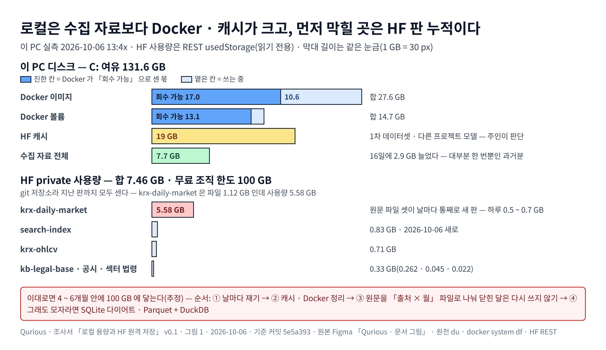

# 로컬 용량과 HF 원격 저장 — 「전부 HF 에 두고 필요할 때 받기」 조사서 v0.1

| 문서 정보 | |
|---|---|
| **판 · 상태** | v0.1 · 조사 끝(검토 전) |
| **구분** | 조사서 — 목표 기능 ① `P01-①-2` · `①-4`(수집 · 적재 · 정기 배치)의 저장 구조 |
| **작성** | 이동원(조사 · 이 PC · HF 실측) |
| **검토** | 검토 전 — 판을 올리는 PR 에 팀원 한 명 이상의 「읽었음」 |
| **최종 수정** | 2026-10-06 (KST) |
| **기준** | 외부 원문 조회 2026-10-06 · 이 PC 실측 2026-10-06 13:4x ~ 14:3x · HF 사용량 읽기 전용 조회(REST `usedStorage`) · 코드 `main` `5e5a393` |
| **관련 문서** | [목표 기능 ① 상세 설계서 v1.5](../설계/목표기능1-데이터지식-설계_v1.5.md) 4 · 5.2절 · `scripts/hf_dataset.py` 머리말 · `collector/README.md` 9절 |
| **최근 개정** | 새 문서 |

> **이 문서로 알 수 있는 것**
> 1. 수집 자료를 전부 HF 에 두고 필요할 때 받아 쓰면 로컬 용량 문제가 풀리나?
> 2. 지금 실제로 디스크와 HF 할당량을 먹는 것은 무엇인가?
> 3. 무엇부터 하면 되나?
>
> **읽는 순서** — 이동원: 요약 → 4절 · 처음 온 사람: 부록 B 용어 → 요약

## 요약

1. **백업으로는 이미 「전부 HF + 필요할 때 받기」 다.** 수집 DB 열다섯 표가 매일 HF private `krx-daily-market` 에 올라가고(파일 69 · 1.12 GB · 날짜 태그), 받아서 되살리는 길도 실측으로 확인했다(2026-10-06 에 근거 DB · 검색 색인 · 공시 보관본까지 더함). **그러나 앱의 자료 원천을 HF 로 바꾸는 것은 권하지 않는다** — 앱은 요청마다 종목 · 기간을 조회하고(서비스 여섯 파일 · SQL 33곳), 원격 조회는 느리고 오프라인 · 요청 한도(429)에 묶인다.
2. **로컬 디스크는 급하지 않다.** C: 여유 131.6 GB(13:44 실측), 수집 자료 전체 7.7 GB. 16일 동안 2.9 GB 늘었는데 대부분 한 번뿐인 과거분 받기였다.
3. **디스크를 실제로 먹는 것은 수집 자료가 아니다** — Docker 디스크 51.5 GB(이미지 27.6 GB 중 17.0 GB · 볼륨 14.7 GB 중 13.1 GB 가 「회수 가능」) · HF 캐시 19 GB(1차 Alpha_Stack 데이터셋 · 다른 프로젝트 모델 · Windows 라 판마다 복사본).
4. **먼저 막힐 수 있는 곳은 HF 할당량이다.** 무료 조직의 private 저장은 100 GB 이고(원문), git 저장소는 지난 판을 모두 센다. 실측으로 `krx-daily-market` 은 파일 1.12 GB 인데 **사용량 5.58 GB** 다 — 원문 파일 셋이 날마다 통째로 새 판이 되기 때문이다(하루 0.5 ~ 0.7 GB). 이대로면 4 ~ 6개월 안에 100 GB 에 닿는다(추정 · 1차 데이터셋 몫은 빼고 셈).
5. 순서는 ① 재기(러너가 날마다 여유 공간 · 파일 크기 · HF 사용량을 남김) → ② 캐시 · Docker 정리(앱 변경 없음 · 다른 프로젝트 것은 주인이 판단) → ③ HF 판 늘어남 줄이기(원문을 「출처 × 월」 파일로 나눠 닫힌 달은 다시 쓰지 않기) → ④ 그래도 모자라면 SQLite 다이어트 · 분석 표만 로컬 Parquet + DuckDB.

**<그림 1> 디스크와 HF 할당량을 먹는 것** · 막대 길이는 같은 눈금(1 GB = 30 px) · 진한 칸 = Docker 가 「회수 가능」 으로 센 몫

원본: [Figma · Qurious · 문서 그림 · 그림 1](https://www.figma.com/design/6lstWS4YwuhJPhGB9XoBMD?node-id=34-2) · 그림 판 v0.1 · 기준 `5e5a393` · 2026-10-06 · 원천 `du` · `docker system df` · HF REST `usedStorage`(<표 1>)

---

## 1. 조사 방법

조사 에이전트 한 번(출처 31곳 · 로컬 읽기만)에 맡긴 뒤, 결론을 바꾸는 숫자 셋을 직접 다시 쟀다(<표 1>).

**<표 1> 다시 확인한 것**

| 확인한 것 | 방법 | 결과 | 확실도 |
|---|---|---|---|
| HF private 무료 한도 | [H1] HF 「Storage limits」 원문 | 무료 사용자 · 조직 100 GB · PRO 1 TB · Team 좌석당 1 TB · 초과분 $18/TB/월 · super-squash 로 옛 판을 지울 수 있으나 되돌릴 수 없고 36시간 뒤 반영 | 확인(원문) |
| 우리 데이터셋 사용량 | HF REST `GET /api/datasets/<id>?expand[]=usedStorage`(읽기 전용 · 2026-10-06) | krx-daily-market 5.584 · search-index 0.834 · krx-ohlcv 0.712 · kb-legal-base 0.262 · dart-disclosure-financials 0.045 · kb-sector-laws 0.022 GB → **합 7.46 GB** | 확인(실측) |
| 로컬에서 큰 것 | `du` · `docker system df` | HF 캐시 19 GB · Docker 디스크 파일 51.5 GB · 이미지 27.63 GB(회수 가능 16.96) · 볼륨 14.67 GB(회수 가능 13.09) | 확인(실측) |

`huggingface_hub` 0.36 의 `dataset_info(expand=["usedStorage"])` 는 이 PC 에서 값이 비어(None) 왔다 — REST 원문으로 읽어야 했다(실측).

## 2. 선택지

**<표 2> 선택지** · 절약은 로컬 기준

| 선택지 | 어떻게 | 절약 | 앱 바꿀 곳 | 오프라인 | 위험 | 확실도 |
|---|---|---|---|---|---|---|
| A 지금대로 + 감시 | 러너가 날마다 여유 공간 · 파일 크기 · HF 사용량을 한 줄씩 | 0 | `daily_update.py` 만 | 됨 | 없음 | 상 |
| B 캐시 · Docker 정리 | HF 캐시의 옛 판 · 안 쓰는 모델, Docker 안 쓰는 이미지 · 볼륨 | 최대 약 40 GB | 없음 | 됨 | 다른 프로젝트(강의 · 1차) 것일 수 있다 — 주인이 판단 | 상 |
| C 원문 본문을 SQLite 밖으로 | 원문 표에서 본문만 빼 Parquet(로컬 · HF)로 | 0.64 GB | 원문 다시 읽는 수집기 넷 · 내보내기 꼴 | 로컬 Parquet 이면 됨 | 먼저 원문 내보내기를 월 단위로 바꿔야 한다 | 중 |
| D 옛 연도 시세는 HF 에만 | 2020 ~ 22 년 행을 지우고 필요할 때 받기 | 연 0.2 ~ 0.4 GB(추정) | 서비스 여섯 · 수정주가 계산 | 옛 구간 불가 | 수정주가는 날마다 전 기간을 다시 계산한다 | 중 |
| E 분석 표를 로컬 Parquet + DuckDB 로 | 매일 만드는 Parquet 을 앱이 읽음 | 약 4 GB(추정 · Parquet 이 5.5배 작다) | 여섯 파일 · 이미지에 duckdb | 됨 | 큰 리팩터 · 종목 정렬 사본 필요 | 중 |
| F 전부 원격 조회 | 요청마다 HF 를 읽음 | 5 ~ 7 GB | 여섯 파일 · 컨테이너에 토큰 | 불가 | 요청 한도 429 · HF 장애 · 느림 | 상(비권장) |

**hf_export 임시 폴더(1.1 GB)는 지우지 않는다** — 내보내기의 「건너뛰기」 판정이 파일이 있는지를 보므로(`scripts/hf_dataset.py`), 지우면 날마다 전부 다시 내보낸다(조사 에이전트 · 코드 확인).

## 3. HF 할당량이 늘어나는 까닭

`krx-daily-market` 은 원문 파일 셋(포털 408 · DART 181 · 정책뉴스 45 MB)을 날마다 통째로 다시 써서 올린다. 전송은 Xet 이 바뀐 청크만 보내 작지만, 할당량은 git 이 남기는 판마다 센다(실측: 파일 1.12 GB · 사용량 5.58 GB · 커밋 11개 동안 바뀐 파일 약 4.7 GB). 닫힌 달의 원문을 다시 쓰지 않게 「출처 × 월」 파일로 나누면 날마다 바뀌는 몫이 수십 MB 로 줄어든다(추정 · 3단계).

## 4. 추천 순서

**<표 3> 추천 순서**

| 단계 | 무엇 | 비용 | 언제 |
|---|---|---|---|
| 1 재기 | 러너 이력에 날마다 여유 공간 · 파일 크기 · HF 사용량(REST) 한 줄 · 경보(로컬 여유 50 GB 밑 · HF 70 GB) | 30분 | 다음 수집기 PR |
| 2 정리 | HF 캐시 옛 판 · Docker 안 쓰는 이미지 — **주인 확인 뒤**(강의 · 1차 프로젝트 몫이 섞여 있다) | 1 ~ 2시간 · 앱 변경 없음 | 사용자 결정 |
| 3 HF 판 줄이기 | 원문 내보내기를 「출처 × 월」 파일로 · 옛 판은 한 번 super-squash 할지 팀 결정(되돌릴 수 없음 · 태그 이력도 사라짐) | 반나절 | 1 단계에서 사용량이 계속 늘면 |
| 4 구조 | SQLite 다이어트(WITHOUT ROWID · VACUUM) → 그래도 모자라면 분석 표만 Parquet + DuckDB | 하루 ~ 며칠 | 로컬 여유 50 GB 밑 |

## 5. 이 조사를 뒤집을 조건

- 조직이 Team 요금제로 가면(사용자당 $20/월 · 좌석당 1 TB) 할당량 걱정이 사라진다.
- 앱을 서버(AWS 등)로 옮기면 원격 저장 + DuckDB 가 표준 선택이 된다 → D · E 를 다시 본다.
- 로컬 여유가 50 GB 밑으로 내려가거나 하루 1 GB 넘게 늘면 4 단계를 앞당긴다.

## 부록 A. 출처 (조회 2026-10-06)

| 번호 | 출처 | 이 문서에서 쓴 것 |
|---|---|---|
| [H1] | Hugging Face — [Storage limits](https://huggingface.co/docs/hub/storage-limits) | 요금제별 private 한도 · 초과 요금 · super-squash · 저장소 권장치(원문 재확인) |
| [H2] | Hugging Face — [Storage Buckets](https://huggingface.co/docs/hub/storage-buckets) | git 저장소는 지난 판을 보관 · 버킷은 지금 것만(에이전트 확인) |
| [H3] | Hugging Face — [Rate limits](https://huggingface.co/docs/hub/rate-limits) | 5분당 요청 한도 · 429(에이전트 확인) |
| [H4] | huggingface_hub — [Manage cache](https://huggingface.co/docs/huggingface_hub/guides/manage-cache) | Windows 에서 판마다 복사 · 캐시 지우기(에이전트 확인) |
| [D1] | DuckDB — [Hugging Face support](https://duckdb.org/docs/current/core_extensions/httpfs/hugging_face.html) | private 은 `CREATE SECRET TYPE huggingface`(에이전트 확인) |
| [S1] | SQLite — [WITHOUT ROWID](https://www.sqlite.org/withoutrowid.html) · [VACUUM](https://www.sqlite.org/lang_vacuum.html) | 공간 줄이기 · 두 배 임시 공간(에이전트 확인) |
| [K1] | Docker — [Prune](https://docs.docker.com/engine/manage-resources/pruning/) | 볼륨은 기본으로 지우지 않음(에이전트 확인) |

## 부록 B. 용어

| 용어 | 뜻 | 이 문서에서 | 헷갈리는 점 |
|---|---|---|---|
| usedStorage | HF 가 저장소마다 세는 저장 사용량 | 할당량 계산의 기준 | 지금 파일 크기가 아니라 지난 판까지 센 값 |
| super-squash | HF 저장소의 이력을 한 커밋으로 합쳐 옛 판을 지우는 것 | 3 단계 후보 | 되돌릴 수 없다 · 날짜 태그로 옛 판을 받는 재현이 끊긴다 |
| 회수 가능(reclaimable) | Docker 가 지금 쓰지 않는다고 표시한 이미지 · 볼륨 | 2 단계 | 다른 프로젝트가 다시 쓸 수 있다 — 주인 확인 |

## 개정 이력

| 판 | 날짜 | 바꾼 것 | 작성 |
|---|---|---|---|
| v0.1 | 2026-10-06 | 새 문서 — 선택지 여섯 · HF 할당량 실측(합 7.46 GB) · 로컬 큰 것(Docker · HF 캐시) · 추천 순서 넷 | 이동원 |
