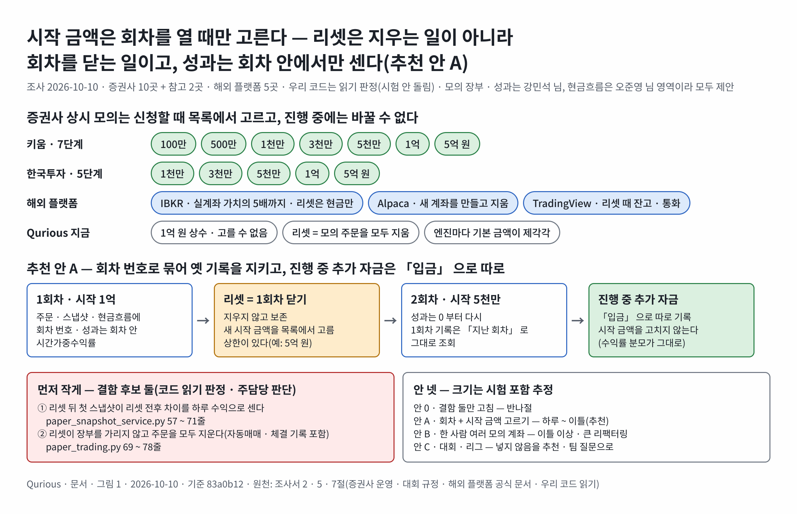

# 모의투자 — 증권사별 실거래 · 모의 계좌 · 규칙 · 시작 금액 설정 조사서 v0.1

| 문서 정보 | |
|---|---|
| **판 · 상태** | v0.1 · 초안(검토 전) — 팀 글은 이슈 [#150](https://github.com/EST-team-project/Qurious/issues/150)(모의 계좌 시작 금액 · 강민석 님 · [본문 사본](../github-archive/2026-10-10/이슈-모의계좌-시작금액-회차/00-본문.md)) · [#151](https://github.com/EST-team-project/Qurious/issues/151)(증권사 모의환경 · 오준영 님 · [본문 사본](../github-archive/2026-10-10/이슈-증권사-모의환경/00-본문.md)) · 둘 다 2026-10-10 올림 |
| **구분** | 조사서 — 증권사 계좌 구조 · 모의 · 실거래 규칙 차이 · 대회 · 시작 금액 설정 사례 · 우리 코드 현황 · 적용 안 |
| **작성** | 이동원(조사 지시 · 검토) · 사례 수집과 초안은 조사 에이전트(증권사 공개 규정 · 해외 플랫폼 공식 문서 · 우리 코드 읽기 · github.com 은 열지 않음). 모의 주문 · 운용은 **강민석 님 영역**, 증권사 연동은 **오준영 님 영역**이라 이 문서의 제안은 모두 「제안」 이다 |
| **조회일** | 2026-10-10 (KST) — 웹 출처는 모두 이 날 조회. 해마다 바뀌는 것(대회 규칙 · 수수료 · 세율 · API 유량)은 칸마다 「언제 기준」 을 적었다 |
| **기준** | 우리 코드 `main` `9a53f5b`(같은 날 고치던 파일이 있어 모두 `git show HEAD:` 로 읽음) · 강사님 자료 stock-coin-trade `ab4e493`(2026-10-08) — 읽기만 |
| **확실도 표기** | 「확인」 = 공식 페이지 원문(또는 공식 페이지의 검색 요약 문장)으로 봄 · 「추정」 = 2차 자료(블로그 · 보도 · 요약 도구)로만 보았거나 둘 이상을 맞춰 추정 · 「미확인」 = 로그인이 필요하거나, 페이지가 스크립트로 그려져 본문을 읽지 못했거나, 찾지 못함 |
| **하지 않은 것** | 증권사 API 호출 · 로그인 · 시험 · 러너 실행 · github.com 페이지 열람(모두 하지 않음 · 공개 규정 페이지 셋은 헤드리스 브라우저로 로그인 없이 읽음). 우리 코드 판정은 **코드 읽기 판정**이다 — 시험으로 재지 않았다 |
| **최종 수정** | 2026-10-10 (KST) |
| **관련 문서** | [시장 범위 조사서 v0.1](시장범위-미국코인-거래기준-조사.md) · [금융 필수 지식 · 개념 학습 배치 조사서 v0.1](금융지식-개념학습-배치-조사.md) · [요구 대장](../요구사항/대장/요구-대장.tsv) `P01-④-3` · [테스트 계획서](../시험/테스트계획서.md) 5절 결함대장(결함 후보 둘 · 열림(후보) · 팀원 영역) |
| **최근 개정** | v0.1 — 처음 씀 |

> **이 문서로 알 수 있는 것**
> 1. 조사한 증권사 10곳(키움 · 한국투자 · 미래에셋 · NH · 삼성 · KB · 신한 · LS · 대신 · 토스) + 참고 2곳(메리츠 · 유안타) 가운데 **모의 계좌를 운영하는 곳은 모두 실계좌와 따로 둔다** — 모의 전용 ID · 접속 비밀번호 · 계좌번호 · API 키 · 도메인(또는 포트)이 갈린다. 실계좌를 쓰는 것은 「실전투자대회」(키움 영웅전 · NH 투자 챔피언십 등)뿐이다. 한 사람이 상시 모의 계좌와 그룹 · 대회 모의 계좌를 따로 가질 수 있는 곳이 많다(키움 · 미래에셋 · 삼성선물 · KB 대회). 상시 모의의 운영 규정 원문까지 확인한 곳은 **키움 · 한국투자** 둘(두 곳 규정 문장이 거의 같다 — 키움은 모의 시스템을 연합인포맥스에서 임대한다고 밝힘), 계좌 구조 · 대회 · API 를 공식 쪽에서 확인한 곳이 미래에셋 · LS · 대신 · KB · 삼성 · NH(실전대회) · 토스(10대 모의) 7곳이다(NH 는 보도로 확인). 신한은 2016년 대회 공지만, NH · 신한 · 삼성의 상시 모의 규정은 찾지 못했다.
> 2. 국내 상시 모의의 시작 금액은 **「신청할 때 고른 값 목록 중 하나 · 진행 중엔 못 바꿈 · 바꾸려면 참가 취소 후 다시 신청」** 이 공통 꼴이다 — 키움 100만 · 500만 · 1천만 · 3천만 · 5천만 · 1억 · 5억 원 · 한국투자 1천만 · 3천만 · 5천만 · 1억 · 5억 원 · 기간은 둘 다 1 · 2 · 3개월(공식 규정 원문). 한국투자 해외주식 모의는 **금액 고정**(USD 100,000 등). 해외 플랫폼은 **「리셋할 때 금액을 고른다」**(Alpaca 임의 · IBKR 실계좌 가치의 5배까지 · TradingView 잔고 · 통화 · 레버리지). **대회 계좌는 금액이 고정이고 리셋이 안 된다**(TradingView 대회 100,000 USD · 타임폴리오 10억 원).
> 3. 모의와 실거래가 갈리는 규칙은 15항목을 비교했다. 핵심은 **체결 규칙** — 한국투자 · 키움 모의는 「현재가보다 적극적인 가격을 내도 **실제 시장에서 체결이 생겨야만** 체결」 하고 실제 체결량만큼만 체결한다(거래 없는 현재가로 계속 매매하는 구멍을 막으려고 · 상 · 하한가는 실제 체결 비율의 10%만) — 그리고 시간외 매매 불가 · 신용 · 공매도 불가 · 조건부지정가 · IOC · FOK 미적용 · 1,000원 미만 · 10만 주 미만 종목 제한 · 모의 비용(키움 「수수료 및 제세금」 주식 0.35% · 한국투자 수수료 0.0142% + 세금 0.20%) · 대체거래소(NXT) 미지원(키움 모의) · API 유량(KIS 모의 1초 2건 ↔ 실전 20건 · 키움 모의 TR당 1초 1회 ↔ 실전 5회) · 배당은 권리락일에 현금 입금이다.
> 4. 「타임폴리오 모의투자」 는 운용사 **타임폴리오자산운용이 직접 여는 「로드 투 펀드매니저(RFM)」 모의투자대회**다(2023년부터 · 분기 1회 · 2개월 · 가상 10억 원 · 단일종목 15% 이하 · 산업군 비중 제한 · 투자 제한 종목 · 수익률 상위 5명 상금 + 분산 · 변동성 관리를 본 운용 능력 A+ 에 채용 전환형 인턴십). 증권사 대회가 「수익률 순위」 라면 이 대회는 「기관처럼 운용하는가」 를 함께 본다.
> 5. 우리 앱은 시작 금액이 1억 원 상수(`app/models/paper.py:25`)이고 한 사람 한 계좌다. 금액을 고르게 하는 것 자체는 작지만, 먼저 막아야 할 곳이 넷 있다(코드 읽기 판정): ① 리셋 뒤 처음 기록되는 스냅샷의 「가짜 일별 수익률」(`paper_snapshot_service.py:57-71`) ② 리셋이 사용자의 **모든** 주문 행을 지움 — 자동매매(QUANT) · 증권사 체결 들여오기 행 포함(`paper_trading.py:72`) ③ 입금 · 출금이 손익 · 수익률로 잡힘(`paper_trading.py:762-768` · `rebalance.py:483-488`) ④ 직접매매의 클라이언트 가격 · 현금 없는 보유 입력 · 장 시간 검사 없음(`routes/stocks.py:240-256 · :309-360`).
> 6. 추천은 **안 A — 「리셋할 때 시작 금액을 고르고, 리셋을 회차로 기록하고, 성과는 회차 안에서만 센다」** 이다. 주담당은 강민석 님(모의 장부 · 성과), 현금흐름 부분은 오준영 님과 맞춘다. ①② 는 결함 후보라 작게 먼저(주담당 판단), 금액 선택은 2차 로보 어드바이저 구현 칸 뒤 — 3차 「모의증권 연동」(11-05 오전) 앞뒤나 리팩터링 · 개선 세션. 여러 계좌(안 B) · 대회 · 리그(안 C)는 요구 대장에 없어 팀 결정 뒤.

---

## 한눈에

증권사 · 플랫폼이 시작 금액과 리셋을 다루는 방식과 우리 추천 안은 <그림 1> 과 같다.

**<그림 1> 시작 금액은 회차를 열 때만 — 증권사 사례와 추천 안 A** · 범례: 초록 = 증권사 상시 모의의 고르는 값 · 파랑 = 해외 플랫폼 · 회색 = 우리 지금 · 빨강 = 먼저 고칠 결함 후보



<sub>원본: [Figma · Qurious · 문서 그림 · 49:76](https://www.figma.com/design/6lstWS4YwuhJPhGB9XoBMD?node-id=49-76) · 그림 판 v0.1 · 기준 `83a0b12` · 원천: 이 문서 2 · 5 · 7절 · 2026-10-10</sub>

---

## 1. 방법

**<표 1> 조사 방법**

| 질문 | 본 곳 | 방법 |
|---|---|---|
| ① 증권사 계좌 구조 | 증권사 공식 홈페이지 · 공식 개발자 포털(키움 REST · LS OPEN API) · 공식 이벤트 페이지 · 공식 앱 설명 · 공식 안내서 PDF | 공식 쪽 우선. 키움 · 한국투자의 모의 규정은 페이지가 스크립트로 그려져 일반 요청으로는 본문이 비어, **헤드리스 브라우저로 로그인 없이 공개 원문을 열어** 읽었다(S49 ~ S51 · 참가신청 화면은 로그인이 필요해 열지 않음). 그 밖에 원문을 못 연 곳은 검색 요약 문장 + 2차 자료 둘 이상으로 맞춰 「추정」 |
| ② 모의 · 실거래 규칙 | 같은 곳 + 해외 플랫폼 공식 문서(Alpaca · IBKR · TradingView · QuantConnect) | 항목 15개를 같은 칸으로 비교(<표 4>) |
| ③ 대회 · 타임폴리오 | 타임폴리오 공식 홈페이지 · 공식 뉴스 · 연합뉴스(2026-10-07) · 증권사 대회 공지 · TradingView 대회 약관 | 「언제 기준」 을 회차 · 날짜로 적음 |
| ④ 시작 금액 사례 | 위 해외 플랫폼 공식 문서 · 국내 증권사 규정 · 토스 공식 콘텐츠 | 기본값 · 바꾸는 때 · 범위 · 리셋 때 남는 것 · 여러 계좌 · 대회 계좌 |
| ⑤ 우리 코드 · 강사님 자료 | `app/` · `alembic/` · `public/js/` · `tests/` · `docs/요구사항` · `docs/ADR` · 강사님 stock-coin-trade(`git show HEAD:`) | 읽기만. 강사님 커밋은 `%h %ad %s` 로만 봄 |

---

## 2. 증권사별 계좌 구조 — 실거래 · 모의 분리 · 신청 · 금액 · 대회 · API

### 2.1 한눈에 보기

**<표 2> 증권사별 모의 계좌 구조 (조회일 2026-10-10)**

| # | 증권사 | 실계좌와 따로인가 | 신청 · 기간 · 갱신 | 시작 금액 | 리셋 · 추가 입금 | 한 사람 여러 모의 계좌 · 대회 | 확실도 | 출처 |
|:-:|---|---|---|---|---|---|---|---|
| 1 | 키움 | 따로 — 홈페이지 회원가입만으로 신청 · HTS 로그인 화면에서 「모의투자」 를 고르고 모의 ID · 비밀번호로 접속 · 모의 시스템은 (주)연합인포맥스에서 임대(운영규정 끝 문장) | 상시 모의 신청 · 참가기간 1 · 2 · 3개월 중 선택 · 만료 뒤 홈페이지에서 재신청 · 참가신청 화면은 로그인 필요 | 신청 때 **100만 · 500만 · 1,000만 · 3,000만 · 5,000만 · 1억 · 5억 원** 중 선택 · 「투자원금과 참가기간 변경은 불가능 · 변경을 원하실 경우 참가취소하여 신규 참가」 | 국내 주식은 취소 · 재신청. FX마진 · 해외선물 모의에는 메뉴에 「예탁금 추가입금」 · 「모의투자 초기화/해지」 가 있음 | 상시 · 일반그룹 · 대학그룹 · 대학생모의투자대회(제37회)가 메뉴로 따로 · 「개인별, 그룹별(일반인/대학생) 등 각각 참가 신청」(2차 안내서) · 실전투자대회 「키움 영웅전」 은 **실계좌** 대회 | 규정 · 메뉴 · API = 확인 · 「각각 참가」 = 추정 | S1 ~ S9 · S49 |
| 2 | 한국투자 | 따로 — 모의 접속 비밀번호 · 모의 계좌번호 · **모의 전용 앱키**(KIS Developers 에서 모의 계좌로 따로 신청) · 모의 시스템 주소 `vts3.koreainvestment.com` | 홈페이지 · 앱에서 모의투자 신청(리그 · 투자기간 선택 화면) · 투자기간 1 · 2 · 3개월 · 해외선물옵션 모의는 계좌가 있는 정회원만 | 국내 주식: 신청 때 **1,000만 · 3,000만 · 5,000만 · 1억 · 5억 원** 중 선택 / 해외주식: **고정** USD 100,000 · CNY 300,000 · HKD 300,000 · JPY 5,000,000 · VND 1,000,000,000(공식 대회규정) · 우리 점검 계정의 KIS 모의 잔고는 1,000만 원(2026-10-08) | 「투자원금과 투자기간 변경은 불가능하며, 변경을 원하실 경우 참가 취소 후 다시 참가 신청」 · FAQ 에 「모의투자 참가신청/초기화」 메뉴 | 상시 · 리그(세부 미확인) · 해외선물옵션 모의는 2016-10-17 새 시스템 도입 때 기존 모의 정보를 모두 초기화했음 | 규정 = 확인 | S10 ~ S14 · S48 · S50 · S51 |
| 3 | 미래에셋 | 따로 — 모의투자 전용 앱 「m.Stock 모의투자」 · 모의 계좌 비밀번호 0000(앱 운영자 답변) | 앱에서 상시 참가신청 → 계좌 생성 | 앱에서 투자원금 · 투자기간을 설정 — 범위 미확인 | 미확인 | 상시 · 그룹(그룹 개설 가능) · 「중계 화면을 통한 모의투자 성과 비교」 · 주식 · ELW · ETF · ETN | 앱 설명 = 확인 · 금액 범위 = 미확인 | S20 · S21 |
| 4 | NH | 상시 모의는 미확인 — 공식 페이지에서 국내 상시 모의투자 안내를 찾지 못함. 대신 **실계좌 대회**가 있음: 제1회 「투자 챔피언십 실전투자대회」(2026-03-09 ~ 04-17 · 6주 · 국내주식 · NH 국내주식 계좌 보유 고객 · 나무 · N2 앱 신청 · 기초자산별 리그 — 루키 10만 원 이상 · 챌린저 100만 원 이상 · 프로 3,000만 원 이상 · 리그별 수익률 순위 · 주간 시상) | 미확인(상시) | 실전대회는 본인 돈(리그 하한만 있음) | — | 실전대회는 **기초자산 크기로 리그를 나눔** — 금액이 다른 사람을 한 줄로 세우지 않는 장치 | 실전대회 = 확인(보도 2026-02-12) · 상시 = 미확인 | S52 |
| 5 | 삼성 | 따로 — 「모의투자 ID」 체계가 있음(개인공매도용 대주 모의거래 이수 등록에 모의투자 ID · 인증키를 넣음 · 2025-03-26 공지) · 모의 매매는 mPOP 앱(2019 보도) | 국내 상시 모의의 신청 · 기간은 미확인 | 미확인 | 미확인 | 계열 삼성선물 해외선물 모의투자대회(2024-07-01 ~ 07-26): 모의 회원 가입 → 해외선물 모의계좌 개설 → 모의 HTS · MTS 에서 대회 신청 · 누적 수익률 TOP 30 · 실계좌를 기한 안에 열지 않으면 수상 취소 | 대회 = 확인 · 상시 = 추정(2019 보도) | S23 · S53 |
| 6 | KB | 따로 — M-able 앱의 KB 모의투자 계좌 | 미확인 | 미확인 | 미확인 | 대회 「모투의 마블」(2026-07-20 ~ 08-17 접수 · 08-03 ~ 08-21 평가 · **KB 모의투자 계좌가 있는** 만 19 ~ 39세 · 국내 주식 · 최소 10종목 이상 보유 · 중복 참가 불가 · 부정행위 실격) | 대회 = 확인(요약 도구 결과 · 원문 일부) | S22 |
| 7 | 신한 | 미확인(국내 상시) | 미확인 | 2016 해외선물 모의투자대회 「최초 예수금 $100,000」 | 미확인 | 대회는 별도 신청 | 대회 = 확인(2016 · 오래됨) · 상시 = 미확인 | S24 |
| 8 | LS(옛 이베스트) | 따로 — **모의투자 OPEN API 를 별도로 신청** · 「모의투자는 App Key · Secret Key 가 실계좌와 다르게 발급」 | OPEN API 는 xingAPI 신청 뒤 계좌 단위로 신청 | HTS 모의 금액은 미확인 | 미확인 | 미확인 | API = 확인 | S15 ~ S17 |
| 9 | 대신 · 크레온 | 따로 — CYBOS 5 모의투자는 **대신 계좌가 없어도** 모의 홈페이지 회원가입 → 대회참가 신청으로 이용 | 크레온: 「상시 모의투자대회」 · 참가신청 상시 · **최대 3개월** 사용 · 운영기간 종료 뒤 다시 참가 신청 | 해외선물 모의: 「모의투자 내 화면에서 통화별 예탁금 추가 가능」 | 해외선물 모의: 「모의투자 계좌는 고객 당, 1개의 계좌 개설이 가능」 · 「모의투자계좌해지」 메뉴 | 해외선물 모의는 **1인 1계좌** · 크레온 메뉴에 「실전투자대회」(실계좌) | 확인 | S18 · S19 |
| 10 | 토스 | 토스증권의 모의투자 서비스는 공식 페이지에서 찾지 못함. 대신 **토스 앱의 「토스 모의주식투자」** — 만 7 ~ 18세 전용 | 앱 메뉴에서 시작 | **가상 1,000달러 고정** · 매일 「랜덤박스」 로 모의투자금을 받고 · 친구 초대 때 500달러 또는 모의주식 1주 | 미확인 | 10대 전용 · 수익 · 손실은 현금과 바꿀 수 없음 | 확인(2024-03-04 기준 콘텐츠) | S25 |
| 참고 | 메리츠 | 해외주식 · 파생 모의투자 이용안내 페이지가 있음 | — | — | — | — | 미확인(제목만) | S26 |
| 참고 | 유안타 | 티레이더 모의투자 — 참가 대상 전국 대학교(원) · 동호회 · 국내주식 · 선물/옵션 · 해외주식 · 해외선물 · 신청 상시 | — | — | — | 그룹(대학 · 동호회) | 확인(검색 요약) | S27 |

### 2.2 오픈 API 로 모의 계좌를 쓸 수 있나

**<표 3> 증권사 오픈 API 의 모의 환경 (조회일 2026-10-10 · 유량은 바뀔 수 있음)**

| 증권사 | 모의 접속점 | 키 | 모의 유량 ↔ 실전 유량 | 모의가 지원하는 시장 · 제약 | 확실도 | 출처 |
|---|---|---|---|---|---|---|
| 키움 REST | `https://mockapi.kiwoom.com` (실전 `https://api.kiwoom.com`) | REST API 사용신청 뒤 앱키 · 시크릿키(모의 신청은 홈페이지 상시 모의투자에서 따로) | 모의: 「계좌별(토큰별) TR 1개당 국내주식 1초 1회, 미국주식 1초 1회」 ↔ 실전 국내 주문 TR 1초 5회 · 조회 TR 1초 5회 · 미국 주문 10회(피크 3회) | **국내 모의는 NXT 미지원 — 매매 · 계좌조회 모두 KRX 만**(시세는 NXT 까지 제공) · 미국 모의는 NYSE · NASDAQ · AMEX 상장 종목만 · 무료 실시간 시세 · 「3개월 단위로 실서버 미접속 시 자동 해지 — 모의투자 서버로만 로그인하면 해지될 수 있음」 | 확인 | S1 · S2 · S3 |
| 한국투자 KIS Developers | `https://openapivts.koreainvestment.com:29443` (실전 `:9443` 의 `openapi`) | **모의 계좌용 앱키 · 시크릿 따로** · TR ID 첫 글자 V(모의) ↔ T(실전) | 모의 1초 2건 ↔ 실전 1초 20건(계좌 단위) · 토큰 발급 1초 1건(2023-10-27 ~) · 토큰 발급은 1분에 1회로도 묶임(EGW00133 — 우리 결함 DF-84 기록 · 2차 출처 둘) · 웹소켓 실시간 합산 41건 | 강사님 코드 관찰(2026-10): 「KIS 모의투자는 일별주문체결조회 건별 목록(output1)을 비워 돌려준다」 → 강사님은 자기 게이트웨이 기록으로 보완 | 접속점 · 키 = 확인(우리 코드 · 강사님 코드 · 2차 자료 일치) · 유량 = 추정(공식 공지를 인용한 2차 자료 셋) | S13 · S14 · 우리 `brokers/kis.py:14-15` · 강사님 `brokers/kis.py:340-346` |
| LS OPEN API | REST 는 같은 도메인(`openapi.ls-sec.co.kr`) · 웹소켓은 9443(모의 **29443**) | **모의 앱키 · 시크릿 따로 발급** — 어느 환경인지는 키가 정한다 | 미확인(2차 자료: 일일 호출 한도 등) | 토큰은 다음 날 07시까지(2차 자료) | 확인(키 · 포트) · 유량 미확인 | S15 · S16 |
| 대신 CYBOS Plus | COM(Windows) — HTS 를 모의로 접속 | 모의 ID | 미확인 | — | 추정 | S19 |
| 미래에셋 · NH · 삼성 · KB · 신한 · 토스 | 미확인 — KB 는 우리 코드에 `paper` 인자가 있으나(`brokers/kb.py:20-23`) 공식 모의 접속점을 확인하지 못함 | — | — | — | 미확인 | — |

**판단** — 국내에서 「모의 전용 접속점 + 모의 전용 키」 를 공식 문서로 확인한 곳은 키움 REST · 한국투자 · LS 셋이다. 키움 · 한국투자는 **모의 유량이 실전보다 훨씬 좁고**(LS 는 유량 미확인), 키움 모의는 NXT 를 지원하지 않는다. 우리 앱이 「한 사람 = 자기 키 = 자기 모의 계좌」(ADR-0004)로 가는 것은 증권사 쪽 구조와도 맞다 — 증권사 모의 계좌는 한 사람 단위로 발급되기 때문이다.

---

## 3. 모의 · 실거래 규칙 차이

**<표 4> 규칙 15항목 — 실거래 · 국내 증권사 모의 · 해외 플랫폼 모의 · 우리 앱 (조회일 2026-10-10 · 국내 모의는 키움 운영규정 · 한국투자 대회규정 원문 기준)**

| # | 항목 | 실거래(국내) | 국내 증권사 모의(키움 · 한국투자 규정) | 해외 플랫폼 모의 | 우리 앱(지금 · 코드 읽기) | 확실도 |
|:-:|---|---|---|---|---|---|
| 1 | 시세 | 실시간 | 실시간 시세 사용 · 「참가자의 주문은 실제시장의 시세에 영향을 미치지 않습니다」(두 곳 같은 문장) · 키움 REST 모의는 NXT 시세까지 보여 줌 · 한국투자 **해외주식 모의는 기본 15 ~ 20분 지연 시세**(실거래에서 실시간 시세를 쓰는 고객만 실시간 · 체결은 모두 실시간 시세로) | Alpaca 실시간 NBBO · IBKR 은 **실계좌의 시세 권한을 그대로** 씀(구독이 없으면 지연) | 야후 시세 60초 캐시(`paper_trading.py:83-84 · :126-129`) · 코인은 업비트 5초 캐시(`:333`) | 확인 |
| 2 | 체결 방식 | 거래소 매칭(가격 → 시간 → 수량 우선 · 키움 FAQ) · 대기열 · 시장 충격 | **「현재가보다 더 적극적인 가격의 주문을 내어도 즉시 체결되지 않고, 실제 시장에서의 체결이 생겨야만 모의투자에서도 체결」** — 까닭: 「거래되지 않고 있는 현재가이어도 모의투자로는 현재가로 계속 매매할 수 있다는 문제점」(한국투자) · 「현재가 또는 유리한 가격의 호가에 대하여 주문접수 후 **실제시장의 체결량을 기준으로** 변동된 거래량 만큼 체결」 · 상한가 매수 · 하한가 매도는 `{(실제체결량 / 총호가잔량) × 주문수량} × 0.1` 만 체결 · 단주 미만 절사(두 곳 같은 규정) | Alpaca: 시장성 있을 때만 체결 · **10% 확률로 무작위 부분 체결** · 시장 충격 · 슬리피지 · 대기열 · 가격 개선 없음 / IBKR: 최우선 호가로만 모의 · 깊은 호가 없음 · 부분 체결된 시장가의 나머지는 거부 · 스톱 등 복합 주문은 늘 모의 처리 | 시장가 즉시 **전량** 체결 — 실제 거래가 있었는지 · 거래량이 얼마인지 보지 않음 · 미체결 · 부분 체결 없음(`paper_trading.py:218-288`) · 직접매매는 **클라이언트가 보낸 가격**으로 체결(`routes/stocks.py:277-283 · :318-350`) | 확인(우리 = 코드 읽기) |
| 3 | 수수료 · 세금 | 수수료(예: 키움 HTS 0.015% · LS KRX 0.015% · NXT 0.014%) + 매도 세금(2026 기준 코스피 증권거래세 0.05% + 농어촌특별세 0.15% · 코스닥 0.20% — 키움 FAQ) | 한국투자: 코스피 · 코스닥 수수료 **0.0142%** + 세금 0.20% · ETF/ETN · ELW 0.0148% · 세금 없음 · 해외(미국) 0.2%(SEC fee 0.00229% 포함) / 키움: 「수수료 및 제세금」 칸에 주식 **0.35%** · ELW 0.35%(제세금 내역 — 거래소 농특세 0.15% · 거래세 0.05% / 코스닥 거래세 0.20% · 0.35% 가 세금을 포함한 합계인지는 원문만으로 분명하지 않음 — 어느 쪽이든 실거래 수수료 0.015% 보다 큼) | Alpaca 규제 · 대차 수수료 미반영 / TradingView 기본 꺼짐(켜면 고정 · 비율 수수료) / IBKR 반영 | 주식은 비용 모델로 반영(`paper_trading.py:241-250` · `trading_cost` — 주석의 「KIS 모의투자 규정: 수수료 0.0142% · 세금 0.20%」 는 한국투자 규정 원문과 일치) · **코인은 수수료 0**(`:508-556`) — 업비트 KRW 마켓 실제 0.05% | 확인 |
| 4 | 거래일 · 거래시간 | KRX 정규장 · 장전 · 장후 시간외 · 시간외 단일가 · NXT 프리 · 애프터마켓 | 거래일 = 실제 영업일 · 한국투자: 동시호가 08:30 ~ 09:00 · 15:20 ~ 15:30 · 정규 09:00 ~ 15:30 · **「모의투자에서는 시간외매매는 불가」** / 키움: 장전 주문접수 08:30 ~ 09:00 · 정규 09:00 ~ 15:20 · 종가 결정 15:20 ~ 15:30 / 해외 모의는 **정규장 주문만** | 실제 장 시간 | **장 시간 · 휴장 검사 없음** — 주말 · 야간에도 마지막 캐시 시세로 체결(`paper_trading.py` · `routes/paper.py` · `routes/stocks.py` 에 장 시간 판정 없음) | 확인(우리 = 코드 읽기) |
| 5 | 주문 유형 · 예약 | 지정가 · 시장가 · 조건부지정가(15:20 단일가 때 시장가 전환) · 최유리 · 최우선 · IOC · FOK · 시간외 단일가 · 스톱 · 중간가(키움 REST `trde_tp`) | 한국투자: 지정가 · 시장가 · 최유리 · 최우선만 — **조건부지정가 · IOC · FOK 미적용** · 익일 예약주문 15:40 ~ 익일 07:30 / 키움: **지정가 · 시장가만** · 예약주문 16:00 ~ 익영업일 07:00(동시호가에 제출) / 해외(미국) 모의: 지정가만 | IBKR: VWAP · 경매 · RFQ 등 일부 미지원 | 시장가 하나(주식 · 코인) · 예약 없음 | 확인 |
| 6 | 신용 · 미수 · 공매도 | 약정 뒤 가능 · 개인 공매도는 사전교육 · 모의거래 이수 필요(삼성 공지) | 「주문은 현금매도/매수, 현금미수에 한하며, 신용이나 공매도는 허용하지 않습니다」(두 곳) · 미수 가능 → 결제일 미수금은 **반대매매**(한국투자 오전 08:00) · 한국투자는 대용증거금 불가 · 현금증거금만 | 계좌 종류(현금 · 마진)를 고름(QuantConnect) | 현금만 · 잔고가 음수가 되지 않게 막음(`paper_trading.py:60-66`) · 미수 없음 | 확인 |
| 7 | 투자 대상 · 매매 제한 종목 | 상장 전 종목(투자경고 등은 조건부) | 한국투자: 거래소 · 코스닥 · ETF · ELW · ETN / 키움: 거래소 · 코스닥 · ELW(ETN · 코넥스 · K-OTC 제외) · **현재가 1,000원 미만 매수 금지 · 총 발행 10만 주 미만 매매 금지** · 키움은 관리 · 정리매매 · 투자주의 · 투자경고 · 투자위험 종목도 제외 · 「초 저가주 등 대회의 수익률 왜곡을 초래할 종목」 제한(한국투자) | — | 종목 제한 없음 · 해외 티커도 체결(`routes/paper.py:85`) | 확인 |
| 8 | 해외 주식 | 가능 | 한국투자: 미국 · 중국 · 홍콩 · 일본 · 베트남 · 원금 고정(USD 100,000 등) · 정규장만 · 통합증거금은 「간소화하여 적용」 / 키움: 미국 모의 별도 참가신청 · NYSE · NASDAQ · AMEX 만 · 무료 실시간 시세 | Alpaca · IBKR 기본 | 해외 티커를 환율로 원화 환산해 체결 · 평가(`paper_trading.py:130-136`) — 환율 대체값 문제는 [시장 범위 조사서](시장범위-미국코인-거래기준-조사.md) 5절 | 확인 |
| 9 | 주문 제한(횟수 · 금액) | 증권사 한도 · 거래소 규정 | 주문 단위 1주(ELW 10증권 · 1회 최대 100만 주) · 종목별 차등증거금으로 주문가능금액 산출 · API 유량이 실전보다 좁음(<표 3>) | Alpaca · IBKR 은 실거래 규칙(예: 패턴데이트레이더) 일부 · 미확인 | 자동매매만 위험 한도(하루 20건 · 종목 30% · 손실 3% 등 `models/trading.py:125-130`) · **수동 모의 주문은 한도 없음** · 강사님 판은 KIS 모의 주문 1회 1,000주 · 1천만 원 상한 · 동시 주문 잠금(강사님 `brokers/kis.py:427 · :448 · :461`) | 확인 |
| 10 | 미체결 · 거래정지 | 미체결 주문은 남고 정정 · 취소 가능(키움 FAQ) | 「거래정지종목의 경우 주문접수는 가능하나 … 실제 체결은 이루어지지 않습니다 · 취소 전까지 미체결 매수주문에 대한 증거금은 산출」(한국투자) · KIS 모의 API 는 일별 체결 목록이 비어 옴(강사님 관찰 2026-10) | IBKR: 반대 호가가 없을 때의 시장가는 첫 부분 체결까지 대기 | 미체결 개념 없음 — 주문 행은 `status="filled"` 고정(`paper_trading.py:281-285`) | 확인 |
| 11 | 결제 · 출금 | 매도 대금 출금 D+2(키움 FAQ) | **3일 결제**(미수주문 가능) · 결제 순서 ELW → 코스닥 → 거래소 · 출금 없음 · 당일 매도 즉시 재매수 가능 · 「수수료 등 제비용은 장 마감 후 결제」(한국투자) | 출금 없음 | 체결 즉시 현금 반영 · 입금 · 출금 이벤트는 리밸런싱 쪽에 있음(`rebalance.py:471-505`) | 확인 |
| 12 | 배당 · 기업행동 | 배당 입금 · 권리 | 「유 · 무상 및 배당 등 권리 발생 종목은 **권리락일 결제시점(영업일 19시경)에 현금 입금** · 권리락 시 보유 수량 × (전일종가 − 권리락가격) 금액 보정」 · 액면분할 · 병합 · 감자는 거래정지 동안 매매 불가 · 매매 개시 전 영업일에 수량 조정 · 신규상장 첫날 동시호가 주문 불가(두 곳) · 해외 모의는 대회 종료일에 현금 입금 | Alpaca 「Paper trading account does NOT simulate dividends」 | 배당 자동 입금은 논의 중(#123 · 오준영 님) · 지금은 수동 DIVIDEND 이벤트 | 확인 |
| 13 | 시장 조치 반영 | 실시간 | 「증거금률 또는 시장 조치 사항에 대한 사항이 실제 거래처럼 실시간으로 변경되지 않으며 … **최소 1일 이상 차이**」(한국투자) | — | 시장 조치(투자경고 · 거래정지) 반영 없음 | 확인 |
| 14 | 순위 · 수익률 산식 | — | 총평가금액 = D+1 예수금 + 당일 매도 − 당일 매수 + 유가증권 평가 − 당일 수수료 · 제세금 · 투자수익률 = (총평가금액 − 투자원금) / 투자원금 × 100 · 한국투자는 주간 · 누적 수익률을 기간 연결(기말 − 전기말) / 전기말로 정산 · 「무효처리」 — 시스템 · 네트워크 · DB 장애로 참가자 1/2 이상 문제 · 고의적 방해 | TradingView 대회: 대회 끝 수익 | 총손익 = 총자산 − `initial_cash`(입금 보정 없음 · `paper_trading.py:762-768`) · 일별 수익률 = 직전 스냅샷 대비(`paper_snapshot_service.py:57-71`) | 확인 |
| 15 | 계좌 유지 · 시작 금액 · 리셋 | 실제 입금액 · 해지 전까지 | 기간 1 ~ 3개월 · 크레온 최대 3개월 · 만료 뒤 재신청 · 키움 REST 3개월 실서버 미접속 자동 해지 · 금액은 신청 때 값 목록에서 · 진행 중 변경 불가 · 취소 후 재신청 | 만료 없음 · 리셋 때 금액 선택(<표 6>) | 만료 없음 · 1억 원 상수 · 리셋 때 금액 선택 없음(<표 7>) | 확인 |

### 3.1 읽는 법 — 우리 앱이 실거래에서 멀어지는 곳

- **장 시간 밖 체결(4행)** 이 가장 크다. 증권사 모의는 실제 거래일 · 거래시간을 따르고 시간외 매매도 막는데(한국투자), 우리 모의는 주말 · 야간에도 체결된다. 장 마감 뒤 나온 뉴스를 보고 마감가로 사는 「미래 정보」 이득이 생길 수 있어 비교 · 대회에서는 막아야 한다. 휴장 판정은 우리 수집 달력(`collector/market_calendar.py`)에 이미 있다([시장 범위 조사서](시장범위-미국코인-거래기준-조사.md)의 「게이트웨이 휴장 판정을 우리 달력에」 와 같은 줄).
- **체결 규칙(2행)** 은 국내 증권사 모의가 우리보다 엄격하다. 증권사 모의는 「실제 시장에서 체결이 생겨야만 · 실제 체결량만큼만」 체결하고, 그 까닭을 「거래되지 않는 현재가로 계속 매매할 수 있는 문제」 라고 밝힌다. 우리 모의는 캐시된 현재가로 즉시 전량 체결이라 거래가 거의 없는 종목 · 상한가 종목에서 실거래로는 못 사는 수량을 살 수 있다. 증권사 수준(체결 틱 대조)까지 갈 필요는 없지만, 최소한 「장 시간 안 · 실제 거래가 있었던 가격(최근 체결가 · 분봉) · 거래량 상한」 을 두는 쪽이 실무에 가깝다. 백테스트 쪽의 같은 문제는 이슈 #35(다음 거래일 시가 체결)에서 다루고 있다.
- **매매 제한 종목(7행)** — 증권사 모의는 1,000원 미만 · 발행 10만 주 미만 · 투자경고 등 「수익률 왜곡을 초래할 종목」 을 막는다. 비교 · 대회를 한다면 같은 이유로 필요하다.
- **수수료(3행)** 는 증권사끼리도 다르다(한국투자 모의 수수료 0.0142% · 키움 모의 「수수료 및 제세금」 0.35%). 우리 모의의 비용 모델은 한국투자 모의 규정과 같아 「실거래에 가까운 쪽」 을 이미 골랐다. 다만 **코인 수수료 0** 은 국내 주식 모의(비용 반영)와 기준이 다르다 — 코인 모의 화면은 IA 에서 동결 · 보관함 후보이라 급하지 않다.
- **체결 단순화 공개** — Alpaca · IBKR · 한국투자 · 키움 모두 「모의가 무엇을 흉내 내지 않는지」 를 문서로 밝힌다(「모의투자와 실제 거래의 차이점」 표). 우리도 화면 · 문서에 같은 표를 두는 쪽이 실무 관행이다(이동원 몫 — 개념 학습 · 9절).

---

## 4. 대회 · 「타임폴리오 모의투자」

### 4.1 타임폴리오 — 운용사 모의투자대회

**<표 5-1> 타임폴리오 「로드 투 펀드매니저(RFM)」 모의투자대회 (언제 기준을 칸마다)**

| 항목 | 내용 | 기준 시점 | 확실도 | 출처 |
|---|---|---|---|---|
| 무엇인가 | 헤지펀드 · 액티브 ETF 운용사 **타임폴리오자산운용**이 직접 여는 모의투자대회 · 「로드 투 펀드매니저 모의 투자대회는 2023년부터 타임폴리오가 직접 운영 · 분기별 1회, 1년에 총 4회」 | 공식 뉴스(검색 요약) | 확인 | S29 |
| 시스템 | 타임폴리오가 자체 개발한 전산시스템(TMS)으로 진행 · 참가 사이트 `contest.timefolio.net` · `hankyung.timefolio.net` | 공식 공지 | 확인 | S28 |
| 대상 | 제13회(2026-10-07 공고): 대학(원)생 · 학부 졸업연도 2017년 이후 / 한경-타임폴리오 KIW 대회 제3회: 만 35세 미만(1991년 1월 이후 출생) | 2026-10-07 · 2025-12-07 | 확인 | S31 · S28 |
| 기간 | 2개월(예: 제11회 2026-04-01 ~ 05-29 · KIW 제3회 2026-01-02 ~ 02-27) | 회차마다 | 확인 | S30 · S28 |
| 가상 자금 | **10억 원** 고정 | 제13회 · KIW 제3회 | 확인 | S31 · S28 |
| 운용 제한 | **종목별 편입 한도(단일종목 15% 이하) · 산업군 비중 제한 · 투자 제한 종목** 등 대회 지침 · 참가자 후기: 「한 종목에 몰빵하거나 레버리지를 사용하는 식의 운영이 불가」 | 제13회 | 확인(보도) · 추정(후기) | S31 · S32 |
| 순위 · 평가 | 수익률 상위 5명 상금(제13회 총 2천만 원 · KIW 제3회 총 5천만 원 · 1위 2천만 원) + **수익률 외에 포트폴리오 분산 · 변동성 관리 등 운용 능력 평가** · A+ 등급에 12주 채용 전환형 인턴십 · 최종 과제 통과 시 펀드매니저 채용(KIW) | 제13회 · KIW 제3회 | 확인 | S31 · S28 |
| 참가비 · 자료 | 참가비 없음 · 대회 기간 매매 내역 세부 자료 제공(참가자 후기) | 2025-03 후기 | 추정 | S32 |
| 실격 · 무효 | 공개 자료에서 세부 실격 규정을 찾지 못함(참가 사이트는 로그인 필요) | — | 미확인 | — |

**한 줄 판단** — 「타임폴리오 모의투자」 는 증권사의 상시 모의 계좌가 아니라 **운용사가 채용 경로로 여는 대회**이고, 규칙의 뼈대는 「같은 10억 · 같은 2개월 · 비중 상한 · 금지 종목 · 수익률 + 위험 관리 평가」 다. 우리 앱이 로보 어드바이저의 위험 관리(분산 · 변동성)를 내세우는 만큼, **대회를 만들지 않더라도 「단일종목 15% · 산업군 비중 제한」 같은 규칙을 모의 주문 검사 규칙의 본보기로** 쓸 수 있다(자동매매에는 이미 종목당 최대 비중 30% 칸이 있음 — `models/trading.py:126`).

### 4.2 증권사 · 플랫폼 대회와 견주기

**<표 5-2> 대회 규칙 비교**

| 대회 | 계좌 | 시작 금액 | 순위 기준 | 종목 · 비중 제한 | 실격 · 무효 | 기준 시점 · 확실도 | 출처 |
|---|---|---|---|---|---|---|---|
| 타임폴리오 RFM · KIW | 대회 시스템(TMS) 계정 | 10억 원 고정 | 수익률 + 운용 능력(분산 · 변동성) | 단일종목 15% · 산업군 비중 · 금지 종목 | 미확인 | 2026-10 · 확인 | S28 · S31 |
| KB 「모투의 마블」 | KB **모의 계좌 보유 전제** · M-able 앱 | 미확인 | 수익률 | 최소 10종목 이상 보유 | 중복 참가 불가 · 부정행위 실격 | 2026-08 · 확인(요약 도구) | S22 |
| 삼성선물 해외선물 모의투자대회 | 해외선물 **모의 계좌를 따로 개설** → 모의 HTS · MTS 에서 대회 신청 | 미확인 | 대회 기간 누적 수익률 TOP 30 | CME 12개 종목 | 기한 안 실계좌 미개설 시 수상 취소 | 2024-07 · 확인 | S23 |
| 신한 해외선물 모의투자대회 | 대회 신청 | 최초 예수금 $100,000 | 미확인 | 미확인 | 미확인 | 2016 · 확인(오래됨) | S24 |
| 키움 대학생모의투자대회 | 대회 전용 메뉴(참가신청 · 중계실 · 계좌정보) | 미확인 | 미확인 | 미확인 | 미확인 | 제37회 · 메뉴만 확인 | S6 |
| 키움 영웅전(실전투자대회) | **실계좌** | 본인 입금액 | 실전투자 수익률 | 미확인 | 미확인 | 메뉴만 확인 | S6 |
| NH 투자 챔피언십(실전투자대회) | **실계좌**(NH 국내주식 계좌) | 본인 돈 — **기초자산 크기로 리그를 나눔**(루키 10만 원 이상 · 챌린저 100만 원 이상 · 프로 3,000만 원 이상) | 리그별 수익률 · 주간 시상 | 미확인 | 미성년자 · 외국인 · 임직원 · 법인 제외 | 2026-03-09 ~ 04-17 · 확인(보도) | S52 |
| 키움 · 한국투자 상시 모의(순위 규정) | 상시 모의 계좌 | 신청 때 고른 값 | (총평가금액 − 투자원금) / 투자원금 · 한국투자는 주간 · 누적 수익률을 기간 연결로 정산 | 매매 제한 종목(1,000원 미만 · 10만 주 미만 · 투자경고 등) | 「시스템 · 네트워크 · DB 장애로 참가자 1/2 이상 문제 · 고의적 방해」 면 그날 대회 내용 무효 | 2026-10-10 조회 · 확인 | S49 · S50 |
| TradingView 「The Leap」 | **대회 전용 Paper Trading 계좌** | 100,000 가상 USD 고정 | 대회 끝 시점 수익(상위 500명) | 상한을 넘는 주문은 거부 · 외환 레버리지 50:1 · 수수료 0.0035% | 「대회 계좌의 미리 정한 값은 바꿀 수 없고, 처음 상태로 리셋할 수 없다」 | 2026-06 · 07 회차 · 확인 | S41 |

**공통점** — ① 대회 계좌는 상시 계좌와 **따로** 만든다. ② 시작 금액은 **모두에게 같고 고정**이거나(모의 대회), 금액이 사람마다 다르면 **금액대별 리그로 나눈다**(NH 실전대회). ③ **대회 중 리셋 · 금액 변경을 막는다.** ④ 순위는 수익률(비율)로 매기고, 위험 관리를 보는 곳(타임폴리오)은 분산 · 변동성을 함께 본다. ⑤ 종목 수 하한(KB) · 비중 상한(타임폴리오) · 저가주 · 소형주 제한(키움 · 한국투자)처럼 「몰빵 · 수익률 왜곡」 을 막는 규칙을 둔다. ⑥ 시스템 장애로 참가자 절반 이상이 피해를 보면 그날 결과를 무효로 한다(키움 · 한국투자) — 운영자가 장애를 어떻게 처리하는지까지 규정에 적는다.

---

## 5. 모의 계좌 시작 금액을 직접 정하는 기능 — 사례와 설계

### 5.1 사례

**<표 6> 시작 금액 · 리셋을 다루는 방식 (조회일 2026-10-10)**

| 서비스 | 기본 시작 금액 | 사용자가 정하나 · 언제 | 범위 · 상한 | 리셋 때 무엇이 남나 | 여러 계좌 | 대회 계좌 | 확실도 | 출처 |
|---|---|---|---|---|---|---|---|---|
| Alpaca paper | $100,000 | 예 — 「reset the paper trading account at any time later with arbitrary amount」 · 지금 대시보드는 리셋 대신 paper 계좌를 **새로 만들고 지우는** 방식 | 임의(상한 문구는 이 문서에서 못 봄) | 새 계좌는 새 API 키 | 여러 개 | — | 확인 | S33 |
| IBKR paper | USD 1,000,000 | 예 — Client Portal 「Paper Trading Account Reset」 에서 목록 또는 직접 입력 · 16:00 ET 전 요청은 다음 영업일에 반영 | **실계좌 가치의 5배까지** | **현금만** 바뀐다 — 「포지션을 정리하려면 리셋 요청 전에 직접 거래해 정리」 · 일별 내역서 45일 | 실계좌에 딸린 paper 계좌 | 교육용(Student Trading Lab): 교수는 학생 계좌를 리셋할 수 없고 학생이 직접 | 확인 | S34 ~ S37 |
| TradingView Paper Trading | 100,000 USD | 예 — 리셋 때 잔고 · 통화 · 레버리지를 다시 정함 · 새 계좌를 만들 때 통화를 고름 | 미확인 | 리셋은 기록을 지운다(교육 글) | **통화별로 여러 계좌**를 만들어 오가며 씀 | 대회 계좌 100,000 고정 · 리셋 불가 | 확인 · 추정(리셋 범위) | S38 · S39 · S40 · S41 |
| TradingView Bar Replay(과거 데이터 연습) | — | 예 — 세션 시작 전 시작 자본 · 기준 통화 · 수수료 설정 | — | 결과는 세션 안에서만 · 저장 안 됨 | — | — | 확인 | S47 |
| QuantConnect | $100,000 | 예 — 백테스트는 `SetCash`(여러 통화) · **실거래는 `SetCash` 무시하고 증권사 현금** · QC Paper Trading 은 배포할 때 시작 현금 · 보유를 정함 | 임의 | 배포마다 새로 | 배포 단위 | — | 확인 | S43 ~ S45 |
| 키움 상시 모의 | 고른 값 | 예 — **신청할 때만 · 값 목록에서** | 100만 · 500만 · 1,000만 · 3,000만 · 5,000만 · 1억 · 5억 원 · 기간 1 ~ 3개월 | 변경 불가 → 참가 취소 후 신규 참가 · 순위는 투자원금 대비 수익률 | 개인 · 그룹 · 대회 각각(2차 안내서) | 대학생모의투자대회 따로 | 확인(운영규정) | S49 · S9 |
| 한국투자 모의(국내) | 고른 값 | 예 — 신청할 때만 · 값 목록에서 | 1,000만 · 3,000만 · 5,000만 · 1억 · 5억 원 · 기간 1 ~ 3개월 | 변경 불가 → 참가 취소 후 재신청 · 「초기화」 메뉴 | 상시 · 리그 | 미확인 | 확인(대회규정) | S50 · S12 |
| 한국투자 모의(해외) | 고정 | 아니오 | USD 100,000 · CNY 300,000 · HKD 300,000 · JPY 5,000,000 · VND 10억 | 기간은 국내와 같음 · 순위는 「순수 누적수익률」 | — | — | 확인(대회규정) | S51 |
| 미래에셋 모의 | 선택 | 예 — 앱 신청 때 | 미확인 | 미확인 | 상시 · 그룹 | 그룹 개설 · 중계 | 확인(앱 설명) | S20 |
| 대신 해외선물 모의 | — | 「통화별 예탁금 추가 가능」(추가 입금) | — | 1인 1계좌 · 해지 메뉴 | 1개 | — | 확인 | S18 |
| 토스 모의주식(10대) | 1,000달러 고정 | 아니오 — 매일 랜덤박스 · 초대 보상으로 돈이 **성과와 무관하게** 늘어남 | — | — | 1개 | — | 확인(2024-03) | S25 |
| 타임폴리오 대회 | 10억 원 고정 | 아니오 | — | 리셋 없음 | 대회 1개 | 대회 자체 | 확인 | S28 · S31 |
| 강사님 자료(stock-coin-trade) | 1억 원 상수 | 아니오 | — | 주식 · 대체자산만 지우고 **코인 보유는 남김** · 랭킹은 상수 1억 기준 | 1개(+ KIS 연습 원장 1억 별도) | 공개 수익 랭킹 상위 10 | 확인(코드) | <표 8> |
| 우리 앱(Qurious) | 1억 원 상수 · 자동매매 장부 1천만 원 상수 · LEAN · TradingView 비교 시작 금액 10,000(입력 칸) | 아니오(모의 장부) · 예(백테스트 비교) | — | 주문 · 코인 · 대체자산을 모두 지움 · 스냅샷 · 현금흐름은 남김 | 1개(+ 자동매매 장부) | 없음 | 확인(코드) | <표 7> |

### 5.2 사례에서 읽은 설계 원칙

1. **금액은 「회차를 시작할 때만」 정한다.** 국내 증권사(신청 때 · 진행 중 변경 불가)와 해외 플랫폼(리셋 때)이 모두 그렇다. 진행 중 회차의 시작 금액을 고치면 수익률의 분모가 바뀌어 과거 성과가 소급해 바뀐다. 진행 중에 돈을 더 넣는 것은 「입금」(대신 · 키움 해외파생의 예탁금 추가)으로 따로 다룬다.
2. **리셋은 지우는 일이 아니라 닫는 일이다.** IBKR 은 리셋해도 보유를 건드리지 않고(현금만 바뀜), Alpaca 는 새 계좌를 만들어 옛 계좌와 키를 갈라 둔다. 감사 · 성과 재현을 생각하면 옛 회차의 주문 · 스냅샷을 지우지 않고 회차 번호로 묶는 쪽이 안전하다.
3. **범위에 상한을 둔다.** IBKR 은 「실계좌 가치의 5배」, 키움은 「5억 원」 이 상한이다. 상한이 없으면 수익 금액(원)이 터무니없이 커져 화면 · 비교가 무의미해진다.
4. **대회 · 비교는 고정 금액 · 리셋 금지 · 비율 순위.** TradingView 대회 계좌 · 타임폴리오 · 증권사 대회가 모두 같다.
5. **성과와 무관하게 돈을 주는 장치(토스 랜덤박스)는 학습 동기용**이고, 수익률 비교와는 섞지 않는다.

### 5.3 우리 앱에 넣을 때의 설계 안 (제안 · 강민석 님 판단)

**<표 6-1> 설계 항목별 제안**

| 항목 | 제안 | 근거 |
|---|---|---|
| 금액 범위 | 기본 1억 원 그대로(강사님 기초 코드 · 지금 사용자 영향 없음) · **값 목록에서만 고름**(직접 입력 없음): 100만 · 500만 · 1,000만 · 3,000만 · 5,000만 · 1억 · 5억 원 + (운용사 대회 꼴을 흉내 낼 때) 10억 원 | 키움 · 한국투자 모두 「값 목록」 방식(<표 6>) — 직접 입력보다 검증이 쉽고, 같은 금액끼리 묶어 비교하기 쉽다 · 타임폴리오 10억 · IBKR 상한 원칙 |
| 바꾸는 때 | **새 회차를 시작할 때만**(지금의 「모의계좌 초기화」 단추 = 새 회차 시작) · 진행 중 회차의 시작 금액은 고치지 않음 · 진행 중에 더 넣는 돈은 입금 이벤트 | 5.2 원칙 1 |
| 리셋 기록 | 회차 표(제안 이름 `paper_account_epochs`): 회차 번호 · 시작 시각 · 시작 금액 · 끝 시각 · 끝 총자산 · 사유 · 요청한 사람 — 옛 회차는 닫기만 하고 지우지 않음 · 주문 · 스냅샷 · 현금흐름 행에 회차 번호 | 5.2 원칙 2 · 감사 로그 한 줄(`routes/paper.py:78`)만으로는 성과를 재현할 수 없음 |
| 성과 지표 기준점 | 수익률 = **회차 안 시간가중수익률(TWR)** — 입금 · 출금 · 배당 입금 같은 외부 현금흐름을 수익에서 뺀다 · MDD · 샤프 · 변동성은 회차 안 일별 수익률로만 · 회차 첫날 일별 수익률 0 · 「총손익 = 총자산 − (시작 금액 + 순입금)」 | 투자성과 표시 기준(GIPS)이 시간가중수익률을 기본으로 둔다는 일반 실무 지식(이 조사에서 원문을 다시 열지 않음 — 추정) · 지금 코드는 입금도 수익으로 셈(<표 7> Q3 · Q4) |
| 대회 · 비교 공정성 | 비교는 원이 아니라 **비율**(TWR · MDD · 샤프) · 비교 대상끼리 같은 시작 금액 · 같은 기간 · 비용 켬 · **서버 시세로만 체결 · 장 시간 안 체결 · 회차 중 리셋 금지** · 대회를 하게 되면 별도 장부 | <표 5-2> 공통점 |
| 장부 불변식 | 아래 5.4 | 요구 `P01-④-3` 합격 기준의 일반화 |
| KIS 모의 계좌 | 우리 앱이 금액을 정할 수 없다 — KIS 모의 신청 때 고른 금액을 읽어 보여 주기만 · 바꾸려면 「한국투자 모의투자 참가 취소 후 재신청」 안내 | <표 2> 2행 · 증권사 쪽 규정 |

그림으로 보면 아래와 같다(제안 — 「회차」 는 리셋 한 번이 여는 구간).

```text
 [ 지금 ]                                        [ 안 A ]

  계좌 1행 · 시작 1억 고정                         계좌 1행 + 회차 표
  ──────────────────────────────▶ 시간            회차 1(1억) ───────┐ 리셋 = 새 회차(값 목록에서 3,000만)
  리셋 = 주문 · 보유 삭제 · 현금 1억               · 주문 · 스냅샷 · 입금에 회차 번호 └──▶ 회차 2(3,000만) ──▶
  · 스냅샷은 남음 → 다음 기록의 일별 수익률이      · 회차 1 기록은 닫기만(지우지 않음)
    리셋 금액 차이를 「수익」 으로 셈              · 성과 = 회차 안 TWR(입금 · 출금 제외)
  · 입금도 「수익」 으로 셈                        · 회차 경계 일별 수익률 = 0
  · 자동매매 · 증권사 체결 주문 행도 지워질 수 있음 · 자동매매(QUANT) · 증권사 체결 행은 그대로
```

### 5.4 장부 불변식 (제안)

요구 대장 `P01-④-3`(주담당 강민석 · `docs/요구사항/대장/요구-대장.tsv:15`)의 합격 기준은 「체결가로 평가한 총자산이 **초기 현금 − 거래비용**과 같다」 이다. 시작 금액을 고르고 입금 · 리셋이 생기면 이 문장을 아래처럼 넓혀야 한다.

| # | 불변식 | 지키는 곳(제안) |
|:-:|---|---|
| I-1 | 회차를 시작하는 순간: 현금 = 시작 금액 · 보유 0 · 미체결 0 | 리셋 서비스 · 시험 |
| I-2 | 회차 안: 체결가로 평가한 총자산 = 시작 금액 + 순입금(입금 − 출금) + 배당 입금 − 거래비용 | 기존 I14 시험(`tests/test_paper_ledger_i14.py`)을 회차 · 입금까지 넓힘 |
| I-3 | 리셋은 옛 회차를 닫기만 한다 — 주문 · 스냅샷 · 현금흐름 행은 지우지 않는다(append-only) | 리셋 서비스 · 시험 |
| I-4 | 성과 지표(수익률 · MDD · 샤프)는 회차 경계를 넘지 않는다 — 회차 경계의 일별 수익률은 0 | 스냅샷 서비스 · 성과 서비스 |
| I-5 | 시작 금액은 서버가 값 목록 안의 값인지 검증한다(목록 밖 값 · 음수 · 소수 거부) | 라우트 · 스키마 |
| I-6 | 다른 장부(자동매매 QUANT)와 증권사 체결 기록은 모의 리셋의 영향을 받지 않는다 | 리셋 서비스 · 시험 |
| I-7 | 리셋 · 새 회차는 진행 중 예약(리밸런싱 시가 예약 · 현금흐름 미사용 예산)을 먼저 닫거나 취소한 뒤에만 | 리셋 서비스 · 리밸런싱(오준영 님) |

---

## 6. 우리 코드 · 강사님 자료 현황

### 6.1 우리 코드

**<표 7> 우리 코드의 모의 계좌 · 시작 금액 · 실거래 차단 (`main` `9a53f5b` · 코드 읽기 판정)**

| # | 곳 | 사실 | 뜻 | 영역 |
|:-:|---|---|---|---|
| Q1 | `app/models/paper.py:25` · `:28-37` · `alembic/versions/0002_paper_trading.py:44` | `PAPER_INITIAL_CASH = 100_000_000`(주석 「stock-coin-trade와 동일」) · `PaperAccount` 는 유저당 1행(`user_id unique`) · `cash` · `initial_cash` 두 칸 · DB 기본값 1억 | 시작 금액을 담을 칸(`initial_cash`)은 이미 있다 — 금액 선택은 「값을 받는 길」 만 더하면 된다 | 강민석 |
| Q2 | `app/services/paper_trading.py:69-78` · `app/routes/paper.py:74-79` · `public/js/paper.js:58-65` | 리셋은 금액 인자 없음 · 확인 문구에 「초기 현금(1억원)」 이 글자로 박혀 있음 · 감사 로그는 `{"cash": ...}` 한 줄 | 금액 선택 · 회차 기록이 없음 | 강민석 |
| Q3 | `app/services/paper_snapshot_service.py:57-71` · `app/services/performance_service.py:65 · :203 · :228 · :307` | 일별 수익률 = 오늘 총자산 / **직전 스냅샷** 총자산 − 1 · 성과 지표는 스냅샷 전체를 기간 제한 없이 읽음 | **결함 후보** — 리셋 뒤 처음 기록되는 스냅샷(같은 날 다시 기록되면 그날 것)의 일별 수익률이 리셋 전후 총자산 차이를 「수익」 으로 센다(예: 전날 총자산 8천만 원 → 리셋 1억 원이면 +25%). 시작 금액을 고르게 하면 더 커진다(1억 → 1천만 원이면 −90%) · MDD · 샤프가 오염 | 강민석 |
| Q4 | `app/services/paper_trading.py:762-768` · `app/services/rebalance.py:471-505` | 총손익 = 총자산 − `initial_cash` · 입금 · 출금(DEPOSIT · WITHDRAW)은 현금만 바꾸고 `initial_cash` 는 그대로 | 입금하면 그만큼 「수익」 으로 보이고 일별 수익률에도 잡힌다(현금흐름 보정 없음) | 강민석(성과) · 오준영(현금흐름) |
| Q5 | `app/services/paper_trading.py:72` ↔ `:74` 주석 · `app/services/auto_trade.py:204-208` · `app/services/fill_sync.py:196-203` | 리셋이 `Order` 를 **user_id 로 전부** 지운다. 그런데 `orders` 에는 모의(broker=virtual)뿐 아니라 자동매매 장부(broker=quant_ai · source=QUANT)와 증권사 체결 들여오기(broker=kis · source=OPENAPI)도 들어간다. 주석은 「QUANT 장부는 리셋 대상이 아니다」 인데 보유만 남기고 주문 기록은 지우는 셈 · 시험(`tests/test_paper_ledger_i14.py:278-288`)은 QUANT **보유**만 확인 | **결함 후보** — 리셋 한 번에 자동매매 주문 기록 · 증권사 비용 대사 기록(`cost_basis="broker"`)이 사라질 수 있다(코드 읽기 판정 · 시험으로 확인 필요) | 강민석 |
| Q6 | `app/routes/stocks.py:277-283 · :309-360` | 직접매매 `POST /api/stocks/orders` 는 broker=virtual 이면 **클라이언트가 보낸 price** 로 비용 계산 · 현금 이동 · 주문 기록(서버 시세 확인 없음). 모의투자 화면 쪽 체결(`paper_trading.py:230-231`)은 「클라이언트가 가격을 지정하는 API가 아니다」 | 같은 PAPER 장부에 두 체결 규칙 — 비교 · 대회를 한다면 막아야 할 곳 | 강민석 |
| Q7 | `app/routes/stocks.py:240-256` | `POST /api/stocks/portfolio` 가 PAPER 장부에 수량 · 평균단가를 **현금 이동 없이** 넣음(upsert) | 장부 불변식 I-2 를 깨는 길 — 「보유 기록용」 이라면 모의 장부와 갈라야 함 | 강민석 |
| Q8 | 장 시간 판정 없음(`paper_trading.py` · `routes/paper.py` · `routes/stocks.py`) | 주말 · 야간에도 캐시 시세로 체결 | <표 4> 4행 | 강민석 · (달력은 이동원) |
| Q9 | `app/models/trading.py:135-150` · `app/services/auto_trade.py:53` | 자동매매 장부 `QuantVirtualAccount` 1천만 원(`_INITIAL_CAPITAL`) — 시작 금액이 장부마다 다르다(1억 · 1천만) · 장부를 하나로 둘지는 팀 논의 거리(D7 ③ · 모델 주석) | 금액 선택을 넣는다면 두 장부 모두에 같은 원칙 | 강민석 |
| Q10 | `app/routes/tradingview.py:122` · `app/routes/lean.py:32` · `public/js/paper.js:513` | TradingView · LEAN 비교의 시작 금액 기본 10,000(단위 표기 없음 · 하한 1,000 · LEAN 상한 10억) | 3차 교차 검증(`P02-③-2` · 이동원 주담당)에서 세 엔진의 시작 금액 · 통화를 같은 값으로 고정해야 대사가 된다 | 이동원(3차 대사 조건) · 강민석 |
| Q11 | `app/services/paper_trading.py:508-556` | 코인 모의 = 업비트 현재가 즉시 전량 · 수수료 0 | 업비트 실제 0.05% · 코인 화면은 IA 동결 | 강민석(장부) · 이동원(주인 없는 3차 화면) |
| Q12 | `app/services/brokers/factory.py:41-108` · ADR-0001 | 실거래 관문 한 곳(`QURIOUS_ALLOW_LIVE_TRADING`) · 승인 없으면 `paper=False` 를 모의로 강등 · LS(ebest)는 모의 · 실전 같은 도메인이라 Mock 으로 강등(`:46-48 · :79-85`) · 키움 · 대신 · 메리츠 · 신한 클라이언트는 `paper` 인자를 받지 않음(`:98-107`) | 증권사별로 「무엇이 모의인가」 를 정하는 기준이 다르다 — LS 는 키가 정한다(<표 3>) | 오준영 |
| Q13 | `app/services/kis_credentials.py:82` · ADR-0004 · `app/models/trading.py:99-111` | KIS 키는 사용자마다(`broker_settings` 1유저 1행) · 환경은 실거래 승인이 정함(`paper = not live_trading_allowed()`) | 한 사람이 KIS 모의 계좌 · 다른 증권사 모의 계좌를 **동시에** 연결하는 길은 없다(1유저 1행) | 오준영 |
| Q14 | `app/services/brokers/catalog.py:10 · :36` · `app/services/brokers/kiwoom.py:1` · `app/services/brokers/ebest.py:3-10` | 카탈로그 「KIS 국내 유일 REST API」 · 「키움 OCX(Windows 전용)」 · 키움 클라이언트는 OCX 안내용 Mock · LS 주소 `openapi.ebestsec.co.kr` | 지금 공식은 키움 REST(`api.kiwoom.com` · 모의 `mockapi.kiwoom.com` · 국내 · 미국) · LS 는 `openapi.ls-sec.co.kr` — 서술 · 주소 갱신 후보 | 오준영 |
| Q15 | `app/services/brokers/kis.py:74-91` · 결함 DF-84 | 접근 토큰을 요청마다 새로 받음 — 증권사는 토큰 발급을 1분 1회로 묶음 · 토큰 재사용은 이미 이슈 「[기초 코드] 강사님 10-07 판 — Qurious 가 아직 받지 않은 것」 에서 담당이 정하기로 함 | 모의 유량이 실전의 1/10(1초 2건)이라 키별 호출 제한기가 더 필요 | 오준영 |
| Q16 | `app/models/trading.py:34-67`(`orders`) | 주문 행에 환경(paper · real) 칸 · 증권사 주문 멱등키 칸이 없음 — `broker` 로 짐작 | 강사님 판은 (environment, client_order_id) 멱등키(<표 8> T11) — `P02-⑤-2` 중복 주문 방지의 본보기 | 오준영 |

### 6.2 강사님 자료(stock-coin-trade `ab4e493`) — 모의 · 실거래 전환과 코인 모의

**<표 8> 강사님 자료의 모의 · 실거래 · 코인 모의 방식 (읽기만)**

| # | 곳(`python-stock-backend/app/...`) | 방식 | 우리와 다른 점 |
|:-:|---|---|---|
| T1 | `services/members.py:30 · :60` · `services/stock_trading.py:14 · :68` | 가입 때 1억 원(`INITIAL_ASSET`) · 수익률 = (총자산 − 상수) / 상수 | 우리는 `initial_cash` 칸을 읽음(`paper_trading.py:762`) |
| T2 | `api/routes/stocks.py:100-108` | 리셋 = 주식 · 대체자산 포지션 · 주문만 지우고 **코인 보유는 지우지 않음** · 현금을 상수로 | 우리는 코인까지 지움 — 강사님 판의 「리셋 뒤 코인이 남는」 구멍을 우리는 막았다 |
| T3 | `services/members.py:300-350` | **공개 수익 랭킹** — 수익 = 총자산 − 상수 1억 · 시세가 없으면 매입가로 평가 · 상위 10 · 캐시 | 우리는 사용자 랭킹을 옮기지 않았다(`/api/paper/crypto/rankings` 는 코인 시장 순위). 시작 금액을 고르게 하면 이 꼴의 랭킹은 「상수 기준」 이라 그대로는 못 쓴다 |
| T4 | `services/crypto.py:159-218` | 코인 모의 = 업비트 현재가 · 수수료 없음 · 즉시 전량 · 매도 원가는 비율 배분 | 우리도 같음(`paper_trading.py:508-556`) |
| T5 | `services/kis_practice.py:1 · :14` | 「KIS 스타일 주식 연습 원장」 — 모의 포트폴리오와 **별도** 1억 원 | 장부를 목적별로 나눈 본보기(우리 안 B 와 같은 방향) |
| T6 | `services/brokers/kis.py:22 · :51-52` | KIS 는 Testbed(`openapivts:29443`)만 · `KIS_ENVIRONMENT` 가 paper 가 아니면 거절 | 우리는 관문 한 곳에서 강등(ADR-0001) |
| T7 | `services/brokers/kis.py:427 · :448 · :461` | 1회 모의주문 수량 상한 1,000주(환경변수) · 금액 상한 1천만 원 · 동시 주문 잠금 | 우리 수동 모의 주문에는 한도 없음 |
| T8 | `services/brokers/kis.py:340-346` | KIS 모의의 일별 체결 목록이 비어 와서 자기 게이트웨이 기록으로 보완(2026-10 확인) | 증권사 모의의 빈 응답에 대비한 실무 꼴 |
| T9 | `services/brokers/kis_real.py:1 · :63-65` | 실전 = **계좌 소유자 전용 읽기**(잔고 조회만) | 실거래는 읽기로만 열어 둔 꼴 |
| T10 | `services/alpaca/paper.py:15` | Alpaca paper(`paper-api.alpaca.markets`) 읽기 전용 | 미국 모의는 시험 흐름만 |
| T11 | `models.py:281 · :289-300` | KIS 자동매매 주문 기록에 `environment`(paper/real) 칸 · (environment, client_order_id) 멱등키 | 주문 행에 「어느 환경인가」 를 남기는 본보기 — 우리 `orders` 에는 환경 칸이 없고 `broker` 로 짐작 |

**한 줄 판단** — 강사님 판은 「1억 고정 · 1인 1계좌 · 상수 기준 랭킹」 이다. 시작 금액을 고르게 하는 것은 강사님 판에 없는 기능이라 우리 쪽 설계가 필요하고, 랭킹(T3)을 옮긴다면 「상수」 를 「회차 시작 금액 + 순입금」 으로 바꿔야 한다.

---

## 7. 우리 적용 안

**<표 9> 적용 안 비교 (크기: S = 반나절 · M = 하루 · L = 이틀 이상 · 시험 포함 추정)**

| 안 | 무엇 | 장점 | 단점 | 크기 | 주담당(제안) | 시점(제안) |
|---|---|---|---|---|---|---|
| 안 0 — 결함만 | 1억 고정 그대로 · Q3(리셋 경계 일별 수익률 0) · Q5(리셋이 모의 주문만 지우게) 두 결함 후보만 고침 | 작다 · 2차 성과 지표(MDD · 샤프)가 리셋에 오염되지 않음 | 금액 선택 요청에는 답하지 못함 | S | 강민석 | 주담당 판단 — 2차 안에 들어갈 크기 |
| **안 A — 회차 + 금액 선택(추천)** | 안 0 + 리셋 때 시작 금액을 고름(5.3) · 회차 표 · 주문 · 스냅샷 · 현금흐름에 회차 번호 · 성과는 회차 안 TWR · 불변식 I-1 ~ I-7 시험 | 사용자 요청(금액 직접 설정)에 답함 · 국내 증권사 · IBKR 꼴과 같음 · 성과 재현 · 감사 가능 · 나중에 대회(안 C)의 바탕 | 표 1 · 칸 몇 개 · 마이그레이션 · 화면 단추 · 시험 · 현금흐름(오준영 님)과 맞춤 필요 | M ~ L | 강민석(장부 · 성과) · 오준영(현금흐름 회차 번호) | 2차 로보 어드바이저 구현 칸 **뒤** — 3차 「모의증권 연동」(11-05 오전) 앞뒤 또는 리팩터링 · 개선 세션 |
| 안 B — 여러 모의 계좌 | 한 사람이 목적별(상시 · 전략 A · 전략 B · 대회)로 모의 장부를 여럿 — `PaperAccount` 1:N · 주문 · 보유 · 코인 · 대체자산 · 리밸런싱 · 자동매매 · 웹훅이 계좌를 고름 | 증권사(상시 · 그룹 · 대회 따로)와 같은 꼴 · 전략 비교가 쉬움 · 강사님 「연습 원장 별도」(T5)와 같은 방향 | 표마다 계좌 칸 · 모든 주문 길에 계좌 선택 — 큰 리팩터링 · 지금 `book`(PAPER · QUANT) 구분과 겹침 · 요구 대장에 없음 | L+ | 강민석 · 팀 | 3차 뒤 또는 보관함 — 팀 결정 뒤 |
| 안 C — 대회 · 리그 | 같은 시작 금액 · 같은 기간 · 리셋 금지 · 비중 상한 · 최소 종목 수 · 비율 순위 · 별도 장부 · 서버 시세 · 장 시간 체결만 | 발표 · 시연이 돋보임 · 타임폴리오 꼴(위험 관리 평가)과 우리 로보 어드바이저 메시지가 맞음 | 요구 대장에 없음 · Q6 · Q7 · Q8 을 먼저 막아야 공정 · 개인정보(순위 공개) 결정 필요 | L+ | 팀(주담당 미정) | 3차 범위 밖 — 팀이 넣기로 할 때만 |

**추천** — **안 A**. 다만 안 A 안에서도 순서를 둔다: ① 결함 후보 Q3 · Q5(안 0 크기)를 주담당 판단으로 먼저 → ② 금액 선택 · 회차 기록 → ③ 비교 · 대회를 할 때 Q6 · Q7 · Q8. 대회(안 C)를 하지 않더라도 **타임폴리오 꼴의 「단일종목 비중 상한 · 최소 종목 수」 를 모의 주문 검사 규칙으로** 쓰는 것은 작은 일이라 의견을 묻는다(이슈 1).

### 7.1 우리 코드에 닿는 곳 (안 A 기준 · 다른 주담당 영역은 「제안」)

**<표 10> 안 A 가 닿는 파일:줄**

| 곳 | 무엇을(제안) | 영역 |
|---|---|---|
| `app/models/paper.py:25 · :28-37` | 상수는 「기본값」 으로 남김 · 회차 표 추가(또는 `PaperAccount` 에 회차 번호 · 회차 시작 시각 칸) | 강민석 |
| 새 마이그레이션(번호는 그때 마지막 다음) | 회차 표 · `orders` · `paper_account_snapshots` · `cashflow_events` 에 회차 번호 칸(기존 행은 1회차로 채움) | 강민석 · 오준영 |
| `app/services/paper_trading.py:46-57` | 계좌를 처음 만들 때 1회차를 엶 | 강민석 |
| `app/services/paper_trading.py:69-78` | `reset_account(db, user_id, initial_cash)` — 범위 검증 · 옛 회차 닫기 · **PAPER 장부 주문만**(지우지 않고 회차로 닫음) · QUANT · 증권사 체결 행은 그대로 | 강민석 |
| `app/services/paper_trading.py:753-770` | 총손익 = 총자산 − (회차 시작 금액 + 순입금) · 응답에 회차 번호 · 시작 금액 | 강민석 |
| `app/routes/paper.py:74-79` | `POST /api/paper/account/reset` 본문에 `initial_cash`(선택 · 없으면 1억) · 감사 로그에 회차 · 금액 | 강민석 |
| `app/services/paper_snapshot_service.py:57-71 · :125-170` | 스냅샷에 회차 번호 · 회차 첫날 일별 수익률 0 · 외부 현금흐름 뺀 일별 수익률 · 조회는 지금 회차만 기본 | 강민석 |
| `app/services/performance_service.py:65 · :203 · :228 · :307` | 성과 지표가 지금 회차 스냅샷만 읽게 | 강민석 |
| `app/services/rebalance.py:471-505` | 현금흐름 행에 회차 번호 · 리셋 때 남은 미사용 예산 처리(I-7) | 오준영 |
| `app/services/rebalance_settlement.py:21-33` | 계좌 지문(`account_stamp`)이 회차 변경을 「변경」 으로 보게(지금은 주문 수 · 현금흐름 수로 봄) | 오준영 |
| `public/js/paper.js:58-65` | 「초기 현금(1억원)」 글자 대신 금액 고르기 · 「새 회차 시작」 문구 — 화면은 Figma 먼저 | 강민석 |
| `tests/test_paper_ledger_i14.py:278-288` | 리셋 시험에 「QUANT 주문 · 증권사 체결 행이 남는다」 · 「회차 경계 일별 수익률 0」 · 불변식 I-2(입금 포함) 추가 | 강민석 |
| `docs/요구사항/대장/요구-대장.tsv:15` | `P01-④-3` 합격 기준 문장을 「회차 시작 금액 + 순입금 − 거래비용」 으로 넓힐지 | 강민석(주담당) · 이동원(대장 정리) |
| `app/routes/stocks.py:240-256 · :277-360` | (안 C · 비교를 할 때) 직접매매의 클라이언트 가격 · 현금 없는 보유 입력을 모의 장부와 가름 | 강민석 |

---

## 8. 뒤집을 조건

**<표 11> 이 조사의 결론이 바뀌는 조건**

| # | 조건 | 바뀌는 것 |
|:-:|---|---|
| R1 | 강민석 님이 「모의 장부는 학습용이라 1억 고정이 맞다」 고 판단 | 안 0 만(결함 후보 둘) — 금액 선택은 보관함 |
| R2 | 팀이 장부를 하나로 합치기로(D7 ③ · `models/trading.py:141`) | 회차 · 시작 금액을 한 장부에만 — 안 A 크기 줄어듦 |
| R3 | 팀이 대회 · 랭킹을 3차 범위에 넣기로 | 안 C 가 올라오고, Q6 · Q7 · Q8 이 필수가 됨 |
| R4 | 시험으로 재 보니 Q5(리셋이 QUANT · 증권사 주문 행을 지움)가 실제로는 일어나지 않음(예: 다른 곳에서 막음) | 결함 후보에서 뺌 |
| R5 | 증권사가 상시 모의 규정을 바꿈(키움 · 한국투자 규정은 2026-10-10 에 원문으로 봄 · 해마다 바뀔 수 있음) | <표 2> · <표 4> · <표 6> 칸을 고침 — 설계 원칙(회차 시작 때만 · 값 목록에서 정함)은 그대로 |
| R6 | 3차 증권사 연동에서 KIS 외 증권사(키움 REST · LS)를 붙이기로 | <표 3> 이 연동 설계의 바탕이 됨 — 이슈 2 |
| R7 | 2026-10 이후 증권사 API 유량 · 모의 지원 범위 공지가 바뀜 | <표 3> 갱신 |

---

## 9. 이동원 몫 (데이터 · 지식 · 3차 TradingView · 주인 없는 화면)

모의 장부 · 증권사 연동은 이동원 몫이 아니다. 이동원이 할 수 있는 것은 넷이다(이동원 할 일 목록의 2 · 3차 칸에 붙였다).

1. **용어 · 개념 학습** — 개념 학습은 이동원이 전 팀 범위를 맡았다([금융 필수 지식 · 개념 학습 배치 조사서](금융지식-개념학습-배치-조사.md)). 「모의투자와 실거래의 차이」(<표 4> 15항목 · 대회 규칙 <표 5-2>)를 개념 학습 한 쪽으로, 용어사전에 「모의투자 · 체결 · 미체결 · 시간외 단일가 · 대체거래소(NXT) · 시간가중수익률(TWR) · 회차」 를 더하는 일.
2. **3차 교차 검증 조건** — `P02-③-2`(이동원 주담당 · Strategy Tester ↔ LEAN 대사)에서 시작 금액 · 통화 · 비용을 세 엔진(TradingView `strategy(initial_capital=...)` · LEAN `SetCash` · 우리 모의)에서 같게 고정하는 칸(Q10). 지금 기본값이 1억 원 · 1천만 원 · 10,000 으로 제각각이다.
3. **장 시간 · 휴장 판정 관문** — Q8(장 밖 체결)을 강민석 님이 막기로 하면, 판정은 우리 수집 달력(`collector/market_calendar.py`)을 읽는 관문 하나로([시장 범위 조사서](시장범위-미국코인-거래기준-조사.md)의 휴장 판정 한 곳 정리와 같은 일).
4. **요구 대장 정리** — 강민석 님이 불변식 I-2 를 받아들이면 `P01-④-3` 합격 기준 문장 · RTM 줄을 고친다(내용 정본은 강민석 님).

---

## 10. 출처

**<표 12> 출처 (조회일 모두 2026-10-10 KST)**

| # | 출처 | 주소 | 무엇을 봤나 | 확실도 |
|:-:|---|---|---|---|
| S1 | 키움 REST API — 모의투자 이용안내 | https://openapi.kiwoom.com/intro/mockInvestInfo | 별도 신청 · NXT 미지원(KRX 만) · 미국 NYSE · NASDAQ · AMEX · 무료 실시간 시세 | 확인 |
| S2 | 키움 REST API — 소개 | https://openapi.kiwoom.com/intro | 유량(모의 TR당 1초 1회 · 실전 5회) · 가능 상품 · 수수료율 HTS 와 동일 · 3개월 미접속 자동 해지 | 확인 |
| S3 | 키움 REST API — 가이드 | https://openapi.kiwoom.com/m/guide/apiguide?apiId=ust21050 | 운영 `api.kiwoom.com` · 모의 `mockapi.kiwoom.com` | 확인 |
| S4 | 키움 상시모의투자(진입 페이지) | https://www.kiwoom.com/h/mock/ordinary/VMockTotalSMAIN1View | 일반 요청으로는 본문이 비어 있음 — 본문은 이 페이지가 불러오는 모의 시스템 페이지(S49)에서 읽음 | 확인(S49 로) |
| S5 | 키움 주식 FAQ | https://www.kiwoom.com/h/domestic/stock/VStockMainView | 수수료 0.015% · 매도 세금(코스피 0.05% + 0.15% · 코스닥 0.20%) · 주문 유형 · 체결 우선순위 · D+2 | 확인 |
| S6 | 키움 홈페이지 메뉴 | 위 S5 와 같은 페이지의 메뉴 | 상시 · 일반그룹 · 대학그룹 · FX · 해외주식 · 해외선물(예탁금 추가입금 · 초기화/해지) · 대학생모의투자대회 · 실전투자대회 「키움 영웅전」 | 확인(메뉴 이름) |
| S7 | 키움 상시 모의투자 신청 방법(블로그) | https://m.blog.naver.com/kokstock1/222571939607 | 100만 ~ 5억 · 1 ~ 3개월 · 변경 불가 · 현금만 · 신용 · 공매도 불가 | 추정(2021) |
| S8 | 키움 모의투자 신청(블로그) | https://m.blog.naver.com/joooople/221543883209 | 100만 ~ 5억 | 추정(2019) |
| S9 | 상시 · 일반그룹 모의투자 이용방법 가이드북(배포 PDF) | https://www.sscf.or.kr (게시판 첨부) | 만료 뒤 재신청 · 개인별 · 그룹별 각각 참가 신청 | 추정 |
| S10 | 한국투자 대회규정(주식/선물옵션) | https://securities.koreainvestment.com/main/research/virtual/_static/TF07da040000.jsp | 투자원금 · 기간 변경 불가 · 취소 후 재신청 · 거래일 = 실제 영업일(검색 요약 문장 · 본문은 스크립트) | 확인 |
| S11 | 한국투자 해외선물옵션 모의투자 안내 | https://www.truefriend.com/main/research/virtual/_static/TF07db010000.jsp | 정회원만 · 2016-10-17 초기화 · eFriend Plus | 확인 |
| S12 | 한국투자 FAQ | https://securities.koreainvestment.com/main/customer/support/_static/TF04fg000000.jsp?mctgr=04 | 「모의투자 참가신청/초기화」 · 「모의거래 이수정보 등록」 메뉴 | 확인(메뉴) |
| S13 | KIS 유량 안내 인용(개발 블로그) | https://velog.io/@han97901/API-유량-제어-고민 | 실전 1초 20건 · 모의 1초 2건 · 토큰 1초 1건(2023-10-27) · 웹소켓 41건 | 추정(2025-04) |
| S14 | KIS 모의 → 실전 전환(개발 블로그) | https://algolab.co.kr/blog/kis-api-paper-to-live-switch-2026 | 도메인 · 포트 · TR V/T · 환경별 키 · 모의 미지원 TR · 유량 차이 | 추정(2026-08) |
| S15 | LS증권 API 투자전략센터 — 이용안내 | https://openapi.ls-sec.co.kr/about-openapi | 실전 · 모의 2가지 신청 · 모의 앱키 · 시크릿 별도 | 확인 |
| S16 | LS증권 OPEN API 예제 | https://openapi.ls-sec.co.kr/howto-sample | 웹소켓 9443(모의 29443) | 확인 |
| S17 | LS증권 API 메인 | https://openapi.ls-sec.co.kr | KRX 0.015% · NXT 0.014% · 2026-12 까지 OPEN API 수수료 행사 | 확인 |
| S18 | 대신증권 해외선물 모의투자 안내 | https://www.daishin.com/g.ds?p=2942&v=2167 | 고객 당 1계좌 · 통화별 예탁금 추가 · 실시간 시세 · 「체결은 실제와 다를 수 있음」 | 확인 |
| S19 | 크레온 FAQ | https://money2.creontrade.com/e5/mboard/ptype_accordion/Accordian_001/DW_Basic_List.aspx?boardseq=211 | 상시 모의투자대회 · 최대 3개월 · 재신청 · 계좌 없이 CYBOS 5 모의 | 확인 |
| S20 | 미래에셋 m.Stock 모의투자(App Store) | https://apps.apple.com/kr/app/id1352845014 | 상시 · 그룹 · 투자원금 · 기간 설정 · 중계 · 운영자 답변(비밀번호 0000) | 확인(앱 설명) |
| S21 | 미래에셋 모의투자(MTS) 이용 가이드 | https://securities.miraeasset.com/bbs/download/2086883.pdf?attachmentId=2086883 | 모의투자 전용 앱 안내 | 확인(일부) |
| S22 | KB증권 「모투의 마블」 | https://www.kbsec.com/go.able?linkcd=s060902030000&seq=10010092&idt=20260713&clsfcd=1&gubun=1 | 접수 · 평가 기간 · 모의 계좌 보유 · 19 ~ 39세 · 최소 10종목 · 중복 불가 · 실격 | 확인(요약 도구) |
| S23 | 삼성증권 검색 · 삼성선물 해외선물 모의투자대회 | https://www.samsungpop.com/ux/kor/customer/guide/eventguide/eventViewContent.do?menuNo=01010900&MenuSeqNo=3184 | 모의 회원 → 모의 계좌 → 대회 신청 · TOP 30 · 실계좌 미개설 시 취소 · 개인공매도 모의거래 이수 | 확인 |
| S24 | 신한 2016 해외선물 모의투자대회 | https://www.shinhansec.com/event/160909_competition/event.html | 최초 예수금 $100,000 | 확인(검색 요약 · 2016) |
| S25 | 토스피드 「토스 모의투자 하는 법」 | https://toss.im/tossfeed/article/teens-stock-service | 만 7 ~ 18세 · 1,000달러 · 랜덤박스 · 초대 보상 | 확인(2024-03-04) |
| S26 | 메리츠 모의투자 이용안내 | https://home.imeritz.com/mockInvt/guide.do | 해외주식 · 파생 모의 | 미확인(제목만) |
| S27 | 유안타 모의투자 | https://www.myasset.com/myasset/trading/simul_invest/TR_1801002_T.cmd | 대학 · 동호회 · 국내 · 해외 · 상시 신청 | 확인(검색 요약) |
| S28 | 타임폴리오 Road to Fund Manager 공지 | https://timefolio.co.kr/m35_view.php?pg=1&idx=17&bbsid=rfmanager | 한경-타임폴리오 KIW 제3회(만 35세 미만 · 10억 · 2026-01-02 ~ 02-27 · 총상금 5천만) | 확인 |
| S29 | 타임폴리오 뉴스 | https://timefolio.co.kr/board/board.php?bbsid=news&cate=001&idx=201 | 2023년부터 직접 운영 · 분기 1회 · 연 4회 | 확인(검색 요약) |
| S30 | 타임폴리오 제11회 RFM 시상식 | https://timefolio.co.kr/en/board/board.php?bbsid=news&idx=216 | 2026-04-01 ~ 05-29 · 상위 5명 | 확인(검색 요약) |
| S31 | 연합뉴스 2026-10-07 | https://www.yna.co.kr/view/AKR20261007042600008 | 제13회 · 10억 · 단일종목 15% · 산업군 비중 · 투자 제한 종목 · 상위 5명 2천만 · A+ 인턴십 12주 | 확인(보도) |
| S32 | 타임폴리오 대회 참가 후기(블로그) | https://blog.naver.com/good-trader/223780457524 | 몰빵 · 레버리지 불가 · 참가비 없음 · 매매 자료 제공 | 추정(2025-03) |
| S33 | Alpaca Paper Trading | https://docs.alpaca.markets/docs/paper-trading | $100k · 임의 금액 리셋 · 새 계좌 · 새 키 · NBBO · 10% 부분 체결 · 미반영 항목 | 확인 |
| S34 | IBKR About Paper Trading Accounts | https://www.ibkrguides.com/clientportal/aboutpapertradingaccounts.htm | USD 1,000,000 · 실계좌 5배까지 리셋 · 최우선 호가 체결 · 미지원 주문 | 확인 |
| S35 | IBKR Client Portal — Paper Trading Account | https://www.ibkrguides.com/clientportal/accountmanagementforpapertradingaccount.htm | 리셋 절차 · 16:00 ET · 포지션은 직접 정리 · 내역서 45일 | 확인 |
| S36 | IBKR Student Trading Lab — Account Reset | https://www.ibkrguides.com/student-trading-lab-professor/en-us/account-reset.htm | Other 직접 입력 · 교수는 학생 리셋 불가 | 확인(2026-09-25 갱신) |
| S37 | IBKR Campus — Using IBKR's Paper Trading Account | https://www.interactivebrokers.com/campus/trading-lessons/using-ibkrs-paper-trading-account | 시세 권한 공유(지연) · 리셋 | 확인 |
| S38 | TradingView 블로그 — 수수료 | https://www.tradingview.com/blog/en/introducing-commissions-for-paper-trading-11222 | 수수료 기본 꺼짐 · 켜면 차감 | 확인 |
| S39 | TradingView 지원 — 계좌 통화 | https://www.tradingview.com/support/solutions/43000480903-how-to-change-the-account-currency-in-paper-trading | 통화별 여러 계좌 · 리셋 때 새 통화 | 확인 |
| S40 | TradingView 교육 글(Optimus Futures) | https://www.tradingview.com/chart/ES1!/BU3btH9S-How-to-Use-Paper-Trading-in-TradingView | 기본 100,000 · 리셋으로 잔고 · 통화 · 레버리지 바꿈 · 리셋이 지우는 자료 | 추정 |
| S41 | TradingView 「The Leap」 약관 | https://www.tradingview.com/the-leap/tradestation-july-2026/rules · https://www.tradingview.com/the-leap/forex-june-2026/rules | 대회 계좌 100,000 고정 · 바꾸기 · 리셋 불가 · 상위 500 | 확인 |
| S42 | TradingView 지원 — Paper Trading 기본 | https://www.tradingview.com/support/solutions/43000516466-paper-trading-main-functionality/ | 「no fees」 문장 | 확인 |
| S43 | QuantConnect — Initialization | https://www.quantconnect.com/docs/v2/writing-algorithms/initialization | `SetCash` 기본 $100,000 · 실거래는 무시 | 확인 |
| S44 | QuantConnect — Holdings | https://www.quantconnect.com/docs/v2/writing-algorithms/portfolio/holdings | paper 기본 $100,000 · 초기 상태 지정 | 확인 |
| S45 | QuantConnect — Paper Trading(LEAN CLI) | https://www.quantconnect.com/docs/v2/lean-cli/live-trading/brokerages/quantconnect-paper-trading | 배포 때 시작 현금 · 보유 | 확인 |
| S46 | 업비트 고객센터 | https://support.upbit.com/hc/ko/articles/36042119755929 | KRW 마켓 수수료 0.05% | 확인 |
| S47 | TradingView 지원 — Bar Replay 거래 | https://www.tradingview.com/support/solutions/43000691889-learn-to-trade-on-historical-data | 시작 자본 · 통화 · 수수료 설정 · 저장 안 됨 | 확인 |
| S48 | 강사님 학습 페이지 「한국투자증권 Open API 모의투자」 | https://st.edumgt.co.kr/learning/kis-developers.html | 모의 신청 화면(비밀번호 · 리그 · 투자기간) · 모의 계좌 · 키 분리 | 추정(강사님 자료) |
| S49 | 키움 상시모의투자 운영규정(국내주식) — 키움 모의투자 화면이 불러오는 모의 시스템 페이지 | https://einfomax.kiwoom.com/kw/vts/#/vts/operating/1 (진입: https://www.kiwoom.com/h/mock/ordinary/VMockTotalSMAIN1View) | 투자원금 값 목록 · 기간 · 변경 불가 · 거래시간 · 현금만 · 매매제한종목 · 지정가 · 시장가만 · 「수수료 및 제세금」 0.35% · 순위 산식 · 무효처리 · 체결 일대일 대응 · 상 · 하한가 비율 체결 · 3일 결제 · 반대매매 · 권리 현금 입금 · 연합인포맥스 임대 | 확인(헤드리스 브라우저로 원문 열람) |
| S50 | 한국투자 모의투자 대회규정(주식) — 대회규정 페이지가 불러오는 모의 시스템 페이지 | https://vts3.koreainvestment.com/vts/#/rule/1 (진입: S10) | 「실제 시장에서의 체결이 생겨야만 체결」 · 투자원금 값 목록 · 시간외 불가 · 호가 종류 · 수수료 0.0142% · 세금 0.20% · 대용 불가 · 매매제한 · 시장 조치 1일 이상 지연 · 순위 · 무효처리 · 「모의투자와 실제 거래의 차이점」 표 | 확인(헤드리스 브라우저로 원문 열람) |
| S51 | 한국투자 모의투자 대회규정(해외주식) | https://vts3.koreainvestment.com/vts/#/rule/3 | 국가별 고정 원금 · 정규장만 · 미국 지정가 · 수수료 0.2% · 지연 시세 · 통합증거금 간소화 · 순수 누적수익률 | 확인(헤드리스 브라우저로 원문 열람) |
| S52 | 스마트투데이 2026-02-12 「NH투자증권, 제1회 '투자 챔피언십 실전투자대회' 개최」 | https://www.smarttoday.co.kr/ko-kr/articles/103294 | 실계좌 · 기초자산별 리그 · 6주 · 수익률 순위 · 최대 8천만 원 | 확인(보도) |
| S53 | 아주경제 2019-09-25 「[펀테크] 연습으로 실력 ‘쑥쑥’... 모의투자로 감 익히자」 | https://www.ajunews.com/view/20190925230256360 | 삼성증권 모의투자 — mPOP 앱 매매(검색 요약) | 추정(2019 · 오래됨) |
