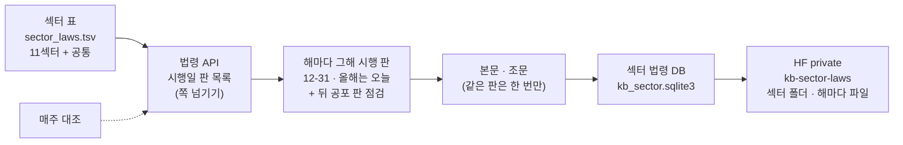

# 근거 문서를 섹터별 · 연도별로 — 섹터마다 걸리는 법령 조사서 v0.1

| 문서 정보 | |
|---|---|
| **판 · 상태** | v0.1 · 조사 끝(검토 전) |
| **구분** | 조사서 — 목표 기능 ① 「근거 문서와 출처를 포함한 RAG 질의응답」(`P01-①-3`) 근거 문서 넓히기 착수 전 검증 |
| **작성** | 이동원(조사 · 이 PC 확인) |
| **검토** | 검토 전 — 판을 올리는 PR 에 팀원 한 명 이상의 「읽었음」 |
| **최종 수정** | 2026-10-05 (KST) |
| **기준** | 외부 원문 조회 2026-10-05 11:50 ~ 12:30 KST · 이 PC 실측(국가법령정보센터 Open API — 후보 확인 147회 · 섹터 법령 받기 약 1,020회) · 섹터 파일 「개별 종목 섹터」(grid_20260917 · 2,622종목) · 코드 `main` `1a7574e` + 이 조사와 함께 만든 수집기 |
| **관련 문서** | [목표 기능 ① 상세 설계서 v1.3](../설계/지난판/목표기능1-데이터지식-설계_v1.3.md) 5.3.7 · 14.1 ⑮ · [공시 · 재무 · 뉴스 이용 조건 조사서 v0.1](지난판/공시-재무-뉴스-이용조건-조사_v0.1.md) |
| **최근 개정** | 새 문서 |

> **이 문서로 알 수 있는 것**
> 1. 「근거 문서를 산업별로」 의 산업은 무엇인가 — 우리 데이터의 섹터 분류는 어떤 체계인가?
> 2. 섹터마다 그 산업의 회사에 걸리는 법령(외부 기준)은 무엇이고, 그 대응을 무엇으로 확인했나?
> 3. 「연도별」 은 어떤 판을 고르고, 얼마나 받나?
>
> **읽는 순서** — 팀원: 요약 → 3절 표 · 강사님: 요약 → 2절 · 4절 · 처음 온 사람: 부록 C 용어 → 요약

## 요약

1. **「산업」 은 우리 섹터 분류 11섹터다.** 섹터 파일(2,622종목)의 코드 · 이름 그대로 — 에너지 17 · 소재 311 · 산업 468 · 임의소비재 354 · 필수소비재 158 · 헬스케어 373 · 금융 94 · 정보기술 674 · 커뮤니케이션 146 · 유틸리티 18 · 부동산 9종목. 이름과 나눔은 MSCI · S&P Global 의 「GICS 섹터 정의」(2023-03-17 기준) 11섹터와 같고, 앱의 산업 분석 화면도 같은 11섹터(미국 섹터 ETF)를 쓴다. 모든 상장사에 걸리는 법은 「공통」 으로 따로 묶었다.
2. **섹터마다 「그 사업을 하려면 지켜야 하는 법(업법)」 과 「원가 · 매출에 닿는 관련 법」 을 골랐다.** 법률 72개와 업법의 시행령 45개다. 모든 이름을 국가법령정보센터 Open API 로 확인했다 — 정식 이름 · 소관 부처 · 시행일 판 수 · 제1조(목적) 원문. 고르기 자체는 조사자의 판단이다(섹터 ↔ 법령의 공식 대응표는 없다) — 그래서 판단의 근거(그 법의 제1조 · 섹터 파일의 대표 종목)를 표에 함께 적었다.
3. **처음 후보 66개 가운데 둘은 그 이름의 법이 없었다.** 반도체 특별법은 국회 법안 때 이름(「… 혁신성장을 위한 특별법」)이 아니라 「반도체산업 경쟁력 강화 및 지원에 관한 특별법」 으로 2026-08-11 에 시행됐고(시행령 · 시행규칙 함께), 조선산업 특별법은 현행이 없다(옛 「조선산업의정상적경쟁조건에관한법률」 만 연혁에 있다). 이름으로만 찾았다면 반도체 섹터의 핵심 법이 빠질 뻔했다.
4. **우리 섹터 파일이 GICS 정의와 갈리는 곳은 섹터 파일을 따랐다.** 이차전지 셀 · 소재(LG에너지솔루션 · 에코프로비엠 · 포스코퓨처엠)는 산업이고 삼성SDI 만 정보기술 · 게임(크래프톤 · 넷마블)은 커뮤니케이션 · 지주사(SK · LG)는 산업 · 이마트는 필수소비재 · 부동산 9곳은 신탁 · 개발사다(리츠는 목록에 없다). 그래서 국가첨단전략산업법(이차전지)은 정보기술의 업법이자 산업의 관련 법이고, 유통산업발전법은 임의소비재의 업법이자 필수소비재의 관련 법이다.
5. **연도별은 「해마다 그해 12월 31일(올해는 받은 날)에 시행 중인 판」 이다.** 근거 문서 DB 와 같은 판 고르기 · 뒤 공포 판 점검을 쓴다. 2020 ~ 2026 일곱 해에 판 801개 · 조 71,851개다. 받다가 하나를 더 찾았다 — 법령 목록의 한 쪽(100줄)에는 같은 이름의 시행령 · 시행규칙 판이 섞여 와서 법률은 최근 판만 들어온다(자동차관리법 첫 쪽 33판 · 가장 이른 시행일 2023-06-11 · 상법 7판 · 2025-01-31). 연도별에는 가장 이른 기준일 판이 나올 때까지 쪽을 넘긴다.

---

## 1. 조사 범위와 방법

**<표 1> 질문마다 확인한 출처** · 확실도: 확인(원문 · 이 PC 에서 직접 봄) · 판단(근거를 적은 조사자의 고르기)

| 질문 | 1차 출처 | 2차 검증 | 확실도 |
|---|---|---|---|
| 우리 섹터는 어떤 체계인가 | 섹터 파일 「개별 종목 섹터」(grid_20260917 · 섹터코드 · 섹터명 · 종목코드 · 종목명) | GICS 섹터 정의 원문(PDF) · 앱 코드(`app/services/sync_scheduler.py` 섹터 ETF 열하나) | 확인 |
| 섹터마다 어떤 사업이 드나 | GICS 섹터 정의(무슨 사업을 하는 회사인가) | 섹터 파일의 대표 종목 63개를 섹터별로 확인 | 확인 |
| 그 사업에 걸리는 법은 무엇인가 | 조사자의 판단(업법 = 그 사업의 진입 · 영업 규칙 · 관련 = 원가 · 매출에 닿는 법) | 법령 API 의 정식 이름 · 소관 부처 · 제1조(목적) 원문 — 법이 그 사업을 다룬다는 글 | 법의 존재 · 이름 · 부처는 확인 · 고르기는 판단 |
| 해마다 어느 판인가 | 법령 API 시행일 판 목록(`target=eflaw`) | 근거 문서 DB 의 판 고르기 규칙 · 시험(TC-KB 등) · 이번 시험 TC-SG | 확인 |

조사하지 않은 것 — 행정규칙(감독규정 · 고시 · 세칙: 섹터마다 수십 개라 다음 판), 협회 · 거래소 규정, 업종별 회계기준, 조례, 해외 법, 섹터 파일의 출처 회사(파일에 적혀 있지 않다).

---

## 2. 「산업」 은 섹터다

**<표 2> 우리 섹터 11 — 섹터 파일과 GICS 정의** (종목 수는 섹터 파일 · 정의는 GICS 2023 원문 요지)

| 코드 | 섹터 | 종목 | GICS 정의 요지 | 섹터 파일의 대표 종목 |
|---|---|--:|---|---|
| En | 에너지 | 17 | 석유 · 가스 · 석탄의 탐사 · 생산 · 정제 · 판매 · 저장 · 운송, 석유 · 가스 장비 · 서비스 | S-Oil · SK이노베이션 · E1 · SK가스 |
| Ma | 소재 | 311 | 화학 · 건설 자재 · 임산물 · 유리 · 종이 · 포장 · 금속 · 광물 · 철강 | POSCO홀딩스 · LG화학 |
| In | 산업 | 468 | 자본재(항공우주 · 방산 · 건축 자재 · 전기 장비 · 기계) · 건설 · 엔지니어링 · 상업 서비스 · 운송 | 현대건설 · 한화에어로스페이스 · HD현대중공업 · 대한항공 · HMM · CJ대한통운 · SK · LG · LG에너지솔루션 |
| CD | 임의소비재 | 354 | 경기에 민감한 사업 — 자동차 · 부품 · 내구재 · 레저용품 · 의류 · 호텔 · 식당 · 레저 시설 · 그 유통 | 현대차 · 기아 · 강원랜드 · 파라다이스 · 롯데쇼핑 · LG전자 · 메가스터디교육 |
| CS | 필수소비재 | 158 | 경기에 덜 민감한 사업 — 식품 · 음료 · 담배 · 생활 · 개인 용품 · 식품 · 약품 소매 | 이마트 · KT&G · 아모레퍼시픽 · CJ제일제당 |
| He | 헬스케어 | 373 | 의료 서비스 · 의료 장비 · 소모품 · 헬스케어 기술 · 의약품 · 바이오 연구 · 생산 · 판매 | 삼성바이오로직스 · 셀트리온 · 유한양행 · 한미약품 |
| Fi | 금융 | 94 | 은행 · 금융 서비스 · 소비자 금융 · 자본시장 · 보험 · 거래소 · 데이터 · 모기지 리츠 | KB금융 · 삼성생명 · 미래에셋증권 · 한국금융지주 |
| IT | 정보기술 | 674 | 소프트웨어 · IT 서비스 · 통신 장비 · 휴대폰 · 컴퓨터 · 전자 장비 · 반도체 · 장비 · 소재 | 삼성전자 · SK하이닉스 · 삼성전기 · LG디스플레이 · 삼성SDI |
| Co | 커뮤니케이션 | 146 | 통신 · 미디어 · 엔터테인먼트(게임 포함) · 자체 플랫폼의 콘텐츠 · 정보 | SK텔레콤 · NAVER · 카카오 · 크래프톤 · 하이브 · CJ ENM |
| Ut | 유틸리티 | 18 | 전기 · 가스 · 수도, 독립 발전 · 에너지 거래 · 재생에너지 발전 | 한국전력 · 한국가스공사 · 삼천리 · 지역난방공사 |
| Re | 부동산 | 9 | 부동산 개발 · 운영 · 부동산 서비스 · 지분형 리츠 | 한국토지신탁 · 한국자산신탁 · SK디앤디 · 자이에스앤디 |

**<그림 1> 섹터 → 법령 → 해마다 판 → 보관** · 범례: 상자 = 단계 · 화살표 = 자료가 가는 길

---

## 3. 섹터마다 걸리는 법령

**<표 3> 섹터 ↔ 법령** (판 수 · 담긴 해 · 제1조는 법령 API 실측 · 고른 까닭은 `collector/kb_data/sector_laws.tsv`)

| 섹터 | 법령 | 역할 | 시행령 | 소관 부처 | 시행일 판 수 | 담긴 해 | 제1조(목적) 앞부분 |
|---|---|---|:-:|---|--:|---|---|
| 에너지 | 석유 및 석유대체연료 사업법 | 업법 | ○ | 산업통상부 | 24 | 2020~2026 | 이 법은 석유 수급과 가격 안정을 도모하고 석유제품과 석유대체연료의 적정한 품질을 확보하고, 탄소중립화에 기여하며 관련 사업의… |
| 에너지 | 액화석유가스의 안전관리 및 사업법 | 업법 | ○ | 산업통상부 | 36 | 2020~2026 | 이 법은 액화석유가스의 수출입ㆍ충전ㆍ저장ㆍ판매ㆍ사용 및 가스용품의 안전 관리에 관한 사항을 정하여 공공의 안전을 확보하고 액화… |
| 에너지 | 해외자원개발 사업법 | 관련 |  | 산업통상부 | 23 | 2020~2026 | 이 법은 해외자원의 개발을 추진하여 장기적이고 안정적으로 자원을 확보함으로써 국민경제의 발전과 대외경제협력의 증진에 이바지함을… |
| 에너지 | 에너지법 | 관련 |  | 기후에너지환경부 | 21 | 2020~2026 | 이 법은 안정적이고 효율적이며 환경친화적인 에너지 수급(需給) 구조를 실현하기 위한 에너지정책 및 에너지 관련 계획의 수립ㆍ시… |
| 소재 | 화학물질관리법 | 업법 | ○ | 기후에너지환경부 | 25 | 2020~2026 | 이 법은 화학물질로 인한 국민건강 및 환경상의 위해(危害)를 예방하고 화학물질을 적절하게 관리하는 한편, 화학물질로 인하여 발… |
| 소재 | 화학물질의 등록 및 평가 등에 관한 법률 | 업법 | ○ | 기후에너지환경부 | 18 | 2020~2026 | 이 법은 화학물질의 등록ㆍ신고 및 유해성(有害性)ㆍ위해성(危害性)에 관한 심사ㆍ평가, 유해성ㆍ위해성이 있는 화학물질의 지정에 … |
| 소재 | 광업법 | 업법 | ○ | 산업통상부 | 39 | 2020~2026 | 이 법은 광물자원을 합리적으로 개발함으로써 국가 산업이 발달할 수 있도록 하기 위하여 광업에 관한 기본 제도를 규정함을 목적으… |
| 소재 | 온실가스 배출권의 할당 및 거래에 관한 법률 | 관련 |  | 기후에너지환경부 | 15 | 2020~2026 | 이 법은 「기후위기 대응을 위한 탄소중립ㆍ녹색성장 기본법」 제25조에 따라 온실가스 배출권을 거래하는 제도를 도입함으로써 시장… |
| 소재 | 자원의 절약과 재활용촉진에 관한 법률 | 관련 |  | 기후에너지환경부 | 25 | 2020~2026 | 이 법은 폐기물의 발생을 억제하고 재활용(再活用)을 촉진하는 등 자원(資源)을 순환적으로 이용하도록 함으로써 환경의 보전과 국… |
| 산업 | 건설산업기본법 | 업법 | ○ | 국토교통부 | 28 | 2020~2026 | 이 법은 건설공사의 조사, 설계, 시공, 감리, 유지관리, 기술관리 등에 관한 기본적인 사항과 건설업의 등록 및 건설공사의 도… |
| 산업 | 방위사업법 | 업법 | ○ | 국방부 | 31 | 2020~2026 | 이 법은 자주국방의 기반을 마련하기 위한 방위력 개선,방위산업육성 및 군수품 조달 등 방위사업의 수행에 관한 사항을 규정함으로… |
| 산업 | 해운법 | 업법 | ○ | 해양수산부 | 31 | 2020~2026 | 이 법은 해상운송의 질서를 유지하고 공정한 경쟁이 이루어지도록 하며, 해운업의 건전한 발전과 여객ㆍ화물의 원활하고 안전한 운송… |
| 산업 | 항공사업법 | 업법 | ○ | 국토교통부 | 16 | 2020~2026 | 이 법은 항공정책의 수립 및 항공사업에 관하여 필요한 사항을 정하여 대한민국 항공사업의 체계적인 성장과 경쟁력 강화 기반을 마… |
| 산업 | 화물자동차 운수사업법 | 업법 | ○ | 국토교통부 | 37 | 2020~2026 | 이 법은 화물자동차 운수사업을 효율적으로 관리하고 건전하게 육성하여 화물의 원활한 운송을 도모함으로써 공공복리의 증진에 기여함… |
| 산업 | 국가첨단전략산업 경쟁력 강화 및 보호에 관한 특별조치법 | 관련 |  | 산업통상부 | 13 | 2022~2026 | 이 법은 국가첨단전략산업의 혁신생태계 조성과 기술역량 강화를 통하여 산업의 지속가능한 성장기반을 구축함으로써 국가ㆍ경제 안보와… |
| 임의소비재 | 자동차관리법 | 업법 | ○ | 국토교통부 | 68 | 2020~2026 | 이 법은 자동차의 등록, 안전기준, 자기인증, 제작결함 시정, 점검, 정비, 검사 및 자동차관리사업 등에 관한 사항을 정하여 … |
| 임의소비재 | 환경친화적 자동차의 개발 및 보급 촉진에 관한 법률 | 관련 |  | 산업통상부 | 24 | 2020~2026 | 이 법은 환경친화적 자동차의 개발 및 보급을 촉진하기 위한 종합적인 계획 및 시책을 수립하여 추진하도록 함으로써 자동차산업의 … |
| 임의소비재 | 유통산업발전법 | 업법 | ○ | 산업통상부 | 49 | 2020~2026 | 이 법은 유통산업의 효율적인 진흥과 균형 있는 발전을 꾀하고, 건전한 상거래질서를 세움으로써 소비자를 보호하고 국민경제의 발전… |
| 임의소비재 | 대규모유통업에서의 거래 공정화에 관한 법률 | 관련 |  | 공정거래위원회 | 21 | 2020~2026 | 이 법은 대규모유통업에서의 공정한 거래질서를 확립하고 대규모유통업자와 납품업자 또는 매장임차인이 대등한 지위에서 상호 보완적으… |
| 임의소비재 | 전자상거래 등에서의 소비자보호에 관한 법률 | 관련 |  | 공정거래위원회 | 25 | 2020~2026 | 이 법은 전자상거래 및 통신판매 등에 의한 재화 또는 용역의 공정한 거래에 관한 사항을 규정함으로써 소비자의 권익을 보호하고 … |
| 임의소비재 | 관광진흥법 | 업법 | ○ | 문화체육관광부 | 65 | 2020~2026 | 이 법은 관광 여건을 조성하고 관광자원을 개발하며 관광사업을 육성하여 관광 진흥에 이바지하는 것을 목적으로 한다. |
| 임의소비재 | 폐광지역 개발 지원에 관한 특별법 | 업법 | ○ | 산업통상부 | 38 | 2020~2026 | 이 법은 석탄산업의 사양화로 인하여 낙후된 폐광지역(廢鑛地域)의 경제를 진흥시켜 지역 간의 균형 있는 발전과 주민의 생활 향상… |
| 임의소비재 | 학원의 설립ㆍ운영 및 과외교습에 관한 법률 | 업법 | ○ | 교육부 | 17 | 2020~2026 | 이 법은 학원의 설립과 운영에 관한 사항을 규정하여 학원의 건전한 발전을 도모함으로써 평생교육 진흥에 이바지함과 아울러 과외교… |
| 필수소비재 | 식품위생법 | 업법 | ○ | 식품의약품안전처 | 35 | 2020~2026 | 이 법은 식품으로 인하여 생기는 위생상의 위해(危害)를 방지하고 식품영양의 질적 향상을 도모하며 식품에 관한 올바른 정보를 제… |
| 필수소비재 | 식품 등의 표시ㆍ광고에 관한 법률 | 관련 |  | 식품의약품안전처 | 10 | 2020~2026 | 이 법은 식품 등에 대하여 올바른 표시ㆍ광고를 하도록 하여 소비자의 알 권리를 보장하고 건전한 거래질서를 확립함으로써 소비자 … |
| 필수소비재 | 건강기능식품에 관한 법률 | 업법 | ○ | 식품의약품안전처 | 34 | 2020~2026 | 이 법은 건강기능식품의 안전성 확보 및 품질 향상과 건전한 유통ㆍ판매를 도모함으로써 국민의 건강 증진과 소비자 보호에 이바지함… |
| 필수소비재 | 주세법 | 업법 | ○ | 재정경제부 | 31 | 2020~2026 | 이 법은 주세의 과세 요건 및 절차를 규정함으로써 주세를 공정하게 과세하고, 납세의무의 적정한 이행을 확보하며, 재정수입의 원… |
| 필수소비재 | 담배사업법 | 업법 | ○ | 재정경제부 | 30 | 2020~2026 | 이 법은 담배의 제조 및 판매 등에 관한 사항을 정함으로써 담배 산업의 건전한 발전과 유통질서 확립을 도모하고 국민경제에 이바… |
| 필수소비재 | 화장품법 | 업법 | ○ | 식품의약품안전처 | 35 | 2020~2026 | 이 법은 화장품의 제조ㆍ수입ㆍ판매 및 수출 등에 관한 사항을 규정함으로써 국민보건향상과 화장품 산업의 발전에 기여함을 목적으로… |
| 필수소비재 | 유통산업발전법 | 관련 |  | 산업통상부 | 49 | 2020~2026 | 이 법은 유통산업의 효율적인 진흥과 균형 있는 발전을 꾀하고, 건전한 상거래질서를 세움으로써 소비자를 보호하고 국민경제의 발전… |
| 헬스케어 | 약사법 | 업법 | ○ | 보건복지부 | 51 | 2020~2026 | 이 법은 약사(藥事)에 관한 일들이 원활하게 이루어질 수 있도록 필요한 사항을 규정하여 국민보건 향상에 기여하는 것을 목적으로… |
| 헬스케어 | 첨단재생의료 및 첨단바이오의약품 안전 및 지원에 관한 법률 | 업법 | ○ | 보건복지부 | 10 | 2020~2026 | 이 법은 첨단재생의료의 안전성 확보 체계 및 기술 혁신ㆍ실용화 방안을 마련하고 첨단바이오의약품의 품질과 안전성ㆍ유효성 확보 및… |
| 헬스케어 | 의료기기법 | 업법 | ○ | 식품의약품안전처 | 30 | 2020~2026 | 이 법은 의료기기의 제조ㆍ수입 및 판매 등에 관한 사항을 규정함으로써 의료기기의 효율적인 관리를 도모하고 국민보건 향상에 이바… |
| 헬스케어 | 체외진단의료기기법 | 업법 | ○ | 식품의약품안전처 | 7 | 2020~2026 | 이 법은 체외진단의료기기의 제조ㆍ수입 등 취급과 관리 및 지원에 필요한 사항을 규정하여 체외진단의료기기의 안전성 확보 및 품질… |
| 헬스케어 | 국민건강보험법 | 관련 |  | 보건복지부 | 52 | 2020~2026 | 이 법은 국민의 질병ㆍ부상에 대한 예방ㆍ진단ㆍ치료ㆍ재활과 출산ㆍ사망 및 건강증진에 대하여 보험급여를 실시함으로써 국민보건 향상… |
| 헬스케어 | 생명윤리 및 안전에 관한 법률 | 관련 |  | 보건복지부 | 23 | 2020~2026 | 이 법은 인간과 인체유래물 등을 연구하거나, 배아나 유전자 등을 취급할 때 인간의 존엄과 가치를 침해하거나 인체에 위해(危害)… |
| 헬스케어 | 의료법 | 관련 |  | 보건복지부 | 46 | 2020~2026 | 이 법은 모든 국민이 수준 높은 의료 혜택을 받을 수 있도록 국민의료에 필요한 사항을 규정함으로써 국민의 건강을 보호하고 증진… |
| 금융 | 은행법 | 업법 | ○ | 금융위원회 | 10 | 2020~2026 | 이 법은 은행의 건전한 운영을 도모하고 자금중개기능의 효율성을 높이며 예금자를 보호하고 신용질서를 유지함으로써 금융시장의 안정… |
| 금융 | 금융지주회사법 | 업법 | ○ | 금융위원회 | 32 | 2020~2026 | 이 법은 금융지주회사의 설립을 촉진하면서 금융회사의 대형화ㆍ겸업화에 따라 발생할 수 있는 위험의 전이(轉移), 과도한 지배력 … |
| 금융 | 보험업법 | 업법 | ○ | 금융위원회 | 27 | 2020~2026 | 이 법은 보험업을 경영하는 자의 건전한 경영을 도모하고 보험계약자, 피보험자, 그 밖의 이해관계인의 권익을 보호함으로써 보험업… |
| 금융 | 자본시장과 금융투자업에 관한 법률 | 업법 | ○ | 금융위원회 | 66 | 2020~2026 | 이 법은 자본시장에서의 금융혁신과 공정한 경쟁을 촉진하고 투자자를 보호하며 금융투자업을 건전하게 육성함으로써 자본시장의 공정성… |
| 금융 | 여신전문금융업법 | 업법 | ○ | 금융위원회 | 30 | 2020~2026 | 이 법은 신용카드업, 시설대여업(施設貸與業), 할부금융업(割賦金融業) 및 신기술사업금융업(新技術事業金融業)을 하는 자의 건전하… |
| 금융 | 상호저축은행법 | 업법 | ○ | 금융위원회 | 39 | 2020~2026 | 이 법은 상호저축은행의 건전한 운영을 유도하여 서민과 중소기업의 금융편의를 도모하고 거래자를 보호하며 신용질서를 유지함으로써 … |
| 금융 | 금융회사의 지배구조에 관한 법률 | 관련 |  | 금융위원회 | 9 | 2020~2026 | 이 법은 금융회사 임원의 자격요건, 이사회의 구성 및 운영, 내부통제제도 등 금융회사의 지배구조에 관한 기본적인 사항을 정함으… |
| 정보기술 | 반도체산업 경쟁력 강화 및 지원에 관한 특별법 | 업법 | ○ | 산업통상부 | 3 | 2026~2026 | 이 법은 반도체산업의 혁신생태계 조성 등 지속 가능한 성장 기반을 구축함으로써 대한민국 반도체산업의 경쟁력을 강화하고 반도체 … |
| 정보기술 | 국가첨단전략산업 경쟁력 강화 및 보호에 관한 특별조치법 | 업법 | ○ | 산업통상부 | 13 | 2022~2026 | 이 법은 국가첨단전략산업의 혁신생태계 조성과 기술역량 강화를 통하여 산업의 지속가능한 성장기반을 구축함으로써 국가ㆍ경제 안보와… |
| 정보기술 | 산업기술의 유출방지 및 보호에 관한 법률 | 관련 |  | 산업통상부 | 21 | 2020~2026 | 이 법은 산업기술의 부정한 유출을 방지하고 산업기술을 보호함으로써 국내산업의 경쟁력을 강화하고 국가의 안전보장과 국민경제의 발… |
| 정보기술 | 소프트웨어 진흥법 | 업법 | ○ | 과학기술정보통신부 | 7 | 2020~2026 | 이 법은 소프트웨어 진흥에 필요한 사항을 정하여 국가 전반의 소프트웨어 역량을 강화하고 소프트웨어산업 발전의 기반을 조성함으로… |
| 정보기술 | 전기용품 및 생활용품 안전관리법 | 관련 |  | 산업통상부 | 7 | 2020~2026 | 이 법은 전기용품 및 생활용품의 안전관리에 관한 사항을 규정함으로써 국민의 생명ㆍ신체 및 재산을 보호하고, 소비자의 이익과 안… |
| 정보기술 | 조세특례제한법 | 관련 |  | 재정경제부 | 71 | 2020~2026 | 이 법은 조세(租稅)의 감면 또는 중과(重課) 등 조세특례와 이의 제한에 관한 사항을 규정하여 과세(課稅)의 공평을 도모하고 … |
| 커뮤니케이션 | 전기통신사업법 | 업법 | ○ | 과학기술정보통신부 | 41 | 2020~2026 | 이 법은 전기통신사업의 적절한 운영과 전기통신의 효율적 관리를 통하여 전기통신사업의 건전한 발전과 이용자의 편의를 도모함으로써… |
| 커뮤니케이션 | 방송법 | 업법 | ○ | 방송미디어통신위원회 | 35 | 2020~2026 | 이 법은 방송의 자유와 독립을 보장하고 방송의 공적 책임을 높임으로써 시청자의 권익보호와 민주적 여론형성 및 국민문화의 향상을… |
| 커뮤니케이션 | 인터넷 멀티미디어 방송사업법 | 업법 | ○ | 방송미디어통신위원회 | 25 | 2020~2026 | 이 법은 방송과 통신이 융합되어 가는 환경에서 인터넷 멀티미디어 등을 이용한 방송사업의 운영을 적정하게 함으로써 이용자의 권익… |
| 커뮤니케이션 | 게임산업진흥에 관한 법률 | 업법 | ○ | 문화체육관광부 | 33 | 2020~2026 | 이 법은 게임산업의 기반을 조성하고 게임물의 이용에 관한 사항을 정하여 게임산업의 진흥 및 국민의 건전한 게임문화를 확립함으로… |
| 커뮤니케이션 | 대중문화예술산업발전법 | 업법 | ○ | 문화체육관광부 | 13 | 2020~2026 | 이 법은 대중문화예술산업의 기반을 조성하고 관련 사업자, 대중문화예술인 등에 관한 사항을 정함으로써 건전한 대중문화를 확립하고… |
| 커뮤니케이션 | 정보통신망 이용촉진 및 정보보호 등에 관한 법률 | 관련 |  | 과학기술정보통신부 | 44 | 2020~2026 | 이 법은 정보통신망의 이용을 촉진하고 정보통신서비스를 이용하는 자를 보호함과 아울러 정보통신망을 건전하고 안전하게 이용할 수 … |
| 커뮤니케이션 | 저작권법 | 관련 |  | 문화체육관광부 | 34 | 2020~2026 | 이 법은 저작자의 권리와 이에 인접하는 권리를 보호하고 저작물의 공정한 이용을 도모함으로써 문화 및 관련 산업의 향상발전에 이… |
| 유틸리티 | 전기사업법 | 업법 | ○ | 기후에너지환경부 | 34 | 2020~2026 | 이 법은 전기사업에 관한 기본제도를 확립하고 전기사업의 경쟁과 새로운 기술 및 사업의 도입을 촉진함으로써 전기사업의 건전한 발… |
| 유틸리티 | 한국전력공사법 | 업법 | ○ | 기후에너지환경부 | 17 | 2020~2026 | 이 법은 한국전력공사를 설립하여 전원개발(電源開發)을 촉진하고 전기사업의 합리적인 운영을 기함으로써 전력수급(電力需給)의 안정… |
| 유틸리티 | 도시가스사업법 | 업법 | ○ | 산업통상부 | 33 | 2020~2026 | 이 법은 도시가스사업을 합리적으로 조정ㆍ육성하여 사용자의 이익을 보호하고 도시가스사업의 건전한 발전을 도모하며, 가스공급시설과… |
| 유틸리티 | 한국가스공사법 | 업법 | ○ | 산업통상부 | 43 | 2020~2026 | 이 법은 한국가스공사를 설립하여 가스를 장기적으로 안정되게 공급할 수 있는 기반을 마련함으로써 국민생활의 편익 증진과 공공복리… |
| 유틸리티 | 집단에너지사업법 | 업법 | ○ | 기후에너지환경부 | 52 | 2020~2026 | 이 법은 분산형전원으로서의 집단에너지공급을 확대하고, 집단에너지사업을 합리적으로 운영하며, 집단에너지시설의 설치ㆍ운용 및 안전… |
| 유틸리티 | 신에너지 및 재생에너지 개발ㆍ이용ㆍ보급 촉진법 | 관련 |  | 산업통상부 | 20 | 2020~2026 | 이 법은 신에너지 및 재생에너지의 기술개발 및 이용ㆍ보급 촉진과 신에너지 및 재생에너지 산업의 활성화를 통하여 에너지원을 다양… |
| 부동산 | 부동산개발업의 관리 및 육성에 관한 법률 | 업법 | ○ | 국토교통부 | 20 | 2020~2026 | 이 법은 부동산개발에 관한 기본적인 사항과 부동산개발업의 등록, 부동산개발업자의 의무 등에 관하여 필요한 사항을 규정함으로써 … |
| 부동산 | 부동산투자회사법 | 업법 | ○ | 국토교통부 | 36 | 2020~2026 | 이 법은 부동산투자회사의 설립과 부동산투자회사의 자산운용 방법 및 투자자 보호 등에 관한 사항을 정함으로써 일반 국민이 부동산… |
| 부동산 | 자본시장과 금융투자업에 관한 법률 | 관련 |  | 금융위원회 | 66 | 2020~2026 | 이 법은 자본시장에서의 금융혁신과 공정한 경쟁을 촉진하고 투자자를 보호하며 금융투자업을 건전하게 육성함으로써 자본시장의 공정성… |
| 부동산 | 주택법 | 관련 |  | 국토교통부 | 38 | 2020~2026 | 이 법은 쾌적하고 살기 좋은 주거환경 조성에 필요한 주택의 건설ㆍ공급 및 주택시장의 관리 등에 관한 사항을 정함으로써 국민의 … |
| 부동산 | 건축물의 분양에 관한 법률 | 관련 |  | 국토교통부 | 22 | 2020~2026 | 이 법은 건축물의 분양 절차 및 방법에 관한 사항을 정함으로써 건축물 분양과정의 투명성과 거래의 안전성을 확보하여 분양받는 자… |
| 부동산 | 부동산 거래신고 등에 관한 법률 | 관련 |  | 국토교통부 | 16 | 2020~2026 | 이 법은 부동산 거래 등의 신고 및 허가에 관한 사항을 정하여 건전하고 투명한 부동산 거래질서를 확립하고 국민경제에 이바지함을… |
| 공통 | 상법 | 관련 |  | 법무부 | 16 | 2020~2026 | 상사에 관하여 본법에 규정이 없으면 상관습법에 의하고 상관습법이 없으면 민법의 규정에 의한다. |
| 공통 | 주식회사 등의 외부감사에 관한 법률 | 관련 |  | 금융위원회 | 8 | 2020~2026 | 이 법은 외부감사를 받는 회사의 회계처리와 외부감사인의 회계감사에 관하여 필요한 사항을 정함으로써 이해관계인을 보호하고 기업의… |
| 공통 | 법인세법 | 관련 |  | 재정경제부 | 51 | 2020~2026 | 이 법은 법인세의 과세 요건과 절차를 규정함으로써 법인세를 공정하게 과세하고, 납세의무의 적절한 이행을 확보하며, 재정수입의 … |
| 공통 | 독점규제 및 공정거래에 관한 법률 | 관련 |  | 공정거래위원회 | 50 | 2020~2026 | 이 법은 사업자의 시장지배적지위의 남용과 과도한 경제력의 집중을 방지하고, 부당한 공동행위 및 불공정거래행위를 규제하여 공정하… |
| 공통 | 개인정보 보호법 | 관련 |  | 개인정보보호위원회 | 23 | 2020~2026 | 이 법은 개인정보의 처리 및 보호에 관한 사항을 정함으로써 개인의 자유와 권리를 보호하고, 나아가 개인의 존엄과 가치를 구현함… |
| 공통 | 중대재해 처벌 등에 관한 법률 | 관련 |  | 고용노동부 | 1 | 2022~2026 | 이 법은 사업 또는 사업장, 공중이용시설 및 공중교통수단을 운영하거나 인체에 해로운 원료나 제조물을 취급하면서 안전ㆍ보건 조치… |

### 3.1 이름이 틀렸던 둘

처음 후보는 66개였다. 법령 API 의 이름 검색은 띄어쓰기를 뺀 이름이 똑같아야 한 판으로 친다. 둘이 걸렸다.

- 「반도체산업 경쟁력 강화 및 혁신성장을 위한 특별법」 — 검색 0건. 낱말 「반도체」 로 다시 찾으니 「반도체산업 경쟁력 강화 및 지원에 관한 특별법」(현행 2026-09-18 판 · 첫 시행 2026-08-11 · 시행령 · 시행규칙 2026-08-11)이 나왔다. 법안 때 이름으로 적은 우리 후보가 틀렸다. 같은 검색에 「국방반도체 육성 및 지원에 관한 법률」(시행예정 2026-12-10)도 있다 — 시행되면 산업(방산) · 정보기술의 관련 법 후보다.
- 「조선산업의 경쟁력 강화 및 지원에 관한 특별법」 — 검색 0건. 낱말 「조선산업」 으로는 옛 「조선산업의정상적경쟁조건에관한법률」(연혁 · 2008년 판까지)만 나온다. 현행 조선 특별법은 없다고 보고 뺐다.

### 3.2 섹터 파일이 GICS 정의와 갈리는 곳

GICS 정의만 보면 이차전지 셀은 전기 장비(산업)이고, 삼성SDI 를 어디에 두느냐는 분류사마다 다르다. 우리 섹터 파일은 삼성SDI 만 정보기술, LG에너지솔루션 · 에코프로비엠 · 포스코퓨처엠은 산업이다. 법령 대응은 섹터 파일을 따랐다 — 데이터를 쓰는 사람이 보는 섹터가 그것이기 때문이다. 같은 까닭으로 게임은 커뮤니케이션(GICS 2018 개편 뒤와 같다) · 지주사는 산업(복합 기업) · 이마트는 필수소비재(식품 소매)다.

---

## 4. 연도별 — 무엇을 고르나

- **기준일** — 2020 ~ 2025 는 그해 12월 31일, 2026 은 받은 날(2026-10-05). 그날 시행 중인 판(시행일 ≤ 기준일 중 시행일이 가장 늦은 판)을 고르고, 고른 판보다 뒤에 공포돼 기준일까지 시행된 판이 있으면 조마다 대조해 빠진 개정을 채운다(근거 문서 DB 와 같은 `kb_text.select_version` · `kb_law.check_later`).
- **한계** — 한 해 안의 중간 판은 두지 않는다. 예를 들어 6월에 바뀌고 11월에 다시 바뀐 조는 11월 판만 남는다. 「그해 어느 날 기준 판」 이 필요하면 판 목록(`ks_choice` 의 시행일 · 매니페스트의 `choices`)으로 원문 판을 다시 받는다.
- **실측** — 문서 117(법률 72 · 시행령 45 · 목록에 없음 0) · 해마다 고른 판 801(그해 시행 전이라 없는 해 18) · 조 71,851개(37.5M자) · 받은 원문 1,034건(gzip 49.0MB) · 받기 21분(호출 701 · 받아 둔 원문 재사용 206) · 판 점검 기록 100 — 빠진 개정을 뒤 판 글로 채운 해 4 · 고른 판과 뒤 판이 같은 조를 다르게 바꿔 「고른 판 글 유지 · 사람 확인」 으로 남긴 해 21(예: 주택법 2025 판 제57조의2 · 온실가스 배출권법 2026 판 제2조 · 제5조).
- **매주 대조** — 판 목록만 다시 묻고(문서마다 1 ~ 2회), 고른 판과 「뒤에 공포된 판」 지문이 같으면 그 해는 건너뛴다. 같은 명령을 두 번 돌리면 두 번째는 목록 호출뿐이다(부동산 8문서 · 두 해 실측: 첫 번 25회 → 두 번째 8회).

**<표 4> 섹터별 합계** (2020 ~ 2026)

| 섹터 | 문서(법률 · 시행령) | 해마다 고른 판 | 조(2026 판) | 조(일곱 해 합) |
|---|--:|--:|--:|--:|
| 에너지(En) | 6 | 42 | 334 | 2,322 |
| 소재(Ma) | 8 | 56 | 529 | 3,577 |
| 산업(In) | 11 | 75 | 933 | 6,223 |
| 임의소비재(CD) | 13 | 91 | 831 | 5,469 |
| 필수소비재(CS) | 12 | 84 | 581 | 4,036 |
| 헬스케어(He) | 11 | 77 | 929 | 6,234 |
| 금융(Fi) | 13 | 91 | 2,139 | 14,776 |
| 정보기술(IT) | 9 | 47 | 829 | 4,798 |
| 커뮤니케이션(Co) | 12 | 84 | 1,088 | 7,090 |
| 유틸리티(Ut) | 11 | 77 | 553 | 3,880 |
| 부동산(Re) | 8 | 56 | 968 | 6,639 |
| 공통(All) | 6 | 40 | 1,654 | 11,421 |

---

## 5. 우리 프로젝트에 주는 뜻

- **HF private 데이터셋 `qurious-quant/kb-sector-laws`** — `by_sector/<섹터코드>/<해>.parquet`(한 행 = 조 하나) · `meta/sector_laws.tsv` · `meta/manifest.json`. 만들고 올리는 것은 `scripts/hf_sector_laws.py`, 받기는 `collector/kb_sector.py`.
- **매주 대조를 러너에** — `hf_sector_laws.py weekly --yes`(7일에 한 번만 실제로 돈다 · `fatal=False`).
- **근거 답에 넣을지는 따로 정한다** — 지금 근거 DB(14문서 · 조각 4,067)에 섹터 법령을 넣으면 검색 후보가 크게 늘어 평가셋 50문항의 결과가 바뀐다. 넣는다면 평가셋을 같이 넓혀 「고친 길 · 고치기 전 길」 을 나란히 잰다(W8).
- **정할 것** — 행정규칙(고시 · 감독규정)까지 넓힐지 · 관련 법의 시행령도 넣을지 · 섹터 표를 각 섹터를 쓰는 주담당이 검수할지(이동원 · 다음 판).

---

## 6. 이 조사를 뒤집을 조건

- 섹터 파일이 다른 분류(WICS · KRX 업종)로 바뀌면 2절 · 3.2절을 다시 한다.
- 새 업법이 시행되거나 법 이름이 바뀌면(예: 국방반도체법 2026-12-10 시행예정) 매주 대조가 「목록에 없음」 · 새 판으로 알린다 — 그때 섹터 표에 줄을 더한다.
- 근거 답 평가에서 섹터 법령이 엉뚱한 근거를 끌어오면 업법만 남기고 관련 법을 뺀다.

---

## 부록 A. 출처

| # | 출처 | 주소 | 조회 | 확인 방법 |
|:-:|---|---|---|---|
| A1 | MSCI · S&P Global, 「Global Industry Classification Sector (GICS) — Definitions of GICS Sectors effective close of March 17, 2023」 | https://www.msci.com/downloads/documents/indexes/gics/GICS+Sector+Definitions+2023.pdf | 2026-10-05 | PDF 4쪽 중 1 · 2쪽 원문 |
| A2 | MSCI, 「GICS Methodology 2023」 | https://www.msci.com/documents/1296102/11185224/GICS+Methodology+2023.pdf | 2026-10-05 | 11섹터 · 25 산업군 · 74 산업 · 163 세부 산업 구조(검색 요약 — 본문은 A1 로 확인) |
| A3 | 국가법령정보센터 Open API(법제처) — 법령 목록 `lawSearch.do?target=eflaw` · 본문 `lawService.do?target=eflaw` | https://open.law.go.kr | 2026-10-05 | 후보 66개 이름 검색 · 제1조 본문 · 낱말 검색(반도체 · 조선산업 · 이차전지) · 섹터 법령 받기 |
| A4 | 섹터 파일 「개별 종목 섹터」 | 팀 공유 파일(grid_20260917 · 커밋하지 않는 자료) | 2026-10-05 | 섹터별 종목 수 · 대표 종목 63개의 섹터 |
| A5 | Qurious 앱 코드 `app/services/sync_scheduler.py` | 저장소 | 2026-10-05 | 산업 분석 화면의 미국 섹터 ETF 열하나 |

## 부록 B. 실측 기록

- 후보 확인 — 법령 66개 이름 검색 + 찾은 64개의 제1조 = 144회 · 212초 · 낱말 검색 3회.
- 섹터 법령 받기 — 2026-10-05 12:05 첫 받기(쪽 넘기기 전 · 31문서 · 288회에서 멈춤) → 12:14 쪽 넘기기를 넣고 다시(117문서 · 701회 · 21분 · 받아 둔 본문 206번 재사용) → 내보내기 84파일(12 × 7해) · 76,465행(섹터 사이에 겹치는 법 포함) · 20.8MB · 4.1초 → HF 올리기 10.2초(커밋 `756f5731` · 태그 `sector-laws-2026-10-05` · private 확인) → 받아서 sha256 · 행 수 대조 84/84. 부동산 8문서 · 두 해 시험 받기는 첫 번 25회 · 두 번째 8회(목록만).
- 판 목록 쪽 넘기기 발견 — 첫 받기(쪽 넘기기 전)에서 자동차관리법이 「해 4」(2020 ~ 2022 판 없음)로 나와 목록을 다시 보니, 64개 중 14개의 가장 이른 시행일이 2020-01-01 뒤였다. 그중 일부(중대재해처벌법 2022-01-27 · 체외진단의료기기법 2020-05-01 · 첨단재생바이오법 2020-08-28 · 국가첨단전략산업법 2022-08-04 · 소프트웨어 진흥법 2020-12-10 전부개정)는 실제로 그 뒤 시행이고, 나머지(자동차관리법 · 상법 · 조세특례제한법 · 자본시장법 · 국민건강보험법 · 법인세법 · 관광진흥법 · 은행법 · 주택법)는 목록이 잘린 것이었다.

## 부록 C. 용어

| 말 | 뜻 | 이 문서에서 | 헷갈리는 점 |
|---|---|---|---|
| 섹터 | 회사를 사업 종류로 나눈 큰 묶음 | 우리 섹터 파일의 11섹터(GICS 꼴) | KRX 업종 · WICS 와 이름 · 나눔이 다르다 |
| GICS | MSCI · S&P Global 이 함께 만든 국제 산업 분류(11섹터 · 25 산업군 · 74 산업 · 163 세부 산업) | 섹터 정의의 1차 출처 | 분류사가 회사를 넣는 칸은 우리 파일과 다를 수 있다(삼성SDI) |
| 업법 | 그 사업을 하려면 받아야 하는 허가 · 등록과 영업 규칙을 정한 법 | 섹터 표의 `role=업법` — 시행령까지 받는다 | 법 이름에 산업 이름이 없을 수도 있다(폐광지역법 → 강원랜드) |
| 관련 법 | 사업의 원가 · 매출 · 지배구조에 닿지만 진입 규칙은 아닌 법 | `role=관련` — 법률만 받는다 | 같은 법이 한 섹터에선 업법, 다른 섹터에선 관련일 수 있다 |
| 그해 시행 판 | 그해 12월 31일(올해는 받은 날)에 시행 중인 판 | 해마다 한 판 | 그해 1월 1일 판이 아니다 · 중간 판은 없다 |
| 시행일 판 목록 | 법령 API 가 주는 판(공포 · 시행일) 목록 | `target=eflaw` · 연혁 · 현행 · 시행예정 | 한 쪽에 같은 이름의 시행령 · 시행규칙이 섞인다 |

## 개정 이력

| 판 | 날짜 | 바뀐 것 | 까닭 | 근거 |
|---|---|---|---|---|
| v0.1 | 2026-10-05 | 새 문서 — 섹터 체계(섹터 파일 · GICS 원문) · 섹터 ↔ 법령 표(법령 API 확인) · 이름이 틀린 둘 · 연도별 판 고르기 · 판 목록 쪽 넘기기 | 사용자 요청(근거 문서를 산업별 · 연도별로 · 산업 = 섹터) | `collector/kb_sector.py` · `collector/kb_data/sector_laws.tsv` · `scripts/hf_sector_laws.py` |
