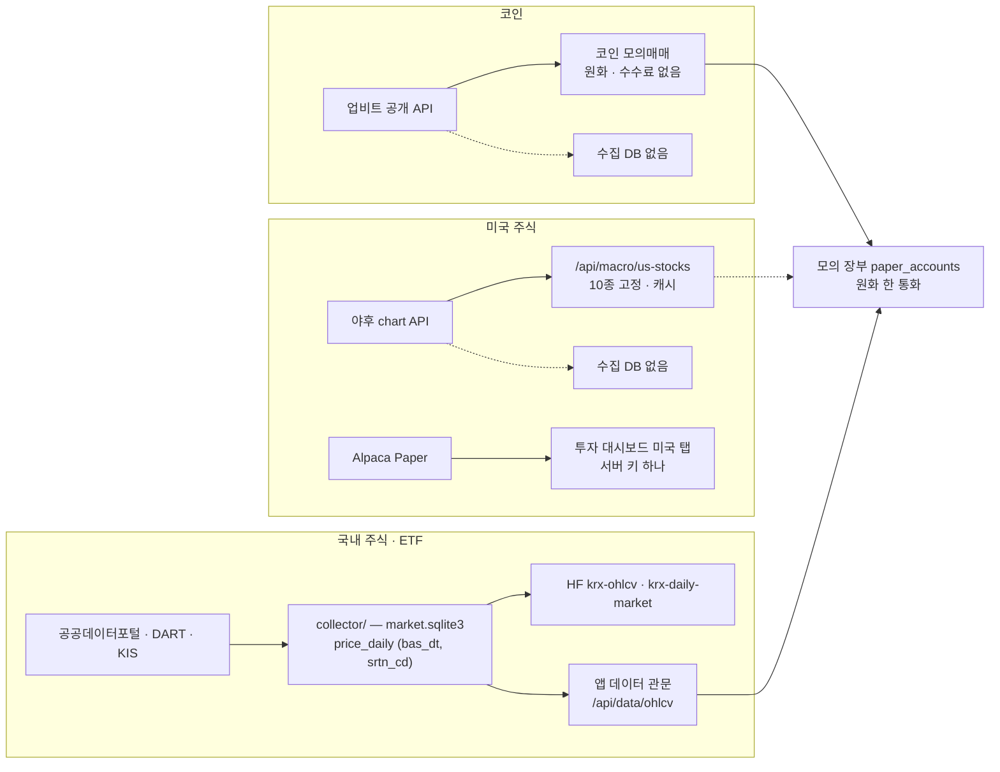
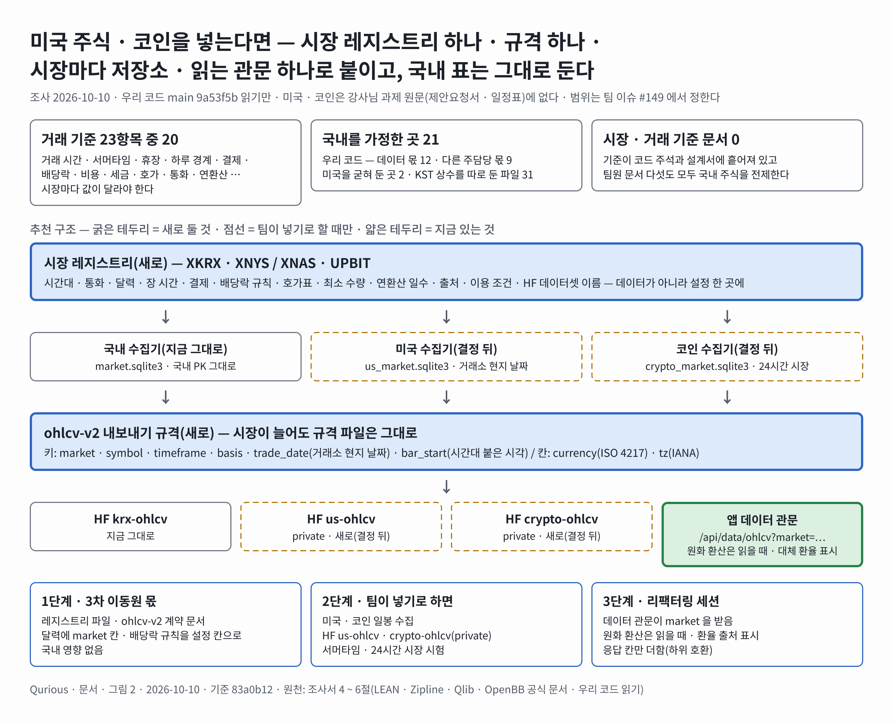
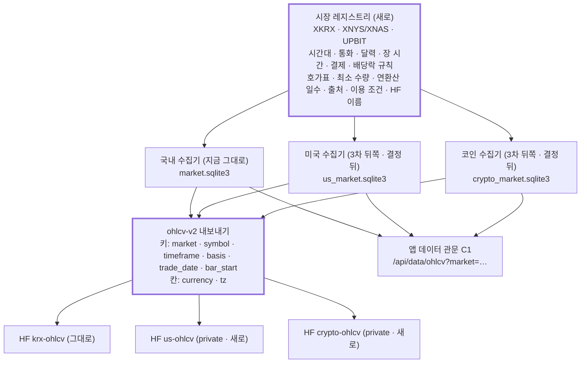

# 국내 주식 · 미국 주식 · 코인 — 범위 · 시장별 거래 기준 · 데이터 확장 조사서 v0.1

| 문서 정보 | |
|---|---|
| **판 · 상태** | v0.1 · 초안(검토 전) — 범위 · 역할은 팀 이슈 [#149](https://github.com/EST-team-project/Qurious/issues/149)(2026-10-10 올림 · [본문 사본](../github-archive/2026-10-10/이슈-시장범위-미국-코인-기준/00-본문.md))에서 정한다 |
| **구분** | 조사서 — 범위 판정 · 시장별 거래 기준 · 데이터 확장 설계 · 역할 분담 안 |
| **작성** | 이동원(데이터 파트 · 조사 지시 · 검토) · 사례 수집과 초안은 조사 에이전트(법령 · 거래소 · 감독기관 · 공식 문서 원문 · 우리 코드 읽기 · github.com 은 열지 않음) |
| **조회일** | 2026-10-10 (KST) — 웹 출처는 모두 이 날 조회. 시점이 바뀌는 사실(세율 · 과세 시행일 · 수수료 · 거래 시간)은 칸마다 「언제 기준」 을 적었다 |
| **기준** | 우리 코드 `main` `9a53f5b`(같은 날 고치던 파일은 `git show HEAD:` 로 읽음) · 강사님 자료 th03 `ab4e493`(2026-10-08) · th06 `5b0a768`(2026-10-08) · th07 `e9b4142`(2026-09-21) — 모두 읽기만 |
| **확실도 표기** | 「확실」 = 원문(법령 · 거래소 · 감독기관 · 공식 문서)을 직접 확인 · 「대체로」 = 공식 2차 자료(증권사 공지 · 회계법인 · 여러 보도)로 확인 · 「확인 필요」 = 한 곳만 보았거나 원문을 열지 못함 · 바뀔 수 있음 |
| **최종 수정** | 2026-10-10 (KST) |
| **관련 문서** | [모의투자 조사서 v0.1](모의투자-증권사규칙-시작금액-조사.md) · [금융 필수 지식 · 개념 학습 배치 조사서 v0.1](금융지식-개념학습-배치-조사.md) · [자동 수집 벤치마크 조사서 v0.2](자동수집-벤치마크-조사.md) · [기초 코드 융합 조사서 v0.1](기초코드-최신판-융합-조사.md) |
| **최근 개정** | v0.1 — 처음 씀 |

> **이 문서로 알 수 있는 것**
> 1. 미국 주식 · 코인은 강사님 과제 원문(제안요청서 · 일정표 · 목표 시스템 문장)에 **없다.** 강사님 기초 코드(th06 ← th03 이식)의 화면 · 모의 기능으로만 들어와 있고, 우리 문서끼리 판정이 다르다(IA = 동결 · 보관함 후보, 이동원 할 일 = 3차 뒤쪽 구현).
> 2. 시장 · 거래 기준만 모은 문서는 **없다.** 기준은 코드 주석과 각 설계서에 흩어져 있고, 팀원 문서 다섯 건을 포함해 모두 국내 주식을 전제한다.
> 3. 비교한 거래 기준 23항목 가운데 **20항목은 시장마다 값이 달라야** 하고(거래 시간 · 서머타임 · 휴장 · 하루 경계 · 결제 · 배당락 · 비용 · 거래세 · 과세 · 호가 · 가격 제한 · 최소 수량 · 통화 · 기업행동 · 상장폐지 · 출처 · 연환산 · 모의 수단 · 벤치마크 · 장 전후), 3항목(값 규칙 · 지표 산식 · 성과 산식)은 정의를 같이 쓰되 입력(날짜 경계 · 연환산 일수)만 시장 것을 쓴다.
> 4. 우리 코드에서 **국내를 가정한 곳은 21곳**(데이터 몫 12 · 다른 주담당 몫 9)이고, 반대로 미국을 굳혀 둔 곳이 2곳, KST 상수를 따로 정의한 파일이 31개다.
> 5. 데이터 확장은 「시장 레지스트리 하나 + 규격 하나(ohlcv-v2) + 시장마다 저장소(HF private 데이터셋도 시장마다) + 읽는 관문 하나」 를 추천한다. 국내 표는 지금 고치지 않는다.

---

## 1. 방법

**<표 1> 조사 방법**

| 질문 | 본 곳 | 방법 |
|---|---|---|
| ① 범위 | `docs/rfp-1.md` · `docs/rfp-2.md` · 계획서 v2.0 · 요구 대장 · IA v1.4 · 이동원 할 일 v0.3 · 이해관계자 목록 · 산출물목록 12절 · 강사님 th07 일정표 · th06 readme · th03 README | 낱말 검색(미국 · 해외 · 코인 · 가상자산 · 업비트 · Alpaca) 뒤 원문 줄을 그대로 인용 |
| ② 기준 문서 | 백테스트 보고서 v0.2 · #79 · #123 · #124 · 리밸런싱 상세 설계 v0.1 · 기능 설계서 v0.1 · 목표 기능 ① 설계서 v1.6 | 기준 낱말(거래 시간 · 휴장 · 수수료 · 세금 · 호가 · 가격 제한 · 결제 · 환율 · 소수점 · 기업행동 · 유니버스)별로 줄을 찾아 다룬 것 · 빠진 것을 가름 |
| ③ 시장별 기준 | SEC · FINRA · NYSE · NIST · 금융위원회 · 기획재정부(정책브리핑) · 국세청 · 업비트 고객센터 · 업비트 개발자 센터 · Alpaca 문서 · Yahoo 약관 · 증권사 공지 | 원문 우선. 원문을 못 연 칸은 「대체로」 · 「확인 필요」 |
| ④ 코드 현황 | `app/` · `collector/` · `scripts/` · th03(`git show HEAD:`) | 읽기만. 시험 · 러너는 돌리지 않음(실행 결과가 아니라 **코드 읽기 판정**) |
| ⑤ 데이터 확장 | OpenBB · Zipline · QuantConnect LEAN · Qlib 공식 문서 + 우리 저장소의 LEAN 참조 자료 | 「시장을 어떻게 구분 · 저장하나」 를 같은 칸으로 비교 |

---

## 2. 범위 판정 — 미국 주식 · 코인이 2차 · 3차에 들어 있나

### 2.1 원문 인용

**<표 2> 범위 근거 원문(파일:줄)**

| # | 문서 | 원문(그대로) | 뜻 |
|:-:|---|---|---|
| R1 | `docs/rfp-2.md:13` | 「패턴 인식 기법을 활용한 **주식 시장** 예측, … 주식 스크리닝을 통한 종목 선정」 | 시장 국적을 말하지 않음 · 코인 없음 |
| R2 | `docs/rfp-2.md:70` | 「데이터 소스: **KRX, Yahoo Finance, FinanceDataReader** 등 공개 데이터 활용」 | 국내 출처 둘 + 야후 |
| R3 | `docs/rfp-2.md:92` | 「실제 증권 계좌를 통한 실거래 자동 주문 실행」(제외 범위) | 실거래는 시장과 무관하게 제외 |
| R4 | `docs/rfp-2.md:136` | 「포트폴리오 수익률 \| 벤치마크(**KOSPI**) 대비 초과수익」 | 평가 기준이 국내 지수 |
| R5 | `docs/rfp-2.md:186` | 「모든 모의 투자 의사결정은 **가상 자산(시뮬레이션)** 기반」 | 여기 「가상 자산」 은 **가상의 돈**이라는 뜻 — 코인(가상자산)이 아니다. 오독 주의 |
| R6 | th06 `readme.md:5-16`(`5b0a768`) | 2차 「주식 시장 예측 · 주식 스크리닝」 / 3차 「기본적인 인디케이터 · 커스텀 인디케이터 · 트레이딩뷰 · 파이썬 성과 검증 · **증권사 연동(API 활용)**」 | 강사님 목표 문장. 미국 · 코인 없음 · 3차는 「증권사」 |
| R7 | th07 `day4-project-schedule.js:43`(`e9b4142`) | 「인디케이터 · 증권사 연동 · 증권사 API 어댑터 구현 · 계좌·시세·주문 어댑터」 · `:70` 「모의증권 연동」 | 3차 연동 대상 = 증권사 |
| R8 | th07 `day4-project-schedule.js:52` | 「로보 · 스트레스 검증 · 급락·금리·**환율** 시나리오」 | 환율은 위험 요인 시나리오 — 해외 거래 요구가 아님 |
| R9 | th07 `day4-deliverable-samples.js:56 · :116 · :128` | 예시 종목 `005930` · 「price_bar · **Asia/Seoul** / 일 1회」 · 「close · float / **KRW**」 | 강사님 산출물 예시는 국내 주식 |
| R10 | th06 `readme.md:68` | 「증권 API 계정(**Alpaca**/키움/토스 등) \| 선택 \| 현재는 Mock 기반」 | Alpaca(미국 증권사)는 **선택** 계정 |
| R11 | th06 `readme.md:90` | 모의투자 = 「국내주식 … **Upbit KRW 마켓 코인** 모의매매 … 대체자산 … Alpaca Paper 읽기 전용」 | 기초 코드에는 코인 · 미국이 **기능으로** 있음 |
| R12 | th03 `README.md:10 · :12`(`ab4e493`) | 「주식·암호화폐 모의투자 및 OpenAPI **학습 플랫폼**」 · 「Alpaca 연결 테스트는 키 검증과 **읽기 전용 조회만** … 실제 주문 자동화 기능을 제공하지 않습니다」 | 원천(th03)도 학습용 · 미국은 시험 흐름만 |
| R13 | `docs/요구사항/대장/요구-대장.tsv:3` | P01-①-2 「**국내 상장 종목**의 일별 가격 · 거래량을 매 거래일 수집 DB 에 적재」 | 우리 요구는 국내로 좁혀 적음 |
| R14 | `요구-대장.tsv:28` | P02-⑤-1 「신호가 **증권사 어댑터**를 거쳐 모의 계좌의 조회 · 주문으로」 | 시장 미지정 · 증권사 |
| R15 | `docs/계획서/프로젝트계획서.md:310 · :343` | 수집 = 「코스피 1,021 · 코스닥 2,123 · 코넥스 211 · 상장폐지 포함」 · 출처 = 「공공데이터포털 · KRX · 야후 · FinanceDataReader · pykrx」 | 계획서에 미국 · 코인 낱말 0건 |
| R16 | `docs/계획서/프로젝트계획서.md:101` | 「강사님 피드백이 「넓게보다 깊게」 였다」 | 범위를 넓히지 않는 근거 |
| R17 | `docs/화면/IA.md:89 · :99`(v1.4) | 「✕ paper-crypto · -alternative · -openapi」 · 「⑧ 미국주식 4 ✕ us-dashboard · -chart · -order · -portfolio」(✕ = 동결) · `:349` 「나머지 → **보관함**」 | IA 는 동결 · 보관함 후보 |
| R18 | `docs/계획서/이동원파트-할일.md:220 · :221`(v0.3) | 「**3차 뒤쪽** \| us-* 미국주식 \| … 미국 시세 출처 · 이용 조건」 · 「**3차 뒤쪽** \| paper-crypto 코인 · paper-alternative 대체자산 \| … 모의투자 장부(강민석)와 경계 확인 뒤」 | 할 일은 3차 뒤쪽 **구현** 칸 |
| R19 | `docs/계획서/이해관계자목록.md:72` | 「Alpaca(paper) · 업비트 \| 미국주식 모의 · 코인 시세 \| 서버 키 하나(Alpaca) — 사용자별로 할지 팀 확인 중」 | 외부 연계로만 적힘 |
| R20 | `docs/산출물목록.md:423` | 3차 ⑩ 「주인 없는 3차 화면 — … **미국주식 넷 · 코인 · 대체자산**」 | 세션 목록도 3차 뒤쪽 |

### 2.2 기능별 판정

**<표 3> 기능마다 판정 — 「들어 있다 · 일부 · 없다 · 문서끼리 다르다」**

| 기능 | 2차(10-01~10-21) | 3차(10-22~11-11) | 근거 |
|---|---|---|---|
| 데이터 수집(OHLCV · 재무 · 뉴스) | 국내만 **들어 있다** · 미국 · 코인 **없다** | 시장 데이터 엔진 — 시장 미지정 · 우리 요구는 국내 | R2 · R13 · R15 / R7 |
| 패턴 · 신호 · 지표 | 「주식 시장」 — 국내로 진행 | 기본 · 커스텀 인디케이터 — 시장 미지정 | R1 · R6 |
| 자산배분 · 리밸런싱 · 스크리닝 | 국내 — 와이어프레임 배분 칸에 「해외주식 25」 같은 **자산군 이름**만 있음(`docs/화면/와이어프레임.md:626 · :709`) | — | R1 · 와이어프레임 |
| 성과 · 백테스트 | 벤치마크 KOSPI — 국내 | LEAN 백테스트 — 시장 미지정 | R4 |
| 모의투자 | 국내 주식 장부 · 코인 · 대체자산 모의는 기초 코드 기능(동결) — **문서끼리 다르다** | 「모의증권 연동」 — 증권사 | R11 · R17 · R18 / R7 |
| 증권사 연동 | — | 「증권사 API」 — **미국 증권사(Alpaca)는 선택 계정**, 코인 거래소는 증권사가 아님 → 미국 **일부**(선택) · 코인 **없다** | R6 · R7 · R10 · R14 |
| 미국 주식 화면(대시보드 · 차트 · 주문 · 포트폴리오) | 동결(IA) | 이동원 할 일 「3차 뒤쪽」 — **문서끼리 다르다** | R17 · R18 · R20 |
| 코인 모의매매 화면 | 동결(IA) | 이동원 할 일 「3차 뒤쪽」 — **문서끼리 다르다** | R17 · R18 |
| 스트레스 검증의 환율 시나리오 | 들어 있다(위험 요인으로) | — | R8 |

**판정 요약** — 강사님 원문 기준으로 미국 주식 · 코인은 **2차 · 3차 모두 필수 범위가 아니다**(원문에 없다). 미국은 3차 「증권사 연동」 의 **선택 연동처(Alpaca)** 로만 닿는다. 우리 쪽에서는 강사님 기초 코드 화면이 동결된 채 남아 있고 IA(보관함 후보)와 이동원 할 일(3차 뒤쪽 구현)이 **서로 다르게** 적고 있다 — 팀이 하나로 정해야 한다(이슈 초안 2절).

---

## 3. 기준 문서 현황 — 어디에 · 누가 · 무엇이 빠졌나

### 3.1 지금 있는 문서

**<표 4> 시장 · 거래 기준을 담은 문서**

| 문서 | 쓴 사람(내용 정본) | 시장 | 다룬 기준 | 빠진 칸 |
|---|---|---|---|---|
| 백테스트 보고서 v0.2 `docs/시험/백테스트보고서.md` | 틀 이동원 · **결과 강민석** | 국내 | 비용 real(2026 · KOSPI) · 슬리피지 10bp · 매수 0.118% · 매도 0.318%(`:83`) · 체결 = 신호 난 날 종가(`:84`) · 벤치마크 KOSPI(`:163`) | 시장 칸 · 연환산 일수 · 결제 · 환율 · 가격 제한 · 상장폐지 종목 포함 여부 표기 |
| #79 리밸런싱 3종 실행 기준 `github-archive/2026-10-01/[논의] 리밸런싱 3종…/00-본문.md` | **오준영** | 국내 | 실행 주기 · 이탈률 · 현금흐름 · 휴장 | 시장별 거래 시각 · 통화 · 소수점 |
| 목표 기능 ③ 리밸런싱 상세 설계 v0.1 `docs/설계/목표기능3-리밸런싱-설계.md` | **오준영** 주담당 | 국내 | 첫 거래일 09:00 KST(`:23`) · 정수 주 · 최소 주문(`:32`) · 전 거래일 종가 판단 → 다음 거래일 시가(`:107-110`) · 거래정지 대기 · 체결 시각 정밀도 = 날짜(`:114`) · 분할 · 배당 자동 입금 미포함(`:115`) | 시장별 시각 · 세금 반영 위치 · 분할 수량 조정 |
| #123 배당 자동 입금 `github-archive/2026-10-06/이슈-123…/00-본문.md` | **오준영** | 국내 | 세전 · 세후(`:19-28`) · 권리 수량 = 배당락일 전날 마감 보유(`:32`) · 정정 공시 식별(`:53`) | 배당소득세 세율 · 2026 분리과세 선택 · 해외 원천징수 · T+1 전환 시 권리 기준 |
| #124 리밸런싱 예외 `github-archive/2026-10-06/이슈-124…/00-본문.md` | **오준영** | 국내 | 종가 판단 · 시가 예약(`:15 · :27`) · 휴장(`:33`) · 장기 거래정지(`:62`) | 시장별 「다음 거래일 시가」 정의 |
| 오준영 리밸런싱 설계서 v0.3 | 오준영 | — | 로컬 작성본 · 저장소에 없어 보지 못함 | — |
| 기능 설계서 v0.1 3절 C3 「비용 모델 한 곳」(`docs/설계/기능설계.md:164`) | 초안 이동원 · 주인 강민석(계획서 4.4절) | 국내 | 수수료 · 매도세 · 슬리피지 | 시장 축 전체 |
| 목표 기능 ① 설계서 v1.6 `docs/설계/목표기능1-데이터지식-설계.md` | 이동원 | 국내 | `ohlcv-v1`(`:271` bar_start KST · `:352` 코드 6자리) · 금통위 · FOMC 일정(`:495`) · 거래소 규정 색인 **예정**(`:542` 가격제한폭 · 매매시간 · 휴장) | 미국 · 코인 규격 · 통화 칸 |
| 코드 주석(사실상 기준서) | 각 코드 작성자 | 국내 | `trading_cost.py:22-89` 세율 연도표와 근거 법령 · `collector/ohlcv.py:57-60` 장 구간 · `collector/market_calendar.py:26-27` 휴장 규칙 · 게이트웨이 `:82-157` 시간 · 휴장 · 호가 | 문서로 모이지 않음 · 사본이 둘(수집 달력 ↔ 게이트웨이 휴장 표) |

### 3.2 판단

- 시장 · 거래 기준을 **한곳에 모은 문서가 없다.** 같은 사실(예: 휴장일)이 수집기 달력과 게이트웨이 상수로 **두 벌** 있다(`collector/market_calendar.py` ↔ `app/services/brokers/stock_coin_trade_gateway.py:88-103`).
- 팀원 문서는 모두 **국내만** 다루고 시장 칸이 없다 — 지금 범위(국내)로는 틀리지 않았다. 미국 · 코인을 넣기로 하면 「시장 칸」 이 각 문서에 생겨야 한다.
- 사용자와 팀의 판 규칙(팀원 1.0 → 이동원 1.1, 내용 정본은 팀원)에 맞추면, 새 「시장 · 거래 기준서」 의 절마다 주담당이 1.0 을 쓰고 이동원이 원문 대조 · 출처 · 표 정리로 1.1 을 낸다(이슈 초안 4절).

### 3.3 확인할 점(팀원 문서 — 고치지 않고 주담당에게 묻는다)

**<표 5> 확인할 점**

| # | 문서(주담당) | 확인할 점 | 근거 |
|:-:|---|---|---|
| K1 | 백테스트 보고서 v0.2(강민석) | 비용 「real(2026 · KOSPI)」 에 시장 칸을 둘지 — 미국은 증권거래세가 없고 매도에 SEC 수수료(2026-04-04 부터 100만 달러당 20.60달러)와 FINRA TAF(2026-10-01 ~ 12-31 0)가 붙는다 | <표 6> 8 · 9행 |
| K2 | 백테스트 보고서 v0.2(강민석) | 샤프 · 변동성 연환산 일수 — 국내 · 미국은 거래일(연 250 안팎), 코인은 365일. 시장을 섞으면 같은 수식이 다른 값을 낸다 | <표 6> 18행 |
| K3 | 리밸런싱 설계 v0.1(오준영) | 「다음 거래일 시가」 를 미국 · 코인에서 무엇으로 볼지 — 미국은 뉴욕 09:30(한국 시각으로 서머타임 22:30 · 표준시 23:30), 코인은 24시간 시장이라 기준 시각을 따로 정해야 한다 | <표 6> 1 · 5행 |
| K4 | 리밸런싱 설계 v0.1(오준영) | 정수 주 · 최소 주문 규칙 — 미국은 증권사 소수점(Alpaca 1달러부터 · 소수 9자리), 코인은 최소 5,000원 · 수량 소수 | <표 6> 13행 |
| K5 | #123(오준영) | 권리 수량 「배당락일 전날 마감 보유」 — 국내가 T+1 로 바뀌면(로드맵 2026-10 발표 예정) 배당락일이 기준일과 같아진다. 날짜를 계산하지 말고 수집 자료의 `ex_date` 를 쓰는 쪽이 바뀌어도 안 깨진다 | <표 6> 6 · 7행 |
| K6 | #123(오준영) | 세후 입금이면 2026-01-01 부터 시행 중인 고배당기업 배당소득 분리과세(조세특례제한법 제104조의27 · 신청 · 14~30%)를 다룰지, 원천징수 14%(지방소득세 별도)만 볼지 | <표 6> 10행 |
| K7 | 기능 설계서 C3(강민석) | 비용 모델 「한 곳」 에 시장 키를 받는 자리(지금 `trading_cost.market_of` 는 접미사 없는 종목을 KOSPI 로 본다) | <표 8> O2 |

---

## 4. 시장마다 기준을 달리 둬야 하나 — 비교 표

**<표 6> 국내 주식 · 미국 주식 · 코인 거래 기준 비교 (조회일 2026-10-10 · 확실도는 칸마다 괄호 · 출처 번호는 9절)**

| # | 기준 | 국내 주식(KRX · NXT) | 미국 주식(NYSE · Nasdaq) | 코인(업비트 원화 마켓) | 달라야 하나 |
|:-:|---|---|---|---|:-:|
| 1 | 정규 거래 시간 · 시간대 | 09:00~15:30 KST(시가 · 종가 단일가 08:30~09:00 · 15:20~15:30) · `Asia/Seoul` (확실 · 우리 `collector/ohlcv.py:57-59` · S9) | 09:30~16:00 ET · `America/New_York` — 한국 시각 **서머타임 22:30~05:00 · 표준시 23:30~06:00** (확실 · S2 · S7) | 24시간 · 365일 (확실 · S14) | 다름 |
| 2 | 장 전후 거래 · 공식 종가 | KRX 장후 시간외 종가 15:40~16:00 · **애프터마켓 16:00~20:00(2026-09-14 신설 · 시간외단일가 폐지 · ETF · ETN 제외)** · NXT 08:00~20:00(2025-03-04~) · KRX 프리마켓은 2027년 말 목표 · **공식 종가는 15:30** (대체로 · S8 · S9 · S11) | 장 전 04:00~09:30 · 장 후 16:00~20:00 ET(Alpaca 는 20:00~04:00 야간도) · 공식 종가 16:00 (확실 · S2 · S17) | 구분 없음 — 일 캔들 종가가 「공식 종가」 역할 (확실 · S16) | 다름 |
| 3 | 서머타임 | 없음 | 2026-03-08 ~ 2026-11-01 · **3차 기간 중 11-01 에 한국 시각이 1시간 밀린다** (확실 · S7) | 없음 | 다름 |
| 4 | 휴장 달력 | 주말 · 공휴일 · 노동절(5-1) · 연말 휴장일(12-31) · 수능일 10:00 개장 (확실 · 우리 `collector/market_calendar.py:26-27 · :54`) | 2026: 1-1 · 1-19 · 2-16 · 4-3 · 5-25 · 6-19 · 7-3 · 9-7 · 11-26 · 12-25 휴장, 11-27 · 12-24 13:00 조기 종료 (확실 · S2) | 휴장 없음(점검 시간만) (대체로 · S14) | 다름 |
| 5 | 하루 경계(일봉 날짜) | KST 날짜 = 거래소 날짜 | **뉴욕 날짜** — 16:00 ET 종가는 한국 날짜로 다음 날 05:00 · 06:00. KST 로 바꿔 저장하면 날짜가 하루 밀린다 (확실 · S2 · S7 · 우리 `collector/ohlcv.py:66-76`) | 업비트 일 캔들 = **UTC 00:00(KST 09:00) 경계** · 체결이 없으면 캔들이 없다 (확실 · S16) | 다름 |
| 6 | 결제 주기 | T+2 · **T+1 전환 로드맵 2026-10 마련 목표**(금융위 2026-06-23) · 시행은 2027-10 전망 보도 (확실 · 대체로 · S8) | **T+1(2024-05-28 부터)** (확실 · S1) | 거래소 장부에서 즉시 (대체로) | 다름 |
| 7 | 배당락일 규칙 | 기준일 이하 마지막 거래일의 **한 거래일 전**(T+2 전제) — T+1 이 되면 기준일과 같아짐 (확실 · 우리 `collector/sources/dart.py:561-575` · S8) | **배당락일 = 기준일**(T+1 · NYSE 규칙 7.4) (확실 · S6) | 배당 없음 — 에어드랍 · 스테이킹 보상은 별개 (대체로) | 다름 |
| 8 | 거래 비용(수수료 · 규제 수수료) | 증권사 위탁수수료(예: 한국투자증권 온라인 KRX 0.0140527%) + 유관기관 제비용 0.0036396% (대체로 · 우리 `trading_cost.py:22-53`) | 증권사 수수료 + 매도 시 **SEC 수수료 100만 달러당 20.60달러(2026-04-04~ · FY2027 예산 법 60일 뒤까지)** + **FINRA TAF 주당 0.000195달러 · 건당 최대 9.79달러, 단 2026-10-01~12-31 은 0** (대체로 · S3 · S4) | **0.05%(일반 주문 · 부가세 포함 · 이벤트로 바뀔 수 있음)** · BTC · USDT 마켓 0.25% (대체로 · S15) | 다름 |
| 9 | 거래세 | 매도 시 증권거래세 — **2026: 코스피 0.05% + 농특세 0.15% = 0.20% · 코스닥 0.20% · 코넥스 0.10% · ETF 비과세** (확실 · 대통령령 제36001호 · 우리 `trading_cost.py:59-85`) | 없음 | 없음 | 다름 |
| 10 | 양도 · 배당 과세(개인 거주자) | 상장주식 양도 = 대주주만 과세(대주주 기준은 개정이 잦음 — 확인 필요) · 배당 원천 14%(지방소득세 별도) · **2026-01-01 부터 고배당기업 배당 분리과세 선택(14~30% · 조특법 §104의27)** (대체로 · S20) | 양도차익 **20%(지방소득세 포함 22%) · 국내 · 해외주식 손익 통산 · 연 250만 원 기본공제 · 다음 해 5월 확정신고** · 배당은 미국 원천징수(조세조약 15% — 확인 필요) (확실 · S12) | **현행법상 2027-01-01 이후 양도 · 대여분부터** 기타소득 분리과세 · 연 250만 원 공제 · 22% · 의제취득가액 2026-12-31 시가. 2029 · 2030 으로 미루는 법안 발의(2026-08) · 정부는 2027 시행 입장 (대체로 · 2026-10-10 기준 · S13) | 다름 |
| 11 | 호가 단위 | 2023-01-25 개편 7구간(2천 원 미만 1원 … 50만 원 이상 1,000원) · ETF · ETN 5원 (대체로 · S10 · 우리 게이트웨이 `:142-157`) | 1달러 이상 0.01달러 · 1달러 미만 0.0001달러(규칙 612). 0.005달러 단위 도입은 **2027년 11월 첫 영업일로 연기** (대체로 · S5) | 가격대별 16구간(100만 원 이상 1,000원 … 1~10원 0.01원) (확실 · S14) | 다름 |
| 12 | 가격 제한 · 시장 안정 장치 | 기준가 ±30% · VI(동적 · 정적) · 서킷브레이커 · 사이드카 — 애프터마켓은 VI 만 (대체로 · S9) | 일일 가격 제한 없음 · 종목별 LULD 밴드 · 시장 전체 서킷브레이커 (대체로 · 이번 조회에서 원문 미조회) | 가격 제한 없음 · 주문 총액 5,000원 ~ 10억 원 밖 거부 · 시장가 거부 조건 (확실 · S14) | 다름 |
| 13 | 최소 수량 · 소수점 | 1주(정규 호가) · 증권사 소수단위 서비스는 별도(확인 필요) | 1주 · 증권사 소수점 — Alpaca 는 1달러부터 · 수량 · 금액 소수 9자리 (확실 · S17) | 최소 주문 5,000원 · 수량 소수 (확실 · S14) | 다름 |
| 14 | 통화 · 환율 | 원화 | 달러 — 원 · 달러 시장 09:00~**다음 날 02:00**(2024-07-01~) · 우리 코드는 야후 `KRW=X` 10분 캐시 · 실패 시 고정값 1,350 (확실 · S19 · `app/services/fx.py:3 · :15`) | 원화 마켓은 환율 없음 · USDT 마켓은 숨은 환율 (대체로) | 다름 |
| 15 | 기업행동 | 분할 · 병합 · 감자(거래정지 뒤 재개) · 배당 기준일 · 배당락일 — 우리 수집기가 조정계수 · 배당 표로 다룸 (확실 · 우리 `collector/db.py:147 · :176`) | 분할 · 현금배당 · 티커 변경 · 합병 · 상장폐지 — LEAN 은 「security master」 맵 · 팩터 파일로 다룸 (확실 · S21) | 거래지원 종료 · 티커 변경 · 네트워크 전환 · 에어드랍 (대체로) | 다름 |
| 16 | 상장폐지 · 생존 편향 | 수집 DB 가 상장폐지 종목 포함(3,308종목) (확실 · R15) | 야후 등 무료 출처는 폐지 종목이 사라지는 경우가 많아 생존 편향 위험 (대체로) | 거래지원 종료 종목은 캔들이 끊김 (대체로) | 다름 |
| 17 | 데이터 출처 · 이용 조건 | 공공데이터포털(공공누리) · KRX · DART · KIS(약관 제12조 — 유량 수치 미게시 · 모의 약 2건/초 실측 `collector/config.py:130-135`) (확실) | **야후 약관은 허락 없는 자동 수집 · 상업 이용 금지**(S18) · Alpaca 무료 시세 = IEX 실시간 일부 + 전체 시장(SIP)은 15분 지연(S17) | 업비트 시세 API — **IP 당 초당 10회(캔들 묶음 공유)** · 주문 API 계정 단위 · 이용약관상 허용된 방법만 (확실 · S16) | 다름 |
| 18 | 연환산 일수 | 거래일(연 250 안팎 — 우리 달력에서 셈) | 거래일(연 252 안팎) | **365일** | 다름 |
| 19 | 모의 주문 수단 | KIS 모의투자(`openapivts…:29443` · 우리 `collector/config.py:127-128`) | Alpaca Paper(`paper-api.alpaca.markets` · th03 · 우리 `app/routes/paper.py:363`) · KIS 해외 모의는 확인 필요 | **거래소 모의 API 없음** — 앱 장부로 흉내(th03 · 우리 `paper_trading.py:508-557`) | 다름 |
| 20 | 벤치마크 | KOSPI(R4) | S&P 500 등(우리 거시 목록에 `^GSPC`) — 팀 결정 | BTC 또는 지수 — 팀 결정 | 다름 |
| 21 | 값 규칙 · 지표 산식 · 성과 산식 | 같은 정의(OHLC 순서 · RSI Wilder · 샤프 · MDD) | 같은 정의 | 같은 정의 | **같게** — 입력(날짜 경계 · 연환산 일수)만 시장 것 |

**결론** — 표의 1~20행(20항목)은 시장마다 값이 다르므로 기준서와 코드에 **시장 칸**이 따로 있어야 하고, 21행에 묶은 세 항목(값 규칙 · 지표 산식 · 성과 산식)은 같은 정의를 쓴다. 다만 서머타임(3행)은 시간대 칸 하나로, 연환산 일수(18행)는 성과 산식의 입력으로 들어가므로 레지스트리 칸으로는 18개면 된다. 그래서 「시장마다 기준을 따로 두되, 산식은 하나로 두고 시장 레지스트리에서 입력을 받는다」 가 실무 꼴이다(6절).

---

## 5. 우리 코드는 지금 어디까지 여러 시장을 다루나

### 5.1 한눈에

<그림 1> 시세 · 장부 길 — 시장별로 어디를 지나나 · 범례: 실선 = 지금 있는 길, 점선 = 없는 길

### 5.2 파일:줄

**<표 7> 여러 시장을 다루는 코드 — 지금 상태**

| 영역 | 파일:줄 | 지금 | 판정 |
|---|---|---|---|
| 모의 계좌 | `app/models/paper.py:25 · :36 · :41 · :47 · :51` | 초기 1억 원 · 현금 Float · 통화 칸 없음 · 코인 = 업비트 원화 마켓(`KRW-BTC`) · `total_krw` | 원화 한 통화 고정 |
| 해외 종목 모의 | `app/services/paper_trading.py:130-136` | 「모의계좌는 원화 단일 통화 — 해외 종목은 환율을 곱해 KRW 로 환산해 체결·평가」 · `settlement_currency: KRW` | 원화 환산 장부 |
| 비용 적용 | `app/services/paper_trading.py:243-250` → `trading_cost.order_costs(market=…)` | 해외 종목의 `market` 은 야후 거래소 이름(예 NMS)(`:124`) | **결함 후보** — 매수는 국내 수수료 · 유관기관비로 통과, 매도는 `tax_rates → _market()` 이 KOSPI · KOSDAQ · KONEX 밖이면 `ValueError`(`trading_cost.py:146-156 · :200-211`) — 코드 읽기 판정 · 실행 안 함 |
| 단가 단위 | `app/services/paper_trading.py:142-144` | 가격이 1,000 이상이면 정수 · 아니면 소수 2자리(가격 크기로 통화 추정) | 통화 칸으로 바꿀 곳 |
| 코인 모의 | `app/services/paper_trading.py:508-557` | 업비트 현재가 · 수량 8자리 · **수수료 없음** | 주식만 비용 모델 |
| 환율 | `app/services/fx.py:3 · :15 · :41-43` | 야후 `KRW=X` 10분 캐시 → 실패 시 마지막 값 → 고정값(USD 1,350 등) → 모르는 통화 1.0 | 「말없는 fallback」 — 응답에 대체값임을 싣지 않음 |
| 미국 시세 화면 | `app/routes/macro.py:63-75` · `app/services/sync_scheduler.py:65-76` | 야후 · 10종 고정 · 캐시 2시간 | 수집 DB 밖 |
| 미국 계좌 탭 | `app/routes/dashboard.py:133-149` · `app/routes/paper.py:363-381` | Alpaca Paper · 서버 키 하나를 모두가 씀 | 팀 질문 중(R19) |
| 국내 시세 | `app/services/stock.py:107-141` · `app/services/kis_market_data.py:39-41` | 국내(6자리 · .KS · .KQ)는 KIS 먼저 · 그 밖은 야후 · 통화 기본 KRW | 국내 판정이 기호 모양에 기댐 |
| 증권사 어댑터 | `app/services/brokers/kis.py:99 · :123 · :189 · :216 · :326` | `domestic-stock` 경로만 | 해외 주문 · 시세 없음 |
| 강사님 게이트웨이 | `app/services/brokers/stock_coin_trade_gateway.py:82-83 · :88-103 · :124-132 · :142-157` | KRX 09:00~15:30 · **2026 휴장일 하드코딩** · 6자리만 · KRX 호가 | 수집 달력과 사본 둘 |
| LEAN | `app/services/lean_backtest.py:3 · :563-569` | 야후 일봉 → 커스텀 데이터 · `SymbolProperties("", "USD", 1, 0.01, 0.0000001)` | **국내 종목도 USD · 0.01 · 소수 수량** — 미국 가정 |
| LEAN 참조 자료 | `app/services/lean_reference_data/market-hours/market-hours-database.json:3 · :97482 · :123363 · :124010` | `Equity-usa`(America/New_York) · `Equity-india` · `Future-krx` · `Index-krx`(Asia/Seoul) · **`Equity-krx` 없음** · 코인은 binance · coinbase · kraken · bitfinex · bybit(업비트 없음) | 국내 주식 · 업비트는 LEAN 에 시장 항목을 따로 만들어야 함 |
| 수집기 | `collector/config.py:101-121 · :127-128 · :159-166` | 공공데이터포털 주식시세 · KIS · DART — 국내만 | 국내 전용 |
| 수집 DB | `collector/db.py:82-103 · :295-311 · :328-349 · :352-358` | 일봉 PK `(bas_dt, srtn_cd)` · 분봉 KST · 한국 공휴일 · 달력 PK `cal_date` 하나 · 일정 표만 `market` 칸 | 시장 칸 없음 |
| 규격 | `collector/ohlcv.py:29 · :44 · :48 · :57-60 · :66-76` | `market` 칸은 있으나 목록이 국내(KOSPI … INDEX) · 기본 키에 `market` 없음 · KST · KRX 장 구간 · 통화 칸 없음 | 확장 시작점 |
| HF | `scripts/hf_ohlcv.py:41 · :92` · `scripts/hf_dataset.py:168` | `krx-ohlcv`(경로 `ohlcv/timeframe=1d/basis=adj_base/market=KOSPI/year=2026/`) · `krx-daily-market` | **시장 파티션은 이미 있음** · 이름은 국내 |

### 5.3 강사님 th03 stock-coin-trade 의 방식(읽기만 · `ab4e493`)

<표 8a> th03 이 코인 · 해외를 다루는 법

| 무엇 | 파일:줄 | 방식 | 우리에게 주는 뜻 |
|---|---|---|---|
| 시세 DB | `database/pg-stock.sql:1 · :8 · :12-22` | 「separate **Korean-stock** OHLCV PostgreSQL database」 · `market` 기본 KOSPI · PK `(ticker_code, trade_date)` · `numeric(14,4)` | 국내 전용 DB 를 따로 둠 · 통화 · 시간대 칸 없음 · 금액은 고정 소수(우리는 Float) |
| 코인 | `python-stock-backend/app/services/crypto.py:52-55 · :92-118 · :159-218` | 업비트 원화 마켓만 · 업비트 · 빗썸 · 코인원 · 코빗 가격 비교 · 체결 = 업비트 현재가 · 수량 8자리 · **수수료 없음** · 원화 공용 현금 | 우리 코인 모의가 그대로 이어받음 |
| 국내 주식 | `…/services/stock_trading.py:94-141` | KRX 종목만(`:107`) · 시장가 · **비용 없음** | 우리는 비용 모델을 더함(차별점) |
| 미국 | `…/services/alpaca/paper.py:15-16 · :220-226 · :245-283` | `/v2/clock` 으로 미국 개장 확인 · 1달러 지정가 주문 → 바로 취소하는 **시험 흐름만** | 미국 장부 · 비용 · 환율 설계가 없음 |
| 해외 코인 | `…/services/crypto_exchanges.py:1 · :14-15` | 「Binance Spot·Korbit 공개 시세의 **읽기 전용** 점검」 | 학습용 |

### 5.4 국내를 가정한 곳 — 목록

**<표 8> 국내 가정(하드코딩 · 시간대 · 달력 · 원 단위) 21곳 + 미국 가정 2곳**

| ID | 파일:줄 | 가정 | 주담당(계획서 4절 기준) |
|:-:|---|---|---|
| D1 | `collector/config.py:101-121` | 출처 = 공공데이터포털 주식시세(국내 세 시장) | 이동원 |
| D2 | `collector/db.py:82-103`(같은 꼴 `:131 · :147 · :176 · :216 · :236`) | PK `(bas_dt, srtn_cd)` · 6자리 · 시장 · 통화 칸 없음 | 이동원 |
| D3 | `collector/db.py:295-311 · :319` | 분봉 `bar_start` · `trade_date` KST · 유니버스 시장 국내 | 이동원 |
| D4 | `collector/db.py:328-349` | 한국 공휴일(천문연구원) · 달력 PK `cal_date` 하나 | 이동원 |
| D5 | `collector/market_calendar.py:26-27 · :222-228 · :385-399` | KRX 휴장 · 연말 휴장 · 파생 만기 둘째 목요일 | 이동원 |
| D6 | `collector/sources/dart.py:561-575` | 배당락일 = 기준일 한 거래일 전(T+2) | 이동원 |
| D7 | `collector/ohlcv.py:29 · :44 · :48 · :57-60 · :66-76` | KST · 키에 시장 없음 · 시장 목록 국내 · KRX 장 구간 · 모든 시각을 KST 로 | 이동원 |
| D8 | `scripts/hf_ohlcv.py:41` · `scripts/hf_dataset.py:168` | 저장소 이름 `krx-*` | 이동원 |
| D9 | `app/services/data_ohlcv.py:93-107` | 기호 = 6자리 · 국내 지수 시리즈 | 이동원 |
| D10 | `app/services/market_calendar.py:101-121` | 달력 하나(시장 인자 없음) | 이동원 |
| D11 | `app/services/kis_market_data.py:39-41` | 6자리 숫자 = 국내 | 이동원(데이터 관문) |
| D12 | `app/services/fx.py:15 · :41-43` | 고정 환율 · 모르는 통화 1.0 | 이동원(데이터 관문 C1) |
| O1 | `app/services/trading_cost.py:42-89` | 국내 수수료 · 거래세 연도표 · 시장 셋 | 강민석(C3) |
| O2 | `app/services/trading_cost.py:111-123 · :146-156` | 접미사 없으면 KOSPI · 그 밖은 오류 | 강민석(C3) |
| O3 | `app/services/paper_trading.py:130-144` | 원화 한 통화 · 가격 크기로 단위 | 강민석(C5) |
| O4 | `app/models/paper.py:25-51` | 원화 현금 · 통화 칸 없음 · Float 금액 | 강민석(C5) |
| O5 | `app/services/paper_trading.py:508-557` | 코인 수수료 없음 | 강민석(C5) · 화면은 이동원(3차) |
| O6 | `app/services/risk_guard.py:37-38` | 일 손실 한도의 「하루」 = KST 날짜 | 2차 강민석 · 3차 오준영(C6) |
| O7 | `app/services/rebalance_schedule.py:11-73` | 첫 거래일 09:00 KST · KRX 달력 | 오준영 |
| O8 | `app/services/brokers/kis.py:99-326` | `domestic-stock` 경로만 | 오준영(3차 ⑤) |
| O9 | `app/services/brokers/stock_coin_trade_gateway.py:82-103 · :124-157` | KRX 시간 · 2026 휴장일 사본 · 6자리 · KRX 호가 | 오준영 · 강민석 |
| U1 | `app/services/lean_backtest.py:563-569` | **미국 가정** — 모든 종목을 USD · 0.01 · 소수 수량으로 | 강민석(3차 ④) |
| U2 | `app/services/sync_scheduler.py:65-76` · `app/routes/macro.py:63-75` | **미국 가정** — 미국 10종 고정 · 야후 | 이동원(주인 없는 화면 · 3차) |

- KST 를 따로 정의한 파일은 31개다(`app` · `collector` · `scripts` 에서 `KST = …` · `ZoneInfo("Asia/Seoul")` · `timezone(timedelta(hours=9))`). **표시 · 기록 시각으로 쓰는 KST 는 문제가 아니다.** 거래소 시각 · 거래일 경계로 쓰는 곳(D3 · D7 · O6 · O7 · O9)만 시장 칸으로 바꿀 대상이다.
- 데이터 몫(D1~D12)은 **이동원이 바꿀 수 있는 곳**, O · U 는 각 주담당에게 묻는다(이슈 초안 6절).

---

## 6. 데이터 확장 설계(이동원 몫)

### 6.1 실무 오픈소스 · 데이터 공급자는 시장을 어떻게 나누나

**<표 9> 시장 구분 방식 비교(공식 문서 · 조회일 2026-10-10)**

| 도구 | 시장 구분 | 달력 · 시간대 | 기업행동 | 저장 단위 | 출처 · 확실도 |
|---|---|---|---|---|---|
| **QuantConnect LEAN** | 데이터 폴더가 `data/<자산 종류>/<시장>/<주기>/…`(예 `equity/usa/daily/spy.zip`) · 평문 CSV · JSON 을 zip 으로 | `market-hours` 데이터베이스가 「자산종류-시장-기호」 마다 거래소 시간대 · 장 시간을 가짐(우리 저장소 사본 `Equity-usa` = America/New_York) · `symbol-properties` 가 통화 · 호가 · 수량 단위 | 「US Equity Security Master」 — 분할 · 배당 · 합병 · 상장폐지 · 티커 변경을 맵 · 팩터 파일로 · 뉴욕 시간대 | 한 데이터 폴더에 모든 시장 · 시장은 폴더 이름 | S21 · 확실 |
| **Zipline(reloaded)** | 「bundle」 — ingest 함수가 자산(거래소 표에 `exchange` · `canonical_name` · `country_code`) · 일봉 · 분봉 · 조정(분할 · 배당)을 씀 | 번들마다 **달력 하나**(`calendar` 인자 · exchange_calendars 이름). 「선택한 달력은 번들의 모든 종목과 맞아야 한다」 | 조정 표(분할 · 현금배당) | 시장(달력)마다 번들 | S23 · 대체로(공식 문서 zipline.ml 접속 실패 → IBKR Campus · 소개 글) |
| **Qlib** | `region` = 「trade_unit · limit_threshold 등 설정 묶음의 줄임」(`REG_CN` · `REG_US`) | 「region 값은 provider_uri 의 자료와 맞아야 한다」 — 시장마다 자료 폴더(cn_data · us_data) | 자료 준비 단계에서 | 시장마다 자료 폴더 | S22 · 확실 |
| **OpenBB** | 저장소가 아니라 **조회 층** — 표준 모델(QueryParams · Data) + `provider=` 인자 · 받아온 값을 같은 모양으로(TET: 질의 변환 → 추출 → 자료 변환) · V5 는 공급자 이름공간(`obb.tmx.equity.historical`) | 일부 공급자에 IANA 시간대 인자 | 공급자에 따름 | — | S24 · 확실 |
| **우리 지금** | `ohlcv-v1` 에 `market` 칸 · 목록은 국내 · HF 경로에 `market=` 파티션 | 달력 하나 · 모두 KST | 국내 조정계수 · 배당 표 | 국내 SQLite 하나 · HF 둘 | <표 7> |

**배울 점** — ① 시장의 시간대 · 장 시간 · 통화 · 호가 단위는 **데이터가 아니라 레지스트리**(LEAN 의 market-hours · symbol-properties)에 둔다. ② 달력이 다르면 **저장 단위를 나눈다**(Zipline 번들 · Qlib provider_uri). ③ 읽는 쪽은 **같은 모양 하나**로 받는다(OpenBB 표준 모델 = 우리 데이터 관문 C1 · `ohlcv-v1`).

### 6.2 추천 설계 — 「레지스트리 하나 + 규격 하나 + 시장마다 저장소 + 관문 하나」

**<그림 2> 확장 설계 — 레지스트리 하나 · 규격 하나 · 시장마다 저장소 · 관문 하나** · 범례: 굵은 테두리 = 새로 둘 것 · 점선 = 팀이 넣기로 할 때만 · 얇은 테두리 = 지금 있는 것

원본: [Figma · Qurious · 문서 그림 · 49:3](https://www.figma.com/design/6lstWS4YwuhJPhGB9XoBMD?node-id=49-3) · 그림 판 v0.1 · 기준 `83a0b12` · 원천: 이 문서 4 ~ 6절 · 2026-10-10

그림 원문(Mermaid) — 검색 · 다시 그리기용

**<표 10> 열쇠 · 칸 제안**

| 무엇 | 제안 | 까닭 |
|---|---|---|
| 시장 코드 | 거래소 ISO 10383 MIC 를 따른다 — 국내 `XKRX`(NXT 는 별도 표시 필요 시 거래소 칸) · 미국 `XNYS` · `XNAS` · 코인은 MIC 가 없어 `UPBIT` | 국제 표준 꼴 · exchange_calendars 달력 이름(`XKRX` · `XNYS`)과 같음(대체로) |
| 종목 열쇠 | `market` + `symbol` 둘 다 키에 — 예 `XKRX:005930` · `XNAS:AAPL` · `UPBIT:KRW-BTC` | 지금 `ohlcv.KEY` 에 `market` 이 없다(`collector/ohlcv.py:44`) |
| 통화 | `currency` 칸(ISO 4217 — KRW · USD) · 금액은 Float 대신 고정 소수(Decimal · numeric) 권장 | 원화 환산은 **읽을 때** 하고 원래 통화 값을 남긴다 |
| 시간 | `trade_date` = **거래소 현지 날짜** · `bar_start` = 시간대가 붙은 시각(+09:00 · −04:00 · Z) · `tz` 칸(IANA) | 미국 봉을 KST 로 바꾸면 날짜가 밀린다(<표 6> 5행) · 지금 `to_kst` 는 국내 전용으로 남김 |
| 달력 | `market_calendar` 를 `(market, cal_date)` 키로(새 표 또는 시장별 DB) · 코인은 「24x7」 표시 | 지금 PK 가 `cal_date` 하나(`collector/db.py:341-342`) |
| 배당락 규칙 | 날짜 계산식이 아니라 레지스트리 칸(`ex_date_rule = record-1 · record`) · 자료에 `ex_date` 가 오면 자료 우선 | 국내 T+1 전환(로드맵 2026-10)에도 코드 수정 없이 |
| 시장 목록 | `ohlcv.MARKETS`(`:48`) · 검사 규칙 `bad_market` 이 레지스트리에서 목록을 읽음 | 시장이 늘어도 규격 파일을 고치지 않음 |

### 6.3 HF private 데이터셋 — 시장마다 vs 한 곳

**<표 11> HF 데이터셋 나누는 방법**

| 안 | 이름 꼴 | 장점 | 단점 |
|---|---|---|---|
| ① 한 곳(LEAN 꼴) | `qurious-quant/ohlcv` 하나 · 경로 `ohlcv/market=XNAS/…` | 모든 시장을 한 번에 읽음 · 규격 하나 | 지금 `krx-ohlcv` 이름을 바꾸거나 둘을 둬야 함 · 시장마다 갱신 시각(국내 12:30 · 미국 장 마감 뒤 새벽 · 코인 09:00 경계)이 달라 한 저장소에 커밋이 섞임 · 출처마다 이용 조건이 달라 한 저장소에 섞으면 정리 · 삭제가 어려움 |
| ② **시장마다(추천)** | `krx-ohlcv`(그대로) · `us-ohlcv` · `crypto-ohlcv` — 안의 경로는 같은 꼴 `ohlcv/timeframe=/basis=/market=/year=` · DB 백업도 `krx-daily-market` · `us-daily-market` … | 지금 이름 · 스크립트를 안 고침 · 시장마다 태그 · 실패가 따로 · 출처 이용 조건별로 지우기 쉬움 · Qlib · Zipline 처럼 달력 단위로 나뉨 | 여러 시장을 함께 읽으려면 저장소 둘 이상을 읽음(읽는 함수 하나로 감춤) |

추천은 ② — 「시장 그룹마다 private 데이터셋 하나, 안의 규격 · 경로는 모두 같게」. 저장소 이름은 레지스트리 칸(`hf_dataset`)에서 읽어 스크립트에 이름을 박지 않는다(D8).

### 6.4 단계 — 2차 구현을 밀지 않게

**<표 12> 데이터 확장 단계**

| 단계 | 무엇 | 언제 | 국내 영향 |
|---|---|---|---|
| 0 | 이 조사 · 팀 이슈(범위 · 역할) | 지금 · 결정은 팀 | 없음 |
| 1 | 시장 레지스트리 파일 · `ohlcv-v2` 계약 문서 · 달력에 `market` 칸(새 표) · 배당락 규칙을 레지스트리 칸으로 — **국내 표 PK 는 그대로** | 3차 이동원 몫 안 · TradingView 칸과 겹치지 않는 날 | 없음(국내 = 레지스트리의 한 줄) |
| 2 | (팀이 넣기로 하면) 미국 일봉 · 코인 일봉 수집 · HF `us-ohlcv` · `crypto-ohlcv` private | 3차 뒤쪽 — 주인 없는 미국 · 코인 화면과 함께 | 없음 |
| 3 | 데이터 관문이 `market` 을 받음 · 원화 환산은 읽을 때 · 환율은 공식 기준값(한국은행 등)과 대체값 표시 | 3차 뒤쪽 · 리팩터링 세션 | 응답 칸 추가(하위 호환) |

---

## 7. 역할 분담 안(팀 논의용 · 결정은 팀)

**<표 13> 역할 분담 안**

| 안 | 내용 | 장점 | 단점 |
|---|---|---|---|
| **A. 지금 역할 그대로** | 미국 · 코인은 「주인 없는 화면」 으로 이동원 3차 뒤쪽(할 일 v0.3 <표 10>) · 기준은 각 주담당이 필요할 때 | 2차 영향 0 · 결정 빠름 | 화면은 이동원인데 비용 · 세금 · 장부 · 연동 기준은 다른 주담당 영역 — 기준 문서 주인이 비고 이동원에게 몰림 |
| **B. 시장 축 = 데이터 · 기준 축 = 기능 주담당** | 이동원 = 시장 레지스트리(시간 · 달력 · 시간대 · 통화 · 결제 · 배당락 · 출처 · 이용 조건) · 수집 · HF / 강민석 = 비용 · 세금 · 체결 · 연환산의 시장 칸(C3 · C5) / 오준영 = 리밸런싱 · 배당 입금 · 증권사 · 거래소 모의 연동의 시장 칸 / 신장환 = 지표 · 신호의 입력(날짜 경계 · 24시간 시장 · 분봉 세션) | 각자 원래 영역에 「시장 칸」 만 더함 · 「팀원 1.0 → 이동원 1.1」 약속과 그대로 맞음 · 이동원 몰림 없음 | 네 명 모두 일이 조금씩 늘고 조율이 필요 · 3차 일정에 칸을 더해야 |
| **C. 범위를 국내로 고정 + 확장성만 확보** | 2 · 3차 모두 국내 주식 · ETF · 미국 · 코인 화면은 IA 결정대로 보관함 · 이동원은 6.4절 1단계(레지스트리 · 키)만 | 강사님 원문 범위와 정확히 맞음 · 「넓게보다 깊게」(R16) · 일정 위험 최소 | 화면에 있는 기능이 동결로 남음 · 「미국 · 코인도 있다」 는 사용자 기대와 다름 |

데이터 담당 관점의 추천(팀 결정 전): **2차는 C(국내 고정)**, 3차에 미국 · 코인을 넣기로 하면 **B 로 나눔**. A 는 기준 문서 주인이 비어 이 조사의 출발점(기준 문서가 잘 쓰이고 있나)을 해결하지 못한다.

---

## 8. 뒤집을 조건

**<표 14> 이 결론을 다시 볼 때**

| 결론 | 뒤집을 조건 |
|---|---|
| 미국 · 코인은 필수 범위 밖 | 강사님이 미국 · 코인을 요구하거나 평가 기준에 넣음(일정표 · 제안요청서 개정) |
| 국내 결제 T+2 · 배당락 = 기준일 한 거래일 전 | 금융위 · 거래소 T+1 시행일 확정(로드맵 2026-10 목표 · 시행 2027-10 전망 보도) — 시행 전에 레지스트리 칸만 바꾸면 되게 |
| 코인 과세 2027-01-01 | 소득세법 개정안(2029 · 2030 유예 · 폐지) 통과 — 2026-12 정기국회 결과 확인 |
| SEC 수수료 20.60달러 · FINRA TAF 0 | SEC 새 수수료 고지(FY2027 예산 법 60일 뒤) · 2027-01 TAF 재개 |
| 미국 0.01달러 호가 | SEC 규칙 612 개정 준수일(2027-11 첫 영업일) |
| 야후를 미국 수집 출처로 쓰지 않음 | 야후 서면 허락 · 또는 팀이 Alpaca · 다른 공급자 약관을 확인 |
| HF 시장마다 저장소 | 여러 시장을 한 번에 읽는 기능이 핵심이 되면 안 ① 로 |

---

## 9. 출처

**<표 15> 출처(조회일 모두 2026-10-10 KST)**

| ID | 출처 | 주소 | 확실도 |
|:-:|---|---|---|
| S1 | SEC — T+1 준수일 2024-05-28(보도자료 2024-62 · 투자자 안내) | https://www.sec.gov/newsroom/press-releases/2024-62 · https://www.sec.gov/oiea/investor-alerts-and-bulletins/new-t1-settlement-cycle-what-investors-need-know-investor | 확실 |
| S2 | NYSE — Holidays & Trading Hours(2026 휴장 · 조기 종료 · 9:30~16:00 · 16:00~20:00) | https://www.nyse.com/trade/hours-calendars | 확실 |
| S3 | SEC — Fee Rate Advisory #2 FY2026(2026-04-04 부터 100만 달러당 20.60달러) | https://www.sec.gov/rules-regulations/fee-rate-advisories/2026-2 | 대체로(검색 요약 · 새 고지 여부 확인 필요) |
| S4 | FINRA — SR-FINRA-2026-021(TAF 2026-10-01~12-31 0 · 2026 요율 주당 0.000195 · 최대 9.79달러) | https://www.finra.org/sites/default/files/2026-09/SR-FINRA-2026-021.pdf | 대체로 |
| S5 | SEC — 규칙 612 준수일 연기(Release 34-105656 · 2027-11 첫 영업일) | https://www.sec.gov/files/rules/exorders/2026/34-105656.pdf | 대체로 |
| S6 | NYSE 규칙 7.4 개정(T+1 · 배당락일 = 기준일 · SEC 34-99873) · NYSE Ex-Date 안내 | https://www.sec.gov/files/rules/sro/nysenat/2024/34-99873.pdf · https://www.nyse.com/ex-date-dividends | 확실 |
| S7 | NIST — 미국 서머타임 규칙(3월 둘째 일요일 ~ 11월 첫 일요일) · 2026 날짜 | https://www.nist.gov/pml/time-and-frequency-division/popular-links/daylight-saving-time-dst · https://www.timeanddate.com/time/change/usa/new-york | 확실 |
| S8 | 금융위원회 보도자료 — 자본시장 인프라 혁신 점검회의(T+1 로드맵 2026-10 목표 · 애프터마켓 9-14 · 프리마켓 2027 말) | https://www.fsc.go.kr/no010101/87166 | 확실 |
| S9 | 애프터마켓 시행 보도(16:00~20:00 · 시간외단일가 폐지 · ETF 제외 · ±30% · VI 만) | https://www.mk.co.kr/news/stock/12148387 · https://kr.investing.com/news/stock-market-news/article-2092931 | 대체로 |
| S10 | 호가가격단위 개편(2023-01-25) — 증권사 공지 | https://money2.daishin.com/html/Notice/2023/n_07.html | 대체로(거래소 원문 미조회) |
| S11 | 넥스트레이드 거래 시간 — 증권사 안내 | https://www.myasset.com/myasset/static/trading/TR_1608001_T1.jsp | 대체로 |
| S12 | 국세청 「해외주식과 세금(2026)」 | https://www.nts.go.kr/comm/nttFileDownload.do?fileKey=7199df9ed3ecaf4c706b8b55367b1e53 | 확실 |
| S13 | 가상자산 과세 — 현행 소득세법 시행일 2027-01-01 · 유예 법안 보도(2026-08-11) | https://v.daum.net/v/1WdL1nLx5M · 국가법령정보센터 소득세법 제21조 · 제64조의3(원문 미조회) | 대체로 · 2026-10-10 기준 |
| S14 | 업비트 고객센터 — 거래 이용 안내(최소 · 최대 주문 · 호가 단위 · 주문 거부) | https://support.upbit.com/hc/ko/articles/4403838454809 | 확실 |
| S15 | 업비트 수수료 — 고객센터 · 보도(원화 0.05% · BTC · USDT 0.25%) | https://support.upbit.com/hc/ko/articles/900006143046 · https://www.digitalasset.works/news/articleView.html?idxno=6671 | 대체로(이벤트로 바뀜) |
| S16 | 업비트 개발자 센터 — 요청 수 제한 · 일 캔들(UTC 경계 · 체결 없으면 캔들 없음) | https://docs.upbit.com/kr/v1.5.9/docs/user-request-guide · https://docs.upbit.com/reference/일day-캔들-1 | 확실 |
| S17 | Alpaca — Fractional Trading · 시세 공급(IEX · SIP) | https://docs.alpaca.markets/us/docs/fractional-trading · https://alpaca.markets/support/data-provider-alpaca | 확실 |
| S18 | Yahoo Terms of Service | https://legal.yahoo.com/xw/en/yahoo/terms/otos/index.html | 대체로(검색 요약) |
| S19 | 정책브리핑 — 외환시장 새벽 2시까지 연장(2024-07-01) | https://www.korea.kr/news/policyNewsView.do?newsId=148930382 | 확실 |
| S20 | 삼일PwC Tax News Flash 2026-08-03 — 조특법 제104조의27 고배당기업 배당 분리과세(14~30%) | https://www.pwc.com/kr/ko/insights/tax-news-flash/samilpwc_tax-news-flash_260803_kr.pdf | 대체로 |
| S21 | QuantConnect — Datasets Format and Storage · US Equity Security Master | https://www.quantconnect.com/docs/v2/lean-cli/datasets/format-and-storage · https://www.quantconnect.com/docs/v2/writing-algorithms/datasets/quantconnect/us-equity-security-master | 확실 |
| S22 | Qlib — Initialization(region · provider_uri) | https://qlib.readthedocs.io/en/latest/start/initialization.html | 확실 |
| S23 | Zipline reloaded — ingest 함수 · 거래소 표(IBKR Campus) · 달력 주의(소개 글) | https://www.interactivebrokers.com/campus/ibkr-quant-news/how-to-ingest-premium-market-data-with-zipline-reloaded · https://python.financial/tools/zipline-reloaded | 대체로 |
| S24 | OpenBB — equity.price.historical 참조 · TET 파이프라인 · V5 공급자 FAQ | https://docs.openbb.co/platform/reference/equity/price/historical · https://openbb.co/blog/the-openbb-platform-data-pipeline · https://docs.openbb.co/odp/python/faqs/data_providers | 확실 |

---

## 부록 A. 용어

**<표 16> 용어 풀이**

| 용어 | 뜻 | 이 문서에서 | 헷갈리는 점 |
|---|---|---|---|
| T+1 · T+2 | 체결일(T)로부터 며칠 뒤 대금 · 주식이 실제로 오가나 | 미국 T+1(2024-05-28~) · 국내 T+2(T+1 로드맵 중) | 체결은 바로 보이지만 출금 · 권리는 결제일 기준 |
| 배당락일 | 이날부터 사면 이번 배당을 못 받는 날 | 국내 = 기준일 한 거래일 전 · 미국 = 기준일 | 결제 주기가 바뀌면 같이 바뀐다 |
| 서머타임(DST) | 여름에 시계를 한 시간 당기는 제도 | 미국 장 시작이 한국 시각 22:30 ↔ 23:30 으로 바뀜 | 2026 은 11-01 에 끝나 3차 중간에 바뀐다 |
| 하루 경계 | 일봉 하나가 어느 시각에서 다음 시각까지인가 | 업비트는 UTC 0시(= KST 9시) | 한국 날짜로 자르면 업비트 일봉과 안 맞는다 |
| MIC | 거래소를 가리키는 국제 표준 코드(ISO 10383) | `XKRX` · `XNYS` · `XNAS` | 코인 거래소는 MIC 가 없어 자체 코드 |
| IANA 시간대 | `Asia/Seoul` · `America/New_York` 처럼 지역 이름으로 쓰는 시간대 | `tz` 칸 | `+09:00` 같은 고정 차이는 서머타임을 못 담는다 |
| 파티션 | 파일을 칸 값별 폴더로 나눠 두는 꼴(`market=XNAS/`) | HF 경로 | 파티션이 있어도 키에 그 칸이 없으면 같은 기호가 겹칠 수 있다 |
| LULD | 미국 종목별 가격 띠 — 띠를 벗어나면 잠시 거래를 멈춤 | <표 6> 12행 | 국내 ±30% 같은 「하루 상 · 하한가」 가 아니다 |
| 말없는 fallback | 실패를 알리지 않고 대체값을 쓰는 것 | `fx.py` 고정 환율 | 화면이 「실제 환율」 처럼 보인다 |
