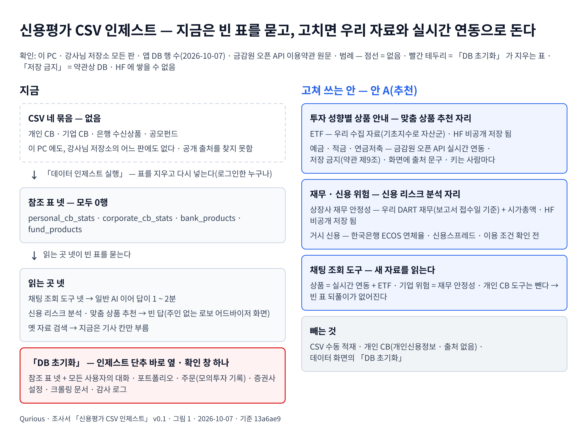

# 조사서 — 신용평가 CSV 인제스트는 무슨 기능이고, 우리 로보 어드바이저에 맞게 어떻게 고치나 v0.1

| 문서 정보 | |
|---|---|
| **판 · 상태** | v0.1 · 결정 A — 고쳐 씀(2026-10-07 · 이동원 · 8절) |
| **구분** | 6. 시스템 설계 — 착수 전 검증(목표 기능 ①-2 데이터 수집 화면 셋의 「적재 · 백업」 · 정할 것 ② · 주인 없는 로보 어드바이저 화면 둘 — 신용 리스크 분석 · 맞춤 금융상품 추천) |
| **작성** | 이동원 |
| **검토** | 이동원 — 8절 안 A 를 골랐다(2026-10-07) |
| **최종 수정** | 2026-10-07 (KST) |
| **기준** | 코드 `main` `13a6ae9` · 강사님 기초 코드 th06 `origin/main` `0c55dbc` · 강의 4일차 쪽(`public/lectures/days/04.html` — th07 원본) · 앱 DB(도커 PostgreSQL · 2026-10-07 오전 조회) · 웹 · 약관 원문 · 법령 API 조회 2026-10-07 |
| **관련 문서** | [이동원 파트 할 일 v0.3](../계획서/이동원파트-할일.md) 6 · 7절 · [UI 명세서 v0.3](../화면/UI명세서.md) 5.4 · [IA v1.3](../화면/IA.md) Q2 · [데이터 사전 v1.8](../데이터/데이터사전.md) 참조 4표 · [기능 확장 시장조사 v0.1](기능확장-시장조사.md) · Figma [「데이터 수집 화면」 05 정할 것](https://www.figma.com/design/AfiCh50uOwrSq5F2Tk2JLZ?node-id=10-2) |

> **이 문서로 알 수 있는 것**
> 1. 「데이터 인제스트」 는 정확히 무엇을 하고, 그 자료를 누가 읽나?
> 2. 자료는 어디서 오나 — 지금 있나, 실제 자료인가, 개인정보인가?
> 3. 강사님 요구(강의 4일차 프로젝트 쪽)와 기초 코드(th06 최신판)는 이 기능을 요구하나?
> 4. 우리 로보 어드바이저에 맞게 고치면 화면마다 어떻게 바뀌고, 자료는 어디서 받아 어디에 둘 수 있나(HF 저장 가능 여부 포함)?
> 5. 지금 데이터 수집 화면 셋에서 실제 서비스에 맞지 않는 문구(개발 티)는 무엇인가?
>
> **읽는 순서** — 이동원: 요약 → 6절 → 8절 · 팀원: 요약 → 6절 <표 6> · 처음 온 사람: 부록 C 용어 → 요약

## 요약

1. **「데이터 인제스트」 는 강사님 기초 코드의 「금융정보 Agent」 가 쓰는 참조 표 넷을 채우는 단추다.** CSV 네 묶음(개인 CB · 기업 CB · 은행 수신상품 · 공모펀드)을 읽어 CB 둘은 통계로 줄이고 상품 둘은 그대로 넣는다(<표 1>). CB 는 신용정보회사(Credit Bureau)가 매기는 신용점수 · 등급 자료다.
2. **자료가 없다.** CSV 는 이 PC 에도 강사님 저장소의 어느 판에도 없고(코드만 있다), 공개 출처도 찾지 못했다. 앱 DB 의 네 표는 모두 0행이다. 그래서 이 표를 읽는 넷 — 채팅 에이전트의 조회 도구 넷 · 「신용 리스크 분석」 · 「맞춤 금융상품 추천」 · 옛 자료 검색 — 은 늘 빈 표를 묻고, 일반 AI 이어 답은 그 탓에 1 ~ 2분 걸린다(<표 2> · <표 3>).
3. **강사님 요구도, 기초 코드 최신판도 이 기능을 요구하지 않는다.** 강의 4일차 프로젝트 쪽의 로보 어드바이저 요구는 「UI/UX 필요 요소: 투자성향진단 · 시각적 포트폴리오 · 시뮬레이션 · 목표 수익률 모의 · 리밸런싱」 과 목표 기능 · 세부 기능이고, 신용 CB · 상품 추천은 없다. 신용평가모형은 금융 모형 설명과 XAI 쓰임새의 예로만 나온다. th06 최신판(10-06)도 이 기능의 파일을 2026-10-02 판 뒤로 한 줄도 고치지 않았고, 강사님 할 일 목록에도 없다(5절).
4. **그래도 화면 둘은 로보 어드바이저 묶음 안의 「주인 없는 화면」 이라 이동원이 맡는다(사용자 2026-10-07).** 그래서 빼기보다 **우리 자료로 고쳐 쓰는 것**이 맞다 — 「맞춤 금융상품 추천」 은 투자 성향별 상품 안내(ETF = 우리가 이미 모으는 자료 · 예금 · 적금 · 연금저축 = 금감원 실시간 연동)로, 「신용 리스크 분석」 은 재무 · 신용 위험(상장사 재무 안정성 = 우리 DART 재무 · 거시 신용 = 한국은행 ECOS)으로 바꾼다(<표 6>). 개인 CB 와 CSV 수동 적재는 뺀다.
5. **HF 에 둘 수 있는 자료와 없는 자료가 갈린다.** DART 재무에서 계산한 지표 · ETF 자료는 지금처럼 HF 비공개 데이터셋에 둘 수 있다. 하지만 **금감원 「금융상품 한눈에」 오픈 API 약관 제9조는 「실시간으로 제공되는 정보를 이용자의 서비스와 연동할 수 있을 뿐이며, 정보를 복제 또는 저장하거나 전송할 수 없습니다」 라고 정한다** — 예금 · 적금 금리는 DB · HF 에 쌓지 못하고 부를 때마다 받아 보여야 하며, 화면에 출처 문구를 달아야 하고, 개인 키는 남에게 넘길 수 없다(제5조 · <표 7>).
6. **결정(2026-10-07): 안 A — 고쳐 씀.** 아래 6절 <표 6> 대로 화면 둘을 우리 자료로 고치고, CSV 수동 적재 · 개인 CB 는 쓰지 않는다.
7. **「DB 초기화」 는 화면에서 뺀다.** 이 단추는 참조 표 넷뿐 아니라 모든 사용자의 대화 · 포트폴리오 · 주문(모의투자 기록) · 증권사 설정 · 크롤링 문서 · 감사 로그까지 지운다(<표 5>). 결함 후보로 올린다.

<그림 1> 은 지금 상태와 고쳐 쓰는 안을 한 장에 보인다.

**<그림 1> 신용평가 CSV 인제스트 — 지금은 빈 표, 고치면 우리 자료와 실시간 연동으로** · 범례: 점선 상자 = 없음 · 빨간 테두리 = 「DB 초기화」 가 지우는 표 · 「저장 금지」 = 약관상 DB · HF 에 쌓을 수 없음

원본: [Figma · Qurious · 문서 그림 · 신용평가 CSV 인제스트](https://www.figma.com/design/6lstWS4YwuhJPhGB9XoBMD?node-id=38-3) · 그림 판 v0.1 · 기준 `13a6ae9` · 2026-10-07 · 같은 내용의 글은 <표 1> · <표 2> · <표 5> · <표 6>

---

## 1. 조사 범위와 방법

**<표 0> 질문 · 출처 · 확실도** · 확실도: 확인 = 1차 출처와 두 번째 출처 · 실측이 맞음 · 일부 확인 = 하나만 · 확인 못함 = 찾지 못함

| 질문 | 1차 출처 | 2차 검증 | 확실도 |
|---|---|---|---|
| 무엇을 하나 | `app/services/financial_ingest.py` · `app/routes/ingest.py` · `app/models/reference.py` | 강사님 원본(th06)의 같은 파일 · `pipeline.md` 87 · 214행 | 확인 |
| 누가 읽나 | `app/lib/financial_tools.py` · `app/services/langgraph_agent.py` · `app/routes/library.py` · `public/js/agent.js` · `public/app.html` | 저장소 전체 글자 찾기(다른 호출 0 · 시험 0) | 확인 |
| 자료가 있나 | 작업 폴더 전체(깊이 6) · 앱 DB 행 수 | 강사님 저장소의 모든 판 · 다른 강사님 저장소 23곳 글자 찾기 | 확인 |
| 어디서 왔나 | 웹 검색 셋(칸 이름 · 폴더 이름 · 상품 칸 이름) | — | 확인 못함(추정만) |
| 개인정보인가 | 신용정보법 제2조 — 법령 API 원문(현행 · 2026-09-11 시행 · 제21445호) | 코드가 읽는 칸(사람 한 줄 · 성별 · 연령대 · 점수 · 불량) | 일부 확인(원본이 실제인지 모름) |
| 강사님이 요구하나 | 강의 4일차 쪽(`public/lectures/days/04.html` · th07 원본) 프로젝트 요구 | th06 최신판 `0c55dbc`(파일 변경 · `todo.md` · `readme.md` · 강사님 기능 완성도 점수) | 확인 |
| 고쳐 쓸 자료가 있나 | 데이터 사전 v1.8(`financial_statement` · ETF 칸) · 수집기 | 시장조사 v0.1(ECOS 실측) | 일부 확인(ECOS 계열 · 이용 조건은 확인 전) |
| 상품 공식 출처 · 저장 가능 여부 | 금감원 「금융상품통합비교공시시스템 오픈 API 이용약관」 원문(인증키 쪽 · 파이썬으로 받아 조항을 그대로 옮김) | 오픈 API 안내 쪽 · 신문 기사(2016 개설) | 확인 |

조사하지 않은 것 — 펀드 공식 API(금융투자협회 · 공공데이터포털) · ECOS 이용 약관 원문과 연체율 계열 코드 · 공개 신용 통계(한국신용정보원 등). 8절에서 고르는 안에 따라 다음에 조사한다.

---

## 2. 무슨 기능인가

「데이터 인제스트 실행」 단추(`API-ING-01` · `POST /api/ingest/financial`)는 네 묶음을 차례로 넣는다. 묶음마다 **표를 먼저 통째로 지우고** 넣으며, 파일이 없으면 「디렉토리 없음」 한 줄만 남기고 0건으로 끝난다. 이 API 는 로그인한 사람이면 누구나 부를 수 있다.

**<표 1> CSV 네 묶음 → 표 넷** · `DATA_DIR` = `./data` · 행 = 2026-10-07 앱 DB

| 묶음 | 폴더 · 파일 | 읽는 칸 | 넣는 법 | 표 · 행 |
|---|---|---|---|---|
| 개인 CB | `09.개인 CB정보/*.csv` | STDT · GENDER · AGE_BAND · SCORE · SCORE_6M · PERF1 · PERF2(머리 이름이 없으면 자리로 짐작) | (기준월 · 성별 · 연령대)마다 사람 수 · 평균 점수 · 6개월 전 평균 점수 · 불량률 둘 | `personal_cb_stats` · 0 |
| 기업 CB | `10.기업 CB정보/*.csv` | BS_DT · SIC_CD_3 · WG_GB · CORP_GRAD · PERF_12M | (기준일 · 업종 3자리 · 기업 규모)마다 기업 수 · 평균 등급(100 이상은 뺌) · 12개월 불량률 | `corporate_cb_stats` · 0 |
| 은행 수신상품 | `12.금융상품정보/은행수신상품.csv` | 은행 · 상품 코드와 이름 · 상품 그룹 · 계약 기간 · 가입 금액 · 기본금리 · 최대우대금리 · 입출금 방식 · 만기 · 예금자보호 · 개요 | 줄마다 그대로 | `bank_products` · 0 |
| 공모펀드 | `12.금융상품정보/공모펀드상품.csv` | 평가기준일 · 펀드 코드와 이름 · 운용사 · 유형 셋 · 투자전략 · 순자산 · 투자위험등급 · 기준가 · 1년 수익률 · 운용보수 · 퇴직연금 · ESG | 줄마다 그대로 | `fund_products` · 0 |

이 표를 읽는 곳은 <표 2> 와 같다.

**<표 2> 이 표를 읽는 곳**

| 읽는 곳 | 어떻게 읽나 | 지금 결과 | 주인 · 요구 |
|---|---|---|---|
| 채팅 에이전트(`langgraph_agent.py` · 일반 AI 답) | 조회 도구 넷(`query_personal_cb` · `query_corporate_cb` · `search_bank_products` · `search_funds`) — 생각 → 도구 → 다시 생각을 최대 6단계 | 「조회된 … 데이터가 없습니다. 먼저 데이터를 인제스트해주세요.」 를 받고 다시 묻는다 → AI 투자 상담의 일반 AI 이어 답이 이 PC 에서 1 ~ 2분 | AI 투자 상담(이동원) — 근거 답이 근거를 못 찾을 때 넘기는 길 |
| 신용 리스크 분석(`agent-cb`) | 고른 칸(기간 · 성별 · 연령대 / 기간 · 규모 · 업종)으로 질문 글을 만들어 채팅 API 로 | 빈 답 · 기간 고르기가 2019-12 ~ 2022-12 로 고정 | 주인 없음 → 이동원(2026-10-07) · 요구 없음 |
| 맞춤 금융상품 추천(`agent-products`) | 같은 방식(은행 수신상품 · 공모펀드 탭) | 빈 답 | 주인 없음 → 이동원(2026-10-07) · 요구 없음 |
| 옛 자료 검색(`API-LIB-01`) | 종류 셋(은행 · 펀드 · 기사) | 지금 부르는 곳(`agent.js`)은 기사 칸만 | 투자 정보 리서치는 2026-10-06 에 수집 자료 검색(`API-DATA-03`)으로 바뀌었다 |

문서도 이 기능을 사실과 다르게 적고 있다 — `prompts/system.md` 8행(「개인CB / 기업CB / 금융상품 데이터를 기반으로 근거 있는 답변을 제공한다」) · `readme.md` 107행(「CSV를 SQLite로 집계」 — 실제는 PostgreSQL) · 화면 설명(「MongoDB에 집계」).

---

## 3. 자료는 어디서 오나

**<표 3> 찾은 곳과 결과**

| 찾은 곳 | 결과 |
|---|---|
| 이 PC 작업 폴더 전체(깊이 6) | `CB정보` · `금융상품정보` 폴더 없음 |
| 앱 DB(도커 PostgreSQL) | 네 표 모두 0행 |
| 강사님 기초 코드(th06) — 모든 판 | 인제스트 코드는 첫 커밋(2026-05-07)부터 있고, 자료 폴더는 어느 판에도 없다 |
| 다른 강사님 저장소 23곳 | 칸 이름 · 폴더 이름 0건 |
| 우리 `.gitignore` | `data/09*/` · `data/10*/` · `data/12*/` · `data/1*/` — 처음 등록(2026-09-15)부터 자료 폴더를 막아 두었다. 자료를 저장소 밖에서 따로 받는다는 전제다 |
| 웹 검색 셋 | 0건 — 공개 출처를 찾지 못했다 |

번호 09 · 10 · 12 는 더 큰 자료 묶음의 차례 번호로 보인다 — 강사님이 다른 과정에서 쓰던 자료 묶음의 코드만 옮겨 온 것으로 추정한다(확실도 낮음). 데이터 사전 v1.8 도 이 네 표의 공개 여부를 「미확인 — 원천 CSV 의 출처 · 재배포 조건이 문서에 없다」 로 적었다.

---

## 4. 개인정보인가

개인 CB 원본은 한 사람이 한 줄이다 — 성별 · 연령대 · 신용점수 · 6개월 전 점수 · 불량 여부 둘. 신용정보법 제2조(현행 · 2026-09-11 시행 · 법률 제21445호)는 이렇게 정한다(법령 API 원문 그대로).

> 2\. "개인신용정보"란 기업 및 법인에 관한 정보를 제외한 살아 있는 개인에 관한 신용정보로서 다음 각 목의 어느 하나에 해당하는 정보를 말한다.
>
> 15\. "가명처리"란 추가정보를 사용하지 아니하고는 특정 개인인 신용정보주체를 알아볼 수 없도록 개인신용정보를 처리 … 하는 것을 말한다.
>
> 16\. "가명정보"란 가명처리한 개인신용정보를 말한다.
>
> 17\. "익명처리"란 더 이상 특정 개인인 신용정보주체를 알아볼 수 없도록 개인신용정보를 처리하는 것을 말한다.

- 실제 자료라면 이름이 없어도 가명정보이고, 가명정보도 개인신용정보다(제16호). 합성 자료라면 개인정보가 아니다. 파일이 없어 어느 쪽인지 알 수 없다.
- 앱이 표에 남기는 것은 묶음 통계지만, 원본 CSV 는 `data/` 에 그대로 남는다.
- 기업 CB · 상품 둘은 사람 단위가 아니라 개인정보가 아니다.

우리에게 주는 뜻 — 개인 CB 를 「구해서 채우는」 길은 막혀 있다. 출처와 이용 계약이 있는 자료를 사야 하고, 들인 뒤에는 가명정보로 다뤄야 한다. 6절의 고쳐 쓰는 안은 개인 단위 자료를 쓰지 않는다.

---

## 5. 강사님 요구와 기초 코드는 이 기능을 요구하나

**<표 4> 강사님 쪽 근거**

| 근거 | 무엇이 적혀 있나 | 이 기능과의 관계 |
|---|---|---|
| 강의 4일차 프로젝트 쪽(앱 「금융 필수 지식 › 자산배분과 퀀트」 · th07 원본) — 「PROJECT 01 나만의 로보 어드바이저 개발 및 성과 검증 프로젝트」 | 「UI/UX 필요 요소: 투자성향진단 · 시각적 포트폴리오 · 시뮬레이션 · 목표 수익률 모의 · 리밸런싱」 · 목표 기능 넷과 세부 기능(① 용어 · 수집 · RAG · 갱신 · XAI / ② 패턴 / ③ 리밸런싱 / ④ 성과 · 모의투자) | 신용 CB · 상품 추천 · CSV 인제스트는 요구에 없다 |
| 같은 쪽의 금융 모형 · XAI 설명 | 「신용평가모형(Credit Scoring Model) — 돈을 빌려줘도 되는지, 대출 한도와 금리를 얼마로 정할지 판단할 때 씁니다」 · XAI 쓰임새 「대출 거절이나 신용등급 평가 시, 어떤 요소(연체 기록, 소득 수준 등)가 감점 원인이었는지 고객에게 안내합니다」 | 개념 설명과 예시다 — 우리 ①-5 XAI 는 「투자 추천 이유」 를 설명한다 |
| 같은 쪽의 자산배분 설명 | 무위험자산의 예로 「신용위험이 매우 낮은 단기 국채, 예금자보호 한도 안의 예·적금, 단기 금리 추종 상품」 | 자산배분의 안전자산 칸에 예금 · 적금이 들어갈 수 있다는 근거 — 6절 상품 안내 |
| th06 최신판 `0c55dbc`(2026-10-06) | 인제스트 · 조회 도구 · 채팅 에이전트 · 관리자 초기화 · 화면 파일이 `9478811`(10-02) 뒤로 바뀌지 않음 · `todo.md` 에 이 기능 항목 없음 · `readme.md` 는 옛 SQLite 판 설명(「CSV를 SQLite로 집계」 · `docker compose run --rm ingest`) | 강사님이 키우고 있는 기능이 아니다 — 다음 기초 코드 반영 때 부딪힐 일도 적다 |
| 강사님 기능 완성도 점수(`public/js/completion.js`) | 신용 리스크 분석 62 · 맞춤 상품 추천 62 「범용 Agent 질의로 연결 · CB · 상품 데이터 통합 테스트 없음」 · 데이터 인제스트 68 | 강사님도 자료 없이 질의 연결만 된 것으로 본다 |

정리하면, 이 기능은 **요구가 아니라 기초 코드에 남은 옛 기능**이다. 다만 화면 둘(신용 리스크 분석 · 맞춤 금융상품 추천)은 로보 어드바이저 묶음 안에 있고 주인이 없어, 사용자 규칙(2026-10-07 — 주인 없거나 요구 밖인 화면은 이동원이 구현)에 따라 이동원이 맡는다. 그래서 「빼기」 보다 「우리 로보 어드바이저에 맞게 고치기」 를 먼저 본다(6절).

---

## 6. 우리 로보 어드바이저에 맞게 고치면

화면마다 고쳐 쓰는 안은 <표 6> 과 같다. 원칙은 셋이다 — 우리가 이미 모으는 자료를 먼저 쓰고, 개인 단위 자료는 쓰지 않고, 공식 출처의 이용 조건을 지킨다.

**<표 6> 화면 · 기능마다 고쳐 쓰는 안**

| 지금 | 고친 뒤(안) | 자료 · 출처 | 로보 어드바이저 흐름에서 | 차수 |
|---|---|---|---|---|
| 맞춤 금융상품 추천(`agent-products`) — 은행 수신상품 · 공모펀드 검색(빈 표) | **투자 성향별 상품 안내** — 자산배분의 자산군마다 상품 후보를 보인다: 주식 · 채권 · 원자재 = ETF(기초지수 이름으로 자산군 · 순자산총액 · 기준가), 안전자산 = 예금 · 적금 · 연금저축(금리 · 기간 · 예금자보호) · 「왜 이 후보인가」 한 줄(XAI 화면과 같은 쉬운 말 — 세부 5 주담당 신장환 님과 맞춤) | ETF = 우리 수집 DB(공공데이터포털 증권상품시세 · HF 비공개 백업 이미 있음) · 예금 · 적금 · 연금저축 = 금감원 「금융상품 한눈에」 오픈 API **실시간 연동만**(저장 금지 · <표 7>) | 투자성향진단(U1) → 자산배분(오준영) → **상품 안내** → 리밸런싱 · 모의투자 — 자산군 → 대표 ETF 대응표(결정 D5 ①)를 자산배분 주담당과 맞춘다 | 2차 |
| 신용 리스크 분석(`agent-cb`) — 개인 · 기업 CB 통계(빈 표) | **재무 · 신용 위험** — ① 상장사 재무 안정성(부채비율 · 유동비율 · 자기자본비율 · 부도 위험 점수(Altman Z 꼴)를 보고서 접수일 기준으로) ② 거시 신용 지표(가계 · 기업 대출 연체율 · 신용스프레드) · 보유 · 관심 종목에 경고와 까닭 | ① 우리 DART 주요계정(시점 고정 · `first_known_at`) + 시가총액(수집 시세) · HF 비공개 OK ② 한국은행 ECOS(인증키 있음 · 계열 코드와 이용 조건은 확인 전) | 스크리닝 · 리밸런싱의 위험 거름 · XAI 설명의 재료 | 2차 후반 또는 3차 |
| 데이터 인제스트(`crawl-ingest`) — CSV 수동 적재 · DB 초기화 | 「적재 · 백업」(설계 3) — CSV 수동 적재 칸 없음 · 새 자료는 러너 단계로 받고(재무 지표 · ECOS) 백업 상태만 보인다 · 「DB 초기화」 는 화면에서 뺀다 | — | — | 2차(크롤링 세 화면 구현 때) |
| 채팅 에이전트 조회 도구 넷 | 새 자료를 읽는 도구로 바꾼다 — 상품 = 금감원 실시간 + ETF · 기업 위험 = 재무 안정성 표 · 개인 CB 도구는 뺀다 · 지시문(`prompts/system.md`) 문장도 | 위와 같음 | 일반 AI 답이 빈 표를 묻지 않는다(1 ~ 2분 되풀이 해소) | 2차 |
| 참조 표 넷(`personal_cb_stats` 등) | 쓰지 않는다 — 새 자료는 수집 DB · 새 표에 둔다 · 옛 표를 지우는 마이그레이션은 팀 글 뒤 | — | — | 팀 결정 뒤 |

공식 출처마다 저장해도 되는지는 <표 7> 과 같다. 사용자 메모(「데이터는 HF 에 데이터셋을 파서 저장해도 된다」)는 우리가 만든 자료 · 공공 자료에는 맞지만, 금감원 상품 자료에는 약관이 막는다.

**<표 7> 자료마다 HF · DB 에 저장할 수 있나**

| 자료 | 저장 | 근거 원문 · 조건 | 확실도 |
|---|---|---|---|
| 금감원 「금융상품 한눈에」 오픈 API(예금 · 적금 · 연금저축 · 대출 넷 · 회사 개요 — 8종) | **안 됨 — 부를 때마다 받아 보이기만** | 이용약관 제9조 「API 이용자는 API 서비스를 통하여 실시간으로 제공되는 정보를 이용자의 서비스와 연동할 수 있을 뿐이며, 정보를 복제 또는 저장하거나 전송할 수 없습니다.」 · 같은 조 「해당 화면에 "금융상품통합비교공시시스템(금융감독원) 금융회사 상품정보"를 사용한 결과임을 명시해야합니다」 · 제5조 인증키는 「발급 신청한 API 이용자 외의 제3자가 이용할 수 없으며」 · 제7조 개인 1일 10,000건 · 1회 100건(연금저축 10건) | 확인(약관 원문) |
| DART 재무에서 계산한 재무 안정성 지표 | 됨(HF 비공개 · 지금 공시 · 재무와 같은 곳) | 우리가 계산한 값 · DART 원자료는 이미 HF 비공개 백업(조사서 「공시 · 재무 · 뉴스 이용 조건」) | 확인 |
| ETF 시세 · 기초지수 · 순자산(공공데이터포털) | 됨(HF 비공개 — 이미 백업) · 공개 저장소 · 발표에는 원자료 없이 | 공공누리 · KRX 유래 재배포 조건(데이터 사전 v1.8 운영 속성) | 확인 |
| 한국은행 ECOS 통계(연체율 · 금리) | 확인 전 | ECOS 이용 약관 원문을 아직 보지 않음 | 확인 못함 |
| 개인 CB 원본 | 들이지 않는다 | 4절 — 개인신용정보 · 출처 없음 | 확인 |

상품 안내를 금감원 실시간 연동으로 만들면 지켜야 할 것이 셋 생긴다 — ① 화면에 출처 문구 ② 키는 쓰는 사람마다(팀원 각자 발급 · 사용자별 키 칸 — 증권사 키와 같은 꼴(ADR-0004)) ③ 하루 10,000건 안(한 번 볼 때 상품 종류마다 1 ~ 몇 번).

---

## 7. 「DB 초기화」 가 지우는 범위

인제스트 단추 바로 옆 「DB 초기화」(`API-ADM-01` · `POST /api/admin/reset`)는 관리자만 부를 수 있고, 확인 창 하나(「DB를 초기화하시겠습니까?」) 뒤에 <표 5> 의 표를 **모든 사용자에 걸쳐** 지운다.

**<표 5> 「DB 초기화」 가 지우는 표** · `app/routes/admin.py`

| 묶음 | 표 | 지우면 잃는 것 |
|---|---|---|
| 참조 넷(`FINANCIAL_MODELS`) | `personal_cb_stats` · `corporate_cb_stats` · `bank_products` · `fund_products` | 인제스트한 자료(지금 0행) |
| 사용자 여섯(`USER_MODELS`) | `chats` · `portfolio` · `orders` · `broker_settings` · `crawled_docs` · `audit_events` | 모든 사용자의 대화 · 보유 종목 · 주문(모의투자 기록) · 증권사 키 설정 · 크롤링 문서 · **감사 로그**(지운 뒤 「초기화했다」 한 줄만 새로 남는다) |

화면 글(「금융 데이터 인제스트」 카드)만 보면 인제스트한 자료를 지우는 단추로 읽히지만, 실제로는 모의투자 기록과 감사 이력까지 지운다. 결함 후보로 테스트 계획서 다음 판의 결함대장에 올린다(같은 증상의 옛 결함 번호 없음 — 2026-10-07 결함대장 · 갱신 댓글 확인 · 옛 분석 A12 가 감사 로그를 지운다는 점만 짚었다). 화면에서는 뺀다 — 관리자에게 필요한 「표 비우기」 는 관리자 기능(3차 이동원 몫 뒤)에서 다시 설계한다.

---

## 8. 고를 안

**<표 8> 안 셋** · 추천은 첫 줄 · **결정: A(2026-10-07 · 이동원)**

| 안 | 무엇 | 좋은 점 | 걸리는 점 |
|---|---|---|---|
| **A. 고쳐 씀(추천)** | <표 6> 그대로 — 상품 안내(ETF + 금감원 실시간) · 재무 · 신용 위험(DART + ECOS) · 채팅 도구 바꿈 · CSV 수동 적재와 개인 CB 와 「DB 초기화」 는 화면에서 뺌 | 로보 어드바이저 흐름(성향 → 배분 → **상품** → 리밸런싱)이 끝까지 이어진다 · 주인 없는 화면 둘이 실제 자료로 돈다 · 일반 AI 답이 빨라진다 | 할 일이 는다(2차는 10-21 마감) · 금감원 키를 각자 받아야 한다 · 자산군 → ETF 대응표를 자산배분 주담당과 맞춰야 한다 · ECOS 이용 조건 확인이 남았다 |
| B. 상품 안내만 고쳐 씀 | 상품 안내만 2차에 · 신용 리스크 분석은 3차로 미루거나 빼고 · 나머지는 A 와 같음 | 2차 범위가 작다 | 신용 리스크 화면이 3차까지 빈 채로 남는다 |
| C. 제거 | CSV 인제스트 · 화면 둘 · 표 넷 · 도구 넷을 세 단계로 뺀다(데이터 화면 → 채팅 도구 → 팀 글) | 일이 가장 적다 | 주인 없는 화면은 이동원이 구현한다는 규칙(2026-10-07)과 맞지 않는다 · 로보 어드바이저의 상품 단계가 비어 있다 |

어느 안이든 공통으로 하는 것 — CSV 수동 적재와 개인 CB 는 쓰지 않는다 · 「DB 초기화」 는 데이터 화면에서 뺀다 · 화면 둘을 고치기 전에 Figma 에서 지금 화면 · 바꿀 화면을 나란히 두고 정한다(화면 설계 절차) · 강사님 th 자료에 같은 기능이 있으면 먼저 찾아 보이고 가져올지 묻는다.

---

## 9. 화면의 「개발 티」 문구 — 바꿀 대상

지금 데이터 수집 화면 셋에서 실제 서비스 화면에 들어가면 안 되는 문구는 <표 9> 와 같다. 세 화면을 바꾸면(설계 1 ~ 3) 대부분 사라지고, 팀 공용 부품 둘(기능 완성도 배지 · 바닥글 기술 목록)은 리팩터링 세션에서 팀 글로 정한다.

**<표 9> 개발 티 문구와 바꿀 것** · 원문은 `public/app.html` · `public/js/core.js`(사용법 상자) · `teamcompletion.js` · `brand.js`

| 화면 · 자리 | 지금 문구 | 왜 맞지 않나 | 바꿀 것 |
|---|---|---|---|
| 자동 크롤링 · 설명 | 「설정된 소스(GitHub python-quant docs 등)를 자동으로 크롤링하여 Qdrant RAG에 저장합니다.」 | 저장소 · DB 이름 · 기술 말 | 「수집 일정 · 단계」 안내(「매일 12:30 에 시세 · 공시 · 뉴스를 받아 계산하고 백업합니다 …」 · 설계 1) |
| 자동 크롤링 · 크롤링 대상 상자 | 「github:edumgt/python-quant/docs — 퀀트 전략 문서」 | 저장소 주소 | 뺀다(결정 ③) |
| 자동 크롤링 · 사용법 상자 | 「…AI 지식베이스에 반영합니다」 · 「완료 후 '금융정보 Agent'에서 관련 질문을 하면 새 자료가 답변에 반영됩니다」 · 용어 칩 RAG · 임베딩 · Qdrant | 내부 이름 · 사실과 다름(근거 답은 이 자료를 쓰지 않는다) · DB 이름 칩 | 사용법을 새 화면 동작으로 다시 쓴다 · 칩은 화면에 나오는 말(수정주가 · 총수익)로 |
| 수동 크롤링 · 안내 | 「…텍스트를 추출하여 RAG에 저장합니다.」 · 용어 칩 Qdrant | 기술 말 · DB 이름 | 「자료 직접 받기」 안내(설계 2) |
| 수동 크롤링 · 단추 | 「네이버 주식 크롤링」 | robots.txt 가 막은 사이트 | 뺀다 — 주소 검사의 「막음」 예시로만(결정 ①) |
| 데이터 인제스트 · 설명 | 「개인CB / 기업CB / 금융상품 CSV 파일을 MongoDB에 집계하여 저장합니다. (최초 1회 또는 데이터 갱신 시)」 | DB 이름이 틀림(실제 PostgreSQL) · 내부 약어 | 화면에서 빠진다(8절 어느 안이든) |
| 데이터 인제스트 · 사용법 상자 | 「'금융 데이터 인제스트'는 data 폴더의 CSV를 읽어 DB에 반영합니다.」 · 「'DB 초기화'는 관리자 전용이며 기존 데이터를 모두 삭제하니 주의하세요.」 | 폴더 경로 · 개발 말 · 실제로 지우는 범위(<표 5>)를 말하지 않음 | 빠진다(7절) |
| 세 화면 공통 · 기능 완성도 배지 | 「기능 완성도 63% · 외부 의존」 · 근거 「조각 점 ID 고정·옛 점 정리 시험 · 대상 사이트 수집 E2E 없음」 | 시험 · 작업 말 · 사용자에게 뜻 없는 점수 · 바닥글 고지를 가림(DF-62) | 팀 공용 — 운영 모드에서 끄기(리팩터링 세션 · 팀 글 먼저) |
| 모든 화면 · 바닥글 | 「FastAPI · PostgreSQL · Redis · Qdrant · Ollama」 | 쓴 기술 목록 · DB 이름 | 팀 공용(`brand.js` 의 `stack`) — 운영 모드에서 숨기기 후보(리팩터링 세션) |

---

## 10. 이 조사를 뒤집을 조건

- 강사님이 자료 묶음과 그 출처 · 이용 조건을 주면 → 합성인지 가명인지 다시 보고, 쓸 곳이 생길 때만 되살린다.
- 금감원이 저장을 허용하는 별도 표시 방식 · 계약을 정하거나(제9조 단서), 같은 자료를 저장 가능한 공공 데이터(공공데이터포털 등)로 내면 → 상품 안내를 하루 한 번 받아 두는 꼴로 바꾼다.
- 자산배분 주담당이 자산군 → ETF 대응표를 다른 방식으로 정하면 → 상품 안내의 ETF 후보 규칙을 그 표에 맞춘다.
- 강사님 기초 코드 새 판이 이 기능을 고치거나 자료를 넣으면 → 3-way 반영 때 다시 본다.
- 일반 AI 답에서 도구를 바꿔도 1 ~ 2분이 줄지 않으면 → 느린 까닭이 도구가 아니므로 다시 잰다.

---

## 부록 A. 출처

| 번호 | 출처 | 조회일 · 확인 방법 | 이 문서에서 쓴 것 |
|---|---|---|---|
| [L1] | 국가법령정보센터 Open API — 신용정보의 이용 및 보호에 관한 법률(eflaw · 법령일련번호 283841 · 2026-09-11 시행 · 2026-03-10 공포 제21445호) 제2조 | 2026-10-07 · 법령 API 원문(목록 → 시행일 판 본문) | 제2호 · 제15호 · 제16호 · 제17호 |
| [F1] | 금융감독원 「금융상품 한눈에」 — [오픈 API 안내](https://finlife.fss.or.kr/finlife/main/contents.do?menuNo=700029) | 2026-10-07 · 쪽 요약 | API 8종 · XML · JSON · REST |
| [F2] | 금융감독원 — [금융상품통합비교공시시스템 오픈 API 이용약관 · 인증키 발급](https://finlife.fss.or.kr/finlife/api/finlifeApiKey/list.do?menuNo=700034) | 2026-10-07 · 파이썬으로 쪽을 받아 조항 글을 그대로 옮김 | 제5조(인증키 제3자 이용 금지) · 제7조(개인 1일 10,000건) · 제9조(실시간 연동만 · 복제 · 저장 · 전송 금지 · 출처 표시) · 1회 100건(연금저축 10건) |
| [N1] | 전자신문 — [금융상품한눈에, 금융상품 통합 비교공시 사이트 오픈](https://m.etnews.com/20160114000200) | 2026-10-07 · 검색 결과(2차) | 2016 개설 · 853개 상품 |
| [D4] | 강의 4일차 쪽 — `public/lectures/days/04.html`(th07 `frontend/days/04.html` 반입본 · 앱 「자산배분과 퀀트」) | 2026-10-07 · 쪽 글을 뽑아 읽음 | 프로젝트 요구 · UI/UX 필요 요소 · 신용평가모형 · XAI 쓰임새 · 무위험자산 예 |
| [T6] | 강사님 기초 코드 th06 `origin/main` `0c55dbc` — `todo.md` · `readme.md` · `public/js/completion.js` · 기능 파일 변경(`9478811..0c55dbc`) | 2026-10-07 · 로컬 참조 읽기(작성자 · 이메일은 읽지 않음) | 5절 <표 4> |
| [W1] | 웹 검색 셋 — 「SCORE_6M · PERF1 · AGE_BAND」 · 「CORP_GRAD · PERF_12M · WG_GB」 · 「09.개인 CB정보 · 10.기업 CB정보 · 12.금융상품정보」 · 상품 칸 이름 | 2026-10-07 | 맞는 공개 출처 0건 |
| [C1] | 코드 `main` `13a6ae9` — <표 0> 의 파일들 | 2026-10-07 · 파일 읽기 · 글자 찾기 | 2 · 3 · 7절 |

## 부록 B. 실측 기록

- 앱 DB 행 수(도커 PostgreSQL · 읽기만): `personal_cb_stats` 0 · `corporate_cb_stats` 0 · `bank_products` 0 · `fund_products` 0.
- 자료 폴더 찾기: 작업 폴더 `EST-Camp-AI-Quant` 아래 깊이 6 까지 이름에 `CB정보` · `금융상품정보` 가 든 폴더 0.
- 강사님 th06 모든 판: `git log --all -- "data/*CB*" "data/09*" "data/10*" "data/12*"` 0줄 · `financial_ingest.py` 가 처음 든 커밋 `acfbfc4`(2026-05-07) · `9478811..0c55dbc` 에서 기능 파일 여섯(인제스트 · 조회 도구 · 채팅 에이전트 · 관리자 · 인제스트 경로 · 화면 스크립트) 변경 0.
- 강사님 저장소 23곳(`learning/*/lecture`)의 `origin/main` 에서 `CB정보` · `SCORE_6M` · `CORP_GRAD` · `PERF_12M` · `은행수신상품` 글자 찾기 — th06 의 코드 · `pipeline.md` 셋만.
- 수집 DB(`market.sqlite3`)는 이 PC 에서 직접 열지 않았다 — 앱이 읽기 전용으로 붙여 쓰는 WAL DB 라 마지막 연결을 닫으면 앱이 멈출 수 있다(DF-74 와 같은 위험). 재무 · ETF 칸은 데이터 사전 v1.8 로 확인했다.

## 부록 C. 용어

| 용어 | 뜻 | 이 문서에서 | 헷갈리는 점 |
|---|---|---|---|
| CB(Credit Bureau) | 신용정보회사 — 개인 · 기업의 신용점수 · 등급을 매겨 금융회사에 주는 곳(NICE · KCB 등) | 개인 CB · 기업 CB 묶음 | 「신용카드」 의 약자가 아니다 |
| 인제스트 | 바깥 자료를 읽어 DB 표에 넣는 일 | 「데이터 인제스트」 단추 | 매일 러너의 수집과 다르다 — 손으로 한 번 누른다 |
| 참조 표 | 사용자마다 달라지지 않고 모두가 같이 읽는 표 | 표 넷 | 지금은 0행이다 |
| 가명정보 · 익명처리 | 추가정보 없이는 누구인지 모르게 처리한 개인신용정보 · 더 이상 누구인지 알 수 없게 처리한 것 | 4절 | 가명정보는 여전히 개인신용정보다 |
| 실시간 연동 | 사용자가 화면을 볼 때 그때그때 출처 API 를 불러 보여 주고, 받은 값을 DB · 파일에 남기지 않는 방식 | 6절 상품 안내 · <표 7> | 하루 한 번 받아 두는 수집과 다르다 — 약관이 저장을 막는 자료에 쓴다 |
| 부도 위험 점수(Altman Z 꼴) | 운전자본 · 이익잉여금 · 영업이익 · 시가총액 · 매출을 자산 · 부채로 나눠 더한 재무 위험 점수 | 6절 재무 안정성 | 신용등급이 아니다 — 같은 기준으로 견주는 계산 도구다 |

## 부록 D. 개정 이력

| 판 | 날짜 | 무엇이 바뀌었나 | 왜 | 근거 |
|---|---|---|---|---|
| v0.1 | 2026-10-07 | 새 문서 — 무슨 기능인가 · 읽는 곳 · 자료 출처 · 개인정보 · 강사님 요구 · 기초 코드 확인 · 화면마다 고쳐 쓰는 안 · 자료마다 저장 가능 여부(금감원 약관 제9조) · 「DB 초기화」 범위 · 고를 안 셋 · 화면의 개발 티 문구 · 결정 A(고쳐 씀) | 크롤링 세 화면 정할 것 ② — 「리서치해서 무슨 기능인지 예측하고, 우리 기능에 맞게 고칠 수 있나 판단하고, 필요 없으면 제거」(2026-10-06) · 「강사님 요구와 th06 을 확인하고 커스터마이징을 더 세밀하게 — 데이터는 HF 에 저장해도 된다」(2026-10-07) · 주인 없는 화면은 이동원이 구현(2026-10-07) | 부록 A · B |
