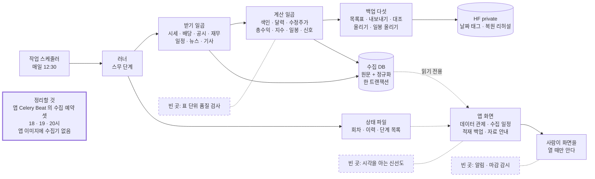
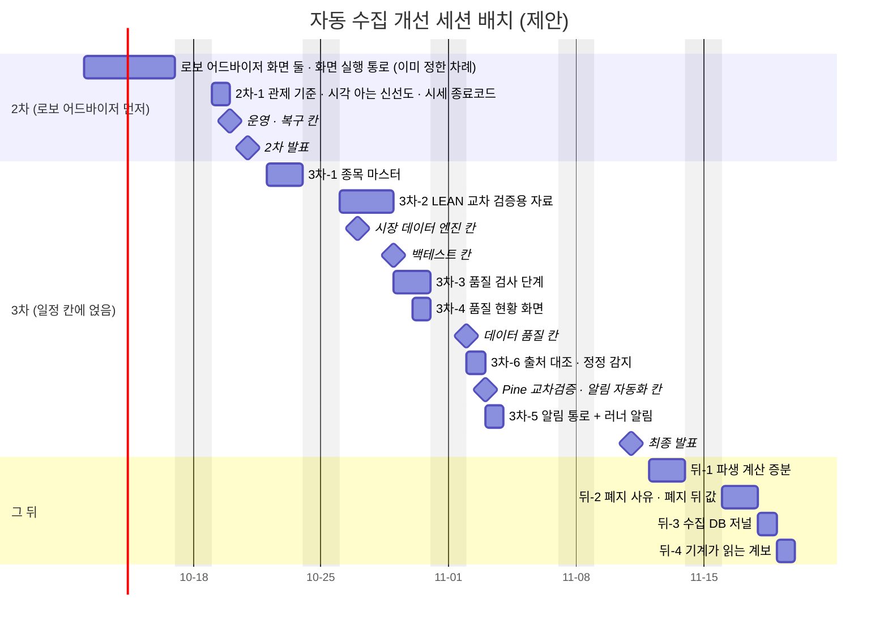

# 자동 수집 벤치마크 — 실제 서비스 · 오픈소스와 견준 장점 · 빠진 기능 · 세션 설계 조사서 v0.2

| 문서 정보 | |
|---|---|
| **판 · 상태** | v0.2 · 초안(검토 전) |
| **구분** | 조사서 · 목표 기능 ① `P01-①-2` · `P01-①-4`(수집 · 정기 배치 · 관제 · 백업)의 다음 걸음과 `SCH-DQ` · 3차 `P02-③-2` · `P02-③-3` 착수 전 검증 |
| **작성** | 이동원(데이터 파트 · 조사 지시) · 사례 수집과 초안은 조사 에이전트(공식 문서 · 원문 31곳을 열어 읽음 · 2차 출처 1 · github.com 은 열지 않음) · v0.2 의 다섯 곳 다시 열기와 코드 확인도 조사 에이전트 |
| **검토** | 검토 전. 6.2절의 3차-2(LEAN 교차 검증용 자료)는 성과 검증 주담당(강민석)이, 3차-5(알림 통로)는 증권사 연동 주담당(오준영)이 함께 읽어야 한다 |
| **최종 수정** | 2026-10-10 (KST) |
| **기준** | 코드 `main` `5f3c325` + 작업 트리(러너 신호 단계 · `app_db_gate()` · 자료 안내 1단계) · 4.1절 코드 확인은 `main` `006c31a`(2026-10-10 · 신선도 판정은 `5f3c325` 와 같다) · 러너 이력 `data/collector/state/daily_update_history.jsonl`(2026-09-28 ~ 10-08 · 읽기만) · 백업 판정 기록 `hf_backup_status.json`(2026-10-08 15:14) · 외부 원문 조회 2026-10-08 · 다섯 곳 다시 조회 2026-10-10(부록 B) · 수집 DB 는 열지 않았다 |
| **관련 문서** | [러너 단계 결과와 화면 실행 통로 v0.1](러너단계결과-화면실행통로-조사.md) · [공시 · 재무 · 뉴스 이용 조건 v0.2](공시-재무-뉴스-이용조건-조사.md) · [로컬 용량과 HF 원격 저장 v0.1](로컬용량-HF원격저장-조사.md) · [기능 확장 시장조사 v0.1](기능확장-시장조사.md) · [목표 기능 ① 설계서 v1.6](../설계/목표기능1-데이터지식-설계.md) · [테스트 계획서 v1.19](../시험/테스트계획서.md) 5절 · [이동원 파트 할 일 v0.3](../계획서/이동원파트-할일.md) · [RTM](../요구사항/RTM.md) 5절 · `collector/README.md` |
| **최근 개정** | v0.2 — 「신선도 판정이 시각을 모른다」(4.1절)를 요약 · 4.1 · 결함 표 · 단점 표 · 세션 2차-1 · 일정 그림 · 정할 것 1번에 같은 낱말 · 같은 마감(다음 영업일 13:00 + 1시간(14:00))으로 맞춤 · 코드로 다시 확인 · 출처 다섯 곳 다시 엶(부록 D) |

> **이 문서로 알 수 있는 것**
> 1. 지금 자동 수집(매일 러너 · 수집기 · 관제 · 백업)은 실제 데이터 공급자(CRSP · Sharadar · QuantConnect), 오픈소스 퀀트 데이터 도구(Qlib · zipline · LEAN · OpenBB · pykrx), 파이프라인 운영 도구(Airflow · Dagster · dbt · Great Expectations · Soda · OpenLineage)와 견주면 무엇이 같고 무엇이 앞서나?
> 2. 범용으로 있어야 하는데 우리에게 없는 기능은 무엇이고, 크기와 효과로 줄 세우면 어떤 차례인가?
> 3. 결함대장의 수집 쪽 결함은 어느 실무 기능이 있었으면 일찍 잡혔나?
> 4. 이동원 몫에서 2차(10-21 까지 · 로보 어드바이저 먼저) · 3차(10-22 ~ 11-11) · 그 뒤에 어떤 세션으로 나누나?
>
> **읽는 순서** — 이동원: 요약 → 4.1절 → 6절 · 강민석 · 오준영: 요약 → 6.2절의 3차-2 · 3차-5 · 처음 온 사람: 부록 A 용어 → 요약

## 요약

1. **지금 자동 수집은 서버 없이 가볍게 돌면서, 증명은 공급자처럼 하는 쪽이다.** 작업 스케줄러 · SQLite · HF 데이터셋만으로 원문 보존 · 기업행동 계수 · 시점 재무 · 거래일로 세는 신선도 · 복원 리허설을 한다. 2026-10-08 복원 리허설은 21,616,802행을 되살렸고 원문 지문 52,390건이 모두 맞았다. 견준 25칸 가운데 있음 9 · 일부 14 · 없음 2 다(<표 4> · <표 6> · <표 7>).
2. 빠진 범용 기능은 다섯이 크다. ① 표 단위 품질 검사(행 수 · 분포 · 빠진 종목 · 큰 변화) ② 출처마다, 시각까지 정한 신선도 약속 ③ 밀어 보내는 알림과 「회차가 안 돌았음」 감시 ④ 영구 종목 ID(상장 구간 · 단축코드 재사용) ⑤ 출처의 지난 값 정정 감지. 견준 공급자와 운영 도구는 다섯을 모두 따로 둔다(4절).
3. 가장 급한 빈 곳은 신선도 판정이 시각을 모른다는 점이다. 포털은 시세를 「기준일자로부터 영업일 하루 뒤 오후 1시 이후」 에 올린다고 적었고, 정기 회차는 12:30 에 돈다. 2026-09-29 ~ 10-08 영업일 회차 일곱 번은 모두 전 거래일 시세를 받았다. 그러나 받지 못한 날에도 표 판정은 날짜만 보므로 하루 밀린 시세(n=1)를 그날 내내 「정상」 으로 두고, 시세 단계도 실패한 날에 종료코드 0 으로 끝나 회차는 「성공」 이다. 회차가 아예 안 돈 날만 13:30 부터 「오늘 회차 없음」 으로 보인다. 같은 n=1 을 리밸런싱 준비 판정은 이미 「기다림」 으로 본다(4.1절 · 코드 확인). 제안은 마감을 출처 약속에 묶는 것이다 — 빠진 거래일의 다음 영업일 13:00 + 1시간(14:00)까지는 「정상 · 공개 전」, 그 뒤에도 비면 「늦음 · 다시 받기」. 2026-10-08 에 고른 「사이트 단추로 언제든 수집」 이 제때 쓰이려면 이 판정이 먼저 바로 서야 한다.
4. 결함대장의 수집 쪽 결함 다수는 표 단위 기대가 없어 늦게 보였다. DF-43(코스닥 304,710줄이 코스피로) · DF-87(두 출처를 한 줄로 셈) · DF-40(백업에서 빠진 표)이 그 예다. 새로 찾은 결함 후보는 셋이다. 둘은 4.1절의 것이다 — 시각을 모르는 표 판정(같은 자료를 관제는 「정상」, 리밸런싱 준비는 「기다림」 으로 본다)과, 실패한 날 · 유량 소진 · 중단이 있어도 종료코드 0 으로 끝나 실패하면 뒤를 멈춰야 할 단계가 회차를 「성공」 으로 두는 시세 단계다. 나머지 하나는 앱의 예약기(Celery Beat)에 남은 수집 예약 셋(18 · 19 · 20시)인데 앱 이미지에는 수집기 코드가 없다. 셋 다 코드 · 설정으로 확인했고 실행 재현은 하지 않았다.
5. 세션은 이미 있는 일정 칸에 얹는다. 2차에는 로보 어드바이저 뒤에, 10-20(화) 오전 「운영 · 복구」 칸에 닿는 작은 일 둘(관제 기준 — 시각을 아는 신선도 · 시세 단계 종료코드, 죽은 예약 정리)만 둔다. 3차는 10-27 「시장 데이터 엔진」 · 10-29 「백테스트」 에 LEAN 교차 검증용 자료를, 11-02 오후 「데이터 품질」 에 품질 검사 단계와 화면을, 11-03 오후 「알림 자동화」 에 알림 통로를 얹는다. 3차에 새로 느는 일은 두 세션(종목 마스터 · 출처 대조)이다. 파생 계산 증분 · 상장폐지 수익률 · 수집 DB 저널 · 기계가 읽는 계보는 그 뒤로 둔다(6절).

**<표 1> 한눈에** · 확실도: 확인 = 원문 · 코드 · 기록을 직접 봄 · 추정 = 2차 출처 · 판단 · 실행하지 않음

| 물음 | 답 | 근거 | 확실도 |
|---|---|---|---|
| 우리가 앞서는 곳 | 원문 보존 · 복원 리허설 판정 · 공공 자료로 만든 기업행동 계수 · 시점 재무 · 거래일 신선도 · 이용 조건을 코드로 강제 | 3절 <표 8> | 확인 |
| 가장 큰 빈 곳 | 표 단위 품질 검사 · 시각을 아는 신선도 · 알림 | 4절 <표 9> | 확인(코드) · 효과는 추정 |
| 가장 급한 것 | 신선도 판정이 시각을 모른다 — 회차가 끝난 뒤에도 하루 밀린 시세(n=1)를 「정상」 으로 두는 표 판정과, 실패해도 종료코드 0 인 시세 단계. 제안 마감은 다음 영업일 13:00 + 1시간(14:00) | 4.1절 · 6.2절 2차-1 | 확인(코드 · 원문 · 기록) |
| 2차 배치 | 1 ~ 1.5 세션 · 10-20 칸에 바로 쓰이는 것만 | 6.2절 | 판단 |
| 3차 배치 | 일정 칸 넷에 얹음 · 새로 느는 일 두 세션 | 6.2절 | 판단 |
| 들이지 않을 것 | Airflow · Dagster 같은 오케스트레이터 · GX · Soda 같은 품질 도구 본체(서버 · 의존성이 는다 · 같은 일을 SQL 로 할 수 있다) · 13:40 자동 재수집(2026-10-08 사용자 결정) | 5절 · 8절 | 판단 |

---

## 1. 조사 방법과 범위

### 1.1 방법

- 외부 원문은 공식 문서 · 공급자 문서 · 패키지 색인(PyPI)만 한 건씩 열었다(부록 B · 31곳). github.com · raw.githubusercontent.com 은 열지 않았다. 웹 검색은 주소를 찾는 데만 쓰고, 결론에 쓴 문장은 원문 페이지에서 다시 확인했다.
- 웹 도구가 원문을 요약해 돌려주므로 인용부호 안 문장은 그 요약 속 인용을 옮긴 것이다. 인용 없이 요지만 받은 곳은 「확인(요지)」 로 적었다.
- v0.2(2026-10-10)에서는 결론을 받치는 다섯 곳(K1 · P1 · P4 · P11 · S1)을 요약하지 않은 본문으로 다시 열어 문장을 그대로 옮겼다. 원문과 뜻이 달랐던 곳은 P1 하나이고 4.1절에서 고쳤다(부록 C).
- 우리 쪽은 코드 · 문서와 러너 상태 파일(이력 · 마지막 회차 · 백업 판정)을 읽기만 했다. 수집 DB · `.env` 는 열지 않았고 러너 · 수집기 · 시험 · 도커는 돌리지 않았다.
- 1차 프로젝트(Alpha_Stack)의 같은 문제 규칙을 찾으려고 `supply/quality_ledger.py` · `supply/adj_quality.py` 머리말을 읽었다.

### 1.2 우리 쪽 사실

견줌의 출발점인 지금 상태는 <표 2> 와 같다.

**<표 2> 지금 자동 수집**

| # | 무엇 | 지금 | 근거 위치 | 확실도 |
|:-:|---|---|---|---|
| 1 | 예약 | Windows 작업 스케줄러가 매일 12:30 `daily_update.py run --upload` 를 돌린다. 로그온해 있을 때만 · 꺼져 있었으면 켜진 뒤 곧바로 · 한 번에 하나 · 4시간 한도 | `task_xml()` | 확인(코드) |
| 2 | 단계 | 스무 단계, 네 묶음(받기 7 · 계산 7 · 백업 5 · 근거 문서 1). 실패하면 뒤를 멈추는 단계는 일곱(시세 · 수정주가 · 총수익 · 벤치마크 · 내보내기 · 대조 · 올리기) | `STEPS` · `GROUPS` | 확인(작업 트리) |
| 3 | 할 일 판정 | 파생 셋은 새 자료가 없고 뒤처지지 않았으면 건너뛴다. 바뀐 파케이가 0개면 올리지 않는다. 앱 DB 단계는 포트를 먼저 확인한다. 건너뜀에 까닭 코드 여섯을 남긴다 | `needs_derived()` · `app_db_gate()` · `run_all()` | 확인(코드) |
| 4 | 기록 | 마지막 회차 · 이력(JSONL · 단계별 시간은 2026-10-08 회차부터) · 진행 · 단계 목록 · 이 PC 용량 · 로그 30개 | `run_all()` · `run_one()` | 확인(코드 · 기록) |
| 5 | 걸린 시간 | 12:30 회차 15 ~ 60분(2026-09-29 ~ 10-08). 10-08 회차는 55분이고 그 가운데 수정주가 765초 · 총수익 614초 · 벤치마크 257초(합 27분 · 50%) · 일봉 613초 · 내보내기 554초다 | 러너 이력 | 확인(기록) |
| 6 | 받은 날 | 영업일 12:30 회차 일곱 번(09-29 ~ 10-08)은 모두 전 거래일 시세까지 받았다. 10-06(화) 회차는 10-05 대체공휴일을 건너 10-02(금) 시세를 받았다. 토 · 일 · 휴일 회차는 다음 영업일 회차에 들어온다 | 러너 이력 `price_max` · 마지막 회차 `before` · `after` | 확인(기록) |
| 7 | 수집기 | 원문(gzip · sha256) · 정규화 행 · 수집 상태를 한 트랜잭션에 쓴다. 최근 14일을 되돌아보며 빈 날을 채우고, 빈 응답은 10일 뒤 휴장으로 확정한다. 유량은 응답 머리글을 따른다. 수정 계수는 전일대비(`vs`)로 얻고 상장주식수로 검산해 분할 · 권리락 · 검토로 가른다 | `collector/README.md` 3 · 5 · 6 · 7절 | 확인(문서 · 코드) |
| 8 | 배당 · 재무 | 배당은 공시 본문에서 읽고 최근 두 달을 늘 다시 훑는다. 배당락일은 거래일 달력으로 세며 거래소 공표값과 5년 연속 맞았다. 재무는 정정본마다 판을 쌓고 `known_at` · `first_known_at` 을 두며 기본이 `pit=strict` 다 | README 13 · 15절 · 설계서 5.1.5 | 확인(문서) |
| 9 | 관제 | `GET /api/data/status` 가 표마다 마지막 날과 거래일로 센 늦음(0 최신 · 1 정상 · 2 늦음 · 3 이상 멈춤)을 준다. 판정은 시세 · ETF · 지수 · 분봉 · 계산 표만 하고 공시 · 재무 · 배당 · 뉴스 · 일정은 「참고」 다. 표 판정은 날짜만 보고 시각을 쓰지 않는다. 회차 판정은 12:30 + 1시간이 지나도 오늘 회차 기록이 없으면 「오늘 회차 없음」 을 켠다. 위 메뉴 표시는 1분마다 읽는다 | `data_status.TABLES` · `_verdict_portal()` · `table_states()` · `runner_state()` | 확인(코드) |
| 10 | 백업 | HF private 데이터셋 여섯 · 수집 DB 열다섯 표 · 대조 게이트 다섯(범위 · 지문 · 행 수 · 칸 · 값) · 복원 리허설 · 「지워도 되나」 여섯 조건(확인하지 않은 것은 통과가 아니다). 2026-10-08 15:14 여섯 조건이 모두 충족됐다 | `hf_dataset.py` `_deletion_verdict()` · `hf_backup_status.json` | 확인(코드 · 기록) |
| 11 | 품질 검사 | 행 규칙 13개(`ohlcv.check` — 가격 0 이하 · OHLC 순서 · 키 중복 · 거래일 밖 등)는 팀원 파일 검사와 일봉 내보내기 매니페스트에만 쓰이고 화면에 닿지 않는다. 수정주가 계수 범위 경고 · 벤치마크 게이트 · 총수익 두 경로 대조가 있다. 배당 · 일봉 교차 대조는 손으로 돌린다 | `collector/ohlcv.py` · `ohlcv_export.py` · README 13 · 14 · 16절 | 확인(코드) |
| 12 | 알림 | 없다. 화면 · 점검 스크립트(`check.ps1`) · `status` 를 사람이 볼 때만 보인다. 앱에는 강사님 기초 코드의 다중 채널 알림(텔레그램 · Slack · 메일 등 · `notification.py`)이 있지만 수집과 이어져 있지 않다 | `app/services/notification.py` | 확인(코드) |
| 13 | 예약기 둘 | 앱 Celery Beat 에 `collector-portal-recent` 18:00 · `collector-rebuild-adjusted` 19:00 · `collector-write-manifest` 20:00 이 남아 있다. 앱 이미지(Dockerfile 의 COPY)와 개발 모드의 연결 폴더에는 `collector/` 가 없다. 스택이 떠 있는 날 저녁마다 세 작업이 모듈을 찾지 못해 실패하고, 그 실패는 워커 로그에만 남을 것으로 본다 | `app/celery_app.py` · `app/tasks/collector_tasks.py` · `Dockerfile` · `scripts/personal/compose.dev.yml` | 확인(설정) · 추정(실행 결과) |
| 14 | 시세 단계의 종료코드 | 주식 시세 단계(`collector.backfill recent`)는 빈 날 · 실패한 날 · 유량 소진 · 설계 전제가 깨진 날(하루치가 한 번에 안 들어옴)이 있어도 늘 0 으로 끝난다. 결과는 로그 글로만 남는다. 같은 러너의 ETF · 지수 일봉 단계는 실패한 날이 있으면 1 을 낸다. 시세는 실패하면 뒤를 멈추는 단계인데, 실패가 종료코드에 실리지 않으니 멈추지 않는다 | `collector/backfill.py` `main()` · `run()` · `collector/ohlcv_load.py` | 확인(코드) · 실행 재현은 안 함 |

이 표에서 두 가지가 조사의 방향을 정한다. 하나는 우리 쪽 검사가 대부분 「행 하나가 맞나」 와 「백업이 원본과 같나」 를 보고, 「오늘 받은 표가 어제와 견주어 그럴듯한가」 는 보지 않는다는 점이다(11번). 다른 하나는 사람이 화면을 열어야만 문제가 보이고, 가장 중요한 시세 단계조차 실패를 종료코드로 알리지 않는다는 점이다(9 · 12 · 14번).

### 1.3 견준 곳

견준 곳과 보려는 것은 <표 3> 과 같다.

**<표 3> 견준 곳**

| 갈래 | 견준 곳 | 보려는 것 |
|---|---|---|
| 데이터 공급자(실제 서비스) | CRSP · Sharadar(Nasdaq Data Link) · QuantConnect 데이터(US Equity Security Master) · 공공데이터포털 주식시세정보 · FnGuide DataGuide(2차 출처) | 영구 ID · 기업행동 · 상장폐지 · 정정 · 공개 시각 · 이용 조건 |
| 오픈소스 퀀트 데이터 | Qlib · zipline-reloaded · LEAN 데이터 형식 · OpenBB · pykrx · yfinance · FinanceDataReader(우리 실측만) | 수집 · 증분 · 건강 검사 · 판 보관 · 표준 모델 |
| 파이프라인 운영 | Airflow · Dagster · dbt · Great Expectations · Soda · OpenLineage | 신선도 약속 · 품질 검사 · 알림 · 되채우기 · 계보 |
| 운영 원칙 | Google SRE(책 · 워크북) · SQLite 문서 · Microsoft 작업 스케줄러 문서 · Discord 웹훅 문서 | 신선도 SLO · 복구 시험 · 읽기 전용 WAL · 알림 수단 |
| 1차 프로젝트 | Alpha_Stack 품질 원장 · 수정주가 품질 | 우리가 이미 한 번 만든 규칙 |

### 1.4 다른 조사서와 나눈 것

- 단계 결과 상태(건너뜀 · 허용된 실패)와 화면에서 PC 배치를 돌리는 통로는 [러너 단계 결과와 화면 실행 통로](러너단계결과-화면실행통로-조사.md)가 답했다(안 B · 안 1 결정). 이 문서는 가리키기만 한다.
- 재무 시점 자료(Sharadar AR · MR · Compustat)와 DART · 뉴스 이용 조건은 [공시 · 재무 · 뉴스 이용 조건](공시-재무-뉴스-이용조건-조사.md)에 있다.
- HF 판 누적과 로컬 용량은 [로컬 용량과 HF 원격 저장](로컬용량-HF원격저장-조사.md)에 있다.
- exchange_calendars · pandera 의 라이선스와 쓸 곳은 [기능 확장 시장조사](기능확장-시장조사.md) 5 · 7절에 있다.

---

## 2. 견줌 — 칸마다 있음 · 일부 · 없음

판정은 셋이다. 있음은 실무와 같은 일을 우리가 매일 한다는 뜻이고, 일부는 재료나 손 명령은 있지만 날마다 돌거나 화면에 닿지 않는다는 뜻이며, 없음은 재료도 없다는 뜻이다.

### 2.1 데이터 공급자(실제 서비스)

실제 데이터 공급자가 하는 일과 우리를 견주면 <표 4> 와 같다.

**<표 4> 데이터 공급자와 견줌 — 8칸**

| 기능 | 공급자는 (원문) | 우리 지금 | 판정 | 확실도 |
|---|---|---|---|---|
| 영구 종목 ID | CRSP PERMNO 는 「neither changes during an issue's trading history, nor is it reassigned after an issue ceases trading」[V1] · Sharadar permaticker 는 「a unique and unchanging identifier for a security」[V2] · LEAN `Symbol` 은 「always maps to the same security, regardless of their trading ticker」[O3] | 6자리 단축코드를 열쇠로 쓴다. ISIN · 종목명 칸은 행마다 있다. 종목 마스터 표 · 상장 구간 · 코드 재사용 점검은 없다(1차 프로젝트는 상장 구간으로 막았다 [A1]) | 일부 | 확인 |
| 기업행동 · 수정 계수 | CRSP 누적 계수는 「Cumulative factor from a base date used to adjust prices after distributions」[V1] · LEAN 은 분할을 factor 파일에, 종목명 변경을 map 파일에 둔다 [O3] · Qlib 은 수정 가격에 `$factor` 를 둔다 [O1] | 사건 표(`corporate_action` · 계수) · 수정주가 · 배당 표 · 총수익(세전 · 세후). 계수는 전일대비로 얻고 주식 수로 검산한다 | 있음 | 확인 |
| 가격 기준 여러 벌 | Sharadar 는 「(1) unadjusted; (2) stock-split adjusted; and, (3) stock-split adjusted, cash dividend adjusted, and spinoff adjusted」[V4] · LEAN 정규화 모드 Raw · Adjusted · SplitAdjusted · TotalReturn · ScaledRaw [O4] | 원 가격 · 기준가 계수 수정 · 총수익. 규격 `ohlcv-v1` 의 `price_basis` 칸(raw · adj_base · adj_split · adj_total)이 출처마다 다른 「수정」 을 가른다 | 있음 | 확인 |
| 상장폐지 | CRSP 폐지 수익률은 「calculated by comparing the security's Amount After Delisting with its price on the last day of trading」 · 폐지 코드 [V1] · Sharadar ACTIONS 에 「delisting dates, delist reasons」[V3] · LEAN 폐지 경고는 「on the final trading day」[O3] | 폐지 종목을 지우지 않는다(생존 편향 없음). `delisted()` 가 목록을 보인다. 폐지 사유와 폐지 뒤 값은 없다(README 10절) | 일부 | 확인 |
| 시점(PIT) 재무 | Sharadar AR · Compustat 처음 보고값([공시 조사서](공시-재무-뉴스-이용조건-조사.md) 3.2절) | `pit=strict` · `known_at` · `first_known_at` · 정정본마다 판 | 있음 | 확인 |
| 정정 · 갱신 이력 | Sharadar `lastupdated` 는 「can be used to retrieve recently updated records」[V2] · CRSP 는 거래소를 떠났다 돌아온 공백을 이름 이력에 표시한다 [V1] | 배당은 최근 두 달을 늘 다시 훑고 접수번호가 큰 쪽이 이긴다. 재무는 판을 쌓는다. 시세는 한 번 받은 날을 다시 보지 않는다(`refetch` 는 손으로) | 일부 | 확인 |
| 공개 · 배달 시각 | Sharadar 시세는 「Daily at 17h30 and 23h30 US Eastern」[V4] · QuantConnect 기업행동은 라이브에서 「6-7 AM ET」[O5] · 포털은 「기준일자로부터 영업일 하루 뒤 오후 1시 이후」[K1] | 하루 한 번 12:30. 14일 되돌아보기로 놓친 날은 다음 회차가 채운다. 공개 시각을 판정에 쓰지 않는다 | 일부 | 확인 |
| 이용 조건 | 포털은 「공공누리 4유형」 이고 상업 이용은 KRX Data Marketplace 유료 [K1] · pykrx 「data copyright belongs to each provider」[O9] · yfinance 「intended for personal use only」[O10] | 공유 스위치는 환경 변수로만 켜진다. 올리기 직전에 원격이 private 인지 묻는다. 데이터셋 카드는 공공누리 제4유형으로 고쳤다(DF-88). 자료 안내 출처 표가 출처마다 조건을 적는다 | 있음 | 확인 |

공급자 칸은 있음 4 · 일부 4 다. 비어 있는 넷은 모두 「종목 · 날짜가 바뀌거나 고쳐진 사건」 을 다루는 칸이다(영구 ID · 폐지 · 정정 · 공개 시각). 받는 것과 계산하는 것은 공급자 수준이고, 시간이 지나며 바뀌는 것을 추적하는 쪽이 얇다.

### 2.2 오픈소스 퀀트 데이터 도구

오픈소스 도구가 수집 흐름을 어떻게 짜는지는 <표 5> 와 같다.

**<표 5> 오픈소스 퀀트 데이터 도구**

| 도구 | 수집 · 증분 | 품질 · 건강 검사 | 판 · 재현 | 우리에게 주는 것 | 확실도 |
|---|---|---|---|---|---|
| Qlib | `scripts/data_collector` 로 받아 qlib 형식으로 바꾸고 `dump_bin` 으로 쓴다 · 「update the data manually once … and then set it to update automatically」[O1] | `check_data_health.py` — 빠진 값 · OHLCV 의 「large step changes above the threshold」 · 필수 칸 · `factor` 칸 [O1] | 수정 가격 + `$factor` — 「$close / $factor to get the original close price」[O1] | 큰 변화 · 필수 칸 검사를 러너의 품질 단계로 | 확인 |
| zipline-reloaded | 번들 = 「pricing data, adjustment data, and an asset database」 · ingest 가 원천 캐시를 먼저 본다 [O2] | 따로 없다 | 수집마다 날짜 이름 폴더 · `clean` 의 `--before` · `--after` · `--keep-last` [O2] | 판 보관과 지우기 규칙을 짝으로 · asset DB 의 「symbol to asset id mapping」 | 확인 |
| LEAN 데이터 | 「open, human-readable format … CSV or JSON … zip」[O6] · 주식이면 「map files, factor files, and coarse universe data」 를 함께 만든다 [O7] | 따로 없다 | 정규화 모드를 읽을 때 고른다 [O4] | 3차 교차 검증에 우리 자료를 LEAN 형식으로. 지금 앱의 LEAN 은 야후 종가를 쓴다(`lean_backtest.py`) | 확인 |
| OpenBB | 공급자마다 Fetcher · `transform_data` 는 「Validate rows」[O8] | 표준 모델이 「shared names, descriptions, and validators」 를 준다 [O8] | 따로 없다 | 우리 `ohlcv-v1` · 칸 맞추기(`collector/intake.py`)와 같은 생각 | 확인(요지) |
| pykrx 1.2.9 | KRX · 네이버를 긁는다 · KRX 회원 로그인이 필요하다 · 수정 가격은 「based on the last requested date」[O9] | 없다 | 없다 | KRX 정보데이터시스템 약관이 자동 수집을 막아(README 16절) 수집에 쓰지 않는다 · 대조값 후보 | 확인 |
| yfinance 1.7.0 | 야후 공개 API · 「research and educational purposes」[O10] | 없다 | 없다 | 분봉 출처 · 비공개로만 두고 원문은 남기지 않는다(자료 안내 출처 표) | 확인 |
| FinanceDataReader | PyPI 쪽이 열리지 않았다 | — | — | 우리 실측으로 ETF 가격이 분배금 반영 값이라 대조에만 쓴다(README 16절) | 추정(원문 못 엶) |
| 1차 Alpha_Stack | — | 품질 원장 일곱 축(결측 · 유효성 · 이상치 · 거래량 급변 · 달력 정합 · 키 축별 중복 · 시점 봉인) · 「원장은 막지 않는다. 적는다」 · 수정주가 오류를 크기가 아니라 거래소 등락률과의 어긋남으로 가름 · 「종목코드는 재사용된다」[A1] | — | 우리가 이미 한 번 만든 규칙이다. Qurious 수집기로는 아직 옮기지 않았다 | 확인(로컬 코드) |

오픈소스에서 가져올 만한 기능 여섯 칸의 판정은 <표 6> 과 같다.

**<표 6> 오픈소스에서 온 기능 — 6칸**

| 기능 | 견준 곳 | 우리 지금 | 판정 |
|---|---|---|---|
| 표준 모델 · 칸 맞추기 | OpenBB [O8] | `ohlcv-v1` · intake 칸 맞추기 · `price_basis` | 있음 |
| 원천 보존 · 다시 정규화 | zipline 캐시 [O2] | `raw_response`(gzip · sha256) · 같은 트랜잭션 · 네트워크 없이 다시 정규화 | 있음 |
| 큰 변화 · 필수 칸 건강 검사 | Qlib [O1] · 1차 원장 [A1] | 행 규칙 13 · 계수 범위 경고는 있다. 날마다 도는 표 단위 검사가 없다 | 일부 |
| 수집 판 보관 · 정리 | zipline `clean` [O2] | HF 날짜 태그 · 판 지우기 규칙은 없다(HF 판 누적 — 로컬 용량 조사서) | 일부 |
| 독립 원천 대조 | 1차 원장 · 수정주가 품질 [A1] | 일봉(FinanceDataReader · 야후) · 배당(사업보고서) 대조가 있으나 손으로 · 표본 | 일부 |
| 다른 엔진 형식 내보내기 | LEAN map · factor [O7] | 없다 | 없음 |

### 2.3 파이프라인 운영 도구

운영 도구의 기능과 우리를 견주면 <표 7> 과 같다. 예약 · 단계 결과 · 수동 실행 통로는 러너 조사서의 사례를 가리킨다.

**<표 7> 파이프라인 운영 도구와 견줌 — 11칸**

| 기능 | 운영 도구는 (원문) | 우리 지금 | 판정 | 확실도 |
|---|---|---|---|---|
| 예약 · 한 번에 하나 | Airflow 스케줄러 · Dagster 데몬([러너 조사서](러너단계결과-화면실행통로-조사.md) A7 · D1) | 작업 스케줄러 12:30 · 잠금 · IgnoreNew · 4시간 한도. 다만 앱 Celery Beat 에 죽은 수집 예약 셋이 남아 있다 | 있음(정리할 것 하나) | 확인(설정) |
| 단계 결과 · 까닭 | 러너 조사서 2절 | 건너뜀 까닭 여섯 · 전제 조건 확인(안 B) | 있음 | 확인 |
| 재시도 | Airflow `on_retry_callback` 은 「Invoked when the task is up for retry」[P10] | 출처마다 일부(주총 본문 10 · 30 · 60초 · 증권사는 배로 늘려 기다림). 러너 단계 재시도는 없고, 다음 회차가 14일 창으로 따라잡는다 | 일부 | 확인 |
| 되채우기 | Dagster 는 「running partitions for assets that either don't exist or updating existing records」 · 기본은 파티션마다 한 회차 [P3] | `backfill` 명령 · 단계마다 `fill` 명령 · 받을 범위 화면(빈 날 · 실패 · 일부). 화면 단추는 결정(안 1) · 구현 전 | 일부 | 확인 |
| 수동 실행 통로 | 러너 조사서 3절 | 명령 복사 상자 · 요청 표 + PC 작업자 결정 | 일부 | 확인 |
| 신선도 약속 | dbt `warn_after` · `error_after` 는 `count` 와 `period`(「minute \| hour \| day」)이고 자료 칸의 최댓값(`loaded_at_field`)으로 잰다 [P4] · Soda `freshness(start_date) < 3d` [P8] · Dagster 시간 창 정책과 마감 cron 정책(`0 10 * * *` · 마감 앞 창 안에 자산이 만들어졌나) [P1] · SRE 신선도 SLO 꼴 「The oldest data is no older than Y」 · 「The pipeline job has completed successfully within Y」[S1] | 시세 · 분봉 · 계산 표는 거래일로 판정한다(휴장일을 아는 점은 견준 도구보다 앞선다). 그러나 표 판정은 시각을 몰라 회차 뒤 n=1 도 「정상」 이다. 시각은 회차 판정(12:30 + 1시간 뒤 「오늘 회차 없음」)만 본다. 공시 · 재무 · 뉴스 · 배당은 판정이 없다 | 일부 | 확인 |
| 품질 검사 | dbt 기본 검사 넷(unique · not_null · accepted_values · relationships) · 「If the data test returns zero failing rows, it passes」 · `severity` warn · error [P5] · GX Expectation 은 「a verifiable assertion about data」 · Checkpoint · Actions · Data Docs [P6] · Soda 검사 종류(이상 탐지 · 분포 · 신선도 · 대사 · 참조 · 교차 · 스키마) [P7] · Dagster asset check 는 「By default, all jobs targeting an asset will also run associated checks」 · `blocking` [P2] | 백업 충실도 대조(지문 · 행 수 · 칸 · 합 · NULL 수) · 행 규칙 13 · 계수 범위 · 벤치마크 게이트. 전 거래일 대비 행 수 · 시장별 분포 · 빠진 종목 · 큰 변화 같은 표 단위 기대와 결과 화면이 없다 | 일부 | 확인 |
| 알림 | Airflow 콜백 다섯(`on_failure_callback` 등)과 Notifier [P10] · SLA 는 「If the Dag run never finishes, the SLA is never checked」 라서 Deadline Alerts 는 회차가 시작될 때 마감을 적고 스케줄러가 따로 본다 [P11] · Dagster 신선도 알림 [P1] · GX Actions 「email alerts, Slack/Microsoft Teams messages」[P6] · SRE 「Alerting on the symptom (versus the cause)」[S1] | 밀어 보내는 알림이 없다. 화면 위 표시 · 점검 스크립트 · `status` 는 사람이 볼 때만 보인다 | 없음 | 확인 |
| 실행 이력 · 단계 시간 | 회차 이력 · 상태 확인 화면(러너 조사서 A10) | 이력 JSONL · 마지막 7회 화면 · 단계 시간은 2026-10-08 회차부터. 시간이 늘어난 것을 알리는 장치가 없다(DF-68 검색 색인 447초 · 10-06 수정주가 1,227초는 사람이 로그에서 찾았다) | 일부 | 확인 |
| 계보 · 카탈로그 | OpenLineage 는 「a generic model of dataset, job, and run entities」 · 회차 사건 START · COMPLETE · FAIL · facet [P9] · GX Data Docs [P6] | 단계 목록 파일(이름표 · 묶음 · 하는 일) · 자료 안내(출처 · 공개 시각 · 쓰는 곳 · 쓰지 말 곳 · 읽는 길 · 사람용 1단계) · 매니페스트. 「표 ← 단계 ← 출처」 를 기계가 읽는 목록은 없다 | 일부 | 확인 |
| 복구 시험 | SRE 「No one really wants to make backups; what people really want are restores」 · 「Continuously test the recovery process as part of your normal operations」[S2] | 복원 리허설 · 여섯 조건 판정 · 2026-10-08 모두 충족. 다만 매니페스트가 날마다 바뀌어 다음 회차 뒤에는 판정이 「아직」 으로 돌아가고, 리허설을 정기로 돌리는 예약이 없다 | 있음(주기 없음) | 확인 |

운영 칸은 있음 3 · 일부 7 · 없음 1 이다. 세 표를 더하면 25칸 가운데 있음 9 · 일부 14 · 없음 2 다.

### 2.4 한 장으로

지금 자동 수집의 구조와 빈 곳은 <그림 1> 과 같다. 받고 계산하고 백업하는 길은 촘촘하지만, 결과가 사람에게 닿는 길은 「화면을 열 때」 하나뿐이다.

**<그림 1> 지금 자동 수집과 빈 곳** · 범례: 실선 = 매일 도는 길 · 점선 화살표 = 읽기 · 점선 테두리 상자 = 빈 곳(4절) · 굵은 테두리 상자 = 정리할 것(<표 2> 13번)



---

## 3. 장점 · 차별점

견준 곳보다 앞서거나 우리만 가진 것은 <표 8> 과 같다. 「증거」 칸은 실행 기록이나 문서에 남은 숫자다.

**<표 8> 장점 · 차별점**

| # | 우리 것 | 견준 곳은 | 그래서 무엇이 다른가 | 증거 | 확실도 |
|:-:|---|---|---|---|---|
| 1 | 받은 원문을 정규화 행 · 수집 상태와 한 트랜잭션에 · sha256 지문 | zipline 은 원천 캐시를 먼저 보는 정도다 [O2]. pykrx · yfinance 는 원문을 남기지 않는다 | 네트워크 없이 다시 정규화하고, 「출처가 그랬나 · 우리가 잘못 읽었나」 를 가른다 | README 3절 · 원문 지문 52,390건 일치(2026-10-08) | 확인 |
| 2 | 복원 리허설이 증명하는 백업 · 「확인하지 않은 것은 통과가 아니다」 | SRE 는 「what people really want are restores」 · 「Continuously test the recovery process」[S2]. zipline 은 판 지우기 규칙만 있다 [O2] | 「로컬을 지워도 되나」 를 말이 아니라 실행 기록(깊은 대조 · 복원 · 원격 조회)으로 판정한다 | 2026-10-08 21,616,802행 복원 · 내용 지문 69/69 · 원문 52,390/52,390 · 여섯 조건 충족 | 확인 |
| 3 | 공공 자료만으로 공급자급 기업행동 | CRSP 누적 계수 [V1] · LEAN factor · map [O3]. pykrx 수정 가격은 「based on the last requested date」 로 근거가 남지 않는다 [O9] | 계수의 출처(전일대비)와 검산(주식 수)이 남아 이상한 날을 「검토」 로 사람에게 넘긴다. 배당락일은 거래소 공표값과 5년 일치, 총수익은 두 경로가 소수 10자리까지 맞는다 | README 5 · 13 · 14절 | 확인(문서) |
| 4 | 시점 재무 · 정정 판 보관 | Sharadar AR · Compustat 처음 보고값([공시 조사서](공시-재무-뉴스-이용조건-조사.md)) | DART 가 최신 정정본만 주는데도 2026-10-05 부터 판을 쌓고, 기본이 미래 값을 쓰지 않는 쪽이다 | 설계서 5.1.5 | 확인 |
| 5 | 거래일로 세는 신선도 | dbt 의 기간 단위는 「minute \| hour \| day」 이고 주말 · 휴일을 빼는 칸이 문서에 없다(주말을 Jinja 식으로 피하는 예가 빌드 예약 `build_after` 에만 있다) [P4]. Soda 는 `< 3d` [P8], Dagster 는 시간 창 · cron [P1] | 연휴 · 대체공휴일 뒤에 「늦음」 이 잘못 켜지지 않는다. 거래일 달력 규칙은 2020 ~ 시세와 하루도 어긋나지 않았다 | `data_status._trading_after()` · README 17절 | 확인 |
| 6 | 이용 조건을 코드가 강제 | pykrx · yfinance 는 고지만 한다 [O9] [O10]. 포털은 공공누리 4유형이다 [K1] | 원자료 공유 스위치는 환경 변수로만 켜지고, 올리기 직전에 원격이 private 인지 묻는다. 증권사 시세로 백필하지 않고(약관) 네이버 검색 결과를 저장하지 않는다 | `hf_dataset._sharing_gate()` · `_assert_private()` · README 8 · 9절 | 확인 |
| 7 | 단계 정의 한 곳 · 까닭 코드 · 전제 조건 확인 | Airflow `skip_on_exit_code` · systemd `ExecCondition=`(러너 조사서) | 단계를 더하면 화면이 따라오고, 「할 일 없음」 과 「조건 없음」 이 갈린다 | `STEPS` · `app_db_gate()` | 확인 |
| 8 | 서버 없이 도는 가벼움 | Airflow · Dagster 는 스케줄러 · 메타데이터 DB · 웹 서버가 든다(러너 조사서 A7 · D1) | 네 명 팀이 한 PC 에서 운영비 없이 돌리고, 앱 스택이 꺼진 날에도 시세를 놓치지 않는다(README 2절) | 설계서 11절 「배치」 줄 | 확인 · 대가는 5절 |

이 가운데 1 · 2 · 3 은 공급자가 돈을 받고 하는 일을 공공 자료와 코드로 재현한 것이다. 면접 · 발표에서는 「행 수만 맞는 사본은 백업이 아니다」(백업 대조 게이트 머리말)와 「확인하지 않은 것을 통과로 치지 않는다」 를 원칙 이름(말없는 대체 금지 · 원자성)과 함께 설명할 수 있다.

---

## 4. 빠진 범용 기능

견준 곳이 모두 갖추고 우리에게 없거나 얇은 것은 <표 9> 와 같다. 크기는 지금까지의 비슷한 일(러너 단계 더하기 · 관제 화면 · 백업 판정)에서 어림했다.

**<표 9> 빠진 범용 기능** · 대장 표라 열이 여덟을 넘지 않게 묶었다

| ID | 빠진 것 | 실무에서 | 우리 지금 | 효과 | 크기(세션) | 얹을 칸 |
|:-:|---|---|---|---|---|---|
| G1 | 표 단위 품질 검사(행 수 · 분포 · 빠진 종목 · 큰 변화)와 결과 화면 | dbt · GX · Soda · Dagster asset check · Qlib 건강 검사 [P2] [P5] [P6] [P7] [O1] · 1차 품질 원장 [A1] | 행 규칙 · 백업 대조 · 계수 범위만 | 큼. DF-43 · DF-87 꼴을 받는 날 잡는다 | 1.5 + 화면 1 | 3차 11-02 오후 「데이터 품질」(`SCH-DQ`) |
| G2 | 시각을 아는 신선도 · 출처마다 약속 | Dagster 마감 cron [P1] · dbt warn · error [P4] · SRE 신선도 SLO [S1] · 포털 공개 시각 [K1] | 시세 등은 거래일 판정 · 표 판정은 시각을 모른다(회차 뒤 n=1 도 정상) · 공시 · 뉴스 · 재무는 판정 없음 | 큼. 단추 방식의 짝이고 리밸런싱이 기다리는 까닭이 보인다 | 0.5 ~ 1(시세 단계 종료코드 0.25 는 2차-1 에 함께) | 2차 10-20 오전 「관제 기준」 |
| G3 | 밀어 보내는 알림 · 「안 돌았음」 마감 감시 | Airflow 콜백 · Notifier · Deadline Alerts [P10] [P11] · GX Actions [P6] · Dagster 신선도 알림 [P1] | 없음. 작업 스케줄러의 메일 동작은 Windows 8 부터 없다(「This element has been removed」[S4]) | 중 ~ 큼. 2026-09-28 에는 단계마다 다른 날에 멈춘 것을 며칠 뒤에 알았다(README 15절) | 1 | 3차 11-03 오후 「알림 자동화」(`P02-③-3`) |
| G4 | 영구 종목 ID · 상장 구간 · 코드 재사용 | CRSP PERMNO [V1] · Sharadar permaticker [V2] · LEAN map [O3] · zipline asset DB [O2] · 1차 상장 구간 [A1] | 단축코드 열쇠 · ISIN · 이름 칸은 있다 | 중. 재사용이 있으면 수정 계수가 두 회사를 잇는다(추정). LEAN 형식의 전제다 | 1 | 3차 10-27 전 |
| G5 | 다른 엔진 형식 내보내기(LEAN) | LEAN 주식 자료는 map · factor 파일과 함께 [O7] | 앱의 LEAN 은 야후 종가(`lean_backtest.py`) · RTM 비고 「LEAN 은 아직 야후 데이터」 | 큼. ★ 채점 항목 `P02-④-1` 과 우리 `P02-③-2` 가 같은 자료를 쓴다 | 1.5 ~ 2 | 3차 10-27 ~ 10-29 |
| G6 | 출처 정정 감지 | Sharadar `lastupdated` [V2] | 배당 · 재무는 있다 · 시세는 한 번 받으면 끝 | 중. 모르는 위험을 잰다(지금 측정 0) | 1 | 3차 11-03 오전 전 |
| G7 | 상장폐지 사유 · 폐지 뒤 값 | CRSP DLRET · 폐지 코드 [V1] · Sharadar 폐지 사유 [V3] | 목록만 · 사유 없음(README 10절) | 중. 백테스트가 폐지 종목을 무슨 값으로 닫는지 정해진다 | 1 ~ 2 | 그 뒤(3차 백테스트가 요구하면 당김) |
| G8 | 회차 시간 추세 · 늘어남 경보 | 회차 이력 화면(러너 조사서) | 기록은 있다 · 경보 없음 | 작음 ~ 중 | G1 안(0.25) | 3차 11-02 |
| G9 | 기계가 읽는 계보 | OpenLineage [P9] | 사람용 자료 안내 · 단계 목록 | 작음(지금 규모) | 1 | 그 뒤 |

효과를 크기로 나눠 줄 세우면 <그림 2> 와 같다. 위 다섯이 이 문서가 말하는 「빠진 범용 기능 상위 다섯」 이다.

**<그림 2> 빠진 기능의 차례 — 효과 ÷ 크기 (가설)** · 막대 한 칸 `#` = 0.25 세션 · 효과는 큼 · 중 · 작음으로 매긴 판단

```
 차례  ID  빠진 것             크기(세션)          효과
  1    G2  시각 아는 신선도    ###          0.75   큼
  2    G1  품질 검사 + 화면    ##########   2.5    큼
  3    G5  LEAN 형식 자료      #######      1.75   큼
  4    G3  알림 · 마감 감시    ####         1      중 ~ 큼
  5    G4  종목 마스터         ####         1      중
  6    G6  정정 감지           ####         1      중
  7    G7  폐지 사유 · 값      ######       1.5    중
  8    G8  시간 추세(G1 안)    #            0.25   작음 ~ 중
  9    G9  기계 계보           ####         1      작음
```

### 4.1 가장 급한 빈 곳 — 신선도 판정이 시각을 모른다

시세의 늦음은 「표의 마지막 날 뒤 · 오늘 앞에 있는 거래일 수(n)」 로만 판정한다(`data_status._verdict_portal()` — 0 최신 · 1 정상 · 2 늦음 · 3 이상 멈춤). 판정에 넘기는 것은 지금 시각이 아니라 날짜뿐이라(`table_states(conn, now.date(), …)`), 하루 밀린 상태(n=1)는 「포털은 다음 날 낮에 준다」 는 설명과 함께 그날 내내 「정상」 이다. 그런데 출처 약속과 회차 시각을 겹치면 n=1 이 정상인 때와 아닌 때가 갈린다(<그림 3>).

**<그림 3> 하루 시간표 — 출처 공개 · 정기 회차 · 판정 (영업일 하루 · 전 거래일 시세가 아직 없는 날 n=1)** · 범례: `=` 회차가 도는 때 · `|` 약속 · 판정이 바뀌는 시각 · `-` 판정이 이어지는 때 · 한 칸 = 6분 · 한글은 두 칸 너비로 맞춤

```
 시각(KST)     11:00     12:00     13:00     14:00     15:00
               |         |         |         |         |
 포털 약속                         |13:00 전 거래일 공개
 정기 회차                    [========] 12:30 ~ 13:25 (10-08)
 회차 판정     지난 회차 결과 ----------|13:30 기록이 없으면 「오늘 회차 없음」
 표 판정 지금  n=1 「정상」 -------------------------------------->
 표 판정 제안  n=1 「정상 · 공개 전」 -------|14:00 「늦음 · 다시 받기」
 리밸런싱 준비 기다림 --------|12:30 뒤에도 n=1 이면 「기다림」 -->
```

- 포털 원문은 「데이터 갱신은 기준일자로부터 영업일 하루 뒤 오후 1시 이후에 업데이트됩니다. 예를 들어, 금요일 데이터는 차주 월요일에 제공됩니다. (월요일이 공휴일인 경우, 다음 영업일에 제공됩니다)」 다 [K1]. 정기 회차는 12:30 에 시작한다.
- 그래도 2026-09-29 ~ 10-08 영업일 회차 일곱 번은 모두 전 거래일 시세를 받았다(<표 2> 6번). 출처가 약속보다 일찍 올린 날이 이어진 것이고, 늦게 올리는 날이 언제 올지는 모른다.
- 받지 못한 날에는 회차가 「성공」 으로 끝난다. 시세 단계는 빈 날을 「아직 안 올라옴」 으로 두고 종료코드 0 을 낸다. 실패한 날 · 유량 소진 · 설계 전제가 깨진 날에도 0 이다(<표 2> 14번). 표 판정도 n=1 「정상」 이므로 출처가 늦은 날도, 출처에 장애가 난 날도 화면에서 그날은 보이지 않는다. 「늦음」 은 거래일이 하나 더 지나 n=2 가 되는 0시에야 켜지고, 그날 12:30 회차가 빈 날을 메우면 다시 꺼진다. 사람이 화면을 보는 낮에는 거의 보이지 않는다(코드로 따라감 · 그런 날은 아직 없었다).
- 시각을 아는 판정이 없는 것은 아니다. 회차 판정은 12:30 + 1시간(13:30)이 지나도 오늘 회차 기록이 없으면 「오늘 회차 없음」 을 켠다(`runner_state()`). 리밸런싱 준비 판정은 12:30 전에는 기다리고, 그 뒤에도 시세 기준일이 전 거래일이 아니면 「기다림」 이다(`rebalance_daily.readiness()`). 시각을 모르는 것은 표 신선도 판정 하나다. 그래서 같은 n=1 을 관제는 「정상」, 리밸런싱 준비는 「기다림」 으로 본다(같은 자료에 두 판정 · 일관성).
- 놓친 날의 대가는 팀원 쪽에 있다. 리밸런싱 하루 점검은 「시세 기준일 = 전 거래일」 일 때만 준비되므로(러너 조사서 <표 2> 6번), 다음 날 회차나 사람의 손 실행까지 기다린다. 그동안 관제는 「정상」 이라 기다리는 까닭이 화면에 보이지 않는다.
- 2026-10-08 사용자는 13:40 자동 재수집 대신 「12:30 그대로 · 사이트 단추로 언제든 수집」 을 골랐다. 단추는 누를 때를 알려 주는 판정과 짝일 때 쓸모가 있다.

코드로 다시 확인한 곳(2026-10-10 · `main` `006c31a` · 읽기만 · 줄 번호는 이 커밋 기준):

- `app/services/data_status.py` — `_verdict_portal()`(313 ~ 314줄) · `table_states()` 의 거래일 세기(399 · 414 ~ 421줄) · 날짜만 넘기는 곳(521줄) · `runner_state()` 의 13:30 판정(264 ~ 266줄) · 표 판정과 회차 판정 합치기(530 ~ 535줄)
- `app/services/rebalance_daily.py` — `readiness()` 의 12:30 · 시세 단계 종료코드 · 전 거래일 확인(28 ~ 29 · 54 ~ 59줄). 시세 단계가 늘 0 이라 종료코드 갈래(`update_failed`)는 시세 실패를 잡지 못하고 전 거래일 갈래(`stale_data`)가 대신 잡는다
- `collector/backfill.py` — 유량 소진 · 설계 전제 깨짐에 멈추고 「중단됨」 글만 남김(147 ~ 174줄) · `recent` 는 늘 `return 0`(265 ~ 267줄)
- `scripts/daily_update.py` — 시세 단계 정의(163 ~ 164줄 · `fatal` 기본값 True 138줄) · 회차 `ok` = 멈춘 단계 없음 + 모든 종료코드 0(697 ~ 702줄) · `price_max` 는 회차 앞뒤로 적기만 하고 전 거래일과 견주지 않음(502 ~ 503줄)

제안은 판정을 출처의 공개 약속에 묶는 것이다. 마감이라는 생각은 Dagster 의 cron 신선도 정책에서 온다. 마감(`deadline_cron`)과 그 앞 여유(`lower_bound_delta`)가 「a recurring time window in which the asset is expected to materialize」 를 정하고, 마감이 지나도 그 창 안에 만들어지지 않으면 다시 만들어질 때까지 실패다 [P1]. 다만 Dagster 가 보는 것은 갱신 실행(materialize)이고, 그 꼴은 우리 회차 판정(12:30 + 1시간)이 이미 한다. 제안은 같은 마감을 표에 든 자료의 날짜에 건다. dbt 신선도가 자료 칸의 최댓값(`loaded_at_field`)을 재는 것 [P4], SRE 가 신선도 SLO 를 「The oldest data is no older than Y」 와 「The pipeline job has completed successfully within Y」 로 나누는 것과 같은 구분이다 [S1]. 마감 시각은 우리가 본 이른 공개(7/7)가 아니라 출처가 적은 약속에서 잡는다 — SRE 의 「design for the largest failure accounted for in their advertised SLAs」[S1]. 휴장일을 아는 우리 달력으로 마감을 센다는 점은 견준 도구와 다르다.

- 시세 · ETF · 지수(포털): 빠진 거래일 d 의 공개 마감 = d 의 다음 영업일(거래일 달력으로 어림) 13:00 + 1시간(14:00). 마감 앞이면 n=1 은 「정상 · 공개 전」, 마감 뒤에도 비면 「늦음 · 다시 받기」 다. 금요일 시세는 다음 영업일 14:00 까지 정상이다(원문의 「금요일 데이터는 차주 월요일」 [K1]). 여유 1시간은 회차 판정의 「12:30 + 1시간」 과 같은 꼴이다.
- 공시 목록: 마지막 접수일이 전 영업일보다 앞이면 늦음(상장사 공시는 평일 하루 약 700건 — 공시 조사서 요약 1).
- 언론사 기사(GDELT 15분 파일): 마지막 기사 시각이 36시간 넘게 지나면 늦음.
- 정책뉴스: 마지막 승인일 기준 창(영업일 3일 안팎 · 첫 판에서 지난 분포를 재어 정한다 · 추정).
- 재무 · 배당 · 기업 일정(사건 자료): 새 행이 없는 날이 정상이다. 자료 날짜로 판정하지 않고 「오늘 회차가 그 단계를 돌려 확인했나」 를 판정한다.
- 공개 시각은 한 곳에 둔다. 자료 안내 출처 표(`docs/데이터/대장/자료안내-출처.tsv`)에 이미 「공개」 칸이 있으니, 기계가 읽는 값(예: `next_bday 13:00`)을 더해 판정과 화면 글이 같은 값을 쓰게 한다.
- 시세 단계의 종료코드에 결과를 싣는다. 빈 날(아직 안 올라옴)은 0 그대로, 실패한 날 · 유량 소진은 「나중에 다시」(sysexits 의 EX_TEMPFAIL 75 꼴), 설계 전제가 깨진 날은 실패다. 시세는 멈추는 단계라 실패를 그대로 올리면 뒤의 공시 · 뉴스 단계까지 멈추므로, 「나중에 다시」 를 경고로 기록하는 규칙은 러너 조사서의 결과 분류(2절)를 따른다. ETF · 지수 일봉 단계와 같은 뜻이 되게 맞추는 일이기도 하다(일관성).

### 4.2 결함대장이 보여 준 약점

수집 쪽 결함이 어느 실무 기능이 있었으면 일찍 잡혔을지는 <표 10> 과 같다. 「세션」 칸은 6.2절의 ID 다.

**<표 10> 결함대장 → 일찍 잡았을 기능**

| 결함 | 늦게 보인 것 | 일찍 잡았을 기능 | 실무 근거 | 세션 |
|---|---|---|---|---|
| DF-43 | 분봉 내보내기에서 코스닥 38종목 304,710줄이 코스피로 들어가 HF 에 올라간 뒤 시험이 잡았다 | 시장별 행 수 분포를 어제와 견주는 검사 | Soda 분포 · 교차 검사 [P7] · dbt accepted_values [P5] | 3차-3 |
| DF-87 | 정책뉴스 줄이 언론사 기사까지 세어 정책뉴스가 멈춰도 안 보였다 | 출처별 신선도 · 출처별 행 수 | Dagster 자산마다 신선도 [P1] | 2차-1 · 3차-3 |
| DF-40 | 백업에서 OHLCV 원자료 표 넷이 빠졌고 분봉 연도 경계가 0행이었다 | 「DB 에는 있는데 백업 목록에 없는 표」 검사(지금 있다) · 연도 파일 0행 경보 | dbt not_null · relationships 꼴 [P5] | 3차-3 |
| DF-02 | 코스닥 벤치마크 오차가 평균 0.871% 인데 게이트가 통과로 찍는다 | 문턱을 업무 기준(왕복 거래비용)에 묶은 경고와 품질 화면 | dbt `warn_if` · `error_if` [P5] | 3차-3 |
| DF-68 · 10-06 회차 | 검색 색인 447초(평소 2초) · 수정주가 1,227초를 사람이 로그에서 찾았다 | 단계 시간이 중앙값의 두 배를 넘으면 경고 | 회차 이력(러너 조사서) · 알림 [P10] | 3차-3 · 3차-5 |
| DF-67 · 74 · 81 | 읽기 전용으로 붙인 WAL DB 를 앱이 열지 못해 500 이 났다 | SQLite 원문: 읽기 전용 WAL 은 「The -shm and -wal files already exist」 · 디렉터리 쓰기 권한 · `immutable` 가운데 하나가 있어야 열린다 · 읽기 전용 매체에는 `journal_mode=DELETE` 를 권한다 [S3] | 원문 [S3] | 뒤-3 |
| DF-04 | 막힌 실행이 종료코드 0 으로 끝났다 | 결과 상태와 까닭 코드 | 러너 조사서 2절 | (진행 중) |
| DF-85 | 한 단계 다시 뒤 끝 상태를 다시 재지 않았다 | 회차 기록을 정본으로 다시 잼(고침 · 러너 묶음 PR) | — | (진행 중) |
| 새 후보 | 앱 Celery Beat 의 수집 예약 셋이 저녁마다 실패할 것으로 보인다 | 예약기 하나 · 예약 목록 시험 | 러너 조사서 「웹 프로세스에서 일하지 않기」 · README 15절 「둘 중 하나만」 | 2차-2 |
| 새 후보 | 주식 시세 단계가 실패한 날 · 중단이 있어도 종료코드 0 이라, 멈추는 단계인데 회차가 「성공」 이다 | 종료코드에 결과를 싣고 「나중에 다시」 를 경고로 | Airflow BashOperator 「a non-zero exit code produces … a task failure」 · sysexits EX_TEMPFAIL(러너 조사서 A2 · S1) | 2차-1 |
| 새 후보 | 신선도 판정이 시각을 모른다. 전 거래일 시세가 비어도 그날 관제는 「정상」(n=1)이고 같은 자료를 리밸런싱 준비는 「기다림」 으로 본다. 「늦음」 은 n=2 가 되는 0시에야 켜진다(4.1절 · 그런 날은 아직 없었다) | 출처 공개 마감에 묶은 신선도 — 다음 영업일 13:00 + 1시간(14:00) 뒤에도 비면 「늦음 · 다시 받기」 | Dagster cron 마감 [P1] · dbt 자료 칸 신선도 [P4] · SRE 「The oldest data is no older than Y」[S1] · 포털 약속 [K1] | 2차-1 |

<표 10> 의 다섯 줄(DF-43 · DF-87 · DF-40 · DF-02 · DF-68)이 「표 단위로 그럴듯한가」 를 보는 검사 하나(3차-3)로 모인다. 행 하나하나의 규칙은 이미 촘촘하다. 빠진 것은 표 전체를 어제 · 다른 출처 · 업무 기준과 견주는 층이다.

---

## 5. 단점과 개선

지금 설계의 단점과 그 대가 · 개선은 <표 11> 과 같다. 장점의 대가인 것이 많다.

**<표 11> 단점과 개선**

| 단점 | 왜 생겼나 | 대가 | 개선 | 언제 | 확실도 |
|---|---|---|---|---|---|
| 한 PC · 로그온 의존 | 비밀번호를 저장하지 않는 InteractiveToken · 로컬 먼저(AWS 보류) | PC 가 꺼지거나 로그아웃이면 그날 회차가 없다. 알림도 같은 PC 라 함께 멈춘다 | 마감 감시를 같은 PC 의 둘째 예약(14:00)으로 먼저 · 서버로 옮기면 감시를 밖에 둔다 | 3차-5 · 뒤-5 | 확인 |
| 신선도 판정이 시각을 모른다(회차는 출처 약속보다 이르다) | 표 판정이 날짜만 본다 · 출처가 대개 일찍 올린다(7/7) · 리밸런싱 점검이 이른 자료를 원한다 | 늦게 올리는 날은 하루 밀리고, 관제는 그날 내내 「정상」 이다(n=2 가 되는 0시에야 「늦음」). 같은 자료를 리밸런싱 준비는 「기다림」 으로 본다 | 출처 공개 마감(다음 영업일 13:00 + 1시간(14:00))에 묶은 판정 — 「정상 · 공개 전」 · 「늦음 · 다시 받기」 + 화면 단추. 놓치는 날이 쌓이면 회차 안에서 기다리는 센서 안을 다시 본다(8절) | 2차-1 | 확인(코드) |
| 멈추는 단계(시세)가 실패를 종료코드로 알리지 않는다 | 시세 수집 명령이 결과를 글로만 찍고 종료코드는 늘 0 이다(`collector/backfill.py`) | 출처 장애 · 유량 소진 날에도 회차가 「성공」 이고 다음 날 「늦음」 으로야 보인다 | 실패한 날 · 중단을 종료코드에 싣고 「나중에 다시」 는 경고로(4.1절) | 2차-1 | 확인(코드) |
| 파생 계산이 날마다 전 기간을 다시 쓴다 | 오늘을 1.0 으로 거꾸로 누적한다(README 5절) · 단순하다 | 회차 55분 가운데 27분 · 닫힌 연도 파일도 바뀌어 HF 판이 는다(로컬 용량 조사서) | 새 사건이 생긴 종목만 다시 · 새 날은 이어 붙이기 · 전 종목 다시 계산과 같은 값인지 시험 | 뒤-1 | 확인(기록) · 효과 추정 |
| 품질 검사가 흩어지고 결과가 화면에 닿지 않는다 | 출처마다 따로 만들어 왔다 | 결함이 HF 에 올라간 뒤에야 보였다(DF-43) | 품질 단계 하나 · 결과 파일 하나 · 품질 칸 하나 | 3차-3 · 3차-4 | 확인 |
| 예약기 둘 | 처음에 앱 스택에 얹었다가(README 12절) 작업 스케줄러로 옮겼다 | 저녁마다 실패 로그(추정). 수집기가 이미지에 들어가는 날에는 잠금 없이 같은 DB 에 쓸 수 있다 | 수집 예약 셋을 지우고 「예약 목록에 `collector.*` 없음」 시험 | 2차-2 | 확인(설정) |
| 읽기 전용 붙임 + WAL | 러너는 많이 쓰고 앱은 읽기만 한다 | 이 PC 쪽 마지막 쓰기 연결 뒤 앱 API 가 멈춘다(DF-81). 지금은 `rearm_wal()` 이 안전판이다 | 롤백 저널로 바꾸고 회차 시간을 재기, 또는 안전판을 그대로 두기 | 뒤-3 | 확인(원문 · 결함) |
| 대조가 손으로 · 표본 | 호출 수(배당 전 종목 약 6,700회) | 한 번 맞춘 뒤 다시 보지 않는다 | 주 1회 · 표본을 돌려 가며 | 3차-6 | 확인 |
| 서버 없는 구조의 한계 | 8번 장점의 뒷면 | 화면 단추 · 알림 · 마감 감시가 모두 PC 쪽 손을 따로 만들어야 한다 | 요청 표 + PC 작업자(러너 조사서 안 1)를 알림 · 감시에도 같은 꼴로 | 3차-5 | 판단 |

오케스트레이터(Airflow · Dagster)와 품질 도구 본체(GX · Soda)를 들이는 안은 버린다. 서버 · 메타데이터 DB · 의존성이 늘고(설계서 11절 「배치」 줄의 까닭과 같다), 우리가 빌리려는 것은 도구가 아니라 생각(신선도 정책 · 실패 행을 고르는 SQL 검사 · 마감 감시)이기 때문이다. pandera(MIT)는 팀원 파일 검사에 붙일 후보로 남긴다(시장조사 7절). 날마다 도는 표 단위 검사는 SQLite 위의 SQL 이 더 가볍다.

---

## 6. 세션 설계 — 2차 · 3차 · 그 뒤

### 6.1 배분 원칙

- **2차는 로보 어드바이저를 10-21 까지 먼저 한다.** 그 앞에 새 일을 끼우지 않는다. 2차에 넣는 것은 10-20(화) 오전 「운영 · 복구」 칸(이동원 주담당 · 산출물: 운영 · DR 계획 · 복구 시험 · 관제 기준 · 운영 관제 화면)에 바로 쓰이는 것뿐이다.
- 3차는 강사님 일정표의 칸에 얹는다(RTM 5.2절). 우리 칸은 10-28 오후 「TradingView」(`P02-③-1 ~ 3`) · 11-02 오후 「데이터 품질」(`SCH-DQ`) · 11-03 오전 「Pine 교차검증」(`P02-③-2`) · 11-03 오후 「알림 자동화」(`P02-③-3`)다. 우리 자료가 필요한 남의 칸은 10-27 오전 「시장 데이터 엔진」 · 10-29 오전 「백테스트」 · 11-04 오전 「백테스트 대사」(`P02-④-1` ★)다.
- 3차에는 주인 없는 3차 화면(전략 분석 · 지표 대시보드 · 직접매매 · 미국주식 · 코인 · 대체자산)도 이동원 몫이라 빠듯하다. 그래서 새로 느는 일은 두 세션으로 묶고 나머지는 「그 뒤」 로 둔다.
- 세션 하나는 일 하나다. 화면은 Figma 결정 뒤에 만들고, 서버 쪽은 먼저 만들어도 된다.

### 6.2 세션 표

세션마다 언제 · 무엇이 끝나야 하나 · 무엇을 먼저 갖춰야 하나는 <표 12> 와 같다. 대장 표라 열 여덟 개를 넘지 않게 묶었다.

**<표 12> 세션 설계** · 크기는 어림(추정) · 「이동원 몫」 의 「함께」 = 다른 주담당과 경계를 먼저 정함

| ID | 언제 | 일(끝의 모양) | 크기 | 앞선 조건 | 시험 | 이동원 몫 | 받는 요구 · 칸 |
|---|---|---|---|---|---|---|---|
| 2차-1 | 로보 어드바이저 화면 둘 뒤 · 10-19(월)까지 | 관제 기준 — 신선도 판정이 시각을 모르는 것을 고쳐 놓친 날이 그날 보이게(4.1절). 신선도를 출처마다, 공개 마감 시각까지 판정한다. 시세 · ETF · 지수는 빠진 거래일의 다음 영업일 13:00 + 1시간(14:00)까지 n=1 을 「정상 · 공개 전」, 그 뒤에도 비면 「늦음 · 다시 받기」. 공시 목록 · 기사 · 정책뉴스는 정한 창, 재무 · 배당 · 일정은 「오늘 확인했나」. 마감 시각은 출처 표의 한 칸에서 읽는다. 시세 단계 종료코드에 실패한 날 · 중단을 싣고 「나중에 다시」 는 경고로 기록한다 | 0.75 ~ 1.25(신선도 0.5 ~ 1 + 종료코드 0.25) | 화면 실행 통로가 먼저 서면 「다시 받기」 가 단추, 아니면 명령 상자 · 종료코드의 경고 규칙은 러너 조사서 2절과 맞춘다 · 리밸런싱 준비(`readiness()`)는 리밸런싱 주담당(오준영) 코드라 고치지 않고 시험으로 어긋남만 본다 | TC-DST 새 줄: 화 12:29 n=1 「정상 · 공개 전」 · 14:01 n=1 「늦음 · 다시 받기」 · 금요일 시세는 다음 영업일 14:00 까지 정상 · 대체공휴일 다음 날 · 기사 36시간 · 14:01 에 n=1 이면 관제 「늦음」 과 리밸런싱 준비 「기다림」 이 같은 쪽. TC-DU 새 줄: 실패한 날이 있는 시세 단계 → 경고 · 빈 날만 → 0 | 예 | `P01-①-4` · 10-20 오전 「관제 기준」 |
| 2차-2 | 화면 실행 통로 서버 PR 에 함께(작은 것) | 예약기 하나. 앱 Celery Beat 의 수집 예약 셋을 지우고 「예약 목록에 `collector.*` 없음」 시험을 둔다. README 15절의 「둘 중 하나만」 을 지금 상태로 고친다 | 0.25 | 팀 공용 파일 — PR 설명 한 줄 · 대화방 글 | 새 시험 1(예약 목록) | 예(데이터 파트가 더한 줄) | `P01-①-4` |
| 2차-3(선택) | 10-20 오전 칸 전 · 시간이 남을 때만 | 복구 시험 주기. 복원 리허설 · 깊은 대조를 주 1회 정기 회차 밖(일요일)에 예약하고 관제에 「마지막 성공 리허설 n일 전」 을 보인다 · 장애 대응 절차서 판 올리기. 시간이 없으면 그 칸 전에 손으로 한 번 돌려 기록을 보인다 | 1 | 2차-1 의 관제 칸 | TC-BK 새 줄: 리허설 기록이 7일을 넘으면 「확인 필요」 | 예 | 10-20 오전 「복구 시험」 |
| 3차-1 | 10-22 ~ 10-26 | 종목 마스터 · 상장 구간. 단축코드마다 ISIN · 이름 · 시장 · 첫날 · 끝날을 구간으로 한 표에 둔다. 먼저 「같은 단축코드 · 20거래일 넘는 공백 · 이름 바뀜」 을 세어 재사용이 있는지 보고, 있으면 수정 계수가 구간을 넘지 않게 한다 | 1(재사용 0 이면 0.25) | 회차 밖에 수집 DB 읽기 · 1차 상장 구간 규칙 읽기 | 새 TC: 재사용 표본(있으면) 구간 사이 계수 없음 · 폐지 · 재상장 표본 | 예 | `P01-①-2` · C1 데이터 관문 |
| 3차-2 | 10-27(화) 오전 「시장 데이터 엔진」 ~ 10-29 오전 「백테스트」 전 | LEAN 교차 검증용 자료. 수집 DB 를 LEAN 형식(일봉 · factor · map)으로 내보내고 결과에 자료 기준일 · 지문을 적는다. 표본 종목 하나로 LEAN 을 한 번 돌려 우리 백테스트와 같은 자료인지 본다 | 1.5 ~ 2 | 3차-1 · 강민석과 경계(누가 LEAN 쪽 읽기를 바꾸나) · 이 PC 의 `lean init` 이 만드는 형식 안내 파일로 형식 확인 | 새 TC: factor 로 되살린 수정 가격 = `price_adjusted`(오차 0) · map 구간 = 3차-1 · 두 번 내보내면 같은 지문 | 함께(이동원 = 자료까지 · 강민석 = LEAN 실행) | `P02-③-2` · `P02-④-1` ★ · 10-29 · 11-04 칸 |
| 3차-3 | 10-29 ~ 10-30 · 11-02 오후 칸 전 | 품질 검사 단계 v1. 러너 「계산」 묶음 끝에 `dq` 단계를 둔다. 실패 행을 고르는 SQL 검사 10 안팎(키 축별 중복 · 필수 칸 NULL · OHLC 순서 · 전 거래일 대비 행 수 · 시장별 행 수 · 빠진 종목 · 계수 없이 큰 변화 · 출처별 마지막 날 · 연도 파일 0행 · 단계 시간 두 배). 처음에는 경고만 하고 멈추지 않는다. 결과는 상태 폴더 파일 한 장 | 1.5 | 2차-1(신선도는 관제가 이미 판정) | 새 TC 묶음 · 깨 보기: 시장 칸을 바꾼 사본(DF-43 꼴)이면 경고 · 정상 사본이면 0 | 예 | `SCH-DQ` · 11-02 오후 |
| 3차-4 | 11-02 오후 칸 전 | 품질 현황 화면. 데이터 관제 안 「품질」 칸에 검사마다 마지막 결과 · 7일 추이 · 실패 예시 다섯 줄. 화면은 Figma 먼저 | 1 | 3차-3 · Figma 결정 | TC-DST · 브라우저 확인 | 예 | `SCH-DQ` 「품질 대시보드」 |
| 3차-5 | 11-03(화) 오후 「알림 자동화」 칸 | 알림 통로 하나 + 러너 알림. 투자 신호 알림(`P02-③-3`)과 같은 통로에 러너 실패 · 신선도 마감 넘김 · 「오늘 회차 없음」 을 싣는다. 같은 날 같은 알림은 한 번 · 보내기 실패는 기록 · 「안 돌았음」 은 14:00 둘째 예약이 본다 | 1(`P02-③-3` 본 구현과 따로 셈) | 채널 결정(7절 2번) · 주소(비밀값)는 `.env` | 새 TC: 중복 억제 · 실패 기록 · 회차 없음 감시 | 예. 증권사 연동 알림(`P02-⑤-3` 오준영)과 통로를 함께 쓸지는 팀 글 | `P02-③-3` · 11-03 오후 |
| 3차-6 | 11-03(화) 오전 「Pine 교차검증」 전 | 출처 대조 · 정정 감지 주 1회. 최근 30거래일 시세를 다시 받아(포털 30회) 원문 지문 · 값을 견주고, 바뀐 날은 판으로 남겨 파생을 다시 만든다. 일봉 대조(FinanceDataReader · 야후 표본)도 같은 보고서에 | 1 | 3차-3(결과를 같은 파일 · 화면에) | 새 TC: 값을 바꾼 원문 흉내 → 판 남음 · 파생 다시 | 예 | `P02-③-2`(교차 검증 전에 자료 차이를 지운다) |
| 뒤-1 | 11-12 ~ | 파생 계산 증분. 새 사건이 생긴 종목만 수정주가를 다시 쓰고, 총수익 · 지수는 새 날을 이어 붙인다. 전 종목 다시 계산과 같은 값인지 사본으로 견준다 | 2 | 3차-3(같은 값 검사) | 새 TC: 증분 = 전체(행 · 합 · 지문) | 예 | `P01-①-4` |
| 뒤-2 | 11-12 ~ (3차 백테스트가 요구하면 당김) | 상장폐지 사유 · 폐지 뒤 값. 우리 공시 목록(거래소 공시 유형)에서 폐지 결정 · 날짜를 읽고(추정 · 새 호출 없음), 정리매매 끝 값을 백테스트가 쓰게 둔다 | 1 ~ 2 | 3차-1 · 백테스트 주담당과 쓰는 법 | 새 TC: 폐지 표본 | 자료는 예 · 쓰는 쪽은 강민석 | `P01-①-2` · `P02-④-1` |
| 뒤-3 | 회차 밖 · DF-81 꼴이 다시 나면 2차 작은 것으로 당김 | 수집 DB 저널. 롤백 저널로 바꿀 때 회차 시간 · 앱 읽기를 사본으로 재고 정한다 | 1 | 회차 밖 · 사본 | TC-DU · 점검 데이터 | 예 | 테스트 계획서 6절 13순위 |
| 뒤-4 | 11-12 ~ | 기계가 읽는 계보. 단계 정의에 읽는 표 · 쓰는 표를 적고, 이력에 START · COMPLETE · FAIL 사건을 남긴다. 자료 안내 · 품질 화면이 같은 목록을 쓴다 | 1 | 3차-3 | 새 TC: 모든 표에 쓰는 단계가 있다 | 예 | 리팩터링 세션 |
| 뒤-5 | AWS 결정 뒤 | 서버 · 여러 PC. 작업자 · 마감 감시를 PC 밖으로 | 큼 | AWS 결정 · 팀 | — | 팀 | `RFP2-4.2-②`(상용 운영 안 함) 범위 안에서만 |

칸 수로 보면 2차는 2차-1 · 2차-2 의 1 ~ 1.5 세션(선택인 2차-3 까지 2 ~ 2.5)이다. 3차는 일곱 안팎이고, 그 가운데 다섯 남짓(3차-2 · 3차-3 · 3차-4 · 3차-5)은 일정 칸이 원래 요구하는 일을 어떻게 할지 정한 것이다. 3차에 새로 느는 일은 3차-1 · 3차-6 의 두 세션이다. 그 뒤는 다섯 칸이다.

3차-5 의 모양은 수집기의 원칙을 따른다. 러너는 앱 스택 없이 돌아야 하므로(README 2절) 러너 쪽 알림은 표준 라이브러리 · `requests` 로 웹훅에 바로 보낸다. Discord 웹훅은 「They do not require a bot user or authentication to use」 라서 주소 자체가 비밀값이다 [S5]. 앱 쪽 투자 신호 알림은 기초 코드의 `notification.py` 를 쓴다. 두 쪽이 같은 채널 주소(`.env` 한 곳)와 같은 중복 억제 규칙을 읽게 한다.

### 6.3 일정 그림

세션 배치를 강사님 일정 칸과 겹치면 <그림 4> 와 같다. 날짜는 제안이고, 2차 줄의 앞 칸은 이미 정한 차례(로보 어드바이저 · 화면 실행 통로)를 보이려고 넣었다.

**<그림 4> 자동 수집 개선 세션 배치 (제안)** · 범례: 막대 = 세션 · ◆ = 강사님 일정 칸 · 주말과 10-09 는 뺌



---

## 7. 정할 것 (사용자 · 팀)

1. 시세 신선도의 마감 시각 — 제안은 빠진 거래일의 「다음 영업일 13:00 + 1시간(14:00)」 이다(4.1절 · 2차-1). 지금 리밸런싱 준비 판정은 12:30 뒤 시세 기준일이 전 거래일이 아니면 「기다림」 으로 둔다(`readiness()`). 리밸런싱 점검 주담당(오준영)이 「자료가 늦었다」 고 보는 때와 맞춘다.
2. 알림 채널 — PC 안 알림 · 개인 채널(웹훅 · 주소는 `.env`) · 팀 채널(대화방 논의 먼저) 가운데 고른다. 추천은 개인 채널로 시작하는 것이다.
3. 품질 검사를 막는 게이트로 둘지 — 처음에는 경고만 한다(1차 원장의 「막지 않는다. 적는다」 · Dagster 의 기본은 막지 않음 [P2]). 경고가 두 주 동안 헛울림 없이 돌면 내보내기 · 올리기 앞에서 막는 검사를 고른다.
4. LEAN 자료의 경계 — 강민석과 정한다. 제안은 자료(형식 · 지문 · 기준일)까지 이동원, LEAN 실행 · 비용 모델은 강민석이다.
5. 앱 Celery Beat 의 수집 예약 셋을 지울지 — 팀 공용 파일이라 PR 설명과 대화방에 한 줄을 남긴다.
6. 복원 리허설 주기 — 제안은 주 1회 일요일이다. 2026-10-02 실측이 476초였고 지금은 행이 더 많다.

## 8. 이 조사를 뒤집을 조건

지금의 배치와 판단이 바뀌는 때는 <표 13> 과 같다.

**<표 13> 뒤집을 조건**

| 조건 | 바뀌는 것 |
|---|---|
| 12:30 회차가 전 거래일 시세를 받지 못한 날이 한 달에 두 번 이상 | 단추만으로는 늦다. 회차 안에서 14:00 까지 기다리는 센서(Airflow 센서 · `soft_fail` — 러너 조사서 A3)나 오후 둘째 회차를 다시 본다. 2026-10-08 결정(13:40 자동 재수집 대신 단추)을 다시 묻는다 |
| 포털이 공개 시각 문장을 바꾼다(2026-10-10 다시 연 원문 「영업일 하루 뒤 오후 1시 이후」 · 쪽 수정일 2026-09-07 [K1]) | 출처 표의 마감 값 한 칸만 고친다(판정 코드는 고치지 않는다). 마감이 12:30 회차보다 늦어지면 위 줄의 센서 · 둘째 회차 안을 함께 본다 |
| 3차-1 에서 단축코드 재사용이 0건 | 3차-1 은 점검 시험만 남기고(0.25), 3차-2 의 map 파일은 이름 바뀜만 담는다 |
| LEAN 을 한국 자료로 돌리지 않기로 함(강민석) | 3차-2 를 뺀다. `P02-④-1` 은 다른 길로 간다 |
| 3차-6 첫 측정에서 30거래일 동안 정정 0건 | 주 1회를 월 1회로 줄인다 |
| 품질 검사가 매일 헛경고를 낸다 | 문턱을 넓히거나 주 1회로 돌리고, 경고는 화면 한 줄로만 |
| 품질 검사가 진짜 결함을 잡는다 | 그 검사를 내보내기 · 올리기 앞에서 막는 게이트로 바꾼다(Dagster `blocking` 꼴 [P2]) |
| 앱을 서버로 옮기거나 팀원 PC 마다 러너를 돌림 | 예약 · 알림 · 마감 감시를 서버로 옮기고, 오케스트레이터(Airflow · Dagster · Celery) 도입을 다시 본다 |
| 3차 주인 없는 화면이 넘친다 | 3차-4 · 3차-6 을 그 뒤로 옮긴다. 3차-3 · 3차-5 는 일정 칸이라 남긴다 |
| HF 사용량이 무료 한도(100 GB)에 가까워진다 | 로컬 용량 조사서의 원문 파일 나누기와 뒤-1 을 앞당긴다 |
| DF-81 꼴(읽기 전용 WAL)이 다시 난다 | 뒤-3 을 2차 작은 것으로 당긴다 |

---

## 부록 A. 용어

**<표 14> 용어**

| 말 | 뜻 | 이 문서에서 | 헷갈리는 점 |
|---|---|---|---|
| 신선도(freshness) | 가장 최근 자료가 얼마나 오래됐나 | 표의 마지막 날 뒤 · 오늘 앞의 거래일 수(n)와, 출처 공개 마감 시각(다음 영업일 13:00 + 1시간(14:00)) | 「회차가 성공했나」 와 다르다. 회차는 성공해도 자료는 늦을 수 있다(4.1절). SRE 도 「가장 오래된 자료」 꼴과 「작업 완료」 꼴을 다른 SLO 로 나눈다 [S1] |
| 신선도 약속(SLO · SLA) | 「자료는 Y 보다 오래되지 않는다」 같은 목표와, 어기면 무엇을 하는지의 약속 | 출처마다 공개 마감과 늦음 판정(2차-1) | SLO 는 목표, SLA 는 남과의 약속이다. 우리는 팀 안 목표라 SLO 에 가깝다 |
| 마감 감시(deadline alert) | 정한 때까지 일이 안 끝나면 따로 알리는 장치 | 14:00 둘째 예약이 「오늘 회차 없음」 을 본다(3차-5) | 회차 끝에 하는 확인은 회차가 안 돌면 영영 안 한다(Airflow SLA 의 한계 [P11]) |
| 품질 검사(data test · expectation · asset check) | 자료에 대한 주장을 실행해 맞는지 보는 것 | 실패 행을 고르는 SQL 검사(3차-3) | 「행 규칙」(한 행이 맞나)과 「표 단위 기대」(표가 어제 · 다른 출처와 견주어 그럴듯한가)를 나눠 부른다 |
| 영구 종목 ID | 이름 · 단축코드가 바뀌어도 같은 종목을 가리키는 번호 | 종목 마스터의 구간 ID(3차-1) | 단축코드는 재사용될 수 있다(1차 프로젝트 실측 2건 [A1]) |
| map 파일 · factor 파일 | LEAN 이 종목명 변경과 분할 · 배당 계수를 담는 파일 | 3차-2 에서 수집 DB 로 만든다 | 가격 파일과 따로 둔다. 수정 가격은 읽을 때 정규화 모드로 고른다 [O4] |
| 폐지 수익률(delisting return) | 폐지 뒤 받은 값과 마지막 거래일 가격으로 센 수익률 | 뒤-2 의 「폐지 뒤 값」 | 우리 나라에서는 정리매매 끝 값이 가장 가까운 값이다(추정) |
| 정정(revision · restatement) | 출처가 지난 값을 고쳐 다시 내는 것 | 시세 원문을 다시 받아 지문을 견준다(3차-6) | 재무의 정정 공시와 시세 정정은 다르다. 재무는 이미 판을 쌓는다 |
| 계보(lineage) | 어떤 표가 어느 단계 · 출처에서 왔나의 기록 | 단계 정의의 읽는 표 · 쓰는 표(뒤-4) | 자료 안내는 사람이 읽는 계보이고, 기계가 읽는 목록은 아직 없다 |
| 복원 리허설 | 백업만으로 실제로 되살려 보는 시험 | `hf_dataset.py restore` · 여섯 조건 판정 | 행 수만 맞는 사본은 백업이 아니다. 지문 · 원문까지 대조한다 |
| 예약기(scheduler) | 정한 시각에 일을 띄우는 프로그램 | Windows 작업 스케줄러(정본) · 앱 Celery Beat(수집 예약 정리 대상) | 같은 일을 두 예약기가 띄우면 「어느 쪽이 안 돌았나」 를 찾기 어렵다 |

## 부록 B. 출처 (조회 2026-10-08 · 다섯 곳 다시 연 날 2026-10-10)

**<표 15> 출처** · 확실도: 확인 = 원문을 열어 문장을 봄 · 확인(요지) = 원문을 열었으나 인용 없이 요지만 받음 · 추정 = 2차 출처 · 「다시 연 날 2026-10-10」 = 요약하지 않은 본문으로 다시 열어 문장을 그대로 옮긴 줄(K1 · P1 · P4 · P11 · S1)

| 번호 | 출처 | 이 문서에서 쓴 것 | 확실도 |
|---|---|---|---|
| V1 | CRSP — [Data Descriptions Guide, US Stock & Index Databases](https://www.crsp.org/wp-content/uploads/guides/CRSP_US_Stock_&_Indexes_Database_Data_Descriptions_Guide.pdf) (PDF · 추출 도구로 읽음) | PERMNO · 누적 계수 · 폐지 수익률 · 거래소 공백 표시 | 확인 |
| V2 | Sharadar — [Tickers and Metadata](https://sharadar.com/docs/tickers) | permaticker · `lastupdated` | 확인 |
| V3 | Sharadar — [Corporate Actions](https://sharadar.com/docs/actions) | ACTIONS 표가 담는 것(폐지 날짜 · 사유 등) | 확인 |
| V4 | Sharadar — [Stock Prices](https://sharadar.com/docs/stocks) | 수정 방식 셋 · 「Daily at 17h30 and 23h30 US Eastern」 | 확인 |
| V5 | 경북대 도서관 — [DataGuide 안내(2026)](https://kudos.knu.ac.kr/download/db/2026Dataguide.pdf) | FnGuide DataGuide 가 주가 · 수정주가 · 이벤트(자본금 변동 · 배당)를 따로 둠 | 추정(2차 출처 · 본문에 쓰지 않음) |
| K1 | 공공데이터포털 — [금융위원회_주식시세정보](https://www.data.go.kr/data/15094808/openapi.do) | 「영업일 하루 뒤 오후 1시 이후」 · 「금요일 데이터는 차주 월요일에 제공됩니다. (월요일이 공휴일인 경우, 다음 영업일에 제공됩니다)」 · 공공누리 4유형 · 상업 이용은 KRX Data Marketplace | 확인 · 다시 연 날 2026-10-10(쪽 수정일 2026-09-07 · 같은 쪽 메타 칸 「업데이트 주기」 는 「실시간」 이라 설명 글과 어긋나 설명 글을 따름) |
| O1 | Qlib — [Data Layer](https://qlib.readthedocs.io/en/latest/component/data.html) | `check_data_health.py` 네 가지 · 수집기 · `dump_bin` · 자동 갱신 · `$factor` | 확인 |
| O2 | zipline-reloaded — [Data Bundles](https://zipline.ml4trading.io/bundles.html) | 번들 구성 · 날짜 폴더 · `clean` · 캐시 · asset DB | 확인 |
| O3 | QuantConnect — [US Equity Corporate Actions](https://www.quantconnect.com/docs/v2/writing-algorithms/securities/asset-classes/us-equity/corporate-actions) | factor 파일 · map 파일 · `Symbol` · 폐지 경고 | 확인 |
| O4 | QuantConnect — [US Equity Requesting Data](https://www.quantconnect.com/docs/v2/writing-algorithms/securities/asset-classes/us-equity/requesting-data) | 정규화 모드 다섯 · 기본은 분할 · 배당 반영 | 확인(요지) |
| O5 | QuantConnect — [US Equity Security Master](https://www.quantconnect.com/docs/v2/writing-algorithms/datasets/quantconnect/us-equity-security-master) | 기업행동 메타데이터를 가격과 따로 · 매일 갱신 · 라이브 「6-7 AM ET」 | 확인 |
| O6 | QuantConnect — [LEAN CLI Format and Storage](https://www.quantconnect.com/docs/v2/lean-cli/datasets/format-and-storage) | 열린 형식(CSV · JSON · zip) | 확인 |
| O7 | QuantConnect — [lean data generate](https://www.quantconnect.com/docs/v2/lean-cli/api-reference/lean-data-generate) | 주식이면 map · factor 파일을 함께 만든다 | 확인 |
| O8 | OpenBB — [Provider extension](https://docs.openbb.co/odp/python/developer/extension_types/provider) | 표준 모델 · `transform_data` 「Validate rows」 | 확인(요지) |
| O9 | PyPI — [pykrx](https://pypi.org/project/pykrx/) | 1.2.9 · 로그인 · 수정 가격 기준 · 고지 | 확인 |
| O10 | PyPI — [yfinance](https://pypi.org/project/yfinance/) | 1.7.0 · 연구 · 교육용 · 개인 용도 | 확인 |
| P1 | Dagster — [Asset freshness policies](https://dagster.io/docs/guides/observe/asset-freshness-policies) | 시간 창 · 마감 cron(마감 앞 창 안에 materialize 됐나 — 자료 날짜가 아니라 갱신 실행을 본다) · 신선도 알림 · 미리보기 기능이라 기본으로 꺼짐 | 확인 · 다시 연 날 2026-10-10 — v0.1 의 「새 자료가 없으면 실패」 를 원문 뜻으로 고침(4.1절) |
| P2 | Dagster — [Asset checks](https://dagster.io/docs/guides/test/asset-checks) | 기본으로 함께 도는 검사 · `blocking` | 확인 |
| P3 | Dagster — [Backfilling data](https://dagster.io/docs/guides/build/partitions-and-backfills/backfilling-data) | 되채우기 정의 · 파티션마다 한 회차 | 확인 |
| P4 | dbt — [freshness](https://docs.getdbt.com/reference/resource-properties/freshness) | `warn_after` · `error_after` · 「minute \| hour \| day」 · 자료 칸 최댓값(`loaded_at_field`)으로 잼 · 주말 · 휴일 칸 없음(주말은 `build_after` 의 Jinja 예만) | 확인 · 다시 연 날 2026-10-10(쪽 마지막 고침 2026-09-16 · 「없음」 도 본문으로 확인) |
| P5 | dbt — [Data tests](https://docs.getdbt.com/docs/build/data-tests) | 기본 검사 넷 · 실패 행 0이면 통과 · `severity` · `warn_if` · `error_if` | 확인 |
| P6 | Great Expectations — [GX Core overview](https://docs.greatexpectations.io/docs/core/introduction/gx_overview/) | Expectation · Checkpoint · Actions · Data Docs | 확인 |
| P7 | Soda — [SodaCL metrics and checks](https://docs.soda.io/soda-cl/metrics-and-checks.html) | 검사 종류 | 확인 |
| P8 | Soda — [Freshness checks](https://docs.soda.io/soda-cl/freshness.html) | `freshness(start_date) < 3d` · 「now」 는 스캔 시각 | 확인 |
| P9 | OpenLineage — [Docs](https://openlineage.io/docs/) | dataset · job · run · 사건 · facet | 확인 |
| P10 | Airflow — [Callbacks](https://airflow.apache.org/docs/apache-airflow/stable/administration-and-deployment/logging-monitoring/callbacks.html) | 콜백 다섯 · Notifier | 확인 |
| P11 | Airflow — [Migrating from SLA to Deadline Alerts](https://airflow.apache.org/docs/apache-airflow/stable/howto/sla-to-deadlines.html) | SLA 는 회차가 끝나야 본다 · Deadline Alerts 는 시작 때 적고 스케줄러가 본다 | 확인 · 다시 연 날 2026-10-10(Airflow 3.3.2 문서 · 두 문장 그대로) |
| S1 | Google SRE Workbook — [Data Processing Pipelines](https://sre.google/workbook/data-processing/) | 신선도 SLO 꼴 셋(처리 비율 · 「The oldest data is no older than Y」 · 「The pipeline job has completed successfully within Y」) · 정확성 SLO · 증상에 알림 · 남의 서비스는 「advertised SLAs」 에 맞춰 설계 · 멱등 변경 | 확인 · 다시 연 날 2026-10-10(꼴 셋과 「advertised SLAs」 는 v0.2 에 더함) |
| S2 | Google SRE Book — [Data Integrity](https://sre.google/sre-book/data-integrity/) | 「what people really want are restores」 · 복구를 늘 시험 · 밖에서 하는 대조 | 확인 |
| S3 | SQLite — [Write-Ahead Logging](https://www.sqlite.org/wal.html) | 읽기 전용 WAL 이 열리는 세 조건 · 읽기 전용 매체에는 DELETE 저널 · 마지막 연결이 닫히면 WAL 파일 삭제 | 확인 |
| S4 | Microsoft — [SendEmail (actionGroup) Element](https://learn.microsoft.com/en-us/windows/win32/taskschd/taskschedulerschema-sendemail-actiongroup-element) | 「Windows 8 and Windows Server 2012: This element has been removed」 | 확인 |
| S5 | Discord — [Webhook resource](https://docs.discord.com/developers/resources/webhook) | 봇 · 인증 없이 채널에 글을 보낸다 | 확인 |
| A1 | 1차 프로젝트 Alpha_Stack — `supply/quality_ledger.py` · `supply/adj_quality.py` 머리말(로컬 저장소 · 읽기만) | 품질 원장 일곱 축 · 막지 않고 적기 · 독립 원천 대조 · 종목코드 재사용 | 확인 |

다른 조사서의 출처를 가리킨 곳: 러너 조사서 A3 · A7 · A10 · D1(Airflow · Dagster) · 공시 조사서 A4 · A5(Sharadar 재무 · WRDS) · 시장조사 D1 · D4(exchange_calendars · pandera) · 로컬 용량 조사서 H1(HF 저장 한도).

## 부록 C. 만든 방법 · 한계

- 외부 원문 31곳을 한 건씩 열었다(부록 B). 열지 못한 곳은 다섯이다. FinanceDataReader 의 PyPI 쪽(브라우저 확인 화면) · Sharadar 문서 첫 쪽(목록만) · OpenBB 공급자 목록 쪽(본문 없음) · Dagster 파티션 목록 쪽(목록만)은 다른 쪽으로 대신했다. 국내 개인용 백테스트 서비스(젠포트 등)는 데이터 처리 방식을 적은 공식 문서를 찾지 못해 견주지 않았다. KRX Data Marketplace 상품 명세 · 코스콤 · Prefect · 데이터 카탈로그 제품(DataHub 등)도 조사하지 않았다.
- 우리 쪽 숫자는 러너 이력과 마지막 회차 기록, 백업 판정 기록을 읽어 얻었다. 수집 DB 를 열지 않았으므로 단축코드 재사용 여부 · 출처 정정 빈도 · Celery Beat 수집 예약의 실제 실패는 재지 않았다. Celery 쪽은 워커 로그에서 `collector.portal_recent` 를 찾으면 확인된다.
- 크기 어림은 지금까지의 비슷한 일(러너 단계 더하기 · 데이터 관제 화면 · 백업 판정 · 받을 범위 API)에서 셈했다. 화면 세션은 Figma 결정이 늦으면 는다.
- 링크는 이 초안이 `docs/조사/` 에 놓인다고 보고 상대 경로로 적었다. 초안 폴더(`docs/_git-drafts/…/조사/`)에서는 깨진다.
- Mermaid 그림 둘(<그림 1> · <그림 4>)은 2026-10-08 이 PC 의 Mermaid CLI 11.16.0(`mmdc`)으로 저장소 밖 임시 폴더에서 그려 문법 오류가 없는 것을 확인했다. v0.2 는 <그림 4> 의 막대 이름 한 줄만 바꿨고(쌍점 · 특수 문자 없음) 다시 그려 보지 않았다 — 일일 러너가 도는 시간이라 무거운 명령을 피했다. <그림 3> 은 글자 그림이라 한글을 두 칸 너비로 셈해 칸을 맞췄다.
- v0.2(2026-10-10)는 다섯 곳(K1 · P1 · P4 · P11 · S1)을 요약하지 않은 본문으로 다시 열어 문장을 그대로 옮겼다. 넷은 v0.1 과 뜻이 같았다. P1 은 「마감까지 새 자료가 없으면 실패」 가 아니라 「마감 앞 창 안에 자산이 만들어지지(materialize) 않으면 실패」 여서 4.1절을 고쳤다 — 자료 날짜에 마감을 거는 쪽은 P4 · S1 이 받친다. K1 은 같은 쪽 메타 칸 「업데이트 주기」 가 「실시간」 이라 설명 글(「실시간이 아니며」 · 「일 1회」)과 어긋난다. 설명 글을 따랐다. 나머지 26곳은 다시 열지 않았다.
- 4.1절 코드 확인은 `main` `006c31a` 를 읽기만 했다. 수집 DB · `.env` 를 열지 않았고 러너 · 시험을 돌리지 않았다. 「늦음」 이 다음 날 0시에 켜졌다가 회차 뒤 꺼진다는 것은 코드를 따라간 결과이고, 그런 날은 아직 없었다.
- 효과 판정(큼 · 중 · 작음)과 <그림 2> 의 차례는 판단이다. 결함대장의 사례 수와 일정 칸의 요구를 근거로 매겼다.

## 부록 D. 개정 이력

| 판 | 날짜 | 무엇이 바뀌었나 | 왜 | 근거 |
|---|---|---|---|---|
| v0.1 | 2026-10-08 | 새 문서 · 견줌 25칸(공급자 8 · 오픈소스 6 · 운영 11) · 장점 여덟 · 빠진 기능 아홉과 차례 · 결함대장 대응 열 줄(새 결함 후보 둘 — 시세 단계 종료코드 · Celery Beat 수집 예약) · 단점 아홉 · 세션 설계(2차 셋 · 3차 여섯 · 그 뒤 다섯) · 정할 것 여섯 · 뒤집을 조건 열 | 사용자 요청(2026-10-08 「자동 크롤링을 실제 서비스 · 다른 프로젝트와 견줘 차별점 · 단점 · 빠진 기능을 찾고 2차 · 3차에 나눈 세션으로 설계」) | v0.1 |
| v0.2 | 2026-10-10 | 「신선도 판정이 시각을 모른다」 를 요약 3 ~ 5 · <표 1> · 4.1 · <표 10> · <표 11> · <표 12> 2차-1 · <그림 4> · 7절 1번 · 부록 A 에 같은 낱말 · 같은 마감(다음 영업일 13:00 + 1시간(14:00)) · 같은 상태 이름(「정상 · 공개 전」 · 「늦음 · 다시 받기」)으로 맞춤 · 코드로 다시 확인해 표 판정(시각 모름)과 회차 판정 · 리밸런싱 준비 판정(시각 앎)을 나눠 적고 파일:줄을 4.1 에 둠 · <그림 3> 다시 그림 · 결함 표 새 후보 한 줄(새 후보 둘 → 셋 · 대응 열 줄 → 열한 줄) · 「여섯 줄」 → 「다섯 줄」(3차-3 으로 모이는 줄 수) · 2차-1 크기 풀이(신선도 0.5 ~ 1 + 종료코드 0.25) · 출처 다섯 곳 다시 엶(P1 뜻 고침 · K1 금요일 문장 · S1 SLO 꼴 셋 · P4 주말 예) · 뒤집을 조건 열 → 열하나 | 2026-10-08 중단 기록의 남은 일(다섯 곳이 어긋날 수 있음) · S103 배경 ① 지시 | 코드 `main` `006c31a` · 부록 B 「다시 연 날 2026-10-10」 · `docs/_git-drafts/2026-10-10-S103/배경1-결과.md` |
