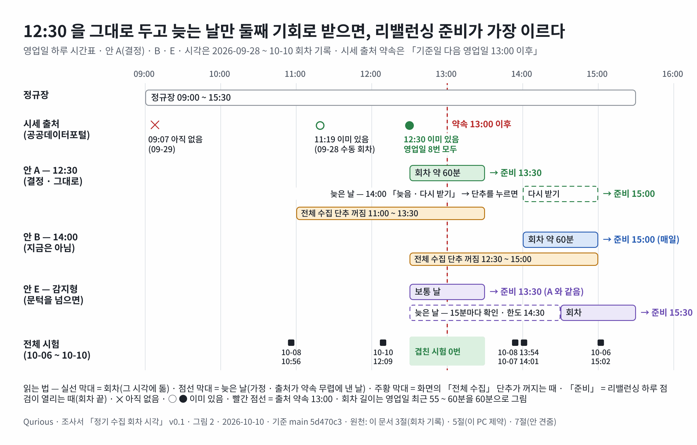

# 정기 수집 회차 시각 — 12:30 이 맞나 조사서 v0.1

| 문서 정보 | |
|---|---|
| **판 · 상태** | v0.1 · 결정 — 12:30 을 그대로 두고 팀 이슈로 의견을 모은다(사용자 2026-10-10 · 「결정」 절) · 팀 글은 새 이슈 「[의견 모으기] 매일 수집 회차 시각 12:30」([본문 사본](../github-archive/2026-10-10/이슈-정기수집-회차시각-논의/00-본문.md) · 올린 뒤 번호를 적음) |
| **구분** | 조사서 · 운영(정기 수집 회차의 기본 시각) · 목표 기능 ① `P01-①-4`(정기 배치 · 관제)와 리밸런싱(③) 하루 점검이 맞물리는 곳 |
| **작성** | 이동원(데이터 파트 · 조사 지시 · 검토) · 초안은 조사 에이전트(공식 원문 12곳을 열어 읽음 · github.com 은 열지 않음) |
| **검토** | 검토 전. 4.1절과 10절 3 · 4번은 리밸런싱 주담당(오준영)이 함께 읽어야 한다 — 그 코드를 고치자는 말이 아니라 「함께 정할 것」 이다 |
| **최종 수정** | 2026-10-10 (KST) |
| **기준** | 코드 `main` `83a0b12`(읽기만 · 줄 번호는 이 커밋 기준) · 회차 이력 `data/collector/state/daily_update_history.jsonl` 22줄(2026-09-28 ~ 10-10 12:51) · 러너 로그 `data/collector/logs/daily_update-*.log` 22개 · 외부 원문 조회 2026-10-10 14:50 ~ 15:20 KST · 수집 DB · SQLite 파일 · `.env` 는 열지 않았고 러너 · 작업자 · 시험 · 앱은 돌리지 않았다 |
| **관련 문서** | [자동 수집 벤치마크 v0.2](자동수집-벤치마크-조사.md) 4.1절(신선도 판정이 시각을 모른다) · [러너 단계 결과와 화면 실행 통로 v0.1](러너단계결과-화면실행통로-조사.md) 3.7절(12:30 을 지키는 규칙) · [공시 · 재무 · 뉴스 이용 조건 v0.2](공시-재무-뉴스-이용조건-조사.md) · [테스트 계획서](../시험/테스트계획서.md) 1.3절 7번 원칙 · 4절 결과서 · 5절 결함대장(DF-99 · DF-100) · `collector/README.md` 15절 |
| **최근 개정** | v0.1 — 새 문서 · 결정 절(12:30 그대로 · 팀 이슈) · <그림 2> 를 Figma 로 |

> **이 문서로 알 수 있는 것**
>
> 1. 러너 스무 단계의 출처는 각각 언제 새 자료를 내나 — 12:30 이라는 시각에 민감한 출처는 무엇인가?
> 2. 2026-09-28 ~ 10-10 회차 기록으로 보면 12:30 회차는 무엇을 받았고 무엇을 놓쳤나?
> 3. 리밸런싱 하루 점검 · 관제 · 화면 단추 · 앱 예약은 12:30 에 어떻게 묶여 있고, 시각을 옮기면 어디가 바뀌나?
> 4. 이 PC(로그온 · 따라잡기 · 함께 쓰는 일)는 시각 고르기를 어떻게 제약하나?
> 5. 현업은 장 마감 뒤 일말(EOD) 자료 배치를 언제 돌리나?
> 6. 안 다섯 가운데 무엇을 고르나?
>
> **읽는 순서** — 처음 읽는 사람: 한 줄 답 → 결정 → 요약 → 7 · 8절 · 리밸런싱 주담당(오준영): 4.1절 → 5.1절 → 10절 3 · 4번 · 낱말이 낯설면: 부록 A 용어

## 사용자 물음에 한 줄 답

**조건부 예 — 12:30 을 기본 회차 시각으로 그대로 두는 것이 낫다.** 까닭은 셋이다.

1. 러너 스무 단계 가운데 시각에 민감한 출처는 공공데이터포털 시세 묶음(주식 · ETF · 지수) 하나뿐이다. 약속은 「기준일자로부터 영업일 하루 뒤 오후 1시 이후」 라 12:30 이 30분 이르지만, 영업일 회차 8번 모두 12:30 에 전 거래일 시세가 이미 있었다(놓친 날 0).
2. 리밸런싱 하루 점검 · 관제 · 막는 때 · 화면 글 · 시험이 12:30 에 맞춰져 있다. 14:00 으로 옮기면 동작 3곳 · 함께 정할 곳 3 · 글 15줄 · 점검 스크립트 1 · 시험 2 ~ 8파일 · 문서 20여 곳이 바뀌고 리밸런싱 준비가 날마다 1시간 반 늦어진다. 그런데 지금까지 놓친 날이 없어 옮겨서 얻는 것은 아직 측정되지 않았다.
3. 점심 무렵 회차는 이 PC 가 실제로 켜져 있던 때다(13일 중 12일 · 빠진 하루는 휴일). 무거운 일과도 덜 겹친다 — 10-06 ~ 10-10 전체 시험 7번은 12:30 ~ 13:30 과 한 번도 겹치지 않았고, 13:30 회차였다면 둘, 14:00 회차였다면 하나 이상과 겹쳤다.

조건은 셋이다. 출처 약속보다 이르니 놓친 날이 그날 보여야 하고(2차-1 의 14:00 마감 판정), 사람이 누를 화면 단추가 있어야 하며(2026-10-08 결정 · 서버는 PR #148), 따라잡기 회차가 12:30 회차를 밀어내지 않게 막아야 한다(5.1절 · 새 결함 후보). 영업일에 놓친 날이 한 달 두 번을 넘으면 시각을 늦추지 말고 감지형(안 E)으로 간다 — 그때는 2026-10-08 결정을 다시 묻는다.

## 결정 (사용자 2026-10-10)

**12:30 을 기본 회차 시각으로 그대로 두고, 팀 이슈로 의견을 모은다.** 안 A 의 더할 셋(놓친 날을 그날 보이기 · 따라잡기 겹침 막기 · 시각을 한 곳에서 읽기)과 결함 후보 둘(DF-99 따라잡기 회차가 12:30 회차를 밀어냄 · DF-100 치명 아닌 단계 실패에도 회차 ok 가 거짓)은 팀 글 「[의견 모으기] 매일 수집 회차 시각 12:30」 의 답을 받은 뒤 관제 기준 작업(벤치마크 조사서 6.2절 2차-1 · 10-19 까지)에서 정한다.

리밸런싱 하루 점검에 닿는 곳(DF-99 의 판정 쪽 · DF-100 · 10절 3 · 4번)은 리밸런싱 주담당(오준영)과 함께 정한다. 이 문서는 그 코드를 고치자는 제안이 아니다.

## 요약

1. **시각에 민감한 출처는 하나다.** 포털 시세 · ETF · 지수 세 데이터 페이지가 모두 「데이터 갱신은 기준일자로부터 영업일 하루 뒤 오후 1시 이후에 업데이트됩니다」 라고 적었다(수정일 2026-09-07 · 2026-10-10 다시 엶 [W1] [W2] [W3]). 나머지 열일곱 단계는 되돌아보기 창(공시 3일 · 배당 두 달 · 기사 30시간 · 시세 14일)이거나 우리 계산이라 몇 시에 돌아도 같은 것을 받는다. 야후 분봉만 장 중이라 그날 것은 반쯤 차고 다음 회차가 채운다(<표 2>).
2. **실측으로 12:30 은 늘 받혔다.** 영업일 정기 회차 8번 모두 12:30 시세 단계(12:30:02 ~ 12:30:07)에 전 거래일 시세가 이미 있었다. 7번은 그 단계가 직접 받았고, 09-28 은 11:19 수동 회차가 먼저 받았다. 09-29 09:07 에는 없었다 — 공개 시각의 아래쪽을 잰 유일한 점이다. 휴일 · 주말 회차는 약속대로 새 시세가 없었다. 영업일 회차는 19 ~ 60분(가운데값 37분 · 최근 셋 55 ~ 60분)이고 끝은 12:49 ~ 13:30 이다. 놓친 회차는 10-09(한글날 · PC 꺼짐) 하나이고 10-10 10:46 에 따라잡았다. 다만 8번 중 0번이라는 것만으로 「놓침이 드물다」 고 말하기엔 표본이 작다(<표 3> · 3.2절).
3. **소비자는 회차 끝을 기다린다.** 리밸런싱 하루 점검(오준영 님 코드)은 「12:30 전 대기」 와 「오늘 12:30 뒤 시작한 회차」 를 코드에 두었고, 실제 준비 시각은 회차가 끝나는 때(최근 13:25 ~ 13:30)다. 관제의 `SCHEDULE_HM` 사본 · 「오늘 회차 없음」(13:30) · 화면 막는 때(11:00 ~ 13:30) · 화면 글 · 점검 스크립트 정규식 · 시험이 12:30 에 맞춰져 있다(<표 4> · <표 5>).
4. **현업 원칙의 교과서 답은 14:00 이지만, 고정 시각 하나로 끝내지 않는다.** 원칙은 「출처가 적은 공개 시각 + 여유」 다(SRE 「advertised SLAs」 · Airflow 「data interval 이 끝난 뒤」 · Dagster 마감 + 앞 여유). 그러나 견준 곳은 모두 둘째 기회를 짝으로 둔다 — Sharadar 하루 두 번(17:30 · 23:30 ET) · EODHD 일부 다음 날 아침 · Airflow 센서(기다림 · 한도) · LSEG 「자료 준비 트리거」 · 마감 경보(<표 7>). 시각을 늦추면 모든 날이 늦어지고, 둘째 기회를 두면 늦은 날만 늦어진다.
5. **추천은 안 A 다.** 12:30 을 그대로 두고 세 가지를 더한다 — 놓친 날을 그날 보이게(2차-1 · 이미 계획), 따라잡기 회차가 정기 회차를 밀어내지 않게(5.1절), 시각을 한 곳에서 읽게(`SCHEDULE_HM` 사본 없애기). 14:00 으로 옮기는 안 B 는 지금 얻는 것 없이 리밸런싱 준비를 늦춘다. 문턱(영업일에 놓친 날 한 달 두 번)을 넘으면 감지형 안 E 가 다음 차례다(<표 8> · 8절).

**<표 1> 한눈에** · 확실도: 확인 = 원문 · 코드 · 기록을 직접 봄 · 추정 = 2차 출처 · 판단 · 실행하지 않음

| 물음 | 답 | 근거 | 확실도 |
|---|---|---|---|
| 12:30 에 민감한 출처 | 포털 시세 · ETF · 지수(약속 다음 영업일 13:00 뒤) 하나. 분봉은 장 중이라 그날 것이 반만 | 2절 <표 2> | 확인 |
| 12:30 이 받았나 | 영업일 8/8 받음 · 09:07 에는 없었음(1점) · 놓친 회차 1(휴일) · 따라잡기 1 | 3절 <표 3> | 확인(기록) |
| 묶인 곳 | 리밸런싱 판정 2곳 · 관제 상수 사본 · 막는 때 · 화면 글 15줄 · 점검 정규식 · 시험 | 4절 <표 4> · <표 5> | 확인(코드) |
| 새 결함 후보 | 11:30 ~ 12:30 에 시작한 따라잡기 회차가 정기 회차를 밀어내 그날 리밸런싱 점검이 말없이 기다림 | 5.1절 | 확인(코드 · 문서로 따라감) · 재현 안 함 |
| 현업 | 약속 + 여유(14:00) + 둘째 기회(센서 · 둘째 갱신 · 마감 경보) | 6절 <표 7> | 확인(원문) |
| 추천 | 안 A — 12:30 유지 + 세 가지 다듬기 · 문턱 넘으면 안 E | 7 · 8절 | 판단 |

---

## 1. 조사 방법과 범위

### 1.1 방법

- 우리 쪽은 코드 · 문서 · 회차 기록(이력 JSONL · 마지막 회차 JSON · 러너 로그 글)만 읽었다. 수집 DB(`market.sqlite3`)와 다른 SQLite 파일, `.env`, 토큰 파일은 열지 않았다. 러너 · 작업자 · 시험 · 앱과 `status` 명령도 돌리지 않았다. git 은 `log` · `show` 로 커밋 날짜와 제목만 봤다.
- 외부는 공식 웹 페이지만 한 건씩 열었다(부록 B · 12곳). 증권사 · 공공 API 는 부르지 않았다. 결론을 받치는 포털 문장(W1)은 이 세션에서 다시 열어 문장을 그대로 옮겼다. 웹 도구가 요약해 돌려준 쪽은 그 요약 속 인용을 옮겼고 「확인(요약 안 인용)」 으로 적었다.
- 회차마다 시작 · 끝 · 단계 시간 · 시세 단계 결과(「적재 n일 · 빈응답 n일」)는 로그에서 셌다. 이력 줄에 단계 시간이 남는 것은 10-08 회차부터라, 그 앞은 로그의 「종료코드 · n초」 줄을 읽었다.

### 1.2 이미 있는 조사서와 나눈 것

- 신선도 판정이 시각을 모른다는 것(표 판정은 n=1 을 하루 내내 「정상」)과 제안 마감 「다음 영업일 13:00 + 1시간(14:00)」 은 [벤치마크 조사서](자동수집-벤치마크-조사.md) 4.1절 · 6.2절 2차-1 에 있다. 이 문서는 인용만 한다.
- 화면 실행을 막는 때(11:00 ~ 13:30)와 그 까닭(12:30 앞에 시작한 수동 회차가 정기 회차를 밀어내면 리밸런싱이 하루 기다림)은 [러너 조사서](러너단계결과-화면실행통로-조사.md) 3.7절에 있다. 이 문서는 같은 일이 **정기 회차의 따라잡기**에서도 날 수 있음을 더한다(5.1절).
- DART 반영 시점 · 정책뉴스 3일 창 · GDELT 15분 파일은 [공시 조사서](공시-재무-뉴스-이용조건-조사.md) 2 · 4절에 있다.

### 1.3 12:30 은 어디서 왔나

- 2026-09-18 이슈 #33 의 수집 구축안 댓글은 「매일 수집은 KST 14:00 이후 1회가 맞습니다」 라고 적었다. 까닭은 포털 약속 「영업일 하루 뒤 오후 1시 이후」 에 여유 1시간이다(`docs/github-archive/2026-09-18/이슈-033/00-기록.md` 1988 · 2035줄). 하루 뒤 실측은 「금요일 자료가 토요일 오후 1시에도 없습니다」 였다(같은 기록 1196줄).
- 2026-09-28 러너 첫 커밋(`6719e67`)부터 `DEFAULT_TIME = "12:30"` 이다. 커밋 메시지 · PR 본문 · 그날 TIL 에 12:30 을 고른 까닭은 적혀 있지 않다(확인 — 세 곳을 읽음). 점심시간이라는 짐작은 기록으로 확인되지 않았다(추정).
- 12:30 이 약속보다 이르다는 것은 2026-10-07 원문을 다시 열면서 알려졌고, 2026-10-08 사용자는 「13:40 자동 재수집」 대신 「12:30 그대로 · 사이트 단추로 언제든」 을 골랐다(벤치마크 조사서 4.1절).

---

## 2. 출처마다 새 자료가 나오는 시각

러너 스무 단계(`scripts/daily_update.py` `STEPS` 168 ~ 226줄)의 출처와 공개 시각은 <표 2> 와 같다.

**<표 2> 단계마다 출처 · 공개 시각 · 우리가 부르는 법** · 「민감」 = 회차 시각에 따라 그날 받는 것이 달라지나

| # | 단계(이름표) | 출처 | 새 자료가 나오는 때(원문 · 근거) | 우리가 부르는 법(파일:줄) | 민감 | 확실도 |
|:-:|---|---|---|---|---|---|
| 1 | price(시세) | 공공데이터포털 「금융위원회_주식시세정보」(15094808) | 「※ 데이터 갱신주기는 일 1회입니다」 · 「기준일자로부터 영업일 하루 뒤 오후 1시 이후에 업데이트됩니다. 예를 들어, 금요일 데이터는 차주 월요일에 제공됩니다. (월요일이 공휴일인 경우, 다음 영업일에 제공됩니다)」 [W1] | `daily_update.py:169` → `collector/backfill.py` `run_recent()`(177 ~ 180줄 · 최근 14일 빈 날만) · 주소 `collector/config.py:102` · 호출 3 ~ 4회 | **예** — 12:30 은 약속보다 30분 이르다 | 확인 |
| 2 | dividend(배당) | OpenDART 공시 본문 | DART FAQ 「공시서류 제출 후 15분 후 … 정기보고서 마감일 등에는 지연될 수 있으며 익영업일내에 반영완료」([공시 조사서](공시-재무-뉴스-이용조건-조사.md) 2절) | `:171` 최근 두 달을 늘 다시 훑음 | 아니오 | 확인 |
| 3 | disclosure(공시) | OpenDART 공시 목록 | 같음 | `:176` 최근 3일 · 약 40회 | 아니오 — 그날 오후 공시는 다음 회차가 3일 창으로 받는다 | 확인 |
| 4 | financial(재무) | OpenDART 재무 | 같음 | `:178` 새 정기보고서 · 정정본 | 아니오 | 확인 |
| 5 | schedule(기업 일정) | OpenDART 소집결의 본문 | 같음 | `:181` 최근 60일 새 본문 | 아니오 | 확인 |
| 6 | news(정책뉴스) | 공공데이터포털 정책브리핑 정책뉴스(15095335) | 「실시간 갱신」 · 날짜 창 3일(공시 조사서 4.3절) | `:184` · `collector/policy_news.py:46` | 아니오 | 확인 |
| 7 | gdelt(언론사 기사) | GDELT 2.0 번역 GKG | 15분마다 파일(공시 조사서 4.4절) | `:188` 지난 30시간 · 안 읽은 파일 | 아니오 | 확인 |
| 8 | search(검색 색인) | 우리 계산 | 앞 단계 뒤 | `:190` | 아니오 | 확인 |
| 9 | calendar(시장 달력) | 한국천문연구원 특일 정보(15012690) · 금통위 · FOMC 일정 | 해마다 발표 · 7일에 한 번 다시 확인(자료 안내 출처 대장 kasi · bok · fed 줄) · 포털 메타 「업데이트 주기 실시간」 · 수정일 2023-03-29 [W4] | `:194` · `collector/market_calendar.py:83` | 아니오 | 확인(대장 · 메타) |
| 10 ~ 12 | adjusted · total_return · benchmark(수정주가 · 총수익 · 벤치마크) | 우리 계산 | 시세 · 배당이 바뀐 회차에만 돈다(`needs_derived()` 553 ~ 573줄) | `:196 ~ 201` | 시세를 따라감 — 새 시세가 없으면 건너뛰어 회차가 짧다 | 확인 |
| 13 | ohlcv(일봉) | ETF 「금융위원회_증권상품시세정보」(15094806) · 지수 「금융위원회_지수시세정보」(15094807) · 분봉은 야후(yfinance) | ETF · 지수는 시세와 같은 문장 · 수정일 2026-09-07 [W2] [W3]. 분봉은 장 중(09:00 ~ 15:30) — 「12:30 갱신은 장 중이다」(`app/services/data_ohlcv.py:413`) | `:203` · `collector/sources/portal_products.py:27 ~ 28`(ETF · 지수 최근 14일) · 분봉 최근 5일 다시 | ETF · 지수는 시세와 같음 · 그날 분봉은 반만(다음 회차가 채움) | 확인 |
| 14 | signals(신호) | 우리 계산(팀원 #140 배치 · 수집 DB 마지막 거래일) | 일봉 · 60분봉 뒤 | `:208` | 앞을 따라감 | 확인 |
| 15 ~ 19 | manifest · export · verify · upload · ohlcv_upload | 우리 · HF private 데이터셋 | 공개 시각 없음 | `:211 ~ 220` | 아니오 | 확인 |
| 20 | sector_laws(섹터 법령) | 국가법령정보센터 | 공포 · 시행 때 · 7일에 한 번 대조(출처 대장 law 줄) | `:223` | 아니오 | 확인(대장) |

이 표에서 읽은 것은 셋이다.

- 시각이 결과를 바꾸는 출처는 포털 시세 묶음(1번 · 13번의 ETF · 지수) 하나다. 세 페이지 모두 같은 문장이고, 같은 페이지의 메타 칸 「업데이트 주기」 는 「실시간」 이라 설명 글과 어긋난다(벤치마크 조사서 부록 C 와 같은 관찰). 설명 글을 따른다.
- DART · 뉴스 · 기사는 공개가 실시간에 가깝고 우리 단계가 며칠 창으로 다시 훑으므로, 회차 시각은 「그날 오후 것을 오늘 받나 내일 받나」 만 바꾼다. 리밸런싱 · 관제가 이것을 기다리지는 않는다.
- 자료 안내 출처 대장의 fsc 줄 「기준일 다음 영업일 13시 뒤 — 매일 낮 수집이 그 뒤 첫 회차에 받는다」(`docs/데이터/대장/자료안내-출처.tsv` 2줄)는 글자 그대로면 「다음 날 12:30 회차」 로 읽힌다. 실측(그날 12:30 에 받음)과 다르게 읽히므로 문구를 고칠 거리다(8절 <표 9> 5번).

---

## 3. 실측 — 회차 기록

### 3.1 회차 열다섯 번

2026-09-28 첫 회차부터 10-10 12:30 회차까지 전체 회차는 <표 3> 과 같다. 한 단계만 다시 돌린 줄(10-07 목록표 둘 · 10-08 신호 셋 · 10-08 15:59 시세 · 10-10 12:09 정책뉴스)은 뺐다.

**<표 3> 전체 회차 15번 (2026-09-28 ~ 10-10)** · 시세 단계 = 그 회차의 첫 단계 결과(「적재 n일 · 빈응답 n일」) · 파생 = 수정주가 · 총수익 · 벤치마크

| 날(요일) | 구분 | 시작 → 끝 | 길이(분) | 시세 단계 | 파생 | 결과 | 비고 |
|---|---|---|---:|---|---|---|---|
| 09-28(월) | 수동 첫 회차 | 11:19:52 → 11:43:10 | 23.3 | 09-23 받음 | 돎 | 성공 | 09-23 분이 11:19 에 이미 있었다(약속은 추석 연휴 뒤 09-28 13:00) |
| 09-28(월) | 정기 | 12:30:00 → 12:33:13 | 3.2 | 새 날 없음 | 건너뜀 | 성공 | 11:19 회차가 먼저 받음 |
| 09-29(화) | 원인 미확인 시작 | 09:06:56 → 09:59:17 | 52.4 | **새 날 없음(09-28 분 아직)** | 돎(배당) | 성공 | 같은 때 DB 시험과 겹쳐 수정주가 1,286초 |
| 09-29(화) | 정기 | 12:30:01 → 12:49:17 | 19.3 | 09-28 받음 | 돎 | 성공 | |
| 09-30(수) | 정기 | 12:30:01 → 12:59:08 | 29.1 | 09-29 받음 | 돎 | 성공 | |
| 10-01(목) | 정기 | 12:30:01 → 12:51:16 | 21.3 | 09-30 받음 | 돎 | 성공 | |
| 10-02(금) | 정기 | 12:30:01 → 13:06:56 | 36.9 | 10-01 받음 | 돎 | 성공 | 일봉 단계가 처음 든 회차 |
| 10-03(토 · 개천절) | 정기 | 12:30:01 → 13:05:13 | 35.2 | 새 날 없음 | 돎(배당) | 성공 | |
| 10-04(일) | 정기 | 12:30:01 → 12:45:10 | 15.2 | 새 날 없음 | 건너뜀 | 성공 | |
| 10-05(월 · 대체공휴일) | 정기 | 12:30:01 → 12:55:38 | 25.6 | 새 날 없음 | 건너뜀 | 성공 | 검색 색인 447초(DF-68) |
| 10-06(화) | 정기 | 12:30:01 → 13:26:03 | 56.0 | 10-02(금) 받음 | 돎 | 성공 | 수정주가 1,227초 — 같은 날 판정 모델이 GPU 로 돌았다 |
| 10-07(수) | 정기 | 12:30:01 → 13:30:13 | 60.2 | 10-06 받음 | 돎 | 성공 | 가장 긺 · 막는 때 끝(13:30)을 13초 넘김 |
| 10-08(목) | 정기 | 12:30:01 → 13:25:01 | 55.0 | 10-07 받음 | 돎 | 성공 | |
| 10-09(금 · 한글날) | — | 회차 없음 | — | — | — | — | PC 꺼짐(추정) |
| 10-10(토) | 따라잡기 | 10:46:41 → 11:27:58 | 41.3 | 새 날 없음 | 건너뜀 | ok 거짓 | DART 본문 status 800 「시스템 점검으로 인한 서비스가 중지 중입니다」 — 배당 · 기업 일정 실패 |
| 10-10(토) | 정기 | 12:30:02 → 12:51:20 | 21.3 | 새 날 없음 | 건너뜀 | ok 거짓 | 같은 status 800 |

회차 길이를 막대로 보면 <그림 1> 과 같다. 시세가 들어온 영업일은 파생 셋이 돌아 길고, 단계가 열아홉 · 스물로 는 10-06 뒤로 55 ~ 60분에 모인다.

**<그림 1> 회차 길이** · 범례: `#` 한 칸 = 3분 · 오른쪽 숫자 = 분 · 날짜 뒤 시각 = 시작

```text
09-28 11:19  ########               23.3   수동 첫 회차
09-28 12:30  #                       3.2
09-29 09:06  #################      52.4   원인 미확인 시작
09-29 12:30  ######                 19.3
09-30 12:30  ##########             29.1
10-01 12:30  #######                21.3
10-02 12:30  ############           36.9
10-03 12:30  ############           35.2   휴일
10-04 12:30  #####                  15.2   일요일
10-05 12:30  #########              25.6   휴일
10-06 12:30  ###################    56.0
10-07 12:30  ####################   60.2
10-08 12:30  ##################     55.0
10-10 10:46  ##############         41.3   따라잡기
10-10 12:30  #######                21.3   토요일
```

### 3.2 숫자가 말하는 것과 못 하는 것

- **받은 날** — 영업일 정기 회차 8번(09-28 ~ 10-08) 모두 12:30 시세 단계(12:30:02 ~ 12:30:07)에 전 거래일 시세가 DB 에 있었다. 7번은 그 단계가 직접 받았고 09-28 은 11:19 수동 회차가 받아 두었다. ETF · 지수도 같은 회차의 일봉 단계에서 전 거래일 하루를 받았다(10-02 · 10-06 · 10-07 · 10-08 로그 「done 1」).
- **약속과의 차이** — 10-06(화)은 10-02(금) 시세를 받았다. 원문의 「금요일 데이터는 차주 월요일 … 월요일이 공휴일인 경우, 다음 영업일」 그대로이고(10-05 대체공휴일), 약속 13:00 보다 30분 일렀다. 10-10(토)의 두 회차가 10-08(목) 분을 못 받은 것도 약속대로다(10-09 휴일 → 10-12(월) 13:00).
- **공개 시각의 아래쪽** — 09-29 09:07 에는 09-28 분이 없었고(「적재 0일 · 빈응답 4일」), 같은 날 12:30:04 에는 있었다. 공개 시각이 09:07 ~ 12:30 사이라는 것까지만 안다. 09-28 11:19 에 이미 있던 09-23 분은 연휴 사이 언제 열렸는지 모른다.
- **표본의 크기** — 놓친 날 0/8 이어도 놓침 비율이 낮다고 단정할 수 없다. 사건이 0번인 n번 관찰에서 95% 위쪽 어림은 약 3/n(「셋의 규칙」)이라, 8번이면 「한 달 영업일의 3할 넘게 놓친다」 도 아직 배제되지 않는다(판단 · 통계 어림). 그래서 8절은 「놓친 날을 세는 일」 을 함께 둔다.
- **길이** — 영업일 정기 7번(09-29 ~ 10-08)은 19.3 · 29.1 · 21.3 · 36.9 · 56.0 · 60.2 · 55.0분이다. 가운데값 36.9분 · 평균 39.7분 · 가장 긴 것 60.2분이고 끝은 12:49 ~ 13:30 이다. 10-08 의 큰 단계는 수정주가 765 · 총수익 614 · 일봉 613 · 내보내기 554 · 벤치마크 257 · 기사 227초다.
- **실패** — 15번 가운데 실패 회차는 10-10 의 둘이다. DART 본문 API 가 두 번 다 status 800 「시스템 점검」 을 돌려줘 배당 · 기업 일정이 종료코드 1 로 끝났고(공시 목록 API 는 32회 모두 정상), 회차 ok 가 거짓이 됐다. 점검이 정기인지 · 몇 시인지는 OpenDART 공지 원문을 읽지 못해 모른다(부록 C).

---

## 4. 소비자 시각 — 무엇이 12:30 에 묶여 있나

### 4.1 리밸런싱 하루 점검(오준영 님 코드)

`app/services/rebalance_daily.py` 의 `readiness()` 는 아래 차례로 「준비」 를 판정한다. 미리보기 · 실행 · 5분 점검 · 시가 예약이 모두 이 판정을 거친다(`app/services/rebalance.py` `decision_readiness()` 207 ~ 211줄).

1. 지금이 12:30 전이면 「12:30 데이터 갱신 이후 자동 점검합니다.」(28 ~ 29줄)
2. 휴장일이면 기다림 · 잠금 파일이 있거나 회차가 돌면 「갱신 중」(34 ~ 47줄)
3. 마지막 회차가 오늘 시작했고 시작이 12:30 뒤이며 끝났어야 한다 — 아니면 「오늘 12:30 이후 데이터 갱신 완료 기록을 기다립니다.」(50 ~ 51줄)
4. 회차 ok 가 참 · 멈춘 단계 없음 · 시세 · 달력 단계 종료코드 0 — 아니면 「갱신 실패」(54 ~ 56줄)
5. 시세 기준일이 전 거래일 — 아니면 「시세 기준일이 전 거래일과 달라」 기다림(58 ~ 59줄)

여기서 시각과 이어지는 사실은 넷이다.

- **준비 시각은 회차 시작이 아니라 회차 끝이다.** 판정이 쓰는 것은 시세 · 달력 두 단계(10-08 은 12:36 에 둘 다 끝)인데, 3번 조건 때문에 회차 전체가 끝나야 준비된다. 최근 영업일에는 13:25 ~ 13:30 이다. 시작을 늦추면 준비도 그만큼 늦어진다.
- **판정은 시각을 늦춰도 맞게 돈다.** 1 · 3번은 「12:30 보다 앞인가」 만 보므로, 회차를 14:00 으로 옮겨도 판정은 그대로 맞다(14:00 ≥ 12:30). 틀려지는 것은 두 줄의 안내 글이다. 그래서 안 B 에서도 오준영 님 코드는 「고칠 것」 이 아니라 「글을 함께 정할 것」 이다.
- **정산은 날 단위다.** 예약한 주문은 다음 거래일 「일봉 시가」 로 정산한다(`app/services/rebalance_settlement.py` 머리말 · 200 · 227줄). 그 시가는 다음 다음 영업일 회차에 들어오므로, 회차가 하루 안에서 몇 시에 도는지는 정산을 바꾸지 않는다.
- **ok 결합 — 시각과 별개인 발견.** 4번의 「회차 ok 가 참」 은 멈추지 않는 단계(배당 · 공시 · 일정 · 뉴스 · 일봉 등)의 실패에도 거짓이 된다(`scripts/daily_update.py:758`). 10-10 처럼 DART 본문이 점검인 날이 거래일이면, 시세 · 달력이 멀쩡해도 그날 리밸런싱 점검은 「갱신 실패」 로 기다린다. 판정이 이미 시세 · 달력 종료코드를 따로 보므로 ok 조건을 둘지는 함께 정할 거리다(10절 3번).

### 4.2 소비자 전체

**<표 4> 소비자마다 12:30 과 묶인 곳**

| 소비자 | 주인 | 묶인 곳(파일:줄) | 기다리는 것 | 회차를 늦추면 |
|---|---|---|---|---|
| 리밸런싱 하루 점검 | 오준영 | `app/services/rebalance_daily.py:28 ~ 29` · `50 ~ 51` · `54 ~ 59` | 오늘 12:30 뒤 시작해 끝난 성공 회차 · 시세 기준일 = 전 거래일 | 준비가 늦어진 만큼 늦어짐 · 판정은 맞게 돎 · 안내 글 둘이 틀림 |
| 리밸런싱 5분 점검 예약 | 오준영 | `app/celery_app.py:122 ~ 126` | 위 판정이 참이 되는 때 | 영향 없음(5분마다 다시 봄) |
| 시가 예약 정산 | 오준영 | `app/services/rebalance_settlement.py` | 다음 거래일 일봉 시가 | 영향 없음(날 단위) |
| 관제 회차 판정 | 이동원 | `app/services/data_status.py:34`(`SCHEDULE_HM = (12, 30)` — 러너 값의 사본) · `195 ~ 198` · `269 ~ 271` | 12:30 + 1시간 뒤에도 오늘 기록이 없으면 「오늘 회차 없음」 | 사본을 함께 옮겨야 함 |
| 관제 표 판정 | 이동원 | `data_status.py:14`(설명) · 판정은 날짜만 봄 | 시각을 모름(n=1 하루 내내 「정상」 — 벤치마크 4.1절) | 2차-1 의 14:00 마감이 생기면 그 값도 함께 |
| 화면 「전체 수집」 · 「이 단계만 다시」 막는 때 | 이동원 | `scripts/daily_update.py:797 ~ 836`(`guard_window()` 한 함수 · `DEFAULT_TIME` 에서 셈) → 단계 목록 파일 `guards` | 전체 수집 11:00 ~ 13:30 · 한 단계는 「12:30 − 그 단계 한도 ~ 13:30」 | `DEFAULT_TIME` 을 따라 저절로 옮겨짐 |
| 수집 요청 만료 | 이동원 | `app/services/collect_requests.py:56 ~ 57` | 3시간 = 막는 때 150분 + 여유 | 길이만 보므로 무관 |
| 분봉 화면 · 신호 | 이동원 · 팀원(#140) | `app/services/data_ohlcv.py:413` | 그날 분봉은 12:30 에 반만 참 | 늦출수록 더 참(15:30 뒤 온전) · 신호를 읽는 쪽의 시각 요구는 확인하지 않음 |
| 모의계좌 일별 스냅샷 15:40 | 강사님 기초 코드(#88) | `app/celery_app.py:132 ~ 136` | 거래일 달력만 씀 | 무관 |
| 자동매매 사이클 3분 | 강사님 기초 코드 | `app/celery_app.py:112 ~ 116` | 증권사 시세 | 무관 |
| 앱 수집 예약 18 · 19 · 20시 | (남은 예약) | `app/celery_app.py:83 ~ 97` | 앱 이미지에 수집기가 없어 실패할 것(벤치마크 조사서 <표 2> 13번) | 무관 · 정리 대상 |
| 점검 스크립트 | 이동원(개인) | `scripts/personal/check.ps1:509 ~ 513` | 리밸런싱 400 글을 정규식 `'12:30'` 으로 가려냄 | 글이 바뀌면 점검 판정이 바뀜 |

### 4.3 시각을 옮기면 바뀌는 곳

안 B(예: 14:00)를 고를 때 바뀌는 곳은 <표 5> 와 같다. 안 E(감지형)는 시작 시각이 그대로라 거의 바뀌지 않는다.

**<표 5> 시각을 옮기면 바뀌는 곳** · 「꼭」 = 안 바꾸면 동작이 틀림 · 「글」 = 동작은 맞고 글만 틀림

| 갈래 | 곳(파일:줄) | 바뀌는 것 | 주인 | 안 B | 안 E |
|---|---|---|---|---|---|
| 동작 | `scripts/daily_update.py:114` `DEFAULT_TIME` | 막는 때 · 등록 XML · 단계 목록의 `schedule` 이 따라감 | 이동원 | 꼭 | 그대로 |
| 동작 | `app/services/data_status.py:34` `SCHEDULE_HM` | 다음 회차 · 「오늘 회차 없음」 시각 | 이동원 | 꼭 | 그대로 |
| 동작 | 작업 스케줄러 다시 등록 `python scripts/daily_update.py install --time HH:MM` | 이 PC 의 실제 예약 | 사용자(PC) | 꼭 | 그대로 |
| 함께 정할 것 | `app/services/rebalance_daily.py:28 ~ 29` · `50 ~ 51` | 「12:30 전 대기」 · 「12:30 뒤 시작」 안내 글 | 오준영 | 글 | 그대로(기다리는 동안 「갱신 중」) |
| 함께 정할 것 | `public/app.html:1653` | 리밸런싱 안내 글 「12:30 이후 데이터 갱신」 | 주인 확인 | 글 | 그대로 |
| 화면 글 | `public/js/collect.js` 123 · 125 · 150 · 201 · 203 · 224 · 239 · 396 | 「12:30」 · 「13:30 무렵」 · 「12:30 ~ 13:30」 | 이동원 | 글 8줄 | 「기다리는 중」 한 줄 더 |
| 화면 글 | `public/js/core.js` 242 · 246 · `public/js/research.js` 414 · `public/js/dataguide.js` 250 | 도움말 · 안내 · 기본값 글 | 이동원 | 글 4줄 | 그대로 |
| 관제 글 | `app/services/data_status.py` 14 · 271 · 491 | 설명 · 까닭 글 | 이동원 | 글 3줄 | 1줄 |
| 점검 | `scripts/personal/check.ps1:513` | 리밸런싱 400 글을 `'12:30'` 으로 가려냄 | 이동원 | 꼭 | 그대로 |
| 시험(실패) | `tests/test_daily_update.py` 256 ~ 266 · 578 ~ 582 · `tests/test_data_status.py` 155 ~ 163 | 막는 때 값 「11:00 ~ 13:30」 · 「오늘 회차 없음」 13:31 | 이동원 | 꼭(2파일 · 묶음 셋) | 새 시험(있음 · 기다림 · 한도) |
| 시험(고정물) | `tests/test_collect_requests.py` 38 ~ 42 · 90 ~ 100 · `tests/test_collect_worker.py` 268 ~ 276 | 막는 때 고정물 — 통과는 하나 낡음 | 이동원 | 고칠 거리 | 그대로 |
| 시험(판정을 바꿀 때만) | `tests/test_rebalance_daily.py` 35 · 54 ~ 56 · 163 · `test_rebalance_unified.py:115` · `test_rebalance_settlement.py:267` · `test_rebalance_exceptions.py:226` | 「12:30:01 시작」 고정물 | 오준영 | 판정 상수를 바꿀 때만 | 그대로 |
| 문서 · 주석 | `collector/README.md` 37 · 1166 · 1209 · 1214 · 1264 ~ 1265 · 1320 · `README.md` 149 · 373 · 테스트 계획서 1.3절 7번 원칙 · 자료 안내 출처 대장 fsc 줄 · 코드 주석(`app/routes/calendar.py:9` · `data.py:3` · `stocks.py:70` · `collector_db.py:35` · `data_ohlcv.py:29` · `data_search.py:156` · `market_calendar.py:3` · `stock.py:273` · `collect_worker.py` 114 · 121 · 180 · 440 · `hf_dart.py` 12 · 16 · 553 외) | 12:30 · 13:30 글 | 이동원 | 20여 곳 | 몇 곳 |

안 B 를 세면 동작 3곳(상수 둘 + 다시 등록) · 함께 정할 곳 3(파일 2 · 화면 1) · 화면 · 관제 글 15줄 · 점검 정규식 1 · 시험 2 ~ 8파일 · 문서 · 주석 20여 곳이다. 상수가 둘로 나뉜 것(`DEFAULT_TIME` 과 앱의 `SCHEDULE_HM`)은 앱 이미지에 `scripts/` 가 없어서인데, 러너가 회차마다 쓰는 단계 목록 파일에 이미 `schedule` 이 실리므로(`step_catalog()` 459 ~ 474줄) 관제가 그 값을 읽으면 사본이 없어진다(8절 3번).

---

## 5. 이 PC 제약

**<표 6> 이 PC 가 시각 고르기를 제약하는 것**

| 제약 | 사실 | 근거 | 시각 고르기에 주는 뜻 | 확실도 |
|---|---|---|---|---|
| 로그온해 있을 때만 | 「InteractiveToken: User must already be logged on. The task will be run only in an existing interactive session.」[W7] · `task_xml()` 1023줄 | 12:30 회차는 13일 중 12일 돌았다(빠진 하루 10-09 한글날) · 영업일 8/8 | 낮 12:30 은 실제로 켜져 있던 때다. 저녁 · 밤은 켜져 있었는지 기록이 없다 | 확인(문서 · 기록) |
| 놓친 회차 따라잡기 | 「the Task Scheduler can start the task at any time after its scheduled time has passed」 · 그렇게 시작하는 작업은 「started after a delay. The default delay is 10 minutes.」[W5] · `task_xml()` 1031줄 | 10-10 10:46 에 10-09 몫을 돌았다(41분) | 따라잡기는 켠 뒤 약 10분에 돈다. 11:30 ~ 12:30 에 시작하면 정기 회차와 겹친다(5.1절). 여러 날을 놓쳐도 한 번만 도는지는 문서에 없고 실측도 한 번뿐이다 | 확인(문서 · 기록) · 여러 날은 추정 |
| 한 번에 하나 | 「IgnoreNew: Default. Does not start a new instance if an existing instance of the task is running.」[W6] · 러너 잠금 | `task_xml()` 1028줄 | 겹친 정기 회차는 작업 스케줄러가 띄우지 않는다 — 이력에 「건너뜀」 줄도 남지 않는다 | 확인(문서 · 코드) |
| 깨우지 않음 · 네트워크 · 한도 | `WakeToRun` false · `RunOnlyIfNetworkAvailable` · `ExecutionTimeLimit` 4시간 | `task_xml()` 1032 · 1037 · 1039줄 | 잠자기 중이면 깨어난 뒤 따라잡기로 돈다 | 확인(코드) |
| 회차 길이 | 영업일 19 ~ 60분 · 최근 셋 55 ~ 60분 · 파생 셋 합 27분(10-08) | <표 3> | 막는 때 뒤 여유(`RERUN_GUARD_AFTER_MIN` 60분 · 797줄)와 거의 같다. 넘쳐도 잠금이 막아 안전하지만, 단추는 「돌 수 있음」 으로 보이고 기다린다 | 확인(기록 · 코드) |
| 함께 쓰는 일 | 판정 모델(llama3.1 · GPU)이 돌던 10-06 은 수정주가 1,227초(10-07 696 · 10-08 765초)였고, 같은 날 전체 시험도 「평소(4분 안팎)보다 세 배」 걸렸다(테스트 계획서 321줄). 09-29 09:06 회차는 DB 시험과 겹쳐 1,286초였다 | 로그 · 테스트 계획서 | 규칙 「실제 DB 를 읽는 시험 · 검증은 예약 작업(매일 12:30)과 겹치지 않게 돌린다」(테스트 계획서 91줄)가 생겼다. 회차 시각은 「무거운 일을 비켜 둔 한 시간」 이기도 하다 | 확인(기록) · 겹침이 원인인 것은 추정 |
| 지금의 습관 | 전체 시험 7번 — 10-06 15:02 · 10-07 14:01 · 10-07 17:25 · 10-08 10:56 · 10-08 13:54 ~ 14:00 · 10-08 17:25 · 10-10 12:09 ~ 12:18(테스트 계획서 결과서) | 테스트 계획서 4절 | 12:30 ~ 13:30 과는 0번 겹쳤다. 13:30 회차(13:30 ~ 14:30)였다면 둘(10-07 14:01 · 10-08 13:54), 14:00 회차였다면 하나 반(10-07 14:01 · 10-08 은 끝자락)과 겹쳤다. 사람이 12:30 을 피해 맞춰 온 결과라, 옮기면 습관도 옮겨야 한다 | 확인(기록) · 판단 |
| 원인 모를 시작 | 09-29 09:06 에 작업 스케줄러가 러너를 띄웠다(트리거는 12:30 하나) | 이력 · 작업 기록 | 따라잡기 판단이 늘 예측대로는 아니다 | 확인(기록) · 원인 모름 |

### 5.1 새 결함 후보 — 따라잡기 회차가 12:30 회차를 밀어낸다

- **조건** — 전날(또는 그 전) 회차를 놓친 채로 PC 를 11:20 ~ 12:20 사이에 켠다. 약 10분 뒤(11:30 ~ 12:30) 따라잡기 회차가 시작한다[W5]. 그 회차가 12:30 에도 돌고 있으면 작업 스케줄러는 12:30 정기 회차를 띄우지 않는다[W6]. 따라잡기 회차가 새 시세를 받아 파생까지 돌면 55분 안팎이라, 11:35 뒤에 시작하면 거의 겹친다.
- **결과** — 그날 「12:30 뒤 시작한 회차」 가 없으므로 리밸런싱 하루 점검은 하루 내내 「오늘 12:30 이후 데이터 갱신 완료 기록을 기다립니다」 에 머문다(`rebalance_daily.py:50 ~ 51`). 시세가 이미 들어왔는데도 그렇다. 관제는 오늘 시작한 회차가 있으므로(`ran_today` · `data_status.py:261`) 「오늘 회차 없음」 을 켜지 않는다 — 화면에는 「성공」 이 보이고 점검만 말없이 하루를 잃는다.
- **지금 막는 것이 없는 까닭** — 수동 전체 수집은 11:00 ~ 13:30 을 막지만(`full_run_blocked()` 830 ~ 836줄), 그 검사는 수동 회차에만 한다(`run_all()` 673 ~ 678줄). 정기 회차의 따라잡기는 같은 위험을 지니는데 검사를 거치지 않는다.
- **일어난 적** — 없다. 10-10 따라잡기는 10:46 에 시작해 11:27 에 끝났다. 코드와 문서로 따라간 결과이고 실행으로 재현하지 않았다.
- **고치는 안** — (가) 러너: 정기 회차가 12:30 앞 90분(수동과 같은 `MANUAL_FULL_GUARD_BEFORE_MIN`) 안에 시작하면 「곧 정기 회차가 돈다」 한 줄만 이력에 남기고 끝낸다. 12:30 회차가 14일 창으로 같은 일을 하므로 잃는 것이 없다. 시험 1 ~ 2건. (나) 작업 스케줄러 `Queue`: 「Starts a new instance of task after all other instances of the task are complete.」[W6] — 겹친 12:30 회차를 따라잡기 뒤에 띄워 시작이 12:30 뒤가 된다. 다시 등록해야 하고, 멈춘 회차가 있으면 줄이 쌓일 수 있다. (다) 판정을 「12:30 뒤에 끝난 · 시세 기준일이 맞는 회차」 로 — 오준영 님 코드라 함께 정할 것. 추천은 (가)다.

---

## 6. 현업 관행 — 장 마감 뒤 일말 자료 배치는 언제 도나

**<표 7> 공급자 · 도구의 공개 시각과 예약 관행**

| 갈래 | 곳 | 원문 | 우리에게 | 확실도 |
|---|---|---|---|---|
| 공급자 공개 시각 | 공공데이터포털(금융위원회 시세 셋) [W1] [W2] [W3] | 「기준일자로부터 영업일 하루 뒤 오후 1시 이후」 | 우리의 유일한 시각 민감 출처 | 확인 |
| 공급자 공개 시각 | EODHD [W12] | 「We update each stock exchange 2-3 hours after the market closes. Major US exchanges, NYSE and NASDAQ, are updated within 15 minutes after the market closes.」 · 일부는 「update only the next morning, starting at 3-4 am ET and usually ending at 5-6 am ET」 | 공급자는 거래소마다 갱신 시각을 따로 적고, 늦는 것은 다음 날 아침에 낸다 | 확인(요약 안 인용) |
| 공급자 공개 시각 | Sharadar [V4] | 「Daily at 17h30 and 23h30 US Eastern」 | 하루 두 번 — 늦은 자료는 둘째 갱신이 받는다 | 확인(벤치마크 조사서) |
| 공급자 공개 시각 | QuantConnect [O5] | 라이브 기업행동 「6-7 AM ET」 | 장 전 갱신 | 확인(벤치마크 조사서) |
| 예약 원칙 | Airflow Dag Runs [W8] | 「A Dag run is usually scheduled after its associated data interval has ended, to ensure the run is able to collect all the data within the time period.」 · 따라잡기는 기본 꺼짐 — 「The scheduler creates a Dag run only for the latest interval.」 | 출처가 낸 뒤에 돌린다. 놓친 구간은 우리 14일 되돌아보기가 메운다 | 확인 |
| 예약 원칙 | Google SRE Workbook [S1] | 남의 서비스는 「design for the largest failure accounted for in their advertised SLAs」 | 출처가 적은 약속(13:00)을 기준으로 설계하고, 이른 공개는 덤으로 본다 | 확인(벤치마크 조사서) |
| 기다림 · 감지 | Airflow 센서 [W9] | 「wait for something to occur」 · reschedule 은 「takes up a worker slot only when it is checking」 · `timeout` 은 「Maximum time in seconds the sensor is allowed to run before failing」 · `soft_fail` 이면 시간 초과 때 SKIPPED | 안 E 의 꼴 — 확인 → 기다림 → 한도 | 확인 |
| 기다림 · 감지 | LSEG DataScope Select [W11] | 고정 시각이면 「results are mix up of today's and available previous day's prices」 · 「Data Availability」 트리거는 「the extraction will execute upon the release of today's prices」 | 공급자 스스로 「자료가 나오면 돈다」 를 예약 방식으로 판다 | 확인 |
| 마감 · 신선도 | Dagster [W10] | `deadline_cron` 과 그 앞 `lower_bound_delta`(예: 10:00 마감 · 1시간) · 「If the asset has not materialized in the window after the deadline passes, it will fail freshness until it materializes again.」 · 미리보기 기능이라 기본으로 꺼짐 | 2차-1 의 14:00 마감과 같은 꼴 | 확인 |
| 마감 · 신선도 | dbt [P4] · Airflow Deadline Alerts [P11] | `warn_after` · `error_after` · 마감은 회차가 시작될 때 적고 스케줄러가 따로 본다 | 회차가 늦거나 안 돌아도 마감 감시는 따로 | 확인(벤치마크 조사서) |
| 다시 하기 | Airflow 작업 상태 `up_for_retry`([러너 조사서](러너단계결과-화면실행통로-조사.md) A1) | 「failed, but has retry attempts left and will be rescheduled」 | 우리 러너는 단계 재시도가 없고 다음 회차가 14일 창으로 따라잡는다 | 확인(러너 조사서) |

이 표에서 읽은 것은 셋이다.

1. **교과서 답은 「약속 + 여유」 = 14:00 이다.** 벤치마크 조사서 2차-1 의 신선도 마감과 같은 값이고, 2026-09-18 #33 의 처음 계획도 14:00 이었다.
2. **그러나 견준 곳 어디도 고정 시각 하나만 믿지 않는다.** 공급자는 둘째 갱신(Sharadar 23:30 · EODHD 다음 날 아침)을, 도구는 센서(기다림 · 한도)나 마감 경보를, LSEG 는 「자료가 나오면 돈다」 를 둔다. 고정 시각만 쓰면 「오늘 것과 어제 것이 섞인다」(LSEG).
3. **시각을 늦추는 것과 둘째 기회를 두는 것은 다른 처방이다.** 늦추면 모든 날이 늦어지고, 둘째 기회는 늦은 날만 늦어진다. 우리 출처는 8번 모두 약속보다 일찍 냈고 소비자(리밸런싱)는 일찍 받을수록 좋으므로, 「이른 시도 + 놓친 날 보이기 + 둘째 기회」 가 실무 꼴에 맞다. 지금 둘째 기회는 사람의 단추이고, 놓침이 잦아지면 자동(센서)으로 바꾼다.

---

## 7. 안과 견줌

하루 시간표에 세 안을 겹치면 <그림 2> 와 같다. 늦은 날(출처가 약속 무렵에 내는 날)을 가정했다.

**<그림 2> 하루 시간표 — 안 A · B · E (영업일)** · 범례: 실선 막대 = 회차 · 점선 막대 = 늦은 날(가정) · 주황 막대 = 「전체 수집」 단추가 꺼지는 때 · 「준비」 = 리밸런싱 하루 점검이 열리는 때(회차 끝) · ✕ 아직 없음 · ○ ● 이미 있음 · 빨간 점선 = 출처 약속 13:00



<sub>원본: [Figma · Qurious · 문서 그림 · 52:3](https://www.figma.com/design/6lstWS4YwuhJPhGB9XoBMD?node-id=52-3) · 그림 판 v0.1 · 기준 `5d470c3` · 원천: 이 문서 3 · 5 · 7절 · 2026-10-10</sub>

<details><summary>그림 원문(글자 그림 · 처음 판) — 검색 · 다시 그리기용</summary>

<그림 2> 하루 시간표 — 안 A · B · E (영업일) · 범례: 한 칸 = 6분 · `P` 포털 약속 13:00 · `x`(seen 줄) 09:07 아직 없음(09-29) · `o` 11:19 이미 있음(09-28) · `O` 12:30 이미 있음(8/8) · `[===]` 회차 · `R` 리밸런싱 준비(회차 끝) · `guard` 줄의 `x` = 화면 「전체 수집」 을 막는 때 · `E late` 의 `.` = 출처를 기다리는 때(늦은 날의 가장 긴 꼴) · `T` = 전체 시험을 돌린 시각(10-06 ~ 10-10 · 날짜는 다름)

```text
          09:00     10:00     11:00     12:00     13:00     14:00     15:00     16:00
          |         |         |         |         |         |         |         |
market    <---------------------------------------------------------------->
promise                                           P
seen       x                     o           O
A 12:30                                      [=========]
  ready                                                R
guard A                       xxxxxxxxxxxxxxxxxxxxxxxxxx
B 14:00                                                     [=========]
  ready                                                               R
guard B                                      xxxxxxxxxxxxxxxxxxxxxxxxxx
E late                                       [...................==========]
  ready                                                                    R
tests                        T            T                TT         T
```

</details>

- 안 A 의 보통 날은 13:30 무렵 준비된다. 늦은 날은 2차-1 이 14:00 에 「늦음 · 다시 받기」 를 켜고, 사람이 단추를 누르면 15:00 무렵 준비된다 — 안 B 의 보통 날과 같은 시각이다.
- 안 B 는 모든 날이 15:00 무렵 준비되고, 화면 단추는 12:30 ~ 15:00 막힌다.
- 안 E 의 보통 날은 안 A 와 같고(12:30 에 확인하자마자 돔), 늦은 날만 기다린다. 한도(14:30)까지 못 만나면 나머지 단계만 돌고 시세는 「늦음」 으로 남긴다.

**<표 8> 안 다섯 견줌**

| 안 | 무엇 | 장점 | 단점 · 위험 | 바꿀 곳 | 2026-10-08 결정과 | 판정 |
|---|---|---|---|---|---|---|
| A | 12:30 그대로 + 화면 단추(정함) + 2차-1 14:00 마감(계획) + 따라잡기 겹침 막기 + 시각 한 곳 | 바꿀 것이 가장 적다 · 8/8 받음 · 준비 12:49 ~ 13:30 · 무거운 일과 안 겹침 | 약속보다 이르다 — 늦은 날은 사람이 눌러야 하고, 아무도 없으면 그날 점검이 다음 날로 밀린다 · 2차-1 전까지 놓친 날이 화면에 안 보인다 | 2차-1(계획) + 러너 1곳 · 시험 1 ~ 2 + 관제 1곳 | 그대로 따른다 | **추천** |
| B | 13:30 또는 14:00 으로 옮김 | 약속 + 여유(교과서) · 늦은 날도 사람 없이 받을 가능성이 높다 | 모든 날 1 ~ 1.5시간 늦음 → 준비 14:30 ~ 15:00(장 마감 30분 전) · 막는 때가 점심 뒤 오후로 · 지금 습관과 겹침 · 포털이 13:00 을 넘겨 내는 날은 13:30 도 놓침 · 지금까지 얻는 것 0 | <표 5> 전부 — 동작 3 · 함께 정할 곳 3 · 글 15줄 · 점검 1 · 시험 2 ~ 8파일 · 문서 20여 곳 | 정기 시각 자체를 바꾸므로 다시 물어야 한다 | 지금은 아님 |
| C | 12:30 + 빠진 단계만 자동 다시(예: 14:00 에 시세가 전 거래일이 아니면 시세 → 파생 → 올리기) | 늦은 날도 그날 자동 · 보통 날은 A 와 같음 | 2026-10-08 에 고르지 않은 「13:40 자동 재수집」 과 같은 갈래 · 예약이 하나 는다 · 단추와 자동이 겹칠 수 있다(잠금이 막음) | PR #148 요청 표에 자동 요청 한 건 또는 둘째 예약 · 시험 | 반대 갈래 — 다시 묻지 않으면 하지 않는다 | 보류 |
| D | 출처마다 다른 시각(포털 14:00 · DART · 뉴스 12:30 · 분봉 16:00 · 백업 밤) | 출처마다 알맞음 · 분봉이 그날 온전 | 예약 셋 이상 · 리밸런싱이 읽는 「회차 기록 한 장」 계약이 깨져 판정을 다시 설계해야 함 · 잠금 · 막는 때 셈이 셋 · 놓침 · 겹침이 는다 | 러너 · 관제 · 화면 · 리밸런싱 · 시험 대부분 | 관계없음(규모가 다름) | 버림(분봉만 둘째 회차는 그 뒤 후보) |
| E | 감지형 — 12:30 에 시작해 전 거래일 시세가 있나 1회 호출로 보고, 없으면 15분마다 14:30 까지 기다렸다 돈다(못 만나면 나머지만 돌고 시세는 「늦음」). 지시서 꼴인 13:05 시작도 같은 갈래 | 보통 날은 A 와 같은 시각 · 늦은 날도 사람 없이 · 시작 시각이 그대로라 리밸런싱 판정을 안 건드림 · 현업 꼴(센서 · LSEG) | 러너에 기다림 · 한도 · 상태가 는다 · 늦은 날 회차가 15:30 까지 가면 그동안 단추가 막힌다 · 기다리는 동안 PC 를 끄면 반쪽 회차 · 13:05 시작이면 보통 날도 35분 늦음 | 러너 첫머리 1곳 · 관제 「기다리는 중」 1 · 화면 글 1 · 시험 3 ~ 4 · 막는 때 뒤 여유 | 자동 늦은 받기라 다시 물을 것(단추는 그대로 둠) | 문턱을 넘으면 다음 차례 |

안마다 덧붙일 것은 아래와 같다.

- **A** — 늦은 날의 대가는 「사람이 14:00 무렵 단추를 누르느냐」 에 달렸다. 2차-1 이 없으면 늦은 날이 화면에 「정상」 으로 보여 누를 까닭도 안 보인다(벤치마크 조사서 4.1절). 그래서 A 의 조건 1번이 2차-1 이다.
- **B** — 13:30 은 약속 뒤 여유가 30분뿐이다. 「advertised SLAs」[S1] 와 Dagster 예의 1시간 여유를 따르면 14:00 이고, 14:00 + 회차 60분이면 준비가 15:00 이다. 리밸런싱이 다음 거래일 시가로 정산하므로 실행 자체는 늦어지지 않지만, 화면에서 미리보기가 막히는 때가 09:00 ~ 15:00 으로 길어진다.
- **C** — 지금 PR #148 의 요청 표 · PC 작업자가 있으므로 「14:00 에 시세가 비었으면 자동 요청 한 건」 은 작다. 막는 것은 크기가 아니라 2026-10-08 의 결정이다.
- **D** — 분봉이 그날 온전해야 하는 화면 · 신호가 생기면, 16:00 「분봉만」 둘째 회차 하나는 따로 볼 만하다(11절).
- **E** — 확인 호출은 하루 많아야 10회 남짓이라 포털 유량(하루 10,000회)에 견주면 0.1% 다. 12:30 시작이면 판정 · 막는 때 앞쪽 · 화면 글이 거의 그대로다. 막는 때 뒤 여유(60분)는 기다림 한도만큼 늘려야 단추가 「돌 수 있음」 으로 잘못 보이지 않는다.

---

## 8. 추천

**추천 — 안 A: 12:30 을 기본 회차 시각으로 그대로 두고, 아래 세 가지(+ 둘)를 더한다.** 안 B 는 놓친 날이 0인 지금 얻는 것 없이 모든 날을 늦춘다. 놓친 날이 생겨도 그것을 푸는 처방은 시각을 늦추는 것보다 둘째 기회(지금은 단추 · 문턱을 넘으면 안 E)가 현업 꼴에 맞다.

**<표 9> 할 일** · 크기는 세션 어림(추정)

| # | 일 | 어디 | 크기 | 언제 | 주인 |
|:-:|---|---|---|---|---|
| 1 | 놓친 날을 그날 보이게 — 표 판정에 14:00 마감(「정상 · 공개 전」 → 「늦음 · 다시 받기」) | `data_status.py` · 벤치마크 조사서 2차-1 | 0.5 ~ 1(이미 계획) | 10-19 | 이동원 |
| 2 | 따라잡기 회차가 12:30 회차를 밀어내지 않게 — 정기 회차가 12:30 앞 90분 안에 시작하면 한 줄만 남기고 끝 | `scripts/daily_update.py` `run_all()` · TC-DU +1 ~ 2 | 0.25 | 2차-1 에 함께 | 이동원 |
| 3 | 시각을 한 곳에서 — 관제가 `SCHEDULE_HM` 사본 대신 단계 목록 파일의 `schedule` 을 읽고, 화면 글도 그 값을 쓴다 | `data_status.py:34` · `collect.js` 등 | 0.25 | 2차-1 에 함께 | 이동원 |
| 4 | 놓친 날 세기 — 영업일 회차의 「시세 단계가 전 거래일을 받았나」 를 이력에서 세어 관제에 「이번 달 놓친 날 n」 | `data_status.py` · 이력 | 0.25 | 3차 데이터 품질(11-02) | 이동원 |
| 5 | 자료 안내 출처 대장 fsc 「공개」 칸 문구 — 「그 뒤 첫 회차」 가 실측과 다르게 읽힘 | `docs/데이터/대장/자료안내-출처.tsv` 2줄 | 작음 | 다음 문서 판 | 이동원 |
| 6(선택) | 공개 시각 재기 — 영업일 10:00 ~ 13:30 에 30분마다 「전 거래일 시세가 있나」 만 1회 호출로 기록(하루 8회) | 작업자 또는 짧은 예약 | 0.25 | 문턱을 볼 근거가 필요할 때 | 이동원 |

**사용자 물음에 한 줄 답(다시)** — 조건부 예. 12:30 은 출처 약속(13:00)보다 이르지만 8번 모두 받았고, 소비자 · 습관이 12:30 에 맞춰져 있으며, 옮겨서 얻는 것이 아직 없다. 놓친 날이 그날 보이고(14:00 마감) · 단추가 있고 · 따라잡기 겹침을 막는다는 조건에서 그렇다.

---

## 9. 우리 프로젝트에 주는 뜻

- **시각보다 「놓친 날이 보이는가」 가 급하다.** 12:30 이든 14:00 이든 출처가 늦는 날은 온다. 지금은 그날 관제가 「정상」 이라 사람이 단추를 누를 까닭을 모른다. 2차-1 이 이 조사의 결론을 받치는 전제다.
- **리밸런싱의 준비 시각은 회차 끝(55 ~ 60분 뒤)이다.** 판정에 쓰는 것은 시세 · 달력 두 단계뿐인데 회차 전체를 기다린다. 시각을 늦추는 것보다 회차 중간에 「시세 · 달력 준비」 기록을 두는 쪽이 준비를 크게 당긴다(10-08 이면 13:25 → 12:36 무렵 · 함께 정할 것 · 10절 4번).
- **12:30 이 흩어져 있다.** 러너 상수 · 앱 사본 · 리밸런싱 상수 · 화면 글 15줄 · 점검 정규식 · 시험 고정물. 시각을 바꾸지 않더라도 한 곳에서 읽게 해 두면, 바꿀 날 「동작 3곳」 이 「등록 1 + 상수 1」 로 준다.
- **따라잡기 겹침은 말없이 하루를 잃는 꼴이다.** 관제는 「성공」, 점검은 「기다림」 — 같은 날을 두 화면이 다르게 본다(일관성). 작은 고침으로 막을 수 있다.
- **판단의 원칙** — 출처의 약속 시각에 맞추는 것(정합)과 소비자가 원하는 이른 시각(가용성)이 부딪칠 때, 시각을 늦추지 않고 이른 시도 + 놓친 날 감지 + 둘째 기회로 풀었다. 문턱(한 달 두 번)을 넘으면 사람의 둘째 기회를 센서로 바꾼다.

---

## 10. 정할 것 · 물을 것

1. **(사용자 · 2026-10-10 정함)** 추천 A — 12:30 을 그대로 둔다. 문턱 「영업일에 12:30 회차가 전 거래일 시세를 못 받은 날이 한 달 두 번 이상이면 안 E」 는 팀 이슈의 의견을 들은 뒤 확정한다. 안 E 는 2026-10-08 결정(자동 재수집 대신 단추)과 다른 자동 늦은 받기라, 문턱을 넘을 때 다시 묻는다.
2. **(사용자 · 팀 이슈 뒤)** 따라잡기 겹침 고치기를 (가) 러너로 할지 (나) 작업 스케줄러 `Queue` 로 할지 — 추천 (가)(다시 등록 없음 · 시험으로 지킬 수 있음).
3. **(오준영 님 · 함께 정할 것 · 시각과 별개)** 멈추지 않는 단계(배당 · 공시 · 일정 등)가 실패해도 회차 ok 가 거짓이 되어 준비 판정이 「갱신 실패」 로 그날 내내 기다린다(`rebalance_daily.py:54 ~ 56` · `daily_update.py:758`). 10-10(토)처럼 DART 본문이 점검(status 800)인 날이 거래일이면 시세 · 달력이 멀쩡해도 점검을 못 한다. 판정이 이미 시세 · 달력 종료코드를 따로 보므로 ok 조건을 둘지 정한다.
4. **(오준영 님 · 그 뒤)** 준비 판정이 회차 끝을 기다리는데 실제로 쓰는 것은 시세 · 달력 두 단계다. 회차 중간에 「시세 · 달력 준비」 기록을 두면 준비가 12:36 무렵(10-08 기준)으로 당겨진다. 회차 기록 모양을 바꾸는 일이라 함께 정한다.
5. **(사용자 · 그 뒤)** 분봉이 그날 온전해야 하는 화면 · 신호가 생기면 16:00 「분봉만」 둘째 회차(안 D 의 일부)를 다시 본다.

1 ~ 4번은 팀 이슈 「[의견 모으기] 매일 수집 회차 시각 12:30」 에서 묻는다(사용자 2026-10-10). 3 · 4번은 리밸런싱 주담당의 판정 코드에 닿으므로 그 답을 따른다.

---

## 11. 이 조사를 뒤집을 조건

**<표 10> 뒤집을 조건**

| 조건 | 바뀌는 것 |
|---|---|
| 영업일 12:30 회차가 전 거래일 시세를 못 받은 날이 한 달에 두 번 이상(벤치마크 조사서 <표 13> 1번과 같은 문턱) | 안 E 로 간다. 2026-10-08 결정을 다시 묻는다. 시각을 늦추는 안 B 는 그다음에 본다 |
| 놓친 날에 14:00 ~ 15:00 사이 단추를 누를 사람이 없는 날이 잦다(수업 · 발표 · 외출) | 문턱 전이라도 안 E(사람 없이 둘째 기회) |
| 포털이 공개 시각 문장을 바꾼다(예: 「오후 3시 이후」) 또는 실측 공개가 13:00 을 넘기는 날이 이어진다 | 12:30 은 늘 놓친다 → 안 E 의 한도를 늘리거나 안 B(약속 + 1시간) |
| 공개 시각을 재 보니(<표 9> 6번) 늘 11시 전이다 | 시각을 당기는 안을 본다 — 리밸런싱 준비가 당겨진다 |
| 리밸런싱이 「같은 날 장중 실행」 으로 바뀐다(지금은 다음 거래일 시가 정산) | 이른 준비가 더 중요해진다 → A 유지 · 4번(중간 준비 기록) 앞당김 |
| 앱 · 러너를 서버(AWS)로 옮겨 로그온 제약이 없어진다 | 감지 · 마감 감시를 서버 예약으로 · 시각을 다시 고른다 |
| 회차가 자주 60분을 넘는다 | 막는 때 뒤 여유(60분)를 늘리거나 파생 증분(벤치마크 조사서 뒤-1)을 앞당긴다 |
| OpenDART 정기 점검이 평일 12:30 무렵이라는 공지를 찾는다 | 10절 3번(ok 결합)을 먼저 풀고, 안 되면 회차 시각을 점검 창 밖으로 |

---

## 부록 A. 용어

**<표 11> 용어**

| 말 | 뜻 | 이 문서에서 | 헷갈리는 점 |
|---|---|---|---|
| 정기 회차 | 작업 스케줄러가 정한 시각에 띄우는 러너 한 번 | 매일 12:30 `daily_update.py run --upload` | 화면 「전체 수집」(수동 회차)과 같은 러너 · 같은 잠금 · 같은 기록을 쓴다 |
| 따라잡기 회차 | 정한 시각에 PC 가 꺼져 있어 못 돈 회차를, 켜진 뒤 작업 스케줄러가 띄운 것 | `StartWhenAvailable` · 켠 뒤 약 10분[W5] · 10-10 10:46 | 「정기」 로 기록된다. 수동 회차의 막는 때 검사를 거치지 않는다(5.1절) |
| 공개 약속 | 출처가 적어 둔 「언제부터 받을 수 있나」 | 포털 「기준일자로부터 영업일 하루 뒤 오후 1시 이후」 | 약속보다 일찍 내는 날이 많다(8/8). 약속은 「늦어도」 의 뜻으로 읽는다 |
| 영업일 · 거래일 | 영업일 = 관공서가 일하는 날 · 거래일 = 거래소가 여는 날 | 포털 약속은 영업일, 시세 기준일은 거래일 | 대체공휴일 · 한글날처럼 둘 다 쉬는 날이 대부분이지만, 연말 휴장일처럼 영업일인데 거래일이 아닌 날이 있다 |
| 전 거래일 | 오늘 앞의 마지막 거래일 | 리밸런싱 판정의 「시세 기준일 = 전 거래일」 | 월요일의 전 거래일은 금요일이다 |
| 막는 때 | 화면 실행(전체 수집 · 한 단계 다시)을 받지 않는 시간 | 전체 11:00 ~ 13:30 · 한 단계 「12:30 − 한도 ~ 13:30」(`guard_window()`) | 정기 회차를 지키려는 것 — 정기 회차 자신은 막지 않는다 |
| 감지형(센서) | 정해진 조건이 생길 때까지 확인하며 기다렸다 도는 방식 | 안 E · Airflow 센서[W9] · LSEG 자료 준비 트리거[W11] | 기다림에는 한도가 있어야 한다. 한도를 넘기면 실패가 아니라 건너뜀으로 둘 수 있다(`soft_fail`) |
| 둘째 기회 | 처음 시도가 놓친 것을 나중에 다시 받는 장치 | 지금은 화면 단추(사람) · 안 C · E 는 자동 | 시각을 늦추는 것과 다르다 — 늦은 날만 늦어진다 |
| 신선도 마감 | 이 시각이 지나도 자료가 없으면 「늦음」 으로 보는 선 | 2차-1 의 다음 영업일 14:00 | 회차 시각과 다른 값이다. 회차는 12:30, 마감은 14:00 |
| 셋의 규칙 | n번 관찰에서 사건이 0번이면 그 비율의 95% 위쪽 어림은 약 3/n | 놓친 날 0/8 → 위쪽 약 38% | 「0번이었다」 와 「드물다」 는 다르다 |

## 부록 B. 출처 (조회 2026-10-10 KST)

**<표 12> 출처** · 확실도: 확인 = 원문을 열어 문장을 봄 · 확인(요약 안 인용) = 웹 도구 요약 속 인용을 옮김 · 확인(벤치마크 조사서) = 다른 조사서가 원문으로 확인한 것을 인용만 함

| 번호 | 출처 | 이 문서에서 쓴 것 | 조회일 | 확실도 |
|---|---|---|---|---|
| W1 | 공공데이터포털 — [금융위원회_주식시세정보](https://www.data.go.kr/data/15094808/openapi.do) | 「데이터 갱신주기는 일 1회」 · 「기준일자로부터 영업일 하루 뒤 오후 1시 이후」 · 금요일 → 차주 월요일 · 월요일 공휴일이면 다음 영업일 · 수정일 2026-09-07 · 메타 「업데이트 주기 실시간」(어긋남) | 2026-10-10 | 확인(이 세션에서 다시 엶) |
| W2 | 공공데이터포털 — [금융위원회_증권상품시세정보](https://www.data.go.kr/data/15094806/openapi.do) | ETF — 같은 문장 · 수정일 2026-09-07 | 2026-10-10 | 확인 |
| W3 | 공공데이터포털 — [금융위원회_지수시세정보](https://www.data.go.kr/data/15094807/openapi.do) | 지수 — 같은 문장 · 수정일 2026-09-07 | 2026-10-10 | 확인 |
| W4 | 공공데이터포털 — [한국천문연구원_특일 정보](https://www.data.go.kr/data/15012690/openapi.do) | 연 · 월로 묻는다 · 업데이트 주기 「실시간」 · 수정일 2023-03-29 | 2026-10-10 | 확인(메타) |
| W5 | Microsoft Learn — [TaskSettings.StartWhenAvailable](https://learn.microsoft.com/en-us/windows/win32/taskschd/tasksettings-startwhenavailable) | 지난 시각 뒤 언제든 시작 · 기본 10분 늦춰 시작 · 끝 경계가 있거나 무한 반복인 시간 작업에만 | 2026-10-10 | 확인 |
| W6 | Microsoft Learn — [MultipleInstancesPolicy](https://learn.microsoft.com/en-us/windows/win32/taskschd/taskschedulerschema-multipleinstancespolicy-settingstype-element) | IgnoreNew · Queue 의 뜻 | 2026-10-10 | 확인 |
| W7 | Microsoft Learn — [LogonType](https://learn.microsoft.com/en-us/windows/win32/taskschd/taskschedulerschema-logontype-principaltype-element) | InteractiveToken 의 뜻 | 2026-10-10 | 확인 |
| W8 | Airflow 3.3.2 — [Dag Runs](https://airflow.apache.org/docs/apache-airflow/stable/core-concepts/dag-run.html) | 구간이 끝난 뒤 예약 · catchup 기본 꺼짐 | 2026-10-10 | 확인 |
| W9 | Airflow 3.3.2 — [Sensors](https://airflow.apache.org/docs/apache-airflow/stable/core-concepts/sensors.html) | 기다림 · reschedule · timeout · soft_fail | 2026-10-10 | 확인(요약 안 인용) |
| W10 | Dagster — [Asset freshness policies](https://dagster.io/docs/guides/observe/asset-freshness-policies) | deadline_cron · lower_bound_delta · 마감 뒤 실패 · 미리보기 기본 꺼짐 | 2026-10-10 | 확인(요약 안 인용) |
| W11 | LSEG Developers — [Data Availability Trigger for EOD Pricing Extraction in DataScope Select](https://developers.lseg.com/en/article-catalog/article/data-availability-trigger-for-eod-pricing-extraction-in-datascope-select) (2020-03-05) | 고정 시각이면 오늘 · 어제 값이 섞임 · 자료가 나오면 추출 | 2026-10-10 | 확인(요약 안 인용) |
| W12 | EODHD — [End-of-Day Historical Data API](https://eodhd.com/financial-apis/api-for-historical-data-and-volumes) | 거래소마다 장 마감 2 ~ 3시간 뒤 · 미국 주요 거래소 15분 · 일부 다음 날 아침 | 2026-10-10 | 확인(요약 안 인용) |
| V4 · O5 · P4 · P11 · S1 | [벤치마크 조사서](자동수집-벤치마크-조사.md) 부록 B — Sharadar 시세 · QuantConnect Security Master · dbt freshness · Airflow Deadline Alerts · Google SRE Workbook | 하루 두 번 · 6-7 AM ET · warn_after · 마감 경보 · 「advertised SLAs」 | 2026-10-08 · 10-10 | 확인(벤치마크 조사서) |
| A1 | [러너 조사서](러너단계결과-화면실행통로-조사.md) 부록 — Airflow Tasks | `up_for_retry` | 2026-10-08 | 확인(러너 조사서) |
| — | [공시 조사서](공시-재무-뉴스-이용조건-조사.md) 2 · 4절 — OpenDART FAQ · 정책뉴스 API · GDELT | DART 반영 시점 · 3일 창 · 15분 파일 | 2026-10-04 ~ 05 | 확인(공시 조사서) |
| 내부 | 회차 이력 · 로그 · 단계 목록 · 자료 안내 출처 대장 · 테스트 계획서 · 이슈 #33 기록 · 커밋 `6719e67` | <표 3> · <표 6> · 1.3절 | 2026-10-10 | 확인(읽기만) |

## 부록 C. 만든 방법 · 한계

- 외부 원문은 열두 곳을 열었다. 열지 못한 곳은 넷이다 — OpenDART 공지 목록(제목이 스크립트로 그려져 읽지 못함 · 그래서 10-10 의 status 800 이 정기 점검인지 모른다), EODHD 포럼(주소를 찾지 못함 · 공식 문서 쪽으로 대신함), Xignite FAQ(다른 회사 첫 쪽으로 넘겨짐), Tiingo 문서(갱신 시각 문장을 찾지 못함).
- 공개 시각은 하루 한 번 회차로만 잴 수 있어 「12:30 에 이미 있었다」 와 「09:07 에 아직 없었다」 까지만 안다. 정확한 공개 시각 분포는 <표 9> 6번 같은 별도 측정이 있어야 한다.
- 「판정 모델 때문에 느려졌다」 는 같은 날 시험이 세 배 걸린 기록(테스트 계획서 321줄)과 작업 기록에 기댄 추정이다. 회차 중 CPU · GPU 사용량은 재지 않았다.
- 5.1절의 따라잡기 겹침은 코드와 Microsoft 문서로 따라간 결과이고 실행으로 재현하지 않았다. 여러 날을 놓친 뒤 따라잡기가 한 번만 도는지는 문서에 없다.
- 「바뀌는 곳」 은 `main` `83a0b12` 에서 `12:30` · `13:30` · `11:00 ~` · `time(12, 30)` 을 찾아 셌다. 같은 뜻을 다른 글로 쓴 곳(예: 「낮 12시 30분」)은 `core.js` 둘만 찾았고 더 있을 수 있다.
- <그림 1> 은 글자 그림이다(한 칸 = 3분). <그림 2> 는 처음에 글자 그림(한 칸 = 6분 · 09:00 = 0칸)으로 그렸고, 같은 시각 · 범례로 Figma 에 다시 그렸다(원본 링크는 그림 아래 · 시각은 이 문서 3 · 7절 숫자).

## 부록 D. 개정 이력

| 판 | 날짜 | 무엇이 바뀌었나 | 왜 | 근거 |
|---|---|---|---|---|
| v0.1 | 2026-10-10 | 새 문서 · 결정 절 · <그림 2> Figma · 출처 스무 단계 공개 시각 · 회차 15번 실측 · 소비자 열두 줄 · 바뀌는 곳 · 이 PC 제약 여덟 줄 · 새 결함 후보(따라잡기 겹침) · 현업 열한 줄 · 안 다섯 · 추천 A · 할 일 여섯 · 물을 것 다섯 · 뒤집을 조건 여덟 | 사용자 요청(2026-10-10 「리서치해서 12:30분에 기본 사이클이 돌게 하는 것이 좋을 지 여부도 알려주세요」) · 조사 지시서 · 사용자 결정(2026-10-10 — 12:30 그대로 · 팀 이슈) | 이 판 |
