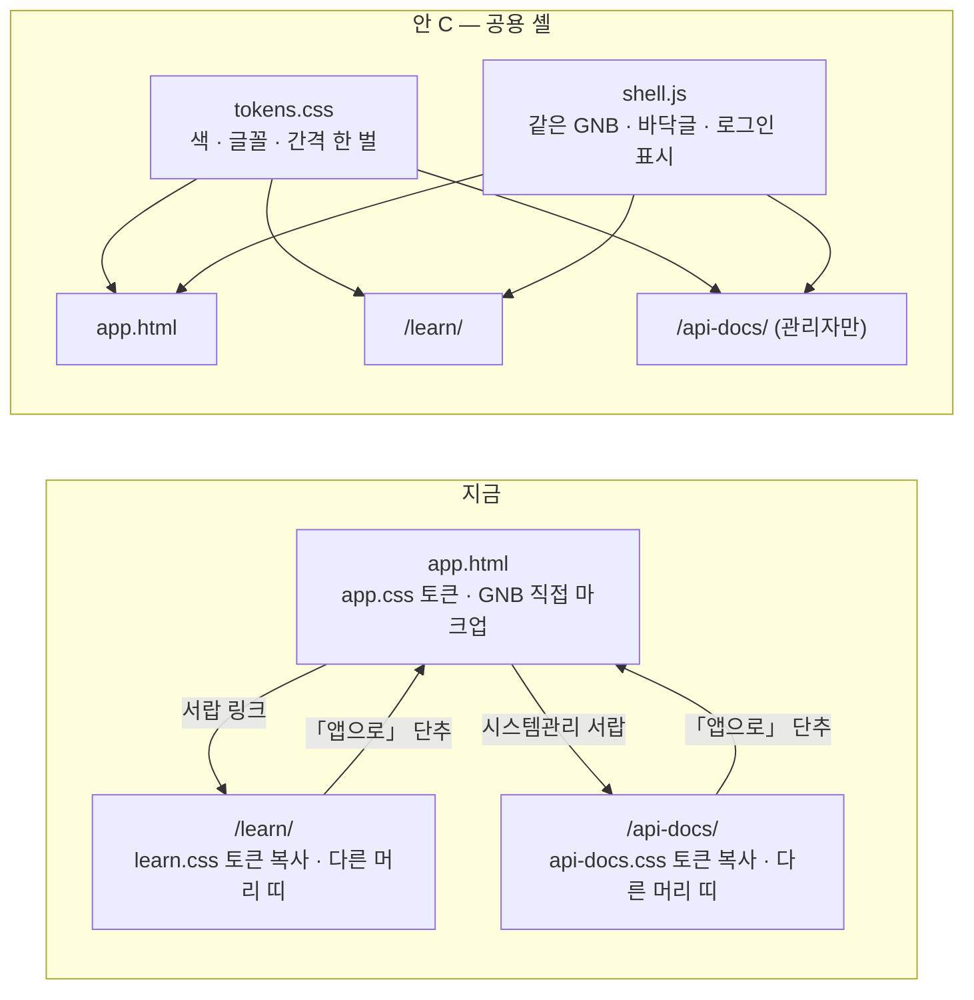

# 개념 학습 · API 문서를 본 앱 안에 둘까, 따로 둘까 — 화면 통합 · 분리 조사서 v0.1

| 문서 정보 | |
|---|---|
| **판 · 상태** | v0.1 · 조사 끝(검토 전) — 결정은 리팩터링(개선) 세션에서 |
| **구분** | 조사서 — 화면 구조(IA) · 프런트엔드 구조 |
| **작성** | 이동원(조사 지시 · 핵심 출처 다시 확인 · 이 PC 확인) — 사례 수집은 조사 에이전트 한 번(웹 35회 · github.com 은 열지 않음) |
| **검토** | 검토 전 — 판을 올리는 PR 에 팀원 한 명 이상의 「읽었음」 |
| **최종 수정** | 2026-10-06 (KST) |
| **기준** | 외부 원문 조회 2026-10-06 11:13 ~ 11:26 KST · 이 PC 확인(도커 개발 모드 앱 `localhost:8966` — 로그인 없이 `/docs` · `/redoc` · `/openapi.json` · `/api-docs/catalog.json` 200) |
| **관련 문서** | [IA v1.1](../화면/지난판/IA_v1.1.md) · [API 명세서 v0.10](../인터페이스/지난판/API명세서_v0.10.md) 10절 「앱 안에서 보기」 · [화면 설계 절차 v0.2](../화면/화면설계절차.md) |
| **최근 개정** | 새 문서 |

> **이 문서로 알 수 있는 것**
> 1. 실제 서비스는 학습 콘텐츠와 API 문서를 본 앱 안에 두는가, 따로 두는가?
> 2. 무엇을 기준으로 고르나 — 독자 · 권한 · 이동 · 검색 노출 · 성능 · 보안 · 유지보수
> 3. 따로 둔다면 디자인 · 이동을 어떻게 한 제품처럼 맞추나, 그리고 Qurious 에는 어느 안이 맞나?
>
> **읽는 순서** — 팀원: 요약 → 4절 · 강사님: 요약 → 1 · 2절 · 처음 온 사람: 부록 A 용어 → 요약

## 요약

1. **실제 서비스는 「앱 안이냐 따로냐」 를 하나만 고르지 않는다 — 독자에 따라 자리를 나누고, 겉모습 · 이동은 한 제품처럼 맞춘다.**
   학습은 공개 웹 글과 앱 안 입구를 둘 다 둔다(토스증권 · Robinhood · Webull). API 는 누구나 보는 공개 문서와 로그인 · 역할로 막힌 콘솔 안 도구를 나눈다(Stripe · Supabase · Shopify).
2. **우리 `/api-docs/` 는 「콘솔 안 도구」 쪽이다** — 로그인 쿠키로 API 를 실제로 부른다. 그런 도구는 사례(Stripe Workbench 는 관리자 · 개발자 역할만 · 운영 계정에서는 읽기 전용)와 보안 권고(OWASP API9:2023 「API 문서는 그 API 를 쓸 권한이 있는 사람에게만」)가 모두 **관리자 영역**에 두라고 한다.
3. **지금의 「부자연스러움」 은 「따로 있어서」 보다 「달라 보이고 이동이 끊겨서」 다** — 세 쪽(본 앱 · `/learn/` · `/api-docs/`)이 색 토큰을 각자 복사하고, 머리 띠 모양이 다르며, 「앱으로」 단추로만 돌아온다. 같은 서버 · 같은 도메인이라 따로 두는 비용은 이미 작다.
4. **추천은 안 C(섞음)** — 공용 앱 셸(토큰 한 벌 · 같은 머리글 · 바닥글)을 먼저 만들고, 학습은 앱 안 입구를 늘리며, API 문서는 관리자만 열게 한다. 전부 앱 안 화면으로 옮기는 안 A 는 해시 주소 · CSS 충돌 정리와 Swagger 지연 로딩까지 해야 해 일과 회귀 위험에 비해 얻는 것이 적다(🔴 판단).
5. **지금 열려 있는 것** — `/docs` · `/redoc` · `/openapi.json`(FastAPI 기본)과 오늘 만든 `/api-docs/`(카탈로그 포함)가 로그인 없이 열린다(이 PC 확인 🟢). 저장소가 공개라 새로 드러나는 정보는 없지만, 운영에서는 4절의 「정할 것」 ② 가 필요하다.

확실도 — 🟢 원문을 직접 열어 확인 · 🟡 검색 요약 · 제목 · 제3자 문서로만 확인 · 🔴 추정 · 판단. 조회일은 모두 2026-10-06.

---

## 1. 실제 서비스 사례

표 1 은 「다른 서비스는 학습 · API 문서를 어디에 두나」 에 답한다.

**표 1. 사례 — 학습 6 · API 5 · 참고 1**

| # | 서비스 | 분류 | 형태 | 어디에 · 어떻게 | 확실도 · 출처 |
|---|---|---|---|---|---|
| 1 | 토스증권 | 학습 | **섞음** | 앱: 오리지널 콘텐츠를 「뉴스」 탭 아래에, 「투자자의 더 깊은 이해가 필요한 길목마다」 둔다 · 웹: 토스피드 연재 「투자는 이렇게」(2024-03-29 글 기준 — 지금 앱 구조와 다를 수 있음) | 🟢 [S1] · 연재 주소 🟡 [S2] |
| 2 | 키움증권 | 학습 | 따로 | 거래 앱(영웅문)과 별개로 회사 웹사이트 교육 메뉴 「하우투스탁」 · 유튜브 「채널K」 — 앱 안 연결은 못 찾음 | 🟡 [S3][S4] |
| 3 | 미래에셋증권 M-STOCK | 투자정보 | 앱 안 | 뉴스 · 리서치 · 경제지표를 앱 안 통합 검색 · 피드로 — 교육 전용 사이트는 못 찾음 | 🟡 [S5] |
| 4 | Robinhood Learn | 학습 | **섞음** | 앱: 「We gave Learn a home on the browse tab」(2022-04-29) · 웹: `learn.robinhood.com` 이 `robinhood.com/us/en/learn/` 으로 **301 영구 이동** — 따로 쓰던 하위 도메인을 본 도메인 경로로 합쳤다 | 🟢 [S6] · 301 은 조회일에 직접 확인 🟢 [S7] |
| 5 | Webull Learn | 학습 | **섞음** | 웹 `webull.com/learn` · 모바일 앱 Feeds → Learn 탭 · 데스크톱 앱 Learning Center | 웹 🟢 · 앱 안 위치 🟡 [S8] |
| 6 | IBKR Campus | 학습 | 따로(**머리글은 같음**) | 공개 교육 사이트에 본 사이트 메뉴(IBKR Home · Why IB · Free Trial · Campus)를 그대로 둔다 · 대부분 계정 없이 열람 | 🟢 [S9] · 2차 🟡 [S10] |
| 7 | Stripe | API | **섞음**(독자를 나눔) | 공개 문서 `docs.stripe.com` · 대시보드 안 Workbench(Shell · API Explorer · 로그 · 웹훅) — 「Only users with the Administrator or Developer role have full access」 · 「Shell is read-only in live mode」 | 🟢 [S11][S12] · 블로그 🟡 [S27] |
| 8 | Supabase | API | **섞음** | 공개 문서와 별도로 대시보드 안에 프로젝트마다 자동으로 만드는 API 문서(DB 를 바꾸면 따라 바뀜) | 🟢 [S13] · 2차 출처 못 찾음 |
| 9 | Shopify | API | **섞음** | 공개 개발자 문서 `shopify.dev` · 공개 GraphiQL Explorer(상점 없이 익힘) · 내 상점 데이터는 상점에 설치한 GraphiQL 앱(권한 범위를 고름)으로 관리 화면 안에서 | 🟢 [S14] · 🟡 [S15] |
| 10 | Twilio | API | 따로(콘솔 안 탐색기 **폐지**) | 「Effective December 15, 2023, Twilio will End of Life (EOL) the API Explorer feature in Console」 — 문서와 OpenAPI 명세를 바깥 도구(Postman 등)에 넣어 쓰라고 안내 | 🟢 [S16] · 2차 출처 못 찾음 |
| 11 | FastAPI 기본값(참고) | API | 앱과 같은 서버 | `/docs` · `/redoc` · `/openapi.json` 을 앱이 직접 낸다 · 운영에서 끄는 법(`openapi_url` 을 비우면 셋 다 404)과 「숨기는 것만으로는 보호가 아니다」 를 함께 적는다 | 🟢 [S17] — 이동원이 다시 확인 |
| 12 | Qurious 지금 | 둘 다 | 따로(같은 서버 · 같은 도메인) | `/learn/` · `/api-docs/` 를 따로 된 HTML 로 마운트 · `FastAPI()` 에 문서 설정이 없어 기본값(공개) · 색 토큰을 `app.css` · `learn.css` · `api-docs.css` 가 각자 복사 · 위 메뉴(GNB) 마크업이 `app.html` 안에만 있음 | 🟢 코드 · 이 PC 확인 |

**사례에서 읽은 경향**

- 학습 6곳은 섞음 3 · 따로 2 · 앱 안 1 이다. 따로 둔 곳도 본 사이트 머리글을 그대로 쓰거나(IBKR) 본 도메인 아래 경로로 합쳤다(Robinhood).
- API 는 「누구나 보는 문서」 와 「내 계정 · 내 데이터로 실제 호출하는 도구」 가 갈린다. 실제 호출 도구는 로그인 · 역할 · 권한 범위 안에 있다(Stripe 역할 · Supabase 프로젝트 · Shopify 상점 설치). 콘솔 안 탐색기를 없애고 문서 · OpenAPI 로 대신하는 곳도 있다(Twilio).
- 못 찾은 것 — Investopedia · Public.com · AWS 콘솔 · Firebase 콘솔은 원문을 확인하지 못해 뺐다. 키움 영웅문 앱 안의 교육 연결 · 미래에셋 교육 전용 사이트는 못 찾았다.

---

## 2. 판단 기준

표 2 는 「무엇을 보고 고르나」 에 답한다. 학습과 API 문서는 독자가 달라 같은 기준에서도 답이 갈린다.

**표 2. 판단 기준 일곱**

| 기준 | 무엇을 보나 | 개념 학습(`/learn/`) | API 문서(`/api-docs/`) | 근거 · 확실도 |
|---|---|---|---|---|
| ① 독자 | 본 앱 사용자와 같은가 | **같다**(일반 투자자) — 앱 가까이, 판단하는 길목마다 | **다르다**(팀 개발자 · 관리자) — 관리자 영역 | 토스 「길목마다」 🟢 [S1] · Robinhood browse 탭 🟢 [S6] · Stripe 역할 🟢 [S12] |
| ② 로그인 · 권한 | 누가 여나 | 읽기는 로그인 없이(지금과 같음) · 팀 자료 쓰기는 로그인 · 역할 | 권한 있는 사람만 · 쓰기 호출은 운영에서 막고 시험 환경에서만 | OWASP API9:2023 「**Make API documentation available only to those authorized to use the API.**」 🟢 [S18] — 이동원이 다시 확인 · Stripe 운영 읽기 전용 🟢 [S12] |
| ③ 이동 · 맥락 | 머리글 · 메뉴 · 뒤로 가기가 같은가 | 같은 제품 가족 안이면 모양 · 말이 같아야 한다 | 같음 | NN/g 「Internal consistency relates to consistency within a product or a family of products … across a family or suite of applications」 · 관례를 어기면 인지 부담 🟢 [S19] · IBKR 머리글 재사용 🟢 [S9] |
| ④ 검색 노출 | 글마다 주소를 검색엔진이 읽나 | 공개 글로 사람을 끌려면 실제 경로 · HTML 이 필요하다 — 그런데 지금은 본 앱(`#화면키`)도 `/learn/`(`#/p/글`)도 **해시 주소**라 어디에 두든 차이가 없다 | 대상 아님(드러나지 않아야 함) | Google 「don't use fragments to load different page content」 🟢 [S20] |
| ⑤ 성능 | 무거운 쪽이 다른 쪽 첫 로딩을 늘리나 | 마크다운 그리기 · 목차는 필요할 때만 | Swagger UI 묶음(약 1.3MB)은 사용자 앱 첫 로딩에 넣지 않는다 — 지금은 자세히를 처음 열 때만 싣는다 | web.dev 코드 나누기 🟡 [S21] · Fowler 「공통 의존성이 겹치면 받을 바이트가 는다」 🟢 [S22] |
| ⑥ 보안 | 운영에서 API 목록 · 시험 호출이 드러나나 | 해당 적음 | 운영에서는 `/docs` · `/redoc` · `/openapi.json` · `/api-docs/` 를 관리자만 보게 하거나 끈다 — 다만 숨기는 것만으로는 보호가 아니므로 API 마다 권한 검사는 따로 | OWASP 🟢 [S18] · FastAPI 「Hiding your documentation user interfaces in production shouldn't be the way to protect your API … Security through obscurity」 🟢 [S17] — 둘 다 다시 확인 · 서로 부딪히지 않는다(문서 접근 제한과 API 권한을 **둘 다**) |
| ⑦ 유지보수 | 공용 부품 · 배포 단위 | 한 서버 · 한 저장소 · 한 배포라 「따로 배포」 로 얻는 이득이 거의 없다 — 공용 부품만 한 곳에 | 같음 | Fowler 컨테이너(셸)가 머리글 · 바닥글과 인증 · 이동 같은 공통 관심사를 맡는다 · 쪼갤수록 저장소 · 빌드가 는다 🟢 [S22] · Atlassian 토큰은 디자인 결정의 단일 정본 🟡 [S23] |

---

## 3. 따로 둘 때 디자인 · 이동을 맞추는 방법

목표는 HTML 이 따로여도 사용자가 경계를 느끼지 않게 하는 것이다.

**그림 1. 지금 · 안 C 의 구조**

1. **토큰을 한 벌로(가장 먼저)** — `public/css/tokens.css` 에 색 · 글꼴 · 간격 · 반경 · 그림자를 모으고 세 쪽이 먼저 싣는다. 지금은 세 파일이 `:root` 를 각자 복사해 한 곳을 바꾸면 나머지가 어긋난다. 근거: Atlassian 🟡 [S23] · Fowler 디자인 토큰 🟡 [S24].
2. **머리글 · 바닥글을 같은 부품으로(앱 셸)** — 위 메뉴를 `app.html` 에 직접 쓰지 말고 `shell.js` 가 세 쪽에 같은 마크업을 그린다. 학습 · API 문서 쪽에서는 메뉴 칸을 `/app.html#화면키` 링크로, 앱 안에서는 지금처럼 화면 전환으로. 근거: Fowler 🟢 [S22] · 앱 셸 모델 🟡 [S25].
3. **이동 규칙을 하나로** — 「앱으로」 단추를 없애고 로고는 늘 대시보드로 · 같은 메뉴에서 지금 위치 칸이 켜짐(「개념 학습」 · 「시스템관리 › API 문서」) · 로그인 표시가 세 쪽에서 같음 · 같은 탭에서 열어 뒤로 가기가 자연스럽게. 근거: NN/g 🟢 [S19] · IBKR 🟢 [S9].
4. **같은 도메인 아래 경로로** — 지금처럼 `/learn/` · `/api-docs/` 를 유지하면 로그인 쿠키를 그대로 쓴다. 하위 도메인으로 빼지 않는다(Robinhood 도 하위 도메인을 본 도메인 경로로 합쳤다 🟢 [S7]).
5. **읽기 화면은 「변형」 으로만** — 긴 글 화면은 본문 폭 · 줄 간격만 토큰 위에 얹어 바꾼다(제품 UI 와 읽기 화면을 한 디자인 시스템 안에서 나누는 예 — Primer Product UI · Primer Brand 🟡 [S26]).
6. **바깥 부품도 토큰으로만 덧입힘** — Swagger UI 는 지금처럼 `api-docs.css` 가 덮되 값을 직접 쓰지 말고 토큰만.
7. **회귀 시험 하나** — 세 HTML 이 같은 `tokens.css` · `shell.js` 를 싣는지, 메뉴 칸 목록이 같은지(TC-AD-01 처럼 화면 연결을 재는 시험).

---

## 4. Qurious 에 맞춘 안 · 추천

표 3 은 「어느 안이 우리에게 맞나」 에 답한다. 드는 일은 이 저장소의 세션(2 ~ 3시간 작업 묶음) 단위 어림이다(🔴).

**표 3. 안 셋**

| 안 | 무엇을 | 장점 | 단점 · 위험 | 드는 일 |
|---|---|---|---|---|
| A 전부 앱 안으로 | `app.html#learn/…` · `#api-docs` 화면으로 옮기고 `/learn/` · `/api-docs/` 를 없앰 | 머리글 · 메뉴 · 서랍 · 뒤로 가기가 저절로 하나 · 앱 화면과 교재를 잇기 가장 쉬움 | 앱 해시 주소와 학습 해시 라우터(`#/p/글`)를 합쳐야 함 · 두 CSS 의 `:root` · 전역 규칙이 앱 전체로 번짐 · Swagger UI 지연 로딩 필요 · 관리자 도구가 사용자 앱 묶음에 섞임 · 검색 노출은 여전히 안 됨 | 큼(3 ~ 5세션 · 기존 시험도 손봄) |
| B 따로 + 공용 셸 | `tokens.css` · `shell.js` 를 세 쪽이 같이 · 「앱으로」 없앰 | 지금 구조 그대로 · 무거운 것은 그 쪽만 · 한 제품처럼 보임 | 쪽을 옮기면 새로 불러와 서랍 · 스크롤 상태를 잃음 · API 문서 공개 문제는 남음 | 중간(1 ~ 2세션) |
| **C 섞음(추천)** | B 의 셸 위에 학습은 앱 안 입구를 늘리고(용어 · 종목 화면 → 교재 글 링크) API 문서는 관리자만(페이지 · 카탈로그 · `/openapi.json` · `/docs` · `/redoc`) · 운영은 `OPENAPI_URL` 로 끌 수 있게 | 독자 · 권한 구분이 사례 · OWASP 와 맞음 · 「부자연스러움」 의 원인(다른 머리 띠 · 끊기는 이동)을 셸로 없앰 · Swagger 를 사용자 앱에 넣지 않음 | B 보다 조금 많음 · `/openapi.json` 을 막으면 그것을 읽는 곳(API 문서 화면 — 관리자면 그대로 · 강사님 통합본 사본 `rag-lab/` 의 운영 도구는 확인 필요 🔴)이 깨질 수 있음 · 메뉴 · 토큰은 모든 화면에 닿아 팀 논의 먼저 | 2 ~ 3세션 — tokens.css → shell.js · 「앱으로」 없앰 → API 문서 관리자 확인 · 운영 설정 → 앱 화면 → 교재 링크 몇 곳 |

**추천: 안 C** — ① 독자가 다르다(학습 = 본 앱 사용자 · API 문서 = 관리자) — 사례의 공통점이 「독자별로 자리를 나누고 겉모습은 한 제품처럼」 이다. ② 문제의 원인은 「따로 있다」 가 아니라 「달라 보이고 이동이 끊긴다」 다 — 셸과 토큰으로 대부분 풀린다(NN/g 내부 일관성). ③ API 목록 · 시험 호출을 관리자 영역에 가두는 것이 OWASP API9:2023 권고다. ④ A 는 라우터 · CSS 충돌 정리와 지연 로딩까지 해야 해 일과 회귀 위험이 크지만 사용자가 느끼는 차이는 C 와 비슷하다(🔴). 학습의 「읽기」 화면만 앱 안으로 들이는 안(C′)은 앱 안 링크가 실제로 얼마나 쓰이는지 본 뒤에 정해도 늦지 않다.

**정할 것(리팩터링 세션 · 사용자 · 팀)**

1. 안 고르기 — A · B · **C(추천)** · C′.
2. API 문서 접근 — 관리자만(추천) · 로그인한 사람 모두 · 지금처럼 공개. 운영 배포에서 `/docs` · `/openapi.json` 을 끌지.
3. 공용 셸 · 토큰 파일 — 모든 화면(팀원 화면 포함)에 닿으므로 팀 대화방 글로 먼저(팀 공용 장치는 논의 먼저).

---

## 부록 A. 용어

| 말 | 뜻 | 이 문서에서 | 헷갈리는 점 |
|---|---|---|---|
| 앱 셸(app shell) | 화면이 바뀌어도 남는 틀 — 머리글 · 메뉴 · 바닥글 | 세 쪽이 같이 그리는 `shell.js` | 디자인 토큰과 다르다 — 토큰은 값(색 · 간격), 셸은 부품(마크업) |
| 디자인 토큰 | 색 · 글꼴 · 간격 같은 값에 이름을 붙여 한 곳에 둔 것 | `tokens.css` 의 `--accent` 등 | 지금도 이름은 같지만 세 파일이 각자 복사해 「한 곳」 이 아니다 |
| 해시 주소 | 주소의 `#` 뒤로 화면을 가르는 방식 | 본 앱 `#화면키` · 학습 `#/p/글` | 검색엔진은 `#` 뒤를 다른 쪽으로 보지 않는다 |
| 콘솔 안 도구 | 로그인한 계정의 권한 · 데이터로 실제 호출하는 도구 | `/api-docs/` 의 시험 호출 | 공개 개발자 문서(누구나 읽기)와 다르다 |

## 부록 B. 출처 (조회일 모두 2026-10-06)

- [S1] 토스피드 「토스증권, 개인투자자를 위한 콘텐츠 표준을 만들다」(2024-03-29) https://toss.im/tossfeed/article/outsight-for-retail-investor 🟢
- [S2] 토스피드 연재 「투자는 이렇게」 https://toss.im/tossfeed/series/invest-like-this 🟡(검색 결과로 존재만 확인)
- [S3] 키움증권 하우투스탁 https://www.kiwoom.com/inv/investEdu/howtostock/introduce 🟡
- [S4] 키움 채널K https://www.kiwoom.com/inv/channelK/live/main · 아시아경제(2024-02-27) https://www.asiae.co.kr/article/2024022709045416614 🟡
- [S5] 미래에셋증권 M-STOCK App Store https://apps.apple.com/kr/app/id1248716281 🟡
- [S6] Robinhood Newsroom(2022-04-29) https://robinhood.com/us/en/newsroom/democratizing-access-to-financial-literacy-for-all 🟢
- [S7] https://learn.robinhood.com/ → 301 → https://robinhood.com/us/en/learn/ 🟢(조회일에 직접 확인)
- [S8] https://www.webull.com/learn · https://www.webull.com/help/faq/11032-Getting-Started 🟡
- [S9] IBKR Campus https://ibkrcampus.com/campus/traders-academy/finance-courses/ 🟢
- [S10] Business Wire(2023-02-28) IBKR Campus 새 단장 보도자료 🟡(제목만)
- [S11] https://docs.stripe.com/workbench 🟢
- [S12] https://docs.stripe.com/workbench/overview 🟢
- [S13] https://supabase.com/docs/guides/api/rest/auto-generated-docs 🟢
- [S14] https://shopify.dev/docs/apps/build/graphql/basics/queries 🟢
- [S15] https://learn.mechanic.dev/platform/graphql/basics/shopify-admin-api-graphiql-explorer 🟡(제3자 문서)
- [S16] https://www.twilio.com/en-us/changelog/end-of-life-for-twilio-api-explorer 🟢
- [S17] https://fastapi.tiangolo.com/how-to/conditional-openapi/ 🟢(이동원이 다시 확인 — 11:25)
- [S18] OWASP API9:2023 https://api-security.owasp.org/editions/2023/en/0xa9-improper-inventory-management 🟢(이동원이 다시 확인 · owasp.org 주소에서 308 이동)
- [S19] NN/g 「Maintain Consistency and Adhere to Standards」(2021-01-10) https://www.nngroup.com/articles/consistency-and-standards/ 🟢
- [S20] Google 검색 센터 JavaScript SEO 기초 https://developers.google.com/search/docs/crawling-indexing/javascript/javascript-seo-basics 🟢
- [S21] web.dev 코드 나누기 https://web.dev/learn/performance/code-split-javascript 🟡
- [S22] Martin Fowler 사이트 「Micro Frontends」(Cam Jackson) https://martinfowler.com/articles/micro-frontends.html 🟢
- [S23] Atlassian 디자인 토큰 https://atlassian.design/foundations/tokens/design-tokens 🟡
- [S24] Martin Fowler 사이트 디자인 토큰 기반 UI 구조 https://martinfowler.com/articles/design-token-based-ui-architecture.html 🟡(제목 · 요약만)
- [S25] 앱 셸 모델 https://developer.chrome.com/docs/workbox/app-shell-model 🟡
- [S26] Primer https://primer.style/product/ · https://primer.style/brand/ 🟡
- [S27] Stripe 블로그 Workbench 소개 🟡(제목)

## 부록 C. 개정 이력

| 판 | 날짜 | 무엇이 바뀌었나 | 왜 | 근거 |
|---|---|---|---|---|
| v0.1 | 2026-10-06 | 첫 판 — 사례 12 · 판단 기준 7 · 맞추는 방법 7 · 안 셋 · 추천 C · 정할 것 셋 | 사용자 「개념 학습 · API Swagger 를 따로 두니 부자연스럽다 — 통합할지 조사」(리팩터링 세션 앞) | 이 판과 같은 PR |
