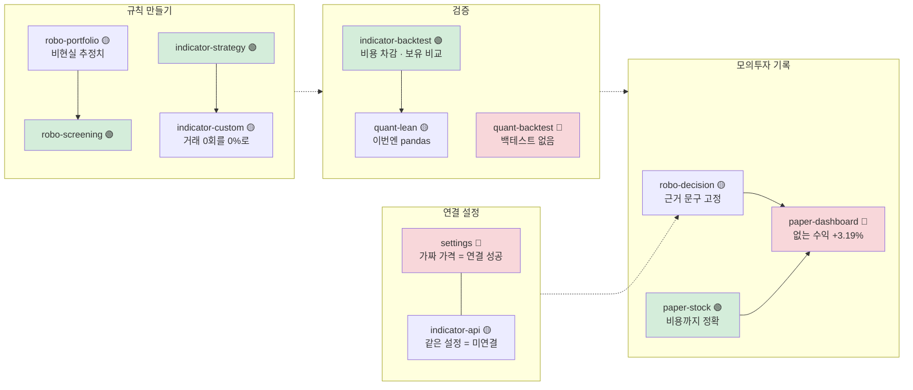
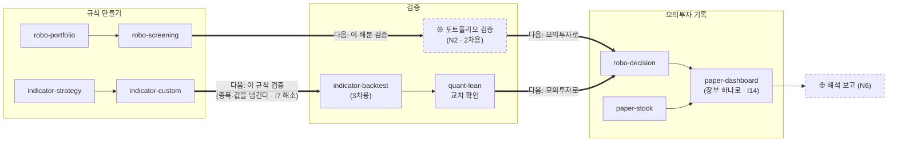

# 화면 정보구조(IA) v0.2 — Qurious 2.0

| 항목 | 내용 |
|------|------|
| **문서 버전** | v0.2 (브라우저 확인 · 와이어프레임 착수) |
| **기준 커밋** | `db00327` (main · 2026-09-28). 앱 코드는 v0.1 기준 `dfbfc30` 과 같다 — `git diff --stat dfbfc30 db00327 -- public app` 0줄 |
| **작성** | 이동원 · 2026-09-28 (S52) |
| **산출물 구분** | 4 화면·서비스 설계 — 정보구조(IA) + 주 경로 화면흐름도. 와이어프레임은 [별도 문서](와이어프레임_v0.1.md) |
| **상태** | 1절(지금 구조)은 코드 **와 브라우저**로 확인한 사실 🟢 · 2절(2.0 구조)은 D1 ③ 이 확정되기 전의 **제안** 🟡 · 3절 일정은 **공식 확인** 🟢 |
| **실측 도구** | `python scripts/view_scan.py`(정적) + Docker 로 앱을 띄워 브라우저로 눌러 본 결과(1.5절 · 재현은 9절) |
| **지난 판** | [IA v0.1](IA_v0.1.md) — 1.1~1.4절 표와 3절 대조표는 v0.1 을 그대로 쓴다(코드가 안 바뀌었다). 이 문서는 **바뀐 것과 새로 확인한 것**을 적는다 |
| **관련 문서** | [와이어프레임 v0.1](와이어프레임_v0.1.md) · [프로젝트 계획서 v1.2](../계획서/프로젝트계획서_v1.2.md) · [논의 결정 대장 v0.9](../계획서/논의결정대장_v0.9.md) · [RTM v1.0](../요구사항/RTM_v1.0.md) · [ERD v1.0](../데이터/ERD_v1.0.md) |

확실도 · 🟢 코드·파일·브라우저로 확인 / 🟡 추론·제안 / 🔴 정정·문제

> **쉬운 요약 3줄**
> 1. 도커로 앱을 띄워 주 경로 12개 화면을 **브라우저에서 직접 눌러 봤다.** 12개 모두 뜨고 콘솔 에러·실패한 API 는 **0건**이다. 하지만 결과를 그대로 믿을 수 있는 화면은 **4개뿐**이다(🟢 4 · 🟡 5 · 🔴 3). 에러 없이 **숫자·문구가 틀리는** 경우라 로그로는 못 잡는다.
> 2. 가장 큰 문제는 흐름의 마지막 칸인 **「기록」**이다. 자동매매(`robo-decision`)가 산 주식 값이 모의계좌 현금에서 빠지지 않아, `paper-dashboard` 가 **없는 수익 +3.19%** 를 보여 준다. 현금 장부는 둘(1천만 원 · 1억 원)인데 보유 종목 표는 하나이기 때문이다. 그 밖에 증권사 「연결 성공」이 가짜 가격으로 뜨고, 「10년 백테스트」 화면에는 백테스트가 없다.
> 3. 메뉴는 **1280·1440 폭에서 주 경로 4개가 든 「투자 인디케이터」 탭이 화면 밖으로 밀려 있고, 모바일(390)에서는 메뉴가 아예 없다.** 그래서 2.0 상단 메뉴를 **5칸**(규칙 만들기 · 검증 · 모의투자 기록 · 배우기 · 더보기)으로 줄이는 안으로 고쳤다. 강사님 일정(2차 **10-01(목)~10-21(수)**)은 공식으로 확인됐고, **IA·와이어프레임은 10-06(화) 오전** 칸의 산출물이다.

---

## 한눈에 보기

| 질문 | 답 | 확실도 | 절 |
|------|-----|:------:|:--:|
| 주 경로 12개가 브라우저에서 뜨나 | **12 / 12** · 콘솔 에러 0 · API 실패 0 (전부 HTTP 200) | 🟢 | 1.5 |
| 결과를 믿을 수 있나 | 🟢 **4** · 🟡 **5** · 🔴 **3** | 🟢 | 1.5 |
| 가장 큰 문제 | 자동매매 매수가 모의계좌 현금을 안 줄여 **기록 화면에 없는 수익 +3.19%** | 🟢 | 1.6 I14 |
| 1440 폭에서 상단 메뉴 | 9칸 중 **5칸만 온전히 보인다** — 「투자 인디케이터」(주 경로 4) 안 보임 | 🟢 | 1.6 I11 |
| 모바일(390)에서 메뉴 | **없다** — 상단·왼쪽 메뉴가 숨고 여는 버튼도 없다 | 🟢 | 1.6 I12 |
| 첫 화면 | 가입 직후 `#agent-chat` 으로 들어간다 (v0.1 I1 을 브라우저로 재확인) | 🟢 | 1.5 |
| 2.0 상단 메뉴 | v0.1 의 5+3 묶음 → **5칸**(규칙 만들기 · 검증 · 모의투자 기록 · 배우기 · 더보기) | 🟡 | 2.2 |
| 강사님 일정 | **공식** — 2차 10-01(목)~10-21(수) 오전 25칸 · 3차 10-22(목)~11-11(수) 30칸 | 🟢 | 3 |
| 와이어프레임 | 공통 틀(데스크톱·모바일) + 대표 화면 5장 착수 | 🟡 | [별도](와이어프레임_v0.1.md) |
| 팀에 묻는 것 | 💬 **7개** (v0.1 의 6개 + 모바일 범위) | — | 5 |

### v0.1 → v0.2 바뀐 것

| 곳 | v0.1 | v0.2 | 까닭 |
|----|------|------|------|
| 1절 | 코드를 읽은 정적 분석 | + **1.5 브라우저 확인 12개** · **1.6 새 문제 I11~I15** | v0.1 8절 「다음 판에서 할 것」 1번 |
| 2.2 상단 메뉴 | 상단 5 + 더보기 3 (2차 규칙 · 3차 규칙을 따로) | **상단 5칸**. 2차·3차 규칙 만들기를 한 탭에 두고 왼쪽 메뉴 소제목으로 나눈다 | I11 — 탭 하나 평균 115px, 1440 폭의 탭 영역은 606px |
| 2.5 재사용 판정 | 메뉴 표 · 첫 화면 한 줄 | + 탭 줄 폭 · 모바일 메뉴 · 「다음 단계」 버튼 · **장부 통합(서버)** | I11~I14 |
| 3절 일정 | 강사님 일정표 — 공식 여부 🟡 | **공식** 🟢 · 반나절 칸 배정까지 | 2026-09-28 사용자 확인 |
| 3절 🔴 정정 | 「우리 계획서는 2차를 09-27~10-26 으로 잡았다」 | **틀렸다.** 계획서 v1.1 은 「09-27 시작 ~ 종료일 미정」 | 10-26 은 옛 `#61`·`#62` 의 **잠정안**이었다 |
| 5절 | 💬 6개 | 💬 7개 (Q7 모바일) · Q1 선택지 수정 | I11 · I12 |

---

## 용어 풀이 (v0.1 에 없던 것만)

| 용어 | 정확한 뜻 | 이 문서에서 | 헷갈리기 쉬운 점 |
|------|-----------|-------------|------------------|
| **와이어프레임** | 화면에 **무엇이 어디에 있는지**만 그린 설계도. 색·글꼴·아이콘은 뺀다 | [와이어프레임 v0.1](와이어프레임_v0.1.md) — 글자 상자(ASCII)로 그렸다 | 「디자인 시안」이 아니다. 색·모양은 UI 명세·디자인 단계에서 정한다 |
| **저충실도(lo-fi)** | 빠르게 그려 배치만 합의하는 수준의 와이어프레임 | 이번 판은 전부 저충실도 | 픽셀 크기는 뜻이 없다. 순서·묶음·버튼 위치만 본다 |
| **장부(원장)** | 돈과 보유 수량을 적는 **정본 기록**. 한 계좌의 현금과 보유 종목은 같은 장부에 있어야 서로 맞는다 | 1.6 I14 — 현금 장부 2개 · 보유 표 1개 | 「DB 표가 두 개」가 문제가 아니라 **현금과 보유가 서로 다른 장부를 본다**는 것이 문제다 |
| **거짓 성공 표시** | 실제로는 안 된 일을 성공한 것처럼 보여 주는 화면 문구 | 1.6 I15 — 3곳 | 에러가 아니라서 **로그·콘솔로는 안 잡힌다**. 사람이 결과 값을 봐야 보인다 |
| **탭 줄 넘침** | 상단 메뉴 탭의 전체 폭이 보이는 영역보다 넓어, 뒤쪽 탭이 옆으로 밀린 상태 | 1.6 I11 | 가로 스크롤로 **닿을 수는 있다**. 처음 온 사람은 그 탭이 있는 줄 모른다 |
| **판정 🟢·🟡·🔴 (1.5절)** | 🟢 동작하고 결과가 화면의 약속과 맞다 · 🟡 동작하지만 결과·표시에 문제가 있다 · 🔴 결과가 틀리거나 화면이 약속한 일을 하지 않는다 | 1.5절 12행 | 「뜨는가」가 아니라 **「믿어도 되는가」** 기준이다. 12개 모두 뜨기는 한다 |

---

## 1. 지금 구조 (AS-IS) 🟢

1.1(들어오는 길) · 1.2(메뉴 트리) · 1.3(화면 49개 전수표) · 1.4(구조 문제 I1~I10)는 **[v0.1](IA_v0.1.md) 그대로**다.
앱 코드가 바뀌지 않았고 `view_scan.py` 출력도 같다(화면 49 · 진입 훅 30 · 화면 사이 링크 0 · 숨은 의존 2 · 중복 리스너 1).
그중 **브라우저로 다시 확인된 것**만 적는다.

| v0.1 번호 | 브라우저에서 본 것 | 확실도 |
|-----------|---------------------|:------:|
| I1 첫 화면이 동결 후보 | 회원가입 직후 주소가 `app.html#agent-chat` 이었다 | 🟢 |
| I3 화면끼리 잇는 길 0개 | 12개 화면 어디에도 다음 화면으로 가는 버튼이 없었다. 이동은 전부 상단 → 왼쪽 메뉴 두 번 누르기 | 🟢 |
| I4 같은 일을 하는 화면 | 같은 증권사 설정 한 행으로 `settings` 는 「연결 성공」, `indicator-api` 는 「연결되지 않음」을 보여 줬다(1.5절 11·12행) — **v0.1 보다 심하다** | 🟢 |
| I7 숨은 의존 | `indicator-custom` 의 「백테스트 실행」이 보이지 않는 `indicator-backtest` 화면의 종목(삼성전자)으로 돌았다 | 🟢 |
| I9 약속과 다른 화면 | `quant-backtest` 「분석」은 현재가·RSI·신호만 보여 줬다. 백테스트 결과는 없다 | 🟢 |
| 중복 리스너 | `settings` 「연결 테스트」 한 번에 `/api/broker/price` 가 **2번** 나갔다 | 🟢 |

### 1.5 브라우저 확인 — 주 경로 12개 (S52 · 2026-09-28 10:27~10:36 KST)

**조건** — 결과를 읽을 때 꼭 함께 본다.

| 항목 | 값 | 결과에 주는 영향 |
|------|-----|------------------|
| 띄운 것 | 앱(`db00327` 을 빌드) + Postgres 16(`pgvector/pgvector:pg16`) + Redis 7. **neo4j·celery·Ollama 는 안 띄움** | 그래프·비동기 작업·AI 대화는 이번 확인 밖. 주 경로 12개는 이것들을 부르지 않았다 |
| 환경 변수 | 저장소 `.env` 를 **읽지 않았다**(실제 키가 들어 있다). JWT·세션 비밀값만 그 자리에서 만들었다 | 증권사는 「Mockup(테스트)」 상태다 — 11·12행 결과의 전제 |
| LEAN | `LEAN_MODE=local` (LEAN Docker 이미지를 받지 않음) | 6행은 LEAN 이 아니라 **pandas 대체 계산** 결과다 |
| 사용자 | 새로 가입한 계정 1개 | 여러 사용자 동시 사용은 안 봤다 |
| 이동 방법 | **상단 탭 → 왼쪽 메뉴 클릭** (사용자와 같은 길) | 묶음 첫 화면을 거치는 부하(I13)까지 함께 잡혔다 |
| 화면 크기 | 1440 × 900 (I11 은 1280 · 1920 · 390 도 쟀다) | — |
| 기다린 시간 | 들어가서 8초 · 버튼 누르고 12~30초 **고정** | **응답 시간은 재지 않았다.** 느림은 「고정 시간 안에 안 왔다」로만 적는다 |

**결과** — 순서는 2.0 주 경로 순서(규칙 → 검증 → 기록 → 연결). 스크린샷은 버튼을 누른 뒤의 모습이다.

| # | 화면 | 들어가면 부르는 API | 누른 버튼 → API | 본 결과 | 판정 | 그림 |
|---:|------|---------------------|------------------|---------|:----:|:----:|
| 1 | `robo-portfolio` 자산배분 | 없음 | 「포트폴리오 최적화 실행」 → `/ml/robo/allocation` 200 | 중립·중기·5천만 원 → 국내주식 30 · 해외주식 25 · 국내채권 30 · 대체 10 · 현금 5 % + 추천 종목 + 예상 성과 1년 +68.75% · 3년 +380.57% · **5년 +1,268.54%**. 종목 카드에 「AI 예측 수익률 **300.0%**」 | 🟡 | [01](img/v0.2/01-robo-portfolio.png) |
| 2 | `robo-screening` 스크리닝 | `/stocks/signals` — **8초 안에 오지 않았다**(두 화면 뒤에 도착) | 「스크리닝 실행」 → `/stocks/signals` · `/stocks/quant/list` · `/stocks/market` 200 | 신호 표 6행(BUY · 추세·MACD·RSI 앙상블 · 근거 표시) | 🟢 | [02](img/v0.2/02-robo-screening.png) |
| 3 | `indicator-strategy` 기본 전략 | 없음 | 「전략 분석」 → `/stocks/quant/indicators` 200 | 매수 2 · 매도 0 · 중립 1 → 「📈 매수 우위 — 진입 고려」 | 🟢 | [03](img/v0.2/03-indicator-strategy.png) |
| 4 | `indicator-custom` 커스텀 지표 | `/custom-indicators` 200 | 「코드 생성」 → Pine 908자 · Python 791자 / 「백테스트 실행」 → `/quant/pipeline` 200 | 기본값(RSI 35/65 · 이평 5/20)으로 **거래 0회**. 화면은 「누적 +0.0% · 샤프 0.00 · MDD 0.0% · 승률 0.0%」 — **거래가 없었다는 말이 없다** | 🟡 | [04](img/v0.2/04-indicator-custom.png) |
| 5 | `indicator-backtest` 성과 검증 | `/quant/pipeline`(RSI · 10년 · 실제 비용) 200 — **들어가자마자 실행** | 「성과 검증 실행」 → 같은 API | RSI 역추세 **+9.52%**(14회 · 승률 47.2%) vs 매수 후 보유 **+661.13%**. 「비용 전 13.22% 에서 3.70%p 를 뺀 값」 · 「신호는 다음 거래일 수익률에 적용」 | 🟢 | [05](img/v0.2/05-indicator-backtest.png) |
| 6 | `quant-lean` LEAN 백테스트 | `/backtests/lean/status` · `/history` 200 | 「이 조건으로 검증 실행」 → `/backtests/lean/run` 200 | 「pandas (LEAN 미실행)」 — 삼성전자 매수 후 보유 2023-01-01~2026-09-28 +430.57%. 실행 이력 표에 남는다 | 🟡 | [06](img/v0.2/06-quant-lean.png) |
| 7 | `quant-backtest` 전략 분석 | (묶음 첫 화면 `quant-dashboard` 가 야후 지표 **33건** 호출 — I13) | 「분석」 → `/stocks/quant/indicators` 200 | 현재가 276,000 · RSI 56.31 · 「매수 시그널」 — **백테스트 결과 없음.** 제목은 「퀀트 전략 분석 (10년 Mockup)」 | 🔴 | [07](img/v0.2/07-quant-backtest.png) |
| 8 | `robo-decision` 의사결정 | `/quant/auto/status` 200 | 「▶ 의사결정 시작」 → `/quant/auto/start` 200 → **20초 안에 모의 매수 3건**(SK 1 · 삼성전자 3 · SK하이닉스 1주, 출처 `QUANT`) / 「■ 중지」 → `/quant/auto/stop` 200 | 로그 「모의계좌 평가 **9,999,433원**」(1천만 원 장부). 판단 근거 카드는 BUY 면 **늘** 「과매도 구간 진입, 반등 기대」 — 실제 근거는 「RSI 중립(52.6) · 골든크로스」. 로그 시각이 `…+00:00`(UTC)로 찍힌다 | 🟡 | [08](img/v0.2/08-robo-decision.png) |
| 9 | `paper-stock` 모의주문 | 계좌·보유·주문 6건 + `/stocks/signals` 200 | 종목을 비운 채 「시세 조회」 → **아무 반응 없음** / `005930` × 2주 → 시세 275,250 · 미리보기(현금 1억 → 99,449,500 · 보유 3→5주) · 「시장가 매수」 → `/paper/stocks/orders` 200 | 현금 **99,449,402.6원** = 1억 − 550,500 − 비용 97.4(수수료 77.36 + 유관기관 20.04). **수동 주문은 비용까지 정확하다** | 🟢 | [09](img/v0.2/09-paper-stock.png) |
| 10 | `paper-dashboard` 계좌 현황 | `/paper/account` 외 3건 200 | 「새로고침」 | 자동매매 3건 뒤: 보유 현금 **100,000,000원 그대로** · 주식 평가 3,194,750 · 총 손익 **+3,194,750원(+3.19%)** — 산 주식 값이 그대로 수익이 됐다 | 🔴 | [10](img/v0.2/10-paper-dashboard.png) |
| 11 | `settings` 증권사 설정 | `/quant/settings` 200 | 「연결 테스트」 → `/broker/price` **2회** | 「✅ 연결 성공 – 삼성전자 현재가: **75,496원**」. 같은 시각 시세는 275,250원이다 — 모의 브로커가 만든 **가짜 가격을 연결 성공으로** 보여 준다. 「실전투자 (Live)」 선택지가 보인다 | 🔴 | [11](img/v0.2/11-settings.png) |
| 12 | `indicator-api` 증권사 자동화 | `/broker/settings` 200 | 「연결 테스트」 → `/broker/test` 200 (응답 `ok: true`, 가격 75,164) | 화면에는 「연결되지 않음」이 그대로 남았다 — **같은 설정으로 11행은 성공, 12행은 미연결** | 🟡 | [12](img/v0.2/12-indicator-api.png) |

**합계** — 🟢 4 (`robo-screening` · `indicator-strategy` · `indicator-backtest` · `paper-stock`) · 🟡 5 (`robo-portfolio` · `indicator-custom` · `quant-lean` · `robo-decision` · `indicator-api`) · 🔴 3 (`quant-backtest` · `paper-dashboard` · `settings`)



**읽는 법** — 점선은 지금 코드에 없는 이동이다(I3). 🟢 두 개(`indicator-backtest` · `paper-stock`)는 **2.0 의 검증·기록 칸을 받칠 수 있는 뼈대**다. 이미 비용을 차감하고, 단순 보유와 비교하며, 다음 거래일에 신호를 적용한다.
반대로 흐름의 **첫 화면 후보(`robo-portfolio`)와 마지막 화면(`paper-dashboard`)이 둘 다 믿을 수 없다** — 발표에서 처음과 끝에 보이는 숫자다.

### 1.6 브라우저에서 새로 보인 문제 (I11~I15)

| # | 문제 | 근거 (기준 `db00327`) | 왜 문제인가 | 확실도 |
|---|------|------------------------|-------------|:------:|
| I11 | **상단 탭이 화면 밖으로 밀린다** | 탭 9개의 전체 폭 1,040px ↔ 보이는 폭 1280: 446px · 1440: 606px · 1920: 1,086px (아래 표) | 1440 에서 「투자 인디케이터」(주 경로 4개)와 「ML·딥러닝」「투자분석」(개념 설명 9개)이 **첫 화면에 안 보인다.** 옆으로 밀면 나오지만, 있는 줄 모른다 | 🟢 |
| I12 | **모바일에서 메뉴가 없다** | 390 폭: 탭 줄 폭 0 · 왼쪽 메뉴 숨김 · 메뉴를 여는 버튼 없음 ([13](img/v0.2/13-mobile-390.png)) | 주소를 직접 치는 것 말고 **다른 화면으로 갈 방법이 없다.** 로그아웃 버튼도 화면 밖이다. 강사님 일정표에 모바일 시험(UI QA · 사용성 시험) 칸이 있다 | 🟢 |
| I13 | **묶음 첫 화면이 무거운 동결 화면** | 「퀀트자동매매」 탭 → 첫 화면 `quant-dashboard`(✕) 가 `/stocks/quant/indicators` 31건 + `/list` + `/market` = **33건**(야후) | 주 경로 3개(`quant-backtest` · `quant-lean` · `settings`)로 갈 때마다 쓰지 않는 화면의 호출 33건을 거친다. 야후 호출이 많을수록 차단·지연 위험이 커진다(약관 판정 🔴 소스) | 🟢 |
| I14 | **현금 장부 2개 · 보유 표 1개** | 자동매매: 현금은 `quant_virtual_accounts`(초기 **1천만 원**, `auto_trade.py:26` · `:61-68`), 보유는 `portfolio`(`:127-146`). 수동 모의주문: 현금은 `paper_accounts`(초기 **1억 원**, `models/paper.py:20`). `paper-dashboard` 는 **`paper_accounts` 현금 + `portfolio` 보유**로 총자산을 계산한다(`paper_trading.py:704-723`) | 자동매매가 산 만큼 **없는 수익**이 생긴다(1.5절 10행). D1 흐름도의 「모의투자 일지」와 D7 모의투자 원장의 전제가 깨진다. 2.0 이 풀려는 질문(「이 규칙을 믿어도 되나」)의 답이 이 화면에 찍힌다 | 🟢 |
| I15 | **거짓 성공 표시 3곳** | ① `settings` 연결 테스트 — 모의 브로커의 가짜 가격을 「연결 성공」으로 ② `robo-decision` 판단 근거 — BUY 면 늘 「과매도 구간 진입, 반등 기대」(`app.html:3252` 고정 문구) ③ `indicator-custom` — 거래 0회를 「+0.0% · 승률 0.0%」로 | 사용자는 **성공했다고 믿고 다음 단계로 간다.** 에러가 아니라 로그에 안 남는다. D3 ⑧(화면 표기) 의 대상이 3곳 늘었다 | 🟢 |

I11 폭별 실측 (Playwright · 상단 탭 9개가 보이는 영역 안에 온전히 들어오는지):

| 폭 | 탭 영역 | 온전히 보임 | 잘림 | 안 보임 |
|---:|--------:|-------------|------|---------|
| 390 | 0px | — | — | **9개 전부** (I12) |
| 1280 | 446px | 로보 어드바이저 · 크롤링 · 직접매매 | 모의투자 | 퀀트자동매매 · 미국주식 · **투자 인디케이터** · ML·딥러닝 · 투자분석 |
| 1440 | 606px | 로보 어드바이저 · 크롤링 · 직접매매 · 모의투자 · 퀀트자동매매 | 미국주식 | **투자 인디케이터** · ML·딥러닝 · 투자분석 |
| 1920 | 1,086px | 9개 전부 | — | — |

> 1280·1440 모두 **맨 앞 세 칸 중 둘(크롤링 · 직접매매)이 통째로 동결 묶음**이다. 동결 화면이 가장 좋은 자리를 차지하고, 주 경로가 밀려났다.

**구현에서 함께 보인 것** (IA 밖)
- `robo-screening` 이 들어가면 부르는 `/stocks/signals` 가 8초 안에 오지 않았다. 그동안 신호 칸은 비어 있고 불러오는 중 표시가 없다. 🟡 (시간은 재지 않았다)
- `paper-stock` 은 종목 칸이 비어 있으면 버튼을 눌러도 **아무 안내가 없다.** 🟢
- 화면 아래 띠에 「FastAPI · Ollama · Qdrant · Redis · **MongoDB**」라고 적혀 있다 — DB 는 PostgreSQL 로 옮긴 뒤다(마이그레이션 `0001` 「Mongo → PostgreSQL 전환」). 🟢
- 서버 로그에는 에러·예외가 **0건**이었다. neo4j 연결 실패 경고 1건(일부러 안 띄움)뿐이다. 🟢

---

## 2. 2.0 구조 제안 (TO-BE) 🟡 — v0.2 수정

> **제안이다.** D1 ③ 이 확정되면 그 분류로 다시 채운다. v0.1 의 원칙 4개는 그대로 두고 3개를 더한다.

### 2.1 원칙 (5~7 추가)

1. 메뉴 첫 줄 = 주 경로 순서. *(v0.1)*
2. 화면은 지우지 않는다 — 동결 25개는 「보관함」으로. *(v0.1)*
3. 공유 화면은 한 묶음에만 둔다(`navigate()` 는 첫 묶음을 찾아 멈춘다). *(v0.1)*
4. 첫 화면은 주 경로의 시작이다. *(v0.1)*
5. **상단 탭은 1280 폭에서 다 보여야 한다** — 탭 5칸 이하, 짧은 이름. (I11)
6. **모바일은 하단 탭 4칸**(규칙 · 검증 · 기록 · 더보기)으로 같은 묶음을 연다. (I12)
7. **주 경로 화면 끝에는 「다음 단계」 버튼**을 둔다 — 메뉴를 기억하지 않아도 흐름을 따라갈 수 있게. (I3)

### 2.2 메뉴 — v0.1 안에서 v0.2 안으로

```
v0.1 제안 (상단 5 + 더보기 3)                 v0.2 제안 (상단 5칸 = 4 + 더보기)
──────────────────────────────────────        ─────────────────────────────────────────────────────
① 2차 규칙 만들기  robo-portfolio            [규칙 만들기]  ── 2차 로보어드바이저 ──
                   robo-screening                          robo-portfolio · robo-screening
② 3차 규칙 만들기  indicator-strategy                       ── 3차 인디케이터 ──
                   indicator-custom                         indicator-strategy · indicator-custom
③ 검증            indicator-backtest        [검증]         indicator-backtest · quant-lean
                   quant-lean · quant-backtest⚠             · quant-backtest ⚠(I9 보강 전까지 숨김 후보)
④ 모의투자 기록    robo-decision             [모의투자 기록] robo-decision · paper-dashboard · paper-stock
                   paper-dashboard · paper-stock
⑤ 배우기          개념 설명 10개             [배우기]       개념 설명 10개
─── 더보기 ───                               [더보기 ▾]     연결 설정(모의) · 보조 분석 · 보관함(동결 25)
⑥ 연결 설정 · ⑦ 보조 분석 · ⑧ 보관함
──────────────────────────────────────        ─────────────────────────────────────────────────────
탭 폭 추정: 6칸 × 약 115px ≈ 690px            탭 폭 추정: 5칸 × 약 115px ≈ 575px
  → 1440(606px) 에서도 넘친다                  → 1440(606px) OK · 1280(446px) 은 시세 띠를 줄여야 한다
```

- 탭 폭 115px 은 지금 탭 9개의 평균(1,040 ÷ 9)이다. 글자 수가 달라 **추정** 🟡.
- 1280 에서도 다 보이려면 오른쪽 시세 띠(KOSPI · KOSDAQ · USD/KRW)를 1440 미만에서 숨기거나 왼쪽 메뉴 아래로 내린다 → [와이어프레임 W0](와이어프레임_v0.1.md).
- 2차·3차를 한 탭에 두면 **2차 기간(10-01~10-21)에는 3차 소제목을 접어 둔다.** 강사님 일정이 두 차수를 기간으로 나누므로(3절), 탭은 흐름형(Q1 안 A)으로 두고 차수는 소제목으로 구분한다.
- 49개 배치는 v0.1 2.2절 표와 같다 — ①② 가 한 탭으로 합쳐졌을 뿐 빠지거나 겹치는 화면이 없다.

### 2.3 주 경로 화면흐름도 — 「다음 단계」 버튼을 달면



- 굵은 화살표 = **새로 달 「다음 단계」 버튼**(원칙 7). 버튼은 `navigate("화면ID")` 한 줄을 부른다 — 이동 함수는 이미 있다.
- `indicator-custom` → `indicator-backtest` 버튼은 **종목·변수 값을 넘겨야** 한다. 그래야 I7(보이지 않는 칸을 읽는 문제)이 사라진다.
- 2차 쪽 검증(N2)은 여전히 비어 있다. 2차 성과 대시보드는 강사님 칸으로 **10-13(화) 오후**다(3절).

### 2.4 첫 화면 — (가) `robo-portfolio` 유지, 단 조건부

- 2차가 10-01 에 먼저 시작한다는 것이 **공식으로 확인**돼 (가)의 근거가 강해졌다.
- 그런데 `robo-portfolio` 는 🟡 이다 — 예상 성과 「5년 +1,268.54%」, 「AI 예측 수익률 300.0%」가 **첫 화면 첫 결과**로 뜬다. **D3 ⑧(화면 문구) 교정이 먼저**다. 교정 전에는 (나) `paper-dashboard` 도 🔴 라서 대안이 되지 못한다.

### 2.5 코드 재사용 판정 — v0.2 에서 늘어난 행

| 부분 | 재사용 | 바꿀 것 | 근거 |
|------|:------:|---------|------|
| 화면 49개 HTML·JS · `GNB_MENUS` · 해시 라우팅 · 사용법 안내 | ✅ | v0.1 2.5절 그대로 | 코드 변경 0 |
| 상단 탭 줄 (`.gnb-tabs`) | ✅ 구조 | 탭 5칸으로 줄이면 CSS 는 그대로. 1280 대응만 시세 띠 숨김 규칙 1개 | I11 · 폭 실측 |
| 모바일 메뉴 | 🔴 없음 | **새로** — 하단 탭 4칸. 누르면 같은 `GNB_MENUS` 묶음을 목록으로 연다 | I12. 메뉴 표는 재사용, 표시 부품만 새로 |
| 「다음 단계」 버튼 | 🟡 | 주 경로 화면 끝에 버튼 HTML 1개씩 + `navigate()` 호출. `indicator-custom` 만 값 넘기기 필요 | I3 · I7 |
| 장부 (I14) | 🔴 **서버** | 자동매매가 `paper_accounts` 현금을 쓰게 하거나, 보유 표를 장부별로 나눈다 — **화면이 아니라 서버 수정** | `auto_trade.py:61-146` · `paper_trading.py:704-723` |
| 연결 테스트 표시 (I15 ①) | 🟡 | 브로커가 Mockup 이면 「가짜 가격 — 연결 아님」으로 표시. 두 화면이 **같은 판정 함수**를 쓰게 | `/broker/price` · `/broker/test` 결과가 서로 다르게 그려진다 |
| 판단 근거 카드 (I15 ②) | 🟡 | 고정 문구 대신 엔진이 이미 만든 `reason`(「RSI 중립 · 골든크로스」)을 그대로 보여 준다 | `app.html:3252` · 로그 줄에는 실제 근거가 이미 있다 |

---

## 3. 강사님 일정 — 공식 확인 🟢

**2026-09-28 사용자 확인: th07 강의 사이트의 일정표가 우리 반 공식 일정이다.**
원본은 `learning/th07-domain-rag-lab/lecture/frontend/assets/day4-project-schedule.js`(`e9b4142` · 09-21 커밋, 원격 끝 `e63e675`).
행 하나에 **반나절(4시간) 칸 하나**가 순서대로 붙는다(`renderSheet()` 의 `calendar[index]`). 아래 날짜는 그 함수를 로컬에서 실행해 뽑았다.

| 차수 | 기간 | 칸 | 개인 시간 | 휴일 |
|------|------|---:|---------:|------|
| 2차 로보어드바이저 | **10-01(목) ~ 10-21(수) 오전** — 마지막 오후 제외 | 25 | 100h | 10-05(월) · 10-09(금) |
| 3차 인디케이터 | **10-22(목) ~ 11-11(수)** | 30 | 120h | — |

> 🔴 **정정 — v0.1 3절 · 산출물목록 · TIL(09-28)의 「우리 계획서는 2차를 09-27~10-26 으로 잡았다」는 틀렸다.**
> [계획서 v1.1](../계획서/프로젝트계획서_v1.1.md) 1절 「기간」 칸은 **「2026-09-27(일) 시작 ~ 🔴 종료일 미정」**이다.
> 10-26 은 옛 `#61`(「4MM 액면」 권고)과 `#62`(WBS W4 「10-26(월) 발표」)가 **잠정으로 제안한 날짜**였다. 계획서 v1.2 에서 기간 칸을 공식 일정으로 고쳤다.

### 3.1 2차 25칸 중 화면이 걸린 칸

| 칸 | 날짜 | 단계 | 강사님 화면 산출물 | 지금 가까운 화면 (1.5절 판정) | 준비 |
|---:|------|------|--------------------|-------------------------------|------|
| 5 | **10-06(화) 오전** | 데이터·화면 설계 | **IA·와이어프레임** (+ ERD·데이터 사전) | 이 문서 · [와이어프레임 v0.1](와이어프레임_v0.1.md) | 🟡 v0.2 착수 — D1 ③ 확정(09-30 뒤) 반영이 남음 |
| 6 | 10-06(화) 오후 | 개발 기반 | UI 골격 | 2.2절 메뉴 5칸 + 모바일 하단 탭 | 🔴 코드 없음 |
| 7 | 10-07(수) 오전 | 금융 데이터 수집 | 데이터 관제 화면 | `crawl-manual` ✕ / N1 | ⚠️ 동결과 충돌 (Q2) |
| 8 | 10-07(수) 오후 | RAG 지식 구축 | 지식 검색 UI | `agent-news` ✕ | ⚠️ 동결과 충돌 (Q3) |
| 9 | 10-08(목) 오전 | RAG 질의응답 | RAG 대화 화면 | `agent-chat` ✕ | ⚠️ 동결과 충돌 (Q3) |
| 10 | 10-08(목) 오후 | 성향·자산배분 | 성향진단·배분 UI | `robo-portfolio` 🟡 | 문구 교정(D3 ⑧) · 배분은 조회표(RTM §4.2) |
| 11 | 10-12(월) 오전 | 리밸런싱 | 리밸런싱 UI | 없음 (N3) | 🔴 |
| 12 | 10-12(월) 오후 | 패턴 예측 | 패턴 시각화 | `robo-screening` 🟢 | 🟡 시각화는 표뿐 |
| 13 | 10-13(화) 오전 | XAI 설명 | XAI 설명 UI | 없음 (N4) — `robo-decision` 근거 카드는 고정 문구(I15) | 🔴 |
| 14 | 10-13(화) 오후 | 성과 분석 | 성과 대시보드 | 없음 (N2) — `indicator-backtest` 🟢 가 뼈대 후보 | 🔴 |
| 15 | **10-14(수) 오전** | 모의투자 | 모의주문 엔진 · 모의투자 화면 | `paper-stock` 🟢 · `paper-dashboard` 🔴 | **I14 를 이 칸 전에 고쳐야 한다** |
| 16 | 10-14(수) 오후 | 화면·API 통합 | 통합 화면 | 2.3절 「다음 단계」 버튼 | 🔴 |
| 18 | 10-15(목) 오후 | 스트레스 검증 | 위험 리포트 | 없음 (N5) | 🔴 |
| 21 | 10-19(월) 오전 | 보안·성능 | 프런트 보안 결과 | — | — |
| 23 | 10-20(화) 오전 | 운영·복구 | 운영 관제 화면 | `sysadmin-dashboard` ✕ | ⚠️ 동결과 충돌 |
| 25 | **10-21(수) 오전** | 인수·지식이전 | **최종 발표자료** | — | 발표일로 추정 🟡 |

**여기서 보이는 것**
- **IA·와이어프레임 칸(10-06)이 2차 5번째 칸이다.** 그 전에 D1 ③(09-30 마감)이 확정되면 2절을 확정안으로 바꿀 시간이 닷새 있다.
- **모의투자 화면 칸(10-14)보다 I14(장부) 수정이 먼저**다. 모의투자 검증(10-16 오전) 칸이 「모의거래 시험서 · 전략 검증 결과」를 요구하므로, 일지를 쌓을 수 있는 날은 **많아야 10-14~10-20 의 거래일 5일**이다 🟡 — 대장 §5 ①(일지를 며칠 쌓아야 하나)과 이어진다.
- 동결 충돌 5개(v0.1 3절)는 이제 **공식 산출물과의 충돌**이다 → v0.1 6절 「공식이면 동결 충돌 5개를 먼저 푼다」 조건이 켜졌다. 그중 3개(데이터 관제 · 지식 검색 · RAG 대화)가 **10-07~10-08** 에 몰려 있다.
- 3차 30칸의 화면 대조는 v0.1 3절 표(인디케이터 트랙 14줄)를 그대로 쓴다. 3차 IA·와이어프레임 칸은 **10-26(월) 오전**이다.

---

## 4. 다른 결정과의 연결 — v0.2 에서 늘어난 행

v0.1 4절 표는 그대로 유효하다. 아래 행을 더한다.

| 결정 | 상태 (대장 v0.9) | 닿는 화면 | 화면에서 바뀌는 것 |
|------|------------------|-----------|--------------------|
| D7 모의투자 원장 (역할표 A안: 이동원) | ⏳ | `robo-decision` · `paper-dashboard` · `paper-stock` | **I14 장부 하나로** — 10-14 칸 전 |
| D3 ⑧ B′ 화면 표기 | 🟡 조건부 | + `settings` · `robo-decision` · `indicator-custom` · `robo-portfolio` 예상 성과 | 거짓 성공 표시 3곳(I15) · 비현실 추정치 |
| D7 ① L1 실계좌 차단 | 🟢 확정 예정 | `settings` | 「실전투자 (Live)」 선택지가 **화면에 보인다** — 서버 관문은 막혀 있다(✅) |
| 대장 §5 ① 발표일·기간 | ⏳ | 전부 | **기간은 공식으로 풀렸다**(3절). 발표일은 10-21 오전 칸의 「최종 발표자료」로 추정 — 강사님 확인은 남음 |

---

## 5. 💬 팀에 묻는 것

v0.1 의 Q1~Q6 은 그대로 열려 있다(답은 [IA 이슈](../github-archive/2026-09-28/이슈-화면IA-v0.1/00-본문.md) 댓글로). v0.2 에서 바뀐 것만 적는다.

| # | 질문 | 선택지 | 제 추천 (미확정) |
|---|------|--------|------------------|
| Q1 *(수정)* | 메뉴를 무엇으로 묶을까 | **(A′) 흐름형 5칸** — 규칙 만들기(2차·3차 소제목) · 검증 · 기록 · 배우기 · 더보기 / (A) v0.1 흐름형 6칸 / (B) 차수형 | **A′.** v0.1 의 A 는 6칸이라 1440 에서도 넘친다(I11). 차수는 소제목으로 나눠 공식 일정과도 맞춘다 |
| Q2 · Q3 | 크롤링 · AI 상담 | v0.1 과 같음 | **공식 일정이라 무게가 커졌다.** 세 칸이 10-07~10-08 에 몰려 있다 |
| Q6 *(보강)* | 첫 화면 | (가) · (나) · (다) | (가) 유지. 단 **D3 ⑧ 문구 교정이 먼저**(2.4절) |
| **Q7** *(새로)* | 모바일은 어디까지 | (a) **하단 탭으로 이동만 되게** / (b) 12개 화면 전부 반응형 / (c) 「데스크톱 전용」이라고 적고 안 함 | **(a).** 지금은 모바일에서 화면을 옮길 수조차 없다(I12). 전부 반응형(b)은 2차 25칸 안에 무리다 |

---

## 6. 판정을 뒤집을 조건

- **D1 ③ 이 다른 분류로 확정되면** → 2.2절을 그 분류로 다시 채운다. 1.5절은 그대로다(주 경로 12개가 바뀌면 바뀐 화면만 다시 눌러 본다).
- **`.env` 의 실제 모의투자 키로 띄우면** 11·12행 결과가 달라질 수 있다 — 이번은 Mockup 브로커 기준이다.
- **LEAN 이미지를 받아 `LEAN_MODE=docker` 로 돌리면** 6행 판정이 바뀐다(🟡 → 🟢 또는 🔴).
- **I14 가 「장부가 둘인 것이 의도」라는 근거가 나오면**(예: 자동매매 전용 계좌를 따로 보여 주려는 설계) → 문제는 장부가 아니라 `paper-dashboard` 가 두 장부를 섞는 것으로 좁혀진다. 어느 쪽이든 지금 화면의 +3.19% 는 틀리다.

## 7. 한계 — 확인하지 못한 것

- **12개만** 눌렀다. 나머지 37개(동결 25 · 개념 설명 10 · 최소 요건 2)는 브라우저로 보지 않았다.
- **응답 시간을 재지 않았다.** 기다린 시간이 고정이라 「8초 안에 안 왔다」까지만 말할 수 있다.
- 증권사 키 없이(Mockup) · LEAN 없이(pandas) · AI 모델 없이 띄웠다 — 1.5절 조건 표.
- 사용자 1명 · 한 번씩만 눌렀다. 같은 버튼을 두 번 누르거나 여러 탭에서 동시에 쓰는 경우는 안 봤다.
- 자동매매 엔진은 **20초만** 돌리고 껐다. 10분 반복 주기의 두 번째 회차는 보지 않았다.
- 접근성(화면 읽기 프로그램 · 키보드만으로 조작)은 보지 않았다.

## 8. 다음 판(v0.3)에서 할 것

1. D1 ③ · Q1~Q7 결과로 2절을 **확정안**으로 바꾼다 — 10-06(화) 오전 칸 전.
2. [와이어프레임](와이어프레임_v0.1.md)을 주 경로 12개 전부로 넓힌다(지금 5장).
3. I14(장부)는 IA 가 아니라 **서버 수정**이다 — 작업 이슈로 따로 연다(10-14 칸 전).
4. 화면흐름도를 49개 전체로(보관함 포함) — v0.1 8절 4번, 이번에도 못 했다.

## 9. 근거 · 재현

| 무엇 | 어디 (기준 `db00327`) |
|------|------------------------|
| 스크린샷 13장 | [`img/v0.2/`](img/v0.2/) — 01~12 는 1.5절 순서, 13 은 모바일 390 |
| 자동매매 장부 | `app/services/auto_trade.py:26` · `:61-68` · `:127-146` |
| 모의계좌 장부 · 총자산 계산 | `app/models/paper.py:20` · `app/services/paper_trading.py:704-723` |
| 판단 근거 고정 문구 | `public/app.html:3252` |
| 자산배분 성향표 | `public/app.html:3091` (중립 30·25·30·10·5) |
| 중복 리스너 | `public/app.html:4559` · `:4572` (`view_scan.py` 가 잡고 브라우저로 2회 호출 확인) |
| 강사님 일정 칸 배정 | th07 `day4-project-schedule.js` 의 `roboCalendar` · `indicatorCalendar` · `renderSheet()` |

**재현 — 저장소 파일을 건드리지 않는 별도 compose** (스크래치 폴더에 두고 `docker compose -f 파일 up -d --build`)

```yaml
# .env(실제 키)를 읽지 않는다. neo4j·celery·LEAN docker 는 띄우지 않는다.
name: qurious-screen-check
services:
  db:
    image: pgvector/pgvector:pg16
    environment: [POSTGRES_USER=fin_user, POSTGRES_PASSWORD=fin_pass, POSTGRES_DB=fin_ai]
    healthcheck: { test: ["CMD-SHELL", "pg_isready -U fin_user -d fin_ai"], interval: 3s, retries: 20 }
  redis:
    image: redis:7-alpine
  app:
    build: { context: <Qurious 저장소 경로>, dockerfile: Dockerfile }
    ports: ["8966:8000"]
    environment:
      - DATABASE_URL=postgresql+asyncpg://fin_user:fin_pass@db:5432/fin_ai
      - REDIS_URL=redis://redis:6379
      - JWT_SECRET=<python -c "import secrets;print(secrets.token_urlsafe(48))">
      - SESSION_SECRET=<같은 방법으로 하나 더>
      - LEAN_MODE=local
      - NEO4J_URI=bolt://neo4j-none:7687
    depends_on: { db: { condition: service_healthy }, redis: { condition: service_started } }
```

1. `http://localhost:8966/register.html` 에서 가입 → `#agent-chat` 으로 들어가는지 본다(I1).
2. 1.5절 순서대로 **상단 탭 → 왼쪽 메뉴**를 눌러 들어가고, 표의 버튼을 누른다. 8행 「의사결정 시작」은 20초 뒤 「중지」.
3. 10행 `paper-dashboard` 에서 보유 현금이 1억 원 그대로인지 본다(I14).
4. 끝나면 `docker compose -f 파일 down -v` 로 컨테이너·볼륨을 지운다.
