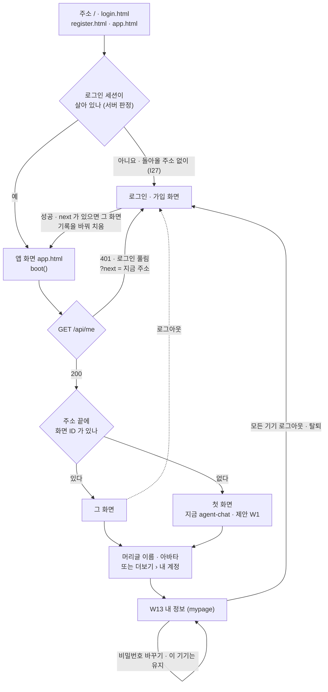
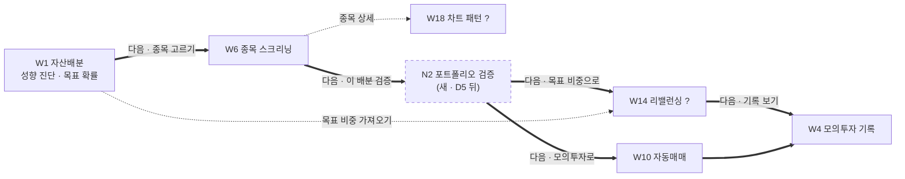
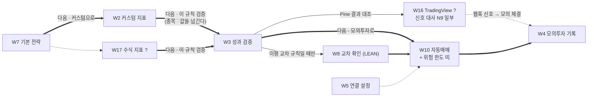

# 화면 정보구조(IA) v0.4 — Qurious

| 문서 정보 | |
|---|---|
| **판 · 상태** | v0.4 · 초안(검토 전) |
| **구분** | 4. 화면·서비스 설계 — 정보구조(IA) · 화면 흐름도 |
| **작성** | 이동원(데이터 · 문서) |
| **검토** | 검토 전 |
| **최종 수정** | 2026-10-02 (KST) |
| **기준** | 코드 `main` `9353b70` + 이 판과 같은 PR(용어사전 화면 · 용어 설명 서랍 · 서비스 이름) · 화면 스캐너(`scripts/view_scan.py` — 화면 65 · 메뉴 65 · 진입 훅 34 · 화면 사이 링크 2) · 주 경로 판정은 v0.3 그대로(2026-09-28 브라우저 확인 + 와이어프레임 v0.2 정정) · 새 화면 중 용어사전 · 용어 설명 · 서비스 이름은 2026-10-02 브라우저로 봤다 |
| **관련 문서** | [와이어프레임 v0.4](와이어프레임_v0.4.md) · [화면 자리 조사 v0.1](화면자리조사_v0.1.md) · [화면 설계 절차 v0.1](화면설계절차_v0.1.md) · [IA v0.3](IA_v0.3.md) · [기능 설계서 v0.1](../설계/기능설계_v0.1.md) 7절 · [용어사전 설계서 v0.1](../설계/용어사전-설계_v0.1.md) · [RTM v1.1](../요구사항/RTM_v1.1.md) · [논의 결정 대장 v1.0](../계획서/논의결정대장_v1.0.md) · [API 명세서 v0.1](../인터페이스/API명세서_v0.1.md) · Figma — [금융 필수 지식 학습 화면](https://www.figma.com/design/JsapuQdop63m9n0KLjiYgo) · [용어사전 화면](https://www.figma.com/design/FCVkBrbwMwV1uzFotZBCb6) |
| **최근 개정** | v0.3 → v0.4: 화면 54 → 65(금융 강의 10 · 용어사전 1) · 모든 화면의 용어 설명이 서랍 · 창으로 · 서비스 이름 Qurious · 「금융 필수 지식」 메뉴 소제목 셋 · 들어오는 길에 「돌아올 주소」 · 사용자 화면 요청 넷을 새 번호 N11 · N12 와 다음 설계 순서로 — 전체는 부록 D |

> **이 문서가 답하는 질문**
> 1. 지금 앱에는 화면이 몇 개 있고, 각 화면은 어느 메뉴 · 어느 요구에 걸리며 믿을 만한가?
> 2. 2.0 에서는 메뉴를 어떻게 묶자고 제안하나 — 어디까지가 사실이고 어디부터 제안인가?
> 3. 로그인 · 내 정보와 주 경로(규칙 만들기 → 검증 → 모의투자 기록)는 화면 사이를 어떻게 오가나?
> 4. 팀이 정해야 할 것은 무엇이 남았나?
>
> **읽는 순서** — 팀원: 요약 → 2절 표 2(내 파트 화면) → 10절 💬 · 강사님: 요약 → 1절 → 4절 흐름도 → 6절(UI 필수 10요소) · 처음 온 사람: 부록 A 용어 → 1절 → 3절

## 요약

1. 앱 화면은 65개다(스캐너) — v0.3 의 54에 금융 강의 10(강의실 + 주제 화면 아홉 · 2026-10-01)과 용어사전 1(2026-10-02)이 더해졌다. 새 11개는 「금융 필수 지식」 메뉴의 소제목(강의 · 요약 · 연습) 아래에 있고, 강사님 기초 코드 4 · 내 정보 1 과 함께 D1 ③ 분류가 없는 「미분류」 다.
2. 화면 사이에 공통 장치가 둘 생겼다 — 서비스 이름 · 부제 · 바닥글을 한 파일에서(Qurious · AI Financial Quant Platform), 용어 설명을 모든 화면의 서랍 · 작은 창 · 큰 창으로(사용자가 내 정보에서 고른다 · 휴대폰은 아래에서 올라오는 시트). 주 경로 12의 판정은 그대로다(🟢 2 · 🟡 7 · 🔴 3 — 이 판에서 다시 누르지 않았다).
3. 2.0 메뉴 안(A′)은 여전히 **제안**이다 — [결정 대장 v1.0](../계획서/논의결정대장_v1.0.md)(2026-10-02 · 규칙 적용판)에서 D1 ③ 은 잠정(미합의)이다(전원 명시 찬성 2/4). 사용자가 낸 화면 요청 넷(국내 주식 대시보드 · 로그인 · 가입의 빈 곳과 랜딩 · 내 정보 보강 · 개념 학습을 앱 안으로)은 새 번호(N11 · N12)와 설계 순서로 적었다 — 모두 Figma 로 경우를 나눠 먼저 설계한다(10절).

---

## 1. 지금 구조 (AS-IS) 🟢

### 1.1 화면 수 — 65

그림 1 은 「지금 화면은 몇 개이고, D1 ③ 제안 분류로 나누면 어떻게 되나」 에 답한다.

**그림 1. 분류별 화면 수** · 한 칸 = 1화면 · 분류는 D1 ③ 제안(확정 전) · 👤 계정은 D1 ③ 분류 밖 · 괄호 = v0.3

```text
 ✕ 동결        █████████████████████████  25  (25)
 ★ 주 경로     ████████████               12  (12)
 ? 미분류      ███████████████            15  ( 4)
 ○ 개념 설명   ██████████                 10  (10)
 ◎ 최소 요건   ██                          2  ( 2)
 👤 계정       █                           1  ( 1)  내 정보
 ────────────────────────────────────────────
 미분류 15 = 기초 코드 4 · 금융 강의 10 · 용어사전 1
 합계 65 = 코드 65 (스캐너 · 메뉴 65 · 사용법 안내 65)
```

화면 선언 · 메뉴 항목 · 사용법 안내가 65 로 같고, 메뉴에 없는 화면은 없다 🟢. 스캐너가 처음에 「메뉴에 없는 화면 9」 를 냈는데, 금융 강의 주제 아홉이 소제목 아래 들여쓴 항목(`sub: true`)이라 메뉴 줄을 읽는 규칙이 놓친 것이었다 — 규칙을 고쳐 다시 쟀다(부록 B.2). 새 11개의 자리는 2026-10-01 화면 자리 조사와 2026-10-02 용어사전 설계에서 정했다 — 「금융 필수 지식」 안이다. D1 ③ 의 「개념 설명」 에 넣을지는 결정 대장 v1.0 에서 함께 정한다(💬 Q8).

로그인 · 가입 화면(`login.html` · `register.html`)은 앱 밖 페이지라 65개에 넣지 않고 4.1절 흐름도에만 둔다. 앱 밖 학습 사이트(`/learn/` · 개념 학습 장 34)도 앱 화면이 아니라 넣지 않았다 — 메뉴 「개념 학습」 은 그 사이트로 나가는 링크 셋이다(I25).

### 1.2 메뉴 트리

그림 2 는 「지금 메뉴에서 어느 화면이 어느 묶음에 있나」 에 답한다.

**그림 2. 지금 메뉴 — 상단 9묶음 + 더보기 4묶음** · ★ 주 경로 · ◎ 최소 요건 · ○ 개념 설명 · ✕ 동결 · ? 미분류 · 👤 계정 · (W 번호) = 와이어프레임 번호 · ↗ = 앱 밖으로 나가는 링크

```text
상단 탭 (1440 폭에서 5칸만 보인다 · I11)
로보 어드바이저 9  ✕ agent-chat ← 로그인 뒤 첫 화면 (I1)
                   ★ robo-portfolio (W1)
                   ? robo-rebalance (W14)
                   ★ robo-screening (W6)
                   ? robo-patterns (W18)
                   ★ robo-decision (W10)
                   ✕ agent-cb · agent-products · agent-news
크롤링 3           ✕ crawl-auto · crawl-manual · crawl-ingest
직접매매 3         ✕ trading-chart · -portfolio · -order
모의투자 5         ★ paper-dashboard (W4) · paper-stock (W11)
                   ✕ paper-crypto · -alternative · -openapi
퀀트자동매매 6     ✕ quant-dashboard ← 묶음 첫 화면 (I13)
                   ✕ quant-auto (W15 · 위험 한도 상태)
                   ★ quant-backtest (W9) · quant-lean (W8)
                   ★ settings (W5)
                   ✕ notification-settings
미국주식 4         ✕ us-dashboard · -chart · -order · -portfolio
투자 인디케이터 9  ★ indicator-strategy (W7)
                   ★ indicator-custom (W2)
                   ? indicator-formula (W17)
                   ★ indicator-backtest (W3)
                   ★ indicator-api (W12)
                   ? indicator-tradingview (W16)
                   ✕ company-dashboard · -compare · -sector
ML·딥러닝 5        ◎ ml-compare · ml-cluster · ○ 나머지 3
투자분석 4         ○ macro-dashboard · macro-industry · invest-* 2
더보기 ⋮  금융 지식 14  ── 강의   ? fin-lectures 강의실 (W19)
                               ?   └ 주제 아홉 fin-topic-* (W19 틀)
                        ── 요약   ○ fin-products · fin-allocation
                                  ○ quant-seasonal
                        ── 연습   ? fin-glossary 용어사전 (W20)
          개념 학습 ↗   전체 목차 · 근거 RAG · 팀 자료 → /learn/
          시스템 2      ✕ sysadmin-dashboard · sysadmin-logs
          내 계정 1     👤 mypage 내 정보 (W13)
```

주 경로 12개는 네 묶음(로보 어드바이저 · 모의투자 · 퀀트자동매매 · 투자 인디케이터)에 흩어져 있고, 강사님 기초 코드의 새 화면 4개가 그중 두 묶음에 붙어 두 묶음이 9개씩으로 길어졌다. 가장 큰 묶음은 이제 더보기 속 「금융 지식」 14개다 — 메뉴 표에 클릭되지 않는 소제목(`heading`)과 들여쓴 항목(`sub`)이 생겨 14개를 강의 · 요약 · 연습 세 덩어리로 읽힌다. 내 계정(`mypage`)은 머리글의 이름 · 아바타를 눌러도 열린다 🟢.

### 1.3 구조 문제 — I1~I22 지금 상태

표 1 은 「지난 판까지 적은 구조 문제는 지금 어떤 상태이고, 새로 보이는 문제는 무엇인가」 에 답한다. 번호는 지난 판의 것을 그대로 쓰고, 새 문제는 I16 부터 붙였다.

**표 1. 구조 문제** · 확실도 🟢 코드 · 스캐너 · 브라우저로 확인 / 🟡 추론 · 재확인 전

| # | 문제 | 지금 (`9353b70` + 이 판의 PR) | 확실도 | 다루는 곳 |
|---|---|---|:-:|---|
| I1 | 첫 화면이 동결 후보 | 그대로 — 주소에 화면 ID 가 없으면 `boot()` 가 `agent-chat` 을 연다 | 🟢 스캐너 | 3.4 · Q6 |
| I2 | 주 경로가 여러 묶음에 흩어짐 | 그대로 — 주 경로 12가 네 묶음에 · 새 화면 4도 두 묶음에 | 🟢 | 3절 |
| I3 | 화면끼리 잇는 링크 0 | 주 경로는 그대로 0 · 화면 사이 링크는 2 — 머리글 → 내 정보 · 용어 설명 「사전에서 보기」 → 용어사전 | 🟢 스캐너 | 4절 「다음 단계」 버튼 |
| I4 | 같은 일을 하는 화면 | 그대로 — 자동매매 둘 · 증권사 설정 셋 · 이름이 같은 국내 · 미국 화면 세 쌍. 여기에 위험 한도 칸 둘(I16) · 커스텀 지표 둘(I21)이 더해짐 | 🟢 | Q4 · Q8 |
| I5 | 메뉴 글자 두 벌 | 그대로 — 투자분석 ↔ 투자분석 기초 · 금융 지식 ↔ 금융 필수 지식 · 시스템 ↔ 시스템관리 · 강의 화면의 「기술적 분석 기초」 ↔ 투자분석 기초의 「기술적 분석」 | 🟢 | 3절(새 이름 한 벌) |
| I6 | 화면 ID 접두사와 묶음이 어긋남 | 그대로 — 투자 인디케이터 묶음의 키가 `company` · 새 화면도 같은 규칙을 따름 | 🟢 | 3절(묶음 키만 바꾸고 화면 ID 는 그대로) |
| I7 | 숨은 의존 2곳 | 그대로 — ① W2 「테스트」 가 W3 의 종목 칸 `ibt-symbol` 을 읽는다 ② `trading-order` 저장이 W5 의 키 · 계좌 칸을 읽는다 | 🟢 스캐너 | [와이어프레임 v0.2](와이어프레임_v0.2.md) 2절 W2 |
| I8 | 관리자 파괴 버튼이 일반 화면에 | 그대로 — `crawl-ingest` 「DB 초기화」 가 모두에게 보인다(서버는 관리자만 허용) | 🟢 | D3 ② |
| I9 | 화면이 약속과 다른 일을 한다 | 그대로 — `quant-backtest` 제목 「10년 Mockup」 · 백테스트 결과 없음 · `us-dashboard` 「● LIVE」 | 🟢 | D3 ⑧ |
| I10 | 주 경로 시세가 수집 DB 가 아니라 외부 시세 | 일부 해소 — 국내 일봉은 수집 DB 어댑터로 읽는다. 현재가 · 환율 · 60분봉은 여전히 야후 | 🟡 화면별 확인 전 | 강사님 반영 논의 ④ |
| I11 | 상단 탭이 화면 밖으로 밀린다 | 그대로 — 탭 9칸 · 글자 그대로(폭은 다시 재지 않음) | 🟢 코드 · 🟡 폭 | 3절 5칸 |
| I12 | 모바일에서 메뉴가 없다 | 그대로 — ☰ 버튼과 여는 함수는 있지만 버튼이 `display:none` 이고 모바일 규칙(768 이하)이 켜지 않는다 | 🟢 코드 | 3.5 · Q7 |
| I13 | 묶음 첫 화면이 무거운 동결 화면 | 그대로 — 퀀트자동매매 탭 → `quant-dashboard`(2026-09-28 에 야후 지표 호출 33건) | 🟢 | 3절 |
| I14 | 현금 장부 2 · 보유 표 1 → 없는 수익 | 해소(코드) — 자동매매는 자기 장부(현금 1천만 원 + 보유 `book=QUANT`), W4 의 금액은 모의투자 장부(PAPER)만 센다. 남은 것은 W4 체결 목록이 두 장부의 체결을 섞어 보인다는 점 | 🟢 코드 · 🟡 화면 재확인 전 | 강사님 반영 논의 ① · W4 |
| I15 | 거짓 성공 표시 | 3곳 → 13곳 — 새로 10곳(W6 셋 · W7 둘 · W8 하나 · W10 하나 · W11 하나 · W12 둘) | 🟢 코드 | D3 ⑧ · [파트별 결함 이슈 #26](https://github.com/EST-team-project/Qurious/issues/26) |
| I16 | 위험 한도가 두 화면에 나뉘고 주 경로 자동매매에는 없다 | 한도 입력 4칸 = W5 연결 설정 · 상태 5칸과 🛑 비상 정지 = `quant-auto`(동결 제안) · W10 에는 둘 다 없다 | 🟢 코드 | [와이어프레임 v0.3](와이어프레임_v0.3.md) W15 · Q4 |
| I17 | 새 화면 4개가 분류 밖 · 묶음이 길어짐 | 로보 어드바이저 9 · 투자 인디케이터 9 | 🟢 스캐너 | Q8 |
| I18 | 로그인 흐름이 로그인 상태를 보지 않는다 | **해소** — 2026-09-30 계정 관리(PR #75)로 서버가 세션을 보고 갈 곳을 고르고, 2026-10-02 강사님 기초 코드(`289bfb5`)로 세션이 30일 · 쓰는 동안 늘어난다. 남은 것은 서버가 로그인 화면으로 보낼 때 돌아올 주소를 싣지 않는 것(I27) | 🟢 코드 · 시험 TC-AC · TC-SA | 4.1 · 표 6 |
| I19 | 화면 판정이 두 벌 | 강사님 「기능 완성도」 배지(40~93점) ↔ 이 문서의 화면 판정 🟢🟡🔴 | 🟢 코드 | 표 3 · Q9 |
| I20 | 회원 정보 수정 · 탈퇴 화면이 없다 | **해소** — W13 `mypage`(PR #75) · 2026-10-02 「화면 설정」 칸(용어 설명을 어떤 창으로 볼지)이 더해졌다 | 🟢 코드 · 점검 「계정」 | [와이어프레임 v0.3](와이어프레임_v0.3.md) 2절 · [v0.4](와이어프레임_v0.4.md) 9.5절 |
| I21 | 커스텀 지표를 만드는 화면이 둘 | W2(값 입력 → Pine · 파이썬 코드) · W17(산식 · 판 관리 · 결과 저장) — 어느 쪽이 W3 으로 규칙을 넘길지 정해져 있지 않다 | 🟢 코드 | Q8 |
| I22 | 웹훅 키를 동결 제안 화면에서만 받는다 | W16 의 테스트 신호 · 웹훅은 「모의투자 › Open API」(`paper-openapi`)에서 발급한 API 키를 쓴다 | 🟢 화면 글자 | Q8 · W16 |
| I23 (새) | 화면에 기초 코드의 서비스 이름 · 회사 표기 | **해소(2026-10-02)** — 「Lumina Invest」 · 회사 이름 · 메일 · 누리집이 머리글 · 로그인 · 가입 · 바닥글에 있었다 → Qurious · 부제 「AI Financial Quant Platform」 을 한 파일(`public/js/brand.js`)에서 채운다. 원저작자 표시는 NOTICE · README 에 남겼다 | 🟢 시험 TC-BR · 브라우저 | 부록 D |
| I24 (새) | 용어 설명이 화면 상수 55개뿐 | **해소(2026-10-02)** — 모든 화면의 용어 칩 · 밑줄이 용어 755개 API 를 서랍 · 창으로 연다. 찾지 못하면 화면 상수를 보여 준다. 남은 것: 교재 본문 밑줄 규칙 · 연관 개념(Figma 결정 ③ ④) | 🟢 시험 TC-GL-26 ~ 28 · 브라우저 | 5절 N8 · [용어사전 설계서](../설계/용어사전-설계_v0.1.md) |
| I25 (새) | 개념 학습이 앱 밖 사이트 | 메뉴 「개념 학습」 셋이 `/learn/` 으로 나간다 — 머리글 · 메뉴 · 디자인이 달라 「별도 프로젝트처럼 보인다」(사용자 피드백 2026-10-02). 앱 안으로 옮기는 설계는 따로 한다 | 🟢 코드 | 10절 Q11 |
| I26 (새) | 창 · 실습 화면이 화면 비율을 따르지 않는다 | 용어 창 · 실습 화면이 잘리거나 가득 차 보이지 않는 곳이 있다(사용자 피드백 2026-10-02). 용어 설명은 폭 · 높이를 화면 비율로 고쳤고(`min(…vw · dvh)` · 그림 · 수식이 있으면 넓은 창), 「금융 필수 지식」 의 실습 · 표 · 그림 정리는 남았다 | 🟢 코드(용어 설명) · 🟡 나머지 | 부록 C |
| I27 (새) | 서버가 로그인 화면으로 보낼 때 돌아올 주소를 싣지 않는다 | 앱이 401 을 받아 보낼 때는 `?next=` 를 싣지만(`redirectToLogin`), 세션 없이 `/app.html#화면` 을 열면 서버가 `/login.html` 로만 보낸다 — 로그인 뒤 그 화면이 아니라 첫 화면으로 간다 | 🟢 코드 · 🟡 브라우저 확인 전 | 4.1 · 10절 Q12 |

v0.3 의 22개 가운데 이 판에서 풀린 것은 I18(로그인 흐름) · I20(내 정보) 둘이고, 새로 적은 다섯 중 둘(I23 이름 · I24 용어 설명)은 적는 날 풀었다. 남은 새 문제 셋(I25 · I26 · I27)은 모두 사용자가 화면을 써 보고 낸 피드백에서 나왔다 — 셋 다 다음 설계 순서(10절)에 들어 있다.

---

## 2. 화면 전수표 — 65개

### 2.1 전수표

표 2 는 「화면마다 지금 어디에 있고, 2.0 에서는 어디로 가자고 하며, 어느 요구를 받고, 믿을 만한가」 에 답한다. 묶음 · 화면 ID · 메뉴 글자는 스캐너 출력이고, 나머지 칸은 사람이 채웠다.

**표 2. 화면 65개** · 분류 = D1 ③ 제안(★ 주 경로 · ◎ 최소 요건 · ○ 개념 설명 · ✕ 동결 · ? 미분류 · 👤 계정) — 코드 사실이 아니다 · TO-BE 자리 = 3절의 제안 A′ · 요구 ID = RTM v1.1 · 기능 설계서 v0.1 에서 옮긴 추정 🟡 · 판정 = 주 경로만(🟢 믿어도 된다 · 🟡 동작하지만 결과 · 표시에 문제 · 🔴 결과가 틀리거나 약속한 일을 안 한다) · 「—」 = 해당 없음 또는 브라우저로 보지 않음

| # | 화면 ID · 메뉴 글자 | 지금 묶음 | 분류 | TO-BE 자리 (제안) | 요구 ID | 판정 | 비고 |
|--:|---|---|:-:|---|---|:-:|---|
| 1 | `agent-chat` AI 투자 상담 | 로보 어드바이저 | ✕ | 보관함 (Q3) | `P01-①-3` | — | 로그인 뒤 첫 화면(I1) · 일정 칸 9 RAG 대화 |
| 2 | `robo-portfolio` 자산배분·최적화 · W1 | 로보 어드바이저 | ★ | 규칙 만들기 › 2차 | `U1` · `U3` · `U4` · `RFP2-3.1.3-①` | 🟡 | 성향 진단 7문항 · 목표 달성 확률 카드가 붙음 |
| 3 | `robo-rebalance` 리밸런싱 엔진 · W14 | 로보 어드바이저 | ? | 모의투자 기록 (Q8) | `P01-③-1` ~ `③-3` · `U2` · `U5` | — | 강사님 기초 코드 · N3 을 채움 · 모의투자 장부에서 체결 |
| 4 | `robo-screening` 패턴 인식·종목 스크리닝 · W6 | 로보 어드바이저 | ★ | 규칙 만들기 › 2차 | `P01-②-1` · `RFP2-3.1.4-③` · `P01-①-5` | 🟡 | XAI 「🧠 설명」 열이 붙음(N4 일부) |
| 5 | `robo-patterns` 차트 패턴·지지/저항·멀티타임프레임 · W18 | 로보 어드바이저 | ? | 규칙 만들기 › 2차 (Q8) | `P01-②-2` · `P01-②-3` | — | 60분봉은 야후(논의 ④) |
| 6 | `robo-decision` 모의 투자 의사결정 · W10 | 로보 어드바이저 | ★ | 모의투자 기록 | `P01-④-2` · `P01-④-3` · `U10` | 🟡 | 근거 카드 고정 문구(I15) · 위험 한도 칸 없음(I16) |
| 7 | `agent-cb` 신용 리스크 분석 | 로보 어드바이저 | ✕ | 보관함 | — | — | |
| 8 | `agent-products` 맞춤 상품 추천 | 로보 어드바이저 | ✕ | 보관함 | — | — | |
| 9 | `agent-news` 투자 정보 리서치 | 로보 어드바이저 | ✕ | 보관함 (Q3) | `P01-①-3` | — | 일정 칸 8 지식 검색 |
| 10 | `crawl-auto` 자동 크롤링 | 크롤링 | ✕ | 보관함 | — | — | |
| 11 | `crawl-manual` 수동 크롤링 | 크롤링 | ✕ | 보관함 (Q2) | `P01-①-2` | — | 일정 칸 7 데이터 관제 · N1 |
| 12 | `crawl-ingest` 데이터 인제스트 | 크롤링 | ✕ | 보관함 | `P01-①-2` | — | 「DB 초기화」 버튼(I8) |
| 13 | `trading-chart` 주가 차트 | 직접매매 | ✕ | 보관함 | `U7` (가까움) | — | |
| 14 | `trading-portfolio` 포트폴리오 | 직접매매 | ✕ | 보관함 | — | — | |
| 15 | `trading-order` 주문/매매 | 직접매매 | ✕ | 보관함 | — | — | 숨은 의존(I7 ②) |
| 16 | `paper-dashboard` 모의계좌 현황 · W4 | 모의투자 | ★ | 모의투자 기록 | `P01-④-3` · `U2` | 🟡 | 금액은 PAPER 장부만 · 체결 목록은 두 장부(I14) |
| 17 | `paper-stock` 국내주식 모의주문 · W11 | 모의투자 | ★ | 모의투자 기록 | `P01-④-3` | 🟢 | 미리보기가 비용을 빼지 않는다(결함 후보) |
| 18 | `paper-crypto` 코인 모의매매 | 모의투자 | ✕ | 보관함 | — | — | |
| 19 | `paper-alternative` 대체자산 | 모의투자 | ✕ | 보관함 | — | — | |
| 20 | `paper-openapi` Open API · 외부 연동 | 모의투자 | ✕ | 보관함 (Q8) | `P02-③-3` | — | 웹훅 API 키 발급처(I22) |
| 21 | `quant-dashboard` 퀀트 대시보드 | 퀀트자동매매 | ✕ | 보관함 | `SCH-RT` (가까움) | — | 묶음 첫 화면 · 야후 호출 33건(I13) |
| 22 | `quant-auto` 자동매매 현황 · W15 | 퀀트자동매매 | ✕ | 보관함 — 위험 칸은 W10 으로 | `P02-⑤-2` · `U10` | — | 위험 상태 · 비상 정지가 여기에만(I16) |
| 23 | `quant-backtest` 전략 분석 · W9 | 퀀트자동매매 | ★ | 보관함 후보 | — | 🔴 | 백테스트 결과 없음(I9) |
| 24 | `quant-lean` LEAN 백테스트 · W8 | 퀀트자동매매 | ★ | 검증 › 3차 | `P02-④-1` · `P02-③-2` | 🟡 | 초과 수익이 다른 기간 뺄셈 · 비용 미반영 |
| 25 | `settings` 증권사 API 설정 · W5 | 퀀트자동매매 | ★ | 더보기 › 설정 | `P02-⑤-1` · `RFP2-4.2-①` | 🔴 | 가짜 가격 = 「연결 성공」 · 실전 선택지 · 위험 한도 입력 |
| 26 | `notification-settings` 알림 설정 | 퀀트자동매매 | ✕ | 보관함 | `P02-③-3` · `P02-⑤-3` | — | 일정표 행 67 알림 관리(동결과 충돌) |
| 27 | `us-dashboard` 대시보드 | 미국주식 | ✕ | 보관함 | — | — | 「● LIVE」(I9) |
| 28 | `us-chart` 주가 차트 | 미국주식 | ✕ | 보관함 | — | — | |
| 29 | `us-order` 주문/매매 | 미국주식 | ✕ | 보관함 | — | — | |
| 30 | `us-portfolio` 포트폴리오 | 미국주식 | ✕ | 보관함 | — | — | |
| 31 | `indicator-strategy` 기본 인디케이터 전략 · W7 | 투자 인디케이터 | ★ | 규칙 만들기 › 3차 | `P02-①-1` · `P02-①-2` · `U6` | 🔴 | 체크하지 않은 볼린저 행이 판정에 들어간다 |
| 32 | `indicator-custom` 커스텀 인디케이터 개발 · W2 | 투자 인디케이터 | ★ | 규칙 만들기 › 3차 | `P02-②-1` · `P02-③-1` · `U6` | 🟡 | 숨은 의존(I7 ①) · W17 과 겹침(I21) |
| 33 | `indicator-formula` 자유 산식 지표 · W17 | 투자 인디케이터 | ? | 규칙 만들기 › 3차 (Q8) | `P02-②-1` · `P02-②-2` · `P02-②-3` · `P02-③-1` | — | 판 관리 · 결과 저장 · Pine 내보내기 |
| 34 | `indicator-backtest` 성과 검증 · W3 | 투자 인디케이터 | ★ | 검증 › 3차 | `P02-①-3` · `P02-④-2` · `P01-④-1` · `U8` | 🟢 | 손절 · 익절 · 비용(bp) 칸이 붙음(논의 ②) |
| 35 | `indicator-api` 증권사 API 자동화 · W12 | 투자 인디케이터 | ★ | 보관함 — W5 와 합침 | `P02-⑤-1` | 🟡 | 테스트 뒤 상태 글자를 고치지 않는다 |
| 36 | `indicator-tradingview` TradingView 연동 · W16 | 투자 인디케이터 | ? | 검증 › 3차 (Q8) | `P02-③-2` · `P02-③-3` · `P02-④-3` | — | N9 신호 대사 일부 · 웹훅 키(I22) |
| 37 | `company-dashboard` 지표 대시보드 | 투자 인디케이터 | ✕ | 보관함 | — | — | |
| 38 | `company-compare` 지표 비교 분석 | 투자 인디케이터 | ✕ | 보관함 | — | — | 고정 자료(강사님 배지 「정적 목업」) |
| 39 | `company-sector` 섹터 인디케이터 | 투자 인디케이터 | ✕ | 보관함 | — | — | 〃 |
| 40 | `ml-compare` 모델 비교 (7종) | ML·딥러닝 | ◎ | 더보기 › 보조 분석 | — | — | |
| 41 | `ml-regression` 회귀 분석 | ML·딥러닝 | ○ | 배우기 | — | — | |
| 42 | `ml-cluster` 종목 군집화 | ML·딥러닝 | ◎ | 더보기 › 보조 분석 | — | — | |
| 43 | `ml-tune` 하이퍼파라미터 튜닝 | ML·딥러닝 | ○ | 배우기 | — | — | |
| 44 | `ml-deeplearning` 딥러닝 (LSTM·Transformer) | ML·딥러닝 | ○ | 배우기 | — | — | 설명 전용 |
| 45 | `macro-dashboard` 거시경제 지표 | 투자분석 기초 | ○ | 배우기 | — | — | |
| 46 | `macro-industry` 산업 분석 | 투자분석 기초 | ○ | 배우기 | — | — | |
| 47 | `invest-fundamental` 재무제표 분석 | 투자분석 기초 | ○ | 배우기 | — | — | |
| 48 | `invest-technical` 기술적 분석 | 투자분석 기초 | ○ | 배우기 | — | — | 설명 전용 |
| 49 | `fin-lectures` 강의실 (전체 과정) · W19 | 금융 필수 지식 › 강의 | ? | 배우기 (Q8) | `P01-①-1` | — | 2026-10-01 추가 · 4일 과정 + 교재 단원 카드 · 이해도 표시 · 강의 시세 API 8(`API-LEC` · 수집 DB 먼저) |
| 50 | `fin-topic-futures` 선물과 옵션 · W19 틀 | 〃 (들여쓴 주제) | ? | 배우기 (Q8) | `P01-①-1` | — | 강의 + 계산기 |
| 51 | `fin-topic-funds` 펀드와 ETF · W19 틀 | 〃 | ? | 배우기 (Q8) | `P01-①-1` · `P01-①-2` | — | ETF 탐색표의 기간 수익률 — 수집 DB |
| 52 | `fin-topic-bonds` 채권 · 금리 · 코인 · W19 틀 | 〃 | ? | 배우기 (Q8) | `P01-①-1` · `P01-①-2` | — | 코스피 · 국고채 ETF 그림 — 수집 DB · 분류 이름이 「채권」 과 「코인」 을 한데 묶는다(부록 C) |
| 53 | `fin-topic-allocation` 자산배분과 퀀트 · W19 틀 | 〃 | ? | 배우기 (Q8) | `P01-①-1` | — | 비중 · 위험 계산기 |
| 54 | `fin-topic-company` 회사 구조 · 세무회계 · W19 틀 | 〃 | ? | 배우기 (Q8) | `P01-①-1` | — | 교재 읽기 화면 |
| 55 | `fin-topic-stocks` 주식시장 기초 · W19 틀 | 〃 | ? | 배우기 (Q8) | `P01-①-1` | — | 〃 |
| 56 | `fin-topic-technical` 기술적 분석 기초 · W19 틀 | 〃 | ? | 배우기 (Q8) | `P01-①-1` | — | 〃 · 「투자분석 기초 › 기술적 분석」 과 이름이 겹친다(I5) |
| 57 | `fin-topic-industry` 산업 · 기업 · 재무 · W19 틀 | 〃 | ? | 배우기 (Q8) | `P01-①-1` | — | 교재 읽기 화면 |
| 58 | `fin-topic-macro` 거시경제와 시장 · W19 틀 | 〃 | ? | 배우기 (Q8) | `P01-①-1` | — | 〃 · 계절성은 61로 잇는다 |
| 59 | `fin-products` 금융상품 이해 | 금융 필수 지식 › 요약 | ○ | 배우기 | — | — | |
| 60 | `fin-allocation` 자산배분 모델 | 금융 필수 지식 › 요약 | ○ | 배우기 | — | — | |
| 61 | `quant-seasonal` 계절성 분석 | 금융 필수 지식 › 요약 | ○ | 배우기 | — | — | |
| 62 | `fin-glossary` 용어사전 · W20 | 금융 필수 지식 › 연습 | ? | 배우기 (Q8) | `P01-①-1` | — | 2026-10-02 추가 · N8 을 채움 · 찾기 → 용어 한 장 · 다른 화면의 용어 설명이 「사전에서 보기」 로 여기 온다 |
| 63 | `sysadmin-dashboard` 서버 대시보드 | 시스템관리 | ✕ | 보관함 | — | — | 일정 칸 23 운영 관제(동결과 충돌) |
| 64 | `sysadmin-logs` 감사 로그 | 시스템관리 | ✕ | 보관함 | — | — | |
| 65 | `mypage` 내 정보 (마이페이지) · W13 | 내 계정 | 👤 | 더보기 › 설정 + 머리글 사용자 메뉴 | — (요구 밖 · TC-AC) | — | 2026-09-30 추가 · 2026-10-02 「화면 설정」(용어 설명 보기 방식) |

요구 ID 가 붙은 화면은 35개다 — v0.3 의 24에 금융 강의 10 · 용어사전 1 이 「개념을 배우는 자리」(`P01-①-1`)로 더해졌다. 주 경로 12개 중 요구가 없는 것은 W9 하나인데, 약속한 백테스트를 하지 않기 때문이다. 동결 제안 25개 중 9개(`agent-chat` · `agent-news` · `crawl-manual` · `crawl-ingest` · `trading-chart` · `paper-openapi` · `quant-dashboard` · `quant-auto` · `notification-settings`)에는 요구가 걸려 있어, 동결 제안과 요구가 부딪히는 곳이다(Q2 · Q3 · Q4 · Q8). 내 정보는 RTM 에 대응하는 요구가 없어 시험-요구 대장에 「요구 밖」 줄(TC-AC)로 두었다 — 요구로 올릴지는 팀이 정한다.

### 2.2 판정 — 주 경로 12 + 새 화면 8

표 3 은 「주 경로 화면의 판정이 지난 판에서 어떻게 바뀌었고, 강사님 「기능 완성도」 배지와는 어떻게 다른가」 에 답한다. 주 경로 판정은 v0.3 그대로이고(이 판에서 다시 누르지 않았다), 이 판에 새로 든 두 줄(W19 · W20)은 만든 날 브라우저로 봤다.

**표 3. 판정 두 벌** · IA 판정 = 화면이 약속한 결과를 믿고 쓸 수 있나 · 배지 = 강사님이 `public/js/completion.js` 에 적은 점수(UI 20 · 백엔드 30 · 연동 25 · 시험 25 · 2026-09-29 감사) · 괄호 숫자 = 와이어프레임 v0.2 6절 정정 번호

| W · 화면 | IA v0.2 → v0.3 (v0.4 그대로) | 바뀐 까닭 · 남은 문제 | 강사님 배지 | 확실도 |
|---|:-:|---|---|:-:|
| W1 `robo-portfolio` | 🟡 → 🟡 | 첫 결과가 비현실 추정치(5년 +1,268%) · 「AI 예측 수익률 300%」 그대로 | 88 핵심 검증 | 🟢 코드 |
| W6 `robo-screening` | 🟢 → 🟡 | 「LightGBM」 은 합산 점수 · 「신뢰도」 는 점수로 만든 값 · 없는 등락률을 `+0.00%` 로 (②) | 82 부분 검증 | 🟢 코드 |
| W7 `indicator-strategy` | 🟢 → 🔴 | 매수 한 표가 체크하지 않은 볼린저 행이고, 그 행은 하루 등락률 ±2% 로 판정한다 (①) | 86 핵심 검증 | 🟢 코드 |
| W2 `indicator-custom` | 🟡 → 🟡 | 거래 0회를 「+0.0% · 승률 0.0%」 로 · 숨은 의존(I7 ①) | 91 검증 우수 | 🟢 |
| W3 `indicator-backtest` | 🟢 → 🟢 | 비용 차감 · 보유 비교 · 다음 거래일 적용 — 비용 입력이 대칭 bp 로 바뀐 뒤의 기본값은 브라우저 재확인 전 | 90 검증 우수 | 🟢 코드 · 🟡 비용 |
| W8 `quant-lean` | 🟡 → 🟡 | 초과 수익이 서로 다른 기간을 뺀 값 · 비용 미반영 · 전략 4종뿐 (④) | 62 외부 의존 | 🟢 코드 |
| W9 `quant-backtest` | 🔴 → 🔴 | 백테스트 결과가 없다 | 88 핵심 검증 | 🟢 |
| W10 `robo-decision` | 🟡 → 🟡 | 근거 카드 고정 문구 · 「AI」 와 없는 단계 (⑦) · 로그 시각 UTC | 72 부분 검증 | 🟢 코드 |
| W4 `paper-dashboard` | 🔴 → 🟡 | 없는 수익(+3.19%)의 원인이 코드에서 사라졌다 (⑤ ⑨) · 체결 목록은 두 장부를 섞는다 | 70 부분 검증 | 🟢 코드 · 🟡 화면 재확인 전 |
| W11 `paper-stock` | 🟢 → 🟢 | 빈 종목 안내는 4초 토스트였다 (③) · 미리보기 비용 빠짐은 남음 | 72 부분 검증 | 🟡 재확인 전 |
| W5 `settings` | 🔴 → 🔴 | 가짜 가격을 「연결 성공」 으로 · 「실전투자 (Live)」 선택지 | 56 목업 포함 | 🟢 |
| W12 `indicator-api` | 🟡 → 🟡 | 원인은 테스트 뒤 상태 글자를 고치지 않는 것 (⑥) | 55 목업 포함 | 🟢 코드 |
| W14 `robo-rebalance` | — (새) | 브라우저로 보지 않음 · 강사님 시험 10건 | 84 핵심 검증 | 🟢 코드 |
| W15 `quant-auto` | — | 〃 · 위험 한도 시험 5건 | 78 부분 검증 | 🟢 코드 |
| W16 `indicator-tradingview` | — (새) | 〃 · 시험 8건 | 84 핵심 검증 | 🟢 코드 |
| W17 `indicator-formula` | — (새) | 〃 · 시험 9건 | 93 검증 우수 | 🟢 코드 |
| W18 `robo-patterns` | — (새) | 〃 · 시험 7건 | 92 검증 우수 | 🟢 코드 |
| W13 `mypage` | — | 구현 · 자동 시험 TC-AC 23 · 기능 점검 「로그인 · 관리 · 계정」 29/29 (2026-10-02) · 「화면 설정」 칸 더함 | 배지 없음 | 🟢 코드 · 점검 |
| W19 `fin-lectures` + 주제 9 | — (새 · 10-01) | 브라우저로 봄(화면 설계 절차 첫 적용) · 시험 TC-LC 11 · 결함 DF-28 ~ 35 · 남은 것: 실습 · 표 · 그림이 화면 비율을 따르지 않는 곳(I26) | 미평가 0% (배지 표에 없다) | 🟢 시험 · 🟡 비율 |
| W20 `fin-glossary` | — (새 · 10-02) | 브라우저로 봄 — 찾기 · 분류 22 · 용어 한 장 · 다른 화면에서 서랍 · 작은 창 · 큰 창 · 휴대폰 시트 · 시험 TC-GL-26 ~ 28 | 미평가 0% | 🟢 시험 · 브라우저 |

주 경로 12개의 판정은 🟢 2 · 🟡 7 · 🔴 3 이다(지난 판 🟢 4 · 🟡 5 · 🔴 3). 두 판정이 가장 크게 다른 곳은 W9(🔴 · 88점)와 W7(🔴 · 86점)이다. 반대로 로그인 · 가입 화면은 배지가 72점(「DB/API 통합 테스트 없음」)인데, 그 빈칸은 계정 시험 TC-AC 23 · 로그인 유지 시험 TC-SA 가 채웠다 — 배지는 강사님 파일의 고정 점수라 그대로다. 배지는 「화면 뒤의 코드가 시험을 거쳤나」 를, IA 판정은 「화면이 약속한 것을 그대로 보여 주나」 를 재기 때문이다 — 둘은 다른 질문이라 한 칸에 합치면 뜻이 사라진다(💬 Q9).

---

## 3. 2.0 메뉴 구조 (TO-BE) 🟡 제안

> **제안이다.** D1 ③ 「주 경로 12 깊게 · 최소 요건 2 · 개념 10 · 동결 25」 는 4명 전원 명시 찬성이 확정 규칙인데 2/4 에서 멈춰 있다([결정 대장 v0.9](../계획서/논의결정대장_v0.9.md) 집계). 의견 기한(2026-09-30 23:59)이 지나 [결정 대장 v1.0](../계획서/논의결정대장_v1.0.md)(규칙 적용판 · 팀 대화방 의견 확인 전)에서 D1 ③ 은 **잠정(미합의)** 이 됐다 — 잠정이라도 그 안으로 진행하되, 전원 찬성이 모이면 이 절을 확정안으로 바꾼다. 미분류 15개와 내 정보의 자리는 💬 Q8 의 추천을 넣어 그렸다.

### 3.1 원칙 8

1. 메뉴 첫 줄은 주 경로 순서다 — 규칙 만들기 → 검증 → 모의투자 기록.
2. 화면은 지우지 않는다 — 동결 제안 화면은 「보관함」 으로 옮긴다(삭제는 D3 에서 정한다).
3. 한 화면은 한 묶음에만 둔다 — `navigate()` 는 화면이 든 첫 묶음을 찾아 멈춘다 🟢.
4. 로그인 뒤 첫 화면은 주 경로의 시작이다.
5. 상단 탭은 1280 폭에서 다 보여야 한다 — 5칸 이하 · 짧은 이름(I11).
6. 모바일은 하단 탭 4칸으로 같은 묶음을 연다(I12).
7. 주 경로 화면 끝에는 「다음 단계」 버튼을 둔다(I3).
8. 계정 화면은 흐름 밖에 둔다 — 머리글 사용자 메뉴와 더보기 › 설정 두 곳에서 열되 화면 ID 는 `mypage` 하나다. 머리글 링크는 메뉴 묶음이 아니라서 원칙 3 에 걸리지 않는다.

### 3.2 메뉴 — 지금에서 제안으로

그림 3 은 「2.0 에서 메뉴를 어떻게 묶자고 하나」 에 답한다. 지금 메뉴는 그림 2 다.

**그림 3. 제안 메뉴 A′ — 상단 5칸** · `?` = D1 ③ 미분류(Q8 추천 자리) · `┆ ┆` = 옮길 후보 · 괄호 기간 = 강사님 일정표(공식)

```text
[규칙 만들기]
  ── 2차 로보어드바이저 (10-01 ~ 10-21)
     W1 자산배분 · W6 종목 스크리닝 · W18 차트 패턴 ?
  ── 3차 인디케이터 (10-22 ~ 11-11 · 2차 기간에는 접는다)
     W7 기본 전략 · W2 커스텀 지표 · W17 수식 지표 ?
[검증]
  ── 2차  N2 포트폴리오 검증 (새 화면 · D5 뒤)
  ── 3차  W3 성과 검증 · W8 교차 확인 · W16 TradingView ?
          ┆ W9 전략 분석 ┆ → 보관함 후보
[모의투자 기록]
     W14 리밸런싱 ? · W10 자동매매 (+ 위험 한도 띠)
     W4 기록 · W11 직접 주문
[배우기]   개념 설명 10 · 금융 강의 10 ? · 용어사전 ?
           (소제목 강의 · 요약 · 연습 그대로)
[더보기 ▾]
  ── 설정       W5 연결 설정 (W12 합침) · W13 내 정보 👤
  ── 보조 분석  ml-compare · ml-cluster
  ── 보관함     동결 25 + W9 + W12 = 27
머리글 (홍 ▾) → 내 정보 · 로그아웃
```

상단 5칸에 65개가 빠짐없이 한 번씩 들어간다 — 규칙 만들기 6 · 검증 3 · 모의투자 기록 4 · 배우기 21 · 설정 2 · 보조 분석 2 · 보관함 27. 2차와 3차는 탭을 나누지 않고 왼쪽 메뉴의 소제목으로 나눈다. 강사님 일정이 두 차수를 기간으로 나누므로, 한 차수 기간에는 다른 차수 소제목을 접는다.

### 3.3 묶음별로 어디로 가나

표 4 는 「지금 묶음의 화면이 제안 메뉴의 어디로 가나」 에 답한다.

**표 4. 지금 묶음 → 제안 자리**

| 지금 묶음 | 화면 수 | 제안 자리 |
|---|:-:|---|
| 로보 어드바이저 | 9 (★3 · ?2 · ✕4) | W1 · W6 → 규칙 만들기 / W10 → 모의투자 기록 / W14 → 모의투자 기록 · W18 → 규칙 만들기 (Q8) / ✕ → 보관함 |
| 크롤링 · 직접매매 · 미국주식 · 시스템관리 | 12 (✕12) | 보관함 — Q2 · Q3 결과에 따라 일부 되돌림 |
| 모의투자 | 5 (★2 · ✕3) | W4 · W11 → 모의투자 기록 / ✕ → 보관함 |
| 퀀트자동매매 | 6 (★3 · ✕3) | W8 → 검증 · W5 → 설정 · W9 → 보관함 후보 / ✕ → 보관함(`quant-auto` 의 위험 칸은 W10 으로) |
| 투자 인디케이터 | 9 (★4 · ?2 · ✕3) | W7 · W2 · W17 → 규칙 만들기 · W3 · W16 → 검증 · W12 → W5 와 합치고 보관함 / ✕ → 보관함 |
| ML·딥러닝 | 5 (◎2 · ○3) | ◎ → 보조 분석 / ○ → 배우기 |
| 투자분석 기초 | 4 (○4) | 배우기 |
| 금융 필수 지식 | 14 (○3 · ?11) | 배우기 — 소제목 강의 · 요약 · 연습을 그대로 옮긴다 |
| 내 계정 | 1 (👤) | 설정 + 머리글 사용자 메뉴 |
| **합계** | **65** | 빠지거나 겹치는 화면이 없다 |

바뀌는 것은 메뉴 표(`GNB_MENUS`)의 묶음 키 · 순서와 상단 버튼 글자뿐이다. 화면 ID 는 하나도 바뀌지 않으므로 옛 주소(`app.html#agent-chat` 등)도 그대로 열린다.

### 3.4 첫 화면 (💬 Q6)

지금은 로그인 뒤 주소에 화면 ID 가 없으면 `boot()` 의 기본값 `agent-chat`(동결 제안)이 열린다 🟢. 제안은 (가) W1 자산배분이다 — 2차가 10-01(목)에 먼저 시작하고, 흐름의 첫 칸이기 때문이다. 다만 W1 의 첫 결과가 「5년 +1,268%」 같은 추정치라 문구 교정(D3 ⑧)이 먼저다. 로그인 흐름을 고쳐도(4.1절) 첫 화면 값은 `boot()` 기본값 한 줄로 따로 바꾼다.

### 3.5 모바일 메뉴 (💬 Q7 제안)

그림 4 는 「휴대폰(390 폭)에서 메뉴를 어떻게 여나」 에 답한다. 본문 배치는 [와이어프레임 v0.3](와이어프레임_v0.3.md) 5절에 그렸다.

**그림 4. 모바일 메뉴 — 하단 탭 4칸 + 목록 시트** · ☰ = 배우기 · 더보기 · 로그아웃

```text
┌──────────────────────────────
│ ◆ Qurious            (홍 ▾)   ← 내 정보 · 로그아웃
├──────────────────────────────
│ ●━━○━━○  규칙 › 자산배분
│
│  (화면 본문 — 한 열로 쌓는다)
│
│ [ 다음: 종목 스크리닝 → ]
├──────────────────────────────
│ [규칙]  [검증]  [기록]  [☰]
└──────────────────────────────
   [규칙] 을 누르면 아래에서 올라온다
   ── 2차 · 자산배분 · 종목 스크리닝 · 차트 패턴
   ── 3차 (10-22 부터) · 접힘
   [☰] 을 누르면
   ── 배우기 · 설정(연결 설정 · 내 정보)
   ── 보조 분석 · 보관함 · 로그아웃
```

표 5 는 「데스크톱의 메뉴 요소가 모바일에서는 어디로 가나」 에 답한다.

**표 5. 모바일에서 메뉴 요소의 자리**

| 요소 | 데스크톱 (1280 이상) | 모바일 (390) | 지금 | 근거 |
|---|---|---|---|---|
| 상단 탭 | 5칸 | 하단 탭 4칸(규칙 · 검증 · 기록 · ☰) | 탭 줄 폭 0 — 안 보임 🟢 | I12 |
| 왼쪽 메뉴 | 묶음 안 화면 목록 · 소제목 2차 / 3차 | 하단 탭을 누르면 올라오는 목록 | 숨김 🟢 | I12 |
| ☰ 버튼 | 없음 | 배우기 · 더보기 · 로그아웃 | 코드에 있지만 늘 숨김 🟢 | I12 |
| 사용자 메뉴 | 머리글 오른쪽 (홍 ▾) | 같은 자리 · 내 정보 · 로그아웃 | 이름 · 아바타 + 로그아웃 버튼(화면 밖) 🟢 | 원칙 8 |
| 시세 띠 | 1440 이상에서만 | 숨김 | 늘 보임 🟢 | I11 |
| 단계 표시 | 규칙 → 검증 → 기록 3칸 | 한 줄 · 지금 화면 이름 | 없음 🟢 | I3 |
| 「다음 단계」 버튼 | 본문 끝 오른쪽 | 본문 끝 전체 폭 | 없음 🟢 | 원칙 7 |

모바일에서 새로 만들 부품은 하단 탭과 목록 시트 두 개다. 메뉴 내용은 같은 `GNB_MENUS` 를 읽으므로 두 벌로 관리하지 않는다. 12개 화면 전부를 반응형으로 다시 짜는 안(Q7 (b))은 2차 25칸 안에 무리라 추천하지 않는다.

---

## 4. 화면 흐름도

### 4.1 들어오는 길 — 로그인 · 가입 · 내 정보

그림 5 는 「주소를 열었을 때 어느 화면에 닿고, 내 정보에서는 어디로 나가나」 에 답한다. 2026-09-30 계정 관리(PR #75)와 2026-10-02 기초 코드 `289bfb5`(세션 30일 · 돌아올 주소)를 반영한 모습이다 🟢.

**그림 5. 로그인 · 내 정보 흐름** · 실선 = 이동 · 점선 = 머리글의 로그아웃 버튼 · 마름모 = 판정



주소 네 개(`/` · 로그인 · 가입 · 앱)는 모두 서버가 세션을 보고 갈 곳을 고른다. 세션은 마지막으로 쓴 때부터 30일 살아 있고, 쓰는 동안 5분 간격으로 늘어난다(그때 쿠키도 다시 굽는다). 앱이 켜진 뒤에는 `GET /api/me` 가 401 일 때만 로그인 화면으로 보내고, 로그인 · 가입 · 로그아웃 · 탈퇴 뒤의 이동은 방문 기록을 바꿔 치워 뒤로가기로 지난 화면이 되살아나지 않게 한다. 비밀번호를 바꾸면 다른 기기는 모두 로그아웃되지만 이 기기는 새 세션으로 남는다.

표 6 은 「이번 추가 작업으로 들어오는 길이 무엇이 바뀌나」 에 답한다.

**표 6. 들어오는 길 — 전후** · 가운데 = 2026-09-30 전 · 오른쪽 = 지금(2026-09-30 계정 관리 · 10-02 기초 코드) 🟢

| 무엇 | `92087da` (09-30 전) | 지금 | 왜 |
|---|---|---|---|
| 주소 `/` | 늘 로그인 화면으로 | 세션이 살아 있으면 앱 · 아니면 로그인 화면 | 세션(7일)이 살아 있는데 로그아웃된 것처럼 보였다 |
| 로그인 · 가입 화면 | 로그인해 있어도 그대로 보인다 | 서버가 앱으로 보낸다 · 뒤로가기 캐시로 되살아난 화면도 한 번 더 확인 | 같은 까닭 |
| 로그인 없이 앱 화면 | 앱을 그렸다가 로그인 화면으로 튕긴다 | 서버가 먼저 로그인 화면으로 | 깜빡임 |
| 성공 · 로그아웃 뒤 이동 | `location.href` — 뒤로가기에 지난 화면이 나온다 | `location.replace` — 기록을 바꿔 치운다 | 로그인 뒤 뒤로가기에 로그인 화면이 남았다 |
| 앱 준비 중 오류 | 어떤 오류든 로그인 화면으로 | 401 일 때만 로그인 화면 · 연결 실패는 한 번 다시 시도하고 안내 | 서버 재시작 중에도 로그아웃된 것처럼 보였다 |
| 이메일 | 가입은 도메인만 소문자 · 로그인은 친 글자 그대로 | 앞뒤 공백을 떼고 전부 소문자로 저장 · 비교 | 계정 CRUD 점검 A-1 |
| 내 정보 화면 | 없음(수정 · 탈퇴 API 도 없음) | W13 `mypage` · API 넷(수정 · 비밀번호 · 탈퇴 · 규칙) · 「화면 설정」 칸 | 계정 CRUD 점검 A-5 · A-6 |
| 세션 길이 | 7일 고정 | 마지막으로 쓴 때부터 30일 · 쓰는 동안 늘어난다 | 쓰는 중에 7일이 차면 로그아웃됐다(기초 코드 `289bfb5`) |
| 로그인이 풀린 뒤 | 로그인 화면 → 앱 첫 화면 | 앱이 보낼 때는 `?next=` 로 보던 화면에 돌아온다 · 같은 출처 주소만 받는다. 서버가 보낼 때는 아직 주소가 없다(I27) | 보던 화면을 잃었다 · 다른 사이트로 보내는 주소를 막는다 |

바뀐 것은 화면의 모양이 아니라 들어오는 길의 판정이다. 로그인 상태를 판정하는 곳이 서버(주소)와 앱(`GET /api/me`) 두 곳이 되므로, 둘의 기준(세션이 살아 있나)이 같아야 한다.

### 4.2 2차 주 경로

그림 6 은 「2차 로보어드바이저 흐름에서 화면 사이를 어떻게 넘어가나」 에 답한다.

**그림 6. 2차 주 경로** · 굵은 화살표 = 새로 달 「다음 단계」 버튼 · 점선 = 값을 넘기는 보조 이동 · 점선 상자 = 코드에 없는 새 화면 · `?` = D1 ③ 미분류



2차 흐름에서 코드에 없는 칸은 N2(포트폴리오 검증) 하나다. 리밸런싱(W14)이 생기면서 「배분 → 검증 → 목표 비중대로 모의 운용 → 기록」 이 한 줄로 이어질 수 있게 됐지만, W1 의 비중은 자산군 단위이고 W14 의 목표는 종목 단위라 자산군마다 대표 종목(ETF)을 정하는 대응표가 먼저다(D5 ①) 🟡.

### 4.3 3차 주 경로

그림 7 은 「3차 인디케이터 흐름에서 규칙이 어떻게 검증을 거쳐 기록까지 가나」 에 답한다.

**그림 7. 3차 주 경로** · 범례는 그림 6 과 같다



3차 흐름은 화면이 다 있지만, 규칙을 넘기는 길이 없다(I3). W2 → W3 은 종목 · 값을 넘겨야 숨은 의존(I7 ①)이 사라지고, W17 → W3 은 산식 규칙을 받는 입구가 W3 에 새로 필요하다 🟡. W8 과 W16 이 돌릴 수 있는 전략은 4종(보유 · 이평 교차 · 적립 · 모멘텀)뿐이라 RSI 규칙은 교차 확인을 건너뛴다.

---

## 5. 새 화면 번호 — N1~N12

표 7 은 「코드에 없는 새 화면 후보에 어떤 번호를 붙이고, 강사님 기초 코드로 채워진 것은 무엇인가」 에 답한다.

**표 7. N 번호 대장** · 번호 상태: 후보 = 아직 없음 · 일부 = 다른 화면의 칸으로 일부 있음 · 채워짐 = 화면이 생겨 번호를 닫음(다시 쓰지 않는다)

| N | 무엇 | 지금 코드 | 요구 · 일정 | 번호 상태 | 확실도 |
|---|---|---|---|---|:-:|
| N1 | 데이터 관제 · 수집 현황 | 없음 — `crawl-manual`(동결 제안)이 가깝다 | `P01-①-2` · `SCH-DQ` · 일정 칸 7 | 후보 (Q2) | 🟢 |
| N2 | 포트폴리오 검증 · 성과 대시보드 | 없음 — W3 이 뼈대 | `U9` · `P01-④-1` · 일정 칸 14 | 후보 — 와이어프레임 v0.3 4절에 첫 틀 (Q5) | 🟢 |
| N3 | 리밸런싱 | W14 `robo-rebalance` | `P01-③-1` ~ `③-3` · `U5` · 일정 칸 11 | 채워짐 | 🟢 코드 |
| N4 | XAI 설명 | 일부 — W6 의 「🧠 설명」(`GET /api/ml/explain` · API-ML-10) | `P01-①-5` · 일정 칸 13 | 일부 — 따로 화면을 둘지 칸으로 둘지 | 🟢 코드 · 🟡 화면 |
| N5 | 위험 관제 · 위험 리포트 | 일부 — 한도 입력(W5) · 상태와 비상 정지(`quant-auto`) · 스트레스 리포트는 없음 | `P02-⑤-2` · `U10` · `SCH-STR` · 일정 칸 18 | 일부 — 기능 설계서 v0.1 의 「N8 위험 관제」 를 이 번호로 합친다 | 🟢 |
| N6 | 해석 보고 (믿어도 되나 · 어떤 조건에서 틀리나) | 없음 | D1 흐름도 마지막 칸 · D2 ② 정적 결과 페이지 | 후보 | 🟢 |
| N7 | 운용정보 (일일 거래내역 · 잔고) | 없음 — W4 확장 후보 | D5 ⑨ | 후보 | 🟢 |
| N8 | 용어사전 · 연관 개념 | W20 `fin-glossary`(2026-10-02) · 모든 화면의 용어 설명 서랍 | `P01-①-1` | 채워짐 — 연관 개념은 아직(용어 관계 표 예정) · 기능 설계서 v0.1 의 「N6」 | 🟢 코드 |
| N9 | 신호 대사 (신호 · 체결 · 성과 3층) | 일부 — W16 의 Strategy Tester ↔ LEAN 교차 검증 칸 | `P02-③-2` · `P02-④-3` · 일정표 행 66 · 68 | 새 번호 — 기능 설계서 v0.1 의 「N7」 | 🟢 |
| N10 | 금융 강의 — 강의실 + 주제 아홉 | W19 `fin-lectures` · `fin-topic-*`(2026-10-01) | `P01-①-1` · `P01-①-2` | 채워짐 — 주제 화면은 하위 번호를 쓰지 않고 W19 틀 하나로 | 🟢 코드 |
| N11 | 랜딩 — 로그인 전 첫 화면(서비스 소개 → 로그인 · 가입) | 없음 — `/` 가 곧장 로그인 화면 | 요구 밖 · 사용자 요청(2026-10-02) | 후보 — Figma 설계 먼저(Q12) | 🟢 |
| N12 | 국내 주식 대시보드 — 시장 · 데이터 현황을 한 장에 | 없음 — 통합본의 대시보드 화면 · 화면 자리 조사의 「시장 현황」 후보(투자분석 기초 첫 칸)와 겹친다 | `P01-①-2` · `P01-①-4` (가까움) · 사용자 요청(2026-10-02) | 후보 — 목표 기능 ① 의 화면을 나눠 넣을 자리 · Figma 설계 먼저(Q13) | 🟡 |

기능 설계서 v0.1 7절이 제안한 N6(용어사전) · N7(신호 대사) · N8(위험 관제)은 IA v0.1 이 먼저 붙인 N6(해석 보고) · N7(운용정보) · N5(위험 관제)와 번호가 겹친다. 문서 작성 기준의 원칙 ⑤(ID 는 한 번 붙이면 바꾸지 않는다)에 따라 먼저 붙은 번호를 두고, 기능 설계서의 제안은 N8 · N9 로 옮기거나 N5 에 합친다. 기능 설계서 v0.2 에서 고칠 곳은 부록 C 에 적었다. N10 은 화면 자리 조사(2026-10-01)가 제안한 번호이고, N11 · N12 는 2026-10-02 사용자 요청으로 붙였다 — 설계 전이라 무엇을 담을지는 Figma 에서 경우를 나눠 정한다. 같은 자리 조사(표 3)의 다른 새 화면 후보 다섯(일정 · 퀴즈 · 단어장 · 세금 계산 · 회계 계산)에는 아직 번호를 붙이지 않았다 — 그 묶음을 옮기는 세션에서 화면이 생기면 바로 W 번호를 붙인다. 「시장 현황」 후보는 N12 와 함께 본다.

---

## 6. UI/UX 필수 10요소 → 화면

표 8 은 「강사님 원문의 UI/UX 필수 요소 10개(RTM `U1` ~ `U10`)가 지금 어느 화면에 있고 무엇이 남았나」 에 답한다. 판정은 코드 기준이고 브라우저로는 보지 않았다.

**표 8. UI 필수 10요소** · 판정 🟢 요구를 채우는 코드가 있다 · 🟡 일부 · 🔴 없거나 틀렸다

| U | 요소 | 지금 화면 | 판정 | 남은 것 |
|---|---|---|:-:|---|
| `U1` | 투자성향진단 | W1 「투자성향 진단」 7문항 → 5단계 → 자산배분 성향에 반영(시험 TC-RP) | 🟢 | 5단계를 자산배분 세 칸(보수 · 중립 · 공격)으로 줄여 넣는다 · 순서성 · 구분성 검증(D5 ⑥) |
| `U2` | 시각적 포트폴리오 | W14 「현재 비중 vs 목표 비중」 차트 · 표 · W1 비중 막대 | 🟡 | 목표 · 현재 도넛 두 개와 이탈 막대(기능 설계서 7절)인지 화면 확인 |
| `U3` | 시뮬레이션 | W1 「예상 성과 시뮬레이션」 표 | 🔴 | 식이 틀렸다(기능 설계서 7절) — 과거 구간 재표본 분포로 · 와이어프레임 v0.2 는 이 표를 빼자고 제안 |
| `U4` | 목표 수익률 모의 | W1 「목표 수익률 달성 확률」(몬테카를로 3,000경로 · 시험 TC-RP) | 🟡 | 요구는 과거 구간 분포 · 코드는 기대수익 · 변동성 가정 — 그 입력이 고정표 · 최적화 값에서 온다 |
| `U5` | 리밸런싱 | W14 목표 · 현재 · 최대 이탈 · 다음 시간 리밸런싱 · 실행 이력(시험 10건) | 🟢 | 기본값을 D5 ③(월 1회 + 5%p)으로 · 주문 제안의 비용 표시 |
| `U6` | 전략 설정 | W7 · W2 · W17(산식 · 손절 · 익절) | 🟡 | 포지션 크기 칸 · 규칙 명세 저장 형식 |
| `U7` | 지표 차트 | W7(표만) · W17 결과 차트 · `trading-chart`(동결 제안) | 🟡 | 가격 차트 위 신호 · 기준일 배지 |
| `U8` | 백테스트 | W3 · W8 · W17 | 🟡 | 조건 배지(데이터 · 기간 · 비용) · 시도 번호 |
| `U9` | 성과 대시보드 | 없음(N2) — W3 이 뼈대 | 🔴 | N2 — 와이어프레임 v0.3 4절 |
| `U10` | 자동매매 모니터링 | W10(상태 · 로그) · `quant-auto`(위험 상태 · 비상 정지 · 거부 사유) | 🟡 | 정지 버튼과 거부 사유를 주 경로 W10 으로(I16) |

10개 중 코드로 채워진 것은 U1 · U5 둘이고, 둘 다 강사님 기초 코드로 들어왔다. 🔴 둘(U3 · U9)은 2차 검증 쪽이라 N2 와 W1 의 시뮬레이션 표를 함께 정해야 풀린다.

---

## 7. 강사님 일정 칸과 화면 — 지난 판에서 바뀐 칸

표 9 는 「강사님 공식 일정표에서 화면 산출물이 걸린 칸 중, 지난 판 뒤 무엇이 바뀌었나」 에 답한다. 칸 번호 · 날짜는 [IA v0.2](IA_v0.2.md) 3.1절과 같고, 3차는 IA v0.1 3절의 일정표 행 번호를 쓴다.

**표 9. 일정 칸 × 화면 — 바뀐 칸만**

| 칸 | 날짜 | 강사님 화면 산출물 | IA v0.2 | v0.3 · v0.4 |
|---|---|---|---|---|
| 5 | 10-06(화) 오전 | IA · 와이어프레임 | v0.2 착수 | 이 문서 v0.4 · 와이어프레임 v0.4 — 초안, D1 ③ 확정 반영이 남음 |
| 10 | 10-08(목) 오후 | 성향진단 · 배분 UI | W1 🟡 | W1 🟡 + 성향 진단 7문항 · 목표 확률(U1 · U4) |
| 11 | 10-12(월) 오전 | 리밸런싱 UI | 없음(N3) 🔴 | W14 `robo-rebalance` — N3 채워짐 |
| 12 | 10-12(월) 오후 | 패턴 시각화 | W6 표뿐 | + W18 `robo-patterns`(캔들 · 지지 · 저항 · 여러 주기) |
| 13 | 10-13(화) 오전 | XAI 설명 UI | 없음(N4) | W6 「🧠 설명」 — N4 일부 · W10 근거 카드는 고정 문구 그대로 |
| 14 | 10-13(화) 오후 | 성과 대시보드 | 없음(N2) | 여전히 없음 — 와이어프레임 v0.3 4절에 N2 첫 틀 |
| 15 | 10-14(수) 오전 | 모의투자 화면 | W11 🟢 · W4 🔴 · 장부 먼저 | W11 🟢 · W4 🟡 — 장부는 코드에서 해소 · 장부 둘 |
| 18 | 10-15(목) 오후 | 위험 리포트 | 없음(N5) | 위험 한도 칸은 생김 · 스트레스 리포트 없음 — N5 일부 |
| 행 40 | 3차 | TradingView 실습 화면 | W2 Pine 생성기 | + W16 웹훅 · Strategy Tester 대조 · W17 Pine 내보내기 |
| 행 43 | 3차 | 자동매매 관제(비상정지) | W10 · `quant-auto` 🟡 | 비상 정지가 `quant-auto`(동결 제안)에만(I16) |
| 행 63 | 3차 | 다중주기 차트 | 없음 | W18(60분 · 일 · 주 종합 신호) |
| 행 66 · 68 | 3차 | 대사 화면 | W8 일부 | + W16 — N9 일부 |

강사님 기초 코드로 2차 칸 셋(11 · 12 · 13)과 3차 행 넷(40 · 43 · 63 · 66)에 가까운 화면이 생겼다. 여전히 비어 있는 2차 칸은 성과 대시보드(14)와 위험 리포트(18)이고, 이 문서의 칸(5)은 10-06(화) 오전이다.

---

## 8. 와이어프레임 v0.2 정정 반영

표 10 은 「와이어프레임 v0.2 가 이 판으로 넘긴 정정 10건을 어디에 반영했나」 에 답한다.

**표 10. 정정 ①~⑩ → 반영한 곳**

| # | 와이어프레임 v0.2 6절의 정정 | 이 판에서 반영한 곳 | 확실도 |
|:-:|---|---|:-:|
| ① | W7 `indicator-strategy` 🟢 → 🔴 (가짜 볼린저 행 · 체크 3개를 읽지 않음) | 표 2 · 표 3 | 🟢 코드 |
| ② | W6 `robo-screening` 🟢 → 🟡 (합산 점수를 「LightGBM」 으로 · 점수를 「신뢰도」 로) | 표 2 · 표 3 | 🟢 코드 |
| ③ | W11 「빈 종목이면 안내가 없다」 → 4초 토스트 | 표 3(W11 🟢 유지) · 지난 판의 문장은 옮기지 않음 | 🟡 재확인 전 |
| ④ | W8 초과 수익이 다른 기간 뺄셈 · 비용 미반영 · 전략 4종 | 표 3 · 그림 7(「이평 교차 규칙일 때만」) | 🟢 코드 |
| ⑤ | I14 해소(장부 수정 PR #25) | 표 1 I14 · 표 3 W4 🔴 → 🟡 | 🟢 코드 · 🟡 화면 |
| ⑥ | W12 「같은 설정인데 미연결」 의 원인 | 표 3 W12 | 🟢 코드 |
| ⑦ | 거짓 성공 표시 3곳 → 새로 10곳 | 표 1 I15(13곳) | 🟢 코드 |
| ⑧ | 화면 53 · 스크립트가 `public/js/` 기능별 파일 · 줄 참조 방식 | 1.1 · 표 2(54 = 53 + 1) · 본문은 함수 · 화면 키 이름으로 쓰고 줄 번호는 부록 B 의 스캐너 출력에만 | 🟢 스캐너 |
| ⑨ | 자동매매는 자기 장부 · W4 는 PAPER 만 센다 | 표 1 I14 · 표 2 W4 비고 · 9절(논의 ①) | 🟢 코드 |
| ⑩ | 강사님 「기능 완성도」 배지와 IA 판정 두 벌 | 표 1 I19 · 표 3 · Q9 | 🟢 코드 |

10건 모두 이 판의 표에 들어갔다. 브라우저로 다시 확인해야 하는 것은 ③(토스트)과 ⑤ · ⑨(W4 의 금액 · 목록) 셋이다.

---

## 9. 다른 결정과의 연결

표 11 은 「아직 열려 있는 결정 중 어느 것이 어느 화면을 바꾸나」 에 답한다. 상태는 [결정 대장 v1.0](../계획서/논의결정대장_v1.0.md)(규칙 적용판) · 2026-09-30 논의 초안 · 2026-10-02 화면 결정 기준이다.

**표 11. 결정 → 닿는 화면**

| 결정 | 상태 | 닿는 화면 | 화면에서 바뀌는 것 |
|---|---|---|---|
| D1 ③ 깊게의 범위 | 잠정(미합의) · 명시 2/4 · 결정 대장 v1.0 | 65개 전부 | 3절 전체의 전제 — 결정 대장 v1.0 에서 확정 |
| D1 ④ S1 | 잠정(미합의) · 2/4 + ✅ᶜ 1 | 검증 · 모의투자 기록 | 두 차수가 검증 · 기록 묶음을 함께 쓰는 근거 |
| D5 ③ 리밸런싱(월 1회 + 5%p 밴드) | 잠정(미합의) · 1/4 · 2026-10-01 리밸런싱 논의 글 #79(이슈) 에 부담당 의견(이탈률에 「확인 시점」 칸 하나 → C 안도 고르게) | W14 | 트리거 기본값 · 확인 시점 칸 |
| D5 ④ 벤치마크 · ⑤ 판정표 · ⑧ MDD 합격선 | 잠정(미합의) | N2 | 비교 대상 · 판정 칸 · 합격선 −20% |
| D5 ⑨ 운용정보 | 잠정(미합의) · 2/4 | W4 · N7 | 일일 거래내역 · 잔고 항목 |
| D7 ① L1 실계좌 차단 | ✅ 확정(D0 ② 잠정 위 · 반대 못 봄) | W5 | 「실전투자 (Live)」 선택지를 화면에서 뺀다 |
| D7 ④ R2 10분 반복 동결 | ✅ 확정(D0 ② 잠정 위 · 반대 못 봄) | W10 · `quant-auto` | 「10분 자동매매」 문구 · 주기 |
| D3 ⑧ 화면 표기 | 🟡 조건부 | I15 의 13곳 · W1 | 문구 교정 |
| 강사님 반영 논의 ① 장부 둘 | 의견 기한(제안) 10-06(화) 09:00 | W4 · W10 · W14 · W16 | 기록 화면이 어느 장부를 보여 주나 |
| 논의 ② 성과 검증 비용 | 〃 | W3 · W17 | 비용 기본값(대칭 bp ↔ 연도별 실제 요율) |
| 논의 ⑤ 새 화면 4개의 자리 | 〃 | W14 · W16 · W17 · W18 | 💬 Q8 |
| 논의 ⑦ 웹훅 받는 쪽 확인 | 〃 | W16 | IP 목록 · 비밀 토큰 · 중복 창 |
| 논의 ⑨ 완성도 배지 | 〃 | 전 화면 | 💬 Q9 |
| 계정 CRUD 점검 A-1 · A-4 · A-5 · A-6 | ✅ 반영(PR #75) | W13 · 로그인 · 가입 | 이메일 소문자 · 비밀번호 규칙 · 수정 · 탈퇴 |
| 용어사전 화면 결정 ① ~ ④ | ✅ 사용자 결정(2026-10-02 · Figma 「05 결정」) | W20 · 모든 화면의 용어 설명 · 교재 본문 | ① 찾기 첫 화면 + 용어 한 장(두 안 융합) ② 기본은 서랍, 내 정보에서 작은 창 · 큰 창 · 그림이 있으면 넓게 ③ 교재 밑줄 혼합 규칙 ④ 연관 개념 두 안 융합 — ① ② 구현 · ③ ④ 다음 |
| 화면 요청 넷 | 사용자 요청(2026-10-02) · 설계 전 | N11 · N12 · W13 · 개념 학습 | 💬 Q11 ~ Q13 · 설계 순서(10절) |

화면 배치를 가장 크게 바꾸는 것은 D1 ③ 과 논의 ⑤(Q8)이고, 화면 안의 숫자를 바꾸는 것은 D5 와 논의 ① · ② 다. 결정이 나기 전에는 배치만 제안으로 두고, 숫자 칸은 와이어프레임에서 빈칸(`____`)으로 둔다.

---

## 10. 💬 팀이 정할 것

표 12 는 「IA 에서 정해야 할 것은 무엇이고, 지금 추천은 무엇인가」 에 답한다. Q1 ~ Q9 는 지난 판에서 이어진 질문이고 Q10 ~ Q13 은 새 질문이다. Q11 ~ Q13 은 사용자 요청에서 나와, 팀 투표가 아니라 설계 세션에서 경우를 나눠 그려 보고 사용자와 정한다.

**표 12. 정할 것 13개** · 추천은 작성자 제안이며 확정이 아니다

| # | 질문 | 선택지 | 추천 (미확정) | 상태 · 언제 |
|---|---|---|---|---|
| Q1 | 메뉴를 무엇으로 묶을까 | (A′) 흐름형 5칸 · (A) 흐름형 6칸 · (B) 차수형 | A′ — 차수는 왼쪽 메뉴 소제목으로 | 열림 · D1 ③ · ④ 확정(결정 대장 v1.0) 뒤 |
| Q2 | 크롤링 3종 | 동결 유지 · `crawl-manual` 만 최소 요건 · 셋 다 | `crawl-manual` 만 — `P01-①-2` · 일정 칸 7 | 열림 · 10-07(수) 오전 칸 전 |
| Q3 | AI 투자 상담 · 투자 정보 리서치 | D1 ③ 동결 · D3 ④ B′ 최소 요건 | D3 ④ 결론을 따른다 — `P01-①-3` · 일정 칸 8 · 9 | 열림 · D3 ④ 잠정(미합의) 1/4 |
| Q4 | 같은 일을 하는 화면 | 둘 다 메뉴에 · 정본 하나만 | 자동매매 W10 · 연결 설정 W5 · 위험 한도는 W10 위쪽 띠로(I16) | 열림 · 범위가 넓어짐 |
| Q5 | 2차 규칙 검증 화면(N2) | 새로 만든다 · W3 을 포트폴리오로 넓힌다 | 와이어프레임 v0.3 의 N2 틀로 시작 — 계산은 W3 · W14 부품을 다시 쓴다 | 열림 · D5 뒤 · 칸 14(10-13 오후) 전 |
| Q6 | 첫 화면 | (가) W1 · (나) W4 · (다) 흐름 안내 | (가) — W1 문구 교정(D3 ⑧)이 먼저 | 열림 |
| Q7 | 모바일은 어디까지 | (a) 하단 탭 이동만 · (b) 전부 반응형 · (c) 데스크톱 전용 | (a) + 주 경로 본문은 한 열 쌓기 | 열림 · 칸 6 UI 골격(10-06 오후) 전 |
| Q8 (새) | 새 화면 5개의 분류 · 자리 | 주 경로 · 최소 요건 · 동결 · 계정 | W14 · W16 · W17 = 주 경로(W17 은 W2 와 합칠지 함께) · W18 = 최소 요건 · W13 = 계정(분류 밖) | 열림 · 강사님 반영 논의 ⑤ · 의견 기한(제안) 10-06(화) 09:00 |
| Q9 | 화면 판정 두 벌 | 배지로 하나 · IA 판정으로 하나 · 둘 다 이름을 나눠 | 둘 다 — 배지 = 「구현 · 시험 완성도」 · IA 판정 = 「화면 신뢰도」 · 표 3 처럼 나란히 | 열림 · 강사님 반영 논의 ⑨ · 우리 새 화면은 배지 「미평가 0%」 |
| Q10 (새) | 화면을 파일별로 나눌까 | (가) 지금처럼 `app.html` 한 파일 · (나) 화면마다 HTML 파일 · (다) 기존은 두고 새 화면부터 조각 파일 | (다) — 기초 코드 파일을 통째로 나누면 강사님 다음 반영(3-way 병합)에서 전부 부딪힌다. 새 화면은 지금도 대부분 따로 된 스크립트(`glossary.js` · `finlearn.js`)라 다음 걸음이 작다 | 열림 · 팀장 메모(2026-09-30) |
| Q11 (새) | 개념 학습을 앱 안 어디로 | (가) 「개념 학습」 묶음을 앱 화면으로 · (나) 「금융 필수 지식」 안 소제목으로 · (다) 지금처럼 앱 밖 | (가) — 화면 모양은 「금융 필수 지식」 강의 화면과 같게(I25). 「팀 자료」 는 「내 자료」 로 | 열림 · 사용자 요청 · 별도 세션 · Figma 먼저 |
| Q12 (새) | 로그인 전 첫 화면과 돌아올 주소 | (가) `/` = 랜딩(N11), 로그인 · 가입은 거기서 · (나) `/` = 로그인 그대로, 랜딩은 따로 | (가) + 서버가 로그인 화면으로 보낼 때도 돌아올 주소를 싣는다(I27) | 열림 · 사용자 요청 · 로그인 · 가입의 빈 곳(배지 72점의 근거)과 함께 |
| Q13 (새) | 국내 주식 대시보드(N12)의 자리 | (가) 국내 주식 화면 묶음의 첫 화면 · (나) 투자분석 기초의 「시장 현황」 후보와 합침 · (다) 로그인 뒤 첫 화면 후보로 | 정하지 않음 — 목표 기능 ① 의 화면(데이터 현황 · 근거 · 일정)을 어디에 나눠 둘지와 함께 Figma 에서 세 안을 그려 고른다 | 열림 · 사용자 요청 · Q6 첫 화면과 닿는다 |

가장 먼저 답이 필요한 것은 Q7(칸 6 · 10-06 오후)과 Q8(의견 기한 10-06 09:00)이다. Q1 · Q6 은 D1 ③ 이 확정되면 추천대로 두어도 되는지만 확인하면 된다. 사용자 요청 쪽의 설계 순서는 용어사전의 남은 조각(교재 밑줄 · 연관 개념) → 국내 주식 대시보드(Q13) → 로그인 · 가입 · 랜딩(Q12) → 내 정보 보강 → 개념 학습 이식(Q11)이다 — 하나씩 Figma 로 경우를 나눠 그린 뒤 고른다.

---

## 부록 A. 용어

표 13 은 「이 문서의 낯선 말은 무슨 뜻인가」 에 답한다. 공용 용어집은 [문서 작성 기준 v0.1](../문서작성기준_v0.1.md) 8절이다.

**표 13. 용어**

| 용어 | 뜻 | 이 문서에서 | 헷갈리는 점 |
|---|---|---|---|
| 정보구조(IA) | 화면을 어떤 묶음 · 순서로 두고 어떻게 오가게 할지 정한 구조 | 표 2 · 3절 · 4절 | 화면의 모양은 와이어프레임이 정한다 |
| 주 경로 | D1 ③ 이 깊게 만들자고 제안한 화면 12개 — 규칙 만들기 → 검증 → 모의투자 기록 | ★ · W1 ~ W12 | 제안이다(잠정 · 2/4) |
| 최소 요건 · 개념 설명 · 동결 | D1 ③ 의 나머지 세 분류 — 최소한만 동작 · 개념을 설명 · 손대지 않고 보관 | ◎ · ○ · ✕ | 동결은 삭제가 아니다(삭제는 D3) |
| 미분류 | D1 ③ 제안 뒤에 생겨 분류가 없는 화면 | ? · 강사님 기초 코드 4 | Q8 에서 정한다 |
| 보관함 | 2.0 메뉴에서 동결 제안 화면을 모아 두는 더보기 속 묶음 | 그림 3 | 화면 코드는 그대로 남는다 |
| 화면 판정 🟢🟡🔴 | 화면이 약속한 결과를 믿고 쓸 수 있나 | 표 2 · 표 3 | 「뜨는가」 가 아니라 「믿어도 되는가」 |
| 기능 완성도 배지 | 강사님이 화면마다 붙인 점수(UI 20 · 백엔드 30 · 연동 25 · 시험 25) | 표 3 | 화면 판정과 다른 질문이다(Q9) |
| 장부(원장) · PAPER · QUANT | 돈과 보유 수량을 적는 정본 기록 · 모의투자 장부(현금 1억 원) · 자동매매 장부(현금 1천만 원) | I14 · W4 | 표가 둘인 것보다 화면이 어느 장부를 세는지가 문제다 |
| 거짓 성공 표시 | 안 된 일을 된 것처럼 보이는 화면 문구 | I15 | 에러가 아니라서 로그에 남지 않는다 |
| 진입 훅 | 화면에 들어갈 때 저절로 도는 함수 | 스캐너 34 | 버튼을 눌러야 도는 것은 조작 API |
| 세션 · 쿠키 | 로그인 상태를 서버(Redis)에 두고 브라우저 쿠키 `fin_session` 으로 가리키는 방식 — 마지막으로 쓴 때부터 30일(2026-10-02) | 4.1 · W13 | 토큰(JWT) 방식은 앱 밖 프로그램용이다 |
| 기록 바꿔 치우기 | 방문 기록에 새 줄을 쌓지 않고 지금 줄을 바꾸는 이동(`location.replace`) | 표 6 | 뒤로가기로 로그인 화면이 다시 나오지 않는다 |
| W 번호 · N 번호 | 와이어프레임을 그린 화면의 번호 · 코드에 없는 새 화면 후보의 번호 | 표 3 · 표 7 | 한 번 붙이면 바꾸지 않는다 — N 이 채워지면 W 를 새로 붙이고 N 은 닫는다(N8 → W20) |
| 용어 설명 (서랍 · 작은 창 · 큰 창 · 시트) | 화면 안 용어를 누르면 열리는 풀이 — 오른쪽에서 밀려 나오는 서랍 · 가운데 작은 창 · 가운데 큰 창 · 휴대폰에서는 아래에서 올라오는 시트 | I24 · W20 · 내 정보 「화면 설정」 | 화면이 아니라 모든 화면이 함께 쓰는 부품이다(`public/js/termcard.js`) |
| 소제목 · 들여쓴 항목 | 메뉴 표의 클릭되지 않는 줄(`heading`) · 앞 항목 아래에 들여 쓴 화면(`sub`) | 그림 2 「금융 지식 14」 | 들여쓴 항목도 화면 하나다 — 스캐너가 한때 세지 못했다 |
| 서비스 이름 한 곳 | 이름 · 부제 · 바닥글 글자를 한 파일에 두고 화면은 그 자리만 비워 둔다 | I23 · `public/js/brand.js` | 출처 표시는 화면이 아니라 NOTICE · README 에 있다 |
| 돌아올 주소 (`next`) | 로그인 화면으로 보낼 때 「로그인 뒤 갈 곳」 을 붙여 두는 주소 칸 | 표 6 · I27 | 같은 출처의 주소만 받는다 — 다른 사이트로 보내는 데 쓰이지 않게 |

---

## 부록 B. 만든 방법

### B.1 다시 만드는 명령

```bash
# 요약 — 화면 · 메뉴 · 진입 훅 · 숨은 의존 · 중복 리스너
env -u PYTHONIOENCODING PYTHONUTF8=1 python scripts/view_scan.py
# 표 2 의 뼈대 — 묶음 · 화면 ID · 메뉴 글자 · API · D1 ③ 제안
env -u PYTHONIOENCODING PYTHONUTF8=1 python scripts/view_scan.py --md
# 기계용
env -u PYTHONIOENCODING PYTHONUTF8=1 python scripts/view_scan.py --json
```

- 표 2 의 TO-BE 자리 · 요구 ID · 판정 · 비고 칸은 스캐너가 채우지 않는다.
- 주 경로 판정 = [IA v0.2](IA_v0.2.md) 1.5절의 브라우저 확인(2026-09-28 · Docker · 1440 × 900 · 증권사 Mockup · LEAN 없음) + [와이어프레임 v0.2](와이어프레임_v0.2.md) 6절의 코드 정정. 이 판은 브라우저로 다시 보지 않았다.
- 배지 점수 = `public/js/completion.js` 의 `ASSESSMENTS`.
- 새 화면 = `public/app.html` 의 화면 선언과 `public/js/` 의 해당 파일(`finlearn.js` · `glossary.js` · `termcard.js` · `mypage.js`)을 읽었다. 들어오는 길 = `app/main.py` 의 주소 넷 · `public/js/common.js` 의 `redirectToLogin` · `safeNextPath`.
- 2026-10-02 브라우저(Playwright · 1440 × 900 · 390 × 844)로 본 것: 용어사전(찾기 · 분류 · 용어 한 장) · 용어 설명 세 방식과 휴대폰 시트 · 로그인 · 가입 · 앱의 서비스 이름.
- 그림 5 · 6 · 7(Mermaid)은 로컬 Mermaid CLI 로 그려 문법 오류가 없는 것을 확인했고, 그림 1 ~ 4(ASCII)는 줄마다 표시 폭(한글 2칸)이 70 이하인 것을 확인했다.

### B.2 한계

- 65개 중 이 판에서 브라우저로 본 것은 위 셋뿐이다. 주 경로 12 · 강사님 화면 5 는 v0.3 판정 그대로이고, 특히 W4(금액 · 목록) · W3(비용 기본값)이 재확인 대상이다.
- 스캐너가 소제목 아래 들여쓴 메뉴 항목(`sub: true`)을 세지 못해 「메뉴에 없는 화면 9」 를 냈다 — 메뉴 줄을 읽는 규칙을 고쳐(2026-10-02) 메뉴 65 = 화면 65 가 됐다. 같은 날 자동 시험 TC-VW-01 · 02(`tests/test_view_scan.py`)가 이 규칙과 「메뉴 표의 화면 줄을 하나도 놓치지 않는다」 를 지킨다 — 옛 규칙이면 56줄만 세어 실패한다.
- 스캐너는 `robo-patterns` 의 조작 API 에 20개를 붙인다. 코드를 보면 이 화면이 부르는 것은 `GET /api/stocks/mtf-signal` · `GET /api/stocks/patterns` 둘이다(오탐). 모듈의 진입 함수(`onMyPageActivated` 같은 것)는 진입 훅 · 진입 API 로 잡히지 않는다.
- cp949 셸에서 스캐너 출력을 파일로 돌리면 「—」 글자에서 멈춘다(`UnicodeEncodeError`). `PYTHONUTF8=1` 을 함께 써서 피했다.
- 요구 ID 대응은 화면 글자 · API 로 맞춘 추정이다. 폭 · 모바일은 코드(CSS · 인라인 스타일)로만 봤고, 접근성 · 속도는 보지 않았다.

### B.3 판정을 뒤집을 조건

- D1 ③ 이 다른 분류로 확정되면 → 3절과 표 2 의 분류 · TO-BE 자리를 다시 채운다.
- Q8 이 추천과 다르게 정해지면 → 표 2 의 `?` 다섯 줄 · 그림 3 · 6 · 7 을 고친다.
- 브라우저 재확인에서 W4 금액이 다시 체결 합계와 어긋나면 → W4 를 🔴 로 되돌린다.
- 자동매매 장부를 모의투자 장부 하나로 되돌리면(논의 ①) → I14 · W4 비고 · 그림 6 · 7 의 기록 화살표를 고친다.
- 강사님이 기초 코드를 또 바꾸면(논의 ⑩) → 스캐너부터 다시 돌려 1절 숫자를 새로 잰다.

---

## 부록 C. 변경 노트 — 다음 판(v0.5)에 넣을 것

v0.3 의 변경 노트 13줄 가운데 10줄은 이 판 본문에 넣었다 — 부록 D 의 v0.4 줄. 남은 셋(D1 ③ 결과 · 브라우저 재확인 · 기능 설계서의 번호)은 아래로 옮겼다.

표 14 는 「이 판 뒤에 쌓인 것을 다음 판 어디에 넣나」 에 답한다.

**표 14. 변경 노트**

| 날짜 | 종류 | 무엇 | 옮길 곳 | 근거 |
|---|---|---|---|---|
| 2026-10-02 | 추가 | 사용자 화면 요청 넷의 설계 결과 — N11 랜딩 · N12 국내 주식 대시보드 · W13 보강 · 개념 학습 이식(Figma 로 경우를 나눈 뒤) | 5절 · 3절 · 표 2 · 표 12 | 10절 Q11 ~ Q13 |
| 2026-10-02 | 확인 | 「금융 필수 지식」 강의 화면의 분류 어긋남 — 「채권 · 금리 · 코인」 처럼 한 주제에 성격이 다른 자산을 묶은 곳 · 코인 강의 안의 BCG 매트릭스처럼 주제와 먼 절(사용자가 짚음) · 실습 · 표 · 그림의 화면 비율(I26) | 표 2 49 ~ 58 · W19 | 사용자 피드백 2026-10-02 |
| 2026-10-02 | 변경 | 용어사전 다음 조각 — 교재 밑줄(결정 ③) · 연관 개념(결정 ④ · 용어 관계 표) · 주소로 용어 열기 | 5절 N8 · W20 | [용어사전 설계서](../설계/용어사전-설계_v0.1.md) 부록 C |
| 2026-10-02 | 추가 · 화면 | **화면 65 → 67 · W21 데이터 관제 · W22 일정**(새 화면 N1 · 통합본 묶음 R16 의 자리를 Figma 「데이터 관제 · 금융 일정」 에서 정했다 — https://www.figma.com/design/ZevHwCOXTkCIuUVXDL48pt). 결정 ① **안 C + A** — 위 메뉴 「크롤링」 을 「데이터」 로 바꾸고 맨 위에 「데이터 관제」(W21 · 요약 카드 넷 · 오늘 갱신 단계 · 자료별 기준일 · 지난 회차 · 판정 읽는 법), 어느 화면에서든 위 메뉴의 「자료 MM-DD · 판정」 표시 → 오른쪽 서랍 → 「자세히」. 버린 안 B(서버 대시보드에 더하기 — 관리자만 들어와 팀원이 못 본다). 결정 ② **A + C 융합** — 「투자분석 기초 › 일정」(W22 · 월 달력 + 오른쪽 「다가오는 일정」 카드 · 내 보유 종목의 배당 일정을 맨 위), 같은 카드를 「거시경제 지표」 오른쪽에도(다른 담당 화면은 팀에 묻고 나중에 · 국내 주식 대시보드는 그 화면을 설계할 때), 좁은 화면은 목록(안 B). 결정 ③ 아직 모으지 않는 일정 종류(경제지표 · 실적 · 금통위 · FOMC)의 자리는 두지 않는다. 스캐너: 화면 67 · 메뉴 67 · 사용법 67 | 1.2절 메뉴 그림 · 1.3절 전수표 · 5절 N1 · 묶음 R16 · 💬 | `scripts/view_scan.py` · Figma 결정 기록(05 페이지) · TC-DH |
| 2026-10-02 | 남은 것 | 좁은 화면(390)에서 위 메뉴의 「자료 MM-DD」 표시가 다른 시세 · 동기화 표시처럼 화면 밖으로 밀린다 — 앱 위 메뉴의 좁은 화면 처리(햄버거 · 줄이기)는 따로 손볼 거리 · 「다가오는 일정」 카드를 붙일 다른 화면(주가 차트 · 모의투자 · 국내 주식 대시보드)은 화면 주인과 정한다 | 💬 · 다음 판 | Figma 「구현 결과 — 그림과 대조」 구역 |
| 10-06 이후 | 변경 | D1 ③ · Q1 ~ Q13 결과로 3절을 확정안으로, 상태를 「검토 중」 으로 | 3절 · 표 2 · 표 12 | 결정 대장 v1.0 |
| 재확인 뒤 | 변경 | 주 경로 12 + 강사님 화면 5 를 브라우저로 — 특히 W4 · W3 비용 | 표 3 | 부록 B.2 |
| v0.3 에서 이어짐 | 변경 | 기능 설계서 v0.2 에서 새 화면 번호를 N6 → N8(용어사전 · 이제 W20) · N7 → N9(신호 대사) · N8 → N5(위험 관제)로 | 기능 설계서 7절 | 5절 |

---

## 부록 D. 개정 이력

표 15 는 「이 문서가 판마다 무엇이 바뀌었나」 에 답한다. 최신이 위다.

**표 15. 개정 이력**

| 판 | 날짜 | 무엇이 바뀌었나 | 왜 | 근거 |
|---|---|---|---|---|
| v0.4 | 2026-10-02 | 추가 — 화면 65(금융 강의 10 · 용어사전 1) · 구조 문제 I23 ~ I27 · 새 화면 번호 N10 ~ N12 · 💬 Q10 ~ Q13 · 판정 표에 W19 · W20 · 용어 4개 / 변경 — 메뉴 그림(더보기 4묶음 · 소제목) · 들어오는 길(세션 30일 · 돌아올 주소) · I18 · I20 해소 · 3절 묶음 표(금융 필수 지식 14) · 결정 상태를 결정 대장 v1.0 으로 / 수정 — 스캐너가 들여쓴 메뉴 항목을 세지 못하던 것(시험 TC-VW) | 금융 강의(10-01) · 용어사전 화면과 용어 설명 · 서비스 이름 · 기초 코드 `289bfb5` 반영 · 사용자 화면 요청(10-02) · 10-06 오전 칸 | 이 판의 PR |
| v0.3 | 2026-09-30 | 추가 — 화면 54(강사님 기초 코드 4 · 내 정보 1) · 구조 문제 I16 ~ I22 · 로그인 흐름 · N 번호 대장 · UI 10요소 · 💬 Q8 · Q9 / 변경 — 주 경로 판정 🟢 4 · 🟡 5 · 🔴 3 → 🟢 2 · 🟡 7 · 🔴 3 · 문서 작성 기준 v0.1 틀 | 강사님 기초 코드 `b055ab0` 반영 · 와이어프레임 v0.2 정정 10건 · 계정 CRUD 점검 · 10-06 오전 칸 준비 | PR #75 · [v0.3 파일](IA_v0.3.md) |
| v0.2 | 2026-09-28 | 추가 — 주 경로 12개 브라우저 확인 · 구조 문제 I11 ~ I15 · 상단 5칸 안 · 강사님 일정 공식 확인 | 와이어프레임 착수 · 공식 일정 | `629c83b` |
| v0.1 | 2026-09-28 | 추가 — 화면 49 전수표 · 구조 문제 I1 ~ I10 · 2.0 메뉴 제안 · 일정표 대조 · 💬 Q1 ~ Q6 | IA 첫 판 | `d7f9d0b` |

v0.1 ~ v0.3 은 옛 판 파일로 남겨 두고, 이 판이 셋을 대신한다.
