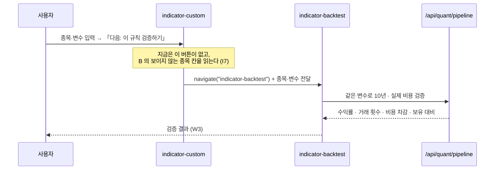
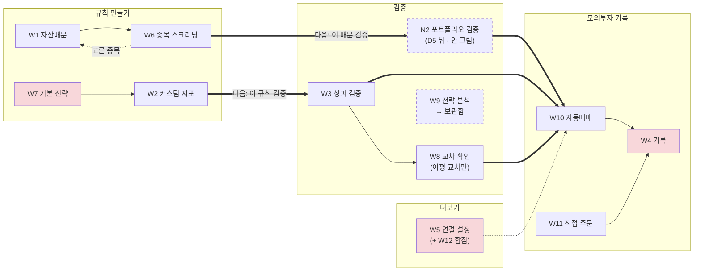

# 와이어프레임 v0.2 — Qurious 2.0 주 경로 12개 (전부)

| 항목 | 내용 |
|------|------|
| **문서 버전** | v0.2 (저충실도 · 주 경로 12개 모두) |
| **기준 커밋** | `e764e5f` (main · 2026-09-28 · I14 수정 PR #25 머지 뒤) |
| **작성** | 이동원 · 2026-09-28 (v0.1 S52 → v0.2 S54) |
| **산출물 구분** | 4 화면·서비스 설계 — 강사님 일정표 2차 **5번째 칸(10-06(화) 오전) 「IA·와이어프레임」**의 와이어프레임 쪽 |
| **상태** | 전부 **제안** 🟡 — [IA v0.2](IA_v0.2.md) 2절(TO-BE)과 D1 ③ 이 확정되기 전이다. 「지금」 칸은 브라우저로 본 사실 🟢 |
| **범위** | 공통 틀 2장(데스크톱 · 모바일) + **주 경로 12개 전부**(W1~W12). v0.1 의 5장에 7장(W6~W12)을 더했다 |
| **관련 문서** | [IA v0.2](IA_v0.2.md) (문제 번호 I1~I15 · 판정 🟢🟡🔴 은 그 문서 1.5~1.6절) · [스크린샷](img/v0.2/) · 파트별 결함 이슈 [#26](https://github.com/EST-team-project/Qurious/issues/26) (원본 [`이슈-화면결함-파트별/00-본문.md`](../github-archive/2026-09-28/이슈-화면결함-파트별/00-본문.md) · 번호는 S55 에 채움) |

확실도 · 🟢 코드·브라우저로 확인 / 🟡 추론·제안 / 🔴 정정·문제

> **쉬운 요약 3줄**
> 1. 와이어프레임은 화면에 **무엇이 어디 있는지**만 그린 설계도다. 색·글꼴은 뺐다. v0.1 은 틀과 대표 화면 5장을 그렸고, v0.2 는 **나머지 7장을 더해 주 경로 12개를 다 그렸다.**
> 2. 7장을 그리려고 코드를 읽다가 **IA v0.2 의 판정 셋이 틀린 것**을 찾았다. 「🟢 매수 우위」였던 `indicator-strategy` 는 **가짜 볼린저밴드 행**(하루 등락률로 판정)이 만든 결과였고, `robo-screening` 의 「LightGBM」은 학습 모델이 아니며, `quant-lean` 의 「초과 수익」은 **서로 다른 기간을 뺀 값**이다(6절).
> 3. 이 문서는 **화면 배치만 제안**한다. 코드 결함은 각 파트 영역이라 고치지 않고 **파트별 체크리스트 이슈 [#26](https://github.com/EST-team-project/Qurious/issues/26)** 으로 모았다(데이터 파트는 자기 영역만 고친다).

### v0.1 → v0.2 바뀐 것

| 무엇 | v0.1 (S52) | v0.2 (S54) |
|------|------------|------------|
| 그린 화면 | 틀 2 + 5장(W1~W5) | 틀 2 + **12장**(W6~W12 추가) |
| 배치 | 2절 규칙 · 3절 검증·기록·설정 | 2절 규칙 · 3절 검증 · 4절 기록 · 5절 연결 설정 — **흐름 순서** |
| W4 장부(I14) | 🔴 서버 수정 필요 | ✅ **PR #25 로 해결** — 새 자동매매는 1억 모의계좌 현금을 쓴다(화면 재확인 전) |
| IA 판정 | IA v0.2 그대로 | **정정 7건** → IA v0.3 에 넘긴다(6절) |
| 코드 결함 | 표의 「재사용」 칸에만 | 다른 파트 영역 18건을 **이슈 [#26](https://github.com/EST-team-project/Qurious/issues/26)** 으로(파트별 체크리스트) |

---

## 0. 읽는 법

**기호**

| 기호 | 뜻 | 기호 | 뜻 |
|------|----|------|----|
| `[ 버튼 ]` | 누르는 것 | `( 입력 )` | 적는 칸 |
| `(선택 ▾)` | 고르는 칸 | `▓▓▓` | 차트·그림 자리 |
| `●━━○━━○` | 단계 표시 (● 지금) | `⚠` | 경고 띠 |
| `┆ … ┆` | 접혀 있는 영역 | `☰` | 메뉴 열기 |

**화면마다 세 덩어리** — ① 지금(브라우저로 본 배치) ② 와이어프레임(바꿀 배치) ③ 바뀌는 것 표(요소 · 지금 · 바꿀 것 · 근거 · 코드 재사용).
픽셀 크기는 뜻이 없다. **순서 · 묶음 · 버튼 위치**만 본다.

---

## 1. 공통 틀

### W0 — 데스크톱 (1280 이상)

```
┌──────────────────────────────────────────────────────────────────────────────────────────┐
│ ◆ Qurious   [규칙 만들기] [검증] [모의투자 기록] [배우기] [더보기 ▾]      (시세 띠*) (S ▾) │
├────────────────────┬─────────────────────────────────────────────────────────────────────┤
│ 규칙 만들기         │  ●━━━━━━━━━━○━━━━━━━━━━○                                            │
│                    │  규칙 만들기   검증        모의투자 기록        ← 단계 표시 (지금: 규칙) │
│ ── 2차 로보어드바이저 │                                                                     │
│  ▸ 자산배분  ◀ 지금  │  ┌ 사용법 (접힘) ──────────────────────────────────────────────┐     │
│  ▸ 종목 스크리닝     │  └──────────────────────────────────────────────────────────────┘     │
│ ── 3차 인디케이터 ┆  │                                                                     │
│  ┆ 기본 전략      ┆  │  ┌ 화면 본문 ───────────────────────────────────────────────────┐     │
│  ┆ 커스텀 지표    ┆  │  │                                                              │     │
│    (10-22 부터)    │  │  │   (화면마다 다름 — 2~3절)                                     │     │
│                    │  │  │                                                              │     │
│                    │  └──────────────────────────────────────────────────────────────┘     │
│                    │                                                                     │
│                    │                          [ ← 이전 단계 ]  [ 다음: 이 배분 검증하기 → ] │
├────────────────────┴─────────────────────────────────────────────────────────────────────┤
│ 투자 자문이 아닌 학습용 · 데이터 출처 · 기준 시각(KST)                                      │
└──────────────────────────────────────────────────────────────────────────────────────────┘
 * 시세 띠(KOSPI · KOSDAQ · USD/KRW)는 1440 미만에서 숨긴다 — 탭 5칸 자리를 만든다
```

| 요소 | 지금 🟢 | 바꿀 것 🟡 | 근거 | 재사용 |
|------|---------|------------|------|:------:|
| 상단 탭 | 9칸 · 1440 에서 5칸만 보임 | **5칸** — 규칙 만들기 · 검증 · 모의투자 기록 · 배우기 · 더보기 | I11 | ✅ `GNB_MENUS` 재배열 · 버튼 HTML |
| 왼쪽 메뉴 | 묶음 안 화면 목록 | **소제목**(2차 / 3차)으로 나누고, 차수 기간 밖은 접는다 | IA v0.2 2.2 · 공식 일정 | 🟡 `renderLnb()` 에 소제목 줄 추가 |
| 단계 표시 | 없음 | 규칙 → 검증 → 기록 3칸, 지금 칸 강조 | I3 · D1 흐름도 | 🔴 새로 (작은 부품 1개) |
| 사용법 안내 | 화면 맨 위에 펼쳐진 띠 | 기본 **접힘** | 본문이 첫 화면에 더 많이 보이게 | ✅ `VIEW_GUIDES` 그대로 |
| 「다음 단계」 줄 | 없음 (화면 사이 링크 0) | 주 경로 화면 끝에 이전 · 다음 버튼 | I3 · 원칙 7 | 🟡 `navigate()` 호출 한 줄씩 |
| 아래 띠 | 회사 정보 + 「… Redis · **MongoDB**」 | 학습용 고지 · 데이터 출처 · **기준 시각 KST** | 1.6 「MongoDB」는 옛 구성 | ✅ 문구만 |

### W0-m — 모바일 (390)

```
┌──────────────────────────────┐
│ ◆ Qurious              (S ▾) │  ← 사용자 메뉴에 로그아웃
├──────────────────────────────┤
│ ●━━━○━━━○  규칙 › 자산배분     │  ← 단계 표시 + 지금 화면 이름
├──────────────────────────────┤
│ ┌ 사용법 (접힘) ───────────┐ │
│ └──────────────────────────┘ │
│                              │
│  화면 본문 — 한 줄로 쌓는다    │
│  (카드 · 표는 가로 스크롤)     │
│                              │
│ [ 다음: 이 배분 검증하기 → ]   │
├──────────────────────────────┤
│ [규칙]  [검증]  [기록]  [☰]   │  ← 하단 탭 4칸 (☰ = 배우기 · 더보기)
└──────────────────────────────┘
      누르면 ↓ 그 묶음의 화면 목록이 아래에서 올라온다
┌──────────────────────────────┐
│ 규칙 만들기                   │
│ ── 2차 로보어드바이저          │
│  자산배분 · 종목 스크리닝       │
│ ── 3차 인디케이터 (10-22 부터) │
└──────────────────────────────┘
```

| 요소 | 지금 🟢 | 바꿀 것 🟡 | 근거 | 재사용 |
|------|---------|------------|------|:------:|
| 메뉴 | **없음** — 탭 줄 폭 0 · 왼쪽 메뉴 숨김 · 여는 버튼 없음 | 하단 탭 4칸 + 목록 시트 | I12 · IA Q7 (a) | 🔴 표시 부품 새로 · 메뉴 표는 `GNB_MENUS` 재사용 |
| 로그아웃 | 화면 밖 | 사용자 메뉴 안 | I12 | ✅ 기존 버튼 옮김 |
| 본문 | 카드가 2열로 줄어듦 ([13](img/v0.2/13-mobile-390.png)) | 한 열로 쌓기 · 표는 가로 스크롤 | Mobile First | 🟡 CSS |

---

## 2. 규칙 만들기

### W1 — `robo-portfolio` 자산배분 (2차 · 첫 화면 후보) · 지금 판정 🟡

**지금** ([01](img/v0.2/01-robo-portfolio.png)) — 입력 3칸(성향 · 기간 · 원금) → 「포트폴리오 최적화 실행」 → 자산군 비중 카드 5개 + 막대 → 「AI 추천 종목」 카드 → 「예상 성과 시뮬레이션」 표(1·3·5년).

```
┌ 자산배분 — 내 성향에 맞는 비중 ──────────────────────────────────────────────┐
│ (투자 성향 ▾ 중립)   (투자 기간 ▾ 중기 1~3년)   (투자 원금  5,000 만원)        │
│                                                     [ 비중 계산 ]            │
└──────────────────────────────────────────────────────────────────────────────┘
┌ 결과 ────────────────────────────────────────────────────────────────────────┐
│ 국내주식 30%   해외주식 25%   국내채권 30%   대체 10%   현금 5%                 │
│ ▓▓▓▓▓▓▓▓▓▓▓▓▓▓▓▓▓▓▓▓▓▓▓▓▓▓▓▓▓▓▓▓▓▓▓▓▓▓▓▓▓▓▓▓▓▓▓▓▓▓▓▓ (비중 막대)              │
│ ⓘ 이 비중은 성향별 **고정표**입니다 — 최적화 결과가 아닙니다 (D5 모델 전까지)   │
├──────────────────────────────────────────────────────────────────────────────┤
│ 담을 종목 (스크리닝 결과에서)     종목 · 비중 · 금액 · 고른 근거 한 줄            │
│   … 표 …                                                                     │
├──────────────────────────────────────────────────────────────────────────────┤
│ ⚠ 기대 수익은 여기서 보여 주지 않습니다. 과거 구간 성과는 「검증」에서           │
│   비용을 뺀 값으로 확인하세요.                                                 │
└──────────────────────────────────────────────────────────────────────────────┘
                              [ ← 처음으로 ]  [ 다음: 종목 스크리닝 → ]
```

| 요소 | 지금 🟢 | 바꿀 것 🟡 | 근거 | 재사용 |
|------|---------|------------|------|:------:|
| 버튼 이름 | 「포트폴리오 최적화 실행」 | 「비중 계산」 | 비중은 성향별 고정표(`app.html:3091`) — 최적화가 아니다 | ✅ 글자만 |
| 비중 카드 · 막대 | 있음 | 그대로 + 「고정표」 안내 한 줄 | RTM §4.2 · D3 ⑧ | ✅ |
| 추천 종목 카드 | 「AI 예측 수익률 **300.0%**」 · 신뢰도 0.29 | **예측 수익률 칸을 뺀다.** 고른 근거 한 줄만 | I15 계열 · 비현실 수치 | ✅ 칸 삭제 |
| 예상 성과 표 | 1년 +68.75% · 5년 **+1,268.54%** | **표를 뺀다.** 검증 화면으로 가는 안내로 바꾼다 | 비용·검증 없는 추정치가 첫 화면 첫 결과가 된다(IA 2.4) | 🟡 표 삭제 · 문구 추가 |
| 다음 단계 | 없음 | 「종목 스크리닝 →」 | I3 | 🟡 버튼 1개 |

### W6 — `robo-screening` 종목 스크리닝 (2차 · W1 다음) · 지금 판정 🟡 (IA v0.2 🟢 → 정정)

**지금** ([02](img/v0.2/02-robo-screening.png)) — 입력 3칸(시장 신호 강도 ▾ 매수 신호 · 패턴 인식 모델 ▾ **LightGBM (앙상블)** · 최소 신뢰도 ▾ 65% 이상) → 「스크리닝 실행」 → 「AI 패턴 인식 시그널」 카드 6개(종목 · BUY · RSI · **`+--%`**) → 「스크리닝 결과」 표(종목명 · 현재가 · 등락률 **전부 `+0.00%`** · RSI · AI 신호 · 패턴 근거). 들어가면 같은 API 를 부르는데 8초 안에 오지 않았고, 그동안 빈 칸이다.
**「LightGBM」은 학습 모델이 아니다** — 서버는 이 값을 받으면 이평 ±1 + MACD ±1 + RSI ±1 **합산 점수**를 쓰고, 코드 주석도 그렇게 적어 두었다(`investment_research.py:124`). 「신뢰도」는 그 점수로 만든 `55 + |점수| × 13` 이다(`:128`).

```
┌ 종목 스크리닝 — 규칙에 맞는 종목 고르기 ─────────────────────────────────────┐
│ (신호 ▾ 매수)   (점수 방식 ▾ 추세·MACD·RSI 합산)   (최소 점수 ▾ +1)  [ 고르기 ] │
│ ⓘ 점수 = 이평 추세 ±1 + MACD ±1 + RSI ±1  (−3 ~ +3) · 학습 모델이 아닙니다      │
└──────────────────────────────────────────────────────────────────────────────┘
┌ 결과 — 대표 31종목 중 N종목 · 시세 기준 시각 · 출처 ───────── ⏳ 불러오는 중 … ┐
│ ☐  종목        현재가      전일 대비   RSI    점수   신호   근거                 │
│ ☑  삼성전자     275,750    (없음)      56.3   +2     매수   이평↑ · MACD↑ · RSI 0 │
│ ☑  SK하이닉스 1,791,000    (없음)      52.4   +2     매수   이평↑ · MACD↑ · RSI 0 │
│ ⓘ RSI 가 45~65 면 0점이라, 이 두 종목이 「매수」면 이평·MACD 가 둘 다 +1 이다      │
│    …                                                                         │
└──────────────────────────────────────────────────────────────────────────────┘
     [ ← 자산배분 ]  [ 고른 종목을 배분에 담기 → W1 ]  [ 다음: 이 배분 검증 (N2 · 예정) → ]
```

| 요소 | 지금 🟢 | 바꿀 것 🟡 | 근거 | 재사용 |
|------|---------|------------|------|:------:|
| 제목 | 「AI 패턴 인식 시그널」 | 「종목 스크리닝」 — 「AI」「패턴 인식」을 뺀다 | 규칙 합산이다 | ✅ 글자만 |
| 모델 이름 | 「LightGBM (앙상블)」 | 「추세·MACD·RSI 합산」 | `investment_research.py:124` · `app.html:1759` | ✅ 글자만 |
| 최소 신뢰도 | 50 · 65 · 80 % | 「최소 점수」(−3~+3) | 신뢰도는 점수로 만든 값이다(`:128`) · 확률이 아니다 | 🟡 선택지 값 |
| 카드 등락률 | 값이 없으면 `+--%`(초록) | 카드를 없앤다 — 표와 같은 6종목을 두 번 보여 준다 | `app.html:3195` | ✅ 카드 삭제 |
| 표 등락률 | 값이 없으면 `+0.00%` | 「(없음)」 — **0 으로 채우지 않는다** | `app.html:3207` `?? 0` · 뿌리는 `get_quote` 가 등락률을 늘 비움(`stock.py:82-83` · 데이터 파트 A1) | ✅ 한 줄 |
| 불러오는 중 | 8초 넘게 빈 칸 | ⏳ 표시 · 끝나면 「N종목 · 기준 시각」 | IA 1.5 2행 | 🟡 |
| 고르는 칸 | 없음 | ☑ — 고른 종목이 W1 의 「담을 종목」으로 간다 | W1 표가 「스크리닝 결과에서」를 기다린다 | 🟡 |
| 다음 단계 | 없음 | 「배분에 담기」→ W1 · 「이 배분 검증」→ N2 | I3 · IA 2.3 | 🟡 |

### W7 — `indicator-strategy` 기본 전략 (3차 · 첫 화면) · 지금 판정 🔴 (IA v0.2 🟢 → 정정)

**지금** ([03](img/v0.2/03-indicator-strategy.png)) — (종목 ▾ 삼성전자)(기간 ▾ 1년)「전략 분석」 · 체크 6개(MA 5 · MA 20 · MA 60 · RSI(14) · MACD · 볼린저밴드) → 카드 4개(현재가 · RSI · MA 교차 · 종합 신호 「**AI 판단**」) → 「인디케이터 분석 결과」 표 → 「전략 신호 종합」 한 줄.
**S52 에 본 「매수 2 · 매도 0 · 중립 1 → 📈 매수 우위」의 매수 1개는 가짜다.** 볼린저밴드를 체크하지 않았는데 그 행이 붙었고, 판정도 밴드가 아니라 **전일 대비 등락률 ±2%** 로 한다(`app.html:3295`). 그날 삼성전자 −3.33% → 「하단 이탈 · 매수」. 서버는 진짜 밴드 값을 이미 준다(`stock.py:327` · `:340-342`).

```
┌ 기본 전략 — 지표를 골라 지금 신호 보기 ──────────────────────────────────────┐
│ (종목 005930 삼성전자)  (기간 ▾ 1년)                              [ 신호 보기 ] │
│ 쓸 지표   ☑ 이평 5/20   ☐ 이평 60   ☑ RSI 14   ☐ MACD   ☐ 볼린저밴드(20일 · 2σ) │
└──────────────────────────────────────────────────────────────────────────────┘
┌ 고른 지표만 ─────────────────────────────────────────────────────────────────┐
│ 지표          지금 값                    상태           신호                    │
│ 이평 5/20     274,600 / 262,400          5 > 20         매수                    │
│ RSI 14        56.3                       중립(30~70)    —                       │
│ (볼린저를 고르면)  종가 · 아래 띠 · 위 띠     띠 안 / 밖     …  ← 띠 값으로 판정      │
├──────────────────────────────────────────────────────────────────────────────┤
│ 합치면  매수 1 · 매도 0 · 중립 1                                                │
│ ⓘ 지금 한 시점의 신호입니다 — 과거에 이 규칙이 통했는지는 「검증」에서 봅니다     │
└──────────────────────────────────────────────────────────────────────────────┘
                 [ 다음: 이 조합을 커스텀 지표로 가져가기 (종목·지표 넘김) → W2 ]
```

| 요소 | 지금 🟢 | 바꿀 것 🟡 | 근거 | 재사용 |
|------|---------|------------|------|:------:|
| 볼린저밴드 행 | 체크와 무관하게 늘 붙고, **하루 등락률 ±2%** 로 판정하며 「±2σ」라고 적는다 | 체크했을 때만 · **띠 값**(서버 `bb_upper`·`bb_lower`)으로 판정 | `app.html:3295` · `stock.py:340-342` | 🟡 값은 이미 온다 |
| 이평 60 · MACD 체크 | 눌러도 결과가 안 바뀐다(읽지 않음) | 읽어서 행을 만든다, 못 하면 칸을 뺀다 | 읽는 줄은 `app.html:3268-3270` 셋뿐 | 🟡 |
| 종합 신호 카드 | 「AI 판단」 | 「규칙 합산」 | 서버 `_generate_signal` 은 점수 가감 규칙(`stock.py:330`) | ✅ 글자만 |
| 합계 줄 | 가짜 행까지 센다 | 고른 지표만 센다 | 위 두 줄을 고치면 저절로 | ✅ |
| 시점 안내 | 없음 | 「한 시점의 신호 — 과거 성과 아님」 | 두 독자(강사님 피드백) · 원칙 3 | ✅ 문구 |
| 다음 단계 | 없음 | 「커스텀 지표로 가져가기」→ W2(종목·지표 넘김) | I3 · I7 과 같은 넘기기 | 🟡 |

### W2 — `indicator-custom` 커스텀 지표 (3차) · 지금 판정 🟡

**지금** ([04](img/v0.2/04-indicator-custom.png)) — 왼쪽 변수(기반 지표 · 단기/중기 이평 · RSI 기간 · 매수/매도 기준) → 「코드 생성」 → Pine · Python 코드 상자 → 「백테스트 실행」 → 결과 카드 4개. 종목 칸이 **이 화면에 없다**(I7).

```
┌ 커스텀 지표 ─────────────────────────────────────────────────────────────────┐
│ ┌ 변수 ──────────────────────┐  ┌ 코드 ───────────────────────────────────┐  │
│ │ (종목  005930 삼성전자)  ◀새│  │ [Pine] [Python]            [ 복사 ]     │  │
│ │ (기반 지표 ▾ RSI+이평)      │  │ ┌──────────────────────────────────┐   │  │
│ │ (단기 5) (중기 20)          │  │ │ //@version=5 …                   │   │  │
│ │ (RSI 14) (매수 35) (매도 65) │  │ │                                  │   │  │
│ │ [ 코드 생성 ]  [ 💾 저장 ]   │  │ └──────────────────────────────────┘   │  │
│ └────────────────────────────┘  └─────────────────────────────────────────┘  │
├──────────────────────────────────────────────────────────────────────────────┤
│ 빠른 확인 (최근 1년)                                                          │
│  거래 0회 ⚠ 이 조건에서는 한 번도 사고팔지 않았습니다 — 기준값을 바꿔 보세요     │
│  (거래가 있으면) 누적 · 샤프 · MDD · 승률 · 거래 횟수                            │
└──────────────────────────────────────────────────────────────────────────────┘
                    [ ← 기본 전략 ]  [ 다음: 이 규칙 검증하기 (종목·변수 넘김) → ]
```

| 요소 | 지금 🟢 | 바꿀 것 🟡 | 근거 | 재사용 |
|------|---------|------------|------|:------:|
| 종목 칸 | **없음** — 보이지 않는 `indicator-backtest` 의 `ibt-symbol` 을 읽는다 | 이 화면에 종목 칸을 둔다 | I7 · `app.html:3404` | 🟡 입력 1개 · 읽는 곳 1줄 |
| 결과 카드 | 거래 0회도 「+0.0% · 샤프 0.00 · 승률 0.0%」 | **거래 횟수를 맨 앞에.** 0회면 숫자 대신 안내문 | I15 ③ · API 는 `trade_count: 0` 을 이미 준다 | ✅ 응답 값 사용 |
| 「백테스트 실행」 | 이 화면에서 결과까지 | 「빠른 확인」으로 이름을 바꾸고, 정식 검증은 다음 단계로 | 검증은 한 곳(원칙 3) | ✅ |
| 다음 단계 | 없음 | 「이 규칙 검증하기」 — **종목·변수를 넘긴다** | I3 · I7 | 🟡 아래 그림 |



---

## 3. 검증

### W3 — `indicator-backtest` 성과 검증 · 지금 판정 🟢 (뼈대)

**지금** ([05](img/v0.2/05-indicator-backtest.png)) — (종목 ▾)(전략 ▾)「성과 검증 실행」 → 카드 4개(전략 · 누적 · 샤프 · MDD) → 상세 표(전략 vs 매수 후 보유 · 거래 횟수 · 승률) → 비용 설명 한 줄 → 「비교에 추가」.
**이미 2.0 검증의 요소를 거의 다 갖췄다** — 비용 차감(비용 전 13.22% → 3.70%p 차감), 단순 보유 비교, 「신호는 다음 거래일 수익률에 적용」.

```
┌ 검증 — 이 규칙을 믿어도 되나 ────────────────────────────────────────────────┐
│ 규칙: 커스텀 「RSI+이평 5/20 · 35/65」 (넘겨받음)   [ 규칙 바꾸기 ]             │
│ (종목 005930)  (기간 ▾ 10년)  (비용 ▾ 실제 요율)  (슬리피지 10bp)  [ 검증 ]      │
└──────────────────────────────────────────────────────────────────────────────┘
┌ 한 줄 판정 ──────────────────────────────────────────────────────────────────┐
│ 「이 규칙은 같은 기간 **그냥 들고 있던 것보다 낮았습니다** (+9.5% vs +661%)」     │
└──────────────────────────────────────────────────────────────────────────────┘
┌ 숫자 ────────────────────────────────────────────────────────────────────────┐
│  누적(비용 후)  +9.5%  │ 거래 14회 │ 승률 47% │ 샤프 0.14 │ MDD -41.1%           │
│  비용 전 +13.2% → 비용 3.7%p                                                   │
├──────────────────────────────────────────────────────────────────────────────┤
│ ▓▓▓▓▓▓▓▓▓▓▓▓▓▓▓▓ 누적 곡선: 규칙 ─── / 그냥 보유 ··· ▓▓▓▓▓▓▓▓▓▓▓▓▓▓▓▓▓▓▓▓▓▓▓   │
├──────────────────────────────────────────────────────────────────────────────┤
│ 비교 대상 표  (규칙 · 그냥 보유 · 비용 전/후)            [ 비교에 추가 ]          │
│ ⓘ 신호는 다음 거래일 수익률에 적용 · 슬리피지는 가정값                           │
└──────────────────────────────────────────────────────────────────────────────┘
                 [ ← 규칙 만들기 ]  [ LEAN 으로 교차 확인 ]  [ 다음: 모의투자로 → ]
```

| 요소 | 지금 🟢 | 바꿀 것 🟡 | 근거 | 재사용 |
|------|---------|------------|------|:------:|
| 규칙 출처 | 드롭다운의 기본 전략만 | **넘겨받은 규칙 이름**을 맨 위에 | W2 → W3 연결 | 🟡 |
| 한 줄 판정 | 없음 — 숫자만 | 「그냥 보유보다 높다/낮다」 한 줄 | D1 질문 「믿어도 되나」 · 두 독자(강사님 피드백) | 🟡 응답 값 비교만 |
| 숫자 카드 | 전략 이름 · 누적 · 샤프 · MDD | + **거래 횟수**, 비용 전/후 | I15 ③ 과 같은 규칙 | ✅ 응답에 이미 있음 |
| 누적 곡선 | 없음 (들어가면 차트 0개 — 1.5절) | 규칙 vs 보유 두 줄 | 응답에 `cum_returns` · `bh_returns` 가 이미 있다 | 🟡 ApexCharts 이미 로드됨 |
| 비용 설명 | 한 줄 문장 | 숫자 칸으로 올림 | 비용 차감이 2.0 의 핵심(계획서 ㉯) | ✅ |
| 다음 단계 | 없음 | LEAN 교차 확인 · 모의투자로 | I3 | 🟡 |

> v0.2 덧붙임 — 「LEAN 으로 교차 확인」 버튼은 **규칙이 이평 교차일 때만** 성립한다. `quant-lean` 이 돌릴 수 있는 전략이 4종(보유 · 이평 교차 · DCA · 모멘텀)뿐이다(W8). 🟢

### W8 — `quant-lean` 교차 확인 (W3 다음) · 지금 판정 🟡

**지금** ([06](img/v0.2/06-quant-lean.png)) — 제목 옆 회색 배지 「LEAN 미연결」 · 예시 카드 4개(기준선 · 추세 · 적립 · 모멘텀) · 입력 5칸(01 전략 · 02 종목 · 05 초기 자금 **`10000`** · 03 검증 기간 · 04 비교 기간) · 「▶ 이 조건으로 검증 실행」 → 결과 줄 「pandas (LEAN 미실행) + Yahoo Finance」 + 빨간 「LEAN 미실행/실패」 → 숫자 카드 12개.
**「초과 수익 (vs 비교기간) +147.19%」는 서로 다른 기간을 뺀 값이다** — 검증 기간(2023-01-01~) 수익률 +430.57% − 비교 기간(2022-01-01~) 보유 수익률 +283.38%(`lean_backtest.py:204`). 그리고 이 화면은 **비용을 빼지 않는다**(`:212` 면책 문구). W3 은 뺀다.

```
┌ 교차 확인 — 같은 규칙을 다른 엔진으로 ────────────────────────────────────────┐
│ 엔진   ● pandas (이 서버)     ○ QuantConnect LEAN (연결 안 됨)    ← 맨 위 · 크게 │
│ 규칙   이평 교차 20/60 · 005930 · 10년 (W3 에서 넘김)                            │
│        ⚠ RSI 규칙은 여기서 돌릴 수 없습니다 — 이 화면 전략은 보유·이평·DCA·모멘텀  │
│ (초기 자금 ____ 원)                                               [ 확인 실행 ] │
└──────────────────────────────────────────────────────────────────────────────┘
┌ 나란히 — 같은 기간 · 둘 다 비용 전 ──────────────────────────────────────────┐
│                  W3 성과 검증        이 화면              차이                  │
│ 누적 수익률          …                   …                 …                   │
│ MDD                 …                   …                 …                   │
│ 거래 횟수            …                   …                                      │
│ ⓘ 이 화면은 수수료·슬리피지를 빼지 않습니다 — 그래서 W3 의 「비용 전」 값과 겹칩니다 │
├──────────────────────────────────────────────────────────────────────────────┤
│ ┆ 나머지 지표 8개 · 누적 곡선 ┆  (접힘)                                         │
└──────────────────────────────────────────────────────────────────────────────┘
┆ 예시 카드 4개 · 비교 기간 ┆  규칙을 넘겨받지 않고 직접 열었을 때만 펼친다
                                          [ ← 검증 ]  [ 다음: 모의투자로 → W10 ]
```

| 요소 | 지금 🟢 | 바꿀 것 🟡 | 근거 | 재사용 |
|------|---------|------------|------|:------:|
| 엔진 표시 | 결과 줄 옆 작은 배지 두 개 | **맨 위에** 엔진 두 칸 · 지금 쓰는 엔진 ● | 이번 확인은 LEAN 이 아니라 pandas 였다(IA 1.5 6행) | ✅ 응답 `engine`·`lean_ok` |
| 초과 수익 카드 | 검증 기간 − **다른 기간** 보유 수익률 | 같은 기간끼리만 · 못 맞추면 카드를 뺀다 | `lean_backtest.py:204` | 🟡 서버 계산 (P-D) |
| 비용 | 면책 문구에만 | 숫자 옆에 「비용 전」 · W3 의 비용 전 값과 나란히 | `lean_backtest.py:212` | ✅ 문구 |
| 규칙 넘겨받기 | 없음 — 예시 카드 또는 직접 입력 | W3 규칙이 이평 교차면 넘긴다 · 아니면 「여기서 못 돌림」 | 전략 4종(`lean_backtest.py:35-40`) | 🔴 RSI 규칙은 전략 추가 (P-D) |
| 초기 자금 | `10000` (단위 없음) | 단위 「원」 · 쉼표 | `app.html:1249` | ✅ |
| 숫자 카드 12개 | 한 번에 다 | 나란히 표 3줄 + 나머지 접힘 | 교차 확인의 질문은 「두 엔진이 같은가」 하나 | 🟡 |
| 출처 | 「Yahoo Finance」 | 출처 · 기준 시각(KST) 표기 | 약관 🔴 소스 — 출처 교체는 데이터 파트 과제 | ✅ 문구 |
| 다음 단계 | 없음 | 「모의투자로」→ W10 | I3 | 🟡 |

### W9 — `quant-backtest` 전략 분석 (검증 · 숨김 후보) · 지금 판정 🔴

**지금** ([07](img/v0.2/07-quant-backtest.png)) — 제목 「퀀트 전략 분석 (**10년 Mockup**)」 · 설명 「대표 5종목의 근 10년 데이터 기반 퀀트 지표를 조회」 · (종목 ▾)「분석」 → 회색 상자(현재가 276,000 · 현재 RSI 56.31 · AI 시그널 매수 · 시그널 점수 1 · 근거 두 줄) · 「비교에 추가」.
사용법 띠는 「10년치 백테스트 성과를 확인」(`app.html:2842`)인데 **백테스트 결과가 없다.** 부르는 API(`/stocks/quant/indicators`)는 **W7 과 같다** — 같은 지표를 다른 이름으로 두 번 보여 준다.

```
지금 — 「퀀트자동매매」 탭 왼쪽 메뉴          v0.2 — 「검증」 탭 왼쪽 메뉴
──────────────────────────────              ──────────────────────────────
퀀트 대시보드                                성과 검증          (W3)
자동매매 현황                                교차 확인 · LEAN   (W8)
전략 분석      ← 이 화면 (W9)                ┆ 전략 분석 ┆ → 보관함 (W7 과 같은 API)
LEAN 백테스트 (QuantConnect)
증권사 API 설정
알림 설정
```

| 요소 | 지금 🟢 | 바꿀 것 🟡 | 근거 | 재사용 |
|------|---------|------------|------|:------:|
| 메뉴 | 「퀀트자동매매 › 전략 분석」 | 「검증」에 넣지 않고 보관함 | 백테스트가 없다 · IA 2.2 숨김 후보 | ✅ `GNB_MENUS` 한 줄 |
| 제목 · 사용법 | 「10년 Mockup」 · 「10년치 백테스트」 | 보관함에서는 「현재 지표 조회」 | `app.html:1216` · `:2842` — 글과 화면이 다르다 | ✅ 글자만 |
| 되살릴 조건 | — | 10년 백테스트가 실제로 붙으면 W3 에 합친다 | IA 6절 | — |

---

## 4. 모의투자 기록

### W10 — `robo-decision` 자동매매 (기록 · 첫 화면) · 지금 판정 🟡

**지금** ([08](img/v0.2/08-robo-decision.png)) — 제목 「**AI** 모의 투자 의사결정」 · 설명 「구축한 퀀트 모델의 결과를 **AI 가 해석**하여…」 · 「▶ 의사결정 시작」「■ 중지」「로그 새로고침」 · 「실행 중」 · 띠 「퀀트 모델 시그널 수집 → **패턴 인식 분석** → 포트폴리오 리밸런싱 판단 → 가상 주문 실행 → 성과 기록」 · 로그 4줄 · 「최근 AI 투자 판단 근거」 카드 3개(모두 「과매도 구간 진입, 반등 기대」).
판단은 **규칙 신호**의 `action`·`reasons` 로 한다(`auto_trade.py:306-313`) — 로그의 「RSI 중립(52.6) | 골든크로스」가 실제 근거다. 로그 시각은 **UTC** 다(`:83` 은 `+00:00` 이 붙고, `:230` 은 **표시 없이** UTC — 「01:34:21」은 한국 시각 10:34). 현금 장부는 **#25 로 1억 모의계좌 하나**가 됐다(코드 🟢 · 화면 재확인 전).

```
┌ 자동매매 — 규칙을 모의계좌에서 돌리기 ─────────────────── ● 실행 중 (10분마다) ┐
│ 규칙 (▾ 이평·RSI 기본)   종목 (▾ 대표 종목)   (1회 금액 ____ 원)  ← W5 에서 옮김  │
│ (매수 비중 __ %)  (매도 비중 __ %)                     [ ▶ 시작 ]  [ ■ 멈춤 ]   │
├──────────────────────────────────────────────────────────────────────────────┤
│ 판단 기록 — 시각 KST                                    (아래는 S52 체결 예시)  │
│ 10:34  SK하이닉스  매수 1주  근거: RSI 중립 52.1 · 단기 이평 > 중기   1,791,000  │
│ 10:34  삼성전자    매수 3주  근거: RSI 중립 56.0 · 단기 이평 > 중기     275,500  │
│ 10:34  주기 요약   모의계좌 총자산 … · 시작 1억 대비 …                            │
└──────────────────────────────────────────────────────────────────────────────┘
                                  [ ← 검증 ]  [ 다음: 모의투자 기록 보기 → W4 ]
```

| 요소 | 지금 🟢 | 바꿀 것 🟡 | 근거 | 재사용 |
|------|---------|------------|------|:------:|
| 제목 · 설명 | 「AI 모의 투자 의사결정」 · 「AI 가 해석하여」 | 「자동매매」 · 「규칙 신호로 모의 주문」 | 판단은 `signal.action`·`reasons`(`auto_trade.py:306-313`) | ✅ 글자만 |
| 과정 띠 | 「패턴 인식 분석 → 리밸런싱 판단」 | 실제 순서: 신호 계산 → 매수·매도 규칙 → 모의 주문 → 기록 | 없는 단계를 적었다 | ✅ 글자만 |
| 판단 근거 카드 | BUY 면 늘 「과매도 구간 진입」 | **카드를 없애고** 기록 줄에 실제 근거 | I15 ② · `app.html:3252` | ✅ 카드 삭제 |
| 기록 시각 | UTC (`+00:00` 있거나 없음) | KST · 시:분 | `auto_trade.py:83` · `:230` | 🟡 서버 또는 화면 변환 (P-E) |
| 자동매매 값 | W5(연결 설정) 안에 | 이 화면 위쪽 | 설정과 실행 값을 나눈다(W5) | 🟡 칸 옮김 |
| 현금 장부 | 1천만 원 별도 장부 → 없는 수익 | ✅ **#25 로 해결** — 1억 모의계좌 하나 | I14 · PR #25 | 🟢 서버 끝 |
| 다음 단계 | 없음 | 「모의투자 기록 보기」→ W4 | I3 | 🟡 |

### W4 — `paper-dashboard` 모의투자 기록 · 지금 판정 🔴

**지금** ([10](img/v0.2/10-paper-dashboard.png)) — 카드 6개(보유 현금 · 주식 · 코인 · 대체자산 · 총 자산 · 총 손익) → 「최근 체결」 표(시각 · 구분 · 종목 · 매매 · 수량 · 단가 · 금액 · 출처). 자동매매 매수가 현금에서 빠지지 않아 **총 손익 +3.19%** 가 없는 수익이다(I14).
**v0.2 갱신** — PR #25(`e764e5f`)로 자동매매도 `paper_accounts` 현금을 쓴다(같은 매수 3건 +590,000 → −104). 그 전에 틀어진 DB 는 자동으로 고치지 않으니 「초기화」로 되돌린다. 화면은 다시 보지 않았다 🟡.

```
┌ 모의투자 기록 ───────────────────────────────────────────── [ 새로고침 ] [ 초기화 ] ┐
│ ⚠ 장부 점검: 현금 + 보유 평가 = 총자산 이 맞지 않으면 여기 빨간 띠 (I14 재발 감시)   │
├──────────────────────────────────────────────────────────────────────────────────┤
│ 시작 자금 100,000,000 │ 현금 │ 보유 평가 │ 총자산 │ 손익(비용 후) │ 쌓은 거래일 N일    │
├──────────────────────────────────────────────────────────────────────────────────┤
│ 규칙별 보기   (전체 ▾ / 수동 / 자동매매 「RSI+이평」 / …)                           │
├──────────────────────────────────────────────────────────────────────────────────┤
│ 일지 — 시각(KST) · 출처 · 규칙 · 종목 · 매매 · 수량 · 단가 · 비용 · 근거  (아래는 예시)│
│  10:34  자동  RSI+이평  SK하이닉스  매수  1  1,791,000  (비용)  RSI 중립 52.1 · 이평 ↑ │
│  10:35  수동  —         삼성전자    매수  2    275,250    97원   (직접 주문)          │
├──────────────────────────────────────────────────────────────────────────────────┤
│ 보유 종목 — 종목 · 수량 · 평균단가 · 현재가 · 평가 · 손익                              │
└──────────────────────────────────────────────────────────────────────────────────┘
                                    [ ← 검증 ]  [ 다음: 해석 보고 (N6 · 예정) → ]
```

| 요소 | 지금 🟢 | 바꿀 것 🟡 | 근거 | 재사용 |
|------|---------|------------|------|:------:|
| 현금 · 총 손익 | 자동매매 매수가 현금에 반영 안 됨 → **+3.19%** | ~~서버에서 장부를 하나로~~ → ✅ **PR #25 로 끝남**(자동매매도 `paper_accounts` 현금 사용) | I14 · `paper_trading.py:704-723` | 🟢 서버 끝 |
| 장부 점검 띠 | 없음 | 현금 + 보유 평가 − 시작 자금 = 손익이 **체결 합계와 맞는지** 매번 확인해 틀리면 빨간 띠 | 같은 버그가 다시 조용히 생기지 않게 | 🟡 |
| 코인 · 대체자산 카드 | 늘 0원 (둘 다 동결 화면) | 2.0 에서는 뺀다(보관함 화면에서만) | D1 ③ 동결 제안 | ✅ 카드 숨김 |
| 쌓은 거래일 | 없음 | 「N일」 — 일지를 며칠 쌓았는지 | 공식 일정상 10-14~10-20 최대 5거래일 · 대장 §5 ① | 🟡 |
| 일지 | 「최근 체결」 8칸 · 출처 `QUANT`/`PAPER` | + **규칙 이름 · 비용 · 근거** · 시각 KST | 판단 근거가 로그에만 있다 · 로그는 UTC(1.5절 8행) | 🟡 주문 표에 비용 칸은 이미 있다(`order_fields`) |
| 규칙별 보기 | 없음 | 규칙마다 걸러 보기 | 2.0 질문이 「이 규칙」 단위 | 🟡 |

### W11 — `paper-stock` 직접 주문 (기록) · 지금 판정 🟢

**지금** ([09](img/v0.2/09-paper-stock.png)) — 오른쪽 위 「보유 현금 100,000,000원」 · 주문 입력(종목코드 + 「시세 조회」 · 수량 · 「매수 미리보기」「매도 미리보기」 · 「시장가 매수」「시장가 매도」 · 작은 글씨 「체결가는 Yahoo Finance 현재가(지연)…」) → 보유 종목 표(「전량매도」) → 주문 내역 표.
**스크린샷에 I14 가 그대로 보인다** — 현금은 1억 그대로인데 자동매매가 산 3종목(SK 1 · 삼성전자 3 · SK하이닉스 1)이 보유에 있다(#25 로 해결).
수동 주문은 비용까지 정확하다(1억 − 550,500 − 97.4 = **99,449,402.6**). 그런데 **미리보기는 비용을 빼지 않는다** — 미리보기 99,449,500(`paper_trading.py:194-200` 은 `현금 − 금액`). 빈 종목 안내는 **4초 토스트**다(`paper.js:79` · `common.js:76-80`) — IA v0.2 의 「아무 안내가 없다」는 12~30초 뒤 찍어서 놓친 것으로 보인다 🟡.

```
┌ 직접 주문 (모의) ────────────────────────── 현금 99,449,403원 · 총자산 ______원 ┐
│ (종목 005930)  [ 시세 ]  → 삼성전자 275,250원 · 09:12 KST 기준 · 출처 (지연)     │
│   ⚠ 종목코드를 입력하세요   ← 칸 아래에 남는 안내 (토스트는 4초 뒤 사라진다)      │
│ (수량 2)    [ 매수 미리보기 ]  [ 매도 미리보기 ]                                 │
│ 미리보기   금액 550,500 + 비용 97 = 550,597  →  현금 99,449,403 · 보유 3 → 5주    │
│            [ 시장가 매수 ]  [ 시장가 매도 ]                                      │
├──────────────────────────────────────────────────────────────────────────────┤
│ 보유 · 주문 내역은 「모의투자 기록」(W4) 한 곳에서 본다                           │
└──────────────────────────────────────────────────────────────────────────────┘
                                                   [ 다음: 기록 보기 → W4 ]
```

| 요소 | 지금 🟢 | 바꿀 것 🟡 | 근거 | 재사용 |
|------|---------|------------|------|:------:|
| 보유 현금 | 1억 그대로 + 자동매매 보유 3종목 (I14) | 현금 · 총자산을 함께 | I14 · #25 로 장부는 하나 | 🟢 서버 끝 |
| 미리보기 | 현금 99,449,500 — **비용 빠짐** | 금액 + 비용 → 현금 (체결과 같은 식) | `paper_trading.py:194-200` · 체결은 `trading_cost.order_costs` 로 뺀다 | 🟡 서버 한 곳 (P-E) |
| 빈 종목 안내 | 4초 토스트 | 칸 아래 남는 안내 | `paper.js:79` · `common.js:76-80` | ✅ |
| 시세 출처 | 「Yahoo Finance 현재가(지연)」 작은 글씨 | 가격 옆에 기준 시각(KST) · 출처 | 약관 🔴 소스 — 교체는 데이터 파트 과제 | ✅ 문구 |
| 보유 · 주문 내역 | 이 화면 아래 | W4 로 모은다 (여기는 주문만) | 같은 표가 두 곳 | 🟡 |
| 다음 단계 | 없음 | 「기록 보기」→ W4 | I3 | 🟡 |

---

## 5. 연결 설정

### W5 — `settings` 연결 설정 (더보기) · 지금 판정 🔴

**지금** ([11](img/v0.2/11-settings.png)) — 투자 모드(모의/실전) · 종목 선택 방식 · 증권사(Mockup/KIS/…) · 키 3칸 · 모의 체크 · 자동매매 값 4칸 · 「저장/연결」 「연결 테스트」. Mockup 상태에서 「✅ 연결 성공 – 현재가 75,496원」(실제 275,250원).

```
┌ 연결 설정 — 모의투자 전용 ───────────────────────────────────────────────────┐
│ ⓘ Qurious 2.0 은 모의투자만 합니다. 실계좌 주문은 서버에서 막혀 있습니다.       │
├──────────────────────────────────────────────────────────────────────────────┤
│ (증권사 ▾  연결 안 함 / 한국투자증권 모의)                                      │
│   ┆ 한국투자증권 모의를 고르면: (App Key) (App Secret) (모의 계좌번호) ┆         │
│                                         [ 저장 ]  [ 연결 테스트 ]              │
│ 연결 상태:  ○ 연결 안 함 — 앱 안의 모의계좌로만 거래합니다                       │
│            ● 연결됨 — 한국투자증권 모의 · 삼성전자 275,250원 (09:12 KST)         │
│            ✕ 실패 — 이유                                                       │
├──────────────────────────────────────────────────────────────────────────────┤
│ 자동매매 값 (종목 수 · 1회 금액 · 매수/매도 비중)  → 「모의투자 기록」 쪽으로 옮김  │
└──────────────────────────────────────────────────────────────────────────────┘
```

| 요소 | 지금 🟢 | 바꿀 것 🟡 | 근거 | 재사용 |
|------|---------|------------|------|:------:|
| 투자 모드 | 「모의 / **실전(Live)**」 선택지가 보인다 | 선택지를 없애고 안내 한 줄 | D7 ① L1 — 서버 관문은 이미 막혀 있다 ✅ | ✅ HTML 삭제 |
| Mockup | 「Mockup (테스트)」을 고르면 가짜 가격으로 「연결 성공」 | 이름을 **「연결 안 함」**으로 · 상태는 ○ | I15 ① | 🟡 표시 로직 |
| 연결 상태 | `settings` = 성공 · `indicator-api` = 미연결 (같은 설정) | 상태 3가지(안 함 · 연결됨 · 실패)를 **한 함수**로 판정, 두 화면이 같이 쓴다 | I4 · 1.5절 11·12행 | 🟡 |
| 증권사 목록 | Mockup + 7곳(KIS · KB · LS · 키움 · 대신 · 메리츠(출시 예정) · 신한) | 2.0 에서 쓰는 1곳(한국투자증권 모의)만 메뉴에 | 어댑터 파일은 7곳 다 있다(`app/services/brokers/`). 체결을 **실제로 대조한 곳은 KIS 모의 1곳**뿐이다(계획서 분석 방법 ⑥) | ✅ 목록 줄임 · 어댑터는 그대로 |
| 연결 테스트 호출 | 한 번 눌러 2번 | 1번 | 중복 리스너 `app.html:4559` · `:4572` | ✅ 한 줄 삭제 |
| 자동매매 값 | 연결 설정 안에 | 「모의투자 기록」의 자동매매 쪽으로 | 설정과 규칙 실행 값을 나눈다 | 🟡 |

### W12 — `indicator-api` 증권사 자동화 → W5 와 합친다 · 지금 판정 🟡

**지금** ([12](img/v0.2/12-indicator-api.png)) — 「증권사 API 연동 자동화」 · 설명 카드 3개(인디케이터 계산 · **AI 의사결정: LightGBM 모델이 신호를 해석** · API 자동 주문) · 증권사 ▾ Mockup (테스트) · App Key · App Secret · 계좌번호 · ☑ 모의투자 · 「저장 / 연결」「연결 테스트」 · 「연결되지 않음」.
「연결 테스트」는 **토스트만 띄우고 상태 글자를 고치지 않는다**(`app.html:3581-3586`) — 응답이 `ok: true` 여도 「연결되지 않음」이 남는다. 상태는 들어올 때 한 번만 정한다(`:3563`). 같은 증권사 설정을 W5 는 `/quant/settings`, 이 화면은 `/broker/settings` 로 읽는다(IA I4).

```
지금 — 설정이 두 화면                                 v0.2 — 한 화면 (W5)
┌ settings (퀀트자동매매 묶음) ───┐                     ┌ 연결 설정 — 모의투자 전용 ──┐
│ 읽기    /quant/settings         │                     │ 증권사 · 키 · 계좌           │
│ 테스트  /broker/price  × 2      │ ──┐                 │ 테스트 → 한 함수로 판정       │
│ 「✅ 연결 성공」 (가짜 가격)      │   │                 │ ○ 안 함   ● 연결됨   ✕ 실패  │
└─────────────────────────────────┘   ├── 합친다 ──▶    └─────────────────────────────┘
┌ indicator-api (인디케이터 묶음) ─┐   │                 인디케이터 묶음에는 설명 카드만 남기고
│ 읽기    /broker/settings        │ ──┘                 「연결 설정으로 →」 링크 하나
│ 테스트  /broker/test  (ok)      │
│ 「연결되지 않음」 (그대로)        │
└─────────────────────────────────┘
```

| 요소 | 지금 🟢 | 바꿀 것 🟡 | 근거 | 재사용 |
|------|---------|------------|------|:------:|
| 연결 테스트 결과 | 토스트만 · 상태 글자 그대로 | W5 의 상태 3가지(안 함 · 연결됨 · 실패) | `app.html:3581-3586` · `:3563` | ✅ W5 부품 |
| 설명 카드 | 「AI 의사결정: LightGBM 모델이 신호를 해석」 | 「규칙 신호 → 모의 주문 → 기록」 | 자동매매는 규칙 신호로 판단한다(W10) | ✅ 글자만 |
| 설정 읽기 · 저장 | `/broker/settings` (W5 는 `/quant/settings`) | 한 곳으로 | I4 · IA Q4 | 🟡 서버 확인 (P-E) |
| 메뉴 | 인디케이터 묶음 안 | 더보기 › 연결 설정 하나 · 여기엔 링크 | IA 2.2 | ✅ `GNB_MENUS` |

---

## 6. IA v0.3 에 넘길 정정 (변경 노트)

v0.2 를 그리며 코드를 다시 읽었더니 [IA v0.2](IA_v0.2.md) 의 판정 몇 개가 틀렸다. IA 는 **v0.3 에서 한 번에** 고친다 — 여기에는 변경 노트만 모은다.

| # | IA v0.2 에 적힌 것 | 바로잡을 것 | 근거 | 확실도 |
|---:|------|------|------|:------:|
| 1 | `indicator-strategy` 🟢 · 「매수 2 · 매도 0 · 중립 1 → 매수 우위」 | **🔴** — 매수 1개는 가짜 볼린저 행(하루 등락률 −3.33%) · 체크 3개는 읽지 않음 | `app.html:3268-3270` · `:3295` | 🟢 코드 |
| 2 | `robo-screening` 🟢 | **🟡** — 「LightGBM」은 합산 점수 · 「신뢰도」는 점수로 만든 값 · 없는 등락률을 `+0.00%` 로 | `investment_research.py:124` · `:128` · `app.html:3207` | 🟢 코드 |
| 3 | `paper-stock` 「빈 종목이면 아무 안내가 없다」 🟢 | 4초 토스트가 뜬다 — 12~30초 뒤 찍어서 놓친 것으로 보인다 | `paper.js:79` · `common.js:76-80` | 🟡 브라우저 재확인 전 |
| 4 | `quant-lean` 🟡 「이번엔 pandas」 | + 「초과 수익」이 **다른 기간 뺄셈** · 비용 미반영 · 전략 4종이라 W3 규칙을 못 받는다 | `lean_backtest.py:204` · `:212` · `:35-40` | 🟢 코드 |
| 5 | I14 🔴 (`paper-dashboard`) | ✅ PR #25 머지(`e764e5f`) — 새 자동매매는 1억 모의계좌 현금을 쓴다 | PR #25 | 🟢 코드 · 화면 재확인 전 |
| 6 | `indicator-api` 🟡 「같은 설정인데 미연결」 | 원인은 테스트 뒤 상태 글자를 고치지 않는 것 | `app.html:3581-3586` | 🟢 코드 |
| 7 | I15 「거짓 성공 표시 3곳」 | **새로 10곳** — W6 셋(LightGBM · 신뢰도 · `+0.00%`) · W7 둘(볼린저 · 「AI 판단」) · W8 하나(초과 수익) · W10 하나(「AI」·없는 단계) · W11 하나(미리보기 비용) · W12 둘(LightGBM 카드 · 거짓 「연결되지 않음」) | 위 각 절 | 🟢 코드 |
| 8 | 화면 49개 · 스크립트는 `app.html` 한 파일 · 줄 참조 `app.html:NNNN` | **화면 53개**(새 4: `robo-rebalance` · `robo-patterns` · `indicator-tradingview` · `indicator-formula` — D1 ③ 「미분류」) · 스크립트는 `public/js/` 기능별 파일(메뉴 · 안내 = `core.js` · 진입 훅 = `main.js`) → 줄 참조는 `파일:줄` 로 | 강사님 기초 코드 `b055ab0` 반영(2026-09-30) · `scripts/view_scan.py` 를 새 구조에 맞춤(진입 훅 34 · 숨은 의존 2 · 리스너 중복 1 은 그대로) | 🟢 코드 |
| 9 | 5번 줄 「새 자동매매는 1억 모의계좌 현금을 쓴다」 | 자동매매는 **자기 장부**(현금 1천만 원 `quant_virtual_accounts` + 보유 `book=QUANT`) · `paper-dashboard` 는 PAPER 장부만 센다 — 없는 수익은 여전히 생기지 않는다 | 강사님 방식 반영 · `tests/test_paper_ledger_i14.py`(새 불변식 9건) | 🟢 코드 · 화면 재확인 전 |
| 10 | 화면 판정은 IA 의 🟢 🟡 🔴 하나 | 강사님이 화면마다 「기능 완성도」 점수 배지(`public/js/completion.js` · UI 20 · 백엔드 30 · 연동 25 · 시험 25)를 붙였다 — 두 벌을 하나로 할지 | 강사님 반영 논의 ⑨ | 🟢 코드 |

**판정 합계** — S52(IA v0.2) 🟢 4 · 🟡 5 · 🔴 3 → S54(이 문서) **🟢 2 · 🟡 6 · 🔴 4**. 좋아진 것은 없고, 코드를 더 읽을수록 나빠졌다. 에러 0건이던 화면이다.

---

## 7. 한눈에 — 주 경로 12개의 전후



굵은 화살표 = 새로 달 「다음 단계」 버튼(원칙 7). 점선 상자 = 아직 없거나(N2) 메뉴에서 뺄(W9) 화면.

| W | 화면 | S52 | S54 | v0.2 제안의 요지 | 코드 쪽 파트 (분배안 v1.0) |
|---|------|:---:|:---:|------------------|------------------|
| W1 | `robo-portfolio` | 🟡 | 🟡 | 추정 성과 표 · 「예측 300%」 칸 삭제 · 「고정표」 안내 | P-C |
| W6 | `robo-screening` | 🟢 | 🟡 | 「LightGBM」·신뢰도 정정 · 없는 값은 「없음」 · 고른 종목 → W1 | P-C · P-A(A1 등락률) |
| W7 | `indicator-strategy` | 🟢 | 🔴 | 볼린저를 띠 값으로 · 체크 읽기 · 「규칙 합산」 | P-B |
| W2 | `indicator-custom` | 🟡 | 🟡 | 종목 칸 · 거래 0회 안내 · 값 넘기기 | P-B |
| W3 | `indicator-backtest` | 🟢 | 🟢 | 한 줄 판정 · 누적 곡선 · 넘겨받은 규칙 이름 | P-D |
| W8 | `quant-lean` | 🟡 | 🟡 | 엔진 맨 위 · 같은 기간만 · 비용 전끼리 | P-D |
| W9 | `quant-backtest` | 🔴 | 🔴 | 보관함 | P-D |
| W10 | `robo-decision` | 🟡 | 🟡 | 실제 근거 · KST · 「AI」 빼기 · 자동매매 값 옮김 | P-E |
| W4 | `paper-dashboard` | 🔴 | 🔴 | 장부 점검 띠 · 규칙별 보기 · 쌓은 거래일 (장부는 #25 로 끝) | P-E · P-D(대시보드 — 애매) |
| W11 | `paper-stock` | 🟢 | 🟢 | 미리보기에 비용 · 남는 안내 · 기록은 W4 로 | P-E |
| W5 | `settings` | 🔴 | 🔴 | 실전 선택지 삭제 · 「연결 안 함」 · 상태 3가지 | P-E |
| W12 | `indicator-api` | 🟡 | 🟡 | W5 와 합침 | P-E |

**코드 재사용 (v0.2 에서 더한 W6~W12 · 요소 42줄 중 판정 없는 1줄 빼고)** — ✅ 글자·삭제·기존 부품 **21** · 🟡 작은 수정 **17** · 🔴 새로 **1**(W8 의 RSI 규칙 받기) · 🟢 이미 끝 **2**(I14 · #25).
큰 새 부품은 없다. 대부분 **글자를 바로잡고, 없는 값을 0 으로 채우지 않고, 버튼 하나로 다음 화면을 잇는 일**이다.

**코드는 이 문서가 고치지 않는다** — 각 파트 영역이다. 표의 🟡🔴 줄 가운데 결함에 해당하는 것 18건을 파트별 체크리스트로 모았다 → 이슈 [#26](https://github.com/EST-team-project/Qurious/issues/26) (원본 [`00-본문.md`](../github-archive/2026-09-28/이슈-화면결함-파트별/00-본문.md)). 데이터 파트가 할 것은 A1(`get_quote` 가 등락률을 늘 비움 · `stock.py:82-83`) 하나다.

---

## 8. 한계 · 다음 판

- **저충실도다.** 크기·간격·색은 정하지 않았다. 디자인 시스템(색·글꼴)은 이 문서 밖이다.
- 「지금」 칸은 1440 × 900 브라우저 확인 기준이다([IA v0.2](IA_v0.2.md) 1.5절 조건 — 증권사 키 없음 · LEAN 없음). **v0.2 에서 더한 사실은 코드 읽기**(기준 `e764e5f`)다 — 6절 3·5행은 브라우저로 다시 보지 않았다.
- 예시 숫자(275,250원 · 99,449,403원 · 체결 줄)는 S52 브라우저 확인 값이다. 칸(`____`)은 정하지 않은 값이다.
- 2차 검증 화면(N2 · 포트폴리오 검증)은 **그리지 않았다** — D5 가 모델을 정한 뒤다(IA Q5).
- v0.1 이 v0.2 로 미뤘던 **모바일 본문 배치**(화면별 390 폭)는 **이번에도 못 했다** — 틀(W0-m)만 있다.
- **다음 판(v0.3)**: 모바일 본문 배치 · N2 · D1 ③ 확정 반영(의견 기한 09-30(수) 23:59 뒤) · 6절 정정의 브라우저 재확인 · IA v0.3 과 함께. 목표는 10-06(화) 오전 칸 전.
