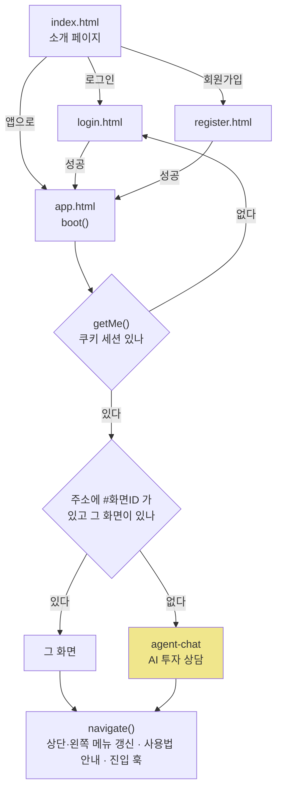
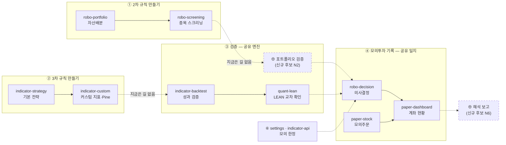

# 화면 정보구조(IA) v0.1 — Qurious 2.0

| 항목 | 내용 |
|------|------|
| **문서 버전** | v0.1 (착수 · 초안) |
| **기준 커밋** | `dfbfc30` (main · 2026-09-23) |
| **작성** | 이동원 · 2026-09-28 (S51) |
| **산출물 구분** | 4 화면·서비스 설계 — 정보구조(IA) + 주 경로 화면흐름도 |
| **상태** | 1절(지금 구조)은 코드로 확인한 사실 🟢 · 2~3절(2.0 구조)은 D1 ③ 이 확정되기 전의 **제안** 🟡 |
| **실측 도구** | `python scripts/view_scan.py` — 1.3절 표와 1.4절 검사 결과가 이 출력에서 나온다 |
| **관련 문서** | [논의 결정 대장 v0.9](../../계획서/지난판/논의결정대장_v0.9.md) · [RTM v1.0](../../요구사항/지난판/RTM_v1.0.md) · [ERD v1.0](../../데이터/지난판/ERD_v1.0.md) · 옛 A13 [#28](../../github-archive/2026-09-17/이슈-028/00-기록.md) · D1 [#7](../../github-archive/2026-09-15/논의-007/00-기록.md) |

확실도 · 🟢 코드·파일로 확인 / 🟡 추론·제안 / 🔴 정정·문제

> **쉬운 요약 3줄**
> 1. 지금 화면 49개는 상단 메뉴 11묶음에 흩어져 있고, **첫 화면은 D1 이 동결을 제안한 「AI 투자 상담」**이다. 2.0 의 주 경로(규칙 → 검증 → 기록) 12개는 **4개 묶음에 나뉘어** 메뉴에서 한 흐름으로 보이지 않는다.
> 2. 2.0 에서는 메뉴를 **「규칙 만들기 → 검증 → 모의투자 기록 → 배우기」 + 더보기(연결 설정·보조 분석·보관함)**로 다시 묶자고 제안한다. 화면 49개의 코드는 그대로 두고 **메뉴 표(`GNB_MENUS`) 한 곳과 첫 화면 한 줄**만 바꾸면 된다.
> 3. 그런데 강사님 일정표(th07)가 기대하는 화면과 대조하면 **D1 ③ 의 동결 25개 중 5개가 강사님 산출물과 겹친다**(RAG 대화·지식 검색·데이터 관제·알림 관리·운영 관제). 그래서 💬 6개를 팀에 묻는다. 49개가 브라우저에서 실제로 도는지는 **아직 확인하지 않았다.**

---

## 한눈에 보기

| 질문 | 답 | 확실도 | 절 |
|------|-----|:------:|:--:|
| 화면은 몇 개인가 | **49** — 화면 선언 49 = 메뉴 항목 49 = 사용법 안내 49 | 🟢 | 1.3 |
| 메뉴는 어떻게 생겼나 | 상단 9묶음 + 「더보기」 2묶음 = **11묶음** | 🟢 | 1.2 |
| 첫 화면은 | `agent-chat`(AI 투자 상담) — D1 ③ 제안상 **동결** | 🟢 | 1.1 |
| 들어가면 서버를 부르는 화면 | **30 / 49** (나머지 19개는 버튼을 눌러야 부름) | 🟢 | 1.3 |
| 화면끼리 잇는 버튼·링크 | **0개** — 이동은 메뉴로만 한다 | 🟢 | 1.4 |
| 주 경로 12개가 흩어진 묶음 | **4개** (로보 어드바이저 3 · 모의투자 2 · 퀀트자동매매 3 · 투자 인디케이터 4) | 🟢 (분류는 🟡) | 1.4 |
| 같은 일을 하는 화면 | 자동매매 시작·정지 **2곳** · 증권사 연결 설정 **3곳** · 같은 이름 **3쌍** | 🟢 | 1.4 |
| 다른 화면의 입력칸을 몰래 읽는 버튼 | **2곳** | 🟢 | 1.4 |
| 2.0 으로 바꿀 때 고칠 코드 | `GNB_MENUS` 재배열 + 상단 버튼 HTML + 첫 화면 1줄. **화면 HTML 은 그대로** | 🟡 | 2.5 |
| 강사님이 기대하는 화면 중 지금 없는 것 | 리밸런싱 · XAI 설명 · 성과 대시보드 · 다중주기 · 위험 관제 등 **9개** (26줄 중) | 🟡 | 3 |
| 팀에 묻는 것 | 💬 **6개** | — | 5 |

---

## 용어 풀이

| 용어 | 정확한 뜻 | 이 문서에서 | 헷갈리기 쉬운 점 |
|------|-----------|-------------|------------------|
| **IA** (Information Architecture, 정보구조) | 화면을 어떤 **묶음·순서·이름**으로 배치해 사용자가 길을 찾게 할지 정한 설계 | 49개 화면의 메뉴 묶음 · 첫 화면 · 화면 사이 이동 | 색·배치 같은 **화면 디자인이 아니다**. 그건 와이어프레임·UI 명세(v0.2 이후) |
| **GNB · LNB** | Global / Local Navigation Bar. 상단 메뉴와 왼쪽 메뉴 | 상단 = 11묶음, 왼쪽 = 고른 묶음 안의 화면 | 코드에서는 **둘 다 `GNB_MENUS` 한 객체**에서 나온다(`app.html:2657-2762`) |
| **뷰(view)** | 화면 하나 | `<div class="view" data-view="robo-portfolio">` | 49개가 **늘 DOM 안에 있고 보이기만 바뀐다**. 그래서 1.4절의 「숨은 의존」이 에러 없이 조용히 동작한다 |
| **진입 훅** | 화면이 켜질 때 부르는 함수 | `onViewActivated`(`app.html:3903`) · `onPaperViewActivated`(`paper.js:583`) | 훅이 없다고 **미완성이 아니다** — 버튼을 눌러야 도는 화면이다(옛 A13 도 같은 말) |
| **해시 라우팅** | 주소 끝 `#화면ID` 로 지금 화면을 기억하는 방식 | `navigate()` 가 `location.hash` 를 적고(`:3075`), `boot()` 가 읽는다(`:3599-3600`) | 새로고침해도 **보던 화면이 유지된다** — 1.1절 🔴 정정 |
| **주 경로 · 최소 요건 · 개념 설명 · 동결** | D1 ③ 이 제안한 49개 1차 분류 | 12 · 2 · 10 · 25 | **동결 ≠ 삭제**. 개발·발표에 시간을 쓰지 않을 뿐이고 삭제는 D3 에서 정한다. 아직 **⏳ 2/4 미확정** |
| **화면흐름도** | 사용자가 화면을 어떤 순서로 지나가는지 그린 그림 | 2.3절 (주 경로만) | 지금 코드에는 화면끼리 잇는 버튼이 없어 **흐름은 메뉴 순서로만 만들어진다** |
| **숨은 의존** | 한 화면의 버튼이 **보이지 않는 다른 화면**의 입력칸 값을 읽는 것 | 1.4절 I7 — 2곳 | 사용자는 그 값을 보지도 고르지도 못한 채 실행한다 |
| **AS-IS · TO-BE** | 지금 모습 · 바꿀 모습 | 1절 · 2절 | TO-BE 는 **제안**이다. D1 ③ 확정 전에는 코드에 반영하지 않는다 |

---

## 1. 지금 구조 (AS-IS) 🟢

### 1.1 들어오는 길 — 첫 화면은 동결 후보다



- 첫 화면 기본값은 `agent-chat` 이다(`app.html:3600`). D1 ③ 은 이 화면을 **동결**로 제안했다 → 처음 온 사람이 2.0 이 풀려는 문제(규칙을 믿어도 되는가)와 무관한 화면부터 본다.
- 상단 묶음을 누르면 **그 묶음의 첫 화면**으로 간다(`:3080-3085`). 11묶음 중 **6곳은 첫 화면이 동결 후보**다(로보 어드바이저 → AI 투자 상담 · 크롤링 · 직접매매 · 퀀트자동매매 → 퀀트 대시보드 · 미국주식 · 시스템).

> 🔴 **정정 — 옛 A13(#28)의 「새로고침하면 처음 화면으로 돌아간다」는 틀렸다.**
> `navigate()` 가 `location.hash = viewKey` 로 주소를 바꾸고(`:3075`), `boot()` 가 그 해시를 읽어 같은 화면을 연다(`:3599-3600`).
> 조사 기준 커밋이던 `04f476a` 에도 같은 두 줄이 있었다(`:3073` · `:3589`) — 처음부터 틀린 서술이다.

### 1.2 메뉴 트리

`★` 주 경로 · `◎` 최소 요건 · `○` 개념 설명 · `✕` 동결 — **D1 ③ 제안 분류**(미확정)

```
상단 메뉴 (app.html:659-667)                  왼쪽 메뉴 = GNB_MENUS (app.html:2657-2762)
─────────────────────────────────────────────────────────────────────────────────────
로보 어드바이저 ─┬ ✕ agent-chat          AI 투자 상담        ← 앱 첫 화면
                 ├ ★ robo-portfolio      자산배분·최적화
                 ├ ★ robo-screening      패턴 인식·종목 스크리닝
                 ├ ★ robo-decision       모의 투자 의사결정
                 ├ ✕ agent-cb            신용 리스크 분석
                 ├ ✕ agent-products      맞춤 상품 추천
                 └ ✕ agent-news          투자 정보 리서치
크롤링 ──────────┬ ✕ crawl-auto · ✕ crawl-manual · ✕ crawl-ingest
직접매매 ────────┬ ✕ trading-chart · ✕ trading-portfolio · ✕ trading-order
모의투자 ────────┬ ★ paper-dashboard     모의계좌 현황
                 ├ ★ paper-stock         국내주식 모의주문
                 └ ✕ paper-crypto · ✕ paper-alternative · ✕ paper-openapi
퀀트자동매매 ────┬ ✕ quant-dashboard     퀀트 대시보드
                 ├ ✕ quant-auto          자동매매 현황
                 ├ ★ quant-backtest      전략 분석           ← 제목이 "(10년 Mockup)"
                 ├ ★ quant-lean          LEAN 백테스트
                 ├ ★ settings            증권사 API 설정
                 └ ✕ notification-settings 알림 설정
미국주식 ────────┬ ✕ us-dashboard · ✕ us-chart · ✕ us-order · ✕ us-portfolio
투자 인디케이터 ─┬ ★ indicator-strategy  기본 인디케이터 전략
                 ├ ★ indicator-custom    커스텀 인디케이터 개발
                 ├ ★ indicator-backtest  성과 검증 (Python)
                 ├ ★ indicator-api       증권사 API 자동화
                 └ ✕ company-dashboard · ✕ company-compare · ✕ company-sector
ML·딥러닝 ───────┬ ◎ ml-compare · ○ ml-regression · ◎ ml-cluster · ○ ml-tune · ○ ml-deeplearning
투자분석 ────────┬ ○ macro-dashboard · ○ macro-industry · ○ invest-fundamental · ○ invest-technical
[더보기] 금융 지식 ┬ ○ fin-products · ○ fin-allocation · ○ quant-seasonal
[더보기] 시스템 ──┬ ✕ sysadmin-dashboard · ✕ sysadmin-logs
─────────────────────────────────────────────────────────────────────────────────────
묶음 11 · 화면 49 = ★12 · ◎2 · ○10 · ✕25
통째로 동결인 묶음 4개(크롤링 · 직접매매 · 미국주식 · 시스템 = 12화면) · 주 경로가 섞인 묶음 4개
```

### 1.3 화면 49개 전수표

`python scripts/view_scan.py --md` 출력 그대로다. API 경로 앞의 `/api` 는 줄였고, `…` 은 경로 변수 자리다.
「진입 API」는 화면에 들어가면 부르는 것, 「조작 API」는 버튼을 눌러야 부르는 것이다. **D1 ③ 칸은 코드 사실이 아니라 제안**이다.

| # | 묶음 | 화면 ID | 메뉴 글자 | 선언 줄 | 진입 훅 | 진입 API | 조작 API | D1 ③ (제안) |
|---:|---|---|---|---|---|---|---|---|
| 1 | 로보 어드바이저 | `agent-chat` | AI 투자 상담 | 732-753 | 없음 | — | `/chat` | 동결 |
| 2 | 로보 어드바이저 | `robo-portfolio` | 자산배분·최적화 | 1686-1741 | 없음 | — | `/ml/robo/allocation` | 주 경로 |
| 3 | 로보 어드바이저 | `robo-screening` | 패턴 인식·종목 스크리닝 | 1742-1818 | `loadRoboScreening` | `/stocks/signals` | — | 주 경로 |
| 4 | 로보 어드바이저 | `robo-decision` | 모의 투자 의사결정 | 1819-1850 | `loadRoboDecision` | `/quant/auto/status` | `/quant/auto/start` · `/quant/auto/stop` | 주 경로 |
| 5 | 로보 어드바이저 | `agent-cb` | 신용 리스크 분석 | 754-812 | 없음 | — | `/chat` | 동결 |
| 6 | 로보 어드바이저 | `agent-products` | 맞춤 상품 추천 | 813-846 | 없음 | — | `/chat` | 동결 |
| 7 | 로보 어드바이저 | `agent-news` | 투자 정보 리서치 | 847-860 | 없음 | — | `/library/search` | 동결 |
| 8 | 크롤링 | `crawl-auto` | 자동 크롤링 | 861-876 | 없음 | — | `/ingest/crawl/auto` | 동결 |
| 9 | 크롤링 | `crawl-manual` | 수동 크롤링 | 877-897 | `loadCrawlList` | `/ingest/crawl/list` | `/ingest/crawl/naver` · `/ingest/crawl/url` | 동결 |
| 10 | 크롤링 | `crawl-ingest` | 데이터 인제스트 | 898-913 | 없음 | — | `/admin/reset` · `/ingest/financial` | 동결 |
| 11 | 직접매매 | `trading-chart` | 주가 차트 | 914-939 | `loadStockChart` | `/stocks/candles` · `/stocks/quote` | `/stocks/search` | 동결 |
| 12 | 직접매매 | `trading-portfolio` | 포트폴리오 | 940-959 | `loadPortfolio` | `/portfolio` · `/portfolio/…` | — | 동결 |
| 13 | 직접매매 | `trading-order` | 주문/매매 | 960-1007 | `loadOrderHistory` + `loadBrokerStatus` | `/broker/settings` · `/orders` | — | 동결 |
| 14 | 모의투자 | `paper-dashboard` | 모의계좌 현황 | 1008-1021 | `loadPaperDashboard` | `/paper/account` · `/paper/alternatives/orders/history` · `/paper/stocks/orders/history` · `/paper/trade/order/history` | — | 주 경로 |
| 15 | 모의투자 | `paper-stock` | 국내주식 모의주문 | 1022-1055 | `loadPaperStock` | `/paper/account` · `/paper/stocks/orders/history` · `/paper/stocks/positions` | — | 주 경로 |
| 16 | 모의투자 | `paper-crypto` | 코인 모의매매 | 1056-1095 | `loadPaperCrypto` | `/paper/crypto/…` · `/paper/crypto/market-list` · `/paper/crypto/rankings` · `/paper/crypto/ticker` · `/paper/trade/hold` · `/paper/trade/order/history` | — | 동결 |
| 17 | 모의투자 | `paper-alternative` | 대체자산 (선물·옵션·금·부동산) | 1096-1127 | `loadPaperAlt` | `/paper/alternatives/markets` · `/paper/alternatives/markets/…` · `/paper/alternatives/orders/history` · `/paper/alternatives/positions` | — | 동결 |
| 18 | 모의투자 | `paper-openapi` | Open API · 외부 연동 | 1128-1159 | `loadPaperOpenApi` | `/paper/api-keys` · `/paper/api-keys/…` · `/openapi/v1/docs-summary` | — | 동결 |
| 19 | 퀀트자동매매 | `quant-dashboard` | 퀀트 대시보드 | 1160-1191 | `loadQuantDashboard` | `/stocks/market` · `/stocks/quant/indicators` · `/stocks/quant/list` | `/stocks/search` | 동결 |
| 20 | 퀀트자동매매 | `quant-auto` | 자동매매 현황 | 1192-1213 | `loadAutoTradeStatus` | `/auto-trade/status` | `/auto-trade/start` · `/auto-trade/stop` | 동결 |
| 21 | 퀀트자동매매 | `quant-backtest` | 전략 분석 | 1214-1236 | 없음 | — | `/stocks/quant/indicators` | 주 경로 |
| 22 | 퀀트자동매매 | `quant-lean` | LEAN 백테스트 (QuantConnect) | 1237-1271 | `loadLeanView` | `/backtests/lean/history` · `/backtests/lean/status` | — | 주 경로 |
| 23 | 퀀트자동매매 | `settings` | 증권사 API 설정 | 1272-1365 | `loadSettings` | `/quant/settings` | `/broker/price` | 주 경로 |
| 24 | 퀀트자동매매 | `notification-settings` | 알림 설정 | 1366-1525 | `loadNotificationSettings` | `/notification/history` · `/notification/settings` | `/notification/test` | 동결 |
| 25 | 미국주식 | `us-dashboard` | 대시보드 | 1526-1548 | `loadUsDashboard` | `/macro/us-stocks` · `/stocks/quote` | — | 동결 |
| 26 | 미국주식 | `us-chart` | 주가 차트 | 1549-1568 | `loadUsChart` | `/stocks/candles` · `/stocks/quote` | — | 동결 |
| 27 | 미국주식 | `us-order` | 주문/매매 | 1569-1611 | `renderUsOrders` | `/orders` | `/stocks/quote` | 동결 |
| 28 | 미국주식 | `us-portfolio` | 포트폴리오 | 1612-1624 | `loadUsPortfolio` | `/portfolio` · `/stocks/quote` | — | 동결 |
| 29 | 투자 인디케이터 | `indicator-strategy` | 기본 인디케이터 전략 | 1851-1929 | 없음 | — | `/stocks/quant/indicators` | 주 경로 |
| 30 | 투자 인디케이터 | `indicator-custom` | 커스텀 인디케이터 개발 | 1930-2008 | `loadSavedIndicators` | `/custom-indicators` · `/custom-indicators/…` | `/quant/pipeline` | 주 경로 |
| 31 | 투자 인디케이터 | `indicator-backtest` | 성과 검증 (Python) | 2009-2039 | `loadIndicatorBacktest` | `/quant/pipeline` | — | 주 경로 |
| 32 | 투자 인디케이터 | `indicator-api` | 증권사 API 자동화 | 2040-2106 | `loadIndicatorApiSettings` | `/broker/settings` | `/broker/test` | 주 경로 |
| 33 | 투자 인디케이터 | `company-dashboard` | 지표 대시보드 | 1625-1665 | `loadCompanyDashboard` | `/stocks/fundamentals` | `/stocks/search` | 동결 |
| 34 | 투자 인디케이터 | `company-compare` | 지표 비교 분석 | 1666-1674 | `loadCompanyCompare` | — | — | 동결 |
| 35 | 투자 인디케이터 | `company-sector` | 섹터 인디케이터 | 1675-1685 | `loadCompanySector` | — | — | 동결 |
| 36 | ML·딥러닝 | `ml-compare` | 모델 비교 (7종) | 2122-2168 | 없음 | — | `/ml/compare` | 최소 요건 |
| 37 | ML·딥러닝 | `ml-regression` | 회귀 분석 | 2169-2207 | 없음 | — | `/ml/regression` | 개념 설명 |
| 38 | ML·딥러닝 | `ml-cluster` | 종목 군집화 | 2208-2239 | 없음 | — | `/ml/cluster` | 최소 요건 |
| 39 | ML·딥러닝 | `ml-tune` | 하이퍼파라미터 튜닝 | 2240-2275 | 없음 | — | `/ml/tune` | 개념 설명 |
| 40 | ML·딥러닝 | `ml-deeplearning` | 딥러닝 (LSTM·Transformer) | 2276-2351 | 없음 | — | — | 개념 설명 |
| 41 | 투자분석 기초 | `macro-dashboard` | 거시경제 지표 | 2352-2369 | `loadMacroDashboard` | `/macro/indicators` | — | 개념 설명 |
| 42 | 투자분석 기초 | `macro-industry` | 산업 분석 | 2370-2394 | `loadMacroIndustry` | `/macro/industry` | — | 개념 설명 |
| 43 | 투자분석 기초 | `invest-fundamental` | 재무제표 분석 | 2395-2432 | 없음 | — | `/macro/fundamental` | 개념 설명 |
| 44 | 투자분석 기초 | `invest-technical` | 기술적 분석 | 2433-2476 | 없음 | — | — | 개념 설명 |
| 45 | 금융 필수 지식 | `fin-products` | 금융상품 이해 | 2477-2521 | 없음 | — | — | 개념 설명 |
| 46 | 금융 필수 지식 | `fin-allocation` | 자산배분 모델 | 2522-2567 | 없음 | — | — | 개념 설명 |
| 47 | 금융 필수 지식 | `quant-seasonal` | 계절성 분석 | 2568-2607 | 없음 | — | `/ml/seasonality` | 개념 설명 |
| 48 | 시스템관리 | `sysadmin-dashboard` | 서버 대시보드 | 2107-2121 | `loadSystemDashboard` | `/system/status` | — | 동결 |
| 49 | 시스템관리 | `sysadmin-logs` | 감사 로그 | 2608-2620 | `loadAuditLog` | `/admin/audit-log` | — | 동결 |

### 1.4 구조에서 보이는 문제

| # | 문제 | 근거 (기준 `dfbfc30`) | 왜 문제인가 | 확실도 |
|---|------|------------------------|-------------|:------:|
| I1 | **첫 화면이 동결 후보** | `app.html:3600` 기본값 `agent-chat` | 2.0 의 질문과 무관한 화면이 첫인상이 된다 | 🟢 |
| I2 | **주 경로 12개가 4묶음에 흩어짐** | `GNB_MENUS` `:2657-2762` | 「규칙 → 검증 → 기록」 흐름이 메뉴에 없다. 발표에서도 화면을 여기저기 오가야 한다 | 🟢 |
| I3 | **화면끼리 잇는 버튼·링크가 0개** | 스캐너: `navigate("…")` · `href="#…"` · `location.hash = "…"` 0건 | 규칙을 만든 뒤 검증 화면으로 가는 길이 없다. 흐름을 사용자가 기억해야 한다 | 🟢 |
| I4 | **같은 일을 하는 화면이 겹침** | 자동매매: `robo-decision`(`/quant/auto/*`) · `quant-auto`(`/auto-trade/*`) → 둘 다 `auto_trade.start_auto_trade` (`stocks.py:688-718`, 「기존 프론트 호환 경로」 주석) | 한 엔진을 두 화면이 켜고 끈다. 어느 화면이 정본인지 사용자는 모른다 | 🟢 |
| 〃 | 〃 | 증권사 연결: `settings`(`/quant/settings`) · `indicator-api` · `trading-order`(`/broker/settings`) → **같은 `BrokerSettings` 한 행**(`stocks.py:395-520`) | 한 화면에서 저장하면 다른 두 화면 값이 바뀐다. 화면은 셋인데 설정은 하나다 | 🟢 |
| 〃 | 〃 | 같은 이름 3쌍: 주가 차트 · 포트폴리오 · 주문/매매 (국내 `trading-*` · 미국 `us-*`) | 왼쪽 메뉴만 보면 구분이 안 된다 | 🟢 |
| I5 | **메뉴 글자가 두 벌** | 상단 「투자분석」「금융 지식」「시스템」(`:667` · `:704-705`) ↔ 왼쪽 제목 「투자분석 기초」「금융 필수 지식」「시스템관리」(`:2739` · `:2748` · `:2756`) | 같은 묶음을 두 이름으로 부른다 | 🟢 |
| I6 | **ID 접두사와 묶음이 어긋남** | `robo-*` 가 `agent` 묶음 · `indicator-*` 가 `company` 키 · `quant-seasonal` 이 금융 지식 · `settings` 가 퀀트자동매매 · 화면 선언 순서도 메뉴와 다름(`sysadmin-dashboard` 는 `:2107`, ML 사이) | 코드를 고칠 때 이름으로 위치를 짐작할 수 없다 | 🟢 |
| I7 | **숨은 의존 2곳** | ① `indicator-custom` 의 「테스트」(`:3404`)가 **`indicator-backtest` 화면의 종목칸** `ibt-symbol` 을 읽는다(없으면 삼성전자) ② `trading-order` 의 「설정 저장」(`:4310`)이 **`settings` 화면의** 계좌번호·모의 여부·키를 읽는다 | 사용자는 그 값을 보지도 고르지도 못한다. ②는 **증권사 설정을 보이지 않는 칸 값으로 덮어쓸 수 있다** | 🟢 |
| I8 | **관리자 전용 파괴 동작이 일반 화면에** | `crawl-ingest` 의 「DB 초기화」 버튼(`:4161-4168`) → `/api/admin/reset` | 서버가 관리자 권한을 검사하므로(`admin.py:19-22`) 일반 사용자는 403 이지만, **버튼은 모두에게 보인다.** 초기화는 감사 로그 표까지 지운다(`admin.py:16` `AuditEvent`) — D3 ② 「초기화에서 감사 제외」와 이어진다 | 🟢 |
| I9 | **화면이 약속과 다른 것을 한다** | `quant-backtest` 제목 「퀀트 전략 분석 (10년 Mockup)」·설명 「퀀트 지표를 조회합니다」(`:1216-1218`) — 백테스트 없음 · `robo-portfolio` 「AI가 최적 자산배분 비율을 계산합니다」(`:1690`) ↔ 조회표(RTM §4.2) · `us-dashboard` 「● LIVE」(`:1535`) ↔ 조회 실패 시 고정가(A13 F9) | D1 ③ 이 주 경로의 「검증」에 넣은 화면이 **스스로 목업이라고 적고 있다.** 문구는 D3 ⑧ 이 다룬다 | 🟢 |
| I10 | **주 경로의 시세가 수집 DB 가 아니라 야후** | ERD §1 — 화면 시세는 `ml.py:28` · `macro.py:15` → 야후 · `grep "market.sqlite3" app/` **0건**(S51 재확인) | 2.0 흐름의 첫 칸 「같은 데이터 스냅샷」(D1 흐름도)이 화면에 연결돼 있지 않다. IA 문제가 아니라 데이터 연결 문제지만 주 경로 전체에 걸린다 | 🟢 |

**구현에서 함께 보인 것** (IA 밖이지만 같은 스캐너가 잡았다)
- `#broker-test` 클릭 리스너가 **똑같은 코드로 두 번** 등록돼 있다(`:4559` · `:4572`) → 「연결 테스트」 한 번에 `/api/broker/price` 가 두 번 나간다. 🟢
- 사용법 안내 주석은 「43개 view 전체」(`:2819`)인데 실제 키는 **49개**다 — 주석만 낡았다. 🟢
- 스캐너가 처음 「숨은 의존」으로 잡은 `:5345` 는 여러 화면이 함께 쓰는 **공용 종목 검색 창**이었다 — 오탐이라 규칙을 고쳐 「공용 부품」으로 따로 보고하게 했다.

---

## 2. 2.0 구조 제안 (TO-BE) 🟡

> **제안이다.** D1 ③(⏳ 2/4)이 확정되면 그 분류로 이 절을 다시 채운다. 1절은 그대로 둔다.

### 2.1 원칙 4개

1. **메뉴 첫 줄 = 주 경로 순서.** D1 흐름도(규칙 → 같은 검증 엔진 → 모의투자 일지 → 해석 보고)를 메뉴 순서로 옮긴다.
2. **화면은 지우지 않는다.** 동결 25개는 「보관함」 한 묶음으로 모은다. 삭제는 D3 에서 정한다.
3. **공유 화면은 한 묶음에만 둔다.** `navigate()` 는 화면이 들어 있는 **첫 묶음**을 찾아 멈춘다(`:3050-3055`). 같은 화면을 두 묶음에 넣으면 늘 첫 묶음으로 끌려간다. 🟢
4. **첫 화면은 주 경로의 시작**이다(2.4절).

### 2.2 메뉴 전후 비교

```
지금 (11묶음 · 첫 화면 agent-chat)             2.0 제안 (상단 5 + 더보기 3 · 첫 화면 robo-portfolio)
────────────────────────────────────────         ──────────────────────────────────────────────────────
로보 어드바이저  7 (★3 ✕4)                      ① 2차 규칙 만들기   robo-portfolio · robo-screening
크롤링           3 (✕3)                         ② 3차 규칙 만들기   indicator-strategy · indicator-custom
직접매매         3 (✕3)                         ③ 검증              indicator-backtest · quant-lean
모의투자         5 (★2 ✕3)                                            · quant-backtest ⚠️(I9 보강 전제)
퀀트자동매매     6 (★3 ✕3)                      ④ 모의투자 기록     robo-decision · paper-dashboard
미국주식         4 (✕4)                                              · paper-stock
투자 인디케이터  7 (★4 ✕3)                      ⑤ 배우기            개념 설명 10개
ML·딥러닝        5 (◎2 ○3)                      ─────────── 더보기 ───────────
투자분석         4 (○4)                         ⑥ 연결 설정(모의)   settings · indicator-api
[더보기] 금융 지식 3 (○3)                       ⑦ 보조 분석         ml-compare · ml-cluster
[더보기] 시스템  2 (✕2)                         ⑧ 보관함            동결 25개 (지금 묶음 이름을 소제목으로)
```

| 지금 묶음 | 화면 수 | 2.0 에서 가는 곳 |
|-----------|:------:|------------------|
| 로보 어드바이저 | 7 | ★3 → ① · ④ / ✕4 → ⑧ |
| 모의투자 | 5 | ★2 → ④ / ✕3 → ⑧ |
| 퀀트자동매매 | 6 | ★3 → ③ · ⑥ / ✕3 → ⑧ |
| 투자 인디케이터 | 7 | ★4 → ② · ③ · ⑥ / ✕3 → ⑧ |
| ML·딥러닝 | 5 | ◎2 → ⑦ / ○3 → ⑤ |
| 투자분석 · 금융 지식 | 7 | ○7 → ⑤ |
| 크롤링 · 직접매매 · 미국주식 · 시스템 | 12 | ✕12 → ⑧ (💬 Q2·Q3·Q5 결과에 따라 일부 되돌림) |
| **합계** | **49** | ★12 · ◎2 · ○10 · ✕25 — 빠지거나 겹치는 화면 없음 |

> **다른 안 — 차수형(안 B).** 강사님 일정표는 2차(로보)와 3차(인디케이터)를 **기간을 나눠** 진행한다(3절).
> 메뉴를 「2차 로보어드바이저 [만들기·검증·기록]」 / 「3차 인디케이터 [만들기·검증·기록]」으로 나누면 발표 단위와 맞는다.
> 다만 원칙 3 때문에 공유 화면(검증·기록)을 두 묶음에 동시에 둘 수 없어, 한쪽에만 두거나 `navigate()` 를 고쳐야 한다. → 💬 Q1

### 2.3 주 경로 화면흐름도



- 실선은 같은 묶음 안의 메뉴 순서, 점선은 **지금 코드에 없는 이동**이다(I3). 2.0 에서 「다음 단계로」 버튼을 달지는 D1 ③ 확정 뒤 와이어프레임에서 정한다.
- **2차 규칙을 검증하는 화면이 지금 없다.** 검증 쪽 화면(`indicator-backtest` · `quant-lean`)은 전부 3차 지표용이고, `robo-*` 는 백테스트를 부르지 않는다(1.3 표의 API 칸). → 신규 후보 N2 🟢
- 3차 규칙이 모의투자로 넘어가는 길도 없다. 자동매매 엔진(`robo-decision`)은 사용자가 만든 커스텀 지표가 아니라 서버의 기본 신호를 쓴다 — 옛 A6 [#14](../../github-archive/2026-09-17/이슈-014/00-기록.md) 「`_generate_signal` 백테스트 없음」과 같은 자리다. 🟡

### 2.4 첫 화면

| 안 | 첫 화면 | 장점 | 약점 |
|----|---------|------|------|
| **(가) 추천** | `robo-portfolio` (① 첫 화면) | 새 화면 없이 한 줄로 바꾼다. 2차가 먼저 진행된다(강사님 일정 10-01 시작) | 3차 기간에는 ② 첫 화면으로 다시 바꿔야 할 수 있다 |
| (나) | `paper-dashboard` (④ 현황) | 「지금 내 규칙이 어떻게 되고 있나」가 먼저 보인다 | 기록이 쌓이기 전에는 빈 화면이다 |
| (다) | 새 「흐름 안내」 화면 | 규칙 → 검증 → 기록을 한 장으로 보여 준다. 해석 보고(N6)·정적 결과 페이지(D2 ②)와 겸할 수 있다 | 49개 밖의 새 화면이다 |

### 2.5 코드 재사용 판정 — 무엇을 바꾸면 TO-BE 가 되나

| 부분 | 재사용 | 바꿀 것 | 근거 |
|------|:------:|---------|------|
| 화면 49개 HTML·JS | ✅ 그대로 | 없음 | 화면은 `data-view` 로 독립이고, 메뉴는 ID 만 가리킨다 |
| `GNB_MENUS` (`:2657-2762`) | ✅ 구조 그대로 | 묶음 8개로 **재배열**만 | `renderLnb()`·`navigate()` 가 이 표만 보고 메뉴를 그린다(`:3002-3017` · `:3048-3077`) |
| 상단 버튼 HTML (`:659-667` · `:704-705`) | 🟡 | 묶음 키·글자를 **따로 다시 적어야** 한다 | `data-gnb` 가 `GNB_MENUS` 키와 1:1 이라 두 곳이 어긋나면 버튼이 죽는다 — I5 가 이미 한 번 어긋난 흔적이다 |
| 첫 화면 (`:3600`) | ✅ | `"agent-chat"` → 새 첫 화면 **1줄** | — |
| 해시 라우팅 · 북마크 | ✅ 그대로 | 없음 | 화면 ID 를 안 바꾸므로 옛 주소(`#agent-chat`)도 그대로 열린다 |
| 사용법 안내 `VIEW_GUIDES` | ✅ 그대로 | 없음 (주석 43 → 49 만) | 화면 ID 기준이다 |
| 숨은 의존 2곳 (I7) | 🔴 | 각 화면에 자기 입력칸을 둔다 | 메뉴를 바꾸면 **더 멀리 떨어진 화면끼리** 값을 주고받게 된다 |

전후 구조 — `GNB_MENUS` 는 **키와 순서만** 바뀐다 (발췌):

```js
// 지금 (app.html:2657-)                         // 2.0 제안 — 화면 ID 는 하나도 안 바뀐다
const GNB_MENUS = {                               const GNB_MENUS = {
  agent: { label: "로보 어드바이저", items: [       rule2:  { label: "2차 규칙 만들기", items: [
    { key: "agent-chat", ... },                        { key: "robo-portfolio", ... },
    { key: "robo-portfolio", ... },                    { key: "robo-screening", ... } ] },
    { key: "robo-screening", ... },                  rule3:  { label: "3차 규칙 만들기", items: [
    { key: "robo-decision", ... },                     { key: "indicator-strategy", ... },
    ... ] },                                           { key: "indicator-custom", ... } ] },
  crawl: { ... },                                    verify: { label: "검증", items: [ ... ] },
  ...                                                record: { label: "모의투자 기록", items: [ ... ] },
};                                                   learn:  { ... }, connect: { ... },
                                                     assist: { ... }, archive: { ... },
                                                   };
```

---

## 3. 강사님 일정표의 화면 산출물과 대조

강사님 강의 사이트 저장소(th07 `edumgt/domain-rag-lab`)의 `frontend/assets/day4-project-schedule.js` 는 단계마다 **할 일과 산출물**을 적어 둔다
(로컬 사본 `learning/th07-domain-rag-lab/lecture` · 원격 끝 `e63e675` · 2026-09-28 09:20 fetch).
그중 화면 산출물만 뽑아 지금 49개와 맞췄다. 「가까운 화면」 칸은 화면 글자와 API 로 판단한 **추정**이다 🟡.

| 줄 | 트랙 · 단계 | 강사님 산출물 | 지금 가까운 화면 | D1 ③ | 판정 |
|---:|-------------|---------------|------------------|:----:|:----:|
| 26 | 공통 · 데이터·화면 설계 | **IA·와이어프레임** | (이 문서) | — | 🟡 IA 착수 · 와이어프레임 없음 |
| 23 | 공통 · 요구사항 | 사용자 스토리 맵 | — | — | ❌ 없음 (산출물목록 2절 🔴) |
| 28 | 로보 · 금융 데이터 수집 | 데이터 관제 화면 | `crawl-manual` · `crawl-ingest` | ✕ | ⚠️ 동결과 충돌 |
| 29 | 로보 · RAG 지식 구축 | 지식 검색 UI | `agent-news` (`/library/search`) | ✕ | ⚠️ 동결과 충돌 |
| 30 | 로보 · RAG 질의응답 | RAG 대화 화면 | `agent-chat` (`/chat`) | ✕ | ⚠️ 동결과 충돌 |
| 31 | 로보 · 성향·자산배분 | 성향진단·배분 UI | `robo-portfolio` | ★ | 🟡 일부 (배분은 조회표 — RTM §4.2) |
| 32 | 로보 · 리밸런싱 | 리밸런싱 UI (조정 전후 비교) | — | — | ❌ 없음 (RTM `P01-③-1~2` 🔴) |
| 34 | 로보 · XAI 설명 | XAI 설명 UI (추천 근거) | — | — | ❌ 없음 (RTM `P01-①-5` 🔴) |
| 35 | 로보 · 성과 분석 | 성과 대시보드 (성과·기여도) | — | — | ❌ 없음 → N2 |
| 36 | 로보 · 모의투자 | 모의투자 화면 | `paper-dashboard` · `paper-stock` | ★ | 🟢 있음 |
| 52 | 로보 · 스트레스 검증 | 위험 리포트 | — | — | ❌ 없음 |
| 57 | 로보 · 운영·복구 | 운영 관제 화면 | `sysadmin-dashboard` | ✕ | ⚠️ 동결과 충돌 |
| 37 | 인디케이터 · 시장 데이터 엔진 | 전략 설정 UI | `indicator-strategy` | ★ | 🟢 있음 |
| 39 | 인디케이터 · 커스텀 지표 | 커스텀 지표 UI (지표 조합 빌더) | `indicator-custom` | ★ | 🟢 있음 |
| 40 | 인디케이터 · TradingView | TradingView 실습 화면 | `indicator-custom` 의 Pine 생성기 | ★ | 🟡 일부 (옛 A13 F1 — 생성 코드가 컴파일되지 않음) |
| 41 | 인디케이터 · 백테스트 | 백테스트 대시보드 | `indicator-backtest` | ★ | 🟢 있음 |
| 42 | 인디케이터 · 전략 최적화 | 전략 비교 화면 | (비교 트레이 `renderCompareTrayAll`) | — | 🟡 일부 |
| 43 | 인디케이터 · 증권사 연동 | 자동매매 관제 화면 (비상정지) | `robo-decision` · `quant-auto` | ★ · ✕ | 🟡 일부 (비상정지 RTM `P02-⑤-2` 🟠) |
| 63 | 인디케이터 · 다중주기 신호 | 다중주기 차트 | — | — | ❌ 없음 |
| 64 | 인디케이터 · 포지션·위험 | 위험 관제 화면 | — | — | ❌ 없음 |
| 65 | 인디케이터 · 데이터 품질 | 품질 대시보드 | — | — | ❌ 없음 |
| 66 | 인디케이터 · Pine 교차검증 | 대사 화면 (불일치 구간 비교) | `quant-lean` | ★ | 🟡 일부 (RTM `P02-④-3` 🟠) |
| 67 | 인디케이터 · 알림 자동화 | 알림 관리 UI | `notification-settings` | ✕ | ⚠️ 동결과 충돌 |
| 68 | 인디케이터 · 백테스트 대사 | 대사 대시보드 | — | — | ❌ 없음 |
| 70 | 인디케이터 · 모의증권 연동 | 모의매매 화면 | `paper-stock` | ★ | 🟢 있음 |
| 71 | 인디케이터 · 실시간 엔진 | 라이브 대시보드 | `quant-dashboard` | ✕ | 🟡 일부 · 동결 |

그 밖에 시험·배포 단계의 화면 산출물(45 · 50 · 51 · 55 · 73 · 74 · 75 · 77 — UI QA · 통합 화면 · RAG UI 시험서 · 관제 화면 등)은
**화면을 새로 만드는 일이 아니라 시험·배포 결과물**이라 이 표에서 뺐다.

**여기서 보이는 것**
- 26줄 = 🟢 **있음 5 · 🟡 일부 7(IA 포함) · ❌ 없음 9 · ⚠️ 동결과 충돌 5.** 인디케이터 트랙은 만들기·백테스트 화면이 대체로 있고, 로보 트랙은 **리밸런싱·XAI·성과가 비어 있다.**
  라이브 대시보드(71행) ↔ `quant-dashboard`(동결)는 대응이 약해 충돌 셈에서 뺐다.
- **D1 ③ 은 이 일정표를 보기 전에 쓰였다.** 동결 25개 중 5개(데이터 관제 · 지식 검색 · RAG 대화 · 알림 관리 · 운영 관제)가 강사님 산출물이다. 특히 RAG 두 줄은 RTM `P01-①-3`(근거문서·출처 RAG)과 D3 ④ B′(AI 상담을 최소 요건으로)와 같은 방향이다. → 💬 Q2 · Q3
- 새 화면 후보(49개 밖) — 번호는 흐름도·질문에서 쓴다.

| 후보 | 무엇 | 출처 |
|------|------|------|
| N1 | 데이터 관제·수집 현황 (어떻게 가져왔는지 보여 주기) | 강사님 28행 · 옛 [#59](../../github-archive/2026-09-21/이슈-059/00-기록.md) 강사님 요청 · RTM `P01-①-2` |
| N2 | 포트폴리오 검증·성과 대시보드 (단순 대안 대비 · 비용 차감) | 강사님 35행 · D1 추천 벤치마크 · D5 |
| N3 | 리밸런싱 (조정 전후 비교) | 강사님 32행 · RTM `P01-③-1~3` |
| N4 | XAI 설명 (추천 근거) | 강사님 34행 · RTM `P01-①-5` |
| N5 | 위험 관제·위험 리포트 | 강사님 52 · 64행 |
| N6 | 해석 보고 (믿어도 되나 · 어떤 조건에서 틀리나) | D1 흐름도 마지막 칸 · D2 ② 정적 결과 페이지 |
| N7 | 운용정보 (일일 거래내역·잔고) | D5 ⑨ (⏳) — `paper-dashboard` 확장일 수 있다 |

> ⚠️ **같은 파일의 일정이 우리 계획과 다르다.** 로보(2차) **10-01~10-21**(평일 13일 · 마지막 오후 제외 25칸 × 4시간 = 개인 100시간) ·
> 인디케이터(3차) **10-22~11-11**(평일 15일 · 30칸 × 4시간 = 120시간) · 휴일 10-05·10-09(`day4-project-schedule.js:85` · `:108-116`, 09-21 커밋 `e9b4142` 에서 바뀜).
> 우리 계획서는 2차를 09-27~10-26 으로 잡았다. 화면 준비 순서(2차 화면을 10-21 까지)에 바로 걸린다 — 결정 대장 §5 ①(발표일·기간)의 답일 수 있어
> [강사님 자료 변경 추적](../../github-archive/2026-09-28/이슈-강사님자료-변경추적/01-2026-09-28-기준점.md)에 따로 올렸다. 우리 반 공식 일정인지는 강사님 확인이 필요하다 🟡.

---

## 4. 다른 결정과의 연결 — 화면이 따라 바뀌는 곳

| 결정 | 상태 (대장 v0.9) | 닿는 화면 | 화면에서 바뀌는 것 |
|------|------------------|-----------|--------------------|
| D1 ③ 깊게의 범위 | ⏳ 2/4 | 49개 전부 | 2절 전체의 전제 |
| D1 ④ S1 | ⏳ 2/4 + ✅ᶜ 1 | ③ 검증 · ④ 기록 | 공유 묶음(흐름형 안 A)의 근거 |
| D3 ④ B′ RAG 최소 요건 | ⏳ 1/4 | `agent-chat` · `agent-news` | 동결 → 최소 요건 (D1 ③ 과 엇갈림 · Q3) |
| D3 ⑧ B′ 화면 표기 | 🟡 조건부 | `us-dashboard` · `robo-portfolio` · 목업 3곳 | 거짓 `● LIVE` 제거 · 문구 교정 (I9) |
| D3 ② B+ 감사·로그 | 🟡 조건부 | `sysadmin-logs` · `crawl-ingest` | 초기화에서 감사 제외 (I8) |
| D7 ① L1 실계좌 차단 | 🟢 확정 예정 | `settings` · `indicator-api` · `trading-order` | 화면·저장에서 live 거부 (서버 관문은 ✅) |
| D7 ④ R2 | 🟢 확정 예정 | `robo-decision` · `quant-auto` | 10분 반복 동결 → 매 거래일 1회 |
| D5 ⑨ 운용정보 | ⏳ 2/4 | `paper-dashboard` / N7 | 일일 거래내역·잔고 항목 |
| D2 ② 데모 방식 | ⏳ 2/4 | N6 | 정적 결과 페이지 |
| D6 ⑧ 3차 독립 | 🟢 확정 예정 | ② 3차 규칙 만들기 | 차수형 안 B 의 근거 (Q1) |
| 옛 #59 강사님 요청 | 열림 | `crawl-manual` / N1 | 동결 → 최소 요건? (Q2) |
| ERD §1 · 옛 #61 P1-1 | 🔴 구조 문제 | 주 경로 전부 | 시세 출처 야후 → 수집 DB (I10) |

---

## 5. 💬 팀에 묻는 것

| # | 질문 | 선택지 | 제 추천 (미확정) |
|---|------|--------|------------------|
| Q1 | 메뉴를 무엇으로 묶을까 | **(A) 흐름형** 만들기·검증·기록 / (B) 차수형 2차·3차 | **A.** 공유 화면을 한 번만 두고(원칙 3), D1 ④ S1 문장과 같다. 발표 순서는 묶음 순서로 맞출 수 있다 |
| Q2 | 크롤링 3종 | 동결 유지 / **`crawl-manual` 만 최소 요건으로** / 셋 다 | **`crawl-manual` 만.** 강사님 요청(#59)과 요구 `P01-①-2`(크롤링 및 적재)가 있다. 나머지 둘은 보관함 |
| Q3 | AI 투자 상담·투자 정보 리서치 | D1 ③ 동결 / **D3 ④ B′ 최소 요건** | **D3 ④ 결론을 따른다.** 강사님 일정표 29·30행과 RTM `P01-①-3` 이 같은 방향이다 |
| Q4 | 겹치는 화면 | 둘 다 메뉴에 / **정본 하나만 메뉴에** | 자동매매는 `robo-decision`, 증권사 설정은 `settings` 만 ⑥ 에 두고 나머지는 보관함. 설정이 한 행이라 기능은 안 잃는다(I4) |
| Q5 | 2차 규칙 검증 화면(N2) | 새로 만든다 / `indicator-backtest` 를 포트폴리오까지 넓힌다 | D5 와 함께 정한다. 지금은 **2차 규칙을 검증할 화면이 아예 없다**는 사실만 적어 둔다 |
| Q6 | 첫 화면 | **(가) robo-portfolio** / (나) paper-dashboard / (다) 흐름 안내 | **(가)** 로 시작하고 N6 을 만들면 (다)로 옮긴다 |

---

## 6. 판정을 뒤집을 조건

- **D1 ③ 이 다른 분류로 확정되면** → 2절 표를 그 분류로 다시 채운다(1절 · 1.4절은 그대로). `view_scan.py` 의 `D1_PROPOSAL` 만 고치면 1.3 표도 따라온다.
- **브라우저 확인에서 주 경로 화면이 안 돌면** → 그 화면은 ③ 검증 · ④ 기록에 둘 수 없다. 특히 `quant-backtest` 는 이미 스스로 목업이다(I9).
- **강사님 일정표가 우리 반 공식 일정이 아니면** → 3절 대조표는 참고로만 낮춘다. 공식이면 동결 충돌 5개를 먼저 푼다.
- **2·3차 발표를 따로 한다고 확정되면**(대장 §5 ①) → 차수형(안 B)이 더 맞을 수 있다.
- **3차가 「사용자 맞춤 추천 서비스」 형태를 요구하면**(대장 §5 ⑤) → 메뉴의 축(규칙을 검증하는 도구)이 바뀐다.

## 7. 한계 — 확인하지 못한 것

- **49개를 브라우저로 돌려 보지 않았다.** 이 문서는 코드를 읽은 정적 분석이다(산출물목록 4절 「문서보다 그 검증이 먼저」는 그대로 유효하다).
- API 대응은 스캐너 휴리스틱이다(요소 id 소유 + 호출 1단계). 2단계 이상 호출은 놓친다. 이번에 사람이 코드로 다시 본 것은 I4 · I7 · I8 · I9 와 `settings` 행뿐이다.
- 3절의 「가까운 화면」과 RTM 요구 대응은 화면 글자·API 로 판단한 추정이다.
- `index.html` · `login.html` · `register.html` 은 49개에 넣지 않았다(메뉴 밖 진입 화면).
- 모바일 화면 · 접근성 · 속도는 보지 않았다(강사님 일정표 45 · 74 · 75행이 다루는 시험).

## 8. 다음 판(v0.2)에서 할 것

1. 도커로 앱을 띄워 **주 경로 12개를 브라우저로 확인**한다(동작 · 빈 화면 · 에러).
2. D1 ③ · Q1~Q6 결과를 반영해 2절을 확정안으로 바꾼다.
3. 주 경로 12개의 **와이어프레임**(강사님 26행 「IA·와이어프레임」의 나머지 절반).
4. 화면흐름도를 49개 전체로 넓힌다(보관함 포함).

## 9. 근거 · 재현

| 무엇 | 어디 (기준 `dfbfc30`) |
|------|------------------------|
| 메뉴 표 · 이동 · 첫 화면 | `public/app.html:2657-2762` · `:3002-3086` · `:3589-3604` |
| 상단 버튼 | `public/app.html:659-667` · `:704-705` |
| 진입 훅 | `public/app.html:3903-3933` · `public/js/paper.js:583-590` |
| 화면 선언 49개 | `public/app.html:732-2620` |
| 자동매매 경로 두 벌 | `app/routes/stocks.py:688-730` (시작·정지 `:688-718`) |
| 증권사 설정 한 행 · API 두 개 | `app/routes/stocks.py:395-520` |
| DB 초기화 권한 | `app/routes/admin.py:13-35` |
| 강사님 일정표 | th07 `frontend/assets/day4-project-schedule.js:23-79` · `:85` · `:108-116` (원격 끝 `e63e675`) |

```bash
python scripts/view_scan.py          # 요약 + 숨은 의존·중복 리스너 검사
python scripts/view_scan.py --md     # 1.3절 표
python scripts/view_scan.py --json   # 기계용
```
