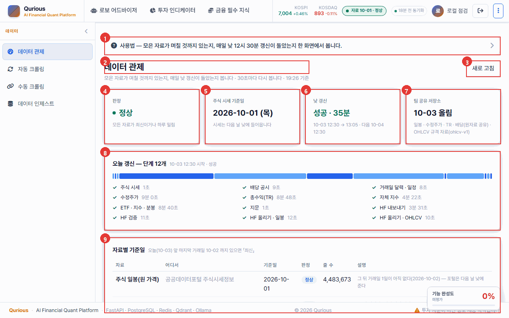
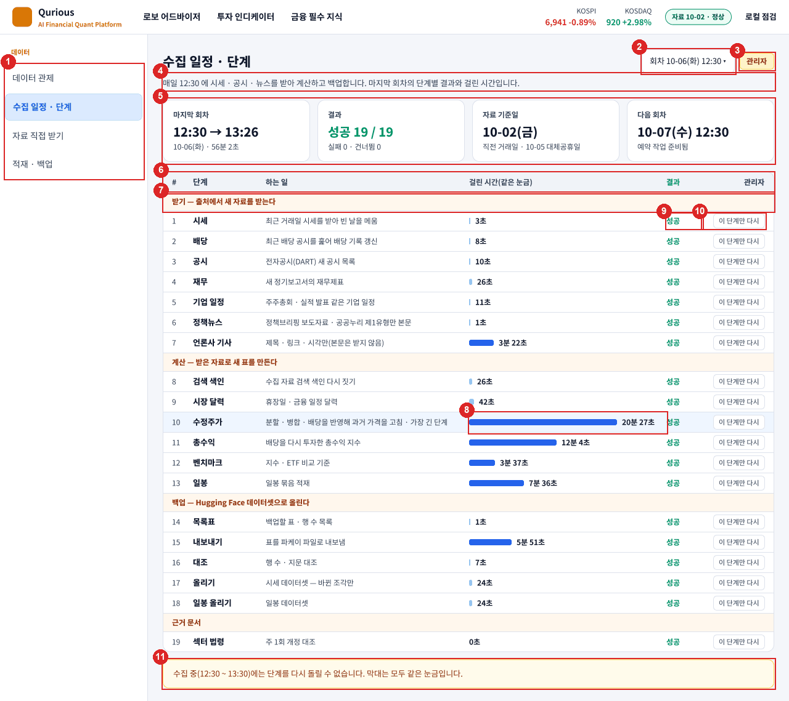
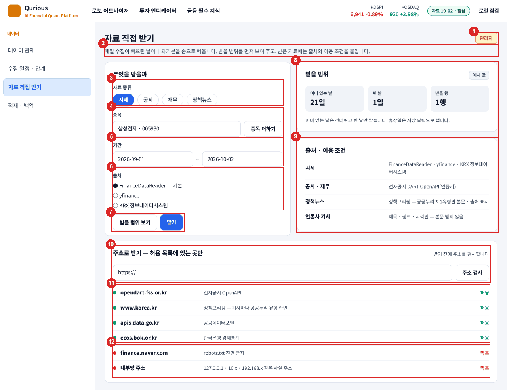
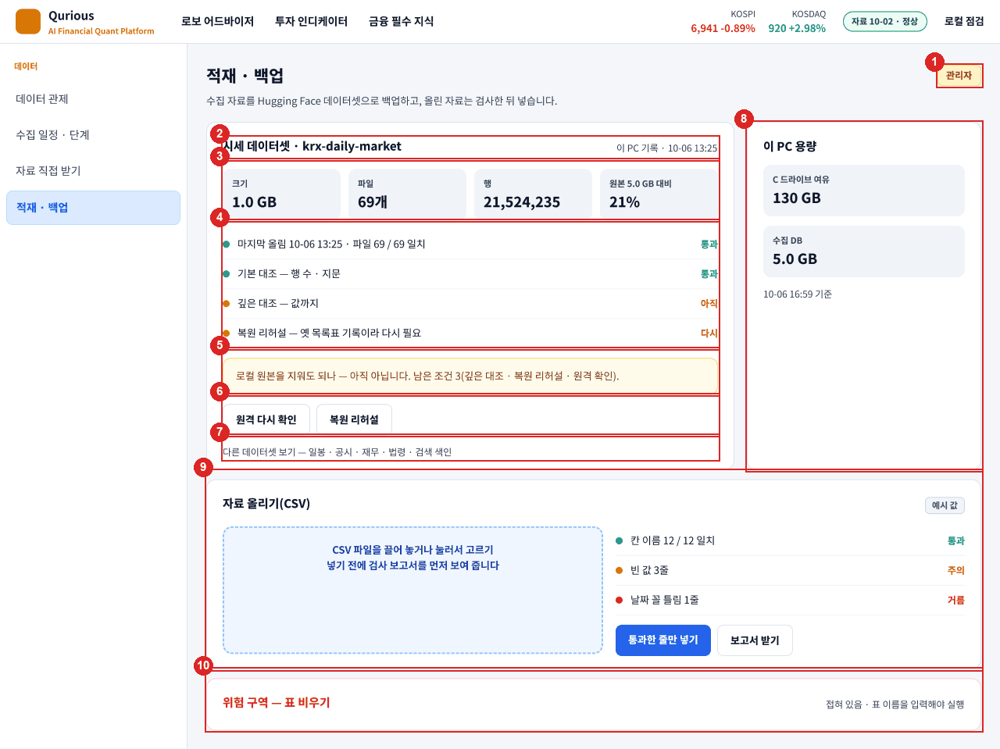

# UI 명세서(화면설계서) v0.3 — Qurious

| 문서 정보 | |
|---|---|
| **판 · 상태** | v0.3 · 초안(검토 전) — 공통 영역 · 데이터 관제 · AI 투자 상담(근거 답) 상세 · 데이터 수집 화면 셋(설계 결정 · 구현 전) · 화면 69개 목록. 나머지 화면의 상세는 각 주담당이 채운다 |
| **구분** | 4. 화면·서비스 설계 — UI 명세서(화면설계서) |
| **작성** | 초안 이동원(팀장 · 공통 영역과 이동원 몫 화면) · 자기 화면의 상세 채우기와 판 올리기는 각 주담당 · 검수 이동원 |
| **검토** | 검토 전 |
| **최종 수정** | 2026-10-07 (KST) |
| **기준** | 코드 `main` `7afe5e9`(1 ~ 3절 · 6절) · `main` `163923a` + 근거 답 화면(4절 · 2026-10-04 14:05 캡처) · Figma 「데이터 수집 화면」 03 설계 · 05 결정 기록(5절 · 2026-10-06 결정 · 코드 `main` `13a6ae9` 의 러너 단계 목록과 대조) · 로컬 개발 앱 화면(1280 폭) · [IA v1.0](IA_v1.0.md) 2.1절 전수표 · [API 명세서 v0.3](../../인터페이스/지난판/API명세서_v0.3.md) 「부르는 화면」 칸 · [요구 대장](../../요구사항/대장/요구-대장.tsv) |
| **관련 문서** | [IA v1.3](../IA.md) · [와이어프레임 v0.5](../와이어프레임.md) · [유스케이스 명세서 v0.3](../../요구사항/유스케이스명세서.md) · [API 명세서 v0.11](../../인터페이스/API명세서.md) · [목표 기능 ① 설계서 v1.6](../../설계/목표기능1-데이터지식-설계.md) · [근거 답 출처 표시 조사서 v0.1](../../조사/근거답-출처표시-화면-조사.md) · [이동원 파트 할 일 v0.3](../../계획서/이동원파트-할일.md) 5절 · [코딩 표준 v0.1](../../개발/코딩표준.md) 4절 · Figma [「데이터 수집 화면 — 수집 일정 · 직접 받기 · 적재 백업」](https://www.figma.com/design/AfiCh50uOwrSq5F2Tk2JLZ) |
| **최근 개정** | v0.2 → v0.3: 데이터 수집 화면 셋 상세(5절 · Figma 설계 결정 · 구현 전 — 그림 셋 · 요소 33 · 경우 표) · 목록 10 ~ 12 줄 · 절 번호(목록 6 · 채울 차례 7) — 전체는 부록 C |

> **이 문서로 알 수 있는 것**
> 1. 모든 화면에 공통으로 있는 영역은 무엇이고, 무엇을 부르며 어떻게 동작하나?
> 2. 화면 하나는 어떤 칸으로 명세하나(데이터 관제를 본보기로)?
> 3. 화면 69개는 각각 어떤 API 를 부르고, 어느 요구 · 누구의 몫인가?
> 4. AI 투자 상담의 근거 답은 어떻게 보이고, 근거가 없거나 답할 수 없을 때 무엇을 보이나?
> 5. 크롤링 세 화면을 바꾼 데이터 수집 화면 셋(수집 일정 · 단계 · 자료 직접 받기 · 적재 · 백업)은 무엇을 보이고 어떻게 동작해야 하나?

## 요약

화면설계서의 실무 관행대로 **화면 그림에 번호를 찍고, 번호마다 요소 · 데이터(API) · 동작 · 빈 데이터 · 오류를 표로** 적는다. 모든 화면이 공유하는 공통 영역 11개와 데이터 관제 화면을 본보기로 자세히 썼고, v0.2 에서 AI 투자 상담(근거 답 · 요소 14 · 상태 표)을, v0.3 에서 데이터 수집 화면 셋(Figma 에서 정한 설계 · 구현 전 · 요소 33 · 경우 표)을 더했다. 화면 69개의 목록(부르는 API · 관련 요구 · 주담당)은 IA 전수표와 API 명세서에서 만들었다. 화면 69개 중 51개가 API 를 부르고, 상세를 채울 사람은 목록의 「명세」 칸에 적었다.

---

## 1. 읽는 법

**<표 1> 화면 한 장의 칸** · 문서 작성 기준 5.4절

| 칸 | 적는 것 |
|---|---|
| 화면 정보 | 화면 ID(화면 키) · 화면명 · 들어가는 길(메뉴) · 설명 · 관련 요구 · 주담당 |
| 화면 그림 | 1280 × 800 캡처에 빨간 번호 |
| 요소 표 | 번호 · 요소 · 데이터(API ID) · 동작 · 빈 데이터 · 오류 · 비고 |

---

## 2. 공통 영역

모든 화면에 공통으로 있는 영역은 <그림 1> 과 같다(투자 대시보드에서 캡처).

**<그림 1> 공통 영역** · 범례: 빨간 상자와 번호 = <표 2> 의 요소

**<표 2> 공통 영역 요소**

| 번호 | 요소 | 데이터(API) | 동작 | 빈 데이터 · 오류 | 비고 |
|:-:|---|---|---|---|---|
| 1 | 로고 · 서비스 이름 | — | 누르면 첫 화면(투자 대시보드 `#dashboard`) | — | 부제 「AI Financial Quant Platform」 |
| 2 | 위 메뉴 | — | 화면 폭에 들어가는 만큼 묶음을 보이고(1280 에서 셋), 누르면 그 묶음의 첫 화면 · 왼쪽 메뉴가 바뀐다 | — | 나머지 묶음은 7 에서 |
| 3 | 지수 띠(KOSPI · KOSDAQ) | `API-STK-01` | 값과 등락률 | 못 받으면 칸을 비운다 | 1440 아래에서는 환율을 숨긴다 |
| 4 | 자료 상태 배지 | `API-DATA-01` | 수집 자료 기준일과 판정(정상 · 확인 필요 · 멈춤)을 보이고, 누르면 요약 서랍이 열린다 | 상태를 못 받으면 「자료 상태 …」 | 1분마다 다시 묻는다 |
| 5 | 사용자 | — | 로그인한 사람 이름 · 누르면 내 정보 | — | — |
| 6 | 로그아웃 | `API-AUTH-03` | 로그아웃 뒤 로그인 화면 | — | — |
| 7 | 더보기(전체 메뉴) | — | 13묶음 전체 메뉴 서랍 · 화면이 바뀌면 닫힌다 | — | 서랍이 열린 동안 11 을 숨긴다 |
| 8 | 왼쪽 메뉴 | — | 지금 묶음 안의 화면 목록 · 지금 화면 강조 | — | — |
| 9 | 사이드바 접기 · 펼치기 | — | 왼쪽 메뉴를 접고 편다 | — | — |
| 10 | 바닥글 | — | 서비스 이름 · 쓴 기술 · 저작권 · 투자 유의 문구 | — | — |
| 11 | 기능 완성도 배지 | 화면 쪽 고정 표 | 화면마다 완성도 점수 | 점수가 없는 화면은 「미평가 0%」 | 점검 기준은 별도 세션에서 정한다 |

---

## 3. 화면 상세 — 데이터 관제 (본보기)

**<표 3> 화면 정보**

| 칸 | 내용 |
|---|---|
| 화면 ID · 화면명 | `data-status` · 데이터 관제 |
| 들어가는 길 | 위 메뉴(또는 전체 메뉴) 「데이터」 → 왼쪽 메뉴 「데이터 관제」 · 머리글의 자료 상태 배지 서랍에서 |
| 설명 | 모은 자료가 며칠 것까지 있는지, 매일 낮 12시 30분 갱신이 돌았는지, 팀 공유 저장소에 올라갔는지를 한 화면에서 본다 |
| 관련 요구 | `P01-①-2`(수집) · `P01-①-4`(갱신일 · 정기 배치) · 유스케이스 UC-04 |
| 주담당 | 이동원 |

화면은 <그림 2> 와 같다.

**<그림 2> 데이터 관제** · 범례: 빨간 상자와 번호 = <표 4> 의 요소

**<표 4> 데이터 관제 요소**

| 번호 | 요소 | 데이터(API) | 동작 | 빈 데이터 · 오류 |
|:-:|---|---|---|---|
| 1 | 사용법 안내 | — | 누르면 펼쳐 이 화면에서 무엇을 보는지 설명 | — |
| 2 | 화면 제목 | — | — | — |
| 3 | 새로 고침 | `API-DATA-01` | 상태를 다시 받는다 | (v0.2 에서 화면으로 확인) |
| 4 | 판정 카드 | `API-DATA-01` | 정상 · 확인 필요 · 멈춤 중 하나(모든 자료가 최신이거나 하루 밀림이면 정상) | (v0.2 에서 화면으로 확인) |
| 5 | 주식 시세 기준일 | `API-DATA-01` | 수집 DB 의 시세 기준일 · 공식 자료는 다음 날 낮에 들어온다는 안내 | — |
| 6 | 낮 갱신 | `API-DATA-01` | 오늘 회차의 시작 · 끝 · 걸린 시간 · 다음 회차 | 도는 동안 「도는 중 — 시작 시각」 · 기록이 없으면 「갱신 기록이 없습니다」 |
| 7 | 팀 공유 저장소 | `API-DATA-01` | 비공개 데이터셋에 올린 날과 올린 자료 | 「올린 기록 없음」 |
| 8 | 오늘 갱신 — 단계 12개 | `API-DATA-01` | 단계마다 성공 · 실패와 걸린 시간 | 실패한 단계는 그 줄에 「실패」 |
| 9 | 자료별 기준일 표 | `API-DATA-01` | 자료마다 출처 · 기준일 · 판정 · 줄 수 · 설명 · 아래에 「판정 읽는 법」 | 날짜로 판정하지 않는 자료(공시 · 일정)는 따로 묶는다 |

---

## 4. 화면 상세 — AI 투자 상담 · 근거 답

**<표 5> 화면 정보**

| 칸 | 내용 |
|---|---|
| 화면 ID · 화면명 | `agent-chat` · AI 투자 상담(화면 머리 「로보 어드바이저 AI 상담」) |
| 들어가는 길 | 위 메뉴 「로보 어드바이저」 → 왼쪽 메뉴 「AI 투자 상담」 · 주소 `#agent-chat` |
| 설명 | 법 · 규정 질문은 근거 조문과 함께 답하고(근거 답), 그 밖의 질문은 일반 AI(Local Ollama)가 답한다. 처음 엔진은 「자동 — 근거 먼저」 다 |
| 관련 요구 | `P01-①-3`(근거 문서와 출처를 포함한 RAG 질의응답) · 유스케이스 UC-03 |
| 주담당 | 이동원 |
| 결정 기록 | [Figma 「Qurious · AI 투자 상담 — 근거 답과 출처」](https://www.figma.com/design/4hQ9nkdEaeOb5jSlpNELaQ) 05 결정 기록(2026-10-04) — 자리(이 화면) · 출처 모양(답 아래 카드) · 부르는 길(답변 엔진 칸) · 처음 엔진(자동 — 근거 먼저) |

근거 답을 받은 화면은 <그림 3> 과 같다(질문 「2026년 코스피 주식을 팔 때 증권거래세율은 얼마인가요?」 · 처음 엔진 「자동」).

**<그림 3> AI 투자 상담 — 근거 답을 받은 때** · 범례: 빨간 상자와 번호 = <표 6> 의 요소

**<표 6> 근거 답 요소**

| 번호 | 요소 | 데이터(API) | 동작 | 빈 데이터 · 오류 |
|:-:|---|---|---|---|
| 1 | 답변 엔진 | — | 다섯 칸: 「자동 — 근거 먼저 (없으면 Local Ollama)」(처음 값) · 「근거 답 — 법령 · 규정 출처」 · Local Ollama · OpenAI · 순수 RAG. 고른 칸은 이 브라우저에 기억한다(`qurious.chat.llmMode`) · 칸마다 입력칸 안내가 바뀐다 | OpenAI 는 키를 넣어야 보낸다(강사님 동작) |
| 2 | 초기화 | — | 대화를 지우고, 다음 채팅 전에 새 대화를 연다(모델이 화면에 없는 지난 대화를 보지 않게) | — |
| 3 | 질문 말풍선 | — | 보낸 질문 | — |
| 4 | 꼬리표 · 기준일 | `API-KB-03` | 「근거 답」(또는 「근거 발췌」) · 기준일 · 그날 시행 중인 판 | — |
| 5 | 답 글 · 출처 번호 | `API-KB-03` | 서버가 검사한 출처 번호만 남는다. 번호를 누르면 그 카드가 펼쳐지며 밝아진다 | 맞는 번호가 없거나 답 모델이 꺼지면 답 글 대신 근거 발췌(<표 8>) |
| 6 | 답에 쓴 근거 카드 | `API-KB-03` `citations[]` | 번호 · 문서 조(제목) · 시행일 · 판 · 법령/감독규정(등급) · 조문 글(`excerpt` · 900자에서 자름). 머리를 누르면 접히고 펼쳐진다 | 조문 글이 없으면 「원문 보기로 확인하세요」 |
| 7 | 원문 보기 | `citations[].url` | 국가법령정보센터의 그 판(시행일) 본문을 새 창으로 | 주소가 없으면 숨긴다 |
| 8 | 함께 찾은 근거 접기 | — | 함께 찾은 근거 목록을 접고 편다 | 함께 찾은 근거가 없으면 숨긴다 |
| 9 | 함께 찾은 근거 | `API-KB-03` `citations[]`(`used` 거짓) | 한 줄씩(번호 · 문서 조(제목) · 시행일) · 누르면 조문 글이 펼쳐진다 | — |
| 10 | 입력칸 | — | Enter 보내기 · Shift+Enter 줄바꿈 · 근거 답 칸에서는 300자까지(넘으면 알림 · 보내지 않고 글은 그대로) | — |
| 11 | 전송 | `API-KB-03` · 일반 AI 로 넘어가면 `API-CONV-01` → `API-CHAT-01` | 근거 답 칸이면 근거 답, 아니면 강사님 채팅 | 로그인이 풀리면 로그인 화면 · 그 밖의 오류는 위쪽 알림 |

말풍선 맨 아래에는 답 모델 · 걸린 시간 · 「답이 근거와 맞는지 조문을 열어 확인하세요」 · 투자 권유가 아니라는 안내가 붙는다(근거 목록 밖의 번호를 지웠으면 그 수도).

「근거 답」 칸에서 근거를 찾지 못한 때는 <그림 4> 와 같다.

**<그림 4> 근거 답만 — 근거를 찾지 못한 때** · 범례: 빨간 상자와 번호 = <표 7> 의 요소

**<표 7> 근거 없음 요소**

| 번호 | 요소 | 데이터(API) | 동작 | 빈 데이터 · 오류 |
|:-:|---|---|---|---|
| 12 | 근거 없음 알림 | `API-KB-03`(`no_evidence`) | 「근거를 찾지 못했습니다 · 찾은 조문 n개 가운데 답에 쓸 근거가 없었습니다」 | 찾은 조문이 0 이면 「근거 문서에서 관련 조문을 찾지 못했습니다」 |
| 13 | 찾은 조문 | `citations[]` | 접힌 목록 · 펼치면 한 줄씩 · 누르면 조문 글 | 0 이면 숨긴다 |
| 14 | 일반 AI 에게 묻기 | `API-CONV-01` → `API-CHAT-01` | 같은 질문을 Local Ollama 에게 묻는다(「자동」 칸은 이것을 누르지 않아도 한다) | 오류는 위쪽 알림 |

상태마다 화면이 보이는 것은 <표 8> 과 같다.

**<표 8> 상태별 화면** · `status` = `API-KB-03` 응답

| 경우 | 화면 |
|---|---|
| 불러오는 중 | 「법령 · 감독규정에서 근거를 찾고 답을 쓰는 중 · n초」(1초마다) · 일반 AI 로 넘어가면 「근거 문서에 없는 질문이라 Local Ollama 가 답하는 중 · n초」 |
| `answered` | <그림 3> |
| `excerpt` | 꼬리표 「근거 발췌」 · 왜 답 글 대신 조문을 보이는지 한 줄(답 모델이 응답하지 않음 · 근거로 확인할 수 없음) · 「보여 드린 근거」 카드 · 바닥글에 까닭 |
| `no_evidence` · 「자동」 칸 | 근거 없음 한 줄 → 이어서 Local Ollama 답 말풍선(노란 테두리 · 꼬리표 「일반 AI 답 · 출처 없음」 · 「근거 문서(법령 · 감독규정)에 없는 질문이라 Local Ollama 가 답했습니다. 사실 여부를 따로 확인하세요.」) |
| `no_evidence` · 「근거 답」 칸 | <그림 4> |
| `declined` | 「투자 권유나 가격 · 수익률 예측은 하지 않습니다 …」 · 물을 수 있는 예시 셋(누르면 입력칸에) · 「자동」 칸이어도 일반 AI 로 넘기지 않는다 |
| 다른 엔진(Local Ollama · OpenAI · 순수 RAG)의 답 | 강사님 말풍선 아래 「근거 답으로 다시 묻기」 단추와 「이 답에는 출처가 없습니다 …」 · 누르면 같은 질문을 근거 답으로(입력칸 글은 그대로) |
| 좁은 화면(768 아래) | 화면 머리(제목 · 답변 엔진)를 위아래로 쌓는다 · 640 아래에서는 말풍선이 폭을 다 쓰고 카드의 시행일을 숨긴다(펼친 칸의 판 줄에 있다) |

강사님 화면에서 바뀐 것은 다섯이다. ① 답변 엔진에 두 칸을 더하고 처음 값을 「자동」 으로 ② 고른 엔진을 기억하는 이름을 `qurious.chat.llmMode` 로(옛 저장값을 한 번 비워 처음 값이 보이게) ③ 화면 부제를 「법 · 규정 질문은 근거 조문과 함께 답하고, 그 밖의 질문은 일반 AI 가 답합니다」 로(「투자 자문을 제공」 문구 삭제) ④ 화면을 새로 열거나 초기화하면 새 대화(DF-60) ⑤ 다른 엔진 답 아래 「다시 묻기」. 화면 코드는 `public/js/kbchat.js` · 모양은 `public/css/qurious.css` 이고, 강사님 `agent.js` 에는 넘기는 갈림만 두었다.

알려진 문제 — 근거 답이 출처 번호는 맞지만 조문을 잘못 읽을 수 있다(DF-59 · 예: 증권거래세율을 법 제8조의 기본 세율로 답함). 그래서 함께 찾은 근거까지 카드로 보인다. 일반 AI 이어 받기는 이 PC 에서 1 ~ 2분 걸린다(채팅 에이전트가 자료가 없는 신용 조회 도구를 되풀이해 부름). 채팅 모델(llama3.1)의 답에는 되풀이와 「目的」 같은 한자가 섞인다.

---

## 5. 화면 상세 — 데이터 수집 화면 셋 (설계 결정 · 구현 전)

데이터 묶음의 크롤링 세 화면(`crawl-auto` · `crawl-manual` · `crawl-ingest`)을 바꾼 설계다. 지금 셋은 강사님 예제(외부 강의 문서 긁기 · 네이버 종목 긁기 · 신용평가 CSV 넣기)를 돌고, 우리 수집은 화면 밖 러너가 매일 12:30 에 한다. Figma 에서 지금 화면 셋과 바꿀 화면 셋을 나란히 두고 경우 표와 정할 것 넷을 거쳐 2026-10-06 에 정했다. 아직 코드에 없으므로 이 절의 그림은 화면 캡처가 아니라 Figma 설계이고, 숫자는 2026-10-06 회차의 실제 값이다(「예시 값」 꼬리표가 붙은 칸만 지어낸 값).

### 5.1 세 화면에 공통

**<표 9> 세 화면 공통**

| 칸 | 내용 |
|---|---|
| 화면 ID · 화면명 | `crawl-auto` · 수집 일정 · 단계 / `crawl-manual` · 자료 직접 받기 / `crawl-ingest` · 적재 · 백업 — 화면 키는 그대로 두고 이름만 바꾸는 것을 구현 때 확인한다(옛 주소가 열리고, 강사님 기초 코드를 받을 때 부딪히는 곳이 적다) |
| 들어가는 길 | 위 메뉴(또는 전체 메뉴) 「데이터」 → 왼쪽 메뉴 넷(데이터 관제 · 수집 일정 · 단계 · 자료 직접 받기 · 적재 · 백업) · 데이터 관제의 한 줄 「자세히 →」 |
| 누가 쓰나 | 관리자. 일반 사용자에게는 왼쪽 메뉴의 셋이 보이지 않고, 데이터 관제에 한 줄 요약만 보인다 |
| 설명 | 우리 수집이 무엇을 언제 했는지 보고(수집 일정 · 단계), 빠진 날을 손으로 메우고(자료 직접 받기), 백업이 믿을 만한지 확인한다(적재 · 백업) |
| 관련 요구 | `P01-①-2`(수집) · `P01-①-4`(정기 배치) · 유스케이스 UC-04 |
| 주담당 | 이동원 |
| 결정 기록 | [Figma 05 정할 것](https://www.figma.com/design/AfiCh50uOwrSq5F2Tk2JLZ?node-id=10-2)(2026-10-06) — ① 네이버 종목 긁기는 화면에서 빼고 「막음」 예시로만 · ③ 외부 강의 문서 긁기는 수집 화면에서 빼고 개념 학습 자료로 · ④ 데이터 관제와 따로 두고 한 줄로 잇기 + 단계가 늘면 화면이 따라오게 · ② 신용평가 CSV 는 CSV 수동 적재 · 개인 CB · 「DB 초기화」 를 빼고 그 자료를 읽던 로보 어드바이저 화면 둘은 우리 자료로 고쳐 씀(2026-10-07) |
| 화면 글 | 실제 서비스 말로 쓴다 — 저장소 · DB 이름이나 작업 말을 화면에 쓰지 않는다. 설계 주석은 Figma 화면 프레임 밖에 둔다 |
| 화면 파일 | 강사님 파일(`app.html` · `agent.js`)에는 화면을 부르는 갈림 몇 줄만 두고 새 기능은 새 파일에 둔다 |

### 5.2 수집 일정 · 단계 (`crawl-auto`)

매일 12:30 회차 하나를 단계별로 보인다 — 단계마다 하는 일 · 걸린 시간 · 결과를 보이고, 관리자는 한 단계만 다시 돌린다. 화면은 <그림 5> 와 같다.

**<그림 5> 수집 일정 · 단계 — 2026-10-06 회차(설계)** · 범례: 빨간 상자와 번호 = <표 10> 의 요소

원본: [Figma · 데이터 수집 화면 · 03 설계 1](https://www.figma.com/design/AfiCh50uOwrSq5F2Tk2JLZ?node-id=7-2) · 그림 판 v0.1 · 기준 `13a6ae9`(러너 단계 목록과 대조) · 2026-10-07

**<표 10> 수집 일정 · 단계 요소**

| 번호 | 요소 | 데이터(API) | 동작 | 빈 데이터 · 오류 |
|:-:|---|---|---|---|
| 1 | 왼쪽 메뉴 — 데이터 넷 | — | 관리자에게만 아래 셋이 보인다 · 지금 화면을 강조 | 일반 사용자는 데이터 관제 하나 |
| 2 | 회차 고르기 | 회차 기록(새 API — 지금 `API-DATA-01` 의 `runner.history` 7회) | 지난 회차를 고르면 그 회차의 단계 표로 바뀐다 | 기록이 하나뿐이면 고르는 칸을 숨긴다 |
| 3 | 관리자 꼬리표 | — | 관리자 화면임을 보인다 | — |
| 4 | 안내 | — | 무엇을 언제 하는지 한 줄 | — |
| 5 | 요약 타일 넷 | `API-DATA-01` `runner.last` | 마지막 회차(시작 → 끝 · 걸린 시간) · 결과(성공 n / 전체 · 실패 · 건너뜀) · 자료 기준일(직전 거래일 · 휴장 까닭) · 다음 회차(예약 작업 준비) | 도는 중이면 「수집 중 — n번째 단계」 · 기록이 없으면 「아직 회차 기록이 없습니다 — 첫 수집은 12:30」 |
| 6 | 단계 표 머리 | — | # · 단계 · 하는 일 · 걸린 시간(같은 눈금) · 결과 · 관리자 | — |
| 7 | 묶음 줄 | 러너 단계 목록의 묶음(새 칸) | 받기 · 계산 · 백업 · 근거 문서 | — |
| 8 | 걸린 시간 막대 | `runner.last.steps[].seconds` | 모든 막대가 같은 눈금(가장 긴 단계가 끝까지) · 짧은 단계는 막대 밖에 숫자 | — |
| 9 | 결과 | `runner.last.steps[].status` | 성공 · 경고(실패해도 뒤를 막지 않는 단계) · 실패 · 건너뜀(새 자료 없음) | 실패 줄은 빨강 · 「기록 열기」 |
| 10 | 이 단계만 다시 | 한 단계 다시 돌리기(새 API · 관리자 · 감사 기록) | 그 단계 하나만 돈다 · 끝나면 그 줄의 결과가 바뀐다 | 수집 중(12:30 ~ 13:30) · 다른 단계가 도는 중이면 막는다 |
| 11 | 아래 안내 | — | 수집 중에는 다시 돌릴 수 없다는 것 · 막대 눈금 | — |

**단계가 늘면 화면이 따라온다(결정 ④)** — 단계 줄 · 묶음 · 하는 일과 데이터 관제의 한 줄은 러너 단계 목록(`scripts/daily_update.py` 의 `STEPS` 19개)과 마지막 회차 기록에서 만든다. 그런데 지금 앱(`app/services/data_status.py`)에는 단계 이름표를 손으로 옮긴 사본(`STEPS` 19줄)이 따로 있다 — 단계를 더하면 두 곳을 고쳐야 하고, 빠뜨리면 영어 단계 이름이 그대로 보인다. 서버를 만들 때 이름표 · 묶음 · 하는 일을 러너 쪽 한 곳에 두고 회차 기록에 함께 써서, 앱은 기록만 읽게 한다(사본을 없앤다).

데이터 관제(3절)의 「오늘 갱신 — 단계」 칸(<표 4> 8번)은 이 화면으로 옮기고, 관제에는 「마지막 수집 10-06 12:30 · 19 / 19 성공 · 자세히 →」 한 줄만 둔다(결정 ④ · 구현 때).

### 5.3 자료 직접 받기 (`crawl-manual`)

매일 수집이 빠뜨린 날이나 과거분을 손으로 메운다. 받을 범위를 먼저 보이고, 받은 자료에는 출처와 이용 조건을 붙인다. 주소로 받을 때는 허용 목록에 있는 곳만 받는다. 화면은 <그림 6> 과 같다.

**<그림 6> 자료 직접 받기(설계)** · 범례: 빨간 상자와 번호 = <표 11> 의 요소

원본: [Figma · 데이터 수집 화면 · 03 설계 2](https://www.figma.com/design/AfiCh50uOwrSq5F2Tk2JLZ?node-id=8-2) · 그림 판 v0.1 · 기준 `13a6ae9` · 2026-10-07

**<표 11> 자료 직접 받기 요소**

| 번호 | 요소 | 데이터(API) | 동작 | 빈 데이터 · 오류 |
|:-:|---|---|---|---|
| 1 | 관리자 꼬리표 | — | 관리자 화면임을 보인다 | — |
| 2 | 안내 | — | 무엇을 하는 화면인지 한 줄 | — |
| 3 | 자료 종류 | — | 시세 · 공시 · 재무 · 정책뉴스 중 하나 | — |
| 4 | 종목 | 앱 공용 종목 고르기 창 | 여러 종목 · 「종목 더하기」 | 종목이 없으면 받기를 막는다 |
| 5 | 기간 | — | 시작 ~ 끝 · 휴장일은 시장 달력으로 뺀다 | 끝이 오늘 뒤면 오늘까지 |
| 6 | 출처 | — | 시세는 FinanceDataReader(기본) · yfinance · KRX 정보데이터시스템 | 공시 · 재무는 전자공시(DART) 하나 |
| 7 | 받을 범위 보기 · 받기 | 받을 범위 · 받기(새 API · 관리자 · 감사 기록) | 받기 전에 범위를 먼저 보인다 · 받는 동안 진행(날짜 n / N) · 멈춤 | 받을 것이 없으면 「받을 것이 없습니다 — 이 기간은 이미 있습니다」 |
| 8 | 받을 범위 | 받을 범위(새 API) | 이미 있는 날 · 빈 날 · 받을 행 | 이미 있는 날은 건너뛴다 |
| 9 | 출처 · 이용 조건 | 출처 표(고정) | 자료마다 출처와 이용 조건(인증키 · 공공누리 제1유형만 본문 · 언론사 기사는 본문 받지 않음) | — |
| 10 | 주소 칸 · 주소 검사 | 주소 검사(새 API) | 받기 전에 허용 목록 · 내부망 주소 · robots 를 본다 | 허용 목록 밖은 막는다 |
| 11 | 허용 목록 | 허용 목록(서버 설정) | 허용된 곳과 그곳에서 받는 것 | — |
| 12 | 막음 | 주소 검사 결과 | robots.txt 전면 금지(네이버 금융) · 내부망 주소(127.0.0.1 · 10.x · 192.168.x) — 「막음」 예시(결정 ①) | — |

### 5.4 적재 · 백업 (`crawl-ingest`)

수집 자료를 Hugging Face 비공개 데이터셋으로 백업한 상태를 보이고, 원본을 지워도 되는지 판정한다. 그림에 남은 「자료 올리기(CSV)」 · 「위험 구역」 칸은 정할 것 ② 결정(2026-10-07)으로 뺀다 — 다음 Figma 손질 때 그림에서도 지운다. 화면은 <그림 7> 과 같다.

**<그림 7> 적재 · 백업(설계)** · 범례: 빨간 상자와 번호 = <표 12> 의 요소

원본: [Figma · 데이터 수집 화면 · 03 설계 3](https://www.figma.com/design/AfiCh50uOwrSq5F2Tk2JLZ?node-id=9-2) · 그림 판 v0.1 · 기준 `13a6ae9` · 2026-10-07

**<표 12> 적재 · 백업 요소**

| 번호 | 요소 | 데이터(API) | 동작 | 빈 데이터 · 오류 |
|:-:|---|---|---|---|
| 1 | 관리자 꼬리표 | — | 관리자 화면임을 보인다 | — |
| 2 | 데이터셋 머리 | 백업 상태(새 API — 지금 명령줄 `hf_dataset.py status`) | 데이터셋 이름 · 이 PC 기록 시각 | 올린 기록이 없으면 「올린 백업이 없습니다」 |
| 3 | 숫자 타일 | 백업 상태 | 크기 · 파일 · 행 · 원본 대비 | — |
| 4 | 점검 줄 넷 | 백업 상태 | 마지막 올림(파일 n / n 일치) · 기본 대조(행 수 · 지문) · 깊은 대조(값까지) · 복원 리허설 — 통과 · 아직 · 다시 | 아직 · 다시는 노랑 |
| 5 | 로컬 원본을 지워도 되나 | 백업 상태 | 남은 조건을 세어 판정한다 | 조건이 남으면 「아직 아닙니다」 · 원본 지우기를 막는다 |
| 6 | 원격 다시 확인 · 복원 리허설 | 새 API(관리자 · 감사 기록) | 원격 상태를 다시 읽는다 · 리허설을 돌린다 | 원격 조회에 실패하면 이 PC 기록과 그 시각을 보인다 |
| 7 | 다른 데이터셋 보기 | 백업 상태 | 일봉 · 공시 · 재무 · 법령 · 검색 색인 | — |
| 8 | 이 PC 용량 | 새 API(러너가 날마다 잼) | C 드라이브 여유 · 수집 DB 크기 · 잰 시각 | — |
| 9 | 자료 올리기(CSV) — **뺀다** | — | 결정 ② A(2026-10-07) — CSV 수동 적재는 쓰지 않는다(자료 없음 · 개인 CB 는 개인신용정보) | 다음 Figma 손질 때 그림에서도 뺀다 |
| 10 | 위험 구역 — 표 비우기 — **뺀다** | — | 결정 ② A — 지금 「DB 초기화」(`API-ADM-01`)는 참조 표 넷뿐 아니라 모든 사용자의 주문 · 포트폴리오 · 증권사 설정 · 채팅 · 크롤링 문서 · 감사 로그를 지운다([조사서](../../조사/신용평가CSV-인제스트-조사.md) 7절) · 관리자의 표 비우기는 관리자 기능에서 다시 설계 | 다음 Figma 손질 때 그림에서도 뺀다 |

### 5.5 경우 표

세 화면이 상태마다 무엇을 보이는지는 <표 13> 과 같다. 주 경로의 상태 × 폭만 그렸고, 부품 상태(단추 눌림 · 막힘)는 구현 전에 Figma 04 부품에서 그린다.

**<표 13> 경우 표 — 상태 × 권한 · 폭** · 원본: Figma 02 경우 표

| 화면 | 정상 | 불러오는 중 | 비어 있음 | 일부 실패 | 오류 | 일반 사용자 | 폭 390 |
|---|---|---|---|---|---|---|---|
| 수집 일정 · 단계 | 19 / 19 성공 · 단계 표 · 걸린 시간 막대 · 다음 회차 | 「수집 중 — 10번째 수정주가」 진행 막대 · 다시 돌리기 막음 | 「아직 회차 기록이 없습니다 — 첫 수집은 12:30」 | 실패 단계 빨강 · 기록 열기 · 그 단계만 다시 돌리기 | 「수집 기록을 읽지 못했습니다」 · 다시 시도 | 메뉴 안 보임 · 관제에 마지막 회차 한 줄 | 표 → 단계 카드 목록 · 막대 대신 시간 글자 |
| 자료 직접 받기 | 범위 보기 → 받기 → 결과 · 출처 · 이용 조건 | 받는 중 진행(날짜 n / N) · 멈춤 단추 | 「받을 것이 없습니다 — 이 기간은 이미 있습니다」 | 받은 날 · 못 받은 날을 나눠 보이고 못 받은 까닭 | 허용 목록 밖 · 내부망 주소는 받기 전에 막음 · robots 금지 표시 | 메뉴 안 보임 | 칸을 한 줄씩 쌓고 출처 표는 접기 |
| 적재 · 백업 | 데이터셋마다 마지막 올림 · 대조 · 복원 리허설 | 원격 확인 중 — 이 PC 기록을 먼저 보이고 원격은 단추로 | 「올린 백업이 없습니다」 | 깊은 대조 · 복원 리허설이 아직이면 노랑 · 원본 지우기 막음 | 원격 조회 실패 → 이 PC 기록과 그 시각 | 메뉴 안 보임 | 카드를 쌓고 숫자 타일은 두 줄 |

### 5.6 지금 화면에서 바뀌는 것 · 서버에 필요한 것

지금 화면 요소가 바뀌는 곳은 <표 14> 와 같다.

**<표 14> 지금 화면에서 바뀌는 것**

| 지금 요소 | 바뀐 뒤 | 까닭 |
|---|---|---|
| 자동 크롤링 「자동 크롤링 실행」(외부 강의 문서를 예제 검색 DB 에) | 없앤다 — 단계 하나씩 다시 돌리기만 둔다 | 결정 ③ · 전체 다시 돌리기는 12:30 회차와 겹친다(99 버린 안) |
| 수동 크롤링 URL 칸(아무 주소나 받음) | 주소 검사(허용 목록 · 내부망 · robots)를 지난 주소만 받는다 | 옛 분석 A11(내부망 주소 요청 · robots) |
| 「네이버 주식 크롤링」 단추 | 없앤다 — 주소 검사의 「막음」 예시로만 | 결정 ① |
| 데이터 인제스트 「DB 초기화」(실행 단추 바로 옆) | 데이터 화면에서 뺀다 — 모든 사용자 기록을 지운다(결함 후보) | IA I8 · 결정 ② A |
| 신용평가 CSV 인제스트 | 뺀다 — 그 자료를 읽던 「맞춤 상품 추천」 · 「신용 리스크 분석」 은 우리 자료로 고쳐 쓴다(상품 안내 · 재무 · 신용 위험) | 결정 ② A · [조사서](../../조사/신용평가CSV-인제스트-조사.md) 6절 |
| 데이터 관제 「오늘 갱신 — 단계」 칸 | 한 줄 「마지막 수집 · 결과 · 자세히 →」 | 결정 ④ |

서버에 필요한 것은 <표 15> 와 같다. 화면 결정을 기다리지 않고 먼저 만든다 — 대부분 명령줄에는 이미 있다. API ID 는 만들 때 대장에서 붙인다.

**<표 15> 서버에 필요한 것**

| 무엇 | 쓰는 요소 | 지금 있는 것 |
|---|---|---|
| 단계 목록 · 마지막 회차 · 회차 기록 | <표 10> 2 · 5 ~ 9 · 데이터 관제 한 줄 | `API-DATA-01` 의 `runner`(마지막 회차 · 7회 기록) — 단계 이름표는 앱의 손 사본 |
| 한 단계 다시 돌리기(관리자 · 감사 기록) | <표 10> 10 | 없음 — 러너는 전체 회차만 돈다(`daily_update.py run` 에 단계 고르기 인자가 없다) |
| 받을 범위 · 받기 | <표 11> 7 · 8 | 수집기 명령(`collector.backfill` 등) |
| 주소 검사 · 허용 목록 | <표 11> 10 ~ 12 | 없음 — 지금 주소 받기(`API-ING-03`)는 아무 주소나 받는다 |
| 백업 상태 · 원격 확인 · 복원 리허설 | <표 12> 2 ~ 7 | 명령줄 `hf_dataset.py status --remote` · 복원 리허설 명령 |
| 이 PC 용량 | <표 12> 8 | 없음 — [로컬 용량 조사서](../../조사/로컬용량-HF원격저장-조사.md) 권장 ①(러너가 날마다 잼) |
| (표 비우기 — 두지 않음) | <표 12> 10 | 결정 ② A — 지금 `API-ADM-01` 은 사용자 표 여섯까지 지운다 |

---

## 6. 화면 69개 목록

화면마다 부르는 API · 관련 요구 · 주담당은 <표 16> 과 같다. 「명세」 칸은 이 문서에서 상세를 누가 채우는지다.

**<표 16> 화면 목록** · 부르는 API = API 명세서 v0.3 「부르는 화면」 칸 · 관련 요구 = IA v1.0 전수표 · 주담당(추정) = 관련 요구의 첫 요구 ID 로 요구 대장에서 찾은 값(요구가 없으면 「—」)

| # | 화면 ID | 화면명 | 메뉴 묶음 | 부르는 API (`API-` 생략) | 관련 요구 | 주담당(추정) | 명세 |
|--:|---|---|---|---|---|---|---|
| 1 | `agent-chat` | AI 투자 상담 | 로보 어드바이저 | CHAT-01 · KB-03 · CONV-01 | `P01-①-3` | 이동원 | 상세(4절) |
| 2 | `robo-portfolio` | 자산배분·최적화 | 로보 어드바이저 | ML-04 · ML-07 · ML-08 · ML-09 | `U1` · `U3` · `U4` · `RFP2-3.1.3-①` | 오준영 | 주담당이 채움 |
| 3 | `robo-rebalance` | 리밸런싱 엔진 | 로보 어드바이저 | RBAL-03 · RBAL-08 · RBAL-09 | `P01-③-1` ~ `③-3` · `U2` · `U5` | 오준영 | 주담당이 채움 |
| 4 | `robo-screening` | 패턴 인식·종목 스크리닝 | 로보 어드바이저 | STK-08 · ML-10 | `P01-②-1` · `RFP2-3.1.4-③` · `P01-①-5` | 신장환 | 주담당이 채움 |
| 5 | `robo-patterns` | 차트 패턴·지지/저항·멀티타임프레임 | 로보 어드바이저 | ING-12 · STK-02 · STK-03 · STK-08 · STK-09 · STK-10 외 22 | `P01-②-2` · `P01-②-3` | 신장환 | 주담당이 채움 |
| 6 | `robo-decision` | 모의 투자 의사결정 | 로보 어드바이저 | STK-27 · STK-28 · STK-29 · PAPR-33 · PAPR-35 | `P01-④-2` · `P01-④-3` · `U10` | 강민석 | 주담당이 채움 |
| 7 | `agent-cb` | 신용 리스크 분석 | 로보 어드바이저 | CHAT-01 | — | — | 주담당이 채움 |
| 8 | `agent-products` | 맞춤 상품 추천 | 로보 어드바이저 | CHAT-01 | — | — | 주담당이 채움 |
| 9 | `agent-news` | 투자 정보 리서치 | 로보 어드바이저 | LIB-01 | `P01-①-3` | 이동원 | 주담당이 채움 |
| 10 | `crawl-auto` | 자동 크롤링 → 수집 일정 · 단계(설계 결정) | 데이터 | ING-02 | `P01-①-4` (가까움) | 이동원 | 설계 상세(5.2 · 구현 전) |
| 11 | `crawl-manual` | 수동 크롤링 → 자료 직접 받기(설계 결정) | 데이터 | ING-03 · ING-04 · ING-12 | `P01-①-2` | 이동원 | 설계 상세(5.3 · 구현 전) |
| 12 | `crawl-ingest` | 데이터 인제스트 → 적재 · 백업(설계 결정) | 데이터 | ING-01 · ADM-01 | `P01-①-2` | 이동원 | 설계 상세(5.4 · 구현 전) |
| 13 | `trading-chart` | 주가 차트 | 직접매매 | STK-02 · STK-03 · STK-06 | `U7` (가까움) | 신장환 | 주담당이 채움 |
| 14 | `trading-portfolio` | 포트폴리오 | 직접매매 | STK-09 · STK-10 · STK-11 | — | — | 주담당이 채움 |
| 15 | `trading-order` | 주문/매매 | 직접매매 | STK-12 · STK-13 · STK-15 · STK-16 | — | — | 주담당이 채움 |
| 16 | `paper-dashboard` | 모의계좌 현황 | 모의투자 | PAPR-01 · PAPR-33 | `P01-④-3` · `U2` | 강민석 | 주담당이 채움 |
| 17 | `paper-stock` | 국내주식 모의주문 | 모의투자 | PAPR-01 · PAPR-04 · PAPR-10 | `P01-④-3` | 강민석 | 주담당이 채움 |
| 18 | `paper-crypto` | 코인 모의매매 | 모의투자 | PAPR-11 · PAPR-12 · PAPR-13 · PAPR-14 · PAPR-15 · PAPR-16 외 2 | — | — | 주담당이 채움 |
| 19 | `paper-alternative` | 대체자산 | 모의투자 | PAPR-22 · PAPR-23 · PAPR-24 · PAPR-25 | — | — | 주담당이 채움 |
| 20 | `paper-openapi` | Open API · 외부 연동 | 모의투자 | PAPR-28 · PAPR-29 · PAPR-30 · O09 | `P02-③-3` | 이동원 | 주담당이 채움 |
| 21 | `quant-dashboard` | 퀀트 대시보드 | 퀀트자동매매 | STK-01 · STK-04 · STK-05 · STK-06 | `SCH-RT` (가까움) | 신장환 | 주담당이 채움 |
| 22 | `quant-auto` | 자동매매 현황 | 퀀트자동매매 | STK-24 · STK-25 · STK-26 · STK-36 · STK-37 | `P02-⑤-2` · `U10` | 오준영 | 주담당이 채움 |
| 23 | `quant-backtest` | 전략 분석 | 퀀트자동매매 | STK-04 | — | — | 주담당이 채움 |
| 24 | `quant-lean` | LEAN 백테스트 | 퀀트자동매매 | LEAN-01 · LEAN-03 | `P02-④-1` · `P02-③-2` | 강민석 | 주담당이 채움 |
| 25 | `settings` | 증권사 API 설정 | 퀀트자동매매 | STK-38 · STK-39 · STK-17 · STK-18 · STK-19 · STK-26 | `P02-⑤-1` · `RFP2-4.2-①` | 오준영 | 주담당이 채움 |
| 26 | `notification-settings` | 알림 설정 | 퀀트자동매매 | NOTI-01 · NOTI-02 · NOTI-03 · NOTI-04 | `P02-③-3` · `P02-⑤-3` | 이동원 | 주담당이 채움 |
| 27 | `us-dashboard` | 대시보드 | 미국주식 | STK-02 · MACR-03 | — | — | 주담당이 채움 |
| 28 | `us-chart` | 주가 차트 | 미국주식 | STK-02 · STK-03 | — | — | 주담당이 채움 |
| 29 | `us-order` | 주문/매매 | 미국주식 | STK-02 · STK-12 · STK-13 | — | — | 주담당이 채움 |
| 30 | `us-portfolio` | 포트폴리오 | 미국주식 | STK-02 · STK-09 · STK-10 | — | — | 주담당이 채움 |
| 31 | `indicator-strategy` | 기본 인디케이터 전략 | 투자 인디케이터 | STK-04 | `P02-①-1` · `P02-①-2` · `U6` | 신장환 | 주담당이 채움 |
| 32 | `indicator-custom` | 커스텀 인디케이터 개발 | 투자 인디케이터 | STK-30 · STK-31 · STK-32 · STK-33 | `P02-②-1` · `P02-③-1` · `U6` | 신장환 | 주담당이 채움 |
| 33 | `indicator-formula` | 자유 산식 지표 | 투자 인디케이터 | FRML-01 · FRML-06 · FRML-07 · FRML-08 | `P02-②-1` · `P02-②-2` · `P02-②-3` · `P02-③-1` | 신장환 | 주담당이 채움 |
| 34 | `indicator-backtest` | 성과 검증 | 투자 인디케이터 | STK-30 | `P02-①-3` · `P02-④-2` · `P01-④-1` · `U8` | 신장환 | 주담당이 채움 |
| 35 | `indicator-api` | 증권사 API 자동화 | 투자 인디케이터 | STK-15 · STK-16 · STK-23 | `P02-⑤-1` | 오준영 | 주담당이 채움 |
| 36 | `indicator-tradingview` | TradingView 연동 | 투자 인디케이터 | TV-02 · TV-03 · TV-05 | `P02-③-2` · `P02-③-3` · `P02-④-3` | 이동원 | 주담당이 채움 |
| 37 | `company-dashboard` | 지표 대시보드 | 투자 인디케이터 | STK-06 · STK-07 | — | — | 주담당이 채움 |
| 38 | `company-compare` | 지표 비교 분석 | 투자 인디케이터 | — | — | — | 주담당이 채움 |
| 39 | `company-sector` | 섹터 인디케이터 | 투자 인디케이터 | — | — | — | 주담당이 채움 |
| 40 | `ml-compare` | 모델 비교 (7종) | ML·딥러닝 | ML-01 | — | — | 주담당이 채움 |
| 41 | `ml-regression` | 회귀 분석 | ML·딥러닝 | ML-06 | — | — | 주담당이 채움 |
| 42 | `ml-cluster` | 종목 군집화 | ML·딥러닝 | ML-03 | — | — | 주담당이 채움 |
| 43 | `ml-tune` | 하이퍼파라미터 튜닝 | ML·딥러닝 | ML-02 | — | — | 주담당이 채움 |
| 44 | `ml-deeplearning` | 딥러닝 (LSTM·Transformer) | ML·딥러닝 | — | — | — | 주담당이 채움 |
| 45 | `macro-dashboard` | 거시경제 지표 | 투자분석 기초 | MACR-01 | — | — | 주담당이 채움 |
| 46 | `macro-industry` | 산업 분석 | 투자분석 기초 | MACR-02 | — | — | 주담당이 채움 |
| 47 | `invest-fundamental` | 재무제표 분석 | 투자분석 기초 | MACR-04 | — | — | 주담당이 채움 |
| 48 | `invest-technical` | 기술적 분석 | 투자분석 기초 | — | — | — | 주담당이 채움 |
| 49 | `fin-lectures` | 강의실 (전체 과정) | 금융 필수 지식 › 강의 | — | `P01-①-1` | 이동원 | 상세 예정(v0.2) |
| 50 | `fin-topic-futures` | 선물과 옵션 · W19 틀 | 〃 (들여쓴 주제) | — | `P01-①-1` | 이동원 | 주담당이 채움 |
| 51 | `fin-topic-funds` | 펀드와 ETF · W19 틀 | 〃 | — | `P01-①-1` · `P01-①-2` | 이동원 | 주담당이 채움 |
| 52 | `fin-topic-bonds` | 채권 · 금리 · 코인 · W19 틀 | 〃 | — | `P01-①-1` · `P01-①-2` | 이동원 | 주담당이 채움 |
| 53 | `fin-topic-allocation` | 자산배분과 퀀트 · W19 틀 | 〃 | — | `P01-①-1` | 이동원 | 주담당이 채움 |
| 54 | `fin-topic-company` | 회사 구조 · 세무회계 · W19 틀 | 〃 | — | `P01-①-1` | 이동원 | 주담당이 채움 |
| 55 | `fin-topic-stocks` | 주식시장 기초 · W19 틀 | 〃 | — | `P01-①-1` | 이동원 | 주담당이 채움 |
| 56 | `fin-topic-technical` | 기술적 분석 기초 · W19 틀 | 〃 | — | `P01-①-1` | 이동원 | 주담당이 채움 |
| 57 | `fin-topic-industry` | 산업 · 기업 · 재무 · W19 틀 | 〃 | — | `P01-①-1` | 이동원 | 주담당이 채움 |
| 58 | `fin-topic-macro` | 거시경제와 시장 · W19 틀 | 〃 | — | `P01-①-1` | 이동원 | 주담당이 채움 |
| 59 | `fin-products` | 금융상품 이해 | 금융 필수 지식 › 요약 | — | — | — | 주담당이 채움 |
| 60 | `fin-allocation` | 자산배분 모델 | 금융 필수 지식 › 요약 | — | — | — | 주담당이 채움 |
| 61 | `quant-seasonal` | 계절성 분석 | 금융 필수 지식 › 요약 | ML-05 | — | — | 주담당이 채움 |
| 62 | `fin-glossary` | 용어사전 | 금융 필수 지식 › 연습 | — | `P01-①-1` | 이동원 | 상세 예정(v0.2) |
| 63 | `sysadmin-dashboard` | 서버 대시보드 | 시스템관리 | SYS-01 | — | — | 주담당이 채움 |
| 64 | `sysadmin-logs` | 감사 로그 | 시스템관리 | ADM-03 | — | — | 주담당이 채움 |
| 65 | `mypage` | 내 정보 (마이페이지) | 내 계정 | — | — (요구 밖 · TC-AC) | — | 주담당이 채움 |
| 66 | `data-status` | 데이터 관제 | 데이터 | DATA-01 | `P01-①-2` · `P01-①-4` | 이동원 | 상세(3절) |
| 67 | `market-calendar` | 일정 | 투자분석 기초 | CAL-01 · CAL-02 | `P01-①-4` | 이동원 | 상세 예정(v0.2) |
| 68 | `robo-testbed` | 코스콤 테스트베드 기준 | 로보 어드바이저 | PAPR-33 · PAPR-36 · PAPR-37 · PAPR-38 · PAPR-39 · PAPR-40 | `U9` (가까움) | 강민석 | 주담당이 채움 |
| 69 | `dashboard` | 투자 대시보드 | 로보 어드바이저 (첫 항목) | STK-40 · STK-41 · STK-29 · STK-30 · STK-31 · STK-32 외 2 | `U9` · `P02-⑤-1` (가까움) | 강민석 | 주담당이 채움 |

---

## 7. 앞으로 — 상세를 채울 차례

| 화면 | 누가 | 언제 |
|---|---|---|
| 데이터 수집 화면 셋 — 구현 뒤 화면 캡처로 바꾸고 「(설계)」 를 뗀다 | 이동원 | 구현한 판 |
| 용어사전 · 일정 · 강의실 · 투자 정보 리서치 | 이동원 | 다음 판 |
| 자기 목표 기능의 화면(목록의 「주담당이 채움」) | 각 주담당 | 각자 화면을 고칠 때 |
| 주담당이 「—」 인 화면(투자분석 기초 · 보관함 화면 등) | 팀이 정한다 | — |

---

## 부록 A. 만든 방법

- 화면 그림: 로컬 개발 앱에 점검 전용 계정으로 로그인해 1280 × 800 으로 캡처하고, 요소 위치를 브라우저에서 읽어 번호 상자를 그렸다(2026-10-03).
- 화면 목록: IA v1.0 2.1절 전수표(화면 ID · 이름 · 묶음 · 요구 ID)에 API 명세서 v0.3 의 「부르는 화면」 칸을 거꾸로 이어 붙였다. 주담당은 요구 대장의 주담당 칸이다.
- 동작은 `public/js/main.js` · `core.js` · `datahub.js` 와 화면에서 확인했다.
- 4절(v0.2): 같은 방법으로 2026-10-04 14:05 에 찍었다(근거 답은 처음 엔진 「자동」 · 근거 없음은 「근거 답」 칸). 동작은 `public/js/kbchat.js` · `agent.js` 와 화면을 눌러 확인했다(엔진 · 번호 누르기 · 함께 찾은 근거 펼치기 · 거절 예시 · 300자 막기 · 다시 묻기 · 자동 이어 받기 · 390 — 콘솔 오류 0). 연결과 규약은 시험 묶음 TC-KS 가 잰다. 목록 1번 줄의 부르는 API 는 그 판에서 손으로 고쳤다(API 명세서 v0.5 의 「부르는 화면」 칸과 같다).
- 5절(v0.3): 그림은 Figma 「데이터 수집 화면」 03 설계 프레임 셋을 1배 PNG 로 받아, 요소 위치를 Figma 에서 읽어(프레임 기준 좌표) 번호 상자를 그리고 128색으로 줄였다. 단계 표의 열아홉 줄 · 차례는 러너 단계 목록(`scripts/daily_update.py` 의 `STEPS`)과 같은 것을 확인했고, 숫자는 2026-10-06 회차의 기록이다. 경우 표는 Figma 02 경우 표를 옮겼다. 「지금 있는 것」 칸은 `app/services/data_status.py` · `scripts/daily_update.py`(인자) · API 명세서 v0.11 에서 확인했다.

## 부록 B. 변경 노트 — 다음 판(v0.4)에 넣을 것

| 날짜 | 종류 | 무엇 | 옮길 곳 | 근거 |
|---|---|---|---|---|
| 2026-10-07 | 정정 | 목록 <표 16> 의 부르는 API 칸은 API 명세서 v0.3 기준이라 그 뒤 바뀐 화면이 옛 값이다 — 예: `agent-news` 는 이제 수집 자료 검색(`DATA-03`)을 부른다. API 명세서 최신 판의 「부르는 화면」 칸으로 다시 채운다 | 6절 <표 16> | `public/js/research.js` · `api_scan.py --doc` |
| 2026-10-07 결정 | 변경 | <그림 7> 새 판 — 결정 ② A 로 뺀 칸 둘(자료 올리기 · 위험 구역)을 Figma 설계 3 에서 지우고 다시 내보냄 · <표 12> 9 · 10 줄 지움 | 5.4 | 이동원 파트 할 일 6절 ② |

## 부록 C. 개정 이력

| 판 | 날짜 | 무엇이 바뀌었나 | 왜 | 근거 |
|---|---|---|---|---|
| v0.3 | 2026-10-07 | 추가 — 5절 데이터 수집 화면 셋 상세(공통 · 그림 셋 · 요소 33 · 경우 표 · 바뀌는 것 · 서버에 필요한 것 · 단계 이름표 사본을 없애는 설계 메모) · 요약 · 질문 5 · 부록 B 두 줄 / 변경 — 목록 10 ~ 12 줄(화면명 · 묶음 「데이터」 · `crawl-auto` 요구 · 명세 칸) · 채울 차례 · 절 번호(목록 6 · 채울 차례 7) · 표 번호(목록 <표 9> → <표 16>) · 관련 문서 판 | 크롤링 세 화면의 설계를 Figma 에서 정했다(2026-10-06) — 구현 전에 화면 요소와 서버에 필요한 것을 적어 둔다 | [Figma 03 · 05](https://www.figma.com/design/AfiCh50uOwrSq5F2Tk2JLZ) · `scripts/daily_update.py` `STEPS` · `app/services/data_status.py` |
| v0.2 | 2026-10-04 | 추가 — 4절 AI 투자 상담 · 근거 답 상세(화면 정보 · 그림 둘 · 요소 14 · 상태 8 · 강사님 화면에서 바뀐 것 · 알려진 문제) / 변경 — 목록 1번 줄(부르는 API · 명세 칸) · 채울 차례 · 절 번호(목록 5 · 채울 차례 6) | 근거 답 화면을 Figma 에서 정하고 만들었다 | Figma 결정 기록 · 화면 캡처 · TC-KS |
| v0.1 | 2026-10-03 | 추가 — 새 문서(읽는 법 · 공통 영역 11 · 데이터 관제 상세 · 화면 69 목록 · 채울 차례) | 강사님 산출물 표 4구분 「UI 명세서」 가 비어 있었다 | 화면 캡처 · IA · API 명세서 |
